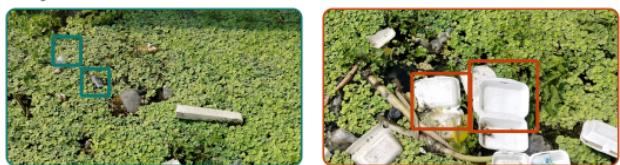
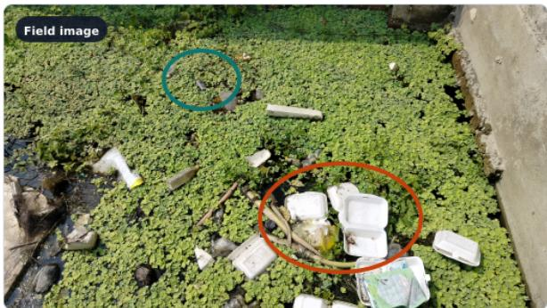
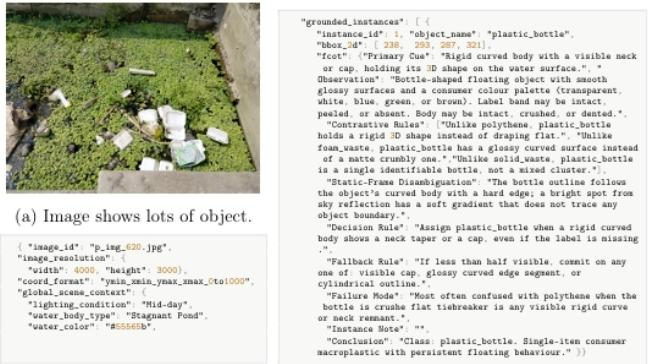
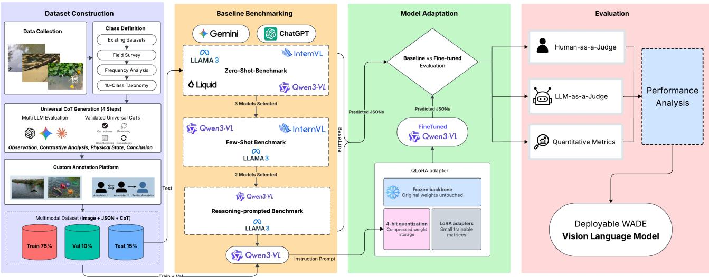

# WADE: A Reasoning-Annotated Benchmark for Multi-Instance Floating-Waste Grounding with Compact Vision-Language Models

Md. Asaduzzaman Shuvo, Ahsan Farabi, Md. Abdul Ahad Minhaz, Mahedi Hasan†, Israt Khandaker†, Ibrahim Khalil Shanto, Muhammad Nomani Kabir United International University

Emails: {ashuvo221104,afarabi221266,mminhaz213072,mhasan221119,ikhandaker221263,ishanto213193}@bscse.uiu.ac.bd \*Corresponding author: Muhammad Nomani Kabir, kabir@cse.uiu.ac.bd †contributed equally to this work.

## Abstract

Floating waste in inland waterways threatens aquatic ecosystems and requires timely monitoring under cluttered, multi-object conditions. Existing aquatic-waste datasets provide limited geographic coverage, sparse multi-instance annotations, and little supervision beyond boxes and labels. Compact vision-language models (VLMs) therefore remain insufficiently evaluated for jointly localizing, classifying, counting, and explaining floating waste. We introduce WADE, a reasoning-annotated benchmark containing 2,167 images from rural Bangladesh, 13,608 bounding boxes, and ten waste categories. Each annotation is associated with class-level recognition rules covering visual cues, likely confusions, and discriminative features. We evaluate six VLMs under zero-shot, two-shot, reasoning-guided, and fine-tuned settings using detection, counting, and hallucination metrics. For resource-efficient adaptation, we jointly fine-tune Qwen3-VL-2B on boxes, labels, and reasoning chains using QLoRA. Fine-tuning increases recall from 0.0248 to 0.2339 and F1from 0.0257 to 0.2163, while reducing image-level hallucination from 0.6836 to 0.0883. However, over three-quarters of instances remain undetected, establishing WADE as a challenging benchmarkfor densefloating-waste grounding with compact VLMs.

## 1. Introduction

Floating waste in ponds, rivers, and canals threatens aquatic ecosystems and contributes to the movement of land-based pollution into marine environments [8, 17]. Computer vision offers a scalable alternative to manual monitoring, and datasets such as TACO [20] and FloW [5] have supported litter and floating-waste detection. Nevertheless, real watersurface images remain challenging because waste objects

Can a compact VLM find every piece of floating waste?  
  
Why the scene is difficult  
Tiny objects blend into vegetation  Crowding hides boundaries

Figure 1. Overview of the WADE task. Floating-waste instances can be small, crowded, partially occluded, and visually similar to surrounding vegetation. Given a field image, a compact visionlanguage model must ground each visible instance and provide its bounding box, category label, and visual reasoning.

are often small, visually similar to vegetation, partially submerged, overlapping, and unevenly distributed across the scene, as illustrated in Fig. 1. Vision-language models (VLMs) can combine recognition, spatial grounding, and textual explanation within a single generative interface [2, 14]. However, identifying one salient object is different from grounding every visible instance. In cluttered scenes, VLMs may miss small objects, generate inaccurate boxes, or predict categories unsupported by the image. Such object hallucination is a known limitation of generative visionlanguage systems [13, 22]. Visual reasoning annotations may help connect predictions with discriminative image evidence [23], but their role in multi-instance floating-waste grounding remains underexplored.

We introduce WADE, a reasoning-annotated benchmark for multi-instance floating-waste grounding with compact VLMs. WADE contains 2,167 in-situ images from rural Bangladeshi waterways, 13,608 bounding boxes, and ten categories, with an average of 6.28 instances per image. Each instance is associated with a structured class-level reasoning chain describing a primary visual cue, a confusable category, and a separating rule. We evaluate six VLMs under zero-shot, two-shot, reasoning-prompted, and finetuned settings. Joint QLoRA fine-tuning [6] of Qwen3-VL-2B increases recall from 0.0248 to 0.2339 and class-aware F1 from 0.0257 to 0.2163, while reducing image-level hallucination from 0.6836 to 0.0883. However, most annotated instances remain undetected, showing that the task is still far from solved. Because boxes, labels, and reasoning are used jointly during fine-tuning, these improvements should not be attributed to reasoning alone. Our contributions are:

• WADE dataset: A real-world multi-instance floatingwaste benchmark containing 2,167 images, 13,608 bounding-box annotations, and ten categories collected from rural waterways in Bangladesh.

• Reasoning annotations: A structured class-level reasoning schema that captures primary visual cues, likely confusions, contrastive rules, and fallback evidence for each waste category.

• Comprehensive VLM evaluation: A systematic evaluation of six VLMs under zero-shot, two-shot, reasoningguided, and QLoRA fine-tuned settings using grounding, counting, and hallucination metrics.

• Empirical findings: Evidence that joint in-domain supervision improves Qwen3-VL-2B recall from 0.0248 to 0.2339 and reduces image-level hallucination from 0.6836 to 0.0883, while showing that exhaustive grounding in cluttered waterways remains unresolved.

## Data and Code Availability

The WADE dataset, annotations, split files, prompts, evaluation code, and fine-tuning implementation will be made publicly available upon acceptance.

## 2. Related Work

Previous research has studied waste detection across several imaging platforms. A camera-based system for monitoring floating plastics in rivers demonstrated the feasibility of continuous automated observation while identifying reflections, organic material, and environmental variation as important challenges [24]. At a substantially larger scale, MARIDA introduced multispectral Sentinel-2 imagery with pixel-level annotations for distinguishing marine debris from water, vegetation, foam, ships, and other surface features [11]. Waste detection has also been investigated in highly cluttered industrial environments. The ZeroWaste dataset, for example, focuses on detecting and segmenting deformable, overlapping, and partially transparent waste objects [4]. These studies primarily formulate waste analysis as detection or segmentation. In contrast, WADE considers multi-instance grounding in low-resolution waterway images, requiring compact vision-language models to enumerate visible waste objects and jointly produce their locations, labels, and supporting descriptions.

Language-guided detection connects visual localization with natural-language concepts [10]. GLIP unifies object detection and phrase grounding through language-aware pre-training [12], while Grounding DINO extends this direction to open-set localization using category names or referring expressions [15]. More recently, GLaMM integrates multimodal generation with pixel-level grounding, enabling textual responses that are linked to localized image regions [21]. These methods demonstrate strong generalpurpose grounding capabilities, but environmental monitoring introduces additional difficulties: objects may be small, visually degraded, densely distributed, or easily confused with reflections and natural debris. WADE therefore evaluates whether compact generative vision-language models can produce a complete structured response containing multiple boxes, category labels, and short category-level rationales under such conditions.

Environmental datasets are increasingly incorporating language in addition to conventional visual annotations. Most closely related to our annotation perspective, VisText-Mosquito combines object detection, water-surface segmentation, and natural-language explanations for identifying mosquito breeding environments [7]. It shows the value of connecting environmental observations with interpretable textual information rather than providing spatial annotations alone. WADE explores this idea in a different setting: dense floating-waste scenes in rural waterways. Its annotations associate multiple object-level bounding boxes and waste labels with category-level discriminative rationales, supporting evaluation across detection, recognition, structured response generation, and explanation consistency. Thus, WADE complements existing environmental multimodal resources by targeting exhaustive multiinstance grounding with compact vision-language models.

<table><tr><td>Class</td><td>N</td><td>%</td><td>Class</td><td>N</td><td>%</td></tr><tr><td>Water hyacinth</td><td>2,137</td><td>15.7</td><td>Algal bloom</td><td>1,110</td><td>8.2</td></tr><tr><td>Plastic bottle</td><td>1,933</td><td>14.2</td><td>Solid waste</td><td>1,008</td><td>7.4</td></tr><tr><td>Organic waste</td><td>1,605</td><td>11.8</td><td>Fabric waste</td><td>976</td><td>7.2</td></tr><tr><td>Industrial waste</td><td>1,563</td><td>11.5</td><td>Wood debris</td><td>887</td><td>6.5</td></tr><tr><td>Polythene</td><td>1,525</td><td>11.2</td><td>Foam waste</td><td>864</td><td>6.3</td></tr><tr><td>Images: 2,167</td><td colspan="5">Mean: 6.28 instances/image</td></tr></table>

Table 1. Distribution of WADE’s 13,608 annotated instances.

## 3. The WADE Dataset

WADE is a multi-instance grounding dataset for floatingwaste recognition in unconstrained waterways. It contains 2,167 field images and 13,608 annotated instances from ten categories, with an average of 6.28 instances per image. Each instance has a bounding box and category label and is associated with a validated class-level reasoning chain.

## 3.1. Collection and Taxonomy

Images were captured using consumer smartphones across ponds, canals, and rivers at 390 geographic locations in rural Bangladesh. The collection covers winter and monsoon conditions together with morning, midday, and low-light scenes. No waste was placed or rearranged during collection; all annotated objects occurred naturally in the waterways.

The taxonomy comprises water hyacinth, plastic bottle, organic waste, industrial waste, polythene, algal bloom, solid waste, fabric waste, wood debris, and foam waste. Biological surface materials are included because they frequently coexist with waste and form difficult visual confounders. Table 1 summarizes the dataset.

## 3.2. Annotations and Validation

Four members of the author team exhaustively annotated every identifiable target object using a dedicated annotation interface. Each annotation contains an object-level bounding box and one of the ten taxonomy labels. Two additional author-team members independently reviewed the boxes and labels, correcting inaccurate or inconsistent annotations. Overall, 95% of the annotations were accepted without modification.

Rather than authoring a separate explanation for every bounding box, WADE defines one scene-invariant reasoning chain for each category. Each chain represents categorylevel recognition knowledge, including the category’s expected appearance, primary visual cues, likely confusions, contrastive decision rules, fallback evidence under partial visibility, and common failure modes. The chain is associated with every instance of its category, while the source image, bounding box, and category label provide instancespecific visual and spatial information.

This design avoids thousands of largely repetitive explanations and provides consistent discriminative supervision for prompting and fine-tuning. However, the chains should be interpreted as category-level recognition guidance rather than fully image-grounded explanations of individual instances. The complete reasoning-chain schema, annotation protocol, and validation procedure are provided in Appendix B.

  
Figure 2. WADE annotation example. Every visible target instance receives a bounding box and category label and is linked to its class-level reasoning chain. Selected reasoning fields are shown for readability.

## 3.3. Dataset Splits

We construct training, validation, and test partitions using a 75/10/15 ratio, producing 1,625, 217, and 325 images, respectively. Partitioning is performed at the water-body level: all images and annotations collected from the same pond, canal, or river site remain within a single partition. Consequently, no collection site appears across the training, validation, and test sets, making the evaluation both image-disjoint and location-disjoint at the collection-site level. Additional collection and annotation details are provided in Appendix A.

## 4. Experimental Setup

We formulate WADE as structured generative grounding. Given an image, a vision-language model must enumerate the visible target instances and return, for each instance, a normalized bounding box, taxonomy label, and associated class-level reasoning chain. We evaluate six VLMs under four regimes: zero-shot inference, two-shot prompting, reasoning-guided prompting, and reasoning-supervised QLoRA fine-tuning.

## 4.1. Models and Output Format

Our evaluation includes four open-weight models: LLaMA-3.2-11B-Vision, InternVL2-2B, Qwen3-VL-2B-Instruct, and LFM2.5-VL-1.6B, together with two commercial APIbased models, GPT-4o-mini and Gemini-2.5-Flash. The model set covers compact architectures between 1.6B and 2B parameters, a larger 11B model, and proprietary systems with undisclosed parameter counts. The compact models are included to examine whether computationally accessible VLMs can perform dense multi-instance grounding in low-resolution waterway images, while LLaMA-3.2- 11B-Vision provides a larger-scale open-weight comparison. GPT-4o-mini and Gemini-2.5-Flash serve as commercial reference systems for evaluating whether stronger general-purpose multimodal capabilities transfer to this specialized environmental domain. Overall, this selection supports comparisons across model scale, accessibility, and adaptation capability.

  
Figure 3. Overview of the WADE methodology. Field images are exhaustively annotated with bounding boxes, taxonomy labels, and class level reasoning chains. Six vision-language models are evaluated under zero-shot, two-shot, reasoning-prompted, and QLoRA fine-tuning regimes. Predictions are assessed using automatic metrics, LLM judges, and blind human evaluation.

All models receive the same task instruction and output schema. A prediction contains a list of grounded instances, with boxes represented as $[ y _ { \mathrm { m i n } } , x _ { \mathrm { m i n } } , y _ { \mathrm { m a x } } , x _ { \mathrm { m a x } } ]$ and normalized to [0, 1000]. Each instance additionally contains one of the ten WADE labels and a structured reasoning chain. Requiring JSON output permits automatic parsing and evaluation across model families. Malformed responses are counted as parse failures and receive zero true positives rather than being removed from the evaluation.

## 4.2. Evaluation Regimes

Zero-shot: We adopt a strict instruction-only zero-shot evaluation protocol, related to established zero-shot and open-vocabulary object-localization settings [3, 18]. Each model receives a single test image and the task instruction, without training examples, in-context demonstrations, or additional category descriptions. This protocol evaluates the model’s pretrained ability to recognize and spatially localize densely distributed floating waste.

Two-shot: Following multimodal in-context learning, the prompt is augmented with two fixed demonstrations from the training set [1]. Each demonstration includes an image and its complete ground-truth output, comprising bounding boxes, labels, and reasoning chains. Because multimodal in-context performance can be sensitive to demonstration selection [16], the same two demonstrations are used for every test image to control for exemplar-induced variation. This regime is evaluated with LLaMA-3.2-11B-Vision, InternVL2-2B, and Qwen3-VL-2B-Instruct, for which the complete multimodal prompt fits within the available context budget.

Knowledge-guided prompting: Motivated by prior findings that discriminative class descriptions and fine-grained visual descriptors can improve zero-shot recognition and region–text alignment [9, 19], the prompt provides classlevel recognition rules for all ten categories, including their primary visual cues, likely confusions, and contrastive decision rules. No solved image is supplied, and the model parameters remain unchanged. This setting therefore isolates whether textual domain knowledge alone improves visual grounding. We apply it to LLaMA-3.2-11B-Vision and Qwen3-VL-2B-Instruct.

Reasoning-supervised fine-tuning: We fine-tune Qwen3- VL-2B-Instruct using QLoRA [6]. The target is the complete ground-truth JSON containing every instance’s box, label, and associated class-level chain. Instances are ordered by $y _ { \mathrm { m i n } }$ before serialization to provide a consistent target sequence. Loss is applied only to the answer tokens, while the instruction and image tokens are masked.

The vision encoder and base language model remain frozen, and only the low-rank adapters are optimized. We use the checkpoint with the lowest validation loss. Full training settings are reported in Appendix C.3.

Because fine-tuning jointly uses bounding boxes, category labels, and reasoning chains, the observed gains reflect the combined effect of in-domain WADE supervision. Without a box-and-label-only ablation, the independent contribution of reasoning cannot be quantified.

## 4.3. Evaluation Protocol

Predicted and ground-truth boxes are matched one-to-one by descending intersection-over-union (IoU). We report class-aware precision, recall, and F1 at $\mathrm { I o U } \geq 0 . 5 ,$ together with class-agnostic F1 and recall at $\mathrm { I o U } ~ \geq ~ 0 . 7 5$ . Mean IoU is computed only over matched pairs and therefore describes localization quality conditional on a match.

Because the generative models output textual boxes without confidence scores, we do not report average precision, which requires ranking predictions by confidence. Counting performance is measured using mean absolute error (MAE) and root mean squared error (RMSE). Hallucination is measured using instance-level and image-level CHAIR [22].

Three LLM judges compare predicted and ground-truth JSON, while two external, model-blind human evaluators visually compare anonymized predictions against the source images without access to ground-truth annotations. The external evaluators were not involved in dataset construction, annotation validation, or model development. Full protocols are provided in Appendix C.5.

## 5. Results and Analysis

We organize the results around three questions: whether current VLMs can ground dense floating waste without adaptation, whether additional prompting improves their performance, and how strongly domain-specific fine-tuning changes their behaviour.

## 5.1. Dense Grounding Performance

Table 2 reports grounding performance on the WADE test set. All zero-shot models perform poorly at IoU = 0.5, demonstrating that dense floating-waste grounding is difficult even for large and commercial VLMs. Gemini-2.5- Flash is the strongest zero-shot model, with an F1 of 0.1174, while Qwen3-VL-2B is the strongest compact open model, with an F1 of 0.0257.

The low recall does not always result from generating too few predictions. Qwen3-VL-2B, LLaMA-3.2-11B, and Gemini-2.5-Flash produce box-count ratios of 0.93, 0.94, and 0.92, respectively. Thus, they generate approximately as many boxes as the number of annotated objects, but only a small fraction are correctly localized. For example,

Qwen3-VL-2B produces 93% of the ground-truth count but recalls only 2.48% of instances. Removing the class constraint raises its F1 only from 0.0257 to 0.0347, indicating that incorrect localization, rather than label disagreement alone, is the dominant failure.

The models also exhibit different generation behaviours. GPT-4o-mini is conservative, producing only 0.45 boxes per annotated instance and obtaining low recall. Conversely, InternVL2-2B produces more than twice the annotated count but achieves only 0.0022 precision. Performance decreases further at $\mathrm { I o U } = 0 . 7 5$ , showing that even some matched boxes are only loosely aligned.

## 5.2. Prompting Encourages Conservative Outputs

Two-shot prompting does not consistently improve grounding. Qwen3-VL-2B declines from 0.0257 zero-shot F1 to 0.0077, while InternVL2-2B’s box-count ratio collapses from 2.09 to 0.15. LLaMA-3.2-11B is the only model whose recall increases, from 0.0066 to 0.0122, but its precision remains close to zero. These results suggest that examples of the required output structure are insufficient to recover dense visual localization.

Reasoning-guided prompting produces a clearer precision–recall trade-off. For Qwen3-VL-2B, precision improves from 0.0267 to 0.0385 and class-agnostic F1 increases from 0.0347 to 0.0403. Its image-level hallucination rate also falls from 0.6836 to 0.3077. However, recall decreases from 0.0248 to 0.0137, while the box-count ratio falls from 0.93 to 0.36. LLaMA-3.2-11B shows a similar reduction in output count. Supplying discriminative rules therefore makes predictions more conservative but does not recover the many small or occluded instances missed by the models.

## 5.3. Effect of Reasoning-Supervised Fine-Tuning

Fine-tuning produces the strongest improvement across the evaluated regimes. Relative to zero-shot Qwen3-VL-2B, precision increases from 0.0267 to 0.2011, while recall increases from 0.0248 to 0.2339, corresponding to approximately 7.5× and 9.4× gains. F1 increases from 0.0257 to 0.2163, and recall at the stricter IoU threshold of 0.75 rises from 0.0107 to 0.1041. The predicted-to-ground-truth count ratio becomes 1.16, indicating slight over-generation but substantially better spatial grounding.

The fine-tuned 2B model also exceeds Gemini-2.5-Flash, the strongest zero-shot commercial system, in precision (0.2011 versus 0.1225), recall (0.2339 versus 0.1127), and F1 (0.2163 versus 0.1174). This result demonstrates the value of domain-specific supervision for compact VLMs. However, because our current experiments do not include box-and-label-only fine-tuning, the improvement must be attributed to the complete WADE supervision package rather than to the reasoning chains alone.

<table><tr><td></td><td></td><td colspan="6">Grounding</td><td colspan="2">Hallucination</td><td colspan="2">Counting Error</td></tr><tr><td>Regime</td><td>Model</td><td>P.5 ↑</td><td> $\mathbf { R . 5 } \ ^ { \cdot }$  ↑</td><td>F1.5 ↑</td><td> $\mathbf { F 1 } _ { \mathrm { a g } } \uparrow$ </td><td> $\mathbf { R . 7 5 }$  ←</td><td> $\mathbf { N _ { p } } / \mathbf { N _ { g } }$ </td><td>CHAIR↓</td><td>CHAIRs↓</td><td>MAE↓</td><td>RMSE↓</td></tr><tr><td>Zero-shot</td><td>LLaMA-3.2-11B†</td><td>.0070</td><td>.0066</td><td>.0068</td><td>.0123</td><td>.0027</td><td>.94</td><td>.7621</td><td>.9839</td><td>2.187</td><td>3.610</td></tr><tr><td>Zero-shot</td><td>InternVL2-2B†</td><td>.0022</td><td>.0046</td><td>.0030</td><td>.0043</td><td>.0000</td><td>2.09</td><td>.8639</td><td>.9960</td><td>4.325</td><td>5.232</td></tr><tr><td>Zero-shot</td><td>Qwen3-VL-2B†</td><td>.0267</td><td>.0248</td><td>.0257</td><td>.0347</td><td>.0107</td><td>.93</td><td>.6722</td><td>.6836</td><td>2.540</td><td>3.889</td></tr><tr><td>Zero-shot</td><td>LFM2.5-VL-1.6B†</td><td>.0031</td><td>.0048</td><td>.0043</td><td>.0110</td><td>.0019</td><td>1.55</td><td>.8374</td><td>.5291</td><td>3.430</td><td>5.739</td></tr><tr><td>Zero-shot</td><td>GPT-4o-mini‡</td><td>.0339</td><td>.0153</td><td>.0211</td><td>.0293</td><td>.0013</td><td>.45</td><td>.5817</td><td>.4679</td><td>1.954</td><td>3.597</td></tr><tr><td>Zero-shot</td><td>Gemini-2.5-Flash‡</td><td>.1225</td><td>.1127</td><td>.1174</td><td>.2008</td><td>.0545</td><td>.92</td><td>.6561</td><td>.7822</td><td>1.366</td><td>1.893</td></tr><tr><td>Two-shot</td><td>LLaMA-3.2-11B†</td><td>.0100</td><td>.0122</td><td>.0110</td><td>.0150</td><td>.0010</td><td>1.22</td><td>.6721</td><td>.3876</td><td>2.725</td><td>4.426</td></tr><tr><td>Two-shot</td><td>InternVL2-2B†</td><td>.0201</td><td>.0030</td><td>.0052</td><td>.0087</td><td>.0010</td><td>.15</td><td>.7651</td><td>.3855</td><td>3.424</td><td>5.525</td></tr><tr><td>Two-shot</td><td>Qwen3-VL-2B†</td><td>.0085</td><td>.0070</td><td>.0077</td><td>.0096</td><td>.0052</td><td>.82</td><td>.7176</td><td>.5278</td><td>3.069</td><td>4.111</td></tr><tr><td>Reasoning</td><td>LLaMA-3.2-11B†</td><td>.0149</td><td>.0108</td><td>.0125</td><td>.0136</td><td>.0072</td><td>.72</td><td>.6791</td><td>.9381</td><td>2.218</td><td>4.155</td></tr><tr><td>Reasoning</td><td>Qwen3-VL-2B†</td><td>.0385</td><td>.0137</td><td>.0202</td><td>.0403</td><td>.0082</td><td>.36</td><td>.6692</td><td>.3077</td><td>2.523</td><td>3.610</td></tr><tr><td>Fine-tuned</td><td>Qwen3-VL-2B↑</td><td>.2011</td><td>.2339</td><td>.2163</td><td>.2692</td><td>.1041</td><td>1.16</td><td>.2402</td><td>.0883</td><td>2.934</td><td>4.214</td></tr></table>

Table 2. Grounding, hallucination, and counting performance on the WADE test set. Grounding metrics use class-aware matching unless marked class-agnostic $( F 1 _ { \mathrm { a g } } ) . \ N _ { p } / N _ { g }$ is the ratio between predicted and ground-truth instance counts. CHAIR measures unsupported predictions. † denotes open-source and ‡ commercial models. Best values are shown in bold.

## 5.4. Hallucination and Counting

Table 2 reports hallucination and counting errors. Zeroshot models frequently generate unsupported objects. InternVL2-2B and LLaMA-3.2-11B produce at least one hallucinated instance in 99.60% and 98.39% of test images, respectively. Zero-shot Qwen3-VL-2B obtains CHAIR = 0.6836.

Fine-tuning reduces Qwen3-VL-2B’s instance-level CHAIR from 0.6722 to 0.2402 and image-level CHAIR from 0.6836 to 0.0883. Therefore, fewer than 9% of test images contain an unsupported prediction after fine-tuning, compared with more than 68% before adaptation.

This improvement does not extend to counting accuracy. Fine-tuned Qwen3-VL-2B obtains an MAE of 2.934, compared with 2.540 before fine-tuning and 1.366 for Gemini-2.5-Flash. Correct enumeration and correct localization are therefore partially separable: a model may predict a reasonable number of boxes while placing them incorrectly, or improve grounding without achieving the lowest count error.

## 5.5. Judge and Human Evaluation

The judge-based and human assessments support the automatic results. The fine-tuned model ranks first on box quality, reasoning quality, and hallucination control under both protocols. The LLM panel assigns it scores of 6.8, 8.5, and 7.4, respectively, while the two blind human raters assign 7.5, 7.5, and 8.5.

Across all systems, reasoning scores are higher than boxquality scores. For example, Gemini-2.5-Flash receives 7.8 for reasoning but only 4.1 for box quality from the LLM panel. Similarly, reasoning-prompted Qwen3-VL-2B receives 8.0 for reasoning but 4.3 for boxes. This confirms the central quantitative finding: current VLMs can produce plausible descriptions of waste categories more reliably than they can spatially ground the relevant objects.

The judge and human evaluations agree on the overall model ranking but differ in score magnitude. We therefore treat judge scores as comparative evidence rather than absolute measurements. The complete judge and human results are reported in Appendix D.

## 5.6. Remaining Difficulty

Despite the improvement from fine-tuning, WADE remains far from solved. The best model recalls only 23.39% of instances at IoU 0.5 and 10.41% at IoU 0.75. In other words, it misses more than three-quarters of annotated objects under the standard threshold and nearly nine out of ten under stricter localization. The remaining gap is particularly important for environmental monitoring, where missed small or partially occluded waste objects may accumulate across a waterway. These results position WADE as a challenging benchmark for future work on dense, low-resolution grounding rather than a saturated detection task.

## 6. Discussion

Our experiments reveal a substantial gap between describing an object and spatially grounding it. Several zeroshot models generate approximately the correct number of boxes, yet only a small fraction overlap the annotated instances. Relaxing class-aware matching produces only limited improvement, indicating that the central difficulty is inaccurate localization rather than taxonomy confusion alone. This behaviour is likely associated with the visual characteristics of WADE: objects are frequently small, crowded, partially occluded, and weakly separated from water, vegetation, and reflections.

Prompting does not resolve this limitation. Two-shot examples generally decrease performance, suggesting that demonstrations of the output format cannot compensate for inadequate visual grounding. Reasoning-guided prompting improves precision and hallucination control for Qwen3- VL-2B but simultaneously reduces recall and the number of generated boxes. Providing discriminative rules therefore makes the model more selective: it produces fewer, more cautious predictions while missing additional objects. In dense environmental scenes, this precision–recall trade-off is undesirable because exhaustive enumeration is essential for reliable monitoring.

Domain-specific fine-tuning produces a different outcome. Fine-tuned Qwen3-VL-2B improves precision, recall, strict-IoU recall, and hallucination control simultaneously, outperforming the strongest evaluated commercial model despite its compact size. This result suggests that, for specialized environmental perception, targeted supervision can be more valuable than model scale alone. Nevertheless, the current experiment jointly supervises bounding boxes, labels, and class-level reasoning chains. Because we do not include a box-and-label-only fine-tuning condition, the improvement should be attributed to the complete WADE supervision package rather than to reasoning annotations in isolation.

The judged evaluations expose a second important gap. Both LLM judges and human raters assign higher scores to generated reasoning than to bounding-box quality. A model can articulate a plausible visual cue or contrastive rule even when its predicted coordinates are inaccurate. Fluent reasoning should therefore not be treated as evidence of successful visual grounding; geometric metrics and qualitative inspection remain necessary.

Finally, WADE is far from saturated. The best system recalls only 23.39% of instances at IoU 0.5 and 10.41% at IoU 0.75. These results establish a useful baseline while leaving substantial room for improvements in small-object representation, resolution-aware visual encoding, dense-instance enumeration, and localization-aware multimodal training. Future experiments with box-and-label-only supervision, dedicated detectors, and geographically disjoint evaluation will be necessary to determine which components drive generalization and whether the observed gains transfer to unseen waterways.

## 7. Limitations

WADE has several limitations that define the scope of its current findings. First, the fine-tuning experiment jointly supervises bounding boxes, category labels, and class-level reasoning chains. Because a box-and-label-only fine-tuning condition was not evaluated, the contribution of reasoning annotations cannot be isolated from the broader effect of domain-specific supervision. The current study also does not include comparisons with specialized detectors such as YOLO or DETR; consequently, the results characterize generative VLM grounding rather than superiority over taskspecific detection architectures.

Second, the dataset split is location-disjoint at the collection-site level, such that images from the same pond, canal, or river site cannot occur across different partitions. However, all collection sites are located in rural Bangladesh and may share broader regional characteristics. Consequently, the current evaluation does not establish generalization to other countries, urban drainage systems, coastal environments, or different image-capture platforms.

Third, WADE uses one scene-invariant reasoning chain per category. This provides consistent and scalable supervision but does not capture instance-specific factors such as unusual deformation, severe occlusion, or scene-dependent ambiguity. Although boxes and labels were independently reviewed and 95% were accepted without modification, we do not report a formal inter-annotator agreement coefficient.

Finally, the judge panel overlaps with the models used to validate the reasoning annotations, and the two human raters are members of the project team. These conditions may introduce evaluator bias, so judged scores are treated as supporting comparative evidence rather than absolute measures. Results from commercial systems may also change as their underlying APIs are updated. Future work should include independent evaluators, detector baselines, controlled annotation ablations, and geographically disjoint evaluation.

## 8. Conclusion

We introduced WADE, a benchmark for dense floatingwaste grounding with compact vision-language models. WADE contains 2,167 field images and 13,608 annotated instances across ten categories, with each instance assigned a bounding box, category label, and associated class-level reasoning chain. The dataset captures naturally occurring, crowded waterway scenes containing small objects, occlusion, reflections, vegetation, and substantial visual ambiguity. Our evaluation of six VLMs shows that existing models struggle primarily with spatial grounding. Zero-shot models often generate a plausible number of objects but place their boxes incorrectly, while two-shot and reasoning-guided prompting do not consistently improve recall. Reasoning-supervised QLoRA fine-tuning substantially improves precision, recall, strict-IoU localization, and hallucination control, allowing a compact 2B model to outperform the strongest evaluated commercial zero-shot system. However, the best model still recalls fewer than onequarter of the annotated instances at IoU 0.5, demonstrating that WADE remains far from solved.

## References

[1] Jean-Baptiste Alayrac, Jeff Donahue, Pauline Luc, Antoine Miech, Iain Barr, Yana Hasson, Karel Lenc, Arthur Mensch, Katherine Millican, Malcolm Reynolds, Roman Ring, Eliza Rutherford, Serkan Cabi, Tengda Han, Zhitao Gong,

Sina Samangooei, Marianne Monteiro, Jacob L Menick, Sebastian Borgeaud, Andy Brock, Aida Nematzadeh, Sahand Sharifzadeh, Mikoł aj Binkowski, Ricardo Barreira,´ Oriol Vinyals, Andrew Zisserman, and Karen Simonyan.´ Flamingo: a visual language model for few-shot learning. In Advances in Neural Information Processing Systems, pages 23716–23736. Curran Associates, Inc., 2022. 4

[2] Shuai Bai, Yuxuan Cai, Ruizhe Chen, Keqin Chen, Xionghui Chen, Zesen Cheng, Lianghao Deng, Wei Ding, Chang Gao, Chunjiang Ge, Wenbin Ge, Zhifang Guo, Qidong Huang, Jie Huang, Fei Huang, Binyuan Hui, Shutong Jiang, Zhaohai Li, Mingsheng Li, Mei Li, Kaixin Li, Zicheng Lin, Junyang Lin, Xuejing Liu, Jiawei Liu, Chenglong Liu, Yang Liu, Dayiheng Liu, Shixuan Liu, Dunjie Lu, Ruilin Luo, Chenxu Lv, Rui Men, Lingchen Meng, Xuancheng Ren, Xingzhang Ren, Sibo Song, Yuchong Sun, Jun Tang, Jianhong Tu, Jianqiang Wan, Peng Wang, Pengfei Wang, Qiuyue Wang, Yuxuan Wang, Tianbao Xie, Yiheng Xu, Haiyang Xu, Jin Xu, Zhibo Yang, Mingkun Yang, Jianxin Yang, An Yang, Bowen Yu, Fei Zhang, Hang Zhang, Xi Zhang, Bo Zheng, Humen Zhong, Jingren Zhou, Fan Zhou, Jing Zhou, Yuanzhi Zhu, and Ke Zhu. Qwen3-vl technical report, 2025. 2

[3] Ankan Bansal, Karan Sikka, Gaurav Sharma, Rama Chellappa, and Ajay Divakaran. Zero-shot object detection. In Computer Vision – ECCV 2018, pages 397–414, Cham, 2018. Springer International Publishing. 4

[4] Dina Bashkirova, Mohamed Abdelfattah, Ziliang Zhu, James Akl, Fadi Alladkani, Ping Hu, Vitaly Ablavsky, Berk Calli, Sarah Adel Bargal, and Kate Saenko. Zerowaste dataset: Towards deformable object segmentation in cluttered scenes. In 2022 IEEE/CVF Conference on Computer Vision and Pattern Recognition (CVPR), pages 21115–21125, 2022. 2

[5] Yuwei Cheng, Jiannan Zhu, Mengxin Jiang, Jie Fu, Changsong Pang, Peidong Wang, Kris Sankaran, Olawale Onabola, Yimin Liu, Dianbo Liu, and Yoshua Bengio. Flow: A dataset and benchmark for floating waste detection in inland waters. In 2021 IEEE/CVF International Conference on Computer Vision (ICCV), pages 10933–10942, 2021. 1

[6] Tim Dettmers, Artidoro Pagnoni, Ari Holtzman, and Luke Zettlemoyer. Qlora: Efficient finetuning of quantized llms. In Advances in Neural Information Processing Systems, pages 10088–10115. Curran Associates, Inc., 2023. 2, 4

[7] Md. Adnanul Islam, Md. Faiyaz Abdullah Sayeedi, Md. Asaduzzaman Shuvo, Shahanur Rahman Bappy, Muhammad Ziaur Rahman, Md Asiful Islam, and Swakkhar Shatabda. Vistext-mosquito: A unified multimodal dataset for visual detection, segmentation, and textual explanation on mosquito breeding sites. In Proceedings ofthe IEEE/CVF Conference on Computer Vision and Pattern Recognition (CVPR) Workshops, pages 9165–9173, 2026. 2

[8] Jenna R. Jambeck, Roland Geyer, Chris Wilcox, Theodore R. Siegler, Miriam Perryman, Anthony Andrady, Ramani Narayan, and Kara Lavender Law. Plastic waste inputs from land into the ocean. Science, 347(6223):768–771, 2015. 1

[9] Sheng JIn, Xueying Jiang, Jiaxing Huang, Lewei Lu, and Shijian Lu. Llms meet vlms: Boost open vocabulary object detection with fine-grained descriptors. In International

Conference on Learning Representations, pages 8734–8745, 2024. 4

[10] Aishwarya Kamath, Mannat Singh, Yann LeCun, Gabriel Synnaeve, Ishan Misra, and Nicolas Carion. Mdetr - modulated detection for end-to-end multi-modal understanding. In 2021 IEEE/CVF International Conference on Computer Vision (ICCV), pages 1760–1770, 2021. 2

[11] Katerina Kikaki, Ioannis Kakogeorgiou, Paraskevi Mikeli, Dionysios E. Raitsos, and Konstantinos Karantzalos. Marida: A benchmark for marine debris detection from sentinel-2 remote sensing data. PLOS ONE, 17(1):1–20, 2022. 2

[12] Liunian Harold Li, Pengchuan Zhang, Haotian Zhang, Jian wei Yang, Chunyuan Li, Yiwu Zhong, Lijuan Wang, Lu Yuan, Lei Zhang, Jenq-Neng Hwang, Kai-Wei Chang, and Jianfeng Gao. Grounded language-image pre-training. In 2022 IEEE/CVF Conference on Computer Vision and Pat tern Recognition (CVPR), pages 10955–10965, 2022. 2

[13] Yifan Li, Yifan Du, Kun Zhou, Jinpeng Wang, Xin Zhao, and Ji-Rong Wen. Evaluating object hallucination in large visionlanguage models. In Proceedings of the 2023 Conference on Empirical Methods in Natural Language Processing, pages 292–305, Singapore, 2023. Association for Computational Linguistics. 2

[14] Haotian Liu, Chunyuan Li, Yuheng Li, and Yong Jae Lee. Improved baselines with visual instruction tuning. In 2024 IEEE/CVF Conference on Computer Vision and Pattern Recognition (CVPR), pages 26286–26296, 2024. 2

[15] Shilong Liu, Zhaoyang Zeng, Tianhe Ren, Feng Li, Hao Zhang, Jie Yang, Qing Jiang, Chunyuan Li, Jianwei Yang, Hang Su, Jun Zhu, and Lei Zhang. Grounding dino: Marry ing dino with grounded pre-training for open-set object de tection. In Computer Vision – ECCV 2024, pages 38–55, Cham, 2025. Springer Nature Switzerland. 2

[16] Yang Luo, Zangwei Zheng, Zirui Zhu, and Yang You. How does the textual information affect the retrieval of multi modal in-context learning? In Proceedings ofthe 2024 Con ference on Empirical Methods in Natural Language Processing, pages 5321–5335, Miami, Florida, USA, 2024. Association for Computational Linguistics. 4

[17] Lourens J. J. Meijer, Tim van Emmerik, Ruud van der Ent, Christian Schmidt, and Laurent Lebreton. More than 1000 rivers account for 80% of global riverine plastic emissions into the ocean. Science Advances, 7(18):eaaz5803, 2021. 1

[18] Matthias Minderer, Alexey Gritsenko, Austin Stone, Maxim Neumann, Dirk Weissenborn, Alexey Dosovitskiy, Aravindh Mahendran, Anurag Arnab, Mostafa Dehghani, Zhuoran Shen, Xiao Wang, Xiaohua Zhai, Thomas Kipf, and Neil Houlsby. Simple open-vocabulary object detection. In Com puter Vision – ECCV 2022, pages 728–755, Cham, 2022. Springer Nature Switzerland. 4

[19] Sarah Pratt, Ian Covert, Rosanne Liu, and Ali Farhadi. What does a platypus look like? generating customized prompts for zero-shot image classification. In 2023 IEEE/CVF International Conference on Computer Vision (ICCV), pages 15645–15655, 2023. 4

[20] Pedro F Proenc¸a and Pedro Simoes. Taco: Trash annotations˜ in context for litter detection, 2020. 1

[21] Hanoona Rasheed, Muhammad Maaz, Sahal Shaji, Abdelrahman Shaker, Salman Khan, Hisham Cholakkal, Rao M. Anwer, Eric Xing, Ming-Hsuan Yang, and Fahad S. Khan. Glamm: Pixel grounding large multimodal model. In 2024 IEEE/CVF Conference on Computer Vision and Pattern Recognition (CVPR), pages 13009–13018, 2024. 2

[22] Anna Rohrbach, Lisa Anne Hendricks, Kaylee Burns, Trevor Darrell, and Kate Saenko. Object hallucination in image captioning. In Proceedings of the 2018 Conference on Empirical Methods in Natural Language Processing, pages 4035– 4045, Brussels, Belgium, 2018. Association for Computational Linguistics. 2, 5, 11

[23] Hao Shao, Shengju Qian, Han Xiao, Guanglu Song, Zhuofan Zong, Letian Wang, Yu Liu, and Hongsheng Li. Visual cot: Advancing multi-modal language models with a comprehensive dataset and benchmark for chain-of-thought reasoning. In Advances in Neural Information Processing Systems, pages 8612–8642. Curran Associates, Inc., 2024. 2

[24] Colin van Lieshout, Kees van Oeveren, Tim van Emmerik, and Eric Postma. Automated river plastic monitoring using deep learning and cameras. Earth and Space Science, 7(8):e2019EA000960, 2020. e2019EA000960 10.1029/2019EA000960. 2

## A. Extended WADE Dataset Details

## A.1. Collection Conditions

WADE contains 2,167 images collected from approximately 500 ponds, canals, and rivers across 390 geographic locations in rural Bangladesh. Most original images were captured at a resolution of 3096 × 4128 pixels using consumer smartphones. The use of readily available cameras reflects a practical monitoring setting rather than a specialized sensor configuration.

The collection covers two major seasonal conditions: 1,000 images were captured during winter and 1,167 during the monsoon season. It also includes 680 morning, 950 midday, and 537 low-light images. These variations introduce reflections, shadows, turbidity, illumination changes, vegetation overlap, partial occlusion, and weak object boundaries. No waste was introduced, repositioned, or staged for photography.

In addition to object annotations, the annotation interface records four image-level attributes: lighting condition, water-body type, primary pollutant, and remediation priority. These attributes provide contextual information about the captured environment but are not used as object categories.

## A.2. Taxonomy Design

The taxonomy was constructed around commonly observed surface materials and their visually confusable alternatives. Water hyacinth and algal bloom are retained even though they are biological materials because they commonly coexist with anthropogenic waste and may obscure or resemble waste instances. Similarly, industrial waste is separated from general solid waste to represent differences in visual composition and potential remediation requirements.

The class distribution is naturally imbalanced. Water hyacinth and plastic bottles are the most frequent classes, whereas foam waste and wood debris appear less frequently. We preserve this distribution to reflect the observed environment rather than balancing the dataset through removal or synthetic resampling.

## B. Annotation and Reasoning Details

## B.1. Bounding-Box Protocol

Annotators were instructed to box every identifiable target instance, including small, partially occluded, and overlapping objects. Bounding boxes were drawn tightly around the visible extent of each object. Objects were not annotated when their visible evidence was insufficient to assign a reliable class. Each record stores the image identifier, image resolution, normalized bounding-box coordinates, category label, and associated class-level reasoning chain.

Two additional authors independently reviewed the completed annotations using a separate validation interface. The review covered box placement, category assignment, and image-level attributes. Incorrect boxes were adjusted, questionable labels were reconsidered, and duplicate or inconsistent annotations were corrected. In total, 95% of annotations were accepted without modification.

## B.2. Reasoning-Chain Schema

WADE defines one validated reasoning chain for each of its ten categories. As described in Section 3.2, these chains encode class-level discriminative knowledge and are shared across instances of the corresponding category. This section provides the complete reasoning-chain structure. Each chain follows a nine-field structure:

1. Primary Cue: the most discriminative visual property;

2. Observation: the category’s expected appearance;

3. Contrastive Rules: differences from confusable classes;

4. Static-Frame Disambiguation: separation from reflections or other imaging artefacts;

5. Decision Rule: the principal classification condition;

6. Fallback Rule: evidence used under partial visibility;

7. Failure Mode: the most likely source of confusion;

8. Instance Note: optional instance-specific information; and

9. Conclusion: a concise category summary.

For example, the reasoning chain for plastic bottle identifies a rigid curved body, neck, or cap as its primary cue. Its contrastive rules separate bottles from flexible polythene, matte or fragmented foam, and mixed solid-waste clusters. The fallback rule permits classification from a visible cap, rigid curved edge, or cylindrical outline when the object is partially occluded.

## B.3. Reasoning Validation

Because textual reasoning cannot be validated using bounding-box agreement, each class-level chain was independently assessed by three language models. Every judge assigned a score between 0 and 10. A chain was accepted only when all three scores were at least 8 and their mean was at least 9. Chains failing either condition were revised and resubmitted until they passed the gate.

This procedure checks whether the cues are visually meaningful, whether the contrastive rules distinguish likely confusions, and whether the chain is internally consistent. However, this validation should not be interpreted as a replacement for human evaluation; it provides a scalable quality-control mechanism for the current class-level rationales.

## B.4. Split Construction

Images are grouped according to their water-body collection site before partitioning. The site groups are assigned to training, validation, and test sets using an approximately 75/10/15 ratio, resulting in 1,625 training images, 217 validation images, and 325 test images. All images and annotations from the same pond, canal, or river site remain within one partition. Therefore, the benchmark prevents imagelevel and collection-site-level overlap across the three partitions.

## C. Extended Experimental Details

## C.1. Prompt and Serialization

All evaluation regimes use the same base instruction, coordinate convention, taxonomy, and JSON schema. The conditioning information changes according to the regime, but the required prediction format remains fixed. For every visible target object, the model must generate an entry containing an instance identifier, category label, normalized bounding box, and structured reasoning chain.

Bounding boxes follow the format

$$
b _ { i } = [ y _ { \operatorname* { m i n } } , x _ { \operatorname* { m i n } } , y _ { \operatorname* { m a x } } , x _ { \operatorname* { m a x } } ] , \qquad b _ { i } \in [ 0 , 1 0 0 0 ] ^ { 4 } .
$$

Normalizing the coordinates allows predictions from models using different internal image resolutions to be evaluated under the same coordinate system. Before finetuning, ground-truth instances are sorted from top to bottom using $y _ { \mathrm { m i n } }$ . This ordering produces a consistent autoregressive target without changing the underlying set of annotations.

A response is considered parseable when it can be converted into the required JSON structure and its predicted instances contain valid coordinates and category fields. Responses that cannot be parsed are retained as failures with zero true positives. This prevents malformed generations from being silently excluded.

## C.2. Evaluation-Regime Details

Zero-shot inference. The input consists of the task instruction and one test image. No demonstrations, categoryspecific reasoning rules, or parameter updates are provided. We evaluate LLaMA-3.2-11B-Vision, InternVL2- 2B, Qwen3-VL-2B-Instruct, LFM2.5-VL-1.6B, GPT-4omini, and Gemini-2.5-Flash in this setting.

Two-shot prompting. Two solved training examples are placed before the test query. Each example contains an image and its complete serialized annotation. The exemplars remain fixed across models and test images. We restrict this experiment to LLaMA-3.2-11B-Vision, InternVL2-2B, and Qwen3-VL-2B-Instruct because the combined images and annotations exceed the practical context budget of the remaining evaluated systems.

Reasoning-guided prompting. For every WADE category, the prompt includes the primary cue, confusable category, and contrastive recognition rule. No example image or solved annotation is included. Thus, the regime evaluates the effect of supplying textual domain knowledge during inference without updating model parameters. We evaluate Qwen3-VL-2B-Instruct and LLaMA-3.2-11B-Vision in this setting.

## C.3. QLoRA Configuration

Qwen3-VL-2B-Instruct is loaded using 4-bit NF4 quantization with double quantization and bfloat16 computation. Low-rank adapters use rank r = 16, scaling parameter α = 32, and dropout 0.05. The adapters are attached to the language model’s attention projections (q, k, v, and o) and feed-forward projections (gate, up, and down). The vision encoder and remaining backbone parameters stay frozen.

The training target is a single serialized JSON sequence containing all ground-truth objects in an image. The loss is masked over the prompt and image tokens and calculated only over the target response. Training uses the following configuration:

Gradient checkpointing is enabled to reduce memory consumption. Only adapter parameters are updated. We refer to this setting as reasoning-supervised fine-tuning, not knowledge distillation, because the targets are derived from human-authored annotations rather than outputs from a teacher model.

Table 3. QLoRA fine-tuning configuration.
<table><tr><td>Hyperparameter</td><td>Value</td></tr><tr><td>Base model</td><td>Qwen3-VL-2B-Instruct</td></tr><tr><td>Quantization</td><td>4-bit NF4</td></tr><tr><td>LoRA rank</td><td>16</td></tr><tr><td>LoRA α</td><td>32</td></tr><tr><td>LoRA dropout</td><td>0.05</td></tr><tr><td>Epochs</td><td>3</td></tr><tr><td>Learning rate</td><td> $2 \times 1 0 ^ { - 4 }$ </td></tr><tr><td>Per-device batch size</td><td>1</td></tr><tr><td>Gradient accumulation</td><td>8</td></tr><tr><td>Effective batch size</td><td>8</td></tr><tr><td>Warmup ratio</td><td>0.03</td></tr><tr><td>Maximum sequence length</td><td>4,096</td></tr><tr><td>Maximum vision tokens</td><td></td></tr><tr><td></td><td>1,024</td></tr><tr><td>Decoding</td><td>Greedy</td></tr><tr><td>Checkpoint selection</td><td>Lowest validation loss</td></tr></table>

## C.4. Box Matching and Detection Metrics

For every image, pairwise intersection-over-union (IoU) is calculated between each predicted box $b _ { p }$ and ground-truth box $b _ { g }$

$$
\operatorname { I o U } ( b _ { p } , b _ { g } ) = { \frac { | b _ { p } \cap b _ { g } | } { | b _ { p } \cup b _ { g } | } } .
$$

Candidate pairs are sorted by decreasing IoU and matched greedily under a one-to-one constraint. In classaware evaluation, a pair is eligible only when its predicted and ground-truth labels agree. In class-agnostic evaluation, category labels are ignored.

At threshold τ , precision, recall, and F1 are defined as

$$
\begin{array} { c c c } { \displaystyle { P _ { \tau } = \frac { T P _ { \tau } } { T P _ { \tau } + F P _ { \tau } } , } } & { \displaystyle { R _ { \tau } = \frac { T P _ { \tau } } { T P _ { \tau } + F N _ { \tau } } , } } \\ { \displaystyle { } } & { \displaystyle { } } \\ { \displaystyle { F 1 _ { \tau } = \frac { 2 P _ { \tau } R _ { \tau } } { P _ { \tau } + R _ { \tau } } . } } \end{array}
$$

We report class-aware $P _ { 0 . 5 } , \ R _ { 0 . 5 } .$ , and $F 1 _ { 0 . 5 }$ , classagnostic $F 1 _ { 0 . 5 }$ , and class-aware $R _ { 0 . 7 5 }$ . We do not report average precision because the generative VLMs produce textual bounding boxes without confidence scores, preventing confidence-based ranking and threshold sweeping.

We additionally report the predicted-to-ground-truth count ratio,

$$
\frac { N _ { p } } { N _ { g } } = \frac { \sum _ { i = 1 } ^ { N } \hat { n } _ { i } } { \sum _ { i = 1 } ^ { N } n _ { i } } ,
$$

where $\hat { n } _ { i }$ and $n _ { i }$ denote the predicted and ground-truth instance counts for image $i ,$ respectively. A value below one indicates under-generation, whereas a value above one indicates over-generation.

Counting accuracy is measured using mean absolute error (MAE) and root mean squared error (RMSE):

$$
\mathrm { M A E } = \frac { 1 } { N } \sum _ { i = 1 } ^ { N } | \hat { n } _ { i } - n _ { i } | ,
$$

$$
\mathrm { R M S E } = \sqrt { \frac { 1 } { N } \sum _ { i = 1 } ^ { N } ( \hat { n } _ { i } - n _ { i } ) ^ { 2 } } .
$$

Hallucination is evaluated using CHAIR [22]. We report the fraction of generated instances unsupported by the ground-truth annotations, denoted by $\mathrm { C H A I R } _ { i } ,$ , and the fraction of images containing at least one unsupported prediction, denoted by $\mathrm { C H A I R } _ { s }$ . Lower values indicate better hallucination control.

## C.5. Judge-Based and Human Evaluation

LLM-as-judge evaluation. We use Gemini-3.5-Flash, GPT-5.4, and Claude-Opus-4.8 as three separate judges. For each test image, every judge receives the predicted JSON and corresponding ground-truth JSON. Model identity and evaluation regime are removed, and the raw image is not provided.

Each prediction is scored from 0 to 10 along three dimensions:

• Box agreement: correspondence between the predicted and ground-truth instances and alignment of their serialized bounding-box coordinates;

• Reasoning consistency: agreement of the predicted cues, likely confusions, and discriminative rules with the reference class-level reasoning chains; and

• Hallucination control: the extent to which predicted instances correspond to ground-truth objects rather than unsupported predictions.

Scores are averaged across the test images and then across the three judges. No acceptance threshold is applied. Because the judges receive serialized annotations without the raw image, their scores measure reference-based agreement rather than direct visual correctness. We therefore treat them as comparative evidence alongside the geometric grounding metrics.

Human comparative evaluation. Two external evaluators independently perform a comparative visual evaluation of seven selected model–regime conditions: zero-shot outputs from five models, together with the reasoning-guided and fine-tuned Qwen3-VL-2B conditions. Few-shot outputs are not included. The evaluators were not involved in dataset construction, annotation validation, model development, or LLM-based judging.

For each test image, the evaluators are shown the source image alongside the anonymized predictions, including bounding boxes, category labels, and reasoning chains.

Ground-truth annotations, model identities, and evaluationregime names are hidden. The evaluators compare the predictions with one another and determine which outputs correspond more accurately to the visible content of the source image.

After reviewing the complete test-set outputs, each evaluator assigns a comparative score from 0 to 10 to every model–regime condition along three dimensions:

• Box quality: the relative accuracy and coverage of the predicted boxes over visible waste instances;

• Reasoning quality: the relative relevance and consistency of the generated reasoning with the visible objects and predicted categories; and

• Hallucination control: the relative ability to avoid predicting objects, labels, or boxes unsupported by the visible image.

Higher scores indicate better performance relative to the other anonymized predictions. The evaluators rely only on the source images and model predictions and do not access ground-truth annotations. The final score for each model–regime condition is averaged across the two evaluators. These scores therefore represent external comparative visual assessments rather than absolute geometric accuracy.

## D. Judge and Human Evaluation Results

<table><tr><td>Regime</td><td>Model</td><td>Box</td><td>Reason.</td><td>Halluc.</td></tr><tr><td>Zero-shot</td><td>InternVL2-2B</td><td>2.1</td><td>4.0</td><td>2.5</td></tr><tr><td>Zero-shot</td><td>LLaMA-3.2-11B</td><td>3.0</td><td>5.5</td><td>2.6</td></tr><tr><td>Zero-shot</td><td>Qwen3-VL-2B</td><td>3.6</td><td>6.5</td><td>3.8</td></tr><tr><td>Zero-shot</td><td>GPT-4o-mini</td><td>3.9</td><td>7.0</td><td>5.1</td></tr><tr><td>Zero-shot</td><td>Gemini-2.5-Flash</td><td>4.1</td><td>7.8</td><td>4.2</td></tr><tr><td>Reasoning</td><td>Qwen3-VL-2B</td><td>4.3</td><td>8.0</td><td>5.8</td></tr><tr><td>Fine-tuned</td><td>Qwen3-VL-2B</td><td>6.8</td><td>8.5</td><td>7.4</td></tr></table>

Table 4. LLM-as-judge evaluation averaged over three judges.

<table><tr><td>Regime</td><td>Model</td><td>Box</td><td>Reason.</td><td>Halluc.</td></tr><tr><td>Zero-shot</td><td>InternVL2-2B</td><td>1.5</td><td>3.5</td><td>2.5</td></tr><tr><td>Zero-shot</td><td>LLaMA-3.2-11B</td><td>3.0</td><td>4.0</td><td>3.5</td></tr><tr><td>Zero-shot</td><td>Qwen3-VL-2B</td><td>4.0</td><td>5.5</td><td>3.5</td></tr><tr><td>Zero-shot</td><td>GPT-4o-mini</td><td>4.5</td><td>6.0</td><td>6.5</td></tr><tr><td>Zero-shot</td><td>Gemini-2.5-Flash</td><td>5.0</td><td>7.0</td><td>6.5</td></tr><tr><td>Reasoning</td><td>Qwen3-VL-2B</td><td>4.5</td><td>6.0</td><td>4.5</td></tr><tr><td>Fine-tuned</td><td>Qwen3-VL-2B</td><td>7.5</td><td>7.5</td><td>8.5</td></tr></table>

Table 5. Blind human evaluation averaged over two independent raters.

The fine-tuned model receives the strongest scores on every axis under both evaluation protocols. The LLM panel assigns scores of 6.8, 8.5, and 7.4 for box quality, reasoning quality, and hallucination control, respectively. Human raters assign corresponding scores of 7.5, 7.5, and 8.5.

Both protocols rank Gemini-2.5-Flash as the strongest zero-shot system and the fine-tuned Qwen3-VL-2B as the strongest system overall. However, the differences in score magnitude show that the judge panel is more favourable toward fluent reasoning, while human raters are more sensitive to spatial accuracy and unsupported detections. We therefore interpret judge scores comparatively rather than as absolute quality measurements.