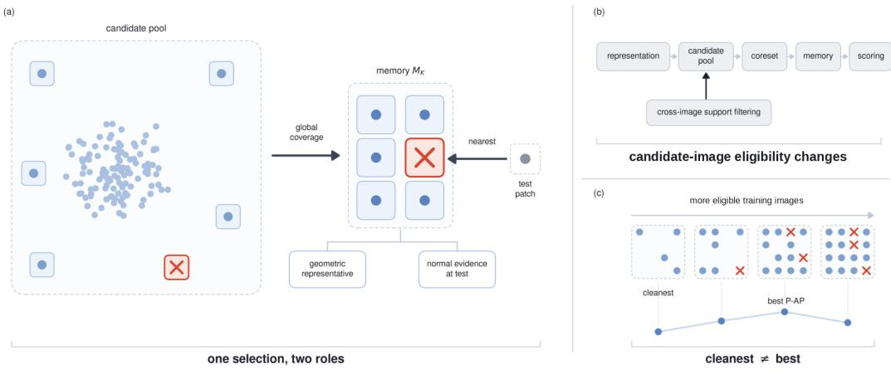
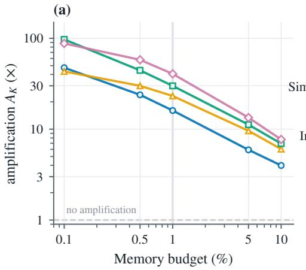
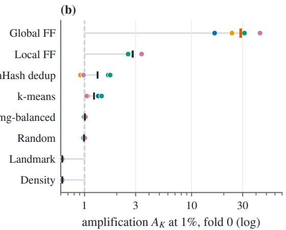
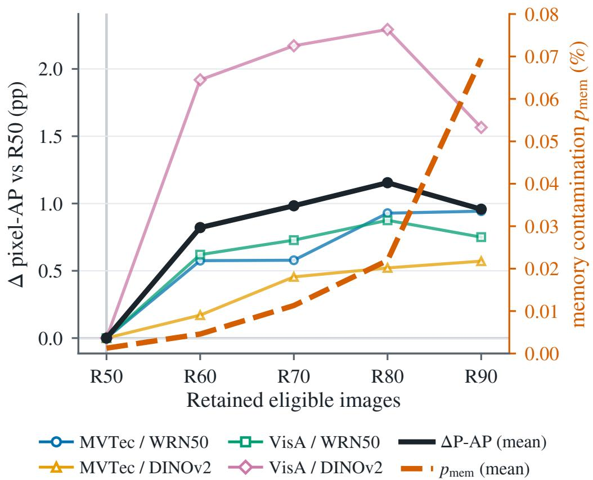
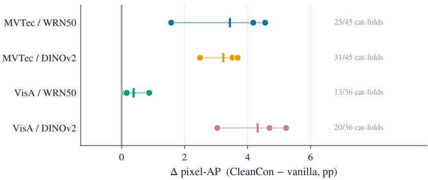
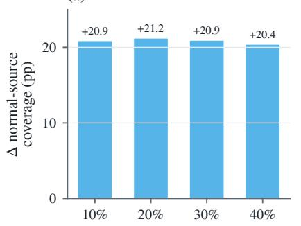
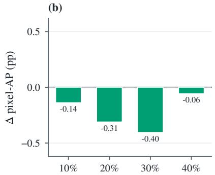

# WHAT MEMORY COMPOSITION DOES NOT TELL US ABOUT ANOMALY DETECTION

Joongwon Chae1,3 Runming Wang1 Peiwu Qin2

1Institute of Biopharmaceutical and Health Engineering,

Tsinghua Shenzhen International Graduate School, Tsinghua University, Shenzhen, China 2Guangdong Provincial Laboratory of Traditional Chinese Medicine,

Hengqin, Guangdong, China

3RatelSoft

## ABSTRACT

Memory-based anomaly detectors store nominal training patches and score test patches against this memory. A patch selected for coverage therefore becomes a normal reference without a separate check that geometric rarity makes it safe to trust. We probe this coupling with sparse training contamination. Under fixed representations and memory budgets, we compare random, medoid, local, and global coverage selectors. We then use CLEANCON, an out-of-bag cross-image support gate that changes candidate-image eligibility while fixing the representation, absolute memory size, builder, and inference rule. Global coverage strongly over-represents sparse contamination. CLEANCON reduces final-memory contamination to approximately zero and increases category-macro P-AP in all 12 matched comparisons. Yet along a retention sweep, the lowest-contamination memory does not attain the highest P-AP; performance continues to improve while contamination rises. Memory contamination therefore does not order the resulting memories by P-AP.Code is publicly available at https://github.com/jw-chae/cleancon.

## 1 INTRODUCTION

Memory-based industrial anomaly detection extracts patch features from nominal training images, stores a compact subset in memory, and identifies anomalies through discrepancies between test patches and the stored features (Cohen & Hoshen, 2021; Defard et al., 2021; Roth et al., 2022). In this family, memory is not merely a compressed training set. Selected patches remain direct normal references at inference time.

PatchCore constructs this memory with an approximate-greedy coreset that seeks broad feature-space coverage (Roth et al., 2022). The sensitivity of coverage objectives to outliers is well known in the literature on k-center and robust clustering (Charikar et al., 2001; Friedler & Mount, 2010; Krishnaswamy et al., 2018). In memory-based anomaly detection, however, this sensitivity has a more direct consequence. A selected center does not disappear into a subsequent optimizer; it remains in the deployed detector as a normal reference.

Sparse contamination provides a simple probe of this coupling (Fig. 1). If a small number of anomalous images enter the nominal training pool, rare patches within them can be attractive to a global coreset. We ask two questions. How strong is this selection bias in the final memory? And does reducing the resulting contaminated references improve the detector?

We compare random sampling, medoid selection, local approximate-greedy farthest-first selection (Local FF), and global farthest-first selection (Global FF) under identical representations and budgets. CLEANCON then ranks each training image by an out-of-bag cross-image projection residual and passes only low-scoring images to the original builder. It changes candidate-image eligibility while fixing the representation, absolute memory size, builder, and inference rule.

Global FF draws substantially more contaminated patches into memory. CLEANCON reduces finalmemory contamination to approximately zero and increases category-macro P-AP in all 12 matched comparisons. Yet along the retention sweep, the lowest-contamination memory does not attain the highest P-AP, and performance continues to improve as contamination rises. Cleaning helps, but purity alone does not order useful memories.

  
Figure 1: One selection, two roles. (a) Selected patches serve global coverage and test-time normal evidence. (b) Candidate-image eligibility changes while the absolute memory size and detector remain fixed. (c) The lowest-contamination memory is not necessarily the best-performing one.

Our main findings are:

• Global coverage strongly over-represents sparse contamination. Random, medoid, and Local FF controls place the strongest effect under Global FF competition across images.

• CLEANCON reduces contamination and raises matched macro P-AP. With all downstream components and bank sizes fixed, final-memory contamination approaches zero and category-macro P-AP rises in all 12 comparisons.

• The cleanest memory is not the best memory. Along the retention sweep, contamination and P-AP repeatedly rise together.

## 2 RELATED WORK

## 2.1 MEMORY-BASED ANOMALY DETECTION

SPADE and PaDiM model nominal patterns with pretrained local features (Cohen & Hoshen, 2021; Defard et al., 2021), while PatchCore compresses training patches with approximate-greedy coreset selection and computes anomaly scores from nearest-memory distances (Roth et al., 2022). Later work strengthens representations, adapts features, or introduces projection- and consistency-based scoring (Reiss et al., 2021; Reiss & Hoshen, 2023; Oquab et al., 2024; Chae et al., 2026). In these methods, memory composition determines not only inference cost but also which features remain available as normal references.

## 2.2 CONTAMINATED NOMINAL TRAINING

Identifying latent outliers and limiting the influence of noisy nominal data are longstanding problems in one-class learning and anomaly detection (Qiu et al., 2022; Yoon et al., 2022; Cordier et al., 2022). For industrial anomaly detection, SoftPatch adjusts memory construction and inference with patchlevel outlier scores (Jiang et al., 2022), while SoftPatch+ combines multiple discriminators (Wang et al., 2025). InReaCh uses cross-image support, FUN-AD iteratively reconstructs a memory bank, and MeDS distills scores from bootstrapped partial memories (McIntosh & Branzan Albu, 2023; Im et al., 2025; Safarov et al., 2026). SSFilter combines sample-level filtering with uncertainty, while LLB-NAD aggregates scores from multiple models before training a final detector (Liu et al., 2026; Zhang et al., 2025).

These methods differ in detector, backbone, and contamination construction. Our matched intervention instead fixes the deployed detector while changing candidate-image eligibility, so amplification during memory selection and the detector response after filtering are measured within the same scaffold.

## 2.3 COVERAGE SELECTION AND DEPLOYED REFERENCES

Farthest-first traversal and metric k-center seek to cover a space with a limited number of centers (Gonzalez, 1985); robust variants restrict the influence of outliers (Charikar et al., 2001; Friedler & Mount, 2010; Krishnaswamy et al., 2018). More generally, a coreset guarantee depends on the objective it preserves (Har-Peled & Mazumdar, 2004; Feldman & Langberg, 2011), and geometric coverage has been distinguished from downstream performance in active learning and data selection (Sener & Savarese, 2018; Borsos et al., 2020; Mirzasoleiman et al., 2020; Killamsetty et al., 2021).

In memory-based anomaly detection, the selected subset does not disappear into a later optimizer; it remains the inference-time reference set. This makes the path from high coverage value to normal-reference membership, and from that memory to downstream detection, directly observable.

## 3 PROBLEM SETUP AND EXPERIMENTAL PROTOCOL

## 3.1 MEASURING MEMORY CONTAMINATION

A frozen encoder f maps training images to patch descriptors, and a memory builder selects K references from the candidate set X . We denote the selected memory by ${ \mathcal { M } } _ { K } \subseteq { \mathcal { X } }$ . For post-hoc analysis, we partition

$$
\mathcal { X } = \mathcal { N } \dot { \cup } \mathcal { Q } ,\tag{1}
$$

where Q contains descriptors aligned with ground-truth anomalous regions in injected images and $\mathcal { N }$ contains the remaining candidates. These labels are never supplied to the selector or detector.

We align each ground-truth mask to the $2 8 \times 2 8$ feature grid. A grid cell is labeled contaminated when its corresponding image region contains at least one anomalous pixel; no anomaly-area threshold is applied. One grid cell corresponds to approximately 14 × 14 input pixels for a 392 × 392 DINOv2 input and $8 \times 8$ pixels for a $2 \bar { 2 } 4 \times 2 2 4$ WRN50 input. Normal images have all-zero patch labels. The flattened label vector follows feature ordering. For WRN50, the label denotes a position on the final $2 8 \times 2 8$ feature grid rather than the entire convolutional receptive field.

We define candidate-pool prevalence and final-memory occupancy as

$$
p _ { \mathrm { p o o l } } = \frac { | \mathcal { Q } | } { | \mathcal { X } | } , \qquad p _ { \mathrm { m e m } } = \frac { | \mathcal { M } _ { K } \cap \mathcal { Q } | } { K } ,\tag{2}
$$

and measure amplification by

$$
A _ { K } = \frac { p _ { \mathrm { m e m } } } { p _ { \mathrm { p o o l } } } = \frac { | \mathcal { X } | | \mathcal { M } _ { K } \cap \mathcal { Q } | } { K | \mathcal { Q } | } .\tag{3}
$$

$A _ { K } = 1$ indicates prevalence-proportional selection, while $A _ { K } > 1$ indicates that contamination is over-represented in memory. Memory purity is $1 - p _ { \mathrm { m e m } }$

For DINOv2/ProCon, matched-intervention and retention $p _ { \mathrm { m e m } }$ pool categories, four depths, and five banks within each fold; selector and radius analyses use one memory per depth (Appendix C). Means and sample standard deviations are over fold-level ratios, not bank ratios. Candidate counts for $p _ { \mathrm { p o o l } }$ are pooled over categories and depths.

## 3.2 NO-OVERLAP CONTAMINATION PROTOCOL

We use all 15 MVTec AD categories and all 12 VisA categories (Bergmann et al., 2019; Zou et al., 2022). For each category, a subset of anomalous images is injected into the nominal training set. Nominal 5% contamination denotes the image-level fraction of injected anomalous images in the final mixed training set. By contrast, $p _ { \mathrm { p o o l } }$ counts only descriptors aligned with mask-positive regions, and is therefore smaller and category dependent.

Injected anomalous images are removed from evaluation, so memory construction and final evaluation share no anomalous image paths. Each contamination fold changes the injected images and therefore also changes the corresponding No-Overlap evaluation composition. Cross-fold results measure repetition across different contamination memberships and their matched evaluation splits.

The main analyses use nominal 5% image-level contamination and three contamination folds. Injection membership changes across folds while the stochastic conditions of approximate-greedy traversal remain fixed. The default memory contains an absolute 1% of the unfiltered candidate pool. Nested budgets from 0.1% to 10% are used to study memory-size dependence.

## 3.3 DETECTORS AND SELECTOR CONTROLS

We evaluate two memory-based detector families. The first uses WRN50 representations with PatchCore nearest-memory inference (Roth et al., 2022); the second uses frozen DINOv2 representations with ProCon projection-consensus inference (Oquab et al., 2024; Chae et al., 2026). Feature extraction, preprocessing, and test-time scoring follow each detector’s default configuration.

Under identical representations and budgets, we compare patch-random, image-balanced random, sampled medoid, Local FF, and Global FF selection. Random controls use 20 repetitions. Full results for deduplication-, density-, and landmark-based selectors appear in the appendix. No selector receives contamination identities or ground-truth patch labels.

We report category-macro image AUROC (I-AUROC), pixel AUROC (P-AUROC), pixel average precision (P-AP), and AUPRO.

For the contaminated-training control, we implement the single-discriminator SoftPatch selection and reliability-weighting rule inside each detector scaffold (Jiang et al., 2022). In WRN50 rows, both the SoftPatch-style control and CLEANCON use PatchCore nearest-memory inference. In DINOv2 rows, both use ProCon projection-consensus inference. The two arms share the representation and inference rule and differ in their memory-construction rule.

In matched CLEANCON comparisons, the representation, preprocessing, final memory builder, testtime inference, and absolute memory size K are fixed. We first set K to 1% of the unfiltered candidate pool and retain the same number of references after filtering. Ground-truth patch labels are not used by OOB scoring or filtering.

## 4 GLOBAL COVERAGE OVER-REPRESENTS SPARSE CONTAMINATION

## 4.1 AMPLIFICATION DEPENDS STRONGLY ON THE SELECTOR

Figure 2 compares contamination amplification across memory budgets and selectors. At a 1% budget, the three-fold mean amplification of Global FF ranges from 16.04× to 40.61× across the four dataset–representation settings; the largest individual fold reaches 43.57×.

In the fold-0 selector control in Fig. 2b, random remains within 0.99–1.02×, medoid within 1.05– 1.44×, Local FF within 2.55–3.42×, and Global FF reaches 16.41–43.57×. Restricting farthest-first competition to individual images therefore removes most of the amplification.

This pattern agrees with coverage geometry. Selecting another point in a densely represented region removes little uncovered space, whereas a candidate far from the current memory can yield a large coverage gain simply because it is rare. The objective does not distinguish rare normal variation from contamination.

Amplification can also be read as the fraction of contaminated candidates selected. When $K =$ 0.01|X |,

$$
A _ { K } = 1 0 0 \frac { | \mathcal { M } _ { K } \cap \mathcal { Q } | } { | \mathcal { Q } | } .\tag{4}
$$

Thus, $A _ { K } = 4 3 . 5 7$ means that approximately 43.57% of contaminated candidate descriptors enter the final 1% memory.

  
MVTec / WRN50 MVTec / DINOv2 VisA / WRN50 VisA / DINOv2 setting mean  
Figure 2: Global coverage preferentially retains sparse contamination. Left: amplification over nested memory budgets from 0.1% to 10%. Curves show means over three contamination folds and bands show fold standard deviation. Right: fold-0 selector controls at a 1% memory budget; random controls use 20 repetitions.

Amplification is largest in the sparse-memory regime. The mean curves for all four settings decrease from 0.1% to 10%. Because $A _ { K }$ has a K-dependent ceiling, we use this curve as a descriptive budget trend. Category-level trajectories appear in Appendix C.

## 4.2 SOME CONTAMINATED CENTERS ARE REQUIRED AT THE ACHIEVED RADIUS

We next examine whether any selected contaminated centers are required to maintain the achieved covering radius. Let $S _ { K }$ denote the returned centers and

$$
r _ { K } = \operatorname* { m a x } _ { x \in \mathcal { X } } d ( x , S _ { K } ) .\tag{5}
$$

Even when every normal candidate is available as a center, define the minimum number of contaminated centers required to cover Q at scale r as

$$
\mathcal { C } _ { r } ( \mathcal { Q } \mid \mathcal { N } ) = \operatorname* { m i n } _ { C \subseteq \mathcal { Q } } \left\{ \left| C \right| : \mathcal { Q } \subseteq B ( \mathcal { N } , r ) \cup B ( C , r ) \right\} .\tag{6}
$$

Because $S _ { K } \cap \mathcal { Q }$ is feasible at scale $r _ { K }$

$$
| S _ { K } \cap \mathcal { Q } | \geq \mathcal { C } _ { r _ { K } } ( \mathcal { Q } \mid \mathcal { N } ) .\tag{7}
$$

We compute a certified packing lower bound $L _ { r _ { K } }$ for $\mathcal { C } _ { r _ { K } }$ . It is positive in all four pooled fold-0 settings and directly certifies 0.58–6.32% of selected contaminated centers. Thus, at least some contaminated centers are required to maintain the achieved radius, while the same certificate does not establish necessity for the remainder. The full construction appears in Appendix C.

The selector comparison and radius analysis both show global coverage drawing contamination into memory. We next reduce these references and measure the detector response.

## 5 CLEANCON: A CONTROLLED INTERVENTION THAT REDUCES CONTAMINATED REFERENCES

If global coverage over-selects contaminated patches, the next question is whether reducing these references improves detection. CLEANCON leaves the builder unchanged and changes which training images may contribute candidates.

Each training image is scored by how well its features can be explained by features from other training images. Only low-scoring images are passed to the original memory builder, while the representation, final memory size K, builder, and test-time inference remain unchanged.

## 5.1 OUT-OF-BAG SUPPORT SCORE

For a category with n training images, we construct $B = 2 0$ support banks. Bank b contains ⌈0.20n⌉ images with index set $I _ { b }$ . The same $I _ { b }$ is shared across feature depths, while descriptor banks are built separately for each layer:

$$
\mathcal { M } _ { b } ^ { \ell } = \{ z _ { j , p } ^ { \ell } : j \in I _ { b } , p \in \mathcal { P } \} .\tag{8}
$$

The support banks are built from the same potentially contaminated training pool rather than from a separate clean set.

Image i is evaluated only against banks that exclude it:

$$
B _ { i } = \{ b \mid i \notin I _ { b } \} .\tag{9}
$$

This restriction prevents the target image from using its own descriptors as support (Breiman, 2001). For descriptor $z _ { i , p } ^ { \dot { \ell } } ,$ we retrieve the $k = 5$ nearest descriptors $m _ { j }$ in each $b \in B _ { i }$ and compute

$$
d _ { j } = \lVert z _ { i , p } ^ { \ell } - m _ { j } \rVert _ { 2 } .\tag{10}
$$

The neighbor weights are

$$
w _ { i , p , j } ^ { \ell , b } = \frac { \exp ( - d _ { j } ^ { 2 } / \tau ) } { \sum _ { t = 1 } ^ { k } \exp ( - d _ { t } ^ { 2 } / \tau ) } ,\tag{11}
$$

and the soft projection and residual are

$$
\widehat { z } _ { i , p } ^ { \ell , b } = \sum _ { j = 1 } ^ { k } w _ { i , p , j } ^ { \ell , b } m _ { j } , \qquad r _ { i , p } ^ { \ell , b } = \| z _ { i , p } ^ { \ell } - \widehat { z } _ { i , p } ^ { \ell , b } \| _ { 2 } .\tag{12}
$$

The temperature τ is calibrated from the distance scale of a deterministic descriptor subsample. Downstream metrics are not used for calibration. Additional implementation settings appear in Appendix B.

We first take the median residual over OOB banks within each layer and then average across depths:

$$
\mu _ { i , p } = \frac { 1 } { | \mathcal { L } | } \sum _ { \ell \in \mathcal { L } } \operatorname* { m e d i a n } _ { b \in \mathcal { B } _ { i } } r _ { i , p } ^ { \ell , b } .\tag{13}
$$

## 5.2 IMAGE-LEVEL FILTERING

Patch residuals are aggregated into an image score by averaging the largest 0.5%:

$$
a _ { i } = \mathrm { T o p M e a n } _ { 0 . 5 \% } \left( \{ \mu _ { i , p } \} _ { p \in \mathcal { P } } \right) .\tag{14}
$$

On a $2 8 \times 2 8$ grid, approximately four locations contribute. Within each category, only images at or below the median score are retained:

$$
\mathcal { T } = \left\{ i \mid a _ { i } \leq \operatorname* { m e d i a n } _ { j } a _ { j } \right\} .\tag{15}
$$

All descriptors from images in $\tau$ enter subsequent memory construction. Filtering operates at the image level rather than deleting individual patches. The same median rule is used in every setting independently of the nominal $5 \%$ contamination ratio.

## 5.3 MATCHED MEMORY CONSTRUCTION

The final memory size remains fixed after filtering. We first set the absolute target K to 1% of the unfiltered pool and select the same number of references with CLEANCON:

$$
| \mathcal { M } _ { K } ^ { \mathrm { b a s e l i n e } } | = | \mathcal { M } _ { K } ^ { \mathrm { C l e a n C o n } } | = K .\tag{16}
$$

Table 1: Three-fold matched unfiltered-to-CLEANCON comparison.
<table><tr><td>Setting</td><td> ${ \mathrm { V a n i l l a ~ } } p _ { \mathrm { m e m } }$ </td><td> $\mathbf { C _ { L E A N C O N } } p _ { \mathrm { m e m } }$ </td><td>Vanilla P-AP</td><td> $\mathbf { C _ { L E A N C O N P - A P } }$ </td><td>∆P-AP</td></tr><tr><td>MVTec-WRN50</td><td> $6 . 4 8 1 \pm 0 . 3 7 0 \%$ </td><td>0.000%</td><td> $5 7 . 7 0 4 \pm 2 . 0 3 3$ </td><td> $6 1 . 1 4 1 { \pm } 0 . 4 3 3$ </td><td> $+ 3 . 4 3 8 \pm 1 . 6 2 5$ </td></tr><tr><td>MVTec-DINOv2</td><td> $9 . 4 6 2 \pm 0 . 6 1 1 \%$ </td><td>0.000%</td><td> $6 9 . 3 4 2 { \scriptstyle \pm 0 . 9 9 5 }$ </td><td> $7 2 . 5 7 3 { \scriptstyle \pm 0 . 3 7 3 }$ </td><td> $+ 3 . 2 3 1 \pm 0 . 6 4 5$ </td></tr><tr><td>VisA-WRN50</td><td> $3 . 6 7 8 \pm 0 . 5 0 0 \%$ </td><td> $0 . 0 0 3 { \pm } 0 . 0 0 3 \%$ </td><td> $3 9 . 3 4 5 { \pm } 0 . 5 8 6$ </td><td> $3 9 . 7 2 5 { \pm } 0 . 3 0 9$ </td><td> $+ 0 . 3 8 0 { \pm } 0 . 4 2 9$ </td></tr><tr><td>VisA-DINOv2</td><td> $4 . 7 4 8 \pm 0 . 8 1 4 \%$ </td><td> $0 . 0 0 2 { \scriptstyle \pm } 0 . 0 0 0 \%$ </td><td> $4 7 . 2 7 1 { \scriptstyle \pm 0 . 9 0 1 }$ </td><td> $5 1 . 5 9 0 { \pm } 1 . 8 2 1 $ </td><td> $+ 4 . 3 1 9 \pm 1 . 1 3 9$ </td></tr></table>

Table 2: Retention sweep: P-AP / pooled memory contamination. Values are three-fold means.
<table><tr><td>Setting</td><td>R50</td><td>R60</td><td>R70</td><td>R80</td><td>R90</td></tr><tr><td>MVTec-WRN50</td><td>61.141/0%</td><td>61.717/0%</td><td>61.720/0.0067%</td><td>62.070/0.0089%</td><td>62.084/0.0234%</td></tr><tr><td>MVTec-DINOv2</td><td>72.573/0%</td><td>72.743/0%</td><td>73.027/0.0034%</td><td>73.094/0.0100%</td><td>73.144/0.0371%</td></tr><tr><td>VisA-WRN50</td><td>39.725/0.0033%</td><td>40.345/0.0112%</td><td>40.453/0.0210%</td><td>40.600/0.0462%</td><td>40.475/0.1460%</td></tr><tr><td>VisA-DINOv2</td><td>51.590/0.0018%</td><td>53.509/0.0066%</td><td>53.762/0.0146%</td><td>53.883/0.0270%</td><td>53.155/0.0947%</td></tr></table>

The representation, K, memory builder, and test-time inference are identical between baseline and CLEANCON. WRN50/PatchCore retains nearest-memory inference, while DINOv2/ProCon retains projection-consensus inference (Roth et al., 2022; Chae et al., 2026). Ground-truth patch labels are not supplied to OOB scoring or filtering and are used only for composition analysis after memory construction.

Complete implementation settings and pseudocode appear in Appendix B.

## 6 THE CLEANEST MEMORY IS NOT ALWAYS THE BEST MEMORY

## 6.1 CLEANCON REDUCES CONTAMINATION AND INCREASES MACRO P-AP

The unfiltered baseline and CLEANCON use the same representation, memory size, builder, and inference rule. We compare all 15 MVTec AD categories and 12 VisA categories, WRN50/PatchCore and DINOv2/ProCon, and three contamination folds. For each fold, we compute category-macro P-AP and pooled $p _ { \mathrm { m e m } }$ , then report the mean and sample standard deviation over folds.

CLEANCON increases P-AP in all 12 dataset–representation–fold macro comparisons while reducing final-memory contamination to approximately zero in every setting. The three-fold mean gains are +3.438, +3.231, +0.380, and +4.319 points for MVTec–WRN50, MVTec–DINOv2, VisA–WRN50, and VisA–DINOv2, respectively.

The distribution of macro gains differs across settings. At category–fold level, CLEANCON is higher in 89 of 162 comparisons and in 13 of 36 comparisons on VisA–WRN50. VisA–WRN50 also has the lowest absolute P-AP and the smallest macro improvement, and is the only setting in Sec. 6.4 where CLEANCON trails the SoftPatch-style control.

Here, $p _ { \mathrm { m e m } } \approx 0$ describes the memory after both the OOB gate and the final builder. A contaminated image may pass the gate without contributing a labeled contaminated descriptor to the final memory.

## 6.2 CONTAMINATION AND P-AP CAN RISE TOGETHER AS RETENTION INCREASES

CLEANCON raises category-macro P-AP in all 12 matched runs. We next retain the lowest-scoring $R \in \{ 5 0 , 6 0 , 7 0 , 8 0 , 9 0 \bar  \} \%$ images as candidates (R50–R90), keeping the builder and final memory size fixed. All four settings use three contamination folds.

R80 exceeds R50 in all 12 dataset–representation–fold comparisons. The setting-level three-fold mean differences are $+ 0 . 9 2 9 , + 0 . 5 2 1 , + 0 . 8 7 5$ , and +2.293 points. In 11 of the 12 comparisons, R80 also contains more contamination. In the remaining comparison, both operating points have zero contamination and R80 still has higher P-AP.

The full sweep shows the same tension. On MVTec, mean P-AP rises from R50 to R60 while pooled contamination remains zero, then continues to rise after contamination reappears. On VisA, P-AP and contamination rise together through R80 before P-AP falls at R90. More candidates are not always better, but the cleanest tested memory is not best either.

  
Figure 3: The cleanest memory does not attain the highest P-AP. The left axis shows the change in category-macro P-AP relative to R50 for the four dataset–representation settings and their mean. The right axis shows the setting mean of pooled $p _ { \mathrm { m e m } }$ . R80 exceeds R50 in all 12 comparisons, and contamination is also higher in 11 of them.

Category-level patterns also vary by setting. R80 exceeds R50 in 11 of 15 MVTec–DINOv2 categories (median +0.407), 11 of 12 VisA–DINOv2 categories (median +2.060), 9 of 15 MVTec–WRN50 categories, and 7 of 12 VisA–WRN50 categories (median +0.145). Removing the largest positive outlier leaves a mean gain of +0.292 on MVTec–WRN50. On VisA–WRN50, removing pcb4 changes the mean to −0.156.

## 6.3 INCREASING THE NUMBER OF NORMAL SOURCES DOES NOT REPRODUCE THE GAIN

Increasing image retention admits both normal and contaminated candidates. To test whether more normal sources alone explain the gain, we define the fraction of normal training images that contribute at least one descriptor to the final memory:

$$
R _ { \mathrm { s r c } } = \frac { | \{ i \in \mathbb { Z } _ { N } : \exists m \in \mathcal { M } _ { K } \mathrm { ~ s o u r c e d } \mathrm { f r o m } i \} | } { | \mathbb { Z } _ { N } | } .\tag{17}
$$

The fixed-budget normal-source expansion control (Appendix D.4) increases $R _ { \mathrm { s r c } }$ by 20.88 percentage points and changes P-AP by −0.137 ± 0.024 points. On an auxiliary clean six-category subset, the same 50% image-retention rule reduces P-AP by 0.939 points.

These results show that the retention gain is not explained by the number of normal sources alone. They leave open the possibility that the identity of the retained normal states and their local featurespace configuration are also relevant.

Table 3: Performance comparison on contaminated MVTec AD and VisA under No-Overlap.
<table><tr><td>Dataset</td><td>Method</td><td>Mixed-train contamination</td><td>I-AUROC</td><td>P-AUROC</td><td>P-AP</td><td>AUPRO</td></tr><tr><td>MVTec</td><td>InReaCh</td><td>≈ 4.762%</td><td>92.32</td><td>97.01</td><td>一</td><td>一</td></tr><tr><td></td><td>SoftPatch</td><td>≈ 4.762%</td><td>98.40</td><td>98.17</td><td></td><td></td></tr><tr><td></td><td>FUN-AD</td><td>≈ 4.762%</td><td>98.45</td><td>98.43</td><td></td><td></td></tr><tr><td></td><td>CLEANCON-WRN50</td><td>≈ 5%</td><td>97.539</td><td></td><td>61.016</td><td>93.539</td></tr><tr><td></td><td>CLEANCON-DINOv2</td><td>≈ 5%</td><td>99.147</td><td></td><td>72.255</td><td>95.770</td></tr><tr><td>VisA</td><td>InReaCh</td><td>≈ 4.762%</td><td>83.66</td><td>97.67</td><td></td><td></td></tr><tr><td></td><td>SoftPatch</td><td>≈ 4.762%</td><td>89.82</td><td>98.57</td><td></td><td></td></tr><tr><td></td><td>FUN-AD</td><td>≈ 4.762%</td><td>93.65</td><td>98.92</td><td></td><td></td></tr><tr><td></td><td>CLEANCON-WRN50</td><td>≈ 5%</td><td>92.596</td><td></td><td>40.061</td><td>93.693</td></tr><tr><td></td><td>CLEANCON-DINOv2</td><td>≈ 5%</td><td>97.712</td><td></td><td>49.522</td><td>96.861</td></tr></table>

## 6.4 COMPARISON WITH NOISY-TRAINING BASELINES

Table A8 compares CLEANCON with a single-discriminator SoftPatch selection and reliabilityweighting rule under matched detector scaffolds (Jiang et al., 2022). WRN50 rows share PatchCore inference and DINOv2 rows share ProCon inference. CLEANCON has higher macro P-AP in five of six settings; on VisA–WRN50, the SP-style control and CLEANCON score 41.495 and 40.061 with pooled memory contamination of approximately 0.108% and 0.006%, respectively.

Table 3 places CLEANCON alongside the 5% No-Overlap results reported for InReaCh, SoftPatch, and FUN-AD (Im et al., 2025). Their 5% anomaly-to-normal ratio corresponds to approximately 4.762% of the final mixed training set; CLEANCON uses approximately 5% mixed-training contamination, fold 0, and seed 0.

## 7 WHAT IS STORED AND WHAT IS USEFUL ARE DIFFERENT

Global coverage draws sparse contamination into memory; CLEANCON reduces it and raises matched category-macro P-AP. The retention sweep nevertheless places the cleanest memory and highest P-AP at different operating points. $A _ { K }$ and $p _ { \mathrm { m e m } }$ describe what entered memory; the detector scores how the retained references relate to test patches. Memories with the same contamination rate can retain different normal states, densities, and local geometries.

Increasing image retention admits normal and contaminated candidates together, so the sweep doe not isolate purity alone. It asks instead whether cleanliness selects the best operating point. In all four settings, memories built from broader candidate pools outperform the cleanest tested memory over part of the sweep, while more normal source images alone do not reproduce the gain. This suggests that source identity and local configuration may also matter.

Memory construction is therefore more than compression. Coverage selects feature-space representatives, filtering controls which training evidence remains, and inference determines how well that memory explains test samples. These stages do not induce the same ordering over memories.

## 8 LIMITATIONS AND CONCLUSION

CLEANCON changes candidate-image eligibility; selecting rare valid patches without restoring anomalous anchors remains open. The achieved-radius certificate directly covers 0.58–6.32% of selected contamination, and retention is evaluated at five operating points with fixed hyperparameters.

Global coverage draws sparse contamination into memory. CLEANCON drives final-memory contamination to approximately zero and raises category-macro P-AP in all 12 matched comparisons. Yet P-AP can keep rising as contamination reappears, while increasing normal-source count does not reproduce the gain. Useful memories therefore have structure beyond purity alone.

## REFERENCES

Paul Bergmann, Michael Fauser, David Sattlegger, and Carsten Steger. MVTec AD — a comprehensive Real-World dataset for unsupervised anomaly detection. In 2019 IEEE/CVF Conference on Computer Vision and Pattern Recognition (CVPR), pp. 9584–9592, Long Beach, CA, USA, 2019. IEEE. ISBN 978-1-7281-3293-8. doi: 10.1109/CVPR.2019.00982. URL https://ieeexplore.ieee.org/document/8954181/.

Zalan Borsos, Mojmir Mutny, and Andreas Krause. Coresets via bilevel optimization for continual´ learning and streaming. In Advances in Neural Information Processing Systems, volume 33, pp. 14879–14890. Curran Associates, Inc., 2020. URL https://proceedings.neurips.cc/ paper/2020/hash/aa2a77371374094fe9e0bc1de3f94ed9-Abstract.html.

Leo Breiman. Random forests. Machine Learning, 45(1):5–32, 2001. ISSN 1573-0565. doi: 10.1023/A:1010933404324. URL https://doi.org/10.1023/A:1010933404324.

Joongwon Chae, Lihui Luo, Yang Liu, Dongmei Yu, Peiwu Qin, Runming Wang, and Ilmoon Chae. ProCon: Projection-Consistency memory for Training-Free anomaly detection, 2026. URL http://arxiv.org/abs/2607.04894.

Moses Charikar, Samir Khuller, David M. Mount, and Giri Narasimhan. Algorithms for facility location problems with outliers. In Proceedings ofthe twelfth annual ACM-SIAM symposium on Discrete algorithms, SODA ’01, pp. 642–651, USA, 2001. Society for Industrial and Applied Mathematics. ISBN 978-0-89871-490-6. URL https://dl.acm.org/doi/10.5555/ 365411.365555.

Niv Cohen and Yedid Hoshen. Sub-Image anomaly detection with deep pyramid correspondences, 2021. URL http://arxiv.org/abs/2005.02357.

Antoine Cordier, Benjamin Missaoui, and Pierre Gutierrez. Data refinement for fully unsupervised visual inspection using pre-trained networks, 2022. URL http://arxiv.org/abs/2202. 12759.

Thomas Defard, Aleksandr Setkov, Angelique Loesch, and Romaric Audigier. PaDiM: A patch distribution modeling framework for anomaly detection and localization. In Alberto Del Bimbo, Rita Cucchiara, Stan Sclaroff, Giovanni Maria Farinella, Tao Mei, Marco Bertini, Hugo Jair Escalante, and Roberto Vezzani (eds.), Pattern Recognition. ICPR International Workshops and Challenges, pp. 475–489, Cham, 2021. Springer International Publishing. ISBN 978-3-030-68799- 1. doi: 10.1007/978-3-030-68799-1 35.

Dan Feldman and Michael Langberg. A unified framework for approximating and clustering data. In Proceedings of the forty-third annual ACM symposium on Theory of computing, STOC ’11, pp. 569– 578, New York, NY, USA, 2011. Association for Computing Machinery. ISBN 978-1-4503-0691-1. doi: 10.1145/1993636.1993712. URL https://dl.acm.org/doi/10.1145/1993636. 1993712.

Sorelle A. Friedler and David M. Mount. Approximation algorithm for the kinetic robust K-center problem. Computational Geometry, 43(6):572–586, 2010. ISSN 0925-7721. doi: 10.1016/j. comgeo.2010.01.001. URL https://www.sciencedirect.com/science/article/ pii/S0925772110000027.

Teofilo F. Gonzalez. Clustering to minimize the maximum intercluster distance. Theoretical Computer Science, 38:293–306, 1985. ISSN 0304-3975. doi: 10.1016/0304-3975(85)90224-5. URL https: //www.sciencedirect.com/science/article/pii/0304397585902245.

Sariel Har-Peled and Soham Mazumdar. On coresets for k-means and k-median clustering. In Proceedings of the thirty-sixth annual ACM symposium on Theory of computing, STOC ’04, pp. 291–300, New York, NY, USA, 2004. Association for Computing Machinery. ISBN 978- 1-58113-852-8. doi: 10.1145/1007352.1007400. URL https://dl.acm.org/doi/10. 1145/1007352.1007400.

Jiin Im, Yongho Son, and Je Hyeong Hong. FUN-AD: Fully unsupervised learning for anomaly detection with noisy training data. In Proceedings of the Winter Conference on Applications of Computer Vision (WACV), pp. 9429–9438, 2025. doi: 10.1109/WACV61041.2025.00915. URL https://openaccess.thecvf.com/content/WACV2025/html/Im\_FUN-AD\_ Fully\_Unsupervised\_Learning\_for\_Anomaly\_Detection\_with\_Noisy\_ Training\_WACV\_2025\_paper.html.

Xi Jiang, Jianlin Liu, Jinbao Wang, Qiang Nie, Kai Wu, Yong Liu, Chengjie Wang, and Feng Zheng. SoftPatch: Unsupervised anomaly detection with noisy data. In Advances in Neural Information Processing Systems, volume 35, pp. 15433–15445. Curran Associates, Inc., 2022. doi: 10.52202/068431-1123. URL https://proceedings.neurips.cc/paper\_files/paper/2022/hash/ 637a456d89289769ac1ab29617ef7213-Abstract-Conference.html.

Krishnateja Killamsetty, Durga S, Ganesh Ramakrishnan, Abir De, and Rishabh Iyer. GRAD-MATCH: Gradient matching based data subset selection for efficient deep model training. In Proceedings of the 38th International Conference on Machine Learning, pp. 5464–5474. PMLR, 2021. URL https://proceedings.mlr.press/v139/killamsetty21a.html.

Ravishankar Krishnaswamy, Shi Li, and Sai Sandeep. Constant approximation for k-median and k-means with outliers via iterative rounding. In Proceedings ofthe 50th Annual ACM SIGACT Symposium on Theory of Computing, STOC 2018, pp. 646–659, New York, NY, USA, 2018. Association for Computing Machinery. ISBN 978-1-4503-5559-9. doi: 10.1145/3188745.3188882. URL https://dl.acm.org/doi/10.1145/3188745.3188882.

Chengming Liu, Fengjie Wang, Lei Shi, and Zhe Zhao. A synergy scoring filter for unsupervised anomaly detection with noisy data. Neurocomputing, 686:133614, 2026. ISSN 0925-2312. doi: 10.1016/j.neucom.2026.133614. URL https://www.sciencedirect.com/science/ article/pii/S0925231226010118.

Declan McIntosh and Alexandra Branzan Albu. Inter-Realization channels: Unsupervised anomaly detection beyond One-Class classification. In Proceedings ofthe IEEE/CVF International Conference on Computer Vision (ICCV), pp. 6285–6295, 2023. doi: 10.1109/ICCV51070.2023.00578. URL https://openaccess.thecvf.com/content/ICCV2023/html/McIntosh\_ Inter-Realization\_Channels\_Unsupervised\_Anomaly\_Detection\_ Beyond\_One-Class\_Classification\_ICCV\_2023\_paper.html.

Baharan Mirzasoleiman, Jeff Bilmes, and Jure Leskovec. Coresets for data-efficient training of machine learning models. In Proceedings ofthe 37th International Conference on Machine Learning, pp. 6950–6960. PMLR, 2020. URL https://proceedings.mlr.press/v119/ mirzasoleiman20a.html.

Maxime Oquab, Timothee Darcet, Th´ eo Moutakanni, Huy Vo, Marc Szafraniec, Vasil Khalidov,´ Pierre Fernandez, Daniel Haziza, Francisco Massa, Alaaeldin El-Nouby, Mahmoud Assran, Nicolas Ballas, Wojciech Galuba, Russell Howes, Po-Yao Huang, Shang-Wen Li, Ishan Misra, Michael Rabbat, Vasu Sharma, Gabriel Synnaeve, Hu Xu, Herve Jegou, Julien Mairal, Patrick Labatut, Ar-´ mand Joulin, and Piotr Bojanowski. DINOv2: Learning robust visual features without supervision, 2024. URL http://arxiv.org/abs/2304.07193.

Chen Qiu, Aodong Li, Marius Kloft, Maja Rudolph, and Stephan Mandt. Latent outlier exposure for anomaly detection with contaminated data. In Proceedings ofthe 39th International Conference on Machine Learning, pp. 18153–18167. PMLR, 2022. URL https://proceedings.mlr. press/v162/qiu22b.html.

Tal Reiss and Yedid Hoshen. Mean-Shifted contrastive loss for anomaly detection. Proceedings of the AAAI Conference on Artificial Intelligence, 37(2):2155–2162, 2023. ISSN 2374-3468. doi: 10. 1609/aaai.v37i2.25309. URL https://ojs.aaai.org/index.php/AAAI/article/ view/25309.

Tal Reiss, Niv Cohen, Liron Bergman, and Yedid Hoshen. PANDA: Adapting pretrained features for anomaly detection and segmentation. In Proceedings of the IEEE/CVF Conference on Computer Vision and Pattern Recognition (CVPR), pp. 2806–2814, 2021.

doi: 10.1109/CVPR46437.2021.00283. URL https://openaccess.thecvf.com/ content/CVPR2021/html/Reiss\_PANDA\_Adapting\_Pretrained\_Features\_ for\_Anomaly\_Detection\_and\_Segmentation\_CVPR\_2021\_paper.html.

Karsten Roth, Latha Pemula, Joaquin Zepeda, Bernhard Scholkopf, Thomas Brox, and Peter Gehler.¨ Towards total recall in industrial anomaly detection. In 2022 IEEE/CVF Conference on Computer Vision and Pattern Recognition (CVPR), pp. 14298–14308, 2022. doi: 10.1109/CVPR52688.2022. 01392. URL https://ieeexplore.ieee.org/document/9879738.

Sirojbek Safarov, Jaewoo Park, Yoon Gyo Jung, Kuan-Chuan Peng, Wonchul Kim, Seongdeok Bang, and Octavia Camps. MeDS: Memory-distilled selection for noise-robust anomaly detection. In Proceedings ofthe 43rd international conference on machine learning, volume 306 of Proceedings ofmachine learning research, 2026. doi: 10.48550/arXiv.2605.26676. URL https://arxiv. org/abs/2605.26676.

Ozan Sener and Silvio Savarese. Active learning for convolutional neural networks: A Core-Set approach. In International Conference on Learning Representations (ICLR), 2018. URL https://openreview.net/forum?id=H1aIuk-RW.

Chengjie Wang, Xi Jiang, Bin-Bin Gao, Zhenye Gan, Yong Liu, Feng Zheng, and Lizhuang Ma. SoftPatch+: Fully unsupervised anomaly classification and segmentation. Pattern Recognition, 161:111295, 2025. ISSN 0031-3203. doi: 10.1016/j.patcog.2024.111295. URL https://www. sciencedirect.com/science/article/pii/S003132032401046X.

Jinsung Yoon, Kihyuk Sohn, Chun-Liang Li, Sercan O. Arik, Chen-Yu Lee, and Tomas Pfister. Selfsupervise, refine, repeat: Improving unsupervised anomaly detection. Transactions on Machine Learning Research, 2022. ISSN 2835-8856. URL https://openreview.net/forum? id=b3v1UrtF6G.

Yuxin Zhang, Yunkang Cao, Yuqi Cheng, Yihan Sun, and Weiming Shen. Leveraging learning bias for noisy anomaly detection. In 2025 IEEE International Conference on Systems, Man, and Cybernetics (SMC), pp. 6403–6408, 2025. doi: 10.1109/SMC58881.2025.11343582. URL https://ieeexplore.ieee.org/document/11343582.

Yang Zou, Jongheon Jeong, Latha Pemula, Dongqing Zhang, and Onkar Dabeer. SPot-the-Difference Self-supervised Pre-training for anomaly detection and segmentation. In Shai Avidan, Gabriel Brostow, Moustapha Cisse, Giovanni Maria Farinella, and Tal Hassner (eds.),´ Computer Vision – ECCV 2022, volume 13690 of Lecture Notes in Computer Science, pp. 392–408, Cham, 2022. Springer Nature Switzerland. ISBN 978-3-031-20056-4. doi: 10.1007/978-3-031-20056-4 23.

## A EXPERIMENTAL PROTOCOL

## A.1 CONTAMINATION PROTOCOLS AND NO-OVERLAP EVALUATION

Contaminated training sets are constructed by injecting anomalous images into clean training images. Let $n _ { c }$ and $n _ { a }$ denote the numbers of clean and injected anomalous training images. We use two injection protocols.

Exact-Final. The fraction of anomalous images in the final mixed training set is

$$
\rho _ { \mathrm { f i n a l } } = { \frac { n _ { a } } { n _ { c } + n _ { a } } } .\tag{A1}
$$

Under Exact-Final $5 \% , n _ { a }$ is chosen so that anomalous images constitute approximately 5% of the mixed training set after integer rounding. The amplification analysis, selector comparison, matched intervention, retention sweep, and SoftPatch-style comparison use this protocol.

Addition. The injection amount is defined relative to the clean training set:

$$
\rho _ { \mathrm { a d d } } = { \frac { n _ { a } } { n _ { c } } } .\tag{A2}
$$

The corresponding prevalence in the final mixed set is

$$
\rho _ { \mathrm { f i n a l } } = { \frac { \rho _ { \mathrm { a d d } } } { 1 + \rho _ { \mathrm { a d d } } } } .\tag{A3}
$$

Addition-0.10 therefore corresponds to approximately 9.09% final contamination before integer rounding. The normal-source expansion control and the fold-stability analysis use Addition-0.10.

Both protocols use No-Overlap evaluation. Anomalous images injected into training are removed from the downstream evaluation split. Each contamination fold injects a different set of anomalous images and uses the corresponding evaluation split. We report the mean and sample standard deviation across three folds; selector stochastic conditions are fixed unless stated otherwise.

Under Exact-Final 5%, each MVTec fold contains 3,629 clean training images and 193 injected anomalous images. The initial anomalous evaluation pool contains 1,065 images, and category-level realized contamination ranges from 4.7619% to 5.1948%. Each VisA fold contains 8,659 clean images and 457 injected anomalous images. The initial anomalous evaluation pool contains 743 images, and category-level realized contamination ranges from 4.9578% to 5.0788%.

## A.2 PATCH LABELS AND AGGREGATION

Ground-truth masks are aligned to the 28 × 28 feature grid. A descriptor is labeled contaminated if its corresponding image region contains at least one anomalous pixel; no anomaly-area threshold is used. One grid cell corresponds to approximately 14 × 14 input pixels for DINOv2 at 392 × 392 and $8 \times 8$ pixels for WRN50 at 224 × 224. For WRN50, the label denotes the final feature-grid position.

Normal images have all-zero patch labels, and the label grid is flattened in feature order. Candidate counts are pooled over categories and depths. Writing $n _ { c , \ell , b } ^ { \mathrm { a n o m } }$ and $n _ { c , \ell , b } ^ { \mathrm { a l l } }$ for stored descriptor counts, DINOv2/ProCon matched-intervention and retention results compute $p _ { \mathrm { m e m } } ~ =$ $\big ( \sum _ { c , \ell , b } \eta _ { c , \ell , b } ^ { \mathrm { a n o m } } \big ) / ( \sum _ { c , \ell , b } n _ { c , \ell , b } ^ { \mathrm { a l l } } )$ over all categories, four depths, and five banks within each fold. We report the mean and sample standard deviation of the three fold-level ratios, not an average of bank ratios. Selector and radius analyses use one memory per depth (Appendix C).

Detection metrics are computed per category and then macro-averaged. Three-fold summaries first compute each fold’s category-macro metric and then report the mean and sample standard deviation over folds.

## A.3 DETECTORS, MEMORY BUDGETS, AND EVALUATION METRICS

<table><tr><td>Setting</td><td>Representation</td><td>Memory / inference</td></tr><tr><td>WRN50</td><td>frozen WRN50 features</td><td>PatchCore-style / nearest reference</td></tr><tr><td>DINOv2</td><td>frozen DINOv2 features</td><td>ProCon projection consensus</td></tr></table>

The default final memory size is an absolute 1% of the unfiltered candidate pool. The same K is retained after CLEANCON filtering. Budget-dependent amplification is evaluated on nested prefixes of 0.1%, 0.5%, 1%, 5%, and 10%.

We report I-AUROC, P-AUROC, P-AP, and AUPRO. The main text uses P-AP as the primary localization metric.

## A.4 SELECTOR CONTROLS

We compare the following selectors under identical representations and memory budgets:

1. patch-level random sampling,

2. image-balanced random sampling,

3. SimHash deduplication,

4. density top-K,

5. sampled k-means medoid,

6. Voronoi landmark mass,

7. local farthest-first selection (Local FF), and

8. global farthest-first selection (Global FF).

Patch random samples uniformly from the pooled candidate set. Image-balanced random assigns samples to source images in round-robin order. Both random controls use 20 repetitions. Local FF divides memory capacity across images and then performs farthest-first selection within each image. All selectors use the same candidate representation and absolute memory size.

## B CLEANCON IMPLEMENTATION

## B.1 OUT-OF-BAG BANKS AND PATCH SCORES

For a category with n training images, we independently sample $B = 2 0$ image-membership sets $I _ { b } ,$ each containing ⌈0.20n⌉ images. Membership is shared across feature depths, while descriptor banks are layer specific:

$$
\mathcal { M } _ { b } ^ { \ell } = \{ z _ { j , p } ^ { \ell } : j \in I _ { b } , p \in \mathcal { P } \} .\tag{A4}
$$

Target image i uses only banks that exclude it:

$$
B _ { i } = \{ b : i \notin I _ { b } \} .\tag{A5}
$$

For each layer and patch, we retrieve the $k = 5$ nearest descriptors $m _ { j }$ and compute

$$
d _ { j } = \lVert z _ { i , p } ^ { \ell } - m _ { j } \rVert _ { 2 } .\tag{A6}
$$

The soft projection weights and projected descriptor are

$$
w _ { i , p , j } ^ { \ell , b } = \frac { \exp ( - d _ { j } ^ { 2 } / \tau ) } { \sum _ { t = 1 } ^ { k } \exp ( - d _ { t } ^ { 2 } / \tau ) } , \qquad \widehat { z } _ { i , p } ^ { \ell , b } = \sum _ { j = 1 } ^ { k } w _ { i , p , j } ^ { \ell , b } m _ { j } ,\tag{A7}
$$

and the residual is

$$
r _ { i , p } ^ { \ell , b } = \| z _ { i , p } ^ { \ell } - \widehat { z } _ { i , p } ^ { \ell , b } \| _ { 2 } .\tag{A8}
$$

The temperature $\tau$ is calibrated from the distance scale of a deterministic descriptor subsample. Residuals are aggregated by taking the OOB-bank median within each layer and then averaging across depths:

$$
\mu _ { i , p } = \frac { 1 } { | \mathcal { L } | } \sum _ { \ell \in \mathcal { L } } \operatorname* { m e d i a n } _ { b \in \mathcal { B } _ { i } } r _ { i , p } ^ { \ell , b } .\tag{A9}
$$

## B.2 IMAGE RANKING AND RETENTION

The image score is the mean of the highest 0.5% patch residuals:

$$
a _ { i } = \mathrm { T o p M e a n } _ { 0 . 5 \% } \left( \{ \mu _ { i , p } \} _ { p \in \mathcal { P } } \right) .\tag{A10}
$$

On the $2 8 \times 2 8 ~ \mathrm { g r i d }$ , approximately four locations contribute. Default CLEANCON retains images at or below the category median:

$$
\mathcal T = \{ i : a _ { i } \leq \operatorname* { m e d i a n } _ { j } a _ { j } \} .\tag{A11}
$$

All descriptors from images in $\tau$ are passed to the original memory builder. The retention sweep uses the same ranking and retains $R \in \{ 5 0 , 6 0 , 7 0 , 8 0 , \bar { 9 } 0 \} \%$ of images.

Table A1: Micro-pooled amplification over nested memory budgets. Values are mean ± sample standard deviation over contamination folds 0–2.
<table><tr><td>Setting</td><td>0.1%</td><td>0.5%</td><td>1%</td><td>5%</td><td>10%</td></tr><tr><td> $\mathbf { M V T e c - W R N } 5 0$ </td><td> $4 7 . 4 7 \pm 2 . 8 2$ </td><td> $2 3 . 8 8 \pm 1 . 8 1$ </td><td> $1 6 . 0 4 \pm 0 . 7 7$ </td><td> $5 . 9 2 \pm 0 . 2 1$ </td><td> $3 . 9 9 \pm 0 . 1 4$ </td></tr><tr><td>VisA-WRN50</td><td> $9 7 . 1 5 \pm 5 . 9 0$ </td><td> $4 4 . 3 9 \pm 2 . 8 2$ </td><td> $2 9 . 9 7 \pm 1 . 2 5$ </td><td> $1 1 . 2 2 \pm 0 . 3 1$ </td><td> $6 . 9 4 \pm 0 . 1 8$ </td></tr><tr><td> $\mathbf { M V T e c - D I N O v } 2$ </td><td> $4 3 . 1 7 \pm 2 . 9 7$ </td><td> $3 0 . 0 1 \pm 2 . 3 1$ </td><td> $2 3 . 1 9 \pm 1 . 6 7$ </td><td> $9 . 5 9 \pm 0 . 6 0$ </td><td> $6 . 0 4 \pm 0 . 3 2$ </td></tr><tr><td> $\mathrm { V i s A - D I N O v } 2$ </td><td> $8 7 . 7 3 \pm 5 . 8 9$ </td><td> $5 7 . 9 9 \pm 4 . 0 2$ </td><td> $4 0 . 6 1 \pm 2 . 6 5$ </td><td> $1 3 . 4 1 \pm 0 . 5 5$ </td><td> $7 . 7 0 \pm 0 . 2 6$ </td></tr></table>

## B.3 FIXED-BUDGET CONSTRUCTION

Vanilla and CLEANCON share the representation, preprocessing, Global FF builder, inference rule, and absolute memory size:

$$
| \mathcal { M } _ { K } ^ { \mathrm { V a n i l l a } } | = | \mathcal { M } _ { K } ^ { \mathrm { C l e a n C o n } } | = K .\tag{A12}
$$

The DINOv2/ProCon path uses four feature depths, five equal-size seed-perturbed memory banks per depth, a 192-dimensional selection projection, $k = 5$ soft local projection, fp16 memory storage, and Gaussian map smoothing with $\sigma = 4 .$ . Vanilla and CLEANCON use the same target count for each layer–bank pair. Matched-intervention and retention $p _ { \mathrm { m e m } }$ pools all pairs; selector and radius counts use one memory per depth (Appendix C). The WRN50/PatchCore path uses a 128-dimensional selection projection and PatchCore inference.

The approximate-greedy builder samples 10 auxiliary points with NumPy RNG seed 0. Candidate distance is initialized by the mean Euclidean distance to the auxiliary points and subsequently updated by the distance to the most recently selected center.

## B.4 PSEUDOCODE

1. Extract multi-depth patch descriptors $z _ { i , p } ^ { \ell }$ from all training images.

2. Sample $B = 2 0$ image memberships $I _ { 1 } , \ldots , I _ { B }$

3. For each image i, compute soft-projection residuals using banks with $i \notin I _ { b }$

4. Aggregate by OOB-bank median and depth mean to obtain $\mu _ { i , p }$

5. Average the highest 0.5% patch residuals to obtain $a _ { i } .$

6. Retain the lowest-scoring R% images within each category.

7. Pass all descriptors from retained images to the original memory builder.

8. Build each final memory bank at the fixed target size and run the original inference.

## C HOW GLOBAL COVERAGE SELECTS CONTAMINATION

## C.1 BUDGET-DEPENDENT AMPLIFICATION

For category c and budget $b ,$ let $n _ { c , b } , q _ { c } , K _ { c , b }$ , and $m _ { c , b }$ denote the candidate count, contaminated candidate count, memory size, and selected contaminated count. Micro-pooled amplification is

$$
A _ { b } ^ { \mathrm { m i c r o } } = \frac { \sum _ { c } m _ { c , b } / \sum _ { c } K _ { c , b } } { \sum _ { c } q _ { c } / \sum _ { c } n _ { c , b } } .\tag{A13}
$$

DINOv2 selector and radius analyses pool categories and four depths for one seed-0 memory per depth; matched-intervention and retention $p _ { \mathrm { m e m } }$ pool all five banks (Sec. 3). WRN50 uses a merged patch representation.

Among 162 category-level trajectories, 156 are non-increasing on the coarse budget grid. All six increases occur between 0.1% and 0.5%.

## C.2 SELECTOR COMPARISON

Global FF yields $A _ { K } > 1$ for every category in all four settings. The corresponding counts are 13/15, 11/12, 15/15, and 12/12 for Local FF; 12/15, 9/12, 9/15, and 6/12 for sampled k-means medoid; and 12/15, 11/12, 5/15, and 6/12 for SimHash.

Table A2: Fold-0 Global FF counts at a $1 \%$ per-memory budget. DINOv2 pools categories and four depths for one seed-0 memory per depth.
<table><tr><td>Setting</td><td>n</td><td>q</td><td>K</td><td>mK</td><td> $A _ { K }$ </td><td>Selected Q</td></tr><tr><td>MVTec-WRN50</td><td>2,996,448</td><td>12,586</td><td>29,958</td><td>2,065</td><td>16.41</td><td>16.41%</td></tr><tr><td>VisA-WRN50</td><td>7,146,944</td><td>7,210</td><td>71,464</td><td>2,247</td><td>31.17</td><td>31.17%</td></tr><tr><td> $\mathbf { M V T e c - D I N O v } 2$ </td><td>11,985,792</td><td>51,036</td><td>119,832</td><td>12,160</td><td>23.83</td><td>23.83%</td></tr><tr><td>VisA-DINOv2</td><td>28,587,776</td><td>25,356</td><td>285,856</td><td>11,048</td><td>43.57</td><td>43.57%</td></tr></table>

Table A3: Amplification by selector. Random baselines report mean ± sample standard deviation over 20 repetitions; the remaining selectors use seed 0.
<table><tr><td>Selector</td><td>MV-WRN</td><td>VisA-WRN</td><td>MV-DINO</td><td>VisA-DINO</td></tr><tr><td>Patch random</td><td> $0 . 9 9 \pm 0 . 0 9$ </td><td> $0 . 9 9 \pm 0 . 1 2$ </td><td> $0 . 9 9 \pm 0 . 0 4$ </td><td> $1 . 0 0 \pm 0 . 0 7$ </td></tr><tr><td>Image-balanced random</td><td> $0 . 9 9 \pm 0 . 0 9$ </td><td> $1 . 0 1 \pm 0 . 1 3$ </td><td> $0 . 9 9 \pm 0 . 0 4$ </td><td> $1 . 0 2 \pm 0 . 0 7$ </td></tr><tr><td>SimHash</td><td>1.67</td><td>1.73</td><td>0.92</td><td>0.98</td></tr><tr><td>Density top-K</td><td>0.00</td><td>0.00</td><td>0.11</td><td>0.01</td></tr><tr><td>Sampled k-means medoid</td><td>1.34</td><td>1.44</td><td>1.08</td><td>1.05</td></tr><tr><td>Voronoi landmark mass</td><td>0.41</td><td>0.33</td><td>0.30</td><td>0.29</td></tr><tr><td>Local FF</td><td>2.73</td><td>2.55</td><td>2.60</td><td>3.42</td></tr><tr><td>Global FF</td><td>16.41</td><td>31.17</td><td>23.83</td><td>43.57</td></tr></table>

## C.3 ACHIEVED-RADIUS CERTIFICATE

Let $S _ { K }$ denote the returned centers and

$$
r _ { K } = \operatorname* { m a x } _ { x \in \mathcal { X } } d ( x , S _ { K } ) .\tag{A14}
$$

Define the relative contaminated cover number

$$
\mathcal { C } _ { r } ( \mathcal { Q } \mid \mathcal { N } ) = \operatorname* { m i n } _ { C \subseteq \mathcal { Q } } \left\{ \left| C \right| : \mathcal { Q } \subseteq B ( \mathcal { N } , r ) \cup B ( C , r ) \right\} .\tag{A15}
$$

Since $S _ { K } \cap \mathcal { Q }$ is feasible at the achieved radius,

$$
| S _ { K } \cap \mathcal { Q } | \geq \mathcal { C } _ { r _ { K } } ( \mathcal { Q } \mid \mathcal { N } ) .\tag{A16}
$$

For

$$
U _ { K } = \{ q \in \mathcal { Q } : d ( q , \mathcal { N } ) > r _ { K } \} ,\tag{A17}
$$

a greedy packing $P _ { K } \subseteq U _ { K }$ with pairwise distances larger than 2r satisfies

$$
| P _ { K } | \leq \mathcal { C } _ { r _ { K } } ( \mathcal { Q } \mid \mathcal { N } ) \leq | S _ { K } \cap \mathcal { Q } | .\tag{A18}
$$

The certificate is positive in all four settings. The proportion of selected contaminated centers directly certified at the achieved radius is 0.58%–6.32%.

## D ADDITIONAL RESULTS FOR MEMORY INTERVENTIONS

## D.1 DISTRIBUTION OF MATCHED INTERVENTION GAINS

The three-fold matched intervention improves P-AP in all 12 dataset–representation–fold macro comparisons and in 89 of 162 category–fold comparisons. The VisA–WRN50 win count is 13/36.

## D.2 CATEGORY-LEVEL RETENTION RESULTS

<table><tr><td>Setting</td><td>Categories with  $\mathsf { R } 8 0 > \mathsf { R } 5 0$ </td><td>Median ∆P-AP</td></tr><tr><td>MVTec-WRN50</td><td>9/15</td><td></td></tr><tr><td>MVTec–DINOv2</td><td>11/15</td><td>+0.407</td></tr><tr><td>VisA-WRN50</td><td>7/12</td><td>+0.145</td></tr><tr><td>VisA-DINOv2</td><td>11/12</td><td>+2.060</td></tr></table>

Removing the largest positive category outlier on MVTec–WRN50 leaves a mean gain of +0.292. On VisA–WRN50, removing pcb4 changes the mean difference to −0.156. At fold level, R80 exceeds R50 in all 12 runs, and contamination is also higher at R80 in 11 of them.

Table A4: Fold-0 achieved-radius packing certificate for the same seed-0 Global FF memories as Table A2.
<table><tr><td>Setting</td><td> $| U _ { K } | / q$ </td><td> $\vert P _ { K } \vert$ </td><td> $m _ { K }$ </td><td> $| P _ { K } | / m _ { K }$ </td></tr><tr><td>MVTec-WRN50</td><td>32.02%</td><td>95</td><td>2,065</td><td>4.60%</td></tr><tr><td>VisA-WRN50</td><td>24.98%</td><td>142</td><td>2,247</td><td>6.32%</td></tr><tr><td>MVTec-DINOv2</td><td>20.36%</td><td>70</td><td>12,160</td><td>0.58%</td></tr><tr><td>VisA-DINOv2</td><td>26.92%</td><td>92</td><td>11,048</td><td>0.83%</td></tr></table>

  
Figure A1: Distribution of matched P-AP changes. Points denote contamination folds, ticks denote three-fold means, and labels report category–fold wins.

## D.3 METRIC CONSISTENCY OF THE RETENTION RESULT

The four-setting mean increases for all metrics. Fold agreement is strongest for P-AP and AUPRO;   
P-AUROC increases in two of three VisA folds.

## D.4 CLEAN FILTERING AND NORMAL-SOURCE EXPANSION

The six-category auxiliary subset contains cable, capsule, metal nut, pill, toothbrush, and zipper. On clean training data, applying the same 50% image-retention rule reduces P-AP by 0.939 points. In the 15-category MVTec Addition-0.10 No-Overlap experiment, the normal-source expansion control increases $R _ { \mathrm { s r c } }$ by 20.88 percentage points and changes P-AP by $- 0 . 1 3 7 \pm 0 . 0 2 4$ points.

## D.5 ALTERNATIVE CANDIDATE INTERVENTIONS

We compare the whole-image median gate with four candidate controls. OOB-NN and projectionresidual patch ranking retain patches from otherwise rejected images using their corresponding OOB scores. Oracle normal-region selection removes mask-positive patches. Normal-source expansion raises $R _ { \mathrm { s r c } }$ at the same final memory size, while adaptive image retention replaces the fixed 50% setting with a data-dependent retained fraction. Projection-residual patch ranking exceeds OOB-NN patch ranking but remains below the whole-image median gate. Lowering the patch quantile from Q0.95 to Q0.90 reduces contamination while changing P-AP from 67.921 to 67.874.

## D.6 RISK-AWARE COVERAGE CONTROL

In a fold-0, 15-category MVTec setting, we modify the coverage builder to use the OOB risk score. The traversal oversamples coverage candidates and replaces a subset of high-risk centers. The risk-aware builder reduces $p _ { \mathrm { m e m } }$ at both ratios. P-AP changes from 72.848 to 72.814 at 5% and from 70.415 to 70.573 at 10%.

Table A5: Change from R50 to R80. Values are differences of three-fold category-macro means; parentheses give the number of improving folds.
<table><tr><td>Setting</td><td>I-AUROC</td><td>P-AUROC</td><td>P-AP</td><td>AUPRO</td></tr><tr><td> $\mathbf { M V T e c - W R N } 5 0$ </td><td> $+ 1 . 2 3 9 ( 3 / 3 )$ </td><td> $+ 0 . 1 2 6 \left( 3 / 3 \right)$ </td><td> $+ 0 . 9 2 9 \ : ( 3 / 3 )$ </td><td> $+ 0 . 4 2 5 \ : ( 3 / 3 )$ </td></tr><tr><td> $\mathbf { M V T e c - D I N O v } 2$ </td><td>+0.242 (3/3)</td><td> $+ 0 . 0 4 6 \left( 3 / 3 \right)$ </td><td>+0.521 (3/3)</td><td>+0.139 (3/3)</td></tr><tr><td> $\mathrm { V i s A - W R N } 5 0$ </td><td>+1.071 (3/3)</td><td> $+ 0 . 0 3 7 \left( 2 / 3 \right)$ </td><td>+0.875 (3/3)</td><td>+0.301 (3/3)</td></tr><tr><td> $\mathrm { V i s A - D I N O v } 2$ </td><td> $+ 0 . 1 0 4 \left( 2 / 3 \right)$ </td><td> $+ 0 . 0 2 8 \left( { 2 / 3 } \right)$ </td><td> $+ 2 . 2 9 3 \ : ( 3 / 3 )$ </td><td> $+ 0 . 1 2 0 \left( { 2 } / { 3 } \right)$ </td></tr></table>

(a)  

  
Figure A2: Normal-source expansion. The expansion control increases normal-source representation by approximately 21 percentage points without improving P-AP.

## D.7 DETECTOR SCAFFOLDS IN THE SOFTPATCH-STYLE CONTROL

The SoftPatch-style comparison uses all 15 MVTec and 12 VisA categories at contamination fold 0 and seed 0. Within WRN50 rows, both arms share PatchCore inference; within DINOv2 rows, both share ProCon inference. The SoftPatch-style arm uses single-discriminator selection and reliability weighting, while the CLEANCON arm uses OOB image gating.

On VisA–WRN50, pooled final-memory contamination is approximately 0.108% for the SP-style control and 0.006% for CLEANCON, while P-AP is 41.495 and 40.061, respectively.

Table A6: Alternative candidate interventions.
<table><tr><td>Candidate rule</td><td>Selection unit</td><td>Experimental scope</td><td>Result</td></tr><tr><td>OOB-NN patch ranking</td><td>patch</td><td>six-category auxiliary experiment</td><td>lower local ranking and P-AP than projection-residual patch ranking</td></tr><tr><td>Projection-residual patch ranking</td><td>patch</td><td>six-category auxiliary experiment</td><td>+1.233 P-AP over OOB-NN, -0.371 relative to whole-image</td></tr><tr><td>Oracle normal-region selection</td><td>patch</td><td>ground-truth mask setting</td><td>gating removes anomalous regions and retains only normal regions as candidates</td></tr><tr><td>Normal-source expansion</td><td>image + patch</td><td>15 MVTec categories, three No- Overlap folds</td><td>-0.137 P-AP and -0.215 AUPRO relative to whole-image gating</td></tr><tr><td>Adaptive image retention</td><td>image</td><td>Exact-Final, seed 0</td><td>+0.601 P-AP at 5% and -2.095 at 10% relative to whole-image gating</td></tr></table>

Table A7: Risk-aware coverage control.
<table><tr><td>Mixed-train contamination</td><td>Builder</td><td>pmem</td><td>I-AUROC</td><td>P-AP</td><td>AUPRO</td></tr><tr><td>5%</td><td>Global FF</td><td>0.0155%</td><td>99.641</td><td>72.848</td><td>95.976</td></tr><tr><td>10%</td><td>risk-aware</td><td>0.0093%</td><td>99.596</td><td>72.814</td><td>95.974</td></tr><tr><td></td><td>Global FF</td><td>0.8059%</td><td>99.507</td><td>70.415</td><td>94.323</td></tr><tr><td></td><td>risk-aware</td><td>0.6934%</td><td>99.519</td><td>70.573</td><td>94.389</td></tr></table>

Table A8: SoftPatch-style control and CLEANCON under matched detector scaffolds.
<table><tr><td rowspan="2">Dataset</td><td rowspan="2">Backbone / ratio</td><td colspan="3">SP-style</td><td colspan="3">CLEANCON</td><td rowspan="2">∆P-AP</td></tr><tr><td>I-AUROC</td><td>P-AP</td><td>AUPRO</td><td>I-AUROC</td><td>P-AP</td><td>AUPRO</td></tr><tr><td>MVTec</td><td>WRN50 / 5%</td><td>98.241</td><td>60.029</td><td>93.465</td><td>97.539</td><td>61.016</td><td>93.539</td><td>+0.987</td></tr><tr><td>MVTec</td><td>WRN50 / 10%</td><td>98.025</td><td>60.013</td><td>92.971</td><td>97.762</td><td>60.691</td><td>93.827</td><td>+0.679</td></tr><tr><td>MVTec</td><td>DINOv2 / 5%</td><td>98.880</td><td>70.570</td><td>95.440</td><td>99.147</td><td>72.255</td><td>95.770</td><td>+1.686</td></tr><tr><td>MVTec</td><td>DINOv2 / 10%</td><td>98.856</td><td>68.890</td><td>94.814</td><td>99.316</td><td>72.052</td><td>96.063</td><td>+3.162</td></tr><tr><td>VisA</td><td>WRN50 / 5%</td><td>92.810</td><td>41.495</td><td>93.735</td><td>92.596</td><td>40.061</td><td>93.693</td><td>-1.434</td></tr><tr><td>VisA</td><td>DINOv2 / 5%</td><td>97.502</td><td>46.147</td><td>96.253</td><td>97.712</td><td>49.522</td><td>96.861</td><td>+3.374</td></tr></table>