# What’s the Catch? Evaluating Temporal Consistency in Vision-Language Models

Marek Hradil1 Danae Sánchez Villegas1 1 University of Copenhagen

## Abstract

Vision-language models (VLMs) achieve strong performance on video and imagesequence benchmarks, yet it remains unclear whether they capture temporal structure. To study this question, we formulate temporal grounding as an anomaly detection problem, providing a simple and controlled evaluation that directly tests sensitivity to temporal consistency. We introduce TimeCatch, where temporal anomalies are created by swapping consecutive frames and frame-level anomalies by replacing a frame with Gaussian noise. Models are evaluated on anomaly detection and localization tasks across four synthetic and realworld datasets, alongside a human study. Our evaluation reveals a substantial gap between frame-level and temporal anomaly detection. While VLMs consistently detect frame-level anomalies and often localize them accurately, they perform near chance on temporal anomaly detection and only modestly above chance on localization. Humans, in contrast, achieve nearceiling performance on both tasks. Additional analyses across model scales, prompting strategies, sequence lengths, and visual similarity suggest that these failures cannot be explained solely by limitations in perception or model capacity. Together, these findings indicate that current VLMs can identify anomalies within individual frames but struggle to integrate information across frames to reason about temporal consistency. TimeCatch provides a controlled benchmark for evaluating temporal grounding in vision-language models.1

## 1 Introduction

Vision-language models (VLMs) are increasingly capable of processing videos and image sequences, achieving strong performance across a wide range of multimodal benchmarks (Zhang et al., 2023; Zhu et al., 2024; Zhang et al., 2024a; Li et al., 2025b;

Bai et al., 2025a). As a result, they are being deployed in settings where decisions depend not only on what is visible in individual frames, but also on how visual information evolves over time. Examples include autonomous driving (Zhou et al., 2024), robotics (Kawaharazuka et al., 2025), medical imaging (Van et al., 2024), and video understanding, where recognizing temporal consistency is often as important as recognizing objects or actions themselves. Despite this progress, it remains unclear to what extent current VLMs capture temporal structure. Existing benchmarks frequently rely on question answering or captioning tasks, making it difficult to determine whether successful performance reflects temporal reasoning or the exploitation of shortcuts (Cores et al., 2025; Xue et al., 2026). Prior work has shown that many video understanding benchmarks can be solved using only a small subset of frames (Buch et al., 2022; Lei et al., 2023; Krojer et al., 2025), textual biases (Goyal et al., 2017), or are largely invariant to changes in event ordering (Cores et al., 2025; Xue et al., 2026). Consequently, strong benchmark performance does not necessarily indicate that a model captures temporal structure or can detect violations of temporal consistency in visual sequences.

To study this question, we focus on a fundamental capability: recognizing when a visual sequence is temporally inconsistent. Detecting such inconsistencies provides a controlled probe of temporal reasoning, as the task requires judging only whether the temporal evolution of a sequence is plausible. We distinguish between two types of anomalies: (i) temporal anomalies, which arise only through inconsistencies across multiple frames and require reasoning about how events unfold over time; and (ii)frame-level anomalies, which occur within individual frames and can be identified without temporal context, serving as a control condition that disentangles temporal reasoning from frame-level reasoning. To this end, we introduce TimeCatch, a benchmark for evaluating temporal grounding through anomaly detection in image sequences. Temporal anomalies are generated by swapping consecutive frames within a sequence, while framelevel anomalies are generated by replacing a frame with Gaussian noise. Figure 1 provides an overview of the proposed benchmark. Models are evaluated on both anomaly detection and anomaly localization tasks across four datasets spanning synthetic and real-world domains. Our experiments reveal a substantial performance gap between frame-level and temporal anomaly detection. While VLMs reliably detect frame-level anomalies and often localize them accurately, they perform near chance on temporal anomaly detection and only modestly above chance on temporal anomaly localization. Humans, by contrast, achieve near-ceiling performance on both tasks. Further analyses across model scales, prompts, sequence lengths, and visual similarity suggest that these failures cannot be explained solely by an inability to perceive the visual sequence. Overall, our findings indicate that current VLMs reason effectively about individual frames but struggle with temporal consistency. TimeCatch provides a simple and controlled way to evaluate this capability. Our contributions are:

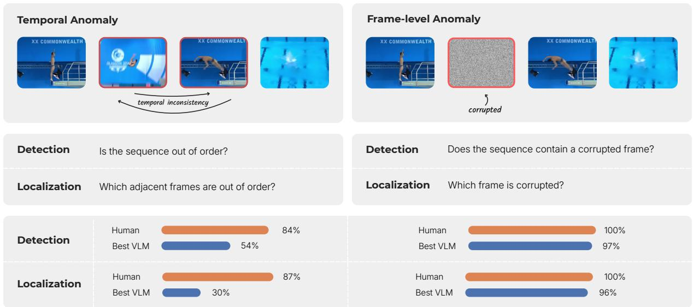

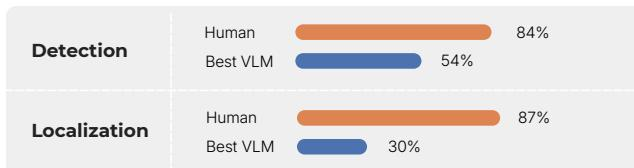

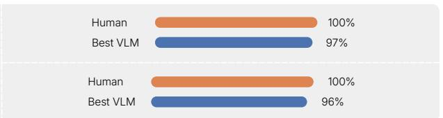  
Figure 1: Overview of the proposed anomaly detection tasks. Given an image sequence, models detect or localize either temporal anomalies (swapped adjacent frames) or frame-level anomalies (corrupted frames). VLMs perform well on frame-level tasks but remain close to chance on temporal anomaly tasks, whereas humans achieve high performance on both.

• A systematic evaluation of state-of-the-art VLMs and human performance on temporal anomaly detection and localization.

• Evidence of a substantial gap between human and VLM performance, revealing that current models can identify frame-level anomalies but struggle to reason about temporal consistency across image sequences.

• TimeCatch, a controlled benchmark for evaluating temporal grounding through temporal and frame-level anomaly detection.

## 2 Related Work

## 2.1 Temporal Reasoning Benchmarks

Recent work has proposed a variety of benchmarks for evaluating temporal reasoning in visionlanguage models. These can broadly be grouped into three categories. Question answering benchmarks, such as TGIF-QA (Jang et al., 2017), TempCompass (Liu et al., 2024), VidHalluc (Li et al., 2025a), TVBench (Cores et al., 2025), and Mementos (Wang et al., 2024), assess temporal understanding through multiple-choice or free-form responses. Discriminative benchmarks, including Vinoground (Zhang et al., 2024b) and MVP (Krojer et al., 2025), require models to distinguish between candidate videos or descriptions. Finally, ordering benchmarks, such as TimeBlind (Li et al., 2026), TOMATO (Shangguan et al., 2025), and AoTBench (Xue et al., 2026), evaluate whether models can reason about event order.

While question answering and discriminative benchmarks provide indirect measures of temporal reasoning, successful performance does not necessarily require identifying violations of temporal consistency. Ordering-based approaches are more closely related to our setting. In particular, TempVS (Song et al., 2025) formulates temporal reasoning as an image-ordering task over a single composite image containing multiple frames. In contrast, we study temporal anomaly detection over image sequences, evaluating whether models can recognize and localize temporal inconsistencies.

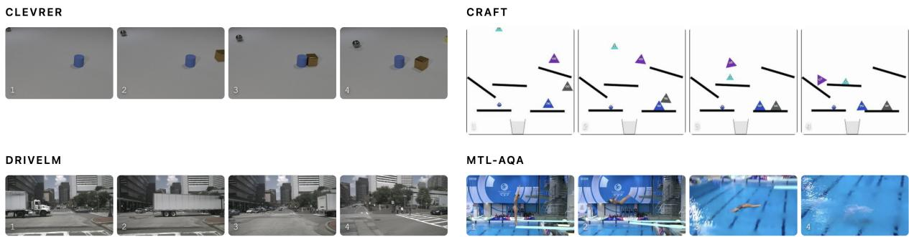  
Figure 2: Example image sequences from the four benchmark datasets. The benchmark spans both synthetic (CLEVRER, CRAFT) and real-world (DriveLM, MTL-AQA) domains.

## 2.2 Challenges in Evaluating Temporal Reasoning

Strong performance on video understanding benchmarks does not necessarily imply robust temporal reasoning. A growing body of work has shown that models can exploit shortcuts embedded in benchmark design to achieve high accuracy without processing the full temporal content of a sequence. Several studies demonstrate that sequencelevel questions can often be answered using only a small subset of frames (Buch et al., 2022; Lei et al., 2023), while Krojer et al. (2025) show that VLMs frequently skip large portions of image sequences while maintaining performance. In addition to visual shortcuts, models may exploit biases in task formulations. Prior work has shown that textual cues alone can be highly predictive of correct answers (Goyal et al., 2017), and similar effects have been observed in modern video benchmarks (Cores et al., 2025). Recently, Xue et al. (2026) and Cores et al. (2025) demonstrate that performance on several temporal benchmarks remains largely unchanged when event order is shuffled, suggesting that temporal ordering is often not required to solve the task.

These findings highlight two challenges for evaluating temporal reasoning: isolating temporal consistency from other sources of information and minimizing opportunities for shortcut exploitation. TimeCatch addresses both by introducing controlled temporal perturbations while keeping the underlying visual content unchanged, allowing temporal consistency to be evaluated in isolation.

## 3 Evaluation Framework

We introduce TimeCatch, a benchmark for evaluating temporal grounding through anomaly detection in image sequences. Our goal is to evaluate temporal grounding in a controlled setting that minimizes reliance on language biases and does not require domain expertise. TimeCatch consists of four tasks: (i) temporal anomaly detection, (ii) temporal anomaly localization, (iii) frame-level anomaly detection, (iv) frame-level anomaly localization. These tasks do not require forecasting future states or domain-specific knowledge; they require only recognizing that the observed sequence is inconsistent with a plausible temporal progression.

## 3.1 Temporal Anomaly Tasks

Temporal Anomaly Detection (Temporal Detect) Given an image sequence $S = ( I _ { 1 } , \ldots , I _ { n } )$ , a temporal anomaly is introduced by swapping a randomly selected consecutive frame pair $( I _ { i } , I _ { i + 1 } )$ where $i \sim \mathcal { U } \{ 1 , \dots , n - 1 \}$ . The model is tasked with predicting whether the resulting sequence contains a temporal anomaly.

Temporal Anomaly Localization (Temporal Localize) Using the same anomaly generation procedure, the model is given a sequence containing a guaranteed frame swap and must predict the swap location i.

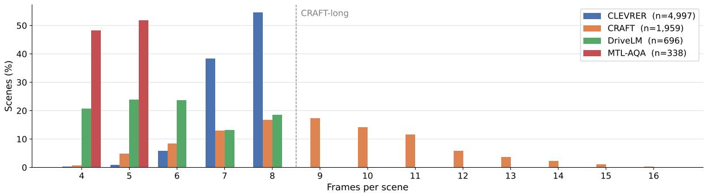  
Figure 3: Sequence length distribution across the benchmark datasets. Sequences of 4 to 8 frames are used in the main experiments. Longer CRAFT sequences (9–16 frames) are reserved for evaluating the effect of sequence length on temporal anomaly detection.

<table><tr><td>Dataset</td><td>Domain</td><td>Sequences</td><td>Avg. Length</td></tr><tr><td>CLEVRER</td><td>Synthetic</td><td>4,997</td><td>7.5</td></tr><tr><td>CRAFT</td><td>Synthetic</td><td>858</td><td>6.9</td></tr><tr><td>DriveLM</td><td>Real-world</td><td>696</td><td>5.9</td></tr><tr><td>MTL-AQA</td><td>Real-world</td><td>338</td><td>4.5</td></tr><tr><td>CRAFT-Long</td><td>Synthetic</td><td>1,101</td><td>10.6</td></tr></table>

Table 1: Statistics of datasets included in TimeCatch.

## 3.2 Frame-Level Anomaly Tasks

To disentangle temporal reasoning from anomaly perception, we introduce a control condition based on frame-level anomalies by replacing a frame with Gaussian noise. Gaussian noise provides an unambiguous frame-level anomaly without altering the sequence structure or introducing semantic content. Strong performance on these tasks demonstrates that a model can attend to the sequence and identify anomalous frames, allowing failures on temporal anomalies to be attributed more specifically to limitations in temporal reasoning.

Frame-Level Anomaly Detection (Frame Detect) Given an image sequence $S ~ = ~ ( I _ { 1 } , \ldots , I _ { n } )$ , a frame-level anomaly is introduced by replacing a uniformly sampled frame $I _ { i } ,$ , where $i \sim \mathcal { U } 1 , \ldots , n .$ with Gaussian noise. The model is tasked with predicting whether the resulting sequence contains a frame-level anomaly.

Frame-Level Anomaly Localization (Frame Localize) Using the same anomaly generation procedure, the model is given a sequence containing a guaranteed corrupted frame and must predict the anomaly location i.

## 3.3 Dataset Curation

To construct a controlled benchmark, we select datasets that satisfy four criteria: (i) events should be interpretable without specialized domain knowledge, (ii) the sequence should follow a single temporal trajectory, (iii) consecutive frames should exhibit distinguishable changes, and (iv) the viewpoint should remain consistent throughout the sequence. These requirements help isolate temporal consistency from confounding factors such as scene cuts, domain expertise, or ambiguous event structure. The benchmark draws on four dataset test splits, spanning both synthetic and real-world domains.

Synthetic Datasets CLEVRER (Yi et al., 2020) and CRAFT (Ates et al., 2022) contain object interactions in 3D and 2D environments, respectively.

Real-world Datasets DriveLM (Sima et al., 2024) provides image sequences of real driving scenarios, while MTL-AQA (Parmar and Morris, 2019) contains competitive diving videos. Figure 2 provides an example for each dataset.

Sampling and Filtering For the video datasets (CRAFT, CLEVRER, and MTL-AQA), we convert videos into image sequences through temporal subsampling. Frames are sampled every 1.5 seconds for CRAFT and CLEVRER, and every 1 second for MTL-AQA, reflecting the different rates at which visually distinguishable changes occur in the underlying videos. To ensure that temporal anomalies remain perceptually meaningful, we further filter sequences using LPIPS (Zhang et al., 2018), a metric that correlates with human judgments of visual similarity. Consecutive frames whose LPIPS distance falls below 0.05 are removed, as such pairs often exhibit little observable change and make temporal anomalies difficult to perceive. Sequences containing fewer than four frames after filtering are discarded, as very short sequences provide limited temporal context and few possible anomaly locations. Figure 3 shows the sequence length distribution across the benchmark datasets. The majority of sequences contain 4–8 frames and are used in the main evaluation. Longer sequences from CRAFT (9–16 frames) are treated as a separate subset, CRAFT-long, and reserved for the sequence length analysis in Section 6.5. Table 1 summarizes the datasets included in TimeCatch.

<table><tr><td></td><td colspan="4">Temporal Detect</td><td colspan="4">Temporal Localize</td><td colspan="4">Frame Detect</td><td colspan="4">Frame Localize</td></tr><tr><td></td><td>CL</td><td>CR</td><td>DR</td><td>MT</td><td>CL</td><td>CR</td><td>DR</td><td>MT</td><td>CL</td><td>CR</td><td>DR</td><td>MT</td><td>CL</td><td>CR</td><td>DR</td><td>MT</td></tr><tr><td>Random</td><td>50.0</td><td>50.0</td><td>50.0</td><td>50.0</td><td>4.3</td><td>5.5</td><td>8.7</td><td>13.2</td><td>50.0</td><td>50.0</td><td>50.0</td><td>50.0</td><td>13.5</td><td>14.9</td><td>18.1</td><td>22.4</td></tr><tr><td>Qwen2.5-VL-7B</td><td>50.5</td><td>47.6</td><td>50.7</td><td>45.3</td><td>13.1</td><td>14.3</td><td>14.8</td><td>29.9</td><td>66.9</td><td>67.9</td><td>60.3</td><td>71.6</td><td>42.0</td><td>60.5</td><td>45.8</td><td>73.1</td></tr><tr><td>Qwen3-VL-8B</td><td>51.9</td><td>53.3</td><td>51.9</td><td>57.4</td><td>25.6</td><td>24.5</td><td>24.7</td><td>43.2</td><td>93.3</td><td>98.1</td><td>99.6</td><td>94.1</td><td>98.9</td><td>96.3</td><td>92.7</td><td>99.4</td></tr><tr><td>Gemma-4-E4B</td><td>49.2</td><td>48.0</td><td>53.9</td><td>56.2</td><td>15.0</td><td>14.7</td><td>22.3</td><td>29.9</td><td>77.2</td><td>80.5</td><td>82.0</td><td>76.6</td><td>33.6</td><td>46.5</td><td>61.9</td><td>88.2</td></tr><tr><td>InternVL3-8B</td><td>50.1</td><td>49.1</td><td>53.2</td><td>47.9</td><td>14.3</td><td>17.7</td><td>17.8</td><td>21.6</td><td>58.1</td><td>77.7</td><td>68.4</td><td>76.6</td><td>30.9</td><td>52.9</td><td>33.9</td><td>65.7</td></tr><tr><td>InternVL3.5-8B</td><td>49.6</td><td>49.9</td><td>49.9</td><td>50.6</td><td>15.4</td><td>18.2</td><td>9.8</td><td>33.1</td><td>66.9</td><td>66.7</td><td>69.7</td><td>77.2</td><td>18.6</td><td>22.4</td><td>16.4</td><td>29.6</td></tr></table>

Table 2: Detection and localization accuracy (%) across datasets. Models reliably detect and localize frame-level anomalies but struggle on temporal anomaly tasks. CL: CLEVRER, CR: CRAFT, DR: DriveLM, MT: MTL-AQA.

Scene Descriptions Finally, we construct scene descriptions from the available dataset annotations (see Appendix A.3 for details), providing models with high-level semantic context while preserving the temporal nature of the task.

## 4 Experimental Setup

## 4.1 Models

We evaluate five open-weight vision-language models: Qwen2.5-VL-7B (Bai et al., 2025b), Qwen3- VL-8B (Bai et al., 2025a), Gemma-4-E4B (Google DeepMind, 2025), InternVL3-8B (Zhu et al., 2025), InternVL3.5-8B (Wang et al., 2025). These models represent recent state-of-the-art VLMs with native support for multi-image inputs.

## 4.2 Evaluation Protocol

Metric We evaluate both anomaly detection and anomaly localization using accuracy. For detection, accuracy is appropriate because the classes are balanced by construction. For localization, accuracy measures the fraction of sequences for which the anomaly position is correctly identified.

Implementation Details All models are evaluated using a unified prompting protocol described in Appendix A. Models are served using vLLM (Kwon et al., 2023). To ensure consistent evaluation, constrained decoding is applied throughout: detection outputs are restricted to {yes,no}, while localization outputs are restricted to valid frame indices. All experiments are conducted on NVIDIA A100 GPUs. All models are evaluated in a zero-shot setting.

## 5 Results

## 5.1 Main Results

Temporal Anomaly Detection Table 2 reports temporal anomaly detection and localization performance across all evaluated models. Across the four datasets, the highest detection accuracy is 57.4%, and the highest localization accuracy is 43.2%. Overall, performance remains close to chance on detection and only modestly above chance on localization, a trend that is consistent across models and datasets.

Frame-Level Anomaly Detection In contrast, models achieve substantially higher performance on frame-level anomaly tasks. Detection and localization accuracy are consistently high across datasets, reaching up to 99.6% and 99.4%, respectively. Success on these control tasks demonstrates that VLMs can attend to image sequences and identify anomalous frames. The large gap between frame-level and temporal anomalies therefore suggests that the observed failures stem from reasoning about temporal consistency rather than from limitations in sequence perception.

## 5.2 Human Study

To establish a human reference point, we conduct a human study on both temporal anomaly detection and localization. Participants complete the same tasks as the evaluated models using a custom annotation platform. Annotation instructions, interface screenshots, and additional details of the study protocol are provided in Appendix C.

Figure 5 compares human and model performance on a subset of 72 samples from each dataset.

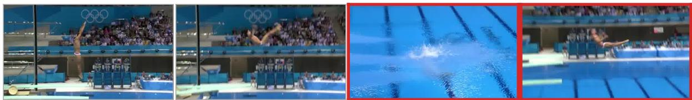  
Figure 4: Example from the temporal anomaly localization task on MTL-AQA. The highlighted frames indicate the swapped pair. Although the temporal inconsistency is readily identified by the human participant, all evaluated VLMs fail to localize the anomaly correctly.

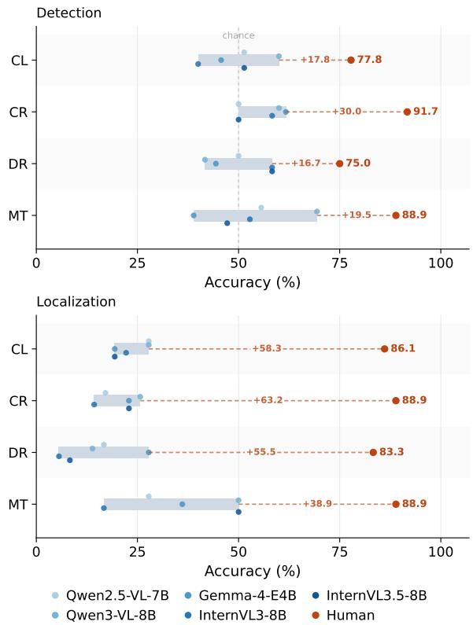  
Figure 5: Temporal anomaly detection and localization accuracy (%) on the human study subset. Humans consistently outperform all evaluated VLMs across datasets, highlighting a substantial gap between human and VLM performance on temporal reasoning.

Across datasets, humans achieve 75.0–91.7% accuracy on temporal anomaly detection and 83.3– 88.9% on temporal anomaly localization, substantially outperforming all evaluated VLMs. In contrast, no evaluated model exceeds 70% detection accuracy or 50% localization accuracy on any dataset. This indicates that temporal anomalies are readily detectable by humans, suggesting that the observed VLM failures reflect limitations in temporal reasoning rather than inherent task difficulty. Figure 4 illustrates a representative failure case.2 Although each frame appears plausible in isolation, identifying the anomaly requires reasoning about the temporal progression of the event rather than detecting abnormalities within individual frames. While the human participant correctly localizes the swapped frames, all evaluated VLMs fail on this example.

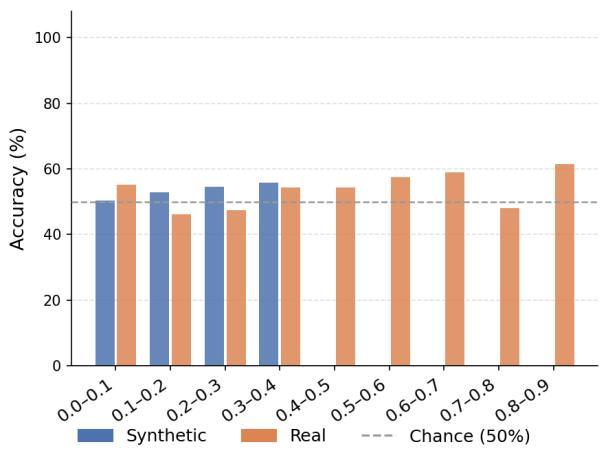  
Figure 6: Temporal anomaly detection accuracy by LPIPS distance for Qwen3-VL-8B. Although larger perceptual differences between swapped frames slightly improve performance, accuracy remains close to chance across both synthetic and real-world datasets, indicating that visual similarity is not the primary limitation.

## 6 Analysis

Since Qwen3-VL-8B achieves the best overall performance on TimeCatch, we use the Qwen3 family for the following analyses.

## 6.1 Does Visual Similarity Explain the Failures?

To investigate whether temporal anomaly detection depends on low-level perceptual cues, we group swapped frame pairs according to their LPIPS distance and measure detection accuracy within each bin. Each bin covers a fixed interval of 0.1 LPIPS, such that pairs in the first bin (0.0–0.1) are highly similar, while pairs in the last bin (0.8–0.9) are perceptually distinct. Figure 6 shows results for Qwen3-VL-8B. While performance increases slightly for more perceptually distinct frame pairs, the gains are modest and accuracy remains far below human levels across all bins. Overall, visual similarity has only a limited effect on temporal anomaly detection. Full per-model results are provided in Appendix D.

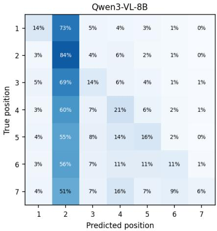  
Figure 7: Temporal anomaly localization confusion matrix for Qwen3-VL-8B, averaged across all datasets. Rather than correctly localizing the anomaly, the model exhibits a strong bias toward predicting position 2, independent of the true anomaly location.

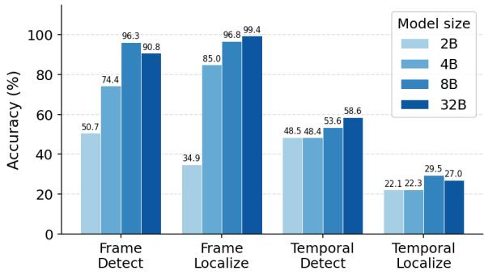  
Figure 8: Effect of model scale on anomaly detection and localization accuracy for the Qwen3-VL family. Scaling improves frame-level anomaly performance but yields only modest gains on temporal anomaly detection, with localization remaining near chance. These results suggest that increasing model capacity alone is insufficient to improve temporal reasoning.

## 6.2 Do Incorrect Predictions Occur Near the True Location?

While localization accuracy measures exact correctness, it does not capture whether incorrect predictions occur near the true anomaly location. We therefore analyze the distribution of predicted positions relative to ground truth using confusion matrices. Figure 7 shows the results for Qwen3-VL.

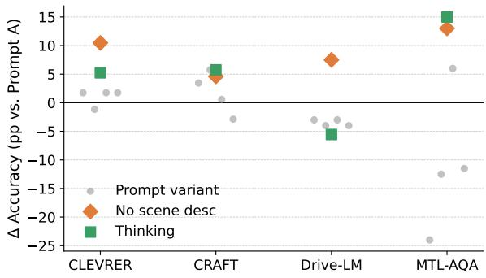  
Figure 9: Effect of prompting on temporal anomaly detection accuracy. Values show the change in accuracy (percentage points) relative to the base prompt (Prompt A) for Qwen3-VL-8B. Grey circles correspond to alternative prompt formulations, while orange diamonds and green squares denote removing scene descriptions and enabling reasoning, respectively.

If the model were identifying the relevant region of the sequence but failing to localize the anomaly precisely, predictions would cluster around the diagonal. Instead, the model exhibits a strong bias toward predicting position 2 regardless of the true anomaly location, suggesting that localization errors arise from a systematic prediction bias rather than near misses. Confusion matrices for all models are provided in Appendix D.

## 6.3 Does Increasing Model Size Improve Performance?

We investigate whether temporal anomaly detection improves with model capacity by evaluating Qwen3-VL across four model sizes (2B, 4B, 8B, and 32B). Figure 8 shows that performance on frame-level anomaly tasks improves consistently with model size, reaching near-ceiling accuracy for the largest models. In contrast, temporal anomaly performance exhibits only modest gains. Scaling improves temporal anomaly performance only marginally, with even the largest model (32B) remaining close to chance on detection and only modestly above chance on localization.

## 6.4 Can Prompting Improve Temporal Reasoning?

To investigate whether the observed failures depend on textual context or prompting, we evaluate multiple prompt formulations, remove scene descriptions, and compare standard and reasoningenabled (thinking) models. As shown in Figure 9, alternative prompt formulations have little effect on temporal anomaly detection. Removing scene descriptions often yields modest improvements, suggesting that the accompanying text may distract models from reasoning about temporal consistency. By contrast, enabling reasoning produces mixed results, improving performance on some datasets while degrading it on others, with no consistent overall benefit. Table 5 in Appendix D reports the per-model change in accuracy after removing scene descriptions and shows that the largest improvements occur on the frame-level tasks rather than the temporal ones. Overall, prompt variations yield no consistent improvement on temporal tasks.

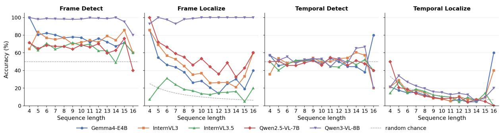  
Figure 10: Effect of sequence length on anomaly detection and localization accuracy across sequence lengths (4–16 frames). Frame-level detection remains high, whereas frame-level localization degrades as the number of frames increases. Temporal anomaly detection and localization show little dependence on sequence length. The final bucket (n = 16) contains only five samples and should be interpreted with caution (see Figure 3).

## 6.5 Does Increasing Sequence Length Improve Temporal Reasoning?

To investigate whether longer image sequences improve performance, we evaluate models on longer CRAFT sequences containing 8–16 frames. Figure 10 shows that temporal anomaly performance remains near chance across sequence lengths. Increasing the number of frames does not improve accuracy, indicating that temporal anomaly performance remains largely unchanged despite additional context. In contrast, frame-level detection remains consistently high across sequence lengths, while frame-level localization gradually degrades as the number of candidate frames increases, suggesting that precisely identifying the corrupted frame becomes more challenging in longer sequences.

## 7 Implications for Temporal Grounding

Our findings support concerns that existing video benchmarks may overestimate temporal reasoning capabilities. A model may successfully identify objects, actions, or anomalous single frames while remaining insensitive to the temporal relationships between them. By modifying only the order of frames and leaving the visual content unchanged, TimeCatch isolates this aspect of temporal grounding and provides a direct test of sensitivity to temporal consistency. Overall, this limitation persists regardless of visual similarity, prompting strategy, model scale, or sequence length, suggesting a broader challenge in modeling temporal relationships rather than a consequence of a particular evaluation setting. These findings may also have implications for applications where decisions depend on how events unfold over time. In domains such as autonomous driving, robotics, and video understanding, recognizing whether image sequences are temporally consistent can be as important as recognizing the observations themselves. We therefore view temporal anomaly detection as a complementary evaluation setting for measuring progress toward temporally grounded VLMs.

## 8 Conclusion

In this work, we conducted a systematic evaluation of state-of-the-art VLMs and human performance on temporal anomaly detection and localization. Our findings reveal a substantial gap between human and VLM performance: while VLMs reliably detect and localize frame-level anomalies, they struggle to recognize temporal inconsistencies, whereas humans achieve near-ceiling performance on both temporal tasks. To enable this evaluation, we introduced TimeCatch, a controlled benchmark for evaluating temporal grounding through temporal and frame-level anomaly detection. We hope TimeCatch will serve as a complementary benchmark for tracking progress in temporal reasoning. Future work could extend the benchmark to evaluate motion continuity and causal event structure.

## Limitations

TimeCatch evaluates a specific aspect of temporal reasoning: recognizing violations of temporal consistency introduced through adjacent frame swaps. While this provides a controlled setting for isolating temporal grounding, it does not capture all forms of temporal reasoning required in real-world video understanding, such as long-range dependencies, causal event reasoning, or continuity of motion. We view TimeCatch as a complementary benchmark that isolates a fundamental capability, rather than a comprehensive evaluation of temporal reasoning.

## Ethical Considerations

TimeCatch is intended as a diagnostic benchmark rather than a capability-enhancing method: it evaluates a specific limitation in VLMs’ temporal reasoning rather than enabling new functionality, and we see no direct misuse risk. We use only publicly available datasets released for research use and adhere to their respective licenses and terms of use. Further details on data licensing and human study procedures are provided in Appendix B and Appendix C respectively.

## References

Tayfun Ates, M. Ate¸soglu, Ça˘ gatay Yi˘ git, Ilker Kesen,˘ Mert Kobas, Erkut Erdem, Aykut Erdem, Tilbe Goksun, and Deniz Yuret. 2022. CRAFT: A benchmark for causal reasoning about forces and inTeractions. In Findings of the Association for Computational Linguistics: ACL 2022, pages 2602–2627, Dublin, Ireland. Association for Computational Linguistics.

Shuai Bai, Yuxuan Cai, Ruizhe Chen, Keqin Chen, Xionghui Chen, Zesen Cheng, Lianghao Deng, Wei Ding, Chang Gao, Chunjiang Ge, Wenbin Ge, Zhifang Guo, Qidong Huang, Jie Huang, Fei Huang, Binyuan Hui, Shutong Jiang, Zhaohai Li, Mingsheng Li, and 45 others. 2025a. Qwen3-vl technical report. Preprint, arXiv:2511.21631.

Shuai Bai, Keqin Chen, Xuejing Liu, Jialin Wang, Wenbin Ge, Sibo Song, Kai Dang, Peng Wang, Shijie Wang, Jun Tang, Humen Zhong, Yuanzhi Zhu, Mingkun Yang, Zhaohai Li, Jianqiang Wan, Pengfei Wang, Wei Ding, Zheren Fu, Yiheng Xu, and 8 others. 2025b. Qwen2.5-vl technical report. Preprint, arXiv:2502.13923.

Shyamal Buch, Cristóbal Eyzaguirre, Adrien Gaidon, Jiajun Wu, Li Fei-Fei, and Juan Carlos Niebles. 2022. Revisiting the" video" in video-language understanding. In Proceedings of the IEEE/CVF conference on computer vision and pattern recognition, pages 2917–2927.

Daniel Cores, Michael Dorkenwald, Manuel Mucientes, Cees G. M. Snoek, and Yuki M. Asano. 2025. Lost in time: A new temporal benchmark for VideoLLMs. Preprint, arXiv:2410.07752.

Google DeepMind. 2025. Gemma 4 Model Card.

Yash Goyal, Tejas Khot, Douglas Summers-Stay, Dhruv Batra, and Devi Parikh. 2017. Making the V in VQA Matter: Elevating the role of image understanding in visual question answering. In Proceedings ofthe IEEE conference on computer vision and pattern recognition, pages 6904–6913.

Edward J Hu, yelong shen, Phillip Wallis, Zeyuan Allen-Zhu, Yuanzhi Li, Shean Wang, Lu Wang, and Weizhu Chen. 2022. LoRA: Low-rank adaptation of large language models. In International Conference on Learning Representations.

Yunseok Jang, Yale Song, Youngjae Yu, Youngjin Kim, and Gunhee Kim. 2017. TGIF-QA: Toward spatiotemporal reasoning in visual question answering. In Proceedings of the IEEE conference on computer vision and pattern recognition, pages 2758–2766.

Kento Kawaharazuka, Jihoon Oh, Jun Yamada, Ingmar Posner, and Yuke Zhu. 2025. Vision-language-action models for robotics: A review towards real-world applications. IEEE Access.

Benno Krojer, Mojtaba Komeili, Candace Ross, Quentin Garrido, Koustuv Sinha, Nicolas Ballas, and Mido Assran. 2025. A shortcut-aware Video-QA benchmark for physical understanding via minimal video pairs. Transactions on Machine Learning Research.

Woosuk Kwon, Zhuohan Li, Siyuan Zhuang, Ying Sheng, Lianmin Zheng, Cody Hao Yu, Joseph E. Gonzalez, Hao Zhang, and Ion Stoica. 2023. Efficient memory management for large language model serving with pagedattention. In Proceedings of the ACM SIGOPS 29th Symposium on Operating Systems Principles.

Jie Lei, Tamara Berg, and Mohit Bansal. 2023. Revealing single frame bias for Video-and-Language learning. In Proceedings of the 61st Annual Meeting ofthe Associationfor Computational Linguistics (Volume 1: Long Papers), pages 487–507, Toronto, Canada. Association for Computational Linguistics.

Baiqi Li, Kangyi Zhao, Ce Zhang, Chancharik Mitra, Jean de Dieu Nyandwi, and Gedas Bertasius. 2026. TimeBlind: A Spatio-Temporal Compositionality Benchmark for Video LLMs. arXiv preprint arXiv:2602.00288.

Chaoyu Li, Eun Woo Im, and Pooyan Fazli. 2025a. Vid-Halluc: Evaluating temporal hallucinations in multimodal large language models for video understanding. In Proceedings of the IEEE/CVF Conference on Computer Vision and Pattern Recognition, pages 13723–13733.

KunChang Li, Yinan He, Yi Wang, Yizhuo Li, Wenhai Wang, Ping Luo, Yali Wang, Limin Wang, and Yu Qiao. 2025b. VideoChat: Chat-centric video understanding. Science China Information Sciences, 68(10):200102.

Yuanxin Liu, Shicheng Li, Yi Liu, Yuxiang Wang, Shuhuai Ren, Lei Li, Sishuo Chen, Xu Sun, and Lu Hou. 2024. TempCompass: Do video LLMs really understand videos? In Findings of the Association for Computational Linguistics: ACL 2024, pages 8731–8772, Bangkok, Thailand. Association for Computational Linguistics.

Paritosh Parmar and Brendan Tran Morris. 2019. What and how well you performed? a multitask learning approach to action quality assessment. In Proceedings ofthe IEEE/CVF conference on computer vision and pattern recognition, pages 304–313.

Ziyao Shangguan, Chuhan Li, Yuxuan Ding, Yanan Zheng, Yilun Zhao, Tesca Fitzgerald, and Arman Cohan. 2025. TOMATO: Assessing visual temporal reasoning capabilities in multimodal foundation models. In International Conference on Learning Representations, volume 2025, pages 7593–7734.

Chonghao Sima, Katrin Renz, Kashyap Chitta, Li Chen, Hanxue Zhang, Chengen Xie, Jens Beißwenger, Ping Luo, Andreas Geiger, and Hongyang Li. 2024. DriveLM: Driving with graph visual question answering. In European conference on computer vision, pages 256–274. Springer.

Yingjin Song, Yupei Du, Denis Paperno, and Albert Gatt. 2025. Burn after reading: Do multimodal large language models truly capture order of events in image sequences? In Findings of the Association for Computational Linguistics: ACL 2025, pages 24316– 24342, Vienna, Austria. Association for Computational Linguistics.

Minh-Hao Van, Prateek Verma, and Xintao Wu. 2024. On large visual language models for medical imaging analysis: An empirical study. In 2024 IEEE/ACM conference on connected health: applications, systems and engineering technologies (CHASE), pages 172–176. IEEE.

Weiyun Wang, Zhangwei Gao, Lixin Gu, Hengjun Pu, Long Cui, Xingguang Wei, Zhaoyang Liu, Linglin Jing, Shenglong Ye, Jie Shao, Zhaokai Wang, Zhe Chen, Hongjie Zhang, Ganlin Yang, Haomin Wang, Qi Wei, Jinhui Yin, Wenhao Li, Erfei Cui, and 56 others. 2025. InternVL3.5: Advancing open-source multimodal models in versatility, reasoning, and efficiency. Preprint, arXiv:2508.18265.

Xiyao Wang, Yuhang Zhou, Xiaoyu Liu, Hongjin Lu, Yuancheng Xu, Feihong He, Jaehong Yoon, Taixi Lu, Fuxiao Liu, Gedas Bertasius, Mohit Bansal, Huaxiu Yao, and Furong Huang. 2024. Mementos: A comprehensive benchmark for multimodal large language model reasoning over image sequences. In Proceedings ofthe 62nd Annual Meeting ofthe Association

for Computational Linguistics (Volume 1: Long Papers), pages 416–442, Bangkok, Thailand. Association for Computational Linguistics.

Zihui Sherry Xue, Romy Luo, and Kristen Grauman. 2026. Seeing the arrow of time in large multimodal models. Advances in Neural Information Processing Systems, 38:90925–90955.

Kexin Yi, Chuang Gan, Yunzhu Li, Pushmeet Kohli, Jiajun Wu, Antonio Torralba, and Joshua B Tenenbaum. 2020. CLEVRER: Collision events for video representation and reasoning. In International Conference on Learning Representations.

Duzhen Zhang, Yahan Yu, Jiahua Dong, Chenxing Li, Dan Su, Chenhui Chu, and Dong Yu. 2024a. MM-LLMs: Recent advances in MultiModal Large Language Models. In Findings of the Association for Computational Linguistics: ACL 2024, pages 12401– 12430, Bangkok, Thailand. Association for Computational Linguistics.

Hang Zhang, Xin Li, and Lidong Bing. 2023. Video-LLaMA: An instruction-tuned audio-visual language model for video understanding. In Proceedings of the 2023 Conference on Empirical Methods in Natural Language Processing: System Demonstrations, pages 543–553, Singapore. Association for Computational Linguistics.

Jianrui Zhang, Mu Cai, and Yong Jae Lee. 2024b. Vinoground: Scrutinizing lmms over dense temporal reasoning with short videos. arXiv preprint arXiv:2410.02763.

Richard Zhang, Phillip Isola, Alexei A Efros, Eli Shechtman, and Oliver Wang. 2018. The unreasonable effectiveness of deep features as a perceptual metric. In Proceedings of the IEEE conference on computer vision and pattern recognition, pages 586–595.

Yuze Zhao, Jintao Huang, Jinghan Hu, Xingjun Wang, Yunlin Mao, Daoze Zhang, Zeyinzi Jiang, Zhikai Wu, Baole Ai, Ang Wang, Wenmeng Zhou, and Yingda Chen. 2024. Swift:a scalable lightweight infrastructure for fine-tuning. Preprint, arXiv:2408.05517.

Xingcheng Zhou, Mingyu Liu, Ekim Yurtsever, Bare Luka Zagar, Walter Zimmer, Hu Cao, and Alois C Knoll. 2024. Vision language models in autonomous driving: A survey and outlook. IEEE Transactions on Intelligent Vehicles.

Deyao Zhu, Jun Chen, Xiaoqian Shen, Xiang Li, and Mohamed Elhoseiny. 2024. MiniGPT-4: Enhancing vision-language understanding with advanced large language models. In The Twelfth International Conference on Learning Representations.

Jinguo Zhu, Weiyun Wang, Zhe Chen, Zhaoyang Liu, Shenglong Ye, Lixin Gu, Hao Tian, Yuchen Duan, Weijie Su, Jie Shao, Zhangwei Gao, Erfei Cui, Xuehui Wang, Yue Cao, Yangzhou Liu, Xingguang Wei, Hongjie Zhang, Haomin Wang, Weiye Xu, and 32

others. 2025. InternVL3: Exploring advanced training and test-time recipes for open-source multimodal models. Preprint, arXiv:2504.10479.

## A Prompting

## A.1 Main Task Prompts

The following prompts are used for the main experiments across all datasets.

## Temporal Detect

You are given a sequence of images showing a scene unfolding over time. The frames should appear in a natural temporal order, but two consecutive frames may have been swapped. Reply with only ‘yes’ if you detect a swap, or ‘no’ if the order looks correct.

## Temporal Localize

You are given a sequence of images showing a scene unfolding over time. Exactly two consecutive frames have been swapped. Reply with only the two frame numbers that are out of order, separated by a comma. For example: 3,4 means frames 3 and 4 were swapped. Use 1-based indexing (1 for the first frame).

## Frame Detect

You are given a sequence of images showing a scene unfolding over time. One frame may have been replaced with random noise. Reply with only ‘yes’ if you see a corrupted frame, or ‘no’ if all frames look normal.

## Frame Localize

You are given a sequence of images showing a scene unfolding over time. Exactly one frame has been replaced with random noise. Reply with only the number of the corrupted frame. Use 1-based indexing (1 for the first frame).

## A.2 Prompt Variations

We evaluate four different prompt phrasings for the temporal detection task to assess sensitivity to instruction prompt. All variants instruct the model to reply with yes or no.

## Prompt B

You are given a sequence of images showing a scene unfolding over time. Does the sequence appear to be in the correct temporal order, with no frames swapped? Reply with only ‘yes’ if the order is correct, or ‘no’ if something looks wrong.

## Prompt C

You are given a sequence of images showing a scene unfolding over time. Examine each consecutive pair of frames: does the transition from one image to the next always make physical sense? Two adjacent frames may have been swapped, causing one transition to look reversed or impossible. Reply with only ‘yes’ if you find such a swap, or ‘no’ if all transitions look natural.

## Prompt D

Look at these images in order. Have any two neighboring images been swapped? Reply with only ‘yes’ or ‘no’.

## Prompt E

You are given a sequence of images. Go through them one by one from the first to the last. For each consecutive pair, ask yourself: could this transition happen naturally - does the second image physically follow from the first? If any single transition looks reversed or impossible, two adjacent frames have been swapped. Reply with only ‘yes’ if you find such a transition, or ‘no’ if every step forward in the sequence looks natural.

## A.3 Scene Description Templates

Scene descriptions are appended as plain text after the image tokens in the user message. For CLEVRER and CRAFT they are taken verbatim from the datasets’ event annotations; for DriveLM from the nuScenes scene-level metadata; for MTL-AQA they are generated from the structured dive annotations (rotation type, body position, somersault and twist count, armstand flag). Examples:

## CLEVRER

Brown cube will collide with blue cylinder, and blue cylinder will collide with gray ball.

Yellow ball will collide with green ball, green ball will collide with yellow cylinder, and green ball will collide with gray cube.

Green cube will collide with gray ball, green cube will collide with blue cylinder, and gray ball will collide with gray ball.

Yellow cube will collide with blue ball, and blue ball will collide with yellow ball.

## CRAFT

Large blue triangle will enter the basket.

Large blue triangle will collide with large gray triangle, small cyan triangle will collide with large purple triangle, large blue triangle will enter the basket, and large gray triangle will collide with large purple triangle.

Small cyan triangle will collide with large purple triangle, large blue triangle will enter the basket, and large purple triangle will enter the basket.

Large blue triangle will collide with large gray triangle, and large blue triangle will enter the basket.

## DriveLM

The ego vehicle halted at the intersection with traffic lights, awaiting the passage of preceding vehicles before veering to the right.

The ego vehicle proceeded straight after making a left turn at the current intersection, and is about to make a right turn.

The ego vehicle traverses along the current roadway, encountering construction on both the left and right sides.

The ego vehicle is traveling along the current road and is about to pass through the traffic light intersection.

<table><tr><td>Dataset</td><td>Content</td><td>Video</td><td>Sequences</td><td>Avg. frames</td><td>Mean LPIPS</td></tr><tr><td>CRAFT</td><td>Abstract 2D objects, collisions</td><td>√</td><td>1,983 → 1,959</td><td>16.0 → 9.0</td><td>0.053 → 0.093</td></tr><tr><td>CLEVRER</td><td>Abstract 3D objects, collisions</td><td>√</td><td>5,000 → 4,997</td><td>8.0 → 7.5</td><td>0.123 → 0.131</td></tr><tr><td>DriveLM</td><td>Driving, egocentric</td><td>一</td><td>696</td><td>5.9</td><td>0.428</td></tr><tr><td>MTL-AQA</td><td>Olympic competitive diving</td><td>V</td><td>353 → 338</td><td>8.4 → 4.5</td><td>0.492 → 0.584</td></tr></table>

Table 3: Dataset statistics before and after the sampling and filtering pipeline. Arrows indicate the changes in the number of sequences, average sequence length, and mean LPIPS after preprocessing.

## MTL-AQA

A forward dive with 2.5 somersaults in pike position.

An armstand forward dive with 2 somersaults and 1.5 twists in tuck position.

A reverse dive with 3.5 somersaults in straight position.

An inward dive with 2.5 somersaults in a straight position.

## B Dataset Details

Table 3 summarizes the characteristics of the four datasets before and after sampling and filtering, including the number of sequences, average sequence length, and perceptual similarity (LPIPS). Figure 11 illustrates the LPIPS distributions before and after filtering, highlighting the removal of nearly identical consecutive frames used to construct the benchmark.

Licensing CLEVRER is released under CC0. CRAFT is released under CC BY 4.0. DriveLM’s annotations are released under CC BY-NC-SA 4.0. MTL-AQA is used consistent with standard academic reuse of an established public benchmark – the original release does not specify an explicit license.

## C Human Study Details

Interface We developed a custom annotation interface that presents participants with an image sequence alongside its scene description and guides them through either the detection or localization task. Examples of the interface are shown in Figure 12. Participants can also preview each sequence using an interactive viewer navigable with arrow keys, illustrated in Figure 13. Prior to annotation, participants complete an onboarding flow covering the annotation guidelines, including visual examples and a video walkthrough of the full annotation process. The platform is integrated with Prolific, which was used to recruit and compensate participants.

## C.1 Annotation Guidelines

Each experimental condition was accompanied by a dedicated instruction page describing the video domain and the annotation task. The instructions shown to participants for the CRAFT dataset are presented below.

Introduction We are conducting a study about whether AI systems can understand time in videos. Concretely: if you show AI a sequence of images from a video, can it tell if the images are in the right order? To answer this, we also need to know how well humans perform the same task.

You will be given a series of four to eight snapshots from a video. The goal is to evaluate how well humans can detect if a swap happened in the sequence. This data will then be used to compare against how well AI performs. No other data than the annotations is collected (no personal data, location data, etc.).

Your Task You will interact with a dataset of simple 2D shapes (circles, squares, triangles in different colors and sizes) moving, colliding, rolling down ramps, and sometimes falling into a basket.

You will be given a sequence where two consecutive images may have been swapped. Inspect the sequence and use the buttons to select whether the sequence was modified with a swap, or is still in the correct order.

Tip: Click any image to open a full-size viewer and use the ← → arrow keys (or the on-screen buttons) to flip between frames one at a time — this makes it much easier to spot a swap.

The full workflow is illustrated in the accompanying video.

The whole process should take around 15 minutes across 15 sequences. Thank you for your participation!

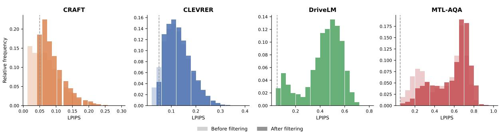  
Figure 11: LPIPS distributions of consecutive frame pairs before and after filtering. Filtering removes nearly identical frame pairs while preserving the overall distribution of perceptual differences. Synthetic datasets (CRAFT and CLEVRER) contain more visually similar consecutive frames than the real-world datasets due to their largely static backgrounds.

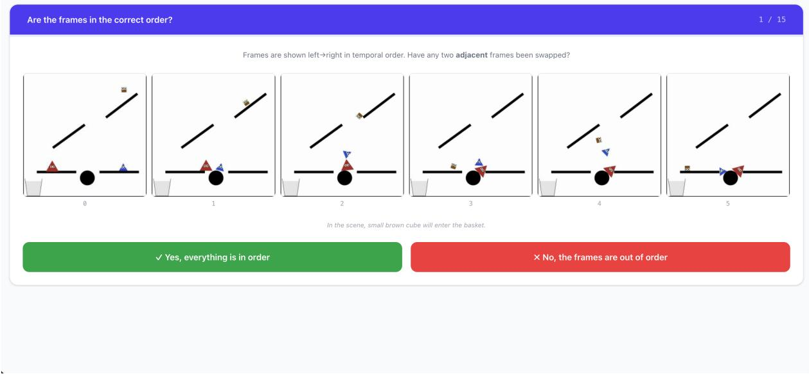  
Figure 12: User interface for the temporal anomaly detection task. Participants viewed an image sequence and indicated whether the frames were presented in the correct temporal order. Scene descriptions were provided below the sequence to match the model evaluation setting.

## C.2 Respondents

We used Prolific3 to recruit and compensate study participants. We recruited 24 participants (3 per dataset and task configuration), all holding at least an undergraduate degree. The sample was slightly unbalanced towards male participants (16 male, 8 female), with a mean age of 35.2 years. Participants were geographically diverse, spanning 16 countries of residence. Each participant completed a single experimental condition and was compensated at an effective mean hourly rate exceeding £8.00/hour, above Prolific’s minimum recommended reward of £6.00 per hour. The mean completion time was 9.8 minutes for 15 image sequences.

## C.3 Control Mechanisms

To check for potentially invalid or rushed study submissions, we have incorporated 3 simple sequences into each participant’s task to serve as attention checks. Participants who failed two or all three attention checks were then rejected. The attention check sequences were manually selected to be as easy as possible and then excluded from the human study results.

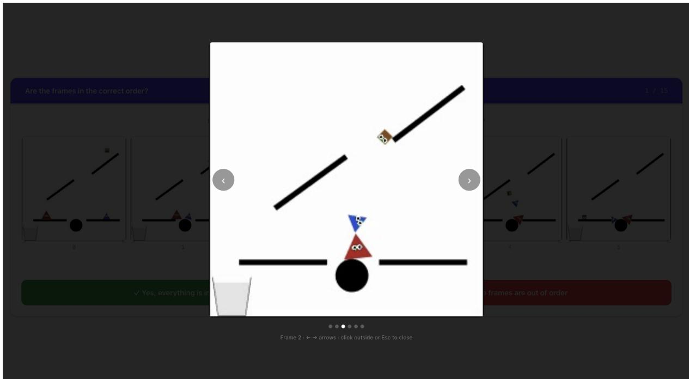  
Figure 13: Close-up of the image viewer. Viewer was beneficial for annotators to notice finer details, – it allows for quicker swapping between the images to emulate a more video-like experience.

## D Additional Results

Table 5 reports the per-model change in accuracy after removing scene descriptions. Figure 14 presents temporal anomaly detection accuracy across LPIPS distance bins for all evaluated models. Figure 15 shows the remaining localization confusion matrices, complementing the analysis in Section 6.

Can Temporal Anomaly Detection be Learned? To investigate whether the temporal consistency limitations observed in pretrained VLMs can be mitigated through targeted supervision, we conduct a preliminary fine-tuning experiment using Qwen3-VL-2B. The model is fine-tuned on the temporal anomaly detection task using the training split (80%) of the CLEVRER dataset and evaluated on the held-out validation split (20%), as well as on the remaining datasets (CRAFT, DriveLM, and MTL-AQA) without further adaptation. Fine-tuning is performed using LoRA (Hu et al., 2022) through the ms-swift (Zhao et al., 2024). The training is then run for 3 epochs with learning rate $1 \times 1 0 ^ { - 4 }$ effective batch size 16, and max sequence length 4096 tokens. We report the final checkpoint (step 714). All training is conducted on an NVIDIA A100 GPU with seed 42.

Table 4 reports the results. Fine-tuning improves temporal anomaly detection on the CLEVRER test split as well as on the unseen CRAFT, DriveLM, and MTL-AQA datasets. Notably, the fine-tuned 2B model matches or exceeds the zero-shot performance of the larger Qwen3-VL-8B model evaluated in the main paper. While these experiments are preliminary and limited to a single model family, they suggest that at least part of the observed limitation is attributable to the supervision available during training rather than model scale alone. Targeted temporal supervision improves temporal anomaly detection while generalizing across unseen datasets spanning both synthetic and real-world domains. We leave a controlled study across model scales and model families for future work. FT: fine-tuned.

<table><tr><td></td><td>CL</td><td>CR DR</td><td>MT</td></tr><tr><td>QW3-2B (0-shot) QW3-2B (FT)</td><td>49.6 50.5</td><td>50.0</td><td>44.1 68.1</td></tr><tr><td>∆</td><td>96.5 +46.9 +13.1</td><td>63.6 52.7 +2.7</td><td>+24.0</td></tr><tr><td>QW3-8B (0-shot)</td><td>51.9 53.3</td><td>51.9</td><td>57.4</td></tr></table>

Table 4: Temporal anomaly detection accuracy (%) of Qwen3-VL-2B (QW3-2B) before and after fine-tuning on the CLEVRER training split. Fine-tuning consistently improves performance on the held-out CLEVRER split and transfers to the unseen CRAFT, DriveLM, and MTL-AQA datasets. Zero-shot Qwen3-VL-8B (QW3- 8B) is shown for reference.

<table><tr><td rowspan="2"></td><td colspan="4">Temporal Detect</td><td colspan="4">Temporal Localize</td><td colspan="4">Frame Detect</td><td colspan="4">Frame Localize</td></tr><tr><td>CL</td><td>CR</td><td>DR</td><td>MT</td><td>CL</td><td>CR</td><td>DR</td><td>MT</td><td>CL</td><td>CR</td><td>DR</td><td>MT</td><td>CL</td><td>CR</td><td>DR</td><td>MT</td></tr><tr><td>QW2.5</td><td>-0.5</td><td>+4.4</td><td>-1.7</td><td>+7.7</td><td>+1.8</td><td>+3.1</td><td>+3.6</td><td>+4.7</td><td>+2.6</td><td>+2.2</td><td>+2.9</td><td>-4.7</td><td>+33.9</td><td>+19.3</td><td>+23.3</td><td>+13.0</td></tr><tr><td>QW3</td><td>+7.0</td><td>+2.3</td><td>-1.0</td><td>+17.2</td><td>+4.7</td><td>+2.1</td><td>-0.1</td><td>+0.6</td><td>+5.3</td><td>+0.6</td><td>-0.9</td><td>-4.1</td><td>+1.0</td><td>+2.6</td><td>+1.1</td><td>+0.0</td></tr><tr><td>GEM4</td><td>+0.7</td><td>+2.2</td><td>-5.0</td><td>-0.9</td><td>-0.2</td><td>+0.2</td><td>+2.3</td><td>-2.1</td><td>+7.5</td><td>+1.7</td><td>+5.6</td><td>+1.5</td><td>+2.5</td><td>-2.7</td><td>+5.7</td><td>+0.6</td></tr><tr><td>IVL3</td><td>+0.1</td><td>+2.6</td><td>-0.6</td><td>+8.9</td><td>+1.3</td><td>-2.9</td><td>+1.7</td><td>+2.4</td><td>+16.0</td><td>+8.7</td><td>+11.8</td><td>+0.9</td><td>+15.9</td><td>+12.7</td><td>+28.3</td><td>+20.1</td></tr><tr><td>IVL3.5</td><td>+0.5</td><td>+0.6</td><td>-2.0</td><td>+10.9</td><td>+2.5</td><td>+2.0</td><td>+10.9</td><td>+3.3</td><td>+9.8</td><td>+9.0</td><td>+11.9</td><td>+7.4</td><td>+39.6</td><td>+34.6</td><td>+55.0</td><td>+66.0</td></tr></table>

Table 5: Change in accuracy (%) after removing scene descriptions. Positive values (green) indicate improved performance without scene descriptions, while negative values (red) indicate degradation. Removing scene descriptions has the largest effect on frame-level localization, whereas temporal anomaly performance changes only modestly.

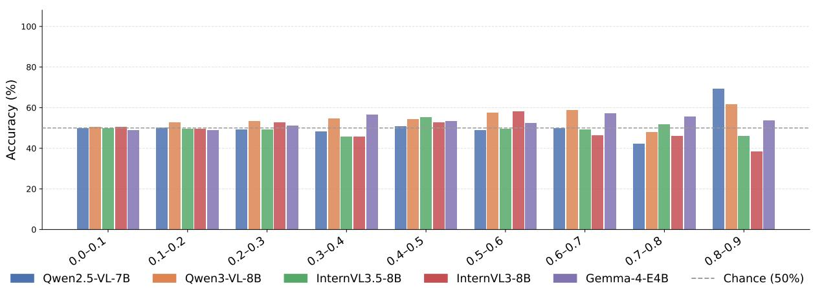  
Figure 14: Temporal anomaly detection accuracy by LPIPS distance for all evaluated models. Accuracy remains close to chance across most perceptual similarity bins, indicating that larger visual differences between swapped frames do not consistently improve performance. The apparent increase in the final bin (0.8–0.9) is likely due to the small number of samples (n = 13).

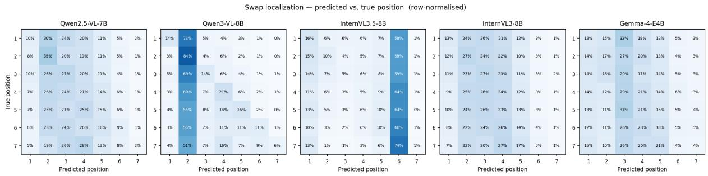  
Figure 15: Temporal localization confusion matrices for all evaluated models, averaged across datasets and rownormalized. Two distinct error patterns emerge. Qwen3-VL and InternVL3.5 exhibit a strong bias toward predicting specific swap positions, whereas Gemma-4, Qwen2.5-VL, and InternVL3 produce more uniformly distributed predictions, consistent with near-random guessing.

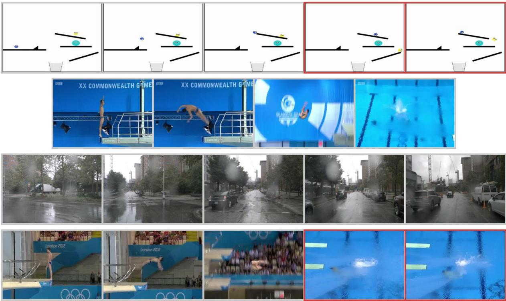  
Figure 16: Qualitative examples illustrating success and failure modes of both humans and VLMs. Red borders mark the swapped frame pair. From top to bottom: (1) Both correct – swap present (CRAFT, detect): the pair at positions 3–4 is out of order, human and all five models correctly identify the swap. (2) Both correct – no swap (MTL-AQA, detect): the sequence is unmodified, human and all models correctly report no anomaly. (3) LLMs correct, human wrong (Drive-LM, detect): the sequence is unmodified, but the human incorrectly reports a swap, likely misled by rainy conditions and a camera turn between frames; all five models answer correctly. (4) Both wrong (MTL-AQA, localize): the swap at positions 3–4 (two nearly identical underwater frames) is missed by both the human annotator and all five models, who instead point to earlier positions in the sequence.