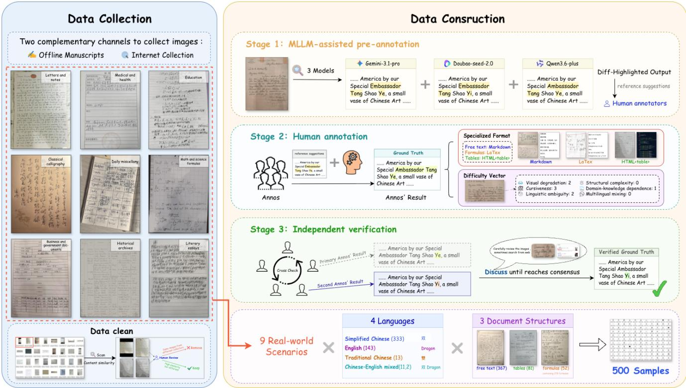
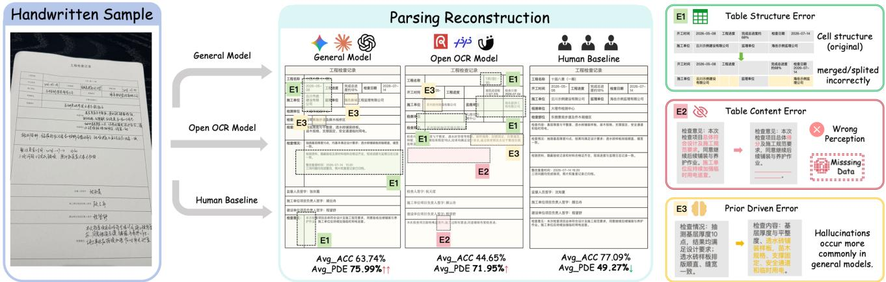
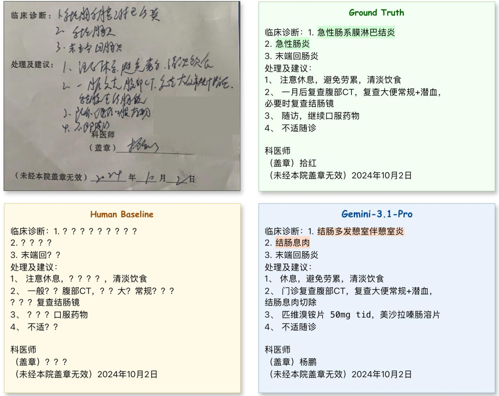
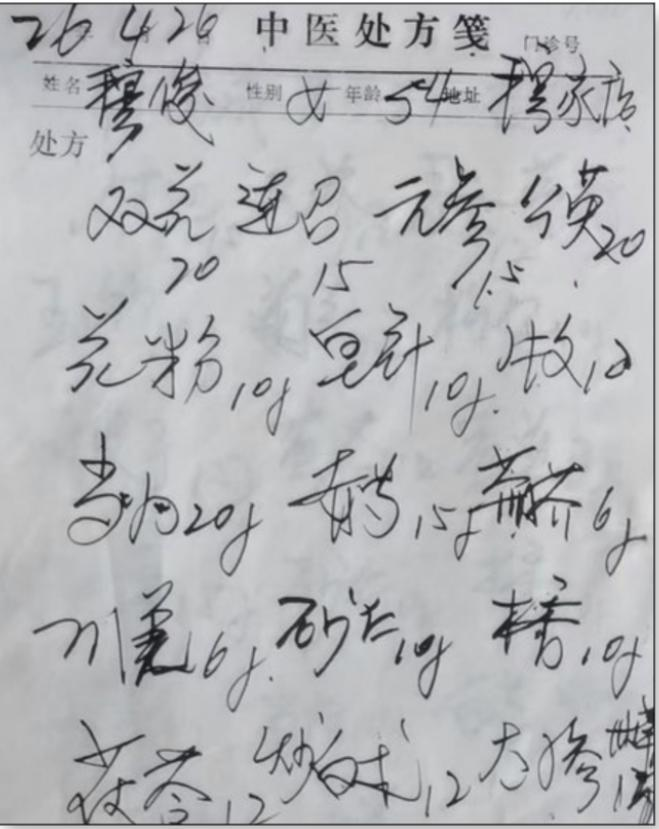
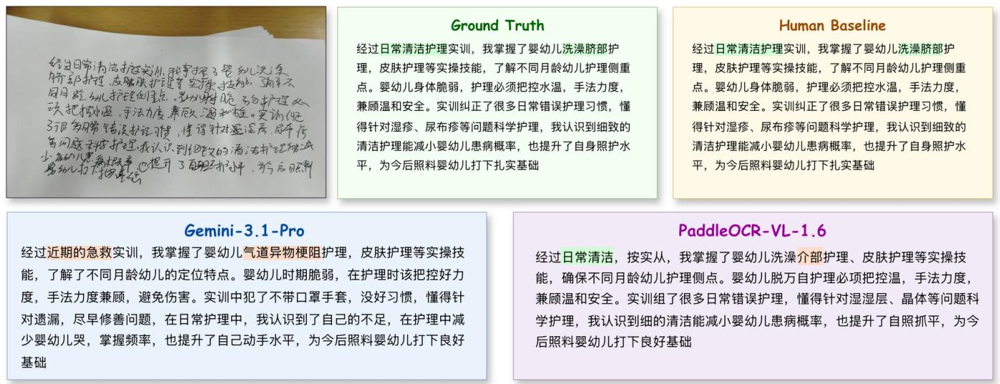
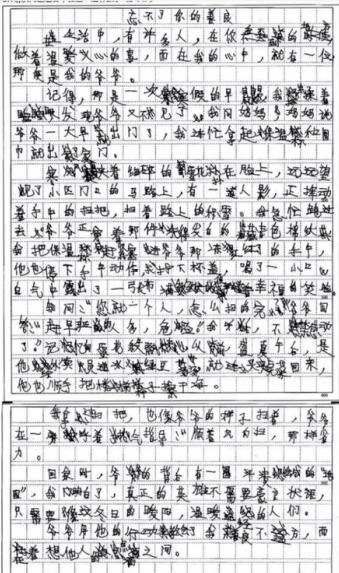

# WildHandBench: A Benchmark for Handwritten Text Understanding that Challenges MLLMs and Humans

Jun Zhang, Qiao Zhao, Cheng Cui, Jianying Qu, Zhongkai Sun, Jianwen Yang, Changda Zhou, ZhuoXin Liu, Shubin Han

Baidu Inc.

## Abstract

While the top model on OmniDocBench now reaches 96.34% overall on printed-document parsing, the ability of current models to handle challenging handwritten documents remains largely uncharacterized. Existing benchmarks focus on iso- lated text or formulas, overlook handwritten tables and real- world degradation, and report aggregate accuracy without ex- plaining why models fail.

We present WildHandBench, a benchmark containing 500 handwritten documents across three structures (free text, tables, formulas), four languages, and nine real-world scenarios. We introduce a Prior-Driven Error (PDE) metric that quantifies whether errors originate from language priors rather than visual evidence. Evaluating 18 state-of-the-art models together with calibrated human baselines, we find: (1) the best model achieves only 71.85% overall; (2) humans outperform all models yet the gap is narrow (77.09% vs. 71.85%); and (3) model errors are qualitatively diferent from human errors—63–91% of model errors are prior-driven versus only 49% for humans, exposing systematic reliance on language priors that conventional accuracy metrics cannot capture.

## Introduction

Recent advances in multimodal large language models (MLLMs) have dramatically improved document understanding (Fu et al. 2025; Ouyang et al. 2025). The top model on the OmniDocBench leaderboard now reaches 96.34% overall (Ouyang et al. 2025), approaching saturation on printed-document parsing. These remarkable results have gradually created a widespread perception that OCR is be- coming a largely solved problem.

We argue that this conclusion is premature.

Nearly all evidence supporting this perception comes from printed documents with relatively regular layouts and clear visual appearances (Mathew, Karatzas, and Jawahar 2021; Zhong, ShafieiBavani, and Jimeno Yepes 2020; Zheng et al. 2021; Göbel et al. 2013). Handwritten documents tell a different story. Medical records, handwritten forms, classroom notes, historical archives, and personal correspondence re- main substantially more dificult for today’s MLLMs de- spite their impressive performance on printed documents. Unlike printed OCR, handwritten document understanding requires models to jointly resolve ambiguous handwriting, recover irregular document structures, distinguish visual ev- idence from language priors, and reason under genuine un- certainty (Guan et al. 2024; Bai et al. 2024). Consequently, handwriting is not simply a more dificult OCR problem, but a distinct document understanding challenge.

Surprisingly, current evaluation benchmarks provide lim- ited insight into why handwritten document understanding remains unsolved. Existing handwritten benchmarks primar- ily evaluate isolated free-text recognition, while handwritten tables, naturally written formulas, and real-world document degradation remain largely unexplored. More fundamentally, existing evaluations focus almost exclusively on recognition accuracy (Fu et al. 2025; Ouyang et al. 2025). They measure how often models fail, but provide little understanding of why they fail—in particular, whether errors originate from poor visual perception or from excessive reliance on language pri- ors.

To address this gap, we introduce WildHandBench, a benchmark for handwritten document understanding. Wild- HandBench contains 500 handwritten documents spanning three document structures (free text, tables, and formulas), four language settings, and nine representative real-world scenarios. We also introduce a Prior-Driven Error (PDE) metric that characterizes whether model errors arise from language priors instead of visual evidence, enabling system- atic analysis of hallucination-like recognition behaviors.

Using WildHandBench, we conduct a comprehensive evaluation of 18 state-of-the-art MLLMs and OCR-oriented vision-language models under a unified evaluation protocol together with calibrated human baselines. Our study yields three key findings. First, handwritten document understand- ing remains far from solved: the strongest model achieves only 71.85% overall. Second, humans outperform all models (77.09% vs. 71.85%), yet the gap is narrow—top models even surpass humans on text transcription under format-matching metrics. Third, model errors are qualitatively diferent from human errors: humans remain conservative on illegible con- tent, whereas models confidently hallucinate fluent but un- supported text, with 63–91% of model errors classified as prior-driven compared to only 49% for humans. This exposes systematic reliance on language priors that conventional ac- curacy metrics cannot capture.

Our contributions are summarized as follows:

• We propose WildHandBench, to our knowledge the first benchmark that jointly evaluates handwritten free text, tables, and formulas across multiple languages and diverse real-world scenarios, addressing key gaps in existing eval- uation coverage.

• We introduce the Prior-Driven Error (PDE) metric, which quantifies whether model errors originate from language priors rather than visual evidence, enabling systematic analysis of hallucination-like recognition behaviors be- yond conventional accuracy metrics.

• We conduct a comprehensive evaluation of 18 state-ofthe-art MLLMs and OCR-oriented vision-language mod- els together with calibrated human baselines, revealing the persistent handwriting gap, the narrow yet meaning- ful distance to human performance, and the systematic reliance of MLLMs on language priors.

## Related Work

Handwritten document understanding. Handwritten doc-ument analysis has been studied for decades, yet ex- isting benchmarks remain highly task-specific and frag- mented. Most datasets focus on line-level handwrit- ten text recognition, including IAM (Marti and Bunke 2002), RIMES (Grosicki et al. 2009), CASIA-HWDB (Liu et al. 2011), SCUT-EPT (Zhu et al. 2019), and SCUT-HCCDoc (Zhang, Liang, and Jin 2020), covering Latin and Chinese handwriting under relatively controlled settings. Scientific handwriting has been investigated through datasets such as NoTeS-Bank (Pal et al. 2025), while handwritten mathematical expression recognition is primarily bench- marked by CROHME (Mahdavi et al. 2019) and MathWriting (Gervais, Fadeeva, and Maksai 2024). In contrast, table understanding benchmarks, including PubTabNet (Zhong, ShafieiBavani, and Jimeno Yepes 2020), FinTabNet (Zheng et al. 2021), and the ICDAR table com etitions (Göbel et al. 2013), are exclusively constructed from printed documents. Although these datasets have significantly advanced indi- vidual OCR tasks, the evaluate text, formulas, and tables independently and provide limited coverage of challenging handwritten documents with real-world degradation. Conse- quently, current handwritten benchmarks remain insuficient for evaluating handwritten documents as a unified document understanding problem.

Benchmarking document understanding. The rapid development of multimodal large language models (MLLMs) has shifted document evaluation from isolated OCR tasks toward holistic document understanding. Benchmarks such as OmniDocBench (Ouyang et al. 2025) evaluate diverse document parsing capabilities under a unified framework, while Real5-OmniDocBench (Zhou et al. 2026) further in-vestigates robustness under real-world physical degradations through fine-grained factor-level evaluation. OCRBench (Liu et al. 2024) and OCRBench v2 (Fu et al. 2025) extend bench-mark coverage to OCR-oriented multimodal capabilities, in- cluding text recognition, formula parsing, table understand- ing, and document visual question answering. These bench- marks demonstrate remarkable progress on printed docu- ments, with the top model now reaching 96.34% overall on OmniDocBench (Ouyang et al. 2025). Nevertheless, these evaluations primarily report aggregate recognition accuracy, providing limited understanding of why handwritten docu- ments remain substantially more challenging than printed documents.

Prior-driven errors in vision-language models. Re-cent studies have shown that multimodal large language models (MLLMs) frequently generate outputs that are not fully grounded in visual evidence (Guan et al. 2024; Bai et al. 2024). In OCR-related tasks, such hallucinations often manifest as fluent yet visually unsupported transcrip- tions, where language priors override ambiguous visual ob- servations. To better characterize this phenomenon, Seong et al. (Seong et al. 2026) proposed PINK, which penalizes over-correction in handwritten mathematical expression recognition. Similarly, HunyuanOCR-1.5 (Li et al. 2026) introduces CHAOS-Bench, which evaluates whether mod- els faithfully preserve visually observed but semantically implausible text under synthetic character perturbations in printed documents. These studies consistently demonstrate that prior-driven recognition errors are systematic rather than incidental.

However, existing evaluations remain restricted to either handwritten mathematical expressions or synthetically per- turbed printed documents. To the best of our knowledge, no existing benchmark systematically measures prior-driven er- rors on naturally occurring handwritten documents spanning free text, tables, and formulas. Our proposed Prior-Driven Error (PDE) metric is designed to bridge this gap by quantifying the extent to which model errors are attributable to language priors instead of visual evidence in realistic hand- written document understanding.

Table 1 summarizes representative benchmarks. Com- pared with previous datasets, WildHandBench is, to our knowledge, the first to unify handwritten free text, tables, and formulas within a single evaluation framework with cal- ibrated human baselines and Prior-Driven Error analysis.

## WildHandBench: Benchmark Design

WildHandBench jointly evaluates handwritten free text, tables, and formulas under realistic handwritten document scenarios. The benchmark contains 500 handwritten docu- ment images spanning three document structures, four lan- guage settings, and nine representative real-world scenarios. Figure 1 illustrates the overall construction pipeline.

## Benchmark Taxonomy

To comprehensively characterize handwritten document un- derstanding, every sample is organized along three dimen- sions.

• Language (4). WildHandBench covers four language settings, including Simplified Chinese (333, 66.6%), En-glish (143, 28.6%), Traditional Chinese (13, 2.6%), and Chinese–English mixed documents (11, 2.2%).

• Document Structure (3). The benchmark jointly eval-uates three representative handwritten document struc- tures: free text (367, 73.4%), tables (81, 16.2%), and formulas (52 images containing 278 individually annotated formula regions, 10.4%).

<table><tr><td>Benchmark</td><td>Lang.</td><td>Handwritten</td><td>Free Text</td><td>Table</td><td>Formula</td><td>Real Degrad.</td><td>Human Baseline</td></tr><tr><td>IAM</td><td>EN</td><td>√</td><td>√</td><td></td><td></td><td></td><td></td></tr><tr><td>CASIA-HWDB</td><td>ZH</td><td>√</td><td>√</td><td></td><td></td><td></td><td></td></tr><tr><td>SCUT-EPT / HCCDoc</td><td>ZH</td><td>√</td><td>√</td><td></td><td></td><td>Partial</td><td></td></tr><tr><td>CROHME / MathWriting</td><td>Symbol</td><td>√</td><td>一</td><td></td><td>√</td><td></td><td></td></tr><tr><td>PubTabNet / FinTabNet</td><td>EN</td><td></td><td></td><td>√</td><td>一</td><td></td><td></td></tr><tr><td>ICDAR Table</td><td>EN</td><td></td><td>一</td><td>√</td><td>一</td><td></td><td></td></tr><tr><td>OCRBench (v1/v2)</td><td>Multi</td><td>Partial</td><td>√</td><td>√</td><td>√</td><td>Partial</td><td></td></tr><tr><td>OmniDocBench</td><td>ZH/EN</td><td>Partial</td><td>√</td><td>√</td><td>√</td><td>Partial</td><td></td></tr><tr><td>Real5-OmniDocBench</td><td>ZH/EN</td><td>Partial</td><td>√</td><td>√</td><td>√</td><td>√</td><td></td></tr><tr><td>WILDHANDBENCH (Ours)</td><td>ZH/EN</td><td>了</td><td>√</td><td>√</td><td>√</td><td>√</td><td>√</td></tr></table>

Table 1: Comparison with representative benchmarks. WildHandBench is, to our knowledge, the first to jointly cover hand written free text, tables, and formulas with real-scenario degradation and calibrated human baselines.

• Real-world Scenario (9). Samples are collected from nine representative scenarios, including literary writing, letters and notes, medical records, business and govern- ment documents, education, mathematical and scientific materials, classical calligraphy, daily miscellany, and his- torical archives.

## Benchmark Construction

To maximize both dataset diversity and annotation reliability, handwritten documents are collected from two complemen- tary sources.

Ofline handwritten manuscripts. Participants voluntarily contribute authentic handwritten materials covering mul- tiple real-world domains. Since writers have direct access to the original content, reliable ground-truth transcriptions can be obtained from the source documents.

Internet collection. Additional handwritten documents are collected from publicly available online resources where community discussions or decipherment references provide useful contextual information for annotation.

After collection, all samples undergo automatic content- similarity scanning to remove duplicates, followed by manual inspection of ambiguous cases.

Benchmark construction then proceeds in three stages.

Stage 1: MLLM-assisted pre-annotation. Three state-ofthe-art MLLMs independently transcribe every handwritten document. These predictions are not used as ground truth, but serve as reference suggestions for human annotators, help- ing identify ambiguous regions and improving annotation eficiency.

Stage 2: Human annotation. A primary annotator produces the recognition ground truth for every sample, repre- sented using Markdown for free text, LATEX for formulas, and HTML <table> for handwritten tables. Additionally, each sample is annotated with dificulty ratings along six dimen- sions (visual degradation, cursiveness, linguistic ambiguity, structural complexity, domain knowledge, and multilingua mixing) to support future fine-grained analysis.

During annotation, annotators consult all available evi- dence, including MLLM predictions, writer-provided tran- scripts, community discussions, and domain experts when- ever necessary. Characters that remain impossible to identify after exhaustive verification are masked in the original image and excluded from evaluation.

Stage 3: Independent verification. Every annotation is independently reviewed by a second annotator who per- forms the verification without access to the primary anno- tator’s reasoning. Disagreements are resolved through dis- cussion until consensus is reached. Only samples passing independent verification are included in the final bench- mark. This multi-stage quality-control protocol—automatic deduplication, MLLM-assisted annotation, independent dou- ble review, and consensus-based adjudication—substantially reduces annotation inconsistency while ensuring reliable ground truth for subsequent evaluation.

## Evaluation Protocol

Our evaluation protocol consists of three components. First, structure-specific recognition metrics measure transcription quality across free text, formulas, and tables. Second, the pro- posed Prior-Driven Error (PDE) metric quantifies whether recognition failures originate from language priors rather than visual evidence. Third, calibrated human baselines pro- vide a reference point for characterizing how human and machine errors difer qualitatively.

## Recognition Evaluation

Following OmniDocBench (Ouyang et al. 2025), difer-ent handwritten document structures are evaluated using structure-specific metrics.

• Free text. Character-level recognition quality is measured using normalized Edit Distance (Edit↓) (Levenshtein 1966).

• Formulas. Formula recognition is evaluated using CDM (Character Detection Metric, CDM↑), which renders both prediction and ground truth before matching character bounding boxes (Wang et al. 2025).

• Tables. Table understanding is evaluated using TEDS (Tree Edit Distance Similarity, TEDS↑), which jointly measures structural correctness and textual fidelity based on HTML representations (Zhong, ShafieiBavani, and Jimeno Yepes 2020).

  
Figure 1: Overview of the WildHandBench construction pipeline.

To facilitate comparison across diferent document structures, we report an overall score following Om- niDocBench (Ouyang et al. 2025):

$$
\mathrm { O v e r a l l } = { \frac { ( 1 - \mathrm { E d i t } ) \times 1 0 0 + \mathrm { C D M } + \mathrm { T E D S } } { 3 } } .
$$

## Prior-Driven Error

Recognition accuracy alone cannot distinguish diferent types of recognition failures. Two models may achieve iden- tical recognition accuracy while exhibiting very diferent be- haviors: one may fail because it cannot correctly perceive handwritten content, whereas the other may generate visu- ally unsupported yet linguistically plausible transcriptions due to excessive reliance on language priors. Since these two failure modes require diferent modeling improvements, WildHandBench explicitly quantifies prior-driven recogni- tion errors through the proposed Prior-Driven Error (PDE) metric.

For every prediction, model output is aligned with the corresponding ground truth using character-level alignment for free text and formulas, and cell-level alignment for tables. Only segments where prediction difers from the ground truth are considered. Each mismatched segment is then scored using an external reference language model (Qwen3-8B-Base (Qwen Team 2025)). If the model-generated segment has lower perplexity than the corresponding ground-truth segment, the error is regarded as prior-driven, indicating that the model replaces visually correct but less common content with a linguistically more probable alternative. In- serted content that has no corresponding ground truth is always regarded as prior-driven since it is generated solely from internal language priors.

Formally, for a sample s, the Prior-Driven Error rate is computed as

$$
\mathrm { P D E } ( s ) = \frac { \sum _ { i } \mathcal { W } [ \mathtt { p p l } ( m _ { i } ) < \mathtt { p p l } ( g _ { i } ) ] | m _ { i } | } { \sum _ { i } | m _ { i } | } ,
$$

where $m _ { i }$ and $g _ { i }$ denote the model prediction and the cor- responding ground-truth segment, respectively. For inserted content, $\mathrm { p p l } ( g _ { i } ) = \infty$ . The summation is performed only over mismatched segments. Consequently, PDE measures the proportion of model errors attributable to language pri- ors rather than visual perception, instead of reflecting overall recognition accuracy. The overall PDE score reported for each model is the arithmetic mean of the per-category PDE rates (text, table, formula).

## Human Baselines

WildHandBench additionally establishes calibrated human baselines under the same evaluation protocol. Human partici- pants receive exactly the same handwritten document images as the evaluated models and independently produce recog- nition outputs using the same target formats. Performance is evaluated using the identical metrics described above.

To ensure a fair comparison, human participants perform single-pass recognition without access to any auxiliary re- sources. In particular, they are not allowed to consult MLLM predictions, writer-provided transcripts, community discus- sions, or domain experts. This setting difers intentionally from the benchmark construction process, where multiple evidence sources are integrated to establish reliable ground truth through consensus-based annotation.

Under this protocol, human participants achieve an overall score of 77.09%, which is higher than the best MLLM (Gemini 3.1 Pro, 71.85%). Detailed per-category comparisons are presented in the Experiments section.

## Experiments

## Evaluated Models

We evaluate 18 models grouped into three categories: proprietary VLMs (Claude Opus 4.8 (Anthropic 2026), Gemini 3.1 Pro (Google DeepMind 2026a), Gemini 3.5 Flash (Google DeepMind 2026b)), open-source general VLMs (InternVL3.5 (OpenGVLab 2025), Qwen3-VL (Bai et al. 2025), Qwen3.5-Plus (Alibaba Cloud 2026), Kimi-K3 (Kimi Team 2026)), and open-source OCR-focused VLMs (DeepSeek-OCR-V2 (Wei, Sun, and Li 2026), MinerU2.5 (Niu et al. 2025), MinerU2.5-Pro (Wang et al. 2026), Unlimited-OCR (Yin et al. 2026), Dots.ocr (Li et al. 2025), Dots.mocr (Zheng et al. 2026), HunyuanOCR (Hun-yuan Vision Team et al. 2025), Qianfan-OCR (Dong et al. 2026), FireRed-OCR (Wu et al. 2026), GLM-OCR (Duan et al. 2026), PaddleOCR-VL-1.6 (Zhang et al. 2026)).

All models are evaluated with an identical post-processing pipeline. General VLMs use the standard OmniDocBench prompt template (Ouyang et al. 2025), while OCR-focused models use their respective recommended prompt settings or APIs.

Models are selected to represent the current state of the art in document understanding, with reference to the Om- niDocBench leaderboard (Ouyang et al. 2025).

## Main Results

Table 2 presents the main results. The most striking find- ing is the performance degradation from printed to hand- written documents: models that exceed 90% on Om- niDocBench (Ouyang et al. 2025) drop to 71.85% at best on WildHandBench, confirming a persistent “hand- written gap.” Furthermore, OCR-focused models—which routinely outperform general VLMs on printed-document benchmarks—fall behind general VLMs on wild handwrit- ing. The top six models on WildHandBench are all general- purpose, suggesting that larger model capacity and more di- verse training data enable stronger generalization to the high variability of handwritten content, while OCR-focused mod- els are specialized for the regularity of printed layouts.

Tables remain the most challenging category: even the best TEDS score (60.44) indicates nearly 40% structural and content mismatch, and table scores show the smallest cross-model variance among functional models. Text recog- nition shows the widest spread, reflecting large diferences in character-level fidelity. Gemini 3.1 Pro leads in all three categories and overall, though Kimi-K3 is competitive on text edit distance (26.07 vs. 24.32) and Gemini 3.5 Flash on formula CDM (78.22 vs. 79.42).

## Human vs. Model Analysis

The human baseline achieves an overall score of 77.09%— higher than the best MLLM (Gemini 3.1 Pro, 71.85%) by 5.24 absolute points. While this confirms that human per- formance remains the upper bound, the relatively modest gap indicates that wild handwriting challenges humans and models alike.

The per-category breakdown reveals where models still lag behind humans and where they have caught up. On text, the best model actually surpasses humans (Edit: 30.08 vs. 24.32), indicating that MLLMs produce more format-compliant transcriptions even though humans may achieve superior character-level recognition. On tables (TEDS: 74.78 vs. 60.44), humans substantially outperform all models by over 14 absolute points, reflecting superior structural under- standing of irregular handwritten tables. On formulas (CDM: 86.56 vs. 79.42), humans also lead, though the gap is smaller (7.14 points), indicating that formula recognition in current MLLMs is relatively mature.

Crucially, human errors are qualitatively diferent from model errors. The PDE analysis shows that human PDE is 49.27%, substantially lower than all evaluated models (minimum 63.28%), indicating that human errors are more evenly split between visual misrecognition and prior-driven substi- tution. Models, in contrast, produce disproportionately prior- driven errors—generating fluent but visually unsupported output where humans tend toward conservative partial tran- scriptions. This qualitative gap in failure modes persists de- spite the narrowing quantitative gap in overall accuracy.

## Error Pattern Analysis

Table 2 also reports the prior-driven error rate decomposed by content structure; Figure 2 provides qualitative examples of table parsing errors across model types and the human base- line. Among models with functional visual encoders, PDE rates range from 63% to 79% without a simple correlation to accuracy. Notably, general VLMs with strong language capabilities show relatively high rates (Gemini 3.5 Flash: 79.21%, Qwen3.5-Plus: 77.82%, Gemini 3.1 Pro: 77.51%), while the lowest PDE rates belong to certain compact OCR- focused models (GLM-OCR: 63.28%, PaddleOCR-VL-1.6: 64.48%).

This reveals a nuanced relationship between model capa- bility and error type. At the extreme, models with severely limited visual decoding produce almost exclusively prior- driven errors. Among better-performing models, powerful language priors act as a double-edged sword: they boost accuracy by correctly inferring ambiguous characters, but when errors do occur, those errors are disproportionately prior-driven—the model’s strong language capability causes it to confidently generate plausible alternatives rather than fail silently. Conversely, the models with the lowest PDE rates (GLM-OCR, PaddleOCR-VL) are compact models that produce a larger proportion of visual misrecognition errors (e.g., confusing similar-looking characters) rather than gen-erating fluent but unsupported text.

The per-structure breakdown reveals that formula errors are almost entirely prior-driven across all models (87–98%), likely because LaTeX syntax is inherently low-perplexity— even legitimate format diferences satisfy the ppl criterion. Text errors show the widest spread (52–84%), reflecting the greatest variation in model reliance on language priors. Table errors are moderate (42–90%), with weaker models showing higher rates.

Figure 2: Qualitative comparison of handwritten table parsing across general-purpose models, OCR-specialized models, and the human baseline. The right panel illustrates three error types: table structure errors (E1), table content errors (E2), and prior-driven errors (E3).
<table><tr><td></td><td></td><td></td><td colspan="4">Performance Evaluation (%)</td><td colspan="4">Prior-Driven Error (%)</td></tr><tr><td>Type</td><td>Model</td><td>Params</td><td>Text Edit↓</td><td>Table TEDS↑</td><td>Formula CDM↑</td><td>Overall ↑</td><td>Text↓</td><td>Table↓</td><td>Formula↓</td><td>Overall.↓</td></tr><tr><td rowspan="3">Proprietary</td><td>Claude Opus 4.8</td><td></td><td>53.30</td><td>52.27</td><td>74.11</td><td>57.70</td><td>72.78</td><td>59.32</td><td>91.66</td><td>74.59</td></tr><tr><td>Gemini 3.5 Flash</td><td></td><td>27.10</td><td>53.63</td><td>78.22</td><td>68.25</td><td>71.36</td><td>71.91</td><td>94.36</td><td>79.21</td></tr><tr><td>Gemini 3.1 Pro</td><td></td><td>24.32</td><td>60.44</td><td>79.42</td><td>71.85</td><td>71.19</td><td>66.56</td><td>94.77</td><td>77.51</td></tr><tr><td rowspan="4">Open General</td><td>InternVL3.5</td><td>241B-A28B</td><td>46.80</td><td>41.22</td><td>64.00</td><td>52.80</td><td>72.62</td><td>66.38</td><td>90.03</td><td>76.34</td></tr><tr><td>女 Qwen3-VL</td><td>235B-A22B</td><td>34.30</td><td>51.81</td><td>69.06</td><td>62.19</td><td>70.01</td><td>62.18</td><td>91.33</td><td>74.51</td></tr><tr><td>Qwen3.5-Plus</td><td>397B-A17B</td><td>34.80</td><td>57.68</td><td>73.77</td><td>65.55</td><td>71.74</td><td>70.00</td><td>91.71</td><td>77.82</td></tr><tr><td>KKimi-K3</td><td>2.8T-104B</td><td>26.07</td><td>58.99</td><td>70.50</td><td>67.81</td><td>65.29</td><td>60.32</td><td>90.21</td><td>71.94</td></tr><tr><td rowspan="9">Open OCR</td><td>DeepSeek-OCR2</td><td>3B-A0.5B</td><td>91.70</td><td>1.77</td><td>18.33</td><td>9.46</td><td>84.06</td><td>90.00</td><td>98.35</td><td>90.80</td></tr><tr><td> MinerU-2.5</td><td>1.2B</td><td>83.80</td><td>41.19</td><td>36.56</td><td>31.33</td><td>73.80</td><td>55.21</td><td>92.16</td><td>73.72</td></tr><tr><td>Unlimited-OCR</td><td>3B-A0.5B</td><td>64.90</td><td>34.41</td><td>51.62</td><td>40.38</td><td>61.67</td><td>55.16</td><td>89.47</td><td>68.77</td></tr><tr><td>R Dots.ocr</td><td>3B</td><td>56.68</td><td>34.70</td><td>53.17</td><td>43.73</td><td>70.29</td><td>59.75</td><td>90.98</td><td>73.67</td></tr><tr><td>R Dots.mocr</td><td>3B</td><td>49.54</td><td>36.60</td><td>62.85</td><td>49.97</td><td>63.23</td><td>59.56</td><td>89.73</td><td>70.84</td></tr><tr><td>HunyuanOCR</td><td>1.0B</td><td>38.50</td><td>47.02</td><td>45.81</td><td>51.44</td><td>67.13</td><td>55.55</td><td>92.08</td><td>71.59</td></tr><tr><td> MinerU2.5-Pro</td><td>1.2B</td><td>59.80</td><td>53.16</td><td>61.79</td><td>51.73</td><td>61.23</td><td>47.46</td><td>92.80</td><td>67.16</td></tr><tr><td>品 Qianfan-OCR</td><td>4B</td><td>50.40</td><td>45.22</td><td>61.40</td><td>52.07</td><td>64.07</td><td>61.29</td><td>94.04</td><td>73.13</td></tr><tr><td>R FireRed-OCR</td><td>2B</td><td>49.00</td><td>44.30 57.38</td><td>63.11</td><td>52.82 54.06</td><td>64.70</td><td>64.25</td><td>93.10</td><td>74.02</td></tr><tr><td>C GLM-OCR</td><td></td><td>0.9B</td><td>54.20</td><td>59.01</td><td></td><td></td><td>57.02</td><td>41.92</td><td>90.89</td><td>63.28</td></tr><tr><td></td><td>PaddleOCR-VL-1.6</td><td>0.9B</td><td>41.52</td><td>52.41</td><td>51.75</td><td>54.21</td><td>52.59</td><td>53.01</td><td>87.83</td><td>64.48</td></tr><tr><td>Human</td><td>Human</td><td>一</td><td>30.08</td><td>74.78</td><td>86.56</td><td>77.09</td><td>66.96</td><td>34.48</td><td>46.36</td><td>49.27</td></tr></table>

Table 2: Recognition performance and prior-driven error for all evaluated models and the human baseline.

We note limitations of this metric: it characterizes error type, not error quantity—a high prior-driven rate does not mean a model is less reliable, only that its errors are more systematic. The classification depends on a specific reference language model (Qwen3-8B-Base); a diferent model may shift boundary cases.

## Discussion

The findings of WildHandBench demonstrate that hand- written document understanding remains unsolved: models exceeding 90% on OmniDocBench (Ouyang et al. 2025) drop to 71.85% at best on WildHandBench, and this degrada- tion is non-uniform across document structures. More criti- cally, the PDE analysis reveals that model and human errors are qualitatively diferent—63–79% of model errors among functional models originate from language priors, compared to 49% for humans. This means that model errors are system- atically more dangerous: fluent, confident, and unsupported by visual evidence.

These findings have implications for safety-critical appli- cations such as medical records, financial documents, and legal archives, where prior-driven errors are particularly difi- cult to detect (Bai et al. 2024). Future models should optimize not only recognition accuracy but also visual grounding and calibrated uncertainty, learning to express uncertainty rather than confidently generating plausible transcriptions when vi- sual evidence is insuficient.

## Limitations

Benchmark scale and coverage. Although WildHand-Bench contains carefully curated handwritten documents with high-quality annotations, it currently consists of 500 samples and should not be interpreted as a population-level estimate of handwritten OCR performance. The relatively small formula (52 images) and table (81 images) subsets limit statistical power for distinguishing highly competitive models. Furthermore, the benchmark focuses primarily on Chinese and English handwriting. Future versions will ex- pand both language coverage and dataset scale.

Annotation and human evaluation. Part of the bench-mark is collected from publicly available Internet resources, which may introduce source bias despite careful manual screening and deduplication. Certain handwritten scenar- ios, such as historical calligraphy or severely degraded manuscripts, inherently involve subjective interpretation, making a universally correct transcription dificult to de- fine even under consensus-based annotation. The reported human baseline should therefore be regarded as a calibrated reference rather than an absolute upper bound. Moreover, all participating annotators are native Chinese speakers, which may underestimate achievable human performance on highly cursive or stylistically diverse English handwriting.

PDE metric. The PDE metric depends on an external reference language model (Qwen3-8B-Base (Qwen Team 2025)) for perplexity estimation, and alternative reference models may lead to diferent classifications for ambiguous boundary cases. Moreover, PDE is designed to characterize error type rather than quantity—a higher PDE does not imply lower model reliability, only that a larger proportion of errors originate from language priors rather than visual perception.

## Conclusion

We presented WildHandBench, a benchmark for handwrit- ten document understanding that jointly evaluates free text, tables, and formulas with a unified protocol combining recog- nition metrics, human baselines, and Prior-Driven Error anal- ysis. Experiments on 18 models reveal a persistent handwrit- ten gap (best model 71.85% vs. human 77.09%), with model errors qualitatively diferent from human errors—63–79% prior-driven for models vs. 49% for humans.

## References

Alibaba Cloud. 2026. Qwen3.5-Plus. Model Studio release documentation. Accessed 2026-07-27.

Anthropic. 2026. Introducing Claude Opus 4.8. Oficial model release. Accessed 2026-07-27.

Bai, S.; Cai, Y.; Chen, R.; Chen, K.; Chen, X.; Cheng, Z.; Deng, L.; Ding, W.; Gao, C.; Ge, C.; et al. 2025. Qwen3-VL Technical Report. arXiv preprint arXiv:2511.21631.

Bai, Z.; Wang, P.; Xiao, T.; He, T.; Han, Z.; Zhang, Z.; and Shou, M. Z. 2024. Hallucination of Multimodal Large Lan- guage Models: A Survey. arXiv preprint arXiv:2404.18930.

Dong, D.; Zheng, M.; Xu, D.; Luo, C.; Zhuang, B.; Li, Y.; He, R.; Wang, H.; Zhang, W.; Wang, W.; et al. 2026. Qianfan-OCR: A Unified End-to-End Model for Document Intelli- gence. arXiv preprint arXiv:2603.13398.

Duan, S.; Xue, Y.; Wang, W.; Su, Z.; Liu, H.; Yang, S.; Gan,G.; Wang, G.; Wang, Z.; Yan, S.; et al. 2026. GLM-OCRTechnical Report. arXiv preprint arXiv:2603.10910.

Fu, L.; Yang, B.; Kuang, Z.; Song, J.; Li, Y.; Zhu, L.; Luo, Q.; Wang, X.; Lu, H.; Huang, M.; Li, Z.; Tang, G.; Shan, B.; Lin, C.; Liu, Q.; Wu, B.; Feng, H.; Liu, H.; Huang, C.; Tang, J.; Chen, W.; Jin, L.; Liu, Y.; and Bai, X. 2025. OCRBench v2: An Improved Benchmark for Evaluating Large Multimodal Models on Visual Text Localization and Reasoning. arXiv preprint arXiv:2501.00321.

Gervais, P.; Fadeeva, A.; and Maksai, A. 2024. MathWrit- ing: A Dataset for Handwritten Mathematical Expression Recognition. arXiv preprint arXiv:2404.10690.

Göbel, M.; Hassan, T.; Oro, E.; and Orsi, G. 2013. ICDAR 2013 Table Competition. In 2013 12th International Conference on Document Analysis and Recognition, 1449–1453.

Google DeepMind. 2026a. Gemini 3.1 Pro: A Smarter Model for Your Most Complex Tasks. Oficial model release. Ac- cessed 2026-07-27.

Google DeepMind. 2026b. Gemini 3.5 Flash Model Card. Oficial model card. Accessed 2026-07-27.

Grosicki, E.; Carré, M.; Brodin, J.-M.; and Geofrois, E. 2009. Results of the RIMES Evaluation Campaign for Hand- written Mail Processing. In 2009 10th International Conference on Document Analysis and Recognition, 941–945.

Guan, T.; Liu, F.; Wu, X.; Xian, R.; Li, Z.; Liu, X.; Wang, X.; Chen, L.; Huang, F.; Yacoob, Y.; Manocha, D.; and Zhou, T. 2024. HallusionBench: An Advanced Diagnostic Suite for Entangled Language Hallucination and Visual Illu- sion in Large Vision-Language Models. In Proceedings of the IEEE/CVF Conference on Computer Vision and Pattern Recognition, 14375–14385.

Hunyuan Vision Team; Lyu, P.; Wan, X.; Li, G.; Peng, S.; Wang, W.; Wu, L.; Shen, H.; Zhou, Y.; Tang, C.; et al. 2025. HunyuanOCR Technical Report. arXiv preprint arXiv:2511.19575.

Kimi Team. 2026. Kimi K3: Open Frontier Intelligence. arXiv preprint arXiv:2607.24653.

Levenshtein, V. I. 1966. Binary Codes Capable of Correcting Deletions, Insertions, and Reversals. Soviet Physics Doklady, 10(8): 707–710.

Li, G.; Wan, X.; Peng, S.; Wang, W.; Feng, H.; Du, Y.; Wu,B.; Ruan, Z.; Lu, Z.; Wu, L.; Lyu, P.; Shen, H.; Lin, Z.; Hu,

S.; Yang, J.; Wen, H.; Yu, G.; Liu, H.; Wang, B.; Ma, C.; Hu, H.; Zhang, C.; and Zhou, Y. 2026. HunyuanOCR-1.5: Making Lightweight OCR VLMs Faster and Better. arXiv preprint arXiv:2607.04884.

Li, Y.; Yang, G.; Liu, H.; Wang, B.; and Zhang, C. 2025. dots.ocr: Multilingual Document Layout Parsing in a Single Vision-Language Model. arXiv preprint arXiv:2512.02498.

Liu, C.-L.; Yin, F.; Wang, D.-H.; and Wang, Q.-F. 2011. CASIA Online and Ofline Chinese Handwriting Databases. In 2011 International Conference on DocumentAnalysis and Recognition, 37–41.

Liu, Y.; Li, Z.; Huang, M.; Yang, B.; Yu, W.; Li, C.; Yin, X.; Liu, C.-L.; Jin, L.; and Bai, X. 2024. OCRBench: On the Hidden Mystery of OCR in Large Multimodal Models. Science China Information Sciences, 67: 220102.

Mahdavi, M.; Zanibbi, R.; Mouchère, H.; Viard-Gaudin, C.; and Garain, U. 2019. ICDAR 2019 CROHME + TFD: Com- petition on Recognition of Handwritten Mathematical Ex- pressions and Typeset Formula Detection. In 2019 International Conference on Document Analysis and Recognition, 1533–1538.

Marti, U.-V.; and Bunke, H. 2002. The IAM-Database: An English Sentence Database for Ofline Handwriting Recog- nition. International Journal on Document Analysis and Recognition, 5(1): 39–46.

Mathew, M.; Karatzas, D.; and Jawahar, C. V. 2021. DocVQA: A Dataset for VQA on Document Images. In Proceedings of the IEEE/CVF Winter Conference on Applications ofComputer Vision, 2200–2209.

Niu, J.; Liu, Z.; Gu, Z.; Wang, B.; Ouyang, L.; Zhao, Z.; Chu, T.; He, T.; Wu, F.; Zhang, Q.; et al. 2025. MinerU2.5: A Decoupled Vision-Language Model for Ef- ficient High-Resolution Document Parsing. arXiv preprint arXiv:2509.22186.

OpenGVLab. 2025. InternVL3.5. Oficial release blog. Ac- cessed 2026-07-27.

Ouyang, L.; Qu, Y.; Zhou, H.; Zhu, J.; Zhang, R.; Lin, Q.;Wang, B.; Zhao, Z.; Jiang, M.; Zhao, X.; Shi, J.; Wu, F.;Chu, P.; Liu, M.; Li, Z.; Xu, C.; Zhang, B.; Shi, B.; Tu, Z.;and He, C. 2025. OmniDocBench: Benchmarking DiversePDF Document Parsing with Comprehensive Annotations.In Proceedings of the IEEE/CVF Conference on ComputerVision and Pattern Recognition, 24838–24848.

Pal, A.; Biswas, S.; Das, A.; Lodh, A.; Banerjee, P.; Chattopadhyay, S.; Karatzas, D.; Llados, J.; and Jawahar, C. V. 2025. NoTeS-Bank: Benchmarking Neural Transcription and Search for Scientific Notes Understanding. arXiv preprint arXiv:2504.09249.

Qwen Team. 2025. Qwen3 Technical Report. arXiv preprint arXiv:2505.09388.

Seong, J.; Liermann, W.; Kim, M.; Shin, J.-h.; and Lim, S. 2026. When VLMs “Fix” Students: Identifying and Penal- izing Over-Correction in the Evaluation of Multi-line Hand- written Math OCR. arXiv preprint arXiv:2604.22774.

Wang, B.; He, T.; Ouyang, L.; Wu, F.; Zhao, Z.; Chu, T.; Qu, Y.; Jin, Z.; Zeng, W.; Miao, Z.; et al. 2026. MinerU2.5- Pro: Pushing the Limits of Data-Centric Document Parsing at Scale. arXiv preprint arXiv:2604.04771.

Wang, B.; Wu, F.; Ouyang, L.; Gu, Z.; Zhang, R.; Xia, R.; Shi, B.; Zhang, B.; and He, C. 2025. Image Over Text: Transforming Formula Recognition Evaluation with Charac- ter Detection Matching. In Proceedings of the IEEE/CVF Conference on Computer Vision and Pattern Recognition, 19681–19690.

Wei, H.; Sun, Y.; and Li, Y. 2026. DeepSeek-OCR 2: Visual Causal Flow. arXiv preprint arXiv:2601.20552.

Wu, H.; Lou, H.; Li, X.; Zhong, Z.; Sun, Z.; Chen, P.; Zhou, X.; Zuo, K.; Chen, Y.; Tang, X.; et al. 2026. FireRed-OCR Technical Report. arXiv preprint arXiv:2603.01840.

Yin, Y.; Liu, H.; Xie, Q.; Liu, C.; Yang, S.; Wang, S.; Liu, Z.; Zou, H.; Chen, J.; Wei, S.; et al. 2026. Unlimited OCR Works. arXiv preprint arXiv:2606.23050.

Zhang, H.; Liang, L.; and Jin, L. 2020. SCUT-HCCDoc: A New Benchmark Dataset of Handwritten Chinese Text in Un- constrained Camera-Captured Documents. Pattern Recognition, 108: 107559.

Zhang, Z.; Liu, H.; Liang, S.; Zhang, Y.; Xiang, Y.; Liu, J.; Sun, T.; Lin, M.; Zhang, Y.; Zhou, C.; Gao, T.; Cui, C.; Liu, Y.; Yu, D.; and Ma, Y. 2026. PaddleOCR-VL-1.6: Expand- ing the Frontier of Document Parsing with Under-Optimized Region Refinement and Progressive Post-Training. arXiv preprint arXiv:2606.03264.

Zheng, H.; Li, Y.; Zhang, K.; Xin, L.; Zhao, G.; Liu, H.; Chen, J.; Lou, J.; Qiu, J.; Fu, Q.; et al. 2026. Multimodal OCR: Parse Anything from Documents. arXiv preprint arXiv:2603.13032.

Zheng, X.; Burdick, D.; Popa, L.; Zhong, X.; and Wang, N. X. R. 2021. Global Table Extractor (GTE): A Framework for Joint Table Identification and Cell Structure Recognition Using Visual Context. In Proceedings of the IEEE/CVF Winter Conference onApplications ofComputer Vision, 697– 706.

Zhong, X.; ShafieiBavani, E.; and Jimeno Yepes, A. 2020. Image-Based Table Recognition: Data, Model, and Evalua- tion. In Computer Vision – ECCV 2020, 564–580. Springer.

Zhou, C.; Gao, Z.; Wang, X.; Gao, T.; Cui, C.; Tang, J.; and Liu, Y. 2026. Real5-OmniDocBench: A Full-Scale Physical Reconstruction Benchmark for Robust Document Parsing in the Wild. arXiv preprint arXiv:2603.04205.

Zhu, Y.; Xie, Z.; Jin, L.; Chen, X.; Huang, Y.; and Zhang, M. 2019. SCUT-EPT: New Dataset and Benchmark for Of- fline Chinese Text Recognition in Examination Paper. IEEE Access, 7: 370–382.

# Supplementary Material

Section A provides additional dataset construction details beyond those in the main paper. Section B presents qualitative PDE (Prior-Driven Error) examples from WildHandBench. Section C gives complete evaluation details including the full model list, prompt templates, and inference configuration.

## A. Dataset Details

This section expands on the dataset construction summarized in the main paper. We report only details not already covered there, including per-source sample counts, the joint category–language distribution, per-scenario counts, and the annotation and image-processing specifications.

## A.1 Data Collection Sources

The 500 samples are drawn from two complementary channels:

• Ofline handwritten manuscripts (141 samples, 28.2%). Voluntary contributions from project members and acquaintances, concentrated in the education and medical domains (classroom notes, homework, medical records, prescriptions), plus hand transcribed article abstracts, reading notes, and letters to broaden writing styles.

• Internet collection (359 samples, 71.8%). Publicly available handwritten images covering long-tail genres: classical poetry and calligraphy, historical archival registers, old newspapers, and oficial forms.

## A.2 Category × Language Distribution

The main paper reports the marginal counts for document structure and language separately. Table 3 gives the full joint distribution.

Table 3: Category × Language joint distribution.
<table><tr><td>Category</td><td>zh_hans</td><td>en</td><td>zh_hant</td><td>zh_en_mix</td><td>Total</td></tr><tr><td>Text</td><td>251</td><td>99</td><td>12</td><td>7</td><td>369</td></tr><tr><td>Table</td><td>62</td><td>16</td><td>0</td><td>1</td><td>79</td></tr><tr><td>Formula</td><td>20</td><td>29</td><td>0</td><td>3</td><td>52</td></tr><tr><td>Total</td><td>333</td><td>144</td><td>12</td><td>11</td><td>500</td></tr></table>

## A.3 Scenario Distribution

The main paper enumerates the nine scenarios; Table 4 adds their per-scenario sample counts.

Table 4: Per-scenario sample counts.
<table><tr><td>Scenario</td><td>Count</td></tr><tr><td>Literary essays Letters &amp; notes Medical &amp; health Education &amp; learning Business documents</td><td>93 81 62 61 58 55</td></tr><tr><td>Math &amp; science formulas Classical poetry &amp; calligraphy Daily life notes</td><td>41 32</td></tr><tr><td>Historical archives Total</td><td>17 500</td></tr></table>

## A.4 Dificulty Annotation Protocol

The six dificulty dimensions defined in the main paper are each scored independently by 5 reviewers per sample, and per dimension scores are averaged across reviewers. These ratings support fine-grained analysis but are not used in the aggregate benchmark scores.

## A.5 Annotation Format Details

Beyond the target formats stated in the main paper (Markdown for free text, LATEX for formulas, HTML <table> for tables), formula regions are additionally annotated with polygon coordinates (closed polygons rather than axis-aligned boxes) to accommodate slanted handwritten layouts, with each polygon paired one-to-one with its LATEX transcription. Table annotations carry full structural markup (rowspan, colspan, header hierarchy).

## A.6 Image Processing

All images are stored in PNG format with the following specifications:

• Maximum file size: 1 MB (palette optimization applied where needed).

• EXIF normalization: rotation tags are applied and stripped.

• Naming convention: hardhand\_<UUID\_no\_dashes>.png (32-character hex UUID).

## B. Qualitative PDE Examples

##

大记车去，淘浪尽，千正风统人物。故气西边，人是，三国洞赤壁。乱穿空，惊涛拍岸，卷无经雪。

承想上哇当平，山乔的嫁了，雄姿灵发。羽扇乡， 淡知，墙橹灰飞烟灭。同神游，多情笑我，早华 发。人如梦，一每还醇二月。

## Human Baseline

大江东去，淘浪尽，千古风流人物。故垒西边，人道是，三国周赤壁。乱石穿空，惊涛拍岸，？？？雪。江山如画，一时多少豪杰。

## Ground Truth

## 念奴娇·赤壁怀古

## 念奴娇·赤壁怀古

遥想公瑾当年，小乔初嫁了，雄姿英发。羽扇纶 巾，谈笑间，墙橹灰飞烟灭。？？神游，多情应笑 我，早生华发。人生如梦，一尊还酹江月。

## 宋苏轼

遥想公瑾当年，小乔初嫁了，雄姿英发。羽扇纶巾，谈笑间，墙橹灰飞烟灭。故国神游，多情应笑我，早生华发。人生如梦，一尊还酹江月。

## 宋苏轼

大江东去，淘浪尽，千古风流人物。故垒西边，人道是，三国周赤壁。乱石穿空，惊涛拍岸，卷千堆雪。江山如画，一时多少豪杰。

## Gemini-3.1-Pro

## 念奴娇·赤壁怀古

## 宋苏轼

大江东去，浪淘尽，千古风流人物。故垒西边，人道是，三国周郎赤壁。乱石穿空，惊涛拍岸，卷起千堆雪。江山如画，一时多少豪杰。

遥想公瑾当年，小乔初嫁了，雄姿英发。羽扇纶巾，谈笑间，樯橹灰飞烟灭。故国神游，多情应笑我，早生华发。人生如梦，一尊还酹江月。

Figure 3: Classical poem (calligraphy). A handwritten copy of Su Shi’s Chibi Nostalgia contains non-standard character orderings. Gemini “corrects” the handwriting to the memorized textbook version—swapping the non-standard two-character ordering (táo làng) back to the canonical order (làng táo). This is a classic canonical-text prior: the model overwrites the actual handwritten content with a remembered standard version. The human baseline faithfully preserves the non-standard forms and marks only truly illegible characters with “?”.

收到这封信你会是什么表情，惊喜还是惊吓？很可惜，暂时只能留给愁一家。

不用检查，这封信没为夹层也没为密文，只是想一看见你意外的表情，所以就写了。人

愚见你时，辛以为又是一七切无聊游戏中的意吓，但后来这境意外却加与了“唯一”的步缀。你的出现打破了很多我过去的信条，隔许久我才发现，这切动落已经影以向到了不少方面，此如多出了你的专展头盔、此如个离开N109区的理还为这一封信。

我尝试过寻找自己不小心深陷的原因，但发现就算找到答案也没为意义，仅仅因为这个人是你。 这个

我不老一把它叫叶做命运，因为你和命這不同，  
命这可以被打不皮，但当我站在你面前，却开  
始期待未来。

## Ground Truth

收到这封信你会是什么表情，惊喜还是惊吓？很可惜，暂时只能留给想象。

不用检查，这封信没有夹层也没有密文，只是想看见你意外的表情，所以就写了。

遇见你时，本以为只是一场无聊游戏中的意外，但后来这场意外却加上了“唯一”的前缀。你的出现打破了很多我过去的信条，隔了许久我才发现，这场动荡已经影响到了不少方面，比如多出了你的专属头盔、比如一个离开N109区的理由，还有这一封信。

我尝试过寻找自己不小心深陷的原因，但发现就算找到答案也没有意义，仅仅因为这个人是你。

我不想把它叫做命运，因为你和命运不同，命运可以被打破，但当我站在你面前，却开始期待未来。秦彻

## Human Baseline

收到这封信你会是什么表情，惊喜还是惊吓？很可惜，暂时只能留给想象。

不用检查，这封信没有夹层也没有密文，只是想看见你意外的表情，所以就写了。

遇见你时，本以为只是一场无聊游戏中的意外，但后来这场意外却加上了“唯一”的前缀。你的出现打破了很多我过去的信条，隔了许久我才发现，这场动荡已经影响到了不少方面，比如多出了你的专属头盔、比如一个离开N109区的理由，还有这一封信。

我尝试过寻找自己不小心深陷的原因，但发现就算找到答案也没有意义，仅仅因为这个人是你。

我不想把它叫做命运，因为你和命运不同，命运可以被打破，但当我站在你面前，却开始期待未来。秦彻

## Gemini-3.1-Pro

收到这封信你会是什么表情，惊喜还是惊吓？很可惜，暂时只能留给想象。

不用检查，这封信没有夹层也没有密文，只是想看见你意外的表情，所以就写了。

遇见你时，本以为又是一场无聊游戏中的意外，但后来这场意外却加上了“唯一”的参数。你的出现打破了很多我过去的信条，隔了许久我才发现，这场动荡已经影响到了不少方面，比如多出了你的专属头盔、比如一个离开N109区的理由，还有这一封信。

我尝试过寻找自己不小心深陷的原因，但发现就算找到答案也没有意义，仅仅因为这个人是你。

我不想把它叫做命运，因为你和命运不同，命运可以被打破，但当我站在你面前，却开始期待未来。秦彻

Fi ure 4: Personal letter. Gemini substitutes “ refix” with “ arameter”—a semantic-field substitution in which the mode replaces the written word with a semantically related term drawn from its priors rather than transcribing the source faithfully.

  
Figure 5: Clinical diagnosis. The GT diagnosis is “acute mesenteric lymphadenitis / acute enteritis / terminal ileitis.” Gemini outputs a completely diferent yet medically plausible diagnosis (“colonic diverticulitis / colonic polyps / terminal ileitis”; only the third item matches). This is the most extreme form of PDE: medical domain-knowledge priors fabricate a coherent but factually wrong diagnosis. The human baseline honestly writes “?” for illegible portions.

## Human Baseline

26年4月26日 中医处方笺门诊号

姓名 穆俊 性别 女 年龄 54 地址穆家店

处方

双花20 连召15 元参15 公英20

花粉10g 皂针10g 牛？12

当归20g 青芍15g ？芥6g

？羌6g 砂花10g 木香10g

茯苓12 炒白术12太子参15

## Ground Truth

26年4月26日 中医处方笺门诊号

姓名 穆俊 性别 女 年龄 54 地址穆家店

处方

双花20 连翘15 元参15 公英20

花粉10g 皂针10g 牛夕12

当归20g 赤芍15g 荆芥6g

川羌6g 砂仁10g 木香10g

茯苓12 炒白术12太子参15

## Gemini-3.1-Pro

26年4月26日 中医处方笺门诊号

姓名 穆俊 性别 女 年龄 54 地址穆家庄

处方

双花20 连召15 元参15 公英20

花粉10g 皂针10g 牛夕12

当归20g 白芍15g 荆芥6g

川羌6g 砂仁10g 桔梗10g

茯苓12 炒白术12 党参15

Figure 6: Traditional Chinese medicine prescription. Gemini applies a prior-driven substitution, replacing a herb name with a more frequently prescribed alternative.

## 发样新型举同体制优势开居科技收关

三、增强自主创新能力  
1自更生基点②自主创新必由之路  
③基础创新→源头④国家战略科技力量→着力点  
第四节、加快建设人才强国  
一、培养人才是国家和民族长区发展大计  
①在国家发展中具有重成略地立  
②\~是实现民咳复兴的必然记烃培养就大批练才兼各的高表质人才  
①功以成才，业由才广②走好人生有主培着之把各向优秀人推聚到光和国家事业中来  
一是做好人才21指本传证  
②义是环境社会系中  
留入章发质全过程人民民主  
第一节、坚过中国对色礼合义政治制度自信  
一人民民主是社会合主义的生命  
民主是全人类共同价值  
②民主是共产完和中国人民始终不命生持的重要理念  
二、中国特色礼会主义制度行得适，有生命p.有放率  
根本其本，货重要政经制度组成的制度体系  
②有鲜叫中风色  
三题不移走中国持色社合议政治发展道理路  
①坚持光的导，人风方会作主作法治同有机统一

## Ground Truth

③ 发挥新型举国体制优势开展科技攻关

三、增强自主创新能力

① 自力更生→基点 ② 自主创新→必由之路

③ 基础创新→源头 ④ 国家战略科技力量→着力点

第四节、加快建设人才强国

一、培养人才是国家和民族长远发展大计

① \~在国家发展中具有重要战略地位

②\~是实现民族复兴的必然选择

二、培养造就大批德才兼备的高素质人才

① 功以成才，业由才广

## Human Baseline

## ③ 发挥新型举国体制优势开展科技攻关

## 三、增强自主创新能力

① 自力更生→基点 ② 自主创新→必由之路

③ 基础创新→源头 ④ 国家战略科技力量→着力点

第四节、加快建设人才强国

一、培养人才是国家和民族长远发展大计

①\~在国家发展中具有重要战略地位

②\~是实现民族复兴的必然选择

二、培养造就大批德才兼备的高素质人才

① 功以成才，业由才广

## Gemini-3.1-Pro

## ③ 发挥新型举国体制优势开展科技攻关

## 三、增强自主创新能力

① 自立自强→基点 ② 自主创新→必由之路

③ 基础创新→源头 ④ 国家战略科技力量→着力点

## 第四节、加快建设人才强国

一、培养人才是国家和民族长远发展大计

① ～在国家发展中具有重要战略地位

②\~是实现民族复兴的必然选择

## 二、培养造就大批德才兼备的高素质人才

① 功以才成，业由才广

## PaddleOCR-VL-1.6

## ③ 发挥新型举国体制优势开展科技攻关

## 三、增强自主创新能力

① 自力更生→基点 ② 自主创新→必由之路

③ 基础创新→源头 ④ 国家战略科技力量→着力点

第四节、加快建设人才强国

一、培养人才是国家 and 民族长远发展大计

① \~在国家发展中具有重要战略地位

②\~是实现民族复兴的必然选择

二、培养造就大批德才兼备的高素质人才

① 冲以成才，业由才广

Figure 7: Political study notes. Gemini rewrites into more formal policy terminology (“self-reliance” → “self-strengthening”) and swa s the character order inside a four-character hrase (“achievement makes talent” → “talent makes achievement”)—both linguistically valid but not matching the source. This cleanly contrasts high PDE (semantic rewriting) against low PDE (visual misreading).

  
Figure 8: Childcare training reflection. Gemini fabricates an entirely diferent topic: “daily cleaning skills training” becomes “recent first-aid training,” and “infant bathing / umbilical care” becomes “infant airway obstruction care”—the whole passage topic is replaced. PaddleOCR-VL exhibits character-level noise but preserves the correct topic keywords (“daily cleaning,” “bathing”). The human baseline matches the GT exactly.

## Ground Truth

## 忘不了你的善良

在生活中，有许多人，在你看不到的地方，做着温暖人心的事，而在我的心中就有一位那便是我的爷爷。

记得，那是一次寒假的早晨，我揉着睡眼发现爷爷又不见了。我问妈妈，妈妈说爷爷一大早就出门了，我连忙拿起保温杯和围巾就出了家门。

寒风夹着细碎的雪花扑在脸上，远远望见了小区门口的马路上，有一道人影，正挥动着手中的扫把，扫着路上的积雪。我急忙跑过去，爷爷正穿着那件洗得发白的藏青色棉袄。我把保温杯赶紧塞进爷爷那冻红了的手中，他也停下手中动作，拧下杯盖，喝了一小口，白气中露出了一张布满皱纹的溢着幸福的笑脸。

## Human Baseline

## 忘不了你的善良

在生活中，有许多人，在你看不到的地方，做着温暖人心的事，而在我的心中就有一位那便是我的爷爷。

记得，那是一次寒假的早晨，我揉着睡眼发现爷爷又不见了。我问妈妈，妈妈说爷爷一大早就出门了，我连忙拿起保温杯和围巾就出了家门。

寒风夹着细碎的雪花扑在脸上，远远望见了小区门口的马路上，有一道人影，正挥动着手中的扫把，扫着路上的积雪。我急忙跑过去，爷爷正穿着那件洗得发白的藏青色棉袄。我把保温杯赶紧塞进爷爷那冻红了的手中，他也停下手中动作，拧下杯盖，喝了一小口，白气中露出了一张布满皱纹的？？幸福的笑脸。

## Gemini-3.1-Pro

## 忘不了你的善良

在生活中，有许多人，在你最需要帮助的时候，做着温暖人心的事，而在我的心中，就有一位那便是我的爷爷。

记得，那是一次寒假的早晨，我揉着睡眼发现爷爷又不见了。我问妈妈，妈妈说爷爷一大早就出门了，我连忙拿起保温杯和围巾就出家门。

寒风裹挟着细碎的雪花扑在脸上，远远望见了小区门口的马路上，有一道人影，正挥动着手中的扫把，扫着路上的积雪。我急忙跑过去，爷爷正穿着那件洗得发白的藏青色棉袄。我把保温杯赶紧塞进爷爷那冻得通红的手中，他也停下手中动作，拧下杯盖，喝了一小口，白气中露出了布满皱纹的透着幸福的笑脸。

## PaddleOCR-VL-1.6

## 忘不了你的善良

生活中，有许多人，在你生活的旅途中，做着温暖义心的事，而在我的心中，就有一位那便是我的爷爷。

记得，那是一次寒假早早晨，我揉着睑眼发现爷爷又不见了。我问妈妈，妈妈说爷爷一大早就出门了，我连忙拿起保温杯和巾就出家门。

寒风夹着细碎的雪花扑在脸上，远远望见了小区门口的马路上，有一道人影，正挥动着手中的扫把，扫着路上的积雪。我急忙跑过去，爷爷正穿着那件洗得发白的旧色棉织具。我把保温杯托紧进爷爷那冻僵了的手中，他也弯下手中动作，扶下杯盖，喝了一小口，白气中露出了一弓长布满皱纹的幸福的笑脸。

Figure 9: Elementary-school essay. The student wrote “doing heart-warming things in places you cannot see.” Gemini polishes it to “doing heart-warming things when you most need help”—semantically “better” but not the original text (PDE). Both Gemini and PaddleOCR-VL are efectively “polishing” the child’s composition.

$$
3 0 0 0 0 0 0 0 0 0 0 0 0 0 0 0 0 0 0 0 0 0 0 0 0 0 0 0 0 0 0 0 0 0 0 0 0 0 0 0 0 0 0 0 0 0 0 0 0 0 0 0 0 0 0 0 0 0 0 0 0 0 0 0 0 0 0 0 0 0 0 0 0 0 0 0 0 0 0 0 0 0 0 0 0 0 0 0 0 0 0 0 0 0 0 0 0 0 0 0 0 0 0 0 0 0 0 0 0 0 0 0 0 0 0 0 0 0 0 0 0 0 0 0 0 0 0 0 0 0 0 0 0 0 0 0 0 0 0 0 0 0 0 0 0 0 0 0 0 0 0 0 0 0 0 0 0 0 0 0 0 0 0 0 0 0 0 0 0 0 0 0 0 0 0 0 0 0 0 0 0 0 0 0 0 0 0 0 0 0 0 0 0 0 0 0 0 0 0 0 0 0 0 0 0 0 0 0 0 0 0 0 0 0 0 0 0 0 0 0 0 0 0 0 0 0 0 0 0 0 0 0 0 0 0 0 0 0 0 0 0 0 0 0 0 0 0 0 0 0 0 0 0 0 0 0 0 0 0 0 0 0 0 0 0 0 0 0 0 0 0 0 0 0 0 0 0 0 0 0 0 0 0 0 0 0 0 0 0 0 0 0 0 0 0 0 0 0 0 0 0 0 0 0 0 0 0 0 0 0 0 0 0 0 0 0 0 0 0 0 0 0 0 0 0 0 0 0 0 0 0 0 0 0 0 0 0 0 0 0 0 0 0 0 0 0 0 0 0 0 0 0 0 0 0 0 0 0 0 0 0 0 0 0 0 0 0 0 0 0 0 0 0 0 0 0 0 0 0 0 0 0 0 0 0 0 0 0 0 0 0 0 0 0 0 0 0 0 0 0 0 0 0 0 0 0 0 0 0 0 0 0 0 0 0 0 0 0 0 0 0 0 0 0 0 0 0 0 0 0 0 0 0 0 0 0 0 0 0 0 0 0 0 0 0 0 0 0 0 0 0 0 0 0 0 0 0 0 0 0 0 0 0 0 0 0 0 0 0 0 0 0 0 0 0 0 0 0 0 0 0 0 0 0 0 0 0 0 0 0 0 0 0 0 0 0 0 0 0 0 0 0 0 0 0 0 0 0 0 0 0 0 0 0 0 0 0 0 0 0 0 0 0 0 0 0 0 0 0 0 0 0 0 0 0 0 0 0 0 0 0 0 0 0 0 0 0 0 0 0 0 0 0 0 0 0 0 0 0 0 0 0 0 0 0 0 0 0 0 0 0 0 0 0 0 0
$$

$$
f ( x , y ) = x ^ { 2 } + 2 y ^ { 2 } \quad , \quad g ( x , y ) = x ^ { 2 } + 1 6 y ^ { 2 } = 1 6
$$

$$
f ( x , y ) = x ^ { 2 } + 2 y ^ { 2 } \quad , \quad g ( x , y ) = x ^ { 2 } + 1 6 y ^ { 2 } = 1 6
$$

we know gradients of both functions will be in the same direction of oportional

$$
\because \angle B A E = \angle A E B = \angle C A E = \angle A
$$

we know gradients of both functions will be in the same direction of

$$
f ( x , y ) = x ^ { 2 } + 2 y ^ { 2 }
$$

$$
f ( x , y ) = x ^ { 2 } + 2 y ^ { 2 }
$$

$$
\because ( - \frac { 1 } { 2 } ) ( - \frac { 1 } { 2 } ) \div ( - \frac { 1 } { 2 } ) = \frac { 1 } { 2 }
$$

$$
\nabla f ( x _ { m } , y _ { m } ) = \lambda \left( \nabla g ( x _ { m } , y _ { m } ) \right)
$$

$$
\nabla f ( x _ { m } , y _ { m } ) = \lambda \left( \nabla g ( x _ { m } , y _ { m } ) \right)
$$

$$
\nabla f = \left( \begin{array} { l } { \partial f } \\ { \partial \tilde { \mathcal { Y } } } \\ { \partial y } \end{array} \right) = \left( \begin{array} { l } { \mathring { \partial } _ { \mathcal { F } } ( x ^ { 2 } + 2 y ^ { 2 } ) } \\ { \mathring { \partial } _ { \mathcal { Y } } ( x ^ { 2 } + 2 y ^ { 2 } ) } \end{array} \right) = \binom { 2 x } { 4 y } = \nabla f
$$

$$
( 1 ) ( - \frac { 1 } { 2 } ) ( - \frac { 1 } { 2 } ) \times ( - \frac { 1 } { 2 } ) \times ( - \frac { 1 } { 2 } )
$$

$$
\nabla f = \left( \begin{array} { l } { \displaystyle \partial f } \\ { \displaystyle \partial f } \\ { \displaystyle \partial y } \end{array} \right) = \left( \begin{array} { l } { \displaystyle \partial _ { \mathcal { F } } ( x ^ { 2 } + 2 y ^ { 2 } ) } \\ { \displaystyle \partial _ { \mathcal { Y } } ( x ^ { 2 } + 2 y ^ { 2 } ) } \end{array} \right) = \left( \begin{array} { l } { \displaystyle 2 x } \\ { \displaystyle 4 y } \end{array} \right) = \nabla f
$$

$$
\nabla g = { \binom { \partial g } { \partial g } } = { \binom { \partial \qquad } { \partial g } } = { \binom { \partial } { \partial g } } ( x ^ { 2 } + 1 6 y ^ { 2 } ) \qquad = { \binom { 2 x } { 3 2 y } }
$$

$$
\nabla g = { \binom { \partial g } { \partial g } } = { \binom { \partial g } { \partial g } } = { \binom { \partial g } { \partial g } } ( x ^ { 2 } + 1 6 y ^ { 2 } ) \Biggr )  = { \binom { 2 x } { 3 2 y } }
$$

$$
\mathrm { E ( 2 m ) } = \mathrm { ( 1 6 0 0 0 0 ) } \times \mathrm { 2 } \times \mathrm { 6 } = \mathrm { 2 } \times \mathrm { 2 } \times \mathrm { 2 }
$$

$$
\mathsf { s o } \parallel \boldsymbol { L } ( \boldsymbol { x } , \boldsymbol { y } , \lambda ) = \nabla f - \lambda \nabla g , \nabla f = \lambda \cdot \nabla g
$$

$$
\mathsf { s o } \parallel \boldsymbol { L } ( \boldsymbol { x } , \boldsymbol { y } , \lambda ) = \nabla f - \lambda \nabla g , \nabla f = \lambda \cdot \nabla g
$$

## Gemini-3.1-Pro

$$
f ( x , y ) = x ^ { 2 } + 2 y ^ { 2 } \quad , \quad g ( x , y ) = x ^ { 2 } + 1 6 y ^ { 2 } = 1 6
$$

We know gradients of both functions will be in the same directior&proportional.

$$
f ( x , y ) = x ^ { 2 } + 2 y ^ { 2 }
$$

## PaddleOCR-VL-1.6

$$
f ( x , y ) = x ^ { 2 } + 2 y ^ { 2 } , g ( x , y ) = x ^ { 2 } + 1 6 y ^ { 2 } = 1 6
$$

We know gradients of both functions will be in the same direction if prepatian

$$
\nabla f ( x _ { m } , y _ { m } ) = \lambda \left( \nabla g ( x _ { m } , y _ { m } ) \right)
$$

$$
f ( x , y ) = x ^ { 2 } + 2 y ^ { 2 }
$$

$$
\nabla f = { \binom { \partial f / \partial x } { \partial f / \partial y } } = { \binom { \partial / \partial x ( x ^ { 2 } + 2 y ^ { 2 } ) } { \partial / \partial y ( x ^ { 2 } + 2 y ^ { 2 } ) } } = { \binom { 2 x } { 4 y } } = \nabla f
$$

$$
\nabla f ( x _ { m } , y _ { m } ) = \lambda ( \nabla g ( x _ { m } , y _ { m } ) )
$$

$$
\nabla f = \left( \begin{array} { l } { \partial f / \partial x } \\ { \partial f / \partial y } \end{array} \right) = \left( \begin{array} { l } { \partial / \partial x ( x ^ { 2 } + 2 y ^ { 2 } ) } \\ { \partial / \partial y ( x ^ { 2 } + 2 y ^ { 2 } ) } \end{array} \right) = \left( \begin{array} { l } { 2 x } \\ { 4 y } \end{array} \right) = \nabla f
$$

$$
\nabla g = { \binom { \partial g / \partial x } { \partial g / \partial y } } = { \binom { \partial / \partial x ( x ^ { 2 } + 1 6 y ^ { 2 } ) } { \partial / \partial y ( x ^ { 2 } + 1 6 y ^ { 2 } ) } } = { \binom { 2 x } { 3 2 y } }
$$

$$
\nabla g \cdot ( \frac { \partial g } { \partial x } ) = \lceil ( \frac { \partial g } { \partial x } x ( x ^ { 2 } + 1 6 y ^ { 2 } ) ) \cdot \lfloor ( \frac { 2 x } { 3 2 y } ) \rceil
$$

$$
\mathrm { s o i f } \ L ( x , y , \lambda ) = f - \lambda g , \quad \nabla f = \lambda \cdot \nabla g
$$

$$
\operatorname { s o } \operatorname { i f } L ( x , y , z ) { \overline { { = \nabla f - \lambda \nabla g , \quad \nabla f } } } = \lambda \cdot \nabla g
$$

Figure 10: Mathematical derivation (Lagrange multipliers). Gemini corrects the awkward phrase “in the same direction of proportional” to “in the same direction & proportional.” PaddleOCR-VL misreads “proportional” as “prepatian” and garbles the ∇g matrix line, but shows no semantic rewriting.

Table 5: Complete list of evaluated models.
<table><tr><td>Model Name</td><td>Type</td><td>Access</td><td>Model ID / Version</td></tr><tr><td>GPT-5.4</td><td>General VLM</td><td>API (OpenAI-compat)</td><td>gpt-5.4</td></tr><tr><td>Gemini-3.1-Pro</td><td>General VLM</td><td>API (OpenAI-compat)</td><td>gemini-3.1-pro-preview</td></tr><tr><td>Gemini-3.5-Flash</td><td>General VLM</td><td>API (OpenAI-compat)</td><td>gemini-3.5-flash</td></tr><tr><td>Claude-Opus-4-8</td><td>General VLM</td><td>API (OpenAI-compat)</td><td>claude-opus-4-8</td></tr><tr><td>Qwen3.5-Plus</td><td>General VLM</td><td>API (OpenAI-compat)</td><td>qwen3.5-plus</td></tr><tr><td>Qwen3-VL</td><td>General VLM</td><td>API (vLLM)</td><td>qwen3-vl-235b-a22b-thinking</td></tr><tr><td>InternVL3.5</td><td>General VLM</td><td>API</td><td>internv13.5-241b-a28b</td></tr><tr><td>Kimi-K3</td><td>General VLM</td><td>API (Anthropic fmt)</td><td>kimi-k3</td></tr><tr><td>Qianfan-OCR</td><td>OCR-focused</td><td>API (Baidu)</td><td>qianfan-ocr</td></tr><tr><td>Hunyuan-OCR</td><td>OCR-focused</td><td>Local (vLLM)</td><td>tencent/HunyuanOCR</td></tr><tr><td>GLM-OCR</td><td>OCR-focused</td><td>API (ZhipuAI)</td><td>glm-ocr</td></tr><tr><td>PaddleOCR-VL</td><td>OCR-focused</td><td>API (async job)</td><td>PaddleOCR-VL-1.6</td></tr><tr><td>DeepSeek-OCR-v2</td><td>OCR-focused</td><td>Local (vLLM)</td><td>deepseek-ai/DeepSeek-OCR</td></tr><tr><td>FireRed-OCR</td><td>OCR-focused</td><td>Local (vLLM)</td><td>FireRed-OCR</td></tr><tr><td>Unlimited-OCR</td><td>OCR-focused</td><td>Local (vLLM)</td><td>Unlimited-OCR</td></tr><tr><td>MinerU-2.5</td><td>Document parser</td><td>Local (vLLM)</td><td>opendatalab/MinerU2.5-2509-1.2B</td></tr><tr><td>MinerU-2.5-Pro</td><td>Document parser</td><td>Local (vLLM)</td><td>opendatalab/MinerU2.5-Pro</td></tr></table>

## C. Complete Evaluation Details

## C.1 Model List & Access Details

Table 5 lists all evaluated models with their access method and model identifier.

## C.2 Prompt Templates

All general-purpose VLMs (GPT-5.4, Gemini-3.1-Pro, Gemini-3.5-Flash, Claude-Opus-4-8, Qwen3.5-Plus, Qwen3-VL, In ternVL3.5, Kimi-K3) use the standard OmniDocBench prompt. For all OCR-focused models (Qianfan-OCR, Hunyuan-OCR, GLM-OCR, PaddleOCR-VL, DeepSeek-OCR-v2, FireRed-OCR, Unlimited-OCR) and document parsers (MinerU-2.5, MinerU 2.5-Pro), we use the default API parameters when calling their APIs, or the default settings of the model when deployed locally—no user-supplied prompt is overridden.

OmniDocBench prompt (default).   
You are an AI assistant specialized in converting PDF   
images to Markdown format. Please follow these   
instructions for the conversion:   
1. Text Processing:   
- Accurately recognize all text content in the PDF   
image without guessing or inferring.   
Convert the recognized text into Markdown format.   
Maintain the original document structure, including   
headings, paragraphs, lists, etc.   
2. Mathematical Formula Processing:   
- Convert all mathematical formulas to LaTeX format.   
Enclose inline formulas with \( \). For example:   
This is an inline formula \( E = mc^2 \)   
Enclose block formulas with \[ \]. For example:   
\[ \frac{-b \pm \sqrt{b^2 - 4ac}}{2a} \]   
3. Table Processing:   
- Convert tables to HTML format.   
- Wrap the entire table with <table> and </table>.   
4. Figure Handling:   
- Ignore figures content in the PDF image. Do not   
attempt to describe or convert images.   
5. Output Format:

- Ensure the output Markdown document has a clear   
structure with appropriate line breaks between   
elements.   
- For complex layouts, try to maintain the original   
document’s structure and format as closely as   
possible.   
Please strictly follow these guidelines to ensure   
accuracy and consistency in the conversion. Your task   
is to accurately convert the content of the PDF image   
into Markdown format without adding any extra   
explanations or comments.

## C.3 Inference Configuration

All models share a common retry and timeout strategy:

• Temperature: 0.0 (deterministic decoding) for all API-based models.

• Max retries: 3, with exponential backof (5 s, 10 s, 20 s).

• Timeout: 120–300 s depending on model (up to 600 s for local models).

• Max image dimension: 4000 px (images exceeding this are resized proportionally).

• Max output tokens: 8192 (where configurable).

## C.4 Post-Processing

Model out uts are rocessed throu h a clean\_markdown() function that stri s Markdown code fences (e. ., “‘markdown ... “‘) from the response. No other normalization is applied to model outputs before evaluation.

## C.5 Human Baseline Protocol

The human baseline is collected under conditions identical to model evaluation:

• Human participants receive the same handwritten document images as models.

• Single-pass recognition: no revision, no second attempt.

• No auxiliary resources: participants may not consult MLLM predictions, writer-provided transcripts, community discus-sions, or domain experts.

• Same target formats: Markdown for text, LATEX for formulas, HTML for tables.

• Same evaluation metrics: Edit Distance, CDM, and TEDS are applied identically.

This protocol yields a calibrated reference under model-comparable conditions rather than an absolute upper bound on human performance.