# Video-FLAIR: Not Whether to Reason, But How

Yogesh Kulkarni Pooyan Fazli

Arizona State University

{ykulka10, pooyan}@asu.edu

## Abstract

Multimodal queries can require different types of reasoning. Some can be answered via perceptual reasoning, extracting information directly from the visual signal, while others require compositional reasoning that combines observations or deliberative reasoning that evaluates competing hypotheses. However, many existing methods apply a uniform reasoning strategy across queries, leading to unnecessary computation on simple tasks and insufficient reasoning on complex ones. We introduce Video-FLAIR, a training framework that learns to select the appropriate reasoning mode for each query using reinforcement learning. During training, the model generates responses under all three modes for the same prompt, enabling direct comparison. A composite reward compares these responses to favor the most effective one based on correctness, grounding, and cost, while discouraging unsupported or misaligned deliberation. This yields a supervision signal for learning adaptive reasoning without per-query annotations. Video-FLAIR improves accuracy over the Qwen2.5-VL base model by +5.4 on MathVista, +4.8 on Video-Holmes, and +4.8 on Video-MMMU, while reducing average token usage to 95 compared to 417 for always-thinking baselines.

## 1 Introduction

Multimodal LLMs achieve strong benchmark performance [67, 37], but they struggle to adapt their reasoning to each query. Applying chain-of-thought (CoT) reasoning uniformly across queries uses up to 20× more tokens than needed for simple queries [10, 66]. As reasoning chains grow longer, models can shift attention away from visual evidence and produce hallucinated intermediate steps [68]. At the same time, complex queries may fail to receive the multi-step or hypothesis-driven reasoning required to answer them. The root problem is that current methods either apply the same reasoning strategy across queries [20, 53, 71, 38] or decide only whether to use reasoning at all [48], without considering what kind of reasoning a query requires. For instance, some queries (e.g., reading on-screen text or identifying an object) can be answered by directly extracting information from the visual signal. Others (e.g., localizing an event across video frames or computing a quantity from chart data) require combining observations through a short, grounded sequence of steps [72]. More demanding queries (e.g., evaluating whether an athlete’s behavior indicates confidence) require reasoning that evaluates and rejects competing interpretations.

These differences reflect distinct types of reasoning and suggest that reasoning should be treated as an adaptive process rather than a fixed strategy. We therefore define three reasoning modes: PERCEPT (<DIRECT>), COMPOSE (<CONCISE>), and DELIBERATE (<DEEP>). PERCEPT maps directly from evidence to answer, COMPOSE builds answers through a concise sequence of observations, and DELIBERATE revisits the same evidence to reason deeply about competing hypotheses.

Building on this formulation, we introduce Video-FLAIR (Flexible Learned Adaptive Inference and Reasoning), a training framework that uses reinforcement learning to select an appropriate reasoning mode for each query. During training, the model produces responses under all three modes for the same prompt, allowing their outcomes to be directly compared. A composite reward then favors the most effective mode based on correctness, grounding, and cost, while discouraging unsupported or misaligned deliberation. This provides a supervision signal without per-query annotations.

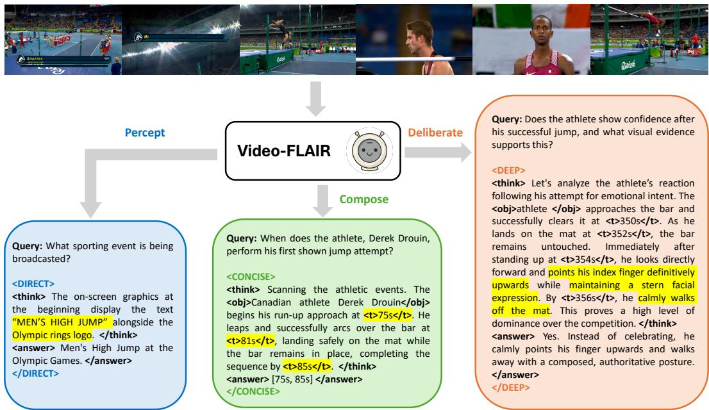  
Figure 1: Video-FLAIR routes each query to one of three reasoning modes based on its complexity. Yellow marks the key evidence driving each mode: screen-text reads (<DIRECT>), timestamped event anchors (<CONCISE>), and multi-observation cues synthesized into a conclusion (<DEEP>).

In summary, our contributions are as follows:

1. We introduce Video-FLAIR, a training framework for adaptive multimodal reasoning that selects among PERCEPT, COMPOSE, and DELIBERATE modes at inference, enabling models to learn how to reason rather than applying a fixed strategy.

2. We propose mode-structured rollouts that generate responses under all three reasoning modes for the same query, enabling within-query comparison. This framework is guided by a composite reward that includes an online verifier to promote grounded reasoning.

3. Video-FLAIR improves accuracy by +5.4 on MathVista, +4.8 on Video-Holmes, and +4.8 on Video-MMMU over Qwen2.5-VL, while reducing average token usage to 95 compared to 417 (across models and benchmarks) for baselines that apply an always-thinking strategy.

## 2 Related Work

Overthinking and over-reasoning in Multimodal LLMs. Chain-of-thought reasoning is not uniformly beneficial [8, 67]. Models can use up to 20× more tokens than necessary on simple queries [10, 66], and excessive reasoning can degrade performance when the task does not require deliberation [68, 19, 35]. In vision-language models, long reasoning chains can also shift attention away from visual input, leading to progressive visual forgetting and hallucinated intermediate steps [68, 40], while substantially increasing token costs [41]. We address this by learning a cost-aware policy that selects among different reasoning modes, rather than applying a uniform or binary reasoning strategy.

Adaptive and budget-aware reasoning. Prior work on adaptive reasoning focuses on binary mode switching, deciding whether to invoke reasoning or not. For example, AdaptThink [87] trains a think/no-think selector that reduces response length by 53%, KAT-V1 [85] uses trigger-token-based switching, R-4B [79] introduces bi-mode annealing, and VideoAuto-R1 [48] applies confidence-based early exit for video QA. Similar binary strategies extend to audio [74], omni-modal [77, 39], and Pareto-optimized settings [50], while AdaTooler-V [69] highlights how naive tool use can worsen overthinking. Beyond binary switching, ARM2 [75] expands the action space to multiple reasoning formats, but relies on fixed SFT-defined templates rather than learning how to select among them.

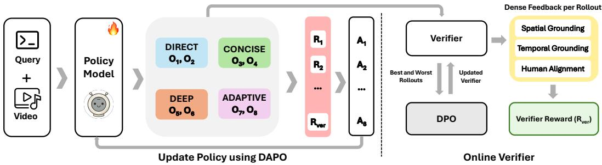  
Figure 2: Video-FLAIR training pipeline. (Left) Each video-query pair generates K=8 modestructured rollouts: two controlled rollouts per mode (<DIRECT>, <CONCISE>, <DEEP>) and two <ADAPTIVE>. A composite reward is computed for each rollout. GDPO [49] normalizes each reward component before aggregation. The policy is then updated via DAPO [81]. (Right) The verifier provides per-rollout feedback aggregated into $R _ { \mathrm { v e r } } .$ . It is periodically refreshed via DPO [59] on highest- versus lowest-reward rollout pairs to remain calibrated with the improving policy.

Reinforcement learning-based reasoning. A parallel line of work improves reasoning in multimodal models through reinforcement learning, including Video-R1 [20], Video-R2 [53], VideoRFT [71]. While effective, these approaches continue to apply a single reasoning style across queries, without adapting the reasoning structure to the task. Video-FLAIR differs by learning how to select among reasoning modes through structured rollouts that compare alternative strategies on the same prompt.

## 3 Preliminaries

## 3.1 Adaptive Reasoning Space

Various cognitive frameworks suggest that different tasks impose qualitatively different demands, motivating distinct reasoning strategies [6, 28]. We define three reasoning modes:

• PERCEPT (<DIRECT>): Perceptual reasoning extracts a single observation that maps directly to the answer. The evidence chain has no branches, and the reasoning path is immediate.

• COMPOSE (<CONCISE>): Compositional reasoning combines multiple observations through a linear sequence, where each step builds on the previous one without revisiting or branching. The structure is concise in that the chain is bounded rather than short.

• DELIBERATE (<DEEP>): Deliberative reasoning revisits the same evidence to evaluate and reject competing hypotheses. The model reasons deeply by exploring alternatives within the same evidence, so depth reflects search over interpretations rather than longer chains.

## 4 VideoFLAIR

Video-FLAIR trains a multimodal LLM policy to select a reasoning mode per query using reinforcement learning. Starting from an SFT warm-start (§4.1), the model generates mode-structured rollouts that evaluate all three reasoning modes on the same prompt (§4.2). These rollouts are scored using a composite reward (§4.3) that incorporates an online verifier for dense grounding feedback (§4.5). A utility function derived from this reward identifies the most effective mode and supervises the adaptive slots (§4.4). The resulting advantages are normalized via GDPO and applied token-wise (§4.6) before updating the policy with DAPO (§4.7).

## 4.1 SFT Warm-Start

We warm-start the model with supervised fine-tuning on mode-structured traces, ensuring that the subsequent RL stage focuses on reasoning rather than format learning. All outputs follow a strict schema: <MODE><think>...</think><answer>...</answer></MODE>, where MODE is one of

<DIRECT>, <CONCISE>, or <DEEP>. Reasoning traces for <CONCISE> and <DEEP> may include structured evidence tokens: $< \mathrm { { o b j } > . ~ . . < / \mathrm { { o b j } > } }$ for referenced entities, $< \mathtt { b o x } > . . . < / \mathtt { b o x } >$ for spatial regions, and $< \mathrm { t } > \dots < / \mathrm { t } >$ for temporal timestamps. Dataset details are provided in Appendix §G.

## 4.2 Mode-Structured Rollout Groups

Selecting the appropriate reasoning mode requires comparing outcomes across modes on the same input under a shared reward. We therefore use mode-structured rollouts, generating two responses under each reasoning mode for the same (visual input, query) pair using mode-specific prompt templates (Figures 13, 14, 15, 16). SFT ensures the model follows each mode correctly, so reward differences within each rollout group reflect which mode is most effective for the input. For each (visual input, query) pair, we sample $K = 8$ rollouts with a deterministic slot assignment:

$$
\underbrace { \left[ \mathrm { S D I R E C T > , < D I R E C T > } , \underbrace { \mathrm { < C O N C I S E > , < C O N C I S E > } } _ { \mathrm { s l o s \ 1 - 2 } } , \underbrace { \mathrm { < D E E P > , < D E E P > } } _ { \mathrm { s l o s \ 3 - 4 } } , \underbrace { \mathrm { < A D A P T I V E > , < A D A P T I V E > } } _ { \mathrm { s l o s 5 - 6 } } \right] } _ { \mathrm { s l o s \ 5 - 8 } } .\tag{1}
$$

Slots 1–6 are controlled: the prompt explicitly specifies the reasoning mode, forcing the model to generate responses under <DIRECT>, <CONCISE>, or <DEEP>. Slots 7–8 are adaptive: the prompt provides definitions of all reasoning modes without specifying one, requiring the model to select a mode before generating its response.

## 4.3 Composite Reward

Each rollout is scored by a composite reward:

$$
\begin{array} { r l } & { R = w _ { \mathrm { a n s } } R _ { \mathrm { a n s } } + w _ { \mathrm { f o r m a t } } R _ { \mathrm { f o r m a t } } + w _ { \mathrm { c o m p l y } } R _ { \mathrm { c o m p l y } } } \\ & { \qquad + w _ { \mathrm { c o s t } } R _ { \mathrm { c o s t } } + w _ { \mathrm { b a l a n c e } } R _ { \mathrm { b a l a n c e } } + w _ { \mathrm { s e l e c t } } R _ { \mathrm { s e l e c t } } + w _ { \mathrm { v e r i f i e r } } R _ { \mathrm { v e r i f i e r } } , } \end{array}\tag{2}
$$

The weights are listed in Table 11, and full definitions are provided in Appendix §E.

Correctness and validity $( R _ { \mathrm { a n s } } , R _ { \mathrm { f o r m a t } } , R _ { \mathrm { c o m p l y } } ) . R _ { \mathrm { a n s } }$ evaluates task correctness based on the answer type (Appendix $\ S \mathrm { E . 1 } ) . \ R _ { \mathrm { f o r m a t } }$ equals 1 when the response follows the required tag schema (<MODE><think>...</think><answer> $\cdots ^ { } \cdot \cdot ^ { < / }$ answer></MODE>), and 0 otherwise. $R _ { \mathrm { c o m p l y } }$ penalizes rollouts that either violate the assigned mode instruction (e.g., a forced <DIRECT> slot producing a <DEEP> response) or exceed the word budget for that mode.

Cost efficiency $( R _ { \mathrm { c o s t } } , R _ { \mathrm { b a l a n c e } } ) . R _ { \mathrm { c o s t } }$ penalizes excessive reasoning while adapting to query difficulty. It combines a base cost term and an adaptive length penalty:

$$
R _ { \mathrm { c o s t } } = - ( P _ { \mathrm { b a s e } } + P _ { \mathrm { a l p } } ) ,\tag{3}
$$

where $P _ { \mathrm { b a s e } }$ accounts for fixed per-mode costs and any word-budget overflow (Appendix §E), and $P _ { \mathrm { a l p } }$ is the Adaptive Length Penalty (ALP) [46]:

$$
P _ { \mathrm { a l p } } = \beta _ { \mathrm { a l p } } \cdot \frac { | \hat { y } | } { L _ { 0 } } \cdot \hat { p } _ { \mathrm { s o l v e d } } \cdot \mu _ { m } ,\tag{4}
$$

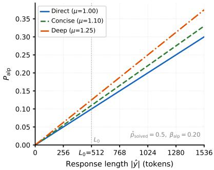

where $\hat { p } _ { \mathrm { s o l v e d } }$ is the fraction of correct rollouts across all $K { = } 8$ slots, and $\mu _ { m }$ is a per-mode multiplier (Appendix §E,

Figure 3: Penalty scales with length.

Figure 3). Because the rollout group includes <DIRECT> and <CONCISE> controlled slots, $\hat { p } _ { \mathrm { s o l v e d } }$ serves as a proxy for query difficulty: it is high on easy queries and low on hard ones. As a result, cost penalties are stronger for simple queries, discouraging unnecessary deliberation, and weaker for complex queries, allowing deeper reasoning when needed. This ensures that <DEEP> is not penalized when it is necessary for solving the task (see Appendix §E.5.1 for a case analysis). $R _ { \mathrm { b a l a n c e } }$ encourages diversity across reasoning modes by penalizing imbalanced mode usage within each rollout group.

Adaptive selection $( R _ { \mathrm { s e l e c t } } , R _ { \mathrm { v e r i f i e r } } ) _ { \bullet } R _ { \mathrm { s e l e c t } }$ applies utility-derived supervision to the <ADAPTIVE> slots (§4.4), while $R _ { \mathrm { v e r i f i e r } }$ provides dense grounding and alignment feedback (§4.5). Together, they determine which reasoning mode to select and how well its outputs are grounded in the input.

## 4.4 Learning to Be Adaptive: Utility and Selection

We compute a utility score within each rollout group to determine the most effective reasoning mode.

Step 1: Score controlled rollouts. For each reasoning mode m, we compute two quantities from its controlled rollouts: $\mathrm { A n s } ( m )$ , the mean correctness derived from $R _ { \mathrm { a n s } } ,$ , and $G ( m ) = \textstyle { \frac { 1 } { 2 } } ( v _ { t } ( m ) + v _ { s } ( m ) )$ , where $v _ { t } ( m ) , v _ { s } ( m ) \in [ 0 , 1 ]$ are the verifier’s temporal and spatial grounding scores for mode m (Appendix $\ S \mathrm { E . 7 } )$

Step 2: Compute utility and select the optimal mode. We define the utility of each mode as:

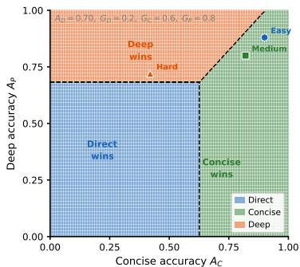

$$
\operatorname { U t i l i t y } ( m ) = \left( \operatorname { A n s } ( m ) + \delta \cdot G ( m ) \right) \cdot \left( 1 - \operatorname { C o s t } ( m ) \right) .\tag{5}
$$

The weight $\delta$ is tuned so that grounding resolves near-ties in accuracy, while preventing a grounded incorrect answer from exceeding an accurate ungrounded one (sensitivity analysis in Table 7). The $\mathrm { C o s t } ( m )$ term includes the per-mode cost $C _ { m }$

Figure 4: Which mode wins? Decision regions over $( A _ { C } , A _ { P } )$ More expensive modes win only when their accuracy-grounding gain exceeds the cost threshold.

and word-count overflow, penalizing deeper modes even within budget (cost-pressure analysis in §E.5.1). We select the optimal mode as $m ^ { * } = \arg \operatorname* { m a x } _ { m } { \mathrm { U t i l i t y } } ( m )$ . When accuracy and grounding are equal, the cost term alone determines the ranking, favoring the more efficient mode (Figure 4).

Step 3: Assign $R _ { \mathrm { s e l e c t } }$ to adaptive slots. Adaptive slots are evaluated against $m ^ { * }$ . If an <ADAPTIVE> slot selects $m ^ { * }$ , it receives a reward bonus. Otherwise, it receives a symmetric penalty.

## 4.5 Verifier-Guided Dense Feedback

We use Qwen3-VL [2] as an online verifier that evaluates each reasoning trace and produces three signals: temporal grounding $v _ { t }$ (alignment between timestamps/event ordering and visual content), spatial grounding $v _ { s }$ (alignment between referenced regions or objects and visual content), and human alignment $v _ { h }$ (consistency between the reasoning trace and observable evidence). These are the main continuous inputs to $R _ { \mathrm { v e r i f i e r } } ,$ a component of the composite reward; the full expression including span and mode-alignment terms is in Appendix §E.7 (system prompt in Fig. 17). <DIRECT> completions that introduce grounding tags are penalized to prevent mode collapse, ensuring that structured grounding is used only when reasoning requires it. <ADAPTIVE> slots are also penalized when their reasoning contradicts the verifier’s grounding assessment.

To prevent verifier drift, we periodically refresh the verifier using preference optimization. Every $N = 1 0 0 \mathrm { R I }$ steps, we construct preference pairs $\mathcal { P } _ { \mathrm { p r e f } }$ from the highest- and lowest-reward rollouts within each group and fine-tune the verifier $V$ via Direct Preference Optimization (DPO) [59], producing an updated verifier $V ^ { \prime }$ that is hot-swapped into the reward pipeline (Appendix §E.7):

$$
\pi _ { \theta } \xrightarrow [ ] { \mathrm { \scriptsize ~ { r o l l o u t s } } } \mathcal { P } _ { \mathrm { { p r e f } } } \xrightarrow [ ] { \mathrm { \scriptsize { D P O } } } V ^ { \prime } \xrightarrow [ ] { \mathrm { \scriptsize { h o t } } \mathrm { { s w a p } } } R _ { \mathrm { { v e r i f i e r } } } ,
$$

where $\pi _ { \theta }$ is the current policy being trained.

## 4.6 Advantage Shaping

GDPO. Standard GRPO normalization can collapse multiple reward components into identical advantage values, obscuring distinctions between signals such as $R _ { \mathrm { s e l e c t } }$ and $R _ { \mathrm { c o s t } }$ . GDPO [49] addresses this by normalizing each component independently before aggregation. Each reward component $r _ { k }$ is normalized within its rollout group:

$$
A _ { k } ^ { ( i , j ) } = \frac { r _ { k } ^ { ( i , j ) } - \mathrm { m e a n } _ { j } \{ r _ { k } ^ { ( i , j ) } \} } { \mathrm { s t d } _ { j } \{ r _ { k } ^ { ( i , j ) } \} + \epsilon } , \qquad A _ { \mathrm { s u m } } ^ { ( i , j ) } = \sum _ { k = 1 } ^ { 7 } A _ { k } ^ { ( i , j ) } ,\tag{6}
$$

where i indexes input-query pairs and $j$ indexes rollouts within each group. The aggregated advantage $A _ { \mathrm { s u m } }$ is then batch-renormalized so each reward component contributes a properly scaled gradient.

Token-Level Credit Shaping. The batch-renormalized $A _ { \mathrm { s u m } }$ from GDPO is a single scalar per rollout. Token-level credit shaping redistributes this signal across tokens, concentrating gradient updates on evidence-bearing spans rather than applying uniform weighting across the completion. We assign each token a weight $c _ { t }$ and apply it to $A _ { \mathrm { s u m } } { \mathrm { . } }$

$$
\hat { A } _ { t } = A _ { \mathrm { s u m } } \cdot c _ { t } , \qquad \frac { 1 } { T } \sum _ { t = 1 } ^ { T } c _ { t } = 1 ,\tag{7}
$$

where $T$ is the completion length and $c _ { t } \geq 0$

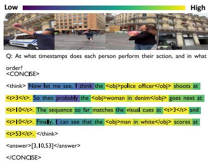  
Figure 5: Token-level credit assignment. Yellow spans (grounding tags, factual observations) receive amplified gradients, while purple spans (hedging, filler) are suppressed.

Spans are classified using tag matching and verifier trace annotations (Appendix §F). Evidence-bearing spans receive higher weights, including tokens inside <t>, <obj>, and <box> tags, as well as spans identified by the verifier as grounded in the visual input. Filler spans receive lower weights, including hedging phrases (“maybe”, “probably”), transitional phrases (“So then”, “Now let $\mathrm { m e ^ { , \bar { \mathfrak { s } } } } )$ , and verbatim repetition of the question. Even when the final answer is correct, uncertain or poorly grounded reasoning receives reduced gradient, preventing accidental success from reinforcing undesirable reasoning patterns (Appendix §F). The per-token advantages $\hat { A } _ { t }$ feed directly into the DAPO objective as token-level gradient weights.

## 4.7 Policy Update

Mode-selection training requires maintaining sufficient exploration across all reasoning modes. DAPO [81] addresses this by preserving entropy during optimization while discarding rollout groups that provide no useful selection signal. DAPO extends GRPO [25] with asymmetric clipping: a narrow lower bound $\varepsilon _ { \mathrm { l o w } }$ tightly constrains probability-decreasing updates, while a wider upper bound $\varepsilon _ { \mathrm { h i g h } }$ preserves exploratory behavior. Let $\begin{array} { r } { \mathbf { \dot { \phi } } ^ { \mathrm { ~ T ~ } } = \sum _ { i , t } \mathbf { \dot { 1 } } [ q _ { i , t } = 1 ] } \end{array}$ denote the number of non-padding tokens. The per-token objective over the shaped advantages $\hat { A } _ { i , t }$ is:

$$
\mathcal { I } _ { \mathrm { D A P O } } ( \boldsymbol { \theta } ) = \mathbb { E } \left[ \frac { 1 } { N } \sum _ { i , t } \mathbf { 1 } [ q _ { i , t } = 1 ] \operatorname* { m i n } \Bigl ( r _ { i , t } \hat { A } _ { i , t } , \operatorname { c l i p } ( r _ { i , t } , 1 - \varepsilon _ { \mathrm { l o w } } , 1 + \varepsilon _ { \mathrm { h i g h } } ) \hat { A } _ { i , t } \Bigr ) \right] ,\tag{8}
$$

where $r _ { i , t } = \pi _ { \theta } ( o _ { i , t } \mid q , o _ { i , < t } ) / \pi _ { \theta _ { \mathrm { o l d } } } ( o _ { i , t } \mid q , o _ { i , < t } )$ is the per-token probability ratio.

## 5 Experiments

Implementation Details. We train two models: Qwen3-VL-8B [2] and Qwen2.5-VL-7B [3], both fine-tuned with LoRA [31] using DeepSpeed ZeRO-3 [60] on 8 NVIDIA L40S and 4 A100 GPUs using the MS-Swift framework [90]. We sample video frames at 1 fps, capped at 16 frames during training and 128 frames during evaluation (32 frames for Video-MMMU). Training data sources for SFT and RL are described in Appendix §G, and full hyperparameters are in §H and Table 11. For evaluation, we prepend an adaptive selection prompt (Figure 16) to each input. The model selects one of three reasoning modes (<DIRECT>, <CONCISE>, or <DEEP>) as its first generated tag. During training, we use a prioritized replay buffer to re-sample historically difficult inputs (Appendix §I).

Benchmarks. We evaluate on six image benchmarks (EMMA [27], MMMU [84], MathVista [52], HallusionBench [24], AI2D [36], MM-Vet v2 [82]) and five video benchmarks (Video-Holmes [13], Video-TT [88], VSI-Bench [78], SciVideoBench [17], Video-MMMU [32]). Together, they span visual retrieval, hallucination robustness, mathematical and scientific reasoning, spatial understanding, and video-based knowledge acquisition. Full descriptions are provided in §D.

Baselines. We compare against two classes of reasoning models. Always-thinking models apply a fixed chain-of-thought strategy to every query. We evaluate Qwen2.5-VL-based methods including Video-R1 [20], Video-R2 [53], and VideoRFT [71], as well as the Qwen3-VL-based OneThinker [21].

Table 1: Comparison with state-of-the-art methods on image understanding and reasoning benchmarks. Best scores per column bolded for each base model. Colored deltas show absolute change vs. the base model: gains / losses. All results are reproduced by us.
<table><tr><td rowspan="2">Model</td><td colspan="7">Image Understanding &amp; Reasoning Benchmarks</td></tr><tr><td>Avg Tokens ↓</td><td>EMMA</td><td>MMMU</td><td>MathVista</td><td>HallusionBench</td><td>AI2D</td><td>MM-Vet v2</td></tr><tr><td>Qwen2.5-VL-7B</td><td></td><td>25.8</td><td>52.0</td><td>68.4</td><td>71.0</td><td>82.7</td><td>56.6</td></tr><tr><td>+ SFT</td><td>1</td><td>26.1 (↑0.3)</td><td>52.9 (↑0.9)</td><td>68.6 (↑0.2)</td><td>70.5 (↓0.5)</td><td>82.1 (↓0.6)</td><td>56.7(↑0.1)</td></tr><tr><td>Always Thinking</td><td></td><td></td><td></td><td></td><td></td><td></td><td></td></tr><tr><td>Video-R1 [20]</td><td>342</td><td>19.2 (↓6.6)</td><td>52.5(↑0.5)</td><td>69.4(↑1.0)</td><td>64.4 (↓6.6)</td><td>82.0 (↓0.7)</td><td>55.8 (↓0.8)</td></tr><tr><td>Video-R2 [53]</td><td>411</td><td>19.0 (↓6.8)</td><td>49.6 (↓2.4)</td><td>69.2 (↑0.8)</td><td>63.6 (↓7.4)</td><td>80.7 (↓2.0)</td><td>56.0 (↓0.6)</td></tr><tr><td>VideoRFT [71]</td><td>367</td><td>19.5 (↓6.3)</td><td>50.5 (↓1.5)</td><td>69.1 (↑0.7)</td><td>65.1 (↓5.9)</td><td>81.3 (↓1.4)</td><td>57.0 (↑0.4)</td></tr><tr><td>Auto Thinking</td><td></td><td></td><td></td><td></td><td></td><td></td><td></td></tr><tr><td>Video-Auto-R1 [48]</td><td>55</td><td>23.7(↓2.1)</td><td>52.0</td><td>72.2(↑3.8)</td><td>66.2 (↓4.8)</td><td>83.0 (↑0.3)</td><td>55.4 (↓1.2)</td></tr><tr><td>Video-FLAIR</td><td>74</td><td>27.3 (↑1.5)</td><td>54.5 (↑2.5)</td><td>73.8 (↑5.4)</td><td>71.8 (↑0.8)</td><td>83.2 (↑0.5)</td><td>57.9 (↑1.3)</td></tr><tr><td>Qwen3-VL-8B</td><td></td><td>22.4</td><td>56.2</td><td>74.1</td><td>71.8</td><td>80.3</td><td>63.9</td></tr><tr><td>+ SFT</td><td>一</td><td>26.9 (↑4.5)</td><td>56.2</td><td>73.4(↓0.7)</td><td>71.4 (↓0.4)</td><td>81.3 (↑1.0)</td><td>64.1 (↑0.2)</td></tr><tr><td>Always Thinking</td><td></td><td></td><td></td><td></td><td></td><td></td><td></td></tr><tr><td>OneThinker [21]</td><td>539</td><td>10.9 (↓11.5)</td><td>61.2(↑5.0)</td><td>75.0 (↑0.9)</td><td>54.3 (↓17.5)</td><td>82.8 (↑2.5)</td><td>64.7(↑0.8)</td></tr><tr><td>Auto Thinking</td><td></td><td></td><td></td><td></td><td></td><td></td><td></td></tr><tr><td>Video-Auto-R1 (Qwen3-VL-8B)</td><td>259</td><td>24.3 (↑1.9)</td><td>61.7(↑5.5)</td><td>72.7(↓1.4)</td><td>65.0 (↓6.8)</td><td>83.9 (↑3.6)</td><td>55.4 (↓8.5)</td></tr><tr><td>Video-FLAIR</td><td>108</td><td>30.8 (↑8.4)</td><td>61.5 (↑5.3)</td><td>76.3 (↑2.2)</td><td>72.8 (↑1.0)</td><td>85.5 (↑5.2)</td><td>66.9 (↑3.0)</td></tr></table>

Auto-thinking models learn a binary decision between no reasoning and chain-of-thought reasoning, but use a single reasoning style when reasoning is invoked. We evaluate Video-Auto-R1 [48] under both base models. All baselines are reproduced under identical evaluation settings.

## 5.1 Results

Image benchmarks (Table 1). On Qwen2.5-VL, Video-FLAIR achieves the best performance across all six image benchmarks while using only 74 tokens on average. Always-thinking baselines perform poorly on perception-heavy tasks: all three models drop by an average of 6.6 points on EMMA and HallusionBench, as long reasoning chains introduce plausible but visually ungrounded intermediate steps. Video-Auto-R1 reduces token usage to 55 by learning a binary decision between no reasoning and chain-of-thought reasoning. However, its fixed decision threshold cannot distinguish between tasks that require visual retrieval and those that require reasoning, resulting in performance drops of 4.8 points on HallusionBench and 1.2 points on MM-Vet v2. On Qwen3-VL, Video-FLAIR leads on five of six image benchmarks, achieving 30.8 on EMMA (+8.4 over the base model), 72.8 on HallusionBench (+1.0), and 85.5 on AI2D (+5.2), with an average of 108 tokens. OneThinker, which applies long reasoning chains to all queries, suffers substantial drops of 11.5 points on EMMA and 17.5 points on HallusionBench.

Video benchmarks (Table 2). On Qwen2.5-VL, Video-FLAIR achieves 48.0 on Video-Holmes (+4.8 over the base model), 35.8 on VSI-Bench (+4.0), and 56.9 on Video-MMMU (+4.8) while using only 59 tokens on average. Video-Holmes requires linking visual clues distributed across the entire video. Always-thinking baselines tend to expand early observations into long reasoning chains and prematurely commit to a hypothesis, leading all three methods to perform worse than the base model. On Qwen3-VL, Video-FLAIR achieves the best performance on four of five video benchmarks at 137 tokens, including 49.9 on Video-Holmes (+3.1 over the 46.8 base) and 33.1 on SciVideoBench (+3.7). OneThinker drops 6.9 points on VSI-Bench, where spatial distances must be directly read from the visual signal rather than inferred through extended reasoning chains.

RL gains over SFT. RL provides consistent improvements over the SFT initialization across all benchmarks. EMMA (+3.9) and MMMU (+5.3) on Qwen3-VL benefit the most, as both require reasoning jointly over image and text and demand different reasoning modes depending on the query. SFT assigns modes based on fixed dataset heuristics and cannot adapt when queries fall outside these patterns. HallusionBench (+1.4) and Video-Holmes (+2.0) also improve due to the grounding reward and verifier feedback, which penalize ungrounded reasoning steps that SFT cannot suppress. SFT establishes mode-aware behavior but cannot determine which mode a given query requires. Rollout-based comparisons during RL enable the model to learn adaptive reasoning.

Table 2: Comparison with state-of-the-art methods on video reasoning benchmarks. Best scores per column bolded for each base model. Colored deltas show absolute change vs. the base model: gains / losses. All results are reproduced by us.
<table><tr><td rowspan="2">Model</td><td colspan="6">Video Reasoning Benchmarks</td></tr><tr><td>Avg Tokens ↓</td><td>Video-Holmes</td><td>Video-TT</td><td>VSI-Bench</td><td>SciVideoBench</td><td>Video-MMMU</td></tr><tr><td>Qwen2.5-VL-7B</td><td>一</td><td>43.2</td><td>39.3</td><td>31.8</td><td>23.8</td><td>52.1</td></tr><tr><td>+ SFT</td><td>一</td><td>44.7(↑1.5)</td><td>39.3</td><td>33.0 (↑1.2)</td><td>26.2(↑2.4)</td><td>53.3 (↑1.2)</td></tr><tr><td>Always Thinking</td><td></td><td></td><td></td><td></td><td></td><td></td></tr><tr><td>Video-R1 [20]</td><td>360</td><td>41.8(↓1.4)</td><td>40.1 (↑0.8)</td><td>34.9 (↑3.1)</td><td>27.0 (↑3.2)</td><td>50.3 (↓1.8)</td></tr><tr><td>Video-R2 [53]</td><td>525</td><td>40.7(↓2.5)</td><td>39.3</td><td>31.9 (↑0.1)</td><td>27.8 (↑4.0)</td><td>48.3 (↓3.8)</td></tr><tr><td>VideoRFT [71]</td><td>374</td><td>42.9 (↓0.3)</td><td>39.0 (↓0.3)</td><td>36.0 (↑4.2)</td><td>28.0 (↑4.2)</td><td>48.2(↓3.9)</td></tr><tr><td>Auto Thinking</td><td></td><td></td><td></td><td></td><td></td><td></td></tr><tr><td>Video-Auto-R1 [48]</td><td>94</td><td>47.7(↑4.5)</td><td>39.1 (↓0.2)</td><td>35.2 (↑3.4)</td><td>31.6 (↑7.8)</td><td>54.2(↑2.1)</td></tr><tr><td>Video-FLAIR</td><td>59</td><td>48.0 (↑4.8)</td><td>41.0(↑1.7)</td><td>35.8 (↑4.0)</td><td>29.4(↑5.6)</td><td>56.9 (↑4.8)</td></tr><tr><td>Qwen3-VL-8B</td><td></td><td>46.8</td><td>39.7</td><td>56.8</td><td>29.4</td><td>58.1</td></tr><tr><td>+ SFT</td><td></td><td>47.9(↑1.1)</td><td>40.8(↑1.1)</td><td>56.8</td><td>31.0(↑1.6)</td><td>58.5(↑0.4)</td></tr><tr><td>Always Thinking</td><td></td><td></td><td></td><td></td><td></td><td></td></tr><tr><td>OneThinker [21]</td><td>421</td><td>48.2(↑1.4)</td><td>40.0 (↑0.3)</td><td>49.9 (↓6.9)</td><td>32.6 (↑3.2)</td><td>61.0(↑2.9)</td></tr><tr><td>Auto Thinking</td><td></td><td></td><td></td><td></td><td></td><td></td></tr><tr><td>Video-Auto-R1 [48]</td><td>284</td><td>49.2(↑2.4)</td><td>40.2(↑0.5)</td><td>57.2 (↑0.4)</td><td>32.0 (↑2.6)</td><td>60.7 (↑2.6)</td></tr><tr><td>Video-FLAIR</td><td>137</td><td>49.9(↑3.1)</td><td>41.2(↑1.5)</td><td>58.2(↑1.4)</td><td>33.1 (↑3.7)</td><td>60.5 (↑2.4)</td></tr></table>

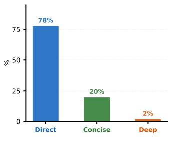  
AI2D

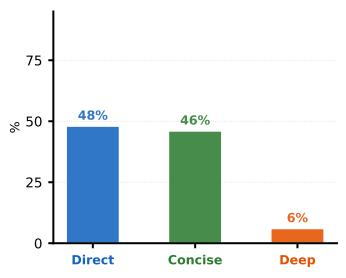  
MMMU

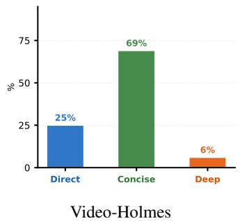  
Figure 6: Reasoning mode distribution across representative benchmarks. Video-FLAIR selects <DIRECT> for simple visual retrieval (AI2D), shifts toward <CONCISE> as reasoning chains become necessary (MMMU, Video-Holmes), with <DEEP> reserved for the small fraction of queries requiring hypothesis elimination. Full distributions across remaining benchmarks are in §B.

Mode distribution. Figure 6 shows the distribution of reasoning modes across three representative benchmarks. On AI2D, answers are read from a single diagram element, so the policy mostly selects <DIRECT>. In contrast, MMMU requires combining visual evidence across heterogeneous image types with domain knowledge, leading to increased use of <CONCISE>. Video-Holmes involves linking clues across video segments, resulting in a similar preference for <CONCISE>, with selective use of <DEEP> for causal questions. The 25% <DIRECT> usage on Video-Holmes reflects a known failure. The policy incorrectly treats Social Reasoning queries about character identity as single-frame lookups, when these in fact require tracking across frames (Appendix §J, Figure 9).

## 5.2 Ablation Studies

RQ1: Does the rollout structure matter? Yes, all three slot types are necessary (Table 3). RL (row 1), which trains with only $R _ { \mathrm { a n s } }$ and $R _ { \mathrm { f o r m a t } }$ , produces the lowest accuracy and highest token usage (412), showing that without mode-structured rollouts, the policy defaults to a single undifferentiated reasoning strategy and fails to learn cost-aware behavior. Removing the controlled slots (row 2) eliminates within-group comparisons. As a result, EMMA drops to 24.6, since the adaptive slots no longer receive supervision about how alternative reasoning modes would have performed on the same

Table 3: Each row ablates or replaces one training component while keeping all others fixed.
<table><tr><td>Variant</td><td>|MMMU</td><td>EMMA</td><td>V-MMMU</td><td>Tok↓</td></tr><tr><td> $R _ { \mathrm { a n s } } + R _ { \mathrm { f o r m a t } } \ \mathrm { o n l y }$ </td><td>51.8</td><td>21.9</td><td>49.8</td><td>412</td></tr><tr><td>Only adaptive (no controlled slots)</td><td>52.9</td><td>24.6</td><td>53.2</td><td>198</td></tr><tr><td>only controlled (no adaptive slots)</td><td>53.6</td><td>25.9</td><td>53.0</td><td>237</td></tr><tr><td>w/o  $R _ { \mathrm { s e l e c t } }$ </td><td>53.1</td><td>24.9</td><td>54.3</td><td>171</td></tr><tr><td>w/o  $R _ { \mathrm { { v e r i f i e r } } }$ </td><td>54.1</td><td>25.7</td><td>55.5</td><td>70</td></tr><tr><td>Video-FLAIR (full)</td><td>54.5</td><td>27.3</td><td>56.9</td><td>67</td></tr></table>

Table 4: Binary merges <CONCISE> and <DEEP> into one thinking mode. Remaining rows ablate individual components.
<table><tr><td>Variant</td><td>MMMU</td><td>EMMA</td><td>V-MMMU</td><td>Tok↓</td></tr><tr><td>Binary (2-mode: direct / think)</td><td>52.9</td><td>24.4</td><td>55.1</td><td>61</td></tr><tr><td>No token credit map</td><td>54.2</td><td>26.0</td><td>55.8</td><td>69</td></tr><tr><td>Frozen verifier (no DPO refresh)</td><td>53.8</td><td>26.1</td><td>55.3</td><td>68</td></tr><tr><td>Utility w/o cost factor</td><td>54.3</td><td>27.1</td><td>56.6</td><td>394</td></tr><tr><td>Video-FLAIR (full)</td><td>54.5</td><td>27.3</td><td>56.9</td><td>67</td></tr></table>

query. Removing the adaptive slots (row 3) eliminates mode selection during training. Without a mode-selection objective, <DIRECT> is too risky (low accuracy) and <DEEP> is suppressed by cost pressure, so the policy settles on <CONCISE>, increasing token usage to 237.

RQ2: Do the reward signals supervising adaptive slots contribute? Yes, both reward components are necessary (Table 3, rows 4–5). Dropping $R _ { \mathrm { s e l e c t } }$ (row 4) removes supervision from adaptive slots; without it, the policy cannot identify which mode is most effective per query, causing accuracy to drop (EMMA 24.9) while token usage rises to 171 as mode selection becomes unguided. Dropping $R _ { \mathrm { v e r i f i e r } }$ (row 5) leaves MMMU largely unchanged (54.1) but reduces EMMA to 25.7. This confirms that the verifier primarily improves grounding quality rather than overall reasoning accuracy.

RQ3: Does the three-mode space outperform a binary switch? Yes, three reasoning modes outperform a binary setup (Table 4, row 1). Collapsing <CONCISE> and <DEEP> into a single thinking mode reduces EMMA to 24.4 and Video-MMMU to 55.1. The low token count (61) reflects costdriven reliance on <DIRECT> as reasoning is avoided for medium-difficulty queries. Furthermore, performance becomes comparable to Video-Auto-R1 (23.7, 54.2), showing that distinguishing between compositional and deliberative reasoning is necessary for adaptive reasoning.

RQ4: Do grounding components each contribute? Yes, all three components contribute (Table 4, rows 2–4). Removing the token-level credit map (row 2) reduces EMMA to 26.0 while leaving MMMU largely unchanged, indicating that credit shaping improves grounding quality without substantially altering predicted answers. Freezing the verifier without DPO refresh (row 3) causes gradual degradation on grounding-sensitive benchmarks (EMMA 26.1, Video-MMMU 55.3), suggesting that policy improvements eventually outpace verifier calibration. Removing the cost factor from the utility function (row 4) leaves accuracy nearly unchanged but increases token usage to 394, as the policy defaults to <CONCISE> or <DEEP> even on easy queries.

RQ5: Can the right fixed mode match adaptive selection? No fixed reasoning mode Pareto-dominates adaptive selection (Table 5). <DIRECT> achieves the lowest token usage but performs poorly on reasoning-heavy benchmarks, dropping from 27.3 to 22.1 on EMMA. In contrast, <DEEP> improves EMMA performance but incurs substantial token overhead on image tasks where extended reasoning is unnecessary, and slightly underperforms <CONCISE> on MMMU. No fixed mode achieves <ADAPTIVE>’s combination of accuracy and efficiency.

Table 5: Reasoning mode forced or left adaptive at inference.
<table><tr><td>Mode</td><td>|MMMU</td><td>EMMA</td><td>V-MMMU</td><td>Tok↓</td></tr><tr><td>Forced &lt;DIRECT&gt;</td><td>51.4</td><td>22.1</td><td>49.7</td><td>57</td></tr><tr><td>Forced &lt;CONCISE&gt;</td><td>53.1</td><td>25.6</td><td>53.2</td><td>247</td></tr><tr><td>Forced &lt;DEEP&gt;</td><td>52.8</td><td>28.3</td><td>55.8</td><td>963</td></tr><tr><td>Video-FLAIR (adaptive)</td><td>54.5</td><td>27.3</td><td>56.9</td><td>67</td></tr></table>

## 6 Conclusion

We presented Video-FLAIR, a training framework that enables multimodal LLMs to adapt their reasoning mode to each query without requiring per-query annotations. We showed that adaptive reasoning can be learned through structured rollout comparisons across PERCEPT, COMPOSE, and DELIBERATE modes. Our experiments demonstrate that uniform reasoning fails in two complementary ways: over-reasoning on perceptual tasks introduces hallucinated intermediate steps, while insufficient deliberation on ambiguous tasks leads to incorrect interpretations. By adapting how to reason rather than only whether to reason, Video-FLAIR addresses both failure modes simultaneously. Across image and video reasoning benchmarks, Video-FLAIR consistently improves accuracy while substantially reducing token usage compared to always- thinking strategies. Future directions include extending the mode space to tool-augmented completions and enabling mid-response mode switching when initial reasoning proves insufficient.

## References

[1] A. Amini, S. Gabriel, S. Lin, R. Koncel-Kedziorski, Y. Choi, and et al. MathQA: Towards interpretable math word problem solving with operation-based formalisms. In North American Chapter ofthe Associationfor Computational Linguistics (NAACL), 2019. 25, 26

[2] S. Bai, Y. Cai, R. Chen, K. Chen, X. Chen, and et al. Qwen3-VL technical report. arXiv preprint arXiv:2511.21631, 2025. 5, 6, 26

[3] S. Bai, K. Chen, X. Liu, J. Wang, W. Ge, S. Song, K. Dang, P. Wang, S. Wang, J. Tang, H. Zhong, Y. Zhu, M. Yang, Z. Li, J. Wan, P. Wang, W. Ding, Z. Fu, Y. Xu, J. Ye, X. Zhang, T. Xie, Z. Cheng, H. Zhang, Z. Yang, H. Xu, and J. Lin. Qwen2.5-vl technical report. arXiv preprint arXiv:2502.13923, 2025. 6, 26

[4] S. Bansal, C. Arora, and C. V. Jawahar. My view is the best view: Procedure learning from egocentric videos. In European Conference on Computer Vision (ECCV), 2022. 26

[5] M. Bellver, C. Ventura, C. Silberer, I. Kazakos, J. Torres, and et al. A closer look at referring expressions for video object segmentation. Multimedia Tools and Applications, 2023. 25, 26

[6] B. S. Bloom, M. D. Engelhart, E. J. Furst, W. H. Hill, and D. R. Krathwohl. Taxonomy of Educational Objectives: The Classification of Educational Goals. Handbook I: Cognitive Domain. David McKay, New York, 1956. 3

[7] L. Chen, J. Li, X. Dong, P. Zhang, C. He, and et al. ShareGPT4V: Improving large multi-modal models with better captions. In European Conference on Computer Vision (ECCV), 2024. 25, 26

[8] Q. Chen, L. Qin, J. Liu, D. Peng, J. Guan, P. Wang, M. Hu, Y. Zhou, T. Gao, and W. Che. Towards reasoning era: A survey of long chain-of-thought for reasoning large language models. Science China Information Sciences, 2026. 2

[9] S. Chen, J. Zhang, T. Zhu, W. Liu, S. Gao, and et al. Bring reason to vision: Understanding perception and reasoning through model merging. In International Conference on Machine Learning (ICML), 2025. 16

[10] X. Chen, J. Xu, T. Liang, Z. He, J. Pang, and et al. Do NOT think that much for 2+3=? on the overthinking of long reasoning models. In International Conference on Machine Learning (ICML), 2025. 1, 2

[11] Y. Chen, L. Li, T. Xi, L. Zeng, and J. Wang. Perception before reasoning: Two-stage reinforcement learning for visual reasoning in vision-language models. arXiv preprint arXiv:2509.13031, 2025. 16

[12] Y. Chen, F. Xue, D. Li, Q. Hu, L. Zhu, and et al. LongVILA: Scaling long-context visual language models for long videos. In International Conference on Learning Representations (ICLR), 2025. 25, 26

[13] J. Cheng, Y. Ge, T. Wang, Y. Ge, J. Liao, and Y. Shan. Video-Holmes: Can MLLM think like holmes for complex video reasoning? In European Conference on Computer Vision (ECCV), 2026. 6, 16, 19, 27

[14] Z. Cheng, D. Li, J. Hu, Y. Zang, Z. Liu, S. Gong, and W. Li. GraphThinker: Reinforcing temporally grounded video reasoning with event graph thinking. arXiv preprint arXiv:2602.17555, 2026. 16

[15] J. Chung, N. Joshi, P. Sharma, Y. Yu, and V. Vineet. What MLLMs learn about when they learn about multimodal reasoning: Perception, reasoning, or their integration? arXiv preprint arXiv:2510.01719, 2025. 16

[16] A. Deng, T. Chen, S. Yu, T. Yang, L. Spencer, Y. Tian, A. S. Mian, M. Bansal, and C. Chen. Motion-grounded video reasoning: Understanding and perceiving motion at pixel level. In Conference on Computer Vision and Pattern Recognition (CVPR), 2025. 16

[17] A. Deng, T. Yang, S. Yu, L. Spencer, M. Bansal, C. Chen, S. Yeung-Levy, and X. Wang. SciVideoBench: Benchmarking scientific video reasoning in large multimodal models. In International Conference on Machine Learning (ICML), 2026. 6, 18, 20

[18] H. Ding, C. Liu, S. He, X. Jiang, and C. C. Loy. MeViS: A large-scale benchmark for video segmentation with motion expressions. In International Conference on Computer Vision (ICCV), 2023. 25, 26

[19] C. Fan, M. Li, L. Sun, and T. Zhou. Missing premise exacerbates overthinking: Are reasoning models losing critical thinking skill? In Conference on Language Modeling (COLM), 2025. 2

[20] K. Feng, K. Gong, B. Li, Z. Guo, Y. Wang, and et al. Video-R1: Reinforcing video reasoning in MLLMs. In Neural Information Processing Systems (NeurIPS), 2025. 1, 3, 6, 7, 8

[21] K. Feng, M. Zhang, H. Li, K. Fan, S. Chen, Y. Jiang, D. Zheng, P. Sun, Y. Zhang, H. Sun, et al. OneThinker: All-in-one reasoning model for image and video. In Conference on Computer Vision and Pattern Recognition (CVPR), 2026. 6, 7, 8, 25

[22] C. Fu, Y. Dai, Y. Luo, L. Li, S. Ren, and et al. Video-MME: The first-ever comprehensive evaluation benchmark of multi-modal LLMs in video analysis. In Conference on Computer Vision and Pattern Recognition (CVPR), 2025. 16

[23] J. Gao, C. Sun, Z. Yang, and R. Nevatia. TALL: Temporal activity localization via language query. In International Conference on Computer Vision (ICCV), 2017. 16

[24] T. Guan, F. Liu, X. Wu, R. Xian, Z. Li, and et al. HallusionBench: An advanced diagnostic suite for entangled language hallucination and visual illusion in large vision-language models. In Conference on Computer Vision and Pattern Recognition (CVPR), 2024. 6, 18, 19

[25] D. Guo, D. Yang, H. Zhang, J. Song, R. Zhang, and et al. DeepSeek-R1 incentivizes reasoning in LLMs through reinforcement learning. Nature, 2025. 6

[26] S. Han, W. Huang, H. Shi, L. Zhuo, X. Su, and et al. VideoEspresso: A large-scale chain-ofthought dataset for fine-grained video reasoning via core frame selection. In Conference on Computer Vision and Pattern Recognition (CVPR), 2025. 25, 26

[27] Y. Hao, J. Gu, H. W. Wang, L. Li, Z. Yang, and et al. Can MLLMs reason in multimodality? EMMA: An enhanced MultiModal ReAsoning benchmark. In International Conference on Machine Learning (ICML), 2025. 6, 18, 19

[28] J. A. Hattie and G. M. Donoghue. Learning strategies: A synthesis and conceptual model. npj Science ofLearning, 2016. 3

[29] F. C. Heilbron, V. Escorcia, B. Ghanem, and J. C. Niebles. ActivityNet: A large-scale video benchmark for human activity understanding. In Conference on Computer Vision and Pattern Recognition (CVPR), 2015. 16

[30] L. A. Hendricks, O. Wang, E. Shechtman, J. Sivic, T. Darrell, and et al. Localizing moments in video with natural language. In International Conference on Computer Vision (ICCV), 2017. 25, 26

[31] E. J. Hu, Y. Shen, P. Wallis, Z. Allen-Zhu, Y. Li, S. Wang, L. Wang, and W. Chen. LoRA: Low-rank adaptation of large language models. In International Conference on Learning Representations (ICLR), 2022. 6, 26

[32] K. Hu, P. Wu, F. Pu, W. Xiao, X. Yue, B. Li, Y. Zhang, and Z. Liu. Video-MMMU: Evaluating knowledge acquisition from multidisciplinary professional videos. In Annual Meeting of the Association for Computational Linguistics (ACL), 2026. 6, 21

[33] L. Huang, X. Zhao, and K. Huang. GOT-10k: A large high-diversity benchmark for generic object tracking in the wild. IEEE Trans. Pattern Anal. Mach. Intell., 2021. 25, 26

[34] W. Jin, S. Kim, J. Lee, and S. Kim. InterRVOS: Interaction-aware referring video object segmentation. In Conference on Computer Vision and Pattern Recognition (CVPR), 2026. 25, 26

[35] Y. Kang, X. Sun, L. Chen, and W. Zou. C3oT: Generating shorter chain-of-thought without compromising effectiveness. In AAAI, 2025. 2

[36] A. Kembhavi, M. Salvato, E. Kolve, M. Seo, H. Hajishirzi, and et al. A diagram is worth a dozen images. In European Conference on Computer Vision (ECCV), 2016. 6, 19

[37] Y. Kulkarni and P. Fazli. Videopasta: 7k preference pairs that matter for video-llm alignment. In Empirical Methods in Natural Language Processing (EMNLP), 2025. 1

[38] Y. Kulkarni and P. Fazli. Videosavi: Self-aligned video language models without human supervision. In Conference on Language Modeling (COLM), 2025. 1

[39] Y. Kulkarni and P. Fazli. AVATAR: Reinforcement learning to see, hear, and reason over video. In Conference on Computer Vision and Pattern Recognition (CVPR), 2026. 2

[40] Y. Kulkarni and P. Fazli. Egovita: Learning to plan and verify for egocentric video reasoning. In European Conference on Computer Vision (ECCV), 2026. 2

[41] A. Kumar, J. Roh, A. Naseh, M. Karpinska, M. Iyyer, A. Houmansadr, and E. Bagdasarian. OverThink: Slowdown attacks on reasoning LLMs. arXiv preprint arXiv:2502.02542, 2025. 2

[42] W. Kwon, Z. Li, S. Zhuang, Y. Sheng, L. Zheng, C. H. Yu, J. E. Gonzalez, H. Zhang, and I. Stoica. Efficient memory management for large language model serving with PagedAttention. In Symposium on Operating Systems Principles (SOSP), 2023. 26

[43] D. Lee, S. Yu, Y. Zhang, and M. Bansal. VisionCoach: Reinforcing grounded video reasoning via visual-perception prompting. In European Conference on Computer Vision (ECCV), 2026. 16

[44] H. Li, J. Chen, Z. Wei, S. Huang, T. Hui, and et al. LLaVA-ST: A multimodal large language model for fine-grained spatial-temporal understanding. In Conference on Computer Vision and Pattern Recognition (CVPR), 2025. 25, 26

[45] Y. Li, Z. Liu, Z. Li, X. Zhang, Z. Xu, and et al. Perception, reason, think, and plan: A survey on large multimodal reasoning models. arXiv preprint arXiv:2505.04921, 2025. 16

[46] Y. Li, L. Ma, J. Zhang, L. Tang, W. Zhang, and G. Luo. LEASH: Adaptive length penalty and reward shaping for efficient large reasoning model. In Annual Meeting ofthe Associationfor Computational Linguistics (ACL), 2026. 4

[47] T.-Y. Lin, M. Maire, S. Belongie, J. Hays, P. Perona, and et al. Microsoft COCO: Common objects in context. In European Conference on Computer Vision (ECCV), 2014. 25, 26

[48] S. Liu, M. Zhuge, C. Zhao, J. Chen, L. Wu, and et al. VideoAuto-R1: Video auto reasoning via thinking once, answering twice. In Conference on Computer Vision and Pattern Recognition (CVPR), 2026. 1, 2, 7, 8

[49] S.-Y. Liu, X. Dong, X. Lu, S. Diao, P. Belcak, and et al. GDPO: Group reward-decoupled normalization policy optimization for multi-reward RL optimization. In International Conference on Machine Learning (ICML), 2026. 3, 5, 26

[50] C. Lou, Z. Sun, X. Liang, M. Qu, W. Shen, W. Wang, Y. Li, Q. Yang, and S. Wu. Adacot: Pareto-optimal adaptive chain-of-thought triggering via reinforcement learning. arXiv preprint arXiv:2505.11896, 2025. 2

[51] J. Lu, J. Wu, J. Li, K. Huang, S. Yang, and et al. Bridging perception and reasoning: Token reweighting for RLVR in multimodal LLMs. arXiv preprint arXiv:2603.25077, 2026. 16

[52] P. Lu, H. Bansal, T. Xia, J. Liu, C. Li, and et al. MathVista: Evaluating mathematical reasoning of foundation models in visual contexts. In International Conference on Learning Representations (ICLR), 2024. 6, 19

[53] M. Maaz, H. Rasheed, F. S. Khan, and S. Khan. Video-R2: Reinforcing consistent and grounded reasoning in multimodal language models. arXiv preprint arXiv:2511.23478, 2025. 1, 3, 6, 7, 8

[54] A. Masry, X. L. Do, J. Q. Tan, S. Joty, and E. Hoque. ChartQA: A benchmark for question answering about charts with visual and logical reasoning. In Findings ofthe Association for Computational Linguistics (ACL), 2022. 25, 26

[55] J. Meng, X. Li, H. Wang, Y. Tan, T. Zhang, and et al. Open-o3-Video: Grounded video reasoning with explicit spatio-temporal evidence. In International Conference on Machine Learning (ICML), 2026. 25, 26

[56] M. Muller, A. Bibi, S. Giancola, S. Alsubaihi, and B. Ghanem. TrackingNet: A large-scale dataset and benchmark for object tracking in the wild. In European Conference on Computer Vision (ECCV), 2018. 25, 26

[57] V. Patr˘ aucean, L. Smaira, A. Gupta, A. Recasens, L. Markeeva, and et al. Perception Test: A˘ diagnostic benchmark for multimodal video models. In Neural Information Processing Systems (NeurIPS), 2023. 26

[58] T. Perrett, A. Darkhalil, S. Sinha, O. Emara, S. Pollard, and et al. HD-EPIC: A highly-detailed egocentric video dataset. In Conference on Computer Vision and Pattern Recognition (CVPR), 2025. 26

[59] R. Rafailov, A. Sharma, E. Mitchell, C. D. Manning, S. Ermon, and C. Finn. Direct preference optimization: Your language model is secretly a reward model. In Neural Information Processing Systems (NeurIPS), 2023. 3, 5

[60] S. Rajbhandari, J. Rasley, O. Ruwase, and Y. He. ZeRO: Memory optimizations toward training trillion parameter models. In SC20: International Conferencefor High Performance Computing, Networking, Storage and Analysis, 2020. 6, 26

[61] H. Rasheed, M. Zumri, M. Maaz, M.-H. Yang, F. S. Khan, and et al. Video-CoM: Interactive video reasoning via chain of manipulations. arXiv preprint arXiv:2511.23477, 2025. 16

[62] Z. Shangguan, C. Li, Y. Ding, Y. Zheng, Y. Zhao, and et al. TOMATO: Assessing visual temporal reasoning capabilities in multimodal foundation models. In International Conference on Learning Representations (ICLR), 2025. 16

[63] G. A. Sigurdsson, G. Varol, X. Wang, A. Farhadi, I. Laptev, and et al. Hollywood in homes: Crowdsourcing data collection for activity understanding. In European Conference on Computer Vision (ECCV), 2016. 25, 26

[64] A. Singh, V. Natarajan, M. Shah, Y. Jiang, X. Chen, and et al. Towards VQA models that can read. In Conference on Computer Vision and Pattern Recognition (CVPR), 2019. 25, 26

[65] E. Song, W. Chai, G. Wang, Y. Zhang, H. Zhou, and et al. MovieChat: From dense token to sparse memory for long video understanding. In Conference on Computer Vision and Pattern Recognition (CVPR), 2024. 26

[66] J. Su, J. Healey, P. Nakov, and C. Cardie. Between underthinking and overthinking: An empirical study of reasoning length and correctness in LLMs. arXiv preprint arXiv:2505.00127, 2025. 1, 2

[67] Y. Sui, Y.-N. Chuang, G. Wang, J. Zhang, T. Zhang, and et al. Stop overthinking: A survey on efficient reasoning for large language models. Transactions on Machine Learning Research (TMLR), 2025. 1, 2

[68] X. Tian, S. Zou, Z. Yang, M. He, F. Waschkowski, L. Wesemann, P. Tu, and J. Zhang. More thought, less accuracy? on the dual nature of reasoning in vision-language models. In International Conference on Learning Representations (ICLR), 2026. 1, 2

[69] C. Wang, K. Feng, D. Chen, Z. Wang, Z. Li, and et al. AdaTooler-V: Adaptive tool-use for images and videos. In Findings ofthe Associationfor Computational Linguistics (ACL), 2026. 2

[70] H. Wang, Y. Ye, Y. Wang, Y. Nie, and C. Huang. Elysium: Exploring object-level perception in videos via MLLM. In European Conference on Computer Vision (ECCV), 2024. 25, 26

[71] Q. Wang, Y. Yu, Y. Yuan, R. Mao, and T. Zhou. VideoRFT: Incentivizing video reasoning capability in MLLMs via reinforced fine-tuning. In Neural Information Processing Systems (NeurIPS), 2025. 1, 3, 6, 7, 8

[72] J. Wei, X. Wang, D. Schuurmans, M. Bosma, B. Ichter, F. Xia, E. H. Chi, Q. V. Le, and D. Zhou. Chain-of-thought prompting elicits reasoning in large language models. In Neural Information Processing Systems (NeurIPS), 2022. 1

[73] B. Wu, S. Yu, Z. Chen, J. B. Tenenbaum, and C. Gan. STAR: A benchmark for situated reasoning in real-world videos. In Neural Information Processing Systems (NeurIPS), 2021. 26

[74] S. Wu, C. Li, W. Wang, H. Zhang, H. Wang, M. Yu, and D. Yu. Audio-Thinker: Guiding large audio language model when and how to think via reinforcement learning. In AAAI Conference on Artificial Intelligence (AAAI), 2026. 2

[75] J. Xie, Z. Chu, A. Zhong, K. Zhang, M. Han, X. Fan, J. Shen, and Q. Wen. ARM2: Adaptive reasoning model with vision understanding and executable code. In Findings ofthe Association for Computational Linguistics (ACL), 2026. 3

[76] W. Xu, J. Wang, W. Wang, Z. Chen, W. Zhou, and et al. VisuLogic: A benchmark for evaluating visual reasoning in multi-modal large language models. In International Conference on Learning Representations (ICLR), 2026. 26

[77] D. Yang, S. Liu, D. Wang, Y. Wang, G. Wan, and H. Meng. Omni-autothink: Adaptive multimodal reasoning via reinforcement learning. arXiv preprint arXiv:2512.03783, 2025. 2

[78] J. Yang, S. Yang, A. W. Gupta, R. Han, L. Fei-Fei, and et al. Thinking in space: How multimodal large language models see, remember, and recall spaces. In Conference on Computer Vision and Pattern Recognition (CVPR), 2025. 6, 20

[79] Q. Yang, B. Ni, S. Xiang, and H. Peng. R-4B: Incentivizing general-purpose auto-thinking in MLLMs via bi-mode annealing and reinforce learning. In Conference on Computer Vision and Pattern Recognition (CVPR), 2026. 2

[80] K. Yi, C. Gan, Y. Li, P. Kohli, J. Wu, and et al. CLEVRER: Collision events for video representation and reasoning. In International Conference on Learning Representations (ICLR), 2020. 26

[81] Q. Yu, Z. Zhang, R. Zhu, Y. Yuan, X. Zuo, and et al. DAPO: An open-source LLM reinforcement learning system at scale. In Neural Information Processing Systems (NeurIPS), 2025. 3, 6, 26

[82] W. Yu, Z. Yang, L. Ren, L. Li, J. Wang, K. Lin, C.-C. Lin, Z. Liu, L. Wang, and X. Wang. MM-Vet v2: A challenging benchmark to evaluate large multimodal models for integrated capabilities. arXiv preprint arXiv:2408.00765, 2024. 6, 19

[83] H. Yuan, X. Li, T. Zhang, Y. Sun, Z. Huang, S. Xu, S. Ji, Y. Tong, L. Qi, J. Feng, and M.-H. Yang. Sa2VA: Marrying SAM2 with MLLM for dense grounded understanding of images and videos. IEEE Trans. Pattern Anal. Mach. Intell., 2026. 25, 26

[84] X. Yue, Y. Ni, K. Zhang, T. Zheng, R. Liu, and et al. MMMU: A massive multi-discipline multimodal understanding and reasoning benchmark for expert AGI. In Conference on Computer Vision and Pattern Recognition (CVPR), 2024. 6, 19

[85] Z. Zhan, K. Deng, H. Tang, W. Xiang, K. Wu, and et al. KAT-V1: Kwai-AutoThink technical report. arXiv preprint arXiv:2507.08297, 2025. 2

[86] H. Zhang, X. Gu, J. Li, C. Ma, S. Bai, C. Zhang, B. Zhang, Z. Zhou, D. He, and Y. Tang. Thinking with videos: Multimodal tool-augmented reinforcement learning for long video reasoning. In Conference on Computer Vision and Pattern Recognition (CVPR), 2026. 16

[87] J. Zhang, N. Lin, L. Hou, L. Feng, and J. Li. AdaptThink: Reasoning models can learn when to think. In Conference on Empirical Methods in Natural Language Processing (EMNLP), 2025. 2

[88] Y. Zhang, Y. Chew, Y. Dong, A. Leo, B. Hu, and et al. Towards video thinking test: A holistic benchmark for advanced video reasoning and understanding. In International Conference on Computer Vision (ICCV), 2025. 6, 20

[89] Y. Zhang, J. Wu, W. Li, B. Li, Z. Ma, Z. Liu, and C. Li. LLaVA-Video: Video instruction tuning with synthetic data. Transactions on Machine Learning Research (TMLR), 2025. 25, 26

[90] Y. Zhao, J. Huang, J. Hu, X. Wang, Y. Mao, D. Zhang, Z. Jiang, Z. Wu, B. Ai, A. Wang, et al. SWIFT: A scalable lightweight infrastructure for fine-tuning. In AAAI Conference on Artificial Intelligence (AAAI), Demonstration Track, 2025. 6

[91] Y. Zhao, H. Zhang, L. Xie, T. Hu, G. Gan, Y. Long, Z. Hu, W. Chen, C. Li, Z. Xu, et al. MMVU: Measuring expert-level multi-discipline video understanding. In Conference on Computer Vision and Pattern Recognition (CVPR), 2025. 16

[92] Y. Zhong, Z.-Y. Hu, Y. Li, and L. Wang. Rethinking chain-of-thought reasoning for videos. arXiv preprint arXiv:2512.09616, 2025. 16

## Appendix

A Related Work 16   
B Ablation Studies 17   
C Full Training Algorithm 19   
D Evaluation Details 19   
D.1 Benchmarks and Splits 19   
D.2 Image Benchmarks 19   
D.3 Video Benchmarks 19   
E Reward Function and Utility: Full Definitions 21   
E.1 Answer Reward $R _ { \mathrm { a n s } }$ 21   
E.2 Format Reward $R _ { \mathrm { f o r m a t } }$ 21   
E.3 Compliance Reward $R _ { \mathrm { c o m p l y } }$ 22   
E.4 Balance Reward Rbalance 22   
E.5 Cost and Length Reward $R _ { \mathrm { c o s t } }$ 22   
E.6 Selection Reward $R _ { \mathrm { s e l e c t } }$ 23   
E.7 Verifier Reward $R _ { \mathrm { v e r i f i e r } }$ 24   
F Token-Level Credit Construction 25   
G SFT Data 25   
H RL Training Setup 26   
I Prioritized Replay and Off-Policy Correction 27   
J Failure Modes 27   
K Limitations 27   
L Qualitative Analysis 28   
M Prompt Templates 28

## A Related Work

Multimodal grounding and video reasoning. Video understanding demands temporal localization, spatial grounding, and event-level reasoning [22, 13, 91, 62, 29, 23], yet these demands vary sharply across queries. Work on the perception-reasoning gap shows that token-level balance between visual extraction and chain-of-thought elaboration is critical [51], and that pixel-level motion grounding [16], targeted supervision [43, 92], and structured evidence use [86, 61, 14] each improve grounding in different ways. Work on multimodal reasoning structure [9, 15, 45, 11] establishes that perception and reasoning are distinct cognitive operations with different informational requirements, and that applying a single generation style across both leads to systematic errors. This motivates Video-FLAIR’s three-mode design: rather than a single chain-of-thought, the model selects the reasoning structure whose demands match the query, with grounding signals integrated directly into the reward and token-level credit.

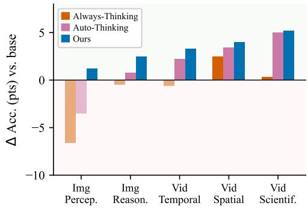  
Qwen2.5-VL

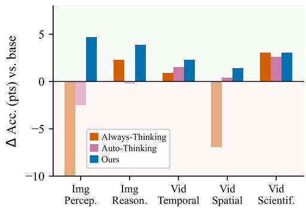  
Qwen3-VL

Figure 7: Per-category gains over the base model. Each bar shows the absolute accuracy change vs. the base model across five task categories (averaged over benchmarks within each group). Alwaysthinking models collapse on image perception (hallucination pressure) and spatial reasoning; autothinking recovers perception partially but lacks consistent gains. Video-FLAIR is the only method with positive gains across all five categories in both base models.  
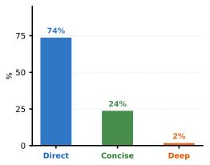  
HallusionBench

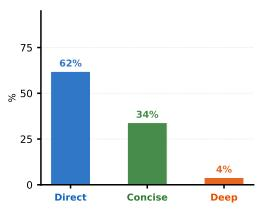  
MM-Vet v2

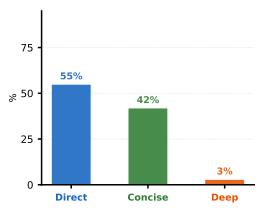  
Video-TT

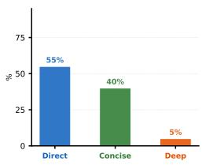  
MathVista

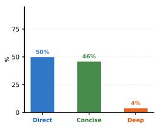  
VSI-Bench

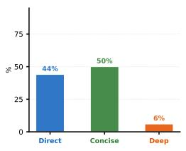  
EMMA

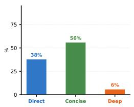  
Video-MMMU

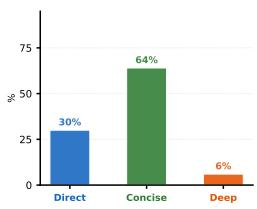  
SciVideoBench  
Figure 8: Reasoning mode distribution across remaining benchmarks. The <DIRECT>-to-<CONCISE> shift tracks benchmark cognitive demand: retrieval-oriented tasks (HallusionBench, Video-TT) remain <DIRECT>-heavy, while inference-heavy and research-level benchmarks (EMMA, SciVideoBench) shift toward <CONCISE>. <DEEP> usage stays below 6% throughout.

## B Ablation Studies

RQ6: Do per-category gains hold across model families? Figure 7 shows per-category gains over the base model. Five categories aggregate benchmarks as follows: Image Perception (EMMA, HallusionBench), Image Reasoning (MMMU, MathVista, AI2D, MM-Vet v2), Video Temporal (Video-Holmes, Video-TT), Video Spatial (VSI-Bench), and Video Scientific (SciVideoBench, Video MMMU). Always-thinking collapses on Image Perception (Qwen2.5-VL: −6.6 pts avg, Qwen3-VL: −14.5 pts avg) and Video Spatial (−6.9 pts on Qwen3-VL) because verbose thinking hallucinates answers that must be read from the visual signal. Video-FLAIR is the only method with positive gains across all five categories in both families. Qwen3-VL shows larger absolute gains on Image

Table 6: Reward component and mode-space ablations. Rows R1–R3 each remove one reward component while keeping all others active (✓). In Row R4 all reward components remain active but <DEEP> is removed, restricting the model to <DIRECT> and <CONCISE> only.
<table><tr><td>Configuration</td><td> $R _ { \mathrm { b a l a n c e } }$ </td><td> $R _ { \mathrm { c o s t } }$ </td><td>δ</td><td>EMMA</td><td>HallusionBench Video-Holmes</td><td></td><td></td><td>VSI-Bench SciVideoBench</td></tr><tr><td>Qwen2.5-VL-7B</td><td>一</td><td>一</td><td>一</td><td>25.8</td><td>71.0</td><td>43.2</td><td>31.8</td><td>23.8</td></tr><tr><td>(R1) w/o mode diversity  $( R _ { \mathrm { b a l a n c e } } )$ </td><td>X</td><td>√</td><td>√</td><td>25.3</td><td>71.4</td><td>44.9</td><td>33.7</td><td>26.3</td></tr><tr><td>(R2) w/o length pressure  $\left( R _ { \mathrm { c o s t } } \right)$ </td><td>√</td><td>X</td><td>√</td><td>27.1</td><td>69.4</td><td>47.2</td><td>33.1</td><td>28.6</td></tr><tr><td>(R3) δ=0 (accuracy-only utility)</td><td>√</td><td>√</td><td>X</td><td>26.7</td><td>70.6</td><td>45.6</td><td>32.9</td><td>27.2</td></tr><tr><td>(R4) &lt;DIRECT&gt; + &lt;CONCISE&gt; only (no &lt;DEEP&gt;)</td><td>√</td><td>√</td><td>√1</td><td>26.0</td><td>71.3</td><td>46.1</td><td>34.5</td><td>27.8</td></tr><tr><td>Video-FLAIR (full)</td><td>√</td><td>√</td><td>√</td><td>27.3</td><td>71.8</td><td>48.0</td><td>35.8</td><td>29.4</td></tr></table>

Table 7: Design decision sensitivity. Each block varies one hyperparameter while holding all others at the chosen value ( highlighted )
<table><tr><td>Decision</td><td>Setting</td><td>EMMA</td><td>MMMU</td><td>HallusionBench</td><td>Video-Holmes</td><td>VSI-Bench</td><td>SciVideoBench</td></tr><tr><td>Qwen2.5-VL-7B</td><td></td><td>25.8</td><td>52.0</td><td>71.0</td><td>43.2</td><td>31.8</td><td>23.8</td></tr><tr><td rowspan="2">Grounding weight δ</td><td>δ = 0.35 (ours)</td><td>27.3</td><td>54.5</td><td>71.8</td><td>48.0</td><td>35.8</td><td>29.4</td></tr><tr><td>δ = 0.70</td><td>26.8</td><td>53.1</td><td>71.3</td><td>47.4</td><td>36.2</td><td>28.7</td></tr><tr><td rowspan="3">Selection weight  $w _ { \mathrm { s e l e c t } }$ </td><td> $w _ { \mathrm { s e l e c t } } = 0 . 2 0$ </td><td>26.2</td><td>54.1</td><td>71.5</td><td>46.5</td><td>35.1</td><td>28.3</td></tr><tr><td> $w _ { \mathrm { s e l e c t } } = 0 . 4 0 ( o u r s )$ </td><td>27.3</td><td>54.5</td><td>71.8</td><td>48.0</td><td>35.8</td><td>29.4</td></tr><tr><td> $w _ { \mathrm { s e l e c t } } = 0 . 6 0$ </td><td>26.9</td><td>53.8</td><td>71.4</td><td>47.6</td><td>35.4</td><td>29.0</td></tr></table>

Perception (+4.7 pts) and Image Reasoning (+3.9 pts), reflecting a stronger base model that benefits more from accurate mode selection on hard reasoning tasks.

RQ7: Does mode selection reflect query cognitive demand? Figure 8 shows the mode distribution across the remaining 8 benchmarks. <DIRECT> usage spans 74% (HallusionBench) to 30% (SciVideoBench), a 44-point range that tracks each benchmark’s cognitive profile rather than cost alone. A cost-only heuristic would maximize <DIRECT> everywhere. HallusionBench (74% <DIRECT>) is designed so that correct answers require reading the image directly rather than reasoning from priors [24]; extended chains bypass the visual signal rather than grounding in it. EMMA (50% <CONCISE>) is the only image benchmark with a <CONCISE> majority, as its questions require integrating visual observations with domain reasoning over multiple steps [27]. SciVideoBench (64% <CONCISE>) draws from research-level experimental videos across 25 scientific disciplines; answering requires chaining precise spatiotemporal observations with expert domain knowledge [17]. <DEEP> stays below 6% across all benchmarks, rising only on the small fraction of questions where multiple competing explanations must be actively ruled out.

RQ8: Does each reward component contribute independently? Table 6 ablates $R _ { \mathrm { b a l a n c e } } , R _ { \mathrm { c o s t } }$ and the grounding weight δ one at a time. Row R1 removes $R _ { \mathrm { b a l a n c e } } { : }$ without the diversity reward, the model collapses toward <DIRECT> on most queries. Video-Holmes drops to 44.9 (−3.1) and SciVideoBench to 26.3 (−3.1) since both require mode diversity across questions. HallusionBench is largely unaffected (71.4, −0.4) because <DIRECT> is already the appropriate mode there. Row R2 removes $R _ { \mathrm { c o s t } } { : }$ without length pressure, the model drifts toward verbose responses. HallusionBench drops to 69.4 (−2.4) and VSI-Bench to 33.1 (−2.7) because extended chains produce visually ungrounded steps on tasks where the answer must be read from the visual signal. EMMA is largely unaffected (27.1, −0.2) as reasoning tasks tolerate longer outputs. Row R3 sets δ=0, removing grounding from the utility function. VSI-Bench drops to 32.9 (−2.9) and Video-Holmes to 45.6 (−2.4) as both require accurate spatial and temporal grounding to select the right mode; without δ the utility cannot distinguish a grounded from an ungrounded correct answer.

RQ9: Is <DEEP> necessary or does <CONCISE> cover its role? Row R4 of Table 6 removes <DEEP> entirely, restricting the model to <DIRECT> and <CONCISE>. Video-Holmes drops to 46.1 (−1.9) and SciVideoBench to 27.8 (−1.6), as both contain queries that require ruling out competing hypotheses across evidence, which <CONCISE> cannot fully substitute. HallusionBench is flat (71.3, −0.5) since the benchmark is dominated by <DIRECT> queries where <DEEP> is rarely selected. The results confirm that <DEEP> contributes independently: its removal is not recoverable by <CONCISE>, and the benchmarks most sensitive to this removal are precisely those with hypothesis-testing demand.

RQ10: How sensitive are the key hyperparameters? Table 7 sweeps δ and $w _ { \mathrm { s e l e c t } }$ while holding all other parameters fixed. For δ=0.70, excess grounding emphasis biases utility toward modes that produce grounding tags regardless of accuracy; MMMU drops to 53.1 (−1.4) and HallusionBench to $7 1 . 3 \ : ( - 0 . 5 )$ as grounding overrides the accuracy signal on tasks where visual lookup suffices; VSI-Bench increases slightly (+0.4) since spatial grounding is genuinely informative there. For $w _ { \mathrm { s e l e c t } } { = } 0 . 2 0$ , the weak selection signal allows cost pressure to suppress <DEEP> even when utility identifies it as optimal, hence, Video-Holmes drops to 46.5 (−1.5) and EMMA to 26.2 (−1.1). This occurs because the adaptive slot’s penalty for selecting a suboptimal mode is too small to outweigh the cost reward favoring shorter responses. For ${ w _ { \mathrm { s e l e c t } } } \mathrm { = } 0 . 6 0$ , the stronger penalty starts to drown verifier feedback, slightly degrading MMMU (53.8, −0.7) and HallusionBench (71.4, −0.4). Both parameters are robust within a moderate range, all settings remain above the base model, and the chosen values $( \delta { = } 0 . 3 5 , w _ { \mathrm { s e l e c t } } { = } 0 . 4 0 )$ achieve the best overall balance.

## C Full Training Algorithm

Algorithm 1 gives a self-contained procedural view of Video-FLAIR.

## D Evaluation Details

## D.1 Benchmarks and Splits

We evaluate on a diverse suite of multimodal benchmarks spanning perception-heavy multiple-choice tasks, open-ended visual reasoning, video temporal grounding, and knowledge-intensive video QA.

## D.2 Image Benchmarks

EMMA [27] evaluates organic multimodal reasoning in mathematics, physics, chemistry, and coding, where text-only chain-of-thought is insufficient, and the visual context is load-bearing. It probes whether a model can genuinely integrate visual and textual information in a back-and-forth manner rather than treating the image as supplementary context.

MMMU [84] contains 11,500 college-level questions across 30 subjects and 183 subfields, requiring expert domain knowledge fused with heterogeneous visual inputs (diagrams, tables, charts). Its breadth and disciplinary depth make it a strong test of models that must balance deep deliberation on hard items with efficiency on simpler perceptual lookups.

MathVista [52] covers seven mathematical reasoning types (algebraic, arithmetic, geometric, logical, statistical, and more) that are tightly coupled with diverse visual contexts, such as plots, geometric figures, and tables. It tests visually grounded arithmetic and multi-step inference, where the answer cannot be derived from language priors alone.

HallusionBench [24] is specifically designed to disentangle language hallucination (answering from memory) and visual illusion (misreading the image), using matched control-group question pairs to isolate each failure mode. It is selected to evaluate whether grounding rewards suppress the tendency to hallucinate rather than read the visual signal directly.

AI2D [36] presents grade-school science diagrams (food webs, water cycles, planetary systems) with structural annotations and multiple-choice questions. It covers non-photographic structured graphics where models must parse constituent relationships and apply domain semantics, going beyond recognition of natural images.

MM-Vet v2 [82] evaluates seven integrated capabilities, including recognition, knowledge, OCR, spatial awareness, language generation, math, and image-text sequence understanding across interleaved multi-image inputs. Its open-ended, judge-scored format captures response quality beyond accuracy, complementing the multiple-choice benchmarks in our suite.

## D.3 Video Benchmarks

Video-Holmes [13] requires models to actively locate and causally chain multiple visual clues scattered across temporal segments in suspense short films, with even the strongest models (Gemini-

Algorithm 1 Video-FLAIR Full Training Procedure   
Require: Base VLM π (Qwen3-VL); SFT data $\mathcal { D } _ { \mathrm { S F T } } ; \mathrm { R I }$ corpus $\mathcal { D } _ { \mathrm { R L } }$ (medium-difficulty); $K { = } 8 ,$   
$\dot { \delta } = 0 . 3 5 , \beta _ { \mathrm { a l p } } = 0 . 2 0 ;$ verifier V; refresh interval $N _ { \mathrm { r e f } }$ , total RL steps $T _ { \mathrm { R I } }$   
Ensure: Adaptive policy $\pi _ { \theta } ^ { * }$ that selects reasoning mode per query   
1: Fine-tune $\pi _ { \theta }$ on mode-labeled traces from $\mathcal { D } _ { \mathrm { { S F T } } } \mathrm { { : } }$   
2: for step $t = 1$ to $T _ { \mathrm { R L } }$ do   
3: Sample batch B from $\mathcal { D } _ { \mathrm { R L } }$   
4: (a) Mode-structured rollout generation   
5: for all prompt $q \in B$ do   
6: Generate $K { = } 8$ completions with fixed slot assignment: ▷ controlled | adaptive   
7: $[ \ \mathbf { D } _ { 1 } \mathbf { D } _ { 2 } , \ \mathbf { C } _ { 3 } \mathbf { C } _ { 4 } ^ { \bullet } , \ \mathbf { P } _ { 5 } \mathbf { P } _ { 6 } , \ \mathbf { A } _ { 7 } \mathbf { A } _ { 8 }$   
8: Inject mode instruction per slot; all K scored under identical reward   
9: end for   
10: (b) Per-rollout reward computation   
11: for all rollout $o _ { j }$ in batch do   
12: $R _ { \mathrm { a n s } } { \mathrm { : } }$ exact-match / soft-numeric / ROUGE-L $R _ { \mathrm { f o r m a t } } { : }$ schema validity $R _ { \mathrm { c o m p l y } } !$ : compli  
ance + overflow   
13: $R _ { \mathrm { b a l a n c e } } { : }$ penalize mode collapse across the K-group ▷ maintains diversity   
14: $\begin{array} { r } { R _ { \mathrm { c o s t } } = - \big ( \mathrm { B a s e C o s t } ( m ) + \beta _ { \mathrm { a l p } } \frac { | \hat { y } | } { L _ { 0 } } \hat { p } _ { \mathrm { s o l v e d } } \mu _ { m } \big ) } \end{array}$ $\triangleright A L P \colon$ harder prompts penalized less   
15: $\mathbf { i f } \ j \in \{ 7 , 8 \}$ (adaptive slots) then   
16: From controlled rollouts $\big \{ o _ { 1 } , \dotsc , o _ { 6 } \big \}$ compute per-mode utility:   
17: $\mathrm { U t i l i t y } ( m ) = \bigl ( \operatorname { A n s } ( m ) + \delta G ( m ) \bigr ) \bigl ( 1 - \operatorname { C o s t } ( m ) \bigr )$   
18: $m ^ { * } = \mathrm { a r g }$ max Utility(m) ▷ ties broken toward cheaper mode   
19: $R _ { \mathrm { s e l e c t } } \colon + \Delta$ if $o _ { j }$ chose $m ^ { * } ; ~ - \Delta$ otherwise   
20: end if   
21: Query verifier $V \Rightarrow R _ { \mathrm { v e r i f i e r } } = w _ { t } v _ { t } + w _ { s } v _ { s } + w _ { h } v _ { h } + \cdot \cdot \cdot$ ▷ temporal, spatial,   
human-alignment; span/tag/pref/replay terms in §E.7   
22: end for   
23: (c) Token-level credit shaping   
24: Obtain per-token credit $c _ { t }$ from verifier spans (heuristic fallback if absent)   
25: Reshape advantages: $\begin{array} { r } { \hat { A } _ { t } = A _ { \mathrm { s e q } } \cdot c _ { t } , ~ \frac { 1 } { T } \sum _ { t } c _ { t } = 1 } \end{array}$ ▷ evidence spans receive up to 4× gradient   
26: (d) GDPO normalization + DAPO update   
27: $A _ { k } ^ { ( i , j ) }  \frac { r _ { k } ^ { ( i , j ) } - \mu _ { k } } { \sigma _ { k } + \epsilon }$ for each $\begin{array} { r l } { r _ { k } ; } & { { } A _ { \mathrm { s u m } } = \sum _ { k = 1 } ^ { 7 } A _ { k } ^ { ( i , j ) } } \end{array}$   
28: Batch-renormalize $A _ { \mathrm { s u m } }$ ; update $\pi _ { \theta }$ via DAPO objective (8)   
29: if t mod $N _ { \mathrm { r e f } } = 0$ then   
30: (e) Online verifier DPO refresh   
31: Build preference pairs: chosen = highest-R rollout; rejected = lowest-R   
32: DPO fine-tune $V \xrightarrow { \mathcal { P } _ { \mathrm { p r e f } } } V ^ { \prime } ;$ ; hot-swap $V ^ { \prime }  R _ { \mathrm { v e r i f i e r } }$ ▷ keeps verifier calibrated   
33: end if   
34: end for   
35: return $\pi _ { \theta }$

2.5-Pro) achieving only ${ \sim } 4 5 \%$ accuracy. It tests multi-hop inferential reasoning, in which evidence must be retrieved and linked over time rather than recalled from a single frame.

Video-TT [88] evaluates both correctness and robustness of video-LLMs using 1,000 YouTube Shorts paired with adversarial question variants (rephrased, wrongly-led, correctly-led). The robustness track is sensitive to over-reasoning and confirmation bias, testing whether models can maintain accurate answers under natural adversarial pressure.

VSI-Bench [78] tests visual-spatial intelligence through 5,000+ QA pairs over indoor-scene videos, covering spatial measurement, distance estimation, object counting, and route planning. It reveals that spatial reasoning, not perception or language, is the primary bottleneck for current models, making it a useful probe of grounded inference over sequential frames.

SciVideoBench [17] presents 1,000 research-level questions from experimental videos across 25+ specialized domains (physics, chemistry, biology, medicine). It sits well beyond saturated collegelevel benchmarks, requiring the combination of precise spatiotemporal perception, expert domain knowledge, and sophisticated logical reasoning.

Video-MMMU [32] measures knowledge acquisition from 300 expert educational videos through 900 questions aligned to Bloom’s taxonomy (Perception, Comprehension, Adaptation). Unlike static benchmarks, it requires models to learn and apply knowledge from video content during inference, with a steep drop in performance as cognitive demand increases.

## E Reward Function and Utility: Full Definitions

This section provides complete mathematical definitions for each reward component introduced in $\ S 4 . 3$ and $\ S 4 . 4$ , including per-answer-type scoring rules, cost terms, and the utility function used to supervise adaptive slot selection.

## E.1 Answer Reward $R _ { \mathrm { a n s } }$

Answer scoring is dispatched by the answer\_type field attached to each training example. Let aˆ denote the extracted prediction and $a ^ { * }$ the gold solution.

mcq\_letter. Exact uppercase letter match:

$$
R _ { \mathrm { a n s } } = \mathcal { H } [ \hat { a } = a ^ { * } ] \in \{ 0 , 1 \} .\tag{9}
$$

number. Soft inverse-MSE score that degrades smoothly with numeric error:

$$
R _ { \mathrm { a n s } } = \frac { 1 } { 1 + ( \hat { a } - a ^ { * } ) ^ { 2 } } .\tag{10}
$$

temporal\_single. A single predicted timestamp tˆ is scored against the gold timestamp $t ^ { * }$ with a tolerance-normalized soft score:

$$
\begin{array} { r } { R _ { \mathrm { a n s } } = \operatorname* { m a x } \ ( 0 , 1 - \frac { | \hat { t } - t ^ { * } | } { \tau _ { 0 } } ) , \quad \tau _ { 0 } = 5 . 0 \mathrm { s } . } \end{array}\tag{11}
$$

This gives full credit within $\tau _ { 0 }$ seconds of the gold timestamp and decays linearly to zero.

temporal\_span. A predicted span $[ \hat { t } _ { 1 } , \hat { t } _ { 2 } ]$ is scored against gold $[ t _ { 1 } ^ { * } , t _ { 2 } ^ { * } ]$ with temporal IoU (tIoU):

$$
R _ { \mathrm { a n s } } = \mathrm { t I o U } ( { \hat { a } } , a ^ { * } ) = { \frac { \operatorname* { m a x } ( 0 , \operatorname* { m i n } ( { \hat { t } } _ { 2 } , t _ { 2 } ^ { * } ) - \operatorname* { m a x } ( { \hat { t } } _ { 1 } , t _ { 1 } ^ { * } ) ) } { \operatorname* { m a x } ( { \hat { t } } _ { 2 } , t _ { 2 } ^ { * } ) - \operatorname* { m i n } ( { \hat { t } } _ { 1 } , t _ { 1 } ^ { * } ) } } .\tag{12}
$$

Disjoint predictions receive $R _ { \mathrm { a n s } } = 0$

bbox. A predicted bounding box $\hat { b } = [ x _ { 1 } , y _ { 1 } , x _ { 2 } , y _ { 2 } ]$ is scored against gold $b ^ { * }$ with standard 2D intersection-over-union:

$$
R _ { \mathrm { a n s } } = \mathrm { I o U } ( { \hat { b } } , b ^ { * } ) = { \frac { | { \hat { b } } \cap b ^ { * } | } { | { \hat { b } } \cup b ^ { * } | } } \in [ 0 , 1 ] .\tag{13}
$$

ocr/open/caption. Plain-text outputs are scored with ROUGE-L $F _ { 1 }$

$$
R _ { \mathrm { a n s } } = \mathrm { R O U G E - L } _ { F _ { 1 } } ( \hat { a } , a ^ { \ast } ) .\tag{14}
$$

## E.2 Format Reward $R _ { \mathrm { f o r m a t } }$ t

A binary reward:

$$
R _ { \mathrm { f o r m a t } } = \mathcal { k } \mathrm { [ c o m p l e t i o n ~ m a t c h e s ~ f u l l ~ s c h e m a ~ r e g e x ] } \in \{ 0 , 1 \} .\tag{15}
$$

The schema regex requires: leading <MODE> tag, <think> block, <answer> block, matching closing </MODE> tag, and no content outside the wrapper after stripping trailing chat special tokens.

## E.3 Compliance Reward $R _ { \mathrm { c o m p l y } }$

For a completion c assigned mode m:

$$
\begin{array} { r } { R _ { \mathrm { c o m p l y } } = \left\{ \begin{array} { l l } { - 2 . 0 } & { \mathrm { i f ~ f o r m a t ~ i n v a l i d ~ ( s c h e m a ~ r e g e x ~ f a i l s ) , } } \\ { - 2 . 0 } & { \mathrm { i f ~ a s s i g n e d ~ m o d e ~ \neq ~ p r o d u c e d ~ m o d e ~ ( c o n t r o l l e d ~ s l o t s ) , } } \\ { r _ { \mathrm { o k } } - \lambda _ { L } \cdot \operatorname* { m a x } ( 0 , ~ \frac { w _ { c } - w _ { m } } { w _ { m } } ) } & { \mathrm { o t h e r w i s e , } } \end{array} \right. } \end{array}\tag{16}
$$

where $r _ { \mathrm { { o k } } } = 0 . 5 , \lambda _ { L } = 0 . 5 , w _ { c }$ is the <think> word count, and $w _ { m }$ is the per-mode hard limit $( w _ { \tt D I R E C T } = 1 2 0 , w _ { \tt C O N C I S E } = 6 0 0$ , no explicit cap for <DEEP>). Adaptive-slot completions (slot index $\geq 7 )$ skip the mode-mismatch check but still receive the format-validity and length-overflow checks.

## E.4 Balance Reward $R _ { \mathrm { b a l a n c e } }$

While $R _ { \mathrm { c o m p l y } }$ fires per-completion when a single rollout ignores its assigned mode, $R _ { \mathrm { b a l a n c e } }$ acts at the group level: it corrects under-production of any one mode across the K controlled slots, a failure that $R _ { \mathrm { c o m p l y } }$ alone cannot prevent (a rollout that produces the right mode tag but in the wrong proportion contributes nothing to $R _ { \mathrm { c o m p l y } }$ yet degrades the within-group utility estimate). For a group G of K rollouts, let $n _ { m }$ be the count of controlled-slot completions with produced mode m and $t _ { m }$ be the target count $( t _ { \mathrm { D I R E C T } } = t _ { \tt C O N C I S E } = t _ { \tt D E E P } = 2 \mathrm { ~ f o r ~ } K = \bar { 8 } )$ . For a controlled-slot rollout at index i with produced mode $m _ { i } \colon$

$$
R _ { \mathrm { b a l a n c e } , i } = \mathrm { c l i p } \left( b _ { m _ { i } } + \frac { t _ { m _ { i } } - n _ { m _ { i } } } { t _ { m _ { i } } } , - 1 , 1 \right) , \quad b _ { m } = \left\{ \begin{array} { l l } { 0 . 2 } & { m \in \{ D , C , P \} , } \\ { - 0 . 2 } & { \mathrm { o t h e r w i s e } . } \end{array} \right.\tag{17}
$$

Adaptive-slot rollouts (slot index $\geq 7 )$ receive $R _ { \mathrm { b a l a n c e } } = 0$

## E.5 Cost and Length Reward $R _ { \mathrm { c o s t } }$

Let $\mathrm { c o s t } _ { \mathrm { e f f } } ( m , c )$ denote the effective mode cost:

$$
\begin{array} { r } { \mathrm { c o s t } _ { \mathrm { e f f } } ( m , c ) = C _ { m } + \lambda _ { O } \cdot \mathrm { m a x } \big ( 0 , \frac { w _ { c } - W _ { m } } { W _ { m } } \big ) , } \end{array}\tag{18}
$$

where $w _ { c }$ is the word count of completion $c , \ C _ { m }$ is the base mode cost $( 0 . 0 0 / 0 . 0 8 / 0 . 2 0$ for <DIRECT>/<CONCISE>/<DEEP>), λ = 0.25 is the overflow scale, and $W _ { m }$ is the per-mode word budget (120/600/1200 words). The base penalty is:

$$
P _ { \mathrm { b a s e } } = \mathrm { c o s t } _ { \mathrm { e f f } } ( m , c ) \cdot \left[ \alpha _ { w } + \left( 1 - \alpha _ { w } \right) R _ { \mathrm { a n s } } \right] , \quad \alpha _ { w } = 0 . 2 5 .\tag{19}
$$

The ALP penalty (see Eq. (4) in the main text) is:

$$
P _ { \mathrm { a l p } } = \beta _ { \mathrm { a l p } } \frac { | \hat { y } | } { L _ { 0 } } \hat { p } _ { \mathrm { s o l v e d } } \mu _ { m } ,\tag{20}
$$

where $\beta _ { \mathrm { a l p } } = 0 . 2 0 , L _ { 0 } = 5 1 2$ is a reference length for normalization, $\hat { p } _ { \mathrm { s o l v e d } }$ is the fraction of group rollouts with $R _ { \mathrm { a n s } } \geq 0 . 9 9 9$ clipped to a minimum of $1 / K$ , and $\mu _ { m } \in \{ 1 . 0 0 , 1 . 1 0 , 1 . 2 5 , 1 . 1 0 \}$ for (<DIRECT>, <CONCISE>, <DEEP>, <ADAPTIVE>). The full cost reward is $R _ { \mathrm { c o s t } } = - ( P _ { \mathrm { b a s e } } + \bar { P } _ { \mathrm { a l p } } )$

## E.5.1 Cost Pressure: Scenario Analysis

$R _ { \mathrm { c o s t } } = - ( P _ { \mathrm { b a s e } } + P _ { \mathrm { a l p } } )$ must be adaptive (scale with query difficulty via $\hat { p } _ { \mathrm { s o l v e d } } )$ and stable (work before $\hat { p } _ { \mathrm { s o l v e d } }$ is reliable). Table 8 shows which mode wins under $\mathrm { U t i l i t y } ( m ) = \bigl ( \operatorname { A n s } ( m ) + \delta$ $G ( m ) \big ) \big ( 1 - \mathrm { C o s t } ( m ) \big )$ , where $\operatorname { A n s } ( m )$ is the mean $R _ { \mathrm { a n s } }$ over controlled rollouts for mode $m , G ( m )$ is the mean binary grounding score from the verifier, and Cost(m) is the base mode cost $C _ { m } ;$ Table 9 summarizes when each design component is needed. Note: $\hat { p } _ { \mathrm { s o l v e d } }$ is computed over all $K = 8$ slots, so it tracks query difficulty rather than per-mode success.

Easy query (<DEEP> chosen incorrectly), $\hat { p } _ { \mathrm { s o l v e d } } = 0 . 8 0$ . On an easy retrieval query, <DIRECT> and <CONCISE> controlled slots both succeed reliably, keeping $\hat { p } _ { \mathrm { s o l v e d } }$ high regardless of <DEEP>’s outcome. A <DEEP> rollout with $| \hat { y } | = 6 0 0$ tokens receives:

$$
\begin{array} { r } { P _ { \mathrm { a l p } } = 0 . 2 0 \cdot \frac { 6 0 0 } { 5 1 2 } \cdot 0 . 8 0 \cdot 1 . 2 5 = 0 . 2 3 4 , } \end{array}\tag{21}
$$

$$
P _ { \mathrm { b a s e } } = 0 . 2 0 \cdot [ 0 . 2 5 + 0 . 7 5 \cdot 0 . 9 5 ] = 0 . 1 9 3 ,\tag{22}
$$

$$
R _ { \mathrm { c o s t } } = - ( 0 . 2 3 4 + 0 . 1 9 3 ) = - 0 . 4 2 7 .\tag{23}
$$

Table 8: Representative utility outcomes $( \delta \ : = \ : 0 . 3 5 )$ $\operatorname { A n s } ( m )$ is the mean $R _ { \mathrm { a n s } }$ over the two controlled rollouts for mode m; $G ( m ) ~ = ~ { \textstyle { \frac { 1 } { 2 } } } ( v _ { t } ( m ) + v _ { s } ( \dot { m } ) )$ is the mean verifier grounding score $( v _ { t } , v _ { s } \in [ 0 , 1 ]$ , see §E.7); Cost(m) is the base mode cost $C _ { m } \ \in \ \{ 0 . 0 0 , 0 . 0 8 , \bar { 0 } . 2 0 \}$ for DIRECT/CONCISE/DEEP (overflow term omitted for illustration). $\mathrm { B o l d } = m ^ { * }$
<table><tr><td>Difficulty</td><td>Mode</td><td> $\mathrm { A n s } ( m )$ </td><td> $G ( m )$ </td><td> $\mathrm { C o s t } ( m )$ </td><td>Utility</td><td> $m ^ { * }$ </td></tr><tr><td rowspan="3">Easy</td><td>&lt;DIRECT&gt;</td><td>0.95</td><td>0.30</td><td>0.00</td><td>1.055</td><td>√</td></tr><tr><td>&lt;CONCISE&gt;</td><td>0.90</td><td>0.50</td><td>0.08</td><td>0.989</td><td></td></tr><tr><td>&lt;DEEP&gt;</td><td>0.88</td><td>0.55</td><td>0.20</td><td>0.858</td><td></td></tr><tr><td rowspan="3">Medium</td><td>&lt;DIRECT&gt;</td><td>0.55</td><td>0.20</td><td>0.00</td><td>0.620</td><td rowspan="3">√</td></tr><tr><td>&lt;CONCISE&gt;</td><td>0.82</td><td>0.65</td><td>0.08</td><td>0.964</td></tr><tr><td>&lt;DEEP&gt;</td><td>0.80</td><td>0.70</td><td>0.20</td><td>0.836</td></tr><tr><td rowspan="3">Hard</td><td>&lt;DIRECT&gt;</td><td>0.25</td><td>0.10</td><td>0.00</td><td>0.285</td><td></td></tr><tr><td>&lt;CONCISE&gt;</td><td>0.42</td><td>0.50</td><td>0.08</td><td>0.547</td><td></td></tr><tr><td>&lt;DEEP&gt;</td><td>0.72</td><td>0.78</td><td>0.20</td><td>0.794</td><td>√</td></tr></table>

Table 9: Design rationale: which component handles each regime. $\surd = \mathrm { c o r r e c t ; } \times = \mathrm { f a i l u r e } .$
<table><tr><td>Design</td><td>Early training Easy query</td><td></td><td>Hard query Failure mode</td><td></td></tr><tr><td>ALP only (no  $C _ { m } )$ </td><td>X</td><td> $\checkmark$ </td><td>√</td><td>psolved ≈0 early ⇒ no signal; &lt;DEEP&gt;-as-default collapse</td></tr><tr><td>Base cost only (no ALP)</td><td>√</td><td>partial</td><td>X</td><td>Difficulty-blind; suppresses &lt;DEEP&gt; equally on hard tasks</td></tr><tr><td> $\mathbf { B a s e } + \mathbf { A L P } \left( \mathrm { o u r s } \right)$ </td><td>√</td><td>√</td><td>√</td><td></td></tr></table>

The same query under <DIRECT> with $| \hat { y } | = 8 0$ tokens:

$$
\begin{array} { r } { P _ { \mathrm { a l p } } = 0 . 2 0 \cdot \frac { 8 0 } { 5 1 2 } \cdot 0 . 8 0 \cdot 1 . 0 0 = 0 . 0 2 5 , } \end{array}\tag{24}
$$

$$
P _ { \mathrm { b a s e } } = 0 . 0 0 0 \quad ( C _ { \mathrm { D i r e c t } } = 0 ) ,\tag{25}
$$

$$
R _ { \mathrm { c o s t } } = - 0 . 0 2 5 .\tag{26}
$$

<DIRECT>’s cost advantage is $0 . 4 2 7 - 0 . 0 2 5 = 0 . 4 0 2$ , creating a strong within-group signal that propagates via GDPO to the adaptive slots.

Hard query (<DEEP> justified), $\hat { p } _ { \mathrm { s o l v e d } } = 0 . 1 0$ . On a hard multi-hop query, most rollouts fail, so $\hat { p } _ { \mathrm { s o l v e d } }$ is low, and ALP relaxes. The same <DEEP> rollout $( | \hat { y } | = 7 0 0 )$ now receives:

$$
\begin{array} { r } { P _ { \mathrm { a l p } } = 0 . 2 0 \cdot \frac { 7 0 0 } { 5 1 2 } \cdot 0 . 1 0 \cdot 1 . 2 5 = 0 . 0 3 4 , } \end{array}\tag{27}
$$

$$
P _ { \mathrm { b a s e } } = 0 . 2 0 \cdot [ 0 . 2 5 + 0 . 7 5 \cdot 0 . 7 2 ] = 0 . 1 5 8 ,\tag{28}
$$

$$
R _ { \mathrm { c o s t } } = - ( 0 . 0 3 4 + 0 . 1 5 8 ) = - 0 . 1 9 2 .\tag{29}
$$

<DIRECT> on the same prompt $( R _ { \mathrm { a n s } } = 0 . 2 5 )$ gets $R _ { \mathrm { c o s t } } = - 0 . 0 0 4$ , so <DIRECT>’s cost advantage shrinks to $0 . 1 9 2 \ - 0 . 0 0 4 \ = \ 0 . 1 8 8$ . This is more than offset by $< \mathrm { D E E P } > \mathrm { ^ { * } s } \ R _ { \mathrm { a n s } }$ advantage of $0 . 7 2 - 0 . 2 5 = 0 . 4 7$ , so the composite reward still favors <DEEP>.

The specific constants $( C _ { \mathrm { D e e p } } = 0 . 2 0 , \beta _ { \mathrm { a l p } } = 0 . 2 0 , \mu _ { \mathrm { D e e p } } = 1 . 2 5 )$ are chosen so that on a typical easy query $( \hat { p } _ { \mathrm { s o l v e d } } \approx 0 . 8 , | \hat { y } | \approx 6 0 0 )$ the total <DEEP> penalty is 0.35–0.45, exceeding the <DIRECT>–<DEEP> accuracy gap on retrieval benchmarks and falling below it on disambiguation benchmarks, producing the bifurcation in $m ^ { * }$ visible in Table 8.

## E.6 Selection Reward $R _ { \mathrm { s e l e c t } }$

For each group ${ \mathcal { G } } ,$ compute mode utilities from controlled slots:

$$
\mathrm { U t i l i t y } ( m ) = \left( \overline { { R _ { \mathrm { a n s } } } } ( m ) + \delta \overline { { G } } ( m ) \right) \bigl ( 1 - \overline { { \mathrm { c o s t } _ { \mathrm { e f f } } } } ( m ) \bigr ) ,\tag{30}
$$

where $\overline { { { R _ { \mathrm { a n s } } } } } ( m ) , \overline { { { G } } } ( m ) = { \textstyle { \frac { 1 } { 2 } } } \big ( \overline { { { v _ { t } } } } ( m ) + \overline { { { v _ { s } } } } ( m ) \big )$ , and $\overline { { \mathrm { c o s t } _ { \mathrm { e f f } } } } ( m )$ are means over the 2 controlled rollouts for mode $m , \delta = 0 . 3 5$ . Here $v _ { t } , v _ { s } \in [ 0 , 1 ]$ are the temporal and spatial grounding scores returned by the verifier (full definitions in Appendix §E.7). δ is chosen so that grounding breaks near-ties in mode selection without allowing a grounded incorrect response to outscore an accurate ungrounded one: too small and grounding has no influence on $m ^ { * }$ , too large and correctness is no longer the dominant signal. Sensitivity to $\delta \in \{ 0 . 3 5 , 0 . 7 0 \}$ is reported in Table $\boldsymbol { 7 } . \boldsymbol { m } ^ { * } = \arg \operatorname* { m a x } _ { \boldsymbol { m } } \mathrm { U t i l i t y } ( \boldsymbol { m } )$ (ties broken by lexicographic order). For adaptive rollout i with chosen mode $m _ { i } { \cdot }$

$$
R _ { \mathrm { s e l e c t } , i } = { \left\{ \begin{array} { l l } { + 0 . 8 } & { { \mathrm { i f ~ } } m _ { i } = m ^ { * } , } \\ { - 0 . 8 } & { { \mathrm { i f ~ } } m _ { i } \neq m ^ { * } { \mathrm { ~ o r ~ } } m _ { i } \ncong \{ \mathrm { D } , \mathrm { C } , \mathrm { P } \} , } \\ { 0 . 0 } & { { \mathrm { i f ~ } } { \mathrm { g r o u p ~ h a s ~ n o ~ v a l i d ~ c o n t r o l l e d ~ u t i l i t y ~ e s t i m a t e } } . } \end{array} \right. }\tag{31}
$$

The selection reward requires the full group to be available. For distributed training, an all-gather over ranks collects all completions before scoring.

## E.7 Verifier Reward $R _ { \mathrm { v e r i f i e r } }$

The verifier $( \mathrm { Q w e n } 3 \mathrm { - V L } )$ scores each rollout on three dimensions $( v _ { t } , v _ { s } , v _ { h } )$ and returns span-level annotations used by $R _ { \mathrm { v e r i f i e r } }$ and token-level credit shaping (§F); the preferred-mode signal is derived from these scores:

• Temporal grounding $( v _ { t } \in [ 0 , 1 ] ) \colon$ whether <think> contains explicit <t> time anchors with consistent ordering; vague temporal references without timestamps are penalized.

• Spatial grounding $( v _ { s } \in [ 0 , 1 ] ) \colon$ : whether <obj>+<box> pairs appear with plausible correspondence; object mentions without localization are penalized.

• Human alignment $( v _ { h } \in [ 0 , 1 ] )$ : whether reasoning is internally consistent, evidence-linked, and free of repetitive filler or unjustified certainty. Enforcing alignment increases response length and thus token cost; $R _ { \mathrm { c o s t } }$ directly accounts for this overhead, making the signal interpretable without penalizing depth when warranted.

• Preferred mode: the lowest-cost mode judged reliable for this sample under the ordering <DIRECT> $< < \mathrm { C O N C I S E > < < D E E P > }$ , adaptive slots whose chosen mode conflicts with this judgment receive a corresponding penalty.

• Span scores $( S _ { \mathrm { s p a n } } \in [ - 1 , 1 ]$ per sentence): positive for evidence-supporting spans, negative for filler or hallucinated content, used directly as token-level credit weights when available, otherwise computed from the local heuristic (§F).

Reward aggregation. The scalar verifier reward aggregates the signals above:

$$
R _ { \mathrm { v e r i f i e r } } = w _ { t } v _ { t } + w _ { s } v _ { s } + w _ { h } v _ { h } + w _ { \mathrm { s p a n } } S _ { \mathrm { s p a n } } + \Delta _ { \mathrm { t a g } } + \Delta _ { \mathrm { p r e f } } + \Delta _ { \mathrm { r e p l a y } } ,\tag{32}
$$

where:

$$
\bullet \ ( w _ { t } , w _ { s } , w _ { h } ) = ( 0 . 3 5 , 0 . 3 5 , 0 . 3 0 ) ,
$$

$w _ { \mathrm { s p a n } } = 0 . 2 5 ,$

$\Delta _ { \mathrm { t a g } } = - 0 . 6$ if mode is <DIRECT> and any grounding tag $( < \mathsf { o b j } > , < \mathsf { b o x } > , < \mathsf { t } > )$ appears in <think>, else 0,

$\Delta _ { \mathrm { p r e f } } = + 0 . 4$ if adaptive slot chose verifier’s preferred\_mode, else −0.4 for adaptive slots, 0 for controlled slots,

$\Delta _ { \mathrm { r e p l a y } } = 0 . 1 5 \cdot \mathrm { m i n } ( p _ { \mathrm { o l d } } / 2 , 1 )$ where $p _ { \mathrm { o l d } } \in [ 0 , 3 ]$ is the replay priority for this prompt (see Appendix §I).

The full reward is clipped to [−2.0, 2.0].

Online DPO refresh. Every $N = 1 0 0 \mathrm { R I }$ gradient steps, the highest- and lowest-reward completions within each rollout group form a DPO preference pair (chosen/rejected), which is retained if the reward margin exceeds 0.15. Up to 2,000 pairs are constructed per trigger and used to fine-tune the verifier via DPO, after which the updated checkpoint is hot-swapped into the reward pipeline. This keeps the verifier calibrated to the current policy without interrupting RL training.

## F Token-Level Credit Construction

Motivation. Standard GRPO/DAPO assigns the same advantage to every token in a completion. For reasoning traces, this dilutes the gradient signal across low-information spans (hedging phrases, transitional filler, repeated prefixes) that are unlikely to distinguish good from bad completions. Hence, the credit map concentrates the gradient on evidence-bearing spans.

Local heuristic. In the absence of verifier span\_scores, the reward function computes a local span-credit score $S _ { \mathrm { s p a n } }$ per completion:

1. Extract the <think> block, split into sentence-like spans at newline, period, exclamation, or question-mark boundaries.

2. For each span $s _ { j }$ , accumulate:

$+ 0 . 2 0 \ \mathrm { i f } \ s _ { j }$ contains both <obj> and <box> (spatially grounded span).

$+ 0 . 1 5$ if $s _ { j }$ contains <t> (temporally grounded span).

• +0.10 if $s _ { j }$ has $\geq 4$ non-tag words (substantive text span).

• −0.12 if $s _ { j }$ contains hedging phrases (“maybe”, “probably”, “guess”, “unsure”, “not sure”).

3. Average across spans, clip to $[ - 1 . 0 , 1 . 0 ]$

Empty think blocks receive $S _ { \mathrm { s p a n } } = - 0 . 2$ as a baseline penalty.

Verifier span scores. When need\_span\_credit=1 is included in the verifier request, the server returns span\_scores: a list of floats in [−1, 1] aligned to the span boundaries provided in span\_texts. These scores replace the local heuristic and provide a model-based assessment of each span’s evidential value.

Token-level projection. The credit map $c _ { t }$ for each completion token t is constructed by interpolating the span score of the span to which t belongs into a normalized weight:

$$
c _ { t } = \frac { 1 + s _ { \sigma ( t ) } } { \sum _ { t ^ { \prime } = 1 } ^ { T } ( 1 + s _ { \sigma ( t ^ { \prime } ) } ) / T } ,\tag{33}
$$

where $\sigma ( t )$ is the span index of token t and $s _ { \sigma ( t ) } \in [ - 1 , 1 ]$ is the span score. The normalization ensures $\begin{array} { r } { \frac { 1 } { T } \sum _ { t } c _ { t } = 1 } \end{array}$ , preserving the overall gradient magnitude. Tokens outside the <think> block (the <answer> block and wrapper tokens) receive neutral credit $( c _ { t } = 1 )$ ) unless explicitly overridden.

## G SFT Data

The SFT corpus provides mode-structured warm-start data so that the policy enters RL with wellformed <DIRECT>/<CONCISE>/<DEEP> behaviors. We process heterogeneous multimodal QA/reasoning sources into a single unified schema and convert each example into a mode-appropriate completion with strict wrappers and normalized answer blocks. Mode-structured traces are built upon OneThinker [21] and Open-O3-Video [55].

Source datasets and mode assignments. Table 10 summarizes the three mode partitions with approximate sample counts.

• DIRECT (≈39K samples). Datasets requiring near-zero reasoning: object tracking (Elysium [70], TrackingNet [56], Got10k [33]), video object segmentation (RefSAV [83], ReVOS [34], RefYTVOS [5], MeViS [18]), image segmentation (COCO2014 [47], capped to ≤6K to prevent over-weighting static detection over temporal tracking), spatial grounding (LLaVA-ST [44], Train2014 [47]), OCR (TextVQA [64]). <DIRECT> traces target ≤60 <think> words and emphasize precise localization.

• CONCISE (≈80K samples). Procedural reasoning tasks: mathematical QA (MathQA [1]), chart understanding (ChartQA [54], Open-Chart), temporal moment retrieval (Charades [63], DiDeMo [30], LongVila [12]), general multimodal description and QA (ShareGPT4V [7], VideoEspresso [26]), general video QA (LLaVA-Video [89], downsampled to reduce “chatterbox” filler behavior). <CONCISE> traces target ${ \le } 2 0 0$ <think> words with linear factual chains.

Table 10: SFT data partitions by mode.
<table><tr><td>Mode</td><td>Key sources</td><td>Count</td></tr><tr><td>&lt;DIRECT&gt;</td><td>Elysium [70], TrackingNet [56], Got10k [33], RefSAV [83], ReVOS [34], RefYTVOS [5], MeViS [18], COCO2014 [47], LLaVA-ST [44], TextVQA [64]</td><td>≈39K</td></tr><tr><td>&lt;CONCISE&gt;</td><td>MathQA [1], ChartQA [54], Open-Chart, Charades [63], ≈80K DiDeMo [30], LongVila [12], ShareGPT4V [7], VideoE- spresso [26], LLaVA-Video [89], Open-O3-Video [55]</td><td></td></tr><tr><td>&lt;DEEP&gt;</td><td>CLEVRER [80], Visulogic [76], STAR [73], PerceptionTest [57], ≈12K MovieChat [65], EgoProcel [4], HD-EPIC [58]</td><td></td></tr></table>

• DEEP (≈12.2K samples). High-value “trap” datasets requiring causal, logical, or intent reasoning: causal prediction (CLEVRER [80]), visual logic (Visulogic [76]), action intent (STAR [73]), perceptual disambiguation (PerceptionTest [57]), long-form movie QA (MovieChat [65]), egocentric procedure understanding (EgoProcel [4], HD-EPIC [58]). <DEEP> traces target ≤1000 <think> words and are rewritten into negative-reasoning style where appropriate: the model is expected to pause (“Wait. . . ”) and falsify plausible distractors before committing to an answer.

## H RL Training Setup

RL difficulty filtering. For the RL training split, we apply a parallel difficulty screening procedure. Each question in the SFT candidate pool is posed to the SFT-initialized policy across 4–8 samples at temperature 1.0. Questions where all samples are correct (trivially easy, $\geq n _ { \mathrm { e a s y } }$ correct by default = 3 of 4) are discarded because they provide no gradient signal. Questions where no sample is correct (trivially hard, $\leq n _ { \mathrm { h a r d } }$ correct by default = 1 of 4) are also discarded because they cannot contribute positive-advantage rollouts. The remaining “medium-difficulty” questions constitute the RL dataset (≈ 9K samples), preserving examples where the policy sometimes succeeds and sometimes fails, the regime where mode-selection learning has the greatest impact.

Backbone and LoRA configuration. We fine-tune Qwen3-VL [2] and Qwen2.5-VL [3] base models with LoRA [31] applied to all linear layers, bfloat16 precision, and DeepSpeed ZeRO-3 [60] for distributed sharding. The base model path is the SFT-initialized checkpoint produced from the data construction pipeline (§G).

Rollout configuration. We use K = 8 rollouts per prompt with temperature 1.0 and top-p 1.0. Maximum context length is 16,384 tokens, maximum completion length is 1,024 tokens. Rollout generation uses vLLM [42] in server mode (external vLLM process, communicating over HTTP).

Slot assignment and mode injection. The slot order is configured via:

$$
\underbrace { \left[ \mathrm { S D I R E C T > , < D I R E C T > } , \underbrace { \mathrm { < C O N C I S E > , < C O N C I S E > } } _ { \mathrm { s i o t s \ : 1 - 2 } } , \underbrace { \mathrm { < D E E P > , < D E E P > } } _ { \mathrm { s i o t s \ : 3 - 4 } } , \underbrace { \mathrm { < A D A P T I V E > , < A D A P T I V E > } } _ { \mathrm { s i o t s 5 - 6 } } \right] } _ { \mathrm { s i o t s \ : 7 - 8 } } .\tag{34}
$$

Slot indices are assigned by computing the global repeated-sampling position modulo K (not the local shard index), ensuring that all 8 rollouts for a given prompt receive contiguous slot indices 0–7 regardless of how training examples are sharded across GPUs. The mode instruction corresponding to each slot is injected into the prompt at sampler time.

Optimization hyperparameters. We train for 1 epoch on the RL dataset with a learning rate of $1 \stackrel { \cdot } { \times } 1 0 ^ { - 6 } .$ , a warmup ratio of 0.05, gradient accumulation over 2 steps, and a per-device batch size of 1. We use the DAPO [81] loss with GDPO [49] reward scaling, which normalizes each reward function’s contribution within the group before combining.

## I Prioritized Replay and Off-Policy Correction

Buffer structure. The prioritized replay buffer maintains a dictionary of the highest-priority entry seen per prompt\_id, backed by a max-heap for efficient capacity management. Capacity is 4,096 entries. Each entry stores the priority scalar, mode string, hardness estimate, and a timestamp.

Priority definition. After each rollout is scored, the buffer is updated with:

$$
p = \vert S _ { \mathrm { v e r i f i e r } } \vert + ( 1 - R _ { \mathrm { a n s } } ) ,\tag{35}
$$

where $S _ { \mathrm { v e r i f i e r } }$ is the verifier score (before final clipping) and $R _ { \mathrm { a n s } }$ is the answer reward. High priority results from: (a) large verifier signal magnitude (indicating a grounding-important example), and (b) incorrect answers (indicating a still-challenging example). Entries are only updated when the new priority exceeds the stored priority for that prompt\_id.

Replay bonus shaping. At reward-computation time, the stored priority for the current prompt\_id is looked up and added as a shaping bonus to the verifier reward:

$$
\Delta R _ { \mathrm { r e p l a y } } = \gamma _ { r } \cdot \mathrm { m i n } \Big ( { \frac { p _ { \mathrm { o l d } } } { 2 } } , 1 . 0 \Big ) , \quad \gamma _ { r } = 0 . 1 5 .\tag{36}
$$

This maintains gradient pressure on historically difficult prompts throughout training.

Off-policy importance sampling. When replay samples from earlier in training are mixed into a fresh batch, the policy has shifted since those completions were generated. We correct for this with clipped importance-sampling weights:

$$
w _ { \mathrm { I S } } = \frac { \pi _ { \theta } ( y | x ) } { \pi _ { \theta _ { \mathrm { o l d } } } ( y | x ) } , \qquad \tilde { A } _ { t } = \mathrm { c l i p } ( w _ { \mathrm { I S } } , w _ { \mathrm { m i n } } , w _ { \mathrm { m a x } } ) \cdot A _ { t } .\tag{37}
$$

Clipping prevents large IS weights from destabilizing training when the policy has moved substantially from the behavior that generated the replay sample.

## J Failure Modes

We identified the following failure modes through qualitative analysis of rollouts and mode distribution statistics across benchmarks:

• Mode collapse on uniformly easy batches. When a mini-batch contains mostly easy queries (high $\hat { p } _ { \mathrm { s o l v e d } } )$ , the adaptive length penalty (ALP) suppresses all reasoning modes similarly, reducing variance in the utility signal. DAPO’s dynamic resampling partially mitigates this by discarding low-variance rollout groups.

• Over-deliberation on difficult queries. On genuinely difficult examples, <DEEP> occasionally produces excessively long reasoning traces with limited accuracy gains. The cost penalty and overflow compliance terms reduce this behavior but do not fully eliminate it.

• Under-invocation of <DEEP> on inference-heavy benchmarks. On Video-Holmes, approximately 25% of selections are <DIRECT> despite the benchmark being designed to avoid direct-lookup questions [13]. In particular, Social Reasoning and Multimodal Hint Reasoning queries often involve shallow single-hop inference that can appear perceptual to the policy. A finer-grained mode space or a dedicated single-hop inference mode could close this gap (see Figure 9).

## K Limitations

The current framework evaluates reasoning quality through proxy signals (e.g., grounding tags and verifier scores) rather than direct human supervision. Although the verifier is periodically refreshed during training, its calibration may still drift on out-of-distribution queries. In addition, when the policy and verifier share the same backbone (Qwen3-VL), the backbone affinity may bias the verifier’s judgments. However, the consistent gains on Qwen2.5-VL, which uses a different policy backbone, suggest this is not the primary source of improvement. The slot-based rollout design also assumes that each query can be meaningfully evaluated across all reasoning modes. For intrinsically single-depth tasks (e.g., pure classification), forcing <CONCISE> or <DEEP> rollouts can waste computation on degenerate reasoning traces with little learning value.

## L Qualitative Analysis

Figures 9–12 show representative correct and incorrect mode selections. Each figure pairs one success case with one failure case on the same video.

Social reasoning failure (Figure 9). Assessing Darren Cross’s emotional state immediately after shrinking the lamb requires evaluating posture, gaze, and reaction across multiple frames to rule out a surface confident reading. This is the deliberative hypothesis-testing query for <DEEP>. The policy routes to <DIRECT>, commits to a single-frame observation, and produces an incorrect conclusion. The response also generates grounding tags (<obj>, <box>, <t>) inside <DIRECT> output, a signal of routing instability. This failure type generalizes to the Social Reasoning subtask of Video-Holmes (§J): social and emotional queries have the surface form of perceptual lookups, causing the cost-aware policy to under-invoke <DEEP>. The Yellowjacket timestamp query (bottom) is a sequential scan; <CONCISE> correctly chains three grounded appearances across the video.

Compositional-surface query requiring hypothesis testing (Figure 10). Determining whether the rover is autonomous or operator-controlled requires falsifying the autonomous hypothesis across multiple behavioral dimensions: controller presence, motion smoothness, and gaze tracking. The policy routes to <CONCISE>, which linearly chains co-location observations without evaluating competing interpretations. <DEEP> is required because the question cannot be resolved through evidence accumulation alone. It requires actively rejecting alternative explanations. In contrast, the wheel-count query (bottom) involves no competing hypotheses and can be answered from any clear frame, making <DIRECT> the most cost-efficient choice.

Causal disambiguation and temporal counting (Figure 11). The causality query explicitly requires falsifying a competing hypothesis, the textbook query for <DEEP>. The policy correctly establishes that the green cube does not enter the frame until after the initial impact, eliminating that hypothesis, and confirms gold-cube contact with timestamped bounding boxes. The counting query demands a cumulative scan: the correct answer (4 objects: gold cube, purple cube, green cube, and gold cylinder) requires a running tally over the full video, not a snapshot. The policy routes to <DIRECT>, inspects one frame, and reports 3, missing objects that appear in motion only in other segments. Counting tasks have the surface form of perceptual questions, but their temporal structure requires <CONCISE>.

Correct deliberation, over-routing a perceptual lookup (Figure 12). The distress query presents three mutually exclusive explanations that must each be actively eliminated. <DEEP> tests flame fear (child is calm while the flame is already lit), physical discomfort (no contact precedes the cry), and social overwhelm (onset co-occurs with crowding; calming follows once space is given). Each step is tied to a timestamped observation, not merely listed. The object-identification query (bottom) is answerable from any single frame; <CONCISE> chains three cross-frame confirmations of the same cookie. By Eq. 5, Ans(<DIRECT>) ≈ Ans(<CONCISE>) while Cost(<CONCISE>) > Cost(<DIRECT>), so <DIRECT> should win on utility. This is the symmetric failure of the perception task over-reasoning noted in §5: cost pressure is not yet sharp enough to suppress <CONCISE> on queries that require no temporal aggregation.

## M Prompt Templates

Figures 13–17 show the complete prompt text for each mode and for the verifier.

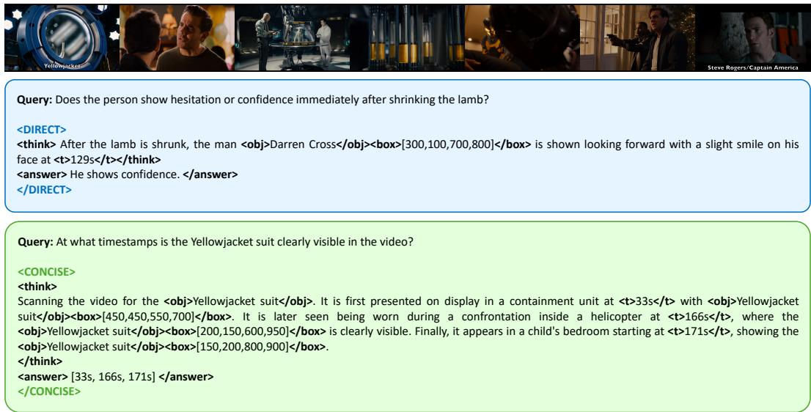  
Figure 9: Social reasoning failure: <DEEP> under-invoked. Evaluating Darren Cross’s emotional state after shrinking the lamb (top) requires multi-frame deliberation across posture, gaze, and reaction cues, but the policy routes to <DIRECT> and commits to a single-frame conclusion. Grounding tags (<obj>, <box>, <t>) appear inside the <DIRECT> block, and signaling routing instability. Locating the Yellowjacket suit across timestamps (bottom) is a sequential scan well matched to <CONCISE>, which correctly chains three grounded appearances.

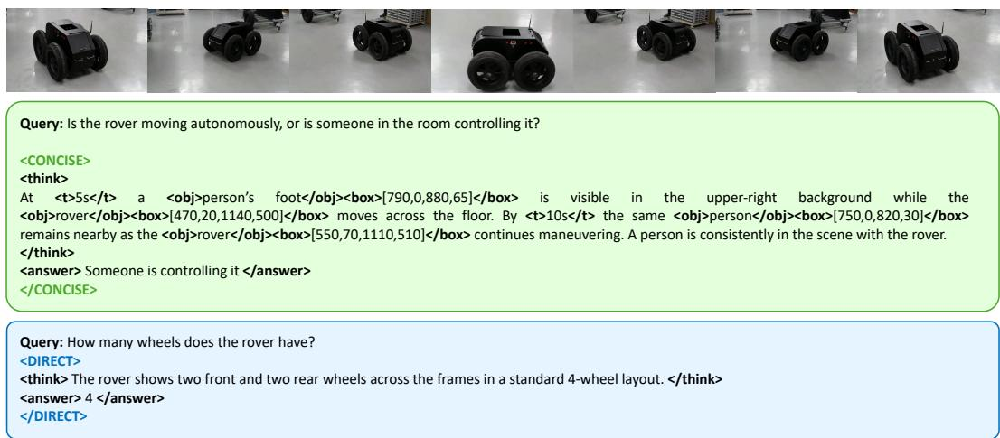  
Figure 10: Compositional-surface query requiring hypothesis testing; correct perceptual lookup. Determining whether the rover moves autonomously (top) requires falsifying the autonomous hypothesis across behavioral cues (controller presence, motion smoothness, gaze tracking). The policy routes to <CONCISE> and chains co-location observations without testing any of those alternatives; <DEEP> was needed. Counting wheels (bottom) is a one-step lookup with no competing hypotheses; <DIRECT> is cost-optimal.

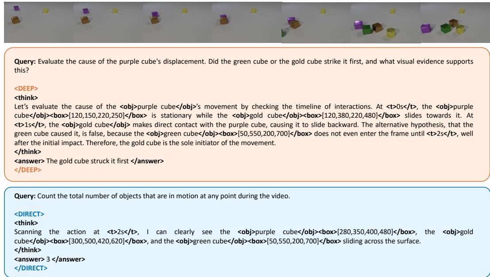  
Figure 11: Correct causal hypothesis testing; failure on temporal counting. The causality query (top) requires falsifying the green-cube hypothesis; <DEEP> correctly establishes the green cube does not enter the frame until after the initial impact, then confirms gold-cube contact via timestamped bounding boxes. The counting query (bottom) demands a running tally across the full video; the policy routes to <DIRECT>, inspects a single frame, and reports 3 objects instead of the correct 4, missing those that move in other segments.

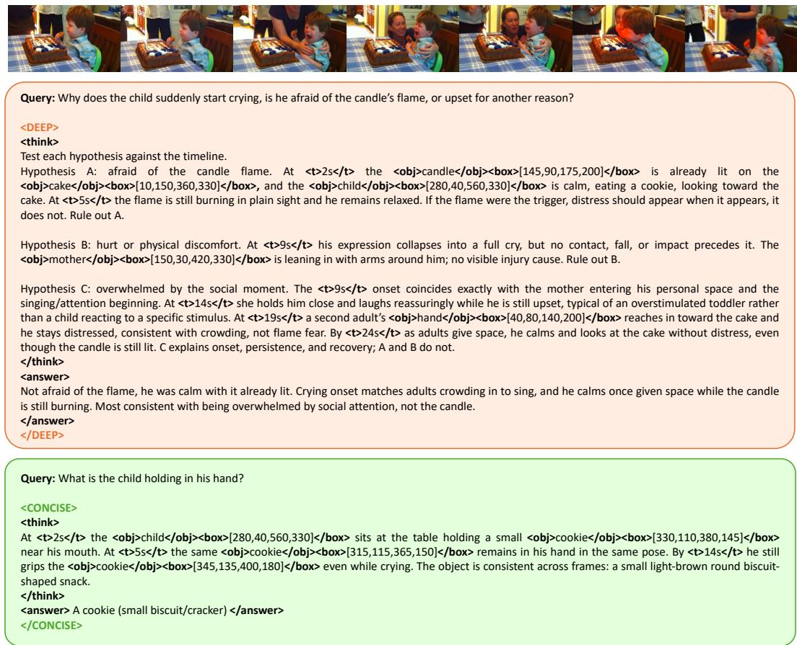  
Figure 12: Correct deliberative causal reasoning; over-routing a perceptual lookup. The distress query (top) presents three competing explanations (flame fear, physical discomfort, social overwhelm); <DEEP> tests each with timestamped grounding and rules out the first two before confirming social overwhelm via co-occurring onset and recovery cues. The object-identification query (bottom) is answerable from any single frame; <CONCISE> chains three cross-frame confirmations when <DIRECT>’s one-step extraction was sufficient, wasting tokens with no accuracy gain.

Table 11: Complete hyperparameter listing for Video-FLAIR. Sensitivity sweeps for all parameters were not feasible within our compute budget; δ and $w _ { \mathrm { s e l e c t } }$ are swept in Table 7 and remaining entries document the expected directional effect.
<table><tr><td>Group</td><td>Parameter</td><td>Value</td><td>Sensitivity</td></tr><tr><td></td><td>Backbone</td><td> $\mathrm { Q w e n 3 - V L } / \mathrm { Q w e n } 2 . 5 \mathrm { - V L }$ </td><td></td></tr><tr><td></td><td>LoRA target</td><td>all-linear</td><td></td></tr><tr><td>Training</td><td>Precision</td><td>bfloat16 -6</td><td></td></tr><tr><td></td><td>Learning rate</td><td> $1 \times 1 0 ^ { - }$ </td><td></td></tr><tr><td></td><td>Warmup ratio</td><td>0.05</td><td></td></tr><tr><td></td><td>Grad. accum. steps</td><td>2</td><td></td></tr><tr><td></td><td>K (rollouts per prompt)</td><td>8</td><td>↑ better utility estimates, less adaptive practice; ↓ noisier</td></tr><tr><td></td><td>Temperature</td><td>1.0</td><td></td></tr><tr><td>Rollout</td><td> $\mathrm { T o p } { \bar { - } } \lambda$  p</td><td>1.0</td><td></td></tr><tr><td></td><td>Max context</td><td>16,384 tokens</td><td></td></tr><tr><td></td><td>Max completion</td><td>1,024 tokens</td><td></td></tr><tr><td>DAPO</td><td> $\varepsilon _ { \mathrm { l o w } }$  (lower clip)</td><td>0.20</td><td>DAPO defaults</td></tr><tr><td></td><td>εhigh (upper clip)</td><td>0.28</td><td>DAPO defaults</td></tr><tr><td></td><td>Wans</td><td>1.00</td><td>Anchor; scaling equivalent to rescaling all others</td></tr><tr><td></td><td> $w _ { \mathrm { f o r m a t } }$ </td><td>0.25</td><td>↑ format overpowers task learning; ↓ schema violations persist</td></tr><tr><td>Reward weights</td><td>wcomply</td><td>0.60</td><td>↑ mode enforcement dominates; ↓ forced slots ignore assigned</td></tr><tr><td></td><td></td><td></td><td>mode</td></tr><tr><td></td><td>wbalance wcost</td><td>0.20 0.20</td><td>↑ forces equal mode mix on easy queries; ↓ mode collapse risk ↑ &lt;DEEP&gt; suppressed on hard queries; ↓ no efficiency gain</td></tr><tr><td></td><td> $w _ { \mathrm { s e l e c t } }$ </td><td>0.40</td><td>Table 7</td></tr><tr><td></td><td> $w _ { \mathrm { v e r i f i e r } }$ </td><td>0.35</td><td>↑ verifier overrides utility  $m ^ { * } ; \downarrow$  grounding feedback negligible</td></tr><tr><td></td><td></td><td>60 / 120 words</td><td></td></tr><tr><td></td><td>&lt;DIRECT&gt; target / hard limit</td><td>200 / 600 words</td><td></td></tr><tr><td>Mode budgets</td><td>&lt;CONCISE&gt; target / hard limit</td><td>1,000 / 1,200 words</td><td></td></tr><tr><td></td><td>&lt;DEEP&gt; target / hard limit Base mode cost  $C _ { m } \ \mathrm { ( D / C / P ) }$ </td><td>0.00 / 0.08 / 0.20</td><td> $\uparrow C _ { \mathrm { D e e p } } { \mathrm { : } }$ </td></tr><tr><td></td><td></td><td></td><td>&lt;DEEP&gt; suppressed on hard queries; ↓ over-invoked on easy</td></tr><tr><td></td><td>Overflow scale  $\lambda _ { O }$  Compliance base reward</td><td>0.25 0.5</td><td>↑ traces aggressively truncated; ↓ budget overruns tolerated</td></tr><tr><td></td><td> $\beta _ { \mathrm { a l p } }$ </td><td>0.20</td><td>↑ &lt;DEEP&gt; over-penalized on hard queries; ↓ too weak to separate</td></tr><tr><td> $\mathbf { A L P } / \mathbf { C o s t }$ </td><td> $L _ { 0 }$  (reference length)</td><td>512 tokens</td><td>modes on easy Normalization constant; monotone with  $\beta _ { \mathrm { a l p } }$ </td></tr><tr><td></td><td> $\mu _ { m }$  (D/C/P/Adaptive)</td><td>1.00/1.10/1.25/1.10</td><td>↑ ratio: steeper mode cost differentiation; scaling absorbed by</td></tr><tr><td></td><td> $\alpha _ { w }$  (base cost weight)</td><td>0.25</td><td> $\beta _ { \mathrm { a l p } }$  ↑ cost more constant (less dependent on correctness); ↓ cost sup-</td></tr><tr><td></td><td></td><td></td><td>pressed on wrong rollouts</td></tr><tr><td></td><td> $\lambda _ { L }$  (length penalty)</td><td>0.50</td><td></td></tr><tr><td>Utility</td><td>δ (grounding weight)  $R _ { \mathrm { s e l e c t } }$  bonus/penalty</td><td>0.35 ±0.8</td><td>Table 7 ↑ selection signal drowns verifier; ↓ mode routing learns slowly</td></tr><tr><td></td><td> $( w _ { t } , w _ { s } , w _ { h } )$ </td><td>(0.35, 0.35, 0.30)</td><td>Shifting ratio redistributes grounding emphasis; equal weights</td></tr><tr><td>Verifier</td><td></td><td></td><td>chosen</td></tr><tr><td></td><td> $w _ { \mathrm { s p a n } }$   $\Delta _ { \mathrm { t a g } }$ </td><td>0.25 -0.6</td><td>↑ span credit dominates verifier score; ↓ token shaping negligible ↑ magnitude: stronger suppression of grounding in &lt;DIRECT&gt;</td></tr><tr><td></td><td> $\Delta _ { \mathrm { p r e f } }$ </td><td>±0.4</td><td>↑ verifier overrides utility for routing; ↓ preferred-mode signal</td></tr><tr><td></td><td>Enable step</td><td>100</td><td>has no effect</td></tr><tr><td></td><td></td><td></td><td></td></tr><tr><td>DPO refresh</td><td>Min reward margin</td><td>0.15</td><td>↑ fewer but cleaner pairs; ↓ noisy preference labels</td></tr><tr><td></td><td>Max pairs per trigger Refresh interval N</td><td>2,000 100 steps</td><td>↑ verifier drifts before recalibration; ↓ excessive overhead</td></tr><tr><td></td><td></td><td></td><td></td></tr><tr><td></td><td>Buffer capacity</td><td>4,096</td><td></td></tr><tr><td>Replay</td><td>Replay bonus γr  $\tilde { \mathrm { I S } \mathrm { c l i p } } \left( w _ { \mathrm { m i n } } , w _ { \mathrm { m a x } } \right)$ </td><td>0.15 (0.5, 2.0)</td><td>↑ hard examples over-represented; ↓ no difficulty curriculum</td></tr></table>

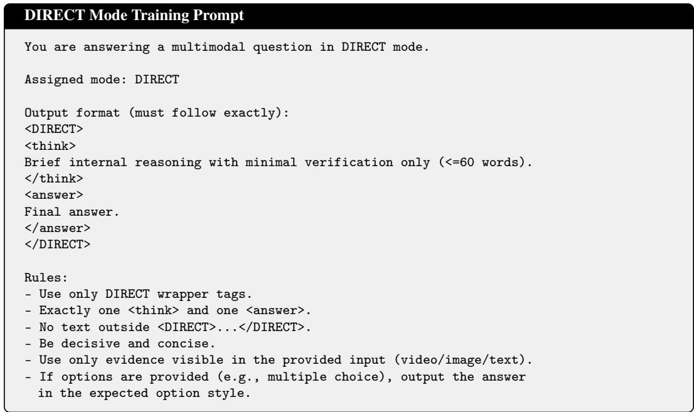  
Figure 13: DIRECT mode prompt. Targets fast, minimal-verification responses (≤60 <think> words). Used for controlled slots 1–2 during training.

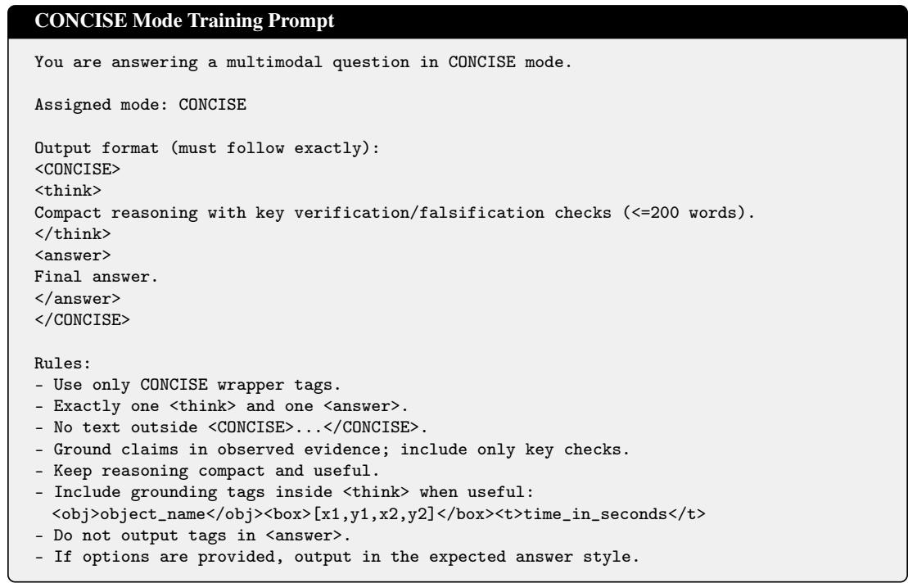  
Figure 14: CONCISE mode prompt. Targets compact grounded reasoning (≤200 <think> words) with optional spatio-temporal grounding tags. Used for controlled slots 3–4.

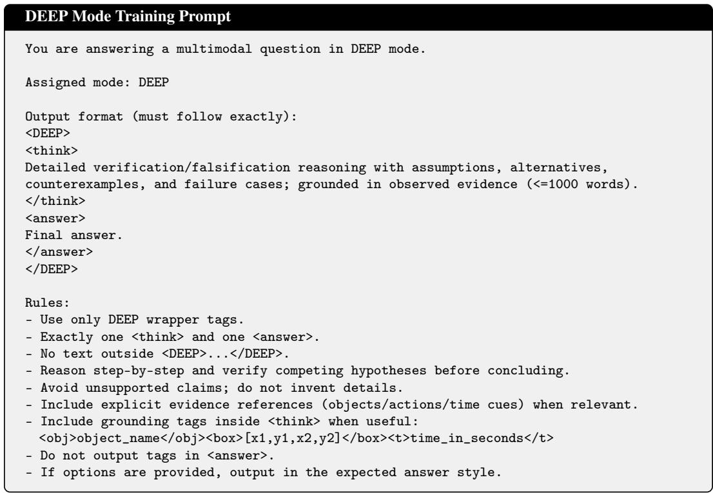  
Figure 15: DEEP mode prompt. Targets thorough hypothesis-falsification reasoning (≤1000 <think> words) with grounding evidence. Used for controlled slots 5–6.

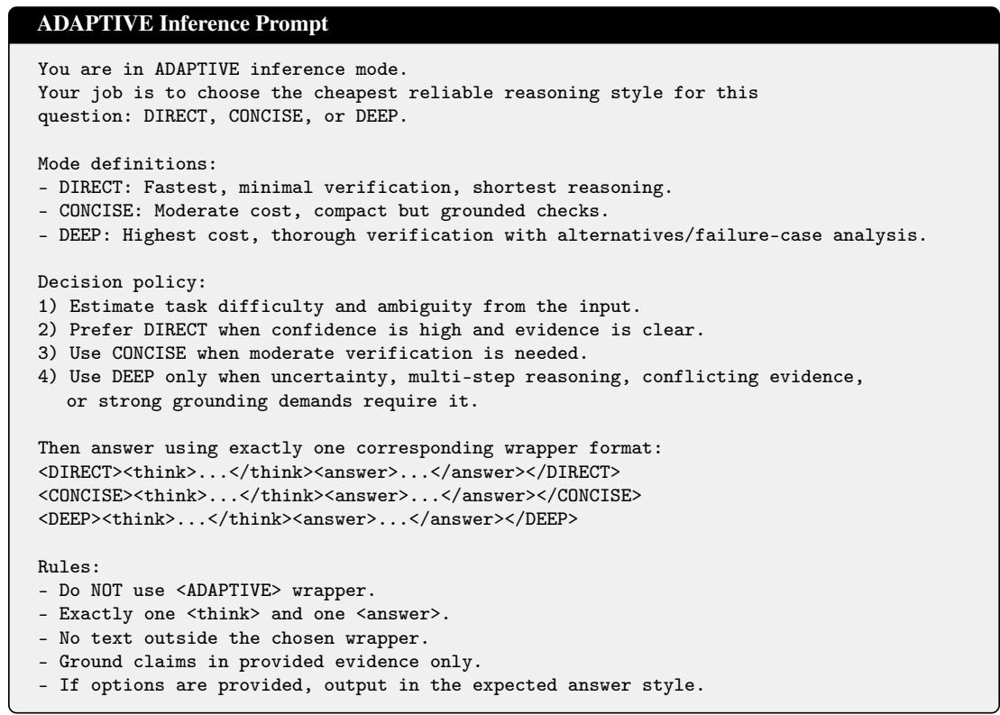  
Figure 16: ADAPTIVE mode inference prompt. Instructs the model to select the cheapest reliable mode via a cost-first decision policy. Used for adaptive slots 7–8 at both training and inference time.

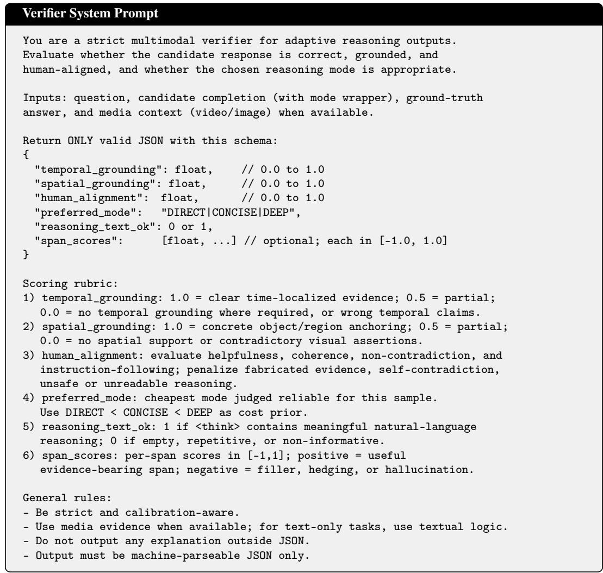  
Figure 17: Verifier system prompt. The verifier (a Qwen3-VL model) receives each candidate completion and returns a structured JSON signal covering temporal grounding, spatial grounding, human alignment, preferred mode, reasoning quality, and span-level scores.