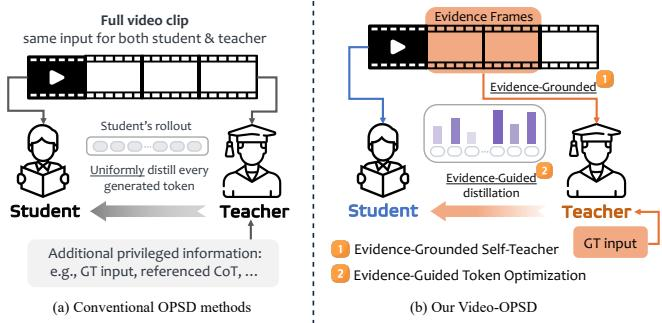
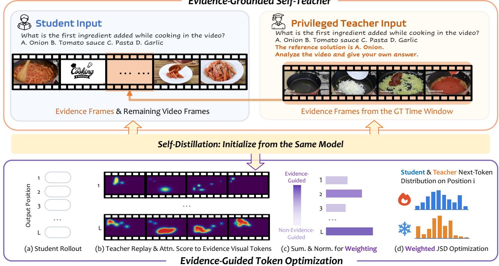
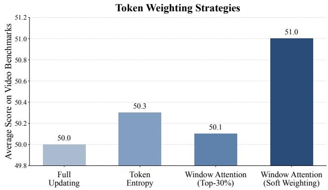
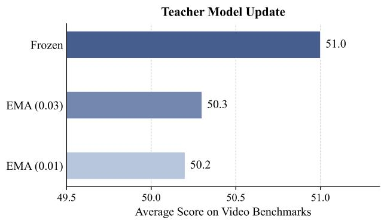

# Video-OPSD: Exploiting Privileged Visual Evidence for On-Policy Self-Distillation in Video Large Language Models

Ziyue Wang1∗, Shiqi Huang1∗, Weiwen Xu2, Bihan Wen1, Xudong Jiang1†

1School of Electrical and Electronic Engineering, Nanyang Technological University

2The Chinese University of Hong Kong

{ziyue005, shiqi006}@e.ntu.edu.sg, weiwen.xuu@gmail.com, {bihan.wen, exdjiang}@ntu.edu.sg

## Abstract

On-policy self-distillation (OPSD) has recently emerged as an efective post-training paradigm that improves policy optimization through dense token-level supervision from a privileged self-teacher. Despite its promise, OPSD remains largely underexplored for Video Large Language Models (Video-LLMs). Existing methods typically construct privileged teachers by augmenting their context with additional information while keeping the primary input unchanged for both teacher and student. Video reasoning, however, ofers a distinct source of privileged supervision within the primary input itself: long videos contain substantial temporal redundancy, and only a small subset of frames provides the evidence necessary to answer a question. Building on this observation, we present Video-OPSD, an OPSD framework that exploits privileged visual evidence for both self-teacher construction and knowledge transfer. First, our Evidence-Grounded Self-Teacher conditions the teacher exclusively on annotated evidence frames while the student continues to reason over the complete video. This focused visual input enables the teacher to provide more informative supervision. Second, our Evidence-Guided Token Optimization adaptively weights token-level distillation according to each reasoning token’s reliance on privileged visual evidence, thereby emphasizing perceptually grounded reasoning. Experiments across video understanding and reasoning benchmarks show that Video-OPSD consistently improves upon Standard OPSD across multiple backbones and achieves performance comparable to GRPO while requiring substantially less training time, establishing an efective and eficient post-training approach for Video-LLMs.

## Introduction

On-policy distillation (OPD) has recently emerged as an effective post-training paradigm for providing dense tokenlevel supervision from a teacher model for policy optimization. (Agarwal et al. 2024b; Gu et al. 2024; Lu and Lab 2025). Building upon this paradigm, on-policy selfdistillation (OPSD) further improves both optimization efficiency and generality by leveraging a self-teacher conditioned on privileged information without requiring an external teacher (Hübotter et al. 2026; Zhao et al. 2026). While these paradigms have demonstrated promising performance across language models and image tasks, their adaptation to Video Large Language Models (Video-LLMs) remains largely underexplored.

  
Figure 1: (a) Conventional OPSD, where the teacher and student share the same primary input and token-level distillation is applied uniformly. (b) Our evidence-driven Video-OPSD, featuring an Evidence-Grounded Self-Teacher and Evidence-Guided Token Optimization.

Conventional OPSD methods construct a self-teacher by injecting privileged information as additional context, e.g., chain-of-thought references or environmental feedback (Hübotter et al. 2026; Shenfeld et al. 2026; Zhao et al. 2026), while keeping the primary input the same as the student, as shown in Figure 1(a). The teacher exploits the model’s in-context learning capability to make use of the injected privileged information, providing guided supervision during online optimization. While this paradigm has proven efective for textual and image tasks, it overlooks a fundamental property of video understanding. Videos inherently contain substantial temporal redundancy (Song et al. 2024), where only a small subset of frames provides the visual evidence necessary for answering a question (Xiao et al. 2024). Consequently, both the teacher and student reason over the same video, which contains a mixture of relevant and irrelevant visual information. This shared, unfiltered context limits the teacher’s ability to focus on the visual evidence that is actually relevant, thereby degrading the quality of the supervision it provides. This video-specific challenge motivates a diferent form of privileged supervision in which the teacher can reason from a more focused visual observation.

Based on this insight, we construct an Evidence-Grounded Self-Teacher using asymmetric visual inputs for the teacher and student. The student continues to reason over the complete video, whereas the teacher is conditioned only on the evidence frames that support the correct answer. By removing temporally redundant and distracting content from the teacher’s context, the teacher is conditioned on a cleaner, evidence-grounded input rather than having to identify relevant evidence on its own, thereby producing a more accurate and reliable supervisory signal for on-policy optimization.

While an Evidence-Grounded Self-Teacher provides a substantially more reliable supervisory signal, efectively transferring this privileged knowledge to the student remains an open challenge. Existing OPSD uniformly distills the teacher’s supervision across all tokens in the student’s rollout as in Figure 1(a), implicitly treating each token as equally important throughout the reasoning trajectory. To more effectively exploit the teacher’s grounded perceptual reasoning capability, the distillation process should reflect how strongly each reasoning token is supported by privileged visual evidence. To this end, we propose Evidence-Guided Token Optimization, which aggregates the teacher’s visual attention into token-level visual scores that quantify each token’s reliance on privileged visual evidence. These scores are softly normalized into token-wise weights to modulate the distillation objective, thereby naturally emphasizing perceptually grounded reasoning during on-policy optimization.

Overall, our method rethinks both self-teacher construction and knowledge transfer in OPSD by systematically leveraging privileged visual evidence, resulting in our evidencedriven Video-OPSD illustrated in Figure 1(b). Through the proposed Evidence-Grounded Self-Teacher and Evidence-Guided Token Optimization, our framework constructs a more informative teacher from task-relevant frames and selectively transfers its perceptual reasoning capability to the student. Extensive experiments on video understanding and reasoning benchmarks demonstrate that our approach consistently outperforms existing on-policy self-distillation baselines and achieves performance comparable to GRPO (Shao et al. 2024) with substantially lower computational cost.

Our contributions are summarized as follows:

• We propose Video-OPSD, an on-policy self-distillation framework for Video-LLMs that systematically exploits privileged visual evidence through both evidencegrounded teacher construction and evidence-guided knowledge transfer.

• We introduce Evidence-Grounded Self-Teacher, which conditions the teacher only on evidence frames, enabling more reliable supervision from focused visual context.

• We introduce Evidence-Guided Token Optimization, which adaptively weights token-level distillation according to each token’s reliance on privileged visual evidence, enhancing perceptually grounded reasoning.

• Extensive experiments across multiple video understanding and reasoning benchmarks validate the efectiveness of our framework, consistently outperforming standard OPSD and achieving performance comparable to GRPO.

## Related Work

## Reinforcement Learning for Video-LLMs

Reinforcement learning has recently emerged as an efective paradigm for enhancing the reasoning capabilities of Video-LLMs. Building on reinforcement learning with verifiable rewards (RLVR) (Shao et al. 2024; DeepSeek-AI 2025), recent methods introduce video-specific optimization strategies, including temporal sensitivity and consistency (Feng et al. 2025; Huang et al. 2026), spatio-temporal reasoning (Li et al. 2025; Wang et al. 2025b, 2026; Meng et al. 2026), and fine-grained perception reasoning (Du et al. 2026), to better align policy learning with video understanding. More recently, a few studies have explored on-policy distillation for temporal video grounding (Li et al. 2026a) and video reasoning (Lin et al. 2026), complementing sparse reward supervision with dense token-level learning signals. Despite this progress, existing methods have yet to exploit the privileged visual evidence available during training to strengthen token-level supervision for perceptually grounded reasoning.

## On-Policy Distillation and Self-Distillation

On-policy distillation (OPD) has recently been widely explored for providing dense token-level supervision from a teacher model for policy optimization (Agarwal et al. 2024b; Gu et al. 2024; Lu and Lab 2025; Xu et al. 2026a; Li et al. 2026b,a). Building upon this paradigm, recent on-policy selfdistillation (OPSD) methods eliminate the need for an external teacher by constructing a privileged self-teacher from the same policy (Hübotter et al. 2026; Zhao et al. 2026). Existing approaches typically realize privileged supervision by enriching the teacher with additional contextual information (Zhang et al. 2026), such as reference reasoning traces or environmental feedback (Xu et al. 2024; Yang et al. 2026; Shenfeld et al. 2026; Lin et al. 2026; Xu et al. 2026a). Our work explores a complementary direction for Video-LLMs. Rather than augmenting the teacher with additional context, we exploit annotated visual evidence within temporally redundant videos (Wang et al. 2025a; Song et al. 2024; Zou et al. 2024) to develop an evidence-driven token OPSD for Video-LLMs that more efectively transfers the teacher’s privileged visual knowledge.

## Method

## Preliminaries: On-Policy Self-Distillation

In OPSD, a trainable student $\pi _ { \theta _ { S } }$ and a frozen self-teacher $\pi _ { \boldsymbol { \theta } _ { T } }$ are initialized from the same pretrained Video-LLM. The self-teacher derives its supervision from privileged context available only during training. Specifically, the student is conditioned on $c ^ { S }$ , while the self-teacher is conditioned on the privilege-enhanced context $c ^ { T }$

For each example selected for distillation, the student generates one on-policy trajectory:

$$
\hat { y } = ( \hat { y } _ { 1 } , \dots , \hat { y } _ { L } ) \sim \pi _ { \theta _ { S } } ( \cdot \mid c ^ { S } ) .\tag{1}
$$

The self-teacher then replays the student trajectory under its privileged context. At output position $l ,$ both branches

  
Figure 2: Overview of Video-OPSD. The Evidence-Grounded Self-Teacher observes only the evidence frames together with the gold answer, while the student observes the same evidence frames within a broader video context. The student generates a single on-policy trajectory, which is subsequently replayed by the teacher under its privileged context. Evidence-Guided Token Distillation measures each generated token’s attention to evidence visual signals and uses the resulting scores to weight the token-level JSD objective.

evaluate the same student-generated prefix:

$$
p _ { l } ^ { S } = \pi _ { \theta _ { S } } \left( \cdot \mid c ^ { S } , \hat { y } _ { < l } \right) ,\tag{2}
$$

$$
\begin{array} { r } { p _ { l } ^ { T } = \pi _ { \boldsymbol { \theta } _ { T } } \left( \cdot \mid c ^ { T } , \hat { y } _ { < l } \right) . } \end{array}\tag{3}
$$

This prefix alignment provides supervision at states visited by the current student policy. Through teacher-forced replay of the student trajectory, the self-teacher produces next-token distributions for all positions in a single forward, without autoregressively generating a response. Unlike GRPO (Shao et al. 2024), which typically requires multiple rollouts per input, OPSD obtains dense token-level supervision from one student rollout followed by one teacher replay.

## Framework Overview

We consider a video reasoning training example:

$$
x = ( V , q , a , { \mathcal { T } } ^ { e } ) ,\tag{4}
$$

where $V$ denotes the video, $q$ is the question, a is the gold answer, and $\mathcal { T } ^ { e }$ is the annotated temporal interval containing the visual evidence that supports the answer. We initialize a trainable student $\pi _ { \theta _ { S } }$ and a frozen self-teacher $\pi _ { \boldsymbol { \theta } _ { T } }$ from the same pretrained Video-LLM.

As illustrated in Figure 2, Video-OPSD contains two complementary components. First, the Evidence-Grounded Self-Teacher constructs privileged supervision by restricting the teacher’s visual observation to frames from the annotated evidence interval. The same evidence frames are included unchanged in the student input, ensuring that the teacher does not rely on visual information unavailable to the student. The student additionally observes additional frames from the remaining video and must learn to identify and utilize the evidence within this broader temporal context.

Second, Evidence-Guided Token Optimization uses the teacher’s attention during replay to estimate how strongly each generated token relies on visual evidence signals. Since the teacher’s entire visual input consists of evidence frames, its attention to visual tokens directly measures the attention allocated to visual evidence signals and provides a modelinternal proxy for token-level visual evidence reliance. The resulting scores are used to adaptively weight the matching of the token-level distribution.

## Evidence-Grounded Self-Teacher

Let $\mathcal { Z } ^ { e }$ denote the indices of frames sampled from the annotated evidence interval $\mathcal { T } ^ { e }$ , and let ${ \mathcal { L } } ^ { a }$ denote the indices of additional frames sampled from the remaining video. We define $\smash { \mathcal { T } ^ { S } = \mathcal { I } ^ { e } \cup \mathcal { T } ^ { a } }$ and construct the corresponding visual inputs as:

$$
V ^ { T } = V [ { \cal Z } ^ { e } ] , \qquad V ^ { S } = V [ { \cal Z } ^ { S } ] .\tag{5}
$$

The teacher observes only the evidence frames, whereas the student observes the same evidence frames together with additional frames. Consequently, every visual signal available to the teacher is also accessible to the student, preventing information leakage (Yang et al. 2026). The teacher’s visual privilege arises from removing non-evidence context, rather than from observing signals unavailable to the student.

Following prior OPSD methods, the teacher is additionally conditioned on the gold answer:

$$
\begin{array} { r } { c ^ { S } = ( V ^ { S } , q ) , \qquad c ^ { T } = ( V ^ { T } , q , a ) . } \end{array}\tag{6}
$$

The gold answer provides textual privilege, while the evidence-grounded observation provides video-specific visual privilege. Together, they enable the teacher to produce supervision from a more focused perceptual context.

Since privileged conditioning does not guarantee a reliable teacher prediction, we apply a correctness gate before distillation. The frozen teacher first greedily generates:

$$
\widetilde { \boldsymbol y } ^ { T } = \mathrm { G r e e d y } \left[ \pi _ { \boldsymbol \theta _ { T } } ( \cdot \cdot \boldsymbol { \mathbf { \rho } } ) \right] ,\tag{7}
$$

and the example is retained only if:

$$
g ( x ) = \mathbb { I } \left[ \mathrm { A N S } ( \widetilde { y } ^ { T } ) = a \right] ,\tag{8}
$$

where ANS is a rule-based answer extractor. Incorrect or unparsable teacher responses are excluded from distillation.

## Evidence-Guided Token Distillation

To more efectively leverage the teacher’s grounded perceptual reasoning, we estimate each generated token’s reliance on visual evidence from the teacher’s attention during trajectory replay and use the resulting scores to weight the distillation objective. Let $\mathcal { V } ^ { e }$ denotes the index of visual tokens corresponding to $V ^ { T }$ , R denotes the number of Transformer layers, and H is the number of attention heads, the evidence score at position l is defined as:

$$
s _ { l } = \frac { 1 } { 3 H } \sum _ { r = R - 2 } ^ { R } \sum _ { h = 1 } ^ { H } \sum _ { j \in \mathcal { V } ^ { e } } A _ { l } ^ { ( r , h , j ) } ,\tag{9}
$$

where $A _ { l } ^ { ( r , h , j ) }$ denotes the attention from output position l to visual token j at layer r and head h. We sum the attention mass over all visual tokens and average across all heads in the last three layers.

We convert the evidence scores into normalized token weights as below:

$$
w _ { l } = L \frac { \exp ( s _ { l } / \tau ) } { \sum _ { u = 1 } ^ { L } \exp ( s _ { u } / \tau ) } ,\tag{10}
$$

where τ controls the sharpness of the weighting distribution. This normalization keeps the average token weight equal to one. Tokens with stronger evidence reliance receive greater distillation weight, while all generated tokens remain part of the objective.

Since an LLM’s probability mass is typically concentrated within a small number of top tokens, the Top-K truncation introduces negligible approximation error for the distribution while substantially reducing computation. Therefore, we compute the token-level divergence over the teacher’s Top-K vocabulary support at each token position l:

$$
\mathcal { K } _ { l } ^ { T } = \mathrm { T o p K } _ { K } ( p _ { l } ^ { T } ) ,\tag{11}
$$

and renormalize the student and teacher distributions as:

$$
\bar { p } _ { l , k } ^ { b } = \frac { p _ { l , k } ^ { b } } { \sum _ { v \in \mathcal { K } _ { l } ^ { T } } p _ { l , v } ^ { b } } , \qquad k \in \mathcal { K } _ { l } ^ { T } , \quad b \in \{ S , T \} .\tag{12}
$$

Following the generalized JSD formulation in Agarwal et al. (2024a), we define:

$$
m _ { l } = \beta \bar { p } _ { l } ^ { T } + ( 1 - \beta ) \bar { p } _ { l } ^ { S } ,\tag{13}
$$

and

$$
\begin{array} { r l } & { d _ { l } ^ { \mathrm { J S D - } K } = \beta D _ { \mathrm { K L } } \left( \bar { p } _ { l } ^ { T } \Vert m _ { l } \right) } \\ & { \qquad + ( 1 - \beta ) D _ { \mathrm { K L } } \left( \bar { p } _ { l } ^ { S } \Vert m _ { l } \right) . } \end{array}\tag{14}
$$

The final objective is:

$$
\mathcal { L } _ { \mathrm { V i d e o - O P S D } } = \mathbb { E } _ { \boldsymbol { x } \sim \mathcal { D } } \left[ \boldsymbol { g } ( \boldsymbol { x } ) \cdot \frac { 1 } { L } \sum _ { l = 1 } ^ { L } w _ { l } d _ { l } ^ { \mathrm { J S D - } K } \right] .\tag{15}
$$

The teacher distributions and evidence-guided weights are treated as fixed targets, and gradients are propagated only through the student branch.

## Experiments

## Experimental Setup

Training data. We construct a compact training set from two datasets with ground-truth temporal window annotations. Specifically, we use 5K randomly sampled examples from STAR (Wu et al. 2024) and approximately 1.5K examples from the Video-Holmes training split (Cheng et al. 2025). We use the original questions and gold answers provided by the two datasets and do not introduce additional human annotations.

Evaluation benchmarks. We evaluate all methods on five video understanding and reasoning benchmarks: Video-Holmes (Cheng et al. 2025), Video-MMMU (Hu et al. 2025), Video-MME (Fu et al. 2025), TempCompass (Liu et al. 2024), and WorldSense (Hong et al. 2026). All benchmarks are evaluated under a unified video-only protocol with 32 frames: the model receives only video frames and the textual question, without audio, subtitles, or transcripts.

Implementation details. We conduct the main experiments on three models: Qwen2.5-VL-7B (Bai et al. 2025b), Qwen3-VL-4B (Bai et al. 2025a), and Qwen3-VL-8B (Bai et al. 2025a). Training is conducted on eight NVIDIA H100 GPUs using a total of 6.5K training examples for one epoch. We adopt JSD-Top-50 as the distillation objective. The perdevice batch size is set to 2 with 8 gradient accumulation steps, and the learning rate is $1 \times \mathrm { { 1 0 ^ { - 6 } } }$ . Training is performed in BF16 precision with gradient checkpointing and DeepSpeed ZeRO-2 enabled.

Baselines. For each backbone, we compare our method against supervised fine-tuning (SFT), GRPO (Shao et al. 2024), and Standard OPSD (Zhao et al. 2026). All the methods are conducted with the same training data, frame budget, and evaluation protocol. For the SFT baseline, we condition the backbone on the ground-truth answer and use its greedily decoded reasoning trajectory as the supervision target for training. Standard OPSD conditions the frozen teacher on the gold answer, while using the same 16-frame visual input as the student during training and uniformly weighting all token-level distillation losses.

<table><tr><td>Method</td><td>Video-Holmes</td><td>Video-MMMU</td><td>Video-MME</td><td>TempCompass</td><td>WorldSense</td><td>Avg.</td></tr><tr><td>Qwen2.5-VL-7B</td><td>27.8</td><td>48.1</td><td>57.6</td><td>67.9</td><td>36.1</td><td>47.5</td></tr><tr><td>+ SFT</td><td>33.2</td><td>48.5</td><td>56.4</td><td>69.2</td><td>36.3</td><td>48.7</td></tr><tr><td>+ GRPO</td><td>35.3</td><td>49.9</td><td>60.7</td><td>70.9</td><td>36.6</td><td>50.7</td></tr><tr><td>+ OPSD</td><td>33.4</td><td>48.1</td><td>57.7</td><td>68.5</td><td>36.7</td><td>48.9</td></tr><tr><td>+ Video-OPSD</td><td>36.2</td><td>49.9</td><td>58.6</td><td>70.9</td><td>39.2</td><td>51.0</td></tr><tr><td>Qwen3-VL-8B</td><td>40.9</td><td>63.3</td><td>63.7</td><td>74.4</td><td>40.7</td><td>56.6</td></tr><tr><td>+ SFT</td><td>41.1</td><td>65.6</td><td>62.2</td><td>75.3</td><td>41.2</td><td>57.1</td></tr><tr><td>+ GRPO</td><td>42.9</td><td>68.0</td><td>66.4</td><td>77.2</td><td>42.1</td><td>59.3</td></tr><tr><td>+ OPSD</td><td>42.7</td><td>67.5</td><td>64.1</td><td>75.1</td><td>40.4</td><td>58.0</td></tr><tr><td>+ Video-OPSD</td><td>44.3</td><td>68.7</td><td>66.8</td><td>77.5</td><td>42.8</td><td>60.0</td></tr><tr><td>Qwen3-VL-4B</td><td>37.3</td><td>48.7</td><td>52.6</td><td>71.9</td><td>38.2</td><td>49.7</td></tr><tr><td>+ SFT</td><td>39.3</td><td>51.8</td><td>55.4</td><td>72.2</td><td>39.0</td><td>51.5</td></tr><tr><td>+ GRPO</td><td>41.5</td><td>52.5</td><td>61.0</td><td>73.0</td><td>39.4</td><td>53.5</td></tr><tr><td>+ OPSD</td><td>40.1</td><td>51.0</td><td>60.6</td><td>71.8</td><td>38.1</td><td>52.3</td></tr><tr><td>+ Video-OPSD</td><td>41.8</td><td>52.9</td><td>60.7</td><td>73.2</td><td>39.7</td><td>53.6</td></tr></table>

Table 1: Main results on five video understanding and reasoning benchmarks across three Qwen-VL backbones under the unified video-only evaluation protocol. Comparisons are made within each backbone.

## Main Results

Table 1 reports the results across three Qwen-VL backbones. We report the average results over three independent runs. Video-OPSD consistently improves the base models, yielding average gains of 3.5, 3.4, and 3.9 points on Qwen2.5-VL-7B, Qwen3-VL-8B, and Qwen3-VL-4B, respectively. More importantly, compared to standard OPSD, our method further improves the average score by 2.1, 2.0, and 1.3 points and achieves higher performance in all 15 backbone–benchmark comparisons. These consistent gains demonstrate that exploiting privileged visual evidence provides efective supervision beyond vanilla OPSD.

Video-OPSD further achieves performance comparable to GRPO, slightly outperforming it on Qwen2.5-VL-7B and Qwen3-VL-8B while matching its average score on Qwen3- VL-4B. As shown in Table 4, under the Qwen2.5-VL-7B setting, our framework requires only 2.2 hours of training compared with 5.5 hours for GRPO, corresponding to 40% of its training time. These results show that dense tokenlevel supervision from a single student rollout and teacher replay can achieve GRPO-comparable performance while substantially reducing the cost of video post-training.

## Ablation Studies

All ablation experiments in this section are conducted using Qwen2.5-VL-7B. Unless otherwise specified, all variants use the same training data, frame budget, frozen teacher, correctness gate, Top-50 JSD objective, and evaluation protocol. This controlled setup ensures that performance diferences can be primarily attributed to the design factor under investigation in each ablation. We report average performance across the five evaluation benchmarks to provide a concise and consistent comparison among variants.

<table><tr><td>Method</td><td>Avg.</td></tr><tr><td>Qwen2.5-VL-7B</td><td>47.4</td></tr><tr><td>OPSD</td><td>48.9</td></tr><tr><td>+ Evidence-Grounded Input</td><td>49.8</td></tr><tr><td>+ Evidence-Guided Weighting</td><td>50.4</td></tr><tr><td>Video-OPSD (Both)</td><td>51.0</td></tr></table>

Table 2: Component ablation of evidence-grounded teacher input and evidence-guided token-wise weighting.

RQ1: How does each component contribute to the performance of Video-OPSD? We first conduct a controlled 2 × 2 component ablation to disentangle the contributions of evidence-grounded self-teacher construction and evidenceguided token-wise weighting. As shown in Table 2, evidencegrounded self-teacher alone improves the average score of Standard OPSD from 48.9 to 49.8, while token weighting provides a larger improvement to 50.4. Combining both components further increases the average score to 51.0, outperforming Standard OPSD by 2.1 points.

These results indicate that the two designs play distinct yet complementary roles: the evidence-grounded selfteacher improves the quality of privileged supervision, while evidence-guided token optimization determines where this supervision should be transferred most efectively.

RQ2: Where does the privileged teacher’s advantage come from? The privileged teacher difers from the student in two aspects: it observes temporally localized evidence frames and is conditioned on the gold answer. To disentangle these two sources of privilege, we conduct a 3 × 2 ablation over the teacher input. For the visual input, we compare three configurations: (1) eight frames sampled from the annotated temporal evidence window, (2) the same eight evidence frames with additional eight non-evidence context frames to form a 16-frame input, and (3) 16 uniformly sampled frames from the full video. Together, configuration (2) serves as a bridge: it isolates the efect of added context frames relative to configuration (1), and controls for frame count relative to configuration (3), which isolates the efect of temporal localization. For each visual configuration, we further evaluate the teacher both with and without gold-answer conditioning.

<table><tr><td>Teacher Visual Input</td><td>Gold Answer Accuracy (%)</td><td></td></tr><tr><td>Evidence Frames Only</td><td>No</td><td>70.4</td></tr><tr><td>Evidence Frames + 8 Padding Frames</td><td>No</td><td>64.9</td></tr><tr><td>Uniformly Sampled 16 Frames</td><td>No</td><td>49.8</td></tr><tr><td>Evidence Frames Only</td><td>Yes</td><td>85.3</td></tr><tr><td>Evidence Frames + 8 Padding Frames</td><td>Yes</td><td>83.7</td></tr><tr><td>Uniformly Sampled 16 Frames</td><td>Yes</td><td>78.5</td></tr></table>

Table 3: Accuracy on the training set to disentangle the sources of privileged teacher information.

As shown in Table 3, temporally focused visual evidence consistently produces a stronger teacher. Without goldanswer conditioning, using only evidence frames achieves 70.4% inference accuracy. Adding non-evidence context frames reduces the accuracy to 64.9%, while using 16 uniformly sampled frames further decreases it to 49.8%. Therefore, compared with uniform sampling, temporally localized evidence frames improve teacher accuracy by 20.6 percentage points. The same ordering remains after introducing gold-answer conditioning. Although gold-answer conditioning improves teacher accuracy under every visual input configuration, it does not eliminate the degradation caused by non-evidence visual content. These results show that the privileged teacher’s advantage comes from both answer-level conditioning and evidence-grounded visual input, with temporal evidence localization providing additional benefits beyond simply increasing the number of observed frames.

RQ3: How does Evidence-Guided Token Optimization compare with alternative token weighting strategies? We next compare several strategies for allocating token-level distillation signals. Uniformly Distill assigns equal weight to every generated token position. Motivated by TIP (Xu et al. 2026b), Token Entropy uses the student’s predictive entropy as a generic measure of token importance. The entropy scores are then converted into soft token weights. We additionally evaluate a hard evidence-selection strategy, Window Attention (Top-30%), which updates only the 30% of token positions with the highest temporal-window attention scores. Window Attention (Soft) retains all generated positions and softly weights their distillation losses according to their attention to the ground-truth temporal evidence window.

As reported in Figure 3, token-entropy weighting improves the average score from 50.0 to 50.3, confirming that student uncertainty provides a useful optimization signal. However, the signal is generic and does not explicitly measure whether a generated token relies on the privileged visual evidence. Hard top-30% selection obtains an average score of 50.1. In comparison, soft window-attention weighting achieves the highest average score of 51.0 and performs best on four of the five benchmarks. It outperforms full updating, tokenentropy weighting, and hard top-30% selection by 1.0, 0.7, and 0.9 average points, respectively. These results support softly allocating distillation strength according to the relevance of privileged visual evidence rather than relying solely on generic uncertainty or hard token filtering.

Figure 3: Average scores under diferent token weighting strategies.
<table><tr><td>Method</td><td>TT (h)</td><td>SPS</td><td>Lat. (s)</td><td>FLOPs (T/GPU)</td></tr><tr><td>SFT</td><td>0.7</td><td>2.70</td><td>2.9</td><td>47.7</td></tr><tr><td>GRPO</td><td>5.5</td><td>0.35</td><td>16.3</td><td>468.4</td></tr><tr><td>OPSD</td><td>1.9</td><td>0.97</td><td>5.3</td><td>93.3</td></tr><tr><td>Video-OPSD</td><td>2.2</td><td>0.82</td><td>6.1</td><td>106.1</td></tr></table>

Table 4: Training eficiency on NVIDIA H100 GPUs. TT denotes training time, SPS denotes samples per second, and latency and FLOPs are measured per forward pass.

RQ4: How eficient is Video-OPSD compared with alternative post-training methods? We compare the training eficiency of diferent post-training methods. We report the total training time (TT), training throughput measured in samples per second (SPS), average forward-pass latency, and forward-pass FLOPs per GPU.

As shown in Table 4, SFT incurs the lowest training cost, as it directly optimizes pre-generated trajectories without online rollout or teacher replay. In comparison with GRPO, our framework reduces the total training time from 5.5 to 2.2 hours, corresponding to a 60.0% reduction. It also achieves approximately 2.8× higher throughput, while reducing forward latency and per-GPU forward FLOPs by 62.6% and 77.3%, respectively. Compared with Standard OPSD, our method introduces only modest additional cost: the total training time increases by 0.3 hours, while the forward latency and per-GPU FLOPs increase from 5.3 to 6.1 seconds and from 93.3 to 106.1 teraFLOPs, respectively. These results demonstrate that Video-OPSD substantially improves the eficiency of video reasoning post-training over GRPO while retaining computational cost comparable to OPSD.

RQ5: How does attention-layer aggregation afect performance? Evidence-Guided Token Optimization estimates each generated token’s reliance on visual evidence by aggregating the teacher’s attention to evidence tokens. We examine whether this evidence score should be computed from only the final Transformer layer or across multiple layers.

<table><tr><td>Attention Layers</td><td>Avg.</td></tr><tr><td>Last layer (−1)</td><td>50.2</td></tr><tr><td>Last two layers (−1, -2)</td><td>50.4</td></tr><tr><td>Last three layers (−1, -2, -3)</td><td>51.0</td></tr></table>

Table 5: Efect of attention-layer aggregation on average benchmark performance. Negative indices denote layers counted backward from the final Transformer layer.

<table><tr><td>Non-Evidence Frames</td><td>0</td><td>4</td><td>8</td></tr><tr><td>Average Score</td><td>51.0</td><td>50.6</td><td>50.4</td></tr></table>

Table 6: Efect of adding contextual frames outside the annotated evidence window.

As shown in Table 5, using only the final layer achieves an average score of 50.2, while aggregating the last two layers improves the score to 50.4. Aggregating the last three layers yields the best average performance of 51.0. This result suggests that combining several high-level layers provides a more robust estimate of token-level evidence reliance than relying solely on the final layer.

RQ6: How do non-evidence frames afect privileged supervision? A central design of the Evidence-Grounded Self-Teacher is to restrict its visual observation to temporally localized evidence frames. To answer RQ6, we examine whether reintroducing temporally irrelevant content afects the quality of privileged supervision. Specifically, we augment the evidence frames with either four or eight frames sampled outside the annotated evidence window.

As shown in Table 6, using only the evidence frames achieves the highest average score of 51.0. Adding four and eight non-evidence frames reduces the average score to 50.6 and 50.4, respectively. The performance decreases as more irrelevant frames are introduced, indicating that the benefit of the Evidence-Grounded Self-Teacher stems from removing temporal noise rather than merely changing the number of teacher frames. Restricting the teacher input to evidence therefore provides more focused and efective supervision.

RQ7: Does updating the privileged self-teacher improve distillation? We further study whether the privileged selfteacher should remain frozen or evolve together with the student through an exponential moving average (EMA). For the EMA variants, the teacher parameters are updated from the student parameters during training using EMA rates of 0.01 and 0.03, respectively.

As shown in Figure 4, keeping the teacher frozen achieves the best average score of 51.0. In contrast, the EMA-based variants obtain average scores of 50.2 and 50.3 with EMA rates of 0.01 and 0.03, respectively. These results indicate that a frozen teacher provides a more stable and efective distillation than a teacher that evolves with the student.

Figure 4: Scores under diferent teacher update strategies.
<table><tr><td>Distillation Objective</td><td>Avg.</td></tr><tr><td>JSD-30</td><td>50.3</td></tr><tr><td>JSD-50</td><td>51.0</td></tr><tr><td>Reverse KL</td><td>49.9</td></tr><tr><td>Forward KL</td><td>49.7</td></tr></table>

Table 7: Comparison of token-level distillation objectives.

RQ8: How Does the Choice of Distillation Objective Afect Performance? We compare diferent tokenlevel distribution-matching objectives while keeping the Evidence-Grounded Self-Teacher and Evidence-Guided Token Optimization unchanged. As shown in Table 7, JSD-50 achieves the highest average score of 51.0. Reducing the teacher-defined support from Top-50 to Top-30 decreases the average score to 50.3, indicating that the broader support preserves useful information from the teacher distribution. Reverse KL and forward KL obtain lower average scores of 49.9 and 49.7, respectively. These results show that JSD-50 provides the most efective objective by combining balanced distribution matching with a suficiently expressive yet computationally tractable vocabulary support.

## Conclusion

We introduce Video-OPSD, an evidence-driven on-policy self-distillation framework for enhancing video reasoning by exploiting privileged visual evidence during training. Our framework constructs an Evidence-Grounded Self-Teacher from temporally localized evidence frames and introduces Evidence-Guided Token Optimization to selectively transfer supervision according to each reasoning token’s reliance on visual evidence. Experiments across five video understanding and reasoning benchmarks demonstrate consistent improvements over supervised fine-tuning and standard OPSD, while also achieving performance comparable to GRPO using only a single student rollout per training example. Extensive ablations further validate that evidence-grounded teacher construction improves the quality of privileged supervision and that evidence-guided weighting enables more efective knowledge transfer. Overall, our results highlight privileged visual evidence as a valuable source of supervision for eficient post-training of Video-LLMs.

## References

Agarwal, R.; Vieillard, N.; Zhou, Y.; Stanczyk, P.; Garea, S. R.; Geist, M.; and Bachem, O. 2024a. On-Policy Distillation of Language Models: Learning from Self-Generated Mistakes. In The Twelfth International Conference on Learning Representations.

Agarwal, R.; et al. 2024b. On-Policy Distillation of Language Models: Learning from Self-Generated Mistakes. In ICLR.

Bai, S.; Cai, Y.; Chen, R.; Chen, K.; Chen, X.; Cheng, Z.; Deng, L.; Ding, W.; Gao, C.; Ge, C.; Ge, W.; Guo, Z.; Huang, Q.; Huang, J.; Huang, F.; Hui, B.; Jiang, S.; Li, Z.; Li, M.; Li, M.; Li, K.; Lin, Z.; Lin, J.; Liu, X.; Liu, J.; Liu, C.; Liu, Y.; Liu, D.; Liu, S.; Lu, D.; Luo, R.; Lv, C.; Men, R.; Meng, L.; Ren, X.; Ren, X.; Song, S.; Sun, Y.; Tang, J.; Tu, J.; Wan, J.; Wang, P.; Wang, P.; Wang, Q.; Wang, Y.; Xie, T.; Xu, Y.; Xu, H.; Xu, J.; Yang, Z.; Yang, M.; Yang, J.; Yang, A.; Yu, B.; Zhang, F.; Zhang, H.; Zhang, X.; Zheng, B.; Zhong, H.; Zhou, J.; Zhou, F.; Zhou, J.; Zhu, Y.; and Zhu, K. 2025a. Qwen3-VL Technical Report. arXiv:2511.21631.

Bai, S.; Chen, K.; Liu, X.; Wang, J.; Ge, W.; Song, S.; Dang, K.; Wang, P.; Wang, S.; Tang, J.; Zhong, H.; Zhu, Y.; Yang, M.; Li, Z.; Wan, J.; Wang, P.; Ding, W.; Fu, Z.; Xu, Y.; Ye, J.; Zhang, X.; Xie, T.; Cheng, Z.; Zhang, H.; Yang, Z.; Xu, H.; and Lin, J. 2025b. Qwen2.5-VL Technical Report. arXiv:2502.13923.

Cheng, J.; Ge, Y.; Wang, T.; Ge, Y.; Liao, J.; and Shan, Y. 2025. Video-Holmes: Can MLLM Think Like Holmes for Complex Video Reasoning? arXiv:2505.21374.

DeepSeek-AI. 2025. DeepSeek-R1: Incentivizing Reasoning Capability in LLMs via Reinforcement Learning. arXiv:2501.12948.

Du, H.; Zhou, C.; Chen, X.; and Hu, D. 2026. APPO: Attention-guided Perception Policy Optimization for Video Reasoning. arXiv:2602.23823.

Feng, K.; Gong, K.; Li, B.; Guo, Z.; Wang, Y.; Peng, T.; Wu, J.; Zhang, X.; Wang, B.; and Yue, X. 2025. Videor1: Reinforcing video reasoning in mllms. arXiv preprint arXiv:2503.21776.

Fu, C.; Dai, Y.; Luo, Y.; Li, L.; Ren, S.; Zhang, R.; Wang, Z.; Zhou, C.; Shen, Y.; Zhang, M.; Chen, P.; Li, Y.; Lin, S.; Zhao, S.; Li, K.; Xu, T.; Zheng, X.; Chen, E.; Shan, C.; He, R.; and Sun, X. 2025. Video-MME: The First-Ever Comprehensive Evaluation Benchmark of Multi-modal LLMs in Video Analysis. arXiv:2405.21075.

Gu, Y.; Dong, L.; Wei, F.; and Huang, M. 2024. Minillm: Knowledge distillation of large language models. In International Conference on Learning Representations, volume 2024, 32694–32717.

Hong, J.; Yan, S.; Cai, J.; Jiang, X.; Hu, Y.; and Xie, W. 2026. WorldSense: Evaluating Real-world Omnimodal Understanding for Multimodal LLMs. arXiv:2502.04326.

Hu, K.; Wu, P.; Pu, F.; Xiao, W.; Zhang, Y.; Yue, X.; Li, B.; and Liu, Z. 2025. Video-MMMU: Evaluating Knowledge Acquisition from Multi-Discipline Professional Videos. arXiv:2501.13826.

Huang, S.; Wang, Z.; Zuo, Z.; Qiu, H.; She, Q.; and Wen, B. 2026. EvoVid: Temporal-Centric Self-Evolution for Video Large Language Models. arXiv preprint arXiv:2605.21931.

Hübotter, J.; Lübeck, F.; Behric, L.; Baumann, A.; Bagatella, M.; Marta, D.; Hakimi, I.; Shenfeld, I.; Buening, T. K.; Guestrin, C.; et al. 2026. Reinforcement Learning via Self-Distillation. arXiv preprint arXiv:2601.20802.

Li, J.; Yin, H.; Xu, H.; Xu, B.; Tan, W.; He, Z.; Ju, J.; Luo, Z.; and Luan, J. 2026a. Video-OPD: Eficient Post-Training of Multimodal Large Language Models for Temporal Video Grounding via On-Policy Distillation. arXiv preprint arXiv:2602.02994.

Li, X.; Yan, Z.; Meng, D.; Dong, L.; Zeng, X.; He, Y.; Wang, Y.; Qiao, Y.; Wang, Y.; and Wang, L. 2025. Videochatr1: Enhancing spatio-temporal perception via reinforcement fine-tuning. arXiv preprint arXiv:2504.06958.

Li, Y.; Zuo, Y.; He, B.; Zhang, J.; Xiao, C.; Qian, C.; Yu, T.; ang Gao, H.; Yang, W.; Liu, Z.; and Ding, N. 2026b. Rethinking On-Policy Distillation of Large Language Models: Phenomenology, Mechanism, and Recipe. arXiv:2604.13016.

Lin, H.; Lv, K.; Jiang, X.; Tian, J.; Du, Z.; Ding, J.; Zhang, Q.; and Jin, H. 2026. VISD: Enhancing Video Reasoning via Structured Self-Distillation. arXiv preprint arXiv:2605.06094.

Liu, Y.; Li, S.; Liu, Y.; Wang, Y.; Ren, S.; Li, L.; Chen, S.; Sun, X.; and Hou, L. 2024. TempCompass: Do Video LLMs Really Understand Videos? arXiv:2403.00476.

Lu, K.; and Lab, T. M. 2025. On-Policy Distillation. Thinking Machines Lab: Connectionism. Https://thinkingmachines.ai/blog/on-policy-distillation.

Meng, J.; Li, X.; Wang, H.; Tan, Y.; Zhang, T.; Kong, L.; Tong, Y.; Wang, A.; Teng, Z.; Wang, Y.; and Wang, Z. 2026. Open-o3-Video: Grounded Video Reasoning with Explicit Spatio-Temporal Evidence. arXiv:2510.20579.

Shao, Z.; Wang, P.; Zhu, Q.; Xu, R.; Song, J.; Bi, X.; Zhang, H.; Zhang, M.; Li, Y.; Wu, Y.; et al. 2024. Deepseekmath: Pushing the limits of mathematical reasoning in open language models. arXiv preprint arXiv:2402.03300.

Shenfeld, I.; Damani, M.; Hübotter, J.; and Agrawal, P. 2026. Self-Distillation Enables Continual Learning. arXiv preprint arXiv:2601.19897.

Song, E.; Chai, W.; Wang, G.; Zhang, Y.; Zhou, H.; Wu, F.; Chi, H.; Guo, X.; Ye, T.; Zhang, Y.; Lu, Y.; Hwang, J.-N.; and Wang, G. 2024. MovieChat: From Dense Token to Sparse Memory for Long Video Understanding. arXiv:2307.16449.

Wang, X.; Si, Q.; Wu, J.; Zhu, S.; Cao, L.; and Nie, L. 2025a. ReTaKe: Reducing Temporal and Knowledge Redundancy for Long Video Understanding. arXiv:2412.20504.

Wang, Y.; Wang, Z.; Xu, B.; Du, Y.; Lin, K.; Xiao, Z.; Yue, Z.; Ju, J.; Zhang, L.; Yang, D.; et al. 2025b. Timer1: Post-training large vision language model for temporal video grounding. arXiv preprint arXiv:2503.13377.

Wang, Z.; Jin, S.; Zuo, Z.; Wu, J.; Qiu, H.; She, Q.; Zhang, H.; and Jiang, X. 2026. Video-KTR: Reinforcing Video Reasoning via Key Token Attribution. arXiv preprint arXiv:2601.19686.

Wu, B.; Yu, S.; Chen, Z.; Tenenbaum, J. B.; and Gan, C. 2024. STAR: A Benchmark for Situated Reasoning in Real-World Videos. arXiv:2405.09711.

Xiao, J.; Yao, A.; Li, Y.; and Chua, T. S. 2024. Can I Trust Your Answer? Visually Grounded Video Question Answering. arXiv:2309.01327.

Xu, W.; Cai, D.; Zhang, Z.; Lam, W.; and Shi, S. 2024. Reasons to reject? aligning language models withjudgments. In Findings oftheAssociationfor Computational Linguistics: ACL 2024, 12288–12304.

Xu, W.; Liu, J.; Chan, H. P.; Li, L.; Cai, D.; Chen, M.; and Zhang, H. 2026a. Beyond Entropy: Correctness-Aware Advantage Shaping via Contrastive Policy Optimization. arXiv preprint arXiv:2607.14614.

Xu, Y.; Sang, H.; Zhou, Z.; He, R.; Wang, Z.; and Geramifard, A. 2026b. TIP: Token Importance in On-Policy Distillation. arXiv:2604.14084.

Yang, C.; Qin, C.; Si, Q.; Chen, M.; Gu, N.; Yao, D.; Lin, Z.; Wang, W.; Wang, J.; and Duan, N. 2026. Self-distilled rlvr. arXiv preprint arXiv:2604.03128.

Zhang, X.; Ding, Z.; Pan, T.; Yang, R.; Kang, C.; Xiong, X.; and Gu, J. 2026. OPSDL: On-Policy Self-Distillation for Long-Context Language Models. arXiv:2604.17535.

Zhao, S.; Xie, Z.; Liu, M.; Huang, J.; Pang, G.; Chen, F.; and Grover, A. 2026. Self-Distilled Reasoner: On-Policy Self-Distillation for Large Language Models. arXiv preprint arXiv:2601.18734.

Zou, H.; Luo, T.; Xie, G.; Victor; Zhang; Lv, F.; Wang, G.; Chen, J.; Wang, Z.; Zhang, H.; and Zhang, H. 2024. From Seconds to Hours: Reviewing MultiModal Large Language Models on Comprehensive Long Video Understanding. arXiv:2409.18938.