# Visual Information-Guided Parallel Decoding for Difusion Multimodal Large Language Models

Insu Lee1∗, Wooje Park1∗, Wonseok Shin1, Jinwoo Son1, Byonghyo Shim1

1Seoul National University

{islee, wjpark, wsshin, jinwooson, bshim}@islab.snu.ac.kr

## Abstract

Difusion multimodal large language models (dMLLMs) have recently emerged as a new decoding paradigm for multimodal generation. Starting from a fully masked sequence, dMLLMs progressively decode the sequence by unmasking a subset of the remaining masked positions at each step. Since the selected tokens serve as the prediction context for subsequent steps, deciding which tokens to decode is crucial to the quality of the final output. The most common strategy prioritizes tokens based on a certainty measure that tends to favor tokens frequently observed in the training data. Recent approaches instead order tokens according to their influence on subsequent predictions, but do not explicitly account for the input image. We propose the Visual Information-Guided Sampler (VIG-Sampler), which prioritizes tokens based on their attention to image tokens. We further impose a constraint that penalizes candidate tokens whose image-attention distributions are similar to those of previously selected tokens, thereby increasing the information gain of the decoded subset. Extensive experiments on 7 captioning and VQA benchmarks with 3 open-source dMLLMs demonstrate the efectiveness of VIG-Sampler, which outperforms the Info-Gain Sampler by an average of 19.3 CIDEr points across the captioning benchmarks and surpasses it on COCO Caption while using only half as many decoding steps.

## Introduction

Recent advances in difusion large language models (dLLMs) have led to the emergence of difusion multimodal large language models (dMLLMs) (Li et al. 2026; You et al. 2026; Yang et al. 2026b). By extending the difusion-based text generation paradigm to multimodal inputs, dMLLMs provide a promising alternative to the conventional autoregressive multimodal large language models (AR-MLLMs). Unlike AR-MLLMs generating a sequence by decoding tokens from left to right, dMLLMs generate a sequence through an iterative decoding process without following a fixed positional order (Kim et al. 2025). In this decoding process, the choice of which tokens to decode is of great importance, as the resulting tokens become part of the conditioning context for the subsequent prediction and ultimately afect the quality of the final output (Gwak et al. 2025; Jazbec et al. 2025).

The commonly used strategy for this token selection is to rank tokens according to certainty measures derived from the model’s predictions and then process them in the ordered sequence (Wu et al. 2025; Nie et al. 2026; Ben-Hamu et al. 2026). One well-known drawback is that this certainty-based selection does not account for the usefulness of the decoded tokens in predicting the remaining masked tokens (Fu et al. 2025a). Since models tend to assign high confidence to tokens frequently observed in the training data, semantically uninformative tokens such as copulas, punctuation marks, and end-of-text tokens are often decoded first in the early steps (Martinez et al. 2024; Huang et al. 2026). In such cases, these tokens fix the syntactic structure or ending of the response before the model determines what content to generate. Thus, subsequent predictions are constrained to follow the prematurely determined structure, potentially generating a structurally consistent but incorrect response (Huang et al. 2025; Yang et al. 2026a).

To overcome the shortcoming, several token selection approaches that account for the influence of decoded tokens on subsequent predictions have been proposed. One approach uses token frequencies in a fixed reference corpus to mitigate the excessive prevalence of less informative tokens in generated sequences (Huang et al. 2025). Another approach selects tokens based on each token’s contribution to reducing sequence-level uncertainty (i.e., information gain). In this scheme, the contribution is quantified by the decrease in entropy over the remaining masked tokens after the token is decoded (Yang et al. 2026a). Although these approaches have improved the generation quality in language-only settings to some extent, they do not explicitly account for the input image and thus generate tokens without suficient visual grounding.

To illustrate this scenario, consider a dMLLM is given an image of a sitting dog along with the question, “What is the dog in the picture doing?” (see Figure 1). At decoding step 3, the model may predict “sits” at position 2 and “frisbee” at position 8. Conventional token selection approaches may decode “frisbee” instead of “sits” if decoding the token at position 8 is estimated to yield greater information gain, even though the token is not grounded in the visual content. Once decoded, “frisbee” becomes a part of the context for subsequent predictions and may increase the likelihood of tokens such as “playing” and “with”. The model can thus generate a response inconsistent with the image, such as “The dog on the green grass enjoys playing frisbee with people.” This example highlights a central principle of dMLLM decoding: visual evidence and language-based signals should be considered jointly.

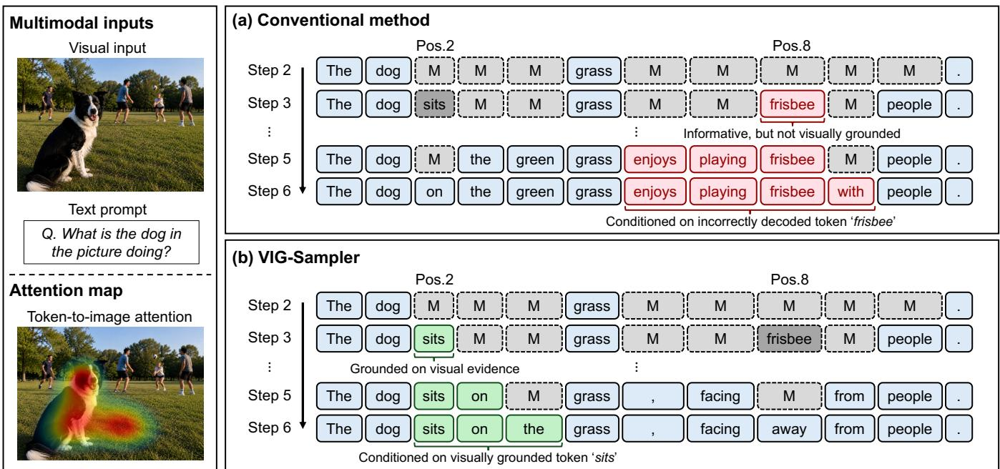  
Figure 1: Comparison of conventional sampling and VIG-Sampler. The conventional method may prioritize the visually unsupported token “frisbee”, causing subsequent predictions to drift from the image. In contrast, VIG-Sampler uses image attention to prioritize the visually grounded token “sits”, leading to a response consistent with the visual input.

An aim of this paper is to propose a novel image-grounded sampling strategy for parallel decoding in dMLLMs to select token sets that are both visually grounded and informative for subsequent predictions. To this end, we propose the Visual Information-Guided Sampler (VIG-Sampler), which leverages image attention readily available at each decoding step. Based on the observation that attention to image tokens serves as a reliable proxy for both visual grounding and informativeness, VIG-Sampler employs each token’s image attention as an ordering score. This prioritizes visually informative tokens and thereby promotes an image-grounded decoding trajectory. In addition to the token-level ordering, VIG-Sampler increases the overall information gain from decoding multiple tokens in parallel. We empirically observe that set-level information gain can fall substantially below the sum of individual gains when selected tokens convey redundant information, and that this redundancy manifests as similarity between their token-to-image attention distributions. VIG-Sampler further translates this similarity into a penalty score, discouraging tokens with attention distributions similar to those of the tokens already selected.

Overall, VIG-Sampler jointly promotes visual grounding and complementary information gain during parallel decoding, without requiring additional training or model forward passes. Extensive experiments on 7 captioning and visual question answering (VQA) benchmarks with 3 open-source dMLLMs show that VIG-Sampler consistently outperforms recent samplers that rely solely on the textual context, regardless of the number of tokens decoded per step. In particular, when decoding 8 tokens per step with LaViDa (Li et al.

2026), VIG-Sampler outperforms the Info-Gain Sampler by an average of 19.3 CIDEr points on captioning benchmarks and 7.3 accuracy points on VQA benchmarks. Notably, on COCO captioning (Lin et al. 2014), VIG-Sampler decoding 8 tokens per step still surpasses the Info-Gain Sampler decoding only 4 tokens per step by 5.3 CIDEr points, despite using half as many decoding steps. These results demonstrate the efectiveness of VIG-Sampler and show that grounding token selection in visual information is essential for dMLLMs. In summary, our contributions are as follows:

• Building on our analytical findings, we develop VIG-Sampler, a decoding strategy that leverages readily available token-to-image attention to select visually grounded and informative tokens without incurring additional training or model forward passes.

• Through empirical analysis, we show that tokens decoded in parallel may provide redundant information, limiting the information gain of the selected set, and incorporate this observation into VIG-Sampler through attentionguided subset selection.

• Extensive experiments on 7 multimodal benchmarks with 3 open-source dMLLMs demonstrate that VIG-Sampler outperforms Info-Gain Sampler by 19.3 CIDEr points on image captioning and still achieves better performance when using only half the number of decoding steps.

## Visual Information-Guided Sampler Preliminaries

Decoding process of dMLLM. We consider a dMLLM pθ that generates a textual response y conditioned on a visual input I and a text prompt x. Starting from a length-N fully masked sequence, $\mathbf { \dot { y } } _ { 0 } = \mathbf { \dot { [ M A S K ] } } ^ { N }$ , we perform $\mathbf { \bar { \rho } } _ { T }$ decoding steps to produce the final response $\mathbf { y } _ { T } = \mathbf { y }$ . At step $t ,$ the model predicts a distribution $p _ { \theta } ^ { i } ( \cdot \mid { \bf I } , { \bf x } , { \bf y } _ { t } )$ for each masked position $i \in \mathcal { M } _ { t }$ , where $\mathcal { M } _ { t } \stackrel {  } { = } \{ i \in \{ 0 , \ldots , N - 1 \}  | y _ { t } ^ { i } =$ $\mathrm { \bar { [ M A S K ] } } \}$ . For brevity, we write $p _ { \theta } ^ { i } ( \cdot \mid { \bf I } , { \bf x } , { \bf y } _ { t } )$ as $p _ { \theta } ^ { i } ( \cdot \mid \mathbf { y } _ { t } )$ From this distribution, we obtain $\hat { y } _ { t } ^ { i }$ as the token with the highest probability and the confidence $c _ { t } ^ { i }$ as its corresponding probability:

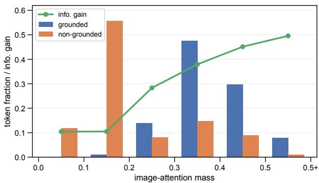

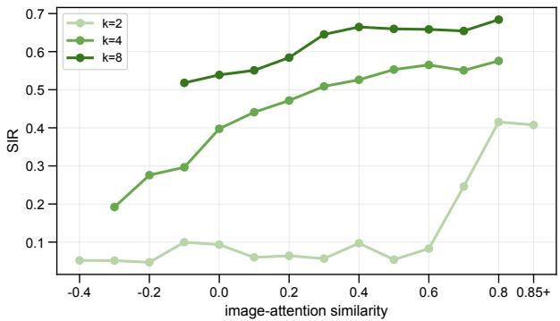  
Figure 2: Motivating observations on how image attention relates to visual grounding and information gain during dM-LLM decoding. Top: distributions of visually grounded and non-grounded tokens across image-attention-mass ranges, together with the mean information gain. Bottom: shared information ratio (SIR) versus mean pairwise image-attention similarity for selected token sets of size $k \in \{ 2 , \bar { 4 } , 8 \}$

$$
\hat { y } _ { t } ^ { i } = \arg \operatorname* { m a x } _ { v \in \mathcal { V } } p _ { \theta } ^ { i } ( v  { \mid } \mathbf { y } _ { t } ) , \qquad c _ { t } ^ { i } = p _ { \theta } ^ { i } ( \hat { y } _ { t } ^ { i }  { \mid } \mathbf { y } _ { t } ) ,\tag{1}
$$

where V denotes the vocabulary set. Based on these predictions, a subset ${ \mathcal { S } } \subseteq { \mathcal { M } } _ { t }$ of $k$ positions is selected, and the selected positions are updated as $y _ { t + 1 } ^ { i } = \hat { y } _ { t } ^ { i }$ for $i \in S .$ A common strategy for selecting S is to choose the masked positions with the highest confidence scores (Nie et al. 2026).

Attention mechanism in dMLLM. At each decoding step t, the token embeddings of I, x, and $\mathbf { y } _ { t }$ are concatenated into a single input sequence of length $L .$ Transformer-based dMLLMs (Li et al. 2026; Yang et al. 2026b; You et al. 2026) process this sequence through multiple self-attention layers, enabling tokens to exchange information across modalities. For each layer and attention head, the self-attention matrix

$A \in \mathbb { R } ^ { L \times L }$ is computed as

$$
A = \operatorname { s o f t m a x } \left( Q K ^ { \top } \right) ,\tag{2}
$$

where $Q$ and $K$ denote the query and key matrices, respectively. Each element $A _ { i , j }$ represents the attention weight from query position i to key position $j ,$ where a larger value indicates that token i receives more information from token $j$ (Vaswani et al. 2017; Zhang et al. 2025b). Throughout this work, we use A to denote the self-attention matrix from the last layer, averaged over all attention heads.

Information gain in token selection. In dLLM decoding, selecting informative tokens for subsequent predictions facilitates the decoding process (Fu et al. 2025b; Yang et al. 2026a; Huang et al. 2025). Such informativeness can be quantified using information gain, which measures the reduction in uncertainty of subsequent predictions (Yang et al. 2026a). To formalize this, for a set ${ \mathcal { S } } \subseteq { \mathcal { M } } _ { t }$ , let $\mathcal { M } _ { t } ^ { ( \bar { \boldsymbol { s } } ) } = \mathcal { M } _ { t } \setminus \mathcal { S } ,$ and let $\mathbf { y } _ { t } ^ { ( s ) }$ denote the response obtained by replacing $y _ { t } ^ { i }$ with $\hat { y } _ { t } ^ { i }$ for $i \in S$ . For each $\mathbf { y } \in \{ \mathbf { y } _ { t } , \mathbf { y } _ { t } ^ { ( S ) } \}$ , we measure this uncertainty as the average entropy over $\mathcal { M } _ { t } ^ { ( s ) }$

$$
U \big ( \mathcal { M } _ { t } ^ { ( \mathcal { S } ) } ; \mathbf { y } \big ) = \frac { 1 } { | \mathcal { M } _ { t } ^ { ( \mathcal { S } ) } | } \sum _ { i \in \mathcal { M } _ { t } ^ { ( \mathcal { S } ) } } H \big ( p _ { \theta } ^ { i } ( \cdot \mid \mathbf { y } ) \big ) ,\tag{3}
$$

where $H ( \cdot )$ denotes the entropy of a predicted distribution over tokens. The information gain $\Delta \dot { U _ { t } } ( S )$ is defined as the reduction in this average entropy after unmasking S:

$$
\Delta U _ { t } ( S ) = U ( \mathcal { M } _ { t } ^ { ( S ) } ; \mathbf { y } _ { t } ) - U \big ( \mathcal { M } _ { t } ^ { ( S ) } ; \mathbf { y } _ { t } ^ { ( S ) } \big ) .
$$

## Motivating Observations

(4)

When generating a response conditioned on multimodal inputs, existing approaches for selecting informative tokens face two practical limitations. First, evaluating information gain across many candidate token subsets requires an additional forward pass for each subset. This becomes computationally expensive with long multimodal inputs, as the cost of self-attention grows quadratically with sequence length. Second, information gain does not necessarily reflect how well a token is grounded in the visual input. $\dot { \mathrm { ~ A ~ } }$ token can yield substantial information gain solely from linguistic priors or textual dependencies within the response. To address these limitations, we use the attention weights from masked tokens to image tokens (i.e., image attention) as a readily available signal for assessing token informativeness while accounting for the visual input (Kang et al. 2025; Nguyen et al. 2026; Jian et al. 2025). We conduct analyses to examine how image attention can guide token selection during dMLLM decoding, leading to the following two observations.

Observation 1: total image attention reflects both visual grounding and token informativeness. We examine how the amount of image attention relates to visual grounding and information gain. To quantify this amount, we define the image-attention mass as the sum of attention weights over all image tokens. Throughout the decoding process, we measure the image-attention mass and information gain $\Delta U _ { t } ( \{ i \} )$ for each selected position $i \in S$ . At the same time, we identify tokens that rely on visual information by examining whether yˆit changes when the image is removed from the input. A change indicates dependence on visual evidence, in which case we classify the token as grounded; otherwise, we classify it as non-grounded. As shown in Figure 2 (top), higher image-attention mass corresponds to both higher information gain and a greater proportion of grounded tokens. This suggests that image-attention mass can serve as a signal for identifying tokens that are both visually grounded and informative.

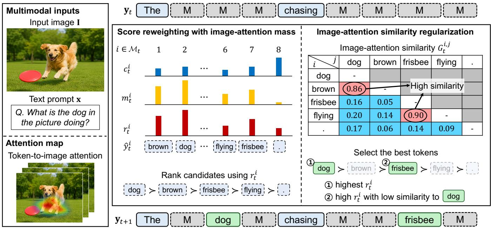  
Figure 3: Overview of the proposed VIG-Sampler. At each decoding step, image-attention mass is used to adjust the confidence score of each masked position, prioritizing tokens that are both visually grounded and informative. The resulting scores and pairwise image-attention similarities are then used to select the token set expected to yield higher information gain.

Observation 2: similar image-attention patterns reflect shared information across tokens. In addition to the total amount of image attention, we consider the distribution of attention across image tokens. Intuitively, tokens with similar image-attention patterns may rely on shared visual evidence and thus provide overlapping information when decoded together. To quantify this overlap, we define the shared information ratio (SIR) as a measure that compares the information gain from decoding the tokens in S together with the sum of the information gains obtained by decoding each token individually:

$$
\mathrm { S I R } _ { t } ( \mathcal { S } ) = 1 - \frac { \Delta U _ { t } ( \mathcal { S } ) } { \sum _ { i \in \mathcal { S } } \Delta U _ { t } ( \{ i \} ) } .\tag{5}
$$

A larger $\mathrm { S I R } _ { t } ( S )$ indicates a greater degree of information overlap among the tokens in S. We then examine the relationship between image-attention similarity and SIR. For each subset size $k \in \{ \bar { 2 } , 4 , 8 \}$ , we decode k tokens per step and compute the SIR and mean pairwise image-attention similarity of the selected subset S. We then report the average SIR within each image-attention similarity range. As shown in Figure 2 (bottom), SIR increases with image-attention similarity, consistent with the intuition that similar attention patterns reflect shared information across tokens. This suggests that image-attention distributions can provide a cue for selecting token sets that yield higher information gain when decoded together. Additional experimental details for these observations are provided in the Appendix.

## VIG-Sampler

Motivated by these observations, we propose VIG-Sampler, a visually grounded decoding strategy for dMLLMs that leverages image attention as an additional cue. Specifically, VIG-Sampler guides token selection by prioritizing visually grounded and informative tokens based on imageattention mass, while penalizing high image-attention similarity within the selected set to reduce information overlap. An overview of VIG-Sampler is provided in Figure 3, with the overall decoding procedure detailed in the Appendix.

Score reweighting with image-attention mass. Based on Observation 1, we use image-attention mass to reweight the confidence score $c _ { t } ^ { i }$ used for masked-token selection. For each masked position $i \in \mathcal { M } _ { t }$ , let $\mathbf { a } _ { t } ^ { i }$ denote the attention weights from position i to the image-token positions I, and let $\bar { m } _ { t } ^ { i }$ denote the image-attention mass:

$$
\mathbf { a } _ { t } ^ { i } = A _ { i , \mathcal { T } } , \qquad m _ { t } ^ { i } = \lVert \mathbf { a } _ { t } ^ { i } \rVert _ { 1 } = \sum _ { j \in \mathcal { T } } A _ { i , j } .\tag{6}
$$

To reflect the relative magnitude of $m _ { t } ^ { i } .$ , we normalize it by $m _ { t } ^ { \mathrm { m e d } }$ , the median image-attention mass over all masked positions. We then use the normalized image-attention mass

<table><tr><td colspan="2">k Sampler</td><td>COCO Cap. CIDEr</td><td>Flickr30K CIDEr</td><td>NoCaps CIDEr</td><td>Avg. CIDEr</td><td>DetailCaps CAPTURE</td><td>TextVQA Acc.</td><td>DocVQA ANLS</td><td>ChartQA Relaxed Acc.</td><td>Avg. Macro Avg.</td></tr><tr><td rowspan="7">2</td><td>Confidence</td><td>100.1</td><td>69.7</td><td>88.4</td><td>86.1</td><td>56.2</td><td>55.2</td><td>60.1</td><td>56.0</td><td>57.1</td></tr><tr><td>Entropy</td><td>95.4</td><td>68.2</td><td>83.9</td><td>82.5</td><td>56.5</td><td>54.6</td><td>59.8</td><td>56.0</td><td>56.8</td></tr><tr><td>Margin</td><td>105.8</td><td>71.7</td><td>88.7</td><td>88.7</td><td>56.9</td><td>55.0</td><td>61.6</td><td>56.6</td><td>57.7</td></tr><tr><td>MPD-PAC</td><td>95.1</td><td>70.1</td><td>87.2</td><td>84.1</td><td>56.9</td><td>56.0</td><td>62.8</td><td>56.2</td><td>58.3</td></tr><tr><td>PC-Sampler</td><td>101.7</td><td>69.8</td><td>88.9</td><td>86.8</td><td>57.1</td><td>54.3</td><td>58.9</td><td>55.0</td><td>56.1</td></tr><tr><td>Info-Gain</td><td>106.0</td><td>71.2</td><td>89.6</td><td>88.9</td><td>55.6</td><td>57.4</td><td>61.4</td><td>57.0</td><td>58.6</td></tr><tr><td>VIG-Sampler</td><td>106.2</td><td>74.7</td><td>90.5</td><td>90.5</td><td>57.7</td><td>58.7</td><td>62.6</td><td>55.8</td><td>59.0</td></tr><tr><td rowspan="7">4</td><td>Confidence</td><td>93.2</td><td>63.8</td><td>78.2</td><td>78.4</td><td>49.5</td><td>47.4</td><td>59.6</td><td>53.0</td><td>53.3</td></tr><tr><td>Entropy</td><td>91.2</td><td>63.5</td><td>78.4</td><td>77.7</td><td>45.9</td><td>46.0</td><td>57.7</td><td>52.6</td><td>52.1</td></tr><tr><td>Margin</td><td>93.7</td><td>65.5</td><td>78.0</td><td>79.1</td><td>51.5</td><td>47.4</td><td>59.7</td><td>53.2</td><td>53.4</td></tr><tr><td>MPD-PAC</td><td>92.4</td><td>65.5</td><td>79.4</td><td>79.1</td><td>49.0</td><td>47.9</td><td>60.5</td><td>53.6</td><td>54.0</td></tr><tr><td>PC-Sampler</td><td>95.8</td><td>66.6</td><td>82.8</td><td>81.7</td><td>49.6</td><td>52.2</td><td>57.1</td><td>54.0</td><td>54.4</td></tr><tr><td>Info-Gain</td><td>94.8</td><td>65.9</td><td>81.9</td><td>80.9</td><td>49.2</td><td>50.2</td><td>60.2</td><td>54.0</td><td>54.8</td></tr><tr><td>VIG-Sampler</td><td>105.1</td><td>71.2</td><td>87.4</td><td>87.9</td><td>55.9</td><td>56.8</td><td>62.3</td><td>55.8</td><td>58.3</td></tr><tr><td rowspan="7">8</td><td>Confidence</td><td>74.5</td><td>49.0</td><td>58.9</td><td>60.8</td><td>29.2</td><td>41.7</td><td>54.1</td><td>50.0</td><td>48.6</td></tr><tr><td>Entropy</td><td>71.6</td><td>49.4</td><td>58.7</td><td>59.9</td><td>27.4</td><td>41.7</td><td>53.8</td><td>49.8</td><td>48.4</td></tr><tr><td>Margin</td><td>73.2</td><td>46.9</td><td>59.8</td><td>60.0</td><td>34.0</td><td>41.7</td><td>54.4</td><td>50.0</td><td>48.7</td></tr><tr><td>MPD-PAC</td><td>73.4</td><td>49.0</td><td>59.7</td><td>60.7</td><td>29.9</td><td>40.7</td><td>55.7</td><td>50.4</td><td>48.9</td></tr><tr><td>PC-Sampler</td><td>83.9</td><td>56.2</td><td>67.9</td><td>69.3</td><td>30.2</td><td>50.8</td><td>56.8</td><td>54.0</td><td>53.9</td></tr><tr><td>Info-Gain</td><td>76.7</td><td>50.6</td><td>60.9</td><td>62.7</td><td>29.5</td><td>42.7</td><td>54.4</td><td>49.8</td><td>49.0</td></tr><tr><td>VIG-Sampler</td><td>100.1</td><td>63.6</td><td>82.3</td><td>82.0</td><td>42.4</td><td>53.1</td><td>61.5</td><td>54.2</td><td>56.3</td></tr></table>

Table 1: Experimental results of LaViDa with parallel decoding budgets $k \in \{ 2 , 4 , 8 \}$ . The first and last $\operatorname { A v g } .$ . columns report mean CIDEr and VQA scores, respectively. The best scores are shown in bold, and the second-best scores are underlined.

to reweight the confidence score:

$$
r _ { t } ^ { i } = c _ { t } ^ { i } \left( \frac { m _ { t } ^ { i } } { m _ { t } ^ { \mathrm { m e d } } } \right) ^ { \gamma } ,\tag{7}
$$

where $\gamma \geq 0$ is a hyperparameter that controls the strength of image-attention guidance. This formulation gradually incorporates image-attention guidance into the confidence score as γ increases, starting from $r _ { t } ^ { i } = c _ { t } ^ { i }$ at $\gamma = 0$ . For $\gamma > 0 .$ positions with higher image-attention mass receive larger weights, thereby prioritizing tokens that attend more strongly to the image. In this way, VIG-Sampler favors visually grounded and informative tokens while retaining the model’s original preference (i.e., confidence-based preference). The resulting scores are then used in the subsequent set-selection objective.

Set selection via image-attention similarity regularization. Building on Observation 2, we use pairwise imageattention similarity as a regularization term when selecting the token set S at each decoding step. To better capture how each image-attention pattern difers from the overall pattern, we center them by subtracting the mean over $\mathcal { M } _ { t }$

$$
\tilde { \mathbf { a } } _ { t } ^ { i } = \mathbf { a } _ { t } ^ { i } - \frac { 1 } { \left| \mathcal { M } \right| } \sum _ { j \in \mathcal { M } _ { t } } \mathbf { a } _ { t } ^ { j } .\tag{8}
$$

Using $\cdot \tilde { \mathbf { a } } _ { t } ^ { i } .$ , we compute the pairwise image-attention similarity as

$$
G _ { t } ^ { i , j } = \operatorname* { m a x } \left\{ \left. \tilde { \mathbf { a } } _ { t } ^ { i } , \tilde { \mathbf { a } } _ { t } ^ { j } \right. _ { \mathrm { c o s } } , 0 \right\} ,\tag{9}
$$

where $\langle \cdot , \cdot \rangle _ { \mathrm { c o s } }$ denotes cosine similarity. We then formulate the set-selection objective based on the reweighted token scores while accounting for pairwise image-attention similarity:

$$
S _ { t } ^ { \star } = \arg \operatorname* { m a x } _ { | \bar { S } | = k } \left[ \sum _ { i \in S } r _ { t } ^ { i } - \frac { \lambda } { | S | - 1 } \sum _ { \stackrel { i , j \in S } { i < j } } G _ { t } ^ { i , j } \right] ,\tag{10}
$$

where $\lambda \geq 0$ is a hyperparameter controlling the strength of the similarity regularization. The second term is defined as zero for $| { \cal S } | = 1$ . Since $G _ { t } ^ { i , j }$ is non-negative, it acts solely as a penalty for similar image-attention patterns rather than rewarding dissimilar ones. VIG-Sampler thus discourages selecting tokens with similar image-attention patterns, reducing information overlap within the selected set.

Finding the optimal set $S _ { t } ^ { \star }$ in Eq. (10) requires searching over a combinatorial number of candidate subsets, which is computationally impractical. We therefore use a greedy algorithm that selects the next position to maximize the marginal gain in the objective given the currently selected set (see the Appendix for its derivation). After initializing $s$ to $\varnothing ,$ we select the first position solely based on $r _ { t } ^ { i }$ . We then select the next position $i ^ { \star }$ as

$$
i ^ { \star } = \arg \operatorname* { m a x } _ { i \in \mathcal { M } _ { t } ^ { ( \boldsymbol { S } ) } } \left[ r _ { t } ^ { i } - \frac { \lambda } { | \boldsymbol { S } | } \sum _ { j \in \boldsymbol { S } } G _ { t } ^ { i , j } \right] .\tag{11}
$$

<table><tr><td rowspan="2">k</td><td rowspan="2">Sampler</td><td rowspan="2">COCO Cap. CIDEr</td><td rowspan="2">Flickr30K CIDEr</td><td rowspan="2">NoCaps CIDEr</td><td rowspan="2">Avg. CIDEr</td><td rowspan="2">DetailCaps CAPTURE</td><td rowspan="2">TextVQA Acc.</td><td rowspan="2">DocVQA ANLS</td><td rowspan="2">ChartQA Relaxed Acc.</td><td rowspan="2">Avg. Macro Avg.</td></tr><tr><td></td></tr><tr><td rowspan="7">2</td><td>Confidence</td><td>87.4</td><td>57.7</td><td>86.5</td><td>77.2</td><td>50.1</td><td>12.2</td><td>9.3</td><td>11.8</td><td>11.1</td></tr><tr><td>Entropy</td><td>82.5</td><td>55.8</td><td>83.3</td><td>73.9</td><td>50.5</td><td>12.0</td><td>8.8</td><td>11.8</td><td>10.9</td></tr><tr><td>Margin</td><td>88.0</td><td>58.7</td><td>88.0</td><td>78.2</td><td>50.5</td><td>12.2</td><td>9.5</td><td>11.6</td><td>11.1</td></tr><tr><td>MPD-PAC</td><td>86.1</td><td>56.7</td><td>81.2</td><td>74.7</td><td>50.0</td><td>12.4</td><td>10.1</td><td>11.6</td><td>11.4</td></tr><tr><td>PC-Sampler</td><td>87.1</td><td>57.4</td><td>80.3</td><td>74.9</td><td>49.3</td><td>12.4</td><td>8.6</td><td>11.8</td><td>10.9</td></tr><tr><td>Info-Gain</td><td>89.1</td><td>59.8</td><td>86.9</td><td>78.6</td><td>48.8</td><td>12.8</td><td>10.6</td><td>11.8</td><td>11.7</td></tr><tr><td>VIG-Sampler</td><td>87.9</td><td>60.2</td><td>89.2</td><td>79.1</td><td>50.4</td><td>12.4</td><td>10.5</td><td>12.0</td><td>11.6</td></tr><tr><td rowspan="7">4</td><td>Confidence</td><td>83.4</td><td>56.8</td><td>78.2</td><td>72.8</td><td>45.5</td><td>11.1</td><td>7.9</td><td>12.0</td><td>10.3</td></tr><tr><td>Entropy</td><td>78.8</td><td>54.7</td><td>75.9</td><td>69.8</td><td>44.5</td><td>11.1</td><td>7.6</td><td>12.0</td><td>10.2</td></tr><tr><td>Margin</td><td>81.1</td><td>57.2</td><td>80.7</td><td>73.0</td><td>46.6</td><td>11.1</td><td>8.0</td><td>11.6</td><td>10.2</td></tr><tr><td>MPD-PAC</td><td>80.9</td><td>52.4</td><td>77.3</td><td>70.2</td><td>46.5</td><td>11.4</td><td>8.3</td><td>12.2</td><td>10.6</td></tr><tr><td>PC-Sampler</td><td>81.5</td><td>51.4</td><td>73.5</td><td>68.8</td><td>45.8</td><td>12.4</td><td>8.6</td><td>12.0</td><td>11.0</td></tr><tr><td>Info-Gain</td><td>83.8</td><td>58.0</td><td>81.4</td><td>74.4</td><td>45.8</td><td>11.4</td><td>8.9</td><td>12.0</td><td>10.8</td></tr><tr><td>VIG-Sampler</td><td>87.6</td><td>58.8</td><td>86.6</td><td>77.7</td><td>49.1</td><td>12.7</td><td>9.9</td><td>13.2</td><td>11.9</td></tr><tr><td rowspan="7">8</td><td>Confidence</td><td>61.6</td><td>41.7</td><td>61.6</td><td>55.0</td><td>33.1</td><td>11.0</td><td>8.4</td><td>12.2</td><td>10.5</td></tr><tr><td>Entropy</td><td>60.7</td><td>41.0</td><td>60.1</td><td>53.9</td><td>31.8</td><td>11.0</td><td>8.3</td><td>12.2</td><td>10.5</td></tr><tr><td>Margin</td><td>66.4</td><td>44.8</td><td>64.0</td><td>58.4</td><td>35.7</td><td>11.0</td><td>8.5</td><td>12.2</td><td>10.6</td></tr><tr><td>MPD-PAC</td><td>61.0</td><td>41.2</td><td>60.2</td><td>54.1</td><td>38.6</td><td>11.1</td><td>8.6</td><td>12.2</td><td>10.6</td></tr><tr><td>PC-Sampler</td><td>62.9</td><td>43.1</td><td>62.8</td><td>56.3</td><td>33.5</td><td>12.6</td><td>8.4</td><td>12.0</td><td>11.0</td></tr><tr><td>Info-Gain</td><td>65.4</td><td>43.8</td><td>65.2</td><td>58.1</td><td>33.1</td><td>11.0</td><td>8.4</td><td>11.8</td><td>10.4</td></tr><tr><td>VIG-Sampler</td><td>81.9</td><td>58.3</td><td>78.4</td><td>72.9</td><td>43.3</td><td>12.3</td><td>9.5</td><td>12.4</td><td>11.4</td></tr></table>

Table 2: Experimental results of MMaDA with parallel decoding budgets $k \in \{ 2 , 4 , 8 \}$ . The first and last Avg. columns report mean CIDEr and VQA scores, respectively. The best scores are shown in bold, and the second-best scores are underlined.

We iteratively add the selected position i⋆ to S until $| S | = k$ The resulting set S determines the positions to be decoded with their predicted tokens $\hat { y } _ { t } ^ { i }$ at the current step.

## Experiments

## Models and Baselines

Our evaluation covers three representative dMLLMs: LaViDa-LLaDA-v1.0-Instruct (Li et al. 2026), MMaDA-8B-MixCoT (Yang et al. 2026b), and LLaDA-V (You et al. 2026). Across these models, we evaluate VIG-Sampler against six sampling baselines: Confidence (Chang et al. 2022), Entropy (Ben-Hamu et al. 2026), Margin (Kim et al. 2025), MPD-PAC (Hong, Yoon, and Hwang 2026), PC-Sampler (Huang et al. 2025), and Info-Gain (Yang et al. 2026a). The first three are widely used uncertainty-based heuristics, whereas MPD-PAC is designed to enhance visual grounding in dMLLMs. PC-Sampler incorporates global trajectory and content-aware guidance, whereas Info-Gain accounts for the future uncertainty reduction induced by each decoding decision. Note that we use fixed hyperparameters of γ = 1 and λ = 3 for all models. Further implementation and benchmark details are provided in the Appendix.

## Main Results

Tables 1 and 2 summarize the experimental results on LaViDa and MMaDA, respectively. VIG-Sampler achieves the highest mean CIDEr score across all model–budget settings and obtains the best DetailCaps and VQA averages in five of the six settings, with the second-best result in the remaining setting. Its consistent gains across captioning and VQA suggest that visual reward-guided token scoring efectively prioritizes visually grounded and informative tokens. The advantage of VIG-Sampler becomes more pronounced as the decoding budget increases. At k = 8, it outperforms the second-best baseline by 12.7 and 14.5 in mean CIDEr score on LaViDa and MMaDA, respectively, with corresponding CAPTURE gains of 8.4 and 4.7. Remarkably, VIG-Sampler at k = 8 matches or outperforms certainty-based sampling at k = 2 on COCO Caption with LaViDa and Flickr30K with MMaDA, despite a 4× reduction in decoding steps. Together, these results show thatjointinformation-aware set selection enables VIG-Sampler to gain more information at each step, benefiting from larger commit budgets while preserving generation quality.

## Analysis

## Analysis of VIG-Sampler

Information gain induced by VIG-Sampler. Figure 4 compares the cumulative information gain of VIG-Sampler against competing sampling baselines across decoding steps on COCO Caption using LaViDa. To better isolate information gain related to visual content, we exclude punctuation, articles, and other function words, whose predictions are more strongly driven by linguistic context than by visual evidence. Although VIG-Sampler does not directly compute information gain, it consistently achieves the highest cumulative information gain across all commit budgets.

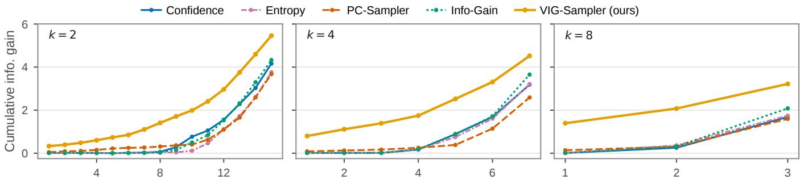  
Figure 4: Cumulative information gain across decoding steps for k ∈ {2, 4, 8}

Prompt: Provide a one-sentence caption for the provided image.  
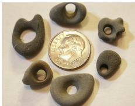

<table><tr><td>Confidence CIDEr 5.7</td><td>Info-Gain CIDEr 12.4</td><td>VIG-Sampler (ours)</td><td>CIDEr 97.9</td></tr><tr><td>S11: A penny[M]...[M]penny.</td><td>S12: A [M][M]is [M][M]a [M] penny.</td><td>[S13: A [M] of [M]...[M] next[M]a penny.</td><td></td></tr><tr><td>S12: A penny worth[M]...[M]a penny.</td><td>S13: A [M]coin is [M][M]a [M] penny.</td><td>S14: A group of stones [M][M] next to a penny.</td><td></td></tr><tr><td>Output: A penny worth of rocks that aren not worth a penny.</td><td>Output: A silver coin is next to a silver penny.</td><td>Output: A group of stones are sitting next to a penny.</td><td></td></tr></table>

Figure 5: Qualitative comparison on COCO Caption using LaViDa at k = 2. S# denotes the decoding step, and red and blue indicate incorrectly and correctly committed tokens, respectively.

Qualitative case studies. Figure 5 shows that Confidence and Info-Gain commit tokens that convey overlapping information, such as “penny” and “coin”, without accounting for the joint information gain of the selected set. These early commitments bias subsequent predictions toward plausible but incorrect continuations, yielding phrases such as “penny worth” and semantically repetitive descriptions such as “silver coin” and “silver penny”. In contrast, VIG-Sampler selects complementary, visually grounded tokens and generates a caption consistent with the image.

## Ablation Study

Hyperparameter sensitivity. Table 3 presents a sensitivity analysis of γ and λ on COCO Caption with LaViDa at k = 2. Performance generally improves as either γ or λ increases from zero, and their gains are largely additive when the two are combined. Performance remains robust across a broad range of values; although some configurations outperform the default, we fix γ = 1 and λ = 3 across all models and benchmarks for consistency.

Robustness to generation length. Table 4 compares VIG-Sampler and Info-Gain across diferent generation lengths at k = 4. VIG-Sampler consistently outperforms Info-Gain on both COCO Caption and TextVQA for all values of N, demonstrating robustness across generation lengths.

## Conclusion

In this paper, we presented VIG-Sampler, a trainingfree parallel decoding strategy for dMLLMs that leverages token-to-image attention to guide token selection. By combining visual reward-guided token scoring with jointinformation-aware set selection, VIG-Sampler prioritizes visually grounded and informative tokens during parallel decoding. Experiments across seven captioning and VQA benchmarks and three dMLLMs demonstrate consistent improvements over existing sampling baselines, with particularly strong gains under larger commit budgets. These results highlight the importance of incorporating visual information into the decoding order to preserve generation quality with fewer decoding steps.

<table><tr><td>γ\λ|</td><td>0.0</td><td>1.0</td><td>2.0</td><td>3.0</td><td>4.0</td></tr><tr><td>0.0 0.5 1.0 1.5</td><td>100.2 101.9 101.5</td><td>100.9 105.2 103.8</td><td>102.1 106.9 105.4</td><td>102.9 106.5 106.2†</td><td>101.7 105.2 105.5</td></tr></table>

Table 3: Hyperparameter sensitivity on COCO Caption using LaViDa. † denotes the default setting.
<table><tr><td>N</td><td>Sampler</td><td>COCO Cap.</td><td>TextVQA</td></tr><tr><td>16</td><td>Info-Gain VIG-Sampler</td><td>81.6 88.4</td><td>48.8 55.0</td></tr><tr><td>32</td><td>Info-Gain VIG-Sampler</td><td>94.8 105.1</td><td>50.2 56.8</td></tr><tr><td>48</td><td>Info-Gain VIG-Sampler</td><td>97.4 102.5</td><td>48.6 57.4</td></tr><tr><td>64</td><td>Info-Gain VIG-Sampler</td><td>96.3 103.7</td><td>49.5 55.8</td></tr></table>

Table 4: Robustness to N using LaViDa at k = 4.

Agrawal, H.; Desai, K.; Wang, Y.; Chen, X.; Jain, R.; Johnson, M.; Batra, D.; Parikh, D.; Lee, S.; and Anderson, P. 2019. Nocaps: Novel object captioning at scale. In Proceedings of the IEEE/CVF international conference on computer vision, 8948–8957.

Bao, W.; Chen, Z.; Xu, D.; and Shang, Y. 2025. Learning to parallel: Accelerating difusion large language models via learnable parallel decoding. arXiv preprint arXiv:2509.25188.

Ben-Hamu, H.; Gat, I.; Severo, D.; Nolte, N. S.; and Karrer, B. 2026. Accelerated sampling from masked difusion models via entropy bounded unmasking. Advances in Neural Information Processing Systems, 38: 55981–56007.

Chang, H.; Zhang, H.; Jiang, L.; Liu, C.; and Freeman, W. T. 2022. Maskgit: Masked generative image transformer. In Proceedings of the IEEE/CVF conference on computer vision and pattern recognition, 11315–11325.

Dai, W.; Li, J.; Li, D.; Tiong, A.; Zhao, J.; Wang, W.; Li, B.; Fung, P. N.; and Hoi, S. 2023. Instructblip: Towards generalpurpose vision-language models with instruction tuning. Advances in neural informationprocessing systems, 36: 49250– 49267.

Dong, H.; Li, J.; Wu, B.; Wang, J.; Zhang, Y.; and Guo, H. 2024. Benchmarking and improving detail image caption. arXiv preprint arXiv:2405.19092.

Fu, H.; Huang, B.; Adams, V.; Wang, C.; Srinivasan, V.; and Jiao, J. 2025a. From bits to rounds: Parallel decoding with exploration for difusion language models. arXiv preprint arXiv:2511.21103.

Fu, H.; Huang, B.; Adams, V.; Wang, C.; Srinivasan, V.; and Jiao, J. 2025b. From bits to rounds: Parallel decoding with exploration for difusion language models. arXiv preprint arXiv:2511.21103.

Gong, S.; Agarwal, S.; Zhang, Y.; Ye, J.; Zheng, L.; Li, M.; An, C.; Zhao, P.; Bi, W.; Han, J.; et al. 2025. Scaling difusion language models via adaptation from autoregressive models. In International Conference on Learning Representations, volume 2025, 5046–5073.

Gwak, D.; Jung, M.; Park, J.; Park, M.; Park, C.; Hyung, J.; and Choo, J. 2025. Reward-weighted sampling: Enhancing non-autoregressive characteristics in masked difusion llms. In Proceedings of the 2025 Conference on Empirical Methods in Natural Language Processing, 34562–34582.

Hong, S.; Yoon, C.; and Hwang, S. J. 2026. Mitigating Mask Prior Drift and Positional Attention Collapse in Large Difusion Vision-Language Models. arXiv preprint arXiv:2605.14530.

Huang, P.; Liu, S.; Liu, Z.; Yan, Y.; Wang, S.; Chen, Z.; and Xiao, T. 2025. Pc-sampler: Position-aware calibration of decoding bias in masked difusion models. arXiv preprint arXiv:2508.13021.

Huang, P.; Liu, T.; Liu, Z.; Yan, Y.; Wang, S.; Xiao, T.; Chen, Z.; and Sun, M. 2026. Empirical analysis of decoding biases in masked difusion models. In Proceedings of the 64th Annual Meeting of the Association for Computational Linguistics (Volume 1: Long Papers), 6853–6876.

Jazbec, M.; Olausson, T. X.; Béthune, L.; Ablin, P.; Kirchhof, M.; Monteiro, J.; Turrisi, V.; Ramapuram, J.; and Cuturi, M. 2025. Learning unmasking policies for difusion language models. arXiv preprint arXiv:2512.09106.

Jian, P.; Wu, J.; Sun, W.; Wang, C.; Ren, S.; and Zhang, J. 2025. Look again, think slowly: Enhancing visual reflection in vision-language models. In Proceedings ofthe 2025 Conference on Empirical Methods in Natural Language Processing, 9262–9281.

Kang, S.; Kim, J.; Kim, J.; and Hwang, S. J. 2025. Your large vision-language model only needs a few attention heads for visual grounding. In Proceedings of the Computer Vision and Pattern Recognition Conference, 9339–9350.

Kim, J.; Shah, K.; Kontonis, V.; Kakade, S. M.; and Chen, S. 2025. Train for the Worst, Plan for the Best: Understanding Token Ordering in Masked Difusions. In International Conference on Machine Learning, 30749–30768. PMLR.

Kim, K.; Kang, M.; and Choi, Y. S. 2026. Thinking Diffusion: Penalize and Guide Visual-Grounded Reasoning in Difusion Multimodal Language Models. arXiv preprint arXiv:2604.05497.

Kim, S. H.; Hong, S.; Jung, H.; Park, Y.; and Yun, S.-Y. 2026. Klass: Kl-guided fast inference in masked difusion models. Advances in Neural Information Processing Systems, 38: 92267–92301.

Lee, S.; Kim, S.; Park, J.; and Park, D. 2025. Lookahead unmasking elicits accurate decoding in difusion language models. arXiv preprint arXiv:2511.05563.

Li, D.; Yang, Z.; Zhang, X.; Shao, L.; and Lu, S. 2025a. A Comprehensive Study on Visual Token Redundancy for Discrete Difusion-based Multimodal Large Language Models. arXiv preprint arXiv:2511.15098.

Li, P.; Zhou, Y.; Muhtar, D.; Yin, L.; Yan, S.; Shen, L.; Vosoughi, S.; and Liu, S. 2025b. Difusion language models know the answer before decoding. arXiv preprint arXiv:2508.19982.

Li, S.; Gu, J.; Liu, K.; Lin, Z.; Wei, Z.; Grover, A.; and Kuen, J. 2025c. Lavida-o: Elastic large masked difusion models for unified multimodal understanding and generation. arXiv preprint arXiv:2509.19244.

Li, S.; Gu, J.; Liu, K.; Lin, Z.; Wei, Z.; Grover, A.; and Kuen, J. 2025d. Sparse-LaViDa: Sparse Multimodal Discrete Diffusion Language Models. arXiv preprint arXiv:2512.14008.

Li, S.; Kallidromitis, K.; Bansal, H.; Gokul, A.; Kato, Y.; Kozuka, K.; Kuen, J.; Lin, Z.; Chang, K.-W.; and Grover, A. 2026. Lavida: A large difusion language model for multimodal understanding. Advances in Neural Information Processing Systems, 38: 105101–105134.

Lin, T.-Y.; Maire, M.; Belongie, S.; Hays, J.; Perona, P.; Ramanan, D.; Dollár, P.; and Zitnick, C. L. 2014. Microsoft coco: Common objects in context. In European conference on computer vision, 740–755. Springer.

Liu, H.; Li, C.; Li, Y.; and Lee, Y. J. 2024. Improved baselines with visual instruction tuning. In Proceedings of the IEEE/CVF conference on computer vision and pattern recognition, 26296–26306.

Liu, H.; Li, C.; Wu, Q.; and Lee, Y. J. 2023. Visual instruction tuning. Advances in neural information processing systems, 36: 34892–34916.

Martinez, R. D.; Goriely, Z.; Caines, A.; Buttery, P.; and Beinborn, L. 2024. Mitigating frequency bias and anisotropy in language model pre-training with syntactic smoothing. In Proceedings of the 2024 Conference on Empirical Methods in Natural Language Processing, 5999–6011.

Masry, A.; Tan, J. Q.; Joty, S.; Hoque, E.; et al. 2022. Chartqa: A benchmark for question answering about charts with visual and logical reasoning. In Findings of the association for computational linguistics: ACL 2022, 2263–2279.

Mathew, M.; Karatzas, D.; Manmatha, R.; and Jawahar, C. 2020. DocVQA: A Dataset for VQA on Document Images. CoRR abs/2007.00398 (2020). arXiv preprint arXiv:2007.00398.

Nguyen, T. D.; Ho, M. K.; Chen, Q.; Xie, Y.; Nguyen, C.- T.; Nguyen, M. K.; Nguyen, D. H. P.; van den Hengel, A.; Verjans, J.; Le Nguyen, P.; et al. 2026. Beyond the Global Scores: Fine-Grained Token Grounding as a Robust Detector of LVLM Hallucinations. In Proceedings of the IEEE/CVF Conference on Computer Vision and Pattern Recognition, 40235–40244.

Nie, S.; Zhu, F.; You, Z.; Zhang, X.; Ou, J.; Hu, J.; Zhou, J.; Lin, Y.; Wen, J.-R.; and Li, C. 2026. Large language diffusion models. Advances in Neural Information Processing Systems, 38: 50608–50646.

Shi, Q.; Bai, J.; Zhao, Z.; Chai, W.; Yu, K.; Wu, J.; Tong, Y.; Li, X.; Li, X.; and Yan, S. 2025. Muddit: Liberating generation beyond text-to-image with a unified discrete difusion model. arXiv preprint arXiv:2505.23606.

Singh, A.; Natarajan, V.; Shah, M.; Jiang, Y.; Chen, X.; Batra, D.; Parikh, D.; and Rohrbach, M. 2019. Towards vqa models that can read. In Proceedings of the IEEE/CVF conference on computer vision and pattern recognition, 8317–8326.

Vaswani, A.; Shazeer, N.; Parmar, N.; Uszkoreit, J.; Jones, L.; Gomez, A. N.; Kaiser, Ł.; and Polosukhin, I. 2017. Attention is all you need. Advances in neural information processing systems, 30.

Wei, Q.; Zhang, Y.; Liu, Z.; Zeng, P.; Wang, Y.; Qi, B.; Liu, D.; and Zhang, L. 2025. Accelerating difusion large language models with slowfast sampling: The three golden principles. arXiv preprint arXiv:2506.10848.

Wu, C.; Zhang, H.; Xue, S.; Liu, Z.; Diao, S.; Zhu, L.; Luo, P.; Han, S.; and Xie, E. 2025. Fast-dllm: Training-free acceleration of difusion llm by enabling kv cache and parallel decoding. arXiv preprint arXiv:2505.22618.

Xu, J.; Lu, J.; Li, C.; Sarkar, S.; Kundu, S.; and Beerel, P. A. 2025. RedVTP: Training-Free Acceleration of Difusion Vision-Language Models Inference via Masked Token-Guided Visual Token Pruning. arXiv preprint arXiv:2511.12428.

Yang, K.; Teoh, J.; Yang, K.; Zhang, Y.; and Lamb, A. 2026a. Improving sampling for masked difusion models via information gain. arXiv preprint arXiv:2602.18176.

Yang, L.; Tian, Y.; Li, B.; Zhang, X.; Shen, K.; Tong, Y.; and Wang, M. 2026b. Mmada: Multimodal large difusion language models. Advances in Neural Information Processing Systems, 38: 138867–138907.

Ye, J.; Xie, Z.; Zheng, L.; Gao, J.; Wu, Z.; Jiang, X.; Li, Z.; and Kong, L. 2025. Dream 7b: Difusion large language models. arXiv preprint arXiv:2508.15487.

You, Z.; Nie, S.; Zhang, X.; ZHOU, J.; Lu, Z.; Wen, J.-R.; and Li, C. 2026. Llada-v: Large language difusion models with visual instruction tuning. In Proceedings of the IEEE/CVF Conference on Computer Vision and Pattern Recognition, 10093–10105.

Young, P.; Lai, A.; Hodosh, M.; and Hockenmaier, J. 2014. From image descriptions to visual denotations: New similarity metrics for semantic inference over event descriptions. Transactions of the Association for Computational Linguistics, 2: 67–78.

Yu, R.; Ma, X.; and Wang, X. 2025. Dimple: Discrete difusion multimodal large language model with parallel decoding. arXiv preprint arXiv:2505.16990.

Zhang, K.; Li, B.; Zhang, P.; Pu, F.; Cahyono, J. A.; Hu, K.; Liu, S.; Zhang, Y.; Yang, J.; Li, C.; et al. 2025a. Lmmseval: Reality check on the evaluation of large multimodal models. In Findings of the Association for Computational Linguistics: NAACL 2025, 881–916.

Zhang, Z.; Yadav, S.; Han, F.; and Shutova, E. 2025b. Crossmodal information flow in multimodal large language models. In Proceedings of the Computer Vision and Pattern Recognition Conference, 19781–19791.

## Related Work

## Difusion Multimodal Large Language Models

Multimodal large language models (MLLMs) project visual information into the representation space of a pretrained LLM, achieving strong performance on multimodal tasks such as captioning, visual question answering, and visual reasoning (Liu et al. 2023, 2024; Dai et al. 2023). With the emergence of dLLMs as an alternative to autoregressive LLMs (Nie et al. 2026; Gong et al. 2025; Ye et al. 2025), this paradigm has also been extended to multimodal models that denoise sequences conditioned on both visual and textual tokens (You et al. 2026; Li et al. 2026; Yu, Ma, and Wang 2025). More recent models jointly learn visual and textual tokens in a unified framework, rather than adapting visual features to language space, enabling balanced multimodal understanding and visual generation (Yang et al. 2026b; Li et al. 2025c; Shi et al. 2025).

Recent studies on dMLLM decoding have focused on improving inference eficiency by pruning redundant masked or visual tokens during generation (Li et al. 2025a,d; Xu et al. 2025). Another line of work improves the visual grounding of generated responses by adjusting token-level predictions through model-internal bias correction or classifier-free guidance (Hong, Yoon, and Hwang 2026; Kim, Kang, and Choi 2026). Despite the growing body of research on dM-LLMs, relatively little attention has been paid to which tokens should be decoded at each step and how these decoding decisions afect the subsequent generation trajectory.

## Parallel Decoding Strategies in Difusion Language Models

At each denoising step, difusion language models predict all remaining masked positions and commit a subset of them for parallel decoding. The most common strategies select positions based on predictive certainty, measured by confidence (Nie et al. 2026; Li et al. 2026), entropy (Ye et al. 2025; Ben-Hamu et al. 2026), or the probability margin between the top two candidates (Kim et al. 2025; Li et al. 2025b). Based on these signals, several methods dynamically determine which and how many tokens to commit using thresholdbased criteria (Wu et al. 2025; Yu, Ma, and Wang 2025; Ben-Hamu et al. 2026). Other training-free approaches leverage signals accumulated across denoising steps, such as changes in predictive distributions, convergence, and prediction stability (Kim et al. 2026; Wei et al. 2025). Another class of approaches learns token selection policies from trace-level signals, such as future-stability labels derived from completed decoding traces or rewards based on final outputs (Bao et al. 2025; Jazbec et al. 2025). Recent studies have also explored alternative criteria, including information gain over the remaining masked positions, semantic priors, and search over candidate decoding trajectories (Yang et al. 2026a; Huang et al. 2025; Lee et al. 2025). Although these methods are generally efective in language-only settings, parallel decoding strategies for multimodal language models remain relatively underexplored, especially those that use visual grounding to guide token selection.

## Additional Details

## Experimental Details for the Motivation Study

We conduct all experiments in the motivation study on a subset of 100 images from the COCO Captions validation set. For observation 1, we first generate captions using the confidence-based sampler with k = 1. For each generated caption, we mask one token at a time and run the model again with the image embeddings replaced by zero embeddings. If the prediction at the masked position changes, we classify the token as visually grounded; otherwise, we classify it as non-grounded. The image-attention mass and imageattention similarity used in the experiments are defined as $m _ { t } ^ { i }$ and $\langle \tilde { \mathbf { a } } _ { t } ^ { i } , \tilde { \mathbf { a } } _ { t } ^ { j } \rangle _ { \mathrm { c o s } }$ , respectively.

## Benchmarks

We evaluate VIG-Sampler on four image captioning benchmarks and three visual question answering benchmarks, covering a broad range of vision-language capabilities. For image captioning, we use COCO Caption (Lin et al. 2014), Flickr30K (Young et al. 2014), NoCaps (Agrawal et al. 2019), and DetailCaps (Dong et al. 2024), which assess general image description, open-vocabulary generalization, and fine-grained, long-form visual description. For visual question answering, we use TextVQA (Singh et al. 2019), DocVQA (Mathew et al. 2020), and ChartQA (Masry et al. 2022), covering scene text understanding, document comprehension, and chart reasoning, respectively. We report CIDEr for COCO Caption, Flickr30K, and NoCaps, CAPTURE for DetailCaps, and accuracy, ANLS, and relaxed accuracy for TextVQA, DocVQA, and ChartQA, respectively. We additionally report the mean CIDEr score across the first three captioning benchmarks and the mean score across the three VQA benchmarks. For a consistent evaluation protocol, we use the lmms-eval package (Zhang et al. 2025a), evaluating DetailCaps on 500 samples and the remaining benchmarks on their lite subsets.

## Implementation Details

Sampler configurations. We retain the default hyperparameter settings reported for prior methods whenever possible and make only minimal adjustments when diferences in generation length or dataset characteristics lead to unstable decoding behavior. For MPD-PAC, we set the RoPE coeficient to $\beta = 0 . 0 1$ , the threshold to $\tau _ { 0 } = 0 . 6 , k = 3 .$ , and the slope of the sigmoid schedule to 8. We use $\lambda _ { \mathrm { p r i o r } } = 0 . 3$ for LaViDa, $\lambda _ { \mathrm { p r i o r } } = 0 . 1$ for LLaDA-V, and $\bar { \lambda } _ { \mathrm { p r i o r } } = 0 . 0 3$ for MMaDA. For PC-Sampler, we set the positional decay coeficient to $\lambda = 0 . 0 2 5$ and set the clipping threshold to $\alpha = 1 0$ . For Info-Gain, we use a position temperature of $\tau _ { \mathrm { p o s } } = 0 . 1$ , N = 4 candidates, and an acceleration threshold of 0.8. For VIG-Sampler, we set $\gamma = 1$ and λ = 3.

Generation settings. For LaViDa and MMaDA, we use a generation length of $N = 3 2$ on all benchmarks except DetailCaps. On DetailCaps, we employ block decoding for both models with a generation length of N = 128 and a block length of 16. For LLaDA-V, we use N = 16 on COCO Caption, Flickr30K, and NoCaps, $N = 1 2 8$ on DetailCaps, and N = 32 on the VQA benchmarks.

Evaluation setup. All experiments are conducted on NVIDIA RTX A5000 GPUs. We set the sampling temperature to zero and report single-run results.

## Derivation of the Greedy Selection Rule

We derive the greedy rule used to approximately optimize the set-level objective in Eq. (10). For the current set S of n selected positions, $\mathrm { i . e . , } | S | = n .$ , define

$$
F _ { t } ( S ) = \sum _ { i \in S } r _ { t } ^ { i } - \frac { \lambda } { | S | - 1 } \sum _ { \stackrel { i , j \in S } { i < j } } G _ { t } ^ { i , j } ,\tag{12}
$$

where the pairwise similarity term is defined as zero when $| S | = 1$ , and we set $F _ { t } ( \varnothing ) = { \mathrm { 0 } }$ . Consider adding a candidate $i \in \mathcal { M } _ { t } ^ { ( S ) }$ . Define the accumulated pairwise similarity within the current set as

$$
P _ { t } ( \mathcal { S } ) = \sum _ { a , b \in \mathcal { S } \atop a < b } G _ { t } ^ { a , b } .\tag{13}
$$

After adding candidate i, the pairwise similarity term additionally contains its similarities to all positions already in S. Thus, for $n \geq 2$

$$
\begin{array} { c } { { F _ { t } ( S \cup \{ i \} ) = \displaystyle \sum _ { j \in \mathcal S } r _ { t } ^ { j } + r _ { t } ^ { i } } } \\ { { - \displaystyle \frac { \lambda } { n } \left[ P _ { t } ( S ) + \displaystyle \sum _ { j \in \mathcal S } G _ { t } ^ { i , j } \right] . } } \end{array}\tag{14}
$$

Subtracting the current objective

$$
F _ { t } ( S ) = \sum _ { j \in S } r _ { t } ^ { j } - \frac { \lambda } { n - 1 } P _ { t } ( S )\tag{15}
$$

gives the marginal gain

$$
\begin{array} { c } { { F _ { t } ( S \cup \{ i \} ) - F _ { t } ( S ) = r _ { t } ^ { i } - \displaystyle \frac { \lambda } { n } \sum _ { j \in S } G _ { t } ^ { i , j } } } \\ { { + \displaystyle \frac { \lambda } { n ( n - 1 ) } P _ { t } ( S ) . } } \end{array}\tag{16}
$$

The last term depends only on the currently selected set S and is independent of candidate i. Therefore, it does not afect which candidate maximizes the marginal gain.

For $n = 1$ , the current set has no pairwise similarity term, and adding i yields

$$
F _ { t } ( S \cup \{ i \} ) - F _ { t } ( S ) = r _ { t } ^ { i } - \lambda \sum _ { j \in { \cal S } } G _ { t } ^ { i , j } ,\tag{17}
$$

which has the same candidate-dependent form as Eq. (16) with $n = 1$

Consequently, for any nonempty S, the greedy selection rule is

$$
i ^ { \star } = \arg \operatorname* { m a x } _ { i \in \mathcal { M } _ { t } ^ { ( \boldsymbol { S } ) } } \left[ r _ { t } ^ { i } - \frac { \lambda } { | \boldsymbol { S } | } \sum _ { j \in \boldsymbol { S } } G _ { t } ^ { i , j } \right] .\tag{18}
$$

When $s = \emptyset$ , the similarity term is defined as zero, so the first selected position is

$$
i ^ { \star } = \arg \operatorname* { m a x } _ { i \in \mathcal { M } _ { t } } r _ { t } ^ { i } .\tag{19}
$$

## Overall Decoding Procedure of VIG-Sampler

For completeness, we summarize the overall decoding procedure of VIG-Sampler in Algorithm 1.

Algorithm 1: Visual Information-Guided Sampler   
Require: Visual input I, text prompt x, response length N,   
commit budget k, and hyperparameters $\gamma , \lambda$   
Ensure: Decoded response $\mathbf { y } _ { T }$   
1: $\mathbf { y } _ { 0 } \gets [ \mathrm { M A S K } ] ^ { N }$   
2: $T \gets \dot { N } / k$   
3: for $t = \stackrel { \cdot } { 0 } , \ldots , T - 1$ do   
4: $\mathcal { M } _ { t } \gets \{ i \ | \ y _ { t } ^ { i } = [ \mathrm { M A S K } ] \}$   
5: Run one forward pass conditioned on $\mathbf { ( I , x , y _ { \mathit { t } } ) }$ to   
obtain $p _ { \theta } ^ { i } ( \cdot \mid \mathbf { y } _ { t } )$ and A   
6: for all $i \in \mathcal { M } _ { t }$ do   
7: $\hat { y } _ { t } ^ { i } \gets \arg \operatorname* { m a x } _ { v \in \mathcal { V } } p _ { \theta } ^ { i } ( v \mid \mathbf { y } _ { t } )$   
8: $c _ { t } ^ { i } \gets p _ { \theta } ^ { i } ( \hat { y } _ { t } ^ { i } \mid \mathbf { y } _ { t } )$   
9: $\mathbf { a } _ { t } ^ { i } \gets A _ { i , \tau }$   
10: $\begin{array} { r } { m _ { t } ^ { i } \gets \sum _ { j \in \mathcal { T } } A _ { i , j } } \end{array}$   
11: end for   
12: $m _ { t } ^ { \mathrm { m e d } }  \mathrm { m e d i a n } _ { i \in \mathcal { M } _ { t } } m _ { t } ^ { i }$   
13: $\bar { \mathbf { a } } _ { t } \gets \frac { 1 } { | \mathcal { M } _ { t } | } \sum _ { j \in \mathcal { M } _ { t } } \mathbf { a } _ { t } ^ { j }$   
14: for all $i \in { \mathcal { M } } _ { t }$ do   
15: $r _ { t } ^ { i } \gets c _ { t } ^ { i } \left( \frac { m _ { t } ^ { i } } { m _ { t } ^ { \mathrm { m e d } } } \right) ^ { \gamma }$   
16: $\widetilde { \mathbf { a } } _ { t } ^ { i } \gets \mathbf { a } _ { t } ^ { i } - \bar { \mathbf { a } } _ { t } ^ { \ast }$   
17: end for   
18: for all $i , j \in \mathcal { M } _ { t } , i \neq j$ do   
19: $G _ { t } ^ { i , j } \gets \operatorname* { m a x } \left\{ \left. \tilde { \mathbf { a } } _ { t } ^ { i } , \tilde { \mathbf { a } } _ { t } ^ { j } \right. _ { \mathrm { c o s } } , 0 \right\}$   
20: end for   
21: $s  \emptyset$   
22: while $| S | <$ k do   
23: for all $i \in \mathcal { M } _ { t } ^ { ( S ) }$ do   
24: if ${ \mathcal { S } } = \emptyset$ then   
25: $q _ { t } ^ { i } \gets r _ { t } ^ { i }$   
26: else   
27: qit $ r _ { t } ^ { i } - \frac { \lambda } { | \boldsymbol { S } | } \sum _ { j \in \boldsymbol { S } } G _ { t } ^ { i , j }$   
28: end if   
29: end for   
30: $i ^ { \star }  \arg$ max $\mathsf { \Pi } _ { i \in \mathcal { M } _ { t } ^ { ( \mathcal { S } ) } } q _ { t } ^ { i }$   
31: ${ \mathcal { S } } \gets { \mathcal { S } } \cup \{ i ^ { \star } \}$   
32: end while   
33: $\mathbf { y } _ { t + 1 }  \mathbf { y } _ { t }$   
34: for all $i \in \mathcal S$ do   
35: $y _ { t + 1 } ^ { i }  \hat { y } _ { t } ^ { i }$   
36: end for   
37: end for   
38: return $\mathbf { y } _ { T }$

## Additional Experiments and Analysis Generalization to a Diferent Model Family

In Table 5, we present additional experiments on LLaDA-V (You et al. 2026) to evaluate the generalizability of VIG-

<table><tr><td rowspan="2">k</td><td rowspan="2">Sampler</td><td rowspan="2">COCO Cap. CIDEr</td><td rowspan="2">Flickr30K CIDEr</td><td rowspan="2">NoCaps CIDEr</td><td rowspan="2">Avg. CIDEr</td><td rowspan="2">DetailCaps CAPTURE</td><td rowspan="2">TextVQA Acc.</td><td rowspan="2">DocVQA ANLS</td><td rowspan="2">ChartQA Relaxed Acc.</td><td rowspan="2">Avg. Macro Avg.</td></tr><tr><td></td></tr><tr><td rowspan="7">2</td><td>Confidence</td><td>92.8</td><td>83.9</td><td>91.6</td><td>89.4</td><td>59.9</td><td>67.3</td><td>81.1</td><td>76.2</td><td>74.9</td></tr><tr><td>Entropy</td><td>91.0</td><td>77.8</td><td>89.4</td><td>86.1</td><td>59.0</td><td>63.9</td><td>82.0</td><td>76.6</td><td>74.2</td></tr><tr><td>Margin</td><td>94.5</td><td>82.5</td><td>91.8</td><td>89.6</td><td>61.1</td><td>67.3</td><td>82.0</td><td>77.6</td><td>75.6</td></tr><tr><td>MPD-PAC</td><td>92.4</td><td>83.6</td><td>91.2</td><td>89.1</td><td>60.5</td><td>65.0</td><td>81.4</td><td>75.8</td><td>74.1</td></tr><tr><td>PC-Sampler</td><td>92.1</td><td>81.9</td><td>90.8</td><td>88.3</td><td>59.8</td><td>66.5</td><td>82.8</td><td>76.4</td><td>75.2</td></tr><tr><td>Info-Gain</td><td>94.4</td><td>86.1</td><td>93.8</td><td>91.4</td><td>60.1</td><td>67.2</td><td>82.0</td><td>76.6</td><td>75.3</td></tr><tr><td>VIG-Sampler</td><td>93.9</td><td>82.5</td><td>91.3</td><td>89.2</td><td>59.9</td><td>67.8</td><td>83.4</td><td>77.0</td><td>76.1</td></tr><tr><td rowspan="7">4</td><td>Confidence</td><td>89.4</td><td>77.9</td><td>84.9</td><td>84.1</td><td>58.4</td><td>63.2</td><td>80.2</td><td>75.6</td><td>73.0</td></tr><tr><td>Entropy</td><td>85.7</td><td>73.3</td><td>83.8</td><td>80.9</td><td>56.3</td><td>62.2</td><td>78.6</td><td>73.4</td><td>71.4</td></tr><tr><td>Margin</td><td>88.9</td><td>76.6</td><td>85.6</td><td>83.7</td><td>59.9</td><td>63.8</td><td>81.4</td><td>76.4</td><td>73.9</td></tr><tr><td>MPD-PAC</td><td>89.0</td><td>76.0</td><td>84.2</td><td>83.1</td><td>58.8</td><td>62.5</td><td>79.5</td><td>74.8</td><td>72.3</td></tr><tr><td>PC-Sampler</td><td>85.6</td><td>74.2</td><td>81.9</td><td>80.6</td><td>53.9</td><td>63.6</td><td>82.6</td><td>76.0</td><td>74.1</td></tr><tr><td>Info-Gain</td><td>90.8</td><td>78.1</td><td>88.0</td><td>85.6</td><td>58.6</td><td>62.1</td><td>80.7</td><td>75.8</td><td>72.9</td></tr><tr><td>VIG-Sampler</td><td>90.7</td><td>78.5</td><td>90.4</td><td>86.5</td><td>60.3</td><td>63.8</td><td>79.6</td><td>76.4</td><td>73.3</td></tr><tr><td rowspan="7">8</td><td>Confidence</td><td>72.3</td><td>61.4</td><td>66.8</td><td>66.8</td><td>49.0</td><td>51.2</td><td>73.3</td><td>72.0</td><td>65.5</td></tr><tr><td>Entropy</td><td>66.6</td><td>59.5</td><td>65.0</td><td>63.7</td><td>36.8</td><td>43.7</td><td>69.0</td><td>69.0</td><td>60.6</td></tr><tr><td>Margin</td><td>74.3</td><td>60.6</td><td>69.5</td><td>68.1</td><td>49.1</td><td>53.9</td><td>74.4</td><td>73.0</td><td>67.1</td></tr><tr><td>MPD-PAC</td><td>72.3</td><td>61.1</td><td>66.2</td><td>66.5</td><td>47.3</td><td>48.1</td><td>71.0</td><td>71.8</td><td>63.6</td></tr><tr><td>PC-Sampler</td><td>67.4</td><td>57.3</td><td>61.1</td><td>61.9</td><td>30.2</td><td>50.6</td><td>75.7</td><td>72.4</td><td>66.2</td></tr><tr><td>Info-Gain</td><td>74.2</td><td>62.7</td><td>68.3</td><td>68.4</td><td>49.0</td><td>51.1</td><td>73.3</td><td>72.2</td><td>65.5</td></tr><tr><td>VIG-Sampler</td><td>74.3</td><td>64.0</td><td>71.8</td><td>70.0</td><td>59.5</td><td>56.1</td><td>75.6</td><td>72.8</td><td>68.2</td></tr></table>

Table 5: Experimental results of LLaDA-V with parallel decoding budgets $k \in \{ 2 , 4 , 8 \}$ . The first and last Avg. columns report mean CIDEr and VQA scores, respectively. The best scores are shown in bold, and the second-best scores are underlined.

<table><tr><td>N</td><td>Sampler</td><td>COCO Cap.</td><td>TextVQA</td></tr><tr><td>16</td><td>Info-Gain VIG-Sampler</td><td>87.2 92.4</td><td>58.0 57.5</td></tr><tr><td>32</td><td>Info-Gain VIG-Sampler</td><td>106.0 106.2</td><td>57.4 58.7</td></tr><tr><td>48</td><td>Info-Gain VIG-Sampler</td><td>106.8 104.2</td><td>56.5 59.4</td></tr><tr><td>64</td><td>Info-Gain VIG-Sampler</td><td>104.6 105.9</td><td>57.3 59.0</td></tr></table>

Table 6: Robustness to N using LaViDa at k = 2.

Sampler to a diferent model family.

## Additional Ablation Study on Generation Length

As shown in Table 6, we present additional comparisons between VIG-Sampler and Info-Gain across diferent generation lengths with k = 2. Consistent with the results at k = 4, VIG-Sampler maintains strong overall performance across diferent generation lengths, demonstrating its robustness to the choice of N.

## Analysis of Inference Cost

Table 7 summarizes the inference cost of each sampling method in terms of peak GPU memory and wall-clock time.

<table><tr><td rowspan="2">Sampler</td><td rowspan="2">Peak mem. (GB)</td><td colspan="2">Wall-clock time (s)</td></tr><tr><td>k=2</td><td>k=4</td></tr><tr><td>Confidence</td><td>17.9</td><td>1.71</td><td>1.39</td></tr><tr><td>Info-Gain</td><td>17.9</td><td>3.25</td><td>2.21</td></tr><tr><td>VIG-Sampler</td><td>17.9</td><td>1.85</td><td>1.44</td></tr></table>

Table 7: Inference cost of each sampler.

VIG-Sampler shows no measurable increase in peak memory compared with the baselines, with all methods using 17.9 GB. Its wall-clock time also remains close to that of confidence-based sampling for both k = 2 and k = 4, while being substantially lower than that of Info-Gain. These results indicate that VIG-Sampler introduces only modest computational overhead despite incorporating visual guidance into token selection.

## Additional Qualitative Case Studies and Analysis of VIG-Sampler

In Figure 6, we provide additional qualitative comparisons that highlight the efectiveness of VIG-Sampler.

We further report the image-attention patterns of the selected tokens in Figure 7. In this example, the confidence-based method selects uninformative tokens with difuse attention. Unlike the confidence-based method, VIG-Sampler selects tokens that are critical to generating the final answer and grounds them in distinct image regions. Additionally, we investigate the efect of a penalty based on image-attention similarity on token selection during decoding. Under the $\lambda = 0$ ablation setting (i.e., with the penalty term disabled), the selected tokens attend to nearly identical image regions and provide little additional information beyond one another. By contrast, in our default setting with the penalty term, the selected tokens attend to distinct image regions and faithfully capture diferent visual content.

Prompt: Provide a one-sentence caption for the provided image.  
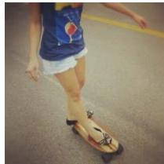

<table><tr><td>Confidence</td><td>CIDEr 44 Info-Gain</td><td>CIDEr 67 VIG-Sampler (ours)</td><td>CIDEr 75</td></tr><tr><td>S13: A woman riding a skateboard with a [M]...[M].</td><td>S14: A woman riding a skateboard down a [M][M] the street.</td><td>S14: A woman riding a skateboard on a [M][M].</td><td></td></tr><tr><td>S14: A woman riding a skateboard with a [M][M] on it.</td><td>S15: A woman riding a skateboard down a sidewalk on the street.</td><td>S15: A woman riding a skateboard on a cement street.</td><td></td></tr><tr><td>Output: A woman riding a skateboard with a blue design on it.</td><td>Output: A woman riding a skateboard down a sidewalk on the street.</td><td>Output: A woman riding a skateboard on a cement street.</td><td></td></tr></table>

Prompt: Provide a one-sentence caption for the provided image.  

<table><tr><td>Confidence CIDEr 148</td><td>Info-Gain CIDEr 91</td><td>VIG-Sampler (ours)</td><td>CIDEr 256</td></tr><tr><td>S12: Two white trucks[M]...[M].</td><td>S13: Two white trucks are [M][M] side [M][M].</td><td>S11: Two white trucks are parked [M]...[M]</td><td></td></tr><tr><td>S13: Two white trucks are [M]side [M]...[M].</td><td>S14: Two white trucks are side [M] side [M]side.</td><td>S12: Two white trucks are parked next to [M]...[M]</td><td></td></tr><tr><td>Output: Two white trucks are parked side by side outside.</td><td>Output: Two white trucks are side by side by side.</td><td>Output: Two white trucks are parked next to each other.</td><td></td></tr></table>

Prompt: Provide a one-sentence caption for the provided image.  

<table><tr><td>Confidence</td><td>CIDEr 247 Info-Gain</td><td>CIDEr 191 VIG-Sampler (ours)</td><td>CIDEr 178</td></tr><tr><td>S07: A[M]...[M] [EOT]</td><td>S07: A [M]...[M] [EOT]</td><td>S07: A young man [M]a [M]...[M]</td><td></td></tr><tr><td>S08: A[M]...[M] [EOT][EOT]</td><td>[S08: A[M]...[M] [EOT][EOT]</td><td>S08: A young man [M] a red [M]...[M]</td><td></td></tr><tr><td>Output: A young man in the snow standing on a snowboard.</td><td>Output: A young man in a hoodie standing on a snowboard.</td><td>Output: A young man in a red hoodie standing on a snow board.</td><td></td></tr></table>

Prompt: Provide a one-sentence caption for the provided image.
<table><tr><td rowspan=2 colspan=1></td><td rowspan=1 colspan=1>Confidence            CIDEr 391</td><td rowspan=1 colspan=1>Info-Gain              CIDEr 391</td><td rowspan=1 colspan=1>VIG-Sampler (ours)           CIDEr 230</td></tr><tr><td rowspan=1 colspan=1>S07: A[M]...[M][EOT]</td><td rowspan=1 colspan=1>S07: A [M]...[M] [EOT]</td><td rowspan=1 colspan=1>[S07: A [M] eg [M]...[M][EOT]</td></tr><tr><td rowspan=2 colspan=2>Output: A white bird is standing on theroof of a car.</td><td rowspan=1 colspan=1>S08: A []. M.ME][[EOT]</td><td rowspan=1 colspan=1>[S08: A [M]...[M] [EOT][EOT]</td></tr><tr><td rowspan=1 colspan=1>Output: A white bird is standing onthe roof of a car.</td><td rowspan=1 colspan=1>Output: A white egret standing on the roof ofa parked car.</td></tr></table>

Figure 6: Qualitative examples on COCO Caption using LaViDa at k = 2. The top two rows illustrate decoding failures by conventional methods without explicit visual guidance, in which incorrect tokens are produced during generation. The bottom two rows present detailed captions that are visually well aligned with the images from a human perspective, despite receiving relatively low CIDEr scores. S# denotes the decoding step, while red and blue indicate incorrectly and correctly committed tokens, respectively.

<table><tr><td colspan="10">Input image</td></tr><tr><td>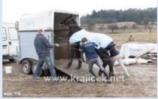</td><td>Current sequence Pos.</td><td></td><td>[M] men are 1 2</td><td></td><td></td><td>[M] a horse [M] [M] [M] [M][M] Final sequence Three men are loading a horse into a trailer . eot</td><td></td><td></td><td></td></tr><tr><td colspan="2">Image attention of selected tokens</td><td></td><td></td><td></td><td>3 4</td><td>5 6</td><td>7</td><td>8 9</td><td>1011</td></tr><tr><td>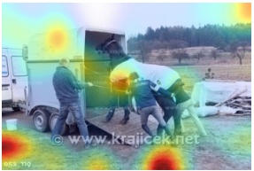</td><td></td><td></td><td></td><td></td><td></td><td>Selected tokens in the decoding path Confidence (λ = 0, γ = 0 )</td><td></td><td></td><td></td></tr><tr><td></td><td></td><td>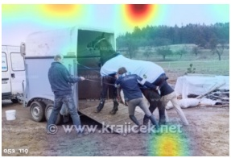</td><td></td><td></td><td></td><td>[M] men are [M] a horse [M] a</td><td></td><td>Pos.8</td><td>[M] [M] eot</td></tr><tr><td>&quot;a&quot; </td><td></td><td>&quot;eot&quot;</td><td></td><td></td><td></td><td></td><td></td><td></td><td>Pos.11</td></tr><tr><td>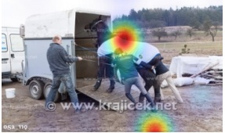</td><td></td><td>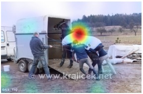</td><td></td><td></td><td></td><td>[M] men are loading a horse into [M] [M] [M] [M]</td><td>VIG-Sampler (w/o penalty, λ = 0 )</td><td></td><td></td></tr><tr><td colspan="2">&quot;loading&quot;</td><td>&quot;into&quot;</td><td></td><td></td><td>Pos.4</td><td></td><td>Pos.7</td><td></td><td></td></tr><tr><td colspan="2"></td><td>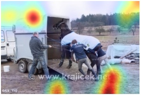</td><td></td><td></td><td>VIG-Sampler</td><td></td><td></td><td></td><td>[M] men are loading a horse [M] [M] trailer [M] [M]</td></tr></table>

Figure 7: Qualitative analysis of token selection and image-attention patterns. Confidence-based selection tends to choose uninformative tokens with difuse attention, whereas VIG-Sampler selects answer-relevant tokens grounded in distinct image regions. Without the penalty term, VIG-Sampler selects tokens with similar image-attention patterns, providing little additional information beyond one another.