# Who Remains, What Changes: Identity Anchored Composed Gait Retrieval

Jingchen Fei<sup>1</sup>, Zengbin Wang<sup>1</sup>, Yukun Liu<sup>2</sup>, Muyi Sun<sup>1</sup>, Shibiao Xu<sup>1</sup>, Man Zhang

<sup>1</sup> Beijing University of Posts and Telecommunications

<sup>2</sup> Huazhong University of Science and Technology

{feijingchen, wzb1, muyi.sun, shibiaoxu, zhangman}@bupt.edu.cn c\_oconaliu@hust.edu.cn

## Abstract

Gait recognition has achieved remarkable progress, yet existing methods remain confined to rigid visual matching and often overlook the potential of natural language instructions for interactive retrieval. In this paper, we introduce Composed Gait Retrieval (CoGR), a novel task that retrieves a target gait sequence based on a reference sequence and a natural language modification query. To address the absence of existing datasets for this task, we design an automated annotation pipeline powered by large vision-language models (VLMs) to construct the first gait-language datasets: Language-Augmented CCPG and Language-Augmented CASIA-B. Building on this, we propose ComposeGait, an identity-anchored composition framework designed to prevent the identity drift that arises when generic composed retrieval follows the instruction but returns the wrong person. Its Part-aware Identity Adapter (PIA) aggregates multi-frame, part-aware identity evidence into a sample-specific ID token. We inject the ID tokens into both branches of a shared Q-Former to preserve identity, while excluding the ID-token outputs from the final retrieval embeddings. Joint identity and task-adapted composed-retrieval objectives optimize this space end to end. We evaluate ComposeGait on both benchmarks and show that it achieves the best R@1 among the compared methods, reaching 72.38% on Language-Augmented CCPG and 83.61% on Language-Augmented CASIA-B. These results establish ComposeGait as a strong baseline for CoGR. The datasets and code will be made publicly available.

## 1 Introduction

Gait recognition, a prominent biometric technology, aims to identify individuals by their unique walking patterns from a distance. Driven by deep learning, recent advances have achieved high accuracy in verifying identities under constrained covariates such as carrying a bag or wearing a coat (Yu, Tan, and Tan 2006; Li et al. 2023b; Fan et al. 2025). However, real-world intelligent surveillance often involves dynamic and interactive retrieval. Rather than simply asking “Who is this person?”, an investigator may issue a semantic instruction such as “Find thisperson, but now wearing a blue shirt and trousers ofa diferent color.” Traditional gait retrieval systems are constrained by a rigid sequence-tosequence paradigm: they penalize cross-covariate diferences and cannot understand natural-language modifications.

To bridge the modality gap between visual queries and user intentions, Composed Image Retrieval (CIR) (Du et al. 2025;

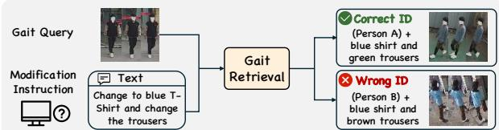

(a) Composed Gait Retrieval  
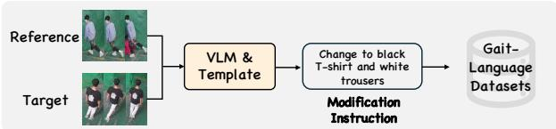  
(b) Automated VLM-based datasets generation pipeline for constructing gait-language datasets

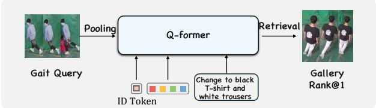  
(c) Our ComposeGait  
Figure 1: Overview of our contributions. (a) CoGR retrieves a target gait sequence that preserves identity while satisfying a relative instruction. (b) The automated VLM-based pipeline constructs gait-language training data. (c) Simplified illustration of our ComposeGait framework, which injects a sample-specific ID token into the Q-Former to anchor identity during semantic modification.

Song et al. 2025) has emerged as a promising paradigm that retrieves target images from reference images and relative text instructions. While successful in general image domains, directly adapting existing CIR frameworks to gait encounters a critical bottleneck: identity–semantic entanglement. Unlike static images, a gait sequence is a high-dimensional spatiotemporal representation in which biometric identity and appearance attributes are deeply intertwined. Mainstream CIR methods typically fuse text and visual features early in the network to predict a combined target embedding. In the gait context, such implicit composition ofers no explicit safeguard for the biometric cues that must remain stable. As illustrated in Figure 1(a), this can lead to identity drift: the model successfully modifies target attributes (e.g., retrieving a subject wearing a coat) but fatally fails to preserve the reference identity (e.g., retrieving the wrong subject). This failure mode is distinct from standard CIR, where biometric identity preservation is not a requirement, and motivates an identity-aware composition mechanism rather than generic feature fusion alone.

To overcome these challenges, we formally propose a novel and practical task, namely Composed Gait Retrieval (CoGR). Given a reference gait sequence and a naturallanguage modification instruction, CoGR retrieves gallery sequences that simultaneously preserve the reference identity and satisfy the specified attribute changes. A key obstacle to this task is the absence ofgait-language training data: existing gait datasets provide only discrete alphanumeric condition labels rather than natural-language descriptions. To address this, we develop an automated annotation pipeline powered by large Vision-Language Models (VLMs). As depicted in Figure 2, the pipeline dynamically translates discrete experimental conditions into structurally consistent modification instructions, establishing the Language-Augmented CCPG and Language-Augmented CASIA-B datasets to benchmark this new paradigm.

With these datasets enabling CoGR training, we propose ComposeGait.As illustrated in Figure 3(a),ComposeGait is an identity-anchored composition framework built on BLIP-2. A frozen ViT-G encodes sampled gait frames, while a Partaware Identity Adapter (PIA)(see Figure 3(b)) extracts a part-aware identity representation and projects it into the Q-Former hidden space as a sample-specific Identity token (ID token). Appended to the pretrained queries, this token conditions multimodal reasoning on gait identity.

ComposeGait injects ID tokens into both retrieval sides: the composed-query branch processes the reference sequence and modification text with the reference ID token, while the target branch processes each candidate with its ID token in a shared Q-Former. Only the original query-token outputs form the retrieval embeddings, allowing the ID tokens to guide attention without directly entering the embedding. Joint learning combines identity classification and hard-triplet losses for PIA with a task-adapted CoGR contrastive loss. The latter supports multiple relevance-consistent positives and excludes same-identity targets that violate the requested condition from the denominator, reducing false-negative and identity-conflicting gradients.The main contributions of our work are summarized as follows:

• We introduce Composed Gait Retrieval (CoGR), a novel interactive retrieval task. To support it, we develop an automated VLM-based pipeline to construct the first benchmarks for CoGR: Language-Augmented CCPG and Language-Augmented CASIA-B.

• We propose ComposeGait, an identity-anchored composition framework integrating a Part-aware Identity Adapter (PIA). This module projects part-aware gait features into sample-specific ID tokens and bidirectionally embeds them into a shared Q-Former. We also tailor the contrastive loss for CoGR matching, enabling multiple valid positives and filtering out same-identity targets with mismatched conditions in the loss denominator.

• Extensive experiments on the two language-augmented benchmarks evaluate retrieval efectiveness, identity preservation, and instruction satisfaction, establishing ComposeGait as a strong baseline for CoGR.

## 2 Related Work

## 2.1 Gait Recognition

Gait recognition has evolved from hand-crafted feature methods to deep learning-based approaches (Shen et al. 2024). Early set-based methods such as GaitSet (Chao et al. 2021) treat a gait sequence as an unordered frame set, providing permutation invariance while discarding explicit temporal order. The OpenGait framework (Fan et al. 2023b, 2025) systematically revisited existing designs and developed the structurally simple yet efective GaitBase baseline, showing that practical recognition benefits from both spatial and temporal modeling. Deeper architectures (Fan et al. 2023a) and dynamic aggregation mechanisms (Ma et al. 2023) further capture discriminative motion patterns in challenging outdoor scenarios.

Silhouettes remain the mainstream input modality, while alternative representations supply supplementary visual cues. RGB-based methods retain abundant appearance details yet sufer from sensitivity to clothing changes and potential privacy risks. GaitParsing (Wang et al. 2023) and ParsingGait (Zheng et al. 2023) leverage human semantic parsing to explicitly model separate body regions. GaitRef (Zhu et al. 2023) optimizes skeleton sequences via silhouette temporal consistency, and LidarGait (Shen et al. 2023, 2025) leverages 3D point-cloud geometric features to achieve reliable outdoor gait recognition. Moving past traditional set-level and sequence-level modeling paradigms, GaitSnippet (Hou et al. 2025) formulates gait as personalized action fragments, and SkeletonGait (Fan et al. 2024) transforms raw pose coordinates into silhouette-resembling skeleton maps. BigGait and BiggerGait (Ye et al. 2024, 2025) further demonstrate that large vision models yield transferable gait embeddings, which motivates our PIA module to convert ViT-G features into part-aware identity representations.

The evolution of gait recognition has also been driven by increasingly challenging datasets. CASIA-B (Yu, Tan, and Tan 2006) and OU-MVLP (Takemura et al. 2018) provide controlled indoor settings with multiple viewpoints and limited covariates. Gait3D (Zheng et al. 2022) and GREW (Zhu et al. 2021) introduce outdoor variations in viewpoint, occlusion, and illumination. Cross-covariate benchmarks such as CCPG (Li et al. 2023b) and CCGR (Zou et al. 2024) emphasize clothing and carrying changes, while SUSTech1K (Shen et al. 2023) provides synchronized camera and LiDAR data. Despite this progress, existing methods and benchmarks share the same objective: they suppress clothing, carrying, and viewpoint variation as nuisance factors to recover an identity label. They therefore retain a rigid 1:1 identitymatching formulation and cannot express natural-language changes. CoGR changes the role of these covariates: identity must remain invariant, but a user-specified subset of conditions becomes part of the desired target. This extends gait analysis from passive identification to identity-preserving, language-guided compositional retrieval.

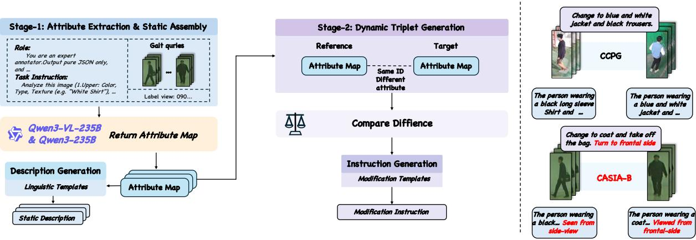  
Figure 2: The automated VLM-based dataset construction pipeline. The first two stages extract fine-grained visual attributes and assemble static descriptions. Reference and target tracklets of the same identity are then compared to identify changed attributes and synthesize relative instructions. Language-Augmented CASIA-B includes explicit viewpoint shifts, whereas Language-Augmente CCPG focuses on appearance changes to reflect the structure of each dataset.

## 2.2 Composed Image and Video Retrieval

Composed Image Retrieval (CIR) enables users to retrieve target images using a multimodal query comprising a reference image and a modification text (Du et al. 2025; Song et al. 2025).

Image-Centric Composition. Supervised CIR learns joint representations from annotated triplets. TIRG (Vo et al. 2019) uses residual gating, the CLIP-based Combiner (Baldrati et al. 2023b) fuses reference and text features with contrastive learning, and TG-CIR (Wen et al. 2023) and ConText-CIR (Xing et al. 2025) strengthen target-guided and concept-level alignment. SPRC (Bai et al. 2024) instead uses a BLIP-2 Q-Former to convert the reference– instruction pair into a sentence-level prompt for text-based retrieval. Zero-shot methods reduce or remove triplet supervision: SEARLE (Baldrati et al. 2023a) and Pic2Word (Saito et al. 2023) map the reference into CLIP’s textual space, while FreeDom (Efthymiadis et al. 2025), HyCIR (Jiang et al. 2024), and ICIR (Psomas et al. 2025) explore discrete inversion, synthetic supervision, or training-free fusion. Despite their diferent supervision regimes, these methods compose semantics in static images without enforcing sequence-level biometric identity preservation.

From Images to Video. CoVR-2 (Ventura et al. 2024) automatically constructs video triplets from caption diferences through an LLM-assisted pipeline, whereas FDCA (Yue et al. 2025) explores textual-token disentanglement for finegrained composed video retrieval. Although they extend composition across frames, their retrieval objectives focus on object- or scene-level edits rather than preserving biometric identity throughout a gait sequence.

Identity Beyond Static Appearance. Composed Person Retrieval (CPR) combines visual and textual queries to identify people in image galleries. FAFA (Liu et al. 2025) develops LLM-assisted data synthesis and Q-Former-based finegrained alignment. Its data strategy is relevant to our automated construction pipeline, but CPR operates on static person images. CoGR instead retrieves gait tracklets, for which identity evidence is distributed across frames and must remain stable while the requested appearance or viewpoint changes are applied. Static-image CPR does not aggregate this multi-frame gait evidence or condition both query and target encoding on sample-specific identity signals through a shared semantic encoder.

Taken together, CIR supplies instruction-guided composition, composed video retrieval extends it across frames, and CPR introduces person-level search. CoGR is needed at their intersection: a valid target must follow the instruction, preserve biometric identity over a gait sequence, and retain every unspecified condition.

## 3 Methodology

## 3.1 Paradigm Definition

CoGR inherits the standard input–output form of composed retrieval (Du et al. 2025; Song et al. 2025). Given a reference gait sequence $X ^ { r }$ , a natural-language modification $m ,$ and a gallery $\bar { \boldsymbol { \mathcal { G } } }$ , the model encodes the reference–text composition into a query embedding $f _ { r }$ and each candidate sequence $X \in { \mathcal { G } }$ into a target embedding $f _ { t } .$ . Both embeddings are L2-normalized, and retrieval ranks candidates by their inner product:

$$
\hat { X } ^ { t } = \arg \operatorname* { m a x } _ { X \in \mathcal { G } } f _ { r } ( X ^ { r } , m ) ^ { \top } f _ { t } ( X ) .\tag{1}
$$

Here, $\hat { X } ^ { t }$ denotes the top-ranked target sequence. The gaitspecific distinction lies in the relevance criterion. Let $y ( X )$ denote subject identity and $c ( X )$ the non-identity condition state $( \mathrm { e . g . }$ , clothing, carrying status, viewpoint). The modification operator $T _ { m }$ updates only the components specified by m and keeps every unspecified component unchanged. The desired condition $\mathit { \Pi } _ { c } t$ and the relevant target set are

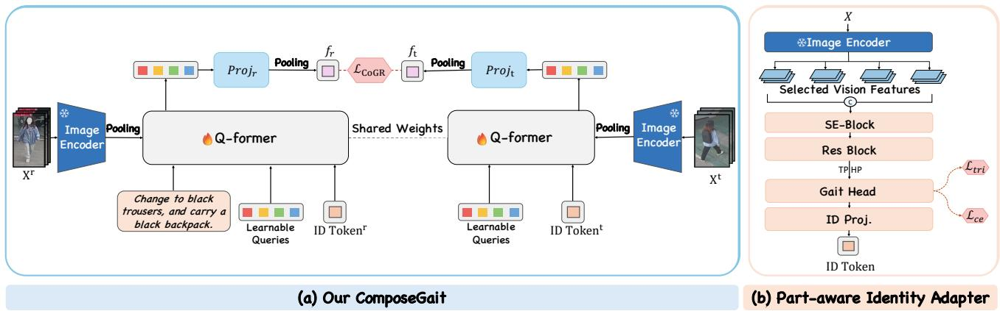  
Figure 3: Overview of our ComposeGait and Part-aware Identity Adapter (PIA). (a) We adopt two Q-Formers with shared weights to process the reference gait sequence with its ID token and modification text, and the target gait sequence with its ID token. We optimize the resulting features using $\mathcal { L } _ { \mathrm { C o G R } }$ during the training stage and match them for retrieval during inference. (b) We design PIA to extract part-aware identity representations for constructing the ID tokens.

$$
\begin{array} { c } { c ^ { t } = T _ { m } ( c ( X ^ { r } ) ) , } \\ { \mathcal { P } ( X ^ { r } , m ) = \Big \{ X \in \mathcal { G } \Big | \begin{array} { c } { y ( X ) = y ( X ^ { r } ) } \\ { c ( X ) = c ^ { t } } \end{array} \Big \} . } \end{array}\tag{2}
$$

Accordingly, each training triplet $( X ^ { r } , m , X ^ { t } )$ uses a target $X ^ { t } \in \bar { \mathcal { P } } ( X ^ { r } , m )$ . The first condition enforces identity preservation, whereas the second enforces both the requested change and preservation of all unspecified conditions. CoGR therefore retains the composed-retrieval formulation while making biometric identity part of the target definition.

## 3.2 Automated Gait-Language Alignment Pipeline

Existing gait datasets such as CASIA-B (Yu, Tan, and Tan 2006) and CCPG (Li et al. 2023b) were designed primarily for unimodal identity verification, with carrying status, clothing, and camera conditions encoded as discrete alphanumeric labels. Such labels lack the syntactic structure and semantic richness required for natural-language-guided retrieval. We bridge this gap with an automated annotation pipeline that uses a large VLM to convert discrete condition states into fine-grained textual descriptions.

The pipeline operates in three sequential stages: attribute extraction, static assembly, and dynamic triplet generation. We first query Qwen3-VL-235B (Bai et al. 2025) with a structured prompt containing semantic slots such as {upper}, {lower}, and {bag}. The VLM analyzes sampled visual tracklets and fills these slots with fine-grained attributes. During static assembly, the parsed attributes populate linguistic templates to form an appearance description. For CASIA-B, an additional prompt converts numerical camera angles into human-readable viewpoint expressions such as “a profile view,” whereas CCPG uses only appearance attributes at this stage.

To construct composed-retrieval triplets, we pair reference and target tracklets from the same identity and compare their attributes to identify clothing, accessory, and viewpoint changes. The detected diferences populate modification templates to produce relative instructions. Both datasets share the appearance-change templates, while CASIA-B adds slots for viewpoint shifts. Because CASIA-B provides controlled camera angles but CCPG’s arbitrary surveillancecamera identifiers have no user-facing semantic meaning, we omit viewpoint prompts for CCPG. This dataset-specific, rule-guided VLM-assisted design keeps the queries visually grounded and structurally consistent at scale.

## 3.3 ComposeGait Overview

ComposeGait implements identity-anchored composition with four coupled steps. A frozen ViT-G encodes the sampled RGB frames once. PIA extracts a part-aware identity representation from the sequence. A projector maps that representation to one ID token. The token serves as the identity anchor and is appended after the pretrained BLIP-2 query tokens. Finally, a shared Q-Former encodes both the composed query and the target. Only the outputs corresponding to the original pretrained queries are projected, mean-pooled over the M query tokens, and normalized to form the retrieval embeddings $f _ { r }$ and $f _ { t }$ . Figure 3(a) summarizes this data flow.

Part-aware Identity Adapter and ID Token Construction As shown in Figure 3(b), PIA and the identity projector form a continuous pathway from sequence-level identity evidence to a sample-specific ID token. Before token construction, PIA builds on the part-aware identity backbone of GaitBase (Fan et al. 2023b) and the layer-wise feature aggregation of BiggerGait (Ye et al. 2025). It extracts hierarchical features from selected layers of the frozen ViT-G (Li et al. 2023a), applies multi-layer fusion with an SE block and a residual block (Hu, Shen, and Sun 2018; He et al. 2016), and then performs temporal max pooling and horizontal pooling over $P$ body regions. A dedicated gait head maps the pooled features to $z ^ { \mathrm { i d } } \in \mathbb { R } ^ { D _ { i } }$ , where $D _ { i }$ denotes the identity-feature dimension. The same pathway produces $z _ { r } ^ { \mathrm { i d } }$ and $z _ { t } ^ { \mathrm { i d } }$ for the reference and target sequences, respectively.

ComposeGait then repurposes each identity representation as a conditioning token rather than a standalone retrieval descriptor. A learned projector and token-type embedding map it to the Q-Former hidden dimension:

$$
a = W _ { \mathrm { i d } } z ^ { \mathrm { i d } } + b _ { \mathrm { i d } } + e _ { \mathrm { t y p e } } , \qquad a \in \mathbb { R } ^ { D _ { q } } .\tag{3}
$$

Here, $W _ { \mathrm { i d } }$ and $b _ { \mathrm { i d } }$ parameterize the identity projector, $e _ { \mathrm { t y p e } }$ is the ID-token type embedding, and $D _ { q }$ is the Q-Former hidden dimension. This mapping produces the reference and target ID tokens $a _ { r }$ and $a _ { t } .$ , each of which is appended after the M pretrained learnable queries $Q \in \mathbb { R } ^ { M \times \dot { D } _ { q } ^ { \bullet } }$ . The tokentype embedding distinguishes the identity anchor from the semantic queries, while the token content remains samplespecific. This single-token bottleneck lets identity influence attention without directly concatenating the full part representation with the retrieval output.

Bilateral Shared Q-Former The two retrieval branches use the same Q-Former weights but receive diferent inputs. The composed-query branch processes the pretrained query tokens $Q$ and reference ID token $a _ { r }$ together with the reference visual tokens and modification text. The target branch processes $Q$ and the target ID token $a _ { t }$ together with the target visual tokens, without text. Weight sharing places the two branches in the same embedding space, while $a _ { r }$ and $a _ { t }$ condition their attention on the identity of the corresponding gait sequence.

The outputs at the M original query-token positions are projected, mean-pooled, and L2-normalized to form the query and target embeddings $f _ { r }$ and $f _ { t }$ . The output at the additional ID-token position is excluded: the ID token guides Q-Former attention but is not directly included in the final retrieval embedding, as illustrated in Figure 3(a).

## 3.4 Joint Identity and Composition Learning

PIA is supervised in the same batchwise manner as gait recognition. For a mini-batch of B reference–target pairs, let $\breve { Z } _ { r } ^ { \mathrm { i d } }$ and $Z _ { t } ^ { \mathrm { i d } }$ collect the corresponding identity representations, and let $Y _ { r }$ and $Y _ { t }$ be their identity labels. We concatenate the two sides into one gait-recognition batch,

$$
Z ^ { \mathrm { i d } } = [ Z _ { r } ^ { \mathrm { i d } } ; Z _ { t } ^ { \mathrm { i d } } ] , \qquad Y = [ Y _ { r } ; Y _ { t } ] ,\tag{4}
$$

and compute identity classification and hard-triplet losses jointly:

$$
\begin{array} { r } { \mathcal { L } _ { \mathrm { i d } } = \mathcal { L } _ { \mathrm { c e } } \left( h _ { \mathrm { i d } } ( Z ^ { \mathrm { i d } } ) , Y \right) + \mathcal { L } _ { \mathrm { t r i } } \left( Z ^ { \mathrm { i d } } , Y \right) , } \end{array}\tag{5}
$$

where $h _ { \mathrm { i d } }$ is the identity classifier. Reference and target samples therefore share the same classification batch and the same positive/negative mining pool. Standard pairwise contrastive learning treats only the target originally paired with each query as positive. CoGR relevance is not necessarily one-to-one: multiple in-batch targets may satisfy the same relevance criterion, and treating such unpaired targets as negatives would introduce false-negative gradients. Conversely, a target that shares the desired identity but violates a required condition is invalid for the composed query yet remains positive in the identity dimension. Treating it as an ordinary negative can therefore conflict with identity preservation.

We address this asymmetric supervision by constructing the positive and denominator sets from the CoGR relevance criterion. Let $\mathcal { P } ( i )$ contain the in-batch targets that satisfy Equation (2) for query i. Here, $y _ { i }$ is the reference identity associated with query i, and $y _ { j }$ is the identity of target $\dot { j } .$ Same-identity targets outside $\check { \mathcal { P } } ( i )$ form the ambiguous set $\boldsymbol { \mathcal { A } } ( i )$ and are excluded rather than treated as diferent-identity negatives. Within a globally gathered batch of B query–target pairs, we define

$$
\begin{array} { r l } & { \mathcal { A } ( i ) = \{ j \mid y _ { j } = y _ { i } , j \notin \mathcal { P } ( i ) \} , } \\ & { \mathcal { D } ( i ) = \{ 1 , . . . , B \} \setminus \mathcal { A } ( i ) . } \end{array}\tag{6}
$$

Here, $\boldsymbol { \mathscr { A } } ( i )$ is excluded from the denominator, whereas targets with diferent identities remain in $\mathcal { D } ( i )$ as negatives. Thus, the positive supervision follows CoGR relevance while the denominator avoids identity-conflicting negatives. For query i, the CoGR loss is

$$
\mathcal { L } _ { \mathrm { C o G R } } ^ { ( i ) } = \mathrm { ~ - ~ } \frac { 1 } { | \mathcal { P } ( i ) | } \sum _ { p \in \mathcal { P } ( i ) } \log \frac { \exp ( f _ { r , i } ^ { \top } f _ { t , p } / \tau ) } { \sum _ { j \in \mathcal { D } ( i ) } \exp ( f _ { r , i } ^ { \top } f _ { t , j } / \tau ) } .\tag{7}
$$

Here, $f _ { r , i }$ denotes the embedding of query $i , f _ { t , j }$ denotes the embedding of target $j , p$ indexes a positive target in $\mathcal { P } ( i )$ and τ is the temperature. All embeddings are L2-normalized. During training, $\mathcal { L } _ { \mathrm { C o G R } }$ denotes the average of $\mathcal { L } _ { \mathrm { C o G R } } ^ { ( i ) }$ over the queries in the batch. The complete objective is

$$
\begin{array} { r } { \mathcal { L } = \mathcal { L } _ { \mathrm { C o G R } } + \lambda _ { \mathrm { i d } } \mathcal { L } _ { \mathrm { i d } } . } \end{array}\tag{8}
$$

## 4 Experiments

## 4.1 Experimental Setup

Datasets. Language-Augmented CCPG (Li et al. 2023b) contains 50,000 triplets, split into 40,000 for training and 10,000 for evaluation. It covers diverse clothing and carrying changes in unconstrained scenes. Language-Augmented CASIA-B (Yu, Tan, and Tan 2006) contains 64,506 triplets, with 55,160 for training and 9,346 for testing. It spans 0<sup>◦</sup>– $1 8 0 ^ { \circ }$ viewpoints and normal, bag, and coat conditions under a controlled multi-camera protocol. In both benchmarks, training and evaluation identities are disjoint, and the original gallery definitions are preserved.

Metrics. R@K counts a retrieval as correct only when the result preserves identity and all unspecified covariates while satisfying the requested change. Specified- Change Recall (SC-R@K) checks only whether the requested change is realized. On CASIA-B, we additionally report attribute-only $\mathrm { S C - R } _ { a } .$ viewpoint-only $\mathrm { S C - R } _ { v }$ , and composite SC-R<sub>c</sub>. ID R@1 measures whether the top-ranked item has the correct identity regardless of its condition. These metrics distinguish strict task success from instruction satisfaction and identity preservation. All rank-based metrics are reported in percent (%); signed values denote absolute gains.

Implementation details. ComposeGait initializes the vision encoder, Q-Former, query tokens, and projection heads from BLIP-2 (Li et al. 2023a), using the Salesforce/blip2-itm-vit-g checkpoint. Images are resized to $2 2 4 \times 2 2 4$ , and text is truncated to 64 tokens.

<table><tr><td rowspan="2">Method</td><td rowspan="2">Backbone</td><td rowspan="2">Task</td><td colspan="4">CCPG</td><td colspan="5">CASIA-B</td></tr><tr><td>R@1</td><td>R@5</td><td>R@10</td><td>IDR@1</td><td>R@1</td><td>SC-Ra@1</td><td>SC-Rv@1</td><td>SC-Rc@1 ID R@1</td><td></td></tr><tr><td>Text Only</td><td>ViT-B/32</td><td>CIR</td><td>7.74</td><td>21.26</td><td>29.34</td><td>11.64</td><td>0.86</td><td>5.68</td><td>0.50</td><td>1.02</td><td>4.34</td></tr><tr><td>Image Only</td><td>ViT-B/32</td><td>CIR</td><td>3.96</td><td>10.91</td><td>15.62</td><td>26.74</td><td>2.13</td><td>10.25</td><td>1.83</td><td>0.28</td><td>62.18</td></tr><tr><td>Image+Text</td><td>ViT-B/32</td><td>CIR</td><td>7.61</td><td>18.97</td><td>26.61</td><td>23.67</td><td>2.77</td><td>14.27</td><td>2.71</td><td>0.87</td><td>46.18</td></tr><tr><td>TIRG (Vo et al. 2019)</td><td>RN18</td><td>CIR</td><td>14.71</td><td>32.41</td><td>42.14</td><td>29.21</td><td>7.73</td><td>33.66</td><td>11.61</td><td>5.13</td><td>58.80</td></tr><tr><td>TG-CIR (Wen et al. 2023)</td><td>ViT-B/16</td><td>CIR</td><td>18.27</td><td>40.66</td><td>51.97</td><td>23.49</td><td>19.46</td><td>31.02</td><td>31.20</td><td>16.05</td><td>32.17</td></tr><tr><td>SEARLE (Baldrati et al. 2023a)</td><td>ViT-B/32</td><td>CIR</td><td>6.83</td><td>18.48</td><td>26.92</td><td>10.67</td><td>1.49</td><td>8.80</td><td>0.76</td><td>1.38</td><td>6.99</td></tr><tr><td>ICIR (Psomas et al. 2025)</td><td>ViT-L/14</td><td>CIR</td><td>12.82</td><td>32.00</td><td>42.69</td><td>23.52</td><td>3.65</td><td>14.34</td><td>5.35</td><td>2.71</td><td>29.62</td></tr><tr><td>FreeDom (Efthymiadis et al. 2025)</td><td>ViT-L/14</td><td>CIR</td><td>11.03</td><td>26.46</td><td>35.67</td><td>30.55</td><td>2.75</td><td>12.47</td><td>3.70</td><td>0.72</td><td>54.21</td></tr><tr><td>CLIP4CIR (Baidrati et al. 2023b)</td><td>RN50</td><td>CIR</td><td>24.69</td><td>55.52</td><td>67.59</td><td>31.27</td><td>22.34</td><td>27.35</td><td>39.75</td><td>19.84</td><td>35.21</td></tr><tr><td>CoVR-2 (Ventura et al. 2024)</td><td>ViT-G/14</td><td>CoVR</td><td>57.09</td><td>78.51</td><td>86.31</td><td>71.92</td><td>36.21</td><td>83.80</td><td>34.26</td><td>41.24</td><td>86.72</td></tr><tr><td>SPRC (Bai et al. 2024)</td><td>ViT-G/14</td><td>CIR</td><td>57.72</td><td>79.43</td><td>86.16</td><td>62.27</td><td>66.46</td><td>71.40</td><td>82.82</td><td>61.16</td><td>71.57</td></tr><tr><td>FAFA (Liu et al. 2025)</td><td>ViT-G/14</td><td>CPR</td><td>68.82</td><td>89.79</td><td>93.73</td><td>76.22</td><td>43.77</td><td>75.69</td><td>49.75</td><td>42.21</td><td>84.73</td></tr><tr><td>ComposeGait (Ours)</td><td>ViT-G/14</td><td>CoGR</td><td>72.38</td><td>83.18</td><td>87.44</td><td>76.56</td><td>83.61</td><td>83.31</td><td>96.56</td><td>78.36</td><td>84.84</td></tr></table>

Table 1: Main comparison on Language-Augmented CCPG and CASIA-B (%). Bold and underlined values indicate the best and second-best results in each column.

For PIA, we use ViT-G layers {8, 16, 24, 39} and set $P = 1 6$ and $D _ { i } = 7 6 8$ . We sample at most 30 frames per sequence during training and at most 60 frames during evaluation. The vision encoder and text embeddings are frozen. We train the Q-Former, pretrained query tokens, query/target projection heads, PIA, identity projector, and ID-token type embedding. PIA uses triplet margin 0.3 and label smoothing 0.1. We set the identity classifier with 90 classes on CCPG and 64 classes on CASIA-B, leaving 10 identities for validation. Training uses AdamW with learning rate $2 \times 1 0 ^ { - 5 }$ , weight decay 0.05, 500 warmup steps, and cosine decay for 20,000 iterations. Balanced batches contain 16 triplets with four instances per identity. The contrastive temperature is 0.07, $\lambda _ { \mathrm { i d } } = 1$ , and gradient norm is clipped at 1.0. All experiments run on a single NVIDIA RTX 5090 GPU.

## 4.2 Comparison with Prior Methods

We compare against naive baselines (Text Only, Image Only, and Image+Text), supervised CIR models (TIRG (Vo et al. 2019), CLIP4CIR (Baldrati et al. 2023b), TG-CIR (Wen et al. 2023)),and SPRC (Bai et al. 2024), and zero-shot CIR methods (SEARLE (Baldrati et al. 2023a), ICIR (Psomas et al. 2025), and FreeDom (Efthymiadis et al. 2025)). We also include the composed-video retrieval baseline CoVR-2 (Ventura et al. 2024) and the composed-person retrieval method FAFA (Liu et al. 2025). For every reported model–dataset pair, training and tuning are conducted independently on the corresponding language-augmented dataset. We report performance under the common evaluation protocol, using the same identity-disjoint splits and gallery definitions. Table 1 reports the comparison on both datasets.

Results on CCPG. ComposeGait achieves 72.38% R@1, outperforming the same-backbone FAFA by 3.56 percentage points (pp), and obtains the best ID R@1 of 76.56%. Although FAFA performs better at R@5 and R@10, our R@1 gain shows stronger top-ranked matching under the joint identity and instruction constraints.

<table><tr><td>Shared QF</td><td>PIA ViT→QF Multi</td><td>R@1</td><td>ID R@1</td><td>Params.(B)</td></tr><tr><td>X</td><td>X</td><td>56.71</td><td>60.08</td><td>1.33</td></tr><tr><td>√</td><td>×</td><td>61.47</td><td>65.31</td><td>1.17</td></tr><tr><td>X</td><td>√</td><td>57.52</td><td>61.77</td><td>1.36</td></tr><tr><td>√</td><td>√</td><td>67.74</td><td>72.63</td><td>1.20</td></tr><tr><td>√</td><td>√</td><td>√</td><td>72.38 76.56</td><td>1.20</td></tr></table>

Table 2: Architectural ablation experiment on Language-Augmented CCPG.

Results on CASIA-B. Under severe cross-view variations, conventional supervised and zero-shot CIR methods degrade substantially, reaching at most 22.34% R@1. ComposeGait achieves 83.61% R@1, outperforming the strongest competitor SPRC by 17.15 pp. Notably, its 96.56% viewpoint-only recall shows that ComposeGait handles view changes particularly well, while the best composite recall of 78.36% indicates that this advantage persists when viewpoint and attribute changes must be satisfied simultaneously.

## 4.3 Architectural Ablation Study

We ablate Shared QF, PIA, and ViT→QF Multi on CCPG. Shared QF makes the query and target branches share one Q-Former; otherwise, they use independently parameterized Q-Formers. PIA always aggregates multiple frames in its identity pathway. ViT→QF Multi controls the semantic Q-Former path, aggregating valid-frame ViT tokens when enabled or using the middle valid frame otherwise. Table 2 reports retrieval performance and parameter counts.

Importance of PIA-Based Identity Anchoring. With Q-Former sharing, PIA raises R@1 from 61.47% to 67.74% (+6.27 pp) and ID R@1 from 65.31% to 72.63% (+7.32 pp). Without sharing, the gains shrink to 0.81 pp and 1.69 pp. Because PIA adds the same 0.03 billion parameters in both cases, this asymmetric benefit cannot be explained by increased capacity alone and suggests that PIA is more effective when the query and target branches use the same Q-Former weights.

<table><tr><td>Intervention</td><td>R@1 ∆R@1</td><td>ID R@1</td><td>mAP</td></tr><tr><td>Correct ID</td><td>72.38</td><td>0.00 76.56</td><td>69.64</td></tr><tr><td>Zero ID</td><td>69.44</td><td>-2.94 73.30</td><td>65.84</td></tr><tr><td>Random ID</td><td>68.39</td><td>-3.99 72.17</td><td>65.24</td></tr><tr><td>Shuffled Query ID</td><td>64.27</td><td>-8.11 67.83</td><td>62.23</td></tr></table>

Table 3: Controlled ID-token intervention on Language-Augmented CCPG.

Importance of Q-Former Sharing. Without PIA, sharing one Q-Former between the two branches raises R@1 from 56.71% to 61.47% (+4.76 pp) and ID R@1 from 60.08% to 65.31% (+5.23 pp). With PIA, the gains reach 10.22 pp and 10.86 pp. With PIA, the gains grow to 10.22 pp and 10.86 pp, respectively. In both settings, weight sharing reduces the parameter count by 0.16 billion. These results favor a common Q-Former parameterization across the query and target branches, particularly when PIA is enabled, rather than attributing the gains to increased model size.

Importance of Multi-Frame Evidence. With Shared QF and PIA enabled, ViT→QF Multi raises R@1 from 67.74% to 72.38% (+4.64 pp) and ID R@1 from 72.63% to 76.56% (+3.93 pp). Both configurations use 1.20 billion parameters, showing that the improvement is not due to increased model capacity and is consistent with multi-frame aggregation providing stronger evidence to the semantic Q-Former.

## 4.4 Controlled ID-Token Interventions

We compare four ID-token configurations. Correct ID retains the original tokens on both branches, whereas Zero ID and Random ID respectively zero and randomize them. Shufled Query ID replaces each query-side identity feature with one from a diferent gallery identity while leaving the target-side ID tokens unchanged. Table 3 reports R@1 for strict CoGR success, ID R@1 for top-ranked identity preservation, and mAP for overall ranking quality; ∆R@1 is measured relative to Correct ID.

Removing or Randomizing the ID Token. Zeroing both ID tokens reduces R@1 from 72.38% to 69.44% (−2.94 pp), ID R@1 from 76.56% to 73.30% (−3.26 pp), and mAP from 69.64% to 65.84% (−3.80 pp). Randomizing both tokens causes larger drops to 68.39% R@1, 72.17% ID R@1, and 65.24% mAP. Compared with Zero ID, Random ID is lower by 1.05 pp, 1.13 pp, and 0.60 pp on the three metrics, respectively. This pattern indicates that the model uses the content of the ID tokens: arbitrary identity signals are more disruptive than removing the tokens altogether.

Shufling Query-Side Identity. Shufled Query ID produces the largest degradation, reaching 64.27% R@1 (−8.11 pp), 67.83% ID R@1 (−8.73 pp), and 62.23% mAP (−7.41 pp) relative to Correct ID. Because the target-side tokens remain unchanged, this result provides controlled evidence that the query-side anchor carries sample-specific biometric information needed to align the composed query with the correct gallery identity. These fixed-checkpoint interventions demonstrate model dependence on the ID-token content.

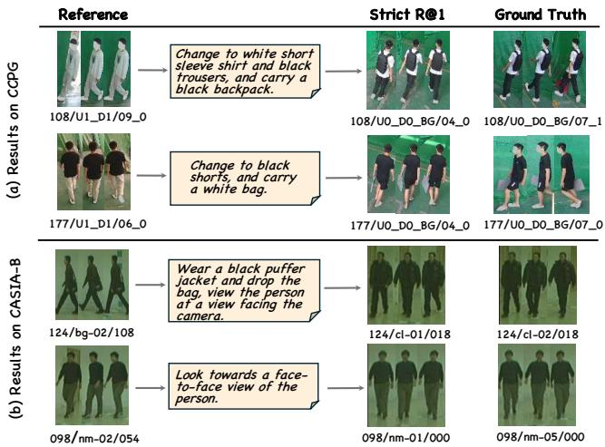  
Figure 4: Qualitative results on (a) Language-Augmented CCPG dataset and (b) Language-Augmented CASIA-B dataset.

## 4.5 Qualitative Results

Figure 4 presents qualitative retrieval examples from Language-Augmented CCPG and CASIA-B. In panel (a), the retrieved CCPG sequences follow fine-grained appearance instructions (e.g., clothing and carrying status) while preserving reference identity. Panel (b) shows CASIA-B cases combining appearance modifications with viewpoint changes. Even during drastic perspective shifts (side to frontal), the retrieved sequences reflect both requested attributes. These examples qualitatively illustrate how ComposeGait successfully balances instruction compliance with identity preservation across various covariates.

## 5 Conclusion

We introduce Composed Gait Retrieval (CoGR) and an automated VLM-based pipeline to construct Language-Augmented CCPG and Language-Augmented CASIA-B. ComposeGait mitigates identity drift by generating samplespecific ID tokens from part-aware, multi-frame gait features and injecting them into both branches of a shared Q-Former. Extensive experiments demonstrate state-of-the-art R@1 performance on both benchmarks.

Future work will extend CoGR toward large-scale in-thewild datasets, open-vocabulary descriptions, more flexible annotation strategies, and identity-aware composition under unconstrained retrieval scenarios.

## References

Bai, S.; Cai, Y.; Chen, R.; Chen, K.; Chen, X.; Cheng, Z.; Deng, L.; Ding, W.; Gao, C.; Ge, C.; et al. 2025. Qwen3-vl technical report.

Bai, Y.; Xu, X.; Liu, Y.; Khan, S.; Khan, F.; Zuo, W.; Mong, R. S. M.; and Feng, C.-M. 2024. Sentence-level prompts ben-

efit composed image retrieval. In International Conference on Learning Representations, volume 2024, 30531–30548.

Baldrati, A.; Agnolucci, L.; Bertini, M.; and Del Bimbo, A. 2023a. Zero-shot composed image retrieval with textual inversion. In Proceedings of the IEEE/CVF international conference on computer vision, 15338–15347.

Baldrati, A.; Bertini, M.; Uricchio, T.; and Del Bimbo, A. 2023b. Composed image retrieval using contrastive learning and task-oriented clip-based features. ACM Transactions on Multimedia Computing, Communications and Applications, 20(3): 1–24.

Chao, H.; Wang, K.; He, Y.; Zhang, J.; and Feng, J. 2021. GaitSet: Cross-view gait recognition through utilizing gait as a deep set. IEEE transactions on pattern analysis and machine intelligence, 44(7): 3467–3478.

Du, L.; Deng, S.; Li, Y.; Li, J.; and Tian, Q. 2025. A survey on composed image retrieval. ACM Transactions on Multimedia Computing, Communications andApplications, 21(7): 1–27.

Efthymiadis, N.; Psomas, B.; Laskar, Z.; Karantzalos, K.; Avrithis, Y.; Chum, O.; and Tolias, G. 2025. Composed image retrieval for training-free domain conversion. In Proceedings ofthe Winter Conference on Applications ofComputer Vision, 1723–1733.

Fan, C.; Hou, S.; Huang, Y.; and Yu, S. 2023a. Exploring deep models for practical gait recognition. arXiv preprint arXiv:2303.03301.

Fan, C.; Hou, S.; Liang, J.; Shen, C.; Ma, J.; Jin, D.; Huang, Y.; and Yu, S. 2025. OpenGait: A Comprehensive Benchmark Study for Gait Recognition Towards Better Practicality. IEEE Transactions on Pattern Analysis and Machine Intelligence, 1–18.

Fan, C.; Liang, J.; Shen, C.; Hou, S.; Huang, Y.; and Yu, S. 2023b. OpenGait: Revisiting Gait Recognition Towards Better Practicality. In Proceedings ofthe IEEE/CVF Conference on Computer Vision and Pattern Recognition (CVPR), 9707–9716.

Fan, C.; Ma, J.; Jin, D.; Shen, C.; and Yu, S. 2024. Skeletongait: Gait recognition using skeleton maps. In Proceedings ofthe AAAI conference on artificial intelligence, volume 38, 1662–1669.

He, K.; Zhang, X.; Ren, S.; and Sun, J. 2016. Deep residual learning for image recognition. In Proceedings of the IEEE conference on computer vision andpattern recognition, 770– 778.

Hou, S.; Wang, C.; Lang, W.; Lan, Z.; and Huang, Y. 2025. GaitSnippet: Gait Recognition Beyond Unordered Sets and Ordered Sequences. arXiv preprint arXiv:2508.07782.

Hu, J.; Shen, L.; and Sun, G. 2018. Squeeze-and-excitation networks. In Proceedings of the IEEE conference on computer vision and pattern recognition, 7132–7141.

Jiang, Y.; Jia, H.; Wang, X.; and Hao, P. 2024. Hycir: Boosting zero-shot composed image retrieval with synthetic labels. arXiv preprint arXiv:2407.05795.

Li, J.; Li, D.; Savarese, S.; and Hoi, S. 2023a. Blip-2: Bootstrapping language-image pre-training with frozen image encoders and large language models. In International conference on machine learning, 19730–19742. PMLR.

Li, W.; Hou, S.; Zhang, C.; Cao, C.; Liu, X.; Huang, Y.; and Zhao, Y. 2023b. An in-depth exploration of person re-identification and gait recognition in cloth-changing conditions. In Proceedings of the IEEE/CVF Conference on Computer Vision and Pattern Recognition, 13824–13833.

Liu, D.; Li, H.; Hou, Z.; Zhao, Z.; Su, F.; and Dong, Y. 2025. Automatic Synthetic Data and Fine-grained Adaptive Feature Alignment for Composed Person Retrieval. arXiv:2311.16515.

Ma, K.; Fu, Y.; Zheng, D.; Cao, C.; Hu, X.; and Huang, Y. 2023. Dynamic aggregated network for gait recognition. In Proceedings of the IEEE/CVF Conference on Computer Vision and Pattern Recognition, 22076–22085.

Psomas, B.; Retsinas, G.; Efthymiadis, N.; Filntisis, P.; Avrithis, Y.; Maragos, P.; Chum, O.; and Tolias, G. 2025. Instance-level composed image retrieval. In The Thirty-ninth Annual Conference on Neural Information Processing Systems.

Saito, K.; Sohn, K.; Zhang, X.; Li, C.-L.; Lee, C.-Y.; Saenko, K.; and Pfister, T. 2023. Pic2word: Mapping pictures to words for zero-shot composed image retrieval. In Proceedings of the IEEE/CVF conference on computer vision and pattern recognition, 19305–19314.

Shen, C.; Fan, C.; Wu, W.; Wang, R.; Huang, G. Q.; and Yu, S. 2023. Lidargait: Benchmarking 3d gait recognition with point clouds. In Proceedings of the IEEE/CVF Conference on Computer Vision and Pattern Recognition, 1054–1063.

Shen, C.; Wang, R.; Duan, L.; and Yu, S. 2025. LidarGait++: Learning Local Features and Size Awareness from LiDAR Point Clouds for 3D Gait Recognition. In Proceedings of the Computer Vision and Pattern Recognition Conference, 6627–6636.

Shen, C.; Yu, S.; Wang, J.; Huang, G. Q.; and Wang, L. 2024. A comprehensive survey on deep gait recognition: Algorithms, datasets, and challenges. IEEE Transactions on Biometrics, Behavior, and Identity Science, 7(2): 270–292.

Song, X.; Lin, H.; Wen, H.; Hou, B.; Xu, M.; and Nie, L. 2025. A comprehensive survey on composed image retrieval. ACM Transactions on Information Systems, 44(1): 1–54.

Takemura, N.; Makihara, Y.; Muramatsu, D.; Echigo, T.; and Yagi, Y. 2018. Multi-view large population gait dataset and its performance evaluation for cross-view gait recognition. IPSJ transactions on Computer Vision and Applications, 10(1): 4.

Ventura, L.; Yang, A.; Schmid, C.; and Varol, G. 2024. CoVR-2: Automatic data construction for composed video retrieval. IEEE Transactions on Pattern Analysis and Machine Intelligence, 46(12): 11409–11421.

Vo, N.; Jiang, L.; Sun, C.; Murphy, K.; Li, L.-J.; Fei-Fei, L.; and Hays, J. 2019. Composing text and image for image retrieval-an empirical odyssey. In Proceedings of the IEEE/CVF conference on computer vision and pattern recognition, 6439–6448.

Wang, Z.; Hou, S.; Zhang, M.; Liu, X.; Cao, C.; and Huang, Y. 2023. GaitParsing: Human semantic parsing for gait recognition. IEEE Transactions on Multimedia, 26: 4736– 4748.

Wen, H.; Zhang, X.; Song, X.; Wei, Y.; and Nie, L. 2023. Target-guided composed image retrieval. In Proceedings of the 31st ACM international conference on multimedia, 915– 923.

Xing, E.; Kolouju, P.; Pless, R.; Stylianou, A.; and Jacobs, N. 2025. Context-cir: Learning from concepts in text for composed image retrieval. In Proceedings of the Computer Vision and Pattern Recognition Conference, 19638–19648.

Ye, D.; Fan, C.; Huang, Z.; Luo, C.; Li, J.; Yu, S.; and Liu, X. 2025. Biggergait: Unlocking gait recognition with layer-wise representations from large vision models.

Ye, D.; Fan, C.; Ma, J.; Liu, X.; and Yu, S. 2024. Biggait: Learning gait representation you want by large vision models. In Proceedings of the IEEE/CVF conference on computer vision and pattern recognition, 200–210.

Yu, S.; Tan, D.; and Tan, T. 2006. A framework for evaluating the efect of view angle, clothing and carrying condition on gait recognition. In 18th international conference on pattern recognition (ICPR’06), volume 4, 441–444. IEEE.

Yue, W.; Qi, Z.; Wu, Y.; Sun, J.; Wang, Y.; and Wang, S. 2025. Learning fine-grained representations through textual token disentanglement in composed video retrieval. In The Thirteenth International Conference on Learning Representations.

Zheng, J.; Liu, X.; Liu, W.; He, L.; Yan, C.; and Mei, T. 2022. Gait recognition in the wild with dense 3d representations and a benchmark. In Proceedings of the IEEE/CVF conference on computer vision and pattern recognition, 20228– 20237.

Zheng, J.; Liu, X.; Wang, S.; Wang, L.; Yan, C.; and Liu, W. 2023. Parsing is all you need for accurate gait recognition in the wild. In Proceedings of the 31st ACM International Conference on Multimedia, 116–124.

Zhu, H.; Zheng, W.; Zheng, Z.; and Nevatia, R. 2023. Gaitref: Gait recognition with refined sequential skeletons. In 2023 IEEE International Joint Conference on Biometrics (IJCB), 1–10. IEEE.

Zhu, Z.; Guo, X.; Yang, T.; Huang, J.; Deng, J.; Huang, G.; Du, D.; Lu, J.; and Zhou, J. 2021. Gait recognition in the wild: A benchmark. In Proceedings of the IEEE/CVF international conference on computer vision, 14789–14799.

Zou, S.; Fan, C.; Xiong, J.; Shen, C.; Yu, S.; and Tang, J. 2024. Cross-covariate gait recognition: A benchmark. In Proceedings of the AAAI conference on artificial intelligence, volume 38, 7855–7863.

## A VLM Prompts for Dataset Construction

To construct our composed gait-language datasets, we deployed an automated pipeline utilizing Large Vision-Language Models (VLMs), specifically Qwen3-VL-235B, to meticulously extract fine-grained visual attributes and synthesize diverse compositional instructions. The exact prompt templates designed for the distinct characteristics of the CASIA-B and CCPG datasets are provided below.

## A.1 CASIA-B Prompt Templates

For the CASIA-B dataset, the extraction focuses on specific clothing elements and carried accessories, while the synthetic instructions explicitly articulate controlled viewpoint shifts.

## 1. System Prompt for Modification Instruction Synthesis:

1 System Role: You are a Senior Computer   
Vision Data Architect and Linguistic   
2 Expert specializing in constructing   
robust datasets for Composed Image   
Retrieval.   
3   
4 Dataset Context: Subject: A pedestrian   
walking.   
5   
6 Placeholder Constraint (CRITICAL): Every   
single sentence MUST include the   
7 placeholder {subject} to represent the   
person (e.g., "{subject} walking").   
8 Do not use "the person" or "a man/woman"   
directly; always use {subject}.   
9   
10 Requirements:   
11 - Language: English, natural, native  
speaker phrasing.   
12 - Safety & Generalization: Strictly   
adhere to generic terms above to   
ensure   
13 compatibility with mixed datasets (   
CASIA-B + CCPG).   
14 - Linguistic Diversity: Since nouns are   
restricted, you must vary sentence   
15 structures (imperative, descriptive,   
questioning).   
16 - Quantity: Generate 100 unique   
sentences for each key.   
17   
18 Format: Output a single valid JSON   
object. No markdown, no intro text.   
19   
20 JSON Keys to Generate:   
21 "change\_view": Change the camera   
viewpoint. Constraint: MUST include   
both   
22 {subject} and {view} placeholders (e.g.,   
"Switch to the {view} of {subject   
}.").   
23 "connectors": A list of 15 conjunctions   
or transition phrases.

## 2. Attribute Extraction Prompts:

```python
1 SYSTEM_PROMPT = """You are an expert
annotator. Output pure JSON only.
2 NO conversational text."""
```

```python
3
4 PROMPT_UPPER = """
5 Analyze this image.
6 Task: Describe the upper clothing in 1
to 5 words ONLY (Color + Type).
7 Example outputs: "white t-shirt", "black
long coat", "red jacket".
8 Output JSON:
9 {"upper": "your short description"}
10 I " "
11
12 PROMPT_BAG = """
13 Analyze this image.
14 Task: Describe the bag the person is
carrying in 1 to 5 words ONLY (Color
15 + Type). Ignore the clothing.
16 Example outputs: "black backpack", "
white handbag", "brown shoulder bag".
17 Output JSON:
18 {"bag": "your short description"}
19 I " n
```

```python
3. View Description Prompts:
1 SYSTEM_PROMPT = """You are an expert
annotator. Output pure JSON only.
2 NO conversational text."""
3
4 PROMPT_VIEW = """
5 Analyze this image.
6 Task: Describe the camera view angle
relative to the pedestrian in 1 to 5
words ONLY.
7 Constraint: DO NOT use full sentences or
subjects (e.g., "The person is").
Use purely descriptive view phrases.
8 Example outputs based on view categories
9 - Front: "frontal view", "captured head
on"
10 - Front-Side: "semi-frontal angle", "
front-lateral view"
11 - Side: "full profile view", "pure side
perspective"
12 - Back-Side: "semi-rear view", "oblique
back angle"
13 - Back: "full rear view", "captured from
behind"
14 Output JSON:
15 {"view": "your short description"}
16
```

## A.2 CCPG Prompt Templates

Collected from unconstrained surveillance environments, the CCPG dataset presents unique challenges. The prompts are strictly tailored to mask invisible regions (e.g., shoes) and handle occlusion gracefully.

1. System Prompt:   
1 SYSTEM\_PROMPT = """   
2 You are an expert data annotator for   
Surveillance Gait Recognition.   
3 RULES:   
4 1. <sub>\*\*</sub>NO SHOES:<sub>\*\*</sub> The feet/shoes area is   
MASKED/PAINTED OUT. Do NOT describe   
shoes.

5 2. <sub>\*\*</sub>JSON ONLY:<sub>\*\*</sub> Output pure JSON   
format. Do not use Markdown code   
blocks.   
6 """   
2. Appearance Extraction Prompt:   
1 CLOTHING\_PROMPT\_TEMPLATE = """   
2 Analyze this image (Best available view)   
3 <sub>\*\*</sub>Context:<sub>\*\*</sub> Ground Truth says: {   
gt\_bag\_str}.   
4   
5 <sub>\*\*</sub>Task:<sub>\*\*</sub> Describe Appearance STRICTLY.   
6 1. <sub>\*\*</sub>Upper:<sub>\*\*</sub> Color, Type, Texture (e.g.   
"Red Hoodie", "White Shirt").   
7 2. <sub>\*\*</sub>Lower:<sub>\*\*</sub> Trousers/Shorts/Skirt ONLY   
(Ignore shoes).   
8 3. <sub>\*\*</sub>Bag:<sub>\*\*</sub> Describe visual details (   
Color/Type) if visible.   
9   
10 Output JSON:   
11 {   
12 "upper": "Visual description...",   
13 "lower": "Visual description...",   
14 "bag\_visual": "Visual description..."   
15 }   
16 " " n

## B Manual Review of the Datasets

To ensure the high quality and semantic reliability of our synthesized composed gait-language datasets, we conducted a rigorous manual review process. Due to the vast scale of the generated datasets, it is computationally and temporally prohibitive to verify every single instance manually. Therefore, we adopted a robust random sampling strategy.

## Review unit.

We randomly sampled 500 reference–target–instruction triplets from each of the CASIA-B and CCPG datasets, resulting in 1,000 reviewed triplets in total. Each triplet consists of a source gait sequence, its corresponding static description, a modification instruction, a target gait sequence, and the corresponding target description. To reduce potential author bias, we recruited three independent human evaluators who were not involved in the development of the project.

## Evaluation criteria.

The evaluators independently assessed whether the static descriptions accurately reflected the visual appearance of the corresponding gait sequences and whether the modification instructions accurately described the changes from the source to the target sequence. A triplet was considered fully correct only when all three evaluators agreed that all of its textual components were accurate.

## Review results.

Table 4 summarizes the dataset statistics and manual review results. The results show that more than (> 92%) of the reviewed annotations satisfy the evaluation criteria, indicating that the automated VLM-based annotation pipeline produces generally reliable gait-language annotations. The remaining errors also highlight the need for appropriate quality control when using automatically generated annotations.

<table><tr><td>Metric</td><td>CASIA-B</td><td>CCPG</td></tr><tr><td>Generated Triplets</td><td>64,506</td><td>50,000</td></tr><tr><td>Sampled Triplets for Review</td><td>500</td><td>500</td></tr><tr><td>Manual Verification Accuracy</td><td>92.6%</td><td>96.0%</td></tr></table>

Table 4: Manual Review Results for the Synthesized Datasets.

<table><tr><td>Injection scope</td><td>R@1</td><td>ID R@1</td></tr><tr><td>Composed-query only (ar)</td><td>70.01</td><td>73.96</td></tr><tr><td>Target only (at)</td><td>71.12</td><td>75.09</td></tr><tr><td>Bilateral  $( a _ { r } , a _ { t } )$ </td><td>72.38</td><td>76.56</td></tr></table>

Table 5: Ablation of the ID-token injection scope on Language-Augmented CCPG (%). Bilateral conditioning performs best on both strict retrieval and identity preservation.

## C Additional Ablation Studies

## C.1 Bilateral ID-Token Injection

We study whether the ID token should condition only one retrieval branch or both branches. The composed-query-only variant appends the reference ID token $a _ { r }$ only to the queryside Q-Former, whereas the target-only variant appends $a _ { t }$ only to the target-side Q-Former. The bilateral variant injects the corresponding token into both branches. We vary only the injection scope while keeping the remaining architecture and training protocol unchanged. Table 5 reports the results.

Conditioning either branch yields a viable identityanchored representation, but conditioning both sides is consistently stronger. Relative to composed-query-only injection, bilateral injection improves R@1 by 2.37 percentage points (pp) and ID R@1 by 2.60 pp. It also exceeds targetonly injection by 1.26 pp and 1.47 pp, respectively. Targetonly injection is itself 1.11 pp better in R@1 and 1.13 pp better in ID R@1 than composed-query-only injection, suggesting that anchoring gallery representations is particularly useful. The best performance nevertheless requires both $a _ { r }$ and $a _ { t } \colon$ conditioning the shared Q-Former on the identity evidence of each input places the composed query and gallery candidates in a mutually identity-aware embedding space, rather than leaving one side unanchored.

## C.2 Comparison of Contrastive Objectives

We compare three contrastive objectives on Language-Augmented CASIA-B while keeping the remaining setup unchanged. Their diference can be stated under a common notation. For query i, let $p _ { i }$ denote its designated groundtruth target, $\vec { B } = \{ \bar { 1 } , \dots , \bar { B } \}$ the in-batch target indices, and $\mathcal { P } ( i )$ all targets satisfying the CoGR relevance criterion. We define the same-identity but condition-mismatched set and the filtered denominator as

$$
\begin{array} { r l } & { \mathcal { A } ( i ) = \{ j \in \mathcal { B } \mid y _ { j } = y _ { i } , \ j \notin \mathcal { P } ( i ) \} , } \\ & { \mathcal { D } ( i ) = \mathcal { B } \setminus \mathcal { A } ( i ) . } \end{array}\tag{9}
$$

<table><tr><td>Objective</td><td>R@1</td><td>SC-Ra@1</td><td>SC-Rv@1</td><td>SC-Rc@1</td></tr><tr><td>InfoNCE</td><td>83.31</td><td>81.58</td><td>94.39</td><td>78.29</td></tr><tr><td>SupConLoss</td><td>83.60</td><td>82.89</td><td>94.62</td><td>78.33</td></tr><tr><td>CoGR loss</td><td>83.61</td><td>83.31</td><td>96.56</td><td>78.36</td></tr></table>

Table 6: Contrastive-loss ablation on Language-Augmented CASIA-B (%). The CoGR loss mainly improves viewpointspecific recall, while its gains in overall R@1 and composite recall are marginal.

With $s _ { i j } = f _ { r , i } ^ { \top } f _ { t , j } / \tau$ , define the contrastive term over a candidate set S as

$$
\ell _ { i } ( p , S ) = - \log \frac { \exp ( s _ { i p } ) } { \sum _ { j \in S } \exp ( s _ { i j } ) } .\tag{10}
$$

The three per-query objectives are then

$$
\begin{array} { r l } & { \mathcal { L } _ { \mathrm { I n f o N C E } } ^ { ( i ) } = \ell _ { i } ( p _ { i } , \mathcal { B } ) , } \\ & { \mathcal { L } _ { \mathrm { S u p C o n } } ^ { ( i ) } = \displaystyle \frac { 1 } { | \mathcal { P } ( i ) | } \sum _ { p \in \mathcal { P } ( i ) } \ell _ { i } ( p , \mathcal { B } ) , } \\ & { \mathcal { L } _ { \mathrm { C o G R } } ^ { ( i ) } = \displaystyle \frac { 1 } { | \mathcal { P } ( i ) | } \sum _ { p \in \mathcal { P } ( i ) } \ell _ { i } ( p , \mathcal { D } ( i ) ) . } \end{array}\tag{11}
$$

InfoNCE therefore uses one designated positive and treats every other target as a negative. SupConLoss expands the positive pool to $\mathcal { P } ( i )$ but keeps the full batch in the denominator, so targets in $\dot { \boldsymbol A } ( i )$ remain hard negatives. The CoGR loss retains the multi-positive supervision while removing A(i) from the denominator. All objectives are averaged over the queries in the batch. Table 6 reports the resulting performance.

SupConLoss improves over InfoNCE by 0.29 pp in R@1 and by 1.31, 0.23, and 0.04 pp in attribute-only, viewpointonly, and composite SC-R@1, respectively. This result supports using all in-batch targets that satisfy the CoGR relevance criterion as positives instead of supervising only the designated target. The CoGR loss further improves over Sup-ConLoss by 0.42 pp on attribute-only SC-R@1 and 1.94 pp on viewpoint-only SC-R@1, while the gains in R@1 (0.01 pp) and composite SC-R@1 (0.03 pp) are marginal. Relative to InfoNCE, the corresponding gains are 0.30, 1.73, 2.17, and 0.07 pp. The improvement is therefore concentrated in change-specific recall, especially viewpoint compliance, rather than in a large shift in overall strict retrieval. This pattern is consistent with the objective design: treating a same-identity but condition-mismatched sequence as a hard negative introduces a gradient that conflicts with PIA’s identity anchor, whereas excluding it preserves identity supervision without labeling it as a valid condition-level match.

## D Qualitative Results and Failure Analysis

We provide successful and failed retrievals for attribute, viewpoint, and composite condition changes. Each visualization includes the instruction, query, ground truth, and top-5 results, allowing identity preservation and condition consistency to be inspected jointly. Across all figures, blue and orange borders identify the query and ground truth, while green and red borders follow the relevance labels used by the evaluation.

## D.1 Successful Retrievals

Figures 5 and 6 show successful cases on CCPG and CASIA-B. We include two examples for each task family to cover both isolated condition changes and multi-condition composition.

Across the successful cases, the top-ranked result follows the requested condition without replacing the subject identity. The attribute examples span both large clothing changes and accessory removal, while the viewpoint examples move between substantially diferent orientations. The composite examples further show that appearance and viewpoint constraints can be satisfied together rather than being handled as independent single-condition queries.

## D.2 Failure Cases

Figures 7 and 8 provide complementary failure cases. They include both ranking errors, where a relevant sequence remains in the top five, and retrieval errors for which no valid result appears in the shown list. Figure 9 further isolates prompt-color sensitivity by fixing the reference and target sequence while changing only the color word in the instruction.

The failures reveal three distinct limitations. Attribute, viewpoint, and composite instructions can produce identity drift when visually plausible candidates from other subjects match the requested semantics more strongly. Some valid targets remain in the top five, indicating that the embedding contains useful identity evidence but the final ranking does not weight it suficiently. The second viewpoint example exposes a diferent form of condition leakage: the requested back view and subject identity are both correct, but the bag-carrying condition changes from bg to nm. These observations motivate stronger identity-conditioned scoring under large semantic changes and explicit preservation of conditions that are not modified by the instruction.

Figure 9 exposes an additional environmental confound. Replacing the correct color term white with the incorrect term green reduces the target similarity by only 0.04. Because clothing color is the modified condition, stricter attribute grounding should penalize this mismatch more strongly. However, the green-dominated illumination and background tint the observed appearance of the subject, making the incorrect prompt partially compatible with the pixels. This case suggests that the current representation may not fully disentangle intrinsic clothing color from illumination-induced appearance. Future work should evaluate color-conditioned retrieval under controlled changes in illumination and color temperature, and investigate color-constancy or illuminationinvariant representations.

## Ethical Statement

This study uses the publicly available CCPG and CASIA-B datasets and does not collect new human-subject data or introduce additional identity annotations. We follow the licenses and intended research use of the original datasets.

The language-augmented datasets contain only automatically generated textual annotations, retrieval triplets, and data splits derived from the original datasets.

Nevertheless, composed gait retrieval is a biometric technology that could potentially be misused for non-consensual identification, persistent tracking, or large-scale surveillance. Its performance may also vary across demographic groups, clothing conditions, physical abilities, and capture environments that are unevenly represented in the source datasets. We therefore recommend that the generated annotations, retrieval splits, code, and models be used only for legitimate research purposes and subject to the licenses and access policies of the original datasets. Any real-world deployment should require appropriate authorization, privacy safeguards, human oversight, and careful evaluation of demographic and operational biases.

## Task: attribute\_change | SUCCESS

Text: Change to light gray long-sleeve shirt and black trousers.

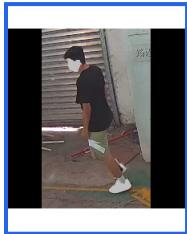  
Query SID 100 | Cond U0\_D0 | View ..

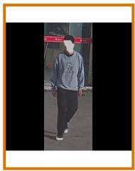  
SID 100 | Cond U3\_D3 | View ..

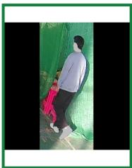  
Rank 1 | 0.880 SID 100 | Cond U3\_D3 | View .

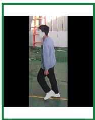  
Rank 2 | 0.871 SID 100 | Cond U3\_D3 | View ..

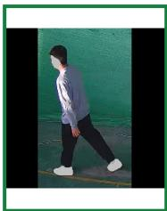  
Rank 3 | 0.867 SID 100 | Cond U3\_D3 | View .

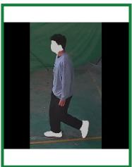  
Rank 4 | 0.858 SID 100 | Cond U3\_D3 | View ..

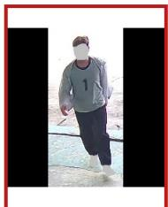  
Rank 5 | 0.857 SID 120 | Cond U3\_D3 | View ..

## Task: attribute\_change | SUCCESS

Text: Change to white long-sleeve shirt with black abstract pattern and light blue denim trousers.

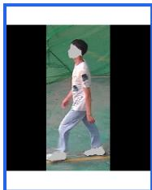  
Query SID 104 | Cond U0\_D0 | View ..

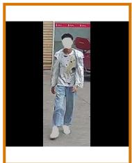  
SID 104 | Cond U1\_D0 | View ...

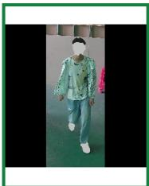  
Rank 1 | 0.771 SID 104 | Cond U1\_D0 | View ...

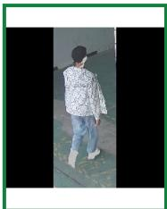  
Rank 2 | 0.755 SID 104 | Cond U1\_D0 | View ..

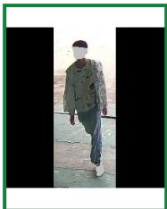  
Rank 3 | 0.752 SID 104 | Cond U1\_D0 | View ..

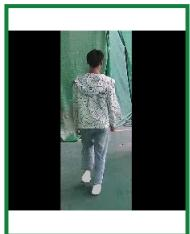  
Rank 4 | 0.729 SID 104 | Cond U1\_D0 | View ..

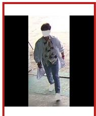  
Rank 5 | 0.728 SID 109 | Cond U1\_D1 | View ...  
Task: attribute\_change | SUCCESS Text: Wear a black coat.

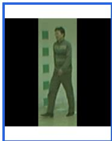  
SID 075 | Cond nm | View 054

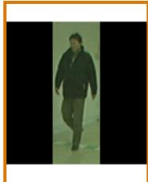  
SID 075 | Cond cl | View 036

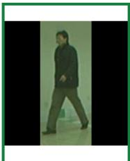  
Rank 1 | 0.878 SID 075 | Cond cl | View 054 ..

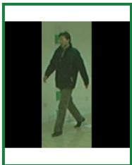  
Rank 2 | 0.877 SID 075 | Cond cl | View 054 |...

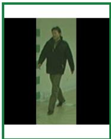  
Rank 3 | 0.876 SID 075 | Cond cl | View 036 |..

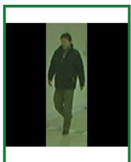  
Rank 4 | 0.863 SID 075 | Cond cl | View 036 |...

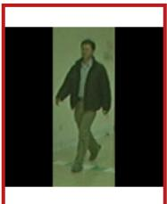  
Rank 5 | 0.833 SID 112 | Cond cl | View 036 |...

Task: attribute\_change | SUCCESS Text: Remove the bag.

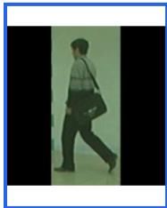  
Query SID 079 | Cond bg | View 108

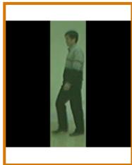  
SID 079 | Cond nm | View 072

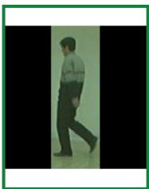  
Rank 1 | 0.947 SID 079 | Cond nm | View 10..

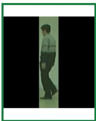  
Rank 2 | 0.946 SID 079 | Cond nm | View 10..

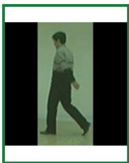  
Rank 3 | 0.943 SID 079 | Cond nm | View 10...

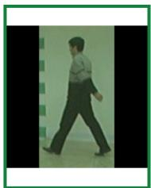  
Rank 4 | 0.943 SID 079 | Cond nm | View 10...

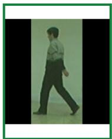  
Rank 5 | 0.941 SID 079 | Cond nm | View 10...

Figure 5: Successful attribute-conditioned retrievals on CCPG (top two rows) and CASIA-B (bottom two rows). Each row contains the query (blue), ground truth (orange), and ranked candidates, with green and red borders following the evaluation labels. The examples cover clothing color and pattern changes, adding a coat, and removing a carried bag; a relevant result is ranked first in every row.

## Task: viewpoint\_change | SUCCESS

Text: View the person oriented from the view facing the camera.

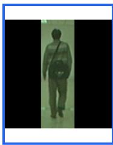  
SID 075 | Cond bg | View 180

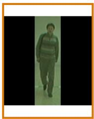  
SID 075 | Cond bg | View 000

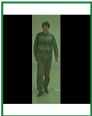  
Rank 1 | 0.942 SID 075 | Cond bg | View 00...

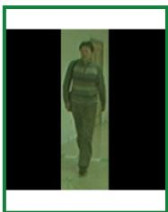  
Rank 2 | 0.942 SID 075 | Cond bg | View 018...

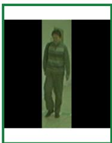  
Rank 3 | 0.941 SID 075 | Cond bg | View 018...

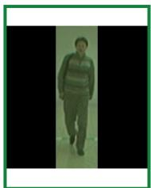  
Rank 4 | 0.933 SID 075 | Cond bg | View 000...

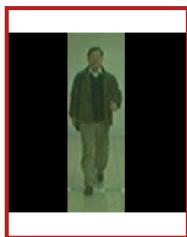  
Rank 5 | 0.704 SID 103 | Cond bg | View 000...

## Task: viewpoint\_change | SUCCESS

Text: See the diagonal front view shot of the person

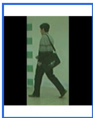  
SID 079 | Cond bg | View 108

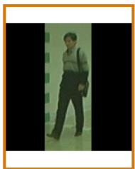  
SID 079 | Cond bg | View 036

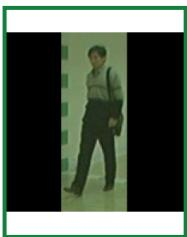  
Rank 1 | 0.946 SID 079 | Cond bg | View 036...

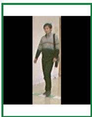  
Rank 2 | 0.946 SID 079 | Cond bg | View 036...

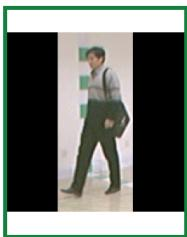  
Rank 3 | 0.932 SID 079 | Cond bg | View 054...

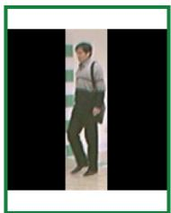  
Rank 4 | 0.929 SID 079 | Cond bg | View 054..

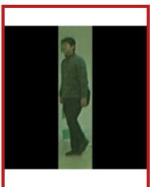  
Rank 5 | 0.808 SID 085 | Cond bg | View 054...

## Task: composite\_change | SUCCESS

Text: Wear a black coat and take off the bag; afterwards, see the person at the an oblique angle angle.

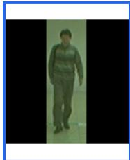  
SID 075 | Cond bg | View 000

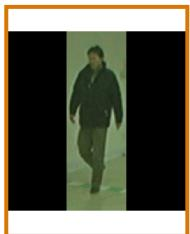  
SID 075 | Cond cl | View 036

  
Rank 1 | 0.863 SID 075 | Cond cl | View 036 |..

  
Rank 2 | 0.850 SID 075 | Cond cl | View 054 |..


Rank 3 | 0.845 SID 075 | Cond cl | View 036 |..


Rank 4 | 0.843 SID 075 | Cond cl | View 054 |...

  
Rank 5 | 0.826 SID 112 | Cond cl | View 036 |..

## Task: composite\_change | SUCCESS

Text: Change upper clothing to a gray long-sleeve shirt. Then view the person oriented from the sharp frontal angle

  
SID 079 | Cond cl | View 090

  
SID 079 | Cond nm I Vjew 03€

  
Rank 1 | 0.820 SID 079 | Cond nm | View 05..

  
Rank 2 | 0.818 SID 079 | Cond nm | View 05..

  
Rank 3 | 0.814 SID 079 | Cond nm | View 05...

  
Rank 4 | 0.813 SID 079 | Cond nm | View 03...

  
Rank 5 | 0.813 SID 079 | Cond nm | View 03... 079/nm-06/036

Figure 6: Successful viewpoint (top two rows) and composite condition retrievals (bottom two rows) on CASIA-B. The viewpoint examples retrieve the requested frontal or front-oblique orientation while retaining identity. The composite examples jointly change appearance, accessories, and viewpoint, and still place a relevant result at Rank 1.

## Task: attribute change | FAILURE

Text: Change to gray hoodie and light beige trousers

  
SID 101 | Cond U0\_D3 | View .

  
SID 101 | Cond U3\_D3 | View ...

  
Rank 1 | 0.783 SID 143 | Cond U2\_D2 | View ..

  
Rank 2 | 0.773 SID 143 | Cond U2\_D2 | View ..

  
Rank 3 | 0.766 SID 143 | Cond U2\_D2 | View ..

  
Rank 4 | 0.749 SID 132 | Cond U2\_D2 | View ..

  
Rank 5 | 0.722 SID 143 | Cond U2\_D2 | View ...

## Task: attribute\_change | FAILURE

Text: Change to black long-sleeve shirt and blue jeans, and remove the black bag held in right hand.

  
SID 104 | Cond U0\_D0\_BG | V.

  
SID 104 | Cond U2\_D2 | View ..

  
Rank 1 | 0.873 SID 198 | Cond U1\_D0 | View ..

  
Rank 2 | 0.859 SID 198 | Cond U1 D0 | View .

  
Rank 3 | 0.849 SID 104 | Cond U2\_D2 | View ...

  
Rank 4 | 0.845 SID 198 | Cond U1\_D0 | View ..

  
Rank 5 | 0.832 SID 198 | Cond U1 D0 | View ..

## Task: attribute change | FAILURE

Text: Change upper clothing to a black long coat.

  
Query SID 077 | Cond cl | View 054

  
SID 077 | Cond nm | View 036

  
Rank 1 | 0.928 SID 115 | Cond nm | View 05..

  
Rank 2 | 0.925 SID 115 | Cond nm | View 05..


Rank 3 | 0.924 SID 115 | Cond bg | View 036...


Rank 4 | 0.924 SID 115 | Cond nm | View 03...

  
Rank 5 | 0.924 SID 115 | Cond nm | View 05...

## Task: attribute\_change | FAILURE

Text: Change upper clothing to a gray coat and take off the bag.

  
Query SID 076 | Cond bg I View 126

  
SID 076 | Cond cl | View 126

  
Rank 1 | 0.690 SID 109 | Cond cl | View 126 |..

  
Rank 2 | 0.680 SID 109 | Cond cl | View 126 |...

  
Rank 3 | 0.674 SID 109 | Cond cl | View 144 |...

  
Rank 4 | 0.666 SID 109 | Cond cl | View 144 |..

  
Rank 5 | 0.656 SID 076 | Cond cl | View 144 |..

Figure 7: Attribute-change failures on CCPG (top two rows) and CASIA-B (bottom two rows). In the first and third rows, all displayed candidates are invalid despite matching much of the requested appearance. In the second and fourth rows, relevant sequences are present but are delayed until Rank 3 and Rank 5, respectively, behind candidates from other identities.

## Task: viewpoint\_change | FAILURE

Text: Rotate to see the sharp frontal angle of the person.

  
SID 075 | Cond cl | View 000

  
SID 075 | Cond cl | View 036

  
Rank 1 | 0.930 SID 103 | Cond cl | View 054 |..

  
Rank 2 | 0.929 SID 075 | Cond cl | View 036 |..

  
Rank 3 | 0.927 SID 103 | Cond cl | View 054 |...

  
Rank 4 | 0.925 SID 075 | Cond cl | View 036 |...

  
Rank 5 | 0.921 SID 075 | Cond cl | View 054 |..

## Task: viewpoint\_change | FAILURE

Text: Display the person oriented at the back view.

  
Query SID 082 | Cond bg | View 054

  
SID 082 | Cond bg | View 162

  
Rank 1 | 0.966 SID 082 | Cond nm | View 18...

  
Rank 2 | 0.964 SID 082 | Cond nm | View 18...

  
Rank 3 | 0.964 SID 082 | Cond nm | View 18...

  
Rank 4 | 0.963 SID 082 | Cond nm | View 18...

  
Rank 5 | 0.961 SID 082 | Cond nm | View 18...

## Task: composite\_change | FAILURE

Text: Requesting the profile view of the person, as well as put on a black long coat

  
SID 077 | Cond cl | View 036

  
SID 077 | Cond nm | View 072

  
Rank 1 | 0.896 SID 115 | Cond nm | View 07...

  
Rank 2 | 0.891 SID 115 | Cond nm | View 07..

  
Rank 3 | 0.889SID 077 | Cond nm | View 07.

  
Rank 4 | 0.888 SID 077 | Cond nm | View 09...

  
Rank 5 | 0.883 SID 115 | Cond nm | View 09...

## Task: composite\_change | FAILURE

Text: I need the view walking away at an angle of the person. wear a gray long coat and hold a black shoulder bag.

  
SID 075 | Cond cl | View 072

  
SID 075 | Cond bg | View 126

  
Rank 1 | 0.846 SID 112 | Cond bg | View 126..

  
Rank 2 | 0.841 SID 112 | Cond bg | View 126..

  
Rank 3 | 0.839 SID 112 | Cond bg | View 144..

  
Rank 4 | 0.831 SID 112 | Cond bg | View 144..

  
Rank 5 | 0.814 SID 075 | Cond bg | View 126..

Figure 8: Failure cases for viewpoint-change instructions (top two rows) and composite-change instructions (bottom two rows) on CASIA-B. In the first row, an invalid identity is ranked above a relevant result at Rank 2. In the second, the retrieved sequences preserve identity and satisfy the requested back view, but fail to retain the original bag-carrying condition. Under composite instructions, candidates satisfying the requested conditions but belonging to other identities outrank relevant results, which first appear at Rank 3 and Rank 5 in the bottom two rows.

  
Figure 9: Lighting-confounded prompt comparison on CCPG. The reference and target gallery sequence are fixed, and only the color word changes from the correct white to green. The similarity decreases from 0.77 to 0.73 and the target moves from Rank 1 to Rank 4. This modest reduction is consistent with the green cast of the scene making the nominally white clothing appear greenish.