# RealOOB: A Definition-Consistent Real-World Oriented Occlusion Boundary Benchmark

Lintao XU1 Yinghao WANG2 Chenchu RONG3 Xuchong QIU4† Chaohui WANG1†

1 LIGM, UGE, ENPC, CNRS, France 2 INFRES, Tel´ ecom Paris, IP Paris, France ´ 3 MathMagic, China 4 Aptiv, China

## Abstract

Occlusion boundaries (OBs) are pixel-level image boundaries corresponding to surface visibility discontinuities caused by occlusion. Through precise boundary localisation and occlusion orientation, OBs encode local surface layout and depth ordering, providing geometry-driven midlevel cues for scene understanding. However, progress in pixel-level OB estimation has been limited by fragmented supervision: Existing benchmarks often suffer from limited coverage, category-specific designs, missing self-occlusion annotations, or inconsistent annotation definitions. Meanwhile, modern edge detectors and monocular depth estimators have become strong boundary and geometry predictors, yet their relationship to definition-consistent OBs remains underexplored. We introduce RealOOB, a carefully annotated real-world benchmark with 4.26M definitionconsistent, geometry-grounded OB labels covering both inter-object and self-occlusion boundaries, together with validity-aware occlusion-orientation maps that restrict supervision to pixels whose cross-boundary depth ordering is reliably measurable. Based on RealOOB, we evaluateforty OB estimators and edge detectors alongside six monocular depth estimators. Our evaluation reveals a clear gap in occlusion reasoning: modern edge detectors perform competitively with OB methods in localisation, whereas orientation prediction remains challenging for all evaluated methods. Meanwhile, even strong depth estimators often fail to exhibit measurable geometry at true OBs. We believe RealOOB provides a strong reference benchmark for the OB estimation community and a real-world testbed for assessing depth discontinuities and geometry fidelity in broader low-level vision tasks. Dataset and code will be released.

## 1. Introduction

Occlusion is a viewpoint-dependent phenomenon that arises when a 3D scene is projected onto a 2D image plane. Surfaces closer to the camera block farther surfaces along shared lines of sight, producing discontinuities in both the visible surface layout and the projected depth field. These events appear as either inter-object occlusion, where one object occludes another, or self-occlusion, where an object hides part of its own geometry. Occlusion is therefore both a source of ambiguity and a source of geometric information for scene understanding, with direct relevance to depth estimation [7, 71], segmentation [37, 75], object detection and tracking [43, 50], 3D reconstruction [25, 34], and human pose estimation [9, 13, 44].

Occlusion boundaries (OBs, see Fig. 1) provide a compact image-domain representation of these visibility transitions: they are sparse binary boundary labels rather than dense surface-normal or depth maps. A binary OB map localises pixels at visible-surface discontinuities [57], while an oriented OB representation [40, 59] additionally identifies which side of the boundary belongs to the nearer, occluding surface—the cross-boundary depth ordering. Unlike generic image edges, OBs are defined by scene geometry rather than appearance contrast: texture, shadow, reflection, and illumination edges are excluded unless they correspond to a true surface-visibility discontinuity. This makes OBs valuable geometry-driven mid-level cues for recovering scene structure and depth ordering.

Despite its long history in computer vision, OB estimation remains constrained by fragmented supervision rather than by a simple lack of data. Existing real-world benchmarks vary substantially in annotation protocol: some are object-centric or category-dependent, many omit selfocclusion entirely or annotate it only sporadically, and depth-derived annotations primarily capture salient measurable depth discontinuities rather than the visibility-induced surface discontinuities. As illustrated in Fig. 2, publicly available real-world OB annotations frequently miss selfocclusion and scene-structure boundaries, while including edges that do not satisfy a geometry-grounded OB definition. These inconsistencies make fair comparison difficult and obscure whether improvements reflect better occlusion reasoning or adaptation to dataset-specific labelling rules.

To close this gap, we introduce RealOOB, a carefully verified real-world benchmark with 4.26M exhaustive pixel-level OB annotations and validity-aware orientation labels under a unified, geometry-grounded definition [57]. The benchmark covers both inter-object and selfocclusion boundaries, drawing from multiple complementary sources [21, 26, 38, 56, 59] that span complex indoor scenes and texture-rich object-centric images. Its scale is comparable to widely used manually annotated edge and boundary benchmarks, while its annotation protocol is explicitly tailored to definition-consistent OB evaluation.

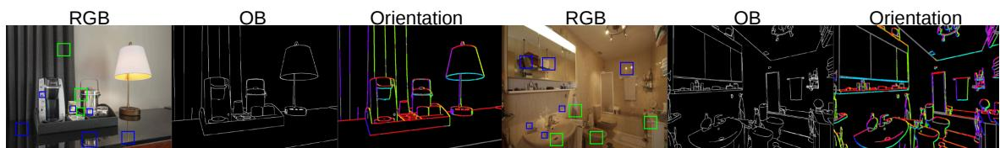  
Figure 1. Examples from RealOOB. Green boxes highlight annotated OBs, including self-occlusion and fine-grained surface disconti nuities; blue boxes mark non-OB edges such as texture, illumination, reflection, normal-discontinuity edges without surface overlap, and objects seen through transparent surfaces. In the validity-aware orientation map, valid pixels are dilated for visibility, with hue encoding the depth-nearer side (green: left, red: below, yellow: right, cyan: above); black/gray denotes non-OB or OB pixels without valid orientation. All OB annotations are semantic-free, following a geometry-grounded definition based solely on surface visibility discontinuity.

The methodological landscape around OB estimation has also shifted substantially. OB methods such as [12, 59] were developed on category-dependent datasets without self-occlusion annotations. Meanwhile, edge detection has advanced rapidly, spanning CNN-based detectors such as [17, 29, 61], and recent ones using transformers or diffusion models [8, 36, 68]. This raises a natural question: how far can modern edge detectors go as OB estimators, and where do they fail relative to dedicated OB methods? Our unified evaluation of forty trained models shows that a repurposed edge detector with a lightweight orientation head achieves the best overall oriented-OB scores (B-ODS 0.764, O-ODS 0.496), while the same detector in boundaryonly mode reaches even higher localisation (B-ODS 0.812). A substantial gap between boundary and orientation scores persists across all methods, indicating that occlusion orientation estimation remains a major open challenge.

Beyond OB estimation, RealOOB is also relevant to broader low-level dense prediction, particularly monocular depth estimation, where recent models increasingly emphasise boundary sharpness [3, 60, 62, 69]. Since OBs correspond to surface-visibility discontinuities, a definitionconsistent OB benchmark offers a natural testbed for probing a key open question: does visual sharpness translate to accurate boundary localisation, and how faithful is the predicted geometry near true OBs? Our experiments show that even on the depth-favourable evaluation subset, the best strict-matching F1 reaches only 0.260, and the best joint cross-boundary depth-ordering accuracy is 74.4%, revealing that visually sharp depth maps do not yet yield pixelaccurate OBs or fully reliable cross-boundary geometry.

In summary, our contributions are threefold:

1. We introduce RealOOB, the first benchmark with definition-consistent oriented occlusion labels on realworld-dominated images, exhaustively annotated and covering both inter-object and self-occlusion boundaries. It provides validity-aware orientation labels that restrict orientation supervision and evaluation to pixels with reliably measurable cross-boundary depth ordering.

2. We train and evaluate forty models—dedicated OB estimators and edge detectors—on RealOOB under a unified protocol, showing edge detectors are strong OB baselines while oriented OB estimation remains a bottleneck.

3. We use RealOOB to probe 6 state-of-the-art depth estimators for boundary localisation and cross-boundary geometric fidelity, establishing it as a complementary realworld testbed for depth boundary evaluation.

## 2. Related Work

OB datasets. Existing OB datasets differ in annotation protocol, coverage, and underlying definition. Early realworld benchmarks [20, 42, 53, 55] are limited in scale, lack orientation labels, or only partially cover self-occlusion. PIOD [59] provides larger-scale oriented annotations but is restricted to 20 object categories, so OBs outside the 20 categories, including many scene-structure and fine-grained self-OBs, are not exhaustively annotated. Depth-derived OB annotations such as [40] inherit noise and incompleteness from the source depth, capturing salient depth discontinuities. Synthetic datasets are complementary: OB-FUTURE [63] offers accurate self-occlusion-aware OBs in simple indoor scenes, while OB-Hypersim [64] adds photorealism with less complete self-occlusion coverage. As shown in Fig. 2, real-world annotations consistent with a single geometric definition remain limited—a gap that RealOOB addresses with exhaustive, self-occlusion-aware OB annotations and validity-aware orientation labels.

OB estimation. Early OB methods relied on hand-crafted cues: video-based approaches combined motion discontinuities, temporal consistency, T-junctions, and graphical models [1, 11, 52, 53]; monocular approaches added geometric context and pseudo-depth [18, 19]. Deep learning shifted the field toward learned boundary-and-orientation estimation. DOC [59] introduced the joint boundaryorientation formulation, followed by CNN refinements addressing class imbalance, multi-scale fusion, and multitask supervision [12, 15, 31, 32, 58, 74]. Geometryaware variants include [40, 63] and joint depth–OB esti-CMU VSB100 BSDS ownershimation [64]. Despite this progress, evaluation has largely relied on category-dependent datasets with limited selfocclusion coverage or synthetic supervision, motivating a definition-consistent real-world benchmark.

PIODPIOD  
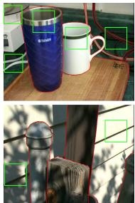  
CMUCMU

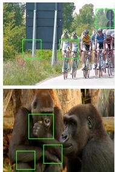  
VSB100VSB100

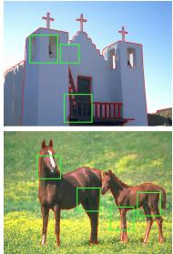  
BSDS ownershipBSDS ownership

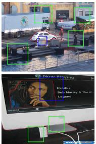

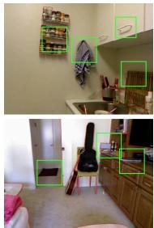  
NYUv2\_ORNYUv2\_OR

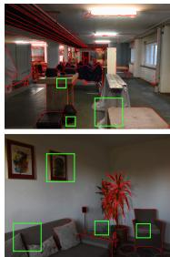  
iBims1\_ORiBims1\_OR  
Figure 2. Publicly available real-world OB benchmarks: CMU [53], VSB100 [14, 55], BSDS ownership [42], PIOD [16, 59], NYUv2 OR [40, 41], and iBims1 OR [40]. Red overlays indicate annotated boundaries. Green boxes indicate missed OBs; blue boxes indicate labelled edges that do not satisfy the geometry OB definition in [57].

Edge detection. OBs are generally regarded as a subset of image edges [51], but edge detectors also respond to texture and illumination, whereas OBs are restricted to visibility-induced surface discontinuities [57]—making OB localisation an open empirical test for edge detectors. Deep edge detection has evolved from CNN-based detectors [17, 29, 47, 49, 54, 61, 70] to methods with stronger global context, generative formulations, or ranking-based objectives [5, 24, 27, 36, 68]. A parallel line models multiannotator uncertainty or multi-granularity boundaries [30, 72, 73], while crisp edge detectors focus on sharper localisation with reduced NMS reliance [6, 8, 22].

Depth estimation and boundary sharpness. Earlier work refined depth near OBs with twin-surface representations [23], displacement fields [41], or occlusion-aware modules [15, 40]. Modern monocular depth estimation has advanced with large-scale pre-training and foundation models such as Depth Anything v1/v2 [65, 66], and recent methods further emphasise boundary sharpness [3, 60, 62, 69]. However, sharp depth edges do not necessarily imply accurate boundary localisation or faithful geometry around OBs: depth-derived edges can be misaligned or biased toward strong depth contrasts, while subtle occlusions with weak measurable depth gaps may be missed. RealOOB provides a complementary testbed for evaluating depth boundary localisation and cross-boundary geometric fidelity.

## 3. The RealOOB Benchmark

## 3.1. Source Composition

RealOOB contains 520 fully annotated images collected from five sources: DIODE [56], EntitySeg [38], PIOD [59], iBims-1 [26], and LF4D [21]. The benchmark subsumes and re-verifies the 120 images of OB-LIGM [63]. The benchmark is real-world-dominated with an indoor and object-centric focus (see Fig. 3): complex indoor scenes with dense self-occlusion, and structurally simpler but texture-rich object-centric images whose abundant non-OB PIOD NYUv2\_OR iBims1\_OR edges test false-positive (FP) suppression. A small number of synthetic or non-photographic samples are included for geometric and visual diversity.

The sources provide complementary properties. DIODE contributes 200 high-resolution indoor images (1024 768) with ground-truth (GT) depth, mainly annotated from scratch. EntitySeg contributes 271 images with diverse visual styles, resolutions, and object layouts (average resolution 952 880). PIOD contributes 40 object-centric images (average 439 434), while LF4D and iBims-1 contribute 9 geometry-rich examples with high-quality disparity or depth. For all sources except DIODE, available segmentation, OB, depth-, or disparity-derived contours serve only as candidate boundaries. Final OB annotations are manually verified under the same geometry-grounded definition in [57]: non-OB and inaccurate contours are removed, and missing object and self-occlusion boundaries are added.

In addition to the benchmark images, we release auxiliary resources, excluded from both the benchmark split and the reported statistics unless stated otherwise: 248 DIODE hard negatives—textured walls and ceilings with no OBs— used during training for FP suppression and segmentationderived boundary assets with validity-aware orientations from 5,090 carefully selected EntitySeg images.

## 3.2. Annotation Protocol

Annotations follow the formal, geometry-grounded OB definition in [57]. It treats an OB as a collection of local occlusion events: a small boundary segment corresponds to an occlusion relation between the 3D surfaces projecting to the two neighbouring 2D image regions, and the full OB map is obtained by considering all such events over the image. The guiding principle for annotation is therefore surface visibility discontinuity (see Fig. 4): an annotated boundary should correspond to a change in the visible surface caused by occlusion. Boundaries caused only by texture, illumination, reflection, or normal changes without surface overlap are excluded. Edges of objects visible through transparent media are treated as lying behind the transparent surface and are not annotated as OBs unless they correspond to an opaque surface-visibility discontinuity. Following [57], image-border pixels are not considered OBs; we exclude all annotations within a 2-pixel border and apply this convention consistently in statistics and experiments.

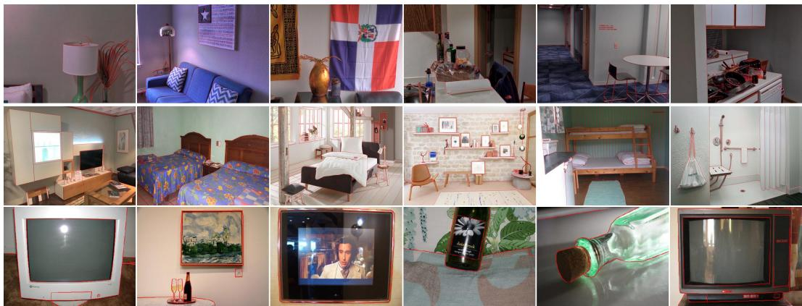  
Figure 3. More visualisations from RealOOB. Red overlays indicate annotated OBs, excluding intensity-based edges such as texture.

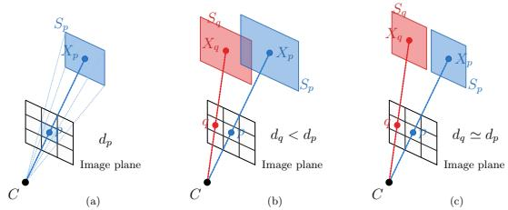  
Figure 4. Geometric interpretation of semantic-free pixel-level OB annotation. (a) A pixel on the image plane represents the projection of a visible 3D surface patch along a camera ray $C .$ (b) For two neighbouring pixels p and $q ,$ their visible patches $S _ { p }$ and $S _ { q }$ define a local occlusion event when one surface occludes the other along the viewing direction; these patches may belong to different objects (inter-object occlusion) or to different visible parts of the same object (self-occlusion). We annotate a thin, single-pixel OB at the interface rather than labelling both neighbouring pixels. (c) Where $S _ { p }$ and $S _ { q }$ lie on different surfaces that each occlude the background behind them but not each other, and whose depth step is too small to resolve at image resolution, the boundary is still a surface-visibility discontinuity, while its cross-boundary depth ordering is masked out from orientation supervision and evaluation.

Ground-truth OBs are annotated using ByLabel [39], a pixel-accurate edge-level annotation tool that supports open curves and fine boundary structures. Edge-level annotation is important here because self-occlusion boundaries may be non-closed and are poorly represented by polygon-based segmentation tools. Eight annotators participated in the labelling process, and all annotations underwent multiple rounds of cross-checking. Annotation difficulty varies substantially: complex indoor scenes with dense self-occlusion may require more than five hours, whereas simple objectcentric scenes can be annotated more quickly. Annotation and quality control averaged more than 1.5 hours per image.

## 3.3. Validity-Aware Orientation Labels

In addition to binary OB annotations, RealOOB provides occlusion-orientation labels following the left-hand-rule convention used in prior oriented OB benchmarks [42, 59]. Assigning dense orientation labels manually is substantially harder than drawing OB locations, particularly for tiny, subtle, or non-closed self-occlusion boundaries. Moreover, not every OB pixel admits an equally reliable cross-boundary depth-ordering relation: object contours and subtle selfocclusion boundaries are genuine surface-visibility discontinuities, but the depth step across them is often too small or too noisy to resolve at image resolution (see Fig. 4 (c)).

  
(a)

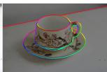  
(b)

  
(c)

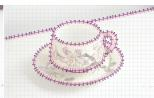  
(d)  
Figure 5. Visualisation of occlusion orientation. (a) RGB image. (b) Orientation map with valid orientation pixels dilated for visibility; hue encodes the depth-nearer side as in Fig. 1. (c) OB annotations with red arrows showing orientation θ under the lefthand rule [59], where the depth-nearer side lies to the left of each arrow. (d) Local occlusion-ordering grid, where black arrows point from the depth-nearer to depth-farther surface across each boundary. Zoom in for better visibility.

We therefore provide validity-aware orientation labels. For each annotated OB pixel, the orientation indicates the depth-nearer side only when the local depth ordering is reliably measurable from the available geometry; otherwise, the pixel remains part of the binary OB ground truth but is masked out for orientation supervision and evaluation. Thus, all annotated OB pixels are used for boundary localisation, while orientation losses and metrics are computed only on valid-orientation pixels.

Orientation labels are derived from available geometric cues: for images with GT depth, from local boundary normals and two-sided depth samples; for images without GT depth, from an agreement test over two independent monocular depth estimators [60, 62]. Predicted depth serves only as evidence for the orientation at existing OB pixels, not for defining boundary locations. Pixels without sufficient depth evidence are masked out rather than forced into orientation supervision, and we further manually verify cases where

Table 1. Summary of representative OB and edge/boundary datasets with publicly available annotations. Edge/boundary datasets are included as contextual references but do not provide occlusion-specific annotations. †: multiple annotations per image. $^ { \ddagger } \colon$ only for evaluation. Orient., Self-Occ, Exhaust., and Def. denote occlusion orientation, self-occlusion coverage, exhaustive full-image annotation, and use of a formal geometry-grounded OB definition, respectively.
<table><tr><td>Dataset</td><td>Task</td><td>Scale</td><td>Avg. Resolution</td><td>Orient.</td><td>Self-Occ</td><td>Exhaust.</td><td>Def.</td><td>Domain</td><td>Aux Info</td></tr><tr><td>NYUD [45]</td><td>Contour</td><td>1,449</td><td> $5 6 0 \times 4 2 5$ </td><td>N/A</td><td>N/A</td><td>√</td><td>N/A</td><td>Indoor</td><td>Geometry</td></tr><tr><td>Multicue† [33]</td><td>Contour/Edge</td><td>100</td><td> $1 2 8 0 \times 7 2 0$ </td><td>N/A</td><td>N/A</td><td>√</td><td>N/A</td><td>Both</td><td></td></tr><tr><td>BIPED [49]</td><td>Edge</td><td>250</td><td> $1 2 8 0 \times 7 2 0$ </td><td>N/A</td><td>N/A</td><td>√</td><td>N/A</td><td>Outdoor</td><td></td></tr><tr><td>BSDS500† [2]</td><td>Edge</td><td>500</td><td> $4 3 2 \times 3 7 0$ </td><td>N/A</td><td>N/A</td><td>√</td><td>N/A</td><td>Outdoor</td><td></td></tr><tr><td>BRIND [35]</td><td>(Geom.) edge</td><td>500</td><td> $4 3 2 \times 3 7 0$ </td><td>N/A</td><td>N/A</td><td>√</td><td>N/A</td><td>Outdoor</td><td></td></tr><tr><td>UDED‡ [48]</td><td>Edge</td><td>50</td><td> $5 3 1 \times 4 6 3$ </td><td>N/A</td><td>N/A</td><td>√</td><td>N/A</td><td>Both</td><td></td></tr><tr><td>CMU‡ [53]</td><td>OB</td><td>30</td><td> $5 4 6 \times 4 0 1$ </td><td>X</td><td>Partial</td><td>×</td><td>×</td><td>Both</td><td>Video</td></tr><tr><td> $\mathrm { V S B 1 0 0 ^ { \dag \ddag } \ [ 1 4 , 5 5 ] }$ </td><td>OB</td><td>644</td><td> $1 3 5 8 \times 7 7 4$ </td><td>X</td><td>X</td><td>√</td><td>×</td><td>Both</td><td>Video</td></tr><tr><td> $\mathrm { \mathbf { B S D S _ { \ell } o w n e r s h i p ^ { \dag } \left[ 4 2 \right] } }$ </td><td>OB</td><td>200</td><td> $3 2 1 \times 4 8 1$ </td><td>√</td><td>X</td><td>√</td><td>×</td><td>Outdoor</td><td></td></tr><tr><td> $\mathrm { P I O D } \left[ 1 6 , 5 9 \right]$ </td><td>OB</td><td>10,094</td><td> $4 7 5 \times 3 9 0$ </td><td>√</td><td>×</td><td>×</td><td>×</td><td>Both</td><td></td></tr><tr><td>NYUv2_OR‡ [40, 41]</td><td>OB</td><td>654</td><td> $5 9 2 \times 4 4 0$ </td><td>√</td><td>Partial</td><td>X</td><td>X</td><td>Indoor</td><td>Geometry</td></tr><tr><td>iBims1_OR‡[40]</td><td>OB</td><td>100</td><td> $6 4 0 \times 4 8 0$ </td><td>√</td><td>Partial</td><td>×</td><td>×</td><td>Indoor</td><td>Geometry</td></tr><tr><td>OB-LIGM‡ [63]</td><td>OB</td><td>120</td><td> $9 9 8 \times 8 3 7$ </td><td>X</td><td> $\checkmark$ </td><td> $\checkmark$ </td><td>√</td><td>Indoor</td><td>Geometry</td></tr><tr><td>Ours RealOOB</td><td>OB</td><td>520</td><td> $9 3 3 \times 7 9 6$ </td><td> $\checkmark$ </td><td> $\checkmark$ </td><td> $\checkmark$ </td><td> $\checkmark$ </td><td>Indoor</td><td>Geometry</td></tr></table>

the cross-boundary depth ordering is visually unambiguous.   
Fig. 5 (b) illustrates the orientation convention used.

Across RealOOB, 2.72M of 4.26M OB pixels receive valid orientation labels, an overall valid rate of 63.9%; persource rates appear in the supplementary material (Supp.). These rates vary with data source, scene geometry, depth quality, and visual ambiguity: subsets with clean geometric evidence or visually unambiguous object-centric layouts tend to have higher valid rates, whereas complex indoor scenes may contain small, ambiguous, or noisy crossboundary depth differences even when RGB-D data are available. Invalid-orientation pixels are not discarded from the benchmark—they remain part of the binary OB GT and contribute to boundary localisation evaluation. Detailed orientation generation, parameter settings, and validation on the synthetic dataset [64] are provided in Supp.

## 3.4. Dataset Analysis and Comparison

Per-image supervision. Beyond image count, the amount of OB supervision depends on image resolution, annotation density, and whether the annotation is exhaustive and covers self-occlusion. Table 2 compares RealOOB with representative OB datasets under the same 2-pixel border-exclusion convention; for multi-annotator datasets, we report the perannotation average. RealOOB contains 4.26M OB pixels at 8.20K pixels per image on average, higher than PIOD, BSDS ownership, CMU, NYUv2 OR, and iBims1 OR, and

Annotation properties. Table 1 compares RealOOB with representative real-world OB datasets and common edge/boundary benchmarks. Existing OB datasets vary in annotation protocol: some are object-centric or categorydependent, some are derived from depth or semi-automatic procedures, and most lack exhaustive full-image annotations with self-occlusion coverage. Edge and contour datasets are included for reference but do not distinguish OBs from other edge types. Among these, RealOOB is the only entry providing oriented, exhaustive, definitionconsistent, and self-occlusion-aware OB annotations.

VSB100. The per-image OB count is lower than that of its OB-LIGM subset (8.20K vs. 10.5K) because RealOOB includes structurally simpler object-centric images with fewer OBs but richer non-OB edges, which are important for evaluating FP suppression. Although PIOD contains more images, its annotation protocol—which annotates only 20 predefined categories, is therefore non-exhaustive, and ignores self-occlusion—results in substantially fewer OB pixels per image (see Fig. 6); even on the 40 structurally simple PIOD images we re-annotated, its labels miss 46.7% of our OB pixels. Image count alone does not reflect the amount of definition-consistent OB labels that a dataset provides.

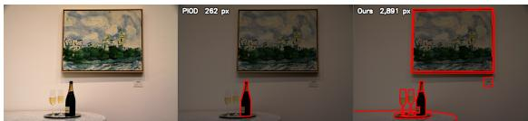  
Figure 6. PIOD vs. RealOOB annotations on the same image. Top-left: OB pixel counts. PIOD labels only the bottle, one of its 20 predefined categories; the painting, glasses, and table are left unannotated, and self-occlusion is excluded by design—despite its large scale, PIOD is not proper for semantic-free OB evaluation.

Table 2. Quantitative comparison of OB datasets. Density and OB/Canny: dataset-wide ratios of OB pixels to image pixels and to Canny edge pixels.
<table><tr><td>Dataset</td><td>Scale</td><td>Total OB</td><td>OB/Image</td><td>Density</td><td>OB/Canny</td></tr><tr><td>PIOD [16, 59]</td><td>10,094</td><td>17.7M</td><td>1.75K</td><td>0.98%</td><td>5.0%</td></tr><tr><td>BSDS ownership [42]</td><td>200</td><td>637K</td><td>3.19K</td><td>2.11%</td><td>9.8%</td></tr><tr><td>CMU [53]</td><td>30</td><td>120K</td><td>4.00K</td><td>1.74%</td><td>10.8%</td></tr><tr><td>NYUv2_OR [40, 41]</td><td>654</td><td>2.45M</td><td>3.74K</td><td>1.46%</td><td>15.1%</td></tr><tr><td>iBims1_OR [40]</td><td>100</td><td>635K</td><td>6.35K</td><td>2.10%</td><td>22.8%</td></tr><tr><td>VSB100 [14, 55]</td><td>644</td><td>5.16M</td><td>8.01K</td><td>0.75%</td><td>7.7%</td></tr><tr><td>OB-LIGM [63]</td><td>120</td><td>1.25M</td><td>10.5K</td><td>1.28%</td><td>14.7%</td></tr><tr><td>Ours RealOOB</td><td>520</td><td>4.26M</td><td>8.20K</td><td>1.10%</td><td>12.7%</td></tr></table>

OBs vs. edges. To quantify the relation between OBs and image edges, we compare RealOOB with Canny edge maps [4]. With a 2-pixel tolerance, 91.7% of OB pixels lie near Canny edges, supporting the view that OBs are largely a subset of image edges [51]. Conversely, the

total number of OB pixels is only 12.7% of the number of Canny edge pixels, indicating that intensity-based edge maps contain many appearance-induced edges unrelated to occlusion. This gap motivates evaluating edge detectors on RealOOB: they provide strong boundary-localisation baselines but must also suppress geometrically irrelevant edges to perform well on OB estimation.

Train/Test Split. We partition RealOOB into 390 training and 130 test images using a stratified 75/25 split by data source for OB benchmarking. Monocular depth estimators involve no training split, and are evaluated on all 520 images or on a GT-depth subset. The two partitions have closely matched orientation-angle distributions; per-source allocations and detailed split statistics appear in Supp.

## 4. Benchmark Experiments

We benchmark dedicated OB estimation methods, modern edge detectors, and monocular depth estimators on RealOOB. The experiments are designed to answer three questions: (i) how existing OB methods perform under a unified real-world protocol and (ii) whether modern edge detectors can serve as strong OB localisation baselines (Section 4.2); and (iii) whether sharp monocular depth predictions recover definition-consistent OBs (Section 4.3).

Due to space constraints, more experimental setup, ablations and qualitative results, cross-dataset experiments across RealOOB, synthetic and prior OB datasets, and an analysis of what prior OB benchmarks measure and how their rankings differ from ours are provided in Supp.

## 4.1. Experimental Setup for OB Estimation

Baselines. We evaluate three groups of methods. First, dedicated OB methods jointly predict OB and orientation, including [12, 15, 31, 32, 40, 58, 59, 63, 64, 74]. Second, we train modern edge detectors in their original boundary-only form, covering CNN-, transformer-, diffusion-, and crispedge models [5, 6, 8, 17, 22, 27–29, 36, 46, 47, 54, 61, 68, 70]. Third, we adapt edge detectors with a lightweight orientation head inspired by OPNet [12]: the boundary branch keeps its native architecture and edge loss, while the added head predicts occlusion orientation from multi-level features and is supervised with the OPNet orientation loss. For dedicated OB methods and boundary-only edge detectors, we keep the original architectures and losses whenever possible, changing only the data and training protocol.

Metrics. We follow the standard precision–recall (PR) protocol (SEval) used in OB and edge detection [12, 17, 36, 59], reporting B-ODS, B-OIS, B-AP for boundaries and O-ODS, O-OIS, O-AP for orientation; orientation metrics are computed only on valid-orientation pixels that are also correctly localised as OBs. We additionally report average crispness (AC) [67], the ratio of post-NMS to pre-NMS edge response mass, indicating whether predictions are intrinsically crisp or rely on NMS thinning.

Data and augmentation. We use the 390/130 train/test split described in Section 3.4. Each image is annotated at native resolution with a binary OB mask (B), an orientation map following the left-hand-rule convention, and a validity mask $( B _ { \mathrm { v a l i d } } )$ indicating pixels used for orientation supervision and evaluation. Offline geometric augmentation (16 ), together with 248 DIODE hard-negative images containing rich edges but no OBs, yields a training pool of 6,488 samples. Test images are evaluated at native resolution.

Training Protocol. Most models are trained under a unified protocol in PyTorch (AdamW, 50K iterations, batch size 8). Orientation loss is applied only to valid-orientation OB pixels, while all annotated OB pixels supervise boundary localisation. MEMO [8], DiffusionEdge [68] and MatchED [6] keep their original recipes, aligned with ours in iteration budget, split, effective batch size and checkpoint selection; the first two additionally start from task-specific edge pretraining rather than an ImageNet backbone [10], so their results carry an extra intensity-based edge prior.

## 4.2. OB and Edge Benchmark Results

Table 3 reports the main benchmark results:

Dedicated OB estimation methods. OB methods have advanced substantially since early CNN detectors: DOC-HED and DOC-DMLFOV reach only 0.531/0.362 B-ODS, whereas DOOBNet, OFNet, FSINet, and TPENet now cluster around 0.745–0.760. Within this group, TPENet leads on both boundary and orientation metrics, while FSINet is best on boundary AP and DOOBNet on crispness.

Edge detectors as OB baselines. Modern edge detectors remain strong OB baselines. With a lightweight orientation head, DDN attains the best scores of any method on both boundary and orientation metrics, though its margin over the best dedicated method (TPENet) is now narrow (B-ODS 0.764 vs. 0.760). RankED also shows strong orientation despite more modest localisation. In the boundary-only setting, DDN improves further (B-ODS 0.812). Attaching the same untuned head lowers B-ODS for every edge detector, from negligible (RankED) to severe (EDTER), and crispness for 11 of 13. These findings highlight the preservation of pure edge-model accuracy under joint orientation supervision as an important direction for future research.

Orientation gap and crispness. Two patterns hold across all groups. First, orientation scores trail boundary scores for every method (e.g., DDN O-ODS 0.496 vs. B-ODS 0.764): accurate cross-boundary depth-ordering reasoning is far from solved even when boundaries are well localised. Second, crispness is largely decoupled from PR metrics—MEMO and DiffusionEdge produce the sharpest edges yet do not lead on PR metrics (MEMO’s B-AP is only 0.334), whereas DDN and CATS combine moderateto-high crispness $( \mathrm { A C } \approx 0 . 5 0 \ – 0 . 6 0 )$ with strong PR. Overall, the strongest oriented-OB performance on RealOOB comes from a repurposed edge detector (DDN), closely followed by TPENet, and the dominant remaining bottleneck is orientation rather than boundary localisation.

Table 3. Main benchmark results on RealOOB. GFLOPs are measured at 1024 × 768 resolution. For MEMO, the reported GFLOPs denote the total inference cost across all 40 UNet forwards. † indicates methods re-implemented by us without publicly released code. ‡ indicates methods with adapted configuration (see Supp.). Best results within each method group are shown in bold.
<table><tr><td>Model</td><td>Venue</td><td>Params (M)</td><td>GFLOPs</td><td>B-ODS↑</td><td>B-OIS↑</td><td>B-AP↑</td><td>AC↑</td><td>O-ODS↑</td><td>O-OIS↑</td><td>O-AP↑</td></tr><tr><td colspan="2">Dedicated OB estimation methods</td><td></td><td colspan="2"></td><td colspan="3"></td><td></td><td></td><td></td></tr><tr><td>DOC-HED [59]</td><td>ECCV&#x27;16</td><td>14.72</td><td>483.0</td><td>0.531</td><td>0.608</td><td>0.407</td><td>0.196</td><td>0.208</td><td>0.245</td><td>0.075</td></tr><tr><td>DOC-DMLFOV [59]</td><td>ECCV&#x27;16</td><td>20.49</td><td>2138.8</td><td>0.362</td><td>0.392</td><td>0.277</td><td>0.205</td><td>0.135</td><td>0.147</td><td>0.045</td></tr><tr><td>DOOBNet [58]</td><td>ACCV&#x27;18</td><td>32.33</td><td>295.4</td><td>0.747</td><td>0.772</td><td>0.786</td><td>0.741</td><td>0.396</td><td>0.416</td><td>0.264</td></tr><tr><td>CCENet† [32]</td><td>ICME&#x27;19</td><td>39.32</td><td>181.3</td><td>0.688</td><td>0.708</td><td>0.702</td><td>0.219</td><td>0.372</td><td>0.392</td><td>0.230</td></tr><tr><td>OFNet [31]</td><td>ICCV&#x27;19</td><td>32.56</td><td>343.1</td><td>0.748</td><td>0.771</td><td>0.785</td><td>0.249</td><td>0.371</td><td>0.389</td><td>0.227</td></tr><tr><td>P2ORM [40]</td><td>ECCV’20</td><td>19.17</td><td>533.5</td><td>0.726</td><td>0.750</td><td>0.759</td><td>0.248</td><td>0.341</td><td>0.362</td><td>0.195</td></tr><tr><td>OPNet [12]</td><td>ICCV’21</td><td>187.05</td><td>1773.9</td><td>0.619</td><td>0.674</td><td>0.622</td><td>0.258</td><td>0.269</td><td>0.294</td><td>0.125</td></tr><tr><td>FSINet† [74]</td><td>VI&#x27;23</td><td>37.44</td><td>248.9</td><td>0.745</td><td>0.768</td><td>0.795</td><td>0.302</td><td>0.391</td><td>0.413</td><td>0.249</td></tr><tr><td>OBP-GAN† [15]</td><td>MM&#x27;24</td><td>165.74</td><td>924.4</td><td>0.648</td><td>0.693</td><td>0.544</td><td>0.201</td><td>0.365</td><td>0.395</td><td>0.196</td></tr><tr><td>TPENet [63]‡</td><td>BMVC&#x27;25</td><td>283.23</td><td>2858.8</td><td>0.760</td><td>0.776</td><td>0.691</td><td>0.318</td><td>0.489</td><td>0.502</td><td>0.303</td></tr><tr><td>MoDOT [64]‡</td><td>WACV&#x27;26</td><td>279.50</td><td>1534.3</td><td>0.673</td><td>0.694</td><td>0.702</td><td>0.271</td><td>0.236</td><td>0.248</td><td>0.093</td></tr><tr><td colspan="3">Edge detectors with orientation head</td><td></td><td colspan="2"></td><td></td><td></td><td></td><td></td><td></td></tr><tr><td>HED [61]</td><td>ICCV&#x27;15</td><td>15.03</td><td>721.7</td><td>0.601</td><td>0.665</td><td>0.499</td><td>0.222</td><td>0.305</td><td>0.336</td><td>0.145</td></tr><tr><td>RCF [29]</td><td>CVPR&#x27;17</td><td>15.12</td><td>859.7</td><td>0.475</td><td>0.568</td><td>0.319</td><td>0.187</td><td>0.212</td><td>0.252</td><td>0.069</td></tr><tr><td>CASENet [70]</td><td>CVPR&#x27;17</td><td>24.12</td><td>365.9</td><td>0.618</td><td>0.668</td><td>0.562</td><td>0.209</td><td>0.316</td><td>0.349</td><td>0.165</td></tr><tr><td>BDCN [17]</td><td>CVPR&#x27;19</td><td>16.61</td><td>1106.1</td><td>0.578</td><td>0.647</td><td>0.503</td><td>0.244</td><td>0.256</td><td>0.291</td><td>0.111</td></tr><tr><td>DexiNed [46]</td><td>WACV&#x27;20</td><td>21.24</td><td>753.3</td><td>0.450</td><td>0.529</td><td>0.343</td><td>0.226</td><td>0.192</td><td>0.222</td><td>0.069</td></tr><tr><td>PiDiNet [54]</td><td>ICCV’21</td><td>0.94</td><td>362.6</td><td>0.553</td><td>0.614</td><td>0.466</td><td>0.242</td><td>0.234</td><td>0.261</td><td>0.096</td></tr><tr><td>CATS [22]</td><td>TPAMI&#x27;21</td><td>15.16</td><td>927.8</td><td>0.733</td><td>0.766</td><td>0.759</td><td>0.599</td><td>0.355</td><td>0.379</td><td>0.194</td></tr><tr><td>LDC-B5 [47]</td><td>Access&#x27;22</td><td>0.84</td><td>103.1</td><td>0.534</td><td>0.582</td><td>0.461</td><td>0.181</td><td>0.228</td><td>0.249</td><td>0.097</td></tr><tr><td>EDTER [36]</td><td>CVPR&#x27;22</td><td>357.69</td><td>5403.5</td><td>0.324</td><td>0.361</td><td>0.231</td><td>0.207</td><td>0.149</td><td>0.159</td><td>0.054</td></tr><tr><td>EDTER (stage 2)</td><td>CVPR&#x27;22</td><td>533.76</td><td>13462.6</td><td>0.443</td><td>0.515</td><td>0.358</td><td>0.201</td><td>0.191</td><td>0.219</td><td>0.074</td></tr><tr><td>RankED [5]</td><td>CVPR&#x27;24</td><td>120.48</td><td>468.3</td><td>0.667</td><td>0.694</td><td>0.647</td><td>0.200</td><td>0.449</td><td>0.472</td><td>0.311</td></tr><tr><td>DDN [27]</td><td>NC&#x27;25</td><td>56.26</td><td>551.9</td><td>0.764</td><td>0.787</td><td>0.818</td><td>0.498</td><td>0.496</td><td>0.514</td><td>0.390</td></tr><tr><td>NBED [28]</td><td>SPIC&#x27;26</td><td>66.57</td><td>967.4</td><td>0.630</td><td>0.688</td><td>0.462</td><td>0.254</td><td>0.391</td><td>0.445</td><td>0.194</td></tr><tr><td colspan="2">Edge detectors, boundary only</td><td></td><td></td><td></td><td></td><td></td><td></td><td></td><td></td><td></td></tr><tr><td>HED [61]</td><td>ICCV&#x27;15</td><td>14.72</td><td>482.9</td><td>0.665</td><td>0.711</td><td>0.617</td><td>0.259</td><td></td><td></td><td></td></tr><tr><td>RCF [29]</td><td>CVPR&#x27;17</td><td>14.80</td><td>619.8</td><td>0.644</td><td>0.697</td><td>0.594</td><td>0.229</td><td></td><td></td><td></td></tr><tr><td>CASENet [70]</td><td>CVPR&#x27;17 CVPR&#x27;19</td><td>23.51 16.30</td><td>129.5</td><td>0.674</td><td>0.717</td><td>0.675</td><td>0.243</td><td></td><td></td><td></td></tr><tr><td>BDCN [17]</td><td>WACV&#x27;20</td><td>20.93</td><td>866.1</td><td>0.637</td><td>0.696</td><td>0.601</td><td>0.253</td><td></td><td></td><td></td></tr><tr><td>DexiNed [46]</td><td>ICCV’21</td><td>0.71</td><td>514.5</td><td>0.587</td><td>0.646</td><td>0.506</td><td>0.271</td><td></td><td></td><td></td></tr><tr><td>PiDiNet [54] CATS [22]</td><td>TPAMI&#x27;21</td><td>14.85</td><td>119.1 687.8</td><td>0.625</td><td>0.684</td><td>0.606</td><td>0.244</td><td></td><td></td><td></td></tr><tr><td>LDC-B5 [47]</td><td>Access&#x27;22</td><td>0.79</td><td>43.7</td><td>0.746</td><td>0.777</td><td>0.772 0.595</td><td>0.569</td><td></td><td></td><td></td></tr><tr><td>EDTER [36]</td><td>CVPR&#x27;22</td><td>357.45</td><td>5169.3</td><td>0.626</td><td>0.688</td><td></td><td>0.220</td><td></td><td></td><td></td></tr><tr><td></td><td></td><td></td><td></td><td>0.592</td><td>0.670</td><td>0.548</td><td>0.206</td><td></td><td></td><td></td></tr><tr><td>EDTER (stage 2) DiffusionEdge [68]</td><td>CVPR&#x27;22 AAAI&#x27;24</td><td>533.69 297.70</td><td>13345.9 14153.3</td><td>0.649 0.770</td><td>0.708 0.782</td><td>0.581 0.695</td><td>0.259 0.874</td></table>

## 4.3. Probing Monocular Depth for OB Fidelity

We evaluate six state-of-the-art monocular depth estimators with released weights: Depth-Anything (DA) v1/v2 (Large) [65, 66], MoGe-2 [60], DepthPro [3], PPD [62], and InfiniDepth [69]. Predictions are bilinearly upsampled to input resolution when needed. Since a subset of orientation labels is generated with the aid of predicted depth from MoGe-2 and PPD (Section 3.3), we report the main depthbased evaluation only on the GT-depth portion of RealOOB $( N \ : = \ : 2 0 9 )$ to avoid potential information leakage. Unlike OB and edge detectors, which are evaluated on the full OB annotation set $B ,$ depth-based orientation evaluation is computed on the valid-orientation subset $\begin{array} { r } { B _ { \mathrm { v a l i d } } . } \end{array}$ , where each evaluated OB pixel has a measurable cross-boundary depth difference. On this portion, $ { { \cal B } } _ { \mathrm { v a l i d } }$ covers 46.2% of OB pixels and is the most favourable target for depth methods.

We use five complementary protocols (full definitions in Supp.): (i) strict-pixel Canny matching on normalised depth maps [64]; (ii) Canny-based Chamfer distances [40]; (iii) Scale-Invariant Boundary F1 (SI-BF1) [3]; (iv) SEval (Section 4.1) on the extracted depth-ratio edge maps in (iii), together with orientations generated from each model’s depth, evaluating orientation jointly with boundary localisation; and (v) a cross-boundary depth-ordering analysis that feeds the $G T$ OBs and each model’s predicted depth into our orientation-generation algorithm, evaluating orientation in isolation from boundary localisation. For (v), coverage, d-ord (cond.), and d-ord (joint) report the committed fraction of $\begin{array} { r } { B _ { \mathrm { v a l i d } } . } \end{array}$ , the correct ordering $( < 9 0 ^ { \circ }$ error) among committed pixels, and the correct ordering over all of $B _ { \mathrm { v a l i d } }$ (non-commitment counts as wrong), respectively.

Tables 4 and 5 show that, even on $B _ { \mathrm { v a l i d } } .$ —the subset deliberately chosen to favour depth—visual sharpness is not a proxy for OB fidelity. Depth-derived edges stay far from pixel-accurate: the best strict-pixel Canny F1 is only 0.260 (PPD), Chamfer errors are 1.85–6.13 pixels, and no estimator dominates across protocols. Orientation is weaker still: the best orientation SEval reaches only O-ODS 0.312 (DepthPro), and once localisation error is removed, twothirds of the residual error comes from pixels where predicted depth shows no measurable gap at all rather than the wrong side (joint 74.4%, conditional 89.2%). State-of-theart monocular depth estimators do not recover definitionconsistent OBs—a result that establishes RealOOB as a real-world depth-boundary testbed and motivates the open problems that we discuss in the next section.

Table 4. Boundary localisation of monocular depth predictions on the GT-depth subset of RealOOB (N=209). $\operatorname { F } 1 _ { w }$ and ${ \sf R } _ { w }$ are threshold-weighted over the 10 ratio thresholds of [3] (see Supp.). Best per column in bold.
<table><tr><td rowspan="2">Model</td><td colspan="2">Canny strict-pixel [64]</td><td colspan="2">Canny + Chamfer [40]</td><td colspan="2">SI-BF1 [3]</td><td colspan="3">SEval on  $B _ { \mathrm { v a l i d } }$ </td></tr><tr><td>R↑</td><td>F1↑</td><td> $\mathbf { d b e } _ { \mathbf { a c c } } \downarrow$ </td><td> $\mathbf { d b e } _ { \mathbf { c o m } } \downarrow$ </td><td> $\mathbf { F } \mathbf { 1 } _ { w } \uparrow$ </td><td> $\mathbf { R } _ { w } \uparrow$ </td><td>B-ODS↑</td><td>B-OIS↑</td><td>B-AP↑</td></tr><tr><td>DA v1 [65]</td><td>0.104</td><td>0.132</td><td>2.48</td><td>6.13</td><td>0.119</td><td>0.092</td><td>0.421</td><td>0.237</td><td>0.156</td></tr><tr><td>DA v2 [66]</td><td>0.137</td><td>0.168</td><td>2.10</td><td>5.49</td><td>0.174</td><td>0.147</td><td>0.462</td><td>0.314</td><td>0.145</td></tr><tr><td>DepthPro [3]</td><td>0.204</td><td>0.252</td><td>1.89</td><td>5.10</td><td>0.105</td><td>0.077</td><td>0.549</td><td>0.553</td><td>0.334</td></tr><tr><td>MoGe-2 [60]</td><td>0.182</td><td>0.227</td><td>2.35</td><td>5.36</td><td>0.097</td><td>0.071</td><td>0.538</td><td>0.494</td><td>0.311</td></tr><tr><td>PPD [62]</td><td>0.220</td><td>0.260</td><td>1.85</td><td>4.94</td><td>0.109</td><td>0.168</td><td>0.264</td><td>0.179</td><td>0.053</td></tr><tr><td>InfiniDepth [69]</td><td>0.201</td><td>0.241</td><td>2.22</td><td>5.35</td><td>0.161</td><td>0.128</td><td>0.523</td><td>0.532</td><td>0.236</td></tr></table>

Table 5. Cross-boundary depth-ordering fidelity of predicted depth on the GT-depth subset of RealOOB.
<table><tr><td rowspan="2">Model</td><td colspan="3">Orientation SEval</td><td colspan="3">Cross-boundary depth ordering</td></tr><tr><td>O-ODS↑</td><td>O-OIS↑</td><td>O-AP↑</td><td>coverage↑</td><td>d-ord (cond.)↑</td><td>d-ord (joint)↑</td></tr><tr><td>DA v1</td><td>0.218</td><td>0.125</td><td>0.039</td><td>0.744</td><td>0.893</td><td>0.666</td></tr><tr><td>DA v2</td><td>0.245</td><td>0.166</td><td>0.037</td><td>0.802</td><td>0.895</td><td>0.722</td></tr><tr><td>DepthPro</td><td>0.312</td><td>0.330</td><td>0.104</td><td>0.828</td><td>0.892</td><td>0.744</td></tr><tr><td>MoGe-2</td><td>0.306</td><td>0.292</td><td>0.097</td><td>0.813</td><td>0.889</td><td>0.732</td></tr><tr><td>PPD</td><td>0.096</td><td>0.066</td><td>0.008</td><td>0.809</td><td>0.889</td><td>0.725</td></tr><tr><td>InfiniDepth</td><td>0.296</td><td>0.314</td><td>0.072</td><td>0.791</td><td>0.899</td><td>0.710</td></tr></table>

## 4.4. Discussion, Insights and Limitations

Taken together, the experiments answer the three questions of Section 4. Under a single unified protocol, modern edge detectors can already serve as strong OB estimators, while leaving substantial room for further OB-specific adaptation, so boundary localisation is within reach of modern dense predictors. Beyond localisation, the problem stays challenging: occlusion orientation trails boundary quality for every method, and even state-of-the-art monocular depth estimators fail to deliver pixel-accurate OBs or measurable cross-boundary geometry on the depth-favourable subset $B _ { \mathrm { v a l i d } }$ That RealOOB cleanly separates these regimes is what such a benchmark should do.

That edge detectors match or surpass dedicated OB methods reflects a difference in capacity allocation rather than intrinsic superiority: edge networks learn strong boundary priors from dense supervision that transfer to surface-visibility discontinuities, whereas many OBspecific designs were developed on category-dependent data (e.g., PIOD) without self-occlusion. Since orientation can be attached to an edge detector at an architecturedependent cost (B-ODS 0.013 for CATS but 0.268 for EDTER), a competitive oriented-OB system does not need to begin from an OB-specific design.

The orientation gap is the dominant open problem, and two factors sustain it. First, the OB evidence is often simply absent: the best estimator’s depth resolves no crossboundary gap at 17% of the reliably measurable pixels while ordering the rest correctly 89% of the time—the bottleneck is missing evidence at true OBs, not wrong ordering. Second, orientation supervision is harder to obtain than boundary supervision—for sources without GT depth we derive it from predicted depth and manual verification, leaving residual label noise on subtle, low-contrast boundaries. Our validity-aware design mitigates but does not remove this noise, so separating model error from label error remains an open question that RealOOB is built to study.

Limitations. RealOOB matches widely used manually annotated benchmarks such as BSDS500 [2] in scale at over four times its pixel count, and additionally serves as a testbed for depth methods. But it is not designed as a large pretraining corpus: annotation cost bounds its scale and excludes outdoor vegetation and dense clutter, whose occlusion structure cannot be delineated without undermining definition consistency. Expanding both is future work.

## 5. Conclusion

We introduced RealOOB, a definition-consistent benchmark for real-world oriented occlusion boundary estimation, providing carefully verified binary OB annotations, validity-aware orientation labels, and a unified evaluation protocol. Our experiments show that modern edge detectors are strong OB localisation baselines, surpassing dedicated OB architectures on both boundary and orientation metrics, yet accurate occlusion orientation reasoning remains a bottleneck across all methods. Probing monocular depth estimators further reveals that visually sharp depth maps do not translate to pixel-accurate OBs and often leave no measurable depth step at true OBs. By releasing the dataset, annotation guidelines, orientation-generation algorithm, and evaluation tools, we hope RealOOB will serve as a rigorous reference benchmark for oriented OB estimation and a complementary testbed for boundary fidelity in monocular depth and broader geometry-aware low-level vision.

## References

[1] Nicholas Apostoloff and Andrew Fitzgibbon. Learning spatiotemporal t-junctions for occlusion detection. In 2005 IEEE Computer Society Conference on Computer Vision and Pattern Recognition (CVPR), 2005. 2

[2] Pablo Arbelaez, Michael Maire, Charless Fowlkes, and Jitendra Malik. Contour detection and hierarchical image segmentation. IEEE Transactions on Pattern Analysis and Machine Intelligence, 2010. 5, 8

[3] Aleksei Bochkovskii, Amael Delaunoy, Hugo Germain,¨ Marcel Santos, Yichao Zhou, Stephan R Richter, and Vladlen Koltun. Depth pro: Sharp monocular metric depth in less than a second. In The Thirteenth International Conference on Learning Representations (ICLR), 2025. 2, 3, 7, 8

[4] John Canny. A computational approach to edge detection. IEEE Transactions on Pattern Analysis and Machine Intelligence, 1986. 5

[5] Bedrettin Cetinkaya, Sinan Kalkan, and Emre Akbas. Ranked: Addressing imbalance and uncertainty in edge detection using ranking-based losses. In Proceedings of the IEEE/CVF Conference on Computer Vision and Pattern Recognition (CVPR), 2024. 3, 6, 7

[6] Bedrettin Cetinkaya, Sinan Kalkan, and Emre Akbas. Matched: Crisp edge detection using end-to-end, matchingbased supervision. In IEEE/CVF Conference on Computer Vision and Pattern Recognition, 2026. 3, 6, 7

[7] Xingyu Chen, Ruonan Zhang, Ji Jiang, Yan Wang, Ge Li, and Thomas H. Li. Self-supervised monocular depth estimation: Solving the edge-fattening problem. In Proceedings of the IEEE/CVF Winter Conference on Applications of Computer Vision (WACV), 2023. 1

[8] Jiaxin Cheng, Yue Wu, and Yicong Zhou. MEMO: Humanlike crisp edge detection using masked edge prediction. In IEEE/CVF Conference on Computer Vision and Pattern Recognition, 2026. 2, 3, 6, 7

[9] Yu Cheng, Bo Yang, Bo Wang, Wending Yan, and Robby T. Tan. Occlusion-aware networks for 3D human pose estimation in video. In Proceedings of the IEEE/CVF International Conference on Computer Vision (ICCV), 2019. 1

[10] Jia Deng, Wei Dong, Richard Socher, Li-Jia Li, Kai Li, and Li Fei-Fei. Imagenet: A large-scale hierarchical image database. In 2009 IEEE conference on computer vision and pattern recognition, 2009. 6

[11] Doron Feldman and Daphna Weinshall. Motion segmentation using an occlusion detector. In Dynamical Vision: ICCV 2005 and ECCV2006 Workshops, WDV2005/2006. Springer Berlin Heidelberg, 2007. 2

[12] Panhe Feng, Qi She, Lei Zhu, Jiaxin Li, Lin Zhang, Zijian Feng, Changhu Wang, Chunpeng Li, Xuejing Kang, and Anlong Ming. Mt-orl: Multi-task occlusion relationship learning. In Proceedings of the IEEE/CVF International Conference on Computer Vision (ICCV), 2021. 2, 6, 7

[13] Lianrui Fu, Junge Zhang, and Kaiqi Huang. Beyond tree structure models: A new occlusion aware graphical model for human pose estimation. In Proceedings of the IEEE In-

ternational Conference on Computer Vision (ICCV), 2015. 1

[14] Fabio Galasso, Naveen Shankar Nagaraja, Tatiana Jimenez Cardenas, Thomas Brox, and Bernt Schiele. A unified video segmentation benchmark: Annotation, metrics and analysis. In Proceedings of the IEEE International Conference on Computer Vision, 2013. 3, 5

[15] Praful Hambarde, Gourav Wadhwa, Santosh Kumar Vip parthi, Subrahmanyam Murala, and Abhinav Dhall. Occlusion boundary prediction and transformer based depth-map refinement from single image. ACM Transactions on Multi media Computing, Communications and Applications, 2024. 2, 3, 6, 7

[16] Bharath Hariharan, Pablo Arbelaez, Lubomir Bourdev,´ Subhransu Maji, and Jitendra Malik. Semantic contours from inverse detectors. In Proceedings of the IEEE/CVF Interna tional Conference on Computer Vision (ICCV), 2011. 3, 5

[17] Jianzhong He, Shiliang Zhang, Ming Yang, Yanhu Shan, and Tiejun Huang. Bi-directional cascade network for perceptual edge detection. In Proceedings of the IEEE/CVF conference on computer vision and pattern recognition, 2019. 2, 3, 6, 7

[18] Xuming He and Alan Yuille. Occlusion boundary detection using pseudo-depth. In Proceedings of the European Con ference on Computer Vision (ECCV), 2010. 2

[19] Derek Hoiem, Andrew N. Stein, Alexei A. Efros, and Martial Hebert. Recovering occlusion boundaries from a single image. In 2007 IEEE 11th International Conference on Computer Vision (ICCV), 2007. 2

[20] Derek Hoiem, Alexei A Efros, and Martial Hebert. Recover ing occlusion boundaries from an image. International Jour nal ofComputer Vision (IJCV), 2011. 2

[21] Katrin Honauer, Ole Johannsen, Daniel Kondermann, and Bastian Goldluecke. A dataset and evaluation methodology for depth estimation on 4d light fields. In Asian conference on computer vision (ACCV), 2016. 2, 3

[22] Linxi Huan, Nan Xue, Xianwei Zheng, Wei He, Jianya Gong, and Gui-Song Xia. Unmixing convolutional features for crisp edge detection. IEEE Transactions on Pattern Analysis and Machine Intelligence, 2021. 3, 6, 7

[23] Saif Imran, Xiaoming Liu, and Daniel Morris. Depth com pletion with twin surface extrapolation at occlusion boundaries. In Proceedings ofthe IEEE/CVF Conference on Computer Vision and Pattern Recognition (CVPR), 2021. 3

[24] Jinghuai Jie, Yan Guo, Guixing Wu, Junmin Wu, and Baojian Hua. EdgeNAT: Transformer for efficient edge detection. arXiv preprint, 2024. 3

[25] Kevin Karsch, Zicheng Liao, Jason Rock, Jonathan T Bar ron, and Derek Hoiem. Boundary cues for 3d object shape recovery. In Proceedings of the IEEE Conference on Computer Vision and Pattern Recognition (CVPR), 2013. 1

[26] Tobias Koch, Lukas Liebel, Friedrich Fraundorfer, and Marco Korner. Evaluation of cnn-based single-image depth estimation methods. In Proceedings of the European Con ference on Computer Vision Workshops (ECCVW), 2018. 2, 3

[27] Yachuan Li, Xavier Soria Poma, Yongke Xi, Guanlin Li, Chaozhi Yang, Qian Xiao, Yun Bai, and Zongmin Li. A dou

bly decoupled network for edge detection. Neurocomputing, 2025. 3, 6, 7

[28] Yachuan Li, Xavier Soria Poma, Yongke Xi, Guanlin Li, Chaozhi Yang, Qian Xiao, Yun Bai, and Zongmin Li. A new baseline for edge detection: Make encoder–decoder great again. Signal Processing: Image Communication, 2026. 7

[29] Yun Liu, Ming-Ming Cheng, Xiaowei Hu, Kai Wang, and Xiang Bai. Richer convolutional features for edge detection. IEEE Transactions on Pattern Analysis and Machine Intelligence, 2019. 2, 3, 6, 7

[30] Xing Liufu, Chaolei Tan, Xiaotong Lin, Yonggang Qi, Jinxuan Li, and Jian-Fang Hu. SAUGE: Taming SAM for uncertainty-aligned multi-granularity edge detection. In Proceedings of the AAAI Conference on Artificial Intelligence, 2025. 3

[31] Rui Lu, Feng Xue, Menghan Zhou, Anlong Ming, and Yu Zhou. Occlusion-shared and feature-separated network for occlusion relationship reasoning. In Proceedings of the IEEE/CVF International Conference on Computer Vision (ICCV), 2019. 2, 6, 7

[32] Rui Lu, Menghan Zhou, Anlong Ming, and Yu Zhou. Context-constrained accurate contour extraction for occlusion edge detection. In 2019 IEEE International Conference on Multimedia and Expo (ICME), 2019. 2, 6, 7

[33] David A Mely, Junkyung Kim, Mason McGill, Yuliang Guo,´ and Thomas Serre. A systematic comparison between visual cues for boundary detection. Vision research, 2016. 5

[34] Stefan Popov, Pablo Bauszat, and Vittorio Ferrari. CoReNet: Coherent 3D scene reconstruction from a single RGB image. In Proceedings ofthe European Conference on Computer Vision, 2020. 1

[35] Mengyang Pu, Yaping Huang, Qingji Guan, and Haibin Ling. Rindnet: Edge detection for discontinuity in reflectance, illumination, normal and depth. In Proceedings of the IEEE/CVF International Conference on Computer Vision (ICCV), 2021. 5

[36] Mengyang Pu, Yaping Huang, Yuming Liu, Qingji Guan, and Haibin Ling. EDTER: Edge detection with transformer. In Proceedings ofthe IEEE Conference on Computer Vision and Pattern Recognition, 2022. 2, 3, 6, 7

[37] Lu Qi, Li Jiang, Shu Liu, Xiaoyong Shen, and Jiaya Jia. Amodal instance segmentation with KINS dataset. In Proceedings of the IEEE/CVF Conference on Computer Vision and Pattern Recognition (CVPR), 2019. 1

[38] Lu Qi, Jason Kuen, Weidong Guo, Tiancheng Shen, Jiuxiang Gu, Jiaya Jia, Zhe Lin, and Ming-Hsuan Yang. High quality entity segmentation. In Proceedings ofthe IEEE/CVF International Conference on Computer Vision (ICCV), 2023. 2, 3

[39] Xuebin Qin, Shida He, Zichen Zhang, Masood Dehghan, and Martin Jagersand. Bylabel: A boundary based semiautomatic image annotation tool. In Proceedings of the IEEE/CVF Winter Conference on Applications of Computer Vision (WACV), 2018. 4

[40] Xuchong Qiu, Yang Xiao, Chaohui Wang, and Renaud Marlet. Pixel-pair occlusion relationship map (p2orm): formulation, inference and application. In Proceedings of the Euro-

pean Conference on Computer Vision (ECCV), 2020. 1, 2, 3, 5, 6, 7, 8

[41] Michael Ramamonjisoa, Yuming Du, and Vincent Lepetit. Predicting sharp and accurate occlusion boundaries in monocular depth estimation using displacement fields. In Proceedings of the IEEE Conference on Computer Vision and Pattern Recognition (CVPR), 2020. 3, 5

[42] Xiaofeng Ren, Charless C. Fowlkes, and Jitendra Malik. Fig ure/ground assignment in natural images. In ECCV 2006, 2006. 2, 3, 4, 5

[43] Kaziwa Saleh, Sandor Sz´ en´ asi, and Zolt´ an V´ amossy. Oc-´ clusion handling in generic object detection: A review. In 2021 IEEE 19th World Symposium on Applied Machine Intelligence and Informatics (SAMI), 2021. 1

[44] Istvan S´ ar´ andi, Timm Linder, Kai O. Arras, and Bastian´ Leibe. How robust is 3D human pose estimation to occlu sion?, 2018. 1

[45] Nathan Silberman, Derek Hoiem, Pushmeet Kohli, and Rob Fergus. Indoor segmentation and support inference from rgbd images. In Proceedings of the European Conference on Computer Vision (ECCV), 2012. 5

[46] X. Soria, E. Riba, and A. Sappa. Dense extreme inception network: Towards a robust cnn model for edge detection. In 2020 IEEE Winter Conference on Applications of Computer Vision (WACV), 2020. 6, 7

[47] Xavier Soria, Gonzalo Pomboza-Junez, and Angel Domingo Sappa. Ldc: Lightweight dense cnn for edge detection. IEEE Access, 2022. 3, 6, 7

[48] Xavier Soria, Yachuan Li, Mohammad Rouhani, and Angel D. Sappa. Tiny and efficient model for the edge detection generalization. In Proceedings ofthe IEEE International Conference on Computer Vision, 2023. 5

[49] Xavier Soria, Angel Sappa, Patricio Humanante, and Arash Akbarinia. Dense extreme inception network for edge detection. Pattern Recognition, 2023. 3, 5

[50] Daniel Stadler and Jurgen Beyerer. Improving multiple pedestrian tracking by track management and occlusion handling. In Proceedings ofthe IEEE/CVF Conference on Com puter Vision and Pattern Recognition (CVPR), 2021. 1

[51] Andrew Neil Stein. Occlusion Boundaries: Low-Level Detection to High-Level Reasoning. PhD thesis, Carnegie Mellon University, 2008. 3, 5

[52] Andrew N. Stein and Martial Hebert. Local detection of occlusion boundaries in video. In Proceedings of the British Machine Vision Conference (BMVC), 2006. 2

[53] Andrew N Stein and Martial Hebert. Occlusion boundaries from motion: Low-level detection and mid-level reasoning. International Journal of Computer Vision (IJCV), 2009. 2, 3, 5

[54] Zhuo Su, Wenzhe Liu, Zitong Yu, Dewen Hu, Qing Liao, Qi Tian, Matti Pietikainen, and Li Liu. Pixel difference networks for efficient edge detection. IEEE Transactions on Pattern Analysis and Machine Intelligence, 2023. 3, 6, 7

[55] Patrik Sundberg, Thomas Brox, Michael Maire, Pablo Ar belaez, and Jitendra Malik. Occlusion boundary detection´ and figure/ground assignment from optical flow. In CVPR, 2011. 2, 3, 5

[56] Igor Vasiljevic, Nick Kolkin, Shanyi Zhang, Ruotian Luo, Haochen Wang, Falcon Z Dai, Andrea F Daniele, Mohammadreza Mostajabi, Steven Basart, Matthew R Walter, et al. Diode: A dense indoor and outdoor depth dataset. arXiv preprint arXiv:1908.00463, 2019. 2, 3

[57] Chaohui Wang, Huan Fu, Dacheng Tao, and Michael J Black. Occlusion boundary: A formal definition & its detection via deep exploration of context. IEEE Transactions on Pattern Analysis and Machine Intelligence (TPAMI), 2022. 1, 2, 3

[58] Guoxia Wang, Xiaochuan Wang, Frederick WB Li, and Xiaohui Liang. Doobnet: Deep object occlusion boundary detection from an image. In Asian Conference on Computer Vision (ACCV), 2018. 2, 6, 7

[59] Peng Wang and Alan Yuille. Doc: Deep occlusion estimation from a single image. In Proceedings of the European Conference on Computer Vision (ECCV), 2016. 1, 2, 3, 4, 5, 6, 7

[60] Ruicheng Wang, Sicheng Xu, Yue Dong, Yu Deng, Jianfeng Xiang, Zelong Lv, Guangzhong Sun, Xin Tong, and Jiaolong Yang. Moge-2: Accurate monocular geometry with metric scale and sharp details. Advances in Neural Information Processing Systems, 2025. 2, 3, 4, 7, 8

[61] Saining Xie and Zhuowen Tu. Holistically-nested edge detection. In Proceedings of the IEEE International Conference on Computer Vision, 2015. 2, 3, 6, 7

[62] Gangwei Xu, Haotong Lin, Hongcheng Luo, Xianqi Wang, Jingfeng Yao, Lianghui Zhu, Yuechuan Pu, Cheng Chi, Haiyang Sun, Bing Wang, et al. Pixel-perfect depth with semantics-prompted diffusion transformers. Advances in Neural Information Processing Systems, 2025. 2, 3, 4, 7, 8

[63] Lintao Xu and Chaohui Wang. Interactive occlusion boundary estimation through exploitation of synthetic data. In British Machine Vision Conference (BMVC), 2025. 2, 3, 5, 6, 7

[64] Lintao Xu, Yinghao Wang, and Chaohui Wang. Occlusion boundary and depth: Mutual enhancement via multi-task learning. In Proceedings of the IEEE/CVF Winter Conference on Applications of Computer Vision (WACV), 2026. 2, 3, 5, 6, 7, 8

[65] Lihe Yang, Bingyi Kang, Zilong Huang, Xiaogang Xu, Jiashi Feng, and Hengshuang Zhao. Depth anything: Unleashing the power of large-scale unlabeled data. In Proceedings of the IEEE Conference on Computer Vision and Pattern Recognition (CVPR), 2024. 3, 7, 8

[66] Lihe Yang, Bingyi Kang, Zilong Huang, Zhen Zhao, Xiaogang Xu, Jiashi Feng, and Hengshuang Zhao. Depth anything v2. In Advances in Neural Information Processing Systems (NIPS), 2024. 3, 7, 8

[67] Yunfan Ye, Renjiao Yi, Zhirui Gao, Zhiping Cai, and Kai Xu. Delving into crispness: Guided label refinement for crisp edge detection. IEEE Transactions on Image Processing, 2023. 6

[68] Yunfan Ye, Kai Xu, Yuhang Huang, Renjiao Yi, and Zhiping Cai. DiffusionEdge: Diffusion probabilistic model for crisp edge detection. In Proceedings of the AAAI Conference on Artificial Intelligence, 2024. 2, 3, 6, 7

[69] Hao Yu, Haotong Lin, Jiawei Wang, Jiaxin Li, Yida Wang, Xueyang Zhang, Yue Wang, Xiaowei Zhou, Ruizhen Hu, and Sida Peng. Infinidepth: Arbitrary-resolution and finegrained depth estimation with neural implicit fields. In Proceedings of the IEEE Conference on Computer Vision and Pattern Recognition (CVPR), 2026. 2, 3, 7, 8

[70] Zhiding Yu, Chen Feng, Ming-Yu Liu, and Srikumar Ramalingam. Casenet: Deep category-aware semantic edge detection. In Proceedings of the IEEE conference on computer vision and pattern recognition, 2017. 3, 6, 7

[71] Yourun Zhang, Maoguo Gong, Jianzhao Li, Mingyang Zhang, Fenlong Jiang, and Hongyu Zhao. Self-supervised monocular depth estimation with multiscale perception. IEEE Transactions on Image Processing, 2022. 1

[72] Caixia Zhou, Yaping Huang, Mengyang Pu, Qingji Guan, Li Huang, and Haibin Ling. The treasure beneath multiple annotations: An uncertainty-aware edge detector. In Proceed ings ofthe IEEE Conference on Computer Vision and Pattern Recognition, 2023. 3

[73] Caixia Zhou, Yaping Huang, Mengyang Pu, Qingji Guan, Ruoxi Deng, and Haibin Ling. Muge: Multiple granularity edge detection. In Proceedings ofthe IEEE/CVF conference on computer vision and pattern recognition, 2024. 3

[74] Yu Zhou, Rui Lu, Feng Xue, and Yuzhe Gao. Occlusion relationship reasoning with a feature separation and interaction network. Visual Intelligence, 2023. 2, 6, 7

[75] Yan Zhu, Yuandong Tian, Dimitris Metaxas, and Piotr Dollar. Semantic amodal segmentation. In´ Proceedings of the IEEE Conference on Computer Vision and Pattern Recognition (CVPR), 2017. 1