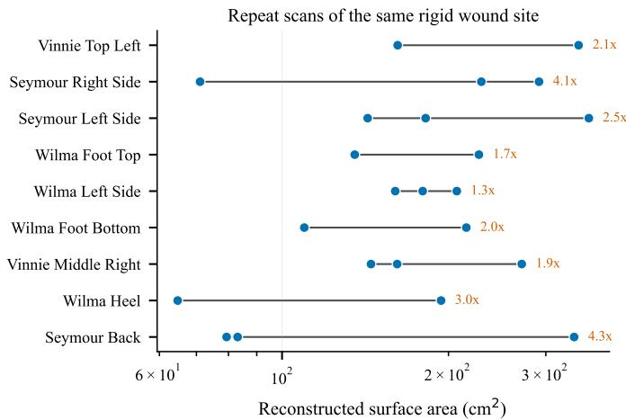
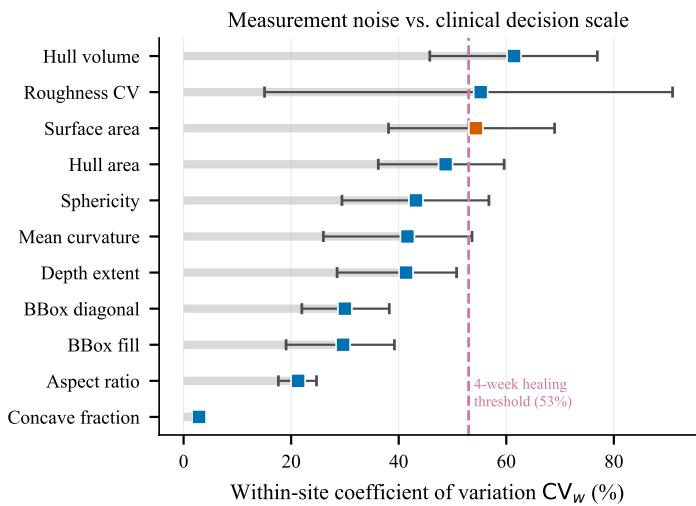

# Repeatability Characterisation and Error Budget of a Consumer Structured-Light Scanner for 3-D Wound Geometry: A Rigid-Phantom Study

Pushkal Kumar, Aadit Aggarwal, and Karlen Aleksanyan

Abstract—We characterise the measurement error of a freehand consumer structured-light scanner used to derive threedimensional geometric wound descriptors. Rigid wound-care phantoms cannot change, so every difference between repeat scans of one site is measurement error; all repeats come from a single scanner unit, nine sites and 23 scans, so this characterises one instrument. The 95 percent repeatability limit for reconstructed surface area is a factor of 4.8, with a confidence interval from 3.0 to 7.0, so rescanning an unchanged site can shift the reading from a 79 percent decrease to a 377 percent increase. Forty-four of 45 descriptors fall below an intraclass correlation of 0.50, and none of 248 descriptor and pipeline combinations reaches 0.75. An error budget formed by holding the analysis region fixed, leaving sensor and reconstruction untouched, bounds the share of variance attributable to how much surface the operator captured at 75 percent for surface area, 91 percent for hull area and 95 percent for bounding-box diagonal; only hull volume is majority instrumental, at 48 percent, so a better sensor would buy little. No wound is delineated anywhere in the chain, so the comparison against the four-week area reduction used clinically to predict healing, a ratio near 2.1, is a lower bound on the noise an unsegmented pipeline must overcome, not a measurement of wound-area reproducibility. Standardising the analysis region cuts the limit to 2.13, meeting that ratio rather than clearing it. Statistical outlier removal imposes a measured systematic area deficit near 11 percent.

Index Terms—Biomedical measurement, error analysis, measurement uncertainty, structured light, surface reconstruction.

## I. INTRODUCTION

million beneficiaries, with annual expenditure in the tens of billions of dollars [1], [2], [3]. Because treatment decisions hinge on whether a wound is closing, measurement is not incidental to wound care; it is the mechanism by which care is steered.

The measurement in routine use is poor. Ruler-based length × width overestimates area by roughly 40 % relative to digital planimetry [4], and its inter-rater intraclass correlation has been reported as low as 0.34 against 0.77 for a smartphone planimetry application [5]. Margin identification, rather than the tracing itself, dominates the error [6], and systematic review has found most instrument evaluations methodologically weak [7].

This has motivated a large body of work on threedimensional capture. Structured light, stereophotogrammetry, and more recently consumer smartphone depth sensors have all been applied to wounds [8], [9], [10], [11], and the derived quantities have expanded well beyond area into volume, depth distribution, surface curvature, and roughness indices treated as digital biomarkers of healing.

The evidence for that expansion is thinner than its adoption suggests. Area measurement by 3-D systems is reliably good, with intraclass correlations above 0.95 across several studies. Depth and volume are a different matter: commercial 3-D cameras have been reported to underestimate volume against water displacement by 23 to 58 % [12], clinical depth agreement can fall to R = 0.49 [13], and successive systematic reviews conclude that 3-D wound technologies remain underevidenced rather than established [14], [15], [16].

A descriptor is useful for monitoring only if a clinically meaningful change in it is larger than the noise with which it is measured. That comparison is rarely made, in part because separating measurement error from biological change in patients requires the biology to hold still, which it does not. Our design sidesteps the problem: we scan rigid synthetic wound models. Their geometry cannot change between captures, so the entire observed spread across repeat scans is attributable to the acquisition-to-descriptor chain.

This paper makes four contributions.

1) A repeatability characterisation of 45 geometric wound descriptors computed from consumer structured-light scans of rigid phantoms, with a variance decomposition separating between-site morphological spread from within-site measurement error.

2) Per-descriptor noise floors – repeatability coefficients and minimum detectable changes – benchmarked directly against the area-reduction thresholds used in wound care.

3) A curvature estimator that is resolution-independent over a measured window, motivated by the observation that repeat scans of one site differ by up to a factor of 15 in vertex density, which makes per-vertex discrete curvature incomparable between captures.

4) An error budget apportioning the measurement variance between capture extent and the instrument. Capture extent accounts for 75 % of the variance in surface area and 95 % in bounding-box diagonal, so a better sensor would buy little; standardising the analysis region recovers most of it in software, cutting the surface-area repeatability limit from 4.6 to 2.1 while raising intraclass correlation from 0.02 to 0.20.

The headline result is cautionary, and we think a useful one: it is specific, it is quantitative, and it supplies the noise floors that a positive claim in this area has to clear. A cautionary headline is not the whole of it, though. The same analysis identifies which error source dominates and shows that one inexpensive change to the processing pipeline removes most of it.

## II. MATERIALS

## A. Sensor Taxonomy

Terminology in this literature is inconsistent. Active optical 3-D sensing divides into time-of-flight ranging and triangulation, in which depth follows from the geometry of a projected pattern observed off-axis. Both scanners used here are triangulation devices employing infrared structured light. Neither is a LiDAR, and the Apple TrueDepth camera often described as one in wound literature is likewise an infrared dot-projector structured-light system; the rear-facing Apple LiDAR Scanner is a genuinely distinct direct time-of-flight device with roughly centimetre accuracy and a reported object detection limit near 5 cm [17], [18]. We use “structured light” throughout.

## B. Scanners

Two commercial handheld scanners were used. The Shining3D Einstar is an infrared VCSEL structured-light scanner with a vendor-stated point distance of 0.1 to 3 mm and a working distance of 160 to 1400 mm. The Revopoint RANGE is a binocular infrared structured-light scanner with a vendorstated single-frame accuracy of 0.3 mm, a point distance of 0.3 mm, and a working distance of 300 to 800 mm.

Two points deserve emphasis because they bound what follows. First, vendors specify point distance, a sampling density, far more often than accuracy, and the two are routinely conflated. Second, both devices are marketed for objects substantially larger than a wound: the Einstar documentation suggests a minimum object of roughly 100 mm on a side, and the RANGE specifies a minimum scan volume of 50×50×50 mm. Typical wounds approach or fall below these bounds, so this study operates near the edge of the declared operating envelope. That is not a flaw in the experiment; it is the condition under which such devices are actually being applied to wounds.

## C. Phantoms

All targets were commercially manufactured wound-care training models from VATA Inc. (Canby, OR, USA): the Seymour II wound care model (sacral and hip pressure injuries), the Wilma Wound Foot, the Vinnie Venous Insufficiency Leg, the Annie Arterial Insufficiency Leg, and the Pat Pressure Injury Staging Model, together with separate moulded staging reference blocks. Between them these models present staged pressure injuries, unstageable eschar, neuropathic and arterial ulcers, dehisced surgical wounds, and callus and fissure features.

Using phantoms is what makes the variance decomposition identifiable. The models are rigid and unchanging, so a difference between two scans of one site is measurement error by construction, with no biological component to disentangle. The models are also catalogue items, so the reference geometry is available to any group wishing to replicate this work – a property patient wounds do not have. Phantoms have been used for exactly this purpose in prior 3-D wound work [19]. The corresponding limitation, that moulded polymer differs from living tissue in specular and subsurface optical behaviour, is treated in Section VI.

## D. Corpus

The corpus comprises 66 triangle meshes: 26 from the Einstar, each of a distinct wound site, and 40 from the RANGE, covering 26 sites. Nine of the RANGE sites were captured two or three times, giving 23 scans that constitute the repeatability set. Scans were acquired free-hand, which is how these devices are used in practice and is the acquisition mode whose variance we intend to characterise. Only the two staging reference blocks were captured on both devices, which is too few for a cross-device agreement analysis; we therefore make no such claim.

No usable acquisition timestamps exist for this corpus, so it supports no longitudinal analysis, and none is attempted.

## III. METHODS

## A. Preprocessing

Each mesh was cleaned by statistical outlier removal followed by Taubin smoothing. For outlier removal, the mean distance ${ \bar { d } } _ { i }$ from each vertex to its $k = 2 0$ nearest neighbours was computed, and vertices with $\bar { d } _ { i } > \mu _ { d } + 2 \sigma _ { d }$ discarded.

One implementation detail is worth stating because it is easy to get wrong and its failure is silent. A vertex cannot be deleted without also deleting every face incident on it. Retaining those faces re-indexes them onto surviving vertices and stitches the mesh across the resulting holes, which in our corpus inflated surface area by up to a factor of seven and Gaussian curvature by several orders of magnitude, while leaving a mesh that loads and renders without complaint. A face is therefore kept only when all three of its vertices survive.

Statistical outlier removal carries a systematic cost that we quantified only after the fact, and it is larger than we expected. Run on analytic surfaces that contain no noise and no outliers at all, the $\mu _ { d } + 2 \sigma _ { d }$ criterion still discards 4.0 % to 7.3 % of vertices and 6.1 % to 12.7 % of true surface area, because the threshold is relative and therefore always removes an upper tail. Over the full chain the reconstructed area of an object of known geometry comes out about 11 % low. Every absolute area in this paper carries that deficit. It does not affect any conclusion here, because every headline statistic is a ratio of two areas measured through the same chain and the bias is common-mode, but it does mean the absolute areas should not be read as calibrated measurements.

Smoothing used the Taubin $\lambda ~ \mid ~ \mu$ filter with $\lambda ~ = ~ 0 . 5$ $\mu ~ = ~ - 0 . 5 3$ , and ten iterations [20], [21], which alternates a shrinking and an inflating Laplacian step so that low frequencies pass while high-frequency noise is attenuated. Section IV-F reports the measured effect of this choice rather than assuming it.

## B. Descriptors

Every scan in this corpus is an open surface: none of the 66 meshes is watertight. This immediately invalidates a family of descriptors in common use. Enclosed mesh volume is undefined on an open surface, and so is the hull-minus-mesh difference frequently used as an “estimated wound volume.” We compute convex hull volume, which is well defined, and report enclosed volume as missing rather than substituting a number that has no geometric meaning.

What the descriptors are computed over: One definitional point governs how every number in this paper should be read. No wound is segmented anywhere in our pipeline. Surface area is the area of the reconstructed mesh, which is whatever the operator framed into the capture – regions of 65 to $\mathrm { 3 5 9 c m ^ { 2 } }$ in the repeat set, often an entire limb or sacral region rather than an isolated wound bed. Clinical planimetry, by contrast, measures a delineated wound margin, typically 1 to $\mathrm { 2 0 \mathrm { c m } ^ { 2 } }$

These are different measurands, and we do not claim otherwise. What we characterise is the reproducibility of descriptors as computed in automated pipelines of this kind, where the mesh is taken as given and no delineation intervenes; clinical comparisons below are stated as a lower bound on the noise such a pipeline must overcome. Section IV-D3 reports what happens when a delineation step is added.

We extract 45 numeric descriptors in two families. Extensive descriptors scale with how much surface was captured: surface area, hull area and volume, bounding-box dimensions and diagonal, and vertex count. Intensive descriptors are ratios or per-unit quantities intended to be scale-free: shape ratios, sphericity, flatness, bounding-box fill, and distributional statistics of mean and Gaussian curvature (mean, standard deviation, median, four percentiles, interquartile range, skewness, kurtosis), plus a roughness coefficient of variation, root-meansquare curvature, and concave fraction.

Per-vertex curvature was estimated with the cotangent Laplace–Beltrami operator for mean curvature and the angledeficit formula for Gaussian curvature [22], [23]. Boundary vertices are excluded: both estimators are undefined on an open boundary, and including them injects a large artefact that scales with how the scan happened to be cropped.

## C. Scale-Normalised Curvature

Discrete per-vertex curvature is defined on the mesh graph, so its value depends on how finely the surface is sampled. In this corpus that dependence is not a subtlety: repeat scans of a single site differ by a median factor of 4.6 in vertex density, and density ranges over a factor of 43 across the corpus. That spread sits almost wholly inside one instrument: the Revopoint scans span a factor of 43 between them while the Einstar scans span 1.3, so the confound lives within the device on which every repeatability result here is computed. Two scans of the same rigid wound therefore yield curvature statistics computed at different effective scales.

We remove that dependence by estimating curvature at a fixed spatial scale instead of per vertex. A fixed number of points $N _ { s } = 4 0 0 0$ is sampled uniformly by area; around each, all vertices within a fixed radius r are collected and a quadric

$$
z = a x ^ { 2 } + b x y + c y ^ { 2 } + d x + e y + f\tag{1}
$$

is fitted by least squares in a local frame whose third axis is the smallest-variance direction of the neighbourhood. Mean and Gaussian curvature follow from the first and second fundamental forms,

$$
K = { \frac { L N - M ^ { 2 } } { E G - F ^ { 2 } } } , \qquad H = { \frac { E N - 2 F M + G L } { 2 \left( E G - F ^ { 2 } \right) } } ,\tag{2}
$$

with $E = 1 + d ^ { 2 } , F = d e , G = 1 + e ^ { 2 }$ and $L , M , N$ the second-form coefficients obtained from $a , b , c .$ . Because both the support radius and the sample count are held constant, the estimator no longer inherits mesh resolution. That independence holds over a window rather than by construction, and Section IV-D4 measures where the window ends. We evaluate $r \in \{ 2 , 3 , 5 \}$ mm.

## D. Variance Decomposition

In the vocabulary of ISO 5725-1 [24], what we estimate is a precision statistic under conditions between repeatability and intermediate precision: the same operator, procedure and instrument, on an unchanging measurand, with the scan repeated. Trueness is not estimated, since no certified artefact was available; Section VI returns to that.

For a descriptor measured on n sites with $m _ { i }$ repeats each, a one-way random-effects model gives the within-site variance $\sigma _ { w } ^ { 2 }$ , which is measurement error since the phantoms are rigid, and the between-site variance $\sigma _ { b } ^ { 2 }$ , which is morphological spread across distinct wounds. The intraclass correlation

$$
\mathrm { I C C } ( 1 , 1 ) = \frac { \sigma _ { b } ^ { 2 } } { \sigma _ { b } ^ { 2 } + \sigma _ { w } ^ { 2 } }\tag{3}
$$

is the fraction of observed variance attributable to morphology. We use the one-way form because each site is measured by the same procedure with no crossed rater factor, and we report exact F-based confidence intervals following the reporting guidance of Koo and Li [25], [26].

## E. Precision and Detectable Change

Intraclass correlation answers whether a descriptor separates these wounds, which depends on the cohort. For monitoring one wound over time the relevant question is different and more portable: how large must a change be before it exceeds noise? That is set by within-site precision alone. We report the pooled within-site coefficient of variation $\mathrm { C V } _ { w }$ , and the repeatability coefficient $\mathrm { R C } = 2 . 7 7 \sigma _ { w } ,$ , the 95 % limit on the difference between two measurements of an unchanged wound [27], [28].

Most of these descriptors are ratio-scale quantities whose error is proportional rather than additive, and several carry $\mathrm { C V } _ { w }$ above 50 %, where a symmetric limit expressed as a percentage is both distributionally implausible and awkward to interpret – a bounded quantity cannot fall by more than 100 %. The primary limits of agreement are therefore computed on log-transformed values and back-transform, following the standard treatment for proportional error [28]. The result is a multiplicative repeatability ratio

$$
R _ { 9 5 } = \exp ( 2 . 7 7 \sigma _ { \log } ) ,\tag{4}
$$

read as “two scans of an unchanged wound can differ by up to a factor of $R _ { 9 5 } . \ ' $ Confidence intervals for both forms come from a cluster bootstrap over sites with 2000 resamples, since repeats within a site are not independent.

Because ICC(1, 1) and $\mathrm { C V } _ { w }$ can diverge – a descriptor that is nearly constant across wounds is precise but uninformative – we also report the signal-to-noise ratio $\sigma _ { b } / \sigma _ { w } .$ , and treat a descriptor as potentially useful only when it is both precise and varies more between wounds than within them.

## IV. RESULTS

## A. Capture Variability

Repeat scans of one site vary enormously in what they capture (Fig. 1). The median within-site ratio between the largest and smallest vertex count is 3.5, reaching 17.1 at one site; the median vertex density ratio is 4.6; and the median ratio of reconstructed surface area is 2.12. A twofold difference in the measured surface area of a rigid object between two captures, before any descriptor is computed, sets the scale of the problem (Fig. 1).

## B. Precision and Detectable Change

Fig. 2 gives within-site precision for the descriptors of greatest clinical interest.

Surface area has $\mathrm { C V } _ { w } = 5 4 . 4 \%$ (95 % CI 38.1–69.0); the median difference between two scans of the same unchanged wound is 60.8 %, and the minimum detectable change is 151 %. Convex hull volume is worse, at $\mathrm { C V } _ { w } = 6 1 . 4 \%$ and $\mathrm { M D C } = 1 7 0 \%$ . A minimum detectable change above 100 % is a signal that the symmetric parameterisation has been pushed past its useful range, which is why we treat the log-scale limits below as primary; the two are the same quantity expressed on different scales.

On the log scale, which is the appropriate one for these proportional errors, the 95 % repeatability limit for surface area is a factor of $R _ { 9 5 } = 4 . 7 7$ (95 % CI 3.02–6.95), so rescanning one unchanged wound can shift the reading by anywhere from −79 to +377 %. Convex hull volume is far worse at $R _ { 9 5 } =$ 10.6 (95 % CI 4.12–28.19), and only the near-constant concave fraction is tight, at $R _ { 9 5 } = 1 . 0 8$ (Table I).

  
Fig. 1. Reconstructed surface area for every repeat scan of each site. The phantoms are rigid, so all spread within a row is measurement error. Annotations give the max/min ratio within each site. Note the logarithmic axis.

  
Fig. 2. Within-site coefficient of variation with cluster-bootstrap 95 % confidence intervals, against the four-week area reduction used clinically to predict healing. Every descriptor except the near-constant concave fraction sits at or approaching that decision scale.

TABLE I  
MULTIPLICATIVE 95 % REPEATABILITY LIMITS $R _ { 9 5 }$ WITH CLUSTER-BOOTSTRAP CONFIDENCE INTERVALS. A VALUE OF 1.0 WOULD MEAN PERFECT REPEATABILITY.
<table><tr><td>Descriptor</td><td> $\mathbf { R _ { 9 5 } }$ </td><td>95 % CI</td></tr><tr><td>Concave fraction</td><td>1.08</td><td>1.05-1.11</td></tr><tr><td>Bounding-box diagonal</td><td>2.47</td><td>1.86–3.31</td></tr><tr><td>Mean curvature</td><td>3.48</td><td>2.12–5.31</td></tr><tr><td>Depth extent</td><td>3.90</td><td>2.39–5.72</td></tr><tr><td>Hull area</td><td>4.75</td><td>2.79-7.92</td></tr><tr><td>Surface area</td><td>4.77</td><td>3.02–6.95</td></tr><tr><td>Roughness CV</td><td>5.07</td><td>1.55–13.76</td></tr><tr><td>Hull volume</td><td>10.63</td><td>4.12–28.19</td></tr></table>

TABLE II  
INTRACLASS CORRELATION BY DESCRIPTOR FAMILY AND PROCESSING PIPELINE. NO DESCRIPTOR REACHES THE GOOD-RELIABILITY THRESHOLD OF 0.75 UNDER ANY PIPELINE.
<table><tr><td>Pipeline</td><td>n</td><td>Mean</td><td>Max</td><td> $\geq \mathbf { 0 . 7 5 }$ </td></tr><tr><td>As-acquired</td><td>45</td><td>0.148</td><td>0.560</td><td>0/45</td></tr><tr><td>extensive</td><td>12</td><td>0.016</td><td>0.068</td><td>0/12</td></tr><tr><td>intensive</td><td>33</td><td>0.195</td><td>0.560</td><td>0/33</td></tr><tr><td>ROI r=15 mm</td><td>41</td><td>0.065</td><td>0.312</td><td>0/41</td></tr><tr><td>ROI r=25 mm</td><td>41</td><td>0.167</td><td>0.502</td><td>0/41</td></tr><tr><td> $\mathrm { R O I } \ r { = } 4 0 \mathrm { m m }$ </td><td>41</td><td>0.142</td><td>0.436</td><td>0/41</td></tr><tr><td>Scale-norm. r=2 mm</td><td>27</td><td>0.108</td><td>0.450</td><td>0/27</td></tr><tr><td>Scale-norm. r=3 mm</td><td>27</td><td>0.107</td><td>0.462</td><td>0/27</td></tr><tr><td>Scale-norm. r=5 mm</td><td>26</td><td>0.095</td><td>0.452</td><td>0/26</td></tr><tr><td>All comb.</td><td>248</td><td>0.122</td><td>0.560</td><td>0/248</td></tr></table>

These figures are best read against the thresholds clinicians actually use. A 53 % reduction in wound area at four weeks is the classical predictor of healing at twelve weeks in diabetic foot ulcers, with an analogous threshold near 44 % for venous leg ulcers. A 53 % reduction is a ratio of 0.47, that is, a factor of 2.13. The measurement process alone spans a factor of 4.77, so the noise band is 2.2 times wider than the change the clinician is trying to detect.

We state this comparison carefully. The descriptors are computed over the reconstructed patch rather than a delineated wound bed, so this is not a measurement of wound-area reproducibility; our limit comes from scans separated by minutes against a four-week clinical threshold; and five of the nine repeat sites were captured within one session, so the estimate blends within- and between-session conditions.

What the comparison does establish, and all it establishes, is a lower bound on the noise that an unsegmented pipeline of this kind must overcome before it can resolve the effect clinicians act on. That bound exceeds the effect. The regionstandardisation result in Section IV-D shows what closes the gap.

Only one of 45 descriptors achieves a minimum detectable change below 50 %. That descriptor is the concave fraction, and it fails for the opposite reason: it is precise $( \mathrm { C V } _ { w } = 2 . 9 \% )$ because it is nearly constant, ranging only from 0.49 to 0.62 across all 66 scans. Roughly half of any noisy surface is locally concave, so the quantity is close to a property of surface noise rather than of the wound. Its signal-to-noise ratio is 0.57.

## C. Variance Decomposition

Consistent with the precision results, 44 of 45 descriptors fall below an intraclass correlation of 0.50 (Table II), the conventional boundary of poor reliability, and none reaches 0.75.

The best descriptor is mean curvature at $\mathrm { I C C } ( 1 , 1 ) = 0 . 5 6 0$ with a confidence interval from 0.103 to 0.867 that illustrates how little nine sites constrain the estimate. Extensive descriptors are worse than intensive ones by an order of magnitude in mean ICC(1, 1) (0.016 against 0.195), which is what one expects when capture extent varies twofold and the descriptor scales with it.

TABLE III  
REGION STANDARDISATION TRADES PRECISION AGAINST SIGNAL. $R _ { 9 5 }$ IS THE MULTIPLICATIVE REPEATABILITY LIMIT (LOWER IS BETTER); $\operatorname { I C C } ( 1 , 1 )$ AND THE BETWEEN-SITE CV MEASURE WHETHER ANY SITE-SPECIFIC SIGNAL SURVIVES. $A / \pi r ^ { 2 }$ IS THE FRACTION OF THE CROP DISC THE RETAINED SURFACE FILLS.
<table><tr><td>Arm</td><td> $\mathbf { R _ { 9 5 } }$ </td><td> $\mathrm { C V } _ { w } ~ ( \% )$ </td><td>Between-site CV ICC(1, 1)</td><td></td></tr><tr><td>Surface area</td><td></td><td></td><td></td><td></td></tr><tr><td>As-acquired</td><td>4.59</td><td>53.4</td><td></td><td>0.000</td></tr><tr><td> $\mathrm { R O I } ~ r \mathrm { = } 1 5$  mm</td><td>11.14</td><td>65.0</td><td>26.1 %</td><td>0.000</td></tr><tr><td>ROI r=25 mm</td><td>2.13</td><td>27.0</td><td>17.1 %</td><td>0.202</td></tr><tr><td> $\mathrm { R O I } \ r { = } 4 0 \mathrm { m m }$ </td><td>1.63</td><td>17.8</td><td>14.7 %</td><td>0.000</td></tr><tr><td colspan="5">Crop saturation,  $A / \pi r ^ { 2 }$ </td></tr><tr><td> $r { = } 1 5$  mm</td><td></td><td></td><td>0.685</td><td></td></tr><tr><td>r=25 mm</td><td></td><td></td><td>0.813</td><td></td></tr><tr><td> $r { = } 4 0 \mathrm { m m }$ </td><td></td><td></td><td>1.002</td><td></td></tr></table>

## D. Do the Obvious Remedies Help?

Two interventions follow directly from the diagnosis, and we tested both.

1) Standardising the analysis region: Cropping every scan to a fixed-radius patch about its centroid before computing descriptors addresses capture extent directly. Judged by intraclass correlation the effect looks modest, with mean ICC(1, 1) for extensive descriptors rising from 0.016 to 0.204. That reading is misleading, because ICC(1, 1) is bounded above by the between-site spread of this particular cohort. Judged by precision, which is what determines whether a change is detectable, the effect is large (Table III).

Read by precision alone, larger radii look progressively better: the surface-area repeatability limit falls from 4.59 asacquired to 2.13 at 25 mm and 1.63 at 40 mm. That reading is a trap, and it is the same trap the concave fraction fell into in Section III-E.

At r = 40 mm the retained surface fills the crop disc to within 0.2 % $( A / \pi r ^ { 2 } = 1 . 0 0 2 )$ , and the mean boundingbox diagonal is 114.4 mm against the disc’s own 113.1 mm. The descriptor has stopped measuring the wound and started measuring our crop. Intraclass correlation confirms it: 0.000 for both surface area and bounding-box diagonal, the latter with an upper confidence bound of 0.079. An $R _ { 9 5 }$ of 1.63 is then the repeatability of a geometric convention, and we do not offer it as evidence that anything clinical has been achieved.

The informative arm is $r ~ = ~ 2 5 \mathrm { { m m } }$ , where the crop is not yet saturated (0.813), between-site variation survives at 17.1 %, and intraclass correlation rises from 0.016 as-acquired to 0.202 – the largest improvement in site discrimination anywhere in this study. Its repeatability limit is 2.13, against a clinical decision ratio of 2.13. The honest optimum lands exactly on the threshold rather than clearing it.

At r = 15 mm the crop is too small: precision is worse than as-acquired $( R _ { 9 5 } = 1 1 . 1 4 )$ and four scans lose their region entirely. Region standardisation is thus bounded on both sides, and its apparent best case is an artefact.

2) Removing the resolution dependence: The fixed-scale quadric estimator of Section III-C removes the samplingdensity dependence by construction, and we validated it against analytic ground truth: on a sphere of radius 20 mm it recovers $\textit { H } = \ 0 . 0 5 0 2 \mathrm { { m m } ^ { - 1 } }$ against a true 0.05 and $K = 0 . 0 0 2 5 2 \mathrm { { m m } ^ { - 2 } }$ against a true 0.0025, with consistent sign; on an open cylindrical patch of radius 15 mm it recovers $H = 0 . 0 3 3 6$ against a true $1 / 2 R = 0 . 0 3 3 3$ , and K ≈ 0.

It does not improve reliability. Mean ICC(1, 1) across the curvature block is 0.107 at r = 3 mm, against 0.195 for the intensive descriptors as-acquired, and the maximum is 0.462. Making curvature comparable across resolutions is necessary for the descriptors to mean the same thing in two scans, but it does not manufacture signal that the acquisition did not capture.

3) Would segmenting the wound fix it?: The natural objection is that these descriptors are computed over the captured patch rather than a delineated wound, and that segmenting first would resolve it. We tested the automated form of that fix: a reference surface from heavy Laplacian smoothing, per-vertex depth below it taken relative to the median, and the largest connected patch deeper than a threshold kept as the cavity. It fails, and in the direction the rest of this paper predicts. At a 2 mm threshold a cavity is found in only 12 of 23 repeat-set scans, and at all repeats of a site in only three of nine sites; where two scans of one site both yield a cavity, the extracted area differs by a median factor of 64.5 and by as much as 247. Against a whole-patch limit of $R _ { 9 5 } = 4 . 5 9$ , automated delineation is about an order of magnitude worse. The reason is the one the error budget identifies: the reference surface is built from the captured mesh, so it inherits capture extent, and a depth measured against it inherits it too. Segmentation does not escape the dominant error source by operating downstream of it. Manual tracing by trained raters uses information no geometric criterion has, and remains the right fix.

4) Where the fixed-scale estimator stops working: Section III-C introduced the fixed-scale estimator to make curvature comparable between scans of unequal density. We measured that rather than assuming it. The eight densest meshes were preprocessed once and then decimated by quadric edge collapse down a ten-rung ladder from 16 to $0 . 7 1 \mathrm { m m } ^ { - 2 }$ the range the corpus spans, with every descriptor recomputed at each rung against that mesh’s own dense reference.

Size and shape-ratio descriptors are effectively resolutionfree: median absolute bias runs from 0.05 % to 0.32 % and from 0.10 % to 0.56 % across the whole ladder, so the precision and error-budget results above are not resolution artefacts. Per-vertex curvature is not: median absolute bias is already 15.4 % at the densest rung and reaches 63.8 % at the sparsest. The premise behind the estimator is confirmed.

Its remedy is only partly delivered, and this corrects a claim we made earlier. At r = 3 mm the median absolute bias sits near the estimator’s own seed-to-seed floor from 16 down to about 4 mm−2 (4.2 % to 5.3 %), then grows to 8.3 % at 2.0, 17.3 % at 1.0 and 40.3 % at $0 . 7 1 \mathrm { m m } ^ { - 2 }$ . A larger support extends the window, with r = 5 mm holding within 2.6 % to 8.6 % across the entire ladder, but a larger support also truncates genuine small-scale curvature. The estimator is therefore resolution-independent over a measured window, not by construction, and r must be chosen jointly against the sparsest density and the smallest feature a study needs to resolve.

5) The combined screen: Across all 248 descriptor–pipeline combinations, none reaches $\mathrm { { I C C } ( 1 , 1 ) ~ = ~ 0 . 7 5 }$ , and none combines $\mathrm { C V } _ { w } ~ < ~ 2 5 \%$ with $\sigma _ { b } / \sigma _ { w } ~ > ~ 1$ . Only two combinations have a between-site signal exceeding their withinsite noise at all: mean curvature as-acquired $( \sigma _ { b } / \sigma _ { w } = 1 . 1 3 ,$ $\mathrm { C V } _ { w } = 4 1 . 6 \% )$ and Gaussian-curvature kurtosis under 25 mm region standardisation $( \sigma _ { b } / \sigma _ { w } = 1 . 0 0 , \mathrm { C V } _ { w } = 9 0 . 8 \% )$ . Both are too imprecise to act on.

This is the sense in which the remedies are partial. Region standardisation substantially improves precision, which is what longitudinal monitoring needs, and on that axis it is close to sufficient for surface area. Neither remedy makes any descriptor a reliable discriminator between wound sites in this cohort.

## E. Error Budget

The interventions above are not only remedies; each one controls a named error source, so re-measuring with it applied apportions the variance. On the log scale $\sigma _ { \mathrm { l o g } } = \ln { R _ { 9 5 } } / 2 . 7 7$ and variances add, so controlling a cause and differencing gives its share directly,

$$
\sigma _ { \mathrm { c a u s e } } ^ { 2 } = \sigma _ { \mathrm { u n c o n t r o l l e d } } ^ { 2 } - \sigma _ { \mathrm { c o n t r o l l e d } } ^ { 2 } .\tag{5}
$$

Region standardisation at 25 mm controls capture extent while leaving the sensor, the reconstruction, and the processing untouched. The resulting split is lopsided. Capture extent accounts for 75 % of the measurement variance in surface area, with $R _ { 9 5 }$ falling from 4.59 to 2.13 once it is controlled, 91 % in hull area (4.89 to 1.61) and 95 % in bounding-box diagonal (2.51 to 1.23). Everything attributable to the instrument itself – sensor noise, stereo reconstruction, meshing, and our own preprocessing – accounts for the remaining quarter or less. Enclosed hull volume is the exception at 48 % (11.81 to 5.98), and is the one descriptor whose error is majority-instrumental.

Two consequences follow. A better sensor would buy little: eliminating instrument error entirely would reduce the surfacearea limit only from 4.59 to about 2.1, which region standardisation already achieves in software. Enclosed volume is the exception, with barely half its variance attributable to extent – it is reconstructed from a surface nowhere watertight in this corpus, and that residual is where sensor quality genuinely binds.

## F. Effect of Smoothing

We measured the effect of smoothing on 14 meshes rather than assume it Taubin smoothing preserves bulk geometry well: after ten iterations the median change in convex hull volume is −0.03 % (IQR −0.07 to −0.00), against 1.29 % (IQR +0.49 to +2.84) for plain Laplacian smoothing at the same iteration count.

The effect on texture is another matter. Ten Taubin iterations attenuate root-mean-square curvature by 49.8 %, removing half the texture signal. Laplacian smoothing degrades nonmonotonically, with root-mean-square curvature rising 435 % at ten iterations and by two orders of magnitude by thirty, as the filter drives triangles toward degeneracy and the angledeficit estimator divides by vanishing vertex areas.

This matters for any roughness descriptor: smoothing suppresses exactly the high-frequency content roughness measures, so a roughness index is a joint function of the wound and the smoothing parameters, and such values are not comparable across studies that smooth differently. Our parameters are stated for that reason, and roughness claims in this literature are probably best read with the preprocessing in view.

## V. DISCUSSION

## A. What Limits These Measurements

The binding constraint is not sensor resolution: the scanner specifies a point distance far finer than the effects we are trying to resolve. It is that a free-hand operator does not capture the same surface twice, with coverage varying twofold in area and up to seventeenfold in vertex count between repeats of one site. Size-dependent descriptors inherit that variance directly, intensive ones indirectly through resolution-dependent estimators and boundary effects.

This is encouraging: acquisition variance is an engineering problem with known remedies – fixed standoff, a registration fiducial, a defined wound margin, resampling to fixed density – whereas a sensor noise floor would not be. Our post hoc remedies each move the metric without being sufficient, and automated delineation makes matters worse (Section IV-D3). A protocol that controls framing at acquisition time, rather than compensating afterwards, is the obvious next step.

## B. Relation to Prior Work

Our findings agree with the more careful strand of this literature: reviews finding 3-D wound technology under-evidenced, only moderate accuracy for depth and volume against high reproducibility for area, volume underestimated by 23 to 58 % against water displacement, and clinical depth correlations near R = 0.5 [14], [15], [16], [12], [13].

The tension with studies reporting high 3-D area reliability is largely explained by acquisition conditions: those studies use fixed or tripod-mounted capture, a defined wound margin, and trained operators, whereas the appeal of consumer scanners is that they dispense with that apparatus. Our numbers describe the free-hand consumer regime, and the convenience is not free.

## VI. LIMITATIONS

Nine repeat sites is a small basis for a variance decomposition, and the intraclass correlations are the weakest part of this study. Their intervals are so wide as to be nearly uninformative: 43 of 45 lower bounds sit at zero, and 12 of 45 upper bounds reach 0.75 or above. So the claim that no descriptor reaches good reliability is a claim about point estimates, and the data cannot exclude that several descriptors would clear that bar in a larger study. We report the correlations because they are the conventional currency of reliability work, but the precision statistics carry the argument: they depend only on within-site spread, are estimated from 14 within-site pairs, and are correspondingly better constrained.

The repeatability estimate mixes two conditions. Five of the nine repeat sites (the Seymour and Vinnie sites) were captured within one session, while the four Wilma sites span two sessions. Under ISO 5725-1 terminology [24] the former approximate repeatability conditions and the latter intermediate precision, and our pooled figure is a blend. We had expected between-session variability to dominate; it does not. The surface-area repeatability limit is 5.57 for the five same-session sites against 3.44 for the four cross-session sites, with the same ordering for hull area, hull volume, and bounding-box diagonal. Session is fully confounded with phantom identity here – same-session sites are all Seymour and Vinnie, crosssession all Wilma – so the contrast reflects which objects are harder to capture rather than an isolated session effect.

The corpus excludes a third set of 25 smartphone scans, which are surfel point clouds without mesh topology and admit none of these descriptors, so we say nothing about smartphone capture, the modality of greatest practical interest.

Sphericity is retained despite assuming a closed surface: on these open meshes it reaches 8.9 against a theoretical bound of 1. We keep it because it appears in comparable studies and its instability is informative, but it is not sphericity in the usual sense.

The design cannot fully separate sensor noise from operator framing; what it characterises is the end-to-end chain from free-hand acquisition to descriptor, which we take to be the clinically relevant quantity.

Moulded polymer phantoms differ optically from living tissue in specularity, subsurface scattering and moisture, and real wounds add exudate and dressing residue. Whether phantom repeatability is optimistic or pessimistic relative to patients is not established here, though the absence of patient movement suggests optimistic.

The scope of the instrument claim needs stating plainly. The corpus was captured on two scanners, but every repeat pair is from the Revopoint RANGE; the Einstar contributes 26 single scans and no repeats, so it enters the corpus description and nothing else. Every repeatability, correlation, precision, region and error-budget result in this paper therefore characterises one instrument. Only the two staging blocks were captured on both devices, which is too few for an agreement analysis, so we report no reproducibility across instruments and the figures here should not be assumed to transfer to the Einstar or to any other scanner.

We also report precision without trueness. Nothing in this corpus is a dimensionally certified artefact, and no reference measurement – coordinate measuring machine, water displacement, or calibrated gauge – was available, so we can say how consistently these descriptors are measured but not how close they are to the truth. A scanner that is repeatably wrong would pass every test in this paper. Trueness would require scanning an artefact of known geometry, which is the cheapest thing a follow-up study could add.

Finally, the corpus carries no reliable acquisition timestamps, so nothing here speaks to longitudinal measurement, and we make no claim about healing prediction.

## VII. CONCLUSION

We characterised the measurement repeatability of 45 threedimensional geometric wound descriptors computed from freehand consumer structured-light scans of rigid phantoms, a design in which all variability between repeat scans is measurement error. The 95 % repeatability limit for reconstructed surface area is a factor of 4.8, so two scans of an unchanged wound can differ by −79 to +377 %; 44 of 45 descriptors fall below an intraclass correlation of 0.50, and across 248 descriptor–pipeline combinations none reaches 0.75.

Capture extent, not sensor resolution, bounds these measurements, and that is the practical content of the study, because capture extent is addressable in software. Cropping the analysis region to a 25 mm radius cuts the surface-area limit to 2.13, which meets rather than clears the ratio the clinical threshold represents, and is the only manipulation we tested that also improves site discrimination; larger radii improve precision only by making the descriptor a function of the crop. A fixed-scale curvature estimator, validated here against analytic ground truth, is resolution-independent across the density range of the repeat set but not beyond it, and adds no reliability of its own on this cohort.

Descriptors of this kind should therefore be reported with the noise floors that bound them, and healing-prediction claims built on them checked against those floors first.

## ACKNOWLEDGMENT

The authors used Anthropic’s Claude, a large language model, to draft and revise prose throughout the manuscript, to write the analysis code in analysis\_v2/ that computes the descriptors, the variance decomposition, the precision and error-budget statistics and the figures, and to help locate and verify the references. The study design, the acquisition of all scan data, the interpretation of results and the conclusions are the authors’ own; the authors have verified every numeric claim against the computed result tables and take full responsibility for the content.

## REFERENCES

[1] M. J. Carter, J. DaVanzo, R. Haught, M. Nusgart, D. Cartwright, and C. E. Fife, “Chronic wound prevalence and the associated cost of treatment in Medicare beneficiaries: changes between 2014 and 2019,” Journal of Medical Economics, vol. 26, no. 1, pp. 894–901, 2023.

[2] S. R. Nussbaum, M. J. Carter, C. E. Fife, J. DaVanzo, R. Haught, M. Nusgart, and D. Cartwright, “An economic evaluation of the impact, cost, and Medicare policy implications of chronic nonhealing wounds,” Value in Health, vol. 21, no. 1, pp. 27–32, 2018.

[3] C. K. Sen, “Human wound and its burden: Updated 2025 compendium of estimates,” Advances in Wound Care, vol. 14, no. 9, pp. 429–438, 2025.

[4] L. C. Rogers, N. J. Bevilacqua, D. G. Armstrong, and G. Andros, “Digital planimetry results in more accurate wound measurements: A comparison to standard ruler measurements,” Journal of Diabetes Science and Technology, vol. 4, no. 4, pp. 799–802, 2010.

[5] C. Seat and A. Seat, “A prospective trial of interrater and intrarater reliability of wound measurement using a smartphone app versus the traditional ruler,” Wounds, vol. 29, no. 9, pp. E73–E77, 2017, no DOI assigned by the publisher.

[6] M. Flanagan, “Improving accuracy of wound measurement in clinical practice,” Ostomy/Wound Management, vol. 49, no. 10, pp. 28–40, 2003, pMID: 14652419.

[7] S. M. O’Meara, J. M. Bland, J. C. Dumville, and N. A. Cullum, “A systematic review of the performance of instruments designed to measure the dimensions of pressure ulcers,” Wound Repair and Regeneration, vol. 20, no. 3, pp. 263–276, 2012.

[8] P. Plassmann and T. D. Jones, “MAVIS: a non-invasive instrument to measure area and volume of wounds,” Medical Engineering & Physics, vol. 20, no. 5, pp. 332–338, 1998.

[9] T. A. Krouskop, R. Baker, and M. S. Wilson, “A noncontact wound measurement system,” Journal of Rehabilitation Research and Development, vol. 39, no. 3, pp. 337–345, 2002, pMID: 12173754.

[10] L. B. Jørgensen, S. M. Skov-Jeppesen, U. Halekoh, B. S. Rasmussen, J. A. Sørensen, G. B. E. Jemec, and K. B. Yderstræde, “Validation of three-dimensional wound measurements using a novel 3D-WAM camera,” Wound Repair and Regeneration, vol. 26, no. 6, pp. 456–462, 2018.

[11] B. Song, J. Kim, H. Kwon, S. Kim, S.-H. Oh, Y. Ha, and S.-H. Song, “Smartphone-based LiDAR application for easy and accurate wound size measurement,” Journal of Clinical Medicine, vol. 12, no. 18, p. 6042, 2023.

[12] K. J. Williams, V. Sounderajah, B. Dharmarajah, A. Thapar, and A. H. Davies, “Simulated wound assessment using digital planimetry versus three-dimensional cameras: Implications for clinical assessment,” Annals of Vascular Surgery, vol. 41, pp. 235–240, 2017.

[13] J. W. J. Lasschuit, J. Featherston, and K. T. T. Tonks, “Reliability of a three-dimensional wound camera and correlation with routine ruler measurement in diabetes-related foot ulceration,” Journal of Diabetes Science and Technology, vol. 15, no. 6, pp. 1361–1367, 2021.

[14] L. B. Jørgensen, J. A. Sørensen, G. B. E. Jemec, and K. B. Yderstræde, “Methods to assess area and volume of wounds – a systematic review,” International Wound Journal, vol. 13, no. 4, pp. 540–553, 2016.

[15] P. Tan, R. A. Basonbul, J. Lim, and N. Moiemen, “Performance of portable objective wound assessment tools: a systematic review,” Journal of Wound Care, vol. 32, no. 2, pp. 74–82, 2023.

[16] A. A. Mehl, N. Abdullah, P. K. Hembecker, and M. A. de Souza, “Advancing wound care with 3-D imaging: Clinical applications, performance and future directions,” Wound Repair and Regeneration, vol. 33, no. 5, p. e70089, 2025.

[17] G. Luetzenburg, A. Kroon, and A. A. Bjørk, “Evaluation of the Apple iPhone 12 Pro LiDAR for an application in geosciences,” Scientific Reports, vol. 11, no. 1, p. 22221, 2021.

[18] M. Vogt, A. Rips, and C. Emmelmann, “Comparison of iPad Pro’s LiDAR and TrueDepth capabilities with an industrial 3D scanning solution,” Technologies, vol. 9, no. 2, p. 25, 2021.

[19] D. Filko and E. K. Nyarko, “2D/3D wound segmentation and measurement based on a robot-driven reconstruction system,” Sensors, vol. 23, no. 6, p. 3298, 2023.

[20] G. Taubin, “A signal processing approach to fair surface design,” in Proceedings of the 22nd Annual Conference on Computer Graphics and Interactive Techniques (SIGGRAPH ’95). ACM Press, 1995, pp. 351– 358.

[21] ——, “Curve and surface smoothing without shrinkage,” in Proceedings of IEEE International Conference on Computer Vision (ICCV). Cambridge, MA, USA: IEEE, 1995, pp. 852–857.

[22] M. Meyer, M. Desbrun, P. Schröder, and A. H. Barr, “Discrete differential-geometry operators for triangulated 2-Manifolds,” in Visualization and Mathematics III, ser. Mathematics and Visualization, H.- C. Hege and K. Polthier, Eds. Berlin, Heidelberg: Springer Berlin Heidelberg, 2003, pp. 35–57.

[23] U. Pinkall and K. Polthier, “Computing discrete minimal surfaces and their conjugates,” Experimental Mathematics, vol. 2, no. 1, pp. 15–36, 1993.

[24] ISO 5725-1:2023, Accuracy (trueness and precision) of measurement methods and results — Part 1: General principles and definitions, 2nd ed., International Organization for Standardization, Geneva, Switzerland, 2023. [Online]. Available: https://www.iso.org/standard/ 69418.html

[25] T. K. Koo and M. Y. Li, “A guideline of selecting and reporting intraclass correlation coefficients for reliability research,” Journal of Chiropractic Medicine, vol. 15, no. 2, pp. 155–163, 2016.

[26] P. E. Shrout and J. L. Fleiss, “Intraclass correlations: Uses in assessing rater reliability,” Psychological Bulletin, vol. 86, no. 2, pp. 420–428, 1979.

[27] J. M. Bland and D. G. Altman, “Statistical methods for assessing agreement between two methods of clinical measurement,” The Lancet, vol. 327, no. 8476, pp. 307–310, 1986.

[28] ——, “Measuring agreement in method comparison studies,” Statistical Methods in Medical Research, vol. 8, no. 2, pp. 135–160, 1999.