# SELECT: SELEctive Context Transfer for Class-Incremental Semantic Segmentation

Avi Gupta1 avig@iiitd.ac.in

Saurabh Yadav2,1 yadavsaurabh@microsoft.com

0Koteswar Rao Jerripothula3,1 2kotesrj@iitk.ac.in

1 IIIT Delhi New Delhi, India

gTammam Tillo4,1 tammamtillo@tyust.edu.cn

2 Microsoft, India

3 IIT Kanpur Kanpur, India

4 TYUST, China

## Abstract

Class-Incremental Semantic Segmentation (CISS) is fundamentally challenged by catastrophic forgetting and background shift, where learning new concepts degrades performance on previously seen classes. While existing methods attempt to balance stability (retaining old knowledge) and plasticity (learning new knowledge), they often fail to leverage prior knowledge effectively. These approaches typically rely on indiscriminate knowledge transfer or ambiguous initializations, which can dilute crucial semantic information. To overcome this limitation, we propose SELECT1, a novel approach for Selective Context Transfer, which instead grounds each new class in a small set of semantically similar past classes. Its core is a Context Transfer Attention mechanism that aggregates the learned tokens from similar classes into a structured initialization for the new class. To ensure this transfer does not corrupt the borrowed representations, we add a controlled noise perturbation and a margin-based context-transfer loss that enforces separation between the new class token and its source tokens. Extensive experiments on Pascal VOC and ADE20K show that SELECT consistently outperforms prior work, achieving mIoU of 2.2% on VOC and 2.8% on ADE, providing an effective handle on the stability-plasticity dilemma. Code is available at https://github.com/avigupta2798/SELECT.

## Introduction

Semantic segmentation, the task of assigning a class label to every pixel in an image, is a cornerstone of modern computer vision [41]. It underpins critical vision applications, from navigating urban traffic to identifying pathological tissue [27, 34]. However, most standard segmentation models are trained once and deployed as static systems. They lack the ability to actively learn and extend their representations when new object classes appear in a continuous stream. Real-world systems, in contrast, require continual adaptation; integrating unfamiliar classes as they arise. Instead of constantly retraining from scratch on continuously evolving data distributions, the focus should shift to Class-Incremental Semantic Segmentation (CISS), where the model sequentially learns new classes while retaining knowledge of previously seen ones.

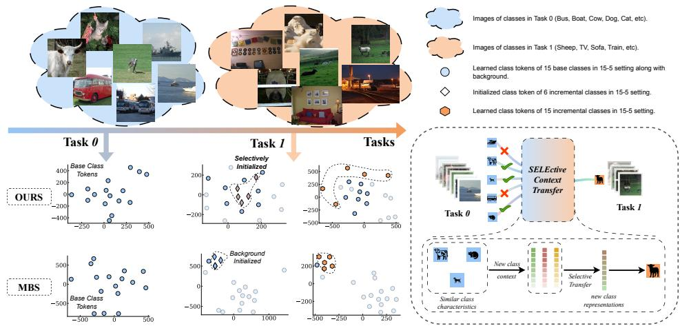  
Figure 1: Comparative analysis of knowledge transfer: At Task 0, both our method and MBS [35] learn the initial classes identically. However, at Task 1, MBS initializes the new class tokens using the background. This causes the new tokens to cluster in an isolated corner, far from meaningful features. In contrast, our strategy dynamically anchors new classes to semantically similar past classes, resulting in a clean, well-distributed feature space. [Bottom-Right] Overview of Selective Context Transfer (SELECT): Our approach selectively transfers useful knowledge from related past classes, allowing the model to efficiently learn new concepts without overwriting what it already knows.

The major bottleneck in CISS is catastrophic forgetting [2, 25, 28], a challenging dynamic in which acquiring new knowledge disrupts the model’s memory of previously learned classes. Mitigating this requires balancing three competing objectives. A model must maintain 1 Stability to preserve past knowledge; 2 Plasticity to absorb new class knowledge. Furthermore, it should facilitate 3 Knowledge Transfer, intelligently using prior learned concepts to accelerate the learning of new ones. An effective CISS approach must strike a balance among these three challenges.

Most existing CISS methods strike this balance only partially. A common approach is to initialize new-class representations from the “background” class [4, 5, 17, 35]. However, the background is a semantically ambiguous, noisy mixture of everything the model has not yet learned to recognize. Initializing a specific new class from this mixture creates a poor inductive bias, affecting the model’s plasticity. As shown in Fig. 1, the background initialization in MBS [35] causes the initial representations to overlap and isolate from meaningful features, and they remain close to the background even after training. Another alternative works transfers knowledge from the past classes via global distillation [19, 22]. While this captures broad context, it dilutes the few relevant classes with noise from many irrelevant ones.

To overcome these limitations, we present a CISS framework that moves away from background heuristics. To this end, we introduce SELECT (SELEctive Context Transfer). The core idea of SELECT is to first identify a small subset of past classes, ${ \mathcal { C } } _ { s } .$ , that are semantically closest to the incoming new class. This selective focus addresses dilution issues of global distillation. It then aggregates the learned tokens of these similar source classes into a single initialization through Context Transfer Attention (CTA) mechanism. CTA selectively distills and modulates only the most relevant contextual features from the source classes in $\mathcal { C } _ { s }$ to guide the learning of new ones. This provides a distinct, robust semantic initialization that directly promotes plasticity while ensuring efficient knowledge transfer.

Anchoring the new class to the old ones, however, risks disrupting the very representations it borrows from [39]. If the new class token is placed too close to its sources, subsequent training can collapse its decision boundaries (validated in Table 7). To prevent this, we use a two-part approach. First, we add a small controlled noise perturbation to the transferred token. This small addition gives the newly initialized tokens some room to adapt to the new class while remaining semantically anchored. Second, a dedicated Context Transfer Loss enforces a minimum margin between the new token and its source tokens, preventing representational overlap and retaining old knowledge. Together, CTA learns new classes while the margin loss preserves the old, balancing stability and plasticity.

Our key contributions are summarized as follows: 1 we introduce a selection strategy that retrieves a small subset of semantically related past classes to support the learning of new classes; 2 Context Transfer Attention (CTA), a mechanism that aggregates the most relevant prior tokens into a structured initialization for the new class; 3 a Context Transfer Loss that enforces a margin between new and source classes, preventing the new class from overwriting old knowledge; and 4 extensive experiments on Pascal VOC and ADE20K, where SELECT achieves state-of-the-art performance across most settings.

## 2 Related Works

Class-Incremental Semantic Segmentation: Class-Incremental learning (CIL) has attracted growing attention for its ability to learn new knowledge without catastrophically forgetting the past [13, 21, 24, 37, 40, 46]. Some methods [20, 51] have used regularization-based approaches where the models introduce the regularizing terms and often penalize changes in the parameters to approximate the similar output distribution on previous tasks as the old model. Architectural-based methods [1, 25, 42] aim at updating the network modules that are adaptable to incremental tasks. Other approaches like replay-based [6, 29, 31, 61] memorize a small set of training images or representations from previous tasks and utilize them while learning the new tasks.

Advancements in CIL tasks encouraged us to move towards dense prediction tasks, such as semantic segmentation [43, 48, 55], which remain susceptible to catastrophic forgetting. To alleviate such issues, [32] proposed class-incremental semantic segmentation that aims to segment the new classes without forgetting the previously learned ones. MiB [3] addresses the background shift problem using knowledge distillation. Following that, several works [4, 8, 16, 17, 23, 33, 44, 57, 59, 63] have been introduced to mitigate this issue. PLOP [12] addressed this problem using multi-scale distillation and a pseudo-labelling strategy, while incrementer [39] proposed a transformer-based architecture. Our work resembles [3, 35, 54], where we utilize the contrastive learning strategy to establish the difference between categories. However, our method differs in that we establish contrast between the tasks and the categories within each task.

Knowledge Transfer in Incremental Learning: Knowledge transfer strategies aim to propagate learned representations across diverse domains to enhance generalization [6, 18, 31]. While early works [10, 19, 38, 53] demonstrated the efficacy of knowledge reuse, they predominantly relied on traditional algorithms—such as linear regression [38]—where the phenomenon of catastrophic forgetting is inherently absent. Subsequent deep neural network approaches [22] attempted to navigate mixed sequences of similar and dissimilar tasks to mitigate forgetting, yet often struggled with representation interference. More recently, within the context of class-incremental semantic segmentation, [49] introduced a method to reuse priors from previously seen categories to initialize novel ones. However, as demonstrated in our empirical analysis (see §3.2), such uncalibrated transfer mechanisms prove representationally inefficient. To overcome this limitation, we propose a targeted semantic initialization strategy. By selectively identifying and retrieving only the most semantically aligned classes from the established knowledge base, we dynamically initialize the learned class embeddings within the decoder for the newly introduced categories.

## 3 Methodology

## 3.1 Problem Formulation

We model the Class-Incremental Semantic Segmentation (CISS) problem as a sequence of distinct learning steps. Let $f$ represent an encoder-decoder architecture [43] mapping an input image to dense pixel-wise predictions.

The learning process is a sequence of tasks indexed by $t \in \{ 0 , 1 , \ldots , T \}$ . At task $t ,$ the model receives dataset $\mathcal { D } _ { t } = \{ ( x _ { i } , y _ { i } ) \} _ { i = 1 } ^ { N _ { t } }$ , where $x _ { i } \in \mathbb { R } ^ { \dot { H } \times W \times 3 }$ and the ground-truth $y _ { i }$ contains labelsfrom a novel class set $\mathcal { C } _ { t }$ . The sets are mutually disjoint such that $\mathcal { C } _ { i } \cap \mathcal { C } _ { j } = \emptyset$ for any $i \neq j ; i , j \in \{ 0 , 1 , . . . , T \}$ . The objective at task $t > 0$ is to optimize the model ft for the cumulative label space $\textstyle { \mathcal { C } } _ { \leq t } = \bigcup _ { i = 0 } ^ { t } { \mathcal { C } } _ { i }$ without accessing historical data $\textstyle \bigcup _ { i = 0 } ^ { t - 1 } { \mathcal { D } } _ { i }$ . Our architecture relies on learnable class tokens.

At $t = 0 , f _ { 0 }$ is trained on an initial set of classes $\mathcal { C } _ { 0 }$ . Specifically, for an input x, we obtain the encoded feature representations as $z ^ { e n c } = f _ { 0 } ^ { e n c } ( x )$ . Alongside these encoded representations, we introduce a set of learnable class tokens $\dot { e } _ { \mathcal { C } _ { 0 } } \in \mathbb { R } ^ { \mathcal { C } _ { 0 } \times d }$ , where $d$ is the token dimension. These tokens, one for each class, are randomly initialized and optimized to capture the core semantic characteristics of their respective classes, which are then passed into the decoder (alongside encoded features) for segmentation: $[ z ^ { d e c } , \hat { e } _ { \mathcal C _ { 0 } } ] = f _ { 0 } ^ { d e c } ( z ^ { e n c } , e _ { \mathcal C _ { 0 } } )$ The predicted mask $\hat { y }$ is obtained via dot product of decoded spatial features $z ^ { d e c }$ and the image-specific class representations: $\hat { y } = z ^ { d e c } \otimes \hat { e } _ { \mathcal { C } _ { 0 } }$ . At $t > 0$ , we initialize the new task model $f _ { t }$ with the previous model $f _ { t - 1 }$ and freeze $f _ { t - 1 }$ . Unlike the base task $( t = 0 )$ , the learnable class token at task $t > 0 , e _ { c _ { n e w } }$ , for a new class $c _ { n e w } \in \mathcal { C } _ { t }$ , is not randomly initialized, but selectively curated using previously learned class tokens. The goal is to produce a model $f _ { t }$ that performs well not only on the new classes $\mathcal { C } _ { t }$ but also on the cumulative set of all classes seen so far, $\textstyle { \mathcal { C } } _ { \leq t } = \bigcup _ { i = 0 } ^ { t } { \mathcal { C } } _ { i }$ . Specifically, when $c _ { n e w }$ is introduced, the framework first identifies previously learned classes in $\mathcal { C } _ { 0 : t - 1 }$ , where $\mathcal { C } _ { 0 : t - 1 }$ is the set of all classes up to task $t - 1$ , that might be semantically similar. Knowledge is then selectively transferred from related classes to construct an informed, guided initial representation for the new class. This transferred knowledge provides a strong inductive bias, grounding the new concept within the model’s existing semantic space. Finally, this new representation is fine-tuned using the current task’s data $\mathcal { D } _ { t }$ . An overview of the proposed SELECT framework is visualized in Fig. 3.

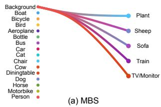

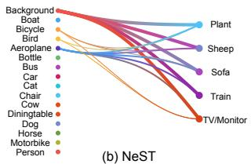

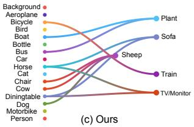  
Figure 2: Visual representation of knowledge transfer in different approaches. (a) In MBS [35], the initial knowledge for incremental classes is transferred entirely from the background; (b) In NeST [49], most of the initial knowledge for incremental classes is transferred from the background; (c) In ours, the focus is on semantically relevant classes.

## 3.2 Analysis on Efficient Knowledge Transfer

In this section, we analyze the predominant knowledge transfer strategies used in prior CISS work and highlight their underlying limitations. Our analysis is grounded in two standard incremental settings on the Pascal VOC dataset, 15 − 1 and 15 − 5, under the overlapped scenario detailed in §4.1.

Initializing a new class token without a clear semantic anchor, such as using random vectors, or the undefined background, leaves the model without targeted guidance. This ambiguity maximizes initial gradient variance,further hurting convergence.

A model’s convergence heavily depends on where it starts. Current methods generally rely on three common initialization strategies: 1) Random initialization: Starting with random vectors offers no meaningful anchor [36]. 2) Background initialization: The background subspace $( \mathcal { F } \backslash \mathcal { C } _ { \leq t - 1 } )$ is a catch-all for undefined objects. [3, 35]. 3) Flawed Distillation: Attempting to reuse past classes often accidentally selects features that have collapsed back into the background noise [49].

Table 1: Performance comparison of NeST [49] on Pascal VOC. † denotes results are reproduced. bg denotes that only background initialization is used. denotes the difference in the performance.

<table><tr><td rowspan=1 colspan=1></td><td rowspan=1 colspan=1>15-10-1516-20All</td><td rowspan=1 colspan=1>15-50-1516-20All</td></tr><tr><td rowspan=1 colspan=1>NeST† $\mathrm { N e S T } _ { b g } ^ { \dagger }$ </td><td rowspan=1 colspan=1>57.232.151.365.634.658.2</td><td rowspan=1 colspan=1>76.852.671.075.249.068.9</td></tr><tr><td rowspan=1 colspan=1></td><td rowspan=1 colspan=1>-8.4-2.5-6.9</td><td rowspan=1 colspan=1>+1.3+3.6+2.1</td></tr></table>

Ultimately, all three approaches provide a vague starting point $( e _ { c _ { n e w } } )$ rather than a sharp, low-variance direction. As shown in Fig. 7 (a-b), the ambiguity in initialization in BARM, MBS, and REMINDER hinders convergence and performs poorly overall. Table 1 highlights this issue specifically for NeST [49]. NeST pre-tunes new classes by nominally transferring from prior classes. $\mathrm { N e S T } _ { b g }$ is our controlled variant with background-only initialization; both were run in the same environment. Table 1 on short 15-5 setting, shows class-based initialization offers only a marginal (+2.1 All) gain over bg, while on long 15-1, NeST falls 6.9 below its own bg variant. Hence, NeST’s selected representations are progressively dom-

inated by background noise (motivating selective transfer) (as visualized in Fig. 2). This proves that simple regularization isn’t enough. Instead, our method completely bypasses these ambiguous spaces by leveraging prior classes’ learned representations, providing a highly structured and reliable initialization.

## 3.3 SELEctive Context Transfer (SELECT)

To avoid using the ambiguous initialization strategies, we introduce SELECT (Fig. 3). When a new class $( c _ { n e w } \in \mathcal { C } _ { t } )$ arrives, we do not start from scratch or from the background. Instead,

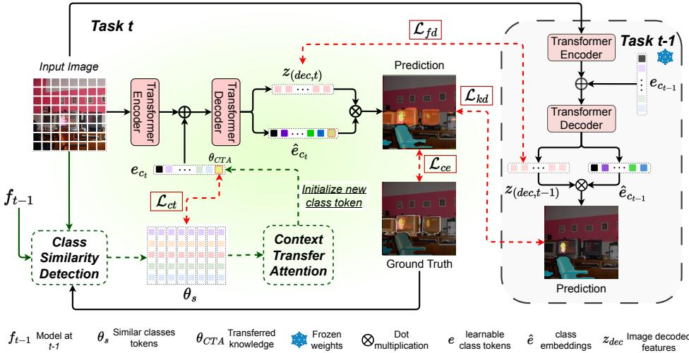  
Figure 3: SELEctive Context Transfer (SELECT). The task t dataset is processed by the previous task’s model $f _ { t - 1 }$ to identify the most similar class for each image using Class Similarity Detection (see §3.3.1). The similar classes’ tokens $\theta _ { s }$ are then processed by Context Transfer Attention (see §3.3.2) to formulate the adaptive token $\theta _ { C T A }$ for the new class that is further used in the current task’s model $f _ { t }$ . The model is trained using $\mathcal { L } _ { c e } , \mathcal { L } _ { f d } , \mathcal { L } _ { k d }$ , and the proposed context transfer loss $\mathcal { L } _ { c t }$ enforcing distinction between $\theta _ { C T A }$ and $\theta _ { s }$ (see §3.4)

we initialize it using a carefully chosen subset of related past classes, denoted as $\mathcal { C } _ { s }$ . In § 3.3.1, we will formulate the strategy to selectively identify the set of those similar classes. Finally, in § 3.3.2, we will initialize the new class using the identified classes.

## 3.3.1 Identifying Similar Classes

In this section, we identify the set of similar old classes, $\mathcal { C } _ { s } \subseteq \mathcal { C } _ { 0 : t - 1 }$ , in a new task t, for knowledge transfer.

Old class $( c _ { o l d } \in \mathcal { C } _ { 0 : t - 1 } )$ is semantically relevant to a new class $( c _ { n e w } \in \mathcal { C } _ { t } )$ if the established representation $f o r c _ { o l d } ( e _ { c _ { o l d } } )$ exhibits stability when they are exposed to the masked images ofthe new class.

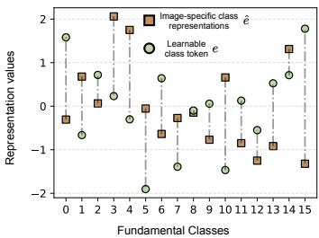  
Figure 4: Representational perturbation between $e _ { \mathcal { C } _ { 0 : t - 1 } }$ and $\hat { e } _ { { \cal C } _ { ( 0 : t - 1 ) } }$

Specifically, model $f _ { t - 1 }$ encapsulates the learned knowledge of all past classes $\mathcal { C } _ { 0 : t - 1 }$ We use this frozen model as a probe. For each image-mask pair $( x , y _ { c _ { n e w } } \in \mathcal { D } _ { t } )$ , for a new class, we feed the masked image $( \mathcal { T } _ { c _ { n e w } } =$ $x \odot y _ { c _ { n e w } } )$ into $f _ { t - 1 }$ , where $\odot$ is the Hadamard product, to get the fixed learned tokens $e _ { \mathcal { C } _ { 0 : t - 1 } }$ and what the decoder predicts, when it infers on the masked image, $\hat { e } _ { { \mathcal C } _ { ( 0 : t - 1 ) } , { \mathcal T } _ { c n e w } }$ . The GT masks $y _ { c _ { n e w } }$ are the current task’s training annotations and are used by every supervised CISS approach; SELECT requires no addi-

tional supervision. Finally, we measure the semantic relevance, over the entire dataset $\mathcal { D } _ { t }$ , by assessing the distance between $e _ { \mathcal { C } _ { 0 : t - 1 } }$ and $\hat { e } _ { { \mathcal C } _ { ( 0 : t - 1 ) } , { \mathcal D } _ { t } }$ . We calculate the semantic distance by taking the Euclidean norm between them:

$$
\mathrm { d i s t } ( \hat { e } , e \mid \mathcal { D } _ { t } ) = \| \hat { e } _ { \mathcal { C } _ { ( 0 : t - 1 ) } , \mathcal { D } _ { t } } - e _ { \mathcal { C } _ { 0 : t - 1 } } \| _ { 2 }\tag{1}
$$

Through dis $\left( \hat { e } , e \mid \mathcal { D } _ { t } \right)$ , we identify the most similar class for each image in $\mathcal { D } _ { t }$

To prove this hypothesis, we perform an empirical analysis. We train the base-class model $f _ { 0 }$ on 15 unique classes. In the incremental setting, we introduce a new class, “sheep”, and feed masked sheep images into the base model. Fig. 4 shows the average representation over all sheep images; we observe that some base classes exhibit stronger semantic relevance than others, with significantly lower distances.

We form the final set of similar classes, $\mathcal { C } _ { s }$ , by counting how often each class is selected across the dataset, and retaining only those whose frequency exceeds a predefined threshold. The frequency threshold is controlled by a hyperparameter $\varepsilon \in [ 0 , 1 ]$ . The resulting set $\mathcal { C } _ { s }$ contains past classes that provide robust “positive contextual knowledge”. Similar plots targeting individual masked sheep images are provided in the supplementary file.

## 3.3.2 Context-driven Selective Knowledge Transfer

Having identified the set of semantically similar past classes $\mathcal { C } _ { s }$ (from §3.3.1), and aggregating their learned tokens $\theta _ { s } = \{ e _ { c } \} _ { c \in \mathcal { C } _ { s } }$ , we formulate Context Transfer Attention (CTA) for transferring their knowledge.

By building a new learnable token as a convex combination ofpast ones, we force the model to start in a meaningful, already-learned area of thefeature space. This drastically shrinks the search space compared to startingfrom scratch with an ambiguous initialization.

We compute a new guided token $\theta _ { C T A } \in \mathbb { R } ^ { D }$ that captures the characteristics of $\theta _ { s }$ using an attention mechanism. The collective context of similar classes serves as the query, encapsulating the gist of the semantic neighborhood. This combined information is then used to attend to individual learned tokens, as key, in $\theta _ { s }$ and generate attention scores. The attention scores are finally multiplied by the individual learned tokens’ values to obtain the weighted information from all learned similar classes’ tokens.

$$
\theta _ { C T A } = \mathrm { s o f t m a x } \left( \frac { \left( \frac { 1 } { n } \sum _ { j = 1 } ^ { n } \theta _ { s } ^ { j } \right) \times ( \pmb { \theta } _ { s } ) ^ { \mathbf { T } } } { \sqrt { d } } \right) \theta _ { s }\tag{2}
$$

Here d is the embedding dimension, $( \cdot ) ^ { \mathbf { T } }$ denotes the transpose, and n is the total number of similar classes in $\theta _ { s }$ . The softmax term produces a vector of attention weights that assign importance to each source class, enabling selective knowledge transfer.

Enforcing Representational Separation via Perturbation. While Eqn. 2 provides a strong semantic prior, it poses a challenge:

If the new starting token $\theta _ { C T A }$ is placed too close to the old tokens in $\theta _ { s }$ , training on the new data will cause their representations to merge. This overlap destroys the decision boundaries ofthe old classes in $\mathcal { C } _ { s }$ , leading to catastrophicforgetting or misclassifying old classes as new ones during inference.

We empirically validate this in Table 7, which shows that initializing the new learnable tokens solely using $\theta _ { s }$ results in a sharp drop in accuracy of corresponding old classes. To mitigate this, we introduce a controlled perturbation into $\theta _ { C T A }$ . Specifically, instead of directly using $\theta _ { C T A }$ , we regularize it by interpolating with a noisy version of itself, thereby creating a buffer zone in the feature space. This gives the new class the ability to adapt without confusing it with the old classes, while maintaining semantic alignment. We calculate the final token as:

$$
\hat { \theta } _ { C T A } = \alpha \theta _ { C T A } + ( 1 - \alpha ) \mathcal { N } ( \theta _ { C T A } , \sigma ^ { 2 } )\tag{3}
$$

Here, $\mathcal { N } ( \theta _ { C T A } , \sigma ^ { 2 } )$ is a sample from a Gaussian distribution with mean $\theta _ { C T A }$ and variance $\sigma ^ { 2 }$ . The hyperparameter $\alpha \in [ 0 , 1 ]$ controls the trade-off between preserving the precise transferred knowledge (alignment) and introducing diversity (separation).

Hence, for a new class $c _ { n e w } \in \mathcal { C } _ { t }$ , we initialize the new class token $e _ { c _ { n e w } }$ with $\hat { \theta } _ { C T A }$

## 3.4 Objective Function

Our base training setup follows standard CISS methods. We use a standard cross-entropy loss $( \mathcal { L } _ { c e } )$ for learning new classes, along with feature $( \mathcal { L } _ { f d } )$ and knowledge $( \mathcal { L } _ { k d } )$ distillation losses to prevent the model from forgetting what it already knows.

Cross-Entropy Loss $( \mathcal { L } _ { c e } )$ : The cross-entropy loss is used in both base and incremental tasks. In the base task $( t = 0 )$ , we use the conventional cross-entropy loss between the predicted mask $\hat { y } _ { 0 } \in \mathbb { R } ^ { H \times W \times ( 0 : \mathcal { C } _ { t } ) }$ and its corresponding ground truth $y _ { t } \in \mathbb { R } ^ { H \times W }$

$$
\mathcal { L } _ { c e } ( y _ { 0 } , \hat { y } _ { 0 } ) = - \frac { 1 } { H W } \sum _ { i = 1 } ^ { H W } y _ { 0 , i } \log \hat { y } _ { 0 , i }\tag{4}
$$

where H and W are the height and width of an image. In the incremental task $( t > 0 )$ , we use the previous task’s predicted label along with the ground truth of the current class as the pseudo label $\tilde { y } _ { t } \left( y _ { t } , \hat { y } _ { t - 1 } \right)$ and calculate the loss with the combined predicted label $\hat { y } _ { t }$ . The updated $\mathcal { L } _ { c e }$ is:

$$
\mathcal { L } _ { c e } ( \tilde { y } _ { t } , \hat { y } _ { t } ) = - \frac { 1 } { H W } \sum _ { i = 1 } ^ { H W } \tilde { y } _ { t , i } ( y _ { t } , \hat { y } _ { t - 1 } ) \log \hat { y } _ { t , i }\tag{5}
$$

Feature Distillation Loss $( \mathcal { L } _ { f d } )$ : We employ this loss to prevent the current model’s features from deviating from the previous ones. This loss is calculated between the output feature patches from the decoders of both the previous $z _ { t - 1 } ^ { d e c }$ and the current $z _ { t } ^ { d e c }$ models.

$$
\mathcal { L } _ { f d } = \frac { 1 } { H W } \sum _ { i = 1 } ^ { H W } \Vert z _ { t - 1 , i } ^ { d e c } - z _ { t , i } ^ { d e c } \Vert ^ { 2 }\tag{6}
$$

Knowledge Distillation Loss $( \mathcal { L } _ { k d } )$ : We employ this loss to distil the previous model’s prediction. This loss is calculated between the output predictions of both the previous $\hat { y } _ { t - 1 }$ and current models $\hat { y } _ { t }$

$$
\mathcal { L } _ { k d } = - \frac { 1 } { H W } \sum _ { i = 1 } ^ { H W } \hat { y } _ { t - 1 , i } \log \hat { y } _ { t , i }\tag{7}
$$

However, our selective initialization brings the new class token $( { \hat { \theta } } _ { C T A } )$ closer to the source tokens $( \theta _ { s } )$ , thereby increasing the risk of misclassification. To counteract this, we introduce a Context Transfer Loss $( \mathcal { L } _ { c t } )$ , as a margin-based penalty:

$$
\mathcal { L } _ { c t } = \frac { 1 } { | \mathcal { C } _ { s } | } \sum _ { c \in \mathcal { C } _ { s } } \operatorname* { m a x } ( 0 , M - \Vert e _ { c _ { n e w } } - e _ { c } \Vert _ { 2 } )\tag{8}
$$

By training the network to push this loss to zero, we encourage that the distance between the new class token and its source tokens stays larger than the margin M. This keeps the representations clearly separated.

If the loss reaches its minimum $( \mathcal { L } _ { c t } = 0 )$ , the maximum function dictates that every individual term inside the sum must also be zero. For that to happen, $M - \| e _ { c _ { n e w } } - e _ { c } \| _ { 2 } \leq 0$ for every source class $c \in { \mathcal { C } } _ { s }$ . Rearranging this simply gives $\| e _ { c _ { n e w } } - e _ { c } \| _ { 2 } \ge M$ . In plain terms, this loss forces the new token to remain at least M away from any source token, actively protecting the boundaries of the old classes. The final training objective is formulated as $\mathcal { L } _ { t o t a l } = \mathcal { L } _ { c e } + \lambda _ { k d } \mathcal { L } _ { k d } + \lambda _ { f d } \mathcal { L } _ { f d } + \lambda _ { c t } \mathcal { L } _ { c t }$

## 4 Experiments

## 4.1 Experimental Setup

Training setting: We evaluate our proposed approach under two distinct experimental scenarios – disjoint and overlapped [35, 54]. In both scenarios, ground-truth labels are provided exclusively for the classes designated for the current task t. The primary distinction lies in the composition of the input images. In the standard disjoint setting, images in the current task’s dataset $\mathcal { D } _ { t }$ contain only instances from classes seen so far, $\mathcal { C } _ { 1 : t }$ . Conversely, the overlapped setting permits images to also contain unlabeled instances of objects from future classes $\mathcal { C } _ { 1 : T }$ Hence, the overlapped scenario more closely aligns with real-world data streams, presenting a significantly more challenging and realistic benchmark.

Datasets and Evaluation Metrics: Following prior works [26, 35, 45, 54], we conduct our experiments on two public benchmarks: Pascal VOC 2012 [14] and ADE20K [60]. The Pascal VOC dataset comprises 10,582 training and 1,449 testing images across 20 foreground categories. ADE20K is a larger-scale dataset with 150 classes, containing 20,210 training and 2,000 testing images. For the Pascal VOC, we evaluate on the 15-1, 15-5, and 19-1 splits under both disjoint and overlapped scenarios. The 15-1 split, for example, consists of a base task with 15 classes, followed by 5 incremental tasks, each adding a single new class, for a total of 6 tasks. For ADE20K, we use the 100-50, 50-50, 100-10, and 100-5 splits, focusing on the more realistic overlapped scenario. We measure the performance using mean intersection-over-union (mIoU) for the base classes (old), incremental classes (new), and all classes combined (all). “all” is computed as the mean over classes with non-zero IoU, including background, while class-groups (1-15, 16-20) are means over their fixed class sets, including zero-IoU classes and excluding background.

Implementation Details: Our approach is built upon a ViT-B/16 backbone [11], pre-trained on ImageNet. The segmentation head is a transformer-based decoder inspired by the Segmenter [43]. Our training protocol largely follows the configuration in [35]. We use the SGD optimizer and employ random rotation and cropping for augmentations. All experiments are implemented in PyTorch and conducted on a single workstation with a NVIDIA A100 GPU. For Pascal VOC, we set the initial learning rate to 1e-3 and train for 32 epochs with a batch size of 16. For ADE20K, we use a learning rate of 5e-4 and train for 64 epochs with a batch size of 8. We set the model hyperparameter $\alpha = 0 . 9$ and $\sigma = 0 . 0 5$ . The threshold value ε is fixed at 0.15. For our proposed loss $\mathcal { L } _ { c t }$ , we set the margin M at 1.0, and $\lambda _ { c t }$ to 0.8. $\lambda _ { k d }$ , and $\lambda _ { f d }$ are adopted from [35]. Additional details are provided in the supplementary file.

Table 2: Performance comparison under different scenarios for overlapped setting. ‡ implies results are reproduced from the official repository. † indicates results are excerpted from [35, 39]. Best and second best results are marked in and , respectively.
<table><tr><td rowspan="3">Methods</td><td rowspan="3">Backbone</td><td colspan="8">Pascal VOC</td><td colspan="10">ADE20K</td></tr><tr><td colspan="3">19-1 (2 tasks)</td><td colspan="3">15-5 (2 tasks)</td><td colspan="3">15-1 (6 tasks)</td><td colspan="3">100-50 (2 tasks)</td><td colspan="3">50-50 (3 tasks)</td><td colspan="3">100-10 (6 tasks)</td></tr><tr><td>1-19</td><td>20</td><td>All</td><td></td><td>1-15 16-20</td><td>All</td><td>1-15</td><td>16-20</td><td>All</td><td>1-100</td><td>101-150</td><td>All</td><td>1-50 51-150</td><td></td><td>All</td><td>1-100</td><td>101-150</td><td>All</td></tr><tr><td>SSUL []</td><td>Res101</td><td>77.8 49.8</td><td></td><td>76.5</td><td>78.4</td><td>55.8</td><td></td><td>73.0 78.4</td><td>49.0</td><td>71.4</td><td>42.8</td><td>17.5</td><td>34.5 49.1</td><td></td><td>20.1</td><td>29.8</td><td>42.9</td><td>17.7</td><td>34.5</td></tr><tr><td>SPPA []</td><td>Res101</td><td>76.5</td><td>36.2</td><td>74.6</td><td>78.1</td><td>52.9</td><td></td><td>72.1 66.2</td><td>23.3</td><td>56.0</td><td>42.9</td><td>19.9</td><td>35.2 49.8</td><td></td><td>23.9</td><td>32.5</td><td>41.0</td><td>12.5</td><td>31.5</td></tr><tr><td>RCIL†[</td><td>Res101</td><td>77.0</td><td>31.5</td><td>74.7</td><td>78.8</td><td>52.0</td><td></td><td>72.4 70.6</td><td>23.7</td><td>59.4</td><td>42.3</td><td>18.8</td><td>34.5 48.3</td><td></td><td>25.0</td><td>32.5</td><td>39.3</td><td>17.6</td><td>32.0</td></tr><tr><td>IDEC []</td><td>Res101</td><td></td><td></td><td>-</td><td>78.0</td><td>51.8</td><td></td><td>71.8 77.0</td><td>36.5</td><td>67.3</td><td>42.0</td><td>18.2</td><td>34.1 47.4</td><td></td><td>26.0</td><td>33.1</td><td>40.3</td><td>17.6</td><td>32.7</td></tr><tr><td>LGKD+PLOP []</td><td>Res101</td><td>76.5 42.9 75.7</td><td></td><td></td><td>78.7</td><td>56.1</td><td>73.9</td><td>69.3</td><td>30.9</td><td>61.1</td><td>43.6</td><td>25.7</td><td>37.5 49.4</td><td></td><td>29.4</td><td>36.0</td><td>42.1</td><td>22.0</td><td>35.4</td></tr><tr><td>STAR []</td><td>Res101</td><td>78.0</td><td>47.1</td><td>76.5</td><td>79.5</td><td>58.9</td><td>74.6 79.5</td><td></td><td>50.6</td><td>72.6</td><td>42.4</td><td>24.2</td><td>36.4 48.7</td><td></td><td>27.2</td><td>34.4</td><td>42.0</td><td>20.6</td><td>34.9</td></tr><tr><td>REMINDER []</td><td>Res101</td><td>76.5</td><td>32.3</td><td>74.4</td><td>76.1</td><td>50.7</td><td></td><td>70.1 68.3</td><td>27.2</td><td>58.5</td><td>41.6</td><td>19.2</td><td>34.1 47.1</td><td></td><td>20.4</td><td>29.4</td><td>39.0</td><td>21.3</td><td>33.1</td></tr><tr><td>BARM []</td><td>Res101</td><td>78.2 42.2</td><td></td><td>76.4</td><td>-</td><td>1</td><td></td><td>77.6</td><td>45.9</td><td>70.0</td><td>42.0</td><td>23.0</td><td>35.7 47.9</td><td></td><td>26.5</td><td>33.7</td><td>41.1</td><td>23.1</td><td>35.2</td></tr><tr><td>ADAPTER []</td><td>Res101</td><td>78.0 50.7</td><td></td><td>76.7</td><td>79.7</td><td>59.7</td><td>75.0 79.9</td><td></td><td>51.9</td><td>73.2</td><td>43.1</td><td>23.6</td><td>36.7 49.3</td><td></td><td>27.3</td><td>34.7</td><td>42.9</td><td>19.9</td><td>35.3</td></tr><tr><td>MiB []</td><td>ViT</td><td>79.947.7</td><td></td><td>79.1</td><td>78.6</td><td>63.1</td><td>75.6</td><td>72.6</td><td>23.1</td><td>61.7</td><td>46.4</td><td>35.0</td><td>42.6 52.2</td><td></td><td>35.6</td><td>41.1</td><td>43.0</td><td>30.8</td><td>38.9</td></tr><tr><td>CoinSeg []</td><td>Swin-B</td><td>81.544.8</td><td></td><td>79.8</td><td>82.1</td><td>63.2</td><td>77.6 82.7</td><td></td><td>52.5</td><td>75.5</td><td>41.6</td><td>26.7</td><td>36.6 49.0</td><td></td><td>28.9</td><td>35.6</td><td>42.1</td><td>24.5</td><td>36.2</td></tr><tr><td>INC []</td><td>ViT</td><td>82.5</td><td>61.0</td><td>82.1</td><td>82.5</td><td>69.2</td><td>79.9</td><td>79.6</td><td>59.6</td><td>75.6</td><td>49.4</td><td>35.6</td><td>44.8</td><td>56.2</td><td>37.8</td><td>43.9</td><td>48.5</td><td>34.6</td><td>43.9</td></tr><tr><td>MiB + NeST []</td><td>Swin-B</td><td>79.7</td><td>60.0</td><td>78.8</td><td>81.2</td><td>67.4</td><td>77.9</td><td>77.0</td><td>53.3</td><td>71.4</td><td>42.8</td><td>27.8</td><td>37.9</td><td>49.7</td><td>29.3</td><td>36.2</td><td>41.8</td><td>23.8</td><td>35.9</td></tr><tr><td>PLOP + NeST []</td><td>Swin-B</td><td>79.6</td><td>70.2</td><td>79.1</td><td>80.5</td><td>70.8</td><td>78.2</td><td>76.8</td><td>57.2</td><td>72.2</td><td>43.5</td><td>26.5</td><td>37.9</td><td>50.6</td><td>28.9</td><td>36.2</td><td>41.7</td><td>24.2</td><td>35.9</td></tr><tr><td>MBS[]</td><td>ViT</td><td>81.5</td><td>67.0</td><td>80.8</td><td>82.7</td><td>74.0</td><td>80.5</td><td>82.3</td><td>69.0</td><td>79.0</td><td>47.7</td><td>35.6</td><td>43.7 54.4</td><td></td><td>37.1</td><td>42.9</td><td>47.7</td><td>31.5</td><td>42.3</td></tr><tr><td>CoGaMiD[]</td><td>Swin-B</td><td></td><td></td><td></td><td></td><td></td><td></td><td>83.2</td><td>61.2</td><td>78.0</td><td>43.9</td><td>27.3</td><td>38.4 49.9</td><td></td><td>29.8</td><td>36.6</td><td>43.7</td><td>26.5</td><td>38.0</td></tr><tr><td>EIR []</td><td>Swin-B</td><td></td><td></td><td></td><td>83.4</td><td>68.6</td><td>79.9</td><td>83.6</td><td>66.9</td><td>79.6</td><td>42.1</td><td>27.3</td><td>37.2 49.7</td><td></td><td>28.8</td><td>35.8</td><td>42.3</td><td>23.6</td><td>36.1</td></tr><tr><td>LBD []</td><td>ViT</td><td>82.2</td><td>70.081.6</td><td></td><td>83.2</td><td>73.6</td><td>80.8</td><td>81.9</td><td>66.6</td><td>78.1</td><td>51.3</td><td>38.7</td><td>47.1 56.2</td><td></td><td>40.6</td><td>45.8</td><td>48.7</td><td>34.9</td><td>44.1</td></tr><tr><td>Ours</td><td>ViT</td><td>83.0 70.2</td><td></td><td>82.1</td><td>83.9</td><td>76.0</td><td>81.6</td><td>83.3</td><td>72.0</td><td>80.5</td><td>54.1</td><td>40.3</td><td>48.2 56.4</td><td></td><td>42.3</td><td>47.1</td><td>50.4</td><td>35.7</td><td>44.1</td></tr></table>

## 4.2 Experimental Results & Further Analysis

Comparison with State-of-the-Art: Table 10 details how our approach performs on the Pascal VOC and ADE20K datasets across various training setups. As shown, our method significantly outperforms existing baselines [3, 5, 35, 39, 49, 54] by a wide margin in nearly every setting. This is especially evident when comparing our model to [49], a recent method that also leverages prior knowledge. We consistently outperform them across the board. Because [49] originally uses a Swin-B backbone, we also provide a direct, fair comparison using the ViT and CNN-based backbones, along with additional results on VOC and ADE20K, in the supplementary file.

We see some strong results in the 15-5 setting. This is a difficult setup, as the model learns multiple new classes simultaneously with highly varied data distributions. Despite this added complexity, our approach surpasses prior work by a significant margin. ADE20K features highly diverse and realistic scenes, and the overall scores reflect that difficulty compared to Pascal VOC. However, our proposed approach maintains a balance between the performance of the old and new classes. In our results, the performance gap between the base classes and the newly added incremental classes is significantly smaller than the margins reported in NeST [49]. This proves that our strategy for identifying and using similar past classes is much more effective at maintaining the delicate trade-off between stability and plasticity.

We compare the stability of SELECT across longer task sequences with MBS. We adopt the ADE20K dataset with the 100-5 (11 steps) and 100-10 (6 steps) settings and the PASCAL VOC dataset with the 5-3 (6 steps) setting. As seen in Fig. 6, SELECT consistently performs better than MBS across the incremental sequence. Specifically, in the 100-5 setting, we observe that SELECT’s rate of performance decline is lower than MBS’s, leading to greater stability across tasks. The visual results on Pascal VOC dataset are shown in Fig. 5.

Training Time and Convergence: To evaluate effective convergence, we compare the loss of MBS, REMINDER [36], and BARM [54] with our proposed SELECT, in step 1 of the VOC 15-5 incremental setting (shown in Fig. 7(a)). All methods show a decline in the early epochs, indicating less stable optimization. Conversely, SELECT consistently achieves better convergence, demonstrating superior training stability and robustness. To further assess, we also visualize, in Fig. 7(b), the average performance of fundamental classes and the individual performance of 5 incremental classes. SELECT consistently performs better than the others. Effectiveness of class similarity $\mathcal { C } _ { s }$ : In this study, we evaluate the effectiveness of using previously learned similar classes. In Fig. 7(c), we visualize the correlation heatmap, on Pascal-VOC 15-5 setting, to assess the similarity of the current task’s classes with the previously learned ones. We observe that rather than relying on a single, arbitrary class, incremental

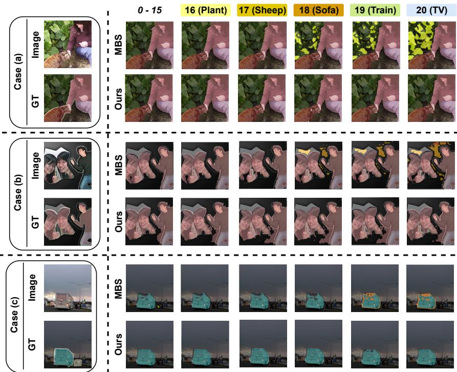  
Figure 5: Visual comparison on 15-1 scenario of the Pascal VOC between MBS and ours.

Table 3: Analyzing the impact of similar $\mathcal { C } _ { s }$ and dissimilar $\mathcal { C } _ { d s }$ classes on Pascal VOC dataset. Bold denotes the best result.
<table><tr><td rowspan="2"> $\mathcal { C } _ { s }$ </td><td rowspan="2"> $\mathcal { C } _ { d s }$ </td><td colspan="3">15-1 (6 tasks)</td><td colspan="3">15-5 (2 tasks)</td></tr><tr><td>1-15</td><td>16-20</td><td>All</td><td>1-15</td><td>16-20</td><td>All</td></tr><tr><td>X</td><td>√</td><td>78.5</td><td>36.6</td><td>71.5</td><td>79.6</td><td>66.8</td><td>76.4</td></tr><tr><td>√</td><td>x</td><td>83.3</td><td>72.0</td><td>80.5</td><td>83.9</td><td>76.0</td><td>81.6</td></tr></table>

classes are selectively similar to a few. To further validate our hypothesis, we transfer knowledge from previous dissimilar classes $( \mathcal { C } _ { d s } = \mathcal { C } _ { 0 : t - 1 } - \mathcal { C } _ { s } )$ instead of the similar classes. We perform this ablation on the Pascal dataset with 15-1 and 15-5 settings. As seen in Table 3, $\mathcal { C } _ { d s }$ significantly impacts the performance of both fundamental and incremental classes by a significant margin. Since dissimilar classes contain entirely different contextual information, their representations

fail to provide meaningful information. These results confirm that similar class representations provide a more effective foundation, enabling the model to adapt to new classes while preserving knowledge of previously learned ones.

Effectiveness of similarity metrics: We perform this study to analyze the effectiveness of using Euclidean distance as an efficient metric to identify the similarity between learned class tokens and image-specific class representations. A small distance implies a high semantic similarity. While other metrics like cosine similarity focus on orientation, Euclidean distance considers both magnitude and orientation, providing an appropriate measure of geometric distance in the latent space. As observed in Table 4, the Euclidean distance consistently outper-

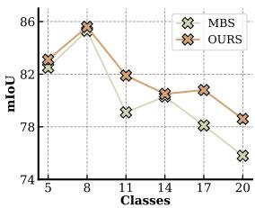  
(a) 5-3 setting (PASCAL VOC )

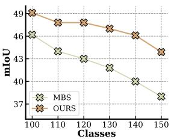  
(b) 100-10 setting (ADE 20K)

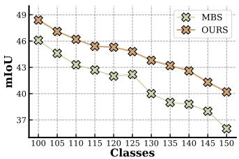  
(c) 100-5 setting (ADE20K)

Figure 6: Comparative analysis over long task sequences. (a) PASCAL VOC 5-3 (6 steps) setting; (b) ADE20K 100-10 (6 steps) setting; (c) ADE20K 100-5 (11 steps) setting.  
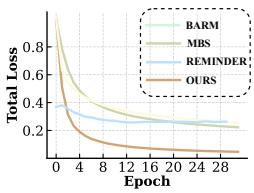  
(a) Loss Convergence

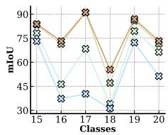  
(b) Individual class performance

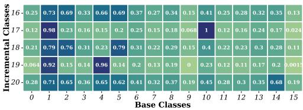  
(c) Class correlation heatmap  
Figure 7: (a-b) Comparative analysis of loss convergence and task performance on BARM, MBS, REMINDER, and Ours (SELECT) on 15-5 setting of PASCAL VOC dataset; (c) Correlation heatmap on PASCAL-VOC 15-5 setting between current and previous task classes.

Table 4: Ablation study on Pascal VOC. Analysis on the different similarity metrics Bold denotes the best result.
<table><tr><td rowspan="2">Metrics</td><td colspan="2">15-1 (6 tasks)</td><td colspan="2">15-5 (2 tasks)</td></tr><tr><td>1-15</td><td>16-20 All</td><td>1-15 16-20</td><td>All</td></tr><tr><td>Cosine</td><td>80.8 60.4</td><td>76.5</td><td>83.4 72.8</td><td>81.4</td></tr><tr><td>Manhattan MSE</td><td>78.5 44.9</td><td>71.2</td><td>83.2 73.7</td><td>81.4 81.4</td></tr><tr><td></td><td>70.9</td><td>66.4 70.3</td><td>83.6</td><td>72.3</td></tr><tr><td>Euclidean</td><td>83.3</td><td>72.0 80.5</td><td>83.9</td><td>76.0 81.6</td></tr></table>

forms the other metrics, particularly for incremental tasks.

Table 5: Analyzing the initialization strategy and loss configuration on Pascal VOC. Bold denotes the best result.
<table><tr><td>Init Strategy</td><td>Loss Configuration</td><td>15-1 (All) 15-5 (All)</td><td></td></tr><tr><td> $\theta _ { b g }$  (Background)</td><td> $\mathcal { L } _ { c e } + \mathcal { L } _ { f d } + \mathcal { L } _ { k d }$ </td><td>67.4</td><td>78.9</td></tr><tr><td> $\theta _ { C T A }$  (Ours)</td><td> $\mathcal { L } _ { c e } + \dot { \mathcal { L } _ { f d } } + \mathcal { L } _ { k d }$ </td><td>76.1</td><td>80.0</td></tr><tr><td> $\theta _ { C T A }$  (Ours)</td><td> $\mathcal { L } _ { c e } + \bar { \mathcal { L } _ { f d } } + \mathcal { L } _ { k d } + \mathcal { L } _ { c t }$ </td><td>80.5</td><td>81.6</td></tr></table>

Analysis on Initialization Strategy: As observed in Table 5, we present the analysis on two orthogonal contributions of SELECT, the CTA initialization $( \theta _ { C T A } )$ and the Context Transfer Loss $( \mathcal { L } _ { c t } )$ , against a background-initialized baseline $( \theta _ { b g } )$ under the same settings. Replacing background initialization with $\theta _ { C T A }$ while keeping the loss identical yields improvements of ${ \approx } 9 \%$ on 15-1 and ${ \approx } 1 \%$ on 15-5. Using a new class token from semantically similar past class representations, $\theta _ { C T A }$ provides the decoder with a structured, low-variance starting point before any gradient update. The background token, by contrast, is a noisy representation of everything the model has not yet learned to recognize. Using the full loss with $\mathcal { L } _ { c t }$ yields an additional ${ \approx } 4 \%$ on 15-1 and ${ \approx } 2 \%$ on 15-5. This confirms that, even with selective initialization, $\theta _ { s }$ still creates proximity risk, leading to representation interference. $\mathcal { L } _ { c t }$ resolves this by enforcing a minimum margin M between $e _ { c _ { n e w } }$ and the similar source tokens.

Table 6: Analysis on Pascal VOC dataset about the effectiveness of each loss function. Bold denotes the best result.
<table><tr><td rowspan="2"> $\mathcal { L } _ { c e }$ </td><td rowspan="2"> $\mathcal { L } _ { f d }$ </td><td rowspan="2"> $\mathcal { L } _ { k d }$ </td><td rowspan="2"> $\mathcal { L } _ { c t }$ </td><td colspan="3">15-1 (6 tasks)</td><td colspan="3">15-5 (2 tasks)</td></tr><tr><td>1-15</td><td>16-20</td><td>All</td><td>1-15</td><td>16-20</td><td>All</td></tr><tr><td>√</td><td>x</td><td>√</td><td></td><td>48.5</td><td>14.2</td><td>42.2</td><td>83.0</td><td>70.9</td><td>80.6</td></tr><tr><td>√</td><td>V</td><td>x</td><td>V</td><td>63.0</td><td>32.6</td><td>60.0</td><td>74.3</td><td>57.2</td><td>71.1</td></tr><tr><td>√</td><td>5</td><td>7</td><td>x</td><td>80.1</td><td>60.7</td><td>76.1</td><td>83.2</td><td>70.2</td><td>80.0</td></tr><tr><td>5</td><td>x</td><td>X</td><td>x</td><td>57.1</td><td>8.7</td><td>52.2</td><td>77.1</td><td>60.1</td><td>73.8</td></tr><tr><td>√</td><td>x</td><td>x</td><td></td><td>53.2</td><td>10.5</td><td>55.4</td><td>75.4</td><td>58.8</td><td>72.3</td></tr><tr><td>√</td><td>√</td><td>X</td><td>x</td><td>61.9</td><td>17.5</td><td>61.6</td><td>72.2</td><td>53.7</td><td>68.8</td></tr><tr><td>5</td><td>X</td><td>」</td><td>x</td><td>79.3</td><td>24.4</td><td>66.8</td><td>84.1</td><td>73.7</td><td>82.1</td></tr><tr><td>1</td><td>L</td><td>5</td><td>√</td><td>83.3</td><td>72.0</td><td>80.5</td><td>83.9</td><td>76.0</td><td>81.6</td></tr></table>

Effectiveness of loss components: To quantify the contribution of each loss component $( \mathcal { L } _ { c e } , \ \mathcal { L } _ { f d } , \ \mathcal { L } _ { k d } , \ \mathcal { L } _ { c t } )$ within our CISS framework, we conduct a detailed study across 15-1 and 15-5 scenarios. As shown in Table 6, removing the feature distillation loss $( \mathcal { L } _ { f d } )$ or the knowledge distillation loss $( \mathcal { L } _ { k d } )$ leads to a catastrophic decline in performance, particularly on incremental classes. In the 15-1 setting, ablating $\mathcal { L } _ { f d }$ causes the mIoU on new classes to plummet from 72.0% to 14.2%. Similarly, removing $\mathcal { L } _ { k d }$ drops the same metric to 32.6%. This underscores that $\mathcal { L } _ { f d }$ is vital for learning high-quality,

patch-level representations of novel classes, while $\mathcal { L } _ { k d }$ is indispensable for mitigating catastrophic forgetting of the base classes. Our proposed loss provides a substantial performance boost. Removing $\mathcal { L } _ { c t }$ degrades the overall mIoU from 80.5% to 76.1% in the 15-1 setting, with the most significant damage inflicted on the incremental classes (72.0%→60.7%).  
Table 7: Effectiveness of knowledge transfer on Pascal VOC 15-1 setting. $\theta _ { B e s t } \mathrm { : }$ token of the most similar class, $\theta _ { A \nu g } { : }$ : average token of all similar classes, and $\theta _ { C T A }$ : adaptive token using Context Transfer Attention. Bold represents the best results. highlights the performance drops in similar classes.
<table><tr><td rowspan="2">Methods</td><td colspan="8">1-15</td><td colspan="4">16-20</td><td colspan="4"></td></tr><tr><td>aero bike bird</td><td>boat</td><td>bottle bus</td><td>car</td><td>cat chair</td><td>cow table</td><td>dog</td><td>horse</td><td>motor</td><td>person</td><td></td><td>Avg</td><td>plant</td><td>sheep</td><td>sofa</td><td>train tv</td><td>Avg</td></tr><tr><td> $\theta _ { B e s t }$ </td><td>0.0 44.7 92.6</td><td>19.7</td><td>87.1</td><td>91.5 87.4</td><td>93.0 46.2</td><td>53.3</td><td>57.3</td><td>90.3 91.1</td><td></td><td>91.2</td><td>89.0</td><td>69.0</td><td>39.7</td><td></td><td>55.8</td><td>40.1 55.3</td><td>57.6 49.7</td></tr><tr><td> $\theta _ { A \nu g } \ ( w / o \mathcal { N } )$ </td><td>0.0</td><td>44.3 91.9 76.1</td><td>86.3</td><td>93.6 87.9</td><td>95.5 50.4</td><td>71.5</td><td>62.3 92.3</td><td>90.0</td><td>89.4</td><td></td><td>88.9</td><td>74.7</td><td>56.1</td><td>0.1</td><td>36.6</td><td>43.4</td><td>62.6 39.8</td></tr><tr><td> $\bar { \theta _ { A \nu g } } \left( w \mathcal { N } \right)$ </td><td>89.6 45.3 93.1</td><td>77.1</td><td>85.4</td><td>90.9 87.6</td><td>95.3 45.9</td><td>4.4</td><td>56.7</td><td>92.5 84.6</td><td>89.2</td><td></td><td>88.6</td><td>75.1</td><td>70.0</td><td>0.0</td><td>30.9</td><td>44.5</td><td>59.6 41.0</td></tr><tr><td> $\theta _ { C T A } \left( w / o \mathcal { N } \right)$ </td><td>16.0</td><td>44.7 87.6 80.1</td><td>78.9</td><td>92.4 88.5</td><td>94.4 50.2</td><td>48.5</td><td>63.2</td><td>92.5 90.7</td><td></td><td>89.3</td><td>88.7</td><td>73.7</td><td>72.1</td><td>9.3</td><td>44.5</td><td>5 42.1</td><td>57.7 45.1</td></tr><tr><td> $\theta _ { C T A } \ \mathrm { ( O u r s ) }$ </td><td>93.7</td><td>49.1 90.3 81.4</td><td>87.8</td><td>95.2 92.0 95.3</td><td>51.9</td><td>83.1</td><td>64.1</td><td>94.2 91.3</td><td></td><td>90.7</td><td>89.4</td><td>83.3</td><td>68.2</td><td>89.0</td><td></td><td>48.6 86.9</td><td>67.3 72.0</td></tr></table>

Effectiveness of knowledge transfer: In Table 7, we evaluate the class-wise performance to analyze the most efficient approach for knowledge transfer. Specifically, we investigate how transferring knowledge from previously learned similar classes affects the performance of all the classes. To this end, we compare our proposed attention-based approach $\theta _ { C T A }$ to two major baselines (i) $\theta _ { B e s t }$ (selects the most similar class from the subset) and (ii) $\theta _ { A \nu g }$ (averages the representations of all similar classes). Additionally, we also evaluate the impact of integrating controlled noise $\mathcal { N }$ across the strategies. Primarily, we observe that our proposed approach consistently outperforms the baselines by a significant margin. In particular, our attention-based framework achieves at least 11% and $41 \%$ improvement over the baselines on the 1-15 and 16-20 tasks, respectively. Upon looking closely, in $\theta _ { B e s t }$ and $\theta _ { A \nu g }$ methods, transferring knowledge from certain classes (e.g. aero) leads to a substantial drop in their performance, highlighted in . Several other classes also exhibit similar degradation. Our proposed approach ensures that previously similar classes retain their knowledge while effectively adapting to new ones by incorporating a controlled noise component.

A direct comparison between $\theta _ { C T A } \left( w / o \mathcal { N } \right)$ and $\theta _ { A \nu g }$ (w N) reveals an important interaction. $\theta _ { A \nu g } \ ( w \mathcal { N } )$ causes the cow class to collapse despite otherwise reasonable performance. This occurs because uniform noise applied to an unweighted average amplifies the representation variance of low-frequency classes, pushing their boundaries in conflicting directions. In contrast, $\theta _ { C T A } \left( w / o \mathcal { N } \right)$ fails specifically for classes with high within-task semantic similarity, where the absence of a noise buffer allows proximity-induced overlap (described in § 3.3.2) to corrupt the source class boundary. Together, these results demonstrate that neither component alone is sufficient. The attention module provides the correct semantic direction, while the noise provides the necessary geometric separation.

Analysis on Stability-Plasticity Trade-off: A fundamental challenge in CISS is navigating between retaining knowledge of previously learned classes (stability) and efficiently acquiring new ones (plasticity). We provide a granular analysis by independently tracking old-class mIoU (classes 1–15) and new-class mIoU (the cumulative number of new classes at each step) across all five incremental steps of the 15-1 setting, comparing SELECT against MBS, NeST, and BARM [54]. Results, visualized in Fig. 8, plot this as a stability-plasticity trade-off. SELECT ( ) is superior over all baselines at every incremental step. At the final step, SE-LECT achieves 83.3% old-class mIoU and 72.0% new-class mIoU, outperforming MBS (82.3%, 69.0%), NeST (76.8%, 54.4%), and BARM (68.3%, 27.2%) on both dimensions simultaneously. SELECT occupies the upper-right at every step, confirming the method’s efficiency.

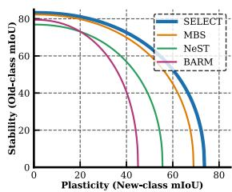

Figure 8: Comparative analysis Upon looking closely, we observe that NeST exhibits mod-of Stability-Plasticity trade-off. erate plasticity but suffers significant stability degradation.

Old-class mIoU declines by ≈6.0% from base to final step, confirming our analysis in § 3.2 that undifferentiated global distillation dilutes useful features with noise from irrelevant classes. BARM exhibits the most pronounced forgetting alongside the lowest plasticity (≈27.2% new-class mIoU at Step 5). MBS is the closest; its stability is comparable to SELECT, but its new-class mIoU consistently lags by ≈3% at each step.

## Conclusion

In this work, we introduced SELECT, a novel framework that addresses an adaptive knowledge transfer strategy. By identifying semantic similarities between old and new classes and employing a selective transfer mechanism, SELECT provides a more principled approach to knowledge utilization. Our proposed loss function further strengthens the model by encouraging distinctiveness between transferred knowledge and the original representations of influential old classes. Finally, our empirical results demonstrate the effectiveness of our proposed approach.

## Acknowledgement

This work was supported in part by the Infosys Centre for Artificial Intelligence, IIIT-Delhi, and in part by the Institute Fellowship of the IIIT-Delhi.

## A Complete Training Pipeline

In this section, we present our complete training pipeline which represents identifying knowledge from previously learned similar classes and selectively transferring that knowledge to initialize the new class.

Algorithm 1 Training Strategy for the proposed SELECT.   
Require: Training dataset $\mathcal { D } _ { t } = \{ ( x _ { i } , y _ { i } ) \}$ for current task t, model with previous task’s   
weights $f _ { t - 1 }$ , current task’s model $f _ { t }$ , total tasks $T .$   
Ensure: Initial class representation for new task $\theta _ { C T A }$   
1: for $t \in \{ 1 , 2 , . . . , T \}$ do   
2: for $( x _ { i } , y _ { i } ) \in \mathcal { D } _ { t }$ do ▷ Class similarity detection.   
3: $\mathcal { C } _ { s } \gets$ ClassSimilarity $( x _ { i } , y _ { i } , f _ { t - 1 } )$   
4: end for   
5: $\theta _ { s }  \mathcal { C } _ { s }$ ▷ Corresponding tokens of previous similar classes.   
6: $\hat { \theta } _ { C T A } \gets A t t e n t i o n ( \theta _ { s } )$ ▷ Context transfer attention.   
7: $f _ { t } \gets U p d a t e ( f _ { t } | \ \hat { \theta } _ { C T A } )$   
8: while not converged do ▷ Training incremental setting.   
9: train $f _ { t }$   
10: end while   
11: end for

## B Additional Implementation Details

We perform all experiments using the PyTorch framework (version 1.10.1) on a single workstation with an NVIDIA A100 GPU. We ensure that all experiments are performed under fair, consistent conditions in a unified environment. As mentioned in Table 2 in the paper, we reimplement the results of MBS [35] for fair and direct comparison. Similarly, for additional analysis on NeST [49], REMINDER [36], and BARM [54], we reimplement their results.

We obtained the results by running their respective official, publicly available source codes. We used their implementation details without modifying the core architecture or loss functions. To ensure a fair comparison, our proposed method (SELECT) and MBS were trained and evaluated in the same unified environment. We will publicly release the source code for our proposed method to facilitate better reproduction.

## C Analysis on Class Similarity

## C.1 Image-wise Disparity

In the main paper, we demonstrated the strong semantic relevance and lower average perturbation across new classes. In Fig. 9, we randomly sample a few images (from the current task’s dataset) and visualize these perturbations.

It is evident that all images exhibit deviation within their respective classes, with some classes showing minimal deviation, indicating strong similarity in their characteristics. This similarity is utilized to identify the most similar class.

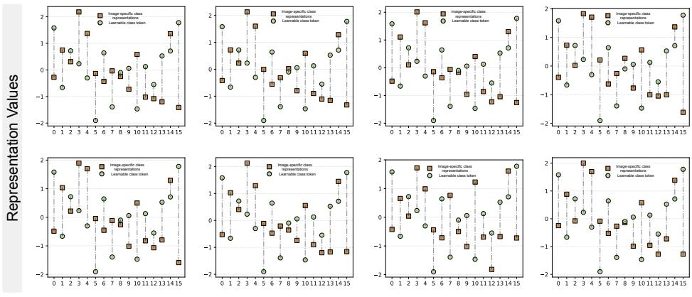  
Fundamental Classes  
Figure 9: Representational perturbation between $e _ { \mathcal { C } _ { 0 : t - 1 } }$ and $\hat { e } _ { { \cal C } _ { ( 0 : t - 1 ) } }$ for randomly sampled images of “sheep”.

## C.2 Further Analysis on Semantic Similarity

To further analyze the effect of initialization, we conduct an additional controlled study across eight experimental configurations. In each study, three base classes are trained, after which “Sheep” is introduced as the incremental class. For each study, we compare two conditions: a similar model, in which the incremental class (sheep) token is initialized from the base classes deemed most semantically similar, and a dissimilar model, in which the incremental class (sheep) token is initialized from semantically unrelated base classes.

Fig. 10(b) shows the incremental class performance averaged over the 8 configurations. The similar model achieves 84.22% mIoU on Sheep, while the dissimilar model achieves only 42.28%. When the model begins from a semantically similar point, a source class that shares visual features with the target class, the decoder can adapt with far fewer gradient steps. Fig. 10(a) further reveals that the choice of initialization source also affects how well the base classes are retained. For all class groups, the similar model consistently outperforms the dissimilar model. The performance gap is most pronounced in the third class group, indicating that catastrophic forgetting propagates beyond the directly interfering classes. A structurally poor initialization forces the optimizer to make larger weight updates across the decoder, disturbing representations that were not directly involved.

Finally, our proposed approach leverages the characteristics of a well-trained representational space, where features are not random but semantically clustered. In Fig. 11, we provide the visualization of class distribution for all incremental scenarios in the 15-1 setting. From the figure, it is evident that there is a selective number of classes in each incremental class, which resembles the distribution. Furthermore, we provide an ablation study comparing performance between similar and dissimilar classes.

## C.2.1 Similarity Detection Cost

Similarity detection is a single forward pass of current-task data through the frozen old model; the cost of computing Euclidean distances is negligible. We report the average

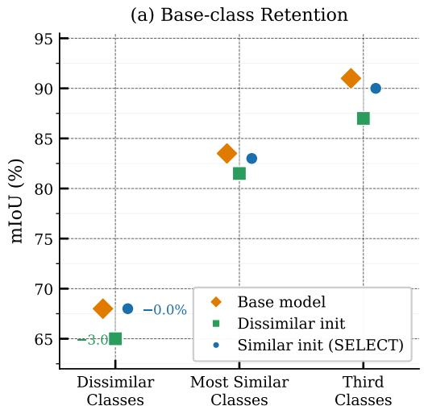

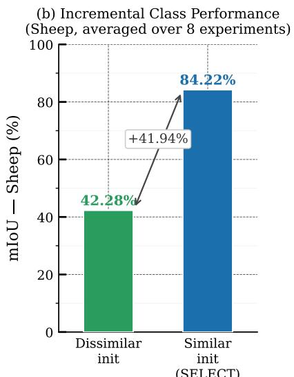  
Figure 10: a) Scatter plot for analyzing the choice of initialization source over eight experiments; b) Incremental class performance averaged over eight experiments.

processing speed (imgs/sec per task) for ADE20K and compare with NeST (ours/NeST), 100-50: 70.0/10.2, ∥ 50-50: 69.4/10, ∥ 100-10: 71.6/11.1, ∥ 100-5: 74.0/13.

## D Additional Analysis and Results

## D.1 Diverse Challenging Scenarios

In the paper, we present a unified set of experimental results on Pascal VOC and ADE20K in an overlapped scenario across selected settings. Here, we perform additional experiments on the aforementioned datasets.

In particular, Table 8 extends the quantitative results by comparing with recent works and providing results for the additional 5-3 (6 tasks) setting. In the 5-3 setting, SELECT scores 78.6% in the “All” setting mIoU, compared to MBS’s 77.0%. The 5-3 setting presents two compounding challenges specific to our approach. First, with only 5 base classes, the semantic space is sparser. Each incremental class has fewer potential similar classes, reducing the informativeness of $\mathcal { C } _ { s }$ . Second, with only three classes per step, the per-class sample count during similarity detection is low, making the Euclidean deviation metric noisier. This analysis directly motivates adaptive thresholding as a future direction.

Additionally, we perform experiments (demonstrated in Table 9) in the disjoint scenario for 19-1 (2 tasks), 15-5 (2 tasks), and 15-1 (6 tasks) settings. Our proposed approach provides a strong competitive advantage over all previous approaches while demonstrating effectiveness.

In Table 10, we demonstrate detailed experimental comparison for ADE20K dataset in the overlapped scenario. As mentioned in the paper, ADE20K presents more diverse and robust scenes, making it a challenging benchmark. Upon comparison with prior work, our proposed approach shows strong performance and surpasses it across almost all settings.

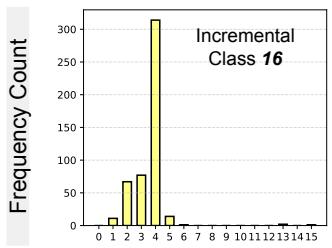

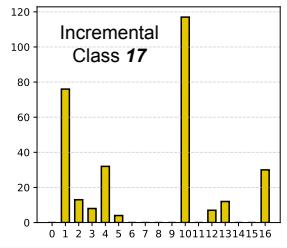  
Classes

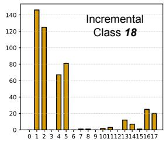

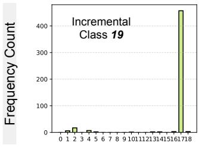

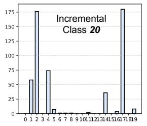  
Classes

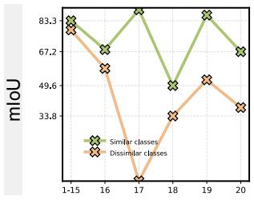  
Figure 11: Visualization of class distribution across the incremental scenario in the 15-1 setting. Additionally, there is a visual comparison of similar and dissimilar classes.

## D.2 Comparative Analysis over class-wise performance

In Fig. 12, we visualize the performance of individual incremental classes for three common settings (15-1, 15-5, and 19-1) and compare the performance of our proposed method with MBS [35]. From the figure, we observe that both methods achieve similar performance in the fundamental classes across all settings. However, in the incremental scenario, there is a performance gap between the two approaches. Specifically, we see a performance drop in [35] across all settings.

(a) 15 -1 (6 tasks)  
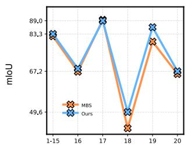

(b) 15 -5 (2 tasks)  
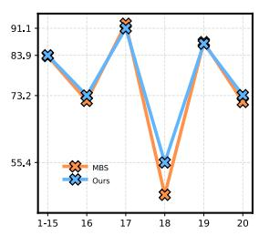  
Number of learned classes

(c) 19 -1 (2 tasks)  
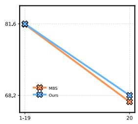  
Figure 12: Incremental class-wise performance across different settings for Pascal VOC dataset.

Table 8: Performance comparison on Pascal VOC under different scenarios for overlapped setting. ‡ implies results are reproduced from the official repository. † indicates results are excerpted from [35, 39].
<table><tr><td rowspan="2">Methods</td><td rowspan="2">Backbone</td><td colspan="3">19-1 (2 tasks)</td><td colspan="3">15-5 (2 tasks)</td><td colspan="3">15-1 (6 tasks)</td><td colspan="3">5-3 (6 tasks)</td></tr><tr><td>1-19</td><td>20</td><td>All</td><td>1-15</td><td>16-20</td><td>All</td><td>1-15</td><td>16-20</td><td>All</td><td>1-5</td><td>6-20</td><td>All</td></tr><tr><td>MiB†[]</td><td>Res101</td><td>70.2</td><td>22.1</td><td>67.8</td><td>75.5</td><td>49.4</td><td>69.0</td><td>35.1</td><td>13.5</td><td>29.7</td><td>57.1</td><td>42.6</td><td>46.7</td></tr><tr><td>PLOP† [口]</td><td>Res101</td><td>75.4</td><td>37.4</td><td>73.5</td><td>75.7</td><td>51.7</td><td>70.1</td><td>65.1</td><td>21.1</td><td>54.6</td><td>17.5</td><td>19.2</td><td>18.7</td></tr><tr><td>RCIL† [日]</td><td>Res101</td><td>77.0</td><td>31.5</td><td>74.7</td><td>78.8</td><td>52.0</td><td>72.4</td><td>70.6</td><td>23.7</td><td>59.4</td><td></td><td></td><td></td></tr><tr><td>SSUL []</td><td>Res101</td><td>77.8</td><td>49.8</td><td>76.5</td><td>78.4</td><td>55.8</td><td>73.0</td><td>78.4</td><td>49.0</td><td>71.4</td><td>71.3</td><td>53.2</td><td>58.4</td></tr><tr><td>PLOP + Cs²K [0]</td><td>Res101</td><td></td><td></td><td></td><td></td><td></td><td></td><td>77.9</td><td>46.4</td><td>70.4</td><td>58.4</td><td>53.4</td><td>54.8</td></tr><tr><td>MiB + NeST []</td><td>Res101</td><td>71.7</td><td>28.2</td><td>69.7</td><td>77.1</td><td>50.1</td><td>70.7</td><td>61.7</td><td>20.4</td><td>51.8</td><td></td><td></td><td></td></tr><tr><td>PLOP + NeST []</td><td>Res101</td><td>77.0</td><td>49.1</td><td>75.7</td><td>77.6</td><td>55.8</td><td>72.4</td><td>72.2</td><td>33.7</td><td>63.1</td><td></td><td></td><td></td></tr><tr><td>RCIL + NeST []</td><td>Res101</td><td>77.0</td><td>33.3</td><td>74.9</td><td>79.0</td><td>52.8</td><td>72.8</td><td>71.9</td><td>28.0</td><td>61.4</td><td></td><td></td><td></td></tr><tr><td>BARM []</td><td>Res101</td><td>78.2</td><td>42.2</td><td>76.4</td><td></td><td></td><td></td><td>77.6</td><td>45.9</td><td>70.0</td><td>71.3</td><td>57.0</td><td>61.1</td></tr><tr><td>IDEC []</td><td>Res101</td><td></td><td></td><td></td><td>78.0</td><td>51.8</td><td>71.8</td><td>77.0</td><td>36.5</td><td>67.3</td><td>67.1</td><td>49.0</td><td>54.1</td></tr><tr><td>STAR [0]</td><td>Res101</td><td>78.0</td><td>47.1</td><td>76.5</td><td>79.5</td><td>58.9</td><td>74.6</td><td>79.5</td><td>50.6</td><td>72.6</td><td>71.9</td><td>61.5</td><td>64.4</td></tr><tr><td>ADAPTER []</td><td>Res101</td><td>78.0</td><td>50.7</td><td>76.7</td><td>79.7</td><td>59.7</td><td>75.0</td><td>79.9</td><td>51.9</td><td>73.2</td><td>73.8</td><td>61.9</td><td>65.3</td></tr><tr><td>EIR []</td><td>Res101</td><td></td><td></td><td></td><td>79.1</td><td>58.4</td><td>74.2</td><td>79.4</td><td>52.6</td><td>73.0</td><td>74.6</td><td>63.1</td><td>66.4</td></tr><tr><td>CoGaMiD[]</td><td>Res101</td><td></td><td></td><td></td><td></td><td></td><td></td><td>80.1</td><td>53.6</td><td>73.8</td><td>73.7</td><td>63.1</td><td>66.1</td></tr><tr><td>CoinSeg []</td><td>Swin-B</td><td>81.5</td><td>44.8</td><td>79.8</td><td>82.1</td><td>63.2</td><td>77.6</td><td>82.7</td><td>52.5</td><td>75.5</td><td></td><td></td><td></td></tr><tr><td>MiB†[日]</td><td>ViT</td><td>79.9</td><td>47.7</td><td>79.1</td><td>78.6</td><td>63.1</td><td>75.6</td><td>72.6</td><td>23.1</td><td>61.7</td><td>33.4</td><td>43.2</td><td>42.9</td></tr><tr><td>RBC† [四]</td><td>ViT</td><td>80.2</td><td>38.8</td><td>79.0</td><td>78.9</td><td>62.0</td><td>75.5</td><td>75.9</td><td>40.2</td><td>68.2</td><td></td><td></td><td></td></tr><tr><td>INC† [四]</td><td>ViT</td><td>82.5</td><td>61.0</td><td>82.1</td><td>82.5</td><td>69.2</td><td>79.9</td><td>79.6</td><td>59.6</td><td>75.6</td><td></td><td></td><td></td></tr><tr><td>MiB + NeST []</td><td>Swin-B</td><td>79.7</td><td>60.0</td><td>78.8</td><td>81.2</td><td>67.4</td><td>77.9</td><td>77.0</td><td>53.3</td><td>71.4</td><td></td><td></td><td></td></tr><tr><td>PLOP + NeST []</td><td>Swin-B</td><td>79.6</td><td>70.2</td><td>79.1</td><td>80.5</td><td>70.8</td><td>78.2</td><td>76.8</td><td>57.2</td><td>72.2</td><td></td><td></td><td></td></tr><tr><td>CoGaMiD[]</td><td>Swin-B</td><td></td><td></td><td></td><td></td><td></td><td></td><td>83.2</td><td>61.2</td><td>78.0</td><td>79.9</td><td>72.7</td><td>74.7</td></tr><tr><td>EIR []</td><td>Swin-B</td><td></td><td></td><td></td><td>83.4</td><td>68.6</td><td>79.9</td><td>83.6</td><td>66.9</td><td>79.6</td><td>74.5</td><td>73.0</td><td>73.4</td></tr><tr><td>MBS [回]</td><td>ViT</td><td>81.5</td><td>67.0</td><td>80.8</td><td>82.7</td><td>74.0</td><td>80.5</td><td>82.3</td><td>69.0</td><td>79.0</td><td>76.7</td><td>77.3</td><td>77.0</td></tr><tr><td>Ours</td><td>ViT</td><td>83.0</td><td>70.2</td><td>82.1</td><td>83.9</td><td>76.0</td><td>81.6</td><td>83.3</td><td>72.0</td><td>80.5</td><td>77.9</td><td>77.8</td><td>78.6</td></tr></table>

Table 9: Additional performance comparison on Pascal VOC under different scenarios for disjoint setting. ‡ implies results are reproduced from the official repository. † indicates results are excerpted from [35, 39].
<table><tr><td rowspan="2">Methods</td><td rowspan="2">Backbone</td><td colspan="3">19-1 (2 tasks)</td><td colspan="3">15-5 (2 tasks)</td><td colspan="3">15-1 (6 tasks)</td></tr><tr><td>1-19</td><td>20</td><td>All</td><td>1-15</td><td>16-20</td><td>All</td><td>1-15</td><td>16-20</td><td>All</td></tr><tr><td>MiB† [0]</td><td>Res101</td><td>69.6</td><td>25.6</td><td>67.4</td><td>71.8</td><td>43.3</td><td>64.7</td><td>46.2</td><td>12.9</td><td>37.9</td></tr><tr><td>PLOP{† [口]</td><td>Res101</td><td>75.4</td><td>38.9</td><td>73.6</td><td>71.0</td><td>42.8</td><td>64.3</td><td>57.9</td><td>13.7</td><td>46.5</td></tr><tr><td>RCIL† [日]</td><td>Res101</td><td></td><td></td><td></td><td>75.0</td><td>42.8</td><td>67.3</td><td>66.1</td><td>18.2</td><td>54.7</td></tr><tr><td>SPPA [ [四]</td><td>Res101</td><td>75.5</td><td>38.0</td><td>73.7</td><td>75.3</td><td>48.7</td><td>69.0</td><td>59.6</td><td>15.6</td><td>49.1</td></tr><tr><td>STAR [0]</td><td>Res101</td><td>77.9</td><td>43.4</td><td>76.2</td><td>78.4</td><td>57.4</td><td>73.4</td><td>78.1</td><td>46.6</td><td>70.6</td></tr><tr><td>ADAPTER [E]</td><td>Res101</td><td>78.0</td><td>46.1</td><td>76.5</td><td>78.9</td><td>58.2</td><td>73.9</td><td>78.6</td><td>49.0</td><td>71.5</td></tr><tr><td>CoGaMiD [ [回]</td><td>Res101</td><td>79.8</td><td>46.4</td><td>78.2</td><td>78.9</td><td>58.2</td><td>74.0</td><td>78.9</td><td>49.2</td><td>71.8</td></tr><tr><td>MiB† [0]</td><td>ViT</td><td>80.6</td><td>45.2</td><td>79.6</td><td>75.0</td><td>59.9</td><td>72.3</td><td>66.7</td><td>26.3</td><td>58.3</td></tr><tr><td>RBC† [四]</td><td>ViT</td><td>80.9</td><td>42.1</td><td>79.7</td><td>77.7</td><td>59.1</td><td>74.0</td><td>69.0</td><td>28.4</td><td>60.5</td></tr><tr><td>INC† 阿9]</td><td>ViT</td><td>82.4</td><td>64.2</td><td>82.2</td><td>81.6</td><td>62.2</td><td>77.6</td><td>81.4</td><td>57.1</td><td>76.2</td></tr><tr><td>CoGaMiD [区]</td><td>Swin-B</td><td>82.5</td><td>67.2</td><td>81.8</td><td>82.4</td><td>61.8</td><td>77.5</td><td>82.2</td><td>57.9</td><td>76.4</td></tr><tr><td>MBS [四]</td><td>ViT</td><td>81.5</td><td>65.0</td><td>80.7</td><td>80.5</td><td>64.1</td><td>76.4</td><td>79.6</td><td>57.8</td><td>74.1</td></tr><tr><td>Ours</td><td>ViT</td><td>81.8</td><td>71.1</td><td>81.9</td><td>82.2</td><td>67.9</td><td>78.6</td><td>80.6</td><td>61.5</td><td>76.6</td></tr></table>

Table 10: Performance comparison on ADE20K under different scenarios for overlapped setting. ‡ implies results are reproduced from the official repository. † indicates results are excerpted from [35, 39].
<table><tr><td rowspan="2">Methods</td><td rowspan="2">Backbone</td><td colspan="3">100-50 (2 tasks)</td><td colspan="3">50-50 (3 tasks)</td><td colspan="3">100-10 (6 tasks)</td><td colspan="3">100-5 (11 tasks)</td></tr><tr><td>1-100</td><td>101-150</td><td>All</td><td></td><td>1-50 51-150</td><td>All</td><td>1-100</td><td>101-150</td><td>All</td><td>1-100</td><td>101-150</td><td>All</td></tr><tr><td>MiB†[日]</td><td>Res101</td><td>40.5</td><td>17.2</td><td></td><td>32.8 45.5</td><td>21.0</td><td>29.3</td><td>38.2</td><td>11.1</td><td>29.2</td><td>36.0</td><td>5.7</td><td>26.0</td></tr><tr><td>SSUL []</td><td>Res101</td><td>42.8</td><td>17.5</td><td></td><td>34.5 49.1</td><td>20.1</td><td>29.8</td><td>42.9</td><td>17.7</td><td>34.5</td><td>42.9</td><td>17.8</td><td>34.6</td></tr><tr><td>SPPA [回]</td><td>Res101</td><td>42.9</td><td>19.9</td><td></td><td>35.2 49.8</td><td>23.9</td><td>32.5</td><td>41.0</td><td>12.5</td><td>31.5</td><td></td><td></td><td></td></tr><tr><td>RCIL† [回]</td><td>Res101</td><td>42.3</td><td>18.8</td><td></td><td>34.5 48.3</td><td>25.0</td><td>32.5</td><td>39.3</td><td>17.6</td><td>32.0</td><td>38.5</td><td>11.5</td><td>29.6</td></tr><tr><td>IDEC [ [区]</td><td>Res101</td><td>42.0</td><td>18.2</td><td></td><td>34.1 47.4</td><td>26.0</td><td>33.1</td><td>40.3</td><td>17.6</td><td>32.7</td><td>39.2</td><td>14.6</td><td>31.0</td></tr><tr><td>LGKD+PLOP []</td><td>Res101</td><td>43.6</td><td>25.7</td><td></td><td>37.5 49.4</td><td>29.4</td><td>36.0</td><td>42.1</td><td>22.0</td><td>35.4</td><td></td><td></td><td></td></tr><tr><td>STAR []</td><td>Res101</td><td>42.4</td><td>24.2</td><td></td><td>36.4 48.7</td><td>27.2</td><td>34.4</td><td>42.0</td><td>20.6</td><td>34.9</td><td></td><td></td><td></td></tr><tr><td>REMINDER []</td><td>Res101</td><td>41.6</td><td>19.2</td><td></td><td>34.1 47.1</td><td>20.4</td><td>29.4</td><td>39.0</td><td>21.3</td><td>33.1</td><td>36.1</td><td>16.4</td><td>29.5</td></tr><tr><td>PLOP + NeST [ [四]</td><td>Res101</td><td>42.2</td><td>24.3</td><td></td><td>36.348.7</td><td>27.7</td><td>34.8</td><td>40.9</td><td>22.0</td><td>34.7</td><td>39.3</td><td>17.4</td><td>32.0</td></tr><tr><td>RCIL + NeST []</td><td>Res101</td><td>42.3</td><td>22.8</td><td></td><td>35.8 48.2</td><td>27.4</td><td>34.4</td><td>40.7</td><td>19.0</td><td>33.5</td><td>39.4</td><td>15.5</td><td>31.5</td></tr><tr><td>BARM E</td><td>Res101</td><td>42.0</td><td>23.0</td><td></td><td>35.747.9</td><td>26.5</td><td>33.7</td><td>41.1</td><td>23.1</td><td>35.2</td><td>40.5</td><td>21.2</td><td>34.1</td></tr><tr><td>ADAPTER []</td><td>Res101</td><td>43.1</td><td>23.6</td><td></td><td>36.749.3</td><td>27.3</td><td>34.7</td><td>42.9</td><td>19.9</td><td>35.3</td><td>42.6</td><td>18.0</td><td>34.5</td></tr><tr><td>ECLIPSE []</td><td>Res101</td><td>45.0</td><td>21.7</td><td>37.1</td><td></td><td></td><td></td><td>43.4</td><td>17.4</td><td>34.6</td><td>43.3</td><td>16.3</td><td>34.2</td></tr><tr><td>CoMBO []</td><td>Res101</td><td>50.2</td><td>34.4</td><td>44.9</td><td>55.3</td><td>36.9</td><td>43.0</td><td>47.8</td><td>27.7</td><td>41.1</td><td>44.6</td><td>22.6</td><td>37.3</td></tr><tr><td>SimCIS []</td><td>Res101</td><td>57.1</td><td>36.0</td><td>48.6</td><td></td><td></td><td></td><td>49.7</td><td>27.4</td><td>42.3</td><td>46.7</td><td>22.8</td><td>38.7</td></tr><tr><td>EIR []</td><td>Res101</td><td>41.9</td><td>21.9</td><td>35.3</td><td>49.3</td><td>26.3</td><td>34.1</td><td>41.8</td><td>19.4</td><td>34.3</td><td></td><td></td><td></td></tr><tr><td>CoGaMiD []</td><td>Res101</td><td>43.1</td><td>24.7</td><td></td><td>37.049.3</td><td>27.8</td><td>35.1</td><td>42.5</td><td>22.4</td><td>35.8</td><td>42.3</td><td>21.0</td><td>35.2</td></tr><tr><td>MiB† []</td><td>ViT</td><td>46.4</td><td>35.0</td><td></td><td>42.652.2</td><td>35.6</td><td>41.1</td><td>43.0</td><td>30.8</td><td>38.9</td><td>40.2</td><td>26.6</td><td>35.7</td></tr><tr><td>CoinSeg []</td><td>Swin-B</td><td>41.6</td><td>26.7</td><td></td><td>36.6 49.0</td><td>28.9</td><td>35.6</td><td>42.1</td><td>24.5</td><td>36.2</td><td>43.1</td><td>24.1</td><td>36.8</td></tr><tr><td>INC† [四]</td><td>ViT</td><td>49.4</td><td>35.6</td><td></td><td>44.856.2</td><td>37.8</td><td>43.9</td><td>48.5</td><td>34.6</td><td>43.9</td><td>46.9</td><td>31.3</td><td>41.7</td></tr><tr><td>MiB + NeST []</td><td>Swin-B</td><td>42.8</td><td>27.8</td><td></td><td>37.949.7</td><td>29.3</td><td>36.2</td><td>41.8</td><td>23.8</td><td>35.9</td><td>40.5</td><td>19.9</td><td>33.7</td></tr><tr><td>PLOP + NeST []</td><td>Swin-B</td><td>43.5</td><td>26.5</td><td></td><td>37.950.6</td><td>28.9</td><td>36.2</td><td>41.7</td><td>24.2</td><td>35.9</td><td>39.7</td><td>18.3</td><td>32.6</td></tr><tr><td>EIR []</td><td>Swin-B</td><td>42.1</td><td>27.3</td><td>37.2</td><td>49.7</td><td>28.8</td><td>35.8</td><td>42.3</td><td>23.6</td><td>36.1</td><td></td><td></td><td></td></tr><tr><td>CoGaMiD []</td><td>Swin-B</td><td>43.9</td><td>27.3</td><td>38.4</td><td>49.9</td><td>29.8</td><td>36.6</td><td>43.7</td><td>26.5</td><td>38.0</td><td>43.6</td><td>25.8</td><td>37.7</td></tr><tr><td>MBS[]</td><td>ViT</td><td>47.7</td><td>35.6</td><td>43.7</td><td>54.4</td><td>37.1</td><td>42.9</td><td>47.7</td><td>31.5</td><td>42.3</td><td>44.4</td><td>22.1</td><td>38.8</td></tr><tr><td>Ours</td><td>ViT</td><td>54.1</td><td>40.3</td><td></td><td>48.2 56.4</td><td>42.3</td><td>47.1</td><td>50.4</td><td>35.7</td><td>44.1</td><td>46.3</td><td>29.1</td><td>41.4</td></tr></table>

## D.3 Additional Qualitative Results

In this section, we present more qualitative comparisons with recent state-of-the-art approaches in Figs. 13-14.

In Fig. 13, we provide the qualitative results of our proposed approach compared with [35]. We observe that [35] partially retains knowledge of previously learned objects; however, as new incremental tasks arise, it starts producing many false positives. As the task progresses, these false positives also get denser. On the other hand, our proposed approach maintains learning from previous classes while adapting to new knowledge more effectively. For example, in case(b), the sheep (in our case) is learned in the third task and is maintained thereafter. Conversely, [35] maintains part of the knowledge learned from the fundamental task and carries it forward.

Similarly, in Fig. 14, we provide additional qualitative results of our proposed approach compared with [36, 49]. In this figure, we present the final segmentation results in a PascalVOC 15-5 setting. We observe that our proposed approach has close pixel-wise similarity with the ground truth as compared to others, demonstrating its robustness.

## D.4 SELECT on CNN backbone

Based on previous work, to ensure a fair comparison, we provide an analysis that generalizes our proposed selective context transfer strategy using a CNN-based backbone. To validate this, we integrated our method into two standard CNN-based baselines (with Res101 backbones): MiB and PLOP and compared them against NeST. As shown in Table 11, our method consistently outperforms on these CNN baselines. In particular, on the 15-1 setting, our strategy improves over standard MiB by ≈20% across all classes and over PLOP by ≈15%, demonstrating robustness with a CNN-based backbone.

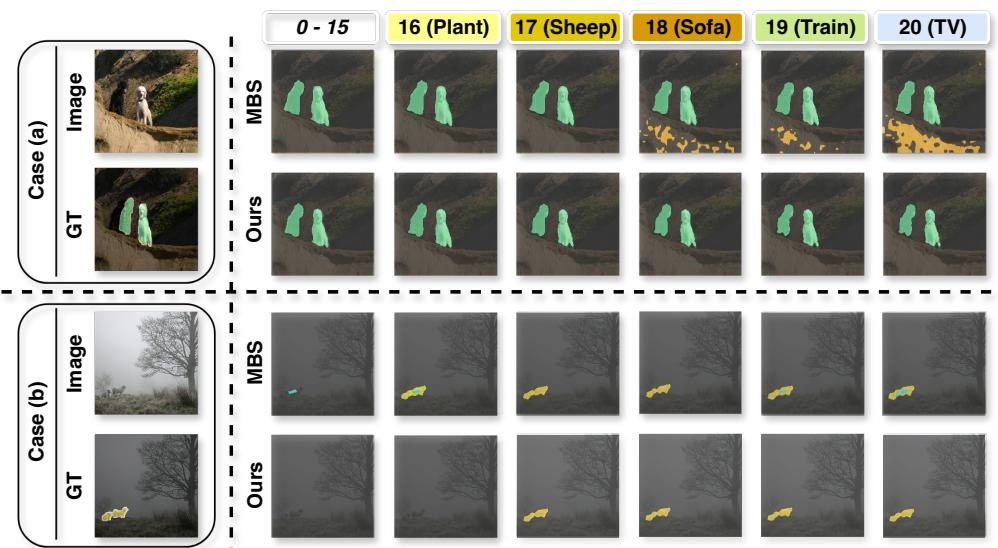  
Figure 13: Additional visual comparison on the 15-1 setting of the Pascal VOC between MBS [35] and ours.

Table 11: Performance comparison on Pascal VOC under CNN-based backbone for overlapped setting. Best results are marked in Bold.
<table><tr><td rowspan="2">Methods</td><td colspan="2">15-5 (2 tasks)</td><td colspan="3">15-1 (6 tasks)</td></tr><tr><td>1-15 16-20</td><td>All</td><td>1-15</td><td>16-20</td><td>All</td></tr><tr><td colspan="7">MiB</td></tr><tr><td>Baseline [0] MiB + NeST [49]</td><td>76.8 77.1</td><td>49.1 50.1</td><td>70.2 70.7</td><td>45.2 61.7</td><td>15.7 20.4</td><td>38.2 51.8</td></tr><tr><td>MiB + Ours</td><td>78.7</td><td>52.1</td><td>71.2</td><td>65.8</td><td>18.7</td><td>60.6</td></tr><tr><td colspan="7">PLOP</td></tr><tr><td>Baseline []</td><td>77.0</td><td>50.9</td><td>70.8</td><td>66.8</td><td>22.3</td><td>56.2</td></tr><tr><td>PLOP + NeST []</td><td>77.6</td><td>55.8</td><td>72.4</td><td>72.2</td><td>33.7</td><td>63.1</td></tr><tr><td>PLOP + Ours</td><td>78.1</td><td>57.2</td><td>75.3</td><td>75.1</td><td>32.4</td><td>70.3</td></tr></table>

## D.5 SELECT vs NeST

In the main paper, we originally reported the results for NeST [49] with the Swin-B backbone. In Table 12, we conduct a fair evaluation with the ViT-B backbone as well. The results

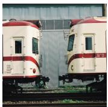

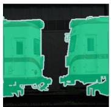

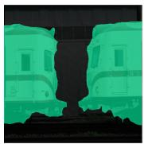

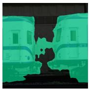

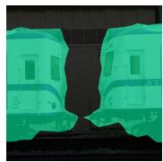

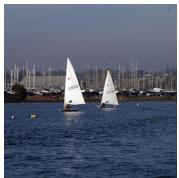

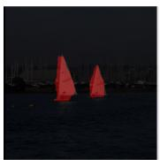

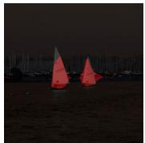

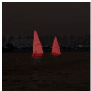

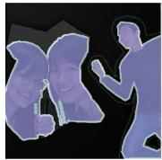

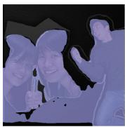

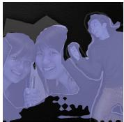

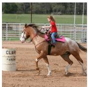

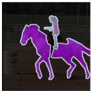

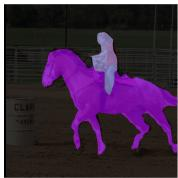

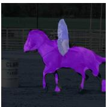

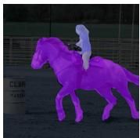

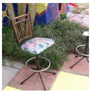

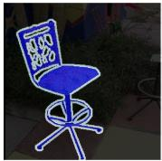

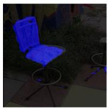

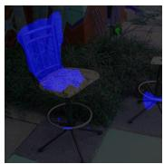

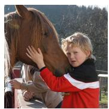  
Images

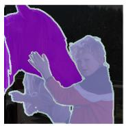

  
GT

  
Ours

  
NeST  
Figure 14: Visual comparison on the final segmentation prediction in 15-5 setting of the Pascal VOC among SELECT (Ours), REMINDER [36], and NeST [49].

  
REMINDER

presented in the table are averaged across all the classes for the 15-1, 15-5, and 10-1 settings. These benchmark results are extracted from NeST itself. From the table, we observe that our proposed approach significantly outperforms NeST in all tasks, demonstrating its effectiveness.

Table 12: Performance comparison on Pascal VOC under transformer-based backbones for overlapped setting. Best results are marked in Bold.
<table><tr><td>Models</td><td>Backbone 15-1</td><td>15-5 10-1</td></tr><tr><td>Incrementer</td><td>ViT-B</td><td>75.5 79.9 70.2</td></tr><tr><td>MiB</td><td>ViT-B</td><td>53.5 80.2 25.5</td></tr><tr><td>MiB + NeST</td><td>ViT-B</td><td>76.5 80.3 71.9</td></tr><tr><td>Ours</td><td>ViT-B</td><td>80.5 81.6 75.7</td></tr></table>

(a) Similarity Metrics  

  
(b)

  
(c)

  
(d)

  
(e)

  
(f)

  
Figure 15: Analyzing different hyperparameters on PASCAL VOC 15-1 and 15-5 setting. (a) Different Similarity Metrics; (b) standard deviation σ; (c) noise trade-off α; (d) Context transfer loss Margin M; (e) threshold frequency ε; (f) Context transfer loss weight $\lambda _ { c t } )$

## D.6 Additional Analysis over different hyperparameters

In the paper, we provide a preliminary study on the hyperparameter. Below, we present the detailed analysis of all the hyperparameters used in our proposed approach.

## D.6.1 Different Similarity Metrics.

As mentioned in the paper, the similarity metric identifies the similarity between learned class tokens and image-specific class representations. In the paper, we presented the visual analysis in a 15-1 setting. In Fig. 15(a), we present the analysis in both 15-1 [left] and 15-5 [right] settings. We observe that the Euclidean metric performs significantly better than all other metrics, focusing on both magnitude and orientation.

## D.6.2 Standard Deviation σ.

We perform this study to determine the most appropriate σ in the Gaussian noise N in §3.3.2. Fig. 15(b) presents our findings. Standard deviation (σ) of the Gaussian noise plays a crucial role during knowledge transfer. We conduct an ablation study and found that $\sigma { = } 0 . 0 5$

consistently yields the best performance across both tasks. This value represents an effective trade-off. Smaller values (e.g. 0.01) fail to diversify the initialization meaningfully, while larger values (e.g. 0.10) inject excessive noise.

## D.6.3 Noise Weight α.

In §3.3.2, we discuss about the Context Transfer Attention (CTA), and we add a controlled noise component N to provide a distinction between previously learned similar classes $\mathcal { C } _ { s }$ and the new class $\mathcal { C } _ { t }$ . To maintain the balance between $\mathcal { C } _ { s }$ and N , we include a weighting hyperparameter α. In Fig. 15(c), we analyze this hyperparameter by providing different values. From the figure, it is evident that our proposed strategy outperforms the alternative values for the α. Particularly, when α is low (e.g. 0.1), the representation is more influenced by the noise component, introducing flexibility. Conversely, when α (e.g. 0.9) is high, the representation remains close to the original, offering more guidance. In the intermediate range, the representation shows the ambiguous behaviour that is neither sufficiently guided nor flexible, which explains the observed performance dip.

## D.6.4 Context Transfer Loss Margin M.

The $\mathcal { L } _ { c t }$ margin M (demonstrated in Fig. 15(d)) dictates how strictly the model forces separation between the new class and similar old classes. At M = 0.0, we observe the lowest performance, as it fails to enforce a distinct decision boundary. While at $M = 1 . 0$ , we observe the highest performance. A larger margin provides a stronger constraint, compelling the model to push the new class representation sufficiently far away from prior similar classes. Hence, 1.0 is the appropriate choice.

## D.6.5 Threshold Frequency ε.

For the frequency threshold, our analysis (demonstrated in Fig. 15(e)) consistently shows that 0.15 is the optimal value. When we increased the threshold to 0.30 or 0.45, the performance declined. Including a larger pool of similar classes (top 45%) introduces semantic dilution. A tighter threshold (0.15) ensures that we only transfer knowledge from highly relevant predecessors, preventing confusion for the new class.

## D.6.6 Context Transfer Loss Weight $\lambda _ { c t }$ .

$\lambda _ { c t }$ provides the weight to the proposed Context Transfer Loss $( \mathcal { L } _ { c t } )$ . As visualized in Fig. 15(f), $\lambda _ { c t }$ performs significantly better at 0.8 for both 15-1 and 15-5 settings. This weight value, in addition to M, significantly contributes in protecting the boundaries of the old classes while learning the new ones.

## References

[1] Jacopo Bonato, Francesco Pelosin, Luigi Sabetta, and Alessandro Nicolosi. MIND: multi-task incremental network distillation. In Thirty-Eighth AAAI Conference on Artificial Intelligence, 2024, February 20-27, 2024, Vancouver, Canada, pages 11105– 11113. AAAI Press, 2024. doi: 10.1609/AAAI.V38I10.28987. URL https://doi. org/10.1609/aaai.v38i10.28987.

[2] Xinzi Cao, Xiawu Zheng, Guanhong Wang, Weijiang Yu, Yunhang Shen, Ke Li, Yutong Lu, and Yonghong Tian. Solving the catastrophic forgetting problem in generalized category discovery. In IEEE/CVF Conference on Computer Vision and Pattern Recognition, CVPR 2024, Seattle, WA, USA, June 16-22, 2024, pages 16880–16889. IEEE, 2024. doi: 10.1109/CVPR52733.2024.01597. URL https://doi.org/10.1109/ CVPR52733.2024.01597.

[3] Fabio Cermelli, Massimiliano Mancini, Samuel Rota Bulò, Elisa Ricci, and Barbara Caputo. Modeling the background for incremental learning in semantic segmentation. In 2020 IEEE/CVF Conference on Computer Vision and Pattern Recognition, CVPR 2020, Seattle, WA, USA, June 13-19, 2020, pages 9230–9239. Computer Vision Foundation / IEEE, 2020. doi: 10.1109/CVPR42600.2020.00925. URL https://openaccess.thecvf.com/content\_CVPR\_2020/ html/Cermelli\_Modeling\_the\_Background\_for\_Incremental\_ Learning\_in\_Semantic\_Segmentation\_CVPR\_2020\_paper.html.

[4] Fabio Cermelli, Matthieu Cord, and Arthur Douillard. Comformer: Continual learning in semantic and panoptic segmentation. In IEEE/CVF Conference on Computer Vision and Pattern Recognition, CVPR 2023, Vancouver, BC, Canada, June 17-24, 2023, pages 3010–3020. IEEE, 2023. doi: 10.1109/CVPR52729.2023.00294. URL https: //doi.org/10.1109/CVPR52729.2023.00294.

[5] Sungmin Cha, Beomyoung Kim, Youngjoon Yoo, and Taesup Moon. SSUL: semantic segmentation with unknown label for exemplar-based class-incremental learning. In Marc’Aurelio Ranzato, Alina Beygelzimer, Yann N. Dauphin, Percy Liang, and Jennifer Wortman Vaughan, editors, Advances in Neural Information Processing Systems 34: Annual Conference on Neural Information Processing Systems 2021, NeurIPS 2021, December 6-14, 2021, virtual, pages 10919– 10930, 2021. URL https://proceedings.neurips.cc/paper/2021/ hash/5a9542c773018268fc6271f7afeea969-Abstract.html.

[6] Arslan Chaudhry, Marc’Aurelio Ranzato, Marcus Rohrbach, and Mohamed Elhoseiny. Efficient lifelong learning with a-gem. arXiv preprint arXiv:1812.00420, 2018.

[7] Jinpeng Chen, Runmin Cong, Yuxuan Luo, Horace Ho-Shing Ip, and Sam Kwong. Saving 100x storage: Prototype replay for reconstructing training sample distribution in class-incremental semantic segmentation. In Alice Oh, Tristan Naumann, Amir Globerson, Kate Saenko, Moritz Hardt, and Sergey Levine, editors, Advances in Neural Information Processing Systems 36: Annual Conference on Neural Information Processing Systems 2023, NeurIPS 2023, New Orleans, LA, USA, December 10 - 16, 2023, 2023. URL http://papers.nips.cc/paper\_files/paper/2023/hash/ 708e0d691a22212e1e373dc8779cbe53-Abstract-Conference.html.

[8] Jinpeng Chen, Runmin Cong, Yuxuan Luo, Horace Ho Shing Ip, and Sam Kwong. Strike a balance in continual panoptic segmentation. In ECCV, 2024.

[9] Wei Cong, Yang Cong, Yuyang Liu, and Gan Sun. ${ \mathrm { C s } } ^ { 2 } { \mathrm { k } } { \mathrm { : } }$ Class-specific and classshared knowledge guidance for incremental semantic segmentation. In Ales Leonardis, Elisa Ricci, Stefan Roth, Olga Russakovsky, Torsten Sattler, and Gül Varol, editors, Computer Vision - ECCV 2024 - 18th European Conference, Milan, Italy, September

29-October 4, 2024, Proceedings, Part V, volume 15063 of Lecture Notes in Computer Science, pages 244–261. Springer, 2024. doi: 10.1007/978-3-031-72652-1\_15. URL https://doi.org/10.1007/978-3-031-72652-1\_15.

[10] Prithviraj Dhar, Rajat Vikram Singh, Kuan-Chuan Peng, Ziyan Wu, and Rama Chellappa. Learning without memorizing. In Proceedings ofthe IEEE/CVF conference on computer vision and pattern recognition, pages 5138–5146, 2019.

[11] Alexey Dosovitskiy, Lucas Beyer, Alexander Kolesnikov, Dirk Weissenborn, Xiaohua Zhai, Thomas Unterthiner, Mostafa Dehghani, Matthias Minderer, Georg Heigold, Sylvain Gelly, et al. An image is worth 16x16 words: Transformers for image recognition at scale. arXiv preprint arXiv:2010.11929, 2020.

[12] Arthur Douillard, Yifu Chen, Arnaud Dapogny, and Matthieu Cord. PLOP: learning without forgetting for continual semantic segmentation. In IEEE Conference on Computer Vision and Pattern Recognition, CVPR 2021, virtual, June 19-25, 2021, pages 4040– 4050. Computer Vision Foundation / IEEE, 2021. doi: 10.1109/CVPR46437.2021.00403. URL https://openaccess.thecvf.com/content/CVPR2021/html/ Douillard\_PLOP\_Learning\_Without\_Forgetting\_for\_Continual\_ Semantic\_Segmentation\_CVPR\_2021\_paper.html.

[13] Mohamed Elsayed and A. Rupam Mahmood. Addressing loss of plasticity and catastrophic forgetting in continual learning. In The Twelfth International Conference on Learning Representations, ICLR 2024, Vienna, Austria, May 7-11, 2024. OpenReview.net, 2024. URL https://openreview.net/forum?id=sKPzAXoylB.

[14] Mark Everingham, S. M. Ali Eslami, Luc Van Gool, Christopher K. I. Williams, John M. Winn, and Andrew Zisserman. The pascal visual object classes challenge: A retrospective. Int. J. Comput. Vis., 111(1):98–136, 2015. doi: 10.1007/S11263-014-0733-5. URL https://doi.org/10.1007/s11263-014-0733-5.

[15] Kai Fang, Anqi Zhang, Guangyu Gao, Jianbo Jiao, Chi Harold Liu, and Yunchao Wei. Combo: Conflict mitigation via branched optimization for class incremental segmentation. In Proceedings of the Computer Vision and Pattern Recognition Conference, pages 25667–25676, 2025.

[16] Yizheng Gong, Siyue Yu, Xiaoyang Wang, and Jimin Xiao. Continual segmentation with disentangled objectness learning and class recognition. In IEEE/CVF Conference on Computer Vision and Pattern Recognition, CVPR 2024, Seattle, WA, USA, June 16-22, 2024, pages 3848–3857. IEEE, 2024. doi: 10.1109/CVPR52733.2024.00369. URL https://doi.org/10.1109/CVPR52733.2024.00369.

[17] Dipam Goswami, René Schuster, Joost van de Weijer, and Didier Stricker. Attributionaware weight transfer: A warm-start initialization for class-incremental semantic segmentation. In IEEE/CVF Winter Conference on Applications of Computer Vision, WACV 2023, Waikoloa, HI, USA, January 2-7, 2023, pages 3194–3203. IEEE, 2023. doi: 10.1109/WACV56688.2023.00321. URL https://doi.org/10.1109/ WACV56688.2023.00321.

[18] Avi Gupta, Koteswar Rao Jerripothula, and Tammam Tillo. Circod: Co-saliency inspired referring camouflaged object discovery. In 2025 IEEE/CVF Winter Conference on

Applications of Computer Vision (WACV), pages 8313–8323, 2025. doi: 10.1109/ WACV61041.2025.00806.

[19] Naoki Hiratani. Disentangling and mitigating the impact of task similarity for continual learning. In Amir Globersons, Lester Mackey, Danielle Belgrave, Angela Fan, Ulrich Paquet, Jakub M. Tomczak, and Cheng Zhang, editors, Advances in Neural Information Processing Systems 38: Annual Conference on Neural Information Processing Systems 2024, NeurIPS 2024, Vancouver, BC, Canada, December 10 - 15, 2024, 2024. URL http://papers.nips.cc/paper\_files/paper/2024/hash/ 05cdc7feee41e3572a9a3f4acb773891-Abstract-Conference.html.

[20] Wei-Cheng Huang, Chun-Fu Richard Chen, and Hsiang Hsu. OVOR: oneprompt with virtual outlier regularization for rehearsal-free class-incremental learning. In The Twelfth International Conference on Learning Representations, ICLR 2024, Vienna, Austria, May 7-11, 2024. OpenReview.net, 2024. URL https://openreview. net/forum?id=FbuyDzZTPt.

[21] Nitin Kamra, Umang Gupta, and Yan Liu. Deep generative dual memory network for continual learning. arXiv preprint arXiv:1710.10368, 2017.

[22] Zixuan Ke, Bing Liu, and Xingchang Huang. Continual learning of a mixed sequence of similar and dissimilar tasks. In H. Larochelle, M. Ranzato, R. Hadsell, M.F. Balcan, and H. Lin, editors, Advances in Neural Information Processing Systems, volume 33, pages 18493–18504. Curran Associates, Inc., 2020. URL https://proceedings.neurips.cc/paper\_files/paper/2020/ file/d7488039246a405baf6a7cbc3613a56f-Paper.pdf.

[23] Beomyoung Kim, Joonsang Yu, and Sung Ju Hwang. Eclipse: Efficient continual learning in panoptic segmentation with visual prompt tuning. In Proceedings of the IEEE/CVF Conference on Computer Vision and Pattern Recognition (CVPR), pages 3346–3356, June 2024.

[24] Youngeun Kim, Yuhang Li, and Priyadarshini Panda. One-stage prompt-based continual learning. In Ales Leonardis, Elisa Ricci, Stefan Roth, Olga Russakovsky, Torsten Sattler, and Gül Varol, editors, Computer Vision - ECCV 2024 - 18th European Conference, Milan, Italy, September 29-October 4, 2024, Proceedings, Part XIII, volume 15071 of Lecture Notes in Computer Science, pages 163–179. Springer, 2024. doi: 10.1007/978-3-031-72624-8\_10. URL https://doi.org/10.1007/ 978-3-031-72624-8\_10.

[25] James Kirkpatrick, Razvan Pascanu, Neil Rabinowitz, Joel Veness, Guillaume Desjardins, Andrei A Rusu, Kieran Milan, John Quan, Tiago Ramalho, Agnieszka Grabska-Barwinska, et al. Overcoming catastrophic forgetting in neural networks. Proceedings ofthe national academy ofsciences, 114(13):3521–3526, 2017.

[26] Jihwan Kwak, Sungmin Cha, and Taesup Moon. Towards realistic incremental scenario in class incremental semantic segmentation. CoRR, abs/2405.09858, 2024. doi: 10. 48550/ARXIV.2405.09858. URL https://doi.org/10.48550/arXiv.2405. 09858.

[27] Shu Li, Qingqing Yan, Wenbo Shi, Liuyi Wang, Chengju Liu, and Qijun Chen. Holoparser: Holistic visual parsing for real-time semantic segmentation in autonomous driving. IEEE Trans. Instrum. Meas., 72:1–15, 2023. doi: 10.1109/TIM.2022.3224526. URL https://doi.org/10.1109/TIM.2022.3224526.

[28] Zhizhong Li and Derek Hoiem. Learning without forgetting. IEEE Trans. Pattern Anal. Mach. Intell., 40(12):2935–2947, 2018. doi: 10.1109/TPAMI.2017.2773081. URL https://doi.org/10.1109/TPAMI.2017.2773081.

[29] Won-Seon Lim, Yu Zhou, Dae-Won Kim, and Jaesung Lee. Mixer: Mixup-based experience replay for online class-incremental learning. IEEE Access, 12:41801–41814, 2024. doi: 10.1109/ACCESS.2024.3378606. URL https://doi.org/10.1109/ ACCESS.2024.3378606.

[30] Zihan Lin, Zilei Wang, and Yixin Zhang. Continual semantic segmentation via structure preserving and projected feature alignment. In Shai Avidan, Gabriel J. Brostow, Moustapha Cissé, Giovanni Maria Farinella, and Tal Hassner, editors, Computer Vision - ECCV 2022 - 17th European Conference, Tel Aviv, Israel, October 23-27, 2022, Proceedings, Part XXIX, volume 13689 of Lecture Notes in Computer Science, pages 345–361. Springer, 2022. doi: 10.1007/978-3-031-19818-2\_20. URL https://doi.org/10.1007/978-3-031-19818-2\_20.

[31] David Lopez-Paz and Marc’Aurelio Ranzato. Gradient episodic memory for continual learning. Advances in neural information processing systems, 30, 2017.

[32] Umberto Michieli and Pietro Zanuttigh. Incremental learning techniques for semantic segmentation. In 2019 IEEE/CVF International Conference on Computer Vision Workshops, ICCV Workshops 2019, Seoul, Korea (South), October 27-28, 2019, pages 3205–3212. IEEE, 2019. doi: 10.1109/ICCVW.2019.00400. URL https://doi.org/10.1109/ICCVW.2019.00400.

[33] Umberto Michieli and Pietro Zanuttigh. Continual semantic segmentation via repulsion-attraction of sparse and disentangled latent representations. In IEEE Conference on Computer Vision and Pattern Recognition, CVPR 2021, virtual, June 19-25, 2021, pages 1114–1124. Computer Vision Foundation / IEEE, 2021. doi: 10.1109/CVPR46437.2021.00117. URL https: //openaccess.thecvf.com/content/CVPR2021/html/Michieli\_ Continual\_Semantic\_Segmentation\_via\_Repulsion-Attraction\_ of\_Sparse\_and\_Disentangled\_Latent\_CVPR\_2021\_paper.html.

[34] Youssef Mourdi, Hanane Allioui, and Mohamed Sadgal. Improving COVID-19 detection through cooperative deep-learning pipeline for lung semantic segmentation in medical imaging. Int. J. Imaging Syst. Technol., 34(5), 2024. doi: 10.1002/IMA.23129. URL https://doi.org/10.1002/ima.23129.

[35] Gilhan Park, WonJun Moon, SuBeen Lee, Tae-Young Kim, and Jae-Pil Heo. Mitigating background shift in class-incremental semantic segmentation. CoRR, abs/2407.11859, 2024. doi: 10.48550/ARXIV.2407.11859. URL https://doi.org/10.48550/ arXiv.2407.11859

[36] Minh-Hieu Phan, The-Anh Ta, Son Lam Phung, Long Tran-Thanh, and Abdesselam Bouzerdoum. Class similarity weighted knowledge distillation for continual semantic segmentation. In IEEE/CVF Conference on Computer Vision and Pattern Recognition, CVPR 2022, New Orleans, LA, USA, June 18-24, 2022, pages 16845–16854. IEEE, 2022. doi: 10.1109/CVPR52688.2022.01636. URL https://doi.org/10.1109/ CVPR52688.2022.01636.

[37] Amir Rosenfeld and John K Tsotsos. Incremental learning through deep adaptation. IEEE transactions on pattern analysis and machine intelligence, 42(3):651–663, 2018.

[38] Paul Ruvolo and Eric Eaton. Ella: An efficient lifelong learning algorithm. In International conference on machine learning, pages 507–515. PMLR, 2013.

[39] Chao Shang, Hongliang Li, Fanman Meng, Qingbo Wu, Heqian Qiu, and Lanxiao Wang. Incrementer: Transformer for class-incremental semantic segmentation with knowledge distillation focusing on old class. In IEEE/CVF Conference on Computer Vision and Pattern Recognition, CVPR 2023, Vancouver, BC, Canada, June 17-24, 2023, pages 7214–7224. IEEE, 2023. doi: 10.1109/CVPR52729.2023.00697. URL https://doi.org/10.1109/CVPR52729.2023.00697.

[40] Hanul Shin, Jung Kwon Lee, Jaehong Kim, and Jiwon Kim. Continual learning with deep generative replay. Advances in neural information processing systems, 30, 2017.

[41] Jamie Shotton, John Winn, Carsten Rother, and Antonio Criminisi. Textonboost: Join appearance, shape and context modeling for multi-class object recognition and segmentation. In European Conference on Computer Vision, pages 1–15. Springer, 2006.

[42] Xiang Song, Kuang Shu, Songlin Dong, Jie Cheng, Xing Wei, and Yihong Gong. Overcoming catastrophic forgetting for multi-label class-incremental learning. In IEEE/CVF Winter Conference on Applications of Computer Vision, WACV 2024, Waikoloa, HI, USA, January 3-8, 2024, pages 2378–2387. IEEE, 2024. doi: 10.1109/WACV57701. 2024.00238. URL https://doi.org/10.1109/WACV57701.2024.00238.

[43] Robin Strudel, Ricardo Garcia, Ivan Laptev, and Cordelia Schmid. Segmenter: Transformer for semantic segmentation. In 2021 IEEE/CVF International Conference on Computer Vision, ICCV 2021, Montreal, QC, Canada, October 10-17, 2021, pages 7242–7252. IEEE, 2021. doi: 10.1109/ICCV48922.2021.00717. URL https://doi.org/10.1109/ICCV48922.2021.00717.

[44] Zechao Sun, Haolin Jin, Weitong Chen, and Luping Zhou. AWF: adaptive weight fusion for enhanced class incremental semantic segmentation. CoRR, abs/2409.08516, 2024. doi: 10.48550/ARXIV.2409.08516. URL https://doi.org/10.48550/arXiv. 2409.08516.

[45] Qilong Wang, Yiwen Wu, Liu Yang, Wangmeng Zuo, and Qinghua Hu. Layer-specific knowledge distillation for class incremental semantic segmentation. IEEE Trans. Image Process., 33:1977–1989, 2024. doi: 10.1109/TIP.2024.3372448. URL https://doi. org/10.1109/TIP.2024.3372448.

[46] Zhizheng Wang, Yuanyuan Sun, Xiaokun Zhang, Bo Xu, Zhihao Yang, and Hongfei Lin. Continual learning with high-order experience replay for dynamic network embedding.

Pattern Recognit., 159:111093, 2025. doi: 10.1016/J.PATCOG.2024.111093. URL https://doi.org/10.1016/j.patcog.2024.111093.

[47] Ruitao Wu, Yifan Zhao, and Jia Li. Learning yourself: class-incremental semantic segmentation with language-inspired bootstrapped disentanglement. In Proceedings ofthe IEEE/CVF International Conference on Computer Vision, pages 21623–21634, 2025.

[48] Enze Xie, Wenhai Wang, Zhiding Yu, Anima Anandkumar, Jose M Alvarez, and Ping Luo. Segformer: Simple and efficient design for semantic segmentation with transformers. Advances in neural information processing systems, 34:12077–12090, 2021.

[49] Zhengyuan Xie, Haiquan Lu, Jia-Wen Xiao, Enguang Wang, Le Zhang, and Xialei Liu. Early preparation pays off: New classifier pre-tuning for class incremental semantic segmentation. In Ales Leonardis, Elisa Ricci, Stefan Roth, Olga Russakovsky, Torsten Sattler, and Gül Varol, editors, Computer Vision - ECCV 2024 - 18th European Conference, Milan, Italy, September 29-October 4, 2024, Proceedings, Part XXVI, volume 15084 of Lecture Notes in Computer Science, pages 183–201. Springer, 2024. doi: 10.1007/978-3-031-73347-5\_11. URL https://doi.org/10.1007/ 978-3-031-73347-5\_11.

[50] Ze Yang, Ruibo Li, Evan Ling, Chi Zhang, Yiming Wang, Dezhao Huang, Keng Teck Ma, Minhoe Hur, and Guosheng Lin. Label-guided knowledge distillation for continual semantic segmentation on 2d images and 3d point clouds. In IEEE/CVF International Conference on Computer Vision, ICCV 2023, Paris, France, October 1-6, 2023, pages 18555–18566. IEEE, 2023. doi: 10.1109/ICCV51070.2023.01705. URL https: //doi.org/10.1109/ICCV51070.2023.01705.

[51] Elif Ceren Gok Yildirim, Murat Onur Yildirim, Mert Kilickaya, and Joaquin Vanschoren. Adaptive regularization for class-incremental learning. CoRR, abs/2303.13113, 2023. doi: 10.48550/ARXIV.2303.13113. URL https://doi.org/10.48550/arXiv. 2303.13113.

[52] Hongmei Yin, Tingliang Feng, Fan Lyu, Fanhua Shang, Hongying Liu, Wei Feng, and Liang Wan. Beyond background shift: Rethinking instance replay in continual semantic segmentation. In Proceedings ofthe Computer Vision and Pattern Recognition Conference, pages 9839–9848, 2025.

[53] Guanxiong Zeng, Yang Chen, Bo Cui, and Shan Yu. Continual learning of contextdependent processing in neural networks. Nature Machine Intelligence, 1(8):364–372, 2019.

[54] Anqi Zhang and Guangyu Gao. Background adaptation with residual modeling for exemplar-free class-incremental semantic segmentation. CoRR, abs/2407.09838, 2024. doi: 10.48550/ARXIV.2407.09838. URL https://doi.org/10.48550/arXiv. 2407.09838.

[55] Bowen Zhang, Zhi Tian, Quan Tang, Xiangxiang Chu, Xiaolin Wei, Chunhua Shen, and Yifan Liu. Segvit: Semantic segmentation with plain vision transformers. In Sanmi Koyejo, S. Mohamed, A. Agarwal, Danielle Belgrave,

K. Cho, and A. Oh, editors, Advances in Neural Information Processing Systems 35: Annual Conference on Neural Information Processing Systems 2022, NeurIPS 2022, New Orleans, LA, USA, November 28 - December 9, 2022, 2022. URL http://papers.nips.cc/paper\_files/paper/2022/hash/ 20189b1aaa8edbb6d8bd6c1067ab5f3f-Abstract-Conference.html.

[56] Chang-Bin Zhang, Jia-Wen Xiao, Xialei Liu, Ying-Cong Chen, and Ming-Ming Cheng. Representation compensation networks for continual semantic segmentation. In IEEE/CVF Conference on Computer Vision and Pattern Recognition, CVPR 2022, New Orleans, LA, USA, June 18-24, 2022, pages 7043–7054. IEEE, 2022. doi: 10.1109/CVPR52688.2022.00692. URL https://doi.org/10.1109/ CVPR52688.2022.00692.

[57] Zekang Zhang, Guangyu Gao, Jianbo Jiao, Chi Harold Liu, and Yunchao Wei. Coinseg: Contrast inter- and intra- class representations for incremental segmentation. In Proceedings ofthe IEEE/CVF International Conference on Computer Vision (ICCV), pages 843–853, October 2023.

[58] Danpei Zhao, Bo Yuan, and Zhenwei Shi. Inherit with distillation and evolve with contrast: Exploring class incremental semantic segmentation without exemplar memory. IEEE Trans. Pattern Anal. Mach. Intell., 45(10):11932–11947, 2023. doi: 10.1109/TPAMI.2023.3273574. URL https://doi.org/10.1109/TPAMI. 2023.3273574.

[59] Hanbin Zhao, Fengyu Yang, Xinghe Fu, and Xi Li. RBC: rectifying the biased context in continual semantic segmentation. In Shai Avidan, Gabriel J. Brostow, Moustapha Cissé, Giovanni Maria Farinella, and Tal Hassner, editors, Computer Vision - ECCV 2022 - 17th European Conference, Tel Aviv, Israel, October 23-27, 2022, Proceedings, Part XXXIV, volume 13694 of Lecture Notes in Computer Science, pages 55–72. Springer, 2022. doi: 10.1007/978-3-031-19830-4\_4. URL https://doi.org/10.1007/ 978-3-031-19830-4\_4.

[60] Bolei Zhou, Hang Zhao, Xavier Puig, Sanja Fidler, Adela Barriuso, and Antonio Torralba. Scene parsing through ADE20K dataset. In 2017 IEEE Conference on Computer Vision and Pattern Recognition, CVPR 2017, Honolulu, HI, USA, July 21-26, 2017, pages 5122–5130. IEEE Computer Society, 2017. doi: 10.1109/CVPR.2017.544. URL https://doi.org/10.1109/CVPR.2017.544.

[61] Yuhang Zhou, Jiangchao Yao, Feng Hong, Ya Zhang, and Yanfeng Wang. Balanced destruction-reconstruction dynamics for memory-replay class incremental learning. IEEE Trans. Image Process., 33:4966–4981, 2024. doi: 10.1109/TIP.2024.3451932. URL https://doi.org/10.1109/TIP.2024.3451932.

[62] Guilin Zhu, Runmin Wang, Yuanjie Shao, Wei dong Yang, Nong Sang, and Changxin Gao. Continual gaussian mixture distribution modeling for class incremental semantic segmentation. In The Thirty-ninth Annual Conference on Neural Information Processing Systems.

[63] Guilin Zhu, Dongyue Wu, Changxin Gao, Runmin Wang, Weidong Yang, and Nong Sang. Adaptive prototype replay for class incremental semantic segmentation. CoRR,

abs/2412.12669, 2024. doi: 10.48550/ARXIV.2412.12669. URL https://doi. org/10.48550/arXiv.2412.12669.

[64] Yuchen Zhu, Cheng Shi, Dingyou Wang, Jiajin Tang, Zhengxuan Wei, Yu Wu, Guanbin Li, and Sibei Yang. Rethinking query-based transformer for continual image segmentation. In Proceedings of the IEEE/CVF Conference on Computer Vision and Pattern Recognition, pages 4595–4606, 2025.