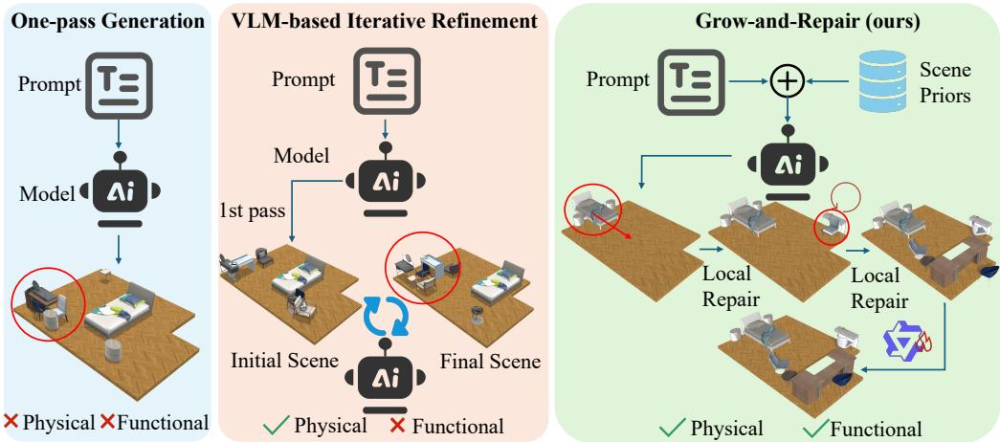
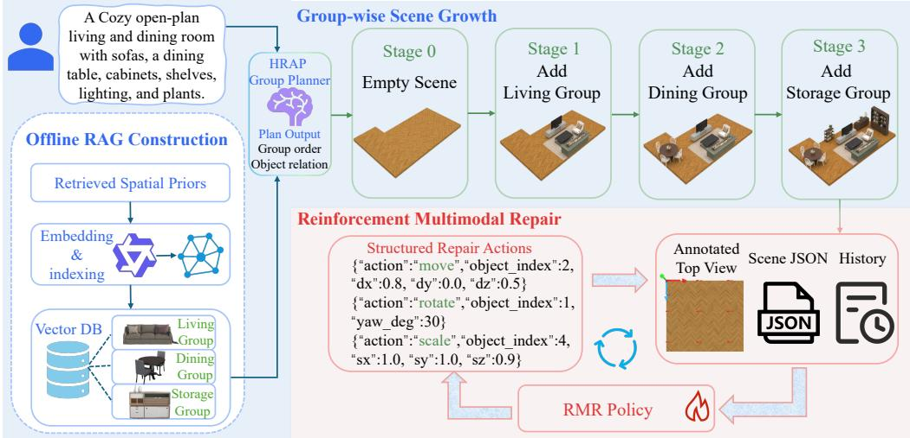
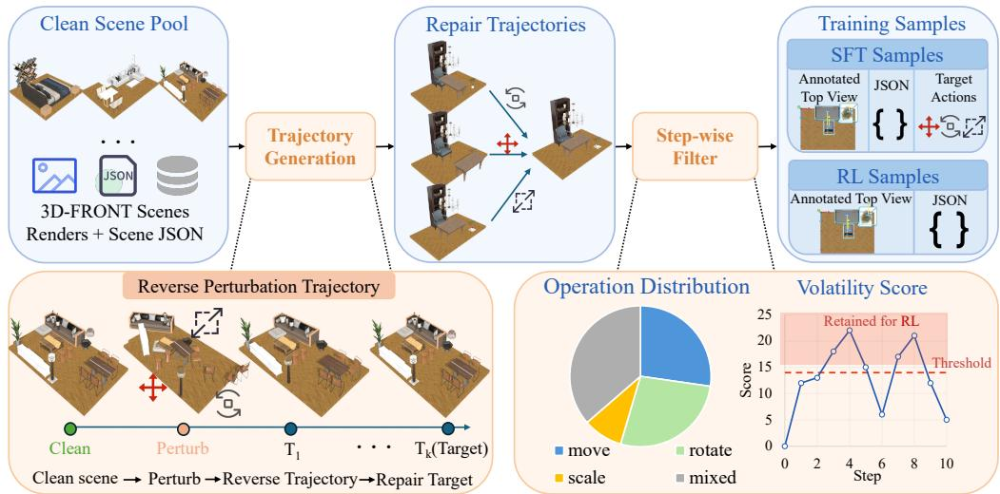
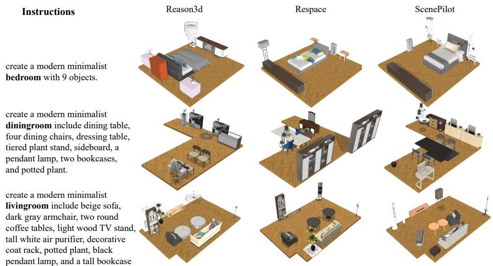
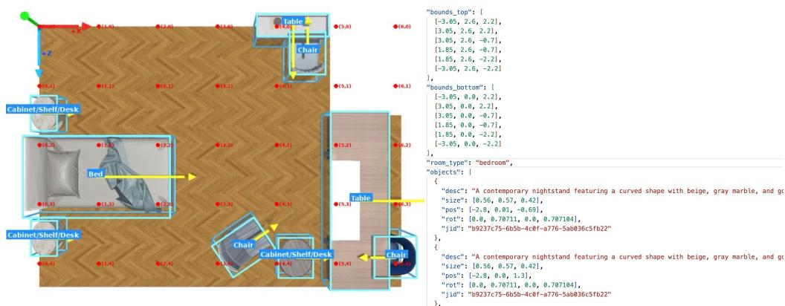
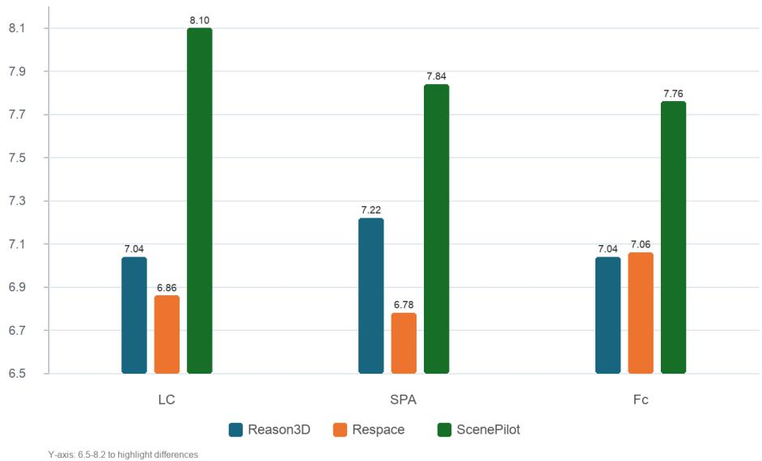
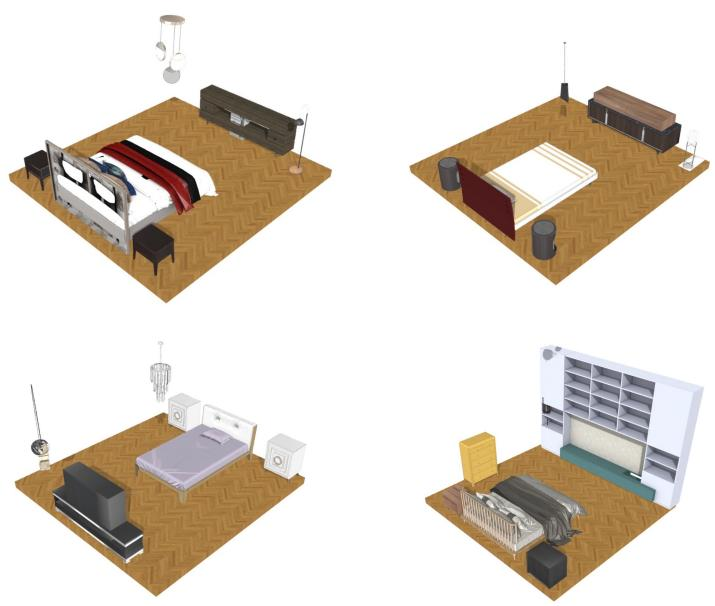
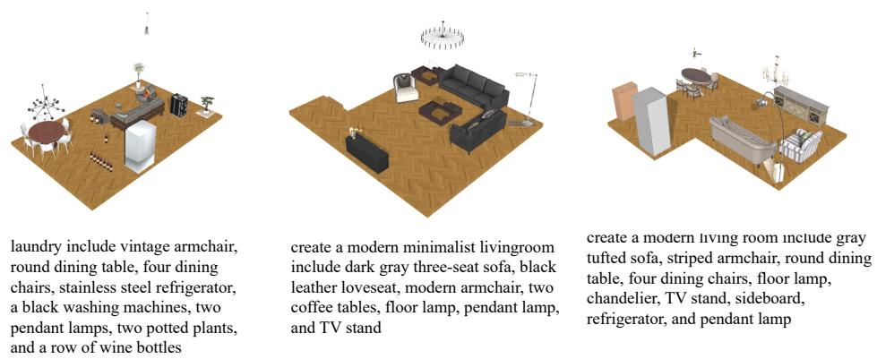

# ScenePilot: Grow-and-Repair Policy for Text-Driven 3D Indoor Scene Generation

Jiawei Zhang<sup>1</sup> Hongsong Wang<sup>1,</sup>∗ Pan Zhou<sup>2</sup>

<sup>1</sup>Southeast University <sup>2</sup>Singapore Management University {jiaweizhang,hongsongwang}@seu.edu.cn panzhou3@gmail.com

## Abstract

Text-driven 3D indoor scene generation has advanced from dataset-bound layout modeling to open-vocabulary synthesis with large language and vision-language models. Yet existing methods remain limited: one-pass generators often yield geometrically invalid layouts, heavy post-hoc optimization is costly and unstable, and prompt-only planners lack reusable layout priors for functional grouping and object relations. We propose ScenePilot, a retrieval-augmented Grow-and-Repair framework that formulates scene generation as prior-guided incremental growth with learned rectification. Given a prompt, the Hierarchical Retrieval-Augmented Planning (HRAP) module retrieves room-, group-, and anchor-level layout priors to support functional group planning. A text-driven base generator then inserts object groups sequentially, while the Reinforcement Multimodal Repair (RMR) module performs lightweight local correction after each insertion and a final global repair after completion. To train this policy, we construct SceneReverse-17k, a repair-trajectory dataset built by perturbing high-quality 3D scenes in position, rotation, and scale, then using inverse operations as executable rectification targets. The policy predicts structured move–rotate–scale actions from rendered views, scene state, retrieved priors, and edit history. By combining HRAP with RMR, ScenePilot offers an efficient alternative to oneshot generation and heavy full-scene optimization, improving physical plausibility, functional coherence, and controllability while preserving diversity. Project page: https://zjw-louie.github.io/ScenePilot.

## 1 Introduction

3D indoor scene generation is foundational for interior design, embodied AI, robotics simulation, and virtual-world authoring [1, 2]. Unlike isolated object or image generation, indoor scene synthesis must construct usable spatial environments where object categories, geometry, relations, and human activities are jointly satisfied. A practical text-driven generator must meet three requirements: physical plausibility, ensuring objects are grounded, non-overlapping, and within room boundaries; structural coherence, yielding reasonable global organization and functional partitioning [3, 4]; and functional utility, keeping furniture accessible for everyday navigation and use. These requirements make text-driven indoor scene generation both important and challenging: models must translate sparse language into physically valid, semantically organized, and functionally usable 3D environments.

Early data-driven approaches learn indoor scene distributions directly from datasets via autoregressive modeling, transformer-based set generation, or diffusion-based layout synthesis [5–10]. More recent language-guided methods improve semantic controllability by leveraging large language or vision–language models for layout planning, relation prediction, retrieval, or differentiable optimization [11–16]. In parallel, retrieval-augmented generation provides a general mechanism for grounding open-vocabulary generation in reusable external knowledge [17]. Broader work on reasoningand-refinement further suggests that complex generation tasks can benefit from interleaving planning, acting, and iterative correction rather than relying on a single forward prediction [18–23]. Together, these advances have greatly expanded open-vocabulary generation and user control. However, most existing methods still treat indoor scene generation primarily as a final-layout prediction or post-hoc optimization problem. This overlooks a central property of realistic scene construction: it is inherently sequential. An early misplaced anchor object, such as a bed, sofa, or dining table, can constrain all subsequent placements, causing local errors to propagate into global structural and functional failures.

  
Figure 1: Comparison of scene generation paradigms. One-pass generation predicts a final layout directly and often leaves physical or functional errors unresolved. Post-hoc VLM refinement can correct some visible violations, but it acts only after errors have already propagated and may still miss functional corrections. Our Grow-and-Repair framework retrieves scene priors before generation, grows the scene through functional groups with local repair after each insertion, and applies final global repair, producing scenes that are both physically plausible and functionally coherent.

This work studies the less explored problem of process-aware text-driven 3D indoor scene generation: how can a generator incrementally build a complex indoor scene while leveraging reusable spatial priors and correcting invalid intermediate states before they shape later decisions? This problem is important because indoor scene construction is path-dependent: a misplaced anchor object, incomplete functional zone, or early collision can bias subsequent placements and cause global structural or functional failures that final-stage refinement may not recover. Thus, the goal is not merely to predict a plausible final layout, but to maintain plausibility throughout generation. Addressing this requires three coupled challenges. First, the prior challenge: short or underspecified prompts often lack object relations, functional zones, and room-specific layout regularities, while inferring them from scratch is unstable. Second, the inference challenge: one-pass generation may leave collisions, boundary violations, and functional misplacements unresolved, whereas purely post-hoc refinement can be costly and may fail after early errors propagate. Third, the data challenge: standard 3D scene datasets provide final clean layouts, rather than corrupted intermediate states paired with executable rectification trajectories, limiting explicit step-wise repair supervision. These challenges expose a process-level gap in current text-driven 3D scene generation: intermediate scene states are rarely treated as first-class targets for planning, supervision, and correction. We therefore seek a paradigm that retrieves layout priors before placement, grows scenes through functional groups, repairs local errors as they arise, and learns such repairs from executable trajectory-level supervision.

Contributions. To address these challenges, we propose ScenePilot, a retrieval-augmented Growand-Repair framework for process-aware 3D indoor scene generation. The central idea is to make intermediate scene states explicit targets of planning, observation, correction, and supervision, rather than treating them as transient by-products on the way to a final layout. ScenePilot operationalizes this idea through three tightly coupled stages: retrieving reusable spatial priors before placement, growing the scene through functional groups with local repair after each insertion, and coordinating the completed layout through a final global repair stage. Specifically, the Hierarchical Retrieval-

Augmented Planning module addresses the prior challenge by retrieving room-level, group-level, and anchor-level layout priors from an offline spatial memory. These priors enrich the user prompt with likely object configurations, functional partitions, and relation hints, allowing the generator to reason about coherent object groups rather than isolated furniture instances. The enriched prompt is then decomposed into functional groups, which are sequentially inserted by a base text-driven generator. This group-wise construction turns scene synthesis into an ordered growth process, where each newly added group can be checked and stabilized before it constrains later placements.

To tackle the inference challenge, ScenePilot introduces a Reinforcement Multimodal Repair policy inside the generation loop. After each group insertion, the repair policy observes rendered topdown and diagonal views, the structured scene state, retrieved planning context, and action history, and predicts a compact set of executable move–rotate–scale edits. Rather than regenerating the whole scene, the policy performs targeted rectification on invalid or unstable intermediate layouts. Local repair accepts only edits that improve a compact core score over physical validity, relation consistency, and functionality, thereby reducing harmful drift during generation. Once all functional groups have been placed, a final global repair stage revisits the complete scene to resolve residual cross-group conflicts, improve circulation, and strengthen overall structural coherence.

To handle the data challenge, we further construct SceneReverse-17k, a process-oriented repair trajectory dataset derived from high-quality 3D-FRONT scenes [24]. Starting from a clean layout, we synthesize recoverable degraded intermediate states by perturbing object positions, rotations, and scales, and then use the reverse sequence of these perturbations as executable rectification targets. This construction transforms static clean scenes into multimodal supervision over intermediate repair states. As a result, the repair policy learns not only what a plausible final scene should look like, but also how to move from an invalid partial scene toward a physically and functionally improved one.

## 2 Related Work

3D Indoor Scene Generation Indoor scene generation has shifted from dataset-driven layout modeling to language-guided, open-vocabulary synthesis. Early methods learn object layouts from paired scene datasets via convolutional priors, autoregressive models, transformers, or diffusion models [5–10, 25, 26], but remain constrained by closed vocabularies and dataset-specific distributions. Language-based methods improve semantic flexibility by encoding layouts as text, scene graphs, or constraint programs, as in LayoutGPT [11], Holodeck [12], LayoutVLM [13], SceneWeaver [14], SceneTeller[27], Reason-3D[15], Scenex[28], and ReSpace [29]. However, most existing works still optimize final-layout quality rather than preserving validity throughout intermediate generation states.

Retrieval-Augmented Layout Priors Retrieval-augmented generation grounds language generation in external knowledge [17]. In 3D scene synthesis, retrieval is commonly used to obtain assets, examples, relation rules, or layout templates before planning. For example, Reason-3D retrieves object candidates with physical, functional, and contextual captions before placement reasoning [4, 30], and structured generators benefit from reusable co-occurrence and placement priors. Our RAG module differs in using retrieval not only for asset selection or prompt expansion, but also for group- and anchor-level layout priors that guide scene growth and rectification.

Scene Optimization and Repair Another line of work improves layouts through explicit optimization or physically grounded guidance. Holodeck [12] enforces relational constraints, LayoutVLM [13] combines pose prediction with differentiable relation-aware optimization, DeBaRA [10] performs denoising-based completion and rearrangement, and PhyScene [31] adds collision, room-layout, and reachability guidance. Although improving plausibility, these methods often remain initialization-sensitive or rely on global correction. Our approach instead applies lightweight local repair after each group insertion, reserving full-scene coordination for the final stage.

Process Supervision and Policy Learning Recent work increasingly treats layout generation as sequential decision-making rather than one-shot prediction. MetaSpatial [32] learns layouts with structured reward feedback, DirectLayout [33] combines chain-of-thought reasoning with rewardguided numerical layout training, SceneWeaver [14] uses reflective planning and iterative tool use, and ReSpace [29] combines supervised learning with preference optimization. Unlike these methods, we center supervision on repair trajectories, learning explicit rectification over intermediate scene states and deploying the repair policy within group-wise generation.

  
Figure 2: Overview of ScenePilot. Given a user prompt, ScenePilot retrieves reusable layout priors from an offline spatial memory and uses them for prompt expansion and functional group planning. A base text-driven generator then inserts object groups sequentially. After each insertion, the Reinforcement Multimodal Repair policy observes the intermediate scene state and predicts executable move–rotate–scale repair actions. After all groups are inserted, a final global repair stage coordinates the complete layout.

These methods demonstrate the value of stronger planning, relation reasoning, optimization, and policy learning for 3D scene generation. Our goal is complementary but distinct: instead of focusing only on improving the final generated layout, we center both training and inference on intermediate scene states, learning executable repair actions that are deployed during group-wise scene growth.

## 3 ScenePilot Method

ScenePilot addresses process-aware text-driven 3D indoor scene generation by coupling priorguided group planning with learned multimodal repair. As shown in Figure 2, the framework contains three tightly connected components. First, Hierarchical Retrieval-Augmented Planning retrieves reusable spatial priors from an offline memory and converts the user prompt into an ordered functional group plan. Second, a base text-driven generator inserts these functional groups sequentially, so that the scene grows through intermediate states rather than being produced in one pass. Third, the Reinforcement Multimodal Repair policy performs local repair after each group insertion and final global repair after all groups have been placed. This section first formalizes the processaware setup, then describes how HRAP addresses the prior challenge, how RMR and group-wise inference address the inference challenge, and how SceneReverse-17k provides process-oriented supervision for the data challenge.

## 3.1 Problem Setup and Process-Aware Objective

Given a text prompt x, a room boundary B, and an object asset pool A, the goal of text-driven 3D indoor scene generation is to synthesize a structured scene

$$
{ \cal { S } } = \{ ( o _ { i } , p _ { i } , r _ { i } , s _ { i } ) \} _ { i = 1 } ^ { N } ,\tag{1}
$$

where each object instance is specified by its identity $o _ { i } .$ , position $p _ { i }$ , rotation $r _ { i } .$ , and scale $s _ { i }$ . We assume an explicit scene representation with room boundaries and object-level numeric attributes, following the practical setup of recent structured text-driven indoor generation systems [29]. This representation enables rendering, physical validation, and executable object-level editing.

Instead of treating generation as a direct mapping from x to a final scene S, we formulate it as a process-aware scene growth problem. The scene is constructed through a sequence of functional

groups:

$$
S ^ { ( 0 ) }  S ^ { ( 1 ) }  \cdots  S ^ { ( M ) } ,\tag{2}
$$

where $S ^ { ( m ) }$ denotes the intermediate scene after inserting the m-th functional group $g _ { m }$ . Each group corresponds to a functional zone, such as sleeping, dining, working, storage, or reading, and is organized around a dominant anchor object. This formulation makes intermediate scene states explicit targets for evaluation and correction, rather than treating them as transient by-products of final-layout generation.

After each group insertion, the current scene may be adjusted through a compact set of executable repair actions:

$$
\mathcal { U } = \{ \mathtt { m o v e } , \mathtt { r o t a t e } , \mathtt { s c a l e } \} .\tag{3}
$$

This action space is intentionally restricted. Object addition and deletion are handled by the planner and base generator, while repair focuses on correcting geometric and functional errors in already placed objects.

To decide whether a candidate repair improves the current state, we use a compact scene quality score:

$$
\begin{array} { r } { Q ( S ) = - \lambda _ { \mathrm { p b l } } \mathrm { P B L } ( S ) - \lambda _ { \mathrm { r e l } } \mathrm { R E L } ( S ) - \lambda _ { \mathrm { f u n c } } \mathrm { F U N C } ( S ) , } \end{array}\tag{4}
$$

where PBL measures physical violations, including out-of-boundary placement and mesh-level collisions; REL measures violations of high-confidence relation checks inferred from the current scene state and feasibility-filtered planning context; and FUNC measures functional usability, such as accessibility, circulation, and usage compatibility. We emphasize that retrieved prior documents are used as soft planning context rather than hard scoring constraints; they may influence group planning and repair observations, but are not directly copied into the repair scorer. Higher $\bar { Q }$ indicates a better scene. During inference, candidate edits are accepted only when they improve Q, which keeps the repair loop stable and lightweight.

## 3.2 Hierarchical Retrieval-Augmented Planning

Short or underspecified prompts rarely provide enough information about object relations, functional zones, and room-specific layout regularities. For example, a prompt such as “create a bedroom with nine objects” does not specify whether nightstands should appear on both sides of the bed, how lamps should relate to supporting furniture, or which objects should form the sleeping, storage, or reading zones. ScenePilot addresses this prior challenge with Hierarchical Retrieval-Augmented Planning (HRAP), which retrieves reusable spatial priors before numerical placement.

Anchor-centered prior memory. We construct an offline prior memory M from structured clean indoor scenes. Unlike generic text-document retrieval or full-scene example retrieval, M stores aggregated anchor-centered layout priors mined from 3D scene layouts. Given clean scene JSONs, we parse object categories, positions, rotations, sizes, and room types, and lightly normalize object labels to reduce fragmentation. We then identify room-specific anchor categories, such as beds, sofas, desks, dining tables, TV stands, cabinets, wardrobes, bookshelves, and washing machines.

For each scene, dominant floor-supported objects are detected as anchor candidates. Each nonanchor object is assigned to a compatible nearby anchor according to category compatibility, planar distance, surface gap, support relation, and high-level companion priors. This converts a full scene into anchor-centered functional groups:

$$
\gamma = ( a , { \mathcal { N } } _ { a } ) ,\tag{5}
$$

where a is the anchor object and $\textstyle { \mathcal { N } } _ { a }$ is its member set. For instance, a bed-centered group may contain nightstands, table lamps, a rug, and a dresser, while a dining-table group may contain multiple dining chairs and a pendant lamp. This representation lets HRAP reason about coherent functional units rather than isolated object instances.

Spatial and compositional priors. For each anchor-member pair $( a , u )$ , where $u \in \mathcal N _ { a }$ , we compute local spatial statistics in the coordinate frame of the anchor:

$$
\begin{array} { r } { [ \Delta x _ { u | a } ^ { \mathrm { l o c a l } } ] = R ( - \theta _ { a } ) [ { x _ { u } - x _ { a } } ] , } \\ { \Delta z _ { u | a } ^ { \mathrm { l o c a l } } ] = R ( - \theta _ { a } ) [ { z _ { u } - z _ { a } } ] , } \end{array}\tag{6}
$$

where $\theta _ { a }$ is the yaw angle of the anchor. We also record planar distance, relative orientation, surface gap, support/on-top relation, and member count statistics. Aggregating these samples yields roomconditioned anchor-member priors that describe how companion objects are typically placed around dominant anchors.

Beyond pairwise relations, we extract group-level composition signatures:

$$
\boldsymbol { \sigma } ( \boldsymbol { r } , a ) = \{ ( c _ { 1 } , n _ { 1 } ) , ( c _ { 2 } , n _ { 2 } ) , \ldots , ( c _ { K } , n _ { K } ) \} ,\tag{7}
$$

where $c _ { k }$ is a member category and $n _ { k }$ is its typical count around anchor a in room type r. These signatures capture multi-object functional patterns, such as Dining Chair×4 around a dining table or Nightstand×2 plus Table Lamp×2 around a bed. The mined statistics are converted into prompt-ready prior documents, including overview documents, signature documents, and memberprior documents. Each document stores its room type, anchor category, document type, keywords, support count, and a natural-language summary of frequent companion objects, quantities, relative directions, distances, orientations, and support relations.

Hierarchical retrieval and group planning. Given a user prompt $x ,$ HRAP retrieves a compact set of relevant priors:

$$
\begin{array} { r } { \mathcal { P } ( x ) = \mathrm { T o p K } _ { p \in \mathcal { M } } \sin \big ( e ( q ( x ) ) , e ( p ) \big ) , } \end{array}\tag{8}
$$

where $e ( \cdot )$ is a text embedding function, sim denotes cosine similarity, and $q ( x )$ is constructed from the prompt, inferred room type, and candidate anchors. Retrieval is performed at three complementary levels. Room-level retrieval provides global layout tendencies for the target room type. Group-level retrieval provides common functional compositions, such as bed–nightstand–lamp or dining-table–chair groups. Anchor-level retrieval provides local object-anchor relation hints around dominant objects.

The retrieved priors are prepended to the planner prompt as soft spatial context. The planner then outputs an ordered functional group plan:

$$
\mathcal { G } = \{ g _ { m } \} _ { m = 1 } ^ { M } , \qquad g _ { m } = ( \operatorname { n a m e } _ { m } , a _ { m } , \mathcal { O } _ { m } , z _ { m } , \rho _ { m } ) ,\tag{9}
$$

where nam $^ { \flat } m$ is the group name, $a _ { m }$ is the anchor object, ${ \mathcal { O } } _ { m }$ is the object list, $z _ { m }$ is a coarse zone hint, and $\rho _ { m }$ is the insertion priority. HRAP therefore determines which objects should be generated jointly, which anchors should organize them, and what coarse spatial context should guide groupwise generation.

Soft-prior usage. Importantly, retrieved priors are used as soft planning hints rather than hard layout constraints. They are not copied as complete scene layouts, do not directly set object coordinates, and are not injected into the repair scorer in Eq. (4). This separation lets retrieval guide functional grouping and anchor selection while preserving flexibility for the base generator and the RMR policy.

## 3.3 Reinforcement Multimodal Repair

The Reinforcement Multimodal Repair (RMR) policy is responsible for correcting invalid or unstable intermediate scene states. At repair step t, the policy observes a multimodal state:

$$
o _ { t } = \big ( I _ { t } ^ { \mathrm { t o p } } , I _ { t } ^ { \mathrm { d i a g } } , I _ { t } ^ { \mathrm { a n n } } , J _ { t } , H _ { t } \big ) ,\tag{10}
$$

where $I _ { t } ^ { \mathrm { t o p } }$ is the top-down render, $\boldsymbol { I } _ { t } ^ { \mathrm { d i a g } }$ is a diagonal perspective render, $I _ { t } ^ { \mathrm { a n n } }$ is an annotated top view with object indices, $J _ { t }$ is the structured scene JSON, and $H _ { t }$ is a compact history of previously attempted repair actions. The retrieved context $\mathcal { P } _ { t }$ is provided to the policy as observational context, not as a hard constraint in the acceptance score. This allows RMR to use prior knowledge when proposing edits while preserving the score-based accept/reject rule as a deterministic safeguard.

Given $o _ { t }$ , the policy predicts a JSON action list over a discrete action type and continuous parameters:

$$
\mathtt { m o v e } : ( i , \Delta x , \Delta y , \Delta z ) ,\tag{11}
$$

$$
\mathtt { r o t a t e : } ( i , \Delta \theta ) ,\tag{12}
$$

$$
\mathsf { s c a l e : } ( i , \Delta s _ { x } , \Delta s _ { y } , \Delta s _ { z } ) ,\tag{13}
$$

where i indexes an object in the current scene state. The action list is parsed and applied by an execution function:

$$
S ^ { \prime } = f _ { \mathrm { a p p l y } } ( S , a _ { t } ) .\tag{14}
$$

Invalid JSONs, invalid object indices, or physically impossible actions are rejected by the executor.

This repair-only action space makes the policy controllable and interpretable. Instead of regenerating the whole scene or changing object composition, RMR performs targeted edits that can be executed, checked, and either accepted or rejected. The planner and base generator remain responsible for object selection and insertion, while RMR focuses on physical validity, local relation consistency, and functional usability.

## 3.4 Group-wise Grow-and-Repair Inference

Figure 2 illustrates the inference-time control flow of ScenePilot: HRAP first produces an ordered functional group plan, the base generator inserts one group at a time, RMR repairs the newly inserted group within a local scope, and a final global repair stage coordinates the completed scene. The full pseudocode is provided in Algorithm 1 in Appendix B.3. The algorithm makes explicit how retrieved priors, group-wise insertion, local repair, score-based acceptance, and global repair are executed in sequence.

Suppose the first $m - 1$ groups have already been inserted, producing scene $S ^ { ( m - 1 ) }$ . For the next group $g _ { m } ,$ , the base generator produces an initial partial scene:

$$
\tilde { S } ^ { ( m , 0 ) } = G \big ( S ^ { ( m - 1 ) } , g _ { m } , \mathcal { P } _ { m } \big ) ,\tag{15}
$$

where $\mathcal { P } _ { m }$ denotes the retrieved planning context relevant to the group. We then define a local repair scope:

$$
\Omega _ { m } = \mathrm { O b j } ( g _ { m } ) \cup \mathrm { N e i g h b o r A n c h o r s } \big ( g _ { m } , S ^ { ( m - 1 ) } \big ) ,\tag{16}
$$

which contains newly inserted objects and a small set of nearby anchors or support objects. Restricting the scope prevents unnecessary changes to already stable substructures and keeps repair efficient enough to run after each insertion.

Local repair runs for at most $K _ { \mathrm { l o c a l } }$ rounds. At repair round k, RMR first proposes a structured action list $a _ { k }$ from the current visual and scene-state observation. Actions whose target object indices fall outside $\Omega _ { m }$ are discarded. The remaining actions serve as policy-guided repair proposals and are optionally applied to obtain an intermediate candidate scene:

$$
\hat { S } ^ { ( m , k ) } = f _ { \mathrm { a p p l y } } \big ( \tilde { S } ^ { ( m , k ) } , a _ { k } ; \Omega _ { m } \big ) .\tag{17}
$$

Starting from $\hat { S } ^ { ( m , k ) }$ , we further perform a lightweight local search over a small candidate set $\mathcal { C } ^ { ( m , k ) }$ including small translations, rotations, wall-alignment adjustments, and anchor-aware attachment moves for objects in $\Omega _ { m }$ . Each candidate is followed by deterministic geometric cleanup, including out-of-boundary projection and local collision separation. Let $\bar { S } ^ { ( m , k + 1 ) }$ denote the best candidate under the quality score Q:

$$
{ \bar { S } } ^ { ( m , k + 1 ) } = \arg \operatorname* { m a x } _ { S ^ { \prime } \in { \mathcal { C } } ^ { ( m , k ) } } Q ( S ^ { \prime } ) .\tag{18}
$$

The candidate is accepted only if it improves the current state:

$$
\tilde { S } ^ { ( m , k + 1 ) } = \left\{ \begin{array} { l l } { \bar { S } ^ { ( m , k + 1 ) } , } & { Q \big ( \bar { S } ^ { ( m , k + 1 ) } \big ) > Q \big ( \tilde { S } ^ { ( m , k ) } \big ) + \epsilon _ { Q } , } \\ { \tilde { S } ^ { ( m , k ) } , } & { \mathrm { o t h e r w i s e } . } \end{array} \right.\tag{19}
$$

We allow early stopping when no candidate in the current local search round improves Q. The actual number of local repair rounds is therefore denoted by $K _ { m } \leq K _ { \mathrm { l o c a l } }$ , and the repaired group state is committed as

$$
S ^ { ( m ) } = \tilde { S } ^ { ( m , K _ { m } ) } .\tag{20}
$$

After all groups have been inserted, ScenePilot applies a final global repair stage:

$$
S ^ { \mathrm { f i n a l } } = \Pi _ { \mathrm { g l o b a l } } \big ( S ^ { ( M ) } \big ) .\tag{21}
$$

The global stage uses the same action vocabulary and repair policy, but operates on a broader object set and a larger search budget. It resolves residual conflicts that are difficult to identify locally, such as cross-group circulation bottlenecks, long-range misalignment, or cumulative crowding. Thus, local repair maintains validity during growth, while global repair coordinates the completed scene.

  
Figure 3: Construction pipeline of SceneReverse-17k. Starting from clean 3D-FRONT scenes with rendered views and scene JSONs, we synthesize degraded intermediate states using position, rotation, scale, and mixed perturbations. Step-wise filtering retains informative states with meaningful changes in physical validity or functional usability. The filtered reverse trajectories are then converted into SFT samples with annotated top-view images, scene JSONs, and target action sequences, as well as RL samples for policy optimization.

## 3.5 Dataset and Process-Oriented Training

The grow-and-repair inference loop requires a repair policy that can act on invalid intermediate layouts. However, standard 3D scene datasets mainly provide clean final scenes and do not contain corrupted partial states paired with executable repair actions. To close this supervision gap, we construct SceneReverse-17k, a process-oriented repair-trajectory dataset derived from high-quality 3D-FRONT scenes [24]. Figure 3 summarizes the construction pipeline: clean scenes are perturbed to produce recoverable degraded states, informative intermediate steps are retained through volatilitybased filtering, and the resulting trajectories are converted into both supervised fine-tuning samples and reinforcement learning samples.

Reverse repair trajectory construction. Starting from a clean scene $S ^ { \star }$ , we synthesize a corrupted trajectory by applying a sequence of controlled perturbations:

$$
\hat { S } ^ { ( 0 ) } = S ^ { \star } , \qquad \hat { S } ^ { ( t + 1 ) } = c _ { t } \bigl ( \hat { S } ^ { ( t ) } \bigr ) , \qquad t = 0 , \ldots , T - 1 ,\tag{22}
$$

where each corruption operator $c _ { t }$ modifies one or more objects. We use four perturbation families: position, which applies bounded translations; rotation, which changes yaw angles and disrupts alignment or facing relations; scale, which applies anisotropic or isotropic size changes; and mixed edits, which combine multiple perturbation types. The corruption strength is scheduled to cover mild, moderate, and severe degradation regimes.

For each corruption sequence, repair supervision is defined by reversing the corruption order. Let the most corrupted state be

$$
S _ { 0 } ^ { \mathrm { r } } = \hat { S } ^ { ( T ) } .
$$

For $t = 0 , \ldots , T - 1$ , we define the reverse repair action as

$$
a _ { t } ^ { \mathrm { r } } = c _ { T - 1 - t } ^ { - 1 } , \qquad S _ { t + 1 } ^ { \mathrm { r } } = f _ { \mathrm { a p p l y } } \bigl ( S _ { t } ^ { \mathrm { r } } , a _ { t } ^ { \mathrm { r } } \bigr ) .
$$

If a corruption translates an object by $\Delta p ,$ the inverse action translates it by $- \Delta p ;$ if it rotates an object by $\Delta \theta .$ , the inverse action rotates it by $- \Delta \theta ;$ if it scales an object by $\Delta s ,$ , the inverse action applies the reciprocal scale when valid. This yields a repair trajectory

$$
\tau = \big ( o _ { 0 } ^ { \mathrm { r } } , a _ { 0 } ^ { \mathrm { r } } , o _ { 1 } ^ { \mathrm { r } } , a _ { 1 } ^ { \mathrm { r } } , \dots , o _ { T - 1 } ^ { \mathrm { r } } , a _ { T - 1 } ^ { \mathrm { r } } \big ) ,
$$

where each observation $o _ { t } ^ { \mathrm { r } }$ contains rendered views, the structured scene JSON, optional planning context, and action history.

To avoid training on uninformative or nearly identical states, we apply step-wise filtering based on trajectory volatility. For a reverse repair trajectory, each state $S _ { t } ^ { \mathrm { r } }$ records the object poses and scales at step $t .$ We define the volatility of a reverse step as the magnitude of the effective repair progress induced by its action:

$$
V _ { t } = \frac { 1 } { \vert { \cal O } _ { t } \vert } \sum _ { o _ { i } \in { \cal O } _ { t } } \left( w _ { p } \left. \Delta { \bf p } _ { i , t } \right. _ { 2 } + w _ { r } \left. \Delta \theta _ { i , t } \right. + w _ { s } \left. \Delta { \bf s } _ { i , t } \right. _ { 2 } \right) ,\tag{23}
$$

where ${ \mathcal { O } } _ { t }$ denotes the set of matched objects between two adjacent trajectory states, $\Delta \mathbf { p } _ { i , t }$ is the position change of object $o _ { i } , \Delta \theta _ { i , t }$ is the yaw-angle change, and $\Delta \mathbf { s } _ { i , t }$ is the scale change. The weights $w _ { p } , w _ { r } ,$ , and $w _ { s }$ balance translation, rotation, and scale magnitudes. In implementation, these terms are computed from the step-wise deltas stored in the generated reverse trajectory, including position deltas, yaw deltas, and scale deltas.

Steps with very small $V _ { t }$ are removed because they correspond to nearly identical states or visually negligible edits. To avoid retaining only severe corruptions, we further stratify retained steps across mild, moderate, and severe degradation levels according to their remaining repair difficulty. Concretely, the remaining difficulty is estimated by the normalized distance from the clean target state in position, rotation, and scale:

$$
D _ { t } = \frac { 1 } { \lvert \mathcal { O } _ { t } \rvert } \sum _ { o _ { i } \in \mathcal { O } _ { t } } \left( \alpha _ { p } \frac { \lvert [ \mathbf { p } _ { i } ^ { \star } - \mathbf { p } _ { i , t } ] \rvert _ { 2 } } { \lVert \mathbf { p } _ { i } ^ { \star } - \mathbf { p } _ { i } ^ { 0 } \rVert _ { 2 } + \epsilon } + \alpha _ { r } \frac { \lvert \theta _ { i } ^ { \star } - \theta _ { i , t } \rvert } { \lvert \theta _ { i } ^ { \star } - \theta _ { i } ^ { 0 } \rvert + \epsilon } + \alpha _ { s } \frac { \lVert \mathbf { s } _ { i } ^ { \star } - \mathbf { s } _ { i , t } \rVert _ { 2 } } { \lVert \mathbf { s } _ { i } ^ { \star } - \mathbf { s } _ { i } ^ { 0 } \rVert _ { 2 } + \epsilon } \right) ,\tag{24}
$$

where $\left( \mathbf { p } _ { i } ^ { \star } , \theta _ { i } ^ { \star } , \mathbf { s } _ { i } ^ { \star } \right)$ denotes the clean target state, $( \mathbf { p } _ { i } ^ { 0 } , \theta _ { i } ^ { 0 } , \mathbf { s } _ { i } ^ { 0 } )$ denotes the initial degraded state, and ϵ avoids division by zero. This filtering strategy exposes the model to invalid intermediate layouts with diverse degradation levels and teaches minimal rectification over translation, rotation, and scale, rather than unconditional relayout.

Training sample construction. SceneReverse-17k contains approximately 17K repair trajectories, where each trajectory records a multi-step process from a corrupted scene state toward the original clean layout through executable reverse actions. These trajectories were coverted into two complementary types of training samples. The first type is used for supervised fine-tuning: each sample pairs a multimodal observation, including annotated top views and scene JSONs, with the target repair action sequence in a strict JSON format. The second type is used for policy optimization: each sample preserves a corrupted scene observation, allowing the policy to sample candidate repair actions and receive reward feedback after execution.

This construction provides three advantages over static final-scene supervision. First, it teaches the policy how to act on invalid intermediate states, which matches its test-time role in the grow-andrepair loop. Second, it provides executable object-level actions rather than only final layouts. Third, it naturally supports history-aware decision making, because each repair state can include previou attempted edits and their outcomes.

Stage I: supervised repair imitation. We first train the repair policy by supervised imitation on reverse repair trajectories. Given a training pair $\left( o _ { t } , a _ { t } ^ { * } \right)$ from the supervised dataset $\mathcal { D } _ { \mathrm { S F T } }$ , the objective is

$$
\mathcal { L } _ { \mathrm { S F T } } = - \mathbb { E } _ { ( o _ { t } , a _ { t } ^ { * } ) \sim \mathcal { D } _ { \mathrm { S F T } } } \left[ \sum _ { k = 1 } ^ { \left| a _ { t } ^ { * } \right| } \log \pi _ { \theta } \left( a _ { t , k } ^ { * } \mid o _ { t } , a _ { t , < k } ^ { * } \right) \right] ,\tag{25}
$$

where $\pi _ { \theta }$ is the repair policy and $a _ { t , k } ^ { * }$ denotes the k-th token of the target action sequence. This stage teaches format adherence, grounded object indexing, and coarse spatial correction, while providing a strong syntactic prior for subsequent policy optimization.

Stage II: policy optimization. After supervised fine-tuning, we further optimize the repair policy with Group Relative Policy Optimization (GRPO)-style learning [34]. Given a corrupted scene observation, the policy samples $N _ { \mathrm { c a n d } }$ candidate repair action lists. Each candidate is executed and scored with a modular reward:

$$
R = \lambda _ { 1 } R _ { \mathrm { f o r m a t } } + \lambda _ { 2 } R _ { \mathrm { a p p l y } } + \lambda _ { 3 } R _ { \mathrm { p h y s } } + \lambda _ { 4 } R _ { \mathrm { v l m } } ,\tag{26}
$$

where $R _ { \mathrm { f o r m a t } }$ rewards valid JSON output, $R _ { \mathrm { a p p l y } }$ rewards executable actions, $R _ { \mathrm { p h y s } }$ measures physical improvement through reduced out-of-boundary and collision penalties, and $R _ { \mathrm { v l m } }$ provides visual-semantic feedback on the repaired scene. In our experiments, we use $\lambda _ { 1 } ~ = ~ \lambda _ { 2 } ~ = ~ 0 . 1 5$ $\lambda _ { 3 } = 0 . 5 ,$ , and $\lambda _ { 4 } = 0 . 2 ,$ , making policy learning primarily driven by physically corrective repairs rather than formatting gains.

The sampled rewards are converted into group-relative advantages:

$$
A _ { i } = \frac { r _ { i } - \mu _ { r } } { \sigma _ { r } + \epsilon } ,\tag{27}
$$

where $r _ { i }$ is the reward of the i-th sampled repair, and $\mu _ { r }$ and $\sigma _ { r }$ are the mean and standard deviation of rewards within the same sampled group. The policy is optimized with a clipped surrogate objective:

$$
\mathcal { L } _ { \mathrm { G R P O } } ( \theta ) = - \frac { 1 } { G } \sum _ { i = 1 } ^ { G } \operatorname* { m i n } \left( \rho _ { i } ( \theta ) A _ { i } , \exp \left( \rho _ { i } ( \theta ) , 1 - \eta , 1 + \eta \right) A _ { i } \right) ,\tag{28}
$$

where

$$
\rho _ { i } ( \theta ) = \frac { \pi _ { \theta } ( a _ { i } \mid o _ { t } ) } { \pi _ { \theta _ { \mathrm { o l d } } } ( a _ { i } \mid o _ { t } ) } .\tag{29}
$$

This objective increases the probability of repairs that are more valid, executable, and effective than other sampled candidates for the same scene state.

The inference score $Q$ in Eq. (4) and the training reward R serve different purposes. $Q$ is a deterministic acceptance criterion used to prevent harmful edits during inference, while R is used to optimize the policy during training. They share physical and functional diagnostics but are applied at different stages of ScenePilot.

## 4 Experiments

We evaluate ScenePilot to answer four questions: (1) Does the proposed grow-and-repair process improve physical validity and semantic-functional quality over strong text-driven 3D indoor scene generation baselines? (2) Do retrieval-augmented planning, group-wise insertion, and learned multimodal repair each contribute to the final performance? (3) Are the automatic VLM-judge results consistent with human perception? (4) What qualitative behaviors and remaining failure modes arise from the proposed process-aware generation loop?

## 4.1 Experimental Setup

Benchmarks We evaluate our method on the benchmark of 100 scenes spanning five room types: living rooms, bedrooms, dining rooms, libraries, and laundry rooms. To assess performance under different levels of prompt specificity, we construct two types of textual inputs. The first consists of 75 long-form prompts, obtained by using GPT-4o to describe selected scenes in detail[35], including room style, object composition. The second consists of 25 short prompts that specify only the room type and target object count, such as “create a living room with 7 objects.” This benchmark setup allows us to evaluate both fine-grained text-to-scene grounding under detailed instructions and compositional generation under more underspecified prompts.

Metrics We evaluate scenes by physical validity and semantic-functional quality. For physical validity, we report out-of-bound violation (OOB), mesh-level collision loss (MBL), placement-andboundary loss (PBL=OOB+MBL), and valid-scene ratio (VR), the fraction of scenes with PBL below a fixed threshold. Following ReSpace, OOB and MBL are computed by voxelizing room boundaries and object meshes, providing finer-grained boundary-overflow and collision estimates than box-level checks. For visual-semantic evaluation, we use a VLM judge to score layout correctness (LC), semantic plausibility (SPA), and functional completeness (FC), and report their average(Avg) as the overall visual-semantic score. This judge is instantiated with GPT-5.4 [36], which provides strong multimodal reasoning and visual understanding for assessing rendered scene layouts. In addition to the automatic VLM-based evaluation, we further conduct a human user study to validate whether the improvements measured by the VLM judge are consistent with human perception. The human study uses the same three criteria as the VLM evaluation: layout correctness (LC), semantic plausibility (SPA), and functional completeness (FC). All scores are given on a 1–10 scale, where higher values indicate better perceived quality.

Table 1: Main quantitative comparison on full-scene generation. Lower is better for OOB, MBL, and PBL; higher is better for VR and VLM-judge scores.
<table><tr><td rowspan="2">Method</td><td colspan="4">Physics</td><td colspan="4">VLM Judge</td></tr><tr><td> $\mathrm { O O B } _ { \times 1 0 ^ { 3 } } \downarrow$ </td><td> $\mathbf { M B L } _ { \times 1 0 ^ { 3 } } \downarrow$ </td><td> ${ \mathrm { P B L } } _ { \times 1 0 ^ { 3 } } ~ \downarrow$ </td><td>VR↑</td><td>|LC↑</td><td>SPA↑</td><td>FC↑</td><td>Avg↑</td></tr><tr><td>Reason-3D [15]</td><td>122.7</td><td>39.6</td><td>162.2</td><td>0.66</td><td>7.0</td><td>6.5</td><td>6.9</td><td>6.8</td></tr><tr><td>ReSpace [29]</td><td>69.9</td><td>116.4</td><td>186.2</td><td>0.73</td><td>6.2</td><td>5.3</td><td>5.6</td><td>5.7</td></tr><tr><td>ReSpace [29] + Fine-tuned Qwen3-VL-8B</td><td>69.3</td><td>53.1</td><td>122.4</td><td>0.83</td><td>7.0</td><td>6.7</td><td>6.6</td><td>6.8</td></tr><tr><td>ScenePilot (ours)</td><td>21.0</td><td>54.3</td><td>75.4</td><td>0.86</td><td>8.1</td><td>8.0</td><td>8.0</td><td>8.1</td></tr></table>

Table 2: Human evaluation and VLM-judge comparison. Human scores are averaged over 50 valid responses. Higher is better for all metrics.
<table><tr><td rowspan="2">Method</td><td colspan="4">Human Study</td><td colspan="4">VLM Judge</td></tr><tr><td>LC↑</td><td>SPA↑</td><td>FC↑</td><td>Avg↑</td><td>LC↑</td><td>SPA↑</td><td>FC↑</td><td>Avg↑</td></tr><tr><td>Reason-3D</td><td>7.04</td><td>7.22</td><td>7.04</td><td>7.10</td><td>7.0</td><td>6.5</td><td>6.9</td><td>6.80</td></tr><tr><td>ReSpace</td><td>6.86</td><td>6.78</td><td>7.06</td><td>6.90</td><td>6.2</td><td>5.3</td><td>5.6</td><td>5.70</td></tr><tr><td>ScenePilot</td><td>8.10</td><td>7.84</td><td>7.76</td><td>7.90</td><td>8.1</td><td>8.0</td><td>8.0</td><td>8.03</td></tr></table>

Baselines & Implementation Details We compare ScenePilot with ReSpace [29] and Reason-3D [15] under the same asset library and evaluation protocol. ReSpace is the main baseline because it uses a similar structured scene representation and object-level generation paradigm. Reason-3D provides a broader comparison with a reasoning-based 3D scene generation system. We also include ReSpace+Finetuned Qwen3-VL-8B to isolate the effect of VLM-based refinement.

We use Qwen3-VL-8B-Instruct as the repair backbone [37] and implement training based on the Qwen2-VL-Finetune codebase [38]. For retrieval-augmented planning, we construct an offline prior memory from mined anchor-centered group statistics. The final memory contains 489 promptready documents over 23 anchor categories, including overview, signature, and member-prior documents. These documents encode frequent group compositions, companion-object statistics, and object-anchor spatial relations. Each document is embedded with Qwen3-Embedding-8B [39] using its title, anchor, room type, keywords, and prior text, and then indexed by FAISS [40] with inner product over L2-normalized 4096-dimensional embeddings. At inference time, we retrieve the top-5 relevant priors according to the user request, inferred room type, and candidate anchors, and prepend them to the group planner as soft planning hints. The retrieved priors are not used as hard layout constraints and are not injected into the repair scorer. Accordingly, the no-RAG ablation disables retrieval-based prompt augmentation while keeping the base generator and repair pipeline unchanged.

## 4.2 Main Results

Results of full-scene generation. Table 1 reports the main quantitative comparison on full-scene generation. ScenePilot achieves the best overall performance across both physical validity and visual-semantic quality. Compared with ReSpace, ScenePilot reduces PBL from 186.2 to 75.4, a 59.5% reduction, and improves VR from 0.73 to 0.86. Compared with Reason-3D, ScenePilot reduces PBL by 53.5% and improves the average VLM-judge score from 6.8 to 8.1. Compared with the post-hoc fine-tuned Qwen3-VL repair baseline, ScenePilot still reduces PBL by 38.4%, indicating that the gain does not come merely from applying a stronger repair model after full-scene generation. Instead, the full grow-and-repair process, with prior-guided group insertion and intermediate local repair, is essential.

Although Reason-3D obtains the lowest MBL, it suffers from substantially higher OOB, leading to a much larger overall PBL. ScenePilot achieves the strongest combined physical validity by substantially reducing boundary violations while maintaining competitive collision loss. The gains in LC,

  
Figure 4: Qualitative comparison of generated indoor scenes under identical text instructions. Each row corresponds to one prompt (bedroom, dining room, and living room), and each column shows the result produced by a different method: Reason-3D, ReSpace, and ScenePilot.

SPA, and FC further indicate that local repair does not merely optimize geometry, but also improves layout organization and functional completeness.

Human evaluation. To further assess whether the automatic VLM-based scores align with human perception, we conduct a user study with 50 valid responses. Participants are shown rendered results generated by three anonymized methods, corresponding to Reason-3D, ReSpace, and ScenePilot. Method names are hidden during rating, and participants evaluate each result on a 1–10 scale according to layout correctness (LC), semantic plausibility (SPA), and functional completeness (FC). The final human score for each method is obtained by averaging scores over all valid responses.

As shown in Table 2, ScenePilot receives the highest human scores across all three criteria, achieving 8.10 in LC, 7.84 in SPA, and 7.76 in FC, with an average score of 7.90. Compared with Reason-3D and ReSpace, ScenePilot improves the average human score by 0.80 and 1.00, respectively. The largest gain appears in layout correctness, suggesting that the grow-and-repair process produces more coherent spatial arrangements. The human ranking is broadly consistent with the VLM-judge ranking, suggesting that the automatic visual-semantic evaluation provides a useful proxy for perceived layout quality.

Qualitative comparison. Figure 4 shows qualitative comparisons on three representative room types: a bedroom, a dining room, and a living room. We compare Reason-3D, ReSpace, and ScenePilot under the same text instructions, including both short and long prompts. Overall, ScenePilot produces more organized layouts with clearer functional grouping, better object arrangement, and more usable free space. In the bedroom example, ScenePilot produces a more coherent sleeping zone. In the dining-room and living-room examples, it better preserves group structure and avoids the scattered or congested arrangements that appear in the baselines. These observations are consistent with the quantitative improvements in PBL, VR, and VLM-judge scores.

## 4.3 Ablation Studies

We design ablations to isolate the contribution of each major component: HRAP retrieval, groupwise insertion, and learned RMR repair. We also include an HRAP-only variant without repair to test whether planning alone is sufficient, and an expert GPT-5.2 repair agent as a reference upper bound rather than a deployable baseline.

Table 3: Ablation results. Lower is better for OOB, MBL, and PBL; higher is better for VR and VLM-judge scores. The expert GPT-5.2 row is a reference upper bound and is not considered when bolding the best deployable variant.
<table><tr><td rowspan="2">Variant</td><td colspan="4">Physics</td><td colspan="4">VLM Judge</td></tr><tr><td> $\mathbf { O O B } _ { \times 1 0 ^ { 3 } } ~ .$  →</td><td> $\mathbf { M B L } _ { \times 1 0 ^ { 3 } }$  ↓</td><td> $\mathrm { P B L } _ { \times 1 0 ^ { 3 } }$  ↓</td><td>VR↑</td><td>LC↑</td><td>SPA↑</td><td>FC↑</td><td>Avg↑</td></tr><tr><td>ScenePilot (ours)</td><td>21.0</td><td>54.3</td><td>75.4</td><td>0.86</td><td>8.1</td><td>8.0</td><td>8.0</td><td>8.1</td></tr><tr><td>w/o HRAP retrieval</td><td>76.5</td><td>59.0</td><td>135.5</td><td>0.80</td><td>6.9</td><td>6.9</td><td>7.2</td><td>7.0</td></tr><tr><td>w/o group-wise insertion</td><td>68.9</td><td>62.4</td><td>131.2</td><td>0.83</td><td>7.5</td><td>7.1</td><td>7.5</td><td>7.4</td></tr><tr><td>w/o learned RMR</td><td>20.5</td><td>103.0</td><td>123.4</td><td>0.85</td><td>7.0</td><td>6.6</td><td>5.8</td><td>6.4</td></tr><tr><td>HRAP only, no repair</td><td>39.6</td><td>108.1</td><td>147.7</td><td>0.75</td><td>6.4</td><td>5.6</td><td>5.6</td><td>5.8</td></tr><tr><td>expert GPT-5.2 repair†</td><td>18.8</td><td>34.8</td><td>53.5</td><td>0.91</td><td>8.1</td><td>8.4</td><td>8.2</td><td>8.2</td></tr></table>

Table 3 shows that each component contributes to the final performance. Removing HRAP retrieval increases PBL from 75.4 to 135.5 and reduces the average VLM score from 8.1 to 7.0, confirming that retrieved spatial priors are important for functional grouping and anchor-aware planning. Removing group-wise insertion also degrades both physical and semantic-functional metrics, indicating that simply planning with priors is not enough; intermediate scenes must be stabilized before later groups are inserted. The HRAP-only variant performs substantially worse than the full model (PBL 147.7 vs. 75.4; Avg 5.8 vs. 8.1), showing that planning alone cannot replace repair-in-the-loop generation.

The variant without learned RMR has slightly lower OOB but much higher MBL and substantially lower FC, indicating that reducing one type of physical violation is insufficient when collisions and functional usability degrade. This supports the need for task-specific multimodal repair learning rather than relying only on rule-based or weak post-processing. The expert GPT-5.2 repair agent further improves PBL to 53.5 and Avg to 8.2, suggesting that ScenePilot is effective while still leaving headroom for stronger repair policies.

## 5 Conclusion

We presented Retrieval-Augmented Grow-and-Repair, a process-supervised framework for textdriven 3D indoor scene generation that integrates retrieved layout priors and learned rectification into scene growth. By retrieving room- and anchor-level priors, converting clean scenes into reverse repair trajectories, training a multimodal move–rotate–scale repair policy, and combining group-wise local repair with final global coordination, our framework offers a practical alternative to one-pass generation and heavy post-hoc optimization. This growth-with-repair perspective supports more physically plausible, functionally coherent, and controllable 3D indoor scene synthesis.

Limitations and Future Work This work leaves two directions open. First, our reward and acceptance rules focus on physical validity, relation consistency, and functionality. Incorporating richer aesthetic or style-level feedback could further improve visual quality, but may also increase evaluation cost. Second, the RAG memory depends on the coverage and quality of indexed layout priors: weak retrieval may introduce irrelevant relations or bias scenes toward common arrangements. This limitation is orthogonal to our grow-and-repair framework, and could be addressed by adopting stronger retrieval, reranking, or adaptive memory-update mechanisms from future advances in RAG.

## References

[1] Matt Deitke, Eli VanderBilt, Alvaro Herrasti, Luca Weihs, Jordi Salvador, Kiana Ehsani, Eric Kolve, Ali Farhadi, Aniruddha Kembhavi, and Roozbeh Mottaghi. ProcTHOR: Large-scale embodied ai using procedural generation. In Advances in Neural Information Processing Systems, volume 35, pages 5982–5994, 2022.

[2] Hongchi Xia, Xuan Li, Zhaoshuo Li, Qianli Ma, Jiashu Xu, Ming-Yu Liu, Yin Cui, Tsung-Yi Lin, Wei-Chiu Ma, Shenlong Wang, Shuran Song, and Fangyin Wei. Sage: Scalable agentic 3d scene generation for embodied ai. arXiv preprint arXiv:2602.10116, 2026.

[3] Kai Wang, Yu-An Lin, Benjamin Weissmann, Manolis Savva, Angel X. Chang, and Daniel Ritchie. PlanIT: Planning and instantiating indoor scenes with relation graph and spatial prior networks. In ACM Transactions on Graphics, volume 38, pages 1–15, 2019.

[4] Chenguo Lin and Yadong Mu. Instructscene: Instruction-driven 3d indoor scene synthesis with semantic graph prior. arXiv preprint arXiv:2402.04717, 2024.

[5] Kai Wang, Manolis Savva, Angel X. Chang, and Daniel Ritchie. Deep convolutional priors for indoor scene synthesis. ACM Trans. Graph., 37(4):70, 2018.

[6] Daniel Ritchie, Kai Wang, and Yu-an Lin. Fast and flexible indoor scene synthesis via deep convolutional generative models. In Proceedings of the IEEE/CVF Conference on Computer Vision and Pattern Recognition, 2019.

[7] Xinpeng Wang, Chandan Yeshwanth, and Matthias Nießner. Sceneformer: Indoor scene generation with transformers. In International Conference on 3D Vision, 2021.

[8] Despoina Paschalidou, Amlan Kar, Maria Shugrina, Karsten Kreis, Andreas Geiger, and Sanja Fidler. Atiss: Autoregressive transformers for indoor scene synthesis. In Advances in Neural Information Processing Systems, 2021.

[9] Jiapeng Tang, Yinyu Nie, Lev Markhasin, Angela Dai, Justus Thies, and Matthias Nießner. Diffuscene: Denoising diffusion models for generative indoor scene synthesis. In Proceedings ofthe IEEE/CVF Conference on Computer Vision and Pattern Recognition, 2024.

[10] Léopold Maillard, Nicolas Sereyjol-Garros, Tom Durand, and Maks Ovsjanikov. Debara: Denoising-based 3d room arrangement generation. In Advances in Neural Information Processing Systems, 2024.

[11] Weixi Feng, Wanrong Zhu, Tsu-Jui Fu, Varun Jampani, Arjun Akula, Xuehai He, Sreyashi Basu, Xin Eric Wang, William Yang Ma, Ranjay Krishna, et al. Layoutgpt: Compositional visual planning and generation with large language models. arXiv preprint arXiv:2305.15393, 2023.

[12] Yue Yang, Fan-Yun Sun, Luca Weihs, Eli Vanderbilt, Alvaro Herrasti, Winson Han, Jiajun Wu, Nick Haber, Ranjay Krishna, Lingjie Liu, et al. Holodeck: Language guided generation of 3d embodied ai environments. In Proceedings of the IEEE/CVF Conference on Computer Vision and Pattern Recognition, 2024.

[13] Fan-Yun Sun, Weiyu Liu, Siyi Gu, Dylan Lim, Goutam Bhat, Federico Tombari, Manling Li, Nick Haber, and Jiajun Wu. Layoutvlm: Differentiable optimization of 3d layout via visionlanguage models. arXiv preprint arXiv:2412.02193, 2025.

[14] Yandan Yang, Baoxiong Jia, Shujie Zhang, and Siyuan Huang. Sceneweaver: All-in-one 3d scene synthesis with an extensible and self-reflective agent. arXiv preprint arXiv:2509.20414, 2025.

[15] Frédéric Berdoz, Luca A. Lanzendörfer, Nick Tuninga, and Roger Wattenhofer. Text-to-scene with large reasoning models. arXiv preprint arXiv:2509.26091, 2025.

[16] Ata Çelen, Guo Han, Konrad Schindler, Luc Van Gool, Iro Armeni, Anton Obukhov, and Xi Wang. I-design: Personalized llm interior designer. In Computer Vision – ECCV 2024 Workshops, pages 217–234. Springer, Cham, 2025.

[17] Patrick Lewis, Ethan Perez, Aleksandra Piktus, Fabio Petroni, Vladimir Karpukhin, Naman Goyal, Heinrich Kuttler, Mike Lewis, Wen-tau Yih, Tim Rocktäschel, et al. Retrievalaugmented generation for knowledge-intensive nlp tasks. In Advances in Neural Information Processing Systems, 2020.

[18] Shunyu Yao, Jeffrey Zhao, Dian Yu, Nan Du, Izhak Shafran, Karthik Narasimhan, and Yuan Cao. React: Synergizing reasoning and acting in language models. In International Conference on Learning Representations, 2023.

[19] Aman Madaan, Niket Tandon, Prakhar Gupta, Skyler Hallinan, Luyu Gao, Sarah Wiegreffe, Uri Alon, Nouha Dziri, Shrimai Prabhumoye, Yiming Yang, Shashank Gupta, Bodhisattwa Prasad Majumder, Katherine Hermann, Sean Welleck, Amir Yazdanbakhsh, and Peter Clark. Self-refine: Iterative refinement with self-feedback. In Advances in Neural Information Processing Systems, 2023.

[20] Noah Shinn, Federico Cassano, Ashwin Gopinath, Karthik R. Narasimhan, and Shunyu Yao. Reflexion: Language agents with verbal reinforcement learning. In Advances in Neural Information Processing Systems, 2023.

[21] Shunyu Yao, Dian Yu, Jeffrey Zhao, Izhak Shafran, Thomas L. Griffiths, Yuan Cao, and Karthik Narasimhan. Tree of thoughts: Deliberate problem solving with large language models. In Advances in Neural Information Processing Systems, 2023.

[22] Hongyu Li, Manyuan Zhang, Dian Zheng, Ziyu Guo, Yimeng Jia, Kaituo Feng, Hao Yu, Yexin Liu, Yan Feng, Peng Pei, Xunliang Cai, Linjiang Huang, Hongsheng Li, and Si Liu. Editthinker: Unlocking iterative reasoning for any image editor. arXiv preprint arXiv:2512.05965, 2025. doi: 10.48550/arXiv.2512.05965.

[23] Fukun Yin, Shiyu Liu, Yucheng Han, Zhibo Wang, Peng Xing, Rui Wang, Wei Cheng, Yingming Wang, Aojie Li, Zixin Yin, Pengtao Chen, Xiangyu Zhang, Daxin Jiang, Xianfang Zeng, and Gang Yu. Reasonedit: Towards reasoning-enhanced image editing models. arXiv preprint arXiv:2511.22625, 2025. doi: 10.48550/arXiv.2511.22625.

[24] Huan Fu, Bowen Cai, Lin Gao, Lingxiao Zhang, Cao Wang, Hongbo Li, Yiyun Zeng, Chengyue Sun, Rongfei Jia, Binqiang Zhao, et al. 3d-front: 3d furnished rooms with layouts and semantics. In Proceedings of the IEEE/CVF International Conference on Computer Vision, 2021.

[25] Miguel Angel Bautista, Pengsheng Guo, Samira Abnar, Walter Talbott, Alexander Toshev, Zhuoyuan Chen, Laurent Dinh, Shuangfei Zhai, Hanlin Goh, Daniel Ulbricht, Afshin Dehghan, and Joshua Susskind. Gaudi: A neural architect for immersive 3d scene generation. In Advances in Neural Information Processing Systems, volume 35, pages 25102–25116, 2022.

[26] Liangchen Song, Liangliang Cao, Hongyu Xu, Kai Kang, Feng Tang, Junsong Yuan, and Yang Zhao. Roomdreamer: Text-driven 3d indoor scene synthesis with coherent geometry and texture. arXiv preprint arXiv:2305.11337, 2023.

[27] Ba¸sak Melis Öcal, Maxim Tatarchenko, Sezer Karaoglu, and Theo Gevers. Sceneteller:˘ Language-to-3d scene generation. In European Conference on Computer Vision, pages 362– 378. Springer, 2024.

[28] Mengqi Zhou, Yuxi Wang, Jun Hou, Shougao Zhang, Yiwei Li, Chuanchen Luo, Junran Peng, and Zhaoxiang Zhang. Scenex: Procedural controllable large-scale scene generation via largelanguage models. In Proceedings ofthe AAAI Conference on Artificial Intelligence, volume 39, pages 10902–10910, 2025.

[29] Martin Juan José Bucher and Iro Armeni. Respace: Text-driven 3d indoor scene synthesis and editing with preference alignment. 2025. Under review as a conference paper at ICLR 2026.

[30] Chuan Fang, Yuan Dong, Kunming Luo, Xiaotao Hu, Rakesh Shrestha, and Ping Tan. Ctrlroom: Controllable text-to-3d room meshes generation with layout constraints. In 2025 International Conference on 3D Vision (3DV), pages 692–701. IEEE, 2025.

[31] Yandan Yang, Baoxiong Jia, Peiyuan Zhi, and Siyuan Huang. Physcene: Physically interactable 3d scene synthesis for embodied ai. In Proceedings of the IEEE/CVF Conference on Computer Vision and Pattern Recognition, 2024.

[32] Zhenyu Pan and Han Liu. Metaspatial: Reinforcing 3d spatial reasoning in vlms for the metaverse. arXiv preprint arXiv:2503.18470, 2025.

[33] Xingjian Ran, Yixuan Li, Linning Xu, Mulin Yu, and Bo Dai. Direct numerical layout generation for 3d indoor scene synthesis via spatial reasoning. arXiv preprint arXiv:2506.05341, 2025.

[34] Zhihong Shao, Peiyi Wang, Qihao Zhu, Runxin Xu, Junxiao Song, Xiao Bi, Haowei Zhang, Mingchuan Zhang, Y. K. Li, Y. Wu, et al. Deepseekmath: Pushing the limits of mathematical reasoning in open language models. arXiv preprint arXiv:2402.03300, 2024.

[35] Aaron Hurst, Adam Lerer, and Adam P. Goucher et al. Gpt-4o system card, 2024. URL https://arxiv.org/abs/2410.21276.

[36] Aaditya Singh, Adam Fry, and Adam Perelman et al. Openai gpt-5 system card, 2026. URL https://arxiv.org/abs/2601.03267.

[37] Qwen Team. Qwen3-vl technical report. CoRR, abs/2511.21631, 2025.

[38] Yuwon Lee. Qwen2-vl-finetune, 2024. URL https://github.com/2U1/ Qwen2-VL-Finetune.

[39] Yanzhao Zhang, Mingxin Li, Dingkun Long, Xin Zhang, Huan Lin, Baosong Yang, Pengjun Xie, An Yang, Dayiheng Liu, Junyang Lin, Fei Huang, and Jingren Zhou. Qwen3 embedding: Advancing text embedding and reranking through foundation models, 2025. URL https: //arxiv.org/abs/2506.05176.

[40] Jeff Johnson, Matthijs Douze, and Hervé Jégou. Billion-scale similarity search with gpus. arXiv preprint arXiv:1702.08734, 2017.

## A Details of the Experiment Setup

Model and input-output format. We use Qwen3-VL-8B-Instruct as the base multimodal model for scene repair policy learning. Each training sample contains multi-view rendered images of the current scene $( \mathrm { e . g . }$ , diagonal view and annotated top view) together with the serialized scene JSON. The model is trained to predict a structured SceneRepairPlan in JSON format, which specifies the repair operations applied to the scene.

Supervised fine-tuning. We first perform supervised fine-tuning (SFT) on the scene repair dataset using DeepSpeed ZeRO-3. Unless otherwise stated, We train for 2 epochs with a per-device batch size of 1 on 4 GPUs and use gradient accumulation to reach a global batch size of 32. The learning rate is set to $1 \times 1 0 ^ { - 4 }$ , with weight decay 0.01, cosine learning-rate decay, and a warmup ratio of 0.03.

GRPO fine-tuning. After SFT, we further optimize the repair policy with GRPO. In this stage, training is also performed with DeepSpeed ZeRO-3 in bf16. We use 2 sampled generations per prompt, a per-device batch size of 1, and 1 gradient accumulation step. The learning rate is $5 \times 1 0 ^ { - 6 }$ with weight decay 0.1, cosine scheduling, and warmup ratio 0.03. In the GRPO setting, the vision tower is kept trainable, while the language model backbone is frozen.

Implementation details. All experiments are conducted on Linux servers with NVIDIA GPUs, including RTX 4090 D (24GB) and RTX A6000 (48GB), under CUDA 12.4.

## B Details of ScenePilot

  
Figure 5: Example of the JSON-based scene representation used in our framework. The scene file explicitly stores room geometry through top and bottom boundary vertices, together with an object list containing textual descriptions, sizes, positions, rotations, and asset identifiers.

## B.1 Scene Representation

As shown in Fig. 5, each scene is represented as a structured JSON file that explicitly stores the room geometry and all placed objects. The room boundary is described by bounds\_top and bounds\_bottom, which define the top and bottom polygons of the room in 3D space, respectively. Together, they specify the floor footprint and room height. The scene also includes a semantic room label, such as room\_type, to indicate the functional category of the space.

All furniture and decorative items are stored in an objects list. Each object entry contains a naturallanguage description (desc), geometric size (size), 3D position (pos), rotation (rot), and an asset identifier (jid) that links the object to the corresponding 3D model. This representation is both human-readable and machine-friendly: it provides sufficient structural information for layout generation, physical plausibility checking, object-level editing, and rendering. In particular, the explicit decomposition into room bounds and object attributes makes it convenient for our grow-and-repair pipeline, where intermediate layouts are repeatedly updated, evaluated, and refined.

## B.2 Retrieval-Augmented Spatial Prior Construction

To provide explicit layout knowledge for group-wise scene generation, we construct a retrievalaugmented spatial prior memory from clean indoor scenes. Unlike generic text-document RAG, our retrieval database is built from structured 3D scene layouts and stores reusable anchor-centered layout priors. The goal is to provide the planner with data-driven knowledge about which objects should form a functional group and how these objects are typically arranged around a dominant anchor.

Scene-level group mining. Given a collection of clean scene JSON files, we first parse each scene into a list of objects with category, size, position, rotation, and room type. Object categories are lightly normalized to reduce label fragmentation, e.g., Bedside Table and Bedside Cabinet are mapped to Nightstand, while Media Console is mapped to TV Stand. For each room type, we define a set of valid anchor categories. Typical anchors include beds, wardrobes, desks, sofas, coffee tables, TV stands, dining tables, cabinets, and washing machines, depending on the room type.

For each scene, we detect dominant floor-supported objects as anchor candidates. Then, each nonanchor object is assigned to the most compatible nearby anchor according to category compatibility, distance, surface gap, support relation, and hand-defined high-level companion priors. This produces a set of anchor-centered functional groups:

$$
g = ( a , { \mathcal { M } } _ { a } ) ,
$$

where a is the anchor object and $\mathcal { M } _ { a }$ is the set of member objects assigned to it. For example, in a bedroom, a Queen-Size Bed group may contain Nightstand, Table Lamp, Rug, and Dresser; in a dining room, a Dining Table group may contain multiple Dining Chair instances.

Anchor-member relation statistics. For each anchor-member pair $( a , m )$ , we compute its relative spatial features in the local coordinate frame of the anchor:

$$
\begin{array} { c } { { \Delta x = x _ { m } - x _ { a } , \Delta z = z _ { m } - z _ { a } , } } \\ { { \left[ \Delta x ^ { \mathrm { l o c a l } } \right] = R ( - \theta _ { a } ) \left[ \Delta x \right] , } } \end{array}
$$

where $\theta _ { a }$ is the yaw angle of the anchor. We also compute the planar distance

$$
d ( a , m ) = \sqrt { ( x _ { m } - x _ { a } ) ^ { 2 } + ( z _ { m } - z _ { a } ) ^ { 2 } } ,
$$

the relative yaw difference, the surface gap between the two objects, and whether the member is physically supported by the anchor.

Aggregating these samples over all mined groups gives a statistical prior for each anchor-member relation:

$$
p ( m \mid a , r ) ,
$$

where r denotes the room type. The stored statistics include support count, mean local offset, offset variance, mean and percentile distances, mean relative angle, mean yaw difference, surface gap, ontop/support ratio, and a histogram of how many instances of the member commonly appear around the anchor.

Composition and signature priors. Besides pairwise relations, we also extract group-level composition patterns. For each anchor group, we summarize the multiset of member categories as a signature:

$$
\boldsymbol { \sigma } ( a ) = \{ ( c _ { 1 } , n _ { 1 } ) , ( c _ { 2 } , n _ { 2 } ) , \ldots , ( c _ { K } , n _ { K } ) \} ,
$$

where $c _ { i }$ is a member category and $n _ { i }$ is its count. For example, a typical bed signature may be

$$
{ \mathrm { N i g h t s t a n d } } \times 2 + { \mathrm { T a b l e } } ~ { \mathrm { L a m p } } \times 2 + { \mathrm { R u g } } \times 1 ,
$$

while a dining-table signature may be

$$
{ \mathrm { D i n i n g ~ C h a i r } } \times 4 .
$$

Algorithm 1 ScenePilot Grow-and-Repair Inference   
Require: Prompt $x ,$ room boundary B, asset pool A, prior memory M, base generator $G ,$ repair   
policy π<sub>θ</sub>   
Ensure: Final scene S<sup>final</sup>   
1: Retrieve spatial priors ${ \mathcal { P } } ( x ) \gets { \mathrm { H R A P } } ( x , { \mathcal { M } } )$   
2: Generate functional group plan $\mathcal { G } = \{ g _ { m } \} _ { m = 1 } ^ { M }$   
3: Initialize empty scene $S ^ { ( \bar { 0 } ) }$ with boundary $B$   
4: for $m = 1$ to M do   
5: Insert group $\tilde { S } ^ { ( m , 0 ) } \gets G ( S ^ { ( m - 1 ) } , g _ { m } , \mathcal { P } _ { m } )$   
6: Define local repair scope $\Omega _ { m }$   
7: for $k = 0$ to $\bar { K _ { \mathrm { l o c a l } } } - \bar { 1 }$ do   
8: Build observation $o _ { k }$ from renders, scene JSON, priors, and action history   
9: Predict repair action list $a _ { k } \sim \pi _ { \theta } ( { \cdot } \mid o _ { k } )$   
10: Apply valid actions $\bar { S } ^ { ( m , k + 1 ) } \gets \dot { f } _ { \mathrm { a p p l y } } ( \tilde { S } ^ { ( m , k ) } , a _ { k } )$   
11: if $Q ( \bar { S } ^ { ( m , k + 1 ) } ) > Q ( \tilde { S } ^ { ( m , k ) } ) + \epsilon _ { Q }$ then   
12: $\tilde { S } ^ { ( m , k + 1 ) } \gets \bar { S } ^ { ( m , k + 1 ) }$   
13: else   
14: $\tilde { S } ^ { ( m , k + 1 ) } \gets \tilde { S } ^ { ( m , k ) }$   
15: end if   
16: end for   
17: Commit repaired partial scene $S ^ { ( m ) } \gets \tilde { S } ^ { ( m , K _ { m } ) }$   
18: end for   
19: Apply final global repair $S ^ { \mathrm { f i n a l } }  \Pi _ { \mathrm { g l o b a l } } ( S ^ { ( M ) } )$   
20: return $S ^ { \mathrm { f i n a \bar { l } } }$

These signatures preserve multi-object composition priors that cannot be represented by a single pairwise distance. They are especially useful for generating complete functional groups instead of isolated object pairs.

A typical member-prior document has the following form:

Dining Chair commonly appears as four instances around Dining Table, usually near the anchor, with an average planar distance ofabout 0.9m.

Similarly, a signature document may state that a dining table is commonly paired with four or six dining chairs, while a bed is commonly paired with one or two nightstands and supporting lamps. These documents encode co-occurrence, quantity, relative direction, distance distribution, orientation, and support priors in a form that can be directly injected into LLM/VLM prompts.

## B.3 Grow-and-Repair Inference Algorithm

Algorithm 1 gives the full inference procedure of ScenePilot. The algorithm follows the processaware formulation in Section 3.1: instead of generating a complete scene and repairing it only afterward, ScenePilot first retrieves spatial priors, decomposes the prompt into functional groups, inserts these groups sequentially, and repairs each intermediate state before moving to the next group. The final global repair stage is applied only after all groups have been committed, so that local repair preserves stable substructures while global repair handles residual cross-group conflicts.

## C Prompts

## C.1 Prompt for Visual Judge

We use GPT-5.4 as the visual judge to evaluate rendered indoor scenes from top-view and diagonalview images. This prompt is used to evaluate the final rendered scene from a visual perspective. It asks GPT-5.4 to score the scene on layout correctness, semantic plausibility, and functional completeness based primarily on the top-view and diagonal-view renders. The resulting scores provide a unified qualitative metric for comparing different generation and repair variants.

## Prompt used for GPT-5.4 visual scoring

"""You are an expert reviewer for indoor 3D scene layout and furniture arrangement.

You will be given rendered images of the SAME room, typically including:

\- a top view, which is most reliable for judging global spatial arrangement, circulation, alignment, and object overlap;

\- a diagonal view, which is most reliable for judging realism, object scale, accessibility, and whether furniture placement looks usable in perspective.

You may also be given optional textual context, such as the room type or a naturallanguage design request. If textual context is provided, use it only as auxiliary information. The primary judgment must come from the rendered images.

## Your task is to evaluate the scene on exactly three criteria:

1) lc: Layout correctness

2) spa: Semantic plausibility

3) fc: Functional completeness

## General evaluation principles:

\- Be strict and critical rather than generous.

\- Judge only what is visible in the provided images and optional textual context.

\- Do not assume hidden furniture, invisible functional areas, or unshown geometry.

\- If the two views disagree, use both views together and penalize uncertainty or visible inconsistency.

\- Penalize physical or spatial problems such as:

\- obvious object-object collisions or severe overlap,

\- furniture intersecting walls or being partly outside the room,

\- blocked circulation or inaccessible furniture,

\- awkward spacing, unnatural placement, or unusable arrangements,

\- severe misalignment between related furniture pieces,

\- implausible scale or proportion,

\- missing core furniture required for the room’s apparent function.

\- Prefer concise but informative reasons.

\- Use the full score range from 0 to 10 when appropriate.

\- Scores do not need to be integers; use floats.

## Detailed scoring criteria:

## A) lc: Layout correctness

## Definition:

Evaluate the geometric and spatial quality of the arrangement itself, regardless of style preference.

## Focus on:

\- whether objects are placed in reasonable positions inside the room boundary;

\- whether there are collisions, overlaps, wall intersections, or out-of-bound placements;

\- whether there is clear and usable free space for movement;

\- whether furniture alignment, orientation, spacing, and grouping are spatially coherent;

\- whether the overall composition looks organized rather than chaotic or arbitrarily scattered.

## High lc score (8-10):

\- Objects are well placed, mostly collision-free, inside the room, and support clear circulation.

\- Relative positions and orientations are coherent.

\- Major furniture is arranged in a spatially sensible and usable way.

## Medium lc score (4-7):

\- Layout is partially reasonable but has noticeable spacing issues, weak alignment, mild obstruction, or questionable placement.

## Low lc score (0-3):

- Serious collisions, blocked walkways, unusable access, severe boundary violations,   
or obviously broken placement.   
B) spa: Semantic plausibility   
Definition:   
Evaluate whether the scene makes semantic sense as a believable room layout for its   
apparent room type and intended use.   
Focus on:   
- whether object relationships are semantically appropriate;   
- whether furniture types and pairings make sense together;   
- whether items are positioned in functionally meaningful relations (e.g., seating   
around a table, bedside furniture near a bed, desk and chair pairing, TV facing   
seating, storage placed sensibly);   
- whether scales, orientations, and usage relationships look realistic;   
- whether the room appears like a plausible human-designed interior rather than a   
random collection of objects.   
High spa score (8-10):   
- Furniture relationships are natural and believable.   
- The room reads clearl as an intended functional space.   
- Object placement supports typical human use patterns.   
Medium spa score (4-7):   
- Scene is somewhat believable but contains odd pairings, weak semantic grouping, or   
several unnatural relations.   
Low spa score (0-3):   
- Scene appears semantically confused, implausible, or obviously unrealistic for the   
room type.   
C) fc: Functional completeness   
Definition:   
Evaluate whether the room contains enough of the key furniture and arrangement   
structure needed to support its intended function.   
Focus on:   
- whether essential furniture for the apparent room type is present;   
- whether the scene supports the main activity of the room;   
- whether the functional zones look complete rather than partial or under-specified;   
- whether the room feels missing major items that would normally be necessary.   
Examples:   
- A bedroom should usually include a bed and enough supporting furniture to make the   
room feel usable.   
- A living room should usually include core seating and a coherent social or media   
focus.   
- A dining room should usually include a dining table and appropriate seating.   
- A study/workspace should usually include a desk or work surface and seating.   
These are examples only; judge based on what is visible and any provided textual   
context.   
High fc score (8-10):   
- The room includes the major furniture needed for its purpose and feels functionally   
usable and reasonably complete.   
Medium fc score (4-7):   
- Some core functionality is present, but important supporting furniture or functional   
structure is missing.   
Low fc score (0-3):   
- The room is missing essential furniture and does not adequately support its intended   
use.   
Scoring instructions:   
- Each criterion score must be a float in [0, 10].

```jsonl
- 0 means extremely poor.
- 10 means excellent.
- Be conservative: visible flaws should meaningfully reduce the score.
- Do not inflate scores just because the render looks visually clean.
- If a scene is physically broken or clearly unusable, lc should be low even if the
furniture categories seem correct.
- If the room contains plausible objects but lacks key function, fc should be low.
- If the arrangement is collision-free but semantically awkward, spa should be low.
Reason instructions:
- For each criterion, provide a short reason grounded in visible evidence.
- Mention the most important positive or negative factors only.
- Avoid long explanations, speculation, or restating the rubric.
Output instructions:
Return ONLY one JSON object with exactly this schema:
{
"lc": {"score": 0.0, "reason": ""},
"spa": {"score": 0.0, "reason": ""},
"fc": {"score": 0.0, "reason": ""},
"overall": 0.0
}
Additional output constraints:
- Do not output markdown.
- Do not output code fences.
- Do not output any text before or after the JSON object.
- The "overall" field must be the arithmetic average of lc.score, spa.score, and fc.
score.
- Ensure the JSON is valid and directly parseable.

}
```

## C.2 Prompt for Coarse Relation Planning

This prompt is used to infer a sparse scene-level relation plan before numerical placement is performed. Rather than predicting exact coordinates, it produces high-confidence object-to-object and object-to-room relations that capture the intended global structure of the layout. These coarse relations serve as semantic guidance for later planning and optimization stages.

```jsonl
Prompt used for coarse relation planning
you are a world-class leading interior design expert.
# input
- <prompt> : the user request
- <scenegraph> : the current scene JSON
# task
- infer a coarse relation plan for the scene without producing coordinates.
- the relation plan is scene-level and category-level. it is not a final numeric
layout.
# output JSON schema
{
"relation_plan": [
{"src_desc": "bed", "tgt_desc": null, "type": "against_wall", "priority": "high",
"reason": "beds are usually wall-affine"},
{"src_desc": "nightstand", "tgt_desc": "bed", "type": "near", "priority": "high",
"reason": "support accessory near dominant anchor"}
]
}
```

```markdown
# rules
- output only valid JSON
- do not output coordinates
- do not output object ids
- keep the plan sparse and high-confidence
- allowed relation names: near, distance_band, facing, facing_pair, centered_with,
in_front_of, side_of, against_wall, parallel
```

## C.3 Prompt for Object Command Planning

This prompt translates the user request into an explicit list of atomic object-level edit commands. Its main purpose is to normalize the requested content into a machine-actionable form, where each command corresponds to exactly one physical object to add or remove. This makes later scene generation more controllable and helps preserve consistency between the textual request and the resulting scene graph.

Prompt used for object command planning   
you are a world-class leading interior design expert. your task is to fulfill the   
request of the user about interior design but you have help of another world  
class expert model that can only be called in an XML-style API.   
# input   
- <prompt> : the user request   
- <scenegraph> : the current scene will be given as a JSON object. in some cases,   
there will be no scene graph given, which means there is no "current" scene to   
work with. the "bounds\_top" and "bounds\_bottom" keys contain the boundaries as a   
list of 3D vertices in metric space.   
# task   
- composing a list of commands to fulfill the user request via <add> and <remove>   
commands. ideally, you reflect the existing objects in the scenegraph, if one is   
given.   
# critical command granularity rule   
- EACH command represents EXACTLY ONE physical object.   
- NEVER combine multiple objects into one command.   
- if the user requests 2, 3, 4, or more identical objects, you MUST repeat the same <   
add> command once per object.   
- examples:   
- "two marble nightstands" -> "<add>marble nightstand</add>", "<add>marble   
nightstand</add>"   
- "four dining chairs" -> four separate "<add>...chair</add>" commands   
- "a pair of lamps" -> two separate "<add>...lamp</add>" commands   
- NEVER include quantity words or numerals inside the description.   
- descriptions for <add> must always be singular noun phrases.   
# adding   
- if the user wants to add one or multiple objects, you create an <add> command for   
every single physical object and add it to the list in "commands".   
- for the description, you should refer to the subject with a maximum of five   
additional descriptive words.   
- the first words should refer to the color / style / shape / etc., while the last   
word should always be the main subject.   
- the description must be a singular noun phrase.   
- do not include quantity words such as "one", "two", "pair", "set of", "several", or   
digits like "2", "3", etc.   
- if the user request provides an existing scene description provided via <scenegraph   
>...</scenegraph> and there are existing objects in the scene, you should try to   
match the style of the existing objects by providing a similar style as part of   
the description of your commands.   
- if the user provides some requirement about particular furniture that should be   
present in the room, you should always add these objects via <add> commands.

- your format should be: <add>description</add>   
- DO NEVER use more than 5 words for each description   
# removing / swapping   
- if the user wants to remove one to multiple objects, you add a <remove> command for   
every object that should be removed.   
- if the user wants to swap or replace furniture, you MUST use <remove> first and then   
use <add>.   
- if there are similar candidates for removal you should remove the object that   
matches the description best.   
- your format should be: <remove>description</remove>   
- you can keep the description short here as well   
- NEVER output an empty remove command.   
- NEVER output any empty command.   
# output   
- the commands are given as a list under the "commands" key where each command follows   
EXACTLY the format specified above and is given as a string, i.e. "<add>...</add   
>" or "<remove>...</remove>".   
- if there are remove commands, you always put them BEFORE add commands.   
- IMPORTANT: you NEVER use the <remove> commands unless the user EXPLICITLY asks for   
it via swapping or removing objects.   
- you NEVER remove objects to "match the style" or if there is already an object in   
the scene similar to the requested one.   
- if there is NO explicit remove request, output NO <remove> command at all.   
- if you use the <remove> command, you MUST provide your reasoning under the "   
reasoning" key, which comes before the "commands" key in the same JSON object.   
- if there is NO remove command, omit the "reasoning" key.   
- before output, verify that every requested physical object has its own command.   
- you always output the final JSON object as a plain string and nothing else. NEVER   
use markdown.   
REMINDER: each description in your <add>...</add> commands should be IN NOUN PHRASE   
WITH 2-3 words AND AT MAXIMUM 5 words

## C.4 Prompt for Functional Group Planning

This prompt decomposes the scene into a small number of functional groups for group-wise generation. Each group corresponds to a meaningful activity zone, such as sleeping or working, and is anchored by a dominant object. The goal is to impose a higher-level structural prior so that scene generation proceeds in an organized and semantically coherent manner.

Prompt used for functional group planning   
def \_build\_group\_plan\_system\_prompt(max\_groups: int = 4) -> str:   
return f"""you are a world-class interior scene planner.   
# input   
- <prompt>: user request   
- <scenegraph>: current scene json (may be empty except room bounds)   
# task   
decompose the requested scene into FUNCTIONAL GROUPS for group-wise scene generation.   
# important   
- a group should correspond to a functional zone, not a single random category bucket.   
- each group must have one anchor\_object, usually the dominant object of that zone.   
- objects must remain atomic: one string = one physical object.   
- if two identical objects are needed, repeat the same string twice.   
- assign a priority. lower priority number means earlier generation.   
- keep the number of groups small. Prefer 2-4 groups, and do not exceed {max\_groups}   
groups unless absolutely unavoidable.   
- assign a zone\_hint from:

["against\_wall", "near\_wall", "center", "corner", "near\_window", "open\_area"]   
# output   
output ONLY valid json:   
{{   
"groups": [   
{{   
"group\_name": "sleeping",   
"anchor\_object": "queen bed",   
"objects": ["queen bed", "nightstand", "nightstand", "table lamp", "rug"],   
"zone\_hint": "against\_wall",   
"priority": 1   
}}   
]   
}}   
# rules   
- no markdown   
- no explanations   
- no coordinates   
- no object ids   
- objects must be short singular noun phrases

## C.5 Prompt for Scene Repair

This prompt is used during the repair stage to refine an intermediate or final scene with minimal edits. Given rendered views and a compact scene JSON, it predicts a small set of actions such as move, rotate, or scale to improve physical plausibility and functional usability. In this way, the repair module corrects collisions, out-of-bound placements, and local layout errors without regenerating the whole scene.

## Prompt used for scene repair

```prolog
def _build_prompt(self, scene: Dict[str, Any], extra_context: str) -> str:
object_summary, _ = build_labeled_scene_summary(scene)
scene_str = json.dumps(_compact_scene_for_prompt(scene), ensure_ascii=False,
separators=(",", ":"))
room_type = scene.get("room_type") or "room"
return f"""You are a professional 3D indoor scene repair agent.
You will be given:
- Image 1: diagonal view render
- Image 2: top-down annotated render
- A compact scene JSON with exact pos/rot/scale values
- A labeled object list with object_index
Task:
Repair the current {room_type} scene. Improve physical plausibility and functionality
with minimal edits.
Priority order:
1. Fix out-of-bounds.
2. Fix collisions / overlaps.
3. Improve reachability and circulation.
4. Improve functional grouping and orientation.
5. Use scale only if clearly necessary.
Return ONLY one JSON object with key ‘actions‘.
Do not output scene JSON.
Do not copy or rewrite the input scene.
Do not output explanations.
Do not use markdown fences.
```

```jinja
Use ‘object_index‘ to identify objects. ‘object_index‘ is the index of the object in
Current scene JSON["objects"].
If no edit is needed, output exactly: {{"actions":[]}}
Allowed actions:
- move: {{"action":"move","object_index":0,"dx":0.0,"dy":0.0,"dz":0.0}}
- rotate: {{"action":"rotate","object_index":0,"yaw_deg":0.0}}
- scale: {{"action":"scale","object_index":0,"sx":1.0,"sy":1.0,"sz":1.0}}
Action semantics:
- move uses relative translation in meters.
- rotate uses relative yaw in degrees. Positive values mean clockwise rotation in the
top view.
- scale uses multiplicative factors. (1.0, 1.0, 1.0) means no scale change.
Editing rules:
- Prefer minimal but effective edits.
- Usually return at most 1-3 actions for one step.
- Keep dominant anchors stable when possible; adjust accessories first if that solves
the issue.
- Do not invent, delete, or replace objects.
- Do not edit objects that are already reasonable.
- Round dx/dy/dz to 0.05 m when possible.
- Round yaw_deg to 5 degrees when possible.
- Only use scale when the object is clearly too large or too small for its local
context.
- Avoid simultaneous unnecessary move+rotate+scale on the same object unless clearly
needed.
Room type: {room_type}
ADDITIONAL CONTEXT:
{extra_context.strip() if extra_context else ’(none)’}
OBJECTS:
{object_summary}
Current scene JSON:
{scene_str}
```

## C.6 Prompt for Relation Prior Inference

This prompt infers high-confidence relation priors from the current scene and its rendered views. The purpose is to summarize the intended functional organization of the scene into a compact set of transferable relations, such as proximity, wall affinity, or facing alignment. These inferred priors can then be used to guide scoring, optimization, or subsequent refinement steps.

```python
Prompt used for relation prior inference
def _build_relation_priors_prompt(self, scene: Dict[str, Any], extra_context: str) ->
str:
object_summary, _ = build_labeled_scene_summary(scene)
scene_str = json.dumps(_compact_scene_for_prompt(scene), ensure_ascii=False,
separators=(",", ":"))
return f"""You are a professional 3D indoor scene layout analyst.
You will be given:
- Image 1: diagonal view render
- Image 2: top-down annotated render
- A compact scene JSON with exact pos/rot values
- A labeled object list
```

Goal:   
Infer a small set of high-confidence relation priors that describe the intended   
functional layout.   
{self.\_build\_relation\_type\_block()}   
Output must be strict JSON, with no markdown fence and no commentary:   
{{   
"relations": [   
{{"src\_idx": 0, "tgt\_idx": 1, "type": "near", "confidence": 0.82, "weight": 1.0, "   
reason": "supporting object near dominant anchor"}},   
{{"src\_idx": 2, "type": "against\_wall", "confidence": 0.91, "weight": 1.1, "reason   
": "wall-affine dominant anchor"}}   
]   
}}   
Rules:   
- Use object indices from SCENE\_JSON.   
- Use at most 3 relations per source object.   
- Prefer high-confidence, functionally meaningful relations only.   
- Do not invent missing objects.   
- For against\_wall and parallel, omit tgt\_idx.   
- confidence should be in [0.0, 1.0].   
- weight should usually be in [0.5, 1.5].   
- If uncertain, return fewer relations, even an empty list.   
Heuristics:   
- Prefer canonical optimization-friendly relations over linguistically vague ones.   
- Use distance\_band instead of near unless legacy mode explicitly allows near.   
- Use facing instead of facing\_pair unless legacy mode explicitly allows facing\_pair.   
- Avoid in\_front\_of unless legacy mode explicitly allows it and the front direction is   
visually obvious.   
- Use side\_of only for strongly typed side-support relations such as nightstand-bed or   
side-table-sofa.   
- Wall-affine anchors often include beds, wardrobes, cabinets, shelves, TV stands,   
consoles, sinks, vanities, toilets, bathtubs, counters, and appliances.   
- Seating objects often relate to desks, tables, counters, vanities, or sofas.   
- Small support accessories often stay near a dominant anchor.   
- Scene organization matters more than isolated pairwise guesses.   
- Prefer generalized functional relations that can transfer across bedrooms, kitchens,   
bathrooms, and living rooms.   
OBJECTS:   
{object\_summary}   
ADDITIONAL CONTEXT:   
{extra\_context.strip() if extra\_context else ’(none)’}   
SCENE\_JSON:   
{scene\_str}

## D Human–VLM Agreement Analysis

We further analyze the agreement between human evaluation and the VLM-based judge. Figure 6 shows the method-level human evaluation scores on layout correctness (LC), semantic plausibility (SPA), and functional completeness (FC). During evaluation, the three methods were anonymized as A, B, and C, so participants only judged the rendered scene results without knowing which method produced each scene. This anonymous protocol reduces potential bias caused by method names or prior expectations. Since our human study reports method-level averaged scores for three methods, the following correlations should be interpreted as an auxiliary agreement analysis rather than a statistically conclusive test. For each criterion, we compute Pearson correlation, Spearman rank correlation, and Kendall’s τ between the human scores and the VLM-judge scores across methods.

  
Figure 6: Human evaluation results on layout correctness (LC), semantic plausibility (SPA), and functional completeness (FC). During the study, the three methods were anonymized as A, B, and C to avoid name-induced bias. Scores are averaged across evaluated samples.

Table 4: Method-level agreement between human evaluation and VLM-judge scores. Correlations are computed across the evaluated methods.
<table><tr><td>Metric</td><td>Pearson ↑</td><td>Spearman ↑</td><td>Kendall&#x27;s τ ↑</td></tr><tr><td>LC</td><td>0.956</td><td>1.000</td><td>1.000</td></tr><tr><td>SPA</td><td>0.999</td><td>1.000</td><td>1.000</td></tr><tr><td>FC</td><td>0.828</td><td>0.500</td><td>0.333</td></tr><tr><td>Avg</td><td>0.955</td><td>1.000</td><td>1.000</td></tr></table>

The results show that human evaluation and the VLM judge are highly consistent on layout correctness and semantic plausibility. The agreement on functional completeness is weaker, mainly because the human FC scores of Reason-3D and ReSpace are very close, while the VLM judge assigns a larger gap between them. Overall, this analysis suggests that the VLM-based evaluation is broadly aligned with human perception, while FC remains a more subjective criterion.

## E Additional Details of RAG Prior Memory

This section provides additional details about the construction, format, retrieval setup, and limitations of the RAG prior memory used in Hierarchical Retrieval-Augmented Planning (HRAP).

## E.1 Prior Memory Construction

The RAG prior memory is constructed from mined anchor-centered group statistics rather than manually written rules or full-scene retrieval. Starting from structured scene JSON files, we parse object categories, positions, sizes, and rotations, and identify room-specific anchor candidates such as beds, sofas, dining tables, desks, bookshelves, cabinets, and washing machines. For each anchor object, nearby compatible objects are assigned as group members according to category compatibility, floor/support status, planar distance, and surface-gap constraints. This process converts full indoor scenes into anchor-centered functional groups.

For each anchor-member pair, we compute statistics in the local coordinate frame of the anchor, including relative offsets, planar distance, relative direction, yaw difference, surface gap, support/ontop ratio, and member count distribution. We also extract group composition signatures, where each signature records the multiset of companion objects around an anchor. For example, a bed-centered group may contain two nightstands, while a dining-table-centered group may contain four dining chairs. These statistics are then converted into prompt-ready natural-language documents.

The resulting prior memory contains three major document types:

• Overview documents, which summarize the frequent companion objects and placement patterns around an anchor.

• Signature documents, which describe frequent group compositions around an anchor.

• Member-prior documents, which describe the relative placement pattern of a specific member object around an anchor.

Each document stores its document type, scope, room type, anchor category, support count, keywords, and a natural-language prior. The memory includes both global priors across all rooms and room-specific priors for common room types.

## E.2 Prior Memory Statistics

Table 5 summarizes the scale of the mined prior memory. The final RAG memory contains 489 prompt-ready prior documents over 23 anchor categories.

Table 5: Statistics of the RAG prior memory.
<table><tr><td>Item</td><td>Count</td></tr><tr><td>Scanned scene JSON files</td><td>14,992</td></tr><tr><td>Retained scene records</td><td>9,960</td></tr><tr><td>Retained objects</td><td>58,295</td></tr><tr><td>Anchor-centered group samples</td><td>6,653</td></tr><tr><td>Anchor categories</td><td>23</td></tr><tr><td>RAG prior documents</td><td>489</td></tr></table>

Table 6 reports the document-type distribution. The memory contains overview documents, signature documents, and member-prior documents.

Table 6: Distribution of RAG prior document types.
<table><tr><td>Document type</td><td>Count</td></tr><tr><td>Overview documents</td><td>52</td></tr><tr><td>Signature documents</td><td>191</td></tr><tr><td>Member-prior documents</td><td>246</td></tr><tr><td>Global-scope documents</td><td>219</td></tr><tr><td>Room-specific documents</td><td>270</td></tr></table>

The retained room distribution is shown in Table 7. Bedroom and living-room scenes provide most of the anchor-centered groups, while laundry scenes are much rarer. Therefore, laundry prompts rely more on global anchor priors and the base generator rather than dense room-specific priors.

Table 7: Room-type distribution of retained scene records and mined anchor-centered groups.
<table><tr><td>Room type</td><td>Retained scene records</td><td>Anchor-centered groups</td></tr><tr><td>Bedroom</td><td>7,326</td><td>3,980</td></tr><tr><td>Living room</td><td>1,165</td><td>1,460</td></tr><tr><td>Library</td><td>871</td><td>705</td></tr><tr><td>Dining room</td><td>552</td><td>507</td></tr><tr><td>Laundry</td><td>46</td><td>1</td></tr></table>

## E.3 Examples of Prior Documents

Table 8 shows simplified examples of the prior documents. The actual memory stores these priors as JSONL records with fields such as doc\_id, doc\_type, scope, room\_type, anchor, keywords, and text.

Table 8: Examples of RAG prior documents.
<table><tr><td>Type</td><td>Scope</td><td>Anchor</td><td>Example prior content</td></tr><tr><td>Member prior</td><td>Room</td><td>Bed Frame</td><td>Nightstand appears commonly 1-2 instances around the bed frame, usually to the right of the anchor, with average planar distance about 1.35m.</td></tr><tr><td>Overview</td><td>Room</td><td>Bookcase</td><td>A bookcase-centered group in library scenes commonly con- tains armchairs, lounge chairs, side cabinets, shelves, or other reading-related furniture.</td></tr><tr><td>Signature</td><td>Room</td><td>Dining-related anchor</td><td>A common composition is four dining chairs and one dining table, indicating a typical dining functional group.</td></tr></table>

## E.4 Retrieval Setup

Each prior document is embedded using Qwen3-Embedding-8B. The embedding text is constructed from the document title, anchor category, room type, keywords, and prior text. This produces 4096-dimensional embeddings. We index the documents with FAISS using inner product over L2- normalized embeddings. At inference time, HRAP retrieves the top-5 relevant prior documents according to the user request, inferred room type, and candidate anchors, with optional room-, anchor-, and scope-level filtering. The retrieved documents are converted into a prompt-ready planning hint and prepended to the group planner prompt.

The retrieved priors are used only as soft planning guidance. They are not used as hard coordinate constraints, are not directly copied as scene layouts, and are not injected into the repair scorer. Accordingly, the no-RAG ablation disables retrieval-based prompt augmentation while keeping the base generator, repair model, and evaluation protocol unchanged.

## E.5 Data Leakage and Limitations

The RAG memory stores aggregated anchor-centered statistics and natural-language prior summaries, rather than raw scene JSONs, rendered images, or complete scene layouts. This design reduces the risk that the generator directly copies a retrieved training scene. Nevertheless, because RAG contributes substantially to the final performance, data isolation is important. In the final benchmark protocol, evaluation scene IDs should be excluded before prior mining, RAG document construction, and FAISS indexing.

The current prior memory is also affected by data imbalance. Common room types such as bedrooms and living rooms provide many anchor-centered groups, while rare room types such as laundry rooms have very sparse room-specific priors. In such cases, the planner relies more on global anchor priors and the base generator, which may reduce the benefit of retrieval. Incorrect or weakly related retrieval results can also introduce noisy planning hints, especially for ambiguous prompts or rare object combinations. This motivates future work on stronger retrieval filtering, reranking, and uncertainty-aware prior selection.

## F More results

More qualitative bedroom generation results are shown in Fig. 7 and Fig. 8.

  
create a modern bedroom include a single bed, two nightstands, drawer chest, TV stand, floor lamp, pendant lamp

Figure 7: Additional bedroom generation results for the prompt: create a modern bedroom include a single bed, two nightstands, drawer chest, TV stand,floor lamp, pendant lamp.  
  
Figure 8: Additional qualitative results.