# Seeing the Unseen: Camouflaged Object Detection Beyond the Visible Spectrum

Avi Gupta Indraprastha Institute of Information Technology, Delhi avig@iiitd.ac.in

Trasha Gupta Delhi Technological University, Delhi trashagupta@dtu.ac.in

## Abstract

Recent advances in camouflaged object detection (COD) have led to substantial progress in challenging low-visibility scenarios, with pioneering studies demonstrating notable success in localizing objects in camouflaged scenes. Despite these achievements, existing approaches predominantly rely on conventional three-channel RGB imagery, thereby constraining the available visual information to a limited spectral range. Multispectral images offer a wide range of information about a scene by capturingfine-grained spectral signatures. Hence, by leveraging multispectral images for COD, we introduce a novel approach to detect camouflaged objectsfrom the corresponding multispectral inputs. In particular, we propose an end-to-endframework, MSFormer, that takes a multispectral camouflaged image as input and predicts a binary maskfor it. Additionally, we also provide empirical justification for integrating multispectral bands for this complex low-vision task. Our extensive experiments demonstrate the effectiveness ofour method, which outperforms existing methods. Code is available here.

## 1. Introduction

Camouflaged Object Detection (COD) addresses the perceptual challenge of segmenting objects that closely resemble their surroundings [9, 15, 43]. Unlike salient object detection, where objects are clearly visible, camouflaged objects rely on background matching and disruptive coloration to conceal their presence. This task is critical in applications requiring a robust understanding in complex environments [3, 10, 23, 32], including wildlife conservation and polyp segmentation in medical imaging. However, the intrinsic ambiguity of camouflage renders standard segmentation methods ineffective.

While traditional COD methods [11, 14, 15, 24, 25, 37, 47] have achieved remarkable success, they remain constrained by the visible RGB spectrum. Multispectral imaging offers a paradigm shift by capturing distinct spectral information that remains imperceptible in the visible band. The advantage of fusing RGB with this additional spectral information has been well-validated in urban scene parsing and autonomous driving [12, 19, 33, 46]. Fig. 1 visualizes a single MCOD sample across its eight spectral channels, providing more diverse information about the scene than a traditional RGB image. The result of this information for COD is explicit in our Fig. 2. An insect is effectively invisible in the RGB input (Fig. 2a), but emerges in the falsecolor multispectral composite (Fig. 2b). It is observed that the per-band reflectance (Fig. 2c) across the visible bands $( S _ { 1 } - S _ { 6 } )$ , the mean reflectance of the object and its background are statistically indistinguishable, confirming that the camouflage holds in exactly the range humans and RGB sensors perceive; yet in the NIR bands $( S _ { 7 } - S _ { 8 } )$ , the two profiles diverge sharply. As a result, a model granted access to these band segments accurately localize the target, whereas a strong RGB baseline fails (Fig. 2d).

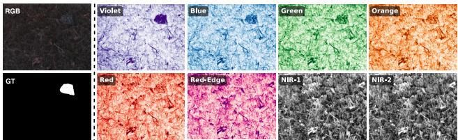  
Figure 1. Visualization of a Multispectral camouflaged image. We provide a single camouflaged image in its traditional RGB form along with its corresponding ground truth. Furthermore, the corresponding multispectral image is visualized in 8 channels.

In the multispectral domain for COD, research is still in its infancy. The recently proposed MCOD benchmark [21] demonstrated that multispectral data significantly enhances detection capability, yet current baselines rely on adding a band-specific initial learnable layer, which is data-inefficient and prone to overfitting. To overcome this, leveraging a transformer-based vision model is a promising direction. However, current backbones are pre-trained on massive RGB datasets and lack the capacity to process multispectral inputs. Directly applying these pre-trained models to multispectral COD is suboptimal because it discards crucial non-visible information. While [39] have attempted to tailor large vision models for challenging tasks using wavelet transforms, effectively fusing multispectral data into an RGB-centric backbone remains an open challenge.

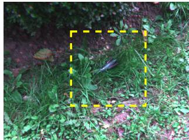  
(a) RGB Input (Object Concealed)

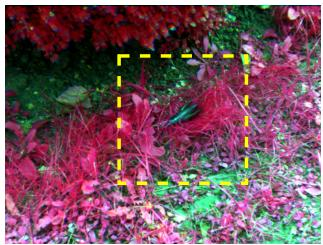  
(b) MSI Input (Object Revealed)

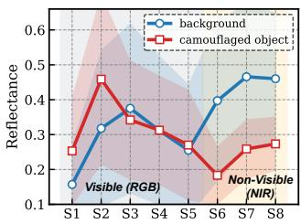  
(c) Spectral Signature

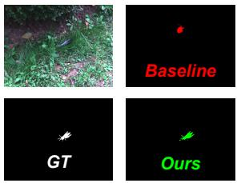  
(d) Detection  
Figure 2. Camouflaged image outside the visible spectrum. (a) A camouflaged object that is nearly indistinguishable from its background in the RGB image. (b) The image becomes clearly separable in the multispectral domain. (c) The per-band reflectance is averaged over the object and background regions; the two spectral signatures overlap across the visible bands but diverge in the near-infrared bands. (d) Using this signal, our MSFormer accurately segments the object where a strong RGB baseline fails.

To bridge this gap, we propose a transformer-based multispectral camouflaged object detection framework, MS-Former. Firstly, we introduce a weight inflation strategy that adapts the standard transformer-based backbone [36] for multispectral inputs. This strategy projects multispectral inputs into the encoder’s embedding space and enables the model to leverage the “unseen” spectral clues of camouflaged objects while retaining the powerful, structural segmentation priors to generate multiscale features. Following this, we standardize the multiscale feature representations using feature-projection layers. Finally, we propose a cascaded decoder module that takes these uniform feature representations as input and aggregates them using concatenation and transposed convolution to predict the final mask.

## We summarize our contributions as follows:

1. We propose a novel transformer-based Multispectral COD framework that takes the multispectral camouflaged image as input and predicts the corresponding binary mask.

2. We introduce a weight inflation strategy that effectively fuses traditional RGB bands with additional band information, enabling the encoder to capture complementary cross-modal features.

3. We propose a cascaded decoder module that aggregates the uniform multiscale features to predict the efficient mask for the camouflaged image.

4. We conduct extensive experiments on different COD benchmarks, demonstrating that our method performs significantly well across RGB, multispectral, and hyperspectral baselines.

## 2. Related Works

## 2.1. Camouflaged Object Detection

Camouflaged object detection aims to segment objects that closely match their surroundings in appearance [29].

The advent of deep learning has revolutionized this field, enabling the extraction of rich, multi-scale semantic features [3, 9, 13, 15, 32, 43]. Recent state-of-the-art methods often adopt biologically inspired strategies [10, 23] to mimic human visual perception. [11] incorporated visual supervision to leverage co-saliency for object localization. More recently, the rise of foundation models has prompted works such as [39], which adapt them using wavelet-based transformations to handle these challenging scenarios. Despite these advancements, the aforementioned methods predominantly rely on 3-channel RGB inputs. To address this, [21] recently introduced a benchmark for multispectral COD, demonstrating that non-visible spectral bands can reveal targets hidden in the visible spectrum. Building on this insight, we propose a novel multispectral framework that leverages diverse spectral bands to enable robust representation learning.

## 2.2. Multispectral Segmentation

Multispectral Image segmentation (MIS) addresses the intrinsic limitations of RGB models by integrating spectral information, such as thermal or infrared data [12, 19, 22, 30, 33, 35, 46]. This fusion significantly enhances mode robustness, particularly in adverse lighting conditions. Early works such as MFNet [12] used a dual-encoder architecture with concatenation for real-time fusion in autonomous tracking [28]. [33] employed a two-stage fusion to mitigate modality discrepancies, while [19] introduced largescale datasets to standardize robust segmentation. To further refine feature interactions, [46] proposed attention-based mechanisms—specifically, feature-enhanced attention and multiscale fusion, respectively, to dynamically weigh the importance of different bands relative to RGB context. Recently, several studies [17, 18, 34, 44] have focussed on hyperspectral-based methods for camouflage detection in multispectral imagery.

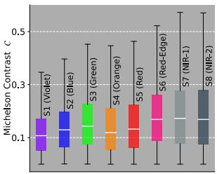  
(a)

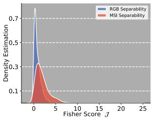  
(b)

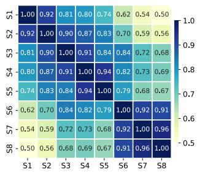  
(c)

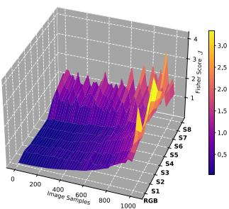  
(d)  
Figure 3. Statistical motivation for Multispectral COD. a) Global Contrast Distribution: Box plots show median contrast in NIR bands (S7, S8) is 2× higher than visible bands (S5, S3, and S2). b) Feature Separability Density: The heavy tail in the MSI distribution (red) indicates a subset of ”easy-to-segment” samples that are otherwise indistinguishable in RGB (blue). c) Correlation Heatmap: Low correlation between Visible and NIR bands confirms non-redundancy. d) Spectral Landscape: 3D visualization showing consistently higher separability scores in NIR bands across the dataset.

## 3. Methodology

## 3.1. RGB vs MSI Band

To empirically justify the integration of multispectral imaging (MSI) for Camouflaged Object Detection (COD), we perform a rigorous statistical analysis comparing the representations of standard RGB modalities with those of the entire multispectral bands. Our analysis focuses on three key discriminative properties: optical contrast,feature separability, and information orthogonality.

## 3.1.1. Optical Contrast and Spectral Divergence:

The fundamental challenge in COD is the camouflaged foreground that mimics the chromaticity of the background. We quantify this by computing the Michelson Contrast (C) for each spectral band across the entire dataset. Fig. 3a visualizes the global contrast distribution. We observe that in the visible RGB bands (S5, S3, and S2), the median contrast is lower, confirming the effectiveness of camouflage in the human visual range. However, a significant divergence is observed in the Near-Infrared (NIR) bands (S7–S8). The median contrast in these bands is approximately 2× higher than in the visible spectrum.

## 3.1.2. Feature Separability and Decision Boundaries.

Beyond raw contrast, we analyze the statistical separability of object-background distributions using the Fisher Discriminant Ratio (J ). We visualize this in two complementary forms:

The Spectral Landscape: Fig. 3d visualizes the separability score J as a 3D surface across the dataset samples. The topology reveals a distinct “valley” in the RGB domain (Row 0), indicating a consistently challenging optimization landscape. Conversely, the NIR bands (Rows 7–8) form a prominent “ridge”, demonstrating that the discriminative signal in MSI is not sporadic but statistically consistent across diverse samples.

Separability Density: Quantitatively, Fig. 3b compares the density estimation of J . The RGB distribution (blue) is strongly peaked near zero $( \mathcal { I } \approx 0 . 2 )$ , indicating that the foreground and background are statistically indistinguishable. In contrast, the MSI distribution (red) exhibits a pronounced heavy tail, extending to $\mathcal { I } > 5$ . This indicates that MSI shifts the problem from semantic inference in a low-contrast regime to feature discrimination in a high-contrast regime, effectively reducing the complexity of the underlying decision boundary.

## 3.1.3. Information Orthogonality.

Here, we compute the inter-channel Pearson-correlation coefficient matrix, averaged across the dataset (Fig. 3c). We observe high collinearity $( \rho > 0 . 8 2 )$ among the visible bands (S2–S5), suggesting significant redundancy in standard RGB inputs. However, the correlation between visible and NIR bands (S7–S8) drops significantly. This validates that the multispectral bands provide orthogonal information, introducing unique variance that allows the network to resolve ambiguities present in the visible spectrum.

## 3.2. Overview

Let the input multispectral camouflaged image be denoted as $I _ { c } \in \dot { \mathbb { R } } ^ { H \times W \times C _ { m s } }$ , where $C _ { m s }$ represents the number of spectral bands (comprising RGB, NIR, and other bands). H and W represent the image’s height and width, respectively. The objective is to predict the binary segmentation map $\mathbf { \bar { \rho } } _ { \hat { m } _ { c } } \in [ 0 , \mathbf { \bar { 1 } } ] ^ { H \times W }$ , where each pixel indicates the probability of belonging to a camouflaged object. We propose the MultiSpectral Transformer Network (MSFormer), a hierarchical framework for extracting and fusing robust semantic features from generalized multispectral data. As illustrated in Fig. 4, the architecture comprises three key components: Multispectral Feature Extractor: an encoder backbone that extracts multi-scale features from $C _ { m s }$ -channel inputs, Feature Projection Layers: standardize the channel dimensions of the extracted hierarchical features, followed by Cascaded Decoder Module (CDM): a top-down aggregation pathway that progressively recovers spatial resolution while integrating semantic context from deeper layers.

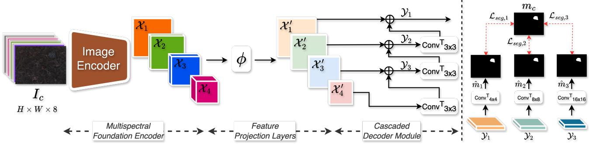  
Figure 4. Overview of our MSFormer framework. The multispectral camouflaged image $I _ { c }$ is passed through the image encoder that extracts the multiscale features X. These features are standardized to a uniform channel dimension $\mathcal { X } ^ { \prime }$ using Feature Projection Layers ϕ, which are then fused recursively using the Cascaded Decoder Module (CDM). The hierarchical cascaded features Y are subsequently upsampled to restore spatial resolution and generate prediction maps at distinct scales, $\hat { m } .$ Finally, we calculate the loss $\mathcal { L } _ { s e g }$ between predicted maps and the ground truth $m _ { c }$

## 3.3. Multispectral Feature Extractor

To capture the long-range dependencies and robust spectral features, we employ the pyramid vision transformer (PVT) [36] encoder as our backbone. Unlike standard CNNs, PVT utilizes a transformer-based pyramid structure, which is highly effective for dense prediction tasks.

Weight Inflation Strategy: Standard PVT encoders are configured for three-channel RGB input. To adapt this backbone for multispectral data while preserving the robust feature representations learned during pre-training, we employ a channel-wise weight inflation strategy within the patch embedding layer. Let $\mathbf { W } _ { r g b } \in \mathbb { R } ^ { K \times 3 \times \mathbf { \breve { P } } \times P }$ denote the pretrained weights corresponding to the traditional Red (R), Green (G), and Blue (B) channels. We initialize the generalized weight tensor, $\mathbf { \bar { W } } _ { m s } \in \mathbb { R } ^ { K \times C _ { m s } \times P \times P }$ (where $C _ { m s }$ represents the total number of multispectral channels), by mapping the $\mathbf { W } _ { r g b }$ weights to their corresponding R, ${ \bf G } ,$ and B channels. For the remaining spectral channels, we compute the arithmetic mean across the three original RGB channels. This initialization strategy is mathematically formulated as follows:

$$
\begin{array} { r } { \mathbf { W } _ { m s } [ : , c , : , : ] = \left\{ \mathbf { W } _ { r g b } [ : , c , : , : ] \right. \quad \mathrm { i f } c \in \{ R , G , B \} } \\ { \frac { 1 } { 3 } \sum _ { j = 0 } ^ { 2 } \mathbf { W } _ { r g b } [ : , j , : , : ] \quad \mathrm { o t h e r w i s e } \quad \quad \quad } \end{array}\tag{1}
$$

where c denotes the specific channel index, K denotes the embedding dimension, and P denotes the spatial dimension of the initial layer of the encoder. This initialization preserves the learned RGB representations while providing a balanced initialization for the novel spectral bands. The encoder extracts four hierarchical feature maps, denoted as $\mathcal { X } _ { i } \ \in \ \mathbb { R } ^ { \frac { H } { 2 ^ { i + 1 } } \times \frac { W } { 2 ^ { i + 1 } } \times C _ { i } }$ , where $C _ { i }$ is the $i ^ { t h }$ element in $C \in \{ 6 4 , 1 2 8 , 3 2 0 , 5 1 2 \}$

It is noteworthy that this strategy can also be adapted for n-channel bands in the hyperspectral domain.

## 3.4. Cascaded Decoder Module

The diverse scales of camouflaged objects require effective fusion of high-level semantics (for localization) and lowlevel details (for boundary refinement). We introduce the Cascaded Decoder Module (CDM) to aggregate the extracted features (X) via a top-down pathway. First, the features are passed through Feature Projection Layers (ϕ) to map them to a uniform channel dimension:

$$
\mathcal { X } _ { i } ^ { \prime } = \phi _ { i } ( \mathcal { X } _ { i } ) ; \quad i \in \{ 1 , 2 , 3 , 4 \}\tag{2}
$$

where $\phi ( \cdot ) = \mathrm { B N } ( \mathrm { R e L U } ( \mathrm { C o n v } _ { 3 \times 3 } ( \cdot ) ) )$ that resizes each extracted feature to 64 channel size (X′). The CDM then recursively fuses these features. Starting from the deepes feature $\mathcal { X } _ { 4 } ^ { \prime } ,$ we employ a sequence of upsampling and concatenation operations. Let $\mathcal { \mathrm { V } } _ { i }$ denote the decoded feature at stage i. The aggregation process is defined as:

$$
\begin{array} { r } { \mathcal { V } _ { 3 } = \mathrm { C o n v } _ { 3 \times 3 } ^ { T } ( \mathcal { X } _ { 4 } ^ { \prime } ) \oplus \mathcal { X } _ { 3 } ^ { \prime } } \\ { \mathcal { Y } _ { 2 } = \mathrm { C o n v } _ { 3 \times 3 } ^ { T } ( \mathcal { Y } _ { 3 } ) \oplus \mathcal { X } _ { 2 } ^ { \prime } } \\ { \mathcal { Y } _ { 1 } = \mathrm { C o n v } _ { 3 \times 3 } ^ { T } ( \mathcal { Y } _ { 2 } ) \oplus \mathcal { X } _ { 1 } ^ { \prime } } \end{array}\tag{3}
$$

where $\mathrm { C o n v } _ { 3 \times 3 } ^ { T } ( \cdot )$ denotes 2d-transposed convolution of $3 \times 3$ kernel and ⊕ denotes channel-wise concatenation. This cascaded design ensures that stronger semantic cues from deeper layers guide the refinement of shallower, detail-rich features.

These hierarchical cascaded features are later upsampled to restore spatial resolution for gradient optimization using a Conv operation to get the corresponding hierarchical mask mˆ as:

$$
\begin{array} { r } { \hat { m } _ { i } = \mathrm { C o n v } _ { k \times k } ^ { T } ( \mathcal { V } _ { i } ) ; k = 2 ^ { ( i + 1 ) } i \in \{ 1 , 2 , 3 \} , } \end{array}\tag{4}
$$

## 3.5. Objective Function

For our proposed approach, we employ a deep supervision strategy, evaluating camouflaged prediction maps at distinct scales: $\hat { m } _ { 1 }$ (finest), mˆ , and mˆ (coarsest). Each prediction map consists of a single-channel probability map $\hat { m } \in \mathbb { R } ^ { H \times W }$ . The total training objective $\mathcal { L } _ { t o t a l }$ is the sum of the losses at each scale:

$$
\mathcal { L } _ { t o t a l } = \sum _ { k = 1 } ^ { 3 } \mathcal { L } _ { s e g , k } ( \hat { m } _ { k } , m _ { c } )\tag{5}
$$

where $m _ { c }$ is the ground truth binary mask. The segmentation loss $\mathcal { L } _ { s e g }$ is a combination of the Weighted Binary Cross-Entropy (BCE) loss and the Weighted Intersectionover-Union (IoU) loss to handle the class imbalance inherent in camouflaged scenes:

$$
\mathcal { L } _ { s e g } ( \hat { m } , m _ { c } ) = \mathcal { L } _ { B C E } ^ { w } ( \hat { m } , m _ { c } ) + \mathcal { L } _ { I o U } ^ { w } ( \hat { m } , m _ { c } )\tag{6}
$$

where $\hat { m } \in \{ \hat { m } _ { 1 } , \hat { m } _ { 2 } , \hat { m } _ { 3 } \}$ . By combining these two losses, we can effectively supervise both the pixel-level details and the foreground-background regions. This multiscale supervision forces the network to learn global object localization at deeper layers while refining fine-grained boundaries at shallower layers.

## 4. Experiments

## 4.1. Experimental Details

## 4.1.1. Datasets:

We consider the current MCOD benchmark dataset [21] to evaluate our proposed approach. Unlike the traditional threechannel RGB band, MCOD consists of multispectral bands. The dataset comprises 1,527 multispectral images, divided into 1,027 training and 500 test images, with each image containing eight channels. Additionally, we evaluate on the recently proposed hyperspectral dataset for COD (Hyper-COD) [2]. The HyperCOD dataset comprises 350 hyperspectral images with 200 distinct spectral bands. The dataset is divided into 280 training samples and 70 testing samples. To further analyze the robustness of our proposed framework, we evaluate MSFormer on traditional COD benchmarks, 4,040 (COD10K [6] + CAMO [20]) training images, 2,026 COD10K testing images, 250 CAMO testing images, and 4,121 NC4K [23] testing images.

## 4.1.2. Evaluation Metrics:

Following [21], we evaluate our approach on standard metrics: Mean Absolute Error (M), mean F-measure $( \mathcal { F } _ { \beta } )$ [1], adaptive F-measure $( \alpha \mathcal { F } )$ [1], S-measure $( { \cal { S } } _ { m } )$ [4], and Enhanced Alignment Measure (E ) [5].

## 4.1.3. Implementation Details:

We implemented our framework using the PyTorch framework on a single workstation of NVIDIA 4090 GPU. We adopt a pre-trained PVT-V2 [36] model as the backbone. The network parameters are optimized using the AdamW optimizer, with an initial learning rate of 5e-5, weight decay of 0.0001, a batch size of 8, and 65 epochs. All training and testing images are resized to $5 1 2 \times 5 1 2$ and augmented with random flips, mirroring, and rotations. We will release the code for reproducibility.

Table 1. Comparison of methods on MCOD benchmark dataset. $\uparrow / \downarrow$ denotes the larger/smaller is better. Best results are marked in Bold. The results are excerpted from [21]
<table><tr><td>Models</td><td> $\mathcal { E } _ { \xi } \mathrm { ~ \uparrow ~ }$ </td><td> $S _ { m }$  ↑</td><td> $\mathcal { F } _ { \beta }$  ←</td><td>M↓</td></tr><tr><td>SINet [6]</td><td>0.758</td><td>0.616</td><td>0.369</td><td>0.006</td></tr><tr><td>LSR [23]</td><td>0.830</td><td>0.625</td><td>0.373</td><td>0.005</td></tr><tr><td>CODCEF [16]</td><td>0.763</td><td>0.677</td><td>0.444</td><td>0.004</td></tr><tr><td>C2FNet [32]</td><td>0.726</td><td>0.721</td><td>0.403</td><td>0.010</td></tr><tr><td>C2FNet-V2 [3]</td><td>0.913</td><td>0.810</td><td>0.654</td><td>0.008</td></tr><tr><td>SINet-V2 [7]</td><td>0.849</td><td>0.728</td><td>0.492</td><td>0.004</td></tr><tr><td>ASBI [43]</td><td>0.684</td><td>0.675</td><td>0.370</td><td>0.014</td></tr><tr><td>FIRNet [9]</td><td>0.882</td><td>0.738</td><td>0.537</td><td>0.004</td></tr><tr><td>PRNet [15]</td><td>0.926</td><td>0.826</td><td>0.698</td><td>0.002</td></tr><tr><td>IdeNet [10]</td><td>0.846</td><td>0.808</td><td>0.588</td><td>0.004</td></tr><tr><td>PCNet [40]</td><td>0.633</td><td>0.855</td><td>0.386</td><td>0.003</td></tr><tr><td>Ours</td><td>0.972</td><td>0.881</td><td>0.805</td><td>0.002</td></tr></table>

Table 2. Comparison of results under RGB and MSI inputs on MCOD benchmark. $\uparrow / \downarrow$ denotes the larger/smaller is better. Best results are marked in Bold. The results are excerpted from [21]
<table><tr><td>Models</td><td>Inputs</td><td> $\mathcal { E } _ { \xi } \mathrm { ~ \uparrow ~ }$ </td><td> $S _ { m }$  ↑</td><td> $\mathcal { F } _ { \beta }$  ←</td><td> $\mathcal { M } \downarrow$ </td></tr><tr><td>SINet [6]</td><td>RGB MSI</td><td>0.695 0.758</td><td>0.601 0.616</td><td>0.335 0.369</td><td>0.005 0.006</td></tr><tr><td>CODCEF [16]</td><td>RGB MSI</td><td>0.718 0.763</td><td>0.632 0.677</td><td>0.359 0.444</td><td>0.005 0.004</td></tr><tr><td>C2FNet-V2 [3]</td><td>RGB MSI</td><td>0.885 0.913</td><td>0.743 0.810</td><td>0.553 0.654</td><td>0.009 0.008</td></tr><tr><td>PCNet [40]</td><td>RGB MSI</td><td>0.397 0.633</td><td>0.788 0.855</td><td>0.149 0.386</td><td>0.005 0.003</td></tr><tr><td>Ours</td><td>RGB MSI</td><td>0.950 0.972</td><td>0.825 0.881</td><td>0.707 0.805</td><td>0.003 0.002</td></tr></table>

## 4.2. Experimental Results & Further Analysis

## 4.2.1. Comparison with State-of-the-Art

Following [21], we compare our proposed MSFormer with eleven COD models on the MCOD dataset. As illustrated in Table 1, MSFormer outperforms all the previous works by a significant margin. Our proposed approach bridges the performance gap by effectively leveraging multi-spectral cues, achieving state-of-the-art results across all metrics. Particularly, MSFormer achieves the $\mathcal { F } _ { \beta }$ of 0.805, outperforming [15] by ≈15%. Similarly across other metrics, ${ \mathcal { E } } _ { \xi } , S _ { m }$ , and M, our approach surpasses current state-of-the-art [15, 40] by ≈2%. These results demonstrate that incorporating multispectral information yields better scene understanding, with more accurate object localization and finer details.

To further assess the performance of our proposed approach, we compare it with that of multispectral inputs versus traditional RGB inputs. The results, summarized in Table 2, demonstrate that MSFormer not only surpasses prior work but also that the multispectral input shows consistent improvements over the RGB input. This analysis demonstrates the effectiveness of multispectral data in precisely detecting camouflaged objects.

The qualitative results of MSFormer, compared with other COD methods, are visualized in Fig. 5. As shown in the figure, MSFormer produces accurate segmentation masks in challenging scenarios. Compared to other methods, MS-Former provides segmentation results with more accurate object boundaries.

## 4.2.2. Analysis on Traditional COD Benchmarks.

In this section, we evaluate our proposed approach on three standard RGB camouflaged object detection benchmarks, CAMO, COD10K, and NC4K. Since these datasets provide only three-channel RGB input, the multispectral weightinflation strategy is inactive and reduces to standard pretrained initialization; The results are reported in Table 3. On both CAMO and COD10K, MSFormer attains the best score on three of the four metrics and ranks a close second on the structure measure $S _ { m } .$ . On CAMO, MSFormer reaches $\mathcal { F } _ { \beta } { = } 0 . 8 6 6$ , exceeding MCSWA-Net (0.841) by 0.025 and PRNet (0.831) by 0.035 (+4.2% relative); on COD10K, it achieves $\mathcal { F } _ { \beta } { = } 0 . 8 3 5$ , improving on MCSWA-Net (0.817) by 0.018 and PRNet (0.799) by 0.036. On $S _ { m }$ , MCSWA-Net edges ahead on both datasets. It is important to note that these differences are marginal.

## 4.2.3. Robustness on Hyperspectral Data.

To evaluate whether MSFormer generalizes beyond the eightband MCOD setting, we test it on the recently proposed HyperCOD benchmark [2]. This setting is considerably more challenging than MCOD. We compare against three families of methods, summarized in Table 4: conventional RGBonly COD models, hyperspectral salient-object-detection (H-SOD) methods, and hyperspectral camouflaged-objectdetection (H-COD) methods.

Among the task-appropriate H-COD methods, MSFormer is highly competitive compared with state-of-the-art HSC-SAM, and the two approaches are effectively complementary across the metric set. Our method attains the best Emeasure $( \mathcal { E } _ { \xi } { = } 0 . 8 9 1$ , improving on HSC-SAM’s 0.853 by 4.5% and edging the strongest RGB model, FRINet, at 0.889) and the best adaptive F-measure $( \alpha \mathcal { F } { = } 0 . 6 9 2$ , surpassing HSC-SAM’s 0.681 and the best RGB result, Camoformer’s 0.660, by 4.8%). On the remaining two metrics, HSC-SAM achieves a marginally lower MAE (0.0017 vs 0.0020) and a higher structure measure $( S _ { m } = 0 . 8 0 2 \nu s 0 . 7 6 8 )$ . This demonstrates that our adaptation strategy scales from the multispectral to the hyperspectral setting, showing that MSFormer is a general framework for spectrally rich camouflage-object detection.

## 4.2.4. Effectiveness of Individual Spectral Bands.

To understand how the spectral bands contribute individually and jointly, we conduct two complementary experiments in which the complete framework is retrained under controlled band settings, reported in Fig. 6. In the single-band setting (Fig. 6a), the network is trained on a single band at a time, thereby isolating the discriminability of each channel. In the leave-one-band-out setting (Fig. 6b), the network is trained on the remaining seven bands with a single band removed, exposing the marginal contribution and redundancy of that channel.

The single-band results in Fig. 6a show a severe degradation across every channel relative to the full model (summarized in Table 1). The NIR bands $( S _ { 7 } - S _ { 8 } )$ attain the highest $\mathcal { F } _ { \beta }$ , rising monotonically toward $S _ { 8 }$ , whereas the highly correlated visible bands $( S _ { 1 } - S _ { 6 } )$ remain flat at the bottom. The leave-one-out results in Fig. 6b demonstrate that removing any single band from the eight-channel input leaves performance high and remarkably flat across the choice of removed band, with no band whose removal causes a disproportionate collapse. Crucially, every leave-one-out configuration still falls measurably short of the full eight-band model. This persistent gap confirms that, although no band is individually critical, each band contributes a non-trivial complementary signal, and the complete multispectral stack remains strictly optimal.

## 4.2.5. Effectiveness of individual architecture modules.

We analyze the two core architectural components of MS-Former, the Feature Projection Layers and the Cascaded Decoder Module (CDM), to isolate their individual and joint contributions, with the results summarized in Table 5. Removing both components reduces the decoder to a direct upsampling of the deepest backbone feature, with no channel standardization and no multiscale fusion; resulting in $\mathcal { E } _ { \xi } { = } 0 . 7 0 7 , S _ { m } { = } 0 . 6 2 1 , \mathcal { F } _ { \beta } { = } 0 . 3 0 3$ , and $\scriptstyle { \mathcal { M } } = 0 . 0 0 8$ , confirming that naively decoding the final-stage feature is fundamentally insufficient for camouflaged object detection, where fine-grained boundary recovery reflected in the sharp $\mathcal { F } _ { \beta }$ collapse is especially critical. Introducing the projection layers alone, which standardizes the four hierarchical feature maps to a uniform 64-channel representation but does not yet recursively fuse them, yields a modest but consistent improvement $( \mathcal { E } _ { \xi } + 1 4 . 9 \% , S _ { m } + 1 2 . 2 \% , \mathcal { F } _ { \beta } + 5 9 . 1 \% , M - 3 7 . 5 \%$ relative to the baseline). In contrast, enabling CDM alone, without the layers, yields substantially larger gains across all metrics $( \mathcal { E } _ { \xi } { = } 0 . 9 5 3 , S _ { m } { = } 0 . 8 4 8 , \mathcal { F } _ { \beta } { = } 0 . 7 4 2 , \mathcal { M } { = } 0 . 0 0 3 )$ . Combining both components achieves the best results across all four metrics $( \mathcal { E } _ { \xi } { = } 0 . 9 7 2 , S _ { m } { = } 0 . 8 8 1 , \mathcal { F } _ { \beta } { = } 0 . 8 0 5 , \mathcal { M } { = } 0 . 0 0 2 )$ Notably, adding the projection layers on top of an alreadyenabled CDM yields its largest marginal improvement on $\mathcal { F } _ { \beta }$ (+0.063, 8.5% relative) and M (-0.001, 33.3% relative reduction), while producing comparatively smaller gains on $\mathcal { E } _ { \xi }$ (+2.0%) and $S _ { m }$ (+3.9%).

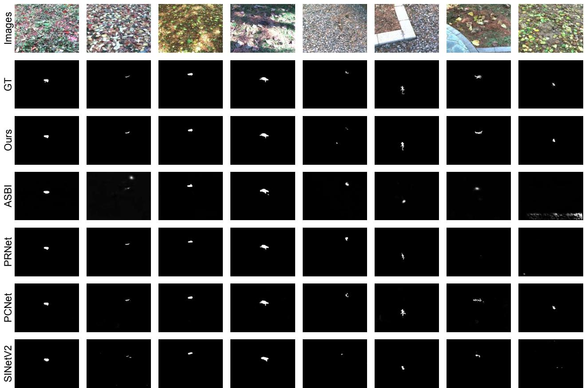  
Figure 5. Qualitative comparison of our proposed approach with other COD methods.

Table 3. Comparison of methods on the traditional COD benchmark dataset. ↑ / ↓ denotes the larger/smaller is better. Best results are marked in Bold.
<table><tr><td rowspan="2">Methods</td><td colspan="4">CAMO</td><td colspan="4">COD10K</td><td colspan="4">NC4K</td></tr><tr><td> $\boldsymbol { S _ { m } } \uparrow$ </td><td> $\mathcal { F } _ { \beta } \mathrm { ~ \uparrow ~ }$ </td><td>M↓</td><td> $\mathcal { E } _ { \xi } \mathrm { ~ \uparrow ~ }$ </td><td> $\boldsymbol { \mathcal { S } } _ { m } \uparrow$ </td><td> $\mathcal { F } _ { \beta }$  个</td><td>M↓</td><td> $\mathcal { E } _ { \xi } \mathrm { ~ \uparrow ~ }$ </td><td> $\boldsymbol { S _ { m } } \uparrow$ </td><td> $\mathcal { F } _ { \beta } \ ^ { \prime }$  个</td><td>M↓</td><td> $\mathcal { E } _ { \xi } \mathrm { ~ \uparrow ~ }$ </td></tr><tr><td>SINet [6]</td><td>0.745</td><td>0.644</td><td>0.092</td><td>0.804</td><td>0.776</td><td>0.631</td><td>0.043</td><td>0.864</td><td>0.808</td><td>0.723</td><td>0.058</td><td>0.871</td></tr><tr><td>ZoomNet [25]</td><td>0.820</td><td>0.752</td><td>0.066</td><td>0.892</td><td>0.838</td><td>0.729</td><td>0.029</td><td>0.911</td><td>0.853</td><td>0.784</td><td>0.043</td><td>0.896</td></tr><tr><td>CRNet [14]</td><td>0.735</td><td>0.641</td><td>0.092</td><td>0.815</td><td>0.733</td><td>0.576</td><td>0.049</td><td>0.832</td><td>0.775</td><td>0.688</td><td>0.063</td><td>0.855</td></tr><tr><td>MiNet [24]</td><td>0.813</td><td>0.751</td><td>0.068</td><td>0.881</td><td>0.794</td><td>0.683</td><td>0.036</td><td>0.889</td><td>0.828</td><td>0.749</td><td>0.048</td><td>0.900</td></tr><tr><td>IPNet [37]</td><td>0.841</td><td>0.793</td><td>0.051</td><td>0.918</td><td>0.825</td><td>0.709</td><td>0.029</td><td>0.910</td><td>0.860</td><td>0.798</td><td>0.039</td><td>0.922</td></tr><tr><td>DINet [47]</td><td>0.821</td><td>0.790</td><td>0.068</td><td>0.874</td><td>0.832</td><td>0.744</td><td>0.031</td><td>0.903</td><td>0.856</td><td>0.820</td><td>0.043</td><td>0.909</td></tr><tr><td>PRNet [15]</td><td>0.872</td><td>0.831</td><td>0.050</td><td>0.922</td><td>0.874</td><td>0.799</td><td>0.022</td><td>0.937</td><td>0.891</td><td>0.848</td><td>0.031</td><td>0.935</td></tr><tr><td>MCSWA-Net [31]</td><td>0.877</td><td>0.841</td><td>0.046</td><td>0.926</td><td>0.886</td><td>0.817</td><td>0.020</td><td>0.940</td><td>0.894</td><td>0.854</td><td>0.031</td><td>0.937</td></tr><tr><td>Ours</td><td>0.875</td><td>0.866</td><td>0.045</td><td>0.929</td><td>0.876</td><td>0.835</td><td>0.020</td><td>0.948</td><td>0.898</td><td>0.877</td><td>0.030</td><td>0.943</td></tr></table>

Table 4. Comparison of methods on HyperCOD benchmark dataset. $\uparrow / \downarrow$ denotes the larger/smaller is better. Best results are marked in Bold. The results are excerpted from [2]
<table><tr><td>Method</td><td>Setting</td><td> $\mathcal { M } \downarrow$ </td><td> $\mathcal { E } _ { \xi } \mathrm { ~ \uparrow ~ }$ </td><td> $\textstyle { \mathcal { S } } _ { m } \uparrow$ </td><td> $\alpha \mathcal { F } \uparrow$ </td></tr><tr><td>SINet-V2 [7]</td><td>RGB</td><td>0.0033</td><td>0.732</td><td>0.746</td><td>0.480</td></tr><tr><td>ZoomNet [25]</td><td>RGB</td><td>0.0044</td><td>0.831</td><td>0.757</td><td>0.352</td></tr><tr><td>FRINet [38]</td><td>RGB</td><td>0.0027</td><td>0.889</td><td>0.759</td><td>0.604</td></tr><tr><td>HGINet [41]</td><td>RGB</td><td>0.0039</td><td>0.850</td><td>0.766</td><td>0.585</td></tr><tr><td>Camoformer [42]</td><td>RGB</td><td>0.0070</td><td>0.673</td><td>0.355</td><td>0.660</td></tr><tr><td>SAD [45]</td><td>H-SOD</td><td>0.1505</td><td>0.325</td><td>0.483</td><td>0.0061</td></tr><tr><td>DMSSN [26]</td><td>H-SOD</td><td>0.0295</td><td>0.687</td><td>0.446</td><td>0.409</td></tr><tr><td>SMN-PVT [8]</td><td>H-SOD</td><td>0.0066</td><td>0.654</td><td>0.531</td><td>0.103</td></tr><tr><td>Hyper-HRNet [27]</td><td>H-SOD</td><td>0.0149</td><td>0.818</td><td>0.608</td><td>0.150</td></tr><tr><td>HSC-SAM [2]</td><td>H-COD</td><td>0.0017</td><td>0.853</td><td>0.802</td><td>0.681</td></tr><tr><td>Ours</td><td>H-COD</td><td>0.0020</td><td>0.891</td><td>0.768</td><td>0.692</td></tr></table>

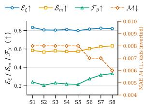

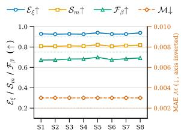  
(a) Single-band Setting  
(b) Leave-one-band Setting  
Figure 6. Per-band analysis on the MCOD benchmark. (a) Singleband input: the full pipeline is trained on one band at a time. (b) Leave-one-out: the pipeline is trained on the seven remaining bands. M is plotted on the right axis.

Table 5. Ablation study for the effectiveness of architectural components on the MCOD benchmark dataset. $\uparrow / \downarrow$ denotes the larger/smaller is better. Best results are marked in bold.
<table><tr><td>Cascaded Decoder Feature Projection Module (CDM)</td><td>Layers</td><td> $\mathcal { E } _ { \xi } \mathrm { ~ \uparrow ~ }$   $s _ { m }$  ↑  $\mathcal { F } _ { \beta } \uparrow$   $\mathcal { M } \downarrow$ </td></tr><tr><td>X</td><td>X</td><td>0.707 0.621 0.303 0.008</td></tr><tr><td>X</td><td>√</td><td>0.812 0.697 0.482 0.005</td></tr><tr><td>√</td><td>X</td><td>0.953 0.8480.7420.003</td></tr><tr><td> $\checkmark$ </td><td></td><td>0.972 0.881 0.805 0.002</td></tr></table>

## 4.2.6. Ablation on data generalization.

To assess how effectively MSFormer generalizes under varying amounts of supervision, we retrain the model on progressively larger subsets of the MCOD training set: 103, 257, 514, 771, and the full 1,027 images (≈10%, 25%, 50%, 75%, and 100%), under two input settings: the multispectral input (MSI) and the visible-only RGB bands. Fig. 7 reports all four metrics, where the star denotes the full data. Across al data settings and metrics, the MSI variant dominates its RGB counterpart. With only 103 training images, MSI raises $\mathcal { F } _ { \beta }$ from 0.420 to 0.557 and $S _ { m }$ from 0.672 to 0.745, whereas with the full 1,027 images, these gaps narrow to 13.9% and $6 . 9 \%$ , respectively. Notably, MSFormer trained on 25% of the multispectral images already attains $\mathcal { F } _ { \beta } { = } 0 . 7 2 2$ and $S _ { m } { = } 0 . 8 2 3$ , respectively, surpassing and matching the RGB model trained on the entire dataset. The same trend holds for the E-measure, where MSI at 771 images $( \mathcal { E } _ { \xi } { = } 0 . 9 5 8 )$ already exceeds full-data RGB (0.950). Importantly, MSI retains $a + 1 3 . 9 \% \ F _ { \beta }$ and $+ 6 . 9 \%  { S _ { m } } .$ confirming that the benefit is representational rather than a transient low-data artifact. The RGB and MSI settings also differ in saturation behaviour. The RGB curves rise steeply at first, $\mathcal { F } _ { \beta }$ climbs from 0.420 to 0.600 between 103 and 257 images, yet plateau well below the MSI curves, whereas the MSI curves begin near their ceiling and improve more gradually, reflecting that each multispectral image is information-rich and the model extracts more usable signal per sample.

Table 6. Ablation study for the effectiveness of initialization strategy on the MCOD benchmark dataset. $\uparrow / \downarrow$ denotes the larger/smaller is better. Best results are marked in bold.
<table><tr><td>Initialization Strategy</td><td> $\mathcal { E } _ { \xi } \mathrm { ~ \uparrow ~ }$ </td><td> $S _ { m }$  ↑</td><td> $\mathcal { F } _ { \beta }$  ←</td><td> $\mathcal { M } \downarrow$ </td></tr><tr><td>Random</td><td>0.931</td><td>0.817</td><td>0.695</td><td>0.003</td></tr><tr><td>Blue-channel</td><td>0.930</td><td>0.814</td><td>0.689</td><td>0.003</td></tr><tr><td>Red-channel</td><td>0.935</td><td>0.816</td><td>0.689</td><td>0.003</td></tr><tr><td>Green-channel</td><td>0.938</td><td>0.821</td><td>0.696</td><td>0.003</td></tr><tr><td>Zero-value</td><td>0.953</td><td>0.860</td><td>0.769</td><td>0.002</td></tr><tr><td>Average</td><td>0.965</td><td>0.870</td><td>0.783</td><td>0.002</td></tr><tr><td>Ours</td><td>0.972</td><td>0.881</td><td>0.805</td><td>0.002</td></tr></table>

## 4.2.7. Analysis on Different Initialization Strategies.

In this section, we analyze different initialization strategies and identify their impact on the framework. Adapting a three-channel pretrained patch-embedding layer to the eightchannel multispectral input requires a principled scheme for initializing the five non-visible-band filters. Table 6 isolates the impact of this choice while keeping the rest of MSFormer fixed. Random initialization of the bands discards any lowlevel structural prior for the additional channels, forcing the network to learn edge and texture filters for these bands from scratch and yielding the weakest foreground quality in the table. Furthermore, single-channel strategies that replicate the learned Blue, Red, or Green filter across all extra bands provide no benefit over random initialization. Zero-value initialization outperforms both random and single-channel schemes by leaving the new-band filters inactive at the start, thereby avoiding harmful bias while keeping the pretrained RGB filters fully intact. The Average prior improves further, because the mean of the three RGB filters supplies the new bands with a balanced, achromatic, but structurally meaningful starting point that transfers better than an inactive (zero) or biased (single-channel) filter. Our proposed inflation strategy achieves the best results on every metric, improving over random initialization by 4.4% in $\mathcal { E } _ { \xi }$ , 7.8% in $S _ { m }$ , and 15.8% in $\mathcal { F } _ { \beta }$

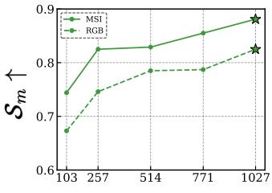  
Number of Training Images

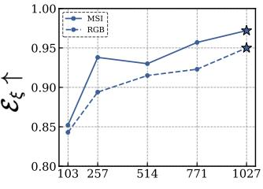  
Number of Training Images

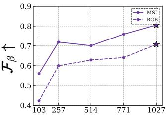  
Number of Training Images

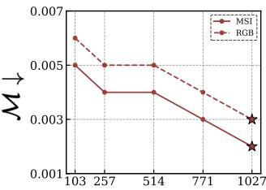  
Number of Training Images  
Figure 7. Data-generalization on the MCOD benchmark (with training images 103/257/514/771/1,027) using full multispectral (MSI, solid) vs visible-only (RGB, dashed) input. Stars mark the full-data models.

Table 7. Ablation study for the effectiveness of loss function on MCOD benchmark dataset. $\uparrow / \downarrow$ denotes the larger/smaller is better. Best results are marked in bold.
<table><tr><td> $\mathcal { L } _ { s e g } ^ { 1 }$ </td><td> $\mathcal { L } _ { s e g } ^ { 2 }$ </td><td> $\mathcal { L } _ { s e g } ^ { 3 }$ </td><td> $\mathcal { E } _ { \xi } \mathrm { ~ \uparrow ~ }$ </td><td> $\boldsymbol { S _ { m } } \uparrow$ </td><td> $\mathcal { F } _ { \beta }$  ↑</td><td> $\mathcal { M } \downarrow$ </td></tr><tr><td>√</td><td>X</td><td>X</td><td>0.888</td><td>0.858</td><td>0.799</td><td>0.003</td></tr><tr><td>X</td><td>√</td><td>X</td><td>0.250</td><td>0.278</td><td>0.007</td><td>0.517</td></tr><tr><td>X</td><td>X</td><td>√</td><td>0.254</td><td>0.312</td><td>0.007</td><td>0.433</td></tr><tr><td></td><td></td><td>√</td><td>0.972</td><td>0.881</td><td>0.805</td><td>0.002</td></tr></table>

## 4.2.8. Effectiveness of Loss Components.

In this section, we analyze the effectiveness of each loss component by selectively enabling the segmentation losses at the three prediction scales, where $\mathcal { L } _ { s e a } ^ { 1 }$ supervises the finest, full-resolution output $\hat { m } _ { 1 }$ and $\mathcal { L } _ { s e g } ^ { 2 } , \mathcal { L } _ { s e g } ^ { 3 }$ supervises progressively coarser intermediate maps; the results are reported in Table 7. We observe that utilizing intermediate losses $\mathcal { L } _ { s e g } ^ { 2 }$ or $\mathcal { L } _ { s e g } ^ { 3 }$ in isolation leads to model collapse, as the final output layer lacks direct supervision. $\mathcal { L } _ { s e g } ^ { 2 }$ alone yields $\mathcal { F } _ { \beta } { = } 0 . 0 0 7$ with $\scriptstyle { \mathcal { M } } = 0 . 5 1 7$ , and $\mathcal { L } _ { s e g } ^ { 3 }$ alone yields $\mathcal { F } _ { \beta } { = } 0 . 0 0 7$ with $\scriptstyle { \mathcal { M } } = 0 . 4 3 3$ . In contrast, the primary loss $\mathcal { L } _ { s e g } ^ { 1 }$ alone yields competitive results, since it directly constrains the fullresolution output. However, it fails to capture fine-grained details. The full objective significantly improves performance by 9.5% in $\mathcal { E } _ { \xi }$ and 2.7% in $S _ { m }$ over $\mathcal { L } _ { s e g } ^ { 1 }$ alone. This confirms that deep supervision facilitates robust gradient flow and multi-scale feature refinement, both of which are critical for delineating camouflaged boundaries.

## 5. Conclusion

In this paper, we introduced MSFormer, an end-to-end transformer-based approach for multispectral camouflaged object detection. We propose an efficient strategy for incorporating multispectral inputs into a pyramid vision transformer, a cascaded decoder module that integrates hierarchical features from the encoder and produces effective prediction maps at multiple scales. Our proposed approach performs significantly well across different COD benchmarks for RGB, multispectral, and hyperspectral bands. In our future work, we plan to extend our proposed approach to multispectral videos as well.

## References

[1] Radhakrishna Achanta, Sheila S. Hemami, Francisco J. Estrada, and Sabine Susstrunk. Frequency-tuned salient re- ¨ gion detection. In CVPR, pages 1597–1604. IEEE Computer Society, 2009. 5

[2] Shuyan Bai, Tingfa Xu, Peifu Liu, Yuhao Qiu, Huiyan Bai, Huan Chen, Yanyan Peng, and Jianan Li. Hypercod: The first challenging benchmark and baseline for hyperspectral camouflaged object detection. In Fortieth AAAI Conference on Artificial Intelligence, Thirty-Eighth Conference on Innovative Applications of Artificial Intelligence, Sixteenth Symposium on Educational Advances in Artificial Intelligence, AAAI 2026, Singapore, January 20-27, 2026, pages 2363– 2371. AAAI Press, 2026. 5, 6, 8

[3] Geng Chen, Si-Jie Liu, Yu-Jia Sun, Ge-Peng Ji, Ya-Feng Wu, and Tao Zhou. Camouflaged object detection via contextaware cross-level fusion. IEEE TCSVT, 2022. 1, 2, 5

[4] Deng-Ping Fan, Ming-Ming Cheng, Yun Liu, Tao Li, and Ali Borji. Structure-measure: A new way to evaluate foreground maps. In ICCV, pages 4558–4567. IEEE Computer Society, 2017. 5

[5] Deng-Ping Fan, Cheng Gong, Yang Cao, Bo Ren, Ming-Ming Cheng, and Ali Borji. Enhanced-alignment measure for binary foreground map evaluation. In IJCAI, pages 698–704, 2018. 5

[6] Deng-Ping Fan, Ge-Peng Ji, Guolei Sun, Ming-Ming Cheng, Jianbing Shen, and Ling Shao. Camouflaged object detection. In IEEE/CVF Conference on Computer Vision and Pattern Recognition (CVPR), 2020. 5, 7

[7] Deng-Ping Fan, Ge-Peng Ji, Ming-Ming Cheng, and Ling Shao. Concealed object detection. IEEE TPAMI, 44(10): 6024–6042, 2022. 5, 8

[8] Guanyiman Fu, Jingtao Li, Zihang Cheng, Zhuanfeng Li, Diqi Chen, Yan Xu, Fengchao Xiong, Jianfeng Lu, and Jun Zhou. Hypervision: A channel-adaptive ground-based hyperspectral vision pre-trained backbone. arXiv preprint arXiv:2605.17286, 2026. 8

[9] Yanliang Ge, Junchao Ren, Cong Zhang, Min He, Hong bo Bi, and Qiao Zhang. Feature-aware and iterative refinement network for camouflaged object detection. The Visual Computer, 41:4741 – 4758, 2024. 1, 2, 5

[10] Juwei Guan, Xiaolin Fang, Tongxin Zhu, Zhipeng Cai, Zhen Ling, Ming Yang, and Junzhou Luo. Idenet: Making neural network identify camouflaged objects like creatures. IEEE TIP, 33:4824–4839, 2024. 1, 2, 5

[11] Avi Gupta, Koteswar Rao Jerripothula, and Tammam Tillo. Circod: Co-saliency inspired referring camouflaged object discovery. In 2025 IEEE/CVF Winter Conference on Applications of Computer Vision (WACV), pages 8313–8323. IEEE, 2025. 1, 2

[12] Qishen Ha, Kohei Watanabe, Takumi Karasawa, Yoshitaka Ushiku, and Tatsuya Harada. Mfnet: Towards real-time semantic segmentation for autonomous vehicles with multispectral scenes. In IROS, pages 5108–5115, 2017. 1, 2

[13] Chunming He, Rihan Zhang, Dingming Zhang, Fengyang Xiao, Deng-Ping Fan, and Sina Farsiu. Nested unfolding network for real-world concealed object segmentation. arXiv preprint arXiv:2511.18164, 2025. 2

[14] Ruozhen He, Qihua Dong, Jiaying Lin, and Rynson WH Lau. Weakly-supervised camouflaged object detection with scribble annotations. In Proceedings ofthe AAAI conference on artificial intelligence, pages 781–789, 2023. 1, 7

[15] Xihang Hu, Xiaoli Zhang, Fasheng Wang, Jing Sun, and Fuming Sun. Efficient camouflaged object detection network based on global localization perception and local guidance refinement. IEEE TCSVT, 34(7):5452–5465, 2024. 1, 2, 5, 6, 7

[16] Kaihong Huang, Chunshu Li, Jiaqi Zhang, and Beilun Wang. Cascade and fusion: A deep learning approach for camouflaged object sensing. Sensors, 21(16):5455, 2021. 5

[17] Tobias Hupel and Peter Stutz. Adopting hyperspectral¨ anomaly detection for near real-time camouflage detection in multispectral imagery. Remote Sensing, 14(15):3755, 2022. 3

[18] Tobias Hupel and Peter Stutz. Optimized spectral indices for¨ camouflage detection in multispectral imagery. GIScience & Remote Sensing, 62(1):2508574, 2025. 3

[19] Wei Ji, Jingjing Li, Cheng Bian, Zhicheng Zhang, and Li Cheng. Semanticrt: A large-scale dataset and method for robust semantic segmentation in multispectral images. In Proceedings of the 31st ACM International Conference on Multimedia, MM, pages 3307–3316, 2023. 1, 2

[20] Trung-Nghia Le, Tam V. Nguyen, Zhongliang Nie, Minh-Triet Tran, and Akihiro Sugimoto. Anabranch network for camouflaged object segmentation. Journal ofComputer Vision and Image Understanding, 184:45–56, 2019. 5

[21] Yang Li, Tingfa Xu, Shuyan Bai, Peifu Liu, and Jianan Li. MCOD: the first challenging benchmark for multispectral

camouflaged object detection. CoRR, abs/2509.15753, 2025. 1, 2, 5, 6

[22] Yu Liu, Ju Cheng, Pengfei Wang, Shouqian Chen, Shu Wang, and Feng Huang. Multispectral detection of camouflaged targets in foggy and complex scenes. Pattern Recognition, page 113895, 2026. 2

[23] Yunqiu Lyu, Jing Zhang, Yuchao Dai, Aixuan Li, Bowen Liu, Nick Barnes, and Deng-Ping Fan. Simultaneously localize, segment and rank the camouflaged objects. In CVPR, pages 11591–11601, 2021. 1, 2, 5

[24] Yuzhen Niu, Lifen Yang, Rui Xu, Yuezhou Li, and Yuzhong Chen. Minet: Weakly-supervised camouflaged object detection through mutual interaction between region and edge cues. In Proceedings of the 32nd ACM International Conference on Multimedia, pages 6316–6325, 2024. 1, 7

[25] Youwei Pang, Xiaoqi Zhao, Tian-Zhu Xiang, Lihe Zhang, and Huchuan Lu. Zoom in and out: A mixed-scale triplet network for camouflaged object detection. In Proceedings of the IEEE/CVF Conference on computer vision and pattern recognition, pages 2160–2170, 2022. 1, 7, 8

[26] Haolin Qin, Tingfa Xu, Peifu Liu, Jingxuan Xu, and Jianan Li. Dmssn: Distilled mixed spectral–spatial network for hyperspectral salient object detection. IEEE Transactions on Geoscience and Remote Sensing, 62:1–18, 2024. 8

[27] Yuhao Qiu, Shuyan Bai, Tingfa Xu, Peifu Liu, Haolin Qin, and Jianan Li. Hsod-bit-v2: A challenging benchmark for hyperspectral salient object detection. In Proceedings ofthe AAAI Conference on Artificial Intelligence, pages 6630–6638, 2025. 8

[28] Aahan Sachdeva, Dhanvinkumar Ganeshkumar, James E. Gallagher, Tyler Treat, and Edward J. Oughton. Evaluating an adaptive multispectral turret system for autonomous tracking across variable illumination conditions. CoRR, abs/2512.22263, 2025. 2

[29] Reena Sahane, Surbhi Pagar, Akshat Bhargava, Atharva Velhankar, Mohammad Ayaan Naik, and Gaurang Vaghela. A review on recent advances and emerging trends in human camouflaged detection. In 2026 International Conference on Sustainable and Futuristic Technologies (ICSFT), pages 1–4. IEEE, 2026. 2

[30] Ying Shen, Jie Li, Wenfu Lin, Liqiong Chen, Feng Huang, and Shu Wang. Camouflaged target detection based on snapshot multispectral imaging. Remote Sensing, 13(19):3949, 2021. 2

[31] Xiaogang Song, Haoyu Yuan, Xiaofeng Lu, Xinhong Hei, and Rongrong Liu. Multi-clue sliding window attention for camouflaged object detection. IEEE Trans. Multim., 28:1037– 1051, 2026. 7

[32] Yujia Sun, Geng Chen, Tao Zhou, Yi Zhang, and Nian Liu. Context-aware cross-level fusion network for camouflaged object detection. In IJCAI, pages 1025–1031, 2021. 1, 2, 5

[33] Yuxiang Sun, Weixun Zuo, Peng Yun, Hengli Wang, and Ming Liu. Fuseseg: Semantic segmentation of urban scenes based on RGB and thermal data fusion. IEEE Trans Autom. Sci. Eng., 18(3):1000–1011, 2021. 1, 2

[34] Hanzheng Wang, Wei Li, Xiang-Gen Xia, and Qian Du. Causal hyperprompter: A framework for unbiased hyper-

spectral camouflaged object tracking. IEEE Transactions on Pattern Analysis and Machine Intelligence, 2025. 3

[35] Shu Wang, Dawei Zeng, Yixuan Xu, Gonghan Yang, Feng Huang, and Liqiong Chen. Towards complex scenes: A deep learning-based camouflaged people detection method for snapshot multispectral images. Defence Technology, 34: 269–281, 2024. 2

[36] Wenhai Wang, Enze Xie, Xiang Li, Deng-Ping Fan, Kaitao Song, Ding Liang, Tong Lu, Ping Luo, and Ling Shao. PVT v2: Improved baselines with pyramid vision transformer. Comput. Vis. Media, 8(3):415–424, 2022. 2, 4, 5

[37] Xin Wang, Jiajia Ding, Zhao Zhang, Junfeng Xu, and Jun Gao. Ipnet: Polarization-based camouflaged object detection via dual-flow network. Engineering Applications ofArtificial Intelligence, 127:107303, 2024. 1, 7

[38] Chenxi Xie, Changqun Xia, Tianshu Yu, and Jia Li. Frequency representation integration for camouflaged object detection. In Proceedings of the 31st ACM International Conference on Multimedia, pages 1789–1797, 2023. 8

[39] Saurabh Yadav, Avi Gupta, and Koteswar Rao Jerripothula. Samwave: Wavelet-driven feature enrichment for effective adaptation of segment anything model. CoRR, abs/2507.20186, 2025. 1, 2

[40] Jinyu Yang, Qingwei Wang, Feng Zheng, Peng Chen, Alesˇ Leonardis, and Deng-Ping Fan. Plantcamo: Plant camouflage detection. CAAI Artificial Intelligence Research (AIR), 2025. 5, 6

[41] Siyuan Yao, Hao Sun, Tian-Zhu Xiang, Xiao Wang, and Xiaochun Cao. Hierarchical graph interaction transformer with dynamic token clustering for camouflaged object detection. IEEE Transactions on Image Processing, 33:5936–5948, 2024. 8

[42] Bowen Yin, Xuying Zhang, Deng-Ping Fan, Shaohui Jiao, Ming-Ming Cheng, Luc Van Gool, and Qibin Hou. Camoformer: Masked separable attention for camouflaged object detection. IEEE Transactions on Pattern Analysis and Machine Intelligence, 46(12):10362–10374, 2024. 8

[43] Qiao Zhang, Xiaoxiao Sun, Yurui Chen, Yanliang Ge, and Hongbo Bi. Attention-induced semantic and boundary interaction network for camouflaged object detection. Computer Vision and Image Understanding, 233:103719, 2023. 1, 2, 5

[44] Jiale Zhao, Dan Fang, Jiaju Ying, Yudan Chen, Qi Chen, Qianghui Wang, Guanglong Wang, and Bing Zhou. A camouflage target classification method based on spectral difference enhancement and pixel-pair features in land-based hyperspectral images. Engineering Applications ofArtificial Intelligence, 156:111141, 2025. 3

[45] Qingping Zheng, Ling Zheng, Yunpeng Bai, Hang Liu, Jiankang Deng, and Ying Li. Boundary-aware network with two-stage partial decoders for salient object detection in remote sensing images. IEEE Transactions on Geoscience and Remote Sensing, 61:1–13, 2023. 8

[46] Wujie Zhou, Xinyang Lin, Jingsheng Lei, Lu Yu, and Jenq-Neng Hwang. Mffenet: Multiscale feature fusion and enhancement network for rgb-thermal urban road scene parsing. IEEE Trans. Multim., 24:2526–2538, 2022. 1, 2

[47] Xiaofei Zhou, Zhicong Wu, and Runmin Cong. Decoupling and integration network for camouflaged object detection. IEEE Trans. Multim., 26:7114–7129, 2024. 1, 7