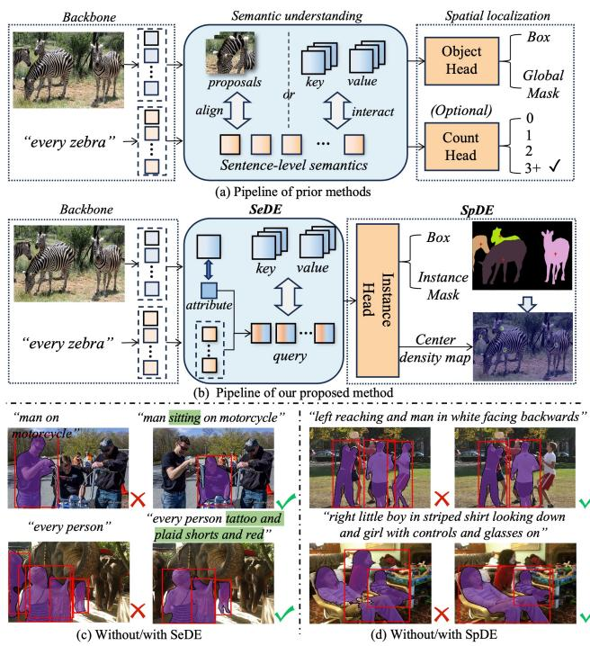
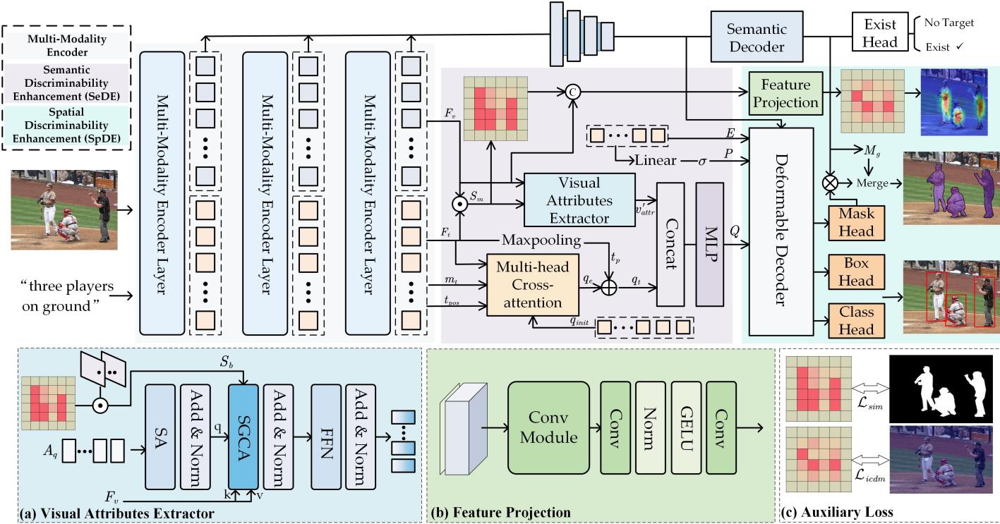
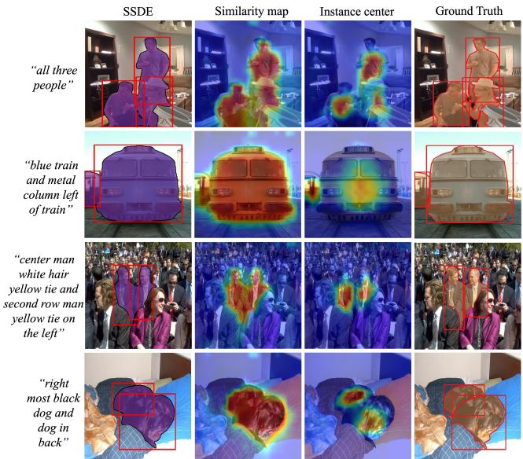
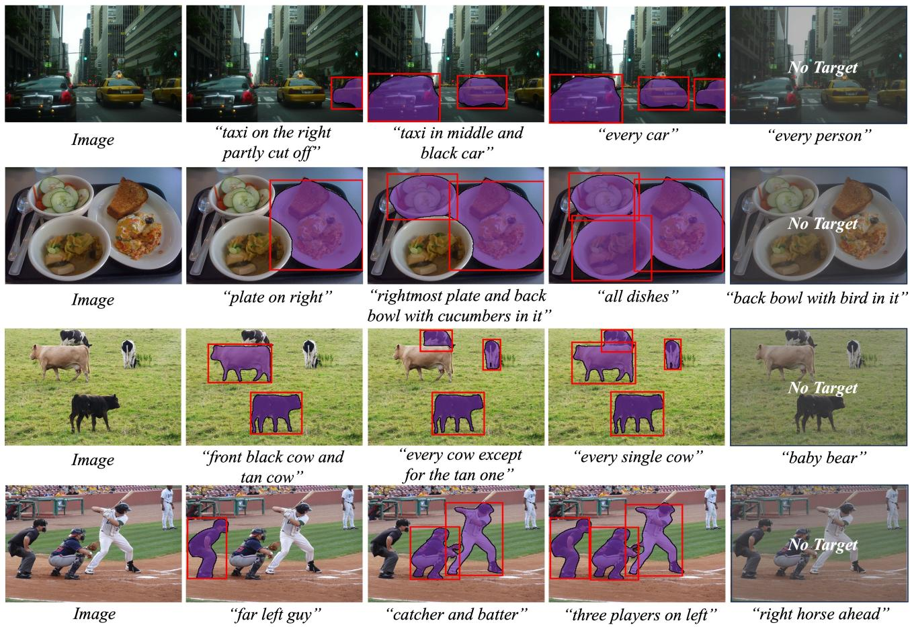
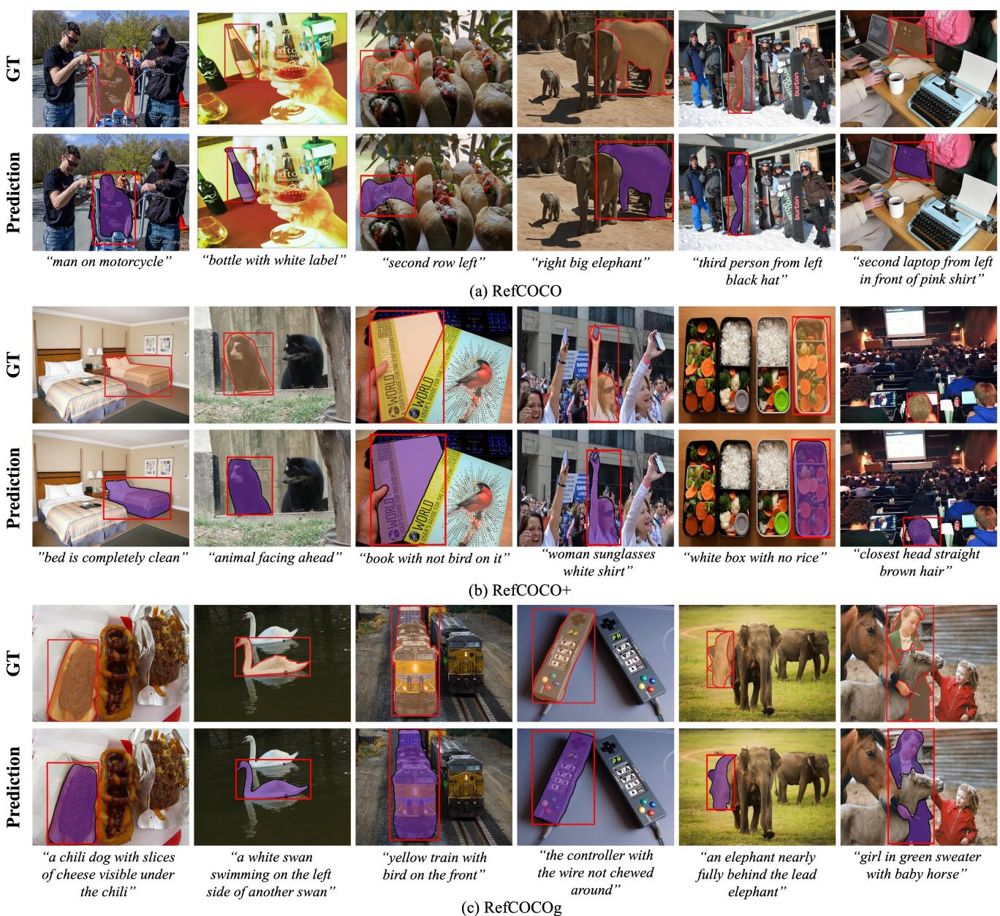
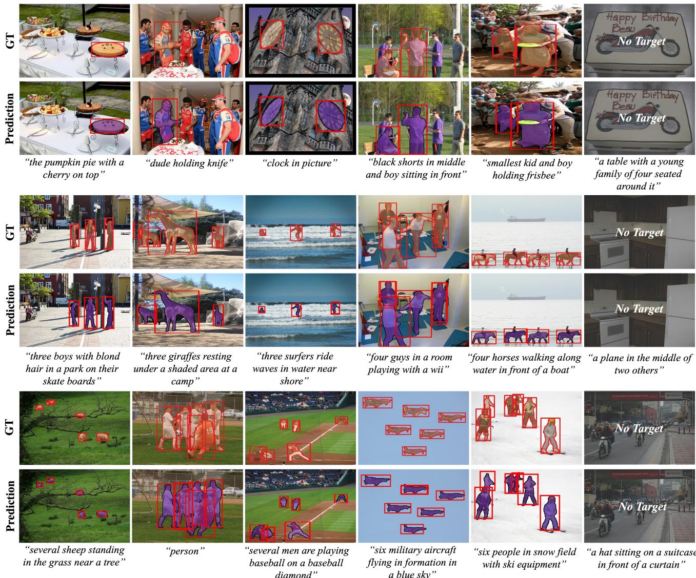
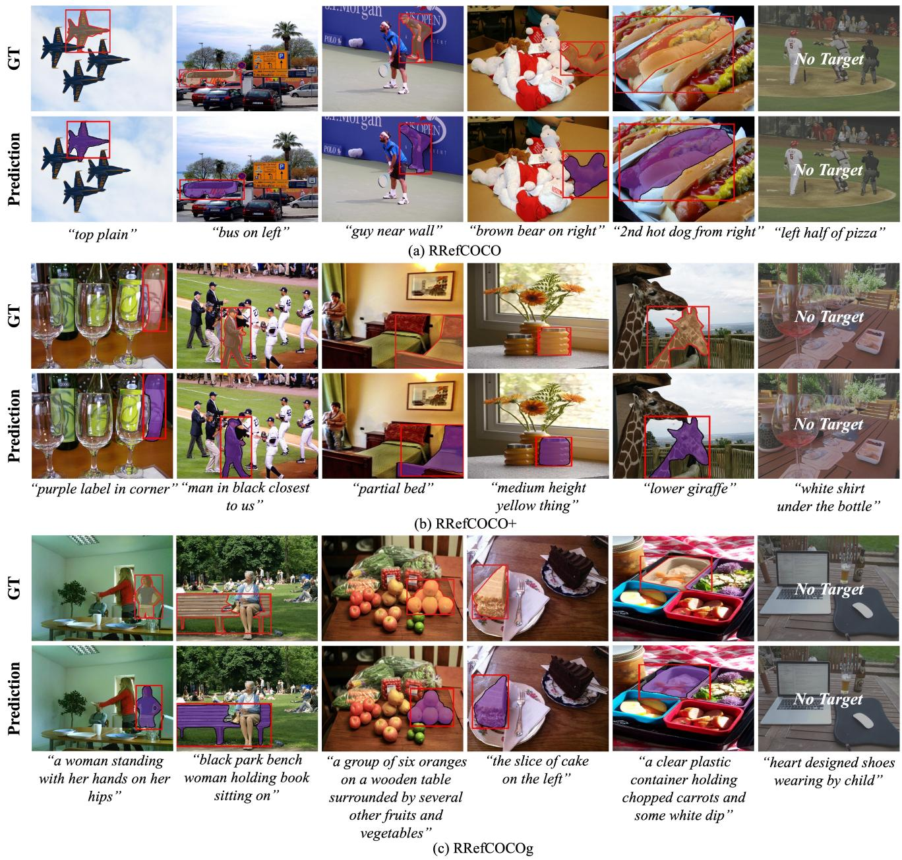

# Semantic-Spatial Discriminability Enhancement for Generalized Visual Grounding

Kaiyan Lei State Key Laboratory of Multimodal Artificial Intelligence Systems, Institute of Automation, Chinese Academy of Sciences Beijing, China leikaiyan2025@ia.ac.cn

Xu-Yao Zhang∗ State Key Laboratory of Multimodal Artificial Intelligence Systems, Institute of Automation, Chinese Academy of Sciences Beijing, China xyz@nlpr.ia.ac.cn

## Abstract

Generalized Visual Grounding (GVG) task aims to localize targets in an image based on referring expressions, extends the classical visual grounding paradigm by integrating multi-target and non-target scenarios. Previous methods typically rely on global semantic matching or coarse-grained region interactions for localization, where the discriminative cues are primarily derived from sentence-level semantics or regional context. In complex multi target scenarios, such approaches tend to confuse visually similar targets, making it dificult to establish stable instance-level decision boundaries. To address these limitations, this paper proposes a novel Semantic–Spatial Discriminability Enhancement (SSDE) framework for generalized visual grounding, which aims to enhance the discriminative ability on fine-grained semantics and spatial localization, improving both cross-modal understanding and instance-level grounding. Specifically, to enhance the seman tic discriminability of query representations at the fine-grained level, we propose a Semantic Discriminability Enhancement (SeDE) module, which leverages spatially guided cross-attention to disentangle fine-grained target-relevant visual attributes and integrates them with the textual subject semantics. Furthermore, to strengthen the spatial discriminability of the referred targets, we introduce a Spatial Discriminability Enhancement (SpDE) module, which models an instance center density map to characterize the spatial distribution of targets, and explicitly constructs instance separation structures in the spatial domain by employing them as an auxiliary supervision signal. Extensive experiments show that SSDE achieves superior performance on ten datasets across both classic and generalized visual grounding tasks. Code will be available at https://github.com/Letitialky/GVG-SSDE.

## CCS Concepts

• Computing methodologies → Computer vision tasks.

## Keywords

Multi-modality; Generalized Visual Grounding; Semantic Discriminability; Spatial Discriminability

ACM Reference Format:   
Kaiyan Lei and Xu-Yao Zhang. 2026. Semantic-Spatial Discriminability Enhancement for Generalized Visual Grounding. In Proceedings ofthe 34th ACM International Conference on Multimedia (MM ’26), November 10–14, 2026, Rio de Janeiro, Brazil. ACM, New York, NY, USA, 16 pages. https: //doi.org/10.1145/3767308.3836122

## 1 Introduction

Visual Grounding (VG) aims to localize all targets in an image that satisfy the semantics specified in a referring expression. In Classic Visual Grounding (CVG), each expression corresponds to one single target, comprising two subtasks: Referring Expression Comprehension (REC) [11, 24, 50, 70], which requires predicting target bound ing box, and Referring Expression Segmentation (RES) [6, 22, 34, 49], which requires pixel-level segmentation. To better reflect real-world scenarios, Generalized Visual Grounding (GVG) [21, 33, 58] further extends CVG to handle multi-target and non-target cases through Generalized Referring Expression Segmentation (GRES) and Generalized Referring Expression Comprehension (GREC). This setting introduces additional challenges, including open-ended quantities, multi-target semantic relations, and intricate scene structures. It is required to establish stable decision boundaries for cross-modal matching between potential targets and the referring expression within an open and uncertain search space, thereby imposing higher demands on model’s discriminative capability.

As illustrated in Figure 1, we analyze discriminability from both semantic and spatial perspectives. From a semantic perspective, expressions are typically concise and label-like, such as collective references (e.g., “everyone”) and modifier-based expressions (e.g., “man on motorcycle”). The former requires identifying multiple targets sharing a common category, whereas the latter demands precise discrimination among visually similar candidates. Existing methods typically rely on sentence-level semantics, modeling the complex text-image correspondence either through alignment with region proposals [9, 19, 38, 67, 70] or interaction with visual embeddings [11, 12, 33, 34, 36, 52, 76]. However, real-world scenes often contain numerous distractor regions. Relying solely on coarse-grained textual semantics makes it dificult to distinguish “the best-matching targets” from “partially relevant candidates,” leading to mislocalization or over-response. Therefore, one of our research objectives is (1) how to enlarge the discriminative margins among similar targets in the semantic space to enhance semantic discriminability. From a spatial perspective, flexible and diverse expressions may refer to an arbitrary number of targets from varying viewpoints (e.g., “all people” or "the whole group"), requiring to not only determine targets presence but also identify the individual spatial locations. Notably, the target number is an implicit property of spatial structure, and its uncertainty directly affects localization. Prior methods [33, 36, 42, 56, 72] typically predict a global mask, which essentially projects multiple discrete targets into a unified region. Some works [42, 56] further discretize the object counts into predefined categories and use an count head to explicitly predict the global count via classification or regression. However, multi-target scenarios involve substantial inter-instance competition and overlap, where the global mask fail to provide stable instance-level decision boundaries. And subtle diferences in object count are seldom efectively propagated back to guide spatial localization. Therefore, our second objective is (2) how to characterize instance-level spatial separability and structural independence among multiple targets in the spatial domain, thereby improving spatial discriminability.

  
Figure 1: Motivation visualization. (a) Pipeline of prior methods, which rely on sentence-level semantics, predict global masks and optionally use a count head. (b) Pipeline of SSDE, which proposes SeDE to enhance semantic discriminability and proposes SpDE to enhance spatial discriminability. (c) The two columns show the results without and with SeDE. (d) The two columns show the results without and with SpDE.

Regarding the enhancement of semantic discriminability, when a single expression encompasses multiple highly similar targets within the same category (e.g., “everyone”), distinguishing among them often depends on fine-grained visual cues such as color, shape, or local texture. As illustrated in Figure 1(c), in the presence of similar candidate targets, a description like “man on motorcycle” tends to incorrectly highlight the salient instance, whereas augmenting the expression with an attribute “sitting” yields accurate localization. Moreover, expression like “every person” yields redundant predictions, whereas incorporating attribute descriptors such as “tattoo,” “plaid shorts,” or “red” leads to correct and complete localization. These observations demonstrate that visual attributes, under fine-grained relational constraints, efectively mitigate semantic ambiguity and facilitate consistent and comprehensive identification of target sets in multi-target scenarios.

Regarding the enhancement of spatial discriminability, InstanceVG [8] introduces instance-level supervision to impose fine-grained spatial constraints. Although it improves accuracy, such pixel-wise supervision is spatially dense signals, making it more suitable for pixel classification while still insuficient for capturing stable multiinstance spatial structures. As illustrated in Figure 1(d), the 1st column shows results under instance-level supervision alone. When localizing “left reaching and man in white facing backwards”, it has redundant predictions due to its lack of spatial structural awareness. In another case, it is dificult to define accurate instance boundaries under severe instance adhesion. In essence, count awareness corresponds to identifying object centers [23, 25]. By explicitly modeling instance centers, as shown in the 2nd column, it is able to maintain instance-level structural separability and accurate localization, even under ambiguous boundaries or partial occlusions.

Based on these analysis, we propose a novel Semantic–Spatial Discriminability Enhancement (SSDE) framework for GVG task, aiming to jointly improve semantic and spatial discriminability, thereby advancing cross-modal understanding and instance-level localization. Specifically, we introduce a Semantic Discriminability Enhancement (SeDE) module, which leverages spatially guided cross-attention to extract target-relevant visual attribute representations and integrate them with the textual semantics. Its primary purposes are: (1) to enhance the discriminative capacity of query representations by explicitly incorporating fine-grained visual attributes; (2) to enlarge inter-instance discriminability within the cross-modal embedding space; (3) to mitigate missed detections and ambiguity arising from insuficient visual cues. In addition, we propose a Spatial Discriminability Enhancement (SpDE) module, which couples spatial and count awareness by explicitly modeling the “text-to-instance” mapping through instance center responses. Beyond the region-level constraints provided by instance-level supervision, it further imposes instance-level structural constraints as an auxiliary objective. Its main purposes are: (1) to ensure spatial separability and independence among multiple targets; (2) to guide feature learning via predicted spatial distributions as an implicit prior; (3) to alleviate instance adhesion and spatial ambiguity in complex scenes. We conduct extensive experiments on popular CVG and GVG benchmarks, including RefCOCO/+/g [26, 43], gRefCOCO [33], Ref-ZOM [21], and R-RefCOCO [58]. The results demonstrate that our method significantly outperforms prior approaches across all benchmarks, validating its efectiveness in handling complex GVG scenarios.

Overall, our contributions are summarized as follows.

• We propose a novel semantic–spatial discriminability enhancement framework for GVG, which improves cross-modal understanding and instance-level localization by jointly strengthening semantic and spatial discrimination.

• We propose a semantic discriminability enhancement module that explicitly incorporates fine-grained visual attributes via spatially guided cross-modal interactions, thereby enhancing inter-instance discriminability.

• We propose a spatial discriminability enhancement module, which models instance center as an auxiliary objective to impose instance-level structural constraints, ensuring the separability and independence of multiple instances.

• Extensive experiments demonstrate that the proposed method achieves state-of-the-art performance across ten various CVG and GVG benchmarks, delivering significant improvements over the existing methods.

## 2 Related Work

## 2.1 Classic Visual Grounding

The CVG task addresses the localization of a single target. Early approaches achieve text–object matching by generating candidate region proposals [3, 19, 38, 67, 70, 73, 74] or by performing matching over dense anchor-based detections [41, 64, 65, 77]. Subsequently, Transformer-based methods [11, 20, 27, 34, 37, 49, 52, 60, 78] have significantly improved multi-modal understanding by modeling cross-modal relationships between visual and textual representa tions. These methods typically adopt an encoder–decoder architecture. Specifically, some methods [7, 12, 13, 24, 42, 56] first encode the features of each modality independently using visual and text back bones, (e.g., ViT[16], Swin Transformer [40], BERT[14], RoBERTa [39] etc.) and then perform multimodal fusion within the encoder, while others [52, 66, 68] integrate the multimodal fusion process directly into the visual backbone, enabling earlier cross-modal in teraction. However, since the modality features are extracted from pretrained models trained on unrelated tasks like classification or regression, cross-modal understanding in these frameworks still relies heavily on limited downstream training data. With the rapid development of vision–language pretraining [45, 47], several methods [49–51, 57, 60, 62] have emerged that adopt pretrained CLIP encoders to improve performance through fine-tuning or adaptation strategies. Nevertheless, approaches based on vision–language pretrained models place greater emphasis on modal alignment, which motivates recent researches [8, 10, 11, 61, 72] toward unified multi modality encoders that simultaneously encode modality features while enhancing cross-modal semantic interaction. Furthermore, according to the form of predictions, CVG can be divided into two sub-tasks of REC and RES. Because solving these similar yet distinct tasks typically requires task-specific and complex model designs, recent studies [4, 8, 10, 31, 41, 75] attempt to develop multi-task VG frameworks, aiming to exploit complementary supervision signals across tasks to jointly address object detection and segmentation.

## 2.2 Generalized Visual Grounding

In GVG task, expressions may refer to zero, single, or multiple targets. DMMI [21] introduces a segmentation benchmark that extends single-target to multi-target settings. RefSegformer [58] further considers both positive and negative expressions, improving robustness in distinguishing non-target regions. ReLA [33] formal izes the GRES task, which fully generalizes the multi-/single-/nontarget cases. It partitions the input image into regions and performs soft aggregation over region features to establish long-range region–region dependencies in multi-target scenarios. RaAM-VG [46] introduces learnable region-aware anchors to guide attention toward targets, alleviating cross-modal redundancy that may arise when direct visual-language interaction causes the model to prioritize the most salient objects. Some other works focus on improving semantic understanding of targets. MattNet [70] performs attribute parsing on the expressions to enhance targets understanding. LatentVG [72] generates latent expressions based on visual details to enrich the target semantics of a single-text expression. In addition, several studies focus on improving target counting. COHD [42] enables the model to learn counting abilities for specific categories under multi-/single-/non-target conditions, thereby reducing ambiguity caused by the inherent diferences between single and multiple targets. Similarly, HieA2G [56] introduces an explicit multi-class classifier to determine the number of output targets for each image–text pair. In terms of model architecture, [8, 9, 11, 72] adopt a unified multi-modality encoder backbone and achieve superior performance on the GVG task. SimVG [11] employs a weightdistillation-based multi-branch synchronous learning strategy to enhance the representation capability ofits lightweight architecture. PropVG [9] improves proposal-based frameworks to strengthen the target discriminability. InstanceVG [8] introduces instance-level spatial fine-grained perception and incorporates instance segmentation supervision, thereby enhancing the spatial understanding.

## 3 Methods

## 3.1 Overview

We develop SSDE based on the instance segmentation framework [5, 30], as illustrated in Figure 2. We adopt the multi-modality encoder BEiT-3 [55] to jointly process the input image $I \in \mathbb { R } ^ { H \times W \times 3 }$ and the referring expression �, where H and W is the height and width, producing aligned visual and textual features through unified visionlanguage encoding. The SeDE generates queries enriched with fine-grained visual attribute representations, enhancing semantic discrimination. The SpDE predicts an instance center density map, which is jointly optimized with instance-level supervision as an auxiliary loss to enforce structural constraints.

Specifically, the encoder is organized into three stages, yielding hierarchical visual features $\{ F _ { v } ^ { 1 } , F _ { v } ^ { 2 } , F _ { v } ^ { 3 } \}$ }. All visual and textual features are projected into a d-dimensional space using linear layers, resulting in $\{ F _ { v } ^ { \prime } , F _ { v } ^ { \prime \prime } , F _ { v } \} \in \mathbb { R } ^ { h w \times d }$ and $F _ { t } \in \mathbb { R } ^ { L \times d }$ , where $\begin{array} { r } { h = \frac { \check { H } } { p } } \end{array}$ $\begin{array} { r } { w = \frac { W } { p } , p } \end{array}$ is patch size, and � is the text length. We further construct multi-scale visual features using a feature pyramid network (FPN) [32]. Specifically, $F _ { v } ^ { \prime }$ and $F _ { v } ^ { \prime \prime }$ are upsampled via transposed convolution to obtain $\widehat { F _ { v } ^ { \prime } } \in \mathbb { R } ^ { 4 h \times 4 w \times d }$ and $\widehat { F _ { v } ^ { \prime \prime } } \in \mathbb { R } ^ { 2 h \times 2 w \times d }$ , respectively, while $F _ { v }$ is downsampled via max-pooling to produce $\widehat { F _ { v } } \in \mathrm { \mathbb { R } } ^ { \frac { h } { 2 } \times \frac { w } { 2 } \times \dot { d } }$ The final multi-scale feature set is defined as $\mathcal { F } = \{ \widehat { F _ { v } ^ { \prime } } , \widehat { F _ { v } ^ { \prime \prime } } , F _ { v } , \widehat { F _ { v } } \}$ Finally, a lightweight semantic decoder composed of convolutional layers aggregates multi-scale features into global semantic features $F _ { g } ,$ which are further transformed into a global segmentation map $M _ { g } .$ . The instance segmentation map is obtained by multiplying $F _ { g }$ with features of Mask Head, and then merging with $M _ { g }$ to produce the final segmentation prediction. For detection, Box and Class Head produce the final bounding box predictions, while an additional Exist Head, composed of MLPs, operates on $F _ { g }$ to perform binary classification for target presence. The decoder is implemented as a deformable decoder [79].

  
Figure 2: Overall architecture of SSDE. The framework consists of a multi-modality encoder backbone, a Semantic Discrim inability Enhancement (SeDE) module, a Spatial Discriminability Enhancement (SpDE) module. (a) Illustration of the visual attribute extraction process. (b) Convolution-based feature mapping process in the instance center prediction. (c) Supervision applied to the similarity map and the instance center density map during training.

## 3.2 Semantic discriminability enhancement

Textual expressions typically provide only coarse-grained subject information. To obtain precise discrimination cues in scenarios with densely distributed similar candidates, we augment textual semantics with target-relevant visual attributes. We leverage a spatially guided attention mechanism to extract fine-grained visual attributes and fuse them with subject-level semantic representations to generate more discriminative query representations, thereby enhancing the semantic discriminability between instances.

Textual subject semantic extraction. To extract the subject level semantics from the referring expression, we introduce $N _ { q }$ learnable query embeddings $q _ { i n i t } ~ \in ~ \mathbb { R } ^ { N _ { q } \times d }$ . These embeddings interact with the textual features $F _ { t } \in \mathbb { R } ^ { L \times d }$ through cross-attention mechanism to aggregate token-level semantic information, yielding text-driven queries $q _ { t } \colon$

$$
q _ { t } = \mathrm { C r o s s A t t n } ( q _ { i n i t } , F _ { t } ) .\tag{1}
$$

In addition, to further incorporate global context, we apply max pooling operation over $F _ { t }$ to highlight salient semantic components, producing $t _ { p }$ . The final subject-aware textual representation is $q _ { e } =$ $q _ { t } + t _ { p } ,$ , which jointly captures both local token-level semantics and global contextual information.

Visual attribute extraction. We exploit the image-text similarity map as a spatial prior and employ a spatially-guided attention mechanism to focus on potential target regions, thereby further extracting fine-grained visual attributes. Specifically, given the visual features $\boldsymbol { F _ { v } } ^ { \check { } } \in \mathbb { R } ^ { h w \times d }$ and textual features $F _ { t } { \mathrm { : } }$ , we first compute the cross-modal similarity ��� $= F _ { v } F _ { t } ^ { \top }$ . Then, average pooling is applied along the textual dimension followed by a 1 × 1 convolution to obtain a spatial similarity map:

$$
S _ { m } = \mathrm { C o n v } _ { 1 \times 1 } \big ( \mathrm { M e a n P o o l } ( s i m \odot m _ { t } ) \big ) ,\tag{2}
$$

where $m _ { t } \in \{ 0 , 1 \} ^ { L }$ denotes the text validity mask. The resulting map $S _ { m } \in \mathbb { R } ^ { h \times w }$ represents the spatial semantic correspondence between image and text. During training, $S _ { m }$ is supervised by the ground-truth mask to ensure accurate indication of target regions.

To further incorporate this spatial prior into the attention mechanism, we construct a bias term $S _ { b }$ by transforming $S _ { m }$ into a spatial attention distribution:

$$
S _ { b } = \operatorname { S o f f m a x } ( m \cdot S _ { m } ) ,\tag{3}
$$

where � is a learnable scaling factor that adaptively adjust the strength of the bias term. This operation explicitly guides attention toward semantically relevant regions.

Algorithm 1 Instance Center Density Map Construction   
Require: Instance masks $\mathcal { M } \ = \ \{ M _ { 1 } , M _ { 2 } , . . . , M _ { K } \}$ , image size   
(�,�), Gaussian parameter �   
Ensure: Density map �   
1: Initialize density map: $D \gets \mathbf { 0 } _ { H \times W }$   
2: for each instance mask $M _ { k } \in { \mathcal { M } }$ do   
3: Perform connected component analysis:   
4: $\{ C _ { k , 1 } , C _ { k , 2 } , \dots , C _ { k , n _ { k } } \}$   
5: if $n _ { k } = 0$ then   
6: continue   
7: end if   
8: Compute the area of each component: $\boldsymbol { A } _ { k , i } = \sum \boldsymbol { C } _ { k , i }$   
9: Select the largest component: $i ^ { * } =$ arg max� $A _ { k , i }$   
10: Extract component pixels: $C _ { k } ^ { * } = C _ { k , i ^ { * } }$   
11: Compute center coordinate of $C _ { k } ^ { * } \colon c _ { k } = ( c _ { x } ^ { k } , c _ { y } ^ { k } )$   
12: Generate Gaussian distribution:   
$G ( x , y ) = \exp \left( - \frac { ( x - c _ { x } ^ { k } ) ^ { 2 } + ( y - c _ { x } ^ { k } ) ^ { 2 } } { 2 \sigma ^ { 2 } } \right)$   
13: Update density map: $D = \operatorname* { m a x } ( D , G )$   
14: end for   
15: return �

Based on this design, we introduce Spatially-Guided Cross Attention (SGCA), which extends the standard cross-attention[54] by injecting the spatial bias into the attention logits, which enhances aggregation over target-relevant regions.

$$
\mathrm { A t t n } = \mathrm { S o f t m a x } \left( { \frac { Q K ^ { \top } } { \sqrt { d } } } + S _ { b } \right) .\tag{4}
$$

Finally, we introduce $N _ { q }$ learnable attribute tokens $A _ { q } \in \mathbb { R } ^ { N _ { q } \times d } ;$ which interact with $F _ { v }$ via SGCA to extract fine-grained attributes such as color, texture, and pose from target-related regions:

$$
\begin{array} { r } { { v _ { a t t r } } = \mathrm { S G C A } ( A _ { q } , F _ { v } ) . } \end{array}\tag{5}
$$

Query generation. Finally, we generate a more discriminative query representation, in which subject semantics determine the category while attribute details enable instance-level diferentiation. Specifically, the attribute features $v _ { a t t r }$ are first transformed through an MLP to enhance their expressive capacity, yielding $v _ { a t t r } ^ { ' } = M L P ( v _ { a t t r } )$ . The transformed features are then concatenated with $q _ { e } ,$ and fused through an MLP to produce the final attribute-enhanced queries $Q = q _ { i = 1 } ^ { N _ { q } } , q \in R ^ { N _ { q } \times d }$

$$
q = \mathrm { M L P } ( [ q _ { e } ; v _ { a t t r } ^ { ' } ] ) .\tag{6}
$$

We adopt a deformable decoder[79], where sampling locations guide the attention mechanism. To enhance the representational flexibility of global learnable queries, we introduce a set of learnable positional embedding $\boldsymbol { E } = \left\{ \boldsymbol { e } _ { i } \right\} _ { i = 1 } ^ { N _ { q } }$ , where $e _ { i } \in \mathbb { R } ^ { d }$ shares the same dimensionality as the �� and is optimized adaptively via backpropagation during training. The positional embeddings are further projected into a two-dimensional spatial domain through a linear transformation, followed by a sigmoid function to constrain the coordinates within [0, 1], yielding learnable reference points:

$$
p _ { i } = \sigma ( W e _ { i } ) ,\tag{7}
$$

where � denotes learnable parameters and $\sigma ( \cdot )$ is the sigmoid function. The resulting reference point set is defined as:

$$
{ \cal P } = \{ p _ { i } \} _ { i = 1 } ^ { N _ { q } } .\tag{8}
$$

These reference points serve as the initial sampling locations for deformable attention, guiding sparse and efective feature aggregation over multi-scale features. During decoding, � is used as reference points, � as the positional encodings, and $Q$ as the query features, which are jointly fed into the deformable decoder.

## 3.3 Spatial discriminability enhancement

To enhance spatial discriminability in dense scenes and mitigate spatial ambiguity, we explicitly model instance center responses to accurately represent instance-level spatial structures, and predict instance centers via a lightweight feature projection module. This process serves as an auxiliary loss that imposes instance-level structural constraints, thereby ensuring spatial separability across instances and improving instance-level spatial discrimination.

Instance center density map construction. We construct an instance center density map based on instance segmentation annotations. Specifically, the density map is generated by placing a two-dimensional Gaussian kernel at the center of each instance, forming a continuous representation of object centers. The determination of instance centers is critical, as it directly afects the encoded spatial structure and the training stability when it used as the supervision signal. Given an instance mask $M _ { k }$ , we first perform connected component analysis and define the instance center $c _ { k } = \left( c _ { x } ^ { k } , c _ { y } ^ { k } \right)$ as the centroid of the largest connected component, and the coordinates are computed as:

$$
c _ { x } ^ { k } = \frac { 1 } { \vert C _ { k } ^ { \ast } \vert } \sum _ { ( x , y ) \in C _ { k } ^ { \ast } } x , \quad c _ { y } ^ { k } = \frac { 1 } { \vert C _ { k } ^ { \ast } \vert } \sum _ { ( x , y ) \in C _ { k } ^ { \ast } } y ,\tag{9}
$$

where $C _ { k } ^ { * }$ denotes the largest connected component of $M _ { k }$ . The rationale is that the largest component typically preserves the most complete and salient structure of the instance, thereby providing a clearer and more stable supervisory signal.

After determining the center locations, each discrete center is expanded into a continuous spatial density signal using a twodimensional Gaussian kernel. For images containing multiple instances, the Gaussian responses corresponding to diferent centers are aggregated by a point-wise maximum operation:

$$
D ( x , y ) = \operatorname* { m a x } _ { k = 1 , \ldots , K } G _ { k } ( x , y ) ,\tag{10}
$$

where $D ( x , y )$ denotes the final instance center density map. The detailed construction procedure is summarized in Algorithm 1. The resulting density map naturally encodes the counts information of multiple targets while providing explicit supervision of instance structures. In multi-instance scenarios, it simultaneously represents all instance centers, allowing subtle variations in target count to be reflected in the spatial localization optimization process.

Instance center prediction. We introduce an instance-centered prediction module that enables the model to leverage spatial distribution predictions as an implicit prior for feature learning, while using the density map � as a stable and semantically explicit su pervisory signal. Specifically, the high-response regions in the similarity map $S _ { m }$ typically correspond to the entire target regions. To further focus on the centers in these areas, we apply a learnable afine transformation to convert $S _ { m }$ into a center-oriented map �e:

Table 1: Comparison with state-of-the-art methods on the RefCOCO/+/g [71] datasets for the RES task. In the “Backbone” column, a “/” indicates separate backbones for visual and textual modalities. “FT” indicates whether fine-tuning is performed on the target dataset, and “MT” denotes whether the model is trained in a multi-task setting. mIoU is used as the evaluation metric. The best results are highlighted in bold, and the second-best results are underlined.
<table><tr><td rowspan="2">Models</td><td rowspan="2">Publication</td><td rowspan="2">Backbone</td><td rowspan="2">FT MT</td><td rowspan="2"></td><td colspan="3">RefCOCO</td><td colspan="3">RefCOCO+</td><td colspan="2">RefCOCOg</td></tr><tr><td>val</td><td>testA</td><td>testB</td><td>val</td><td>testA</td><td>testB</td><td>val(u)</td><td>test(u)</td></tr><tr><td colspan="10">MLLM Methods</td><td></td><td></td><td></td><td></td></tr><tr><td>LISA-L2-13B [29]</td><td>CVPR24</td><td>SAM-ViT-H</td><td>√</td><td>x</td><td>76.30</td><td>78.70</td><td>72.40</td><td>66.20</td><td>71.00</td><td>59.30</td><td>70.10</td><td></td><td>71.10</td></tr><tr><td>GSVA-L2-13B [59]</td><td>CVPR24</td><td>SAM-ViT-H</td><td>√</td><td>x</td><td>79.20</td><td>81.70</td><td>77.10</td><td></td><td>70.30</td><td>73.80</td><td>63.60</td><td>75.70</td><td>77.00</td></tr><tr><td>GLaMM-7B [48]</td><td>CVPR24</td><td>CLIP-ViT-H</td><td>√</td><td>x</td><td>79.50</td><td>83.20</td><td>76.90</td><td></td><td>72.60</td><td>78.70</td><td>64.60</td><td>74.20</td><td>74.90</td></tr><tr><td colspan="10">Specialist Methods</td><td colspan="3"></td><td></td></tr><tr><td>MCN [41]</td><td>CVPR20</td><td>DarkNet-53/GRU</td><td>x</td><td>√</td><td>62.44</td><td>64.20</td><td>59.71</td><td>50.62</td><td></td><td>54.99</td><td>44.69</td><td>49.22</td><td>49.40</td></tr><tr><td>ReLA [33]</td><td>CVPR23</td><td>Swin-B/BERT</td><td>x</td><td>x</td><td>73.82</td><td>76.48</td><td>70.18</td><td></td><td>66.04</td><td>71.02</td><td>57.65</td><td>65.00</td><td>65.97</td></tr><tr><td>EEVG [4]</td><td>ECCV24</td><td>ViT-B/BERT</td><td>√</td><td>√</td><td>79.49</td><td>80.87</td><td>77.39</td><td></td><td>71.86</td><td>76.67</td><td>66.31</td><td>73.56</td><td>73.47</td></tr><tr><td>PromptRIS [49]</td><td>CVPR24</td><td>SAM-CLIP-B/CLIP</td><td>x</td><td>x</td><td>78.10</td><td>81.21</td><td></td><td>74.64</td><td>71.13</td><td>76.60</td><td>64.25</td><td>69.17</td><td>70.47</td></tr><tr><td>HieA2G [56]</td><td>AAAI25</td><td>Swin-B/RoBERTa</td><td>√</td><td>√</td><td>75.10</td><td>77.60</td><td></td><td>71.10</td><td>66.50</td><td>71.40</td><td>58.90</td><td>65.30</td><td>66.60</td></tr><tr><td>COHD [42]</td><td>ICCV25</td><td>Swin-B/BERT</td><td>x</td><td>x</td><td>78.11</td><td>80.39</td><td></td><td>75.20</td><td>72.03</td><td>76.37</td><td>65.45</td><td>70.83</td><td>72.11</td></tr><tr><td>RaAM-RVG [46]</td><td>ICCV25</td><td>ViT-B/BERT</td><td>x</td><td>√</td><td>79.35</td><td>81.22</td><td></td><td>77.81</td><td>69.54</td><td>75.69</td><td>63.02</td><td>71.30</td><td>72.09</td></tr><tr><td>OneRef-B [61]</td><td>NerulPS25</td><td>BEiT3-ViT-B</td><td>√</td><td>√</td><td>79.83</td><td>81.86</td><td></td><td>76.99</td><td>74.68</td><td>77.90</td><td>69.58</td><td>74.06</td><td>74.92</td></tr><tr><td>Latent-VG [72]</td><td>ICCV25</td><td>BEiT3-ViT-B</td><td>x</td><td>√</td><td>81.01</td><td>82.26</td><td></td><td>79.77</td><td>76.92</td><td>79.48</td><td>72.95</td><td>76.10</td><td>76.51</td></tr><tr><td>PropVG [9]</td><td>ICCV25</td><td>BEiT3-ViT-B</td><td>x</td><td>√</td><td>77.99</td><td>79.81</td><td></td><td>75.28</td><td>72.94</td><td>76.49</td><td>67.22</td><td>71.34</td><td>72.10</td></tr><tr><td>InstanceVG [8]</td><td>TPAMI25</td><td>BEiT3-ViT-B</td><td>x</td><td>√</td><td>81.36</td><td>83.05</td><td>79.28</td><td></td><td>76.64</td><td>79.51</td><td>71.56</td><td>75.89</td><td>76.59</td></tr><tr><td>Ours</td><td></td><td>BEiT3-ViT-B</td><td>x</td><td>√</td><td>81.82</td><td>83.34</td><td>79.83</td><td></td><td>77.44</td><td>80.51</td><td>74.00</td><td>77.08</td><td>77.80</td></tr></table>

$$
\widetilde { S } = W \odot S + B ,\tag{11}
$$

where $W , B \in \mathbb { R } ^ { h \times w }$ denote learnable weights and biases. We then concatenate $F _ { v }$ with $\widetilde { S }$ to obtain a fused feature representation $F _ { 0 } .$ The fused features is subsequently processed by a sequence of point-wise convolution layers, progressively reducing the channel dimensionality. Finally, a lightweight decoding head consisting of 1 × 1Conv, normalization, GELU activation, 1 × 1Conv generates the instance center prediction map $\hat { M } \in \mathbb { R } ^ { h \times w }$ , where each element indicates the probability of the corresponding spatial location being an instance center. The feature projection process is formulated as:

$$
F _ { i + 1 } = \phi _ { i } \Big ( \mathrm { N o r m } _ { i } \big ( \mathrm { C o n v } ( F _ { i } ) \big ) \Big ) ,\tag{12}
$$

where Conv(·) denotes a point-wise convolution, Norm� (·) represents the normalization operation, and �� (·) denotes the GELU activation function.

## 3.4 Loss

We follow the training losses of InstanceVG[8] for both instance detection and segmentation. For the detection branch, $\mathcal { L } _ { \mathrm { d e t } }$ adopts a DETR-style [1] loss function, consisting of L1 loss, cross-entropy loss, and GIoU loss. For the segmentation branch, we employ a combination of binary cross-entropy (BCE) and Dice losses [5], and additionally apply similar supervision to the global semantic segmentation output. The Exist Head distinguishes the presence of targets by applying an MLP over average-pooled global semantic features $M _ { g } ,$ and is optimized using a BCE loss. Moreover, we introduce auxiliary supervision for both the similarity map and the instance center prediction. $\mathcal { L } _ { \mathrm { s i m } }$ supervises $S _ { m }$ using the ground-truth mask, and $\mathcal { L } _ { \mathrm { i c d m } }$ supervises �ˆ using the instance center density map �. The overall training objective is defined as:

$$
\mathcal { L } = \mathcal { L } _ { \mathrm { d e t } } + \mathcal { L } _ { \mathrm { s e g } } + \mathcal { L } _ { \mathrm { e x i s t } } + \alpha \mathcal { L } _ { \mathrm { s i m } } + \beta \mathcal { L } _ { \mathrm { i c d m } } ,\tag{13}
$$

where � and $\beta$ are weighting coeficients that control the contribution of both auxiliary supervisions. For experiments on other hyperparameters in the loss function, see Appendix C.

## 4 Experiments

## 4.1 Experimental Setup

For REC and RES tasks, we conduct joint training on the RefCOCO [71], RefCOCO+ [71], and RefCOCOg [43, 44] datasets, and report evaluation results on each subset. For GREC and GRES tasks, training and evaluation are performed on the gRefCOCO [18, 33], Ref-ZoM [21], and R-RefCOCO/+/g [58] datasets, respectively. SSDE is built upon a pre-trained multi-modality encoder BEiT-3 with ViT-B, and the number of queries is set to 1 and 10 for the CVG and GVG tasks, and SSDE is trained for 25 and 10 epochs, respectively.

Table 2: Comparison with state-of-the-art methods on the R-RefCOCO/+/g [58] datasets.
<table><tr><td rowspan="2">Models</td><td colspan="3">R-RefCOCO</td><td colspan="3">R-RefCOCO+</td><td colspan="3">R-RefCOCOg</td></tr><tr><td>mIoU</td><td>mRR</td><td>rIoU</td><td>mIoU</td><td>mRR</td><td>rIoU</td><td>mIoU</td><td>mRR</td><td>rIoU</td></tr><tr><td>CRIS [36]</td><td>43.58</td><td>76.62</td><td>29.01</td><td>32.13</td><td>72.67</td><td>21.42</td><td>27.82</td><td>74.47</td><td>14.60</td></tr><tr><td>EFN [17]</td><td>58.33</td><td>64.64</td><td>32.53</td><td>37.74</td><td>77.12</td><td>24.24</td><td>32.53</td><td>75.33</td><td>19.44</td></tr><tr><td>VLT [15]</td><td>61.66</td><td>63.36</td><td>34.05</td><td>50.15</td><td>75.37</td><td>34.19</td><td>49.67</td><td>67.31</td><td>31.64</td></tr><tr><td>LAVT [66]</td><td>69.59</td><td>58.25</td><td>36.20</td><td>56.99</td><td>73.45</td><td>36.98</td><td>59.52</td><td>61.60</td><td>34.91</td></tr><tr><td>LAVT+ [66]</td><td>54.70</td><td>82.39</td><td>40.11</td><td>45.99</td><td>86.35</td><td>39.71</td><td>47.22</td><td>81.45</td><td>35.46</td></tr><tr><td>RefSegformer [58]</td><td>68.78</td><td>73.73</td><td>46.08</td><td>55.82</td><td>81.23</td><td>42.14</td><td>54.99</td><td>71.31</td><td>37.65</td></tr><tr><td>CoHD [42]</td><td>74.16</td><td>84.27</td><td>53.61</td><td>64.59</td><td>87.49</td><td>49.07</td><td>63.56</td><td>82.68</td><td>42.16</td></tr><tr><td>InstanceVG [8]</td><td>76.73</td><td>92.15</td><td>62.41</td><td>69.73</td><td>94.63</td><td>59.13</td><td>70.16</td><td>92.30</td><td>54.36</td></tr><tr><td>Ours</td><td>78.26</td><td>92.29</td><td>64.42</td><td>72.15</td><td>94.20</td><td>61.14</td><td>72.40</td><td>92.67</td><td>57.42</td></tr></table>

Table 3: Comparison with state-of-the-art methods on the Ref-ZOM [21] dataset.
<table><tr><td>Models</td><td>Backbone</td><td>mIoU</td><td>oIoU</td><td>Acc.</td></tr><tr><td colspan="5">MLLM Methods</td></tr><tr><td>LISA-V-7B [29]</td><td>SAM-ViT-H</td><td>65.39</td><td>66.41</td><td>93.39</td></tr><tr><td>GSVA-V-7B [59]</td><td>SAM-ViT-H</td><td>68.13</td><td>68.29</td><td>94.59</td></tr><tr><td colspan="5">Specialist Methods</td></tr><tr><td>MCN [41]</td><td>DarkNet-53/GRU</td><td>54.70</td><td>55.03</td><td>75.81</td></tr><tr><td>VLT [15]</td><td>DarkNet-56/RNN</td><td>60.43</td><td>60.21</td><td>79.26</td></tr><tr><td>LAVT [66]</td><td>Swin-B/BERT</td><td>64.78</td><td>64.45</td><td>83.11</td></tr><tr><td>DMMI [21]</td><td>Swin-B/BERT</td><td>68.21</td><td>68.77</td><td>87.02</td></tr><tr><td>CoHD [42]</td><td>Swin-B/BERT</td><td>69.81</td><td>68.99</td><td>93.34</td></tr><tr><td>InstanceVG [8]</td><td>BEiT3-ViT-B</td><td>71.52</td><td>71.12</td><td>97.42</td></tr><tr><td>Ours</td><td>BEiT3-ViT-B</td><td>73.28</td><td>72.78</td><td>97.98</td></tr></table>

Table 4: Ablation study on proposed modules. Table 5: Ablation study within SeDE. Table 6: Ablation study within SpDE.

<table><tr><td rowspan="2">Multi-task SeDE</td><td rowspan="2"></td><td rowspan="2">SpDE</td><td colspan="4">Val</td><td colspan="4">TestB</td></tr><tr><td>F1score</td><td>N-acc.</td><td>gIoU</td><td>cIoU</td><td>F1score</td><td>N-acc.</td><td>gIoU</td><td>cIoU</td></tr><tr><td></td><td></td><td></td><td>66.28</td><td>58.34</td><td>-</td><td></td><td>57.53</td><td>57.52</td><td></td><td>-</td></tr><tr><td>√</td><td></td><td></td><td>69.32</td><td>63.71</td><td>70.45</td><td>69.32</td><td>58.63</td><td>59.81</td><td>65.55</td><td>65.31</td></tr><tr><td>√</td><td>√</td><td></td><td>70.35</td><td>65.02</td><td>70.8</td><td>69.46</td><td>59.41</td><td>61.24</td><td>65.73</td><td>65.42</td></tr><tr><td>√</td><td>√</td><td>√</td><td>73.45</td><td>74.85</td><td>74.73</td><td>70.16</td><td>60.53</td><td>66.64</td><td>67.66</td><td>66.27</td></tr></table>

<table><tr><td>Ablations</td><td>F1score</td><td>N-acc.</td><td>gIoU</td><td>cIoU</td></tr><tr><td>No Aq</td><td>71.17</td><td>72.60</td><td>73.99</td><td>69.89</td></tr><tr><td>CA</td><td>72.65</td><td>73.05</td><td>74.09</td><td>69.90</td></tr><tr><td>SGCA/m</td><td>73.55</td><td>73.94</td><td>74.32</td><td>70.07</td></tr><tr><td>SGCA</td><td>73.45</td><td>74.85</td><td>74.73</td><td>70.16</td></tr></table>

<table><tr><td> $S _ { m }$ </td><td>M</td><td>F1score</td><td>N-acc.</td><td>gIoU</td><td>cIoU</td></tr><tr><td rowspan="3">√</td><td></td><td>72.58</td><td>72.58</td><td>73.44</td><td>69.28</td></tr><tr><td></td><td>72.83</td><td>73.1</td><td>73.97</td><td>69.91</td></tr><tr><td>√</td><td>73.12</td><td>73.7</td><td>74.03</td><td>69.81</td></tr><tr><td></td><td>√ √</td><td>73.45</td><td>74.85</td><td>74.73</td><td>70.16</td></tr></table>

## 4.2 Comparison with SOTA Methods

Classic visual grounding. Table 1 presents the performance of SSDE on the RES task. Our model surpasses both SAM-based [28] and LLM-based [53] methods, such as GLaMM-7B [48], LISA-13B [29], and GSVA-13B [59], all of which rely on substantially larger model scales and are trained with more extensive grounding data. For specialist methods, compared with EEVG [4] and OneRef [61], which leverage additional datasets for pretraining (e.g., ReferIt [26] or Flickr30k [69]), SSDE achieves superior performance across all evaluation benchmarks, with average improvements of up to 2.4%, 5.7%, and 3.9% on the three split sets, respectively. Under the same data scale, SSDE improves upon the state-of-the-art model RaAM RVG [46], which adopts separate modality encoders, by an average of 2.2%, 7.9%, and 5.7%, and also outperforms InstanceVG [8], which is the best model based on unified multi-modality encoder, by an average of 0.4%, 1.4%, and 1.2% across the three splits, respectively. Table 9 in Appendix reports the performance on the REC task. Overall, as a unified multi-task framework, SSDE consistently achieves superior performance over existing state-of-the-art methods on both REC and RES tasks.

Generalized visual grounding. To further evaluate the efectiveness of SSDE under generalized settings, we first compare it with SOTA methods on the gRefCOCO [33] dataset, as shown in Table 7. The results demonstrate that SSDE achieves state-of-theart performance on GRES task. Compared with RaAM-RVG [46], SSDE improves average performance across the three split sets by 3.8%, 2.5%, and 1.7%, respectively. When compared with LatentVG [72], which adopts the same backbone with SSDE, the average improvements are 2.1%, 1.9%, and 1.7%.

Furthermore, we extend our evaluation to the Ref-ZOM [21] benchmark, as shown in Table 3. SSDE consistently outperforms prior approaches, achieving gains of 1.76% and 1.66% in mIoU and oIoU over InstanceVG [8] (using the same backbone) and an average improvement of 3.97% over COHD [42], a SOTA method based on independent modality encoding. We also report results on the R-RefCOCO [58] datasets in Table 2, where SSDE maintains leading performance, surpassing COHD [42] by an average margins of 7.6%, 8.8%, and 11.4% across three diferent splits. Notably, our method also exceeds LLM-based methods trained on large-scale data.

Beyond segmentation, we further evaluate detection performance on the GREC task, as shown in Table 8. Compared with HieA2G [56], a SOTA method based on independently encoded modalities, SSDE achieves average improvements of 11.0%, 9.0%, and 7.7% across the three splits. Compared with PropVG [9], which uses the same backbone, SSDE still delivers consistent average gains of 2.6%, 2.7%, and 2.0%. Overall, these results demonstrate that SSDE achieves consistently superior performance across GVG tasks.

## 4.3 Ablation studies

Efects of each proposed component. Table 4 represents an analysis of the efectiveness of core modules. Both the SeDE and SpDE modules leads to notable performance improvements, while their combination yields the best results. This indicates that SpDE leverages instance center density map as explicit supervision, enabling to capture structured spatial distribution of multiple instances. Meanwhile, SeDE enhances query representations with visual attributes, significantly improving instance-level discriminability. The joint modeling of structured spatial distribution and fine-grained semantic attributes ultimately results in substantial performance gains.

Ablation study within SeDE. Table 5 presents the ablation study within the SeDE module. Firstly, compared to using only the subject-level semantics derived from textual expression as queries, incorporating visual attributes leads to significant improvements, particularly in terms of F1score and N-acc. This demonstrates the importance of fine-grained attribute modeling in enhancing the discriminability of target instances. Moreover, the strategy for extracting visual attributes has a critical role in overall performance. We evaluate three variants: (1) standard cross-attention, (2) SGCA without the scaling factor �, and (3) SGCA with the scaling factor �. The results indicate that the third variant achieves the best performance. When only standard cross-attention is employed, the learned attribute representation $A _ { q }$ lacks explicit semantic constraints, making it susceptible to background noise. Introducing the similarity map as an attention bias (SGCA without �) injects spatial priors to some extent, but its efectiveness remains limited due to the lack of proper scale regulation. By further incorporating the scaling factor �, the influence of spatial priors can be regulated, leading to more reliable and target-relevant attribute extraction, thereby yielding superior performance.

Table 7: Comparison with state-of-the-art methods on the gRefCOCO [33] dataset for the GRES task.
<table><tr><td rowspan="2">Models</td><td rowspan="2">Backbone</td><td colspan="2">Val</td><td colspan="2">TestA</td><td colspan="2">TestB</td></tr><tr><td>gIoU</td><td>cIoU</td><td>gIoU</td><td>cIoU</td><td>gIoU</td><td>cIoU</td></tr><tr><td colspan="8">MLLM Methods</td></tr><tr><td>LISA-V-7B [29]</td><td>SAM-ViT-H</td><td>61.63</td><td>61.76</td><td>66.27</td><td>68.50</td><td>58.84</td><td>60.63</td></tr><tr><td>GSVA-V-7B [59]</td><td>SAM-ViT-H</td><td>66.47</td><td>63.29</td><td>71.08</td><td>69.93</td><td>62.23</td><td>60.47</td></tr><tr><td colspan="8">Specialist Methods</td></tr><tr><td>MattNet [70]</td><td>ResNet-101/LSTM</td><td>48.24</td><td>47.51</td><td>59.30</td><td>58.66</td><td>46.14</td><td>45.33</td></tr><tr><td>CRIS [36]</td><td>CLIP-R101/CLIP</td><td>56.27</td><td>55.34</td><td>63.42</td><td>63.82</td><td>51.79</td><td>51.04</td></tr><tr><td>ReLA [33]</td><td>Swin-B/BERT</td><td>63.60</td><td>62.42</td><td>70.03</td><td>69.26</td><td>61.02</td><td>59.88</td></tr><tr><td>HieA2G [56]</td><td>Swin-B/RoBETRa</td><td>68.40</td><td>64.20</td><td>72.00</td><td>70.40</td><td>62.80</td><td>61.00</td></tr><tr><td>COHD [42]</td><td>Swin-B/BERT</td><td>68.42</td><td>65.17</td><td>72.67</td><td>71.85</td><td>63.60</td><td>62.63</td></tr><tr><td>RaAM-RVG [46]</td><td>ViT-B/BERT</td><td>70.02</td><td>67.35</td><td>73.86</td><td>72.98</td><td>65.77</td><td>64.34</td></tr><tr><td>Latent-VG [72]</td><td>BEiT3-ViT-B</td><td>72.45</td><td>68.23</td><td>74.51</td><td>73.53</td><td>66.12</td><td>64.16</td></tr><tr><td>PropVG [9]</td><td>BEiT3-ViT-B</td><td>73.29</td><td>69.23</td><td>74.43</td><td>74.20</td><td>65.87</td><td>64.76</td></tr><tr><td>InstanceVG [8]</td><td>BEiT3-ViT-B</td><td>73.36</td><td>69.22</td><td>75.21</td><td>74.51</td><td>66.74</td><td>65.67</td></tr><tr><td>Ours</td><td>BEiT3-ViT-B</td><td>74.83</td><td>70.09</td><td>76.23</td><td>75.51</td><td>67.45</td><td>66.13</td></tr></table>

Table 8: Comparison with state-of-the-art methods on the gRefCOCO [18] dataset for the GREC task.
<table><tr><td rowspan="2">Models</td><td rowspan="2">Backbone</td><td colspan="2">Val</td><td colspan="2">TestA</td><td colspan="2">TestB</td></tr><tr><td>F1score</td><td>N-acc.</td><td>F1score</td><td>N-acc.</td><td>F1score</td><td>N-acc.</td></tr><tr><td>VLT [15]</td><td>DarkNet-56/RNN</td><td>36.6</td><td>35.2</td><td>40.2</td><td>34.1</td><td>30.2</td><td>32.5</td></tr><tr><td>MDETR [24]</td><td>ResNet-101/RoBERTa</td><td>42.7</td><td>36.3</td><td>50.0</td><td>34.5</td><td>36.5</td><td>31.0</td></tr><tr><td>UNINEXT [63]</td><td>ResNet-50/BERT</td><td>58.2</td><td>50.6</td><td>46.4</td><td>49.3</td><td>42.9</td><td>48.2</td></tr><tr><td>SimVG [11]</td><td>BEiT3-ViT-B</td><td>62.1</td><td>54.7</td><td>64.6</td><td>57.2</td><td>54.8</td><td>57.2</td></tr><tr><td>HieA2G [56]</td><td>R101/RoBETRa</td><td>67.8</td><td>60.3</td><td>66.0</td><td>60.1</td><td>56.5</td><td>56.0</td></tr><tr><td>PropVG [9]</td><td>BEiT3-ViT-B</td><td>72.2</td><td>72.8</td><td>68.8</td><td>69.9</td><td>59.0</td><td>65.0</td></tr><tr><td>Ours</td><td>BEiT3-ViT-B</td><td>74.17</td><td>75.93</td><td>71.19</td><td>72.93</td><td>60.62</td><td>67.28</td></tr></table>

Ablation study within SpDE. Table 6 reports the ablation results within the SpDE module. Compared to learning similarity maps solely, modeling instance-centered density maps yields inferior results. This suggests that the density map provides a more stable and structured representation of the spatial distributions, where each instance corresponds to a distinct local peak. In contrast, the similarity map tends to cover the entire target region, lacking the ability to distinguish individual instances and thus failing to provide clear structural guidance for the spatial distribution in multi-instance scenarios. Furthermore, during the learning of the instance center density map, the supervised $S _ { m }$ introduces more reliable spatial priors, further improving overall performance.

  
Figure 3: Visualizations of the prediction results, similar ity maps, and instance centers predicted by the proposed method.

## 4.4 Visualization

In the Figure 3, we visualize the prediction results, cross-modal similarity maps, instance center density maps, and ground truth for several multi-instance scenarios from the gRefCOCO [33] dataset. The visualizations demonstrate that SSDE achieves accurate crossmodal understanding, with the similarity maps efectively covering all targets. In challenging cases involving overlapping or adjacent instances, the instance center maps exhibits clear spatial separability, efectively distinguishing individual instances. By explicitly predicting instance centers, SSDE implicitly encodes clearly spatial distribution, enabling counting information to be naturally integrated into the localization process and thereby improving multi-instance reasoning.

## 5 Conclusion

In this paper, we present SSDE for generalized visual grounding, aimed at improving cross-modal understanding and instance-level localization by jointly enhancing semantic and spatial discriminability. Specifically, we propose a semantic discriminability enhancement module that incorporates fine-grained visual attributes via spatially guided cross-modal interaction, efectively enlarging the inter-instance discriminative margins and mitigating omissions or ambiguities caused by insuficient visual cues. We also propose a spatial discriminability enhancement module that explicitly models instance center distributions, imposing instance-level structural constraints through auxiliary supervision, while also providing region-level guidance via instance-level supervision, thereby promoting the separability and independence of multiple targets. Experimental results demonstrate that SSDE achieves state-of-the-art performance on multiple visual grounding benchmarks.

## Acknowledgments

This work was supported by CAS Project for Young Scientists in Basic Research (YSBR-083) and Lingang Laboratory (Grant No. LGL-2616-04).

## References

[1] Nicolas Carion, Francisco Massa, Gabriel Synnaeve, Nicolas Usunier, Alexan der Kirillov, and Sergey Zagoruyko. 2020. End-to-end object detection with transformers. In European Conference on Computer Vision. Springer, 213–229.

[2] Keqin Chen, Zhao Zhang, Weili Zeng, Richong Zhang, Feng Zhu, and Rui Zhao. 2023. Shikra: Unleashing multimodal llm’s referential dialogue magic. arXiv preprint arXiv:2306.15195 (2023).

[3] Long Chen, Wenbo Ma, Jun Xiao, Hanwang Zhang, and Shih-Fu Chang. 2021. Ref nms: Breaking proposal bottlenecks in two-stage referring expression grounding. In Proceedings ofthe AAAIConference on Artificial Intelligence, Vol. 35. 1036–1044.

[4] Wei Chen, Long Chen, and Yu Wu. 2024. An eficient and efective transformer decoder-based framework for multi-task visual grounding. In European Conference on Computer Vision. Springer, 125–141.

[5] Bowen Cheng, Ishan Misra, Alexander G Schwing, Alexander Kirillov, and Rohit Girdhar. 2022. Masked-attention mask transformer for universal image segmentation. In Proceedings ofthe IEEE/CVF Conference on Computer Vision and Pattern Recognition. 1290–1299.

[6] Zesen Cheng, Kehan Li, Peng Jin, Siheng Li, Xiangyang Ji, Li Yuan, Chang Liu, and Jie Chen. 2024. Parallel vertex difusion for unified visual grounding. In Proceedings ofthe AAAI Conference on Artificial Intelligence, Vol. 38. 1326–1334.

[7] Yong Xien Chng, Henry Zheng, Yizeng Han, Xuchong Qiu, and Gao Huang. 2024. Mask grounding for referring image segmentation. In Proceedings of the IEEE/CVF Conference on Computer Vision and Pattern Recognition. 26573–26583.

[8] Ming Dai, Wenxuan Cheng, Jiang-Jiang Liu, Lingfeng Yang, Zhenhua Feng, Wankou Yang, and Jingdong Wang. 2025. Improving generalized visual ground ing with instance-aware joint learning. IEEE Transactions on Pattern Analysis and Machine Intelligence (2025).

[9] Ming Dai, Wenxuan Cheng, Jiedong Zhuang, Jiang-jiang Liu, Hongshen Zhao, Zhenhua Feng, and Wankou Yang. 2025. Propvg: End-to-end proposal-driven visual grounding with multi-granularity discrimination. In Proceedings ofthe IEEE/CVF International Conference on Computer Vision. 7058–7068.

[10] Ming Dai, Jian Li, Jiedong Zhuang, Xian Zhang, and Wankou Yang. 2025. Multitask visual grounding with coarse-to-fine consistency constraints. In Proceedings ofthe AAAI Conference on Artificial Intelligence, Vol. 39. 2618–2626.

[11] Ming Dai, Lingfeng Yang, Yihao Xu, Zhenhua Feng, and Wankou Yang. 2024. Simvg: A simple framework for visual grounding with decoupled multi-modal fusion. Advances in Neural Information Processing Systems 37 (2024), 121670– 121698.

[12] Jiajun Deng, Zhengyuan Yang, Tianlang Chen, Wengang Zhou, and Houqiang Li. 2021. Transvg: End-to-end visual grounding with transformers. In Proceedings of the IEEE/CVF International Conference on Computer Vision. 1769–1779.

[13] Jiajun Deng, Zhengyuan Yang, Daqing Liu, Tianlang Chen, Wengang Zhou, Yanyong Zhang, Houqiang Li, and Wanli Ouyang. 2023. Transvg++: End-to-end visual grounding with language conditioned vision transformer. IEEE Transactions on Pattern Analysis and Machine Intelligence 45, 11 (2023), 13636–13652.

[14] Jacob Devlin, Ming-Wei Chang, Kenton Lee, and Kristina Toutanova. 2019. Bert: Pre-training of deep bidirectional transformers for language understanding. In Proceedings ofthe 2019 conference ofthe North American chapter ofthe association for computational linguistics: human language technologies, volume 1 (long and short papers). 4171–4186.

[15] Henghui Ding, Chang Liu, Suchen Wang, and Xudong Jiang. 2021. Visionlanguage transformer and query generation for referring segmentation. In Proceedings ofthe IEEE/CVF International Conference on Computer Vision. 16321– 16330.

[16] Alexey Dosovitskiy, Lucas Beyer, Alexander Kolesnikov, et al. 2021. An Image is Worth 16x16 Words: Transformers for Image Recognition at Scale. In Proceedings ofthe International Conference on Learning Representations (ICLR).

[17] Guang Feng, Zhiwei Hu, Lihe Zhang, and Huchuan Lu. 2021. Encoder fusion network with co-attention embedding for referring image segmentation. In Proceedings ofthe IEEE/CVFConference on ComputerVision andPattern Recognition. 15506–15515.

[18] Shuting He, Henghui Ding, Chang Liu, and Xudong Jiang. 2023. Grec: Generalized referring expression comprehension. arXiv preprint arXiv:2308.16182 (2023).

[19] Richang Hong, Daqing Liu, Xiaoyu Mo, Xiangnan He, and Hanwang Zhang. 2019. Learning to compose and reason with language tree structures for visual grounding. IEEE Transactions on Pattern Analysis and Machine Intelligence 44, 2 (2019), 684–696.

[20] Yizhi Hu, Zezhao Tian, Xingqun Qi, Chen Su, Bingkun Yang, Junhui Yin, Muyi Sun, Man Zhang, and Zhenan Sun. 2025. ReMeREC: Relation-aware and Multi entity Referring Expression Comprehension. In Proceedings ofthe 33rd ACM

International Conference on Multimedia. 4010–4019.

[21] Yutao Hu, Qixiong Wang, Wenqi Shao, Enze Xie, Zhenguo Li, Jungong Han, and Ping Luo. 2023. Beyond one-to-one: Rethinking the referring image segmentation. In Proceedings of the IEEE/CVF International Conference on Computer Vision. 4067– 4077.

[22] Shaofei Huang, Tianrui Hui, Si Liu, Guanbin Li, Yunchao Wei, Jizhong Han, Luoqi Liu, and Bo Li. 2020. Referring image segmentation via cross-modal progressive comprehension. In Proceedings of the IEEE/CVF Conference on Computer Vision and Pattern Recognition. 10488–10497.

[23] Ruixiang Jiang, Lingbo Liu, and Changwen Chen. 2023. Clip-count: Towards text guided zero-shot object counting. In Proceedings of the 31st ACM International Conference on Multimedia. 4535–4545.

[24] Aishwarya Kamath, Mannat Singh, Yann LeCun, Gabriel Synnaeve, Ishan Misra, and Nicolas Carion. 2021. Mdetr-modulated detection for end-to-end multi modal understanding. In Proceedings ofthe IEEE/CVF International Conference on Computer Vision. 1780–1790.

[25] Seunggu Kang, WonJun Moon, Euiyeon Kim, and Jae-Pil Heo. 2024. Vlcounter: Text-aware visual representation for zero-shot object counting. In Proceedings of the AAAI Conference on Artificial Intelligence, Vol. 38. 2714–2722

[26] Sahar Kazemzadeh, Vicente Ordonez, Mark Matten, and Tamara Berg. 2014. Referitgame: Referring to objects in photographs of natural scenes. In Proceedings of the 2014 Conference on Empirical Methods in Natural Language Processing. 787–798.

[27] Namyup Kim, Dongwon Kim, Cuiling Lan, Wenjun Zeng, and Suha Kwak. 2022. Restr: Convolution-free referring image segmentation using transformers. In Proceedings ofthe IEEE/CVFConference on ComputerVision andPattern Recognition. 18145–18154.

[28] Alexander Kirillov, Eric Mintun, Nikhila Ravi, Hanzi Mao, Chloe Rolland, Laura Gustafson, Tete Xiao, Spencer Whitehead, Alexander C Berg, Wan-Yen Lo, et al. 2023. Segment anything. In Proceedings of the IEEE/CVF International Conference on Computer Vision. 4015–4026.

[29] Xin Lai, Zhuotao Tian, Yukang Chen, Yanwei Li, Yuhui Yuan, Shu Liu, and Jiaya Jia. 2024. Lisa: Reasoning segmentation via large language model. In Proceedings of the IEEE/CVF Conference on Computer Vision and Pattern Recognition. 9579–9589.

[30] Feng Li, Hao Zhang, Huaizhe Xu, Shilong Liu, Lei Zhang, Lionel M Ni, and Heung-Yeung Shum. 2023. Mask dino: Towards a unified transformer-based framework for object detection and segmentation. In Proceedings ofthe IEEE/CVF Conference on Computer Vision and Pattern Recognition. 3041–3050.

[31] Muchen Li and Leonid Sigal. 2021. Referring transformer: A one-step approach to multi-task visual grounding. Advances in Neural Information Processing Systems 34 (2021), 19652–19664.

[32] Yanghao Li, Hanzi Mao, Ross Girshick, and Kaiming He. 2022. Exploring plain vision transformer backbones for object detection. In European Conference on Computer Vision. Springer, 280–296.

[33] Chang Liu, Henghui Ding, and Xudong Jiang. 2023. Gres: Generalized referring expression segmentation. In Proceedings ofthe IEEE/CVF Conference on Computer Vision and Pattern Recognition. 23592–23601.

[34] Jiang Liu, Hui Ding, Zhaowei Cai, Yuting Zhang, Ravi Kumar Satzoda, Vijay Mahadevan, and R Manmatha. 2023. Polyformer: Referring image segmentation as sequential polygon generation. In Proceedings of the IEEE/CVF Conference on Computer Vision and Pattern Recognition. 18653–18663.

[35] Shilong Liu, Zhaoyang Zeng, Tianhe Ren, Feng Li, Hao Zhang, Jie Yang, Qing Jiang, Chunyuan Li, Jianwei Yang, Hang Su, et al. 2024. Grounding dino: Marrying dino with grounded pre-training for open-set object detection. In European Conference on Computer Vision. Springer, 38–55.

[36] Sun-Ao Liu, Yiheng Zhang, Zhaofan Qiu, Hongtao Xie, Yongdong Zhang, and Ting Yao. 2023. CARIS: Context-aware referring image segmentation. In Proceedings ofthe 31st ACM International Conference on Multimedia. 779–788.

[37] Ting Liu, Zunnan Xu, Yue Hu, Liangtao Shi, Zhiqiang Wang, and Quanjun Yin. 2024. Mapper: Multimodal prior-guided parameter eficient tuning for referring expression comprehension. In Proceedings ofthe 2024 Conference on Empirical Methods in Natural Language Processing. 4984–4994.

[38] Xihui Liu, Zihao Wang, Jing Shao, Xiaogang Wang, and Hongsheng Li. 2019. Improving referring expression grounding with cross-modal attention-guided erasing. In Proceedings of the IEEE/CVF Conference on Computer Vision and Pattern Recognition. 1950–1959.

[39] Yinhan Liu, Myle Ott, Naman Goyal, Jingfei Du, Mandar Joshi, Danqi Chen, Omer Levy, Mike Lewis, Luke Zettlemoyer, and Veselin Stoyanov. 2019. Roberta: A robustly optimized bert pretraining approach. arXiv preprint arXiv:1907.11692 (2019).

[40] Ze Liu, Yutong Lin, Yue Cao, Han Hu, Yixuan Wei, Zheng Zhang, Stephen Lin, and Baining Guo. 2021. Swin transformer: Hierarchical vision transformer using shifted windows. In Proceedings of the IEEE/CVF International Conference on Computer Vision. 10012–10022.

[41] Gen Luo, Yiyi Zhou, Xiaoshuai Sun, Liujuan Cao, Chenglin Wu, Cheng Deng, and Rongrong Ji. 2020. Multi-task collaborative network for joint referring expression comprehension and segmentation. In Proceedings of the IEEE/CVF Conference on Computer Vision and Pattern Recognition. 10034–10043.

[42] Zhuoyan Luo, Yinghao Wu, Tianheng Cheng, Yong Liu, Yicheng Xiao, Hongfa Wang, Xiao-Ping Zhang, and Yujiu Yang. 2025. Cohd: A counting-aware hierarchical decoding framework for generalized referring expression segmentation. In Proceedings of the IEEE/CVF International Conference on Computer Vision. 22685– 22694.

[43] Junhua Mao, Jonathan Huang, Alexander Toshev, Oana Camburu, Alan L Yuille, and Kevin Murphy. 2016. Generation and comprehension of unambiguous object descriptions. In Proceedings of the IEEE/CVF Conference on Computer Vision and Pattern Recognition. 11–20.

[44] Varun K Nagaraja, Vlad I Morariu, and Larry S Davis. 2016. Modeling context between objects for referring expression understanding. In European Conference on Computer Vision. Springer, 792–807.

[45] Maxime Oquab, Timothée Darcet, Théo Moutakanni, Huy Vo, Marc Szafraniec, Vasil Khalidov, Pierre Fernandez, Daniel Haziza, Francisco Massa, Alaaeldin El Nouby, et al. 2023. Dinov2: Learning robust visual features without supervision. arXiv preprint arXiv:2304.07193 (2023).

[46] Shuyi Ouyang, Ziwei Niu, Hongyi Wang, Yen-Wei Chen, and Lanfen Lin. 2025. Region-aware Anchoring Mechanism for Eficient Referring Visual Grounding. In Proceedings ofthe IEEE/CVF International Conference on Computer Vision. 24192– 24202.

[47] Alec Radford, Jong Wook Kim, Chris Hallacy, Aditya Ramesh, Gabriel Goh, Sandhini Agarwal, Girish Sastry, Amanda Askell, Pamela Mishkin, Jack Clark, et al. 2021. Learning transferable visual models from natural language supervision. In International Conference on Machine Learning. PmLR, 8748–8763.

[48] Hanoona Rasheed, Muhammad Maaz, Sahal Shaji, Abdelrahman Shaker, Salman Khan, Hisham Cholakkal, Rao M Anwer, Eric Xing, Ming-Hsuan Yang, and Fahad S Khan. 2024. Glamm: Pixel grounding large multimodal model. In Proceedings ofthe IEEE/CVF Conference on Computer Vision and Pattern Recognition. 13009–13018.

[49] Chao Shang, Zichen Song, Heqian Qiu, Lanxiao Wang, Fanman Meng, and Hongliang Li. 2024. Prompt-driven referring image segmentation with instance contrasting. In Proceedings ofthe IEEE/CVF Conference on Computer Vision and Pattern Recognition. 4124–4134.

[50] Fengyuan Shi, Ruopeng Gao, Weilin Huang, and Limin Wang. 2023. Dynamic mdetr: A dynamic multimodal transformer decoder for visual grounding. IEEE Transactions on Pattern Analysis and Machine Intelligence 46, 2 (2023), 1181–1198.

[51] Liangtao Shi, Ting Liu, Xiantao Hu, Yue Hu, Quanjun Yin, and Richang Hong. 2025. Swimvg: Step-wise multimodal fusion and adaption for visual grounding. IEEE Transactions on Multimedia (2025).

[52] Wei Su, Peihan Miao, Huanzhang Dou, Gaoang Wang, Liang Qiao, Zheyang Li, and Xi Li. 2023. Language adaptive weight generation for multi-task visual grounding. In Proceedings of the IEEE/CVF Conference on Computer Vision and Pattern Recognition. 10857–10866.

[53] Hugo Touvron, Thibaut Lavril, Gautier Izacard, Xavier Martinet, Marie-Anne Lachaux, Timothée Lacroix, Baptiste Rozière, Naman Goyal, Eric Hambro, Faisal Azhar, et al. 2023. Llama: Open and eficient foundation language models. arXiv preprint arXiv:2302.13971 (2023).

[54] Ashish Vaswani, Noam Shazeer, Niki Parmar, Jakob Uszkoreit, Llion Jones, Aidan N Gomez, Łukasz Kaiser, and Illia Polosukhin. 2017. Attention is al you need. Advances in Neural Information Processing Systems 30 (2017).

[55] Wenhui Wang, Hangbo Bao, Li Dong, Johan Bjorck, Zhiliang Peng, Qiang Liu, Kriti Aggarwal, Owais Khan Mohammed, Saksham Singhal, Subhojit Som, et al. 2023. Image as a foreign language: Beit pretraining for vision and vision-language tasks. In Proceedings ofthe IEEE/CVF Conference on Computer Vision and Pattern Recognition. 19175–19186.

[56] Yaxian Wang, Henghui Ding, Shuting He, Xudong Jiang, Bifan Wei, and Jun Liu. 2025. Hierarchical alignment-enhanced adaptive grounding network for generalized referring expression comprehension. In Proceedings of the AAAI Conference on Artificial Intelligence, Vol. 39. 8042–8050.

[57] Yabing Wang, Zhuotao Tian, Qingpei Guo, Zheng Qin, Sanping Zhou, Ming Yang, and Le Wang. 2024. Referencing where to focus: Improving visual grounding with referential query. Advances in Neural Information Processing Systems 37 (2024), 47378–47399.

[58] Jianzong Wu, Xiangtai Li, Xia Li, Henghui Ding, Yunhai Tong, and Dacheng Tao. 2024. Toward robust referring image segmentation. IEEE Transactions on Image Processing 33 (2024), 1782–1794.

[59] Zhuofan Xia, Dongchen Han, Yizeng Han, Xuran Pan, Shiji Song, and Gao Huang. 2024. Gsva: Generalized segmentation via multimodal large language models. In Proceedings of the IEEE/CVF Conference on Computer Vision and Pattern Recognition. 3858–3869.

[60] Linhui Xiao, Xiaoshan Yang, Fang Peng, Yaowei Wang, and Changsheng Xu. 2024. Hivg: Hierarchical multimodal fine-grained modulation for visual grounding. In Proceedings ofthe 32nd ACM International Conference on Multimedia. 5460–5469.

[61] Linhui Xiao, Xiaoshan Yang, Fang Peng, Yaowei Wang, and Changsheng Xu. 2024. Oneref: Unified one-tower expression grounding and segmentation with mask referring modeling. Advances in Neural Information Processing Systems 37 (2024), 139854–139885.

[62] Linhui Xiao, Xiaoshan Yang, Fang Peng, Ming Yan, Yaowei Wang, and Changsheng Xu. 2023. Clip-vg: Self-paced curriculum adapting of clip for visual ground ing. IEEE Transactions on Multimedia 26 (2023), 4334–4347.

[63] Bin Yan, Yi Jiang, Jiannan Wu, Dong Wang, Ping Luo, Zehuan Yuan, and Huchuan Lu. 2023. Universal instance perception as object discovery and retrieval. In Proceedings of the IEEE/CVF Conference on Computer Vision and Pattern Recognition. 15325–15336.

[64] Zhengyuan Yang, Tianlang Chen, Liwei Wang, and Jiebo Luo. 2020. Improving one-stage visual grounding by recursive sub-query construction. In European Conference on Computer Vision. Springer, 387–404.

[65] Zhengyuan Yang, Boqing Gong, Liwei Wang, Wenbing Huang, Dong Yu, and Jiebo Luo. 2019. A fast and accurate one-stage approach to visual grounding. In Proceedings of the IEEE/CVF International Conference on Computer Vision. 4683– 4693.

[66] Zhao Yang, Jiaqi Wang, Yansong Tang, Kai Chen, Hengshuang Zhao, and Philip HS Torr. 2022. Lavt: Language-aware vision transformer for referring image segmentation. In Proceedings ofthe IEEE/CVF Conference on Computer Vision and Pattern Recognition. 18155–18165.

[67] Ruilin Yao, Shengwu Xiong, Yichen Zhao, and Yi Rong. 2024. Visual ground ing with multi-modal conditional adaptation. In Proceedings ofthe 32nd ACM International Conference on Multimedia. 3877–3886.

[68] Jiabo Ye, Junfeng Tian, Ming Yan, Xiaoshan Yang, Xuwu Wang, Ji Zhang, Liang He, and Xin Lin. 2022. Shifting more attention to visual backbone: Querymodulated refinement networks for end-to-end visual grounding. In proceedings ofthe IEEE/CVF Conference on Computer Vision and Pattern Recognition. 15502– 15512.

[69] Peter Young, Alice Lai, Micah Hodosh, and Julia Hockenmaier. 2014. From image descriptions to visual denotations: New similarity metrics for semantic inference over event descriptions. Transactions ofthe associationforcomputational linguistics 2 (2014), 67–78.

[70] Licheng Yu, Zhe Lin, Xiaohui Shen, Jimei Yang, Xin Lu, Mohit Bansal, and Tamara L Berg. 2018. Mattnet: Modular attention network for referring ex pression comprehension. In Proceedings of the IEEE/CVF Conference on Computer Vision and Pattern Recognition. 1307–1315.

[71] Licheng Yu, Patrick Poirson, Shan Yang, Alexander C Berg, and Tamara L Berg. 2016. Modeling context in referring expressions. In European Conference on Computer Vision. Springer, 69–85.

[72] Seonghoon Yu, Joonbeom Hong, Joonseok Lee, and Jeany Son. 2025. Latent Expression Generation for Referring Image Segmentation and Grounding. In Proceedings ofthe IEEE/CVF International Conference on Computer Vision. 21374– 21383.

[73] Zhou Yu, Jun Yu, Chenchao Xiang, Zhou Zhao, Qi Tian, and Dacheng Tao. 2018. Rethinking diversified and discriminative proposal generation for visual grounding. arXiv preprint arXiv:1805.03508 (2018).

[74] Hanwang Zhang, Yulei Niu, and Shih-Fu Chang. 2018. Grounding referring expressions in images by variational context. In Proceedings of the IEEE/CVF Conference on Computer Vision and Pattern Recognition. 4158–4166.

[75] Peizhi Zhao, Shiyi Zheng, Wenye Zhao, Dongsheng Xu, Pijian Li, Yi Cai, and Qingbao Huang. 2024. Rethinking two-stage referring expression comprehension: A novel grounding and segmentation method modulated by point. In Proceedings ofthe AAAI Conference on Artificial Intelligence, Vol. 38. 7487–7495.

[76] Shiyi Zheng, Peizhi Zhao, Zhilong Zheng, Peihang He, Haonan Cheng, Yi Cai, and Qingbao Huang. 2025. Look Around Before Locating: Considering Content and Structure Information for Visual Grounding. In Proceedings of the AAAI Conference on Artificial Intelligence, Vol. 39. 1656–1664.

[77] Yiyi Zhou, Rongrong Ji, Gen Luo, Xiaoshuai Sun, Jinsong Su, Xinghao Ding, Chia-Wen Lin, and Qi Tian. 2021. A real-time global inference network for one-stage referring expression comprehension. IEEE Transactions on Neural Networks and Learning Systems 34, 1 (2021), 134–143.

[78] Chaoyang Zhu, Yiyi Zhou, Yunhang Shen, Gen Luo, Xingjia Pan, Mingbao Lin, Chao Chen, Liujuan Cao, Xiaoshuai Sun, and Rongrong Ji. 2022. Seqtr: A simple yet universal network for visual grounding. In European Conference on Computer Vision. Springer, 598–615.

[79] Xizhou Zhu, Weijie Su, Lewei Lu, Bin Li, Xiaogang Wang, and Jifeng Dai. 2020. Deformable detr: Deformable transformers for end-to-end object detection. arXiv preprint arXiv:2010.04159 (2020).

# Semantic-Spatial Discriminability Enhancement for Generalized Visual Grounding

Supplementary Material

## A Datasets

RefCOCO and RefCOCO+ [71] are constructed using a twoplayer interactive annotation protocol similar to ReferItGame. RefCOCO contains 142,209 referring expressions for 50,000 objects across 19,994 images, while RefCOCO+ has a comparable scale, comprising 141,564 expressions for 49,856 objects in 19,992 images. Both datasets are split into training, validation, and test sets, with the test set further divided into testA and testB. Specifically, testA contains images with multiple people, whereas testB focuses on images with multiple instances of other object categories. Unlike RefCOCO, RefCOCO+ explicitly prohibits the use of location-related terms (e.g., “left”, “right”) and instead provides expressions based on object attributes, making it more challenging.

RefCOCOg [43, 44] is collected in a non-interactive manner via Amazon Mechanical Turk (AMT), resulting in longer and more complex expressions. Compared to RefCOCO and RefCOCO+, whose expressions are relatively concise (with average lengths of 3.61 and 3.53 words, respectively), RefCOCOg exhibits an average length of 8.4 words, reflecting richer semantic content and contextual de pendencies. The dataset contains 85,474 referring expressions for 54,822 objects across 26,711 images. Following prior work, we adopt the UMD split, which divides the data into training, validation, and test sets without overlap between training and validation images.

gRefCOCO [33] extends RefCOCO by incorporating multitarget and non-target expressions for the GRES task. It contains 278,232 referring expressions, including 80,022 multi-target and 32,202 non-target expressions, with the remainder corresponding to single-target cases. The dataset covers 60,287 object instances across 19,994 images and follows the UNC partition, consisting of training, validation, testA, and testB splits.

Ref-ZOM [21] is derived from the COCO dataset and consists of 55,078 images with 74,942 annotated objects. Among them, 43,749 images and 58,356 objects are used for training, while 11,329 images and 16,586 objects are used for testing. The annotations cover three scenarios: one-to-zero, one-to-one, and one-to-many, corresponding to no-target, single-target, and multi-target settings in GRES, respectively.

R-RefCOCO [58] includes three subsets: R-RefCOCO, R-RefCOCO+, and R-RefCOCOg, all derived from the RES benchmarks RefCOCO/+/g. The validation set follows the UNC partition and is oficially adopted for evaluation. It is constructed by augmenting the training set with negative expressions at a 1:1 ratio relative to positive ones.

## B Implement Details

## B.1 Metrics

Classical visual grounding (REC/RES). For REC, we adopt Precision@0.5 as the evaluation metric, which measures the proportion of predictions whose Intersection-over-Union (IoU) with the ground truth exceeds 0.5. For RES, we use mIoU, computed as the mean IoU over all predictions.

Generalized visual grounding (GREC/GRES). For GREC, we employ Pr@(F1=1, IoU≥0.5) and N-acc. as the main metrics. Specifically, Pr@(F1=1, IoU≥0.5), denoted as F1score, evaluates the performance using an F1score of 1 with an IoU threshold of 0.5. A predicted bounding box is considered a true positive (TP) if it overlaps with a ground-truth box with an IoU of at least 0.5. If multiple predictions match, only the one with the highest IoU is counted as TP. For GRES, diferent metrics are adopted across datasets. We report gIoU and cIoU for gRefCOCO [33]. Specifically, gIoU computes the average IoU over all instances within an image, where no-target cases are treated as true positives with an IoU of 1. The cIoU metric measures the ratio between intersection pixels and union pixels. For Ref-ZOM [21], we adopt Acc., oIoU, and mIoU as evaluation metrics, where mIoU calculates the average IoU for images containing referred objects and oIoU corresponds to cIoU. For R-RefCOCO [58], we report mIoU, mRR, and rIoU. The rIoU metric evaluates segmentation quality by incorporating negative sentences and assigning equal weight to positive instances in the mIoU calculation, while mRR measures the recognition rate of non-target expressions.

## B.2 Experiment setup

Our model is built upon a pre-trained BEiT-3 multi-modality encoder with a ViT-B model size, featuring a patch size of 16 and a channel dimension of 768. We initialize the multi-modality encoder with the beit3\_base\_indomain\_patch16\_224 pre-trained weights. Visual features from the 4th, 8th, and 12th layers of the backbone are extracted and fed into a feature pyramid network (FPN) [32] to obtain multi-scale representations. For CVG and GVG tasks, the maximum text lengths are set to 20 and 50, respectively, and the number of queries $N _ { q }$ is set to 1 and 10. The models are trained for 25 fot CVG and 10 epochs for GVG. The loss weights � and � for $\mathcal { L } _ { \mathrm { s i m } }$ and $\mathcal { L } _ { \mathrm { i c d m } }$ are both set to 0.1.

We follow the training protocol of InstanceVG [8], where the learning rate of the multi-modality encoder is set to $5 \times 1 0 ^ { - 5 }$ , and the remaining parameters are optimized with a learning rate of $5 \times 1 0 ^ { - 4 }$ . The model is trained using the Adam optimizer with fullprecision training. The input image resolution is 320 × 320, and the batch size is set to 48. All experiments are conducted on a single NVIDIA A6000 GPU.

Table 9: Comparison with state-of-the-art methods on the RefCOCO/+/g [71] datasets for the REC task. In the “Backbone” column, a “/” indicates separate backbones for visual and textual modalities. “FT” indicates whether fine-tuning is performed on the target dataset, and “MT” denotes whether the model is trained in a multi-task setting. Precision@0.5 is used as the evaluation metric. The best results are highlighted in bold, and the second-best results are underlined.
<table><tr><td rowspan="2">Models</td><td rowspan="2">Publication</td><td rowspan="2">Backbone</td><td rowspan="2">FT MT</td><td rowspan="2"></td><td colspan="3">RefCOCO</td><td colspan="3">RefCOCO+</td><td colspan="2">RefCOCOg</td></tr><tr><td>val</td><td>testA</td><td>testB</td><td>val</td><td>testA</td><td>testB</td><td>val(u)</td><td>test(u)</td></tr><tr><td colspan="10">MLLM Methods</td><td></td><td></td><td></td><td></td></tr><tr><td>Shikra-7B [2]</td><td>arxiv23</td><td>CLIP-ViT-L</td><td>√</td><td></td><td>87.01</td><td>90.61</td><td>80.24</td><td>81.60</td><td>87.36</td><td>72.12</td><td>82.27</td><td>82.19</td></tr><tr><td>LISA-L2-13B [29]</td><td>CVPR24</td><td>SAM-ViT-H</td><td>√</td><td>x</td><td>85.91</td><td>88.84</td><td>81.73</td><td>74.46</td><td>80.56</td><td>68.26</td><td>80.09</td><td>81.17</td></tr><tr><td>GSVA-L2-13B [59]</td><td>CVPR24</td><td>SAM-ViT-H</td><td>√</td><td>x</td><td>89.16</td><td>92.08</td><td>87.17</td><td>79.74</td><td>84.45</td><td>73.41</td><td>85.47</td><td>86.18</td></tr><tr><td colspan="10">Specialist Methods</td><td colspan="3"></td></tr><tr><td>SeqTR [78]</td><td>ECCV22</td><td>DarkNet-53/GRU</td><td>√</td><td>√</td><td>87.00</td><td>90.15</td><td>83.59</td><td>78.69</td><td>84.51</td><td>71.87</td><td>82.69</td><td>83.37</td></tr><tr><td>GroundingDINO [35]</td><td>ECCV24</td><td>Swin-T/BERT-B</td><td>√</td><td>x</td><td>89.19</td><td>91.86</td><td>85.99</td><td>81.09</td><td>87.40</td><td>74.71</td><td>84.15</td><td>84.94</td></tr><tr><td>HiVG-B [60]</td><td>ACMMM24</td><td>CLIP-B/CLIP-B</td><td>√</td><td>x</td><td>90.56</td><td>92.55</td><td>87.23</td><td>83.08</td><td>87.83</td><td>76.68</td><td>84.71</td><td>84.69</td></tr><tr><td>ReMeREC [20]</td><td>ACMMM25</td><td>RN50-DETR/BERT-B</td><td>√</td><td>x</td><td>89.63</td><td>91.91</td><td>86.56</td><td>84.31</td><td>86.29</td><td>78.89</td><td>86.76</td><td>87.30</td></tr><tr><td>HieA2G [56]</td><td>AAAI25</td><td>ResNet101/RoBERTa-B</td><td>√</td><td>√</td><td>87.80</td><td>90.30</td><td>84.00</td><td>80.70</td><td>85.60</td><td>72.90</td><td>83.70</td><td>83.80</td></tr><tr><td>RaAM-RVG [46]</td><td>ICCV25</td><td>ViT-B/BERT-B</td><td>x</td><td>√</td><td>91.45</td><td>93.42</td><td>88.71</td><td>84.78</td><td>89.23</td><td>79.24</td><td>86.78</td><td>87.71</td></tr><tr><td>SimVG-DB [11]</td><td>NerulPS24</td><td>BEiT3-ViT-B</td><td>√</td><td>x</td><td>91.47</td><td>93.65</td><td>87.94</td><td>84.83</td><td>88.85</td><td>79.12</td><td>86.30</td><td>87.26</td></tr><tr><td>OneRef-B [61]</td><td>NerulPS25</td><td>BEiT3-ViT-B</td><td>√</td><td>√</td><td>91.89</td><td>94.31</td><td>88.58</td><td>86.38</td><td>90.38</td><td>79.47</td><td>86.82</td><td>87.32</td></tr><tr><td>Latent-VG [72]</td><td>ICCV25</td><td>BEiT3-ViT-B</td><td>x</td><td>√</td><td>91.75</td><td>94.64</td><td>88.62</td><td>86.41</td><td>90.57</td><td>80.59</td><td>87.01</td><td>87.11</td></tr><tr><td>PropVG [9]</td><td>ICCV25</td><td>BEiT3-ViT-B</td><td>x</td><td>√</td><td>88.96</td><td>91.55</td><td>85.73</td><td>83.72</td><td>88.00</td><td>76.60</td><td>83.50</td><td>84.44</td></tr><tr><td>Ours</td><td>=</td><td>BEiT3-ViT-B</td><td>x</td><td>√</td><td>92.55</td><td>94.66</td><td>89.44</td><td>87.43</td><td>91.48</td><td>82.76</td><td>88.62</td><td>88.70</td></tr></table>

## C Additional Experiments

## C.1 Results on REC

Table 9 presents the performance on the REC task. Our model significantly outperforms SAM-based and LLM-based methods, such as Shikra-7B [2], LISA-13B [29], and GSVA-13B [59], all of which utilize more extensive grounding data and have larger model sizes. Compared with task-specific models, SSDE consistently outperforms HieA2G [56] and OneRef [61], which are trained under a compositional setting using additional datasets. Specifically, our approach improves the average performance across the three split sets by up to 4.9%, 7.5%, and 4.9%, respectively. Compared with methods trained at a similar data scale, SSDE consistently outper forms recent state-of-the-art methods, including those that adopt separate modality encoding, such as RaAM-RVG [46], as well as unified multi-modality encoder-based approaches, such as Latent-VG [72].On the three diferent splits, our approach achieves average gains of up to 1.0%, 2.8%, and 1.6%, respectively, demonstrating its strong efectiveness and robustness.

## C.2 Ablation Studies

Instance center determination. In constructing the instance center density map, the strategy for determining instance centers plays a critical role in overall performance. Due to occlusions, a single object may produce multiple disconnected mask regions. Table 10 compares three strategies: (1) using the centers of all connected components, (2) using the center of the central component, and (3) the center of the largest connected component for each instance. The results indicate that the third strategy yields the best performance. The first strategy may assign multiple centers to a single instance, making it dificult for the model to learn a stable and consistent instance distribution. The second strategy is sensitive to the spatial distribution of fragmented regions and may introduce localization bias toward small local structures. In contrast, selecting the largest connected component provides a more reliable representation of the primary object region, thereby improving the accuracy of subsequent reference point initialization.

Table 10: Ablation study on methods for determining the center of an instance.
<table><tr><td>Ablations</td><td>F1score</td><td>N-acc.</td><td>gIoU</td><td>cIoU</td></tr><tr><td>All</td><td>72.02</td><td>70.89</td><td>72.86</td><td>69.26</td></tr><tr><td>Nearest</td><td>72.34</td><td>71.60</td><td>73.12</td><td>69.15</td></tr><tr><td>Largest</td><td>73.45</td><td>74.85</td><td>74.73</td><td>70.16</td></tr></table>

Table 11: Ablation study on � and $\beta .$
<table><tr><td rowspan="2">α</td><td rowspan="2">β</td><td colspan="2">Val</td><td colspan="2">TestA</td><td colspan="2">TestB</td></tr><tr><td>F1score</td><td>gIoU</td><td>F1score</td><td>gIoU</td><td>F1score</td><td>gIoU</td></tr><tr><td>0.05</td><td>0.05</td><td>73.62</td><td>74.30</td><td>70.76</td><td>76.01</td><td>59.94</td><td>66.99</td></tr><tr><td>0.05</td><td>0.1</td><td>71.99</td><td>73.94</td><td>69.55</td><td>75.74</td><td>59.63</td><td>67.4</td></tr><tr><td>0.1</td><td>0.05</td><td>73.31</td><td>74.28</td><td>70.29</td><td>75.62</td><td>60.29</td><td>67.23</td></tr><tr><td>0.1</td><td>0.1</td><td>73.45</td><td>74.73</td><td>70.64</td><td>76.04</td><td>60.53</td><td>67.66</td></tr><tr><td>0.1</td><td>0.2</td><td>73.90</td><td>74.73</td><td>70.76</td><td>76.08</td><td>59.97</td><td>66.83</td></tr></table>

  
Figure 4: Visualization on gRefCOCO [33] dataset.

Table 12: Ablation study on loss terms.
<table><tr><td> $\lambda _ { d e t }$ </td><td> $\lambda _ { s e g }$ </td><td> $\lambda _ { e x i s t }$ </td><td>F1score</td><td>N-acc.</td><td>gIoU</td><td>cIoU</td></tr><tr><td>0.1</td><td>1.0</td><td>0.2</td><td>73.45</td><td>74.85</td><td>74.73</td><td>70.16</td></tr><tr><td>0.2</td><td>1.0</td><td>0.2</td><td>74.17</td><td>75.93</td><td>74.83</td><td>70.09</td></tr><tr><td>0.1</td><td>1.0</td><td>0.3</td><td>72.96</td><td>72.6</td><td>73.81</td><td>69.7</td></tr><tr><td>0.2</td><td>1</td><td>0.1</td><td>74.02</td><td>74.65</td><td>74.29</td><td>69.62</td></tr><tr><td>0.2</td><td>1.5</td><td>0.2</td><td>73.69</td><td>75.08</td><td>74.81</td><td>69.99</td></tr><tr><td>0.2</td><td>0.5</td><td>0.2</td><td>73.24</td><td>73.13</td><td>73.96</td><td>69.63</td></tr></table>

Hyperparameter in loss. We further analyze the impact of diferent values of � and $\beta ,$ as reported in Table 11. The loss $\mathcal { L } _ { \mathrm { s i m } }$ enforces cross-modal semantic alignment, while $\mathcal { L } _ { \mathrm { i c d m } }$ models the spatial distribution of instance centers. The results indicate that the optimal performance is achieved when both � and $\beta$ are set to 0.1. This suggests that maintaining a balanced contribution ofthese auxiliary constraints is beneficial, enabling the model to jointly learn semantic relevance and instance-level structural information, thus yielding more stable performance gains in multi-instance scenarios.

SSDE includes DETR-style loss, instance segmentation loss, exist loss, and auxiliary structural regularization losses. The ablation of auxiliary loss is in Table 11. The ablation of others is shown in Table 12. After systematically tuning weights on gRefcoco, the final loss weights are set to 0.2, 1.0, 0.2, 0.1, and 0.1. This configuration achieves the optimal trade-of of grounding accuracy.

Table 13: Ablation study on the number of queries for GRES task.
<table><tr><td>Ablations</td><td>F1score</td><td>N-acc.</td><td>gIoU</td><td>cIoU</td></tr><tr><td>5</td><td>73.74</td><td>73.67</td><td>74.13</td><td>69.85</td></tr><tr><td>10</td><td>73.45</td><td>74.85</td><td>74.73</td><td>70.16</td></tr><tr><td>20</td><td>73.39</td><td>73.8</td><td>74.29</td><td>70.03</td></tr><tr><td>30</td><td>72.07</td><td>72.01</td><td>73.76</td><td>69.71</td></tr></table>

Query numbers for GRES. Table 13 reports the impact of varying the number of queries in the GRES task. The results show that setting the number of queries to 10 leads to the best performance, as it facilitates a more stable cross-modal coupling within the feature space. In contrast, using an excessive number of queries tends to dilute semantic focus, increase optimization dificulty, and in troduce additional uncertainty, ultimately resulting in degraded performance.

  
Figure 5: Visualization on RefCOCO/+/g [71] dataset.

## C.3 Eficienty and parameters

In the Table 14, we compare the parameters and computational eficiency of SSDE with those of other visual grounding methods. We employ the thop library to calculate the parameters and GFlops for SSDE, PropVG [9], and InstanceVG [8], while the statistics for the remaining models are obtained from their respective publications. Overall, methods [13, 33, 42] based on unimodal encoders typically exhibit larger model sizes compared to those adopting unified multimodal encoders [8, 9]. SSDE achieves the best overall performance while maintaining a relatively low number of parameters and computational cost. Furthermore, compared to InstanceVG [8], our method introduces only marginal increases in parameters and computational overhead, yet delivers substantially superior performance, demonstrating a more favorable eficiency–performance trade-of.

## D Visualization

Visualization on CVG task. We visualize representative predictions on RefCOCO/+/g [43, 44, 71], as illustrate in Figure 5. The results demonstrate that SSDE accurately localizes the referred

  
Figure 6: Visualization on Ref-ZOM [21] dataset.

Table 14: Eficiency and performance comparison with other methods on the testB set of RefCOCO+. “FT” indicates whether pre-training is performed, “MT” indicates whether it is multi-task training, and “Params” and “GFlops” represent the number of parameters and computational cost required by the models.

<table><tr><td>Methods</td><td>FT</td><td>MT</td><td>Backbone</td><td>Params(M)</td><td>GFlops</td><td>Prec</td><td>mIoU</td></tr><tr><td>TransVG++ [13]</td><td>√</td><td>x</td><td>ViT-B/BERT</td><td>206.66</td><td>396.00</td><td>1</td><td>75.39</td></tr><tr><td>ReLA [33]</td><td>x</td><td>x</td><td>Swin-B/BERT</td><td>226.00</td><td>131.00</td><td>57.65</td><td>1</td></tr><tr><td>COHD [42]</td><td>x</td><td>x</td><td>Swin-B/BERT</td><td>248.00</td><td>133.00</td><td>65.45</td><td>1</td></tr><tr><td>One-Ref [61]</td><td>√</td><td>√</td><td>BEiT3-ViT-B</td><td>267.00</td><td>162.00</td><td>69.58</td><td>79.47</td></tr><tr><td>PropVG [9]</td><td>x</td><td>√</td><td>BEiT3-ViT-B</td><td>191.39</td><td>217.86</td><td>67.22</td><td>76.60</td></tr><tr><td>Latent-VG [72]</td><td>x</td><td>√</td><td>BEiT3-ViT-B</td><td>267.00</td><td>198.00</td><td>72.95</td><td>80.59</td></tr><tr><td>InstanceVG [8]</td><td>x</td><td>√</td><td>BEiT3-ViT-B</td><td>182.69</td><td>118.84</td><td>71.56</td><td>80.70</td></tr><tr><td>SSDE</td><td>x</td><td>√</td><td>BEiT3-ViT-B</td><td>183.85</td><td>119.34</td><td>74.00</td><td>82.76</td></tr></table>

targets, even for long and complex expressions, demonstrating its strong fine-grained semantic understanding and the efectiveness of leveraging visual attributes to complement subject-level textual semantics.

Visualization on GVG task. In Figure 4, we further present qualitative results on gRefCOCO [33], where SSDE performs detection and segmentation in a unified manner. For the same image, we apply expressions corresponding to single-target, multi-target, and non-target scenarios. The results indicate that SSDE maintains high accuracy across all settings, including challenging cases with missing targets or densely distributed similar instances. In Figure 7, additional visualizations on RRefCOCO [58] further confirm its strong localization capability.

We also provide visualizations on the Ref-ZOM [21] dataset, which contains complex multi-instance scenes, as shown in Figure

  
Figure 7: Visualization on RRefCOCO/+/g [58] dataset.

6. SSDE demonstrates robust understanding of referring expressions, particularly in scenarios involving more than three targets, where it can still accurately localize all relevant instances. This performance underscores that query representations enriched with fine-grained visual attributes enhance inter-instance semantic discrimination, while instance-level structural constraints ensure spatial independence, efectively mitigating instance adhesion and spatial ambiguity.