# TAMI: Temporally Aligned, Missingness-Aware, and Interpretable Multimodal Fusion for Mental Health Assessment in Older Adults with Mild Cognitive Impairment

Merna Bibars, Bolaji Omofojoye, Allan I. Levey, Rachel Hershenberg, Gari D. Clifford, Fellow, IEEE, and Hyeokhyen Kwon

Abstract—Depression and anxiety in older adults with Mild Cognitive Impairment (MCI) are frequently underdiagnosed due to limited access to care. Multimodal analysis of remote clinical interviews is a scalable screening approach, but existing methods have three limitations. First, they do not correct temporal misalignment across multimodal features extracted at different resolutions, inducing spurious cross-modal associations. Second, remote recordings exhibit uneven modality dropout, but missing values are often zero-filled, making them indistinguishable from valid near-zero measurements. Finally, they do not jointly attribute predictions to modalities, questions, and interview moments, limiting fine-grained clinical interpretation. We propose a Temporally-Aligned, Missingness-Aware, Interpretable (TAMI) multimodal fusion framework. TAMI aligns speech, language, facial, and physiological features within question-answer segments on a shared timeline, encodes modality-level missingness over time, and conditions fusion on question context. In interviews with 49 older adults with MCI, TAMI achieved area under the receiver operating characteristic curve (AUROC) scores of $0 . 6 8 \pm 0 . 0 4$ (depression) and 0.69 ± 0.09 (anxiety). Fine-grained temporal alignment of multimodal features produced the largest performance gain (∆≥0.1 AUROC). Multi-level interpretability analysis revealed that depression classification relied on eyegaze and open-ended questions, while anxiety classification depended on eyegaze and head pose, with attribution uniformly distributed across questions. Using only responses to the open-ended questions (5.1 min), the depression model achieved an AUROC score of 0.67, which was not significantly different from using the full interview (19 min) $( p > 0 . 0 5 )$ . Our findings support

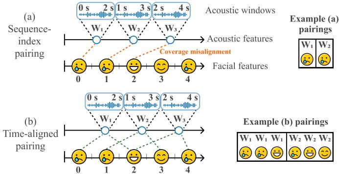  
Fig. 1. Temporal misalignment in multimodal behavioral feature processing in existing work. Conventionally, acoustic features are extracted with overlapping sliding windows (2s window, 1s hop), e.g., W1 (spanning 0– 2s), while facial features are frame-level observations sampled at 1 fps. (a) Existing work uses sequence-index pairing to associate feature time series by their position in each series rather than by recording time, linking each acoustic window to the single facial frame at the same index (dotted orange line). This produces coverage misalignment in behavioral analysis. (b) Our proposed multimodal temporal binning approach assigns features according to their temporal support based on the portion of the behavioral recording that each feature represents. Each acoustic window is associated with the facial frames occurring within the same time interval (dotted teal lines). Such temporal alignment of multimodal behavioral features is critical for capturing fine-grained behavioral congruence during remote mental health interviews.

designing interview protocols centered on open-ended questions for depression screening in older adults with MCI.

Index Terms—Anxiety, depression, explainable artificial intelligence, mild cognitive impairment, multimodal fusion.

## I. INTRODUCTION

M ILD Cognitive Impairment (MCI), a clinical condi-tion that precedes Alzheimer’s disease and related tion that precedes Alzheimer's disease and related dementias, is projected to affect 21 million adults in the United States (U.S.) by 2060 [1]. It is characterized by cognitive decline greater than expected for healthy aging, while preserving daily functioning [2]. Depression affects 32% of adults with MCI [3], [4], while anxiety affects 10–50%, and both are associated with increased risk of progression to dementia [5]. Despite their clinical relevance, they remain underdiagnosed [6], [7], and older adults in the U.S. face multiple barriers to mental health care [8]. Diagnosis is further complicated by atypical late-life presentations: “depression

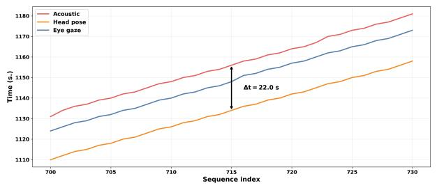  
(a) Temporal displacement

  
(b) Visual degradation from occlusion, blur, and overexposure

Fig. 2. Challenges in multimodal interview analysis. (a) Existing methods associate misaligned behavioral features with temporal displacements of up to 22 seconds (more than 100 times the 200 ms window over which clinicians perceptually bind cross-modal behavioral cues). (b) Synthetic illustrations of visual degradation in remote interviews. Privacy constraints prevent the display of participant recordings, so we generate illustrative frames using OpenAI ChatGPT Images 2.0, accessed via ChatGPT [11], to reproduce artifacts observed in the real data, including face occlusion, low resolution with overexposure, and blur

without sadness” [9] and anxiety profiles poorly captured by criteria developed from younger populations [10].

Clinical assessment of mental health depends on behaviors that are hard to observe in real time. For example, depression-related changes in speech and eye movements lie in the hundreds-of-milliseconds range [12], [13], too brief to be reliably observed by a clinician during an interview or documented in a clinical report [12]. Assessment also relies on affect, where the clinician judges whether a patient’s nonverbal behavior is congruent with their verbally stated mood [14]. Depressed and anxious individuals may smile and not show sadness while describing sad experiences [15] and anxious events [16]. Reading this congruence requires interpreting modalities jointly and at the moment they co-occur. Human perception binds audiovisual speech into a single event only within a window of 200 ms [17], and behavioral cues separated by intervals longer than 200 ms are unlikely to be perceived as a single event. Therefore, detecting congruence across modalities requires fine-grained and temporally aligned multimodal measurement.

Remote video interviews provide a practical setting for measuring these behavioral signals, given that telehealth use among older adults has increased after the COVID-19 pandemic [18] and that an estimated 140 million Americans have limited access to mental health care [19]. Recent work has shown that multimodal machine learning (ML) methods can objectively quantify facial, vocal, language, and physiological cues from video interviews [20], [21], providing measures that may support scalable screening of individuals at risk for psychiatric episodes or suicidal behavior, facilitate earlier triage, and complement clinician assessments [22].

However, prior multimodal ML approaches for remote video interviews remain limited in their ability to analyze multimodal behavioral time series associated with mental health in MCI. Multimodal features are extracted at different temporal resolutions and supports (time intervals over which a feature is computed): window-level features summarize signal content over an interval (e.g., acoustic or physiological features extracted with sliding windows over several seconds), frame-level features are measured at individual timestamps (e.g., facial features extracted at 1 frame per second (fps)), and word-level language features occupy variable temporal spans. Existing approaches temporally associate multimodal features by sequence-index pairing, aligning the features by their sequence position in each extracted feature time series rather than by the timestamps to which they correspond in the original recording [23]–[28]. Consequently, this sequenceindex pairing creates temporal coverage misalignment (or displacement) across multimodal behavioral features, in which a multi-second window-level feature (e.g., acoustic) is associated with a single frame-level observation (e.g., facial), despite the window covering multiple observations in time, as shown in Fig. 1(a). Fig. 2(a) also shows this issue for an example video: across a segment of consecutive indices, the acoustic, head pose, and eyegaze features assigned to the same index (e.g., 715) were recorded up to 22 seconds apart, more than 100 times the 200 ms window within which humans perceptually bind cross-modal behavioral cues [17]. This causes the model to fuse features from different time segments of the response, thereby learning misaligned behavioral co-occurrences. In contrast, a temporally aligned representation fuses concurrent behavioral cues, supporting clinically meaningful interpretation across frame-, word-, and window-level behavioral features, as shown in Fig. 1(b).

Interpretability is necessary for clinicians to trust a model’s prediction [29]. It requires attributing a prediction across modalities, questions, and time, so a clinician can identify which behavioral signals, in response to which questions, and at which moments in the interview drove the prediction. Comprehensive semi-structured interviews that combine openended questions with multiple screening instruments may require substantial administration time. In our protocol, interviews lasted from 21 to 67 minutes. Therefore, identifying which portions of the interview contain sufficient predictive evidence may inform shorter protocols that reduce clinician time and participant burden. These question- and time-level attributions are meaningful only when the modalities share a common timeline, making fine-grained cross-modal temporal alignment a prerequisite for interpretation.

Remote video recordings collected in real-world settings also exhibit missingness across modalities over time. Participants complete interviews under varying lighting conditions and camera placements so that the video may include blur and occlusion (Fig. 2(b)), and unstable internet connectivity may cause frames to drop [30]. Under these conditions, feature extraction may fail at specific timesteps across the modalities [20], [28]. To handle missingness, previous studies zero-filled missing values [31], which makes true absence indistinguishable from a valid near-zero measurement. A model must therefore explicitly encode feature missingness.

Furthermore, participant answers are also questiondependent: a brief yes/no answer can carry different clinical meanings depending on the prompt that elicited it. The answer to a question is the co-occurring cross-modal behavior described above, so the question is more informative when it conditions the multimodal sequence at the moment the behavior occurs. Prior work on mental health prediction in the MCI population does not incorporate the question context [21], [32], [33]. Some of the existing depression prediction approaches incorporate question context, but do not apply this conditioning jointly across modalities at a fine-grained temporal resolution. One approach combines the question with temporally pooled text and audio representations for each answer segment [25]. Other approaches condition only a subset of the modalities on the question. For example, Guo et al. [23] condition only the text modality on the question in their multimodal approach, while Niu et al. [34] condition audio and text in separate models before fusion. As a result, current approaches do not allow the question to influence the joint cross-modal behavior at the moment it occurs during modeling.

We propose TAMI, a Temporally Aligned, Missingness-Aware, and Interpretable multimodal fusion framework for predicting depression and anxiety in older adults with MCI from remote interviews. TAMI integrates fine-grained crossmodal temporal alignment of features with heterogeneous sampling rates, modality-level missingness over time, and question conditioning.

## II. RELATED WORK

## A. Multimodal Mental Health Interview Analysis

Automated prediction of depression and anxiety from recorded interviews has been studied primarily in general adult populations using datasets such as DAIC-WOZ [25], [28], [35]–[37]. In contrast, interview-based pipelines in older adults with MCI have largely targeted cognitive assessment [38]– [40], whereas mental health prediction in this population remains underexplored [21], [32], [33]. Across both populations, multimodal approaches combine facial, acoustic, language, and physiological remote photoplethysmography (rPPG) features through late, early, or mid-fusion [24], [26], [28], [31], [41], [42]. Some combine facial with acoustic or language features but omit rPPG [43]–[45], while others include rPPG but omit eyegaze and head pose [21], [31]. We address these gaps with a multimodal deep learning model that predicts depression and anxiety in older adults with MCI from facial action units and landmarks, head pose, eyegaze, acoustic, language, and rPPG features collectively.

## B. Cross-Modal Temporal Alignment

Prior multimodal approaches handle temporal misalignment across features in one of two ways. The first approach temporally pools each feature time series into a single vector per feature before multimodal fusion [23]–[25]. The second approach keeps per-feature time series but places each feature observation at a single point on the time axis [26]–[28], as illustrated in Fig. 1(a). These methods do not provide a shared timeline that aligns frame-level, window-level, and word-level features according to their temporal support. In contrast, our temporal binning approach preserves the time interval covered by each feature by constructing a shared time axis that reflects the original recording times. This allows the model to learn temporally aligned cross-modal interactions, reflecting how clinicians assess patient behaviors in real-world clinical settings.

## C. Handling Missingness across Modality and Time

Most prior multimodal mental health work handles missingness at the modality level for each sample, treating whether a modality is present for the participant as a whole [31], [46]. Other studies replace missing values at the timestep level with zeros, which cannot be distinguished from valid zero values in observed timesteps [27], [31]. Gimeno-Gomez et al. [28] encode missingness more finely, with per-modality, per-frame presence masks that act as attention masks for depression prediction. We build on this fine-grained masking strategy but place the masks on answer-aligned temporal bins. As a result, at each timestep, the multimodal features, their temporal availability masks, and the corresponding question context share the same timeline.

## D. Modeling Question and Answer Interaction

Prior work on mental health prediction in older adults with MCI ignores the question context in multimodal modeling and focuses only on the participant answer [21], [32], [33]. In general-population depression classification, some methods condition the multimodal response on the question but in a limited way. Zhang et al. [25] temporally pool the acoustic response time series and text into a single vector for each modality, then fuse them with the question using gated addition. This discards fine-grained temporal information. Other approaches apply question conditioning separately to each modality rather than to a joint multimodal representation. Niu et al. [34] use additive attention to condition the response acoustic time series and text sequence independently on the question before fusion. Guo et al. [23] condition only the text modality on the question context by encoding the concatenated question and response text with RoBERTa [47], while the acoustic response is encoded independently before fusion. As a result, these methods do not condition the fused multimodal sequence on the question at a fine-grained temporal resolution within each answer. In addition, their conditioning incorporates only the acoustic and text modalities. In contrast, we add the question embedding to every timestep of the fused multimodal sequence, which also includes facial and physiological signals, allowing each moment of the answer to be interpreted in the context of the question that elicited it.

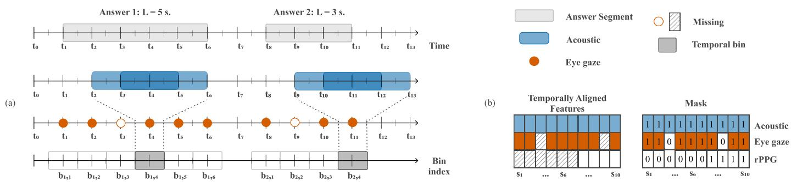  
Fig. 3. Adaptive temporal binning for within-answer multimodal alignment. (a) Each participant’s recording is partitioned along the time axis into questionanswer segments, as shown on the upper axis. Each segment is divided into a number of temporal bins depending on its duration, as shown on the lower axis. The bins define a shared timeline that aligns features of different temporal supports: frame-level features (e.g., eyegaze) are assigned to a bin by timestamp, and window-level features (e.g., acoustic) are assigned to every bin they overlap. (b) Bins from all answers are concatenated into a participant-level sequence, with a binary modality-timestep mask indicating observed and missing entries.

E. Interpreting Predictions across Modality, Question, and Time

Multimodal mental health interviews produce structured evidence across modalities, questions, and time, with multiple behavioral signals unfolding throughout the interview in response to specific prompts. Prior interpretability methods examine only a subset of these levels. Modality-level methods identify which modalities drive a prediction through performance comparisons [20], [41] or post-hoc attribution scores [21], [31], without localizing importance to specific questions or moments in time. Question-level methods attribute importance to interview questions or to modalities within a question through attention [23], [24] or performance comparisons [48], but do not identify when within an answer the relevant evidence is observed. Gimeno-Gomez et al. apply Integrated Gradients (IG) [49] to visualize modality importance over time within a selected short temporal window from a single participant’s video rather than across the full interview [28]. They do not incorporate question structure or extend the analysis to cohortlevel summaries for modality and temporal importance [28].

No prior method derives modality-level, question-level, and interview-wide temporal importance jointly across participants. We address this gap by deriving all three levels of explanation from IG [49] attributions at both cohort and individual levels over the full interview.

## III. METHOD

TAMI processes interviews in three stages: (1) temporally aligned multimodal feature time series with per-modalityfeature per-timestep missingness masks; (2) questionconditioned multimodal feature fusion; and (3) post-hoc multilevel attribution that quantifies the importance of each modality, question, and timestep.

## A. Problem Formulation

Each participant $i \in \{ 1 , \ldots , N \}$ provides a remote interview recording represented as a sequence of observed question-answer segments, $\mathcal { X } _ { i } ~ = ~ \{ ( q _ { i j } , \bar { a } _ { i j } ) \} _ { j = 1 } ^ { J _ { i } }$ , where $q _ { i j }$ is the j-th question answered by participant i and $a _ { i j }$ is the corresponding answer. Because participants may not answer all interview questions, $J _ { i }$ can vary across participants. Each answer spans a time interval of duration $L _ { i j }$ , which we partition into $B _ { i j }$ temporal bins. The bins form a shared timeline that aligns features of different temporal supports. For modality-feature $m \in \mathcal { M }$ with feature dimension $D _ { m } ,$ bin $b _ { i j , k }$ with $k \in \{ 1 , \ldots , B _ { i j } \}$ corresponds to a feature vector $\mathbf { x } _ { i j , k } ^ { ( m ) } \in \mathbb { R } ^ { D _ { m } }$ and a binary availability mask $M _ { i j , k } ^ { ( m ) } \in \{ 0 , 1 \}$ where 0 indicates that the observation is missing. Given an interview, the task is to predict a binary label, representing the presence or absence of depression or anxiety. Separate models are trained for each task.

## B. Temporally Aligned Representation

1) Feature Extraction: Throughout the paper, we use modality-feature to refer to each of the eight feature time series used as model inputs. The features are extracted from the participant-side audiovisual recordings. From the facial video, we extract frame-level features at 1 fps: combined facial action units and landmarks (AUs & LMs), head pose [50], and eyegaze [51]. Physiological rPPG-derived heart rate is computed as a window-level feature with a sliding window of 6s and 1s hop [52]. From the audio, we extract window-level acoustic features with a sliding window of 2s and 1s hop: eGeMAPS, ComParE [53], and Wav2Vec2 embeddings [54], [55]. The language features are RoBERTa embeddings from WhisperX word-level transcripts [47], [56]. Interview questions are encoded separately using Sentence-BERT [55], [57] and used to condition the participant-side features. These feature sets have been used in previous mental health [20], [21], [24], [58], [59] and behavioral analysis [60], [61] pipelines. Full details are in the Supplementary in Section A-A.

2) Answer Segmentation and Temporal Alignment: For this feasibility study, the interviewer manually marked the start and end timestamps of each question-answer interval. This step can potentially be automated at deployment by aligning the WhisperX transcript to the known interview questions to locate each question-answer interval. If a participant did not answer a question, that question is excluded for the participant. Each answer segment is divided into temporal bins with a bin width of $w = 1 \mathrm { s } ,$ as illustrated in Fig. 3(a). Because answer durations vary widely (1–926s), the number of bins adapts to each answer duration rather than truncating long answers or padding short ones. The number of bins for answer $j$ of participant i is set as $B _ { i j } =$ clamp $( \mathrm { r o u n d } ( L _ { i j } / w ) + 1 , B _ { \mathrm { m i n } } , B _ { \mathrm { m a x } } )$ , where $B _ { \mathrm { m i n } }$ and $B _ { \mathrm { m a x } }$ are lower and upper bin-count bounds. These bounds ensure that every answered question is represented, while limiting the number of bins for long answers. When an answer exceeds the upper bound, the bin width is increased $( w > 1 \mathrm { s } )$ so that the full answer is represented using $B _ { \mathrm { m a x } }$ bins without truncation.

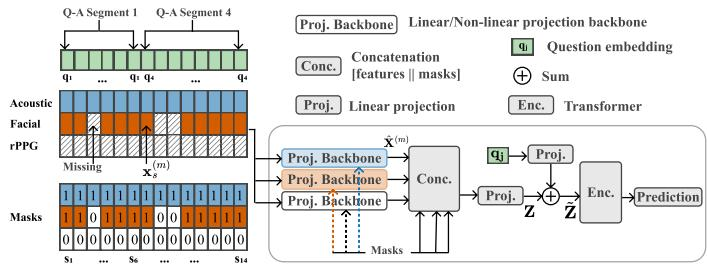  
Fig. 4. Question-conditioned fusion pipeline (S = 14 for illustration).

Frame-level features are assigned to the bin containing their frame timestamp. Window-level features are assigned to all bins that overlap their feature windows. If multiple windows overlap the same bin, their feature vectors are averaged to form a single bin-level representation, treating all overlapping windows as an estimate of the signal within that bin. Transcript words are assigned using WhisperX timestamps, and all words overlapping a bin are concatenated and encoded as a single bin-level language representation using RoBERTa embeddings. The bins from all answered questions are concatenated along the temporal axis as participant-level multimodal feature time series, shown in Fig. 3(b), with a length of $\begin{array} { r } { S _ { i } = \sum _ { j = 1 } ^ { J _ { i } } B _ { i j } } \end{array}$ , where bin index is $s \in \{ 1 , \ldots , S _ { i } \}$ in the concatenated participant-level sequence.

3) Modality-Timestep Missingness: The availability mask $M _ { i j , k } ^ { ( m ) }$ for bin $b _ { i j , k }$ is set to 0 if no valid observation for feature m is available in that bin. This occurs when no framelevel feature value falls within the bin interval, no windowlevel feature overlaps the bin interval, or no transcript word is spoken in the bin. In that case, the corresponding feature vector is zero-filled $\mathbf { x } _ { i j , k } ^ { ( m ) } \ = \ \mathbf { 0 }$ . Conversely, $M _ { i j , k } ^ { ( \bar { m } ) } ~ = ~ 1$ denotes a valid observation for that feature in the bin, even when the feature vector contains zero-valued measurements, thereby distinguishing missing observations from valid lowsignal behavior (Fig. 3(b)).

## C. Question-Conditioned Fusion and Prediction

1) Projection Backbones and Fusion: We explored a linear and a non-linear per-modality-feature projection backbone (Fig. 4) to test whether the model would benefit from learning a per-modality-feature temporal representation before multimodal fusion. The linear projection backbone projects each modality-feature at each temporal bin s to dimension d independently, with no temporal modeling (no mixing of information across time). Here, temporal modeling is deferred to the Transformer encoder (Enc.) shown in Fig. 4, which applies attention across temporal bins after multimodal fusion. The non-linear projection backbone instead uses a permodality-feature Transformer that applies attention across time before fusion. Thus, unlike the linear projection backbone, the non-linear projection backbone mixes information for each modality-feature across time before multimodal fusion.

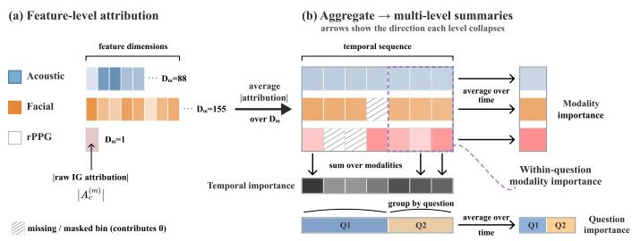  
Fig. 5. Multi-level interpretability in modality, question, and time.

Both backbones take the aligned per-modality-feature time series $\mathbf { X } _ { i } ^ { ( m ) } ~ \in ~ \mathbb { R } ^ { S _ { i } \times D _ { m } }$ and availability masks $M _ { i } ^ { ( m ) } \in$ $\{ 0 , 1 \} ^ { S _ { i } \times 1 }$ as input. Then they both project each modalityfeature onto a common dimension $d ,$ producing $\hat { \mathbf { X } } _ { i } ^ { ( m ) } \in$ R $\boldsymbol { S } _ { i } \times \boldsymbol { d }$

$$
\hat { \mathbf { X } } _ { i } ^ { ( m ) } = \left\{ \begin{array} { l l } { M _ { i } ^ { ( m ) } \odot \left( \mathbf { X } _ { i } ^ { ( m ) } W _ { m } ^ { \top } \right) } \\ { f _ { m } ( \mathbf { X } _ { i } ^ { ( m ) } W _ { m } ^ { \top } , M _ { i } ^ { ( m ) } ) } \end{array} \right.
$$

(a) linear

(b) non-linear

(1)

The linear projection gates each feature by its mask. The non-linear projection instead applies a per-modality-feature Transformer $f _ { m }$ with temporal self-attention while using the mask as the attention mask. Regardless of which projection backbone is used, the resulting projected per-modality-feature representations $\hat { \mathbf { x } } _ { i , s } ^ { ( m ) } \in \mathbb { R } ^ { d }$ at each bin s are then concatenated with their availability masks [62]. Before concatenation, a zero-filled missing bin and an observed value at the feature mean are both zero, so without appending the mask as a missingness indicator, the model cannot distinguish a missing observation from a valid zero measurement. The concatenated representation and mask vectors are then projected to a single fused multimodal token $\mathbf { z } _ { i , s } ~ \in ~ \mathbb { R } ^ { d } \colon \mathbf { z } _ { i , s } ~ =$ $W _ { f } \big [ \hat { \mathbf { x } } _ { i , s } ^ { ( 1 ) } ; \cdot \cdot \cdot ; \hat { \mathbf { x } } _ { i , s } ^ { ( N _ { m } ) } ; ~ M _ { i , s } ^ { ( 1 ) } ; \cdot \cdot \cdot ; M _ { i , s } ^ { ( N _ { m } ) } \big ]$ , where $N _ { m } = 8$ is the total number of modality-features. The tokens are stacked to form the fused multimodal sequence $\mathbf { Z } _ { i } \in \mathbb { R } ^ { S _ { i } \times d }$

2) Question Conditioning and Prediction: We condition the fused multimodal sequence, $\mathbf { Z } _ { i }$ , on the question context at each temporal bin. Let $\mathbf { q } _ { i j }$ be the embedding of the $j -$ th question for participant i. For each temporal bin s within the answer to question $j ,$ , we add the question embedding to the fused multimodal token ${ \bf z } _ { i , s } , \ \tilde { \bf z } _ { i , s } \ = \ { \bf z } _ { i , s } + W _ { q } { \bf q } _ { i j } ,$ where $W _ { q }$ maps the question embedding to dimension d. The conditioned tokens form a sequence $\tilde { \mathbf { Z } } _ { i } ~ \in ~ \mathbb { R } ^ { S _ { i } \times d }$ , which is then processed by a Transformer encoder (Enc. in Fig. 4) with a prepended [CLS] token, and a linear head maps the [CLS] representation to the prediction logit. Within a batch, participant sequences of unequal length are padded to the longest and excluded from attention through a padding mask.

## D. Post-hoc Multi-Level Attribution

After training, we attribute each prediction to the input features using IG, with a zero-vector baseline equal to the mean feature value after standardization [49]. This yields a single scalar attribution $| A _ { c , s } ^ { ( m ) } |$ for each feature c of modality-feature m at each temporal bin s for each participant (Fig. 5(a)). We aggregate these feature-level attributions to build interpretable summaries along clinically interpretable axes: which question and which modality within that question drove the prediction, and when in the interview the relevant evidence occurred (Fig. 5(b)). The arrows in Fig. 5(b) show these aggregations, producing modality importance, question importance, withinquestion modality importance, and the temporal importance across the interview. Full derivations are provided in the Supplementary in Section A-B.

## A. Dataset

## IV. EXPERIMENTS

Our dataset comprises remote semi-structured interviews from 49 older adults with MCI. Interviews were conducted over Zoom at participants’ preferred time and location, typically at home, using their own devices, including tablets, laptops, and mobile phones. Participants were recruited from the Charlie and Harriet Shaffer Cognitive Empowerment Program (CEP) at Emory University. The study protocol was approved by Emory University Institutional Review Board (protocol #2025P012652). Participants provided written informed consent for research participation. Each interview included six question groups: open-ended narrative prompts including a TAT picture description task [63], an I-CONECT social and functional check [64], the Geriatric Depression Scale (GDS) [65], the Generalized Anxiety Disorder (GAD-7) scale [66], the UCLA Loneliness Scale [67], and the Lubben Social Network Scale (Social Engagement) [68]. Before each interview, participants were told that they could elaborate on any answer. However, answers to yes/no and Likert-scale questions were usually brief. Not every participant answered every question, owing to question skip logic, pilot-phase changes to the administered question groups, and occasional technical issues (details are provided in the Supplementary in Section B-A).

Participants had a mean age of $7 3 . 4 \pm 8 . 1$ years, and 47% were female. Across all questions, answers had a median duration of 5s with a maximum duration of 926s ≈ 15 minutes (interquartile range: 3–12s). Full interview durations (including both participant and interviewer sides) ranged from 21 to 67 minutes, with a median of 31 minutes. Participantside video resolution varied from 640 × 480 to $1 9 2 0 \times 1 0 8 0$ pixels. We define depression risk as ${ \mathrm { G D S } } \geq 1 0 ,$ , corresponding to at least mild depressive symptoms [65] and anxiety risk as $\mathrm { G A D - } 7 ~ \geq ~ 5$ , corresponding to at least mild anxiety symptoms [66]. One participant lacked a GAD-7 score, yielding 49 participants for depression (21 positive, 28 negative) and 48 for anxiety (17 positive, 31 negative). Per-modality-feature average temporal bin missingness was at most 3% except for language (37%). Structured question items usually elicit single-word or yes/no answers (median duration: 3s), so most one-second bins within an answer contain no transcribed word, leading to high language-feature missingness (average ≈ 44% across structured question groups), while open-ended questions elicit the longest answers (median duration: 87.5s)

and the lowest missingness (16%). The Supplementary reports language-feature missingness and answer duration by question group in Fig. 8.

## B. Implementation and Evaluation

Temporal bins are constructed with a minimum of $B _ { \operatorname* { m i n } } = 1$ bin and a maximum of $B _ { \mathrm { m a x } } = 6 4$ bins per answer. The upper bound of 64 bins was chosen so that the majority of answers are represented at 1-second resolution. For the 4% of answers exceeding 64 seconds, bins were widened proportionally so that the full answer duration was still spread across all 64 bins, reducing temporal resolution rather than discarding content (Section III-B2). All Transformer encoders use a hidden dimension $d \ = \ 1 2 8$ . The per-modality-feature encoders in the non-linear projection backbone use a single Transformer layer, while the common encoder (the Enc. in Fig. 4) in both backbones uses two Transformer layers. We train all models for 10 epochs (sufficient for plateauing the model training loss curve) [21] using the Adam optimizer with a learning rate of 0.001, a batch size of 4 participants, and binary crossentropy loss. A class-balanced batch sampler is used to address class imbalance. Interpretability analysis is applied to the bestperforming model variant for each task (Non-linear+T for depression and Linear+T for anxiety).

We evaluated all models using participant-independent 5- fold cross-validation across 3 repetitions (15 runs). All feature time series were standardized using training-fold statistics before training to have zero mean and unit variance. We report AUROC scores with 95% confidence intervals (CIs) across all folds. We also report area under the precision-recall curve (AUPRC), macro-F1, precision, and recall scores for all models in the Supplementary in Table V. All performance comparisons use one-sided paired t-tests on fold-level AUROC score differences at $p < 0 . 0 5$

## C. Ablations

We evaluate temporal alignment (T) and questionconditioned fusion (Q) of the multimodal feature time series as two design options under both linear and non-linear projection backbones. The sequence-index-paired baseline model pairs feature time series by index rather than by the timestamp of the underlying behavior, following prior multimodal models [26], [27]. Models that use Q only without T test two adaptations of prior question-conditioning methods on the temporally unaligned sequence-index-paired baseline. The first is pooled additive conditioning (+ Q, sum), adapted from the question conditioning approach of Zhang et al. [25]. In our variant, all answered-question embeddings are averaged into one interview-level vector and added uniformly across time to the fused multimodal sequence. The second is crossattention conditioning (+ Q, cross-attn.), which generalizes the question-conditioned additive attention used in HCAG [34]. In our variant, cross-attention is instead applied between the fused multimodal sequence and the sequence of answered question embeddings. Further details are provided in the Supplementary in Section B-C.

TABLE I  
AUROC PERFORMANCE (MEAN ± 95% CIS) FOR DEPRESSION AND ANXIETY CLASSIFICATION. BOLD, UNDERLINE, AND italics DENOTE THE BEST, SECOND-BEST, AND THIRD-BEST RESULTS FOR EACH TASK, RESPECTIVELY. TIED RESULTS RECEIVE THE SAME RANK. T DENOTES TEMPORALLY ALIGNED FEATURES, AND Q DENOTES QUESTION CONDITIONING. LINEAR AND NON-LINEAR DENOTE THE DIFFERENT PROJECTION BACKBONES.
<table><tr><td>Variant</td><td>Depression AUROC ↑</td><td>Anxiety AUROC↑</td></tr><tr><td colspan="3">Sequence-index-paired baseline [26], [27]</td></tr><tr><td>Linear</td><td> $0 . 5 1 \pm 0 . 0 6$ </td><td> $0 . 5 8 \pm 0 . 0 3$ </td></tr><tr><td>Non-linear</td><td> $0 . 5 8 \pm 0 . 1 1$ </td><td> $0 . 5 6 \pm 0 . 0 6$ </td></tr><tr><td>Linear + T</td><td> $0 . 6 4 \pm 0 . 0 8 ^ { \ast }$ </td><td> $\mathbf { 0 . 6 9 \pm 0 . 0 9 ^ { \ P } }$ </td></tr><tr><td>Non-linear + T</td><td> $\mathbf { 0 . 6 8 \pm 0 . 0 4 }$ </td><td> $0 . 5 8 \pm 0 . 0 7$ </td></tr><tr><td>Linear + Q, sum [25]</td><td> $0 . 5 2 \pm 0 . 0 0 3$ </td><td> $0 . 5 5 \pm 0 . 0 6$ </td></tr><tr><td>Linear + Q, cross-attn. [34]</td><td> $0 . 4 5 \pm 0 . 0 7$ </td><td> $0 . 5 6 \pm 0 . 0 4$ </td></tr><tr><td>Non-linear + Q, sum [25]</td><td> $0 . 5 5 \pm 0 . 0 8$ </td><td> $0 . 5 4 \pm 0 . 0 7$ </td></tr><tr><td>Non-linear + Q, cross-attn. [34]</td><td> $0 . 5 6 \pm 0 . 1 1$ </td><td> $0 . 5 6 \pm 0 . 0 9$ </td></tr><tr><td>Linear + Q + T</td><td> $\underline { { 0 . 6 7 \pm 0 . 1 0 ^ { \dagger } } }$ </td><td> $0 . 6 7 \pm 0 . 0 7 ^ { \updownarrow }$ </td></tr><tr><td>Non-linear  $+ \mathrm { \Delta Q \mathrm { ~ + ~ } T }$ </td><td> $\underline { { 0 . 6 7 \pm 0 . 0 7 ^ { \ddagger } } }$ </td><td> $0 . 6 1 \pm 0 . 0 1$ </td></tr></table>

Selected AUROC comparisons using one-sided Student’s paired t-tests: Depression: ∗Linear+T > Linear baseline, $p \approx 0 . 0 5 ;$ †Linear+Q+T > Linear+Q (sum), p ≈ 0.009 and > Linear+Q (cross-attn.), $p \approx 0 . 0 0 1$ , and > Linear baseline, $p \approx 0 . 0 0 9 ;$ ‡Non-linear+Q+T > Non-linear+Q (sum), $p \approx 0 . 0 2 ,$ and > Non-linear+Q (cross-attn.), $p \approx 0 . 0 0 1$ Anxiety: ¶Linear+T > Linear baseline, $p \approx  { \mathrm { 0 . 0 5 } } ;  { \mathrm { \ s L i n e a r + Q + T } } >$ Linear+Q (sum), p ≈ 0.04. For all other pairwise comparisons, $p > 0 . 0 5 .$ Full pairwise statistical comparisons are provided in the Supplementary in Table VI. Macro-F1, AUPRC, precision, and recall results are provided in the Supplementary in Table V.

TABLE II  
MASK ABLATION RESULTS FOR DEPRESSION AND ANXIETY CLASSIFICATION IN TERMS OF AUROC $( \mathrm { M E A N } \pm 9 5 \%$ CIS). BOLD DENOTES THE BETTER RESULT WITHIN EACH PROJECTION BACKBONE AND TASK.
<table><tr><td>Variant</td><td>Depression AÚROC ↑</td><td>Anxiety AUROC ↑</td></tr><tr><td>Linear + T (no mask)</td><td> $\mathbf { 0 . 6 5 \pm 0 . 0 9 }$ </td><td> $0 . 6 4 \pm 0 . 0 5$ </td></tr><tr><td>Linear + T (mask)</td><td> $0 . 6 4 \pm 0 . 0 8$ </td><td> $\mathbf { 0 . 6 9 \pm 0 . 0 9 }$ </td></tr><tr><td>Non-linear + T (no mask)</td><td> $0 . 6 7 \pm 0 . 0 9$ </td><td> $0 . 5 6 \pm 0 . 0 9$ </td></tr><tr><td>Non-linear + T (mask)</td><td> $\mathbf { 0 . 6 8 \pm 0 . 0 4 }$ </td><td> ${ \bf 0 . 5 8 \pm 0 . 0 7 }$ </td></tr></table>

We also ablate the modality-timestep missingness mask on the T models with both linear and non-linear projection backbones. We replace the mask with an all-ones mask (no mask variant), which makes zero-filled bins indistinguishable from observed ones, reproducing the no-mask case used by prior work that zero-fills at the timestep level [27], [31].

## V. RESULTS

## A. Overall Performance

Table I reports AUROC scores for depression and anxiety under each combination of projection backbone (Linear vs. Non-linear), temporal alignment (T), and question conditioning (Q). Temporally aligning the multimodal features achieves the highest scores for both tasks: Non-linear+T reaches 0.68± 0.04 for depression $\scriptstyle ( \Delta = + 0 . 1 0$ over the Non-linear baseline), and Linear+T reaches 0.69 ± 0.09 for anxiety $( \Delta { = } + 0 . 1 1$ over the Linear baseline, p=0.05). Adding question conditioning on top of alignment provides no significant gain over alignment alone (all Q+T vs. T $p > 0 . 0 5 )$ , though Q+T variants remain competitive (Linear $\mathsf { 1 } \mathsf { Q } \mathsf { + } \mathsf { T } \colon 0 . 6 7$ for depression and anxiety). Without temporal alignment, neither summation nor crossattention for question conditioning shows a consistent advantage across the two tasks (AUROC 0.45–0.56). Models with linear and non-linear projection backbones have overlapping confidence intervals, and their rankings are inconsistent across tasks. Replacing the modality-feature-timestep mask with allones, thereby treating all bins as observed (the no-mask variant in Table II), reduces performance for anxiety classification (Linear $\Delta = - 0 . 0 5$ and Non-linear $\Delta = - 0 . 0 2 )$ . The effect on depression classification is smaller, where removing the mask increases AUROC by 0.01 for the linear model but decreases it by 0.01 for the non-linear model.

TABLE III  
QUESTION-GROUP IG ATTRIBUTION SUMMARIES. VALUES ARE SCALED BY 103. SPREAD IS THE DIFFERENCE BETWEEN THE MAXIMUM AND MINIMUM GROUP MEANS WITHIN EACH TASK. BOLD, UNDERLINE, AND italics DENOTE THE HIGHEST, SECOND-HIGHEST, AND THIRD-HIGHEST ATTRIBUTIONS ACROSS QUESTION GROUPS WITHIN EACH TASK.
<table><tr><td></td><td colspan="2">Depression</td><td colspan="2">Anxiety</td></tr><tr><td>Question group</td><td>Range</td><td>Mean</td><td>Range</td><td>Mean</td></tr><tr><td>Open</td><td>1.09–1.65</td><td>1.31</td><td>1.04-1.39</td><td>1.16</td></tr><tr><td>I-CONECT</td><td>0.66–2.15</td><td>1.03</td><td>0.91-1.58</td><td>1.17</td></tr><tr><td>GDS</td><td>0.42-1.03</td><td>0.68</td><td>0.74-1.76</td><td>1.17</td></tr><tr><td>GAD-7</td><td>0.73-1.07</td><td>0.90</td><td>0.80-1.17</td><td>1.03</td></tr><tr><td>Loneliness</td><td>0.64-1.35</td><td>0.88</td><td>0.77-1.14</td><td>0.93</td></tr><tr><td>Social engagement</td><td>0.83-1.70</td><td>1.17</td><td>0.74-1.64</td><td>1.10</td></tr><tr><td>Spread</td><td colspan="2">0.63</td><td colspan="2">0.24</td></tr></table>

## B. Modality Importance

The most important features differ across the two tasks (Fig. 6(a)). For depression, eyegaze accounts for 66% of the total attribution, followed by ComParE at 11.2%. For anxiety, the attribution is more evenly distributed between eyegaze at 44% and head pose at 37.2%. Together, the two leading features account for more than 77% of the total attribution in each task. AUs & LMs contribute less than 1% in both tasks, indicating that eyegaze and head pose capture most of the predictive facial signal once they are present. Language features contribute less than 3% in both tasks. Acoustic information is more prominent for depression, with ComParE ranking second overall, whereas no individual acoustic feature exceeds 6.5% for anxiety. This feature dominance holds at the question level for both tasks, as shown for the highest-ranked questions in the Supplementary in Fig. 11.

## C. Question Importance

Both tasks distribute attribution across all interview questions but differ in how that attribution spreads across question groups (Table III). Depression shows wider dispersion (spread: $0 . 6 3 \times 1 0 ^ { - 3 } )$ , with the highest mean attribution assigned to the open-ended questions, followed by the social engagement questions. The open-ended questions are Q1 (“Tell me about yourself”), Q2 (Best event in the past two years), Q3 (Worst event in the past two years), and Q4 (TAT picture description). At the individual question level, the four questions with the highest absolute attributions are Q10 (I-CONECT “In the past week, have you had visitors who stayed with you in your home for a night or more? If yes, then how many nights?”), Q89 (Social Engagement: “How often is one of your relatives available for you to talk to when you have an important decision to make?”), Q5 (I-CONECT: “So, would you say your health is Very good, Good, Fair, Poor, Excellent?”), and Q1 (open-ended: “Tell me about yourself”).

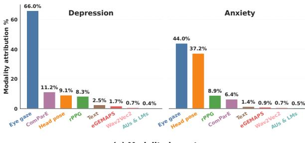  
(a) Modality importance

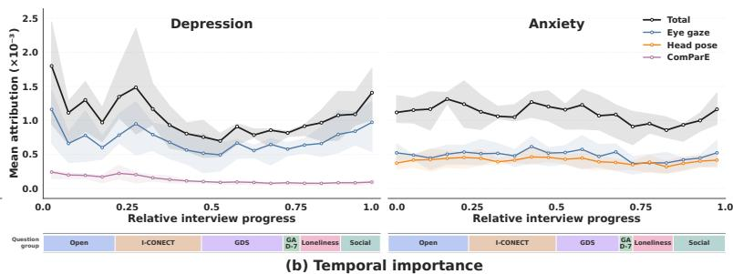  
Fig. 6. IG attribution for depression and anxiety across participants. (a) Modality importance across the entire video duration. (b) Temporal importance across interview progress, showing the total attribution together with the eyegaze, head pose, and ComParE time series attributions. Shaded bands indicate participant-level variability, and the colored strip below each plot marks the interview progress of each question group.

Anxiety shows a tight group-mean range (spread: 0.24 × $1 0 ^ { - 3 } )$ , indicating roughly uniform reliance on the full interview, with the highest-attribution questions coming from multiple groups. The four questions with the highest attribution for anxiety are Q47 (GDS: crying frequency), Q91 (Social Engagement: “How often is one of your friends available for you to talk to when you have an important decision to make?”), Q90 (Social Engagement: “When one of your friends has an important decision to make, how often do they talk to you about it?”), and Q20 (I-CONECT: “Did you spend time communicating with any friends or family members in writing, such as email, text, or letter writing this week?”). The attribution scores for the highest-ranked questions across all question groups are presented for each task in the Supplementary in Fig. 10.

Neither GDS nor GAD-7 ranks among the top question groups for its corresponding task, indicating that the model relies on participant behavioral responses across the video rather than on the screening tool itself. This suggests a novel opportunity for developing multimodal behavioral biomarkers associated with depression and anxiety in MCI beyond a brief self-report tool for clinical decision support.

## D. Temporal Importance

Depression attribution peaks early and decays across the interview from ∼2.0 to ${ \sim } 0 . 7 5 ~ ( \times 1 0 ^ { - 3 } )$ by mid-interview (Fig. 6(b)). The decline is driven by eyegaze, whose contribution decreases from ∼1.25 to ${ \sim } 0 . 5 0 ~ ( \times 1 0 ^ { - 3 } )$ over the same period. The early peak aligns with the open-ended questions and is consistent with the question-level finding that these questions receive the highest mean attribution. In contrast, anxiety shows a uniform temporal importance profile.

Total attribution decreases from ∼1.2 to ${ \sim } 0 . 9 0 ~ ( \times 1 0 ^ { - 3 } )$ near the end of the interview before returning to ∼1.2. The eye gaze and head pose attributions remain relatively uniform throughout the interview. Representative participant profiles are shown in the Supplementary in Fig. 12.

## E. Open-Ended Question Performance

To evaluate whether the open-ended portion of the interview alone retains predictive performance, we train and evaluate the best-performing model for each task using only multimodal features extracted from participants’ responses to the four open-ended questions (median duration: 5.1 min). We use the Non-linear+T model for depression and the Linear+T model for anxiety. For depression, the open-ended-only model achieves an AUROC of $0 . 6 7 \pm 0 . 1 3 .$ , which is only 0.01 lower than that of the model trained on the full interview. This difference is not statistically significant $\left( p > 0 . 0 5 \right)$ . This result is consistent with the question importance analysis, which shows that depression predictions rely on responses to the open-ended questions. For anxiety, the open-ended-only model achieves an AUROC of $0 . 5 9 \pm 0 . 0 6$ . The model trained on the full interview achieves an AUROC that is 0.10 higher, and the difference is statistically significant $( p \approx 0 . 0 2 )$ . This finding is also consistent with the question importance analysis, which suggests that anxiety predictions rely uniformly on the full interview.

## VI. DISCUSSION

## A. Temporal Alignment

Temporally aligning the multimodal features was the primary driver of performance across both tasks, with models that used temporal alignment achieving the highest AUROC scores compared to the baseline models. Aligning features by timestamp corrects the temporal misalignment between the multimodal behavioral time series caused by sequenceindex pairing used in prior approaches [26], [27] (Fig. 1 and Fig. 2(a)).

## B. Question Conditioning

Question-conditioned fusion did not improve the performance of models that used temporally aligned multimodal features, and the temporally unaligned Q-only model variants showed no consistent gains over the baselines on either task. Question conditioning injects semantic context about what was asked, which is directly relevant to interpreting the answer content. However, because language alone contributed less than 3% of total attribution in both tasks, question content may have had limited influence on the prediction. Moreover, the Q-only variants do not use the explicit question-answer mapping provided by temporal alignment, so the model must recover this mapping, which may be difficult to learn in a data-driven manner.

## C. Missingness Awareness

Overall, the modality–feature-timestep mask improved AU-ROC in three of the four model-task combinations, with the largest numerical gain for the Linear+T anxiety model and small, mixed effects for the depression models (Table II). To explore whether label-associated missingness might contribute to this pattern, we followed Che et al. [62] and computed Pearson correlations (r) across participants between modality missingness rates and the binary label for each task (depression or anxiety). We considered missingness informative when its rate correlated with the label and could therefore carry predictive information [62]. Based on the modality importance analysis, we examined this missingness-label association for the highest-ranked modalities in each task: eyegaze and head pose for anxiety prediction, and eyegaze for depression prediction. We also included text as a higher-missingness reference for anxiety prediction. Missingness in eyegaze and head pose had absolute correlations of $| r | = 0 . 1 9 { \mathrm { ~ a n d ~ } } 0 . 1 8 .$ , respectively, with the anxiety label, compared with $| r | = 0 . 0 4$ for text (highest-missing modality). This suggests that missingness in the dominant anxiety modalities was informative and that the much higher rate of text missingness was not as informative. For depression, the correlation between eyegaze missingness and the label was small $( | r | = 0 . 0 1 4 )$ , suggesting that missingness was not informative for this task.1 This task-specific pattern is consistent with the finding reported by Che et al. [62] that modeling missingness can improve prediction when it is associated with the label. In contrast, missingness with little or no label association provides limited benefit. This may explain why the mask numerically improved both anxiety models but had small, mixed effects on the depression models. However, the performance differences were not statistically significant at this sample size $( p > 0 . 0 5 )$ , and this interpretation requires validation in a larger sample. The mask is also important for the interpretability analysis because, without it, the modality, question, and temporal importance summaries could assign attribution to behavior that was not observed.

## D. Modality Importance

Eyegaze was the dominant feature for both depression and anxiety, although anxiety distributed attribution more evenly between eyegaze and head pose. For depression, eyegaze accounted for 66% of the total attribution, consistent with findings of eye movement differences between individuals with and without depression, including longer saccade durations [69]. Among older adults specifically, depression was associated with fewer fixations and saccades [69]. The ComParE acoustic feature set ranked second for depression with 11.2% attribution, supporting previous evidence that depression is associated with distinct vocal characteristics such as monotony, reduced pitch variability, and slower speech [70]. For anxiety, eyegaze and head pose accounted for 44% and 37.2% of the total attribution, respectively. This is consistent with reduced face-directed gaze and shorter fixations in socially anxious individuals during real-time interactions [71], [72], as well as increased head movement and velocity during anxiety and stress states in video-based facial analysis [73]. All remaining acoustic and language features accounted for less than 6.5% of the attribution in both tasks, consistent with previous work on quantifying psychological well-being in older adults with MCI [21].

## E. Question Importance

The most notable result from the interpretability analysis is that the model did not assign its highest attribution to the question group that defined each label. GDS ranked last of six question groups for depression, and GAD-7 ranked second to last for anxiety. Attribution was instead distributed across question groups, suggesting that the model relied on participant behavior throughout the interview rather than on the screening questions. At the individual-question level, the highest-attributed questions for depression concerned social contact and support, and self-rated health. This is consistent with evidence that smaller social networks and lower social participation are associated with depressive symptoms in older adults [74], as well as evidence linking self-rated health to depressive symptoms in this population [75]. For anxiety, crying frequency received the highest attribution, which is consistent with evidence that greater attachment anxiety is associated with longer and more intense crying episodes [76]. Tearfulness is also included under the Tension item of the Hamilton Anxiety Rating Scale [77]. The next highest-attributed questions concerned communication with and support from friends, which is consistent with evidence that low social support and social isolation are among the most reported factors associated with anxiety symptoms in older adults [78].

## F. Temporal Importance

Depression and anxiety differed in where the model’s attributions were concentrated. For depression, attribution was highest during the open-ended question block and declined across the later structured section. This is consistent with prior work that reported higher depression prediction performance from spontaneous speech than from a constrained sentencereading task [79]. This suggests that spontaneous-speech response formats are more informative for depression screening. Anxiety, instead, showed a uniform spread of attribution across question groups. The most informative features, eyegaze and head pose, were expressed continuously rather than elicited by a particular question. This is consistent with accounts of anxious hypervigilance as sustained monitoring of the surroundings through eye movements that occurs independently of the immediate stimulus [80], indicating that anxiety-related signals reflect a continual behavioral state.

## G. Open-Ended Question Performance

Restricting the model input to participants’ responses to the four open-ended questions yielded a depression classification AUROC of 0.67, only 0.01 below the 0.68 achieved using the full interview, with no statistically significant difference between them $( p \ > \ 0 . 0 5 )$ . Although combined open-ended responses had a median duration of 5.1 minutes (range: 2.6– 11.5 min) for participants who answered all the open-ended questions $( n \  \ = \ \ 2 5 )$ , the short responses retained predictive information. This is consistent with the high attribution assigned to the open-ended question group from the interpretability analysis. For anxiety, however, restricting the input to the open-ended questions significantly reduced AUROC from 0.69 to 0.59 $( p \approx 0 . 0 2 )$ . This result is consistent with the interpretability analysis, which indicates that anxiety-related information is distributed across the full interview. None of the four questions with the highest anxiety attribution belonged to the open-ended question group, suggesting that an abbreviated anxiety protocol may require questions selected from other parts of the interview. Given this cohort’s median participantside-only interview duration of 19 minutes (maximum 60 min), a shorter protocol centered on open-ended questions (median duration: 5.1 min; maximum: 11.5 min) could reduce clinician time and participant burden for depression assessment. Our findings suggest that using the four open-ended questions alone may be sufficient to screen for depression. However, this finding requires validation in a larger sample.

## H. Limitations and Future Work

One major limitation of this study is the small sample size $( N = 4 9 )$ . In addition, the feature extractors for facial and acoustic features were pretrained on general-population data and may be less reliable on remote recordings from older adults with MCI, as reported in previous studies [21]. In future work, our findings should be validated in larger and more diverse cohorts, including populations with neuropsychiatric conditions who often have symptoms associated with depression and anxiety.

## VII. CONCLUSION

Depression and anxiety are often underdiagnosed in older adults with MCI. Current ML approaches can analyze multimodal behavioral signals for screening. However, these approaches overlook the importance of cross-modal temporal alignment, fail to account for time-varying modality missingness and question context, and provide limited interpretability for clinicians. We presented TAMI, a multimodal framework for detecting depression and anxiety in older adults with MCI from remote interviews, which incorporates cross-modal temporal alignment, modality-timestep missingness handling, question conditioning, and multi-level interpretability. The framework achieved 0.68 (depression) and 0.69 (anxiety) AUROC scores, with temporal alignment providing the largest performance gain over baselines. When restricted to multimodal responses from the four open-ended questions, the model achieved an AUROC score of 0.67 for depression. These responses had a median duration of 5.1 minutes, compared with 19 minutes for the participant-side full interview. This suggests that a shorter open-ended protocol may be sufficient to screen for depression. The proposed temporal alignment approach may benefit other applications involving multimodal time series, including emotion recognition [81] and human activity recognition [82], where features differ in sampling rates and temporal support, and cross-modal temporal correspondence is important for prediction. Clinically, TAMI supports remote mental health screening for adults who face barriers to in-person care or live in underserved regions. Its multi-level interpretability (modality, question, and temporal attributions) also allows clinicians to understand the reasoning underlying the model’s predictions, supporting informed clinical review.

## REFERENCES

[1] K. B. Rajan, J. Weuve, L. L. Barnes, E. A. McAninch, R. S. Wilson, and D. A. Evans, “Population estimate of people with clinical Alzheimer’s disease and mild cognitive impairment in the united states (2020–2060),” Alzheimer’s & Dementia, vol. 17, no. 12, pp. 1966–1975, 2021.

[2] S. Gauthier, B. Reisberg, M. Zaudig, R. C. Petersen, K. Ritchie, K. Broich, S. Belleville, H. Brodaty, D. Bennett, H. Chertkow, J. L. Cummings, M. de Leon, H. Feldman, M. Ganguli, H. Hampel, P. Scheltens, M. C. Tierney, P. Whitehouse, and B. Winblad, “Mild cognitive impairment,” Lancet, vol. 367, no. 9518, pp. 1262–1270, 2006.

[3] Z. Ismail, H. Elbayoumi, C. E. Fischer, D. B. Hogan, C. P. Millikin, T. Schweizer, M. E. Mortby, E. E. Smith, S. B. Patten, and K. M. Fiest, “Prevalence of depression in patients with mild cognitive impairment: A systematic review and meta-analysis,” JAMA Psychiatry, vol. 74, no. 1, pp. 58–67, 2017.

[4] E. Martin and L. Velayudhan, “Neuropsychiatric symptoms in mild cognitive impairment: A literature review,” Dementia and Geriatric Cognitive Disorders, vol. 49, no. 2, pp. 146–155, 2020.

[5] L. Ma, “Depression, anxiety, and apathy in mild cognitive impairment: Current perspectives,” Frontiers in Aging Neuroscience, vol. 12, p. 9, 2020.

[6] S. E. Starkstein and R. Mizrahi, “Depression in Alzheimer’s disease,” Expert Review of Neurotherapeutics, vol. 6, no. 6, pp. 887–895, 2006.

[7] N. Bassil, A. Ghandour, and G. T. Grossberg, “How anxiety presents differently in older adults,” Current Psychiatry, vol. 10, no. 3, pp. 65–71, 2011.

[8] R. Lavingia, K. Jones, and A. A. Asghar-Ali, “A systematic review of barriers faced by older adults in seeking and accessing mental health care,” Journal ofPsychiatric Practice, vol. 26, no. 5, pp. 367–382, 2020.

[9] V. Bergua, C. Blanchard, and H. Amieva, “Depression in older adults: Do current DSM diagnostic criteria really fit?” Clinical Gerontologist, vol. 49, no. 2, pp. 224–261, 2026.

[10] C. Bryant, J. Mohlman, A. Gum, M. Stanley, A. T. Beekman, J. L. Wetherell, S. R. Thorp, A. J. Flint, and E. J. Lenze, “Anxiety disorders in older adults: Looking to DSM-5 and beyond,” American Journal of Geriatric Psychiatry, vol. 21, no. 9, pp. 872–876, 2013.

[11] OpenAI, “ChatGPT Images 2.0 System Card,” OpenAI Deployment Safety Hub, Apr. 2026, accessed: July 20, 2026. [Online]. Available: https://deploymentsafety.openai.com/chatgpt-images-2-0

[12] M. Alpert, E. R. Pouget, and R. R. Silva, “Reflections of depression in acoustic measures of the patient’s speech,” Journal of Affective Disorders, vol. 66, no. 1, pp. 59–69, 2001.

[13] Y. Li, Y. Xu, M. Xia, T. Zhang, J. Wang, X. Liu, Y. He, and J. Wang, “Eye movement indices in the study of depressive disorder,” Shanghai Archives of Psychiatry, vol. 28, no. 6, pp. 326–334, 2016.

[14] R. M. Voss and J. M. Das, “Mental status examination,” in StatPearls. Treasure Island, FL, USA: StatPearls Publishing, 2026, last updated April 30, 2024. [Online]. Available: https://www.ncbi.nlm.nih.gov/ books/NBK546682/

[15] F. Tremeau, D. Malaspina, F. Duval, H. Corr ´ ea, M. Hager-Budny,ˆ L. Coin-Bariou, J.-P. Macher, and J. M. Gorman, “Facial expressiveness in patients with schizophrenia compared to depressed patients and nonpatient comparison subjects,” American Journal of Psychiatry, vol. 162, no. 1, pp. 92–101, 2005.

[16] J. A. Harrigan and D. M. O’Connell, “How do you look when feeling anxious? Facial displays of anxiety,” Personality and Individual Differences, vol. 21, no. 2, pp. 205–212, 1996.

[17] V. van Wassenhove, K. W. Grant, and D. Poeppel, “Temporal window of integration in auditory-visual speech perception,” Neuropsychologia, vol. 45, no. 3, pp. 598–607, 2007.

[18] N. G. Choi, D. M. DiNitto, C. N. Marti, and B. Y. Choi, “Telehealth use among older adults during COVID-19: Associations with sociodemographic and health characteristics, technology device ownership, and technology learning,” Journal of Applied Gerontology, vol. 41, no. 3, pp. 600–609, 2022.

[19] Health Resources and Services Administration, “Health workforce shortage areas data dashboard,” https://data.hrsa.gov/topics/health-workforce/ shortage-areas/dashboard, n.d., accessed: May 13, 2026.

[20] Z. Jiang, S. Seyedi, E. Griner, A. Abbasi, A. B. Rad, H. Kwon, R. O. Cotes, and G. D. Clifford, “Multimodal mental health digital biomarker analysis from remote interviews using facial, vocal, linguistic, and cardiovascular patterns,” IEEE Journal of Biomedical and Health Informatics, vol. 28, no. 3, pp. 1680–1691, 2024.

[21] X. Mu, M. Bibars, S. Seyedi, I. Zheng, Z. Jiang, L. Chen, B. Omofojoye, R. Hershenberg, A. I. Levey, G. D. Clifford, H. H. Dodge, and H. Kwon, “Feasibility of detecting cognitive impairment and psychological wellbeing among older adults using facial, acoustic, linguistic, and cardiovascular patterns derived from remote conversations,” Machine Learning: Health, vol. 2, no. 1, p. 015005, 2026.

[22] D. M. Low, K. H. Bentley, and S. S. Ghosh, “Automated assessment of psychiatric disorders using speech: A systematic review,” Laryngoscope Investigative Otolaryngology, vol. 5, no. 1, pp. 96–116, 2020.

[23] Y. Guo, C. Zhu, S. Hao, and R. Hong, “A topic-attentive transformerbased model for multimodal depression detection,” arXiv preprint arXiv:2206.13256, 2022.

[24] J. Jung, C. Kang, J. Yoon, S. Kim, and J. Han, “HiQuE: Hierarchical question embedding network for multimodal depression detection,” in Proc. 33rd ACM Int. Conf. Information and Knowledge Management (CIKM), Boise, ID, USA, 2024, pp. 1049–1059.

[25] E. Zhang and C. Poellabauer, “Mitigating interviewer bias in multimodal depression detection: An approach with adversarial learning and contextual positional encoding,” in Findings of the Association for Computational Linguistics: EMNLP 2025. Suzhou, China: Association for Computational Linguistics, 2025, pp. 12 169–12 188.

[26] H. Fan, X. Zhang, Y. Xu, J. Fang, S. Zhang, X. Zhao, and J. Yu, “Transformer-based multimodal feature enhancement networks for multimodal depression detection integrating video, audio and remote photoplethysmograph signals,” Information Fusion, vol. 104, p. 102161, 2024.

[27] Y. Tao, M. Yang, H. Li, Y. Wu, and B. Hu, “DepMSTAT: Multimodal spatio-temporal attentional transformer for depression detection,” IEEE Transactions on Knowledge and Data Engineering, vol. 36, no. 7, pp. 2956–2966, 2024.

[28] D. Gimeno-Gomez, A.-M. Bucur, A. Cosma, C.-D. Mart´ ´ınez-Hinarejos, and P. Rosso, “Reading between the frames: Multi-modal depression detection in videos from non-verbal cues,” in Advances in Information Retrieval, ser. Lecture Notes in Computer Science, N. Goharian, N. Tonellotto, Y. He, A. Lipani, G. McDonald, C. Macdonald, and I. Ounis, Eds. Cham, Switzerland: Springer Nature, 2024, vol. 14608, pp. 191–209.

[29] D. W. Joyce, A. Kormilitzin, K. A. Smith, and A. Cipriani, “Explainable artificial intelligence for mental health through transparency and interpretability for understandability,” npj Digital Medicine, vol. 6, no. 1, p. 6, 2023.

[30] Y. Cheng, Z. Zhang, H. Li, A. Arapin, Y. Zhang, Q. Zhang, Y. Liu, K. Du, X. Zhang, F. Y. Yan, A. Mazumdar, N. Feamster, and J. Jiang, “GRACE: Loss-resilient real-time video through neural codecs,” in Proc. 21st USENIX Symp. Networked Systems Design and Implementation (NSDI). Santa Clara, CA, USA: USENIX Association, 2024, pp. 509–531. [Online]. Available: https://www.usenix.org/conference/nsdi24/presentation/cheng

[31] P. Kumar, S. Misra, Z. Shao, B. Zhu, B. Raman, and X. Li, “Multimodal interpretable depression analysis using visual, physiological, audio and textual data,” in Proc. IEEE/CVF Winter Conf. Applications ofComputer Vision (WACV), 2025, pp. 5305–5315.

[32] Y. Zhou, X. Yao, W. Han, Y. Wang, Z. Li, and Y. Li, “Distinguishing apathy and depression in older adults with mild cognitive impairment us-

ing text, audio, and video based on multiclass classification and shapely additive explanations,” International Journal of Geriatric Psychiatry, vol. 37, no. 11, 2022.

[33] Y. Zhou, W. Han, X. Yao, J. Xue, Z. Li, and Y. Li, “Developing a machine learning model for detecting depression, anxiety, and apathy in older adults with mild cognitive impairment using speech and facial expressions: A cross-sectional observational study,” International Journal of Nursing Studies, vol. 146, p. 104562, 2023.

[34] M. Niu, K. Chen, Q. Chen, and L. Yang, “HCAG: A hierarchical contextaware graph attention model for depression detection,” in Proc. IEEE Int. Conf. Acoustics, Speech and Signal Processing (ICASSP), 2021, pp. 4235–4239.

[35] J. Gratch, R. Artstein, G. Lucas, G. Stratou, S. Scherer, A. Nazarian, R. Wood, J. Boberg, D. DeVault, S. Marsella, D. Traum, S. Rizzo, and L.-P. Morency, “The distress analysis interview corpus of human and computer interviews,” in Proc. Ninth Int. Conf. Language Resources and Evaluation (LREC). Reykjavik, Iceland: European Language Resources Association (ELRA), 2014, pp. 3123–3128.

[36] D. DeVault, R. Artstein, G. Benn, T. Dey, E. Fast, A. Gainer, K. Georgila, J. Gratch, A. Hartholt, M. Lhommet, G. Lucas, S. Marsella, F. Morbini, A. Nazarian, S. Scherer, G. Stratou, A. Suri, D. Traum, R. Wood, Y. Xu, A. Rizzo, and L.-P. Morency, “SimSensei Kiosk: A virtual human interviewer for healthcare decision support,” in Proc. 13th Int. Conf. Autonomous Agents and Multiagent Systems (AAMAS). Paris, France: International Foundation for Autonomous Agents and Multiagent Systems, 2014, pp. 1061–1068.

[37] F. Ringeval, B. Schuller, M. Valstar, N. Cummins, R. Cowie, L. Tavabi, M. Schmitt, S. Alisamir, S. Amiriparian, E.-M. Messner, S. Song, S. Liu, Z. Zhao, A. Mallol-Ragolta, Z. Ren, M. Soleymani, and M. Pantic, “AVEC 2019 workshop and challenge: State-of-mind, detecting depression with AI, and cross-cultural affect recognition,” in Proc. 9th Int. Audio/Visual Emotion Challenge and Workshop (AVEC). Nice, France: Association for Computing Machinery, 2019, pp. 3–12.

[38] J. Sun, H. H. Dodge, and M. H. Mahoor, “MC-ViViT: Multi-branch classifier-ViViT to detect mild cognitive impairment in older adults using facial videos,” Expert Systems with Applications, vol. 238, p. 121929, 2024.

[39] M. Alsuhaibani, H. H. Dodge, and M. H. Mahoor, “Mild cognitive impairment detection from facial video interviews by applying spatialto-temporal attention module,” Expert Systems with Applications, vol. 252, p. 124185, 2024.

[40] Z. Jiang, S. Seyedi, K. L. Vickers, C. M. Manzanares, J. J. Lah, A. I. Levey, and G. D. Clifford, “Disentangling visual exploration differences in cognitive impairment,” IEEE Transactions on Biomedical Engineering, vol. 71, no. 4, pp. 1197–1208, 2024.

[41] J. R. Williamson, E. Godoy, M. Cha, A. Schwarzentruber, P. Khorrami, Y. Gwon, H.-T. Kung, C. Dagli, and T. F. Quatieri, “Detecting depression using vocal, facial and semantic communication cues,” in Proc. 6th Int. Workshop Audio/Visual Emotion Challenge (AVEC), Amsterdam, The Netherlands, 2016, pp. 11–18.

[42] G. Drougkas, E. Bakker, and M. Spruit, “Multimodal machine learning for language and speech markers identification in mental health,” BMC Medical Informatics and Decision Making, vol. 24, p. 354, 2024.

[43] S. Alghowinem, R. Goecke, M. Wagner, J. Epps, M. Hyett, G. Parker, and M. Breakspear, “Multimodal depression detection: Fusion analysis of paralinguistic, head pose and eye gaze behaviors,” IEEE Transactions on Affective Computing, vol. 9, no. 4, pp. 478–490, 2018.

[44] J. Zhou, J. Ge, Z. Chen, J. Tan, and Y. Li, “MDD-MARF: A multimodal depression detection model based on multi-level attention mechanism and residual fusion,” Journal of Biomedical Informatics, vol. 173, p. 104965, 2026.

[45] M. Sadeghi, R. Richer, B. Egger, L. Schindler-Gmelch, L. H. Rupp, F. Rahimi, M. Berking, and B. M. Eskofier, “Harnessing multimodal approaches for depression detection using large language models and facial expressions,” npj Mental Health Research, vol. 3, no. 1, p. 66, 2024.

[46] J. Chen, M. Tan, H. Lu, Q. Xu, Z. Wang, R. Zeng, and X. Hu, “Towards stable cross-domain depression recognition under missing modalities,” Pattern Recognition, vol. 177, p. 113367, 2026.

[47] Y. Liu, M. Ott, N. Goyal, J. Du, M. Joshi, D. Chen, O. Levy, M. Lewis, L. Zettlemoyer, and V. Stoyanov, “RoBERTa: A robustly optimized BERT pretraining approach,” arXiv preprint arXiv:1907.11692, 2019.

[48] A. Mandal, D. Atzil-Slonim, T. Solorio, and I. Gurevych, “Enhancing depression detection via question-wise modality fusion,” in Proc. 10th Workshop Computational Linguistics and Clinical Psychology (CLPsych), Albuquerque, NM, USA, 2025, pp. 44–61.

[49] M. Sundararajan, A. Taly, and Q. Yan, “Axiomatic attribution for deep networks,” in Proc. Int. Conf. Machine Learning (ICML), 2017, pp. 3319–3328.

[50] J. H. Cheong, E. Jolly, T. Xie, S. Byrne, M. Kenney, and L. J. Chang, “Py-Feat: Python facial expression analysis toolbox,” Affective Science, vol. 4, no. 4, pp. 781–796, 2023.

[51] A. A. Abdelrahman, T. Hempel, A. Khalifa, A. Al-Hamadi, and L. Dinges, “L2CS-Net: Fine-grained gaze estimation in unconstrained environments,” in Proc. 8th Int. Conf. Frontiers of Signal Processing (ICFSP), 2023, pp. 98–102.

[52] G. Boccignone, D. Conte, V. Cuculo, A. D’Amelio, G. Grossi, R. Lanzarotti, and E. Mortara, “pyVHR: A Python framework for remote photoplethysmography,” PeerJ Computer Science, vol. 8, p. e929, 2022.

[53] F. Eyben, M. Wollmer, and B. Schuller, “openSMILE: The Munich¨ versatile and fast open-source audio feature extractor,” in Proc. ACM Multimedia, Florence, Italy, 2010, pp. 1459–1462.

[54] A. Baevski, Y. Zhou, A. Mohamed, and M. Auli, “wav2vec 2.0: A framework for self-supervised learning of speech representations,” in Advances in Neural Information Processing Systems, vol. 33, 2020, pp. 12 449–12 460.

[55] T. Wolf, L. Debut, V. Sanh, J. Chaumond, C. Delangue, A. Moi, P. Cistac, T. Rault, R. Louf, M. Funtowicz, J. Davison, S. Shleifer, P. von Platen, C. Ma, Y. Jernite, J. Plu, C. Xu, T. L. Scao, S. Gugger, M. Drame, Q. Lhoest, and A. M. Rush, “Hugging Face’s Transformers: State-ofthe-art natural language processing,” arXiv preprint arXiv:1910.03771, 2019.

[56] M. Bain, J. Huh, T. Han, and A. Zisserman, “WhisperX: Time-accurate speech transcription of long-form audio,” in Proc. INTERSPEECH, 2023, pp. 4489–4493.

[57] N. Reimers and I. Gurevych, “Sentence-BERT: Sentence embeddings using siamese BERT-networks,” in Proc. Conf. Empirical Methods in Natural Language Processing and 9th Int. Joint Conf. Natural Language Processing (EMNLP-IJCNLP). Hong Kong, China: Association for Computational Linguistics, 2019, pp. 3982–3992.

[58] D. Emden, M. Richter, A. Chevance, R. Leenings, J. Herpertz, L. Gutfleisch, A. Fleuchaus, R. Blitz, V. L. Holstein, J. Goltermann, N. R. Winter, J. Spanagel, S. Meinert, T. Borgers, K. Flinkenflugel, F. Stein,¨ N. Alexander, H. Jamalabadi, J. Repple, C. Dobel, E. J. Leehr, R. Redlich, U. W. Ebner-Priemer, I. Nenadic, T. Kircher, U. Dannlowski,´ T. Hahn, and N. Opel, “Scalable depression monitoring with smartphone speech using a multimodal benchmark and topic analysis,” npj Digital Medicine, vol. 9, no. 1, 2026.

[59] F. A. Wagay and Jahiruddin, “Classification of mental illnesses from Reddit posts using Sentence-BERT embeddings and neural networks,” Procedia Computer Science, vol. 258, pp. 1669–1676, 2025, International Conference on Machine Learning and Data Engineering.

[60] B. C. dos Santos Mel´ıcio, K. Karakose,¨ A. Fodor, L. Xiang, V. Varga,´ L. Soorya, E. Dillon, P. Kun, A. Sark´ any, M. Chetouani, K. Fenech, and´ A. Lorincz, “Multimodal framework for automatic behavior analysis of˝ children with autism during ADOS-2,” Cognitive Computation, vol. 17, no. 4, 2025.

[61] C. Pabba, V. Bhardwaj, and P. Kumar, “A visual intelligent system for students’ behavior classification using body pose and facial features in a smart classroom,” Multimedia Tools and Applications, vol. 83, no. 12, pp. 36 975–37 005, 2024.

[62] Z. Che, S. Purushotham, K. Cho, D. Sontag, and Y. Liu, “Recurrent neural networks for multivariate time series with missing values,” Scientific Reports, vol. 8, no. 1, p. 6085, 2018.

[63] C. D. Morgan and H. A. Murray, “A method for investigating fantasies: The thematic apperception test,” Archives of Neurology & Psychiatry, vol. 34, no. 2, pp. 289–306, 1935.

[64] K. Yu, K. Wild, K. Potempa, B. M. Hampstead, P. A. Lichtenberg, L. M. Struble, P. Pruitt, E. L. Alfaro, J. Lindsley, M. MacDonald, J. A. Kaye, L. C. Silbert, and H. H. Dodge, “The internet-based conversational engagement clinical trial (I-CONECT) in socially isolated adults 75+ years old: Randomized controlled trial protocol and COVID-19 related study modifications,” Frontiers in Digital Health, vol. 3, p. 714813, 2021.

[65] J. A. Yesavage and J. I. Sheikh, “Geriatric Depression Scale (GDS): Recent evidence and development of a shorter version,” Clinical Gerontologist, vol. 5, no. 1–2, pp. 165–173, 1986.

[66] R. L. Spitzer, K. Kroenke, J. B. W. Williams, and B. Lowe, “A¨ brief measure for assessing generalized anxiety disorder: The GAD-7,” Archives of Internal Medicine, vol. 166, no. 10, pp. 1092–1097, 2006.

[67] D. Russell, L. A. Peplau, and M. L. Ferguson, “Developing a measure of loneliness,” Journal of Personality Assessment, vol. 42, no. 3, pp. 290–294, 1978.

[68] J. E. Lubben, “Assessing social networks among elderly populations,” Family & Community Health, vol. 11, no. 3, pp. 42–52, 1988.

[69] J. Takahashi, Y. Hirano, K. Miura, K. Morita, M. Fujimoto, H. Yamamori, Y. Yasuda, N. Kudo, E. Shishido, K. Okazaki, T. Shiino, T. Nakao, K. Kasai, R. Hashimoto, and T. Onitsuka, “Eye movement abnormalities in major depressive disorder,” Frontiers in Psychiatry, vol. 12, p. 673443, 2021.

[70] N. Cummins, S. Scherer, J. Krajewski, S. Schnieder, J. Epps, and T. F. Quatieri, “A review of depression and suicide risk assessment using speech analysis,” Speech Communication, vol. 71, pp. 10–49, 2015.

[71] H. Kim, J. E. Shin, Y.-J. Hong, Y.-B. Shin, Y. S. Shin, K. Han, J.-J. Kim, and S.-H. Choi, “Aversive eye gaze during a speech in virtual environment in patients with social anxiety disorder,” Australian and New Zealand Journal of Psychiatry, vol. 52, no. 3, pp. 279–285, 2018.

[72] I. Konovalova, J. V. Antolin, H. Bolderston, and N. J. Gregory, “Adults with higher social anxiety show avoidant gaze behaviour in a real-world social setting: A mobile eye tracking study,” PLOS ONE, vol. 16, no. 10, p. e0259007, 2021.

[73] G. Giannakakis, M. Pediaditis, D. Manousos, E. Kazantzaki, F. Chiarugi, P. G. Simos, K. Marias, and M. Tsiknakis, “Stress and anxiety detection using facial cues from videos,” Biomedical Signal Processing and Control, vol. 31, pp. 89–101, 2017.

[74] F. Wendel, A. Bauer, I. Blotenberg, C. Brettschneider, M. Buchholz, D. Czock, J. Dohring, C. Escales, T. Frese, W. Hoffmann,¨ H. Kaduszkiewicz, H.-H. Konig, M. L ¨ obner, M. Luppa, R. Schwenker,¨ J. R. Thyrian, M. Weißenborn, B. Wiese, I. Zollinger, S. G. Riedel-¨ Heller, and J. Gensichen, “Social network and participation in elderly primary care patients in Germany and associations with depressive symptoms: A cross-sectional analysis from the AgeWell.de study,” Journal of Clinical Medicine, vol. 11, no. 19, 2022.

[75] S. Peleg and G. Nudelman, “Associations between self-rated health and depressive symptoms among older adults: Does age matter?” Social Science & Medicine, vol. 280, p. 114024, 2021.

[76] A. Millings, E. G. Hepper, C. M. Hart, L. Swift, and A. C. Rowe, “Holding back the tears: Individual differences in adult crying proneness reflect attachment orientation and attitudes to crying,” Frontiers in Psychology, vol. 7, p. 1003, 2016.

[77] W. Maier, R. Buller, M. Philipp, and I. Heuser, “The Hamilton Anxiety Scale: Reliability, validity and sensitivity to change in anxiety and depressive disorders,” Journal of Affective Disorders, vol. 14, no. 1, pp. 61–68, 1988.

[78] A. Shafiee, I. Mohammadi, S. Rajai, K. Jafarabady, and A. Abdollahi, “Global prevalence of anxiety symptoms and its associated factors in older adults: A systematic review and meta-analysis,” Journal ofGeneral and Family Medicine, vol. 26, no. 2, pp. 116–127, 2025.

[79] S. Alghowinem, R. Goecke, M. Wagner, J. Epps, M. Breakspear, and G. Parker, “Detecting depression: A comparison between spontaneous and read speech,” in Proc. IEEE Int. Conf. Acoustics, Speech and Signal Processing (ICASSP), 2013, pp. 7547–7551.

[80] H. J. Richards, V. Benson, N. Donnelly, and J. A. Hadwin, “Exploring the function of selective attention and hypervigilance for threat in anxiety,” Clinical Psychology Review, vol. 34, no. 1, pp. 1–13, 2014.

[81] Y. Wu, Q. Mi, and T. Gao, “A comprehensive review of multimodal emotion recognition: Techniques, challenges, and future directions,” Biomimetics, vol. 10, no. 7, p. 418, 2025.

[82] M. Karim, S. Khalid, S. Lee, S. Almutairi, A. Namoun, and M. Abohashrh, “Next generation human action recognition: A comprehensive review of state-of-the-art signal processing techniques,” IEEE Access, vol. 13, pp. 135 609–135 633, 2025.

[83] G. Boccignone, D. Conte, V. Cuculo, A. D’Amelio, G. Grossi, and R. Lanzarotti, “Enhancing rPPG pulse-signal recovery by facial sampling and PSD clustering,” Biomedical Signal Processing and Control, vol. 101, p. 107158, 2025.

[84] G. Boccignone, D. Conte, V. Cuculo, A. D’Amelio, G. Grossi, and R. Lanzarotti, “An open framework for Remote-PPG methods and their assessment,” IEEE Access, vol. 8, pp. 216 083–216 103, 2020.

[85] A. van den Oord, S. Dieleman, H. Zen, K. Simonyan, O. Vinyals, A. Graves, N. Kalchbrenner, A. Senior, and K. Kavukcuoglu, “WaveNet: A generative model for raw audio,” arXiv preprint arXiv:1609.03499, 2016.

[86] A. Vaswani, N. Shazeer, N. Parmar, J. Uszkoreit, L. Jones, A. N. Gomez, Ł. Kaiser, and I. Polosukhin, “Attention is all you need,” in Advances in Neural Information Processing Systems, vol. 30, 2017.

## SUPPLEMENTARY A METHOD

## A. Feature Extraction

We extract four modalities from the participant-side video recording: facial, acoustic, language, and physiological modalities. The eight modality-feature time series used as model inputs are action units and landmarks, head pose, eyegaze, eGeMAPS, ComParE, Wav2Vec2, rPPG-derived heart rate, and transcript embeddings. Table IV summarizes these inputs.

For the extracted features, we define window-level features as features that summarize signal content over an interval (e.g., acoustic or physiological features extracted with sliding windows), and frame-level features as features that are measured at individual timestamps (e.g., facial features extracted at 1 frame per second (fps)).

1) Facial video features: Frame-level features are extracted at 1 frame per second (fps) from recordings originally captured at 25 fps and include facial action units and landmarks $( D _ { a } =$ 155), head pose $( D _ { h } = 3 )$ , and eyegaze $( D _ { e } = 2 )$ , using the Py-Feat library [50] and L2CS-Net [51]. For frames in which face detection or gaze estimation fails because of camera viewpoint, internet connectivity, or lighting, the corresponding temporal bins (defined in Section III-B2) are marked missing.

2) Acoustic features: Window-level features are extracted using 2-second windows with 1-second overlap. Features include eGeMAPS $( D _ { g } = 8 8 )$ and ComParE $( D _ { c } = 6 , 3 7 3 )$ extracted using openSMILE [53], and Wav2Vec2 embeddings $( D _ { w } = 1 , 0 2 4 )$ [54] extracted using the Hugging Face Transformers library [55] from participant-side audio.

3) Language features: Participant-side audio is segmented into 30-second windows with 5-second overlap, then transcribed using WhisperX [56] to obtain word-level timestamps. Words whose timestamps fall within a temporal bin (defined in Section III-B2) are concatenated and encoded with roberta-base [24], [47], yielding a Dt = 768-dimensional feature vector per bin, which we define as a bin-level feature.

Interview questions are encoded with a sentence-level encoder (Sentence Transformer [55], [57]), yielding a $d _ { q } = 7 6 8 \AA$ dimensional embedding per question to condition the participant answers [57].

4) Physiological features: rPPG-derived heart rate (in beats per minute) is estimated using the pyVHR package [52], [83], [84] with a 6-second window and a 1-second stride, yielding one scalar estimate per window.

TABLE IV  
MODEL-INPUT FEATURES.
<table><tr><td>Feature</td><td>Modality</td><td>Type</td><td> $D _ { m }$ </td></tr><tr><td>AUs &amp; landmarks</td><td>Facial</td><td>Frame-level</td><td>155</td></tr><tr><td>Head pose</td><td>Facial</td><td>Frame-level</td><td>3</td></tr><tr><td>Eyegaze</td><td>Facial</td><td>Frame-level</td><td>2</td></tr><tr><td>eGeMAPS</td><td>Acoustic</td><td>Window-level</td><td>88</td></tr><tr><td>ComParE</td><td>Acoustic</td><td>Window-level</td><td>6,373</td></tr><tr><td>Wav2Vec2</td><td>Acoustic</td><td>Window-level</td><td>1,024</td></tr><tr><td>RoBERTa transcript</td><td>Language</td><td>Bin-level</td><td>768</td></tr><tr><td>rPPG heart rate</td><td>Physiological</td><td>Window-level</td><td>1</td></tr></table>

B. Post-hoc Multi-Level Attribution via Integrated Gradients (IG)

This section gives full derivations for the attribution aggregations summarized in Section III-D. We aggregate featurelevel IG [49] scores at four levels of the interview structure to produce interpretable summaries across modalities, questions, and time. The aggregation scheme across these axes is shown in Fig. 7.

1) Base attribution scores: Let $A _ { i , s , c } ^ { ( m ) }$ denote the IG scalar attribution for feature c of modality-feature m at temporal bin s for participant i. IG is computed over the concatenated participant-level feature time series $\mathbf { X } _ { i } ^ { ( m ) } \in \mathbb { R } ^ { S _ { i } \times D _ { m } }$ (defined in Section III-B2), so s indexes temporal bins across the full interview. Attributions are averaged across feature vector dimensionality $D _ { m }$ within each modality-feature, so that modality-features of different dimensionalities contribute comparably to downstream aggregations [21].

This averaging produces score $\phi _ { i , s } ^ { ( m ) }$ , the per-temporal-bin attribution for modality-feature m and participant i:

$$
\phi _ { i , s } ^ { ( m ) } = M _ { i , s } ^ { ( m ) } \cdot \frac { 1 } { D _ { m } } \sum _ { c = 1 } ^ { D _ { m } } \left| A _ { i , s , c } ^ { ( m ) } \right| ,\tag{2}
$$

where $M _ { i , s } ^ { ( m ) }$ is the mask that ensures that unobserved temporal bins contribute zero attribution. Plots of $\phi _ { i , s } ^ { ( m ) }$ for representative participants across their complete interviews are shown in Fig. 12.

The total attribution at temporal bin s from all modalityfeatures is $\begin{array} { l } { \Phi _ { i , s } = \sum _ { m \in \mathcal { M } } \phi _ { i , s } ^ { ( \bar { m } ) } } \end{array}$ . To enable temporal datasetlevel aggregation without bias from variation in interview length or modality availability across participants, attributions are normalized within each participant to sum to one:

$$
\tilde { \Phi } _ { i , s } = \frac { \Phi _ { i , s } } { \displaystyle \sum _ { s ^ { \prime } } \Phi _ { i , s ^ { \prime } } } , \qquad \tilde { \Phi } _ { i , s } ^ { ( m ) } = \frac { \phi _ { i , s } ^ { ( m ) } } { \displaystyle \sum _ { s ^ { \prime } } \Phi _ { i , s ^ { \prime } } } ,\tag{3}
$$

Here $\tilde { \Phi } _ { i , s }$ is the share of participant i’s total attribution that falls at temporal bin s, and $\tilde { \Phi } _ { i , s } ^ { ( m ) }$ is the share attributable to modality-feature m at that bin. Both are expressed as fractions of the same denominator so that $\begin{array} { r } { \sum _ { m } \tilde { \Phi } _ { i , s } ^ { ( \bar { m } ) } = \tilde { \Phi } _ { i , s } } \end{array}$ at every temporal bin.

2) Modality Importance: Let $\begin{array} { r } { \mathcal { M } _ { i } = \{ m : \sum _ { s } M _ { i , s } ^ { ( m ) } > \} } \end{array}$ 0} be the set of modality-features observed at least once for participant i, and let $\begin{array} { r } { \mathcal { P } = \{ i : \sum _ { m } \sum _ { s } M _ { i , s } ^ { ( m ) } > 0 \} } \end{array}$ be the set of all participants with at least one valid modality-feature observation. Dividing the summed attribution for modalityfeature m by its number of observed bins, $\Sigma _ { s } M _ { i , s } ^ { ( m ) }$ , gives the mean attribution per observed bin, so features present in fewer bins are not penalized for contributing fewer terms. This yields the per-modality-feature mean attribution $\mu _ { i , m }$ for each participant:

$$
\mu _ { i , m } = \frac { \displaystyle \sum _ { s } \phi _ { i , s } ^ { ( m ) } } { \displaystyle \sum _ { s } M _ { i , s } ^ { ( m ) } } .\tag{4}
$$

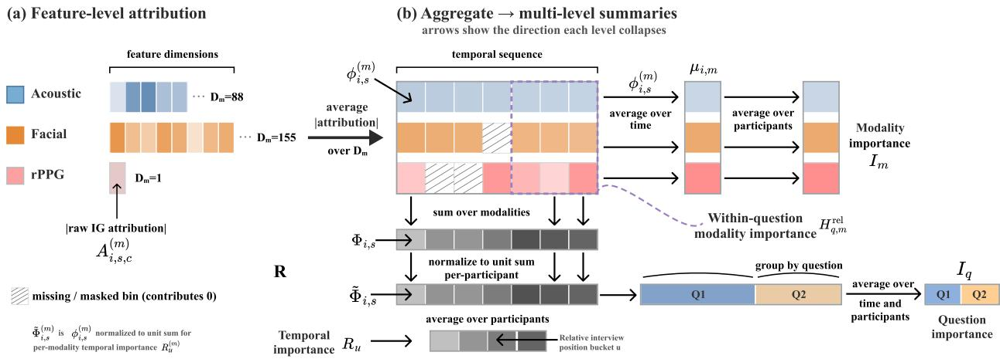  
Fig. 7. (a) After training, IG assigns a scalar attribution $A _ { i , s , c } ^ { ( m ) }$ to each feature c of modality-feature m at temporal bin s for participant i. Averaging the absolute attributions over the modality-feature’s $D _ { m }$ dimensions and gating by the availability mask (hatched bins are missing and contribute 0) reduces the attributions of all features c to one score per temporal bin $\phi _ { i , s } ^ { ( m ) }$ . (b) These per-temporal-bin scores are aggregated along the different axes, and arrows indicate the dimensions along which the attributions are aggregated to produce the modality importance $I _ { m } .$ , question importance $I _ { q } ,$ within-question modality importance $H _ { q , m } ^ { \mathrm { r e l } }$ , and temporal importance $R _ { u }$

Within each participant, $\mu _ { i , m }$ is normalized over observed modality-features so that contributions are comparable across participants. The per-participant normalization produces $\tilde { I } _ { i , m } { : }$

$$
\tilde { I } _ { i , m } = \frac { \mu _ { i , m } } { \displaystyle \sum _ { m ^ { \prime } \in \mathcal { M } _ { i } } \mu _ { i , m ^ { \prime } } } .\tag{5}
$$

We set $\tilde { I } _ { i , m } = 0$ for participants for whom modality-feature m was entirely absent. The dataset-level modality-feature importance (shown in Fig. 6(a)) aggregated over participants is:

$$
I _ { m } = \frac { 1 } { | \mathcal { P } | } \sum _ { i \in \mathcal { P } } \tilde { I } _ { i , m } .\tag{6}
$$

3) Question Importance: Let $q _ { i , s }$ denote the question identity of temporal bin s for participant i, let $\begin{array} { r } { N _ { i , q } = \sum _ { s } { \bf 1 } \{ q _ { i , s } = } \end{array}$ q} be the number of observed bins for question q, and let $\mathcal { P } _ { q } ~ = ~ \{ i ~ : ~ N _ { i , q } ~ > ~ 0 \}$ be the set of participants who answered question q. We normalize $\tilde { \Phi } _ { i , s }$ by $N _ { i , q }$ to reduce bias toward longer answers. We then average that result over participants, producing the dataset-level question importance (shown in Fig. 10):

$$
I _ { q } = \frac { 1 } { | \mathcal { P } _ { q } | } \sum _ { i \in \mathcal { P } _ { q } } \frac { 1 } { N _ { i , q } } \sum _ { s : q _ { i , s } = q } \tilde { \Phi } _ { i , s } .\tag{7}
$$

4) Within-Question Modality Importance: Let $N _ { i , q } ^ { ( m ) } ~ =$ $\textstyle \sum _ { s } { \bf 1 } \{ q _ { i , s } = q \} M _ { i , s } ^ { ( m ) }$ be the number of observed bins for modality-feature m within question q for participant i, and let $\mathcal { M } _ { i , q } ^ { \mathrm { ~ ~ } } ~ = ~ \{ m ~ : ~ N _ { i , q } ^ { ( m ) } ~ > ~ 0 \}$ be the modality-features observed at least once during that question. As described in Section A-B2, the per-bin attribution is normalized by observed bin count to avoid penalizing modality-features with more missing temporal bins:

$$
\mu _ { i , q , m } = \frac { \displaystyle \sum _ { s : q _ { i , s } = q } \phi _ { i , s } ^ { ( m ) } } { N _ { i , q } ^ { ( m ) } } .\tag{8}
$$

Within each participant and question, $\mu _ { i , q , m }$ is normalized over observed modality-features so that contributions are comparable across participants:

$$
r _ { i , q , m } = \frac { \mu _ { i , q , m } } { \displaystyle \sum _ { m ^ { \prime } \in \mathcal { M } _ { i , q } } \mu _ { i , q , m ^ { \prime } } } .\tag{9}
$$

The dataset-level within-question modality-feature importance (shown in Fig. 11) is:

$$
H _ { q , m } ^ { \mathrm { r e l } } = \frac { 1 } { \left| \mathcal { P } _ { q } \right| } \sum _ { i \in \mathcal { P } _ { q } } r _ { i , q , m } .\tag{10}
$$

5) Temporal Importance: Bins are within-answer temporal units, so their total count varies with interview length, and a bin does not correspond to a fixed recording position across participants. To place every participant on a common temporal axis for a cohort-level temporal importance summary, we group each participant’s bins into U equal-width buckets by relative position in the interview. Unlike bins, which measure absolute time within a single answer and vary in number per participant, buckets measure normalized position across the whole interview and are fixed at U buckets per participant. Thus, bucket u denotes the same relative point in the interview for all participants. We set $U = 2 0$ , so each bucket spans 5% of the normalized interview duration.

Let $\boldsymbol { B } _ { i , u }$ denote the set of bins for participant i in bucket $u ,$ and let $\mathcal { P } _ { u } = \{ i : | B _ { i , u } | > 0 \}$ be the set of participants with at least one bin in bucket u. Dividing each participant’s temporal-importance values $\tilde { \Phi } _ { i , s }$ summed over bucket u by $| B _ { i , u } |$ aggregates them into a single mean importance value. Therefore, a participant with many bins in that bucket does not contribute more than one with fewer bins. Averaging over the $| \mathcal { P } _ { u } |$ participants combines the means across participants with bins in bucket u. Therefore, $R _ { u }$ is the mean per-bin temporal importance at relative position u in the interview:

$$
R _ { u } = \frac { 1 } { \vert \mathcal { P } _ { u } \vert } \sum _ { i \in \mathcal { P } _ { u } } \frac { 1 } { \vert \mathcal { B } _ { i , u } \vert } \sum _ { s \in \mathcal { B } _ { i , u } } \tilde { \Phi } _ { i , s } .\tag{11}
$$

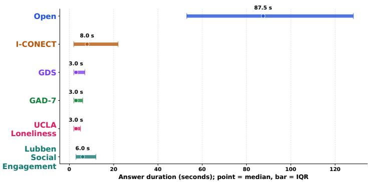  
(a) Answer duration (median and IQR)

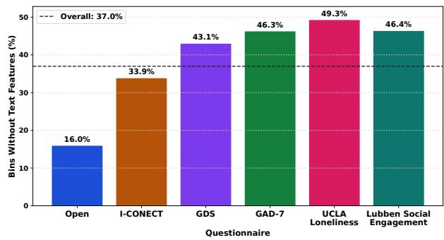  
(b) Text feature bin missingness  
Fig. 8. Answer duration and text-feature missingness by question group. (a) Median answer duration (point) and interquartile range (IQR) (bar) within each question group. Open-ended questions elicit longer answers than structured questions. (b) Percentage of answer-aligned one-second bins that contain no transcribed word, within each question group, with the overall rate (37.0%) marked by the dashed line. Text missingness rises as answer duration shortens from 16% for open-ended questions to 49% for the UCLA Loneliness questions.

Here, $\tilde { \Phi } _ { i , s }$ is the per-bin temporal importance defined in Section A-B1. $R _ { u }$ across the full interview is shown in Fig. 6(b). The modality-feature-specific temporal importance $\bar { R } _ { u } ^ { ( m ) }$ is obtained by substituting $\tilde { \Phi } _ { i , s } ^ { ( m ) }$ for $\mathbf { \bar { \Phi } } _ { \tilde { \Phi } _ { i , s } . \ R _ { u } ^ { ( n ) } }$ across the full interview for eyegaze, head pose, and ComParE is likewise shown in Fig. 6(b).

## SUPPLEMENTARY B EXPERIMENTS

## A. Dataset

Each interview followed a fixed-order protocol comprising six consecutive question groups: four open-ended narrative prompts (including autobiographical recall and a picture description task using the Thematic Apperception Test (TAT) [63]), an 18-item social and functional health check derived from the I-CONECT protocol [64], the 30-item GDS [65], the GAD-7 [66], the 20-item UCLA Loneliness Scale [67], and the 12-item Lubben Social Network Scale (Social Engagement) [68].

Some questions were not answered by design. The interview used skip logic, so a question could be omitted based on a prior answer. For example, participants who answered “yes” to whether they live alone were not asked the follow-up question of how many people live with them. Other omissions arose from changes to the administered question groups across the study, such as the change from the short to the long version of the UCLA Loneliness Scale. The TAT question was unanswered for several participants due to difficulty showing the picture over Zoom. Because the interviewer annotated answer timestamps by hand, some questions with a spoken answer were occasionally marked as unanswered.

Missingness varies across input modality-features. The acoustic features (eGeMAPS, ComParE, and Wav2Vec2) have less than 0.1% of bins missing across all participants. Visual and physiological features have low missingness rates (action units and landmarks: 3.0%; eyegaze: 2.6%; head pose: 2.5%; rPPG: 1.4%). One participant had no valid rPPG signal across the full interview. Language has the highest per-bin missingness (37.0%), because answer duration varies by question type. Open-ended narrative questions elicited the longest answers (median 87.5s) and had the lowest text missingness (16%), whereas Likert-scale and yes/no questions elicited short responses (median 3–8s) and had higher missingness, including 43.1% for the GDS, 46.3% for the GAD-7, 49.3% for the UCLA Loneliness scale, and 46.4% for the Lubben Social Engagement scale (Fig. 8). Furthermore, transcription errors are an additional source of missingness. For example, WhisperX sometimes leaves short fillers such as “Oh” or “Um” untranscribed even when spoken within an answer. In all cases, missing bins are assigned zero feature vectors and flagged by the modality-feature-timestep mask rather than excluded, as described in Section III-B3.

The ComParE feature set is standardized and projected to 512 dimensions via Principal Component Analysis fitted on training-fold data, as the raw dimensionality of the feature is 6,373.

Participant feature time series are formed by concatenating bins across all answers, and the resulting number of bins ranged from 597 to 2260 across participants (median 935).

## B. Training and Evaluation Protocol

To mitigate class imbalance, training batches are constructed using a class-balanced sampler that oversamples participants from the minority class. Within each fold, all models are trained for ≈ 10 epochs. After training, each model is evaluated once on that fold’s unseen, held-out test set.

We report the AUROC score as the primary metric following previous work for mental health analysis on older adults with MCI [21]. We also report AUPRC, macro-F1, positive class precision, and recall scores in Table V. For significance testing, we also report pairwise statistical comparisons with one-sided Student’s paired t-tests over fold-level AUROC scores; Table VI reports whether the first model in each contrast outperformed the second. For each task, interpretability analysis is performed on the unseen test participants for the fold corresponding to the best-performing temporally aligned (+T) model across all repetition-fold pairs.

## C. Ablations

1) Sequence-Index-Paired Baseline: To evaluate the impact of temporal alignment in the ablation experiments, we create a temporally unaligned version of the dataset. Each modality-feature is processed as an independent time series $\mathbf { X } ^ { ( m ) } \in \mathbb { R } ^ { T _ { m } \times D _ { m } }$ , where $T _ { m }$ varies across modality-features according to their native sampling rates. Language features are represented as a single transcript-level embedding for the full interview rather than as a sequence of bin-level embeddings. At training time, we apply uniform downsampling to the shortest sequence length $T$ within the batch, with t indexing timesteps within a single sequence. This follows strategies similar to those used to normalize feature time series to a global common temporal length by pooling [26] or cropping and interpolation [27]. Instead, we set the target length per batch rather than globally because interview durations range from 600 to 3,600s, so a single fixed length would either discard most of the longer interviews or heavily upsample the shorter ones. This sequence-index-paired baseline follows prior approaches that pair features by their index position in the sequence rather than by timestamps during training [26], [27].

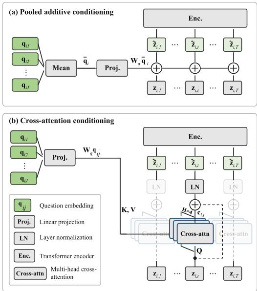  
Fig. 9. Question-conditioning models for the sequence-index-paired baseline. (a) Pooled additive conditioning. (b) Cross-attention conditioning. The stacked blocks denote the $H \ = \ 4$ heads, and the faded blocks denote additional timesteps processed by the same attention module with the same question keys and values.

## 2) Question-Conditioning Models:

a) Pooled Additive Conditioning (Linear/Non-linear + $Q ,$ sum): For the sequence-index-paired baseline, the multimodal feature time series are not segmented by answer timestamps or temporally aligned. We therefore adapt the additive conditioning that Zhang et al. [25] apply to each question and its associated response to operate at the interview level. Their approach is discussed further in the Related Work section of the main text (Section II-D). In our adaptation, all question embeddings are averaged into a single interview-level summary $\bar { \mathbf { q } } _ { i } ,$ , and projected to d (defined in Section III-C1) by $W _ { q }$ . This projected vector is then added uniformly across timesteps to the fused multimodal sequence, similar to additive global conditioning in WaveNet [85]:

$$
\bar { \mathbf { q } } _ { i } = \frac { 1 } { J _ { i } } \sum _ { j = 1 } ^ { J _ { i } } \mathbf { q } _ { i j } , \qquad \tilde { \mathbf { z } } _ { i , t } = \mathbf { z } _ { i , t } + W _ { q } \bar { \mathbf { q } } _ { i } ,\tag{12}
$$

where $W _ { q } ~ \in ~ \mathbb { R } ^ { d \times d _ { q } } , ~ \mathbf { q } _ { i j }$ is the embedding of the $j \cdot$ -th question answered by participant $i , \mathbf { z } _ { i , t }$ is the fused multimodal token at timestep t, and $\tilde { \mathbf { z } } _ { i , t }$ is the question-conditioned multimodal token. The conditioned sequence $\tilde { \mathbf { Z } } _ { i }$ formed by stacking the conditioned tokens is then passed to the Transformer encoder as described in Section III-C2.

b) Cross-Attention Conditioning (Linear/Non-linear + Q, cross-attn.): We generalize the question-conditioned attention used in HCAG [34] to the sequence-index-paired baseline by replacing additive attention with cross-attention. Further discussion of the HCAG approach is provided in the Related Work section of the main text (Section II-D). In our adaptation, each fused multimodal token ${ \bf z } _ { i , t }$ attends to the participant’s set of $J _ { i }$ answered question embeddings through a multihead cross-attention block [86]. We use $H = 4$ heads, model dimension d = 128, per-head dimension $d _ { h } = d / H = 3 2$ and dropout $= \ 0 . 3$ . The question embeddings $\{ \mathbf { q } _ { i j } \} _ { j = 1 } ^ { J _ { i } }$ are projected to d by $W _ { q }$ . For head h, the fused multimodal token ${ \bf z } _ { i , t }$ at timestep t forms the query, and each projected question embedding $W _ { q } { \bf q } _ { i j }$ forms the keys and values:

$$
\mathbf { Q } _ { i , t } ^ { h } = W _ { Q } ^ { h } \mathbf { z } _ { i , t } , \quad \mathbf { K } _ { i j } ^ { h } = W _ { K } ^ { h } ( W _ { q } \mathbf { q } _ { i j } ) ,\tag{13}
$$

$$
\mathbf { V } _ { i j } ^ { h } = W _ { V } ^ { h } ( W _ { q } \mathbf { q } _ { i j } ) ,\tag{14}
$$

where $W _ { Q } ^ { h } , W _ { K } ^ { h } , W _ { V } ^ { h } \ \in \ \mathbb { R } ^ { d _ { h } \times d } ,$ , and $W _ { q } ~ \in ~ \mathbb { R } ^ { d \times d _ { q } }$ . The attention weight from timestep t to question $j ,$ , normalized across the participant’s answered questions, is $\alpha _ { i , t , j } ^ { h } \mathrm { : }$

$$
\alpha _ { i , t , j } ^ { h } = \mathrm { s o f t m a x } _ { j } \left( \frac { ( \mathbf { Q } _ { i , t } ^ { h } ) ^ { \top } \mathbf { K } _ { i j } ^ { h } } { \sqrt { d _ { h } } } \right) .\tag{15}
$$

The resulting question context $\mathbf { c } _ { i , t } ^ { h } \in \mathbb { R } ^ { d _ { h } }$ is the attentionweighted combination of the projected question embeddings:

$$
\mathbf { c } _ { i , t } ^ { h } = \sum _ { j = 1 } ^ { J _ { i } } \alpha _ { i , t , j } ^ { h } \mathbf { V } _ { i j } ^ { h } .\tag{16}
$$

The head question contexts are concatenated, projected by $W _ { O } \in \mathbb { R } ^ { d \times d }$ to form $\mathbf { c } _ { i , t }$ , which is added back to the fused multimodal token ${ \bf z } _ { i , t }$ through a residual connection with dropout and layer normalization, giving $\tilde { \mathbf { z } } _ { i , t }$ , the questionconditioned multimodal token:

$$
\mathbf { c } _ { i , t } = W _ { O } \big [ \mathbf { c } _ { i , t } ^ { 1 } ; \dots ; \mathbf { c } _ { i , t } ^ { H } \big ] ,\tag{17}
$$

$$
\widetilde { \mathbf { z } } _ { i , t } = \mathrm { L a y e r N o r m } ( \mathbf { z } _ { i , t } + \mathrm { D r o p o u t } ( \mathbf { c } _ { i , t } ) ) ,\tag{18}
$$

where $\mathbf { c } _ { i , t } , \mathbf { z } _ { i , t }$ , and $\widetilde { \mathbf { z } } _ { i , t } \in \mathbb { R } ^ { d }$ . Each fused multimodal token therefore receives a learned mixture of all of the participant’s question embeddings. The conditioned sequence is then passed to the Transformer encoder as described in Section III-C2.

TABLE V  
CLASSIFICATION RESULTS $( \mathrm { M E A N } \pm 9 5 \% \mathrm { C I s } )$ . PRECISION AND RECALL ARE REPORTED FOR THE POSITIVE CLASS (POSITIVE DEPRESSION- OR ANXIETY-RISK CLASS) AT A CLASSIFICATION THRESHOLD OF 0.5. BOLD, UNDERLINE, AND italics DENOTE THE HIGHEST, SECOND-HIGHEST, AND THIRD-HIGHEST RESULTS WITHIN EACH TASK AND METRIC, RESPECTIVELY. TIED RESULTS RECEIVE THE SAME RANK. T DENOTES TEMPORALLY ALIGNED FEATURES, AND Q DENOTES QUESTION CONDITIONING. LINEAR AND NON-LINEAR DENOTE THE DIFFERENT PROJECTION BACKBONES. THE NO-MASK VARIANT REPLACES THE MASK WITH AN ALL-ONES MASK, EFFECTIVELY DISABLING MASKING, WHEREAS THE OPEN-ONLY VARIANT USES ONLY MULTIMODAL FEATURES EXTRACTED FROM PARTICIPANTS’ RESPONSES TO THE FOUR OPEN-ENDED QUESTIONS.
<table><tr><td rowspan="2">Variant</td><td colspan="4">Depression</td><td colspan="4">Anxiety</td></tr><tr><td>AUPRC ↑</td><td>Macro-F1 ↑</td><td> $\mathbf { P r e c i s i o n } _ { + } \uparrow$ </td><td> $\mathbf { R e c a l l } _ { + } \uparrow$ </td><td>AUPRC ↑</td><td>Macro-F1 ↑</td><td>Precision+ ↑</td><td>Recall+↑</td></tr><tr><td colspan="9">Sequence-index-paired baseline [26], [27]</td></tr><tr><td>Linear</td><td> $0 . 5 6 \pm 0 . 0 0 4$ </td><td> $0 . 4 5 \pm 0 . 0 8$ </td><td> $0 . 3 4 \pm 0 . 1 2$ </td><td> $0 . 3 1 \pm 0 . 1 6$ </td><td> $0 . 5 7 \pm 0 . 0 2$ </td><td> $\mathbf { 0 . 5 5 \pm 0 . 0 7 }$ </td><td> ${ \bf 0 . 4 9 \pm 0 . 1 5 }$ </td><td> $0 . 3 8 \pm 0 . 1 5$ </td></tr><tr><td>Non-linear</td><td> $0 . 6 0 \pm 0 . 0 9$ </td><td> $0 . 5 2 \pm 0 . 0 8$ </td><td> $0 . 5 0 \pm 0 . 1 8$ </td><td> $0 . 4 3 \pm 0 . 1 4$ </td><td> $0 . 5 8 \pm 0 . 0 5$ </td><td> $0 . 5 0 \pm 0 . 0 7$ </td><td> $0 . 4 0 \pm 0 . 1 4$ </td><td> $0 . 2 7 \pm 0 . 0 9$ </td></tr><tr><td colspan="9">Question-conditioned</td></tr><tr><td>Linear + Q, sum [25]</td><td> $0 . 5 6 \pm 0 . 0 1$ </td><td> $0 . 4 8 \pm 0 . 0 4$ </td><td> $0 . 4 2 \pm 0 . 0 6$ </td><td> $0 . 4 3 \pm 0 . 1 3$ </td><td> $0 . 5 4 \pm 0 . 0 6$ </td><td> $0 . 4 8 \pm 0 . 0 3$ </td><td> $0 . 3 0 \pm 0 . 1 1$ </td><td> $0 . 2 6 \pm 0 . 0 7$ </td></tr><tr><td>Linear + Q, cross-attn. [34]</td><td> $0 . 5 0 \pm 0 . 0 6$ </td><td> $0 . 4 7 \pm 0 . 0 7$ </td><td> $0 . 4 3 \pm 0 . 1 1$ </td><td> $0 . 3 9 \pm 0 . 1 0$ </td><td> $0 . 5 4 \pm 0 . 0 3$ </td><td> $\underline { { 0 . 5 3 \pm 0 . 0 7 } }$ </td><td> $0 . 4 3 \pm 0 . 1 9$ </td><td> $0 . 3 8 \pm \ : 0 . 1 3$ </td></tr><tr><td>Non-linear + Q, sum [25]</td><td> $0 . 6 1 \pm 0 . 0 3$ </td><td> $0 . 5 1 \pm 0 . 0 8$ </td><td> $0 . 5 0 \pm 0 . 0 7$ </td><td> $0 . 3 9 \pm 0 . 1 2$ </td><td> $0 . 5 1 \pm 0 . 0 8$ </td><td> $\overline { { 0 . 5 0 \pm 0 . 0 7 } }$ </td><td> $0 . 3 4 \pm 0 . 0 8$ </td><td> $0 . 3 8 \pm 0 . 0 7$ </td></tr><tr><td>Non-linear + Q, cross-attn. [34]</td><td> $0 . 6 1 \pm 0 . 1 3$ </td><td> $0 . 5 2 \pm 0 . 0 7$ </td><td> $0 . 4 6 \pm 0 . 1 2$ </td><td> $0 . 4 1 \pm 0 . 0 6$ </td><td> $0 . 5 5 \pm 0 . 0 8$ </td><td> $0 . 4 9 \pm 0 . 1 1$ </td><td> $0 . 3 3 \pm 0 . 2 2$ </td><td> $0 . 3 8 \pm 0 . 2 6$ </td></tr><tr><td colspan="9">Temporally aligned</td></tr><tr><td>Linear + T (no mask)</td><td> $\underline { { 0 . 6 8 \pm 0 . 0 9 } }$ </td><td> $\underline { { 0 . 5 7 \pm 0 . 0 3 } }$ </td><td> ${ \bf 0 . 5 9 \pm 0 . 0 7 }$ </td><td> $\underline { { 0 . 5 4 \pm 0 . 1 6 } }$ </td><td> $0 . 5 5 \pm 0 . 0 5$ </td><td> $0 . 4 9 \pm 0 . 0 7$ </td><td> $0 . 3 1 \pm 0 . 0 8$ </td><td> $0 . 3 4 \pm 0 . 1 0$ </td></tr><tr><td>Linear + T</td><td> $\overline { { O . 6 7 \pm 0 . 0 8 } }$ </td><td> $\overline { { 0 . 5 4 \pm 0 . 0 7 } }$ </td><td> $\underline { { 0 . 5 8 \pm 0 . 1 9 } }$ </td><td> $\overline { { 0 . 5 3 \pm 0 . 1 2 } }$ </td><td> $\mathbf { 0 . 6 3 \pm 0 . 1 2 }$ </td><td> $0 . 5 1 \pm 0 . 0 9$ </td><td> $\underline { { 0 . 4 8 \pm 0 . 2 9 } }$ </td><td> $0 . 3 4 \pm 0 . 1 8$ </td></tr><tr><td>Non-linear + T (no mask)</td><td> $0 . 6 6 \pm 0 . 0 4$ </td><td> $0 . 5 3 \pm 0 . 0 5$ </td><td> $\overline { { 0 . 5 0 \pm 0 . 1 3 } }$ </td><td> $0 . 3 6 \pm 0 . 1 0$ </td><td> $0 . 5 4 \pm 0 . 0 9$ </td><td> $0 . 4 8 \pm 0 . 0 2$ </td><td> $\overline { { 0 . 3 0 \pm 0 . 0 3 } }$ </td><td> $0 . 3 8 \pm 0 . 0 5$ </td></tr><tr><td>Non-linear + T</td><td> $\underline { { 0 . 6 8 \pm 0 . 0 4 } }$ </td><td> $0 . 5 6 \pm 0 . 0 2$ </td><td> $0 . 5 4 \pm 0 . 0 3$ </td><td> $0 . 5 3 \pm 0 . 0 5$ </td><td> $0 . 5 7 \pm 0 . 0 8$ </td><td> $0 . 4 7 \pm 0 . 0 5$ </td><td> $0 . 4 0 \pm 0 . 0 2$ </td><td> $0 . 3 7 \pm 0 . 0 5$ </td></tr><tr><td colspan="9">Aligned + question</td></tr><tr><td>Linear + Q + T</td><td> ${ \bf 0 . 6 9 \pm 0 . 1 1 }$ </td><td> $0 . 5 2 \pm 0 . 0 7$ </td><td> $0 . 5 5 \pm 0 . 1 7$ </td><td> $0 . 4 8 \pm 0 . 1 3$ </td><td> $\underline { { 0 . 6 0 \pm 0 . 0 6 } }$ </td><td> $0 . 5 2 \pm 0 . 0 2$ </td><td> $0 . 3 9 \pm 0 . 1 9$ </td><td> $0 . 4 0 \pm 0 . 0 4$ </td></tr><tr><td>Non-linear + Q + T</td><td> $\underline { { 0 . 6 8 \pm 0 . 0 6 } }$ </td><td> $\mathbf { 0 . 5 8 \pm 0 . 0 8 }$ </td><td> $0 . 5 2 \pm 0 . 1 3$ </td><td> $0 . 5 1 \pm 0 . 1 6$ </td><td> $\overline { { 0 . 5 8 \pm 0 . 0 1 } }$ </td><td> $0 . 4 8 \pm 0 . 0 5$ </td><td> $0 . 3 4 \pm 0 . 1 4$ </td><td> $\mathbf { 0 . 4 1 \pm 0 . 2 7 }$ </td></tr><tr><td colspan="9">Open-ended only</td></tr><tr><td>Linear + T (open only)</td><td></td><td></td><td></td><td></td><td> $0 . 5 2 \pm 0 . 0 7$ </td><td> $0 . 4 9 \pm 0 . 1 2$ </td><td> $0 . 3 0 \pm 0 . 2 1$ </td><td> $0 . 3 7 \pm 0 . 1 9$ </td></tr><tr><td>Non-linear + T (open only)</td><td> $\mathbf { 0 . 6 9 \pm 0 . 0 8 }$ </td><td> $\underline { { 0 . 5 7 \pm 0 . 0 6 } }$ </td><td> $0 . 5 0 \pm 0 . 0 5$ </td><td> $\mathbf { 0 . 5 5 \pm 0 . 0 8 }$ </td><td></td><td></td><td></td><td></td></tr></table>

## TABLE VI

PAIRWISE STATISTICAL COMPARISONS FOR DEPRESSION AND ANXIETY   
CLASSIFICATION. ∆ DENOTES THE MEAN AUROC DIFFERENCE BETWEEN   
THE FIRST AND SECOND MODEL. COMPARISONS USE ONE-SIDED PAIRED t-TESTS WITH THE ALTERNATIVE ∆ > 0. BOLD p VALUES INDICATE p < 0.05.

<table><tr><td></td><td colspan="2">Depression</td><td colspan="2">Anxiety</td></tr><tr><td>Contrast</td><td>Δ↑</td><td>p</td><td>Δ↑</td><td>p</td></tr><tr><td>Linear</td><td></td><td></td><td></td><td></td></tr><tr><td>Q (sum) &gt; Baseline</td><td>0.01</td><td>0.31</td><td>-0.03</td><td>0.80</td></tr><tr><td>Q (cross-attn.) &gt; Baseline</td><td>-0.06</td><td>0.96</td><td>-0.02</td><td>0.77</td></tr><tr><td>T &gt; Baseline</td><td>0.13</td><td>0.05</td><td>0.11</td><td>0.05</td></tr><tr><td>T (mask) &gt; T (no mask)</td><td>-0.009</td><td>0.56</td><td>0.04</td><td>0.12</td></tr><tr><td>T (all questions) &gt; T (open only)</td><td></td><td></td><td>0.09</td><td>0.02</td></tr><tr><td>Q+T &gt; Baseline</td><td>0.16</td><td>0.009</td><td>0.09</td><td>0.09</td></tr><tr><td>Q+T &gt; Q (sum)</td><td>0.15</td><td>0.009</td><td>0.12</td><td>0.04</td></tr><tr><td>Q+T &gt; Q (cross-attn.)</td><td>0.22</td><td>0.001</td><td>0.12</td><td>0.06</td></tr><tr><td>Q+T &gt; T</td><td>0.03</td><td>0.28</td><td>-0.02</td><td>0.64</td></tr><tr><td>Non-linear</td><td></td><td></td><td></td><td></td></tr><tr><td>Q (sum) &gt; Baseline</td><td>-0.03</td><td>0.73</td><td>-0.02</td><td>0.66</td></tr><tr><td>Q (cross-attn.) &gt; Baseline</td><td>-0.02</td><td>0.62</td><td>0.000</td><td>0.50</td></tr><tr><td>T &gt; Baseline</td><td>0.10</td><td>0.06</td><td>0.02</td><td>0.39</td></tr><tr><td>T (mask) &gt; T (no mask)</td><td>0.02</td><td>0.34</td><td>0.02</td><td>0.32</td></tr><tr><td>T (all questions)  $> \mathrm { T }$  (open only)</td><td>0.01</td><td>0.43</td><td></td><td></td></tr><tr><td>Q+T &gt; Baseline</td><td>0.09</td><td>0.08</td><td>0.05</td><td>0.21</td></tr><tr><td>Q+T &gt; Q (sum)</td><td>0.13</td><td>0.02</td><td>0.07</td><td>0.10</td></tr><tr><td>Q+T &gt; Q (cross-attn.)</td><td>0.11</td><td>0.001</td><td>0.05</td><td>0.18</td></tr><tr><td>Q+T &gt; T</td><td>-0.009</td><td>0.60</td><td>0.03</td><td>0.20</td></tr></table>

T = temporally aligned features; Q = question conditioning; Q+T = question conditioning with temporal alignment; Baseline = sequence-index-paired model. Mask contrasts compare the real temporal mask against an all-ones mask. Open-only models use only multimodal features from responses to the four open-ended questions. Each comparison uses 15 paired observations (df = 14).

## SUPPLEMENTARY C RESULTS

## A. Overall Performance

## B. Question Importance

Fig. 10 decomposes the attribution rankings by question groups for both tasks. For depression (Fig. 10(a)), the highestattribution questions center on social contact and support, self-rated health, and open-ended self-description. The top five questions are Q10 (I-CONECT: overnight visitors), Q89 (Social Engagement: availability of a relative for decision support), Q5 (I-CONECT: self-rated health), Q1 (open-ended: “Tell me about yourself”), and Q90 (Social Engagement: providing decision support to a friend), with attributions of (2.151, 1.702, 1.681, 1.648, and 1.509) $\times \ 1 0 ^ { - 3 }$ , respectively. For anxiety (Fig. 10(b)), the top questions span a narrower range of $0 . 2 4 \times 1 0 ^ { - 3 }$ and center on crying and social contact with friends. Q47 (GDS: crying frequency) leads at $1 . 7 5 9 \times 1 0 ^ { - 3 }$ , followed by Q91 (Social Engagement: availability of a friend for decision support, $1 . 6 3 6 \times 1 0 ^ { - 3 } )$ , Q90 (Social Engagement: providing decision support to a friend, $1 . 5 7 8 \times 1 0 ^ { - 3 } )$ , Q20 (I-CONECT: written communication with friends or family, $1 . 5 7 8 \times 1 0 ^ { - 3 } )$ , and Q17 (I-CONECT: contact with friends, $1 . 5 2 2 \times 1 0 ^ { - 3 } )$

a) Within-question modality-feature importance: Fig. 11 shows the within-question modality-feature share $( H _ { q , m } ^ { \mathrm { r e l } } )$ for the top-ranked questions in each task. The modality-feature rankings from Fig. 6(a) are preserved at the question level. For depression, eyegaze remains the top contributor across every shown question, followed by ComParE. For anxiety, eyegaze and head pose retain their order of importance regardless of question group.

## C. Single Participant Temporal Importance

Fig. 12 shows IG attribution over interview time for one representative participant per task, for the three highestcontributing modality-features from Fig. 6(a). Each participant comes from the test fold of the best-performing model for the corresponding task (Non-linear+T for depression and Linear+T for anxiety). For each task, we selected a repetition–fold combination with a test $\mathrm { A U R O C } > 0 . 8$ and chose the most confidently classified positive case from that fold (confidence > 0.9). The attribution scores were smoothed using a 15-s window for plotting.

For the depression participant (Fig. 12(a)), eyegaze has the highest attribution across all questions. Total attribution peaks during the open-ended block, driven by a sharp increase in eyegaze. ComParE contributes mainly at the beginning of the interview. Attribution decreases through the middle of the interview. This pattern matches the temporal importance findings (Fig. 6(b)), where eyegaze drives the early-interview concentration for depression.

For the anxiety participant (Fig. 12(b)), eyegaze and head pose remain the main contributors across all questions with comparable attribution. rPPG contributes mainly during the open-ended block and decreases afterward. This pattern matches the population-level finding that anxiety attribution is distributed more uniformly across question groups, with comparable contributions from eyegaze and head pose and without the early attribution concentration observed for depression (Fig. 6(b)).

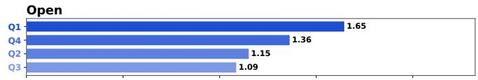

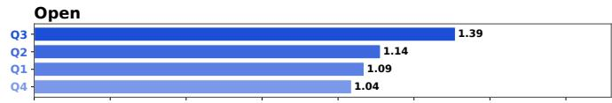

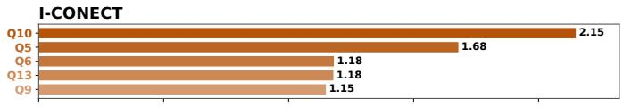

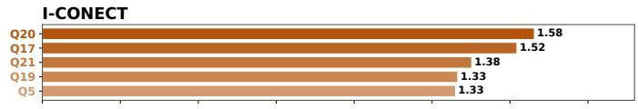

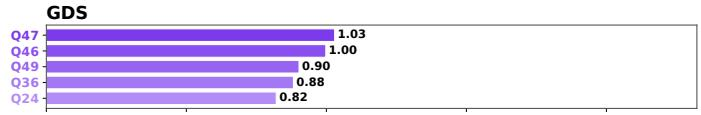

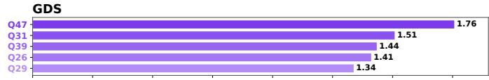

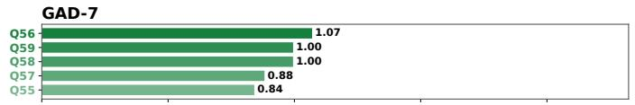

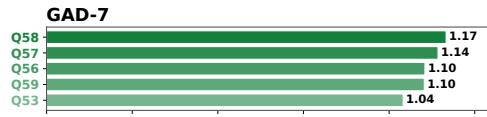

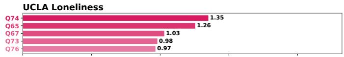

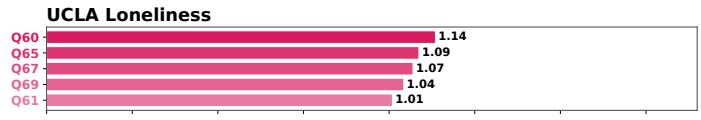

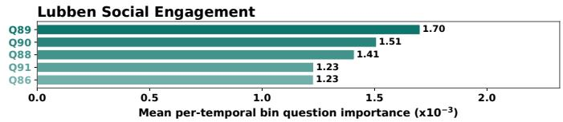  
(a) Depression

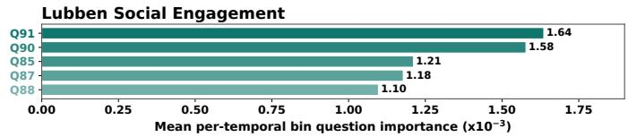  
(b) Anxiety

Fig. 10. IG question-level importance grouped by question group for depression and anxiety prediction. Bars show normalized question-attribution scores for each question group.  
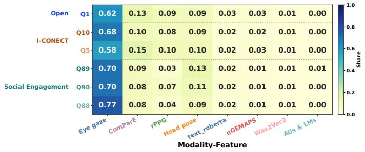  
(a) Depression

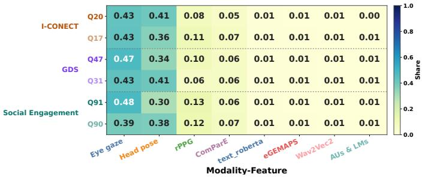  
(b) Anxiety

Fig. 11. IG within-question modality-feature importance for depression and anxiety prediction. Each row shows the normalized modality-feature-attribution share for a high-ranking interview question. Across question groups, eyegaze remains dominant for depression, whereas anxiety shows a more balanced attribution between eyegaze and head pose.  
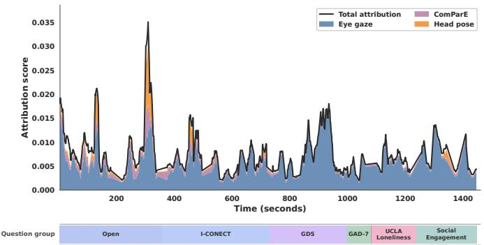  
(a) Depressed participant

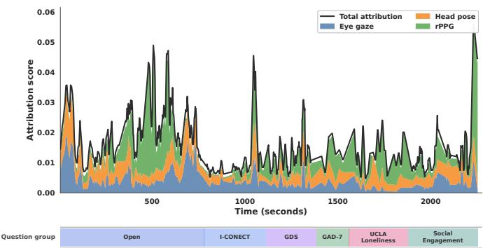  
(b) Anxious participant  
Fig. 12. Single-participant IG temporal importance for the three highest-attribution modality-features. For depression, these features are eyegaze, ComParE, and head pose. Eyegaze dominates throughout the interview, with peaks during the open-ended question block. For anxiety, the top features are eyegaze, head pose, and rPPG. Eyegaze and head pose contribute comparably across all questions, while rPPG shows a peak in the open-ended question block. The colored strip below each panel marks question-group boundaries.