# VCAR: Training-Free 3DGS Segmentation via View Completeness and Axis-Aware Boundary Refinement

Kun Cao Jinan University Zhuhai, China caokun0526@stu2024.jnu.edu.cn

Di Wang ✉   
Jinan University   
Zhuhai, China   
diwang@jnu.edu.cn   
Xu Wang   
Jinan University   
Zhuhai, China   
wangxucoco@live.com   
Zheng Shi   
Jinan University   
Zhuhai, China   
zhengshi@jnu.edu.cn   
Haibin Zhu   
Jinan University   
Zhuhai, China   
zhb2025@stu2025.jnu.edu.cn

Haozhi Huang Jinan University Zhuhai, China hzhuang@jnu.edu.cn

Guanghua Yang Jinan University Zhuhai, China ghyang@jnu.edu.cn

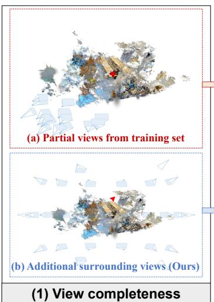

(2) Mask quality  
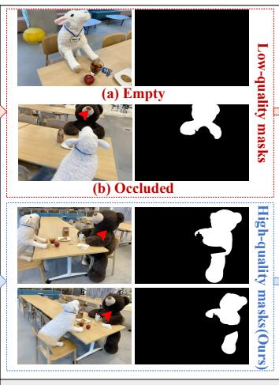

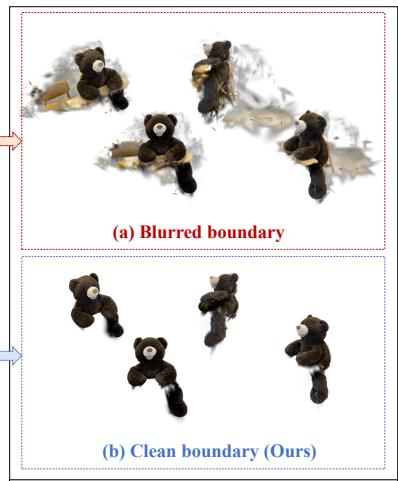  
(3) Segmentation results  
Figure 1: Common problems and comparative results in 3DGS segmentation.

## Abstract

Semantic segmentation in 3D Gaussian Splatting (3DGS) is crucial for advancing 3D scene understanding. Existing methods predominantly rely on feature distillation, which incurs substantial per-scene training overhead and often yields blurred segmentation boundaries. We identify that these boundary artifacts are driven in part by insuficient viewpoint coverage and boundary overflow of anisotropic Gaussian primitives. To address these challenges, we propose VCAR, a training-free coarse-to-fine segmentation strategy based on View Completeness and Axis-aware Boundary Refinement. In the coarse stage, a visibility-based weighted multi-view voting scheme rapidly localizes the target. In the fine stage, an object-centric sphere derived from the coarse result generates supplementary viewpoints via Spherical Spiral Sampling (SSS), allowing multi-view voting on the augmented views to precisely refine object boundaries and suppress irrelevant 3D Gaussians. Moreover,

we introduce Axis-aware Boundary Refinement (ABR) to mitigate artifacts from anisotropic primitives. By decomposing the projected 2D covariance into per-axis contributions, ABR identifies the dominant axis responsible for boundary leakage and applies targeted anisotropic compression exclusively along that axis. Extensive experiments on NVOS and LERF demonstrate that VCAR achieves state-of-the-art segmentation accuracy and eficiency without training. Our code is available at https://github.com/DDKK0526/VCAR.

## CCS Concepts

• Computing methodologies → Scene understanding.

## Keywords

3D Gaussian Splatting, 3D Segmentation, Training-free, View Completeness, Boundary Refinement

## ACM Reference Format:

Kun Cao, Di Wang, Haibin Zhu, Haozhi Huang, Xu Wang, Zheng Shi, and Guanghua Yang. 2026. VCAR: Training-Free 3DGS Segmentation via View Completeness and Axis-Aware Boundary Refinement. In Proceedings ofthe 34th ACM International Conference on Multimedia (MM ’26), November 10–14, 2026, Rio de Janeiro, Brazil. ACM, New York, NY, USA, 16 pages. https://doi.org/10.1145/3767308.3836080

## 1 Introduction

Understanding and interacting with 3D scenes remains a key challenge in computer vision and graphics, extending beyond reconstruction to accurate perception and segmentation. Among recent advances in explicit scene representation, 3D Gaussian Splatting (3DGS) [15] has emerged as a groundbreaking technique, ofering high-fidelity reconstruction and significantly faster real-time rendering compared to Neural Radiance Fields (NeRF) [30].

Existing 3DGS segmentation methods [12] primarily follow a feature distillation paradigm: they first use 2D foundation models (e.g., SAM [17], CLIP [35], DINO [31]) to generate semantic features or segmentation masks across multiple views, then distill these 2D features into 3D Gaussian representations through addi tional training to embed semantic information into each Gaussian primitive. While efective for open-vocabulary scene understanding, these approaches rely on per-scene feature optimization, introduc ing substantial computational overhead [33, 52]—often requiring tens of minutes to hours of additional optimization per scene before inference. Furthermore, because feature distillation optimizes semantic embeddings via loss functions across all Gaussians, nontarget primitives near object boundaries inevitably absorb similar semantic features, causing semantic ambiguity between foreground and nearby background Gaussians [3, 29]. During segmentation, these semantically contaminated primitives are erroneously included as part of the target, resulting in blurred boundaries and floating Gaussian fragments around the object surface.

As illustrated in Figure 1, we attribute these boundary artifacts to two important geometric contributors: insuficient viewpoint coverage and boundary overflow from anisotropic Gaussians. Existing methods typically perform feature distillation only from the limited viewpoints in the training set, whose distribution is often biased and fails to provide uniform coverage of the target object’s surface. When certain regions lack suficient viewpoint coverage, the Gaussian primitives in those areas receive inadequate semantic constraints, leading to boundary ambiguity. Moreover, the anisotropic ellipsoidal shape of 3D Gaussians causes boundary primitives to extend beyond the true object surface in their 2D projections, resulting in aliased edges and floating fragments. Existing methods either ignore this artifact or apply isotropic compression that indiscriminately shrinks all scale axes, failing to isolate the specific axis responsible for overflow in a given view.

Based on the above analysis, this paper presents VCAR, a trainingfree coarse-to-fine segmentation framework for 3DGS based on View Completeness and Axis-aware Boundary Refinement. In the coarse stage, VCAR obtains 2D masks from training views via SAM 3 [2] and aggregates them through visibility-based weighted voting to rapidly localize the target. In the fine stage, the coarse result serves as a spatial prior to construct an object-centric sampling sphere, from which supplementary viewpoints are generated via Spherical Spiral Sampling (SSS) with uniform and temporally coher ent coverage. By rendering only the coarsely segmented Gaussians, inter-object occlusion is reduced, and visibility-based weighted vot ing on the augmented viewpoint set yields a substantially refined segmentation. To further address geometric boundary artifacts, we propose Axis-aware Boundary Refinement (ABR), which identifies the dominant 3D axis responsible for boundary overflow and applies targeted anisotropic compression. The entire framework operates in a purely inference-based manner without any training. The main contributions are summarized as follows.

• A training-free coarse-to-fine segmentation framework, VCAR, is proposed to mitigate two important geometric causes to blurred segmentation boundaries in 3DGS: insuficient view coverage and anisotropic boundary overflow.

• A Spherical Spiral Sampling (SSS) strategy is designed to generate supplementary viewpoints for view completeness enhancement, enabling more accurate visibility-based weighted voting.

• An Axis-aware Boundary Refinement (ABR) method is proposed, in which the scale axis responsible for observed 2D boundary overflow is identified, and the Gaussian primitive is compressed only along that axis, preserving geometry in other directions.

• Extensive experiments on the NVOS and LERF datasets demonstrate that VCAR achieves state-of-the-art accuracy and eficiency.

## 2 Related Work

## 2.1 3D Gaussian Splatting

3D Gaussian Splatting (3DGS) [15] represents scenes using fully explicit, anisotropic Gaussian primitives. Pixel colors are rendered via a highly parallelized tile-based rasterizer that projects the 3D covariance into 2D and performs front-to-back �-blending, achieving real-time novel view synthesis comparable to NeRF [30] but with vastly accelerated optimization. Its structured nature has inspired extensive follow-up research. Works have advanced reconstruction quality and structure [8, 27, 47, 48], storage eficiency through compaction [10, 18], dynamic scene modeling [23, 41], and generalization from sparse views [5, 53]. Beyond reconstruction, 3DGS has been extended to downstream applications like 3D editing [7, 34, 43] and generation [24, 40]. More recently, semantic understanding and interactive segmentation have emerged as an active frontier. Notably, while the anisotropic ellipsoidal geometry of Gaussians excels at capturing surface details, it also introduces segmentation challenges: boundary Gaussians routinely protrude beyond true object surfaces in 2D projections, producing aliased edges. This fundamental geometric artifact motivates the boundary refinement proposed in this work.

## 2.2 3D Segmentation in 3DGS

Recent advances in 2D foundation models (e.g., SAM [17], CLIP [35], DINO [31]) have greatly enhanced 3D scene perception. Transferring such 2D semantic capabilities into 3DGS representations has become a core pathway for 3D segmentation, and existing methods can be grouped into three categories based on how semantic information is incorporated.

Feature Distillation-based Methods. These methods [6, 11, 16, 21, 33, 39, 52] distill 2D semantic knowledge into 3D Gaussian representations. LangSplat [33] trains per-Gaussian language features via a scene-specific autoencoder supervised by CLIP embeddings extracted from SAM-generated hierarchical masks, while

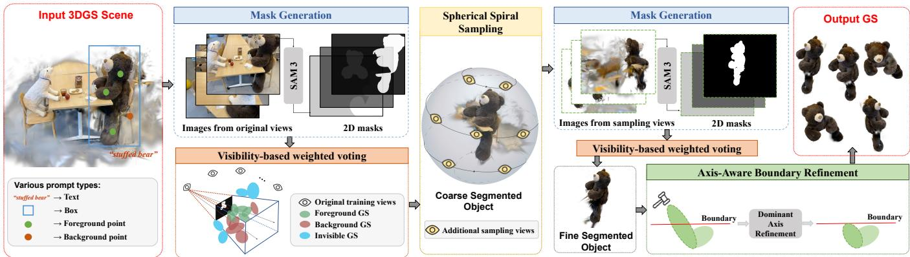  
Figure 2: Overview of the VCAR framework. In the coarse stage, original training views are segmented and aggregated via visibility-based voting. In the fine stage, only the coarsely segmented Gaussians are rendered to eliminate inter-object occlusion, and an object-centric sphere generates additional sampling viewpoints via SSS, followed by refined voting and ABR.

Feature3DGS [52] distills LSeg [19] and SAM features and leverages SAM’s decoder for 2D interpretation. Subsequent works improve along two directions. On the accuracy side, LangSurf [20] jointly optimizes language Gaussians on object surfaces with dense pixel-level geometry supervision, while OpenGaussian [42] adopts coarse-to-fine feature discretization with instance-level 3D-2D association. On the eficiency side, LEGaussian [39] quantizes dense language features into a discrete space to reduce memory overhead, FMGS [54] integrates multi-resolution hash encodings for eficient semantic embedding, and LangSplatV2 [21] represents each Gaussian as a sparse code in a global dictionary, enabling decoder-free sparse coeficient splatting with CUDA-optimized rendering. Despite significant progress, feature distillation inherently relies on per-scene optimization, introducing substantial computational overhead. Moreover, since all Gaussians are jointly optimized, non-target primitives near object boundaries inevitably absorb similar semantic features, leading to semantic ambiguity and blurred segmentation boundaries.

2D Mask Lifting-based Methods. Another line of work [3, 9, 25, 28, 44, 46, 49] directly lifts 2D masks into 3D, with multiview consistency as the central challenge. GaussianGrouping [44] aligns cross-view masks via an object association technique, while Gaga [28] employs a 3D-aware memory bank to associate masks across diverse camera poses. OmniSeg3D [46] refines lifted masks through hierarchical contrastive learning and clustering. SAGA [3] distills SAM’s segmentation capability into a scale-gated afinity rep resentation, Click-Gaussian [9] achieves interactive segmentation through multi-granularity feature fields, and COB-GS [49] jointly optimizes masks and textures with boundary-adaptive Gaussian splitting to refine boundary structures. While these approaches have improved multi-view consistency, they still require additional per-scene training and remain susceptible to boundary artifacts caused by insuficient viewpoint coverage and anisotropic Gaussian overflow.

Training-Free Mask Lifting-based Methods. To eliminate training overhead, several recent methods explore training-free strategies [1, 4, 13, 14, 29, 38, 50, 51]. SAGD [13] classifies Gaussians by projecting their centers onto 2D masks. FlashSplat [38] formulates mask lifting as a linear programming problem, while Gaussian-Cut [14] applies graph-cut optimization for foreground-background partitioning. iSegMan [51] introduces a visibility-guided voting scheme weighted by Gaussian opacity, and LUDVIG [29] performs inverse feature aggregation with graph difusion for feature refinement. However, these methods primarily focus on cross-view consistency or eficient aggregation, while paying less attention to two important geometric contributors to boundary artifacts: insuficient viewpoint coverage that leaves boundary primitives under-constrained, and boundary overflow of anisotropic Gaussians that existing methods either ignore entirely or address with indiscriminate isotropic compression.

## 2.3 Boundary Refinement in 3DGS Segmentation

Resolving the boundary ambiguity caused by the volumetric nature of Gaussians remains a critical challenge. As noted in the preceding paragraphs, SAGD [13] and COB-GS [49] also address this issue from a structural perspective: they identify boundary Gaussians that span both foreground and background regions and apply physical splitting or decomposition to separate them. GaussianTrimmer [26] takes an alternative route, introducing an online post-processing step that renders virtual views to actively trim primitives overflowing 2D boundaries. LBG [4] circumvents structural modification entirely by anchoring each 2D pixel strictly to the primitive providing the maximum alpha-blending weight, thereby avoiding semantic mixing. However, splitting and trimming operations inherently impose destructive modifications that compromise the anisotropic geometric properties of the optimized 3DGS scene. Furthermore, prior solutions generally employ isotropic compression that indiscriminately compresses all spatial dimensions.

In contrast, VCAR jointly targets both insuficient viewpoint coverage and boundary overflow within a unified, training-free framework. By introducing object-centric multi-view augmentation, we provide boundary primitives with additional angular constraints. More importantly, our proposed ABR is the first to trace boundary overflow back to specific 3D scale axes, applying axisselective anisotropic compression along the culpable axis rather than indiscriminate isotropic compression. This better preserves the structural fidelity of well-behaved directions while improv ing boundaries conformity, simultaneously eliminating per-scene training overhead and achieving high-precision segmentation.

## 3 Method

## 3.1 Overview

Given a 3DGS scene with � Gaussian primitives $\mathcal { G } = \{ g _ { i } \} _ { i = 1 } ^ { N }$ , where each $g _ { i }$ is parameterized by position $\pmb { \mu } _ { i } \in \mathbb { R } ^ { 3 }$ , 3D covariance $\Sigma _ { i : }$ opacity $\alpha _ { i } ,$ and spherical harmonics coeficients c�, along with training viewpoints $\bar { \mathcal { V } } ^ { \mathrm { t r a i n } } = \{ v ^ { ( 1 ) } , \ldots , v ^ { ( M ) } \}$ , VCAR identifies the subset ${ \mathcal { G } } ^ { * } \subseteq { \mathcal { G } }$ belonging to a user-specified target from a segmentation prompt on a reference view. The framework adopts a coarse-to-fine strategy without any training (shown in Figure 2):

Stage 1: Coarse Segmentation Stage. The input 3DGS scene is rendered from training viewpoints and segmented by SAM 3 [2] based on user-provided prompts. We specifically integrate SAM 3 because it natively supports both geometric and text prompts, thereby enriching the user’s input modalities. The resulting 2D masks are then aggregated via visibility-based weighted voting (Section 3.2) to produce a coarse segmentation result $\mathcal { G } ^ { \mathrm { c o a r s e } }$

Stage 2: Fine Segmentation Stage. Building upon $\mathcal { G } ^ { \mathrm { c o a r s e } }$ , an object-centric sphere is robustly estimated and supplementary viewpoints are generated via SSS (Section 3.3) to improve angular coverage while maintaining temporal smoothness. Visibility-based weighted voting (Section 3.2) is reapplied on the augmented viewpoint set, which substantially refines the segmentation, and ABR (Section 3.4) further mitigates boundary artifacts to yield the final result $\mathcal { G } ^ { * }$

## 3.2 Visibility-based Weighted Voting

The � rendered images are sequentially segmented by SAM 3 [2] operating in video segmentation mode, yielding per-frame binary masks $\{ \bar { M } ^ { ( j ) } \} _ { j = 1 } ^ { M }$ . The visibility-based weighted voting mechanism to aggregate the masks $\{ \boldsymbol { M } ^ { ( j ) } \} _ { j = 1 } ^ { M }$ , and then produce the segmented subset $\mathcal { G } _ { \mathrm { s e g } } .$

Unlike Naive voting, the visibility-based weighted voting mechanism computes each Gaussian primitive’s foreground ratio exclusively over views in which it is visible, shown in Figure 3. Concretely, for the �-th viewpoint $v ^ { ( j ) }$ , the �-th Gaussian center $\pmb { \mu } _ { i }$ is transformed into camera coordinates via the world-to-camera matrix $\mathbf { W } ^ { ( j ) } \in \mathbb { R } ^ { 4 \times 4 }$ and projected to pixel coordinates $( u _ { i } ^ { ( j ) } , v _ { i } ^ { ( j ) } )$ through the full projection matrix $\mathbf { P } _ { j \cdot } \mathrm { A }$ primitive is deemed visible in view $\boldsymbol { v } ^ { ( j ) }$ if its depth $z _ { i } ^ { ( j ) }$ is positive and its projection falls within the image bounds $W _ { I } ^ { ( j ) } \times H _ { I } ^ { ( j ) }$ :

$$
\mathrm { v i s i b l e } _ { i } ^ { ( j ) } = \big ( z _ { i } ^ { ( j ) } > 0 \big ) \wedge \big ( 0 \le u _ { i } ^ { ( j ) } < W _ { I } ^ { ( j ) } \big ) \wedge \big ( 0 \le v _ { i } ^ { ( j ) } < H _ { I } ^ { ( j ) } \big )\tag{1}
$$

If visible, $M ^ { ( j ) } \in \{ 0 , 1 \}$ ; if invisible, $M ^ { ( j ) } = - 1$ . Hence, each Gaussian primitive receives a tri-valued label:

$$
l a b e l _ { i } ^ { ( j ) } = \left\{ \begin{array} { l l } { { 1 } } & { { \mathrm { f o r e g r o u n d } } } \\ { { 0 } } & { { \mathrm { b a c k g r o u n d } } } \\ { { - 1 } } & { { \mathrm { i n v i s i b l e } } } \end{array} \right.\tag{2}
$$

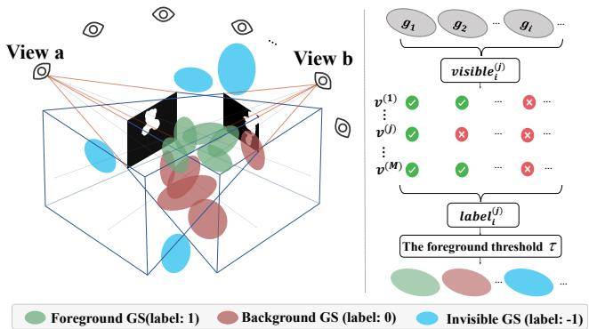  
Figure 3: Visibility-based Weighted Voting.

The foreground ratio is then computed only over visible views and thresholded to determine segmentation:

$$
R _ { i } = \frac { \sum _ { j } \mathbb { 1 } [ l a b e l _ { i } ^ { ( j ) } = 1 ] } { \operatorname* { m a x } \left( \sum _ { j } \mathbb { 1 } [ l a b e l _ { i } ^ { ( j ) } \neq - 1 ] , \ 1 \right) } , \qquad y _ { i } = \mathbb { 1 } \left[ R _ { i } \ge \tau \right]\tag{3}
$$

where � is the foreground ratio threshold. Therefore, the segmentation result is $\mathcal { G } _ { \mathrm { s e g } } = \{ g _ { i } \in \mathcal { G } \ | \ y _ { i } = 1 \}$ . In the proposed VCAR, visibility-based weighted voting is utilized at both coarse and fine segmentation stages. In the coarse stage, the input 2D mask is from training views and the coarse segmentation result is marked as $\mathcal { G } ^ { \mathrm { c o a r s e } }$ . In the fine stage, the input 2D mask is from the additional sampling views and the fine segmentation result is marked as $\mathcal { G } ^ { \mathrm { f i n e } }$

## 3.3 Spherical Spiral Sampling (SSS)

A lightweight view completeness assessment determines whether the Spherical Spiral Sampling (SSS) is required: if the existing training views provide suficient angular coverage of the target object, SSS is skipped to maximize inference eficiency; otherwise, supplementary viewpoints are generated using SSS to ensure full coverage.

3.3.1 Object-Centric Sphere Estimation. We construct an objectcentric bounding sphere from $\mathcal { G } ^ { \mathrm { c o a r s e } }$ , parameterized by a center � and radius �. Let $\mathcal { P } = \{ \pmb { \mu } _ { i } \ | \ g _ { i } \in \mathcal { G } ^ { \mathrm { c o a r s e } } \}$ denote the Gaussian positions and �¯ presents their preliminary mean. We compute each point’s distance $d _ { i } = \lVert { \pmb { \mu } } _ { i } - { \bar { \pmb { \mu } } } \rVert _ { 2 }$ and retain a robust inlier subset via 3� rejection:

$$
{ \mathcal { P } } ^ { * } = \Big \{ \mu _ { i } \in { \mathcal { P } } \mid d _ { i } \leq \mu _ { d } + 3 \sigma _ { d } \Big \} , \qquad c = \frac { 1 } { | { \mathcal { P } } ^ { * } | } \sum _ { \mu _ { i } \in { \mathcal { P } } ^ { * } } \mu _ { i }\tag{4}
$$

where $\mu _ { d }$ and $\sigma _ { d }$ are the mean and standard deviation of {�� }. The sphere radius is set to

$$
r = \eta \cdot \lVert v _ { \mathrm { r e f } } ^ { \mathrm { p o s } } - c \rVert _ { 2 }\tag{5}
$$

where $v _ { \mathrm { r e f } } ^ { \mathrm { p o s } }$ is the camera position of the view on which the user provides the segmentation prompt and � is a scaling factor to better ensure that the target is fully contained for generated viewpoints. The 3� rejection prevents the estimated center from being biased by scattered outlier primitives retained from the coarse stage.

3.3.2 View Completeness Assessment. With the robust object center � established, we assess view completeness by measuring the maximum angular gap on the unit sphere. Specifically, we generate $K = 2 0 0 0$ uniformly distributed test directions $\{ \mathbf { t } _ { i } \} _ { i = 1 } ^ { K }$ 1 via a Fibonacci lattice, and for each valid training camera compute the unit heading ${ \bf h } _ { j }$ from its position toward �. The maximum angular gap is then:

$$
\Delta _ { \operatorname* { m a x } } = \operatorname* { m a x } _ { i } \operatorname { a r c c o s } \left( \operatorname* { m a x } _ { j } \mathbf { \Delta t } _ { i } ^ { \top } \mathbf { h } _ { j } \right)\tag{6}
$$

If $\Delta _ { \mathrm { m a x } }$ exceeds a threshold $\Delta _ { \mathrm { t h } } \left( \mathrm { e . g . , 9 0 ^ { \circ } } \right)$ , SSS is triggered to augment coverage; otherwise, it is bypassed for eficiency. See the supplementary material for detailed camera filtering criteria.

3.3.3 Spiral Trajectory Sampling. Additional viewpoints are sampled along a continuous spherical spiral trajectory on the estimated object-centric sphere. Specifically, let $N _ { s } = S _ { 1 } \times S _ { 2 }$ be the total number of sampled points, where $S _ { 1 }$ is the number of spiral revolutions and $S _ { 2 }$ is the number of points per revolution. For the �-th point $( k = 0 , \ldots , N _ { s } - 1 )$ , we define the azimuthal and elevation angles:

$$
\theta _ { k } = \frac { 2 \pi S _ { 1 } \cdot k } { N _ { s } } , \qquad \phi _ { k } = \phi _ { s } + \frac { ( \phi _ { \mathrm { e } } - \phi _ { s } ) \cdot k } { N _ { s } - 1 }\tag{7}
$$

where $\phi _ { s }$ and $\phi _ { \mathrm { e } }$ are the initial and final elevation angles, respectively. Supplementary camera positions are computed via sphericalto-Cartesian conversion:

$$
\mathbf { p } _ { k } = \pmb { c } + r \cdot \left( \cos \phi _ { k } \cos \theta _ { k } , \cos \phi _ { k } \sin \theta _ { k } , \sin \phi _ { k } \right)\tag{8}
$$

All cameras are oriented toward the sphere center $^ { c , }$ collectively forming the supplementary viewpoint set Vsampled. The inherent continuity of spiral sampling yields frames with smoothly varying camera poses, a property that benefits SAM 3 [2] operating in video segmentation mode, which relies on temporal coherence across consecutive frames. Rendering the augmented viewpoint set $\mathcal { V } ^ { \mathrm { f i n e } } = \mathcal { V } ^ { \mathrm { t r a i n } } \cup \mathcal { V } ^ { \mathrm { s a m p l e d } }$ using only $\mathcal { G } ^ { \mathrm { c o a r s e } }$ reduces inter-object occlusion and helps produce more reliable 2D masks. The visibilitybased weighted voting strategy (Section 3.2) is then reapplied over $\scriptstyle { \mathrm { \mathcal { V } } } ^ { \mathrm { f i n e } }$ to obtain the refined Gaussian subset $\mathcal { G } ^ { \mathrm { f i n e } }$

## 3.4 Axis-aware Boundary Refinement (ABR)

In $\mathcal { G } ^ { \mathrm { f i n e } }$ , boundary Gaussians may still protrude beyond the object mask in 2D renderings due to anisotropic scaling. As illustrated in Figure 4, ABR detects such boundary overflow from the projected ellipse geometry, traces it to the dominant 3D axis, and applies targeted per-axis refinement guided by multi-view consistency.

3.4.1 Boundary Overflow Detection. For Gaussian �� visible in view $v ^ { ( j ) }$ , splatting yields the projected center � $\boldsymbol { \mathsf { \iota } } _ { i } ^ { ( j ) } = \overset { \cdot } { ( } \boldsymbol { u } _ { i } ^ { ( j ) } , \boldsymbol { v } _ { i } ^ { ( j ) } )$ (see Section 3.2) and $\mathrm { ~ a ~ } 2 \times 2$ covariance matrix $\Sigma _ { 2 D , i } ^ { ( j ) }$ . We suppress the view superscript (�) in the per-view derivations below for brevity. The principal orientation and scales of the projected ellipse are derived from the eigendecomposition $\Sigma _ { 2 D , i } = \mathbf { U } \mathrm { d i a g } ( \lambda _ { 1 } , \lambda _ { 2 } ) \mathbf { U } ^ { \top }$ with $\lambda _ { 1 } \geq \lambda _ { 2 } ,$ and the rendering cutof at $\sigma _ { c } = 3$ standard deviations gives semi-axis lengths $a _ { i } = \sigma _ { c } \sqrt { \lambda _ { 1 } }$ and $b _ { i } = \sigma _ { c } \sqrt { \lambda _ { 2 } }$ . Four diagnostic endpoints are placed at the extremities of both principal axes:

$$
\mathcal { E } _ { i } = \left\{ \pmb { m } _ { i } \pm a _ { i } \vec { e } _ { 1 } , \pmb { m } _ { i } \pm b _ { i } \vec { e } _ { 2 } \right\}\tag{9}
$$

where $\vec { e } _ { 1 } , \vec { e } _ { 2 }$ are the unit eigenvectors of $\Sigma _ { 2 D , i }$

A Gaussian primitive is marked as overflowing in view $v ^ { ( j ) }$ if any endpoint falls outside the foreground mask. This directional test preserves elongated Gaussians whose semi-major axis lies entirely within the mask. To suppress false positives, boundary overflow detections are aggregated across views: a Gaussian is flagged for compression only if its overflow ratio $\gamma _ { i } ~ = ~ n _ { i } ^ { \mathrm { o v f } } / n _ { i } ^ { \mathrm { v i s } }$ exceeds a tolerance threshold $\rho ,$ where $n _ { i } ^ { \mathrm { v i s } }$ and $n _ { i } ^ { \mathrm { o v f } }$ denote the number of views in which the Gaussian center is visible and in which overflow is detected, respectively.

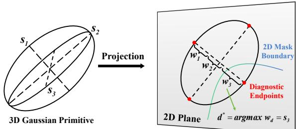  
(a) Dominant 3D axis identification

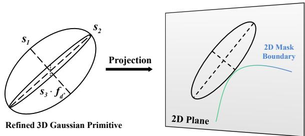  
(b) Refinement  
Figure 4: Axis-aware Boundary Refinement.

3.4.2 Dominant 3D Axis Identification. For each flagged Gaussian $g _ { i }$ with rotation matrix $\mathbf { R } _ { i }$ (columns $\mathbf { r } _ { 1 } , \mathbf { r } _ { 2 } , \mathbf { r } _ { 3 }$ define the local axes) and scale vector $\mathbf { s } = ( s _ { 1 } , s _ { 2 } , s _ { 3 } )$ , we trace the observed 2D overflow to its originating 3D scale axis. Under the linearized splatting model, the 2D covariance admits a per-axis decomposition:

$$
\Sigma _ { 2 D , i } \ = \ \mathbf { M } \Sigma _ { i } \mathbf { M } ^ { \top } \ = \ \sum _ { d = 1 } ^ { 3 } s _ { d } ^ { 2 } \ \mathbf { q } _ { d } \mathbf { q } _ { d } ^ { \top }\tag{10}
$$

where $\mathbf { M } = \mathbf { J } \mathbf { W } _ { R } ^ { ( j ) }$ is the linearized projection matrix. Specifically, $\mathbf { W } _ { R } ^ { ( j ) }$ denotes the $3 \times 3$ rotation matrix of the world-to-camera matrix $\mathbf { W } ^ { ( j ) }$ (see Section 3.2); J represents the perspective Jacobian evaluated at the Gaussian center; $\ P d = \mathbf { M } \mathbf { r } _ { d } \in \mathbb { R } ^ { 2 }$ is the projected direction of the �-th local axis. Let u denote the eigenvector direction of a specific overflowing endpoint, i.e., $\mathbf { u } = \Vec { e } _ { 1 }$ for major-axis and $\mathbf { u } = \Vec { e } _ { 2 }$ for minor-axis overflow, with corresponding eigenvalue �:

$$
\lambda \ = \ \mathbf { u } ^ { \top } \Sigma _ { 2 D , i } \mathbf { u } \ = \ \sum _ { d = 1 } ^ { 3 } \underbrace { s _ { d } ^ { 2 } ( \mathbf { u } ^ { \top } \mathbf { q } _ { d } ) ^ { 2 } } _ { \triangleq \ w _ { d } }\tag{11}
$$

Where $w _ { d }$ quantifies the variance contribution of the �-th 3D axis along the overflow direction.

A large $w _ { d }$ indicates that the �-th axis is both geometrically long and well-aligned with u in the projected view. Conversely, axes nearly parallel to the viewing direction project to near-zero ${ \bf q } _ { d }$ and thus contribute negligibly, regardless of their physical scale. Based on these contributions, the dominant overflowing axis is identified as $d ^ { * } = \arg \operatorname* { m a x } _ { d } { \ w _ { d } } .$

3.4.3 Dominant Axis Refinement. For each overflowing endpoint, we trace from the projected center $\mathbf { \nabla } m _ { i }$ along u and sample the mask to find the directional boundary distance $\ell _ { { \mathbf { u } } } ,$ defined as the distance from the center to the mask boundary along u. The goal is to compress the dominant axis so that the rendered extent along u matches $\ell _ { \mathbf { u } }$ to correct the overflow. Specifically, we scale axis $d ^ { * }$ by a compression factor $f _ { d ^ { * } } \in \ [ f _ { \operatorname* { m i n } } , 1 ]$ , i.e., $s _ { d ^ { * } } \to f _ { d ^ { * } } s _ { d ^ { * } }$ . This replaces $w _ { d ^ { * } }$ with $f _ { d ^ { * } } ^ { 2 } w _ { d ^ { * } }$ while all other terms remain fixed, giving the post-compression variance along u:

$$
\lambda ^ { \prime } \ = \ ( \lambda - w _ { d ^ { * } } ) \ + \ f _ { d ^ { * } } ^ { 2 } \ w _ { d ^ { * } }\tag{12}
$$

Setting $\sigma _ { c } \sqrt { \lambda ^ { \prime } } = \ell _ { \mathbf { u } }$ so that the recalibrated rendering extent matches the boundary distance and solving for $f _ { d ^ { * } }$

$$
f _ { d ^ { * } } = \sqrt { \frac { ( \ell _ { \bf u } / \sigma _ { c } ) ^ { 2 } - \lambda + w _ { d ^ { * } } } { w _ { d ^ { * } } } }\tag{13}
$$

Since diferent viewpoints observe diferent projections of the same Gaussian, an overflow endpoint in one view may implicate a diferent 3D axis $d ^ { * }$ than in another, and a single axis may yield varying compression factors across diferent observations. To reconcile these multi-view inconsistencies, the final compression factor for each 3D axis � is chosen as the minimum (i.e., tightest) $f _ { d }$ among all its attributions, clamped to a lower bound $f _ { \mathrm { m i n } }$ . Taking the mini mum conservatively ensures that every observed 2D overflow is fully corrected across all views. Finally, since 3DGS parameterizes scales in log-space, the update is applied additively:

$$
\log s _ { d ^ { * } } \gets \log s _ { d ^ { * } } + \log f _ { d ^ { * } } ,\tag{14}
$$

leaving all non-dominant axes untouched to preserve the Gaussian’s geometry along well-behaved directions.

## 4 Experiments

## 4.1 Experimental Settings

4.1.1 Datasets. We evaluate VCAR on two widely adopted 3DGS segmentation benchmarks. NVOS [37] provides seven real-world forward-facing scenes with per-view binary masks, where the lim ited viewpoint diversity makes it particularly suitable for evaluating view completeness enhancement. LERF [16] comprises four indoor tabletop scenes with 85 annotated objects featuring complex interobject occlusion, providing a challenging testbed for boundary refinement-level segmentation.

4.1.2 Metrics. Following the prior works [3, 13, 29], we report mean Intersection over Union (mIoU) and mean pixel Accuracy (mAcc). All metrics are computed by rendering segmented Gaussians from held-out test views and comparing against groundtruth masks.

## 4.2 Implementation Details

We implement our method using PyTorch [32] and the gsplat rendering backend [45]. The entire framework is training-free, and all pipeline stages execute at inference time on a single NVIDIA A100 GPU. SAM 3 [2] is adopted as the 2D segmentation backbone, operating in video segmentation mode to leverage temporal coherence across consecutively rendered frames.

In the coarse stage, training-view images are rendered at original resolution and segmented using user-provided prompts. For view completeness assessment, we adopt $K = 2 0 0 0$ Fibonacci-lattice test directions with an angular gap threshold of $\Delta _ { \mathrm { t h } } = 9 0 ^ { \circ }$ . In the fine stage, the sphere radius scaling factor is set to $\eta = 1 . 2 ,$ and the spherical spiral is configured with $S _ { 1 } = 4$ revolutions and $S _ { 2 } = 8$ points per revolution, yielding 32 supplementary viewpoints per object. The elevation range is defined from $\phi _ { \mathrm { s } } = - 6 0 ^ { \circ } \mathrm { t o } \phi _ { \mathrm { e } } = 6 0 ^ { \circ }$

Table 1: Quantitative comparison of segmentation performance (mIoU(%) and mAcc(%) ) on NVOS dataset. The best results are highlighted in bold and the second-best results are highlighted in underlined. Methods with † require per-scene training; without † are training-free.
<table><tr><td>Method</td><td>mIoU (%)</td><td>mAcc (%)</td></tr><tr><td>SAGA† [3]</td><td>90.9</td><td>98.3</td></tr><tr><td>LangSplatV2† [21]</td><td>62.2</td><td>88.9</td></tr><tr><td>COB  ${ \boldsymbol { \cdot } } { \boldsymbol { \mathrm { G } } } { \boldsymbol { \mathrm { S } } } ^ { \dagger }$  [49]</td><td>92.1</td><td>98.6</td></tr><tr><td>FlashSplat [38]</td><td>91.8</td><td>98.6</td></tr><tr><td>GaussianCut [14]</td><td>92.5</td><td>98.4</td></tr><tr><td>iSegMan [51]</td><td>92.0</td><td>98.4</td></tr><tr><td>SAGD [13]</td><td>90.4</td><td>98.2</td></tr><tr><td>LUDVIG [29]</td><td>92.4</td><td>98.4</td></tr><tr><td>VCAR (Ours)</td><td>93.5</td><td>98.6</td></tr></table>

For NVOS, the voting thresholds are set to � = 0.5 (coarse stage) and $\tau = 0 . 8$ (fine stage). For LERF, objects are generally small and densely arranged, resulting in fewer Gaussian primitives per object. Therefore, we adopt lower thresholds, � = 0.4 for coarse and $\tau \in$ [0.5, 0.7] for fine to prioritize target completeness, accepting the inclusion of some redundant boundary Gaussians. This design complements ABR, which subsequently removes boundary overflow while preserving object integrity. For Axis-Aware Boundary Refinement, the rendering cutof is set to $\sigma _ { c } = 3$ standard deviations, the multi-view overflow tolerance ratio to $\rho = 0 . 6 ,$ and the minimum compression factor to $f _ { \mathrm { m i n } } = 0 . 1$

## 4.3 Quantitative Results

4.3.1 Results on NVOS. Table 1 reports the NVOS benchmark results. VCAR achieves 93.5% mIoU and 98.6% mAcc, surpassing the best prior method (GaussianCut) by 1.0% mIoU. The forward-facing capture setup limits viewpoint diversity, making VCAR’s view completeness enhancement particularly efective.

4.3.2 Results on LERF. Table 2 summarizes per-scene results on the LERF benchmark. VCAR achieves state-of-the-art performance across all four scenes, with notable gains on kitchen (+15.6% over LangSplatV2) and figurines (+7.5% over SAGA), where complex layouts and severe occlusion demand comprehensive viewpoint coverage. VCAR also improves over the next best method on ramen (+6.1% over SAGD) and teatime (+6.3% over LUDVIG), consistently outperforming both training-based and training-free baselines.

4.3.3 Eficiency Comparison. Table 5 compares the computational cost of VCAR with representative baselines. Feature distillation methods require per-scene training of 20 minutes to 3 hours. Among training-free methods, LUDVIG requires ∼12–16 minutes and SAGD ∼2–3 minutes per object. VCAR completes inference in ∼30 seconds

Plate

Old camera

Sheep

Bear

Flower

Trex

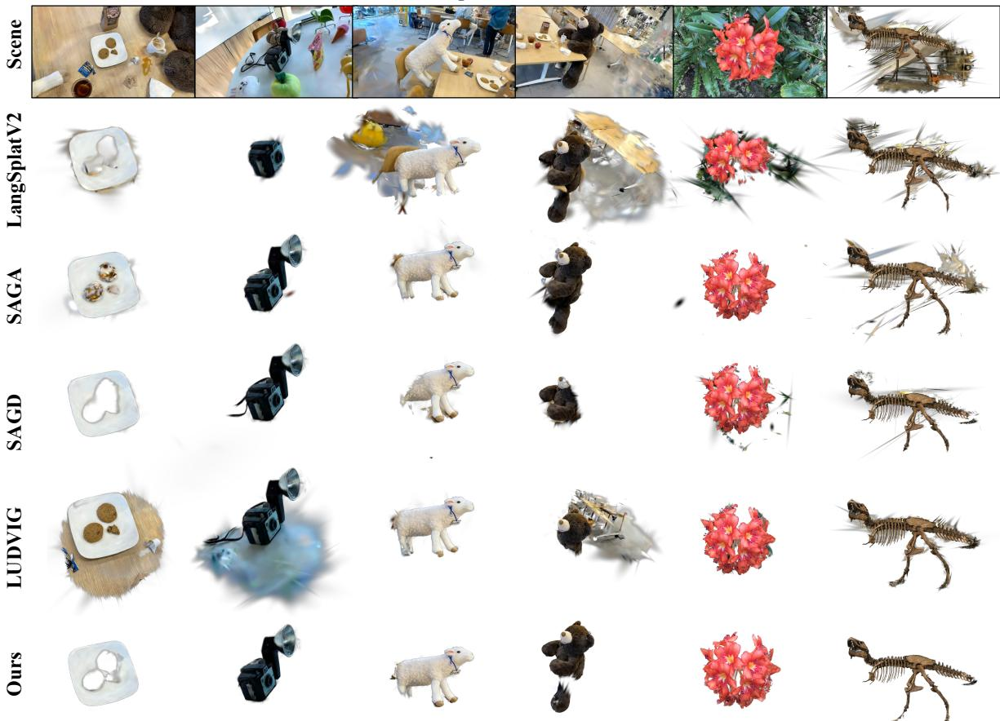  
Figure 5: Qualitative comparison across diverse object scales. Columns are grouped by segmentation scale (small to large from left to right): the first four columns show objects from LERF and the last two from NVOS. VCAR produces cleaner boundaries and fewer floating artifacts than baseline methods across all scales.

Table 2: Quantitative comparison of segmentation perfor mance (mIoU(%) and mAcc(%) ) on LERF dataset.
<table><tr><td rowspan="2">Method</td><td colspan="2">Ramen</td><td colspan="2">Figurines</td><td colspan="2">Teatime</td><td colspan="2">Kitchen</td></tr><tr><td>mIoU</td><td>mAcc</td><td>mIoU</td><td>mAcc</td><td>mIoU</td><td>mAcc</td><td>mIoU</td><td>mAcc</td></tr><tr><td>Feature3DGS† [52]</td><td>43.7</td><td>69.8</td><td>40.5</td><td>73.4</td><td>58.8</td><td>77.2</td><td>39.6</td><td>87.6</td></tr><tr><td>GaussianGrouping† [44]</td><td>45.5</td><td>68.6</td><td>40.0</td><td>74.3</td><td>60.9</td><td>75.0</td><td>38.7</td><td>88.2</td></tr><tr><td>LangSplat† [33]</td><td>51.2</td><td>73.2</td><td>44.7</td><td>80.4</td><td>65.1</td><td>88.1</td><td>44.5</td><td>95.5</td></tr><tr><td>LangSplatV2† [21]</td><td>51.8</td><td>74.7</td><td>56.4</td><td>82.1</td><td>72.2</td><td>93.2</td><td>59.1</td><td>86.4</td></tr><tr><td>SAGA† [3]</td><td>56.4</td><td>96.6</td><td>66.3</td><td>98.4</td><td>66.4</td><td>97.7</td><td>55.5</td><td>91.6</td></tr><tr><td>SAGD [13]</td><td>62.3</td><td>85.6</td><td>45.3</td><td>99.0</td><td>70.9</td><td>98.2</td><td>52.2</td><td>88.5</td></tr><tr><td>LUDVIG [29]</td><td>58.1</td><td>78.9</td><td>63.3</td><td>80.4</td><td>77.1</td><td>94.9</td><td>50.5</td><td>81.3</td></tr><tr><td>VCAR (Ours)</td><td>68.4</td><td>98.9</td><td>73.8</td><td>99.6</td><td>83.4</td><td>99.4</td><td>74.7</td><td>98.1</td></tr></table>

on NVOS and ∼2 minutes on LERF, with the diference primarily due to the number of images per scene. A per-stage timing breakdown is provided in the supplementary material. We note that training based methods amortize their cost across multiple queries, whereas VCAR incurs cost independently per object, making it advantageous for rapid deployment on new scenes without re-training.

## 4.4 Visualization Results

Figure 5 presents qualitative comparisons on selected scenes. VCAR produces cleaner boundaries with fewer floating artifacts, benefiting from view completeness enhancement and ABR. In cluttered layouts (e.g., figurines, kitchen), baseline methods include adjacent background Gaussians that produce halo-like artifacts, which VCAR suppresses through augmented multi-view voting. For objects with pronounced anisotropic geometry (e.g., orchids), ABR further refines boundaries by compressing only the overflowing axis while preserving the elongated shape along well-behaved directions.

## 4.5 Ablation Study

We ablate NVOS and eight LERF objects (Tables 3 and 4). According to (Section 3.3) , most LERF objects skip SSS due to suficient coverage from training views. Therefore, we select those that maximum angular gap exceeds Δth to trigger SSS for full-pipeline ablation. Efect of SSS. On NVOS, SSS raises mIoU from 84.0% to 88.5%, with larger gains on trex (+10.6%) and fortress (+8.7%) where front-facing views miss occluded regions. It also substantially improves undersampled LERF objects such as toaster (+51.6%) and fridge (+44.7%). Efect of ABR. ABR raises NVOS mIoU to 92.1%, with notable gains on trex (+23.8%) and orchids (+9.4%), and further improves LERF boundaries by refining only the dominant overflowing axis. Full pipeline. Combining both modules reaches 93.5% mIoU on NVOS and yields consistent gains on the selected LERF objects.

Table 3: Ablation study on NVOS dataset. "Coarse Only" gives coarse-stage segmentation results; "+SSS" and "+ABR" add spherical spiral sampling or axis-aware boundary refinement to the coarse baseline, respectively; "Full" combines all modules.
<table><tr><td rowspan="2">Configuration</td><td colspan="2">Fern</td><td colspan="2">Flower</td><td colspan="2">Fortress</td><td colspan="2">Horns</td><td colspan="2">Leaves</td><td colspan="2">Orchids</td><td colspan="2">Trex</td><td colspan="2">Overall</td></tr><tr><td>mIoU</td><td>mAcc</td><td>mIoU</td><td>mAcc</td><td>mIoU</td><td>mAcc</td><td>mIoU</td><td>mAcc</td><td>mIoU</td><td>mAcc</td><td>mIoU</td><td>mAcc</td><td>mIoU</td><td>mAcc</td><td>mIoU</td><td>mAcc</td></tr><tr><td>Coarse Only</td><td>82.0</td><td>94.1</td><td>83.2</td><td>95.5</td><td>87.2</td><td>97.3</td><td>92.9</td><td>98.7</td><td>95.2</td><td>99.7</td><td>83.8</td><td>97.2</td><td>63.2</td><td>92.9</td><td>84.0</td><td>96.5</td></tr><tr><td>+ SSS</td><td>82.8</td><td>93.8</td><td>88.7</td><td>97.1</td><td>95.9</td><td>99.2</td><td>93.3</td><td>98.8</td><td>96.9</td><td>99.8</td><td>88.8</td><td>97.6</td><td>73.8</td><td>95.7</td><td>88.5</td><td>97.4</td></tr><tr><td>+ ABR</td><td>84.8</td><td>95.0</td><td>93.8</td><td>98.5</td><td>94.2</td><td>98.9</td><td>96.1</td><td>99.3</td><td>95.6</td><td>99.7</td><td>93.2</td><td>97.5</td><td>87.0</td><td>98.2</td><td>92.1</td><td>98.2</td></tr><tr><td>Full</td><td>85.4</td><td>95.2</td><td>94.3</td><td>98.6</td><td>96.1</td><td>99.3</td><td>96.9</td><td>99.5</td><td>97.0</td><td>99.8</td><td>95.3</td><td>99.2</td><td>89.3</td><td>98.6</td><td>93.5</td><td>98.6</td></tr></table>

Table 4: Ablation study on several specific objects from LERF dataset.
<table><tr><td rowspan="2">Configuration</td><td colspan="2">Figurines-Apple</td><td colspan="2">Figurines-Camera</td><td colspan="2">Ramen-Bowl</td><td colspan="2">Ramen-Sake Cup</td><td colspan="2">Teatime-Sheep</td><td colspan="2">Teatime-Bear</td><td colspan="2">Kitchen-Fridge</td><td colspan="2">Kitchen-Toaster</td></tr><tr><td>mIoU</td><td>mAcc</td><td>mIoU</td><td>mAcc</td><td>mIoU</td><td>mAcc</td><td>mIoU</td><td>mAcc</td><td>mIoU</td><td>mAcc</td><td>mIoU</td><td>mAcc</td><td>mIoU</td><td>mAcc</td><td>mIoU</td><td>mAcc</td></tr><tr><td>Coarse Only</td><td>69.3</td><td>99.4</td><td>62.6</td><td>97.7</td><td>22.4</td><td>67.9</td><td>75.2</td><td>99.5</td><td>87.4</td><td>98.5</td><td>46.3</td><td>77.9</td><td>40.7</td><td>85.3</td><td>22.9</td><td>95.7</td></tr><tr><td>+ SSS</td><td>75.7</td><td>99.5</td><td>80.3</td><td>99.1</td><td>44.5</td><td>86.7</td><td>82.4</td><td>99.7</td><td>87.5</td><td>98.6</td><td>69.7</td><td>93.7</td><td>85.4</td><td>98.3</td><td>74.5</td><td>99.5</td></tr><tr><td>+ ABR</td><td>73.5</td><td>99.5</td><td>82.8</td><td>99.3</td><td>45.1</td><td>88.4</td><td>85.3</td><td>99.8</td><td>89.5</td><td>98.8</td><td>73.5</td><td>94.0</td><td>90.7</td><td>98.9</td><td>80.5</td><td>99.8</td></tr><tr><td>Full</td><td>79.5</td><td>99.7</td><td>85.4</td><td>99.4</td><td>48.6</td><td>88.6</td><td>90.4</td><td>99.8</td><td>91.1</td><td>99.0</td><td>78.2</td><td>96.3</td><td>94.6</td><td>99.4</td><td>89.6</td><td>99.9</td></tr></table>

Table 5: Eficiency comparison on NVOS and LERF.
<table><tr><td></td><td colspan="2">NVOS</td><td colspan="2">LERF</td></tr><tr><td>Method</td><td>Training time</td><td>Inference time</td><td>Training time</td><td>Inference time</td></tr><tr><td>SAGA† [3]</td><td>~20 min</td><td>~2 ms</td><td>~40 min</td><td>~2 ms</td></tr><tr><td>LangSplatV2† [21]</td><td>~2 h</td><td>~2 ms</td><td>~3 h</td><td>~2 ms</td></tr><tr><td>LUDVIG [29]</td><td>0</td><td>~12 min</td><td>0</td><td>~16 min</td></tr><tr><td>SAGD [13]</td><td>0</td><td>~2 min</td><td>0</td><td>~3 min</td></tr><tr><td>VCAR (Ours)</td><td>0</td><td>~30 s</td><td>0</td><td>~2 min</td></tr></table>

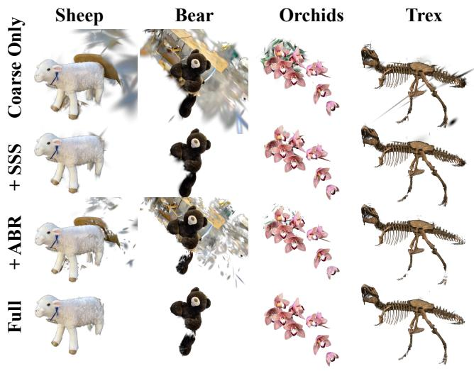  
Figure 6: Visualization examples of ablation study.

Figure 6 illustrates the progressive refinement on representative scenes. Rather than the segmentations with noticeable boundary artifacts in the coarse stage. SSS reduces under-segmented regions by introducing supplementary viewpoints that increase angular coverage and ABR removes residual overflow for tighter boundaries.

## 5 Conclusion

We presented VCAR, a training-free coarse-to-fine segmentation framework for 3D Gaussian Splatting that targets two important geometric contributors to blurred boundaries: insuficient view coverage and anisotropic boundary overflow. VCAR integrates three synergistic components: (1) object-centric spherical spiral sampling for improved angular coverage with temporally coherent supplementary viewpoints; (2) visibility-based weighted voting to robustly aggregate multi-view labels while excluding invisible views; and (3) Axis-Aware Boundary Refinement (ABR), which traces 2D overflow to specific 3D scale axes and applies targeted anisotropic compression. Extensive experiments on NVOS and LERF show that VCAR outperforms all compared methods—both training-based and training-free—achieving 93.5% mIoU on NVOS and 75.1% mIoU on LERF (+12.8% over the previous best), while requiring zero training and only ∼2 minutes of inference per object.

Limitations. The object-centric sphere assumes a roughly convex target. For highly non-convex or thin elongated objects (e.g., cables, poles), SSS may fail to provide adequate coverage along the object’s extent. Additionally, to correct observed 2D overflow across views, ABR adopts a conservative minimum-scaling strategy across views. While geometrically principled, this strict over-compression inevitably introduces minor boundary erosion, particularly afecting fine structures and textures. Future work will explore adaptive, shape-aware sampling strategies for non-convex objects and soft compression schemes that learn per-view weighting to replace the current conservative minimum-scaling rule.

## Acknowledgments

This work was supported in part by the Scientific Research Innovation Capability Support Project for Young Faculty under Grant

SRICSPYF-BS2025134; in part by the Science and Technology Development Fund (Macau SAR) under Grant 0020/2025/RIB1; in part by the Fundamental Research Funds for the Central Universities under Grants 21625361 and 21625360; and in part by the Guangdong Young Science and Technology Talent Cultivation Program under Grants SKXRC2026436 and SKXRC2026434.

## References

[1] Yongtang Bao, Chengjie Tang, Yuze Wang, and Haojie Li. 2025. Seg-wild: Interactive segmentation based on 3d gaussian splatting for unconstrained image collections. In Proceedings ofthe 33rd ACM International Conference on Multimedia. 8567–8576.

[2] Nicolas Carion, Laura Gustafson, Yuan-Ting Hu, Shoubhik Debnath, Ronghang Hu, Didac Suris, Chaitanya Ryali, Kalyan Vasudev Alwala, Haitham Khedr, An drew Huang, et al. 2025. Sam 3: Segment anything with concepts. arXiv preprint arXiv:2511.16719 (2025).

[3] Jiazhong Cen, Jiemin Fang, Chen Yang, Lingxi Xie, Xiaopeng Zhang, Wei Shen, and Qi Tian. 2025. Segment any 3d gaussians. In Proceedings ofthe AAAI conference on artificial intelligence, Vol. 39. 1971–1979.

[4] Rohan Chacko, Nicolai Häni, Eldar Khaliullin, Lin Sun, and Douglas Lee. 2025. Lifting by gaussians: A simple, fast and flexible method for 3d instance segmentation. In 2025 IEEE/CVF Winter Conference on Applications ofComputer Vision (WACV). IEEE, 3497–3507.

[5] David Charatan, Sizhe Lester Li, Andrea Tagliasacchi, and Vincent Sitzmann. 2024. pixelsplat: 3d gaussian splats from image pairs for scalable generalizable 3d reconstruction. In Proceedings of the IEEE/CVF conference on computer vision and pattern recognition. 19457–19467.

[6] Kangjie Chen, BingQuan Dai, Minghan Qin, Dongbin Zhang, Peihao Li, Ying shuang Zou, and Haoqian Wang. 2025. Slgaussian: Fast language gaussian splatting in sparse views. In Proceedings ofthe 33rd ACM International Conference on Multimedia. 3047–3056.

[7] Yiwen Chen, Zilong Chen, Chi Zhang, Feng Wang, Xiaofeng Yang, Yikai Wang, Zhongang Cai, Lei Yang, Huaping Liu, and Guosheng Lin. 2024. Gaussianeditor: Swift and controllable 3d editing with gaussian splatting. In Proceedings of the IEEE/CVF conference on computer vision and pattern recognition. 21476–21485.

[8] Kai Cheng, Xiaoxiao Long, Kaizhi Yang, Yao Yao, Wei Yin, Yuexin Ma, Wenping Wang, and Xuejin Chen. 2024. Gaussianpro: 3d gaussian splatting with progres sive propagation. In Forty-first International Conference on Machine Learning.

[9] Seokhun Choi, Hyeonseop Song, Jaechul Kim, Taehyeong Kim, and Hoseok Do. 2024. Click-gaussian: Interactive segmentation to any 3d gaussians. In European Conference on Computer Vision. Springer, 289–305.

[10] Zhiwen Fan, Kevin Wang, Kairun Wen, Zehao Zhu, Dejia Xu, and Zhangyang Wang. 2024. Lightgaussian: Unbounded 3d gaussian compression with 15x reduction and 200+ fps. Advances in neural information processing systems 37 (2024), 140138–140158.

[11] Zihan Gao, Lingling Li, Licheng Jiao, Fang Liu, Xu Liu, Wenping Ma, Yuwei Guo, and Shuyuan Yang. 2024. Fast and eficient: Mask neural fields for 3d scene segmentation. arXiv preprint arXiv:2407.01220 (2024).

[12] Shuting He, Peilin Ji, Yitong Yang, Changshuo Wang, Jiayi Ji, Yinglin Wang, and Henghui Ding. 2025. A survey on 3d gaussian splatting applications: Segmenta tion, editing, and generation. arXiv preprint arXiv:2508.09977 (2025).

[13] Xu Hu, Yuxi Wang, Lue Fan, Chuanchen Luo, Junsong Fan, Zhen Lei, Qing Li, Junran Peng, and Zhaoxiang Zhang. 2024. SAGD: Boundary-enhanced segment anything in 3D Gaussian via Gaussian decomposition. arXiv preprint arXiv:2401.17857 (2024).

[14] Umangi Jain, Ashkan Mirzaei, and Igor Gilitschenski. 2024. Gaussiancut: Interactive segmentation via graph cut for 3d gaussian splatting. Advances in Neural Information Processing Systems 37 (2024), 89184–89212.

[15] Bernhard Kerbl, Georgios Kopanas, Thomas Leimkühler, and George Drettakis. 2023. 3D Gaussian splatting for real-time radiance field rendering. ACM Trans. Graph. 42, 4 (2023), 139–1.

[16] Justin Kerr, Chung Min Kim, Ken Goldberg, Angjoo Kanazawa, and Matthew Tancik. 2023. Lerf: Language embedded radiance fields. In Proceedings ofthe IEEE/CVF international conference on computer vision. 19729–19739.

[17] Alexander Kirillov, Eric Mintun, Nikhila Ravi, Hanzi Mao, Chloe Rolland, Laura Gustafson, Tete Xiao, Spencer Whitehead, Alexander C Berg, Wan-Yen Lo, et al. 2023. Segment anything. In Proceedings of the IEEE/CVF international conference on computer vision. 4015–4026.

[18] Joo Chan Lee, Daniel Rho, Xiangyu Sun, Jong Hwan Ko, and Eunbyung Park. 2024. Compact 3d gaussian representation for radiance field. In Proceedings ofthe IEEE/CVF Conference on Computer Vision and Pattern Recognition. 21719–21728.

[19] Boyi Li, Kilian Q Weinberger, Serge Belongie, Vladlen Koltun, and René Ranftl. 2022. Language-driven semantic segmentation. arXiv preprint arXiv:2201.03546 (2022).

[20] Hao Li, Roy Qin, Zhengyu Zou, Diqi He, Bohan Li, Bingquan Dai, Dingewn Zhang, and Junwei Han. 2024. Langsurf: Language-embedded surface gaussians

for 3d scene understanding. arXiv preprint arXiv:2412.17635 (2024).

[21] Wanhua Li, Yujie Zhao, Minghan Qin, Yang Liu, Yuanhao Cai, Chuang Gan, and Hanspeter Pfister. 2025. Langsplatv2: High-dimensional 3d language gaussian splatting with 450+ fps. arXiv preprint arXiv:2507.07136 (2025).

[22] Zikuan Li, Anyi Huang, Wenru Jia, Qiaoyun Wu, Mingqiang Wei, and Jun Wang. 2024. Fsh3d: 3d representation via fibonacci spherical harmonics. In Computer Graphics Forum, Vol. 43. Wiley Online Library, e15231.

[23] Yiqing Liang, Numair Khan, Zhengqin Li, Thu Nguyen-Phuoc, Douglas Lanman, James Tompkin, and Lei Xiao. 2025. Gaufre: Gaussian deformation fields for real-time dynamic novel view synthesis. In 2025 IEEE/CVF Winter Conference on Applications ofComputer Vision (WACV). IEEE, 2642–2652.

[24] Yixun Liang, Xin Yang,Jiantao Lin, Haodong Li, Xiaogang Xu, and Yingcong Chen. 2024. Luciddreamer: Towards high-fidelity text-to-3d generation via interval score matching. In Proceedings ofthe IEEE/CVF conference on computer vision and pattern recognition. 6517–6526.

[25] Guibiao Liao, Jiankun Li, Zhenyu Bao, Xiaoqing Ye, Qing Li, and Kanglin Liu. 2025. CLIP-GS: CLIP-Informed Gaussian Splatting for View-Consistent 3D Indoor Semantic Understanding. ACM Transactions on Multimedia Computing, Communications and Applications 21, 8 (2025), 1–24.

[26] Liwei Liao and Ronggang Wang. 2026. GaussianTrimmer: Online Trimming Boundaries for 3DGS Segmentation. arXiv preprint arXiv:2601.12683 (2026).

[27] Tao Lu, Mulin Yu, Linning Xu, Yuanbo Xiangli, Limin Wang, Dahua Lin, and Bo Dai. 2024. Scafold-gs: Structured 3d gaussians for view-adaptive rendering. In Proceedings ofthe IEEE/CVF conference on computer vision and pattern recognition. 20654–20664.

[28] Weijie Lyu, Xueting Li, Abhijit Kundu, Yi-Hsuan Tsai, and Ming-Hsuan Yang. 2024. Gaga: Group any gaussians via 3d-aware memory bank. arXiv preprint arXiv:2404.07977 (2024).

[29] Juliette Marrie, Romain Ménégaux, Michael Arbel, Diane Larlus, and Julien Mairal. 2025. Ludvig: Learning-free uplifting of 2d visual features to gaussian splatting scenes. In Proceedings of the IEEE/CVF International Conference on Computer Vision. 7440–7450.

[30] Ben Mildenhall, Pratul P Srinivasan, Matthew Tancik, Jonathan T Barron, Ravi Ramamoorthi, and Ren Ng. 2021. Nerf: Representing scenes as neural radiance fields for view synthesis. Commun. ACM 65, 1 (2021), 99–106.

[31] Maxime Oquab, Timothée Darcet, Théo Moutakanni, Huy Vo, Marc Szafraniec, Vasil Khalidov, Pierre Fernandez, Daniel Haziza, Francisco Massa, Alaaeldin El Nouby, et al. 2023. Dinov2: Learning robust visual features without supervision. arXiv preprint arXiv:2304.07193 (2023).

[32] Adam Paszke, Sam Gross, Francisco Massa, Adam Lerer, James Bradbury, Gregory Chanan, Trevor Killeen, Zeming Lin, Natalia Gimelshein, Luca Antiga, et al. 2019. Pytorch: An imperative style, high-performance deep learning library. Advances in neural information processing systems 32 (2019).

[33] Minghan Qin, Wanhua Li, Jiawei Zhou, Haoqian Wang, and Hanspeter Pfister. 2024. Langsplat: 3d language gaussian splatting. In Proceedings of the IEEE/CVF Conference on Computer Vision and Pattern Recognition. 20051–20060.

[34] Ri-Zhao Qiu, Ge Yang, Weijia Zeng, and Xiaolong Wang. 2024. Language-driven physics-based scene synthesis and editing via feature splatting. In European conference on computer vision. Springer, 368–383.

[35] Alec Radford, Jong Wook Kim, Chris Hallacy, Aditya Ramesh, Gabriel Goh, Sandhini Agarwal, Girish Sastry, Amanda Askell, Pamela Mishkin, Jack Clark, et al. 2021. Learning transferable visual models from natural language supervision. In International conference on machine learning. PmLR, 8748–8763.

[36] Nikhila Ravi, Valentin Gabeur, Yuan-Ting Hu, Ronghang Hu, Chaitanya Ryali, Tengyu Ma, Haitham Khedr, Roman Rädle, Chloe Rolland, Laura Gustafson, et al. 2024. Sam 2: Segment anything in images and videos. arXiv preprint arXiv:2408.00714 (2024).

[37] Zhongzheng Ren, Aseem Agarwala, Bryan Russell, Alexander G Schwing, and Oliver Wang. 2022. Neural volumetric object selection. In Proceedings ofthe IEEE/CVF Conference on Computer Vision and Pattern Recognition. 6133–6142.

[38] Qiuhong Shen, Xingyi Yang, and Xinchao Wang. 2024. Flashsplat: 2d to 3d gaussian splatting segmentation solved optimally. In European Conference on Computer Vision. Springer, 456–472.

[39] Jin-Chuan Shi, Miao Wang, Hao-Bin Duan, and Shao-Hua Guan. 2024. Language embedded 3d gaussians for open-vocabulary scene understanding. In Proceedings of the IEEE/CVF Conference on Computer Vision and Pattern Recognition. 5333– 5343.

[40] Jiaxiang Tang, Jiawei Ren, Hang Zhou, Ziwei Liu, and Gang Zeng. 2023. Dreamgaussian: Generative gaussian splatting for eficient 3d content creation. arXiv preprint arXiv:2309.16653 (2023).

[41] Guanjun Wu, Taoran Yi, Jiemin Fang, Lingxi Xie, Xiaopeng Zhang, Wei Wei, Wenyu Liu, Qi Tian, and Xinggang Wang. 2024. 4d gaussian splatting for real-time dynamic scene rendering. In Proceedings ofthe IEEE/CVF conference on computer vision and pattern recognition. 20310–20320.

[42] Yanmin Wu, Jiarui Meng, Haijie Li, Chenming Wu, Yahao Shi, Xinhua Cheng, Chen Zhao, Haocheng Feng, Errui Ding, Jingdong Wang, et al. 2024. Opengaussian: Towards point-level 3d gaussian-based open vocabulary understanding.

Advances in Neural Information Processing Systems 37 (2024), 19114–19138.

[43] Tianyi Xie, Zeshun Zong, Yuxing Qiu, Xuan Li, Yutao Feng, Yin Yang, and Chenfanfu Jiang. 2024. Physgaussian: Physics-integrated 3d gaussians for generative dynamics. In Proceedings ofthe IEEE/CVF Conference on Computer Vision and Pattern Recognition. 4389–4398

[44] Mingqiao Ye, Martin Danelljan, Fisher Yu, and Lei Ke. 2024. Gaussian grouping: Segment and edit anything in 3d scenes. In European conference on computer vision. Springer, 162–179.

[45] Vickie Ye, Ruilong Li, Justin Kerr, Matias Turkulainen, Brent Yi, Zhuoyang Pan, Otto Seiskari, Jianbo Ye, Jefrey Hu, Matthew Tancik, et al. 2025. gsplat: An open-source library for Gaussian splatting. Journal of Machine Learning Research 26, 34 (2025), 1–17.

[46] Haiyang Ying, Yixuan Yin, Jinzhi Zhang, Fan Wang, Tao Yu, Ruqi Huang, and Lu Fang. 2024. Omniseg3d: Omniversal 3d segmentation via hierarchical contrastive learning. In Proceedings of the IEEE/CVF Conference on Computer Vision and Pattern Recognition. 20612–20622.

[47] Zehao Yu, Anpei Chen, Binbin Huang, Torsten Sattler, and Andreas Geiger. 2024. Mip-splatting: Alias-free 3d gaussian splatting. In Proceedings ofthe IEEE/CVF conference on computer vision and pattern recognition. 19447–19456.

[48] Zhensheng Yuan, Haozhi Huang, Zhen Xiong, Di Wang, and Guanghua Yang. 2025. Robust and Eficient 3D Gaussian Splatting for Urban Scene Reconstruction. In Proceedings ofthe IEEE/CVFInternational Conference on ComputerVision. 26209– 26219.

[49] Jiaxin Zhang, Junjun Jiang, Youyu Chen, Kui Jiang, and Xianming Liu. 2025. Cobgs: Clear object boundaries in 3dgs segmentation based on boundary-adaptive gaussian splitting. In Proceedings of the IEEE/CVF Conference on Computer Vision and Pattern Recognition. 19335–19344.

[50] Yupeng Zhang, Dezhi Zheng, Ping Lu, Han Zhang, Lei Wang, Liping Xiang, Cheng Luo, Kaijun Deng, Xiaowen Fu, Linlin Shen, et al. 2025. LabelGS: Label-Aware 3D Gaussian Splatting for 3D Scene Segmentation. In Chinese Conference on Pattern Recognition and Computer Vision (PRCV). Springer, 47–61.

[51] Yian Zhao, Wanshi Xu, Ruochong Zheng, Pengchong Qiao, Chang Liu, and Jie Chen. 2025. isegman: Interactive segment-and-manipulate 3d gaussians. In Proceedings ofthe Computer Vision and Pattern Recognition Conference. 661–670.

[52] Shijie Zhou, Haoran Chang, Sicheng Jiang, Zhiwen Fan, Zehao Zhu, Dejia Xu, Pradyumna Chari, Suya You, Zhangyang Wang, and Achuta Kadambi. 2024. Feature 3dgs: Supercharging 3d gaussian splatting to enable distilled feature fields. In Proceedings ofthe IEEE/CVF Conference on Computer Vision and Pattern Recognition. 21676–21685.

[53] Zehao Zhu, Zhiwen Fan, Yifan Jiang, and Zhangyang Wang. 2024. Fsgs: Realtime few-shot view synthesis using gaussian splatting. In European conference on computer vision. Springer, 145–163.

[54] Xingxing Zuo, Pouya Samangouei, Yunwen Zhou, Yan Di, and Mingyang Li. 2025. Fmgs: Foundation model embedded 3d gaussian splatting for holistic 3d scene understanding. International Journal ofComputer Vision 133, 2 (2025), 611–627.

# VCAR: Training-Free 3DGS Segmentation via View Completeness and Axis-Aware Boundary Refinement

Supplementary Material

## A View Completeness Assessment: Detailed Workflow and Rationale

This section expands on two implementation details omitted from Section 3.3.2 of the main paper due to space constraints: (1) Section A.1: the camera validity filtering criterion; (2) Section A.2: the Fibonacci-lattice probing mechanism used to evaluate $\Delta _ { \mathrm { m a x } }$ . We also include a brief rationale for this probing strategy and the geometric interpretation of the $9 0 ^ { \circ }$ trigger threshold. Unless otherwise specified, notation in this section follows the main paper. The key inherited symbols used in this section are:

$\mathcal { V } ^ { \mathrm { t r a i n } } = \{ \boldsymbol { v } ^ { ( 1 ) } , \dots , \boldsymbol { v } ^ { ( M ) } \}$ denotes the viewpoints from the training set (Section 3.1).

$\mathcal { G } ^ { \mathrm { c o a r s e } }$ denotes the coarse segmentation result (Section 3.2). $\mathcal { P } ~ = ~ \{ \pmb { \mu } _ { i } ~ | ~ g _ { i } ~ \in ~ \mathcal { G } ^ { \mathrm { c o a r s e } } \}$ denotes the coarse foreground Gaussian positions (Section 3.3.1).

• � denotes the robust object center ofthe object-centric sphere (Section 3.3.1).

$v _ { \mathrm { p o s } } ^ { ( j ) }$ and ${ \bf h } _ { j }$ denote the �-th camera position and its unit heading toward $^ { c , }$ respectively(main paper, Section 3.3.2).

$\{ \mathbf { t } _ { i } \} _ { i = 1 } ^ { K }$ and $\Delta _ { \mathrm { m a x } }$ denote the � Fibonacci probing directions and the maximum angular gap, respectively(main paper, Section 3.3.2).

## A.1 Camera Validity Filtering

Since not every camera view in the training set can efectively observe the target object, we filter out those invalid camera views before computing the view coverage.

Let $N _ { \mathrm { c } }$ denote the number of coarse foreground Gaussians $| { \mathcal { P } } |$ For each training camera $v ^ { ( j ) }$ , we test every $\pmb { \mu } _ { i } \in \mathscr { P }$ for visibility using the same depth-and-bounds criterion of Section $3 . 2 \ ( \mathrm { E q . \ 1 }$ of the main paper). Let the boolean condition $\mathrm { { v i s i b l e } } _ { i } ^ { ( j ) }$ denote whether $\pmb { \mu } _ { i }$ is successfully projected into the valid image bounds of $v ^ { ( j ) }$ with a positive depth. We then compute the visible foreground ratio:

$$
\rho ^ { ( j ) } = \frac { 1 } { N _ { \mathrm { c } } } \sum _ { i = 1 } ^ { N _ { \mathrm { c } } } \mathbb { 1 } \left[ \mathrm { v i s i b l e } _ { i } ^ { ( j ) } \right]\tag{A.1}
$$

We adopt $\rho _ { \mathrm { m i n } } = 0 . 2 \ : ( 2 0 \% )$ as the default validity threshold. If the threshold is too low, cameras that observe only a negligible portion of the target would be retained and would falsely mark their directions as covered. Conversely, if the threshold is too high, cameras that still provide meaningful partial observations, such as side views in forward-facing captures, would be discarded, making the assessment overly pessimistic.

Accordingly, the set of valid cameras is denoted $\mathcal { V } ^ { \mathrm { v a l i d } } = \{ \boldsymbol { v } ^ { ( j ) } \in$ Vtrain $| \rho ^ { ( j ) } \ge \rho _ { \mathrm { m i n } } \}$ , and the corresponding unit viewpoint directions are

$$
\mathbf { h } _ { j } = \frac { \boldsymbol { v } _ { \mathrm { p o s } } ^ { ( j ) } - \pmb { c } } { \lVert \boldsymbol { v } _ { \mathrm { p o s } } ^ { ( j ) } - \boldsymbol { c } \rVert _ { 2 } }\tag{A.2}
$$

where $v _ { \mathrm { p o s } } ^ { ( j ) }$ is the camera position of $v ^ { ( j ) }$

## A.2 Fibonacci-Lattice Probing

The maximum angular gap $\Delta _ { \mathrm { m a x } }$ (Eq. 6 of the main paper) is computed by scattering $K = 2 0 0 0$ test directions on the unit sphere via a Fibonacci lattice [22] and measuring the worst-case angular distance to the nearest valid camera. Below we detail the lattice construction and the eficient matrix computation.

A.2.1 Fibonacci latice construction. For the �-th test direction $( i =$ $0 , \ldots , K - 1 )$ , the polar and azimuthal angles are

$$
\varphi _ { i } = \operatorname { a r c c o s } { \big ( } 1 - 2 { \big ( } i + 0 . 5 { \big ) } / K { \big ) } , \qquad \vartheta _ { i } = \pi { \big ( } 1 + { \sqrt { 5 } } { \big ) } i\tag{A.3}
$$

where $\pi ( 1 + { \sqrt { 5 } } ) \approx 1 3 7 . 5 0 8 ^ { \circ }$ is the golden angle. The term $1 - 2 ( i +$ $0 . 5 ) / K$ distributes cos � uniformly in [−1, 1], producing equal-area latitude slices and avoiding the polar clustering of regular latitude– longitude grids. Successive golden-angle rotations in azimuth place each new point into a previously under-sampled region of its latitude band, yielding a near-uniform distribution over the sphere in �(�) time. The Cartesian coordinates are

$$
\mathbf { \Delta t } _ { i } = \left( \sin \varphi _ { i } \cos \vartheta _ { i } , \sin \varphi _ { i } \sin \vartheta _ { i } , \cos \varphi _ { i } \right) ^ { \intercal }\tag{A.4}
$$

A.2.2 Coverage computation. We form the cosine similarity matrix

$$
\begin{array} { r } { \mathbf { C } \in \mathbb { R } ^ { K \times | \mathcal { V } ^ { \mathrm { v a l i d } } | } , \qquad C _ { i j } = \mathbf { t } _ { i } ^ { \top } \mathbf { h } _ { j } , } \end{array}\tag{A.5}
$$

and obtain the per-probe angular distance and maximum angular gap to identify the most under-observed direction on the sphere:

$$
\delta _ { i } = \operatorname { a r c c o s } \left( \operatorname* { m a x } _ { j } C _ { i j } \right) , \qquad \Delta _ { \operatorname* { m a x } } = \operatorname* { m a x } _ { i } \delta _ { i } .\tag{A.6}
$$

Compared with pairwise camera-angle statistics, Fibonacci lattice probing directly measures the target quantity in view completeness: the worst-case angular distance from any spherical direction to its nearest valid camera. With $K = 2 0 0 0$ , this estimate is obtained eficiently by one $\mathrm { \bf T H ^ { \top } }$ matrix product followed by row-wise and global max reductions, taking only 2–3 seconds in scenes with hundreds of cameras. Moreover, $\Delta _ { \mathrm { t h } } = 9 0 ^ { \circ }$ has a clear geometric meaning: it corresponds to a hemisphere-scale blind spot (solid angle 2�), making it a principled trigger for SSS.

## B Axis-Aware Boundary Refinement: Detailed Derivation

Section 3.4 of the main paper introduces Axis-Aware Boundary Refinement (ABR) and gives its principal covariance decomposition and compression rule. This section expands the intermediate steps for projected overflow detection, dominant-axis attribution, directional compression, and multi-view reconciliation. We follow the notation of the main paper. Throughout the single-view derivation below, we fix a view $v ^ { ( j ) }$ and omit (�) from all view-conditioned quantities, $\mathrm { e . g . } , { \pmb m } _ { i } ^ { ( j ) } \ \mapsto \ { \pmb m } _ { i } , \Sigma _ { 2 D , i } ^ { ( j ) } \ \mapsto \ \Sigma _ { 2 D , i } ,$ and $M ^ { ( j ) } \mapsto M$ We restore the view index only when observations are collected across views, as in $o _ { i } ^ { ( j ) }$ and ${ \dot { f } } _ { i , d } ^ { ( j , e ) }$ . The 3D primitive $g _ { i }$ itself is view-independent and therefore never carries a view superscript.

## B.1 Projected Ellipse and Overflow Detection

For a visible Gaussian $g _ { i } .$ , let $\mathbf { \nabla } m _ { i }$ and $\Sigma _ { 2 D , i }$ denote its projected center and 2D covariance. The eigendecomposition of the covariance is

$$
\begin{array} { r } { \sum _ { 2 D , i } = \mathbf { U } _ { i } \mathrm { d i a g } ( \lambda _ { 1 } , \lambda _ { 2 } ) \mathbf { U } _ { i } ^ { \top } , \qquad \lambda _ { 1 } \geq \lambda _ { 2 } , } \end{array}\tag{B.1}
$$

where the columns $\vec { e } _ { 1 }$ and $\vec { e } _ { 2 }$ of $\mathbf { \dot { U } } _ { i }$ are the principal directions of the projected ellipse. With the diagnostic cutof $\sigma _ { c } = 3$ adopted by ABR and used in the main paper, its semi-axis lengths are $a _ { i } = \sigma _ { c } \sqrt { \lambda _ { 1 } }$ and $b _ { i } = \sigma _ { c } \sqrt { \lambda _ { 2 } } .$ . The four diagnostic endpoints are therefore

$$
{ \mathcal E } _ { i } = \left\{ { \pmb m } _ { i } \pm a _ { i } \vec { e } _ { 1 } , { \pmb m } _ { i } \pm b _ { i } \vec { e } _ { 2 } \right\} .\tag{B.2}
$$

Let M and Ω denote the binary foreground mask and image domain of the fixed view. An observation is eligible for ABR only when the projected center lies in Ω and on the foreground of $M .$ For an eligible observation, we record an overflow whenever at least one endpoint lies outside the image or maps to the background:

$$
o _ { i } = \mathbb { 1 } \left[ \exists e \in \mathcal { E } _ { i } : e \notin \Omega \lor \mathcal { M } ( \mathrm { r o u n d } ( e ) ) = 0 \right] .\tag{B.3}
$$

Restoring the view index, this indicator becomes $o _ { i } ^ { ( j ) }$ and contributes to the multi-view count $n _ { i } ^ { \mathrm { o v f } }$ used below. This endpoint test is directional: an elongated Gaussian is not penalized merely for having a large major axis if both endpoints remain within the foreground support. Importantly, $\vec { e } _ { 1 }$ and $\vec { e } _ { 2 }$ are not direct projections of two individual 3D local axes. Each projected eigenvector depends jointly on all three axes through the covariance projection, which motivates the attribution below.

## B.2 Dominant 3D Axis Attribution

Let ${ \bf R } _ { i } = \left[ { \bf r } _ { 1 } , { \bf r } _ { 2 } , { \bf r } _ { 3 } \right]$ and $\mathbf { { s } } _ { i } = \left( { { s } _ { 1 } } , { { s } _ { 2 } } , { { s } _ { 3 } } \right)$ denote the rotation and scale of $\dot { \mathbf { \nabla } } g _ { i }$ . Its 3D covariance can be expanded by local axis:

$$
\Sigma _ { i } = \mathbf { R } _ { i } { \mathrm { d i a g } } ( s _ { 1 } ^ { 2 } , s _ { 2 } ^ { 2 } , s _ { 3 } ^ { 2 } ) \mathbf { R } _ { i } ^ { \top } = \sum _ { d = 1 } ^ { 3 } s _ { d } ^ { 2 } \mathbf { r } _ { d } \mathbf { r } _ { d } ^ { \top } .\tag{B.4}
$$

For the fixed view, let $\mathbf { W } _ { R }$ be the rotation block of the world-tocamera transformation and let J� be the perspective Jacobian evaluated at the center of $g _ { i }$ . Their product $\mathbf { M } _ { i } = \mathbf { J } _ { i } \mathbf { W } _ { R }$ maps a small world-space displacement to the image plane. Substituting the localaxis expansion above gives the scale-dependent geometric projection covariance

$$
\begin{array} { r l } { \sum _ { 2 D , i } = \mathbf { M } _ { i } \boldsymbol { \Sigma } _ { i } \mathbf { M } _ { i } ^ { \top } } & { } \\ & { = \mathbf { M } _ { i } \left( \displaystyle \sum _ { d = 1 } ^ { 3 } s _ { d } ^ { 2 } \mathbf { r } _ { d } \mathbf { r } _ { d } ^ { \top } \right) \mathbf { M } _ { i } ^ { \top } } \\ & { = \displaystyle \sum _ { d = 1 } ^ { 3 } s _ { d } ^ { 2 } \big ( \mathbf { M } _ { i } \mathbf { r } _ { d } \big ) \big ( \mathbf { M } _ { i } \mathbf { r } _ { d } \big ) ^ { \top } } \\ & { = \displaystyle \sum _ { d = 1 } ^ { 3 } s _ { d } ^ { 2 } \mathbf { q } _ { d } \mathbf { q } _ { d } ^ { \top } , \qquad \mathbf { q } _ { d } = \mathbf { M } _ { i } \mathbf { r } _ { d } . } \end{array}\tag{B.5}
$$

Consider one overflowing endpoint, with unit direction u ∈ $\{ \pm \vec { e } _ { 1 } , \pm \vec { e } _ { 2 } \}$ and the corresponding eigenvalue $\lambda \ \in \ \{ \lambda _ { 1 } , \lambda _ { 2 } \}$ . The standard covariance projection identity states that the variance after projection onto a unit direction u is u $ { { \mathbb { T } } } _ { \ b { \Sigma } _ { 2 D , i } \mathbf { u } }$ . Since u is also an eigenvector, this directional variance equals �. Applying the

identity to Eq. (B.5) gives

$$
\begin{array} { r l } & { \lambda = \mathbf { u } ^ { \intercal } \Sigma _ { 2 D , i } \mathbf { u } } \\ & { \quad = \mathbf { u } ^ { \intercal } \left( \displaystyle \sum _ { d = 1 } ^ { 3 } s _ { d } ^ { 2 } \mathbf { q } _ { d } \mathbf { q } _ { d } ^ { \intercal } \right) \mathbf { u } } \\ & { \quad = \displaystyle \sum _ { d = 1 } ^ { 3 } s _ { d } ^ { 2 } \big ( \mathbf { u } ^ { \intercal } \mathbf { q } _ { d } \big ) ^ { 2 } . } \end{array}\tag{B.6}
$$

The last equality uses $\ P _ { d } ^ { \top } \mathbf { u } = \mathbf { u } ^ { \top } \ P _ { d } ,$ , since both are the same scalar.

Thus, $w _ { d }$ measures the squared projected extent of the �-th scaled 3D axis along the observed overflow direction. Rather than selecting the longest 3D axis for compression, ABR identifies the dominant axis by its projected directional contribution:

$$
d ^ { * } = \arg \operatorname* { m a x } _ { d } w _ { d } .\tag{B.7}
$$

Notably, the sign of u cancels in $w _ { d } ,$ , so opposite endpoints yield the same axis attribution, although their boundary distances are evaluated separately.

## B.3 Directional Compression and Multi-View Reconciliation

Starting from $m _ { i } ,$ , ABR approximates the first-exit distance along the signed direction u. Its ideal continuous definition is

$$
\ell _ { \mathbf { u } } = \operatorname* { i n f } \big \{ t \geq 0 \big | m _ { i } + t \mathbf { u } \not \in \Omega \ \vee \ \mathcal { M } ( \mathrm { r o u n d } ( m _ { i } + t \mathbf { u } ) ) = 0 \big \}\tag{B.8}
$$

The implementation uniformly samples 129 points between the center and the overflowing endpoint, rounds them to pixel locations, and places the estimated boundary halfway between the last foreground sample and the first sample outside the foreground or image. If no exit is observed before the endpoint, the endpoint distance is used.

For each overflowing endpoint observation, ABR derives a candidate factor for its attributed dominant axis. Recall from Eq. (B.6) that $w _ { d ^ { * } } = s _ { d ^ { * } } ^ { 2 } ( \mathbf { u } ^ { \top } \mathbf { q } _ { d ^ { * } } ) ^ { 2 }$ . During the local update, the original overflow direction u and the first-order projection ${ \bf q } _ { d ^ { * } }$ of the unit 3D axis are held fixed, only $s _ { d ^ { * } }$ is changed to $s _ { d ^ { * } } ^ { \prime } = f _ { d ^ { * } } s _ { d ^ { * } }$ . Hence,

$$
\begin{array} { c } { { w _ { d ^ { * } } ^ { \prime } = ( s _ { d ^ { * } } ^ { \prime } ) ^ { 2 } ( { \bf u } ^ { \top } { \bf q } _ { d ^ { * } } ) ^ { 2 } } } \\ { { { \displaystyle = ( f _ { d ^ { * } } s _ { d ^ { * } } ) ^ { 2 } ( { \bf u } ^ { \top } { \bf q } _ { d ^ { * } } ) ^ { 2 } } } } \\ { { { \displaystyle = f _ { d ^ { * } } ^ { 2 } w _ { d ^ { * } } } } , } \\ { { { \displaystyle V _ { { \bf u } } ^ { \prime } = \sum _ { d \neq d ^ { * } } w _ { d } + w _ { d ^ { * } } ^ { \prime } } } } \\ { { { \displaystyle = \lambda - w _ { d ^ { * } } + f _ { d ^ { * } } ^ { 2 } w _ { d ^ { * } } } . } } \end{array}\tag{B.9}
$$

ABR represents the otherwise unbounded Gaussian support using the cutof $\sigma _ { c } .$ . Along u, the post-compression standard deviation is $\sqrt { V _ { \mathbf { u } } ^ { \prime } } ,$ so the corresponding cutof radius is $\sigma _ { c } \sqrt { V _ { \mathbf { u } } ^ { \prime } } .$ . To place this radius at the foreground boundary, ABR matches it to the available directional distance $\ell _ { \mathbf { u } }$ . Substituting Eq. (B.9) and rearranging gives

the complete derivation:

$$
\begin{array} { r l } { \sigma _ { c } \sqrt { \vphantom { \biggl | } V _ { u } ^ { \prime } } = \ell _ { u } \longleftrightarrow V _ { u } ^ { \prime } = \left( \frac { \ell _ { u } } { \sigma _ { c } } \right) ^ { 2 } , } & { } \\ { \lambda - w _ { d ^ { \prime } } + f _ { d ^ { \prime } } ^ { 2 } w _ { d ^ { \prime } } = \left( \frac { \ell _ { u } } { \sigma _ { c } } \right) ^ { 2 } , } & { } \\ { f _ { d ^ { \prime } } ^ { 2 } w _ { d ^ { \prime } } = \left( \frac { \ell _ { u } } { \sigma _ { c } } \right) ^ { 2 } - \lambda + w _ { d ^ { \prime } } , } & { } \\ { f _ { d ^ { \prime } } ^ { 2 } = \frac { ( \ell _ { u } / \sigma _ { c } ) ^ { 2 } - \lambda + w _ { d ^ { \prime } } } { w _ { d ^ { \prime } } } , } & { } \\ { f _ { d ^ { \prime } } ^ { 2 } = \sqrt { \frac { ( \ell _ { u } / \sigma _ { c } ) ^ { 2 } - \lambda + w _ { d ^ { \prime } } } { w _ { d ^ { \prime } } } } . } & { } \end{array}\tag{B.10}
$$

This is the compression rule in Eq. (13) of the main paper, with the intermediate variance balance made explicit. Here, $\lambda , w _ { d ^ { * } }$ , and $( \ell _ { \mathrm { u } } / \sigma _ { c } ) ^ { 2 }$ are all in pixel-squared units, so $f _ { d ^ { * } }$ is dimensionless and the positive root is used.

Each overflowing endpoint � in view � yields a single-view candidate factor $f _ { i , d } ^ { ( j , e ) }$ for its attributed dominant axis �. Because diferent observations of the same Gaussian may attribute the overflow to diferent axes, ABR reconciles these candidates separately for every “(Gaussian, axis)” pair. Specifically, it takes the smallest factor supported by the corresponding endpoints and views, and clips the result to [�min, 1]:

$$
f _ { i , d } ^ { \mathrm { f i n a l } } = \operatorname* { m i n } \biggl ( 1 , \ : \operatorname* { m a x } \left( f _ { \operatorname* { m i n } } , \ : \operatorname* { m i n } _ { ( j , e ) \in \mathcal { A } _ { i , d } } f _ { i , d } ^ { ( j , e ) } \right) \biggr ) ,\tag{B.11}
$$

where $\mathcal { A } _ { i , d }$ contains the overflow observations attributed to axis � of $g _ { i } ,$ , and $f _ { \mathrm { m i n } }$ prevents excessive compression. The minimum implements the most restrictive supported correction, while the interval prevents both scale enlargement and excessive shrinkage.

For the single-view solution, a factor above one is replaced by one, and a positive factor below $f _ { \mathrm { m i n } }$ is replaced by $f _ { \mathrm { m i n } } . \mathrm { I f } \left( \ell _ { \mathrm { u } } / \sigma _ { c } \right) ^ { 2 } \le$ ≤ $\lambda - w _ { d ^ { * } }$ , the fixed contribution of the other two axes already reaches or exceeds the desired variance, so no admissible factor in $[ f _ { \mathrm { m i n } } , 1 ]$ can attain the boundary exactly and ABR then uses $f _ { \mathrm { m i n } }$

Notably, a reconciled factor is applied only when the overflow has suficient cross-view support. ABR measures this support by

$$
\gamma _ { i } = \frac { n _ { i } ^ { \mathrm { o v f } } } { n _ { i } ^ { \mathrm { v i s } } } ,\tag{B.12}
$$

where $n _ { i } ^ { \mathrm { v i s } }$ counts eligible center-in-foreground observations of $g _ { i ; }$ and $n _ { i } ^ { \mathrm { o v f } }$ counts those with at least one overflowing endpoint. The counts use aligned training views with retained masks from the latest completed segmentation round; missing masks and supplemental spherical views are excluded. ABR applies the reconciled update only when $\gamma _ { i } > \rho \colon$

$$
\log s _ { i , d } \gets \log s _ { i , d } + \log f _ { i , d } ^ { \mathrm { f i n a l } } .\tag{B.13}
$$

This cross-view consensus gate improves robustness to isolated mask errors. A poorly segmented view may produce both a false overflow detection and an unreliable candidate factor, but it cannot by itself trigger a 3D scale update unless the overflow is corroborated by a suficient fraction of valid views.

Table C.1: Per-stage timing breakdown (seconds) of VCAR on NVOS and LERF. “VCA” denotes view completeness assessment. Objects that do not require SSS skip the fine-stage rendering and SAM segmentation, resulting in shorter total time. “Final rendering” denotes the rendering stage after ABR refinement.
<table><tr><td>Stage</td><td>NVOS (s)</td><td>LERF (s)</td></tr><tr><td>Coarse rendering</td><td>~2</td><td>~25</td></tr><tr><td>Coarse SAM segmentation</td><td>~5</td><td>~25</td></tr><tr><td>Coarse voting</td><td>~2</td><td>~10</td></tr><tr><td>VCA</td><td>~2</td><td>~5</td></tr><tr><td>Fine rendering (if SSS triggered)</td><td>~2</td><td>~5</td></tr><tr><td>Fine SAM segmentation</td><td>~10</td><td>~30</td></tr><tr><td>Fine voting</td><td>~2</td><td>~5</td></tr><tr><td>ABR</td><td>~3</td><td>~10</td></tr><tr><td>Final rendering</td><td>~2</td><td>~5</td></tr><tr><td>Total</td><td>~30</td><td>~120</td></tr></table>

## C Extended Experimental Evaluation

## C.1 Per-Stage Runtime Analysis

Table C.1 reports the timing breakdown of each stage in the VCAR inference pipeline. All timings are measured on a single NVIDIA A100 GPU and averaged over all objects in each dataset.

The major computational costs are concentrated in rendering, SAM segmentation, and voting on the larger LERF scenes. Notably, coarse-stage rendering on LERF is significantly more expensive than fine-stage rendering. This is primarily a first-pass overhead: the coarse stage performs initial loading of camera poses and camera metadata before rendering begins, whereas later stages reuse cached camera information. This explains why coarse rendering takes approximately 25 seconds on LERF while fine rendering takes only about 5 seconds.

For NVOS, all non-SAM modules remain lightweight, with rendering, voting, view completeness assessment (VCA), and final rendering each taking around 2–3 seconds. For LERF, SAM segmentation remains the dominant component, taking about 25 seconds in the coarse stage and about 30 seconds in the fine stage. ABR takes approximately 3 seconds on NVOS and 10 seconds on LERF, while final rendering after ABR adds about 2 seconds and 5 seconds, respectively.

In summary, VCAR’s runtime is dominated by 2D mask generation (SAM), while VCA and ABR introduce moderate overhead. With conditional SSS triggering and cache reuse across stages, the full training-free pipeline remains practical at ∼30 s per object on NVOS and ∼120 s on LERF.

## C.2 Backbone Portability with SAM 2

The main paper reports VCAR results with SAM 3 [2] as the default 2D backbone. To validate portability, we run VCAR with SAM 2 [36] on LERF using the same pipeline and hyperparameter settings. This section jointly summarizes 2D mask stability and end-to-end 3D segmentation performance under SAM 2.

Table C.2: 2D mask similarity between masks generated by SAM 2 and SAM 3.
<table><tr><td>Metric</td><td>Figurines</td><td>Ramen</td><td>Teatime</td><td>Kitchen</td><td>Overall</td></tr><tr><td>PSNR (dB)</td><td>33.8</td><td>30.7</td><td>29.6</td><td>20.0</td><td>28.5</td></tr><tr><td>SSIM (%)</td><td>99.6</td><td>99.3</td><td>96.8</td><td>92.3</td><td>97.0</td></tr></table>

Table C.3: End-to-end 3D segmentation results on LERF with SAM 2 or SAM 3. ΔmAcc and ΔmIoU denote the diferences (“SAM 2 − SAM 3”) in mAcc and mIoU, respectively.
<table><tr><td>Metric</td><td>Figurines</td><td>Ramen</td><td>Teatime</td><td>Kitchen</td><td>Overall</td></tr><tr><td>SAM 2 mIoU (%)</td><td>71.7</td><td>68.3</td><td>82.3</td><td>68.3</td><td>72.7</td></tr><tr><td>SAM 3 mIoU (%)</td><td>73.8</td><td>68.4</td><td>83.4</td><td>74.7</td><td>75.1</td></tr><tr><td>∆mIoU</td><td>-2.1</td><td>-0.1</td><td>-1.1</td><td>-6.4</td><td>-2.4</td></tr><tr><td>SAM 2 mAcc (%)</td><td>99.5</td><td>98.9</td><td>99.4</td><td>96.7</td><td>98.6</td></tr><tr><td>SAM 3 mAcc (%)</td><td>99.6</td><td>98.9</td><td>99.4</td><td>98.1</td><td>99.0</td></tr><tr><td>∆mAcc</td><td>-0.1</td><td>0.0</td><td>0.0</td><td>-1.4</td><td>-0.4</td></tr></table>

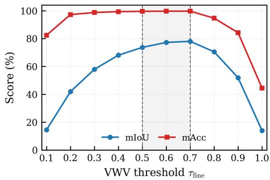  
Figure C.1: Sensitivity to the fine-stage VWV threshold �fine on LERF. Dashed lines mark the selected interval [0.5, 0.7].

Table C.2 reports frame-wise PSNR/SSIM between SAM 2 and SAM 3 masks from the same rendered frames. Their overall agreement reaches 97.0% SSIM and 28.5 dB PSNR, with the lowest agreement occurring in the more cluttered kitchen scene.

Table C.3 reports end-to-end 3D segmentation results on LERF with SAM 2 or SAM 3, under identical pipeline settings, together with their performance gaps. VCAR with SAM 2 remains competitive with 72.7% average mIoU on LERF. The largest degradation appears in kitchen $\left( \Delta \mathrm { m I o U } = - 6 . 4 \right)$ , where many small objects are visible only in limited views, making both temporal mask continuity and downstream 3D decisions more sensitive to 2D errors. Even in this most challenging case, VCAR+SAM 2 reaches 68.3% mIoU, which remains above the previous best baseline LangSplatV2 (59.1%) reported in the main paper.

Overall, replacing SAM 3 with SAM 2 changes average mIoU by 2.4 points and mAcc by 0.4 points. The relatively small average gap indicates that the VCAR pipeline transfers beyond its default 2D backbone, while the larger kitchen diference also shows that mask quality remains relevant in dificult scenes. We use SAM 3 in the main paper because it achieves the stronger average result and directly supports text prompts.

Table C.4: Boundary-aligned evaluation (%) on the eight LERF objects that trigger SSS. “Coarse Only” is the train-view SAM 3 + VWV baseline. The +SSS and +ABR rows independently add the indicated module to that baseline; Full includes both modules.
<table><tr><td>Configuration</td><td>mIoU</td><td>mAcc</td><td>B-F1</td><td>B-IoU</td><td>T-IoU</td></tr><tr><td>Coarse Only</td><td>53.4</td><td>90.2</td><td>32.4</td><td>18.8</td><td>54.7</td></tr><tr><td>+SSS</td><td>75.0</td><td>96.9</td><td>56.1</td><td>34.1</td><td>59.0</td></tr><tr><td>+ABR</td><td>77.6</td><td>97.3</td><td>65.0</td><td>43.1</td><td>60.0</td></tr><tr><td>Full</td><td>82.2</td><td>97.8</td><td>69.5</td><td>45.6</td><td>62.5</td></tr></table>

## C.3 Fine-Stage Voting Threshold Sensitivity

Figure C.1 sweeps $\tau _ { \mathrm { f i n e } }$ while holding the remaining pipeline fixed. A low threshold accepts Gaussians supported by only a small fraction of visible views and therefore admits more background evidence. Conversely, a high threshold requires near-unanimous support and can reject target Gaussians that are visible or correctly segmented in only part of the view set. The resulting mIoU is highest in the intermediate range, while mAcc also remains near its maximum there. We consequently use $\tau _ { \mathrm { f i n e } }$ ∈ [0.5, 0.7] for LERF, as reported in the main paper, to balance target completeness and background suppression. This sweep characterizes the threshold choice for the evaluated LERF cases and should not be interpreted as a universal setting for arbitrary scenes.

## C.4 Boundary-Aligned Evaluation on Selected LERF Objects

Because SSS and ABR mainly address incomplete or overflowing boundaries, Table C.4 complements the region-level ablation with B-F1, B-IoU, and T-IoU. We evaluate the eight LERF objects that satisfy $\Delta _ { \mathrm { m a x } } > \Delta _ { \mathrm { t h } }$ and therefore trigger SSS: Figurines–Apple, Figurines– Camera, Ramen–Bowl, Ramen–Sake Cup, Teatime–Sheep, Teatime– Bear, Kitchen–Fridge, and Kitchen–Toaster. The reported averages therefore characterize this fixed, method-defined subset rather than the complete LERF benchmark. All configurations follow the same evaluation and aggregation protocol.

Both +SSS and +ABR improve all three boundary metrics over Coarse Only, and Full achieves the best result on every reported metric. This pattern is consistent with their distinct roles: SSS adds evidence from under-observed directions, whereas ABR reduces projected overflow.

## C.5 Additional Qualitative Comparisons

We provide additional qualitative comparisons beyond those included in the main paper. In the LERF examples in Fig. C.2, VCAR produces cleaner object boundaries and fewer floating fragments under clutter and inter-object occlusion. In the shown NVOS examples in Fig. C.3, the supplementary viewpoints improve the recovery of under-observed regions while ABR suppresses part of the boundary leakage. These results complement the quantitative evaluation across objects of diferent sizes and capture layouts.

(b) Coarse-rendered SSS views and SAM masks

MM ’26, November 10–14, 2026, Rio de Janeiro, Brazil

VCAR: Training-Free 3DGS Segmentation via View Completeness and Axis-Aware Boundary Refinement

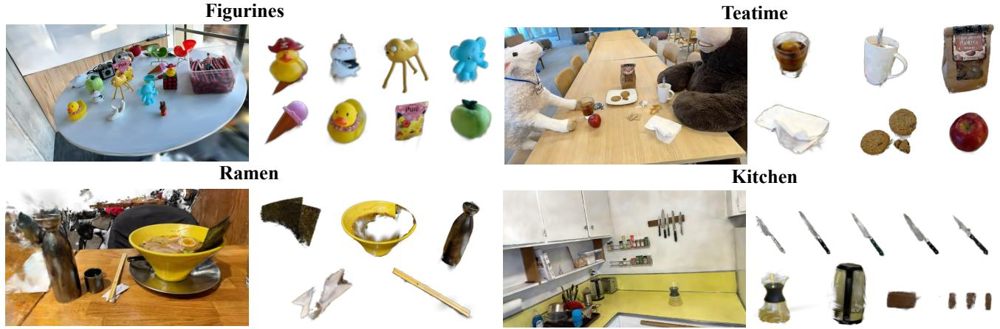

Figure C.2: Additional qualitative comparisons on LERF. Across the shown examples, VCAR yields cleaner boundaries and fewer floating artifacts under cluttered layouts and inter-object occlusion.  
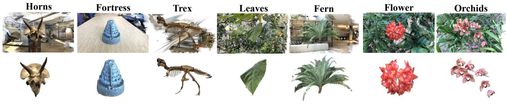  
Figure C.3: Additional qualitative comparisons on NVOS. Across the shown examples, VCAR improves boundary completeness in under-observed regions while reducing background leakage in forward-facing captures.

## D Additional Clarifications

## D.1 Robustness to Imperfect 2D Masks

VCAR uses pretrained 2D masks as evidence and therefore cannot be independent of their quality. Within a SAM 3 propagation, some mask errors are sporadic: they afect only a small number of views while most other views provide consistent foreground evidence. VWV normalizes votes over views in which a Gaussian is visible, so an isolated incorrect mask contributes only a limited fraction of the final score and can be diluted by the remaining views. Figure D.1(a) illustrates this case, where noisy or inconsistent masks coexist with a stable final segmentation.

This robustness is conditional rather than absolute. If the same semantic error persists across many views, the incorrect evidence becomes the multi-view consensus and is inherited by VWV. SSS can add viewpoints but does not correct a repeatedly wrong mask, and ABR only modifies the scale of already selected Gaussians rather than their semantic label. Persistent 2D errors therefore remain an upstream limitation of the complete pipeline.

(a) Imperfect SAM 3 masks and final segmentation  
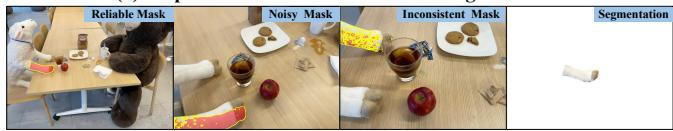

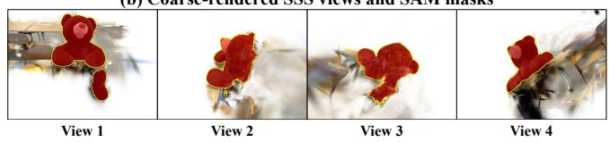  
Figure D.1: Robustness to imperfect masks and examples of SSS-generated views. (a) Three representative SAM 3 masks of varying quality and the resulting 3D segmentation. In this example, isolated noisy or inconsistent masks are suppressed by multi-view aggregation, yielding a stable result. (b) Four supplementary views rendered from Gcoarse and used to generate additional 2D masks. These intermediate views may contain coarse-rendering artifacts.

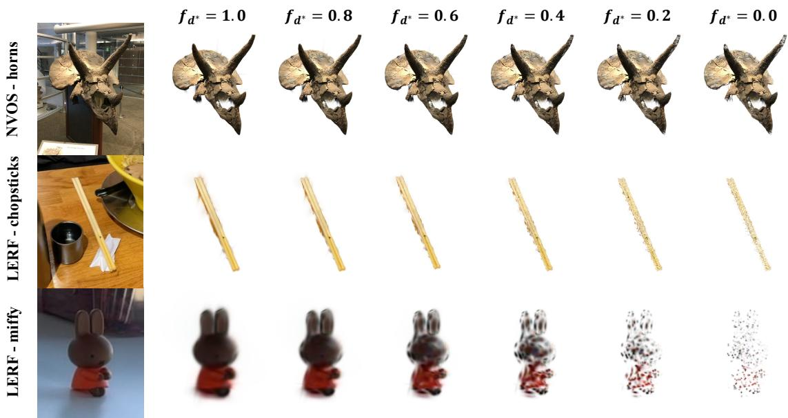  
Figure D.2: Diagnostic sweep of boundary-axis compression. The leftmost column shows the reference images. The remaining columns apply a fixed factor $f _ { d ^ { \ast } } \in \{ 1 . 0 , 0 . 8 , 0 . 6 , 0 . 4 , 0 . 2 , 0 . 0 \}$ to every Gaussian-axis pair attributed to an overflow in at least one view. Here, $f _ { d ^ { * } } = 1 . 0$ leaves the selected axis unchanged, whereas $f _ { d ^ { * } } = 0 . 0$ completely compresses it.

## D.2 Role and Quality of SSS-Generated Views

SSS-generated views are intermediate observations rather than photorealistic novel-view synthesis outputs. They are rendered using $G ^ { \mathrm { c o a r s e } }$ , so missing background content and coarse object geometry can produce unnatural appearance or rendering artifacts, as shown in Fig. D.1(b). Moreover, a sampled camera usually has no corresponding ground-truth image, making image-level PSNR poorly aligned with the purpose of SSS. The relevant criterion is whether a sampled view reduces background occlusion, exposes a useful object-facing direction, and provides an additional mask that improves the downstream 3D segmentation. The ablation gains of +SSS and Full in Table C.4 quantify this downstream utility.

## D.3 ABR versus Visual Quality

To isolate the efect of compression strength, we apply a common factor $f _ { d ^ { * } }$ to every Gaussian-axis pair attributed to an overflow in at least one view, instead of using ABR’s adaptive factors. Figure D.2 varies $f _ { d ^ { * } }$ from no compression $( f _ { d ^ { * } } = 1 . 0 )$ to complete compression $( f _ { d ^ { * } } = 0 . 0 )$ , revealing scale- and geometry-dependent efects. For large objects such as Horns, ABR compressions accumulates over the dense, relatively small boundary Gaussians and progressively erodes the outer contour. For elongated or irregular structures such as Chopsticks, comparatively large Gaussians support the thin shape, so compressing them disrupts spatial continuity and produces speckled gaps. For small objects such as $M i f f y ,$ only a few Gaussians represent the object, and a single Gaussian may cover both interior and boundary regions, therefore, its compression probably can remove object content and cause severe fragmentation.

Overall, a geometrically tighter boundary does not necessarily produce a visually better rendering. An anisotropic Gaussian may have a long projected tail that crosses the foreground boundary yet remains visually inconspicuous after alpha compositing. Compressing its attributed axis can therefore suppress visually meaningful Gaussian contributions to the rendered object, exposing the tradeof between reducing geometric overflow with ABR and preserving visual fidelity.

## D.4 Coarse-Stage Coverage and Occlusion-Induced Failures

The coarse set $\mathcal { G } ^ { \mathrm { c o a r s e } }$ is not theoretically guaranteed to contain every target Gaussian. SSS renders supplementary views from that coarse set, and ABR only adjusts the scale of selected Gaussians. Consequently, if a target part is absent after coarse voting, neither module can recover it from scratch. The direct efect is reduced recall for thin, weakly visible, or heavily occluded parts.

The missing hind leg of Teatime–Sheep is one such case. Tables and chairs occlude the part in most original views, causing the corresponding SAM 3 masks to omit it repeatedly. When incomplete masks dominate the visible-view evidence, VWV excludes the associated Gaussians from the coarse result. The later SSS and ABR stages then have no foreground support from which to restore the leg. This is an upstream coverage failure caused by persistent omission rather than a failure of the later refinement stages.