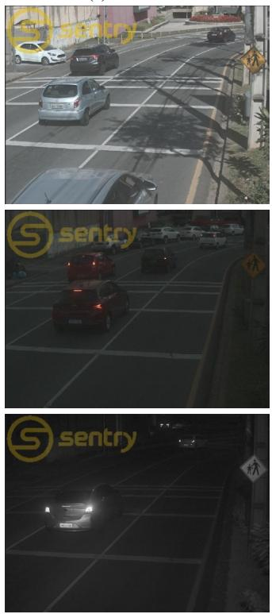
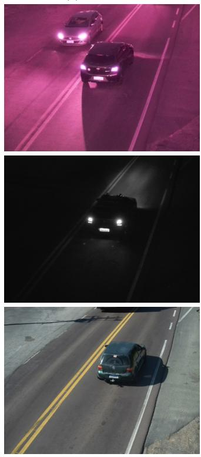
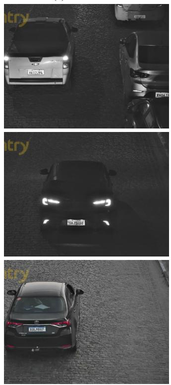
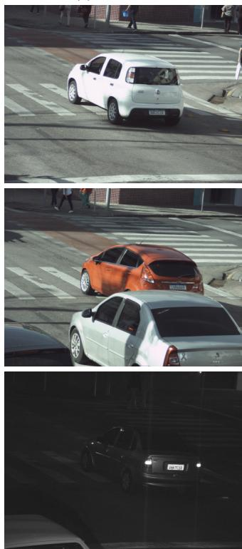
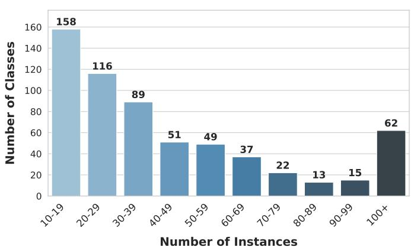

# VeriCam: A Verification Baseline for the Classification of Unknown Data

Lucas Wojcik∗, Gabriel E. Lima∗, Sergio M. Silva Jr.∗, Eduil Nascimento Jr.†, and David Menotti∗

∗Department of Informatics, Federal University of Parana, Curitiba, Brazil´

†Department of Technological Development and Quality, Parana Military Police, Curitiba, Brazil´

∗{lmlwojcik,gelima,smsjunior,menotti}@inf.ufpr.br †eduiljunior@pm.pr.gov.br

Abstract—The advent of foundation models have enabled a new era in zero-shot classification. Yet, key challenges persist. Despite their impressive generalization power that leverages the immense pre-training knowledge, both foundation models for image and text as well as vision-text hybrids lack the representational power needed for fine-grained, minutiae-based class separation that some real-world tasks require. To address the current gaps in the literature, we propose VeriCam, a pipeline designed to learn highly specialized features that enable classification of unknown classes in unseen data. VeriCam works by leveraging the representation power of image models trained for the verification task, where the model develops an intricate feature space that incorporates fine-grained details. By training a model to discriminate between pairs of images from the same and different classes, a relational graph is constructed, representing the class relationships between data points. We then present two approaches for graph clustering: a naive algorithm and a specific setup for the Leiden graph clustering algorithm. The pipeline is validated on the LPLCv2 dataset, which comprises real-world traffic surveillance images. We show that the dataset carries an inherent capture device bias that is posed as a generalization challenge for downstream License Plate recognition tasks such as OCR. As such, we dynamically identify capture devices with a label-agnostic approach, enabling the construction of a fair and unbiased benchmark. In the cross-device scenario, our pipeline reaches an F1-Score of 93.45 in the verification baseline and a V-Measure score of 80.13 in the clustering step. All code is publicly available at https://github.com/lmlwojcik/VeriCam

## I. INTRODUCTION

Deep Learning (DL) has established itself as the state-ofthe-art approach for automatic pattern recognition par excellence, a development enabled by the large amounts of data available today [1]. Owing to its data-driven nature, its success often depends on the quantity and quality of training data [2]. Each real-world application of DL, therefore, sees its effectiveness inherently linked to the quality of the training data available, often leveraging domain-specific knowledge encoded in the annotated labels.

As such, one of the major real-world challenges for the state of the art consists in dealing with inconsistent, incomplete or misleading data. Some domain-specific constraints may also render some tasks unmanageable for classic approaches. In particular, we are interested in the case where the number of classes is unknown and unconstrained a priori. This scenario cannot be handled through standard classification models, as these employ a fixed number of output neurons to encode an already known number of classes.

A few strategies have been employed over the years to deal with this issue. Early research developed Out of Distribution (OOD) classification [3], which extends the standard N classification to a N + 1 scenario, where the model should also be capable of identifying instances not belonging to the initial N classes. Some recent works extend OOD towards zero-shot classification [4], aiming to categorize unseen data in new classes, effectively tackling the multi-unknown class issue. However, these approaches face significant limitations represented by the overall lower accuracy and the complexity of domain-specific knowledge, limiting their generalization potential [5], [6].

An important application of zero-shot detection, and the one to which we apply our proposal, is capture device recognition in Automatic License Plate Recognition (ALPR) datasets. A previous ALPR study has unraveled unexpected biases in street surveillance datasets [7], showing that a very small CNN can correctly identify the datasets that each traffic image instance comes from when trained on a standard classification task. While this largely impacts cross-dataset generalization, intradataset contamination can also be seen in some large datasets. We show that intra-dataset experiments can also be skewed by an invisible bias in the form of device contamination in the testing sets. As such, device recognition is an important step towards building a fair, unbiased benchmark.

With these motivations in mind, we propose VeriCam, a DL pipeline designed to enable the classification of unknown classes. Instead of mapping instances to a predefined label space, we reframe zero-shot inference using a pairwise binary decision task. We employ a verification network to estimate the probability that two samples belong to the same latent class, and build a graph representation of the target dataset from which same-class clusters can be identified and extracted. By decoupling class discrimination from static semantic signatures, we learn a universal, domain-invariant feature space to determine semantic identity spanning novel classes. In this work, we narrow our focus on validation within the street surveillance domain, tailoring the approach for a practical application.

Therefore, our contributions can be summarized as:

• A novel method for zero-shot classification based on a verification network.

• Two algorithms that employ the original intuition, and their experimental validation.

• A short study on capture device contamination for OCR efficiency.

• The open source implementation of all pipeline steps, available at https://github.com/lmlwojcik/VeriCam.

The remainder of this paper is organized as follows. Section II presents related works and the current state of the art behind our motivation and proposal. Section III details our proposed pipeline and algorithms, as well as the target dataset. Section IV details the experiments used to validate our approach. Section V presents the results for each experimental scenario. Finally, Section VI concludes the paper.

## II. RELATED WORK

Recent literature has tackled unknown data as an OOD problem [8], which consists of detecting data points that are not represented in known classes. One of the main approaches in this task is to threshold the output logit map of the network, rejecting low confidence detections [9], [10]. Other methods include distribution analysis and prototype synthesis [11].

The main drawback with simple OOD is the inability to discover and classify unknown classes. In this sense, zeroshot classification is a generalization of OOD, such that the model must be able to recognize and classify unseen classes at testing time. Zero-shot learning is often studied in the Natural Language Processing (NLP) field [4], [12], with LLMs being largely used in this domain [13].

The text-based zero-shot classification method, however, is not directly transferable to the image domain. While the large training corpus of an LLM provides enough vocabulary to enable generalization of novel sentence arrangements, these models face a notorious hurdle when dealing with domainspecific data [14]. This limitation can also be seen in the visual domain, where applications for zero-shot learning often rely on highly specialized features, such as the device detection task tackled in this work.

Despite this limitation, image foundation models are still used for zero-shot image classification. Approaches vary from training with synthetically generated data [15] to leveraging text-based descriptions [12], [16]. In both cases, methods are limited by the general knowledge of the models employed for knowledge extraction.

Other methods of zero-shot classification may leverage knowledge acquired at training time, such as features shared across known classes [17]. The COSTA framework, for example, explicitly models knowledge transfer by extracting and leveraging the statistical co-occurrences between classes. Other models use class prototypes, utilizing the learned latent embedding space as a source of feature detection in order to define new classes from bits and pieces of the detected features [18].

These approaches, however, are also limited in terms of their applicability. The main drawback with existing methods in the literature is the lack of a clear way to bound and separate classes that may be similar, but subtly different, such that highly specialized knowledge may be needed in order to tell instances apart.

We address these gaps in the literature by devising a robust method for classification of unknown classes without the need for a priori knowledge. The proposed pipeline aims at utilizing local comparisons, avoiding globally defined knowledge in favor of proximity features that encode class-based information in its relational similarity metric as opposed to crisp label values.

## III. METHODOLOGY

Our method exploits local relationships between instances as opposed to global cues and features. Intuitively, the set of known classes can be built by comparing instances to one another, grouping instances with high similarity and separating instances with low similarity. In this, we draw influence from the facial recognition state of the art [19], which has established the verification task as a foundational method to train feature descriptors [20]. It leverages the task’s potential to teach the model to separate similar-but-different classes, enabling the learning of robust feature descriptors. While in facial recognition these models are later used for identification (classification) tasks by swapping the last layer, here we simply use the final model as a feature descriptor for graph generation.

## A. Proposed Pipeline

The proposed pipeline is based on a label-agnostic zeroshot clustering approach driven by the recognition of pairwise relations. It consists of a feature descriptor model (here, we use the Vision Transformer (ViT) [21]) trained on the verification task (given two images, determine whether they belong to the same class or not) and a graph clustering step.

The model is first trained to learn effective feature descriptors for its specific domain, optimizing for the cosine distance between images of the same class. For this, we employ the Triplet loss, using the cosine distance defined in Equation 1 for feature vectors $V _ { 1 }$ and $V _ { 2 }$ . The cosine distance ranges from 2 for completely different vectors to 0 for equal vectors, and is based on the cosine similarity, defined in Equation 2. The similarity, accordingly, ranges respectively from −1 to 1.

$$
C o s D i s t ( A , B ) = 1 - C o s S i m ( V _ { 1 } , V _ { 2 } )\tag{1}
$$

$$
C o s S i m ( A , B ) = \frac { \mathbf { V _ { 1 } } \cdot \mathbf { V _ { 2 } } } { \| \mathbf { V _ { 1 } } \| \| \mathbf { V _ { 2 } } \| }\tag{2}
$$

Then, the model is used as a feature extractor in order to build a graph-based representation of the instance space that represents their pairwise similarity. We synthesize local pairwise decisions into a global representation through the affinity matrix A, which represents an undirected graph $G =$ (V, E), where vertices V represent instances and edge weights E denote the cosine similarity between the two vertices it connects. A graph clustering algorithm is then executed on $G ,$ yielding new class labels for each test instance.

For the clustering step, our first approach relies on a naive algorithm. The algorithm starts its execution with a known set of instances and classes, which may be either initialized from data known a priori or left blank and then initialized by the first instance seen. Then, for each new instance, its cosine similarity to all known images is computed and the instance is incorporated into the known set. This new instance either initializes a novel class if the mean similarity to all images from each class is less than a predetermined threshold, or assigned to the class with highest mean similarity otherwise.

(a) Device 30  

(b) Device 48  

(c) Device 468  

(d) Device 546  
  
Fig. 1. Instances from the LPLCv2 Dataset.

Our second approach relies on the Leiden algorithm [22] for graph clustering. Since our target dataset features a large number of images (over six thousand just for the testing set), spectral clustering [23] appears to be prohibitively expensive, and therefore we rely on the Leiden algorithm for its highly efficient heuristics. Given the nature of our problem, we use the Constant Potts Model (CPM) [24] for community detection. In both cases, this step is treated as a clustering task, given its label-agnostic nature.

## B. The Dataset

We utilize the LPLCv2 dataset [25], which is comprised of 37, 099 images, of which 34, 760 are annotated with regards to the camera ID1. Each camera is defined according to its installation location. As such, each individual device is identified by the scene displayed in the images. Some examples of this can be found in Figure 1. Our goal is to dynamically identify the devices using our verification strategy.

In order to ensure each class is sufficiently represented, we utilize the devices associated with ten or more images. By applying this split, our working dataset is comprised of 33, 668 images represented across 612 devices. As shown in Figure 2, the dataset is very imbalanced with regards to the number of instances, with around 50% of the dataset (16, 644 images) being represented by 15% of the classes (90 devices).

Class Instance Distribution  
  
Fig. 2. Distribution of the number of instances per class.

## IV. EXPERIMENTS

In order to experimentally validate our approach, we devise intra-device and cross-device experimental scenarios. For the intra-device scenario, we divide the images of each device chosen from the LPLCv2 dataset into training, validation and testing partitions in a 60/20/20 fashion. This ensures that validation and testing are performed exclusively on unseen images from known devices.

TABLE I  
NUMBER OF INSTANCES PER PARTITION.
<table><tr><td>Experiment</td><td>Partition</td><td>Instances</td><td>Devices</td></tr><tr><td rowspan="3">Intra-Device</td><td>Training</td><td>20200</td><td>612</td></tr><tr><td>Validation</td><td>6734</td><td>612</td></tr><tr><td>Testing</td><td>6734</td><td>612</td></tr><tr><td rowspan="3">Cross-Device</td><td>Training</td><td>20914</td><td>368</td></tr><tr><td>Validation</td><td>6477</td><td>122</td></tr><tr><td>Testing</td><td>6277</td><td>122</td></tr></table>

For the cross-device scenario, we split the dataset using the same partitioning schema, but the separation is done at device level instead of image level. This means that the known 612 devices are divided into training, validation and testing such that all images from the same camera belong to only one partition exclusively. Similarly, this ensures that validation and testing are performed exclusively on unknown devices. The resulting statistics can be found in Table I.

Our experiments are then carried out at three steps. In the first step, we train the model for verification using the Triplet loss and the dataset partitions previously defined. Then, we generate a static set of 50, 000 random pairs of images from the testing set to serve as a baseline, keeping a ratio of 0.5 between genuine and impostor pairs. We then evaluate the verification model on the testing partition using the binary accuracy and F1-score metrics. Then, we use the resulting feature extractor on the unknown class predictors defined in Section III, using two baselines that represent the second and third experiment steps.

The second step consists of evaluating each algorithm when a priori knowledge is available. This means that the training set instances are available and their labels are known to the algorithm. For the naive approach, this means that the initial model is initialized using the training set. For the Leiden approach, the training instances are incorporated into the graph and the initial membership is provided, such that new instances are assigned to class 0 and known instances are assigned to their corresponding classes. Then, the third step consists of evaluating both approaches with no a priori information.

In both cases, we utilize the V-measure score with β = 1.0 to evaluate the resulting labels. This measure is appropriate for our task as it is independent of the label IDs, and provides an accurate measurement of zero-shot labeling efficiency.

Finally, we also use a PARSeq-tiny model [26] on the OCR task on LPLCv2. We choose PARSeq due to its common usage in recent ALPR literature and high performance on scenarios similar to the ones presented in LPLCv2 [27], [28]. We utilize the same splits, training it for intra- and cross-device scenarios in order to investigate the potential device biases in a realworld OCR task. Here, we use the standard parameters and train both pre-trained and from scratch versions.

TABLE II  
VERIFICATION HYPERPARAMETERS
<table><tr><td>Parameter</td><td>Value</td></tr><tr><td>Epochs</td><td>1000</td></tr><tr><td>Batches per Epoch</td><td>120</td></tr><tr><td>Early Stopping Patience Early Stopping Metric</td><td>40</td></tr><tr><td></td><td>Validation Accuracy</td></tr><tr><td>Optimizer</td><td>Adam [29]</td></tr><tr><td>Initial Learning Rate</td><td> $1 e - 4$ </td></tr><tr><td>LR Factor</td><td>0.75</td></tr><tr><td>LR Patience</td><td>5 epochs</td></tr><tr><td>Minimum LR</td><td> $1 e - 6$ </td></tr></table>

## A. Training Parameters

All images are resized to fit into a 224×224 square, keeping the aspect ratio, positioned on the middle and padded with gray pixels. We train a ViT-b16 [21] architecture from scratch on the verification task on a NVIDIA RTX 6000 GPU. The model is trained using a triplet loss [30], with dynamically generated training and validation triplets. The hyperparameters of the verification training step can be found in Table II.

The naive algorithm utilizes a threshold of 0.6 to assign an image to a known cluster. The Leiden algorithm uses the Constant Potts Model (CPM) quality function, which is suitable to this task as several tightly knit communities are to be expected at high verification accuracy levels. The resolution parameter is set at 0.8.

## V. RESULTS

TABLE III  
RESULTS FOR THE VERIFICATION BASELINE ON THE TESTING SET.
<table><tr><td>Scenario</td><td>Accuracy (↑)</td><td>Precision (↑)</td><td>Recall (↑)</td><td>F1-score (↑)</td></tr><tr><td>Intra-device</td><td>98.13</td><td>98.87</td><td>97.36</td><td>98.11</td></tr><tr><td>Cross-device</td><td>93.79</td><td>97.83</td><td>89.52</td><td>93.45</td></tr></table>

Table III presents the results for the verification task. We report both Accuracy and F1-score on the testing partition of 50, 000 randomly generated pairs. As expected, cross-device performance is significantly lower, which highlights the device bias present in the dataset. The data is not homogeneous: a model trained on one partition does not necessarily generalize towards another partition.

In particular, we notice a higher incidence of false negatives, as seen in the lower Recall rate in the cross-device scenario. This essentially means that, in verification, the features face a bigger hurdle when accurately distinguishing false negatives, that is, many genuine pairs are rejected.

Table IV presents our zero-shot results for the Naive algorithm. We report the V-Measure and the instantaneous accuracy, meaning that for each incoming instance a correct attribution is recorded if either: the image is assigned to a new class and other images of the same device are not yet present in the known set, or, the image is assigned to an existing class in the known set and most of the same images from its corresponding device are also present in that class.

TABLE IV  
RESULTS FOR THE NAIVE ALGORITHM.
<table><tr><td>Scenario</td><td>Initialization</td><td>V-Measure (↑)</td><td>Correct Attributions (↑)</td></tr><tr><td rowspan="2">Intra-device</td><td>None</td><td>89.68</td><td>64.52</td></tr><tr><td>Training</td><td>92.30</td><td>82.09</td></tr><tr><td rowspan="2">Cross-device</td><td>None</td><td>73.45</td><td>43.10</td></tr><tr><td>Training</td><td>72.51</td><td>33.90</td></tr></table>

As the results show, a priori knowledge significantly increases performance for the intra-device scenario, while it also worsens the cross-device efficacy. Indeed, the crossdevice scenario is unable to leverage known information as its distribution is outside the range of the training set. However, these results show that possessing the known information is often desirable for robust and successful executions of the algorithm.

TABLE V  
RESULTS FOR THE LEIDEN ALGORITHM (V-MEASURE).
<table><tr><td>Scenario</td><td>Known</td><td>Homogeneity (1)</td><td>Completeness (↑)</td><td>V-Measure (↑)</td></tr><tr><td>Intra</td><td>None</td><td>99.22</td><td>81.11</td><td>89.25</td></tr><tr><td>Device</td><td>Training</td><td>99.26</td><td>81.17</td><td>89.31</td></tr><tr><td>Cross</td><td>None</td><td>99.18</td><td>67.23</td><td>80.14</td></tr><tr><td>Device</td><td>Training</td><td>95.34</td><td>63.66</td><td>76.35</td></tr></table>

Table V presents the results for the Leiden algorithm clustering. The same trend seen in the Naive algorithm results persists, where a priori knowledge is helpful for classifying known devices, but harmful for new, unknown devices. Our approach reaches a solid 80.14 V-Measure score, highlighting its generalization potential. This result is directly tied to the verification efficiency. The goal when using node clustering on fuzzy relationships is to filter out the noise from erroneous verification steps. While the implemented pipeline manages generalization, the performance gap can still be improved by refining the verification task performance.

A qualitative analysis of the results supports the intuition behind the good homogeneity but low completeness scores found in this scenario. While there is little class contamination inside the same class, some classes are split up into many chunks. This highlights the main limitation of the proposed method, which is a consequence of the relatively lower recall (a higher false negative rate).

Finally, we present the OCR results with PARSeq on the partitions defined for our experiments in this paper, with the results stratified according to the plate-wise legibility labels from the dataset. These are presented in Table VI. While the pre-trained model leverages its training data in order to achieve a robust generalization performance, the model trained from scratch reveals the device bias present in the dataset. In the cross-device scenario, the whole-plate accuracy drops from

TABLE VI  
PARSEQ-TINY OCR PERFORMANCE ACROSS CLASSES.
<table><tr><td rowspan="2">Scenario</td><td rowspan="2">Class</td><td colspan="2">From Scratch</td><td colspan="2">Pretrained</td></tr><tr><td>Plate Acc. (%)</td><td>Char. Acc. (%)</td><td>Plate Acc. (%)</td><td>Char. Acc. (%)</td></tr><tr><td rowspan="5">Intra Device</td><td>Perfect</td><td>98.73</td><td>99.72</td><td>99.01</td><td>99.78</td></tr><tr><td>Good</td><td>94.43</td><td>98.72</td><td>95.17</td><td>98.96</td></tr><tr><td>Poor</td><td>84.82</td><td>97.21</td><td>87.12</td><td>97.63</td></tr><tr><td>Illegible</td><td>65.91</td><td>91.02</td><td>68.18</td><td>91.34</td></tr><tr><td>Overall</td><td>95.29</td><td>99.00</td><td>95.98</td><td>99.15</td></tr><tr><td rowspan="5">Cross Device</td><td>Perfect</td><td>98.72</td><td>99.78</td><td>99.08</td><td>99.84</td></tr><tr><td>Good</td><td>94.29</td><td>98.94</td><td>96.16</td><td>99.25</td></tr><tr><td>Poor</td><td>84.52</td><td>97.06</td><td>85.60</td><td>97.38</td></tr><tr><td>Illegible</td><td>56.06</td><td>85.61</td><td>50.76</td><td>82.90</td></tr><tr><td>Overall</td><td>93.41</td><td>98.66</td><td>94.26</td><td>98.80</td></tr></table>

95.29 to 93.41, a drop of 1.88 percentage points that represents a significant increase in error rate. This is especially true for low-resolution, poorly readable license plates, with Illegible plates representing the most impacted class.

## VI. CONCLUSION

In this paper, we have presented a novel method for zeroshot classification based on the verification task. Drawing influence from the human-based process of recognition of new data, as well as from the state of the art in facial recognition, we devise an initial draft for automatic new class detection. We employ both a naive algorithm, which assumes verification accuracy is perfect, and a modular Leiden-based graph clustering for class (community) detection, and show the results for the LPLCv2 dataset.

Although the initial results seem promising, several challenges remain. Our results show that these approaches often fail at recognizing the lesser represented classes, even when constrained to a subset with at least ten instances per class. Also, the verification network often fails at separating similar classes, which introduces a fair amount of noise in the zeroshot step. Finally, the zero-shot method does not yet reach a satisfactory performance, which highlights the need for future research.

Future work will focus on improving the naive approach in order to exploit the new incoming information at test time in order to correct past mistakes, leveraging the high internal cohesion of each class that is presumed at high verification performance levels. Also, an important step is to refine the quality of the extracted features by improving inter-class separation for similar classes. Finally, another future direction for research is to expand the work’s scope towards novel features of other datasets in order to validate the approach in more general scenarios.

## ACKNOWLEDGMENT

This study was financed in part by the Coordenac¸ao˜ de Aperfeic¸oamento de Pessoal de N´ıvel Superior - Brasil (CAPES), through the Programa de Excelenciaˆ

Academica (PROEX) ˆ - Finance Code 001, in part by the Fundac¸ao Arauc˜ aria´ under grant # 078/2026, and in part by the Conselho Nacional de Desenvolvimento Cient´ıfico e Tecnologico (CNPq)´ (# 315409/2023-1).

## REFERENCES

[1] D. Zha, Z. P. Bhat, K.-H. Lai, F. Yang, Z. Jiang, S. Zhong, and X. Hu, “Data-centric artificial intelligence: A survey,” ACM Computing Surveys, vol. 57, no. 5, pp. 1–42, 2025.

[2] J. Hoffmann et al., “Training compute-optimal large language models,” in Proceedings of the 36th International Conference on Neural Information Processing Systems, ser. NIPS ’22. Red Hook, NY, USA: Curran Associates Inc., 2022.

[3] D. Hendrycks and K. Gimpel, “A baseline for detecting misclassified and out-of-distribution examples in neural networks,” in International Conference on Learning Representations, 2017. [Online]. Available: https://openreview.net

[4] W. Yin, J. Hay, and D. Roth, “Benchmarking zero-shot text classification: Datasets, evaluation and entailment approach,” in Proceedings of the 2019 Conference on Empirical Methods in Natural Language Processing and the 9th International Joint Conference on Natural Language Processing (EMNLP-IJCNLP), K. Inui, J. Jiang, V. Ng, and X. Wan, Eds. Hong Kong, China: Association for Computational Linguistics, Nov. 2019, pp. 3914–3923. [Online]. Available: https://aclanthology.org/D19-1404/

[5] S. Vaze, K. Han, A. Vedaldi, and A. Zisserman, “Generalized category discovery,” in IEEE Conference on Computer Vision and Pattern Recognition, 2022.

[6] X. Wen, B. Zhao, and X. Qi, “Parametric classification for generalized category discovery: A baseline study,” in 2023 IEEE/CVF International Conference on Computer Vision (ICCV). IEEE, 2023, pp. 16 544– 16 554.

[7] R. Laroca, M. Santos, V. Estevam, E. Luz, and D. Menotti, “A first look at dataset bias in license plate recognition,” in Conference on Graphics, Patterns and Images (SIBGRAPI), Oct 2022, pp. 234–239.

[8] J. Yang, K. Zhou, Y. Li, and Z. Liu, “Generalized out-of-distribution detection: A survey,” International Journal of Computer Vision, vol. 132, no. 12, pp. 5635–5662, Dec 2024. [Online]. Available: https://doi.org/10.1007/s11263-024-02117-4

[9] W. Liu, X. Wang, J. Owens, and Y. Li, “Energy-based out-of-distribution detection,” Advances in Neural Information Processing Systems, 2020.

[10] Z. Zhang and X. Xiang, “Decoupling maxlogit for out-of-distribution detection,” in 2023 IEEE/CVF Conference on Computer Vision and Pattern Recognition (CVPR), 2023, pp. 3388–3397.

[11] S. Lu, Y. Wang, L. Sheng, L. He, A. Zheng, and J. Liang, “Out-ofdistribution detection: A task-oriented survey of recent advances,” ACM Computing Surveys, vol. 58, no. 2, pp. 1–39, 2025.

[12] O. Saha, G. Van Horn, and S. Maji, “Improved zero-shot classification by adapting vlms with text descriptions,” in 2024 IEEE/CVF Conference on Computer Vision and Pattern Recognition (CVPR), 2024, pp. 17 542– 17 552.

[13] R. Zhang, Y.-S. Wang, and Y. Yang, “Generation-driven contrastive selftraining for zero-shot text classification with instruction-following llm,” in Proceedings of the 18th Conference of the European Chapter of the Association for Computational Linguistics (Volume 1: Long Papers), 2024, pp. 659–673.

[14] C. Ling, X. Zhao, J. Lu, C. Deng, C. Zheng, J. Wang, T. Chowdhury, Y. Li, H. Cui, X. Zhang et al., “Domain specialization as the key to make large language models disruptive: A comprehensive survey,” ACM Computing Surveys, vol. 58, no. 3, pp. 1–39, 2025.

[15] J. Shipard, A. Wiliem, K. N. Thanh, W. Xiang, and C. Fookes, “Diversity is definitely needed: Improving model-agnostic zero-shot classification via stable diffusion,” in 2023 IEEE/CVF Conference on Computer Vision and Pattern Recognition Workshops (CVPRW), 2023, pp. 769–778.

[16] Z. Novack, J. Mcauley, Z. C. Lipton, and S. Garg, “CHiLS: Zero-shot image classification with hierarchical label sets,” in Proceedings of the 40th International Conference on Machine Learning, ser. Proceedings of Machine Learning Research, A. Krause, E. Brunskill, K. Cho, B. Engelhardt, S. Sabato, and J. Scarlett, Eds., vol. 202. PMLR, 23–29 Jul 2023, pp. 26 342–26 362. [Online]. Available: https://proceedings.mlr.press/v202/novack23a.html

[17] T. Mensink, E. Gavves, and C. G. Snoek, “Costa: Co-occurrence statistics for zero-shot classification,” in Proceedings of the IEEE Conference on Computer Vision and Pattern Recognition (CVPR), June 2014.

[18] Y. Xian, Z. Akata, G. Sharma, Q. Nguyen, M. Hein, and B. Schiele, “Latent embeddings for zero-shot classification,” in Proceedings of the IEEE Conference on Computer Vision and Pattern Recognition (CVPR), June 2016.

[19] H. Du, H. Shi, D. Zeng, X.-P. Zhang, and T. Mei, “The elements of end-to-end deep face recognition: A survey of recent advances,” ACM computing surveys (CSUR), vol. 54, no. 10s, pp. 1–42, 2022.

[20] S. S. Khalid, M. Awais, Z.-H. Feng, C.-H. Chan, A. Farooq, A. Akbari, and J. Kittler, “Npt-loss: Demystifying face recognition losses with nearest proxies triplet,” IEEE Transactions on Pattern Analysis and Machine Intelligence, vol. 45, no. 12, pp. 15 249–15 259, 2023.

[21] A. Dosovitskiy et al., “An image is worth 16x16 words: Transformers for image recognition at scale,” in International Conference on Learning Representations (ICLR), 2021, pp. 1–22.

[22] V. A. Traag, L. Waltman, and N. J. van Eck, “From louvain to leiden: guaranteeing well-connected communities,” Scientific Reports, vol. 9, no. 1, p. 5233, Mar 2019. [Online]. Available: https: //doi.org/10.1038/s41598-019-41695-z

[23] U. von Luxburg, “A tutorial on spectral clustering,” Statistics and Computing, vol. 17, no. 4, pp. 395–416, Dec 2007. [Online]. Available: https://doi.org/10.1007/s11222-007-9033-z

[24] L. L. Felipe, K. Avrachenkov, and D. S. Menasche, “From leiden to´ pleasure island: The constant potts model for community detection as a hedonic game,” Physica A: Statistical Mechanics and its Applications, p. 130989, 2025.

[25] L. Wojcik, E. A. F. Machoski, E. N. Jr., R. Laroca, and D. Menotti, “Lplcv2: An expanded dataset for fine-grained license plate legibility classification,” 2026. [Online]. Available: https: //arxiv.org/abs/2604.08741

[26] D. Bautista and R. Atienza, “Scene text recognition with permuted autoregressive sequence models,” in European Conference on Computer Vision. Cham: Springer Nature Switzerland, 10 2022, pp. 178–196. [Online]. Available: https://doi.org/10.1007/978-3-031-19815-1 11

[27] L. Wojcik, G. E. Lima, V. Nascimento, E. Nascimento Jr., R. Laroca, and D. Menotti, “LPLC: A dataset for license plate legibility classification,” Conference on Graphics, Patterns and Images (SIBGRAPI), pp. 1–6, 2025.

[28] G. E. Lima, V. Nascimento, E. Santos, E. Nascimento Jr., R. Laroca, and D. Menotti, “Toward unified fine-grained vehicle classification and automatic license plate recognition,” Journal of the Brazilian Computer Society, vol. 32, no. 1, pp. 783–799, 2026.

[29] D. P. Kingma and J. Ba, “Adam: A method for stochastic optimization,” in International Conference on Learning Representations (ICLR), 2015. [Online]. Available: https://arxiv.org/abs/1412.6980

[30] E. Hoffer and N. Ailon, “Deep metric learning using triplet network,” in Similarity-Based Pattern Recognition, A. Feragen, M. Pelillo, and M. Loog, Eds. Cham: Springer International Publishing, 2015, pp. 84–92.