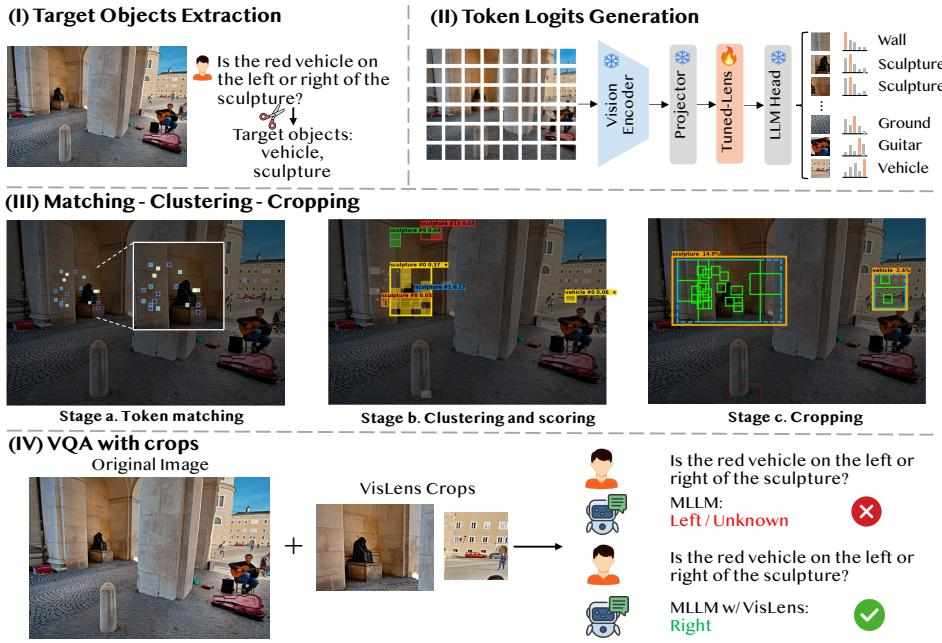
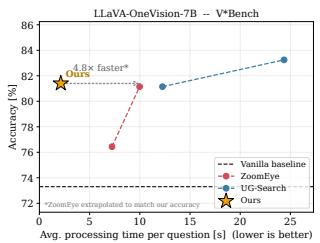
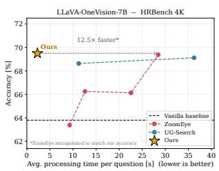
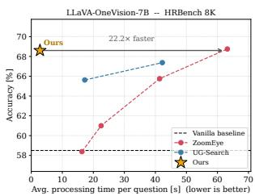
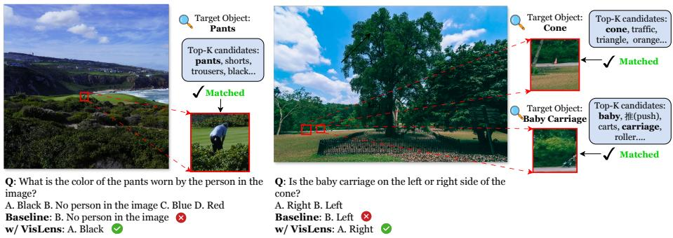
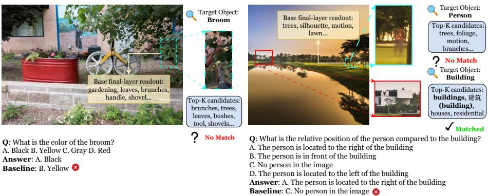

# VisLens: Single-Pass Interpretable Visual Search for Multimodal LLMs

Jingyi He1, Sanghwan Kim1,2, and Zeynep Akata1,2

1 Technical University of Munich Helmholtz Munich 2 Munich Center for Machine Learning

Abstract. Multimodal large language models (MLLMs) struggle with fine-grained Visual Search, the task of locating small or rare objects in high-resolution images. Existing remedies fall into two families: (1) Training-free methods based on attention or confidence scores are accurate but slow, since they require multiple MLLM queries per example. (2) Reinforcement Learning (RL) trained tool-use models are faster at inference but opaque, since their tool calls remain uncontrollable and hard to interpret. To overcome this, we propose VisLens (Visual Focus via Logit Lens), a Visual Search method built on the logit lens, which decodes the semantics held in a hidden state by projecting it through the LLM head. VisLens further uses a lightweight tuned-lens that maps early hidden states into the final hidden state space, so visual tokens can be read out from early layers. These tokens are matched to target words in the query to generate a crop of the relevant region, which is fed back in alongside the original image to produce the final answer. The whole process, from decoding to the final answer, completes in a single forward pass without repeated queries. VisLens matches or exceeds prior baselines while delivering a substantial latency advantage, running 8.5–9.9× faster than Thyme and up to 22.2× faster than training-free multi-pass search methods.

Keywords: Multimodal LLM · Visual Search · Interpretability

## 1 Introduction

Multimodal large language models (MLLMs) perform well on coarse vision and language tasks such as captioning and general visual question answering, but they struggle with fine-grained Visual Search, where the target occupies only a tiny fraction of a high-resolution image [18,21,22]. The target signal is easily lost among irrelevant background content, and the model’s global representation is often too coarse for precise localization. This gap matters for applications such as document analysis, surveillance, and autonomous driving, where finding small details reliably is essential [24].

Existing remedies fall into two families, each with a notable cost. The first is training-free: methods such as ViCrop [22], FOCUS [26], ZoomEye [16], and UG-Search [6] inspect attention patterns or uncertainty scores to find candidate regions, zoom in, and query the model again to refine the result. This requires multiple MLLM queries per example, which multiplies inference cost and limits practicality in time sensitive settings. The second family trains models to use tools, such as cropping or zooming functions, through reinforcement learning. Methods such as DeepEyes [25], Thyme [23], and Mini-o3 [7] learn this tool-use behavior from specialized instruction data. While accurate, this requires costly training pipelines built around task specific datasets, and the resulting policy is a black box: it produces a crop region that is not fully controllable or interpretable, and it does not always explain why that region was chosen, which makes failures hard to diagnose.

Our key insight is that an MLLM does not need to be queried repeatedly or trained to use tools in order to know where relevant content lies. Early visualtoken states of the MLLM already encode semantic information about the content at diferent spatial locations in the image. If this information is decoded from a translated early visual-token state and matched against the words describing the search target, the target’s location can be recovered directly, and the corresponding crop can be fed back in alongside the original image within the same forward pass, without extra queries or reinforcement learning.

We operationalize this insight in VisLens (Visual Focus via Logit Lens), a method built on the logit lens [13,17,19,20], a technique widely used to interpret the semantic space of LLMs and recently shown to work similarly well for visual tokens in MLLMs [5, 12, 14]. The logit lens projects a hidden state at any layer through the model’s output head to approximate what the model would predict at that point. VisLens uses this projection to decode the semantics of each image region, match the decoded tokens against target words from the query, and merge the best matching regions into crop boxes through clustering. These boxes are then fed alongside the original image to produce the final answer. Since the crop comes from an early MLLM layer, the whole process fits within a single forward pass, avoiding the latency of repeated queries while staying transparent, as each localization decision traces back to specific decoded tokens.

Applying the logit lens directly to early layers is unreliable, since the output head is tuned to final layer representations rather than the partially formed ones seen earlier in the network. To address this, VisLens trains a lightweight tuned-lens [2], a small MLP that maps early hidden states into the final layer’s representational space before decoding. This mapping is cheap to train, requires no change to the underlying MLLM, and substantially improves early layer localization. VisLens matches or outperforms prior visual-search baselines while delivering a substantial latency advantage, running 8.5–9.9× faster than Thyme [23] and up to 22.2× faster than training-free multi-pass search methods. In summary, our contributions are as follows:

1. We propose VisLens, a single-pass and interpretable method for Visual Search based on the logit and tuned-lens.

2. The VisLens pipeline is fully controllable and interpretable, turning decoded tokens into crop regions through semantic matching, clustering, and box merging.

3. We observe a favorable accuracy and latency trade-of across V∗Bench and HR-Bench, supported by interpretability case studies.

## 2 Related Work

Visual Search in MLLMs. Visual Search asks an MLLM to locate a small or rare target in a high-resolution image, a task formalized by V∗Bench and its proposed SEAL framework [21]. Existing solutions fall into either trainingfree or RL-tuned methods. First, training-free approaches use attention or confidence signals to propose and zoom into candidate regions, including ViCrop [22], FOCUS [26], ZoomEye [16], and UG-Search [6]. These need no extra training, but each candidate region must be re-encoded and re-queried, costing several forward passes per example. Second, RL-tuned approaches train an MLLM to invoke cropping or zooming tools, as in DeepEyes [25], Thyme [23], and Minio3 [7]. These avoid repeated queries at test time but require costly tool-use instruction data and give no explicit account of why a region was chosen. VisLens combines the training-free eficiency with a single forward pass, while ofering the interpretability neither approach provides.

Logit lens for MLLMs. The logit lens reads what LLMs believe at intermediate layers by projecting the hidden state through the final output head [13]. This simple technique has been used to analyze LLM circuits [17], multilingual representations [20], and modern architectures more broadly [19]. Since the output head is tuned only to final layer representations, the raw lens is unreliable early on. Then, the tuned-lens fixes this with a lightweight per-layer mapping into the final layer space [2]. More recently it has been extended to MLLMs to detect hallucinations [5, 14] and to show that decoded visual tokens localize to the true object position [12]. In all of this work, however, the lens serves purely as a diagnostic that explains behavior after the fact. VisLens instead turns the logit and tuned-lens into the mechanism that drives single-pass Visual Search itself.

## 3 Visual Focus via Logit Lens (VisLens)

Task definition. Visual Search takes a high-resolution image I and a naturallanguage query q referring to a target object, and requires the model to output the answer $y = \mathrm { M L L M } ( I , q )$

The defining dificulty is that the target occupies only a tiny fraction of the scene, while MLLMs encode the image under a fixed resolution and token budget, so the target’s signal is diluted below the model’s efective perceptual threshold. Answering thus decomposes into locating the small target region, a crop $I _ { c }$ of $I ,$ and then reasoning over $\operatorname { i t } .$ , so accuracy is bottlenecked by localization rather than by the reasoning that follows, a gap that correlates with target size. VisLens therefore recovers a crop $I _ { c }$ approximating $I _ { c } ^ { \star }$ from I and $q$ alone.

Logit lens preliminaries. The MLLM encodes the high-resolution image I into N visual tokens on a grid, each token i carrying a hidden state $h _ { \ell } ^ { ( i ) } \in \mathbb { R } ^ { d }$ at layer ℓ. The logit lens reads out intermediate computation by applying the frozen LM head, namely the final layer norm followed by the unembedding $W _ { U } .$ to the hidden state,

$$
\phi ( h ) = \mathrm { s o f t m a x } \big ( W _ { U } ~ \mathrm { L N } ( h ) \big ) \in \Delta ^ { | \mathcal { V } | } ,
$$

yielding a vocabulary distribution that approximates the prediction the model would make if it decoded from that layer. Applied at a visual position, $\phi \big ( h _ { \ell } ^ { ( i ) } \big )$ maps the patch embedding to tokens whose top entries name the object or attribute encoded there, exposing per-token visual semantics without training any probe. Because visual tokens retain a one-to-one correspondence with grid cells, these per-token distributions assemble into a spatial map that reveals where a given concept is represented in the image.

Tuned-lens. The logit lens applies the frozen head ϕ to an intermediate residualstream state $h _ { \ell }$ , but its predictions deteriorate at early layers. The cause is a representation mismatch: the unembedding inside $\phi$ is trained to decode only the final state $h _ { L } ,$ while later transformer blocks progressively change the basis and scale of the residual stream. An early state may already encode the eventual prediction, yet not in a form the final head can directly read.

We therefore insert a lightweight translator $g _ { \ell }$ that maps a source-layer state into the final-layer space before the head is applied,

$$
g _ { \ell } ( h ) = h + \mathrm { M L P } _ { \ell } ( h ) ,
$$

a residual MLP with a bottleneck inside the d dimension hidden space, initialized near identity $( \mathrm { M L P } _ { \ell } \approx 0 )$ so training starts from the plain logit lens solution. The tuned-lens readout at layer ℓ is then

$$
\mathrm { T L } _ { \ell } ( h ) = \phi \big ( g _ { \ell } ( h ) \big ) ,
$$

with a separate $g _ { \ell }$ trained per source layer (default target: the final layer $L )$

Training is knowledge distillation in vocabulary space. Restricting to visualtoken positions $\mathcal { P } _ { \mathrm { v i s } } .$ , we match the translated readout to the model’s own finallayer distribution by minimizing the token-wise KL divergence,

$$
\operatorname* { m i n } _ { \theta _ { \ell } } ~ \mathbb { E } _ { ( I , q ) } \mathbb { E } _ { i \in \mathcal { P } _ { \mathrm { v i s } } } ~ D _ { \mathrm { K L } } \Big ( \phi \big ( h _ { L } ^ { ( i ) } \big ) ~ \big \| ~ \phi \big ( g _ { \ell } \big ( h _ { \ell } ^ { ( i ) } \big ) \big ) \Big ) ,
$$

where the teacher $\phi ( h _ { L } ^ { ( i ) } )$ is the model’s own final hidden state, so no external labels are required. Unlike hidden-state regression, this objective directly optimizes the distribution used for token decoding.

Training is lightweight. The base MLLM stays frozen and runs without gradients; only the translator parameters $\theta _ { \ell }$ are updated, which account for only a small fraction of the full model (∼ 0.05% for an 8B MLLM), and supervision is confined to the visual positions where the early-layer logit lens is least reliable. The translator thus acquires no new task knowledge, learning only the change of basis that lets the frozen head decode early visual representations.

  
Fig. 1: VisLens pipeline. From the tuned-lens map {Si}, VisLens localizes each query target and constructs crops that are fed together with the original image to the same frozen MLLM. Only the translator is trained.

Full pipeline. A single forward pass, truncated at the source layer, decodes every visual cell through the tuned-lens into its top-K tokens. Writing top- K for the map from a distribution to its K highest-probability (token, probability) pairs, this assembles a semantic map

$$
\mathrm { T L } = \{ S _ { i } \} _ { i = 1 } ^ { N } , \qquad S _ { i } = \mathrm { t o p } { - \ : K } \big ( \mathrm { T L } _ { \ell } ( h _ { \ell } ^ { ( i ) } ) \big ) ,
$$

one top-K token–probability list $S _ { i }$ per visual cell. VisLens turns this map and the query into target crops, $I _ { c } = \mathrm { V i s L e n s } ( \mathrm { T L } , q )$ , unrolled as:

1. Target extraction. POS-tag q using WordNet [11] and keep content nouns that denote localizable objects, dropping attribute words (color, size, shape) and observer nouns (camera, viewer); adjacent nouns merge into one phrase (fire hydrant), so each phrase names a single target:

$$
P = { \mathrm { E x t r a c t } } ( q ) = \{ p _ { 1 } , \dotsc , p _ { M } \} .
$$

2. Semantic matching. Score each cell for a phrase by the probability of its best-matching lens token, where a phrase matches if any of its words does:

$$
H _ { j } [ i ] = \operatorname* { m a x } _ { ( t , \pi ) \in S _ { i } } \pi \mathbb { 1 } [ t \in p _ { j } ] .
$$

This gives one probability heatmap $H _ { j }$ per phrase. A synonym fallback (handbag→bag/purse) applies only when a phrase matches nowhere.

3. Clustering. Group the matched cells $( H _ { j } [ i ] > 0 )$ into connected components under 8-adjacency $\mathrm { ( C C _ { 8 } ) }$ , scoring each by its mass:

$$
\mathcal { C } _ { j } = \mathrm { C C } _ { 8 } \big ( \{ i : H _ { j } [ i ] > 0 \} \big ) , \qquad \mathrm { s c o r e } ( C ) = \sum _ { i \in C } H _ { j } [ i ] .
$$

4. Box merging. Per phrase, union the components strongest-first, stopping before the enclosing box would exceed a fraction τ of the image area, giving one capped box $B _ { j }$ per target. VisLens then crops each target box independently,

$$
I _ { c } = \{ { \mathrm { C r o p } } ( I , B _ { j } ) \} _ { j = 1 } ^ { M } ,
$$

producing one crop per target. As an ablation, we also consider a union variant that merges all target boxes into a single crop Crop $\textstyle \left( I , \bigcup _ { j = 1 } ^ { M } B _ { j } \right)$ 2 preserving their spatial relation. For models that encode both high-resolution tiles and a low-resolution thumbnail $( \mathrm { e . g . }$ , LLaVA-OneVision [8], InternVL3 [27]), the boxes from the two grids are unioned in pixel space before cropping.

## 4 Experiments

## 4.1 Setup

Models. We apply VisLens to several open-source MLLMs: LLaVA-OneVision [8], Qwen2.5-VL [1], and InternVL3 [27]. The backbone is frozen throughout; VisLens adds only the tuned-lens translator and the crop-and-reprompt loop, with no fine-tuning of the base model.

Benchmarks. We evaluate on visual-search benchmarks: V∗Bench [21], HR-Bench [18], where targets occupy a small fraction of high-resolution scenes, and on standard VQA benchmarks, A-OKVQA [15], GQA [4], and POPE [9], to verify that VisLens does not degrade performance on tasks without a smalltarget bottleneck.

Baselines. We first compare VisLens against its unmodified backbone in Sec. 4.2, isolating the efect of our method (Tab. 2). We then compare against existing visual-search methods on an accuracy–latency trade-of (Fig. 2): the trainingfree method ZoomEye [16], UG-Search [6], and the RL-trained Thyme [23]. All methods share the same backbone where applicable, so diferences reflect the search mechanism rather than the underlying MLLM.

Metrics. We report task accuracy together with average wall-clock latency per query. Accuracy alone cannot distinguish the methods: all visual-search approaches trade extra processing for better localization, so latency is needed to capture the cost at which each method obtains its accuracy.

Tuned-lens training. For each backbone we train one residual-MLP translator per source layer, supervised only at visual-token positions by KL distillation against the model’s final-layer distribution.

Table 1: Performance on Visual-Search QA benchmarks. Subscripts in green denote the improvement of VisLens over each base model.
<table><tr><td rowspan="2">Model</td><td colspan="3">V*Bench</td><td colspan="3">HRBench-4K</td><td colspan="3">HRBench-8K</td></tr><tr><td>Attribute</td><td>Spatial</td><td>Overall</td><td>Single</td><td>Cross</td><td>Overall</td><td>Single</td><td>Cross</td><td>Overall</td></tr><tr><td>LLaVA-OV-7B</td><td>78.3</td><td>65.8</td><td>73.3</td><td>73.0</td><td>54.5</td><td>63.8</td><td>65.0</td><td>52.0</td><td>58.5</td></tr><tr><td>w/ VisLens∆</td><td>87.08.7</td><td>73.77.9</td><td>81.78.4</td><td>82.09.0</td><td>56.82.3</td><td>69.45.6</td><td>77.812.8</td><td>59.57.5</td><td>68.610.1</td></tr><tr><td>Qwen2.5-VL-7B</td><td>67.0</td><td>61.8</td><td>64.9</td><td>71.5</td><td>52.5</td><td>62.1</td><td>62.5</td><td>50.5</td><td>56.5</td></tr><tr><td>w/VisLens∆</td><td>76.59.5</td><td>71.19.3</td><td>74.39.4</td><td>81.09.5</td><td>60.27.7</td><td>70.68.5</td><td>74.512.0</td><td>55.85.3</td><td>65.18.6</td></tr><tr><td>InternVL3-8B</td><td>70.4</td><td>73.7</td><td>71.7</td><td>80.5</td><td>59.2</td><td>69.9</td><td>68.2</td><td>54.8</td><td>61.5</td></tr><tr><td>w/VisLens∆</td><td>80.910.5</td><td>82.99.2</td><td>81.710.0</td><td>89.08.5</td><td>63.03.8</td><td>76.06.1</td><td>79.211.0</td><td>56.51.7</td><td>67.96.4</td></tr></table>

Table 2: Performance on Visual-Search QA benchmarks. Subscripts in green denote the improvement of VisLens over each base model.
<table><tr><td>Model</td><td>V*Bench</td><td>HRBench-4K</td><td>HRBench-8K</td></tr><tr><td>LLaVA-OV-7B</td><td>73.3</td><td>63.8</td><td>58.5</td></tr><tr><td>w/VisLens∆</td><td>81.78.4</td><td>69.45.6</td><td>68.610.1</td></tr><tr><td>Qwen2.5-VL-7B</td><td>64.9</td><td>62.1</td><td>56.5</td></tr><tr><td>w/VisLens∆</td><td>74.39.4</td><td>70.68.5</td><td>65.18.6</td></tr><tr><td>InternVL3-8B</td><td>71.7</td><td>69.9</td><td>61.5</td></tr><tr><td>w/VisLens∆</td><td>81.710.0</td><td>76.06.1</td><td>67.96.4</td></tr></table>

## 4.2 Main Results

Tab. 2 reports results on visual-search QA benchmarks across three MLLM backbones. VisLens improves every backbone on every benchmark, showing that the gains are not tied to a specific model architecture. The largest improvements appear in the single-object settings, namely the Attribute split of V∗Bench and the Single split of HR-Bench. These questions require the model to identify a small localized target before answering, so they directly test the localization bottleneck that VisLens is designed to address. In these settings, VisLens yields substantial gains, including +10.5 points on Direct Attribute for InternVL3 and +12.8/+12.0/+11.0 points on HR-Bench-8K Single for LLaVA-OneVision, Qwen2.5-VL, and InternVL3 respectively.

VisLens also improves relational questions, including the Spatial split of V∗Bench and the Cross split of HR-Bench. These gains are positive across all backbones, but are generally smaller than those in the single-object setting. This is expected, since relational questions require not only sharper object perception, but also enough surrounding context to compare multiple targets. Cropping can make each target more legible, but overly tight crops may remove part of the spatial context needed for relation reasoning. The consistent gains therefore suggest that VisLens improves object-level perception while retaining enough global context, through the original image, to support many relational queries.

## 4.3 Accuracy–Latency Trade-of

  
Fig. 2: Accuracy–latency trade-of on V∗Bench, HRBench-4K, and HRBench-8K (LLaVA-OV-7B backbone). Accuracy is plotted against the average processing time in seconds per question. Our method lies on the Pareto frontier, on par with or above ZoomEye and other multi-pass baselines at a fraction of the cost.

Table 3: Comparison with Thyme [23] (Qwen2.5-VL-7B backbone). Accuracy in %, runtime in seconds per example; ↑/↓ indicate higher/lower is better.
<table><tr><td rowspan="2">Benchmark</td><td colspan="2">Accuracy ↑</td><td colspan="2">Time (s) ↓</td><td rowspan="2">Speed-up ↑</td></tr><tr><td></td><td></td><td>Thyme [23] Ours Thyme [23] Ours</td><td></td></tr><tr><td>V*Bench</td><td>72.25</td><td>74.30</td><td>8.78</td><td>0.98</td><td>9.0×</td></tr><tr><td>HRBench-4K</td><td>69.87</td><td>70.60</td><td>10.30</td><td>1.04</td><td>9.9×</td></tr><tr><td>HRBench-8K</td><td>65.12</td><td>65.10</td><td>12.51</td><td>1.47</td><td>8.5×</td></tr></table>

Tab. 3 makes the accuracy–latency trade-of explicit. Thyme reaches its accuracy through a supervised fine-tuning (SFT) and RL pipeline that must be trained on a purpose-built corpus of code-interleaved reasoning trajectories. At inference it runs a multi-turn loop, repeatedly emitting code, invoking an external sandbox, and re-reasoning over the returned image. Our method needs neither the trajectory-construction pipeline nor the RL stage: a single forward pass matches or exceeds Thyme’s accuracy on V\*Bench, HRBench-4K, and HRBench-8K while cutting latency by 8.5–9.9×.

The same trade-of holds against multi-pass search baselines on a second backbone. Fig. 2 plots accuracy versus per-question latency for ZoomEye [16] and UG-Search [6] on LLaVA-OV-7B; both rely on iterative zoom or search passes and so trace out a latency-for-accuracy curve. Our method sits at the topleft of every panel, on the Pareto frontier, staying on or above these baselines curve in a single pass. Relative to ZoomEye [16] extrapolated to our accuracy, this is 4.8×, 12.5×, and 22.2× faster on V\*Bench, HRBench-4K, and HRBench-8K respectively. Notably the gap widens with image resolution, precisely where multi-pass methods scale worst.

## 4.4 Efect on General VQA

Table 4: Standard QA accuracy (%). Subscripts give the change of VisLens relative to its frozen backbone: green marks a gain, red a drop.
<table><tr><td>Model</td><td>A-OKVQA</td><td>POPE</td><td>GQA</td></tr><tr><td>LLaVA-OV-7B</td><td>90.6</td><td>89.2</td><td>62.7</td></tr><tr><td>w/ VisLens</td><td> $9 0 . 8 _ { 0 . 2 }$ </td><td> $9 0 . 2 _ { 1 . 0 }$ </td><td> $6 2 . 9 _ { 0 . 2 }$ </td></tr><tr><td>Qwen2.5-VL-7B</td><td>87.6</td><td>87.6</td><td>60.7</td></tr><tr><td>w/ VisLens</td><td> $8 8 . 5 _ { 0 . 9 }$ </td><td>87.20.4</td><td> $5 9 . 9 _ { 0 . 8 }$ </td></tr><tr><td>InternVL3-8B</td><td>88.7</td><td>90.8</td><td> $_ { 6 2 . 3 }$ </td></tr><tr><td>w/ VisLens</td><td> $8 8 . 3 _ { 0 . 4 }$ </td><td> $9 0 . 8 _ { 0 . 0 }$ </td><td> $6 3 . 2 _ { 0 . 9 }$ </td></tr></table>

No degradation on standard VQA. Tab. 4 confirms that VisLens preserves performance on regular-size images that lack a small-target bottleneck. Across A-OKVQA, POPE, and GQA, VisLens stays within about one point of each frozen baseline, so VisLens can be left always on, enhancing fine-grained perception where it matters without harming general VQA.

## 4.5 Ablation: Source Layer for the Tuned-Lens

Table 5: Source-layer ablation for the tuned-lens. The final-layer baseline decodes the MLLM’s actual final-layer visual-token states. Higher is better.
<table><tr><td>Source layer</td><td>Token detection</td><td>Crop inclusion</td><td>GT coverage</td></tr><tr><td>Pre-layer 1</td><td>0.567</td><td>0.390</td><td>0.641</td></tr><tr><td>Layer 1</td><td>0.571</td><td>0.385</td><td>0.635</td></tr><tr><td>Layer 8</td><td>0.562</td><td>0.387</td><td>0.636</td></tr><tr><td>Layer 15</td><td>0.569</td><td>0.384</td><td>0.631</td></tr><tr><td>Layer 22</td><td>0.570</td><td>0.386</td><td>0.632</td></tr><tr><td>Baseline</td><td>0.582</td><td>0.393</td><td>0.653</td></tr></table>

Setup. We evaluate where the tuned-lens should read from by sweeping the source layer on a held-out subset of small COCO [10] objects. The source layer determines how early VisLens can stop the backbone before decoding visualtoken semantics. We compare source layers from the post-projector representation, denoted pre-layer 1, to several later language-model layers. We also report a final-layer baseline, which applies the same decoding and matching pipeline to the MLLM’s actual final-layer visual-token states after a full forward pass. This is the teacher readout used to train the tuned-lens and serves as an upper reference for the translated early-layer readouts. We report three localization metrics: token detection, the fraction of objects whose target word or synonym is decoded in an overlapping visual cell; crop inclusion, the fraction whose constructed crop fully contains the ground-truth box; and GT coverage, the average fraction of the ground-truth box covered by the crop.

Results. Tab. 5 shows that localization quality is nearly flat across source layers: the spread among translated readouts is at most 0.010 absolute per metric, with no monotonic trend in depth. The final-layer baseline, which requires a full forward pass, remains the strongest readout, but only by a small margin. In other words, stopping the backbone at the earliest possible point costs at most ∼0.02 absolute localization quality relative to running the model to completion. Notably, the pre-layer 1 representation, taken directly after the visual projector before any language-model layer, is already competitive with all deeper source layers.

Implication. This result supports the central design choice of VisLens: the information needed for small-object localization is already present in very early visual-token states. The tuned-lens does not need to wait for late languagemodel layers to obtain a usable semantic map. We therefore use pre-layer 1 as the default source layer.

## 4.6 Ablation: Crop Construction

Separate versus union crops. Tab.s 6 and 7 compare two ways of constructing the final crop input. VisLens-sep keeps one crop per target, whereas VisLensunion merges all matched targets into a single crop. The better choice depends on image resolution and target spread. On V∗Bench, VisLens-union performs best, because the relevant targets are often close enough that one crop can preserve their spatial relation without adding much background. On HR-Bench, especially at 8K resolution, VisLens-sep becomes stronger. In this regime, a single union crop can span distant regions, include large amounts of background, and shrink each target after resizing. Separate crops preserve more local detail and suppress distractors.

Crop hyperparameters. The same pattern appears in the crop-level ablations. A small link distance works best, showing that only nearby components should be merged. The area cap τ = 0.2 gives the best balance between context and distractors: smaller crops can miss useful surrounding evidence, while larger crops dilute the target again. Minimal cell padding is also suficient, suggesting that VisLens benefits most from tight object-centered crops rather than broad scene crops.

Table 6: Merging ablation (Qwen2.5-VL-7B). sep = one crop per target; union = merged.
<table><tr><td>Model</td><td>V*Bench</td><td>HRBench-4K</td><td>HRBench-8K</td></tr><tr><td>Qwen2.5-VL-7B</td><td>64.9</td><td>62.1</td><td>56.5</td></tr><tr><td>w/VisLens-sep∆</td><td>74.39.4</td><td>70.68.5</td><td>65.18.6</td></tr><tr><td>w/VisLens-union∆</td><td>75.911.0</td><td>71.08.9</td><td>62.05.5</td></tr></table>

Table 7: Crop-hyperparameter ablation on V∗Bench (Qwen2.5-VL-7B). Numbers are overall accuracy (%); higher is better. ∗ marks the default setting.
<table><tr><td colspan="2">Area cap</td><td colspan="2">Cell padding</td><td colspan="2">Link distance</td></tr><tr><td>T</td><td>Acc.</td><td>cells</td><td>Acc.</td><td>gap</td><td>Acc.</td></tr><tr><td>0.1</td><td>68.6</td><td>1*</td><td>74.3</td><td>1*</td><td>74.3</td></tr><tr><td>0.2*</td><td>74.3</td><td>2</td><td>73.3</td><td>2</td><td>72.3</td></tr><tr><td>0.3</td><td>73.3</td><td>3</td><td>73.8</td><td>3</td><td>73.3</td></tr><tr><td>0.4</td><td>73.8</td><td>4</td><td>73.8</td><td>4</td><td>73.3</td></tr></table>

## 4.7 Ablation: Replacing the Lens Matcher with an External Detector

Setup. To test whether the gains come simply from adding a crop before answering, we replace the VisLens matcher with an external open-vocabulary segmenter, SAM 3 [3], while keeping the rest of the pipeline unchanged. For each extracted target, SAM 3 is prompted with the target name, and the highestconfidence mask above the default threshold is converted into a crop.

Results. Tab. 8 shows that SAM 3 improves over the vanilla backbone, but the gains are much smaller than those of VisLens. The main failure mode is recall: SAM 3 often fails to return a valid crop for small or visually ambiguous targets. In contrast, VisLens produces crops for more than 90% of queries because it does not require an external detector to recognize the object. Instead, it reads the object evidence already encoded in the MLLM’s own visual-token representations.

Implication. This ablation shows that VisLens is not only a crop-and-reprompt heuristic. Its advantage comes from the lens-based matcher, which exposes internal semantic evidence that may be unavailable to a standalone detector.

Table 8: Performance on V∗Bench using SAM3 for detection, reported at SAM3 default confidence score 0.5.
<table><tr><td>V*Bench</td><td>LLaVA-OV-7B</td><td>InternVL3-8B</td><td>Qwen2.5-VL-7B</td></tr><tr><td>Baseline</td><td>73.3</td><td>71.7</td><td>64.9</td></tr><tr><td>w/SAM 3∆</td><td>74.31.0</td><td>77.05.3</td><td>71.26.3</td></tr><tr><td>w/VisLens∆</td><td>81.78.4</td><td>81.710.0</td><td>74.39.4</td></tr></table>

## 5 Analysis

## 5.1 When Local Semantics Are Present but Underused

Fig. 3 illustrates how VisLens uses vocabulary-level semantic evidence recovered from translated early visual-token states. The tuned-lens maps an early hidden state into the final-layer decoding space, producing a local readout for each visual cell. VisLens then turns this readout into an explicit crop and re-prompts the frozen model with the original image and the localized region.

  
Fig. 3: Qualitative results. Extracted targets, tuned-lens top-K tokens, and answers with/without VisLens.

Single-object attribute. In the left example, the question asks for the color of a person’s pants, while the baseline answers that no person is present. The tunedlens readout around the relevant region contains pants, shorts, trousers, and black. The readout indicates that object-level semantics are locally recoverable from the visual-token representation. By cropping this region and feeding it back with the original image, VisLens makes the relevant evidence more salient for answer generation.

Multiple targets and relational reasoning. The right example asks for the position of a baby carriage relative to a cone. Here, VisLens recovers semantic evidence for both targets: the carriage region is associated with tokens such as baby, cart, and carriage, while the cone region is associated with cone, traffic, and triangle. The method therefore does not create new visual information; it converts locally readable semantics into target crops. The original image is kept in the prompt so that the model can still use global spatial context when answering the relational question.

## 5.2 Interpreting Failures Through Decoded Tokens

The decoded tokens used by VisLens also make its failures inspectable. When a crop is not produced, the local readout shows which semantic evidence was available to the matcher. In this sense, a VisLens failure is not only an answer failure, but also a readable localization failure: the target is either absent from the vocabulary-level readout, expressed through a related but non-matching concept, or dominated by nearby scene context.

Fig. 4 shows two examples. In the broom case, the target is visible in the image, but the tuned-lens readout around the relevant region is dominated by nearby scene and tool concepts such as branches, trees, leaves, and shovel. The base model’s final-layer readout shows a similar pattern, with tokens such as gardening, leaves, branches, handle, and shovel. The two readouts therefore point to the same source of dificulty: the region is represented through semantically related context, but not through a token that safely matches the queried object broom.

  
Fig. 4: Interpretation of failures. Tuned-lens and base-model top logits for two missed targets.

The person–building case shows an asymmetric failure. The building is semantically accessible and is matched, while the person region is decoded mainly as background-like content. The tuned-lens readout contains tokens such as trees, foliage, motion, and branches, and the base model’s final-layer readout similarly emphasizes trees, silhouette, motion, and lawn. The missed target is therefore not random: both readouts describe visual evidence near the person, but they do not express it as the target category person. As a result, VisLens recovers the building but not the person, so the relational query remains unresolved.

These examples show how VisLens turns failures into interpretable evidence. The failure mode belongs to the lens-based matching pipeline, yet it often follows the same semantic pattern visible in the base model’s final-layer readout. This connection helps explain why the crop was not formed: the target is not reliably available as a matching vocabulary-level concept, even though nearby or related visual evidence may still be present in the readout.

## 5.3 Limitations and Remaining Challenges

We close the analysis by summarizing recurring cases where the current design is less efective. VisLens is built around local vocabulary-level semantics: each visual cell is decoded into tokens, and crops are formed when these tokens match the query target. This works well for object-centric visual search, but is less reliable when the relevant evidence is symbolic, textual, or distributed across global structure.

Diagram-like images are a typical example. In high-resolution benchmarks, a diagram may be split into many small patches, where each patch contains only a fragment of the relevant content, such as a single digit, a letter, an arrow segment, or part of a line. The tuned-lens readout for such a patch may therefore produce tokens for isolated local elements rather than the higher-level concept described in the question. Since no individual patch exposes a reliable semantic match to the target, the matcher may not localize the intended region.

This limitation follows from the local nature of the current matching step. VisLens is most efective when the target corresponds to a visually localizable object or object part whose semantics can be recovered from nearby visual tokens. It is less suited to tasks requiring OCR, mathematical notation, chart understanding, or reasoning over the global layout of a diagram. Extending the method to these settings would require structural grouping or relation-aware matching beyond independent per-patch semantics.

## 6 Conclusion

We introduced VisLens, a single-pass and interpretable Visual Search method for MLLMs. VisLens reads local visual-token semantics through a tuned-lens, matches decoded tokens to query targets, and turns the matched regions into explicit crops for crop-guided answering. The base MLLM remains frozen; only a lightweight translator is trained.

Across V∗Bench and HR-Bench, VisLens consistently improves visual-search QA, with the largest gains on single-object questions where small-target localization is the main bottleneck. It also sits on the accuracy–latency Pareto frontier across all evaluated benchmarks, with the advantage over multi-pass search widening as image resolution grows, which is precisely the regime visual search targets.

VisLens also makes localization decisions inspectable: each crop is grounded in decoded vocabulary tokens, and the same tokens reveal when target evidence is locally recoverable or when the matcher instead follows related surrounding semantics. The current design is strongest for object-centric visual search, and less suited to symbolic, textual, chart-like, or diagrammatic inputs where evidence is distributed across structure. Extending lens-based localization with OCR, structural grouping, and relation-aware matching is a direction for future work.

## Acknowledgements.

The authors gratefully acknowledge the scientific support and resources of the AI service infrastructure LRZ AI Systems provided by the Leibniz Supercomputing Centre (LRZ) of the Bavarian Academy of Sciences and Humanities (BAdW), funded by Bayerisches Staatsministerium für Wissenschaft und Kunst (StMWK).

## References

1. Bai, S., Chen, K., Liu, X., Wang, J., Ge, W., Song, S., Dang, K., Wang, P., Wang, S., Tang, J., et al.: Qwen2.5-vl technical report. arXiv preprint arXiv:2502.13923 (2025)

2. Belrose, N., Ostrovsky, I., McKinney, L., Furman, Z., Smith, L., Halawi, D., Biderman, S., Steinhardt, J.: Eliciting latent predictions from transformers with the tuned lens. arXiv preprint arXiv:2303.08112 (2023)

3. Carion, N., Gustafson, L., Hu, Y.T., Debnath, S., Hu, R., Suris, D., Ryali, C., Alwala, K.V., Khedr, H., Huang, A., et al.: Sam 3: Segment anything with concepts. arXiv preprint arXiv:2511.16719 (2025)

4. Hudson, D.A., Manning, C.D.: Gqa: A new dataset for real-world visual reasoning and compositional question answering. In: Proceedings of the IEEE/CVF Conference on Computer Vision and Pattern Recognition (CVPR) (2019)

5. Jiang, N., Kachinthaya, A., Petryk, S., Gandelsman, Y.: Interpreting and editing vision-language representations to mitigate hallucinations. In: International Conference on Learning Representations. vol. 2025, pp. 63582–63605 (2025)

6. Kim, S., Xiao, R., Alaniz, S., Xian, Y., Akata, Z.: Training-free uncertainty guidance for complex visual tasks with mllms. arXiv preprint arXiv:2510.00705 (2025)

7. Lai, X., Li, J., Li, W., Liu, T., Li, T., Zhao, H.: Mini-o3: Scaling up reasoning patterns and interaction turns for visual search. arXiv preprint arXiv:2509.07969 (2025)

8. Li, B., Zhang, Y., Guo, D., Zhang, R., Li, F., Zhang, H., Zhang, K., Zhang, P., Li, Y., Liu, Z., et al.: Llava-onevision: Easy visual task transfer. arXiv preprint arXiv:2408.03326 (2024)

9. Li, Y., Du, Y., Zhou, K., Wang, J., Zhao, X., Wen, J.R.: Evaluating object hallucination in large vision-language models. In: Proceedings of the 2023 conference on empirical methods in natural language processing. pp. 292–305 (2023)

10. Lin, T.Y., Maire, M., Belongie, S., Hays, J., Perona, P., Ramanan, D., Dollár, P., Zitnick, C.L.: Microsoft coco: Common objects in context. In: European conference on computer vision. pp. 740–755. Springer (2014)

11. Miller, G.A.: Wordnet: A lexical database for english. Communications of the ACM 38(11), 39–41 (1995)

12. Neo, C., Ong, L., Torr, P., Geva, M., Krueger, D., Barez, F.: Towards interpreting visual information processing in vision-language models. In: International Conference on Learning Representations. vol. 2025, pp. 57172–57189 (2025)

13. nostalgebraist: interpreting GPT: the logit lens. LessWrong (Aug 2020), https:// www.lesswrong.com/posts/AcKRB8wDpdaN6v6ru/interpreting-gpt-the-logitlens

14. Phukan, A., Divyansh, D., Morj, H.K., Vaishnavi, V., Saxena, A., Goswami, K.: Beyond logit lens: Contextual embeddings for robust hallucination detection & grounding in vlms. In: Proceedings of the 2025 Conference of the Nations of the Americas Chapter of the Association for Computational Linguistics: Human Language Technologies (Volume 1: Long Papers). pp. 9661–9675 (2025)

15. Schwenk, D., Khandelwal, A., Clark, C., Marino, K., Mottaghi, R.: A-okvqa: A benchmark for visual question answering using world knowledge. In: European conference on computer vision. pp. 146–162. Springer (2022)

16. Shen, H., Zhao, K., Zhao, T., Xu, R., Zhang, Z., Zhu, M., Yin, J.: Zoomeye: Enhancing multimodal llms with human-like zooming capabilities through treebased image exploration. In: EMNLP (2025)

17. Wang, K., Variengien, A., Conmy, A., Shlegeris, B., Steinhardt, J.: Interpretability in the wild: a circuit for indirect object identification in gpt-2 small. arXiv preprint arXiv:2211.00593 (2022)

18. Wang, W., Ding, L., Zeng, M., Zhou, X., Shen, L., Luo, Y., Yu, W., Tao, D.: Divide, conquer and combine: A training-free framework for high-resolution image perception in multimodal large language models. In: AAAI (2025)

19. Wang, Z.: Logitlens4llms: Extending logit lens analysis to modern large language models. arXiv preprint arXiv:2503.11667 (2025)

20. Wendler, C., Veselovsky, V., Monea, G., West, R.: Do llamas work in english? on the latent language of multilingual transformers. In: Proceedings of the 62nd Annual Meeting of the Association for Computational Linguistics (Volume 1: Long Papers). pp. 15366–15394 (2024)

21. Wu, P., Xie, S.: V∗: Guided visual search as a core mechanism in multimodal llms. In: CVPR (2024)

22. Zhang, J., Khayatkhoei, M., Chhikara, P., Ilievski, F.: Mllms know where to look: Training-free perception of small visual details with multimodal llms. ICLR (2025)

23. Zhang, Y.F., Lu, X., Yin, S., Fu, C., Chen, W., Hu, X., Wen, B., Jiang, K., Liu, C., Zhang, T., et al.: Thyme: Think beyond images. arXiv preprint arXiv:2508.11630 (2025)

24. Zhang, Y.F., Zhang, H., Tian, H., Fu, C., Zhang, S., Wu, J., Li, F., Wang, K., Wen, Q., Zhang, Z., et al.: Mme-realworld: Could your multimodal llm challenge high-resolution real-world scenarios that are dificult for humans? ICLR (2025)

25. Zheng, Z., Yang, M., Hong, J., Zhao, C., Xu, G., Yang, L., Shen, C., Yu, X.: Deepeyes: Incentivizing "thinking with images" via reinforcement learning. arXiv preprint arXiv:2505.14362 (2025)

26. Zhong, L., Rosenthal, F.P., Sicking, J., Hüger, F., Bagdonat, T., Gottschalk, H., Schwinn, L.: Focus: Internal mllm representations for eficient fine-grained visual question answering. Advances in Neural Information Processing Systems 38, 96498–96535 (2026)

27. Zhu, J., Wang, W., Chen, Z., Liu, Z., Ye, S., Gu, L., Tian, H., Duan, Y., Su, W., Shao, J., et al.: Internvl3: Exploring advanced training and test-time recipes for open-source multimodal models. arXiv preprint arXiv:2504.10479 (2025)