# Vision Models Predict Urban Scene Appraisal with Limited Neural Alignment

Kaizhen Tan1, Yuantao Deng1

1New York University

## Abstract

Pretrained vision embeddings are increasingly used as general-purpose representations for modelling how people appraise urban scenes, and are validated almost entirely by how well they predict human ratings. High predictive accuracy does not establish that these embeddings organise scenes as human perception does. We test the two properties separately against brain data. Using openly released EEG from 63 adults who viewed and rated 56 Berlin street scenes, we estimate the representational geometry ofthe scenes over time, the proportion ofthat geometry that is explainable at all, and its correspondence with seventeen feature spaces spanning language-supervised, self-supervised, categorysupervised and dense-prediction training, two orders of magnitude of scale, and interpretable controls. Correspondence is low throughout: the best representation, DINOv2 ViT-B, reaches 29.6% ofthe lower bound of the noise ceiling, the panel spans 11.0% to 29.6%, and a Gabor energy descriptor is indistinguishable from the best model while outperforming every language-supervised model tested. Within a model, deeper layers still match later neural responses, so the hierarchical correspondence found for object recognition survives even at this low overall level. The same embeddings predict held-out appraisal ratings well, up to � = 0.87, and the two measures do not track each other across models; reweighting features towards the neural geometry lowers appraisal prediction for every model tested, against a control of matched dimensionality. Predicting how a street is appraised is therefore weak evidence that a model represents the street as the brain does. The benchmark uses only public data and requires no training, so evaluating a new representation needs only its embeddings for 55 images.

## 1 Introduction

Street-level imagery has become a standard instrument for measuring cities. Crowdsourced ratings of how streetscapes are perceived can be extrapolated to whole cities by training a model to predict them from the image (Naik et al., 2014; Dubey et al., 2016), and the resulting scores are now used across urban research: reviews of the field count hundreds of studies spanning transport, greenery, socioeconomic mapping, safety and health (Biljecki and Ito, 2021; Zhang et al., 2024). As the method has matured, the image representation has shifted from engineered descriptors to pretrained deep embeddings, which are used as general-purpose encodings of what a street looks like.

Validation in this literature is almost entirely predictive: a representation is accepted when a model built on it recovers held-out human ratings. That is a test of the output. It leaves open whether the representation organises streets the way human perception does, because a model can reproduce ratings while arranging scenes along quite diferent internal dimensions. The distinction matters as soon as an embedding is treated as a stand-in for perception rather than as a regressor onto a specific outcome.

Testing it requires measuring the human representation itself. Representational similarity analysis makes this possible without requiring the two systems to share a format: each is summarised by the pairwise arrangement of the same stimuli, and the two arrangements are compared (Kriegeskorte et al., 2008). We use representational geometry throughout for this arrangement, that is, how dissimilar every pair of scenes is according to a set of neural response patterns or model features. Applying the comparison across time to MEG or EEG shows how a scene representation unfolds, with low-level structure early and spatial layout structure by roughly 250 ms (Cichy et al., 2016, 2017), and correspondence between networks and the ventral stream has become a benchmark in its own right (Yamins et al., 2014; Schrimpf et al., 2018), supported by EEG datasets built for that purpose (Giford et al., 2022).

Urban-scene applications difer from those benchmarks in what the representation is asked to support. The downstream targets are evaluative quantities such as perceived safety, beauty or openness rather than object categories. Neural responses to urban imagery have begun to be characterised in these terms: streets with more vegetation elicit larger occipital P1 responses, while the following N1 tracks built and edge-dense structure (Zähme et al., 2026). Those studies relate the response to a small set of hand-specified image properties. Whether the learned representations actually deployed in urban analytics resemble the human one has not been measured.

We ask three questions. Q1: how much ofthe neural representational geometry ofurban scenes do current vision representations capture, relative to how much ofit is explainable at all? Q2: how do correspondence patterns vary with model family, scale, training domain and representational depth? Q3: does better correspondence with the neural geometry go together with better prediction of human appraisal? We answer them with openly released EEG from 63 adults who viewed and rated 56 Berlin street scenes (Zähme et al., 2026), comparing seventeen feature spaces chosen to separate factors that are usually confounded: training objective, training data, architecture and scale, with interpretable spaces from Gabor energy to segmentation area proportions providing a floor against which learned representations can be judged. The design also lets us check one alternative account of a low correspondence, since every scene was viewed nine times under a diferent evaluative prompt, which allows us to test whether the neural scene geometry itself shifts with the viewer’s goal.

Our contributions are as follows.

• A time-resolved benchmark of correspondence between urban-scene vision representations and human EEG geometry, built entirely from public data and requiring no training, with an explicit noise ceiling that calibrates model correspondence against the reproducible neural structure.

• Current vision representations show limited correspondence with the shared neural geometry, and a Gabor energy descriptor matches the highest-performing learned representations. Larger variants are not better aligned in the two matched model families, while deeper layers match later neural responses.

• Strong prediction of human appraisal does not track neural correspondence. The two measures are unrelated across models, and the models predicting appraisal best are among the least aligned.

## 2 Methods

## 2.1 Dataset and appraisal task

We analysed the openly released Urban Appraisal dataset (OpenNeuro ds006850), which records 64-channel EEG from 63 adults viewing street-level photographs of Berlin (Zähme et al., 2026). Each of 56 scenes was presented nine times to every participant, once for each of nine appraisal scales, giving 504 trials per participant and 31,752 in total. On every trial a word pair naming the upcoming scale appeared for 1000 ms, followed by a fixation cross for 500 ms, the scene for 3000 ms, and then the rating scale until the participant responded. Three scales used the nine-point Self-Assessment Manikin (arousal, anchored excited–calm; valence, happy–unhappy; dominance) and six used five-point Likert scales (stress, openness, safety, beauty, hominess, fascination). Because the arousal and valence anchors run opposite to their usual direction, we refer to them as calmness and unpleasantness when reporting rating values; representational analyses are unafected, since dissimilarities are invariant to the sign of a scale.

The scene file names encode two factors, but the convention is not documented in the released materials and only one of the two is recoverable from the published segmentation. Scenes whose names begin HT contain far more vegetation than those beginning LT (mean 22.5% against 0.1% of pixels), whereas the HB and LB groups do not difer in building area (41.4% against 40.6%). We therefore describe the set by its measured composition rather than by the file names: vegetation covers between 0% and 52% of a scene and is efectively absent from 26 of the 55, while buildings cover between 9% and 79%. The design factors play no part in any analysis reported here.

Images are available from the authors’ experiment repository, which contains 55 of the 56 presented scenes; the missing image (HTHB08) has no public pixel data, so all analyses requiring image features use the remaining � = 55 scenes. Behavioural analyses use all 56.

## 2.2 EEG preprocessing

Recordings were sampled at 500 Hz with FCz as the online reference. All preprocessing used MNE-Python (Gramfort et al., 2013). We band-pass filtered between 0.1 and 40 Hz, then identified broken electrodes and interpolated them with spherical splines. Variance alone is a poor criterion here, because blinks make frontopolar electrodes high-variance even when they are working; we therefore flagged a channel when it was flat, when its maximum absolute correlation with any other channel fell below 0.4, or when its standard deviation exceeded eight times the montage median, capping flagged channels at 10% of the montage. Ocular components were removed with ICA (Picard, 30 components), using Fp1 and Fp2 as electro-oculogram proxies since no dedicated ocular channel was recorded. FCz was then restored and the data re-referenced to the common average.

Epochs were extracted from −200 to 1000 ms around image onset, baseline corrected on the pre-stimulus interval, resampled to 250 Hz, and rejected when any channel exceeded a 200 µV peak-to-peak range. This retained 94.0% of trials (29,838 epochs) and interpolated 1.4 channels per participant on average. Each epoch carries the scene identity, the scale the participant had been primed with, and the rating they sub sequently gave.

All latencies are reported relative to the stimulus marker rather than to photic onset. The occipital P1 peaks at 164 ms in these data, later than the 100 to 130 ms usually reported for image onset, which implies a display latency of several tens of milliseconds in this apparatus. We do not correct for it, since its exact value is unknown, and it afects all conditions and all models identically.

Two participants retained fewer than 60% of trials, which left some scenes with too few trials to appear in every cross-validation fold and their dissimilarities therefore undefined. They are excluded from the representational analyses, leaving 61 participants with all 55 scenes and all 1485 scene pairs defined. Including them does not change the model ordering (Appendix J).

## 2.3 Neural scene geometry and noise ceiling

For each participant and time point we computed a 55×55 representational dissimilarity matrix (RDM) over scenes using the cross-validated squared Mahalanobis (crossnobis) distance (Walther et al., 2016; Guggenmos et al., 2018). Patterns were first whitened by multivariate noise normalisation: within-condition resid ual covariance was estimated per time point with Ledoit-Wolf shrinkage (Ledoit and Wolf, 2004) and averaged over time. Trials of each scene were split into three folds mixing all nine scales, and dissimilarity estimated as

$$
d _ { i j } ^ { 2 } \ = \ { \frac { \left\| \sum _ { k } ( \mathbf { m } _ { i } ^ { k } - \mathbf { m } _ { j } ^ { k } ) \right\| ^ { 2 } - \sum _ { k } \left\| \mathbf { m } _ { i } ^ { k } - \mathbf { m } _ { j } ^ { k } \right\| ^ { 2 } } { K ( K - 1 ) } } ,\tag{1}
$$

where $\mathbf { m } _ { i } ^ { k }$ is the mean whitened pattern for scene � in fold � and � = 3. This estimator is unbiased: its expectation is zero when two scenes do not difer, so dissimilarities are comparable across participants and latencies. We verified this on simulated null data (Appendix C).

Two levels of RDM are used and should not be confused. Time-resolved analyses use the RDM at each time point. The primary model comparison instead averages the neural dissimilarities over the 150–500 ms window first and analyses that single window-level RDM, which is less noisy and therefore has a higher ceiling than any individual time point within it.

The noise ceiling was estimated at whichever level is being analysed, following Nili et al. (2014): the upper bound correlates each participant’s RDM with the mean of all participants, the lower bound with the mean of the others. Because the upper bound compares each participant against a mean that includes them, it is positively biased when reliability is low, approaching $1 / { \sqrt { n } }$ for pure noise; we therefore quote model performance as a percentage of the conservative lower bound.

## 2.4 Vision representations

We compared seventeen feature spaces. Five are language-supervised: CLIP ViT-B/32 and ViT-L/14 (Radford et al., 2021), a CLIP ViT-B/32 trained on LAION-2B (Schuhmann et al., 2022), and SigLIP B/16 and SO400M (Zhai et al., 2023). Three are self-supervised: DINO ViT-B/16 (Caron et al., 2021) and DINOv2 ViT-B and ViT-L (Oquab et al., 2024). Three are category-supervised: ViT-B/16 and ResNet-50 trained on ImageNet (He et al., 2016; Dosovitskiy et al., 2021) and ResNet-50 trained on Places365 (Zhou et al., 2018), the closest available proxy for a scene-domain model. Three are dense-prediction or explicit scene descriptions: SegFormer-B5 fine-tuned on ADE20K (Xie et al., 2021), segment area proportions over the ADE20K categories (Zhou et al., 2017), and Depth Anything V2 (Yang et al., 2024). Two are interpretable low-level controls: a Gabor energy descriptor over four scales, eight orientations and a 4 × 4 spatial grid, and colour and luminance statistics. The seventeenth is the group-mean appraisal ratings, which represent how people evaluate the scenes rather than how an image is encoded.

For transformer encoders we extracted class-token activations at four evenly spaced depths plus the projected embedding; for ResNets, spatially pooled activations at each of the four stages plus the logits. Model RDMs used correlation distance. When one value per model is reported, it is for the layer whose RDM best matches the group neural RDM; Appendix F shows that reselecting that layer from held-out participants changes almost nothing.

## 2.5 Model-brain correspondence and temporal analysis

Correspondence is the Spearman correlation between a model RDM and a participant’s neural RDM, averaged over participants. Two sources of sampling variability are relevant. Across participants, we used cluster-based permutation over time (2000 sign flips, cluster-forming threshold $\textstyle p < 0 . 0 5$ , cluster mass statistic (Maris and Oostenveld, 2007)) and Wilcoxon signed-rank tests for paired model comparisons. Across scenes, a model can win by suiting this particular sample of 55 images, so we also bootstrapped by re sampling scenes with replacement (2000 resamples), recomputing both the neural and the model RDMs on each resampled set and discarding the degenerate pairs created by duplicated scenes. The bootstrap statistic is the same quantity reported as the point estimate. The scene bootstrap is the stricter test and we report it alongside every ranking claim.

Each model comparison is also repeated on the pre-stimulus window, which passes through identical esti mation but precedes the image, and therefore bounds any correspondence not arising from the stimulus.

For the depth analysis, relative depth is the index of an extracted layer divided by the encoder’s total depth, so that the projected embedding of a transformer and the logits of a ResNet both take the value 1. Peak latency is the centre of mass of the suprathreshold portion of a layer’s time course, taken above half of its maximum and restricted to times after 100 ms; this is more stable than the argmax alone. The analysis covers the eleven models with at least three extracted layers of defined depth, which excludes the singlelayer and two-layer feature spaces.

## 2.6 Task-set comparison

A vision model returns one embedding per image whatever the viewer intends. To ask whether the neural geometry behaves the same way, we used the fact that every scene was viewed once under each of the nine appraisal scales. For a given scale we split participants into two independent halves, averaged the whitened patterns for each scene within each half, and computed an RDM per half. Let �� be the similarity between the two halves rating the same scale �, a reliability estimate, and $b _ { i j }$ the similarity between one half rating scale � and the other half rating scale �. Comparing $b _ { i j }$ with �� directly would be biased, because scales difer in reliability and a within-scale value is attenuated by noise in both halves of the same scale. We therefore report

$$
R \ = \ \operatorname * { m e a n } _ { i \neq j } \ { \frac { b _ { i j } } { \sqrt { w _ { i } w _ { j } } } } ,\tag{2}
$$

which divides each cross-scale similarity by the geometric mean of the two reliabilities involved. If the geometry does not depend on the evaluative goal, cross-scale similarity is limited only by reliability and $R = 1 ;$ a value reliably below 1 indicates task-set modulation. We repeated this over 20 random participant splits and bootstrapped � over splits. Because both halves contain diferent participants, neither quantity is inflated by shared trial noise, and because RDMs are invariant to any ofset constant across scenes, a scale-specific shift produced by the prompt cannot by itselfmove �. We validated the measure on synthetic data with known modulation (Appendix G).

## 2.7 Appraisal prediction and feature reweighting

To ask whether correspondence with the brain has predictive value, we predicted the nine group-mean appraisal ratings from each feature space by ridge regression with 11-fold cross-validation over scenes. Each of the nine scales is predicted separately, scored by the Pearson correlation between predicted and observed values across all held-out scenes, and the nine correlations are then averaged; the reported � is that average.

We then repeated the prediction after reweighting the features towards the neural geometry in the manner of feature-reweighted RSA (Kaniuth and Hebart, 2022), fitting non-negative weights by least squares on the training scenes only. Fitting a weight per raw dimension of a several-thousand dimensional embedding on roughly a thousand training pairs would be underdetermined, so the space is first reduced to 40 components by PCA of the training scenes. The comparison is therefore against a control applying the same reduction without using the neural data, which isolates the efect of the weighting from the efect of the reduction. To keep the unit of analysis consistent with the rest of the paper, each model contributes a single point, its most brain-aligned layer, and the reweighting efect is tested across models.

## 2.8 Reproducibility

All data are public: the EEG from OpenNeuro under CC0, the stimuli and behavioural ratings from the authors’ repositories, and the model weights from their oficial releases. Our analysis code downloads the data and reproduces every figure and table.

## 3 Results

## 3.1 The data contain reliable scene-specific structure

Ratings were consistent across participants. Split-half reliability of the group-mean rating profile, corrected by the Spearman-Brown formula, ranged from 0.94 to 0.98 across the nine scales. The nine scales were strongly intercorrelated and were largely summarised by two principal components, which together accounted for 85.4% of the variance across scenes: one contrasting scenes rated calm, safe, beautiful and homely against those rated stressful and unpleasant (74.1%), and one separating openness from fascination (11.2%; Figure 1). The behavioural target is therefore both reliable and low dimensional.

The epochs reproduce what has been reported for this dataset under a diferent pipeline. All four eventrelated components appeared at the expected latencies and sites, with the occipital P1 at +3.67 �V $( t _ { 6 0 } =$ 6.35, $p = 2 . 8 \times 1 0 ^ { - 8 } )$ and N1 at −3.26 �V $( t _ { 6 0 } = - 4 . 0 8 , \ p = 1 . 3 \times 1 0 ^ { - 4 } )$ , and the parietal P3 at $+ 3 . 7 8 \mu \mathrm { V }$ $( t _ { 6 0 } = 1 2 . 1 4 )$ and LPP at $+ 2 . 9 0 \mu \mathrm { V } \left( t _ { 6 0 } = 9 . 6 9 \right.$ , both $p < 1 0 ^ { - 1 3 } )$ . Their relation to scene composition also replicated: P1 amplitude increased with vegetation $( r = 0 . 4 3 , p = 0 . 0 0 1 )$ ) and N1 amplitude tracked straightedge density $( r = - 0 . 5 2 , p < 0 . 0 0 1 )$ , matching the ordering reported by Zähme et al. (2026) (Figure 2).

Cross-validated dissimilarities between scenes were near zero before the image appeared and rose steeply afterwards, from a mean crossnobis distance of 0.015 in the pre-stimulus window to 2.04 between 150 and 300 ms. Agreement across participants followed the same profile. At the level of individual time points the lower bound of the noise ceiling was 0.006 between 50 and 150 ms, rising to 0.194 between 150 and 300 ms and remaining near 0.18 thereafter. For the model comparison we first average the neural dissimilarities over 150–500 ms and analyse that window-level RDM, which is less noisy than any single time point within it; its ceiling is correspondingly higher, with a lower bound of 0.281. Reliable representational structure is present from roughly 150 ms after the marker onwards.

## 3.2 Vision representations capture little of the neural scene geometry

Every one of the seventeen feature spaces correlated with the neural geometry, and every one fell far short of the ceiling (Table 1, Figure 3). The best was DINOv2 ViT-B at layer 8 $( \rho = 0 . 0 8 3$ , 95% CI over scenes [0.048, 0.119]), which is 29.6% of the lower bound of the noise ceiling. Across the panel the range was 11.0% to 29.6%.

These correspondences are present rather than marginal. Cluster-based permutation over time yielded at least one surviving cluster for every space, with onsets between 136 and 236 ms; DINOv2 ViT-B produced a single cluster spanning 152 to 1000 ms $( p < 0 . 0 0 1 )$ . Each model also exceeded its own pre-stimulus control, which passes through identical estimation but precedes the image: pre-stimulus correspondences fell between −0.007 and 0.015, and every space except the colour and luminance statistics separated from its own baseline at $p \leq 3 . 5 \times 1 0 ^ { - 3 }$ . All feature spaces therefore capture some stimulus-related neural structure, while their correspondence remains far below the noise ceiling.

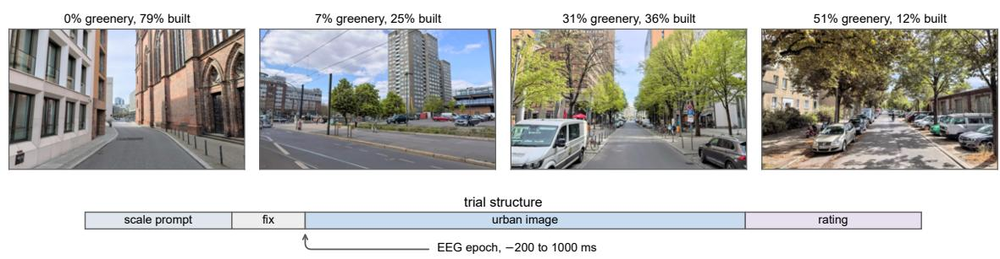

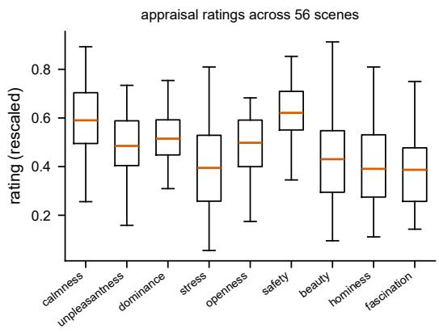

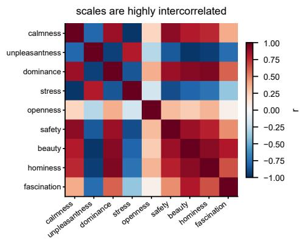

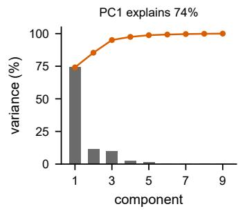

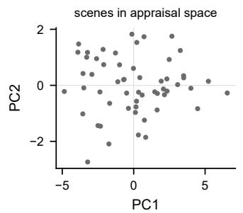

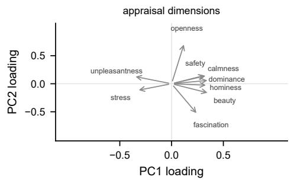  
Figure 1: Stimuli, task and the structure of urban appraisal. Top: four scenes chosen to span the measured composition of the set, labelled with the share of pixels segmented as vegetation and as building, and the trial sequence. A prompt names the scale to be rated 1500 ms before the image appears, so each of the nine presentations ofa scene is made undera diferentevaluative goal. Middle: distribution ofthe nine ratings across scenes, and their intercorrelation. Bottom: the nine group-level appraisal measures are largely summarised by two principal components.

A Gabor energy descriptor over four scales, eight orientations and a 4 × 4 spatial grid reached $\rho = 0 . 0 7 9 _ { \mathrm { { ; } } }$ 28.1% of ceiling. It is not distinguishable from the best foundation model and is higher than every languagesupervised model tested, including CLIP ViT-L/14 $( \rho = 0 . 0 5 1 )$ and SigLIP SO400M $( \rho = 0 . 0 3 8 )$ . An orientedfilter energy model is thus a competitive account of this neural geometry.

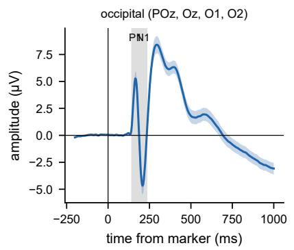

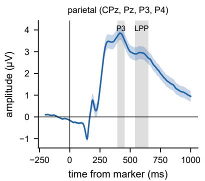

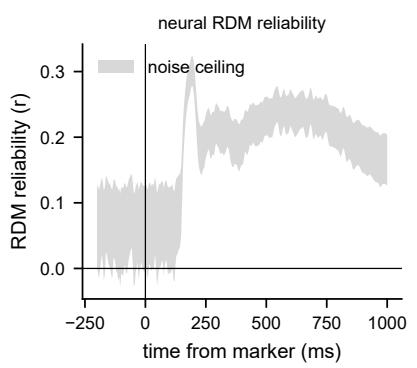

Figure 2: Occipital and parietal grand averages with the P1, N1, P3 and LPP windows shaded, and the reliability of the time-resolved neural RDMs. Shaded bands show the standard error over participants and the noise-ceiling bounds respectively.  
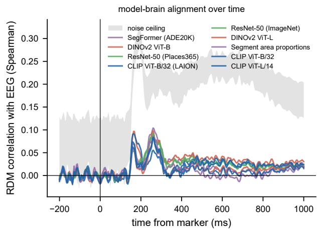

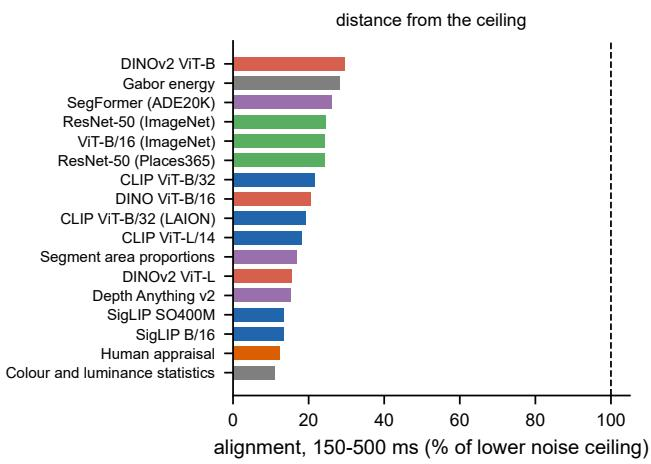  
Figure 3: Correspondence between model and neural representational geometry. Left: the best-matching layer ofeach model at each time point, against the time-resolved noise ceiling (grey). Right: correspondence for the window-level RDM over 150–500 ms as a percentage ofthe lower bound ofthat window’s ceiling, coloured by training signal; these are the values in Table 1. No representation reaches one third of the lower noise-ceiling value, and a Gabor energy descriptor is not distinguishable from the best ofthem.

Diferences between individual models were reliable across participants but mostly not across scenes. Paired tests over participants separated DINOv2 ViT-B from CLIP ViT-B/32 $( p \ : = \ : 0 . 0 1 8 )$ , but the same diference was not reliable when scenes were resampled $( p = 0 . 2 3 )$ . We therefore treat the ranking within the panel as weakly determined, and the distance of the whole panel from the ceiling, which is large and consistent, as the result. An attenuation-corrected analysis, which avoids normalising by the ceiling at all, gives the same ordering and a similarly low absolute level (Appendix E).

## 3.3 Correspondence follows representational depth but not scale

Within a model, deeper layers matched the neural geometry later. Relative layer depth correlated positively with peak latency in 10 of the 11 models with three or more extracted layers, with a mean rank correlation $\mathrm { o f } + 0 . 6 2 \left( t _ { 1 0 } = 4 . 0 5 , p = 0 . 0 0 2 \right)$ ; the relation was strongest in the transformers, reaching $\rho = 1 . 0 0$ in DINOv2

Table 1: Correspondence between model representational geometry and the neural geometry ofurban scenes, in the 150–500 ms window. $\rho$ is the mean Spearman correlation across participants between a model RDM and a participant’s neural RDM, for the layer best matching the group geometry. The interval is a 95% bootstrap interval over scenes. % ceiling expresses � as a percentage of the lower bound of the noise ceiling. The last column is cross-validated prediction of the nine appraisal ratings from the same features, on held-out scenes. �pre repeats the comparison on the pre-stimulus window, which passes through identical estimation but carries no image information.
<table><tr><td>Model</td><td>Layer</td><td>ρ</td><td>95% CI (scenes)</td><td>% ceiling</td><td> $\rho _ { \mathrm { p r e } }$ </td><td>Appraisal r</td></tr><tr><td>language-supervised</td><td></td><td></td><td></td><td></td><td></td><td></td></tr><tr><td>CLIP ViT-B/32</td><td>L08</td><td>0.060</td><td>[0.023, 0.097]</td><td>22</td><td>-0.005</td><td>0.80</td></tr><tr><td>CLIP ViT-B/32 (LAION)</td><td>L01</td><td>0.054</td><td>[0.018, 0.097]</td><td>19</td><td>0.002</td><td>0.83</td></tr><tr><td>CLIP ViT-L/14</td><td>L16</td><td>0.051</td><td>[0.015, 0.090]</td><td>18</td><td>-0.007</td><td>0.84</td></tr><tr><td>SigLIP SO400M</td><td>embed</td><td>0.038</td><td>[0.007, 0.073]</td><td>13</td><td>-0.001</td><td>0.87</td></tr><tr><td>SigLIP B/16</td><td>L01</td><td>0.037</td><td>[-0.000, 0.078]</td><td>13</td><td>-0.006</td><td>0.82</td></tr><tr><td>self-supervised</td><td></td><td></td><td></td><td></td><td></td><td></td></tr><tr><td>DINOv2 ViT-B</td><td>L08</td><td>0.083</td><td>[0.048, 0.119]</td><td>30</td><td>-0.003</td><td>0.81</td></tr><tr><td>DINO ViT-B/16</td><td>L08</td><td>0.058</td><td>[0.022, 0.098]</td><td>21</td><td>0.002</td><td>0.78</td></tr><tr><td>DINOv2 ViT-L</td><td>L16</td><td>0.044</td><td>[0.008, 0.080]</td><td>16</td><td>-0.001</td><td>0.80</td></tr><tr><td>category-supervised</td><td></td><td></td><td></td><td></td><td></td><td></td></tr><tr><td>ResNet-50 (ImageNet)</td><td>layer4</td><td>0.069</td><td>[0.029, 0.108]</td><td>24</td><td>0.006</td><td>0.71</td></tr><tr><td>ViT-B/16 (ImageNet)</td><td>L12</td><td>0.068</td><td>[0.023, 0.112]</td><td>24</td><td>0.012</td><td>0.69</td></tr><tr><td>ResNet-50 (Places365)</td><td>layer3</td><td>0.068</td><td>[0.033, 0.106]</td><td>24</td><td>0.002</td><td>0.79</td></tr><tr><td>dense prediction</td><td></td><td></td><td></td><td></td><td></td><td></td></tr><tr><td>SegFormer (ADE20K)</td><td>layout</td><td>0.073</td><td>[0.037, 0.111]</td><td>26</td><td>0.003</td><td>0.75</td></tr><tr><td>Segment area proportions</td><td>ade20k</td><td>0.047</td><td>[0.010, 0.088]</td><td>17</td><td>-0.006</td><td>0.57</td></tr><tr><td>Depth Anything v2</td><td>layout</td><td>0.043</td><td>[0.009, 0.080]</td><td>15</td><td>-0.005</td><td>0.52</td></tr><tr><td>interpretable</td><td></td><td></td><td></td><td></td><td></td><td></td></tr><tr><td>Gabor energy</td><td>energy</td><td>0.079</td><td>[0.033, 0.126]</td><td>28</td><td>0.015</td><td>0.51</td></tr><tr><td>Colour and luminance statistics</td><td>colour</td><td>0.031</td><td>[-0.003, 0.066]</td><td>11</td><td>0.004</td><td>0.58</td></tr><tr><td>human judgement Human appraisal</td><td>ratings</td><td>0.035</td><td>[0.002, 0.076]</td><td>12</td><td>0.003</td><td></td></tr></table>

ViT-B and DINO ViT-B/16 and $\rho = 0 . 9 8$ in CLIP ViT-B/32 (� = 0.005). The hierarchical correspondence reported for object and scene recognition (Cichy et al., 2016, 2017) therefore survives here, even though the overall level of correspondence is low.

Scale and training domain did not behave the same way. In the two families with matched size variants the larger model was not better aligned: DINOv2 ViT-L reached 15.6% of ceiling against 29.6% for ViT-B, and SigLIP SO400M 13.5% against 13.3% for SigLIP B/16. For the matched pair of ResNet-50 models, training on scene photographs rather than object photographs produced similar alignment, 24.1% for Places365 against 24.5% for ImageNet. These are three controlled comparisons rather than a general law, but none of them shows the levers that improve vision benchmarks improving correspondence here.

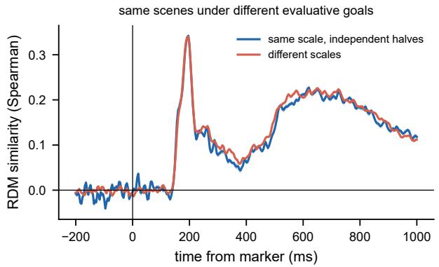

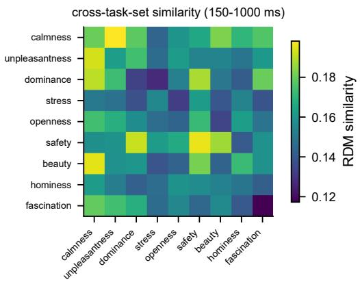  
Figure 4: The neural geometry does not depend on the evaluative goal. Left: RDM similarity between independent halves of the participants rating the same scale and rating diferent scales. Right: cross-task similarity for every pair of scales. Shaded bands show the standard error over 20 random participant splits.

## 3.4 The neural geometry is stable across evaluative goals

A representation that changed with the viewer’s goal would place a ceiling on any fixed-embedding model, and would make the shortfall above say more about the comparison than about the models. It does not change here. Same-task and cross-task scene geometries were nearly identical once each was corrected for its own reliability: the ratio � of Equation 2 was 1.05 over the 150–1000 ms window (95% CI over splits [1.03, 1.09]), and no window fell below 1 (Figure 4). Scenes were arranged the same way whether a participant was about to judge safety, beauty or openness. The shortfall in Table 1 is therefore a shortfall in representing the scenes themselves.

## 3.5 Appraisal prediction and neural correspondence diverge

The same embeddings predict how people rate these streets very well. Ridge regression to the nine groupmean ratings, cross-validated over held-out scenes, reached $r = 0 . 8 7$ for SigLIP SO400M and $r = 0 . 8 4$ for CLIP ViT-L/14. These are among the least brain-aligned spaces in the panel $( \rho = 0 . 0 3 8 \mathrm { a n d } 0 . 0 5 1 )$ , while the most brain-aligned representations, DINOv2 ViT-B and the Gabor descriptor, predict appraisal at $r = 0 . 7 6$ and $r = 0 . 5 1$ . Across models the two measures showed little correspondence $( \rho = 0 . 3 0 , \ p = 0 . 2 6 ;$ Figure 5), using the same participant-averaged correspondence reported in Table 1.

We also asked whether steering a model’s features towards the neural geometry buys anything. Reweighting the features with weights fitted only on training scenes lowered appraisal prediction from $r = 0 . 6 0$ to $r = 0 . 1 5$ , for every one of the 15 models for which the reweighting is defined $( t _ { 1 4 } = - 6 . 7 5 , p = 9 . 3 \times 1 0 ^ { - 6 }$ Wilcoxon $p = 6 . 1 { \times } 1 0 ^ { - 5 } )$ . SegFormer is excluded here because its best-matching layer is a 9600-dimensional spatial map, beyond the dimensionality at which the reweighting can be fitted on 55 scenes, and the ap praisal ratings are excluded as the prediction target. The comparison is against a control of the same rank that reduces the features by PCA without using the neural data, and that control was indistinguishable from the full feature set $( r = 0 . 5 9 6$ against $0 . 5 9 4 , t _ { 1 4 } = 0 . 3 0 , p = 0 . 7 7 )$

This cost is not accompanied by the benefit it was meant to purchase. Fitting the weights on half the scenes and measuring correspondence on the other half, which contributed to neither the weights nor the PCA basis, the reweighted representation reached $\rho = 0 . 0 5 8$ against $\rho = 0 . 1 1 3$ for the control, and improved in only 1 of 15 models $( t _ { 1 4 } = - 6 . 8 1 , p = 8 . 5 \times 1 0 ^ { - 6 }$ ; Appendix I). Steering the features towards the neural geometry therefore made them less aligned with it on scenes the weights had not seen: with 55 scenes and a 1485-element target the fit overfits rather than recovering a generalisable neural subspace. We report it as a failed manipulation rather than as evidence about which feature directions carry appraisal, and the divergence in Figure 5 rests on the comparison across models above, which involves no fitting.

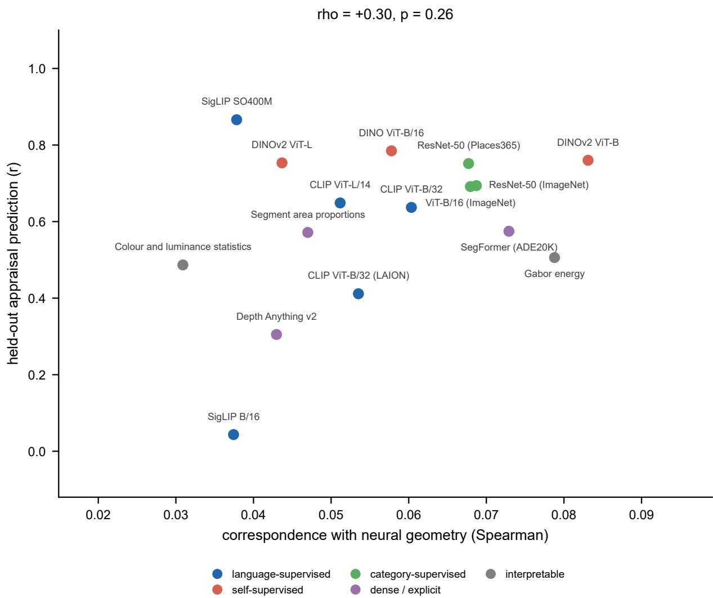  
Figure 5: Appraisal prediction and neural correspondence diverge. Each model is positioned by the correspondence ofits most brain-aligned layer, measured as in Table 1, and by that layer’s cross-validated prediction of the nine appraisal ratings on held-out scenes. The best appraisal predictors are among the least aligned, and the two measures do not track one another across models.

## 4 Discussion

## 4.1 Prediction and representation come apart

The embeddings that predicted urban appraisal well were not the embeddings that most closely matched the neural scene geometry. SigLIP and CLIP recovered held-out appraisal ratings accurately, up to $r = 0 . 8 7 ,$ despite being among the least brain-aligned spaces we tested, while the strongest neural correspondences came from DINOv2 and from a simple Gabor descriptor that predicts appraisal poorly. Across models the two measures did not track one another. An attempt to steer features towards the neural geometry lowered appraisal prediction for every model, but it also failed to raise correspondence on held-out scenes, so it records the dificulty of fitting a neural subspace from 55 scenes rather than a trade-of between the two objectives.

These results separate two evaluation targets that are often treated as one in urban visual analytics: predicting an appraisal outcome, and reproducing the representational structure associated with viewing the scene. A model can do the first well while doing the second poorly, and improving the first gives no assurance about the second.

## 4.2 Implications for urban analytics

For applications whose goal is to predict perceived safety, beauty or related appraisal outcomes, held-out predictive accuracy remains the relevant validation target, and the embeddings we tested meet it: the same representations that show weak neural correspondence recover ratings at $r = 0 . 8 7$ . Neural correspondence becomes relevant at a diferent point, when embedding dimensions or embedding distances are themselves interpreted as properties of human perception.

Attributing perceptual meaning to particular embedding dimensions, comparing cities in embedding space, or reading distances between streetscapes as perceptual distances all rely on that second property. Our results indicate it should be established directly rather than inferred from prediction accuracy, since across our panel the two do not track one another.

## 4.3 Scale, supervision and depth

Our panel spans two orders of magnitude in parameter count and four training objectives. Within the two families with matched size variants, and for the matched pair of ResNet-50 models trained on objects and on scenes, the levers that improve vision benchmarks did not improve correspondence. That a Gabor energy descriptor matches the best foundation model sharpens the point: at least for the geometry EEG resolves over the first second of viewing a street, much of what these models share with the brain may be low-level image structure that a far simpler model also captures.

Depth behaves diferently from scale. Deeper layers matched later neural responses in 10 of 11 models, reproducing the hierarchical correspondence found for object recognition. The temporal hierarchy is therefore preserved, while its representational content remains poorly aligned with the neural geometry.

## 4.4 The evaluative goal is not the missing variable

Because every scene was viewed under nine diferent evaluative prompts, we could test whether the neural geometry itself shifts with what the viewer is about to judge. It does not. The similarity of the geometry across appraisal goals suggests that task-set diferences are unlikely to account for the observed model brain gap. As with any null result this bounds rather than excludes: a goal-dependent component small relative to the stimulus-driven geometry, or one expressed in sources EEG resolves poorly, would not be detected here.

## 4.5 What the measurement can and cannot see

The distance between every model and the noise ceiling is the central quantity in this paper. The ceiling is estimated from agreement between participants’ own geometries, so it bounds the structure consistent across people and therefore available to any stimulus-computable model; the remaining distance is not attributable to measurement noise, since noise is what the ceiling discounts.

It does depend on what EEG can see. Scalp potentials are dominated by synchronous activity in superficial cortex, so a representation carried by sparse or deep populations would be underrepresented in our mea surement and in the ceiling alike. This limits the claim to the structure EEG resolves. It does not weaken the comparison between models, which are all evaluated against the same measurement.

## 4.6 Limitations

The stimulus set contains 55 scenes with public imagery from a single city, and was assembled to contrast vegetated with unvegetated streets rather than to sample streets representatively: vegetation is efectively absent from 26 of the 55 scenes and covers more than a third of the frame in only a handful. Conclusions about other cities, or about street types absent from the set, are not supported. The set is also small enough that the scene bootstrap separates our results into two groups: the distance of the whole panel from the ceiling survives it, while the ordering within the panel largely does not, and a decomposition of the neural geometry into visual, semantic, spatial and appraisal components is not identifiable at all (Appendix H). We report the ranking as weakly determined for that reason.

Images were on screen for 3000 ms, long enough for several fixations. Late activity therefore reflects image dependent eye movements as well as ongoing visual processing, and no electro-oculogram was recorded, so we cannot remove that contribution directly. We anchor the main comparisons in a window beginning before extensive exploration and verify that the model ordering is already present there (Appendix J).

Appraisal ratings were collected after each image rather than continuously, so the appraisal geometry we compare against summarises the judgement rather than tracking the evaluative process.

## 5 Conclusion

We compared the representational geometry of seventeen image feature spaces with the geometry recovered from EEG while 63 adults viewed and rated 56 Berlin street scenes, and calibrated every comparison against the structure that is reproducible across participants.

Three results follow. Correspondence is low throughout: the best representation, DINOv2 ViT-B, reaches 29.6% of the lower bound of the noise ceiling and the panel spans 11.0% to 29.6%, with a Gabor energy descriptor indistinguishable from the best learned representation and above every language-supervised model tested. The levers that raise performance on vision benchmarks do not raise correspondence here, since larger variants were no better aligned in the two model families with matched sizes, although deeper layers still matched later neural responses in 10 of 11 models. And the same embeddings predicted held out appraisal ratings at up to � = 0.87 while showing no reliable relationship between how well a model predicts appraisal and how closely it matches the neural geometry.

For urban visual analytics the practical consequence is a boundary rather than a prohibition. Held-out predictive accuracy remains the right validation target for a study that sets out to estimate perceived safety or beauty, and the embeddings we tested meet it. It is the further step that our results do not support: reading embedding dimensions or embedding distances as properties of human perception because the embedding predicts human ratings well. That property has to be established directly.

The benchmark itself is inexpensive to extend. All of the data are public, the analysis requires no training, and evaluating a new representation needs only its embeddings for 55 images. This makes it practical to ask of any new architecture, training objective, or model trained specifically on street-level imagery whether it moves correspondence with the human representation, which is a question that performance on urban prediction tasks does not answer.

## References

Biljecki, F. and Ito, K. (2021). Street view imagery in urban analytics and GIS: A review. Landscape and Urban Planning, 215:104217.

Caron, M., Touvron, H., Misra, I., Jégou, H., Mairal, J., Bojanowski, P., and Joulin, A. (2021). Emerging properties in self-supervised vision transformers. In IEEE/CVF International Conference on Computer Vision (ICCV), pages 9650–9660.

Cichy, R. M., Khosla, A., Pantazis, D., and Oliva, A. (2017). Dynamics of scene representations in the human brain revealed by magnetoencephalography and deep neural networks. NeuroImage, 153:346–358.

Cichy, R. M., Khosla, A., Pantazis, D., Torralba, A., and Oliva, A. (2016). Comparison of deep neural networks to spatio-temporal cortical dynamics of human visual object recognition reveals hierarchical correspondence. Scientific Reports, 6:27755.

Dosovitskiy, A., Beyer, L., Kolesnikov, A., Weissenborn, D., Zhai, X., Unterthiner, T., Dehghani, M., Minderer, M., Heigold, G., Gelly, S., Uszkoreit, J., and Houlsby, N. (2021). An image is worth 16x16 words: Transformers for image recognition at scale. In International Conference on Learning Representations (ICLR).

Dubey, A., Naik, N., Parikh, D., Raskar, R., and Hidalgo, C. A. (2016). Deep learning the city: Quantifying urban perception at a global scale. European Conference on Computer Vision (ECCV), pages 196–212.

Giford, A. T., Dwivedi, K., Roig, G., and Cichy, R. M. (2022). A large and rich EEG dataset for modeling human visual object recognition. NeuroImage, 264:119754.

Gramfort, A., Luessi, M., Larson, E., Engemann, D. A., Strohmeier, D., Brodbeck, C., Goj, R., Jas, M., Brooks, T., Parkkonen, L., and Hämäläinen, M. (2013). MEG and EEG data analysis with MNE-Python. Frontiers in Neuroscience, 7:267.

Guggenmos, M., Sterzer, P., and Cichy, R. M. (2018). Multivariate pattern analysis for MEG: A comparison of dissimilarity measures. NeuroImage, 173:434–447.

He, K., Zhang, X., Ren, S., and Sun, J. (2016). Deep residual learning for image recognition. In IEEE Conference on Computer Vision and Pattern Recognition (CVPR), pages 770–778.

Kaniuth, P. and Hebart, M. N. (2022). Feature-reweighted representational similarity analysis: A method for improving the fit between computational models, brains, and behavior. NeuroImage, 257:119294.

Kriegeskorte, N., Mur, M., and Bandettini, P. (2008). Representational similarity analysis: Connecting the branches of systems neuroscience. Frontiers in Systems Neuroscience, 2:4.

Ledoit, O. and Wolf, M. (2004). A well-conditioned estimator for large-dimensional covariance matrices. Journal of Multivariate Analysis, 88(2):365–411.

Maris, E. and Oostenveld, R. (2007). Nonparametric statistical testing of EEG- and MEG-data. Journal of Neuroscience Methods, 164(1):177–190.

Naik, N., Philipoom, J., Raskar, R., and Hidalgo, C. (2014). Streetscore: Predicting the perceived safety of one million streetscapes. In IEEE Conference on Computer Vision and Pattern Recognition Workshops (CVPRW), pages 793–799.

Nili, H., Wingfield, C., Walther, A., Su, L., Marslen-Wilson, W., and Kriegeskorte, N. (2014). A toolbox for representational similarity analysis. PLoS Computational Biology, 10(4):e1003553.

Oquab, M., Darcet, T., Moutakanni, T., Vo, H., Szafraniec, M., Khalidov, V., Fernandez, P., Haziza, D., Massa, F., El-Nouby, A., Assran, M., Ballas, N., Galuba, W., Howes, R., Huang, P.-Y., Li, S.-W., Misra, I., Rabbat, M., Sharma, V., Synnaeve, G., Xu, H., Jegou, H., Mairal, J., Labatut, P., Joulin, A., and Bojanowski, P. (2024). DINOv2: Learning robust visual features without supervision. Transactions on Machine Learning Research.

Radford, A., Kim, J. W., Hallacy, C., Ramesh, A., Goh, G., Agarwal, S., Sastry, G., Askell, A., Mishkin, P., Clark, J., Krueger, G., and Sutskever, I. (2021). Learning transferable visual models from natural language supervision. In International Conference on Machine Learning (ICML), pages 8748–8763.

Schrimpf, M., Kubilius, J., Hong, H., Majaj, N. J., Rajalingham, R., Issa, E. B., Kar, K., Bashivan, P., Prescott-Roy, J., Geiger, F., Schmidt, K., Yamins, D. L. K., and DiCarlo, J. J. (2018). Brain-score: Which artificial neural network for object recognition is most brain-like? bioRxiv.

Schuhmann, C., Beaumont, R., Vencu, R., Gordon, C., Wightman, R., Cherti, M., Coombes, T., Katta, A., Mullis, C., Wortsman, M., Schramowski, P., Kundurthy, S., Crowson, K., Schmidt, L., Kaczmarczyk, R., and Jitsev, J. (2022). LAION-5B: An open large-scale dataset for training next generation image-text models. In Advances in Neural Information Processing Systems (NeurIPS) Datasets and Benchmarks Track.

Walther, A., Nili, H., Ejaz, N., Alink, A., Kriegeskorte, N., and Diedrichsen, J. (2016). Reliability of dissimilarity measures for multi-voxel pattern analysis. NeuroImage, 137:188–200.

Xie, E., Wang, W., Yu, Z., Anandkumar, A., Alvarez, J. M., and Luo, P. (2021). SegFormer: Simple and eficient design for semantic segmentation with transformers. In Advances in Neural Information Processing Systems (NeurIPS), pages 12077–12090.

Yamins, D. L. K., Hong, H., Cadieu, C. F., Solomon, E. A., Seibert, D., and DiCarlo, J. J. (2014). Performanceoptimized hierarchical models predict neural responses in higher visual cortex. Proceedings of the National Academy of Sciences, 111(23):8619–8624.

Yang, L., Kang, B., Huang, Z., Zhao, Z., Xu, X., Feng, J., and Zhao, H. (2024). Depth anything v2. In Advances in Neural Information Processing Systems (NeurIPS).

Zähme, C., Sander, I., Koselevs, A., Kühn, S., and Gramann, K. (2026). From perception to appraisal: Brain responses to natural and built features in urban environments. Brain and Environment, 8:100028. Dataset: OpenNeuro ds006850.

Zhai, X., Mustafa, B., Kolesnikov, A., and Beyer, L. (2023). Sigmoid loss for language image pre-training. In IEEE/CVF International Conference on Computer Vision (ICCV), pages 11975–11986.

Zhang, F., Salazar-Miranda, A., Duarte, F., Vale, L., Hack, G., Chen, M., Liu, Y., Batty, M., and Ratti, C. (2024). Urban visual intelligence: Studying cities with artificial intelligence and street-level imagery. Annals of the American Association of Geographers, 114(5):876–897.

Zhou, B., Lapedriza, A., Khosla, A., Oliva, A., and Torralba, A. (2018). Places: A 10 million image database for scene recognition. IEEE Transactions on Pattern Analysis and Machine Intelligence, 40(6):1452–1464.

Zhou, B., Zhao, H., Puig, X., Fidler, S., Barriuso, A., and Torralba, A. (2017). Scene parsing through ADE20K dataset. In IEEE Conference on Computer Vision and Pattern Recognition (CVPR), pages 633–641.

## A Data and code availability

Every input to this study is public. The EEG recordings are OpenNeuro dataset ds006850 (CC0), the stimuli and experiment code are in the authors’ urban\_appraisal-experiment repository, and the subjective ratings, segmentation maps and low-level descriptors are in their perception2appraisal\_analyses repository. Model weights were obtained from their oficial releases. Our pipeline downloads all of these, runs the analyses, and regenerates every figure and table.

## B Preprocessing details

Unit scaling. The BIDS headers of ds006850 were written by FieldTrip and do not declare channel types. A reader that infers scaling from the declared type will therefore treat the recordings as unscaled; the stored values are in microvolts and must be multiplied by $1 0 ^ { - 6 }$ before any amplitude-based step. We note this because an unnoticed factor of $1 0 ^ { 6 }$ makes every epoch exceed any sensible artefact threshold, which silently empties the dataset rather than raising an error.

Channel exclusion. The 66 recorded channels comprise 64 scalp electrodes plus ECG and electrodermal activity, the latter two also declared as EEG in the channel table. Both were dropped. The electrodermal channel is labelled in microvolts but records microsiemens, as the dataset README states.

Bad-channel criterion. We flagged an electrode when it was flat, when its largest absolute correlation with any other electrode fell below 0.4, or when its standard deviation exceeded eight times the montage median. A variance-outlier criterion flagged frontopolar electrodes in almost every participant, because blinks make those channels genuinely high-variance while the electrode is working normally, and interpolating them would have removed real frontal signal. Correlation with the rest of the montage separates the two cases: scalp potentials are spatially smooth, so a working electrode correlates with its neighbours whatever artefacts it carries, whereas a disconnected one does not.

Event decoding. The marker stream encodes the umlaut in the German label for beauty as a control byte, so exact string matching silently drops every beauty trial. Our decoder normalises marker strings to ASCII letters before matching, which resolves the German, English and corrupted spellings to one key.

## C Verification of the dissimilarity estimator

The crossnobis estimator in Equation 1 is unbiased under the null. Over 200 simulations with 10 conditions, 20 channels and 8 trials per condition and no condition structure, the mean estimated dissimilarity was 0.028 (SEM 0.041, � = 0.68), consistent with zero. The same code applied to data with injected condition means returned large positive distances.

## D Noise ceiling bias

The upper bound of the noise ceiling compares each participant’s RDM with a group mean that includes that participant, so it is positively biased when RDMs are unreliable, approaching $1 / { \sqrt { n } }$ for pure noise. With � = 61 this predicts 0.128; in the pre-stimulus baseline the measured upper bound is 0.125 to 0.131 while the lower bound is 0.006, which is the expected signature of no stimulus-specific structure rather than evidence of any. We express model performance relative to the lower bound throughout.

## E An alternative to normalising by the ceiling

Expressing performance as a percentage of the noise ceiling is convenient but the ratio has no clean statistical meaning: the ceiling was introduced as a band to plot against rather than as a denominator, and a model at half the ceiling is not half of anything well defined. We therefore recomputed the same quantity by an independent route that does not involve the ceiling

The group RDM has a split-half reliability of 0.765, or 0.867 after Spearman-Brown correction to the full sample. A model RDM is a deterministic function of the images and carries no measurement noise, so the classical correction for attenuation, $\rho _ { \mathrm { t r u e } } = \rho _ { \mathrm { o b s } } / \sqrt { 0 . 8 6 7 }$ , estimates the correlation between a model’s geometry and the noise-free neural geometry, bounded by one and independent of the number of participants.

The two normalisations agree closely, with a rank correlation of 0.97 across the panel $( p = 5 . 8 \times 1 0 ^ { - 1 1 } )$ DINOv2 ViT-B correlates with the group geometry at $\rho = 0 . 2 3 3$ , or $\rho = 0 . 2 5 0$ after correction, next to the 29.6% of ceiling reported in the main text; percentage of ceiling is the more generous of the two, as expected from dividing by a lower bound. On a variance rather than a correlation scale the shortfall is starker: the best model accounts for 6.3% of the variance in the noise-free neural geometry, and the panel spans 1.0% to 6.3%.

## F Layer selection

The layer reported for each model is the one best matching the group RDM, to which every participant contributed. Reselecting the layer from the other 60 participants and evaluating on the held-out one changed nothing for 12 of 14 multi-layer models and shifted the panel mean by 0.002. Only CLIP ViT-B/32 (LAION) and SigLIP B/16 changed layer on some folds, and both rank low either way.

## G Validation of the task-set measure

We validated the ratio � ofEquation 2 on synthetic data with a known amount oftask-set modulation, using the same number of participants, scenes, scales and channels as the real analysis. With no modulation the modulation index 1 − � was −0.015; with a moderate task-specific component it was +0.558, and with a strong one +0.913. The measure therefore recovers modulation when it is present and reports none when it is absent.

## H Decomposition of the neural geometry

We attempted to decompose the group neural RDM into early visual, semantic, spatial-layout and appraisal components. Because a regression with several correlated regressors is biased upward on a single noisy RDM, reaching $R ^ { 2 } = 0 . 0 4 5$ even in the pre-stimulus window, the decomposition is run on the group-mean RDM and every quantity is expressed relative to the same analysis on the pre-stimulus window, whose baseline is $R ^ { 2 } = 0 . 0 4 4$

Point estimates were small and the 95% intervals obtained by resampling scenes spanned zero in every window and for every component; total explained variance above the pre-stimulus baseline was 0.072 between 150 and 300 ms with an interval of [−0.041, 0.177] (Figure 6). With 55 scenes and four correlated feature spaces the decomposition is not identifiable, and we report it as unresolved rather than as a set of efects. The same resampling gives intervals excluding zero for the model comparison in Table 1, so this is a limitation of the decomposition rather than of the dataset as a whole.

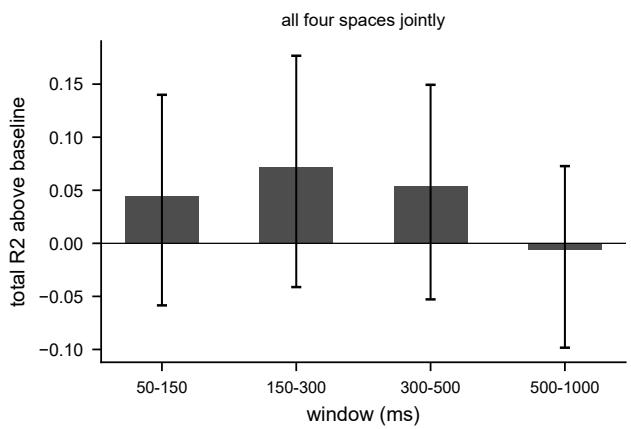

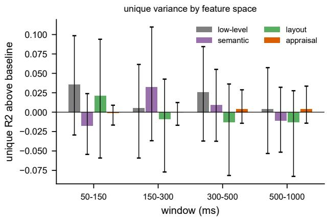  
Figure 6: Decomposition ofthe group neural RDM into early visual, semantic, spatial-layout and appraisal components, expressed relative to the same analysis run on the pre-stimulus window. Error bars are 95% intervals from resampling scenes. Every interval spans zero.

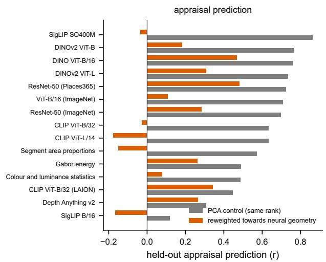

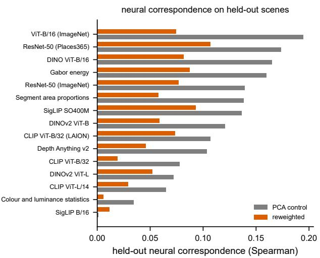  
Figure 7: Reweighting model features towards the neural geometry. Left: held-out appraisal prediction falls for every model relative to a control ofthe same rank that does not use the neural data. Right: correspondence with the neural geometry on scenes that contributed to neither the weights nor the PCA basis also falls. The manipulation does not trade one objective against the other; it overfits.

We include it because the same analysis is common in this literature and is usually evaluated over participants alone. Inference over participants asks whether an efect would recur with new people looking at these 55 streets; inference over scenes asks whether it would recur with new streets, which is the question a claim about urban perception makes. The two can disagree sharply.

Table 2: Sensitivity of the model ordering to analysis choices. Each row repeats the comparison under a diferent dissimilarity estimator, latency window, participant set or electrode subset, and reports the rank correlation ofthe resulting ordering with the main analysis. The gap between the model panel and the neural ceiling persists throughout, while the ordering itself varies.
<table><tr><td>Variant</td><td>Rank ρ vs. main</td><td>Best ρ</td><td>Best-ranked space</td></tr><tr><td>crossnobis 150-500 ms (main)</td><td>+1.000</td><td>0.083</td><td>DINOv2 ViT-B</td></tr><tr><td>crossnobis 150-300 ms (early)</td><td>+0.794</td><td>0.104</td><td>DINOv2 ViT-B</td></tr><tr><td>crossnobis 500-1000 ms (late)</td><td>+0.591</td><td>0.045</td><td>Gabor energy</td></tr><tr><td>correlation distance 150-500 ms</td><td>+0.456</td><td>0.070</td><td>Depth Anything v2</td></tr><tr><td>all scenes present per subject</td><td>+0.993</td><td>0.083</td><td>DINOv2 ViT-B</td></tr><tr><td>posterior sensors only</td><td>+0.478</td><td>0.119</td><td>ResNet-50 (ImageNet)</td></tr><tr><td>central sensors only</td><td>+0.544</td><td>0.036</td><td>ResNet-50 (ImageNet)</td></tr><tr><td>frontal sensors only</td><td>+0.583</td><td>0.058</td><td>ResNet-50 (ImageNet)</td></tr></table>

## I The neural reweighting does not generalise

Reweighting a model’s features towards the neural geometry, in the manner of feature-reweighted RSA, lowers held-out appraisal prediction from $r = 0 . 6 0 \mathrm { \ t o \ } r = 0 . 1 5$ across the 15 models for which it is defined. On its own that result is ambiguous: it would be informative if the same weights raised correspondence with the neural geometry, and uninformative if they simply discarded variance.

We therefore fitted the weights on half the scenes and measured correspondence on the other half, which contributed to neither the weights nor the PCA basis. The reweighted representation was less aligned than the control, 0.058 against 0.113, and improved in only 1 of 15 models $( t _ { 1 4 } = - 6 . 8 1 , \ p = 8 . 5 \times 1 0 ^ { - 6 } )$ Figure 7). With 55 scenes and a 1485-element target the fit does not recover a generalisable neural subspace. We report the manipulation as unsuccessful, and the divergence in the main text rests instead on the comparison across models, which involves no fitting.

## J Robustness to analysis choices

Table 2 repeats the comparison under a diferent dissimilarity estimator, latency window, participant set or electrode subset. Excluding the two participants whose incomplete scene coverage motivated the qualitycontrol criterion leaves the ordering essentially unchanged (rank $\rho = 0 . 9 9 )$ , and restricting the window to 150–300 ms, before most exploratory eye movements, preserves it as well $( \rho = 0 . 7 9 )$ . Replacing the crossvalidated Mahalanobis distance with a correlation distance on evoked patterns, or restricting the montage to posterior, central or frontal electrodes, produces weaker agreement (� between 0.46 and 0.58) and in some variants a diferent top-ranked model.

The table therefore supports a narrower claim than ranking stability. What every variant preserves is the large gap between the whole model panel and the neural ceiling; which model comes first is not stable, which is consistent with the scene bootstrap in the main text and with our decision not to interpret the ranking.