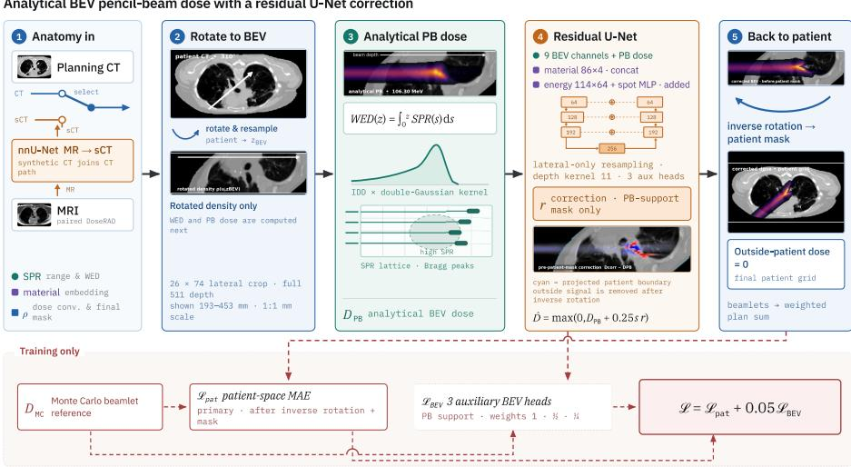

# PyDoseRT Proton: A GPU Pencil-Beam Engine with a Convolutional Residual-Correction Network for Fast Proton Dose Calculation

Lukas Zimmermann1,2, Hermann Fuchs1,2, Attila Simkó3, and Gerd Heilemann1,2

1 Department of Radiation Oncology, Medical University of Vienna, Vienna, Austria 2 Christian Doppler Laboratory for Image and Knowledge Driven Precision Radiation Oncology, Medical University of Vienna, Vienna, Austria

3 Department of Diagnostics and Intervention, Umeå University, Umeå, Sweden

Abstract. Architecture category. Hybrid method: a physics-based analytical pencil-beam (PB) dose engine followed by a 3-D convolutional residual-correction network (RepVGG–U-Net). We addressed the DoseRAD2026 proton dose-prediction task with Py-DoseRT Proton, a GPU-accelerated engine implemented in PyTorch and augmented by a learned residual toward Monte Carlo (MC) accuracy. A double-Gaussian PB kernel was calibrated to GATE/Geant4 integrated depth doses in water in two stages: a classical per-energy curve fit, then a gradient-based fit of the full 3-D dose through the PyTorch physics engine as it retains a diferentiable execution path for gradient-based optimization of dose-dependent objectives. The engine computes each beamlet on a beam’s-eye-view (BEV) lattice with variance-preserving Gaussian splitting, an analytic nuclear halo, and a Fermi–Eyges heterogeneity term, then rotates the result into the patient frame. Additionally, a compact residual U-Net predicts an additive correction in BEV space. It is conditioned on voxelwise material-label embeddings, a discrete energy embedding and spot size. The same model was used for all anatomical sites (thoracic and abdominal). It was trained with a patient-space L1 objective emphasizing the scored high-dose region and multi-scale BEV deep supervision. The submitted CT configuration obtained preliminary-test beamlet MAE 0.0066, image-z IDD distance 0.0025, plan MAE 0.0049, 98.30% gamma pass rate (1%/1 mm), and DVH error 0.460.

Keywords: Proton therapy · Dose calculation · Pencil-beam engine · Residual learning · Monte Carlo.

## 1 Introduction

Intensity-modulated proton therapy delivers highly conformal dose but is sensitive to range uncertainty and anatomical changes, which motivates dose engines that are both fast enough for online adaptation and accurate enough to replace analytical pencil-beam (PB) algorithms near tissue heterogeneities. Monte Carlo (MC) transport is the accuracy reference but is too slow for iterative planning; analytical PB algorithms [4] are fast but degrade in lung and at bone/air interfaces. Recent work showed that a diferentiable dose engine enables gradientbased plan optimization end to end [2].

We extend this idea to protons for the DoseRAD2026 challenge. Our method couples a proton PB engine, calibrated to MC in water through an autogradenabled copy of its forward model, with a compact convolutional network that learns an additive residual toward MC. The zero-initialized residual anchors optimization at the analytical solution while retaining an explicit physics baseline instead of predicting dose directly from anatomy.

## 2 Methods

## 2.1 Data

We used the DoseRAD2026 proton dataset [1]. The dose corrector was trained on 67 cases and hyperparameters were tuned on the 8 held-out validation cases (four abdominal: 1ABB006/011/020/021; four thoracic: 1THB002/008/011/016); the training cohort contained 32 abdominal and 35 thoracic cases. The learning target was the provided MC reference dose. Inputs were the planning CT, from which energy-dependent stopping-power ratio (SPR), material labels, and physical mass density were derived, and the plan geometry. The synthetic-CT (sCT) model was trained separately using all 75 paired MR/CT volumes. No additional patient data were used.

For kernel calibration only (not network training) we generated additional reference data outside the challenge set: OpenGATE v10.1 alongside Geant4 v11.4 [3] was used to simulate proton beams in a homogeneous water phantom (30 × $\mathrm { \bar { 1 0 } \times 1 0 c m ^ { 3 } }$ , 0.2 mm isotropic resolution, $1 5 0 0 \times 5 0 0 \times 5 0 0$ voxels). Physics list $( \mathrm { Q G S P \_ B I C \_ E M V } )$ , production cuts and step sizes, initial energies as well as energy spread were selected based on the challenge MC simulation template and base data. Successive data sets used $1 0 ^ { 7 }$ $1 0 ^ { 8 }$ , or $1 { \overset { \cdot } { 0 } } ^ { 9 }$ primary histories per energy. The production $1 0 ^ { 8 }$ set contains 85 energies from 31.7 to 200.8 MeV; the earlier $1 0 ^ { 7 }$ fit contains 43 calibrated energies, whereas the matched $1 0 ^ { 9 }$ refit uses the same 85 energies as $1 0 ^ { 8 }$ . The shipped system uses the $1 0 ^ { 8 }$ LUT.

## 2.2 Model

Overall architecture. The proposed framework has two input-specific pathways that share the same proton dose-calculation backend (see Fig 1). In the CT pathway, the planning CT was converted directly into physical mass density, discrete material labels, and energy-dependent stopping power ratio (SPR) maps. In the MRI pathway, an independently trained nnU-Net regression model first generated a sCT on the common CT grid, from which the same physical input maps were derived. All subsequent processing was identical for both pathways: the patient data were transformed into the beam’s-eye-view coordinate system,

Analytical BEV pencil-beam dose with a residual U-Net correction

  
Fig. 1. PyDoseRT Proton workflow. Patient data are rotated into the beamlet’s BEV frame for analytical dose calculation and learned correction, then mapped back to the patient grid. Training combines the oficial patient-space target with multi-scale BEV deep supervision; material, energy, and spot size condition the corrector through spatial and global pathways.

dose was calculated using the analytical pencil-beam engine, and the residualcorrection network predicted an additive correction toward the Monte Carlo reference. The corrected dose was then transformed back to the patient grid and post-processed. The components are described below.

Pencil-beam dose engine. The pencil beam dose engine was based upon a pencil beam dose algorithm developed in our group [9]. Each spot was a beamlet processed on its BEV lattice. Along every lattice column the water-equivalent depth is $\begin{array} { r } { d ( k ) = \varDelta \sum _ { j < k } S _ { j } - \frac { 1 } { 2 } \varDelta S _ { k } } \end{array}$ , where $S _ { j }$ is SPR (voxel-center convention), so the Bragg peak shifts laterally and longitudinally with heterogeneity. Each beamlet is split into $9 \times 9 = 8 1$ sub-beams at quarter-FWHM spacing with a variance-preserving envelope $( \sigma _ { \mathrm { s u b } } ~ = ~ \sigma _ { \mathrm { s p o t } } / \sqrt { n } )$ , which approximates the incident Gaussian while retaining its variance. The narrow core (Eq. 1) is deposited per sub-beam; the broad halo is added once per beamlet. A Fermi– Eyges/Kanematsu term [5] models beam broadening due to multiple Coulomb scattering.

Dose is rotated into the patient frame by a matched bilinear resampling. For eficiency, challenge inference ran without recording an autograd graph. However, the engine’s PyTorch operation stack could retain an autograd-enabled execution path. In this study we used that capability for Stage-2 LUT calibration with respect to the kernel curves. However, gradients can be even propagated through the dose calculation to optimize treatment-plan parameters, enabling gradientbased calibration and, in principle, plan optimization against dose objectives.

Kernel and water calibration. The lateral kernel is a radially symmetric, separable double Gaussian, integrated analytically over each voxel cell,

$$
\begin{array} { r l } & { \quad K ( x , y ) = \left( 1 - w \right) g ( x ; \sigma _ { 1 } ) g ( y ; \sigma _ { 1 } ) + w g ( x ; \sigma _ { 2 } ) g ( y ; \sigma _ { 2 } ) , } \\ & { \quad g ( x ; \sigma , h ) = \frac { 1 } { 2 } \left[ \mathrm { e r f } \frac { x + h } { \sqrt { 2 } \sigma } - \mathrm { e r f } \frac { x - h } { \sqrt { 2 } \sigma } \right] , } \end{array}\tag{1}
$$

with narrow core $\sigma _ { 1 } ,$ broad nuclear halo $\sigma _ { 2 }$ and halo weight $w ,$ all depthdependent; a per-energy IDD table $Z ( d )$ supplies the amplitude. It is calibrated to the MC water data in two stages: (i) a direct normalized double-Gaussian fit of $( \sigma _ { 1 } , \sigma _ { 2 } , w )$ and $Z$ at each depth using trust-region least squares; and (ii) a gradient-based refinement of all depth curves by back-propagating the normalized 3-D water dose through an autograd-enabled calibration path (Adam, learning rate 0.03, cosine schedule, 150 iterations per energy, 0.4 mm depth sampling). The calibration loss is masked below 0.5% of the MC peak and includes a seconddiference smoothness prior.

Correction network. A 3-D convolutional residual U-Net (RepVGG–U-Net [6], 887,292 trainable parameters) operates per beamlet in BEV space. The v1 input comprises eight continuous channels: SPR minus one, lateral radius, normalized geometric depth, normalized WED, two signed lateral ofsets, non-negative SPR, and peak-normalized PB dose. V2 difers architecturally only by appending a ninth, range-relative channel $\delta _ { R } = ( \mathrm { W E D } - R _ { \mathrm { p e a k } } ( E ) ) / 1 0 0$ mm; the engine, conditioning paths, and U-Net topology are unchanged. This widens only the input projection, increasing the parameter count from 887,228 to 887,292. In addition, each voxel’s discrete material label is mapped to a learned four-dimensional embedding and concatenated with the continuous feature volumes before the input projection. For each beamlet, the scalar energy is assigned to the nearest of 114 tabulated machine energies and mapped to a learned 64-dimensional class embedding. A two-layer 2→64→64 multilayer perceptron (MLP) encodes the two lateral spot widths; energy and spot-size vectors are summed, broadcast spatially, and added to the 64-channel native feature map at the U-Net entrance. Thus material conditioning is spatial, whereas energy and spot-size conditioning is global.

This conditioning design was selected in an early controlled screen using a smaller U-Net with native width eight. We compared the learned energy-class embedding with no energy input and with either a normalized scalar or nine Fourier features (the scalar plus four sine/cosine pairs), projected by $1  8  8$ and 9→8→8 SiLU MLPs, respectively. Spot widths used a 2→8→8 SiLU MLP. Spot-width conditioning and GroupNorm versus InstanceNorm were varied in the same matrix. The selected mechanism was then scaled with the native width from eight to 64; the four-dimensional material embedding was held fixed and was not independently swept. We also compared adding the global conditioning vector at the U-Net entrance with adaptive GroupNorm modulation (AdaGN).

Down/up-sampling is applied only laterally; full beam-axis depth resolution is retained. The encoder/deep path uses widths 64, 96, 128, 192, and 256 with 2, 2, 2, 4, and 4 RepVGG blocks, respectively. An initial factor-three reduction between the 64- and 96-channel stages equalizes the anisotropic crop, followed by three factor-two reductions. The decoder is intentionally shallower: it applies two RepVGG blocks after each up-projection to 192, 128, and 96 channels, then projects directly to the native 64-channel resolution without another RepVGG stage. Skip connections are additive, and auxiliary corrected-dose heads are attached to the 192-, 128-, and 96-channel decoder stages. RepVGG blocks combine a length-11 depth convolution and a 3 × 3 lateral convolution with eight-group GroupNorm and SiLU; their train-time branches are folded for inference. The native head predicts an additive residual,

$$
\hat { D } = \operatorname* { m a x } \bigl ( 0 , D _ { \mathrm { P B } } + s \cdot \alpha \cdot r \bigr ) , \qquad \alpha = 0 . 2 5 ,\tag{2}
$$

where s is the per-beamlet PB peak. All residual-output heads are zeroinitialized, so the network begins at the PB prediction. No externally pre-trained weights are used for the dose corrector.

MRI-to-CT conversion. The MRI pathway uses a 3-D residual-encoder nnU-Net regression model [7] to generate a synthetic CT from each MRI. The model follows the nnUNetResEncModelM configuration and comprises six encoder stages with 32, 64, 128, 256, 320, and 320 channels. Its output is defined on the common CT grid and provides the input to the same physical-map construction, analytical pencil-beam engine, and residual-correction network used in the CT pathway.

Post-processing. The corrected BEV dose was rotated back and densified onto the patient grid and clamped to nonnegative values. The patient support mask was topological: the largest connected external-air component was removed and the per-slice body contour was filled, preserving internal air cavities such as bowel gas and the trachea.

## 2.3 Training

Let $e = | \hat { D } - D _ { \mathrm { M C } } | / \operatorname* { m a x } ( D _ { \mathrm { M C } } )$ for one beamlet and let $\langle \cdot \rangle _ { A }$ denote the mean over mask A. The primary loss was computed after inverse rotation in patient space,

$$
\mathcal { L } _ { \mathrm { p a t } } = \langle e \rangle _ { D _ { \mathrm { M C } } \neq 0 } + 0 . 1 5 \langle e \rangle _ { D _ { \mathrm { M C } } > 0 . 1 \operatorname* { m a x } ( D _ { \mathrm { M C } } ) } .\tag{3}
$$

During training, the MC reference was also sampled into BEV. Three auxiliary decoder predictions were compared with average-pooled BEV targets using masked, peak-normalized $L _ { 1 }$ losses $\ell _ { j }$ . Their relative weights halve with scale,

$$
\mathcal { L } = \mathcal { L } _ { \mathrm { p a t } } + 0 . 0 5 \mathcal { L } _ { \mathrm { B E V } } , \qquad \mathcal { L } _ { \mathrm { B E V } } = \frac { \ell _ { 0 } + \frac { 1 } { 2 } \ell _ { 1 } + \frac { 1 } { 4 } \ell _ { 2 } } { 1 + \frac { 1 } { 2 } + \frac { 1 } { 4 } } .\tag{4}
$$

Thus the scored patient-space objective remained primary while deep supervision constrains the decoder at multiple BEV scales.

The submitted v2 checkpoint was trained from scratch for 27 epochs with the corrected topological patient mask, using AdamW (learning rate $5 \times 1 0 ^ { - 4 }$ weight decay $1 0 ^ { - 5 } )$ , polynomial decay (power 0.9), BF16 autocast, unit-norm gradient clipping, seed 12345, and no dropout or geometric augmentation. Ten randomly sampled beamlets per beam were used in each update. An exponential moving average (EMA; decay 0.999) was selected by validation high-dose MAE. The same checkpoint was used for abdominal and thoracic cases.

MRI-to-CT conversion. Training used $4 8 \times 1 9 2 \times 1 9 2$ patches at $3 \times 1 \times 1 \mathrm { m m ^ { 3 } }$ spacing, batch size 2, MR Z-score normalization (input), and global CT-intensity normalization (output). The regression objective used a deep-supervised MAE equivalent to the nnUNets default loss. The fold-all run was trained for 1000 epochs with Nesterov SGD (initial learning rate 0.01, momentum 0.99, weight decay $3 \times 1 0 ^ { - 5 } )$ and polynomial learning-rate decay, without mirroring or geometric augmentation. At inference, overlapping $4 8 \times 1 9 2 \times 1 9 2$ windows are combined with Gaussian weighting; the resulting $\mathrm { s C T }$ is passed unchanged to the CT dose pipeline.

## 2.4 Evaluation

We use the oficial DoseRAD2026 metrics: Level 1 per-beamlet masked MAE (reference dose above 10% of that beamlet’s maximum) and image-z IDD distance, and Level 2 stratified plan MAE, and local gamma pass rate (1%/1 mm). Local validation values were first averaged over beamlets within each case and then over the eight cases. The LUT ablation used every fourth beam in every case, the same beam indices for all LUTs, no learned correction, and the current evaluation code.

## 3 Results

## 3.1 Water calibration

In matched water benchmarks, the optimized $1 0 ^ { 7 }$ LUT reached mean MAE 0.26% of peak and mean local gamma pass rate 98.8% $( 1 \% / 1$ mm; 43 energies). The $1 0 ^ { 8 }$ fit reduced mean MAE to 0.16% and increased gamma to 99.8% over its initial 69-energy evaluation (worst MAE 0.32%, worst gamma 98.2%); the 16 subsequently added energies remained in-family (MAE 0.14%, gamma 99.6%). The Stage-2 engine-based fit particularly improves the distal edge (e.g. 0.77% → 0.20% MAE at 164.45 MeV for the earlier $\mathrm { \bar { 1 0 ^ { 7 } } }$ data). A $1 0 ^ { 9 }$ refit converged cleanly but did not improve dose accuracy on the patient validation set.

Table 1. Matched LUT ablation on the eight validation cases. Values are case means from the analytical engine without learned correction, using every fourth beam and the topological mask; parentheses give the between-case standard deviation. The $1 0 ^ { 7 }$ LUT contains 43 fitted energies; the others contain 85.
<table><tr><td>Histories</td><td> $n _ { E }$ </td><td>beam MAE</td><td>IDD distance</td><td>plan MAE</td></tr><tr><td> $1 0 ^ { 7 }$ </td><td></td><td>43 0.01523 (0.00370)</td><td>0.00765 (0.00109)</td><td>0.03379 (0.00586)</td></tr><tr><td> $1 0 ^ { 8 }$ </td><td></td><td></td><td>(shipped) 85 0.01347 (0.00346) 0.00705 (0.00142)</td><td>0.03140 (0.00590)</td></tr><tr><td> $1 0 ^ { 9 }$ </td><td></td><td></td><td>85 0.01348 (0.00348) 0.00707 (0.00133)</td><td>0.03142 (0.00589)</td></tr></table>

Relative to the $1 0 ^ { 7 } .$ -generation LUT, $1 0 ^ { 8 }$ reduced mean beam MAE by 11.6%, IDD distance by 7.9%, and plan MAE by 7.1%. This comparison includes the increased fitted-energy coverage and removal of the unstable 142.06-MeV entry, not only reduced MC noise. With identical 85-energy coverage, increasing histories from $1 0 ^ { 8 }$ to $1 0 ^ { 9 }$ changed beam MAE $\mathrm { b y + 0 . 0 5 \% }$ , IDD distance by +0.25%, and plan MAE $\mathrm { b y + 0 . 0 7 \% } ;$ signs were mixed across cases and the diference was negligible. We therefore retained the $1 0 ^ { 8 }$ LUT.

## 3.2 Architecture selection

Table 2 summarizes the controlled early conditioning screen. Each configuration used the same small RepVGG–U-Net, data split, optimizer, and 6,400 updates; only the listed energy representation, spot-width input, and normalization were changed. The learned energy embedding was the strongest representation: with GroupNorm and spot-width conditioning fixed, its high-dose MAE was 7.5–7.6% lower than the scalar and Fourier MLPs and 10.8% lower than omitting energy. Across the six matched normalization pairs, GroupNorm was better in five and reduced their mean high-dose MAE from 1.831% to 1.795%. Because these short runs were not repeated exhaustively, the normalization diference is interpreted as a selection result rather than an estimate of generalization uncertainty.

Table 2. Controlled conditioning screen after 6,400 updates (validation high-dose MAE in percent; lower is better). All entries use the same seed and validation beamlets. A dash denotes a configuration that was not run.
<table><tr><td>Energy input</td><td>Spot MLP Group Instance</td></tr><tr><td>Class embedding yes</td><td>1.694 1.796</td></tr><tr><td>Class embedding no</td><td>1.683 1.775</td></tr><tr><td>Normalized scalar yes</td><td>1.832 1.872</td></tr><tr><td>Normalized scalar no</td><td>1.848 1.892</td></tr><tr><td>Fourier features yes</td><td>1.834 1.764</td></tr><tr><td>Fourier features no</td><td>1.880 1.885</td></tr><tr><td>None yes</td><td>1.899</td></tr></table>

Two additional within-seed comparisons supported the selected embedding. With spot-width conditioning it reached 1.337% and 1.093%, compared with 1.547% and 1.132% without spot widths and 1.567% and 1.166% for scalar conditioning. The validation beamlets difered between these seeds, so only the ordering within each comparison is meaningful. Entrance addition and AdaGN were efectively tied in a separate fixed-validation screen (1.472% versus 1.463%), whereas combining both was worse (1.700%); we retained the simpler entrance injection.

We also screened the BEV deep-supervision weight under BF16. Weights 0, 0.05, 0.2, and 0.5 reached short-run high-dose MAE of 1.1545%, 1.1108%, 1.1053%, and 1.1388%, respectively. Although 0.2 was marginally best numerically, inspection of the predicted dose fields showed increasingly visible gridaligned structure at the larger auxiliary weights, consistent with the coarser decoder targets exerting excessive influence. We therefore selected 0.05 as a compromise between the improvement over no deep supervision and preservation of smooth native-resolution predictions. All four runs ended after approximately 6,400–7,100 updates, so this screen supports the selected low weight but does not establish a precisely optimal value. Earlier apparent instability at high weights was traced to FP16 overflow and was not used for this selection.

Beyond this controlled screen, longer depth kernels and the residual U-Net progression improved validation accuracy, whereas attention modules, latent depth mixing, combined entrance/AdaGN conditioning, stronger weight decay, and geometric augmentation did not provide a reliable gain. These variants were computationally expensive and were evaluated in short or single-run experiments rather than a complete hyperparameter sweep. Scaling beyond the 887k model was similarly unproductive: at 17,728 matched updates, EMA high-dose MAE was 0.963%, 0.995%, and 0.955% for the 887k, 1.10M, and 1.45M models, respectively. The marginal 1.45M diference was not sustained in a completed run, and no larger model completed the 64k or full-beam training regime; the 887k model subsequently reached 0.802% at 64k updates and 0.711% after full-beam training.

## 3.3 Validation set (8 held-out patients)

Table 3 compares the two correction checkpoints under the same 108 engine and the pre-topological-mask local evaluation. Adding the range-relative feature and training v2 from scratch improved all eight cases; mean MAE decreased by 12.5% and IDD distance by 5.6% relative to v1 in a separate every-fourth-beam paired sweep. In the full evaluation, v2 reached MAE 0.00571 and IDD distance 0.00463. Its integral ratio of 0.988 denotes a small residual under-response rather than exact dose conservation. Errors remained larger in thoracic than abdominal cases.

Table 3. Full local validation set before the topological-mask update (mean over eight cases). Integral ratio is a local diagnostic.
<table><tr><td>Model (engine identical; MCS on)</td><td>Beam MAE</td><td>IDD</td><td>Integral</td></tr><tr><td>v1 additive corrector (8 channels; 13 epochs)</td><td>0.00574</td><td>0.00475</td><td>0.988</td></tr><tr><td>v2 additive corrector (9 channels; 17 epochs)</td><td>0.00571</td><td>0.00463</td><td>0.988</td></tr></table>

Corrected mask and extended training. The 13-epoch submission was trained with the density-threshold mask and only evaluated with the topological one. We retrained the same recipe from scratch with the corrected mask and a longer schedule. Table 4 follows that run on the eight held-out cases: at 27 epochs beam MAE falls by 5.12% and IDD distance by 8.99%, improving both metrics on all eight cases.

Table 4. Validation set across training. All rows use the topological mask, every sixth beam, per-beamlet Level 1 metrics, EMA weights, and an identical engine and LUT; only the checkpoint difers. Mean over the eight cases with the between-case standard deviation in parentheses; percentages are relative to the submitted 13-epoch checkpoint.
<table><tr><td>Checkpoint</td><td>Beam  $\mathrm { M A E } \times 1 0 ^ { - 3 }$ </td><td> $\varDelta$ </td><td> $\mathrm { I D D \times 1 0 ^ { - 3 } }$ </td><td> $\varDelta$ </td></tr><tr><td>13 epochs (submitted; density mask)</td><td>5.37 (0.88)</td><td></td><td>4.29 (1.41)</td><td></td></tr><tr><td>14 epochs</td><td>5.31 (0.86)</td><td></td><td>-0.95% 4.23 (1.42)</td><td>-1.40%</td></tr><tr><td>17 epochs</td><td>5.25 (0.82)</td><td></td><td>-2.13% 4.16 (1.39)</td><td>-3.03%</td></tr><tr><td>20 epochs</td><td>5.19 (0.81)</td><td></td><td>-3.25% 4.33 (1.39)</td><td>+0.92%</td></tr><tr><td>23 epochs</td><td>5.14 (0.79)</td><td></td><td>-4.20% 4.42 (1.43)</td><td>+3.15%</td></tr><tr><td>24 epochs</td><td>5.13 (0.80)</td><td></td><td>-4.32% 4.08 (1.38)</td><td>-4.83%</td></tr><tr><td>26 epochs</td><td>5.10 (0.78)</td><td></td><td>-4.91% 4.05 (1.37) −5.53%</td><td></td></tr><tr><td>27 epochs</td><td>5.09 (0.78)</td><td></td><td>-5.12% 3.90 (1.36)-8.99%</td><td></td></tr></table>

## 3.4 Preliminary hidden-test results

Table 5 reports the platform evaluations of 12 and 24 August 2026. The mask correction was the largest late-stage change: for the local THB016 beam 31 diagnostic it reduced MAE from 0.01568 to 0.00872 and IDD distance from 0.01948 to 0.00481 by retaining dose in internal air cavities. Retraining moved the two tracks very diferently: on CT, beam MAE improved by 3.0% and IDD distance by 8.0%, whereas on MRI beam MAE improved by 0.5% and IDD distance not at all. The MRI track uses the same dose model after synthetic-CT generation, so this confirms the MR-to-CT front end, rather than the dose engine, as the dominant remaining limitation there.

Table 5. Preliminary hidden-test metrics. All submissions apply the topological patient mask at inference.
<table><tr><td>Track</td><td>Checkpoint Beam</td><td></td><td>IDD</td><td>Plan</td><td>Gamma (%) DVH</td><td></td></tr><tr><td>before xing mask</td><td></td><td></td><td></td><td></td><td></td><td></td></tr><tr><td>CT</td><td>13 epochs</td><td>0.0100</td><td></td><td>0.0094 0.0092</td><td>97.20</td><td>0.5955</td></tr><tr><td>after xing mask</td><td></td><td></td><td></td><td></td><td></td><td></td></tr><tr><td>CT</td><td>13 epochs</td><td>0.0066</td><td>0.0025</td><td>0.0049</td><td>98.30</td><td>0.460</td></tr><tr><td>CT</td><td>17 epochs</td><td></td><td>0.0064 0.0023</td><td>0.0047</td><td>98.51</td><td>0.448</td></tr><tr><td>CT</td><td>27 epochs</td><td></td><td></td><td>0.0061 0.0020 0.0044</td><td>98.81</td><td>0.431</td></tr><tr><td>before xing mask</td><td></td><td></td><td></td><td></td><td></td><td></td></tr><tr><td>MRI</td><td>13 epochs</td><td></td><td></td><td>0.0189 0.0154 0.0188</td><td>84.03</td><td>3.771</td></tr><tr><td>after fixing mask</td><td></td><td></td><td></td><td></td><td></td><td></td></tr><tr><td>MRI</td><td>13 epochs</td><td></td><td>0.0185 0.0152</td><td>0.0185</td><td>84.02</td><td>3.853</td></tr><tr><td>MRI</td><td>17 epochs</td><td></td><td></td><td>0.0184 0.0152 0.0184</td><td>84.10</td><td>3.813</td></tr><tr><td>MRI</td><td>27 epochs</td><td>0.0183 0.0151 0.0183</td><td></td><td></td><td>84.15</td><td>3.806</td></tr></table>

## 3.5 Runtime

An earlier CT platform submission required 135 s per canonical case; MRI submission required 144.3 s. To increase the speed we switched our models and engine to float16 instead of float32, activated RepVGG inference fusion, increased batching for engine (b=128), for correction model (b=8) and also image writing was optimised (threaded image writing). However, the algorithm was still implemented in PyTorch and Python so substantial speed improvements are still possible.

## 4 Discussion

The comparison in Table 1 shows diminishing returns from increasing waterphantom histories: $1 0 ^ { 8 }$ removes the instability and noise present in the $\mathrm { { \dot { 1 } 0 ^ { 7 } } }$ calibration, whereas $1 0 ^ { 9 }$ does not measurably improve patient dose. Accuracy is instead driven by the learned correction and by correct anatomical support. In particular, the topological mask explains much of the late IDD and plan-level gain, so the remaining error cannot be attributed solely to the lateral kernel.

The additive, zero-initialized residual provides a stable physics baseline, and the BEV representation aligns the narrow Bragg peak across gantry angles. The material and energy embeddings complement continuous SPR/WED features, while multi-scale BEV supervision regularizes intermediate decoder resolutions without replacing the oficial patient-space target. A residual farhalo under-response remains, especially at high energy. Increasing the lateral fit window alone did not solve it and could overestimate halo dose, indicating a shape/support trade-of in the double-Gaussian model rather than simple spatial truncation.

Diferentiability is an additional design property of the physics engine rather than a requirement of the DoseRAD task. It makes the forward model reusable as a component of gradient-based treatment-planning workflows, where dosederived objectives can be optimized through the engine. The present challenge results demonstrate diferentiable kernel calibration, but do not constitute an evaluation of plan optimization.

Limitations include only eight cases for local model selection, tuning and reporting on the same validation cohort, and incomplete runtime provenance for the final CT artifact. Checkpoint selection by validation high-dose MAE is insensitive to IDD distance, which is not monotonic during training (Table 4); a criterion combining both scored quantities would be preferable. The MRI results additionally depend on synthetic-CT quality.

Author contributions (CRediT). Lukas Zimmermann – Conceptualization, Data curation, Formal analysis, Investigation, Methodology, Resources, Software, Validation, Visualization, Writing – original draft. Hermann Fuchs – Resources, Data curation, Writing – review & editing. Attila Simkó – Investigation, Software, Writing – review & editing. Gerd Heilemann – Project administration, Writing – review & editing.

Code availability. The proton dose engine is part of the open-source Py-DoseRT package.4 The physics engine, challenge container, training code, evaluation scripts, and model definitions will be available in a separate repository.

## References

1. Xiao, F., Delopoulos, N., Wahl, N., et al.: DoseRAD2026 Challenge dataset: AI accelerated photon and proton dose calculation for radiotherapy. arXiv:2604.12778 (2026)

2. Simkó, A., Kronsteiner, M., Glatzer, S., et al.: A physics-informed, plug-and-play dose engine for gradient-based radiotherapy treatment planning. arXiv:2512.18863 (2025)

3. Sarrut, D., et al.: The OpenGATE ecosystem for Monte Carlo simulation in medical physics. Phys. Med. Biol. (2022)

4. Hong, L., Goitein, M., Bucciolini, M., et al.: A pencil beam algorithm for proton dose calculations. Phys. Med. Biol. 41, 1305–1330 (1996)

5. Kanematsu, N.: Alternative scattering power for Gaussian beam models of charged particles. Nucl. Instrum. Methods B 266, 5056–5062 (2008)

6. Ding, X., Zhang, X., Ma, N., et al.: RepVGG: making VGG-style ConvNets great again. In: CVPR (2021)

7. Isensee, F., Jaeger, P.F., Kohl, S.A.A., Petersen, J., Maier-Hein, K.H.: nnU-Net: a self-configuring method for deep learning-based biomedical image segmentation. Nat. Methods 18, 203–211 (2021)

8. Boussot, V., Hémon, C., Nunes, J.-C., et al.: IMPACT: a generic semantic loss for multimodal medical image registration. arXiv:2503.24121 (2025)

4 https://github.com/UMU-DDI/PyDoseRT

9. H. Fuchs, J. Ströbele, T. Schreiner, A. Hirtl, and D. Georg, “A pencil beam algorithm for helium ion beam therapy,” Medical Physics, 39(11), p. 6726, (2012). doi: 10.1118/1.4757578.