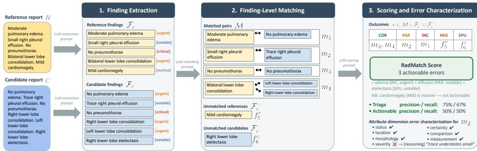
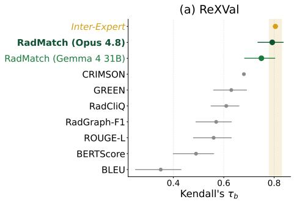
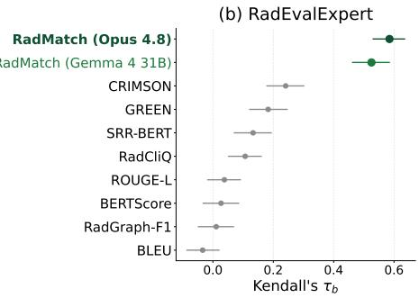

# RadMatch: Auditable Radiology Report Evaluation via Finding-Level Matching

Charles Corbière<sup>1</sup>, Léo Machado<sup>1,2,3</sup>, Aubin Charley<sup>1</sup>, Baptiste Callard<sup>1</sup>, Pierre Manceron<sup>1</sup>, and Corentin Dancette<sup>1</sup>

<sup>1</sup> Raidium, Paris, France

<sup>2</sup> Department of Radiology, Fondation Ophtalmologique Adolphe de Rothschild, Paris, France

3 Service de Radiologie Interventionnelle, Département d’Anesthésie, Chirurgie et Imagerie Interventionnelle (DACI), Gustave Roussy, Villejuif, France charles.corbiere@raidium.eu

Abstract. As AI systems are increasingly used to draft radiology reports, reliably evaluating their clinical quality remains a critical challenge. Large language model (LLM)-based metrics are now the bestcorrelated with radiologist judgment, yet they output a single opaque score that neither a clinician nor a model builder can easily interpret or audit. We introduce RadMatch, a multi-stage, LLM-based metric that decomposes report comparison into a structured finding-level matching with significance-aware scoring and error characterization across seven clinical attribute dimensions (status, location, severity, morphology, certainty, longitudinal comparison, and measurement). The main score is the actionable-error count, both interpretable and auditable. Candidate findings are graded correct, partial, or incorrect, and unmatched findings are counted as missed or hallucinated. Triage and actionable safety recall/precision and per-subset views add complementary, deploymentoriented lenses. Across two expert benchmarks, RadMatch is the most clinically aligned metric, matching inter-radiologist agreement on ReX-Val and more than doubling the best prior metric on the harder RadEvalExpert. Relying only on few-shot prompting, it is designed to extend to other modalities and anatomies. We will release RadMatch as opensource code with an interactive dashboard for inspecting results.

Keywords: Radiology Report Generation · Evaluation Metrics

## 1 Introduction

Automatically drafting trustworthy radiology reports is a crucial challenge, promising to ease the growing burden of imaging studies radiologists must read [43,48]. Equally critical is how to evaluate such drafts: does a generated report capture every clinically relevant finding, describe each at the right level of detail, and stay concise enough to be useful? The same finding can also be phrased many ways, yet flipping “left” to “right” or missing a pneumothorax can redirect care where rewording a benign calcification does not. As vision–language models (VLMs) are increasingly used for radiology report generation (RRG) [5,19,43], reliable evaluation has become an active research direction [1,4,15,32,46]. Traditional naturallanguage-generation metrics [23,33,51] and clinical-concept matching [17,39] capture only fragments of clinical quality, weighing every discrepancy equally and ignoring clinical severity, which results in a poor correlation with radiologists’ judgment [46, 49].

Large language model (LLM)-based metrics [4,15,32] have since emerged as the most clinically aligned line of methods. Prompted with a reference and a candidate, they emit a quality score or error count that correlates better than earlier metrics [46,49]. But the score the LLM outputs remains opaque and hard for a radiologist to interpret, for instance to assess whether a pneumothorax has been missed or whether a penalty comes from rewording a benign note. Similarly, a researcher working towards improving RRG cannot grasp the kind of mistake (hallucination, mislocalization, partial description) or its clinical significance. By discarding a report’s finding-level structure, current LLM judges preclude evaluation that is auditable and actionable.

We present RadMatch, an LLM-based metric that restores this structure by decomposing report comparison into (1) extraction of atomic findings, (2) matching of candidate to reference findings, and (3) significance-aware scoring over the resulting records. Because the matching is persisted, every penalty is traceable to a specific finding pair, so the metric is auditable. Matches are scored with standard message-understanding categories [10], which distinguish a dangerous status inversion from a miss or a hallucination, and credit partial matches. Each match is characterized along seven attribute dimensions (clinical status, comparison, measurement, location, severity, morphology, certainty) for an interpretable error profile. The reported RadMatch score is the actionable-error count, easily interpretable by a radiologist. It is complemented by safety-oriented recall and precision (triage and actionable) and subset views that probe capabilities such as measurement accuracy or longitudinal comparison.

Across two expert-annotated benchmarks, RadMatch is the most clinically aligned metric: on ReXVal [49] its agreement with radiologists matches that among radiologists themselves, and on the harder RadEvalExpert [46] it more than doubles the strongest prior metric $( | \tau _ { b } | \approx 0 . 5 8$ vs. 0.24 for CRIMSON) [4]. RadMatch’s implementation is driven by few-shot exemplars as LLM inputs, which support extension to new anatomies and modalities from only a handful of examples. We release RadMatch as open-source code with an interactive dashboard for inspecting its finding-level results.

## 2 Related Work

## 2.1 Radiology Report Generation

Automated radiology report generation produces free-text findings and impressions directly from medical images. Most progress targets chest X-ray, driven by large public corpora (MIMIC-CXR [18], PadChest [7]) and entity/relation annotation schemes [12, 17]. Early models aligned a domain image encoder to a fine-tuned LLM [16, 44], while recent work improves clinical fidelity by grounding findings in image evidence [5,37,42], by retrieval, disease-aware re-alignment, and self-critique [34, 41, 47], and by countering the language-prior bias of singlepass decoding through topic-guided or contrastive decoding [9,40]. Others recast the task as structured reporting [19]. Extending generation from radiographs to volumetric CT and MRI [5, 6, 8, 14] remains markedly harder, both to produce and to evaluate.

## 2.2 Evaluation of Generated Reports

Lexical and clinical-concept metrics. Early metrics have been inspired by natural language generation (BLEU [33], ROUGE [23], BERTScore [51]) and measure surface or contextual overlap, rewarding fluent paraphrase regardless of factual correctness [38]. Clinical concept metrics instead score extracted content: CheXbert [39] over fixed pathology labels, RadGraph-F1 [17] and RaTEScore [52] over entities and relations, the ontology-normalized HeadCT-ONE [1] beyond chest X-ray, and the learned RadCliQ composite [49]. These capture concept presence but weight every discrepancy equally and are brittle to negation and uncertainty.

LLM-based metrics. Prompting an LLM to judge factual correctness now correlates best with radiologists. FineRadScore [15] emits line-by-line corrections, CheXprompt [50] counts six error types, FORTE [21] targets 3D brain CT, and others explore reward modeling, judging, and reasoning over errors [22, 24, 45]; RadEval [46] consolidates many metrics into one reproducible framework. Closest to RadMatch, GREEN [32] counts clinically significant errors in six categories, and CRIMSON [4] adds patient context, graded significance weights, and partial credit. RadMatch shares this significance-aware counting but difers in how the verdict is formed and exposed. Both emit a single LLM score that is neither interpretable nor able to reveal where errors concentrate (laterality, measurement, longitudinal change), and that is unauditable, since no persisted record ties a penalty to a finding pair. RadMatch instead persists an explicit finding-level matching, scores objective attributes with deterministic comparators and only free-text ones with the LLM, and reports the kind of each error with triage/actionable recall and precision and per-subset views; its schema also generalizes beyond the chest X-ray these rubrics target.

## 3 RadMatch Evaluation Framework

Given a reference radiology report r, RadMatch is an LLM-based evaluation metric that scores a candidate report c against r by estimating the number of clinically actionable errors between them, decomposing the comparison into three stages (Fig. 1): (1) it extracts a set of structured findings from each report, (2) matches candidate to reference findings by clinical equivalence, and (3) scores each matched and unmatched finding by clinical consequence. Each stage relies on a reasoning LLM prompt that includes customizable few-shot examples, reviewed by board-certified radiologists. When the study indication is available, an optional preliminary step extracts it and supplies it as clinical context to all three stages. While currently designed for five anatomy–modality pairs (e.g., chest X-ray, abdomen CT), the framework extends to new modalities by adding appropriate few-shot examples (see implementation details in Sec. A).

  
Fig. 1: RadMatch multi-stage evaluation framework on a chest-X-ray example: an LLM extracts significance-tagged findings from each report (1), matches them by clinical equivalence with many-to-many aggregation (2), and grades every match and unmatched finding into one of five outcomes (COR/PAR/INC/MIS/SPU) over seven attributes (3). The headline score is the count of clinically actionable errors, with triage and actionable safety precision/recall.

## 3.1 Structured Finding Extraction with Clinical Significance

A finding is a single, atomic clinical observation—the smallest unit of a report to which a clinical consequence can attach (e.g. “small left pleural efusion” or “no pneumothorax”). An LLM extractor decomposes each report into such findings, applied independently to the reference and candidate, yielding the sets $\mathcal { F } _ { r } =$ $\{ f _ { i } \} _ { i = 1 } ^ { N _ { r } }$ and $\bar { \mathcal { F } } _ { c } = \{ \dot { f } _ { j } \} _ { j = 1 } ^ { N _ { c } }$ , where $N _ { r }$ and $N _ { c }$ respectively denote the number of findings extracted for the reference r and the candidate c. Each extracted finding f is a structured record with individually typed slots, either categorical, numeric or free-text:

– a status: normal or abnormal;

– free-text descriptors: location, severity, morphology, and certainty;

– a longitudinal comparison: stable, improving, worsening, new, resolved, or none;

an optional set of measurements, each a (value, unit, category) triple;   
a clinical-significance tier σ(f) ∈ {critical, urgent, notable, routine}.

We adapt the significance tiers from the American College of Radiology (ACR) actionable-reporting framework and communication practice parameter [2,20], which stratify findings by the urgency of the action they warrant, from immediately life-threatening (e.g. tension pneumothorax) to incidental. The tier is entity-driven, not polarity-driven: a confident “no pneumothorax” concerns a critical entity and is tiered critical, so that flipping it is penalized as a critical-tier error rather than dismissed as agreement on a negative. Significance is nonetheless modulated by the available clinical context: an aortic calcification is tiered routine in an 80-year-old yet notable in a 20-year-old, mirroring how a radiologist weighs the same observation against the patient’s presentation. Attaching significance to the finding lets one scheme both weight errors and define the subset of findings for which the metric is held accountable.

## 3.2 Finding-Level Matching

The matching stage groups reference and candidate findings that describe the same clinical entity, i.e. same anatomical site and pathology irrespective of wording, into a set of match groups $\mathcal { M } = \{ m _ { k } \}$ , where each $m _ { k } = ( R _ { k } , C _ { k } )$ pairs a reference side $R _ { k } \subseteq { \mathcal { F } } _ { \tau }$ with a candidate side $C _ { k } \subseteq { \mathcal { F } } _ { c } . \mathrm { ~ A ~ }$ group is direct when $| R _ { k } | = | C _ { k } | = 1$ and aggregate when one side carries several findings (e.g. “bile duct dilatation” vs. intrahepatic and extrahepatic bile duct dilatation), so matching is many-to-many and absorbs diferences in atomization style across reports. Findings placed in no group form the omissions $\mathcal { F } _ { r } ^ { - } \subseteq \mathcal { F } _ { r }$ and the unsupported set $\mathcal { F } _ { c } ^ { - } \subseteq \mathcal { F } _ { c }$ . Two modeling choices are central. First, a status conflict does not block a match: “small pleural efusion” and “no pleural efusion” concern one entity, so they are grouped and the disagreement recorded as a single status error; an anatomical site mismatch, by contrast, is a diferent entity and resolves to an omission and a spurious finding. Second, a residual generic scope marks boilerplate (e.g. “liver unremarkable”) that earns no clinical-safety credit and is excluded from scoring. The matching is produced by a single LLM call.

## 3.3 Significance-Aware Scoring and Error Characterization

Scoring treats each match, omission, and spurious finding as an evaluation unit e. Judgment assigns each unit an error type and a significance tier. Within a match, status is compared directly, any disagreement recorded as a status inversion; the longitudinal comparison is graded by clinical trajectory, a diference counting as major only when it crosses between the benign (stable, improving, resolved) and active (worsening, new) directions; and measurements are compared against clinically motivated, per-category thresholds. Location, severity, morphology, and certainty are scored by an LLM, which also classifies each difference as major or minor.

Each unit is then typed with the message-understanding categories [10]: a match is CORrect (no significant attribute error), PARtial (only minor diferences), or INCorrect (a status inversion or a major attribute error), while an omission is MISsing and a spurious finding SPUrious. The units typed inc, mis, or spu—the incorrect matches together with all omissions and spurious findings—are collected as ${ \mathcal E } _ { \mathrm { e r r } }$ . cor, par, and generic units are excluded. These categories distinguish kinds of error rather than ranking them: an inversion (inc), an omission (mis), and an unsupported assertion (spu) carry diferent clinical risks and are tracked distinctly. Magnitude is supplied separately by the unit’s significance tier, the highest among its findings:

$$
\sigma ( e ) = \left\{ \begin{array} { l l } { \operatorname* { m a x } _ { f \in R \cup C } \sigma ( f ) } & { { \mathrm { i f ~ } } e = ( R , C ) \in { \mathcal { M } } , } \\ { \sigma ( f ) } & { { \mathrm { i f ~ } } e = f \in { \mathcal { F } } _ { r } ^ { - } \cup { \mathcal { F } } _ { c } ^ { - } , } \end{array} \right.\tag{1}
$$

so that under- and over-calling a critical entity are both judged at its stakes.

## 3.4 Metrics

The reported RadMatch score is the actionable error count per report:

$$
\mathrm { R a d M a t c h } ( r , c ) = \sum _ { e \in { \mathcal E } _ { \mathrm { e r r } } } { \mathbb 1 } [ \sigma ( e ) \in \mathcal { A } ] ,\tag{2}
$$

where A = {critical, urgent, notable} is the set of actionable tiers, i.e. every tier but routine, and 1[·] is the indicator. The score is therefore the number of clinically significant mistakes the candidate report makes relative to the reference. Beyond the count, we report safety recall and precision restricted to high-significance findings, at two thresholds—triage (critical/urgent) and the broader actionable (A). At a given threshold, recall is how many of the reference’s findings the candidate conveys correctly and precision is how many of the candidate’s findings are warranted. An attribute-level breakdown (clean / minor / major per dimension) and per-subset views (normal, abnormal, longitudinal, measurement findings) localize where a system errs. Every finding, match, and verdict is retained, so all of these follow from the stored records and any score can be inspected post-hoc.

## 4 Experiments

## 4.1 Experimental Setup

We evaluate on two expert-annotated chest X-ray benchmarks. In ReXVal [49], each of 50 MIMIC-CXR studies is paired with four candidate reports which are the training-set reports scoring highest against the reference under BLEU, BERTScore, CheXbert embedding similarity, and RadGraph-F1. As groundtruth measure, six radiologists count the errors in each of the 200 pairs. RadEvalExpert [46] comprises 624 pairs from 208 studies (drawn from MIMIC-CXR, CheXpert-Plus, and ReXGradient-160K), each paired with three candidates produced by report-generation models (CheXagent, the CheXpert-Plus model, and MAIRA-2). Its findings (148 studies) and impression (60 studies) sections are annotated separately, each error graded significant or insignificant.

Unless stated otherwise, RadMatch uses the Claude Opus 4.8 model [3] with the chest-X-ray few-shot examples, and Sec. 4.3 varies the judge. Each judge runs with reasoning enabled and schema-constrained JSON output, prompted with per-modality few-shot exemplars reviewed by board-certified radiologists.



  
Fig. 2: Agreement with radiologist error counts. RadMatch is shown for a proprietary model (Opus 4.8) and an open-source model (Gemma 4 31B). (a) ReX-Val (pooled, n=200, total errors) with the inter-expert agreement band reported by GREEN [32]. (b) RadEvalExpert (pooled, n=624, significant errors). Prior-metric values and CIs are as reported, except CRIMSON whose evaluation on RadEvalExpert was missing.

Objective dimensions (status, longitudinal comparison, and measurements) are scored by deterministic comparators and only the free-text dimensions by the LLM, and every extracted findings, matching, and per-attribute verdicts are persisted as JSON so all reported scores are recomputed from these records without re-querying the judge.

We compare against lexical metrics (BLEU [33], ROUGE-L [23], BERTScore [51]), clinical-concept metrics (RadGraph-F1 [17], RadCliQ [49], SRR-BERT [46]) and other LLM-based metrics (GREEN [32], CRIMSON [4]), using reported numbers where available. Following prior work, we report agreement as the magnitude of Kendall’s $\tau _ { b }$ between each metric and radiologist significant-error counts, with study-clustered bootstrap 95% confidence intervals; error-count metrics are negated so that higher always means better. We report this magnitude $\left| \tau _ { b } \right|$ throughout the main text. The per-endpoint appendix (Tab. 5) instead list the signed $\tau _ { b }$ , where a more negative value denotes better agreement.

## 4.2 Agreement with Radiologists

Fig. 2 reports agreement on both benchmarks. RadMatch aligns with radiologists better than any other metric on each. With the Opus 4.8 model, it reaches $| \tau _ { b } | = 0 . 7 9$ on ReXVal, matching the agreement among radiologists themselves, and $| \tau _ { b } | = 0 . 5 8$ on the harder RadEvalExpert, more than doubling the best prior metric, while lexical and clinical-concept metrics collapse to near-zero. This level of agreement does not require a frontier proprietary judge. With the open-source Gemma 4 31B [13] model, RadMatch reaches $| \tau _ { b } | = 0 . 7 5$ on ReXVal and 0.53 on RadEvalExpert, and can be run on-premise with a single 32 GB consumer GPU in FP8, avoiding sending protected health data to a hosted API.

Going further, RadEvalExpert lets us measure agreement on the findings and impression sections separately. RadMatch still outperforms every other metric on both: with Opus $4 . 8 , | \tau _ { b } | = 0 . 5 8$ on findings and 0.44 on impressions, each roughly 2–3× the best prior metric for that section (GREEN 0.20 and BERTScore 0.23, respectively). Agreement is lower on impressions, as expected: impression sentences are more interpretive, fusing several observations into a single diagnostic statement. The full breakdown is reported in Tab. 5.

Table 1: Ablation on LLM models. RadMatch agreement $( | \tau _ { b } |$ , bootstrap 95% CI) on ReXVal (pooled, $n { = } 2 0 0 ,$ , total errors) and RadEvalExpert (pooled, n=624, significant errors).
<table><tr><td>LLM</td><td>ReXVal</td><td>RadEvalExpert</td></tr><tr><td>opus-4.8</td><td>0.79[.74,.84]</td><td>0.58[.53,.64]</td></tr><tr><td>gpt-4.1</td><td>0.76 [.68,.81]</td><td>0.55 [.49,.61]</td></tr><tr><td>gemma-4-31b</td><td>0.75 [.68,.80]</td><td>0.53 [.46,.58]</td></tr><tr><td>kimi-k2.6</td><td>0.75 [.68,.79]</td><td>0.53 [.47,.59]</td></tr><tr><td>gpt-5.2</td><td>0.74 [.66,.80]</td><td>0.56 [.50,.61]</td></tr><tr><td>gpt-5.4</td><td>0.74 [.67,.80]</td><td>0.54 [.47,.59]</td></tr><tr><td>gpt-5.5</td><td>0.69 [.60,.76]</td><td>0.50 [.43,.55]</td></tr><tr><td>qwen3.5-35b-a3b</td><td>0.69 [.60,.75]</td><td>0.44 [.38,.50]</td></tr><tr><td>deepseek-v4-pro</td><td>0.68 [.58,.75]</td><td>0.47 [.41,.53]</td></tr><tr><td>gpt-5.4-mini</td><td>0.66 [.56,.73]</td><td>0.41 [.34,.48]</td></tr><tr><td>medgemma-1.5-4b</td><td>0.47 [.34,.57]</td><td>0.29 [.22,.36]</td></tr></table>

Table 2: Single-call baselines. count emits a bare integer, enumerate lists each error. With a strong judge it matches RadMatch on correlation but yields no finding-level structure.
<table><tr><td>LLM</td><td>ReXVal</td><td>RadEvalExpert</td></tr><tr><td>count</td><td></td><td></td></tr><tr><td>gemma-4-31b 0.81 [.76,.85]</td><td></td><td>0.53 [.47,.59]</td></tr><tr><td>opus-4.8</td><td>0.83 [.78,.87]</td><td> $0 . 5 4 \ [ . 4 8 , . 6 0 ]$ </td></tr><tr><td>enumerate</td><td></td><td></td></tr><tr><td>gemma-4-31b</td><td>0.83 [.77,.87]</td><td>0.53 [.47,.58]</td></tr><tr><td>opus-4.8</td><td>0.82 [.75,.87]</td><td>0.56 [.50,.62]</td></tr></table>

For a fair comparison with prior LLM-based metrics, we run RadMatch with the same model each one uses. On ReXVal, RadMatch with GPT-4.1 [27] reaches $| \tau _ { b } | = 0 . 7 6$ versus GREEN-GPT-4’s 0.64, and RadMatch with GPT-5.2 [28] reaches 0.74, above CRIMSON’s reported clinical score of 0.68.

## 4.3 Robustness to LLM Capability

A practical metric must remain reliable as the judge model changes. We evaluate multiple LLMs as RadMatch’s judge, treating hosted and self-hosted models identically: eight API models (Opus 4.8, GPT-4.1, GPT-5.2, GPT-5.4 [29], GPT-5.5 [31], GPT-5.4-mini [30], Kimi K2.6 [26], DeepSeek-V4-Pro [11]) and three open models served locally (Gemma 4 31B [13], Qwen3.5-35B-A3B [35], MedGemma 1.5 4B [36]). This span lets us characterize how agreement depends on judge capability.

RadMatch is stable over a broad capability band (Tab. 1): the strongest judges (Opus 4.8, the GPT models, Gemma 4 31B, Kimi K2.6) all fall within $| \tau _ { b } | \in [ 0 . 7 4 , 0 . 7 9 ]$ on ReXVal and [0.53, 0.58] on RadEvalExpert. Agreement degrades only modestly for mid-tier judges (Qwen3.5-35B-A3B, DeepSeek-V4-Pro) and remains usable even for smaller, cost-efective models such as GPT-5.4-mini. It collapses only for MedGemma 1.5 4B, indicating that a small, medically finetuned model is no better suited to this task than current, stronger generalist models. This ablation shows that RadMatch is not tied to a specific judge: it remains useful for measuring performance improvements and can run fully onpremise.

Table 3: RadMatch diagnostic and safety views (Opus 4.8 judge)—per-report breakdowns a scalar metric cannot provide. Safety reports precision / recall at the triage (critical/urgent) and actionable (critical/urgent/notable) tiers; the finding subsets overlap (normal/abnormal partition the findings, while comparison and measurement are cross-cutting tags).
<table><tr><td></td><td>ReXVal</td><td>RadEvalExpert</td></tr><tr><td>Actionable errors / report</td><td>1.51</td><td>3.31</td></tr><tr><td>Safety (precision / recall)</td><td></td><td></td></tr><tr><td>triage</td><td>0.53 / 0.48</td><td>0.44 / 0.28</td></tr><tr><td>actionable</td><td>0.49 / 0.44</td><td>0.36 / 0.25</td></tr><tr><td>Match outcomes</td><td></td><td></td></tr><tr><td>COR / PAR</td><td>193 / 92</td><td>707 / 404</td></tr><tr><td>INC / MIS / SPU</td><td>88 / 153 / 116</td><td>566 / 1471 / 1767</td></tr><tr><td>Actionable errors by finding subset</td><td></td><td></td></tr><tr><td>normal</td><td>17</td><td>121</td></tr><tr><td>abnormal</td><td>284</td><td>1943</td></tr><tr><td>comparison</td><td>150</td><td>743</td></tr><tr><td>measurement</td><td>7</td><td>86</td></tr></table>

## 4.4 Beyond a Single Score: Diagnostic and Safety Views

A natural question is whether the multi-stage decomposition is needed: how well does a naive LLM error count do? We add deliberately minimal single-call baselines that prompt the judge either to directly count the clinically significant errors (count) or to list each error and take the list length (enumerate). Whether the judge is open and on-premise (Gemma 4 31B) or a strong proprietary model (Opus 4.8), these baselines match RadMatch on raw correlation (Tab. 2). Yet even the enumerate list is unstructured free text: unlike RadMatch, it is not anchored to an explicit finding-level matching, so it attaches no significance tier or error kind, ties no error to a specific reference or candidate finding, and yields neither the triage/actionable safety and per-subset views nor a persisted record from which the score can be recomputed and audited.

Beyond correlation, RadMatch’s decomposition yields per-report diagnostics that a single raw error count cannot. Tab. 3 shows a detailed diagnostic and safety view for each benchmark. For instance, on ReXVal, omissions (mis=153) and hallucinations (spu=116) outweigh status inversions and partial matches. Consequently, triage recall is only 0.48 on ReXVal and 0.28 on RadEvalExpert, i.e. a large fraction of critical/urgent findings are misstated or missed, which an aggregate score hides. In addition, per-subset views localize where systems err: abnormal and longitudinal-comparison findings carry most actionable errors on both benchmarks, whereas explicitly normal findings stay largely clean, consistent with the template-collapse mode observed in current RRG models [25].

<table><tr><td>Reference</td><td>Candidate</td><td>Scores</td></tr><tr><td>(a) AP chest. Previous mild but asymmetric pul- monary edema continues to improve Residual right- upper-lobe opacification, concern for pneumonia Heart size is normal No pleural effusion</td><td>AP chest. Ground-glass opacification and consolida- tion have improved ▲. There is no pulmonary edema or pleural effusion The heart size is normal A feeding tube ends in the stomach</td><td>GREEN 0.40 CRIMSON 0.08 RadMatch 3 actionable errors • 2 COR, 0 PAR • 2 INC, 0 MIS, 1 SPU • triage P 0% / R 0%</td></tr><tr><td>(b) New large right-sided pleural effusion with un- derlying and atelectasis</td><td>No significant change: large right-sided pleural with effusion severe</td><td>GREEN 0.50 CRIMSON 0.83 RadMatch 2 actionable errors</td></tr></table>

Fig. 3: Finding-level audit of two ReXVal pairs. Matched reference–candidate findings share a color and superscript index: inversion, partial, correct, hallucination; <sup>▲</sup> marks triage-tier findings (critical/urgent).

## 4.5 Qualitative Analysis

The aggregate views of Sec. 4.4 rest on a per-report record. In Fig. 3, we show two example comparisons from ReXVal [49]. In (a), the candidate reads fluently and repeats two normal statements verbatim, so a scalar metric collapses it to a single number: GREEN scores it 0.40 and CRIMSON 0.08, which registers the report as poor but says neither what is wrong nor how dangerous it is. RadMatch’s persisted matching instead resolves it into three actionable errors, matching the radiologists’ three significant errors for this pair: a status inversion (the candidate asserts “no pulmonary edema” against a reference reporting improving edema, which is an urgent finding), a second inversion that drops the reference’s right-upper-lobe pneumonia concern, and a hallucinated feeding tube (spu). Two involve urgent findings, so the candidate’s triage recall is penalized despite the two correct normal statements, and each penalty is traceable to a specific reference–candidate pair and attribute.

In (b), a draft that a scalar rates well yet harbors two safety-relevant errors: the candidate reports a new large pleural efusion as “no significant change” and overstates an underlying atelectasis as “severe”. CRIMSON still scores it 0.83 and GREEN 0.50, whereas RadMatch flags both—a longitudinal inversion and a severity overcall, each on an urgent finding.

To further characterize failure cases, we audit the pairs where it diverges most from radiologists. We rank every ReXVal pair by the standardized residual between RadMatch’s actionable-error count (using the Opus 4.8 judge) and the mean radiologist significant-error count. With the persisted finding-level record, we attribute each disagreement to the stage that caused it. The 20 largest residuals are split evenly into over-counts and under-counts, and concentrate in four interpretable modes. RadMatch tends to over-count in two cases: (1) when a report is dense with chronic or benign findings it tiers notable but a radiologist reads as incidental, and (2) where heavy atomization turns one clinical judgement (e.g., “lines and tubes are fine”) into several scored units. RadMatch tends to under-count when the finding-level matching commits to the wrong correspondence, so a dangerous mischaracterization is booked as a minor partial rather than an omission plus a spurious finding. In practice the metric is most reliable on reports of moderate length with an available indication.

## 5 Discussion and Limitations

RadMatch turns report evaluation from a single opaque score into a structured, finding-level record. By extracting atomic findings, matching them to the reference, and scoring matches with clinical significance, it surfaces which findings are missed, hallucinated, or mis-described, how clinically serious each error is, and where errors concentrate. Although RadMatch still doubles prior metrics on the harder benchmark, correlation no longer separates the best evaluators: a trivial single-call LLM error count already matches it on agreement (Tab. 2). Once a capable judge saturates correlation, the value of a metric shifts from raw agreement to interpretability, actionability, and auditability. RadMatch is designed precisely for this: every penalty traces to a specific candidate–reference finding pair and a named attribute dimension, so a score can be inspected and contested finding by finding rather than taken on faith.

Our evaluation is, however, limited to chest X-ray. Although RadMatch supports several modalities through few-shot prompting, both benchmarks used here are chest X-ray, as no expert-annotated CT or MRI benchmark with radiologist error counts is currently available. Also, RadMatch issues several LLM calls per pair rather than one: about 10.7 s per pair with a reasoning judge run serially, though concurrency recovers most of this (≈ 1.8 s at eight workers) and an open judge such as Gemma 4 31B runs on a single 32 GB GPU. In term of cost, it stays cheap: approximately 0.06 per pair with a frontier API judge (\$12 on ReXVal, \$35 on RadEvalExpert) and no per-token cost on-premise (Sec. C). And its extraction, matching, and attribute-scoring stages are themselves LLM calls and therefore stochastic.

Overall, metrics like RadMatch help developers build and evaluate reportgeneration models and iterate faster, but they complement rather than replace expert oversight: any clinical use will still require final validation by radiologist judgment.

## 6 Conclusion

We introduced RadMatch, an LLM-based metric to evaluate radiology reports through finding-level matching with significance-aware scoring, turning an opaque score into an auditable, finding-level record. It tracks radiologist judgment as closely as any metric on two expert benchmarks and runs even with on-premise open judges. We hope decomposed, auditable evaluation of this kind helps the community build better report-generation systems and extends naturally beyond chest X-ray.

## References

1. Acosta, J.N., Zhang, X., Dogra, S., Zhou, H.Y., Payabvash, S., Falcone, G.J., Oermann, E.K., Rajpurkar, P.: HeadCT-ONE: Enabling granular and controllable automated evaluation of head CT radiology report generation. In: Conference on Health, Inference, and Learning (CHIL) (2025)

2. American College of Radiology: ACR practice parameter for communication of diagnostic imaging findings. ACR Practice Parameter (Resolution 37) (2020)

3. Anthropic: Claude opus 4.8. Anthropic model card (2026)

4. Baharoon, M., Heintz, T., Raissi, S., Alabbad, M., Alhammad, M., AlOmaish, H., Kim, S.E., Banerjee, O., Rajpurkar, P.: CRIMSON: A clinically-grounded LLM-based metric for generative radiology report evaluation. arXiv preprint arXiv:2603.06183 (2026)

5. Bannur, S., Bouzid, K., Castro, D.C., Schwaighofer, A., Thieme, A., Bond-Taylor, S., et al.: MAIRA-2: Grounded radiology report generation. arXiv preprint arXiv:2406.04449 (2024)

6. Blankemeier, L., et al.: Merlin: A vision language foundation model for 3D computed tomography. arXiv preprint arXiv:2406.06512 (2024)

7. Bustos, A., Pertusa, A., Salinas, J.M., de la Iglesia-Vayá, M.: PadChest: A large chest X-ray image dataset with multi-label annotated reports. Medical Image Analysis 66, 101797 (2020)

8. Chen, Z., et al.: Large language model with region-guided referring and grounding for CT report generation. arXiv preprint arXiv:2411.15539 (2024)

9. Cheng, S., Subramanian, D.: Rethinking radiology report generation: From narrative flow to topic-guided findings. In: International Conference on Learning Representations (ICLR) (2026)

10. Chinchor, N., Sundheim, B.: MUC-5 evaluation metrics. In: Fifth Message Understanding Conference (MUC-5) (1993)

11. DeepSeek: DeepSeek-V4 technical report. https://huggingface.co/deepseekai/DeepSeek-V4-Pro/blob/main/DeepSeek\_V4.pdf (2026)

12. Delbrouck, J.B., Chambon, P., Chen, Z., Varma, M., Johnston, A., Blankemeier, L., Van Veen, D., Bui, T., Truong, S., Langlotz, C.: RadGraph-XL: A large-scale expert-annotated dataset for entity and relation extraction from radiology reports. In: Findings of the Association for Computational Linguistics: ACL 2024. pp. 12902–12915 (2024)

13. Google: Gemma 4 31B. https://ai.google.dev/gemma/docs/core/model\_card\_4 (2026)

14. Hamamci, I.E., et al.: Developing generalist foundation models from a multimodal dataset for 3D computed tomography. arXiv preprint arXiv:2403.17834 (2024)

15. Huang, A., Banerjee, O., Wu, K., Reis, E.P., Rajpurkar, P.: FineRadScore: A radiology report line-by-line evaluation technique generating corrections with severity scores. arXiv preprint arXiv:2405.20613 (2024)

16. Hyland, S.L., Bannur, S., Bouzid, K., Castro, D.C., Ranjit, M., Schwaighofer, A., et al.: MAIRA-1: A specialised large multimodal model for radiology report generation. arXiv preprint arXiv:2311.13668 (2023)

17. Jain, S., Agrawal, A., Saporta, A., Truong, S.Q.H., Duong, D.N., Bui, T., Chambon, P., Zhang, Y., Lungren, M.P., Ng, A.Y., Langlotz, C.P., Rajpurkar, P.: Rad-Graph: Extracting clinical entities and relations from radiology reports. In: Advances in Neural Information Processing Systems (NeurIPS), Datasets and Benchmarks Track (2021)

18. Johnson, A.E.W., Pollard, T.J., Berkowitz, S.J., Greenbaum, N.R., Lungren, M.P., Deng, C.y., Mark, R.G., Horng, S.: MIMIC-CXR, a de-identified publicly available database of chest radiographs with free-text reports. Scientific Data 6(1), 317 (2019)

19. Kang, S., Lee, D.B., Jung, J., Kim, D., Kim, W.H., Joo, S.: Automated structured radiology report generation with rich clinical context. arXiv preprint arXiv:2510.00428 (2025)

20. Larson, P.A., Berland, L.L., Grifith, B., Kahn, C.E., Liebscher, L.A.: Actionable findings and the role of IT support: Report of the ACR actionable reporting work group. Journal of the American College of Radiology 11(6), 552–558 (2014)

21. Li, C.Y., Chang, K.J., Yang, C.F., Wu, H.Y., Chen, W., Bansal, H., Chen, L., Chen, Y.P., Chen, Y.C., Chen, S.P., Chen, S.J., Lirng, J.F., Chang, K.W., Chiou, S.H.: Towards a holistic framework for multimodal LLM in 3d brain CT radiology report generation. Nature Communications 16, 2258 (2025)

22. Li, Y., Liu, Y., Liu, L., Wang, L., Zhou, L.: RadReason: Radiology report evaluation metric with reasons and sub-scores. arXiv preprint arXiv:2508.15464 (2025)

23. Lin, C.Y.: ROUGE: A package for automatic evaluation of summaries. In: Text Summarization Branches Out (ACL Workshop). pp. 74–81 (2004)

24. Liu, Y., Wang, Z., Li, Y., Liang, X., Liu, L., Wang, L., Zhou, L.: MRScore: Evaluating medical report with LLM-based reward system. In: Medical Image Computing and Computer Assisted Intervention (MICCAI) (2024)

25. Maye-Lasserre, T., Li, Y., Jian, B., Ghahremani, M., Wiestler, B., Wachinger, C.: Generating reports or repeating templates? measuring and mitigating template collapse in 3D CT report generation. arXiv preprint arXiv:2605.30984 (2026)

26. Moonshot AI: Kimi K2.6. https://www.kimi.com/blog/kimi-k2-6 (2026)

27. OpenAI: Introducing GPT-4.1 in the API. https://openai.com/index/gpt-4-1/ (2025)

28. OpenAI: Introducing GPT-5.2. https://openai.com/index/introducing-gpt-5-2/ (2025)

29. OpenAI: Introducing GPT-5.4. https://openai.com/index/introducing-gpt-5-4/ (2026)

30. OpenAI: Introducing GPT-5.4 mini and nano. https://openai.com/index/ introducing-gpt-5-4-mini-and-nano/ (2026)

31. OpenAI: Introducing GPT-5.5. https://openai.com/index/introducing-gpt-5-5/ (2026)

32. Ostmeier, S., Xu, J., Chen, Z., Varma, M., Blankemeier, L., Bluethgen, C., Michalson, A.E., Moseley, M., Langlotz, C., Chaudhari, A.S., Delbrouck, J.B.: GREEN: Generative radiology report evaluation and error notation. In: Findings of the Association for Computational Linguistics: EMNLP 2024. pp. 374–390 (2024)

33. Papineni, K., Roukos, S., Ward, T., Zhu, W.J.: BLEU: A method for automatic evaluation of machine translation. In: Proceedings of the 40th Annual Meeting of the Association for Computational Linguistics (ACL). pp. 311–318 (2002)

34. Park, S.J., Heo, K.S., Shin, D.H., Son, Y.H., Oh, J.H., Kam, T.E.: DART: Diseaseaware image-text alignment and self-correcting re-alignment for trustworthy radiology report generation. In: IEEE/CVF Conference on Computer Vision and Pattern Recognition (CVPR) (2025)

35. Qwen Team: Qwen3.5-35B-A3B. https://qwen.ai/blog?id=qwen3.5 (2026)

36. Sellergren, A., Gao, C., Mahvar, F., Kohlberger, T., et al.: MedGemma 1.5 technical report. arXiv preprint arXiv:2604.05081 (2026)

37. Sharma, H., Salvatelli, V., Srivastav, S., Bouzid, K., Bannur, S., Castro, D.C., et al.: MAIRA-Seg: Enhancing radiology report generation with segmentationaware multimodal large language models. In: Machine Learning for Health (ML4H) (2024)

38. Sharma, V., Bejar, A.M., Durak, G., Bagci, U.: CTest-Metric: A unified framework to assess clinical validity of metrics for CT report generation. arXiv preprint arXiv:2601.11488 (2026)

39. Smit, A., Jain, S., Rajpurkar, P., Pareek, A., Ng, A.Y., Lungren, M.P.: CheXbert: Combining automatic labelers and expert annotations for accurate radiology report labeling using BERT. In: Proceedings of the 2020 Conference on Empirical Methods in Natural Language Processing (EMNLP) (2020)

40. Srivastava, S., Bhosale, M., Doermann, D., Gao, M.: CWCD: Category-wise contrastive decoding for structured medical report generation. arXiv preprint arXiv:2604.10410 (2026)

41. Sun, L., Zhao, J., Han, M., Xiong, C.: Fact-aware multimodal retrieval augmentation for accurate medical radiology report generation. In: Proceedings of the 2025 Conference of the North American Chapter of the Association for Computational Linguistics (NAACL) (2025)

42. Tanida, T., Müller, P., Kaissis, G., Rueckert, D.: Interactive and explainable regionguided radiology report generation. In: IEEE/CVF Conference on Computer Vision and Pattern Recognition (CVPR). pp. 7433–7442 (2023)

43. Tanno, R., Barrett, D.G.T., Sellergren, A., Ghaisas, S., Dathathri, S., See, A., et al.: Collaboration between clinicians and vision–language models in radiology report generation. Nature Medicine 31(2), 599–608 (2025)

44. Thawkar, O., Shaker, A., Mullappilly, S.S., Cholakkal, H., Anwer, R.M., Khan, S., Laaksonen, J., Khan, F.S.: XrayGPT: Chest radiographs summarization using large medical vision-language models. In: Proceedings of the 23rd Workshop on Biomedical Natural Language Processing (BioNLP @ ACL). pp. 440–448 (2024)

45. Wang, Z., Luo, X., Jiang, X., Li, D., Qiu, L.: LLM-RadJudge: Achieving radiologistlevel evaluation for X-ray report generation. arXiv preprint arXiv:2404.00998 (2024)

46. Xu, J., Zhang, X., Abderezaei, J., Bauml, J., Boodoo, R., Haghighi, F., Ganjizadeh, A., Brattain, E., Van Veen, D., Meng, Z., Eyre, D.W., Delbrouck, J.B.: RadEval: A framework for radiology text evaluation. In: Proceedings of the 2025 Conference on Empirical Methods in Natural Language Processing: System Demonstrations. pp. 546–557 (2025)

47. Yan, S., Wang, Z., Yin, K., Cheung, W.K., Cheung, K.C., See, S.: Learning selfcritiquing mechanisms for region-guided chest X-ray report generation. In: International Conference on Learning Representations (ICLR) (2026)

48. Yildirim, N., Richardson, H., Wetscherek, M.T., Bajwa, J., Jacob, J., Pinnock, M.A., Harris, S., Coelho de Castro, D., Bannur, S., Hyland, S.L., Ghosh, P., Ranjit, M., Bouzid, K., Schwaighofer, A., Pérez-García, F., Sharma, H., Oktay, O., Lungren, M., Alvarez-Valle, J., Nori, A., Thieme, A.: Multimodal healthcare AI: Identifying and designing clinically relevant vision-language applications for radiology. In: Proceedings of the 2024 CHI Conference on Human Factors in Computing Systems (CHI) (2024)

49. Yu, F., Endo, M., Krishnan, R., Pan, I., Tsai, A., Reis, E.P., Fonseca, E.K.U.N., Lee, H.M.H., Abad, Z.S.H., Ng, A.Y., Langlotz, C.P., Venugopal, V.K., Rajpurkar, P.: Evaluating progress in automatic chest X-ray radiology report generation. Patterns (2023)

50. Zambrano Chaves, J.M., Huang, S.C., Xu, Y., Xu, H., Usuyama, N., Zhang, S., et al.: A clinically accessible small multimodal radiology model and evaluation metric for chest X-ray findings. Nature Communications (2025)

51. Zhang, T., Kishore, V., Wu, F., Weinberger, K.Q., Artzi, Y.: BERTScore: Evaluating text generation with BERT. In: International Conference on Learning Representations (ICLR) (2020)

52. Zhao, W., Wu, C., Zhang, X., Zhang, Y., Wang, Y., Xie, W.: RaTEScore: A metric for radiology report generation. In: Proceedings of the 2024 Conference on Empirical Methods in Natural Language Processing (EMNLP) (2024)

## Appendix

## A Implementation Details

Each report pair is processed with four LLM calls and a deterministic tail: findings are extracted from the reference and the candidate independently (two calls), a single batched call matches the two finding sets, and a single batched call grades their free-text attributes; when a study indication is available, an optional preliminary call extracts it and injects it as clinical context into the three downstream prompts. All other work—the structured comparators, the messageunderstanding typing, and every aggregate metric—is deterministic Python. The judge configuration (reasoning, schema-constrained JSON, per-modality fewshot exemplars) and the persistence that makes every score reproducible are described in Sec. 4.1.

Structured comparators. The three structured dimensions are scored deterministically. Status disagreement is a major error (a status inversion). A longitudinalcomparison diference is major when it crosses between the benign (stable, improving, resolved) and active (worsening, new) trajectories and minor within a trajectory. Each measurement is compared per category against a clinically motivated threshold: a major error is a size diference above 20% (with a 2 mm floor that suppresses small-structure noise), a ratio diference above 30%, any change in a count, or an attenuation diference above 20 HU or one that crosses a tissue-characterization boundary (−10, 10, or 20 HU, separating macroscopic fat, lipid-rich adenoma, and simple fluid); a measurement the reference records but the candidate omits is major, and one the candidate adds is minor. Thresholds that depend on patient context (e.g. organ-specific size cut-ofs) are deferred to the LLM attribute judge, which may additionally flag a numerically small but boundary-crossing measurement.

## B Additional Agreement Breakdowns

Per-candidate and per-category breakdowns. Tab. 4 breaks ReXVal agreement down by candidate generator; RadMatch matches or exceeds every baseline and is stable across generators. On RadEvalExpert, RadMatch (Opus 4.8) agrees more on the findings section (|τ<sub>b</sub>|=0.58) than on impressions (0.44), and its per-endpoint agreement—reproduced against all RadEval metrics in Tab. 5—is strongest on false prediction and competitive on omission (where label-based metrics lead), and, by design, weakest on the non-clinical inarticulate category.

Table 4: ReXVal agreement by candidate generator, in the style of CRIMSON [4]: correlation (Kendall’s τ<sub>b</sub> and Pearson’s r, 95% CI) of each metric with radiologist significant-error counts, computed separately on the candidates of four generators (n=50 each; CheXbert denotes the CheXbert-embedding subset, s\_emb). Baseline values are reproduced from [4]; RadMatch (Gemma 4 31B, Opus 4.8) is computed on the corresponding ReXVal subsets. Best per column in bold.
<table><tr><td></td><td colspan="2">CheXbert</td><td colspan="2">BERTScore</td></tr><tr><td>Metric</td><td>Tb</td><td>r</td><td>Tb</td><td>r</td></tr><tr><td>RadGraph-F1</td><td>0.41 [.19,.61]</td><td>0.59 [.41,.75]</td><td>0.54 [.36,.68]</td><td>0.65 [.51,.78]</td></tr><tr><td>BLEU</td><td>0.49 [.30,.65]</td><td>0.60 [.47,.72]</td><td>0.36 [.16,.54]</td><td>0.48 [.32,.63]</td></tr><tr><td>BERTScore</td><td>0.52 [.35,.67]</td><td>0.65 [.52,.78]</td><td>0.49 [.30,.66]</td><td>0.60 [.44,.74]</td></tr><tr><td>GREEN</td><td>0.62 [.46,.75]</td><td>0.75 [.64,.86]</td><td>0.67 [.54,.78]</td><td>0.70 [.59,.80]</td></tr><tr><td>ROUGE-L</td><td>0.58 [.44,.71]</td><td>0.71 [.60,.81]</td><td>0.54[.37,.70]</td><td>0.62 [.46,.75]</td></tr><tr><td>CheXbert</td><td>0.46 [.26,.63]</td><td>0.45 [.18,.70]</td><td>0.30 [.08,.51]</td><td>0.34 [.09,.60]</td></tr><tr><td>RaTEScore</td><td>0.39 [.17,.57]</td><td>0.52 [.31,.69]</td><td>0.49 [.32,.65]</td><td>0.56 [.37,.73]</td></tr><tr><td>RadCliQ-v1</td><td>0.34 [.21,.46]</td><td>0.34 [.19,.52]</td><td>0.35 [.21,.48]</td><td>0.35 [.22,.53]</td></tr><tr><td>CRIMSÓN</td><td>0.68 [.54,.79]</td><td>0.84 [.76,.90]</td><td>0.71 [.60,.80]</td><td>0.82 [.74,.89]</td></tr><tr><td>RadMatch (gemma-4-31b)</td><td>0.72 [.62,.81]</td><td>0.85 [.76,.92]</td><td>0.77 [.63,.87]</td><td>0.88 [.73,.96]</td></tr><tr><td>RadMatch (opus-4.8)</td><td>0.75 [.66,.83]</td><td>0.88 [.80,.93]</td><td>0.79 [.66,.88]</td><td>0.86 [.76,.93]</td></tr><tr><td></td><td colspan="2">RadGraph-F1</td><td colspan="2">BLEU</td></tr><tr><td>Metric</td><td>Tb</td><td>r</td><td>Tb</td><td>r</td></tr><tr><td>RadGraph-F1</td><td>0.59 [.46,.71]</td><td>0.60 [.50,.72]</td><td>0.64 [.50,.75]</td><td>0.75 [.65,.84]</td></tr><tr><td>BLEU</td><td>0.13 [.09,.34]</td><td>0.23 [.02,.39]</td><td>0.52 [.34,.68]</td><td>0.67 [.53,.79]</td></tr><tr><td>BERTScore</td><td>0.46 [.29,.61]</td><td>0.54 [.39,.68]</td><td>0.58 [.41,.72]</td><td>0.72 [.60,.83]</td></tr><tr><td>GREEN</td><td>0.62 [.48,.74]</td><td>0.65 [.53,.77]</td><td>0.70 [.55,.83]</td><td>0.79 [.68,.89]</td></tr><tr><td>ROUGE-L</td><td>0.54 [.38,.67]</td><td>0.60 [.49,.70]</td><td>0.67 [.52,.79]</td><td>0.80 [.70,.87]</td></tr><tr><td>CheXbert</td><td>0.29 [.08,.48]</td><td>0.33 [.08,.55]</td><td>0.18 [.05,.40]</td><td>0.23 [.04,.47]</td></tr><tr><td>RaTEScore</td><td>0.57 [.42,.70]</td><td>0.62 [.45,.78]</td><td>0.54[.39,.68]</td><td>0.67 [.54,.79]</td></tr><tr><td>RadCliQ-v1</td><td>0.12 [.05,.28]</td><td>0.06 [.11,.28]</td><td>0.28 [.11,.43]</td><td>0.16 [.01,.53]</td></tr><tr><td>CRIMSÓN</td><td>0.61 [.45,.75]</td><td>0.71 [.53,.85]</td><td>0.67 [.54,.79]</td><td>0.81 [.71,.89]</td></tr><tr><td>RadMatch (gemma-4-31b)</td><td>0.75 [.65,.84]</td><td>0.87 [.80,.93]</td><td>0.73 [.62,.82]</td><td>0.82 [.74,.89]</td></tr><tr><td>RadMatch (opus-4.8)</td><td>0.79 [.70,.86]</td><td>0.85 [.76,.94]</td><td>0.77 [.66,.85]</td><td>0.87 [.80,.93]</td></tr></table>

Table 5: Top-3 RadEval baselines and both RadMatch judges (Opus 4.8, Gemma 4 31B) per endpoint, ranked by Kendall’s τ<sub>b</sub> (more negative is better; higher metric ⇒ fewer errors). “✓ aligned” = 95% CI < 0; “× misaligned $^ { \prime \prime } = 9 5 \% \mathrm { C I } > 0 ; \ ^ { \mathrm { * } } \mathrm { n s } ^ { \mathrm { ? \prime } } = \mathrm { C I }$ overlaps 0. Scope: pooled rows show (pairs, n); blocked rows show (blocks, pairs). Each study has K=3 candidates (Findings: 148 studies; Impression: 60).
<table><tr><td rowspan=1 colspan=10>Endpoint Metric                   τb [95% CI]                 Sig     Scope</td></tr><tr><td rowspan=14 colspan=10>Overall (pooled) vs. total significant errorsradmatch (opus-4.8)       -0.585[-0.628, -0.541]   √aligned   (pairs 194,376, n 624)radmatch (gemma-4-31b) -0.525[-0.576, -0.474]   √aligned   (pairs 194,376, n 624)green                     -0.183[[-0.246, -0.122]   √aligned   (pairs 194,376, n 624)srr_bert                  -0.133[-0.193, -0.071]   √aligned   (pairs 194,376, n 624)radcliq                   -0.107[-0.160, -0.052]   √aligned   (pairs 194,376, n 624)radevalbertscore          -0.076[−0.131, -0.017]   √alignedrouge                    -0.038-0.091, +0.017]                (pairs 194,376, n 624)bertscore                 -0.027[−0.085, +0.032]      ns      (pairs 194,376, n 624)radgraph                 -0.011[[-0.068, +0.048]       ns      (pairs 194,376, n 624)bleu                      +0.034[−0.020, +0.086]      ns      (pairs 194,376, n 624)chexbert                  +0.074[+0.012, +0.137]  × misaligned  (pairs 194,376, n 624)ALL (blocked) vs. total significant errorsradmatch (opus-4.8)       -0.553[-0.610, -0.494]</td></tr><tr><td rowspan=1 colspan=1></td><td rowspan=1 colspan=1></td><td rowspan=1 colspan=1>(pairs 194,376, n 624)</td></tr><tr><td rowspan=1 colspan=1></td><td rowspan=1 colspan=1></td><td rowspan=1 colspan=1>(pairs 194,376, n 624)</td></tr><tr><td rowspan=1 colspan=1>[-0.246, -0.122</td><td rowspan=1 colspan=1>]√aligned</td><td rowspan=1 colspan=1>(pairs 194,376, n 624)</td></tr><tr><td rowspan=1 colspan=1>[-0.193, -0.071</td><td rowspan=1 colspan=2></td></tr><tr><td rowspan=1 colspan=1>[-0.160, -0.052</td><td rowspan=1 colspan=1>√aligned</td><td rowspan=1 colspan=1>(pairs 194,376, n 624)</td></tr><tr><td rowspan=1 colspan=1>[-0.131, -0.017</td><td rowspan=1 colspan=1>√aligned</td><td rowspan=1 colspan=1>(pairs 194,376, n 624)</td></tr><tr><td rowspan=1 colspan=1>[-0.091, +0.017</td><td rowspan=1 colspan=1></td><td rowspan=1 colspan=1>(pairs 194,376, n 624)</td></tr><tr><td rowspan=1 colspan=1>[-0.085, +0.032</td><td rowspan=1 colspan=1></td><td rowspan=1 colspan=1>(pairs 194,376, n 624)</td></tr><tr><td rowspan=1 colspan=1>[-0.068, +0.048</td><td rowspan=1 colspan=1></td><td rowspan=1 colspan=1>(pairs 194,376, n 624)</td></tr><tr><td rowspan=1 colspan=1>[-0.020, +0.086</td><td rowspan=1 colspan=1></td><td rowspan=1 colspan=1>(pairs 194,376, n 624)</td></tr><tr><td rowspan=1 colspan=1></td><td rowspan=1 colspan=1>+0.074</td><td rowspan=1 colspan=1>[+0.012, +0.137</td><td rowspan=1 colspan=1>× misaligned</td><td rowspan=1 colspan=1>(pairs 194,376, n 624)</td></tr><tr><td rowspan=1 colspan=1>nificant</td><td rowspan=1 colspan=1>errors</td><td rowspan=1 colspan=1></td><td rowspan=1 colspan=1></td><td rowspan=1 colspan=1></td></tr><tr><td rowspan=1 colspan=2></td><td rowspan=1 colspan=1></td><td rowspan=1 colspan=1></td><td rowspan=1 colspan=1>(blocks 166, pairs 498)</td></tr><tr><td rowspan=3 colspan=7>radmatch (gemma-4-31b)  -0.509[greenbertscore</td><td rowspan=1 colspan=1>-0.574, -0.439]</td><td rowspan=1 colspan=1>√aligned</td><td rowspan=1 colspan=1>(blocks 167, pairs 501)</td></tr><tr><td rowspan=1 colspan=2>-0.195</td><td rowspan=1 colspan=1>-0.195 [−0.295, -0.087]</td><td rowspan=1 colspan=1>√aligned</td><td rowspan=1 colspan=1>(blocks 159, pairs 477)</td></tr><tr><td rowspan=1 colspan=2>-0.160</td><td rowspan=1 colspan=1>-0.160 [−0.260, -0.059]</td><td rowspan=1 colspan=1>√aligned</td><td rowspan=1 colspan=1>(blocks 188, pairs 564)</td></tr><tr><td rowspan=1 colspan=5>bleu</td><td rowspan=1 colspan=2>-0.153 [</td><td rowspan=1 colspan=1>−0.273, -0.029]</td><td rowspan=1 colspan=1>√aligned</td><td rowspan=1 colspan=1>(blocks 89, pairs 267)</td></tr><tr><td rowspan=4 colspan=7>ALL (blocked) vs. total insignificant erroradmatch (opus-4.8)       -0.100 [radmatch(gemma-4-31b)radcliq</td><td rowspan=1 colspan=1>rs</td><td rowspan=1 colspan=1></td><td rowspan=1 colspan=1></td></tr><tr><td rowspan=1 colspan=1>-0.186, -0.009]</td><td rowspan=1 colspan=1>√aligned</td><td rowspan=1 colspan=1>(blocks 113, pairs 339)</td></tr><tr><td rowspan=1 colspan=2>-31b)-0.085</td><td rowspan=1 colspan=1>-0.085[-0.168, -0.000]</td><td rowspan=1 colspan=1>√aligned</td><td rowspan=1 colspan=1>(blocks 121, pairs 363)</td></tr><tr><td rowspan=1 colspan=2>-0.039</td><td rowspan=1 colspan=1>-0.039 [−0.147, +0.076]</td><td rowspan=1 colspan=1>ns</td><td rowspan=1 colspan=1>(blocks 143, pairs 429)</td></tr><tr><td rowspan=1 colspan=5>radevalbertscore</td><td rowspan=1 colspan=1></td><td rowspan=1 colspan=1>-0.009[</td><td rowspan=1 colspan=1>−0.126, +0.103]</td><td rowspan=1 colspan=1>ns</td><td rowspan=1 colspan=1>(blocks 133, pairs 399)</td></tr><tr><td rowspan=6 colspan=5>bertscoreImpression only (blocked) vs.radmatch (opus-4.8)radmatch (gemma-4-31b)bertscorerouge</td><td rowspan=1 colspan=1></td><td rowspan=1 colspan=1>-0.008[</td><td rowspan=1 colspan=1>-0.107, +0.094]</td><td rowspan=1 colspan=1>ns</td><td rowspan=1 colspan=1>(blocks 143, pairs 429)</td></tr><tr><td rowspan=1 colspan=1>total</td><td rowspan=1 colspan=1>signifi</td><td rowspan=1 colspan=1>cant errors</td><td rowspan=1 colspan=1></td><td rowspan=1 colspan=1></td></tr><tr><td rowspan=1 colspan=1>(opus-4.8</td><td rowspan=1 colspan=1></td><td rowspan=1 colspan=1>-0.444[</td><td rowspan=1 colspan=1>-0.572, -0.302]</td><td rowspan=1 colspan=1>√aligned</td><td rowspan=1 colspan=1>(blocks 55, pairs 165)</td></tr><tr><td rowspan=1 colspan=1>(gemma-4</td><td rowspan=1 colspan=1>-31b)</td><td rowspan=1 colspan=1>-0.370 [</td><td rowspan=1 colspan=1>-0.524, -0.206]</td><td rowspan=1 colspan=1>√aligned</td><td rowspan=1 colspan=1>(blocks 51, pairs 153)</td></tr><tr><td rowspan=1 colspan=1></td><td rowspan=1 colspan=1></td><td rowspan=1 colspan=1>-0.225 [</td><td rowspan=1 colspan=1>−0.399, -0.049]</td><td rowspan=1 colspan=1>√aligned</td><td rowspan=1 colspan=1>(blocks 57, pairs 171)</td></tr><tr><td rowspan=1 colspan=1></td><td rowspan=1 colspan=1></td><td rowspan=1 colspan=1>-0.215 [</td><td rowspan=1 colspan=1>−0.383, -0.042]</td><td rowspan=1 colspan=1>√aligned</td><td rowspan=1 colspan=1>(blocks 57, pairs 171)</td></tr><tr><td rowspan=1 colspan=4>radevalber</td><td rowspan=1 colspan=1>tscore</td><td rowspan=1 colspan=1></td><td rowspan=1 colspan=1>-0.206 [</td><td rowspan=1 colspan=1>−0.399, -0.010]</td><td rowspan=1 colspan=1>√aligned</td><td rowspan=1 colspan=1>(blocks 53, pairs 159)</td></tr><tr><td rowspan=2 colspan=3>ra</td><td rowspan=1 colspan=2>gs only (bloe</td><td rowspan=1 colspan=1>ked) vs.</td><td rowspan=1 colspan=1>total</td><td rowspan=1 colspan=1>ignific</td><td rowspan=1 colspan=1>nt errors</td><td rowspan=1 colspan=1></td></tr><tr><td rowspan=1 colspan=1>dmatch (</td><td rowspan=1 colspan=1>opus-4.8)</td><td rowspan=1 colspan=1></td><td rowspan=1 colspan=1>-0.583[</td><td rowspan=1 colspan=1>-0.640, -0.517]</td><td rowspan=1 colspan=1>√ aligned</td><td rowspan=1 colspan=1>(blocks 111, pairs 333)</td></tr><tr><td rowspan=3 colspan=4>greenbleu</td><td rowspan=1 colspan=1>radmatch</td><td rowspan=1 colspan=3>radmatch (gemma-4-31b) -0.546 [</td><td rowspan=1 colspan=1>-0.613, -0.472]</td><td rowspan=1 colspan=1>√aligned</td></tr><tr><td rowspan=1 colspan=2>green</td><td rowspan=1 colspan=3>-0.196 [</td><td rowspan=1 colspan=1>−0.314, -0.075]</td><td rowspan=1 colspan=1>√aligned</td><td rowspan=1 colspan=1>(blocks 113, pairs 339)</td></tr><tr><td rowspan=1 colspan=3>-0.168 [</td><td rowspan=1 colspan=1>−0.313, -0.020]</td><td rowspan=1 colspan=1>√aligned</td><td rowspan=1 colspan=1>(blocks 68, pairs 204)</td></tr><tr><td rowspan=1 colspan=7>bertscore                 -0.132 [</td><td rowspan=1 colspan=1>−0.246, -0.017]</td><td rowspan=1 colspan=1>√aligned</td><td rowspan=1 colspan=1>(blocks 131, pairs 393)</td></tr><tr><td rowspan=13 colspan=7>Per-category endpoints (blocked, significasignificant: false prediction of findingradmatch (opus-4.8)       -0.338 [radmatch (gemma-4-31b)  -0.321[green                     -0.082 [radcliq                   -0.052 [bertscore                 -0.049 [significant: omission of findingsrr_bert                  -0.512 [chexbert                  -0.503 [radmatch (opus-4.8)      -0.360[radmatch (gemma-4-31b) -0.296 [green                     -0.250 [significant: incorrect location/position of firadmatch (gemma-4-31b)-0.180[-0</td><td rowspan=1 colspan=1>nt errors)</td><td rowspan=1 colspan=1></td><td rowspan=1 colspan=1></td></tr><tr><td rowspan=1 colspan=1>-0.401, -0.275]</td><td rowspan=1 colspan=1>√aligned</td><td rowspan=1 colspan=1>(blocks 150, pairs 450)</td></tr><tr><td rowspan=1 colspan=1>−0.389, -0.253]</td><td rowspan=1 colspan=1>√aligned</td><td rowspan=1 colspan=1>(blocks 151, pairs 453)</td></tr><tr><td rowspan=1 colspan=1>−0.198, +0.030]</td><td rowspan=1 colspan=1>ns</td><td rowspan=1 colspan=1>(blocks 134, pairs 400)</td></tr><tr><td rowspan=1 colspan=1>−0.157, +0.052]</td><td rowspan=1 colspan=1>ns</td><td rowspan=1 colspan=1>(blocks 162, pairs 482)</td></tr><tr><td rowspan=1 colspan=1>−0.158, +0.061]</td><td rowspan=1 colspan=1>ns</td><td rowspan=3 colspan=1>(blocks 162, pairs 482)(blocks 91, pairs 271)</td></tr><tr><td rowspan=1 colspan=1></td><td rowspan=1 colspan=1></td></tr><tr><td rowspan=1 colspan=1>−0.625, -0.390]</td><td rowspan=1 colspan=1>√aligned</td></tr><tr><td rowspan=1 colspan=1>−0.626, -0.366]</td><td rowspan=1 colspan=1>√aligned</td><td rowspan=1 colspan=1>(blocks 89, pairs 267)</td></tr><tr><td rowspan=1 colspan=1>-0.436, -0.274]</td><td rowspan=1 colspan=1>√aligned</td><td rowspan=1 colspan=1>(blocks 119, pairs 357)</td></tr><tr><td rowspan=1 colspan=1>-0.385, -0.201]</td><td rowspan=1 colspan=1>√aligned</td><td rowspan=1 colspan=1>(blocks 114, pairs 342)</td></tr><tr><td rowspan=1 colspan=1>−0.374, -0.126]</td><td rowspan=1 colspan=1>√aligned</td><td rowspan=1 colspan=1>(blocks 113, pairs 337)</td></tr><tr><td rowspan=1 colspan=3>nding.286, -0.071]   √aligned   (blocks 73, pairs 219)</td></tr></table>

continued on next page

Table 5 (continued)
<table><tr><td>Endpoint</td><td>Metric</td><td>τb [95% CI]</td><td></td><td>Sig</td><td>Scope</td><td></td></tr><tr><td></td><td>radmatch (opus-4.8)</td><td></td><td>-0.109[-0.211, -0.005]</td><td></td><td>aligned</td><td>(blocks 75, pairs 225)</td></tr><tr><td></td><td>bertscore</td><td></td><td>-0.068 [−0.213, +0.079]</td><td></td><td>ns</td><td>(blocks 80, pairs 238)</td></tr><tr><td></td><td>radevalbertscore</td><td></td><td>-0.040 [−0.201, +0.123]</td><td>ns ns</td><td></td><td>(blocks 76, pairs 226)</td></tr><tr><td></td><td>rouge</td><td></td><td>-0.018[-0.174, +0.139]</td><td></td><td></td><td>(blocks 80, pairs 238)</td></tr><tr><td colspan="7">significant: incorrect severity of finding</td></tr><tr><td></td><td>radmatch (gemma-4-31b) -0.065[−0.171, +0.051]</td><td></td><td></td><td></td><td>ns</td><td>(blocks 53, pairs 159)</td></tr><tr><td></td><td>radmatch (opus-4.8)</td><td></td><td>-0.062[-0.157, +0.031]</td><td></td><td>ns</td><td>(blocks 53, pairs 159)</td></tr><tr><td></td><td>radevalbertscore</td><td></td><td>-0.033[−0.223, +0.160]</td><td></td><td>ns</td><td>(blocks 56, pairs 168)</td></tr><tr><td></td><td>bleu</td><td></td><td>-0.001 [−0.235, +0.219]</td><td></td><td>ns</td><td>(blocks 35, pairs 105)</td></tr><tr><td></td><td>rouge</td><td></td><td>+0.007[-0.170, +0.191]</td><td></td><td>ns</td><td>(blocks 61, pairs 181)</td></tr><tr><td colspan="7">significant: spurious comparison (not in reference)</td></tr><tr><td></td><td>radmatch (opus-4.8)</td><td></td><td>-0.192[-0.278, -0.107]</td><td></td><td>√aligned</td><td>(blocks 71, pairs 213)</td></tr><tr><td></td><td>bertscore</td><td></td><td>-0.153 [−0.300, +0.001]</td><td></td><td>ns</td><td>(blocks 81, pairs 241)</td></tr><tr><td>radcliq</td><td></td><td></td><td>-0.125 [−0.263, +0.014]</td><td></td><td>ns</td><td>(blocks 81, pairs 241)</td></tr><tr><td></td><td>radmatch (gemma-4-31b)</td><td></td><td>-0.106 [-0.198, -0.012]</td><td></td><td>√aligned</td><td>(blocks 69, pairs 207)</td></tr><tr><td></td><td>radevalbertscore</td><td></td><td>-0.103 [−0.247, +0.063]</td><td></td><td>ns</td><td>(blocks 77, pairs 229)</td></tr><tr><td colspan="7">significant: omission of change from previous study</td></tr><tr><td>bleu</td><td></td><td></td><td>-0.127 [-0.335, +0.099]</td><td></td><td>ns</td><td>(blocks 37, pairs 111)</td></tr><tr><td>radmatch (opus-4.8)</td><td></td><td></td><td>-0.114[-0.225, -0.008]</td><td>√aligned</td><td></td><td>(blocks 63, pairs 189)</td></tr><tr><td>radmatch (gemma-4-31b)</td><td></td><td>-0.067[-0.178, +0.045]</td><td></td><td>ns</td><td></td><td>(blocks 64, pairs 192)</td></tr><tr><td>green</td><td></td><td>-0.066 [−0.241, +0.113]</td><td></td><td>ns</td><td></td><td>(blocks 65, pairs 195)</td></tr><tr><td>radgraph</td><td></td><td>-0.027[−0.199, +0.137]</td><td></td><td>ns</td><td></td><td>(blocks 61, pairs 183)</td></tr><tr><td colspan="7">significant: inarticulate report (grammar/readability)</td></tr><tr><td>radcliq</td><td></td><td></td><td>-0.350 [-0.560, -0.140]</td><td></td><td>√aligned</td><td>(blocks 35, pairs 105)</td></tr><tr><td>radevalbertscore</td><td></td><td></td><td>-0.266 [-0.476, -0.046]</td><td>√aligned</td><td></td><td>(blocks 34, pairs 102)</td></tr><tr><td>bertscore</td><td></td><td></td><td>-0.251 [−0.480, -0.013]</td><td></td><td>√aligned</td><td>(blocks 35, pairs 105)</td></tr><tr><td></td><td>radmatch (opus-4.8)</td><td></td><td>-0.131[-0.258, -0.006]</td><td></td><td>√aligned</td><td>(blocks 30, pairs 90)</td></tr><tr><td>radmatch (gemma-4-31b)</td><td></td><td></td><td>-0.099 [-0.236, +0.032]</td><td></td><td>ns</td><td>(blocks 30, pairs 90)</td></tr></table>

## C Cost and Latency

In Tab. 6, we measure token usage and cost for each benchmark under the reported configuration (chest-X-ray few-shot, non-reasoning judge). The four calls per pair are dominated on the input side by the shared system prompts and few-shot exemplars. With Opus 4.8, a report pair costs approximately 0.06, which sums to \$12 for ReXVal and \$35 for RadEvalExpert. GPT-5.4 is approximately 3× cheaper (≈ \$0.02/pair; \$4 and \$13) for a small drop in agreement. The open Gemma 4 31B judge removes the per-token cost entirely: served on a single 32 GB consumer GPU (FP8) it incurs no API cost while retaining near-frontier agreement.

Table 6: Per-report cost of RadMatch. Input is ≈ 17–33k tokens/pair (system prompts + few-shot exemplars across the four calls) and output ≈ 0.3–1.3k tokens/pair.
<table><tr><td colspan="4">ReXVal (n=200) RadEvalExpert (n=624)</td></tr><tr><td>Judge</td><td>$/pair Total</td><td>$/pair</td><td>Total</td></tr><tr><td>opus-4.8 0.061</td><td>$12</td><td>0.057</td><td>$35</td></tr><tr><td>gpt-5.4 0.019</td><td>$4</td><td>0.021</td><td>$13</td></tr></table>

We also measure wall-clock latency to evaluate a single report pair end-to-end (extraction → matching → scoring) on a fixed 25-pair ReXVal subset, with one worker (serial, no concurrency) so the figure reflects the intrinsic per-report cost rather than a provider- or hardware-specific throughput. API judges run against their hosted endpoints; local judges run on 2×RTX 5090 via vLLM (Tab. 7). Latency tracks judge “thinking” efort: non-reasoning judges cost 5–11 s/pair, whereas reasoning judges (GPT-5.5, Kimi K2.6) cost 23–57 s as hidden reasoning tokens sit on the critical path. Crucially, the per-report cost is a latency figure, not a throughput bound: processing reports concurrently recovers most of it. With Opus 4.8, moving from 1 to 8 workers cuts per-pair wall-clock 10.7 s → 1.8 s (6.0×); pushing to 15 workers regresses (2.3 s) as provider concurrency limits dominate, so a small worker pool (≈ 8) is the practical operating point. The local Gemma 4 31B shows the same gain without the regression—8.6 s → 1.9 s at 8 workers (4.6×) and 1.6 s at 15 (5.3×) since on-premise vLLM continuous batching is not subject to a hosted rate limit.

Table 7: Per-report latency decomposed by stage; the optional indication-extraction call is absent here, as ReXVal reports carry no indication. API judges on hosted endpoints; local judges on 2×RTX 5090 (vLLM, FP8 where noted). Lower is better.
<table><tr><td colspan="5">Judge extract match score total/pair</td></tr><tr><td colspan="5">API</td></tr><tr><td>gpt-5.4-mini</td><td>2.4</td><td>1.5</td><td>1.0</td><td>4.8</td></tr><tr><td>gpt-4.1</td><td>3.8</td><td>1.5</td><td>0.9</td><td>6.3</td></tr><tr><td>gpt-5.2</td><td>3.0</td><td>1.8</td><td>1.7</td><td>6.5</td></tr><tr><td>deepseek-v4-pro</td><td>3.7</td><td>3.4</td><td>1.6</td><td>8.7</td></tr><tr><td>gpt-5.4</td><td>3.9</td><td>4.3</td><td>1.7</td><td>9.9</td></tr><tr><td>opus-4.8</td><td>5.3</td><td>3.4</td><td>2.1</td><td>10.7</td></tr><tr><td>gpt-5.5</td><td>14.6</td><td>5.6</td><td>3.1</td><td>23.3</td></tr><tr><td>kimi-k2.6</td><td>31.9</td><td>14.4</td><td>10.9</td><td>57.2</td></tr><tr><td colspan="5">Local (2× RTX 5090, vLLM)</td></tr><tr><td>medgemma-1.5-4b</td><td>2.6</td><td>2.9</td><td>1.0</td><td>6.5</td></tr><tr><td>gemma-4-31b (FP8)</td><td>4.6</td><td>3.2</td><td>0.9</td><td>8.6</td></tr><tr><td>qwen3.5-35b-a3b (FP8)</td><td>8.4</td><td>8.6</td><td>10.2</td><td>27.2</td></tr></table>

## D LLM Prompts

This section reproduces verbatim the system prompts used by the four LLM calls of the RadMatch pipeline (Sec. A): the optional study-indication preprocessor, finding extraction, finding-level matching, and attribute grading. Each prompt is rendered exactly as loaded by the metric at runtime; the per-stage few-shot exemplars are stored separately as JSON and supplied in-context, so they are not reproduced here. Schema-constrained JSON output is enforced on top of these instructions.

## D.1 Study-Indication Extraction (optional preprocessor)

When a study indication is available, this preliminary call extracts the clinical reason for the exam, which is then injected as context into the three downstream prompts.

You are a radiology-report parser. Your job is to extract the \*\*study indication\*\* -- the   
clinical reason the imaging was ordered -- from a radiology report.   
The indication is usually labeled with one of these headers (case-insensitive): INDICATION,   
CLINICAL HISTORY, CLINICAL INFORMATION. HISTORY, REASON FOR EXAM. REASON FOR   
EXAMINATION, COMMENT, CLINICAL DETAILS, CLINICAL CONTEXT.   
Rules:   
- Extract only the indication text. Strip the header and any trailing colon. Strip leading/   
trailing whitespace.   
- If the report contains no indication block (e.g. only findings / impression), return an   
empty string.   
- Do not summarise, paraphrase, infer, or invent an indication. Return verbatim text from   
the report (minus the header).   
- If the indication spans multiple lines or sentences, return all of them, joined with   
single spaces. Do not include the FINDINGS, IMPRESSION, or other downstream sections.   
Output format (strict JSON): ‘{"indication": "..."}‘. The value is a string (possibly empty   
).

## D.2 Finding Extraction

This prompt extracts atomic, single-sentence findings from a report, each annotated with clinical status, significance, longitudinal comparison, and measurements. It is applied independently to the reference and the candidate.

```markdown
## ROLE & OBJECTIVE
You are an expert AI radiology assistant. Extract findings from radiology reports as atomic
, single-sentence observations with clinical annotations.
**Success Criteria**: Completeness (no omissions), Accuracy (correct classifications),
Atomicity (single discrete observation per finding), Consistency (uniform formatting)
## FINDING EXTRACTION
Extract findings as atomic, single-sentence observations with these fields: ‘text‘, ‘
clinical_status‘, ‘clinical_significance‘, ‘comparison‘, ‘measurements‘.
```

```markdown
### Field: text
**Format**: Single sentence ending with period, concise and clinical
**Guidelines:**
- Use "Spleen normal." not "Spleen: Normal."
- Include change statements relative to prior imaging
- Exclude:
- management recommendations
- purely technical limitations without a referenced structure
- **examination-quality hedges**: statements asserting that a structure was not
adequately evaluated or characterized on this exam -- these describe the radiologist’
s confidence in the read, not the patient’s anatomy. Drop them entirely (do not
coerce them into either ‘"normal"‘ or ‘"abnormal"‘). Examples to **omit**: "Thyroid
not characterized.", "Bilateral salivary glands not well visualized.", "Limited
evaluation of the posterior fossa.", "Suboptimal assessment of the lung bases."
- **Do** still extract findings that assert a real anatomic state, even when phrased with "
not seen" / "not visualized": "Status post splenectomy.", "Right kidney surgically
absent.", "Gallbladder not seen (surgically absent)." _- these describe what is
actually there, not the quality of the exam.
### Finding Splitting Rules
#### Split into SEPARATE findings (distinct observations):
| Pattern | Example | Result |
1- ---|-- ---|---- ---|
| Multiple organs | "Liver and spleen: Normal" | "Liver normal." + "Spleen normal." |
| Shared negations by location | "No pleural or pericardial effusion" | "No pleural
effusion." + "No pericardial effusion." |
| Multiple conditions | "No adrenal masses or hyperplasia" | "No adrenal masses." + "No
adrenal hyperplasia." |
| Multiple pathologies negated | "No bowel perforation or ischemia" | "No bowel perforation
." + "No bowel ischemia." |
| Multiple abnormalities same organ | "Liver mass in segment 6, cyst in segment 4" | Two
findings |
| Sequential sentences (different observations) | "Liver is enlarged. Spleen is normal." |
Two findings |
#### Keep as ONE finding (single observation):
| Pattern | Example |
|--- ---|
| Multiple descriptors of same finding | "CBD measures 7 mm and tapers distally." |
| Finding with qualifier | "Hypodense lesions in kidneys, likely cysts." |
| Finding with measurement | "Liver cyst measuring 2 cm in segment 6." |
| Single abnormality with characteristics | "Small pleural effusion, likely reactive." |
#### Merge sentences referring to the SAME observation
**Default is atomicity -- only merge when high-confidence same-observation.**
Radiologists routinely revisit the same observation across non-adjacent
sentences. The most common case: a finding is introduced in the **FINDINGS**
section and re-stated (often more concisely, sometimes with extra qualifiers)
in the **IMPRESSION**. **Merge these into one finding**, combining the
descriptors / measurements / qualifiers from each mention into a single
concise text.
**All three** conditions must hold to merge:
1. **Same anatomy** (organ + sub-location/laterality). "Liver, segment 6"
and "Liver, segment 4" -> do NOT merge.
2. **Same pathology entity**. "Liver mass" and "Liver cyst" -> do NOT merge,
different pathologies. Synonyms within the same entity *can* merge
("consolidation" ~ "pneumonia" in the same lobe).
```

3. \*\*Compatible ‘clinical\_status‘\*\* (both abnormal OR both normal -- never   
merge across a status flip; "Pneumothorax." + "No pneumothorax." -> two   
findings, the status conflict is informative).   
Source sentences | Merge to one finding |   
|   
FINDINGS: "Right lower lobe consolidation." IMPRESSION: "Right lower lobe pneumonia." | "   
Right lower lobe pneumonia / consolidation." |   
| FINDINGS: "4 mm pulmonary nodule in the RUL." IMPRESSION: "RUL nodule is stable." | "4 mm   
stable right upper lobe pulmonary nodule." |   
FINDINGS: "Mild cardiomegaly." IMPRESSION: "Cardiomegaly, mildly enlarged compared to   
prior." | "Mild cardiomegaly, mildly enlarged compared to prior." |   
FINDINGS: "No pleural effusion." IMPRESSION: "No effusion on either side." | "No pleural   
effusion." |   
Do \*\*not\*\* merge when:   
1 the second sentence introduces a \*different\* pathology on the same organ   
(e.g. "Liver mass in segment 6." + "Liver cyst in segment 4." -> two findings)   
the status differs (e.g. "Right pulmonary nodule." + "No nodule on the left."   
different anatomy \*and\* different status -> two findings)   
the second sentence is a hedge that belongs in the exclusion list above   
(e.g. "RLL pneumonia." + "RLL not fully characterized." -> keep the   
pneumonia finding, drop the hedge)   
you are unsure whether two sentences refer to the same observation -- when   
in doubt, keep them as separate atomic findings.   
### Field: clinical\_status   
\*\*Values\*\*: ‘"normal"‘ | ‘"abnormal"‘   
\*\*Decision Framework:\*\*   
Condition | Status | Examples |   
-- I   
Organ physically missing | ‘"abnormal"‘ | "Gallbladder surgically absent", "Status post   
splenectomy" |   
Pathology/disease present | ‘"abnormal"‘ | "Liver lesion", "Pleural effusion", "Bowel   
wall thickening" |   
| Uncertain/suspected pathology | ‘"abnormal"‘ | "Possible liver lesion", "Suspicious for   
mass" |   
Explicitly normal/unremarkable | ‘"normal"‘ | "Liver normal", "Kidneys unremarkable" |   
Absence of pathology stated | ‘"normal"‘ | "No effusion", "No obstruction" |   
Prior abnormality resolved | ‘"normal"‘ | "Previously seen effusion now resolved" |   
Patent vessels | ‘"normal"‘ | "Portal veins patent", "Hepatic veins patent" |   
Normal size stated | ‘"normal"‘ | "Spleen normal in size" |   
\*\*Do not extract\*\* examination-quality hedges (see the ‘text‘ exclusion list above). "   
Thyroid not characterized." and "Bilateral salivary glands not well visualized." are   
\*not\* findings -- they describe what the radiologist \*didn’t\* read, not the patient’s   
anatomy. Skip them entirely rather than coercing them into either status.   
\*\*Default\*\*: If uncertain -> ‘"abnormal"‘   
### Field: clinical\_significance   
\*\*Values\*\*: ‘"critical"‘ | ‘"urgent"‘ | ‘"notable"‘ | ‘"routine"‘   
‘clinical\_significance‘ is \*\*independent\*\* of ‘clinical\_status‘. A \*normal\* finding can be   
\*critical\* when context makes its absence meaningful (rule-out scenarios -- e.g., "no   
pneumothorax" in trauma). Both fields are recorded separately for every finding.   
\*\*Tier framework\*\* (ACR Actionable Findings Framework / RSNA communication colour coding):   
| Tier | ACR / RSNA | Definition | Examples (any pathology status) |   
-- I

```markdown
| ‘"critical"‘ | Category 1 / Red | Life-threatening; immediate communication (minutes) |
Pneumothorax (present OR ruled out in trauma), aortic dissection, massive pulmonary
embolism, acute stroke, intracranial hemorrhage, active bleeding, bowel perforation |
‘"urgent"‘ | Category 2 / Orange | Prompt attention, hours to days | Pulmonary edema, new
suspicious mass, subsegmental PE, large pleural effusion, abscess, pneumonia with
consolidation |
‘"notable"‘ | Category 3 / Yellow | Documented, future follow-up | Stable granuloma,
simple cyst, chronic atelectasis, minor scarring, "no recurrence" in oncology,
lymphadenopathy of unclear significance |
‘"routine"‘ | Baseline / Green | Standard completeness statement, low-impact normal | "
Liver unremarkable", "no effusion" in general screening, anatomic variants, mild
degenerative changes |
**Use the study indication (when present).** A ‘Study indication:‘ block at the top of the
user prompt names the clinical reason for the exam -- this is *load-bearing* for
significance assignment. When the indication names or implies a pathology in the **
critical** or **urgent** tier, every finding that addresses that pathology (positive
*or* ruled out) inherits the tier of the indication’s concern.
Read the indication first, identify the pathologies it asks about, then promote the
corresponding findings:
| Indication signal | Findings that inherit the indication’s tier |
|---|---|
| Trauma / post-fall / pneumothorax workup | Pneumothorax (present *or* "no pneumothorax")
-> ‘"critical"‘ |
| Chest pain / suspected dissection / ACS workup | Aortic dissection (present *or* "no
dissection") -> ‘"critical"‘; cardiac findings -> ‘"urgent"‘+ |
Stroke / TIA / focal deficit workup | Acute infarct, hemorrhage (present *or* ruled out)
-> ‘"critical"‘ |
| Headache / r/o ICH / head injury | Intracranial hemorrhage (present *or* "no acute
hemorrhage") -> ‘"critical"‘ |
| Acute abdomen / r/o perforation / sepsis workup | Perforation, abscess (present *or*
ruled out) -> ‘"critical"‘ or ‘"urgent"‘ |
| Pulmonary embolism workup / dyspnea + risk factors | PE (present *or* ruled out) -> ‘"
critical"‘ (massive) / ‘"urgent"‘ (subsegmental) |
| Suspected malignancy / staging / oncologic follow-up | Mass, lymphadenopathy, metastases
-> at least ‘"urgent"‘ if new, ‘"notable"‘ if stable |
Conversely, when **no indication block** is provided OR the indication is generic (e.g. "
screening", "routine follow-up", "annual exam"), rule-outs default to ‘"routine"‘
unless the pathology is intrinsically critical regardless of indication (e.g., active
extravasation, mass effect, dissection-flap mention).
**Rule-out examples** (status=‘"normal"‘ + significance=‘"critical"‘, gated by indication):
"No pneumothorax." -> critical *when* indication = trauma / chest tube workup / post
procedure
"No aortic dissection." -> critical *when* indication = chest pain / suspected dissection
"No acute infarct." -> critical *when* indication = stroke / focal deficit workup
- "No acute intracranial hemorrhage." -> critical *when* indication = head injury / acute
neuro change
Without the matching indication context, the same "No pneumothorax." statement is ‘"routine
"‘ (standard completeness statement on a non-emergent study).
**Default**: If unclear -> ‘"routine"‘
### Field: comparison
**Values**: ‘"stable"‘ | ‘"improving"‘ | ‘"worsening"‘ | ‘"new"‘ | ‘"resolved"‘ | ‘null‘
**Rule**: Extract ONLY when finding explicitly references prior imaging.
| Value | Triggers |
---|- |
‘"stable"‘ | Unchanged, similar to prior, no change, stable in size |
| ‘"improving"‘ | Decreased, smaller, improved, resolving, better |
```

```markdown
| ‘"worsening"‘ | Increased, larger, worse, enlarged, progressive |
| ‘"new"‘ | Newly identified, not seen on prior, new finding |
| ‘"resolved"‘ | No longer present, cleared, resolution of |
**Precedence** (if mixed signals): resolved > new > improving > worsening > stable
**Notes**:
- No prior imaging mentioned -> ‘null‘
- Postoperative/historical changes without explicit comparison -> ‘null‘
- Improving/worsening can coexist with abnormal status (e.g., "still enlarged but decreased
" -> clinical_status=‘"abnormal"‘, comparison=‘"improving"‘)
---
### Field: measurements
**Format**: ‘[{"value": number, "unit": "string" | null, "category": "type"}, ...]‘
Use ‘[]‘ if no measurements present.
**Categories**: ‘"size"‘, ‘"count"‘, ‘"attenuation"‘, ‘"ratio"‘, ‘"other"‘
**Include**: All numeric values describing the finding (current and comparative)
**Exclude**: Patient demographics (age, weight), dates, prior study counts
| Pattern | Extraction |
|---------|---- -
| "2.3 cm cyst" | ‘[{"value": 2.3, "unit": "cm", "category": "size"}]‘ |
| "3.8 x 3.0 cm" | Two measurements, each with "cm" and "size" |
| "Decreased from 8 mm to 5 mm" | Both values extracted |
| "Sub-5 mm nodules" | ‘[{"value": 5, "unit": "mm", "category": "size"}]‘ |
| "26 Hounsfield units" | ‘[{"value": 26, "unit": "hu", "category": "attenuation"}]‘ |
| "SUV max 4.2" | ‘[{"value": 4.2, "unit": null, "category": "attenuation"}]‘ |
| "50% stenosis" | ‘[{"value": 50, "unit": "pct", "category": "ratio"}]‘ |
| "3 lymph nodes" | ‘[{"value": 3, "unit": null, "category": "count"}]‘ |
**Notes**:
- ‘value‘ must be numeric (not string)
- Use ‘"pct"‘ for percentages, not ‘"%"‘
- ‘unit‘ is ‘null‘ for dimensionless values
---
## OUTPUT FORMAT
Return ONLY valid JSON. No additional text, markdown fences, or explanations.
Output a single JSON object with a ‘findings‘ key whose value is the list
of extracted findings.
‘‘‘json
{
"findings": [
{
"text": "Single-sentence finding ending with period.",
"clinical_status": "normal or abnormal",
"clinical_significance": "critical or urgent or notable or routine",
"comparison": "stable or improving or worsening or new or resolved or null",
"measurements": [{"value": 0, "unit": "string or null", "category": "size|count|
attenuation|ratio|other"}]
}
]
}
‘‘‘
## CRITICAL VALIDATIONS
Before outputting, verify:
```

```c
1. **All compound findings properly split into separate entries**
2. **Each finding text ends with a period**
3. **Every finding has both ‘clinical_status‘ AND ‘clinical_significance‘ (they are
independent -- do not collapse them)**
4. **Measurement ‘value‘ fields are numeric (not strings); percentages use ‘"pct"‘ unit**
5. **No findings omitted from findings or impression sections**
6. **Output is a valid JSON object ‘{"findings": [...]}‘ with no text outside the JSON
structure**
**Output ONLY the validated JSON object now.**
```

## D.3 Finding-Level Matching

This single batched call aligns the candidate findings against the reference findings, supporting many-to-many (umbrella) bindings and labelling each match with a scope (direct, aggregate, or generic).

```markdown
## ROLE & OBJECTIVE
You align radiology findings extracted from a **predicted** report against findings
extracted from a **ground-truth** report. You identify which predicted findings
correspond to which ground-truth findings, and which findings are unmatched on either
side.
You do not score correctness. You do not flag status conflicts. You only decide *which
finding is talking about the same observation*.
## INPUT
You receive two lists: ‘pred_findings‘ and ‘gt_findings‘. Each finding has:
‘finding_id‘: stable string identifier (predicted IDs typically start with ‘p_‘, ground
truth with ‘gt_‘ -- but treat any string as opaque)
‘text‘: the finding as a single sentence
‘clinical_status‘: ‘"normal"‘ or ‘"abnormal"‘
‘clinical_significance‘: ‘"critical"‘ / ‘"urgent"‘ / ‘"notable"‘ / ‘"routine"‘
‘comparison‘: longitudinal status if any
‘measurements‘: numeric values if any
```

## ## MATCHING CRITERIA

```markdown
Two findings match if they describe the same observation at the same anatomic location and
the same pathology. Specifically:
1. **Same anatomy.** Same organ, same sub-location (lobe / segment / quadrant / side). A
finding about the right lower lobe and a finding about the left lower lobe do not
match -- even if they share the same pathology.
2. **Same pathology category.** "Nodule" and "mass" describing the same anatomy can match.
"Cyst" and "tumor" should not match. Synonyms ("opacity" ~ "consolidation" in the
same context) match.
3. **Status conflicts DO NOT prevent matching.** If the predicted finding says "no
pneumothorax" and the ground-truth says "moderate pneumothorax", they describe the
same observation (pneumothorax assessment in the same anatomy) and *should be matched
*. The downstream pipeline classifies this as a status inversion separately. Your job
is to surface the alignment, not score it.
### Many-to-many matching (umbrella claims on either side)
Findings may be at different granularity on each side -- emit one match row per (pred, gt)
pair when an umbrella claim on one side clinically covers several atomic findings on
the other side.
```

```markdown
**1:N (one pred covers several GT findings)** -- emit one row per covered GT, repeating the
same ‘pred_id‘:
- **Parent-anatomy summary covering specific structures.** Pred: "Bile ducts unremarkable"
-> matches GT "no intrahepatic biliary dilatation" AND GT "no extrahepatic biliary
dilatation".
- **Negative-class enumeration.** Pred: "Cerebellum unremarkable" -> matches GT "no tumor
in cerebellum" AND GT "no hemorrhage in cerebellum" AND GT "no traumatic lesion in
cerebellum" AND GT "no ischemic lesion in cerebellum".
- **Multi-lesion / bilateral enumeration in one sentence.** Pred: "Simple renal cysts in
upper pole AND parapelvic region, 28 mm and 23 mm" -> matches GT "upper pole cyst 28
mm" AND GT "parapelvic cyst 23 mm".
**N:1 (several pred findings cover one GT)** -- symmetric: emit one row per pred, repeating
the same ‘gt_id‘:
- **Specific pred lines vs umbrella GT.** GT: "Multiple bilateral subcentimeter renal cysts
" -> matches PRED "Right renal cyst 8 mm" AND PRED "Left renal cyst 6 mm" AND PRED "
Left renal cyst 4 mm".
- **Granular negatives vs broad GT.** GT: "Lungs are clear" -> matches PRED "No focal
consolidation in the right lung" AND PRED "No focal consolidation in the left lung".
Use N:N **only** when the umbrella side clinically covers each bound finding on the other
side -- same anatomy + pathology category as the standard matching rules. Do NOT use
N:N to paper over a missed finding that the umbrella didn’t actually describe.
## MATCH SCOPE (per match row)
Every match row carries a ‘match_scope‘ label that captures the *kind* of binding between
this pred and gt. This is **orthogonal** to the binding decision itself -- once you’
ve decided to bind, you also classify what kind of binding it is. Three categorical
values:
**Scope is gated by cardinality.** The allowed values depend on whether this match is 1:1
or multi-bind (1:N / N:1):
| Cardinality | Allowed scopes |
|---|---|
| 1:1 (pred and gt each appear in exactly one match row) | ‘direct‘ only |
| 1:N or N:1 (pred or gt appears in >=2 match rows) | ‘aggregate‘ or ‘generic‘ |
### ‘match_scope: "direct"‘ -- **1:1 only**
The pred sentence names the gt’s pathology (the anatomy may be less precise than the gt --
that imprecision is captured downstream as a location attribute error, not via the
scope label).
- Pred: "12 mm cyst in right hepatic lobe." -> GT: "Right hepatic cyst, 12 mm." -> ‘direct‘
- Pred: "Atherosclerosis present." -> GT: "Atherosclerosis of the aorta." -> ‘direct‘ (pred
names pathology; missing anatomic specificity flows to attribute errors)
- Pred: "Subcentimeter hypodensity in the left kidney." -> GT: "Bilateral subcentimeter
renal hypodensities." -> ‘direct‘ (pred names pathology + anatomy; laterality gap =
attribute error)
- Pred: "Moderate left pneumothorax." -> GT: "Left pneumothorax." -> ‘direct‘ (status flip
still gets ‘direct‘; status is downstream)
If a pred is too vague to name the gt’s pathology AND the cardinality is 1:1, **do not
match them** -- leave the pred in ‘unmatched_pred‘ and the gt in ‘unmatched_gt‘. ‘
generic‘ is NEVER valid in 1:1.
### ‘match_scope: "aggregate"‘ -- **1:N / N:1 only**
The pred binds multiple gts (this row + at least one other) AND explicitly names the
pathology AND its anatomic scope contains each bound gt’s location. **Legitimate
clinical aggregation** -- radiologists dictate at this level routinely; the GT
atomization is what split it apart.
```

```markdown
- Pred: "Multilevel cervical spondylosis C2-C3 through C7-T1." -> matches 17 atomic level
gts. **Each match row** gets ‘aggregate‘.
- Pred: "Bilateral pleural effusions." -> matches "left pleural effusion" + "right pleural
effusion". Each row ‘aggregate‘.
- Pred: "No biliary ductal dilatation." -> matches "no intrahepatic biliary dilation" + "no
extrahepatic biliary dilation". Each row ‘aggregate‘.
- Pred: "Multifocal ring-enhancing cerebellar lesions." -> matches "ring-enhancing in
vermis" + "ring-enhancing in left cerebellar hemisphere". Each row ‘aggregate‘.
### ‘match_scope: "generic"‘ -- **1:N / N:1 only**
The pred binds multiple gts via **broad anatomic scope OR boilerplate negation**, without
naming each gt’s specific pathology at the gt’s anatomic granularity. The pred is a
non-answer that happens to overlap several findings.
- Pred: "Study unremarkable." -> matches three GT abnormalities -> each row ‘generic‘ (no
anatomy named, no pathology named).
- Pred: "Abdomen unremarkable." -> matches "stable adrenal nodule" + "small renal cyst" + "
diverticulosis" -> each row ‘generic‘ (anatomy too broad; positives absorbed as a
generic negative).
- Pred: "Lungs are clear." -> matches "subsegmental PE" + "small pleural effusion" -> each
row ‘generic‘ ("clear" is a chest-wide claim that doesn’t address either specific
finding).
### Decision rules
1. **Check cardinality first.** Will this pred_id or gt_id appear in any other match row?
If no -> 1:1 -> ‘direct‘ (or don’t match). If yes -> choose between ‘aggregate‘ and
generic‘.
2. **Named entity test (for 1:N / N:1).** Does the pred sentence name a pathology entity
AND an anatomic structure that contains every bound gt’s location? If yes -> ‘
aggregate‘. If the pred only addresses the gts via organ-system boilerplate -> ‘
generic‘.
3. **One row at a time.** A single pred can produce different ‘match_scope‘ values across
its bound gts. E.g. pred "Bilateral pleural effusions, no pneumothorax" might be ‘
aggregate‘ for the two effusion gts and ‘direct‘ for the (1:1) pneumothorax-negative
gt.
## OUTPUT FORMAT
Return JSON with exactly three keys:
‘‘‘json
{
"matches": [
{"pred_id": "<pred finding_id>", "gt_id": "<gt finding_id>", "reasoning": "<one
sentence justification>", "match_scope": "direct" | "aggregate" | "generic"}
],
"unmatched_pred": ["<pred finding_id>", ...],
"unmatched_gt": ["<gt finding_id>", ...]
Hard constraints (symmetric on both sides):
- A ‘pred_id‘ may appear in **one or more** ‘matches‘ rows OR exactly once in ‘
unmatched_pred‘. It cannot be in both.
- A ‘gt_id‘ may appear in **one or more** ‘matches‘ rows OR exactly once in ‘unmatched_gt‘.
It cannot be in both.
- No duplicates within ‘unmatched_pred‘ or ‘unmatched_gt‘.
- No IDs outside the input lists.
## EDGE CASES
```

30 C. Corbière et al.   
\*\*Empty pred list, empty gt list\*\* -> ‘{"matches": [], "unmatched\_pred": [], "   
unmatched\_gt": []}‘.   
- \*\*Empty pred, non-empty gt\*\* -> all gt IDs go to ‘unmatched\_gt‘.   
- \*\*Empty gt, non-empty pred\*\* -> all pred IDs go to ‘unmatched\_pred‘.   
- \*\*Splits / merges.\*\* When one side describes a finding at a different granularity than   
the other. emit one row per (pred. gt) pair the umbrella clinically covers (1:N or N   
:1 -- see Many-to-many above). If the umbrella is vague enough that it only clearly   
maps to one atom on the other side, match the best and leave the rest unmatched.   
- \*\*Bilateral statements.\*\* "Bilateral pleural effusions" can match both left and right GT   
findings as a 1:N umbrella. Conversely, GT "Bilateral pleural effusions" matched by   
separate left + right pred lines is N:1.   
## CRITICAL VALIDATIONS   
Before outputting, verify:   
1. Each input ‘pred\_id‘ appears in \*\*at least one\*\* ‘matches‘ row OR exactly once in ‘   
unmatched\_pred‘, but not both. A ‘pred\_id‘ may appear in several ‘matches‘ rows when   
it covers multiple GTs (1:N).   
2. Each input ‘gt\_id‘ appears in \*\*at least one\*\* ‘matches‘ row OR exactly once in ‘   
unmatched\_gt‘, but not both. A ‘gt\_id‘ may appear in several ‘matches‘ rows when it   
is covered by multiple preds (N:1).   
3. No IDs in the output that were not in the input.   
4. JSON is a valid object with exactly the three keys above -- no surrounding text, no   
markdown fences.   
\*\*Output ONLY the validated JSON object now.\*\*

## D.4 Attribute Grading (Significance-Aware Scoring)

This single batched call grades the free-text attribute dimensions of all matched pairs (location, severity, morphology, certainty, and boundary-crossing measurements), each tagged as a major or minor error. The structured dimensions (status, comparison, routine measurements) are scored deterministically and are not part of this prompt.

## ROLE & OBJECTIVE   
You evaluate attribute-level errors between matched radiology findings -- one pair at a   
time, but in batch. For each (pred, gt) pair you receive, return the list of   
attribute errors that describe how the prediction differs from the reference.   
You DO NOT score ‘clinical\_status‘ or ‘comparison‘ -- those are evaluated deterministically   
upstream. You assess the \*\*free-text attribute dimensions\*\* below, plus one narrow   
measurement‘ case: a numeric difference that crosses a clinical decision boundary (   
see the MEASUREMENT section). Routine numeric comparison, omissions, units, and   
counts are handled deterministically upstream -- do not duplicate them.   
## INPUT   
You receive a JSON object with:   
- ‘series\_uuid‘: identifier for the report pair (context only).   
- ‘pairs‘: a list of ‘{"pred\_finding": {...}, "gt\_finding": {...}}‘ entries. Each finding   
has the standard fields (‘text‘, ‘clinical\_status‘, ‘clinical\_significance‘, etc.).   
Pairs are ordered. Your output must align with the input order.

```markdown
## DIMENSIONS TO EVALUATE
| Dimension | What to compare |
|---|---|
| ‘location‘ | Anatomic placement, including laterality (left / right) and sub-anatomic
detail (lobe / segment / quadrant / zone). |
| ‘severity‘ | Qualitative magnitude: mild / moderate / severe, small / large, mass-extent,
percentage-effacement. |
| ‘morphology‘ | Shape, margin, character: spiculated vs smooth, irregular vs well-defined,
solid vs cystic. |
| ‘certainty‘ | Diagnostic certainty / hedging: definite vs probable vs possible vs cannot
rule-out. |
| ‘measurement‘ | **Boundary crossings only** (see section below): a numeric value that
crosses a clinical decision threshold for this specific structure. |
Use **only** these five dimension names. Anything else is dropped silently downstream -- do
not invent dimensions.
---
## SEVERITY LEVELS
Each error carries ‘severity = "major"‘ or ‘severity = "minor"‘.
- ‘major‘ = the error changes management or referenced anatomy. A laterality flip (left <->
right) on a paired/asymmetric structure is **always major**. A severity change that
crosses a clinical-action threshold (mild -> severe) is major. Spiculated vs smooth
on a mass is major.
- ‘minor‘ = the prediction describes the same finding less precisely or differently but a
clinician would not be misled. "Ill-defined" vs "hazy" is minor. "Probable" vs "
consistent with" is minor.
Use **only** ‘"major"‘ or ‘"minor"‘ as severity values. Anything else is dropped downstream
## MEASUREMENT (boundary crossings only)
Routine measurement comparison -- large differences, omissions, unit mismatches, counts,
attenuation -- is already scored deterministically upstream. **Do not restate those
.** Your only job here is the case the fixed thresholds miss: a difference that looks
numerically small yet **crosses a clinical decision boundary for this specific
structure**, judged in context (the finding text, ‘clinical_significance‘, and any
study ‘indication‘).
- Emit ‘{"dimension": "measurement", "severity": "major", ...}‘ when the predicted value
would change the clinical interpretation. Example: spleen **13.0 cm (normal)** vs
**13.5 cm (splenomegaly)** -- only ~4 % apart but it crosses the splenomegaly
threshold. Aorta 4.9 -> 5.4 cm near a surgical threshold; a lymph node 9 -> 11 mm
crossing the pathologic short-axis cut-off.
Use ‘severity: "minor"‘ for a borderline difference unlikely to change management.
- Do **NOT** emit a measurement error when the two values carry the **same** clinical
interpretation (e.g. a 10.0 vs 10.5 mm nodule, both "small, routine follow-up"), or
when the difference is large/obvious (already handled upstream).
- When unsure whether a boundary is crossed, do not emit -- upstream still catches the
large differences.
---
## APPLICABILITY RULE
Skip dimensions that do not apply to the pair. Do NOT emit an error just because a
dimension is unmentioned on one side -- only when there is an actual difference.
- **No ‘location‘ error** when both findings describe a clearly midline structure (aorta,
IVC, SVC, heart, esophagus, trachea, bladder, prostate, uterus, vertebrae, rectum)
and no sub-anatomic detail differs.
```

```markdown
- **No ‘severity‘ error** when neither side uses a descriptor, or when both use the same
one (or near-synonyms).
- **No ‘morphology‘ error** when neither side describes shape / margin / character.
- **No ‘certainty‘ error** when both findings use the same hedging level (or both are
unhedged).
- **No ‘measurement‘ error** unless a value crosses a clinical decision boundary (most
pairs: absent).
When a dimension has no applicable difference for a pair, that pair’s error list for that
dimension is simply absent.
## OUTPUT FORMAT
Return JSON with one key, ‘errors_per_match‘, a list whose length **must equal** the input
‘pairs‘ length, in the same order:
‘‘‘json
{
"errors_per_match": [
[
{"dimension": "location", "severity": "major", "reasoning": "pred says right lower
lobe, gt says left lower lobe"}
],
[],
[
{"dimension": "severity", "severity": "minor", "reasoning": "pred says mild-to
moderate, gt says moderate"}
]
]
}
cc
A pair with no errors has an empty list ‘[]‘ at its position.
-==
## EDGE CASES
- **Empty pairs** -> return ‘{"errors_per_match": []}‘.
- **A pair where neither side describes anything beyond the bare anatomy + pathology** ->
‘[]‘ for that pair.
- **A pair where you are unsure whether to emit an error** -> err on the side of NOT
emitting. The metric uses these errors multiplicatively; spurious errors compound.
## CRITICAL VALIDATIONS
Before outputting, verify:
1. ‘errors_per_match‘ has exactly the same number of entries as the input ‘pairs‘.
2. Every error uses one of the five allowed ‘dimension‘ values and one of the two allowed
severity‘ values.
3. Every error has a non-empty ‘reasoning‘ string.
4. JSON is valid; no surrounding text, no markdown fences.
**Output ONLY the validated JSON object now.**
```