# ReBridge-Flow: Re-Coupling Posterior Bridges in Flow Matching for Image Restoration

Jiaqi Zhang1, Yiqi Wang2, Hongjie Wu3, Bohan Guo4, Xinan Wang5, Zichen Luo6, Taotao Cai7, Zhi Chen7, Mingkai Zheng\*8

1 Jiangsu University 2 Grifith University 3 Sichuan University 4 University of Malaya 5 University of Science and Technology of China 6 Tianjin University 7 University of Southern Queensland 8 Southern University of Science and Technology

Abstract. Flow Matching provides an eficient generative prior for image restoration by learning continuous transport between source and data distributions. However, existing methods typically incorporate measurement constraints through local corrections. Such corrections may disrupt the source-clean endpoint coupling implicitly encoded by the pretrained flow, making the corrected endpoint pair incompatible with the current state. To address this issue, we propose ReBridge-Flow, a posterior bridge re-coupling method. Specifically, given the current state, ReBridge-Flow first decodes the corresponding local source and clean endpoints. It then incorporates measurement information through clean-side anchoring and synchronously re-couples the source endpoint, yielding a measurement-aware endpoint pair with improved local bridge compatibility. The re-coupled endpoints further define a posterior-informed transport direction for advancing the sampling process. We also introduce the Posterior Bridge Defect, which jointly characterizes measurement error, deviation from the flow prior, and bridge mismatch, and leads to explicit updates for clean-side anchoring and source-side re-coupling. Extensive experiments on multiple natural and medical image restoration tasks demonstrate that ReBridge-Flow efectively alleviates bridge mismatch and improves the structural consistency of restored images.

Keywords: Flow Matching, Image Restoration, Posterior Bridge, Endpoint Re-Coupling

Publication Date: September 1, 2026   
Project Website: https://jiaqizhang-sengoku.github.io/ReBridge-Flow/   
Code Repository: https://github.com/JiaqiZhang-Sengoku/ReBridge-Flow   
Corresponding Author: Mingkai Zheng

## 1 Introduction

Image restoration aims to recover an underlying clean image $\mathbf { x } \in \mathbb { R } ^ { \mathrm { n } }$ from a degraded observation $\mathbf { y } \in \mathbb { R } ^ { \mathrm { m } }$ Wang et al. (2021, 2018). This task is commonly formulated as:

$$
\begin{array} { r } { \mathrm { y } = \mathrm { H x } + \epsilon , \quad \epsilon \sim \mathrm { N } ( 0 , \sigma _ { \mathrm { y } } ^ { 2 } \mathrm { I } ) , } \end{array}\tag{1}
$$

where $\mathrm { H } \in \mathbb { R } ^ { \mathrm { m \times n } }$ is a known degradation operator and ϵ denotes measurement noise. Since H is typically non-invertible, the observation often admits multiple feasible solutions. Image restoration therefore requires both data consistency and an efective image prior McCann et al. (2017). Traditional deep restoration methods are usually trained for specific degradations using paired data Zhang et al. (2017), Chen et al. (2022). In contrast, generative models can learn complex image distributions and serve as general priors across diferent restoration tasks.

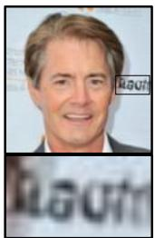  
� ՜ v� (OT-ODE)

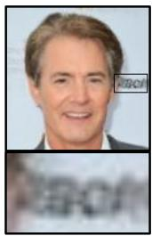  
� ՜ x0(D-Flow)

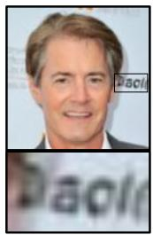  
� ՜ x�(PnP-Flow)

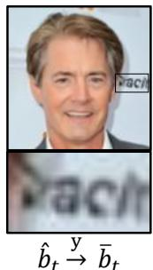  
(Flower)

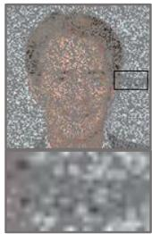  
Input

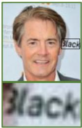  
Reference

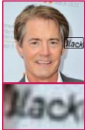  
(ReBridge-Flow)  
Figure 1. Comparison of restoration results under diferent measurement injection methods. ReBridge-Flow achieves clearer reconstructions through endpoint re-coupling.

Difusion models have become important tools for solving image inverse problems because of their strong generative capability Ho et al. (2020), Song et al. (2021). Existing methods typically incorporate likelihood gradients Chung et al. (2022, 2023), Wu et al. (2024, 2025b), Alkhouri et al. (2025) or data-consistency projections Kawar et al. (2022), Wang et al. (2023), Garber and Tirer (2024), Yang et al. (2026), Wang et al. (2026a) into the reverse sampling process to constrain generation using degraded observations. However, difusion models usually require long iterative sampling chains, while their highly noisy intermediate states further complicate the design of measurement constraints and numerical solvers.

Recently, Flow Matching has been increasingly adopted for image restoration because it connects source and data distributions through continuous transport and enables eficient sampling Pokle et al. (2024), Zhang et al. (2024), Martin et al. (2025), Hadzic et al. (2026), Ben-Hamu et al. (2024), Pourya et al. (2026). Existing methods inject measurement information at diferent sampling stages and impose constraints on local sampling variables to improve consistency between the restored output and the degraded observation. However, these constraints are usually treated as local interventions on individual variables, without explicitly considering the coupling between the source and clean endpoints. Since an intermediate Flow Matching state is jointly determined by an endpoint pair, correcting the clean endpoint while keeping the source endpoint fixed disrupts their original pairing. The corrected endpoint pair may then no longer accurately explain the current state. If subsequent updates continue to be constructed from such mismatched pairs, local directional errors may gradually accumulate and eventually manifest as structural drift, artifacts, or over-smoothing.

To address this issue, we propose ReBridge-Flow, which reformulates Flow Matching-based image restoration as measurement-conditioned posterior bridge re-coupling rather than the independent correction of a single sampling variable. As shown in Figure 1, existing methods apply measurement information to the velocity field, source endpoint, intermediate state, or clean-endpoint estimate. In contrast, ReBridge-Flow explicitly re-couples the source–clean endpoint pair, thereby improving detail recovery. Specifically, we first decode local source and clean endpoints from the current state using the pretrained velocity field. We then incorporate measurement information through clean-side anchoring and synchronously update the source endpoint to pair it with the corrected clean endpoint, thereby improving the local bridge compatibility between the endpoint pair and the current state. The re-coupled endpoint pair further defines a posterior-informed transport direction. To characterize this process in a unified manner, we introduce the Posterior Bridge Defect, which jointly accounts for measurement error, flow-prior preservation, and bridge residual. Our main contributions are summarized as follows:

• We identify the bridge mismatch problem in Flow Matching-based image restoration: locally correcting an individual state or endpoint may disrupt the source-clean endpoint coupling and afect subsequent local transport.

• We propose ReBridge-Flow, which re-couples the posterior endpoint pair through clean-side anchoring and source-side re-coupling, yielding a measurement-aware endpoint pair with improved local bridge compatibility.

• Experiments across diverse natural and medical image restoration tasks demonstrate that ReBridge-Flow efectively suppresses error propagation, reduces structural drift and artifacts, and preserves clearer image details.

## 2 Related Work

With the development of generative models, learning-based generative priors have become an important paradigm for solving image restoration inverse problems. Among them, difusion models and Flow Matching are widely adopted for their strong capability to model complex image distributions.

Difusion-Based Image Restoration (DBIR). Existing DBIR methods can be broadly divided into two categories. The first category introduces measurement constraints into the reverse sampling process through gradient guidance. DPS Chung et al. (2023) guides posterior sampling using the gradient of a measurement-consistency loss. ΠGDM Song et al. (2023) combines a pseudoinverse operator with Jacobian computation to improve guidance accuracy. RED-Dif Mardani et al. (2024) formulates restoration as a measurement-consistency optimization problem with score-matching regularization. SITCOM and SPGD Alkhouri et al. (2025), Wu et al. (2025b) explicitly control gradient updates to improve sampling stability. The second category corrects restoration estimates through projection or structured constraints. DDRM Kawar et al. (2022) and DDNM Wang et al. (2023) enforce data consistency using singular value decomposition and range–null-space decomposition, respectively. DifPIR Zhu et al. (2023) employs half-quadratic splitting to convert measurement constraints into proximal updates. EquS Wu et al. (2025a) further introduces transformation consistency through an equivariant inverse mapping and dual-trajectory sampling.

Flow Matching-Based Image Restoration (FMBIR). FMBIR methods typically incorporate measurement constraints into the sampling process of a pretrained flow model. OT-ODE Pokle et al. (2024) directly injects measurement gradients into the ODE dynamics to modify the velocity field and transport direction. Flow-Priors Zhang et al. (2024) decomposes the global restoration objective into a sequence oflocal trajectory optimization problems. PnP-Flow Martin et al. (2025) alternates between data-consistency updates and flow-prior mappings. Restora-Flow Hadzic et al. (2026) combines mask guidance with trajectory correction to keep intermediate states consistent with the degraded observation. Another line of work operates on endpoint variables. D-Flow Ben-Hamu et al. (2024) optimizes the initial source point by backpropagating through the complete Flow ODE. Flower Pourya et al. (2026) first estimates a flow-consistent clean endpoint and then refines it using the measurement information.

## 3 ReBridge-Flow

ReBridge-Flow aims to incorporate measurement information while reducing the source-clean endpoint mismatch caused by local observation correction. As shown in Figure 2, ReBridge-Flow first decodes a local endpoint pair from the current state. It then incorporates the measurement through clean-side anchoring and re-couples the source endpoint to reduce the bridge mismatch between the corrected endpoint pair and the current state. The re-coupled endpoint pair further defines a posterior-informed local transport direction for subsequent sampling.

Motivation: Why Local Correction Breaks the Bridge In Flow Matching, the intermediate state at time t is jointly determined by a source endpoint a and a clean endpoint b:

$$
e _ { t } ( a , b ) = ( 1 - t ) a + t b .\tag{2}
$$

Given the state $\mathrm { x } _ { t }$ and a pretrained velocity field $\operatorname { v } _ { \theta { \mathrm { : } } }$ , the corresponding local endpoint estimates can be decoded as:

$$
\hat { a } _ { t } = \mathrm { x } _ { t } - t \mathrm { v } _ { \theta } ( t , \mathrm { x } _ { t } ) , \quad \hat { b } _ { t } = \mathrm { x } _ { t } + ( 1 - t ) \mathrm { v } _ { \theta } ( t , \mathrm { x } _ { t } ) .\tag{3}
$$

By construction, Eqs. (2) and (3) satisfy $e _ { t } ( \hat { a } _ { t } , \hat { b } _ { t } ) = \mathbf { x } _ { t }$ . We therefore refer to $( \hat { a } _ { t } , \hat { b } _ { t } )$ as a pair of local pseudo-endpoints: they provide an endpoint representation consistent with the current state and the predicted velocity.

Existing Flow Matching restoration methods typically apply local observation corrections to the current state, predicted velocity, or clean-side estimate. Although these corrections can reduce the measurement error, they do not necessarily preserve the compatibility between the corrected endpoint pair and the current state. If only the clean endpoint is corrected from $\hat { b } _ { t }$ to ${ { \bar { b } } _ { t : } }$ , while the source endpoint $\hat { a } _ { t }$ remains unchanged, the bridge residual after clean-side-only correction is:

$$
\begin{array} { r l } & { \mathrm { r } _ { t } ^ { \mathrm { C S } } : = \mathrm { x } _ { t } - e _ { t } ( \hat { a } _ { t } , \bar { b } _ { t } ) = t ( \hat { b } _ { t } - \bar { b } _ { t } ) , } \\ & { \quad \quad \left\| \mathrm { r } _ { t } ^ { \mathrm { C S } } \right\| _ { 2 } = t \left\| \hat { b } _ { t } - \bar { b } _ { t } \right\| _ { 2 } . } \end{array}\tag{4}
$$

Thus, any nonzero clean-side correction introduces an endpoint–state consistency residual proportional to the correction magnitude and to t. The state itself remains unchanged; the inconsistency arises because the corrected endpoint pair no longer interpolates to the current state. This observation motivates our hypothesis that repeatedly constructing transport directions from such inconsistent pairs can accumulate trajectory error, manifested empirically as structural drift, artifacts, or over-smoothing. Figure 3 compares representative measurementinjection strategies and supports this hypothesis.

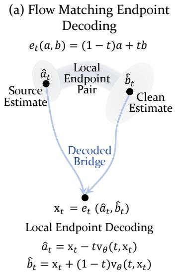

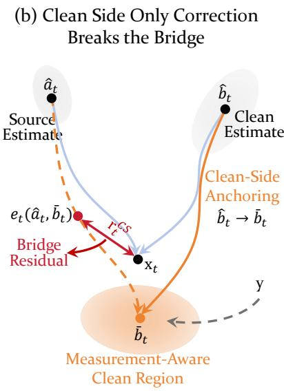

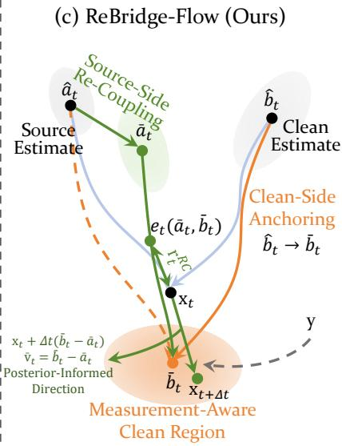  
Figure 2. (a) The current state $\mathrm { x } _ { t }$ lies on the original bridge defined by the local endpoint pair $( \hat { a } _ { t } , \hat { b } _ { t } )$ (b) Applying only clean-side anchoring disrupts the local compatibility between the endpoint pair and the current state. (c) ReBridge-Flow reduces the bridge residual through clean-side anchoring and source-side re-coupling.

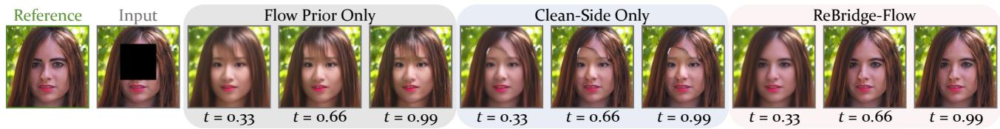  
Figure 3. Bridge mismatch caused by local measurement correction. Flow Prior Only produces plausible but observation-inconsistent results, while Clean-Side Anchoring Only may accumulate structural drift and artifacts. ReBridge-Flow suppresses error propagation through source–clean endpoint re-coupling, yielding more stable restoration.

## 3.1 Posterior Bridge Defect

Let $\pi ( a , b )$ denote the unconditional endpoint coupling defined by the pretrained Flow Matching model, and let $\mathrm { P } _ { t } = ( e _ { t } ) _ { \# } \pi$ be the intermediate distribution induced at time t. When the observation depends only on the clean endpoint, i.e., $\operatorname { p } ( \mathrm { y } \mid a , b ) = \operatorname { p } ( \mathrm { y } \mid b )$ , the measurement-conditioned endpoint coupling and its induced probability path are:

$$
\mathrm { d } \pi ^ { \mathrm { y } } ( a , b ) = \frac { \mathrm { p } ( \mathrm { y } \mid b ) } { \mathrm { Z _ { \mathrm { y } } } } \mathrm { d } \pi ( a , b ) , \quad \mathrm { P } _ { t } ^ { \mathrm { y } } = ( e _ { t } ) _ { \# } \pi ^ { \mathrm { y } } ,\tag{5}
$$

where $\mathrm { Z _ { y } }$ is the normalization constant. This relation shows that the observation not only restricts the feasible set of clean endpoints but also changes the posterior pairing between the source and clean endpoints. Therefore, correcting the clean side alone is generally insuficient to characterize the local endpoint coupling under the measurement posterior.

To jointly control the measurement error, local flow prior, and bridge mismatch, we define the

Posterior Bridge Defect and its associated joint objective as:

$$
\mathcal { I } _ { t } ( a , b ; \mathbf { x } _ { t } , \mathbf { y } ) = \underbrace { \frac { \| \mathbf { H } b - \mathbf { y } \| _ { 2 } ^ { 2 } } { 2 \sigma _ { \mathbf { y } } ^ { 2 } } } _ { \mathrm { M e a s u r e m e n t D e f e c t } } + \underbrace { \frac { \rho } { 2 } \| b - \hat { b } _ { t } \| _ { 2 } ^ { 2 } + \frac { \lambda } { 2 } \| a - \hat { a } _ { t } \| _ { 2 } ^ { 2 } } _ { \mathrm { F l o w - P r i o r ~ D e v i a t i o n } } + \underbrace { \frac { \kappa } { 2 } \| \mathbf { x } _ { t } - e _ { t } ( a , b ) \| _ { 2 } ^ { 2 } } _ { \mathrm { B r i d g e ~ R e s i d u a l } } .\tag{6}
$$

The Measurement Defect evaluates how well the clean endpoint explains the observation. The Flow-Prior Deviation prevents the corrected endpoints from deviating excessively from the local predictions of the pretrained velocity field. The Bridge Residual measures the mismatch between the corrected endpoint pair and the current state. The parameters $\rho , \lambda ,$ and $\kappa$ control the clean-side prior, source-side prior, and bridge re-coupling strength, respectively.

## 3.2 Closed-Form Posterior Bridge Re-Coupling

For a linear degradation operator H, when $\rho > 0 , \lambda > 0 _ { : }$ , and $\kappa \geq 0 ;$ , Eq. (6) defines a strictly convex quadratic objective in $( a , b )$ . By analytically eliminating the source endpoint, we obtain the closed-form minimizer of the joint objective.

Posterior Clean-Side Anchoring. For a linear degradation operator H, minimizing the joint PBD objective in Eq. (6) and analytically eliminating the source endpoint a yields the following closed-form update for the clean endpoint:

$$
\bar { b } _ { t } = \hat { b } _ { t } + \mathrm { H } ^ { \top } \left( \mathrm { H H } ^ { \top } + \gamma _ { t } \mathrm { I } \right) ^ { - 1 } \left( \mathrm { y } - \mathrm { H } \hat { b } _ { t } \right) ,\tag{7}
$$

where $\begin{array} { r } { \gamma _ { t } : = \sigma _ { \mathrm { y } } ^ { 2 } \left. \rho + \frac { \kappa \lambda t ^ { 2 } } { \lambda + \kappa ( 1 - t ) ^ { 2 } } \right. } \end{array}$ . This update is a noise-aware proximal correction. A smaller $\gamma _ { t }$ enforces a stronger observation constraint, whereas a larger $\gamma _ { t }$ preserves more clean-side structure predicted by the pretrained flow. Unlike an independent data projection, $\gamma _ { t }$ jointly accounts for the clean-side prior and the constraint induced by source-side re-coupling.

Source-Side Re-Coupling. After obtaining $\bar { b } _ { t }$ , the source endpoint is updated in closed form as:

$$
\bar { a } _ { t } = \frac { \lambda \hat { a } _ { t } + \kappa ( 1 - t ) \big ( \mathrm { x } _ { t } - t \bar { b } _ { t } \big ) } { \lambda + \kappa ( 1 - t ) ^ { 2 } } .\tag{8}
$$

Eq. (8) balances preservation of the source-side flow prior and reduction of the bridge residual. Therefore, source-side re-coupling is not an independent heuristic adjustment of the source endpoint. Instead, it is the exact optimal source update of the joint PBD objective.

Posterior-Informed State Propagation. The re-coupled endpoint pair defines a posteriorinformed local transport direction, and the current state is advanced through an explicit Euler update:

$$
\bar { \mathrm { v } } _ { t } : = \bar { b } _ { t } - \bar { a } _ { t } , \quad \mathrm { x } _ { t + \Delta t } = \mathrm { x } _ { t } + \Delta t \bar { \mathrm { v } } _ { t } .\tag{9}
$$

Eq. (9) does not directly project the current state onto a new bridge. Instead, it redefines the local transport direction through the re-coupled endpoints. Measurement information is therefore

encoded in the new endpoint pairing and its induced local velocity, rather than being added to the pretrained velocity field as an independent external guidance term.

## 3.3 ReBridge-Flow Sampling Algorithm

The complete sampling procedure is summarized in Algorithm 1. Given a time schedule $0 =$ $t _ { 0 } < t _ { 1 } < \dots < t _ { K } = 1$ , ReBridge-Flow decodes a local source–clean endpoint pair from the current state at each sampling step. It then performs clean-side anchoring and source-side re-coupling, and advances the state using the posterior-informed direction defined by the re-coupled endpoints.

## 3.4 Theoretical Analysis

We analyze ReBridge-Flow from two perspectives: the unique optimality ofthe PBD objective and the exact contraction of the bridge residual. Complete proofs are provided in the supplementary material.

Proposition 3.1 (Unique Minimizer of the PBD Objective). Assume that H is a linear operator and that $\sigma _ { \mathrm { v } } ^ { 2 } > 0 , \rho > 0 , \lambda > 0 ,$ , and $\kappa \geq 0 .$ . Since the endpoint-prior terms in $\mathcal { T } _ { t }$ have positive weights and the remaining quadratic terms are positive semidefinite, $\mathcal { T } _ { t }$ is at least $\mu \cdot$ -strongly convex, where $\mu : = \operatorname* { m i n } \{ \lambda , \rho \} > 0$ . The endpoint pair obtained from Eqs. (7) and Eq. (8) satisfies:

$$
\begin{array} { c } { { \displaystyle ( \bar { a } _ { t } , \bar { b } _ { t } ) = \mathop { \mathrm { a r g m i n } } _ { a , b } \mathcal { I } _ { t } ( a , b ; \mathrm { x } _ { t } , \mathrm { y } ) , } } \\ { { \displaystyle \mathcal { I } _ { t } ( a , b ; \mathrm { x } _ { t } , \mathrm { y } ) - \mathcal { J } _ { t } ( \bar { a } _ { t } , \bar { b } _ { t } ; \mathrm { x } _ { t } , \mathrm { y } ) \geq \frac { \mu } { 2 } \left( \| a - \bar { a } _ { t } \| _ { 2 } ^ { 2 } + \| b - \bar { b } _ { t } \| _ { 2 } ^ { 2 } \right) . } } \end{array}\tag{10}
$$

Therefore, Eqs. (7) and (8) jointly produce the unique global minimizer of $\mathcal { T } _ { t }$ . The clean- and source-side updates should thus be viewed as two components ofone joint optimization problem rather than as independently designed corrections.

Proposition 3.2 (Exact Contraction of the Bridge Residual). Define the residual after clean-sideonly correction as $\mathrm { r } _ { t } ^ { \mathrm { C S } } : = \mathrm { x } _ { t } - e _ { t } ( \hat { a } _ { t } , \bar { b } _ { t } )$ , and define the residual after source-side re-coupling as

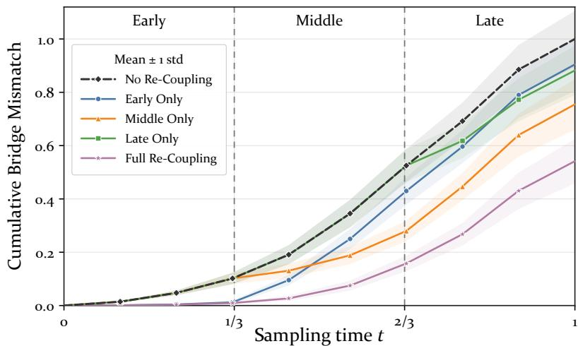  
Figure 4. Stage-wise analysis of source-side re-coupling. Only the activation interval of source-side re-coupling is varied. The curves show the cumulative normalized bridge mismatch over the sampling trajectory.

Algorithm 1 ReBridge-Flow Sampling Algorithm   
Require: Degraded Observation ${ \mathrm { y } } ,$ Measurement Operator H, Parameters $\rho , \lambda , \kappa , \sigma _ { \mathrm { y } } ,$ Pretrained Velocity   
Field $\mathrm { v } _ { \theta } ,$ Time Schedule $0 = t _ { 0 } < t _ { 1 } < \cdot \cdot \cdot < t _ { K } = 1$ , and Time-Dependent Noise-Aware Anchoring   
Coeficient $\gamma _ { k }$   
Ensure: Restored Image $\hat { \bf x }$   
1: Sample the initial state $\mathrm { x } _ { 0 } \sim p _ { 0 }$   
2: for $\bar { k } = 0 , 1 , \ldots , K - 1$ do   
Step 1: Local Endpoint Decoding   
3: $\mathrm { v } _ { k } \gets \mathrm { v } _ { \theta } ( t _ { k } , \mathrm { x } _ { k } )$   
4: $\hat { a } _ { k } \gets \mathbf { x } _ { k } - t _ { k } \mathbf { v } _ { k }$   
5: $\hat { b } _ { k } \gets \mathrm { x } _ { k } + ( 1 - t _ { k } ) \mathrm { v } _ { k }$   
Step 2: Posterior Clean-Side Anchoring   
6: $\bar { b } _ { k } \gets \hat { b } _ { k } + \mathrm { H } ^ { \top } \left( \mathrm { H H } ^ { \top } + \gamma _ { k } \mathrm { I } \right) ^ { - 1 } \left( \mathrm { y } - \mathrm { H } \hat { b } _ { k } \right)$   
Step 3: Source-Side Re-Coupling   
7: $\bar { a } _ { k }  \frac { \lambda \hat { a } _ { k } + \kappa ( 1 - t _ { k } ) ( \mathrm { x } _ { k } ^ { - } - t _ { k } \bar { b } _ { k } ) } { \mathrm { x } \mathrm { ~ , ~ } \mathrm { ~ } \mathrm { ~ } \mathrm { ~ } \mathrm { ~ } \mathrm { ~ } \mathrm { ~ } \mathrm { ~ } \mathrm { ~ } } , \mathrm { ~ } \mathrm { ~ } \mathrm { ~ }$   
$\overline { { \lambda + \kappa ( 1 - t _ { k } ) ^ { 2 } } }$   
Step 4: Posterior-Informed State Propagation   
8: $\bar { \mathrm { v } } _ { k }  \bar { b } _ { k } - \bar { a } _ { k }$   
9: $\Delta t _ { k } \gets t _ { k + 1 } - t _ { k }$   
10: $\mathbf { x } _ { k + 1 } \gets \mathbf { x } _ { k } + \Delta t _ { k } \bar { \mathbf { v } } _ { k }$   
11: end for   
12: $\hat { \mathbf { x } }  \mathbf { x } _ { K }$   
13: return ˆx

$\mathrm { r _ { \it t } ^ { R C } } : = \mathrm { x } _ { t } - e _ { t } ( \bar { a } _ { t } , \bar { b } _ { t } ) . L e t \eta _ { t } : = \lambda / [ \lambda + \kappa ( 1 - t ) ^ { 2 } ] \in ( 0 , 1 ] .$ . Eq. (8) gives:

$$
\mathrm { r } _ { t } ^ { \mathrm { R C } } = \eta _ { t } \mathrm { r } _ { t } ^ { \mathrm { C S } } , \quad \left\| \mathrm { r } _ { t } ^ { \mathrm { R C } } \right\| _ { 2 } = \eta _ { t } t \left\| \hat { b } _ { t } - \bar { b } _ { t } \right\| _ { 2 } \leq \left\| \mathrm { r } _ { t } ^ { \mathrm { C S } } \right\| _ { 2 } .\tag{11}
$$

Eq. (11) provides both the exact vector relation and the norm contraction between the residuals before and after re-coupling. When $\kappa > 0 , t \in ( 0 , 1 )$ , and the clean-side correction is nonzero, $\eta _ { t } < 1$ , and the residual is therefore strictly contracted. Increasing the relative re-coupling strength $\kappa / \lambda$ decreases $\eta _ { t }$ and strengthens local bridge repair. To illustrate this trajectory-level efect, Figure 4 compares the cumulative bridge mismatch when source-side re-coupling is enabled only in the early, middle, or late stage, or throughout the entire sampling process. Full re-coupling consistently suppresses the mismatch, while middle-stage re-coupling provides the most pronounced reduction among the partial schedules.

## 4 Experiment

Datasets and Metrics. We evaluate ReBridge-Flow on six natural and medical image datasets. The natural image datasets include CelebA Liu et al. (2015), AFHQ-Cat Choi et al. (2020), and COCO Lin et al. (2014), with resolutions of $1 2 8 \times 1 2 8 , 2 5 6 \times 2 5 6$ , and $1 2 8 \times 1 2 8 ,$ , respectively. The medical image datasets include IXI-Brain Biomedical Image Analysis Group (2006), PMUB Sonn et al. (2013), and X-Ray Hand Gertych et al. (2007), Zhang et al. (2009), with all images resized to $2 5 6 \times 2 5 6$ . We select 100 images from each dataset for testing and use the same test samples for all methods. Following prior work, reconstruction quality is evaluated using Peak Signal-to-Noise Ratio (PSNR), Structural Similarity Index (SSIM), and Learned Perceptual Image Patch Similarity (LPIPS).

Tasks. For natural images, we consider five restoration tasks: Gaussian denoising, Gaussian deblurring, super-resolution (SR), random inpainting, and box inpainting. The noise standard deviation for denoising is $\sigma _ { \mathrm { y } } = 0 . 2 $ , and 70% of pixels are removed for random inpainting. CelebA and COCO use $2 \times { \bf S R }$ and $\mathbf { a ~ 4 0 } \times 4 0$ centered mask, while AFHQ-Cat uses 4× SR and an $8 0 \times 8 0$ centered mask. For medical images, we evaluate Gaussian denoising, $2 \times { \bf S R }$ , random inpainting, and box inpainting. The denoising noise level is $\sigma _ { \mathrm { y } } = 0 . 0 8$ , and 30% of pixels are removed for random inpainting. IXI-Brain and X-Ray Hand use a $3 2 \times 3 2$ centered mask, while PMUB uses a $6 0 \times 6 0$ centered mask. Additionally, the added noise level is set to $\sigma _ { \mathrm { y } } = 0 . 0 5$ for deblurring and $\sigma _ { \mathrm { y } } = 0 . 0 1$ for all other tasks.

Implementation Details. For CelebA and AFHQ-Cat, we use the pretrained models from PnP-Flow Martin et al. (2025). For COCO and X-Ray Hand, we use the pretrained models from Restora-Flow Hadzic et al. (2026). For IXI-Brain and PMUB, we train separate Flow Matching models with a learning rate of $1 \times 1 0 ^ { - 4 }$ , a batch size of 64, and 400 epochs. Model training is performed on a single NVIDIA A6000 48 GB GPU, while all methods are evaluated on a single RTX 5090 32 GB GPU. Across all datasets and restoration tasks, we set $\rho = 1 , \lambda = 1$ , and $\kappa = 5$ . The number of sampling steps is set to $K = 1 0 0 ;$ , consistent with PnP-Flow.

## 4.1 Comparison with State-of-the-Art Methods

We compare ReBridge-Flow with six advanced flow-based image restoration methods: OT-ODE Pokle et al. (2024), Flow-Priors Zhang et al. (2024), D-Flow Ben-Hamu et al. (2024), PnP-Flow Martin et al. (2025), Restora-Flow Hadzic et al. (2026), and Flower Pourya et al. (2026). For CelebA and AFHQ-Cat, we use the configurations provided by the oficial implementations. For COCO, IXI-Brain, PMUB, and X-Ray Hand, we validate the oficial parameter settings provided for CelebA and AFHQ-Cat, and report the results obtained with the best-performing configuration on the validation set.

To evaluate the restoration capability ofReBridge-Flow across diferent data domains and degradation settings, we conduct quantitative and qualitative comparisons on six datasets. As shown in Tables 1 and 2, ReBridge-Flow achieves consistently competitive performance across various tasks. Compared with OT-ODE, Flow-Priors, and D-Flow, ReBridge-Flow exhibits more consistent performance across tasks and better balances reconstruction accuracy and perceptual quality. It also generally achieves higher PSNR and SSIM than PnP-Flow, Restora-Flow, and Flower. This trend is more pronounced on medical images, confirming that ReBridge-Flow preserves critical structures more reliably. Furthermore, the qualitative results in Figure 5 show that baselines may retain residual noise or produce over-smoothed results in denoising and deblurring, indicating that local measurement correction struggles to balance data consistency and the flow prior. In contrast, ReBridge-Flow more efectively removes degradation while preserving sharp textures and edges. In SR and random inpainting, some methods recover plausible global content but sufer from blurred boundaries or local structural shifts. ReBridge-Flow better preserves contours and structures while recovering more natural local details. On medical images, it also reconstructs tissue boundaries with greater continuity and completeness, while producing fewer artifacts that alter the original morphology. These results demonstrate that posterior bridge re-coupling preserves local bridge compatibility while incorporating measurement information, thereby suppressing error propagation and improving reconstruction reliability.

Table 1. Quantitative comparison on CelebA (Top), AFHQ-Cat (Middle), and COCO (Bottom) under diferent restoration tasks. The best and suboptimal results are highlighted.
<table><tr><td rowspan="2">Model</td><td colspan="3"> $\mathbf { D e n o i s i n g \sigma { \sigma _ { y } } = 0 . 2 }$ </td><td colspan="3">Deblurring</td><td colspan="3">Super Res. 2×</td><td colspan="3">Rand. Inpaint. 70%</td><td colspan="3">Box Inpaint. 40 × 40</td></tr><tr><td>PSNR↑</td><td>SSIM↑</td><td>LPIPS↓</td><td>PSNR↑</td><td>SSIM↑</td><td>LPIPS↓</td><td>PSNR↑</td><td>SSIM↑</td><td>LPIPS↓</td><td>PSNR↑</td><td>SSIM↑</td><td>LPIPS.↓</td><td>PSNR↑</td><td>SSIM↑</td><td>LPIPS↓</td></tr><tr><td>Degraded</td><td></td><td></td><td></td><td></td><td></td><td></td><td></td><td></td><td></td><td></td><td></td><td></td><td></td><td>23.38(0.25) 0.526(0.066) 0.343(0.133) 26.88(2.01) 0.837(0.019) 0.184(0.091) 12.73(1.32) 0.352(0.074) 0.707(0.250) 12.64(1.32) 0.262(0.065) 0.977(0.250) 22.77(1.56) 0.895(0.008) 0.175(0.060)</td><td></td></tr><tr><td>OT-ODE [TMLR2024]</td><td> $3 1 . 2 8 _ { ( 1 . 0 0 ) }$ </td><td> $0 . 8 8 5 _ { ( 0 . 0 2 4 ) }$ </td><td> $0 . 0 3 6 _ { ( 0 . 0 1 4 ) }$ </td><td> $3 0 . 3 4 _ { ( 1 . 6 7 ) }$ </td><td></td><td></td><td></td><td></td><td></td><td>0.885(0.019) 0.051(0.023) 29.82(1.60) 0.894(0.026) 0.059(0.023) 29.40(1.74) 0.892(0.026) 0.055(0.029) 30.54(3.21)</td><td></td><td></td><td></td><td> $0 . 9 5 0 _ { ( 0 . 0 1 6 ) }$ </td><td> $0 . 0 2 3 _ { ( 0 . 0 1 0 ) }$ </td></tr><tr><td>Flow-Priors [NeurIPS2024]</td><td> $3 0 . 6 5 _ { ( 0 . 6 1 ) }$ </td><td> $0 . 8 3 2 _ { ( 0 . 0 3 9 ) }$ </td><td> $0 . 1 2 6 _ { ( 0 . 0 5 9 ) }$ </td><td> $3 1 . 4 0 _ { ( 0 . 7 5 ) }$ </td><td></td><td></td><td></td><td>0.897(0.019) 0.055(0.024) 30.56(0.73) 0.819(0.037) 0.097(0.041)</td><td></td><td> $3 3 . 9 1 _ { ( 2 . 5 9 ) }$ </td><td>0.957(0.013) 0.018(0.008) 31.53(3.88)</td><td></td><td></td><td>)0.966(0.014)</td><td> $0 . 0 2 8 _ { ( 0 . 0 1 0 ) }$ </td></tr><tr><td>D-Flow [PMLR2024]</td><td> $2 8 . 3 6 _ { ( 4 . 9 6 ) }$ </td><td> $0 . 7 7 5 _ { ( 0 . 1 6 1 ) }$ </td><td> $0 . 0 8 3 _ { ( 0 . 0 3 6 ) }$ </td><td> $3 2 . 0 7 _ { ( 1 . 6 1 ) }$ </td><td></td><td></td><td></td><td>0.922(0.054) 0.048(0.021) 32.67(1.83) 0.917(0.032) 0.033(0.013)</td><td></td><td> $3 3 . 8 3 _ { ( 2 . 1 2 ) }$ </td><td>0.945(0.020) 0.021(0.011) 30.61(2.29)</td><td></td><td></td><td> $0 . 9 1 6 _ { ( 0 . 0 2 5 ) }$ </td><td> $0 . 0 4 2 _ { ( 0 . 0 1 5 ) }$ </td></tr><tr><td>PnP-Flow [ICLR2025]</td><td> $3 2 . 7 5 _ { ( 1 . 0 4 ) }$ </td><td>0.921(0.022)</td><td> $0 . 0 6 0 _ { ( 0 . 0 2 6 ) }$ </td><td> $3 4 . 5 2 _ { ( 1 . 4 0 ) }$ </td><td></td><td></td><td></td><td>0.941(0.007) 0.046(0.024) 32.23(1.41) 0.920(0.024) 0.063(0.027)</td><td></td><td> $3 3 . 8 2 _ { ( 2 . 1 5 ) }$ </td><td>0.953(0.011) 0.022(0.010) 31.30(2.78)</td><td></td><td></td><td> $0 . 9 4 4 _ { ( 0 . 0 1 6 ) }$ </td><td> $0 . 0 4 5 _ { ( 0 . 0 2 0 ) }$ </td></tr><tr><td>Restora-Flow [WACV2026]</td><td> $3 2 . 9 1 _ { ( 0 . 9 4 ) }$ </td><td> $0 . 9 2 6 _ { ( 0 . 0 1 4 ) }$ </td><td> $0 . 0 2 0 _ { ( 0 . 0 0 8 ) }$ </td><td> $3 0 . 7 5 _ { ( 1 . 6 7 ) }$ </td><td></td><td></td><td></td><td>0.892(0.014) 0.049(0.027) 32.37(2.17) 0.925(0.010)</td><td>0.024(0.009)</td><td> $3 4 . 0 8 _ { ( 2 . 2 1 ) }$ </td><td>0.958(0.013) 0.015(0.007)</td><td></td><td> $3 1 . 7 7 _ { ( 3 . 1 2 ) }$ </td><td> $0 . 9 6 1 _ { ( 0 . 0 1 3 ) }$ </td><td> $0 . 0 1 8 _ { ( 0 . 0 0 8 ) }$ </td></tr><tr><td>Flower [ICLR2026]</td><td> $3 2 . 2 3 _ { ( 1 . 6 4 ) }$ </td><td>0.912(0.020)0.033(0.012)</td><td></td><td> $3 4 . 9 6 _ { ( 1 . 6 2 ) }$ </td><td></td><td></td><td></td><td></td><td></td><td>0.947(0.056)0.034(0.036)33.92(1.92)0.948(0.015)0.038(0.006)33.05(1.85)0.944(0.016)0.018(0.006)</td><td></td><td></td><td> $3 1 . 8 5 _ { ( 1 . 9 7 ) }$ </td><td>0.965(0.010)</td><td> $0 . 0 1 8 _ { ( 0 . 0 0 7 ) }$ </td></tr><tr><td>ReBridge-Flow [Ours]</td><td>33.33(0.74) 0.938(0.005) 0.020(0.008) 35.68(0.78) 0.956(0.001) 0.026(0.012) 34.51(2.64) 0.962(0.009) 0.014(0.005)34.06(2.43)</td><td></td><td></td><td></td><td></td><td></td><td></td><td></td><td></td><td></td><td></td><td></td><td></td><td>0.962(0.004) 0.013(0.007) 32.53(3.09) 0.971(0.006)</td><td> $0 . 0 1 9 _ { ( 0 . 0 0 7 ) }$ </td></tr></table>

<table><tr><td rowspan="2">Model</td><td colspan="3">Denoising σy = 0.2</td><td colspan="3">Deblurring</td><td colspan="3">Super Res. 4×</td><td colspan="3">Rand. Inpaint. 70%</td><td colspan="3">Box Inpaint. 80 × 80</td></tr><tr><td>PSNR↑</td><td>SSIM↑</td><td>LPIPS↓</td><td>PSNR↑</td><td>SSIM↑</td><td>LPIPS↓</td><td>PSNR↑</td><td>SSIM↑</td><td>LPIPS↓</td><td>PSNR↑</td><td>SSIM↑</td><td>LPIPS↓</td><td>PSNR↑ SSIM↑</td><td></td><td>LPIPS↓</td></tr><tr><td>Degraded</td><td> $2 4 . 0 2 _ { ( 0 . 2 3 ) }$ </td><td></td><td></td><td></td><td></td><td></td><td></td><td></td><td></td><td></td><td></td><td></td><td>0.513(0.080)0.465(0.169)22.95(1.990.612(0.091)0.511(0.237)12.39(1.90)0.269(0.080)0.868(0.250)14.31(1.90)0.317(0.087)0.950(0.250)22.13(2.33)0.906(0.010)0.127(0.056)</td><td></td><td></td></tr><tr><td>OT-ODE [TMLR2024]</td><td> $3 1 . 3 2 _ { ( 1 . 3 4 ) }$ </td><td> $0 . 9 1 6 _ { ( 0 . 0 2 2 ) }$ </td><td> $0 . 0 8 3 _ { ( 0 . 0 3 3 ) }$ </td><td> $2 4 . 5 7 _ { ( 2 . 0 9 ) }$ </td><td></td><td></td><td>0.631(0.074) 0.196(0.105)26.65(1.71) 0.781(0.080) 0.191(0.072) 30.54(2.05) 0.872(0.030) 0.094(0.039)25.30(3.07) 0.905(0.014)</td><td></td><td></td><td></td><td></td><td></td><td></td><td></td><td> $0 . 0 8 5 _ { ( 0 . 0 3 5 ) }$ </td></tr><tr><td>Flow-Priors [NeurIPS2024]</td><td> $3 1 . 5 5 _ { ( 0 . 7 9 ) }$ </td><td> $0 . 9 0 5 _ { ( 0 . 0 2 7 ) }$ </td><td> $0 . 0 8 1 _ { ( 0 . 0 3 5 ) }$ </td><td> $2 6 . 1 7 _ { ( 2 . 4 0 ) }$ </td><td>0.705(0.063)</td><td>0.185(0.097)</td><td>25.89(1.78)0.730(0.040) 0.186(0.077) 32.23(2.62) 0.890(0.017) 0.068(0.028)</td><td></td><td></td><td></td><td></td><td></td><td>27.29(3.80)</td><td>0.935(0.015)</td><td> $0 . 0 5 8 _ { ( 0 . 0 2 3 ) }$ </td></tr><tr><td>D-Flow [PMLR2024]</td><td> $3 0 . 4 1 _ { ( 3 . 1 4 ) }$ </td><td>0.892(0.098)</td><td> $0 . 0 6 2 _ { ( 0 . 0 2 7 ) }$ </td><td> $2 4 . 8 4 _ { ( 2 . 1 0 ) }$ </td><td></td><td></td><td></td><td></td><td></td><td></td><td></td><td></td><td>0.635(0.079) 0.204(0.098) 25.82(2.83) 0.721(0.075) 0.168(0.069) 33.06(2.73) 0.908(0.021) 0.058(0.031) 26.90(2.99) 0.931(0.019)</td><td></td><td> $0 . 0 7 2 _ { ( 0 . 0 2 8 ) }$ </td></tr><tr><td>PnP-Flow [ICLR2025]</td><td> $3 2 . 5 9 _ { ( 1 . 3 1 ) }$ </td><td>0.913(0.022)</td><td> $0 . 0 9 5 _ { ( 0 . 0 4 4 ) }$ </td><td> $2 7 . 6 9 _ { ( 2 . 4 7 ) }$ </td><td></td><td></td><td>0.755(0.059)0.347(0.185)26.82(2.47) 0.772(0.053) 0.184(0.083)</td><td></td><td></td><td> $3 3 . 5 4 _ { ( 2 . 7 7 ) }$ </td><td>0.922(0.017)</td><td>0.042(0.022)</td><td>27.06(3.64)0.917(0.016)</td><td></td><td> $0 . 0 7 4 _ { ( 0 . 0 3 1 ) }$ </td></tr><tr><td>Restora-Flow [WACV2026]</td><td> $3 2 . 9 9 _ { ( 1 . 2 8 ) } ~ 0 . 9 2 5 _ { ( 0 . 0 1 2 ) } ~ 0 . 0 5 2 _ { ( 0 . 0 2 3 ) }$ </td><td></td><td></td><td> $2 5 . 4 6 _ { ( 1 . 9 6 ) }$ </td><td></td><td></td><td>0.683(0.063)0.234(0.108)27.95(2.37)0.804(0.056)0.162(0.074)</td><td></td><td></td><td>33.41(2.75)</td><td></td><td>0.914(0.021) 0.055(0.028)</td><td>27.18(3.60) 0.940(0.015)</td><td></td><td>0.048(0.019)</td></tr><tr><td>Flower [ICLR2026]</td><td>31.66(1.80) 0.908(0.030)</td><td></td><td>0.089(0.030)</td><td>27.77(1.55)</td><td>0.764(0.083)</td><td></td><td>0.253(0.042) 26.31(1.39) 0.745(0.057) 0.201(0.067)</td><td></td><td></td><td>33.83(2.62)</td><td>0.913(0.018)</td><td>0.043(0.007)</td><td>27.01(3.78)</td><td>0.943(0.028)</td><td>0.058(0.019)</td></tr><tr><td>ReBridge-Flow [Ours]</td><td> $3 3 . 5 1 _ { ( 1 . 1 1 ) } ~ 0 . 9 3 6 _ { ( 0 . 0 0 8 ) } ~ 0 . 0 5 8 _ { ( 0 . 0 2 6 ) }$ </td><td></td><td></td><td></td><td>28.66(2.58) 0.781(0.012)</td><td>)0.190(0.101)</td><td>28.16(2.84) 0.820(0.030) 0.119(0.056) 34.13(2.81) 0.935(0.008)</td><td></td><td></td><td></td><td></td><td>0.042(0.020)</td><td></td><td>27.42(3.70)0.949(0.008)</td><td>0.054(0.018)</td></tr></table>

<table><tr><td rowspan="2">Model</td><td colspan="3"> $\mathbf { D e n o i s i n g } \sigma _ { \mathrm { y } } = 0 . 2$ </td><td colspan="3">Deblurring</td><td colspan="3">Super Res. 2×</td><td colspan="3">Rand. Inpaint. 70%</td><td colspan="3">Box Inpaint. 40 × 40</td></tr><tr><td>PSNR↑</td><td>SSIM↑</td><td>LPIPS.↓</td><td>PSNR↑</td><td>SSIM↑</td><td>LPIPS↓</td><td>PSNR↑</td><td>SSIM↑</td><td>LPIPS.↓</td><td>PSNR↑</td><td>SSIM↑</td><td>LPIPS.↓</td><td>PSNR↑</td><td>SSIM↑</td><td>LPIPS↓</td></tr><tr><td>Degraded</td><td></td><td> $2 0 . 0 0 _ { ( 0 . 2 6 ) } ~ 0 . 4 4 2 _ { ( 0 . 1 1 0 ) } ~ 0 . 2 8 5 _ { ( 0 . 1 1 5 ) }$ </td><td></td><td> $2 4 . 2 4 _ { ( 2 . 1 1 ) }$ </td><td></td><td></td><td></td><td></td><td></td><td>0.748(0.043) 0.309(0.138) 12.74(1.98) 0.241(0.080) 0.667(0.250) 13.03(1.99) 0.258(0.079) 0.941(0.250)2.16(2.63)0.904(0.011) 0.144(0.049)</td><td></td><td></td><td></td><td></td><td></td></tr><tr><td>OT-ODE [TMLR2024]</td><td></td><td> $2 7 . 5 3 _ { ( 1 . 7 5 ) } ~ 0 . 8 1 0 _ { ( 0 . 0 4 3 ) } ~ 0 . 0 6 5 _ { ( 0 . 0 2 8 ) }$ </td><td></td><td> $2 5 . 9 1 _ { ( 2 . 2 8 ) }$ </td><td></td><td></td><td></td><td></td><td></td><td>0.788(0.046) 0.128(0.064) 23.79(2.50) 0.744(0.062) 0.146(0.067) 23.97(2.65) 0.763(0.060) 0.132(0.064) 23.37(3.52) 0.913(0.017)</td><td></td><td></td><td></td><td></td><td>0.072(0.029)</td></tr><tr><td>Flow-Priors [NeurIPS2024]</td><td> $2 7 . 0 6 _ { ( 1 . 1 3 ) }$ </td><td>0.750(0.067) 0.116(0.048)</td><td></td><td> $2 7 . 0 8 _ { ( 1 . 2 2 ) }$ </td><td></td><td></td><td></td><td>0.769(0.041) 0.117(0.060) 24.85(2.18) 0.699(0.055) 0.110(0.043)</td><td></td><td> $2 5 . 9 7 _ { ( 3 . 3 3 ) }$ </td><td></td><td>0.855(0.046) 0.055(0.027) 23.58(3.45)</td><td></td><td> $0 . 9 2 7 _ { ( 0 . 0 1 6 ) }$ </td><td>0.084(0.034)</td></tr><tr><td>D-Flow [PMLR2024]</td><td> $2 1 . 1 1 _ { ( 2 . 0 7 ) } ~ 0 . 5 4 9 _ { ( 0 . 0 8 5 ) } ~ 0 . 2 5 4 _ { ( 0 . 0 9 9 ) }$ </td><td></td><td></td><td> $2 5 . 5 7 _ { ( 2 . 0 9 ) }$ </td><td></td><td></td><td>0.762(0.094) 0.242(0.127) 24.82(3.04) 0.778(0.062) 0.082(0.034)</td><td></td><td></td><td> $2 6 . 3 2 _ { ( 3 . 1 8 ) }$ </td><td></td><td> $0 . 8 4 1 _ { ( 0 . 0 5 2 ) } \ 0 . 0 5 2 _ { ( 0 . 0 2 5 ) }$ </td><td>23.40(3.05)</td><td> $0 . 8 2 4 _ { ( 0 . 0 4 1 ) } \ 0 . 1 1 5 _ { ( 0 . 0 4 4 ) }$ </td><td></td></tr><tr><td>PnP-Flow [ICLR2025]</td><td> $2 8 . 9 8 _ { ( 1 . 8 2 ) } ~ 0 . 8 5 6 _ { ( 0 . 0 4 4 ) } ~ 0 . 1 2 7 _ { ( 0 . 0 5 0 ) }$ </td><td></td><td></td><td> $2 6 . 3 2 _ { ( 2 . 2 9 ) }$ </td><td></td><td></td><td>0.785(0.019) 0.142(0.071) 26.73(2.24) 0.827(0.047) 0.118(0.048)</td><td></td><td></td><td> $2 8 . 1 4 _ { ( 3 . 0 4 ) }$ </td><td> $0 . 8 9 6 _ { ( 0 . 0 3 5 ) }$ </td><td>0.052(0.024)</td><td> $2 4 . 5 7 _ { ( 3 . 4 7 ) }$ </td><td> $0 . 8 9 2 _ { ( 0 . 0 2 3 ) } \ 0 . 1 2 1 _ { ( 0 . 0 4 4 ) }$ </td><td></td></tr><tr><td>Restora-Flow [WACV2026]</td><td> $3 0 . 5 6 _ { ( 1 . 8 2 ) }$ </td><td>0.905(0.024)</td><td>0.025(0.012)</td><td> $2 5 . 2 1 _ { ( 1 . 9 1 ) }$ </td><td></td><td></td><td>0.747(0.021)0.135(0.072)27.42(3.13)0.877(0.038)</td><td></td><td>)0.044(0.021)</td><td> $2 7 . 3 6 _ { ( 3 . 1 2 ) }$ </td><td> $0 . 8 8 1 _ { ( 0 . 0 4 1 ) }$ </td><td>0.040(0.016)</td><td> $2 4 . 7 9 _ { ( 3 . 5 7 ) }$ </td><td> $0 . 9 3 0 _ { ( 0 . 0 1 7 ) }$ </td><td> $0 . 0 8 4 _ { ( 0 . 0 2 8 ) }$ </td></tr><tr><td>Flower [ICLR2026]</td><td> ${ 2 9 . 9 8 _ { ( 1 . 8 5 ) } ~ 0 . 8 8 5 _ { ( 0 . 0 3 4 ) } ~ 0 . 0 5 9 _ { ( 0 . 0 1 5 ) } }$ </td><td></td><td></td><td> $2 8 . 8 2 _ { ( 0 . 8 8 ) }$ </td><td></td><td></td><td></td><td>0.872(0.068) 0.112(0.046)27.33(1.84) 0.876(0.030) 0.051(0.016)</td><td></td><td> $2 8 . 1 8 _ { ( 2 . 1 3 ) }$ </td><td> $0 . 8 8 0 _ { ( 0 . 0 3 0 ) }$ </td><td>0.046(0.016) 24.35(4.19)</td><td></td><td> $0 . 9 2 4 _ { ( 0 . 0 3 5 ) } \ 0 . 0 9 7 _ { ( 0 . 0 4 0 ) }$ </td><td></td></tr><tr><td>ReBridge-Flow [Ours]</td><td> $3 0 . 6 5 _ { ( 1 . 5 3 ) } ~ 0 . 9 0 6 _ { ( 0 . 0 0 9 ) } ~ 0 . 0 2 6 _ { ( 0 . 0 1 2 ) }$ </td><td></td><td></td><td></td><td></td><td></td><td></td><td>29.16(1.12) 0.909(0.001)0.059(0.029)27.90(3.18)0.892(0.036)0.045(0.019)</td><td></td><td> $2 8 . 7 7 _ { ( 3 . 3 2 ) }$ </td><td>0.910(0.019)0.034(0.015) 26.01(4.00)0.932(0.011)0.086(0.032)</td><td></td><td></td><td></td><td></td></tr></table>

Table 2. Average quantitative comparison on IXI-Brain, PMUB, and X-Ray Hand datasets. The best and suboptimal results are highlighted.
<table><tr><td rowspan="2">Model</td><td colspan="3">IXI-Brain Avg.</td><td colspan="2">PMUB Avg.</td><td colspan="2">X-Ray Hand Avg.</td></tr><tr><td></td><td></td><td></td><td></td><td></td><td>PSNR↑ SSIM↑ LPIPS↓ PSNR↑ SSIM↑ LPIPS↓ PSNR↑ SSIM↑ LPIPS↓</td><td></td></tr><tr><td>Degraded</td><td>16.82</td><td>0.442</td><td>0.466</td><td>14.48 0.535</td><td>0.340</td><td>15.23 0.368</td><td>0.554</td></tr><tr><td>OT-ODE</td><td>26.99</td><td>0.832</td><td>0.072</td><td>20.84 0.829</td><td>0.057</td><td>23.63 0.688</td><td>0.090</td></tr><tr><td>Flow-Priors</td><td>26.59</td><td>0.877</td><td>0.054</td><td>22.82 0.888</td><td>0.034</td><td>21.41 0.807</td><td>0.071</td></tr><tr><td>D-Flow</td><td>24.44</td><td>0.767</td><td>0.137</td><td>21.53 0.826</td><td>0.049</td><td>20.96</td><td>0.739 0.083</td></tr><tr><td>PnP-Flow</td><td>28.47</td><td>0.877</td><td>0.080</td><td>23.61 0.900</td><td>0.037</td><td>25.77</td><td>0.855 0.048</td></tr><tr><td>Restora-Flow</td><td>27.02</td><td>0.864</td><td>0.070</td><td>21.05 0.841</td><td>0.035</td><td>23.76</td><td>0.764 0.058</td></tr><tr><td>Flower</td><td>28.97</td><td>0.905</td><td>0.056</td><td>22.90 0.888</td><td>0.043</td><td>26.16</td><td>0.851 0.053</td></tr><tr><td>ReBridge-Flow</td><td>30.60</td><td>0.931</td><td>0.037</td><td>24.44 0.920</td><td>0.027</td><td>27.48 0.877</td><td>0.046</td></tr></table>

## 4.2 Ablation Study

To compare diferent endpoint-handling strategies, we conduct ablation experiments on CelebA with Random Inpainting 70% and AFHQ-Cat with $4 \times { \bf S R } .$ As shown in Table 3, using the flow prior alone cannot incorporate the observation and therefore yields limited restoration performance.

D-Flow  
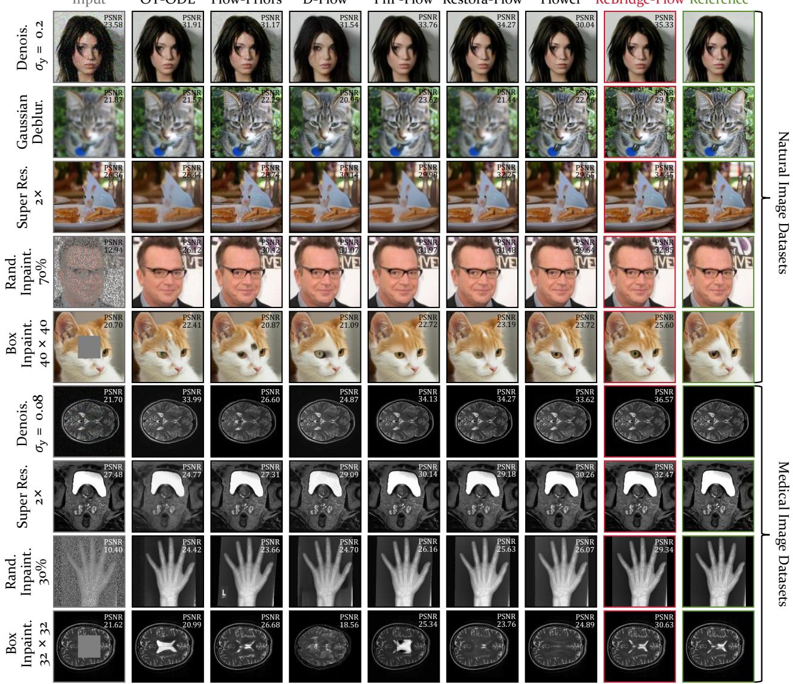  
Figure 5. Qualitative comparisons of five image restoration tasks on six natural and medical datasets.

Table 3. Ablation results for diferent endpoint-handling strategies. The best and suboptimal results are highlighted.
<table><tr><td rowspan="3">Method</td><td colspan="3">CelebA | Rand. Inpaint. 70% AFHQ-Cat | Super Res. 4×</td></tr><tr><td>PSNR↑ SSIM↑</td><td>LPIPS↓</td><td>PSNR↑ SSIM↑ LPIPS↓</td></tr><tr><td>29.80 0.884</td><td>0.083</td><td>27.04 0.782 0.150</td></tr><tr><td>Flow Prior Only Clean-Side Anchoring Only (a = ât)</td><td>28.89 0.891</td><td>0.059</td><td>27.26 0.793 0.138</td></tr><tr><td>Hard Re-Coupling (λ = 0)</td><td>29.83 0.906</td><td>0.028</td><td>27.19 0.786 0.143</td></tr><tr><td>No Clean-Side Prior (ρ = 0)</td><td>14.63 0.645</td><td>0.363</td><td>11.90 0.225 0.898</td></tr><tr><td>ReBridge-Flow</td><td>34.06 0.962</td><td>0.013</td><td>28.16 0.820 0.119</td></tr></table>

Clean-side anchoring $\mathbf { \Omega } ( a \mathbf { \Omega } ) = \hat { a } _ { t } )$ improves measurement consistency, but keeping the source endpoint fixed still breaks the local bridge compatibility between the endpoint pair and the current state. Hard Re-Coupling (λ = 0) further reduces the bridge residual, but becomes less stable because the source-side prior is removed. No Clean-Side Prior $( \rho = 0 )$ causes a substantial performance drop, demonstrating that this constraint is essential for preventing measurement corrections from deviating from the local flow prior. The full ReBridge-Flow achieves the best performance on both tasks, indicating that efective restoration requires preserving the flow priors at both endpoints while jointly correcting their coupling.

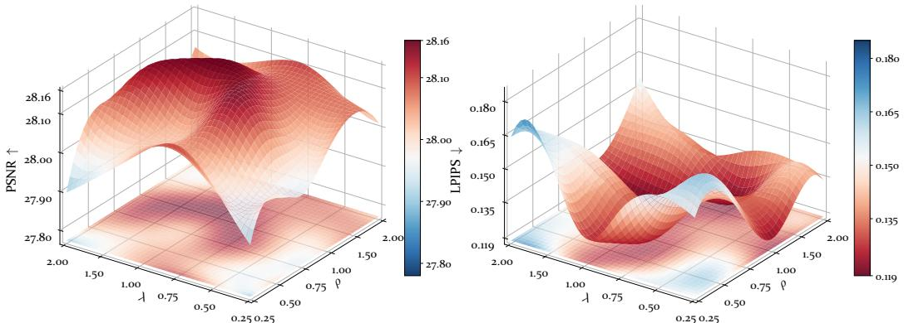  
Figure 6. Parameter sensitivity analysis on λ and $\rho$ of ReBridge-Flow.

## 4.3 Hyperparameter Sensitivity Analysis

To analyze the efects of the source-side prior weight λ and the clean-side prior weight ρ, we fix $\rho ,$ $\kappa = 5$ and vary $\rho$ and λ. As shown in Figure 6, ReBridge-Flow remains stable over a moderate parameter range and achieves the best performance at $\rho = \lambda = 1$ , with a PSNR of 28.16 and an LPIPS of 0.119. A large λ overly restricts source-endpoint adaptation and weakens bridge re-coupling, whereas a small λ fails to preserve the source-side flow prior. Similarly, extreme values of $\rho$ disrupt the balance between measurement consistency and the clean-side prior.

## 4.4 Computational Eficiency

Table 4 compares the restoration performance and computational cost of diferent methods on the CelebA deblurring task. ReBridge-Flow achieves the best results across all three quantitative metrics, with an average inference time of 6.75s and a GPU memory footprint of only 0.79 GB. Compared with most baselines that rely on iterative optimization or backpropagation, ReBridge-Flow runs faster and requires less GPU memory. Although Restora-Flow has a shorter inference time and OT-ODE uses slightly less memory, both deliver substantially lower restoration performance than ReBridge-Flow. These results demonstrate that the closed-form endpoint re-coupling mechanism achieves a favorable balance between restoration quality and computational eficiency without additional iterative optimization.

## 5 Discussion

At the level of the resulting state update, both ReBridge-Flow and velocity-guidance methods modify the local transport direction. ReBridge-Flow may therefore appear to be merely a stronger form of measurement guidance. However, they incorporate observation corrections in diferent ways. OT-ODE Pokle et al. (2024) directly adds the measurement gradient to the ODE velocity, whereas Flower Pourya et al. (2026) uses the observation to correct the clean endpoint while leaving the source endpoint determined by the original local flow prediction. Given the same corrected clean endpoint $\bar { b } _ { t } .$ , a clean-side-only correction produces the direction $\bar { b } _ { t } - \hat { a } _ { t }$ . ReBridge-Flow instead synchronously updates the source endpoint through the joint PBD objective and propagates with $\bar { b } _ { t } - \bar { a } _ { t }$ . Re-coupling therefore does not simply amplify the measurement residual. Instead, it controls how the observation correction is allocated across the two endpoints while preserving the local flow priors on both the source and clean sides. Simply increasing the strength of external guidance may further reduce the measurement error, but it does not directly resolve the inconsistency between the corrected endpoint pair and the current state.

Table 4. Comparison of deblurring performance and computational eficiency across diferent methods. The best results are highlighted.
<table><tr><td>Method</td><td>OT-ODE</td><td>Flow-Priors</td><td>D-Flow</td><td>PnP-Flow</td><td>Restora-Flow</td><td>Flower</td><td>ReBridge-Flow</td></tr><tr><td>PSNR↑</td><td>30.34</td><td>31.40</td><td>32.07</td><td>34.52</td><td>30.75</td><td>34.96</td><td>35.68</td></tr><tr><td>SSIM↑</td><td>0.885</td><td>0.897</td><td>0.922</td><td>0.941</td><td>0.892</td><td>0.947</td><td>0.956</td></tr><tr><td>LPIPS↓</td><td>0.051</td><td>0.055</td><td>0.048</td><td>0.046</td><td>0.049</td><td>0.034</td><td>0.026</td></tr><tr><td>Avg Time (s)↓</td><td>7.91</td><td>46.07</td><td>125.01</td><td>8.86</td><td>3.41</td><td>11.46</td><td>6.75</td></tr><tr><td>Memory (GB)↓</td><td>0.70</td><td>4.62</td><td>6.30</td><td>6.30</td><td>0.79</td><td>6.32</td><td>0.79</td></tr></table>

The bridge residual is neither equivalent to the final reconstruction error nor a substitute for a measurement-consistency metric. It indicates whether the corrected endpoint pair can still explain the current state. Reducing this residual alone does not guarantee monotonic improvements in PSNR or SSIM at every step. It can, however, help prevent subsequent transport directions from being repeatedly constructed from an inconsistent local endpoint pair. In the PBD objective, the Measurement Defect, Flow-Prior Deviation, and Bridge Residual constrain measurement consistency, preservation of the generative prior, and local propagation consistency, respectively. They therefore serve distinct roles. The importance of re-coupling also varies with sampling time. At early times, the efect of clean-endpoint correction on the bridge residual is limited by the coeficient t. Near the terminal time, the interpolation weight 1 − t of the source endpoint becomes small, which reduces its ability to compensate for the residual. At intermediate times, both endpoints have non-negligible interpolation weights. Re-coupling therefore typically produces a more pronounced residual reduction, consistent with the stagewise experimental results. Similar to Flow-Priors Zhang et al. (2024) and Restora-Flow Hadzic et al. (2026), which emphasize local-trajectory or intermediate-state consistency, ReBridge-Flow constrains local propagation errors as they arise rather than replacing the final data-consistency objective with the bridge residual.

Limitations. When the degradation operator is known and linear, and the pretrained flow model is reasonably matched to the target image domain, ReBridge-Flow can coordinate measurement constraints and endpoint priors in closed form and achieve stable performance across multiple restoration tasks. However, its current scope remains primarily limited to known linear degradations and assumes that the measurement-noise level can be reasonably estimated. For general large-scale operators, solving the linear system required by clean-side anchoring may also introduce additional computational cost. Meanwhile, the quality of the local endpoints depends on the pretrained velocity field. When test images deviate substantially from the training distribution or the observation loses too much information, the restored results may still be afected by biases in the generative prior. The current theoretical results guarantee local PBD optimality and bridge-residual contraction, but they do not directly guarantee a monotonic decrease in the global reconstruction error. Moreover, the medical-image experiments use known synthetic degradations. These results are intended mainly to validate restoration performance and cannot replace systematic evaluation under real clinical degradations.

Future Work. In future work, we will extend ReBridge-Flow to nonlinear and unknown degradations, for example by deriving corresponding endpoint updates through local linearization or joint estimation of the degradation operator. We will also investigate adaptive adjustment of $\rho ,$ λ, and κ according to the sampling stage, measurement residual, and bridge residual. This may reduce manual parameter selection across diferent data domains and degradation levels.

## 6 Conclusion

We proposed ReBridge-Flow, which reformulated FMBIR as a measurement-conditioned posterior bridge re-coupling problem. To address the disruption of source-clean endpoint pairing caused by local measurement correction, we constructed a measurement-consistent and locally bridge-compatible endpoint pair through clean-side anchoring and source-side re-coupling, and used it to define a posterior-informed transport direction. The Posterior Bridge Defect further unified measurement error, deviation from the flow prior, and bridge residual, yielding closed-form updates. Extensive experiments demonstrated that ReBridge-Flow efectively alleviated bridge mismatch and achieved stable performance across diverse restoration tasks. In the future, we will extend the method to image restoration under nonlinear and unknown degradations.

## References

Ismail Alkhouri, Shijun Liang, Cheng-Han Huang, Jimmy Dai, Qing Qu, Saiprasad Ravishankar, and Rongrong Wang. Sitcom: Step-wise triple-consistent difusion sampling for inverse prob lems. In International Conference on Machine Learning, volume 267. PMLR / OpenReview.net, 2025.

Heli Ben-Hamu, Omri Puny, Itai Gat, Brian Karrer, Uriel Singer, and Yaron Lipman. D-flow: Diferentiating through flows for controlled generation. In Forty-first International Conference on Machine Learning, volume 235 of Proceedings ofMachine Learning Research, pages 3462– 3483. PMLR / OpenReview.net, 2024.

Biomedical Image Analysis Group. IXI Dataset. https://brain-development.org/ixi-dataset/, 2006. Imperial College London, accessed July 25, 2026.

Liangyu Chen, Xiaojie Chu, Xiangyu Zhang, and Jian Sun. Simple baselines for image restoration. In European Conference on Computer Vision, volume 13667 of Lecture Notes in Computer Science, pages 17–33. Springer, 2022.

Yunjey Choi, Youngjung Uh, Jaejun Yoo, and Jung-Woo Ha. Stargan v2: Diverse image synthesis for multiple domains. In IEEE/CVF Conference on Computer Vision and Pattern Recognition, pages 8185–8194. Computer Vision Foundation / IEEE, 2020.

Hyungjin Chung, Byeongsu Sim, Dohoon Ryu, and Jong Chul Ye. Improving difusion models for inverse problems using manifold constraints. In Annual Conference on Neural Information Processing Systems, 2022.

Hyungjin Chung, Jeongsol Kim, Michael Thompson McCann, Marc Louis Klasky, and Jong Chul Ye. Difusion posterior sampling for general noisy inverse problems. In International Conference on Learning Representations. OpenReview.net, 2023.

Tomer Garber and Tom Tirer. Image restoration by denoising difusion models with iteratively preconditioned guidance. In IEEE/CVFConference on Computer Vision and Pattern Recognition, pages 25245–25254. IEEE, 2024.

Arkadiusz Gertych, Aifeng Zhang, James W. Sayre, Sylwia Pospiech-Kurkowska, and H. K. Huang. Bone age assessment of children using a digital hand atlas. Computerized Medical Imaging and Graphics, 31(4-5):322–331, 2007.

Arnela Hadzic, Franz Thaler, Lea Bogensperger, Simon Johannes Joham, and Martin Urschler. Restora-flow: Mask-guided image restoration with flow matching. In IEEE/CVF Winter Conference on Applications ofComputer Vision, pages 4943–4952. IEEE, 2026.

Jonathan Ho, Ajay Jain, and Pieter Abbeel. Denoising difusion probabilistic models. In Annual Conference on Neural Information Processing Systems, 2020.

Bahjat Kawar, Michael Elad, Stefano Ermon, and Jiaming Song. Denoising difusion restoration models. In Annual Conference on Neural Information Processing Systems, 2022.

Tsung-Yi Lin, Michael Maire, Serge J. Belongie, James Hays, Pietro Perona, Deva Ramanan, Piotr Dollár, and C. Lawrence Zitnick. Microsoft COCO: common objects in context. In European Conference on Computer Vision, volume 8693 of Lecture Notes in Computer Science, pages 740–755. Springer, 2014.

Yaron Lipman, Ricky T. Q. Chen, Heli Ben-Hamu, Maximilian Nickel, and Matthew Le. Flow matching for generative modeling. In The Eleventh International Conference on Learning Representations. OpenReview.net, 2023.

Xingchao Liu, Chengyue Gong, and Qiang Liu. Flow straight and fast: Learning to generate and transfer data with rectified flow. In The Eleventh International Conference on Learning Representations. OpenReview.net, 2023.

Ziwei Liu, Ping Luo, Xiaogang Wang, and Xiaoou Tang. Deep learning face attributes in the wild. In International Conference on Computer Vision, pages 3730–3738. IEEE Computer Society, 2015.

Morteza Mardani, Jiaming Song, Jan Kautz, and Arash Vahdat. A variational perspective on solving inverse problems with difusion models. In International Conference on Learning Representations. OpenReview.net, 2024.

Ségolène Tifany Martin, Anne Gagneux, Paul Hagemann, and Gabriele Steidl. Pnp-flow: Plugand-play image restoration with flow matching. In The Thirteenth International Conference on Learning Representations. OpenReview.net, 2025.

Michael T. McCann, Kyong Hwan Jin, and Michael Unser. Convolutional neural networks for inverse problems in imaging: A review. IEEE Signal Processing Magazine, 34(6):85–95, 2017.

Ashwini Pokle, Matthew J. Muckley, Ricky T. Q. Chen, and Brian Karrer. Training-free linear image inverses via flows. Transactions on Machine Learning Research, 2024, 2024.

Mehrsa Pourya, Bassam El Rawas, and Michael Unser. Flower: A flow-matching solver for inverse problems. In International Conference on Learning Representations. IEEE, 2026.

Jiaming Song, Chenlin Meng, and Stefano Ermon. Denoising difusion implicit models. In International Conference on Learning Representations. OpenReview.net, 2021.

Jiaming Song, Arash Vahdat, Morteza Mardani, and Jan Kautz. Pseudoinverse-guided difusion models for inverse problems. In International Conference on Learning Representations. OpenReview.net, 2023.

Geofrey A Sonn, Shyam Natarajan, Daniel JA Margolis, Malu MacAiran, Patricia Lieu, Jiaoti Huang, Frederick J Dorey, and Leonard S Marks. Targeted biopsy in the detection of prostate cancer using an ofice based magnetic resonance ultrasound fusion device. J. Urol., 189(1): 86–92, 2013.

Ge Wang, Jong Chul Ye, Klaus Mueller, and Jefrey A. Fessler. Image reconstruction is a new frontier of machine learning. IEEE Transactions on Medical Imaging, 37(6):1289–1296, 2018.

Yi Wang, Lanling Zeng, Jiaqi Zhang, and Yang Yang. Zero-shot difusive image restoration with consistency. Signal Processing, 248:110705, 2026a.

Yinhuai Wang, Jiwen Yu, and Jian Zhang. Zero-shot image restoration using denoising difusion null-space model. In International Conference on Learning Representations. OpenReview.net, 2023.

Yiqi Wang, Jiaqi Zhang, Taotao Cai, Zirui Liu, Qingqiang Sun, Zequn Sun, Zhangkai Wu, Manqing Dong, Mingkai Zheng, Xuefei Yin, and Yanming Zhu. From agent traces to trust: A survey of evidence tracing and execution provenance in LLM agents. CoRR, abs/2606.04990, 2026b.

Zhihao Wang, Jian Chen, and Steven C. H. Hoi. Deep learning for image super-resolution: A survey. IEEE Transactions on Pattern Analysis and Machine Intelligence, 43(10):3365–3387, 2021.

Chenxu Wu, Qingpeng Kong, Peiang Zhao, Wendi Yang, Wenxin Ma, Fenghe Tang, Zihang Jiang, and S. Kevin Zhou. Equivariant sampling for improving difusion model-based image restoration. CoRR, abs/2511.09965, 2025a.

Hongjie Wu, Linchao He, Mingqin Zhang, Dongdong Chen, Kunming Luo, Mengting Luo, Jizhe Zhou, Hu Chen, and Jiancheng Lv. Difusion posterior proximal sampling for image restoration. In ACM International Conference on Multimedia, pages 214–223. ACM, 2024.

Hongjie Wu, Mingqin Zhang, Linchao He, Ji-Zhe Zhou, and Jiancheng Lv. Enhancing difusion model stability for image restoration via gradient management. In ACM International Conference on Multimedia, pages 10768–10777. ACM, 2025b.

Yang Yang, Xi Zhang, Jiaqi Zhang, and Lanling Zeng. Parameterized image restoration with difusion and gradient priors. Knowledge-Based Systems, 338:115488, 2026.

Aifeng Zhang, James W. Sayre, Linda Vachon, Brent J. Liu, and H. K. Huang. Racial diferences in growth patterns of children assessed on the basis of bone age. Radiology, 250(1):228–235, 2009.

Jiaqi Zhang, Zheng Pang, Rongrong Gao, Qiyuan Zhang, and Yang Yang. Local epistemic uncertainty guided active sampling for plug-and-play difusive image restoration. arXiv preprint arXiv:2608.06981, 2026.

Jiaqi Zhang, Guo Yang, Rongrong Gao, and Yang Yang. Zero-shot medical image super-resolution using denoising difusion models with gradient-frequency priors. Biomedical Signal Processing and Control, 129:111343, 2027. ISSN 1746-8094. doi: https://doi.org/10.1016/j.bspc.2026.111343.

Kai Zhang, Wangmeng Zuo, Yunjin Chen, Deyu Meng, and Lei Zhang. Beyond a gaussian denoiser: Residual learning of deep cnn for image denoising. IEEE Transactions on Image Processing, 26(7):3142–3155, 2017.

Yasi Zhang, Peiyu Yu, Yaxuan Zhu, Yingshan Chang, Feng Gao, Ying Nian Wu, and Oscar Leong. Flow priors for linear inverse problems via iterative corrupted trajectory matching. In Advances in Neural Information Processing Systems, 2024.

Yuanzhi Zhu, Kai Zhang, Jingyun Liang, Jiezhang Cao, Bihan Wen, Radu Timofte, and Luc Van Gool. Denoising difusion models for plug-and-play image restoration. In IEEE/CVF Conference on Computer Vision and Pattern Recognition, pages 1219–1229. IEEE, 2023.

## A More Related Work

Existing generative image restoration methods difer not only in the generative priors they employ, but also in where measurement information is injected into the generative process and whether the resulting local correction remains consistent with the transport structure of the pretrained model. Difusion-based posterior sampling methods typically convert the measurement likelihood into stepwise corrections to the score or denoising direction. For example, DPS Chung et al. (2023), ΠGDM Song et al. (2023), SITCOM Alkhouri et al. (2025), SPGD Wu et al. (2025b), PIRP Yang et al. (2026), DPG Wang et al. (2026a), LEADer Zhang et al. (2026), and Zhang et al. (2027) guide reverse sampling through measurement-residual gradients, pseudoinverse operators, or controlled gradient updates. These methods can handle various degradation tasks. However, the measurement constraints mainly act on local estimates around the current noisy state and usually require repeated gradient or Jacobian evaluations throughout the sampling chain. Another class ofmethods formulates data consistency as an explicit optimization problem or a proximal subproblem. RED-Dif Mardani et al. (2024) and DifPIR Zhu et al. (2023) coordinate the generative prior and measurement constraints through variational regularization and half-quadratic splitting, respectively. DDRM Kawar et al. (2022), DDNM Wang et al. (2023), and EquS Wu et al. (2025a) instead construct structured data-consistency updates using singular value decomposition, range–null-space decomposition, or equivariance constraints. These methods impose more direct constraints on the restoration result, but their update variables are usually still the current state or the current clean-image estimate. The relationships among diferent local variables along the generative trajectory are not explicitly modeled. In Flow Matching, image restoration is formulated as continuous transport from a source distribution to a data distribution. This formulation allows measurement constraints to act on the velocity field, trajectory state, or endpoint variables. OT-ODE Pokle et al. (2024) directly modifies the ODE velocity, Flow-Priors Zhang et al. (2024) decomposes the global inverse problem into local trajectory optimization problems, PnP-Flow Martin et al. (2025) alternates between data-consistency and flow-prior mappings, and Restora-Flow Hadzic et al. (2026) constrains intermediate states through mask guidance and trajectory correction. Although these methods use diferent solution strategies, they mainly treat measurement injection as an intervention on a single local variable, while the interpolation relation among the source endpoint, clean endpoint, and current state remains implicit. Endpoint-based methods make more explicit use of the transport structure of Flow Matching. D-Flow Ben-Hamu et al. (2024) optimizes the source endpoint by backpropagating through the full Flow ODE. This enables control over the final result from the initial condition, but requires gradient computation along the entire generative trajectory. Flower Pourya et al. (2026) estimates a flow-consistent clean endpoint from the current state and then corrects it using the measurement, thereby avoiding backpropagation through the full trajectory. Prior work has therefore progressed from velocity guidance and state projection to one-sided endpoint correction. However, it has not directly addressed whether the source and clean endpoints can still jointly explain the current state after measurement correction. Building on this line of work, ReBridge-Flow treats the two endpoints as joint variables of the same local bridge. It explicitly re-couples the measurement-conditioned source–clean endpoint pair by jointly constraining the measurement error, endpoint deviations from the flow prior, and the bridge residual between the endpoint pair and the current state.

## B Symbols Table

We summarize the main notations used in this paper and their meanings in Table 5.

Table 5. Symbols Table.
<table><tr><td>Symbol</td><td>Description</td></tr><tr><td colspan="2">Observation Model and Degradation Process</td></tr><tr><td> $\mathbf { x } \in \mathbb { R } ^ { \mathrm { n } }$ </td><td>Clean image to be recovered</td></tr><tr><td> $\mathrm { y } \in \mathbb { R } ^ { \mathrm { m } }$ </td><td>Degraded observation</td></tr><tr><td> $\mathrm { n } , \mathrm { m }$ </td><td>Dimensions of the image and observation</td></tr><tr><td> $\mathrm { H } \in \mathbb { R } ^ { \mathrm { m \times n } }$ </td><td>Known linear degradation operator</td></tr><tr><td> $\mathrm { H } ^ { \top }$ </td><td>Transpose of H</td></tr><tr><td> $\epsilon$ </td><td>Measurement noise</td></tr><tr><td> $\sigma _ { \mathrm { y } }$ </td><td>Measurement-noise standard deviation</td></tr><tr><td>I</td><td>Identity operator</td></tr><tr><td> $\mathrm { N } ( 0 , \sigma _ { \mathrm { v } } ^ { 2 } \mathrm { I } )$ </td><td>Zero-mean Gaussian noise distribution</td></tr><tr><td colspan="2">Flow Matching and Local Endpoint Decoding</td></tr><tr><td> $t \in [ 0 , 1 ]$ </td><td>Continuous sampling time</td></tr><tr><td> $a , b$ </td><td>Source and clean endpoints</td></tr><tr><td> $\textstyle e _ { t } ( a , b )$ </td><td>Linear interpolation map between endpoints</td></tr><tr><td> $\mathrm { x } _ { t }$ </td><td>Intermediate state at time t</td></tr><tr><td> $\operatorname { v } _ { \boldsymbol { \theta } } \big ( \boldsymbol { t } , \mathbf { x } _ { t } \big )$ </td><td>Pretrained velocity field</td></tr><tr><td> $\theta$ </td><td>Parameters of the velocity field</td></tr><tr><td> $\hat { a } _ { t } , \hat { b } _ { t }$ </td><td>Decoded local source and clean endpoints</td></tr><tr><td> $\pi ( a , b )$ </td><td>Unconditional endpoint coupling</td></tr><tr><td> $\mathrm { P } _ { t } = ( e _ { t } ) _ { \# } \pi$ </td><td>Intermediate distribution induced by  $\pi$ </td></tr><tr><td> $( e _ { t } ) _ { \# }$ </td><td>Pushforward operator associated with  $e _ { t }$ </td></tr><tr><td colspan="2">Posterior Bridge Defect and Endpoint Re-Coupling</td></tr><tr><td> $\mathrm { p } ( \mathrm { y } \mid b )$ </td><td>Observation likelihood conditioned on b</td></tr><tr><td> $\pi ^ { \mathrm { y } }$ </td><td>Measurement-conditioned endpoint coupling</td></tr><tr><td> $\mathrm { P } _ { t } ^ { \mathrm { y } }$ </td><td>Measurement-conditioned probability path</td></tr><tr><td> $\mathrm { Z _ { y } }$ </td><td>Normalization constant of  $\pi ^ { \mathrm { y } }$ </td></tr><tr><td> $\mathcal { T } _ { t } ( a , b ; \mathbf { x } _ { t } , \mathbf { y } )$ </td><td>Joint Posterior Bridge Defect objective</td></tr><tr><td> $\mathrm { P B D } _ { t } ( \mathbf x _ { t } , \mathbf y )$ </td><td>Minimum value of the joint objective</td></tr><tr><td> $\rho , \lambda , \kappa$ </td><td>Clean-side prior, source-side prior, and re-coupling weights</td></tr><tr><td> $\gamma _ { t }$ </td><td>Noise-aware clean-side anchoring coefficient</td></tr><tr><td> ${ { \bar { b } } _ { t } }$ </td><td>Measurement-aware clean endpoint</td></tr><tr><td> ${ { \bar { a } } _ { t } }$ </td><td>Re-coupled source endpoint</td></tr><tr><td> $\bar { \mathbf { v } } _ { t }$ </td><td>Posterior-informed direction from the re-coupled endpoints</td></tr><tr><td> $\mathbf { r } _ { t } ^ { \mathrm { C S } }$ </td><td>Bridge residual after clean-side-only correction</td></tr><tr><td> $\mathrm { r } _ { t } ^ { \mathrm { R C } }$ </td><td>Bridge residual after source-side re-coupling</td></tr><tr><td> $\eta _ { t }$ </td><td>Bridge-residual contraction factor</td></tr><tr><td> $\mu = \operatorname* { m i n } \{ \lambda , \rho \}$ </td><td>Strong-convexity lower bound of the PBD objective</td></tr><tr><td colspan="2">Discrete Sampling Process</td></tr><tr><td>K</td><td>Total number of sampling steps</td></tr><tr><td> $k$ </td><td>Sampling-step index</td></tr><tr><td> $t _ { k }$ </td><td>Sampling time at step k</td></tr></table>

Continued on next page

Table 5 – continued from previous page
<table><tr><td>Symbol</td><td>Description</td></tr><tr><td> $\Delta t _ { k } = t _ { k + 1 } - t _ { k }$ </td><td>Time increment at step k</td></tr><tr><td>p0</td><td>Source distribution of Flow Matching</td></tr><tr><td> $\mathrm { x } _ { k }$ </td><td>Sampling state at step k</td></tr><tr><td> $\mathrm { v } _ { k }$ </td><td>Pretrained velocity at step k</td></tr><tr><td> $\hat { a } _ { k } , \hat { b } _ { k }$ </td><td>Decoded local endpoints at step k</td></tr><tr><td> $\bar { a } _ { k } , \bar { b } _ { k }$ </td><td>Re-coupled endpoints at step k</td></tr><tr><td> $\bar { \mathbf { v } } _ { k }$ </td><td>Posterior-informed direction at step k</td></tr><tr><td> $\hat { \bf x }$ </td><td>Final restored image</td></tr><tr><td colspan="2">Mathematical Operations and Evaluation Metrics</td></tr><tr><td>∥·||2</td><td>Euclidean  $\ell _ { 2 }$  norm</td></tr><tr><td>PSNR</td><td>Peak signal-to-noise ratio</td></tr><tr><td>SSIM</td><td>Structural similarity index</td></tr><tr><td>LPIPS</td><td>Learned perceptual image patch similarity</td></tr></table>

## C Additional Preliminaries and Standing Identities

## C.1 Linear Flow Matching Bridge

For a source endpoint a and a clean endpoint $^ { b , }$ we use the linear Flow Matching bridge Lipman et al. (2023), Liu et al. (2023), Wang et al. (2026b):

$$
e _ { t } ( a , b ) = ( 1 - t ) a + t b .\tag{12}
$$

This interpolation satisfies the endpoint conditions $e _ { 0 } ( a , b ) = a$ and $e _ { 1 } ( a , b ) = b$ . Diferentiating it with respect to time gives:

$$
{ \frac { \partial e _ { t } ( a , b ) } { \partial t } } = b - a .\tag{13}
$$

Therefore, under the linear bridge, the endpoint diference $b - a$ gives the constant conditional velocity from the source endpoint to the clean endpoint. In the following, we use the pretrained velocity field at the current state to predict this local endpoint diference, from which we decode a local endpoint representation compatible with the current state.

## C.2 Local Pseudo-Endpoint Identities

Given the current state $\mathrm { x } _ { t }$ and the pretrained velocity field $\operatorname { v } _ { \boldsymbol { \theta } } \big ( \boldsymbol { t } , \mathbf { x } _ { t } \big )$ , the local source and clean endpoints are defined as:

$$
\hat { a } _ { t } = \mathrm { x } _ { t } - t \mathrm { v } _ { \theta } ( t , \mathrm { x } _ { t } ) , \quad \hat { b } _ { t } = \mathrm { x } _ { t } + ( 1 - t ) \mathrm { v } _ { \theta } ( t , \mathrm { x } _ { t } ) .\tag{14}
$$

We next verify two basic identities satisfied by this endpoint pair. First, substituting Eq. (14) into the linear bridge gives:

$$
\begin{array} { r l } & { e _ { t } ( \hat { a } _ { t } , \hat { b } _ { t } ) = ( 1 - t ) \hat { a } _ { t } + t \hat { b } _ { t } } \\ & { ~ = ( 1 - t ) \left[ { \mathrm x } _ { t } - t { \mathrm v } _ { \theta } ( t , { \mathrm x } _ { t } ) \right] + t \left[ { \mathrm x } _ { t } + ( 1 - t ) { \mathrm v } _ { \theta } ( t , { \mathrm x } _ { t } ) \right] } \\ & { ~ = ( 1 - t ) { \mathrm x } _ { t } + t { \mathrm x } _ { t } } \\ & { ~ = { \mathrm x } _ { t } . } \end{array}\tag{15}
$$

Second, the diference between the two local endpoints is:

$$
\begin{array} { r l } & { \hat { b } _ { t } - \hat { a } _ { t } = \mathbf { x } _ { t } + ( 1 - t ) \mathbf { v } _ { \theta } ( t , \mathbf { x } _ { t } ) - [ \mathbf { x } _ { t } - t \mathbf { v } _ { \theta } ( t , \mathbf { x } _ { t } ) ] } \\ & { \quad \quad \quad = \mathbf { v } _ { \theta } ( t , \mathbf { x } _ { t } ) . } \end{array}\tag{16}
$$

Therefore, $( \hat { a } _ { t } , \hat { b } _ { t } )$ satisfies both:

$$
e _ { t } ( \hat { a } _ { t } , \hat { b } _ { t } ) = \mathbf { x } _ { t } , \quad \hat { b } _ { t } - \hat { a } _ { t } = \mathbf { v } _ { \theta } ( t , \mathbf { x } _ { t } ) .\tag{17}
$$

The first identity shows that this endpoint pair exactly reconstructs the current state through linear interpolation. The second shows that the endpoint diference equals the current pretrained velocity. Since this pair is decoded locally at each current state and is not required to share fixed endpoints with a single global sample trajectory, we refer to it as a pair of local pseudo-endpoints.

## C.3 Clean-Side-Only Bridge Residual

Consider the case in which measurement correction is applied only to the clean endpoint. Specifically, $\hat { b } _ { t }$ is corrected to ${ \bar { b } } _ { t }$ , while the source endpoint remains $\hat { a } _ { t }$ . The corrected endpoint pair generally no longer interpolates exactly to the current state. We define the resulting bridge residual as:

$$
\mathrm { r } _ { t } ^ { \mathrm { C S } } : = \mathrm { x } _ { t } - e _ { t } ( \hat { a } _ { t } , \bar { b } _ { t } ) .\tag{18}
$$

Using Eq. (15), this residual can be expanded directly as:

$$
\begin{array} { r l } & { \mathrm { r } _ { t } ^ { \mathrm { C S } } = e _ { t } \big ( \hat { a } _ { t } , \hat { b } _ { t } \big ) - e _ { t } \big ( \hat { a } _ { t } , \bar { b } _ { t } \big ) } \\ & { \quad \quad = \Big [ \big ( 1 - t \big ) \hat { a } _ { t } + t \hat { b } _ { t } \Big ] - \big [ ( 1 - t ) \hat { a } _ { t } + t \bar { b } _ { t } \Big ] } \\ & { \quad \quad = t ( \hat { b } _ { t } - \bar { b } _ { t } ) . } \end{array}\tag{19}
$$

Since $t \in [ 0 ,$ , 1], taking the ℓ2-norm of Eq. (19) gives:

$$
\left. \mathrm { r } _ { t } ^ { \mathrm { C S } } \right. _ { 2 } = t \left. \hat { b } _ { t } - \bar { b } _ { t } \right. _ { 2 } .\tag{20}
$$

This result shows that the current state $\mathrm { x } _ { t }$ itself is not changed by clean-side anchoring. Instead, the inconsistency arises from the corrected endpoint representation. When $\bar { b } _ { t } \neq \hat { b } _ { t }$ and $t > 0 ,$ correcting only the clean endpoint introduces a nonzero bridge residual. For clean-endpoint corrections of the same magnitude, the residual grows linearly with the current time t.

## C.4 Measurement-Conditioned Endpoint Coupling

Let $\pi ( a , b )$ denote the unconditional source–clean endpoint coupling induced by the pretrained Flow Matching model. The intermediate distribution obtained by pushing this coupling forward through the linear map $e _ { t }$ is:

$$
\mathrm { P } _ { t } = ( e _ { t } ) _ { \# } \pi .\tag{21}
$$

Under the linear observation model considered in this work, the observation depends only on the clean endpoint b. The corresponding Gaussian likelihood satisfies:

$$
\mathrm { p } ( \mathrm { y } \mid a , b ) = \mathrm { p } ( \mathrm { y } \mid b ) \propto \exp \left( - { \frac { \| \mathrm { H } b - \mathrm { y } \| _ { 2 } ^ { 2 } } { 2 \sigma _ { \mathrm { y } } ^ { 2 } } } \right) .\tag{22}
$$

Using this likelihood to perform Bayesian reweighting of the unconditional endpoint coupling gives the measurement-conditioned endpoint coupling:

$$
\mathrm { d } \pi ^ { \mathrm { y } } ( a , b ) = \frac { \mathrm { p } ( \mathrm { y } \mid b ) } { \mathrm { Z _ { \mathrm { y } } } } \mathrm { d } \pi ( a , b ) .\tag{23}
$$

The normalization constant is:

$$
\mathrm { Z _ { y } } : = \int \mathrm { p } ( \mathrm { y } \mid b ) \mathrm { d } \pi ( a , b ) .\tag{24}
$$

The corresponding measurement-conditioned probability path is:

$$
\mathrm { P } _ { t } ^ { \mathrm { y } } = ( e _ { t } ) _ { \# } \pi ^ { \mathrm { y } } .\tag{25}
$$

Although the likelihood term explicitly depends only on the clean endpoint $b ,$ posterior reweighting acts on the joint endpoint pair $( a , b )$ . The observation therefore changes not only the relative weights of feasible clean endpoints, but also their posterior pairing with source endpoints. ReBridge-Flow uses the joint PBD objective to construct a measurement-aware endpoint pair around the current state. This jointly accounts for observation consistency, the local flow prior, and endpoint–state bridge compatibility.

## D Complete Derivation of Closed-Form Posterior Bridge Re-Coupling

## D.1 Restatement of the PBD Objective

The Posterior Bridge Defect is defined as:

$$
\mathrm { P B D } _ { t } ( \mathrm x _ { t } , \mathrm y ) : = \operatorname* { m i n } _ { a , b } { \mathcal { I } } _ { t } ( a , b ; \mathrm x _ { t } , \mathrm y ) .\tag{26}
$$

Its joint objective is:

$$
\mathcal { I } _ { t } ( a , b ; \mathbf { x } _ { t } , \mathbf { y } ) = \frac { \| \mathbf { H } b - \mathbf { y } \| _ { 2 } ^ { 2 } } { 2 \sigma _ { \mathbf { y } } ^ { 2 } } + \frac { \rho } { 2 } \| b - \hat { b } _ { t } \| _ { 2 } ^ { 2 } + \frac { \lambda } { 2 } \| a - \hat { a } _ { t } \| _ { 2 } ^ { 2 } + \frac { \kappa } { 2 } \| \mathbf { x } _ { t } - ( 1 - t ) a - t b \| _ { 2 } ^ { 2 } .\tag{27}
$$

The first term measures the consistency between the candidate clean endpoint b and the observation ${ \mathrm { y } } .$ The second and third terms constrain the clean and source endpoints from deviating excessively from their local pseudo-endpoints. The fourth term measures whether the candidate endpoint pair $( a , b )$ can explain the current state $\mathrm { x } _ { t }$ through the linear bridge. Throughout the following derivation, we assume $\sigma _ { \mathrm { y } } ^ { 2 } > 0 , \rho > 0 , \lambda > 0$ , and $\kappa \geq 0$

## D.2 First-Order Optimality Condition for $a$

We first fix an arbitrary clean endpoint b and regard Eq. (27) as a function of the source endpoint $a .$ The measurement term and the clean-side prior term are independent of $a .$ Therefore:

$$
\nabla _ { a } \mathcal { T } _ { t } = \lambda ( a - \hat { a } _ { t } ) - \kappa ( 1 - t ) \left[ \mathrm { x } _ { t } - ( 1 - t ) a - t b \right] .\tag{28}
$$

Setting $\nabla _ { a } \mathcal { I } _ { t } = 0$ gives:

$$
\begin{array} { r } { \lambda ( { a } - \hat { a } _ { t } ) - \kappa ( 1 - t ) \left[ \mathrm { x } _ { t } - ( 1 - t ) { a } - t { b } \right] = 0 . } \end{array}\tag{29}
$$

Collecting all terms involving $^ { a , }$ we obtain:

$$
\begin{array} { r } { \left[ \lambda + \kappa ( 1 - t ) ^ { 2 } \right] a = \lambda \hat { a } _ { t } + \kappa ( 1 - t ) ( { \bf x } _ { t } - t b ) . } \end{array}\tag{30}
$$

For notational convenience, define:

$$
D _ { t } : = \lambda + \kappa ( 1 - t ) ^ { 2 } .\tag{31}
$$

Since $\lambda > 0$ and $\kappa \geq 0 _ { ; }$ , we have $D _ { t } > 0$ for every $t \in [ 0 , 1 ]$ . Therefore, for a fixed $b ,$ the unique minimizer with respect to a is:

$$
a ^ { \star } ( b ) = \frac { \lambda \hat { a } _ { t } + \kappa ( 1 - t ) ( \mathrm x _ { t } - t b ) } { D _ { t } } .\tag{32}
$$

Eq. (32) shows that, for any candidate clean endpoint $^ { b , }$ the corresponding optimal source endpoint is an analytic solution that balances the source-side flow prior with the current bridge compatibility. Setting $b = \bar { b } _ { t }$ recovers the source-side re-coupling update used in the main paper.

## D.3 Elimination of the Source Endpoint

We next substitute $a ^ { \star } ( b )$ back into the original objective. To simplify the resulting expression, we first use the local pseudo-endpoint identity:

$$
\mathrm { x } _ { t } = ( 1 - t ) \hat { a } _ { t } + t \hat { b } _ { t } .\tag{33}
$$

From Eqs. (32) and (33), the displacement of the optimal source endpoint relative to $\hat { a } _ { t }$ is:

$$
\begin{array} { c } { \displaystyle a ^ { \star } ( b ) - \hat { a } _ { t } = \frac { \lambda \hat { a } _ { t } + \kappa ( 1 - t ) ( \mathbf { x } _ { t } - t b ) - D _ { t } \hat { a } _ { t } } { D _ { t } } } \\ { = \frac { \kappa ( 1 - t ) \left[ \mathbf { x } _ { t } - ( 1 - t ) \hat { a } _ { t } - t b \right] } { D _ { t } } } \\ { = \frac { \kappa t ( 1 - t ) } { D _ { t } } ( \hat { b } _ { t } - b ) . } \end{array}\tag{34}
$$

Therefore, for a fixed $b ,$ the source-side prior term becomes:

$$
\frac { \lambda } { 2 } \| a ^ { \star } ( b ) - \hat { a } _ { t } \| _ { 2 } ^ { 2 } = \frac { \lambda \kappa ^ { 2 } t ^ { 2 } ( 1 - t ) ^ { 2 } } { 2 D _ { t } ^ { 2 } } \| \hat { b } _ { t } - b \| _ { 2 } ^ { 2 } .\tag{35}
$$

We then compute the bridge residual after substituting $a ^ { \star } ( b )$ . Using Eq. (34) gives:

$$
\begin{array} { l } { \displaystyle \mathrm { x } _ { t } - e _ { t } \big ( a ^ { \star } ( b ) , b \big ) = ( 1 - t ) \hat { a } _ { t } + t \hat { b } _ { t } - ( 1 - t ) a ^ { \star } ( b ) - t b } \\ { \displaystyle = ( 1 - t ) \big [ \hat { a } _ { t } - a ^ { \star } ( b ) \big ] + t \big ( \hat { b } _ { t } - b \big ) } \\ { \displaystyle = - \frac { \kappa t \big ( 1 - t \big ) ^ { 2 } } { D _ { t } } ( \hat { b } _ { t } - b ) + t \big ( \hat { b } _ { t } - b \big ) } \\ { \displaystyle = \frac { \lambda t } { D _ { t } } ( \hat { b } _ { t } - b ) . } \end{array}\tag{36}
$$

The corresponding bridge-residual term is:

$$
\frac { \kappa } { 2 } \| \mathbf { x } _ { t } - e _ { t } ( a ^ { \star } ( b ) , b ) \| _ { 2 } ^ { 2 } = \frac { \kappa \lambda ^ { 2 } t ^ { 2 } } { 2 D _ { t } ^ { 2 } } \| \hat { b } _ { t } - b \| _ { 2 } ^ { 2 } .\tag{37}
$$

Adding Eqs. (35) and (37) gives:

$$
\begin{array} { l } { \displaystyle \frac { \lambda } { 2 } \| a ^ { \star } ( b ) - \hat { a } _ { t } \| _ { 2 } ^ { 2 } + \frac { \kappa } { 2 } \| \mathbf { x } _ { t } - e _ { t } ( a ^ { \star } ( b ) , b ) \| _ { 2 } ^ { 2 } } \\ { = \displaystyle \frac { \lambda \kappa ^ { 2 } t ^ { 2 } ( 1 - t ) ^ { 2 } + \kappa \lambda ^ { 2 } t ^ { 2 } } { 2 D _ { t } ^ { 2 } } \| \hat { b } _ { t } - b \| _ { 2 } ^ { 2 } } \\ { = \displaystyle \frac { \kappa \lambda t ^ { 2 } \left[ \kappa ( 1 - t ) ^ { 2 } + \lambda \right] } { 2 D _ { t } ^ { 2 } } \| \hat { b } _ { t } - b \| _ { 2 } ^ { 2 } } \\ { = \displaystyle \frac { \kappa \lambda t ^ { 2 } } { 2 D _ { t } } \| b - \hat { b } _ { t } \| _ { 2 } ^ { 2 } . } \end{array}\tag{38}
$$

After eliminating the source endpoint, the reduced objective depending only on b is:

$$
\widetilde { \mathcal { I } } _ { t } ( b ) = \frac { \| \mathrm { H } b - \mathrm { y } \| _ { 2 } ^ { 2 } } { 2 \sigma _ { \mathrm { y } } ^ { 2 } } + \frac { 1 } { 2 } \left[ \rho + \frac { \kappa \lambda t ^ { 2 } } { \lambda + \kappa ( 1 - t ) ^ { 2 } } \right] \| b - \hat { b } _ { t } \| _ { 2 } ^ { 2 } .\tag{39}
$$

The second term in the reduced objective contains both the original clean-side prior weight $\rho$ and an additional weight jointly induced by source-side re-coupling and the bridge residual.

## D.4 Normal Equation for the Clean Endpoint

Define:

$$
\gamma _ { t } : = \sigma _ { \mathrm { y } } ^ { 2 } \left[ \rho + \frac { \kappa \lambda t ^ { 2 } } { \lambda + \kappa ( 1 - t ) ^ { 2 } } \right] .\tag{40}
$$

Because $\sigma _ { \mathrm { y } } ^ { 2 } > 0 , \rho > 0$ , and $D _ { t } > 0$ , we have $\gamma _ { t } > 0$ . Using Eq. (40), the gradient of the reduced objective with respect to b is:

$$
\nabla _ { b } \widetilde { \mathcal { I } } _ { t } ( b ) = \frac { 1 } { \sigma _ { \mathrm { y } } ^ { 2 } } \mathrm { H } ^ { \top } ( \mathrm { H } b - \mathrm { y } ) + \frac { \gamma _ { t } } { \sigma _ { \mathrm { y } } ^ { 2 } } ( b - \hat { b } _ { t } ) .\tag{41}
$$

Setting the gradient to zero and multiplying by $\sigma _ { \mathrm { y } } ^ { 2 }$ yields the normal equation:

$$
\begin{array} { r } { \mathrm { H } ^ { \top } ( \mathrm { H } \bar { b } _ { t } - \mathrm { y } ) + \gamma _ { t } ( \bar { b } _ { t } - \hat { b } _ { t } ) = 0 . } \end{array}\tag{42}
$$

Rearranging Eq. (42) gives:

$$
\left( \mathrm { H } ^ { \top } \mathrm { H } + \gamma _ { t } \mathrm { I } \right) ( \bar { b } _ { t } - \hat { b } _ { t } ) = \mathrm { H } ^ { \top } ( \mathrm { y } - \mathrm { H } \hat { b } _ { t } ) .\tag{43}
$$

Since $\gamma _ { t } > 0$ , the matrix $\mathrm { H } ^ { \top } \mathrm { H } + \gamma _ { t } \mathrm { I }$ is positive definite. Indeed, for any nonzero vector $z \in \mathbb { R } ^ { \mathrm { n } }$

$$
z ^ { \top } \left( \mathrm { H } ^ { \top } \mathrm { H } + \gamma _ { t } \mathrm { I } \right) z = \| \mathrm { H } z \| _ { 2 } ^ { 2 } + \gamma _ { t } \| z \| _ { 2 } ^ { 2 } > 0 .\tag{44}
$$

The matrix is therefore invertible, and:

$$
\bar { b } _ { t } = \hat { b } _ { t } + \left( \mathbf { H } ^ { \top } \mathbf { H } + \gamma _ { t } \mathbf { I } \right) ^ { - 1 } \mathbf { H } ^ { \top } ( \mathbf { y } - \mathbf { H } \hat { b } _ { t } ) .\tag{45}
$$

## D.5 Push-Through Identity

To obtain the measurement-space expression used in the main paper, we use the following push-through identity:

$$
\left( \mathrm { H } ^ { \top } \mathrm { H } + \gamma _ { t } \mathrm { I } \right) ^ { - 1 } \mathrm { H } ^ { \top } = \mathrm { H } ^ { \top } \left( \mathrm { H H } ^ { \top } + \gamma _ { t } \mathrm { I } \right) ^ { - 1 } .\tag{46}
$$

This identity follows directly from:

$$
\left( \mathrm { H } ^ { \top } \mathrm { H } + \gamma _ { t } \mathrm { I } \right) \mathrm { H } ^ { \top } = \mathrm { H } ^ { \top } \left( \mathrm { H H } ^ { \top } + \gamma _ { t } \mathrm { I } \right) .\tag{47}
$$

Since $\gamma _ { t } > 0 \}$ , both $\mathrm { H } ^ { \top } \mathrm { H } + \gamma _ { t } \mathrm { I }$ and $\mathrm { H H } ^ { \top } + \gamma _ { t } \mathrm { I }$ are positive definite. Left-multiplying Eq. (47) by $\left( \mathrm { H } ^ { \top } \mathrm { H } + \gamma _ { t } \mathrm { I } \right) ^ { - 1 }$ and right-multiplying it by $\left( \mathrm { H H } ^ { \top } + \gamma _ { t } \mathrm { I } \right) ^ { - 1 }$ gives Eq. (46). The dimensions of the two identity matrices are determined by context: the former is $\mathbf { n } \times \mathbf { n }$ , whereas the latter is $\mathrm { m } \times \mathrm { m }$ Substituting Eq. (46) into Eq. (45) gives the final posterior clean-side anchoring update:

$$
\bar { b } _ { t } = \hat { b } _ { t } + \mathrm { H } ^ { \top } \left( \mathrm { H H } ^ { \top } + \gamma _ { t } \mathrm { I } \right) ^ { - 1 } \left( \mathrm { y } - \mathrm { H } \hat { b } _ { t } \right) .\tag{48}
$$

Eq. (48) is identical to Eq. (7). This expression only requires solving a regularized linear system in the measurement space.

## D.6 Recovery of the Source Endpoint

After obtaining $\bar { b } _ { t }$ , substituting $b = \bar { b } _ { t }$ into Eq. (32) recovers the corresponding optimal source endpoint:

$$
\bar { a } _ { t } = \frac { \lambda \hat { a } _ { t } + \kappa ( 1 - t ) \big ( \mathrm { x } _ { t } - t \bar { b } _ { t } \big ) } { \lambda + \kappa ( 1 - t ) ^ { 2 } } .\tag{49}
$$

Eq. (49) is identical to Eq. (8). Using Eq. (34), the source-side update can also be written explicitly relative to the original local source endpoint:

$$
\bar { a } _ { t } - \hat { a } _ { t } = \frac { \kappa t ( 1 - t ) } { \lambda + \kappa ( 1 - t ) ^ { 2 } } ( \hat { b } _ { t } - \bar { b } _ { t } ) .\tag{50}
$$

Equivalently:

$$
\bar { a } _ { t } - \hat { a } _ { t } = - \frac { \kappa t ( 1 - t ) } { \lambda + \kappa ( 1 - t ) ^ { 2 } } ( \bar { b } _ { t } - \hat { b } _ { t } ) .\tag{51}
$$

Thus, when clean-side anchoring moves the clean endpoint from $\hat { b } _ { t }$ to $\bar { b } _ { t }$ , the optimal source endpoint is adjusted synchronously in the opposite direction. The adjustment magnitude is jointly determined by $t , \lambda ,$ , and κ. A larger λ keeps the source endpoint closer to $\hat { a } _ { t }$ , whereas a larger $\kappa$ makes the source endpoint compensate more strongly for the bridge mismatch introduced by clean-side anchoring.

## D.7 Summary of the Joint Minimization

The derivation above first performs exact conditional minimization over the source endpoint, and then minimizes the reduced clean-side objective. Specifically:

$$
a ^ { \star } ( b ) = \arg \operatorname* { m i n } _ { a } \mathcal { I } _ { t } ( a , b ; \mathrm { x } _ { t } , \mathrm { y } ) , \quad \bar { b } _ { t } = \arg \operatorname* { m i n } _ { b } \widetilde { \mathcal { I } } _ { t } ( b ) , \quad \bar { a } _ { t } = a ^ { \star } ( \bar { b } _ { t } ) .\tag{52}
$$

Therefore, for any candidate endpoint pair $( a , b )$ :

$$
\mathcal { I } _ { t } ( a , b ; \mathrm { x } _ { t } , \mathrm { y } ) \geq \mathcal { I } _ { t } ( a ^ { \star } ( b ) , b ; \mathrm { x } _ { t } , \mathrm { y } ) = \widetilde { \mathcal { I } } _ { t } ( b ) \geq \widetilde { \mathcal { I } } _ { t } ( \bar { b } _ { t } ) = \mathcal { I } _ { t } ( \bar { a } _ { t } , \bar { b } _ { t } ; \mathrm { x } _ { t } , \mathrm { y } ) .\tag{53}
$$

This shows that clean-side anchoring and source-side re-coupling are not two independently designed correction steps. The clean endpoint ${ { \bar { b } } _ { t } }$ is the minimizer of the reduced objective obtained after eliminating the source endpoint, while ${ { \bar { a } } _ { t } }$ is the conditionally optimal source endpoint associated with this optimal clean endpoint. Together, they form the global minimizer of the original joint PBD objective. The next section further proves that this minimizer is unique and establishes the quadratic-growth lower bound in Eq. (10).

## E Proof of Proposition 1: Unique Minimizer of the PBD Objective

Proof. In this proof, we fix $t , \mathrm { x } _ { t } , \mathrm { y } , \hat { { \boldsymbol a } } _ { t } ,$ , and $\hat { b } _ { t }$ . We first prove that $\mathcal { T } _ { t }$ is µ-strongly convex in the joint variable $( a , b )$ . We then use the closed-form derivation above to show that Eqs. (7) and (8) give its unique global minimizer. Finally, we establish the objective-gap lower bound in Eq. (10).

From Eq. (27), the Hessian of $\mathcal { T } _ { t }$ with respect to $( a , b )$ is:

$$
\nabla _ { ( a , b ) } ^ { 2 } \mathcal { J } _ { t } = \left[ { \begin{array} { c c } { \left[ \lambda + \kappa ( 1 - t ) ^ { 2 } \right] \mathrm { I } } & { \kappa t ( 1 - t ) \mathrm { I } } \\ { \kappa t ( 1 - t ) \mathrm { I } } & { \frac { 1 } { \sigma _ { \mathrm { y } } ^ { 2 } } \mathrm { H } ^ { \top } \mathrm { H } + \left( \rho + \kappa t ^ { 2 } \right) \mathrm { I } } \end{array} } \right] .\tag{54}
$$

Let $\delta a , \delta b \in \mathbb { R } ^ { \mathrm { n } }$ be arbitrary perturbations. The quadratic form induced by this Hessian is:

$$
\left. \left[ \overset { \delta a } { \delta b } \right] , \nabla _ { ( a , b ) } ^ { 2 } \mathcal { T } _ { t } \left[ \overset { \delta a } { \delta b } \right] \right. = \lambda \| \delta a \| _ { 2 } ^ { 2 } + \rho \| \delta b \| _ { 2 } ^ { 2 } + \frac { 1 } { \sigma _ { \mathrm { y } } ^ { 2 } } \| \mathrm { H } \delta b \| _ { 2 } ^ { 2 } + \kappa \| ( 1 - t ) \delta a + t \delta b \| _ { 2 } ^ { 2 } .\tag{55}
$$

The measurement and bridge-residual terms are both nonnegative. Therefore:

$$
\left. \left[ \delta \boldsymbol { a } \right] , \nabla _ { ( \boldsymbol { a } , \boldsymbol { b } ) } ^ { 2 } \mathcal { I } _ { t } \left[ \delta \boldsymbol { a } \right] \right. \geq \lambda \| \delta \boldsymbol { a } \| _ { 2 } ^ { 2 } + \rho \| \delta \boldsymbol { b } \| _ { 2 } ^ { 2 } \geq \mu \left( \| \delta \boldsymbol { a } \| _ { 2 } ^ { 2 } + \| \delta \boldsymbol { b } \| _ { 2 } ^ { 2 } \right) ,
$$

where:

$$
\mu : = \operatorname* { m i n } \{ \lambda , \rho \} > 0 .\tag{56}
$$

Thus:

$$
\nabla _ { ( a , b ) } ^ { 2 } { \mathcal { T } } _ { t } \succeq \mu \mathrm { I } .\tag{57}
$$

This shows that $\mathcal { T } _ { t }$ is µ-strongly convex in the joint variable $( a , b )$ . In particular, its Hessian is positive definite. Hence, $\mathcal { T } _ { t }$ is a coercive, strictly convex quadratic function. It has at most one stationary point, and any stationary point must be its unique global minimizer.

The preceding derivation shows that, for any fixed b, Eq. (32) gives the unique conditional minimizer $a ^ { \star } ( b )$ with respect to $a .$ . Substituting this conditional minimizer into the original objective gives the reduced objective $\widetilde { \mathcal { I } } _ { t } ( b )$ . Eq. (48) gives the unique minimizer $\bar { b } _ { t }$ of this reduced objective, while Eq. (49) satisfies $\bar { a } _ { t } = a ^ { \star } ( \bar { b } _ { t } )$

Therefore, for any $( a , b )$ , Eq. (53) gives:

$$
\mathcal { T } _ { t } ( a , b ; \mathbf x _ { t } , \mathbf y ) \geq \mathcal { T } _ { t } \big ( \bar { a } _ { t } , \bar { b } _ { t } ; \mathbf x _ { t } , \mathbf y \big ) .\tag{58}
$$

Hence:

$$
\left( \bar { a } _ { t } , \bar { b } _ { t } \right) = \underset { a , b } { \arg \operatorname* { m i n } } \mathcal { I } _ { t } ( a , b ; \mathrm { x } _ { t } , \mathrm { y } ) .\tag{59}
$$

Together with the strong convexity established in the Hessian, this shows that the global minimizer is unique.

Define:

$$
\delta a : = a - \bar { a } _ { t } , \quad \delta b : = b - \bar { b } _ { t } .\tag{60}
$$

Because $\mathcal { T } _ { t }$ is a quadratic function with a constant Hessian and:

$$
\nabla _ { ( a , b ) } \mathcal { I } _ { t } ( \bar { a } _ { t } , \bar { b } _ { t } ; \mathbf { x } _ { t } , \mathbf { y } ) = 0 ,\tag{61}
$$

its second-order expansion around $( \bar { a } _ { t } , \bar { b } _ { t } )$ is exact. Therefore:

$$
\mathcal { I } _ { t } ( a , b ; \mathbf { x } _ { t } , \mathbf { y } ) - \mathcal { I } _ { t } ( \bar { a } _ { t } , \bar { b } _ { t } ; \mathbf { x } _ { t } , \mathbf { y } ) = \frac { 1 } { 2 \sigma _ { \mathbf { y } } ^ { 2 } } \| \mathrm { H } \delta b \| _ { 2 } ^ { 2 } + \frac { \rho } { 2 } \| \delta b \| _ { 2 } ^ { 2 } + \frac { \lambda } { 2 } \| \delta a \| _ { 2 } ^ { 2 } + \frac { \kappa } { 2 } \| ( 1 - t ) \delta a + t \delta b \| _ { 2 } ^ { 2 } .
$$

Dropping the two nonnegative measurement and bridge-residual terms gives:

$$
\mathcal { I } _ { t } ( a , b ; \mathbf { x } _ { t } , \mathbf { y } ) - \mathcal { I } _ { t } ( \bar { a } _ { t } , \bar { b } _ { t } ; \mathbf { x } _ { t } , \mathbf { y } ) \geq \frac { \lambda } { 2 } \| \delta a \| _ { 2 } ^ { 2 } + \frac { \rho } { 2 } \| \delta b \| _ { 2 } ^ { 2 } \geq \frac { \mu } { 2 } \left( \| \delta a \| _ { 2 } ^ { 2 } + \| \delta b \| _ { 2 } ^ { 2 } \right) .\tag{62}
$$

Substituting Eq. (60) into the inequality above gives:

$$
\mathcal { I } _ { t } ( a , b ; \mathrm { x } _ { t } , \mathrm { y } ) - \mathcal { J } _ { t } ( \bar { a } _ { t } , \bar { b } _ { t } ; \mathrm { x } _ { t } , \mathrm { y } ) \ge \frac { \mu } { 2 } \left( \| a - \bar { a } _ { t } \| _ { 2 } ^ { 2 } + \| b - \bar { b } _ { t } \| _ { 2 } ^ { 2 } \right) .\tag{63}
$$

Therefore, Eqs. (7) and (8) jointly give the unique global minimizer of the PBD objective. Moreover, the objective value of any candidate pair away from this endpoint pair increases by at least a quadratic amount in its joint endpoint distance. □

## F Proof of Proposition 2: Exact Contraction of the Bridge Residual

Proof. Define the bridge residual after clean-side-only correction as:

$$
\mathrm { r } _ { t } ^ { \mathrm { C S } } : = \mathrm { x } _ { t } - e _ { t } ( \hat { a } _ { t } , \bar { b } _ { t } ) ,\tag{64}
$$

and the bridge residual after source-side re-coupling as:

$$
\mathrm { r } _ { t } ^ { \mathrm { R C } } : = \mathrm { x } _ { t } - e _ { t } ( \bar { a } _ { t } , \bar { b } _ { t } ) .\tag{65}
$$

Again, let:

$$
D _ { t } : = \lambda + \kappa ( 1 - t ) ^ { 2 } .\tag{66}
$$

Using the local pseudo-endpoint identity $\mathbf { x } _ { t } = e _ { t } ( \hat { a } _ { t } , \hat { b } _ { t } )$ , we have:

$$
\begin{array} { r l } & { \mathrm { r } _ { t } ^ { \mathrm { C S } } = e _ { t } ( \hat { a } _ { t } , \hat { b } _ { t } ) - e _ { t } ( \hat { a } _ { t } , \bar { b } _ { t } ) } \\ & { \quad = t ( \hat { b } _ { t } - \bar { b } _ { t } ) . } \end{array}\tag{67}
$$

From Eq. (50), source-side re-coupling satisfies:

$$
\bar { a } _ { t } - \hat { a } _ { t } = \frac { \kappa t ( 1 - t ) } { D _ { t } } ( \hat { b } _ { t } - \bar { b } _ { t } ) .\tag{68}
$$

Therefore:

$$
\widehat { a } _ { t } - \bar { a } _ { t } = - \frac { \kappa t ( 1 - t ) } { D _ { t } } ( \widehat { b } _ { t } - \bar { b } _ { t } ) .\tag{69}
$$

Using the linear interpolation relations for the two endpoint pairs:

$$
\begin{array} { r l } & { \mathrm { r } _ { t } ^ { \mathrm { R C } } = e _ { t } ( \hat { a } _ { t } , \hat { b } _ { t } ) - e _ { t } ( \bar { a } _ { t } , \bar { b } _ { t } ) } \\ & { \qquad = ( 1 - t ) ( \hat { a } _ { t } - \bar { a } _ { t } ) + t ( \hat { b } _ { t } - \bar { b } _ { t } ) . } \end{array}\tag{70}
$$

Substituting Eq. (69) into Eq. (70) gives:

$$
\begin{array} { l } { { \mathrm { r } _ { t } ^ { \mathrm { R C } } = - \displaystyle \frac { \kappa t ( 1 - t ) ^ { 2 } } { D _ { t } } ( \hat { b } _ { t } - \bar { b } _ { t } ) + t ( \hat { b } _ { t } - \bar { b } _ { t } ) } } \\ { { ~ = \displaystyle \left[ 1 - \frac { \kappa ( 1 - t ) ^ { 2 } } { D _ { t } } \right] t ( \hat { b } _ { t } - \bar { b } _ { t } ) } } \\ { { ~ = \displaystyle \frac { D _ { t } - \kappa ( 1 - t ) ^ { 2 } } { D _ { t } } t ( \hat { b } _ { t } - \bar { b } _ { t } ) } } \\ { { ~ = \displaystyle \frac { \lambda } { D _ { t } } t ( \hat { b } _ { t } - \bar { b } _ { t } ) . } } \end{array}\tag{71}
$$

Define:

$$
\eta _ { t } : = \frac { \lambda } { \lambda + \kappa ( 1 - t ) ^ { 2 } } = \frac { \lambda } { D _ { t } } .\tag{72}
$$

Combining this definition with Eq. (67) gives the exact vector relation:

$$
\mathrm { r } _ { t } ^ { \mathrm { R C } } = \eta _ { t } \mathrm { r } _ { t } ^ { \mathrm { C S } } .\tag{73}
$$

Since $\lambda > 0 , \kappa \geq 0 .$ , and $t \in [ 0 , 1 ]$ , we have:

$$
0 < \eta _ { t } \leq 1 .\tag{74}
$$

Taking the $\ell _ { 2 } { \mathrm { - n o r m } }$ of Eq. (73) gives:

$$
\begin{array} { r l } & { \left\| \mathrm { r } _ { t } ^ { \mathrm { R C } } \right\| _ { 2 } = \eta _ { t } \left\| \mathrm { r } _ { t } ^ { \mathrm { C S } } \right\| _ { 2 } } \\ & { \qquad = \eta _ { t } t \left\| \hat { b } _ { t } - \bar { b } _ { t } \right\| _ { 2 } } \\ & { \qquad \leq \left\| \mathrm { r } _ { t } ^ { \mathrm { C S } } \right\| _ { 2 } . } \end{array}\tag{75}
$$

When $\kappa = 0 ;$ , we have $\eta _ { t } = 1$ . The source endpoint is not re-coupled, and the residual is not contracted. When $t = 1$ , the linear bridge is determined entirely by the clean endpoint, so changing the source endpoint cannot reduce the current bridge residual; again, $\eta _ { t } = 1$ . When $t = 0 , \mathrm { r } _ { t } ^ { \mathrm { C S } } = 0 ,$ , and both residuals are zero.

When $\kappa > 0 , t \in ( 0 , 1 )$ , and $\bar { b } _ { t } \neq \hat { b } _ { t } .$ , we have $\eta _ { t } < 1$ and $\| \mathbf { r } _ { t } ^ { \mathrm { { C S } } } \| _ { 2 } > 0$ . Therefore:

$$
\left. \mathrm { r } _ { t } ^ { \mathrm { R C } } \right. _ { 2 } < \left. \mathrm { r } _ { t } ^ { \mathrm { C S } } \right. _ { 2 } .\tag{76}
$$

Thus, source-side re-coupling provides an exact multiplicative contraction of the local endpointstate consistency residual introduced by clean-side anchoring. This conclusion concerns the local bridge residual at the current sampling time. It does not additionally assume or claim that the global reconstruction error contracts by the same factor. □

## G Dataset Descriptions and Detailed Experimental Details

## G.1 Dataset Descriptions

CelebA. CelebA Liu et al. (2015) is a large-scale face image dataset containing celebrity face images with diverse identities, poses, expressions, and appearance attributes. Following the experimental protocols of PnP-Flow and Restora-Flow, we resize all images to a resolution of $1 2 8 \times 1 2 8$ . For evaluation, we use the same 100 test images as PnP-Flow and Restora-Flow.

AFHQ-Cat. AFHQ-Cat Choi et al. (2020) is the cat subset of the Animal Faces-HQ dataset. It contains approximately 5,000 high-quality training images of cat faces. The images cover diverse cat breeds, poses, fur colors, textures, backgrounds, and lighting conditions. All images are resized to a resolution of $2 5 6 \times 2 5 6$ . Following the setup of PnP-Flow, we evaluate the model on the same 100 test images used in the related work.

COCO. COCO Lin et al. (2014) is a large-scale image dataset containing multiple object categories and complex natural scenes. Its training set contains approximately 118,000 images covering a wide range of visual categories, including people, animals, vehicles, indoor objects, and outdoor environments. Following the setup of Restora-Flow, the training images are resized to $1 2 8 \times 1 2 8$ . A fixed set of 100 images is selected from the COCO validation set for image restoration experiments. We directly use the COCO-pretrained Flow Matching model provided by Restora-Flow.

IXI-Brain. IXI-Brain Biomedical Image Analysis Group (2006) is a publicly available brain magnetic resonance imaging dataset containing scans from nearly 600 healthy subjects collected at three hospitals in London. The dataset provides multiple MRI modalities, including T1- weighted, T2-weighted, and proton-density-weighted scans. We use the T2-weighted brain MRI data to train and evaluate the generative prior. The original 3D volumes have an approximate voxel size of $0 . 9 4 \times 0 . 9 4 \times 1 . 2 \mathrm { { m m ^ { 3 } } }$ and a matrix size of approximately $2 5 6 \times 2 5 6 \times n$ , where n denotes the number of axial slices. Since we employ a 2D Flow Matching model, we extract axial 2D slices from the 3D volumes and discard boundary slices containing little anatomical information. We use 20,000 2D slices to train the Flow Matching model and reserve 100 slices as a candidate test set. All slices are processed to a resolution of 256 × 256 and normalized to [−1, 1].

PMUB. PMUB Sonn et al. (2013), formally known as the Prostate-MRI-US-Biopsy dataset, is a publicly available medical imaging dataset for prostate cancer diagnosis and biopsy research. It provides T2-weighted prostate MRI scans, together with multiparametric MRI sequences such as T1-weighted, difusion-weighted, and dynamic contrast-enhanced imaging. We use the T2-weighted MRI data to train a Flow Matching-based generative prior for prostate images.

The PMUB images have an in-plane spatial resolution of 0.547 mm $\times \ : 0 . 5 4 7$ mm and an inter-slice spacing of 1.5 mm. Following the preprocessing protocol of DDGF, we extract axial 2D slices from the 3D MRI volumes and discard boundary slices without suficient anatomical information. The training set contains 7,219 slices from 120 MRI volumes. The independent test set contains 100 slices from an additional 10 MRI volumes. All images are resized to 256×256 and normalized to [−1, 1].

X-Ray Hand. X-Ray Hand Gertych et al. (2007), Zhang et al. (2009) is a medical imaging dataset composed ofhand radiographs. It contains 895 hand X-ray images in total. Following the setup of Restora-Flow, all images are resized to $2 5 6 \times 2 5 6$ . We use 100 images as the test set, matching the evaluation set size used for the other datasets. For this dataset, we directly use the pretrained Flow Matching model provided by Restora-Flow without additional training.

## G.2 Model Sources

The six Flow Matching generative priors used in this work consist of publicly available pretrained models and models trained by us. For CelebA and AFHQ-Cat, we use the pretrained Flow Matching models released by PnP-Flow Martin et al. (2025). These models use a standard Gaussian source distribution, employ a U-Net as the velocity network, and are trained with Mini-Batch Optimal Transport Flow Matching. The CelebA model is trained for 200 epochs with a learning rate of $1 \times 1 0 ^ { - 4 }$ and a batch size of 128. The AFHQ-Cat model uses the same learning rate and is trained for 400 epochs with a batch size of 64.

For COCO and X-Ray Hand, we use the pretrained models released by Restora-Flow Hadzic et al. (2026). The COCO Flow Matching model is trained for 300 epochs with a learning rate of $1 \times 1 0 ^ { - 4 }$ and a batch size of 64.

For IXI-Brain and PMUB, we separately train unconditional Flow Matching models from scratch and parameterize the velocity field $\operatorname { v } _ { \boldsymbol { \theta } } \big ( \boldsymbol { t } , \mathbf { x } _ { t } \big )$ with a U-Net. During training, a clean endpoint b is sampled from the corresponding dataset, a source endpoint $a \sim \mathrm { N } ( 0 , \mathrm { I } )$ is sampled from the standard Gaussian distribution, and $t \sim \mathcal { U } [ 0 , 1 ]$ is sampled independently. The intermediate state is then constructed along the linear path $\mathrm { x } _ { t } = ( 1 - t ) a + t b$ , with $b - a$ used as the target velocity. The models are trained by minimizing the Conditional Flow Matching loss:

$$
\mathcal { L } _ { \mathrm { F M } } ( \theta ) = \mathbb { E } _ { t , ( a , b ) \sim \pi } \left[ \frac { 1 } { 2 } \left. \nabla _ { \theta } ( t , \mathbf { x } _ { t } ) - ( b - a ) \right. _ { 2 } ^ { 2 } \right] .\tag{77}
$$

All training images are resized to 256 × 256 and normalized to [−1, 1]. Both models are trained for 400 epochs with a learning rate of $1 \times 1 0 ^ { - 4 }$ and a batch size of 64. Training is performed on a single NVIDIA A6000 GPU with 48GB of memory.

## G.3 Restoration Task Settings

For natural images, we consider five restoration tasks: Gaussian denoising, Gaussian deblurring, super-resolution, random inpainting, and box inpainting. Gaussian denoising uses a noise level of $\sigma _ { \mathrm { y } } ~ = ~ 0 . 2$ . For random inpainting, 70% of the pixels are removed. CelebA and COCO are evaluated on 2× super-resolution and box inpainting with a centered 40 × 40 mask. AFHQ-Cat is evaluated on 4× super-resolution and box inpainting with a centered $8 0 \times 8 0$ mask. For

Gaussian deblurring, the additional measurement-noise level is set to $\sigma _ { \mathrm { y } } = 0 . 0 5$ . For the other natural-image inverse tasks, the additional noise level is set to $\sigma _ { \mathrm { y } } = 0 . 0 1$

For medical images, we evaluate Gaussian denoising, 2× super-resolution, random inpainting, and box inpainting. Gaussian denoising uses a noise level of $\sigma _ { \mathrm { y } } = 0 . 0 8$ . For random inpainting, 30% of the pixels are removed. IXI-Brain and X-Ray Hand use a centered $3 2 \times 3 2$ mask for box inpainting, whereas PMUB uses a centered $6 0 \times 6 0$ mask. Except for denoising, Gaussian measurement noise with a standard deviation of $\sigma _ { \mathrm { y } } = 0 . 0 1$ is added to all medical image restoration tasks.

Table 6. Mechanism-level comparison of Flow Matching-based image restoration methods according to the variables explicitly corrected during inference. A check mark indicates a direct correction or optimization of the corresponding object.
<table><tr><td>Method</td><td></td><td colspan="6">Explicitly Corrected Object or Relation</td></tr><tr><td></td><td>Primary Explicit Correction</td><td>Velocity Field</td><td>Source Variable</td><td>Trajectory</td><td>Endpoint</td><td>State / Local Clean / Destination Joint Source-Clean Explicit Pairwise Endpoint Pair</td><td>Bridge Residual</td></tr><tr><td>OT-ODE Pokle et al. (2024)</td><td>ODE Vector field</td><td>√</td><td>×</td><td>×</td><td>X</td><td>X</td><td>X</td></tr><tr><td>Flow-Priors Zhang et al. (2024)</td><td>Intermediate State via Local MAP</td><td>×</td><td>×</td><td>√</td><td>X</td><td>×</td><td>×</td></tr><tr><td>D-Flow Ben-Hamu et al. (2024)</td><td>Initial Source Point</td><td>X</td><td>√</td><td>×</td><td>×</td><td>×</td><td>×</td></tr><tr><td>PnP-Flow Martin et al. (2025)</td><td>State with Flow-Path Reprojection</td><td>×</td><td>×</td><td>√</td><td>×</td><td>×</td><td>×</td></tr><tr><td>Restora-Flow Hadzic et al. (2026) Mask-Guided Trajectory State</td><td></td><td>×</td><td>×</td><td>√</td><td>X</td><td>×</td><td>×</td></tr><tr><td>Flower Pourya et al. (2026)</td><td>Clean Destination and Reprojected State</td><td>×</td><td>×</td><td>√</td><td>√</td><td>×</td><td>×</td></tr><tr><td>ReBridge-Flow</td><td>Source-Clean Endpoint Pair</td><td>×</td><td>√</td><td>×</td><td>√</td><td>√</td><td>√</td></tr></table>

## G.4 Comparison Methods

As shown in Table 6, we select six representative Flow Matching-based image restoration methods for comparison. These methods cover diferent mechanisms, including velocityfield correction, local-trajectory optimization, source-variable optimization, intermediatestate correction, and clean-endpoint updating. For reproduction, we prioritize the oficial implementations and recommended configurations of each method. For CelebA and AFHQ-Cat, we directly use the oficially provided parameter settings. For COCO, IXI-Brain, PMUB, and X-Ray Hand, we evaluate the oficial configurations used for CelebA and AFHQ-Cat on the validation set and select the configuration with the best validation performance. We also report the reproduction hyperparameters of all methods across diferent datasets and tasks in Tables 9, 10, 11, 12, 13, and 14. All methods are evaluated using the same test images, degradation settings, evaluation metrics, and hardware environment.

OT-ODE. OT-ODE Pokle et al. (2024) directly injects the measurement-consistency gradient into the ODE dynamics, thereby correcting the pretrained velocity field and the local transport direction. We use its oficial implementation and determine the parameters for each dataset and degradation task according to the unified protocol described above.

Flow-Priors. Flow-Priors Zhang et al. (2024) decomposes the global inverse problem into a sequence of local-trajectory optimization problems. During sampling, it alternately incorporates the measurement constraint and the pretrained flow prior. We retain its oficial local optimization procedure and use the recommended initialization and parameter configurations.

D-Flow. D-Flow Ben-Hamu et al. (2024) optimizes the initial source variable by backpropagating through the complete Flow ODE, such that the generated result satisfies the given observation. We use the oficial source-point optimization procedure and preserve its gradient computation and iterative optimization scheme.

PnP-Flow. PnP-Flow Martin et al. (2025) alternates between data-consistency updates and flow-prior mappings to progressively constrain the current restoration state. We reproduce it using the oficial code and recommended settings. We also set the number of sampling steps for our method to K = 100, consistent with the experimental setting of PnP-Flow.

Restora-Flow. Restora-Flow Hadzic et al. (2026) uses mask guidance and trajectory correction to constrain intermediate states and reduce the inconsistency between the restoration trajectory and the degraded observation. We adopt its oficial implementation and task configurations. The pretrained Flow Matching models used for the COCO and X-Ray Hand experiments are also provided by Restora-Flow.

Flower. Flower Pourya et al. (2026) estimates a clean endpoint that is consistent with the pretrained flow from the current state. It then corrects this endpoint using the measurement information and uses the updated result for subsequent sampling. We follow its oficial endpoint estimation and measurement-correction procedures and apply the same validation-based parameter-selection protocol as for the other baselines.

## H More Experiments

## H.1 Efect of the Number of Sampling Steps

As shown in Table 7, all three evaluation metrics improve consistently as the number ofsampling steps increases from K = 10 to K = 100. In particular, K = 100 achieves the highest PSNR of 28.16 dB and the highest SSIM of 0.820. When the number of sampling steps is further increased to K = 200, LPIPS reaches its lowest value of 0.116.

Table 7. Efect of the number of sampling steps on 4× SR using the AFHQ-Cat dataset. The best results are highlighted.
<table><tr><td>K</td><td>PSNR↑</td><td>SSIM↑ LPIPS↓</td></tr><tr><td>10</td><td>26.91 0.782</td><td>0.158</td></tr><tr><td>20</td><td>27.48</td><td>0.798 0.141</td></tr><tr><td>50</td><td>27.94</td><td>0.812 0.127</td></tr><tr><td>100</td><td>28.16</td><td>0.820 0.119</td></tr><tr><td>200</td><td>28.14</td><td>0.811 0.116</td></tr></table>

## H.2 Sensitivity to the Bridge Re-Coupling Strength κ

We analyze the efect of the bridge re-coupling strength κ on the CelebA 2× super-resolution task while fixing $\rho = \lambda = 1$ . As shown in Figure 7, when $\kappa = 0 ,$ bridge re-coupling is disabled, resulting in a PSNR of 33.72 dB, an SSIM of 0.950, and an LPIPS of 0.021. As κ increases, the restoration performance generally improves. For example, at $\kappa = 0 . 5 ,$ , PSNR increases to 33.98 dB, although LPIPS temporarily rises to 0.024. When κ is increased to 1 and 2, PSNR reaches 34.01 dB and 34.12 dB, respectively, while SSIM improves from 0.956 to 0.959. At $\kappa = 5 ,$ , all three metrics achieve their best values: 34.51 dB PSNR, 0.962 SSIM, and 0.014 LPIPS. Compared with $\kappa = 0 ;$ , this setting improves PSNR by 0.79 dB and SSIM by 0.012, while reducing LPIPS by 0.007. When κ is further increased to 8 and 10, PSNR decreases to 33.94 dB and 33.30 dB, respectively. This indicates that an excessively strong bridge constraint may impair the balance between measurement consistency and the endpoint priors.

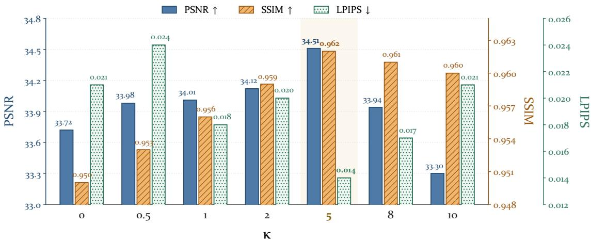  
Figure 7. Sensitivity to the bridge re-coupling strength κ on CelebA $2 \times$ super-resolution.

## H.3 Trajectory-Level Analysis of PBD Components

To analyze the temporal roles of the Posterior Bridge Defect components during sampling, we track the Measurement Defect $\mathcal { M } _ { t } ,$ clean-side Flow-Prior Deviation $\mathcal { F } _ { t } ^ { b }$ , source-side Flow-Prior Deviation $\mathcal { F } _ { t } ^ { a }$ , and Bridge Residual $B _ { t }$ at each sampling step on CelebA $2 \times$ super-resolution, random inpainting, Gaussian deblurring, and box inpainting. All values are normalized by the image dimensionality, and the sampling trajectory is divided into early, middle, and late stages. We compare Clean-Side Only, Same-¯b , Frozen Source, and ReBridge-Flow. Same-¯b , Frozen Source applies the same clean-side anchoring as ReBridge-Flow but keeps the source endpoint fixed at $\hat { a } _ { t } ,$ , thereby isolating the efect of source-side re-coupling. The curves and shaded regions denote the mean and one standard deviation across samples, respectively.

As shown in Figure 8, Same-¯b , Frozen Source and ReBridge-Flow exhibit nearly identical Measurement Defect and clean-side Flow-Prior Deviation, indicating comparable clean-side corrections. Their main diference lies in whether the source endpoint is updated synchronously. The source-side Flow-Prior Deviation of ReBridge-Flow is concentrated in the middle stage and gradually approaches zero at both ends, consistent with the temporal factor $t ( 1 - t )$ in the source update. This controlled source-side correction substantially reduces the Bridge Residual across all four tasks, with the largest diference observed in Gaussian deblurring. In contrast, correcting only the clean endpoint or keeping the source endpoint fixed produces a larger endpoint–state mismatch during the middle stage. These results show that ReBridge-Flow does not merely seek the lowest Measurement Defect. Instead, it uses a controlled source-side adjustment to balance observation consistency, flow-prior preservation, and local bridge compatibility.

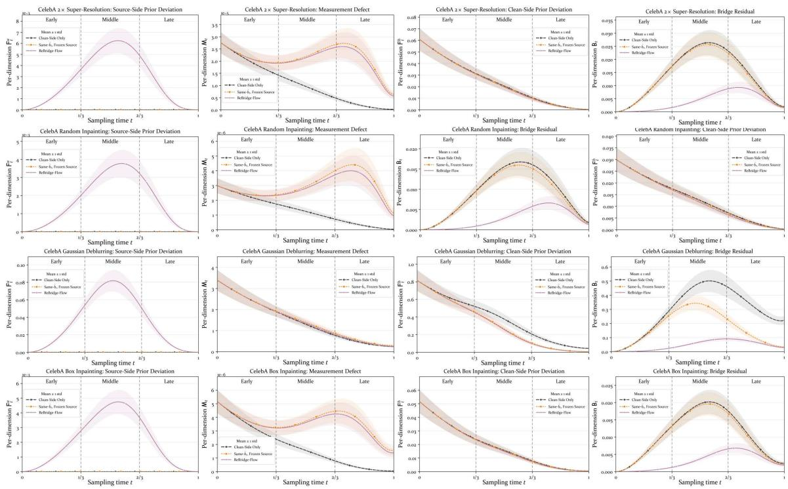  
Figure 8. Mechanism-consistent simulation of the temporal evolution of the PBD components on four CelebA restoration tasks. We compare Clean-Side Only, ${ \mathsf { S a m e } } { \cdot } { \bar { b } } _ { t }$ , Frozen Source, and ReBridge-Flow. Curves show the mean ± one standard deviation over samples.

## H.4 Challenging Tasks

To further evaluate the restoration capability of diferent methods under severe information loss, we conduct additional high-factor super-resolution experiments on CelebA. We randomly select and fix 10 images from the CelebA test set and add Gaussian noise with a standard deviation of $\sigma _ { \mathrm { y } } ~ = ~ 0 . 0 1$ in the measurement space. We compare PnP-Flow, OT-ODE, Flower, Restora-Flow, and ReBridge-Flow.

As shown in Table 8, the quantitative results show that all methods experience performance degradation as the super-resolution factor increases from 4× to 8×, due to the further reduction in observed information. ReBridge-Flow achieves the best overall reconstruction quality at both scales. It also maintains low GPU-memory usage while providing faster inference than Restora-Flow and Flower. As shown in Figure 9, the qualitative results show a consistent trend. PnP-Flow sufers from evident over-smoothing at large upscaling factors. Flower recovers the main facial structures, but some local details remain blurred. OT-ODE and Restora-Flow produce sharper reconstructions, yet still exhibit deviations in facial contours and texture recovery. In contrast, ReBridge-Flow more consistently preserves identity, facial structure, and local details such as hair and glasses. These results indicate that, when the observation contains severely limited information, source–clean endpoint re-coupling helps maintain local transport consistency, thereby reducing structural shifts and detail loss.

Table 8. Quantitative comparison of the large-factor super-resolution task on the CelebA dataset. The best and suboptimal results are highlighted.
<table><tr><td>Scale</td><td>Method</td><td>PSNR ↑</td><td>SSIM ↑</td><td>LPIPS↓</td><td>Time (s/img) ↓</td><td>Peak GPU (GB)↓</td></tr><tr><td rowspan="6"> $4 \times$ </td><td>Degraded</td><td> $2 4 . 1 0 4 \pm 2 . 0 6 2$ </td><td> $0 . 7 7 5 1 \pm 0 . 0 3 3 1$ </td><td> $0 . 2 6 7 4 \pm 0 . 0 4 6 5$ </td><td></td><td></td></tr><tr><td>PnP-Flow</td><td> $2 0 . 2 3 3 \pm 1 . 0 8 3$ </td><td> $0 . 6 3 0 9 \pm 0 . 0 8 2 4$ </td><td> $0 . 3 0 7 3 \pm 0 . 0 8 7 7$ </td><td>1.032</td><td>0.626</td></tr><tr><td>OT-ODE</td><td> $2 8 . 8 6 9 \pm 1 . 6 0 5$ </td><td> $0 . 8 5 6 5 \pm 0 . 0 3 1 7$ </td><td>_  $0 . 0 6 5 3 \pm 0 . 0 3 7 4$ </td><td>1.201</td><td>5.657</td></tr><tr><td>Restora-Flow</td><td> $3 0 . 8 5 2 \pm 1 . 5 4 5$ </td><td> $0 . 8 9 5 1 \pm 0 . 0 2 0 5$ </td><td> $0 . 0 6 9 9 \pm 0 . 0 4 1 3$ </td><td>2.602</td><td>0.622</td></tr><tr><td>Flower</td><td> $3 0 . 8 6 0 \pm 1 . 3 9 1$ </td><td> $0 . 8 9 2 6 \pm 0 . 0 1 9 2$ </td><td> $0 . 0 9 3 7 \pm 0 . 0 4 6 9$ </td><td>6.405</td><td>0.624</td></tr><tr><td>ReBridge-Flow</td><td> $3 1 . 8 0 6 \pm 1 . 6 7 8$ </td><td> $0 . 9 1 6 8 \pm 0 . 0 1 9 9$ </td><td> $0 . 0 4 4 8 \pm 0 . 0 1 6 5$ </td><td>2.041</td><td>0.632</td></tr><tr><td rowspan="6"> $8 \times$ </td><td>Degraded</td><td> $1 8 . 7 7 9 \pm 1 . 9 6 0$ </td><td> $0 . 5 3 4 9 \pm 0 . 0 6 7 3$ </td><td> $0 . 5 0 2 1 \pm 0 . 0 6 8 2$ </td><td></td><td></td></tr><tr><td>PnP-Flow</td><td> $1 3 . 5 1 4 \pm 1 . 7 6 6$ </td><td> $0 . 3 9 8 7 \pm 0 . 0 9 1 0$ </td><td> $0 . 6 3 1 8 \pm 0 . 0 7 5 1$ </td><td>1.032</td><td>0.579</td></tr><tr><td>OT-ODE</td><td> $2 3 . 4 4 7 \pm 1 . 4 1 9$ </td><td> $0 . 6 7 2 2 \pm 0 . 0 6 6 7$ </td><td> $0 . 1 9 9 0 \pm 0 . 0 8 5 0$ </td><td>1.186</td><td>5.610</td></tr><tr><td>Restora-Flow</td><td> $2 5 . 2 3 8 \pm 2 . 0 8 1$ </td><td> $0 . 7 5 3 5 \pm 0 . 0 4 9 1$ </td><td> $0 . 1 8 6 6 \pm 0 . 0 8 1 5$ </td><td>2.605</td><td>0.576</td></tr><tr><td>Flower</td><td> $2 4 . 6 5 2 \pm 2 . 1 1 2$ </td><td> $0 . 7 3 6 7 \pm 0 . 0 4 9 3$ </td><td> $0 . 2 1 3 7 \pm 0 . 0 8 5 0$ </td><td>5.735</td><td>0.578</td></tr><tr><td>ReBridge-Flow</td><td> $2 5 . 7 8 7 \pm 2 . 0 2 4$ </td><td> $0 . 7 7 8 7 \pm 0 . 0 4 8 4$ </td><td> $0 . 0 9 6 3 \pm 0 . 0 2 4 9$ </td><td>1.761</td><td>0.586</td></tr></table>

Input  
OT-ODE  
PnP-Flow  
Restora-Flow  
Flower  
ReBridge-Flow Reference  
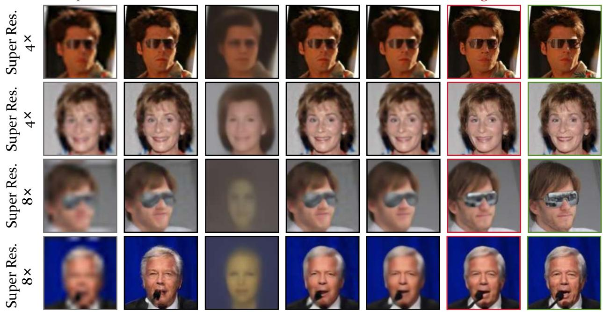  
Figure 9. Qualitative comparison of the large-factor super-resolution task on the CelebA dataset.

Table 9. Hyperparameters used by all compared methods on the CelebA dataset.
<table><tr><td>Method</td><td>Hyperparameter</td><td>Denoising</td><td>Deblurring</td><td>Super- resolution</td><td>Random inpainting</td><td>Box inpainting</td></tr><tr><td rowspan="2">OT-ODE</td><td>to (initial time)</td><td>0.3 time-</td><td>0.4 time-</td><td>0.1</td><td>0.1</td><td>0.1 time-</td></tr><tr><td>γ (guidance schedule)</td><td>dependent</td><td>dependent</td><td>constant</td><td>constant</td><td>dependent</td></tr><tr><td>Flow-Priors</td><td>λ (regularization) η (learning rate)</td><td>100 0.01</td><td>1,000 0.01</td><td>10,000 0.1</td><td>10,000 0.01</td><td>10,000 0.01</td></tr><tr><td rowspan="3">D-Flow</td><td></td><td></td><td></td><td></td><td></td><td></td></tr><tr><td>λ (regularization)</td><td>0.001</td><td>0.001</td><td>0.001</td><td>0.01 0.1</td><td>0.001</td></tr><tr><td>α (blending) (number of iterations)  $n _ { \mathrm { i t e r } }$ </td><td>0.1 3</td><td>0.1 7</td><td>0.1 10</td><td>20</td><td>0.1 9</td></tr><tr><td rowspan="2">PnP-Flow</td><td></td><td></td><td></td><td></td><td></td><td></td></tr><tr><td>α (learning-rate factor) N (number of time steps)</td><td>0.8 100</td><td>0.01 100</td><td>0.3 100</td><td>0.01 100</td><td>0.5 100</td></tr><tr><td rowspan="2">Restora-Flow</td><td></td><td></td><td></td><td></td><td></td><td></td></tr><tr><td>C (number of corrections) N (number of ODE steps)</td><td>1 64</td><td>1 128</td><td>1 128</td><td>1 128</td><td>1 64</td></tr><tr><td rowspan="2">Flower</td><td></td><td></td><td></td><td></td><td></td><td></td></tr><tr><td>γ (refinement uncertainty) N (number of time steps)</td><td>0 100</td><td>0 100</td><td>0 100</td><td>0</td><td>0</td></tr><tr><td rowspan="3">ReBridge-Flow</td><td></td><td></td><td></td><td></td><td>100</td><td>100</td></tr><tr><td>ρ (clean-side prior weight)</td><td>1</td><td>1 1</td><td>1 1</td><td>1</td><td>1</td></tr><tr><td>λ (source-side prior weight)</td><td>1</td><td>5</td><td>5</td><td>1</td><td>1</td></tr><tr><td rowspan="2"></td><td>κ (bridge re-coupling weight)</td><td>5</td><td></td><td></td><td>5</td><td>5</td></tr><tr><td>K (number of sampling steps)</td><td>100</td><td>100</td><td>100</td><td>100</td><td>100</td></tr></table>

Table 10. Hyperparameters used by all compared methods on the AFHQ-Cat dataset.
<table><tr><td>Method</td><td>Hyperparameter</td><td>Denoising</td><td>Deblurring</td><td>Super- resolution</td><td>Random inpainting</td><td>Box inpainting</td></tr><tr><td rowspan="2">OT-ODE</td><td>to (initial time)</td><td>0.3</td><td>0.3</td><td>0.1</td><td>0.1</td><td>0.1</td></tr><tr><td>γ (guidance schedule)</td><td>time- dependent</td><td>time- dependent</td><td>constant</td><td>constant</td><td>time- dependent</td></tr><tr><td>Flow-Priors</td><td>λ (regularization) η (learning rate)</td><td>100 0.01</td><td>1,000 0.01</td><td>10,000 0.1</td><td>10,000 0.01</td><td>10,000 0.01</td></tr><tr><td rowspan="3">D-Flow</td><td>λ (regularization)</td><td></td><td></td><td></td><td></td><td></td></tr><tr><td></td><td>0.001</td><td>0.01</td><td>0.001</td><td>0.001</td><td>0.01</td></tr><tr><td>α (blending) (number of iterations)  $n _ { \mathrm { i t e r } }$ </td><td>0.1 3</td><td>0.5 20</td><td>0.1 20</td><td>0.1 20</td><td>0.1</td></tr><tr><td rowspan="2">PnP-Flow</td><td></td><td></td><td></td><td></td><td></td><td>9</td></tr><tr><td>α (learning-rate factor) N (number of time steps)</td><td>0.8 100</td><td>0.01 500</td><td>0.01 500</td><td>0.01</td><td>0.5</td></tr><tr><td rowspan="2">Restora-Flow</td><td></td><td></td><td></td><td></td><td>200</td><td>100</td></tr><tr><td>C (number of corrections) N (number of ODE steps)</td><td>1 64</td><td>1</td><td>1 256</td><td>1</td><td>1</td></tr><tr><td rowspan="2">Flower</td><td></td><td></td><td>128</td><td></td><td>128</td><td>64</td></tr><tr><td>γ (refinement uncertainty) N (number of time steps)</td><td>0 100</td><td>0</td><td>0</td><td>0</td><td>0</td></tr><tr><td rowspan="4">ReBridge-Flow</td><td></td><td></td><td>100</td><td>500</td><td>200</td><td>100</td></tr><tr><td>ρ (clean-side prior weight)</td><td>1</td><td>1</td><td>1</td><td>1</td><td>1</td></tr><tr><td>λ (source-side prior weight)</td><td>1</td><td>1</td><td>1 5</td><td>1</td><td>1</td></tr><tr><td>κ (bridge re-coupling weight) K (number of sampling steps)</td><td>5 100</td><td>5 100</td><td>100</td><td>5 100</td><td>5 100</td></tr></table>

## I More Quantitative and Qualitative Results

In this section, we provide the complete quantitative comparison results of ReBridge-Flow on the medical image datasets: IXI-Brain, PMUB, and X-Ray Hand, as shown in Table 15. Furthermore, we provide additional qualitative comparison results for ReBridge-Flow, as illustrated in Figures 10-36.

Table 11. Hyperparameters used by all compared methods on the COCO dataset.
<table><tr><td>Method</td><td>Hyperparameter</td><td>Denoising</td><td>Deblurring</td><td>Super- resolution</td><td>Random inpainting</td><td>Box inpainting</td></tr><tr><td>OT-ODE</td><td> $t _ { 0 }$  (initial time)</td><td>0.3 time-</td><td>0.4 time-</td><td>0.1</td><td>0.1</td><td>0.1 time-</td></tr><tr><td></td><td>γ (guidance schedule)</td><td>dependent</td><td>dependent</td><td>constant</td><td>constant</td><td>dependent</td></tr><tr><td>Flow-Priors</td><td>λ (regularization) η (learning rate)</td><td>100 0.01</td><td>1,000 0.01</td><td>10,000 0.1</td><td>10,000 0.01</td><td>10,000 0.01</td></tr><tr><td>D-Flow</td><td>λ(regularization)</td><td>0.001</td><td>0.001</td><td>0.001</td><td>0.01</td><td>0.001</td></tr><tr><td></td><td>α (blending) (number of iterations)</td><td>0.1 3</td><td>0.1 7</td><td>0.1</td><td>0.1 20</td><td>0.1 9</td></tr><tr><td></td><td> $n _ { \mathrm { i t e r } }$ </td><td></td><td></td><td>10</td><td></td><td></td></tr><tr><td>PnP-Flow</td><td>α (learning-rate factor)</td><td>0.8</td><td>0.01</td><td>0.3</td><td>0.01</td><td>0.5</td></tr><tr><td></td><td>N (number of time steps)</td><td>100</td><td>100</td><td>100</td><td>100</td><td>100</td></tr><tr><td></td><td>C (number of corrections)</td><td>1</td><td>1</td><td>1</td><td>1</td><td>1</td></tr><tr><td>Restora-Flow</td><td>N (number of ODE steps)</td><td>64</td><td>128</td><td>128</td><td>128</td><td>64</td></tr><tr><td></td><td></td><td></td><td></td><td></td><td></td><td></td></tr><tr><td>Flower</td><td>γ (refinement uncertainty)</td><td>0</td><td>0</td><td>0</td><td>0</td><td>0</td></tr><tr><td></td><td>N (number of time steps)</td><td>100</td><td>100</td><td>100</td><td>100</td><td>100</td></tr><tr><td></td><td>ρ (clean-side prior weight)</td><td>1</td><td>1</td><td>1</td><td>1</td><td>1</td></tr><tr><td></td><td>λ (source-side prior weight)</td><td>1</td><td>1</td><td>1</td><td>1</td><td>1</td></tr><tr><td>ReBridge-Flow</td><td>κ (bridge re-coupling weight)</td><td>5</td><td>5</td><td>5</td><td>5</td><td>5</td></tr><tr><td></td><td>K (number of sampling steps)</td><td>100</td><td>100</td><td>100</td><td>100</td><td>100</td></tr></table>

Table 12. Hyperparameters used by all compared methods on the IXI-Brain dataset.
<table><tr><td>Method</td><td>Hyperparameter</td><td>Denoising</td><td>Super- resolution</td><td>Random inpainting</td><td>Box inpainting</td></tr><tr><td rowspan="2">OT-ODE</td><td> $t _ { 0 }$  (initial time)</td><td>0.3</td><td>0.1</td><td>0.1</td><td>0.1</td></tr><tr><td>γ (guidance schedule)</td><td>time- dependent</td><td>constant</td><td>constant</td><td>time- dependent</td></tr><tr><td>Flow-Priors</td><td>λ (regularization) η (learning rate)</td><td>100 0.01</td><td>10,000 0.1</td><td>10,000 0.01</td><td>10,000 0.01</td></tr><tr><td>D-Flow</td><td>λ (regularization) α (blending)</td><td>0.001 0.1</td><td>0.001 0.1</td><td>0.001 0.1</td><td>0.01 0.1</td></tr><tr><td>PnP-Flow</td><td> $n _ { \mathrm { i t e r } }$  (number of iterations) α (learning-rate factor)</td><td>3 0.8</td><td>20 0.01</td><td>20 0.01</td><td>9 0.5</td></tr><tr><td>Restora-Flow</td><td>N (number of time steps) C (number of corrections)</td><td>100 1</td><td>500 1</td><td>200 1</td><td>100 1</td></tr><tr><td>Flower</td><td>N (number of ODE steps) γ (refinement uncertainty)</td><td>64</td><td>64</td><td>32</td><td>32</td></tr><tr><td></td><td>N (number of time steps)</td><td>0 100</td><td>0 500</td><td>0 200</td><td>0 100</td></tr><tr><td>ReBridge-Flow K (number of sampling steps)</td><td>ρ (clean-side prior weight) λ (source-side prior weight) κ (bridge re-coupling weight)</td><td>1 1 5</td><td>1 1 5</td><td>1 1 5</td><td>1 1 5</td></tr></table>

Table 13. Hyperparameters used by all compared methods on the PMUB dataset.
<table><tr><td>Method</td><td>Hyperparameter</td><td>Denoising</td><td>Super- resolution</td><td>Random inpainting</td><td>Box inpainting</td></tr><tr><td>OT-ODE</td><td> $t _ { 0 }$  (initial time)</td><td>0.3 time-</td><td>0.1</td><td>0.1</td><td>0.1 time-</td></tr><tr><td></td><td>γ (guidance schedule)</td><td>dependent</td><td>constant</td><td>constant</td><td>dependent</td></tr><tr><td>Flow-Priors</td><td>λ (regularization) η (learning rate)</td><td>100 0.01</td><td>10,000 0.1</td><td>10,000 0.01</td><td>10,000 0.01</td></tr><tr><td></td><td>λ (regularization)</td><td>0.001</td><td>0.001</td><td>0.001</td><td>0.01</td></tr><tr><td>D-Flow</td><td>α (blending)</td><td>0.1</td><td>0.1</td><td>0.1</td><td>0.1</td></tr><tr><td></td><td>(number of iterations)  $n _ { \mathrm { i t e r } }$ </td><td>3</td><td>20</td><td>20</td><td>9</td></tr><tr><td>PnP-Flow</td><td>α (learning-rate factor)</td><td>0.8</td><td>0.01</td><td>0.01</td><td>0.5</td></tr><tr><td></td><td>N (number of time steps)</td><td>100</td><td>500</td><td>200</td><td>100</td></tr><tr><td></td><td></td><td></td><td></td><td></td><td></td></tr><tr><td>Restora-Flow</td><td>C (number of corrections) N (number of ODE steps)</td><td>1 64</td><td>1 64</td><td>1</td><td>1</td></tr><tr><td></td><td></td><td></td><td></td><td>32</td><td>32</td></tr><tr><td>Flower</td><td>γ (refinement uncertainty)</td><td>0</td><td>0</td><td>0</td><td>0</td></tr><tr><td></td><td>N (number of time steps)</td><td>100</td><td>500</td><td>200</td><td>100</td></tr><tr><td></td><td>ρ (clean-side prior weight)</td><td>1</td><td>1</td><td>1</td><td>1</td></tr><tr><td>ReBridge-Flow</td><td>λ (source-side prior weight)</td><td>1</td><td>1</td><td>1</td><td>1</td></tr><tr><td></td><td>κ (bridge re-coupling weight)</td><td>5</td><td>5</td><td>5</td><td>5</td></tr><tr><td></td><td>K (number of sampling steps)</td><td>100</td><td>100</td><td>100</td><td>100</td></tr></table>

Table 14. Hyperparameters used by all compared methods on the X-Ray Hand dataset.
<table><tr><td>Method</td><td>Hyperparameter</td><td>Denoising</td><td>Super- resolution</td><td>Random inpainting</td><td>Box inpainting</td></tr><tr><td rowspan="2">OT-ODE</td><td> $t _ { 0 }$  (initial time)</td><td>0.3</td><td>0.1</td><td>0.1</td><td>0.1</td></tr><tr><td>γ (guidance schedule)</td><td>time- dependent</td><td>constant</td><td>constant</td><td>time- dependent</td></tr><tr><td>Flow-Priors</td><td>λ (regularization) η (learning rate)</td><td>100 0.01</td><td>10,000 0.1</td><td>10,000 0.01</td><td>10,000 0.01</td></tr><tr><td>D-Flow</td><td>λ (regularization) α (blending)</td><td>0.001 0.1</td><td>0.001 0.1</td><td>0.001 0.1</td><td>0.01 0.1</td></tr><tr><td>PnP-Flow</td><td> $n _ { \mathrm { i t e r } }$  (number of iterations) α (learning-rate factor)</td><td>3 0.8</td><td>20 0.01</td><td>20 0.01</td><td>9 0.5</td></tr><tr><td></td><td>N (number of time steps)</td><td>100</td><td>500</td><td>200</td><td>100</td></tr><tr><td>Restora-Flow</td><td>C (number of corrections) N (number of ODE steps)</td><td>1 64</td><td>1 64</td><td>1 32</td><td>1 32</td></tr><tr><td>Flower</td><td>γ (refinement uncertainty) N (number of time steps)</td><td>0 100</td><td>0 500</td><td>0 200</td><td>0 100</td></tr><tr><td>ReBridge-Flow K (number of sampling steps)</td><td>ρ (clean-side prior weight) λ (source-side prior weight) κ (bridge re-coupling weight)</td><td>1 1 5</td><td>1 1 5</td><td>1 1 5</td><td>1 1</td></tr></table>

Table 15. Quantitative comparison on IXI-Brain, PMUB, and X-Ray Hand under diferent medical image restoration tasks. The best and suboptimal results are highlighted.
<table><tr><td colspan="10"></td></tr><tr><td rowspan="2">Model</td><td colspan="3">Denoising  $\sigma _ { \mathbf { y } } = 0 . 0 8$ </td><td colspan="3">IXI-Brain Super Res. 2×</td><td colspan="2">Rand. Inpaint. 30%</td><td colspan="3">Box Inpaint.  $3 2 \times 3 2$ </td></tr><tr><td>PSNR↑</td><td>SSIM↑</td><td>LPIPS↓</td><td>PSNR↑</td><td>SSIM↑</td><td>LPIPS↓</td><td>PSNR↑ SSIM↑</td><td>LPIPS↓</td><td>PSNR↑</td><td>SSIM↑</td><td>LPIPS↓</td></tr><tr><td>Degraded</td><td> $2 1 . 8 9 _ { ( 0 . 1 1 ) }$ </td><td> $0 . 2 3 8 _ { ( 0 . 0 4 7 ) }$ </td><td> $0 . 3 1 3 _ { ( 0 . 1 2 7 ) }$ </td><td> $1 4 . 8 3 _ { ( 1 . 1 2 ) }$ </td><td> $0 . 5 6 3 _ { ( 0 . 0 7 8 ) }$ </td><td> $0 . 3 6 5 _ { ( 0 . 1 4 0 ) }$ </td><td> $8 . 8 4 _ { ( 0 . 2 6 ) }$   $0 . 0 7 2 _ { ( 0 . 0 1 5 ) }$ </td><td> $1 . 0 7 6 _ { ( 0 . 2 5 0 ) }$ </td><td> $2 1 . 7 0 _ { ( 1 . 1 4 ) }$ </td><td> $0 . 8 9 4 _ { ( 0 . 0 0 9 ) }$ </td><td> $0 . 1 0 8 _ { ( 0 . 0 4 7 ) }$ </td></tr><tr><td>OT-ODE [TMLR2024]</td><td> $3 3 . 1 1 _ { ( 1 . 1 7 ) }$   $0 . 8 7 7 _ { ( 0 . 0 1 7 ) }$ </td><td></td><td> $0 . 0 2 3 _ { ( 0 . 0 1 0 ) }$ </td><td> $2 2 . 0 7 _ { ( 1 . 6 6 ) }$ </td><td> $0 . 7 1 3 _ { ( 0 . 0 5 9 ) }$   $0 . 1 1 0 _ { ( 0 . 0 5 0 ) }$ </td><td>28.53(3.61)</td><td> $0 . 8 3 7 _ { ( 0 . 1 9 2 ) }$ </td><td>0.083(0.042)</td><td> $2 4 . 2 5 _ { ( 3 . 6 9 ) }$ </td><td> $0 . 9 0 1 _ { ( 0 . 0 1 7 ) }$ </td><td> $0 . 0 7 3 _ { ( 0 . 0 2 5 ) }$ </td></tr><tr><td>Flow-Priors [NeurIPS2024]</td><td> $2 5 . 1 7 _ { ( 1 . 9 6 ) }$ </td><td> $0 . 8 3 9 _ { ( 0 . 0 3 5 ) }$ </td><td> $0 . 0 6 9 _ { ( 0 . 0 2 5 ) }$ </td><td> $2 4 . 3 1 _ { ( 1 . 2 8 ) }$ </td><td> $0 . 8 2 4 _ { ( 0 . 0 2 8 ) }$ </td><td> $0 . 0 7 1 _ { ( 0 . 0 3 3 ) }$   $2 9 . 6 3 _ { ( 1 . 8 3 ) }$ </td><td> $0 . 9 1 9 _ { ( 0 . 0 1 8 ) }$ </td><td> $0 . 0 3 2 _ { ( 0 . 0 1 6 ) }$ </td><td> $2 7 . 2 5 _ { ( 2 . 6 1 ) }$ </td><td> $0 . 9 2 5 _ { ( 0 . 0 1 4 ) }$ </td><td>0.042(0.018)</td></tr><tr><td>D-Flow [PMLR2024]</td><td> $2 7 . 0 2 _ { ( 1 . 3 7 ) }$   $0 . 8 3 5 _ { ( 0 . 0 6 0 ) }$ </td><td></td><td> $0 . 0 9 5 _ { ( 0 . 0 3 5 ) }$ </td><td> $1 9 . 5 3 _ { ( 0 . 6 8 ) }$ </td><td> $0 . 6 5 4 _ { ( 0 . 0 1 6 ) }$ </td><td> $0 . 2 7 6 _ { ( 0 . 1 3 2 ) }$ </td><td> $2 8 . 5 2 _ { ( 0 . 7 4 ) }$   $0 . 7 9 4 _ { ( 0 . 0 2 6 ) }$ </td><td> $0 . 0 9 1 _ { ( 0 . 0 3 7 ) }$ </td><td> $2 2 . 7 0 _ { ( 1 . 4 4 ) }$ </td><td> $0 . 7 8 5 _ { ( 0 . 0 6 4 ) }$ </td><td>0.087(0.038)</td></tr><tr><td>PnP-Flow [ICLR2025]</td><td> $3 3 . 9 0 _ { ( 1 . 1 5 ) }$   $0 . 9 3 0 _ { ( 0 . 0 1 8 ) }$ </td><td></td><td> $0 . 0 4 0 _ { ( 0 . 0 1 9 ) }$ </td><td> $2 1 . 3 4 _ { ( 1 . 5 5 ) }$ </td><td> $0 . 7 2 4 _ { ( 0 . 0 7 0 ) }$ </td><td> $0 . 1 9 2 _ { ( 0 . 0 8 9 ) }$ </td><td>32.35(1.30)  $0 . 9 4 2 _ { ( 0 . 0 1 5 ) }$ </td><td> $0 . 0 3 2 _ { ( 0 . 0 1 3 ) }$ </td><td> $2 6 . 3 0 _ { ( 3 . 6 7 ) }$ </td><td> $0 . 9 1 3 _ { ( 0 . 0 1 8 ) }$ </td><td> $0 . 0 5 7 _ { ( 0 . 0 2 3 ) }$ </td></tr><tr><td>Restora-Flow [WACV2026]</td><td> $2 9 . 8 7 _ { ( 1 . 0 9 ) }$   $0 . 8 5 2 _ { ( 0 . 0 2 8 ) }$ </td><td></td><td> $0 . 0 5 3 _ { ( 0 . 0 1 9 ) }$ </td><td> $2 2 . 2 4 _ { ( 1 . 5 4 ) }$ </td><td>0.768(0.067)</td><td> $0 . 1 5 0 _ { ( 0 . 0 5 7 ) }$ </td><td> $3 0 . 0 3 _ { ( 1 . 2 7 ) }$   $0 . 9 1 4 _ { ( 0 . 0 2 2 ) }$ </td><td> $0 . 0 3 6 _ { ( 0 . 0 1 8 ) }$ </td><td> $2 5 . 9 2 _ { ( 3 . 3 2 ) }$ </td><td> $0 . 9 2 0 _ { ( 0 . 0 1 6 ) }$ </td><td>0.040(0.015)</td></tr><tr><td>Flower [ICLR2026]</td><td> $3 2 . 5 4 _ { ( 1 . 2 4 ) }$   $0 . 9 0 7 _ { ( 0 . 0 2 5 ) }$ </td><td></td><td> $0 . 0 3 5 _ { ( 0 . 0 1 5 ) }$ </td><td> $2 4 . 2 6 _ { ( 1 . 4 5 ) }$ </td><td>0.865(0.062)</td><td> $0 . 1 0 7 _ { ( 0 . 0 5 0 ) }$ </td><td>32.46(1.43)  $0 . 9 3 3 _ { ( 0 . 0 1 7 ) }$ </td><td> $0 . 0 2 8 _ { ( 0 . 0 1 2 ) }$ </td><td> $2 6 . 6 2 _ { ( 3 . 5 7 ) }$ </td><td> $0 . 9 1 5 _ { ( 0 . 0 1 6 ) }$ </td><td>0.053(0.019)</td></tr><tr><td>ReBridge-Flow [Ours]</td><td> $3 4 . 0 6 _ { ( 1 . 3 8 ) }$ </td><td> $0 . 9 4 2 _ { ( 0 . 0 1 9 ) }$ </td><td> $0 . 0 2 2 _ { ( 0 . 0 0 9 ) }$ </td><td> $2 6 . 3 9 _ { ( 1 . 9 9 ) }$ </td><td>0.889(0.013)</td><td> $0 . 0 7 6 _ { ( 0 . 0 3 0 ) }$ </td><td>33.73(2.46) 0.954(0.001)</td><td> $0 . 0 2 1 _ { ( 0 . 0 1 1 ) }$ </td><td> $2 8 . 2 1 _ { ( 4 . 1 6 ) }$ </td><td> $0 . 9 3 9 _ { ( 0 . 0 0 2 ) }$ </td><td> $0 . 0 2 8 _ { ( 0 . 0 1 1 ) }$ </td></tr><tr><td></td><td></td><td></td><td></td><td></td><td>PMUB</td><td></td><td></td><td></td><td></td><td></td><td></td></tr></table>

<table><tr><td rowspan="2">Model</td><td colspan="2">Denoising  $\sigma _ { \mathbf { y } } = 0 . 0 8$ </td><td colspan="2"></td><td colspan="2">Super Res. 2×</td><td colspan="2">Rand. Inpaint. 30%</td><td colspan="3">Box Inpaint.  $6 0 \times 6 0$ </td></tr><tr><td>PSNR↑</td><td>SSIM↑</td><td>LPIPS↓</td><td>PSNR↑ SSIM↑</td><td></td><td>LPIPS↓ PSNR↑</td><td>SSIM↑</td><td>LPIPS↓</td><td>PSNR↑</td><td>SSIM↑</td><td>LPIPS↓</td></tr><tr><td>Degraded</td><td> $2 1 . 5 0 _ { ( 1 . 6 1 ) }$   $0 . 7 5 1 _ { ( 0 . 0 9 8 ) }$ </td><td></td><td> $0 . 0 8 5 _ { ( 0 . 0 3 4 ) }$ </td><td> $8 . 9 3 _ { ( 2 . 6 0 ) }$  0.132(0.028)</td><td> $0 . 5 9 2 _ { ( 0 . 2 2 6 ) }$ </td><td> $1 4 . 7 1 _ { ( 1 . 2 4 ) }$ </td><td>0.410(0.128)</td><td> $0 . 6 0 6 _ { ( 0 . 2 5 0 ) }$ </td><td> $1 2 . 7 9 _ { ( 2 . 1 1 ) }$ </td><td>0.848(0.011)</td><td> $0 . 0 7 5 _ { ( 0 . 0 3 1 ) }$ </td></tr><tr><td>OT-ODE [TMLR2024]</td><td> $2 6 . 4 9 _ { ( 1 . 2 5 ) }$   $0 . 8 9 9 _ { ( 0 . 0 4 1 ) }$ </td><td> $0 . 0 2 6 _ { ( 0 . 0 1 1 ) }$ </td><td> $1 5 . 2 3 _ { ( 1 . 8 9 ) }$ </td><td>0.581(0.063)</td><td> $0 . 1 2 4 _ { ( 0 . 0 4 8 ) }$ </td><td> $2 4 . 4 8 _ { ( 2 . 4 9 ) }$ </td><td></td><td>0.906(0.036) 0.020(0.009)</td><td> $1 7 . 1 6 _ { ( 1 . 8 0 ) }$ </td><td> $0 . 9 3 0 _ { ( 0 . 0 3 8 ) }$ </td><td>0.058(0.024)</td></tr><tr><td>Flow-Priors [NeurIPS2024]</td><td> $2 5 . 9 5 _ { ( 1 . 4 1 ) }$   $0 . 9 0 8 _ { ( 0 . 0 3 8 ) }$ </td><td> $0 . 0 3 1 _ { ( 0 . 0 1 2 ) }$ </td><td></td><td>18.59(1.28) 0.726(0.053)</td><td> $0 . 0 5 2 _ { ( 0 . 0 2 1 ) }$ </td><td> $2 8 . 4 4 _ { ( 2 . 7 5 ) }$ </td><td></td><td>0.967(0.007)00(0.004)</td><td> $1 8 . 3 1 _ { ( 2 . 5 3 ) }$ </td><td> $0 . 9 4 9 _ { ( 0 . 0 1 2 ) }$ </td><td>0.046(0.020)</td></tr><tr><td>D-Flow [PMLR2024]</td><td> $2 2 . 9 6 _ { ( 1 . 7 1 ) }$   $0 . 7 8 6 _ { ( 0 . 0 7 3 ) }$ </td><td> $0 . 0 9 0 _ { ( 0 . 0 3 7 ) }$ </td><td></td><td>18.18(2.16) 0.714(0.034)</td><td> $0 . 0 4 8 _ { ( 0 . 0 1 8 ) }$ </td><td> $2 7 . 1 6 _ { ( 1 . 7 6 ) }$ </td><td> $0 . 9 3 6 _ { ( 0 . 0 2 5 ) }$ </td><td> $0 . 0 0 8 _ { ( 0 . 0 0 4 ) }$ </td><td> $1 7 . 8 1 _ { ( 2 . 2 3 ) }$ </td><td> $0 . 8 6 7 _ { ( 0 . 0 3 7 ) }$ </td><td>0.049(0.021)</td></tr><tr><td>PnP-Flow [ICLR2025]</td><td> $2 8 . 6 9 _ { ( 1 . 3 2 ) }$   $0 . 9 3 2 _ { ( 0 . 0 3 8 ) }$ </td><td> $0 . 0 1 1 _ { ( 0 . 0 0 5 ) }$ </td><td> $1 9 . 7 3 _ { ( 2 . 0 7 ) }$ </td><td>0.802(0.021)</td><td> $0 . 0 6 1 _ { ( 0 . 0 2 5 ) }$ </td><td> $2 6 . 7 9 _ { ( 1 . 4 4 ) }$ </td><td> $0 . 9 3 1 _ { ( 0 . 0 2 1 ) }$ </td><td> $0 . 0 2 5 _ { ( 0 . 0 1 0 ) }$ </td><td> $1 9 . 2 2 _ { ( 2 . 3 0 ) }$ </td><td> $0 . 9 3 5 _ { ( 0 . 0 1 6 ) }$ </td><td> $0 . 0 5 2 _ { ( 0 . 0 2 3 ) }$ </td></tr><tr><td>Restora-Flow [WACV2026]</td><td> $2 4 . 1 6 _ { ( 1 . 4 3 ) }$   $0 . 8 6 4 _ { ( 0 . 0 7 5 ) }$ </td><td> $0 . 0 1 6 _ { ( 0 . 0 0 7 ) }$ </td><td> $1 8 . 1 7 _ { ( 1 . 9 4 ) }$ </td><td>0.726(0.030)</td><td> $0 . 0 6 0 _ { ( 0 . 0 2 7 ) }$ </td><td> $2 4 . 3 2 _ { ( 1 . 2 2 ) }$ </td><td> $0 . 8 8 2 _ { ( 0 . 0 3 5 ) }$ </td><td> $0 . 0 2 1 _ { ( 0 . 0 1 0 ) }$ </td><td> $1 7 . 5 5 _ { ( 2 . 1 0 ) }$ </td><td> $0 . 8 9 0 _ { ( 0 . 0 3 1 ) }$ </td><td> $0 . 0 4 4 _ { ( 0 . 0 1 7 ) }$ </td></tr><tr><td>Flower [ICLR2026]</td><td> $2 6 . 1 8 _ { ( 1 . 4 9 ) }$   $0 . 9 0 7 _ { ( 0 . 0 4 1 ) }$ </td><td> $0 . 0 2 5 _ { ( 0 . 0 0 9 ) }$ </td><td> $1 9 . 2 8 _ { ( 2 . 0 1 ) }$ </td><td>0.786(0.032)</td><td> $0 . 0 6 4 _ { ( 0 . 0 2 6 ) }$ </td><td> $2 7 . 6 6 _ { ( 1 . 3 7 ) }$ </td><td> $0 . 9 3 8 _ { ( 0 . 0 2 5 ) }$ </td><td> $0 . 0 2 4 _ { ( 0 . 0 1 2 ) }$ </td><td> $1 8 . 4 9 _ { ( 2 . 2 9 ) }$ </td><td> $0 . 9 1 9 _ { ( 0 . 0 1 6 ) }$ </td><td>0.057(0.022)</td></tr><tr><td>ReBridge-Flow [Ours]</td><td> $2 9 . 0 3 _ { ( 1 . 5 0 ) }$   $0 . 9 3 6 _ { ( 0 . 0 1 8 ) }$ </td><td>0.014(0.006)</td><td> $2 0 . 0 9 _ { ( 2 . 0 7 ) }$ </td><td></td><td></td><td></td><td></td><td> $0 . 0 0 7 _ { ( 0 . 0 0 4 ) }$ </td><td> $1 9 . 3 0 _ { ( 5 . 1 7 ) }$ </td><td> $0 . 9 5 1 _ { ( 0 . 0 0 5 ) }$ </td><td> $0 . 0 4 1 _ { ( 0 . 0 1 5 ) }$ </td></tr><tr><td></td><td colspan="9">0.826(0.01)04(0.019)29.35(1.51)0.967(0.006)</td><td></td></tr></table>

<table><tr><td rowspan="2">Model</td><td colspan="2">Denoising  $\sigma _ { \mathbf { y } } = 0 . 0 8$ </td><td colspan="2">Super Res. 2×</td><td colspan="2"></td><td colspan="2">Rand. Inpaint. 30%</td><td colspan="2">Box Inpaint.</td><td colspan="2"> $3 2 \times 3 2$ </td></tr><tr><td>PSNR↑</td><td>SSIM↑</td><td>LPIPS↓</td><td>PSNR↑</td><td>SSIM↑</td><td>LPIPS↓</td><td>PSNR↑</td><td>SSIM↑</td><td>LPIPS↓</td><td>PSNR↑</td><td>SSIM↑</td><td>LPIPS↓</td></tr><tr><td>Degraded</td><td> $2 0 . 6 2 _ { ( 0 . 9 3 ) }$   $0 . 4 6 1 _ { ( 0 . 0 4 5 ) }$ </td><td></td><td> $0 . 3 1 0 _ { ( 0 . 1 1 2 ) }$ </td><td> $9 . 3 7 _ { ( 0 . 6 0 ) }$ </td><td> $0 . 2 4 2 _ { ( 0 . 0 6 9 ) }$ </td><td> $0 . 5 0 2 _ { ( 0 . 1 9 8 ) }$ </td><td>11.00(0.90) 0.137(0.031)</td><td></td><td> $1 . 1 0 0 _ { ( 0 . 2 5 0 ) }$ </td><td> $1 9 . 9 4 _ { ( 1 . 2 4 ) }$ </td><td> $0 . 6 3 1 _ { ( 0 . 0 7 0 ) }$ </td><td> $0 . 3 0 3 _ { ( 0 . 1 2 7 ) }$ </td></tr><tr><td>OT-ODE [TMLR2024]</td><td> $2 9 . 6 9 _ { ( 1 . 7 9 ) }$   $0 . 8 8 5 _ { ( 0 . 0 7 2 ) }$ </td><td></td><td> $0 . 0 2 7 _ { ( 0 . 0 1 1 ) }$ </td><td> $1 8 . 7 8 _ { ( 1 . 6 4 ) }$   $0 . 4 5 1 _ { ( 0 . 0 6 7 ) }$ </td><td></td><td> $0 . 1 5 2 _ { ( 0 . 0 6 3 ) }$ </td><td> $2 1 . 0 8 _ { ( 1 . 9 9 ) }$ </td><td>0.568(0.080)</td><td> $0 . 1 3 6 _ { ( 0 . 0 6 8 ) }$ </td><td> $2 4 . 9 6 _ { ( 3 . 7 0 ) }$ </td><td> $0 . 8 4 7 _ { ( 0 . 0 9 5 ) }$ </td><td>0.045(0.016)</td></tr><tr><td>Flow-Priors [NeurIPS2024]</td><td> $2 4 . 0 4 _ { ( 2 . 5 2 ) }$   $0 . 8 5 8 _ { ( 0 . 0 6 7 ) }$ </td><td></td><td> $0 . 0 5 4 _ { ( 0 . 0 2 4 ) }$ </td><td> $2 1 . 8 4 _ { ( 1 . 3 8 ) }$   $0 . 8 1 0 _ { ( 0 . 0 6 2 ) }$ </td><td></td><td> $0 . 0 6 8 _ { ( 0 . 0 3 1 ) }$ </td><td>17.96(2.77)</td><td> $0 . 7 4 7 _ { ( 0 . 0 7 5 ) }$ </td><td> $0 . 0 9 9 _ { ( 0 . 0 4 7 ) }$ </td><td> $2 1 . 7 8 _ { ( 2 . 5 8 ) }$ </td><td> $0 . 8 1 4 _ { ( 0 . 0 7 2 ) }$ </td><td>0.063(0.026)</td></tr><tr><td>D-Flow [PMLR2024]</td><td> $2 3 . 7 7 _ { ( 1 . 9 1 ) }$   $0 . 7 4 3 _ { ( 0 . 0 7 9 ) }$ </td><td></td><td> $0 . 0 6 5 _ { ( 0 . 0 2 5 ) }$ </td><td> $2 2 . 6 0 _ { ( 2 . 9 6 ) }$ </td><td> $0 . 7 9 2 _ { ( 0 . 1 1 3 ) }$ </td><td> $0 . 0 7 0 _ { ( 0 . 0 3 1 ) }$ </td><td>16.55(2.86)</td><td> $0 . 6 3 9 _ { ( 0 . 1 2 2 ) }$ </td><td> $0 . 1 2 5 _ { ( 0 . 0 6 7 ) }$ </td><td> $2 0 . 9 0 _ { ( 2 . 4 0 ) }$ </td><td> $0 . 7 8 2 _ { ( 0 . 0 7 9 ) }$ </td><td>0.070(0.025)</td></tr><tr><td>PnP-Flow [ICLR2025]</td><td> $3 0 . 8 1 _ { ( 1 . 8 8 ) }$   $0 . 8 9 6 _ { ( 0 . 0 7 4 ) }$ </td><td></td><td> $0 . 0 2 3 _ { ( 0 . 0 1 0 ) }$ </td><td> $2 4 . 2 6 _ { ( 2 . 3 0 ) }$  0.855(0.070)</td><td></td><td> $0 . 0 5 6 _ { ( 0 . 0 2 4 ) }$ </td><td>23.68(2.15)</td><td> $0 . 8 3 0 _ { ( 0 . 0 6 7 ) }$ </td><td> $0 . 0 6 0 _ { ( 0 . 0 2 6 ) }$ </td><td> $2 4 . 3 3 _ { ( 2 . 5 0 ) }$ </td><td> $0 . 8 3 8 _ { ( 0 . 0 8 1 ) }$ </td><td>0.053(0.020)</td></tr><tr><td>Restora-Flow [WACV2026]</td><td> $2 5 . 3 3 _ { ( 1 . 2 0 ) }$   $0 . 6 1 0 _ { ( 0 . 0 7 3 ) }$ </td><td></td><td> $0 . 0 6 5 _ { ( 0 . 0 2 4 ) }$ </td><td> $2 3 . 1 9 _ { ( 2 . 3 9 ) }$ </td><td>0.825(0.080)</td><td> $0 . 0 5 2 _ { ( 0 . 0 2 0 ) }$ </td><td> $2 2 . 5 4 _ { ( 2 . 2 2 ) }$ </td><td> $0 . 8 0 2 _ { ( 0 . 0 7 2 ) }$ </td><td> $0 . 0 6 8 _ { ( 0 . 0 3 5 ) }$ </td><td> $2 3 . 9 8 _ { ( 2 . 2 7 ) }$ </td><td> $0 . 8 1 9 _ { ( 0 . 0 8 5 ) }$ </td><td>0.048(0.020)</td></tr><tr><td>Flower [ICLR2026]</td><td> $3 0 . 4 6 _ { ( 1 . 6 9 ) }$   $0 . 8 8 3 _ { ( 0 . 0 6 3 ) }$ </td><td></td><td> $0 . 0 3 4 _ { ( 0 . 0 1 3 ) }$ </td><td> $2 4 . 6 9 _ { ( 2 . 0 3 ) }$ </td><td>0.861(0.076)</td><td> $0 . 0 5 2 _ { ( 0 . 0 2 2 ) }$ </td><td>24.36(2.23) 0.832(0.079)</td><td></td><td> $0 . 0 7 1 _ { ( 0 . 0 3 2 ) }$ </td><td> $2 5 . 1 3 _ { ( 2 . 5 6 ) }$ </td><td> $0 . 8 2 6 _ { ( 0 . 0 7 9 ) }$ </td><td>0.056(0.019)</td></tr><tr><td>ReBridge-Flow [Ours]</td><td>32.28(2.00)  $0 . 9 1 3 _ { ( 0 . 0 3 1 ) }$ </td><td></td><td> $0 . 0 2 5 _ { ( 0 . 0 1 1 ) }$ </td><td>26.34(2.53) 0.884(0.035)</td><td></td><td> $0 . 0 4 9 _ { ( 0 . 0 1 9 ) }$ </td><td>25.95(2.39) 0.863(0.002)</td><td></td><td> $0 . 0 5 7 _ { ( 0 . 0 2 4 ) }$ </td><td> $2 5 . 3 4 _ { ( 2 . 7 3 ) }$ </td><td> $0 . 8 4 7 _ { ( 0 . 0 0 1 ) }$ </td><td>0.051(0.023)</td></tr></table>

CelebA | Denoising | $\sigma _ { \mathrm { y } } = \mathbf { \delta 0 . 2 }$  
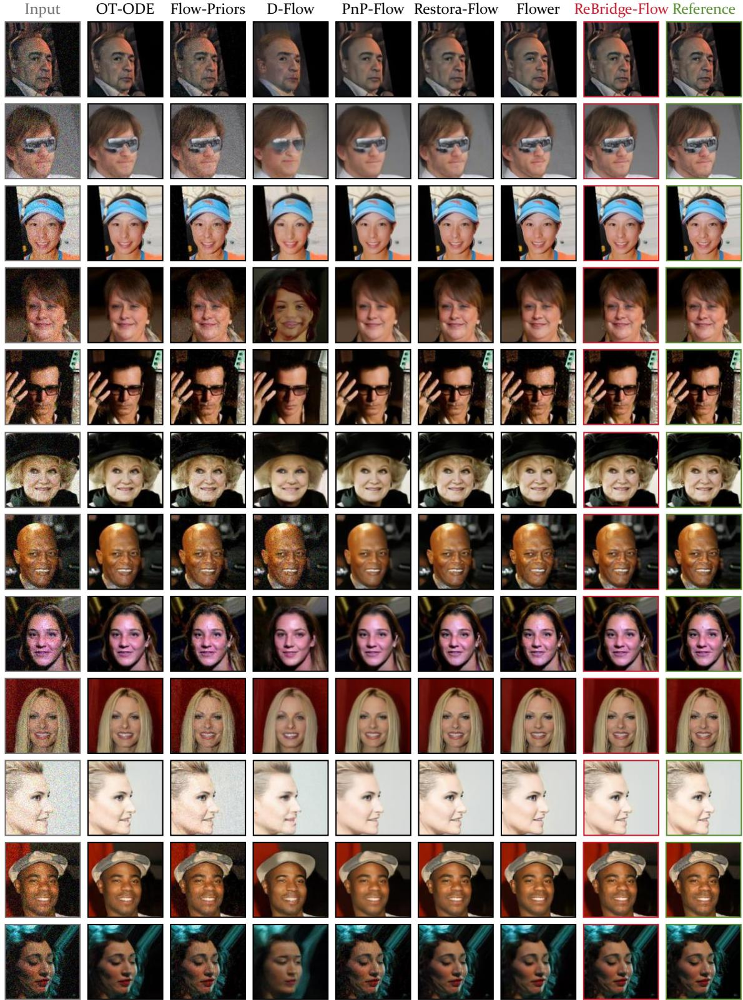  
Figure 10. Qualitative visual comparison of Denoising $( \sigma _ { \mathbf { y } } = 0 . 2 )$ on CelebA.

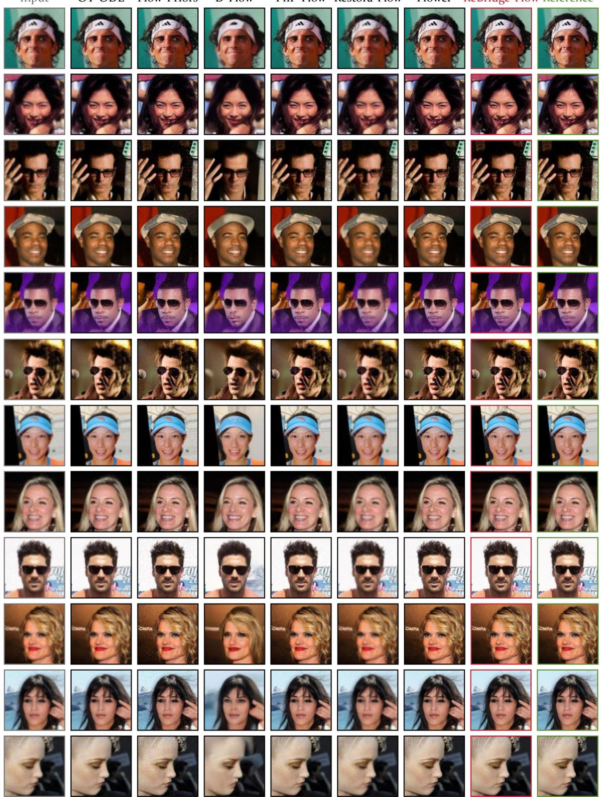  
Figure 11. Qualitative visual comparison of Deblurring (σb = 1.0, σy = 0.05) on CelebA.

# CelebA | Super Resolution | 2× | ${ \pmb \sigma } _ { \mathbf { y } } = { \mathbf \ o } . { \mathbf o } { \mathbf 1 }$

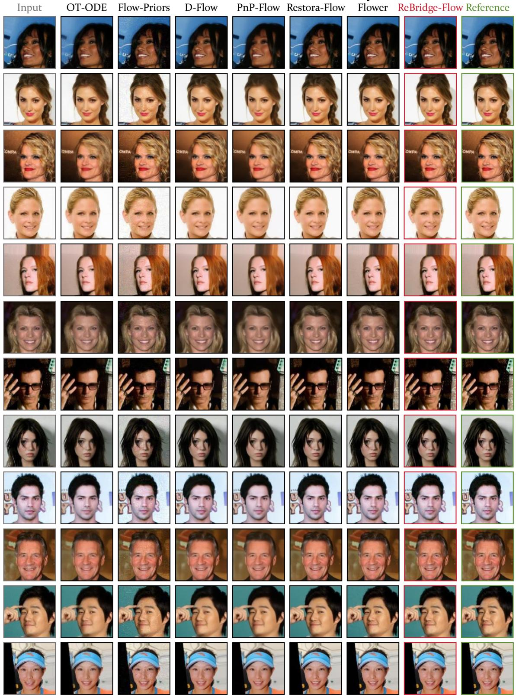  
Figure 12. Qualitative visual comparison of Super Resolution $( 2 \times , \sigma _ { \mathbf { y } } = 0 . 0 1 )$ on CelebA.

# CelebA | Random Inpainting | 70% | ${ \pmb \sigma } _ { \mathbf { y } } = { \mathbf \ o } . { \mathbf o } { \mathbf 1 }$

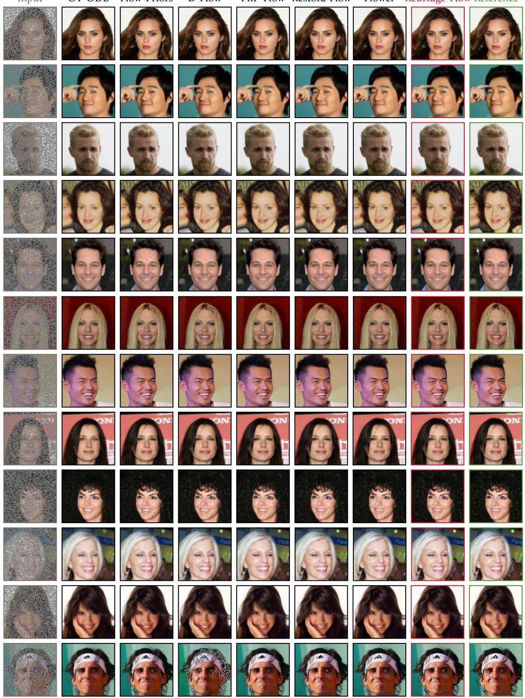  
Figure 13. Qualitative visual comparison of Random Inpainting (70%, $\sigma _ { \mathbf { y } } = 0 . 0 1 )$ on CelebA.

# CelebA | Box Inpainting | 40 × 40 | ${ \pmb \sigma _ { \mathrm { y } } } = { \bf \delta 0 . 0 1 }$

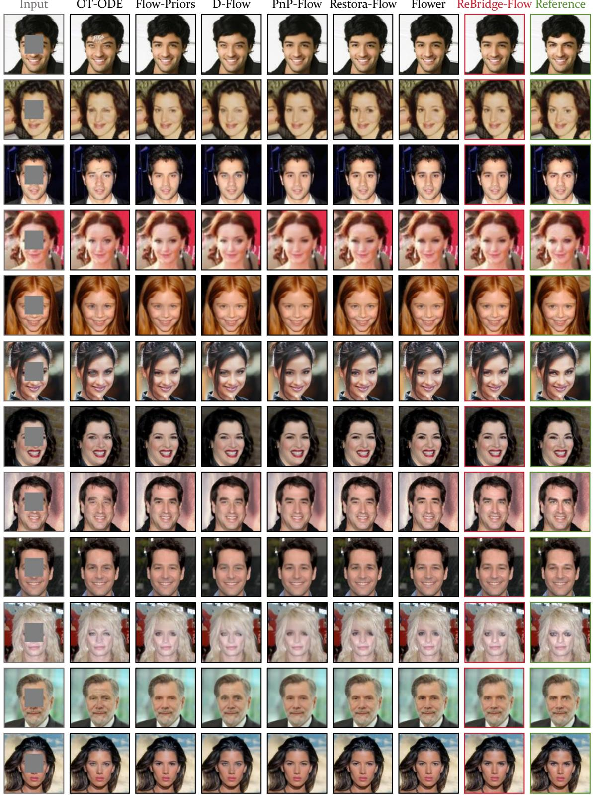  
Figure 14. Qualitative visual comparison of Box Inpainting (40 × 40, σy = 0.01) on CelebA.

AFHQ-Cat | Denoising | $\sigma _ { \mathrm { y } } = \mathbf { \delta 0 . 2 }$  
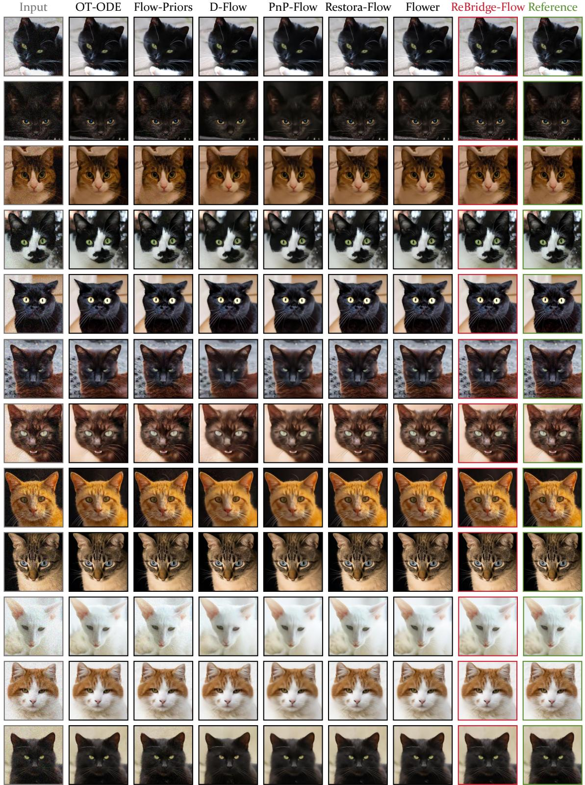  
Figure 15. Qualitative visual comparison of Denoising $( \sigma _ { \mathbf { y } } = 0 . 2 )$ on AFHQ-Cat.

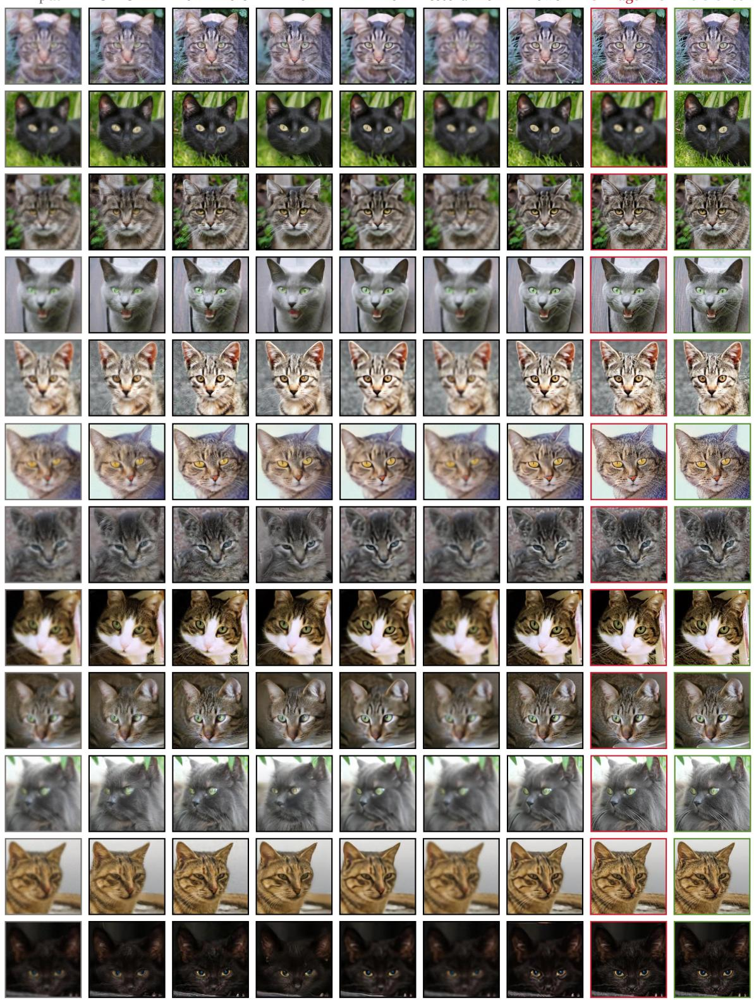  
Figure 16. Qualitative visual comparison of Deblurring $( \sigma _ { b } = 3 . 0 , \sigma _ { \mathbf { y } } = 0 . 0 5 )$ on AFHQ-Cat.

# AFHQ-Cat | Super Resolution | 4× | ${ \pmb \sigma } _ { \mathbf { y } } = { \mathbf \ o } . { \mathbf o } { \mathbf 1 }$

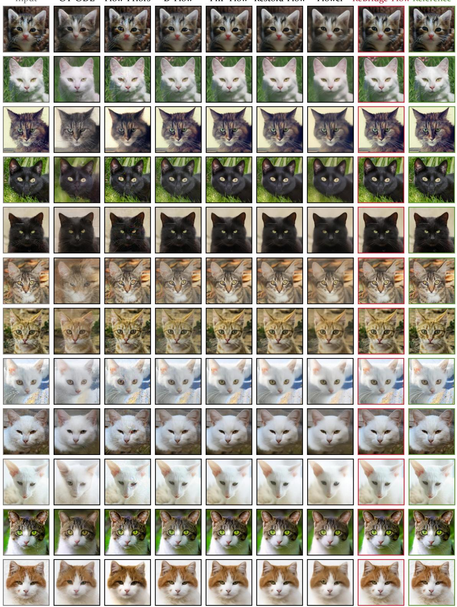  
Figure 17. Qualitative visual comparison of Super Resolution $( 4 \times , \sigma _ { \mathbf { y } } = 0 . 0 1 )$ on AFHQ-Cat.

# AFHQ-Cat | Random Inpainting | 70% | ${ \pmb \sigma } _ { \mathbf { y } } = { \mathbf \ o } . { \mathbf o } { \mathbf 1 }$

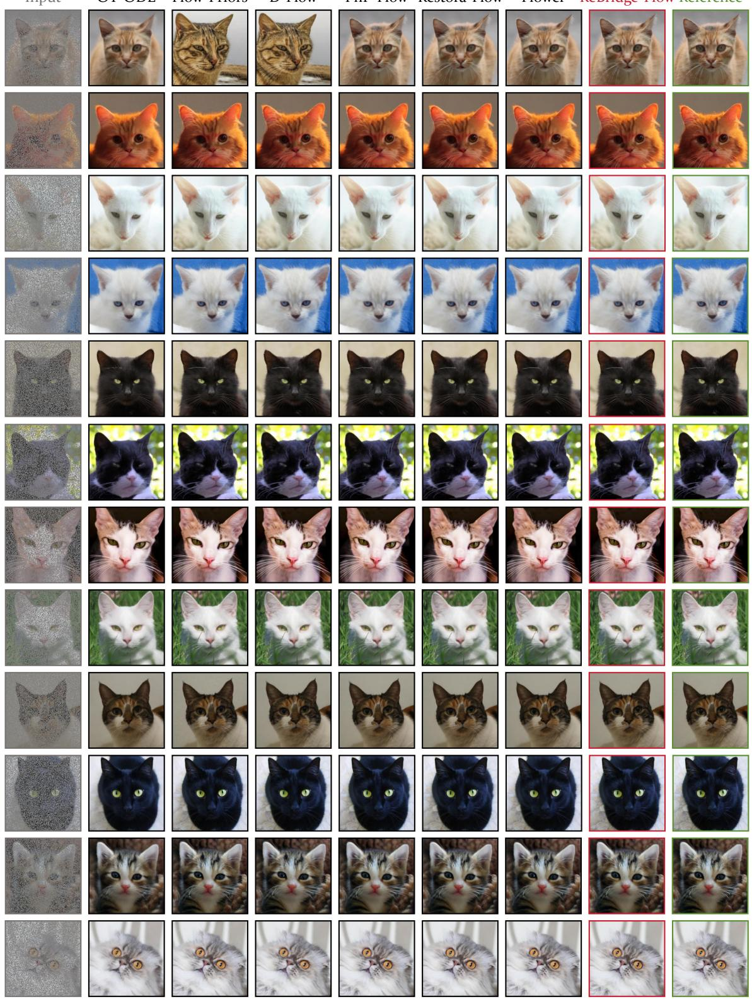  
Figure 18. Qualitative visual comparison of Random Inpainting (70%, $\sigma _ { \mathbf { y } } = 0 . 0 1 )$ on AFHQ-Cat.

# AFHQ-Cat | Box Inpainting | 80 × 80 | �� = 0.01

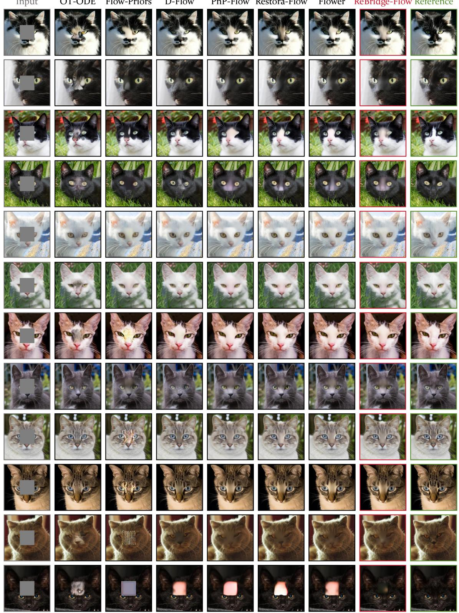  
Figure 19. Qualitative visual comparison of Box Inpainting (80 × 80, σy = 0.01) on AFHQ-Cat.

COCO | Denoising | $\sigma _ { \mathrm { y } } = \ \mathbf { o } . 2$  
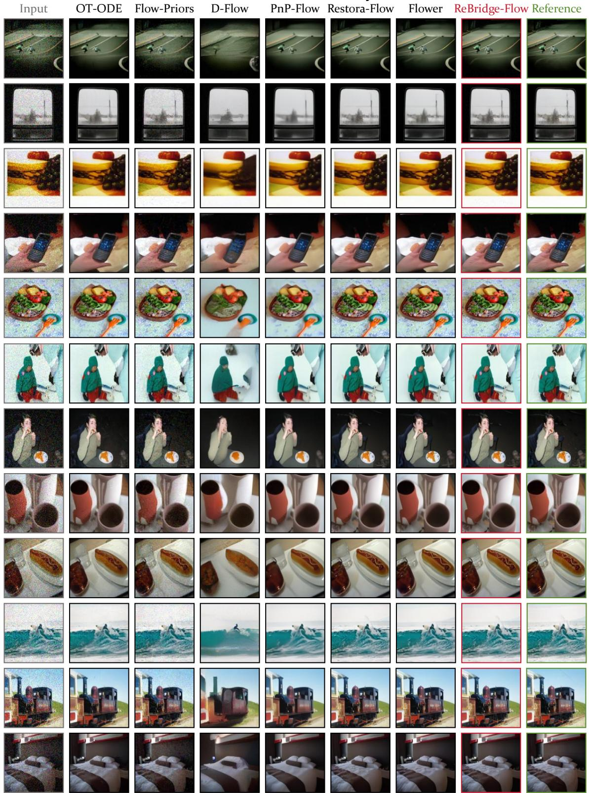  
Figure 20. Qualitative visual comparison of Denoising $( \sigma _ { \mathbf { y } } = 0 . 2 ) \mathrm { o n } \mathrm { C O C O } .$

## COCO | Deblurring | �� = 1.0 | �� = 0.05

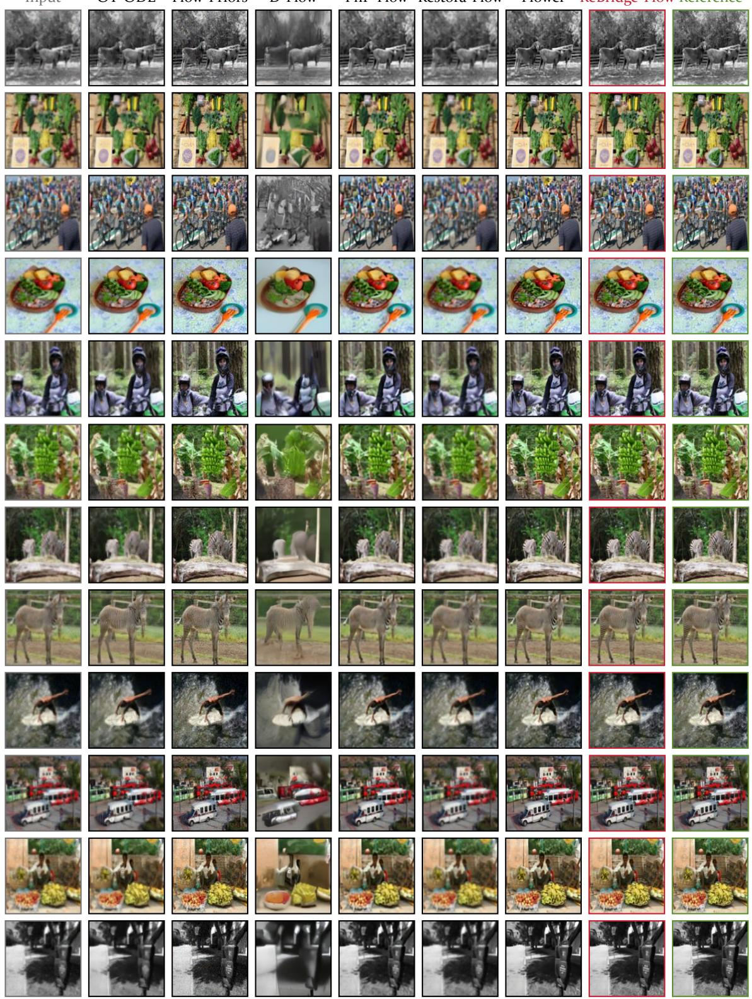  
Figure 21. Qualitative visual comparison of Deblurring (σb = 1.0, σy = 0.05) on COCO.

# COCO | Super Resolution | 2× | ${ \pmb \sigma } _ { \mathbf { y } } = { \mathbf \ o } . { \mathbf o } { \mathbf 1 }$

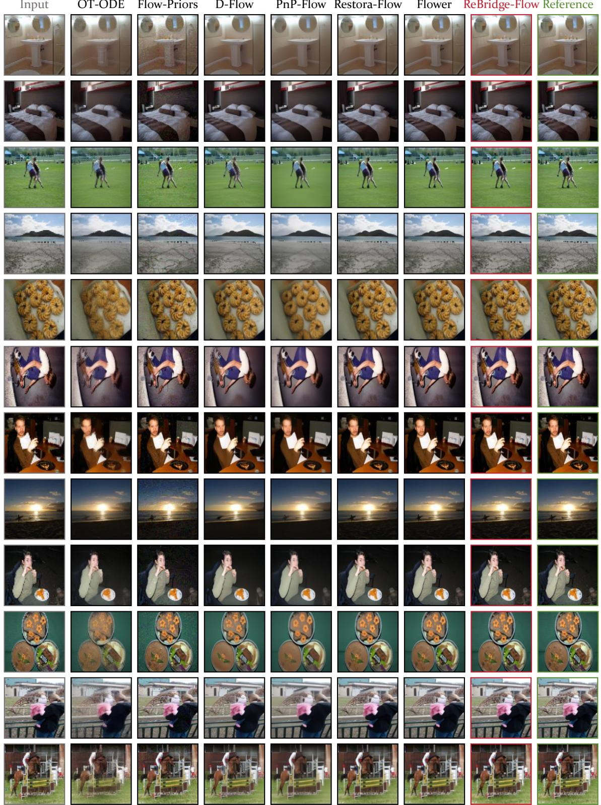  
Figure 22. Qualitative visual comparison of Super Resolution $( 2 \times , \sigma _ { \mathbf { y } } = 0 . 0 1 ) \mathrm { o n } \mathrm { C O C O } .$

# COCO | Random Inpainting | 70% | ${ \pmb \sigma } _ { \mathbf { y } } = { \mathbf \ o } . { \mathbf o } { \mathbf 1 }$

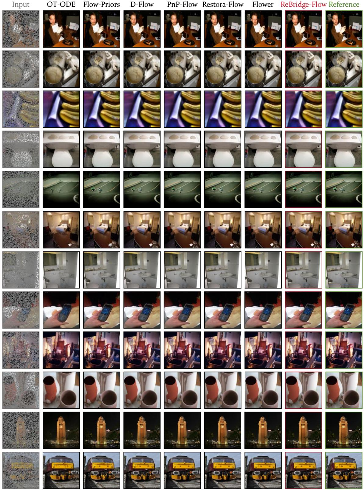  
Figure 23. Qualitative visual comparison of Random Inpainting (70%, σy = 0.01) on COCO.

# COCO | Box Inpainting | 40 × 40 | �� = 0.01

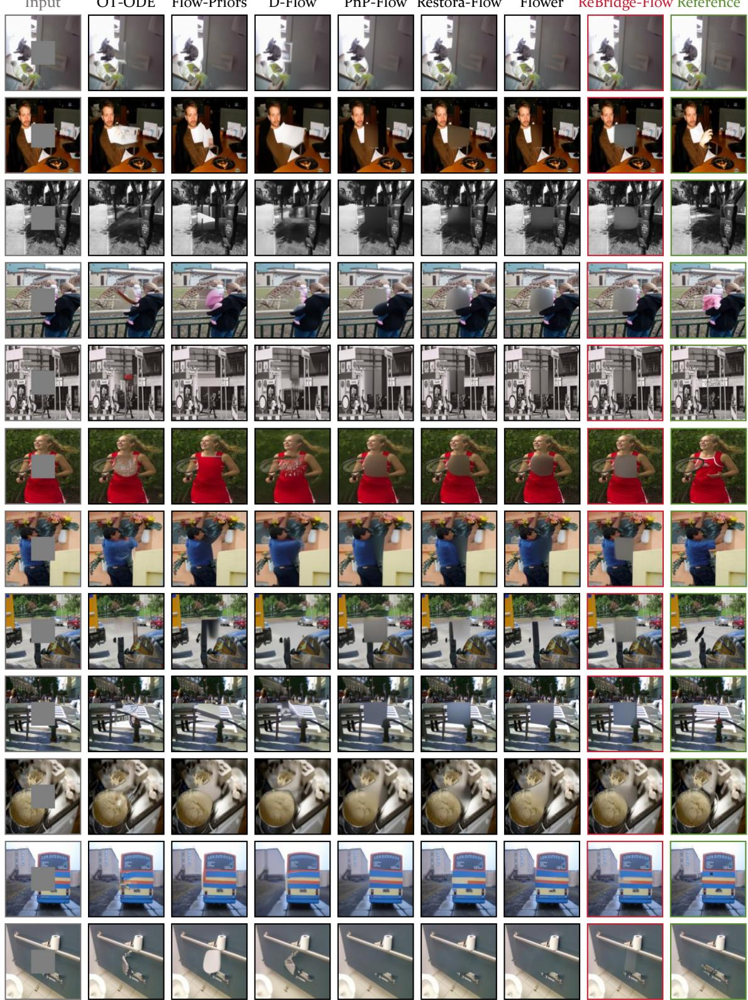  
Figure 24. Qualitative visual comparison of Box Inpainting (40 × 40, σy = 0.01) on COCO.

## IXI-Brain | Denoising | ${ \pmb \sigma } _ { \mathbf { y } } = { \ \mathbf { o . o 8 } }$

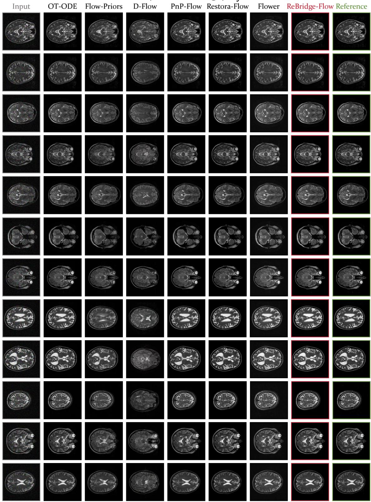  
Figure 25. Qualitative visual comparison of Denoising $( \sigma _ { \mathbf { y } } = 0 . 0 8 )$ on IXI-Brain.

$$
{ \pmb \sigma _ { \mathrm { y } } } = { \bf \delta 0 . 0 1 }
$$

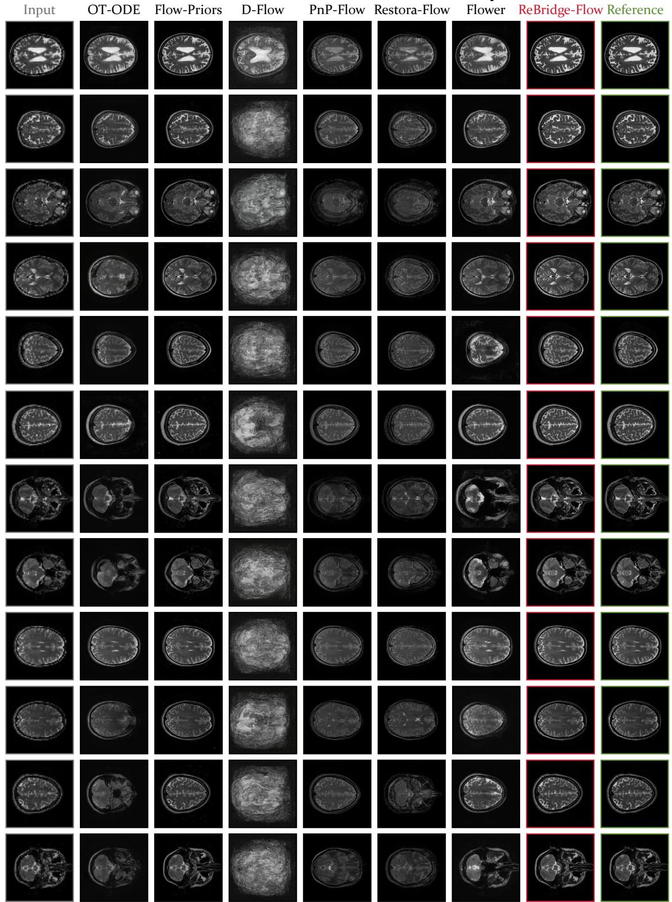  
Figure 26. Qualitative visual comparison of Super Resolution $( 2 \times , \sigma _ { \mathbf { y } } = 0 . 0 1 )$ on IXI-Brain.

# IXI-Brain | Random Inpainting | 30% | ${ \pmb \sigma } _ { \mathbf { y } } = { \mathbf \ o } . { \mathbf o } { \mathbf 1 }$

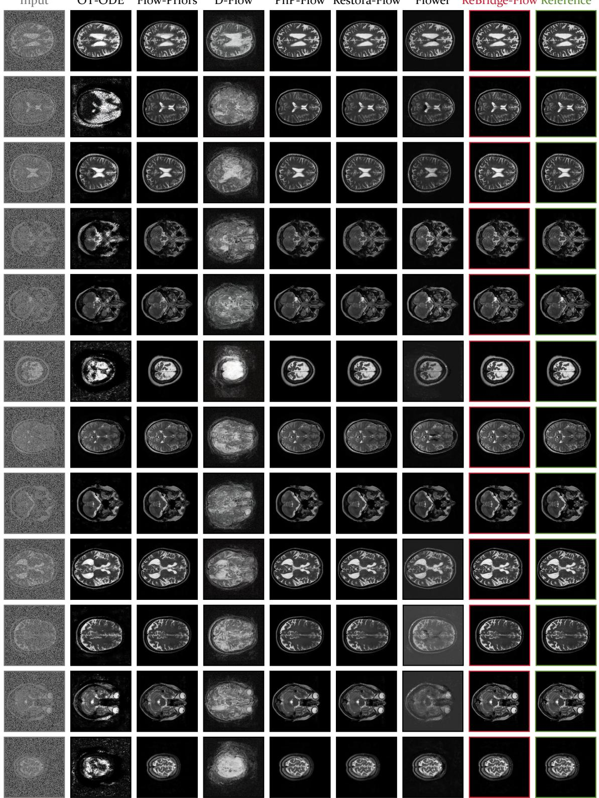  
Figure 27. Qualitative visual comparison of Random Inpainting $( 3 0 \% , \sigma _ { \mathbf { y } } = 0 . 0 1 )$ on IXI-Brain.

# IXI-Brain | Box Inpainting | 32 × 32 | ${ \pmb \sigma } _ { \mathbf { y } } = { \mathbf \ o } . { \mathbf o } { \mathbf 1 }$

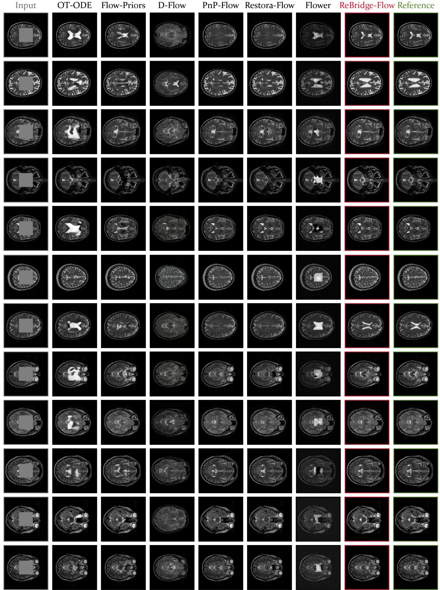  
Figure 28. Qualitative visual comparison of Box Inpainting $( 3 2 \times 3 2 , \sigma _ { \mathbf { y } } = 0 . 0 1 )$ on IXI-Brain.

# PMUB | Denoising | �� = 0.08

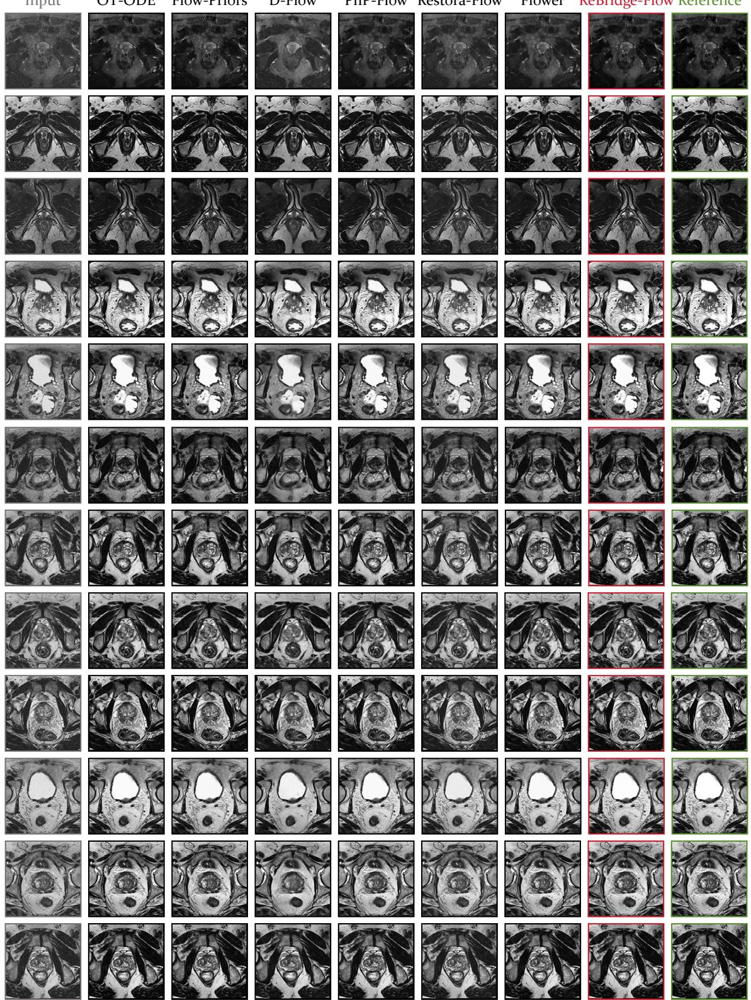  
Figure 29. Qualitative visual comparison of Denoising $( \sigma _ { \mathbf { y } } = 0 . 0 8 )$ on PMUB.

# PMUB | Super Resolution | 2× | �� = 0.01

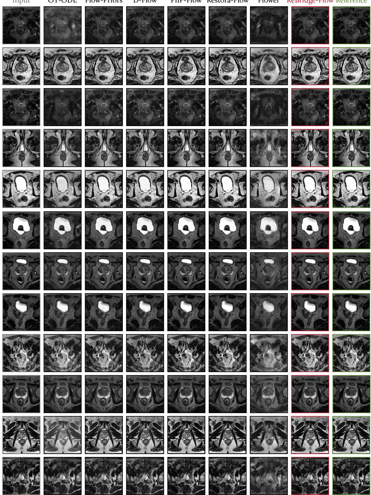  
Figure 30. Qualitative visual comparison of Super Resolution $( 2 \times , \sigma _ { \mathbf { y } } = 0 . 0 1 )$ on PMUB.

# PMUB | Random Inpainting | 30% | ${ \pmb \sigma } _ { \mathbf { y } } = { \mathbf \ o } . { \mathbf o } { \mathbf 1 }$

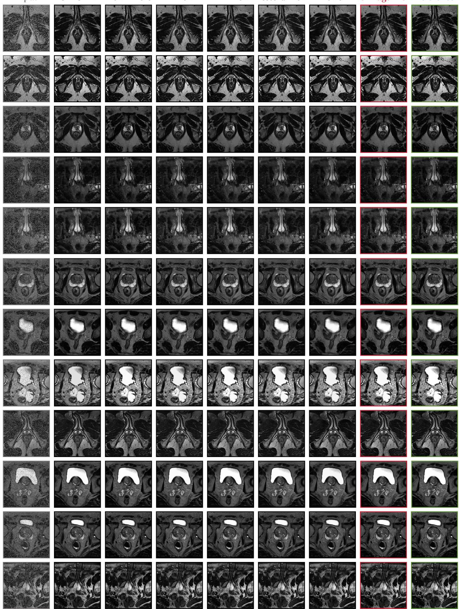  
Figure 31. Qualitative visual comparison of Random Inpainting (30%, $\sigma _ { \mathbf { y } } = 0 . 0 1 )$ on PMUB.

# PMUB | Box Inpainting | 60 × 60 | �� = 0.01

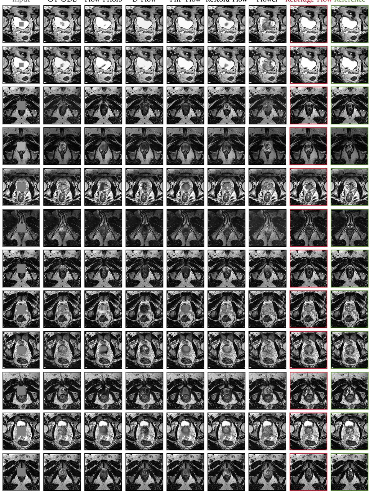  
Figure 32. Qualitative visual comparison of Box Inpainting (60 × 60, σy = 0.01) on PMUB.

X-Ray Hand | Denoising | ${ \pmb \sigma } _ { \mathbf { y } } = { \ \mathbf { o . o 8 } }$  
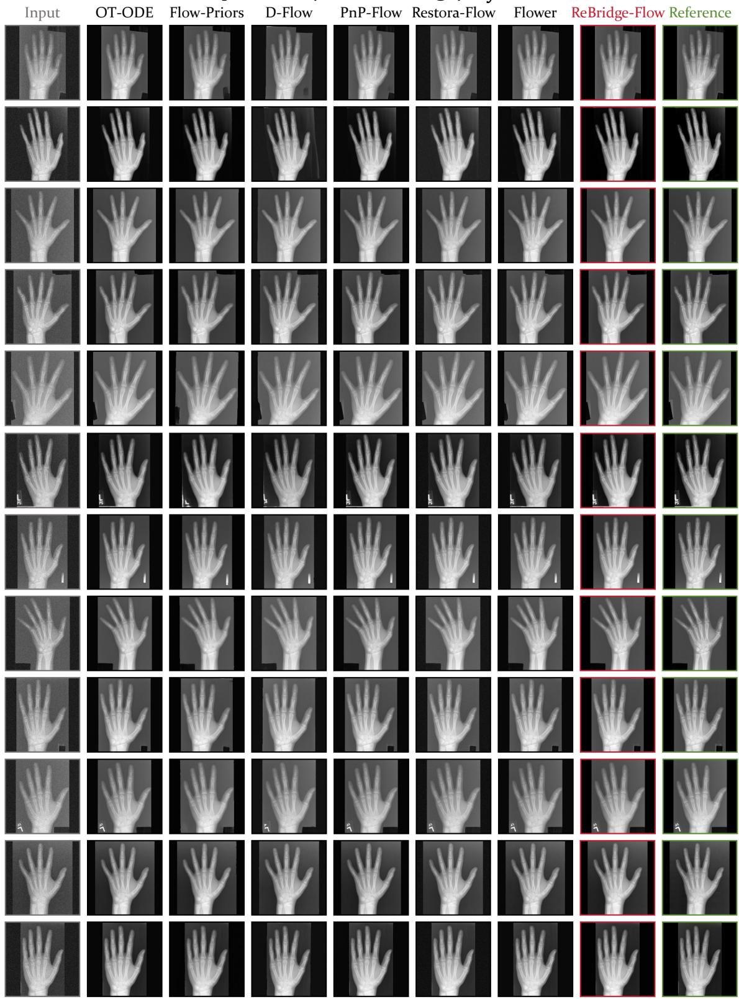  
Figure 33. Qualitative visual comparison of Denoising $( \sigma _ { \mathbf { y } } = 0 . 0 8 )$ on X-Ray Hand.

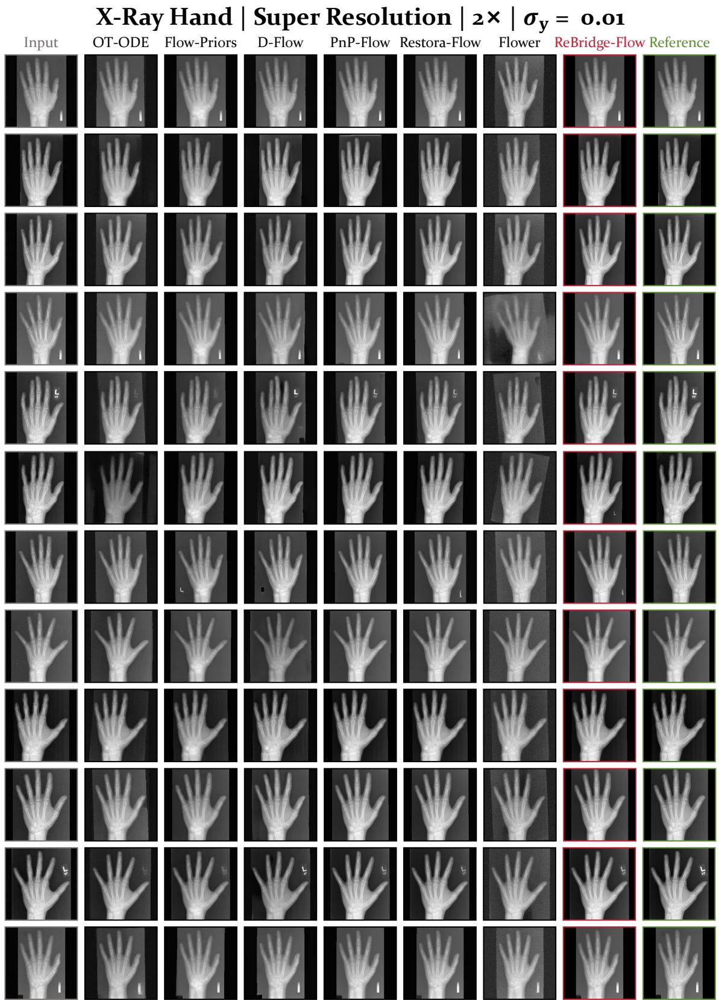  
Figure 34. Qualitative visual comparison of Super Resolution $( 2 \times , \sigma _ { \mathbf { y } } = 0 . 0 1 )$ on X-Ray Hand.

X-Ray Hand | Random Inpainting | 30% | ${ \pmb \sigma } _ { \mathbf { y } } = { \mathbf \ o } . { \mathbf o } { \mathbf 1 }$  
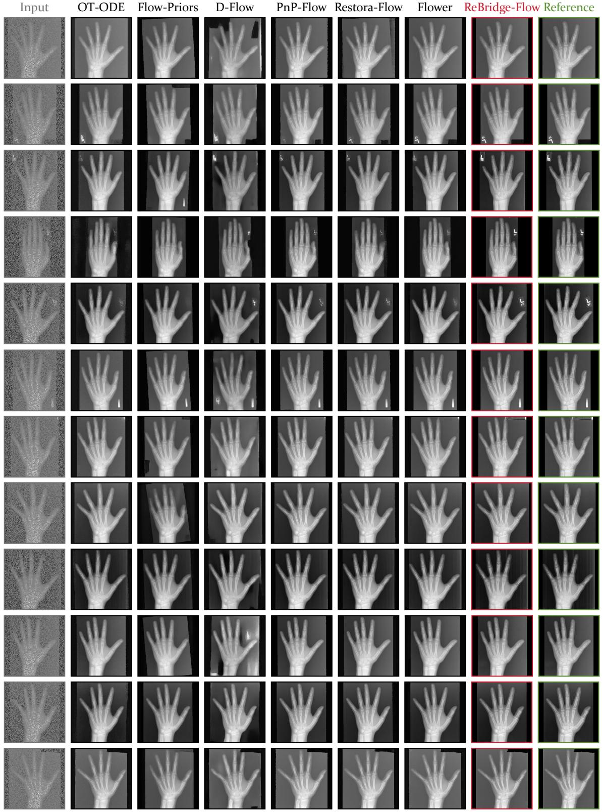  
Figure 35. Qualitative visual comparison of Random Inpainting (30%, $\sigma _ { \mathbf { y } } = 0 . 0 1 )$ on X-Ray Hand.

X-Ray Hand | Box Inpainting | 32 × 32 | ${ \pmb \sigma } _ { \mathbf { y } } = { \mathbf \ o } . { \mathbf o } { \mathbf 1 }$  
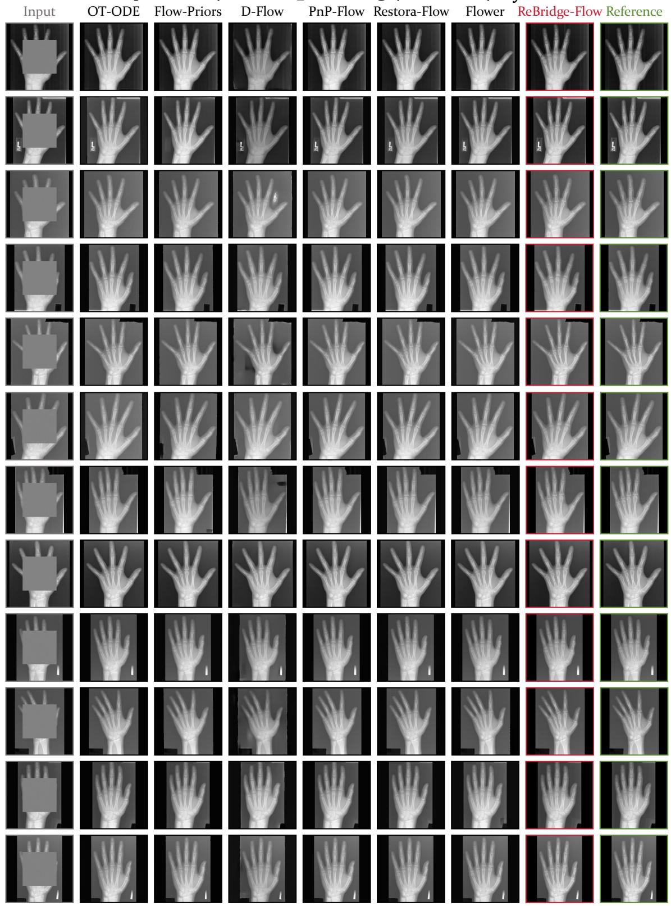  
Figure 36. Qualitative visual comparison of Box Inpainting $( 3 2 \times 3 2 , \sigma _ { \mathbf { y } } = 0 . 0 1 )$ on X-Ray Hand.