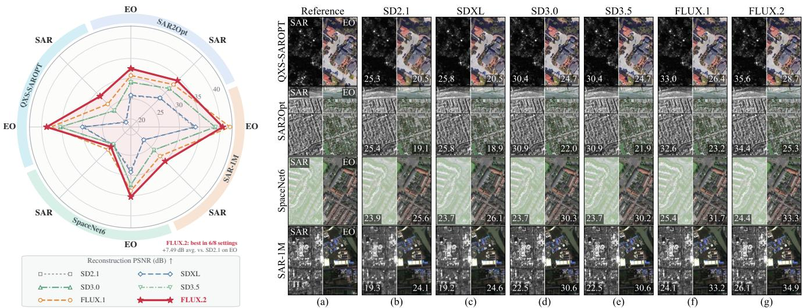
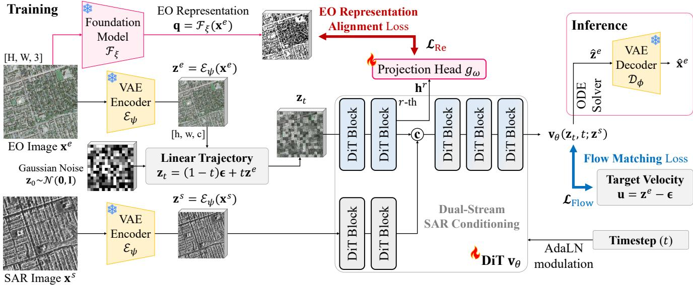
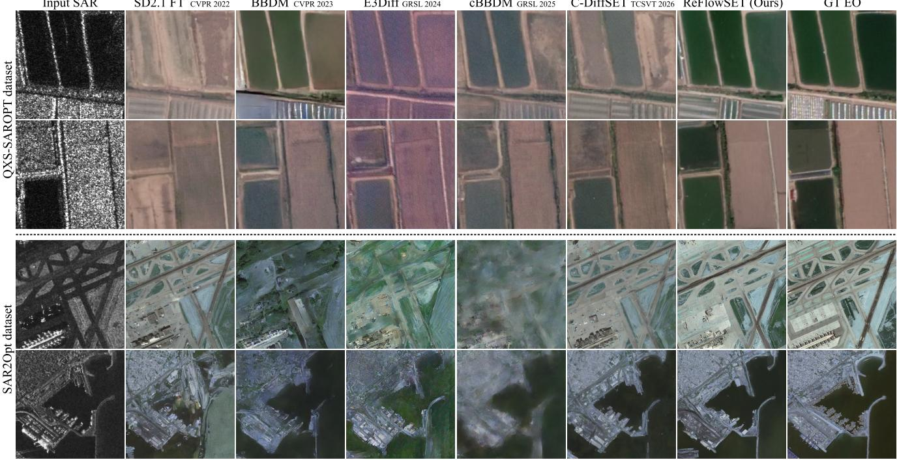

# ReFlowSET: Representation-Aligned Latent Flow Matching for SAR-to-EO Image Translation

Jeonghyeok Do

Seungchul Lee

Munchurl Kim \*

KAIST

Stellarvision Inc.

ehwjdgur0913@kaist.ac.kr

KAIST

leesc@stellarvision.kr

mkimee@kaist.ac.kr

https://kaist-viclab.github.io/ReFlowSET\_site

## Abstract

SAR-to-EO image translation aims to generate electrooptical (EO) imagery from synthetic aperture radar (SAR) observations. Existing latent diffusion approaches typically inherit a predetermined autoencoder, although reconstruction fidelity can vary substantially across codecs and modalities. Because the latent codec affects the roundtrip preservation of both SAR conditions and EO targets, codec selection constitutes a fundamental design choice; nevertheless, existing methods largely rely on codecs pretrained on natural images. To remedy this, we introduce ReFlowSET, a conditional latent flow-matching framework that selects its codec through a joint SAR–EO reconstruction audit. Rather than inheriting a heavyweight pretrained generator, ReFlowSET trains a substantially smaller conditional DiT from scratch in the selected latent space, using dual-stream SAR conditioning followed by joint feature refinement. To provide semantic guidance for this from-scratch training, intermediate noisy-EO features are aligned with clean target-EO representations extracted by a frozen vision foundation model. This alignment is used only during training and introduces no additional inference cost. Experiments on QXS-SAROPT and SAR2Opt demonstrate state-of-the-art performance across diverse perceptualfidelity and distributional metrics. Code andpretrained weights are publicly available at https://github. com/KAIST-VICLab/ReFlowSET.

## 1. Introduction

Synthetic aperture radar (SAR) provides reliable Earth observation regardless of illumination and under most weather conditions. However, its coherent imaging mechanism introduces speckle and geometric distortions, making SAR imagery less intuitive to interpret than electro-optical (EO)

imagery. SAR-to-EO image translation (SET) [29] aims to generate an interpretable EO representation from a corresponding SAR observation, supporting visual analysis when optical measurements are unavailable. This task remains challenging because SAR backscatter and EO reflectance describe fundamentally different physical properties, resulting in an inherently ambiguous cross-modal mapping.

Early SET approaches [6, 10, 11, 23] primarily relied on generative adversarial networks (GANs), incorporating multiscale context, scene information, or semantic supervision. Although these methods enable direct translation, adversarial training may produce unstable textures and semantically incorrect objects. Diffusion-based approaches [1, 4, 9, 18] provide a more stable generative objective and improved perceptual quality. Recent latent methods [4, 9] further reduce computation but adopt the pretrained Stable Diffusion (SD) variational autoencoder (VAE) [19] as a fixed codec without examining its suitability for SAR and EO imagery. Under latent-target training, the EO reconstruction represents a directly reachable decoded endpoint, while the SAR reconstruction indicates how much source structure is retained for conditioning. Moreover, existing latent SET models commonly inject SAR through immediate channel concatenation [4]. This position-wise fusion may prematurely entangle modalities with different statistics, particularly when paired SAR–EO observations contain local spatial misalignment.

We introduce ReFlowSET, a representation-aligned latent flow-matching framework for SET. We first evaluate the modality-specific reconstruction ceilings of multiple pretrained VAEs [2, 5, 17, 19] and select the codec providing the strongest joint fidelity for SAR and EO imagery. Rather than inheriting the selected codec’s heavyweight pretrained generator, we train a substantially smaller conditional DiT from scratch using conditional flow matching [13]. The DiT employs dual-stream SAR conditioning that preserves modality-specific processing before channelwise fusion and joint refinement. Because the from-scratch

  
Figure 1. Modality-wise reconstruction ceilings of six pretrained autoencoders on four SAR–EO datasets. Left: encode–decode PSNR for SAR and EO imagery. Right: reference pairs and representative reconstructions, with SAR/EO PSNR values (dB) shown in each cell Based on the dataset-level averages in the left panel, FLUX.2 [2] provides the best reconstruction fidelity in six of eight dataset–modalit settings and improves the mean EO reconstruction ceiling by 7.49 dB over SD2.1 [19].

DiT does not inherit semantic priors from a pretrained generator, we align its intermediate noisy-EO features with clean-EO representations extracted by a frozen vision foundation model [22]. This guidance is applied only during training and introduces neither additional annotations nor inference-time overhead.

The main contributions are summarized as follows:

• We systematically evaluate multiple pretrained VAEs on SAR and EO imagery, revealing their modality-dependent reconstruction ceilings and identifying a suitable latent space for SET.

• We introduce a latent flow-matching framework with dual-stream SAR conditioning and training-only EOderived VFM representation alignment.

• Extensive evaluations on QXS-SAROPT and SAR2Opt validate the proposed design, with ReFlowSET attaining leading performance in perceptual similarity and distributional realism.

## 2. Related Work

## 2.1. General Image Translation and Restoration

Conditional and cycle-consistent GANs established paired and unpaired image translation [8, 30]; pix2pixHD [24] and SPADE [15] improved high-resolution and spatially controlled synthesis. Diffusion methods later addressed superresolution, generic translation, controlled generation, and restoration through SR3 [20], BBDM [12], ControlNet [28], ResShift [27], and HI-Diff [3]. StegoGAN [25] targets nonbijective translation by separating hidden information. We retrain these families as broad image-to-image references rather than claiming that each is SET-specific.

## 2.2. SAR-to-EO Translation

SAR-specific GANs [11, 23] incorporate atrous context or EO segmentation labels to reduce blur and semantic errors. Conditional Diffusion [1] performs iterative pixel-space denoising, whereas E3Diff [18] distills the process to one step. cBBDM [9] constructs a conditional Brownian bridge in the SD2.1 latent space, and C-DiffSET [4] adds confidenceguided object generation to an SD2.1-based latent diffusion model. Our ReFlowSET instead treats the autoencoder endpoint as an explicit design variable and uses flow matching [13] with label-free, training-only representation guidance.

## 3. Analysis of VAE Reconstruction Performance

Let $\mathcal { E } _ { \psi }$ and $\mathcal { D } _ { \phi }$ denote a frozen autoencoder. For an image x, we define its round-trip reconstruction upper-bound as the fidelity of $\mathcal { D } _ { \phi } ( \mathcal { E } _ { \psi } ( \mathbf { x } ) )$ Although this quantity is not a theoretical upper-bound over arbitrary latent codes, it represents a directly reachable endpoint under standard latent-target training: exact prediction of the encoded EO target produces this reconstruction. Accordingly, a higher EO upper-bound indicates less codec-induced target distortion and a more faithful attainable endpoint, while a higher SAR upper-bound implies that more source structure is retained for conditional generation. Autoencoder selection is therefore a consequential design choice rather than a fixed implementation detail.

Fig. 1 compares the autoencoders of SD2.1 [19],

  
Figure 2. Overview of ReFlowSET. A conditional DiT learns the latent flow from Gaussian noise to the EO latent under dual-stream SAR conditioning. During training, intermediate DiT features are aligned with clean-EO representations from a frozen VFM. At inference, the alignment branch is removed and the integrated endpoint is decoded into an EO image.

SDXL [17], SD3.0/3.5 [5], and FLUX.1/2 [2] on QXS-SAROPT [7], SAR2Opt [29], SpaceNet6 [21], and SAR-1M [14] datasets. For each codec, dataset-level reconstruction statistics are computed only on the training splits. FLUX.2 achieves the highest PSNR in six of the eight dataset–modality settings and raises the mean EO ceiling by 7.49 dB over SD2.1, which is adopted by recent state-of-the-art latent SET methods [4, 9]. This reconstruction audit motivates the selection of FLUX.2 as a less distortion-limited latent codec. However, adopting its associated multi-billion-parameter pretrained generator would substantially increase computational cost. We therefore retain only the frozen FLUX.2 autoencoder for both SAR and EO in all subsequent experiments. To the best of our knowledge, this is the first systematic modality-wise analysis of pretrained autoencoder upper-bounds for SET.

## 4. ReFlowSET

Fig. 2 illustrates the overall framework of our ReFlowSET, which combines conditional latent flow matching, dualstream SAR conditioning, and training-only alignment with clean-EO representations.

## 4.1. Conditional Latent Flow Matching

For a paired SAR observation $\mathbf { x } ^ { s }$ and EO target ${ \bf x } ^ { e } ,$ , we encode the posterior means with the selected frozen encoder:

$$
\begin{array} { r } { \mathbf { z } ^ { m } = \mathcal { E } _ { \psi } ( \mathbf { x } ^ { m } ) , \quad m \in \{ s , e \} . } \end{array}\tag{1}
$$

With $\epsilon \sim \mathcal { N } ( \mathbf { 0 } , \mathbf { I } )$ and $t \sim \mathcal { U } ( 0 , 1 )$ , a linear probability path $\mathbf { z } _ { t }$ and its target velocity u are given by

$$
\mathbf { z } _ { t } = ( 1 - t ) \boldsymbol { \epsilon } + t \mathbf { z } ^ { e } , \qquad \mathbf { u } = \mathbf { z } ^ { e } - \boldsymbol { \epsilon } .\tag{2}
$$

A conditional DiT [16], denoted as $\mathbf { v } _ { \theta } ,$ , receives $\mathbf { z } ^ { s }$ as a persistent condition, and is trained to minimize the flow matching loss:

$$
\begin{array} { r } { \mathcal { L } _ { \mathrm { F l o w } } = \mathbb { E } \Big [ \| { \mathbf { v } } _ { \theta } ( { \mathbf { z } } _ { t } , t ; { \mathbf { z } } ^ { s } ) - { \mathbf { u } } \| _ { 2 } ^ { 2 } \Big ] . } \end{array}\tag{3}
$$

Starting from independent noise, rather than from the conditioned SAR latent $\mathbf { z } ^ { s }$ , also prevents u from becoming an analytic function of the model inputs. At inference, the learned ordinary differential equation (ODE) is integrated from t = 0 to 1 and the endpoint is decoded by $\mathcal { D } _ { \phi }$ [13].

## 4.2. Dual-Stream SAR Conditioning

A single-stream baseline [4] concatenates $\mathbf { z } ^ { s }$ and $\mathbf { z } _ { t }$ channel-wise at the input, and processes them through a shared DiT. In contrast, our ReFlowSET separately projects the SAR condition and noisy-EO latent, and processes them using independently parameterized streams for the first r DiT blocks. The resulting features are then concatenated along the channel dimension, projected back to the model width, and are processed by the remaining single-stream DiT blocks to predict the velocity field $\mathbf { v } _ { \theta } ( \mathbf { z } _ { t } , t ; \mathbf { z } ^ { s } )$ .

## 4.3. Training-Only EO Representation Alignment

Because the DiT is trained from scratch, it does not inherit semantic priors from a pretrained generator. Moreover, flow matching supervises velocity prediction without directly constraining intermediate representations. We therefore use the clean EO target as a training-only representation teacher. A frozen VFM $\mathcal { F } _ { \xi }$ [22] extracts representations $\mathbf { q } _ { i } ,$ , while a trainable projector $g _ { \omega }$ maps the corresponding DiT features $\mathbf { h } _ { i } ^ { r }$ into the same representation space as $\mathbf { q } _ { i } .$ Following the representation alignment [26], we minimize the cosine distance

Table 1. Quantitative comparison on QXS-SAROPT [7] and SAR2Opt [29]. All methods are retrained from official code on identica training splits and test pairs. Bold and underline indicate the best and second-best results, respectively.
<table><tr><td rowspan="2">Method</td><td rowspan="2">Venue</td><td colspan="5">QXS-SAROPT dataset</td><td colspan="5">SAR2Opt dataset</td></tr><tr><td>FID↓</td><td>DISTS↓</td><td>LPIPS↓</td><td>SSIM↑</td><td>PSNR↑</td><td>FID↓</td><td>DISTS↓</td><td>LPIPS↓</td><td>SSIM↑</td><td>PSNR↑</td></tr><tr><td colspan="10">General image translation/restoration methods:</td></tr><tr><td></td><td>CVPR&#x27;17</td><td>174.6</td><td>0.373</td><td>0.665</td><td>0.203</td><td>12.33</td><td>261.9</td><td>0.347</td><td>0.657</td><td>0.199</td><td>13.39</td></tr><tr><td>pix2pix [8] CycleGAN [30]</td><td>ICCV’17</td><td>104.4</td><td>0.376</td><td>0.653</td><td>0.262</td><td>12.92</td><td>143.5</td><td>0.330</td><td>0.650</td><td>0.178</td><td>12.90</td></tr><tr><td>pix2pixHD [24]</td><td>CVPR&#x27;18</td><td>85.7</td><td>0.298</td><td>0.573</td><td>0.358</td><td>16.13</td><td>146.3</td><td>0.283</td><td>0.567</td><td>0.268</td><td>15.95</td></tr><tr><td>SPADE [15]</td><td>CVPR&#x27;19</td><td>90.7</td><td>0.292</td><td>0.599</td><td>0.320</td><td>14.53</td><td>142.5</td><td>0.265</td><td>0.597</td><td>0.234</td><td>14.47</td></tr><tr><td>DDPM (SR3) [20]</td><td>TPAMI&#x27;22</td><td>43.8</td><td>0.311</td><td>0.620</td><td>0.359</td><td>14.04</td><td>122.5</td><td>0.295</td><td>0.610</td><td>0.313</td><td>13.65</td></tr><tr><td>SD2.1 fine-tune [19]</td><td>CVPR&#x27;22</td><td>19.1</td><td>0.257</td><td>0.561</td><td>0.348</td><td>15.40</td><td>71.8</td><td>0.211</td><td>0.541</td><td>0.293</td><td>16.24</td></tr><tr><td>BBDM [12]</td><td>CVPR&#x27;23</td><td>76.6</td><td>0.270</td><td>0.568</td><td>0.352</td><td>15.34</td><td>143.1</td><td>0.290</td><td>0.590</td><td>0.276</td><td>15.29</td></tr><tr><td>ControlNet [28]</td><td>ICCV’23</td><td>50.4</td><td>0.307</td><td>0.604</td><td>0.297</td><td>13.42</td><td>140.5</td><td>0.350</td><td>0.643</td><td>0.217</td><td>11.73</td></tr><tr><td>ResShift [27]</td><td>NeurIPS’23</td><td>140.2</td><td>0.334</td><td>0.607</td><td>0.217</td><td>14.20</td><td>141.7</td><td>0.304</td><td>0.597</td><td>0.177</td><td>14.31</td></tr><tr><td>HI-Diff [3]</td><td>NeurIPS’23</td><td>324.3</td><td>0.539</td><td>0.692</td><td>0.457</td><td>17.10</td><td>319.8</td><td>0.473</td><td>0.692</td><td>0.384</td><td>17.36</td></tr><tr><td>StegoGAN [25]</td><td>CVPR&#x27;24</td><td>106.8</td><td>0.384</td><td>0.658</td><td>0.254</td><td>12.96</td><td>150.1</td><td>0.347</td><td>0.655</td><td>0.158</td><td>12.47</td></tr><tr><td>SAR-to-EO methods:</td><td></td><td></td><td></td><td></td><td></td><td></td><td></td><td></td><td></td><td></td><td></td></tr><tr><td>Cond. Diffusion [1]</td><td>GRSL&#x27;23</td><td>88.6</td><td>0.355</td><td>0.730</td><td>0.213</td><td>11.55</td><td>211.8</td><td>0.415</td><td>0.686</td><td>0.248</td><td>12.48</td></tr><tr><td>E3Diff [18]</td><td>GRSL&#x27;24</td><td>47.8</td><td>0.278</td><td>0.530</td><td>0.302</td><td>16.44</td><td>104.7</td><td>0.232</td><td>0.529</td><td>0.249</td><td>16.09</td></tr><tr><td>cBBDM [9]</td><td>GRSL&#x27;25</td><td>50.6</td><td>0.246</td><td>0.539</td><td>0.372</td><td>16.02</td><td>222.3</td><td>0.377</td><td>0.571</td><td>0.361</td><td>17.05</td></tr><tr><td>C-DiffSET [4]</td><td>TCSVT’26</td><td>19.9</td><td>0.233</td><td>0.526</td><td>0.380</td><td>16.92</td><td>78.1</td><td>0.214</td><td>0.529</td><td>0.314</td><td>16.81</td></tr><tr><td>ReFlowSET (SD2.1)</td><td>一</td><td>25.5</td><td>0.267</td><td>0.566</td><td>0.337</td><td>15.85</td><td>84.5</td><td>0.217</td><td>0.541</td><td>0.270</td><td>15.82</td></tr><tr><td>ReFlowSET (Ours)</td><td></td><td>19.1</td><td>0.231</td><td>0.534</td><td>0.355</td><td>16.09</td><td>66.3</td><td>0.185</td><td>0.522</td><td>0.287</td><td>16.06</td></tr></table>

$$
\mathcal { L } _ { \mathrm { R e } } = \frac { 1 } { N } \sum _ { i = 1 } ^ { N } \left( 1 - \frac { g _ { \omega } ( \mathbf { h } _ { i } ^ { r } ) ^ { \top } \mathbf { q } _ { i } } { \| g _ { \omega } ( \mathbf { h } _ { i } ^ { r } ) \| _ { 2 } \| \mathbf { q } _ { i } \| _ { 2 } } \right) ,\tag{4}
$$

where $\mathbf { q } _ { i } = \mathrm { s g } ( \mathcal { F } _ { \xi } ( \mathbf { x } ^ { e } ) _ { i } )$ , sg denotes stop-gradient, $\mathbf { h } _ { i } ^ { r }$ is the i-th spatial token of the noisy-EO stream after the r-th dual-stream block, and N is the number of aligned spatial tokens. The total training objective is

$$
\begin{array} { r } { \mathcal { L } = \mathcal { L } _ { \mathrm { F l o w } } + \lambda \mathcal { L } _ { \mathrm { R e } } . } \end{array}\tag{5}
$$

We empirically set $\lambda = 0 . 5$ and keep it fixed across all experiments. The VFM $\mathcal { F } _ { \xi }$ and projector $g _ { \omega }$ are used only during training and discarded at inference, incurring no testtime overhead.

## 5. Experiments

## 5.1. Datasets and Settings

QXS-SAROPT [7] contains 20,000 paired 256-pixel GF-3   
SAR and Google Earth optical tiles; we use 16,001/3,999

images for training/testing. SAR2Opt [29] contains 2,077 paired 600-pixel TerraSAR-X and Google Earth images; we use 1,450/627 images with random/center 512-pixel crops for training/testing. All baseline methods are retrained on the same training splits and evaluated on identical test items. The randomly initialized DiT generator [16] comprises 24 blocks and 509.3M parameters. The first $r \ = \ 8$ blocks preserve separate modality-specific streams; EO representation alignment is applied to the EO-stream features at this boundary, after which the streams are concatenated and jointly processed by the remaining blocks. The FLUX.2 [2] autoencoder and DINOv3 ViT-L/16 [22] teacher are pretrained and frozen. We train QXS-SAROPT for 40k updates with batch 64 and SAR2Opt for 20k updates with batch 32, respectively. All models were trained on two NVIDIA RTX 4090 GPUs. AdamW uses a peak learning rate of $5 \times 1 0 ^ { - 4 } .$ a 1k-step warmup, cosine decay, and bf16 precision. Conditioning dropout is 0.1. Reported samples use classifier-free guidance (CFG) of 1.5 and Euler solver with 50 function evaluations (NFE).

## 5.2. Comparison with the State of the Art

Table 1 reports distributional realism (FID), perceptual fidelity (DISTS and LPIPS), and pixel fidelity (SSIM and PSNR). On QXS-SAROPT, ReFlowSET obtains the best DISTS and ties the best FID. On SAR2Opt, it improves the second-best FID from 71.8 to 66.3 and DISTS from 0.211 to 0.185, while also yielding the lowest (best) LPIPS. These reductions correspond to relative gains of 7.7% and 12.3% in FID and DISTS, respectively.

cBBDM GRSL 2025  
Input SAR  
SD2.1 FT CVPR 2022  
BBDM CVPR 2023  
E3Diff GRSL 2024  
C-DiffSET TCSVT 2026 ReFlowSET (Ours)  
GT EO  
  
(a)  
(b)  
(c)  
(d)  
(e)  
(f)  
(g)  
(h)  
Figure 3. Qualitative SET comparison on QXS-SAROPT (top) and SAR2Opt (bottom). Columns show (a) input SAR, (b) SD2.1 FT, (c) BBDM, (d) E3Diff, (e) cBBDM, (f) C-DiffSET, (g) ReFlowSET, and (h) ground-truth EO.

Table 2. Ablation of SAR conditioning, fusion, and EO representation alignment on SAR2Opt. All variants use 12 DiT blocks; D/S denote dual-/single-stream blocks. Params are deployed DiT parameters and exclude training-only alignment modules; VRAM and time report peak training memory and per-image inference latency.
<table><tr><td> $\pmb { { \mathcal { L } } } _ { \mathrm { R e } }$ </td><td>SAR Stream</td><td>Fusion</td><td>Topology</td><td>FID↓</td><td>Params↓ (M)</td><td>VRAM↓ (GB)</td><td>Time↓ (sec)</td></tr><tr><td>√</td><td>Shared [4]</td><td>Input [4]</td><td>0D+12S</td><td>72.865</td><td>108.46</td><td>8.18</td><td>0.92</td></tr><tr><td>√</td><td>Dual</td><td>Token</td><td>4D+8S</td><td>70.450</td><td>143.86</td><td>13.57</td><td>2.06</td></tr><tr><td>x</td><td>Dual</td><td>Channel</td><td>4D+8S</td><td>71.851</td><td>145.04</td><td>9.80</td><td>1.34</td></tr><tr><td>√</td><td>Dual</td><td>Channel</td><td>4D+8S</td><td>70.436</td><td>145.04</td><td>10.63</td><td>1.34</td></tr></table>

These results are particularly notable because SD2.1 fine-tuning and C-DiffSET [4] initialize their U-Net backbones from pretrained SD2.1 weights, whereas ReFlowSET trains its DiT generator from scratch. Within the same ReFlowSET framework, replacing the SD2.1 codec with FLUX.2 improves all five metrics on both benchmarks, reducing FID from 25.5 to 19.1 on QXS-SAROPT and from 84.5 to 66.3 on SAR2Opt. This controlled comparison empirically supports reconstruction-guided codec selection: with FLUX.2, the from-scratch generator reaches or surpasses pretrained-generator baselines on perceptual and distributional metrics.

Although ReFlowSET does not maximize PSNR or SSIM, these pixel-aligned metrics are sensitive to the inherent ambiguity and local misalignment of paired SAR–EO observations. We therefore emphasize perceptual and distributional metrics while reporting pixel fidelity for completeness. Fig. 3 shows sharper structures and more coherent land-cover appearance than competing latent diffusion and bridge models.

## 5.3. Ablation and Efficiency Analysis

Table 2 evaluates SAR conditioning, stream fusion, and EO representation alignment using compact 12-block models. To reduce ablation costs while controlling total depth, the dual-stream variants use 4 dual-stream and 8 single-stream blocks. The final ReFlowSET scales this allocation to 8 and

16 blocks, respectively, preserving the same 1:2 topology ratio.

SAR conditioning and fusion. With EO representation alignment enabled, the dedicated SAR processing with channel fusion reduces FID from 72.865 to 70.436 relative to the shared-stream input-concatenation baseline [4]. Because the modality-specific paths instantiate the same fullwidth DiT block design for both SAR and noisy EO, the dedicated conditioning increases the parameter count from 108.46M to 145.04M. This result should therefore be interpreted as a system-level architecture comparison. After the dual-stream stage, the token-wise fusion doubles the sequence length processed by every subsequent singlestream block. Consequently, it increases training VRAM from 10.63 to 13.57 GB and latency from 1.34 to 2.06 s/image, while providing virtually no FID benefit (70.450 versus 70.436). ReFlowSET therefore adopts channel-wise fusion.

EO representation alignment. Under the same dedicated SAR stream, channel fusion, and 4D+8S topology, adding $\mathcal { L } _ { \mathrm { R e } }$ reduces FID from 71.851 to 70.436. The deployed parameter count and inference latency remain unchanged because the frozen VFM and projection head are discarded after training. The alignment branch increases peak training VRAM only from 9.80 to 10.63 GB. This controlled comparison shows that target-EO representation alignment improves distributional quality without adding inference-time cost.

## 6. Conclusion

We presented ReFlowSET, a representation-aligned latent flow framework for SAR-to-EO translation. ReFlowSET combines reconstruction-guided codec selection, conditional latent flow matching, delayed SAR–EO fusion, and training-only EO representation alignment. It achieves the best FID and DISTS on both benchmarks and the best LPIPS on SAR2Opt among the evaluated methods, while the alignment branch introduces no inference-time overhead. Future work will examine cross-sensor generalization and the suppression of unsupported EO-like structures.

Acknowledgement. This work was supported in part by the National Research Foundation of Korea (NRF) grant funded by the Korean government (MSIT) under the Sejong Science Fellowship Program (RS-2026-25484549, “Generative AI-based High-Resolution SAR Image Visualization and Analysis Technology for All-Weather Earth Observation”, 50%) and in part by the NRF grant funded by the MSIT (RS-2025-02222525, “Development of AI-based SAR-to-EO image conversion technology”, 50%).

## References

[1] Xinyu Bai, Xinyang Pu, and Feng Xu. Conditional diffusion for SAR-to-optical image translation. IEEE GRSL, 21:1–5, 2023. 1, 2, 4

[2] Black Forest Labs. FLUX.2: Frontier Visual Intelligence. https://bfl.ai/blog/flux-2, 2025. 1, 2, 3, 4

[3] Zheng Chen, Yulun Zhang, Ding Liu, Jinjin Gu, Linghe Kong, Xin Yuan, et al. Hierarchical integration diffusion model for realistic image deblurring. NeurIPS, 36:29114– 29125, 2023. 2, 4

[4] Jeonghyeok Do, Jaehyup Lee, Seungchul Lee, and Munchurl Kim. C-DiffSET: Leveraging latent diffusion for SAR-to-EO image translation with confidence-guided reliable object generation. IEEE TCSVT, 2026. 1, 2, 3, 4, 5, 6

[5] Patrick Esser, Sumith Kulal, Andreas Blattmann, Rahim Entezari, Jonas Muller, Harry Saini, Yam Levi, Dominik¨ Lorenz, Axel Sauer, Frederic Boesel, Dustin Podell, Tim Dockhorn, Zion English, and Robin Rombach. Scaling rectified flow transformers for high-resolution image synthesis. In ICML, pages 12606–12633, 2024. 1, 3

[6] Zhe Guo, Rui Luo, Qinglin Cai, Jiayi Liu, Zhibo Zhang, and Shaohui Mei. Scene-embedded generative adversarial networks for semi-supervised SAR-to-optical image translation. IEEE GRSL, 21:1–5, 2024. 1

[7] Meiyu Huang, Yao Xu, Lixin Qian, Weili Shi, Yaqin Zhang, Wei Bao, Nan Wang, Xuejiao Liu, and Xueshuang Xiang. The QXS-SAROPT dataset for deep learning in SAR-optical data fusion. arXiv preprint arXiv:2103.08259, 2021. 3, 4

[8] Phillip Isola, Jun-Yan Zhu, Tinghui Zhou, and Alexei A. Efros. Image-to-image translation with conditional adversarial networks. In CVPR, pages 5967–5976, 2017. 2, 4

[9] Seon-Hoon Kim and Daewon Chung. Conditional Brownian bridge diffusion model for VHR SAR-to-optical image translation. IEEE GRSL, 22:1–5, 2025. 1, 2, 3, 4

[10] In Ho Lee and Chan Gook Park. SAR-to-virtual optical image translation for improving SAR automatic target recognition. IEEE GRSL, 20:1–5, 2023. 1

[11] Jaehyup Lee, Hyun-Ho Kim, Doochun Seo, and Munchurl Kim. Segmentation-guided context learning using EO object labels for stable SAR-to-EO translation. IEEE GRSL, 21: 1–5, 2023. 1, 2

[12] Bo Li, Kaitao Xue, Bin Liu, and Yu-Kun Lai. BBDM: Image-to-image translation with Brownian bridge diffusion models. In CVPR, pages 1952–1961, 2023. 2, 4

[13] Yaron Lipman, Ricky T. Q. Chen, Heli Ben-Hamu, Maximilian Nickel, and Matt Le. Flow matching for generative modeling. In ICLR, 2023. 1, 2, 3

[14] Danxu Liu, Di Wang, Hebaixu Wang, Haoyang Chen, Wen tao Jiang, Yilin Cheng, Haonan Guo, Wei Cui, and Jing Zhang. SARMAE: Masked autoencoder for SAR representation learning. In CVPR, pages 6496–6507, 2026. 3

[15] Taesung Park, Ming-Yu Liu, Ting-Chun Wang, and Jun-Yan Zhu. Semantic image synthesis with spatially-adaptive normalization. In CVPR, pages 2332–2341, 2019. 2, 4

[16] William Peebles and Saining Xie. Scalable diffusion models with transformers. In ICCV, pages 4172–4182, 2023. 3, 4

[17] Dustin Podell, Zion English, Kyle Lacey, Andreas Blattmann, Tim Dockhorn, Jonas Muller, Joe Penna, and¨ Robin Rombach. SDXL: Improving latent diffusion models for high-resolution image synthesis. In ICLR, 2024. 1, 3

[18] Jiang Qin, Bin Zou, Haolin Li, and Lamei Zhang. Efficient end-to-end diffusion model for one-step SAR-tooptical translation. IEEE GRSL, 22:1–5, 2024. 1, 2, 4

[19] Robin Rombach, Andreas Blattmann, Dominik Lorenz, Patrick Esser, and Bjorn Ommer. High-resolution image syn-¨ thesis with latent diffusion models. In CVPR, pages 10674– 10685, 2022. 1, 2, 4

[20] Chitwan Saharia, Jonathan Ho, William Chan, Tim Salimans, David J. Fleet, and Mohammad Norouzi. Image superresolution via iterative refinement. IEEE TPAMI, 45(4): 4713–4726, 2022. 2, 4

[21] Jacob Shermeyer, Daniel Hogan, Jason Brown, Adam Van Etten, Nicholas Weir, Fabio Pacifici, Ronny Hansch,¨ Alexei Bastidas, Scott Soenen, Todd Bacastow, et al. SpaceNet 6: Multi-sensor all-weather mapping dataset. In CVPRW, pages 768–777, 2020. 3

[22] Oriane Simeoni, Huy V. Vo, Maximilian Seitzer, Federico´ Baldassarre, Maxime Oquab, Cijo Jose, Vasil Khalidov, Marc Szafraniec, Seungeun Yi, Michael Ramamonjisoa,¨ et al. DINOv3. arXiv preprint arXiv:2508.10104, 2025. 2, 4

[23] Javier Noa Turnes, Jose David Bermudez Castro, Daliana Lobo Torres, Pedro Juan Soto Vega, Raul Queiroz Feitosa, and Patrick N. Happ. Atrous cGAN for SAR-tooptical image translation. IEEE GRSL, 19:1–5, 2020. 1, 2

[24] Ting-Chun Wang, Ming-Yu Liu, Jun-Yan Zhu, Andrew Tao, Jan Kautz, and Bryan Catanzaro. High-resolution image synthesis and semantic manipulation with conditional GANs. In CVPR, pages 8798–8807, 2018. 2, 4

[25] Sidi Wu, Yizi Chen, Samuel Mermet, Lorenz Hurni, Konrad Schindler, Nicolas Gonthier, and Loic Landrieu. StegoGAN: Leveraging steganography for non-bijective image-to-image translation. In CVPR, pages 7922–7931, 2024. 2, 4

[26] Sihyun Yu, Sangkyung Kwak, Huiwon Jang, Jongheon Jeong, Jonathan Huang, Jinwoo Shin, and Saining Xie. Representation alignment for generation: Training diffusion transformers is easier than you think. In ICLR, 2025. 4

[27] Zongsheng Yue, Jianyi Wang, and Chen Change Loy. ResShift: Efficient diffusion model for image superresolution by residual shifting. NeurIPS, 36:13294–13307, 2023. 2, 4

[28] Lvmin Zhang, Anyi Rao, and Maneesh Agrawala. Adding conditional control to text-to-image diffusion models. In ICCV, pages 3813–3824, 2023. 2, 4

[29] Yitao Zhao, Turgay Celik, Nanqing Liu, and Heng-Chao Li. A comparative analysis of GAN-based methods for SAR-to optical image translation. IEEE GRSL, 19:1–5, 2022. 1, 3, 4

[30] Jun-Yan Zhu, Taesung Park, Phillip Isola, and Alexei A. Efros. Unpaired image-to-image translation using cycle consistent adversarial networks. In ICCV, pages 2242–2251, 2017. 2, 4