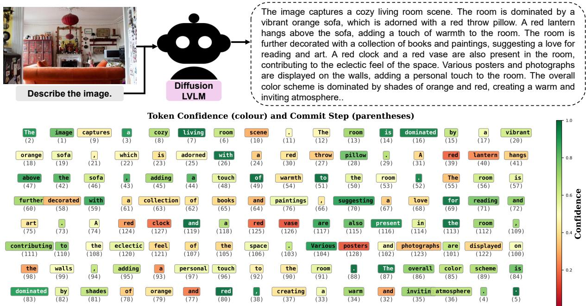
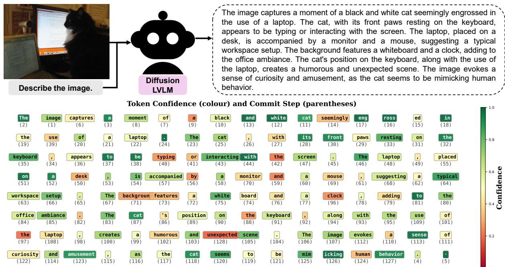
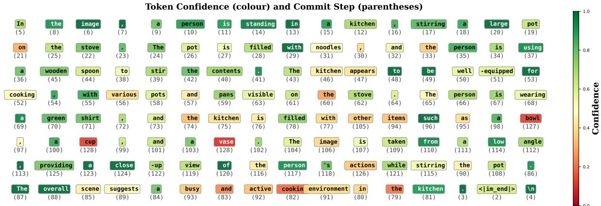
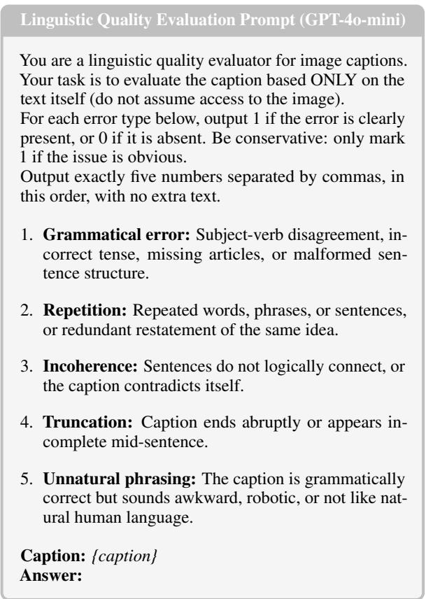

# Reliability Challenges in Diffusion Vision–Language Models

Md. Atabuzzaman

Chris Thomas

Department of Computer Science Virginia Tech {atabuzzaman, christhomas}@vt.edu

## Abstract

Diffusion-based Large Vision-Language Models (dLVLMs) have recently emerged as a compelling alternative to autoregressive (AR) LVLMs, offering advantages in parallel decoding, bidirectional context, and controllable generation. Despite rapid progress, their reliability properties remain largely uncharacterized. We present the first systematic reliability evaluation of hallucination and bias in dLVLMs, benchmarking six diffusion models against competitive AR baselines across four dimensions. Our key findings are: (1) dLVLMs reverse the yesbias of AR models in binary visual queries; (2) they achieve competitive hallucination rates yet exhibit degraded linguistic quality; (3) they collapse to near-zero accuracy on underrepresented racial groups with opposite-polarity gender bias; and (4) they exhibit accuracy collapse in multiple-choice settings when the correct option is shorter than its distractors, associated with a length prior that emerges at the first denoising step. Tokens committed at late denoising steps with low confidence further correlate with hallucinated content, pointing to a mechanistic signal unique to diffusion generation. These patterns vary across model families, suggesting reliability is shaped by the generative paradigm together with training data.1

## 1 Introduction

Large Vision-Language Models (LVLMs) have recently achieved strong performance across diverse vision-language tasks, from visual question answering and mathematical reasoning to document understanding and image captioning (Liu et al., 2023; Bai et al., 2025; Chen et al., 2025). These models predominantly rely on autoregressive (AR) generation, producing responses token by token in a leftto-right sequence. While effective, this paradigm has fundamental limitations: sequential decoding is hard to parallelize, bidirectional context is unavailable during generation, and AR models are prone to hallucination and systematic output biases (Bang et al., 2023; Pezeshkpour and Hruschka, 2024).

Discrete diffusion language models have emerged as an alternative to AR generation (Nie et al., 2026; Ye et al., 2025b). Rather than producing tokens sequentially from left to right, these models treat generation as an iterative denoising process over discrete tokens, starting from a fully masked sequence and progressively unmasking tokens using bidirectional context. This offers structural advantages over AR models: parallel decoding enables flexible speed-quality trade-offs, bidirectional attention allows conditioning on the full response context, and iterative refinement supports constrained generation. Recent work has extended discrete diffusion to the multimodal setting (Li et al., 2026; You et al., 2026; Yu et al., 2025; Ye et al., 2025a; Yang et al., 2025), demonstrating that dLVLMs achieve competitive or superior performance on standard benchmarks.

Despite this rapid progress, a critical question remains overlooked: do the structural properties of diffusion-based generation alter the reliability of LVLMs, specifically their bias and hallucination patterns? AR models inherit well-documented failure modes: they are prone to object hallucination (Li et al., 2023), exhibit strong yes-bias in binary visual queries (Li et al., 2023), show systematic preferences for longer or positionally favored answer options in multiple-choice question answering (MCQA) settings (Atabuzzaman et al., 2025; Zhao et al., 2025), and exhibit demographic disparities across gender and racial groups (Karkkainen and Joo, 2021; Wang et al., 2021). Whether dLVLMs share, amplify, or alter these failure modes remains largely unexplored.

In this paper, we conduct the first systematic reliability evaluation of dLVLMs, benchmarking six models against competitive AR baselines across four dimensions: (1) object hallucination, evaluated via the POPE benchmark (Li et al., 2023) across random, popular, and adversarial sampling strategies; (2) open-ended hallucination, evaluated via the CHAIR metric (Rohrbach et al., 2018) on free-form image captioning; (3) demographic bias, evaluated via the FairFace dataset (Karkkainen and Joo, 2021) for gender and racial group recognition under two image padding conditions; and (4) selection bias, evaluated via length-controlled multiple-choice visual questions derived from Atabuzzaman et al. (2025), probing sensitivity to option length as a confounding cue.

Our experiments reveal qualitatively distinct, and in several cases more severe, reliability profiles in dLVLMs than AR counterparts, with patterns varying systematically across model families. These findings establish a new empirical foundation for reliability-aware evaluation of dLVLMs as this model class scales toward deployment. Our main contributions are as follows:

• Benchmarking dLVLMs against competitive AR baselines across hallucination, demographic bias, and selection bias, providing the first systematic reliability evaluation of this model family.

• dLVLMs exhibit systematically different reliability profiles from AR models, associated with the diffusion paradigm, with linguistic quality and hallucination as separable failure modes.

• dLVLMs exhibit far more severe length bias in MCQA than AR models, linked to a length preference that appears at the first denoising step.

• We identify opposite-polarity gender bias across diffusion model families, near-zero accuracy on underrepresented racial groups, and a denoising confidence trajectory signal correlated with hallucinated content.

## 2 Related Work

Diffusion Language Models. Diffusion-based LLMs (Li et al., 2022; Nie et al., 2026) operate over discrete tokens, treating generation as iterative denoising from a fully masked sequence. Nie et al. (2026) proposed LLaDA, a discrete diffusion LLM trained from scratch that demonstrates competitive performance with strong AR LLMs on in-context learning, instruction following, and reasoning tasks, while alleviating limitations such as the reversal curse (Berglund et al., 2024). Subsequent work has extended LLaDA along several axes, including long-context extrapolation (Liu et al., 2026), sparse

Mixture-of-Experts scaling (Zhu et al., 2025), and AR-based initialization with context-adaptive noise scheduling in Dream-7B (Ye et al., 2025b).

Diffusion-based LVLMs. The extension of discrete diffusion models to multimodal settings has recently gained momentum. LaViDa (Li et al., 2026) equips discrete diffusion backbones with a vision encoder and jointly fine-tunes for multimodal instruction following, yielding two variants based on the LLaDA and Dream backbones. LLaDA-V (You et al., 2026) is a purely diffusionbased LVLM built on LLaDA-8B, demonstrating superior data scalability over an AR baseline. MMaDA (Yang et al., 2025) is a unified multimodal diffusion model combining mixed chain-of-thought fine-tuning with a diffusion-specific RL algorithm for text generation, multimodal reasoning, and textto-image synthesis. Dimple (Yu et al., 2025) addresses training instability via an autoregressivethen-diffusion paradigm and confident decoding. Dream-VL (Ye et al., 2025a) is built on Dream-7B that demonstrates strong performance.

Hallucination and Bias in LVLMs. Bias and hallucination in AR LVLMs have been extensively studied. Object hallucination has been benchmarked through POPE (Li et al., 2023), which probes yes/no object queries across random, popular, and adversarial sampling strategies. Response bias in MCQA settings is well-documented, with models exhibiting systematic preferences for specific answer positions (Pezeshkpour and Hruschka, 2024), verbose options (Zhao et al., 2025), and particular formatting patterns (Zheng et al., 2023); Atabuzzaman et al. (2025) further demonstrated strong selection bias in fine-grained visual MCQA. Demographic bias has been explored through datasets such as FairFace (Karkkainen and Joo, 2021), revealing race- and gender-dependent disparities in visual recognition (Wang et al., 2021). TraceDet (Chang et al., 2026) leverages intermediate denoising trajectories in diffusion LLMs to identify hallucination-relevant steps, achieving improved detection accuracy over output-only baselines; however, it targets text-only diffusion LLMs and hallucination detection alone. Despite growing interest in dLVLMs, their bias and hallucination properties remain largely unexplored. Prior work has focused primarily on AR models, leaving open whether diffusion-based generation changes these failure modes. To our knowledge, this is the first systematic study to address this gap, providing an empirical characterization of dLVLM reliability relative to AR counterparts and establishing a foundation for reliability-aware evaluation.

  
Figure 1: Qualitative hallucination analysis on a LaViDa-LLaDA caption (MSCOCO). Top: The model generates a fluent description of the living room image, but hallucinates objects not present in the scene (clock, vase, posters). Bottom: Per-token confidence (colour) and commit step (parentheses) from the diffusion denoising process. Hallucinated tokens — clock (step 127) and vase (step 126) — and the imprecise posters (step 128) are all committed at late denoising steps with low confidence (red), whereas the non-hallucinated lantern (step 40), despite low confidence, is committed substantially earlier. This suggests that late commit step combined with low confidence may jointly indicate hallucination risk.

## 3 Preliminary

Diffusion-Based Large Vision-Language Models. Diffusion-based LVLMs (dLVLMs) treat response generation as an iterative denoising process over discrete tokens. The forward process gradually corrupts a clean response x into a fully masked sequence x1 by independently replacing tokens with a special [MASK] token. At inference, the model starts from a fully masked response and iteratively unmasks tokens over K denoising steps. At each step k, the model predicts all masked positions simultaneously:

$$
p _ { \theta } ( \mathbf { x } _ { 0 } \mid \mathbf { v } , \mathbf { p } , \mathbf { x } _ { k } ) = \prod _ { i : x _ { k } ^ { i } = [ \mathsf { M } ] } p _ { \theta } ( x _ { 0 } ^ { i } \mid \mathbf { v } , \mathbf { p } , \mathbf { x } _ { k } ) ,\tag{1}
$$

where the denoiser $p _ { \theta }$ uses a full bidirectional attention mask, allowing every position to attend to all others. In this work, we evaluate six dLVLMs, each built on a discrete masked diffusion backbone but differing in base language model, vision encoder integration, and post-training strategy. At each denoising step, the model assigns a per-token confidence score (the maximum softmax probability over the vocabulary) and selects positions to unmask based on these scores. The commit step of a token is the step at which it is first assigned its final non-mask value. These two signals form the basis of our mechanistic hallucination analysis in Section 4.1.

## 4 Experiments

We evaluate six dLVLMs (LLaDA-V (You et al., 2026), LaViDa-LLaDA (LaViDa-L) (Li et al., 2026), LaViDa-Dream (LaViDa-D) (Li et al., 2026), MMaDA-MixCoT (MMaDA-M) (Yang et al., 2025), Dream-VL (Ye et al., 2025a), and Dimple (Yu et al., 2025)) against competitive AR baselines across four reliability dimensions. We note that MMaDA-MixCoT corresponds to the publicly released MMaDA-8B-MixCoT checkpoint (Stage 2); the full MMaDA model with UniGRPO RL (Stage 3) was not publicly available at the time of this work (Yang et al., 2025).

## 4.1 Hallucination Evaluation

We evaluate object hallucination using the POPE benchmark (Li et al., 2023), which probes yes/no object queries on MSCOCO (Lin et al., 2014) images across three settings: Random (uniform object sampling), Popular (frequently appearing objects), and Adversarial (co-occurring objects designed to elicit hallucination). We report Accuracy, Precision, Recall, F1, and Yes%, where Yes% captures the proportion of affirmative responses and serves as a proxy for response bias. We compare against seven AR LVLMs: LLaVA-1.5-7B (LLaVA) (Liu et al., 2023), LLaVA-1.6-7B (LLaVA-Next) (Liu et al., 2024), Qwen2.5-VL-7B-Instruct (Qwen2.5- VL) (Bai et al., 2025), InternVL2.5-8B (InternVL2.5) (Chen et al., 2025), mPLUG-Owl (mPLUG) (Ye et al., 2023), MiniGPT-4 (Zhu et al., 2024), and InstructBLIP (Dai et al., 2023). Results are presented in Table 1.

<table><tr><td>Ca.</td><td>Model</td><td>Type</td><td>Acc. ↑</td><td>Pre. ↑</td><td>Rec. ↑</td><td>F1↑</td><td>Yes%</td></tr><tr><td></td><td>mPLUG-Owl LLaVA</td><td>AR AR</td><td>53.30</td><td>51.71 52.32</td><td>99.53</td><td>68.06</td><td>96.23</td></tr><tr><td></td><td></td><td></td><td>54.43</td><td></td><td>99.80</td><td>68.65</td><td>95.37</td></tr><tr><td></td><td>LLaVA-Next</td><td>AR</td><td>88.00</td><td>98.97</td><td>76.80</td><td>86.49</td><td>38.80</td></tr><tr><td></td><td>MiniGPT-4</td><td>AR</td><td>77.83</td><td>75.38</td><td>82.67</td><td>78.86</td><td>54.83</td></tr><tr><td></td><td>InstructBLIP</td><td>AR</td><td>88.73</td><td>85.08</td><td>93.93</td><td>89.29</td><td>55.20</td></tr><tr><td></td><td>Qwen2.5-VL</td><td>AR</td><td>83.00</td><td>100.0</td><td>66.00</td><td>79.52</td><td>33.00</td></tr><tr><td>Ra.</td><td>InternVL2.5</td><td>AR</td><td>92.60</td><td>99.53</td><td>85.60</td><td>92.04</td><td>43.00</td></tr><tr><td></td><td>LLaDA-V</td><td>Diff.</td><td>84.58</td><td>99.43</td><td>69.88</td><td>82.08</td><td>35.50</td></tr><tr><td></td><td>LaViDa-D</td><td>Diff.</td><td>86.60</td><td>97.41</td><td>75.20</td><td>84.88</td><td>38.60</td></tr><tr><td></td><td>LaViDa-L</td><td>Diff.</td><td>84.80</td><td>98.33</td><td>70.80</td><td>82.33</td><td>36.00</td></tr><tr><td></td><td>MMaDA-M</td><td>Diff.</td><td>83.00</td><td>83.40</td><td>82.40</td><td>82.90</td><td>49.40</td></tr><tr><td></td><td>Dream-VL</td><td>Diff.</td><td>85.80</td><td>100.0</td><td>71.60</td><td>83.45</td><td>35.80</td></tr><tr><td></td><td>Dimple</td><td>Diff.</td><td>88.00</td><td>98.97</td><td>76.80</td><td>86.49</td><td>38.80</td></tr><tr><td rowspan="20">Po.</td><td>mPLUG-Owl</td><td>AR</td><td>50.63</td><td>50.32</td><td>99.27</td><td>66.79</td><td>98.63</td></tr><tr><td>LLaVA</td><td>AR</td><td>52.43</td><td>51.25</td><td>99.80</td><td>67.72</td><td>97.37</td></tr><tr><td>LLaVA-Next</td><td>AR</td><td>89.80</td><td>97.62</td><td>81.67</td><td>88.94</td><td>42.00</td></tr><tr><td>MiniGPT-4</td><td>AR</td><td>68.30</td><td>64.27</td><td>82.40</td><td>72.21</td><td>64.10</td></tr><tr><td>InstructBLIP</td><td>AR</td><td>81.37</td><td>75.07</td><td>93.93</td><td>83.45</td><td>62.57</td></tr><tr><td>Qwen2.5-VL</td><td>AR</td><td>86.40</td><td>97.41</td><td>74.90</td><td>84.68</td><td>38.60</td></tr><tr><td>InternVL2.5</td><td>AR</td><td>92.40</td><td>94.19</td><td>90.44</td><td>92.28</td><td>48.20</td></tr><tr><td>LLaDA-V</td><td>Diff.</td><td>87.75</td><td>96.10</td><td>78.80</td><td>86.59</td><td>41.16</td></tr><tr><td>LaViDa-D</td><td>Diff.</td><td>88.40</td><td>93.67</td><td>82.47</td><td>87.71</td><td>44.20</td></tr><tr><td>LaViDa-L</td><td>Diff.</td><td>87.60</td><td>93.55</td><td>80.88</td><td>86.75</td><td>43.40</td></tr><tr><td>MMaDA-M</td><td>Diff.</td><td>79.60</td><td>75.96</td><td>86.85</td><td>81.04</td><td>57.40</td></tr><tr><td>Dream-VL</td><td>Diff.</td><td>87.00</td><td>95.15</td><td>78.09</td><td>85.78</td><td>41.20</td></tr><tr><td>Dimple</td><td>Diff.</td><td>87.80</td><td>93.18</td><td>81.67</td><td>87.05</td><td>44.00</td></tr><tr><td>LLaVA</td><td>mPLUG-Owl AR</td><td>50.67</td><td>50.34</td><td></td><td>99.33</td><td>66.82</td><td>98.67</td></tr><tr><td></td><td></td><td>AR</td><td>50.77</td><td>50.39</td><td>99.87</td><td>66.98</td><td>99.10</td></tr><tr><td></td><td>LLaVA-Next</td><td>AR</td><td>86.00</td><td>93.20</td><td>77.42</td><td>84.58</td><td>41.20</td></tr><tr><td></td><td>MiniGPT-4</td><td>AR</td><td>66.60</td><td>62.45</td><td>83.27</td><td>71.37</td><td>66.67</td></tr><tr><td></td><td>InstructBLIP</td><td>AR</td><td>74.37</td><td>67.67</td><td>93.33</td><td>78.45</td><td>68.97</td></tr><tr><td></td><td>Qwen2.5-VL</td><td>AR</td><td>82.60</td><td>96.00</td><td>67.74</td><td>79.43</td><td>35.00</td></tr><tr><td></td><td>InternVL2.5</td><td>AR</td><td>85.20</td><td>83.72</td><td>87.10</td><td>85.38</td><td>51.60</td></tr><tr><td></td><td>LLaDA-V</td><td>Diff.</td><td>82.77</td><td>92.63</td><td>70.97</td><td>80.37</td><td>38.08</td></tr><tr><td>LaViDa-D</td><td></td><td>Diff.</td><td>82.60</td><td>86.76</td><td>76.61</td><td>81.37</td><td>43.80</td></tr><tr><td>LaViDa-L</td><td></td><td>Diff.</td><td>80.00</td><td>83.33</td><td>74.60</td><td>78.72</td><td>44.40</td></tr><tr><td></td><td>MMaDA-M</td><td>Diff.</td><td>72.80</td><td>68.54</td><td>83.47</td><td>75.27</td><td>60.40</td></tr><tr><td></td><td>Dream-VL</td><td>Diff.</td><td>84.20</td><td>92.89</td><td>73.79</td><td>82.25</td><td>39.40</td></tr><tr><td>Dimple</td><td></td><td>Diff.</td><td>84.00</td><td>88.18</td><td>78.23</td><td>82.91</td><td>44.00</td></tr></table>

Table 1: POPE benchmark evaluation (MSCOCO). Best overall results per category are in bold; best results among diffusion models are highlighted . For Yes%, values closest to 50 indicate least response bias. AR = autoregressive; Diff. = diffusion-based; Ca. = category; Acc. = accuracy; Pre. = precision; Rec. = recall; Ra. = random; Po. = popular; Ad. = adversarial.

dLVLMs Achieve Competitive Hallucination Resistance. Across all three settings, dLVLMs achieve competitive accuracy relative to AR baselines, with InternVL2.5 retaining the top overall score in each category. Among dLVLMs, Dimple achieves the highest accuracy on Random (88.00%), LaViDa-Dream on Popular (88.40%), and Dream-VL on Adversarial (84.20%). Notably, LaViDa-Dream surpasses InstructBLIP (the strongest among the older AR baselines) by 7.03 and 8.23 percentage points on Popular and Adversarial respectively, demonstrating that dLVLMs have narrowed the gap with competitive AR models on object hallucination.

AR Models Are Yes-Biased; dLVLMs Trend Toward No-Bias. Older AR models exhibit a pronounced yes-bias, with Yes% ranging from 54.83% (MiniGPT-4) to nearly 100% (mPLUG-Owl, LLaVA), while modern AR models are more calibrated: InternVL2.5 reaches 43.00% on Random. In contrast, most dLVLMs display the opposite pattern, with Yes% consistently between 35–45% across all three settings, yielding high precision (up to 100% for Dream-VL on Random) but at the cost of reduced recall. The exception is MMaDA-MixCoT, whose Yes% increases to 60.40% on Adversarial, suggesting its MixCoT training objective reinforces yes-leaning tendencies. These findings underscore that response bias in dLVLMs is associated with both the generative architecture and the training objective.

<table><tr><td>Type</td><td>Model</td><td>CHAIRI↓</td><td>CHAIRs↓</td><td>Avg Len</td></tr><tr><td rowspan="4">AR</td><td>LLaVA-1.5</td><td>26.62</td><td>57.52</td><td>87.3</td></tr><tr><td>LLaVA-Next</td><td>14.50</td><td>30.14</td><td>98.8</td></tr><tr><td>Qwen2.5-VL</td><td>13.99</td><td>30.35</td><td>97.9</td></tr><tr><td>InternVL2.5</td><td>12.63</td><td>27.96</td><td>84.1</td></tr><tr><td rowspan="10">Diff.</td><td>LLaDA-V</td><td>15.57</td><td>30.71</td><td>108.2</td></tr><tr><td>LaViDa-L</td><td>18.43</td><td>30.91</td><td>109.1</td></tr><tr><td>LaViDa-D</td><td>15.13</td><td>29.67</td><td>92.8</td></tr><tr><td>Dream-VL</td><td>11.69</td><td>23.21</td><td>76.4</td></tr><tr><td>MMaDA-M</td><td>19.75</td><td>39.35</td><td>63.5</td></tr><tr><td>Dimple</td><td>19.59</td><td>34.49</td><td>99.2</td></tr><tr><td></td><td></td><td></td><td></td></tr><tr><td></td><td></td><td>With step size reduced to half (128 → 64)</td><td></td></tr><tr><td>LaViDa-L</td><td>18.87</td><td>32.57</td><td>108.0</td></tr><tr><td>Dream-VL</td><td>10.06</td><td>18.14</td><td>55.5</td></tr></table>

Table 2: CHAIR hallucination evaluation on MSCOCO. Lower is better for CHAIR and CHAIR . Avg Len denotes average generated caption length in words. Best results are in bold.

Open-Ended Hallucination Evaluation. To complement the binary POPE evaluation, we assess hallucination in free-form generation using the CHAIR metric (Rohrbach et al., 2018), which measures how often models mention MSCOCO objects not present in the image. We evaluate all models on 500 MSCOCO val2014 images using the prompt “Describe the image.” with max\_new\_tokens=128 and confidence-based decoding; dLVLMs use 128 denoising steps. Results report object-level (CHAIRI) and captionlevel (CHAIR ) hallucination rates alongside average caption length, and are presented in Table 2.

Some dLVLMs Are Competitive on Open-Ended Hallucination. Several dLVLMs fall within the competitive range of strong AR baselines: LaViDa-Dream (CHAIRI: 15.13%) and LLaDA-V (15.57%) are comparable to Qwen2.5- VL-7B (13.99%), while Dream-VL achieves the lowest hallucination rate across all evaluated models (CHAIR : 11.69%, CHAIR : 23.21%), surpassing all AR baselines. Notably, caption length does not explain these results: MMaDA-MixCoT produces the shortest captions (63.5 words) yet the highest CHAIRS among dLVLMs (39.35%), while LLaDA-V and LaViDa-LLaDA generate the longest captions yet maintain moderate hallucination rates, indicating that caption length alone does not determine hallucination risk.

Diffusion Training Introduces Hallucination-Specific Challenges. Dimple shares the same training data (Yu et al., 2025) as LLaVA-Next yet substantially underperforms it on open-ended hallucination (CHAIRI: 19.59% vs. 14.50%; CHAIRS: 34.49% vs. 30.14%), despite comparable binary hallucination resistance on POPE (88.00% vs. 88.00% on Random), suggesting diffusion training contributes hallucination-specific challenges beyond what is explained by data alone.

<table><tr><td>Model</td><td>Type</td><td>Gram.</td><td>Rep.</td><td>Incoher.</td><td>Trunc.</td><td>Unnat.</td><td>OA</td><td>OA-T</td></tr><tr><td>LLaVA-1.5</td><td>AR</td><td>0.2</td><td>0.4</td><td>0.0</td><td>19.4</td><td>0.2</td><td>20.0</td><td>0.8</td></tr><tr><td>LLaVA-Next</td><td>AR</td><td>2.2</td><td>0.0</td><td>0.0</td><td>69.2</td><td>0.4</td><td>69.2</td><td>2.6</td></tr><tr><td>Qwen2.5-VL</td><td>AR</td><td>0.2</td><td>0.2</td><td>0.0</td><td>26.0</td><td>0.2</td><td>26.4</td><td>0.6</td></tr><tr><td>InternVL2.5</td><td>AR</td><td>0.2</td><td>0.4</td><td>0.0</td><td>27.0</td><td>0.6</td><td>27.6</td><td>1.0</td></tr><tr><td>Dimple</td><td>Diff.</td><td>3.0</td><td>5.2</td><td>0.2</td><td>0.2</td><td>10.2</td><td>13.8</td><td>13.8</td></tr><tr><td>LLaDA-V</td><td>Diff.</td><td>0.8</td><td>4.0</td><td>0.2</td><td>0.0</td><td>5.6</td><td>8.2</td><td>8.2</td></tr><tr><td>LaViDa-L</td><td>Diff.</td><td>1.0</td><td>2.4</td><td>0.0</td><td>0.4</td><td>1.4</td><td>3.0</td><td>3.0</td></tr><tr><td>LaViDa-D</td><td>Diff.</td><td>6.4</td><td>0.8</td><td>0.0</td><td>6.0</td><td>12.0</td><td>13.0</td><td>13.0</td></tr><tr><td>MMaDA-M</td><td>Diff.</td><td>0.2</td><td>1.4</td><td>0.0</td><td>3.0</td><td>0.4</td><td>4.6</td><td>1.6</td></tr><tr><td>Dream-VL</td><td>Diff.</td><td>0.2</td><td>0.4</td><td>0.0</td><td>0.4</td><td>0.6</td><td>1.6</td><td>1.2</td></tr></table>

<table><tr><td colspan="9">With step size reduced to half (128 → 64)</td></tr><tr><td>LaViDa-L</td><td>Diff.</td><td>60.0</td><td>64.6</td><td>11.2</td><td>14.8</td><td>82.0</td><td>88.2</td><td>87.6</td></tr><tr><td>Dream-VL</td><td>Diff.</td><td>21.2</td><td>21.6</td><td>0.6</td><td>7.0</td><td>29.4</td><td>46.4</td><td>43.8</td></tr></table>

Table 3: Linguistic quality evaluation on MSCOCO captions using GPT-4o-mini as judge. All values are percentages of captions with that error present. Overall−T denotes overall error rate excluding truncation, enabling fair cross-paradigm comparison of intrinsic linguistic quality. Gram. = grammatical error; Rep. = repetition; Incoher. = incoherence; Trunc. = truncation; Unnat. = unnatural phrasing; OA = Overall.

Linguistic Quality Evaluation. To assess whether CHAIR results are confounded by surface-level generation quality, we evaluate all generated captions using GPT-4o-mini as a judge across five error types: grammatical error, repetition, incoherence, truncation, and unnatural phrasing, using deterministic decoding. The prompt is provided in Appendix A.7. Results are presented in Table 3.

Unnatural phrasing is the primary dLVLMspecific linguistic failure, though not universal: MMaDA-M (0.4%), LaViDa-LLaDA (1.4%), and Dream-VL (0.6%) are competitive with AR baselines (0.2–0.6%), while LaViDa-Dream (6.4% grammatical error, 12.0% unnatural phrasing) and Dimple (3.0%, 10.2%) show elevated rates. Incoherence is negligible across all models (0.0– 0.2%). Truncation reveals a complementary limitation of AR decoding under fixed budgets: LLaVA-Next truncates 69.2% of captions and InternVL2.5 27.0% under max\_new\_tokens=128, while dLVLMs rarely truncate (0.0–6.0%). We report $_ { \mathrm { O v e r a l l } ^ { - \mathrm { T } } }$ for cross-paradigm comparison: AR models achieve 0.6–2.6% and dLVLMs range from 1.2% (Dream-VL) to 13.8% (Dimple).

Effect of Denoising Steps on Generation Quality. To examine how denoising steps affect hallucination and linguistic quality, we evaluate LaViDa-LLaDA and Dream-VL with step size reduced to half (128 vs. 64). Results are shown in Tables 2 and 3. Reducing steps causes dramatic linguistic degradation: LaViDa-LLaDA’s overall error rate rises from 3.0% to 87.6% (grammatical: 1.0%→60.0%; repetition: 2.4%→64.6%), while Dream-VL also degrades substantially (1.2% to 43.8%). Hallucination rates are less sensitive: LaViDa-LLaDA increases marginally $\mathrm { ( C H A I R _ { I } ; }$ 18.43%→18.87%), and Dream-VL’s apparent improvement (11.69%→10.06%) is accompanied by a substantial caption length reduction (76.4→55.5 words), suggesting shorter outputs rather than improved grounding. These results confirm that reducing denoising steps primarily degrades linguistic quality, while hallucination reflects grounding properties established during training.

<table><tr><td>Model</td><td>Decoding</td><td> $\mathbf { C H A I R } _ { \mathbf { I } } \downarrow$ </td><td> $\mathbf { C H A I R _ { S } } \downarrow$ </td><td>Ling. Error ↓</td></tr><tr><td>Dimple</td><td>Diffusion</td><td>19.59</td><td>34.49</td><td>13.8%</td></tr><tr><td>Dimple</td><td>AR-style</td><td>16.23</td><td>31.60</td><td>2.0%</td></tr><tr><td>LaViDa-L</td><td>Diffusion</td><td>18.43</td><td>30.91</td><td>3.0%</td></tr><tr><td>LaViDa-L</td><td>AR-style</td><td>17.50</td><td>30.23</td><td>1.2%</td></tr></table>

Table 4: CHAIR hallucination and overall linguistic error rate (excluding truncation) under default diffusion vs. AR-style decoding, using the same model weights with no retraining. Ling. Error = overall linguistic error rate excluding truncation.

AR-Style Decoding Ablation. To investigate whether the diffusion commitment order independently drives hallucination and linguistic quality, we apply AR-style decoding (left-to-right, one token per step) to Dimple and LaViDa-LLaDA using the same model weights with no retraining, isolating the decoding paradigm while holding architecture, training data, and vision encoder constant. Results are presented in Table 4.

AR-style decoding substantially improves linguistic quality. Dimple’s error rate drops from 13.8% to 2.0%, within the AR baseline range (0.6– 2.6%); LaViDa-LLaDA similarly improves from 3.0% to 1.2%, matching the best AR baselines. However, hallucination persists: CHAIRI improves only modestly from 19.59% to 16.23% for Dimple and from 18.43% to 17.50% for LaViDa-LLaDA, both remaining substantially above InternVL2.5- 8B (12.63%) and Dream-VL (11.69%). The pattern is consistent across both models: decoding order governs surface fluency, while hallucination rates are largely invariant to it. This dissociation suggests hallucination reflects grounding-related challenges rather than generation artifacts, consistent with Dream-VL’s low hallucination reflecting better visual grounding despite its diffusion backbone.

Qualitative Analysis. Figure 1 shows an illustrative example of per-token confidence and commit step for a LaViDa-LLaDA caption. Hallucinated tokens clock (step 127) and vase (step 126) are committed at late denoising steps with low confidence, as is posters (step 128), the latest and least confident token in the sequence. In contrast, the grounded lantern (step 40), despite similarly low confidence, is committed substantially earlier. This suggests that late commit step combined with low confidence may jointly indicate hallucination risk in dLVLMs. Appendix A.1 provides additional examples across distinct image types.

Quantitative Validation of the Commit-Step Signal. To move beyond the qualitative pattern in Figures 1, 2 and 3, we quantitatively validate the commit-step hallucination signal using the CHAIR annotations from Section 4.1. For each generated caption we treat CHAIR-flagged hallucinated object tokens as positives and grounded object tokens as negatives, and evaluate commit step and pertoken confidence, individually and jointly via a 5-fold cross-validated logistic regression, as hallucination predictors, reporting ROC-AUC and PR-AUC over the 500-image MSCOCO caption set across two backbones (LaViDa-LLaDA and LaViDa-Dream).

Commit step and confidence separate hallucinated from grounded object tokens consistently across both backbones (Table 5). Hallucinated objects commit substantially later, a 22 to 26 step gap on a 128-step budget, and with lower confidence, yielding above-chance ROC-AUC on both models, with commit step the stronger single feature (0.699 and 0.667). PR-AUC for commit step reaches 0.374 and 0.261 respectively, roughly double the corresponding base rate (0.190 and 0.152), confirming the separation survives class imbalance. The two features are correlated, since late commits tend to be low-confidence, which explains why the joint model offers little gain over commit step alone. We treat this as evidence of a hallucination-risk pattern specific to diffusion generation, clearly distinguishable from standard autoregressive decoding, since AR generation has no analogous commit-step trajectory at any stage.

Attention-Based Analysis. To further investigate the grounding failure hypothesis, we extracted attention weights from answer token positions to image patch tokens in LaViDa-LLaDA across three representative layers (8, 16, 24), examining mean attention, peak attention, and entropy for hallucinated versus grounded tokens at their specific commit steps. We found no statistically distinguishable difference between the two categories across any layer or aggregation strategy: mean attention values were nearly identical (0.0005 vs. 0.0005) and entropy showed no consistent pattern (4.41 vs. 4.40). This null result does not rule out grounding failures as a contributing factor; attention weights aggregated over all image patches may be too coarse to capture the spatially localized or cross-layer grounding signals that distinguish hallucinated from grounded tokens. The commit-step and confidence trajectory remain the more discriminative signals in this setting. Details are provided in Appendix A.2.

## 4.2 Demographic Bias Evaluation

We evaluate all models on gender classification and racial recognition using the FairFace dataset (Karkkainen and Joo, 2021), which provides balanced coverage across seven racial groups (Black, East Asian, Indian, Latino Hispanic, Middle Eastern, Southeast Asian, and White) and two genders. We construct a balanced subset of 2,000 images from the FairFace validation split (142 images per race × gender group) under two face-crop padding settings: padding 0.25 (tight crop, isolating facial features) and padding 1.25 (loose crop, retaining background context). The evaluation protocol is provided in Appendix A.3. Full results including gender and per-race accuracy, the female–male accuracy gap, per-model accuracy change across padding settings (∆), and systematic misclassification patterns are provided in Appendices A.4–A.5. Output Validity. To rule out evaluation artifacts, we verify that near-zero subgroup accuracies reflect genuine misclassification rather than parsing failure. Across all diffusion models, every prediction at both padding settings parses to a valid FairFace label (0 of 1,988 non-matching outputs per run, for every model), so no accuracy is lost to unparseable output. Table 8 confirms these are confident misclassifications into other valid categories rather than malformed responses: MMaDA-MixCoT’s 0.00% on Latino Hispanic and Southeast Asian at padding 0.25 consists entirely of predictions distributed across other valid race labels (Latino Hispanic to Indian 35%, White 26%; Southeast Asian to White 33%, Indian 30%).

<table><tr><td>Model</td><td>Obj.</td><td>Base</td><td>Step (H/G)</td><td>Conf. (H/G)</td><td> $\mathrm { \sf A U C _ { \mathrm { s t e p } } }$ </td><td> $\mathrm { A U C } _ { \mathrm { c o n f } }$ </td><td> $\mathrm { \mathbf { A U C } _ { j o i n t } }$ </td><td> $\mathrm { P R - A U C _ { \mathrm { s t e p } } }$ </td></tr><tr><td>LaViDa-L</td><td>968</td><td>0.190</td><td>63.8 / 37.6</td><td>0.533 / 0.615</td><td>0.699</td><td>0.610</td><td>0.688</td><td>0.374</td></tr><tr><td>LaViDa-D</td><td>999</td><td>0.152</td><td>64.3 / 42.2</td><td>0.579 / 0.685</td><td>0.667</td><td>0.626</td><td>0.673</td><td>0.261</td></tr></table>

Table 5: Commit step and confidence as hallucination predictors on CHAIR object tokens. H/G denotes mean commit step and mean confidence for hallucinated vs. grounded tokens. Higher commit step and lower confidence indicate hallucination; scores are oriented accordingly. Best results are in bold.

Overall Race Recognition Performance. AR models consistently outperform dLVLMs on race recognition. InternVL2.5-8B achieves the highest overall accuracy at padding 1.25 (69.32%), followed by Qwen2.5-VL-7B (68.41%). Most dLVLMs lag significantly behind, with LaViDa-LLaDA reaching 50.65% at best and MMaDA-MixCoT barely exceeding 23%. The exception is Dream-VL (68.11%), approaching AR-level performance, suggesting its stronger backbone yields richer racial feature representations.

Systematic Failure on Underrepresented Racial Groups. All models struggle with Latino Hispanic and Southeast Asian categories. MMaDA-MixCoT achieves 0% on both groups at padding 0.25, while LaViDa-LLaDA reaches only 0.35% and 1.06% respectively. Table 8 reveals systematic misclassification into more frequent groups: Latino Hispanic faces are misclassified as White or Indian, while Southeast Asian faces are predominantly predicted as East Asian (73–84% in LLaVA-1.5-7B and LaViDa-Dream), suggesting a shared bias pattern across both AR and diffusion models.

Context Sensitivity and Divergent Backbone Patterns. Loose cropping consistently improves performance, with dLVLMs exhibiting larger sensitivity than AR models: LaViDa-LLaDA improves by +10.41% and MMaDA-MixCoT by +13.73% overall, with MMaDA-MixCoT gaining +24.30% on East Asian from context alone, suggesting substantial reliance on background cues for this group. The two LaViDa variants further reveal backbonespecific prototype hierarchies despite sharing the same training pipeline: LaViDa-Dream displays a strong East Asian dominance bias (63% of Latino Hispanic, 84% of Southeast Asian), while LaViDa-LLaDA defaults to Indian and White, achieving higher Indian accuracy (64.08% vs. 25.35%). These divergent misclassification targets, arising from models that share the training pipeline and vision encoder but differ in backbone (Dream-7B vs. LLaDA-8B), are consistent with the diffusion backbone influencing which racial prototypes dominate predictions.

Gender Bias: Opposite Polarity Across Model Families. Gender classification reveals a divergence in bias polarity at tight crop. AR models exhibit small, stable gaps (LLaVA-1.5-7B: −2.71; InternVL2.5-8B: −1.00; Qwen2.5-VL-7B: +3.22), while dLVLMs exhibit much larger and more variable gaps. LaViDa-Dream and LaViDa-LLaDA strongly favor females (Gap = +13.48 and +10.26), while MMaDA-MixCoT misclassifies females more often (Gap = −23.34), with female accuracy at 68.51% versus 91.85% for males. This asymmetry nearly vanishes at loose crop (Gap = +0.10), and LaViDa-Dream’s gap narrows from +13.48 to +5.84 and LaViDa-LLaDA’s from +10.26 to +3.73, suggesting dLVLMs encode insufficient discriminative signal for female facial features without contextual cues. AR models show negligible padding sensitivity $( \Delta < 4 \% )$ , indicating more robust gender representations.

Label Ambiguity and Its Limits. FairFace labels reflect annotator-perceived race, which is inherently ambiguous for several categories, notably Latino Hispanic and Southeast Asian, both of which overlap visually with neighboring groups. Accuracy figures in this evaluation should accordingly be read as agreement with FairFace’s perceived-race annotations rather than as groundtruth identity. This ambiguity, however, does not account for the scale of the failures observed: the systematic, backbone-dependent absorption patterns in Table 8 (e.g., LaViDa-Dream routing 63– 84% of Latino Hispanic and Southeast Asian faces into East Asian, versus LaViDa-LLaDA routing the same groups into Indian and White) are modelspecific and directionally inconsistent with a shared annotation artifact, indicating the failures reflect genuine model bias beyond label ambiguity.

<table><tr><td>Model</td><td>Option Order</td><td>Equal Long</td><td>Equal Short</td><td>Shorter Correct</td><td>Longer Correct</td></tr><tr><td colspan="6">CUB With Class Name</td></tr><tr><td>LLaDA-V</td><td>ABCD</td><td>60.70</td><td>60.10</td><td>37.40</td><td>92.50</td></tr><tr><td>LaViDa-L</td><td>ABCD</td><td>47.40</td><td>48.60</td><td>11.50</td><td>96.60</td></tr><tr><td></td><td>DCBA</td><td>45.70</td><td>48.80</td><td>13.40</td><td>94.80</td></tr><tr><td>LaViDa-D</td><td>ABCD</td><td>45.10</td><td>46.50</td><td>9.00</td><td>92.60</td></tr><tr><td>MMaDA-M</td><td>ABCD</td><td>37.40 68.20</td><td>40.80 68.40</td><td>11.40 42.10</td><td>91.70 93.00</td></tr><tr><td>Dream-VL Dimple</td><td>ABCD ABCD</td><td>54.30</td><td>54.70</td><td>26.80</td><td>87.10</td></tr><tr><td>CUB Without Class Name</td><td></td><td></td><td></td><td></td><td></td></tr><tr><td colspan="6"></td></tr><tr><td>LLaDA-V</td><td>ABCD</td><td>63.60</td><td>51.30</td><td>47.00</td><td>82.30</td></tr><tr><td>LaViDa-L</td><td>ABCD DCBA</td><td>51.90 52.30</td><td>48.10 45.50</td><td>6.40 9.40</td><td>97.70 97.20</td></tr><tr><td>LaViDa-D</td><td>ABCD</td><td>38.60</td><td>48.90</td><td>2.80</td><td>96.50</td></tr><tr><td>MMaDA-M</td><td>ABCD</td><td>39.00</td><td>42.10</td><td>12.80</td><td>89.70</td></tr><tr><td>Dream-VL</td><td>ABCD</td><td>63.00</td><td>57.90</td><td>30.70</td><td>84.40</td></tr><tr><td>Dimple</td><td>ABCD</td><td>50.00</td><td>49.90</td><td>19.70</td><td></td></tr><tr><td></td><td></td><td></td><td></td><td></td><td>80.90</td></tr><tr><td colspan="6">Dog With Class Name</td></tr><tr><td>LLaDA-V</td><td>ABCD DCBA</td><td>57.83 55.67</td><td>55.33 54.00</td><td>45.50 44.83</td><td>82.67 82.67</td></tr><tr><td>LaViDa-L</td><td>ABCD ABCD</td><td>48.50 59.00</td><td>44.33 52.50</td><td>21.67 21.50</td><td>92.67 91.67</td></tr><tr><td>LaViDa-D</td><td>DCBA</td><td>59.00</td><td>54.67</td><td>22.50</td><td>92.83</td></tr><tr><td>MMaDA-M</td><td>ABCD DCBA</td><td>37.33 41.17</td><td>37.33 37.83</td><td>24.50 29.33</td><td>72.17 67.67</td></tr><tr><td>Dream-VL</td><td>ABCD DCBA</td><td>72.33 71.33</td><td>66.50 66.33</td><td>56.00 55.00</td><td>87.33 85.50</td></tr><tr><td>Dog Without Class Name</td><td></td><td></td><td></td><td></td><td></td></tr><tr><td colspan="6">LLaDA-V</td></tr><tr><td></td><td>ABCD DCBA</td><td>54.17 50.17</td><td>51.17 51.67</td><td>33.00 28.67</td><td>86.67 84.17</td></tr><tr><td>LaViDa-L</td><td>ABCD ABCD</td><td>45.67 48.17</td><td>45.83 54.83</td><td>5.33 4.00</td><td>98.83 98.17</td></tr><tr><td>LaViDa-D</td><td>DCBA</td><td>45.50</td><td>52.17</td><td>3.17</td><td>99.00</td></tr><tr><td>MMaDA-M</td><td>ABCD DCBA</td><td>38.50 33.67</td><td>39.67 38.17</td><td>20.83 11.83</td><td>81.00 81.00</td></tr><tr><td>Dream-VL</td><td>ABCD</td><td>62.17</td><td>59.67</td><td>34.17</td><td>88.17</td></tr><tr><td>Dog (Easy) With Class Name</td><td>DCBA</td><td>56.33</td><td>59.67</td><td>26.33</td><td>89.67</td></tr><tr><td colspan="6"></td></tr><tr><td>LLaDA-V</td><td>ABCD DCBA</td><td>100.00 99.83</td><td>100.00 100.00</td><td>100.00 100.00</td><td>100.00 100.00</td></tr><tr><td>LaViDa-L</td><td>ABCD DCBA</td><td>100.00 100.00</td><td>100.00 100.00</td><td>100.00 100.00</td><td>100.00 100.00</td></tr><tr><td>LaViDa-D</td><td>ABCD</td><td>99.17</td><td>99.17</td><td>97.50</td><td>100.00</td></tr><tr><td></td><td>DCBA ABCD</td><td>99.17 88.33</td><td>100.00 89.83</td><td>98.33 79.33</td><td>100.00 96.83</td></tr><tr><td>MMaDA-M</td><td>DCBA</td><td>87.17</td><td>89.00</td><td>76.67</td><td>96.17</td></tr><tr><td>Dimple</td><td>ABCD</td><td>100.00</td><td>100.00</td><td>99.50</td><td>100.00</td></tr></table>

Table 6: Performance of diffusion LVLMs in Accuracy (%) across option-length conditions and option-order formats. Best results are in bold.

## 4.3 Selection Bias Evaluation

To evaluate selection bias in dLVLMs, we use hard-difficulty MCQs from the fine-grained visual MCQA benchmark of Atabuzzaman et al. (2025), covering two domains: CUB-200-2011 (200 bird species) (Wah et al., 2011) and Stanford Dogs (120 dog breeds) (Khosla et al., 2011). Using GPT-4o (OpenAI, 2024), we generate four lengthcontrolled variants per question while preserving semantic content: Equal Long, Equal Short, Shorter Correct (correct answer short, distractors long), and Longer Correct (correct answer long, distractors short). The latter two conditions directly probe length bias by placing the correct answer at a systematic length disadvantage or advantage, while Equal Long and Equal Short serve as an internal validity check: accuracy differs by roughly 1 to 5 points in most cases, with some larger exceptions (e.g., LLaDA-V and LaViDa-Dream on CUB without class names), indicating that GPT-4o’s rewrites largely preserve the semantic content needed to answer and that length, not precision loss, is the primary driver of the length-bias gap. We evaluate all models with and without explicit class names in the answer options, as class names partially mitigate length bias by providing semantic anchors (Atabuzzaman et al., 2025), and under both standard (ABCD) and reversed (DCBA) option orders to control for positional bias. A full comparison with AR baselines is provided in Table 9 (Appendix A.6).

Diffusion LVLMs Exhibit Extreme Length Bias. Table 6 reveals that most dLVLMs suffer from severe length bias across datasets. In the Shorter Correct condition, accuracy collapses dramatically: LaViDa-Dream drops to 2.80% on CUB without class names, LaViDa-LLaDA to 6.40%, and MMaDA to 12.80%. Conversely, all models achieve 68–99% in the Longer Correct condition, indicating that dLVLMs overwhelmingly select longer options when visual discrimination is hard. The resulting bias gap exceeds 85 percentage points for LaViDa-LLaDA and LaViDa-Dream without class names. LLaDA-V is a notable exception (37.40% on CUB Shorter Correct with class names, 47.00% without), suggesting its backbone confers greater robustness to length cues. Dimple also shows reduced but non-negligible bias (26.80% Shorter Correct on CUB with class names), indicating its AR-then-diffusion training provides partial mitigation.

AR LVLMs Are Substantially More Robust. AR models maintain meaningfully higher accuracy under the Shorter Correct condition, typically achieving 19–51% on CUB and 16–59% on Dogs with class names. Qwen2.5-VL-7B achieves 50.70% on CUB Shorter Correct with class names, more than four times higher than most dLVLMs, though the gap narrows for weaker AR backbones. This suggests AR models integrate visual evidence more reliably against misleading length cues, while most dLVLMs default to length as a dominant heuristic. Class Names Reduce But Do Not Eliminate Bias. Class names provide modest improvement on Dogs (e.g., LaViDa-LLaDA Shorter Correct improves from 5.33% to 21.67%) but negligible benefit on CUB, where LaViDa-Dream’s Shorter Correct accuracy remains at 9.00% with class names versus 2.80% without. AR models benefit more consistently, suggesting dLVLMs lack the semantic grounding needed to leverage class information against competing length signals.

Length Bias Emerges Under Visual Uncertainty. Comparing ABCD and DCBA orderings reveals differences in Shorter Correct and Longer Correct accuracy that are small in most cases (typically within 0–3 percentage points), though a few conditions show larger gaps (up to 9 points, e.g., MMaDA-MixCoT and Dream-VL on Dogs without class names), indicating that option length, rather than position, is the primary driver of the bias. The Dog (Easy) results further support this: most dLVLMs achieve high accuracy when distractors come from dissimilar categories (87–100%, with MMaDA-MixCoT lower at 76–97%), but performance collapses under fine-grained conditions (Hard). This suggests dLVLMs fall back on length heuristics when visual evidence is insufficient, a pattern that mirrors AR model findings (Atabuzzaman et al., 2025) but is far more pronounced.

Mechanistic Analysis of Length Bias. To investigate why dLVLMs exhibit such extreme length bias, we analyze the denoising trajectory of LaViDa-LLaDA on the Shorter Correct and Longer Correct conditions of CUB (1,000 examples each). MCQA responses are short (a single letter A–D), so we use 8 denoising steps over a response buffer of 8 tokens; padding positions are the non-answer slots in this buffer, which the model fills before committing the answer letter. In the Longer Correct condition, the model achieves 97.70% accuracy with mean confidence 0.96 at step 0, and the step-0 prediction matches the final answer in 99.80% of cases. In the Shorter Correct condition, accuracy collapses to 6.40%, while the step-0 prediction still matches the final answer in 97.30% of cases, indicating that denoising rarely revises the model’s initial choice. Since final accuracy is only 6.40%, at least 90.9% of examples (909 of 1,000) have a step-0 prediction that already selects the longer distractor and is never revised by any subsequent denoising step. The mean commit step for the answer position is nonetheless the final step in both conditions, despite the prediction being effectively determined at step 0. These findings reveal that length bias is a one-shot prior: in the vast majority of cases, the step-0 prediction already favors the longer option, and denoising does not revise it.

## 5 Conclusion

We presented the first systematic reliability evaluation of dLVLMs, benchmarking six diffusion models against competitive AR baselines across four reliability dimensions. Our results reveal qualitatively distinct and, in several cases, more severe reliability challenges than AR counterparts: dLVLMs trend toward a no-bias pattern on binary visual queries; they achieve competitive open-ended hallucination yet exhibit degraded linguistic quality in several backbones; they collapse to near-zero accuracy on some underrepresented racial groups with opposite-polarity gender bias; and they exhibit dramatically larger length-bias gaps in MCQA, associated with a one-shot length prior established at the first denoising step. Late-committed, lowconfidence tokens show a consistent pattern with hallucinated content, a signal unique to diffusion generation, which we quantitatively validate across two backbones (ROC-AUC up to 0.699 on CHAIR object tokens). These patterns vary across diffusion backbones, associated with the generative paradigm as a contributing factor alongside training data and scale. We hope these findings motivate reliability-aware evaluation and training strategies for diffusion-based multimodal generation.

## Limitations

Our study provides the first systematic reliability evaluation of dLVLMs, and we acknowledge several limitations. First, while we conduct controlled comparisons (Dimple vs. LLaVA-Next sharing identical training data, AR-style decoding ablations on Dimple and LaViDa-LLaDA, and backbone comparisons within the LaViDa pipeline), full isolation of the generative mechanism from confounds such as vision encoders and model scale requires more extensive ablations. Second, our linguistic quality evaluation relies on GPT-4o-mini as judge and has not been validated against human annotations. Third, our evaluation covers four reliability dimensions and does not extend to other important failure modes such as toxicity, sycophancy, or temporal reasoning. We hope this framework serves as a foundation for developing reliabilityaware training objectives and decoding strategies for diffusion-based multimodal generation.

## Acknowledgments

We acknowledge Advanced Research Computing (ARC) at Virginia Tech for providing the computational resources and technical support that contributed to the results reported in this paper. We thank the reviewers for their constructive feedback, which helped improve this paper.

## References

Md Atabuzzaman, Ali Asgarov, and Chris Thomas. 2025. Benchmarking and mitigating mcqa selection bias of large vision-language models. In Proceedings of the 2025 Conference on Empirical Methods in Natural Language Processing, pages 33536–33550.

Shuai Bai, Keqin Chen, Xuejing Liu, Jialin Wang, Wenbin Ge, Sibo Song, Kai Dang, Peng Wang, Shijie Wang, Jun Tang, Humen Zhong, Yuanzhi Zhu, Mingkun Yang, Zhaohai Li, Jianqiang Wan, Pengfei Wang, Wei Ding, Zheren Fu, Yiheng Xu, and 8 others. 2025. Qwen2.5-vl technical report. Preprint, arXiv:2502.13923.

Yejin Bang, Samuel Cahyawijaya, Nayeon Lee, Wenliang Dai, Dan Su, Bryan Wilie, Holy Lovenia, Ziwei Ji, Tiezheng Yu, Willy Chung, and 1 others. 2023. A multitask, multilingual, multimodal evaluation of chatgpt on reasoning, hallucination, and interactivity. In Proceedings of the 13th international joint conference on natural language processing and the 3rd conference ofthe asia-pacific chapter ofthe association for computational linguistics (volume 1: Long papers), pages 675–718.

Lukas Berglund, Meg Tong, Maximilian Kaufmann, Mikita Balesni, Asa Stickland, Tomek Korbak, and Owain Evans. 2024. The reversal curse: LLMs trained on “A is B” fail to learn “B is A”. In International Conference on Learning Representations, volume 2024, pages 18623–18642.

Shenxu Chang, Junchi Yu, Weixing Wang, Yongqiang Chen, Jialin Yu, Philip Torr, and Jindong Gu. 2026. Tracedet: Hallucination detection from the decoding

trace of diffusion large language models. In International Conference on Learning Representations, volume 2026, pages 9472–9491.

Zhe Chen, Weiyun Wang, Yue Cao, Yangzhou Liu, Zhangwei Gao, Erfei Cui, Jinguo Zhu, Shenglong Ye, Hao Tian, Zhaoyang Liu, Lixin Gu, Xuehui Wang, Qingyun Li, Yiming Ren, Zixuan Chen, Jiapeng Luo, Jiahao Wang, Tan Jiang, Bo Wang, and 23 others. 2025. Expanding performance boundaries of opensource multimodal models with model, data, and test-time scaling. Preprint, arXiv:2412.05271.

Wenliang Dai, Junnan Li, Dongxu Li, Anthony Meng Huat Tiong, Junqi Zhao, Weisheng Wang, Boyang Li, Pascale Fung, and Steven Hoi. 2023. Instructblip: Towards general-purpose vision-language models with instruction tuning. Advances in Neural Information Processing Systems, 37.

Kimmo Karkkainen and Jungseock Joo. 2021. Fairface: Face attribute dataset for balanced race, gender, and age for bias measurement and mitigation. In Proceedings ofthe IEEE/CVF winter conference on applications ofcomputer vision, pages 1548–1558.

Aditya Khosla, Nityananda Jayadevaprakash, Bangpeng Yao, and Fei-Fei Li. 2011. Novel dataset for finegrained image categorization: Stanford dogs. In Proc. CVPR workshop on fine-grained visual categorization (FGVC), volume 2.

Shufan Li, Konstantinos Kallidromitis, Hritik Bansal, Akash Gokul, Yusuke Kato, Kazuki Kozuka, Jason Kuen, Zhe Lin, Kai-Wei Chang, and Aditya Grover. 2026. Lavida: A large diffusion language model for multimodal understanding. Advances in Neural Information Processing Systems, 38:105101–105134.

Xiang Lisa Li, John Thickstun, Ishaan Gulrajani, Percy Liang, and Tatsunori B. Hashimoto. 2022. Diffusionlm improves controllable text generation. Advances in Neural Information Processing Systems, 35:4328– 4343.

Yifan Li, Yifan Du, Kun Zhou, Jinpeng Wang, Wayne Xin Zhao, and Ji-Rong Wen. 2023. Evaluating object hallucination in large vision-language models. In Proceedings of the 2023 conference on empirical methods in natural language processing, pages 292–305.

Tsung-Yi Lin, Michael Maire, Serge Belongie, James Hays, Pietro Perona, Deva Ramanan, Piotr Dollár, and C Lawrence Zitnick. 2014. Microsoft coco: Common objects in context. In European conference on computer vision, pages 740–755. Springer.

Haotian Liu, Chunyuan Li, Yuheng Li, and Yong Jae Lee. 2024. Improved baselines with visual instruction tuning. In Proceedings of the IEEE/CVF conference on computer vision and pattern recognition, pages 26296–26306.

Haotian Liu, Chunyuan Li, Qingyang Wu, and Yong Jae Lee. 2023. Visual instruction tuning. Advances in Neural Information Processing Systems, 36.

Xiaoran Liu, Yuerong Song, Zhigeng Liu, Zengfeng Huang, Qipeng Guo, Ziwei He, and Xipeng Qiu. 2026. Longllada: Unlocking long context capabilities in diffusion llms. In Proceedings of the AAAI Conference on Artificial Intelligence, volume 40, pages 32186–32194.

Shen Nie, Fengqi Zhu, Zebin You, Xiaolu Zhang, Jingyang Ou, Jun Hu, Jun Zhou, Yankai Lin, Ji-Rong Wen, and Chongxuan Li. 2026. Large language diffusion models. Advances in Neural Information Processing Systems, 38:50608–50646.

OpenAI. 2024. Gpt-4o system card. arXiv preprint arXiv:2410.21276.

Pouya Pezeshkpour and Estevam Hruschka. 2024. Large language models sensitivity to the order of options in multiple-choice questions. In Findings of the Associationfor Computational Linguistics: NAACL 2024, pages 2006–2017.

Anna Rohrbach, Lisa Anne Hendricks, Kaylee Burns, Trevor Darrell, and Kate Saenko. 2018. Object hallucination in image captioning. In Proceedings ofthe 2018 Conference on Empirical Methods in Natural Language Processing, pages 4035–4045.

C. Wah, S. Branson, P. Welinder, P. Perona, and S. Belongie. 2011. The caltech-ucsd birds-200-2011 dataset. Technical Report CNS-TR-2011-001, California Institute of Technology.

Jialu Wang, Yang Liu, and Xin Wang. 2021. Are genderneutral queries really gender-neutral? mitigating gender bias in image search. In Proceedings ofthe 2021 Conference on Empirical Methods in Natural Language Processing, pages 1995–2008.

Ling Yang, Ye Tian, Bowen Li, Xinchen Zhang, Ke Shen, Yunhai Tong, and Mengdi Wang. 2025. Mmada: Multimodal large diffusion language models. In Advances in Neural Information Processing Systems, volume 38, Main Conference, pages 138867–138907. Curran Associates, Inc.

Jiacheng Ye, Shansan Gong, Jiahui Gao, Junming Fan, Shuang Wu, Wei Bi, Haoli Bai, Lifeng Shang, and Lingpeng Kong. 2025a. Dream-VL & Dream-VLA: Open vision-language and vision-language-action models with diffusion language model backbone. arXiv preprint arXiv:2512.22615.

Jiacheng Ye, Zhihui Xie, Lin Zheng, Jiahui Gao, Zirui Wu, Xin Jiang, Zhenguo Li, and Lingpeng Kong. 2025b. Dream 7b: Diffusion large language models. Preprint, arXiv:2508.15487.

Qinghao Ye, Haiyang Xu, Guohai Xu, Jiabo Ye, Ming Yan, Yiyang Zhou, Junyang Wang, Anwen Hu, Pengcheng Shi, Yaya Shi, Chenliang Li, Yuanhong Xu, Hehong Chen, Junfeng Tian, Qi Qian, Ji Zhang, Fei Huang, and Jingren Zhou. 2023. mPLUG-Owl: Modularization empowers large language models with multimodality. arXiv preprint arXiv:2304.14178.

Zebin You, Shen Nie, Xiaolu Zhang, JUN ZHOU, Zhiwu Lu, Ji-Rong Wen, and Chongxuan Li. 2026. Llada-v: Large language diffusion models with visual instruction tuning. In Proceedings ofthe IEEE/CVF Conference on Computer Vision and Pattern Recognition, pages 10093–10105.

Runpeng Yu, Xinyin Ma, and Xinchao Wang. 2025. Dimple: Discrete diffusion multimodal large language model with parallel decoding. Preprint, arXiv:2505.16990.

Guangxiang Zhao, Saier Hu, Xiaoqi Jian, Wu Jinzhu, Yuhan Wu, Lin Sun, and Xiangzheng Zhang. 2025. Large language models badly generalize across option length, problem types, and irrelevant noun replacements. In Proceedings ofthe 2025 Conference on Empirical Methods in Natural Language Processing, pages 26825–26834.

Lianmin Zheng, Wei-Lin Chiang, Ying Sheng, Siyuan Zhuang, Zhanghao Wu, Yonghao Zhuang, Zi Lin, Zhuohan Li, Dacheng Li, Eric Xing, and 1 others. 2023. Judging llm-as-a-judge with mt-bench and chatbot arena. Advances in Neural Information Processing Systems, 36:46595–46623.

Deyao Zhu, Jun Chen, Xiaoqian Shen, Xiang Li, and Mohamed Elhoseiny. 2024. Minigpt-4: Enhancing vision-language understanding with advanced large language models. In International Conference on Learning Representations (ICLR), volume 2024, pages 18378–18394.

Fengqi Zhu, Zebin You, Yipeng Xing, Zenan Huang, Lin Liu, Yihong Zhuang, Guoshan Lu, Kangyu Wang, Xudong Wang, Lanning Wei, Hongrui Guo, Jiaqi Hu, Wentao Ye, Tieyuan Chen, Chenchen Li, Chengfu Tang, Haibo Feng, Jun Hu, Jun Zhou, and 7 others. 2025. LLaDA-MoE: A sparse moe diffusion language model. Preprint, arXiv:2509.24389.

## A Appendix

This section contains the following topics in detail.

• Additional Qualitative Hallucination Analysis (Appendix A.1)

• Attention-Based Analysis (Appendix A.2)

• Demographic Bias Evaluation Protocol (Appendix A.3)

• Demographic Bias Evaluation Results (Appendix A.4)

• Demographic Bias Confusion Summary (Appendix A.5)

• Selection Bias Comparison (Appendix A.6)

• Linguistic Quality Evaluation Prompt (Appendix A.7)

In the image, a person is standing in a kitchen, stirring a large pot on the stove. The pot is filled with noodles, and the person is using a wooden spoon to stir the contents. The kitchen appears to be well-equipped for cooking, with various pots and pans visible on the stove. The person is wearing a green shirt, and the kitchen is filled with other items such as a bowl, a cup, and a vase. The image is taken from a low angle, providing a close-up view of the person's actions while stirring the pot. The overall scene suggests a busy and active cooking environment in the kitchen.

  
Figure 2: Qualitative hallucination analysis on a LaViDa-Dream caption (MSCOCO). Top: The model generates a fluent description of a kitchen cooking scene, but hallucinates objects absent from the image (bowl, cup, vase). Bottom: Per-token confidence (colour) and commit step (parentheses). All three hallucinated tokens are committed at the latest denoising steps with the lowest confidence in the sequence: bowl (step 127), cup (step 128), and vase (step 128), all shown in red. In contrast, accurately grounded tokens such as person (step 10), kitchen (step 12), stirring (step 17), and noodles (step 31) are committed early with high confidence (dark green). The clustering of all three hallucinated objects at steps 127–128 with near-zero confidence, while visually accurate content words are committed in the first 35 steps, provides strong evidence that late commit step combined with low confidence jointly indicate hallucination risk in diffusion-based generation.  
Figure 3: Qualitative hallucination analysis on a LaViDa-LLaDA caption (MSCOCO). Top: The model generates a fluent description of a cat-and-laptop scene, but hallucinates objects absent from the image (clock, whiteboard). Bottom: Per-token confidence (colour) and commit step (parentheses). Hallucinated tokens clock (step 96, low confidence) and unexpected (step 128, lowest confidence in the sequence) are committed at late denoising steps, whereas accurately grounded tokens such as cat (step 25), laptop (step 22), and keyboard (step 35) are committed early with high confidence. This pattern is consistent with the hypothesis that late commit step combined with low confidence jointly indicate hallucination risk in dLVLMs.

## A.1 Additional Qualitative Hallucination Analysis

Figure 2 presents a second qualitative example using LaViDa-Dream on a kitchen cooking scene, further examining the commit-step hallucination hypothesis introduced in Section 4.1. The model correctly grounds early-committed tokens such as person (step 10), kitchen (step 12), stirring (step 17), and noodles (step 31) with high confidence, all consistent with the visual content. In contrast, all three hallucinated objects — bowl (step 127), cup (step 128), and vase (step 128) — are committed at the final denoising steps with near-zero confidence (red), despite none of these objects being present in the image. The clustering of all three hallucinations at steps 127–128 is particularly striking, suggesting that the model defaults to generic kitchen objects under maximum uncertainty at the end of the denoising process.

Figure 3 presents a third example on a distinct scene type (an indoor desk with a cat), where clock (step 96, low confidence) is hallucinated while accurately grounded tokens such as cat (step 25), laptop (step 22), and keyboard (step 35) are committed early with high confidence. Together, these three examples across distinct image types, scene categories, and diffusion backbones (LaViDa-LLaDA and LaViDa-Dream) provide convergent evidence that late commit step combined with low confidence may generalize as a proxy signal for hallucination risk in diffusion-based generation.

## A.2 Attention-Based Analysis

To further investigate the grounding failure hypothesis, we examined whether hallucinated tokens attend differently to image patch tokens compared to grounded tokens in LaViDa-LLaDA. We registered forward hooks on query and key projections across three representative layers (8, 16, 24) and extracted attention weights from answer token positions to the 718 image patch positions, running inference without prefix caching to ensure answer tokens attend over the full sequence at every denoising step. We examined attention both averaged across all denoising steps and targeted specifically at each token’s commit step, computing mean attention, peak attention, and entropy over the image region for hallucinated versus grounded tokens. In both settings, we found no meaningful difference between hallucinated and grounded tokens across all three layers: mean attention values were nearly identical (0.0005 vs. 0.0005), entropy showed no consistent pattern (4.41 vs. 4.40), and peak attention was similarly uninformative. Notably, however, the commit steps themselves remain highly discriminative in this setting as well: grounded tokens such as sofa are committed at step 19 (Figure 1), while hallucinated tokens such as clock and vase are committed at steps 127 and 126 respectively, consistent with the commit-step hypothesis introduced above. This suggests that the commit step and confidence trajectory remain the primary mechanistic signals for hallucination in dLVLMs, while attention patterns over image tokens do not provide additional discriminative power at the individual token level. A more comprehensive analysis incorporating spatial attention map visualization, head-level examination, and evaluation across multiple models remains an important direction for future work.

## A.3 Demographic Bias Evaluation Protocol

Gender classification used the completion-style prompt: “Look at the person in this image. Then tell what is the gender ofthe person. Respond with a single word only, either ‘male’ or ‘female’. Do not write any other words, punctuation, or explanation. Answer:” Race recognition was framed as a multiple-choice question presenting all seven FairFace labels (East Asian, Indian, Black, White, Middle Eastern, Latino Hispanic, Southeast Asian) as lettered options (A–G), with the instruction to respond with only the letter of the best answer. For gender, outputs were exact-matched against male/female after lowercasing; for race, the selected letter was mapped back to the corresponding FairFace label. Non-matching outputs were counted as incorrect, making the evaluation conservative. Both mappings are deterministic with no ambiguity.

## A.4 Demographic Bias Evaluation Results

Table 7 presents the full gender and race recognition results on FairFace under two face-crop padding settings. Results are reported for all evaluated models across seven racial groups and two genders, with the female–male accuracy gap and per-model accuracy change across padding settings (∆). Bold entries indicate the best result per column; underlined entries indicate the second best; highlighted entries indicate the best among diffusion models. ∆ rows are shaded in gray to distinguish them from primary results. A detailed analysis of these results is provided in Section 4.2.

## A.5 Demographic Bias Confusion Summary

Table 8 reveals systematic misclassification patterns that are consistent with training data bias rather than random error. Across all models, Latino Hispanic and Southeast Asian faces are the most severely misclassified: LaViDa-Dream absorbs 63% of Latino Hispanic faces into East Asian and 84% of Southeast Asian faces into East Asian, while LLaVA-1.5-7B redirects 73% of Southeast Asian faces to East Asian. These absorption patterns indicate that models conflate visually proximate racial groups into dominant prototypes, a failure mode shared across both AR and diffusion backbones. MMaDA-MixCoT exhibits a distinct pattern, defaulting heavily to White and Indian across nearly all misclassified groups, consistent with its near-zero accuracy on East Asian (7.39%) and Latino Hispanic (0.00%) at tight crop.

Backbone-specific confusion patterns further implicate the generative mechanism in shaping racial representations. LaViDa-Dream and LaViDa-LLaDA share the same training pipeline yet show qualitatively different top-2 confusion targets: LaViDa-Dream defaults to East Asian as its dominant misclassification category across Indian (40%), Latino Hispanic (63%), Middle Eastern (44%), and Southeast Asian (84%) groups, whereas LaViDa-LLaDA instead defaults to Indian and White, achieving substantially higher Indian accuracy (64.08% vs. 25.35%) but lower East Asian accuracy (76.76% vs. 97.54%). This divergence, arising purely from the choice of diffusion backbone (Dream-7B vs. LLaDA-8B), suggests that the generative backbone encodes distinct racial prototype hierarchies independent of the shared vision encoder and fine-tuning data.

## A.6 Selection Bias Comparison

Table 9 places dLVLMs and AR baselines side by side under identical length-controlled conditions, enabling a direct assessment of the performance gap. On CUB with class names, Qwen2.5-VL-7B achieves 50.70% accuracy under the Shorter Correct condition—more than four times the accuracy of LaViDa-LLaDA (11.50%) and LaViDa-Dream (9.00%) under the same condition. InternVL2.5- 8B (39.20%) and LLaDA-V (37.40%) perform comparably, with LLaDA-V notably outperforming the weaker AR baselines LLaVA-v1.5-7B (23.40%) and LLaVA-v1.5-13B (19.10%), suggesting that backbone strength – rather than generative paradigm alone – partially determines robustness to length cues. On Dogs with class names, a similar ordering holds: Qwen2.5-VL-7B achieves 58.83% on Shorter Correct versus 21.50–24.50% for most dLVLMs, with Dream-VL (56.00%) as the sole diffusion model approaching AR-level robustness. Without class names, the gap widens further for most dLVLMs: LaViDa-Dream drops to 2.80% on CUB and 4.00% on Dogs, while InternVL2.5-8B retains 37.80% and 38.17% respectively, confirming that the absence of semantic anchors disproportionately harms diffusion models.

The Longer Correct condition reveals a complementary asymmetry: most dLVLMs exceed 82% accuracy, and several exceed 90%, although MMaDA-MixCoT performs notably worse on Dogs (72.17% with class names and 81.00% without). These high accuracies show that dLVLMs are not globally incapable of solving the task; rather, their performance improves substantially when the correct answer is longer than the distractors, consistent with a systematic preference for longer options. Notably, LLaDA-V exhibits a less extreme asymmetry, achieving 82.30% on Longer Correct and 47.00% on Shorter Correct for CUB without class names. Taken together, these results show that the length bias documented in the main text is not an artifact of evaluating dLVLMs in isolation. Strong AR models, particularly Qwen2.5-VL-7B and InternVL2.5-8B, generally retain higher Shorter Correct accuracy than most dLVLMs, although the gap narrows or reverses in some settings (e.g., LLaDA-V exceeds both AR models on CUB without class names), and most dLVLMs still degrade more severely overall when the correct answer is systematically shorter than its distractors.

## A.7 Linguistic Quality Evaluation Prompt

To evaluate the linguistic quality of generated captions, we use GPT-4o-mini as a judge with a structured prompt that defines five error types explicitly. We use deterministic decoding (temperature = 0) to ensure consistent and reproducible labeling across all 500 captions per model. The prompt instructs the model to evaluate each caption based solely on its text, without assuming access to the image, and to output exactly five binary values in a fixed order. The full prompt is shown in Figure 4.

<table><tr><td rowspan="2">Type</td><td rowspan="2">Model</td><td rowspan="2">Pad.</td><td colspan="4">Gender Accuracy (%)</td><td colspan="8">Per-Race Accuracy (%)</td></tr><tr><td>Female</td><td>Male</td><td>Overall</td><td>Gap</td><td>Black E.Asian</td><td></td><td>Indian</td><td>Latino</td><td>M.East</td><td>SE.Asian</td><td>White</td><td>Overall</td></tr><tr><td rowspan="8">AR</td><td rowspan="2">LLaVA</td><td>0.25 1.25</td><td>94.77 94.47</td><td>97.48 97.28</td><td>96.13 95.88</td><td>-2.71 -2.81</td><td>88.73 83.80</td><td>98.94 96.13</td><td>73.24 74.65</td><td>24.30 51.76</td><td>22.18 33.10</td><td>8.45 19.72</td><td>79.58 61.97</td><td>56.49 59.61</td></tr><tr><td>Δ</td><td>-0.30</td><td>-0.20</td><td>-0.25</td><td></td><td>-4.93</td><td>-2.81</td><td>+1.41</td><td>+27.46</td><td>+10.92</td><td>+11.27</td><td>-17.61</td><td>+3.12</td></tr><tr><td rowspan="3">Qwen2.5-VL</td><td>0.25</td><td>94.67</td><td>91.45</td><td>93.06</td><td>+3.22</td><td>88.03</td><td>88.73</td><td>71.48</td><td>21.13</td><td>48.94</td><td>35.56</td><td>86.62</td><td>62.93</td></tr><tr><td>1.25</td><td>98.39</td><td>95.37</td><td>96.88</td><td>+3.02</td><td>86.97</td><td>87.32</td><td>76.06</td><td>39.08</td><td>54.23</td><td>51.06</td><td>84.15</td><td>68.41</td></tr><tr><td>Δ 0.25</td><td>+3.72 93.06</td><td>+3.92 94.06</td><td>+3.82 93.56</td><td></td><td>-1.06</td><td>-1.41</td><td>+4.58 52.46</td><td>+17.95</td><td>+5.29</td><td>+15.50</td><td>-2.47 82.04</td><td>+5.48 61.77</td></tr><tr><td rowspan="3">InternVL2.5</td><td>1.25</td><td>95.88</td><td>97.59</td><td>96.73</td><td>-1.00 -1.71</td><td>92.61 90.14</td><td>90.85 91.90</td><td>70.42</td><td>50.00 53.52</td><td>45.07 57.75</td><td>19.37 41.55</td><td>79.93</td><td>69.32</td></tr><tr><td>Δ</td><td>+2.82</td><td>+3.53</td><td>+3.17</td><td></td><td>-2.47</td><td>+1.05</td><td>+17.96</td><td>+3.52</td><td>+12.68</td><td>+22.18</td><td>-2.11</td><td>+7.55</td></tr><tr><td>0.25</td><td>73.14 96.98</td><td>93.96</td><td>83.55</td><td>- 20.82</td><td>61.97</td><td>44.72</td><td>24.30</td><td>5.28</td><td>16.90</td><td>39.79</td><td>61.97</td><td>36.42</td></tr><tr><td rowspan="8">Diff.</td><td rowspan="2">LLaDA-V</td><td>1.25</td><td></td><td>94.47</td><td>95.72</td><td>+2.51</td><td>54.23</td><td>80.99</td><td>35.56</td><td>23.24</td><td>28.87</td><td>52.46</td><td>57.04</td><td>47.48</td></tr><tr><td>Δ</td><td>+23.84</td><td>+0.51 +12.17</td><td></td><td></td><td>-7.74 +36.27</td><td>+11.26</td><td>+17.96</td><td>+11.97</td><td></td><td>+12.67</td><td>-4.93</td><td>+11.06</td></tr><tr><td rowspan="3">LaViDa-D</td><td>0.25 1.25</td><td>96.68 97.99</td><td>83.20 92.15</td><td>89.94 95.07</td><td>+13.48</td><td>85.56</td><td>97.54</td><td>25.35</td><td>1.06</td><td>16.90</td><td>4.58</td><td>55.63</td><td>40.95</td></tr><tr><td>Δ</td><td>+1.31</td><td>+8.95</td><td>+5.13</td><td>+5.84</td><td>95.07 +9.51</td><td>96.13 -1.41</td><td>49.30 +23.95</td><td>11.62 +10.56</td><td>23.94 +7.04</td><td>5.28 +0.70</td><td>61.97 +6.34</td><td>49.04 +8.09</td></tr><tr><td>0.25</td><td>90.44</td><td>80.18</td><td>85.31</td><td>+10.26</td><td>68.31</td><td>76.76</td><td>64.08</td><td>0.35</td><td>8.80</td><td>1.06</td><td>64.44</td><td>40.54</td></tr><tr><td rowspan="3">LaViDa-L</td><td>1.25</td><td>97.59</td><td>93.86</td><td>95.72</td><td>+3.73</td><td>73.24</td><td>80.99</td><td>72.89</td><td>5.99</td><td>20.07</td><td>23.24</td><td>78.17</td><td>50.65</td></tr><tr><td>Δ</td><td>+7.15 68.51</td><td>+13.68 91.85</td><td>+10.41 80.18</td><td>-23.34</td><td>+4.93 46.48</td><td>+4.23 7.39</td><td>+8.81 34.51</td><td>+5.64 0.00</td><td>+11.27 24.65</td><td>+22.18 0.00</td><td>+13.73 48.59</td><td>+10.11</td></tr><tr><td>0.25 1.25</td><td>93.96</td><td>93.86</td><td>93.91</td><td>+0.10</td><td>52.11</td><td>31.69</td><td>24.30</td><td>2.46</td><td>21.13</td><td>0.00</td><td>35.21</td><td>23.09 23.84</td></tr><tr><td rowspan="4">Dream-VL</td><td>Δ</td><td>+25.45</td><td>+2.01</td><td>+13.73</td><td></td><td>+5.63</td><td>+24.30</td><td>-10.21</td><td>+2.46</td><td>-3.52</td><td>0.00</td><td></td><td>-13.38</td><td>+0.75</td></tr><tr><td rowspan="2">0.25</td><td>92.76</td><td>95.37</td><td>94.06</td><td>-2.61</td><td></td><td>89.44 90.49</td><td>67.61</td><td></td><td></td><td>44.72</td><td>31.69</td><td>79.23</td><td>63.73</td></tr><tr><td>1.25</td><td>97.08</td><td>97.18</td><td>+0.20</td><td>91.90</td><td>93.66</td><td>76.06</td><td>42.96 52.46</td><td>47.89</td><td></td><td>35.92</td><td>78.87</td><td>68.11</td></tr><tr><td>Δ</td><td>97.28 +4.52</td><td>+1.71</td><td>+3.12</td><td></td><td>+2.46</td><td>+3.17</td><td>+8.45</td><td>+9.50</td><td>+3.17</td><td></td><td>+4.23</td><td>-0.36</td><td>+4.38</td></tr><tr><td rowspan="4">Dimple</td><td>0.25</td><td>95.67</td><td>88.73</td><td>92.20</td><td></td><td></td><td></td><td></td><td></td><td></td><td></td><td>11.27</td><td>86.27</td><td>47.64</td></tr><tr><td rowspan="2"></td><td></td><td>98.49 95.17</td><td></td><td>96.83</td><td>+6.94 +3.32</td><td>88.73 92.25</td><td>90.14 92.61</td><td>36.97 55.63</td><td>3.17 25.00</td><td>16.90 38.38</td><td>33.80</td><td></td><td>59.56</td></tr><tr><td>1.25 Δ</td><td>+6.44</td><td>+4.63</td><td></td><td></td><td></td><td></td><td>+18.66</td><td>+21.83</td><td>+21.48</td><td>+22.53</td><td>79.23 -7.04</td><td>+11.92</td></tr><tr><td></td><td>+2.82</td><td></td><td></td><td></td><td></td><td>+3.52</td><td>+2.47</td><td></td><td></td><td></td><td></td><td></td><td></td></tr></table>

Table 7: Gender and race recognition accuracy (%) on FairFace under two face-crop padding settings (0.25 = tight crop; 1.25 = loose crop with background context). Bold = best per column; underline = second best; highlighted = best among diffusion models. Gap = Female − Male accuracy (positive = female-favoring; negative = malefavoring). ∆ = accuracy change from padding 0.25 → 1.25; ∆ rows are shaded in gray. E.Asian = East Asian; M.East = Middle Eastern; SE.Asian = Southeast Asian; Latino = Latino Hispanic.

<table><tr><td></td><td colspan="2">LLaVA-1.5-7B</td><td colspan="2">LaViDa-Dream</td><td colspan="2">LaViDa-LLaDA</td><td colspan="2">MMaDA-MixCoT</td></tr><tr><td>True Race</td><td>#1</td><td>#2</td><td>#1</td><td>#2</td><td>#1</td><td>#2</td><td>#1</td><td>#2</td></tr><tr><td>Black</td><td>Blk(89%)</td><td>Wht(3%)</td><td>Blk(86%)</td><td>EAs(11%)</td><td>Blk(68%)</td><td>Ind(27%)</td><td>Blk(46%)</td><td>Ind(31%)</td></tr><tr><td>East Asian</td><td>EAs(99%)</td><td>Ind(0%)</td><td>EAs(98%)</td><td>Blk(2%)</td><td>EAs(77%)</td><td>Wht(9%)</td><td>Wht(32%)</td><td>Ind(25%)</td></tr><tr><td>Indian</td><td>Ind(73%)</td><td>EAs(9%)</td><td>EAs(40%)</td><td>Ind(25%)</td><td>Ind(64%)</td><td>Blk(18%)</td><td>Ind(35%)</td><td>Blk(24%)</td></tr><tr><td>Latino</td><td>Wht(37%)</td><td>Lat(24%)</td><td>EAs(63%)</td><td>Blk(19%)</td><td>Ind(37%)</td><td>Wht(24%)</td><td>Ind(35%)</td><td>Wht(26%)</td></tr><tr><td>Middle Eastern</td><td>Wht(45%)</td><td>MEa(22%)</td><td>EAs(44%)</td><td>Wht(26%)</td><td>Wht(35%)</td><td>Ind(25%)</td><td>Wht(38%)</td><td>MEa(25%)</td></tr><tr><td>SE Asian</td><td>EAs(73%)</td><td>MEa(14%)</td><td>EAs(84%)</td><td>MEa(6%)</td><td>EAs(42%)</td><td>Ind(32%)</td><td>Wht(33%)</td><td>Ind(30%)</td></tr><tr><td>White</td><td>Wht(80%)</td><td>EAs(13%)</td><td>Wht(56%)</td><td>EAs(34%)</td><td>Wht(64%)</td><td>EAs(18%)</td><td>Wht(49%)</td><td>Ind(18%)</td></tr></table>

Table 8: Prediction distribution (top-2 predicted races) for each true racial group on FairFace (padding = 0.25). Correct predictions are bolded. Numbers in parentheses are the fraction of predictions in that category. Abbreviations: Blk = Black; EAs = East Asian; Ind = Indian; Lat = Latino Hispanic; MEa = Middle Eastern; SEA = Southeast Asian; Wht = White. All results use padding 0.25 (tight face crop).

<table><tr><td>Model Model Type</td><td></td><td>Equal Equal Long Short</td><td>Shorter Correct</td><td>Longer Correct</td></tr><tr><td colspan="5">CUB With Class Name</td></tr><tr><td>AR</td><td>LLaVA-v1.5-7B LLaVA-v1.5-13B Qwen2.5-VL-7B InternVL-2.5-8B</td><td>27.50 28.70 28.30 33.70 76.10 74.30 61.40 60.00</td><td>23.40 19.10 50.70 39.20</td><td>63.50 76.40 93.90 88.30</td></tr><tr><td>Diff. Dimple</td><td>LLaDA-V LaViDa-LLaDA LaViDa-Dream MMaDA-MixCoT Dream-VL</td><td>60.70 60.10 47.40 48.60 45.10 46.50 37.40 40.80 68.20 68.40 54.30 54.70</td><td>37.40 11.50 9.00 11.40 42.10</td><td>92.50 96.60 92.60 91.70 93.00</td></tr><tr><td colspan="3">CUB Without Class Name</td><td>26.80</td><td>87.10 96.80</td></tr><tr><td>AR LLaDA-V</td><td>LLaVA-v1.5-7B LLaVA-v1.5-13B Qwen2.5-VL-7B InternVL-2.5-8B</td><td>26.70 31.20 39.30 42.60 64.90 61.00 62.50 57.10 63.60 51.30</td><td>8.90 15.20 26.60 37.80 47.00</td><td>93.30 93.40 88.30 82.30</td></tr><tr><td>Diff. Dimple</td><td>LaViDa-LLaDA LaViDa-Dream MMaDA-MixCoT Dream-VL</td><td>51.90 48.10 38.60 48.90 39.00 42.10 63.00 57.90 50.00 49.90</td><td>6.40 2.80 12.80 30.70 19.70</td><td>97.70 96.50 89.70 84.40 80.90</td></tr><tr><td colspan="3">Dog With Class Name LLaVA-v1.5-7B</td><td>16.00</td><td>76.67 76.83</td></tr><tr><td>AR</td><td>LLaVA-v1.5-13B Qwen2.5-VL-7B InternVL-2.5-8B LLaDA-V</td><td>26.67 31.83 30.83 37.67 76.33 78.00 59.33 57.67 57.83 55.33</td><td>20.00 58.83 43.67 45.50</td><td>93.33 79.33 82.67</td></tr><tr><td>Diff.</td><td>LaViDa-LLaDA LaViDa-Dream MMaDA-MixCoT Dream-VL</td><td>48.50 44.33 59.00 52.50 37.33 37.33 72.33 66.50</td><td>21.67 21.50 24.50 56.00</td><td>92.67 91.67 72.17 87.33</td></tr><tr><td colspan="3">Dog Without Class Name LLaVA-v1.5-7B 30.00</td><td>33.67 5.67 42.33 14.00</td><td>99.17 95.67</td></tr><tr><td>AR</td><td>LLaVA-v1.5-13B Qwen2.5-VL-7B InternVL-2.5-8B LLaDA-V LaViDa-LLaDA LaViDa-Dream</td><td>36.67 62.83 58.50 57.50 58.00 54.17 51.17</td><td>33.17 38.17</td><td>90.83 79.67 86.67 98.83</td></tr><tr><td>Diff. Dream-VL</td><td>45.67 48.17 MMaDA-MixCoT 38.50 62.17</td><td>45.83 54.83 39.67 59.67</td><td>33.00 5.33 4.00 20.83 34.17</td><td>98.17 81.00 88.17</td></tr></table>

Table 9: Comparison of diffusion and autoregressive (AR) vision–language models on the CUB and Dog datasets under controlled option-length settings. Results are grouped by whether class names are included in the answer options. Accuracy (%) is reported.

  
Figure 4: Prompt used for linguistic quality evaluation of generated captions using GPT-4o-mini as judge. The model evaluates each caption across five error types and outputs exactly five binary values (0 or 1) separated by commas.