# S2Prune: Spatially Structured Visual Token Pruning for Multimodal Large Language Models

Yuanyuan Jia Shunpu Tang Qianqian Yang College of Information Science and Electronic Engineering, Zhejiang University Hangzhou, China

{yuanyuanjia,tangshunpu,qianqianyang20}@zju.edu.cn

## Abstract

Visual token pruning reduces the inference overhead ofmultimodal large language models (MLLMs) by retaining only a subset of visual tokens. Existing methods usually select tokens based on importance or redundancy. However, we observe that these criteria produce stable spatial biases across inputs and do not always outperform simple Uni form Grid sampling, highlighting the value of broad spatial coverage. Motivated by this, we propose S2Prune, a training-free pruning method that preserves spatial coverage while adapting token density to local image structure. We first divide the image into regions and assign at least one token to each region to preserve coverage. The remaining token budget is then distributed according to Laplacian variation, giving more tokens to regions with richer structure. We then use Early Representation Change (ERC), computedfrom thefirst decoder block, to select representative tokens within each region. We evaluate S2Prune across diverse settings and two MLLM architectures. On Qwen2.5- VL-7B-Instruct, it achieves the highest average accuracy among the evaluated training-free pruning methods. With only 32 of the original 576 visual tokens, it still retains 79.3% of the full-model performance. Code is available at github.com/yuanyuanjia71-spec/S2Prune.

## 1. Introduction

Recently, multimodal large language models (MLLMs) have achieved strong performance in visual understanding and multimodal reasoning. Most MLLMs encode visual inputs into sequences of visual tokens and process them together with text tokens using a large language model. To preserve fine-grained visual information, especially for high-resolution inputs, a large number of visual tokens are often required. These long visual sequences significantly increase Transformer prefill computation, KV-cache usage, and inference latency. To address these issues, visual token pruning has been widely studied to keep only a small subset of visual tokens while preserving model performance [6, 10, 37].

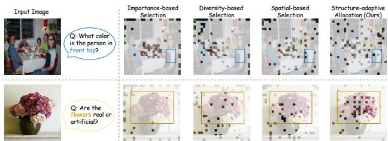  
Figure 1. Comparison of four visual token selection strategies. Attention- and diversity-based methods exhibit spatial bias, while spatial-based selection preserves coverage but can miss important local details. S2Prune preserves broad coverage and allocates more tokens to structurally rich regions.

Early visual token pruning methods mainly focus on token importance or diversity. Importance-based methods evaluate how useful each token is, for example using attention scores or text relevance, and retain tokens with high scores [6]. Diversity-based methods instead compare visual tokens with one another and remove tokens that contain repeated or similar information [16, 35]. These two approaches are complementary and can also be combined. Recent studies further incorporate spatial information into visual token pruning, for example by encouraging retained tokens to cover different image locations, assigning different token budgets to different regions, or correcting the model’s preference for specific spatial positions [9, 33, 36, 38, 41, 45].

Despite these advances, recent studies show that elaborate token-selection criteria do not always improve downstream performance [10, 32, 34], while simple uniform sampling can improve pruning by maintaining broader spatial coverage. This raises a natural question: why can such a simple spatial pattern work so well?

Our preliminary analysis helps explain this. We fix the model, input, token budget, and Top-B selection rule, and change only the token score. Different scoring criteria produce distinct spatial biases, and these biases remain stable across many image–question pairs. Thus, global token scoring determines not only which tokens are retained, but also where the limited token budget is spent. We further compare these score-driven patterns with Uniform Grid sampling. By spreading tokens across the image, Uniform Grid preserves broad spatial support and remains competitive under aggressive pruning. However, it uses the same token density everywhere and ignores local image structure. Broad coverage does not require every image region to receive the same number of tokens: smooth regions can often be represented sparsely, whereas text, object boundaries, thin structures, and fine textures may require denser sampling.

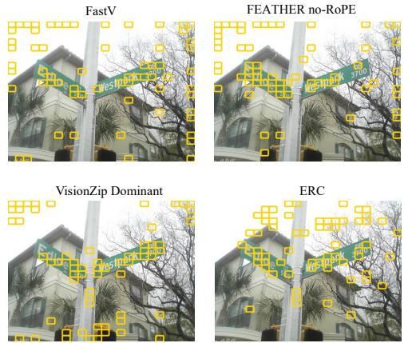  
(a) Token selections on the same VQAv2 example [12].

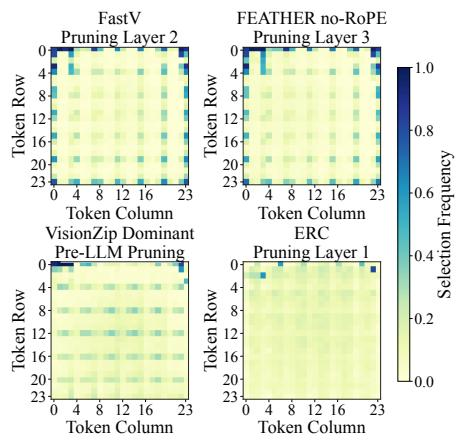  
(b) Token selection frequencies on MMBEN.

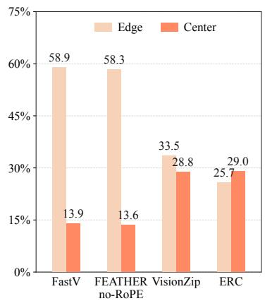  
(c) Edge and center allocation ratios.  
Figure 2. Spatial allocations induced by different token scores under Global Top-B selection (B = 64). (a) Selections for the same VQAv2 example. (b) Selection frequencies over 1,000 MMBEN samples [23]. (c) Retained-token fractions in the edge and center regions.

This leads to an allocation problem similar to image compression. Under a fixed bitrate, smooth regions require fewer bits than regions with richer local structure. Likewise, under a fixed visual-token budget, different image regions may require different numbers of tokens to preserve their content. Therefore, a good pruning strategy should preserve broad spatial coverage while adapting the token density to local image structure, as illustrated in Fig. 1.

Motivated by this, we formulate visual token pruning as spatial rate allocation in the token domain and introduce S2Prune, a training-free pruning framework. Given a fixed budget, S2Prune first divides the image into regions and assigns at least one token to each region to preserve coverage. We use the variance of Laplacian responses to measure regional structural complexity and allocate the remaining budget accordingly, giving more tokens to regions with richer structure. Once the regional budgets are fixed, we use Early Representation Change (ERC), computed from the first decoder block, to select representative tokens within each region. Thus, regional structure determines how many tokens each region receives, while ERC determines which tokens are selected.

We evaluate S2Prune on ten multimodal benchmarks, multiple token budgets, and different MLLM architectures. On Qwen2.5-VL-7B-Instruct, S2Prune achieves the highest average accuracy among the evaluated training-free pruning methods at budgets of 128, 64, and 32 tokens. With only 32 of the original 576 visual tokens, it reaches 55.9 average accuracy, outperforming the strongest baseline by 0.9 points while retaining 79.3% of the full-model performance.

• We revisit visual token pruning from a spatial allocation perspective. Our analysis shows that global token scoring can induce very different spatial allocations, motivating a simple principle: preserve broad spatial coverage while adapting token density to local image structure.

• We propose S2Prune, a training-free pruning framework that follows this principle. Laplacian variation determines how many tokens each region receives, while Early Representation Change (ERC) uses the first decoder response to select representative tokens within each region.

• We evaluate S2Prune on ten multimodal benchmarks, multiple token budgets, and different MLLM architectures. The results demonstrate consistent improvements over existing training-free pruning methods, especially under aggressive token pruning.

## 2. Related Work

## 2.1. Vision Language Models

Vision language models (VLMs) connect pretrained language models to visual encoders through an alignment module, enabling a single model to process images and text [1, 3, 17, 21]. Representative models include LLaVA,

Qwen-VL, and InternVL [3, 7, 21]. Recent models such as LLaVA-NeXT and Qwen2.5-VL support high-resolution inputs for fine-grained visual tasks [4, 22], but produce longer visual token sequences. These tokens increase prefill latency and KV-cache memory [37], while attention cost grows quadratically with sequence length [31]. Visual token pruning reduces these costs by removing redundant tokens while preserving task-relevant information.

## 2.2. Token Pruning for VLMs

Visual token pruning reduces VLM inference cost by removing redundant visual representations without modifying the underlying architecture. Earlier vision-Transformer work explored dynamic token sparsification, token reorganization, and similarity-based merging [20, 26].

For VLMs, attention-based methods retain tokens using decoder attention or cross-modal relevance [6, 10, 14, 30, 44]. Redundancy- and relation-based methods prune, merge, or rank visual features according to duplication or feature relations [8, 16, 28, 35]. Other approaches construct a more representative subset through diversity, or combine visual importance with similarity- or diversity-based complementarity [2, 19, 37, 42, 43].

Recent studies increasingly consider the spatial organization of retained visual tokens. FEATHER [10] improves spatial coverage through uniform sampling, TopV [36] incorporates spatial distance, and ATP-LLaVA [38] adapts pruning across layers and inputs. GridPrune [9] further separates query-conditioned regional budget allocation from local token selection. These works demonstrate that spatial organization is an important factor beyond token-wise importance.

Our work considers a different role of spatial allocation. Rather than using regional budgets to indicate where taskrelevant evidence lies, we use them to model how much representation capacity a region requires. Semantic relevance and representation demand are not necessarily aligned: regions of comparable relevance may require substantially different token densities to preserve their visual structure. S2Prune therefore allocates capacity according to imageintrinsic structural variation and uses decoder-derived ERC only for local representative selection.

## 3. Preliminary and Motivation

## 3.1. Preliminary

Architecture of VLMs. A typical VLM consists of a vision encoder, a vision-language projector, and a large language model (LLM) [4, 17, 21]. Given an input image, the vision encoder extracts patch-level visual features, which are projected into the language embedding space as visual tokens and combined with the textual tokens. The resulting multimodal sequence is then processed through stacked

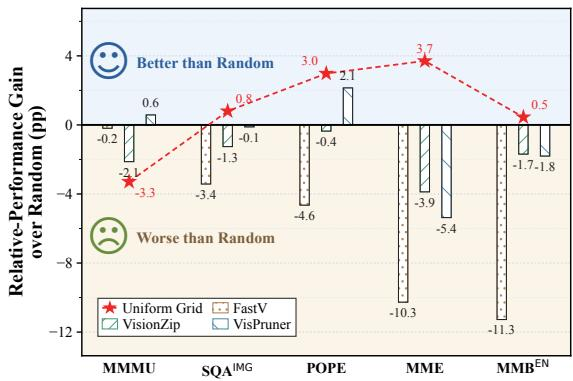  
Figure 3. Performance-retention differences from Random on Qwen2.5-VL-7B at B = 64. Values are percentage-point differences in retention relative to the unpruned 576-token model; zero denotes Random. Uniform Grid improves four of five benchmarks.

Transformer layers, where visual and textual information interact via self-attention. The final hidden representations are used for multimodal understanding and autoregressive generation.

## 3.2. Token Scores Induce Spatial Allocation

Most visual token pruning methods score individual tokens using signals such as attention, relevance, saliency, or internal model responses, and retain the highest-scoring tokens through global Top-B selection. These methods focus primarily on which tokens are more important, with less attention to how the retained tokens are distributed in image space. We therefore ask: how does the choice of scoring criterion shape the spatial allocation of the retained token budget?

To answer this question, we conduct the analysis on Qwen2.5-VL-7B [4]. For each comparison, we keep the input, token budget, and Top-B selection rule fixed, varying only the scoring criterion used for ranking. As shown in Fig. 2(a), different scores produce clearly different spatial layouts even for the same image. More importantly, these differences remain when token selection frequencies are aggregated over many distinct image–question pairs, as shown in Fig. 2(b). At a coarse spatial scale, FastV [6] and FEATHER no-RoPE [10] both show a clear preference for image boundaries: nearly 58% of their retained tokens lie in the edge region, substantially above the approximately 30.6% expected from regional area. By comparison, VisionZip [37] and ERC exhibit more balanced edge–center distributions.

The fine-grained frequency maps show a more pronounced pattern. Several scoring criteria produce persistent horizontal and vertical bands, together with periodic rowand-column structures. Because these statistics aggregate many images with different content and questions, object locations in individual samples should be largely averaged out. Nevertheless, some fixed token rows and columns continue to exhibit higher selection frequencies. This finding indicates a stable positional dependence in token selection: the resulting spatial distribution is not determined entirely by the current image content or task semantics.

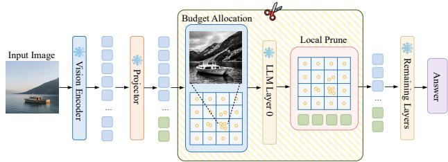  
Figure 4. Overview of ${ \mathrm { S } } ^ { 2 } { \mathrm { P r u n e } }$ . Regional image structure determines the spatial scaffold, after which early decoder responses select local representatives under the prescribed token budget.

This phenomenon is not confined to a particular pruning layer. The scoring criteria in Fig. 2 operate either before the visual tokens enter the LLM or at different early decoder layers, but all exhibit stable spatial patterns to varying degrees. Moreover, FEATHER retains a clear boundary preference at Layer 3 even after RoPE is removed. Delaying the same no-RoPE criterion to Layer 8 does not eliminate this pattern. We therefore do not attribute the positional dependence to any single pruning stage or positional encoding, but regard it as a recurring spatial selection behavior across different scoring criteria.

These results indicate that token importance alone does not fully determine how tokens should be retained in space. Even when a scoring criterion identifies high-scoring tokens, the resulting token distribution may still exhibit a pronounced positional preference and may not adequately reflect the spatial structure of the current image. Visual token pruning must therefore consider the spatial organization of the retained tokens in addition to the importance of each individual token.

## 3.3. Broad Spatial Coverage Stabilizes Aggressive Pruning

Section 3.2 shows that different selection signals leave stable but distinct positional preferences in sparse visual representations. This makes it difficult to separate the quality of a token score from the spatial organization of the resulting retained representation. To examine their respective roles, we introduce two controls that do not rely on sophisticated scoring signals: Random sampling and Uniform Grid. These controls are not pruning methods proposed in this work. Random sampling weakens criterion-specific positional preferences, whereas Uniform Grid explicitly stabilizes spatial coverage; their comparison is shown in Fig. 3.

The comparison presents a counterintuitive result: Random sampling is already competitive with several carefully designed selection criteria, and some methods fall below Random on multiple benchmarks. This observation agrees with prior visual token studies that report strong random baselines [32, 34]. Because Random uses neither tokenlevel importance, attention, nor similarity, the result shows that a more sophisticated scoring criterion does not automatically produce a more effective sparse visual representation.

Uniform Grid further constrains the spatial coverage of visual tokens. Unlike the sample-dependent random locations produced by Random, it distributes the retained tokens consistently across different image regions. Figure 3 shows that, under the same 64-token budget, Uniform Grid further outperforms Random on four of the five benchmarks and remains competitive with complex pruning criteria on several tasks. Combined with the position-dependent patterns in Sec. 3.2, this result indicates that the spatial coverage of the retained representation is not an incidental by-product of token selection. A simple, stable spatial constraint can itself provide strong pruning robustness. This trend is also consistent with FEATHER [10], which uses uniform samples to maintain broad image coverage.

The spatial coverage provided by Uniform Grid, however, is based on a fixed sampling density. Smooth backgrounds and regions containing dense boundaries, text, or fine-grained textures receive approximately the same local representation resolution. Together, the Random and Uniform controls provide a more specific design cue: stable spatial coverage is beneficial, but coverage does not require the same representation density everywhere. We therefore retain the broad spatial support provided by Uniform Grid while using the local structure of the image to adapt its spatial resolution.

## 3.4. Adaptive Spatial Density under Heterogeneous Structure

Uniform Grid preserves broad spatial coverage, but assigns approximately the same representation density to different image regions. We next ask when this equal-density assumption becomes restrictive. Intuitively, if local visual structure is distributed relatively evenly, uniform sampling should already provide a reasonable allocation. In contrast, when fine-grained structure is concentrated in only a few regions, spending the same number of tokens everywhere may leave these regions underrepresented.

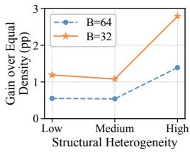  
Figure 5. Gain of Adaptive over Equal Density on Qwen2.5-VL-7B, averaged over $\mathbf { M M B } ^ { \mathrm { E N } }$ $\mathrm { \ v Q A } ^ { \mathrm { \check { T e x t } } }$ and POPE. Gains generally increase with structural heterogeneity, especially at $B = 3 2 .$

To isolate this factor, we conduct a controlled allocation analysis in which the token budget and local representative rule are kept identical. Equal Density assigns approximately the same number of representation slots to each coarse region, whereas Adaptive Density varies the regional budgets according to local structural variation. Neither setting uses semantic relevance, attention, or decoder-derived token scores. We quantify how unevenly local structure is distributed across an image by

$$
H _ { \mathrm { s t r } } = \frac { \mathrm { S t d } ( \{ c _ { g } \} _ { g = 1 } ^ { G } ) } { \mathrm { M e a n } ( \{ c _ { g } \} _ { g = 1 } ^ { G } ) + \epsilon } ,\tag{1}
$$

where $c _ { g }$ denotes the structural variation of region g. Samples are grouped into low-, medium-, and highheterogeneity subsets according to $H _ { \mathrm { s t r } }$

As shown in Fig. 5, adaptive density provides only a modest advantage when regional structure is relatively homogeneous, whereas the gap becomes substantially larger for images with highly heterogeneous structure. This effect is more pronounced under the tighter B = 32 budget. Averaged across MMBench, TextVQA, and POPE, the high-heterogeneity group gains 1.39 points at B = 64 and 2.79 points at $B = 3 2$ , clearly exceeding the corresponding gains for the low- and medium-heterogeneity groups. The trend is not strictly monotonic on every individual benchmark, indicating that structural heterogeneity alone does not determine pruning difficulty.

These observations show a limitation of uniform spatial sampling: the issue is not broad coverage itself, but the use of a fixed representation density everywhere. When local structure is distributed evenly, equal density already provides a strong sparse representation. When structure is highly uneven, however, uniformly spreading a limited number of tokens can over-represent simple regions while leaving detail-rich regions under-represented. This mismatch becomes more consequential as the token budget shrinks. These findings motivate preserving broad spatial support while adapting local token density to the structure of each image.

## 4. Method

Based on the preceding analysis, we propose S2Prune, a training-free method that preserves broad spatial support while adapting representation density to regional structure. It first converts the global token budget into regionspecific capacities and local cells using Laplacian variation (Sec. 4.1). It then uses Early Representation Change (ERC) after the first decoder block to select one representative from each cell (Sec. 4.2). These stages separate where the visual budget is spent from which token represents each cell, leaving exactly B tokens for all remaining decoder layers. The overall framework is shown in Fig. 4.

## 4.1. Adaptive Spatial Scaffold

Uniform sampling preserves image coverage but fixes the representation density across space. Smooth regions can be represented sparsely, but boundaries, text, thin structures, and fine textures often require denser sampling. Our scaffold keeps broad spatial support and varies its local density.

We divide the visual-token grid into G disjoint coarse regions $\{ \mathcal { R } _ { g } \} _ { g = 1 } ^ { G }$ , with $G \leq B$ . We first convert the complete input image to grayscale and compute a four-neighbor Laplacian response map L using replicate padding at the outer image boundary. We then map each token region $\mathcal { R } _ { g }$ to its image-domain support $\Omega _ { g }$ and crop the already computed response map. Its raw structural score is

$$
c _ { g } ^ { \mathrm { r a w } } = \mathrm { V a r } \big ( { L } | _ { \Omega _ { g } } \big ) .\tag{2}
$$

Thus, neighboring pixels across internal region boundaries contribute to the response, while replicate padding is applied only at the outer image boundary. The raw scores are independently min–max normalized within each image:

$$
c _ { g } = \frac { c _ { g } ^ { \mathrm { r a w } } - \operatorname* { m i n } _ { j } c _ { j } ^ { \mathrm { r a w } } } { \operatorname* { m a x } \bigl ( \operatorname* { m a x } _ { j } c _ { j } ^ { \mathrm { r a w } } - \operatorname* { m i n } _ { j } c _ { j } ^ { \mathrm { r a w } } , \epsilon _ { \mathrm { n o r m } } \bigr ) } .\tag{3}
$$

The Laplacian responds weakly in smooth regions and strongly around rapid local changes [5, 25]; in the frequency domain, its response grows quadratically with spatial frequency. The normalized score $c _ { g }$ measures local structural variation rather than semantic relevance to the question.

Each coarse region receives one token to preserve broad spatial support. We allocate the remaining $B - G$ tokens in proportion to $c _ { g } .$ , subject to the regional capacities:

$$
\begin{array} { c } { { w _ { g } = \displaystyle \frac { c _ { g } } { \sum _ { j = 1 } ^ { G } c _ { j } } , } } \\ { { 1 \leq B _ { g } \leq | { \mathcal R } _ { g } | , ~ \displaystyle \sum _ { g = 1 } ^ { G } B _ { g } = B . } } \end{array}\tag{4}
$$

Equation (4) reserves one token per region and caps its budget by the number of tokens it contains. If all structural scores are zero, we use $w _ { g } ~ = ~ 1 / G$ . An iterative largest-remainder procedure distributes the remaining budget among unsaturated regions. When a region reaches $| \mathcal { R } _ { g } |$ , its excess allocation is redistributed until exactly B tokens are assigned. Each region $\mathcal { R } _ { g }$ is then divided into $B _ { g }$ cells $\{ \mathcal { C } _ { g , k } \} _ { k = 1 } ^ { B _ { g } }$ of approximately equal area. Smooth regions retain a sparse scaffold, whereas regions with more local variation are represented at a higher spatial density.

Table 1. Main results on Qwen2.5-VL-7B under different token budgets. We compare FastV [6], DART [35], GPrune [16], VisionZip [37], VisPruner [42], GridPrune [9], and HoloV [45]. Acc. averages all ten benchmark scores after dividing MME by 28. Rel. first computes each pruned-to-full score ratio and then averages the ten ratios. Bold entries are the best results within each budget, and underlined entries are the second best.
<table><tr><td colspan="18">Method |GQA SQAIMG VQAText VizWiz MMMU POPE MME MMBEN MMBCN MMVet|Acc. Rel.</td></tr><tr><td colspan="13">Upper Bound, All 576 Tokens (100%)</td></tr><tr><td>Qwen2.5-VL-7B [4] 57.4 87.6 80.8 36.8 51.7 83.9 2347 88.7</td><td colspan="11"></td><td>31.7</td><td></td><td>|68.9 100.0%</td></tr><tr><td>Retain 128 Tokens (↓ 77.8%)</td><td colspan="11"></td><td></td><td></td><td></td></tr><tr><td>FastV (ECCV24) [6]</td><td rowspan="6">51.3 41.8 50.5 52.8 53.6</td><td>83.4</td><td>66.3</td><td>34.1</td><td>51.2</td><td>79.5</td><td>2093</td><td>84.5</td><td>83.9</td><td>24.8</td><td></td><td>|63.4 91.2%</td></tr><tr><td>DART (EMNLP25) [35]</td><td>79.8</td><td>55.3</td><td>29.6</td><td>47.1</td><td>42.1</td><td>2053</td><td>84.4</td><td>84.0</td><td>24.8</td><td>56.281.1%</td><td></td></tr><tr><td>GPrune (AAAI25) [16]</td><td>82.1</td><td>48.9</td><td>26.5</td><td>46.4</td><td>77.0</td><td>1771</td><td>81.7</td><td>82.0</td><td>19.7</td><td></td><td>57.882.0%</td></tr><tr><td>VisionZip (CVPR25) [37]</td><td>84.4</td><td>54.0</td><td>33.3</td><td>48.8</td><td>78.0</td><td>2071</td><td>85.1</td><td>84.7</td><td>23.4</td><td></td><td>61.888.8%</td></tr><tr><td>VisPruner (ICCV25) [42]</td><td>85.5</td><td>63.6</td><td>33.4</td><td>49.1</td><td>79.8</td><td>2072</td><td>85.7</td><td>85.9</td><td>23.4</td><td></td><td>63.4 90.8%</td></tr><tr><td>GridPrune (arXiv25) [9]</td><td>84.8</td><td>61.2</td><td>34.1</td><td>48.2</td><td>79.5</td><td>2101.9</td><td>85.3</td><td>85.3</td><td>26.2</td><td></td><td>63.491.5%</td></tr><tr><td>HoloV (NeurIPS25) [45]</td><td>54.4 84.4</td><td></td><td></td><td>34.2</td><td>47.9</td><td>81.0</td><td>2178.3</td><td>85.5</td><td>85.1</td><td>25.7</td><td>63.9 92.0%</td><td></td></tr><tr><td>S²Prune (Ours)</td><td>53.6 55.3</td><td>85.4</td><td>64.4 62.3</td><td>33.5</td><td>49.3</td><td>80.1</td><td>2168</td><td>86.2</td><td>85.7</td><td>25.2</td><td></td><td>64.0 92.1%</td></tr><tr><td colspan="11">Retain 64 Tokens (↓ 88.9%)</td><td></td></tr><tr><td>FastV (ECCV24) [6]</td><td rowspan="5">44.9</td><td>78.7 78.9</td><td>56.6</td><td>29.1</td><td>46.8</td><td>68.9</td><td>1735</td><td>74.7</td><td>74.1</td><td>16.5</td><td></td><td>55.278.5%</td></tr><tr><td>DART (EMNLP25) [35]</td><td>42.9</td><td>42.8</td><td>26.0</td><td>46.2</td><td></td><td>69.5 1936</td><td>82.4</td><td></td><td>81.7</td><td>21.1</td><td>56.179.7%</td><td></td></tr><tr><td>GPrune (AAAI25) [16]</td><td>44.6 79.7</td><td>34.2</td><td>19.2</td><td></td><td>42.8</td><td>67.2</td><td>1427</td><td>74.4</td><td>74.9</td><td>16.1</td><td>50.470.8%</td><td></td></tr><tr><td>VisionZip (CVPR25) [37]</td><td>50.7 80.6</td><td>40.2</td><td>29.0</td><td></td><td>45.8</td><td>72.5</td><td>1885</td><td>83.2</td><td>82.8</td><td>21.1</td><td>57.3 82.0%</td><td></td></tr><tr><td>VisPruner (ICCV25) [42]</td><td>50.5 81.6</td><td>50.8</td><td>29.3</td><td>47.2</td><td></td><td>74.6</td><td>1850 83.1</td><td></td><td>83.2</td><td>22.5</td><td>58.984.3%</td><td></td></tr><tr><td>GridPrune (arXiv25) [9]</td><td>49.7</td><td>82.1</td><td>52.8</td><td>30.6</td><td>47.6</td><td>71.2</td><td>1865.6</td><td>83.6</td><td>83.1</td><td>21.6</td><td></td><td>58.984.3%</td></tr><tr><td>HoloV (NeurIPS25) [45]</td><td>50.2</td><td>83.9</td><td>52.6</td><td>30.3</td><td>45.4</td><td>76.6</td><td>2022.6</td><td>84.1</td><td>84.4</td><td></td><td>22.9</td><td>60.3 86.0%</td></tr><tr><td>S²Prune (Ours)</td><td>52.5</td><td>81.0</td><td>55.2</td><td>31.0</td><td>46.3</td><td>74.8</td><td>2035</td><td>84.6</td><td>84.3</td><td>23.9</td><td></td><td>60.6 87.0%</td></tr><tr><td></td><td colspan="4"></td><td>Retain 32 Tokens (↓ 94.4%)</td><td></td><td></td><td></td><td></td><td></td><td></td><td></td></tr><tr><td>FastV (ECCV24) [6]</td><td colspan="14">37.6 73.2 34.1</td><td></td></tr><tr><td>DART (EMNLP25) [35]</td><td>45.4</td><td>76.4</td><td>33.4</td><td>20.3 22.4</td><td>42.7 43.0</td><td>39.1 58.1</td><td>1222 1696</td><td>58.2 78.5</td><td>57.9 78.8</td><td>7.3 17.4</td><td></td><td>41.458.3% 51.472.7%</td></tr><tr><td>GPrune (AAAI25) [16]</td><td>37.9</td><td>76.6</td><td>22.0</td><td>13.8</td><td>42.4</td><td>48.8</td><td>1187</td><td>66.9</td><td>67.7</td><td></td><td>12.4</td><td>43.160.1%</td></tr><tr><td>VisionZip (CVPR25) [37]</td><td>46.4</td><td>76.1</td><td>28.8</td><td>25.4</td><td>45.8</td><td></td><td></td><td>80.4</td><td></td><td></td><td>17.4</td><td>52.3 74.5%</td></tr><tr><td>VisPruner (ICCV25) [42]</td><td>44.2</td><td>78.5</td><td>36.4</td><td>23.8</td><td>44.4</td><td>63.2</td><td>1672</td><td>78.6</td><td>80.1 79.7</td><td>17.9</td><td></td><td>52.274.1%</td></tr><tr><td>GridPrune (arXiv25) [9]</td><td>45.4</td><td>80.1</td><td>43.8</td><td>27.2</td><td>45.4</td><td>63.2 61.6</td><td>1560 1646.1</td><td>80.2</td><td>80.3</td><td>20.6</td><td></td><td>54.477.8%</td></tr><tr><td>HoloV (NeurIPS25) [45]</td><td>45.1</td><td>80.8</td><td>40.4</td><td>25.8</td><td>46.4</td><td>69.7</td><td></td><td>81.0</td><td>80.6</td><td>18.4</td><td></td><td>55.0 78.0%</td></tr><tr><td>S²Prune (Ours)</td><td>49.0</td><td>78.4</td><td>44.9</td><td>27.8</td><td>43.0</td><td>66.9</td><td>1745.7 1844</td><td>82.6</td><td>81.8</td><td>18.4</td><td></td><td>55.9 79.3%</td></tr><tr><td></td><td></td><td></td><td></td><td></td><td></td><td></td><td></td><td></td><td></td><td></td><td></td><td></td></tr></table>

## 4.2. Local Selection with Early Decoder Responses

Once the spatial cells are fixed, we select tokens independently within each cell. In a residual Transformer block [31], the update at position i can be written as $h _ { i } ^ { l + 1 } =$ $h _ { i } ^ { l } + \Delta _ { i } ^ { l }$ . Its magnitude is $r _ { i } ^ { ( l ) } = \| h _ { i } ^ { l + 1 } - h _ { i } ^ { l } \| _ { 2 }$ . We use the response from the first decoder block,

$$
r _ { i } = r _ { i } ^ { ( 0 ) } = \lVert h _ { i } ^ { 1 } - h _ { i } ^ { 0 } \rVert _ { 2 } = \lVert \Delta _ { i } ^ { 0 } \rVert _ { 2 } ,\tag{5}
$$

We call the score in Eq. (5) Early Representation Change (ERC). ERC measures the update produced by the decoder. It does not measure the magnitude of the incoming visual feature.

For each cell ${ \mathcal { C } } _ { g , k } ,$ , we retain

$$
i _ { g , k } ^ { \star } = \arg \operatorname* { m a x } _ { i \in \mathcal { C } _ { g , k } } r _ { i } .\tag{6}
$$

Equation (6) applies the score only within a cell. We do not compare it across distant regions. The scaffold has already fixed where the budget is spent; ERC only chooses a representative within each allocated cell.

We compute ERC after the first decoder block, where a decoder response first becomes available. Pruning at a deeper layer would require processing the full visual sequence through additional blocks. After Layer 0, we remove unselected visual tokens and preserve the order and positional information of the retained B tokens in the remaining decoder layers.

## 5. Experiments

We evaluate our method on ten multimodal understanding benchmarks at several visual token budgets and report comparisons, ablations, and inference cost.

Table 2. Cross-architecture results on LLaVA-OneVision-7B. Acc./Rel. denote four-benchmark averages and relative retention; bold/underlined mark the best and second-best results.
<table><tr><td>Method</td><td>SQAIMG</td><td>MMBEN</td><td>MMMU</td><td>OCRBench</td><td>Acc.</td><td>Rel.</td></tr><tr><td colspan="7">Upper Bound, All 729 Tokens (100%)</td></tr><tr><td>LLaVA-OneVision-7B</td><td>91.3</td><td>85.4</td><td>45.3</td><td>49.7</td><td></td><td>67.9 100.0%</td></tr><tr><td colspan="7">Retain 160 Tokens (↓ 78.1%)</td></tr><tr><td>FastV [6]</td><td>80.7</td><td>79.7</td><td>44.3</td><td>24.9</td><td>57.4</td><td>82.4%</td></tr><tr><td>CDPruner [43]</td><td>83.6</td><td>80.1</td><td>42.8</td><td>34.7</td><td>60.3</td><td>87.4%</td></tr><tr><td>GridPrune [9]</td><td>82.5</td><td>81.5</td><td>44.1</td><td>35.2</td><td>60.8</td><td>88.5%</td></tr><tr><td>S²Prune (Ours)</td><td>87.5</td><td>82.8</td><td>46.0</td><td>41.7</td><td>64.5</td><td>94.6%</td></tr><tr><td colspan="7">Retain 80 Tokens (↓ 89.0%)</td></tr><tr><td>FastV [6]</td><td>77.2</td><td>75.7</td><td>43.7</td><td>13.0</td><td>52.4</td><td>74.0%</td></tr><tr><td>CDPruner [43]</td><td>80.4</td><td>76.7</td><td>42.9</td><td>24.4</td><td>56.1</td><td>80.4%</td></tr><tr><td>GridPrune [9]</td><td>77.8</td><td>75.8</td><td>43.7</td><td>22.5</td><td>55.0</td><td>78.9%</td></tr><tr><td>S²Prune (Ours)</td><td>83.5</td><td>80.0</td><td>44.1</td><td>32.1</td><td>59.9</td><td>86.8%</td></tr><tr><td colspan="7">Retain 40 Tokens (↓ 94.5%)</td></tr><tr><td>FastV [6]</td><td>75.8</td><td>68.6</td><td>42.0</td><td>8.0</td><td>48.6</td><td>68.0%</td></tr><tr><td>CDPruner [43]</td><td>78.5</td><td>70.3</td><td>41.3</td><td>16.9</td><td>51.8</td><td>73.4%</td></tr><tr><td>GridPrune [9]</td><td>76.0</td><td>69.6</td><td>41.9</td><td>16.0</td><td>50.9</td><td>72.4%</td></tr><tr><td>S²Prune (Ours)</td><td>78.9</td><td>71.5</td><td>42.6</td><td>22.1</td><td>53.8</td><td>77.2%</td></tr></table>

## 5.1. Experimental Setup

Datasets. We use ten image benchmarks. MMMU [40] tests expert multimodal reasoning; GQA [15], compositional visual reasoning; $\mathsf { S Q A } ^ { \mathrm { I M } \bar { \mathrm { G } } }$ [24], multimodal science question answering; and VQAText [29], reading text in images. VizWiz [13] covers visual questions submitted by blind users; POPE [18] evaluates object hallucination; MME [11], perception and cognition; ${ \bf M M B } ^ { \mathrm { E N } }$ and ${ \bf M M B } ^ { \mathrm { C N } }$ [23], general multimodal understanding in English and Chinese; and MMVet [39], integrated multimodal capabilities. We follow the official evaluation protocol and metric for each benchmark.

Model architectures. We use Qwen2.5-VL-7B-Instruct [4] for the main benchmark comparisons and ablations, and LLaVA-OneVision-7B for cross-architecture evaluation. Unless stated otherwise, all analyses use Qwen2.5-VL-7B-Instruct.

Baselines. We compare with seven recent methods that require no training. FastV uses attention [6]. DART removes duplicated tokens [35], whereas GPrune selects representative tokens through graph-based information propagation [16]. VisionZip combines visual attention with similarity-based merging [37], and VisPruner combines visual attention with diversity [42]. GridPrune performs query-conditioned regional budget allocation followed by local token selection [9], while HoloV distributes the pruning budget across spatial crops to retain holistic visual context [45].

Implementation details. Qwen2.5-VL produces 576 post-merge visual tokens on a $2 4 \times 2 4$ grid. We evaluate $B \in \{ 1 2 8 , 6 4 , 3 2 \}$ (reductions of 77.8%, 88.9%, and

94.4%) using $8 \times 8 , 5 \times 5 ,$ , and $4 \times 4$ coarse grids, respectively. For each grayscale image, we compute one fullimage four-neighbor Laplacian response map with replicate padding, crop the mapped regional responses, and min– max normalize their variances within the image. We allocate budgets in proportion to these normalized scores and use largest-remainder rounding to obtain integer $B _ { g }$ with $1 \leq B _ { g } \leq | \mathcal { R } _ { g } |$ and $\begin{array} { r } { \sum _ { g } B _ { g } = B } \end{array}$ . Each $\mathcal { R } _ { g }$ is divided into $B _ { g }$ approximately equal-area subcells, each retaining the token with the largest Early Representation Change (ERC). Pruning follows decoder Layer 0 and occurs before Layer 1.

## 5.2. Main Results

Table 1 compares S2Prune with seven pruning approaches that require no training on Qwen2.5-VL-7B. Our method has the highest aggregate accuracy with 128, 64, and 32 visual tokens. At 128 tokens, it reaches 64.0 Acc. and retains 92.1% of the full-model performance. At 64 tokens, it reaches 60.6 Acc. and 87.0% relative performance. Across all three budgets, our method gives the best GQA and ${ \bf M M B } ^ { \mathrm { E N } }$ results. On ${ \bf M M B } ^ { \mathrm { C N } }$ , it ranks second at 128 tokens and first at 64 and 32 tokens. At 32 tokens, it reaches 55.9 Acc. and 79.3% relative performance, leading on six of the ten benchmarks, including VizWiz and $\mathbf { M M B } ^ { \mathrm { { \overline { { C } } N } } }$ . The corresponding Acc. margins over the strongest baseline are 0.1, 0.3, and 0.9 points at 128, 64, and 32 tokens, respectively. Figure 6 compares performance as the visual-token budget decreases from 576 to 32. Among the three methods shown, S2Prune achieves the highest scores on GQA and POPE at every pruned budget and on ${ \bf M M B } ^ { \mathrm { E N } }$ at 128, 64, and 32 tokens; at 192 tokens, it remains within 0.3 points of VisionZip on ${ \bf M M B } ^ { \mathrm { E N } }$ . At 32 tokens, its gains over the stronger of the two plotted baselines are 2.6, 3.7, and 2.2 points on GQA, POPE, and ${ \bf M M B } ^ { \mathrm { E N } }$ , respectively. FastV degrades sharply on POPE and MMBEN, whereas VisionZip is more stable; S2Prune nevertheless achieves the highest score on all three benchmarks at this lowest budget. This trend suggests that structure-adaptive spatial allocation better preserves broad spatial support and local detail when few tokens remain.

## 5.3. S2Prune with Another VLM Architecture

Table 2 evaluates S2Prune on LLaVA-OneVision-7B at budgets of 160, 80, and 40 tokens. S2Prune leads all four benchmarks and attains the highest Acc. and Rel. at every budget. These results support the transferability of the pruning strategy beyond Qwen2.5-VL.

## 5.4. Efficiency Analysis

To demonstrate the efficiency of $\mathrm { S } ^ { 2 } \mathrm { P r u n e }$ , we compare it with representative visual token pruning methods in terms of FLOPs, prefill latency, and KV-cache consumption on Qwen2.5-VL-7B. All experiments are performed on a single NVIDIA GeForce RTX 5090 GPU. We use POPE for the efficiency evaluation because its questions have similar lengths and each sample involves one prefill stage and one decoding stage. As shown in Tab. 3, when the number of visual tokens is reduced from 576 to 64, S2Prune reduces FLOPs from 8.181T to 1.596T, corresponding to a $5 . 1 \times \mathrm { r e } -$ duction. It also reduces prefill latency from 56.97 ms to 28.66 ms, which is nearly a 2.0× speedup, and decreases the KV cache from 31.50 MB to 4.50 MB, corresponding to a 7.0× reduction. Although GPrune and VisPruner achieve lower computational costs, S2Prune maintains the highest average accuracy among the compared pruning methods, demonstrating a favorable trade-off between inference efficiency and model performance.

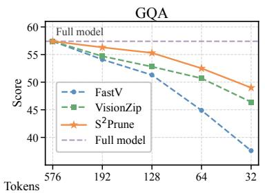

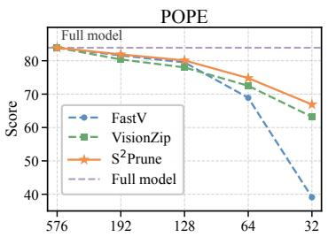

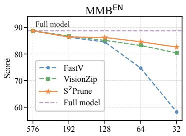  
Figure 6. Qwen2.5-VL-7B performance across retained visual-token budgets on GQA, POPE, and $\mathbf { M M B } ^ { \mathrm { E N } }$ . Dashed lines denote the unpruned 576-token model.

Table 3. Efficiency on Qwen2.5-VL-7B at $B = 6 4$ . Acc. is POPE classification accuracy (the main results use POPE F1); runtime is also measured on POPE.
<table><tr><td></td><td colspan="3">FLOPs Prefill KV Cache</td></tr><tr><td>Method Full</td><td>Acc. ↑</td><td>(T)↓ (ms) ↓ 8.181 56.97</td><td>(MB)↓ 31.50</td></tr><tr><td></td><td>71.3</td><td></td><td></td></tr><tr><td>FastV GPrune</td><td>57.7 51.6</td><td>1.839 24.86 1.352 20.49</td><td>5.50 3.50</td></tr><tr><td>VisPruner</td><td>60.4</td><td>1.352 26.24</td><td>3.50</td></tr><tr><td>S²Prune (Ours)</td><td>62.3</td><td>1.596 28.66</td><td>4.50</td></tr></table>

## 5.5. Ablation Study

Effect of Structural Prior. We fix the spatial partition, 64-token budget, and local ERC selector, and vary only the regional allocation strategy. Uniform assigns the same capacity to each cell, whereas Random distributes the fixed budget randomly across cells. We also compare frequency-domain FFT energy, Effective Rank from visual features [27], and Laplacian variation as data-dependent capacity signals. Figure 7 shows that Laplacian gives the highest scores on all three benchmarks, reaching 46.3 on MMMU, 55.2 on $\mathrm { V Q A } ^ { \mathrm { T e x t } }$ , and 31.0 on VizWiz. The strongest alternatives reach 45.7, 53.4, and 30.9, respectively. Because the partition, budget, and local ERC selector remain fixed, these differences isolate the regional allocation strategy.

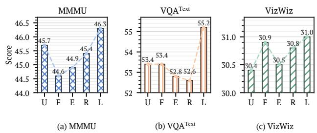  
Figure 7. Structural-prior ablation at B = 64. U/F/E/R/L denote Uniform, FFT, Effective Rank, Random, and Laplacian; Laplacian is best on all three tasks.

Table 4. Local-selector ablation at $B \ = \ 6 4$ on a $5 \times 5$ grid. Acc./Rel. denote three-benchmark averages and relative retention.
<table><tr><td>Local Selector</td><td> $\mathbf { M M B } ^ { \mathrm { E N } }$ </td><td> $\mathbf { S Q A ^ { I M G } }$ </td><td> $\mathbf { V Q A } ^ { \mathrm { T e x t } }$ </td><td>|Acc.</td><td>Rel.</td></tr><tr><td>Random</td><td>83.5</td><td>79.6</td><td>44.9</td><td></td><td>69.3 80.2%</td></tr><tr><td>Hidden Norm</td><td>82.8</td><td>80.8</td><td>30.5</td><td></td><td>64.7 74.4%</td></tr><tr><td>Query Attn. (All-Q)</td><td>82.8</td><td>80.2</td><td>52.4</td><td>71.8</td><td>83.3%</td></tr><tr><td>Query Attn. (Last Token)</td><td>82.7</td><td>80.4</td><td>53.8</td><td>72.3</td><td>83.9%</td></tr><tr><td>ERC (Ours)</td><td>84.6</td><td>81.0</td><td>55.2</td><td></td><td>73.6 85.4%</td></tr></table>

Effect of Local Representative Selection. With spatial allocation and pruning fixed, we compare Random, Hidden Norm $( \Vert h _ { i } ^ { 1 } \Vert _ { 2 } ) .$ , Query Attn. using all question tokens or the last valid token, and ERC $( \lVert h _ { i } ^ { 1 } - h _ { i } ^ { 0 } \rVert _ { 2 } )$ . Table 4 shows that ERC leads all three tasks (84.6/81.0/55.2), producing the best Acc./Rel. (73.6/85.4%). Query Attn. (Last Token) ranks second in aggregate performance (72.3/83.9%). ERC is therefore the most consistent local selector under the same spatial allocation.

## 6. Conclusion

In this paper, we have revisited visual token pruning from a spatial allocation perspective. We show that different tokenselection criteria induce stable spatial biases and do not always outperform Uniform Grid sampling under aggressive pruning. Based on this observation, we propose S2Prune, a training-free method that separates regional budget allocation from local token selection. S2Prune uses the variance of Laplacian responses to measure regional structural complexity and allocate token budgets, while ERC selects representative tokens using the first decoder response. Experiments across ten benchmarks and two MLLM architectures show consistent gains over training-free baselines. These results highlight that effective visual token pruning should consider both which tokens are selected and where the token budget is spent.

## References

[1] Jean-Baptiste Alayrac, Jeff Donahue, Pauline Luc, Antoine Miech, Iain Barr, Yana Hasson, Karel Lenc, Arthur Mensch, Katherine Millican, Malcolm Reynolds, Roman Ring, Eliza Rutherford, Serkan Cabi, Tengda Han, Zhitao Gong, Sina Samangooei, Marianne Monteiro, Jacob L. Menick, Sebastian Borgeaud, Andy Brock, Aida Nematzadeh, Sahand Sharifzadeh, Mikołaj Binkowski, Ricardo Barreira,´ Oriol Vinyals, Andrew Zisserman, and Karen Simonyan.´ Flamingo: A visual language model for few-shot learning. In Advances in Neural Information Processing Systems, 2022.

[2] Saeed Ranjbar Alvar, Gursimran Singh, Mohammad Akbari, and Yong Zhang. DivPrune: Diversity-based visual token pruning for large multimodal models. In Proceedings of the IEEE/CVF Conference on Computer Vision and Pattern Recognition, pages 9392–9401, 2025.

[3] Jinze Bai, Shuai Bai, Shusheng Yang, Shijie Wang, Sinan Tan, Peng Wang, Junyang Lin, Chang Zhou, and Jingren Zhou. Qwen-VL: A versatile vision-language model for understanding, localization, text reading, and beyond. arXiv preprint arXiv:2308.12966, 2023.

[4] Shuai Bai, Keqin Chen, Xuejing Liu, Jialin Wang, Wenbin Ge, Sibo Song, Kai Dang, Peng Wang, Shijie Wang, Jun Tang, Humen Zhong, Yuanzhi Zhu, Mingkun Yang, Zhaohai Li, Jianqiang Wan, Pengfei Wang, Wei Ding, Zheren Fu, Yiheng Xu, Jiabo Ye, Xi Zhang, Tianbao Xie, Zesen Cheng, Hang Zhang, Zhibo Yang, Haiyang Xu, and Junyang Lin. Qwen2.5-VL technical report. arXiv preprint arXiv:2502.13923, 2025.

[5] Peter J. Burt and Edward H. Adelson. The laplacian pyramid as a compact image code. IEEE Transactions on Communications, 31(4):532–540, 1983.

[6] Liang Chen, Haozhe Zhao, Tianyu Liu, Shuai Bai, Junyang Lin, Chang Zhou, and Baobao Chang. An image is worth 1/2 tokens after layer 2: Plug-and-play inference acceleration for large vision-language models. In European Conference on Computer Vision, pages 19–35, 2024.

[7] Zhe Chen, Jiannan Wu, Wenhai Wang, Weijie Su, Guo Chen, Sen Xing, Muyan Zhong, Qinglong Zhang, Xizhou Zhu, Lewei Lu, Bin Li, Ping Luo, Tong Lu, Yu Qiao, and Jifeng Dai. InternVL: Scaling up vision foundation models and aligning for generic visual-linguistic tasks. In Proceedings of the IEEE/CVF Conference on Computer Vision and Pattern Recognition, pages 24185–24198, 2024.

[8] Mohamed Dhouib, Davide Buscaldi, Sonia Vanier, and Aymen Shabou. PACT: Pruning and clustering-based token reduction for faster visual language models. In Proceedings of

the IEEE/CVF Conference on Computer Vision and Pattern Recognition, pages 14582–14592, 2025.

[9] Yuxiang Duan, Ao Li, Yingqin Li, Luyu Li, and Pengwei Wang. GridPrune: From “where to look” to “what to select” in visual token pruning for MLLMs. arXiv preprint arXiv:2511.10081, 2025.

[10] Mark Endo, Xiaohan Wang, and Serena Yeung-Levy. Feather the throttle: Revisiting visual token pruning for vision-language model acceleration. In Proceedings of the IEEE/CVF International Conference on Computer Vision, pages 22826–22835, 2025.

[11] Chaoyou Fu, Peixian Chen, Yunhang Shen, Yulei Qin, Mengdan Zhang, Xu Lin, Jinrui Yang, Xiawu Zheng, Ke Li, Xing Sun, Yunsheng Wu, and Rongrong Ji. MME: A comprehensive evaluation benchmark for multimodal large language models. arXiv preprint arXiv:2306.13394, 2023.

[12] Yash Goyal, Tejas Khot, Douglas Summers-Stay, Dhruv Batra, and Devi Parikh. Making the V in VQA matter: Elevating the role of image understanding in visual question answering. In Proceedings of the IEEE Conference on Computer Vision and Pattern Recognition, 2017.

[13] Danna Gurari, Qing Li, Abigale J. Stangl, Anhong Guo, Chi Lin, Kristen Grauman, Jiebo Luo, and Jeffrey P. Bigham. VizWiz grand challenge: Answering visual questions from blind people. In Proceedings of the IEEE Conference on Computer Vision and Pattern Recognition, pages 3608– 3617, 2018.

[14] Kai Huang, Hao Zou, Ye Xi, Bochen Wang, Zhen Xie, and Liang Yu. IVTP: Instruction-guided visual token pruning for large vision-language models. In European Conference on Computer Vision, pages 214–230, 2024.

[15] Drew A. Hudson and Christopher D. Manning. GQA: A new dataset for real-world visual reasoning and compositional question answering. In Proceedings of the IEEE/CVF Conference on Computer Vision and Pattern Recognition, pages 6700–6709, 2019.

[16] Yutao Jiang, Qiong Wu, Wenhao Lin, Wei Yu, and Yiy Zhou. What kind of visual tokens do we need? trainingfree visual token pruning for multi-modal large language models from the perspective of graph. In Proceedings of the AAAI Conference on Artificial Intelligence, pages 4075– 4083, 2025.

[17] Junnan Li, Dongxu Li, Silvio Savarese, and Steven Hoi. BLIP-2: Bootstrapping language-image pre-training with frozen image encoders and large language models. In Proceedings of the 40th International Conference on Machine Learning, pages 19730–19742, 2023.

[18] Yifan Li, Yifan Du, Kun Zhou, Jinpeng Wang, Xin Zhao, and Ji-Rong Wen. Evaluating object hallucination in large visionlanguage models. In Proceedings of the 2023 Conference on Empirical Methods in Natural Language Processing, pages 292–305, 2023.

[19] Yangfu Li, Hongjian Zhan, Tianyi Chen, Qi Liu, Yu-Jie Xiong, and Yue Lu. Why 1 + 1 < 1 in visual token pruning: Beyond naive integration via multi-objective balanced covering. In Advances in Neural Information Processing Systems, pages 71999–72039, 2025.

[20] Youwei Liang, Chongjian Ge, Zhan Tong, Yibing Song, Jue Wang, and Pengtao Xie. EViT: Expediting vision transformers via token reorganizations. In International Conference on Learning Representations, 2022.

[21] Haotian Liu, Chunyuan Li, Qingyang Wu, and Yong Jae Lee. Visual instruction tuning. In Advances in Neural Information Processing Systems, 2023.

[22] Haotian Liu, Chunyuan Li, Yuheng Li, Bo Li, Yuanhan

Zhang, Sheng Shen, and Yong Jae Lee. LLaVA-NeXT: Improved reasoning, OCR, and world knowledge. LLaVA project page, 2024.

[23] Yuan Liu, Haodong Duan, Yuanhan Zhang, Bo Li, Songyang Zhang, Wangbo Zhao, Yike Yuan, Jiaqi Wang, Conghui He, Ziwei Liu, Kai Chen, and Dahua Lin. MMBench: Is your multi-modal model an all-around player? arXiv preprint arXiv:2307.06281, 2023.

[24] Pan Lu, Swaroop Mishra, Tanglin Xia, Liang Qiu, Kai-Wei Chang, Song-Chun Zhu, Oyvind Tafjord, Peter Clark, and Ashwin Kalyan. Learn to explain: Multimodal reasoning via thought chains for science question answering. In Advances in Neural Information Processing Systems, 2022.

[25] David Marr and Ellen Hildreth. Theory of edge detection. Proceedings of the Royal Society of London. Series B. Biological Sciences, 207(1167):187–217, 1980.

[26] Yongming Rao, Wenliang Zhao, Benlin Liu, Jiwen Lu, Jie Zhou, and Cho-Jui Hsieh. DynamicViT: Efficient vision transformers with dynamic token sparsification. In Advances in Neural Information Processing Systems, 2021.

[27] Olivier Roy and Martin Vetterli. The effective rank: A measure of effective dimensionality. In 15th European Signal Processing Conference, pages 606–610, 2007.

[28] Yuzhang Shang, Mu Cai, Bingxin Xu, Yong Jae Lee, and Yan Yan. LLaVA-PruMerge: Adaptive token reduction for efficient large multimodal models. In Proceedings of the IEEE/CVF International Conference on Computer Vision, pages 22857–22867, 2025.

[29] Amanpreet Singh, Vivek Natarajan, Meet Shah, Yu Jiang, Xinlei Chen, Dhruv Batra, Devi Parikh, and Marcus Rohrbach. Towards VQA models that can read. In Proceedings of the IEEE/CVF Conference on Computer Vision and Pattern Recognition, pages 8317–8326, 2019.

[30] Yizheng Sun, Yanze Xin, Hao Li, Jingyuan Sun, Chenghua Lin, and Riza Batista-Navarro. LVPruning: An effective yet simple language-guided vision token pruning approach for multi-modal large language models. In Findings of the Association for Computational Linguistics: NAACL 2025, pages 4299–4308, 2025.

[31] Ashish Vaswani, Noam Shazeer, Niki Parmar, Jakob Uszkoreit, Llion Jones, Aidan N. Gomez, Łukasz Kaiser, and Illia Polosukhin. Attention is all you need. In Advances in Neural Information Processing Systems, pages 5998–6008, 2017.

[32] Yahong Wang, Juncheng Wu, Zhangkai Ni, Longzhen Yang, Yihang Liu, Chengmei Yang, Ying Wen, Lianghua He, Xianfeng Tang, Hui Liu, and Yuyin Zhou. When token pruning is worse than random: Understanding visual token information in VLLMs. In Proceedings ofthe IEEE/CVF Conference on Computer Vision and Pattern Recognition, pages 31910– 31919, 2026.

[33] Ziyang Wang, Mengwei Li, Hao Yin, Wenhao Liu, and Zilei Wang. PosPrune: Visual token pruning with positional bias correction for efficient large vision-language models. In Proceedings of the AAAI Conference on Artificial Intelligence, pages 10485–10493, 2026.

[34] Zichen Wen, Yifeng Gao, Weijia Li, Conghui He, and Linfeng Zhang. Token pruning in multimodal large language models: Are we solving the right problem? In Findings of the Association for Computational Linguistics: ACL 2025, pages 15537–15549, 2025.

[35] Zichen Wen, Yifeng Gao, Shaobo Wang, Junyuan Zhang, Qintong Zhang, Weijia Li, Conghui He, and Linfeng Zhang. Stop looking for “important tokens” in multimodal language models: Duplication matters more. In Proceedings of the 2025 Conference on Empirical Methods in Natural Lan-

guage Processing, pages 9961–9980, 2025.

[36] Cheng Yang, Yang Sui, Jinqi Xiao, Lingyi Huang, Yu Gong, Chendi Li, Jinghua Yan, Yu Bai, Ponnuswamy Sadayappan, Xia Hu, and Bo Yuan. TopV: Compatible token pruning with inference time optimization for fast and lowmemory multimodal vision language model. In Proceedings of the IEEE/CVF Conference on Computer Vision and Pat tern Recognition, pages 19803–19813, 2025.

[37] Senqiao Yang, Yukang Chen, Zhuotao Tian, Chengyao Wang, Jingyao Li, Bei Yu, and Jiaya Jia. VisionZip: Longer is better but not necessary in vision language models. In Proceedings of the IEEE/CVF Conference on Computer Vision and Pattern Recognition, pages 19792–19802, 2025.

[38] Xubing Ye, Yukang Gan, Yixiao Ge, Xiao-Ping Zhang, and Yansong Tang. ATP-LLaVA: Adaptive token pruning for large vision language models. In Proceedings of the IEEE/CVF Conference on Computer Vision and Pattern Recognition, pages 24972–24982, 2025.

[39] Weihao Yu, Zhengyuan Yang, Linjie Li, Jianfeng Wang, Kevin Lin, Zicheng Liu, Xinchao Wang, and Lijuan Wang. MM-Vet: Evaluating large multimodal models for integrated capabilities. In Proceedings of the 41st International Conference on Machine Learning, pages 57730–57754, 2024.

[40] Xiang Yue, Yuansheng Ni, Kai Zhang, Tianyu Zheng, Ruoqi Liu, Ge Zhang, Samuel Stevens, Dongfu Jiang, Weiming Ren, Yuxuan Sun, Cong Wei, Botao Yu, Ruibin Yuan, Renliang Sun, Ming Yin, Boyuan Zheng, Zhenzhu Yang, Yibo Liu, Wenhao Huang, Huan Sun, Yu Su, and Wenhu Chen. MMMU: A massive multi-discipline multimodal understanding and reasoning benchmark for expert AGI. In Proceedings of the IEEE/CVF Conference on Computer Vi sion and Pattern Recognition, pages 9556–9567, 2024.

[41] Evelyn Zhang, Fufu Yu, Aoqi Wu, Zichen Wen, Ke Yan, Shouhong Ding, Biqing Qi, and Linfeng Zhang. D2Pruner: Debiased importance and structural diversity for MLLM to ken pruning. In Proceedings ofthe AAAI Conference on Artificial Intelligence, pages 12412–12420, 2026.

[42] Qizhe Zhang, Aosong Cheng, Ming Lu, Renrui Zhang, Zhiy ong Zhuo, Jiajun Cao, Shaobo Guo, Qi She, and Shanghang Zhang. VisPruner: Beyond text-visual attention: Exploiting visual cues for effective token pruning in VLMs. In Proceedings of the IEEE/CVF International Conference on Computer Vision, pages 20857–20867, 2025.

[43] Qizhe Zhang, Mengzhen Liu, Lichen Li, Ming Lu, Yuan Zhang, Junwen Pan, Qi She, and Shanghang Zhang. Beyond attention or similarity: Maximizing conditional diversity for token pruning in MLLMs. In Advances in Neural Informa tion Processing Systems, pages 25438–25468, 2025.

[44] Yuan Zhang, Chun-Kai Fan, Junpeng Ma, Wenzhao Zheng, Tao Huang, Kuan Cheng, Denis A. Gudovskiy, Tomoyuki Okuno, Yohei Nakata, Kurt Keutzer, and Shanghang Zhang. SparseVLM: Visual token sparsification for efficient visionlanguage model inference. In Proceedings of the 42nd International Conference on Machine Learning, pages 74840– 74857, 2025.

[45] Xin Zou, Di Lu, Yizhou Wang, Yibo Yan, Yuanhuiyi Lyu, Xu Zheng, Linfeng Zhang, and Xuming Hu. Don’t just chase “highlighted tokens” in MLLMs: Revisiting visual holistic context retention. In Advances in Neural Information Pro cessing Systems, pages 39800–39832, 2025.

# Supplementary Material

## A. Additional Implementation Details

We implement $S ^ { 2 } ]$ Prune on Qwen2.5-VL-7B-Instruct. For all experiments, each input image is resized to $6 7 2 \times 6 7 2$ using bicubic interpolation. The vision encoder uses a patch size of 14 and a spatial merge factor of 2, producing a 48 × 48 feature grid before PatchMerger and a $2 4 \times 2 4$ grid after merging, corresponding to 576 visual tokens.

## A.1. Coarse Spatial Partition

For target visual-token budgets $B \in \{ 3 2 , 6 4 , 1 2 8 , 1 9 2 \}$ , we partition the $2 4 \times 2 4$ visual-token grid into $4 \times 4 , 5 \times 5 , 8 \times 8 ,$ and $9 \times 9$ coarse grids, respectively. We use G to denote the total number of coarse regions; thus, $G \in \{ 1 6 , 2 5 , 6 4 , 8 1 \}$ for these four settings. Region boundaries are obtained by rounding linearly spaced coordinates, which ensures complete coverage of all visual tokens without overlap. When the token-grid size is not divisible by the coarse-grid side length, such as the $5 \times 5$ partition of a $2 4 \times 2 4$ grid, neighboring regions may differ in size by at most one token along each spatial dimension.

## A.2. Structural Complexity Computation

The full input image is first converted to a grayscale array I. We apply one-pixel replicate padding at the outer image boundary and compute the four-neighbor discrete Laplacian response map over the entire image as

$$
\begin{array} { c } { { L ( u , v ) = I ( u - 1 , v ) + I ( u + 1 , v ) + I ( u , v - 1 ) } } \\ { { \nonumber } } \\ { { + I ( u , v + 1 ) - 4 I ( u , v ) , } } \end{array}
$$

where samples outside the image domain take the value of the nearest boundary pixel.

For each coarse region $R _ { g }$ , we map its token-grid boundaries proportionally to the image coordinates using rounded endpoints, obtaining the image-domain support $\Omega _ { g } .$ We then crop the already computed response map as $L _ { g } = L \vert _ { \Omega _ { g } }$ and compute the raw structural complexity as

$$
c _ { g } ^ { \mathrm { r a w } } = \operatorname { V a r } ( L _ { g } ) .
$$

Thus, grayscale conversion, replicate padding, and Laplacian filtering are performed once on the full image, rather than independently within each regional crop. Pixels along internal region boundaries therefore use their actual neighboring pixels from adjacent regions; replicate padding is used only at the outer image boundary. For exact implementation, we distinguish the raw structural score from the allocation score. Before regional token-budget allocation, the raw scores are independently min–max normalized within each image to obtain the allocation score

$$
\tilde { c } _ { g } = \frac { c _ { g } ^ { \mathrm { r a w } } - \operatorname* { m i n } _ { j } c _ { j } ^ { \mathrm { r a w } } } { \operatorname* { m a x } \bigl ( \operatorname* { m a x } _ { j } c _ { j } ^ { \mathrm { r a w } } - \operatorname* { m i n } _ { j } c _ { j } ^ { \mathrm { r a w } } , \epsilon _ { \mathrm { n o r m } } \bigr ) } ,
$$

where

$$
\epsilon _ { \mathrm { n o r m } } = \mathrm { f n f o ( f l o a t 3 2 ) . e p s } \approx 1 . 1 9 2 0 9 2 9 \times 1 0 ^ { - 7 } .
$$

All reported experiments use $\tilde { c } _ { g }$ for regional token-budget allocation.

## A.3. Regional Token-Budget Allocation

Each coarse region first receives one token to preserve broad spatial coverage. The remaining $B - G$ tokens are distributed according to the normalized allocation scores $\tilde { c } _ { g } ,$ subject to

$$
1 \leq B _ { g } \leq | R _ { g } | , \qquad \sum _ { g = 1 } ^ { G } B _ { g } = B .
$$

We enforce these constraints using an iterative largestremainder allocation procedure. At each iteration, only regions that have not reached their capacity are considered. Let A denote the set of currently allocatable regions. If

$$
\sum _ { g \in \mathcal { A } } \tilde { c } _ { g } \leq \epsilon _ { \mathrm { a l l o c } } ,
$$

where

$$
\epsilon _ { \mathrm { a l l o c } } = \mathrm { f i n f o ( f l o a t 6 4 ) . e p s } \approx 2 . 2 2 0 4 4 6 0 \times 1 0 ^ { - 1 6 } ,
$$

we set the weights of all regions in A to one, which gives uniform allocation over the remaining regions.

Otherwise, the remaining budget is distributed proportionally to $\tilde { c } _ { g }$ . If a region reaches its capacity $| R _ { g } |$ , any unassigned budget is redistributed among the remaining unsaturated regions. For deterministic tie breaking in the largest-remainder step, regions are ordered by fractional remainder, allocation score, and finally row-major region index. The procedure continues until exactly B visual tokens have been allocated.

## A.4. Local Cell Construction

After obtaining the regional budget $B _ { g } .$ , each coarse region $R _ { g }$ is recursively partitioned into exactly $B _ { g }$ non-empty, non-overlapping rectangular cells.

Initially, the entire coarse region forms a single rectangular cell. At each iteration, we select the splittable rectangle

containing the largest number of visual tokens. If multiple rectangles have the same area, the rectangle appearing earliest in the current cell list is selected.

For a selected rectangle of height H and width $W .$ , we split along the row dimension if

$$
H \geq W \quad { \mathrm { a n d } } \quad H > 1 .
$$

Otherwise, the rectangle is split along the column dimension. Thus, square cells are preferentially split along rows.

For the selected dimension with interval starting at s and length L, the split position is

$$
m = s + \left\lfloor { \frac { L } { 2 } } \right\rfloor .
$$

When L is odd, the first child therefore contains $\lfloor L / 2 \rfloor$ rows or columns, while the second contains $\lceil L / 2 \rceil$

This recursive procedure is repeated until exactly $B _ { g }$ cells are obtained. The resulting cells are all non-empty and mutually disjoint, and together they completely cover the original coarse region. Each visual token therefore belongs to exactly one local cell.

## A.5. ERC-Based Local Selection

Before pruning, all 576 visual tokens are processed by decoder Layer 0. For visual token i, the Early Representation Change (ERC) score is computed as

$$
s _ { i } = \left\| h _ { i } ^ { 1 } - h _ { i } ^ { 0 } \right\| _ { 2 } ,
$$

where $h _ { i } ^ { 0 }$ and $h _ { i } ^ { 1 }$ denote the hidden representations immediately before and after decoder Layer 0, respectively.

The $\ell _ { 2 }$ norm is computed in FP32 for numerical stability. Within each local cell, we retain only the visual token with the largest ERC score. Therefore, regional structural complexity determines how many tokens are allocated to each region, while ERC only determines which token represents each local cell.

## A.6. Token Ordering and Pruning

S2Prune does not modify the relative ordering of visual tokens before they enter the decoder. Inside the Qwen2.5-VL vision tower, patch groups are temporarily reordered into window order for window attention and subsequently restored through the corresponding inverse permutation after PatchMerger. This behavior is part of the official Qwen2.5- VL forward pass and is not introduced by $S ^ { 2 }$ Prune. Consequently, the full baseline and $S ^ { 2 }$ Prune receive exactly the same 576 decoder-visible visual tokens in the same sequence order before pruning.

After token selection, the retained visual-token indices are sorted according to their original decoder-visible sequence indices. Therefore, the pruned visual sequence is an order-preserving subsequence of the original sequence. The retained tokens are never reordered according to Laplacian scores, ERC scores, or spatial-region indices.

Algorithm S1 $\mathsf { S } ^ { 2 }$ Prune   
Input: Image I; visual tokens $\mathcal { V } = \{ v _ { i } \} _ { i = 1 } ^ { N }$ on an $H \times W$ grid; target   
budget B; coarse-grid side length $K ,$ , with $G = K ^ { 2 }$ total regions   
Output: Retained visual tokens S with $| { \cal S } | = B$   
1: $\{ \mathcal { R } _ { g } \} _ { g = 1 } ^ { G }  \mathbf { C o A R S E P A }$ RTITION(H, W, K) ▷ Partition the   
visual-token grid   
2: $I _ { \mathrm { g r a y } } \gets \mathrm { G R A Y S C A L E } ( I )$   
3: $\bar { L ^ { \prime } } \gets \mathrm { L A P L A C I A N } 4 \mathrm { N } ( I _ { \mathrm { g r a y } } )$ ▷ Replicate padding   
4: for $g = 1 , \ldots , G$ do   
5: Ωg ← MAPTOIMAGE ${ \bf \Pi } \left( { \mathcal { R } } _ { g } \right) \quad \vartriangle { \bf \Pi } \triangleright { \bf \Pi }$ Map token region to the original   
image   
6: $\bar { c } _ { g } \gets \mathrm { V a r } ( L [ \Omega _ { g } ] )$ ▷ Regional structural complexity   
7: $n _ { g }  \vert \mathcal { R } _ { g } \vert$   
8: ec ← MINMAXNORMALIZE(c)   
9: $\{ B _ { g } \} _ { g = 1 } ^ { G } $ ALLOCATEBUDGE $\cdot ( \widetilde { \mathbf c } , \mathbf n , B )$ $\begin{array} { r } { \triangleright 1 \le B _ { g } \le n _ { g } , } \end{array}$   
$\begin{array} { r } { \sum _ { g } \dot { B _ { g } } = B } \end{array}$   
10: H1 ← DECODERLAYER0(H0) ▷ Process the full visual sequence   
11: for $i = 1 , \ldots , N$ do   
12: $s _ { i } \gets \left\| \mathbf { H } _ { v _ { i } } ^ { \mathrm { i } } - \mathbf { H } _ { v _ { i } } ^ { 0 } \right\| _ { 2 }$ ▷ ERC score   
13: $s  \emptyset$   
14: for $g = 1 , \ldots , G$ do   
15: $\mathcal { Q } _ { g } \gets$ RECURSIVEPARTITION ${ \phantom { } } [ ( \mathcal { R } _ { g } , B _ { g } )$   
16: for all $Q \in \mathcal { Q } _ { g }$ do   
17: $i ^ { \star } \gets$ arg ma $\mathsf { \Phi } ^ { \mathsf { C } } i \in Q \ ^ { s _ { i } }$   
18: ${ \mathcal { S } } \gets { \mathcal { S } } \bigcup \left\{ i ^ { \star } \right\}$ ▷ Select one token per cell   
19: S ← SORTBYORIGINALINDE $\zeta ( S )$ ▷ Preserve the original   
visual-token order   
20: Physically remove unselected visual tokens after Layer 0   
21: Preserve the original M-RoPE IDs of all retained tokens   
22: Continue inference from decoder Layer 1   
23: return S

Pruning is performed only once, immediately after decoder Layer 0 and before Layer 1. Unselected visual tokens are physically removed from the sequence rather than merely masked out. The hidden states, attention mask, Layer-0 KV cache, and the corresponding original M-RoPE position IDs are pruned consistently.

Although the sequence tensor becomes shorter after pruning, each retained visual token preserves its original pre-pruning M-RoPE position IDs; the position IDs are not renumbered. Text tokens and special tokens are never removed and retain their original relative ordering and positional semantics.

## A.7. Training-Free Setting and Evaluation Consistency

$S ^ { 2 }$ Prune introduces no trainable parameters. It does not use query attention, text relevance, global semantic Top-K selection, or dataset-specific parameter tuning.

For all comparisons, we use the same model checkpoint, image preprocessing, prompts, generation configuration, sample ordering, and evaluation pipeline across all methods.

Algorithm S2 Regional Budget Allocation   
Input: Normalized structural scores $\widetilde { { \bf c } } = \{ \widetilde { c } g \} _ { g = 1 } ^ { G } ;$ region capacities   
$\mathbf { n } = \{ n _ { g } \} _ { g = 1 } ^ { G } ;$ target budget B satisfying $\begin{array} { r } { G \leq B \leq \sum _ { g = 1 } ^ { G } n _ { g } } \end{array}$   
Output: Integer regional budgets $\mathbf { B } = \{ B _ { g } \} _ { g = 1 } ^ { G }$   
1: $B _ { g }  1 , \quad \forall g$ ▷ Assign one token to every region   
2: $R \gets B - G$ ▷ Remaining token budget   
3: while $R >$ 0 do   
4: $A  \{ g : B _ { g } < n _ { g } \}$ ▷ Regions with available capacity   
5: $\begin{array} { r } { \mathbf { i f } \sum _ { g \in \mathcal { A } } \tilde { c } _ { g } \leq \epsilon _ { \mathrm { a l l o c } } } \end{array}$ then   
6: $w _ { g }  1 , \quad \forall g \in { \mathcal { A } }$ ▷ Fall back to uniform allocation   
7: else   
8: $w _ { g } \gets \tilde { c } _ { g } , \quad \forall g \in \mathcal { A }$   
9: $q _ { g }  R w _ { g } / \sum _ { j \in \mathcal { A } } w _ { j } , \quad \forall g \in \mathcal { A }$   
10: $a _ { g }  \operatorname* { m i n } ( \lfloor q _ { g } \rfloor , n _ { g } - B _ { g } )$ $\cdot \lfloor q _ { g } \rfloor , n _ { g } - B _ { g } ) , \quad \forall g \in \mathcal { A }$   
11: $\bar { B _ { g } }  B _ { g } + \bar { a } _ { g } , \quad \forall g \in \bar { \mathcal { A } }$   
12: $\begin{array} { r } { \dot { R ^ { } }  B - \sum _ { g } \dot { B } _ { g } } \end{array}$   
13: i $\mathbf f R > 0$ then   
14: Rank unsaturated regions by fractional remainder, structural   
score, and region index   
15: for all g in ranked order do   
16: $\mathbf i \mathbf f \ R > 0$ and $B _ { g } < n _ { g }$ then   
17: $B _ { g }  B _ { g } + 1$   
18: $R \gets R - 1$   
19: return B

Algorithm S3 Recursive Cell Partition   
Input: Coarse region R; regional budget $B _ { g }$ satisfying $1 \leq B _ { g } \leq | R |$   
Output: $B _ { g }$ non-overlapping local cells $\mathcal { Q }$   
1: $\bar { \boldsymbol { \mathcal { Q } } } \gets [ \bar { \boldsymbol { R } } ]$   
2: while $\dot { | \mathcal { Q } | } < B _ { g }$ do   
3: $Q ^ { \star } $ largest splittable rectangle in ${ \mathcal { Q } } \triangleright$ Ties use the earliest cell   
4: Let H and W be the height and width of $Q ^ { \star }$   
5: if $H \geq W$ and $H > 1$ then   
6: Split $Q ^ { \star }$ along rows at $\lfloor H / 2 \rfloor$   
7: else   
8: Split $Q ^ { \star }$ along columns at $\lfloor W / 2 \rfloor$   
$9 { : }$ Replace $Q ^ { \star }$ by the two resulting cells   
10: return $\mathcal { Q }$

## B. Additional Spatial-Bias Results

On the $2 4 \times 2 4$ visual-token grid, the edge region is the union of the outermost two rows and the outermost two columns. It contains $2 4 ^ { 2 } - 2 0 ^ { 2 } = 1 7 6$ positions, or approximately 30.6% of the grid. The center region is the central half of the grid along both spatial axes, which gives a 12×12 region. For a selected-token set S, the reported edge and center allocation ratios are the fractions of S whose grid positions fall in these regions. Beyond the Layer 3 result shown in the main paper, delaying FEATHER’s no-RoPE criterion to Layer 8 assigns 67.6% of retained tokens to the edge and 8.6% to the center. Thus, removing RoPE and pruning later does not eliminate the boundary preference.

Stability across token budgets. Figures S1 and S2 repeat the main-paper measurements at $B = 6 4$ for $B = 3 2$ and $B ~ = ~ 1 2 8$ , using the same 1,000 MMBEN development samples and raw score definitions; only Global Top-K changes. Table S1 shows Pearson and Spearman correlations above 0.946 for adjacent budgets. Even the 32-vs.- 128 comparisons remain at or above 0.819 and 0.889, respectively, showing stable positional patterns despite shifts in edge/center mass.

FastV FEATHER no-RoPE   
Pruning Layer 2 Pruning Layer 3 1.0   
ken Row 12 812oken Ro 0.8   
16   
20 20 0.6 Selection Frequency   
20 2 12 16 20 23   
Token Column Token Column   
VisionZip Dominant ERC   
Vision Layer 32 Pruning Layer 1   
0.   
ken Row 12 ken Row 12 0.2   
16 216   
20 20   
23 23 10.0   
17 16 20 23 12 16 20 23   
Token Column Token Column   
Token selection frequencies on MMBench EN (B=32

75%   
68.8 Edge Center   
68.3   
60%   
45%   
37.4   
30% 27.5 28.2   
15%   
9.1 9.3   
0%   
FastV FEATHER VisionZip ERC   
no-RoPE   
Edge and center allocation ratios (B=32)  
Figure S1. Spatial-bias measurements at $B = 3 2 ,$ , extending Figures 2(b) and 2(c) of the main paper. The panel layout, 1,000 $\mathbf { M M B } ^ { \mathrm { E N } }$ samples, score definitions, and pruning criteria are unchanged from the main-paper analysis; only the retained-token budget differs.

Table S1. Cross-budget correlations between selection-frequency maps. Bold and underlined entries mark the best and second-best results within each budget pair, respectively.
<table><tr><td>Criterion</td><td>Budgets</td><td>Pearson r</td><td>Spearman  $\rho$ </td></tr><tr><td>FastV</td><td>32 vs. 64</td><td>0.9604</td><td>0.9478</td></tr><tr><td>FastV</td><td>64 vs. 128</td><td>0.9624</td><td>0.9634</td></tr><tr><td>FastV</td><td>32 vs. 128</td><td>0.8739</td><td>0.8899</td></tr><tr><td>FEATHER no-RoPE</td><td>32 vs. 64</td><td>0.9480</td><td>0.9503</td></tr><tr><td>FEATHER no-RoPE</td><td>64 vs. 128</td><td>0.9596</td><td>0.9650</td></tr><tr><td>FEATHER no-RoPE</td><td>32 vs. 128</td><td>0.8415</td><td>0.8974</td></tr><tr><td>VisionZip</td><td>32 vs. 64</td><td>0.9504</td><td>0.9725</td></tr><tr><td>VisionZip</td><td>64 vs. 128</td><td>0.9522</td><td>0.9797</td></tr><tr><td>VisionZip</td><td>32 vs. 128</td><td>0.8269</td><td>0.9442</td></tr><tr><td>ERC</td><td>32 vs.64</td><td>0.9489</td><td>0.9630</td></tr><tr><td>ERC</td><td>64 vs. 128</td><td>0.9462</td><td>0.9726</td></tr><tr><td>ERC</td><td>32 vs. 128</td><td>0.8190</td><td>0.9217</td></tr></table>

## C. Additional Qwen2.5-VL-7B Results

Table S2 reports the available B = 192 evaluations. POPE is reported with F1, and MMVet uses the local referencematch evaluation.

Table S2. Available Qwen2.5-VL-7B results at $B = 1 9 2$ . POPE is reported with F1, and MMVet uses the local reference-match evaluation. Acc./Rel. aggregate all ten benchmarks. Bold and underlined entries mark the best and second-best reported results per column, respectively; ties share the same style, and rankings use the unrounded scores.
<table><tr><td>Method</td><td>|GQA</td><td> ${ \mathrm { S Q A } } ^ { \mathrm { I M G } }$ </td><td> $\mathrm { V Q A } ^ { \mathrm { T e x t } }$ </td><td>VizWiz MMMU POPE F1 MME</td><td></td><td></td><td></td><td> ${ \bf M M B } ^ { \mathrm { E N } }$ </td><td> ${ \bf M M B } ^ { \bf C N }$ </td><td>MMVet|</td><td> $\operatorname { A c c } .$ </td><td>Rel.</td></tr><tr><td>FastV</td><td>54.1</td><td>85.0</td><td>72.1</td><td>35.8</td><td>50.0</td><td>81.6</td><td>2200</td><td>86.3</td><td>85.3</td><td>28.0</td><td>65.7</td><td>94.9%</td></tr><tr><td>DART</td><td>55.3</td><td>83.3</td><td>60.5</td><td>32.7</td><td>50.3</td><td>80.9</td><td>2165</td><td>86.0</td><td>85.4</td><td>25.2</td><td>63.7</td><td>91.6%</td></tr><tr><td>VisionZip</td><td>54.7</td><td>84.7</td><td>62.1</td><td>34.0</td><td>49.3</td><td>80.4</td><td>2154</td><td>86.7</td><td>86.1</td><td>27.5</td><td>64.2</td><td>92.8%</td></tr><tr><td>GPrune</td><td>54.0</td><td>84.4</td><td>59.2</td><td>30.9</td><td>48.6</td><td>81.4</td><td>2020</td><td>84.6</td><td>84.1</td><td>24.8</td><td>62.4</td><td>89.5%</td></tr><tr><td>VisPruner</td><td>54.8</td><td>85.5</td><td>69.1</td><td>34.8</td><td>49.7</td><td>82.2</td><td>2197</td><td>86.1</td><td>85.5</td><td>28.4</td><td>65.5</td><td>94.6%</td></tr><tr><td>GridPrune</td><td>55.3</td><td>84.7</td><td>67.4</td><td>35.2</td><td>51.0</td><td>82.1</td><td>2194</td><td>85.9</td><td>86.4</td><td>25.2</td><td>65.2</td><td>93.8%</td></tr><tr><td>HoloV</td><td>55.2</td><td>85.5</td><td>69.4</td><td>34.8</td><td>47.7</td><td>82.7</td><td>2192</td><td>86.4</td><td>86.1</td><td>29.4</td><td>65.5</td><td>94.8%</td></tr><tr><td> $\mathbf { S } ^ { 2 } \mathbf { P r u n e } \left( \mathrm { 9 \times 9 } \right)$ </td><td>56.3</td><td>85.2</td><td>69.6</td><td>34.7</td><td>48.8</td><td>81.9</td><td>2233</td><td>86.4</td><td>86.3</td><td>30.3</td><td>65.9</td><td>95.5%</td></tr><tr><td>S2Prune  $( 1 0 \times 1 0 )$ </td><td>56.5</td><td>85.3</td><td>69.4</td><td>34.1</td><td>48.9</td><td>81.3</td><td>2197</td><td>86.7</td><td>86.2</td><td>30.7</td><td>65.8</td><td>95.3%</td></tr></table>

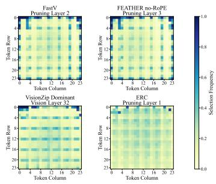

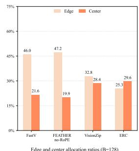  
Figure S2. Spatial-bias measurements at $B \ = \ 1 2 8$ , extending Figures 2(b) and 2(c) of the main paper. The panel layout, 1,000 $\mathbf { M M B } ^ { \mathrm { E N } }$ samples, score definitions, and pruning criteria are unchanged from the main-paper analysis; only the retained-token budget differs.

Following the main paper, Acc. is the arithmetic mean of the percentage-format benchmark scores (with MME divided by 28), while Rel. is the mean per-benchmark retention relative to the full-token score. MME is displayed as the nearest integer, while Acc./Rel. use the underlying unrounded MME values. The table contains complete results for all ten benchmarks, so its Acc./Rel. columns use the same ten-benchmark aggregate.

Analysis. At $B = 1 9 2 ,$ the $9 \times 9$ configuration achieves the best aggregate performance, with 65.9 Acc. and 95.5% Rel., compared with 65.7 Acc. and 94.9% Rel. for the strongest baseline, FastV. The $1 0 \times 1 0$ configuration ranks second on both aggregate metrics, showing that the overall performance is stable under a moderate change in grid size. Across individual benchmarks, the $9 \times 9$ configuration performs best on MME, while the $1 0 \times 1 0$ configuration performs best on GQA, ${ \bf M M B } ^ { \mathrm { E N } }$ , and MMVet; its $\bar { \bf M M B } ^ { \mathrm { E N } }$ result ties VisionZip. The gains are not uniform across all datasets: FastV remains strongest on $\mathrm { V Q A } ^ { \mathrm { T e x t } }$ and ${ \mathrm { V i z W i z } } ,$

GridPrune on MMMU and ${ \bf M M B } ^ { \mathrm { C N } }$ , HoloV on POPE, and HoloV and VisPruner tie on $\mathrm { S Q A } ^ { \mathrm { I M G } }$ . Overall, the $B = 1 9 2$ results show that $S ^ { 2 }$ Prune achieves the strongest aggregate performance, although the leading method varies across individual datasets.

## D. Grid-Size Sensitivity

Table S3 compares the coarse-grid configurations evaluated at token budgets $B = 6 4$ and $B = 3 2$ . Acc./Rel. aggregate all four reported benchmarks using the same definitions as above.

Table S3. Grid-size sensitivity of $S ^ { 2 }$ Prune on Qwen2.5-VL-7B. $\operatorname { A c c . } / \operatorname { R e l . }$ aggregate all four benchmarks. Bold and underlined entries mark the best and second-best results within each token budget, respectively; rankings use the unrounded scores.
<table><tr><td>Budget / Grid</td><td> $\mathbf { M M B } ^ { \mathrm { E N } }$ </td><td> $\mathrm { V Q A } ^ { \mathrm { T e x t } }$ </td><td> ${ \mathrm { S Q A } } ^ { \mathrm { I M G } }$ </td><td>POPE</td><td> $\operatorname { A c c } .$ </td><td>Rel.</td></tr><tr><td> $B = 6 4 / 5 \times 5$ </td><td>84.6</td><td>55.2</td><td>81.0</td><td>74.8</td><td>73.9</td><td>86.3%</td></tr><tr><td> $B = 6 4 / 4 \times 4$ </td><td>85.4</td><td>54.6</td><td>81.4</td><td>74.5</td><td>74.0</td><td>86.4%</td></tr><tr><td> $B = 6 4 / 6 \times 6$ </td><td>84.9</td><td>53.8</td><td>82.4</td><td>74.8</td><td>73.9</td><td>86.3%</td></tr><tr><td> $B = 6 4 / 8 \times 8$ </td><td>85.3</td><td>52.9</td><td>81.5</td><td>74.0</td><td>73.4</td><td>85.7%</td></tr><tr><td> $B = 3 2 / 4 \times 4$ </td><td>82.6</td><td>44.9</td><td>78.4</td><td>66.9</td><td>68.2</td><td>79.5%</td></tr><tr><td> $B = 3 2 / 3 \times 3$ </td><td>82.0</td><td>44.4</td><td>77.6</td><td>66.7</td><td>67.7</td><td>78.9%</td></tr><tr><td> $B = 3 2 / 5 \times 5$ </td><td>82.8</td><td>44.9</td><td>79.0</td><td>67.1</td><td>68.5</td><td>79.8%</td></tr></table>

Analysis. The results show that performance is only mildly affected by reasonable changes in the coarse-grid size. ${ \mathrm { A t ~ } } B = 6 4 { \mathrm { . } }$ , the $4 \times 4 , 5 \times 5 ,$ and $6 \times 6$ grids differ by at most 0.1 aggregate Acc.; at $B = 3 2 .$ , the $3 \times 3 ,$ $4 \times 4 ,$ , and $5 \times 5$ grids remain within 0.8 Acc. We therefore treat the grid size as an empirical, budget-dependent setting rather than a dataset-specific hyperparameter, and use one fixed configuration across all benchmarks for each budget. Specifically, we use $4 \times 4 , 5 \times 5 , 8 \times 8 ,$ and $9 \times 9$ grids for $B = 3 2 , 6 4 , 1 2 8 .$ , and 192, respectively.

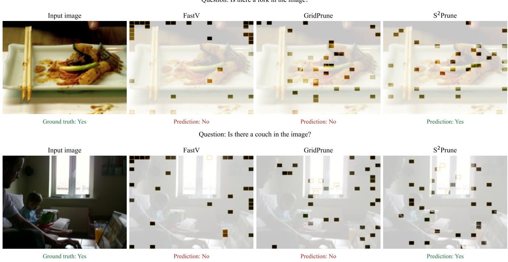  
Figure S3. At B = 32/576, S2Prune answers both POPE queries correctly, whereas FastV and GridPrune answer incorrectly. The queries concern a fork and couch; green and red text indicate correct and incorrect predictions, respectively.

## E. Qualitative Results

Figures S3 and S4 show POPE examples for Qwen2.5-VL-7B-Instruct with B = 32 retained visual tokens out of 576, while Figs. S5 and S6 show additional examples with B = 128 retained tokens. In both settings, we compare the visual tokens retained by FastV, GridPrune, and S2Prune.

Setup. All six B = 32/576 cases are positive POPE samples whose ground-truth answer is “Yes.” The B = 128/576 cases contain five positive samples and one negative sample, corresponding to the person query in Fig. S6. In all shown cases, FastV and GridPrune produce an incorrect answer, whereas S2Prune produces the correct answer. The overlays visualize the retained visual-token positions and therefore make it possible to compare not only the final answer but also the spatial evidence preserved by each method.

Observation. The queried evidence spans different scales and shapes. The fork and tennis racket are thin objects; the snowboard is partly surrounded by visually similar snow; and the couch, chair, and backpack appear amid people and other scene content. FastV often spends tokens near image boundaries, while GridPrune provides broader spatial coverage but can still leave limited local evidence on the queried object. In these examples, S2Prune retains a more spatially distributed set of tokens together with local evidence around the target object. This behavior is obtained without query-conditioned scoring: regional image structure determines the allocation, and ERC selects the local representative within each cell. These selected cases illustrate the spatial behavior of the methods and complement, rather than replace, the aggregate POPE evaluation.

Question: Is there a tennis racket in the image?  
Input image  
Prediction: Yes  
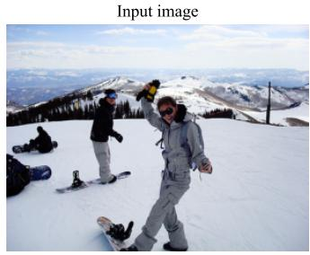

Question: Is there a snowboard in the image?  
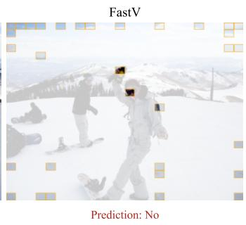

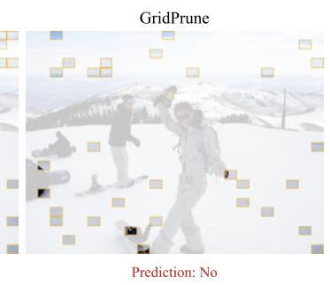  
Question: Is there a chair in the image?

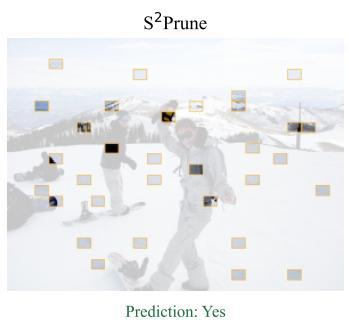

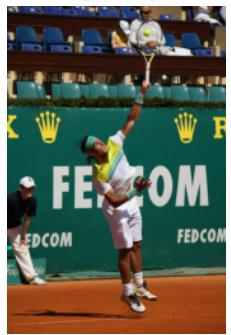  
Ground truth: Yes

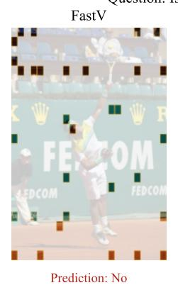

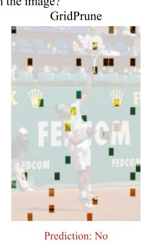  
Question: Is there a backpack in the image?

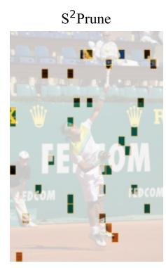

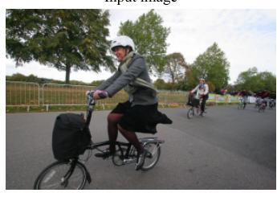

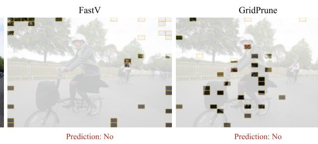

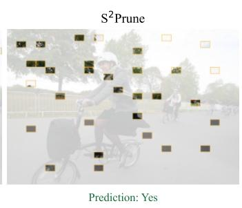

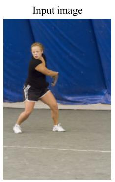  
Ground truth: Yes

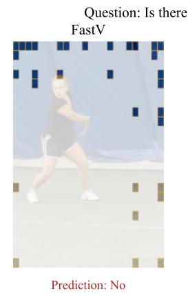

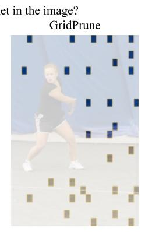  
Prediction: No

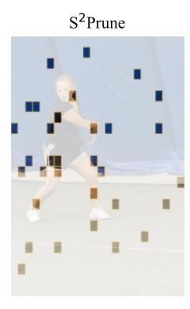  
Figure S4. At $B \ = \ 3 2 / 5 7 6 .$ S2Prune answers these four additional POPE queries correctly, whereas FastV and GridPrune answer incorrectly. The queries concern a snowboard, chair, backpack, and tennis racket; the layout and color conventions match Fig. S3.

Question: Is there a car in the image?  
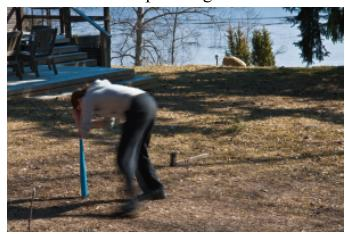

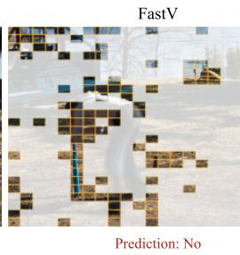

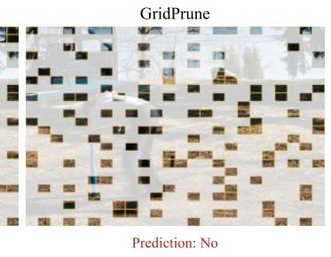

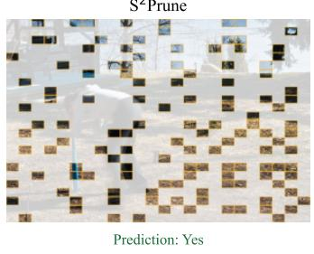

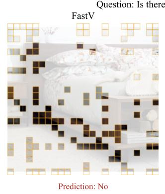

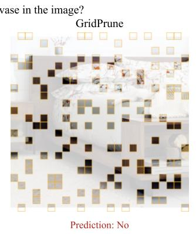

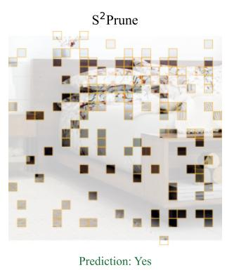

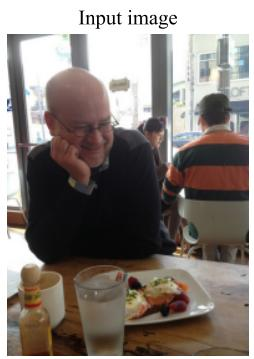

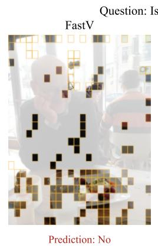

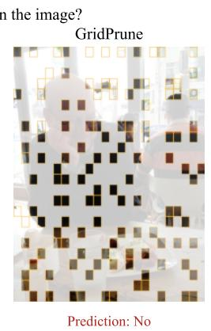

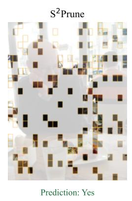  
Figure S5. At B = 128/576, S2Prune answers all three POPE queries correctly, whereas FastV and GridPrune answer incorrectly. The queries concern a bench, vase, and car; green and red text indicate correct and incorrect predictions, respectively.

Prediction: Yes

Input image  
Question: Is there a person in the image?  
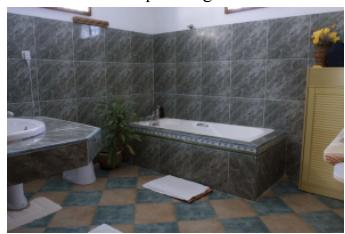

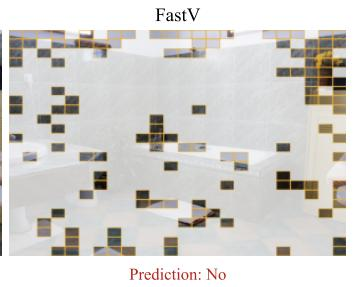

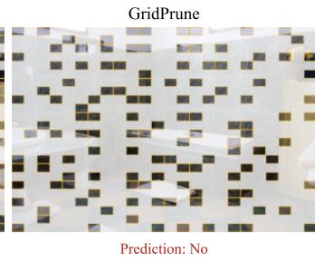

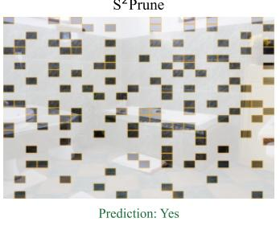

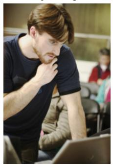  
Ground truth: Yes

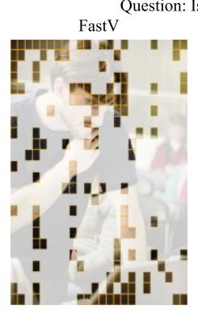

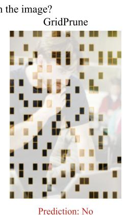

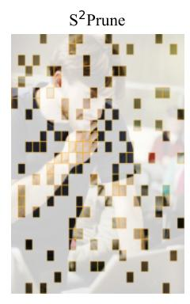

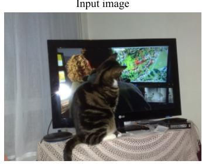

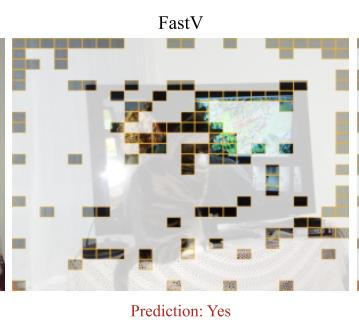

  
Figure S6. At $B \ : = \ : 1 2 8 / 5 7 6 ,$ S2Prune answers these three additional POPE queries correctly, whereas FastV and GridPrune answer incorrectly. The queries concern a potted plant, chair, and person; the layout and color conventions match Fig. S5.