# Separating perception from reasoning in vision–language models: a model-free render ceiling for crystal structures

Inverting frozen cameras yields an exact, per-sample reference for what the images support

Can Polat 1 Mustafa Kurban 2,3, Erchin Serpedin 1 Hasan Kurban 4,

1 Department of Electrical and Computer Engineering, Texas A&M University, College Station, TX, USA

2 Department of Electrical and Computer Engineering, Texas A&M University at Qatar, Doha, Qatar

3 Department of Prosthetics and Orthotics, Ankara University, Ankara, Turkey

College of Science and Engineering, Hamad Bin Khalifa University, Doha, Qatar

Correspondence: kurbanm@ankara.edu.tr, hkurban@hbku.edu.qa

## A B S T R A C T

Multimodal evaluations cannot say whether a vision–language model misread an image or misreasoned about it, because every existing method for separating the two places a second model in the loop. We introduce the render ceiling, a model-free reference for benchmarks built by rendering known objects: inverting the frozen cameras and re-solving cross-view correspondence recovers exactly the answer the images support. We prove the ceiling fails only through an enumerable set of projection coincidences and certify that set empty on 2,160 rendered crystal structures, so every point of a model’s deficit belongs to the model. Across fourteen vision–language models, supplying exact geometry as text lifts every model yet closes under half the gap for thirteen, while a supervised vision model with no language component reads the same images at 0.8952, above every vision–language model. The instrument exposes extraction-stage fabrication that downstream accuracy would misattribute to reasoning, yields camera-placement rules for benchmark builders, and transfers to any benchmark with an invertible forward rendering.

K E YW O R D S multimodal evaluation; vision–language models; perception and reasoning attribution; identifiability; crystal structures

## 1 Introduction

Vision–language models are entering scientific workflows as readers of figures, spectra and rendered structures, and as components of agentic pipelines for materials design, and in materials science this is already benchmarked territory [1]. The flagship multimodal benchmark for the domain finds that models handle basic perception of chemistry and materials images well while failing at spatial reasoning, cross-modal synthesis and multi-step inference [2], and the text-only side of the same ecosystem is measured at scale across 1.9 million crystal structures and 45 properties [3]. Crystal structures are the sharpest case in the domain, because they reach most readers as pictures: the visualisation programs that draw them are among the most heavily used tools in the field [4], and a model that could read those pictures would inherit a century of crystallog raphy already drawn rather than tabulated. That renders carry recoverable structural content is established for the neighbouring modality, where symmetry is identified from difraction images by shape analysis and a learned classifier [5]. Yet models stress-tested on ball-and-stick crystal renders under spatial- and composition-exclusion protocols answer symmetry questions far below the accuracy the renders appear to allow, and supplying the source crystallographic file alongside the image narrows but does not close that gap, which is read against the best observed score rather than against a measured bound [6]; the same pattern holds on X-ray difraction peak indexing [7].

A model that misreads an image and a model that misreasons about it produce the same wrong answer, and the two call for diferent remedies: a perception failure is fixed at the input, in the render protocol or the representation, while a reasoning failure is fixed in the model [8]. Separating them is now an object of training and not only of analysis, since decoupling the two stages during post-training improves vision–language models [9]. The critical observation of this work is that every established way of locating the split places a second model in the loop, so the reference against which the deficit is read is itself a model and the attribution inherits that model’s own errors. Re-scoring abstract-reasoning benchmarks after the image is replaced by a model-written description reassigns much of an apparent reasoning deficit to perception [10], and serialising the visual stream into a ground-truth textual description places the ceiling on the backbone’s reasoning [11]; both fix the model’s input, which makes the reassignment readable, but leave the image’s own information content unmeasured. Decompositions that name the stages separately inherit the same limit: on geometry problems whose diagrams and descriptions derive from a common symbolic specification, a decomposition into perception, reasoning and integration finds integration dominant with the perception term bundled rather than isolated [12], and where a rule-based encoder converts raster vector graphics to a symbolic form, a learned abstraction step follows it [13]. Mechanistic probes locate the layer at which visual access stops mattering, which answers where in a network the image is used rather than how much of the task it settles [14]. Diagnostics that isolate perception directly do so with constructed question sets rather than a certified reference, and find that models still cannot read basic geometric properties from scientific figures [15].

Nor can the split be read of model behaviour, because reasoning is not monotonically helpful: added deliberation can reduce multimodal accuracy [16] and chain-of-thought degrades visual spatial reasoning [17]. Where the intermediate representation is made checkable at all, it is checked by a learned verifier of explicit visual premises [18] or carried in continuous visual tokens [19], in both cases without an exact reference to check against, so a fabricated intermediate and a mistaken one are scored alike. Model-free readers of crystal symmetry exist but do not read images: neural crystal-structure prediction takes chemical composition as input [20], space-group prediction from extinction-law-consistent descriptors takes difraction input [21], and classification from computed difraction images reads an image through a trained network rather than a closed-form procedure [22]. The images themselves are treated as something to be learned from rather than analysed, and even reading them at the resolution they are supplied at is unresolved, dynamic-resolution input being a live robustness failure [23] and resolution dilemmas persisting in architectures built for native visual understanding [24]. Multi-view correspondence is documented as a weakness of the same models [25], and view selection has been optimised through a diferentiable renderer, treating the view configuration as something to search rather than to analyse for the conditioning it induces [26]. That conditioning is analysable: current reconstruction from three orthographic views is done with learned self-supervised objectives [27], and available identifiability guarantees concern the latent factors a multi-view contrastive objective recovers rather than exact geometric identifiability of scene content under a known renderer [28]. Without a reference of the second kind, benchmark headroom is read as one minus the best score, which assumes a ceiling of 1 [29]; where a ceiling is measured rather than assumed it still has a model inside it, a best-case ensemble over several models or a selector computed against the labels, and those evaluation artifacts move the apparent unsolvable fraction by enough to change conclusions [30].

For natural photographs no better reference is available, since no procedure recovers a photograph’s information content without a model: recovering scene geometry from a single image is ill-posed, an infinite family of three-dimensional scenes projecting to the same picture, so every practical reader supplies a learned prior in place of the missing constraint [31]. Rendered scientific figures are diferent, and that diference is the opening this work exploits: a crystal-structure render is an orthographic projection [32] of a structure whose coordinates are known exactly, under a camera set the experimenter chose. Inverting those cameras and re-solving cross-view correspondence [33] recovers the answer the images support with no model at any step, a quantity we call the render ceiling. The task it is measured on is crystal-system assignment, the seven-way symmetry class of a lattice [34], computed from the atom positions of the conventional cell [35] expressed in fractional coordinates by spglib, a deterministic symmetry-assignment algorithm [36]; the same reconstruction also determines the Bravais lattice and the space group, finer symmetry labels derived from the same positions.

Here we show that a benchmark built by rendering a known object carries a model-free ceiling whose exactness can be characterised and certified per sample. The characterisation is an emptiness condition on a set of geometric phantoms, coincidences between distinct atoms’ projections, and it is the oracle’s only failure mode; on the evaluation sample and on a disjoint scale-up sample, 2,160 structures in all, the set is empty and the ceiling is 1.0000, so every point of every model’s deficit there is attributable to the model, while withholding cameras returns phantoms and a ceiling genuinely below 1. Read against that ceiling as the top rung of an attribution ladder over fourteen vision–language models (Fig. 1), supplying exact geometry as text lifts every model yet closes under half the distance to the ceiling for thirteen of the fourteen, and the share it closes shows no trend with model strength; the pixels are nonetheless demonstrably readable without language, since a supervised vision model with no language component reaches 0.8952 on the same renders, above every vision–language model. The instrument also exposes a failure class a leaderboard cannot see: promoted to the extraction stage, a strong model emits syntactically perfect coordinate lists that match almost nothing, a fabrication that downstream accuracy would book as bad reasoning, which makes a model-free reference the missing audit primitive for the two-stage and agentic materials pipelines whose intermediates currently go unchecked. Finally, the same geometry yields design rules for benchmark builders, stating which camera placements survive extraction noise, that placement rather than view count sets the noise budget, and where a pipeline’s own reading becomes the binding ceiling, and the construction transfers to any benchmark whose forward rendering can be written down and inverted.

(a)  
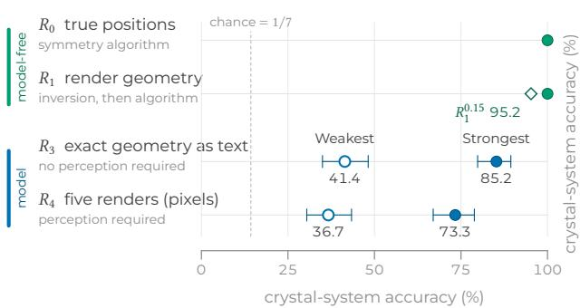

(b)  
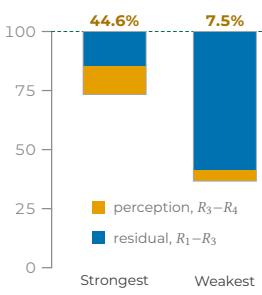  
Figure 1 A model-free attribution instrument, read on crystal-system prediction. Each rung poses the same question on the same structures with one capability removed, on the $n = 2 1 0$ evaluation sample at a decode budget of $K = 3$ majority-voted samples. (a), Accuracy at each rung. Green marks the two model-free rungs, which are algorithmic and reach $2 1 0 / 2 1 0$ ; blue marks the two model rungs, filled for Strongest and open for Weakest. The open diamond is the $R _ { 1 }$ oracle re-read at the released merge tolerance $( R _ { 1 } ^ { 0 . 1 5 } , 2 0 0 / 2 1 0 )$ Error bars are 95% confidence intervals. $R _ { 2 } ,$ the oracle on a learned detector’s output, is unscored under its gate and not shown. (b), The same gap to $R _ { 1 }$ , on the accuracy scale of (a). Each column runs from the model’s $R _ { 4 }$ accuracy to the $R _ { 1 }$ ceiling and is split at its $R _ { 3 }$ accuracy: orange is the part that handing the model perception’s output recovers $( R _ { 3 } - R _ { 4 }$ , worth 11.90 and 4.76 accuracy points), blue the part it does not $( R _ { 1 } - R _ { 3 }$ worth 14.76 and 58.57 points). Displayed values are rounded; every diference and share is computed from the exact counts over the 210 structures.

## 2 Results

Every measurement shares one setup, specified in full in Methods: models answer the crystalsystem question on an evaluation sample of 210 structures, majority-voted over $K = 3$ samples at a shared decode budget, under the frozen five-camera protocol with a verbatim prompt and no per-model tuning. Where a second sample is used it is named, most often the expansion sample, an independently drawn 210-structure set under the same protocol. Table 1 collects the modelfree reference quantities the model scores are read against, and Table 2 binds each role label used below to its run record and accuracies; three conditions score overlapping but non-identical model sets, since every exclusion is a pre-registered application-programming-interface-error, parse or endpoint gate and every excluded entry is reported unscored rather than dropped.

## 2.1 A certified ceiling, measured without a model

Running the oracle at the certified setting $\delta = \tau$ returns the correct label on all 210 evaluation structures and all 1950 certified scale-up structures, reconstructing positions to $3 . 9 \times 1 0 ^ { - 1 5 } \mathrm { \AA }$ with no atom dropped and no phantom accepted, so $R _ { 1 } = 1 . 0 0 0 0$ on both samples and the separation hypothesis of the identifiability theorem is met rather than assumed. Enumerating the phantom set over all ten independent view pairs shows why: $\Phi _ { 0 } = \varnothing$ on all 1950 structures under the released five-camera protocol. Because the two model-free rungs coincide, every point of every model’s shortfall from the ceiling belongs to the model, and for the strongest scored model that is all 0.2667 of it.

Table 1 Model-free reference quantities, reported separately from any model’s own accuracy. �=210 unless stated.
<table><tr><td>Quantity</td><td>Value</td></tr><tr><td> $R _ { 0 }$  (Strongest row, tautological identity 1.0000 check)</td><td></td></tr><tr><td> $R _ { 1 }$  (exact ceiling, certified  $\delta = \tau )$ </td><td>1.0000 (also on the 1,950-structure scale-up sample)</td></tr><tr><td> $R _ { 1 } ^ { 0 . 1 5 }$  (released tolerance  $\scriptstyle { \delta = 1 5 \tau ) }$ </td><td>0.9524</td></tr><tr><td>cell volume)</td><td>Shape-free baseline (atom count, density, 0.5286; 0.2054 on the 1,933-structure sample</td></tr><tr><td>Seven-way majority-class rate</td><td>0.1429</td></tr></table>

Emptiness is a property of the protocol and not of the construction, so the instrument measures the images rather than assuming them perfect. The same census over camera subsets leaves $\Phi _ { 0 }$ nonempty on 15.4% of two-view subset-structure pairs and 1.9% of three-view pairs of the 1950 structures, and withholding cameras drives the ceiling genuinely below 1 (Fig. 2) while the phantom rate reaches zero by four views, so the fifth camera contributes reconstruction fidelity rather than closing a phantom rate the fourth left open.

What degrades under an imperfect reader is the extraction stage, and the merge tolerance $\delta$ is the parameter that matters. Reading the same oracle across � at fixed � traces a frontier: 1.0000 at $\delta \ : = \ : \tau , 0 . 9 8 1 0$ at 5�, and $R _ { 1 } ^ { 0 . 1 5 } ~ = ~ 0 . 9 5 2 4$ at the released 15�, with 0.8785 there on the 1950 certified structures. The loss is a label-tolerance failure inside the symmetry algorithm rather than a failure of the geometry: every structure it costs recovers the correct atom count and has its closest same-species pair at more than eleven times $\delta ,$ which rules out merging of distinct atoms. Identifiability from the renders is thus total, and what an actual pipeline achieves is a property of its extraction stage; every ceiling-to-model gap below is wider at the certified reading than at the released tolerance, so no comparison depends on which point of the frontier is chosen.

## 2.2 Perception is not the bottleneck for most of the roster

Supplying ground-truth geometry as text lifts every model $( P > 0$ for all 14), by as little as one structure of 210 for GLM-4.6V, and none reaches the oracle: the best is 0.8524 against 1.0000, per model in Fig. 3. The decomposition gives a median perception share of 0.2901 across the 14 models scored under the coordinate condition, with the post-perception residual the larger of the two for 13 of them, the two exemplars of the attribution ladder spanning that range at 0.4464 and 0.0752, a factor of 5.9 apart. The single exception is Grok 4.5, and the count is 12 of 14 against $R _ { 1 } ^ { 0 . 1 5 }$ , so the conclusion holds at either point of the frontier.

The natural strengthening, that the share rises with model strength, is not supported: across the 14 models the share and pixel accuracy are unrelated by rank correlation. The raw component moves the other way, $R _ { 3 } - R _ { 4 }$ correlating with $R _ { 4 }$ at $\rho = - 0 . 6 4 3 9$ , so the strongest pixel performers are those for whom exact geometry adds least even though the share it closes shows no trend.

Table 2 Role-label roster: the model, run conditions, sample and accuracies behind each role label used in the text. Models are named as their vendors do; the exact application-programming-interface identifier strings are listed with the per-model ladder in the Supplementary Information and in the released run records. Strongest and Weakest are the short forms used in the key of Fig. 1.
<table><tr><td>Role label</td><td>Model</td><td>Conditions and sample</td><td>Accuracies</td></tr><tr><td>The strongest scored model (Strongest)</td><td>Gemini 3.6 Flash</td><td>Ladder  $( R _ { 3 } / R _ { 4 } ) ;$  also the newer arm in the one-generation comparison (same model, same label, not</td><td> $R _ { 3 } = 0 . 8 5 2 4 ; R _ { 4 } = 0 . 7 3 3 3$ </td></tr><tr><td>The weakest of the fourteen by  $R _ { 3 }$  (Weakest)</td><td>GPT-4.1 mini</td><td>a second arm) Coordinate condition  $( R _ { 3 } / R _ { 4 } )$ </td><td> $R _ { 3 } { = } 0 . 4 1 4 3$  (minimum of the 14 scored);  $R _ { 4 } { = } 0 . 3 6 6 7$ </td></tr><tr><td>The fine-tuned model arm</td><td>Qwen3-VL 8B Instruct</td><td>Supervised-then-GRPO, single seed; headline at  $K { = } 8 ,$  also reported at the shared</td><td>0.6905 at K=8; 139/210=0.6619 at K=3</td></tr><tr><td>Supervised reference arm</td><td>Qwen3-VL 8B Instruct (same base as the fine-tuned model arm, supervised-only</td><td>budget Supervised LoRA, three seeds</td><td>Mean 0.6143 (SD 0.0515)</td></tr><tr><td>The model run at a controlled reasoning budget</td><td>recipe, no GRPO) Claude Opus 5</td><td>Two reasoning-budget settings (minimal, provider</td><td>130/210=0.6190 under both settings</td></tr><tr><td>An earlier-generation model</td><td>Gemini 2.5 Flash</td><td>default) Zero-shot leaderboard</td><td>90/210=0.4286 (own score; the leaderboard&#x27;s best row,  $9 3 / 2 1 0 { = } 0 . 4 4 2 9$  , belongs to two other models, Llama 4</td></tr><tr><td>Supervised pixel baseline</td><td>ResNet-50, ImageNet-initialised (not a vision-language model)</td><td>Fine-tuned from ImageNet initialisation on the released training renders</td><td>Maverick and GLM-4.6V, tied) 188/210=0.8952 (original sample); 0.7524 (expansion sample)</td></tr></table>

Perception dominance is therefore a property of the top of the roster, not of the task.

The zero-shot leaderboard is the low rung of the same measurement rather than a ranking. Across the 13 scored zero-shot models the best reaches $9 3 / 2 1 0 = 0 . 4 4 2 9 .$ , far below the oracle’s 1.0000 (Fig. 4), while a cell-metric random forest [37] that reads cell geometry rather than chemical composition reaches 0.8952 on the same label, above every model; its feature specification and reading sensitivity are in Supplementary Note 1. The fine-tuned arm reaches 0.6905 and is used only as the model side of the ceiling-to-model gap, which survives any seed in the supervised reference arm’s spread and is significant against both the certified and the released ceiling. The model run at a controlled reasoning budget, Claude Opus 5, scores identically under the minimal and default reasoning-efort settings while the default spends 5.4 times the deliberation, which is the non-monotonicity of reasoning noted above, observed on this task.

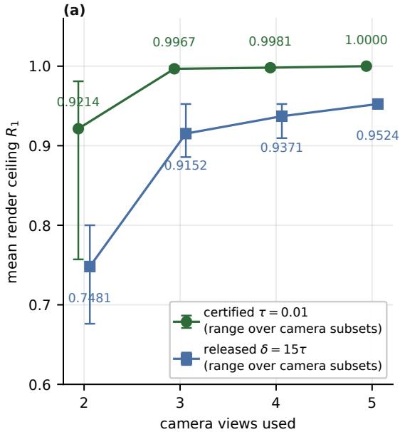

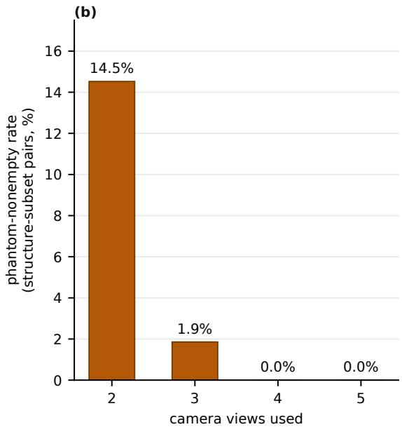  
Figure 2 The instrument returns a ceiling genuinely below 1 once cameras are withheld. (a), Mean render ceiling $R _ { 1 }$ under two-, three-, four- and five-camera subsets of the frozen protocol, at the certified tolerance $\delta = \tau = 0 . 0 1 \mathrm { \AA }$ and at the released tolerance $\delta = 1 5 \tau ;$ error bars span the minimum and maximum over camera subsets of that size. Mean $R _ { 1 }$ at the certified tolerance is 0.9214 at two views and 0.9967 at three; at the released tolerance it is 0.7481 at two views and 0.9152 at three. (b), The phantom-nonempty rate (� near zero) at each view count on the original sample: 14.5% at two views and 1.9% at three, falling to exactly 0.0% at four and five views.

The ladder carries most of its information where cell-metric cues are insuficient. Splitting the sample by cue suficiency leaves 140 box-suficient and 70 box-ambiguous structures; 60 of the 70 are hexagonal or trigonal, a single dominant degeneracy, and removing it leaves a discriminative core of only � = 10 structures where the pixel-against-numeric contrast is genuinely informative. Consistent with this, the cell-metric random forest degrades from 0.8952 at crystal-system granularity to 0.6810 at the finer space-group granularity, so the numeric reader’s advantage over the pixel models is itself coarser than the task the ladder ultimately asks about. The stratum composition on both samples, the occluder conditions at both view counts and the one-generation comparison are in Supplementary Note 2.

## 2.3 The pixels are readable without language

A generic vision architecture with no language component reads crystal system from these renders at 0.8952, above the best vision–language model and within 0.1048 of the ceiling. Two architectures, ResNet-50 and ViT-small/patch16, both ImageNet-initialised, were fine-tuned on the crystal-system label using only the 1,610 released training renders and no other information, then scored on the original and the independent expansion evaluation samples, with no geometry-altering augmentation, since a rotation, flip, shear or aspect-ratio distortion could invert the very label being predicted. Five-view mean-logit aggregation gives ResNet-50 188/210 = 0.8952 and ViT-small 0.8333, on runs of 153 s and 152 s of wall clock on one consumer graphics processor. A model with no crystallography-specific inductive bias and no access to language extracts nearly all of the information a vision–language model leaves on the table, so the deficit measured throughout is not explained by the task being unreadable from pixels in principle.

(a)  
(b)  
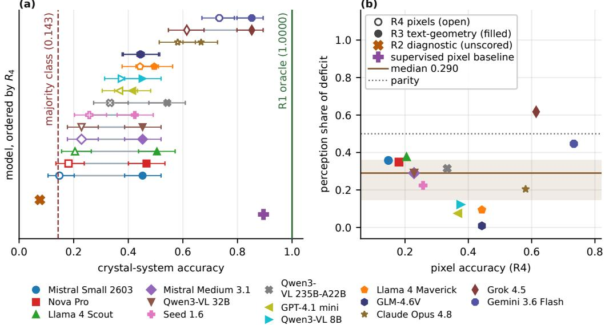  
Figure 3 The two model rungs and the decomposition they imply, across the whole roster. Marker shape and colour identify the model in both panels. (a), Per-model $R _ { 4 }$ (pixels, open marker) and $R _ { 3 }$ (exact geometry as text, filled marker), rungs as defined in Methods, with the $R _ { 1 }$ oracle at 1.0000 and seven-way chance drawn; $R _ { 2 }$ is omitted as unscored under its pre-registered gate, its diagnostic value being 0.0762 and 0.0857 on the two samples. One row per model, ordered upward by $R _ { 4 }$ and identified by marker; the two markers below the axis are the unscored $R _ { 2 }$ diagnostic and the supervised pixel baseline, neither of which is a row of the roster. (b), Perception share of the deficit against $R _ { 4 } ;$ the dotted parity line marks equal perception and post-perception components. The drawn median and its bootstrap 95% confidence interval (band) are computed against the exact ceiling $R _ { 1 } = 1 . 0 0 0 0$

On the independent expansion sample the same ResNet-50 checkpoint reaches 0.7524 (ViT-small 0.5810), a 0.1428 drop that tracks the composition shift documented for the shape-free baseline. Of the 22 total errors ResNet-50 makes on the original sample, 7 (31.8%) are hexagonal/trigonal confusions, the single largest confusion pair, consistent with this pair being a cell-metric degeneracy rather than a model-specific failure.

## 2.4 Fabrication that a leaderboard would score as reasoning

Substituting a strong model as the extraction stage, prompted for species and positions with the symmetry question withheld, then having a weaker model answer from that text, yields exactly the majority stratum’s base rate, so downstream accuracy measures nothing. The informative measurement is the intermediate, scored against ground truth: median recall 0.0000, with 105 of

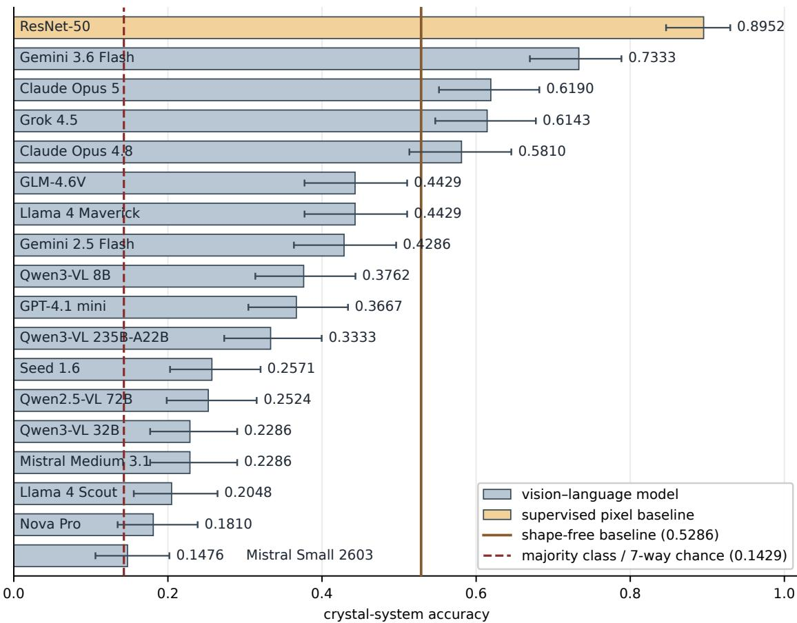  
Figure 4 No vision–language model reaches the certified ceiling, and the supervised pixel baseline outscores all of them. Zero-shot crystal-system accuracy: seventeen vision–language model arms across ten vendors, together with the supervised pixel baseline, which is not a vision–language model. Four arms clear the shape-free baseline (solid line, 0.5286) and the best reaches 0.7333 against the oracle ceiling of 1.0000; dashed line: seven-way chance, 0.1429. Error bars are 95% confidence intervals. Run-to-run spread of majority voting is a mean of 5.0 of 210 structures across two sweep runs.

206 structures having not one emitted atom within tolerance of a real one despite a median of 48 well-formed atoms each, where a connected-component blob detector [38] reaches 0.400 on the same task. A two-stage pipeline whose intermediate cannot be checked will attribute fabrication to reasoning, and only a model-free reference distinguishes the two.

Three competing explanations for the ceiling-to-model gap are excluded by the controls. That the renders lack the answer is excluded by $R _ { 1 }$ and by the occluder classification, which finds symmetry recovery identical whether or not informative occluders are removed while the atom-count match falls from 204 to 194 of 210, so the intervention does reach the reconstructor (Fig. 5). That models rely only on composition-to-label mappings is excluded by an image-absent control carrying the identical prompt with the chemical formula and no renders: every scored model collapses toward chance, mean 0.1487 against 0.1429, and the paired diference is significant for 10 of 13, the three nulls being the three weakest models, two of them at chance even with images (Fig. 6). That the

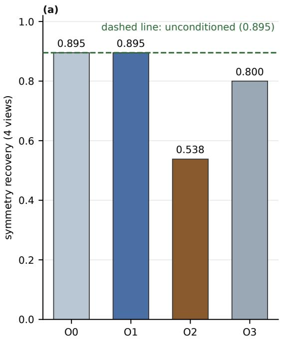

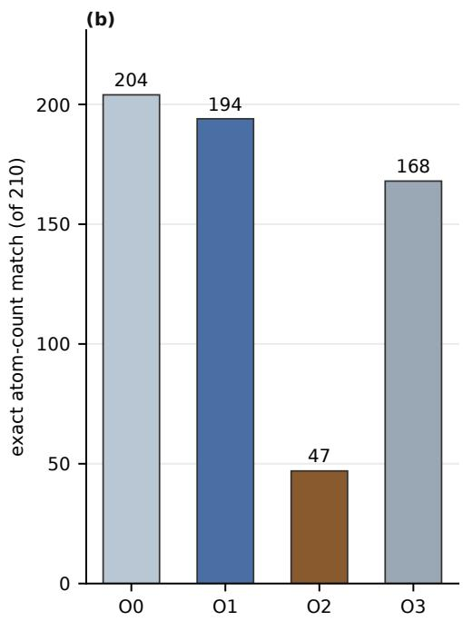  
Figure 5 Removing informative occlusion from the oracle’s input changes no classification. Expansion sample, four views. (a), Symmetry recovery under the four occlusion conditions: O0 unconditioned, O1 informative occluders removed, O2 all occluders removed, O3 the pre-registered random-removal control; the dashed line is O0. (b), Exact atom-count match under the same conditions, which does move across them.

$R _ { 3 }$ lift is text mode rather than geometry is excluded by the same formula-only arm, since every scored model reaches between 0.4143 and 0.8524 with full geometry substituted for images.

The residual is an upper bound and was tested as such: it may include long-list handling rather than symmetry reasoning, and regressing per-structure $R _ { 3 }$ correctness on atom count, 13 of 14 models show a negative association that is not symmetry dificulty in disguise. One further reading belongs to the original draw rather than to the method: thirteen of the seventeen scored arms fall below the shape-free baseline of 0.5286, and the four that clear it are all current-generation models. A larger set at $n = 1 9 3 3$ generated under identical rules puts the baseline at 0.2054, and across 446 resampling trials under three regimes it never exceeds 0.52, so the released 0.5286 sits above every trial’s maximum: an outlier of the released draw rather than a composition-exclusion class-imbalance artifact.

## 2.5 Camera placement, not view count, sets the noise budget

At exact extraction the frozen protocol, the of-axis camera perturbation and the released tiled geometry each return all 210 labels, so no camera choice in this family withholds any part of the task; what separates them is conditioning. Before measuring we fixed the conditioning constant at $\kappa = 2 . 7 3 2 1$ for the frozen cameras and $\kappa = 8 . 4 2 5 8$ for the of-axis perturbation, predicted that the more poorly conditioned protocol would tolerate proportionally less centroid error, and recorded an absolute noise-budget prediction from the conditioning bound. Injecting per-view Gaussian centroid noise confirms the prediction that isolates �, since frozen and of-axis difer in camera placement alone: the frozen protocol tolerates 2.1× the noise, with paired comparison separating them at $\sigma = 0 . 0 2 \mathrm { \AA }$ . The two further predictions, the three-way ordering including the tiled arm and the absolute noise budget, failed, the observed tolerance ratio falling short of the predicted one. View count behaves as the first design consequence predicts, non-decreasing as views are added. A benchmark builder therefore buys robustness by separating camera directions, not by adding views past the point where the phantom set empties.

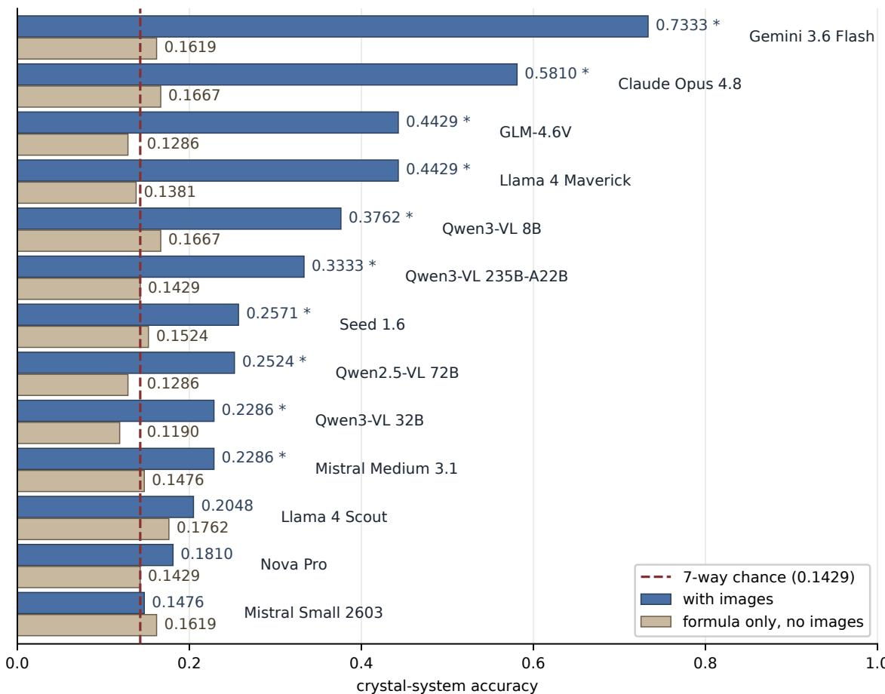  
Figure 6 Removing the image collapses every model toward chance. Each model answered the identical prompt with the five renders and with the chemical formula alone, paired per structure; model identifiers are drawn at the end of each bar pair. Stars mark models whose paired diference is significant; the dashed line is seven-way chance.

## 3 Discussion

A benchmark built by rendering a known object carries a ceiling with no model inside it. Inverting the cameras the render protocol already fixes and re-solving cross-view correspondence returns exactly the answer the images support, and the construction has a single failure mode, a set of projection coincidences fixed by the structure and the cameras that can be enumerated for every sample. Under the released protocol that set is empty on all 2,160 structures we certified, so the ceiling is exactly 1 and every point of every model’s deficit belongs to the model; withholding cameras returns phantoms and a ceiling measurably below 1, so the instrument measures the images rather than assuming them perfect. The oracle measures information, not competence: it states what the renders determine, not that any model or person can extract it, and what an imperfect reader loses is a frontier in extraction tolerance rather than a limit of the images.

Every earlier route to the split between perception and reasoning reviewed in the introduction, whether a model-written description of the image, a ground-truth serialisation of it into text, a best-case ensemble or a selector fitted to the labels, reads a model’s deficit against a quantity with a model inside it, so the attribution inherits that model’s errors and the apparent headroom moves with the evaluation artifacts. Against a model-free reference the split becomes a subtraction from a fixed quantity: the residual is bounded rather than estimated, the ceiling is certified per sample rather than assumed, and the ladder’s conclusions hold at every point of the tolerance frontier. The same property is what makes a fabricated intermediate distinguishable from a mistaken one.

Read against that ceiling, most models remain limited by what survives the removal ofperception: the post-perception residual exceeds the perception component for 13 of the 14 models, with no relationship between perception share and model strength across the roster. The reading that perception is the binding constraint on multimodal materials tasks is therefore a statement about particular models rather than about the task, and it inverts at the top of the roster, where exact geometry adds least. For post-training that decouples perception from reasoning, this locates the available headroom: the stage a decoupled recipe would improve is not the one holding most of the roster back. That the information is there to be read is settled independently by the supervised pixel baseline, which lands above every vision–language model and close to the ceiling using only the benchmark’s own renders, so what those models leave unread is extractable without language and without crystallography-specific inductive bias.

The finding with the widest reach for AI-assisted materials design is fabrication. Promoted to the extraction stage, a strong model emits well-formed coordinate lists that match almost nothing, more than half of the structures carrying not one emitted atom within tolerance of a real one, and a pipeline that scores only its endpoint books that as a reasoning error. Agentic materials workflows are assembled from exactly such intermediates, a structure read from a figure and handed to a property predictor or a synthesis planner, checked, where it is checked at all, by a learned verifier that cannot separate a fabricated intermediate from a mistaken one. For any stage whose forward map is known, the intermediate can be scored against a reference with no model inside it, and that is the audit primitive these pipelines currently lack.

Three conditions fix the scope of the instrument. The construction needs a forward rendering that is known and invertible, and we demonstrate it on one task in one domain; under calibrated perspective the identifiability theorem survives, though its lattice-vector consequence does not. The oracle answers from exact centroids, so the ceiling states what the geometry determines rather than what a pixel reader recovers. Exactness is certified sample by sample at a single tolerance: the phantom set is not monotone in that tolerance, no growth rate with cell size is proved, and an independently drawn sample already loses one structure at the certified setting. Within the decomposition, the post-perception residual is an upper bound on symmetry reasoning rather than a measurement of it, the conditioning constant orders camera placements rather than setting a noise budget, and the model arms were not re-run on the scale-up sample.

The same geometry yields design rules a benchmark builder can apply before release. Adding a view never destroys identifiability, a camera aligned with a lattice vector separates no atoms that difer by multiples of it, four separated cameras empty the phantom set on this protocol with the fifth adding reconstruction fidelity, and among protocols that all reach the ceiling at exact extraction it is camera placement, not view count, that sets the tolerance to centroid error. Measuring the ceiling therefore tells the builder whether the images ask the question the labels answer, which camera placements survive an imperfect extraction stage, and at what point the pipeline’s own reading, rather than the model under test, becomes the binding constraint. The construction transfers to any modality whose forward rendering can be written down and inverted, including rendered molecular conformers and figures plotted from computed numerical data such as band structures, densities of states and phase diagrams, where the same ceiling separates what a figure determines from what a model reads.

## 4 Methods

## 4.1 Benchmark construction

A crystal structure is a triple $s = ( L , X , Z )$ of lattice, fractional coordinates $X = \{ x _ { i } \} _ { i = 1 } ^ { N }$ and species. The label map $y ( s ) = \operatorname { s p g } _ { \tau } ( s )$ is the crystal system returned by spglib at a fixed tolerance �, so label correctness is not a competing explanation for model error.

Each structure’s crystal system, Bravais lattice, point group and space group are derived from its coordinates by spg at the canonical tolerance $( s \mathrm { y m p r e c } = 0 . 0 1 $ , angle tolerance 5◦), with a tolerance sweep that quarantines any structure whose space group is not stable across it. On a separate stratified sample disjoint from training and evaluation, our labels agree with the source-database space group in all 220 stability-certified cases. Structures are drawn from the Materials Project [39] as conventional-cell crystallographic information files in the standard crystallographic setting, under a composition-exclusion split reserving 13 elements for evaluation only, so no chemical composition in any evaluation set appears in training; without this, symmetry is partly predictable from composition alone, and a model could score well without reading the image. The random seed fixing the split is 23, and the 13 elements reserved for evaluation only are Cd, Ce, Hg, In, Ir, La, Mn, Os, Re, Ru, Tc, Ti and Tl. The released 1,820 structures (1,610 train / 210 eval) have zero train/eval/prior leakage. The render protocol and the split are used as general approach while the deterministic symmetry ground truth with its tolerance-quarantine policy and the exact-label scoring target is created. The crystal system is the headline label, but the same reconstruction determines the Bravais lattice, point group and space group, so neither the identifiability result nor the ceiling is specific to the seven-way target; Supplementary Note 3 scores all four. Every distinct sample used in this work is collected in Supplementary Note 4.

The frozen protocol renders a $2 \times 2 \times 2$ tiling of the conventional cell through five orthographic cameras $C = \{ c _ { v } \} _ { v = 1 } ^ { 5 }$ (three principal-axis, two oblique) at 768 px. The tiling is a legibility choice inherited from the convention. Each camera is a known unit direction $d _ { v }$ with orthographic projection $\Pi _ { v } ( p ) = M _ { v } p$ for a fixed $2 \times 3$ matrix $M _ { v }$ with orthonormal rows perpendicular to $d _ { v }$ . The task given to a model is: from $\left( I _ { 1 } , \ldots , I _ { 5 } \right)$ , name the crystal system; Fig. 7 shows one evaluation structure under all five cameras. The renderer draws flat depth-sorted circles with no shading, no bonds, and dashed unit-cell edges; the full render specification recovered from the released code is given in Supplementary Note 5.

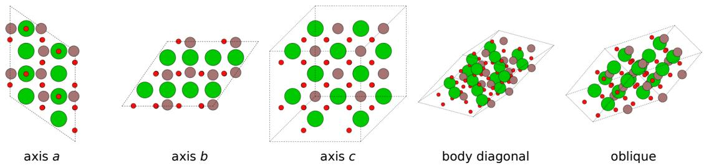  
Figure 7 One evaluation structure under all five frozen cameras. The structure is mp-673678 (triclinic, Ba-In-O), rendered at the released $7 6 8 \times 7 6 8$ px resolution and chosen as the evaluation-set structure whose atom count is closest to the sample median. The production render path draws flat depth-sorted circles with no shading, no bonds, and dashed unit-cell edges.

Algorithm 1 Geometric oracle $O ( s , C )$   
1 for each view � do   
2 ${ \mathcal { Q } } _ { v } \gets \{ ( \Pi _ { v } ( L x _ { i } ) , z _ { i } ) : i = 1 , \ldots , N \}$   
3 end for   
4 for each pair of views (�, �) and each same-species pair $( q , q ^ { \prime } ) \in Q _ { v } \times Q _ { w }$ do   
5 $\hat { p } \gets$ the closest-approach point of the back-projected rays $\Pi _ { v } ^ { - 1 } ( q ) , \Pi _ { w } ^ { - 1 } ( q ^ { \prime } )$ , accepted if that   
closest-approach distance is at most $\delta$   
6 accept $\hat { p }$ if its projection lies within � of a same-species point in every remaining view   
7 end for   
8 merge accepted points lying within � of one another, the same tolerance � used for acceptance   
above   
9 return spg (merged reconstruction)

## 4.2 Geometric oracle and identifiability

The instrument inverts the cameras the render protocol already fixes and applies the same symmetry algorithm that produced the labels. The oracle answers the same question from the renders’ own geometry instead of from pixels: where classical orthographic factorisation estimates the cameras, the render protocol fixes them, so we invert them in closed form. It forward-projects the ground-truth atom positions of the conventional cell through each frozen camera, discards the correspondence between views, re-solves it by ray intersection (triangulation) with cross-view verification, and applies spg to the reconstruction, as Algorithm 1 states. It is deterministic and assumes ideal extraction: every atom’s centroid is available in every view, so $R _ { 1 }$ is a bound from the projection geometry rather than from the pixels. Proofs of every statement in this subsection, with their mechanical checks, are in Supplementary Note 6.

Two rays in ${ \mathbb { R } } ^ { 3 }$ are generically skew under noise, so exact intersection is not the implementable test, and � is the single implementation parameter used identically for the closest-approach acceptance test and for the merge. The oracle carries that merge tolerance $\delta ,$ while the label map carries the symmetry tolerance � used by $\operatorname { s p g } _ { \tau }$ , and the two must be tied. The certified operating point is $\delta = \tau \colon$ values $\delta > \tau$ can over-merge distinct candidates, whereas values $\delta < \tau$ can fail to coalesce candidates of the same atom. Throughout, $\tau = 0 . 0 1 \mathrm { { \AA } }$ , and every oracle number is reported with both values stated. Our released pipeline used $\delta = 0 . 1 5 \mathrm { \AA }$ ; we write $R _ { 1 }$ for the ceiling at the certified setting $\delta = \tau$ and $R _ { 1 } ^ { 0 . 1 5 }$ for the same oracle evaluated at the released tolerance. The noise sweep scales it with the injected noise as $\delta = \operatorname* { m a x } ( 0 . 1 5 , 4 \sigma ) \mathrm { \AA }$

Definition 1 Render ceiling. For an evaluation sample � under a frozen protocol , the render ceiling is $\begin{array} { r } { R _ { 1 } = | D | ^ { - 1 } \sum _ { s \in D } \mathbf { 1 } \big [ O ( s , C ) = y ( s ) \big ] } \end{array}$

Definition 2 Phantom set. Fix $\delta \geq 0$ , the single implementation tolerance used for both rayacceptance and merge. A species-labelled point $( p , z )$ lies in $\Phi _ { \delta } ( s , C )$ if it is further than � from every same-species atom, arises as the intersection of the back-projections of two distinct samespecies atom images in some pair of views, and projects within � of some same-species atom image in every view. The set depends on �,  and � alone; the componentwise statement accompanies the proofs. $\Phi _ { \delta }$ is not monotone in � in either direction, so every emptiness claim is reported at the $\delta$ at which it was measured.

Theorem 3 Soundness and completeness of the oracle. Assume at least two directions in  are linearly independent and distinct same-species atoms are more than 2� apart, where � is the oracle’s single implementation tolerance for both ray-acceptance and merge. Writing Φ for the phantom set of Definition $2 \colon ( a )$ Every atom is recovered exactly, by every independent view pair, so the accepted set contains the Cartesian atom set �� and does not depend on the enumeration order. (b) Every accepted point further than � from all same-species atoms lies in $\Phi _ { \delta } ( s , C )$ , and conversely every element of $\Phi _ { \delta } ( s , C )$ is accepted. (c) ${ \cal I } f \Phi _ { \delta } ( s , C ) = \emptyset$ then merging accepted points at tolerance � returns exactly ��, hence $O ( s , C ) = \mathrm { s p g } _ { \tau } ( L X ) = y ( s )$ , the label map’s own tolerance � applying downstream and unconditionally on �.

Together the clauses say the oracle has no failure mode other than $\Phi _ { \delta } \colon$ everything it can get wrong is a coincidence fixed by the structure and cameras. That hypothesis is verified as the minimum same-species interatomic separation is 1.0951 Å over the 210 evaluation structures and 0.7501 Å over the 1,950 certified scale-up structures, both far above the $2 \tau = 0 . 0 2 \AA$ the hypothesis requires.

Proposition 4 What the ceiling bounds, and what it does not. Let $\begin{array} { r } { \kappa = \operatorname* { m a x } _ { \upsilon \neq w } \| [ M _ { \upsilon } ; M _ { w } ] ^ { + } \| _ { 2 } } \end{array}$ over the enumerated independent view pairs, the pseudoinverse conditioning constant ofthe stacked projection system. Call a procedure a centroid-triangulating pipeline if it extracts species-labelled 2D centroids per view with error at most $\varepsilon ,$ triangulates using the oracle’s thresholds, and applies spg . At $\varepsilon = 0$ it returns $O ( s , C )$ on every structure, so its accuracy is exactly $R _ { 1 }$ . For $\varepsilon > 0 _ { : }$ , � bounds the amplification ofcentroid error during triangulation, but equality ofthe final labels additionally depends on the correspondence and merging margins and on the stability ofthe spg label under the resulting coordinate perturbations.

The constant is a property of the camera set, $\kappa = 2 . 7 3 2 1$ here, and it diverges as two directions approach parallel; it serves as a geometric conditioning comparator for centroid triangulation. The proposition licenses reading $R _ { 1 }$ as the ceiling at exact extraction. It covers no procedure using shading, occlusion ordering or bond rendering, and no model that answers without reconstructing. Two design consequences follow: adding a view can never destroy identifiability, and a camera aligned with a lattice vector separates no atoms difering by multiples of it. The acceptance clause constrains a single camera and with five it does not bind, so tiling is not an identifiability question on this protocol but a conditioning one.

## 4.3 The attribution ladder

Definition 5 Rungs and shares. For a model � evaluated on the same structures, the ladder has three rungs: $R _ { 1 } { \mathrm { : } }$ the oracle ceiling of Definition 1; $R _ { 3 } ( m )$ , the accuracy of � given ground-truth fractional coordinates, species and cell parameters as text; and $R _ { 4 } ( m )$ , the accuracy of � on the pixel renders. We also report, outside the ladder, $\begin{array} { r } { R _ { 0 } \ = \ \frac 1 n \sum 1 [ s \mathrm { p g } _ { \tau } ( s ) \ = \ y ( s ) ] } \end{array}$ (the symmetry algorithm applied to ground-truth positions) and $R _ { 2 }$ (the oracle run on a learned detector’s output, reported as an unscored diagnostic under a pre-registered gate, Supplementary Note 7). $R _ { 0 } \equiv 1$ by construction, since $y ( s ) = \operatorname { s p g } _ { \tau } ( s )$ , and serves only as an identity check on the label pipeline. Define the perception component $P ( m ) = R _ { 3 } ( m ) - R _ { 4 } ( m )$ , the post-perception residual (elsewhere the symbolic residual) $S ( m ) = R _ { 1 } - R _ { 3 } ( m )$ , and the perception share $P ( m ) / ( R _ { 1 } - R _ { 4 } ( m ) )$ .

In Definition 5, $R _ { 1 } - R _ { 4 } ( m )$ is a model’s total deficit against a model-free reference, $P ( m )$ the slice closed by supplying perception’s output as text, and $S ( m )$ the slice that supplying it does not close. Because $R _ { 1 }$ carries no model, the split is a subtraction against a fixed, model-free quantity rather than against a second model’s output. Three conditions make the shares interpretable: the rungs are scored on the same structures with all comparisons paired; $R _ { 3 }$ and $R _ { 4 }$ share a decode budget, majority-voted over � samples in the manner of self-consistency decoding [40]; and $S ( m )$ is an upper bound on symmetry reasoning rather than an isolation of it. Every ceiling and every share is read at the certified setting $\delta = \tau$ unless the released tolerance is named. $R _ { 4 }$ enters both numerator and denominator of the share, so the share is not independent of pixel accuracy.

## 4.4 Model arms, prompts and decode settings

Three conditions score overlapping but non-identical model sets: the zero-shot leaderboard scored 13 of a pre-registered 14, the image-removal control 13 of 16, and the coordinate condition 14 of 15. Every exclusion is a pre-registered application-programming-interface-error, parse or endpoint gate, and every excluded entry is reported unscored rather than dropped, with its identifier and rate in the reproducibility record of the Supplementary Information. The released prompt file carries three verbatim prompts: the shared image-input prompt and the two perception-transplant prompts (extraction with the symmetry question withheld; answer-from-text). The $R _ { 3 }$ schema emits one ELEMENT $\texttt { \textsf { X } } \texttt { \textsf { y } } \texttt { \textsf { Z } }$ line per atom (fractional coordinates, capped at 200 atoms) plus the six cell parameters, with the same fixed ANSWER: line as the $R _ { 4 }$ prompt. Decode settings are $K { = } 3$ and temperature 0.7 for every scored arm; the supervised reference arm uses three seeds and 512 maximum tokens. Only the controlled-budget comparison sets a reasoning parameter, so every other arm ran at its provider’s default reasoning efort. The fine-tuned arm is supervised-then-GRPO [41], and the supervised reference arm is supervised LoRA [42], 416 px, on the 1,610 training examples with no augmentation.

## 4.5 Supervised pixel-only baseline

Unless a run says otherwise, every pixel-only arm uses fixed seed, no augmentation and five-view mean-logit aggregation. Two architectures were trained per view, each ofthe five views carrying the structure’s label as an independent example, from ImageNet initialisation: ResNet-50 (torchvision, ImageNet-1k V2 weights) and ViT-small/patch16 (timm, ImageNet-initialised). Training used the 1,610 released training structures, rendered at the released $7 6 8 \times 7 6 8$ px resolution and resized to 224×224 with ImageNet mean and standard-deviation normalisation, so both networks were trained and evaluated below the resolution the vision–language models were shown. No augmentation of any kind was applied: geometry-altering transforms (rotation, flip, shear, aspect distortion) can destroy or invert exactly the signal being classified, and the trainer’s optional brightness and contrast jitter was not enabled. The protocol is 8 epochs, batch size 64, AdamW $( \mathrm { l r } = 3 \times 1 0 ^ { - 4 }$ weight decay 0.01), cosine annealing over all steps, mixed precision, and seed 23 throughout, the same seed used by the composition-exclusion split. Training ran on one NVIDIA RTX 3090 with torch 2.4.1+cu121, in 153.13 s for ResNet-50 and 151.69 s for ViT-small. A 10% random hold-out from the training structures (161 structures) gives validation accuracy of 0.9255 (ResNet-50) and 0.9068 (ViT-small); because a random split of the training set is composition-matched to itself and not to the evaluation set, those figures check convergence rather than previewing evaluation dificulty. Full per-class results, training curves and confusion matrices are in Supplementary Note 8.

## 4.6 Statistics and reproducibility

Every paired comparison on a shared sample, whether model against model or model against oracle, is an exact binomial (sign) test on discordant structures [43]; every test reported is two-sided unless a one-sided bound is named: with � structures one arm alone gets right and � the other alone, the reported $\boldsymbol { p }$ is that of Bin $( g + l , 1 / 2 )$ evaluated at min $( g , l )$ . Residual dominance across the roster is the same test applied to a per-model binary against parity (� = 14 models). Single-arm accuracies carry 95% Wilson intervals. The median perception share carries a percentile bootstrap over the 14 model-level shares $( B = 2 0 , 0 0 0 )$ and a distribution-free order-statistic interval on the same values. Associations are Spearman rank correlations [44], except crystal system against atom count, which is a Kruskal–Wallis test because the label is nominal and a correlation would impose an ordering on it. The label-certification bound is a one-sided exact bound. Pooled model-structure statistics are descriptive only, since 14 non-independent observations sit on each structure, and every load-bearing claim rests on a model-level test.

The disclosed family is 26 hypothesis tests with numeric �-values, the ten headline tests plus the render-convention probe’s 16 individual paired comparisons, and Benjamini–Hochberg falsediscovery-rate control at $\alpha \ : = \ : 0 . 0 5$ is applied across all 26. Per-test discordance counts, exact �-values, interval bounds and per-comparison power are given in Supplementary Note 9, and the environment, seeds, per-arm run records and artifact disclosures needed to reproduce each number, including the two places where the shipped prose describes the output inaccurately as ball-and-stick, in Supplementary Note 10.

## 4.7 Use of large language models

Large language models were used as general-purpose assistive tools in the preparation of this work: for drafting and copy-editing prose, and for code development. Every number, figure and citation

was verified by the authors against its record or its published source, and the authors take full responsibility for all content. The language models under study are the objects of the experiments and are specified in the roster table.

## AUTHOR CONTRIBUTIONS

C.P.: methodology, software, formal analysis, visualization, writing – original draft. M.K., E.S., H.K.: supervision, writing – review & editing.

## FUNDING

This research received no specific grant from any funding agency.

## DATA AND CODE AVAILABILITY

The released artifact, the benchmark records, the per-structure predictions for every arm and the preregistration of each analysis are openly available at https://github.com/KurbanIntelligenceLab/ren der-ceiling. Dataset metadata is provided in Croissant format. The data, records and released artifact are licensed under CC BY 4.0. Source structures are drawn from the Materials Project under its CC BY 4.0 licence. The same repository carries the code implementing the geometric oracle, the render protocol, the labelling pipeline and every analysis reported here, under the MIT licence.

## CO M PE T I N G I N T E R E STS

The authors declare no competing interests.

## References

[1] Yiming Cui, Xin Yao, Yuxuan Qin, Xin Li, Shijin Wang, and Guoping Hu. Evaluating large language models on multimodal chemistry olympiad exams. Communications Chemistry, 8(1):402, 2025. doi: 10.1038/s42004-025-01782-x.

[2] Nawaf Alampara, Mara Schilling-Wilhelmi, Martıño Ríos-García, Indrajeet Ponnapati, and Kevin Maik Jablonka. Probing the limitations of multimodal language models for chemistry and materials research. Nature Computational Science, 5:952–961, 2025. doi: 10.1038/s43588-025-00836-3.

[3] Andre Niyongabo Rubungo, Kangming Li, Jason Hattrick-Simpers, and Adji Bousso Dieng. LLM4Matbench: benchmarking large language models for materials property prediction. Machine Learning: Science and Technology, 6(2):020501, 2025. doi: 10.1088/2632-2153/add3bb.

[4] Koichi Momma and Fujio Izumi. VESTA 3 for three-dimensional visualization of crystal, volumetric and morphology data. Journal ofApplied Crystallography, 44(6):1272–1276, 2011. doi: 10.1107/S00218 89811038970.

[5] Leslie Ching Ow Tiong, Jeongrae Kim, Sang Soo Han, and Donghun Kim. Identification of crystal symmetry from noisy difraction patterns by a shape analysis and deep learning. npj Computational Materials, 6:196, 2020. doi: 10.1038/s41524-020-00466-5.

[6] Can Polat, Hasan Kurban, Erchin Serpedin, and Mustafa Kurban. Stress-testing multimodal foundation models for crystallographic reasoning. Proceedings of the 3rd Workshop on Towards Knowledgeable Foundation Models (KnowFM), pages 49–58, 2025. arXiv:2506.13051.

[7] Chengliang Xu, Xiaogang Li, Peiyao Xiao, Beng Wang, Hu Wei, and Bing Zhao. CrystalXRD-Bench: Benchmarking vision-language models for XRD peak indexing across diverse crystalline materials. arXiv, pages preprint, arXiv:2605.29446, DOI: 10.48550/arXiv.2605.29446, 2026.

[8] Shengbang Tong, Zhuang Liu, Yuexiang Zhai, Yi Ma, Yann LeCun, and Saining Xie. Eyes wide shut? exploring the visual shortcomings of multimodal llms. Proceedings of the IEEE/CVF Conference on

Computer Vision and Pattern Recognition (CVPR), pages 9568–9578, 2024. doi: 10.1109/CVPR52733.2024 .00914.

[9] Juncheng Wu, Hardy Chen, Haoqin Tu, Xianfeng Tang, Freda Shi, Hui Liu, Hanqing Lu, Cihang Xie, and Yuyin Zhou. From seeing to thinking: Decoupling perception and reasoning improves posttraining of vision-language models. International Conference on Machine Learning (ICML), 2026. doi: 10.48550/arXiv.2605.20177. arXiv:2605.20177.

[10] Xinhe Wang, Jin Huang, Xingjian Zhang, Tianhao Wang, and Jiaqi W. Ma. Your reasoning benchmark may not test reasoning: Revealing perception bottleneck in abstract reasoning benchmarks. arXiv, pages preprint, arXiv:2512.21329, DOI: 10.48550/arXiv.2512.21329, 2025.

[11] Kewei Wei, Bocheng Hu, Jie Cao, Xiaohan Chen, Zhengxi Lu, Wubing Xia, Weili Xu, Jiaao Wu, Junchen He, MingyuJia, Ciyun Zhao, Ye Sun, Yizhi Li, Zhonghan Zhao,Jian Zhang, and Gaoang Wang. �3-Verse: A “spot the diference” challenge for large multimodal models. arXiv, pages preprint, arXiv:2512.18735, DOI: 10.48550/arXiv.2512.18735, 2025.

[12] Jiwan Chung, Neel Joshi, Pratyusha Sharma, Youngjae Yu, and Vibhav Vineet. What MLLMs learn about when they learn about multimodal reasoning: Perception, reasoning, or their integration? arXiv, pages preprint, arXiv:2510.01719, DOI: 10.48550/arXiv.2510.01719, 2025.

[13] Zhenhailong Wang, Joy Hsu, Xingyao Wang, Kuan-Hao Huang, Manling Li, Jiajun Wu, and Heng Ji. Visually descriptive language model for vector graphics reasoning. arXiv, pages preprint, arXiv:2404.06479, DOI: 10.48550/arXiv.2404.06479, 2024.

[14] Hiroto Osaka, Shohei Taniguchi, Gouki Minegishi, Kai Yamashita, Masahiro Suzuki, and Yutaka Matsuo. Visual access boundaries in vision-language model reasoning. arXiv, pages preprint, arXiv:2607.12815, DOI: 10.48550/arXiv.2607.12815, 2026.

[15] Ryo Kamoi, Yusen Zhang, Sarkar Snigdha Sarathi Das, Ranran Haoran Zhang, and Rui Zhang. VisOnlyQA: Large vision language models still struggle with visual perception of geometric information. Conference on Language Modeling (COLM), 2025. arXiv:2412.00947.

[16] Xinyu Tian, Shu Zou, Zhaoyuan Yang, Mengqi He, Fabian Waschkowski, Lukas Wesemann, Peter Tu, and Jing Zhang. More thought, less accuracy? on the dual nature of reasoning in vision-language models. International Conference on Learning Representations (ICLR), 2026. doi: 10.48550/arXiv.2509.25 848. arXiv:2509.25848.

[17] Sai Srinivas Kancheti, Aditya Sanjiv Kanade, Vineeth N. Balasubramanian, and Tanuja Ganu. Chainof-Thought degrades visual spatial reasoning capabilities of multimodal LLMs. Proceedings of the 64th Annual Meeting ofthe Association for Computational Linguistics (Volume 2: Short Papers), 2026. doi: 10.18653/v1/2026.acl-short.71. arXiv:2604.16060.

[18] Junxin Wang, Dai Guan, Weijie Qiu, Zhihang Li, Yongbo Gai, Zhengyi Yang, Mengyu Zhou, Erchao Zhao, Xiaoxi Jiang, and Guanjun Jiang. Grounding the score: Explicit visual premise verification for reliable vision-language process reward models. arXiv, pages preprint, arXiv:2603.16253, DOI: 10.48550/arXiv.2603.16253, 2026.

[19] Yiming Qin, Bomin Wei, Jiaxin Ge, Konstantinos Kallidromitis, Stephanie Fu, Trevor Darrell, and XuDong Wang. Chain-of-Visual-Thought: Teaching VLMs to see and think better with continuous visual tokens. arXiv, pages preprint, arXiv:2511.19418, DOI: 10.48550/arXiv.2511.19418, 2025.

[20] Haotong Liang, Valentin Stanev, A. Gilad Kusne, and Ichiro Takeuchi. CRYSPNet: Crystal structure predictions via neural network. Physical Review Materials, 4:123802, 2020. arXiv:2003.14328.

[21] Hao Wang, Jiajun Zhong, Yikun Li, Junrong Zhang, and Rong Du. Designing a dataset for convolutional neural networks to predict space groups consistent with extinction laws. arXiv, pages preprint, arXiv:2411.00803, DOI: 10.48550/arXiv.2411.00803, 2024.

[22] Angelo Ziletti, Devinder Kumar, Matthias Schefler, and Luca M. Ghiringhelli. Insightful classification of crystal structures using deep learning. Nature Communications, 9(1):2775, 2018.

[23] Chenxu Li, Zhicai Wang, Yuan Sheng, Xingyu Zhu, Yanbin Hao, and Xiang Wang. Res-Bench: Benchmarking the robustness of multimodal large language models to dynamic resolution input. arXiv, pages preprint, arXiv:2510.16926, DOI: 10.48550/arXiv.2510.16926, 2025.

[24] Junbo Niu, Yuanhong Zheng, Ziyang Miao, Hejun Dong, Chunjiang Ge, Hao Liang, Ma Lu, Bohan Zeng, Qiahao Zheng, Conghui He, and Wentao Zhang. Native visual understanding: Resolving resolution dilemmas in vision-language models. arXiv, pages preprint, arXiv:2506.12776, DOI: 10.48550/arXiv.2506.12776, 2025.

[25] Chun-Hsiao Yeh, Chenyu Wang, Shengbang Tong, Ta-Ying Cheng, Ruoyu Wang, Tianzhe Chu, Yuexiang Zhai, Yubei Chen, Shenghua Gao, and Yi Ma. Seeing from another perspective: Evaluating multi-view understanding in MLLMs. arXiv, pages preprint, arXiv:2504.15280, DOI: 10.48550/arXiv.2504.15280, 2025.

[26] Abdullah Hamdi, Silvio Giancola, and Bernard Ghanem. MVTN: Multi-view transformation network for 3D shape recognition. IEEE/CVF International Conference on Computer Vision (ICCV), pages 1–11, 2021. arXiv:2011.13244.

[27] Zheng Zhou, Zhe Li, Bo Yu, Lina Hu, Liang Dong, Zijian Yang, Xiaoli Liu, Ning Xu, Ziwei Wang, Yonghao Dang, and Jianqin Yin. GaussianCAD: Robust self-supervised CAD reconstruction from three orthographic views using 3D gaussian splatting. Computers and Electrical Engineering, 133:111077, 2026. doi: 10.1016/j.compeleceng.2026.111077.

[28] Imant Daunhawer, Alice Bizeul, Emanuele Palumbo, Alexander Marx, and Julia E. Vogt. Identifiability results for multimodal contrastive learning. International Conference on Learning Representations (ICLR), 2023. URL https://openreview.net/forum?id=U\_2kuqoTcB. arXiv:2303.09166.

[29] Jonathan Roberts, Mohammad Reza Taesiri, Ansh Sharma, Akash Gupta, Samuel Roberts, Ioana Croitoru, Simion-Vlad Bogolin, Jialu Tang, Florian Langer, Vyas Raina, Vatsal Raina, Hanyi Xiong, Vishaal Udandarao, Jingyi Lu, Shiyang Chen, Sam Purkis, Tianshuo Yan, Wenye Lin, Gyungin Shin, Qiaochu Yang, Anh Totti Nguyen, David I. Atkinson, Aaditya Baranwal, Alexandru Coca, Mikah Dang, Sebastian Dziadzio, Jakob D. Kunz, Kaiqu Liang, Alexander Lo, Brian Pulfer, Steven Walton, Charig Yang, Kai Han, and Samuel Albanie. ZeroBench: An impossible visual benchmark for contemporary large multimodal models. arXiv, pages preprint, arXiv:2502.09696, DOI: 10.48550/arXiv.2502.09696, 2025.

[30] Saloni Garg and Amit Sagtani. Unsolvability ceiling in multi-LLM routing: An empirical study of evaluation artifacts. arXiv, pages preprint, arXiv:2605.07395, DOI: 10.48550/arXiv.2605.07395, 2026.

[31] David Eigen, Christian Puhrsch, and Rob Fergus. Depth map prediction from a single image using a multi-scale deep network. Advances in neural information processing systems, 27, 2014.

[32] Richard Hartley and Andrew Zisserman. Multiple View Geometry in Computer Vision. Cambridge University Press, Cambridge, UK, 2nd edition, 2004. ISBN 978-0521540513.

[33] Carlo Tomasi and Takeo Kanade. Shape and motion from image streams under orthography: a factorization method. International Journal ofComputer Vision, 9(2):137–154, 1992. doi: 10.1007/BF00 129684.

[34] Mois I. Aroyo, editor. International Tables for Crystallography, Volume A: Space-group Symmetry. Wiley, Chichester, UK, 6 edition, 2016. ISBN 978-0-470-97423-0.

[35] Wahyu Setyawan and Stefano Curtarolo. High-throughput electronic band structure calculations: Challenges and tools. Computational Materials Science, 49(2):299–312, 2010. doi: 10.1016/j.commatsci. 2010.05.010.

[36] Atsushi Togo, Kohei Shinohara, and Isao Tanaka. Spglib: a software library for crystal symmetry search. Science and Technology of Advanced Materials: Methods, 4(1):2384822, 2024. arXiv:1808.01590.

[37] Leo Breiman. Random forests. Machine Learning, 45(1):5–32, 2001. doi: 10.1023/A:1010933404324.

[38] Azriel Rosenfeld and John L. Pfaltz. Sequential operations in digital picture processing. Journal ofthe ACM, 13(4):471–494, 1966. doi: 10.1145/321356.321357.

[39] Anubhav Jain, Shyue Ping Ong, Geofroy Hautier, Wei Chen, William Davidson Richards, Stephen Dacek, Shreyas Cholia, Dan Gunter, David Skinner, Gerbrand Ceder, and Kristin A. Persson. Commentary: The materials project: A materials genome approach to accelerating materials innovation. APL Mater., 1(1):011002, 2013.

[40] Xuezhi Wang, Jason Wei, Dale Schuurmans, Quoc Le, Ed Chi, Sharan Narang, Aakanksha Chowdhery, and Denny Zhou. Self-consistency improves chain of thought reasoning in language models. International Conference on Learning Representations (ICLR), 2023. URL https://openreview.net/forum?id= 1PL1NIMMrw. arXiv:2203.11171.

[41] Zhihong Shao, Peiyi Wang, Qihao Zhu, Runxin Xu, Junxiao Song, Xiao Bi, Haowei Zhang, Mingchuan Zhang, Y. K. Li, Y. Wu, and Daya Guo. DeepSeekMath: Pushing the limits of mathematical reasoning in open language models. arXiv, pages preprint, arXiv:2402.03300, DOI: 10.48550/arXiv.2402.03300, 2024.

[42] Edward J. Hu, Yelong Shen, Phillip Wallis, Zeyuan Allen-Zhu, Yuanzhi Li, Shean Wang, Lu Wang, and Weizhu Chen. LoRA: Low-rank adaptation of large language models. arXiv, pages preprint, arXiv:2106.09685, DOI: 10.48550/arXiv.2106.09685, 2021.

[43] Quinn McNemar. Note on the sampling error of the diference between correlated proportions or percentages. Psychometrika, 12(2):153–157, 1947. doi: 10.1007/BF02295996.

[44] C. Spearman. The proof and measurement of association between two things. The American Journal of Psychology, 15(1):72–101, 1904. doi: 10.2307/1412159.

[45] Ask Hjorth Larsen, Jens Jørgen Mortensen, Jakob Blomqvist, Ivano E Castelli, Rune Christensen, Marcin Dułak, Jesper Friis, Michael N Groves, Bjørk Hammer, Cory Hargus, et al. The atomic simulation environment—a python library for working with atoms. Journal ofPhysics: Condensed Matter, 29(27): 273002, 2017.

## Supplementary Information

## Supplementary Note 1 Tabular classifier: feature specification and reading sensitivity

The 19 features: the six lattice parameters and cell volume, three scale-free edge-length ratios, four angle-deviation terms, an angle range, an angle-dispersion term, an edge-dispersion term, site count and density. The scale-free ratios are ratios ofsorted edge lengths (min/mid, mid/max, min/max) and the dispersion terms are population standard deviations, both chosen for invariance to axis labelling; under this canonical specification the classifier reaches $1 8 8 / 2 1 0 = 0 . 8 9 5 2$ . Twelve combinatorially possible readings ofthe specification (edge-ratio sortedness crossed with the dispersion convention) span four values, 183, 184, 187 and 188 of 210; the canonical form is the top-scoring reading, selected on the invariance argument rather than on its rank.

## Supplementary Note 2 Secondary axes and supporting figures

Whether the conventional-cell metric alone determines the crystal system splits the samples 140/70 and $1 4 1 / 6 9 _ { ; }$ , a stable property of the render convention with no accuracy mechanism attached: four independent ways for pixel accuracy to simply drop on the ambiguous stratum were tested and none holds. The contrast against a cell-metric control does widen on that stratum for all three frontier models (Supplementary Fig. 1(a) original sample, (b) expansion sample), but $6 0 / 7 0$ and $5 8 / 6 9$ of the ambiguous structures are hexagonal or trigonal, so the finding is close to that one degeneracy; the residuals after removing it are $n = 1 0$ and � = 11 (69 − 58 = 11: 5 orthorhombic, 5 tetragonal, 1 cubic).

Supplementary Table 1 records the four occluder conditions of the main text’s renderconventions results on both samples and at both view counts. Every combination shows the same pattern: removing the informative occluders (O1) leaves symmetry recovery unchanged, removing all occluders (O2) drops it by 75 to 78 structures, and the random-removal control (O3) recovers most of that drop. The atom-count match is a diferent quantity from symmetry recovery and is listed separately; the main text plots the four-view expansion reading.

Supplementary Table 1 Occluder conditions: crystal-system (symmetry) recovery � of 210 and exact atom-count match � of 210, at the released merge tolerance $\delta = 0 . 1 5 \mathrm { { \AA } }$ , for the unconditioned renders (O0), informative occluders removed (O1), all occluders removed (O2) and random removal (O3). The five-camera O0 value on the original sample is $R _ { 1 } ^ { 0 . 1 5 } = 2 0 0 / 2 1 0$ . Last two columns: fraction of atoms with fewer than two clear views in the unconditioned renders.
<table><tr><td>Sample</td><td>Cameras</td><td>O0 k (c)</td><td>O1 k (c)</td><td>O2 k (c)</td><td>O3 k (c)</td><td>Atoms with &lt; 2 clear views</td></tr><tr><td>original</td><td>5</td><td>200 (210)</td><td>200 (203)</td><td>122 (56)</td><td>194 (196)</td><td>0.26%</td></tr><tr><td>original</td><td>4</td><td>200 (210)</td><td>200 (203)</td><td>122 (56)</td><td>194 (196)</td><td>1.08%</td></tr><tr><td>expansion</td><td>5</td><td>191 (207)</td><td>191 (197)</td><td>113 (47)</td><td>170 (170)</td><td>0.87%</td></tr><tr><td>expansion</td><td>4</td><td>188 (204)</td><td>188 (194)</td><td>113 (47)</td><td>168 (168)</td><td>2.09%</td></tr></table>

One generation of model progress does not erase the axis: from an earlier-generation model to the strongest scored model (identifiers in the roster table of the main text), which is the same arm that heads the ladder, the newer model gains more on the ambiguous stratum in raw terms, 0.0286 to 0.5286 against 0.6286 to 0.8357 on the suficient stratum (� = 70 and $n = 1 4 0$ , original sample; exact binomial $p = 2 . 8 \times 1 0 ^ { - 9 }$ and $ { p } = 4 . 9 \times 1 0 ^ { - 6 } )$ , yet closes less of its headroom to the oracle, 54.1% against 64.0%, both computed against $R _ { 1 } ^ { 0 . 1 5 }$ rather than the exact ceiling, readings that difer by 4.8 points. The newer model still separates the two strata, 0.5286 against 0.8357 (Fisher exact test, $\rho = 5 . 0 \times 1 0 ^ { - 6 } )$ , and one model pair is a comparison rather than a trend.

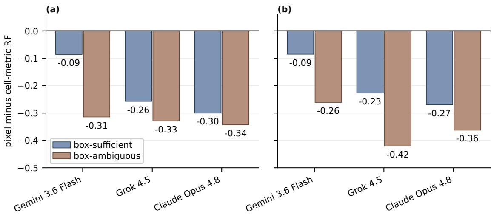  
Supplementary Fig. 1 Pixel accuracy minus the cell-metric random forest on the same structures, by cue-suficiency stratum, three frontier models; negative means the pixel model trails the numeric reader. (a), Original sample. (b), Expansion sample. Stratum sizes and the hexagonal/trigonal composition of the ambiguous strata are given in the text and the samples table.

## Supplementary Note 3 Label granularity

The identifiability result is a property of the reconstruction, not of the seven-way label. Scoring four labels of increasing granularity for the model-free arms, the oracle is flat across granularity, since a reconstruction is either right or wrong and all four labels follow from it, while the cell-metric baseline falls from 0.8952 at crystal system to 0.6810 at space group, because point and space group depend on atom positions that lattice parameters do not encode.

## Supplementary Note 4 Samples at a glance

Supplementary Table 2 maps every distinct sample size in the main text and this Supplementary Information to the results computed on it.

Supplementary Table 2 Every distinct sample size used in this work, what it is, and the results that live on it.
<table><tr><td>n What it is</td><td></td><td>Results computed on it</td></tr><tr><td>210</td><td>Original evaluation sample, 30 structures per crystal system, exactly uniform.</td><td>R1 = 1.0000 (certified),  $R _ { 1 } ^ { 0 . 1 5 } = 0 . 9 5 2 4$  (released); shape-free floor 0.5286; majority-class rate 0.1429; the 13-model zero-shot leaderboard,  $R _ { 3 } / R _ { 4 }$  rungs, perception-share medians, the render-convention</td></tr><tr><td>1,610</td><td>Training split.</td><td>probe's oracle side. Shape-free-floor and 19-feature random forests fit here; majority-class rate 0.1429 (230 per system); the supervised reference and fine-tuned arms train</td></tr><tr><td>1,820</td><td>1,610 train + 210 eval, the full released benchmark.</td><td>on this split. Definitional; no phantom census was run on the 1,610-structure training subset.</td></tr><tr><td>1,933</td><td>Quarantine-clean subset of the 1,995-structure e50 sample (62 removed as flipped, not neighborhood-stable, or not</td><td>Canonical scale-up oracle 0.8774; shape-free floor 0.2054; 19-feature random forest 0.8738; majority-class rate 0.1474.</td></tr><tr><td>721</td><td>kept-for-training). Cell-size-matched control: the  $n = 1 , 9 3 3$  sample capped at 37 atoms per conventional cell (median 17),</td><td> $6 8 2 / 7 2 1 = 0 . 9 4 5 9$  at the released tolerance against  $1 6 9 6 / 1 9 3 3 = 0 . 8 7 7 4$  uncapped, isolating cell size from sample size in the floor-retraction argument.</td></tr><tr><td>1,950</td><td>same stratification and quarantine. neighborhood_stable=True rows of the e50 sample; the main phantom-census set.</td><td> $R _ { 1 } = 1 . 0 0 0 0$  certified, 0.8785 released; two-/three-view phantom-nonempty rates 15.42%/1.87%; shape-free floor  $4 0 1 / 1 9 5 0 = 0 . 2 0 5 6 ;$ </td></tr><tr><td>1,995</td><td>Full e50 scale-up draw before quarantine: Materials Project, 2–4 elements, conventional cell ≤ 80</td><td>majority-class rate 0.1462 (cubic at 285). Superseded by the 1,933 figures above: oracle 0.8797, shape-free floor 0.2090, random forest 0.8697; majority-class rate 0.1429 (exactly</td></tr><tr><td>224 / 220</td><td>atoms, stratified 285 per system. Label-certification stratified sample, 112 Materials Project + 112 JARVIS-DFT, 32 per system, disjoint from training and evaluation; 220 kept</td><td>uniform). Unconditional agreement 220  $/ 2 2 4 = 0 . 9 8 2 ;$  one-sided exact 95% lower bound  $0 . 0 5 ^ { 1 / 2 2 0 } = 0 . 9 8 6 5 ,$  conditional on the quarantine.</td></tr><tr><td>206</td><td>after the stability quarantine removes 4. Original sample minus the four transplant-gate exclusions listed in the Reproducibility record (zero atoms</td><td>Median recall 0.0000, median atoms emitted 48, 105/206 structures with zero matched atoms; the four count as unanswered in the full sample.</td></tr><tr><td>210 (ex- pansion)</td><td>emitted). Second, independently drawn 210-structure sample under the identical protocol, the replication check.</td><td> $R _ { 1 } = 0 . 9 9 5 2 \ : ( 2 0 9 / 2 1 0 )$  certified, so exactness does not carry to a fresh draw;  $R _ { 2 } = 0 . 0 8 5 7 \ : ( 1 8 / 2 1 0 ) .$  unscored, 22.4% zero-recovery; majority class triclinic 34  $/ 2 1 0 = 0 . 1 6 1 9$  (not stratified uniform).</td></tr><tr><td>n</td><td>What it is</td><td>Results computed on it</td></tr><tr><td>140/70; 141/69</td><td>Cue-sufficiency splits of the original and expansion samples by whether the conventional-cell metric alone determines the crystal system.</td><td>The pixel-minus-numeric gap widens on the ambiguous strata for all three frontier models; 60 of 70 and 58 of 69 ambiguous structures are hexagonal or trigonal, leaving residual strata of</td></tr><tr><td>70</td><td>Stratified subsample of the original sample used for the render-convention probe (four strong models,</td><td> $n = 1 0 \mathrm { a n d } n = 1 1$  16 paired comparisons, 0 significant; mean discordant pairs 6.3 of 70; largest observed effect 0.0857, below its own comparison's detection threshold.</td></tr></table>

Class balance is exactly uniform at $n = 2 1 0 , 1 , 6 1 0$ and 1,995, drifts once quarantine removes strata unevenly $( 0 . 1 4 6 2 \mathrm { a t } n = 1 , 9 5 0 , 0 . 1 4 7 4 \mathrm { a t } n = 1 , 9 3 3 )$ , and is 0.1619 on the unstratified expansion draw, so every accuracy in the main text and this Supplementary Information is read against the majority-class rate of its own sample rather than against 0.1429 by default.

## Supplementary Note 5 Render conventions: full statement

The full render-convention measurements summarised in the main text, including the two preregistered predictions that failed, the failure mechanisms, and the paired tests of Supplementary Table 3.

Methods states the production render path. Measuring same-species disc overlap in projection at the released radius and resolution over the sample, every one of the 210 structures has at least one same-species disc-pair overlap in at least one view, and the fraction of atom-copies with at least one overlapping same-species neighbour disc, averaged over the five views and then over structures, is mean 0.6704, median 0.6625.

The probe’s five conventions are C1 (frozen baseline, $2 \times 2 \times 2$ supercell, released radii), C2 (single conventional cell, no supercell), C3 (frozen, small radii, 0.22× covalent), C4 (frozen, of-axis cameras) and C5 (single cell, small radii); C2/C5 are the untiled conditions against the released C1. The oracle-side contrast (C1 against C2) is $1 7 8 / 2 1 0 = 0 . 8 4 7 6$ against $2 0 0 / 2 1 0 = 0 . 9 5 2 4$ , so tiling costs the oracle 22 structures and gains none $( p < 1 0 ^ { - 5 } )$ ; the model side is one of the 16 paired comparisons under Power against the models, none significant at the stratified 70-structure size, so tiling is a power-bounded null rather than an untested confound.

Paired per-structure comparison of the frozen against the of-axis protocol, scoring a structure by majority correctness across the ten seeds, gives no discordance at $\sigma \leq 0 . 0 0 3 \mathrm { { \AA } } .$ , then 18 structures the frozen protocol alone resolves against 3 the other way at $\sigma = 0 . 0 1 \mathrm { \AA } \left( p = 0 . 0 0 1 5 \right.$ , exact binomial), and 102 against 2 at $\sigma = 0 . 0 2 \mathrm { A } ( p = 5 . 4 \times 1 0 ^ { - 2 8 } )$

The frozen protocol holds $R _ { 1 } \geq 0 . 9 5 \mathrm { ~ t o ~ } \sigma = 0 . 0 1$ 46 Å against 0.0069 Å for the of-axis set and 0.0048 Å for the tiled arm, a 2.116× noise-tolerance ratio (frozen over of-axis) against the naive $\kappa _ { \mathrm { m a x } }$ -ratio prediction of $8 . 4 2 5 8 / 2 . 7 3 2 1 = 3 . 0 8 4 \times$ , the shortfall explained under Per-pair conditioning constants below. An of-axis set does not raise the ceiling, as reading the same measurement at $\delta > \tau$ would suggest; that apparent gain disappears once the tolerances are tied.

The constant rises steeply toward parallel view directions, $\kappa = 1 6 . 2 1 0 8$ at $5 ^ { \circ }$ separation and 81.0295 at 1◦. The render choices that keep an extraction stage inside the covered pipeline class are those that keep centroids well defined (flat shading, radii small enough that same-species discs do not merge, no bond geometry biasing a disc’s centre), and a suficient extraction experiment must show bounded centroid error with no spurious detections, not high recall alone.

Supplementary Table 3 The oracle under render-protocol interventions and centroid noise, original sample, mean accuracy over ten seeds per cell, with the merge tolerance � scaled to the noise. At $\sigma =$ 0 all three protocols return every label, so the protocols are identifiability-equivalent and difer only in conditioning. The crossing row is the interpolated � at which each protocol falls below $R _ { 1 } = 0 . 9 5$ . Frozen and of-axis difer in camera placement alone, so their ratio tests $\kappa ;$ the tiled arm also changes atom density and does not.
<table><tr><td>σ (Å)</td><td>0</td><td>0.001</td><td>0.003</td><td>0.01</td><td>0.02</td><td>Crossing σ</td></tr><tr><td>Frozen (κ = 2.7321)</td><td>1.0000</td><td>1.0000</td><td>0.9971</td><td>0.9790</td><td>0.9152</td><td>0.0146</td></tr><tr><td>Off-axis (κ = 8.4258)</td><td>1.0000</td><td>0.9990</td><td>0.9986</td><td>0.9110</td><td>0.4495</td><td>0.0069</td></tr><tr><td>Tiled geometry</td><td>1.0000</td><td>0.9867</td><td>0.9695</td><td>0.8924</td><td>0.8167</td><td>0.0048</td></tr></table>

The three-way ordering treated tiling as �-preserving, which it is not: tiling multiplies atoms per cell eightfold and shrinks same-species separations, degrading robustness through density rather than camera geometry, so that arm cannot score � in either direction.

The conditioning constant, evaluated over the ten independent pairs of the five-camera set. Frozen: 1.0000 (axis-�/axis-�), 1.0000 (�/�), 1.4142 (�/body-diagonal), 2.7321 (�/oblique-2), 1.0000 (�/�), 2.0000 (�/body-diagonal), 1.1547 (�/oblique-2), 1.3280 (�/body-diagonal), 1.3280 (�/oblique-2), 2.2823 (body-diagonal/oblique-2); the maximum is 2.7321, the minimum is 1.0000, and the median is 1.3280 (mean 1.5239). Of-axis: the maximum rises to 8.4258, on the same �/oblique-2 pair, the minimum is 1.0001, and the median falls to 1.1046 (mean 2.0512): the of-axis degradation sits almost entirely in that one pair. Excluding it from both sets, the remaining nine pairs have frozen mean 1.3897 against of-axis 1.3430 (ratio 0.966), and because the oracle enumerates all pairs and cross-verifies each candidate, a single badly-conditioned pair contributes only when selected; this, qualitatively and not as a closed form, is why the observed 2.116× ratio undershoots the naive 3.084× prediction. A random-perturbation check reproduces the frozen maximum empirically at 2.7318 over $2 \times 1 0 ^ { 4 }$ draws restricted to realisable perturbations.

The dependence of $| \Phi _ { 0 } |$ on atoms per cell does not reduce to one coeficient: conditional on $\Phi _ { 0 }$ being nonempty the count climbs steeply with density at both view counts $( \rho = 0 . 8 3 3 1$ and $\rho = 0 . 8 2 7 3 )$ , while the probability of being nonempty is flat in density at two views and falling at three, so the three-view negative is a mixture efect rather than evidence that density protects against phantoms.

Tiling and identifiability. The released tiling’s translations parallel three of the five cameras, so by the corollary’s second clause those three separate no atoms difering by them; the two oblique cameras do, and clause (a) leaves identifiability intact, so at exact extraction the tiled geometry returns every label, and what tiling costs is the conditioning measured above.

The corollary’s first clause predicts a third efect: $R _ { 1 }$ non-decreasing as views are added, at $\delta = 0$ Over the 26 view subsets of size 2 to 5 drawn from the frozen five-camera set on the evaluation sample (deterministic, CPU-only, at the production tolerance $\delta > 0 )$ , mean ceiling rises with subset size, plotted at both tolerances in Fig. 2 of the main text:

That sweep is read at the released $\delta = 0 . 1 5 \mathrm { \AA } .$ , the setting under which the monotonicity violations were found; at $\delta = \tau$ the same sweep over the identical 105 nested subset pairs (denominator 22,050) gives mean $R _ { 1 }$ of 0.9214 at two views, 0.9967 at three, 0.9981 at four and 1.0000 at five, with structure-level violations falling to 15 of 22,050 from 195. The full five-camera set reproduces $R _ { 1 } ^ { 0 . 1 5 } = 2 0 0 / 2 1 0 = 0 . 9 5 2 4$ through this independent implementation. Of the 105 nested pairs the aggregate mean rises in $^ { 1 0 3 ; }$ the two exceptions share a starting subset and both add a camera that trades gained structures for more lost ones. Per structure, 195 of 22,050 comparisons (0.884%) go the wrong way, afecting 25 of 210 structures, consistent with running the sweep at $\delta > \tau$ rather than with a failure of the theorem, which is proved at $\delta = 0$

�recovered $< n _ { \mathrm { t r u e } }$ never occurs in any of the 5460 reconstructions, so the oracle never drops an atom, exactly as the identifiability theorem predicts; every failure is instead a phantom, a spurious point that survives cross-view verification. The mean phantom excess falls monotonically with view count, from 4.911 at two views to 0.480, 0.048 and exactly 0.000 at five, where all 210 structures recover the true atom count. Extra views past three therefore buy reconstruction fidelity rather than additional accuracy, and the 10 remaining errors at the full camera set are label-tolerance failures inside spg rather than view-geometry failures.

Reading the same oracle across the extraction tolerance $\delta$ at fixed � traces the frontier on both samples around the certified setting $\delta = \tau$ and out to 0.50 ${ \mathrm { \AA } } ,$ as Supplementary Table 4 reports. The ceiling is 1.0000 at $\delta = \tau ;$ the tighter $\delta = 0 . 0 0 5 \mathrm { \AA }$ setting produces one under-merging failure on the scaled sample, whereas larger values of � introduce over-merging.

Supplementary Table 4 The ceiling as a frontier in extraction tolerance $\delta ,$ at fixed symmetry tolerance $\tau = 0 . 0 1 \mathrm { { \AA } }$ . The same oracle and the same structures throughout; only $\delta$ changes. The $\delta = 0 . 0 1 \mathrm { { \AA } }$ column is the certified setting of the theorem’s merge clause; the $\delta = 0 . 0 0 5 \mathrm { \AA }$ column is a tighter implementation setting, and the $\delta = 0 . 1 5 \mathrm { \AA }$ column is the released reading $R _ { 1 } ^ { 0 . 1 5 }$
<table><tr><td> $\delta ( \mathrm { \AA } )$ </td><td>0.005</td><td>0.01</td><td>0.05</td><td>0.10</td><td>0.15</td><td>0.50</td></tr><tr><td> $R _ { 1 }$  original</td><td>1.0000</td><td>1.0000</td><td>0.9810</td><td>0.9619</td><td>0.9524</td><td>0.8857</td></tr><tr><td> $R _ { 1 } ,$  scaled  $( n = 1 9 5 0 )$ </td><td>0.9995</td><td>1.0000</td><td>0.9585</td><td>0.9164</td><td>0.8785</td><td>一</td></tr></table>

The extraction-tolerance frontier reported in the main text has one non-monotone point: at $n = 1 9 5 0 , \delta = 0 . 0 0 5 \mathrm { \AA }$ costs one structure where $\delta = 0 . 0 1 \mathrm { { \AA } }$ costs none. This is the opposite failure mode from the over-merging that costs the frontier elsewhere: too tight a $\delta$ can fail to combine two ray-intersection candidates that triangulate the same atom from diferent view pairs, so the reconstruction reports two points where one atom exists, rather than one point where two atoms exist. Both failure directions are consistent with the oracle’s merge step and with that same merge clause.

Four strong models across five conventions on a stratified 70-structure subsample give zero significant changes in 16 paired comparisons, with near-symmetric discordance. Power is low and we state it per comparison: discordance averages 6.3 of 70, and significance is reachable in only 9 of the $^ { 1 6 , }$ the other 7 having too few discordant pairs for any split to reach $\textstyle p < 0 . 0 5$ . The largest efect observed anywhere in the probe is 0.0857, and it occurred in a comparison whose own threshold was higher than that, so no comparison came within its own detection limit. A single pooled minimum detectable diference under an unpaired approximation is invalid for this paired design and is not reported. The null therefore bounds the efect at no particular size; it supports that no convention produced a detectable change, and that for seven comparisons the design could not have detected one.

## Supplementary Note 6 Proofs

The proofs of Theorem 3 and Proposition 4 of the main text and of the two design consequences they imply, stated as Corollary 6 below, with their mechanical checks. The procedure projects the ground-truth positions through each frozen camera, discards cross-view identity, re-solves it by pairwise ray intersection with verification in the remaining views, merges accepted points at $\delta$ and applies spg to the result.

Corollary 6 Two design consequences. (a) $I f C$ contains two independent directions then, at $\delta = 0 , \Phi _ { 0 } ( s , C \cup \{ c \} ) \subseteq \Phi _ { 0 } ( s , C )$ : adding a view can never destroy identifiability. (b) If $\dot { } d _ { v }$ ∥ � for a lattice vector $t \in L$ then $\Pi _ { v } ( p + k t ) = \Pi _ { v } ( p )$ , so view � separates no atoms difering by multiples of�.

Definition 7 Phantom set, componentwise. Fix $\delta \geq 0$ . A species-labelled point $( p , z )$ lies in $\Phi _ { \delta } ( s , C ) { \mathrm { ~ i f ~ } } ( \mathrm { i } ) \| p - L x _ { i } \| > \delta$ for every atom � with $z _ { i } = z ; ( \mathrm { i i } )$ there are views $v \neq w$ and atoms $a \neq b$ of species � with $\Pi _ { v } ( p ) = \Pi _ { v } ( L x _ { a } )$ and $\Pi _ { w } ( p ) = \Pi _ { w } ( L x _ { b } )$ ; and (iii) every view $u \in { \mathcal { C } }$ has an atom � of species � with $\begin{array} { r } { \left\| \Pi _ { u } ( p ) - \Pi _ { u } ( L x _ { i } ) \right\| \leq \delta } \end{array}$ . The set depends on $s , { \mathcal { C } }$ and $\delta$ alone. Raising $\delta$ makes (i) strictly harder and (iii) strictly easier, so $\Phi _ { \delta }$ is not monotone in $\delta \colon$ a point can enter only on an interior interval of $\delta ,$ and a point present at $\delta = 0$ can leave once $\delta$ exceeds its distance to the nearest true atom. Both directions are realised by explicit counterexample: a candidate point with worst-view residual $E = 0 . 0 1 0$ and distance $D = 0 . 3 0 0$ to the nearest true atom is outside $\Phi _ { \delta }$ at $\delta = 0$ and $\delta = 0 . 0 0 5$ , inside it for $\delta \in [ 0 . 0 1 , 0 . 1 5 5 ]$ , and outside it again for $\delta \geq 0 . 3 0 ;$ a second point with all three view residuals exactly 0 and $D _ { 2 } = 0 . 0 2 0$ is inside $\Phi _ { \delta }$ up to $\delta < 0 . 0 2$ and leaves at $\delta = 0 . 0 2$ . Every emptiness claim here and in the main text is therefore stated at the $\delta$ it was measured at.

The theorem’s merge clause is performed at $\delta = \tau \mathrm { : }$ : this is the single implementation tolerance $\delta$ of the oracle algorithm, tied to the label map’s symmetry tolerance � rather than a third, independent quantity. If $\delta > \tau ,$ distinct candidates may be over-merged and the surviving coordinates displaced enough to alter the symmetry assignment. If $\delta < \tau$ , multiple candidates associated with one atom need not merge.

Part (a). Let atom � sit at $\boldsymbol { p }$ and let $v ,$ � have linearly independent directions. Its images are $q = M _ { v } p$ and $q ^ { \prime } = M _ { w } p$ , and the back-projections are the afine lines $\ell _ { v } = \{ x \ : \ M _ { v } x = q \}$ with direction $d _ { v }$ and $\ell _ { w } = \{ x : M _ { w } x = q ^ { \prime } \}$ with direction $d _ { w }$ . Both contain ${ \boldsymbol { p } } ,$ and two non-parallel lines in $\mathbb { R } ^ { 3 }$ that meet do so in one point, so $\ell _ { v } \cap \ell _ { w } = \{ p \}$ and the intersection step returns $\mathcal { P } \cdot$ Condition (iii) holds at $\boldsymbol { p }$ with $i = a$ in every view, so $\boldsymbol { p }$ is accepted. The pair was arbitrary, so every independent pair returns the same point and enumeration order cannot change the accepted set.

Part (b). A point $\hat { p }$ accepted by the oracle arises as the intersection of the back-projections of two same-species atom images, which is Definition $7 ( \mathrm { i i } )$ , and passes verification in the remaining views; since it also projects exactly onto an atom image in � and in $\nu ,$ it satisfies (iii) in every view. If in addition $\hat { p }$ is further than $\delta$ from all same-species atoms then (i) holds and $\hat { p } \in \Phi _ { \delta }$ . Conversely, if $( p , z ) \in \Phi _ { \delta }$ then (ii) supplies a pair of atom images whose back-projections the algorithm enumerates and whose intersection is �, and (iii) supplies the verification, so $\boldsymbol { p }$ is accepted.

Part (c). Suppose $\Phi _ { \delta } = \varnothing$ . By part (b) every accepted point lies within $\delta$ of some same-species atom, and by part (a) every atom is accepted. Merging accepted points at tolerance $\delta$ therefore produces one cluster per atom, provided no cluster can absorb two atoms; that is exactly the separation hypothesis, since two atoms more than 2� apart cannot both lie within $\delta$ of a common point. Applying spg to $L X$ returns $y ( s )$ by the definition of the label, � entering only at this final, downstream step. □

At $\varepsilon = 0$ the extractor returns the true centroids, every quantity the pipeline compares equals the oracle’s, and the accepted sets and labels coincide. For $\varepsilon > 0$ , write $M = \left[ M _ { v } ; M _ { w } \right]$ for an enumerated pair. Perturbing the stacked observations perturbs the triangulated point by at most the observationerror norm multiplied by $\lVert M ^ { + } \rVert _ { 2 } \leq \kappa$ . Thus � bounds geometric error amplification. Agreement of the correspondence, merging decisions and final symmetry label additionally depends on the relevant decision margins and on the stability of spg under the resulting coordinate perturbations. Therefore, � is used as a conditioning comparator rather than as a universal label-agreement radius.

The scope proposition, high-probability restatement. It is a bounded-error statement and does not apply directly to i.i.d. Gaussian per-view centroid error, which has unbounded support. Let the per-view centroid error be i.i.d. mean-zero with $\mathbb { E } [ \| \epsilon _ { v } \| ^ { 2 } ] = \sigma ^ { 2 }$ . For any $\alpha \in ( 0 , 1 )$ there is $\varepsilon _ { \alpha }$ $( \mathrm { e . g . ~ } \varepsilon _ { \alpha } = \sigma \sqrt { \chi _ { 2 , 1 - \alpha } ^ { 2 } }$ for isotropic 2D Gaussian per-view noise) such that $\| \epsilon _ { v } \| \le \varepsilon _ { \alpha }$ with probability at least $1 - \alpha$ per view, and by a union bound over the two views entering an enumerated pair, $\mathrm { P r } [ \| \Delta p \| \le \kappa \varepsilon _ { \alpha } ] \ge 1 - 2 \alpha$ . Supplementary Table 3 exercises this high-probability regime at fixed � over ten seeds; its accuracies are consistent with, but do not certify, the deterministic bound, and the table is read as a test of the ordering � implies. □

Design consequence (a). Let $\delta = 0$ and $( p , z ) \in \Phi _ { 0 } ( s , C \cup \{ c \} )$ . By (iii) every view $u \in C \cup \{ c \}$ , in particular every $u \in { \mathcal { C } }$ , has an atom $i _ { u }$ of species � with $\Pi _ { u } ( p ) = \Pi _ { u } ( L x _ { i _ { u } } )$ . Pick two independent views $v ^ { \prime } , w ^ { \prime } \in \mathcal { C }$ . If $i _ { v ^ { \prime } } = i _ { w ^ { \prime } } = i$ then $\boldsymbol { p }$ and $L x _ { i }$ share both projections, and by the uniqueness argument of part (a) $\textit { p } = \textit { L x } _ { i }$ , contradicting (i) at $\delta \ = \ 0 ;$ so $i _ { v ^ { \prime } } \neq i _ { w ^ { \prime } }$ and (ii) holds within $c .$ Condition (iii) holds on the smaller set because it held on the larger, and (i) is unchanged. Hence $( p , z ) \in \Phi _ { 0 } ( s , C )$ □

Design consequence (b). $M _ { v }$ has rows orthonormal and orthogonal to $d _ { v } .$ , so $M _ { v } t = 0$ whenever $t \parallel d _ { v } ,$ and $\Pi _ { v } ( p + k t ) = M _ { v } p + k M _ { v } t = \Pi _ { v } ( p )$ □

Every step was checked mechanically: the algebraic identities in a computer algebra system, the corollary’s set inclusion by exhaustive enumeration on random structures, and � with its empirical amplification numerically.

## Supplementary Note 7 Extraction share

$R _ { 1 }$ assumes ideal extraction, so it cannot say how much of the ceiling-to-model gap a real extraction stage would close. The one extractor evaluated end to end, a connected-component blob detector on colour thresholds, was pre-registered against the gate: “if $R _ { 2 }$ fails to triangulate on more than 5% of structures, report the failure rate and do not score $\mathrm { i t . } ^ { \mathrm { > } }$ It failed on both samples, $4 0 / 2 1 0 =$ 19.0% of the original and $4 7 / 2 1 0 = 2 2 . 4 \%$ of the expansion sample recovering zero atoms, so $R _ { 2 }$ is a diagnostic, not a rung, and is always quoted with its operating point: median per-view recall 0.400, median precision 0.233, median centroid error 0.717 px on matched centroids (28 structures, 4 per system, 84 view measurements). Matched centroids are sub-pixel accurate, so the ground-truth projection is exact and the failure is segmentation, not localisation.

At that operating point the diagnostic value is $R _ { 2 } = 1 6 / 2 1 0 = 0 . 0 7 6 2$ on the original sample and $1 8 / 2 1 0 = 0 . 0 8 5 7$ on the expansion sample, both far below every scored model arm $( R _ { 2 }$ trails the grok-4.5 frontier arm at 0.6143 true $R _ { 4 }$ by 0.5381 and 0.5286 respectively, and the strongest arm, gemini-3.6-flash at 0.7333, by more) and below the shape-free baseline of 0.5286. Recall alone does not explain it: 44 of 210 original-sample and 25 of 210 expansion-sample structures recover more atoms than exist, because a dropped disc in one view lets a ray from a diferent atom pass cross-view verification, manufacturing a phantom site; species misassignment compounds this for an estimated 17 of 44 (39%) and 16 of 25 (64%) of those structures, measured by re-running the pipeline with oracle species labels at the same detected centres (raising $R _ { 2 }$ to 0.1762 and 0.1857 and lowering over-triangulation to 27 and 9). Extraction errors therefore propagate non-monotonically through triangulation.

Because no detector meeting the proposition’s completeness and soundness requirements was evaluated, the achievable ceiling for extraction cannot be measured directly. What can be measured is how $R _ { 2 }$ would move if per-view recall were higher, holding the oracle’s triangulation and merge/dedup logic $( \delta = \tau = 0 . 1 5 )$ fixed and simulating detector quality as independent identicallydistributed dropout of true atom detections per view (Supplementary Fig. 2). $R _ { 2 }$ rises from about 0.23–0.30 at simulated recall 0.5 to 0.91–0.95 at recall 1.0 (which recovers $R _ { 1 } ^ { 0 . 1 5 }$ exactly, as it must), but stays below the best VLM’s 0.7333 (gemini-3.6-flash) until simulated per-view recall exceeds approximately 0.975–0.995 depending on sample. This bounds the needed recall from below, since the simulation removes species misassignment, positional jitter and spurious detections entirely; a trained detector at recall above roughly 0.9 remains the single most valuable missing measurement, $R _ { 2 }$ being the only rung that would attribute the gap to a stage, and $R _ { 2 }$ as measured is a lower bound from one concrete extractor, not a ceiling for extraction.

The fabrication finding of the main text uses a 206-structure denominator: the four gate-excluded structures, listed with the gate in the Reproducibility record, count as unanswered in the full-sample figure. The excluded intermediate is exactly what a model-in-the-loop split has no model-free reference to check, which is why the fabrication would have read as bad reasoning under such a split.

The rosters were frozen before the current frontier generation, so the leaderboard is a snapshot rather than a ranking and the gap could narrow under a stronger roster. One model was run at a controlled reasoning budget, bounding the deliberation axis for that model alone: a minimal budget and the provider default give identical accuracy, $1 3 0 / 2 1 0 = 0 . 6 1 9 0$ under both, while the default emits 5.4× the output tokens and takes 3.4× the wall time; the two settings agree on 169/210 and break even on the discordant ones, 13 against 13 (exact $p = 1 . 0 0 0 0 \rangle$ . Restricting to the 199 structures both settings answered leaves them indistinguishable (0.6332 against 0.6533, $p = 0 . 5 2 3 5 )$ . For this model the distance to the ceiling is not a deliberation deficit; whether that holds across the roster is untested.

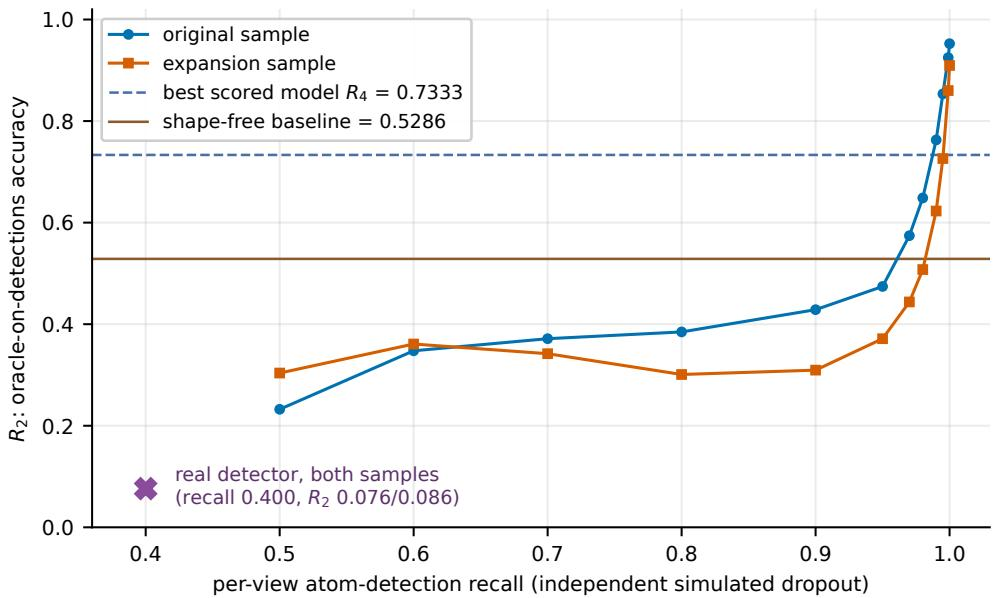  
Supplementary Fig. 2 Simulated detector recall against $R _ { 2 } ,$ both eval samples. Atom detections are dropped independently at random per view at the stated recall, holding the triangulation, correspondence and symmetry-recovery pipeline fixed at the released tolerance $\delta = 0 . 1 5 ;$ five seeds per structure per recall level. The measured real-detector operating point (recall 0.400, $R _ { 2 } \ 0 . 0 7 6 / 0 . 0 8 6 )$ sits well below the curve at matched recall, because the real detector also mis-assigns species and mislocalises centroids, failure modes the simulation does not model. $R _ { 2 }$ crosses the best scored model’s $R _ { 4 }$ of 0.7333 between simulated recall 0.98 and 0.99 on the original sample and between 0.995 and 0.999 on the expansion sample.

## Supplementary Note 8 Supervised pixel-only baseline: full results

The training protocol, data, augmentation policy, split design and checkpoint manifest are specified in Methods; this note reports the full results.

Headline results. ResNet-50 reaches $1 8 8 / 2 1 0 = 0 . 8 9 5 2$ (majority vote 0.8905); ViT-small reaches 0.8333 (majority vote 0.8381). Per-class accuracy for ResNet-50: triclinic 0.7333, monoclinic 0.9333, orthorhombic 0.9667, tetragonal 0.8667, trigonal 0.8333, hexagonal 0.9333, cubic 1.0000 (30 structures per class). The four reference points on this sample and ResNet-50’s margins over them are collected in the article’s roster table.

Replication, independent draw. ResNet-50 reaches 0.7524 (majority vote 0.7238); ViT-small reaches 0.5810 (majority vote 0.5714). Reference points on this draw: majority class 0.1619; shapefree baseline 0.2476; ceiling $R _ { 1 } = 0 . 9 9 5 2$ . Both architectures drop from the original to the expansion sample (ResNet-50 by 0.1428; ViT-small by 0.2524), in the same direction as every other pixel-input arm’s replication check reported elsewhere in this manuscript; part of the drop is attributable to the sample rather than the model, since the shape-free floor itself falls from 0.5286 to 0.2476 on this draw. ResNet-50 still clears the expansion-sample shape-free baseline by 0.5048 and the majority-class rate by 0.5905.

Hexagonal/trigonal degeneracy. Of ResNet-50’s 22 total errors on the original sample, 7 (31.8%) are hexagonal/trigonal confusions, the single largest confusion pair, consistent with the cuesuficiency finding that this pair is genuinely underdetermined by the drawn cell box in the conventional setting $( a = b , \gamma = 1 2 0 ^ { \circ }$ for both) rather than a model-specific failure. The next-largest error source is triclinic misread as monoclinic (5 of 30 triclinic structures), the next most subtle metric distinction. On the expansion sample, hexagonal/trigonal confusions are 10 of52 total errors (19.2%), a smaller share because orthorhombic accuracy collapses to 0.344 on this draw (dominant confusion there is orthorhombic misread as monoclinic, 15 of 32), a composition-shift efect on the species this draw contains rather than a lattice-geometry degeneracy. ViT-small shows the same qualitative pattern at lower overall accuracy: 10 of 35 original-sample errors (28.6%) and 13 of 88 expansion-sample errors (14.8%) are hexagonal/trigonal.

Supplementary Fig. 3 reports the training and validation curves for both architectures, and Supplementary Fig. 4 the ResNet-50 confusion matrices on the two evaluation samples.

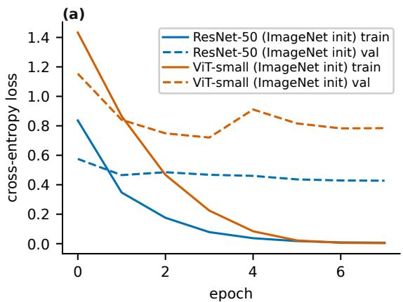

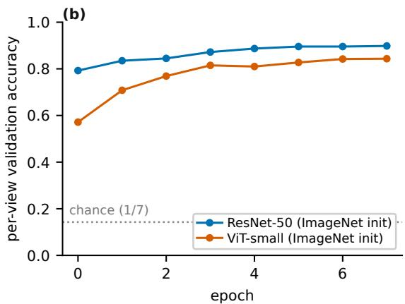  
Supplementary Fig. 3 Convergence of both pixel-only architectures on the 1,449-structure training split with a 161-structure random held-out validation set. (a), Training and validation cross-entropy loss by epoch, ResNet-50 and ViT-small, solid for training and dashed for validation. (b), Per-view validation accuracy by epoch for the same two architectures, with seven-way chance drawn as a dotted line. Both architectures converge within 8 epochs; ResNet-50 reaches higher validation accuracy at every epoch past the first.

## Supplementary Note 9 Statistical procedures and per-test values

The test families, correction procedure and reporting conventions are specified in the Statistics and reproducibility subsection of Methods; this note gives the per-test values. The label-certification agreement is measured on the stratified $n = 2 2 4$ sample of Supplementary Table 2, the source databases reaching spglib through pymatgen and $\mathrm { J A R V I S } ^ { \prime } s$ own wrapper respectively.

The ceiling-to-model comparison for the fine-tuned arm has discordance 61∶6 against $R _ { 1 } ^ { 0 . 1 5 } =$ $2 0 0 / 2 1 0 , p = 1 . 5 \times 1 0 ^ { - 1 2 }$ , and 65∶0 against the certified $R _ { 1 } = 1 . 0 0 0 0$ . Residual dominance across models is a per-model binary tested with an exact sign test against parity, $p = 0 . 0 0 1 8$ . The median perception share is reported with a percentile bootstrap over models: against the exact $R _ { 1 }$ the median is 0.2901 with 95% confidence interval [0.1492, 0.3576], and against the released $R _ { 1 } ^ { 0 . 1 5 }$ the same models give median 0.3092. A distribution-free order-statistic interval on the same $n = 1 4$ values gives [0.1027, 0.3787] to [0.1027, 0.4013]. Share-against-strength association is a Spearman rank correlation on � = 14 models, $\rho = - 0 . 1 5 8 8 , p = 0 . 5 8 7 7$ , with $R _ { 3 } - R _ { 4 }$ against $R _ { 4 }$ at $\rho = - 0 . 6 4 3 9 \mathrm { ; }$ the correlation is reported and any ordering claim declined, since $n = 1 4$ carries no useful power.

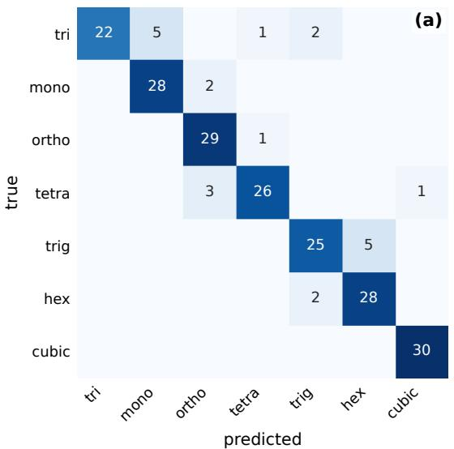

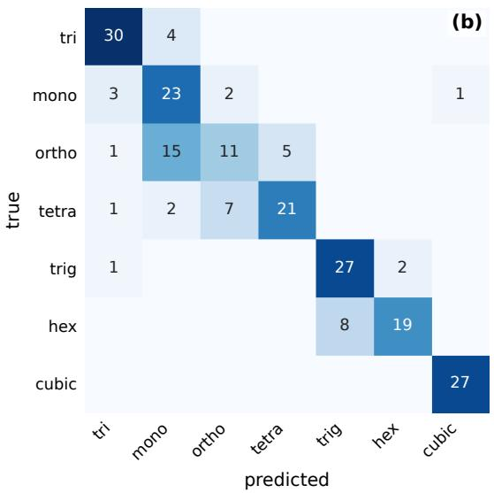  
Supplementary Fig. 4 ResNet-50 confusion matrices, rows true and columns predicted, cell values structure counts. (a), Original 210-structure evaluation sample, 30 structures per system. (b), Independent expansion sample. In both, the largest of-diagonal mass is the hexagonal/trigonal pair, a cell-metric degeneracy rather than a model-specific failure; error counts are given in the text.

Paired per-structure comparison of the frozen against the of-axis protocol, scoring a structure by majority correctness across ten seeds, gives no discordance at $\sigma \leq 0 . 0 0 3 \mathrm { \AA } .$ , then 18 structures against 3 at $\sigma = 0 . 0 1 \mathrm { \AA }$ and 102 against 2 at $\sigma = 0 . 0 2 \mathrm { \AA }$ , both exact binomial. Phantom-density correlations are Spearman correlations over the 1,950-structure census with ten subsets each, reported conditionally and unconditionally in the Supplementary Information. The atom-count association behind the residual bound pools 2,940 model-structure pairs, $\rho = - 0 . 0 9 0 8 , p = 8 . 1 \times$ $1 0 ^ { - 7 }$ , with a drop from 0.5551 to 0.5129 across the median cell size; because 14 non-independent observations sit on each structure, the pooled statistics are descriptive only and every claim rests on the model-level sign test. Association between crystal system and atom count uses a Kruskal– Wallis test rather than a correlation that would impose an ordering on a nominal label: $H = 3 2 . 9 4$ d ${ \mathrm { ~ f ~ } } = 6 , p = 1 . 0 8 \times 1 0 ^ { - 5 } , \eta ^ { 2 } = 0 . 1 4 2$ . The label-certification lower bound is a one-sided exact bound, $0 . 0 5 ^ { 1 / 2 2 0 } = 0 . 9 8 6 5$ at $k = 2 2 0$ agreements, conditional on the four-structure quarantine.

The full family is 26 hypothesis tests with numeric �-values, the ten headline tests plus the render-convention probe’s 16 individual paired comparisons. We disclose the family and apply Benjamini–Hochberg false-discovery-rate control at $\alpha = 0 . 0 5$ across all 26. Every load-bearing claim survives correction. The one test that does not survive is the Fisher exact atom-count mediansplit test, which moves from $\mathnormal { p } = 0 . 0 2 4 1$ nominal to $p _ { \mathrm { a d j } } = 0 . 0 6 9 6$ and is accordingly reported as descriptive rather than significant. All 16 render-convention comparisons were non-significant before correction and remain so after; their power is stated per comparison, discordance averaging 6.3 of 70 with significance reachable in only 9 of the 16. Run-to-run spread is the mean and maximum absolute per-model diference in correct counts over a retained second sweep execution.

Supplementary Table 5 lists the per-model counts behind every share statistic quoted in the main text.

Supplementary Table 5 Per-model attribution ladder on the original sample. $R _ { 4 }$ is accuracy on the pixel renders and $R _ { 3 }$ accuracy with the ground-truth geometry supplied as text; $P = R _ { 3 } - R _ { 4 }$ is the perception component, $S = R _ { 1 } - R _ { 3 }$ the post-perception residual against the certified $R _ { 1 } = 1 . 0 0 0 0$ , and the share is $P / ( P + S )$ . The three frontier arms are read from the frontier condition rather than the zero-shot leaderboard. The final row failed the scoring gates (API-error rate 34.44%, unparseable rate 5.71%, both above 5%) and is reported rather than dropped; the 14 scored rows give the median share 0.2901 and the 13-of-14 residualdominance count of the main text.
<table><tr><td>Identifier</td><td> $R _ { 4 } \ ( k _ { 4 } / 2 1 0 )$ </td><td> $R _ { 3 } \left( k _ { 3 } / 2 1 0 \right)$ </td><td>P</td><td>S</td><td>Share</td><td> $S > P$ </td><td>Condition</td></tr><tr><td>google/gemini-3.6-flash</td><td>0.7333 (154)</td><td>0.8524 (179)</td><td>0.1190</td><td>0.1476</td><td>0.4464</td><td>yes</td><td>frontier</td></tr><tr><td>x-ai/grok-4.5</td><td>0.6143 (129)</td><td>0.8524 (179)</td><td>0.2381</td><td>0.1476</td><td>0.6173</td><td>no</td><td>frontier</td></tr><tr><td>anthropic/claude-opus- 4.8</td><td>0.5810 (122)</td><td>0.6667 (140)</td><td>0.0857</td><td>0.3333</td><td>0.2045</td><td>yes</td><td>frontier</td></tr><tr><td>meta-llama/llama-4- maverick</td><td>0.4429 (93)</td><td>0.4952 (104)</td><td>0.0524</td><td>0.5048</td><td>0.0940</td><td>yes</td><td>zero-shot</td></tr><tr><td>z-ai/glm-4.6v</td><td>0.4429 (93)</td><td>0.4476 (94)</td><td>0.0048</td><td>0.5524</td><td>0.0085</td><td>yes</td><td>zero-shot</td></tr><tr><td>qwen/qwen3-vl-8b- instruct</td><td>0.3762 (79)</td><td>0.4524 (95)</td><td>0.0762</td><td>0.5476</td><td>0.1221</td><td>yes</td><td>zero-shot</td></tr><tr><td>openai/gpt-4.1-mini</td><td>0.3667 (77)</td><td>0.4143 (87)</td><td>0.0476</td><td>0.5857</td><td>0.0752</td><td>yes</td><td>zero-shot</td></tr><tr><td>qwen/qwen3-vl-235b- a22b-instruct</td><td>0.3333 (70)</td><td>0.5429 (114)</td><td>0.2095</td><td>0.4571</td><td>0.3143</td><td>yes</td><td>zero-shot</td></tr><tr><td>bytedance-seed/seed- 1.6</td><td>0.2571 (54)</td><td>0.4238 (89)</td><td>0.1667</td><td>0.5762</td><td>0.2244</td><td>yes</td><td>zero-shot</td></tr><tr><td>mistralai/mistral- medium-3.1</td><td>0.2286 (48)</td><td>0.4524 (95)</td><td>0.2238</td><td>0.5476</td><td>0.2901</td><td>yes</td><td>zero-shot</td></tr><tr><td>qwen/qwen3-vl-32b- instruct</td><td>0.2286 (48)</td><td>0.4524 (95)</td><td>0.2238</td><td>0.5476</td><td>0.2901</td><td>yes</td><td>zero-shot</td></tr><tr><td>meta-llama/llama-4- scout</td><td>0.2048 (43)</td><td>0.5048 (106)</td><td>0.3000</td><td>0.4952</td><td>0.3772</td><td>yes</td><td>zero-shot</td></tr><tr><td>amazon/nova-pro-v1</td><td>0.1810 (38)</td><td>0.4667 (98)</td><td>0.2857</td><td>0.5333</td><td>0.3488</td><td>yes</td><td>zero-shot</td></tr><tr><td>mistralai/mistral-small- 2603</td><td>0.1476 (31)</td><td>0.4524 (95)</td><td>0.3048</td><td>0.5476</td><td>0.3575</td><td>yes</td><td>zero-shot</td></tr><tr><td>qwen/qwen2.5-vl-72b- instruct (unscored)</td><td>0.2524 (53)</td><td>0.3905 (82)</td><td>0.1381</td><td>0.6095</td><td>0.1847</td><td>yes</td><td>zero-shot, gate failed</td></tr></table>

## Supplementary Note 10 Reproducibility record

This note collects what the released repository carries beyond the Methods and the Data and code availability statement of the main text, together with the disclosures that attach to the released artifact rather than to any measurement. The repository additionally documents the labelling tolerance sweep, the feature specification and seed of the cell-metric reference, the render, training and evaluation entry points with the exact arguments used for each sample and arm, and the compute, provenance and licensing detail of every run.

Artifact disclosures. Two documentation mismatches could mislead a model or a reader into reasoning about bond geometry that is not in the image: the render module’s own docstring describes the output as “ball-and-stick,” and the question prompt shown to every model says the same; both are inaccurate, since the emitted renders are ball-only discs with dashed unit-cell edges and the axis-coloured cell-edge routine is never called. Atom radii are 0.5× ASE’s [45] tabulated covalent radii per element, and no ASE version is pinned in the repository, so a reinstall could produce sub-pixel-diferent renders; the analytic oracle never touches a rendered pixel, so its numbers are unafected.

Runtime and complexity of the oracle. For � atoms and � views the oracle forms $O ( V ^ { 2 } n ^ { 2 } )$ same-species closest-approach candidates and verifies each against every remaining view, $O ( V ^ { 3 } n ^ { 2 } )$ in all, dominating the �(�) merge. On one CPU core at the certified $\delta = \tau = 0 . 0 1 \mathrm { \AA } \mathrm { ; }$ : median census structure (� = 30 atoms) 3.7 ms; full 1,950-structure census 16.9 s reconstruction-only (mean 8.7 ms, median 5.3 ms, maximum 53.7 ms at 80 atoms), 25.5 s with CIF loading and conventionalcell construction; the 210-structure sample at the released $\delta = 0 . 1 5 \mathrm { \AA }$ sums to 0.48 s (mean 2.3 ms, median 1.4 ms). Timings were first measured in this revision; the census recovers every atom exactly on all 1,950 structures, consistent with the identifiability theorem.

Extractor details. Four original-sample structures (mp-1391233, mp-733975, mp-1104047, mp-1214794) gave no parseable atom list and fail the gates; they are excluded from the 206- structure median-recall denominator and count as unanswered in the full-sample accuracy. The tolerance behind the median recall of 0.0000 is 0.15 in fractional-coordinate units, the same numeral as the released Cartesian � but a diferent unit, since transplant scoring matches in the fractional space the extractor emits into.