# Solaris: Towards Interfaces That Are Generated, Not Coded

Yuval Alaluf∗ Runway yuval@runwayml.com

Michal Geyer∗ Runway michal@runwayml.com

Diego Alarcón Runway diego@runwayml.com

Anastasis Germanidis Runway anastasis@runwayml.com

Robin Kahlow Runway robin@runwayml.com

Alejandro Matamala Ortiz Runway alejandro@runwayml.com

Sarah Saltonstall-Wurm Runway sarah@runwayml.com

Omri Avrahami∗ Runway omri@runwayml.com

Kfir Goldberg∗ Runway kfir@runwayml.com

Alejandro Alvarez Runway aalvarez@runwayml.com

Tenaya Goldsen Runway tenaya@runwayml.com

Joel Kwartler   
Runway   
joel@runwayml.com

Eugene McMahon Runway eugene@runwayml.com

Jamie Umpherson Runway jamie@runwayml.com

Guy Bukchin Leshem∗ Runway guy@runwayml.com

Elad Richardson∗ Runway elad@runwayml.com

Cole Garry Runway cgarry@runwayml.com

Corina Gurau Runway corina@runwayml.com

Kathleen Lewis Runway katie@runwayml.com

Thon Prom   
Runway   
thon@runwayml.com

Hudson Yeo Runway hudson@runwayml.com

## Abstract

Digital interfaces are traditionally implemented through intermedi ate representations such as code, requiring their appearance and behavior to be specified in advance. We introduce Solaris†, an interface world model that instead generates an interactive UI directly, frame by frame, in response to user actions. Solaris treats mouse interactions as conditioning signals and autoregressively synthesizes the resulting visual state at interactive speeds. To enable real-time generation while maintaining visual coherence over extended interactions, we combine autoregressive frame generation with few-step distillation and training on the model’s own outputs. A language model complements the visual world model by interpreting user intent and specifying how interactions should afect the generated environment, separating high-level reasoning from visual rendering. By generating both the appearance and behavior of an interface dynamically, Solaris enables open-ended interactions that need not be explicitly programmed in advance. We view interface world models as a step toward a new paradigm for software, where interfaces are generated and adapted continuously around user intent rather than implemented as fixed collections of predefined states and behaviors.

## 1 Introduction

We introduce Solaris, the first model in a new family of AI systems we call interface world models. Solaris starts with a question: what happens when an operating system generates apps and websites as you use them?

Every operating system, from early terminals to Linux and macOS, has dictated what is rendered on screen and what happens when a person or program acts on it. Applications get built on top, and stay fixed until someone pushes an update. Solaris instead renders that layer directly. It is a real-time interactive model that generates the interface itself, frame by frame. Every frame is synthesized as you interact, allowing the interface to respond continuously to your actions.

Design is more visual than ever, with pixel-perfect mockups and image models that can generate entire screens that are nearly indistinguishable from finished products. But images do not run like a website or app. Every piece of software built today still requires a translation: the visual design must first be converted into an intermediate representation (e.g. code) before it can do anything.

That intermediate representation limits what an interface can be, and how it responds to human and agent interaction. Every behavior has to be explicitly defined and implemented ahead oftime, so software ships as a lossy compression of the space of possible interactions, frozen before any user arrives. The same translation process also sacrifices visual fidelity. Once a design is reduced to a simplified representation, the interface can respond quickly, but only by giving up much of the richness of the original design.

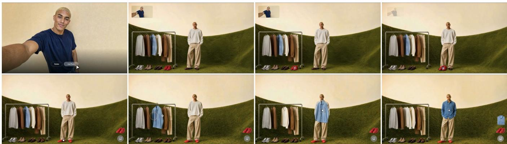  
Figure 1: A virtual clothing store experience. Solaris turns a visual environment into an interactive shopping experience: starting from a selfie, the user can try on products by dragging them directly onto themselves. Here, the user selects a pair of red shoes and then a blue shirt, with each item updating their appearance and being added to the cart.

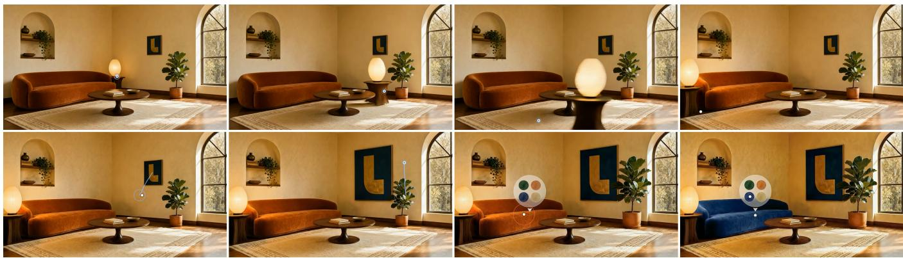  
Figure 2: An interior room design experience. The interface behaves like a living environment: the user can directly control objects and observe the scene respond in place. Here, the user moves a lamp, resizes the painting and plant, and applies a new fabric to the sofa.

Solaris handles rendering and interactions jointly, removing many of the tradeofs we associate with design today. A single world model generates every frame and every response to user input, eliminating the need for an intermediate representation. Because there is no conversion step, there is no loss, and the entire frame becomes the interface.

We think Solaris opens up new ways of building websites, apps, and other online interfaces. But it is also a new way to train agents, in much more dynamic environments. Even the best LLMs today struggle to complete [11] basic computer use tasks, like booking a hotel or ordering groceries. Because text-based models are being trained to use coded interfaces, they tend to learn the specific layout they were trained on, and cannot adapt to a slightly diferent interface (say, two diferent hotel websites). By collapsing the space between action and response, Solaris lets agents train against interfaces that are constantly changing, and layouts that may never have existed before.

Solaris brings three new capabilities to software.

(1) First, Solaris is entirely visual. When an image becomes the application itself, there is no need for a second imple mentation step hidden beneath the visuals that a user sees. Imagine browsing a virtual clothing store where the showroom itself is the interface (Figure 1). Using a single image of yourself as a reference, you can pick up a shirt from a rack, drag it onto yourself to try it on or rearrange the display as naturally as you would in a physical store.

(2) Second, it is alive. Because the application is continuously rendered, it is always evolving rather than waiting for the next user action (Figure 2). Reflections shift with the light ing, and objects respond naturally as they are manipulated. A user can say something as simple as: “Move the table so I can see how it looks” or “Change the color of the couch.” The result is software that feels less like navigating through scripted pages and more like interacting with a living environment.

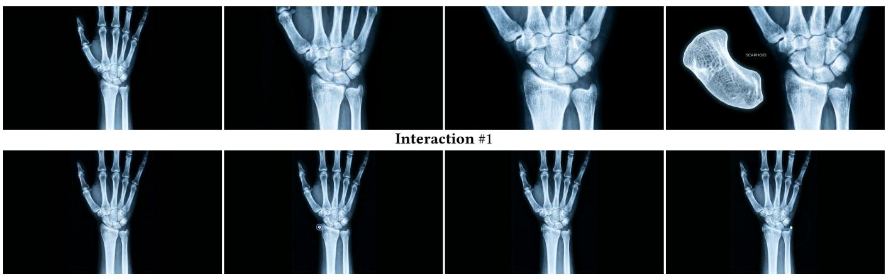  
Interaction #2  
Figure 3: Diferent interactions from the same initial state. Interactions are not limited to a single predefined behavior: starting from the same frame, Solaris interprets the same drag interaction in diferent ways, either zooming in to inspect the wrist (top) or measuring the size of the hand (bottom).

  
Figure 4: Building a salad. The user builds a salad directly in the scene by dragging ingredients into the bowl. Rather than selecting ingredients from a menu, they are arranged throughout the scene for direct interaction.

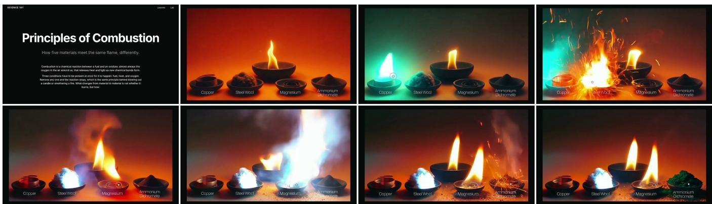  
Figure 5: Interactive Principles ofCombustion courseware. Rather than presenting a static explanation, Solaris turns the lesson into an interactive experience. The user can experiment with diferent materials by dragging a flame onto them and directly observe how each reacts to fire.

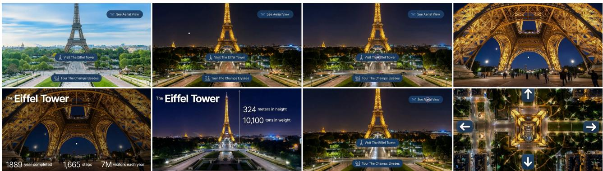  
Figure 6: Navigating a real-world scene. Rather than navigating between predefined views, the user explores the Eifel Tower directly within the generated environment: changing the time of day, learning about the landmark, and viewing it from diferent perspectives while moving seamlessly through the scene.

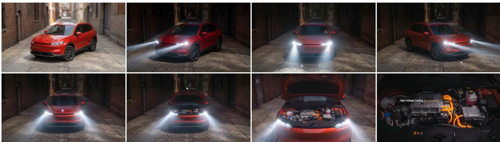  
Figure 7: Exploring a product through direct interaction. The product itself becomes interactive: the user turns on the car’s lights, drags the car to view it from diferent angles, and opens the hood to explore its internal components.

(3) Finally, it is open-ended. Traditional interfaces are limited to the interactions developers anticipated during develop ment, but Solaris can support entirely diferent behaviors in the same scene, reacting to user interactions in real-time (Figure 3). This flexibility decouples the interface from pre defined workflows, instead leaving the capabilities of the driving world model to determine what is possible.

Solaris turns an interface into an interactive experience rather than a sequence of pages. Instead of selecting options from menus, users interact directly with the scene itself. Building a salad is as simple as dragging ingredients into a bowl, with the interface responding naturally as each ingredient is added (Figure 4).

Today, people turn to an LLM when they get stuck while online. But LLMs answer in text, and most hands-on tasks are not text-based problems. Solaris renders the next step in your context with visuals, and you can steer it. For instance, you can generate an interactive demonstration of combustion, allowing users to experiment with diferent materials and observe physically plausible reactions as they interact (Figure 5).

## 2 Motivation

Digital interfaces are built on two systems, which until now have lived in diferent worlds.

• The systems that know things (e.g., search engines and AI assistants) answer with static content: text, an image, maybe an embedded video.

• The systems that respond in real time (e.g., JavaScript/CSS, game engines and, more recently, interactive world models) create rich, interactive experiences, but they know nothing about your products or what you want to accomplish.

We have traditionally thought of software interfaces as deterministic programs and world models as generators of visual content. An interface world model has to be both at once: a system that understands your intent while continuously rendering an interactive world around it.

Generative models have been applied to interfaces before, but primarily to reproduce software that already exists. NeuralOS [6] renders an Ubuntu desktop frame-by-frame from mouse and keyboard input, ViMo [4] generates the next screen of a mobile app as an image, and CUWM [3] predicts the next state of a Microsoft Ofice application given a candidate action. In each case, the model is trained against a reference implementation, with the goal of reproducing its behavior. As a result, the interactions available to the user remain bounded by what the original software can do.

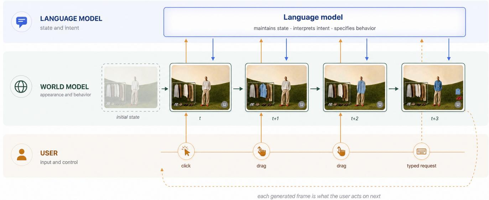  
Figure 8: How Solaris runs. Solaris is organized as three levels. The user acts on the frame with mouse and keyboard, the language model holds the state of the session and specifies what each action should mean, and the world model executes that intent, generating both the appearance and the behavior of the result.

Solaris is diferent in that there is no reference implementation defining how the interface should behave. Instead, behaviors are determined by a language model as the session unfolds and rendered by a world model that has learned how both physical environments and interfaces respond to interaction. This allows the meaning of an interaction to depend on its context: the same drag can zoom into a wrist or measure a hand (Figure 3), and interactions need not correspond to behaviors implemented in existing software. Rather than reproducing an existing interface, Solaris generates both the interface and its behavior as the user interacts with it.

Once you try to build such an interface world model, three engineering challenges appear immediately:

• Speed. Interactions stop feeling interactive somewhere around half a second of delay. Video difusion models take seconds or minutes to produce a clip, which is acceptable for content creation but too slow for an interface. To cross that threshold, the model has to generate frames sequentially, with each frame depending only on what came before, cheaply enough to keep up with the user.

• Staying coherent. An interface has to remain consistent across an entire session, not just a single clip. The things it needs to preserve (e.g., text, layout, the identity of objects) are the same things generated video has historically struggled to maintain, and small errors compound the longer generation continues.

• Cost. Generating every frame is still more expensive than serving a page that was built once. The same work that made Solaris real time also made it orders of magnitude cheaper to run than a standard video difusion model, and the cost curve continues to improve.

Solaris is our bet that these conceptual and technical barriers can be overcome. We built it with three focuses: real-time interaction, coherence over an entire session, and visual quality at 720p.

## 3 Method

Solaris builds on our Gen-4.5 [8] video generation model, which we adapted to (1) understand interaction and (2) respond in real time. It follows the path we opened with GWM-1 [7], our general world model. We illustrate Solaris in Figure 8.

Learning interaction. Solaris treats user input as conditioning for the next frame, the same way it treats text or images. The model observes clicks, drags and other interactions as it generates, using them as signals for what comes next. Because the model only ever sees interactions that have already happened (never future ones), it learns the relationship between user actions and visual outcomes. This means that it knows what should happen when something is clicked, dragged or modified, without requiring those interactions to be explicitly programmed.

Running in real time. Standard video difusion models refine an entire clip over dozens of denoising steps, a process that is far too slow for dynamic user interaction. We converted Solaris into a real-time engine in three stages. First, we taught it to generate frames autoregressively, with each frame depending only on what came before. Next, we distilled the many-step denoising process into just a few steps. Finally, we trained the fast model on its own outputs so visual quality remains stable over long interactions. The result generates frames at interactive speeds while preserving the visual quality of the original teacher model.

Reasoning and rendering. Solaris generates the interface one frame at a time, while a language model determines how that interface evolves. The LLM interprets user requests, decides when interactions should modify the current scene versus transition to a new one, defines the behaviors that make the world feel alive and produces the prompts that guide Solaris as it renders each state. Together, the language model and world model separate reasoning from rendering: one decides what the application should do next, while the other generates how that behavior appears and responds in real time.

Continuous generation. You provide a starting state (e.g. a brand environment or product scene) and the model streams frames in real time. As the user clicks, drags or types, those interactions are incorporated into the next generated frames, and the scene responds in place. There are no predefined screens and no templates to fall back on. Instead, text prompts specify what clicks, drags and other interactions mean in a particular scene.

Redefining the mouse. Once interactions are described in natural language instead of programmed, they no longer have to be fixed in advance. Every object in the scene can become a new kind of tool. Click on a cat, and your next clicks apply its fur color and texture to whatever you touch. Click on a painting, and you might begin drawing in its style.

## 4 Results

## 4.1 The Cost of Translation

Earlier, we argued that translating interfaces into an intermediate representation inevitably degrades information. To measure this, we evaluated state-of-the-art multimodal language models, including Claude Fable 5 [1], on the task of recreating website in terfaces from a single screenshot (Figure 9). We evaluate across a diverse collection of 30 interfaces, ranging from simpler plain webpages to image-heavy webpages and natural images, which evaluate diferent aspects of visual understanding.

We measure information preservation in two complementary ways. First, structural similarity (SSIM) [10] compares the reconstructed interface to the original in place, capturing how faithfully the visual appearance is reproduced. Second, we compare each re gion of the original with its most similar region anywhere in the reconstruction using DINOv3 [9] features, measuring whether the underlying visual content survives even when elements move or the layout changes.

Despite rapid progress in recent years, every language model loses information during reconstruction (Figure 10). Natural images are afected most because rich visual detail cannot be represented accurately in language. As interfaces become more complex, even small changes to text, layout or structure can fundamentally alter how the interface behaves.

Rather than translating an interface into language and reconstructing it again, Solaris operates directly on the visual interface itself. By eliminating the intermediate representation, it preserves the complete visual and semantic state of the interface from the very first frame (Figure 13).

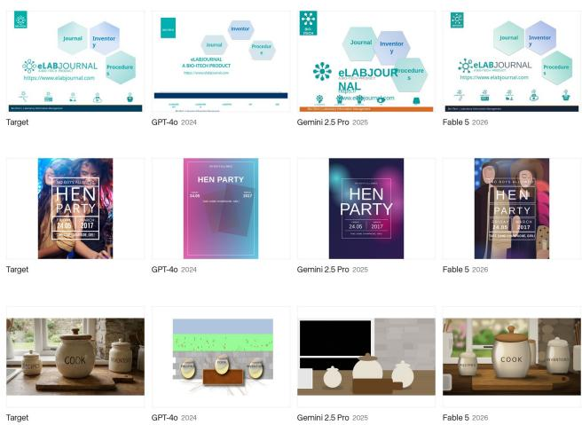  
Figure 9: Reconstructing interfaces. Given a single screenshot, state-of-the-art multimodal language models [1, 2, 5] attempt to reconstruct the visual interface through code. Reconstruction becomes increasingly dificult as visual complexity increases, from a plain webpage (top), to an image-heavy design (middle), to a natural image (bottom).

## 4.2 Solaris vs. Coded Interfaces

Our reconstruction benchmark measures how much information is lost when an interface is translated into code. We next ask: given the same interface and the same user interaction, which approach produces the better result? Can a coded interface recreate the same sense of a living, responsive environment as an interface generated by an interface world model?

To answer this, we compared Solaris against a state-of-the-art language model (Claude Opus 5 [1]). Both systems started from the same image and received the same interaction requests, and we recorded how each responded (Figure 12). We then conducted a user study with 250 participants across 30 interaction examples, collecting nearly 7,500 pairwise judgments. For each comparison, participants answered two questions: “Which result better follows the given instruction?” and “Which behaves more naturally within the scene?”

Participants preferred Solaris on both measures (Figure 11). For following the requested interaction, Solaris was preferred in 62% of comparisons compared to 25% for the coded result, while 13% were rated as equivalent. The diference was even larger for natural behavior, where Solaris was preferred in 72% of comparisons compared to 21% for the coded website, with 7% rated as equivalent.

The second result highlights the broader diference between the two approaches. A coded interface can often reproduce the requested change, but it treats the interaction as an isolated update to the interface. With interface world models, because the model already understands how objects, materials and environments behave, it can generate interactions that feel coherent within the scene rather than treating each UI action as an isolated element.

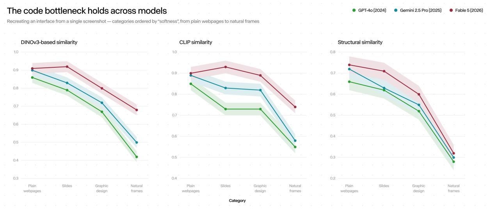

Figure 10: Reconstruction fidelity across increasing visual complexity. Across multimodal language models, reconstruction fidelity decreases as visual complexity increases, highlighting the information lost when visual interfaces are translated through an intermediate representation.  
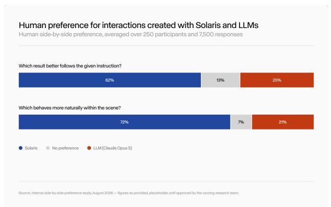  
Figure 11: Interface world models produce more natural interactions. Participants preferred Solaris over coded interfaces both for following the requested interaction and, by an even larger margin, for behaving naturally within the scene, highlighting the ability of interface world models to generate interactions that remain coherent with the environment.

## 5 Limitations

Solaris is strongest at ambient motion, click-and-drag interactions and scene transitions. Several important challenges remain:

• Text. Stable, legible text remains one of the hardest problems in video generation, yet interfaces depend on it more than almost any other visual domain. One practical path is a hybrid system in which image models render text-heavy views whenever a brief pause is acceptable, while video models handle continuous interaction. Fully real-time generated text remains an open challenge.

• Trust. For instructional or commercial experiences, a convincing wrong answer is worse than no answer. Today, Solaris stays anchored through what you give it. The starting frame can be composed from real product imagery and reference material, which grounds the scene in things that actually exist. Conditioning generation on richer verified context as the session unfolds (reference images, product data, documents) is an active research focus.

• Long sessions. Maintaining visual and semantic coherence over extended, open-ended interactions remains an active area of research.

• Accessibility and integration. A generated interface still needs to work inside the rest of the software stack, including assistive technologies such as screen readers and accessibility APIs, so that flexibility does not come at the expense of usability.

These challenges reflect the current frontier of real-time generative models, and we expect them to improve alongside the underlying models themselves.

## 6 Conclusions

Solaris is an early step toward a new operating layer, and we see several new interaction patterns emerging.

• The app stops being the unit you interact with. Today, getting something done means opening the app made for it— one for shopping, another for news, another for restaurant reservations. If the operating system can generate useful interfaces, no matter what the user wants to do, there is less reason to sort software into a fixed catalog of apps. What you need simply shows up, customized to you.

Solaris  
Coded interface (Claude Opus 5)  
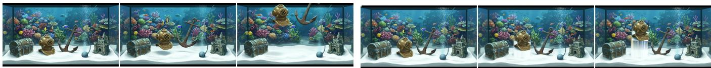  
“Clicking any element makes it lift of and float slowly upward, keeping its shape as it hovers.”

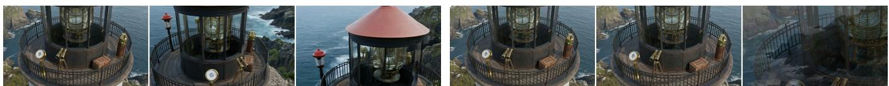  
“The camera pans right and tilts down in one smooth, continuous motion from the lighthouse balcony, settling on the waves crashing against the rocky coastline below.”

Figure 12: Comparisons. While both systems respond to the same interaction request, Solaris preserves the coherence of the entire scene, producing interactions that feel more natural and physically grounded.  
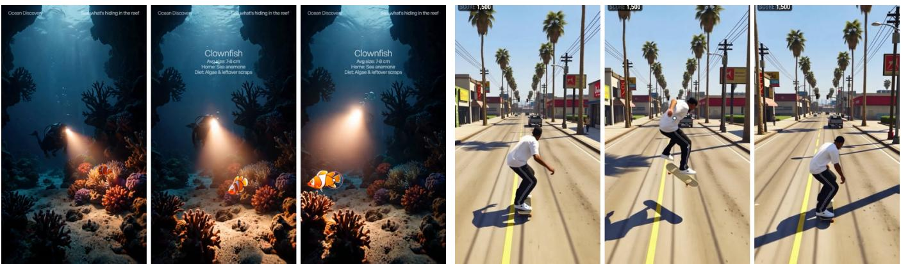  
Figure 13: Interactive mobile experiences. Solaris turns generated mobile interfaces into responsive environments where user actions afect the scene coherently. The user drags a clownfish to a new location as the diver follows its movement (top), or drags a skateboard upward to make the rider jump (bottom)

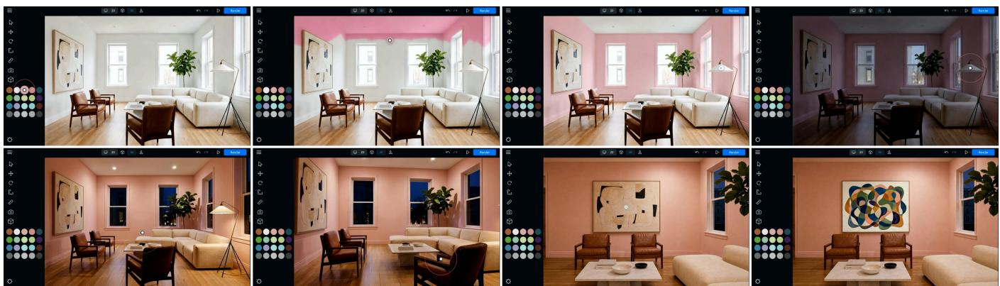  
Figure 14: Interactive interior design. A single generated interface supports a wide range of design interactions. The user can change wall colors, adjust the time of day and lighting, explore the room from diferent viewpoints, and modify artwork.

• Interface world models remove the need to translate between a visual idea and an intermediate representation. Instead of working through UI frameworks, components, and code, any visual concept can become an interactive interface.

• A storefront is no longer a fixed layout that every visitor sees. It becomes a generated environment that preserves the brand’s identity while adapting to each individual. Products, layouts, colors, materials and recommendations reshape around your intent in real time, allowing your brand and products to remain recognizable within hyper-personalized experiences.

• Tutorials no longer replay the same sequence for everyone. Instead, they render the next step in your own context, adapt as you make progress and recover naturally when you go of script.

We expect interface generation to follow the same trajectory as image and video generation: every model generation will become faster, more coherent, more controllable and more capable. The challenges that once made generated interfaces seem impractical now look increasingly like solvable engineering problems.

Solaris is our first interface world model, and we are excited to continue exploring what generated software can become, from richer interactions, stronger grounding and longer-lived experiences to entirely new kinds of interfaces that do not exist today. We are working with key partners to launch Solaris publicly.

## References

[1] Anthropic. 2026. Claude Fable 5 and Claude Opus 5. https://www.anthropic. com/claude.

[2] Google DeepMind. 2025. Gemini 2.5: Pushing the Frontier with Advanced Reasoning, Multimodality, Long Context, and Next Generation Agentic Capabilities. https://arxiv.org/abs/2507.06261.

[3] Yiming Guan, Rui Yu, John Zhang, Lu Wang, Chaoyun Zhang, Liqun Li, Bo Qiao, Si Qin, He Huang, Fangkai Yang, et al. 2026. Computer-using world model. arXiv preprint arXiv:2602.17365 (2026).

[4] Dezhao Luo, Bohan Tang, Kang Li, Georgios Papoudakis, Jifei Song, Shaogang Gong, Jianye Hao, Jun Wang, and Kun Shao. 2026. Vimo: A generative visual gui world model for app agents. In International Conference on Learning Representations, Vol. 2026. 117437–117463.

[5] OpenAI. 2024. GPT-4o System Card. https://openai.com/index/gpt-4o-systemcard.

[6] Luke Rivard, Sun Sun, Hongyu Guo, Wenhu Chen, and Yuntian Deng. 2026. Neuralos: Towards simulating operating systems via neural generative models. In International Conference on Learning Representations, Vol. 2026. 19648–19677.

[7] Runway. 2025. Introducing GWM-1. https://runwayml.com/research/ introducing-runway-gwm-1.

[8] Runway. 2025. Runway Gen-4.5: State-of-the-Art AI Video Generation. https: //runwayml.com/research/introducing-runway-gen-4.5.

[9] Oriane Siméoni, Huy V. Vo, Maximilian Seitzer, et al. 2025. DINOv3. arXiv:2508.10104 https://arxiv.org/abs/2508.10104

[10] Zhou Wang, Alan C. Bovik, Hamid R. Sheikh, and Eero P. Simoncelli. 2004. Image Quality Assessment: From Error Visibility to Structural Similarity. IEEE Transactions on Image Processing 13, 4 (2004), 600–612

[11] Mengqi Yuan, Zilong Zhou, Xinzhuang Xiong, et al. 2026. OSWorld 2.0: Benchmarking Computer Use Agents on Long-Horizon Real-World Tasks. arXiv:2606.29537 https://arxiv.org/abs/2606.29537