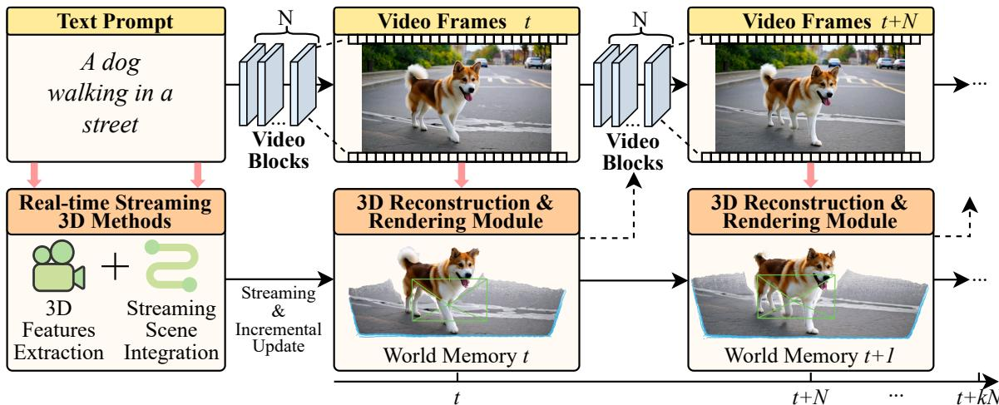
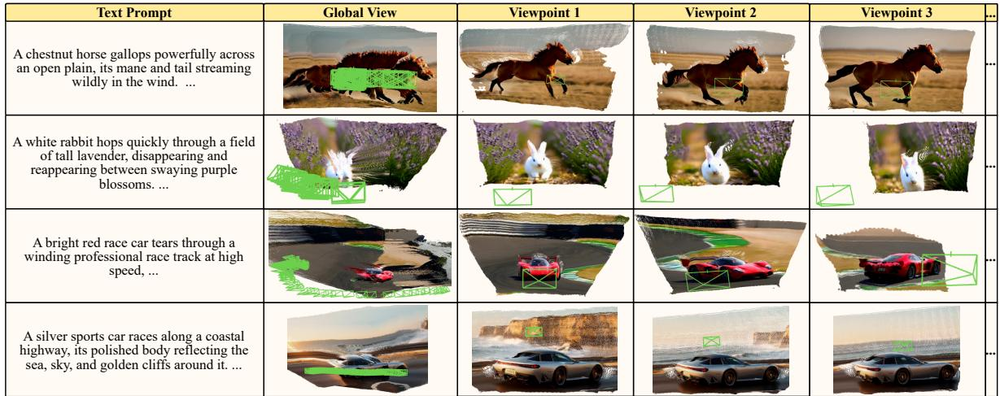

# Streaming4D: Accelerate 4D World Models via Block-wise Video Generation and Incremental Reconstruction

Xiaoyan Liu1†, Kangrui Li2†, Jiaxin Liu3†, Sifan Zhou4∗

1The Chinese University of Hong Kong 2The Hong Kong Polytechnic University

3The University of New South Wales 4Southeast University

liuxy185@link.cuhk.edu.hk, 24120659G@connect.polyu.hk, z5565763@ad.unsw.edu.au, sifanjay@gmail.com

## Abstract

Current 4D generation paradigms are often bottlenecked by a sequential decoupling design: video is generatedfirst, followed by 3D reconstruction, leading to high interaction latency. This limits applications in interactive real-time scenarios. To this end, we propose Streaming4D, a tightly coupled synchronous pipeline that integrates block-wise autoregressive video generation with incremental 3D reconstruction. Unlike traditional frame-by-frame emission and delayed geometry recovery, Streaming4D generates temporal video blocks and immediately triggers reconstructionfor each completed block, enabling parallel execution between synthesis and geometric updates. This approach allows the world representation to evolve online with the video stream, reducing feedback latency while preserving geometric fidelity. We instantiate Streaming4D using a Self-Forcing-style autoregressive generator and an incremental reconstruction backend. Experiments show consistent runtime improvements across resolutions on a single RTX 4090 (1.24× speedup), while maintaining high-quality 4D geometry and multi-view consistency.

## 1. Introduction

The transition from static 3D reconstruction to dynamic 4D world modeling represents a pivotal shift toward capturing the continuous temporal evolution of the physical world [22]. Building such dynamic world models with low latency is increasingly important for interactive applications in vision, graphics, and embodied AI [9, 11, 19, 35, 36, 40, 41, 43–49]. Recent progress in video generation and feedforward 3D reconstruction have provided promising building blocks, yet paratical 4D systems remain constrained by a critical efficiency gap. Most existing pipelines follow an offline decoupled workflow: (1) generate a full video sequence; (2) reconstruct geometry afterward. This sequential dependency introduces prohibitive latency, preventing true interactive 4D synthesis.

To support real-time interaction, both generation and reconstruction must operate causally and continuously, rather than as isolated stages. Under this requirement, autoregressive (AR) modeling has emerged as the powerful architecture for streaming synthesis, as it naturally decomposes the joint distribution of video frames into conditional generation steps [34]. However, existing work such as Rolling Forcing [14] and STream3R [13] still treat video generation and 3D reconstruction as independent stages in a linear pipeline, leading to computational redundancy and poor temporal synchronization between the synthesized visual flow and the underlying 3D representation. Consequently, when using AR generators, the reconstruction stage often waits for frame-by-frame output, leading to computational redundancy and lack of tight temporal synchronization between the synthesized visual flow and 3D representation.

To address this challenge, we propose Streaming4D, a novel synchronous streaming pipeline that tightly integrates block-wise autoregressive video generation with incremental 3D reconstruction, enabling near real-time, low-latency 4D reconstruction. Instead of the common frame-by-frame emission, Streaming4D generates video segments in discrete chunks to balance temporal coherence and inference throughput. The core innovation of Streaming4D is its pipelined parallelism mechanism, where the AR generator produces each video block and triggers incremental 3D reconstruction process. By overlapping the computation of generative inference and geometric reasoning, Streaming4D ensures the 3D world evolves alongside the advancing video stream, significantly reducing feedback latency and preserving high geometric fidelity. Extensive experiments demonstrate the significantly reduced latency, achieving a speedup of 1.21× to 1.24× on a single RTX 4090, while maintaining high-fidelity 4D geometric quality. Our contributions can be summarized as follows:

• Synchronous Architecture. We introduce a tightly coupled synchronous architecture that unifies AR video generation and incremental 4D reconstruction.

• Block-wise Pipeline Strategy. We design a block-wise pipeline execution strategy that overlaps generation and reconstruction to reduce end-to-end latency.

• Performance Validation. We show that the proposed design consistently improves runtime efficiency while preserving geometric quality and multi-view consistency.

## 2. Related work

Autoregressive Video Generation. Autoregressive models[8, 23–25] have become the dominant approach for sequential video synthesis. By factorizing the joint distribution into conditional generation steps, AR models have propelled the shift from batch generation to streaming synthesis for real-time applications[7, 14]. To address the challenges of error accumulation and slow inference, the Self Forcing [10] aligns train-test distributions via global matching to reduce rollout drift, CausVid [37] distills bidirectional diffusion into AR generation, and NFD [5] accelerates inference via intra-frame parallel sampling. However, most AR generators focus on 2D content that lacks explicit geometric reasoning. Recently, AR4D [50] extends autoregressive paradigms to 4D generation. Despite sharing a similar motivation for continuous 4D world modeling, our Streaming4D uniquely distinguishes itself by introducing a blockwise pipelined synchronization strategy to minimize interaction latency between video emission and geometry recovery.

Integrated 4D World Models. On the reconstruction side, feed-forward 4D generation techniques[3, 15, 18, 26] alongside others[6, 12, 16, 31, 32, 38] prioritize the reconstruction of geometrically consistent dynamic scenes. Achieving this fidelity is crucial for developing interactive world models, yet existing methods struggle to balance fidelity and real-time responsiveness. For example, DUSt3R [30] focuses on static stereo pairs, and MASt3R [17] extends this to video streams, but these methods often require global or window-based optimization, which poses challenges for real-time 4D synthesis. VGGT [28] and its streaming variant StreamVGGT [51] offer robust zero-shot geometric reasoning but still face sequential offline bottlenecks, delaying reconstruction and introducing prohibitive latency. Another line of research, represented by Point3R [33] and other methods based on streaming-memory [4, 20], maintains an explicit spatial memory to allow incremental updates of large-scale environments. For example, TeleWorld [2] introduces a ”Generation-Reconstruction-Guidance” loop to synchronize 4D field updates with video generation. In this paper, we advance the concept via block-wise synchronization, enabling incremental 3D reconstruction for each video block.

## 3. Method

## 3.1. Block-wise Autoregressive Video Generation

The first stage of our pipeline is dedicated to generating a continuous video stream from the initial conditions. To balance inference throughput and spatiotemporal consistency, we move beyond conventional frame-by-frame emission in favor of a Block-wise AR strategy.

The generation process begins with a text prompt $\mathcal { P }$ that describes the desired dynamic scene. To achieve seamless streaming output, we decompose the joint distribution of the video sequence into a series of conditional generative steps, where video frames are produced in discrete spatiotemporal blocks $\{ B _ { k } \} _ { k = 1 } ^ { K }$ . Each block $B _ { k }$ contains N consecutive frames $( \mathrm { e . g . }$ , in our implementation, we use $N = 3 m$ frames, where $m \in \mathbb { Z } . )$

Let $G _ { \mathrm { A R } }$ denote the AR video generator. To synthesize the $k { \mathrm { - t h } }$ segment of the video stream, the generator predicts the current video block $B _ { k }$ conditioned on the text prompt embeddings $\tau ( \mathcal { P } )$ and the history context provided by the previously generated block $B _ { k - 1 }$ . Formally, the AR generation is defined as:

$$
B _ { k } = G _ { \mathrm { A R } } \left( B _ { k - 1 } , \tau ( \mathcal { P } ) , z _ { k } ; \Theta _ { \mathrm { v i d e o } } \right) ,\tag{1}
$$

where $z _ { k }$ is the sampled latent noise for the current block, and $\Theta _ { \mathrm { v i d e o } }$ represents the model parameters. For the initial block $( n = 1 )$ , the generation is conditioned solely on the text prompt:

$$
B _ { 1 } = G _ { \mathrm { A R } } \left( \tau ( \mathcal { P } ) , z _ { 1 } ; \Theta _ { \mathrm { v i d e o } } \right) ,\tag{2}
$$

To mitigate the error accumulation commonly observed in long-term AR rollouts, our model follows the Self-Forcing paradigm [10], which aligns the training condition distribution with the inference state, ensuring long-term spatiotemporal consistency. Crucially, once the block generation $B _ { k }$ is completed, it is immediately sent to the 3D reconstruction module, while the generator seamlessly proceeds to denoise the next block $B _ { k + 1 }$

## 3.2. Real-time Incremental 4D Reconstruction

The primary objective of our framework’s backend is to facilitate the online incremental construction of dynamic 4D scenes. To achieve this, we introduce a real-time 4D reconstruction pipeline that seamlessly consumes the video blocks $B _ { n }$ emitted by the AR generator.

Instead of waiting for the entire video sequence, our 4D generator updates a persistent 3D state representation on the fly. We maintain a persistent state represented as a set of token embeddings S that evolve sequentially.

State Update: The persistent state $S _ { k }$ is updated by integrating information from the current observation:

$$
S _ { k } = U p d a t e T r a n s f o r m e r \left( S _ { k - 1 } , E \left( B _ { k } \right) \right) ,\tag{3}
$$

  
Figure 1. Overview of our Streaming4D. Given a text prompt, our framework enables real-time 4D synthesis via a synchronous, block wise autoregressive pipeline. It comprises two coupled modules: (1) Video Generation, producing contiguous N − frame video blocks( $N = 3 m )$ , and (2) 3D Reconstruction, which integrates features into a persistent World Memory. By parallelizing the denoising of block $B _ { n + 1 }$ with the reconstruction of block $B _ { n }$ , our system achieves incremental, real-time world modeling. The dotted line denotes an optional geometric consistency constraint.

where $E ( B _ { k } )$ represents the visual features extracted from the video block $B _ { k }$ by a Vision Transformer encoder, and Update Transformer is a specialized decoder that merges new observations with the existing state. By retaining and updating historical scene information at each step, state tokens provide a continuous context that allows the model to handle dynamic content consistently.

State Readout: Based on updated state, the model predicts metric-scale point maps in camera and world coordinates:

$$
X _ { k } ^ { c a m } , X _ { k } ^ { w o r l d } = R e a d o u t T r a n s f o r m e r ( S _ { k } ) ,\tag{4}
$$

where $X _ { k } ^ { c a m }$ and $X _ { k } ^ { w o r l d }$ represent the 3D point clouds in camera and world coordinates, respectively. The world coordinate pointmaps are accumulated over time to form a coherent 4D reconstruction.

## 3.3. Pipelined Parallelism and Synchronization

We adopt a block-wise strategy rather than frame-by-frame emission to balance inference throughput and temporal coherence. Each block serves as a compact spatiotemporal unit that captures local motion dynamics more effectively. Crucially, this granularity enables pipelined parallelism, allowing the 3D reconstruction R of block $B _ { k - 1 }$ to overlap with the generation of $B _ { k }$

Let $\mathcal { T } _ { g e n } ( B _ { k } )$ denote the time required to synthesize a video block $B _ { n } .$ , and $\mathcal { T } _ { r e c } ( B _ { k } )$ denote the time it takes for the 4D reconstruction module to update the world memory and readout the 3D geometry from $B _ { n }$ . In a conventional sequential pipeline, the total latency L for k blocks is $\begin{array} { r } { \sum _ { i = 1 } ^ { K } \big ( \bar { T _ { \mathrm { g e n } } } \big ( B _ { i } \big ) + \bar { T } _ { \mathrm { r e c } } \big ( B _ { i } \big ) \big ) } \end{array}$

In our synchronous streaming pipeline, the two modules execute in parallel with a single-block offset. While the generator produces the block $B _ { k }$ , the reconstruction module simultaneously processes the previously completed block

$B _ { k - 1 }$ . The execution state $\Psi _ { k }$ at the wall-clock step k can be formulated as:

$$
\Psi _ { n } = \{ G _ { A R } ( B _ { k - 1 } , \mathcal { P } ) \parallel R _ { 4 D } ( B _ { k - 1 } , S _ { k - 2 } ) \} ,\tag{5}
$$

where ∥ denotes the execution of concurrently on the computing device. Crucially, this asynchronous execution mode hides the computational overhead, ensuring that geometric reasoning does not become a bottleneck for streaming synthesis. To quantify the efficiency gain, let $\begin{array} { l l } { \Delta _ { i } } & { = } \end{array}$ max $( T _ { g e n } ( B _ { i } ) , T _ { r e c } ( B _ { i - 1 } ) )$ denote the effective duration of the i−th overlapped processing step. The total optimized latency for generating K blocks can then be formulated as:

$$
\mathcal { L } _ { o u r s } = \mathcal { T } _ { g e n } ( B _ { 1 } ) + \sum _ { i = 2 } ^ { K } \Delta _ { i } + \mathcal { T } _ { r e c } ( B _ { K } ) .\tag{6}
$$

While Appendix details hardware contention during actual execution, our current forward-streaming pipeline effectively minimizes interaction latency. Importantly, the modular architecture of Streaming4D inherently supports a closed-loop feedback mechanism. As discussed in $\mathsf { A p - }$ pendix, integrating this geometric guidance will be the focus of our future work to further mitigate cumulative errors in long-duration rollouts.

## 4. Experiments

Implementation Detail. Our framework is implemented as a tightly coupled synchronous pipeline, integrating a Self Forcing-based [10] generator for block-wise video synthesis and a CUT3R-based [29] backend for incremental 4D scene updates (see Appendix for further implementation details).

  
Figure 2. Qualitative results of Streaming4D. Driven purely by text prompts, our block-wise AR generator and continuous 3D recon structor operate synchronously to model dynamic scenes. The Global View reveals the underlying 3D point cloud structure and the camera poses (green boxes) tracked over time. The Viewpoints illustrate the framework’s ability to provide geometrically grounded visual synthe sis across different viewing angles and timesteps.

Table 1. Generation time comparison at different resolutions of CUT3R [29] on single RTX 4090 (Unit: seconds)
<table><tr><td>Resolution</td><td>Baseline</td><td>Our Method</td><td>Speedup</td></tr><tr><td>384×208</td><td>35.64</td><td>29.29</td><td>1.21×</td></tr><tr><td>448×256</td><td>37.09</td><td>30.04</td><td>1.23×</td></tr><tr><td>512×288</td><td>39.29</td><td>31.61</td><td>1.24×</td></tr><tr><td>640×368</td><td>44.13</td><td>36.33</td><td>1.21×</td></tr></table>

Table 2. Comparative 3D reconstruction on the 7-Scenes dataset [21]. On certain metrics, it even achieves performance comparable to CUT3R [29].
<table><tr><td rowspan="2">Method</td><td colspan="2">Acc↓</td><td colspan="2">Comp↓</td><td colspan="2">NC↑</td></tr><tr><td>Mean</td><td>Med.</td><td>Mean</td><td>Med.</td><td>Mean</td><td>Med.</td></tr><tr><td>MonST3R [42]</td><td>0.248</td><td>0.185</td><td>0.266</td><td>0.167</td><td>0.672</td><td>0.759</td></tr><tr><td>Spann3R [27]</td><td>0.298</td><td>0.226</td><td>0.205</td><td>0.112</td><td>0.650</td><td>0.730</td></tr><tr><td>CUT3R [29]</td><td>0.126</td><td>0.047</td><td>0.154</td><td>0.031</td><td>0.727</td><td>0.834</td></tr><tr><td>Streaming4D (Ours)</td><td>0.124</td><td>0.033</td><td>0.162</td><td>0.027</td><td>0.705</td><td>0.810</td></tr></table>

## 4.1. Quantitative Results

Generation Latency. To evaluate the computational efficiency of our proposed framework, we compare the inference time with the baseline under various input resolutions of CUT3R [29]. Tab. 1 compares the inference latency of our pipeline with a naive sequential baseline on a single RTX 4090 GPU. By overlapping video generation and 3D reconstruction, our approach consistently achieves a speedup 1.21× to 1.24× across all resolutions tested (from 384 × 208 to 640 × 368). This sustained efficiency demonstrates the robustness and scalability of our parallel processing mechanism, even under high-resolution workloads. The more relevant analysis can be found in Appendix.

3D Reconstruction. Tab. 2 presents the quantitative results of our 3D reconstruction quality on the widely used 7-Scenes dataset [21]. We evaluate our approach using three standard geometric metrics: Accuracy (Acc), Completeness (Comp), and Normal Consistency (NC). As shown in the table, Our method outperforms conventional approaches (e.g., MonST3R [42], Spann3R [27]) across all metrics. Moreover, compared to the key component CUT3R [29], our entire pipeline matches its performance without error accumulation, demonstrating that our framework preserves the quality of the 3D reconstruction.

## 4.2. Qualitative results

Qualitative results in Fig. 2 highlight our framework’s ability to generate dynamic high-fidelity, text-aligned scenes. As seen in Viewpoints 1-3, our method robustly handles complex dynamics and backgrounds, preserving fine structural details (e.g., the horse’s anatomy) across significant viewpoint shifts while avoiding geometric distortions. Moreover, Global View visualizes a coherent, artifact-free spatial representation that supports expansive camera trajectories (green frustums) without background collapse.

## 5. Conclusion

In this paper, we present Streaming4D, a synchronous framework for low-latency 4D world modeling that tightly couples block-wise autoregressive video generation with incremental 3D reconstruction. By replacing conventional decoupled workflows with block-level pipelined execution, Streaming4D enables online world representation updates, significantly reducing latency without compromising geometric fidelity. Experiments on a single RTX 4090 demonstrate a 1.24× speedup over sequential baselines while maintaining high temporal stability. These results underscore the potential of integrated pipelines for interactive 4D modeling. Future work will explore closing the loop by feeding reconstructed states back to the generator.

## References

[1] Xingyu Chen, Yue Chen, Yuliang Xiu, Andreas Geiger, and Anpei Chen. Ttt3r: 3d reconstruction as test-time training. In The Fourteenth International Conference on Learning Representations. 2

[2] Yabo Chen, Yuanzhi Liang, Jiepeng Wang, Tingxi Chen, Junfei Cheng, Zixiao Gu, Yuyang Huang, Zicheng Jiang, Wei Li, Tian Li, et al. Teleworld: Towards dynamic multimodal synthesis with a 4d world model. arXiv preprint arXiv:2601.00051, 2025. 2

[3] Zhaoxi Chen, Tianqi Liu, Long Zhuo, Jiawei Ren, Zeng Tao, He Zhu, Fangzhou Hong, Liang Pan, and Ziwei Liu. 4dnex: Feed-forward 4d generative modeling made easy. arXiv preprint arXiv:2508.13154, 2025. 2

[4] Kai Cheng, Xiaoxiao Long, Kaizhi Yang, Yao Yao, Wei Yin, Yuexin Ma, Wenping Wang, and Xuejin Chen. Gaussianpro: 3d gaussian splatting with progressive propagation. In Fortyfirst International Conference on Machine Learning, 2024. 2

[5] Xinle Cheng, Tianyu He, Jiayi Xu, Junliang Guo, Di He, and Jiang Bian. Playing with transformer at 30+ fps via nextframe diffusion, 2025. 2

[6] Alex Fisher, Ricardo Cannizzaro, Madeleine Cochrane, Chatura Nagahawatte, and Jennifer L Palmer. Colmap: A memory-efficient occupancy grid mapping framework. Robotics and Autonomous Systems, 142:103755, 2021. 2

[7] Jiatao Gu, Ying Shen, Tianrong Chen, Laurent Dinh, Yuyang Wang, Miguel Angel Bautista, David Berthelot, Josh Susskind, and Shuangfei Zhai. Starflow-v: End-to-end video generative modeling with normalizing flows. arXiv preprint arXiv:2511.20462, 2025. 2

[8] Roberto Henschel, Levon Khachatryan, Hayk Poghosyan, Daniil Hayrapetyan, Vahram Tadevosyan, Zhangyang Wang, Shant Navasardyan, and Humphrey Shi. Streamingt2v: Consistent, dynamic, and extendable long video generation from text. In Proceedings of the Computer Vision and Pattern Recognition Conference, pages 2568–2577, 2025. 2

[9] Zhaofeng Hu, Sifan Zhou, Qinbo Zhang, Rongtao Xu, Qi Su, and Ci-Jyun Liang. Anyslot: Goal-conditioned visionlanguage-action policies for zero-shot slot-level placement. arXiv preprint arXiv:2604.10432, 2026. 1

[10] Xun Huang, Zhengqi Li, Guande He, Mingyuan Zhou, and Eli Shechtman. Self forcing: Bridging the train-test gap in autoregressive video diffusion, 2025. 2, 3, 1

[11] Ruanzhi Jiao, Jinlai Zhang, Chang Li, and Lin Hu. Largekernel spatially parallel feature fusion for monocular 3d perception in autonomous driving. Knowledge-Based Systems, 343:115998, 2026. 1

[12] Bernhard Kerbl, Georgios Kopanas, Thomas Leimkuhler,¨ and George Drettakis. 3d gaussian splatting for real-time radiance field rendering. ACM Trans. Graph., 42(4):139–1, 2023. 2

[13] Yushi Lan, Yihang Luo, Fangzhou Hong, Shangchen Zhou, Honghua Chen, Zhaoyang Lyu, Shuai Yang, Bo Dai, Chen Change Loy, and Xingang Pan. Stream3r: Scalable sequential 3d reconstruction with causal transformer. arXiv preprint arXiv:2508.10893, 2025. 1

[14] Kunhao Liu, Wenbo Hu, Jiale Xu, Ying Shan, and Shijian Lu. Rolling forcing: Autoregressive long video diffusion in real time, 2025. 1, 2

[15] Xiaoyan Liu, Kangrui Li, Yuehao Song, and Jiaxin Liu. Dream4d: Lifting camera-controlled i2v towards spatiotemporally consistent 4d generation. arXiv preprint arXiv:2508.07769, 2025. 2

[16] Raul Mur-Artal, Jose Maria Martinez Montiel, and Juan D Tardos. Orb-slam: A versatile and accurate monocular slam system. IEEE transactions on robotics, 31:1147–1163, 2015. 2

[17] Riku Murai, Eric Dexheimer, and Andrew J Davison. Mast3r-slam: Real-time dense slam with 3d reconstruction priors. In Proceedings of the Computer Vision and Pattern Recognition Conference, pages 16695–16705, 2025. 2

[18] Panwang Pan, Chenguo Lin, Jingjing Zhao, Chenxin Li, Yuchen Lin, Haopeng Li, Honglei Yan, Kairun Wen, Yun long Lin, Yixuan Yuan, et al. Diff4splat: Controllable 4d scene generation with latent dynamic reconstruction models. arXiv preprint arXiv:2511.00503, 2025. 2

[19] Jiawei Ren, Liang Pan, Jiaxiang Tang, Chi Zhang, Ang Cao, Gang Zeng, and Ziwei Liu. Dreamgaussian4d: Generative 4d gaussian splatting, 2024. 1

[20] Erik Sandstrom, Yue Li, Luc Van Gool, and Martin R Os-¨ wald. Point-slam: Dense neural point cloud-based slam. In Proceedings of the IEEE/CVF international conference on computer vision, pages 18433–18444, 2023. 2

[21] Jamie Shotton, Ben Glocker, Christopher Zach, Shahram Izadi, Antonio Criminisi, and Andrew Fitzgibbon. Scene coordinate regression forests for camera relocalization in rgb-d images. In Proceedings ofthe IEEE conference on computer vision and pattern recognition, pages 2930–2937, 2013. 4

[22] Jiaming Sun, Yiming Xie, Linghao Chen, Xiaowei Zhou, and Hujun Bao. Neuralrecon: Real-time coherent 3d reconstruction from monocular video. In Proceedings of the IEEE/CVF conference on computer vision and pattern recognition, pages 15598–15607, 2021. 1

[23] Keyu Tian, Yi Jiang, Zehuan Yuan, Bingyue Peng, and Liwei Wang. Visual autoregressive modeling: Scalable image generation via next-scale prediction. Advances in neural in formation processing systems, 37:84839–84865, 2024. 2

[24] Aaron Van Den Oord, Nal Kalchbrenner, and Koray¨ Kavukcuoglu. Pixel recurrent neural networks. In Interna tional conference on machine learning, pages 1747–1756. PMLR, 2016.

[25] Ruben Villegas, Mohammad Babaeizadeh, Pieter-Jan Kindermans, Hernan Moraldo, Han Zhang, Mohammad Taghi Saffar, Santiago Castro, Julius Kunze, and Dumitru Erhan. Phenaki: Variable length video generation from open domain textual description, 2022. 2

[26] Chaoyang Wang, Ashkan Mirzaei, Vidit Goel, Willi Menapace, Aliaksandr Siarohin, Avalon Vinella, Michael Vasilkovsky, Ivan Skorokhodov, Vladislav Shakhrai, Sergey Korolev, et al. 4real-video-v2: Fused view-time attention and feedforward reconstruction for 4d scene generation. arXiv preprint arXiv:2506.18839, 2025. 2

[27] Hengyi Wang and Lourdes Agapito. 3d reconstruction with spatial memory. In 2025 International Conference on 3D Vision (3DV), pages 78–89. IEEE, 2025. 4

[28] Jianyuan Wang, Minghao Chen, Nikita Karaev, Andrea Vedaldi, Christian Rupprecht, and David Novotny. Vggt: Visual geometry grounded transformer. In Proceedings of the Computer Vision and Pattern Recognition Conference, pages 5294–5306, 2025. 2

[29] Qianqian Wang, Yifei Zhang, Aleksander Holynski, Alexei A Efros, and Angjoo Kanazawa. Continuous 3d perception model with persistent state. In Proceedings of the Computer Vision and Pattern Recognition Conference, pages 10510–10522, 2025. 3, 4, 2

[30] Shuzhe Wang, Vincent Leroy, Yohann Cabon, Boris Chidlovskii, and Jerome Revaud. Dust3r: Geometric 3d vision made easy. In Proceedings of the IEEE/CVF conference on computer vision and pattern recognition, pages 20697– 20709, 2024. 2

[31] Guanjun Wu, Taoran Yi, Jiemin Fang, Lingxi Xie, Xiaopeng Zhang, Wei Wei, Wenyu Liu, Qi Tian, and Xinggang Wang. 4d gaussian splatting for real-time dynamic scene rendering. In Proceedings of the IEEE/CVF conference on computer vision and pattern recognition, pages 20310–20320, 2024. 2

[32] Rundi Wu, Ruiqi Gao, Ben Poole, Alex Trevithick, Changxi Zheng, Jonathan T Barron, and Aleksander Holynski. Cat4d: Create anything in 4d with multi-view video diffusion models. In Proceedings of the Computer Vision and Pattern Recognition Conference, pages 26057–26068, 2025. 2

[33] Yuqi Wu, Wenzhao Zheng, Jie Zhou, and Jiwen Lu. Point3r: Streaming 3d reconstruction with explicit spatial pointer memory. arXiv preprint arXiv:2507.02863, 2025. 2

[34] Jing Xiong, Gongye Liu, Lun Huang, Chengyue Wu, Taiqiang Wu, Yao Mu, Yuan Yao, Hui Shen, Zhongwei Wan, Jinfa Huang, Chaofan Tao, Shen Yan, Huaxiu Yao, Lingpeng Kong, Hongxia Yang, Mi Zhang, Guillermo Sapiro, Jiebo Luo, Ping Luo, and Ngai Wong. Autoregressive models in vision: A survey, 2025. 1

[35] Zhen Xu, Sida Peng, Haotong Lin, Guangzhao He, Jiaming Sun, Yujun Shen, Hujun Bao, and Xiaowei Zhou. 4k4d: Real-time 4d view synthesis at 4k resolution. In Proceedings ofthe IEEE/CVF conference on computer vision and pattern recognition, pages 20029–20040, 2024. 1

[36] Jinbo Yan, Rui Peng, Luyang Tang, and Ronggang Wang. 4d gaussian splatting with scale-aware residual field and adaptive optimization for real-time rendering of temporally complex dynamic scenes, 2024. 1

[37] Tianwei Yin, Qiang Zhang, Richard Zhang, William T. Freeman, Fredo Durand, Eli Shechtman, and Xun Huang. From slow bidirectional to fast autoregressive video diffusion models, 2025. 2

[38] Yuyang Yin, Dejia Xu, Zhangyang Wang, Yao Zhao, and Yunchao Wei. 4dgen: Grounded 4d content generation with spatial-temporal consistency. arXiv preprint arXiv:2312.17225, 2023. 2

[39] Yuheng Yuan, Qiuhong Shen, Shizun Wang, Xingyi Yang, and Xinchao Wang. Test3r: Learning to reconstruct 3d at test time. arXiv preprint arXiv:2506.13750, 5, 2025. 2

[40] Shuang Zeng, Xinyuan Chang, Mengwei Xie, Xinran Liu, Yifan Bai, Zheng Pan, Mu Xu, and Xing Wei. Futuresight drive: Thinking visually with spatio-temporal cot for autonomous driving. arXiv preprint arXiv:2505.17685, 2025. 1

[41] Shuang Zeng, Dekang Qi, Xinyuan Chang, Feng Xiong, Shichao Xie, Xiaolong Wu, Shiyi Liang, Mu Xu, and Xing Wei. Janusvln: Decoupling semantics and spatiality with dual implicit memory for vision-language navigation. arXiv preprint arXiv:2509.22548, 2025. 1

[42] Junyi Zhang, Charles Herrmann, Junhwa Hur, Varun Jampani, Trevor Darrell, Forrester Cole, Deqing Sun, and Ming-Hsuan Yang. Monst3r: A simple approach for estimating geometry in the presence of motion. arXiv preprint arXiv:2410.03825, 2024. 4

[43] Jinlai Zhang, Xiaolong Song, Yucheng Li, Diqing Liang, Zhiyong Zhang, and Jinhu Cai. Adaptive dual cross-attention network for multispectral object detection in autonomous driving. Expert Systems with Applications, page 132012, 2026. 1

[44] Jinlai Zhang, Mingchao Xiang, Yongheng Hu, Wei Hao, Lin long Lei, and Kefu Yi. Multivariate feature learning and associative spatial information enhancement for snow object detection in autonomous driving. Engineering Applications ofArtificial Intelligence, 175:114672, 2026.

[45] Shibo Zhao, Sifan Zhou, Raphael Blanchard, Yuheng Qiu, Wenshan Wang, and Sebastian Scherer. Tartan imu: A light foundation model for inertial positioning in robotics. In Proceedings of the Computer Vision and Pattern Recognition Conference, pages 22520–22529, 2025.

[46] Shibo Zhao, Sifan Zhou, Yuchen Zhang, Ji Zhang, Chen Wang, Wenshan Wang, and Sebastian Scherer. Resilient odometry via hierarchical adaptation. Science Robotics, 10 (109):eadv1818, 2025.

[47] Zhenjun Zhao. Balf: Simple and efficient blur aware local feature detector. In Proceedings of the IEEE/CVF Win ter Conference on Applications of Computer Vision, pages 3362–3372, 2024.

[48] Zhenjun Zhao and Ben M Chen. Benchmark for evaluating initialization of visual-inertial odometry. In 2023 42nd Chinese Control Conference (CCC), pages 3935–3940. IEEE, 2023.

[49] Zhenjun Zhao, Heng Yang, Bangyan Liao, Yingping Zeng, Shaocheng Yan, Yingdong Gu, Peidong Liu, Yi Zhou, Haoang Li, and Javier Civera. Advances in global solvers for 3d vision. arXiv preprint arXiv:2602.14662, 2026. 1

[50] Hanxin Zhu, Tianyu He, Xiqian Yu, Junliang Guo, Zhibo Chen, and Jiang Bian. Ar4d: Autoregressive 4d generation from monocular videos. arXiv preprint arXiv:2501.01722, 2025. 2

[51] Dong Zhuo, Wenzhao Zheng, Jiahe Guo, Yuqi Wu, Jie Zhou, and Jiwen Lu. Streaming 4d visual geometry transformer. arXiv preprint arXiv:2507.11539, 2025. 2

# Streaming4D: Accelerate 4D World Models via Block-wise Video Generation and Incremental Reconstruction

Supplementary Material

Xiaoyan Liu1†, Kangrui Li2†, Jiaxin Liu3†, Sifan Zhou4∗

1The Chinese University of Hong Kong 2The Hong Kong Polytechnic University

3The University of New South Wales 4Southeast University

† Equal contribution. ∗ Corresponding author.

liuxy185@link.cuhk.edu.hk, 24120659G@connect.polyu.hk,

z5565763@ad.unsw.edu.au, sifanjay@gmail.com

## A. Latency Optimization and Hardware Contention.

As mentioned in Sec. 3.3, in an ideal decoupled environment, the cumulative latency for a sequence of K blocks would be optimized from a sequential sum $\sum \left( \mathcal { T } _ { \mathrm { g e n } } ( B _ { i } ) + \mathcal { T } _ { \mathrm { r e c } } ( B _ { i } ) \right)$ to a parallel execution time bounded by $\sum \operatorname* { m a x } \left( \mathcal { T } _ { \mathrm { g e n } } , \mathcal { T } _ { \mathrm { r e c } } \right)$ . However, real-time 4D synthesis is typically deployed on a single GPU under strict hardware constraints.

When executing the generative module $G _ { v i d e o }$ and the reconstruction module $R _ { 4 D }$ concurrently through asynchronous execution, the two heavily parameterized models inevitably compete for limited Streaming Multiprocessors (SMs) and memory bandwidth. Let $\alpha > 0$ denote the performance penalty induced by this contention of resources. The practical execution latency L˜ is modeled as:

$$
\begin{array} { r l r } {  { \tilde { \mathcal { L } } _ { \mathrm { o u r s } } \approx \mathcal { T } _ { \mathrm { g e n } } ( B _ { 1 } ) + \sum _ { i = 2 } ^ { K } \operatorname* { m a x } \Big ( \tilde { \mathcal { T } } _ { \mathrm { g e n } } ( B _ { i } ) , \tilde { \mathcal { T } } _ { \mathrm { r e c } } ( B _ { i - 1 } ) \Big ) } } \\ & { } & { + \ \tilde { \mathcal { T } } _ { \mathrm { r e c } } ( B _ { K } ) , } \end{array}\tag{7}
$$

where $\tilde { \mathcal { L } } = ( 1 + \alpha ) \mathcal { L }$ represents the inflated execution time under concurrent workload.

Despite the presence of hardware contention α, our pipelined strategy still significantly outperforms the sequential baseline. By overlapping the generative denoising with the intensive geometric reasoning, our system effectively hides a substantial portion of the video generation overhead.

## B. Analysis of Pipeline Efficiency across Resolutions.

Tab. 1 presents the generation time and speedup ratios of our proposed pipeline compared to the sequential baseline across different input resolutions on a single RTX 4090 GPU. Interestingly, we observe an inverted-U performance curve in relative speedup, which peaks at 1.24× at the

512 × 288 resolution, before plateauing or slightly degrading at both lower and higher extremes.

This phenomenon perfectly reflects the trade-off between pipeline overlap and hardware resource contention (as theoretically modeled by α in Sec. A.

At lower resolutions $( \mathbf { e . g . ,  ~ 3 8 4 ~ \times ~ 2 0 8 } )$ , the absolute computational workload is relatively light. Consequently, constant system-level overheads occupy a larger proportion of the execution time, thereby diluting the benefits of parallel execution. In contrast, at higher resolutions, the quadratic complexity of the Transformer-based generator and the 3D reconstructor aggressively saturates the GPU’s memory bandwidth and Streaming Multiprocessors (SMs). This severe resource contention inflates the individual execution time of each module, bounding the theoretical maximum speedup. Consequently, the optimal efficiency is observed at certain moderate resolutions, where the workload is substantial enough to hide scheduling overheads, yet still fits comfortably within the compute and memory limits of a single GPU, thereby maximizing pipeline overlap.

Nevertheless, our pipeline consistently maintains a robust ∼ 20% overall speedup across all tested resolutions, validating its resilience and scalability in single-GPU interactive 4D environments.

## C. Architecture

We employ an integrated tightly coupled synchronous streaming pipeline to enable real-time synthesis of 4D content. This architecture consists of two core modules. At the front end of the architecture, we employ the Self Forcing [10] paradigm for generating video blocks. Instead of generating the entire video sequence in a single pass, the model continuously synthesizes frames in a streaming manner and groups every three consecutive frames into a temporal block. Each block functions as a compact spatiotemporal unit that captures local motion and appearance dynamics while enabling seamless integration with the subsequent 4D reconstruction stage.

In the backend, we incorporate a module based on the

CUT3R [29] architecture for incremental 4D scene update. For each generated block, the 4D generator incrementally updates a persistent world state that encodes evolving geometry, depth, and appearance features, producing a temporally coherent 4D representation. Through the integration of AR video generation and 4D reconstruction, our framework delivers real-time, geometrically consistent, and temporally stable 4D content generation, outperforming conventional autoregressive or reconstruction-only methods in both efficiency and long-term coherence.

## D. Future Work.

Although our current framework successfully establishes a forward-streaming pipeline from autoregressive video generation (Self Forcing) to 3D scene reconstruction (CUT3R), we envision a future trajectory that fully activates the geometric guidance path (as indicated in Fig. 1). Relying solely on 2D pixel-space history, long-duration autoregressive video generators are inherently susceptible to longterm geometric drift and structural hallucinations.

To further refine geometric consistency, one could incorporate test-time optimization strategies, similar to Test3R [39] or TTT3R [1], which adapt the model parameters online to minimize reprojection errors for a specific input stream. Building upon this improved per-frame geometry, the system can then leverage the refined 3D information for long-term coherence. To further enhance the generation and reconstruction quality over extended durations, we plan to feed the continuously updated 3D scene information from our existing persistent world memory back into the video generation stage. Serving as an explicit geometric prior, this feedback will guide the autoregressive model to evolve from merely predicting local 2D fragments to simulating a coherent, explorable dynamic world. Ultimately, we anticipate that this cyclic guidance mechanism will effectively mitigate visual drift and ensure robust spatiotemporal coherence across infinite-length sequences.