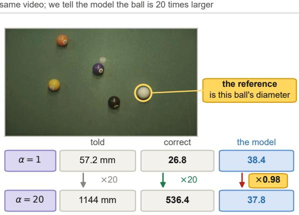
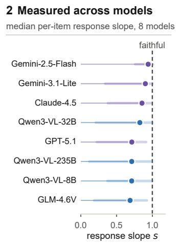
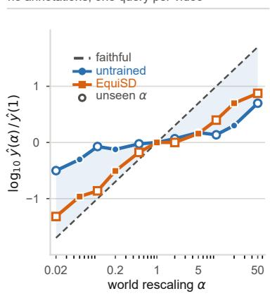
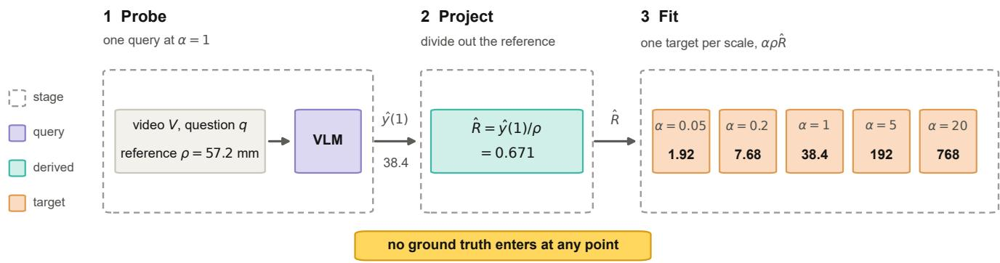
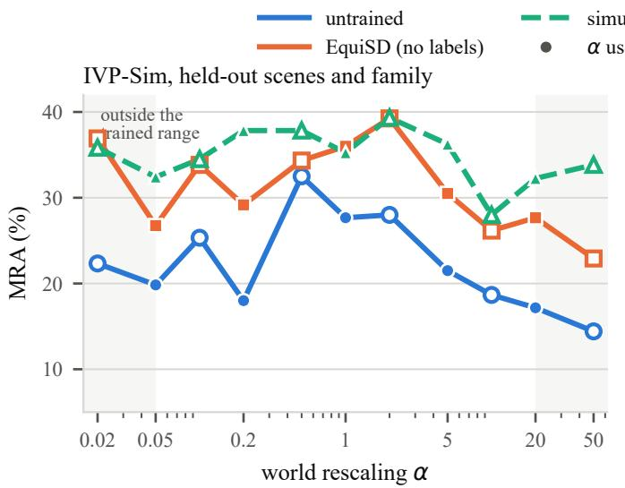
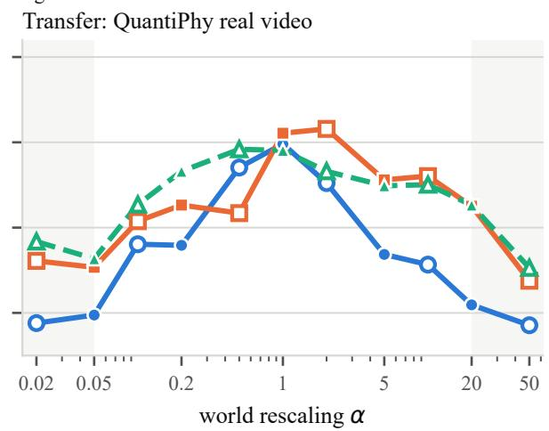
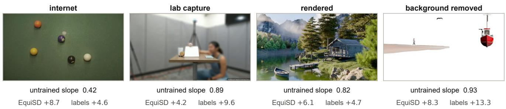
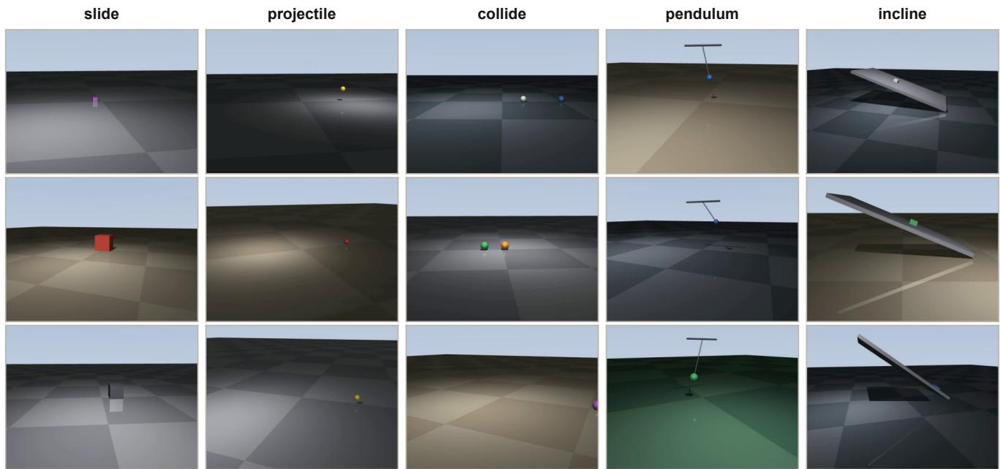

# Teaching Vision-Language Models to Use the Scale They Are Given: Label-Free Equivariance Training for Metric Physical Reasoning

Kaizhen Tan1 Yang Feng2 Heqing Du2 Siru Tao3 Xin Xu3 Hanzhe Hong3 1New York University 2Columbia University 3Carnegie Mellon University

1 Rescale the reference same video; we tell the model the ball is 20 times larger

  
asked: mean speed of the cue ball (cm/s)

  
3 Train on the symmetry no annotations, one query per video

  
Figure 1. How much of the supplied world scale reaches the answer. Multiplying every world-space quantity in a prompt by α leaves a monocular video consistent and multiplies the correct answer by exactly α, so the faithful response slope is 1. (1) One QuantiPhy question at α=1 and α=20; the ring marks the object whose diameter is the supplied reference. The reference and the correct answer both move by a factor of twenty, and the untrained 3B model’s answer by 0.98. (2) Median per-item response slope over the 159 questions for the eigh models we evaluate, with the interquartile range; open-weight in blue, proprietary in purple, and Tab. 1 gives the full names. (3) Median response of the 3B student over all questions, normalised at the nominal scale, before and after training on the symmetry alone. Filled markers are the five scales used in training and hollow markers six that were never trained on.

## Abstract

Metric questions about video require vision-language models to use supplied real-world references to convert visual measurements into physical units. Yet we find that current models use this scale information only partially. When every world-space quantity in a prompt is rescaled by a common factor, the video remains equally valid and the correct answer changes by exactly that factor, but model predictions move only part of the way and accuracy remains concentrated near the familiar scale of the depicted objects. Across eight vision-language models, this under-response persists overfour orders ofmagnitude. The same models recover the correct closed-form scaling laws when the identical physics is asked in a scale-freeform, indicating that the main deficit lies in metric grounding rather than physical mechanism

knowledge. We use this exact scaling relation as supervision without requiring metric annotations. Under a common rescaling ofthe supplied world-space quantities, the correct metric answer must change by the same factor. EquiSD exploits this constraint by projecting a model’s own prediction onto the scale-equivariantfamily andfine-tuning the model on the resulting targets. It requires no ground-truth answers and only one model query per training video. On held-out simulated videos, EquiSD increases a 3B model’s median response slope from 0.66 to 0.94 and improves mean relative accuracy by 9.2 points across scales. The learned relation generalizes to unseen world scales and transfers without adaptation to real QuantiPhy videos, where accuracy increases by 6.4 points. These results show that an exact physical symmetry can provide label-free supervision for improving metric grounding in vision-language models.

## 1. Introduction

Deciding whether an approaching car is too fast, whether a part fits a slot, or whether a ball will clear a gap requires an answer in metres and seconds. Vision-language models describe physical events fluently, and recent benchmarks now ask them for such numbers rather than for narration [9, 18], on which the gap to human performance remains wide.

Any such question from a single camera is scaleambiguous, so the model is handed a reference: a ball of known diameter, a pedestrian at a known walking speed, a lane of known width. The reference is what converts pixels into metres, and the answer is proportional to it. We measure how much of it reaches the answer.

We rescale every world-space quantity in a prompt, the reference and every supplied camera distance, by a common factor α. The rewritten prompt remains a consistent description of the same pixels, and the correct answer is exactly α times the original, so a model that uses what it is told would track that line. Across eight vision-language models the predictions under-react to the change, and accuracy stays concentrated at the scale the depicted objects usually have. A scale-free control indicates that this reflects metric grounding rather than a general failure of physical reasoning: asked the same physics as a ratio, the same models reproduce the closed-form laws.

Fixing this by supervision runs into the reason the benchmarks are hard to build in the first place: real video does not come with metric labels for arbitrary objects and motions. Our starting point is that the task does not need them, because it carries a symmetry. Writing $S _ { \alpha }$ for the rewriting that multiplies every world-space quantity a question supplies – the reference and any camera distances – by $\alpha ,$ the answer is homogeneous of degree one under it, $y ( V , S _ { \alpha } q ) = \alpha y ( V , q )$ , which follows from projective geometry rather than from any modelling choice.

EquiSD makes this concrete in two steps. It reads off the scale-free ratio implicit in the model’s own answer, which is the projection of that answer onto the family of functions the symmetry allows. It then fine-tunes the model on that projection, so the model answers consistently across every scale. The targets are the model’s own answers, moved to the scale the symmetry assigns them, and no ground truth enters.

The projected targets encode the equivariance relation without introducing any magnitude the model did not produce itself, so training cannot teach a model that stopping distances are around half a metre because the training videos happened to look that way. Supervision from a simulator, the natural alternative, carries the simulator’s magnitude distribution along with its physics. Trained on synthetic clips alone and evaluated on real video, EquiSD recovers 93% of what exact simulator answers buy, against 66% on simulated video.

Our contributions are as follows.

• We identify the homogeneity relation as an exact, annotation-free constraint on metric physical reasoning, and turn it into a per-item measure of how much of the supplied scale a model uses that a deployed system can compute on its own outputs.

• We quantify the deficit on QuantiPhy and on a new simulated corpus, and separate it from mechanism knowledge with a scale-free control.

• We introduce EquiSD, a label-free training procedure that makes a model scale-equivariant with one query per video and no annotations. It holds at world scales that never appear in training, more of it survives the move from synthetic to real video than survives fitting a simulator’s exact answers, and the effect follows the rule that transports the target rather than the act of self-distillation.

• We release IVP-Sim, 1,000 rendered rigid-body videos with exact states and 10,661 single-parameter interventions whose log-log sensitivity exponents are checked against their closed forms, including cases whose exponent is exactly zero.

## 2. Related work

Metric physical reasoning from video. Benchmarks have moved from asking models to describe physical events to asking them for numbers. QuantiPhy [9] supplies a video and one world-space reference and scores the numerical answer for size, velocity and acceleration; VSI-Bench and its successors ask for metric spatial quantities in video [18]. QuantiPhy reports that multiplying its reference by a scalar degrades accuracy sharply and reads this as evidence that models lean on pretrained priors. We take the same observation as the starting point of a method: we make the rewriting consistent across all world-space numbers so that it describes a valid scene, turn the response into a per-item slope, and use the underlying symmetry as a training signal.

Reconstructing an executable world. A second line converts a video into a simulator and answers by execution. Code-as-World [16] discovers executable world representations with an agentic propose–execute–verify loop and uses verified worlds as supervision for a vision-language model; PhysMind [17] builds a reusable executable world per video without training; LLMPhy [3] and SIMPACT [10] iterate simulator parameters against reconstruction error; ∆ynamics [8] predicts a YAML scene configuration that can be re-simulated. These systems recover a scene before answering. Our target is the mapping from a supplied reference to a metric answer, which we repair without reconstructing anything at inference time.

Interventions and counterfactuals. CoPhy [2] and Filtered-CoPhy [7] predict trajectories after an intervention on initial conditions; CRIPP-VQA [12] asks counterfactual questions about hidden mass and friction; ContPhy [19] extends the setting to fluids and deformables; recent benchmarks pair physical questions with causal graphs [13]. These evaluate what happens under an intervention, usually as a categorical or trajectory-level outcome. We use interventions in a narrower role: as a control that separates a model’s mechanism knowledge, which the scale-free form of the question recovers, from its metric grounding, which the same question in metres does not.

Units equivariance and consistency. Imposing exact units equivariance on a regressor by working in dimensionless variables is classical in dimensional analysis and has been formalised for machine learning [15]. That construction builds the symmetry into a white-box model. We instead measure how far a black-box vision-language model departs from the symmetry and use the departure as a training signal. Closest in spirit are studies of whether models use the evidence they are given: evidence-channel decompositions for monocular size estimation [11] and test-time consistency under semantic paraphrase [4]. Semantic consistency has no ground-truth answer to enforce; the physical symmetry here does, and that closed form is what makes training possible.

The same closed form separates the method from training a model on its own outputs. Self-generated targets are ordinarily kept or discarded by a confidence rule, and a consistency objective can ask only that two answers agree; the rewriting here fixes the ratio the two answers must stand in, so one query determines a target.

## 3. Metric scale as a constraint

## 3.1. The homogeneity relation

A metric physical question about a monocular video supplies the model with a video V and a question q naming a target quantity. Besides its words, q carries worldspace quantities: a reference value $\rho$ in world units, such as the diameter of a billiard ball or the walking speed of a pedestrian, and, for depth-aware questions, camera distances $c _ { 1 } , \ldots , c _ { m }$ The model must return the target in world units. Without $\rho$ the task is unsolvable: a monocular video determines the scene only up to a global similarity transform, so the same pixels are produced by a world of any size with the camera translation scaled to match.

That same ambiguity fixes exactly how the answer depends on those quantities. Scale every length in the world by $\alpha > 0$ , leave time unchanged, and scale the camera translation to match. The rendered video is identical and every quantity of dimension $L T ^ { - k }$ becomes α times itself. Let $S _ { \alpha }$ denote the corresponding rewriting of the question, $\left( \rho , c _ { i } \right) \mapsto \left( \alpha \rho , \alpha c _ { i } \right)$ with its words untouched, and let $\bar { q } = S _ { 1 / \rho } q$ be the question in units of its own reference. Every target in this setting – size, displacement, speed, acceleration – has dimension $L T ^ { - k }$ , and the frame rate fixes the time base, so

$$
y ( V , S _ { \alpha } q ) \ = \ \alpha y ( V , q ) \quad \Longleftrightarrow \quad y ( V , q ) \ = \ \rho R ( V , \bar { q } ) ,
$$

where R is scale-free. Rescaling $\rho$ alone is not an instance of $S _ { \alpha }$ when $m > 0$ , and Sec. 3.2 measures how much that distinction matters.

(1)

Eq. (1) follows from the projective geometry of the observation rather than from a modelling choice, and it is exact within the setting this paper addresses: the time base is fixed by the video, every world-space quantity the question supplies is a length or a length rate, and the target has dimension $L T ^ { - k }$ . Rescaling lengths at a fixed time base also rescales any dimensional constant the question does not supply, gravity among them, so the rewritten scene is the same observation under a different choice of unit rather than the same dynamics at a different size. We therefore restrict the question set to targets of dimension $L T ^ { - k } ( { \mathrm { S e c . ~ } } 5 . 1 ) ;$ dimensionless outcomes and pure times are invariant rather than equivariant and are excluded. Two consequences follow. First, the correct answer to the rescaled question follows from the answer to the original, so the constraint can be checked and enforced without annotation. Second, the rescaled question stays a consistent description of the same pixels, which makes α a dial on the difference between what the model is told and what it remembers.

## 3.2. Measuring how much of the given scale a model uses

We probe a model by presenting it with $S _ { \alpha } q$ in place of q and reading its response $\hat { y } ( \alpha )$ . Scaling every supplied quantity together is the only rewriting compatible with Eq. (1). Touching the reference alone, as QuantiPhy’s counterfactual probe does, leaves a prompt whose object sizes and camera distances disagree, and no answer to such a prompt is correct. The choice changes what the probe reports: on the 90 questions that supply camera distances, the inconsistent rewriting gives a median slope of 0.14 where the consistent one gives 0.76, and a per-item fit of $R ^ { 2 } = 0$ .46 against 0.90 (Sec. C.1). Every number we report uses the consistent rewriting.

Plotting log ˆy against log α gives a per-item response slope

$$
s = \frac { \deg { \hat { y } ( \alpha ) } } { \deg { \alpha } } ,\tag{2}
$$

which equals 1 for a model that uses the reference as given and 0 for one whose answer is set entirely by what it remembers about the objects on screen. The residual σ around the fit measures how repeatably it responds. We also report the equivariance error, the median of $\vert \log { \hat { y } ( \alpha ) } - \log { \hat { y } ( 1 ) } \ -$ log α| over items and scales, which is 0 for a model that satisfies Eq. (1) exactly and is quoted in dex, that is in factors of ten. Both quantities are computed from the model’s own outputs, without any answer key.

<table><tr><td rowspan="2">model</td><td colspan="3">macro MRA at α</td><td colspan="2">slope s</td></tr><tr><td>0.01</td><td>1</td><td>100</td><td>median</td><td> $\% < 0 . 5$ </td></tr><tr><td>open-weight</td><td></td><td></td><td></td><td></td><td></td></tr><tr><td>GLM-4.6V</td><td>21.7</td><td>45.4</td><td>17.8</td><td>0.69</td><td>39</td></tr><tr><td>Qwen3-VL-235B</td><td>23.5</td><td>43.5</td><td>22.1</td><td>0.71</td><td>38</td></tr><tr><td>Qwen3-VL-32B Qwen3-VL-8B</td><td>17.1 20.6</td><td>40.1 27.3</td><td>18.4 24.7</td><td>0.83 0.71</td><td>33</td></tr><tr><td></td><td></td><td></td><td></td><td></td><td>35</td></tr><tr><td>proprietary</td><td></td><td></td><td></td><td></td><td></td></tr><tr><td>Gemini-3.1-Flash-Lite</td><td>28.9</td><td>52.6</td><td>29.8</td><td>0.90</td><td>29</td></tr><tr><td>Claude-Sonnet-4.5</td><td>29.5</td><td>50.2</td><td>28.3</td><td>0.86</td><td>30</td></tr><tr><td>GPT-5.1</td><td>20.8</td><td>42.0</td><td>22.8</td><td>0.71</td><td>38</td></tr><tr><td>Gemini-2.5-Flash</td><td>23.0</td><td>29.5</td><td>26.2</td><td>0.94</td><td>16</td></tr></table>

Table 1. Accuracy under world rescaling, and the response slope that summarises it. Accuracy at the nominal scale and at the two ends of the sweep, and the response slope of Eq. (2), which is 1 for a model that uses the reference as given. QuantiPhyvalidation, 159 questions, macro-averaged over its four subsets; rows are ordered by accuracy at the nominal scale. Table 7 gives the full α grid.

## 3.3. What current models do

Every model we tested keeps part of its answer when the world it is told about changes size, and the part it keeps is enough to localise its accuracy around the familiar scale. We sweep α over four orders of magnitude for eight visionlanguage models on QuantiPhy [9], four open-weight and four proprietary, spanning 8B to 235B parameters where the count is disclosed. Table 1 reports the nominal scale and the two ends of that sweep. Accuracy is mean relative accuracy (MRA) [18], the fraction of ten relative-error tolerances a prediction satisfies, macro-averaged over QuantiPhy’s four question types. It peaks at the scale the depicted objects usually have and falls on both sides for all of them, including the strongest, and between a sixth and two fifths of individual questions are answered with a slope below 0.5. A slope of 0.7, the median for three of the eight, means that telling the model the world is ten times larger moves its answer by a factor of five.

The one-parameter description in Eq. (2) accounts for the behaviour well: a straight line in log α explains a median R2 between 0.81 and 0.96 per item. Two structures recur across all eight models. The slope varies with the source of the video, lowest on in-the-wild footage and highest where the background has been removed (Fig. 4), and it collapses on questions that give a speed and ask for a size, where six of the eight fall below 0.4 while staying above 0.73 on the other three task types. Both are consistent with competition from pretrained magnitude priors: the reference loses ground where the object is most recognisable and where the quantity asked for is the kind most reliably memorised.

<table><tr><td>Flash</td><td>Gemini-2.5- Qwen3-VL- 8B</td></tr><tr><td>non-zero exponent, asked as a ratio items 160</td><td></td></tr><tr><td></td><td>156</td></tr><tr><td>matches closed form % 86</td><td>84</td></tr><tr><td>zero exponent, asked as a ratio items 87</td><td></td></tr><tr><td>100</td><td>87</td></tr><tr><td>unchanged %</td><td>100</td></tr><tr><td>changed %</td><td>0</td></tr><tr><td>zero exponent, asked in metres items</td><td></td></tr><tr><td>37 0</td><td>31</td></tr><tr><td>unchanged %</td><td>13</td></tr><tr><td>changed %</td><td>77</td></tr></table>

Table 2. The same interventions asked as a ratio and asked in metres. IVP-Sim single-parameter interventions. The first block reports the share of non-zero-exponent items on which the reported ratio matches the closed form to 0.05 in log. The other two take the items whose exponent is exactly 0 and ask them first as a ratio and then as a value in metres with a reference length as the only metric anchor; the metric form compares each model against its own un-intervened answer, so its measurement error cancels and the correct ratio is exactly 1. With r the ratio of a model’s two answers, “unchanged” is $| \ln r | ~ < ~ 0 . 0 2$ and “changed” is $\left| \ln r \right| > 0 . 1$

Mechanism knowledge survives the rescaling. We intervene on a single parameter of a simulated scene (Sec. 5.1) and ask the same physics two ways. The relative arm reveals every parameter of the scene and asks by what factor the outcome changes, which needs no units and can be answered from the closed form alone. The absolute arm withholds gravity and every speed and asks for the outcome in metres, so the answer requires the video. Interventions on gravity and on object size are excluded from the absolute arm, where withholding the quantities they act on would leave the prompt inconsistent.

In the relative arm the two models we run recover the exact closed-form law on most items, and on the 87 items whose exponent is exactly zero, such as stopping distance under a change of mass or flight time under a change of ball size, both answer with no change on every single one (Tab. 2). In the absolute arm that competence disappears. Comparing each model against its own un-intervened answer so that its measurement error cancels, and so that the correct ratio is exactly one, 77% and 95% of predictions move by more than ten percent, with a median shift of about a factor of two. The models hold the relevant physical fact and stop applying it once the answer has to be a measurement.

<table><tr><td></td><td>n</td><td></td><td></td><td>med. |∆| same % &gt; 2× off %</td></tr><tr><td>Gemini-2.5-Flash</td><td></td><td></td><td></td><td></td></tr><tr><td>rewritten in mm</td><td>92</td><td>0.22</td><td>13</td><td>40</td></tr><tr><td>rewritten in km</td><td>101</td><td>0.19</td><td>19</td><td>41</td></tr><tr><td>Qwen3-VL-8B</td><td></td><td></td><td></td><td></td></tr><tr><td>rewritten in mm</td><td>98</td><td>0.43</td><td>30</td><td>58</td></tr><tr><td>rewritten in km</td><td>108</td><td>0.22</td><td>29</td><td>48</td></tr></table>

Table 3. Writing the same reference in a different length unit changes the answer, although it changes nothing about the scene. A reference of 1 cm and one of 10 mm describe one world, so a faithful model returns one number and $| \Delta | =$ $| \log _ { 1 0 } ( \hat { y } _ { \mathrm { u n i t } } / \hat { y } _ { \mathrm { o r i g i n a l } } ) |$ is 0. “Same” counts $| \Delta | < 0 . 0 1$ and “> 2× off” counts $| \Delta | > 0 . 3$

Two controls on the explanation. The first holds the world fixed: writing the reference as 10 mm instead of 1 cm changes the notation and nothing else, so a faithful model returns the same number. Table 3 shows that between 13% and 30% of answers survive intact and between 40% and 58% move by more than a factor of two. The second asks for the scale-free ratio R instead of the metric answer, and the reported ratio still depends on the reference it is supposed to be free of (Sec. C.2), so the deficit does not live in the output format.

## 4. Equivariance self-distillation

Eq. (1) constrains a function rather than a value, so it can be imposed on a model without knowing any answer. We turn it into a training signal in two steps: project the model’s own responses onto the family of functions that satisfy the constraint, then fit the model to its projection.

E-step: project onto the equivariant family. A model that obeys Eq. (1) is determined by the scale-free ratio R alone. We query the base model at a log-symmetric grid $\mathcal { A } = \{ \alpha _ { 1 } , . . . , \alpha _ { K } \}$ and take the ratio that best explains the whole set,

$$
\log \hat { R } = \textstyle \operatorname* { m e d i a n } _ { \alpha \in \mathcal { A } } \bigl [ \log \hat { y } ( \alpha ) - \log \alpha - \log \rho \bigr ] .\tag{3}
$$

The median is the projection onto the equivariant family under an $\ell _ { 1 }$ criterion in log space, and it is robust to the occasional response that misses the format or the magnitude entirely.

M-step: fit the projection. The projected model answers $\alpha \rho \hat { R }$ at every scale. We fine-tune on exactly those targets,

$$
\mathcal { L } ~ = ~ - \sum _ { ( V , q ) } ~ \sum _ { \alpha \sim \mathcal { A } } \log \pi _ { \theta } \big ( \mathrm { ~ f m t } ( \alpha \rho \hat { R } ) ~ \big | ~ V , S _ { \alpha } q \big ) ,\tag{4}
$$

with the loss restricted to the answer tokens and the prompt rewritten by the same $S _ { \alpha }$ that the probe uses, so every camera distance moves with the reference. Nothing on the righthand side is an annotation: $\hat { R }$ comes from the model, α is ours to choose, and $\rho$ is part of the question. The procedure applies to any video for which a plausible reference quantity can be named.

Choosing K. Under the response behaviour of Sec. 3.3 the median in Eq. (3) over a log-symmetric grid reduces to transporting the model’s nominal-scale answer, $\hat { R } \ =$ $\hat { y } ( 1 ) / \rho ,$ and the two estimates agree to a median of 0.003 dex on our training pool. We use K=1 throughout, which costs one query per video, and report the grid form as an ablation.

Implementation. The student is Qwen2.5-VL-3B-Instruct [1] in 4-bit NF4 [5] with LoRA [6] adapters on all attention and MLP projections, six frames per video, one epoch. Fine-tuning takes 32 minutes and 5.85 GB of peak memory on a single laptop RTX 4060, preceded by one generation per training video for the E-step. Remaining hyper-parameters are in the supplement.

## 5. Experiments

## 5.1. Setup

IVP-Sim. We render 1,000 rigid-body videos in Mu-JoCo [14] across five families (a block sliding to rest, a projectile, a two-ball collision, a pendulum, and a block on a ramp), randomising the dynamics, the world scale, the camera and the appearance. Object states are logged at 200 Hz independently of the 25 fps render, so a derived outcome such as a period or a stopping time is not limited by video quantisation. From these we build 3,000 QuantiPhy-style questions, restricted to quantities of dimension $L T ^ { - k }$ , and 10,661 single-parameter intervention records whose measured log-log sensitivity exponents are checked against their closed forms, including the cases whose exponent is exactly zero and on which any predicted change is provably wrong (Sec. E).

Protocol. A QuantiPhy item supplies a clip, one worldspace reference such as a billiard ball’s diameter, and a question whose answer is a single number in a stated unit. We evaluate on QuantiPhy-validation (159 questions, 24 videos) and on an IVP-Sim split held out by scene. That split falls on a family boundary: training uses the projectile, collision, pendulum and incline scenes and evaluation uses the sliding-block scenes, so the held-out set shares the renderer and the world-scale distribution with training but not the dynamics. Accuracy is MRA throughout, macroaveraged over QuantiPhy’s four question types where the benchmark defines them. Model routes, decoding, prompting and parsing are given in Sec. B. Every comparison is made within one protocol and on paired items, since the API is not deterministic at temperature zero.

  
Figure 2. EquiSD on one question. The model is queried once at the nominal scale; its answer is divided by the reference to give the scale-free ratio ${ \hat { R } } ,$ which is the projection of that answer onto the family of functions Eq. (1) allows; the model is then fine-tuned to answer αρRˆ on the prompt rewritten by $S _ { \alpha } ,$ with the loss on the answer tokens only. Every number shown is from the run: $\hat { y } ( 1 ) = 3 8 . 4$ cm/s is what the untrained student returned for this QuantiPhy question, and 1.92 to 768 are the targets the M-step formed from it. At K=1 the reference cancels and the target at α is α yˆ(1), so the procedure transports the model’s own nominal answer and nothing else.

<table><tr><td>mean MRA</td><td>∆</td><td>S</td><td>equiv.</td></tr><tr><td>IVP-Sim, held out by scene and by dynamics family</td><td></td><td></td><td></td></tr><tr><td>base</td><td>20.8</td><td>0.66</td><td>0.30</td></tr><tr><td>EquiSD (no labels)</td><td>30.0  $+ 9 . 2$ </td><td>0.94</td><td>0.18</td></tr><tr><td>simulator supervision 34.8</td><td>+14.0</td><td>0.92</td><td>0.22</td></tr><tr><td colspan="4">Transfer: QuantiPhy real video, no adaptation</td></tr><tr><td>base 17.1</td><td></td><td>0.33</td><td>0.72</td></tr><tr><td>EquiSD (no labels)</td><td>23.4 +6.4</td><td>0.57</td><td>0.56</td></tr><tr><td>simulator supervision</td><td>23.9</td><td>+6.9 0.69</td><td>0.45</td></tr></table>

Table 4. A symmetry with no labels recovers most of what a simulator’s answers buy, and more of it survives the move to real video. Qwen2.5-VL-3B trained on synthetic video only. Mean MRA is averaged over the α grid and ∆ is the paired change against the untrained model; s is the median response slope (Eq. (2), 1 is faithful); the last column is the equivariance error in dex, and 0 is exact. Figure 3 plots the profile behind the mean. The four paired changes carry 95% bootstrap intervals over items of [+6.6, +11.8], [+9.7, +18.0], [+4.6, +8.2] and [+4.5, +9.2].

Training. The base student is queried once on each of 400 training questions to form the projection of Eq. (3), then fine-tuned on three scales per question drawn from $\alpha \in \{ 0 . 0 5 , 0 . 2 , 1 , 5 , 2 0 \}$ . That grid is also the main evaluation grid, and Sec. 5.2 evaluates on six further scales disjoint from it. The supervised comparison replaces Rˆ with the simulator’s exact answer and is otherwise identical, including the scales its targets are placed at. The optimiser and adapter settings are in Sec. F.

## 5.2. Label-free equivariance training

Training on the symmetry alone makes the model use the scale it is given. Table 4 shows the median response slope moving from 0.66 to 0.94 on held-out simulated video, the equivariance error falling by two fifths, and accuracy rising by 9.2 MRA averaged over a 400-fold range of world scale. Training never saw a sliding block, so the evaluation crosses a change of dynamics family as well as of scene. Figure 3 shows where the accuracy comes from: the untrained profile peaks at the familiar scale, and the trained one is close to flat across the whole sweep.

<table><tr><td rowspan="2"></td><td colspan="2">MRA at α</td><td colspan="2">slope s</td></tr><tr><td>seen</td><td>interp. extrap.</td><td>seen</td><td>unseen</td></tr><tr><td></td><td colspan="4">IVP-Sim, held out by scene and family, n=120</td></tr><tr><td>untrained</td><td>20.8 26.1</td><td>18.4</td><td>0.66</td><td>0.69</td></tr><tr><td>EquiSD</td><td>30.0 33.4</td><td>29.9</td><td>0.94</td><td>0.96</td></tr><tr><td>sim. labels 34.8</td><td>34.9</td><td>34.8</td><td>0.92</td><td>0.92</td></tr><tr><td>Transfer: QuantiPhy, n=159</td><td colspan="4"></td></tr><tr><td>untrained</td><td>17.1 21.5</td><td>8.7</td><td>0.33</td><td>0.37</td></tr><tr><td>EquiSD</td><td>23.4 25.0</td><td>14.9</td><td>0.57</td><td>0.65</td></tr><tr><td></td><td></td><td></td><td></td><td></td></tr><tr><td>sim. labels 23.9</td><td>25.9</td><td>16.8</td><td>0.69</td><td>0.68</td></tr></table>

Table 5. The training holds at world scales it never saw, inside and outside the range it was trained on. Training and Tab. 4 share the grid {0.05, 0.2, 1, 5, 20} (“seen”). The same checkpoints are re-evaluated here on {0.1, 0.5, 2, 10}, between the trained points, and on {0.02, 50}, a factor of 2.5 beyond either end. The groups sit at different distances from the nominal scale, so read the gain over the untrained row within a column, not across columns. Slopes fit Eq. (2) within each grid separately.

Scales the training never saw. To test whether the training induces a continuous scale relation rather than fitting the five scales it used, we re-evaluate the same checkpoints at six scales that appear nowhere in training: four between the trained points and two beyond either end, 0.02 and 50 (Tab. 5). The response slope does not depend on which grid it is measured on, 0.94 against 0.96 on the simulated split and 0.57 against 0.65 on QuantiPhy. The three groups sit at different distances from the nominal scale, so the comparable quantity is the gain over the untrained model within a group, and that gain is at least as large outside the trained range as on the trained scales themselves.

  
Figure 3. Training on the symmetry flattens the accuracy profile, and the flattening holds at world scales that were never trained on. Qwen2.5-VL-3B as every world-space quantity in the prompt is scaled by α. Both trained models saw only synthetic video; the right panel is the same checkpoints on QuantiPhy without adaptation. Filled markers are the five scales used in training and hollow markers are six scales that appear nowhere in it, two of them outside the trained range (shaded). Values are in Tabs. 4 and 5.

<table><tr><td>target</td><td>moves with α mean MRA</td><td></td><td>∆</td><td>S</td><td>equiv.</td></tr><tr><td></td><td>一</td><td>20.8</td><td></td><td>0.66</td><td>0.30</td></tr><tr><td>self</td><td>α=1 only</td><td>25.9</td><td>+5.0</td><td>0.71</td><td>0.37</td></tr><tr><td>self</td><td>held fixed</td><td>17.0</td><td>-3.8</td><td>0.06</td><td>0.90</td></tr><tr><td>self (EquiSD)</td><td>×α</td><td>30.0</td><td>+9.2</td><td>0.94</td><td>0.18</td></tr><tr><td>self, K=5</td><td>×α</td><td>28.0</td><td>+7.1</td><td>1.00</td><td>0.19</td></tr><tr><td>labels</td><td>α=1 only</td><td>18.8</td><td>-2.0</td><td>0.18</td><td>0.72</td></tr><tr><td>labels</td><td>×α</td><td>34.8</td><td></td><td>+14.00.92</td><td>0.22</td></tr></table>

Table 6. The scale a target is placed at determines the model’s scale response, whether the target is exact or self-generated. Held-out IVP-Sim scenes, n=120. “Self” rows train on the model’s own nominal-scale answer yˆ(1) and “labels” rows on the simulator’s exact answer; within a source the prompts, the targets and the number of updates are identical. “α=1 only” never rescales the prompt, “held fixed” rescales it while keeping the target, and “×α” transports the target as Eq. (1) requires. ∆ is the paired change against the untrained row. Table 8 adds the QuantiPhy transfer block and bootstrap intervals.

## 5.3. Transfer to real video

The lower block of Tab. 4 evaluates the same checkpoints on QuantiPhy without any adaptation. Training saw only rendered blocks and balls; QuantiPhy is real footage of cars, people, billiard tables and boats. The symmetry signal survives the move, raising accuracy across scales by 6.4 MRA and pulling the median slope from 0.33 to 0.57. It stops there: on real video more than a third of the supplied scale still fails to reach the answer, against 0.94 on the simulated split, and closing that remaining gap is not something training on rendered video alone appears to do.

What survives the domain shift. Simulator supervision is the natural competitor: it sees the exact answer for every training question. On the held-out simulated scenes that shows, buying 14.0 MRA against our 9.2. On real video the gap all but closes, 6.9 against 6.4, so the label-free signal retains 93% of what exact answers buy where on simulated video it retained 66%.

Where the gain lands. Figure 4 divides the transfer by video source, the split along which Sec. 3.3 found the deficit to vary. The label-free signal wins on the two sources where the untrained student uses the reference least and loses on the two where it already uses it more; two of the four differences exclude zero and the aggregate one does not. The ordering is consistent with what the two signals carry: exact answers bring the simulator’s magnitude distribution with them, which is worth most where the captured scene resembles the simulator’s, while the projection brings no magnitudes and what it buys does not depend on that resemblance.

## 5.4. Ablations

Separating the constraint from self-distillation. A model fine-tuned on its own outputs can improve for reasons unrelated to the constraint, and exact labels can teach a magnitude without teaching a symmetry. Five arms in Tab. 6 separate the two: three carry the model’s own answer yˆ(1) and two the simulator’s exact answer, and within a group only the scale the target is placed at differs.

  
Figure 4. The label-free signal gains most where the untrained model uses the reference least. One frame per QuantiPhy video source, with the untrained student’s median response slope there and the paired MRA gain of EquiSD and of simulator supervision over it. Table 10 adds bootstrap intervals.

Fitting the self-labels at α=1 and never rescaling the prompt, which is ordinary self-distillation, does not reproduce the equivariance gain: it carries over 1.4 MRA to real video against EquiSD’s 6.4, on an interval that includes zero. Holding the target fixed while the prompt is rescaled teaches the opposite behaviour and drives the slope to 0.06. Exact labels show the same dependence on transport as self-generated ones, which places the effect in the rule that moves the target rather than in the source of the number.

The two E-steps. Running the E-step over the five-point grid instead of the nominal scale alone brings the response slope closer to exact, 1.00 against 0.94, and gives up accuracy at every scale (Tab. 6). The two estimates of the ratio agree to 0.003 dex, so the difference comes from the training pool the grid form selects rather than from the ratio. Either variant recovers most of the gain, and the single probe is the cheaper, so we use it by default.

Correcting a frozen model instead. The constraint is available at inference as well as during training, so a frozen model could be corrected rather than fine-tuned. The estimator uses the same probe: fit log ˆy against log α, find the scale at which the model reproduces the answer it gives when no reference is supplied, and read the ratio there. Applied to every question on IVP-Sim the correction costs 4.7 MRA against a single direct call. The reason is that it is least determined on exactly the items where the model uses the reference least, which are the items that need it. Correcting only the items the model’s own responses mark as identifiable removes the loss without turning it into a gain (Sec. D), so we put the constraint into training instead.

## 6. Limitations

The relation of Eq. (1) holds within the setting of Sec. 3.1 and not outside it: a time base fixed by the video, worldspace anchors that are lengths or length rates, and a target of dimension $L T ^ { - k }$ . A question whose answer is a pure time or a dimensionless ratio carries no such constraint, and neither does one whose answer turns on a dimensional constant the prompt does not supply. Reaching past that boundary needs a different relation rather than a wider α grid.

Equivariance describes how a model’s answers relate to one another and not whether any of them is right. A model can satisfy the constraint exactly and be uniformly wrong, and Tab. 6 contains an arm that gains accuracy at the nominal scale while losing the property altogether, so we report accuracy and slope together throughout. Recovering the constraint at inference does not by itself buy accuracy either (Sec. 5.4).

The diagnosis covers eight models but the repair is measured on one, a 3B student trained on one synthetic corpus, and the intervention control runs two models rather than eight because it needs several queries per item. The simulated evaluation is one dynamics family, sliding blocks, held out from four others; we report it as such rather than as a within-distribution estimate.

## 7. Conclusion

Metric questions about monocular video carry a symmetry that costs nothing to state or to check: the answer is proportional to the reference the model is given. We used it first as an instrument, measuring that vision-language models pass between 0.69 and 0.94 of the supplied scale into their answers and that their accuracy is therefore confined to the scale familiar objects usually have, and then as supervision, training a model on its own responses projected onto the family of functions the symmetry allows.

The resulting procedure needs no annotations, runs in 32 minutes on a laptop GPU, and transfers from rendered blocks to real footage. Its targets carry a constraint and nothing else, which is why more of it survives that move than survives fitting a simulator’s exact answers. Physics supplies further constraints, among them conservation laws and invariance under a change of frame, each constraining how outputs relate rather than what they are.

## References

[1] Shuai Bai et al. Qwen2.5-VL technical report. arXiv preprint arXiv:2502.13923, 2025. 5

[2] Fabien Baradel, Natalia Neverova, Julien Mille, Greg Mori, and Christian Wolf. CoPhy: Counterfactual learning of physical dynamics. In International Conference on Learning Representations (ICLR), 2020. 2

[3] Anoop Cherian, Radu Corcodel, Siddarth Jain, and Diego Romeres. LLMPhy: Parameter-identifiable physical reasoning combining large language models and physics engines. In International Conference on Artificial Intelligence and Statistics (AISTATS), 2026. arXiv:2411.08027. 2

[4] Shih-Han Chou, Shivam Chandhok, James J. Little, and Leonid Sigal. Test-time consistency in vision language models, 2025. arXiv:2506.22395. 3

[5] Tim Dettmers, Artidoro Pagnoni, Ari Holtzman, and Luke Zettlemoyer. QLoRA: Efficient finetuning of quantized LLMs. In Advances in Neural Information Processing Systems (NeurIPS), pages 10088–10115, 2023. 5

[6] Edward J. Hu, Yelong Shen, Phillip Wallis, Zeyuan Allen-Zhu, Yuanzhi Li, Shean Wang, Lu Wang, and Weizhu Chen. LoRA: Low-rank adaptation of large language models. In International Conference on Learning Representations (ICLR), 2022. 5

[7] Steeven Janny, Fabien Baradel, Natalia Neverova, Madiha Nadri, Greg Mori, and Christian Wolf. Filtered-CoPhy: Unsupervised learning of counterfactual physics in pixel space. In International Conference on Learning Representations (ICLR), 2022. arXiv:2202.00368. 2

[8] Chia-Hsiang Kao, Cong Phuoc Huynh, Chien-Yi Wang, Noranart Vesdapunt, Stefan Stojanov, Bharath Hariharan, Oleksandr Obiednikov, and Ning Zhou. ∆ynamics: Languagebased representation for inferring rigid-body dynamics from videos. In Proceedings of the IEEE/CVF Conference on Computer Vision and Pattern Recognition (CVPR), pages 42364–42374, 2026. arXiv:2605.20576. 2

[9] Puyin Li, Tiange Xiang, Ella Mao, Shirley Wei, Xinye Chen, Adnan Masood, Li Fei-Fei, and Ehsan Adeli. QuantiPhy: A quantitative benchmark evaluating physical reasoning abilities of vision-language models. In Proceedings of the IEEE/CVF Conference on Computer Vision and Pattern Recognition (CVPR), pages 33174–33184, 2026. arXiv:2512.19526. 2, 4

[10] Haowen Liu, Shaoxiong Yao, Haonan Chen, Jiawei Gao, Jiayuan Mao, Jia-Bin Huang, and Yilun Du. SIMPACT: Simulation-enabled action planning using vision-language models. In Proceedings of the IEEE/CVF Conference on Computer Vision and Pattern Recognition (CVPR), pages 20790–20801, 2026. arXiv:2512.05955. 2

[11] Boaz Meivar, Shaked Perek, Shani Shvartzman, Eli Schwartz, and Shai Avidan. Ill-posed by design: Probing evidence use in VLMs, 2026. arXiv:2606.24335. 3

[12] Maitreya Patel, Tejas Gokhale, Chitta Baral, and Yezhou Yang. CRIPP-VQA: Counterfactual reasoning about implicit physical properties via video question answering. In Proceedings of the 2022 Conference on Empirical Methods in

Natural Language Processing (EMNLP), pages 9856–9870, 2022. arXiv:2211.03779. 2

[13] Tianyi Tang, Zhuoyi Lin, Zeyu Feng, Tianyi Ma, Yew-Soon Ong, Ivor Tsang, and Haiyan Yin. Causal scaffolding for physical reasoning: A benchmark for causally-informed physical world understanding in VLMs. In Proceedings of the 32nd ACM SIGKDD Conference on Knowledge Discovery and Data Mining (KDD), 2026. arXiv:2606.05966; the benchmark is named CausalPhys. 3

[14] Emanuel Todorov, Tom Erez, and Yuval Tassa. MuJoCo: A physics engine for model-based control. In IEEE/RSJ International Conference on Intelligent Robots and Systems (IROS), pages 5026–5033, 2012. 5

[15] Soledad Villar, Weichi Yao, David W. Hogg, Ben Blum-Smith, and Bianca Dumitrascu. Dimensionless machine learning: Imposing exact units equivariance. Journal of Machine Learning Research, 24(109):1–32, 2023. arXiv:2204.00887. 3

[16] Hanyang Wang, Yimo Cai, Weiliang Chen, Jiawei Chi, Haowen Sun, Qiyu Dai, Yi-Hsin Hung, Xingzhuo Guo, Jinshan Ren, Runmao Yao, Ziwei Liu, Mingsheng Long, Yueqi Duan, Jun Gao, Jiangran Lyu, Fangfu Liu, and Jia long Wu. Code as worlds: Agentic discovery of executable world representations for physical reasoning. arXiv preprint arXiv:2608.27549, 2026. 2

[17] Chen Yang, Shenxiang Zeng, Haoyang Zhao, Zhouyuan Xu, Youquan He, Haoyu Li, Mingyi Deng, Jiansheng Fan, and Chen Wang. PhysMind: From video to executable worlds for training-free physical reasoning, 2026. arXiv:2608.04575. 2

[18] Jihan Yang, Shusheng Yang, Anjali W. Gupta, Rilyn Han, Li Fei-Fei, and Saining Xie. Thinking in space: How multimodal large language models see, remember, and recall spaces. In Proceedings of the IEEE/CVF Conference on Computer Vision and Pattern Recognition (CVPR), pages 10632–10643, 2025. 2, 4

[19] Zhicheng Zheng, Xin Yan, Zhenfang Chen, Jingzhou Wang, Qin Zhi Eddie Lim, Joshua B. Tenenbaum, and Chuang Gan. ContPhy: Continuum physical concept learning and reasoning from videos. In International Conference on Machine Learning (ICML), pages 61526–61558, 2024. arXiv:2402.06119. 3

## Appendix

## A. Full result tables

Tables 7 and 8 resolve Tabs. 1 and 6 over the full sweep, and the transfer block of Tab. 8 is where the retention figures of Sec. 5.3 come from. Each caption states what its table adds.

## B. Protocol

## B.1. Models, decoding and statistics

The eight models are queried through OpenRouter on 30 August 2026 as qwen/qwen3-vl-8b-instruct, qwen/qwen3-vl-32b-instruct, qwen/qwen3-vl-235b-a22b-instruct, z-ai/glm-4.6v, google/gemini-2.5-flash, google/gemini-3.1-flash-lite,

and

anthropic/claude-sonnet-4.5, at temperature 0 with a budget of 8192 tokens and 16 uniformly spaced frames per video. The 3B student runs locally on six frames at a longest side of 280 pixels, so its accuracy is comparable across our own arms rather than against the API models.

The response slope of an item is the ordinary leastsquares coefficient of $\log _ { 1 0 } \hat { y }$ on $\log _ { 1 0 }$ α over the probe grid, fitted on the answers that parse to a positive number and requiring at least two distinct scales; the $R ^ { 2 }$ and the residual σ quoted beside it come from that same per-item fit. A paired comparison resamples items 6,000 times with replacement and reports the 2.5th and 97.5th percentile of the mean peritem difference.

## B.2. Prompts

Every query uses the same system message: “You are a careful quantitative physical reasoner. You measure objects and motion in videos and convert them to real-world units using the reference information given to you. Always trust the reference values you are given, even when they differ from typical real-world magnitudes.” The last sentence is what makes the rescaling probe a test of faithfulness rather than of plausibility judgement: a model that lowers its answer because a 1.1 m billiard ball seems unlikely is doing so against instruction. Three user prompts are used.

Direct is the QuantiPhy protocol. It gives the frame count and duration, the reference in world units, the depth context where the benchmark supplies one, the question, and the instruction to end with a line reading Final answer: <number> <unit>.

No reference removes the numeric reference and states that none is available, asking for the model’s best estimate. This measures the magnitude the model would produce from the video and its own knowledge, and is what the test-time correction of Sec. D solves for.

Ratio asks for the answer divided by the reference’s numerical value, naming both units explicitly so the requested quantity is unambiguous, and states that the ratio is fixed by the video alone (Sec. C.2).

## B.3. Reading a response

A response is parsed by taking the text after the last Final answer: marker, falling back to the last line and then to the last number in the reply, and reading the first scalar there. Scientific notation and thousands separators are handled and the sign is discarded, following QuantiPhy. A response whose finish reason is length was cut off mid-reasoning; any number scraped from it would be an intermediate quantity rather than an answer, so it is scored as a failure.

## C. Controls behind the diagnosis

## C.1. What the probe rescales

The protocol choice of Sec. 3.2 is measured on the 90 QuantiPhy questions that supply a camera distance as well as a size reference. Rescaling the reference alone leaves a prompt whose object sizes and camera distances disagree, so no answer to it is correct, and the probe then reports as a property of the model what is really a property of the prompt: macro-MRA over the sweep falls from 27.6 to 11.5. Rescaling every world-space quantity together is the rewriting Eq. (1) permits, and under it accuracy stays nearly flat across four orders of magnitude.

## C.2. Asking for the ratio instead

Since the video determines R on its own, an obvious remedy is to ask for R and multiply by the reference afterwards. For Qwen3-VL-8B this scores 14.0 macro-MRA against 27.2 for the metric answer, and the reported ratio still moves with the reference it is supposed to be free of, by a median of 0.72 dex across the probe grid.

## D. Correcting a frozen model at test time

This section gives the estimator behind the corresponding paragraph of Sec. 5.4. Writing the response over the probe grid as $\hat { y } ( \alpha ) = c \alpha ^ { s }$ , the scale at which the model reproduces the answer it gives when no reference is supplied is the point where the remembered and the supplied magnitude agree, and the ratio read there is exact when the response is log-linear. Nothing but the model’s own answers enters.

Correcting every question on IVP-Sim costs 4.7 MRA against a single direct call. Correcting only the items whose measured slope exceeds a threshold recovers most of that loss: with the threshold chosen on one half of the scenes and reported on the disjoint other half, the corrected model lands 0.2 MRA below a single direct call, and no threshold on the sweep places it above. The variance of the estimate grows as $1 / s ^ { 2 }$

<table><tr><td rowspan="2">model</td><td rowspan="2">size</td><td colspan="7">macro MRA at world rescaling α</td><td colspan="3">response slope s</td></tr><tr><td>0.01</td><td>0.1</td><td>0.3</td><td>1</td><td>3</td><td>10</td><td>100</td><td>median</td><td> $\% < 0 . 5$ </td><td> $\mathrm { ~ \ f i t ~ } R ^ { 2 }$ </td></tr><tr><td>open-weight</td><td></td><td></td><td></td><td></td><td></td><td></td><td></td><td></td><td></td><td></td><td></td></tr><tr><td>GLM-4.6V</td><td></td><td>21.7</td><td>22.8</td><td>26.7</td><td>45.4</td><td>34.1</td><td>25.1</td><td>17.8</td><td>0.69</td><td>39</td><td>0.86</td></tr><tr><td>Qwen3-VL-235B</td><td>235B-A22B</td><td>23.5</td><td>23.8</td><td>25.3</td><td>43.5</td><td>33.7</td><td>24.9</td><td>22.1</td><td>0.71</td><td>38</td><td>0.82</td></tr><tr><td>Qwen3-VL-32B</td><td>32B</td><td>17.1</td><td>22.4</td><td>24.5</td><td>40.1</td><td>29.9</td><td>25.7</td><td>18.4</td><td>0.83</td><td>33</td><td>0.91</td></tr><tr><td>Qwen3-VL-8B</td><td>8B</td><td>20.6</td><td>21.0</td><td>23.6</td><td>27.3</td><td>26.9</td><td>22.4</td><td>24.7</td><td>0.71</td><td>35</td><td>0.81</td></tr><tr><td>proprietary</td><td></td><td></td><td></td><td></td><td></td><td></td><td></td><td></td><td></td><td></td><td></td></tr><tr><td>Gemini-3.1-Flash-Lite</td><td></td><td>28.9</td><td>30.3</td><td>32.2</td><td>52.6</td><td>37.1</td><td>31.1</td><td>29.8</td><td>0.90</td><td>29</td><td>0.95</td></tr><tr><td>Claude-Sonnet-4.5</td><td></td><td>29.5</td><td>25.8</td><td>23.4</td><td>50.2</td><td>39.5</td><td>31.4</td><td>28.3</td><td>0.86</td><td>30</td><td>0.92</td></tr><tr><td>GPT-5.1</td><td></td><td>20.8</td><td>25.1</td><td>26.9</td><td>42.0</td><td>33.9</td><td>29.4</td><td>22.8</td><td>0.71</td><td>38</td><td>0.84</td></tr><tr><td>Gemini-2.5-Flash</td><td></td><td>23.0</td><td>27.4</td><td>28.0</td><td>29.5</td><td>27.1</td><td>23.3</td><td>26.2</td><td>0.94</td><td>16</td><td>0.96</td></tr></table>

Table 7. Table 1 over the full sweep. Parameter counts are given where disclosed. “Fit $R ^ { 2 , \ d , }$ is the median per-item quality of the straight line fit in log α that defines s.
<table><tr><td>target</td><td>moves with α</td><td>mean MRA</td><td>Δ</td><td>S</td><td>equiv.</td></tr><tr><td colspan="6">Held-out IVP-Sim, n=120</td></tr><tr><td>一</td><td>一</td><td>20.8</td><td>一</td><td>0.66</td><td>0.30</td></tr><tr><td>self</td><td> $\alpha { = } 1 \ \mathrm { o n l y }$ </td><td>25.9</td><td> $+ 5 . 0 [ + 2 . 4 , + 7 . 7 ]$ </td><td>0.71</td><td>0.37</td></tr><tr><td> $\mathrm { s e l f }$ </td><td>held fixed</td><td>17.0</td><td> $- 3 . 8 [ - 7 . 3 , - 0 . 5 ]$ </td><td>0.06</td><td>0.90</td></tr><tr><td>self (EquiSD)</td><td>×α</td><td>30.0</td><td> $+ 9 . 2 \left[ + 6 . 6 , + 1 1 . 9 \right]$ </td><td>0.94</td><td>0.18</td></tr><tr><td>self,  $K { = } 5$ </td><td> $\times \alpha$ </td><td>28.0</td><td> $+ 7 . 1 \ [ + 4 . 0 , + 1 0 . 2 ]$ </td><td>1.00</td><td>0.19</td></tr><tr><td>labels</td><td> $\alpha { = } 1 \ \mathrm { o n l y }$ </td><td>18.8</td><td> $- 2 . 0 [ - 5 . 2 , + 1 . 3 ]$ </td><td>0.18</td><td>0.72</td></tr><tr><td>labels</td><td> $\times \alpha$ </td><td>34.8</td><td> $+ 1 4 . 0 [ + 9 . 7 , + 1 8 . 1 ]$ </td><td>0.92</td><td>0.22</td></tr><tr><td colspan="6">Transfer to  $Q u a n t i P h y , n { = } 1 5 9$ </td></tr><tr><td></td><td></td><td>17.1</td><td></td><td>0.33</td><td>0.72</td></tr><tr><td>self</td><td> $\alpha { = } 1 \ \mathrm { o n l y }$ </td><td>18.5</td><td> $+ 1 . 4 \left[ - 0 . 4 , + 3 . 3 \right]$ </td><td>0.29</td><td>0.70</td></tr><tr><td>self</td><td>held fixed</td><td>15.0</td><td> $- 2 . 1 \left[ - 4 . 3 , - 0 . 0 \right]$ </td><td>0.01</td><td>0.98</td></tr><tr><td> $\operatorname { s e l f } \left( \operatorname { E q u i S D } \right)$ </td><td> $\times \alpha$ </td><td>23.4</td><td> $+ 6 . 4 \left[ + 4 . 6 , + 8 . 2 \right]$ </td><td>0.57</td><td>0.56</td></tr><tr><td>self,  $K { = } 5$ </td><td> $\times \alpha$ </td><td>22.6</td><td> $+ 5 . 5 [ + 3 . 9 , + 7 . 3 ]$ </td><td>0.52</td><td>0.58</td></tr><tr><td>labels</td><td> $\alpha { = } 1 \ \mathrm { o n l y }$ </td><td>16.0</td><td> $- 1 . 1 \left[ - 3 . 2 , + 0 . 9 \right]$ </td><td>0.06</td><td>0.82</td></tr><tr><td>labels</td><td> $\times \alpha$ </td><td>23.9</td><td> $+ 6 . 9 \ : [ + 4 . 5 , + 9 . 2 ]$ </td><td>0.69</td><td>0.45</td></tr></table>

Table 8. Table 6 with the transfer block and bootstrap intervals. Columns are as in Tab. $6 ; \Delta$ carries a 95% bootstrap interval over items.

<table><tr><td>family</td><td>pairs</td><td>of which zero</td><td>max. deviation</td><td>scenes</td></tr><tr><td>slide</td><td>10</td><td>4</td><td>0.189</td><td>116</td></tr><tr><td>projectile</td><td>12</td><td>6</td><td>0.003</td><td>119</td></tr><tr><td>pendulum</td><td>3</td><td>1</td><td>0.005</td><td>179</td></tr></table>

Table 9. IVP-Sim’s ground truth reproduces the closed-form scaling laws. For every outcome-parameter pair with a closed form we measure d log(outcome)/d log(parameter) from symmetric multiplicative perturbations and compare it with the exact exponent; the table reports the largest deviation in each family. The pairs whose exact exponent is zero are the sharpest test, since any predicted change there is provably wrong. Contact-rich collisions have no closed form and use the measured value as ground truth.

<table><tr><td></td><td colspan="2">untrained |</td><td colspan="3">gain in MRA</td></tr><tr><td>video source</td><td>n</td><td>S</td><td>| EquiSD</td><td>labels</td><td>difference</td></tr><tr><td>internet</td><td>29</td><td>0.26</td><td>+8.7</td><td> $+ 4 . 6$ </td><td> $+ 4 . 1 \left[ + 0 . 8 , + 8 . 1 \right]$ </td></tr><tr><td>simulation</td><td>74</td><td>0.24</td><td>+6.1</td><td> $+ 4 . 7$ </td><td> $+ 1 . 4 [ - 1 . 8 , + 4 . 8 ]$ </td></tr><tr><td>lab</td><td>38</td><td>0.62</td><td>+4.2</td><td> $+ 9 . 6$ </td><td> $- 5 . 4 \ : [ - 9 . 4 , - 1 . 5 ]$ </td></tr><tr><td>segmented</td><td>18</td><td>0.48</td><td>+8.3</td><td>+13.3-</td><td> $- 5 . 0 [ - 1 0 . 9 , + 1 . 0 ]$ </td></tr><tr><td>all</td><td>159</td><td>0.33</td><td> $+ 6 . 4$ </td><td> $+ 6 . 9$ </td><td> $- 0 . 5 [ - 2 . 6 , + 1 . 7 ]$ </td></tr></table>

Table 10. The label-free signal gains most where the untrained model uses the reference least, and it is the labelled arm that gains most where the reference is already used. QuantiPhy transfer, split by the source of the video. “Untrained $s ^ { \prime }$ is the median response slope of the untrained student on those items; the gain columns are paired changes in mean MRA over the α grid, and the last column is their per-item difference with a 95% bootstrap interval. Positive means the label-free signal wins.

  
Figure 5. IVP-Sim. Three frames from each of the five scene families of the released corpus. Every scene randomises the parameters that govern its dynamics, the overall world scale over $1 0 ^ { \pm 0 . 5 }$ , the camera pose and field of view, the lighting position, the floor texture and colour, and the object colour.

## E. IVP-Sim

Each of the five families in Fig. 5 randomises the parameters that govern its dynamics along with the camera pose and field of view, the lighting position, the floor texture and repeat count, and object colour, and it randomises the overall world scale over 10±0.5 so that the corpus is not concentrated at one size. Scenes render at $6 4 0 \times 4 8 0$ , 25 fps, for 1.6 to 3.0 s.

Derived outcomes are read from a 200 Hz state log rather than from the rendered frames. With a 25 fps log a pendulum period is quantised to 40 ms, which is 3% of a typical period and enough to corrupt a sensitivity exponent measured by finite differences. Table 9 compares the measured exponents with their closed forms. Of the 25 outcome– parameter pairs that have one, 23 agree to 0.01 or better. Both exceptions are the stopping time of a sliding block, under friction and under gravity, where the spread across scenes (0.44 and 0.04) is at least as large as the deviation from the closed form; the moment a block counts as stopped is what varies.

One outcome is excluded. A block’s acceleration down the ramp, estimated by fitting its speed over the descending segment, recovers a median of 0.71 of g(sin θ − µ cos θ) over 200 scenes, most likely because the block settles before it slides; we cannot certify it, so it is neither asked about nor used as ground truth. Every remaining outcome reproduces its closed form.

Questions are restricted to quantities of dimension

$L T ^ { - k }$ for the reason given in Sec. 3.1; the excluded outcomes remain available for the intervention records. Degenerate items are filtered: a speed target below 8% of the scene’s peak speed, a length below one centimetre, a net displacement smaller than the object itself, and any pair whose reference and target are the same physical quantity within 2%.

## F. Training details

LoRA rank 16, $\alpha _ { \mathrm { L o R A } } = 3 2 $ , dropout 0.05 on all attention and MLP projections of Qwen2.5-VL-3B-Instruct in 4-bit NF4 with double quantisation; AdamW at $1 0 ^ { - 4 }$ on a onecycle schedule, weight decay 0.01, gradient clipping at 1.0, batch size 1 with 16 accumulation steps, one epoch, gradient checkpointing on. Six frames per video at a maximum of 100,352 pixels give sequences near 650 tokens and a peak of 5.85 GB, which is what fits the run on an 8 GB laptop card. Targets are printed to at most six decimal places with trailing zeros removed, so the loss falls on the digits that carry the magnitude.