# TempCloze: Can Video-LLMs Identify the Missing Middle?

Wenqi Pei1,\* Henry Hengyuan Zhao2,\* Yilai Liu1,\* Jiahao Meng3 Han Chen2 Ziyu Wang3 Hongyang Du1,†

1The University of Hong Kong 2National University of Singapore 3Peking University

## Abstract

Temporal reasoning benchmarks for Video-LLMs are often mediated by language, leaving room for linguistic shortcuts from option wording, answer correlations, or language priors. To reduce such shortcuts, we introduce TempCloze1, a video cloze benchmark for evaluating visual temporal reasoning in Video-LLMs. Given the beginning and ending clips of a video, models must identify the true missing middle from four candidates. TempCloze contains 1,521 carefully filtered videos from seven sources, mainly long-take and egocentric videos. We construct same-source distractors along three dimensions: Semantic asks what event should happen, Alignment probes when it should occur, and Progression tests how it should unfold, while shared scenes and objects reduce appearance cues. Our evaluation of 10 proprietary and 21 open-source Video-LLMs reveals Alignment as the primary bottleneck: models often recognize plausible semantic content and local event progression but struggle with temporal alignment. We further conduct error pattern and behavioral sensitivity analyses on TempCloze-Mixed and TempCloze-Hard with four representative models to examine where errors arise and how candidate order, context direction, visible span, frame density, and test-time scaling influence model choices.

## 1 Introduction

Video Large Language Models (Video-LLMs) have become increasingly capable of video temporal reasoning with advances in multimodal architectures and model scaling (Li et al., 2023; Zhao et al., 2025; Meng et al., 2025, 2026a). Though Video-LLMs have achieved strong performance on temporal reasoning benchmarks like TempCompass and TVBench (Liu et al., 2024; Cores et al., 2025), the benchmarks are moving beyond conventional

VideoQA to cover longer contexts and more finegrained questions (Fu et al., 2025; Zhang et al., 2025a; Meng et al., 2026b; Xu et al., 2026).

However, these evaluations are still mediated by language. Models need to choose among textual options or produce detailed captions (Lei et al., 2019; Maaz et al., 2024). Such formats can introduce linguistic shortcuts, allowing models to exploit option wording, answer correlations, or language priors to obtain competitive scores (Xiao et al., 2024; Balepur et al., 2024). For example, pretrained language models can exceed the random baseline by more than 25% without multimodal context (Yang et al., 2020). Accordingly, a more direct evaluation should ask models to compare visual evidence in video segments rather than textual descriptions. This motivates a benchmark for the evaluation of visual temporal reasoning in Video-LLMs.

To address the gap, we introduce TempCloze, a video cloze benchmark centered on the question: Can Video-LLMs Identify the Missing Middle? Given the beginning and ending clips of a video, models are required to identify the true missing middle from a set of candidates. The correct choice is not merely visually related to the video, but occupies the proper temporal position between the observed clips. Identifying the middle requires models to infer what happens, when it occurs, and how it unfolds. This setup encourages models to reason over time from what they see, reducing the influence of linguistic shortcuts in evaluation.

To evaluate distinct aspects of visual temporal reasoning, TempCloze constructs multi-dimension distractors from the same source. They share scenes and objects with the original video. This reduces appearance cues and encourages temporal comparison rather than visual matching. Moreover, distractors cover three dimensions: Semantic (S) tests what event should happen by contrasting the correct event with other non-overlapping intervals, Alignment (A) probes when the event should occur by shifting or expanding the ground-truth span, and Progression (P) evaluates how the event should develop by reversing, reordering, or repeating the segment. Collectively, we assess event semantics, temporal alignment, and temporal progression.

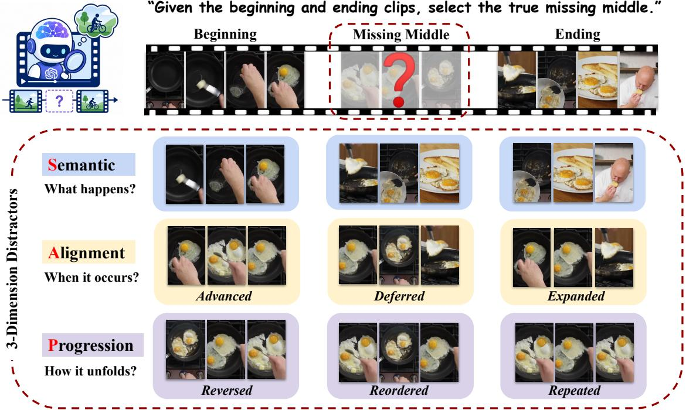  
Figure 1: Overview of TempCloze. Given the beginning and ending clips, models are asked to identify the true missing middle. Distractors are constructed along three dimensions: Semantic, Alignment and Progression.

We construct TempCloze from seven sources covering long-take (Xiong et al., 2024), egocentric (Yang et al., 2026), and fine-grained motion (Tu et al., 2025) videos. After filtering out overlength and low-quality videos, we employ a reasoning LLM to examine their captions and exclude those unsuitable for cloze formatting. We then use optical flow to remove largely static videos (Farnebäck, 2003). The resulting benchmark contains 1,521 videos, each instantiated along three dimensions. We evaluate 10 proprietary and 21 open-source Video-LLMs and observe a consistent bottleneck: while models can identify plausible event content and recognize its progression, they struggle substantially with temporal alignment. Additionally, we construct two auxiliary subsets: TempCloze-Mixed, which mixes distractors across temporal dimensions, and TempCloze-Hard, which consists of the most widely misclassified instances.

We further conduct Error Pattern Analysis and Behavioral Sensitivity Analysis to examine where errors arise and what factors affect model choices. Dimension-specific errors show that Alignment failures are dominated by Expanded, while Progression failures are marked by Reversed. Mixeddimension errors show that Alignment is the most misleading alternative. We also find that selections are unstable under candidate reordering but with relatively stable performance. Furthermore, models rely more on beginning context than ending. They depend strongly on endpoint information, and adding frame density can dilute the information. Test-time scaling brings model-dependent gains, but does not change the relative ordering among dimensions. These analyses offer broader insights into the performance and limitations of visual temporal reasoning in existing Video-LLMs.

Our contributions are summarized as follows:

• We introduce TempCloze, a video cloze benchmark comprising 1,521 videos to evaluate visual temporal reasoning in Video-LLMs. Each video is instantiated with three dimensions: Semantic, Alignment, and Progression.

• We evaluate 10 proprietary and 21 open-source Video-LLMs and identify the Alignment dimension as the main bottleneck.

• We conduct Error Pattern Analysis and Behavioral Sensitivity Analysis, revealing where errors arise and how some factors influence model choices.

## 2 Related Work

## 2.1 Temporal Reasoning Benchmarks

Temporal reasoning benchmarks for video have grown increasingly complex in recent years. One line comes from general video understanding benchmarks that include temporal reasoning as part of a broader evaluation. Early VideoQA datasets such as TGIF-QA (Jang et al., 2017), NExT-QA (Xiao et al., 2021) and ActivityNet-QA (Yu et al., 2019) established this setting with questions about explicit actions and spatio-temporal relations. Recent long-context benchmarks such as LongVideoBench (Wu et al., 2024), MVBench (Li et al., 2024) and VideoMME (Fu et al., 2025) broaden coverage across diverse tasks, requiring evidence aggregation over extended dynamics rather than isolated cues. Another line focuses more directly on temporal structure, with Temporal-Bench (Cai et al., 2024), TVBench (Cores et al., 2025), and TempCompass (Liu et al., 2024) testing event ordering, moment localization, and finegrained motion. However, these benchmarks are still language-mediated. This leaves room for linguistic shortcuts, where models can benefit from surface regularities (Ma et al., 2024; Zhong et al., 2022). TempCloze asks models to identify the missing middle from video candidates, shifting evaluation toward visual temporal reasoning.

Table 1: Composition over 1,521 videos. Left: videos per source; Right: duration distribution in seconds.
<table><tr><td colspan="2">Source</td></tr><tr><td>LVD-2M</td><td>515</td></tr><tr><td>EgoLife</td><td>437</td></tr><tr><td>MiraData</td><td>198</td></tr><tr><td>FAVOR</td><td>145</td></tr><tr><td>CaReBench</td><td>94</td></tr><tr><td>Video-TT</td><td>89</td></tr><tr><td>Daily-Omni</td><td>43</td></tr></table>

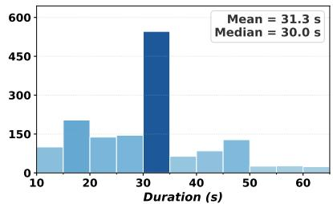

## 2.2 Cloze for Video Understanding

Cloze tasks remove part of a context and infer the missing content (Taylor, 1953). MovieFIB (Maharaj et al., 2017) asks models to fill blanks in movie descriptions and FIBER (Castro et al., 2022) extends this with constituent-level blanks and multiple valid answers. While they evaluate video understanding through textual completion, cloze-style objectives have also been used for video representation learning. VideoBERT (Sun et al., 2019) is an early pre-training method that applies masked prediction to learn temporal correspondences between video and text. VCP (Luo et al., 2020) learns by predicting transformations applied to withheld video clips. MaskFeat (Wei et al., 2023) masks parts of the video input and predicts features of the regions, while VideoMAE (Tong et al., 2022) reconstructs masked video patches for pre-training.

These works demonstrate the value of cloze formatting, but they use it as a training objective. Temp-Cloze instead formulates video cloze for the evaluation of temporal reasoning in Video-LLMs.

## 3 TempCloze

## 3.1 Overview

A video V is defined over the time interval $( 0 , T )$ We use $C _ { a , b }$ to denote the clip spanning interval $( a , b )$ . For a target interval $^ { ( s , e ) }$ , the video can be decomposed into the beginning $\begin{array} { r } { B = C _ { 0 , s } , } \end{array}$ , the middle $M = C _ { s , e } ,$ and the ending $E = C _ { e , T }$

$$
V = [ C _ { 0 , s } \mid C _ { s , e } \mid C _ { e , T } ] = [ B \mid M \mid E ] .
$$

TempCloze instantiates the missing-middle video cloze task. Given the visible context (B,E) and a candidate set $\mathcal { V } _ { d } .$ the model must select the clip that correctly fills the missing interval. For each dimension $d ,$ the candidate set contains the middle M and three distractors:

$$
\mathcal { Y } _ { d } = \{ M , D _ { d } ^ { 1 } , D _ { d } ^ { 2 } , D _ { d } ^ { 3 } \} , \quad d \in \{ S , A , P \} .
$$

Distractors are designed around three dimensions: Semantic (S), Alignment (A), and Progression (P).

## 3.2 Data Sources

We build TempCloze from seven public sources: CaReBench (Xu et al., 2025), Daily-Omni (Zhou et al., 2026), EgoLife (Yang et al., 2026), FAVOR-Bench (Tu et al., 2025), LVD-2M (Xiong et al., 2024), MiraData (Ju et al., 2024), and Video Thinking Test (Zhang et al., 2025b). Long-take sources such as MiraData and LVD-2M and egocentric sources including EgoLife and FAVOR-Bench provide temporally continuous videos that reduce scene-change cues, while the remaining sources broaden the activity domains. Detailed dataset descriptions are provided in Appendix D.1.

## 3.3 Dataset Construction

We construct TempCloze with a pipeline that filters videos efficiently before synthesizing distractors.

## 3.3.1 Video Filtering

Duration and LLM Filtering. We first rely on source metadata to retain videos between 12 and 90 seconds. We leverage temporally dense captions provided by sources such as LVD-2M and MiraData to screen videos before loading the raw files. We then employ the reasoning model GPTo3 (OpenAI, 2025) to assess whether the events are temporally coherent and whether the surrounding context can constrain a missing middle. Videos that are unsuitable for cloze formatting are excluded.

Table 2: Main results on TempCloze. Dimension Accuracy reports Semantic, Alignment, and Progression accuracy; Cumulative Accuracy reports the fraction of videos with at least one, at least two, or all three dimensions correct. Peach, blue, and sage mark the top three; Bold and underlined values mark the best and second-best. Human⋆ Baseline is measured on 100 randomly selected videos, and the detailed protocol is provided in Appendix C.
<table><tr><td colspan="2">Model</td><td colspan="4">Dimension Accuracy (%)</td><td colspan="3">Cumulative Accuracy (%)</td></tr><tr><td>Name</td><td>Think</td><td>S↑</td><td>A↑</td><td>P↑</td><td>Mean↑</td><td>≥1↑</td><td>≥2↑</td><td>3/3↑</td></tr><tr><td colspan="9">Proprietary Models</td></tr><tr><td>Seed1.8</td><td>√</td><td>95.07</td><td>76.92</td><td>93.75</td><td>88.58</td><td>99.54</td><td>95.40</td><td>70.81</td></tr><tr><td>Qwen3.5-Plus</td><td>√</td><td>90.72</td><td>76.32</td><td>90.20</td><td>85.74</td><td>98.75</td><td>91.25</td><td>67.22</td></tr><tr><td>Seed1.8</td><td>x</td><td>96.25</td><td>61.93</td><td>92.11</td><td>83.43</td><td>99.35</td><td>94.02</td><td>56.94</td></tr><tr><td>Gemini2.5-Pro</td><td>V</td><td>90.33</td><td>66.67</td><td>67.78</td><td>74.92</td><td>97.44</td><td>83.49</td><td>43.95</td></tr><tr><td>Gemini2.5-Flash</td><td>x</td><td>82.18</td><td>59.83</td><td>74.82</td><td>72.28</td><td>94.61</td><td>78.17</td><td>44.05</td></tr><tr><td>GPT5.4</td><td>x</td><td>68.11</td><td>37.41</td><td>65.15</td><td>56.89</td><td>89.35</td><td>60.16</td><td>21.17</td></tr><tr><td>Claude4.6-Sonnet</td><td>x</td><td>55.69</td><td>28.80</td><td>70.94</td><td>51.81</td><td>86.12</td><td>52.66</td><td>16.63</td></tr><tr><td>Claude4.6-Opus</td><td>√</td><td>49.47</td><td>39.34</td><td>62.89</td><td>50.57</td><td>81.97</td><td>50.85</td><td>18.88</td></tr><tr><td>Gemini3-Flash</td><td>x</td><td>61.08</td><td>40.37</td><td>48.13</td><td>49.86</td><td>84.09</td><td>49.57</td><td>15.91</td></tr><tr><td>Seed1.6</td><td>x</td><td>64.59</td><td>17.83</td><td>55.40</td><td>45.93</td><td>81.65</td><td>46.68</td><td>9.38</td></tr><tr><td>Grok4.1</td><td>x</td><td>24.52</td><td>24.06</td><td>23.73</td><td>24.11</td><td>57.53</td><td>14.07</td><td>0.72</td></tr><tr><td>Avg.</td><td></td><td>70.73</td><td>48.13</td><td>67.72</td><td>62.19</td><td>88.22</td><td>65.12</td><td>33.24</td></tr><tr><td colspan="9">Open-source Models</td></tr><tr><td>Qwen3.5-397B-A17B</td><td>√</td><td>75.94</td><td>50.62</td><td>78.24</td><td>68.27</td><td>94.54</td><td>74.49</td><td>35.77</td></tr><tr><td>Qwen3.5-35B-A3B</td><td>√</td><td>75.10</td><td>51.55</td><td>69.96</td><td>65.54</td><td>92.33</td><td>70.84</td><td>33.80</td></tr><tr><td>KimiK2.5</td><td>x</td><td>71.27</td><td>41.95</td><td>65.02</td><td>59.41</td><td>89.94</td><td>62.79</td><td>25.51</td></tr><tr><td>Qwen3VL-32B-I</td><td>x</td><td>51.35</td><td>10.91</td><td>63.25</td><td>41.84</td><td>78.70</td><td>41.36</td><td>5.46</td></tr><tr><td>InternVL3.5-38B</td><td>x</td><td>37.81</td><td>32.63</td><td>46.23</td><td>38.96</td><td>70.43</td><td>36.54</td><td>11.35</td></tr><tr><td>Qwen3VL-8B-I</td><td>x</td><td>31.14</td><td>15.06</td><td>45.46</td><td>30.55</td><td>64.49</td><td>23.71</td><td>3.49</td></tr><tr><td>InternVL3.5-8B</td><td>x</td><td>26.30</td><td>28.34</td><td>29.52</td><td>28.05</td><td>60.15</td><td>20.18</td><td>3.81</td></tr><tr><td>InternVL3-38B</td><td>x</td><td>30.31</td><td>20.12</td><td>32.81</td><td>27.74</td><td>59.04</td><td>21.24</td><td>2.96</td></tr><tr><td>KimiVL-A3B-T</td><td>√</td><td>30.17</td><td>25.52</td><td>24.98</td><td>26.91</td><td>62.17</td><td>16.23</td><td>2.17</td></tr><tr><td>Qwen3VL-32B-T</td><td>√</td><td>25.05</td><td>25.38</td><td>25.72</td><td>25.38</td><td>58.76</td><td>15.40</td><td>1.91</td></tr><tr><td>LLaVA-CriticR1-7B</td><td>√</td><td>23.81</td><td>26.90</td><td>25.36</td><td>25.36</td><td>58.22</td><td>16.17</td><td>1.73</td></tr><tr><td>Qwen2.5VL-7B-I</td><td>x</td><td>27.22</td><td>26.22</td><td>24.17</td><td>25.87</td><td>57.93</td><td>17.70</td><td>2.11</td></tr><tr><td>GLM4.6V-Flash</td><td>x</td><td>21.78</td><td>14.71</td><td>39.58</td><td>25.36</td><td>55.64</td><td>17.36</td><td>3.04</td></tr><tr><td>Qwen3VL-4B-T</td><td>√</td><td>27.81</td><td>24.85</td><td>22.95</td><td>25.20</td><td>58.38</td><td>15.58</td><td>1.64</td></tr><tr><td>Qwen3VL-8B-T</td><td>√</td><td>24.65</td><td>25.38</td><td>24.59</td><td>24.87</td><td>57.53</td><td>15.45</td><td>1.64</td></tr><tr><td>ThinkLiteVL-7B</td><td>√</td><td>24.36</td><td>25.79</td><td>23.58</td><td>24.58</td><td>57.80</td><td>14.60</td><td>1.33</td></tr><tr><td>MiMoVL-7B-RL</td><td>x</td><td>20.84</td><td>23.73</td><td>28.80</td><td>24.46</td><td>53.91</td><td>16.70</td><td>2.76</td></tr><tr><td>Qwen3VL-4B-I</td><td>x</td><td>20.38</td><td>19.72</td><td>32.48</td><td>24.19</td><td>54.30</td><td>15.51</td><td>2.76</td></tr><tr><td>KimiVL-A3B-I</td><td>x</td><td>21.09</td><td>26.78</td><td>23.13</td><td>23.67</td><td>52.23</td><td>15.60</td><td>2.75</td></tr><tr><td>MiMoVL-7B-SFT</td><td>x</td><td>23.41</td><td>20.51</td><td>25.77</td><td>23.23</td><td>52.86</td><td>14.60</td><td>2.24</td></tr><tr><td>Molmo2-8B</td><td>x</td><td>24.19</td><td>20.70</td><td>24.73</td><td>23.21</td><td>53.50</td><td>14.25</td><td>1.88</td></tr><tr><td>Avg.</td><td></td><td>34.00</td><td>26.54</td><td>36.97</td><td>32.51</td><td>63.95</td><td>26.49</td><td>7.15</td></tr><tr><td>Human*</td><td>1</td><td>96.00</td><td>98.00</td><td>97.00</td><td>97.00</td><td>100.00</td><td>99.00</td><td>92.00</td></tr><tr><td>Random</td><td>一</td><td>25.00</td><td>25.00</td><td>25.00</td><td>25.00</td><td>57.81</td><td>15.62</td><td>1.56</td></tr><tr><td></td><td></td><td></td><td></td><td></td><td></td><td></td><td></td><td></td></tr></table>

Quality and Motion Filtering. We remove clips with a bitrate below 200 kbps or sharpness below 30. For videos that pass quality checks, we sample a gap from the central 50% of the timeline, with length set to 20%–40% of the full duration. This leaves context on both sides and avoids trivial and underconstrained boundary cases. We validate each gap with Farnebäck optical flow (Farnebäck, 2003), requiring average flow magnitude above 1.0 and resampling up to three times.

These stages preserve video quality while reducing unnecessary loading. After this pipeline, Temp-Cloze retains 1,521 videos. Table 1 summarizes the source and duration statistics. Appendix D.2 provides detailed filtering statistics, and Appendix D.3 reports human validation of filtered-video quality.

## 3.3.2 Distractor Generation

We construct three distractors per dimension. Formal mathematical definitions are in Appendix A. Semantic focuses on the specific content that the missing clip needed to connect. Each distractor is a same-duration clip, $D _ { S } = C _ { u , u + \ell } .$ , where $( u , u + \ell )$ does not overlap $^ { ( s , e ) }$ . Distinguishing them requires identifying the event implied by the context and the core activity of the video.

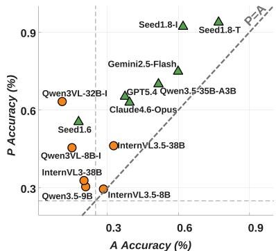  
(a) Progression vs. Alignment

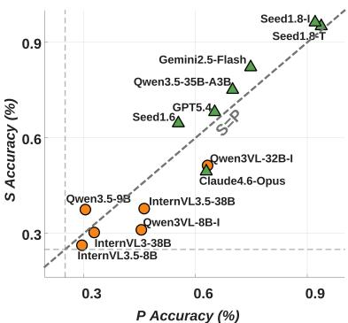  
(b) Semantic vs. Progression

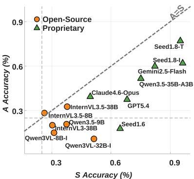  
(c) Alignment vs. Semantic  
Figure 2: Pairwise comparison of dimension-level accuracy on TempCloze across leading models.

Alignment focuses on the temporal compatibility of the missing clip when the content remains plausible. Each distractor is a nearby clip, $D _ { A } = C _ { s ^ { \prime } , e ^ { \prime } } $ where $( s ^ { \prime } , e ^ { \prime } )$ shifts or expands $^ { ( s , e ) }$ . Advanced and Deferred place the candidate before or after the target, while Expanded widens it to include adjacent context from both. Distinguishing them requires sensitivity to temporal boundaries.

Progression focuses on event development of the missing clip when both content and coarse temporal compatibility remain plausible. We use Reversed, Reordered, and Repeated variants: Reversed plays the answer segment backward, Reordered disrupts the local order of subevents, and Repeated duplicates a short subsegment. Distinguishing them requires fine-grained perception of event direction, subevent order, and action continuity.

## 4 Experiments

## 4.1 Setup

## 4.1.1 Models

We evaluate 10 proprietary and 21 open-source models. For models with different versions, we use the suffix T for thinking and I for instruct. Proprietary models are Qwen3.5-Plus (Qwen Team, 2026), Seed1.8 (ByteDance Seed, 2025b), Gemini2.5-Pro, Gemini2.5-Flash (Comanici et al., 2025), GPT5.4 (OpenAI, 2026), Claude4.6-Sonnet, Claude4.6-Opus (Anthropic, 2026), Gemini3- Flash (Google, 2025), Seed1.6 (ByteDance Seed, 2025a), and Grok4.1 (xAI, 2025). Open-source models are Qwen3.5-397B-A17B, Qwen3.5-35B-A3B (Qwen Team, 2026), KimiK2.5 (Team et al., 2026), Qwen3VL-32B-I, Qwen3VL-32B-T, Qwen3VL-8B-T, Qwen3VL-8B-I, Qwen3VL-4B-T, Qwen3VL-4B-I (Bai et al., 2025a), InternVL3.5- 38B, InternVL3.5-8B (Wang et al., 2025a), InternVL3-38B (Zhu et al., 2025), KimiVL-A3B-

T, KimiVL-A3B-I (Kimi Team, 2025), LLaVA-CriticR1-7B (Wang et al., 2025b), Qwen2.5VL-7B-I (Bai et al., 2025b), GLM4.6V-Flash (Z.ai, 2025), ThinkLiteVL-7B (Wang et al., 2025c), MiMoVL-7B-RL, MiMoVL-7B-SFT (Yue et al., 2025), and Molmo2-8B (Clark et al., 2026).

## 4.1.2 Configurations

By default, we uniformly sample 16 frames from each clip, yielding 96 frames per dimension across six clips. Appendix B.1 details the sampling rule. To avoid exact boundary-frame shortcuts, we also conduct a boundary sanity check in Appendix B.2. Open-source models are deployed on A6000 GPUs using vLLM (Kwon et al., 2023).

## 4.1.3 Representative Models and Subsets

For in-depth analysis, we use four representative models: Gemini2.5-Pro, Seed1.6, Qwen3.5-397B-A17B, and Qwen3VL-8B-I. We also construct two auxiliary subsets. TempCloze-Mixed contains a randomly shuffled subset of 300 videos, each with candidates from the ground-truth and S, A, and P. TempCloze-Hard contains the 150 instances with the largest number of errors across models.

## 4.2 Main Results

Table 2 presents the main results for both proprietary and open-source models. We provide the full leaderboard in Figure 8 and report sourcelevel statistics for Gemini2.5-Pro and Qwen3.5- 35B-A3B in Appendix E.

Dimension accuracy. On Semantic, proprietary models average 70.73%, led by Seed1.8 at 96.25%. Open-source models average 34.00%. Nevertheless, Qwen3.5-397B reaches 75.94%, showing that the strongest open-source systems can approach proprietary-level Semantic performance. A similar group-level gap appears on Progression, where proprietary models average 67.72% and open-source models average 36.97%. Qwen3.5-397B reaches 78.24%, indicating that stronger open-source models can identify local event order. Alignment is substantially harder. Proprietary models drop to 48.13% on average, while open-source models drop to 26.54%. Even the strongest scores, 76.92% for Seed1.8 and 51.55% for Qwen3.5-35B, are well below the 98.00% Human Baseline. Alignment is the primary bottleneckfor visual temporal reasoning in current Video-LLMs. Models are better at recognizing plausible event content and local progression than at judging exactly when an event should occur relative to the observed endpoints.

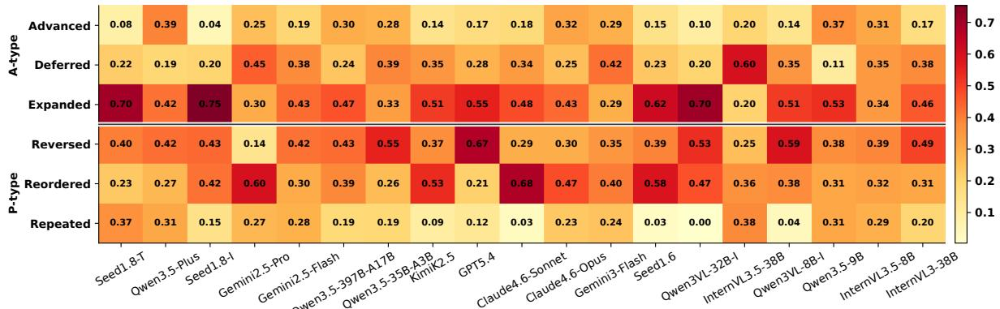  
Figure 3: Error proportions for alignment and progression distractors. Darker cells indicate higher error rates.

Table 3: TempCloze-Mixed error attribution (%). The Alignment and Progression options are each randomly sampled from one of three designed variants.
<table><tr><td>Model</td><td>Acc.</td><td>S</td><td>A</td><td>P</td></tr><tr><td>Gemini2.5-Pro</td><td>76.3</td><td>2.7</td><td>19.7</td><td>1.3</td></tr><tr><td>Seed1.6</td><td>68.9</td><td>7.0</td><td>14.7</td><td>9.4</td></tr><tr><td>Qwen3.5-397B-A17B</td><td>62.0</td><td>9.0</td><td>20.3</td><td>8.7</td></tr><tr><td>Qwen3VL-8B-I</td><td>24.0</td><td>29.3</td><td>37.3</td><td>9.3</td></tr></table>

To further examine dimension-level behavior, Figure 2 compares leading models across pairs. Two panels involving Alignment reinforce the pattern raised, as most models score lower on Alignment than the paired dimension. A notable observation emerges from the S–P panel. Open-source models have low absolute scores but perform better on Progression than Semantic, suggesting that local motion continuity can support a basic Progression score. By contrast, proprietary models sit at higher scores and favor Semantic over Progression, indicating that high Progression accuracy requires stronger temporal understanding. We report joint accuracy for dimension pairs in Appendix F.1.

Cumulative accuracy. Cumulative results shift the view from dimensions to full-video understanding. We interpret $\geq 1$ as limited understanding, $\geq 2$ as sufficient understanding, and 3/3 as complete understanding. Proprietary models show a meaningful level of sufficient understanding, averaging 65.12% on $\geq 2$ and reaching 95.40% for the best model. However, complete understanding is harder. The proprietary average drops to 33.24% on 3/3, and even the best model reaches only 70.81%, far below the 92.00% Human Baseline. Open-source models show a more limited level of sufficient understanding. Even the strongest one reaches only 74.49% on ≥2 and 35.77% on 3/3, indicating that open-source models have not yet reached sufficient understanding. Overall, current Video-LLMs remain short of complete video understanding that requires robust visual temporal reasoning. We provide a video-level breakdown in Appendix F.2.

Table 4: Effect of candidate order permutation on TempCloze-Hard across representative models. Disp. denotes accuracy dispersion. FR denotes Flip Rate, and CFR denotes Clip Flip Rate. All values are percentages.
<table><tr><td>Model</td><td>Dim.</td><td>Mean</td><td>Range</td><td>Disp.</td><td>FR</td><td>CFR</td></tr><tr><td rowspan="4">Gemini2.5 -Pro</td><td>S</td><td>70.0</td><td>9.3</td><td>3.9</td><td>30.2</td><td>36.9</td></tr><tr><td>A</td><td>41.2</td><td>6.0</td><td>2.6</td><td>41.9</td><td>64.6</td></tr><tr><td>P</td><td>49.7</td><td>10.0</td><td>3.7</td><td>48.4</td><td>64.8</td></tr><tr><td>All</td><td>53.6</td><td>3.8</td><td>1.5</td><td>40.2</td><td>55.4</td></tr><tr><td rowspan="4">Seed1.6</td><td>S</td><td>76.8</td><td>6.0</td><td>2.4</td><td>18.8</td><td>22.0</td></tr><tr><td>A</td><td>33.7</td><td>1.3</td><td>0.6</td><td>34.9</td><td>48.4</td></tr><tr><td>P</td><td>81.8</td><td>6.7</td><td>2.4</td><td>24.3</td><td>26.8</td></tr><tr><td>All</td><td>64.1</td><td>2.7</td><td>0.9</td><td>26.0</td><td>32.4</td></tr><tr><td rowspan="4">Qwen3.5 -397B -A17B</td><td>S</td><td>61.1</td><td>8.8</td><td>3.2</td><td>31.2</td><td>40.2</td></tr><tr><td>A</td><td>39.1</td><td>10.1</td><td>3.9</td><td>36.6</td><td>56.9</td></tr><tr><td>P</td><td>64.3</td><td>10.1</td><td>4.1</td><td>36.4</td><td>44.2</td></tr><tr><td>All</td><td>54.8</td><td>3.1</td><td>1.2</td><td>34.7</td><td>47.2</td></tr><tr><td rowspan="4">Qwen3VL -8B-I</td><td>S</td><td>7.4</td><td>4.7</td><td>1.7</td><td>11.5</td><td>51.2</td></tr><tr><td>A</td><td>11.7</td><td>6.0</td><td>2.3</td><td>20.6</td><td>66.1</td></tr><tr><td>P</td><td>37.4</td><td>4.7</td><td>1.9</td><td>45.5</td><td>64.8</td></tr><tr><td>All</td><td>18.9</td><td>1.8</td><td>0.8</td><td>25.9</td><td>60.7</td></tr></table>

## 4.3 Error Pattern Analysis

## 4.3.1 Dimension-Specific Errors

Because Alignment and Progression use controlled temporal edits rather than random clips, Figure 3 analyzes their error patterns. The resulting errors are structured rather than random. For Alignment, Expanded is the most prominent signature. The selected clip contains the correct event content but extends both before and after the target interval. For example, Seed1.8-I selects Expanded in 75% of its Alignment errors. For Progression, Reversed is the strongest failure mode. GPT-5.4 selects Reversed in 67% of its Progression errors. These two errors share visual plausibility, as models select clips whose content still appears relevant in the surrounding video while failing at temporal boundaries or at the directional order of event development.

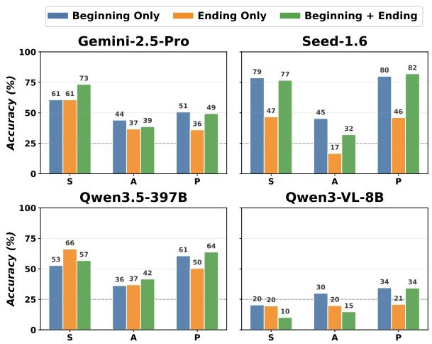  
Figure 4: Effect of context direction ablation on TempCloze-Hard across representative models.

## 4.3.2 Mixed-Dimension Errors

Table 3 reports accuracy together with the share of each distractor dimension on TempCloze-Mixed. Across models, Alignment receives the highest error share. This makes Alignment the most distracting dimension, echoing the finding raised in Section 4.2 that Alignment is the primary bottleneck. A counterintuitive pattern is that Semantic can be more distracting than Progression, even though models generally achieve slightly higher Semantic accuracy than Progression accuracy in Table 2. This suggests that incorrect progression is easier to reject than an incorrect event. Beyond dimension shares, the accuracy drop indicates that competition across dimensions is harder than evaluating a single dimension. Although this setting reduces the diagnostic separation within individual dimensions, it shows that models have substantial room to improve in visual temporal reasoning, and reveals failures hidden by marginal accuracy alone.

## 4.4 Behavioral Sensitivity Analysis

On TempCloze-Hard, we examine how multiple factors affect representative models.

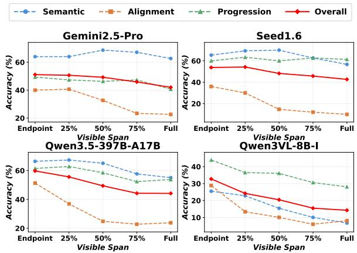  
Figure 5: Effect of visible span scaling on TempCloze-Hard across representative models.

## 4.4.1 Candidate Order Permutation

As shown in Table 4, we evaluate the effect of candidate order by testing four candidate permutations per instance at temperature 0. FR is the share of instances for which the correctness changes at least once and CFR is the share for which the selected clip changes at least once. Mean accuracy changes little, with variance below 4 points for every model, but both instability measures remain substantial: CFR ranges from 32.4% to 60.7%, and FR ranges from 25.9% to 40.2%. This indicates that stable accuracy can hide unstable choices. Another consistent pattern is that Alignment and Progression are generally less stable than Semantic, suggesting that visual temporal reasoning is sensitive to candidate order when candidates are visually similar but temporally distinct. This is expected because content differences are salient, whereas timing and progression differences are subtler.

## 4.4.2 Context Direction Ablation

Figure 4 examines which part of the visible context plays a stronger role in model decisions. We observe that ending-only is often the weakest, while beginning-only frequently approaches or exceeds the performance of both contexts. For example, Seed-1.6 reaches 80% on Progression with beginning-only, close to 82% with both, but drops to 46% with ending-only. The asymmetry suggests that models rely more on forward continuation cues than backward inference. This may reflect forward ordered pretraining traces, which bias inference in the same direction. Consequently, jointly considering information from both directions remains a difficulty for visual temporal reasoning.

## 4.4.3 Visible Span Scaling

Figure 5 studies how performance changes as the visible span expands from endpoint frames to full context. Alignment drops sharply for all models, since its evidence lies near the missing gap boundaries and longer spans dilute these cues. For Semantic and Progression, stronger models stay stable or improve slightly at short spans before declining mildly, while weaker models degrade much more clearly. This pattern suggests that longer context is double-edged: it adds temporal evidence for event-level reasoning but can distract models from the most diagnostic frames. Current Video-LLMs still need stronger mechanisms for integrating longrange context and selecting critical frames.

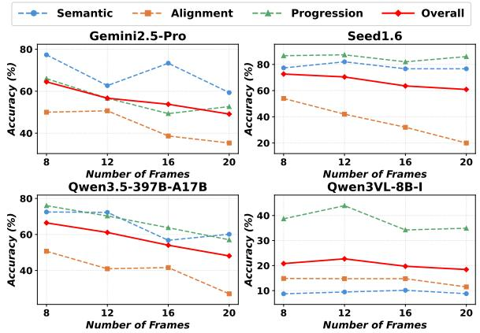  
Figure 6: Effect of sampling density scaling on TempCloze-Hard across representative models.

## 4.4.4 Sampling Density Scaling

Figure 6 studies how performance changes as sampling density increases from 8 to 20 frames per clip. The pattern is similar to visible span scaling: stronger models are more likely to preserve or slightly improve Semantic and Progression, while Alignment declines across models. This suggests that higher sampling density does not automatically provide richer evidence for Video-LLMs. Instead, dense similar frames can add confusion and reduce attention to temporally decisive cues. Exploring video native architectures that do not treat videos as sequences of images may be a promising direction for exploiting dense temporal evidence.

## 4.4.5 Test-Time Scaling

Figure 7 explores the test-time performance upper bound at temperature 0.7. Pass@k counts an instance as solved if any of k sampled attempts is correct. All models improve with more attempts, but the gain varies substantially. Gemini2.5-Pro and Qwen3.5-397B-A17B show the largest gains, with Overall pass@k rising by roughly 30 points from k = 1 to k = 5. This suggests that their predictions are more unstable, consistent with Table 4, where their Disp. values are higher (1.5 and 1.2)

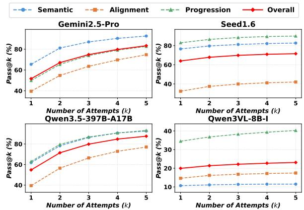  
Figure 7: Effect of test-time scaling on TempCloze-Hard across representative models.

than those of Seed1.6 and Qwen3VL-8B-I (0.9 and 0.8). However, extra attempts do not change the relative ordering among dimensions: Alignment remains the lowest as the bottleneck while Semantic and Progression vary by model.

## 5 Conclusion

TempCloze evaluates visual temporal reasoning by requiring models to identify the missing middle from surrounding clips, instead of reasoning over natural-language descriptions. Across 1,521 videos, it builds same-source candidates along three dimensions: Semantic targets what event should happen, Alignment probes when it should occur, and Progression tests how it should unfold. Because candidates share scenes and objects, TempCloze limits appearance shortcuts and tests temporal evidence among visually similar options.

Results expose an uneven boundary in Video-LLMs. Many models identify Semantic content and event Progression, but temporal Alignment remains the bottleneck: models struggle to place the missing middle precisely between endpoints, while humans solve the task reliably. Error and sensitivity analyses reveal a finer-grained picture. Within dimensions, failures often choose clips with plausible content but incompatible temporal structure. Across dimensions, Alignment is the most confusing. Models remain sensitive to presentation order and context direction, showing that current gains do not reflect stable reasoning. Even with test-time scaling,the relative ordering is largely unchanged and keeps Alignment as the hardest.

Looking forward, Video-LLMs need video native mechanisms that integrate both temporal directions, select key evidence, and represent temporal structure explicitly. Future benchmarks should focus on visual temporal reasoning in longer videos while controlling linguistic shortcuts.

## Limitations

TempCloze is a controlled diagnostic benchmark for missing-middle identification, rather than a complete measure of all video understanding abilities. Its design focuses on visually grounded temporal fit between the observed beginning and ending clips. It therefore does not directly cover open-ended generation, dialogue-based narrative understanding, audio-grounded inference, or unconstrained future prediction. The fixed candidate format also means that performance should be interpreted with respect to the designed alternatives, rather than as a general measure of free-form video reasoning.

All candidates are drawn from the same source video to reduce appearance shortcuts and keep alternatives visually plausible. This choice makes the task stricter: TempCloze measures exact temporal compatibility, not only broad event plausibility. In particular, Alignment distractors may contain relevant content while still failing to match the removed interval. Such cases are intentional, as they test whether models can identify the correct temporal span instead of selecting a generally plausible continuation.

Our model results should be viewed as a snapshot of current Video-LLMs. APIs, decoding behavior, and video input limits can change over time. TempCloze also draws from public sources that emphasize long-take, egocentric, and fine-grained motion videos, which supports temporal comparison but cannot cover every domain or camera style. Future extensions can broaden video domains and modalities while preserving the same visual candidate-comparison principle.

## LLM Usage Statement

Central to our methodology, multiple Large Language Models (LLMs) served as the subjects of our experiments to test our proposed benchmark. We explicitly state that we have never relied on LLMs to generate core research ideas, methodologies, experimental designs, or conclusions. All technical contributions and analyses presented are the original work of the authors.

## References

Anthropic. 2026. Introducing Claude Opus 4.6.

Shuai Bai, Yuxuan Cai, and 1 others. 2025a. Qwen3-VL technical report. arXiv preprint arXiv:2511.21631.

Shuai Bai, Keqin Chen, and 1 others. 2025b. Qwen2.5-VL technical report. arXiv preprint arXiv:2502.13923.

Nishant Balepur, Abhilasha Ravichander, and Rachel Rudinger. 2024. Artifacts or abduction: How do llms answer multiple-choice questions without the question? Preprint, arXiv:2402.12483.

ByteDance Seed. 2025a. Introduction to techniques used in Seed1.6.

ByteDance Seed. 2025b. Official release of Seed1.8: A generalized agentic model. Accessed 2026-03-21.

Mu Cai, Reuben Tan, Jianrui Zhang, Bocheng Zou, Kai Zhang, Feng Yao, Fangrui Zhu, Jing Gu, Yiwu Zhong, Yuzhang Shang, Yao Dou, Jaden Park, Jianfeng Gao, Yong Jae Lee, and Jianwei Yang. 2024. Temporalbench: Benchmarking fine-grained temporal understanding for multimodal video models. Preprint, arXiv:2410.10818.

Santiago Castro, Ruoyao Wang, Pingxuan Huang, Ian Stewart, Oana Ignat, Nan Liu, Jonathan C. Stroud, and Rada Mihalcea. 2022. Fiber: Fill-in-the-blanks as a challenging video understanding evaluation framework. Preprint, arXiv:2104.04182.

Christopher Clark, Jieyu Zhang, and 1 others. 2026. Molmo2: Open weights and data for vision-language models with video understanding and grounding. arXiv preprint arXiv:2601.10611.

Gheorghe Comanici, Eric Bieber, Mike Schaekermann, Ice Pasupat, Noveen Sachdeva, Inderjit Dhillon, Marcel Blistein, Ori Ram, Dan Zhang, Evan Rosen, Luke Marris, Sam Petulla, Colin Gaffney, Asaf Aharoni, Nathan Lintz, Tiago Cardal Pais, Henrik Jacobsson, Idan Szpektor, Nan-Jiang Jiang, and 3416 others. 2025. Gemini 2.5: Pushing the frontier with advanced reasoning, multimodality, long context, and next generation agentic capabilities. Preprint, arXiv:2507.06261.

Daniel Cores, Michael Dorkenwald, Manuel Mucientes, Cees G. M. Snoek, and Yuki M. Asano. 2025. Lost in time: A new temporal benchmark for videollms. Preprint, arXiv:2410.07752.

Gunnar Farnebäck. 2003. Two-frame motion estimation based on polynomial expansion. In Scandinavian Conference on Image Analysis.

Chaoyou Fu, Yuhan Dai, Yongdong Luo, Lei Li, Shuhuai Ren, Renrui Zhang, Zihan Wang, Chenyu Zhou, Yunhang Shen, Mengdan Zhang, Peixian Chen, Yanwei Li, Shaohui Lin, Sirui Zhao, Ke Li, Tong Xu, Xiawu Zheng, Enhong Chen, Caifeng Shan, and 2 others. 2025. Video-mme: The first-ever comprehensive evaluation benchmark of multi-modal llms in video analysis. Preprint, arXiv:2405.21075.

Google. 2025. Gemini 3 Flash Preview.

Yunseok Jang, Yale Song, Youngjae Yu, Youngjin Kim, and Gunhee Kim. 2017. Tgif-qa: Toward spatiotemporal reasoning in visual question answering. Preprint, arXiv:1704.04497.

Xuan Ju, Yiming Gao, Zhaoyang Zhang, Ziyang Yuan, Xintao Wang, Ailing Zeng, Yu Xiong, Qiang Xu, and Ying Shan. 2024. Miradata: A large-scale video dataset with long durations and structured captions. Preprint, arXiv:2407.06358.

Kimi Team. 2025. Kimi-VL technical report. arXiv preprint arXiv:2504.07491.

Woosuk Kwon, Zhuohan Li, Siyuan Zhuang, Ying Sheng, Lianmin Zheng, Cody Hao Yu, Joseph E. Gonzalez, Hao Zhang, and Ion Stoica. 2023. Efficient memory management for large language model serving with pagedattention. Preprint, arXiv:2309.06180.

Jie Lei, Licheng Yu, Mohit Bansal, and Tamara L. Berg. 2019. Tvqa: Localized, compositional video question answering. Preprint, arXiv:1809.01696.

Junnan Li, Dongxu Li, Silvio Savarese, and Steven Hoi. 2023. Blip-2: Bootstrapping language-image pretraining with frozen image encoders and large language models. Preprint, arXiv:2301.12597.

Kunchang Li, Yali Wang, Yinan He, Yizhuo Li, Yi Wang, Yi Liu, Zun Wang, Jilan Xu, Guo Chen, Ping Luo, Limin Wang, and Yu Qiao. 2024. Mvbench: A comprehensive multimodal video understanding benchmark. Preprint, arXiv:2311.17005.

Yuanxin Liu, Shicheng Li, Yi Liu, Yuxiang Wang, Shuhuai Ren, Lei Li, Sishuo Chen, Xu Sun, and Lu Hou. 2024. Tempcompass: Do video llms really understand videos? Preprint, arXiv:2403.00476.

Dezhao Luo, Chang Liu, Yu Zhou, Dongbao Yang, Can Ma, Qixiang Ye, and Weiping Wang. 2020. Video cloze procedure for self-supervised spatio-temporal learning. Preprint, arXiv:2001.00294.

Jie Ma, Pinghui Wang, Dechen Kong, Zewei Wang, Jun Liu, Hongbin Pei, and Junzhou Zhao. 2024. Robust visual question answering: Datasets, methods, and future challenges. Preprint, arXiv:2307.11471.

Muhammad Maaz, Hanoona Rasheed, Salman Khan, and Fahad Shahbaz Khan. 2024. Video-chatgpt: Towards detailed video understanding via large vision and language models. Preprint, arXiv:2306.05424.

Tegan Maharaj, Nicolas Ballas, Anna Rohrbach, Aaron Courville, and Christopher Pal. 2017. A dataset and exploration of models for understanding video data through fill-in-the-blank question-answering. Preprint, arXiv:1611.07810.

Jiahao Meng, Xiangtai Li, Haochen Wang, Yue Tan, Tao Zhang, Lingdong Kong, Yunhai Tong, Anran Wang, Zhiyang Teng, Yujing Wang, and 1 others.

2025. Open-o3-video: Grounded video reasoning with explicit spatio-temporal evidence. arXiv preprint arXiv:2510.20579.

Jiahao Meng, Yue Tan, Qi Xu, Kuan Gao, Weisong Liu, Yanwei Li, Jason Li, Lingdong Kong, Haochen Wang, Qianyu Zhou, and 1 others. 2026a. Watch, remember, reason: Human-view video understanding with mllms. arXiv preprint arXiv:2606.07433.

Jiahao Meng, Tan Yue, Qi Xu, Haochen Wang, Zhongwei Ren, Weisong Liu, Yuhao Wang, Renrui Zhang, Yunhai Tong, and Haodong Duan. 2026b. Videozerobench: Probing the limits of video mllms with spatio-temporal evidence verification. arXiv preprint arXiv:2604.01569.

OpenAI. 2025. Introducing openai o3 and o4-mini. Preprint.

OpenAI. 2026. Introducing GPT-5.4.

Qwen Team. 2026. Qwen3.5: Towards native multimodal agents.

Chen Sun, Austin Myers, Carl Vondrick, Kevin Murphy, and Cordelia Schmid. 2019. Videobert: A joint model for video and language representation learning. Preprint, arXiv:1904.01766.

Wilson L. Taylor. 1953. “cloze procedure”: A new tool for measuring readability. Journalism & Mass Communication Quarterly, 30:415 – 433.

Kimi Team, Tongtong Bai, Yifan Bai, Yiping Bao, S. H. Cai, Yuan Cao, Y. Charles, H. S. Che, Cheng Chen, Guanduo Chen, Huarong Chen, Jia Chen, Jiahao Chen, Jianlong Chen, Jun Chen, Kefan Chen, Liang Chen, Ruijue Chen, Xinhao Chen, and 307 others. 2026. Kimi k2.5: Visual agentic intelligence. Preprint, arXiv:2602.02276.

Zhan Tong, Yibing Song, Jue Wang, and Limin Wang. 2022. Videomae: Masked autoencoders are data-efficient learners for self-supervised video pretraining. Preprint, arXiv:2203.12602.

Chongjun Tu, Lin Zhang, Pengtao Chen, Peng Ye, Xianfang Zeng, Wei Cheng, Gang Yu, and Tao Chen. 2025. Favor-bench: A comprehensive benchmark for fine-grained video motion understanding. Preprint, arXiv:2503.14935.

Weiyun Wang, Zhangwei Gao, and 1 others. 2025a. InternVL3.5: Advancing open-source multimodal models in versatility, reasoning, and efficiency. arXiv preprint arXiv:2508.18265.

Xiyao Wang, Chunyuan Li, Jianwei Yang, Kai Zhang, Bo Liu, Tianyi Xiong, and Furong Huang. 2025b. LLaVA-Critic-R1: Your critic model is secretly a strong policy model. arXiv preprint arXiv:2509.00676.

Xiyao Wang, Zhengyuan Yang, Chao Feng, Hongjin Lu, Linjie Li, Chung-Ching Lin, Kevin Lin, Furong Huang, and Lijuan Wang. 2025c. Sota with less: MCTS-guided sample selection for data-efficient visual reasoning self-improvement. arXiv preprint arXiv:2504.07934.

Chen Wei, Haoqi Fan, Saining Xie, Chao-Yuan Wu, Alan Yuille, and Christoph Feichtenhofer. 2023. Masked feature prediction for self-supervised visual pre-training. Preprint, arXiv:2112.09133.

Haoning Wu, Dongxu Li, Bei Chen, and Junnan Li. 2024. Longvideobench: A benchmark for longcontext interleaved video-language understanding. Preprint, arXiv:2407.15754.

xAI. 2025. Grok 4.1 model card. Technical report, xAI.

Junbin Xiao, Xindi Shang, Angela Yao, and Tat-Seng Chua. 2021. Next-qa:next phase of questionanswering to explaining temporal actions. Preprint, arXiv:2105.08276.

Junbin Xiao, Angela Yao, Yicong Li, and Tat Seng Chua. 2024. Can i trust your answer? visually grounded video question answering. Preprint, arXiv:2309.01327.

Tianwei Xiong, Yuqing Wang, Daquan Zhou, Zhijie Lin, Jiashi Feng, and Xihui Liu. 2024. Lvd-2m: A longtake video dataset with temporally dense captions. Preprint, arXiv:2410.10816.

Qi Xu, Yue Tan, Shihao Chen, Jiahao Meng, Anna Wang, Shunping Ji, Hao Fei, and Jason Li. 2026. Towards one-to-many temporal grounding. arXiv preprint arXiv:2606.06294.

Yifan Xu, Xinhao Li, Yichun Yang, Desen Meng, Rui Huang, and Limin Wang. 2025. Carebench: A finegrained benchmark for video captioning and retrieval. Preprint, arXiv:2501.00513.

Jianing Yang, Yuying Zhu, Yongxin Wang, Ruitao Yi, Amir Zadeh, and Louis-Philippe Morency. 2020. What gives the answer away? question answering bias analysis on video qa datasets. Preprint, arXiv:2007.03626.

Jingkang Yang, Shuai Liu, Hongming Guo, Yuhao Dong, Xiamengwei Zhang, Sicheng Zhang, Pengyun Wang, Zitang Zhou, Binzhu Xie, Ziyue Wang, Bei Ouyang, Zhengyu Lin, Marco Cominelli, Zhongang Cai, Yuanhan Zhang, Peiyuan Zhang, Fangzhou Hong, Joerg Widmer, Francesco Gringoli, and 3 others. 2026. Egolife: Towards egocentric life assistant. Preprint, arXiv:2503.03803.

Zhou Yu, Dejing Xu, Jun Yu, Ting Yu, Zhou Zhao, Yueting Zhuang, and Dacheng Tao. 2019. Activitynet-qa: A dataset for understanding complex web videos via question answering. Preprint, arXiv:1906.02467.

Zihao Yue and 1 others. 2025. MiMo-VL technical report. arXiv preprint arXiv:2506.03569.

Z.ai. 2025. GLM-4.6V.

Xuan Zhang, Ziyan Jiang, Rui Meng, Yifei Leng, Zhenbang Xiao, Zora Zhiruo Wang, Yanyi Shang, and Dehan Kong. 2025a. Universal retrieval for multimodal trajectory modeling. Preprint, arXiv:2506.22056.

Yuanhan Zhang, Yunice Chew, Yuhao Dong, Aria Leo, Bo Hu, and Ziwei Liu. 2025b. Towards video thinking test: A holistic benchmark for advanced video reasoning and understanding. Preprint, arXiv:2507.15028.

Henry Hengyuan Zhao, Wenqi Pei, Yifei Tao, Haiyang Mei, and Mike Zheng Shou. 2025. Interfeedback: Unveiling interactive intelligence of large multimodal models via human feedback. Preprint, arXiv:2502.15027.

Yaoyao Zhong, Wei Ji, Junbin Xiao, Yicong Li, Wei Deng, and Tat seng Chua. 2022. Video question answering: Datasets, algorithms and challenges.

Ziwei Zhou, Rui Wang, Zuxuan Wu, and Yu-Gang Jiang. 2026. Daily-omni: Towards audio-visual reasoning with temporal alignment across modalities. Preprint, arXiv:2505.17862.

Jinguo Zhu, Weiyun Wang, and 1 others. 2025. InternVL3: Exploring advanced training and test-time recipes for open-source multimodal models. arXiv preprint arXiv:2504.10479.

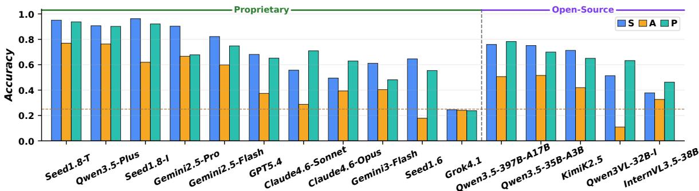  
Figure 8: Top metrics of proprietary and open-source models on TempCloze.

## A Distractor Formalization

Using the notation in Section 3, we define the distractors below. All intervals are valid source-video subclips. The ground-truth interval $( s , e )$ lies in the central 50% of the video and has duration $\ell =$ $e - s \in [ 0 . 2 T , 0 . 4 T ]$ . Advanced and Deferred shift it by $\ell / 2 ,$ while Expanded extends it by $\ell / 2$ on each side; hence $\delta = \delta _ { 1 } = \delta _ { 2 } = \ell / 2 \in [ 0 . 1 T , 0 . 2 T ]$ preserving context on both sides.

Semantic distractors are same-duration clips outside the missing interval:

$$
\begin{array} { r c l } { { D _ { S } ^ { i } } } & { { = } } & { { C _ { u _ { i } , u _ { i } + \ell } , } } \\ { { } } & { { } } & { { } } \\ { { ( u _ { i } , u _ { i } + \ell ) \cap ( s , e ) } } & { { = } } & { { \emptyset . } } \end{array}
$$

Alignment distractors stay near the target but perturb its boundaries:

$$
\begin{array} { r c l } { { { \cal D } _ { A } ^ { \mathrm { a d v a n c e d } } } } & { { = } } & { { C _ { s - \delta , e - \delta } , } } \\ { { } } & { { } } & { { { \cal D } _ { A } ^ { \mathrm { d e f e r r e d } } } } \\ { { } } & { { } } & { { } } \\ { { { \cal D } _ { A } ^ { \mathrm { e x p a n d e d } } } } & { { = } } & { { C _ { s + \delta , e + \delta } , } } \end{array}
$$

The sampling procedure retains only perturbations whose intervals remain inside the source video.

Progression distractors alter the target span’s internal order. For reorder, $J _ { 1 } , \ldots , J _ { m }$ partitions $^ { ( s , e ) }$ and π permutes $\{ 1 , \ldots , m \}$ ; for repeat, $J \subset$ $^ { ( s , e ) }$ is a short subinterval:

$$
\begin{array} { r c l } { { { \cal D } _ { P } ^ { \mathrm { r e v } } } } & { { = } } & { { \mathrm { r e v e r s e } ( C _ { s , e } ) , } } \\ { { } } & { { } } & { { } } \\ { { { \cal D } _ { P } ^ { \mathrm { r e o r d e r } } } } & { { = } } & { { \mathrm { c o n c a t } _ { k = 1 } ^ { m } C _ { J _ { \pi ( k ) } } , } } \\ { { } } & { { } } & { { } } \\ { { { \cal D } _ { P } ^ { \mathrm { r e p e a t } } } } & { { = } } & { { \mathrm { t r i m } _ { \ell } ( C _ { J } \mid C _ { J } \mid \cdots ) . } } \end{array}
$$

## B Frame Sampling

## B.1 Bin-Centered Sampling

For each input clip, we divide the interval (a,b) into n equal bins and sample each bin center:

$$
t _ { i } = a + \left( i + { \frac { 1 } { 2 } } \right) { \frac { b - a } { n } } , i = 0 , \ldots , n - 1 .
$$

Decoded frames are selected from these timestamps. Unlike endpoint-inclusive sampling, this keeps the first and last samples inside the clip rather than exactly at a or b. This reduces boundary-frame leakage, since visible context clips meet the missing middle at exact temporal boundaries and some candidates touch or overlap those boundaries.

## B.2 Boundary Sanity Checks

## B.2.1 Exact Boundary-Frame Matches

We test whether each candidate’s first or last 1–3 sampled frames exactly match the adjacent context boundary. Across 1,521 videos per dimension and 18,252 candidate clips, Table 5 shows zero matches.

Table 5: Exact boundary-frame matches in sampled candidates.
<table><tr><td rowspan="2">Dimension</td><td rowspan="2">Clips</td><td colspan="3">Begin-side</td><td colspan="3">End-side</td></tr><tr><td>1f</td><td>2f</td><td>3f</td><td>1f</td><td>2f</td><td>3f</td></tr><tr><td>S</td><td>6084</td><td>0</td><td>0</td><td>0</td><td>0</td><td>0</td><td>0</td></tr><tr><td>A</td><td>6084</td><td>0</td><td>0</td><td>0</td><td>0</td><td>0</td><td>0</td></tr><tr><td>P</td><td>6084</td><td>0</td><td>0</td><td>0</td><td>0</td><td>0</td><td>0</td></tr><tr><td>Overall</td><td>18252</td><td>0</td><td>0</td><td>0</td><td>0</td><td>0</td><td>0</td></tr></table>

## B.2.2 Edge Baseline

Edge-1 uses each candidate’s first and last frame; Edge-4 uses its first and last four. We average DINOv2 similarities between candidate edges and adjacent context frames, then normalize the four scores into probabilities.

Table 7 reports mean ground-truth probabilities for Semantic, Alignment, and Progression; Mean averages them and is not top-1 accuracy. Values only slightly above the uniform 25% show that edges can occasionally be decisive but are not substantial overall.

## B.2.3 Single-Frame Baseline

For Seed1.8 and Gemini2.5-Pro, we represent every beginning, ending, and candidate clip by its

Table 6: Joint accuracy and video-level breakdown on TempCloze. Joint columns count videos where the listed dimensions are all correct; 0/3–3/3 count exact numbers of correct dimensions. The $S { + } A { + } P$ column equals 3/3.
<table><tr><td colspan="2">Model</td><td colspan="4">Joint Accuracy (%)</td><td colspan="4">Video-Level Breakdown (%)</td></tr><tr><td>Name</td><td>Think</td><td>S+A↑</td><td> $S { + } P \uparrow$ </td><td>A+P↑</td><td> $S { + } A { + } P \uparrow$ </td><td>0/3</td><td>1/3</td><td>2/3</td><td>3/3</td></tr><tr><td colspan="10">Proprietary Models</td></tr><tr><td>Seed1.8</td><td>√</td><td>74.88</td><td>89.55</td><td>72.58</td><td>70.81</td><td>0.46</td><td>4.14</td><td>24.59</td><td>70.81</td></tr><tr><td>Qwen3.5-Plus</td><td>S</td><td>71.23</td><td>82.88</td><td>71.56</td><td>67.22</td><td>1.25</td><td>7.50</td><td>24.03</td><td>67.22</td></tr><tr><td>Seed1.8</td><td>x</td><td>60.82</td><td>89.15</td><td>57.92</td><td>56.94</td><td>0.66</td><td>5.33</td><td>37.08</td><td>56.94</td></tr><tr><td>Gemini2.5-Pro</td><td>V</td><td>62.76</td><td>62.17</td><td>46.45</td><td>43.95</td><td>2.57</td><td>13.95</td><td>39.54</td><td>43.95</td></tr><tr><td>Gemini2.5-Flash</td><td>x</td><td>52.99</td><td>64.89</td><td>48.39</td><td>44.05</td><td>5.39</td><td>16.44</td><td>34.12</td><td>44.05</td></tr><tr><td>GPT5.4</td><td>x</td><td>29.85</td><td>47.01</td><td>25.64</td><td>21.17</td><td>10.65</td><td>29.19</td><td>38.99</td><td>21.17</td></tr><tr><td>Claude4.6-Sonnet</td><td>x</td><td>21.04</td><td>42.21</td><td>22.68</td><td>16.63</td><td>13.87</td><td>33.46</td><td>36.03</td><td>16.63</td></tr><tr><td>Claude4.6-Opus</td><td>√</td><td>25.79</td><td>35.39</td><td>27.43</td><td>18.88</td><td>18.03</td><td>31.12</td><td>31.97</td><td>18.88</td></tr><tr><td>Gemini3-Flash</td><td>x</td><td>27.74</td><td>31.89</td><td>21.76</td><td>15.91</td><td>15.91</td><td>34.52</td><td>33.66</td><td>15.91</td></tr><tr><td>Seed1.6</td><td>x</td><td>13.63</td><td>40.16</td><td>11.64</td><td>9.38</td><td>18.35</td><td>34.97</td><td>37.30</td><td>9.38</td></tr><tr><td>Grok4.1</td><td>x</td><td>5.19</td><td>5.06</td><td>5.26</td><td>0.72</td><td>42.47</td><td>43.46</td><td>13.35</td><td>0.72</td></tr><tr><td colspan="10">Open-source Models</td></tr><tr><td>Qwen3.5-397B-A17B</td><td>√</td><td>41.62</td><td>62.26</td><td>42.14</td><td>35.77</td><td>5.46</td><td>20.05</td><td>38.72</td><td>35.77</td></tr><tr><td>Qwen3.5-35B-A3B</td><td>√</td><td>42.46</td><td>57.08</td><td>38.89</td><td>33.80</td><td>7.67</td><td>21.49</td><td>37.04</td><td>33.80</td></tr><tr><td>KimiK2.5</td><td>x</td><td>33.53</td><td>49.77</td><td>30.51</td><td>25.51</td><td>10.06</td><td>27.15</td><td>37.28</td><td>25.51</td></tr><tr><td>Qwen3VL-32B-I</td><td>x</td><td>7.30</td><td>37.34</td><td>7.63</td><td>5.46</td><td>21.30</td><td>37.34</td><td>35.90</td><td>5.46</td></tr><tr><td>InternVL3.5-38B</td><td>x</td><td>16.40</td><td>22.62</td><td>20.22</td><td>11.35</td><td>29.58</td><td>33.89</td><td>25.19</td><td>11.35</td></tr><tr><td>Qwen3VL-8B-I</td><td>x</td><td>6.92</td><td>16.21</td><td>7.58</td><td>3.49</td><td>35.51</td><td>40.78</td><td>20.22</td><td>3.49</td></tr><tr><td>InternVL3.5-8B</td><td>x</td><td>8.15</td><td>9.60</td><td>10.06</td><td>3.81</td><td>39.84</td><td>39.97</td><td>16.37</td><td>3.81</td></tr><tr><td>InternVL3-38B</td><td>x</td><td>8.81</td><td>10.91</td><td>7.43</td><td>2.96</td><td>40.96</td><td>37.80</td><td>18.28</td><td>2.96</td></tr><tr><td>KimiVL-A3B-T</td><td>√</td><td>6.96</td><td>6.67</td><td>6.96</td><td>2.17</td><td>37.83</td><td>45.94</td><td>14.06</td><td>2.17</td></tr><tr><td>Qwen3VL-32B-T</td><td>√</td><td>5.92</td><td>6.58</td><td>6.71</td><td>1.91</td><td>41.25</td><td>43.36</td><td>13.49</td><td>1.91</td></tr><tr><td>LLaVACriticR1-7B</td><td>V</td><td>6.99</td><td>5.79</td><td>6.85</td><td>1.73</td><td>41.78</td><td>42.05</td><td>14.44</td><td>1.73</td></tr><tr><td>Qwen2.5VL-7B-I</td><td>x</td><td>6.47</td><td>8.03</td><td>7.42</td><td>2.11</td><td>42.07</td><td>40.23</td><td>15.59</td><td>2.11</td></tr><tr><td>GLM4.6V-Flash</td><td>x</td><td>5.02</td><td>10.43</td><td>7.99</td><td>3.04</td><td>44.36</td><td>38.28</td><td>14.32</td><td>3.04</td></tr><tr><td>Qwen3VL-4B-T</td><td>S</td><td>7.23</td><td>5.79</td><td>5.85</td><td>1.64</td><td>41.62</td><td>42.80</td><td>13.94</td><td>1.64</td></tr><tr><td>Qwen3VL-8B-T</td><td>√</td><td>6.84</td><td>5.65</td><td>6.25</td><td>1.64</td><td>42.47</td><td>42.08</td><td>13.81</td><td>1.64</td></tr><tr><td>ThinkLiteVL-7B</td><td>√</td><td>6.04</td><td>5.37</td><td>5.84</td><td>1.33</td><td>42.20</td><td>43.20</td><td>13.27</td><td>1.33</td></tr><tr><td>MiMoVL-7B-RL</td><td>x</td><td>7.43</td><td>6.38</td><td>8.42</td><td>2.76</td><td>46.09</td><td>37.21</td><td>13.94</td><td>2.76</td></tr><tr><td>Qwen3VL-4B-I</td><td>x</td><td>6.05</td><td>7.36</td><td>7.63</td><td>2.76</td><td>45.69</td><td>38.79</td><td>12.75</td><td>2.76</td></tr><tr><td>KimiVL-A3B-I</td><td>x</td><td>8.25</td><td>5.98</td><td>6.87</td><td>2.75</td><td>47.77</td><td>36.63</td><td>12.85</td><td>2.75</td></tr><tr><td>MiMoVL-7B-SFT</td><td>x</td><td>6.05</td><td>6.57</td><td>6.44</td><td>2.24</td><td>47.14</td><td>38.26</td><td>12.36</td><td>2.24</td></tr><tr><td>Molmo2-8B</td><td>x</td><td>6.18</td><td>6.18</td><td>5.65</td><td>1.88</td><td>46.51</td><td>39.25</td><td>12.37</td><td>1.88</td></tr></table>

Table 7: Edge baseline, measured by the mean probabil ity (%) assigned to the ground-truth candidate.
<table><tr><td>Setting</td><td>S</td><td>A</td><td>P</td><td>Mean</td></tr><tr><td>Edge-1</td><td>26.69</td><td>26.06</td><td>26.29</td><td>26.35</td></tr><tr><td>Edge-4</td><td>25.91</td><td>24.91</td><td>25.66</td><td>25.49</td></tr></table>

midpoint frame. Table 8 compares this setting with the original multi-frame evaluation.

Table 8: Original multi-frame evaluation versus the single-frame baseline. All values are percentages.
<table><tr><td>Name</td><td>S↑</td><td>A↑</td><td>P↑</td><td>Mean↑</td><td>≥1↑</td><td>≥2↑ 3/3↑</td></tr><tr><td>Seed1.8</td><td>96.25</td><td>61.93</td><td>92.11</td><td>83.43</td><td>99.35</td><td>94.02 56.94</td></tr><tr><td>Seed1.8 (Single)</td><td>38.72</td><td>6.97</td><td>6.25</td><td>17.31</td><td>44.64 6.77</td><td>0.53</td></tr><tr><td>Gemini2.5-Pro</td><td>90.33</td><td>66.67</td><td>67.78</td><td>74.92</td><td>97.44 83.49</td><td>43.95</td></tr><tr><td>Gemini2.5-Pro (Single)</td><td>40.50</td><td>8.81</td><td>7.89</td><td>19.0748.13</td><td>8.55</td><td>0.53</td></tr></table>

## C Human Baseline

We estimate a Human Baseline on 100 randomly selected videos from TempCloze. Five annotators completed the task after a short briefing. A Streamlit interface showed the same inputs as model evaluation: beginning clip, ending clip, and four candidate middle clips (Figure 11).

Each annotator answered 120 questions. Every question received two independent judgments. We count a question as correct only if both annotators selected the ground-truth clip; all disagreements count as incorrect.

Under this strict rule, humans solve 96/100 Semantic, 98/100 Alignment, and 97/100 Progression questions, for 291/300 = 97.0% mean dimension accuracy. At the video level, humans solve at least one dimension for 100/100 videos, at least two for 99/100, and all three for 92/100.

## D Source Datasets

## D.1 Dataset Overview

LVD-2M (Xiong et al., 2024) is a large-scale open-domain video dataset collected from the web. It contains approximately 2 million long-take videos, each lasting more than 10 seconds with continuous motion. The dataset provides temporally dense captions generated through a hierarchical annotation pipeline, describing events at fine-grained intervals. Videos cover varied scenes, camera motion, and durations, supporting models that learn extended spatiotemporal dependencies.

Table 9: Source-level filtering statistics.
<table><tr><td rowspan="2">Source</td><td rowspan="2">Input</td><td colspan="2">Duration</td><td colspan="2">LLM</td><td colspan="2">Quality</td><td colspan="2">Motion</td><td rowspan="2">Filtered (%)</td></tr><tr><td>Count</td><td>Share (%)</td><td>Count</td><td>Share (%)</td><td>Count</td><td>Share (%)</td><td>Count</td><td>Share (%)</td></tr><tr><td>CaReBench</td><td>1,000</td><td>437</td><td>43.70</td><td>73</td><td>12.97</td><td>86</td><td>17.55</td><td>233</td><td>57.67</td><td>90.60</td></tr><tr><td>Daily-Omni</td><td>653</td><td>0</td><td>0.00</td><td>222</td><td>34.00</td><td>154</td><td>35.73</td><td>161</td><td>58.12</td><td>93.42</td></tr><tr><td>EgoLife</td><td>2,347</td><td>1</td><td>0.04</td><td>1,391</td><td>59.29</td><td>0</td><td>0.00</td><td>265</td><td>27.87</td><td>81.38</td></tr><tr><td>FAVOR</td><td>1,776</td><td>503</td><td>28.32</td><td>503</td><td>39.51</td><td>104</td><td>13.63</td><td>414</td><td>62.82</td><td>91.84</td></tr><tr><td>LVD-2M</td><td>82,196</td><td>75,252</td><td>91.55</td><td>3,843</td><td>55.34</td><td>156</td><td>5.03</td><td>192</td><td>6.52</td><td>99.37</td></tr><tr><td>MiraData</td><td>1,972</td><td></td><td></td><td>705</td><td>35.75</td><td>31</td><td>2.49</td><td>4</td><td>0.33</td><td>89.96</td></tr><tr><td>Video-TT</td><td>791</td><td>一</td><td>一</td><td>265</td><td>33.50</td><td>151</td><td>35.53</td><td>144</td><td>52.55</td><td>88.75</td></tr></table>

Video-TT (Zhang et al., 2025b) contains 1,000 short video clips sourced from YouTube Shorts. Each video is paired with one open-ended question and four natural adversarial variants for visual and narrative comprehension. The dataset spans daily life, comedy, sports, and 18 question types covering element attributes, event sequencing, and plot understanding. Videos were filtered for length (under 65 seconds), content safety, and frame sampling quality, with rationales curated to support reasoning under question variation.

FAVOR-Bench (Tu et al., 2025) focuses on finegrained actions and temporally sensitive visual states. It contains short to medium-length clips that capture changes in object states or human motions. Videos are annotated for temporal dynamics, scene transitions, and event variations, supporting analysis of temporal reasoning.

CaReBench (Xu et al., 2025) is a curated video dataset with temporal descriptions. It consists of moderate-length videos depicting indoor and outdoor everyday activities. Each video includes annotations for scene content and event transitions, with structured temporal information separating spatial and temporal aspects of the scene. The dataset supports fine-grained evaluation of video comprehension and retrieval.

Daily-Omni (Zhou et al., 2026) consists of dailylife videos paired with captions describing human activities and object interactions. Videos are recorded across different environments and scenarios, capturing common daily behaviors. The annotations are aligned to observable actions and interactions.

EgoLife (Yang et al., 2026) is a dataset of firstperson life-logging videos recorded from headmounted or body-mounted cameras. It contains continuous footage of everyday activities across multiple participants, capturing egocentric perspectives, motion patterns, and interactions. Audio is included in the original recordings, but the dataset focuses mainly on visually grounded action annotations.

MiraData (Ju et al., 2024) provides densely captioned videos with event descriptions. Clips vary in length and are filtered and deduplicated for quality and continuity. Structured captions describe objects, actions, background, and motion patterns at multiple granularities. The dataset contains hundreds of thousands of videos, making it suitable for temporal reasoning and continuous video understanding.

## D.2 Filtering Statistics

Table 9 reports the filtering ratio at each stage. For sources without captions, we first generate finegrained captions with Gemini-2.5-Pro, then use the available or generated captions for LLM suitability screening. Overall, duration filtering removes the largest number of videos, mainly because long webscale sources contain many clips outside our target length range. Among later stages, LLM suitability and motion filtering are the most selective.

Retained videos then enter the same gapgeneration stage: sample a central missing span, validate it with Farnebäck optical flow, and allow up to three resampling attempts. Stage percentages are filter-conditional; the total column is relative to the original source input.

## D.3 Human Validation

We conduct a small-scale human validation on the filtered videos. Five annotators each review 60 videos, for 300 videos in total. Each annotator

Table 10: Gemini2.5-Pro statistics by source.
<table><tr><td rowspan="2">Source</td><td colspan="4">Dimension Accuracy (%)</td><td colspan="3">Cumulative Accuracy (%)</td></tr><tr><td>S↑</td><td>A↑</td><td>P↑</td><td>Mean↑</td><td>≥1↑</td><td>≥2↑</td><td>3/3↑</td></tr><tr><td>CaReBench</td><td>91.49</td><td>64.89</td><td>62.77</td><td>73.05</td><td>94.68</td><td>81.91</td><td>42.55</td></tr><tr><td>Daily-Omni</td><td>93.02</td><td>79.07</td><td>60.47</td><td>77.52</td><td>97.67</td><td>83.72</td><td>51.16</td></tr><tr><td>EgoLife</td><td>83.52</td><td>59.73</td><td>66.13</td><td>69.79</td><td>95.88</td><td>78.03</td><td>35.47</td></tr><tr><td>FAVOR-Bench</td><td>95.17</td><td>64.83</td><td>75.86</td><td>78.62</td><td>99.31</td><td>84.83</td><td>51.72</td></tr><tr><td>LVD-2M</td><td>93.19</td><td>68.54</td><td>69.71</td><td>77.15</td><td>98.44</td><td>87.35</td><td>45.91</td></tr><tr><td>MiraData</td><td>94.95</td><td>78.28</td><td>69.70</td><td>80.98</td><td>98.99</td><td>90.40</td><td>53.54</td></tr><tr><td>Video-TT</td><td>86.52</td><td>62.92</td><td>56.18</td><td>68.54</td><td>95.51</td><td>71.91</td><td>38.20</td></tr><tr><td>Overall</td><td>90.33</td><td>66.67</td><td>67.78</td><td>74.92</td><td>97.43</td><td>83.49</td><td>43.95</td></tr></table>

Table 11: Qwen3.5-35B-A3B statistics by source.
<table><tr><td rowspan="2">Source</td><td colspan="4">Dimension Accuracy (%)</td><td colspan="3">Cumulative Accuracy (%)</td></tr><tr><td>S↑</td><td>A↑</td><td>P↑</td><td>Mean↑</td><td>≥1↑</td><td>≥2↑</td><td>3/3↑</td></tr><tr><td>CaReBench</td><td>61.70</td><td>33.33</td><td>51.06</td><td>48.70</td><td>80.65</td><td>50.54</td><td>15.05</td></tr><tr><td>Daily-Omni</td><td>86.05</td><td>62.79</td><td>81.40</td><td>76.75</td><td>95.35</td><td>83.72</td><td>51.16</td></tr><tr><td>EgoLife</td><td>79.86</td><td>53.09</td><td>71.10</td><td>68.02</td><td>94.95</td><td>73.62</td><td>35.55</td></tr><tr><td>FÅVOR-Bench</td><td>76.92</td><td>51.75</td><td>75.17</td><td>67.95</td><td>93.66</td><td>75.35</td><td>36.62</td></tr><tr><td>LVD-2M</td><td>70.23</td><td>47.96</td><td>65.24</td><td>61.14</td><td>89.88</td><td>64.40</td><td>29.38</td></tr><tr><td>MiraData</td><td>76.26</td><td>61.42</td><td>74.49</td><td>70.72</td><td>94.36</td><td>78.97</td><td>39.49</td></tr><tr><td>Video-TT</td><td>83.15</td><td>56.18</td><td>87.64</td><td>75.66</td><td>97.75</td><td>84.27</td><td>44.94</td></tr><tr><td>Overall</td><td>75.10</td><td>51.55</td><td>69.96</td><td>65.54</td><td>92.33</td><td>70.83</td><td>33.80</td></tr></table>

rates whether a video is suitable for the cloze task on a five-point scale: 1 = Unusable, 2 = Somewhat unsuitable, 3 = Acceptable, 4 = Somewhat suitable, and 5 = Very suitable. The Streamlit front end used for this review is shown in Figure 12.

Table 12: Human validation of filtered video suitability.
<table><tr><td>Annotator</td><td>1</td><td>2</td><td>3</td><td>4</td><td>5</td><td>Total</td><td>Avg.</td></tr><tr><td>No.1</td><td>0</td><td>2</td><td>10</td><td>14</td><td>34</td><td>60</td><td>4.33</td></tr><tr><td>No.2</td><td>0</td><td>5</td><td>17</td><td>27</td><td>11</td><td>60</td><td>3.73</td></tr><tr><td>No.3</td><td>0</td><td>2</td><td>3</td><td>34</td><td>21</td><td>60</td><td>4.23</td></tr><tr><td>No.4</td><td>0</td><td>4</td><td>4</td><td>12</td><td>40</td><td>60</td><td>4.47</td></tr><tr><td>No.5</td><td>0</td><td>3</td><td>16</td><td>25</td><td>16</td><td>60</td><td>3.90</td></tr><tr><td>Overall</td><td>0</td><td>16</td><td>50</td><td>112</td><td>122</td><td>300</td><td>4.13</td></tr><tr><td>Share (%) 0.0</td><td></td><td>5.3</td><td>16.7</td><td>37.3</td><td>40.7</td><td>100.0</td><td>一</td></tr></table>

Table 12 shows that the filtered videos are generally suitable for the cloze task. The overall mean rating is 4.13 out of 5, with 234/300 ratings (78.0%) in the two positive categories and 284/300 ratings (94.7%) at least acceptable. Importantly, rating 1 (Unusable) occurs 0 times, indicating that the filtering pipeline removes clearly invalid cases.  
gives its best 3/3 score.

## E Statistics by Sources

Tables 10 and 11 report source-level results for two strong models. Metrics follow Table 2: S/A/P are dimension accuracies, Mean averages them, and cumulative columns count dimensions solved on the same video.

Gemini2.5-Pro is consistently strong on Semantic, while Alignment remains lower. MiraData

Qwen3.5-35B-A3B varies more by source and is strongest on Daily-Omni and Video-TT. For both models, high $\geq 1$ accuracy with much lower 3/3 accuracy shows that failures are often partial.

## F Additional Analysis on Main Results

## F.1 Joint Accuracy

Pairs involving Alignment are consistently weaker than S+P. Proprietary models average 40.54% on S+A and 37.39% on A+P, versus 53.67% on S+P; open-source models show the same pattern at lower levels (11.93%, 12.06%, and 16.79%). Seed 1.8 (thinking) leads proprietary joint accuracy, while Qwen3.5-35B-A3B and Qwen3.5- 397B-A17B lead open-source models.

## F.2 Video-Level Breakdown

The proprietary–open-source gap is larger at the video level: 1.9× in mean dimension accuracy (62.19% vs. 32.51%) but 4.6× in 3/3 accuracy (33.24% vs. 7.15%). Proprietary failures are often narrow 2/3 misses (31.88% vs. 19.34%); opensource failures concentrate in 0/3 and 1/3 cases. Qwen3.5-397B-A17B reaches 38.72% in 2/3 but 35.77% in 3/3, while the best proprietary models reach 67.22%–70.81% in 3/3. For Seed 1.8, thinking mainly shifts videos from 2/3 to 3/3 (37.08% to 24.59%, 56.94% to 70.81%).

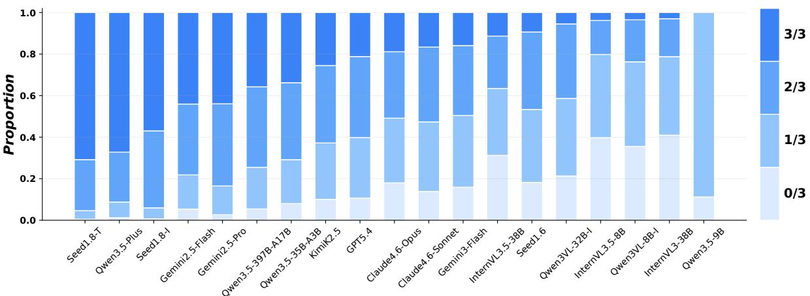

Figure 9: Video-level breakdown across models.  
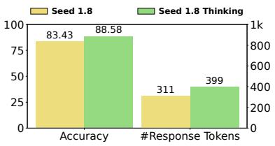  
Seed with and without thinking

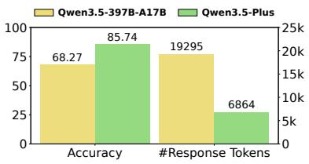  
Qwen open-weight and hosted

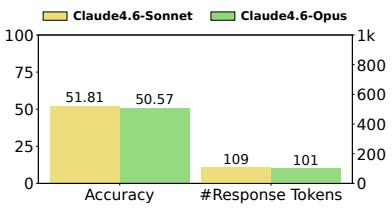  
Claude Sonnet & Opus  
Figure 10: Thinking and mode comparisons: mean accuracy vs. average response tokens.

Table 13: Effect of thinking variants.
<table><tr><td>Pair</td><td>∆S</td><td>∆A ∆P</td><td>∆Mean</td></tr><tr><td>Seed1.8</td><td>-1.18</td><td>+14.99 +1.64</td><td>+5.15</td></tr><tr><td>Qwen3VL-32B</td><td>-26.30</td><td>+14.47 -37.53</td><td>-16.46</td></tr><tr><td>Qwen3VL-8B</td><td>-6.49</td><td>+10.32 -20.87</td><td>-5.68</td></tr><tr><td>Qwen3VL-4B</td><td>+7.43</td><td>+5.13 -9.53</td><td>+1.01</td></tr><tr><td>KimiVL-A3B</td><td>+9.08</td><td>-1.26 +1.85</td><td>+3.24</td></tr></table>

## F.3 Effect of Thinking

The Think column in Table 2 mixes proprietary reasoning modes and open-source thinking checkpoints; we use matched pairs where possible. Table 13 reports percentage-point changes from nonthinking or instruct baselines, and Figure 10 compares representative accuracy–token tradeoffs.

Thinking helps most when a strong base model stays visually grounded. Seed 1.8 gains 5.15 mean-accuracy points and 13.87 full-joint points, mainly from a 14.99-point Alignment gain; Semantic changes little.

Open-source pairs are mixed. Qwen3VL thinking checkpoints improve Alignment at all matched sizes but often lose more on Semantic and Progression. Qwen3VL-32B-T, for example, gains 14.47 Alignment points but drops 26.30 on Semantic and 37.53 on Progression relative to Qwen3VL-32B-I.

KimiVL-A3B is milder: thinking improves mean accuracy by 3.24 points, mainly through

Semantic, but slightly lowers full joint accuracy. Overall, thinking is not uniformly beneficial on TempCloze; it helps only when extra reasoning improves temporal timing without losing visual or progression constraints.

## G Prompts

## G.1 Temporal Cloze Suitability Prompt

O3\_PROMPT = """[Temporal Cloze Task Suitability]

You are judging whether the video described by the caption is suitable for a temporal cloze benchmark. In this benchmark, a video is split into three ordered visual segments:

\- BEGINNING: the context shown before the missing middle.

\- ANSWER: the missing middle segment that a model should choose or predict.

ENDING: the context shown after the missing middle.

A good example lets a viewer infer a plausible ANSWER from BEGINNING and ENDING through visual temporal and causal continuity. Judge only what can be supported by visible actions or events in the caption. Ignore audio-only information, speech or dialogue content, subtitles, narration, background music, creator commentary, and any purely emotional or aesthetic judgment unless it is visually grounded.

Please consider these quality aspects: - Scene transition: whether BEGINNING, ANSWER, and ENDING appear to belong to a coherent

visual scene or a justifiable scene   
transition.   
Subject consistency: whether the main person,   
object, or environment remains consistent   
across the three segments.   
Action consistency: whether the motion or   
activity in ANSWER reasonably continues from   
BEGINNING and leads toward ENDING.   
Logical consistency: whether the full sequence   
makes temporal and causal sense as a middle   
-completion example.   
PASS only if:   
- The caption describes a concrete visual   
process, action, interaction, transformation   
, or event with ordered steps.   
The likely ANSWER segment would be visually   
distinguishable and meaningfully constrained   
by BEGINNING and ENDING.   
BEGINNING, ANSWER, and ENDING would form one   
coherent temporal sequence with stable   
subjects and a reasonable causal or physical   
progression.   
REJECT if any of these apply:   
The caption is mostly static description,   
scenery, appearance, atmosphere, or a   
montage without a clear ordered visual   
action.   
The event depends mainly on dialogue, audio,   
text, subtitles, narration, or hidden intent   
rather than visible motion.   
The middle could be almost anything, is too   
ambiguous, or cannot be inferred from before   
/after visual context.   
There are abrupt unrelated scene cuts,   
inconsistent subjects or environments, or   
disconnected actions that would make   
BEGINNING, ANSWER, and ENDING incoherent.   
The video only shows repeated motion with no   
meaningful progress, or a single state with   
little temporal change.   
Caption:   
{caption}   
Return valid JSON only, using one of these   
shapes:   
{{"pass": true, "reason": "one or two concise   
sentences naming the decisive quality   
aspects"}}   
{{"pass": false, "reason": "one or two concise   
sentences naming the decisive quality   
aspects"}}   
11 1 11

## G.2 Temporal Cloze Evaluation Prompt

eval\_prompt = """   
You are given:   
- \*\*BEGINNING\*\*: the first part of a video (   
frames in temporal order).   
- \*\*END\*\*: the last part of the same video (   
frames in temporal order).   
The middle segment between BEGINNING   
and END was removed.   
You will then see four candidate middle   
segments, labeled A, B, C, D.

Each candidate is a short clip;   
exactly one is the true middle that   
connects BEGINNING to END.   
The others are wrong.   
Task: Which candidate is the correct middle?   
Choose one of A, B, C, D.   
\*\*Output JSON only\*\* : {"answer": "<A, B, C, or   
D>", "reason": "<one or two sentences>"}   
11 1 11

Video

Submit mode

Choose submits

Select then submit

## Question List

13

18

Figure 11: Human annotation interface. Annotators viewed the same clips as the models.  
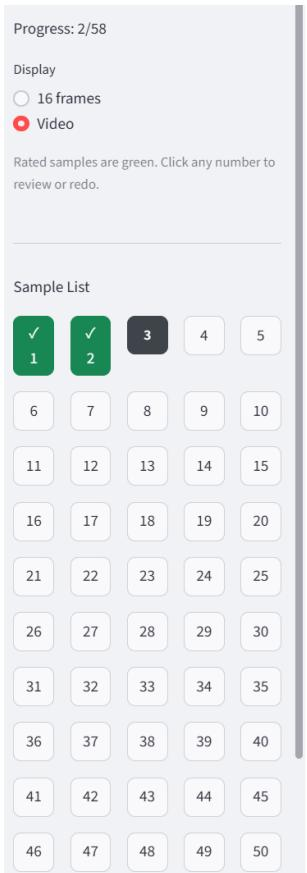

## Answered 120 of 120

## Question 1 of 120

You are given:

• BEGINNING: the first part of a video.

The middle segment between BEGINNING and END was removed. You will then see four candidate middle segments, labeled A, B, C, D. Exactly one is the true middle that connects BEGINNING to END.

• END: the last part of the same video.

Task: Which candidate is the correct middle? Choose one of A, B, C, D

## BEGINNING

END  
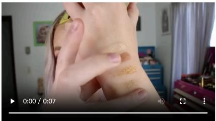

Candidates

Candidate A

## Candidate B

Rated 2 of 58

## Sample 3 of 58

You are given the full Temporal Cloze sample in order:

• BEGINNING: the first part of a video.

• ANSWER: the candidate middle segment to judge

• ENDING: the last part of the same video

The downstream task asks a model to identify the true middle segment between BEGINNING and ENDING. Your rating should reflect whether this sample is a reliable and meaningful Temporal Cloze question.

Please consider these quality aspects

• Scene transition: whether BEGINNING, ANSWER, and ENDING appear to belong to a coherent visual scene or a justifiable scene transition.

• Subject consistency: whether the main person/object/environment remains consistent across the three segments

• Action consistency: whether the motion or activity in ANSWER reasonably continues from BEGINNING and leads toward ENDING.

• Logical consistency: whether the full sequence makes temporal and causal sense as a middle-completion example

Rate the overall data quality from 1 to 5: 1 = Unusable: major inconsistencies make ANSWER clearly unreliable as the middle segment. 2 = Poor: several quality issues make the middle relation hard to trust. 3 = Borderline: partially coherent, but at least one important aspect is ambiguous or weak. 4 = Good: mostly coherent and suitable for evaluation, with only minor uncertainty. 5 = Excellent: clearly coherent across the listed aspects and strongly suitable as a Temporal Cloze sample

BEGINNING  
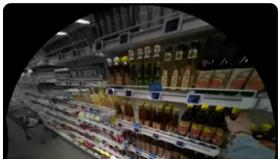

ANSWER  
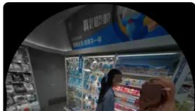  
Figure 12: Streamlit interface for filtered-video quality review.

ENDING  
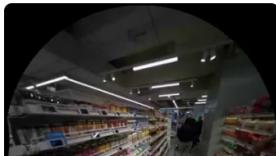