# Training-Free Inpainting Across Domains with a Frozen Text-to-Image Diffusion Model

Zhenhuan Wang1

Fengyi Yuan2

1School of Data Science, The Chinese University of Hong Kong, Shenzhen 2School of Science and Engineering, The Chinese University of Hong Kong, Shenzhen

## Abstract

We show that afrozen generic text-to-image diffusion model can perform conditional inpainting across three evaluated natural-image domains with one fixed controller configuration, without inpainting-specific weight training, datasetspecific weight adaptation, or learned inpainting-specific conditioning channels. Step-PI augments known-region projection with boundary–interior latent feedback, persistent PI state, and a predefined four-field release schedule that modulates controller signals along the reverse trajectory. Developed only on Main35-disjoint CelebA-HQ pilots, the controller transfers unchanged to AFHQ and Places2. Across two field-identical comparisons on the same 3,500 cases, adding persistent state and replacing uniform release with the predefined schedule each improve all 15 dataset– metric cells; 95% bootstrap intervals exclude zero for all five metrics in both comparisons. In descriptive nativeroute comparisons, Step-PI leads LanPaint and PILOT— the closest evaluated training-free baselines using vanilla SD1.5—on allfive equal-dataset macro metrics. Inpaintingtrained systems retain the absolute metric leads but rely on substantial inpainting-specific offline optimization. Our method provides a complementary approach for repurposing a frozen generic text-to-image model for cross-domain inpainting through test-time latent control.

## 1. Introduction

Modern diffusion inpainters achieve strong quality through inpainting-specific weights or specialized conditioning interfaces [12, 16, 22, 31]. Generic text-to-image models lack these inpainting-specific resources. Nevertheless, we show that a frozen generic text-to-image model can be repurposed for conditional inpainting through test-time latent control, without weight updates or learned inpainting-specific conditioning channels.

Each case supplies an observed image, a binary mask, and a user-provided text condition fixed before inference.

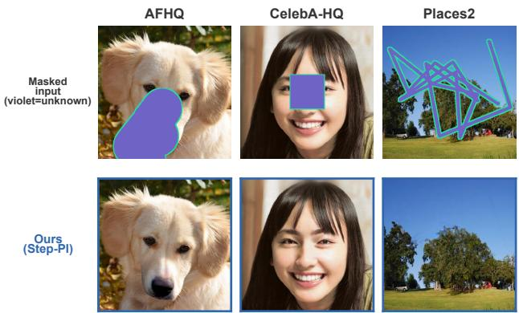  
Figure 1. Three-domain conditional inpainting with frozen SD1.5. The same configuration-locked Step-PI controller is applied to an outcome-independent random sample spanning AFHQ, CelebA-HQ, and Places2, without weight updates or learned inpaintingspecific conditioning channels. Text conditions are fixed before inference. Opaque violet denotes unknown pixels, and the mint contour is display-only.

Known-region projection anchors observed context on the latent grid, and final RGB compositing restores known pixels exactly; neither constrains the generated region. Its boundary requires local continuity, whereas its interior requires longer-range contextual and structural coherence, and the useful correction balance changes over the reverse trajectory. This motivates boundary–interior feedback, persistent state, and a predefined release schedule.

We introduce Step-PI, a training-free closed-loop controller that operates during deterministic DDIM sampling with a frozen vanilla SD1.5 text-to-image backbone. Boundary and interior objectives produce current-latent feedback signals, exponentially discounted states retain directional history, and the four fields of a predefined release schedule modulate already-computed controller signals before shared safeguards. The backbone, objectives, gains, state update, and release schedule are fixed across all three domains. Text conditions are fixed within controller comparisons; a separate matched prompt-presence intervention changes only the positive text condition. Field-identical P-

Guidance → PI and PI → Step-PI comparisons isolate persistent state and the complete predefined release schedule, respectively.

Evidence follows three layers. First, parameters developed on Main35-disjoint CelebA-HQ pilots transfer unchanged to AFHQ and Places2, and a fixed prompt-presence intervention shows responsiveness across all three domains. Second, the two field-identical additions improve all 15 dataset–metric cells. A protocol-stratified random-subset audit, conducted without inspecting outputs, probes conditional schedule sensitivity within the predefined schedule, while separate five-seed audits test the persistent-state and joint-release additions across paired stochastic inference initializations. Third, under descriptive comparisons using audited native routes, Step-PI records better values than the two closest evaluated vanilla-SD1.5 training-free baselines on all five equal-dataset macro metrics. Inpainting-trained systems retain the absolute metric leads but require substantial offline optimization to acquire inpainting-specific capability. Step-PI avoids this training and any dataset-specific weight adaptation, although it shifts substantial computation to inference.

Our contributions are:

• three-domain, configuration-locked evidence that one frozen generic text-to-image prior supports conditional inpainting on two transfer-only targets without learned inpainting-specific channels;

• Step-PI, a PI-structured latent controller that combines boundary–interior current feedback, discounted trajectory memory, and a predefined release schedule; and

• a controlled evaluation that uses matched comparisons to isolate the effects of persistent state and release scheduling, tests robustness across paired inference seeds, and compares Step-PI with external baselines under each method’s native inference pipeline.

## 2. Related Work

## 2.1. Trained Inpainting Methods

Trained inpainters acquire task capability through learned weights or conditioning interfaces. SD-Inpaint [22] uses an inpainting-specific latent interface, BrushNet [12] adds a decomposed dual-branch architecture, and PixelHacker [31] targets structural and semantic consistency. Broader diffusion reward- and preference-based adaptation includes DDPO [3], DPOK [7], and PrefPaint [16]. Inpaintingspecific training is distinct from dataset-specific weight adaptation, and a model trained for inpainting need not be retrained for every evaluation domain. Because these systems contain learned inpainting capability absent from a generic text-to-image backbone, we use them as strong quality references rather than matched interventions.

## 2.2. Training-Free Inpainting Methods

“Training-free” methods keep deployed weights fixed, but differ in foundation, sampler, and conditioning interface. LanPaint [34] combines Langevin dynamics with ODEbased diffusion, whereas PILOT [19] optimizes the latent during DDIM sampling; both operate on vanilla SD1.5 without inpainting-trained weights and are our closest evaluated baselines using the same pretrained diffusion model, although their native routes differ. Other approaches modify initialization (InverFill [28]), attention/style (HarmonPaint [15]), resampling (RePaint [17]), auxiliary propagation (LatentPaint [6]), or pretrained inpainting interfaces (FreeCond [11]). GradPaint [9] backpropagates masked MSE and, for pixel-space models, boundary losses; DING [18] derives VJP-free Gaussian posterior transitions for zero-shot latent inpainting; and HiGS [24] uses denoiser-prediction history for generic sampling enhancement. Broader testtime control spans posterior gradients, differentiable guidance, trajectory optimization, calibration, and reward-aware or stochastic-control formulations [2, 5, 8, 13, 20, 26, 27, 29, 32].

These heterogeneous interfaces prevent component-level causal attribution across methods. Step-PI instead constructs normalized task-specific boundary–interior feedback from the observed context, mask, and current decoded estimate on generic SD1.5. Its field-identical ladder isolates persistent trajectory memory (P-Guidance → PI) and the joint effect of a predefined release schedule (PI → Step-PI), while LanPaint and PILOT provide same-foundation external positioning.

## 3. Preliminaries: Sequential-Control View

## 3.1. Latent Diffusion and DDIM Sampling

A latent diffusion model learns to reverse a noising process in a compressed latent space [10, 22]. Under the standard DDPM parameterization,

$$
\begin{array} { r l } & { z _ { t } = \sqrt { \bar { \alpha } _ { t } } z _ { 0 } + \sqrt { 1 - \bar { \alpha } _ { t } } \epsilon , } \\ & { \widehat { \epsilon } _ { t } = \epsilon _ { \theta } ( z _ { t } , t , c ) , } \\ & { \widehat { z } _ { 0 } = \frac { z _ { t } - \sqrt { 1 - \bar { \alpha } _ { t } } \widehat { \epsilon } _ { t } } { \sqrt { \bar { \alpha } _ { t } } } , } \\ & { \bar { z } _ { t ^ { \prime } } ^ { \mathrm { D D I M } } = \sqrt { \bar { \alpha } _ { t ^ { \prime } } } \widehat { z } _ { 0 } + \sqrt { 1 - \bar { \alpha } _ { t ^ { \prime } } } \widehat { \epsilon } _ { t } , \qquad t ^ { \prime } < t . } \end{array}
$$

DDIM reuses the pretrained noise predictor to define a non-Markovian reverse trajectory [25]. We use deterministic DDIM $( \eta = 0 )$ , which adds no per-step noise and makes the field-identical feedback comparisons controlled and easier to interpret. We use it as a controlled inference substrate without claiming superiority over stochastic DDPM.

Stable Diffusion instantiates latent diffusion with a textconditioned U-Net operating in VAE latent space [22]. We use the pretrained vanilla Stable Diffusion v1.5 text-toimage model and keep all of its parameters frozen; the fixed text condition c enters the frozen denoising transition. We use neither an inpainting-specific checkpoint nor any learned inpainting-specific conditioning channels.

## 3.2. PI-Inspired Stateful Feedback

Known-region projection anchors observed context on the latent grid, and final RGB compositing restores visible pixels exactly; neither constrains seam quality or the generated interior trajectory. Classical PI combines current and accumulated error [1],

$$
\begin{array} { l } { { s _ { n } = s _ { n - 1 } + e _ { n } , } } \\ { { u _ { n } = K _ { P } e _ { n } + K _ { I } s _ { n } . } } \end{array}
$$

We borrow only this decomposition into current feedback and historical state. In our finite-horizon, time-varying reverse process, the decoded clean estimate serves as the controller observation. Bounded, normalized boundary/interior directions provide instantaneous feedback; their clipped, exponentially discounted histories form persistent states; and the masked latent correction serves as the control action. Thus, “PI-structured” denotes current normalized feedback plus revisable directional history, not raw-error proportionality or exact stationary-error integration. PI and Step-PI denote the evaluated variants in Sec. 4, which instantiate this current-plus-history structure with spatial weighting, normalization, clipping, and uniform or predefined nonuniform release, respectively. The labels describe this structural connection rather than a textbook linearcontrol formulation.

## 3.3. Finite-Horizon Control Lens

At reverse step k, known-context projection precedes the frozen text-conditioned DDIM transition, which returns a decoded clean estimate and an uncontrolled next latent. The clean estimate, image, mask, persistent states, and predeclared release determine a bounded action, applied at the post-transition latent port before the next projection. Thus feedback is formed from the current observation while actuation occurs after transition; this execution order neither identifies current-latent feedback with a next-state objective gradient nor assumes cross-timestep gradient transport. Section 4.1 gives the exact interface.

## 4. Methodology

Building on Section 3, Step-PI repurposes frozen text-toimage diffusion for an observed RGB image y, unknownregion mask M $( M = 1$ to generate and $M = 0$ to preserve), and fixed text condition c through known-region projection, image- and mask-aware boundary–interior feedback, persistent state, and a predefined release schedule, without weight updates or learned inpainting-specific conditioning channels.

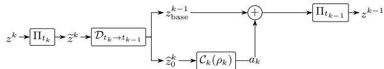  
Figure 2. Closed-loop frozen text-to-image inpainting interface. Text enters the frozen transition, while the image and mask determine projection and feedback. Step-PI and PI share this interface and differ only in $\rho _ { k }$ . Arrows mark computation and actuation locations, not gradient transport through the DDIM transition.

## 4.1. Problem Setup and Closed-Loop Interface

All internal controls use a frozen vanilla SD1.5 text-toimage backbone with deterministic DDIM sampling. Let $M _ { z }$ and $K = 1 - M$ denote the latent unknown-region and image known-region masks. At scheduler state $t _ { k } ,$ , the reverse latent $z ^ { k }$ runs from initial noisy $z ^ { N }$ to terminal $z ^ { 0 }$ with $t _ { N } > \cdots > t _ { 0 }$ . Boundary/interior memories are initialized once at zero and enter step k as $\xi _ { B } ^ { k + 1 } , \xi _ { I } ^ { k + 1 }$ , while $\rho _ { k }$ denotes the release vector. The memory recurrences and release construction are defined in Sections $4 . 3 { - } 4 . 4$ For $k = N , \ldots , 1$ , projection Πt, frozen transition $\mathscr { D } _ { t _ { k } \to t _ { k - 1 } } ,$ and controller $\mathcal { C } _ { k }$ form the closed-loop interface

$$
\begin{array} { c } { { \widetilde { z } ^ { k } = \Pi _ { t _ { k } } ( z ^ { k } ) , } } \\ { { { } } } \\ { { ( \widehat { z } _ { 0 } ^ { k } , z _ { \mathrm { b a s e } } ^ { k - 1 } ) = \mathcal { D } _ { t _ { k }  t _ { k - 1 } } ( \widetilde { z } ^ { k } , c ) , } } \\ { { { } ( a _ { k } , \xi _ { B } ^ { k } , \xi _ { I } ^ { k } ) = \mathcal { C } _ { k } ( \widehat { z } _ { 0 } ^ { k } , y , M , \xi _ { B } ^ { k + 1 } , \xi _ { I } ^ { k + 1 } ; \rho _ { k } ) , } } \\ { { { } } } \\ { { z ^ { k - 1 } = \Pi _ { t _ { k - 1 } } ( z _ { \mathrm { b a s e } } ^ { k - 1 } + a _ { k } ) . } } \end{array}\tag{1}
$$

The fixed condition c enters only the frozen transition; $y$ and M define projection and feedback, and $a _ { k }$ affects only unknown-region coordinates before the next projection. Feedback is differentiated at the current projected latent ${ \widetilde { z } } ^ { k } ;$ ; after state update, release, and safeguards, $a _ { k }$ is applied to post-transition $z _ { \mathrm { b a s e } } ^ { k - 1 }$ on the same fixed VAE lattice. This is causal one-pass actuation, not cross-timestep gradient transport, $, - \nabla _ { z ^ { k - 1 } } { \mathcal { L } } ,$ or next-state descent.

Known-region projection uses a leakage-free clean reference latent $z _ { 0 } ^ { \mathrm { k n o w n } }$ constructed only from visible pixels:

$$
\Pi _ { t } ( z ) = ( 1 - M _ { z } ) \odot q _ { t } ^ { \mathrm { k n o w n } } + M _ { z } \odot z .\tag{2}
$$

Here ⊙ denotes elementwise multiplication. Equation (2) anchors known coordinates of the resized VAE latent grid, but VAE decoding is not pixelwise; exact known-region RGB recovery therefore comes from final compositing, not latent projection alone. Reference construction, CFG prediction, DDIM transitions, VAE feedback decoding, mask resizing, and exact inference settings are provided in Supplementary Appendices A and B.

## 4.2. Boundary–Interior Feedback

From the visible context and current clean estimate, the controller separates local boundary stitching from broader interior continuation. Let $\mathcal { L } _ { B } , \mathcal { L } _ { I }$ be the corresponding scalar image-space objectives and $g _ { B } ^ { k } , g _ { I } ^ { k }$ their bounded, normalized, objective-derived feedback directions, differentiated at the current projected latent $\widetilde { z } ^ { k }$ ; every controlled variant computes both objectives and directions at each step:

$$
\widetilde { z } ^ { k } \to \widehat { z } _ { 0 } ^ { k } \to \widehat { x } _ { 0 } ^ { k } \to \left\{ { \mathcal { L } } _ { B } \right\} \to \left\{ { g } _ { B } ^ { k } \atop { g } _ { I } ^ { k } \right\} .\tag{3}
$$

With fixed weights $\lambda _ { j } ^ { B }$ , the boundary objective is

$$
{ \mathcal { L } } _ { B } = \lambda _ { 1 } ^ { B } { \mathcal { L } } _ { \mathrm { k n o w n } } + \lambda _ { 2 } ^ { B } { \mathcal { L } } _ { \mathrm { p a i r } } + \lambda _ { 3 } ^ { B } { \mathcal { L } } _ { \mathrm { T V } } + \lambda _ { 4 } ^ { B } { \mathcal { L } } _ { \mathrm { b o u n d a r y - } }\tag{4}
$$

Its four terms combine known-context RGB fidelity, seam pairing, support-masked image variation, and RGBgradient matching. With fixed weights $\lambda _ { j } ^ { I }$ , the interior objective is

$$
\mathcal { L } _ { I } = \lambda _ { 1 } ^ { I } \mathcal { L } _ { \mathrm { l o w f r e q } } + \lambda _ { 2 } ^ { I } \mathcal { L } _ { \mathrm { i n t e r i o r } } + \lambda _ { 3 } ^ { I } \mathcal { L } _ { \mathrm { r i n g } } + \lambda _ { 4 } ^ { I } \mathcal { L } _ { \mathrm { f r e q u e n c y } } .\tag{5}
$$

Its terms encourage multiscale, depth-weighted contextual and structural coherence. Semantics come from the frozen text-conditioned transition; the controller regularizes spatial and contextual consistency rather than directly optimizing text alignment. Exact definitions, conventions, and shared weights are provided in Supplementary Appendix A.

Here $D _ { z }$ increases with depth in the latent mask and Normalize is stabilized full-tensor $\ell _ { 2 }$ normalization; resizing and stabilization details are provided in Supplementary Appendix A:

$$
\begin{array} { r } { g _ { B } ^ { k } = \mathrm { N o r m a l i z e } _ { 2 } [ - M _ { z } \odot \nabla _ { \widetilde { z } ^ { k } } \mathcal { L } _ { B } ] , } \\ { g _ { I } ^ { k } = \mathrm { N o r m a l i z e } _ { 2 } [ - D _ { z } \odot \nabla _ { \widetilde { z } ^ { k } } \mathcal { L } _ { I } ] . } \end{array}\tag{6}
$$

Normalization removes raw-scale differences across objectives and reverse steps but does not make the directions timestep-invariant; fixed gains, release factors, norm caps, and the final clamp set action magnitude. It therefore provides fixed calibration, not raw-magnitude adaptivity.

## 4.3. Persistent PI-Structured State

Following Sec. 3.2, $g _ { j } ^ { k } , j \in \{ B , I \}$ , is the current (P) branch and $\xi _ { j } ^ { k }$ its discounted-history (I) branch. PI and Step-PI carry separate zero-initialized boundary/interior states through the reverse trajectory.

To separate seam correction from interior continuation, we split M into an inner-boundary band $S _ { z }$ and deep interior $I _ { z } . \quad W _ { B }$ emphasizes $S _ { z }$ while retaining weaker $I _ { z }$ feedback, and $\beta _ { B }$ gives distinct retention on boundary and deep-interior support. Interior retention is uniform $( \gamma _ { I } )$ because $g _ { I } ^ { k }$ is already depth-weighted by $D _ { z }$ Let $( m _ { B } , w _ { B } ) \ = \ ( \beta _ { B } , W _ { B } )$ and $( m _ { I } , w _ { I } ) \ = \ ( \gamma _ { I } , 1 )$ Define $\mathcal { P } _ { B } = \mathrm { C l i p N o r m } _ { \nu _ { B } }$ as the full-tensor projection onto the radius- $\cdot \nu _ { B } \mathrm { \ell } \ell _ { 2 }$ ball. For the effective recurrence, set $\mathcal { P } _ { I } ( v ) = v$ because Appendix A shows algebraically that the implemented interior radius-one norm guard acts as the identity under the evaluated configuration. The effective recurrence is

$$
\xi _ { j } ^ { k } = { \mathcal { P } } _ { j } \left[ m _ { j } \odot \xi _ { j } ^ { k + 1 } + \left( 1 - m _ { j } \right) \odot \left( w _ { j } \odot g _ { j } ^ { k } \right) \right] .\tag{7}
$$

Proposition 1 (Effective persistent-state characterization). Let $d _ { j } ^ { k } = w _ { j } \odot g _ { j } ^ { k } , \mathcal { C } _ { B } = \{ \xi : \| \xi \| _ { 2 } \le \nu _ { B } \}$ , and $\mathcal { C } _ { I } =$ $\mathbb { R } ^ { 4 \times 6 4 \times 6 4 }$ . For elementwise $0 \leq m _ { j } \leq 1$ , the update in $E q . \ ( 7 )$ is the unique minimizer

$$
\operatorname * { a r g m i n } _ { \xi \in \mathcal { C } _ { j } } \quad \frac 1 2 \| \sqrt { m _ { j } } \odot ( \xi - \xi _ { j } ^ { k + 1 } ) \| _ { 2 } ^ { 2 } + \frac 1 2 \| \sqrt { 1 - m _ { j } } \odot ( \xi - d _ { j } ^ { k } ) \| _ { 2 } ^ { 2 } .\tag{8}
$$

$$
H f d _ { j } ^ { k } \in \mathcal C _ { j } , i t a l s o o b e y s \| \xi _ { j } ^ { k } - d _ { j } ^ { k } \| _ { 2 } \leq \| m _ { j } \| _ { \infty } \| \xi _ { j } ^ { k + 1 } - d _ { j } ^ { k } \| _ { 2 } .
$$

Under the stated bounds, Proposition 1 is a per-step characterization of the implemented bounded compromise between retained and current directions. Since $d _ { j } ^ { k }$ changes with $k ,$ it implies neither trajectory-level contraction nor stability, and it does not establish task benefit. PI and Step-PI share this recurrence and differ only in the release schedule. Matched P-Guidance differs from PI only by setting $\xi _ { B } ^ { k } = \xi _ { I } ^ { k } = 0$ , so P-Guidance→PI is the strict persistentstate-only comparison and the field-identical empirical test of persistent-state value. Supplementary Appendix A gives the proof, spatial mappings, constants, and trajectory-state details.

## 4.4. Predefined Release Schedule and Matched Controls

Step-PI uses one predefined four-field release schedule: boundary-integral $r _ { B }$ and final-interior $r _ { I }$ depend on $\bar { \alpha } _ { t _ { k } }$ while common-interior $q _ { k }$ and additional-memory $h _ { k }$ depend on reverse-step progress $p _ { k }$ On the fixed 50- step DDIM route, both deterministically and monotonically index the same trajectory, not independent state observations. The fields are predefined—not learned or uncertainty-derived—and modulate signals as $\rho _ { k } =$ $( \rho _ { B , k } , \rho _ { P , k } , \rho _ { H , k } , \rho _ { O , k } ) ;$ exact functions are provided in Supplementary Appendix A. For $j \in \{ B , I \}$ , the shared proportional, integral, and fused actions are

$$
\begin{array} { r l } & { ( \alpha _ { P , k } ^ { B } , \alpha _ { I , k } ^ { B } , \alpha _ { O , k } ^ { B } ) = ( 1 , \rho _ { B , k } , 1 ) , } \\ & { ( \alpha _ { P , k } ^ { B } , \alpha _ { I , k } ^ { T } , \alpha _ { O , k } ^ { T } ) = ( \rho _ { P , k } , \rho _ { P , k } , \rho _ { O , k } ) , } \\ & { \begin{array} { r l } { F _ { j } ^ { k } = \alpha _ { P , k } ^ { j } K _ { p , g } ^ { j } , } & \\ { I _ { j } ^ { k } = \mathrm { C a p N o r m } \Big ( \alpha _ { I , k } ^ { j } K _ { I } ^ { j } \xi _ { j } ^ { k } , \sigma _ { j } \vert \vert P _ { j } ^ { k } \vert \vert _ { 2 } \Big ) , } \\ { u _ { j } ^ { k } = \alpha _ { O , k } ^ { j } ( P _ { j } ^ { k } + I _ { j } ^ { k } ) , } & \\ { a _ { k } ( \rho _ { k } ) = \mathrm { C l a m p } _ { [ - a _ { \mathrm { m a x } } , a _ { \mathrm { m a x } } ] } \Big [ M _ { z } \odot ( u _ { B } ^ { k } + u _ { I } ^ { k } ) \Big ] , } \end{array} } \\ & { \begin{array} { r l } { \rho _ { k } ^ { \mathrm { P I } } = ( 1 , 1 , 1 ) , } & \\ { \rho _ { k } ^ { \mathrm { S t e p . P I } } = ( r _ { B } ( t _ { k } ) , q _ { k } , h _ { k } , r _ { I } ( t _ { k } ) ) . } \end{array} } \end{array}\tag{9}
$$

Algorithm 1 Field-identical PI/Step-PI control for one tra  
jectory.   
Require: Image $y ,$ mask M, condition $c ,$ frozen diffusion   
sampler, release policy $R ,$ controller hyperparameters   
Θ   
Ensure: Inpainted image with exact known-pixel preserva  
tion   
1: Construct $M _ { z } , z _ { 0 } ^ { \mathrm { k n o w n } }$ , and fixed known noise ϵknown   
2: Order scheduler states as $t _ { N } > t _ { N - \perp } > \cdot \cdot \cdot > t _ { 0 }$   
3: Initialize $z ^ { N }$ from the paired seed; $\xi _ { B } ^ { \bar { N } + 1 } \gets 0 , \xi _ { I } ^ { \bar { N } + 1 } \gets$   
0   
4: for $k = N , \ldots , 1$ do   
5: $\begin{array} { r } { \widetilde { z } ^ { k } \gets \Pi _ { t _ { k } } ( z ^ { k } ) } \end{array}$   
6: $\widehat { \epsilon } ^ { k } \gets \mathrm { F R O Z E N U N E T C F G } ( \widetilde { z } ^ { k } , t _ { k } , c )$   
7: $( z _ { \mathrm { { b a s e } } } ^ { k - 1 } , \hat { z } _ { 0 } ^ { k } ) \gets \mathrm { { D D I M S T E P } } ( \hat { \epsilon } _ { \cdot } ^ { k } , \tilde { z } ^ { k } , \hat { t } _ { k }  t _ { k - 1 } )$   
8: $\widehat { x } _ { 0 } ^ { k } \gets \mathrm { V A I }$ EDECODE $\mathrm { F P } 3 2 ( \widehat { z } _ { 0 } ^ { k } / s _ { \mathrm { V A E } } )$   
9: Compute $\mathcal { L } _ { B } , \mathcal { L } _ { I }$ and current-latent feedback sig  
nals $g _ { B } ^ { k } , { \bf \bar { { g } } } _ { I } ^ { k }$   
10: Update $\xi _ { B } ^ { k } , \xi _ { I } ^ { k }$ from $\xi _ { B } ^ { k + 1 } , \xi _ { I } ^ { k + 1 }$ by Eq. 7   
11: $\rho _ { k } \gets R ( t _ { k } , k , N )$   
12: Construct $u _ { B } ^ { k } , u _ { I } ^ { k }$ by Eq. 9   
13: $a _ { k }  a _ { k } ( \rho _ { k } ) \mathrm { b y } \mathrm { E q . } 9$   
14: $z ^ { k - 1 } \gets \bar { \Pi } _ { t _ { k - 1 } } \bar { ( z _ { \mathrm { b a s e } } ^ { k - 1 } + a _ { k } ) }$   
15: end for   
16: Decode $z ^ { 0 }$ and composite exactly with y on (1 − M)   
17: return composited RGB image

Here $\mathrm { C a p N o r m } ( v , r ) = v \operatorname* { m i n } \{ 1 , r / ( \| v \| _ { 2 } + 1 0 ^ { - 8 } ) \}$ is applied per sample over the full latent tensor; the final clamp bounds the masked action. PI sets all release fields to one. In the interior branch, $q _ { k }$ precedes CapNorm and $r _ { I } ( t _ { k } )$ follows it, yielding approximate pre-safeguard scale $q _ { k } r _ { I } ( t _ { k } )$ up to the stabilizer and downstream safeguards; hence the four stored fields are not four independent effective degrees of freedom. Their timing roles are design rationales, not optimality claims. Release affects actuation before shared safeguards, not the per-step feedback and state updates; final action need not scale linearly, and history remains revisable (Fig. 3).

The complete predefined release schedule was selected using Main35-disjoint CelebA-HQ pilots and frozen before evaluation. Section 5 evaluates the frozen schedule and reports a one-field-uniformization audit of conditional sensitivity, without claims of minimality, individual or global optimality, or dominance over shared-scalar or alternative schedules.

Algorithm 1 instantiates the matched construction ladder with release policy R: DDIM-Proj→P-Guidance adds boundary–interior feedback, P-Guidance→PI adds persistent state, and PI→Step-PI changes only R, from UNI-FORMRELEASE to STEPRELEASE.

## 5. Experiments

We evaluate training-free Step-PI with a frozen generic SD1.5 text-to-image (T2I) backbone on AFHQ, CelebA-HQ, and Places2, covering configuration-locked crossdomain transfer without retuning, controlled ablations of controller components, comparisons with external baselines, and inference cost.

## 5.1. Evaluation and Transfer Protocol

Evaluation set and frozen inputs. Main35 comprises 3,500 paired cases from AFHQ v2 [4] (1,300), CelebA-HQ [14] (1,400), and the Places365 Standard validation split [35] (800; denoted Places2), across 35 fixed 100-case mask protocols. Image, mask, prompt, and seed are held fixed within each comparison; unknown-region ground truth is evaluation-only. Prompts are fixed without output-based optimization; preprocessing and sampling details are provided in Supplementary Appendix B.

Internal and transfer contracts. DDIM-Proj, P-Guidance, PI, and Step-PI share the frozen generic SD1.5 backbone [22], projected image–mask interface, and paired inputs. Controller gains and release schedules were developed only on Main35-disjoint CelebA-HQ pilots and then frozen; AFHQ and Places2 are transfer-only targets without retuning, so the claim is limited to these two domains.

External baselines. LanPaint [34] and PILOT [19] are the evaluated same-foundation training-free references: all three use vanilla SD1.5 without inpainting-trained weights, learned inpainting interfaces, or dataset-specific weight adaptation. GradPaint [9] does not report an SD1.5 checkpoint, DING [18] uses SD3.5, and HiGS [24] does not evaluate inpainting. Accordingly, we do not include these three methods in our quantitative external comparison. SD-Inpaint [22], BrushNet [12], and PixelHacker [31] form the trained lane; PixelHacker is Places2-adapted. Nativeinterface comparisons are descriptive; Supplementary Appendix B audits attributes.

Metrics and statistics. Masked L1 measures held-out unknown-region RGB reconstruction, while compositebased Masked LPIPS applies LPIPS-Alex [33] to the full-frame output after exact known-region compositing. Boundary L1 and Boundary LPIPS measure seam fidelity, and CLIP-Q is an auxiliary CLIP-IQA-style frozen twoprompt no-reference quality proxy [21, 30]; lower is better except for CLIP-Q. The controller neither sees unknownregion ground truth nor optimizes LPIPS or CLIP-Q; its context and seam objectives align most directly with L1 continuity. These proxies do not replace human evaluation, and reference scores may penalize plausible alternatives. We average within protocols and weight protocols and datasets equally. Case-within-protocol intervals are conditional on the fixed 35 protocols, not unseen mask families. Full definitions and statistics are provided in Supplementary Appendix B.

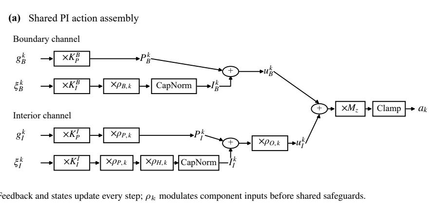

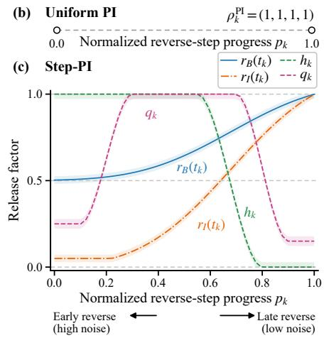  
Early reverse Late reverseFigure 3. Stateful boundary–interior action and release. (a) Both feedback branches and persistent states update at every step; release modulates their contributions before the shared nonlinear safeguards. (b) PI uses uniform release. (c) Step-PI uses the four predefined fields of its release schedule along the reverse trajectory.

## 5.2. Three-Domain Frozen-Backbone Inpainting

Among the four matched variants, Step-PI is best in all 15 dataset–metric cells across AFHQ, CelebA-HQ, and Places2, with performance improving monotonically along DDIM-Proj→P-Guidance→PI→Step-PI (Table 1).

These results cover all three datasets; AFHQ and Places2 are the two transfer-only targets evaluated without retuning.

On an outcome-blind, protocol-stratified random subset of 175 cases, the fixed Prompt-CLIP contrast favors Correct over Empty, with the 95% CI excluding zero. This paired intervention demonstrates that the complete frozen pipeline responds to prompt presence under otherwise fixed inference conditions. Complete endpoint definitions, threedomain estimates, and strict-random visual examples are provided in Supplementary Appendices C and D.

Figure 1 shows fixed-configuration completions reused from an outcome-independent random sample across all three datasets; the full random construction-ladder grid is provided in Supplementary Appendix D.

## 5.3. Matched Mechanism Evidence

Matched P-Guidance→PI changes only cross-step persistent state, whereas PI→Step-PI changes only the complete predefined release schedule. With objectives, weights, and paired inputs fixed and unknown-region ground truth unavailable, they isolate state and schedule rather than loss selection or retuning; LPIPS and CLIP-Q remain evaluationonly. The same subset probes conditional one-field sensitivity.

PI improves P-Guidance in all 15 Main35 aggregates; all five stratified-bootstrap intervals exclude zero and all five pooled per-case win rates exceed 50%. Step-PI likewise improves PI in all 15 aggregates, with all five intervals excluding zero. Figure 4 summarizes its five-metric release effect; complete paired and win-rate tables are provided in Supplementary Appendix C.

On the same 175-case subset, uniformizing any field worsens all five metrics. Because the other three remain and qk and rI are serial scalings, this supports conditional sensitivity within the implemented schedule—not independent effective degrees of freedom, necessity, minimality, optimality, or superiority to lower-dimensional or shared alternatives; details are provided in Supplementary Appendix C.

Mechanism robustness across inference seeds. Across five paired inference-seed sweeps over the same outcomeblind, balanced 175-case stratified random subset spanning all 35 protocols (875 pairs), PI outperforms P-Guidance on all five fixed evaluation metrics when persistent state is the only component changed. Across all five metrics, the hierarchical five-seed effects consistently favor PI, with every 95% CI excluding zero and every Holm-corrected test remaining significant; full estimates are provided in Supplementary Appendix C. On the same cohort, Step-PI outperforms PI on every metric in every sweep when the release schedule is the only component changed; pooled 95% CIs exclude zero for all five metrics. Full estimates, protocol details, and reproducibility scope are provided in Supplementary Appendices C and E.

## 5.4. External Positioning and Computational Cost

Training-free external positioning. LanPaint and PI-LOT, the closest evaluated vanilla-SD1.5 training-free references, were not retuned on Main35: LanPaint uses its official v1.5.5 ComfyUI default configuration fixed before Main35, whereas PILOT uses a fixed DDIM sampling configuration with periodic latent optimization. Under these audited native routes, Step-PI records better values on all five equal-dataset macro metrics and on 13/15 and 12/15 cells, respectively (Table 2). This is a descriptive comparison among training-free methods built on the same pretrained SD1.5 foundation. Because the methods use their native inference procedures and are not matched for computational budget, the results should not be interpreted as isolating algorithmic effects or establishing a comprehensive SOTA ranking; full per-dataset results and an 18-case random atlas are provided in Supplementary Appendices D and E.

<table><tr><td colspan="8">(a) Absolute Main35 results</td></tr><tr><td>Dataset</td><td>Method</td><td>Masked L1 ↓</td><td>Boundary L1 ↓</td><td>Masked LPIPS ↓</td><td>Boundary LPIPS ↓</td><td>CLIP-Q ↑</td></tr><tr><td rowspan="4">AFHQ</td><td>DDIM-Proj</td><td>0.1916</td><td>0.0442</td><td>0.1486</td><td>0.1177</td><td>0.6899</td></tr><tr><td>P-Guidance</td><td>0.1801</td><td>0.0413</td><td>0.1448</td><td>0.1112</td><td>0.6969</td></tr><tr><td>PI</td><td>0.1768</td><td>0.0408</td><td>0.1441</td><td>0.1096</td><td>0.6990</td></tr><tr><td>Step-PI</td><td>0.1694</td><td>0.0320</td><td>0.1379</td><td>0.0980</td><td>0.7109</td></tr><tr><td rowspan="5">CelebA-HQ</td><td>DDIM-Proj</td><td>0.1611</td><td>0.0376</td><td>0.0770</td><td>0.1209</td><td>0.5117</td></tr><tr><td>P-Guidance</td><td>0.1516</td><td>0.0348</td><td>0.0748</td><td>0.1143</td><td>0.5154</td></tr><tr><td>PI</td><td>0.1449</td><td>0.0316</td><td>0.0727</td><td>0.1086</td><td>0.5219</td></tr><tr><td>Step-PI</td><td>0.1278</td><td>0.0236</td><td>0.0690</td><td>0.0923</td><td>0.5719</td></tr><tr><td>DDIM-Proj</td><td>0.1843</td><td>0.0472</td><td>0.1398</td><td>0.1441</td><td>0.4558</td></tr><tr><td rowspan="3">Places2</td><td>P-Guidance</td><td>0.1752</td><td>0.0438</td><td>0.1370</td><td>0.1371</td><td>0.4581</td></tr><tr><td>PI</td><td>0.1738</td><td>0.0431</td><td>0.1366</td><td>0.1351</td><td>0.4652</td></tr><tr><td>Step-PI</td><td>0.1606</td><td>0.0317</td><td>0.1300</td><td>0.1184</td><td>0.4763</td></tr></table>

(b) Mean direction-normalized gains for matched mechanism additions
<table><tr><td>Comparison</td><td>Cells won</td><td>Masked L1</td><td>Boundary L1</td><td>Masked LPIPS</td><td>Boundary LPIPS</td><td>CLIP-Q</td></tr><tr><td>PI vs. P-Guidance</td><td>15/15</td><td>+2.4%</td><td>+3.9%</td><td>+1.2%</td><td>+2.6%</td><td>+1.0%</td></tr><tr><td>Step-PI vs. PI</td><td>15/15</td><td>+7.8%</td><td>+24.4%</td><td>+4.7%</td><td>+12.6%</td><td>+4.6%</td></tr></table>

Table 1. Main35 internal results. (a) Equal-protocol aggregates; Step-PI entries are shown in bold. (b) Equal-dataset mean directionnormalized gains for the field-identical persistent-state-only and release-only additions; positive values favor the first named method, and “Cells won” counts favorable dataset–metric cells.

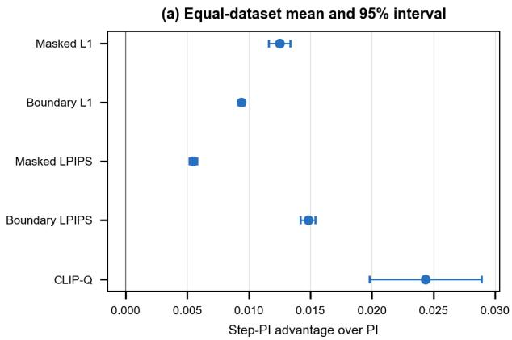

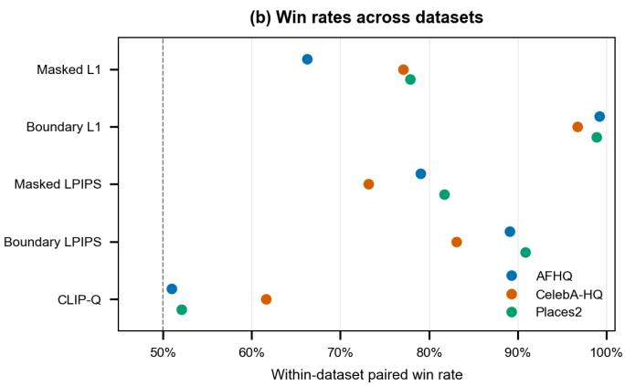  
Figure 4. Paired Step-PI advantages over PI on Main35: (a) direction-normalized equal-dataset paired means with 95% case-within protocol bootstrap intervals; (b) within-dataset paired win rates across the same five metrics. Positive values favor Step-PI; the dashed line marks 50%; all 3,500 cases contribute.

Comparison with inpainting-trained systems. The inpainting-trained references encode substantial offline specialization: SD-Inpaint uses 440k inpainting steps at 512× 512 [23]; BrushNet reports 430k steps on eight V100 GPUs (about three days) [12]; and PixelHacker uses 200k iterations on 14M image–mask pairs plus a 120k-step Places2 fine-tune on 1.8M images, both with 12 L40S GPUs [31]. Step-PI instead freezes vanilla SD1.5 and performs no inpainting- or dataset-specific weight training. The trained lane nevertheless retains higher absolute scores—

<table><tr><td>Training type</td><td>Method</td><td>Masked L1 ↓</td><td>Boundary L1 ↓</td><td>Masked LPIPS ↓</td><td>Boundary LPIPS ↓</td><td>CLIP-Q ↑</td></tr><tr><td rowspan="3">Training-free on vanilla SD1.5</td><td>Step-PI</td><td>0.1526</td><td>0.0291</td><td>0.1123</td><td>0.1029</td><td>0.5864</td></tr><tr><td>LanPaint</td><td>0.1608</td><td>0.0438</td><td>0.1323</td><td>0.1464</td><td>0.5495</td></tr><tr><td>PILOT</td><td>0.1596</td><td>0.0433</td><td>0.1238</td><td>0.1328</td><td>0.5684</td></tr><tr><td rowspan="3">Inpainting-trained references</td><td>SD-Inpaint</td><td>0.1198</td><td>0.0233</td><td>0.0881</td><td>0.0733</td><td>0.6508</td></tr><tr><td>BrushNet</td><td>0.1371</td><td>0.0292</td><td>0.1038</td><td>0.1010</td><td>0.6391</td></tr><tr><td>PixelHacker</td><td>0.1458</td><td>0.0209</td><td>0.0993</td><td>0.0713</td><td>0.6213</td></tr></table>

Table 2. External positioning on Main35 by resource regime. Bold marks the best result among training-free methods using vanilla SD1.5, and underlining marks the best overall result. PixelHacker is additionally adapted to Places2; native routes differ, so the values are neithe intervention-matched nor compute-normalized.

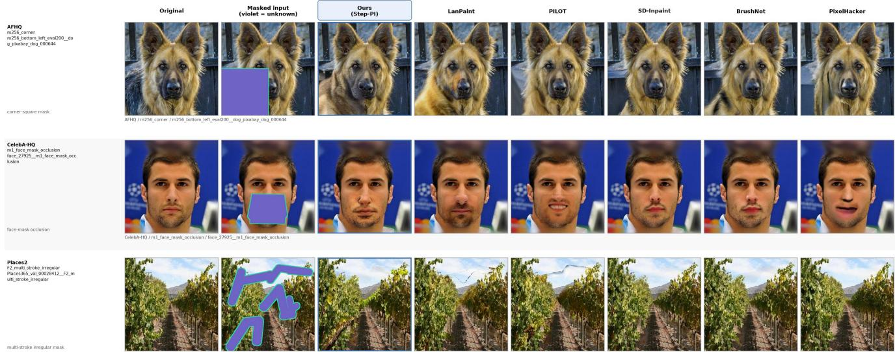  
Figure 5. Native-route external comparison on three randomly drawn cases shared with the supplementary internal grid. The draw did not depend on method outputs; all methods receive the same image/mask, and LanPaint and PILOT inherit the cases without reselection.

SD-Inpaint leads Masked L1, Masked LPIPS, and CLIP-Q, while PixelHacker leads both boundary metrics—but obtains them with offline optimization absent from Step-PI. Even without such weight training, Step-PI is numerically close to trained-reference results on some metrics (Table 2). Because the published budgets differ in data, hardware, and batch size, they provide resource context rather than a normalized quality–cost comparison.

Computational cost. A 35-case A100 audit measures Step-PI at 30.48 s/image and 15.55 GiB: no resolved runtime difference from PI, 9.94× DDIM-Proj, and slower than PILOT/LanPaint under descriptive native routes. Two feedback gradients per step without parameter updates trade offline specialization for costly online control—not inference efficiency or quality–compute superiority; full details are provided in Supplementary Appendix E.

## 6. Conclusion

Step-PI repurposes a frozen SD1.5 text-to-image diffusion model for training-free conditional inpainting across three evaluated domains through a stateful boundary–interior latent controller with a predefined release schedule, without weight updates or learned inpainting-specific conditioning channels. Developed on disjoint CelebA-HQ pilots, it transfers unchanged to AFHQ and Places2. Matched state-only and release-only controls improve all 15 Main35 dataset–metric cells. Descriptively, Step-PI leads LanPaint and PILOT on all five equal-dataset macro metrics and approaches selected inpainting-trained references on some metrics. Inpainting-trained systems retain the absolute metric leads but rely on substantial inpainting-specific offline optimization. Although Step-PI incurs substantial inference cost, these results position test-time latent control as a complementary route for repurposing a frozen generic text-toimage prior.

## References

[1] Karl J. Astr ˚ om and Richard M. Murray. ¨ Feedback Systems: An Introductionfor Scientists and Engineers. Princeton Uni versity Press, 2008.

[2] Arpit Bansal, Hong-Min Chu, Avi Schwarzschild, Soumyadip Sengupta, Micah Goldblum, Jonas Geiping, and Tom Goldstein. Universal guidance for diffusion models. In Proceedings of the IEEE/CVF Conference on Computer Vision and Pattern Recognition (CVPR) Workshops, pages 843–852, 2023.

[3] Kevin Black, Michael Janner, Yilun Du, Ilya Kostrikov, and Sergey Levine. Training diffusion models with reinforcement learning. In International Conference on Learning Representations (ICLR), 2024.

[4] Yunjey Choi, Youngjung Uh, Jaejun Yoo, and Jung-Woo Ha. Stargan v2: Diverse image synthesis for multiple domains. In Proceedings of the IEEE/CVF Conference on Computer Vision and Pattern Recognition, pages 8188–8197, 2020.

[5] Hyungjin Chung, Jeongsol Kim, Michael T. McCann, Marc L. Klasky, and Jong Chul Ye. Diffusion posterior sampling for general noisy inverse problems. In The Eleventh International Conference on Learning Representations, 2023.

[6] Ciprian Corneanu, Raghudeep Gadde, and Aleix M. Martinez. LatentPaint: Image inpainting in latent space with diffusion models. In Proceedings ofthe IEEE/CVF Winter Conference on Applications of Computer Vision (WACV), pages 4334–4343, 2024.

[7] Ying Fan, Olivia Watkins, Yuqing Du, Hao Liu, Moonkyung Ryu, Craig Boutilier, Pieter Abbeel, Mohammad Ghavamzadeh, Kangwook Lee, and Kimin Lee. DPOK: Reinforcement learning for fine-tuning text-to-image diffusion models. In Advances in Neural Information Processing Systems, pages 79858–79885, 2023.

[8] Daniel Geyfman, Felix Draxler, Jan Groeneveld, Hyunsoo Lee, Theofanis Karaletsos, and Stephan Mandt. Calibrated test-time guidance for bayesian inference. arXiv preprint arXiv:2602.22428, 2026.

[9] Asya Grechka, Guillaume Couairon, and Matthieu Cord. GradPaint: Gradient-guided inpainting with diffusion models. Computer Vision and Image Understanding, 240: 103928, 2024.

[10] Jonathan Ho, Ajay Jain, and Pieter Abbeel. Denoising diffusion probabilistic models. In Advances in Neural Information Processing Systems, pages 6840–6851, 2020.

[11] Teng-Fang Hsiao, Bo-Kai Ruan, Sung-Lin Tsai, Yi-Lun Wu, and Hong-Han Shuai. FreeCond: Free lunch in the input conditions of text-guided inpainting. In Proceedings of the IEEE/CVF Winter Conference on Applications of Computer Vision, pages 5498–5508, 2026.

[12] Xuan Ju, Xian Liu, Xintao Wang, Yuxuan Bian, Ying Shan, and Qiang Xu. BrushNet: A plug-and-play image inpainting model with decomposed dual-branch diffusion. In Computer Vision – ECCV 2024, pages 150–168. Springer, 2024.

[13] Sunwoo Kim, Minkyu Kim, and Dongmin Park. Testtime alignment of diffusion models without reward overoptimization. In The Thirteenth International Conference on Learning Representations (ICLR), 2025.

[14] Cheng-Han Lee, Ziwei Liu, Lingyun Wu, and Ping Luo. Maskgan: Towards diverse and interactive facial image manipulation. In Proceedings of the IEEE/CVF Conference on Computer Vision and Pattern Recognition, pages 5549– 5558, 2020.

[15] Ying Li, Xinzhe Li, Yong Du, Yangyang Xu, Junyu Dong, and Shengfeng He. HarmonPaint: Harmonized trainingfree diffusion inpainting. arXiv preprint arXiv:2507.16732, 2025.

[16] Kendong Liu, Zhiyu Zhu, Chuanhao Li, Hui Liu, Huanqiang Zeng, and Junhui Hou. PrefPaint: Aligning image inpainting diffusion model with human preference. In Advances in Neural Information Processing Systems, pages 30554– 30589, 2024.

[17] Andreas Lugmayr, Martin Danelljan, Andres Romero, Fisher Yu, Radu Timofte, and Luc Van Gool. RePaint: Inpainting using denoising diffusion probabilistic models. In Proceed ings of the IEEE/CVF Conference on Computer Vision and Pattern Recognition, pages 11461–11471, 2022.

[18] Badr Moufad, Navid Bagheri Shouraki, Alain Oliviero Durmus, Thomas Hirtz, Eric Moulines, Jimmy Olsson, and Yazid Janati. Efficient zero-shot inpainting with decoupled diffusion guidance. In International Conference on Learning Representations, 2026.

[19] Lingzhi Pan, Tong Zhang, Bingyuan Chen, Qi Zhou, Wei Ke, Sabine Susstrunk, and Mathieu Salzmann. Coherent and¨ multi-modality image inpainting via latent space optimiza tion. arXiv preprint arXiv:2407.08019, 2024.

[20] Kushagra Pandey, Farrin Marouf Sofian, Felix Draxler, Theofanis Karaletsos, and Stephan Mandt. Variational control for guidance in diffusion models. In Proceedings of the 42nd International Conference on Machine Learning, pages 47755–47780. PMLR, 2025.

[21] Alec Radford, Jong Wook Kim, Chris Hallacy, Aditya Ramesh, Gabriel Goh, Sandhini Agarwal, Girish Sastry, Amanda Askell, Pamela Mishkin, Jack Clark, Gretchen Krueger, and Ilya Sutskever. Learning transferable visual models from natural language supervision. In Proceedings of the 38th International Conference on Machine Learning, pages 8748–8763, 2021.

[22] Robin Rombach, Andreas Blattmann, Dominik Lorenz, Patrick Esser, and Bjorn Ommer. High-resolution image¨ synthesis with latent diffusion models. In Proceedings of the IEEE/CVF Conference on Computer Vision and Pattern Recognition, pages 10684–10695, 2022.

[23] RunwayML. Stable diffusion inpainting model card. Hugging Face, 2022. Accessed August 22, 2026.

[24] Seyedmorteza Sadat, Farnood Salehi, and Romann M. Weber. HiGS: History-guided sampling for plug-and-play enhancement of diffusion models. In International Conference on Learning Representations, 2026.

[25] Jiaming Song, Chenlin Meng, and Stefano Ermon. Denoising diffusion implicit models. In International Conference on Learning Representations (ICLR), 2021.

[26] Yang Song, Jascha Sohl-Dickstein, Diederik P Kingma, Abhishek Kumar, Stefano Ermon, and Ben Poole. Score-based generative modeling through stochastic differential equations. In International Conference on Learning Representations, 2021.

[27] Francisco Vargas, Will Grathwohl, and Arnaud Doucet. Denoising diffusion samplers. In International Conference on Learning Representations (ICLR), 2023.

[28] Duc Vu, Kien Nguyen, Trong-Tung Nguyen, Ngan Nguyen, Phong Nguyen, Khoi Nguyen, Cuong Pham, and Anh Tran. InverFill: One-step inversion for enhanced few-step diffusion inpainting. In Proceedings ofthe IEEE/CVF Conference on Computer Vision and Pattern Recognition, pages 25677– 25687, 2026.

[29] Bram Wallace, Akash Gokul, Stefano Ermon, and Nikhil Naik. End-to-end diffusion latent optimization improves classifier guidance. In Proceedings of the IEEE/CVF International Conference on Computer Vision (ICCV), pages 7280–7290, 2023.

[30] Jianyi Wang, Kelvin C. K. Chan, and Chen Change Loy. Exploring CLIP for assessing the look and feel of images. In Proceedings of the AAAI Conference on Artificial Intelligence, pages 2555–2563, 2023.

[31] Ziyang Xu, Kangsheng Duan, Xiaolei Shen, Zhifeng Ding, Wenyu Liu, Xiaohu Ruan, Xiaoxin Chen, and Xinggang Wang. Pixelhacker: Image inpainting with structural and semantic consistency. arXiv preprint arXiv:2504.20438, 2025.

[32] Qinsheng Zhang and Yongxin Chen. Path integral sampler: A stochastic control approach for sampling. In International Conference on Learning Representations (ICLR), 2022.

[33] Richard Zhang, Phillip Isola, Alexei A Efros, Eli Shechtman, and Oliver Wang. The unreasonable effectiveness of deep features as a perceptual metric. In CVPR, 2018.

[34] Candi Zheng, Yuan Lan, and Yang Wang. LanPaint: Training-free diffusion inpainting with asymptotically exact and fast conditional sampling. Transactions on Machine Learning Research, 2025.

[35] Bolei Zhou, Agata Lapedriza, Aditya Khosla, Aude Oliva, and Antonio Torralba. Places: A 10 million image database for scene recognition. IEEE Transactions on Pattern Analysis and Machine Intelligence, 40(6):1452–1464, 2018.

# Supplementary Material Training-Free Inpainting Across Domains with a Frozen Text-to-Image Diffusion Model

This supplement follows the main paper’s evidence chain. Appendix A gives the implementation details, effective controller equations, predefined release schedule, and effective persistent-state characterization; Appendix B records shared evaluation and reproduction protocols; Appendix C pairs matched mechanism and text-only protocols with five-metric and prompt-alignment evidence; Appendix D provides qualitative evidence and stress-test diagnostics; and Appendix E reports computational costs, external positioning, and claim boundaries.

## Contents

1. Introduction 1   
2. Related Work 2   
2.1. Trained Inpainting Methods 2   
2.2. Training-Free Inpainting Methods . 2   
3. Preliminaries: Sequential-Control View 2   
3.1. Latent Diffusion and DDIM Sampling 2   
3.2. PI-Inspired Stateful Feedback 3   
3.3. Finite-Horizon Control Lens 3   
4. Methodology 3   
4.1. Problem Setup and Closed-Loop Interface . 3   
4.2. Boundary–Interior Feedback . 3   
4.3. Persistent PI-Structured State 4   
4.4. Predefined Release Schedule and Matched   
Controls 4   
5. Experiments 5   
5.1. Evaluation and Transfer Protocol 5   
5.2. Three-Domain Frozen-Backbone Inpainting . 6   
5.3. Matched Mechanism Evidence . 6   
5.4. External Positioning and Computational Cost 6   
6. Conclusion 8   
A. Method Implementation Details and State Char  
acterization 12   
A.1. Leakage-Free Projection and Frozen Transition 12   
A.2. Boundary–Interior Feedback Objectives . . 12   
A.3. Effective Persistent State and Bounded Action 13   
A.4. Predefined Release Schedule . . 14   
A.5. Effective Persistent-State Recurrence 14   
B. Shared Evaluation and Reproduction Protocol 15   
B.1. Frozen Inputs, Text Conditions, and Internal   
Inference Stack . 15   
B.2. Metrics, Estimands, and Conditional Statisti   
cal Scope 16   
B.3. Configuration Development and Transfer Scope 17   
B.4. External Method Attributes and Native Routes 17   
C. Matched Mechanism, Robustness, and Text-  
Condition Evidence 18   
C.1. Matched Main35 State and Joint-Release Ef  
fects 18   
C.2. Five-Seed Matched Mechanism Studies on   
MS175 . 19   
C.3. Five-Metric Conditional Sensitivity of the   
Predefined Release Schedule 20   
C.4. Prompt-Presence Responsiveness Under a   
Text-Only Intervention 21   
D. Qualitative Evidence and Stress-Test Diagnostics 22   
D.1. Random Construction-Ladder Inspection 22   
D.2. Strict-Random Prompt-Presence Examples 22   
D.3. Random Native-Route System Comparisons 24   
D.4. Cross-Domain Stress-Test Diagnostics . 27   
E. Computational Cost and Evaluated Scope 28   
E.1. 35-Case Runtime, Memory, and Structural   
Compute Audit . 28   
E.2. Descriptive Native-Route Quality Positioning 29   
E.3. Reproduction Scope and Numerical Execution 29

## A. Method Implementation Details and State Characterization

This appendix gives the executable method definition behind the compact main-paper presentation. We separate the projection and frozen transition, the two feedback objectives, the effective persistent-state and action equations, the predefined release schedule, and the bounded-state property. Shared evaluation settings and the configurationdevelopment boundary remain in Appendix B.

## A.1. Leakage-Free Projection and Frozen Transition

Let $\begin{array} { r } { y \in [ 0 , 1 ] ^ { 3 \times H \times W } } \end{array}$ be the observed RGB image, let $y ^ { \mathrm { e n c } } = 2 y - 1$ denote its VAE-encoder-range representation, and let $M = 1$ denote the unknown region and $K = 1 - M$ the visible region. For odd $h ,$ let $\operatorname { B o x } _ { h }$ denote channelwise stride-one average pooling with zero padding of width $( h - 1 ) / 2$ and the padded samples included in the denominator. The same operator is used in the numerator and support map, so their ratio is the average of available visible samples. The context fill is

$$
\begin{array} { r l r } & { \mathcal { A } ^ { \mathrm { c t x } } = \mathrm { B o x } _ { 6 5 } ( K ) , } & \\ & { \mathcal { F } ^ { \mathrm { c t x } } = \mathbf { 1 } [ A ^ { \mathrm { c t x } } > 1 0 ^ { - 5 } ] \odot \frac { \mathrm { B o x } _ { 6 5 } ( K \odot y ^ { \mathrm { e n c } } ) } { \operatorname* { m a x } ( A ^ { \mathrm { c t x } } , 1 0 ^ { - 5 } ) } , } & \\ & { \mathcal { Y } ^ { \mathrm { c t x } } = K \odot y ^ { \mathrm { e n c } } + M \odot F ^ { \mathrm { c t x } } , } & \\ & { z _ { 0 } ^ { \mathrm { k n o w n } } = s _ { \mathrm { V A E } } \mathbb { E } [ q _ { \mathrm { V A E } } ( z \mid y ^ { \mathrm { c t x } } ) ] . } & \end{array}\tag{10}
$$

Locations without visible support receive zero, and the posterior mean is used rather than a sampled latent. Because every occurrence of the image inside the fill is multiplied by $\dot { K }$ , hidden RGB values do not enter $z _ { 0 } ^ { \mathrm { k n o w n } }$

The latent mask is $M _ { z } = \mathbf { 1 } [ \mathrm { R e s i z e } _ { \mathrm { n e a r e s t } } ( M ) > 0 . 5 ]$ , so $M _ { z } = 1$ retains the unknown region. One fixed noise tensor ϵknown defines the complete known-region trajectory:

$$
q _ { t } ^ { \mathrm { k n o w n } } = \sqrt { \bar { \alpha } _ { t } } z _ { 0 } ^ { \mathrm { k n o w n } } + \sqrt { 1 - \bar { \alpha } _ { t } } \epsilon ^ { \mathrm { k n o w n } } ,\tag{11}
$$

$$
\Pi _ { t } ( z ) = ( 1 - M _ { z } ) \odot q _ { t } ^ { \mathrm { k n o w n } } + M _ { z } \odot z .\tag{12}
$$

Thus visible coordinates follow one fixed forward-noise trajectory rather than receiving fresh noise at each step. Projection is applied before the frozen U-Net transition and again after controller actuation.

Let c be the fixed user-provided text condition, $c _ { \emptyset }$ the empty condition, and $w _ { \mathrm { c f g } }$ the classifier-free-guidance scale. At step $k ,$ the frozen transition computes

$$
\begin{array} { r l r } & { \hat { \boldsymbol { \epsilon } } ^ { k } = \epsilon _ { \theta } \big ( \tilde { z } ^ { k } , t _ { k } , c _ { \emptyset } \big ) + w _ { \mathrm { c f g } } \left[ \epsilon _ { \theta } \big ( \tilde { z } ^ { k } , t _ { k } , c \big ) - \epsilon _ { \theta } \big ( \tilde { z } ^ { k } , t _ { k } , c _ { \emptyset } \big ) \right] \mathrm { , } } & \\ & { \hat { z } _ { 0 } ^ { k } = \frac { \tilde { z } ^ { k } - \sqrt { 1 - \bar { \alpha } } t _ { k } } { \sqrt { \bar { \alpha } } t _ { k } } \hat { \boldsymbol { \epsilon } } ^ { k } } & \\ & { z _ { \mathrm { b a s e } } ^ { k - 1 } = \sqrt { \bar { \alpha } _ { t _ { k - 1 } } } \hat { z } _ { 0 } ^ { k } + \sqrt { 1 - \bar { \alpha } _ { t _ { k - 1 } } } \hat { \boldsymbol { \epsilon } } ^ { k } . } & { ( 1 3 ) } \end{array}
$$

This is deterministic DDIM with $\eta \quad = \quad 0$ under the fixed scheduler convention in Appendix B. Imagespace feedback uses the unclipped FP32 decode $\widehat { x } _ { 0 } ^ { k } \ \stackrel { \textstyle } { = }$ $\dot { \overline { { 2 } } } \mathrm { [ V A E d e c } ( \widehat { z } _ { 0 } ^ { k } / s _ { \mathrm { V A E } } ) \ : + \ : 1 ]$ ; neither the U-Net nor VAE weights are updated. After the terminal latent projection, the submitted image is constructed as

$$
\begin{array} { r l } & { x ^ { \mathrm { r a w } } = \mathrm { C l a m p } _ { [ 0 , 1 ] } \left( \frac { 1 } { 2 } [ \mathrm { V A E d e c } ( z ^ { 0 } / s _ { \mathrm { V A E } } ) + 1 ] \right) , } \\ & { x ^ { \mathrm { o u t } } = K \odot y + M \odot x ^ { \mathrm { r a w } } . } \end{array}\tag{14}
$$

Thus latent projection reimposes the known-region trajectory during sampling, whereas the final RGB composite makes every known output pixel exactly equal to the observed input; hidden-region reference pixels are not used.

## A.2. Boundary–Interior Feedback Objectives

At reverse step k, set $\widehat { x } = \widehat { x } _ { 0 } ^ { k }$ . Let Ω be the pixel lattice, $C _ { \mathrm { r g b } } = 3$ , and $\varepsilon = 1 0 ^ { - 8 }$ . For a nonnegative scalar mask $W$ , define

$$
\langle U \rangle _ { W } = \frac { \sum _ { p \in \Omega } \sum _ { c = 1 } ^ { C _ { \mathrm { r g b } } } W _ { p } U _ { p , c } } { C _ { \mathrm { r g b } } \sum _ { p \in \Omega } W _ { p } + \varepsilon } .\tag{15}
$$

Let $\Delta = \{ ( 1 , 0 ) , ( - 1 , 0 ) , ( 0 , 1 ) , ( 0 , - 1 ) \}$ , with $\nabla _ { \delta } U _ { p } =$ $U _ { p + \delta } - U _ { p }$ . For each $\delta \in \Delta$ , let $E _ { \delta } = \{ p : K _ { p } M _ { p + \delta } = 1 \}$ collect visible pixels adjacent to the unknown region. The visible-context and seam-pair terms are

$$
\mathcal { L } _ { \mathrm { k n o w n } } = \langle | \widehat { x } - y | \rangle _ { K } ,\tag{16}
$$

$$
\mathcal { L } _ { \mathrm { p a i r } } = \frac { \sum _ { \delta \in \Delta } \sum _ { p \in E _ { \delta } } \| \widehat { x } _ { p + \delta } - y _ { p } \| _ { 1 } } { C _ { \mathrm { r g b } } \sum _ { \delta \in \Delta } | E _ { \delta } | + \varepsilon } .\tag{17}
$$

Let Dilate (W) be same-size binary dilation by a square structuring element of Chebyshev radius r, with the image exterior treated as zero. Define $B _ { r } ^ { \mathrm { i n } } = M \odot \mathrm { D i l a t e } _ { r } ( K )$ and $B _ { r } ^ { \mathrm { o u t } } = K \odot \mathrm { D i l a t e } _ { r } ( M )$ . Let $\mathrm { T V } ( U )$ be the mean horizontal absolute difference plus the mean vertical absolute difference over the full tensor, and let $G _ { \delta } ~ = ~ \{ p$ $K _ { p } K _ { p + \delta } M _ { p + 2 \delta } M _ { p + 3 \delta } ~ = ~ 1 \}$ . The remaining boundary terms are

$$
\mathcal { L } _ { \mathrm { T V } } = \mathrm { T V } ( B _ { 8 } ^ { \mathrm { i n } } \odot \widehat { x } ) ,\tag{18}
$$

$$
{ \mathcal { L } } _ { \mathrm { b o u n d a r y - g r a d } } = { \frac { \sum _ { \delta \in \Delta } \sum _ { p \in G _ { \delta } } \| \nabla _ { \delta } { \widehat { x } } _ { p + 2 \delta } - \nabla _ { \delta } y _ { p } \| _ { 1 } } { C _ { \mathrm { r g b } } \sum _ { \delta \in \Delta } | G _ { \delta } | + \varepsilon } } .\tag{19}
$$

Equation (18) is the executed support-masked image variation term: because TV is evaluated after zeroing pixels outside the inner ring, it includes both differences within the ring and differences across the ring-support edge. It should not be interpreted as a masked-adjacency TV that uses only pairs lying wholly inside the ring, nor does this implementation-level term isolate a seam-specific benefit.

The RGB-gradient term compares two generated pixels just inside the mask with two observed pixels just outside it. Empty edge sets contribute zero.

The interior objective uses radii $\mathcal { R } = \{ 1 6 , 3 2 , 6 4 \}$ . For a positive integer $u ,$ let odd(u) be the smallest odd integer no smaller than u. For $r \in \mathcal { R }$ , define

$$
\begin{array} { r l } & { \quad A _ { r } = \mathrm { B o x } _ { 2 r + 1 } ( K ) , \qquad V _ { r } = \mathbf { 1 } [ A _ { r } > 1 0 ^ { - 4 } ] , } \\ & { \quad T _ { r } ^ { \mathrm { c t x } } = \frac { \mathrm { B o x } _ { 2 r + 1 } \left( K \odot y \right) } { A _ { r } + \varepsilon } , \qquad G _ { r } = \mathrm { B o x } _ { \mathrm { o d d } ( r + 1 ) } ( \widehat { x } ) . } \end{array}\tag{20}
$$

The target $T _ { r } ^ { \mathrm { c t x } }$ is detached when differentiated. A normalized distance-to-known weight is constructed by at most 24 one-pixel erosions: $R ^ { ( 0 ) } \ = \ M , \ R ^ { ( j + 1 ) } \ = \ \bar { R } ^ { ( j ) } \odot [ 1 -$ $\mathrm { D i l a t e } _ { 1 } ( 1 - R ^ { ( j ) } ) ]$ , and

$$
D = M \odot \frac { 1 } { 2 4 } \sum _ { j = 0 } ^ { 2 3 } R ^ { ( j ) } .\tag{21}
$$

The multiscale continuation terms are

$$
\mathcal { L } _ { \mathrm { l o w f r e q } } = \frac { 1 } { | \mathcal { R } | } \sum _ { r \in \mathcal { R } } \langle | G _ { r } - T _ { r } ^ { \mathrm { c t x } } | \rangle _ { B _ { r } ^ { \mathrm { i n } } \odot V _ { r } } ,\tag{22}
$$

$$
\mathcal { L } _ { \mathrm { i n t e r i o r } } = \frac { 1 } { | \mathcal { R } | } \sum _ { r \in \mathcal { R } } \langle | G _ { r } - T _ { r } ^ { \mathrm { c t x } } | \rangle _ { M \odot D \odot V _ { r } } .\tag{23}
$$

For a mask W, let $\mu _ { W } ( U )$ and $\sigma _ { W } ( U )$ be per-channel weighted spatial moments. The radius-32 ring term is

$$
\begin{array} { r l } & { \mathcal { L } _ { \mathrm { r i n g } } = \displaystyle \frac { 1 } { C _ { \mathrm { r g b } } } \| { \mu _ { B _ { 3 2 } ^ { \mathrm { i n } } } ( \widehat { x } ) - \mu _ { B _ { 3 2 } ^ { \mathrm { o u t } } } ( y ) } \| _ { 1 } } \\ & { \quad \quad \quad \quad + \displaystyle \frac { 1 } { C _ { \mathrm { r g b } } } \| { \sigma _ { B _ { 3 2 } ^ { \mathrm { i n } } } ( \widehat { x } ) - \sigma _ { B _ { 3 2 } ^ { \mathrm { o u t } } } ( y ) } \| _ { 1 } . } \end{array}\tag{24}
$$

Define the $9 \times 9$ high-pass fields

$$
\begin{array} { r l } & { H _ { g } = \widehat { x } - \mathrm { B o x } _ { 9 } ( \widehat { x } ) , } \\ & { H _ { k } = K \odot \left[ y - \frac { \mathrm { B o x } _ { 9 } ( K \odot y ) } { \operatorname* { m a x } ( \mathrm { B o x } _ { 9 } ( K ) , \varepsilon ) } \right] , } \end{array}\tag{25}
$$

and $\begin{array} { r } { e ( H ) _ { p } = C _ { \mathrm { r g b } } ^ { - 1 } \sum _ { c } | H _ { p , c } | . } \end{array}$ . The frequency term is

$$
{ \mathcal { L } } _ { \mathrm { f r e q u e n c y } } = \left| { \frac { \sum _ { p } ( M \odot D ) _ { p } e ( H _ { g } ) _ { p } } { \sum _ { p } ( M \odot D ) _ { p } + \varepsilon } } - { \frac { \sum _ { p } B _ { 3 2 , p } ^ { \mathrm { o u t } } e ( H _ { k } ) _ { p } } { \sum _ { p } B _ { 3 2 , p } ^ { \mathrm { o u t } } + \varepsilon } } \right|\tag{26}
$$

The boundary and interior objectives use the component order in the main paper with fixed weights

$$
\lambda _ { B } = ( 0 . 5 0 , 1 . 0 0 , 0 . 0 5 , 0 . 2 0 ) , \qquad \lambda _ { I } = ( 0 . 2 0 , 0 . 1 5 , 0 . 0 2 ,\tag{27}
$$

With $D _ { z } = \mathrm { R e s i z e } _ { \mathrm { a r e a } } ( D )$ , their effective feedback directions are

$$
\begin{array} { r } { g _ { B } ^ { k } = \mathrm { N o r m a l i z e } _ { 2 } [ - M _ { z } \odot \nabla _ { \widetilde { z } ^ { k } } \mathcal { L } _ { B } ] , } \\ { g _ { I } ^ { k } = \mathrm { N o r m a l i z e } _ { 2 } [ - D _ { z } \odot \nabla _ { \widetilde { z } ^ { k } } \mathcal { L } _ { I } ] , } \end{array}\tag{28}
$$

where Normalize $\gimel ( v ) \ = \ v / ( \| v \| _ { 2 } + 1 0 ^ { - 8 } )$ is applied per sample over the full latent tensor. These directions are differentiated at the current projected latent, while the shaped action is applied at the post-transition latent port. Normalization supplies fixed cross-objective and cross-timestep calibration rather than raw-magnitude adaptivity; raw gradient norm is neither a stopping rule nor a convergence certificate. Full-tensor normalization fixes the total per-sample direction norm rather than the per-active-coordinate RMS; this is an execution convention, not a claim of per-pixel or mask-area-invariant actuation. Appendix A.5 verifies the equivalence between the frozen implementation and these effective equations.

## A.3. Effective Persistent State and Bounded Action

Let InnerBoundary $( W , d ) \ = \ W \odot \ D i l a t e { } _ { d } ( 1 \ - \ W )$ The latent inner-boundary band, remaining deep interior, boundary-gradient weighting, and effective spatial retention are

$$
S _ { z } = \mathrm { I n n e r B o u n d a r y } ( M _ { z } , d _ { B } ) ,\tag{29}
$$

$$
I _ { z } = M _ { z } - S _ { z } , \qquad W _ { B } = S _ { z } + \omega _ { B } I _ { z } ,\tag{30}
$$

$$
\beta _ { B } = \mu _ { B , S } S _ { z } + \mu _ { B , I } I _ { z } .\tag{31}
$$

Both states are initialized to zero. Boundary-state formation is confined to $M _ { z }$ , whereas the interior state is driven by the area-resized depth field $D _ { z }$ ; the final combined action is masked by $M _ { z }$ before actuation. The effective recurrences are

$$
\xi _ { B } ^ { k } = \mathrm { C l i p N o r m } _ { \nu _ { B } } \left[ \beta _ { B } \odot \xi _ { B } ^ { k + 1 } + ( 1 - \beta _ { B } ) \odot ( W _ { B } \odot g _ { B } ^ { k } ) \right] .\tag{32}
$$

$$
\xi _ { I } ^ { k } = \gamma _ { I } \xi _ { I } ^ { k + 1 } + ( 1 - \gamma _ { I } ) g _ { I } ^ { k } .\tag{33}
$$

Here ClipNorm (v) is the per-sample Euclidean projection of the full latent tensor onto the radius-ν ball. Spatially varying $\beta _ { B }$ retains boundary and interior history at different rates, while $W _ { B }$ attenuates current deep-interior feedback. The interior direction is already depth-weighted by $D _ { z } .$ , so its retention is scalar. The evaluated state values are

$$
\begin{array} { c } { d _ { B } = 2 , \quad \omega _ { B } = 0 . 1 5 , \quad \nu _ { B } = 1 , } \\ { \left( \mu _ { B , S } , \mu _ { B , I } \right) = ( 0 . 9 5 , 0 . 7 0 ) , \quad \gamma _ { I } = 0 . 9 0 . } \end{array}\tag{34}
$$

Both states update at every reverse step for PI and Step-PI. They represent EMA-like, exponentially discounted histo-).ries of normalized feedback directions. The PI-structured label denotes the explicit current-versus-persistent-history construction rather than textbook integration of raw stationary error; later feedback can counteract inconsistent history. The fixed VAE lattice makes the elementwise recurrence well defined but does not assert timestep-invariant direction geometry or cross-timestep gradient transport.

For $\begin{array} { r l r } { j } & { { } \in } & { \{ B , I \} } \end{array}$ , let the release coefficients $( \alpha _ { P , k } ^ { j } , \alpha _ { I , k } ^ { j } , \alpha _ { O , k } ^ { j } )$ act on the proportional, integral, and fused output terms. The complete bounded action is

$$
\begin{array} { r l } { ( \alpha _ { P , k } ^ { B } , \alpha _ { I , k } ^ { B } , \alpha _ { O , k } ^ { B } ) = ( 1 , \rho _ { B , k } , 1 ) , } & { } \\ { ( \alpha _ { P , k } ^ { I } , \alpha _ { I , k } ^ { I } , \alpha _ { O , k } ^ { I } ) = ( \rho _ { P , k } , \rho _ { P , k } \rho _ { H , k } , \rho _ { O , k } ) , } & { } \\ { P _ { j } ^ { k } = \alpha _ { P , k } ^ { j } K _ { P } ^ { j } g _ { j } ^ { k } , } & { } \\ { I _ { j } ^ { k } = \mathrm { C a p N o r m } \Big ( \alpha _ { I , k } ^ { j } K _ { I } ^ { j } \xi _ { j } ^ { k } , c _ { j } \| P _ { j } ^ { k } \| _ { 2 } \Big ) , } & { } \\ { u _ { j } ^ { k } = \alpha _ { O , k } ^ { j } ( P _ { j } ^ { k } + I _ { j } ^ { k } ) , } & { } \\ { a _ { k } = \mathrm { C l a m p } _ { [ - a _ { \mathrm { m a x } } , a _ { \mathrm { m a x } } ] } \big [ M _ { z } \odot ( u _ { B } ^ { k } + u _ { I } ^ { k } ) \big ] } \end{array}\tag{35}
$$

For each sample and full latent tensor,

$$
\mathrm { C a p N o r m } ( v , r ) = v \operatorname* { m i n } \left( 1 , { \frac { r } { \| v \| _ { 2 } + 1 0 ^ { - 8 } } } \right) .\tag{36}
$$

Thus the integral term is capped relative to its proportional counterpart before the shared final elementwise clamp. The evaluated gains and potentially nonidentity action safeguards are

$$
\begin{array} { r l } & { ( K _ { P } ^ { B } , K _ { I } ^ { B } ) = ( 0 . 0 8 , 0 . 4 0 ) , } \\ & { ( K _ { P } ^ { I } , K _ { I } ^ { I } ) = ( 0 . 2 0 , 0 . 1 8 ) , } \\ & { ~ c _ { B } = c _ { I } = 1 . 5 , \qquad a _ { \mathrm { m a x } } = 0 . 1 2 . } \end{array}\tag{37}
$$

State formation is schedule independent: release controls immediate actuation but never skips either feedback gradient or either state update.

## A.4. Predefined Release Schedule

For executed steps $k \in \{ N , \ldots , 1 \}$ , let $p _ { k } = ( N - k ) / ( N -$ $1 ) \in [ 0 , 1 ]$ be normalized reverse-step progress and $s ( x ) =$ $x ^ { 2 } ( 3 - 2 x )$ the cubic smoothstep between knots. Step-PI uses one predefined release schedule parameterized by four fields. Boundary-memory and final-interior output use the scheduler coefficient,

$$
\begin{array} { r l } & { r _ { B } ( t _ { k } ) = r _ { B } ^ { \mathrm { m i n } } + ( r _ { B } ^ { \mathrm { m a x } } - r _ { B } ^ { \mathrm { m i n } } ) \bar { \alpha } _ { t _ { k } } , } \\ & { r _ { I } ( t _ { k } ) = \mathrm { m a x } ( \bar { \alpha } _ { t _ { k } } , r _ { I } ^ { \mathrm { m i n } } ) , } \end{array}\tag{38}
$$

whereas common interior release uses

$$
\begin{array} { r } { q _ { k } = \left\{ \begin{array} { l l } { q _ { 0 } , } & { p _ { k } \leq a _ { 1 } , } \\ { q _ { 0 } + ( q _ { m } - q _ { 0 } ) s \left( \frac { p _ { k } - a _ { 1 } } { a _ { 2 } - a _ { 1 } } \right) , } & { a _ { 1 } < p _ { k } < a _ { 2 } , } \\ { q _ { m } , } & { a _ { 2 } \leq p _ { k } \leq a _ { 3 } , } \\ { q _ { m } - ( q _ { m } - q _ { f } ) s \left( \frac { p _ { k } - a _ { 3 } } { a _ { 4 } - a _ { 3 } } \right) , } & { a _ { 3 } < p _ { k } < a _ { 4 } , } \\ { q _ { f } , } & { p _ { k } \geq a _ { 4 } , } \end{array} \right. } \end{array}
$$

and the additional interior-memory release is

(39)

$$
h _ { k } = \left\{ \begin{array} { l l } { 1 , } & { p _ { k } \le b _ { 1 } , } \\ { 1 - s \left( \frac { p _ { k } - b _ { 1 } } { b _ { 2 } - b _ { 1 } } \right) , } & { b _ { 1 } < p _ { k } < b _ { 2 } , } \\ { 0 , } & { p _ { k } \ge b _ { 2 } . } \end{array} \right.\tag{40}
$$

The predefined release constants are

$$
\begin{array} { r l } & { ( r _ { B } ^ { \mathrm { m i n } } , r _ { B } ^ { \mathrm { m a x } } , r _ { I } ^ { \mathrm { m i n } } ) = ( 0 . 5 0 , 1 . 0 0 , 0 . 0 5 ) , } \\ & { \qquad ( q _ { 0 } , q _ { m } , q _ { f } ) = ( 0 . 2 5 , 1 . 0 0 , 0 . 1 5 ) , } \\ & { ( a _ { 1 } , a _ { 2 } , a _ { 3 } , a _ { 4 } ) = ( 0 . 1 0 , 0 . 3 0 , 0 . 7 0 , 0 . 9 0 ) , } \\ & { \qquad ( b _ { 1 } , b _ { 2 } ) = ( 0 . 5 5 , 0 . 8 0 ) . } \end{array}\tag{41}
$$

The two parameterizations serve distinct implementation roles: $\bar { \alpha } _ { t _ { k } }$ is the scheduler’s cumulative signal coefficient and monotonically tracks denoising progress on the fixed route, while $p _ { k }$ fixes phase locations along the executed 50-step trajectory. Both are deterministic monotone coordinates of that same trajectory, not independent state observations; robustness to a different scheduler or step count was not evaluated. The four fields are hand specified and frozen, not learned or inferred from realized posterior uncertainty.

The release vector is

$$
\rho _ { k } ^ { \mathrm { P I } } = ( 1 , 1 , 1 , 1 ) , \qquad \rho _ { k } ^ { \mathrm { S t e p - P I } } = \left( r _ { B } ( t _ { k } ) , q _ { k } , h _ { k } , r _ { I } ( t _ { k } ) \right) .\tag{42}
$$

PI and Step-PI share the model, scheduler, inputs, randomness, projection, objectives, both gradients, gains, effective state, norm caps, final clamp, and action placement; only these four release fields differ. In the interior branch, qk scales both $P _ { I } ^ { k }$ and the pre-CapNorm integral input, while its CapNorm radius scales through $\| P _ { I } ^ { k } \| _ { 2 } ; ~ r _ { I } ( t _ { k } )$ then scales their fused output. Thus, up to the $1 0 ^ { - 8 }$ stabilizer and downstream safeguards, the effective interior output scale depends approximately on $q _ { k } r _ { I } ( t _ { k } )$ . The four fields record the executed configuration but are not four independent effective degrees of freedom. Because release is applied before the shared $\mathrm { C a p N o r m }$ and final clamp, a field change need not induce a linear final-action change. The main comparisons test the complete predefined schedule, and Appendix C’s one-field-uniformization audit probes conditional sensitivity by setting only the selected field to one while the other three retain their predefined trajectories. For the selected field, this gives uniform release; it neither disables a channel nor gates computation. Neither comparison establishes minimality, global schedule-shape optimality, or dominance over every lower-dimensional alternative. The evaluated PI-to-Step-PI contrast identifies the effect of the complete predefined schedule as implemented; it does not separately identify temporal variation from the associated overall actuation profile or from a gain-matched constantrelease alternative.

## A.5. Effective Persistent-State Recurrence

This subsection proves the main-paper property for the effective recurrence and then verifies why three safeguards retained in the implementation reduce to the identity under the evaluated configuration. Put

$$
( m _ { B } , w _ { B } ) = ( \beta _ { B } , W _ { B } ) , \qquad ( m _ { I } , w _ { I } ) = ( \gamma _ { I } , 1 ) ,
$$

let $d _ { j } ^ { k } = w _ { j } \odot g _ { j } ^ { k }$ , and define

$$
\begin{array} { r } { \mathcal { C } _ { B } = \{ \xi : \| \xi \| _ { 2 } \leq \nu _ { B } \} , \qquad \mathcal { C } _ { I } = \mathbb { R } ^ { 4 \times 6 4 \times 6 4 } . } \end{array}
$$

Write $\mathcal { P } _ { j }$ for Euclidean projection onto $\mathcal { C } _ { j }$ ; hence $\mathcal { P } _ { B } ~ =$ ClipNorm $\mathsf { i } _ { \nu _ { B } }$ and $\mathcal { P } _ { I } = \mathrm { I d }$ . For

$$
\zeta _ { j } ^ { k } = m _ { j } \odot \xi _ { j } ^ { k + 1 } + ( 1 - m _ { j } ) \odot d _ { j } ^ { k } ,
$$

the effective update is $\xi _ { j } ^ { k } = \mathcal { P } _ { j } ( \zeta _ { j } ^ { k } )$

Proofofthe effective-state proposition. Consider

$$
\begin{array} { c } { { Q _ { j } ^ { k } ( \xi ) = \displaystyle \frac { 1 } { 2 } \| \sqrt { m _ { j } } \odot ( \xi - \xi _ { j } ^ { k + 1 } ) \| _ { 2 } ^ { 2 } } } \\ { { + \displaystyle \frac { 1 } { 2 } \| \sqrt { 1 - m _ { j } } \odot ( \xi - d _ { j } ^ { k } ) \| _ { 2 } ^ { 2 } . } } \end{array}
$$

The elementwise weights sum to one, so $\nabla Q _ { j } ^ { k } ( \xi ) = \xi -$ $\zeta _ { j } ^ { k }$ and the unconstrained minimizer is $\zeta _ { j } ^ { k }$ . The unique minimizer over $\mathcal { C } _ { j }$ is therefore its Euclidean projection $\mathcal { P } _ { j } ( \zeta _ { j } ^ { k } ) = \xi _ { j } ^ { k }$

For the boundary state, $W _ { B } ~ \in ~ [ 0 , 1 ]$ and normalized feedback gives $\| d _ { B } ^ { k } \| _ { 2 } \leq 1 = \nu _ { B }$ , so $d _ { B } ^ { k } \in { \mathcal { C } } _ { B } ;$ the interior set is unconstrained and contains $d _ { I } ^ { k }$ . Nonexpansiveness of Euclidean projection, with the identity as the interior special case, gives

$$
\begin{array} { r l } & { \| \xi _ { j } ^ { k } - d _ { j } ^ { k } \| _ { 2 } = \| \mathcal { P } _ { j } ( \zeta _ { j } ^ { k } ) - \mathcal { P } _ { j } ( d _ { j } ^ { k } ) \| _ { 2 } } \\ & { \qquad \leq \| \zeta _ { j } ^ { k } - d _ { j } ^ { k } \| _ { 2 } } \\ & { \qquad = \| m _ { j } \odot ( \xi _ { j } ^ { k + 1 } - d _ { j } ^ { k } ) \| _ { 2 } } \\ & { \qquad \leq \| m _ { j } \| _ { \infty } \| \xi _ { j } ^ { k + 1 } - d _ { j } ^ { k } \| _ { 2 } . } \end{array}
$$

The result characterizes a per-step bounded compromise toward the current weighted direction. Because $d _ { j } ^ { k }$ changes across reverse steps, it does not imply trajectory-level contraction, stability, task benefit, release-schedule effectiveness, or descent of the evaluated Step-PI trajectory.

Equivalence Between the Implementation and Effective Recurrence. Under the evaluated configuration, three retained safeguards do not alter the effective recurrence. Normalized feedback has $\ell _ { 2 }$ norm below one, so its subsequent elementwise clamp to [−1, 1] is the identity. Boundary state and weighted feedback have zero support in the known region, which remains zero at every step. Finally, the interior update is a convex combination of vectors in the unit $\ell _ { 2 }$ ball, initialized at zero, so its radiusone norm guard is also the identity. These are algebraic consequences of the stated configuration, not empirical activation-rate claims. The boundary norm projection, integral-to-proportional CapNorm, and final elementwise action clamp remain potentially nonidentity safeguards.

## B. Shared Evaluation and Reproduction Protocol

This section records the evaluation choices shared across studies separately from the method specification in Appendix A. It defines the fixed inputs and internal inference stack, metric estimands and statistical scope, controller development and transfer boundary, and audited native routes for selected external methods, with full execution details for the two actively reproduced training-free baselines. Studyspecific protocols remain adjacent to their results in Appendix C.

Reproduction package. All reported experiments use fixed configurations, case lists, random seeds, model versions, and documented evaluation procedures. Upon publication, we will release the Step-PI implementation, experiment configurations, case lists, evaluation scripts, and table/figure generation code. Public datasets and third-party checkpoints will be linked through their official sources and licenses. Reproduction refers to rerunning the specified experimental protocols and statistical analyses; independent GPU executions are not required to produce bitwiseidentical image files.

## B.1. Frozen Inputs, Text Conditions, and Internal Inference Stack

All internal training-free comparisons consume fixed 512× 512 RGB images. CelebA-HQ uses its native 512-pixel images, while the AFHQ and Places2 case lists identify the 512-pixel inputs actually consumed by inference. Masks use $M = 1$ (or 255) for the unknown region and $M = 0$ for the known region; any size alignment uses nearest-neighbor interpolation, with values strictly greater than 127 treated as unknown. Text conditions are fixed before evaluation. AFHQ uses a realistic photo of a cat for cat cases and a realistic photo of a dog for dog cases; CelebA-HQ uses a realistic portrait photo of a person for every case. Places2 uses per-case conditions derived from the corresponding frozen Places365 class label, for example a realistic indoor photo of a jacuzzi, a realistic indoor photo of a basketball court, and a realistic photo of an auto factory. These deliberately simple class-level conditions avoid output-based prompt engineering. They support only the paper’s claim of prompt-presence responsiveness of the frozen end-toend pipeline; they do not evaluate fine-grained maskedcontent control, instruction following, or paraphrase robustness. Appendix C separately tests that responsiveness under a matched Correct-versus-Empty intervention.

Table 3 summarizes the Main35 evaluation cohort consumed by all internal comparisons. Every protocol contains 100 image–mask cases. The case list fixes the exact source, mask, case identity, and 512×512 inference input; the summary below does not infer any additional raw-image preprocessing beyond those fixed inputs. The exact case identities and deterministic subset definitions will accompany the released case lists.

DDIM-Proj, P-Guidance, PI, and Step-PI use the same frozen Stable Diffusion v1.5 revision 451f4fe1, with the original VAE, 512×512 inputs, and $4 \times 6 4 \times 6 4$ latents. The diffusion pipeline uses FP16 parameters, while feedback VAE decoding and feedback-objective calculations execute in FP32; no LoRA or replacement VAE is loaded. The VAE scaling factor is 0.18215.

The runtime scheduler is DDIM with 1,000 training states, $\begin{array} { c c l } { ( \beta _ { \operatorname* { m i n } } , \beta _ { \operatorname* { m a x } } ) } & { = } & { ( 0 . 0 0 0 8 5 , 0 . 0 1 2 ) } \end{array}$ , scaledlinear betas, epsilon prediction, leading timestep spacing, steps offset=1, set alpha to one=false, and clipping and thresholding disabled. The evaluated route uses 50 descending states (981, 961, . . . , 21, 1), $\eta = 0$ , initialization scale 1, CFG 7.5, and an empty negative prompt. A joint per-case generator draws unknown-region initial noise first and fixed known-region noise second. Within each case, the four internal methods share the image, mask, text condition, sample seed, both noise tensors, and all frozen transition settings. Appendix C states the exact field identities for the two adjacent field-identical comparisons. Here, deterministic DDIM denotes the $\eta ~ = ~ 0$ transition conditional on fixed inputs and random draws; it does not imply bitwise-identical GPU arithmetic across independent executions.

## B.2. Metrics, Estimands, and Conditional Statistical Scope

Metric geometry and direction. Masked L1 is mean RGB error over the unknown mask. Composite-based Masked LPIPS uses LPIPS-Alex [33] (package version 0.1.4) on the full-frame prediction after observed knownregion pixels are copied exactly into the evaluated composite; RGB uint8 inputs are mapped to [−1, 1]. It is computed on the full-frame composite rather than by spatially maskweighting LPIPS feature maps. Here, “Masked” refers to eliminating known-region pixel errors through compositing, not to masking intermediate LPIPS features; receptive fields may therefore include the unknown-region boundary neighborhood. Boundary L1 uses a Chebyshev-radius-2 dilation/erosion XOR band and probes the narrow pixel seam. Boundary LPIPS uses the same LPIPS-Alex implementation on an inner unknown-region ring of radius 12 within a 32-pixel-padded crop, probing a wider perceptual neighborhood. The two boundary metrics are complementary probes rather than interchangeable estimates of one geometry.

CLIP-Q is our CLIP-IQA-style frozen two-prompt quality proxy [21, 30]. It uses openai/clip-vit-basepatch32 at revision 3d74acf9 on the unknown-mask bounding-box crop with 32-pixel padding and Gaussianblur radius 0.2. We apply a two-way softmax to the logits for a high quality natural realistic photo and a low quality unnatural distorted image, and report the positiveprompt probability. Lower is better for the four error metrics and higher is better for this proxy. Together the five metrics cover reconstruction, local seam behavior, and a noreference quality proxy; they do not establish human preference or fine-grained semantic compliance.

Aggregate relative gains. For an ordered main-paper Table 1(b) comparison (w, c) ∈ {(PI, P-Guidance), (Step-PI, PI)}, the target method w is listed first and c is its comparator. For dataset $d ,$ the gain for a lower-is-better error metric e is

$$
g _ { d , w , c } ^ { ( e ) } = 1 0 0 \frac { e _ { d , c } - e _ { d , w } } { e _ { d , c } } ,\tag{43}
$$

whereas for the higher-is-better CLIP-Q score s it is

$$
g _ { d , w , c } ^ { ( s ) } = 1 0 0 \frac { s _ { d , w } - s _ { d , c } } { s _ { d , c } } .\tag{44}
$$

For metric m, the summary weights AFHQ, CelebA-HQ, and Places2 equally:

$$
\bar { g } _ { w , c , m } = \frac { 1 } { 3 } \sum _ { \substack { d \in \{ \mathrm { A F H Q } , \mathrm { C e l e b A - H Q } , \mathrm { P l a c e s 2 } \} } } g _ { d , w , c , m } .\tag{45}
$$

Positive values favor the first-listed method w. The mainpaper Table 1(b) reports these relative means and favorable dataset–metric cells for both adjacent comparisons; its absolute panel retains all four internal methods and every perdataset value.

Paired raw effects. The paired intervals and win rates use native metric differences rather than the percentage gains above. For a case $i ,$ metric $m .$ , left-hand method $^ { a , }$ and right-hand method b, define

$$
\Delta _ { i , m } ^ { a  b } = \{ v _ { i , m } ^ { a } - v _ { i , m } ^ { b } , m \mathrm { i s \ l o w e r { i } s \mathrm { - } b e t t e r } ,\tag{46}
$$

Thus positive raw effects favor the right-hand method. Display-only scaling, when used, does not convert these differences into relative percentages.

Pairing and statistical scope. The paired Main35 analyses contain matched observations for all 3,500 image–mask conditions. Appendix C states the exact field identities of the P-Guidance-to-PI and PI-to-Step-PI comparisons alongside their results. Here we define only their shared aggregation and conditional inferential scope.

<table><tr><td>Dataset</td><td>Frozen evaluation source</td><td>Protocols / cases</td><td>Protocol families</td><td>Protocol-mean mask area</td></tr><tr><td>AFHQ</td><td>AFHQ-v2 validation split</td><td>13 / 1,300</td><td>Geometric, positional, and irregular-mask protocols</td><td>9.7-40.1%</td></tr><tr><td>CelebA-HQ</td><td>CelebA-HQ native 512-pixel validation in- puts</td><td>14 /1,400</td><td>Geometric, free-form, semantic-irregular, and face- adaptive protocols</td><td>2.6–37.2%</td></tr><tr><td>Places2</td><td>Fixed 800-image subset of the Places365 standard validation split</td><td>8 / 800</td><td>Geometric and free-form protocols</td><td>6.2-37.5%</td></tr></table>

Table 3. Compact Main35 evaluation-cohort summary. Mask-area ranges are the minimum and maximum protocol means within each dataset, not per-case extrema. All 35 protocols are formal-evaluation-only and contribute equally within their dataset.

Cases are averaged within protocol, protocols equally within dataset, and datasets equally across the three evaluated domains. Paired intervals use 10,000 case-withinprotocol stratified-bootstrap draws with seed 20260719, resampling cases within protocol before averaging the fixed protocol and dataset means. Some AFHQ source images recur across mask protocols, whereas CelebA-HQ and Places2 use source-unique cases. The bootstrap conditions on this fixed cross-protocol reuse structure and does not additionally cluster by source identity across protocols. The separate MS175 cohort in Appendix C is source-unique within each dataset. Each Main35 case uses one fixed inference seed, varying across cases. The resulting intervals quantify case variation conditional on the three evaluated datasets, 35 fixed mask protocols, and fixed per-case seeds; they do not estimate uncertainty over unseen domains, unseen mask families, or new inference seeds. Appendix C therefore reports separate five-seed MS175 audits for both adjacent mechanism contrasts: P-Guidance-to-PI for persistent state and PI-to-Step-PI for the complete predefined release schedule. These repeated-initialization audits do not estimate training-seed uncertainty or generalization to unseen datasets, mask families, backbones, or samplers.

## B.4. External Method Attributes and Native Routes

## B.3. Configuration Development and Transfer Scope

All controller choices were finalized using a fixed fivecase CelebA-HQ development pilot confirmed disjoint from Main35. Development used a mixture of visual assessment and numerical metrics. No Main35 formal-evaluation output from AFHQ, CelebA-HQ, or Places2 entered configuration selection. The single set of gains, objective weights, retention values, bounds, and release schedules reported in Appendix A was then held fixed for every formal run, with no dataset-specific retuning. This supports configurationlocked transfer without target-domain retuning; it does not establish hyperparameter optimality or insensitivity to the pilot set.

Here cross-domain transfer denotes unchanged reuse from CelebA-HQ development to the evaluated AFHQ and Places2 targets within one fixed SD1.5, original VAE, 512× 512, 50-step DDIM stack. The study does not evaluate transfer across backbones, VAEs, resolutions, samplers, or step counts.

Version pins. LanPaint [34] uses official release 1.5.5 through ComfyUI v0.26.0; PILOT [19] uses its official repository at commit ea869f9e. Both use vanilla fourchannel Stable Diffusion v1.5 revision 451f4fe1. We evaluate the official LanPaint v1.5.5 ComfyUI default configuration fixed before Main35. The reported results characterize this reproducible native route and do not rank alternative LanPaint configurations. PILOT’s native route was likewise frozen before execution.

Trained comparison routes. The trained lane uses the official SD-Inpaint snapshot [23] with 50 DDIM steps, CFG 7.5, and FP16. BrushNet [12] uses official repository commit 0f9d9e54, its released random-mask checkpoint, the frozen SD1.5 base, 50 UniPC steps, CFG 7.5, conditioning scale 1.0, and FP16. PixelHacker [31] uses official repository commit f5567db2, the ft places2 checkpoint and supplied VAE, 20 DDIM steps, strength 0.999, noise offset 0.0357, CFG 4.5, FP32, and no text prompt. PixelHacker retains this fixed configuration on AFHQ and CelebA-HQ. Full environment pins will accompany the released code.

LanPaint and PILOT process the frozen 512×512, batchone Main35 cases with their fixed text conditions and percase seeds. Unknown model-input pixels are filled with uint8 value 127; masks are nearest-neighbor resized and rebinarized, with the required inversion for PILOT’s native known-background convention. Unknown-region ground truth does not enter inference. After inference, observed known-region pixels are copied exactly into the evaluated composite. All 3,500 LanPaint and PILOT cases completed without inference failure. Exact known-region equality is therefore a shared evaluation-interface property rather than an algorithm-specific result.

Because Step-PI, LanPaint, and PILOT retain different native inference routes and were not assigned a common tuning budget, their results provide descriptive complete-system positioning rather than tuning-matched or algorithm-intrinsic superiority. The 35-case resource audit remeasures the same frozen routes on 35 shared inputs and an A100 GPU only as descriptive full-route cost. Complete per-dataset quality positioning and its exceptions are reported in Appendix E.

<table><tr><td>Method</td><td>Evaluated foundation</td><td>Inpainting-</td><td>Learned</td><td>Dataset-specific trained weights inpainting interface weight adaptation backprop</td><td>Test-time</td><td>Native sampler and interface</td></tr><tr><td>Step-PI</td><td>Vanilla SD1.5</td><td>No</td><td>No</td><td>No</td><td>Yes</td><td>50-step DDIM; projected image/mask and objective feedback; generic</td></tr><tr><td>LanPaint</td><td>Vanilla SD1.5</td><td>No</td><td>No</td><td>No</td><td>No</td><td>text cross-attention 30-step Euler/Karras plus Langevin conditioning; image, mask, and</td></tr><tr><td>PILOT</td><td>Vanilla SD1.5</td><td>No</td><td>No</td><td>No</td><td>Yes</td><td>text 100-step DDIM with periodic latent optimization; image, mask, and</td></tr><tr><td>SD-Inpaint</td><td>SD1.5-Inpaint</td><td>Yes</td><td>Yes</td><td>No</td><td>No</td><td>text 50-step DDIM; learned masked-image/mask/text inpainting interface</td></tr><tr><td>BrushNet</td><td>SD1.5 plus BrushNet</td><td>Yes</td><td>Yes</td><td>No</td><td>No</td><td>50-step UniPC; learned dual branch for masked-image/mask features plus text</td></tr><tr><td>PixelHacker Places2-finetuned</td><td></td><td>Yes</td><td>Yes</td><td>Yes (Places2)</td><td>No</td><td>20-step DDIM; image/mask and learned LCG embeddings; no text</td></tr></table>

Table 4. Method-attribute audit for Step-PI and the five selected external baselines. All evaluated weights are frozen at inference. Inpainting-trained weights and dataset-specific weight adaptation are distinct: SD-Inpaint and BrushNet use inpainting-trained compo nents without evaluation-domain retuning, whereas the evaluated PixelHacker checkpoint is Places2-finetuned and reused unchanged on AFHQ and CelebA-HQ. The external rows are descriptive complete-system routes, not strict one-switch comparisons with Step-PI.  
Method Foundation and sampler Native test-time route Frozen selection policy   
LanPaint Vanilla SD1.5; 30-step Eu- Five inner steps; λ = 16, step size 0.2, β = 1, Official v1.5.5 ComfyUI default configuration fixed before   
ler/Karras; CFG 5; empty negative friction 15, Image-First mode, early stop 1, threshold Main35; no Main35 tuning, search, retry, or best-of-N selection   
prompt 0, patience 1   
PILOT Vanilla SD1.5; 100-step DDIM; Every tenth diffusion step triggers ten latent-gradient Frozen native route; no Main35 tuning, search, retry, or best-of-N   
CFG 7.5; η = 0; FP16 parameters operations (100 total); γ = 1, learning rates selection   
0.007/0.025, coefficient 150, momentum 0.7; math   
SDP  
Table 5. Actively reproduced training-free external routes. These are complete-system native configurations, not matched controller interventions.

## C. Matched Mechanism, Robustness, and Text-Condition Evidence

This appendix extends the matched evidence in the main paper with complete five-metric Main35 results, paired fiveseed mechanism studies, one-field release-schedule interventions, and a matched prompt-presence test. All analyses use frozen inputs and the common evaluation protocol specified in Appendix B. Appendix E records the corresponding computational cost and reproducibility scope.

## C.1. Matched Main35 State and Joint-Release Effects

Metric definitions, direction normalization, native pairing, and the case-within-protocol stratified-bootstrap contract appear in Sec. B.2. In the field-identical P-Guidance-to-PI comparison, both methods share boundary and interior objectives, current-step gradients, gains, normalization, safeguards, action construction and placement, and uniform release; only PI carries discounted state across reverse steps. PI and Step-PI then share that complete persistent controller and differ only in the four fields of the predefined release schedule. The two comparisons therefore isolate persistent state and the complete predefined release schedule, respectively, over all 3,500 native Main35 pairs.

(a) Equal-dataset effects and pooled counts.
<table><tr><td>Metric</td><td>Mean (× 100)</td><td>95% CI (×100)</td><td>W/T/L</td></tr><tr><td>Masked L1</td><td>+0.385</td><td>[+0.336, +0.434]</td><td>2143/0/1357</td></tr><tr><td>Boundary L1</td><td>+0.144</td><td>[+0.131, +0.158]</td><td>2363/0/1137</td></tr><tr><td>Masked LPIPS</td><td>+0.107</td><td>[+0.089, +0.124]</td><td>2135/0/1365</td></tr><tr><td>Boundary LPIPS</td><td>+0.311</td><td>[+0.278, +0.345]</td><td>2332/0/1168</td></tr><tr><td>CLIP-Q</td><td>+0.523</td><td>[+0.196, +0.850]</td><td>1996/0/1504</td></tr></table>

(b) Within-dataset PI win rates (%).
<table><tr><td>Metric</td><td>AFHQ</td><td>CelebA-HQ</td><td>Places2</td></tr><tr><td>Masked L1</td><td>59.23</td><td>70.14</td><td>48.88</td></tr><tr><td>Boundary L1</td><td>55.77</td><td>85.71</td><td>54.75</td></tr><tr><td>Masked LPIPS</td><td>56.15</td><td>70.29</td><td>52.62</td></tr><tr><td>Boundary LPIPS</td><td>59.77</td><td>78.64</td><td>56.75</td></tr><tr><td>CLIP-Q</td><td>56.54</td><td>57.71</td><td>56.62</td></tr></table>

Table 6. Direction-normalized paired effects of enabling crossstep persistent state (PI versus P-Guidance) on Main35. Means and 95% case-within-protocol stratified-bootstrap intervals resample cases within protocol, weight protocols equally within dataset, and weight datasets equally. Values are multiplied by 100 for readability; positive values favor PI. Wins/ties/losses are descriptive pooled counts over the same 3,500 pairs; panel (b) reports the complete descriptive dataset win rates.

All five direction-normalized mean effects favor PI, and all five 95% stratified-bootstrap intervals exclude zero. The pooled per-case win rates range from 57.03% to 67.51%, showing broad but not case-universal improvement. Together, the mean effects, intervals, and paired win rates support a positive aggregate persistent-state effect across Main35.

<table><tr><td>Metric</td><td>Mean (×100)</td><td>95% CI (×100)</td></tr><tr><td>Masked L1</td><td>+1.253</td><td>[+1.165, +1.339]</td></tr><tr><td>Boundary L1</td><td>+0.940</td><td>[+0.918, +0.964]</td></tr><tr><td>Masked LPIPS</td><td>+0.550</td><td>[+0.519, +0.581]</td></tr><tr><td>Boundary LPIPS</td><td>+1.483</td><td>[+1.423, +1.543]</td></tr><tr><td>CLIP-Q</td><td>+2.436</td><td>[+1.982, +2.893]</td></tr></table>

Table 7. Direction-normalized equal-dataset paired effects of Step-PI versus PI on Main35. The 95% case-within-protocol stratifiedbootstrap intervals resample cases within fixed protocols. Values and interval endpoints are multiplied by 100 for readability; positive values favor Step-PI.
<table><tr><td>Dataset</td><td>Metric</td><td>Pairs</td><td>Win rate</td></tr><tr><td>AFHQ</td><td>Masked L1 Boundary L1 Masked LPIPS Boundary LPIPS CLIP-Q</td><td>1,300 1,300 1,300 1,300 1,300</td><td>66.23% 99.23% 79.08% 89.08% 51.00%</td></tr><tr><td>CelebA-HQ</td><td>Masked L1 Boundary L1 Masked LPIPS Boundary LPIPS CLIP-Q</td><td>1,400 1,400 1,400 1,400 1,400</td><td>77.07% 96.71% 73.14% 83.07% 61.64%</td></tr><tr><td>Places2</td><td>Masked L1 Boundary L1 Masked LPIPS Boundary LPIPS CLIP-Q</td><td>800 800 800 800 800</td><td>77.88% 98.88% 81.75% 90.88% 52.12%</td></tr></table>

Table 8. Within-dataset paired win rates of Step-PI over PI for all five metrics in the native paired Main35 analysis.

## C.2. Five-Seed Matched Mechanism Studies on MS175

Shared cohort and statistics. The 175-case protocolstratified random subset (MS175) is an outcome-blind subset of Main35. Before any method output or evaluation metric was examined, five unique-source cases were randomly sampled within each of the 35 protocols, yielding 175 conditions (65 AFHQ, 70 CelebA-HQ, and 40 Places2). The resulting cohort was then fixed and reused across both studies. Each case uses its fixed seed plus four deterministically derived seeds. Both studies pair image, mask, prompt, seed, initial latent, known-region noise, sampler, objectives, gains, safeguards, action construction, and placement within every comparison; each contains 875 method pairs.

For each of the five metrics, the hierarchy averages seeds within case, cases within protocol, protocol means within dataset, and then datasets equally. It uses 10,000 casecluster bootstrap draws, a nested seed-resampling sensitivity analysis, 100,000 case-cluster sign flips, and Holm correction across the five metrics. These studies vary inference initialization rather than training seeds.

Persistent-state study. P-Guidance and PI are fieldidentical except that PI carries discounted state across reverse steps. The evaluator pairs the retained P-Guidance and PI outputs under identical case and seed identities. All 875 pairs and all five metrics pass the completeness and pairing checks.

All five direction-normalized hierarchical effects favor PI, and all five 95% intervals exclude zero after the paired five-seed evaluation. Every metric is positive in each of the five seed-wise estimates; the table also reports win/tie/loss counts for both the five-seed case means and all 875 endpoints. This supports a consistent positive incremental effect of persistent state across the five stochastic initializations within the frozen MS175 and SD1.5 scope, rather than a claim about training seeds or untested backbones and samplers.

Joint-release study. The independent release study pairs PI and Step-PI while changing only the complete predefined release schedule. Its 875 pairs comprise 1,750 completed runs with no failures, retries, or outcome-based selection. It is a separate five-seed study on the fixed MS175 cohort rather than a repeated-seed expansion of Main35. Positive effects below favor Step-PI.

All 25 seed–metric equal-dataset point estimates favor Step-PI. All 15 dataset–metric point estimates also favor Step-PI, and 14 of their intervals exclude zero. The sole exception is Places2 CLIP-Q: its positive point estimate has an interval that crosses zero. The result therefore supports joint-release robustness across five stochastic initializations on the frozen MS175 cohort, not a Main35-wide or universal per-case guarantee.

<table><tr><td>Metric</td><td>P-Guidance</td><td>PI</td><td>∆ [95% CI]</td><td>Holm p</td><td>Case W/T/L</td><td>Endpoint W/T/L</td></tr><tr><td>Boundary L1 ↓</td><td>0.042021</td><td>0.038400</td><td>+0.003621 [0.003551, 0.003691]</td><td> $5 . 0 \times 1 0 ^ { - 5 }$ </td><td>175/0/0</td><td>814/0/61</td></tr><tr><td>Boundary LPIPS ↓</td><td>0.127008</td><td>0.117900</td><td>+0.009108 [0.008866, 0.009353]</td><td> $5 . 0 \times 1 0 ^ { - 5 }$ </td><td>175/0/0</td><td>749/0/126</td></tr><tr><td>Masked L1↓</td><td>0.176841</td><td>0.165000</td><td>+0.011841 [0.011584, 0.012102]</td><td> $5 . 0 \times 1 0 ^ { - 5 }$ </td><td>175/0/0</td><td>778/0/97</td></tr><tr><td>Masked LPIPS ↓</td><td>0.125383</td><td>0.118000</td><td>+0.007383 [0.007199, 0.007572]</td><td> $5 . 0 \times 1 0 ^ { - 5 }$ </td><td>175/0/0</td><td>782/0/93</td></tr><tr><td>CLIP-Q ↑</td><td>0.531467</td><td>0.561900</td><td>+0.030433 [0.029674, 0.031199]</td><td> $5 . 0 \times 1 0 ^ { - 5 }$ </td><td>175/0/0</td><td>626/0/249</td></tr></table>

Table 9. Persistent-state robustness across five stochastic inference initializations on MS175. Method columns follow the frozen seed– case–protocol–dataset hierarchy; positive direction-normalized ∆ favors PI. All five intervals exclude zero, all five Holm-adjusted tests remain significant, and every metric has a positive effect in each seed-wise estimate. Case W/T/L compares five-seed case means; endpoint W/T/L compares all 875 case–seed pairs.
<table><tr><td>Metric</td><td>PI</td><td>Step-PI</td><td>∆ [95% CI]</td><td>Relative</td><td>Positive seeds</td></tr><tr><td>Boundary L1 ↓</td><td>0.038400</td><td>0.029267</td><td>+0.009133 [0.008583, 0.009702]</td><td> $+ 2 3 . 7 8 \%$ </td><td>5/5</td></tr><tr><td>Boundary LPIPS ↓</td><td>0.117900</td><td>0.103067</td><td>+0.014833 [0.013234, 0.016383]</td><td> $+ 1 2 . 5 8 \%$ </td><td>5/5</td></tr><tr><td>Masked L1 ↓</td><td>0.165000</td><td>0.152433</td><td>+0.012567 [0.010238, 0.014918]</td><td> $+ 7 . 6 2 \%$ </td><td>5/5</td></tr><tr><td>Masked LPIPS ↓</td><td>0.118000</td><td>0.112300</td><td>+0.005700 [0.004925, 0.006499]</td><td> $+ 4 . 8 3 \%$ </td><td>5/5</td></tr><tr><td>CLIP-Q ↑</td><td>0.561900</td><td>0.586767</td><td>+0.024867 [0.015148, 0.034914]</td><td> $+ 4 . 4 3 \%$ </td><td>5/5</td></tr></table>

Table 10. MS175 robustness across stochastic inference initialization. Positive $\Delta$ favors Step-PI after metric-direction normalization. Each metric has five positive seed sweeps, and every pooled interval excludes zero. All five two-sided case-cluster randomization tests attain $p = 9 . 9 9 9 9 \times 1 0 ^ { - 6 }$ at the finite 100,000-draw resolution and $p _ { \mathrm { H o l m } } = 4 . 9 9 9 9 5 \times 1 0 ^ { - 5 }$
<table><tr><td>Dataset</td><td>Metric</td><td>PI</td><td>Step-PI</td><td>∆ [95% CI]</td><td>Positive seeds</td></tr><tr><td>AFHQ</td><td>Boundary L1 ↓</td><td>0.0407</td><td>0.0322</td><td>+0.0085 [0.0075, 0.0096]</td><td>5/5</td></tr><tr><td>AFHQ</td><td>Boundary LPIPS ↓</td><td>0.1098</td><td>0.0982</td><td>+0.0116 [0.0088, 0.0143]</td><td>5/5</td></tr><tr><td>AFHQ</td><td>Masked L1 ↓</td><td>0.1763</td><td>0.1689</td><td>+0.0074 [0.0028, 0.0119]</td><td>5/5</td></tr><tr><td>AFHQ</td><td>Masked LPIPS ↓</td><td>0.1444</td><td>0.1376</td><td>+0.0068 [0.0044, 0.0091]</td><td>5/5</td></tr><tr><td>AFHQ</td><td>CLIP-Q↑</td><td>0.6988</td><td>0.7115</td><td>+0.0127 [0.0003, 0.0248]</td><td>5/5</td></tr><tr><td>CelebA-HQ</td><td>Boundary L1 ↓</td><td>0.0315</td><td>0.0237</td><td>+0.0078 [0.0069, 0.0087]</td><td>5/5</td></tr><tr><td>CelebA-HQ</td><td>Boundary LPIPS ↓</td><td>0.1087</td><td>0.0924</td><td>+0.0163 [0.0124, 0.0202]</td><td>5/5</td></tr><tr><td>CelebA-HQ</td><td>Masked L1 ↓</td><td>0.1450</td><td>0.1281</td><td>+0.0169 [0.0114, 0.0226]</td><td>5/5</td></tr><tr><td>CelebA-HQ</td><td>Masked LPIPS ↓</td><td>0.0729</td><td>0.0692</td><td>+0.0037 [0.0025, 0.0049]</td><td>5/5</td></tr><tr><td>CelebA-HQ</td><td>CLIP-Q ↑</td><td>0.5221</td><td>0.5716</td><td>+0.0495 [0.0311, 0.0683]</td><td>5/5</td></tr><tr><td>Places2</td><td>Boundary L1 ↓</td><td>0.0430</td><td>0.0319</td><td>+0.0111 [0.0097, 0.0126]</td><td>5/5</td></tr><tr><td>Places2</td><td>Boundary LPIPS ↓</td><td>0.1352</td><td>0.1186</td><td>+0.0166 [0.0118, 0.0208]</td><td>5/5</td></tr><tr><td>Places2</td><td>Masked L1 ↓</td><td>0.1737</td><td>0.1603</td><td>+0.0134 [0.0085, 0.0182]</td><td>5/5</td></tr><tr><td>Places2</td><td>Masked LPIPS ↓</td><td>0.1367</td><td>0.1301</td><td>+0.0066 [0.0050, 0.0083]</td><td>5/5</td></tr><tr><td>Places2</td><td>CLIP-Q↑</td><td>0.4648</td><td>0.4772</td><td>+0.0124[-0.0109, 0.0381]</td><td>5/5</td></tr></table>

Table 11. Per-dataset MS175 effects. Positive ∆ favors Step-PI. All 15 point estimates are positive and all are positive in 5/5 seed sweeps. Fourteen intervals exclude zero; the sole exception is Places2 CLIP-Q.

## C.3. Five-Metric Conditional Sensitivity of the Predefined Release Schedule

Protocol. The seed-0 study reuses the same fixed MS175 cohort and contains uniform PI, full Step-PI, and four onefield-uniformization arms for $r _ { B } , q , h ,$ and $r _ { I } .$ . Each intervention sets only the selected field to one while the other three retain their predefined Step-PI trajectories. It never fixes a field to zero: both objectives, gradients, persistent states, actions, and placements remain active. All 1,050 case–arm runs completed without failure, and all nonrelease fields are paired.

Positive effects favor full Step-PI over the corresponding uniformized arm. Intervals use 10,000 paired stratifiedbootstrap draws over the fixed seed-0 case outputs. The complete study covers the same five metrics used in the main paper.

Across the four one-field interventions and all five metrics, every one of the 20 mean contrasts favors full Step-

PI, every case-resampling interval excludes zero, and every contrast has 175/0/0 paired case wins/ties/losses. Thus, replacing any one predefined field by uniform release worsens all five evaluated metrics while the other three fields retain their predefined trajectories.

These are conditional interventions within the implemented four-field schedule. In particular, $q _ { k }$ and $r _ { I } ( t _ { k } )$ are serial interior scalings, so the four interventions are not an independent additive decomposition and do not compare the implemented schedule against alternative shared nonuniform schedules. We therefore interpret the results as five-metric conditional sensitivity, not as proof of schedule minimality or global optimality.

<table><tr><td>Uniformized field</td><td>Metric</td><td>∆ [95% CI]</td><td>W/T/L</td></tr><tr><td rowspan="5"> $r _ { B } \to 1$ </td><td>Boundary L1 ↓</td><td>+0.000823 [0.000786, 0.000860]</td><td>175/0/0</td></tr><tr><td>Boundary LPIPS ↓</td><td>+0.002876 [0.002748, 0.003006]</td><td>175/0/0</td></tr><tr><td>Masked L1 ↓</td><td>+0.002350 [0.002263, 0.002439]</td><td>175/0/0</td></tr><tr><td>Masked LPIPS ↓</td><td>+0.001560 [0.001507, 0.001616]</td><td>175/0/0</td></tr><tr><td>CLIP-Q ↑</td><td>+0.002273 [0.002142,0.002403]</td><td>175/0/0</td></tr><tr><td rowspan="5">q → 1</td><td>Boundary L1 ↓</td><td>+0.000470 [0.000451, 0.000490]</td><td>175/0/0</td></tr><tr><td>Boundary LPIPS ↓</td><td>+0.003785 [0.003624, 0.003948]</td><td>175/0/0</td></tr><tr><td>Masked L1 ↓</td><td>+0.004029 [0.003868, 0.004191]</td><td>175/0/0</td></tr><tr><td>Masked LPIPS ↓</td><td>+0.001135 [0.001102, 0.001169]</td><td>175/0/0</td></tr><tr><td>CLIP-Q↑</td><td>+0.001989 [0.001881, 0.002097]</td><td>175/0/0</td></tr><tr><td rowspan="5">h→1</td><td>Boundary L1 ↓</td><td>+0.000196 [0.000188, 0.000205]</td><td>175/0/0</td></tr><tr><td>Boundary LPIPS ↓</td><td>+0.001060 [0.001017, 0.001103]</td><td>175/0/0</td></tr><tr><td>Masked L1 ↓</td><td>+0.001679 [0.001613, 0.001745]</td><td>175/0/0</td></tr><tr><td>Masked LPIPS ↓</td><td>+0.000426 [0.000412, 0.000439]</td><td>175/0/0</td></tr><tr><td>CLIP-Q↑</td><td>+0.003978 [0.003756,0.004201]</td><td>175/0/0</td></tr><tr><td rowspan="5"> $r _ { I } \to 1$ </td><td>Boundary L1 ↓</td><td>+0.002351 [0.002255, 0.002451]</td><td>175/0/0</td></tr><tr><td>Boundary LPIPS ↓</td><td>+0.013625 [0.013003, 0.014261]</td><td>175/0/0</td></tr><tr><td>Masked L1 ↓</td><td>+0.015108 [0.014492, 0.015723]</td><td>175/0/0</td></tr><tr><td>Masked LPIPS ↓</td><td>+0.004965 [0.004798, 0.005139]</td><td>175/0/0</td></tr><tr><td>CLIP-Q↑</td><td>+0.015344 [0.014462, 0.016225]</td><td>175/0/0</td></tr></table>

Table 12. Five-metric conditional sensitivity to one-field uniformization on frozen seed-0 MS175. Positive values favor full Step-PI over the corresponding uniformized arm while the other three fields retain their predefined trajectories. All 20 intervals exclude zero, and the 175/0/0 entries are paired case wins/ties/losses. These conditional contrasts are not an additive decomposition of four independent effective factors.

## C.4. Prompt-Presence Responsiveness Under a Text-Only Intervention

Protocol. The seed-0 study reuses the same protocolstratified random MS175 cohort and holds the complete evaluated Step-PI pipeline fixed while changing only positive-text presence. The paired 175-case analysis uses 350 endpoints—175 Correct and 175 Empty—with one matched pair per case. Image, mask, seed, initial latent, known-region noise, sampler, controller, and every non-text field are paired. Prompt mappings and the case set were fixed before inference. Appendix D presents a separate sixcase strict-random qualitative display; the complete paired study here provides the quantitative evidence.

Prompt-CLIP uses frozen openai/clip-vit-base-patch32 [21] on a fixed padded unknown-region crop. For the Correct and Empty outputs $x _ { i } ^ { C }$ and $x _ { i } ^ { \ w _ { E } }$ , respectively, and correct text $t _ { i } ^ { C }$ , the presence effect is

$$
\delta _ { i } ^ { \mathrm { p r e s } } = s ( x _ { i } ^ { C } , t _ { i } ^ { C } ) - s ( x _ { i } ^ { E } , t _ { i } ^ { C } ) .\tag{47}
$$

<table><tr><td>Scope</td><td>n</td><td>Prompt-CLIP effect [95% CI]</td><td>W/T/L</td></tr><tr><td>Equal-dataset macro</td><td>175</td><td>+0.01366 [0.01081, 0.01658]</td><td>125/0/50</td></tr><tr><td>AFHQ</td><td>65</td><td>+0.00403 [0.00132, 0.00677]</td><td>36/0/29</td></tr><tr><td>CelebA-HQ</td><td></td><td>70 +0.00836 [0.00549, 0.01140]</td><td>55/0/15</td></tr><tr><td>Places2</td><td></td><td>40 +0.02858 [0.02096, 0.03622]</td><td>34/0/6</td></tr></table>

Table 13. Paired Prompt-CLIP Correct-minus-Empty effects on MS175 under otherwise fixed inference conditions. Positive values favor Correct; intervals use 10,000 paired stratified-bootstrap draws and W/T/L counts paired case effects. The aggregate weights protocols and datasets equally; per-dataset rows weight protocols equally. Prompt-CLIP is distinct from the no-reference Main35 CLIP-Q metric.

The aggregate weights protocols and datasets equally, and intervals use 10,000 paired stratified-bootstrap draws. Prompt-CLIP is the paired text–output alignment endpoint for this intervention and is distinct from the no-reference CLIP-Q metric used in the Main35 benchmark. Static inspection found no unknown-region ground truth in inference; the reproduction protocol and reproducibility scope are reported in Appendices B and E.

Results. The Correct condition yields significantly higher paired Prompt-CLIP alignment than the Empty condition in the equal-dataset aggregate. The AFHQ, CelebA-HQ, and Places2 effects are also positive, and all four 95% intervals exclude zero. Under otherwise fixed inference conditions, these matched effects show that the user-provided text condition is functionally active rather than ignored by the frozen SD1.5 and Step-PI pipeline.

Prompt-CLIP measures supplied-text alignment, whereas reconstruction metrics compare against one held-out realization. Because inpainting admits multiple plausible completions, stronger text alignment need not reduce that distance; we therefore claim text-condition responsiveness, not uniformly better reference reconstruction.

## D. Qualitative Evidence and Stress-Test Diagnostics

This section provides visual counterparts to the quantitative evidence in the main paper and Appendix C: random inspection of the internal construction ladder, strict-random prompt-presence examples, random native-route system comparisons, and cross-domain stress-test diagnostics. The matched quantitative analyses carry the corresponding statistical and mechanism evidence.

Every grid follows one reading convention: each row retains the same source image and mask across methods, compared methods are adjacent, and exact case identifiers remain visible. Captions identify the displayed cohort, fixed conditions, intended reading, and claim boundary. Throughout this appendix, opaque violet denotes the unknown region and the thin mint contour is display-only; neither exposes hidden pixels nor changes the model input.

## D.1. Random Construction-Ladder Inspection

The shared-foundation grid visualizes the internal construction ladder on three cases randomly drawn from the evaluated cases, one per dataset, without conditioning on any method output. P-Guidance→PI visually accompanies the persistentstate comparison, whereas PI→Step-PI accompanies the predefined-release comparison. Exact case identifiers are shown for traceability. These are the same three random cases used in the main paper’s native-route external comparison. The plate makes the successive interfaces inspectable; the corresponding five-metric matched analyses, rather than a presumed visua monotonic ordering, support the two conclusions.

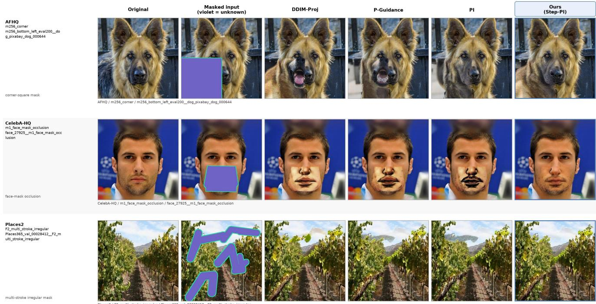  
Figure 6. Random shared-foundation construction-ladder inspection on three cases. The columns trace DDIM-Proj → P-Guidance → PI → Step-PI under the same frozen backbone, and exact case IDs are printed per row. These are the same three random cases shown in the main paper’s native-route external comparison, without method-specific reselection. The plate visually accompanies the five-metric matched comparisons.

## D.2. Strict-Random Prompt-Presence Examples

The display contains six MS175 cases drawn strictly at random before Correct or Empty outcomes were inspected, two per dataset. Within each paired row, every inference input and Step-PI setting is fixed; only the positive text condition changes. The Original column provides evaluation-only context unavailable during inference, while the Masked column follows the shared display convention without altering model inputs. The paired Prompt-CLIP analysis in Appendix C provides the three domain quantitative evidence; this plate is its strict-random visual companion and does not test fine-grained counterfactua control or human preference.

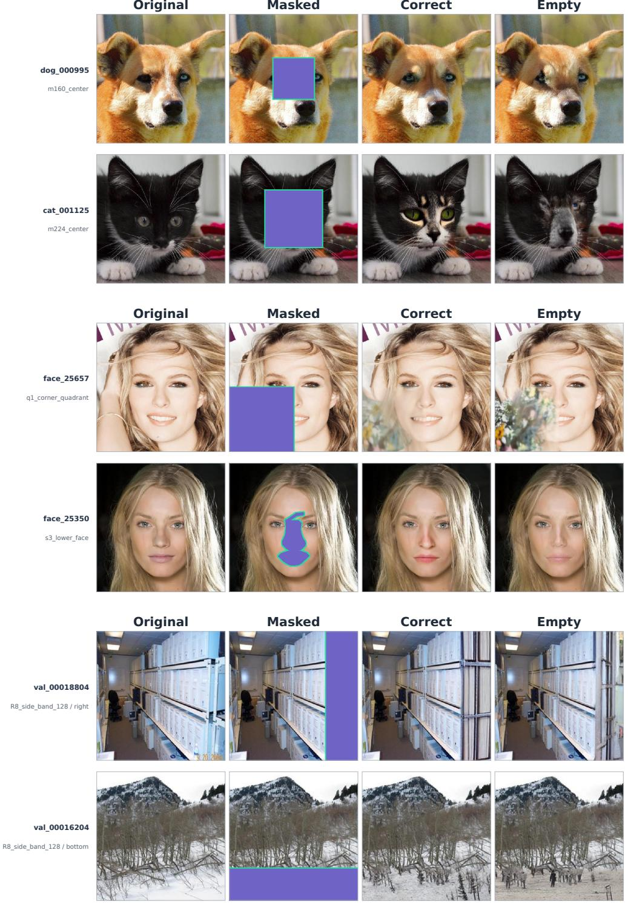  
Figure 7. Prompt-presence responses on six strict-random cases: AFHQ (top), CelebA-HQ (middle), and Places2 (bottom), with two cases per dataset. Every panel uses the shared four-column order Original, Masked, Correct, and Empty. Original is evaluation-only reader context and was unavailable during inference; Masked uses the shared violet/mint display convention; and only the positive text condition differs between Correct and Empty. The corresponding aggregate and per-dataset estimates are reported in Appendix C; this plate is their strict-random visual companion.

## D.3. Random Native-Route System Comparisons

Each plate contains six cases randomly drawn per dataset without conditioning on any method output, for 18 cases in total; one per dataset is reused in the main paper’s first-page teaser. Every row fixes the source image and mask, while methods retain their native inference routes. The held-out Original is shown as reference context and is not assumed to be the unique valid completion. These plates provide outcome-independent inspection of complete systems. Because their native interfaces and inference procedures differ, they are descriptive system-level comparisons rather than intervention-matched attribution, formal population-frequency estimates, or human-preference evidence.

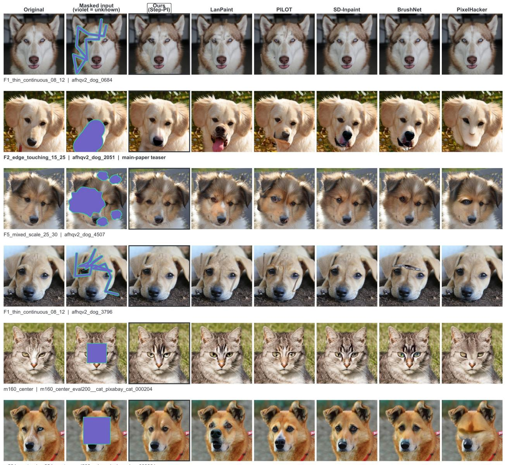  
m224 center | m224 center eyal200 dog pixabay dog 00390

Figure 8. Native-route comparison on six randomly drawn AFHQ cases. Each row shows one source image and mask across Step-PI, LanPaint, PILOT, SD-Inpaint, BrushNet, and PixelHacker; the case label marks the row reused in the main paper’s first-page teaser. Exact protocol and case IDs are printed below each row. The draw is independent of all method outputs, and every method retains its native inference route.

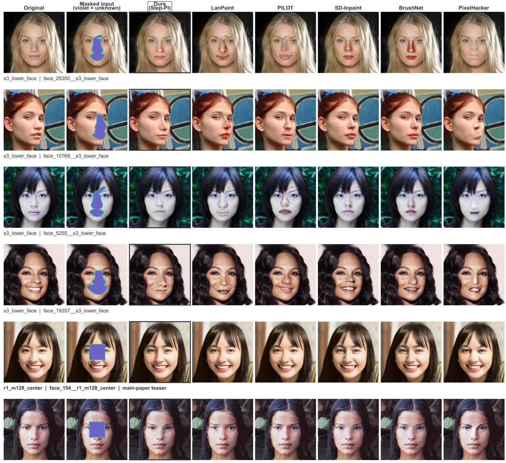  
r1\_m128\_center |face\_26775\_r1\_m128\_center

Figure 9. Native-route comparison on six randomly drawn CelebA-HQ cases, following the same column order and reading convention as Fig. 8. All panels are independently verified full-resolution composites on the same row-specific image and mask, with exact identifiers printed per row.

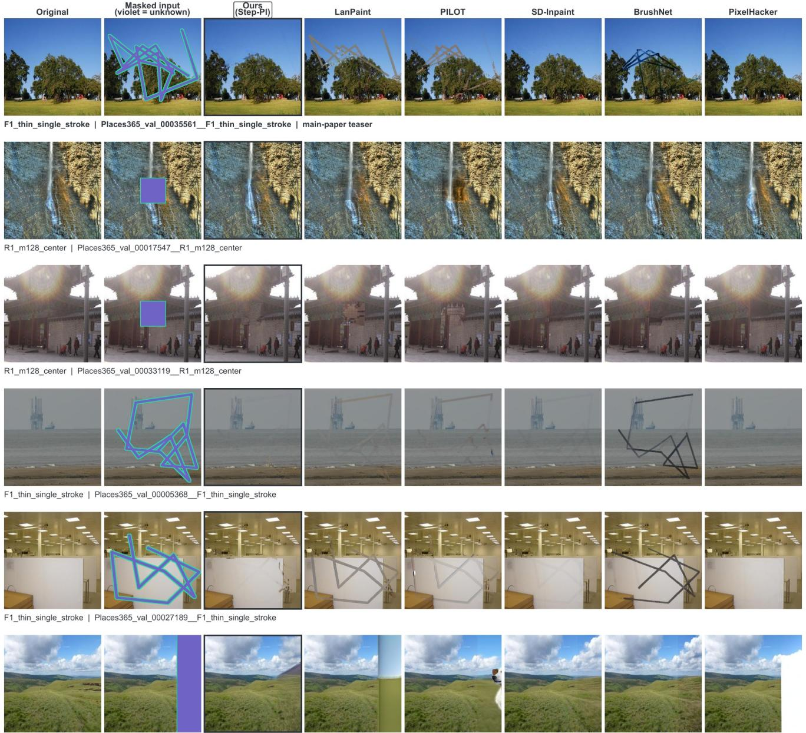  
R8\_side\_band\_128 |Places365\_val\_00031011\_R8\_side\_band\_128\_\_right

Figure 10. Native-route comparison on six randomly drawn Places2 cases. Each method receives the same image and mask within a row while retaining its native inference route, and exact identifiers are printed per row.

## D.4. Cross-Domain Stress-Test Diagnostics

The final plate presents a separate fixed six-case cross-domain diagnostic set spanning challenging mask–content configurations, with two cases per dataset. For every case, the complete active comparison lane is retained without method-specific inclusion or exclusion. The plate is organized to make diverse structural, semantic, and blending difficulties inspectable rather than to estimate their prevalence.

Inspection focuses on structural continuation under disconnected or thin masks, facial and semantic coherence under central occlusion, and seam and geometry consistency over long or repeated structures. These descriptions direct visua inspection of the fixed cases; they are observed case attributes, not experimentally isolated causes of any output.

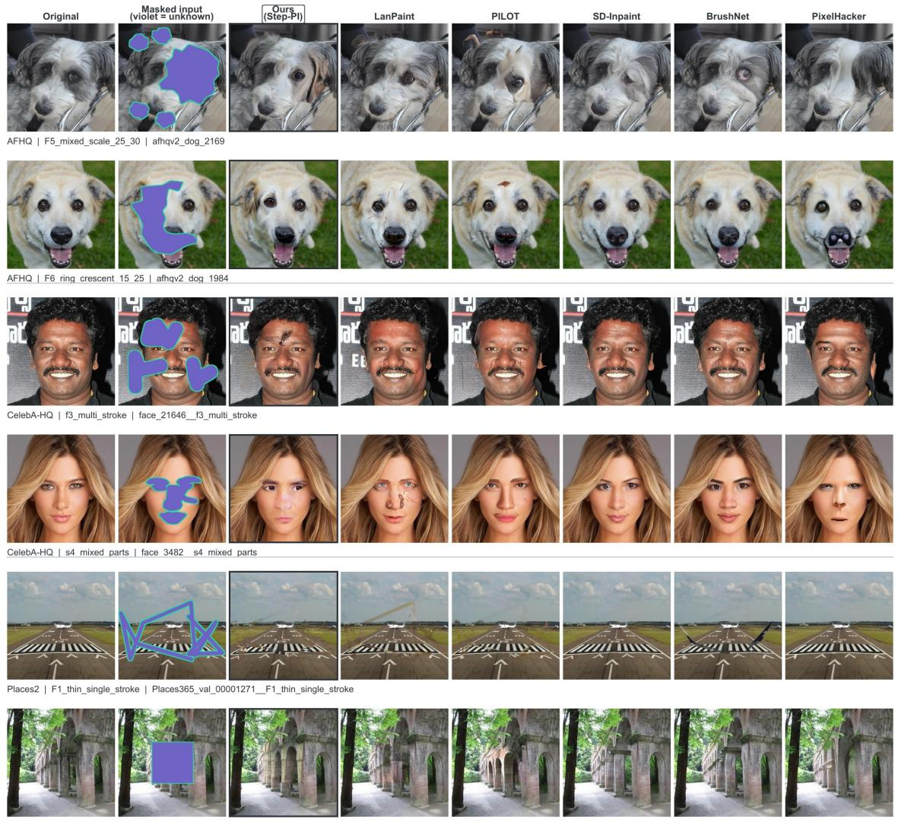  
Places2 | R2 m192 center |Places365 val 00033271 R2 m192 cente

Figure 11. Cross-domain stress-test diagnostics, with two cases each from AFHQ, CelebA-HQ, and Places2 and the complete active comparison lane retained for every case. Horizontal rules separate datasets, and exact protocol and case IDs are printed below every row. The plate supports inspection of challenging structural, semantic, and blending behaviors rather than prevalence estimation or causa attribution.

## E. Computational Cost and Evaluated Scope

## E.1. 35-Case Runtime, Memory, and Structural Compute Audit

Cohort and measurement protocol. The resource audit fixes one outcome-independent case from each of the 35 Main35 protocols. For nine methods, we measure batch-one, model-resident steady-state wall-clock time on one NVIDIA A100- SXM4-80GB GPU. Each method is executed in three fresh-process blocks with three fixed warm-up cases per block; excluding the warm-ups, this yields 945 formal timing tuples. The analysis unit is the method–case median over the three repeats Intervals use 10,000 dataset-stratified case/protocol bootstrap resamples (seed 20260820), with no outlier deletion and no por q-values. Peak device memory is collected at 20 Hz in a separate pass over the same 35 cases for all nine methods, yielding 315 method–case measurements; timing and memory are not joint observations.

Table 14. Intervention-matched internal 35-case cost audit. The upper panel reports empirical 2.5th and 97.5th percentiles of the 35 case medians; dataset-stratified bootstrap intervals govern the prose and paired comparisons. Peak device memory is measured in a separate pass. The lower panel reports structural calls from a count-only trace, not from the timed runs.  
(a) Runtime and peak device memory.
<table><tr><td>Method</td><td>Steps</td><td>Feedback grad./step</td><td>Param. updates</td><td>Median s/img [empirical P2.5, P97.5]</td><td> $\mathbf { M e a n } \pm \mathbf { S D }$ </td><td>Peak VRAM</td></tr><tr><td>DDIM-Proj</td><td>50</td><td>0</td><td>0</td><td>3.07 [3.06, 3.07]</td><td> $3 . 0 7 \pm 0 . 0 1$ </td><td>4.18 GiB</td></tr><tr><td>P-Guidance</td><td>50</td><td>2</td><td>0</td><td>30.48 [30.47, 30.49]</td><td> $3 0 . 4 7 \pm 0 . 0 4$ </td><td>15.55 GiB</td></tr><tr><td>PI</td><td>50</td><td>2</td><td>0</td><td>30.48 [30.47, 30.49]</td><td> $3 0 . 4 8 \pm 0 . 0 6$ </td><td>15.55 GiB</td></tr><tr><td>Step-PI</td><td>50</td><td>2</td><td>0</td><td>30.48 [30.47, 30.50]</td><td> $3 0 . 4 8 \pm 0 . 0 4$ </td><td>15.55 GiB</td></tr></table>

(b) Structural computation for the matched internal methods.
<table><tr><td>Method</td><td>Denoising steps</td><td>UNet calls</td><td>Autograd calls</td><td>Optimizer steps</td><td>Parameter updates</td></tr><tr><td>DDIM-Proj</td><td>50</td><td>50</td><td>0</td><td>0</td><td>0</td></tr><tr><td>P-Guidance</td><td>50</td><td>50</td><td>100</td><td>0</td><td>0</td></tr><tr><td>PI</td><td>50</td><td>50</td><td>100</td><td>0</td><td>0</td></tr><tr><td>Step-PI</td><td>50</td><td>50</td><td>100</td><td>0</td><td>0</td></tr></table>

Matched internal cost. The audit resolves no runtime difference between Step-PI and either matched feedback-enabled route: the paired Step-PI-minus-P-Guidance difference is +0.008 s/image [−0.003, 0.018], and the paired Step-PI-minus-PI difference is −0.002 s/image [−0.017, 0.020]. P-Guidance, PI, and Step-PI share 50 UNet calls and 100 autograd calls, with no optimizer step or parameter update. The predefined release schedule therefore adds no separately resolved cost beyond uniform PI in this audit; this is not an equivalence claim.

The complete feedback route nevertheless remains computationally demanding. Under the dataset-stratified bootstrap, Step-PI requires a median 30.48 s/image [30.47, 30.50] and an independent peak-device-memory median of 15.55 GiB. Relative to DDIM-Proj, its paired median overhead is +27.41 s/image [27.39, 27.44], its runtime ratio is 9.94× [9.93, 9.95], and its peak device memory is 3.72× as large. The structural counts locate the added computation in online differentiation: the feedback-enabled routes add 100 autograd calls to the same 50 UNet calls. They do not attribute wall-clock time to either objective or any individual suboperation.

Table 15. Same-input, same-A100 descriptive full-route comparison on the 35-case audit. All measured routes use frozen weights; online differentiation denotes latent or objective gradients rather than parameter updates. Methods retain their benchmark-specific backbones, checkpoints, samplers, precision, conditioning interfaces, and inference routes. The comparison therefore describes complete online cos on the same 35 cases and GPU rather than an intervention-matched efficiency comparison. Peak device memory is measured in a separate pass.
<table><tr><td>Method</td><td>Type</td><td>Native inference steps</td><td>Online differentiation</td><td>Median s/img [95% CI]</td><td>Peak VRAM</td></tr><tr><td>Step-PI</td><td>Training-free</td><td>50</td><td>2 gradients/step</td><td>30.48 [30.47, 30.50]</td><td>15.55 GiB</td></tr><tr><td>LanPaint</td><td>Training-free</td><td>30 Euler + 5 inner Langevin steps</td><td>None observed</td><td>11.38 [11.34, 11.43]</td><td>7.14 GiB</td></tr><tr><td>PILOT</td><td>Training-free</td><td>100</td><td>100 latent gradients</td><td>23.51 [23.45, 23.67]</td><td>6.75 GiB</td></tr><tr><td>SD-Inpaint</td><td>Trained reference</td><td>50</td><td>None observed</td><td>2.27 [2.26, 2.27]</td><td>3.45 GiB</td></tr><tr><td>BrushNet</td><td>Trained reference</td><td>50</td><td>None observed</td><td>2.94 [2.94, 2.95]</td><td>4.97 GiB</td></tr><tr><td>PixelHacker</td><td>Trained reference</td><td>20</td><td>None observed</td><td>1.33 [1.32, 1.33]</td><td>7.46 GiB</td></tr></table>

External descriptive positioning. The external rows are complete-route resource measurements, not causal component estimates. At the reported operating point, Step-PI is slower than LanPaint and PILOT, while the trained reference routes are faster still; these differences include each system’s foundation, sampler, precision, conditioning interface, and complete inference route. They cannot be attributed to a single algorithmic component.

Step-PI is therefore training-free but not computation-free. This 35-case audit characterizes one A100, 512×512, batchone, 50-step DDIM operating point; it supports neither cross-setting scaling, an amortized training–inference break-even point, nor a quality–compute frontier. The small PI/Step-PI timing difference also cannot be interpreted as an inherent acceleration or slowdown from the release schedule.

## E.2. Descriptive Native-Route Quality Positioning

The equal-dataset macro comparison in the main paper favors Step-PI over LanPaint and PILOT on all five metrics. Appendix B specifies the method attributes and frozen native routes.

<table><tr><td>Dataset</td><td>Method</td><td>Masked L1 ↓</td><td>Boundary L1 ↓</td><td>Masked LPIPS ↓</td><td>Boundary LPIPS ↓</td><td>CLIP-Q↑</td></tr><tr><td>AFHQ</td><td>Step-PI</td><td>0.1694</td><td>0.0320</td><td>0.1379</td><td>0.0980</td><td>0.7109</td></tr><tr><td>AFHQ</td><td>LanPaint</td><td>0.1677</td><td>0.0439</td><td>0.1518</td><td>0.1279</td><td>0.6797</td></tr><tr><td>AFHQ</td><td>PILOT</td><td>0.1708</td><td>0.0456</td><td>0.1502</td><td>0.1224</td><td>0.6742</td></tr><tr><td>AFHQ</td><td>SD-Inpaint</td><td>0.1263</td><td>0.0272</td><td>0.1067</td><td>0.0656</td><td>0.7605</td></tr><tr><td>AFHQ</td><td>BrushNet</td><td>0.1396</td><td>0.0317</td><td>0.1209</td><td>0.0841</td><td>0.7542</td></tr><tr><td>AFHQ</td><td>PixelHacker</td><td>0.1211</td><td>0.0243</td><td>0.1201</td><td>0.0590</td><td>0.7333</td></tr><tr><td>CelebA-HQ</td><td>Step-PI</td><td>0.1278</td><td>0.0236</td><td>0.0690</td><td>0.0923</td><td>0.5719</td></tr><tr><td>CelebA-HQ</td><td>LanPaint</td><td>0.1342</td><td>0.0371</td><td>0.0771</td><td>0.1373</td><td>0.6052</td></tr><tr><td>CelebA-HQ</td><td>PILOT</td><td>0.1203</td><td>0.0371</td><td>0.0672</td><td>0.1158</td><td>0.5999</td></tr><tr><td>CelebA-HQ</td><td>SD-Inpaint</td><td>0.0893</td><td>0.0174</td><td>0.0461</td><td>0.0591</td><td>0.7136</td></tr><tr><td>CelebA-HQ</td><td>BrushNet</td><td>0.1052</td><td>0.0224</td><td>0.0552</td><td>0.0824</td><td>0.7008</td></tr><tr><td>CelebA-HQ</td><td>PixelHacker</td><td>0.0943</td><td>0.0156</td><td>0.0524</td><td>0.0698</td><td>0.6385</td></tr><tr><td>Places2</td><td>Step-PI</td><td>0.1606</td><td>0.0317</td><td>0.1300</td><td>0.1184</td><td>0.4763</td></tr><tr><td>Places2</td><td>LanPaint</td><td>0.1805</td><td>0.0502</td><td>0.1679</td><td>0.1740</td><td>0.3638</td></tr><tr><td>Places2</td><td>PILOT</td><td>0.1879</td><td>0.0471</td><td>0.1539</td><td>0.1603</td><td>0.4310</td></tr><tr><td>Places2</td><td>SD-Inpaint</td><td>0.1438</td><td>0.0253</td><td>0.1113</td><td>0.0951</td><td>0.4783</td></tr><tr><td>Places2</td><td>BrushNet</td><td>0.1664</td><td>0.0335</td><td>0.1354</td><td>0.1366</td><td>0.4622</td></tr><tr><td>Places2</td><td>PixelHacker</td><td>0.2218</td><td>0.0229</td><td>0.1256</td><td>0.0851</td><td>0.4919</td></tr></table>

Table 16. Per-dataset external positioning for Step-PI and the five selected external methods, including independently audited LanPaint and PILOT overlays.

The first three rows within each dataset form the vanilla-SD1.5 training-free lane; the remaining three rows are inpaintingtrained references. The advantage is broad but not uniform across every dataset–metric cell: Step-PI records better point estimates than LanPaint in 13 of 15 cells; the exceptions are AFHQ Masked L1 and CelebA-HQ CLIP-Q. It records better point estimates than PILOT in 12 of 15 cells; the exceptions are CelebA-HQ Masked L1, Masked LPIPS, and CLIP-Q. Because methods retain different audited native routes and compute budgets, these results provide descriptive system-level positioning rather than an intervention-matched ranking

## E.3. Reproduction Scope and Numerical Execution

Evaluated stack. The evaluated claim is configuration-locked cross-domain transfer within one frozen vanilla-SD1.5 stack (original VAE, 512 ×512 inputs, and 50-step DDIM). The common controller configuration was developed only on smal CelebA-HQ pilots disjoint from Main35, then transferred without retuning to AFHQ and Places2. This evidence does not establish transfer across other backbones, VAEs, samplers, resolutions, or denoising budgets.

Reproduction protocol. The reported experiments are reproducible as protocol-level reruns using the fixed inputs, configurations, seeds, and analysis procedures described in Appendix B. The persistent-state and joint-release five-seed studies are separate paired inference-initialization studies on the fixed MS175 cohort; neither is a repeated-seed expansion of Main35. Static checks verify paired image, mask, seed, latent, and noise identities, ground-truth isolation during inference, exac known-region preservation, and resume logic. Upon publication, the implementation, experiment configurations, case lists, evaluation scripts, and table/figure generation code will be released

Numerical execution boundary. Independent CUDA executions can differ at the level of floating-point arithmetic and are therefore not expected to produce byte-identical image files. Reproduction here means rerunning the specified protocol and recovering the reported statistical conclusions, not requiring bitwise identity across independent GPU processes. Reported intervals characterize the case and/or inference-initialization variation specified by each study; they do not estimate low-leve arithmetic variation across executions. The one-field schedule study is consequently interpreted at its intended scope— conditional sensitivity on the evaluated cohort—rather than as a separate claim of cross-execution numerical robustness.