# UNCOVERING UNDERSTANDING–GENERATION SYN-ERGY IN NATIVE UNIFIED MULTIMODAL MODELS: FROM REPRESENTATION, TASK TO SYSTEM

Penghao Wu1 Haiwen Diao1 Weichen Fan1 Lewei Lu2 Dahua Lin2 Ziwei Liu1B

1S-Lab, Nanyang Technological University 2SenseTime Research

{penghao001,weichen002}@e.ntu.edu.sg {haiwen.diao,ziwei.liu}@ntu.edu.sg {luotto,dhlin}@sensetime.com

## ABSTRACT

While unified multimodal models (UMMs) jointly perform visual understanding and generation within a single model, functional unification does not guarantee learning synergy: the two objectives may reinforce each other, compete for capacity, or merely coexist. We investigate their relationship at the representation, task, and system levels in a controlled, structurally native setting without pretrained vision priors. At the representation level, we find that each objective provides useful signal to the other: generation enriches the visual features learned for understanding, while understanding strengthens vision–language alignment for generation. However, when both objectives are forced through the same computation path, one tends to dominate. A task-decoupled architecture that specializes conflicting visual computation while preserving semantic interaction avoids this asymmetric degradation. At the task level, through three case studies, we find positive bidirectional transfer when understanding and generation tasks rely on shared knowledge. At the system level, we show that an end-to-end UMM outperforms a matched planner–executor pipeline on complex tasks that explicitly require both image understanding and generation. Together, these results show that the value of UMMs extends beyond a unified interface: appropriate specialization, shared task knowledge, and end-to-end optimization can turn coexistence into synergy.

## 1 INTRODUCTION

Unified multimodal models (UMMs) bring visual understanding and generation into a single model, allowing text and images to be consumed and produced as interleaved content (Team, 2024; Zhou et al., 2025; Xie et al., 2025b; Wu et al., 2025a; Deng et al., 2025; Liu et al., 2025; Diao et al., 2026c). This capability enables forms of interaction that are difficult to realize with a conventional understanding-only or generation-only model. For example, UMMs can perform reasoning by generating mixed visual and textual content and iteratively interpret and modify images in the same sequence. Such applications provide a compelling functional motivation for unification.

However, the ability to expose understanding and generation through one interface does not establish that the two capabilities intrinsically benefit one another within the model. Their objectives may reinforce shared visual representations, compete for representational and computational capacity, or simply coexist without meaningful transfer. Existing UMMs primarily demonstrate that both capabilities can be supported at scale, while offering limited and sometimes conflicting evidence about how their joint learning changes either capability (Kang et al., 2026; Han et al., 2026; Liu et al., 2025; Chen et al., 2025a; Pan et al., 2025). Consequently, a basic question underlying unified multimodal intelligence remains unresolved: when and why do visual understanding and generation help each other, and when does unification instead create interference?

To study this question under controlled conditions, we adopt a native multimodal setting in which images are both consumed and produced directly in pixel space. Raw image patches enter the model without a pretrained vision encoder, while images are generated without an image tokenizer or VAE (Kingma & Welling, 2014). This pixel-in, pixel-out design minimizes external visual priors and allows us to more cleanly isolate the interaction between understanding and generation. We use a mature hybrid formulation that combines autoregressive text modeling with flow matching for visual generation. Starting from the same pretrained language model, we compare understanding-only, generation-only, and jointly trained variants under controlled routing and parameter-sharing strategies.

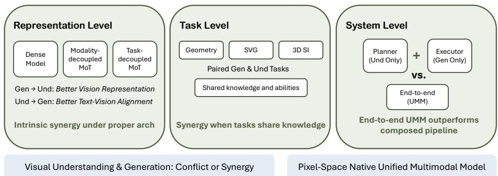  
Figure 1: Overview of our three-level study of understanding–generation synergy in native UMMs. At the representation level, we study the intrinsic relationship between understanding and generation under different architectures. At the task level, we test whether shared task knowledge enable bidirectional transfer. At the system level, we compare an end-to-end UMM with a composed pipeline of comparable understanding and generation capability.

Within this controlled setting, we organize our investigation at three progressively broader levels. At the representation level, we examine how understanding and generation jointly shape visual representations, and how parameter sharing and architectural specialization determine transfer or interference between their learning objectives. At the task level, we investigate whether related understanding and generation tasks benefit from joint training when they rely on shared domain knowledge or capabilities. At the system level, we study complex tasks that inherently require both capabilities, directly comparing an end-to-end UMM with an agentic pipeline composed of separate understanding and generation models.

At the representation level, we first study two different routing settings. In the dense shared model, the same pretrained LLM processes text, clean visual tokens for understanding, and noised visual tokens for generation. In the modality-decoupled MOT (Liang et al., 2024), text remains in the pretrained LLM branch, while all visual tokens are routed through a separate branch initialized from scratch The two settings exhibit opposite asymmetries. In the dense model, joint training improves visual understanding but degrades generation; in the modality-decoupled MOT, it improves generation but degrades understanding. Despite this trade-off, through representation-level probing, we find that each objective provides useful signal to the other: generation enriches the visual representations used for understanding, while understanding better aligns visual and language representations for generation. The problem is that forcing both objectives to use the same computation path makes one dominate and reduces the other largely to a regularizer. Based on this diagnosis, we develop a task-decoupled MOT, which keeps understanding visual tokens in the language branch and assigns generation visual tokens to a specialized branch, thereby achieving soft-alignment between understanding and generation visual tokens. This design allows the two capabilities to coexist without the same sacrifice.

At the task level, we study three domains in which understanding and generation could potentially share common knowledge: geometry reasoning, vector graphics, and 3D spatial intelligence. For geometry, we pair geometry problem solving with text-to-image generation and editing of geometric diagrams. Joint training produces clear gains on geometry reasoning and further improves performance on general mathematical reasoning benchmarks. In vector graphics and 3D spatial intelligence, jointly training the paired understanding and generation tasks improves both directions. Across these case studies, the same pattern emerges: visual understanding and generation benefit one another when their tasks require shared knowledge and capabilities.

At the system level, we ask whether an end-to-end UMM is more effective than connecting separate understanding and generation models for complex tasks that require both image understanding and generation. We study reasoning-intensive image editing, where the model must understand the source image and request, reason about the explicit edit instruction, and generate the resulting image. We compare an end-to-end UMM with a matched agentic pipeline in which an understanding model first produces an explicit edit instruction and a generation model then executes it. Under the same base model and data supervision, the end-to-end UMM shows clear advantages. This result shows that for complex tasks requiring tight interaction between understanding and generation, learning the full process within one unified model can be more effective than composing the two capabilities as separate stages.

Together, these studies show that the benefit of unifying understanding and generation is conditional rather than automatic. At the representation level, the architecture determines whether useful transfer becomes mutual improvement or an asymmetric trade-off. At the task level, joint training is most useful when the two directions require the same domain knowledge. At the system level, end-to-end modeling is advantageous when understanding and generation must interact throughout the task. These findings provide concrete guidance for building UMMs: specialize computation when the learning objectives conflict, and unify training and inference when knowledge and decisions are shared across the two capabilities.

Our contributions are:

• We present a controlled and comprehensive study of understanding–generation interaction at the representation, task, and system levels under a native multimodal setting.

• We reveal that understanding and generation can provide useful learning signals to each other, but whether these signals translate into mutual gains is architecture-dependent.

• We find that task-level synergy emerges when understanding and generation rely on shared knowledge or capabilities, through case studies spanning a broad spectrum from geometric reasoning to spatial intelligence.

• We establish a system-level advantage of unification for tasks that require tightly coupled understanding, reasoning, and generation by showing that an end-to-end UMM outperforms a matched planner–executor pipeline on reasoning-intensive image editing.

## 2 NATIVE UNIFIED MODELING

## 2.1 SCOPE AND FORMULATION

Modeling choice. Unified multimodal models span several modeling paradigms. Images and text can both predicted autoregressively with image being discretized (Team, 2024; Chen et al., 2025b; Cui et al., 2025) or predicted using a flow-matching head (Huang et al., 2025; Wu et al., 2025b); both modalities can also be trained with a discrete denoising objective (Xin et al., 2025; AI et al., 2026); or autoregressive text modeling can be combined with continuous diffusion or flow matching for images (Zhou et al., 2025; Deng et al., 2025). We adopt the last formulation, which is currently a widely used and empirically strong choice for jointly supporting language understanding and high-quality image generation. Specifically, the multimodal context is modeled causally, while the visual tokens within each generated image are modeled bidirectionally with flow matching. Evaluating whether the same interactions hold under fully autoregressive or discrete denoising formulations is left to future work. We nevertheless expect many of the conclusions about parameter sharing, task transfer, and system design to extend beyond the particular generative objective used here.

Native visual interface. Our use of native in this study refers specifically to how visual information enters and leaves the model, rather than to multimodal pretraining from scratch. The pixel-in, pixelout design avoids importing visual representations learned by external models, which could otherwise mask whether changes in visual features arise from understanding–generation joint training or from the pretrained visual prior itself.

## 2.2 TWO CONTROLLED ROUTING SETTINGS

We start from the pretrained Qwen3-1.7B language model (Yang et al., 2025a) and augment it with a stack of randomly initialized pre-buffer layers, following the native multimodal design of Diao et al. (2026a). Image inputs are first converted into patch tokens by two convolutional layers with a patch size of 32 and then passed to the LLM decoder layers. Attention is causal across the overall multimodal sequence, while tokens within the same image attend bidirectionally to one another. MRoPE-I (Huang et al., 2026) is used to encode multimodal positions while preserving the 2D spatial structure of images and the positional priors of the pretrained LLM. To isolate how access to pretrained language parameters affects the interaction between understanding and generation, we compare the two routing settings illustrated in Figure 2(a–b).

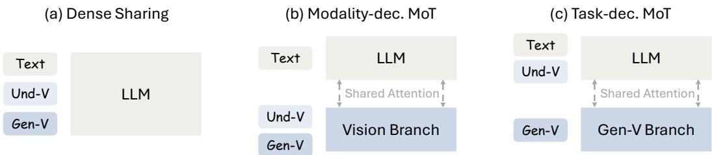  
Figure 2: Illustration of different architectures in our study. (a) Dense sharing sends all tokens through the same LLM decoder. (b) Modality-decoupled MOT keeps text in the LLM and sends all visual tokens through a scratch-trained branch. (c) Task-decoupled MOT keeps UND-V languageanchored while specializing GEN-V. For simplicity, we omit the pre-buffer layers here.

Dense sharing. The most direct design sends every token type—text, clean visual tokens for understanding, and noised visual tokens for generation—through the same LLM layers. This setting maximizes parameter sharing and gives both types of visual tokens direct access to pretrained language semantics. We train three matched variants: UND uses only understanding data, GEN uses only generation data, and UND+GEN uses both.

Modality-decoupled MOT. To isolate visual representation learning from the pretrained language backbone, we construct a modality-decoupled variant following the token-routed principle of MOT (Liang et al., 2024). The pretrained branch processes text only, while a parallel branch initialized from scratch processes all visual tokens, including both understanding tokens (UND-V) and noised generation tokens (GEN-V). The two branches retain global attention over the interleaved sequence.

## 3 REPRESENTATION-LEVEL SYNERGY

We first study how joint training reshapes the foundational visual representations. Specifically, we investigate whether parameter sharing intrinsically fosters representational synergy or induces feature interference, and how routing choices affect this dynamic.

## 3.1 TRAINING SETTINGS AND EVALUATION

Training protocol. We mainly select understanding and generation data from SenseNova-U1 (Diao et al., 2026c) for this study. The understanding data covers diverse types of multimodal instruction tuning data. The generation stream contains text-to-image generation and image editing data. Detailed training data statistics are reported in Section A.1. All variants use single-stage training with 210k optimization steps and a constant learning rate of $1 \times 1 0 ^ { - 4 }$ . More training details are provided in Section A.3.

Evaluation. We group understanding benchmarks into three categories. General contains MME (Fu et al., 2023), MMBench (Liu et al., 2024a), MMStar (Chen et al., 2024b), SEED Bench (Li et al., 2023), and MMMU (Yue et al., 2024). OCR contains DocVQA (Mathew et al., 2021), ChartQA (Masry et al., 2022), InfoVQA (Mathew et al., 2022), OCRBench (Liu et al., 2024b), and AI2D (Kembhavi et al., 2016). Vision-centric & SI (Spatial Intelligence) contains PerceptionBench (Lin et al., 2026b), P2GB (Chen et al., 2024a), BLINK (Fu et al., 2024), MME-Realworld (Zhang et al., 2025b), DA2K (Yang et al., 2024), CV-Bench (Tong et al., 2024), MindCube (Yin et al., 2025), 3DSR (Ma et al., 2025a), and ViewSpatial (Li et al., 2026). Generation is evaluated on GenEval2 (Kamath et al., 2025), DPGBench (Hu et al., 2024), HPSv3 (Ma et al., 2025b), and Aesthetic Score (discus0434, 2024). Full per-benchmark results and evaluation details are reported in Section A.4.

Table 1: Understanding and generation results across routing architectures. Understanding columns report category averages. Atom-level score is reported for GenEval2. Higher is better for all metrics.
<table><tr><td rowspan="2">Model</td><td colspan="2">Model</td><td colspan="3">Understanding</td><td colspan="4">Generation</td></tr><tr><td>Architecture</td><td>Training</td><td></td><td></td><td>General OCR V-Centric &amp; SI GenEval2</td><td></td><td></td><td></td><td>DPG HPSv3 Aesthetic</td></tr><tr><td>1</td><td>Dense</td><td>UND/GEN</td><td>67.82</td><td>71.96</td><td>60.72</td><td>51.16</td><td>79.11</td><td>7.05</td><td>5.12</td></tr><tr><td>2</td><td></td><td>UND+GEN</td><td>68.69</td><td>72.12</td><td>61.77</td><td>51.03</td><td>78.12</td><td>5.92</td><td>4.94</td></tr><tr><td>3 4</td><td>Modality-dec. MoT</td><td>UND/GEN</td><td>64.20</td><td>66.84</td><td>59.54</td><td>57.55</td><td>82.06</td><td>7.72</td><td>5.37</td></tr><tr><td></td><td></td><td>UND+GEN</td><td>61.58</td><td>62.11</td><td>57.49</td><td>63.47</td><td>83.09</td><td>7.97</td><td>5.48</td></tr><tr><td>5</td><td>Task-dec. MoT</td><td>UND+GEN</td><td>69.02</td><td>72.09</td><td>62.38</td><td>63.96</td><td>82.31</td><td>7.90</td><td>5.50</td></tr></table>

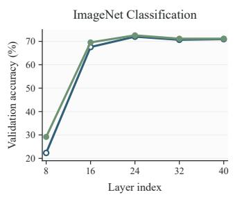

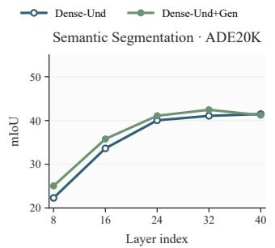

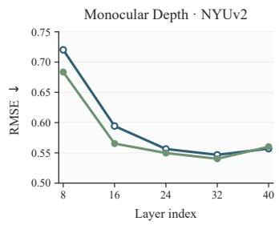  
Figure 3: Layer-wise probing experiments of visual representations. Higher is better for classification and mIoU; lower is better for depth R-MSE. Joint training strengthens visual representations, with the clearest gains in early and middle layers across semantic and geometric probing tasks.

## 3.2 RESULTS OF DENSE SHARING

As shown in Table 1 (Rows 1–2), for visual understanding, joint training achieves better performance compared with the UND baseline, with the largest gain on Vision-centric & SI. The effect is nevertheless strongly asymmetric: compared with the GEN model, the UND+GEN model performs substantially worse across the generation metrics.

To understand how joint training changes the visual representations for visual understanding, we conduct a series of layer-wise probes on the frozen backbones. We measure global semantic information with ImageNet (Deng et al., 2009) classification and dense spatial information with semantic segmentation on ADE20K (Zhou et al., 2017) and monocular depth estimation on NYU-Depth V2 (Silberman et al., 2012). We additionally visualize PCA projections of the visual features for qualitative comparison. From the probing results (Figure 3) and feature visualization (Figure 4), we observe that the generation supervision improves the visual representations learned for visual understanding.

Recent work shows that image and video generation training can learn strong, general-purpose visual representations, supporting zero-shot or data-efficient transfer to a broad range of visual understanding tasks (Gabeur et al., 2026; Wang et al., 2026).Our probing results are consistent with this broader observation: generation supervision enriches the visual features for visual understanding. The dense setting, however, reveals that better representations for understanding do not automatically yield balanced understanding and generation within a unified model. We hypothesize that the pretrained LLM acts as a strong semantic anchor, allowing understanding to dominate the shared feature space. Generation consequently serves as a useful auxiliary constraint for representation learning, but its own capability is degraded by competition within the shared parameters.

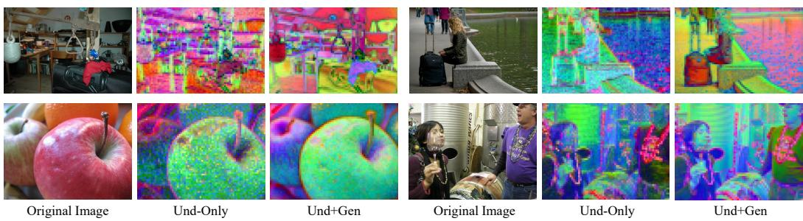  
Figure 4: PCA visualization of dense visual features. Patch-level features are projected onto a shared three-dimensional PCA basis and visualized as RGB maps. Compared with understandingonly training, joint training produces more coherent object regions and clearer spatial structure, consistent with the improvements observed by the frozen probes.

## 3.3 RESULTS OF MODALITY-DECOUPLED MOT

As shown in Table 1 (Rows 3–4), when all visual tokens move to the scratch-trained visual-only branch, UND+GEN is worse than UND on visual understanding benchmarks, while generation performance becomes significantly better than GEN. In contrast to the dense architecture, generation dominates the shared visual computation in this setting, while understanding primarily serves as auxiliary supervision. Moreover, the modality-decoupled UND model is below its dense counterpart, particularly on General and OCR, indicating that, for tasks that rely on strong vision–text alignment, processing visual and textual tokens with shared parameters is more effective than separating them into modality-specific branches.

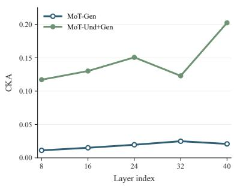  
Figure 5: Joint learning improves vision–language alignment for generation.

Since joint training improves generation in this setting, we further examine whether understanding supervision changes the generative visual representations. We measure layer-wise linear CKA (Kornblith et al., 2019) between pooled text features from the language branch and generative image features from the visual branch using 5000 text-image pairs from the COCO validation set (Lin et al., 2014). As shown in Figure 5, joint training produces consistently higher text-image CKA than generation-only training. This result indicates that understanding supervision improves generation by better aligning the generation representations with language semantics.

## 3.4 A THIRD DESIGN: TASK-DECOUPLED MOT

The opposite failure modes motivate a third design: the task-decoupled MOT illustrated in Figure 2(c). It routes text and clean image tokens (for understanding or serving as context) through the pretrained LLM branch, while the noised image tokens (for generation) use a generation-specialized visual branch. Thus, understanding retains direct access to pretrained language semantics, whereas generation receives parameters specialized for the generation objective.

The visual representations in the two branches remain softly aligned in two ways. First, they attend to the same textual features, providing a shared semantic context. Second, with image editing and interleaved samples, the context image in the understanding branch acts as a condition for the generation branch via shared attention at each layer. To further strengthen the connection between them, we allocate an additional 20% of the training mixture to an image reconstruction task formulated as image editing. The target images are drawn from the text-to-image data, while 50% of the visual tokens in each corresponding context image are randomly masked.

As shown in Table 1 (Row 5), the task-decoupled MOT avoids the opposite trade-offs observed in the dense and modality-decoupled models. This result suggests that the interference is not intrinsic to unification. Instead, it can be mitigated by specializing the visual computation required by the two objectives while retaining pathways for semantic interaction. We do not claim that task-decoupled routing is the unique optimal solution for unified modeling; other conditional architectures, such as mixtures-of-experts (MoE) (Shazeer et al., 2017) with task- or token-dependent routing, may also achieve a balance between specialization and sharing, which we leave for future work.

Finding 1 (Representation Level): Visual understanding and generation can benefit each other, but mutual gains depend on the architecture. Selectively specializing conflicting visual pathways while preserving semantic interaction enables both capabilities to improve without either dominating the other.

We therefore use the task-decoupled MOT as the default base model for the task-level and system-level studies that follow.

## 4 TASK-LEVEL SYNERGY

Having obtained a model that avoids conflict between visual understanding and generation, we next move from representations to tasks and ask: when these two learning objectives rely on the same domain knowledge or underlying capability, can supervision in one direction improve the other? We study this question through three cases.

Across all three cases, 50% of each training mixture consists of the same general-purpose data used in the representation-level training stage, after removing examples related to the task or domain under study. The remaining mixture consists of the corresponding task-specific understanding and generation data. This preserves the model’s general capabilities while preventing overlapping auxiliary data from confounding the task-level comparison.

## 4.1 CASE I: GEOMETRY PROBLEM SOLVING

Our first case asks whether the generation objective can improve geometry reasoning. Geometry problem solving requires the model to identify entities, relations, and constraints in geometric diagrams, while generating or editing a geometric figure requires it to construct visual content that satisfies the same structure. The two objectives therefore partially share the same domain knowledge.

We construct a geometry-related understanding data mixture which contains 965K geometry problemsolving data and general mathematical-reasoning data selected from public datasets (Lin et al., 2026a; Lu et al., 2021; Zhang et al., 2025a; Wiedmann et al., 2025; LI et al., 2024; Wang et al., 2025; Zhang et al., 2026b). The generation part consists of two generation datasets: text-to-image examples from MATHCANVAS-IMAGEN (Shi et al., 2026) and geometry-diagram editing examples from MATHCANVAS-EDIT (Shi et al., 2026). Our primary comparison is between understanding-only training (UND) and joint training (UND+GEN) to see whether the generation objective can effectively improve the geometry understanding and reasoning abilities.

We then ask a more specific question: with the same data, is the generation objective a more effective way than the corresponding understanding objective in this case? To test this, we convert exactly the same generation data into an understanding format. Text-to-image pairs become image-description tasks, and editing pairs become tasks that describe the transformation between the source and target images. This Textual-Desc baseline controls the source data while changing only how the model learns from it: through text prediction instead of image generation.

We evaluate the models on geometry problem solving benchmark including Geometry3K (Lu et al., 2021) and PGPS9K (Zhang et al., 2023), and general math benchmarks including MathVerse (Zhang et al., 2024) and MathVista (Lu et al., 2024). As shown in Table 2, adding the generation objective improves the understanding model on all four benchmarks. The gains also transfer beyond the directly paired geometry tasks into general math reasoning. Converting the same additional examples into understanding tasks produces a smaller and less consistent benefit. This comparison shows that the benefit is not solely a result of exposing the model to more geometry data. For these tasks and data, learning to generate and edit the diagrams is a more effective form of auxiliary supervision for geometry and general mathematical reasoning than learning text-output descriptions.

Table 2: Geometry problem solving and general mathematical reasoning. UND+GEN adds the geometric image-generation objectives. UND + Textual-Desc uses the same examples after converting them into image-description and edit-description tasks. Higher is better for all metrics.
<table><tr><td rowspan="2">Training</td><td colspan="2">Geometry</td><td colspan="2">General Math</td></tr><tr><td>Geometry3K</td><td>PGPS9K</td><td>MathVersetestmini</td><td>MathVistatestmini</td></tr><tr><td>UND</td><td>59.90</td><td>72.40</td><td>60.13</td><td>71.80</td></tr><tr><td>UND + Textual-Desc</td><td>63.56</td><td>73.90</td><td>59.11</td><td>73.60</td></tr><tr><td>UND+GEN</td><td>65.39</td><td>73.40</td><td>63.15</td><td>74.30</td></tr></table>

## 4.2 CASE II: SVG UNDERSTANDING AND GENERATION

Scalable Vector Graphics (SVG) provides a naturally bidirectional domain for studying task-level transfer: the same icon can be represented either as a rendered image or as an executable vector program. We ask whether learning both mappings jointly improves the model’s correspondence between symbolic SVG structure and visual appearance.

Task setup. In the understanding direction, the model receives a rendered icon image and outputs its SVG code. In the generation direction, the model receives SVG code and directly renders the corresponding image. Although the output spaces differ, both directions depend on the same latent scene graph and rendering relations. We use the 359K SVG code-image pairs from UniSVG (Li et al., 2025) to construct the corresponding understanding and generation training data. For evaluation, we use the test data of UniSVG and adopt its metric to evaluate the directly generated or code-rendered icon, which is a weighted sum of SSIM (Wang et al., 2004), LPIPS (Zhang et al., 2018), and CLIP similarity (Radford et al., 2021).

Bidirectional transfer. We compare understanding-only, generation-only, and joint training in Table 3. Joint training improves both SVG image understanding and SVG-conditioned image generation over their corresponding single-direction models. This mutual improvement suggests that the two tasks share more than generic image–text semantics:

Table 3: SVG understanding and generation results. Higher is better.
<table><tr><td>Training</td><td>Image→SVG</td><td>SVG→Image</td></tr><tr><td>UND/GEN</td><td>80.64</td><td>80.21</td></tr><tr><td>UND+GEN</td><td>81.70</td><td>86.52</td></tr></table>

supervision in either direction helps the model learn the executable relationship between vector operations and their visual consequences.

Diagnostic: mental visualization from SVG code. We hypothesize that joint training improves the model’s ability to mentally visualize the corresponding image directly from SVG code. We test this hypothesis with two complementary diagnostics. First, we construct a code-conditioned multiple-choice blind VQA benchmark in which each question asks about the appearance implied by an SVG program without providing its rendered image. Crucially, the answers cannot be obtained through a surface-level reading of tags or individual attributes. The model must mentally execute and compose operations such as path rendering, geometric transformations, grouping, and layering to infer the final visual outcome. Details and examples about this benchmark are provided in Section B.1. Second, we inspect the predicted clean image after only the first generation step. This early prediction indicates how readily the model forms a global visual plan directly from the code.

As shown in Figure 6, the UND+GEN model performs better on the blind VQA diagnostic and recovers recognizable contours and spatial layout earlier than GEN. Together, these results provide complementary evidence that joint training strengthens an internal, visually grounded simulation of SVG execution: the model can both reason about the implied image in text and instantiate its structure earlier during generation.

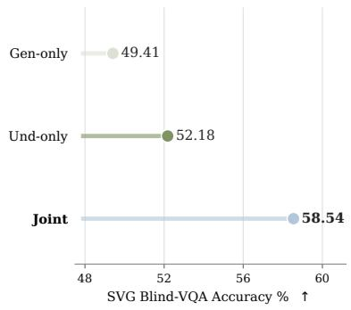

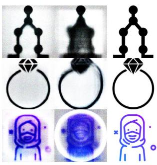  
Joint  
Gen  
GT

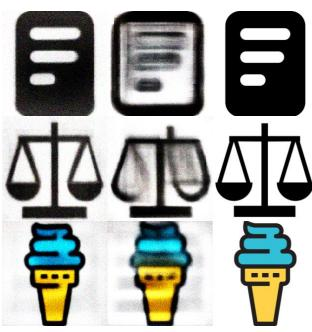  
Joint  
GT  
Gen

Figure 6: Joint training improves direct visualization from SVG code. Left: Joint training achieves higher accuracy on code-conditioned VQA, which requires inferring the rendered appearance of an SVG program without seeing the image. Right: The predicted clean image after only one generation step visualizes how easily the model forms global shape and layout from the same code.

## 4.3 CASE III: 3D SPATIAL INTELLIGENCE

For our third case study, we move beyond the specialized domains of geometry problems and SVGs to 3D spatial intelligence, a broader and more widely required capability that is fundamental to many applications like embodied agents and interactive world modeling. We examine whether understanding and generation can improve each other on general 3D spatial intelligence tasks. Although the tasks are not exact input–output inverses, they partially share the underlying capability to perceive and understand the 3D space.

Task setup. The understanding training mixture for 3D SI contains single-image, multi-image, and video-based 3D VQA, covering spatial relations, viewpoint reasoning, depth, and camera motion. For the generation mixture, we design the following four generative tasks related to 3D SI. Examples of these tasks are provided in Section B.2.

• Ego-motion Transition, which requires the model to predict the target frame based on a source frame and ego movement descriptions. We use the public dataset SpatialEdit-500K (Xiao et al., 2026) and additionally construct 1.6M samples from Scannet (Dai et al., 2017) and Scannet++ (Yeshwanth et al., 2023).

• Multi-view Reconstruction, which requires the model to predict a target view based on the provided views of a certain object. We use the Objaverse (Deitke et al., 2022) data to create 248K samples. We only consider front, back, left, and right views and randomly choose 2 views as context and 1 view as target.

• View Sequence Completion (VSC), which requires the model to predict the middle frame given the first and last 2 frames in a 5-frame sequence. We construct 880K samples from Scannet (Dai et al., 2017), Scannet++ (Yeshwanth et al., 2023), and ARKitScenes (Baruch et al., 2021).

• Layout-to-image Generation, which requires the model to generate an image conditioned on a description of its 3D layout. We consider two forms of layout conditioning: (i) a structured representation specifying the size of every object and its 3D position relative to the camera, and (ii) a natural-language description emphasizing the scene’s 3D structure and spatial relations. Using Omni3D (Brazil et al., 2023), we construct 332K training samples across these two formats.

We evaluate 3D spatial understanding on nine benchmarks including VSI-Bench (Yang et al., 2025b), SPAR-Bench (Zhang et al., 2026a), CV-Bench (Tong et al., 2024), DA-2K (Yang et al., 2024), MindCube (Yin et al., 2025), ViewSpatial (Li et al., 2026), 3DSRBench (Ma et al., 2025a), MMSI (Yang et al., 2025c), All-Angles (Yeh et al., 2026). For generation, we evaluate ego-motion transition on SpatialEdit benchmark using Viewpoint Error (VE) and Framing Error (FE). We also construct a test set of the VSC task and evaluate using PSNR, SSIM, and LPIPS as metrics.

Table 4: Understanding results on 3D SI benchmarks. Higher is better for all benchmarks.

<table><tr><td>Model</td><td>VSI-Bench</td><td>SPAR-Bench</td><td>CV-Bench</td><td>DA-2K</td><td>MindCube-tiny</td><td>ViewSpatial</td><td>3DSRBench</td><td>MMSI</td><td>ALL-Angles</td><td>Average</td></tr><tr><td>UND only</td><td>53.98</td><td>38.80 41.13</td><td>77.67 78.77</td><td>70.69 73.89</td><td>75.71 77.90</td><td>58.75 58.07</td><td>59.84 60.51</td><td>36.40 39.20</td><td>42.50 46.11</td><td>57.15 59.01</td></tr></table>

Table 5: Benchmark results on 3D SI related generation tasks.
<table><tr><td rowspan="2">Model</td><td colspan="2">Spatial-Edit</td><td colspan="3">View Sequence Completion</td></tr><tr><td>VE↓</td><td>FE↓</td><td>PSNR ↑</td><td>SSIM↑</td><td>LPIPS ↓</td></tr><tr><td>GEN only</td><td>0.4062</td><td>0.6564</td><td>16.76</td><td>0.6365</td><td>0.3828</td></tr><tr><td>UND+GEN</td><td>0.3766</td><td>0.6297</td><td>19.15</td><td>0.6674</td><td>0.3078</td></tr></table>

Bidirectional transfer. For understanding (Table 4), joint training improves eight of nine benchmarks and raises the average score from 57.15 to 59.01. For generation (Table 5), it reduces both errors on Spatial-Edit and improves all three VSC metrics. These results show that 3D SI-related visual understanding and generation tasks benefit each other as the underlying knowledge overlaps.

Finding 2 (Task Level): Shared underlying knowledge or capabilities make understanding and generation tasks mutually reinforcing.

This finding motivates exploring unified learning in broader settings where multiple capabilities depend on shared latent knowledge or structure. One direct example is world modeling and policy/action learning, where understanding the current state, predicting future observations, and generating actions all rely on a common model of the physical world and its dynamics.

## 5 SYSTEM-LEVEL SYNERGY

We now move beyond tasks centered primarily on either understanding or generation to a higher-level setting in which both capabilities are inherently required to operate sequentially and interactively. Some of these tasks do not necessarily require a unified model: separate understanding and generation models can be composed into an agentic pipeline. Our system-level question is therefore whether, under a fair and matched comparison, an end-to-end UMM provides a measurable performance advantage over composing specialized understanding and generation models, beyond the practical simplicity of using a single model.

We study this question through the reasoning-intensive image editing task. Given a source image and an implicit editing request, the system must understand the source, reason about the intended concrete edit, and generate the target image. This task admits both an end-to-end solution and a natural planner–executor decomposition, making it suitable for comparing unified and agentic systems.

## 5.1 CONTROLLED COMPARISON SETUP

To compare end-to-end unification and modular composition under controlled conditions, we initialize all models from the same task-decoupled MOT checkpoint and transform the same set of reasoningediting examples into three training formats:

1. End-to-end understanding and generation: given a source image and the original implicit instruction, the model reasons about the requested change, produces an explicit edit instruction, and then generates the target image.

Table 6: Results on reasoning-intensive image editing benchmarks. Higher is better for all results.
<table><tr><td rowspan="2">System</td><td colspan="5">RISEBench</td><td colspan="4">KRIS-Bench</td></tr><tr><td>Temporal</td><td>Causal</td><td>Spatial</td><td>Logical</td><td>Overall</td><td>Factual</td><td>Conceptual</td><td>Procedural</td><td>Overall</td></tr><tr><td>Planner → Executor</td><td>18.82</td><td>22.22</td><td>14.00</td><td>11.76</td><td>16.66</td><td>61.40</td><td>71.17</td><td>64.58</td><td>66.48</td></tr><tr><td>End-to-end UMM</td><td>22.35</td><td>27.77</td><td>16.00</td><td>9.41</td><td>18.88</td><td>64.73</td><td>72.32</td><td>66.16</td><td>68.33</td></tr></table>

2. Understanding/planning: given the same source image and implicit instruction, the model performs the reasoning and outputs only the explicit edit instruction.

3. Generation/execution: given the source image, implicit instruction, and explicit edit instruction, the model generates the target image.

We train one model for each format. At inference time, the agentic pipeline composes the planner in (2) with the executor in (3), while the model in (1) performs the complete process end to end. In addition to the reasoning-editing examples, 50% of each training mixture consists of the same general-purpose data used in the representation-level training stage.

We evaluate both systems on RISEBench (Zhao et al., 2026) and KRIS-Bench (Wu et al., 2026). As shown in Table 6, the end-to-end UMM outperforms the planner–executor pipeline on both benchmarks. Under the matched base model and task data, this result shows that end-to-end unification can provide a performance advantage when visual understanding, reasoning, and generation must interact closely within a task.

Finding 3 (System Level): End-to-end unification can outperform modular composition for complex tasks that explicitly require both visual understanding and generation.

A natural future direction is to internalize broader agentic generation processes, such as multimodal search + generation and iterative visual refinement, as native capabilities of UMMs. This could enable increasingly complex tasks to be learned and completed end-to-end within a unified model.

## 6 RELATED WORK

Unified multimodal models. Unified multimodal models (UMMs) integrate visual understanding and generation within a single model and have developed rapidly in recent years (Team, 2024; Xie et al., 2025b; Wu et al., 2025a; Zhou et al., 2025; Deng et al., 2025; Liu et al., 2025; Diao et al., 2026c). By understanding and generating text and images within a common context, these models enable distinctive capabilities such as generating interleaved multimodal documents and combining textual reasoning with visual reasoning performed through generation. However, such functional unification does not establish whether the underlying visual understanding and generation capabilities genuinely reinforce each other or merely coexist in the same model. We study when and why joint learning produces synergy, and when architectural sharing instead leads to interference.

Native multimodal models. The term native can describe both how a multimodal model is trained and how it is structured. From a training perspective, native models are exposed to multimodal data from the beginning of pretraining, rather than first pretraining a text-only LLM and introducing multimodal capabilities afterward (Team et al., 2026; Tong et al., 2026; Lab, 2026; Han et al., 2026). From a structural perspective, visual inputs and outputs are processed directly by the multimodal backbone, reducing reliance on external encoders, image tokenizers, or VAEs. Recent systems explore native pixel representations, unified visual features, and increasingly end-to-end multimodal training (Bavishi et al., 2023; Lab, 2026; Diao et al., 2026b;c). We adopt a structurally native, pixel-in, pixel-out setting without a pretrained visual encoder or generative VAE, allowing the interaction between understanding and generation to be studied without external visual priors. We do not, however, train the entire model natively from scratch. Pretraining a language model with sufficiently strong language and reasoning capabilities requires substantial data and computation, while our controlled analyses and downstream tasks depend on such capabilities to yield meaningful results.

We therefore initialize from a pretrained LLM and focus specifically on how visual understanding and generation are learned and interact.

Understanding and generation: conflict or synergy? Existing work provides no clear consensus on whether visual understanding and generation intrinsically benefit each other. Some studies report substantial interference between the two objectives and motivate explicitly decoupling their represen tations or computation pathways (Wu et al., 2025a; Pan et al., 2025). Others introduce additional architectural components or training objectives to transfer understanding signals to generation. For example, Reconstruction Alignment (RecA) conditions image reconstruction on dense understanding features (Xie et al., 2025a), while UNO injects captioning and visual-regression supervision into generative representations (Liu et al., 2026). Concurrent studies further demonstrate that the two capabilities can mutually improve through knowledge flow, but primarily under carefully designed tasks (Kang et al., 2026; Han et al., 2026).

Together, these findings suggest that synergy is possible but highly conditional. However, the observed effects are often entangled with specialized modules, auxiliary losses, task-specific formulations, or changes in pretrained visual components, making the intrinsic relationship between understanding and generation difficult to isolate. We address this gap in a controlled native setting, studying their interaction at the representation, task, and system levels.

## 7 LIMITATIONS

Our study focuses on the currently prevalent modeling formulation that combines discrete autoregressive modeling for text with continuous diffusion-based modeling for images. Although most of our conclusions are likely to transfer to other formulations, such as fully discrete or fully autoregressive multimodal modeling, their generality remains to be empirically validated. In addition, our experiments mainly use a task-decoupled architecture to demonstrate that understanding and generation can mutually benefit. We do not extensively explore the broader architecture design space; identifying the optimal unified architecture and balance between sharing and specialization remains an important direction for future work.

## 8 CONCLUSION

We studied understanding–generation synergy in native UMMs across representations, tasks, and systems. We find that their mutual benefit is architecture-dependent, and task-aware specialization enables both capabilities to coexist without asymmetric degradation. Joint training further improves both directions when tasks share underlying knowledge, while an end-to-end UMM outperforms a matched modular pipeline when understanding, reasoning, and generation must interact closely. These results demonstrate that UMMs offer value beyond a unified interface by enabling knowledge transfer and end-to-end optimization across the two capabilities.

## REFERENCES

Inclusion AI, Tiwei Bie, Haoxing Chen, Tieyuan Chen, Zhenglin Cheng, Long Cui, Kai Gan, Zhicheng Huang, Zhenzhong Lan, Haoquan Li, et al. Llada2. 0-uni: Unifying multimodal understanding and generation with diffusion large language model. arXiv preprint arXiv:2604.20796, 2026.

Gilad Baruch, Zhuoyuan Chen, Afshin Dehghan, Tal Dimry, Yuri Feigin, Peter Fu, Thomas Gebauer, Brandon Joffe, Daniel Kurz, Arik Schwartz, and Elad Shulman. ARKitscenes - a diverse real-world dataset for 3d indoor scene understanding using mobile RGB-d data. In NeurIPS Datasets and Benchmarks Track, 2021.

Rohan Bavishi, Erich Elsen, Curtis Hawthorne, Maxwell Nye, Augustus Odena, Arushi Somani, and Sagnak Ta ˘ s¸ırlar. Introducing our multimodal models, 2023. URL https://www.adept.ai/ blog/fuyu-8b.

Garrick Brazil, Abhinav Kumar, Julian Straub, Nikhila Ravi, Justin Johnson, and Georgia Gkioxari. Omni3d: A large benchmark and model for 3d object detection in the wild. In CVPR, 2023.

Jiaxing Chen, Yuxuan Liu, Dehu Li, Xiang An, Weimo Deng, Ziyong Feng, Yongle Zhao, and Yin Xie. Plug-and-play grounding of reasoning in multimodal large language models. arXiv preprint arXiv:2403.19322, 2024a.

Jiuhai Chen, Zhiyang Xu, Xichen Pan, Yushi Hu, Can Qin, Tom Goldstein, Lifu Huang, Tianyi Zhou, Saining Xie, Silvio Savarese, et al. Blip3-o: A family of fully open unified multimodal models-architecture, training and dataset. arXiv preprint arXiv:2505.09568, 2025a.

Lin Chen, Jinsong Li, Xiaoyi Dong, Pan Zhang, Yuhang Zang, Zehui Chen, Haodong Duan, Jiaqi Wang, Yu Qiao, Dahua Lin, et al. Are we on the right way for evaluating large vision-language models? In NeurIPS, 2024b.

Xiaokang Chen, Zhiyu Wu, Xingchao Liu, Zizheng Pan, Wen Liu, Zhenda Xie, Xingkai Yu, and Chong Ruan. Janus-pro: Unified multimodal understanding and generation with data and model scaling. arXiv preprint arXiv:2501.17811, 2025b.

Yufeng Cui, Honghao Chen, Haoge Deng, Xu Huang, Xinghang Li, Jirong Liu, Yang Liu, Zhuoyan Luo, Jinsheng Wang, Wenxuan Wang, et al. Emu3. 5: Native multimodal models are world learners. arXiv preprint arXiv:2510.26583, 2025.

Angela Dai, Angel X Chang, Manolis Savva, Maciej Halber, Thomas Funkhouser, and Matthias Nießner. Scannet: Richly-annotated 3d reconstructions of indoor scenes. In CVPR, 2017.

Matt Deitke, Dustin Schwenk, Jordi Salvador, Luca Weihs, Oscar Michel, Eli VanderBilt, Ludwig Schmidt, Kiana Ehsani, Aniruddha Kembhavi, and Ali Farhadi. Objaverse: A universe of annotated 3d objects. arXiv preprint arXiv:2212.08051, 2022.

Chaorui Deng, Deyao Zhu, Kunchang Li, Chenhui Gou, Feng Li, Zeyu Wang, Shu Zhong, Weihao Yu, Xiaonan Nie, Ziang Song, et al. Emerging properties in unified multimodal pretraining. arXiv preprint arXiv:2505.14683, 2025.

Jia Deng, Wei Dong, Richard Socher, Li-Jia Li, Kai Li, and Li Fei-Fei. Imagenet: A large-scale hierarchical image database. In CVPR, 2009.

Haiwen Diao, Mingxuan Li, Silei Wu, Linjun Dai, Xiaohua Wang, Hanming Deng, Lewei Lu, Dahua Lin, and Ziwei Liu. From pixels to words–towards native vision-language primitives at scale. In ICLR, 2026a.

Haiwen Diao, Jiahao Wang, Penghao Wu, Yuhao Dong, Yuwei Niu, Yue Zhu, Zhongang Cai, Weichen Fan, Linjun Dai, Silei Wu, et al. From pixels to words–towards native one-vision models at scale. arXiv preprint arXiv:2605.28820, 2026b.

Haiwen Diao, Penghao Wu, Hanming Deng, Jiahao Wang, Shihao Bai, Silei Wu, Weichen Fan, Wenjie Ye, Wenwen Tong, Xiangyu Fan, et al. Sensenova-u1: Unifying multimodal understanding and generation with neo-unify architecture. arXiv preprint arXiv:2605.12500, 2026c.

discus0434. Aesthetic predictor v2.5. https://github.com/discus0434/ aesthetic-predictor-v2-5, 2024. SigLIP-based Aesthetic Score Predictor.

Chaoyou Fu, Peixian Chen, Yunhang Shen, Yulei Qin, Mengdan Zhang, Xu Lin, Jinrui Yang, Xiawu Zheng, Ke Li, Xing Sun, et al. Mme: A comprehensive evaluation benchmark for multimodal large language models. arXiv preprint arXiv:2306.13394, 2023.

Xingyu Fu, Yushi Hu, Bangzheng Li, Yu Feng, Haoyu Wang, Xudong Lin, Dan Roth, Noah A Smith, Wei-Chiu Ma, and Ranjay Krishna. Blink: Multimodal large language models can see but not perceive. In ECCV, 2024.

Valentin Gabeur, Shangbang Long, Songyou Peng, Paul Voigtlaender, Shuyang Sun, Yanan Bao, Karen Truong, Zhicheng Wang, Wenlei Zhou, Jonathan T Barron, et al. Image generators are generalist vision learners. arXiv preprint arXiv:2604.20329, 2026.

Junlin Han, Shengbang Tong, David Fan, Minghao Chen, Philip Torr, Filippos Kokkinos, and Mike Lewis. Towards physics of multimodal pretraining: Knowledge flow, modality synergy, early unification, and recipes. arXiv preprint arXiv:2608.05000, 2026.

Xiwei Hu, Rui Wang, Yixiao Fang, Bin Fu, Pei Cheng, and Gang Yu. Ella: Equip diffusion models with llm for enhanced semantic alignment. arXiv preprint arXiv:2403.05135, 2024.

Jie Huang, Xuejing Liu, Sibo Song, Ruibing Hou, Hong Chang, Junyang Lin, and Shuai Bai. Revisiting multimodal positional encoding in vision–language models. In ICLR, 2026.

Ziyuan Huang, DanDan Zheng, Cheng Zou, Rui Liu, Xiaolong Wang, Kaixiang Ji, Weilong Chai, Jianxin Sun, Libin Wang, Yongjie Lv, et al. Ming-univision: Joint image understanding and generation with a unified continuous tokenizer. arXiv preprint arXiv:2510.06590, 2025.

Amita Kamath, Kai-Wei Chang, Ranjay Krishna, Luke Zettlemoyer, Yushi Hu, and Marjan Ghazvininejad. Geneval 2: Addressing benchmark drift in text-to-image evaluation. arXiv preprint arXiv:2512.16853, 2025.

Jiwon Kang, Heeji Yoon, Jaewoo Jung, Jaewon Min, Minkyeong Jeon, Biyeon Hwang, Sangwon Jung, and Seungryong Kim. Transferability between understanding and generation in unified multimodal models. arXiv preprint arXiv:2607.04423, 2026.

Aniruddha Kembhavi, Mike Salvato, Eric Kolve, Minjoon Seo, Hannaneh Hajishirzi, and Ali Farhadi. A diagram is worth a dozen images. In ECCV, 2016.

Diederik P Kingma and Max Welling. Auto-encoding variational bayes. In ICLR, 2014.

Simon Kornblith, Mohammad Norouzi, Honglak Lee, and Geoffrey Hinton. Similarity of neural network representations revisited. In ICML, 2019.

Thinking Machines Lab. Interaction models: A scalable approach to human-ai collaboration. Thinking Machines Lab: Connectionism, May 2026. doi: 10.64434/tml.20260511. https://thinkingmachines.ai/blog/interaction-models/.

Bohao Li, Rui Wang, Guangzhi Wang, Yuying Ge, Yixiao Ge, and Ying Shan. Seed-bench: Benchmarking multimodal llms with generative comprehension. arXiv preprint arXiv:2307.16125, 2023.

Dingming Li, Hongxing Li, Zixuan Wang, Yuchen Yan, Hang Zhang, Siqi Chen, Guiyang Hou, Shengpei Jiang, Wenqi Zhang, Yongliang Shen, et al. Viewspatial-bench: Evaluating multiperspective spatial localization in vision-language models. In ECCV, 2026.

Jia LI, Edward Beeching, Lewis Tunstall, Ben Lipkin, Roman Soletskyi, Shengyi Costa Huang, Kashif Rasul, Longhui Yu, Albert Jiang, Ziju Shen, Zihan Qin, Bin Dong, Li Zhou, Yann Fleureau, Guillaume Lample, and Stanislas Polu. Numinamath. [https://huggingface. co/AI-MO/NuminaMath-CoT](https://github.com/project-numina/ aimo-progress-prize/blob/main/report/numina\_dataset.pdf), 2024.

Jinke Li, Jiarui Yu, Chenxing Wei, Hande Dong, Qiang Lin, Liangjing Yang, Zhicai Wang, and Yanbin Hao. Unisvg: A unified dataset for vector graphic understanding and generation with multimodal large language models. In Proceedings of the 33rd ACM International Conference on Multimedia, 2025.

Weixin Liang, Lili Yu, Liang Luo, Srini Iyer, Ning Dong, Chunting Zhou, Gargi Ghosh, Mike Lewis, Wen-tau Yih, Luke Zettlemoyer, et al. Mixture-of-transformers: A sparse and scalable architecture for multi-modal foundation models. Transactions on Machine Learning Research, 2024.

Honglin Lin, Zheng Liu, Yun Zhu, Chonghan Qin, Juekai Lin, Xiaoran Shang, Conghui He, Wentao Zhang, and Lijun Wu. Mmfinereason: Closing the multimodal reasoning gap via open data-centric methods. arXiv preprint arXiv:2601.21821, 2026a.

Tsung-Yi Lin, Michael Maire, Serge Belongie, James Hays, Pietro Perona, Deva Ramanan, Piotr Dollar, and C Lawrence Zitnick. Microsoft coco: Common objects in context. In´ ECCV, 2014.

Zichao Lin, Yifeng Xie, Bowen Qu, Haiming Wang, Jia Li, Haoning Wu, Yuhao Dong, Zuhao Yang, Jinguo Zhu, Haoyu Lu, et al. Perceptionbench: Evaluating atomic visual perception in multimodal large language models. arXiv preprint arXiv:2607.24957, 2026b.

Yuan Liu, Haodong Duan, Yuanhan Zhang, Bo Li, Songyang Zhang, Wangbo Zhao, Yike Yuan, Jiaqi Wang, Conghui He, Ziwei Liu, et al. Mmbench: Is your multi-modal model an all-around player? In ECCV, 2024a.

Yuliang Liu, Zhang Li, Mingxin Huang, Biao Yang, Wenwen Yu, Chunyuan Li, Xu-Cheng Yin, Cheng-Lin Liu, Lianwen Jin, and Xiang Bai. Ocrbench: on the hidden mystery of ocr in large multimodal models. Science China Information Sciences, 2024b.

Zeyu Liu, Zanlin Ni, Yang Yue, Cheng Da, Huan Yang, Di Zhang, Kun Gai, and Gao Huang. Steering visual generation in unified multimodal models with understanding supervision. arXiv preprint arXiv:2605.05781, 2026.

Zhiheng Liu, Weiming Ren, Haozhe Liu, Zijian Zhou, Shoufa Chen, Haonan Qiu, Xiaoke Huang, Zhaochong An, Fanny Yang, Aditya Patel, et al. Tuna: Taming unified visual representations for native unified multimodal models. arXiv preprint arXiv:2512.02014, 2025.

Pan Lu, Ran Gong, Shibiao Jiang, Liang Qiu, Siyuan Huang, Xiaodan Liang, and Song-Chun Zhu. Inter-gps: Interpretable geometry problem solving with formal language and symbolic reasoning. In ACL, 2021.

Pan Lu, Hritik Bansal, Tony Xia, Jiacheng Liu, Chunyuan Li, Hannaneh Hajishirzi, Hao Cheng, Kai-Wei Chang, Michel Galley, and Jianfeng Gao. Mathvista: Evaluating mathematical reasoning of foundation models in visual contexts. In ICLR, 2024.

Wufei Ma, Haoyu Chen, Guofeng Zhang, Yu-Cheng Chou, Jieneng Chen, Celso de Melo, and Alan Yuille. 3dsrbench: A comprehensive 3d spatial reasoning benchmark. In ICCV, 2025a.

Yuhang Ma, Xiaoshi Wu, Keqiang Sun, and Hongsheng Li. Hpsv3: Towards wide-spectrum human preference score. In ICCV, 2025b.

Ahmed Masry, Do Long, Jia Qing Tan, Shafiq Joty, and Enamul Hoque. ChartQA: A benchmark for question answering about charts with visual and logical reasoning. In ACL Findings, 2022.

Minesh Mathew, Dimosthenis Karatzas, and CV Jawahar. Docvqa: A dataset for vqa on document images. In WACV, 2021.

Minesh Mathew, Viraj Bagal, Ruben Tito, Dimosthenis Karatzas, Ernest Valveny, and CV Jawahar.\` Infographicvqa. In WACV, 2022.

OpenAI. GPT-5.6: Frontier intelligence that scales with your ambition, 2026. URL https: //openai.com/index/gpt-5-6/. Large language model.

Xichen Pan, Satya Narayan Shukla, Aashu Singh, Zhuokai Zhao, Shlok Kumar Mishra, Jialiang Wang, Zhiyang Xu, Jiuhai Chen, Kunpeng Li, Felix Juefei-Xu, et al. Transfer between modalities with metaqueries. arXiv preprint arXiv:2504.06256, 2025.

Alec Radford, Jong Wook Kim, Chris Hallacy, Aditya Ramesh, Gabriel Goh, Sandhini Agarwal, Girish Sastry, Amanda Askell, Pamela Mishkin, Jack Clark, et al. Learning transferable visual models from natural language supervision. In ICML, 2021.

Noam Shazeer, Azalia Mirhoseini, Krzysztof Maziarz, Andy Davis, Quoc Le, Geoffrey Hinton, and Jeff Dean. Outrageously large neural networks: The sparsely-gated mixture-of-experts layer. arXiv preprint arXiv:1701.06538, 2017.

Weikang Shi, Aldrich Yu, Rongyao Fang, Houxing Ren, Ke Wang, Aojun Zhou, Changyao Tian, Xinyu Fu, Yuxuan Hu, Zimu Lu, et al. Mathcanvas: Intrinsic visual chain-of-thought for multimodal mathematical reasoning. In ACL, 2026.

Nathan Silberman, Derek Hoiem, Pushmeet Kohli, and Rob Fergus. Indoor segmentation and support inference from rgbd images. In ECCV, 2012.

Chameleon Team. Chameleon: Mixed-modal early-fusion foundation models. arXiv preprint arXiv:2405.09818, 2024.

Kimi Team, Tongtong Bai, Yifan Bai, Yiping Bao, Jianfeng Cai, Xinyuan Cai, Peizhou Cao, Yuxuan Cao, Ziwei Chai, Y Charles, et al. Kimi k3: Open frontier intelligence. arXiv preprint arXiv:2607.24653, 2026.

Shengbang Tong, Ellis L Brown II, Penghao Wu, Sanghyun Woo, Adithya Jairam Iyer, Sai Charitha Akula, Shusheng Yang, Jihan Yang, Manoj Middepogu, Ziteng Wang, et al. Cambrian-1: A fully open, vision-centric exploration of multimodal llms. In NeurIPS, 2024.

Shengbang Tong, David Fan, John Nguyen, Ellis Brown, Gaoyue Zhou, Shengyi Qian, Boyang Zheng, Theophane Vallaeys, Junlin Han, Rob Fergus, et al. Beyond language modeling: An exploration of´ multimodal pretraining. arXiv preprint arXiv:2603.03276, 2026.

Haozhe Wang, Chao Qu, Zuming Huang, Wei Chu, Fangzhen Lin, and Wenhu Chen. Vl-rethinker: Incentivizing self-reflection of vision-language models with reinforcement learning. arXiv preprint arXiv:2504.08837, 2025.

Letian Wang, Chuhan Zhang, Rishabh Kabra, Jasper Uijlings, Steven Waslander, Andrew Zisserman, Joao Carreira, Kaiming He, Misha Andriluka, Eduard Gabriel Bazavan, et al. Video generation models are general-purpose vision learners. arXiv preprint arXiv:2607.09024, 2026.

Zhou Wang, A.C. Bovik, H.R. Sheikh, and E.P. Simoncelli. Image quality assessment: from error visibility to structural similarity. IEEE Transactions on Image Processing, 2004.

Luis Wiedmann, Orr Zohar, Amir Mahla, Xiaohan Wang, Rui Li, Thibaud Frere, Leandro von Werra, Aritra Roy Gosthipaty, and Andres Marafioti. Finevision: Open data is all you need. ´ arXiv preprint arXiv:2510.17269, 2025.

Chengyue Wu, Xiaokang Chen, Zhiyu Wu, Yiyang Ma, Xingchao Liu, Zizheng Pan, Wen Liu, Zhenda Xie, Xingkai Yu, Chong Ruan, et al. Janus: Decoupling visual encoding for unified multimodal understanding and generation. In CVPR, 2025a.

Size Wu, Wenwei Zhang, Lumin Xu, Sheng Jin, Zhonghua Wu, Qingyi Tao, Wentao Liu, Wei Li, and Chen Change Loy. Harmonizing visual representations for unified multimodal understanding and generation. In ICCV, 2025b.

Yongliang Wu, Zonghui Li, Xinting Hu, Xinyu Ye, Xianfang Zeng, Gang Yu, Wenbo Zhu, Bernt Schiele, Ming-Hsuan Yang, and Xu Yang. Kris-bench: Benchmarking next-level intelligent image editing models. NeurIPS, 2026.

Yicheng Xiao, Wenhu Zhang, Lin Song, Yukang Chen, Wenbo Li, Nan Jiang, Tianhe Ren, Haokun Lin, Wei Huang, Haoyang Huang, et al. Spatialedit: Benchmarking fine-grained image spatial editing. arXiv preprint arXiv:2604.04911, 2026.

Ji Xie, Trevor Darrell, Luke Zettlemoyer, and XuDong Wang. Reconstruction alignment improves unified multimodal models. arXiv preprint arXiv:2509.07295, 2025a.

Jinheng Xie, Weijia Mao, Zechen Bai, David Junhao Zhang, Weihao Wang, Kevin Qinghong Lin, Yuchao Gu, Zhijie Chen, Zhenheng Yang, and Mike Zheng Shou. Show-o: One single transformer to unify multimodal understanding and generation. In ICLR, 2025b.

Yi Xin, Qi Qin, Siqi Luo, Kaiwen Zhu, Juncheng Yan, Yan Tai, Jiayi Lei, Yuewen Cao, Keqi Wang, Yibin Wang, et al. Lumina-dimoo: An omni diffusion large language model for multi-modal generation and understanding. arXiv preprint arXiv:2510.06308, 2025.

An Yang, Anfeng Li, Baosong Yang, Beichen Zhang, Binyuan Hui, Bo Zheng, Bowen Yu, Chang Gao, Chengen Huang, Chenxu Lv, et al. Qwen3 technical report. arXiv preprint arXiv:2505.09388, 2025a.

Jihan Yang, Shusheng Yang, Anjali W Gupta, Rilyn Han, Li Fei-Fei, and Saining Xie. Thinking in space: How multimodal large language models see, remember, and recall spaces. In CVPR, 2025b.

Lihe Yang, Bingyi Kang, Zilong Huang, Zhen Zhao, Xiaogang Xu, Jiashi Feng, and Hengshuang Zhao. Depth anything v2. arXiv:2406.09414, 2024.

Sihan Yang, Runsen Xu, Yiman Xie, Sizhe Yang, Mo Li, Jingli Lin, Chenming Zhu, Xiaochen Chen, Haodong Duan, Xiangyu Yue, Dahua Lin, Tai Wang, and Jiangmiao Pang. Mmsi-bench: A benchmark for multi-image spatial intelligence. In ICLR, 2025c.

Chun-Hsiao Yeh, Chenyu Wang, Shengbang Tong, Ta-Ying Cheng, Ruoyu Wang, Tianzhe Chu, Yuexiang Zhai, Yubei Chen, Shenghua Gao, and Yi Ma. Seeing from another perspective: Evaluating multi-view understanding in mllms. In AAAI, 2026.

Chandan Yeshwanth, Yueh-Cheng Liu, Matthias Nießner, and Angela Dai. Scannet++: A high-fidelity dataset of 3d indoor scenes. In ICCV, 2023.

Baiqiao Yin, Qineng Wang, Pingyue Zhang, Jianshu Zhang, Kangrui Wang, Zihan Wang, Jieyu Zhang, Keshigeyan Chandrasegaran, Han Liu, Ranjay Krishna, et al. Spatial mental modeling from limited views. In Structural Priors for Vision Workshop at ICCV’25, 2025.

Yang You, Igor Gitman, and Boris Ginsburg. Large batch training of convolutional networks. arXiv preprint arXiv:1708.03888, 2017.

Xiang Yue, Yuansheng Ni, Kai Zhang, Tianyu Zheng, Ruoqi Liu, Ge Zhang, Samuel Stevens, Dongfu Jiang, Weiming Ren, Yuxuan Sun, et al. Mmmu: A massive multi-discipline multimodal understanding and reasoning benchmark for expert agi. In CVPR, 2024.

Jiahui Zhang, Yurui Chen, Yueming Xu, Ze Huang, Jilin Mei, Chunhui Chen, Yanpeng Zhou, Yu-Jie Yuan, Xinyue Cai, Guowei Huang, et al. From flatland to space: Teaching vision-language models to perceive and reason in 3d. In NeurIPS, 2026a.

Ming-Liang Zhang, Fei Yin, and Cheng-Lin Liu. A multi-modal neural geometric solver with textual clauses parsed from diagram. In IJCAI, 2023.

Renrui Zhang, Dongzhi Jiang, Yichi Zhang, Haokun Lin, Ziyu Guo, Pengshuo Qiu, Aojun Zhou, Pan Lu, Kai-Wei Chang, Peng Gao, et al. Mathverse: Does your multi-modal llm truly see the diagrams in visual math problems? arXiv preprint arXiv:2403.14624, 2024.

Renrui Zhang, Xinyu Wei, Dongzhi Jiang, Ziyu Guo, Yichi Zhang, Chengzhuo Tong, Jiaming Liu, Aojun Zhou, Shanghang Zhang, Gao Peng, et al. Mavis: Mathematical visual instruction tuning with an automatic data engine. In ICLR, 2025a.

Richard Zhang, Phillip Isola, Alexei A. Efros, Eli Shechtman, and Oliver Wang. The unreasonable effectiveness of deep features as a perceptual metric. In CVPR, 2018.

Yi Zhang, Bolin Ni, Xin-Sheng Chen, Hengrui Zhang, Yongming Rao, Houwen Peng, Qinglin Lu, Winston Hu, Meng-Hao Guo, and Shi-Min Hu. Bee: A high-quality corpus and full-stack suite to unlock advanced fully open mllms. In ICLR, 2026b.

Yi-Fan Zhang, Huanyu Zhang, Haochen Tian, Chaoyou Fu, Shuangqing Zhang, Junfei Wu, Feng Li, Kun Wang, Qingsong Wen, Zhang Zhang, et al. Mme-realworld: Could your multimodal llm challenge high-resolution real-world scenarios that are difficult for humans? In ICLR, 2025b.

Xiangyu Zhao, Peiyuan Zhang, Kexian Tang, Xiaorong Zhu, Hao Li, Wenhao Chai, Zicheng Zhang, Renqiu Xia, Guangtao Zhai, Junchi Yan, et al. Envisioning beyond the pixels: Benchmarking reasoning-informed visual editing. NeurIPS, 2026.

Bolei Zhou, Hang Zhao, Xavier Puig, Sanja Fidler, Adela Barriuso, and Antonio Torralba. Scene parsing through ade20k dataset. In CVPR, 2017.

Chunting Zhou, Lili Yu, Arun Babu, Kushal Tirumala, Michihiro Yasunaga, Leonid Shamis, Jacob Kahn, Xuezhe Ma, Luke Zettlemoyer, and Omer Levy. Transfusion: Predict the next token and diffuse images with one multi-modal model. In ICLR, 2025.

## A REPRESENTATION-LEVEL DETAILS

## A.1 DATA

We draw the training data from SenseNova-U1 using a tailored sampling mixture. The category distribution of the visual-understanding data is summarized in Figure 7. For visual generation, we exclude infographic data and downweight samples that emphasize text rendering. We only include generation samples with English prompts. For joint training, visual-understanding, text-to-image, and image-editing data are sampled with a relative ratio of $3 : 6 : 1$ The task-decoupled MOT additionally includes two parts of reconstruction data. For fair comparison, we keep the batch sizes for understanding and generation data identical between the joint models and their corresponding UND-only and GEN-only counterparts. Training for 210K steps exposes each model to approximately 78M understanding samples, 159M text-to-image samples, and 26.5M image-editing samples. For the 3D spatial-intelligence case study, we retrain the base model after removing all SI-related examples, preventing data overlap and isolating transfer from the task-specific data introduced in that study.

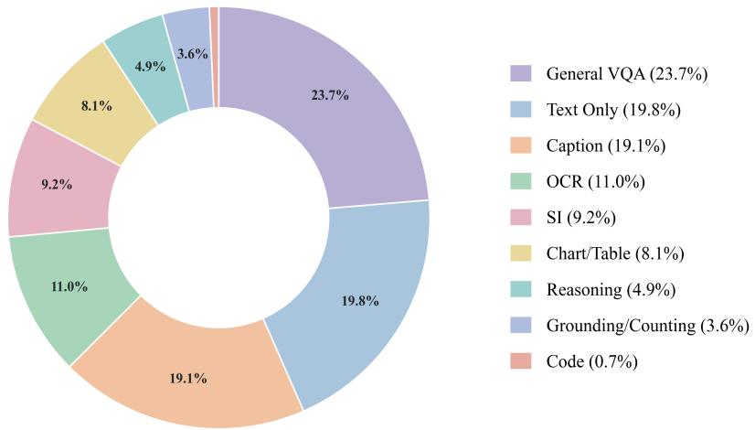  
Figure 7: Category distribution of the understanding training data.

## A.2 MODEL

All models are initialized from Qwen3-1.7B with a 16-layer pre-buffer. We use an MLP-based timestep embedder and noise scale embedder to extract embeddings and directly add them to the visual inputs, similar to SenseNova-U1. Different from SenseNova-U1, we do not have additional norm layers for visual hidden states as we choose a different multimodal positional embedding scheme.

## A.3 TRAINING

Training details in our representation-level studies are provided in Table 7.

## A.4 EVALUATION

The full per-benchmark results for visual understanding benchmarks are provided in Table 8. We use the image subset for SEED-Bench, the lite subset for MME-RealWorld, and the mini subset for MindCube. We only use the MCQ format questions in PerceptionBench for more stable evaluation. All benchmarks are evaluated with temperature set to 0. Detailed results by skill and level-1 category for GenEval2 and DPG-Bench are reported in Table 9 and Table 10, respectively.

Table 7: Representation-level training configuration.
<table><tr><td>Item</td><td>Value</td></tr><tr><td>Peak learning rate</td><td> $1 \times 1 0 ^ { - 4 }$ </td></tr><tr><td>Learning-rate scheduler</td><td>Constant</td></tr><tr><td>Optimizer</td><td>AdamW  $( \beta _ { 1 } = 0 . 9 , \beta _ { 2 } = 0 . 9 5 , \epsilon = 1 0 ^ { - 8 } )$ </td></tr><tr><td>Weight decay</td><td>0.0</td></tr><tr><td>Gradient-norm clipping</td><td>1.0</td></tr><tr><td>EMA ratio</td><td>0.9999</td></tr><tr><td>Training steps</td><td>210K</td></tr><tr><td>Warmup steps</td><td>2000</td></tr><tr><td>Loss weight (CE : MSE)</td><td>0.1:1</td></tr><tr><td>Understanding resolution</td><td>[2562, 20482]</td></tr><tr><td>Generation resolution</td><td> $[ 5 1 2 ^ { 2 } , 1 0 2 4 ^ { 2 } ]$ </td></tr><tr><td>Sequence length</td><td>16K</td></tr><tr><td>Timestep shift</td><td> $\mu = - 0 . 8 , \sigma = 0 . 8$  in the logit-normal t-sampler</td></tr><tr><td>Noise scale</td><td> ${ \sqrt { N / 6 4 } } ,$  where N is # of tokens</td></tr></table>

Table 8: Full results for visual understanding benchmarks. Higher is better for all metrics.
<table><tr><td>Group</td><td>Benchmark</td><td>Dense-U</td><td>Dense-U+G</td><td>Mod.-dec. MoT U</td><td>Mod.-dec. MoT U+G</td><td>Task-dec. MoT U+G</td></tr><tr><td rowspan="5">General</td><td>MME</td><td>1930.46</td><td>1967.90</td><td>1773.31</td><td>1666.54</td><td>1992.06</td></tr><tr><td>MMBench</td><td>71.39</td><td>69.58</td><td>64.43</td><td>66.66</td><td>69.84</td></tr><tr><td>MMStar</td><td>52.20</td><td>55.82</td><td>50.72</td><td>47.69</td><td>56.51</td></tr><tr><td>SEED Bench-I</td><td>76.56</td><td>76.91</td><td>74.33</td><td>71.91</td><td>76.42</td></tr><tr><td>MMMU</td><td>42.44</td><td>42.77</td><td>42.89</td><td>38.33</td><td>42.77</td></tr><tr><td rowspan="5">OCR</td><td>DocVQA</td><td>94.37</td><td>93.13</td><td>90.05</td><td>85.29</td><td>94.63</td></tr><tr><td>ChartQA</td><td>45.40</td><td>46.84</td><td>44.68</td><td>40.20</td><td>45.24</td></tr><tr><td>InfoVQA</td><td>68.75</td><td>67.52</td><td>52.65</td><td>44.59</td><td>68.30</td></tr><tr><td>OCRBench</td><td>67.50</td><td>68.90</td><td>63.90</td><td>59.90</td><td>67.80</td></tr><tr><td>AI2D</td><td>83.80</td><td>84.20</td><td>82.90</td><td>80.60</td><td>84.50</td></tr><tr><td rowspan="9">V-Centric &amp; SI</td><td>PerceptionBenchmcq</td><td>31.30</td><td>32.59</td><td>29.66</td><td>29.66</td><td>34.02</td></tr><tr><td>P2GB</td><td>72.63</td><td>73.94</td><td>66.40</td><td>63.40</td><td>72.07</td></tr><tr><td>MME-RealWorld</td><td>48.93</td><td>49.81</td><td>46.63</td><td>41.01</td><td>50.39</td></tr><tr><td>BLINK</td><td>63.92</td><td>64.09</td><td>60.07</td><td>59.02</td><td>63.48</td></tr><tr><td>DA-2K</td><td>74.85</td><td>74.85</td><td>77.22</td><td>72.24</td><td>77.46</td></tr><tr><td>CV-Bench</td><td>81.88</td><td>81.27</td><td>79.15</td><td>79.90</td><td>82.44</td></tr><tr><td>MindCube</td><td>58.57</td><td>61.81</td><td>62.67</td><td>58.19</td><td>64.85</td></tr><tr><td>3DSR</td><td>59.01</td><td>61.78</td><td>59.78</td><td>59.14</td><td>61.02</td></tr><tr><td>ViewSpatial</td><td>55.41</td><td>55.86</td><td>54.32</td><td>54.90</td><td>55.75</td></tr></table>

For generation-related evaluation, we generate images at a resolution of 1024 × 1024 using a classifier-free guidance scale of 4.0, 50 sampling steps, and a timestep shift of 3.0.

## A.5 PROBING EXPERIMENTS

For ImageNet classification, we follow the standard linear-probing protocol. We freeze the multimodal backbone, globally pool the visual features, and train a linear classification head using the LARS (You et al., 2017) optimizer for 100 epochs.

For semantic segmentation and monocular depth estimation, we conduct dense probing with the backbone similarly frozen. Because the model produces visual features at a relatively large spatial downsampling factor of 32, the probing head contains three consecutive convolution-and-upsampling blocks to recover spatial resolution. We train the segmentation and depth heads for 30 epochs, optimizing only the parameters of the corresponding probing head.

Table 9: GenEval2 results by skill. We report atom-level scores; higher is better.
<table><tr><td>Model</td><td>Object</td><td>Attribute</td><td>Count</td><td>Position</td><td>Verb</td><td>Overall</td></tr><tr><td>Dense-G</td><td>67.91</td><td>56.08</td><td>34.34</td><td>33.35</td><td>9.02</td><td>51.16</td></tr><tr><td>Dense-U+G</td><td>67.08</td><td>53.97</td><td>34.61</td><td>33.67</td><td>7.45</td><td>51.03</td></tr><tr><td>Mod.-dec. MoT-G</td><td>77.65</td><td>58.69</td><td>39.76</td><td>42.81</td><td>13.75</td><td>57.55</td></tr><tr><td>Mod.-dec. MoT-U+G</td><td>84.60</td><td>63.26</td><td>43.95</td><td>53.05</td><td>9.28</td><td>63.47</td></tr><tr><td>Task-dec. MoT-U+G</td><td>82.97</td><td>64.45</td><td>45.6</td><td>56.11</td><td>15.77</td><td>63.96</td></tr></table>

Table 10: DPG-Bench results by level-1 category. Higher is better.
<table><tr><td>Model</td><td>Global</td><td>Entity</td><td>Attribute</td><td>Relation</td><td>Other</td><td>Overall</td></tr><tr><td>Dense-G</td><td>91.95</td><td>85.55</td><td>88.83</td><td>87.52</td><td>79.49</td><td>79.11</td></tr><tr><td>Dense-U+G</td><td>83.58</td><td>85.77</td><td>87.25</td><td>89.45</td><td>84.63</td><td>78.12</td></tr><tr><td>Mod.-dec. MoT-G</td><td>88.02</td><td>89.82</td><td>88.58</td><td>90.42</td><td>89.20</td><td>82.06</td></tr><tr><td>Mod.-dec. MoT-U+G</td><td>92.14</td><td>88.12</td><td>90.39</td><td>92.03</td><td>90.77</td><td>83.09</td></tr><tr><td>Task-dec. MoT-U+G</td><td>87.30</td><td>90.50</td><td>89.09</td><td>90.65</td><td>91.17</td><td>82.31</td></tr></table>

## B TASK-LEVEL DETAILS

## B.1 SVG DIAGNOSTICS

We construct an SVG Blind VQA diagnostic to evaluate whether the model can infer visual appearance directly from SVG code. Starting from the UniSVG test set, we use GPT-5.6-luna (OpenAI, 2026) to annotate 3,000 multiple-choice VQA examples. To retain nontrivial questions, we evaluate them with our base model, which has not been trained on SVG-specific data, and keep only the examples it answers incorrectly. This filtering yields 1,370 examples. Examples are shown in Figure 8.

## B.2 GENERATION TASKS FOR 3D SI

We construct four generation tasks that require different aspects of 3D spatial intelligence. Ego-motion transition predicts a target view from a source image and a sequence of camera transformations. Multi-view reconstruction generates an unobserved object view from two provided views. View sequence completion recovers the missing middle frame of a short camera trajectory. Layout-toimage generation renders a scene from either structured 3D object annotations or a natural-language description of its spatial layout. Examples of the four task formats are shown in Figure 9 and Figure 10.

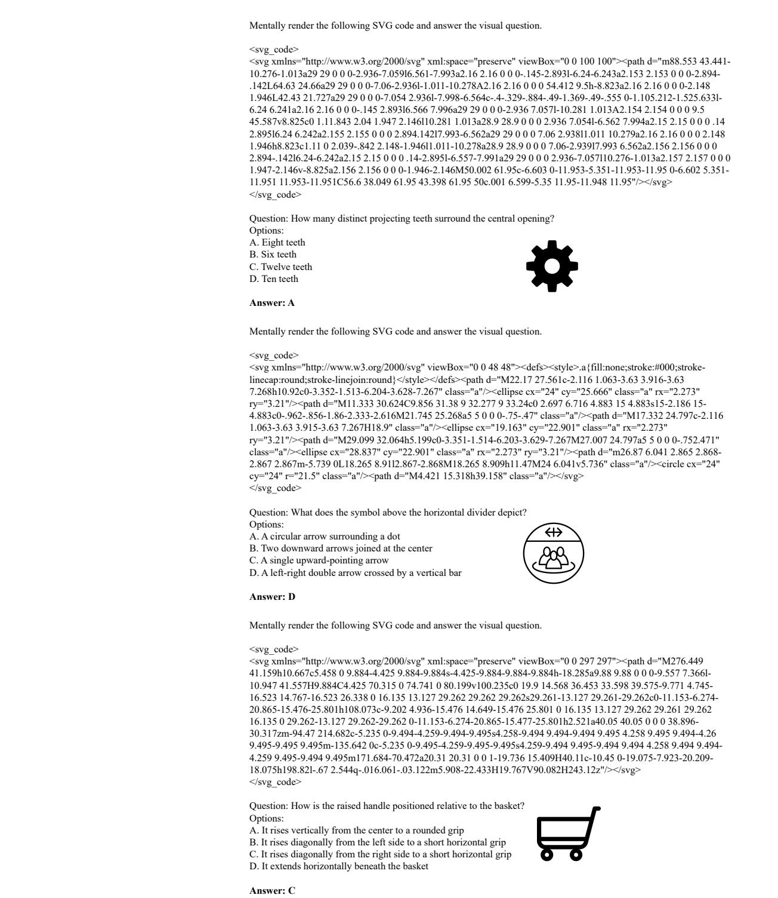  
Figure 8: Examples from the SVG Blind VQA diagnostic. The model is given only the SVG code, question, and answer options, and must infer the visual answer without observing the rendered icon. The renderings shown here are provided solely for readers.

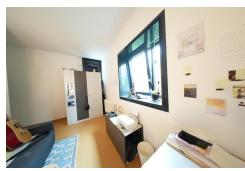

## (a) Ego-motion Transition

Imagine the view after the following camera movements.   
Notes: 'Move forward/backward' means translating the camera along its viewing direction. 'Move right/left' means translating the camera sideways. 'Move up/down' means translating the camera vertically. 'Turn left/right' means rotating the camera horizontally (yaw). 'Turn up/down' means rotating the camera vertically (pitch). 'Roll left/right' means tilting the camera around its forward axis (roll). Camera movements:   
1) Move forward 0.06 meters   
2) Move left 0.08 meters.   
3) Move up 0.04 meters.   
4) Turn right 7.8 degrees.   
5) Turn up 10.9 degrees   
6) Roll right 2.1 degrees. Imagine the view after the following camera movements.   
Notes: 'Move forward/backward' means translating the camera along its viewing direction. 'Move right/left' means translating the camera sideways. 'Move up/down' means translating the camera vertically. 'Turn left/right' means rotating the camera horizontally (yaw). 'Turn up/down' means rotating the camera vertically (pitch). 'Roll left/right' means tilting the camera around its forward axis (roll). Camera movements:   
1) Move forward 0.61 meters.   
2) Move right 0.29 meters.   
3) Move up 0.30 meters.   
4) Turn left 149.9 degrees.   
5) Turn down 69.7 degrees.   
6) Roll left 11.2 degrees.

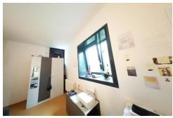

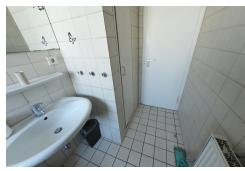

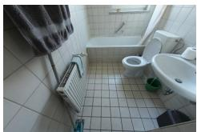

## (b) Multi-view Reconstruction

  
Front View

  
Left View  
Given the front view and left view of the object, generate the right view of it.

  
Right View

Given the right view and front view of the object, generate the back view of it.

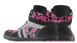  
Right View

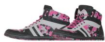  
Front View

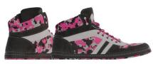  
Back View

Figure 9: Examples of 3D spatial-intelligence generation tasks (I). Ego-motion transition requires applying explicit camera motion to a source view, while multi-view reconstruction infers an unobserved view from the provided object views.

Given frames 1, 2, 4, and 5 from a video clip, generate the missing frame 3. Ensure temporal consistency, realistic appearance, and coherent scene geometry.  
(c) View Sequence Completion  
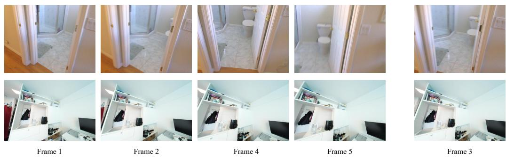  
(d) Layout-to-image Generation  
An industrial-style loft bedroom featuring exposed brick walls, wooden ceiling beams, and a large white canopy bed. 3D object annotations: Coordinate system: ego-camera coordinates, x=right, y=down, z=forward, unit=meter. Objects: - object\_1: name=bed, center=(x=1.43, y=-0.18, z=5.09), size=(width=2.70, height=3.88, length=2.47) - object\_2: name=window, center=(x=3.86, y=0.23, z=6.28), size=(width=1.33, height=1.85, length=0.17) - object\_3: name=window, center=(x=-0.57, y=0.19, z=6.78), size=(width=1.33, height=1.85, length=0.17) - object\_4: name=bookcase, center=(x=-0.53, y=1.50, z=6.32), size=(width=0.85, height=0.85, length=0.30) - object\_5: name=chair, center=(x=-1.48, y=1.18, z=3.46), size=(width=0.62, height=0.49, length=0.53) - object\_6: name=chair, center=(x=-1.37, y=1.07, z=2.76), size=(width=0.62, height=0.49, length=0.53) - object\_7: name=pillow, center=(x=0.48, y=1.12, z=5.35), size=(width=0.60, height=0.41, length=0.36) - object\_8: name=pillow, center=(x=1.00, y=1.15, z=5.62), size=(width=0.60, height=0.40, length=0.35) - object\_9: name=pillow, center=(x=1.52, y=1.24, z=5.89), size=(width=0.62, height=0.43, length=0.30) - object\_10: name=pillow, center=(x=1.43, y=1.22, z=6.07), size=(width=0.62, height=0.50, length=0.21)

  
The image displays a kitchen counter setup from a direct frontal view. Above, wooden shelving units hold various supplies, including stacks of paper and cups, with a microwave visible in the upper left corner. The main surface is a red countertop. On the left side of the counter, a black toaster oven is positioned with a white cup sitting in front of it. Moving right, a dish drying rack with a black mug sits next to a stainless steel sink equipped with a faucet. Below the counter, wooden cabinets with silver handles are on the left. Underneath the sink area on the right, there is open storage containing blue water filtration equipment, specifically vertical blue cylinders and a large blue barrel, all resting on a tiled floor.

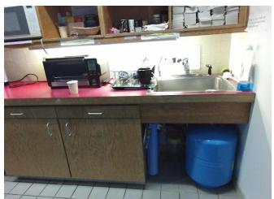  
Figure 10: Examples of 3D spatial-intelligence generation tasks (II). View sequence completion predicts a temporally and geometrically consistent missing frame, while layout-to-image generation synthesizes an image from structured or textual descriptions of 3D scene layout.