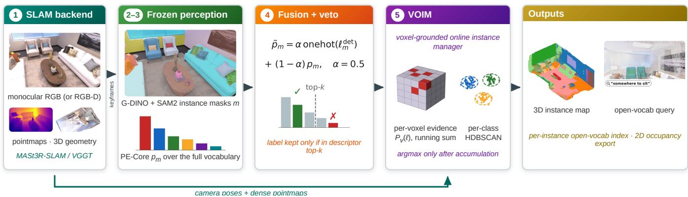
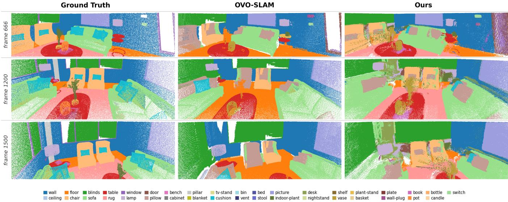
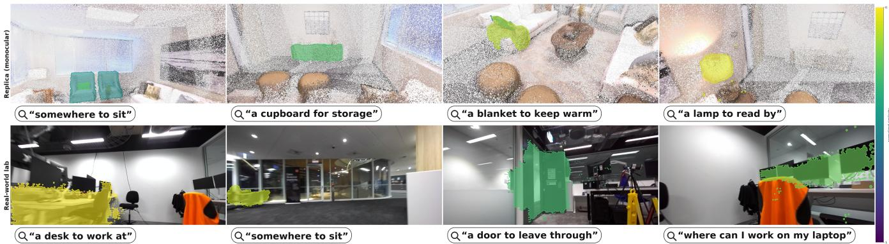
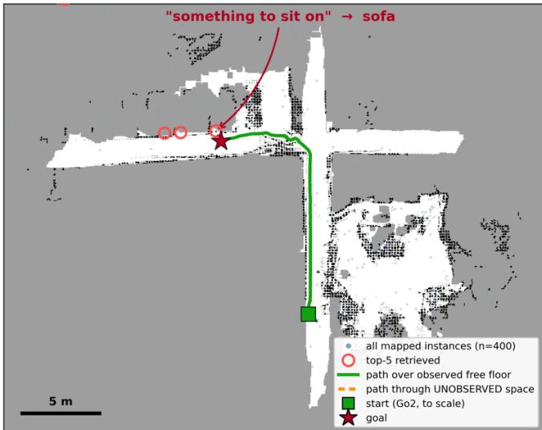

# VOIM: Training-Free Open-Vocabulary 3D Instance Mapping for RGB-D and Monocular SLAM

Sangmin Song1, Sarath Kodagoda1, Marc G. Carmichael1, Karthick Thiyagarajan2, Amal Gunatilake1, Kelly Prentice3, Jodi Martin3

Abstract— We present Voxel-Grounded Online Instance Manager (VOIM), a training-free voxel-grounded instance manager that builds open-vocabulary 3D instance maps from RGB-D or from monocular RGB alone, a regime no prior trainingfree system addresses. Online systems typically segment object instances and label them at first detection, committing when evidence is weakest. VOIM instead defers label and instance decisions until soft evidence from unmodified, off-the-shelf perception has accumulated per voxel across views. We show that the mapping stage, rather than the particular perception models, carries the result: across four perception configurations on ScanNet++, varying the region descriptor, the detector label prior and the mask source, the map exceeds the strongest online RGB-D system, OVO-SLAM, by between 4.8 and 11.7 mIoU. Perception is not neutral, and substituting that baseline’s own descriptor family costs 4.1 of the margin, yet the baseline carries the marginally better 2D descriptor (33.7 vs. 31.5 mIoU over three scenes) and still realizes the weaker map. Under a like-for-like protocol VOIM reaches 44.07 mIoU on ScanNet++ against 32.37, winning all ten scenes and both aggregations (pooled 33.31 vs. 25.97), and the same system runs unchanged to fully monocular RGB, matching that baseline pooled on Replica (27.80 vs. 27.50). The advantage is regime-specific: under Replica’s all-classes scoring, matched inputs give a split result, 28.60 vs. 27.50 pooled against 24.59 vs. 30.11 on the per-scene mean. Room scale is label-limited and building scale drift-limited. Labeling does not run in real time, dominated by per-class detection over the full vocabulary. The maps export occupancy grids and resolve free-form queries to object instances.

## I. INTRODUCTION

A robot sharing a home or workplace should act on requests phrased in ordinary language, which needs a 3D map indexed by open-vocabulary semantics. This has progressed rapidly by lifting vision–language features into 3D [1], [2], [3], and online variants now build such maps during exploration [4], [5], but they predominantly assume RGB-D input and externally provided poses. Depth sensors add cost, potentially fail outdoors and on reflective surfaces, and are absent from most deployed cameras, so it is the sensing assumption that keeps these systems out of the field. Openvocabulary labels are noisy where reconstruction is weakest: detections hallucinate classes and masks bleed across depth discontinuities. Systems that reconstruct per-instance segments and then label each segment inherit that noise at once, committing on the least available evidence. We shift the burden to the mapping stage. VOIM accumulates soft label distributions from unmodified, off-the-shelf detection and region description [6], [7], [8], [9] into per-voxel evidence across keyframes, gates unreliable detector labels against the descriptor’s own ranking, and separates instances per class in 3D only after aggregation. Every model in the pipeline is frozen and used as released, which lets the experiments of Sec. IV attribute map quality to the aggregation stage.

The aggregation stage is agnostic to where its geometry comes from, so the same system runs unchanged from RGB-D with known poses down to a bare RGB stream, with feed-forward SLAM backbones [10], [11], [12], [13] supplying the geometry. No prior training-free system produces instance-level open-vocabulary maps from monocular RGB alone; concurrent systems are either RGB-D, instance-free, or trained (Sec. II).

Comparison against RGB-D systems demands care, since prompting the detector with only a scene’s present classes leaks annotation information, and a keyframe schedule tuned for dense streams starves a re-run baseline. Under a protocol that avoids both (Sec. IV-A), the mapping-stage thesis holds on ScanNet++ [14]: from the same frames, ground-truth poses and vocabulary, and with the depth advantage left to the baseline, VOIM outperforms OVO-SLAM [4] on all ten scenes. Removing our detector outright retains most of that margin and substituting class-agnostic masks for its prompted ones moves the score in the detector’s disfavour, so the result is not an artifact of how we prompt 2D perception (Sec. IV-B). We report the boundary alongside the result.

In summary, our contributions are: (i) VOIM, a trainingfree voxel-grounded online instance manager that accumulates per-voxel soft label distributions across all views, blending the detector prior with the descriptor under a crossmodel veto, and separates instances per class in 3D only after aggregation; (ii) evidence that the mapping stage governs map quality, +11.7 mIoU over OVO-SLAM on ScanNet++ from the same frames, poses and vocabulary with the depth advantage left to the baseline, winning every scene, with a control showing the detector contributes its label prior and not its mask proposals, reported together with the scoring regime in which the advantage does not hold; (iii) instancelevel open-vocabulary mapping from monocular RGB alone, which follows because an aggregation stage of this form is agnostic to the source of its geometry; (iv) a fair comparison protocol (full-vocabulary prompting, frame-matched re-run baseline, both aggregations) and an analysis locating the error as label-limited at room scale and drift-limited at building scale; and (v) a navigation-ready map export, an occupancy grid plus a per-instance open-vocabulary index that resolves free-form queries to goal poses.

  
Fig. 1. System overview, stages (i)–(v) of Sec. III-A. Soft label distributions from frozen 2D perception accumulate as per-voxel evidence; the argmax over classes and the separation into instances are both taken only after that accumulation.

## II. RELATED WORK

Semantic mapping by multi-view label fusion. Accumulating per-element label evidence across views predates open vocabularies [15], [16], [17]. VOIM stands in this lineage, and we claim no novelty for soft multi-view fusion itself, but it lifts the per-voxel state to a distribution over an open benchmark vocabulary, fed by detector-gated vision– language evidence in place of a closed-set CNN.

Open-vocabulary 3D scene understanding. A first family lifts vision–language features into 3D offline, given posed RGB-D or a completed reconstruction, by distilling pixel-aligned CLIP [18] features onto points [1], fusing multimodal features into an RGB-D map [2], or embedding language fields in NeRF [3]. OpenMask3D, OVIR-3D and Open3DIS instead label class-agnostic 3D proposals with vision–language descriptors [19], [20], [21], the segmentthen-label pattern VOIM inverts. All assume depth and operate offline. Open-vocabulary detectors, promptable segmenters [6], [7] and region-level descriptors [9], [8] supply their 2D evidence; combining a detector’s label with an independent classifier’s score follows score-level fusion in open-vocabulary detection [22], [23], which we adapt to pervoxel accumulation in 3D.

Online open-vocabulary mapping and SLAM. Closer to our setting, ConceptGraphs merges per-frame SAM segments into an object-level scene graph [24], Open-Fusion maintains a real-time queryable TSDF [25], and HOV-SG builds hierarchical scene graphs from RGB-D sequences [5]; our map export (Sec. V) continues the language-queryable navigation line [26], [27] at instance level. OVO-SLAM, our primary baseline, attaches CLIP descriptors to class-agnostic 3D segments online and labels them at query time [4]; it reports the strongest online results on Replica and ScanNet++ but requires an RGB-D stream, uses ground-truth poses, and commits to 3D segment identities at first detection, the earlycommit design VOIM avoids.

Concurrent work. Several concurrent efforts approach parts of this intersection. OVI-MAP [28] and OpenVox [29] are training-free online instance-level mappers, but both consume RGB-D with externally supplied poses; OVI-MAP appears in Table I with a protocol caveat, while OpenVox’s 27.30 per-scene mean uses a variable per-scene class-query protocol not comparable to our fixed 51 classes. Ov3R [30] reconstructs open-vocabulary semantics from RGB video and reports 30.4 on Replica from its own reconstruction (31.9 given ground-truth geometry), above our monocular 27.80 pooled / 23.55 mean, but it is trained end-to-end, performs reconstruction rather than SLAM, produces no instances, and is not protocol-identical (its own OVO baseline reads 26.5 vs. our re-run 27.50). KM-ViPE [31] and RADIO-ViPE [32] run monocular open-vocabulary semantic SLAM but produce semantic-level output only; OpenMonoGS-SLAM [33] pairs the same MASt3R backbone with Gaussian-splat semantics but reports prompt-IoU and no instances. To our knowledge no concurrent system is simultaneously training-free, online, instance-level, and monocular, which is the setting we evaluate in Sec. IV-C.

Feed-forward monocular SLAM. Classical monocular SLAM yields sparse geometry with scale ambiguity, hostile ground for dense semantic fusion. Feed-forward pointmap regression changed this: DUSt3R regresses dense two-view pointmaps [34], MASt3R adds matching and metric-grade geometry [10], MASt3R-SLAM turns them into real-time dense monocular SLAM [11], and VGGT regresses whole frame sets in one pass [12], with VGGT-SLAM extending it to submap-based odometry [13]. We build on these with MASt3R-SLAM as our primary front-end.

## III. METHOD

## A. Overview

Our system turns a monocular RGB stream into a dense 3D point map, defined up to a similarity transform in the monocular setting, in which every point carries a distribution over an open vocabulary of semantic classes and is organized into 3D object instances. It comprises five stages (Fig. 1): (i) a dense SLAM backend (MASt3R-SLAM [11] in the monocular setting, or VGGT [12] where noted) provides camera poses and per-keyframe dense pointmaps; (ii) an open-vocabulary detector, Grounding-DINO [6] with SAM2 [7], proposes labeled instance masks on each keyframe; (iii) a frozen region descriptor, PE-Core TextRegion [8], [9], assigns each mask a softmax distribution over the full benchmark vocabulary; (iv) the detector label and the descriptor distribution are fused per mask under a cross-model veto; and (v) VOIM, our voxel-grounded online instance manager, aggregates the per-mask distributions into per-point label posteriors in 3D and extracts object instances (Sec. III-D).

  
Fig. 2. Qualitative comparison on Replica room0 (columns: ground-truth semantics; OVO-SLAM from RGB-D and ground-truth poses; ours fully monocular, no depth sensor, no poses). Each row renders all three reconstructed 3D point clouds from the identical camera pose, taken from the trajectory, with a shared palette. The monocular map recovers the furniture and dominant surfaces at quality comparable to the RGB-D baseline, which fragments and leaves holes at eye level; residual label errors are semantic, not geometric.

## B. Perception

Detection. Every SLAM keyframe is eligible for semantic processing; the semantic stream runs asynchronously alongside tracking and labels keyframes at its own throughput (on Replica, 14–22 of ∼66 SLAM keyframes per scene; Sec. IV-G). Each labeled keyframe is passed to Grounding-DINO, prompted per class with every class name of the full benchmark vocabulary; per-class prompting avoids the token-budget truncation and prompt-order bias of a single concatenated caption. No scene-specific class information is provided to the detector. Boxes above a fixed confidence threshold are segmented by SAM2, yielding a set of instance masks m with detector labels $\ell _ { m } ^ { \mathrm { d e t } }$ and confidences $c _ { m }$

Region descriptor. Independently of the detector label, every mask is scored against the full vocabulary by TextRegion [8] on the frozen PE-Core-L14-336 encoder, which restricts the encoder’s pooling to the patches of the mask and returns a region embedding in the image–text space. A temperature softmax over its cosine similarity to one text embedding per class gives a distribution $p _ { m } \in \Delta ^ { | \mathcal { V } | }$ over the vocabulary Y. Both components are used as released; we neither fine-tune nor re-weight them. Class embeddings average the 80 CLIP ImageNet prompt templates [18] and the softmax temperature is τ=0.03.

## C. Label fusion with a cross-model veto

Detector and descriptor carry complementary label information: the detector is precise on objects it was prompted for but hallucinates classes that are absent from the scene, whereas the descriptor distribution is defined for every mask but is less peaked. We fuse them per mask as a convex combination,

$$
\tilde { p } _ { m } = \alpha { \bf 1 } [ \ell _ { m } ^ { \mathrm { d e t } } ] + ( 1 - \alpha ) p _ { m } , \qquad \alpha = 0 . 5 ,\tag{1}
$$

where $\mathbf { 1 } [ \cdot ]$ is the one-hot indicator of the detector label. At $\alpha = 0 . 5$ the detector’s one-hot contributes at least half the mass of every mask it labels, so a hallucinated class carries that mass into the accumulator and can survive aggregation. We therefore gate it with a cross-model veto:: the detector label is accepted only if it lies within the descriptor’s top-5 classes for that mask; otherwise the mask keeps the pure descriptor distribution $p _ { m }$ . The veto uses only the pipeline’s own model outputs, with no ground-truth or scene-specific information. Its depth is fixed (k=5); whether it is used at all is protocol-dependent (active under Replica’s allclasses scoring, disabled under ScanNet++’s present-classes scoring), with both directions ablated in Sec. IV-E. It follows established practice in tempering open-vocabulary detections with a frozen image–text classifier [22], [23].

  
Fig. 3. Open-vocabulary queries resolve to the correct object instances on both the benchmark map and a real building. Each panel shows a free-form language query (search bar) and the instances VOIM retrieves, colored by normalized query–instance similarity (per-scene). Top: the fully monocular Replica room0 map (the same reconstruction scored in Table I), rendered as a point cloud. Bottom: the real-world lab 3D map (sensor RGB-D + on-board VIO); retrieval and instance identity come from this map, with the resulting 3D instances reprojected into the 2D capture frames for display. Queries are resolved by cosine similarity between the phrase embedding and each instance’s aggregated vision–language embedding, so compositional phrases (“a cupboard for storage”, “where can I work on my laptop”) retrieve the semantically appropriate objects.

## D. VOIM: Voxel-Grounded Online Instance Manager

VOIM converts per-mask 2D evidence into a labeled, instance-structured 3D map. Its design principle is to postpone every hard decision as long as possible: labels enter the map as soft distributions, are aggregated across all observations in 3D, and are collapsed to discrete classes and instances only at the very end. This is the key structural difference to per-instance reconstruction pipelines such as OVO-SLAM, which commit to 2D–3D instance associations early and must subsequently merge and re-label them.

Voxel-grounded map. Keyframe pointmaps are backprojected with the SLAM poses into a common world frame and de-duplicated on a regular voxel grid, keeping one representative point per occupied voxel. Every retained point stores its full observation history: the set of (keyframe, pixel) pairs that mapped into its voxel, so that each 3D point knows every 2D mask that ever observed it.

Soft label voting. For a map point v with observation set O(v), VOIM accumulates a confidence-weighted vote from every fused mask distribution that contains it:

$$
P _ { v } ( \ell ) = \frac { 1 } { Z _ { v } } \sum _ { m \in \mathcal { O } ( v ) } c _ { m } \tilde { p } _ { m } ( \ell ) , \qquad Z _ { v } = \sum _ { m \in \mathcal { O } ( v ) } c _ { m } ,\tag{2}
$$

where $c _ { m }$ is the detector confidence of mask m and $\tilde { p } _ { m }$ its vetoed fused distribution from Eq. (1). The accumulated vote mass $Z _ { v }$ doubles as a per-point confidence. Because Eq. (2) is a pure running sum, the map is incremental by construction: a new keyframe only adds votes to the points it observes, and never requires revisiting earlier associations. The same accumulator averages the L2-normalized region embeddings into a per-point open-vocabulary feature, renormalized after aggregation, which supports the free-form text queries of Sec. V.

Sec. IV-B isolates this accumulation as the source of the gap to early-commitment pipelines. Instance extraction. After voting, each point takes $\hat { \ell } _ { v } = \arg \operatorname* { m a x } _ { \ell } P _ { v } ( \ell )$ , and points whose top posterior falls below a confidence floor are discarded. A k-NN label smoothing pass (k=15, 60% majority; active in all headline runs) regularizes stragglers against their spatial neighborhood. Instances are then obtained by running HDBSCAN independently per class (min cluster size 15, min samples 5, merge radius 6 cm) on the 3D coordinates of that class’s points. Clustering per class separates repeated objects of the same category and leaves residual hallucination points as clustering noise. Each surviving cluster becomes one 3D object instance carrying its class, its aggregated open-vocabulary feature, and its point set. Detection, description, and the vote accumulator of Eq. (2) run incrementally alongside tracking; the final arg max and per-class clustering execute as a lightweight post-pass once tracking ends. “Online” throughout this paper refers to the single-pass, incremental map state; the instance harvest is batch, and end-to-end throughput is offline-rate (Sec. IV-G).

## IV. EXPERIMENTS

## A. Evaluation protocol

We evaluate 3D open-vocabulary semantic segmentation on ScanNet++ (10 scenes, top-100 classes) and Replica (8 scenes, 51 classes), scoring every method with the evaluation code of OVO-SLAM [4]: each ground-truth mesh vertex takes the majority label of its k=5 nearest predicted points, without a distance cutoff, and mIoU is computed over the benchmark vocabulary. The comparison is like-for-like in four respects, and we disclose a fifth asymmetry that cannot be removed. (i) Vocabulary: every method receives the full benchmark class list; none is given scene-specific class information. (ii) Baseline execution: OVO is re-run from its released checkpoints through the identical harness, reproducing its published Replica result (27.50 vs. 27.0 pooled). (iii) Frame parity: on ScanNet++ both methods receive identical frame lists, with OVO’s keyframe schedule set to segment every frame (its 30 fps-stream default segments every 10th frame here and scores 18.58; we compare against the stronger number). On Replica, OVO segments ≈200 frames per 2000- frame sequence while our monocular system, at input stride 3, labels only 14–22 SLAM keyframes. We do not claim this as a handicap: doubling our labeled frames leaves room0 essentially unchanged (Sec. IV-F), so at these densities frame count is not what separates the two systems. (iv) Aggregation: we report pooled mIoU, the aggregation OVO publishes, and per-scene mean, on both datasets, including where the latter favors the baseline.

Gauge alignment (disclosure). A monocular reconstruction is defined only up to a similarity transform, so before scoring we fix the gauge with a single global Sim(3) recovered by Umeyama alignment [35] of the estimated trajectory to the ground-truth trajectory and applied unchanged to the map (the parity tier, which is already metric, uses Sim(3) plus geometric ICP). Alignment is geometry-only and never sees ground-truth labels; it consumes seven global parameters, against the per-frame ground-truth poses the baseline receives throughout. An independent end-to-end re-run of the monocular pipeline reproduced every per-scene score at the precision we report, so we quote no stochastic variance.

Models and per-dataset settings. The perception stack is identical everywhere and fully frozen: Grounding-DINO SwinB detection, SAM2 (Hiera-L) segmentation, and PE-Core L14-336 region descriptors; detection runs per-class at confidence 0.25 with α=0.5 prior blending on both datasets. Three settings differ per dataset and are disclosed: voxel size (2 cm on ScanNet++’s larger scenes, 1 cm on Replica), detector input resolution (512-pixel keyframes on ScanNet++, fullresolution frames on Replica), and the CLIP-veto, which is active on Replica and not on ScanNet++; the veto suppresses detector fires on classes absent from a scene, a failure mode that is scored under Replica’s all-classes protocol but excluded by construction under ScanNet++’s present-classes evaluation. Running the identical veto on ScanNet++ costs 1.75 mean mIoU (Sec. IV-E), which is consistent with that reasoning; we report both directions.

## B. ScanNet++: input-parity head-to-head

Table II reports the head-to-head on ScanNet++, where both systems consume the same frames, ground-truth poses, and vocabulary (depth sources differ in the baseline’s favor; Table II, footnote). VOIM wins under both aggregations, by +11.70 on the per-scene mean, 44.07 against 32.37, and by +7.34 pooled, 33.31 against 25.97. It wins on every one of the 10 scenes, with per-scene margins from +1.9 to +17.7 and sign-test $p \approx 0 . 0 0 2$ . Since detection and descriptor components are off-the-shelf in both systems and the evaluation is shared, we decompose both pipelines on three scenes (7b6477cb95, 3e8bba0176, 40aec5fffa). Classifying SAM2 masks per frame, OVO’s learned SigLIP merger is the marginally stronger 2D descriptor, 33.7 mean mIoU against our 31.5. Scoring each system’s multi-view vote over ground-truth mesh geometry and comparing it against the realized 3D map, the two diverge in the lift: our realized map gains 5.9 over its own vote, 42.5 against 36.6, while OVO’s loses 5.0, 34.7 against 39.7. The two votes are computed

  
Fig. 4. Open-vocabulary query on a real building floor (∼30×25 m, one 116 m hand-held sweep with a stereo camera; sensor RGB-D with onboard visual-inertial odometry; no ground truth of any kind exists for this scene). The exported occupancy grid with a free-form query resolved via per-instance vision–language embeddings: “something to sit on” retrieves sofa and chair instances (top-5 marked), and the nearest sofa is issued as a navigation goal with a 20.0 m path planned entirely within the map’s single connected free-space region (158 m2).

## TABLE I

REPLICA 3D OPEN-VOCABULARY SEMANTIC SEGMENTATION (51 CLASSES, 8 SCENES); POOLED MIOU SUMS THE CONFUSION MATRIX OVER SCENES (OVO’S AGGREGATION [4]), PER-SCENE IS THE MEAN, ALL SCORED WITH OVO’S CODE AND FULL VOCABULARY.
<table><tr><td>Method</td><td>Depth</td><td>Pose</td><td>pooled</td><td>per-scene</td></tr><tr><td>HOV-SG [5]§</td><td>RGB-D</td><td>GT</td><td></td><td>22.5</td></tr><tr><td>Open3DIS [21]§</td><td>RGB-D</td><td>GT</td><td></td><td>25.6</td></tr><tr><td>OVO-SLAM [4] (published)</td><td>RGB-D</td><td>GT</td><td>27.0</td><td></td></tr><tr><td>OVI-MAP [28]‡</td><td>RGB-D</td><td>GT</td><td>26.5</td><td></td></tr><tr><td>OVO (our re-run)</td><td>RGB-D</td><td>GT</td><td>27.50</td><td>30.11</td></tr><tr><td>Ours (input parity)</td><td>RGB-D (GT)</td><td>GT</td><td>28.60</td><td>24.59</td></tr><tr><td>Ours (monocular)</td><td>RGB only</td><td>est.</td><td>27.80</td><td>23.55</td></tr><tr><td>w/o CLIP-veto (ablation)</td><td>RGB only</td><td>est.</td><td>25.80</td><td>19.48</td></tr></table>

‡OVI-MAP evaluates the same 8 scenes/51 classes via k-NN mesh transfer but under 200-frame subsampling; its own OVO re-run (24.9) differs from OVO’s published 27.0, so we use our re-validated run (27.50) as the reference. Its aggregation is not stated as pooled in the source; we place it in that column for context only. §As published;

over different observation sets, so they are reference points rather than ceilings; what the decomposition establishes is the sign of the change within each system, from descriptor quality to realized map quality. Our detector is prompted once per class over the full vocabulary while the baseline uses class-agnostic segments, so the margin could reflect a 2D proposal advantage. We control for this by removing the detector. Given class-agnostic SAM2 masks and labels from the descriptor alone, VOIM scores 38.82 and still exceeds the baseline on all ten scenes, retaining 55% of the margin with no per-class prompting present. Restoring DINO-prompted masks while holding labels at descriptoronly lowers the score to 37.13, on nine of ten scenes. Of the 5.25-point cost of removing the detector, the label prior accounts for 6.94 and the mask source for −1.69: the detector contributes through the label it supplies, not the regions it proposes. No prior work reports ScanNet++ top-100 3D semantic mIoU. OVO’s own paper evaluates only 2D descriptor merging on this dataset, and concurrent systems report f-mIoU or instance AP [30]. We therefore establish the baseline ourselves, at its strongest operating point (Table II, footnote). We do not report a fully monocular tier on ScanNet++: at building scale, monocular pose drift collapses the map (4.6 mIoU on the one scene run end-toend, Sec. IV-F), so monocular capability is evaluated at room scale on Replica.

TABLE II  
SCANNET++ 3D OPEN-VOCABULARY SEMANTIC SEGMENTATION (TOP-100 CLASSES, 10 SCENES) FROM IDENTICAL GT POSES, FRAMES, VOCABULARY AND k=5-NN SCORING.
<table><tr><td>Method</td><td>Depth</td><td>Pose</td><td>pooled</td><td>per-scene</td></tr><tr><td>OVO-SLAM (frame-matched)†</td><td>RGB-D</td><td>GT</td><td>25.97</td><td>32.37</td></tr><tr><td>Ours</td><td>RGB-D</td><td>GT</td><td>33.31</td><td>44.07</td></tr><tr><td>SigLIP descriptor</td><td>RGB-D</td><td>GT</td><td></td><td>39.96</td></tr><tr><td>descriptor labels, agnostic masks‡</td><td>RGB-D</td><td>GT</td><td></td><td>38.82</td></tr><tr><td>descriptor labels, DINO masks</td><td>RGB-D</td><td>GT</td><td></td><td>37.13</td></tr></table>

†OVO re-run from released checkpoints at its strongest operating point; its 30 fps default schedule segments every 10th frame here and scores 18.58. It also uses mesh-rendered depth, an advantage we leave to the baseline.  
‡No detector: class-agnostic SAM2 masks, labels from the region descriptor alone.

## C. Replica: monocular capability

Table I evaluates on Replica in two regimes. At input parity, giving our pipeline the same privileged inputs OVO consumes (ground-truth poses and depth), VOIM scores 28.60 pooled / 24.59 mean against OVO’s 27.50 / 30.11. Fully monocular, with neither a depth sensor nor groundtruth poses, it scores 27.80 pooled / 23.55 mean: parity with the RGB-D baseline on the pooled metric while semantically processing an order of magnitude fewer frames, and a deficit on the per-scene mean. That deficit is systematic rather than sampling noise, concentrating in the small office scenes, worst on office1 at 15.4, where few large-surface classes dominate and single mis-assignments are costly. We therefore claim monocular pooled-metric parity here and not superiority. The same split appears at input parity: our pooled score exceeds OVO’s while its per-scene mean of 30.11 exceeds our 24.59. This is the boundary of the mappingstage result, and we state it plainly. On ScanNet++ we win both aggregations; on Replica we win only the pooled one. Under Replica’s all-classes, 51-class scoring a scene is charged for every class it never contained, and the perscene mean weights the small offices equally with the large rooms, so the two aggregations can disagree. We have not isolated which perception failure drives the per-scene mean here and we do not claim the mapping stage could repair it. The mapping-stage advantage is therefore established under ScanNet++’s present-classes, 100-class regime, and we report both regimes in full. Fig. 2 shows the monocular reconstructions side-by-side with ground truth and the RGB-D baseline. For calibration against concurrent work: OVI-MAP [28] reports 26.5 from RGB-D and ground-truth poses under a 200-frame protocol that depresses scores (Table I, footnote), and Ov3R [30], a trained RGB-video system without instances or SLAM, reports 30.4 from its own reconstruction (per-scene mean, protocol not identical); the training-free monocular instance-level setting evaluated here has no other entrant.

TABLE III  
INSTANCE-LEVEL EVALUATION ON REPLICA (8 SCENES, 51 CLASSES; OVO USES GT POSES AND RGB-D, OURS IS MONOCULAR); COV. = FRACTION OF GT INSTANCES MATCHED AT IOU≥0.25, PURITY = MEAN IOU OF MATCHED INSTANCES (BOTH %).
<table><tr><td>Method</td><td>Depth</td><td>Pose</td><td>AP@25</td><td>AP@50</td><td>Cov.</td><td>Purity</td></tr><tr><td>OVO-SLAM</td><td>RGB-D</td><td>GT</td><td>33.07</td><td>26.05</td><td>40.8</td><td>65.1</td></tr><tr><td>Ours</td><td>RGB only</td><td>est.</td><td>27.28</td><td>14.79</td><td>30.1</td><td>52.4</td></tr></table>

## D. Instance-level evaluation

VOIM produces object instances as well as semantics, so we evaluate them directly: standard greedy AP at IoU 0.25/0.50 over the 51-class vocabulary, with predicted points transferred to ground-truth mesh vertices by a k=5-NN vote with a 10 cm match radius, against Replica’s object-level annotations; the semantic protocol uses no radius cutoff. OVO-SLAM’s per-instance predictions are scored under the identical protocol. Table III reports the comparison. From weaker input the monocular system reaches within 5.8 AP@25 of the RGB-D baseline, and the two diagnostic columns separate two different costs. Purity, the mean IoU of matched instances, falls from 65.1 to 52.4; together with the gap widening from −5.8 AP@25 to −11.3 AP@50, this is the boundary cost of estimated geometry. Coverage is a separate deficit: we match 30.1% of ground-truth instances at IoU≥0.25 against the baseline’s 40.8%, so about a quarter of the instances it recovers we miss outright, which is a recall failure rather than a boundary one. We claim instance parity on neither axis. Both systems over-segment large “stuff” surfaces, with ceilings fragmenting into dozens of sub-instances, which depresses absolute AP for both.

## E. Ablations

Soft multi-view voting is the mechanism we can isolate directly. Replacing each mask’s soft distribution with a onehot at its argmax just before per-voxel accumulation, with the pipeline otherwise identical, costs 3.17 mean mIoU from 23.55 to 20.38, and degrades all 8 scenes at sign-test p ≈ 0.008: committing per-mask discards the cross-view disambiguation that lets weak 2D evidence survive the lift into 3D. This ablation is measured on Replica monocular, so it bounds the mechanism’s contribution in that setting rather than on ScanNet++, where the head-to-head margin is larger. Tuning does not account for the result. VOIM’s fusion hyperparameters are inert: $\alpha \in \{ 0 . 3 , 0 . 5 , 0 . 7 \}$ moves the mean ${ \tt b y } \le 0 . 3 3$ and veto depth $k \in \{ 3 , 5 , 1 0 \} \ b \mathbf { y } \leq 0 . 6 3$ The 1 cm voxel we report leaves headroom, since 2 cm scores +1.56, and perception-side knobs are similarly minor, the full-resolution descriptor adding +0.5 and the larger G14-448 encoder +1.2, all far below the mapping-stage deltas. The CLIP-veto is the one protocol-dependent choice: it removes absent-class detector fires, which Replica’s allclass scoring penalizes as zero-IoU, worth +4.07 mean, but ScanNet++’s present-class scoring never sees, where it instead costs 1.75; we enable it per protocol and report both directions.

TABLE IV  
VOIM ABLATIONS ON REPLICA (MONOCULAR, 51 CLASSES, 8 SCENES, PER-SCENE MEAN MIOU); THE PAPER CONFIGURATION $( \alpha { = } 0 . 5 ,$ , VETO k=5, 1 CM VOXELS) SCORES 23.55.
<table><tr><td>Sweep</td><td>value</td><td>mean mIoU</td><td>∆</td></tr><tr><td>DINO-prior weight α</td><td>0.3 / 0.5 / 0.7</td><td>23.88 / 23.55 / 23.55</td><td>≤0.33</td></tr><tr><td>CLIP-veto depth k</td><td> $3 / 5 / 1 0$ </td><td> $2 3 . 3 2 \ : / \ : 2 3 . 5 5 \ : / \ : 2 2 . 9 2$ </td><td>≤0.63</td></tr><tr><td>Voxel size</td><td>1 cm / 2 cm</td><td> $2 3 . 5 5 \ : / \ : 2 5 . 1 1$ </td><td>+1.56</td></tr><tr><td>CLIP-veto</td><td>off / on</td><td>19.48 / 23.55</td><td>+4.07</td></tr><tr><td>Voting</td><td>hard (argmax) / soft</td><td> $2 0 . 3 8 \mathrm { ~ / ~ } 2 3 . 5 5$ </td><td>+3.17</td></tr></table>

## F. Analysis

a) Room scale is label-limited: On Replica, supplying ground-truth poses and depth lifts pooled mIoU only 0.8 over fully monocular, 28.60 against 27.80: even with perfect geometry the score is capped by 2D labeling, since the detector misses small classes that contribute zero IoU regardless of reconstruction. Coverage also saturates, doubled frames leaving room0 at 29.9 against 29.1, and at room scale the backend is interchangeable, VGGT-SLAM matching MASt3R-SLAM at equal density; we do not extend that claim to building scale, where estimated geometry degrades (below). The remaining headroom here is in open-vocabulary detection.

b) Building scale is drift-limited: On the larger Scan-Net++ scenes monocular accuracy collapses (4.6 mIoU on 7b6477cb95). The cause is pose drift, not tracking failure: on 5748ce6f01 the trajectory tracks continuously yet accumulates 3.4× the ground-truth path length, and since the scene is single-pass loop closure has nothing to close; supplying ground-truth poses roughly doubles the score, from 7.9 to 16.9. Estimated depth is no substitute: a paired ground-truth-pose, estimated-depth tier averages 27.3, below OVO, as feed-forward depth confidence collapses on wide baselines.

## G. Runtime and memory

Measured on Replica room0, a scene takes 290 s end to end on one A10G at 13.2 GiB peak VRAM. Semantic labeling runs asynchronously alongside tracking at 15.3 s per labeled keyframe, over 90% of it the per-class Grounding-DINO loop over the 51-class vocabulary; since one detector pass is issued per class, this cost is linear in vocabulary size. Labeling is therefore offline-rate, with the bottleneck in detection rather than in the mapping stage.

## V. NAVIGATION-READY MAPS

The map VOIM produces is directly consumable by a navigation stack: per-point class labels project to a standard 2D occupancy grid, floor to free space and an obstacle band above the detected floor plane to occupied, and each 3D instance carries an open-vocabulary index, so a free-form text query resolves by descriptor similarity to highlighted instances and a nearest-goal pose. Fig. 3 shows this retrieval on both the monocular benchmark map and the real lab, where compositional phrases recover the appropriate objects.

Fig. 4 shows the full loop on a real building floor mapped from a single hand-held sweep. The map carries 773 object instances and exports $1 5 8 \mathrm { m ^ { 2 } }$ of connected navigable free space at the robot’s height band, on which the query goal is issued. The semantic layer is agnostic to the pose source: substituting our monocular backend for the camera’s visualinertial odometry yields a closely comparable map (loop error 2.3 vs. 1.9 m), both drift-bound at building scale (Sec. IV-F). This scene has no ground truth, so the section is a demonstration rather than a quantitative result, on the sensor-RGB-D tier with the veto active.

## VI. LIMITATIONS

VOIM inherits the blind spots of detection-driven labeling: “stuff” categories (wall, floor) are hostile to an object detector, so on detector-unfriendly label sets entire surface classes go unlabeled, and closing this needs a dense openvocabulary segmenter in place of a detector. The mappingstage advantage is also regime-dependent: established on ScanNet++, where we win both aggregations, but under Replica’s all-classes scoring we win only the pooled metric, trailing OVO-SLAM on the per-scene mean (24.59 against 30.11 at matched inputs, 23.55 fully monocular). Monocular operation is drift-bound at building scale (Sec. IV-F), and estimated depth degrades on wide-baseline sequences. Its output is also defined only up to a global similarity, so metric deployment needs an external scale reference such as a calibrated stereo baseline or an IMU. Finally the pipeline is offline-rate (Sec. IV-G), and the per-point feature buffer grows linearly with map points (∼4M points at 1024-D exhausts a 23 GiB GPU), bounding map density on current hardware.

## VII. CONCLUSION

We presented VOIM, a training-free voxel-grounded online instance manager that accumulates soft open-vocabulary evidence per voxel across views and collapses it to labels and instances only after aggregation. Decomposing both pipelines shows the baseline carries the slightly stronger 2D descriptor, so our advantage arises in the lift from 2D evidence into the 3D map, and removing our detector outright retains most of the margin. Under a fair protocol, from the same frames, poses and vocabulary and with the depth advantage left to the baseline, VOIM exceeds OVO-SLAM by +11.7 mIoU on ScanNet++ and wins all ten scenes, and the same system runs fully monocular on Replica at pooled parity. The advantage is regime-dependent: under Replica’s all-classes scoring the per-scene mean favors the baseline. Room scale is label-limited and building scale drift-limited by the SLAM front-end. The maps export an occupancy grid and a perinstance open-vocabulary index, the inputs a navigation stack requires.

[1] S. Peng, K. Genova, C. Jiang, A. Tagliasacchi, M. Pollefeys, and T. Funkhouser, “OpenScene: 3d scene understanding with open vocabularies,” in CVPR, 2023, pp. 815–824, arXiv:2211.15654.

[2] K. M. Jatavallabhula et al., “ConceptFusion: Open-set multimodal 3d mapping,” in Robotics: Science and Systems (RSS), 2023, arXiv:2302.07241.

[3] J. Kerr, C. M. Kim, K. Goldberg, A. Kanazawa, and M. Tancik, “LERF: Language embedded radiance fields,” in ICCV, 2023, pp. 19 729–19 739, arXiv:2303.09553.

[4] T. B. Martins, M. R. Oswald, and J. Civera, “Open-vocabulary online semantic mapping for SLAM,” IEEE Robotics and Automation Letters, 2025, arXiv:2411.15043.

[5] A. Werby, C. Huang, M. Buchner, A. Valada, and W. Burgard,¨ “Hierarchical open-vocabulary 3d scene graphs for language-grounded robot navigation,” in Robotics: Science and Systems (RSS), 2024, arXiv:2403.17846.

[6] S. Liu, Z. Zeng, T. Ren et al., “Grounding DINO: Marrying DINO with grounded pre-training for open-set object detection,” in ECCV, 2024, arXiv:2303.05499.

[7] N. Ravi, V. Gabeur, Y.-T. Hu et al., “SAM 2: Segment anything in images and videos,” arXiv preprint arXiv:2408.00714, 2024.

[8] Y. Xiao, Q. Fu, H. Tao, Y. Wu, Z. Zhu, and D. Hoiem, “TextRegion: Text-aligned region tokens from frozen image-text models,” Transactions on Machine Learning Research (TMLR), 2025, arXiv:2505.23769.

[9] D. Bolya, P.-Y. Huang, P. Sun et al., “Perception encoder: The best visual embeddings are not at the output of the network,” arXiv preprint arXiv:2504.13181, 2025.

[10] V. Leroy, Y. Cabon, and J. Revaud, “Grounding image matching in 3d with MASt3R,” in ECCV, 2024, arXiv:2406.09756.

[11] R. Murai, E. Dexheimer, and A. J. Davison, “MASt3R-SLAM: Realtime dense SLAM with 3d reconstruction priors,” in CVPR, 2025, arXiv:2412.12392.

[12] J. Wang, M. Chen, N. Karaev, A. Vedaldi, C. Rupprecht, and D. Novotny, “VGGT: Visual geometry grounded transformer,” in CVPR, 2025, arXiv:2503.11651.

[13] D. Maggio, H. Lim, and L. Carlone, “VGGT-SLAM: Dense RGB SLAM optimized on the SL(4) manifold,” in NeurIPS, 2025, arXiv:2505.12549.

[14] C. Yeshwanth, Y.-C. Liu, M. Nießner, and A. Dai, “ScanNet++: A high-fidelity dataset of 3d indoor scenes,” in ICCV, 2023, pp. 12–22.

[15] J. McCormac, A. Handa, A. J. Davison, and S. Leutenegger, “Semanticfusion: Dense 3d semantic mapping with convolutional neural networks,” in IEEE International Conference on Robotics and Automation (ICRA), 2017.

[16] G. Narita, T. Seno, T. Ishikawa, and Y. Kaji, “Panopticfusion: Online volumetric semantic mapping at the level of stuff and things,” in IEEE/RSJ International Conference on Intelligent Robots and Systems (IROS), 2019.

[17] A. Rosinol, M. Abate, Y. Chang, and L. Carlone, “Kimera: An opensource library for real-time metric-semantic localization and mapping,” in IEEE International Conference on Robotics and Automation (ICRA), 2020.

[18] A. Radford, J. W. Kim, C. Hallacy et al., “Learning transferable visual models from natural language supervision,” in ICML, 2021.

[19] A. Takmaz, E. Fedele, R. W. Sumner, M. Pollefeys, F. Tombari, and F. Engelmann, “Openmask3d: Open-vocabulary 3d instance segmentation,” in Advances in Neural Information Processing Systems (NeurIPS), 2023.

[20] S. Lu, H. Chang, E. P. Jing, A. Boularias, and K. Bekris, “Ovir-3d: Open-vocabulary 3d instance retrieval without training on 3d data,” in Conference on Robot Learning (CoRL), 2023.

[21] P. D. Nguyen, T. D. Ngo, E. Kalogerakis, C. Gan, A. Tran, C. Pham, and K. Nguyen, “Open3DIS: Open-vocabulary 3d instance segmentation with 2d mask guidance,” in CVPR, 2024, arXiv:2312.10671.

[22] W. Kuo, Y. Cui, X. Gu, A. Piergiovanni, and A. Angelova, “Openvocabulary object detection upon frozen vision and language models,” in International Conference on Learning Representations (ICLR), 2023.

[23] P. Kaul, W. Xie, and A. Zisserman, “Multi-modal classifiers for openvocabulary object detection,” in International Conference on Machine Learning (ICML), 2023.

[24] Q. Gu, A. Kuwajerwala, S. Morin, K. M. Jatavallabhula, B. Sen, A. Agarwal, C. Rivera, W. Paul, K. Ellis, R. Chellappa, C. Gan, C. M. de Melo, J. B. Tenenbaum, A. Torralba, F. Shkurti, and L. Paull, “Conceptgraphs: Open-vocabulary 3d scene graphs for perception and planning,” in IEEE International Conference on Robotics and Automation (ICRA), 2024.

[25] K. Yamazaki, T. Hanyu, K. Vo, T. Pham, M. Tran, G. Doretto, A. Nguyen, and N. Le, “Open-fusion: Real-time open-vocabulary 3d mapping and queryable scene representation,” in IEEE International Conference on Robotics and Automation (ICRA), 2024.

[26] C. Huang, O. Mees, A. Zeng, and W. Burgard, “Visual language maps for robot navigation,” in IEEE International Conference on Robotics and Automation (ICRA), 2023.

[27] N. M. M. Shafiullah, C. Paxton, L. Pinto, S. Chintala, and A. Szlam, “Clip-fields: Weakly supervised semantic fields for robotic memory,” in Robotics: Science and Systems (RSS), 2023.

[28] Z. Deng, F. Tombari, M. Pollefeys, J. Wald, and D. Barath, “Ovimap: Open-vocabulary instance-semantic mapping,” in IEEE/CVF Conference on Computer Vision and Pattern Recognition (CVPR), 2026.

[29] Y. Deng, B. Yao, Y. Tang, Y. Yang, and Y. Yue, “Openvox: Realtime instance-level open-vocabulary probabilistic voxel representation,” 2025.

[30] Z. Gong, X. Li, F. Tosi, J. Han, S. Mattoccia, J. Cai, and M. Poggi, “Ov3r: Open-vocabulary semantic 3d reconstruction from rgb videos,” in IEEE/CVF Conference on Computer Vision and Pattern Recognition (CVPR), 2026.

[31] Z. Nasser, M. Iumanov, T. Li, M. Popov, J. Mahmoud, M. Mohrat, I. Obrubov, E. Derevyanka, I. Sosin, and S. Kolyubin, “Km-vipe: Online tightly coupled vision-language-geometry fusion for openvocabulary semantic slam,” 2025.

[32] Z. Nasser, M. Iumanov, T. Li, M. Popov, J. Mahmoud, and S. Kolyubin, “Radio-vipe: Online tightly coupled multi-modal fusion for openvocabulary semantic slam in dynamic environments,” 2026.

[33] J. Yoo, G. Kang, H.-k. Ko, H. Yu, and E. Park, “Openmonogs-slam: Monocular gaussian splatting slam with open-set semantics,” 2025.

[34] S. Wang, V. Leroy, Y. Cabon, B. Chidlovskii, and J. Revaud, “Dust3r: Geometric 3d vision made easy,” in IEEE/CVF Conference on Computer Vision and Pattern Recognition (CVPR), 2024.

[35] S. Umeyama, “Least-squares estimation of transformation parameters between two point patterns,” IEEE Transactions on Pattern Analysis and Machine Intelligence, vol. 13, no. 4, pp. 376–380, 1991.