# Visual Framing for News Stance Detection via Image Generation

Dahyun Lee Soongsil University hyundai@soongsil.ac.kr

Jiyoung Han KAIST jiyoung.han@kaist.ac.kr

Kunwoo Park Soongsil University kunwoo.park@ssu.ac.kr

## Abstract

Article-level news stance detection aims to identify the perspective of news articles toward social issues. Despite advances in stance detection and its importance for trustworthy media environments, news articles pose distinct challenges because their stances are often implicit, subtly conveyed through journalistic framing, and embedded in long, structurally complex texts. To address these challenges, we introduce VFSTANCE, which leverages visual framing to make implicit stance cues more explicit via image generation. In evaluation experiments, we demonstrate the effectiveness of VFSTANCE over existing methods and the contribution of visual framing to its performance. Finally, a controlled user study (N = 200) in a snippetbased news consumption setting further demonstrates that VFSTANCE can make stance signals visually salient and highlights its potential use beyond automated stance detection.

## 1 Introduction

News articles can present different perspectives on the same issue through selection and emphasis of particular interpretive frames (Gentzkow and Shapiro, 2010). Automatically identifying these perspectives is important for analyzing media bias (Hamborg et al., 2019), understanding public opinion (Chong and Druckman, 2007), and supporting informed news consumption (Park et al., 2009). Stance detection, the task of identifying an author’s expressed attitude toward a specific target from text, has been extensively studied in social media domains (Mohammad et al., 2016). More recently, the task has been extended to news articles, where the goal is to classify whether a full article’s position toward a target issue is supportive, neutral, or oppositional (Mascarell et al., 2021).

Despite advances in NLP and large language models (LLMs), article-level news stance detection remains challenging for two key reasons. First, professional journalistic norms generally favor detached and fact-oriented reporting (Kovach and Rosenstiel, 2021); thus, a news article’s stance toward a target is often implicit and subtly expressed. Second, news articles are long and structurally complex. Stance detection methods developed primarily for short texts therefore do not readily transfer to article-level news stance detection. Even human readers may find it difficult to infer stance from subtle framing cues distributed across lengthy, rhetorically elaborate news articles.

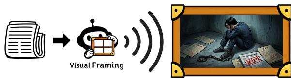  
Figure 1: Key idea behind VFSTANCE: making implicit stance cues in a lengthy, rhetorically complex news article explicit through image generation grounded in visual framing.

These challenges motivate the use of visual information, which can convey attitudinal cues more immediately and intuitively than text (Mehrabian, 1981; Paivio, 1986). Visual representations may therefore provide a complementary means of making implicit and dispersed stance cues in news articles more accessible. Publisher-provided news images (i.e., the original images published alongside the articles), however, are not always available and, even when present, may not closely align with an article’s stance, as press photographs are typically produced under documentary norms that may constrain overt evaluative signaling (Schwartz, 1992). This motivates our first research question: Can image generation technology enable more effective news stance detection?

Recent advances in text-to-image (T2I) generation and its growing adoption across diverse domains suggest a new possibility: generated images may serve as intermediate visual representations that make stance cues already present in news text more explicit to downstream models (Zhang et al., 2025b). Generating such representations, however, remains challenging because the cues most relevant to article-level news stance detection are themselves subtle, implicit, and distributed throughout the text. Naïvely generating an image from a news article may therefore fail to capture the framing choices most indicative of its stance. This leads to our second research question: How can we generate images that make stance cues more explicit?

To address these questions, we draw on framing theory from communication and media studies, particularly research on visual framing in news (Messaris and Abraham, 2001; Rodriguez and Dimitrova, 2011). We hypothesize that image generation grounded in visual framing can transform implicit stance cues in a news article into visually salient stance signals, thereby enabling more effective stance detection. VFSTANCE (Visual Framing for Stance Detection) is a multi-stage, modular framework designed to test this hypothesis (Figure 1). As illustrated in Figure 2, VFSTANCE first uses an LLM to derive visual framing specifications from the article, which are then used to prompt a T2I model to generate an image that makes the corresponding stance cues more explicit. Finally, an instruction-following large vision-language model (LVLM) predicts the article-level stance jointly from the article and the generated image.

We evaluate VFSTANCE on two article-level stance detection datasets in Korean and German and compare its performance with existing methods. The results show that VFSTANCE outperforms existing approaches across both datasets. Ablation experiments further demonstrate the contributions of visual framing and image generation to its performance. Finally, we conduct a controlled user study (N = 200) in a snippet-based news consumption setting to examine whether the generated images also help human readers identify article stance. Participants exposed to images generated by VFSTANCE identify article stance more accurately than those exposed to alternative image conditions. Taken together, these findings suggest that visual framing and image generation can make otherwise implicit stance cues more readily discernible to both computational models and human readers.

The contributions of this study are summarized as follows:

• We propose VFSTANCE, a multi-stage framework grounded in visual framing that transforms implicit stance cues in news articles into more explicit visual representations for article-level stance detection.

• We evaluate VFSTANCE on two article-level stance detection datasets and demonstrate its effectiveness across languages, while ablation experiments establish the contributions of both visual framing and image generation.

• We conduct a controlled user study (N = 200) in a snippet-based news consumption setting, showing that images generated by VF-STANCE help readers identify article stance more accurately and suggesting potential applications beyond automated stance detection.

## 2 Related Work

Article-Level News Stance Detection Much of the stance detection literature has examined shortform social media text, particularly tweets. Recent approaches have included fine-tuning pre-trained language models (Liang et al., 2022), leveraging LLM reasoning (Gatto et al., 2023; Zhang et al., 2024) and employing in-context learning (Zhu et al., 2023; Cruickshank and Ng, 2026). Multimodal stance detection methods that jointly utilize text and images have also emerged, including target-aware multimodal prompt tuning (Liang et al., 2024), cross-modal fusion (Weinzierl and Harabagiu, 2023), multimodal alignment (Zhang et al., 2025a), and image generation (Zhang et al., 2025b). Recent studies have further explored zero-shot detection with LVLMs (Weinzierl and Harabagiu, 2024; AlShenaifi and Alangari, 2026).

News stance detection remains relatively underexplored. Existing work has largely centered on headline- or sentence-level stance in contexts such as fake news detection or rumor verification (Ferreira and Vlachos, 2016; Pomerleau and Rao, 2017; Hanselowski et al., 2018; Conforti et al., 2020), while studies of article-level stance toward social issues remain scarce (Mascarell et al., 2021; Lee et al., 2025). Building on recent advances in multimodal stance detection (Liang et al., 2024; Zhang et al., 2025b), we address this gap by generating visual representations that make implicit stance signals in news articles more explicit and leveraging them for article-level stance detection.

Visual Framing Analysis Framing involves selecting and emphasizing certain aspects of reality to promote particular interpretations (Entman, 1993), and visual framing concerns how such interpretive emphasis is conveyed through visual elements (Messaris and Abraham, 2001). Empirical studies in communication have operationalized frames through manual content analysis using predefined categories (Coleman, 2010). In the computational domain, framing analysis has emerged as an active research area, as documented by recent surveys (Ali and Hassan, 2022; Otmakhova et al., 2024; Vallejo et al., 2024). Earlier computational approaches primarily analyzed the textual modality using annotated corpora and supervised methods. Widely used resources include the Media Frames Corpus with fifteen generic policy frames (Card et al., 2015), the Gun Violence Frame Corpus (Liu et al., 2019a), and the multilingual SemEval-2023 benchmark covering nine languages (Piskorski et al., 2023). More recent research has explored multimodal approaches, such as fusion-based approaches using paired headlines and lead images (Tourni et al., 2021). Studies have also leveraged LLMs and LVLMs for frame analysis of news text and imagery (Arora et al., 2025; Lu et al., 2026; El Damanhoury et al., 2026). Our study extends this line of research by using visual framing to guide image generation for article-level stance detection.

## 3 Problem and Dataset

## 3.1 Target Problem

For a news article A that covers an issue T, the goal of article-level stance detection is to determine the stance of A toward T as supportive, neutral, or oppositional using a detection model M(·). We investigate whether specifying visual framing elements and generating images based on these specifications can lead to more effective stance detection.

## 3.2 Datasets

We use two article-level news stance detection datasets: one accompanied by news images and one without images. The first is K-News-Stance-MM, a novel multimodal extension of the existing article-level stance detection dataset (Lee et al., 2025), comprising 1,816 Korean news articles with accompanying news images. As the first dataset to provide article-level stance labels together with news images, it serves as the primary testbed for this study. The second is CheeSE (Mascarell et al., 2021), which contains 1,762 German news articles.

We use this dataset to examine the applicability of our method for predicting article-level stance in a text-only setting. Dataset sizes and label distributions are provided in Table A1, and detailed dataset information is provided in Appendix B.

For broader accessibility and supplementary analysis, we also provide LLM-translated multilingual extensions of K-News-Stance-MM in English, Chinese, Indonesian, and Arabic. The target languages were selected to span different resource levels (Joshi et al., 2020).

## 4 Proposed Method

We introduce VFSTANCE (Visual Framing for Stance Detection), a multi-stage, modular framework for article-level stance detection. The central idea is to transform implicit textual stance cues into more explicit framing signals that can be rendered as visually salient elements by a T2I model, thereby enabling an instruction-following LVLM to detect article-level stance through multimodal reasoning.

News articles often express their stance toward a target issue implicitly, consistent with professional journalistic norms favoring detached and fact-oriented reporting (Kovach and Rosenstiel, 2021). Rather than expressing stance through explicit evaluative claims, articles may convey it through framing choices, such as selective emphasis on particular actors, causes, consequences, or interpretations of an issue (Entman, 1993). These cues are often subtle and distributed across long documents, making them difficult to detect from text alone.

Incorporating publisher images is a promising direction for improving stance detection performance (Appendix D.1). However, relying on conventional news images presents two limitations. First, not all news articles include an image. Second, even when images are available, they may provide limited stance-relevant information because publisher news images often serve documentary and contextual functions rather than explicitly foregrounding an article’s interpretive stance (Reuters, 2008; Associated Press, 2024). Image generation using a T2I model offers a possible solution, but naïvely prompting the model with a full article or its summary may fail to capture stance-relevant framing cues effectively. The model must first identify which subtle and dispersed framing cues are most indicative of the article’s stance before rendering them visually (see Table A10 for examples of naïve generation using a straightforward prompt).

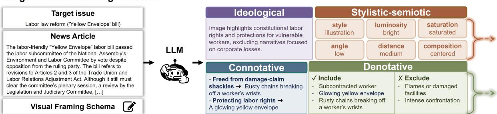

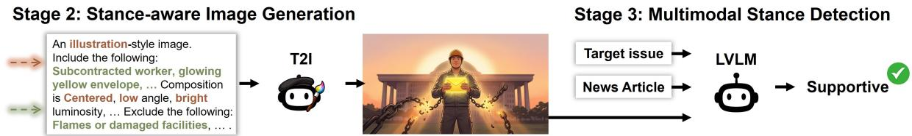  
Figure 2: Overview of VFSTANCE: a multi-stage, modular framework grounded in visual framing.

To address these challenges, VFSTANCE draws on visual framing (Rodriguez and Dimitrova, 2011) to make subtle stance cues more explicit for articlelevel stance detection. As illustrated in Figure 2, VFSTANCE is a multi-stage, modular framework built on an LLM, a T2I model, and an LVLM. The framework first uses an LLM to derive a structured visual framing specification (Stage 1). A T2I model then generates a news image based on this specification (Stage 2), making the underlying stance cues more visually evident. Finally, an LVLM uses the article and the generated image to predict articlelevel stance (Stage 3). Stage 2 can also be skipped, in which case the visual framing specification is provided directly to Stage 3 in textual form; we refer to this variant as VFSTANCE (TEXT).

Stage 1: Visual Framing Annotation We first employ an LLM to specify visual framing features. The specification captures both the image content— that is, which actors, objects, or scenes should be included or excluded—and visual presentation, including style, composition, angle, distance, saturation, and luminosity. To construct this specification, we adapt Rodriguez and Dimitrova’s (2011) model of visual framing as an annotation schema for image generation. Because the original model does not define variables specifically for image generation, we use prior visual framing literature (Kress and van Leeuwen, 1996; Hall, 1966; Barthes, 1977; Messaris and Abraham, 2001) to define annotatable features suitable for text-to-image generation. The theoretical grounding and operationalization of these features are described in Appendix C.2.

The resulting schema consists of four levels, as illustrated in Stage 1 of Figure 2. At the ideological level, the LLM identifies whose perspective or interests the image should serve. At the connotative level, it specifies the interpretive associations that the image should evoke beyond its literal depiction. For instance, when an article frames interministerial cooperation as effective coordination, the image may include symbolic elements such as interlocking gears to convey integration and collective action. At the stylistic-semiotic level, the LLM assigns values to six features: style, composition, angle, distance, saturation, and luminosity. Together, these features shape the image’s visual presentation and tone. At the denotative level, the model determines which subjects, objects, or scenes should be included or excluded.

Given a news article A and its target issue T as input, an LLM annotates the ten features across the four levels and returns the visual framing specification in JSON format. Stage 1 derives this specification solely from these inputs, without predicting the article’s stance or accessing the gold label. Figure A7 shows the full prompt, and Figure A8 provides an example output.

Stage 2: Stance-Aware Image Generation Given the visual framing specification from Stage 1, we generate a news image using a T2I model. Among the ten features across four levels, we use eight features from the stylistic-semiotic and denotative levels. These levels provide explicit, visually renderable specifications, whereas the ideological and connotative levels capture more abstract interpretive information. Image I is generated using the template-based prompt shown in Figure A5.

<table><tr><td>Category</td><td>Method</td><td>ACC</td><td>mF1</td><td> $\mathbf { F 1 _ { S u p p o r t i v e } }$ </td><td> $\mathbf { F 1 _ { N e u t r a l } }$ </td><td> $\mathbf { F 1 _ { O p p o s i t i o n a l } }$ </td></tr><tr><td rowspan="3">VFSTANCE</td><td>Gemini-3-flash</td><td> $\mathbf { 0 . 7 4 6 \pm 0 . 0 0 2 }$ </td><td> $\mathbf { 0 . 7 4 7 \pm 0 . 0 0 2 }$ </td><td> ${ \bf 0 . 7 8 \pm 0 . 0 0 3 }$ </td><td> ${ \bf 0 . 6 4 9 \pm 0 . 0 0 2 }$ </td><td> $\mathbf { 0 . 8 1 3 \pm 0 . 0 0 3 }$ </td></tr><tr><td>Claude-4.6-sonnet</td><td> $0 . 6 9 4 \pm 0 . 0 0 2$ </td><td> $0 . 6 9 6 \pm 0 . 0 0 2$ </td><td> $0 . 7 3 2 \pm 0 . 0 0 2$ </td><td> $0 . 5 5 6 \pm 0 . 0 0 2$ </td><td> $0 . 8 \pm 0 . 0 0 1$ </td></tr><tr><td>GPT-5.4-mini</td><td> $0 . 6 7 1 \pm 0 . 0 0 3$ </td><td> $0 . 6 7 5 \pm 0 . 0 0 3$ </td><td> $0 . 6 9 \pm 0 . 0 0 4$ </td><td> $0 . 5 6 2 \pm 0 . 0 0 3$ </td><td> $0 . 7 7 4 \pm 0 . 0 0 4$ </td></tr><tr><td rowspan="7">Multimodal</td><td>Gemini-3-flash</td><td> $\mathbf { 0 . 7 1 9 \pm 0 . 0 0 1 }$ </td><td> $\mathbf { 0 . 7 2 6 \pm 0 . 0 0 1 }$ </td><td> ${ \bf 0 . 7 3 \pm 0 . 0 0 2 }$ </td><td> $\mathbf { 0 . 6 5 9 \pm 0 . 0 0 1 }$ </td><td> $\mathbf { 0 . 7 8 8 \pm 0 . 0 0 1 }$ </td></tr><tr><td>Claude-4.6-sonnet</td><td> $0 . 6 6 9 \pm 0 . 0 0 2$ </td><td> $0 . 6 7 4 \pm 0 . 0 0 2$ </td><td> $0 . 6 9 1 \pm 0 . 0 0 5$ </td><td> $0 . 5 5 5 \pm 0 . 0 0 2$ </td><td> $0 . 7 7 8 \pm 0 . 0 0 2$ </td></tr><tr><td>GPT-5.4-mini</td><td> $0 . 6 5 8 \pm 0 . 0 0 2$ </td><td> $0 . 6 6 4 \pm 0 . 0 0 2$ </td><td> $0 . 6 5 2 \pm 0 . 0 0 1$ </td><td> $0 . 5 6 9 \pm 0 . 0 0 4$ </td><td> $0 . 7 6 9 \pm 0 . 0 0 2$ </td></tr><tr><td>RoBERTa+ViT</td><td> $0 . 6 1 9 \pm 0 . 0 3 3$ </td><td> $0 . 6 2 \pm 0 . 0 3 6$ </td><td> $0 . 6 3 3 \pm 0 . 0 2 2$ </td><td> $0 . 5 9 7 \pm 0 . 0 1 5$ </td><td> $0 . 6 3 \pm 0 . 0 7 5$ </td></tr><tr><td>CLIP</td><td> $0 . 3 6 4 \pm 0 . 0 2 1$ </td><td> $0 . 3 4 5 \pm 0 . 0 2 3$ </td><td> $0 . 2 5 \pm 0 . 0 7 1$ </td><td> $0 . 3 6 4 \pm 0 . 0 3 9$ </td><td> $0 . 4 2 1 \pm 0 . 0 3 2$ </td></tr><tr><td>TMPT</td><td> $0 . 3 4 7 \pm 0 . 0 1 9$ </td><td> $0 . 3 3 5 \pm 0 . 0 1 3$ </td><td> $0 . 2 7 2 \pm 0 . 0 5 4$ </td><td> $0 . 3 6 6 \pm 0 . 0 4 5$ </td><td> $0 . 3 6 8 \pm 0 . 0 4 7$ </td></tr><tr><td>T-MAD</td><td> $0 . 3 3 2 \pm 0 . 0 1 7$ </td><td> $0 . 3 0 6 \pm 0 . 0 2 3$ </td><td> $0 . 3 0 6 \pm 0 . 0 3 3$ </td><td> $0 . 4 0 3 \pm 0 . 0 4 4$ </td><td> $0 . 2 0 8 \pm 0 . 0 8$ </td></tr><tr><td rowspan="7">Textual</td><td>Gemini-3-flash</td><td> $\mathbf { 0 . 7 1 2 \pm 0 . 0 0 2 }$ </td><td> $\mathbf { 0 . 7 1 9 \pm 0 . 0 0 2 }$ </td><td> $\mathbf { 0 . 7 1 1 \pm 0 . 0 0 4 }$ </td><td> $\mathbf { 0 . 6 6 3 \pm 0 . 0 0 2 }$ </td><td> $\mathbf { 0 . 7 8 1 \pm 0 . 0 0 4 }$ </td></tr><tr><td>GPT-5.4-mini</td><td> $0 . 6 5 3 \pm 0 . 0 0 3$ </td><td> $0 . 6 6 \pm 0 . 0 0 3$ </td><td> $0 . 6 5 3 \pm 0 . 0 0 5$ </td><td> $0 . 5 6 3 \pm 0 . 0 0 4$ </td><td> $0 . 7 6 5 \pm 0 . 0 0 5$ </td></tr><tr><td>Claude-4.6-sonnet</td><td> $0 . 6 3 6 \pm 0 . 0 0 2$ </td><td> $0 . 6 2 9 \pm 0 . 0 0 2$ </td><td> $0 . 6 5 9 \pm 0 . 0 0 2$ </td><td> $0 . 4 5 1 \pm 0 . 0 0 3$ </td><td> $0 . 7 7 6 \pm 0 . 0 0 3$ </td></tr><tr><td>PT-HCL</td><td> $0 . 6 2 1 \pm 0 . 0 0 7$ </td><td> $0 . 6 2 1 \pm 0 . 0 0 5$ </td><td> $0 . 6 3 8 \pm 0 . 0 2$ </td><td> $0 . 6 0 4 \pm 0 . 0 2 1$ </td><td> $0 . 6 2 \pm 0 . 0 1 5$ </td></tr><tr><td>LKI-BART</td><td> $0 . 6 1 8 \pm 0 . 0 2 1$ </td><td> $0 . 6 1 4 \pm 0 . 0 2 7$ </td><td> $0 . 5 9 6 \pm 0 . 0 5 9$ </td><td> $0 . 5 7 8 \pm 0 . 0 6 5$ </td><td> $0 . 6 6 9 \pm 0 . 0 2 5$ </td></tr><tr><td>RoBERTa</td><td> $0 . 6 0 4 \pm 0 . 0 3 8$ </td><td> $0 . 6 0 2 \pm 0 . 0 4$ </td><td> $0 . 6 1 \pm 0 . 0 6 3$ </td><td> $0 . 6 0 4 \pm 0 . 0 2 4$ </td><td> $0 . 5 9 4 \pm 0 . 0 3 8$ </td></tr><tr><td>CoT Embeddings</td><td> $0 . 5 8 3 \pm 0 . 0 7$ </td><td> $0 . 5 6 9 \pm 0 . 0 8 8$ </td><td> $0 . 6 0 8 \pm 0 . 0 6 9$ </td><td> $0 . 5 0 4 \pm 0 . 1 9 6$ </td><td> $0 . 5 9 3 \pm 0 . 1 3 2$ </td></tr><tr><td rowspan="6">Visual</td><td>Gemini-3-flash</td><td> ${ \bf 0 . 4 6 \pm 0 . 0 0 4 }$ </td><td> $\mathbf { 0 . 4 5 6 \pm 0 . 0 0 5 }$ </td><td> $0 . 4 1 8 \pm 0 . 0 0 6$ </td><td> ${ \bf 0 . 4 8 \pm 0 . 0 0 5 }$ </td><td> $\mathbf { 0 . 4 7 1 \pm 0 . 0 0 5 }$ </td></tr><tr><td>Claude-4.6-sonnet</td><td> $0 . 4 3 5 \pm 0 . 0 0 2$ </td><td> $0 . 4 3 3 \pm 0 . 0 0 2$ </td><td> $\mathbf { 0 . 4 2 5 \pm 0 . 0 0 4 }$ </td><td> $0 . 4 5 3 \pm 0 . 0 0 3$ </td><td> $0 . 4 2 \pm 0 . 0 0 4$ </td></tr><tr><td>GPT-5.4-mini</td><td> $0 . 3 8 \pm 0 . 0 0 2$ </td><td> $0 . 3 5 \pm 0 . 0 0 2$ </td><td> $0 . 3 4 6 \pm 0 . 0 0 4$ </td><td> $0 . 4 5 7 \pm 0 . 0 0 2$ </td><td> $0 . 2 4 6 \pm 0 . 0 0 3$ </td></tr><tr><td>ResNet</td><td> $0 . 3 4 5 \pm 0 . 0 0 7$ </td><td> $0 . 3 2 \pm 0 . 0 1 8$ </td><td> $0 . 2 1 8 \pm 0 . 0 6 4$ </td><td> $0 . 3 1 6 \pm 0 . 0 4 2$ </td><td> $0 . 4 2 7 \pm 0 . 0 1 8$ </td></tr><tr><td>SwinT</td><td> $0 . 3 3 7 \pm 0 . 0 1 8$ </td><td> $0 . 3 1 \pm 0 . 0 2 6$ </td><td> $0 . 2 0 6 \pm 0 . 0 5$ </td><td> $0 . 3 9 \pm 0 . 0 3$ </td><td> $0 . 3 3 4 \pm 0 . 1 0 4$ </td></tr><tr><td>ViT</td><td> $0 . 3 1 7 \pm 0 . 0 1 4$ </td><td> $0 . 3 0 5 \pm 0 . 0 1 8$ </td><td> $0 . 2 5 9 \pm 0 . 0 7$ </td><td> $0 . 3 6 3 \pm 0 . 0 3 7$ </td><td> $0 . 2 9 2 \pm 0 . 0 2 5$ </td></tr></table>

Table 1: Article-level stance detection performance on the test split of K-News-Stance-MM, measured by accuracy (ACC) and macro F1 (mF1). Categories and models are sorted by accuracy, with the best-performing model in each category highlighted in bold. Models in the VFSTANCE category differ only in the LVLM used as the Stage 3 detector. Methods in the multimodal and visual categories use publisher-provided news images.

model alternatives is provided in Appendix D.6.

## 5 Evaluation Results

Stage 3: Multimodal Stance Detection The final step is to predict the stance of article A toward a target issue T. The detector model M receives both the article text and the stance-aware image I generated in Stage 2. We use an LVLM as M, with the prompt shown in Figure A4. VFSTANCE aims to improve stance detection by combining the article text, which contains implicit stance cues, with a generated image designed to externalize stancerelevant framing signals. For VFSTANCE (TEXT), the visual framing specification from Stage 1 is provided to the detector instead of I.

We present evaluation results on article-level stance detection, measured by accuracy (ACC) and macro F1 (mF1). We report the average performance over five runs, along with standard errors. The Mann– Whitney U test was used to assess the statistical significance of the differences. Detailed experimental settings are provided in Appendix A.

Model Configurations We use Gemini-3-flash as the LLM in Stage 1 and Gemini-3.1-flash-image (also known as Nano Banana 2) as the T2I model in Stage 2. The latter was selected for its multilingual support and image generation quality. For Stage 3, we employ Gemini-3-flash as the LVLM because it achieved the best stance detection performance among the three proprietary models evaluated in this study—Gemini-3-flash, GPT-5.4-mini, and Claude-4.6-sonnet. A comparison with open-

Comparison with Existing Methods Table 1 presents the article-level stance detection results on the K-News-Stance-MM test split, comparing VFSTANCE with the baseline methods. We evaluated eleven fine-tuned baselines grouped into textual, visual, and multimodal methods, all of which were proposed in previous studies. These models were fine-tuned on samples from the training split. Further details are provided in Appendix C.

Textual baselines include RoBERTa (Liu et al., 2019b), a fine-tuned classifier based on a masked language model; CoT Embeddings (Gatto et al., 2023), which trains RoBERTa on chain-of-thought reasoning traces generated by an LLM; LKI-BART (Zhang et al., 2024), which injects text– target relational knowledge extracted by an LLM into a BART model; and PT-HCL (Liang et al., 2022), which separates target-invariant and targetspecific features via contrastive learning.

Visual baselines include ResNet (He et al., 2016), a convolutional neural network; ViT (Dosovitskiy et al., 2021), a vision transformer; and SwinT (Liu et al., 2021), a hierarchical vision transformer with shifted window self-attention.

Multimodal baselines include RoBERTa+ViT, which concatenates textual and visual [CLS] representations; CLIP (Radford et al., 2021), which concatenates text and image embeddings from pretrained CLIP encoders; TMPT (Liang et al., 2024), a target-aware multimodal prompt-tuning method; and T-MAD (Zhang et al., 2025a), a target-driven multimodal alignment method. Additionally, we evaluated the three proprietary LVLMs used as Stage 3 backbones in the proposed method using a straightforward prompting strategy.

Three key observations emerge from Table 1. First, the three LVLMs exhibited strong performance across the three baseline categories, outperforming all fine-tuned methods $( p { < } 0 . 0 1 )$ . Among them, Gemini-3-flash consistently achieved the best performance across categories $( p { < } 0 . 0 1 )$ , supporting its use as the backbone for VFSTANCE. Second, VFSTANCE with Gemini-3-flash as the backbone achieved the best overall performance, with an accuracy of 0.746 and a macro F1 score of 0.747. The proposed method outperformed all baselines $( p { < } 0 . 0 1 )$ , including both LVLM-based and fine-tuned methods. This result provides empirical support for the effectiveness of the proposed framework for article-level stance detection. Third, in terms of class-wise prediction performance, VFSTANCE with Gemini-3-flash achieved higher F1 scores for the supportive and oppositional labels than the multimodal baseline, increasing F1Supportive from 0.73 to 0.78 $( p { < } 0 . 0 1 )$ and $\mathrm { F 1 _ { O p p o s i t i o n a l } }$ from 0.788 to 0.813 (p<0.01). By contrast, $\mathrm { F l _ { N e u t r a l } }$ slightly decreased from 0.659 to $0 . 6 4 9 \ : ( p { < } 0 . 0 1 )$ . These findings suggest that the proposed method is particularly effective at making directional stance cues more explicit.

Ablation: Visual Framing in Image Generation To investigate the contribution of visual framing to image generation, we compared VFSTANCE with variants that use alternative image generation methods in Stage 2; the results are presented in Table 2. Meta-Prompting instructs an LLM to generate a prompt for a T2I model by specifying the task goal without using a visual framing schema. Direct T2I passes the news text directly to the T2I model to generate stance-aware images for prediction. EAIG4SD is an image generation framework proposed for stance detection on tweets (Zhang et al., 2025b) and, to our knowledge, is the only prior method that uses image generation for stance detection. All three methods achieved lower accuracy and macro F1 scores than VFSTANCE, with gaps of at least 0.025 in accuracy and 0.02 in macro F1 $( p { < } 0 . 0 1 )$ . These results provide empirical support for the role of visual framing to image generation and, consequently, to the performance gains achieved by VFSTANCE.

<table><tr><td>Method</td><td>ACC</td><td>mF1</td></tr><tr><td>VFSTANCE</td><td> ${ \bf 0 . 7 4 6 \pm 0 . 0 0 2 }$ </td><td> ${ \bf 0 . 7 4 7 \pm 0 . 0 0 2 }$ </td></tr><tr><td>Direct T2I</td><td> $0 . 7 2 1 \pm 0 . 0 0 1$ </td><td> $0 . 7 2 3 \pm 0 . 0 0 1$ </td></tr><tr><td>EAIG4SD</td><td> $0 . 7 2 \pm 0 . 0 0 2$ </td><td> $0 . 7 2 7 \pm 0 . 0 0 2$ </td></tr><tr><td>Meta-Prompting</td><td> $0 . 7 1 2 \pm 0 . 0 0 4$ </td><td> $0 . 7 0 9 \pm 0 . 0 0 4$ </td></tr></table>

Table 2: Ablation results on the impact of visual framing in image generation on stance detection performance.

<table><tr><td>Method</td><td>ACC</td><td>mF1</td></tr><tr><td>VFSTANCE</td><td> ${ \bf 0 . 7 4 6 \pm 0 . 0 0 2 }$ </td><td> $\mathbf { 0 . 7 4 7 \pm 0 . 0 0 2 }$ </td></tr><tr><td>VFSTANCE (TEXT)</td><td> $0 . 7 3 \pm 0 . 0 0 3$ </td><td> $0 . 7 2 5 \pm 0 . 0 0 3$ </td></tr><tr><td>1-Step Prompting</td><td> $0 . 6 8 8 \pm 0 . 0 0 7$ </td><td> $0 . 6 7 7 \pm 0 . 0 0 8$ </td></tr></table>

Table 3: Ablation results on the impact of image generation on stance detection performance.

Ablation: Use of Image Generation Given the effectiveness of visual framing in image generation identified above, we next investigated whether image generation itself is necessary. We compare VFSTANCE with two alternative methods that do not use image generation but remain grounded in visual framing; their performance is reported in Table 3. VFSTANCE (TEXT) uses the visual framing specification from Stage 1 as input context for the LVLM in Stage 3 while skipping image generation in Stage 2. 1-Step Prompting instructs an LVLM, Gemini-3-flash, to perform visual framing annotation and stance prediction in a single step.

The results show that VFSTANCE achieves statistically significant improvements over both alternatives without image generation $( p { < } 0 . 0 1 )$ , indicating that image generation provides an additional performance gain beyond the contribution of visual framing identified in Table 2. Another notable finding is the strong performance of VF-STANCE (TEXT), which outperforms all baseline methods in Table 1, as well as 1-Step Prompting. These results provide empirical evidence that visual framing contributes substantially even when represented only as a textual specification rather than rendered as an image. Considering the cost– accuracy trade-off between the two variants (Table A4), VFSTANCE and VFSTANCE (TEXT) may serve different practical needs: users may prefer VFSTANCE (TEXT) when computational cost is the primary concern and thus omit image generation, whereas VFSTANCE is preferable when maximizing detection accuracy is the priority.

<table><tr><td>D</td><td>S</td><td>C</td><td>I ACC</td><td>mF1</td></tr><tr><td>√</td><td>√</td><td></td><td> ${ \bf 0 . 7 4 6 \pm 0 . 0 0 2 }$ </td><td> $\mathbf { 0 . 7 4 7 \pm 0 . 0 0 2 }$ </td></tr><tr><td>√</td><td></td><td></td><td> $0 . 7 3 2 \pm 0 . 0 0 2$ </td><td> $0 . 7 3 6 \pm 0 . 0 0 2$ </td></tr><tr><td>√</td><td>√</td><td>√</td><td> $0 . 7 2 5 \pm 0 . 0 0 2$ </td><td> $0 . 7 2 8 \pm 0 . 0 0 2$ </td></tr><tr><td>√</td><td>r</td><td>V √</td><td> $0 . 7 2 2 \pm 0 . 0 0 3$ </td><td> $0 . 7 2 3 \pm 0 . 0 0 3$ </td></tr></table>

Table 4: Stance detection performance according to the visual framing levels adopted in Stage 2 (D: denotative, S: stylistic-semiotic, C: connotative, and I: ideological).
<table><tr><td>D</td><td>S</td><td>C</td><td>I</td><td>ACC</td><td>mF1</td></tr><tr><td>√</td><td>√</td><td>V</td><td>√</td><td> $\mathbf { 0 . 7 4 6 \pm 0 . 0 0 2 }$ </td><td> ${ \bf 0 . 7 4 7 \pm 0 . 0 0 2 }$ </td></tr><tr><td>V</td><td>√</td><td></td><td></td><td> $0 . 7 3 9 \pm 0 . 0 0 3$ </td><td> $0 . 7 3 7 \pm 0 . 0 0 3$ </td></tr></table>

Table 5: Stance detection performance according to the visual framing levels used in Stage 1 (D: denotative, S: stylistic-semiotic, C: connotative, and I: ideological).

Ablation: Visual Framing Level Selection We present ablation studies to support our choice of the denotative and stylistic-semiotic levels in Stage 2, selected from the four levels produced by the LLMbased annotation in Stage 1. In each comparison, only the features from the selected levels are used in the image-generation prompt for Stage 2, while all four levels are annotated identically in Stage 1. Table 4 presents the level-wise ablation results, showing that the two levels adopted in VF-STANCE are critical for stance detection performance, whereas the connotative and ideological levels are ineffective and even reduce accuracy and macro F1 when included. This finding suggests that the abstract nature of the two excluded levels makes them difficult to render visually in a way that makes stance signals more explicit, consistent with prior findings on the difficulty of generating abstract concepts (Liao et al., 2024).

<table><tr><td>Method</td><td>ACC</td><td>mF1</td></tr><tr><td colspan="3">VFSTANCE</td></tr><tr><td>Gemini-3-flash Claude-4.6-sonnet GPT-5.4-mini</td><td> $\mathbf { 0 . 6 1 8 \pm 0 . 0 0 2 }$   $0 . 6 \pm 0 . 0 0 3$   $0 . 5 9 8 \pm 0 . 0 0 3$ </td><td> ${ \bf 0 . 6 2 \pm 0 . 0 0 2 }$   $0 . 5 9 5 \pm 0 . 0 0 3$   $0 . 5 9 \pm 0 . 0 0 3$ </td></tr><tr><td></td><td>Textual</td><td></td></tr><tr><td>Gemini-3-flash GPT-5.4-mini Claude-4.6-sonnet RoBERTa PT-HCL</td><td> $0 . 6 0 5 \pm 0 . 0 0 1$   $0 . 5 8 4 \pm 0 . 0 0 3$   $0 . 5 7 7 \pm 0 . 0 0 3$   $0 . 5 2 6 \pm 0 . 0 1 4$   $0 . 5 1 7 \pm 0 . 0 2 1$ </td><td> $0 . 5 8 \pm 0 . 0 0 1$   $0 . 5 7 8 \pm 0 . 0 0 3$   $0 . 5 6 6 \pm 0 . 0 0 3$   $0 . 4 4 2 \pm 0 . 0 3 4$   $0 . 3 9 \pm 0 . 0 4 8$   $0 . 3 4 \pm 0 . 0 1 1$ </td></tr></table>

Table 6: Stance detection performance on CheeSE, a German dataset without original news images.

Given the effectiveness of these two levels, we further examined whether annotating the visual framing specification across all four levels in Stage 1 is necessary. Specifically, we measured the performance of VFSTANCE when only the stylisticsemiotic and denotative levels were included in the Stage 1 annotation schema. Table 5 shows that additionally annotating the connotative and ideological features improves the effectiveness of the resulting annotations for the eight denotative and stylistic-semiotic features, yielding a 0.01 increase in macro F1. According to the hierarchical structure of Rodriguez and Dimitrova (2011)’s model, the connotative and ideological levels provide interpretive context for lower visual elements, which may partially explain this performance gain.

Effectiveness Across Languages To assess whether VFSTANCE is effective across datasets and languages, we evaluated it on CheeSE (Mascarell et al., 2021), a German article-level news stance detection dataset. Since CheeSE does not provide original news images, VFSTANCE was compared against seven textual baseline methods: three LVLM-based and four fine-tuned methods. As shown in Table 6, VFSTANCE achieved higher accuracy and macro F1 scores across multiple LVLM backbones. Gemini-3-flash again performed best, achieving an accuracy of 0.618 and a macro F1 score of 0.62, outperforming all baseline methods by a substantial margin (p<0.01). These results, together with the Korean-language findings above, suggest that VFSTANCE can be effective across languages. To further support this finding, we provide supplementary results on translated versions of K-News-Stance-MM in four languages in Appendix D.4.

## 6 User Study

We conduct a controlled user study to examine whether images generated by VFSTANCE help news readers identify article stance. Specifically, we investigate whether participants can accurately discern article stance in a snippet-based news consumption setting where only limited textual information is available, reflecting common patterns of news consumption in online information environments and social feeds (Gabielkov et al., 2016). We recruited 200 native Korean speakers through PMI Research & Consulting (PMI)1, with the sample balanced by gender and age.

For the user study, we selected nine articles covering three issues, with one supportive, one neutral, and one oppositional article per issue. These articles were published after June 2024, outside the period covered by K-News-Stance-MM. Each experimental snippet consisted of the article headline, the first two to three sentences of its lead paragraph, and a visual treatment determined by the experimental condition. For each article, we created four presentation versions with identical text: (1) Textonly, with no accompanying image; (2) Original, with the publisher’s original image; (3) Naïve, with an image generated using a straightforward prompt without a visual framing specification; and (4) Proposed, with an image generated by VFSTANCE.

Each participant viewed all nine articles in randomized order, with each article randomly assigned to one of the four presentation conditions. This design yielded approximately 50 observations per condition for each article and approximately 450 observations per condition overall. After viewing each snippet, participants classified the article’s stance toward the target issue as supportive, neutral, or oppositional through a web survey interface, a screenshot of which is provided in Figure A10b.

Figure 3 reports stance identification accuracy across conditions. VFSTANCE achieved the highest accuracy of 0.378, exceeding the text-only, original, and naïve conditions by 0.071, 0.098, and 0.076, respectively. A mixed-effects logistic regression, with presentation condition as a fixed effect and random intercepts for participants and articles, further showed that all three comparison conditions had significantly lower odds of correct stance identification than VFSTANCE: text-only $\mathrm { ( O R = 0 . 7 0 8 }$ $p = 0 . 0 0 1 )$ , original $( \mathrm { O R } = 0 . 6 2 0 , p < 0 . 0 0 0 1 )$ and naïve $( \mathrm { O R } = 0 . 6 9 7 , p = 0 . 0 0 0 6 )$

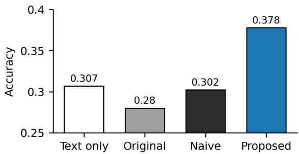  
Figure 3: Stance identification accuracy across presentation conditions in a controlled user study under snippetbased news consumption.

Despite modest overall accuracy, these findings indicate that VFSTANCE-generated images facilitate stance identification under abbreviated news exposure. Their advantage over text-only, publisherprovided and naïvely generated images further highlights their potential utility beyond automated stance detection.

## 7 Conclusion

This study applies framing theory (Entman, 1993) and its visual extension (Rodriguez and Dimitrova, 2011) to article-level news stance detection. Despite advances in NLP and LLMs, the task remains challenging because stance cues in long, structurally complex news articles are often implicit and dispersed throughout the text. VFSTANCE is a multi-stage, modular stance detection framework in which an LLM produces a visual framing specification, a T2I model generates a stance-aware image, and an LVLM predicts article-level stance using the article and the generated image.

Evaluation results demonstrate that VFSTANCE outperforms existing stance detection methods and that both visual framing and image generation contribute to its performance. A controlled user study in a snippet-based news consumption setting further shows that images generated by VFSTANCE improve stance identification, shedding light on potential applications beyond automated stance detection. More broadly, the findings suggest that visual framing can function as an intermediate representational layer, transforming dispersed textual stance cues into signals that are more readily accessible to both computational models and human readers.

Taken together, these findings point to the potential of generative AI grounded in visual framing to make media perspectives more transparent, thereby supporting the identification of news bias and contributing to more pluralistic media environments. Future work could extend this approach to other areas of AI and NLP that involve implicit framing or evaluative signals, such as argument mining, bias analysis, and model bias auditing. The data, code, and prompts are available at https://github.com/ssu-humane/VFStance.

## Limitations

Computational Costs VFSTANCE employs three models across its corresponding stages. Encouragingly, as discussed in Section 5, VFSTANCE (TEXT) offers a computationally efficient alternative by omitting image generation while still outperforming all baseline methods. This further demonstrates the effectiveness of the visual framing schema used in the proposed method. Considering the cost–accuracy trade-off (Appendix D.2), VFSTANCE (TEXT) could be used when computational cost is the primary concern, whereas VF-STANCE remains the strongest choice when maximizing detection accuracy is the priority.

Multilingual Evaluation The primary testbed, K-News-Stance-MM, is a Korean corpus, which limits the scope of multilingual evaluation in this study. This choice was necessary because K-News-Stance-MM is the first and only dataset to provide publisher images for article-level stance detection, which are required to compare VFSTANCE with visual and multimodal baselines. To provide additional evidence of multilingual effectiveness, we conducted experiments on CheeSE, a German text-only dataset, and on LLM-translated versions of K-News-Stance-MM in four languages (Appendix D.4). Future studies could construct articlelevel stance detection datasets with accompanying news images by adapting the guidelines provided by Lee et al. (2025).

Model Selection Proprietary models were selected as primary backbones for VFSTANCE because of their stronger language understanding, reasoning, and generation capabilities. We provide supplementary results for open-weight models in Appendix D.6, where they achieved lower performance. Because the framework is modular and model-agnostic, future work could evaluate a broader range of models and incorporate additional training to further improve detection accuracy.

## Ethical Considerations

This study was approved by the Institutional Review Board at Soongsil University (SSU-202604- HR-804-1).

Copyright and Privacy Issues K-News-Stance-MM extends an existing dataset (Lee et al., 2025) built from news articles distributed through the Naver News platform. To respect the intellectual property rights of the original news publishers, K-News-Stance-MM is released under gated access with a custom Data Use Agreement: prospective users must submit an access request describing their research purpose and agree to terms that restrict use to non-commercial academic research and prohibit redistribution. The news data include the names of public figures, but private individuals are anonymized when present; thus, the dataset does not contain any personally identifiable information about private individuals, as manually verified for all samples in K-News-Stance-MM. CheeSE (Mascarell et al., 2021) is a publicly released benchmark and is used under its original release terms.

User Study Participants We recruited 200 Korean native speakers residing in South Korea through a survey panel provider. The task took approximately 10 minutes, with compensation of about USD 3.6, which exceeded the Korean statutory minimum hourly wage. All participants provided informed consent and could withdraw at any time. The study collected no sensitive personal information as defined by the Korean Personal Information Protection Act. Two potential risks were disclosed in advance: minimal-risk discomfort from politically contested content and the indirect inference of attitudes from stance judgments. Responses contained only randomly assigned IDs; therefore, individual records could not be selectively deleted after submission, a limitation that was also disclosed before consent.

Risks Associated with Image Generation Images generated by VFSTANCE could be repurposed for reader-facing applications, as demonstrated in the user study in Section 6. However, such use requires careful consideration because T2I models may reproduce or amplify social biases. Before its use, generated images should be clearly labeled as synthetic and reviewed to ensure compliance with applicable defamation, personality-rights, and synthetic-media regulations.

AI Assistant Use We used AI-assisted language editing tools, primarily ChatGPT, exclusively for grammar checking and improving readability.

## Acknowledgements

This research was supported by the Institute of Information & Communications Technology Planning & Evaluation (IITP), funded by the Korea government (MSIT) (IITP-2026-RS-2022-00156360, IITP-2026-RS-2024-00430997, and IITP-2026-RS-2020-II201602), and by the National Research Foundation of Korea (NRF), funded by the Korea government (MSIT) (RS-2023-00252535). KP and JH are the corresponding authors.

## References

Mohammad Ali and Naeemul Hassan. 2022. A survey of computational framing analysis approaches. In Proceedings of the 2022 Conference on Empirical Methods in Natural Language Processing, pages 9335–9348, Abu Dhabi, United Arab Emirates. Association for Computational Linguistics.

Nouf AlShenaifi and Nourah Alangari. 2026. Beyond text: Multimodal stance detection in arabic tweets. Machine Learning with Applications, 23:100823.

Anthropic. 2026. Claude sonnet 4.6 system card. https://www-cdn.anthropic.com/ 78073f739564e986ff3e28522761a7a0b4484f84. pdf. Published: February 17, 2026. Accessed: 2026-05-24.

Arnav Arora, Srishti Yadav, Maria Antoniak, Serge Belongie, and Isabelle Augenstein. 2025. Multi-modal framing analysis of news. In Proceedings of the 2025 Conference on Empirical Methods in Natural Language Processing, pages 31531–31553, Suzhou, China. Association for Computational Linguistics.

Associated Press. 2024. Ap news values and principles. https://www.ap.org/wp-content/uploads/ 2024/02/ap-news-values-and-principles-1. pdf. Accessed: 2026-05-18.

Roland Barthes. 1977. Rhetoric of the image. In Stephen Heath, editor, Image, Music, Text, pages 32– 51. Hill and Wang, New York.

Dallas Card, Amber E. Boydstun, Justin H. Gross, Philip Resnik, and Noah A. Smith. 2015. The media frames corpus: Annotations of frames across issues. In Proceedings of the 53rd Annual Meeting of the Association for Computational Linguistics and the 7th International Joint Conference on Natural Language Processing (Volume 2: Short Papers), pages 438–444, Beijing, China. Association for Computational Linguistics.

Dennis Chong and James N Druckman. 2007. Framing theory. Annu. Rev. Polit. Sci., 10(1):103–126.

Renita Coleman. 2010. Framing the pictures in our heads: Exploring the framing and agenda-setting effects of visual images. In Doing news framing analysis, pages 249–278. Routledge.

Costanza Conforti, Jakob Berndt, Mohammad Taher Pilehvar, Chryssi Giannitsarou, Flavio Toxvaerd, and Nigel Collier. 2020. STANDER: An expertannotated dataset for news stance detection and evidence retrieval. In Findings of the Association for Computational Linguistics: EMNLP 2020, pages 4086–4101, Online. Association for Computational Linguistics.

Iain Cruickshank and Lynnette Ng. 2026. Prompting and fine-tuning open source large language models for stance classification. ACM Transactions on Intelligent Systems and Technology, 17:1–25.

Alexey Dosovitskiy, Lucas Beyer, Alexander Kolesnikov, Dirk Weissenborn, Xiaohua Zhai, Thomas Unterthiner, Mostafa Dehghani, Matthias Minderer, Georg Heigold, Sylvain Gelly, Jakob Uszkoreit, and Neil Houlsby. 2021. An image is worth 16x16 words: Transformers for image recognition at scale. In 9th International Conference on Learning Representations, ICLR 2021, Virtual Event, Austria, May 3-7, 2021. OpenReview.net.

Kareem El Damanhoury, Carol Winkler, Ayse D. Lokmanoglu, and Keyu Alexander Chen Glanz. 2026. Visual framing in the AI era: Lessons from manual approaches for computational methods. Computational Communication Research, 8(1):1–41.

Robert M. Entman. 1993. Framing: Toward clarification of a fractured paradigm. Journal ofCommunication, 43(4):51–58.

William Ferreira and Andreas Vlachos. 2016. Emergent: a novel data-set for stance classification. In Proceedings of the 2016 conference of the North American chapter ofthe associationfor computational linguistics: Human language technologies, pages 1163– 1168.

Maksym Gabielkov, Arthi Ramachandran, Augustin Chaintreau, and Arnaud Legout. 2016. Social clicks: What and who gets read on twitter? In Proceedings ofthe 2016 ACM SIGMETRICS International Conference on Measurement and Modeling ofComputer Science, SIGMETRICS ’16, page 179–192, New York, NY, USA. Association for Computing Machinery.

Joseph Gatto, Omar Sharif, and Sarah Preum. 2023. Chain-of-thought embeddings for stance detection on social media. In Findings ofthe Associationfor Computational Linguistics: EMNLP 2023, pages 4154– 4161, Singapore. Association for Computational Linguistics.

Matthew Gentzkow and Jesse M. Shapiro. 2010. What drives media slant? evidence from u.s. daily newspapers. Econometrica, 78(1):35–71.

Google. 2026a. Gemini 3.1 flash image preview. https://ai.google.dev/gemini-api/ docs/models/gemini-3.1-flash-image. Accessed: 2026-05-25.

Google. 2026b. Gemini 3.1 Pro Preview. https://ai.google.dev/gemini-api/docs/ models/gemini-3.1-pro-preview. Accessed: 2026-05-26.

Google DeepMind. 2025. Gemini 3 flash model card. https://storage.googleapis. com/deepmind-media/Model-Cards/ Gemini-3-Flash-Model-Card.pdf. Published: December 2025. Accessed: 2026-05-24.

Edward T. Hall. 1966. The Hidden Dimension. Doubleday, Garden City, NY.

Felix Hamborg, Karsten Donnay, and Bela Gipp. 2019. Automated identification of media bias in news articles : an interdisciplinary literature review. International Journal on Digital Libraries, 20(4):391–415.

Andreas Hanselowski, Avinesh PVS, Benjamin Schiller, Felix Caspelherr, Debanjan Chaudhuri, Christian M. Meyer, and Iryna Gurevych. 2018. A retrospective analysis of the fake news challenge stance-detection task. In Proceedings ofthe 27th International Conference on Computational Linguistics, pages 1859– 1874, Santa Fe, New Mexico, USA. Association for Computational Linguistics.

Kaiming He, Xiangyu Zhang, Shaoqing Ren, and Jian Sun. 2016. Deep residual learning for image recognition. In Proceedings of the IEEE Conference on Computer Vision and Pattern Recognition, pages 770– 778.

Pratik Joshi, Sebastin Santy, Amar Budhiraja, Kalika Bali, and Monojit Choudhury. 2020. The state and fate of linguistic diversity and inclusion in the NLP world. In Proceedings of the 58th Annual Meeting of the Association for Computational Linguistics, pages 6282–6293, Online. Association for Computational Linguistics.

Bill Kovach and Tom Rosenstiel. 2021. The elements of journalism, revised and updated 4th edition: What newspeople should know and the public should expect. Crown.

Gunther Kress and Theo van Leeuwen. 1996. Reading Images: The Grammar of Visual Design. Routledge, London and New York.

Dahyun Lee, Jonghyeon Choi, Jiyoung Han, and Kunwoo Park. 2025. Journalism-guided agentic incontext learning for news stance detection. In Proceedings of the 2025 Conference on Empirical Methods in Natural Language Processing, pages 15393– 15416, Suzhou, China. Association for Computational Linguistics.

Bin Liang, Zixiao Chen, Lin Gui, Yulan He, Min Yang, and Ruifeng Xu. 2022. Zero-shot stance detection via contrastive learning. In Proceedings of the ACM Web Conference 2022, pages 2738–2747. Association for Computing Machinery.

Bin Liang, Ang Li, Jingqian Zhao, Lin Gui, Min Yang, Yue Yu, Kam-Fai Wong, and Ruifeng Xu. 2024. Multi-modal stance detection: New datasets and model. In Findings of the Association for Computational Linguistics: ACL 2024, pages 12373–12387, Bangkok, Thailand. Association for Computational Linguistics.

Jiayi Liao, Xu Chen, Qiang Fu, Lun Du, Xiangnan He, Xiang Wang, Shi Han, and Dongmei Zhang. 2024. Text-to-image generation for abstract concepts. In Proceedings of the AAAI Conference on Artificial Intelligence, volume 38.

Siyi Liu, Lei Guo, Kate Mays, Margrit Betke, and Derry Tanti Wijaya. 2019a. Detecting frames in news headlines and its application to analyzing news framing trends surrounding U.S. gun violence. In Proceedings of the 23rd Conference on Computational Natural Language Learning (CoNLL), pages 504–514, Hong Kong, China. Association for Computational Linguistics.

Yinhan Liu, Myle Ott, Naman Goyal, Jingfei Du, Mandar Joshi, Danqi Chen, Omer Levy, Mike Lewis, Luke Zettlemoyer, and Veselin Stoyanov. 2019b. Roberta: A robustly optimized bert pretraining approach. arXiv preprint arXiv:1907.11692.

Ze Liu, Yutong Lin, Yue Cao, Han Hu, Yixuan Wei, Zheng Zhang, Stephen Lin, and Baining Guo. 2021. Swin transformer: Hierarchical vision transformer using shifted windows. In Proceedings of the IEEE/CVF International Conference on Computer Vision, pages 10012–10022.

Linqi Lu, Zihan Wan, Hyerin Kwon, Sang Jung Kim, Jiwon Kang, Laila Abbas, Jiawei Liu, and Douglas Mcleod. 2026. Evaluating large vision-language models for visual framing analysis in news imagery: A theory-driven benchmark.

Laura Mascarell, Tatyana Ruzsics, Christian Schneebeli, Philippe Schlattner, Luca Campanella, Severin Klingler, and Cristina Kadar. 2021. Stance detection in German news articles. In Proceedings of the Fourth Workshop on Fact Extraction and VERification (FEVER), pages 66–77, Dominican Republic. Association for Computational Linguistics.

Albert Mehrabian. 1981. Silent Messages: Implicit Communication ofEmotions and Attitudes, 2nd edition. Wadsworth, Belmont, CA.

Paul Messaris and Linus Abraham. 2001. The role of images in framing news stories. In Stephen D. Reese, Oscar H. Gandy, and August E. Grant, editors, Framing Public Life: Perspectives on Media and Our Understanding ofthe Social World, pages 215–226. Lawrence Erlbaum Associates, Mahwah, NJ.

Saif Mohammad, Svetlana Kiritchenko, Parinaz Sobhani, Xiaodan Zhu, and Colin Cherry. 2016. SemEval-2016 task 6: Detecting stance in tweets. In Proceedings of the 10th International Workshop on Semantic Evaluation (SemEval-2016), pages 31– 41, San Diego, California. Association for Computational Linguistics.

OpenAI. 2026. Gpt-5.4 mini. https://developers. openai.com/api/docs/models/gpt-5.4-mini. OpenAI API model documentation. Accessed: 2026-05-24.

Yulia Otmakhova, Shima Khanehzar, and Lea Frermann. 2024. Media framing: A typology and survey of computational approaches across disciplines. In Proceedings ofthe 62nd Annual Meeting ofthe Association for Computational Linguistics (Volume 1: Long Papers), pages 15407–15428, Bangkok, Thailand. Association for Computational Linguistics.

Allan Paivio. 1986. Mental Representations: A Dual Coding Approach. Oxford University Press, New York.

Souneil Park, Seungwoo Kang, Sangyoung Chung, and Junehwa Song. 2009. Newscube: delivering multiple aspects of news to mitigate media bias. In Proceedings ofthe SIGCHI conference on humanfactors in computing systems, pages 443–452.

Sungjoon Park, Jihyung Moon, Sungdong Kim, Won Ik Cho, Ji Yoon Han, Jangwon Park, Chisung Song, Junseong Kim, Youngsook Song, Taehwan Oh, and 1 others. 2021. Klue: Korean language understanding evaluation.

Jakub Piskorski, Nicolas Stefanovitch, Giovanni Da San Martino, and Preslav Nakov. 2023. SemEval-2023 task 3: Detecting the category, the framing, and the persuasion techniques in online news in a multilingual setup. In Proceedings of the 17th International Workshop on Semantic Evaluation (SemEval-2023), pages 2343–2361, Toronto, Canada. Association for Computational Linguistics.

Dean Pomerleau and Delip Rao. 2017. Fake news challenge stage 1 (FNC-I): Stance detection. http: //www.fakenewschallenge.org.

Alec Radford, Jong Wook Kim, Chris Hallacy, Aditya Ramesh, Gabriel Goh, Sandhini Agarwal, Girish Sastry, Amanda Askell, Pamela Mishkin, Jack Clark, Gretchen Krueger, and Ilya Sutskever. 2021. Learning transferable visual models from natural language supervision. In Proceedings of the 38th International Conference on Machine Learning, volume 139 of Proceedings of Machine Learning Research, pages 8748–8763. PMLR.

Reuters. 2008. Reuters Handbook ofJournalism. Thomson Reuters.

Lulu Rodriguez and Daniela V Dimitrova. 2011. The levels of visual framing. Journal of visual literacy, 30(1):48–65.

Dona Schwartz. 1992. To tell the truth : codes of objectivity in photojournalism. Communicatio, 13:95– 109.

Isidora Tourni, Lei Guo, Taufiq Husada Daryanto, Fabian Zhafransyah, Edward Edberg Halim, Mona Jalal, Boqi Chen, Sha Lai, Hengchang Hu, Margrit Betke, Prakash Ishwar, and Derry Tanti Wijaya. 2021. Detecting frames in news headlines and lead images in U.S. gun violence coverage. In Findings of the Association for Computational Linguistics: EMNLP 2021, pages 4037–4050, Punta Cana, Dominican Republic. Association for Computational Linguistics.

Gisela Vallejo, Timothy Baldwin, and Lea Frermann. 2024. Connecting the dots in news analysis: Bridging the cross-disciplinary disparities in media bias and framing. In Proceedings of the Sixth Workshop on Natural Language Processing and Computational Social Science (NLP+CSS 2024), pages 16–31, Mexico City, Mexico. Association for Computational Linguistics.

Maxwell Weinzierl and Sanda Harabagiu. 2023. Identification of multimodal stance towards frames of communication. In Proceedings ofthe 2023 Conference on Empirical Methods in Natural Language Processing, pages 12597–12609, Singapore. Association for Computational Linguistics.

Maxwell Weinzierl and Sanda Harabagiu. 2024. Treeof-counterfactual prompting for zero-shot stance detection. In Proceedings of the 62nd Annual Meeting ofthe Associationfor Computational Linguistics (Volume 1: Long Papers), pages 861–880, Bangkok, Thailand. Association for Computational Linguistics.

Zhao Zhang, Yiming Li, Jin Zhang, and Hui Xu. 2024. LLM-driven knowledge injection advances zero-shot and cross-target stance detection. In Proceedings of the 2024 Conference of the North American Chapter ofthe Associationfor Computational Linguistics: Human Language Technologies (Volume 2: Short Papers), pages 371–378, Mexico City, Mexico. Association for Computational Linguistics.

ZhaoDan Zhang, Jin Zhang, Xueqi Cheng, and Hui Xu. 2025a. T-MAD: Target-driven multimodal alignment for stance detection. In Proceedings ofthe 2025 Conference on Empirical Methods in Natural Language Processing, pages 580–595, Suzhou, China. Association for Computational Linguistics.

Zhengkang Zhang, Zhongqing Wang, and Guodong Zhou. 2025b. Exploring artificial image generation for stance detection. In Proceedings ofthe 2025 Conference on Empirical Methods in Natural Language Processing, pages 19846–19861, Suzhou, China. Association for Computational Linguistics.

Yiming Zhu, Peixian Zhang, Ehsan-Ul Haq, Pan Hui, and Gareth Tyson. 2023. Can ChatGPT reproduce human-generated labels? a study of social computing tasks. arXiv preprint arXiv:2304.10145.

## A Experimental Setups

This section provides the experimental details of our study. Each result is reported as the average over five runs with the standard error: trainable models were run using random seeds 42–46, while API-based models were evaluated five times under the same inference configuration because not all backbones support user-specified seeds. Experiments were conducted on three NVIDIA RTX A6000 GPUs (48GB each) with 128GB RAM, using Python 3.10, PyTorch 2.4.1, Transformers 4.57.1, and CUDA 12.1.

We accessed GPT-5.4-mini (OpenAI, 2026), Claude-4.6-sonnet (Anthropic, 2026), and Gemini-3-flash (Google DeepMind, 2025) via API, with the thinking level set to low, a maximum of 16,000 output tokens, and a temperature of 1 for all models, since Claude-4.6-sonnet fixes the temperature to 1 when reasoning is enabled. Images were generated with Gemini-3.1-flash-image (Google, 2026a) under the default configuration (1K resolution), and automatic image quality assessment used Gemini-3.1-Pro (Google, 2026b) with default settings.

For textual baselines, we used KLUE-RoBERTalarge (Park et al., 2021) for K-News-Stance-MM and XLM-RoBERTa-large for CheeSE as the backbones for RoBERTa, CoT Embeddings, and PT-HCL. For LKI-BART, we used KoBART-basev2 and BART-qg-German for K-News-Stance-MM and CheeSE, respectively. We set the learning rate to $3 \times 1 0 ^ { - 5 }$ , used a batch size of 32 for CoT Embeddings and 16 for the other baselines, froze the bottom seven layers, and used GPT-4o-mini as the LLM for CoT Embeddings and LKI-BART.

For visual baselines, we used ResNet-50, ViT-B/16, and SwinV2-Base with a batch size of 32, a linear scheduler with a warmup ratio of 0.1, and early stopping with a patience of 3. The learning rate was set to $1 \times 1 0 ^ { - 4 }$ for ResNet-50 and $5 \times 1 0 ^ { - 5 }$ for ViT-B/16 and SwinV2-Base, using the default image preprocessing provided with each checkpoint. For multimodal baselines, we used KLUE-RoBERTa-large and ViT-B/16 as the text and visual encoders, respectively, for RoBERTa+ViT, TMPT, and T-MAD, while a Korean CLIP variant was used for the CLIP baseline. We used a learning rate of $2 \times 1 0 ^ { - 5 }$ and a batch size of 16 for these baselines.

For EAIG4SD (Zhang et al., 2025b), we followed the original setup (Stable Diffusion 3 Medium, 28 denoising steps, and a guidance scale of 7), replacing unsupported components with Korean-capable alternatives: Qwen2.5-VL-7B-Instruct for the intermediate stance and sentiment prediction used in prompt construction (LoRA fine-tuned with rank 16, alpha 32, learning rate $1 \times 1 0 ^ { - 4 }$ , and 3 epochs) and a Korean CLIP variant for image–text similarity, with images selected via PageRank (damping factor 0.85) over the similarity graph.

For the open-weight experiments (Appendix D.6), InternVL3-14B-Instruct and Gemma3-12B-Instruct were evaluated zero-shot with the same prompts used for the proprietary models, using a temperature of 1 with a maximum of 1,024 output tokens for annotation and 16 for stance prediction. Stable Diffusion 3.5 Large generated one image per article with 28 denoising steps and a guidance scale of 4.5.

All fine-tuned models were trained with the AdamW optimizer and a weight decay of 0.01. Unless otherwise specified, hyperparameters were selected using validation subsets held out from the training split, and other method-specific settings followed the original studies.

The model IDs and parameter sizes used in the experiments are provided below.

• GPT-5.4-mini: gpt-5.4-mini-2026-03-17 (Parameter size: unknown)

• Claude-4.6-sonnet: claude-sonnet-4-6 (Parameter size: unknown)

• Gemini-3-flash: gemini-3-flash-preview (Parameter size: unknown)

• Gemini-3.1-flash-image: gemini-3.1-flash-image-preview (Parameter size: unknown)

• GPT-4o-mini: gpt-4o-mini (Parameter size: unknown)

• Qwen2.5-VL-7B-Instruct: https: //huggingface.co/Qwen/Qwen2. 5-VL-7B-Instruct (Parameter size: 7B)

• InternVL3-14B-Instruct: https: //huggingface.co/OpenGVLab/ InternVL3-14B-Instruct (Parameter size: 15B)

• Gemma3-12B-Instruct: https: //huggingface.co/google/ gemma-3-12b-it (Parameter size: 12B)

• KLUE-RoBERTa-large: https: //huggingface.co/klue/roberta-large (Parameter size: 337M)

• XLM-RoBERTa-large: https: //huggingface.co/FacebookAI/ xlm-roberta-large (Parameter size: 561M)

• BART-qg-German: https://huggingface. co/su157/bart-qg-german (Parameter size: 139M)

• KoBART-base-v2: https://huggingface. co/gogamza/kobart-base-v2 (Parameter size: 124M)

• ResNet-50: https://huggingface.co/ microsoft/resnet-50 (Parameter size: 26M)

• ViT-base-patch16-224: https: //huggingface.co/google/ vit-base-patch16-224 (Parameter size: 86M)

• SwinV2-Base: https:// huggingface.co/microsoft/ swinv2-base-patch4-window12-192-22k (Parameter size: 88M)

• KoCLIP: https://huggingface.co/ Bingsu/clip-vit-large-patch14-ko (Parameter size: 428M)

• Stable-diffusion-3-medium: https: //huggingface.co/stabilityai/ stable-diffusion-3-medium-diffusers (Parameter size: 2B)

• Stable-diffusion-3.5-large: https: //huggingface.co/stabilityai/ stable-diffusion-3.5-large (Parameter size: 8B)

• Gemini-3.1-pro: gemini-3.1-pro-preview (Parameter size: unknown)

<table><tr><td>Split</td><td>Total</td><td>Supportive</td><td>Neutral</td><td>Oppositional</td></tr><tr><td>Train</td><td>909</td><td>279</td><td>310</td><td>320</td></tr><tr><td>Test</td><td>907</td><td>289</td><td>305</td><td>313</td></tr></table>

(a) K-News-Stance-MM

<table><tr><td>Split</td><td>Total</td><td>In Favor</td><td>Discussing</td><td>Against</td></tr><tr><td>Train</td><td>1000</td><td>399</td><td>439</td><td>162</td></tr><tr><td>Test</td><td>762</td><td>303</td><td>335</td><td>124</td></tr></table>

(b) CheeSE  
Table A1: Dataset sizes and label distributions across the data splits.

## B Dataset Details

Table A1 presents the dataset sizes and label distributions across the data splits. Below we provide detailed information about each dataset.

K-News-Stance-MM is a multimodal extension of the existing article-level stance detection dataset (Lee et al., 2025). The original dataset consists of 2,000 news articles in Korean, with 999 articles for training and 1,001 for testing. Each article’s stance toward a social issue (e.g., “The passage of the Yellow Envelope Act in a National Assembly standing committee”) is labeled as supportive, neutral, or oppositional. We extended the dataset by crawling news images from the original webpages of each article, selecting the lead image (i.e., the first image displayed) when multiple were available. We successfully collected images for 1,816 articles (90.8%), comprising 909 training samples and 907 testing samples. Following the original dataset, we preserved the issue-level train/test split to prevent issue-level leakage across the splits. To our knowledge, this is the first dataset to provide article-level stance labels together with news images, and it serves as the primary testbed for this study. An example instance is provided in Table A9 with an English translation. For its broader accessibility, we provide translations into four widely spoken languages: English, Chinese, Indonesian, and Arabic through the GitHub repository. Gemini-3-flash was used for translation, while the stance labels and data splits were kept unchanged. A preliminary comparison of VFSTANCE with a text-only baseline is provided in Appendix D.4.

CheeSE is a news stance detection dataset consisting of German news articles (Mascarell et al., 2021). The original dataset contains 3,693 news articles with article-level stance annotations with respect to debate questions (e.g., “Are abortions morally acceptable?”). We excluded 503 unklar (unclear) samples and 1,428 Kein Bezug (unrelated) samples, resulting in 1,762 samples. We split the resulting dataset into 800/200/762 training, validation, and test samples, respectively, while preserving label distributions across the splits. We use this text-only dataset to evaluate the proposed method in a setting without original news images.

## C Method Details

This section provides details on the baseline and proposed methods. Experimental settings for all methods are summarized in Appendix A.

## C.1 Baseline Methods

Textual Baselines For RoBERTa, the input sequence is constructed by concatenating the target issue, headline, and article text as [CLS] issue [SEP] headline [SEP] article [SEP], and the [CLS] representation is used for stance classification. CoT Embeddings (Gatto et al., 2023) augments this input with an LLM-generated rationale explaining the article’s stance toward the target issue. LKI-BART (Zhang et al., 2024) first generates stance-relevant background knowledge from the target issue and article and incorporates it into its generation-based stance prediction framework. PT-HCL (Liang et al., 2022) uses the same textual input format and jointly optimizes stance classification with hierarchical contrastive objectives. The zero-shot LVLM baseline in this category uses the prompt shown in Figure A2.

Visual Baselines ResNet, ViT, and SwinT predict stance using only the original publisher image associated with each article. The zero-shot LVLM baseline uses the prompt shown in Figure A3.

Multimodal Baselines For RoBERTa+ViT, RoBERTa encodes the target issue, headline, and article, ViT encodes the original publisher image, and the resulting [CLS] representations are concatenated for stance prediction. For CLIP, text and image embeddings from the pretrained encoders are concatenated and passed through a classification layer. TMPT (Liang et al., 2024) augments both inputs with target-aware prompts before multimodal fusion, and T-MAD (Zhang et al., 2025a) uses the separately encoded target representation to derive target-aligned multimodal features. The zero-shot LVLM baseline uses the prompt shown in Figure A4, which is identical to the Stage 3 prompt of VFSTANCE except that the original news image is provided.

<table><tr><td>Level</td><td>Feature</td><td>Type</td></tr><tr><td>Ideological</td><td></td><td>Open-ended</td></tr><tr><td>Connotative</td><td></td><td>Open-ended</td></tr><tr><td rowspan="6">Stylistic-Semiotic</td><td>Style</td><td>Categorical (photo, illustration)</td></tr><tr><td>Composition</td><td>Categorical (centered, split, asymmetric, crowded)</td></tr><tr><td>Angle</td><td>Categorical (low, eye-level, high)</td></tr><tr><td>Distance</td><td>Categorical (close-up, medium, long)</td></tr><tr><td>Saturation</td><td>Categorical (saturated, neutral, desaturated)</td></tr><tr><td>Luminosity</td><td>Categorical (bright, neutral, dark)</td></tr><tr><td rowspan="2">Denotative</td><td>Inclusion</td><td>Open-ended</td></tr><tr><td>Exclusion</td><td>Open-ended</td></tr></table>

Table A2: Visual framing schema used in Stage 1.

EAIG4SD EAIG4SD (Zhang et al., 2025b) generates multiple stance-aware candidate images from prompts constructed using the article content, target issue, predicted stance, and sentiment, and selects the final image via PageRank using text– image similarity, target consistency, and stance consistency signals. Since we use EAIG4SD only as an image-generation baseline, we apply its imagegeneration and selection procedures and feed the selected image to the LVLM used in Stage 3 of VFSTANCE, with the same prompt (Figure A4), for final stance prediction.

## C.2 VFSTANCE

Visual Framing Features We describe the literature grounding each feature in our schema (Table A2). The four-level structure of the schema follows Rodriguez and Dimitrova’s (2011) model of visual framing, in which lower levels capture concrete visual elements and higher levels capture their interpretive meanings. At the denotative level, the inclusion and exclusion features operationalize the framing functions of selection, emphasis, and omission (Rodriguez and Dimitrova, 2011; Messaris and Abraham, 2001; Entman, 1993): they specify which actors, objects, and scenes are foregrounded in or omitted from the image. At the stylistic-semiotic level, the composition and angle features derive from the grammar of visual design (Kress and van Leeuwen, 1996), particularly the spatial organization of visual elements and the interpersonal meanings of viewing position; the distance feature additionally reflects proxemic and social-distance cues (Hall, 1966; Kress and van Leeuwen, 1996). The saturation and luminosity features correspond to color intensity and brightness as cues of visual modality and expressive tone (Kress and van Leeuwen, 1996). The style feature is a generation-oriented operationalization of representational modality (Messaris and Abraham, 2001; Kress and van Leeuwen, 1996). The connotative level captures symbolic or associative meaning beyond literal depiction (Rodriguez and Dimitrova, 2011; Barthes, 1977), and the ideological level concerns the perspectives and interests served by the image (Rodriguez and Dimitrova, 2011); both are annotated in Stage 1 but not rendered in Stage 2, providing the interpretive context for the lower-level features.

Prompts and Examples We describe the prompts used in each stage of VFSTANCE using a running example. This manuscript presents English translations of the prompts, while the original Korean prompts and examples are made publicly available in our GitHub repository.

In Stage 1, the LLM receives a news article as input together with the prompt shown in Figure A7, and produces the visual framing specification shown in Figure A9 (original Korean output in Figure A8). In Stage 2, the eight features from the stylistic-semiotic and denotative levels of this specification are inserted into a template-based prompt: each of the six stylistic-semiotic features— style, composition, angle, distance, saturation, and luminosity—fills its corresponding slot, and the include\_subjects and exclude\_subjects lists from the denotative level are inserted into the subject slots, yielding the T2I prompt shown in Figure A5. This prompt is then used to generate one image per article (Figure A6), with the API call retried if necessary until a valid image is returned. In Stage 3, the prompt in Figure A4 provides the target issue, news headline, article, and generated image to the LVLM, which returns a single-word stance label.

## D Supplementary Results

## D.1 Performance with Publisher Images

We conducted a supplementary analysis of the effects of publisher-provided news images and examined whether their inclusion improved overall detection performance. On the test split of K-News-Stance-MM, we compared the zero-shot performance of the three proprietary LVLMs used in the main experiments under three input settings: (1) image only, (2) text only, and (3) text and image. These modality-controlled experiments allow us to assess the contribution of publisher images to stance detection performance.

<table><tr><td>Image</td><td>Text</td><td>ACC</td><td>mF1</td></tr><tr><td colspan="4">Gemini-3-flash</td></tr><tr><td>√</td><td>√</td><td>0.458</td><td>0.453 0.72</td></tr><tr><td>V</td><td>√</td><td>0.713 0.718</td><td>0.725</td></tr><tr><td></td><td>Claude-4.6-sonnet</td><td></td><td></td></tr><tr><td>√</td><td></td><td>0.437</td><td>0.434</td></tr><tr><td></td><td>√</td><td>0.637</td><td>0.63</td></tr><tr><td>√</td><td>√</td><td>0.668</td><td>0.675</td></tr><tr><td></td><td>GPT-5.4-mini</td><td></td><td></td></tr><tr><td>√</td><td></td><td>0.383</td><td>0.354</td></tr><tr><td></td><td>√</td><td>0.649</td><td>0.656</td></tr><tr><td>√</td><td>√</td><td>0.656</td><td>0.662</td></tr></table>

Table A3: Performance with publisher-provided images.

<table><tr><td>Method</td><td>ACC</td><td>API cost</td></tr><tr><td>VFSTANCE</td><td> $0 . 7 4 6 \pm 0 . 0 0 2$ </td><td>$0.0378</td></tr><tr><td>VFSTANCE (TEXT)</td><td> $0 . 7 3 \pm 0 . 0 0 3$ </td><td>$0.00392</td></tr><tr><td>1-Step Prompting</td><td> $0 . 6 8 8 \pm 0 . 0 0 7$ </td><td>$0.00169</td></tr></table>

Table A4: Accuracy–cost trade-offs between VFS-TANCE and its efficient alternatives grounded in visual framing. API costs are averaged per sample.

Table A3 presents the results. When only images were used, all models performed substantially worse than in the text-only setting. GPT-5.4-mini showed the lowest image-only performance, with an accuracy of 0.383 and a macro F1 of 0.354. This finding highlights the primary role of news text in article-level stance prediction. In contrast, all models achieved their best performance when both text and image modalities were incorporated. While the improvement was most pronounced for Claude-4.6-sonnet, only modest gains were observed for Gemini-3-flash and GPT-5.4-mini. These findings suggest that publisher images can provide useful complementary signals for stance detection, while also highlighting their limited added value, potentially because stance-relevant cues in conventional news images are often implicit.

## D.2 Accuracy–Cost Trade-offs

We examined the trade-off between detection performance and API cost by comparing VFS-TANCE with more efficient alternatives that remain grounded in visual framing. Table A4 presents the accuracy and API cost of the three methods, clearly demonstrating the resulting trade-offs.

<table><tr><td>Configuration</td><td>ACC</td><td>mF1</td></tr><tr><td>VFSTANCE</td><td> ${ \bf 0 . 7 4 6 \pm 0 . 0 0 2 }$ </td><td> $\mathbf { 0 . 7 4 7 \pm 0 . 0 0 2 }$ </td></tr><tr><td>w/o compositional</td><td> $0 . 7 3 8 \pm 0 . 0 0 4$ </td><td> $0 . 7 4 \pm 0 . 0 0 4$ </td></tr><tr><td>w/o exclusion</td><td> $0 . 7 3 6 \pm 0 . 0 0 2$ </td><td> $0 . 7 3 8 \pm 0 . 0 0 3$ </td></tr><tr><td>w/o style</td><td> $0 . 7 3 3 \pm 0 . 0 0 2$ </td><td> $0 . 7 3 6 \pm 0 . 0 0 2$ </td></tr><tr><td>w/o tone</td><td> $0 . 7 3 1 \pm 0 . 0 0 2$ </td><td> $0 . 7 3 3 \pm 0 . 0 0 2$ </td></tr></table>

Table A5: Performance differences after ablating visual framing features in Stage 2.

<table><tr><td>Method ACC</td><td colspan="2">mF1</td></tr><tr><td colspan="3">English</td></tr><tr><td>VFSTANCE Text</td><td> ${ \bf 0 . 7 3 8 \pm 0 . 0 0 2 }$   $0 . 6 9 7 \pm 0 . 0 0 3$ </td><td> ${ \bf 0 . 7 4 } \pm { \bf 0 . 0 0 2 }$   $0 . 7 0 4 \pm 0 . 0 0 3$ </td></tr><tr><td></td><td>Chinese</td><td></td></tr><tr><td>VFSTANCE Text</td><td> $\mathbf { 0 . 7 3 5 \pm 0 . 0 0 1 }$   $0 . 7 \pm 0 . 0 0 2$ </td><td> $\mathbf { 0 . 7 3 6 \pm 0 . 0 0 1 }$   $0 . 7 0 7 \pm 0 . 0 0 2$ </td></tr><tr><td></td><td>Indonesian</td><td></td></tr><tr><td>VFSTANCE Text</td><td> $\mathbf { 0 . 7 2 5 \pm 0 . 0 0 3 }$   $0 . 6 8 \pm 0 . 0 0 4$ </td><td> $\mathbf { 0 . 7 2 8 \pm 0 . 0 0 3 }$   $0 . 6 8 8 \pm 0 . 0 0 4$ </td></tr><tr><td></td><td>Arabic</td><td></td></tr><tr><td>VFSTANCE Text</td><td> $\mathbf { 0 . 7 2 2 \pm 0 . 0 0 3 }$   $0 . 6 7 3 \pm 0 . 0 0 1$ </td><td> $\mathbf { 0 . 7 2 4 \ : \pm 0 . 0 0 3 }$   $0 . 6 8 \pm 0 . 0 0 1$ </td></tr></table>

Table A6: Article-level stance detection performance on translated versions of K-News-Stance-MM.

## D.3 Visual Framing Feature Selection

We conducted a feature-level ablation study to support the selection of eight features in Stage 2 for VFSTANCE. For the features at the stylisticsemiotic level, we grouped composition, angle, and distance into compositional features, and saturation and luminosity into tone features, based on their conceptual relatedness (Kress and van Leeuwen, 1996). At the denotative level, we ablated only the exclusion feature because the inclusion feature specifies the content to be rendered. Table A5 reports the results, where “w/o X” indicates VF-STANCE without X in Stage 2. For macro F1, removing the tone features yielded the largest drop of 0.014, followed by the style feature with a drop of 0.011. Despite differences in the number and granularity of the feature groups, the results suggest that tone and style are among the most effective cues for conveying stance, likely because T2I models can render them straightforwardly and LVLMs can readily perceive them.

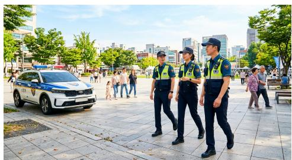

(a) Misleading case  
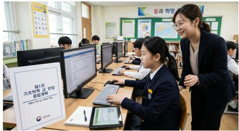  
(b) Beneficial case  
Figure A1: Representative cases where images generated by VFSTANCE changed stance predictions.

## D.4 Multilingual Evaluation

We conduct a preliminary experiment to evaluate the effectiveness of VFSTANCE on multilingual versions of K-News-Stance-MM in English, Chinese, Indonesian, and Arabic. As shown in Table A6, VFSTANCE achieved higher accuracy and macro F1 scores than the text-only setting across all four languages, suggesting that the proposed method is effective across languages. Performance was highest in English and Chinese, followed by Indonesian and Arabic; however, the original Korean version achieved the best overall performance, with an accuracy of 0.746 and a macro F1 score of 0.747. The LLM-translated versions may lose some stance cues from the original Korean text because of their implicit nature. Future studies could further evaluate the multilingual robustness of VFSTANCE by constructing new resources that capture languageand culture-specific expressions of stance.

## D.5 Error Case Analysis

We manually analyzed cases where images generated by VFSTANCE changed the stance prediction, with representative examples shown in Figure A1. First, among 55 cases where the textual LVLM baseline was correct but VFSTANCE was wrong, 51 had gold-neutral labels, and most errors shifted toward supportive rather than oppositional. In the example in Figure A1a, the article neutrally reports on reintroducing conscripted police, but the generated image depicts officers patrolling a bright street, and its positive tone shifted the prediction from neutral to supportive.

<table><tr><td>Stage 1</td><td>Stage 2</td><td>Stage 3</td><td>ACC</td><td>mF1</td></tr><tr><td>Gemini-3-flash</td><td>Gemini-3.1-flash-image</td><td>Gemini-3-flash</td><td> ${ \bf 0 . 7 4 6 \pm 0 . 0 0 2 }$ </td><td> $\mathbf { 0 . 7 4 7 \pm 0 . 0 0 2 }$ </td></tr><tr><td>Gemini-3-flash</td><td>Gemini-3.1-flash-image</td><td>InternVL3-14B-Instruct</td><td> $0 . 6 1 9 \pm 0 . 0 0 1$ </td><td> $0 . 6 2 2 \pm 0 . 0 0 1$ </td></tr><tr><td>Gemini-3-flash</td><td>Stable Diffusion 3.5 Large</td><td>Gemini-3-flash</td><td> $0 . 7 0 8 \pm 0 . 0 0 4$ </td><td> $0 . 7 1 2 \pm 0 . 0 0 5$ </td></tr><tr><td>InternVL3-14B-Instruct</td><td>Gemini-3.1-flash-image</td><td>Gemini-3-flash</td><td> $0 . 7 0 3 \pm 0 . 0 0 2$ </td><td> $0 . 7 0 6 \pm 0 . 0 0 2$ </td></tr><tr><td>InternVL3-14B-Instruct</td><td>Stable Diffusion 3.5 Large</td><td>InternVL3-14B-Instruct</td><td> $0 . 6 1 6 \pm 0 . 0 0 2$ </td><td> $0 . 6 1 9 \pm 0 . 0 0 2$ </td></tr></table>

Table A7: Stage-level model substitution results with open-weight models on K-News-Stance-MM. The first row shows the proprietary-model configuration used in the main experiments. Each subsequent row replaces the model at a single stage with an open-weight model, while the final row uses open-weight models across all stages.

Second, among 57 cases where VFSTANCE was correct but VFSTANCE (TEXT) was wrong, 48 had gold-neutral labels, with errors again skewed toward supportive. Specification terms such as bright or dark may act as lexical shortcuts when provided directly as text: in Figure A1b, the specification containing bright led VFSTANCE (TEXT) to a supportive misclassification, whereas rendering the same specification as a photographic image yielded a correct prediction. This suggests that perceptual cues are less susceptible to such lexical shortcuts than their textual counterparts.

## D.6 Applicability to Open-Weight Models

We conducted two supplementary experiments on K-News-Stance-MM to examine whether VFS-TANCE remains effective when implemented with open-weight models. Since VFSTANCE is a modular framework, each stage can be instantiated with alternative models beyond the proprietary ones used in the main experiments. We used two open-weight LVLMs, InternVL3-14B-Instruct and Gemma3-12B-Instruct, and an open-weight T2I model, Stable Diffusion 3.5 Large. Detailed experimental settings are provided in Appendix A.

Open-Weight Backbone Comparison To verify that the performance gains of VFSTANCE are not limited to the tested proprietary backbones, we compared VFSTANCE with the corresponding textual, visual, and multimodal baselines, using each open-weight LVLM as the Stage 3 detector. Table A8 shows that VFSTANCE outperformed all corresponding baselines under both backbones, indicating that its effectiveness extends beyond proprietary models. However, the absolute performance remained below the proprietary configuration, which may be partly attributable to the smaller sizes of the open-weight models available under

<table><tr><td>Method</td><td>ACC mF1</td></tr><tr><td colspan="2">VFSTANCE</td></tr><tr><td>Gemini-3-flash</td><td> ${ \bf 0 . 7 4 6 \pm 0 . 0 0 2 }$   ${ \bf 0 . 7 4 7 \pm 0 . 0 0 2 }$ </td></tr><tr><td>InternVL3-14B-Instruct Gemma3-12B-Instruct</td><td> $0 . 6 1 9 \pm 0 . 0 0 1$   $0 . 6 2 2 \pm 0 . 0 0 1$   $0 . 6 2 2 \pm 0 . 0 0 1$   $0 . 6 0 4 \pm 0 . 0 0 1$ </td></tr><tr><td colspan="2">Multimodal</td></tr><tr><td>InternVL3-14B-Instruct  $0 . 6 0 5 \pm 0 . 0 0 1$  Gemma3-12B-Instruct  $0 . 5 9 4 \pm 0 . 0 0 1$ </td><td> $0 . 6 0 8 \pm 0 . 0 0 1$   $0 . 5 8 6 \pm 0 . 0 0 1$ </td></tr><tr><td colspan="2">Textual</td></tr><tr><td>InternVL3-14B-Instruct Gemma3-12B-Instruct</td><td> $0 . 5 9 2 \pm 0 . 0 0 1$   $0 . 5 8 8 \pm 0 . 0 0 1$   $0 . 5 8 6 \pm 0 . 0 0 2$   $0 . 5 6 5 \pm 0 . 0 0 2$ </td></tr><tr><td colspan="2">Visual</td></tr><tr><td>Gemma3-12B-Instruct InternVL3-14B-Instruct</td><td> $0 . 3 5 5 \pm 0 . 0 0 1$   $0 . 2 9 8 \pm 0 . 0 0 1$   $0 . 3 5 4 \pm 0 . 0 0 2$   $0 . 2 8 2 \pm 0 . 0 0 2$ </td></tr></table>

Table A8: Stance detection performance on K-News-Stance-MM with open-weight LVLMs for Stage 3, compared against the corresponding baselines under each backbone. The first row shows the proprietarymodel configuration used in the main experiments.

## our computational constraints.

Stage-Level Ablation To identify which stage is most sensitive to model substitution, we replaced the model at each stage of VFSTANCE with its open-weight counterpart, as listed in Table A7. Substitution reduced performance at all three stages, with the largest drop observed when the Stage 3 LVLM was replaced (0.127 in accuracy and 0.125 in macro F1). The fully open-weight variant performed comparably to the Stage 3-only substitution, suggesting that Stage 3 is the primary bottleneck: effective stance detection depends particularly on the LVLM’s language understanding, visual perception, and multimodal reasoning.

## D.7 Generated Image Examples

Table A10 compares three image sources—original publisher photographs, naïvely generated images (Direct T2I in Table 2), and VFSTANCE-generated

images—for three Korean articles with different stances toward the same target issue.

## E User Study Details

This section provides additional details on the user study described in Section 6. Participants were balanced by gender and age: 100 female and 100 male, with 20 of each gender in each of five age groups (20–29, 30–39, 40–49, 50–59, and 60+). English translations of the nine articles are shown in Table A11, the condition images are compared in Table A12, and the instructions and survey interface are shown in Figures A10a and A10b. The original Korean articles are available in our GitHub repository.

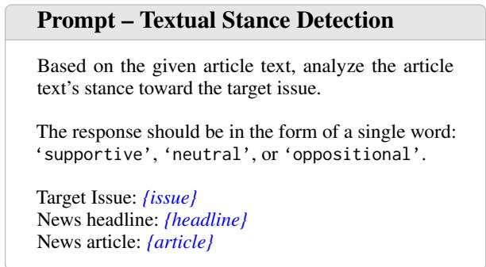  
Figure A2: Textual prompt used for LVLM-based stance detection. Blue italic text highlights the input.

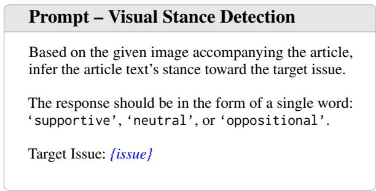  
Figure A3: Visual prompt used for LVLM-based stance detection. Blue italic text highlights the input.

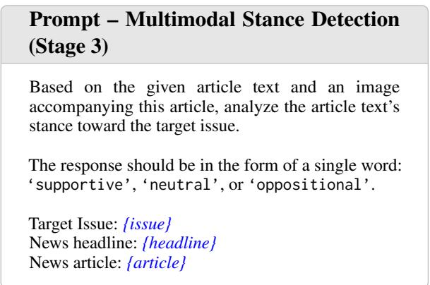  
Figure A4: Multimodal prompt used for LVLM-based stance detection. Blue italic text highlights the input.

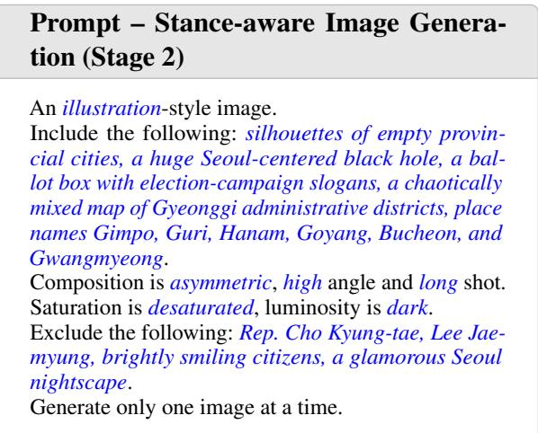  
Figure A5: The English-translated text-to-image prompt used for the T2I model in Stage 2, shown with an illustrative input. Blue italic text highlights placeholders filled using the LLM-based annotations from Stage 1; the remaining text constitutes the fixed template.

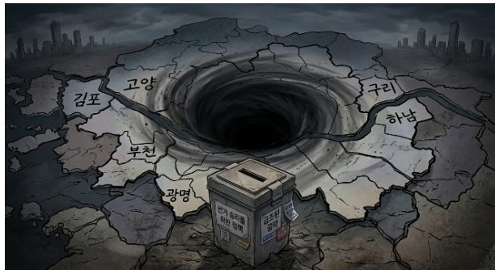  
Figure A6: Image generated by the T2I model in Stage 2 from the prompt in Figure A5.

<table><tr><td colspan="12" rowspan="1">Target Issue  Democratic Party-Led Revision of the Grain Management Act Put Directly to Plenary Session for Vote</td></tr><tr><td colspan="12" rowspan="1">Headline      Lee's ‘Bill No. 1’ Grain Act likely to become Yoon's ‘Veto No. 1’</td></tr><tr><td colspan="12" rowspan="5">Article        The revision of the Grain Management Act, which mandates the government to purchase excess riceproduction, passed the plenary session of the National Assembly on the 23rd, led by the Democratic Party ofKorea and the Justice Party. President Yoon Suk-yeol is reportedly reviewing the option of exercising hisveto power over the revision. As a result, the Grain Management Act, which Democratic Party leader LeeJae-myung had designated as his Bill No. 1,' is increasingly likely to become the subject of President Yoon'sfirst-ever veto. If President Yoon does exercise his veto, it would be the first such action in approximatelyseven years, since former President Park Geun-hye vetoed the National Assembly Act revision centered onstanding hearings' in May 2016. The revision was approved at the plenary session with 169 votes in favor,90 against, and 7 abstentions out of 266 members present. The core provision requires the government topurchase the entire excess production when rice output exceeds demand by 3-5% or when rice prices fall by5–8% compared to the previous year. The Democratic Party pushed the Grain Management Act forward,emphasizing rice price stabilization, farmer protection, and food sovereignty. However, the government andthe People Power Party opposed it on grounds of rice oversupply, fiscal burden, and weakened agriculturalcompetitiveness, but were unable to overcome their numerical disadvantage. The government expressed deepregret over the passage of the revision. Minister of Agriculture, Food and Rural Affairs Chung Hwang-keunstated at an emergency briefing at the Government Complex Seoul that “the side effects are all too obvious"and declared the revision unacceptable. With the opposition's forced passage of the revision through the</td></tr><tr><td colspan="2" rowspan="1">d the Grain M</td></tr><tr><td colspan="3" rowspan="1"></td></tr><tr><td colspan="3" rowspan="2"></td><td colspan="9" rowspan="2">National Assembly, concerns about the</td></tr><tr><td colspan="11" rowspan="3">bill's side effects are growing. Following the passage, the governmentis expected to purchase an additional average of approximately 200,000 tons of rice per year, with theestimated cost reaching around 1 trillion won. As demand for rice declines due to changing dietary habits,</td><td colspan="1" rowspan="1">e opposition's</td></tr><tr><td colspan="3" rowspan="2">is expected to purchase an additio</td></tr><tr><td colspan="2" rowspan="1">tiona</td></tr><tr><td colspan="2" rowspan="1"></td><td></td><td colspan="4" rowspan="1">lion won As demand for</td><td colspan="3" rowspan="1">or rice d</td><td colspan="2" rowspan="1">clines </td><td colspan="1" rowspan="1">nes due</td></tr><tr><td colspan="12" rowspan="1">critics argue that the mandatorily purchased rice will pile up in government warehouses and ultimately besold at a loss for purposes such as producing makgeolli. There are also significant concerns that the expansionof mandatory government purchases could lead to increased rice production and a chronic decline in riceprices. President Yoon is reportedly leaning toward exercising his veto over the revision. A senior presidentialoffice official stated, “Once the revision is sent to the government next week, there will be a period of publicconsultation and deliberation."</td></tr><tr><td colspan="12" rowspan="1">Image         https://imgnews.pstatic.net/image/005/2023/03/24/2023032321490368287_1679575743_0924293423_20230324041205219.jpg?type=w860</td></tr><tr><td colspan="12" rowspan="1">Stance        Oppositional</td></tr><tr><td colspan="12">Issue: Court Recognizes Same-Sex Partners as Legal Dependents for Health Insurance </td></tr><tr><td>Stance Original</td><td></td><td>Naïve</td><td colspan="33">VFSTANCE</td></tr><tr><td colspan="12">Headline: Court Recognizes Same-Sex Partner's Health Insurance.. . A Step Forward for Minority Rights ，</td></tr><tr><td>Sup.</td><td>[See: https: //imgnews.pstatic.net/image/ 469/2023/02/22/0000724756 001_20230222061125823.jpg? type=w860]</td><td>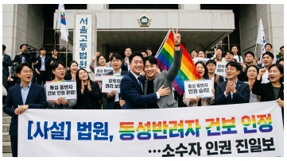</td><td colspan="33">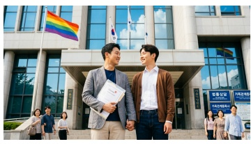</td></tr><tr><td colspan="12">Headline: First Recognition of Same-Sex Partner as Health Insurance Dependent.. . Court Rules “No Discrimination Based on Sexual Orientation" “</td></tr><tr><td>Neu.</td><td>[See: https: //imgnews.pstatic.net/image/ 020/2023/02/22/0003481184_ 001_20230222031302451.jpg? type=w860]</td><td>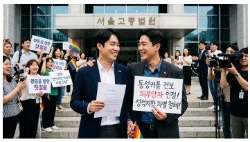</td><td colspan="33"></td></tr><tr><td colspan="12">Headline: Ruling Recognizing Same-Sex Couple's Insurance Eligibility — Supreme Court Should Rectify </td></tr><tr><td>Opp.</td><td>[See: https://imgnews.pstatic. net/image/005/2023/02/22/ 2023022118390482487_ 1676972344_0924288416_ 20230222040306049.jpg?type= w860]</td><td>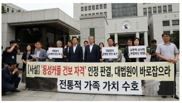</td><td colspan="33">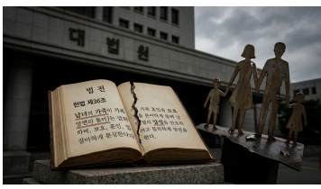</td></tr></table>

Table A9: English-translated example article from K-News-Stance-MM. Publisher-provided original images are omitted to respect copyright; their URLs are provided instead.

Table A10: Examples from three image sources: publisher-provided original images, images generated with a straightforward prompt, and VFSTANCE-generated images for three articles with different stances on the same issue. Original images are omitted to respect copyright; their URLs are provided instead.

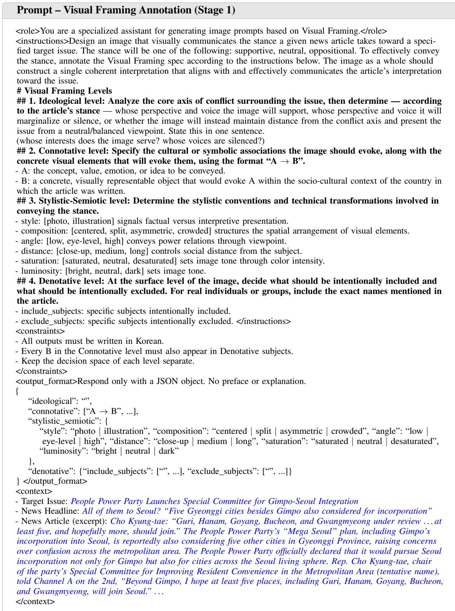  
Figure A7: English-translated system and user prompts used in Stage 1 for visual framing annotation in VFSTANCE, shown with an illustrative input. Blue italic text highlights the input.

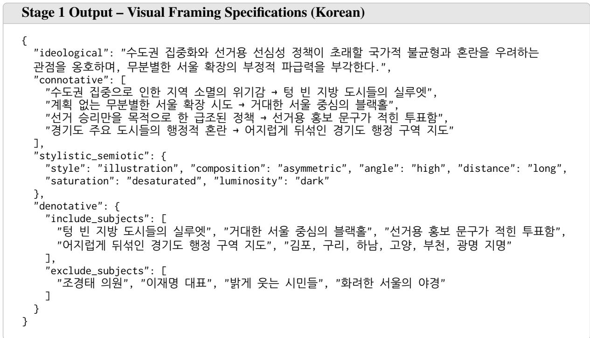  
Figure A8: Original Korean-language output of Stage 1 visual framing annotation in VFSTANCE.

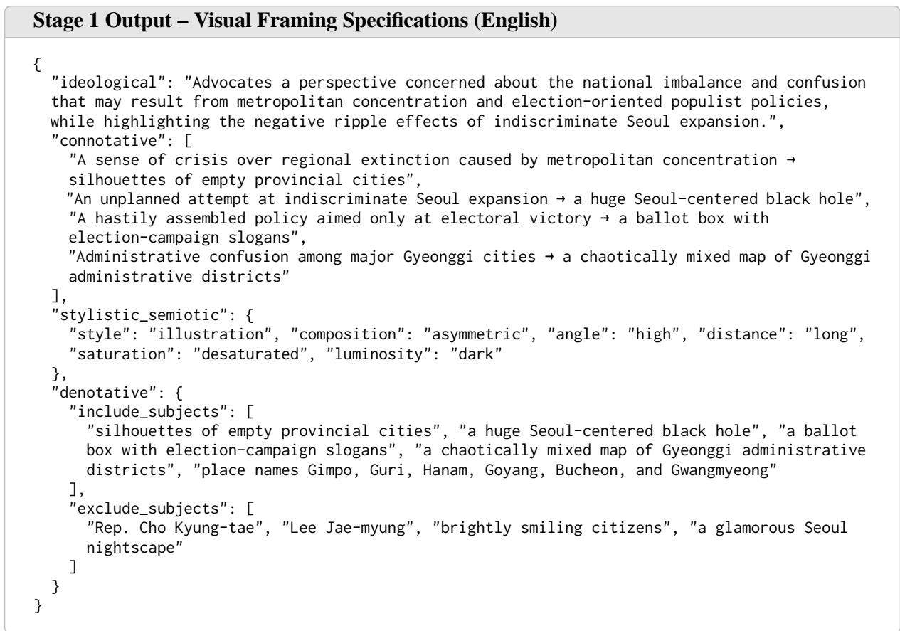  
Figure A9: English-translated output of Stage 1 visual framing annotation in VFSTANCE.

<table><tr><td>ID</td><td>Stance</td><td>Headline &amp; Lead</td></tr><tr><td colspan="3">Issue 1. Military to Resume Full-Scale Propaganda Broadcasts Following Repeated Trash Balloon Incidents</td></tr><tr><td>A1</td><td>Sup.</td><td>JCS to “fully implement propaganda broadcasts to the North&quot;... countering N. Korean trash balloons In response to North Korea&#x27;s trash balloon launches, the military authorities have played the card of fully implementing propaganda broadcasts to the North. A hardline tit-for-tat standoff between the two Koreas through psychological warfare appears to be deepening.</td></tr><tr><td>A2</td><td>Neu.</td><td>N. Korea launches 9th round of trash balloons... Military counters with “full-scale propaganda broad- casts to the North&quot; After North Korea once again released trash balloons toward the South on the morning of the 21st, the military authorities responded with the “full-scale implementation of propaganda broadcasts to the North,&quot; and military</td></tr><tr><td>A3</td><td>Opp.</td><td>tensions between the two Koreas are escalating. How will the North respond to the full expansion of propaganda broadcasts?... Border tensions mount Using domestic civic groups’ anti-North leaflet drops as a pretext, North Korea continues to launch trash balloons, and our military authorities have repeatedly countered with propaganda broadcasts to the North.</td></tr><tr><td colspan="3">Issue 2. Impeachment Motion Against the BAI Chairman Faces Vote Tomorrow B1</td></tr><tr><td></td><td>Sup.</td><td>BAI, unable to question Kim Keon-hee about “21Gram,&quot; protests: “We can&#x27;t be expected to torture it out of them&quot; The Board of Audit and Inspection (BAI), after failing to identify who recommended “21Gram&quot;—the contractor awarded the presidential residence renovation in Hannam-dong, Seoul—protested that “it isn&#x27;t something we</td></tr><tr><td>B2</td><td>Neu.</td><td>can uncover by torturing people.&quot; Impeachment motions against the BAI Chairman and prosecutors reported to the plenary session... Budget bill put on hold Speaker Woo urged the ruling and opposition parties to reach a budget agreement by the 10th. The impeachment motions against the BAI Chairman and prosecutors will be voted on on the 4th, creating a vacuum in the chain of command. The year-end political situation is becoming increasingly unpredictable.</td></tr><tr><td>B3</td><td>Opp.</td><td>BAI: “There&#x27;s no Plan B at this stage... We trust the impeachment will be withdrawn&quot; As the impeachment motion against BAI Chairman Choe Jae-hae, filed by the Democratic Party of Korea, was reported to the National Assembly&#x27;s plenary session on the 2nd, the Board of Audit and Inspection stated that it “is not considering a Plan B at this stage&quot; in preparation for the aftermath of the impeachment.</td></tr><tr><td colspan="3">Issue 3. President Yoon Nominates Vice Justice Minister Shim Woo-jung for Prosecutor General C1 Prosecutor General nominee Shim Woo-jung, a “planning specialist&quot;: “I will do my utmost to earn the</td></tr><tr><td></td><td>Sup.</td><td>public&#x27;s trust&quot; On the 11th, President Yoon Suk-yeol nominated Vice Justice Minister Shim Woo-jung (53, Judicial Research and Training Institute Class 26) as the next Prosecutor General candidate.</td></tr><tr><td>C2</td><td>Neu.</td><td>Prosecutor General nominee on the “Kim Keon-hee handbag&quot; allegations: “Law and principle are what matter&quot; Prosecutor General nominee Shim Woo-jung took a principled stance on the “luxury handbag&quot; allegations involving First Lady Kim Keon-hee, former head of Covana Contents, stating that “it is important to uphold the law and principle.&quot;</td></tr><tr><td>C3</td><td>Opp.</td><td>Emphasis on “tighter control of the prosecution&quot;... Yongsan&#x27;s “safe choice&quot; On the 11th, President Yoon Suk-yeol nominated Vice Justice Minister Shim Woo-jung as the next head of the prosecution. Commentators view this as a “safe choice&quot; by Yoon—who has been unable to shake off various</td></tr></table>

Table A11: English translation of articles used in the user study. Each cell shows the headline (bold) and lead of the corresponding article. The original Korean articles are available in our GitHub repository.

<table><tr><td>ID</td><td>Stance</td><td>Original</td><td>Naïve</td><td>Proposed</td></tr><tr><td>A1</td><td>Sup.</td><td>[See: https://imgnews.pstatic. net/image/022/2024/07/ 21/20240721505503 20240721142308421.jpg?</td><td>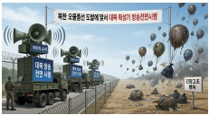</td><td>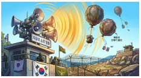</td></tr><tr><td>A2</td><td>Neu.</td><td>type=w860] [See: https://imgnews. pstatic.net/image/009/ 2024/07/21/0005337843_ 001_20240721130306464.</td><td>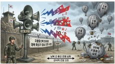</td><td>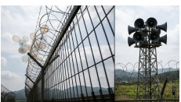</td></tr><tr><td>A3</td><td>Opp.</td><td>jpg?type=w860] [See: https://imgnews. pstatic.net/image/079/ 2024/07/21/0003918478_ 001_20240721161010430.</td><td>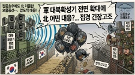</td><td>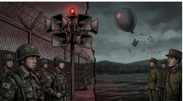</td></tr><tr><td>B1</td><td>Sup.</td><td>jpg?type=w860] [See: https://imgnews. pstatic.net/image/028/ 2024/12/02/0002719024_ 001_20241203153828650.</td><td></td><td></td></tr><tr><td>B2</td><td>Neu.</td><td>jpg?type=w860] [See: https://imgnews. pstatic.net/image/656/ 2024/12/02/0000113206_ 001_20241202185211320. jpg?type=w860]</td><td>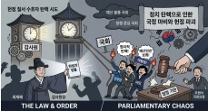</td><td>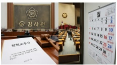</td></tr><tr><td>B3</td><td>Opp.</td><td>[See: https://imgnews. pstatic.net/image/079/ 2024/12/02/0003965096_ 001_20241202160219972. jpg?type=w860]</td><td>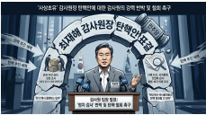</td><td></td></tr><tr><td>C1</td><td>Sup.</td><td>[See: https://imgnews. pstatic.net/image/020/ 2024/08/11/0003581252_ 001_20240811204909147. jpg?type=w860]</td><td></td><td></td></tr><tr><td>C2</td><td>Neu.</td><td>[See: https://imgnews. pstatic.net/image/002/ 2024/08/11/0002345370_ 001_20240811180508603. jpg?type=w860] [See: https://imgnews.</td><td></td><td></td></tr><tr><td>C3</td><td>Opp.</td><td>pstatic.net/image/032/ 2024/08/11/0003314304_ 001_20250514095121338. jpg?type=w860]</td><td>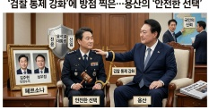</td><td>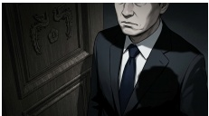</td></tr></table>

Table A12: Images for the nine articles used in the user study (Table A11). Original images are omitted to respect copyright; their URLs are provided instead.

##

##

##

##

##

40%43%合

  
(a) Instructions

##

##

##

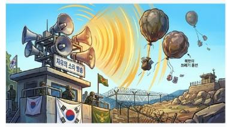

A  

  
(b) User interface  
Figure A10: Instructions and user interface used in the user study.