# When Modality Gap Reduction Fails: Prediction-Level Hubness in CLIP

Shota Sato, Hajime Kiyama, Tosho Hirasawa, Mamoru Komachi

Hitotsubashi University {shota,hajime,tosho,komachi}@scl.sds.hit-u.ac.jp

## Abstract

Reducing the modality gap between image and text representations in CLIP is widely expected to improve cross-modal alignment and downstream performance. However, a smaller average image–text gap does not necessarily lead to consistent accuracy gains. We analyze this mismatch from the perspective of the decision structure in zero-shot classification, i.e. selecting the most similar class-text prototype for an input image. Zero-shot accuracy depends not only on average image–text alignment, but also on class-wise decision margins. Using Linear correction as an analytically tractable case, we show that modality gap correction can alter the relative decision structure among classes and cause predictions to concentrate on a small subset of classes. We refer to this output-space failure mode as prediction-level hubness. Furthermore, experiments across multiple datasets show that accuracy degradation under gap correction is consistently associated with increased prediction concentration, both for Linear correction and for learning-based correction methods. This provides a systematic explanation of why modality gap reduction does not consistently improve CLIP zero-shot accuracy from the perspective of downstream decision structure. Our results suggest that gap correction should be evaluated not only by average alignment, but also by its impact on downstream prediction structure.

## 1 Introduction

Contrastive Language–Image Pre-training (CLIP) (Radford et al., 2021) learns a shared image–text embedding space and enables strong zero-shot transfer. However, CLIP is known to exhibit a modality gap, where image and text representations form modality-specific clusters (Liang et al., 2022). This has motivated methods for reducing the gap, including post-hoc geometric correction based on an estimated gap vector (Liang et al., 2022), additional training such as CLIPRefine (Yamaguchi et al., 2025), and alignment-oriented pre-training mechanisms such as AlignCLIP (Eslami and de Melo, 2025). Figure 1 illustrates this geometric view of Linear correction, where increasing the correction strength brings the mean image and text embeddings closer. These methods are often motivated by the expectation that improving average image–text alignment, operationalized as reducing the squared norm of the gap vector defined in Equation 1, improves downstream performance.

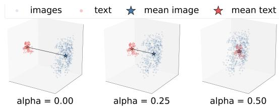  
Figure 1: PCA visualization of image and text embeddings under modality gap reduction. As the correction strength α increases, the mean image and text embeddings move closer, reducing the average modality gap.

However, reducing the average modality gap does not necessarily yield consistent downstream improvements (Liang et al., 2022; Jiang et al., 2023; Grassucci et al., 2025). As shown in Figure 2, Linear correction monotonically reduces the modality gap across 10 zero-shot image classification datasets, yet accuracy eventually deteriorates. This suggests that reducing the mean image–text displacement alone is insufficient to explain downstream performance changes, because zero-shot accuracy also depends on class-wise decision margins. When gap reduction unevenly changes these margins, predictions may concentrate on a small subset of classes.

We analyze this effect using Linear correction as an analytically tractable case. We show that the gap vector introduces unequal score shifts across classes, which can systematically favor certain class prototypes and lead corrected predictions to concentrate on them. We call this output-space failure mode prediction-level hubness: a prediction hub is a class label that receives a disproportionate share of the final predicted labels after gap correction—distinct from classical nearest-neighbour hubness in embedding space (Radovanovic et al. ´ , 2010).

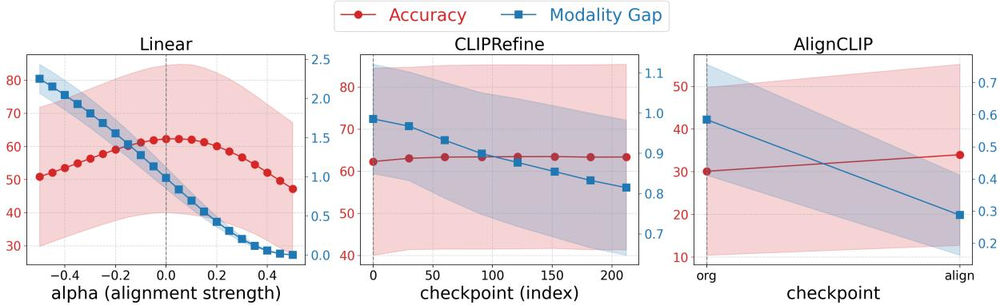  
Figure 2: Accuracy and modality gap under modality gap reduction. Solid lines indicate the mean over 10 zero-shot image classification datasets, and shaded regions indicate the standard deviation. Under Linear correction, the modality gap decreases monotonically with correction strength, yet accuracy eventually deteriorates. In contrast, learning-based correction methods reduce the modality gap while maintaining or improving accuracy.

To test this mechanism, we examine whether the predicted class distribution changes in the way suggested by the above analysis. We analyze predictedclass distributions across datasets and correction methods, and quantify how strongly predictions concentrate on a small subset of classes. Consistent with the proposed mechanism, excessive Linear correction increases prediction concentration and degrades accuracy. For learning-based corrections, accuracy degradation is also associated with increased prediction concentration, suggesting that prediction-level hubness is a useful diagnostic for failed modality gap reduction (correlational rather than mechanistic; Section 4).

This work explains why modality gap reduction does not consistently improve CLIP zero-shot accuracy from the perspective of downstream decision structure and predicted-class distributions. Our findings suggest that gap correction should be evaluated not only by average image–text alignment, but also by its impact on downstream prediction structure (practical guidance in Section 5.5).

Our contributions are as follows:

1. We show that, in zero-shot classification, reducing the average modality gap does not reliably improve accuracy, even when the gap decreases monotonically.

2. We analyze this mismatch through zero-shot prediction structure and introduce predictionlevel hubness as an output-space failure mode, using Linear correction as an analytically tractable case.

3. We link prediction concentration to accuracy degradation across Linear and learning-based corrections, and show that gap-induced classwise bias helps explain hub formation under Linear correction.

## 2 Background and Related Work

CLIP and the Modality Gap Contrastive Language–Image Pre-training (CLIP) (Radford et al., 2021) learns a shared image–text embedding space using contrastive learning. It enables strong zero-shot image classification by comparing image embeddings with class-text prototypes. CLIP has also been widely used as a visual backbone in vision–language models (Li et al., 2023; Liu et al., 2023, 2024; Yin et al., 2024), and its contrastive learning framework has been extended to other modalities, such as audio–language learning (Elizalde et al., 2023).

Despite its joint embedding framework, CLIP is known to exhibit a modality gap, where image and text embeddings form modality-specific clusters (Liang et al., 2022). This phenomenon has been analyzed from several perspectives, including representation geometry, contrastive learning dynamics, and modality-specific structure (Liang et al., 2022; Shi et al., 2023; Fahim et al., 2024; Schrodi et al., 2024; Yaras et al., 2025).

Modality Gap Reduction Many methods have been proposed to reduce the modality gap in CLIPlike embedding spaces. Post-hoc methods reduce the gap by applying geometric or statistical transformations after pre-training (Liang et al., 2022; Maystre et al., 2025; An et al., 2025; Role et al., 2025). Other methods refine the embedding space through additional training, regularization, or adversarial objectives (Ma et al., 2024; Fahim et al., 2024; Sofer et al., 2025; Yamaguchi et al., 2025). Another line of work incorporates alignment-oriented mechanisms during pretraining or model design (Lee et al., 2025; Eslami and de Melo, 2025; Yaras et al., 2025).

These studies generally aim to improve average image–text alignment by reducing modality separation. However, prior work has also suggested that reducing the modality gap does not always lead to better downstream performance (Liang et al., 2022; Jiang et al., 2023; Grassucci et al., 2025). Building on these observations, we study this gap– performance mismatch more broadly across multiple datasets and correction methods.

Hubness in Representation Spaces Hubness was originally studied as a high-dimensional nearest-neighbor phenomenon, where a small number of points appear disproportionately often in other points’ nearest-neighbor lists (Radovanovic´ et al., 2010; Schnitzer et al., 2012; Feldbauer and Flexer, 2019). This issue has also been discussed in zero-shot learning and cross-space mapping, where a few semantic prototypes or labels can become frequent nearest-neighbor targets (Dinu et al., 2015; Lazaridou et al., 2015). In cross-lingual and crossmodal retrieval, related work has examined how such hubs affect retrieval quality and how local scaling or neighborhood-based methods can mitigate them (Lample et al., 2018; Wang et al., 2023; Lin et al., 2025). Recent studies have further analyzed hubness and vulnerability in CLIP-like representation spaces (Deguchi et al., 2026).

These studies primarily characterize hubness through nearest-neighbor relations in embedding or retrieval spaces. In this work, we use the related but distinct notion of concentration at the level of final zero-shot predictions, focusing on how modality gap correction changes the predicted-class distribution.

## 3 Problem Setup

This section introduces the problem addressed in this work: reducing the modality gap does not necessarily improve downstream performance. In particular, we examine whether making image and text representations closer on average leads to better zero-shot image classification accuracy. We use zero-shot classification as an evaluation setting because it directly exposes both image–text alignment and class-level prediction behavior.

## 3.1 Average Modality Gap

Let $x _ { i } \in \mathbb { R } ^ { d }$ and $t _ { j } \in \mathbb { R } ^ { d }$ denote the i-th image embedding and the j-th text embedding, respectively. Following the gap-vector estimate used in Linear correction (Liang et al., 2022), we define the gap vector as

$$
g = \frac { 1 } { N } \sum _ { i = 1 } ^ { N } x _ { i } - \frac { 1 } { N } \sum _ { j = 1 } ^ { N } t _ { j } ,\tag{1}
$$

where N is the number of embeddings averaged in each modality. We define the average modality gap as the squared Euclidean distance between the mean image embedding and the mean text embedding:

$$
\mathrm { M G } = \left\| \frac { 1 } { N } \sum _ { i = 1 } ^ { N } x _ { i } - \frac { 1 } { N } \sum _ { j = 1 } ^ { N } t _ { j } \right\| _ { 2 } ^ { 2 } = \| g \| _ { 2 } ^ { 2 } .\tag{2}
$$

This metric measures the average displacement between image and text representations in the shared embedding space. A smaller value indicates that the two modalities are closer on average, and such a reduction is often expected to reflect better image– text alignment and downstream performance. However, this expectation does not necessarily hold in downstream evaluation. A smaller average modality gap does not guarantee that the task-relevant decision structure is improved. In zero-shot image classification, predictions depend on relative scores between an image and all class-text prototypes. Thus, even if the average image–text gap decreases, the score ordering among classes can change in a way that hurts accuracy.

## 3.2 Gap Reduction and Accuracy

We evaluate this issue using three representative correction profiles. Linear correction is a posthoc geometric correction based on an estimated gap vector (Liang et al., 2022). CLIPRefine reduces the gap through additional training after pretraining (Yamaguchi et al., 2025). AlignCLIP incorporates alignment-oriented mechanisms during pre-training (Eslami and de Melo, 2025).1

Figure 2 summarizes the relationship between modality gap and accuracy for these profiles. For Linear correction, the modality gap decreases monotonically as the correction strength increases, but accuracy improves only up to a point and then deteriorates. In contrast, learning-based corrections reduce the modality gap while maintaining or improving accuracy. These results show that modality gap reduction and accuracy improvement are not equivalent.

This mismatch motivates the following analysis. If reducing the average modality gap is not sufficient to explain performance changes, we need to examine how gap correction changes prediction behavior. We next provide a margin-based analysis of this mismatch and introduce prediction-level hubness as a prediction-level failure mode.

## 4 Mechanism: Gap-Induced Class-wise Bias and Prediction-Level Hubness

We explain why reducing the average modality gap can fail to improve zero-shot accuracy. The key point is that the modality gap is an average geometric quantity, whereas classification accuracy depends on class-wise decision margins. We then show that Linear correction induces an explicit class-wise score bias, and empirically verify that this bias predicts which classes become prediction hubs.

Our analyses carry different evidential weight: Section 4.1 is general (any correction that shifts zero-shot scores), whereas Section 4.2 is mechanistic but Linear-specific.

4.1 Accuracy Depends on Class-wise Margins Let $s _ { i , c } ^ { ( k ) }$ denote the zero-shot score between image i and class prototype c after correction step k. We define the score shift induced by correction as

$$
\delta _ { i , c } ^ { ( k ) } = s _ { i , c } ^ { ( k ) } - s _ { i , c } ^ { ( 0 ) } .
$$

For the ground-truth class $y _ { i }$ and a competing class $^ { c , }$ the decision margin at correction step k is

$$
\Delta _ { i , c } ^ { ( k ) } = s _ { i , y _ { i } } ^ { ( k ) } - s _ { i , c } ^ { ( k ) } .
$$

<table><tr><td>Dataset</td><td> $\rho _ { m }$ </td><td>ρ∆m</td><td>ρe</td></tr><tr><td>Caltech101</td><td>0.821</td><td>0.824</td><td>0.792</td></tr><tr><td>CIFAR-10</td><td>0.891</td><td>0.903</td><td>0.819</td></tr><tr><td>CIFAR-100</td><td>0.869</td><td>0.863</td><td>0.833</td></tr><tr><td>DTD EuroSAT</td><td>0.586</td><td>0.918</td><td>0.770 0.796</td></tr><tr><td>FGVC-Aircraft</td><td>0.612 0.570</td><td>0.976</td><td>0.585</td></tr><tr><td>Flowers102</td><td></td><td>0.531</td><td></td></tr><tr><td></td><td>0.747</td><td>0.616</td><td>0.802</td></tr><tr><td>Food-101</td><td>0.747</td><td>0.817</td><td>0.842</td></tr><tr><td>ImageNet-1K</td><td>0.835</td><td>0.812</td><td></td></tr><tr><td></td><td></td><td></td><td>0.748</td></tr><tr><td>Oxford Pets</td><td>0.749</td><td>0.783</td><td>0.793</td></tr><tr><td>Mean</td><td>0.743</td><td>0.804</td><td>0.778</td></tr></table>

Table 1: Class-wise gap-induced bias predicts prediction hubs and harmful transition destinations under Linear over-correction. We report Spearman correlations between $b _ { c } ~ = ~ - \langle g , t _ { c } \rangle$ and three class-level quantities: $\rho _ { m } = \rho ( b _ { c } , m _ { c } ^ { ( \alpha ) } ) , \rho _ { \Delta m } = \rho ( b _ { c } , \Delta m _ { c } ^ { ( \alpha ) } )$ , and $\rho _ { e } ~ = ~ \rho ( b _ { c } , e _ { c } ^ { ( \alpha ) } )$ . All correlations are computed at $\alpha = 0 . 5 .$

Substituting the score shifts gives

$$
\begin{array} { l } { { \Delta _ { i , c } ^ { ( k ) } = \left( s _ { i , y _ { i } } ^ { ( 0 ) } + \delta _ { i , y _ { i } } ^ { ( k ) } \right) - \left( s _ { i , c } ^ { ( 0 ) } + \delta _ { i , c } ^ { ( k ) } \right) } } \\ { { \mathrm { } } } \\ { { \mathrm { } = \Delta _ { i , c } ^ { ( 0 ) } + \delta _ { i , y _ { i } } ^ { ( k ) } - \delta _ { i , c } ^ { ( k ) } . } } \end{array}
$$

Thus, a previously correct prediction can change to class c when

$$
\delta _ { i , c } ^ { ( k ) } - \delta _ { i , y _ { i } } ^ { ( k ) } > \Delta _ { i , c } ^ { ( 0 ) } .
$$

This condition depends on the relative score shifts of the ground-truth and competing classes. It is therefore possible for correction to reduce the average modality gap while still decreasing accuracy, if competing classes receive larger score gains than the ground-truth class.

## 4.2 Gap-Induced Bias Creates Prediction-Level Hubness

For Linear correction, the general correction setting k is instantiated by the correction strength $\alpha .$ Linear correction shifts image and text embeddings in opposite directions:

$$
x _ { i } ^ { ( \alpha ) } = x _ { i } - \alpha g , \qquad t _ { c } ^ { ( \alpha ) } = t _ { c } + \alpha g .
$$

Using an inner-product score, the corrected score at setting $k = \alpha$ is

$$
\begin{array} { r l } & { s _ { i c } ^ { ( \alpha ) } = \langle x _ { i } - \alpha g , t _ { c } + \alpha g \rangle } \\ & { ~ = \langle x _ { i } , t _ { c } \rangle + \alpha \langle x _ { i } , g \rangle - \alpha \langle g , t _ { c } \rangle - \alpha ^ { 2 } \| g \| ^ { 2 } . } \end{array}
$$

For a fixed image i, only the term − $\cdot \alpha \langle g , t _ { c } \rangle$ depends on the class c. Thus, before normalization,

Linear correction induces a class-wise score bias. For positive correction strength, we define this bias as

$$
\begin{array} { r } { b _ { c } = - \langle g , t _ { c } \rangle . } \end{array}\tag{3}
$$

Although our experiments use L2-normalized embeddings and cosine similarity after correction, the unnormalized term $b _ { c }$ provides a simple analytic proxy for the class-wise score bias induced by the gap direction. Under this proxy, classes with larger $b _ { c }$ are expected to receive larger correction-induced score gains, which can unevenly change class rankings and favor certain class prototypes. This provides a possible mechanism by which corrected predictions concentrate on a small subset of classes, forming prediction hubs.

We test this mechanism under Linear overcorrection at $\alpha = 0 . 5$ . For each class $^ { c , }$ we compute three class-level quantities: $m _ { c } ^ { ( \alpha ) }$ , the total prediction count after correction; $\Delta m _ { c } ^ { ( \alpha ) }$ , its increase from the original model; and $e _ { c } ^ { ( \alpha ) }$ , the number of correct-to-wrong transitions redirected to class c. We then compute within-dataset Spearman correlations between $b _ { c }$ and these quantities to test whether the gap-induced bias predicts hub formation.

Table 1 shows that the gap-induced bias is positively correlated with all three quantities across all datasets. Classes favored by the correction bias tend to receive more predictions after correction, gain prediction count relative to the original model, and absorb more correct-to-wrong transitions. These results indicate that prediction hubs under Linear over-correction are not arbitrary. They are partly predictable from the class-wise score bias induced by the gap vector.

## 5 Experiments: Prediction-Level Hubness and Accuracy Degradation

This section examines whether accuracy degradation under modality gap reduction is associated with prediction-level hubness. We first describe the setup and metrics, then analyze the relationship between predicted-class concentration and accuracy, examine transition-level evidence, and finally test the proposed bias mechanism interventionally. As in Section 4, these analyses carry different evidential weight: the cross-method results (Sections 5.2– 5.3) are correlational—for training-based profiles, prediction concentration is a diagnostic, not an established mechanism—whereas the intervention in Section 5.4 is, like Section 4.2, mechanistic but Linear-specific.

## 5.1 Experimental Setup and Metrics

Datasets and Correction Profiles We evaluate zero-shot image classification on 10 datasets: Caltech101, CIFAR-10, CIFAR-100, DTD, EuroSAT, FGVC-Aircraft, Flowers102, Food-101, ImageNet-1K, and Oxford-IIIT Pet. 2,3 For each image, the predicted class is the class whose text prototype has the highest similarity with the image embedding.

We compare three correction profiles: Linear correction (Liang et al., 2022), CLIPRefine (Yamaguchi et al., 2025), and AlignCLIP (Eslami and de Melo, 2025). For Linear correction and CLIPRefine, we use CLIP ViT-B/32 (Radford et al., 2021) as the base model. For AlignCLIP, we use the public AlignCLIP checkpoint with its original ViT-B/16 backbone. 4 Linear correction provides a controlled post-hoc intervention, while CLIPRefine and AlignCLIP represent additional-training-based and pre-training-based correction profiles, respectively.

AlignCLIP is supplementary throughout and not part of the controlled comparison: its only public checkpoint uses a different backbone (ViT-B/16 versus ViT-B/32) with far fewer comparison points, so we report its results only as supporting evidence (Appendix C.1).

For Linear correction, we sweep the correction strength α. For learning-based corrections, we evaluate available checkpoints. Unless otherwise stated, zero-shot scores are computed using cosine similarity between normalized image embeddings and text prototypes. 5

Metrics We report classification accuracy and prediction concentration.

For each evaluated correction step k, let $\hat { y } _ { i } ^ { ( k ) }$ be the predicted label of sample i. We define the predicted-class count of class c as

$$
m _ { c } ^ { ( k ) } = \sum _ { i = 1 } ^ { N } \mathbf { 1 } [ \hat { y } _ { i } ^ { ( k ) } = c ] .
$$

This quantity counts how many samples are predicted as class c. Classes with large $m _ { c } ^ { ( k ) }$ are treated as prediction hubs.

<table><tr><td>Method</td><td>Cal101</td><td>C10</td><td>C100</td><td>DTD</td><td>Euro</td><td>Aircraft</td><td>Flw102</td><td>Food</td><td>IN</td><td>Pets</td><td>Avg.</td><td>Exp.</td></tr><tr><td>Linear</td><td>-0.819</td><td>-0.998</td><td>-0.997</td><td>-0.996</td><td>-0.725</td><td>-0.766</td><td>-0.934</td><td>-0.995</td><td>-1.000</td><td>-0.993</td><td>-0.922</td><td>10/10</td></tr><tr><td>CLIPRefine</td><td>0.799</td><td>-0.923</td><td>-0.913</td><td>-0.268</td><td>-0.630</td><td>-0.431</td><td>-0.122</td><td>-0.900</td><td>-0.711</td><td>-0.750</td><td>-0.485</td><td>9/10</td></tr></table>

Table 2: Within-dataset Spearman correlations between accuracy and Predicted-Class Gini for Linear correction and CLIPRefine. “Exp.” indicates the number of datasets with the expected negative correlation direction. Section 5.5 explains the positive Caltech101 correlation under CLIPRefine.

To quantify prediction concentration, we apply the standard Gini coefficient (Ceriani and Verme, 2012) to the predicted-class count vector $m ^ { ( k ) }$ $( m _ { 1 } ^ { ( k ) } , \hdots , \hat { m } _ { C } ^ { ( k ) } )$ , which we call Predicted-Class Gini. A larger Predicted-Class Gini indicates that predictions are more concentrated on a smaller subset of classes. 6 Let $m _ { ( 1 ) } ^ { ( k ) } \leq \cdots \leq m _ { ( C ) } ^ { ( k ) }$ denote the sorted counts. We define

$$
G ^ { ( k ) } = \frac { 2 \sum _ { r = 1 } ^ { C } r m _ { ( r ) } ^ { ( k ) } } { C \sum _ { r = 1 } ^ { C } m _ { ( r ) } ^ { ( k ) } } - \frac { C + 1 } { C } .
$$

Transition Analysis As an additional diagnostic analysis, we analyze the destination distribution of prediction changes. We decompose prediction changes into wrong-to-correct and correct-towrong transitions. For correct-to-wrong transitions, we count how many previously correct samples are redirected to each destination class. This analysis provides transition-level evidence for whether accuracy degradation is accompanied by many samples being redirected toward a small set of erroneous destination classes. 7

## 5.2 Prediction Concentration is Associated with Accuracy Degradation

We examine whether accuracy degradation under modality gap correction is associated with prediction-level hubness. If prediction-level hubness reflects a failure mode of gap correction, then accuracy should decrease when the predicted-class distribution becomes more concentrated. We focus on Linear correction and CLIPRefine in the main analysis, since they provide multiple correction settings under the same CLIP ViT-B/32 backbone.8

Figure 3 shows the relationship between Predicted-Class Gini and accuracy for Linear correction and CLIPRefine. For Linear correction, Predicted-Class Gini is negatively correlated with accuracy. Moderate correction often reduces prediction concentration and improves accuracy, whereas stronger correction increases concentration and reduces accuracy. Thus, the overcorrection regime is not only a regime with smaller average modality gap, but also one in which predictions collapse toward fewer classes.

CLIPRefine shows a similar but weaker trend. Although the range of Predicted-Class Gini is smaller than in Linear correction, higher Gini still tends to correspond to lower accuracy. These results support the hypothesis that accuracy changes under modality gap correction are closely related to predicted-class concentration.9

We further compute within-dataset Spearman correlations between accuracy and Predicted-Class Gini. This analysis checks whether the observed relationship is driven only by cross-dataset differences. For each dataset and method, we compute correlations across correction strengths or checkpoints, and then average the correlations across datasets.

Table 2 shows that the expected relationship generally holds within individual datasets. For Linear correction, all 10 datasets show the expected negative correlation between Predicted-Class Gini and accuracy. CLIPRefine also shows the same direction in most datasets, although the relationship is weaker. These results indicate that the concentration–accuracy relationship is not merely a pooled cross-dataset artifact.

Predicted-Class Gini is also not a redundant encoding of the correction strength itself: at every fixed non-zero α, the cross-dataset Spearman correlation between ∆Acc and $\Delta G$ (changes from $\alpha = 0 )$ is negative (mean −0.86 for gap-reducing α; with $n = 1 0$ per point, 10 of 20 reach $p < 0 . 0 5 .$ and the claim rests on this directional consistency). At the same strength, the datasets that concentrate more lose more accuracy—a vulnerability that α alone does not express, as $b _ { c }$ predicts.

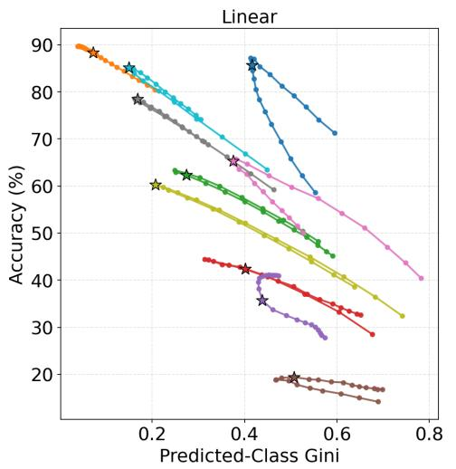

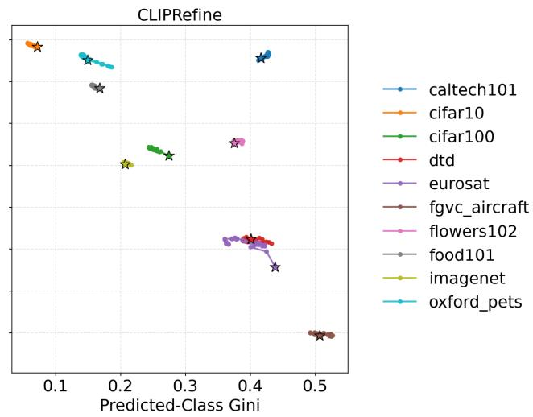  
Figure 3: Predicted-Class Gini vs. accuracy for Linear correction and CLIPRefine. Stars indicate the base model. For both correction profiles, higher Predicted-Class Gini tends to correspond to lower accuracy, indicating that accuracy degradation is associated with increased prediction concentration. Pearson correlations are $r = - 0 . 7 7 8$ for Linear correction (n = 210) and r = −0.710 for CLIPRefin $( n = 3 1 0 )$ .

<table><tr><td>Setting</td><td>Transition</td><td>Count</td><td>Top-1</td><td>Top-5</td></tr><tr><td>Linear-best</td><td>C→W</td><td>1,556</td><td>0.116</td><td>0.391</td></tr><tr><td>Linear-best</td><td>W→C</td><td>3,487</td><td>0.187</td><td>0.396</td></tr><tr><td>Linear-worst</td><td>C→W</td><td>33,804</td><td>0.294</td><td>0.672</td></tr><tr><td>Linear-worst</td><td>W→C</td><td>5,238</td><td>0.272</td><td>0.585</td></tr><tr><td>CLIPRefine-best</td><td>C→W</td><td>3,547</td><td>0.156</td><td>0.460</td></tr><tr><td>CLIPRefine-best</td><td>W→C</td><td>6,430</td><td>0.201</td><td>0.475</td></tr><tr><td>CLIPRefine-worst</td><td>C→W</td><td>1,630</td><td>0.145</td><td>0.388</td></tr><tr><td>CLIPRefine-worst</td><td>W→C</td><td>1,294</td><td>0.121</td><td>0.360</td></tr></table>

Table 3: Destination concentration of changed predictions. C→W denotes correct-to-wrong transitions, and W→C denotes wrong-to-correct transitions. Count is the total number of transitions over 10 datasets. Top-1 and Top-5 report the mean fraction of transitions absorbed by the most frequent and top-five destination classes, respectively.

While these results establish a strong association between prediction concentration and accuracy degradation, they do not show how prediction changes are distributed across destination classes. We therefore next examine whether harmful prediction changes concentrate on a small subset of destination classes.

## 5.3 Transition-Level Evidence for Prediction Hubs

We next examine prediction changes directly through a transition-level analysis. This analysis asks whether changed predictions concentrate on a small number of destination classes, complementing prior work on embedding-space and retrievalspace hubness (Radovanovic et al.´ , 2010; Dinu et al., 2015; Wang et al., 2023; Lin et al., 2025; Deguchi et al., 2026). We decompose changed predictions into wrong-to-correct and correct-towrong transitions and measure how concentrated their destination classes are. If prediction hubs mediate accuracy degradation, correct-to-wrong transitions should become frequent and concentrate on a small subset of destination classes.

Table 3 summarizes this destination concentration. Here, “best” and “worst” denote the highestand lowest-accuracy settings within each correction profile. For Linear correction, the best setting has relatively few correct-to-wrong transitions, while the worst setting shows a large increase in harmful transitions. In the Linear-worst setting, correct-towrong transitions rise to 33,804, and the top five destination classes absorb 67.2% of these transitions on average. This indicates that many previously correct samples are redirected into a small set of erroneous destination classes.

CLIPRefine shows a more balanced pattern. Its best setting has more wrong-to-correct than correctto-wrong transitions, and its worst setting has much lower destination concentration than Linear-worst. For example, the top-five fraction for correct-towrong transitions is 0.388 in CLIPRefine-worst, compared with 0.672 in Linear-worst. This is consistent with CLIPRefine’s narrower range of prediction concentration and more stable accuracy profile. 10 These results support the view that prediction hubs can mediate accuracy degradation, but leave their source unresolved. We next test whether the gap-induced class-wise bias $b _ { c } ,$ identified in Section 4, accounts for these hubs through a scorespace intervention.

## 5.4 Intervening on Gap-Induced Bias

To assess the role of the gap-induced bias in hub formation, we introduce a score-space intervention. In Section 4, we showed that Linear correction induces the class-wise score bias $b _ { c }$ , which favors classes with larger bias values.

We implement this intervention by modifying the corrected score $\mathrm { a s ^ { 1 1 } }$

$$
s _ { i , c } ^ { \prime } = s _ { i , c } ^ { ( \alpha ) } - \lambda \alpha b _ { c } .\tag{4}
$$

Here, $s _ { i , c } ^ { ( \alpha ) }$ is the score after Linear correction with strength $\alpha ,$ and λ controls the intervention strength. Because the first-order class-wise bias induced by Linear correction is $\alpha b _ { c }$ , setting λ = 1 approximately cancels this bias. Predictions after the intervention are obtained by

$$
\hat { y } _ { i } ^ { \prime } = \arg \operatorname* { m a x } _ { c } s _ { i , c } ^ { \prime } .
$$

We apply this intervention to the over-correction setting $\alpha = 0 . 5$ , where prediction concentration is strongest. For each dataset, we compare the pre-intervention point $( G ^ { ( \alpha ) } , \operatorname { A c c } ^ { ( \alpha ) } )$ with the postintervention point $( G ^ { \prime } , \mathrm { A c c } ^ { \prime } )$ , where G denotes Predicted-Class Gini. If the gap-induced bias contributes to hub formation, the intervention should move points toward lower prediction concentration and higher accuracy.

Figure 4 shows that subtracting the gap-induced class-wise bias consistently reduces Predicted-Class Gini across datasets. In most cases, this reduction in prediction concentration partially recovers the accuracy lost under Linear over-correction, moving performance closer to the base model. This result provides interventional evidence for the proposed mechanism: the class-wise bias derived from the modality gap is not only correlated with prediction hubs, but contributes to their formation. At the same time, the intervention does not claim to be a practical correction method; rather, it serves as a diagnostic test of the bias-driven hubness mechanism.12

## 5.5 Interpreting and Mitigating Prediction Concentration

Predicted-Class Gini should be read relative to the label distribution of the evaluation set: on an imbalanced set even a perfect classifier produces an imbalanced prediction distribution, so concentration mixes a benign component (fitting the label prior) with the failure mode studied here (correctioninduced excess concentration). The single anomaly in Table 2 is the benign case: Caltech101 (label Gini 0.402, by far our most imbalanced) gains accuracy under CLIPRefine (85.70% to 87.09%) while Predicted-Class Gini stays near the label Gini (0.416 to 0.427), and dividing each predicted-class count by its ground-truth frequency reverses the correlation from +0.799 to −0.979 while leaving balanced datasets essentially unchanged (Appendix D.1). Linear over-correction is the excess case: Gini reaches 0.595, far above the label Gini, with the correlation staying negative (−0.819). We therefore recommend reporting the average modality gap, accuracy, Predicted-Class Gini, and normalized prediction entropy relative to the uncorrected base model, together with the label Gini; we propose no universal absolute-Gini threshold, since its range depends on the label distribution and class count.

Two mitigation options follow, and neither is a solution. First, modality-wise centering—the embedding-space counterpart of the score-space subtraction in Section 5.4—erases the α dependence almost entirely (Appendix D.3); this further confirms the $b _ { c }$ mechanism but is diagnostic rather than practical, as it removes the very quantity under study and shifts base accuracy in a datasetdependent way. Second, hubness-aware scoring: CSLS (Lample et al., 2018) roughly halves the overcorrection penalty but leaves the concentration– accuracy relationship intact on all 10 datasets (Appendix D.4), so prediction-level hubness is not an artifact of raw cosine similarity. Making gap reduction itself hubness-aware is left to future work.

## 6 Discussion

What Makes Gap Reduction Useful? Our results suggest that modality gap reduction is useful only when it preserves the decision structure needed for downstream prediction. Linear correction reduces average image–text displacement, but can simultaneously distort downstream decision geometry through uneven class-wise score shifts. When these shifts favor a small subset of class prototypes, predictions become concentrated into prediction hubs and accuracy deteriorates. In contrast, CLIPRefine reduces the gap without inducing this concentration, suggesting that a learned correction can preserve the decision structure that Linear correction distorts. The explicit bias decomposition in Section 4 is specific to Linear correction, which we use as an analytically tractable example of how modality-gap reduction can distort downstream prediction structure.

A Candidate Geometric Correlate What geometric property separates Linear correction, which concentrates predictions as it reduces the gap, from CLIPRefine, which does not? Not prototype arrangement: both profiles preserve the prototype– prototype angular structure almost exactly, even under over-correction. A better candidate is joint image–text uniformity (Wang and Isola, 2020): under Linear correction it improves only at small correction strengths and then deteriorates just past the accuracy peak, tracking accuracy and Gini on all 10 datasets, whereas CLIPRefine shrinks the gap while improving uniformity, with Gini essentially unchanged (Appendices A.5 and C.4). We present this as a candidate correlate, not a causal explanation (the correlation reverses on EuroSAT under the generic template; Appendix D.1); whether uniformity can be constrained during correction or post-training is future work.

Is the Average Modality Gap the Right Quantity? Following prior work on modality gap estimation (Liang et al., 2022), we measure the modality gap as the squared Euclidean distance between mean image and text embeddings. However, CLIP zero-shot classification is typically based on cosine similarity between normalized embeddings. Thus, the metric used to quantify the gap is not identical to the scoring rule used for prediction. This mismatch suggests that future work should consider gap measures that are more directly tied to the geometry of downstream decision rules.

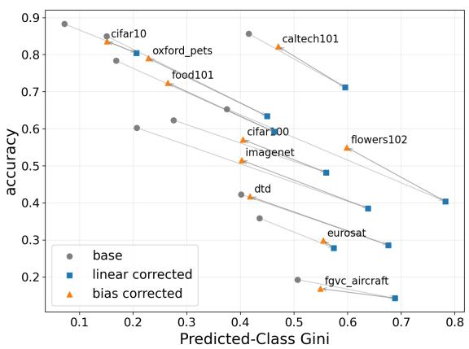  
Figure 4: Effect of gap-bias subtraction after Linear over-correction. Gray circles denote the base model, blue squares denote Linear correction at $\alpha = 0 . 5$ , and orange triangles denote the scores after subtracting the gap-induced class-wise bias with λ = 1. The markers illustrate the sequence from the base model to Linear over-correction and then to bias subtraction, which reduces Predicted-Class Gini and recovers the accuracy lost under over-correction.

Rethinking the Goal of Modality Gap Reduction Our results raise a broader question: if reducing the modality gap does not necessarily improve performance, what should gap reduction aim to achieve? One answer is that gap reduction should not be treated as an end in itself. Rather, it should aim to improve cross-modal alignment without distorting the output distribution. This suggests that modality gap correction should be evaluated not only by alignment metrics, but also by output-space diagnostics such as predicted-class concentration.

## 7 Conclusion

We studied why reducing the modality gap does not necessarily improve downstream zero-shot image classification. We showed that gap correction can unevenly change class-wise decision margins and induce prediction-level hubness, where predictions concentrate on a small subset of class prototypes. Across correction profiles and datasets, accuracy degradation is associated with increased predictionlevel hubness, and a score-space intervention on the gap-induced bias reduces this concentration under Linear over-correction. These findings suggest that modality gap correction should not be evaluated solely by average image–text alignment, but also by how it affects downstream decision structure and output distributions.

## Limitations

Our claims are scoped to zero-shot image classification, where predictions over a fixed set of class-text prototypes make predicted-class concentration directly observable and make accuracy a function of exactly the quantity our analysis decomposes; we do not claim that they carry over to cross-modal retrieval. The bias algebra itself would transfer to retrieval with a fixed gallery (each gallery item acquires the same query-independent bias $b _ { c } = - \langle g , t _ { c } \rangle$ , and the derivation of Equation 3 is unchanged), but retrieval returns ranked lists rather than a single label, so both the concentration metric and the accuracy analysis would have to be reformulated—plausibly in terms of top-k occupancy across queries—which we have not done. Because the failure mode we identify is specific to a fixed prototype set competing for an argmax, gap reduction may well be genuinely beneficial for retrieval; our results are not evidence against it, and the same caution applies to captioning and visual question answering, where the output space is structured differently again.

Our notion of hubness is prediction-level rather than embedding-level. A prediction hub in this work is a class label that receives a disproportionate number of final predictions after gap correction. This differs from conventional nearest-neighbor hubness in embedding space (Radovanovic et al. ´ , 2010), and we use the prediction-level sense consistently throughout. Our results should therefore be understood as an analysis of how gap correction affects classifier outputs, rather than as a complete account of the underlying representation geometry.

Our evidence is not uniformly mechanistic, as set out in Section 4: for Linear correction we have a closed-form class-wise bias, a prediction of which classes become hubs, and an intervention that cancels the bias and reverses the effect, whereas for CLIPRefine—the only training-based profile with enough comparison points to analyze— prediction concentration is diagnostic rather than causal. CLIPRefine (Yamaguchi et al., 2025) and AlignCLIP (Eslami and de Melo, 2025) change the encoders themselves and may reflect effects beyond average gap reduction, so our mechanistic account covers Linear correction specifically, not learningbased correction in general; the joint uniformity result in Section 6 sits at the same correlational level.

AlignCLIP is evaluated with fewer comparison points and on a different backbone, so we treat it as supplementary evidence throughout rather than as part of the controlled comparison. Our controlled results use a single backbone, ViT-B/32; Appendix D.5 finds the same phenomenon for the Linear-correction sweep on ViT-B/16 and ViT-L/14, but the training-based profiles are only available to us at one scale. Future work should test hubness-aware correction objectives that reduce prediction concentration while preserving the benefits of modality alignment, and extend the analysis to output spaces beyond a fixed label set.

## Acknowledgements

This work was supported by JST PRESTO, Japan, Grant Number JPMJPR2366.

The authors used ChatGPT to support research discussion, idea organization, and language editing. In particular, generative assistance was used to discuss and clarify author-developed claims and experimental designs, improve the clarity of exposition, and draft or revise low-novelty text based on author-provided content. All research ideas, experimental designs, analyses, interpretations, citations, and final text were reviewed, verified, and approved by the authors, who take full responsibility for the submitted content.

## References

Na Min An, Eunki Kim, James Thorne, and Hyunjung Shim. 2025. I0T: Embedding standardization method towards zero modality gap. In Proceedings of the 63rd Annual Meeting ofthe Associationfor Computational Linguistics (Volume 1: Long Papers), pages 27182–27199, Vienna, Austria. Association for Computational Linguistics.

Lidia Ceriani and Paolo Verme. 2012. The origins of the Gini index: extracts from Variabilità e Mutabilità (1912) by Corrado Gini. The Journal of Economic Inequality, 10(3):421–443.

Hiroyuki Deguchi, Katsuki Chousa, and Yusuke Sakai. 2026. One single hub text breaks CLIP: Identifying vulnerabilities in cross-modal encoders via hubness. In Proceedings of the 64th Annual Meeting of the Associationfor Computational Linguistics (Volume 1: Long Papers), pages 47242–47256, San Diego, California, United States. Association for Computational Linguistics.

Georgiana Dinu, Angeliki Lazaridou, and Marco Baroni. 2015. Improving zero-shot learning by mitigating the hubness problem. Preprint, arXiv:1412.6568.

Benjamin Elizalde, Soham Deshmukh, Mahmoud Al Ismail, and Huaming Wang. 2023. CLAP learning

audio concepts from natural language supervision. In ICASSP 2023-2023 IEEE International Conference on Acoustics, Speech and Signal Processing (ICASSP), pages 1–5. IEEE.

Sedigheh Eslami and Gerard de Melo. 2025. Mitigate the gap: Improving cross-modal alignment in CLIP. In The Thirteenth International Conference on Learning Representations.

Abrar Fahim, Alex Murphy, and Alona Fyshe. 2024. It’s not a modality gap: Characterizing and addressing the contrastive gap. arXiv preprint arXiv:2405.18570.

Roman Feldbauer and Arthur Flexer. 2019. A comprehensive empirical comparison of hubness reduction in high-dimensional spaces. Knowledge and Information Systems, 59(1):137–166.

Eleonora Grassucci, Giordano Cicchetti, and Danilo Comminiello. 2025. Closing the modality gap enables novel multimodal learning applications. In Second Workshop on Representational Alignment at ICLR 2025.

Qian Jiang, Changyou Chen, Han Zhao, Liqun Chen, Qing Ping, Son Dinh Tran, Yi Xu, Belinda Zeng, and Trishul Chilimbi. 2023. Understanding and constructing latent modality structures in multi-modal representation learning. In Proceedings ofthe IEEE/CVF Conference on Computer Vision and Pattern Recognition (CVPR), pages 7661–7671.

Guillaume Lample, Alexis Conneau, Marc’Aurelio Ranzato, Ludovic Denoyer, and Hervé Jégou. 2018. Word translation without parallel data. In International Conference on Learning Representations.

Angeliki Lazaridou, Georgiana Dinu, and Marco Baroni. 2015. Hubness and pollution: Delving into cross-space mapping for zero-shot learning. In Proceedings of the 53rd Annual Meeting of the Association for Computational Linguistics and the 7th International Joint Conference on Natural Language Processing (Volume 1: Long Papers), pages 270–280, Beijing, China. Association for Computational Linguistics.

Jeong Ryong Lee, Yejee Shin, Geonhui Son, and Dosik Hwang. 2025. Diffusion bridge: Leveraging diffusion model to reduce the modality gap between text and vision for zero-shot image captioning. In 2025 IEEE/CVF Conference on Computer Vision and Pattern Recognition (CVPR), pages 4050–4059.

Junnan Li, Dongxu Li, Silvio Savarese, and Steven Hoi. 2023. BLIP-2: Bootstrapping language-image pretraining with frozen image encoders and large language models. In International conference on machine learning, pages 19730–19742. PMLR.

Victor Weixin Liang, Yuhui Zhang, Yongchan Kwon, Serena Yeung, and James Y Zou. 2022. Mind the gap: Understanding the modality gap in multi-modal contrastive representation learning. In Advances in

Neural Information Processing Systems, volume 35, pages 17612–17625. Curran Associates, Inc.

Zengrong Lin, Zheng Wang, Tianwen Qian, Pan Mu, Sixian Chan, and Cong Bai. 2025. Neighborretr: Balancing hub centrality in cross-modal retrieval. arXiv preprint arXiv:2503.10526.

Haotian Liu, Chunyuan Li, Yuheng Li, and Yong Jae Lee. 2024. Improved baselines with visual instruction tuning. In Proceedings of the IEEE/CVF Conference on Computer Vision and Pattern Recognition (CVPR), pages 26296–26306.

Haotian Liu, Chunyuan Li, Qingyang Wu, and Yong Jae Lee. 2023. Visual instruction tuning. In Advances in Neural Information Processing Systems, volume 36, pages 34892–34916. Curran Associates, Inc.

Xiang Ma, Xuemei Li, Lexin Fang, and Caiming Zhang. 2024. Bridging the modality gap: Dimension information alignment and sparse spatial constraint for image-text matching. In ACM Multimedia 2024.

Lucas Maystre, Alvaro Ortega Gonzalez, Charles Park, Rares Dolga, Tudor Berariu, Yu Zhao, and Kamil Ciosek. 2025. When embedding models meet: Procrustes bounds and applications. arXiv preprint arXiv:2510.13406.

Alec Radford, Jong Wook Kim, Chris Hallacy, Aditya Ramesh, Gabriel Goh, Sandhini Agarwal, Girish Sastry, Amanda Askell, Pamela Mishkin, Jack Clark, Gretchen Krueger, and Ilya Sutskever. 2021. Learning transferable visual models from natural language supervision. In Proceedings ofthe 38th International Conference on Machine Learning, volume 139 of Proceedings of Machine Learning Research, pages 8748–8763. PMLR.

Miloš Radovanovic, Alexandros Nanopoulos, and Mir-´ jana Ivanovic. 2010.´ Hubs in space: Popular nearest neighbors in high-dimensional data. Journal ofMachine Learning Research, 11(86):2487–2531.

François Role, Sébastien Meyer, and Victor Amblard. 2025. Fill the gap: Quantifying and reducing the modality gap in image-text representation learning. arXiv preprint arXiv:2505.03703.

Oindrila Saha, Grant Van Horn, and Subhransu Maji. 2024. Improved zero-shot classification by adapting VLMs with text descriptions. In Proceedings of the IEEE/CVF Conference on Computer Vision and Pattern Recognition (CVPR), pages 17542–17552.

Dominik Schnitzer, Arthur Flexer, Markus Schedl, and Gerhard Widmer. 2012. Local and global scaling reduce hubs in space. Journal of Machine Learning Research, 13(92):2871–2902.

Simon Schrodi, David T Hoffmann, Max Argus, Volker Fischer, and Thomas Brox. 2024. Two effects, one trigger: On the modality gap, object bias, and information imbalance in contrastive vision-language representation learning. In ICLR 2024 Workshop

on Mathematical and Empirical Understanding of Foundation Models.

Peiyang Shi, Michael C. Welle, Mårten Björkman, and Danica Kragic. 2023. Towards understanding the modality gap in CLIP. In ICLR 2023 Workshop on Multimodal Representation Learning: Perks and Pitfalls.

Amit Sofer, Yoav Goldman, and Shlomo E. Chazan. 2025. Pull It Together: Reducing the Modality Gap in Contrastive Learning. In Interspeech 2025, pages 196–200.

Tongzhou Wang and Phillip Isola. 2020. Understanding contrastive representation learning through alignment and uniformity on the hypersphere. In Proceedings of the 37th International Conference on Machine Learning, volume 119 of Proceedings of Machine Learning Research, pages 9929–9939. PMLR.

Yimu Wang, Xiangru Jian, and Bo Xue. 2023. Balance Act: Mitigating hubness in cross-modal retrieval with query and gallery banks. In Proceedings of the 2023 Conference on Empirical Methods in Natural Language Processing, pages 10542–10567, Singapore. Association for Computational Linguistics.

Shin’ya Yamaguchi, Dewei Feng, Sekitoshi Kanai, Kazuki Adachi, and Daiki Chijiwa. 2025. Post-pretraining for modality alignment in vision-language foundation models. In Proceedings of the Computer Vision and Pattern Recognition Conference (CVPR), pages 4256–4266.

Can Yaras, Siyi Chen, Peng Wang, and Qing Qu. 2025. Explaining and mitigating the modality gap in contrastive multimodal learning. In Conference on Parsimony and Learning, volume 280 of Proceedings of Machine Learning Research, pages 1365–1387. PMLR.

Shukang Yin, Chaoyou Fu, Sirui Zhao, Ke Li, Xing Sun, Tong Xu, and Enhong Chen. 2024. A survey on multimodal large language models. National Science Review, 11(12).

## A Additional Experimental Details

This appendix provides implementation details shared across the experiments in the main text. These details apply to the gap–accuracy comparison in Figure 2 as well as to the later predictionlevel hubness analyses. We describe the evaluation datasets, the prompt templates used to construct class-text prototypes, the implementation of Linear correction (Liang et al., 2022), the computation of the modality gap, the backbone and checkpoint settings for the learning-based correction profiles (Yamaguchi et al., 2025; Eslami and de Melo, 2025), the model-loading, preprocessing, and evaluation settings, and the artifact licenses and terms of use.

## A.1 Datasets

We evaluate zero-shot image classification on ten standard image-classification datasets: Caltech101, CIFAR-10, CIFAR-100, DTD, EuroSAT, FGVC-Aircraft, Flowers102, Food-101, ImageNet-1K, and Oxford-IIIT Pet. For datasets with standard evaluation splits, we use the test or validation split commonly used for evaluation. For datasets without such a split in the dataset interface used in our experiments, such as Caltech101 and EuroSAT, we evaluate on the full dataset. No new images or labels are collected in this work. The datasets are used only for aggregate zero-shot evaluation and for computing derived prediction-level statistics such as predicted-class count, Predicted-Class Gini, normalized prediction entropy, and transition counts.

<table><tr><td>Dataset</td><td>#Classes</td><td>Evaluation set</td></tr><tr><td>Caltech101</td><td>101</td><td>Full dataset</td></tr><tr><td>CIFAR-10</td><td>10</td><td>Test split</td></tr><tr><td>CIFAR-100</td><td>100</td><td>Test split</td></tr><tr><td>DTD</td><td>47</td><td>Test split</td></tr><tr><td>EuroSAT</td><td>10</td><td>Full dataset</td></tr><tr><td>FGVC-Aircraft</td><td>100</td><td>Test split</td></tr><tr><td>Flowers102</td><td>102</td><td>Test split</td></tr><tr><td>Food-101</td><td>101</td><td>Test split</td></tr><tr><td>ImageNet-1K</td><td>1000</td><td>Validation split</td></tr><tr><td>Oxford-IIIT Pet</td><td>37</td><td>Test split</td></tr></table>

Table 4: Datasets used for zero-shot image-classification evaluation. For datasets without an official evaluation split in the dataset interface used in our experiments, we evaluate on the full dataset. We do not collect or redistribute any original images or labels.

## A.2 Prompt Templates

For zero-shot classification with CLIP (Radford et al., 2021), we construct one text prototype for each class using a dataset-specific prompt template. Table 5 lists the templates, which are used in all experiments reported in this paper unless stated otherwise. The five datasets whose entry in Table 5 is the generic a photo of a {class name}. are of course identical under either choice; for the other five, Appendix D.1 reports the full set of results obtained with the generic template applied uniformly, as a robustness check. All conclusions in this paper hold under both configurations.

## A.3 Linear Correction Implementation

For Linear correction, we follow the embeddingshift formulation of Liang et al. (Liang et al., 2022).

<table><tr><td>Dataset</td><td>Prompt template</td></tr><tr><td>CIFAR-10, CIFAR-100, Caltech101, ImageNet-1K, Oxford-IIIT Pet</td><td>a photo of a {class name}.</td></tr><tr><td>DTD</td><td>a photo of a {class name} texture.</td></tr><tr><td>EuroSAT</td><td>a satellite photo of a {class name}.</td></tr><tr><td>FGVC-Aircraft</td><td>a photo of a {class name} aircraft.</td></tr><tr><td>Flowers102</td><td>a photo of a {class name} flower.</td></tr><tr><td>Food-101</td><td>a photo of {class name}.</td></tr></table>

Table 5: Prompt templates used for constructing class-text prototypes.
<table><tr><td>Artifact</td><td>Access / Original Source</td><td>License / Terms</td></tr><tr><td>CLIP ViT-B/32</td><td>OpenAI CLIP release</td><td>MIT License</td></tr><tr><td>CLIPRefine</td><td>Official public implementation/checkpoints of Yamaguchi et al. (2025)</td><td>NTT Software License Agreement for Evaluation</td></tr><tr><td>AlignCLIP</td><td>Public Hugging Face checkpoint by Eslami and de Melo (2025)</td><td>CC-BY-NC-ND-4.0 according to the model card</td></tr><tr><td>Standard image-classification datasets</td><td>Caltech101, CIFAR-10/100, DTD, Eu- roSAT, FGVC-Aircraft, Flowers102, Food- 101, ImageNet-1K, and Oxford-IIIT Pet</td><td>Respective licenses or terms of the origi- nal dataset releases</td></tr></table>

Table 6: Artifacts used in this work and their licenses or terms of use. All artifacts are used only for research evaluation, and we do not redistribute the original datasets, images, software, or model checkpoints.

Given image embeddings $x _ { i }$ and text prototypes $t _ { j }$ we estimate the gap vector as

$$
g = \frac { 1 } { N } \sum _ { i = 1 } ^ { N } x _ { i } - \frac { 1 } { N } \sum _ { j = 1 } ^ { N } t _ { j } .
$$

For correction strength $\alpha ,$ image and text embeddings are shifted in opposite directions:

$$
x _ { i } ^ { * } = x _ { i } - \alpha g , \qquad t _ { c } ^ { * } = t _ { c } + \alpha g .
$$

We then L2-normalize the shifted embeddings before scoring:

$$
\tilde { x } _ { i } = \frac { x _ { i } ^ { * } } { \| x _ { i } ^ { * } \| _ { 2 } } , \qquad \tilde { t } _ { c } = \frac { t _ { c } ^ { * } } { \| t _ { c } ^ { * } \| _ { 2 } } .
$$

The predicted class is obtained by

$$
\hat { y } _ { i } = \arg \operatorname* { m a x } _ { c } \tilde { x } _ { i } ^ { \top } \tilde { t } _ { c } .
$$

The original CLIP prediction corresponds to $\alpha = 0$ In our experiments, we sweep α from −0.5 to 0.5 with step size 0.05. Increasing α typically reduces the average modality gap, whereas decreasing α expands it. This setting allows us to continuously vary the degree of gap correction while keeping the pre-trained CLIP encoders fixed.

## A.4 Modality Gap Computation

Following the gap-vector estimate used in Linear correction (Liang et al., 2022), we compute the modality gap as the squared Euclidean distance

between the mean image embedding and the mean text embedding:

$$
\mathrm { M G } = \left\| \frac { 1 } { N } \sum _ { i = 1 } ^ { N } x _ { i } - \frac { 1 } { N } \sum _ { j = 1 } ^ { N } t _ { j } \right\| _ { 2 } ^ { 2 } .
$$

For Linear correction, this quantity is computed after applying each correction strength α. For learning-based correction profiles, it is computed at each evaluated checkpoint using the image and text representations produced by that checkpoint. We do not apply an additional Linear correction to CLIPRefine or AlignCLIP when computing their checkpoint profiles. The same definition is used for the modality-gap curves in Figure 2 and for the subsequent analyses.

## A.5 Joint Uniformity Computation

For the analysis in Section 6, we compute uniformity following Wang and Isola (2020). Let $Z$ be the joint set consisting of the corrected, L2- normalized image embeddings together with each sample’s corrected ground-truth text prototype (one prototype instance per sample). Uniformity is

$$
U = \frac { 1 } { | Z | ^ { 2 } } \sum _ { z _ { i } , z _ { j } \in Z } \exp \bigl ( - 2 \| z _ { i } - z _ { j } \| _ { 2 } ^ { 2 } \bigr ) ,
$$

where smaller values indicate a more uniformly spread joint distribution. For computational efficiency, Z is subsampled to 2,000 points when larger; diagonal pairs are included. For Linear correction, U is computed at each correction strength α; for CLIPRefine, at each checkpoint. Because the joint set mixes both modalities, this quantity is sensitive to cross-modal collapse along the gap direction, unlike within-modality uniformity.

## A.6 Learning-Based Correction Profiles

We evaluate CLIPRefine (Yamaguchi et al., 2025) as an additional-training-based correction profile and AlignCLIP (Eslami and de Melo, 2025) as a pre-training-based correction profile. For Linear correction (Liang et al., 2022) and CLIPRefine (Yamaguchi et al., 2025), we use CLIP ViT-B/32 (Radford et al., 2021) as the base model. For Align-CLIP (Eslami and de Melo, 2025), we use the public AlignCLIP checkpoint with its original ViT-B/16 backbone. For CLIPRefine, we evaluate the available public checkpoints in ascending checkpoint order, without applying an additional post-hoc Linear correction. Because AlignCLIP uses a different backbone and provides fewer comparison points in our setting, we treat its results as supplementary evidence rather than a directly controlled comparison with Linear correction and CLIPRefine. This distinction applies both to the gap–accuracy comparison in Figure 2 and to the prediction-concentration analyses in the main text.

## A.7 Implementation Details

We used public model implementations and standard dataset interfaces throughout the evaluation pipeline. For CLIP-based experiments, the OpenAI CLIP model was loaded using clip.load(model, jit=False). For AlignCLIP experiments, we used the public AlignCLIP checkpoint together with the associated model-construction function, preprocessing transforms, and tokenizer. Unless otherwise specified, image preprocessing followed the default preprocessing pipeline provided by the corresponding model implementation.

Datasets were loaded with torchvision.datasets when available. Evaluation was performed using a PyTorch DataLoader with batch\_size=256, num\_workers=4, shuffle=False, and pin\_memory=True by default. Zero-shot text prototypes were constructed from the dataset-specific prompt templates listed in Table 5. Image and text embeddings were L2-normalized before cosine-similarity scoring.

Predicted-Class Gini, normalized prediction entropy, transition counts, Linear correction,

CSLS scoring, and the bias-subtraction intervention were implemented with custom Py-Torch/NumPy code. For CSLS, we used k = 10 in all experiments. Pearson and Spearman correlations reported in the main analyses were computed using scipy.stats.pearsonr and scipy.stats.spearmanr, respectively.

## A.8 Artifact Licenses and Terms of Use

Table 6 summarizes the pretrained models, checkpoints, software, and standard image-classification datasets used in this work, together with their access sources and license or usage terms. We use these publicly available artifacts for research evaluation. Some datasets were accessed through standard dataset interfaces such as torchvision, but their licenses and terms are those of the original dataset releases rather than torchvision itself. We follow the access conditions of the original releases and do not redistribute the original datasets, images, software, or pretrained checkpoints. Our use of these artifacts is limited to research evaluation of zero-shot image classification and modalitygap correction, which is consistent with their research or evaluation-oriented access conditions.

## B Prediction-Level Hubness Metrics and Complementary Results

This appendix provides definitions and complementary analyses for the prediction-level hubness metrics used in the main text. While the main analysis focuses on Predicted-Class Gini as the primary measure of prediction concentration, we also report normalized prediction entropy as a complementary measure of prediction diversity. We further define the predicted-class count and transition-level destination concentration used to analyze how predictions concentrate across classes. Because all of these metrics are computed from the argmax predictions, they are exactly invariant to any positive global rescaling of the logits: sweeping the inverse temperature from 10 to 500 at $\alpha \in \{ 0 , 0 . 2 5 , 0 . 5 \}$ leaves the predictions, and hence every metric below, unchanged on all 10 datasets. Temperature acts uniformly across classes and cannot generate the class-dependent score shifts (such as $b _ { c } )$ required for hub formation, so the phenomena studied in this paper are not artifacts of the logit scale. All metrics are computed from final predicted labels rather than directly from embedding-space nearest-neighbor structure.

<table><tr><td>Method</td><td>Cal101</td><td>C10</td><td>C100</td><td>DTD</td><td>Euro</td><td>Aircraft</td><td>Flw102</td><td>Food</td><td>IN</td><td>Pets</td><td>Avg.</td><td>Exp.</td></tr><tr><td>Linear</td><td>0.432</td><td>0.998</td><td>0.990</td><td>0.998</td><td>0.740</td><td>0.759</td><td>0.934</td><td>0.995</td><td>0.987</td><td>0.980</td><td>0.881</td><td>10/10</td></tr><tr><td>CLIPRefine</td><td>-0.972</td><td>0.951</td><td>0.904</td><td>0.181</td><td>0.602</td><td>0.398</td><td>0.227</td><td>0.909</td><td>0.654</td><td>0.853</td><td>0.471</td><td>9/10</td></tr></table>

Table 7: Within-dataset Spearman correlations between accuracy and normalized prediction entropy for Linear correction and CLIPRefine. “Exp.” indicates the number of datasets with the expected positive correlation direction.

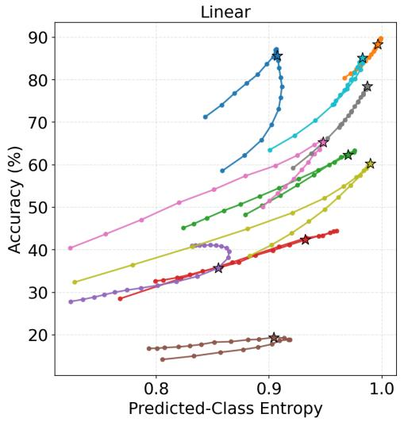

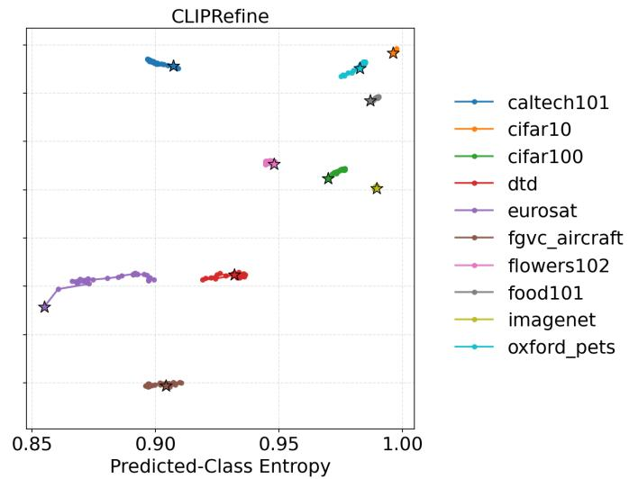  
Figure 5: Normalized prediction entropy vs. accuracy for Linear correction and CLIPRefine. Stars indicate the base model. In both settings, higher normalized prediction entropy is associated with higher accuracy (Pearson’s $r = 0 . 7 1 6 , n = 2 1 0$ for Linear; $r = 0 . 5 8 5 , n = 3 1 0$ for CLIPRefine).

## B.1 Predicted-Class Count

For each correction point k, let $\hat { y } _ { i } ^ { ( k ) }$ be the predicted label of sample i. The predicted-class count of class c is

$$
m _ { c } ^ { ( k ) } = \sum _ { i = 1 } ^ { N } \mathbf { 1 } [ \hat { y } _ { i } ^ { ( k ) } = c ] .
$$

This quantity counts how many samples are predicted as class $c .$ Classes with large $m _ { c } ^ { ( k ) }$ are treated as prediction hubs.

## B.2 Predicted-Class Gini

We measure prediction concentration using the Gini coefficient over the predicted-class count vector

$$
m ^ { ( k ) } = ( m _ { 1 } ^ { ( k ) } , \dots , m _ { C } ^ { ( k ) } ) .
$$

Let

$$
m _ { ( 1 ) } ^ { ( k ) } \leq \cdots \leq m _ { ( C ) } ^ { ( k ) }
$$

denote the sorted counts. We define Predicted-Class Gini as

$$
G ^ { ( k ) } = \frac { 2 \sum _ { r = 1 } ^ { C } r m _ { ( r ) } ^ { ( k ) } } { C \sum _ { r = 1 } ^ { C } m _ { ( r ) } ^ { ( k ) } } - \frac { C + 1 } { C } .
$$

A larger value indicates that predictions are more concentrated on a smaller subset of classes.

## B.3 Normalized Prediction Entropy

As a complementary concentration metric, we use normalized prediction entropy. Let

$$
p _ { c } ^ { ( k ) } = \frac { m _ { c } ^ { ( k ) } } { \sum _ { j = 1 } ^ { C } m _ { j } ^ { ( k ) } } .
$$

We define

$$
H _ { \mathrm { n o r m } } ^ { ( k ) } = - \frac { \sum _ { c = 1 } ^ { C } p _ { c } ^ { ( k ) } \log p _ { c } ^ { ( k ) } } { \log C } .
$$

Terms with $p _ { c } ^ { ( k ) } = 0$ are treated as zero. A larger entropy value indicates that predictions are more evenly distributed across classes. Thus, normalized entropy is expected to show the complementary trend to Predicted-Class Gini: if prediction concentration is associated with accuracy degradation, entropy should be positively correlated with accuracy.

Figure 5 shows that normalized prediction entropy is positively correlated with accuracy for both Linear correction and CLIPRefine. This is the complementary pattern to the negative relationship between Predicted-Class Gini and accuracy reported in the main text. The result indicates that accuracy degradation is associated with reduced diversity in the predicted-class distribution, not only with increased Gini concentration.

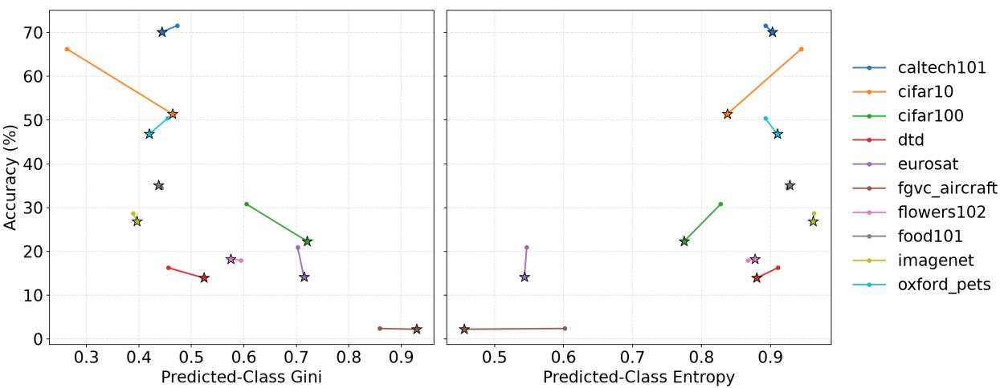  
Figure 6: Predicted-Class Gini (left) and normalized prediction entropy (right) vs. accuracy for AlignCLIP. Stars indicate the base model. A negative correlation with Predicted-Class Gini (Pearson’s $r = - 0 . 7 0 1 , n = 2 0 )$ and a positive correlation with entropy $( r = 0 . 5 5 6 , n = 2 0 )$ are observed, though the limited number of comparison points calls for cautious interpretation.

Table 7 further confirms the complementary entropy trend within individual datasets. For Linear correction, all 10 datasets show the expected positive correlation between normalized entropy and accuracy. For CLIPRefine, the expected direction holds in 9 out of 10 datasets, although the average correlation is weaker than for Linear correction.

## B.4 Transition-Level Destination Concentration

To analyze where changed predictions go, we decompose prediction changes into wrong-to-correct and correct-to-wrong transitions. For harmful correct-to-wrong transitions, the destination count of class c is

$$
e _ { c } ^ { ( k ) } = \sum _ { i } { \bf 1 } [ \hat { y } _ { i } ^ { ( 0 ) } = y _ { i } , \hat { y } _ { i } ^ { ( k ) } = c , c \neq y _ { i } ] .
$$

If a small number of classes have large $e _ { c } ^ { ( k ) }$ then previously correct samples are being redirected toward a small set of erroneous destination classes. This provides transition-level evidence for prediction-level hubness.

## C Supplementary Results

This appendix collects supplementary results that extend the analyses in the main text: AlignCLIP results (Appendix C.1), full transition-level destination curves (Appendix C.2), the full sweep for the bias-subtraction intervention (Appendix C.3), and the prototype-structure and uniformity measurements behind the geometric-correlate discussion (Appendix C.4).

## C.1 AlignCLIP Results

The main text focuses primarily on Linear correction (Liang et al., 2022) and CLIPRefine (Yamaguchi et al., 2025), which provide more comparison points under comparable backbone settings. Here, we report the corresponding predictionconcentration results for AlignCLIP (Eslami and de Melo, 2025).

Figure 6 shows that AlignCLIP follows the same qualitative trend as the main results: higher predicted-class concentration corresponds to lower accuracy, while higher normalized entropy corresponds to higher accuracy. Because the number of comparison points is limited, we use these results only as supporting evidence.

## C.2 Full Transition-Level Destination Curves

The main text summarizes the transition-level evidence for prediction-level hubness. Here, we provide the full rank curves for all datasets. This analysis complements prior work on embedding-space and retrieval-space hubness (Radovanovic et al.´ , 2010; Dinu et al., 2015; Wang et al., 2023; Lin et al., 2025; Deguchi et al., 2026) by examining whether final prediction changes concentrate on a small number of destination labels.

We decompose changed predictions into wrongto-correct and correct-to-wrong transitions. For each transition type, destination classes are sorted by transition count within each curve. Thus, the curves compare concentration patterns rather than class identities. A heavier head for correct-towrong transitions indicates that previously correct samples are redirected into a smaller number of erroneous destination classes.

Figures 7 and 8 show the full destination-rank curves for Linear correction (Liang et al., 2022). They provide the dataset-level transition patterns underlying the summary in Section 5.3.

Figures 9 and 10 show the corresponding destination-rank curves for CLIPRefine (Yamaguchi et al., 2025). They provide the full transition-level results supporting the comparison between Linear correction and CLIPRefine in the main text.

## C.3 Additional Results for Intervening on Gap-Induced Bias

In Section 5.4, we reported the intervention results at the over-correction setting $\alpha = 0 . 5$ with $\lambda = 1$ Here, we provide additional results by sweeping both the Linear correction strength α and the biassubtraction strength λ.

Figures 11 and 12 show the mean changes in accuracy and Predicted-Class Gini, respectively, after applying the bias-subtraction operation defined in Equation 4, which subtracts $\lambda \alpha b _ { c }$ from each corrected class score. Each value is computed relative to the corresponding Linear-correction baseline at the same α. Thus, positive values in Figure 11 indicate improved accuracy, while negative values in Figure 12 indicate reduced prediction concentration.

The results show that the effect of bias subtraction depends on both α and λ. In the positive overcorrection regime, positive values of λ generally improve accuracy and reduce Predicted-Class Gini, supporting the interpretation that gap-induced classwise bias contributes to prediction-level hubness. In contrast, subtraction with a mismatched direction, such as negative λ, can reduce accuracy or increase concentration. This indicates that the intervention should be understood as a diagnostic test of the proposed mechanism rather than as a general-purpose correction method.

## C.4 Prototype Structure and Uniformity under Correction

This section provides the measurements behind the geometric-correlate discussion in Section 6, using the uniformity definition of Appendix A.5.

Prototype–prototype angular structure is essentially preserved by both correction profiles: the correlation between corrected and uncorrected pairwise prototype similarities is 0.994 for Linear correction at $\alpha = 0 . 5$ and 0.975 for CLIPRefine. Joint image–text uniformity instead separates the two profiles. Under Linear correction, it improves only up to $\alpha \approx 0 . 1 0$ and then deteriorates, just past the accuracy peak and coinciding with the rise in Gini (within-dataset Spearman −0.92 with accuracy and +0.92 with Gini, on all 10 datasets). CLIPRefine instead shrinks the gap by 0.177 while improving uniformity by 0.054, with Gini essentially unchanged.

## D Robustness Checks and Ablations

This appendix collects the robustness checks and ablations referenced in the main text: prompt configuration (Appendices D.1–D.2), modality-wise centering (Appendix D.3), CSLS scoring (Appendix D.4), and model scale (Appendix D.5).

The experiments in the main text use the datasetspecific prompt templates of Table 5; Appendices D.1 and D.2 examine whether the conclusions depend on that choice, first by re-running all analyses with the generic template a photo of a {class name}. applied uniformly to all 10 datasets, and then by replacing hand-written templates entirely with LLM-generated attribute descriptions.

## D.1 Generic-Template Configuration

Five of the ten datasets (Caltech101, CIFAR-10, CIFAR-100, ImageNet-1K, and Oxford-IIIT Pet) already use the generic template in Table 5, so this check exercises the remaining five (DTD, EuroSAT, FGVC-Aircraft, Flowers102, and Food-101). Table 8 reports the within-dataset Spearman correlations of accuracy with Predicted-Class Gini and with normalized prediction entropy under the generic configuration, computed in an independent run (including re-extraction of all embeddings). Every correlation has the same sign as its counterpart in the main text: Linear correction is in the expected direction on 10 of 10 datasets for both metrics (mean $\rho _ { G } ~ = ~ - 0 . 8 8 8 .$ against −0.922 with dataset-specific templates), and CLIPRefine on 9 of 10 (mean $\rho _ { G } = - 0 . 4 9 6$ against −0.485), with Caltech101 remaining the single positive case for the reasons given in Section 5.5. The pooled Pearson correlations corresponding to Figure 3 are $r = - 0 . 7 9 1$ for Linear correction and $r ~ = ~ - 0 . 7 3 9$ for CLIPRefine under the generic configuration, against $r = - 0 . 7 7 8$ and $r = - 0 . 7 1 0$ in the main text. The transitionlevel pattern of Table 3 is likewise preserved (for example, 32,486 correct-to-wrong transitions in the Linear-worst setting with a top-five destination fraction of 0.660, against 33,804 and 0.672 in the main configuration). The frequency-normalized concentration test of Section 5.5—computing the Gini coefficient over $r _ { c } = ( m _ { c } / N ) / ( n _ { c } / N )$ , i.e. each class’s predicted-class count divided by its ground-truth frequency, instead of over $m _ { c }$ —also behaves identically: the Caltech101 correlation reverses from +0.797 to −0.981 and Flowers102, the second most imbalanced dataset, strengthens from −0.280 to −0.795, while the exactly balanced datasets are unchanged by construction and the near-balanced ones keep their negative sign. We conclude that no result in this paper depends on the prompt-template choice. The one sign difference we observed anywhere is the EuroSAT accuracy– uniformity correlation noted in Section 6, which is positive under the generic configuration and negative under the dataset-specific one; EuroSAT is also the dataset with the weakest correlations throughout, and we flag it rather than explain it.

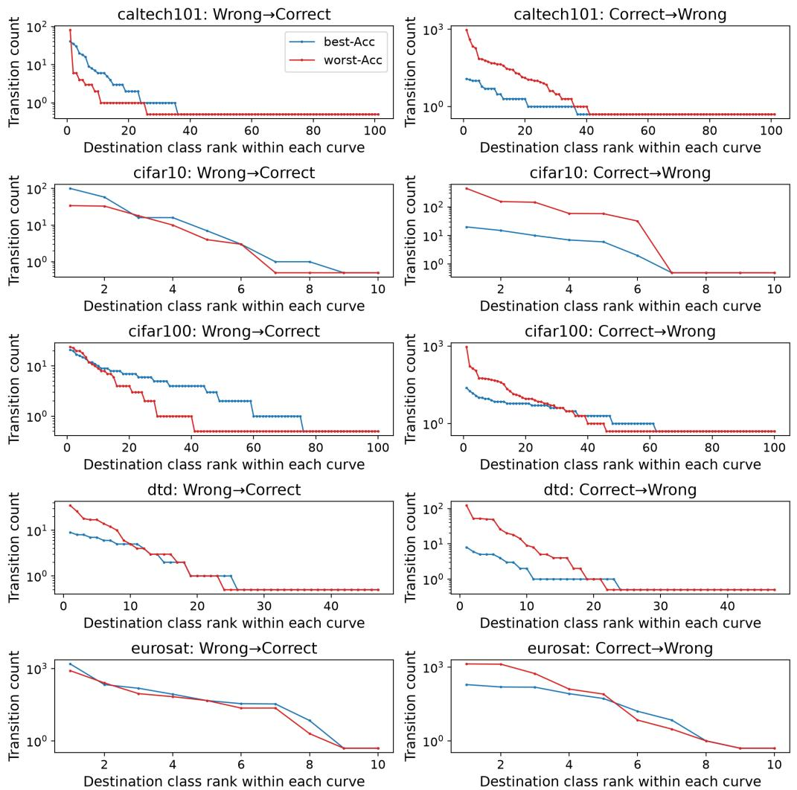  
Figure 7: Rank curves of destination concentration for prediction transitions under Linear correction on the first five datasets: Caltech101, CIFAR-10, CIFAR-100, DTD, and EuroSAT. Destination classes are independently sorted by transition count within each curve. For visualization on the log-scale y-axis, destination classes with zero transitions are shown at 0.5.

## D.2 LLM-Generated Attribute Descriptions

A remaining question is whether prediction-level hubness is an artifact of short hand-written templates, and whether richer, attribute-level descriptions of the kind used by Saha et al. (2024) would avoid it. The mechanism of Section 4 predicts otherwise: the derivation of $b _ { c } = - \langle g , t _ { c } \rangle$ makes no reference to the prompt text, which changes only where the prototypes $t _ { c }$ and the gap vector $g$ lie, so richer descriptions may change which classes become hubs but should not prevent hub formation. We test this prediction directly as a targeted check on a single dataset, CIFAR-100; we do not claim generality across datasets.

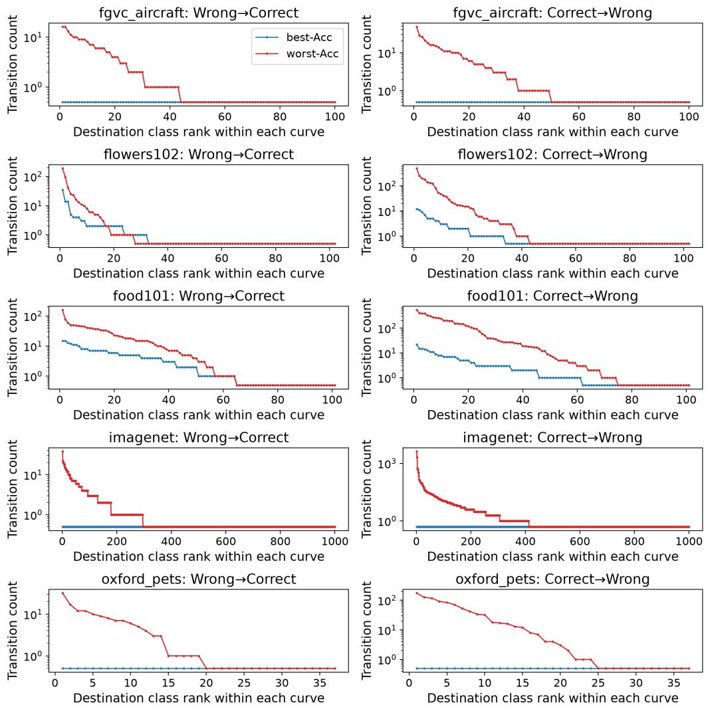  
Figure 8: Rank curves of destination concentration for prediction transitions under Linear correction on the remaining five datasets: FGVC-Aircraft, Flowers102, Food-101, ImageNet-1K, and Oxford-IIIT Pet. Destination classes are independently sorted by transition count within each curve. For visualization on the log-scale y-axis, destination classes with zero transitions are shown at 0.5.

We generate five attribute descriptions per class   
with Qwen3-4B-Instruct-2507 (greedy decoding),   
using the prompt format of Saha et al. (2024):   
“What characteristics can be used to differentiate   
a {class} from other objects based on just a photo? Texts should be of the form ‘a photo of a   
{class} with ⟨characteristic⟩.’ ” We evaluate the   
descriptions with CLIP ViT-B/32 in two ways,   
both test-time only with no fine-tuning: scoring   
against the normalized mean of the five descrip-

tion embeddings per class (mean prototype), and the evaluation rule of Saha et al. (2024) (their Eq. 3), which averages per-description softmax probabilities within each class. As a pipeline check, our single-template baseline reproduces the CIFAR-100 row of Table 1 to within 0.001 $( \rho _ { m } = 0 . 8 7 0 , \rho _ { \Delta m } = 0 . 8 6 2 , \rho _ { e } = 0 . 8 3 2$ against 0.869/0.863/0.833).

Table 9 shows the result: under Linear overcorrection, accuracy drops and Predicted-Class Gini roughly doubles in all three schemes, so richer prompts do not remove the failure mode. Moreover, $b _ { c }$ remains predictive of hub formation: at $\alpha = 0 . 5$ the Spearman correlations with predicted-class count, its increase, and correct-to-wrong destinations are 0.833/0.837/0.824 for the mean-prototype scheme (computed with $t _ { c }$ taken as the mean description embedding) and 0.757/0.757/0.767 under their Eq. 3 evaluation rule. Consistent with the report of Saha et al. (2024) that test-time descriptions alone yield modest gains on coarse-grained datasets, base accuracy moves only slightly (62.3% to 63.5% for the mean prototype); their fine-tuning setting is outside the scope of this check.

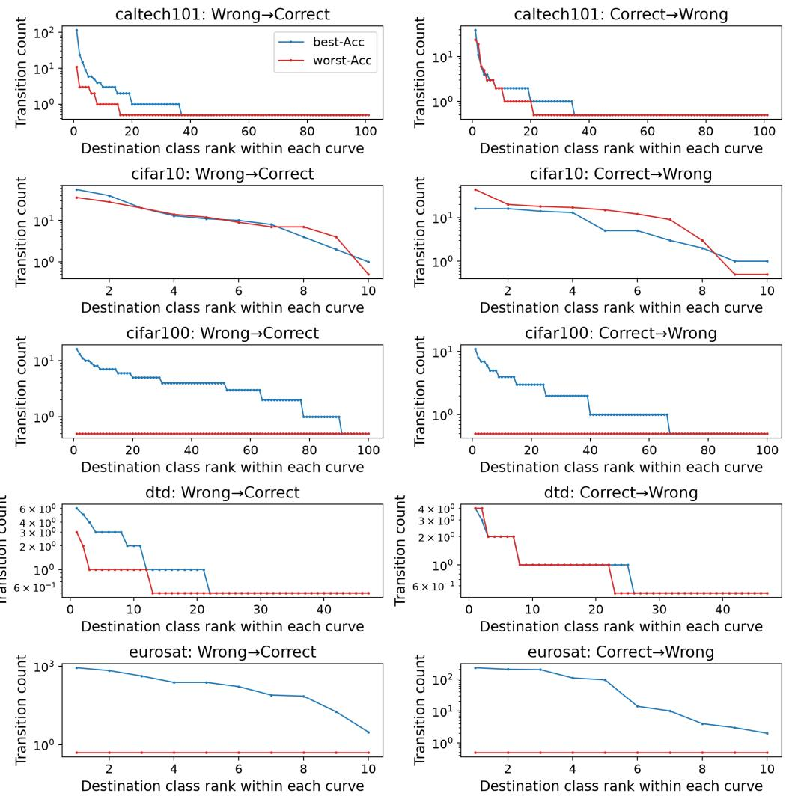  
Figure 9: Rank curves of destination concentration for prediction transitions under CLIPRefine on the first five datasets: Caltech101, CIFAR-10, CIFAR-100, DTD, and EuroSAT. Destination classes are independently sorted by transition count within each curve. For visualization on the log-scale y-axis, destination classes with zero transitions are shown at 0.5.

## D.3 Centering Ablation

This section provides the full results for the modality-wise centering analysis summarized in Section 5.5. After Linear correction with strength α, we apply, in order: the shift by −αg (image side; +αg on the text side), per-sample L2 normalization, subtraction of the modality mean, and renormalization. Because centering removes each modality’s mean, it removes the residual gap direction and with it the class-wise bias $b _ { c } ;$ the prediction of Section 4 is therefore that accuracy and concentration become (approximately) independent of α.

Table 10 confirms this on every dataset. The perdataset accuracy range across the full sweep drops from 18.5 points on average (maximum 28.6) to at most 0.7 points, and the Predicted-Class Gini range from 0.30 on average (maximum 0.53) to at most 0.009. The residual α dependence is explained by the per-sample normalization between the shift and the centering, which makes the two operations noncommuting; the correction is exactly cancelled only without that intermediate normalization. Under the generic-template configuration of Appendix D.1, the same pattern holds, with accuracy ranges below 0.8 points and Gini ranges below 0.011 on every dataset.

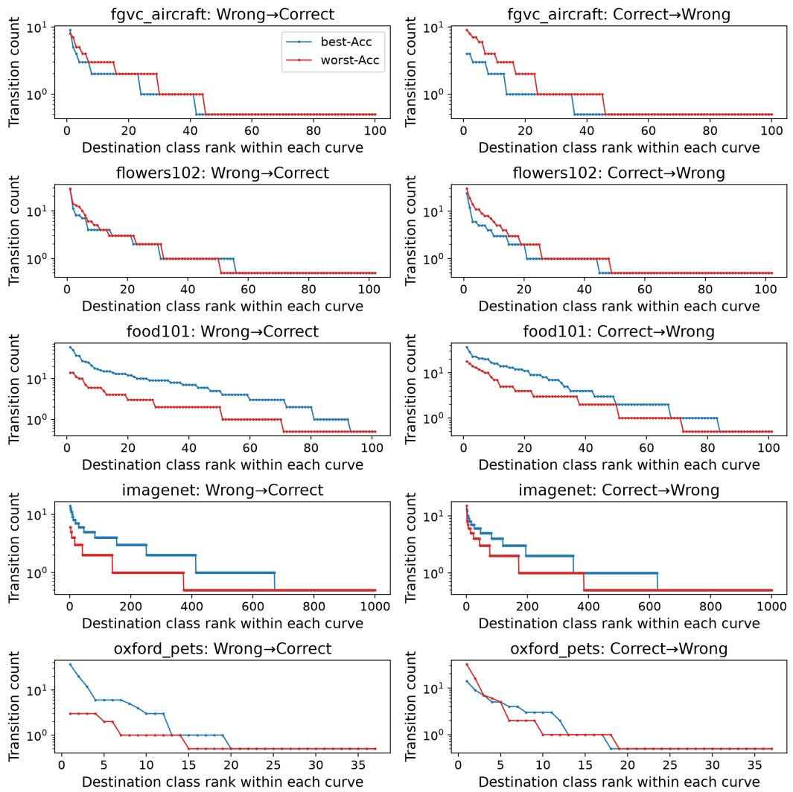  
Figure 10: Rank curves of destination concentration for prediction transitions under CLIPRefine on the remaining five datasets: FGVC-Aircraft, Flowers102, Food-101, ImageNet-1K, and Oxford-IIIT Pet. Destination classes are independently sorted by transition count within each curve. For visualization on the log-scale y-axis, destination classes with zero transitions are shown at 0.5.

Centering is a diagnostic, not a practical improvement: its effect on the accuracy of the uncorrected model is dataset-dependent, from −4.2 points (Flowers102) to +4.1 points (EuroSAT) under the dataset-specific templates, and up to +15.3 points on EuroSAT under the generic template. What the ablation establishes is that the entire α- dependent failure mode, both the accuracy degradation and the prediction concentration, disappears when the gap direction is removed, which is the embedding-space counterpart of the score-space intervention in Section 5.4.

## D.4 CSLS Scoring

Section 5.5 evaluates Linear correction under Cross-domain Similarity Local Scaling (CSLS), a local-scaling similarity originally introduced for cross-lingual embedding retrieval (Lample et al., 2018) and commonly used in settings where nearest-neighbor hubness is a concern (Radovanovic et al.´ , 2010; Dinu et al., 2015; Wang et al., 2023; Lin et al., 2025). Beyond its role as a partial mitigation, CSLS also addresses the concern that the concentration–accuracy relationship might be tied to raw cosine similarity. This section provides the scoring definition and the full per-dataset results.

CSLS scoring. Let $x _ { i } \in \mathbb { R } ^ { d }$ be the image embedding of sample i, and let $t _ { c } \in \mathbb { R } ^ { d }$ be the text prototype of class c. All embeddings are L2-normalized. The raw cosine similarity is

$$
s ( x _ { i } , t _ { c } ) = x _ { i } ^ { \top } t _ { c } .
$$

<table><tr><td>Metric</td><td>Method</td><td>Cal101</td><td>C10</td><td>C100</td><td>DTD</td><td>Euro</td><td>Aircraft</td><td>Flw102</td><td>Food</td><td>IN</td><td>Pets</td><td> $\operatorname { A v g } .$ </td><td> $\mathrm { E x p . }$ </td></tr><tr><td>ρG</td><td>Linear CLIPRefine</td><td>-0.819 0.797</td><td>-1.000 -0.928</td><td>-0.997 -0.910</td><td>-0.997 -0.298</td><td>-0.203 -0.843</td><td>-0.944 -0.215</td><td>-0.926 -0.280</td><td>-0.997 -0.850</td><td>-1.000 -0.728</td><td>-0.995 -0.701</td><td>-0.888 -0.496</td><td>10/10 9/10</td></tr><tr><td></td><td>Linear</td><td>0.427</td><td>1.000</td><td>0.990</td><td>0.997</td><td>0.804</td><td>0.944</td><td>0.926</td><td>0.994</td><td>0.987</td><td>0.983</td><td>0.905</td><td>10/10</td></tr><tr><td> $\rho _ { H }$ </td><td>CLIPRefine</td><td>-0.969</td><td>0.954</td><td>0.911</td><td></td><td></td><td></td><td></td><td></td><td></td><td></td><td></td><td></td></tr><tr><td></td><td></td><td></td><td></td><td></td><td></td><td></td><td></td><td>0.347</td><td>0.648</td><td></td><td></td><td></td><td></td></tr><tr><td></td><td></td><td></td><td></td><td></td><td>0.303</td><td>0.880</td><td>0.221</td><td></td><td></td><td>0.681</td><td>0.849</td><td>0.482</td><td>9/10</td></tr></table>

Table 8: Within-dataset Spearman correlations under the generic-template configuration, in which a photo of a {class name}. is used for all 10 datasets. $\rho _ { G }$ and $\rho _ { H }$ denote correlations of accuracy with Predicted-Class Gini and with normalized prediction entropy, respectively; “Exp.” counts datasets with the expected direction. The correlation structure matches Tables 2 and 7: every entry has the same sign in both configurations, including the Caltech101 anomaly discussed in Section 5.5.

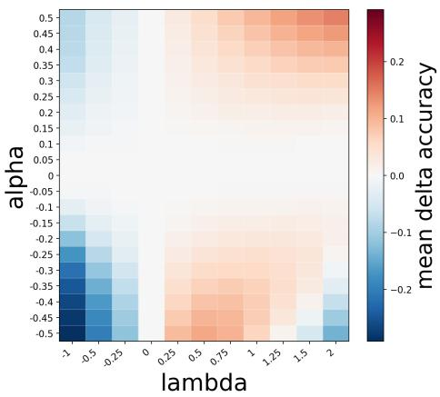  
Figure 11: Mean change in accuracy after gap-bias subtraction across correction strengths α and intervention strengths λ. Values are relative to the Linear-correction baseline at the same α; positive values indicate accuracy improvement.

For each image embedding $x _ { i }$ , we define its average similarity to the top-k nearest text prototypes as

$$
r _ { X } ( x _ { i } ) = \frac { 1 } { k } \sum _ { t \in \mathcal { N } _ { T } ^ { k } ( x _ { i } ) } s ( x _ { i } , t ) ,
$$

where $\mathcal { N } _ { T } ^ { k } ( x _ { i } )$ denotes the set of top-k text prototypes nearest to $x _ { i } .$ Similarly, for each text prototype $t _ { c } ,$ we define

$$
r _ { T } ( t _ { c } ) = \frac { 1 } { k } \sum _ { x \in \mathcal { N } _ { X } ^ { k } ( t _ { c } ) } s ( x , t _ { c } ) ,
$$

where $\mathcal { N } _ { X } ^ { k } ( t _ { c } )$ denotes the set of top-k image embeddings nearest to $t _ { c }$ . We set $k = 1 0$ in all CSLS experiments.

The CSLS score is

$$
\mathrm { C S L S } ( x _ { i } , t _ { c } ) = 2 s ( x _ { i } , t _ { c } ) - r _ { X } ( x _ { i } ) - r _ { T } ( t _ { c } ) .
$$

The predicted class is obtained by

$$
\hat { y } _ { i } = \arg \operatorname* { m a x } _ { c } \mathrm { C S L S } ( x _ { i } , t _ { c } ) .
$$

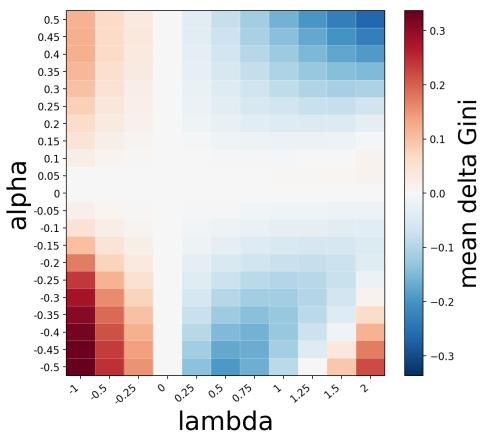  
Figure 12: Mean change in Predicted-Class Gini after gap-bias subtraction across correction strengths α and intervention strengths λ. Values are relative to the Linear-correction baseline at the same α; negative values indicate reduced prediction concentration.

Linear correction with CSLS. For Linear correction with CSLS, we apply the same embeddingshift formulation as in the main Linear correction experiments (Liang et al., 2022). We use the same gap vector:

$$
g = \frac { 1 } { N } \sum _ { i = 1 } ^ { N } x _ { i } - \frac { 1 } { N } \sum _ { j = 1 } ^ { N } t _ { j } .
$$

For correction strength $\alpha .$ , we shift image and text embeddings in opposite directions and renormalize them:

$$
\tilde { x } _ { i } = \frac { x _ { i } - \alpha g } { \| x _ { i } - \alpha g \| _ { 2 } } , \qquad \tilde { t } _ { c } = \frac { t _ { c } + \alpha g } { \| t _ { c } + \alpha g \| _ { 2 } } .
$$

We then compute CSLS using $\tilde { x } _ { i }$ and $\tilde { t } _ { c }$ in place of $x _ { i }$ and $t _ { c }$

Results. Compared with raw cosine scoring, CSLS roughly halves the over-correction penalty: at $\alpha = 0 . 5$ , the mean accuracy change from the base model is −7.4 points under CSLS versus −15.1 points under cosine scoring. Figures 13 and 14 further show that prediction concentration remains associated with accuracy under CSLS scoring. Higher Predicted-Class Gini generally corresponds to lower accuracy, while normalized prediction entropy shows the complementary trend. Thus, CSLS reduces but does not fully remove the prediction-level concentration induced by excessive gap correction. These results support the interpretation that gap correction can create a hubnessrelated failure mode, rather than merely changing the average modality gap or depending on a particular raw similarity function.

<table><tr><td></td><td colspan="3">Base (α = 0)</td></tr><tr><td>Prompting</td><td> $\operatorname { A c c } .$ </td><td>Gini</td><td> $\operatorname { A c c } .$ </td><td>Gini</td></tr><tr><td>Single template</td><td>62.3</td><td>0.27</td><td>48.3</td><td>0.56</td></tr><tr><td>Descriptions (mean proto.)</td><td>63.5</td><td>0.25</td><td>46.3</td><td>0.60</td></tr><tr><td>Descriptions (their Eq. 3 rule)</td><td>61.1</td><td>0.27</td><td>47.9</td><td>0.58</td></tr></table>

Table 9: Linear correction on CIFAR-100 with LLMgenerated attribute descriptions. Over-correction degrades accuracy and roughly doubles Predicted-Class Gini under all three prompting schemes, including the evaluation rule of Saha et al. (2024).
<table><tr><td rowspan="2">Dataset</td><td colspan="2">Acc. range (pt)</td><td colspan="2">Gini range</td></tr><tr><td></td><td>Linear +Center</td><td>Linear</td><td>+Center</td></tr><tr><td>Caltech101</td><td>28.6</td><td>0.7</td><td>0.18</td><td>0.006</td></tr><tr><td>CIFAR-10</td><td>9.3</td><td>0.1</td><td>0.17</td><td>0.001</td></tr><tr><td>CIFAR-100</td><td>18.2</td><td>0.1</td><td>0.34</td><td>0.009</td></tr><tr><td>DTD</td><td>16.0</td><td>0.3</td><td>0.36</td><td>0.003</td></tr><tr><td>EuroSAT</td><td>13.3</td><td>0.2</td><td>0.14</td><td>0.001</td></tr><tr><td>FGVC-Aircraft</td><td>5.2</td><td>0.2</td><td>0.23</td><td>0.005</td></tr><tr><td>Flowers102</td><td>25.3</td><td>0.1</td><td>0.41</td><td>0.002</td></tr><tr><td>Food-101</td><td>19.4</td><td>0.1</td><td>0.30</td><td>0.003</td></tr><tr><td>ImageNet-1K</td><td>27.9</td><td>0.4</td><td>0.53</td><td>0.008</td></tr><tr><td>Oxford Pets</td><td>21.6</td><td>0.3</td><td>0.30</td><td>0.002</td></tr><tr><td>Mean</td><td>18.5</td><td>0.2</td><td>0.30</td><td>0.004</td></tr></table>

Table 10: Range of accuracy (percentage points) and Predicted-Class Gini over the sweep α $\in [ - 0 . 5 , 0 . 5 ]$ for Linear correction with and without modality-wise centering. Centering removes the α dependence of both quantities on every dataset.

Figure 15 shows accuracy and modality gap under Linear correction with CSLS scoring. CSLS partially mitigates the degradation caused by strong Linear correction, but does not eliminate it. As the correction strength increases, the modality gap still decreases monotonically, while accuracy improves only up to a point and then deteriorates. This suggests that part of the degradation under gap correction is related to hubness in the similarity-based prediction rule, rather than being an artifact of raw

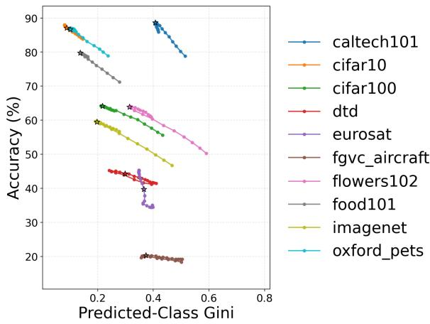  
Figure 13: Predicted-Class Gini vs. accuracy under Linear correction with CSLS. Higher Predicted-Class Gini generally corresponds to lower accuracy, indicating that prediction concentration remains associated with accuracy degradation under CSLS. Stars indicate the base model.

cosine similarity alone.

Table 11 reports within-dataset Spearman correlations between accuracy and prediction concentration. Linear-CSLS shows the expected direction in all 10 datasets, with a negative correlation for Predicted-Class Gini and a positive correlation for normalized entropy. This indicates that the concentration–accuracy relationship is not merely a pooled cross-dataset artifact and remains visible under CSLS scoring.

## D.5 Effect of Model Scale

One might hope that larger CLIP models, whose modality gap may be smaller or more uniform, do not exhibit prediction-level hubness. To test this, we repeat the full Linear-correction sweep (21 correction strengths, all 10 datasets, dataset-specific templates) on ViT-B/16 and ViT-L/14, with the gap vector estimated per backbone as in Appendix A.3.

Table 12 shows that the phenomenon does not diminish with scale. On ViT-L/14 the correlation between accuracy and Predicted-Class Gini is negative on all 10 datasets with a mean of −0.920, matching ViT-B/32 (−0.922), and the pooled Pearson correlation is in fact strongest on the largest backbone (−0.815, against −0.778 for B/32 and −0.791 for B/16). Over-correction remains costly: at $\alpha = 0 . 5$ , ViT-L/14 loses 10.5 points of accuracy on average, and 22.0 points on ImageNet-1K, where the correlation is −1.000. This is consistent with the mechanism: the derivation of $b _ { c }$ = $- \left. g , t _ { c } \right.$ is backbone-independent, so a smaller or differently oriented gap changes the size of the induced bias but not the structure of the failure mode. The single exception is EuroSAT on ViT-B/16 (+0.903), where over-correction happens to improve accuracy; EuroSAT has only 10 classes, so its Gini values span a narrow range and the rank correlation is unstable, and the same dataset is the weakest for ViT-B/32 while returning to −0.930 on ViT-L/14.

<table><tr><td>Metric</td><td>Cal101</td><td>C10</td><td>C100</td><td>DTD</td><td>Euro</td><td>Aircraft</td><td>Flw102</td><td>Food</td><td>IN</td><td>Pets</td><td>Avg.</td><td>Exp.</td></tr><tr><td>ρG</td><td>-0.918</td><td>-0.978</td><td>-0.995</td><td>-0.956</td><td>-0.929</td><td>-0.822</td><td>-0.982</td><td>-0.982</td><td>-0.992</td><td>-0.842</td><td>-0.940</td><td>10/10</td></tr><tr><td>ρH</td><td>0.567</td><td>0.998</td><td>0.962</td><td>0.948</td><td>0.875</td><td>0.834</td><td>0.982</td><td>0.944</td><td>0.992</td><td>0.729</td><td>0.883</td><td>10/10</td></tr></table>

Table 11: Within-dataset Spearman correlations for Linear-CSLS. $\rho _ { G }$ and $\rho _ { H }$ measure correlations with Predicted-Class Gini and normalized entropy, respectively. “Exp.” indicates the number of datasets with the expected correlation direction.
<table><tr><td>Backbone</td><td>Cal101</td><td>C10</td><td>C100</td><td>DTD</td><td>Euro</td><td>Aircraft</td><td>Flw102</td><td>Food</td><td>IN</td><td>Pets</td><td>Avg.</td><td>Exp.</td></tr><tr><td>ViT-B/32</td><td>-0.819</td><td>-0.998</td><td>-0.997</td><td>-0.996</td><td>-0.725</td><td>-0.766</td><td>-0.934</td><td>-0.995</td><td>-1.000</td><td>-0.993</td><td>-0.922</td><td>10/10</td></tr><tr><td>ViT-B/16</td><td>-0.907</td><td>-0.900</td><td>-0.987</td><td>-0.963</td><td>0.903</td><td>-0.957</td><td>-0.977</td><td>-0.996</td><td>-0.995</td><td>-0.986</td><td>-0.776</td><td>9/10</td></tr><tr><td>ViT-L/14</td><td>-0.806</td><td>-0.922</td><td>-0.997</td><td>-0.994</td><td>-0.930</td><td>-0.981</td><td>-0.587</td><td>-0.992</td><td>-1.000</td><td>-0.994</td><td>-0.920</td><td>10/10</td></tr></table>

Table 12: Within-dataset Spearman correlations between accuracy and Predicted-Class Gini for the Linear-correction sweep across CLIP backbones. “Exp.” counts datasets with the expected negative direction. The ViT-B/32 row repeats Table 2 for comparison.

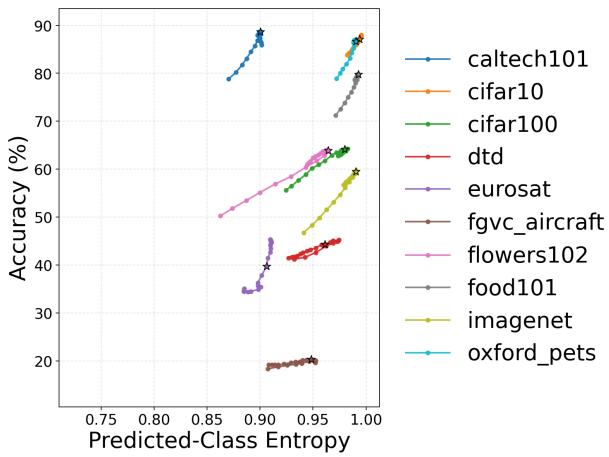  
Figure 14: Normalized prediction entropy vs. accuracy under Linear correction with CSLS. Higher normalized prediction entropy generally corresponds to higher accuracy, showing the complementary trend to Predicted-Class Gini. Stars indicate the base model.

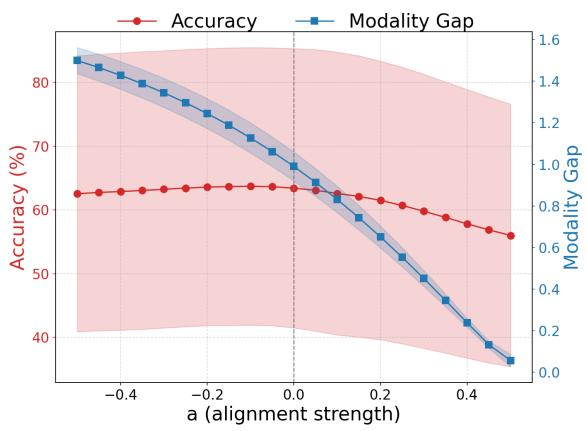  
Figure 15: Accuracy and modality gap under Linear correction with CSLS scoring. The modality gap decreases monotonically with correction strength, whereas accuracy improves only up to a point and then deteriorates.