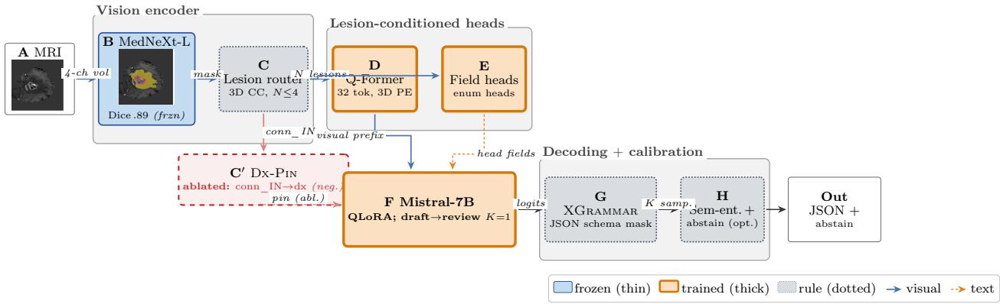

# The Diagnosis a Reporter Leaves Unspoken: Surfacing Frozen Tumor Features for Brain-Tumor MRI Reporting∗

Khawaja Murad ul Hassan†1, Ruqiyya Adil1, Adil Qayyum2, Rida Hassan3, Asad Mansoor Khan1, Muhammad Usman Akram1, and Mehran Ebrahimi4

1National University of Sciences and Technology, Islamabad, Pakistan 2Consultant Radiologist, Rawalpindi, Pakistan 3Bahria University Health Sciences Campus, Islamabad, Pakistan 4Faculty of Science, Ontario Tech University, Oshawa, ON, Canada

## Abstract

A capable brain-MRI report generator can still be, in efect, diagnostically silent. When a multi-chain chain-of-thought (CoT) reporter built on a medical Mistral-7B backbone is evaluated on held-out cohorts, it names most meningiomas and almost all metastases “glioma” (diagnosis recall 0.44/0.07). Yet the answer is not absent from the model: a supervised linear probe applied to its frozen segmentation features recovers the three tumour cohorts at 0.82 macro-F1 (5-fold cross-validation; chance ≈ 0.33). We introduce NeuroFusion, an assistive reporter that surfaces this latent signal rather than overriding it: discriminative field-classifier heads over per-lesion features condition a fast, single-pass draft-then-review decoder on their committed outputs. Built on the identical Mistral backbone, this restores the diagnosis (meningioma 0.92, metastasis 0.75) and wins 8 of 9 prose-content comparisons across three held-out cohorts (RaTEScore, RadGraph-F1, GREEN; Holm-corrected paired BCa), with no significant loss on the ninth, at 5-6× lower latency (≈80 vs. 457 s/case). A controlled negative result sharpens the mechanism: a learned diagnosis pin that overrides the decoder instead of merely informing it collapses out-of-distribution metastasis recall to 0.03. Grammar-constrained decoding keeps 92.3% of records schema-valid, making every sentence entailment-checkable (7.5% contradicted vs. 36.8% for the direct baseline). In a blinded nine-case pilot, two board-certified neurologists independently rated NeuroFusion highest in every tumour type, the only system with zero critical errors, and gave it the top-rated sign-of in eight of nine cases (six outright, two ties).

Keywords: Brain-tumor MRI report generation, Discriminative-head conditioning, Diagnostic suppression, Report faithfulness, Clinical reader study.

## 1 Introduction

Brain tumours are both high-stakes and common worldwide: GLOBOCAN recorded 321,731 new malignant brain and CNS cancer cases in 2022, with 248,500 deaths [1], and MRI remains the front-line imaging modality. Access, however, is deeply uneven: roughly two-thirds of the world’s population has no access to any diagnostic imaging [2, 3]. Where imaging is available, radiologists face a punishing workload – reading an image roughly every 3-4 s [4], with a single brain MRI taking about 11 minutes to read and dictate, and over a third of radiologists reporting burnout [5, 6]. There is evidence automation can help: keyword-based AI drafting alone has been shown to cut intracranial-tumour reporting time by roughly 28% with no loss of quality [7]. We focus on the most automatable slice of this workflow – structured findings plus a first-pass narrative – and target a record that, unlike existing generators, is machine-checkable and commits to a diagnosis instead of hedging.

Existing tools fall short in complementary ways. Fluent 3D medical vision-language models and brain report generators expose no checkable schema and default to the most common diagnosis, while a rule that reads fields directly of a segmentation mask fills a schema but ofers only a fixed diferential and is capped by whatever the mask shows.

The omission is not simply a perception failure. On our held-out cohorts, a strong chainof-thought (CoT) reporter sharing our backbone misreads more than half of meningiomas and nearly every metastasis as “glioma” (diagnosis recall 0.44/0.07); yet a supervised linear probe over the same model’s frozen segmentation bottleneck separates the three cohorts at 0.82 macro-F1 (5-fold cross-validation, chance ≈0.33; per-cohort 0.85/0.88/0.75). The diagnosis, in other words, is linearly accessible in the model’s own features but never verbalized – a phenomenon we call diagnostic suppression. NeuroFusion closes this gap through head-surfacing: the same backbone runs discriminative field-classifier heads over the per-lesion features and conditions a fast, single-pass draft-then-review decoder on their committed outputs, restoring the diagnosis (meningioma 0.92, metastasis 0.75) without introducing a separate diagnosis model. Against the identical backbone’s CoT variant it wins 8 of 9 prose-content comparisons with no significant regression on the ninth, at 5-6× lower latency, and the gain is individually significant on the held-out metastasis cohort (Sec. 5); a controlled diagnosis-pin negative result further sharpens the mechanism. NeuroFusion also adds an auditability layer no baseline VLM ofers – per-sentence faithfulness checking over its machine-checkable record (Sec. 7) – and in a blinded reader study, neurologists rate it highest in every tumour type (Table 3).

Contributions: (i) a diagnostic-suppression phenomenon, evidenced by the gap between a 0.82-F frozen-feature probe and a same-backbone CoT reporter’s 0.44/0.07 diagnosis recall; (ii) discriminative-head conditioning as a remedy, yielding Holm-significant same-base gains on 8 of 9 prose-content comparisons at 5-6× lower latency, individually significant on the held-out metastasis cohort (Sec. 5); (iii) a controlled diagnosis-pin negative result; (iv) a verifiable audit layer evaluated under a pre-specified statistical protocol (Holm/TOST/BCa, Sec. 7); and (v), to our knowledge, the first blinded neurologist reader study for this task, in which NeuroFusion is rated highest in every tumour type (Table 3).

## 2 Related Work

Brain MRI reporting. AutoRG-Brain [8] pairs anomaly segmentation with a visually-prompted language model for findings generation; MAIRA-2 [9] grounds reporting in image regions; BrainGemma3D [10] is a single-sequence 3D generator; concurrent work targets 3D brain-tumor reporting more broadly (Brain3D [11], RadFM [12]). All of these ground reports in image regions but leave the diagnosis itself to the language model and expose no checkable schema; we benchmark directly against AutoRG-Brain and BrainGemma3D. 3D medical VLMs. M3D-LaMed [13] and LLaVA-Med [14] pair a vision encoder with an LLM to produce free text but target no schema at all. Constrained decoding and faithfulness. XGrammar [15] guarantees syntactic, not semantic, validity; entity-level metrics such as RadGraph [16, 17], RaTEScore [18], and GREEN [19] assess grounding beyond simple

  
Figure 1: NeuroFusion architecture. A frozen MedNeXt-L backbone (B) segments the tumor; a connected-component router (C) turns the $N { \le } 4$ retained lesions into per-lesion queries over the shared feature map (volume-ranked, centroid-encoded) for a Q-Former (D) and field-classifier heads (E). Visual tokens and the surfaced head outputs condition the QLoRA-tuned Mistral-7B (F) in a single draft-then-review pass (K=1); an XGrammar mask (G) enforces schema-valid JSON and an optional abstention gate (H) emits the report. The diagnosis pin (C′, labelled Dx-Pin, dashed) is tested and dropped (Sec. 5).

n-gram overlap. Label-conditioned reporting. Conditioning a generator on predicted labels is well established in chest X-ray reporting (tag-conditioned [20]; CheXpert-label-conditioned [21]); region-grounding, by contrast, conditions on where a finding is rather than what it is. Positioning. Our contribution is not head-conditioning as such, but the finding that the gain requires a decoder trained to commit to the fields – mere availability is not enough: a same-base CoT model handed the identical head argmax as text still misreads the diagnosis. We hard-set the enum fields but deliberately leave the diagnosis itself to the language model.

## 3 Method

Pipeline overview. NeuroFusion turns a four-sequence MRI volume into a single structured record in one decoder pass. A frozen MedNeXt [22] backbone, pretrained across multiple cohorts (validation mean foreground Dice 0.89), segments the tumour; connected-component analysis yields per-lesion masks, and a router keeps only the four largest lesions. Each lesion’s pooled features – tagged with a factorized 3D positional encoding recording where in the volume it sits – are compressed by a per-lesion Q-Former [23]: a set of learned query vectors that cross-attend the features and emit a fixed 32 tokens per lesion, so that a scan with any number of lesions reaches the language model as a bounded, volume-ordered visual prefix. These tokens, together with the surfaced field-head outputs, condition a QLoRA [24]-tuned medical LLM that decodes the report under a schema grammar (Fig. 1). The language model is LLaVA-Med v1.5’s medical Mistral-7B [14] – the same model used by the LLaVA-Med baseline, so any gain reflects the architecture rather than a stronger backbone.

Head-surfacing and single-pass decoding. The output record is JSON: a fixed set of categorical fields (composition, enhancement pattern, mass efect, and others), a diferential diagnosis, and freetext findings and impression. Head-surfacing means linear enum classifiers over the pooled per-lesion Q-Former features predict the structured fields directly; the diagnosis itself is deliberately not a head – it is left to the language model to recover. The heads’ argmax (together with location inferred from segmentation geometry) is injected into the prompt as text (e.g. “temporal; heterogeneous; ring”) rather than left for the LM to draft on its own, which tends to over-generate lesions and misstate the diagnosis; cued this way, the LM recovers both per-field accuracy and the diagnosis (Sec. 5). Decoding uses XGrammar, masking the logits at each step to only the tokens the schema still permits, so a syntactically invalid record cannot be produced. The whole process is a single draft-then-review pass (K=1, versus the CoT baseline’s K=2 chains times four sub-questions): the model samples the record once, and the draft’s enum fields are then reconciled against the head argmax (never the diagnosis) within that same pass, rather than through a second LM call – replacing a slower CoT pipeline for no loss in quality. Only the router, Q-Former, field classifiers, and LoRA adapter are trained; a record-verbalizer variant (adapter disabled) is used to maximize faithfulness (Sec. 7).

## 4 Experimental Setup

Data. Training uses BraTS-2020 [25]; 121 of its cases carry human-authored, radiologist-reviewed structured reports (diagnosis drawn from histopathology or diferential; 98% pass validation), from which we hold out 39 in-distribution test cases and 50 calibration cases. Two further, in-distribution RadGenome cohorts – glioma (GLI, n=60; n=54 once subject-twins are excluded) and meningioma (MEN, n=60) – extend training in a patient-disjoint way (held out, though not zero-shot), while BraTS-MET (n=60) is held out specifically for the reporter : the Q-Former, field heads, and LoRA decoder never see a single metastasis report during training (the segmenter is metastasis-fine-tuned, and the metastasis references come from AutoRG-Brain’s corpus, so the reporter itself is out-ofdistribution even though the segmenter is not). All cohorts are deduplicated at the level of the same subject, with a preflight gate confirming zero train/test overlap by both patient identity and content hash; six glioma subject-twins are dropped for the twin-excluded contrast $( n { = } 5 4 ;$ the external comparison retains the full n=60). Data use: every volume comes from a public dataset under its original license; no new patient data were collected, and no ethics approval beyond what the source datasets already required was needed. The 121 structured reports, authored by the study team, will be released publicly once curation is complete.

Systems and baselines. The primary comparison is same-base: all systems share the identical Mistral LM. We compare NeuroFusion at two operating points (draft-then-review; record-verbalizer) against the prior CoT reporter (multi-chain, K=2) and against a +diagnosis-pin variant (a negative result, see below). The same-base CoT is given the identical head argmax and confidence values as text, and its diagnosis recall remains 0.44/0.07 regardless. External baselines are M3D-LaMed and LLaVA-Med (NeuroFusion’s own LM) evaluated on their native free-text task, with fields extracted by a judge model; AutoRG-Brain [8], run on the same predicted mask (never its own benchmark-trained segmenter); and BrainGemma3D [10] (meningioma and metastasis only, since its training overlaps our glioma cohort).

Metrics and protocol. We report schema validity; a per-field union-class macro-F1 with an over-prediction penalty (computed on the predicted segmentation, best-of-K); three entity-level narrative metrics scored prose-versus-prose (RadGraph-F1 [17], RaTEScore [18], GREEN [19]); and a blinded 1-5 clinical rubric across five dimensions – lesion identification, characterization, mass efect, diferential diagnosis, and readability (mean = Clin-O; judged by Claude Opus 4.8). Diagnosis recall (whether the top diferential names the correct cohort type) is reported as a descriptive lexical proxy, not a primary endpoint (Fig. 2). All statistical comparisons are pre-specified: the primary endpoint is RaTEScore on meningioma; the superiority family is the nine same-base cells {RaTEScore, RadGraph, GREEN} × {GLI, MEN, MET}, Holm-corrected, with TOST equivalence bounds of ±0.03 (under half the metric’s standard deviation); the external comparison is the prespecified 12-test metastasis family {RaTEScore, GREEN, Clin-O} against each of the four external baselines. All intervals are two-sided BCa bootstraps over paired per-case diferences $( n _ { \mathrm { b o o t } } { = } 2 0 0 0 0 )$ ; the reported intervals come from a single resampling seed, and five additional seeds confirm the sign of every bound. We never report a directionally-non-significant cell as a win.

Reader study. Two board-certified neurologists independently rated de-identified reports (behind opaque labels A to F, in a fixed order) for nine held-out cases (3 per cohort, selected at random before any scoring took place), across five 0-5 axes, a critical-error flag, and a forced sign-of (we report the mean of the two raters). As a blinded pilot we report descriptive means and critical-error counts rather than p-values (Sec. 6).

## 5 Results: in distribution and the cross-cohort win

In distribution (n=39, BraTS-2020). NeuroFusion emits schema-valid records for 92.3% of cases (36/39; Wilson 95% CI [0.80, 0.97]), a rate that collapses toward zero without grammar-constrained decoding. At its record-verbalizer operating point it reaches an Opus clinical score of 3.11 and a RadGraph score of 0.275, and beats both VLM baselines on structured-field accuracy (0.449 vs. ≤0.379); head-surfacing’s main payof, however, shows up cross-cohort.

Cross-cohort: 8 of 9 prose-content wins, no losses. On the larger cohorts (Table 1), NeuroFusion beats the same-base CoT on every glioma and meningioma cell, and on metastasis RaTEScore and GREEN (RadGraph on metastasis is the one non-significant cell; there are zero regressions, and every win is Holm-significant). The largest lift is on RaTEScore-meningioma (+0.117, our primary endpoint), exactly where the CoT is most diagnosis-blind, and it comes at 5-6× lower latency (≈ 73-89 vs. 457 s/case on an A100; the system is deployable on an L4).

A diagnosis pin does not help. Because the diagnosis signal is linearly separable in the frozen features (probe $\mathrm { F _ { 1 } ~ 0 . 8 2 ) }$ , a natural next step is a calibrated DiagnosisHead that overrides the decoder’s diagnosis outright. This backfires completely (0 of 9 gains): in distribution, the fieldconditioned LM already out-diagnoses the head on its own (LM 0.98/0.92 on GLI/MEN vs. head 0.85/0.77), and out of distribution – exactly where a pin looks most tempting – the head, trained only on RadGenome metastases, fails to transfer to BraTS-MET, collapsing its in-distribution recal from 0.75 to 0.03 (2/60), while the LM’s own recall transfers without collapsing. The lesson we draw is to surface the features and let the decoder speak, rather than pin a frozen-feature classifier on top of it (uncertainty-aware pins remain future work).

Versus external baselines. NeuroFusion is the strongest learned reporter in our comparison (Table 2), and the gap is most pronounced on metastasis $( n { = } 6 0 ,$ , the cohort held out for the reporter): it leads RaTEScore (0.596) and the blinded rubric (3.17) significantly over every learned baseline (paired BCa, Holm-corrected over the pre-specified 12-test metastasis family; the narrowest margin is on GREEN, 0.267 vs. AutoRG’s 0.212, p=0.02), and it also tops the learned systems on GLI and MEN. AutoRG-Brain leads only on structured metrics (per-field $\mathrm { F _ { 1 } }$ /RadGraph, not significant) – likely a train-on-distribution artifact, since our metastasis references come from its own corpus – and it states no diagnosis at all (ddx score 1.02), sitting near the bottom of the rubric exactly where NeuroFusion’s advantage is largest.

Key: plain = matches reference; bold = incorrect; dx = stated diagnosis, ${ \mathsf { V } } / { \mathsf { x } } { } = { \mathrm { c o r r e c t } } / { \mathrm { w r o n g } } .$
<table><tr><td>System</td><td>Generated report (held-out MET case RG_MET_00006)</td></tr><tr><td>Ground truth</td><td>Multifocal lesions, the largest in the left temporal lobe, with mixed T2/FLAIR signal, surround- ing edema and heterogeneous post-contrast enhancement; no midline shift. dx: metastasis.</td></tr><tr><td>NF (ours)</td><td>Abnormal signal foci in the left temporal lobe: low signal on T1, mixed high/low signal on T2 and FLAIR, with significant post-contrast enhancement; surrounding edema and no midline shift. dx: metastasis √</td></tr><tr><td>CoT</td><td>An irregular signal focus in the left fronto-temporal lobe, hypointense on T1, with surrounding edema and no midline shift . .. dx: glioblastoma multiforme ×</td></tr><tr><td>LLaVA- Med</td><td>A large, heterogeneously enhancing lesion with peritumoral edema, in the right frontal lobe. dx: glioblastoma ×</td></tr><tr><td>M3D- LaMed</td><td>Multiple lesions with mild surrounding edema and no mass effect or midline shift, in the right frontal lobe. dx: neuroglial cyst ×</td></tr><tr><td>AutoRG</td><td>On FLAIR, the lesion in the left temporal lobe shows mixed signal with surrounding edema. dx: (none stated)</td></tr></table>

Figure 2: Qualitative comparison on a held-out metastasis case (RG\_MET\_00006; NF = NeuroFusion). NeuroFusion matches the reference on location, signal, enhancement, edema and diagnosis; none of the baselines states the correct diagnosis; the same-base CoT, on the same mask, also flips to glioblastoma. Reports lightly excerpted.

Table 1: Same-base cross-cohort comparison: NeuroFusion vs. the prior CoT reporter, both on the identical Mistral backbone (GLI n=54, MEN/MET n=60; a shared metastasis-fine-tuned segmenter). ∆ is the paired NeuroFusion−CoT diference, Holm-corrected: 8 wins, 0 losses, 1 non-significant cell. For reference, diagnosis recall (NeuroFusion/CoT) is GLI 0.98/0.98, MEN 0.92/0.44, MET 0.75/0.07.
<table><tr><td>Metric</td><td>Cohort</td><td>NeuroFusion</td><td>CoT</td><td>∆</td><td>BCa 95% CI</td><td>Verdict</td></tr><tr><td rowspan="3">RaTEScore</td><td>GLI</td><td>0.657</td><td>0.596</td><td>+0.061</td><td>[+0.034, +0.088]</td><td>win</td></tr><tr><td>MEN</td><td>0.661</td><td>0.544</td><td>+0.117</td><td>[+0.075, +0.160]</td><td>win (primary)</td></tr><tr><td>MET</td><td>0.596</td><td>0.500</td><td>+0.096</td><td>[+0.071, +0.121]</td><td>win</td></tr><tr><td rowspan="3">RadGraph-F1</td><td>GLI</td><td>0.272</td><td>0.226</td><td>+0.045</td><td>[+0.011,+0.081]</td><td>win</td></tr><tr><td>MEN</td><td>0.258</td><td>0.194</td><td>+0.064</td><td>[+0.033, +0.100]</td><td>win</td></tr><tr><td>MET</td><td>0.183</td><td>0.175</td><td>+0.008</td><td>[−0.015, +0.032]</td><td>ns</td></tr><tr><td rowspan="3">GREEN</td><td>GLI</td><td>0.396</td><td>0.278</td><td>+0.118</td><td>[+0.063, +0.174]</td><td>win</td></tr><tr><td>MEN</td><td>0.422</td><td>0.306</td><td>+0.116</td><td>[+0.055, +0.179]</td><td>win</td></tr><tr><td>MET</td><td>0.267</td><td>0.209</td><td>+0.058</td><td>[+0.012, +0.103]</td><td>win</td></tr></table>

## 6 Clinician Reader Study

Because automated metrics are only proxies, two board-certified neurologists additionally read the reports blind (Table 3; protocol in Sec. 4). The cleanest signal is safety: NeuroFusion is the only system with zero critical errors across all nine cases (Wilson 95% upper bound 0.34); every other system, including the prior CoT, makes a critical error on four to eight of the nine. NeuroFusion is rated highest in every cohort and beats its own CoT predecessor in each – decisively on meningioma (4.00 vs. 1.00) and narrowly on metastasis (3.47 vs. 3.27) – and receives the top-rated sign-of in 8 of

Table 2: Cross-cohort comparison against external baselines (learned systems: GLI/MEN/MET each n=60; the twin-excluded same-base GLI figure in Table 1 is n=54). †significant over every learned baseline (metastasis 12-test family, paired BCa). aAutoRG-Brain is trained in part on our metastasis corpus [8]. bSeg-rule is a non-learned rule that reads fields of the mask and abstains from reporting when the mask is empty, so it is scored only on the cases in parentheses (twin-excluded for GLI), not the full cohort. cjudged separately by a newer Claude model, which re-scores its metastasis reports at 2.98 (vs. 2.88 reported here). Column-max bold, runner-up underlined.
<table><tr><td>Cohort</td><td>System</td><td>RaTEScore</td><td>RadGraph-F1</td><td>Per-field  $\mathrm { F _ { 1 } }$ </td><td>Clin-O</td></tr><tr><td rowspan="5">GLI</td><td>M3D-LaMed</td><td>0.424</td><td>0.133</td><td>0.313</td><td>1.45</td></tr><tr><td>LLaVA-Med</td><td>0.504</td><td>0.192</td><td>0.336</td><td>2.57</td></tr><tr><td>AutoRG-Brainª</td><td>0.476</td><td>0.150</td><td>0.355</td><td>1.79</td></tr><tr><td>NeuroFusion</td><td>0.661</td><td>0.277</td><td>0.435</td><td>2.96</td></tr><tr><td> $S e g  – r u l e ^ { b } \ ( 5 3 )$ </td><td>0.561</td><td>0.192</td><td>0.450</td><td>3.69c</td></tr><tr><td rowspan="6">MEN</td><td>M3D-LaMed</td><td>0.436</td><td>0.127</td><td>0.393</td><td>1.66</td></tr><tr><td>LLaVA-Med</td><td>0.524</td><td>0.142</td><td>0.321</td><td>1.63</td></tr><tr><td>AutoRG-Brainª</td><td>0.450</td><td>0.142</td><td>0.431</td><td>1.89</td></tr><tr><td>BrainGemma3D</td><td>0.421</td><td>0.071</td><td>0.342</td><td>1.34</td></tr><tr><td>NeuroFusion</td><td>0.661</td><td>0.258</td><td>0.534</td><td>3.04</td></tr><tr><td> $S e g  – r u l e ^ { b } \ ( 5 2 )$ </td><td>0.507</td><td>0.163</td><td>0.535</td><td>2.93c</td></tr><tr><td rowspan="6">MET</td><td>M3D-LaMed</td><td>0.469</td><td></td><td></td><td></td></tr><tr><td>LLaVA-Med</td><td></td><td>0.149</td><td>0.398</td><td>1.81</td></tr><tr><td>AutoRG-Brainª</td><td>0.499</td><td>0.171</td><td>0.342</td><td>2.21</td></tr><tr><td></td><td>0.500</td><td>0.201</td><td>0.455</td><td>1.98</td></tr><tr><td>BrainGemma3D</td><td>0.472</td><td>0.124</td><td>0.309</td><td>1.58</td></tr><tr><td>NeuroFusion  $5 e g - r u l e ^ { b } ~ ( 5 0 )$ </td><td>0.596† 0.488</td><td>0.183 0.148</td><td>0.411 0.420</td><td>3.17† 2.88</td></tr></table>

Table 3: Blinded two-neurologist reader study (9 cases, 3/cohort; independently rated, mean reported; opaque labels A to F). Columns report the mean of five 0-5 axes (0 = unusable). Crit-err: number of cases with a critical error. Sign-of: which report the reader would sign of on, credited per case under the two rules described in the text (sums to 9 across all systems). BrainGemma3D was never run on the glioma cohort.
<table><tr><td>System</td><td>GLI</td><td>MEN</td><td>MET</td><td>Crit-err</td><td>Sign-off</td></tr><tr><td>NeuroFusion (ours)</td><td>4.47</td><td>4.00</td><td>3.47</td><td>0/9</td><td>8</td></tr><tr><td>Prior-CoT (ours)</td><td>2.87</td><td>1.00</td><td>3.27</td><td>4/9</td><td>0</td></tr><tr><td>M3D-LaMed</td><td>1.33</td><td>0.67</td><td>1.33</td><td>7/9</td><td>0</td></tr><tr><td>LLaVA-Med</td><td>2.13</td><td>1.00</td><td>1.40</td><td>7/9</td><td>1</td></tr><tr><td>AutoRG-Brain</td><td>0.60</td><td>1.13</td><td>0.40</td><td>8/9</td><td>0</td></tr><tr><td>BrainGemma3D</td><td> $\mathrm { n / a }$ </td><td>0.67</td><td>1.00</td><td>5/6</td><td>0</td></tr></table>

9 cases (uniquely in six, tied in two; the ninth goes to LLaVA-Med). Two rules, fixed before either reader saw a single report, govern that count: the three metastasis cases in which a rater’s top sign-of fell on the de-identified reference report (which was never itself a rated candidate) are resolved to whichever candidate report was rated highest, and each case contributes exactly one sign-of credit, so both resulting ties are credited to NeuroFusion. The two readers rated independently yet agreed on literally every scored item – all 255 axis scores, every critical-error flag, and all nine sign-ofs – so each reported mean is simply their shared score rather than an average of two diferent values; because agreement is total, chance-corrected agreement coeficients are degenerate, and we instead report raw item-level agreement directly.

## 7 Analysis

Auditability as a deployable trust layer. Because NeuroFusion’s output is a machine-checkable record, an entailment judge can label every individual sentence, cutting the contradiction rate to 7.5% (vs. 36.8% for the direct baseline) at the record-verbalizer operating point (n=39; both arms judged by Claude Opus 4.8). Temperature scaling, fit by NLL on the 50 calibration cases, lowers the 15-bin expected calibration error from 0.128 to 0.095 on the test split; an exact per-modality Shapley decomposition $( 2 ^ { 4 }$ coalitions, n=20) attributes the edema field mainly to FLAIR (+0.165, 54% of that field’s total attribution) and lesion location mainly to T1CE.

Where the advantage comes from. Head-surfacing adds image-grounded content that the free-running LM otherwise discards – chiefly the diagnosis and the intensity-related fields the mask alone omits – while geometric accuracy stays at the level the segmentation supports (a simple mask-reading rule actually edges out NeuroFusion on that specific score in all three cohorts, and tops the glioma rubric, where its fixed glioma diferential is correct by construction); NeuroFusion nonetheless leads on narrative-entity metrics throughout, and shows its largest diferential-diagnosis rubric gap on metastasis (4.05 vs. 1.82). The active ingredient is committed conditioning, not the recipe itself: using the identical LoRA adapter, the CoT variant – even when handed the same head argmax as text – keeps misreading the diagnosis, while disabling head-surfacing collapses per-field macro-F1 to 0.196 (from 0.449, n=39). Because the draft’s enum fields are set to the head argmax by construction, this gap measures the head-surfacing pathway end to end (the field classifiers together with the decoder’s commitment to them), whereas the CoT control isolates commitment alone, holding the head information itself constant.

The claim does not depend on an LLM judge. NeuroFusion leads RaTEScore in all three cohorts and RadGraph on GLI and MEN – both judge-free entity metrics; GREEN is itself LLMscored, and the clinical rubric only corroborates these judge-free results rather than driving them.

Limitations. The in-distribution test set is small (n=39); the same-base gains instead rest on 174 pooled held-out cases, all Holm-significant, though only the metastasis cohort is genuinely out-ofdistribution for the reporter. Geometric completeness is bounded by the underlying segmentation (metastasis-fine-tuned Dice 0.67; cases with an empty predicted mask are routed to manual review), so NeuroFusion is best understood as an assistive drafting tool rather than an autonomous one. The reader study itself is a single-institution pilot (two neurologists, nine cases); a neuroradiologist reader, a larger multi-site study, human validation of the entailment judge, and component-level ablations of the Q-Former, token budget, and lesion-router cap are all left to future work. The 121 structured training reports do not yet have formal inter-annotator agreement statistics.

Conclusion. Making a reporter commit to a diagnosis that its own frozen features already encode beats the identical backbone’s chain-of-thought variant on $8 / 9$ content comparisons, at 5-6× lower latency, while producing a verifiable record; an overriding diagnosis pin is a cautionary negative result; and in a blinded pilot, neurologists rate the resulting reports highest in every tumour type with zero critical errors.

## Acknowledgments

This work was supported in part by an NSERC Discovery Grant held by Mehran Ebrahimi. Khawaja Murad ul Hassan thanks Mitacs for a Globalink Research Internship at Ontario Tech University.

## Competing interests

The authors declare no competing interests relevant to the content of this article.

## References

[1] J. Ferlay et al. Global cancer observatory: Cancer today, brain and CNS fact sheet (GLOBOCAN 2022). https://gco.iarc.who.int/, 2024.

[2] Hedvig Hricak et al. Medical imaging and nuclear medicine: a Lancet Oncology Commission. The Lancet Oncology, 22(4):e136–e172, 2021.

[3] Giuliano Mariani et al. Improving women’s health in low-income and middle-income countries. Part II: the needs of diagnostic imaging. Nuclear Medicine Communications, 38(12):1024–1028, 2017.

[4] Robert J. McDonald et al. The efects of changes in utilization and technological advancements of cross-sectional imaging on radiologist workload. Academic Radiology, 22(9):1191–1198, 2015.

[5] Nader Ashraf et al. Incidence and factors associated with burnout in radiologists: A systematic review. European Journal of Radiology Open, 11:100530, 2023.

[6] Altaib Al Yassin et al. It is about “time”: Academic neuroradiologist time distribution for interpreting brain MRIs. Academic Radiology, 25(12):1521–1525, 2018.

[7] Fei Dong, Shouping Nie, Manling Chen, Fangfang Xu, and Qian Li. Keyword-based AI assistance in the generation of radiology reports: a pilot study. npj Digital Medicine, 8:490, 2025.

[8] Jiayu Lei, Xiaoman Zhang, Chaoyi Wu, Lisong Dai, Ya Zhang, Yanyong Zhang, Yanfeng Wang, Weidi Xie, and Yuehua Li. AutoRG-Brain: Grounded report generation for brain MRI. arXiv preprint arXiv:2407.16684, 2024.

[9] Shruthi Bannur et al. MAIRA-2: Grounded radiology report generation. arXiv preprint arXiv:2406.04449, 2024.

[10] BrainGemma3D contributors. BrainGemma3D: A single-sequence 3D brain-MRI report generation model. Publicly released model (T2-FLAIR input), 2026.

[11] Mariano Barone, Francesco Di Serio, Giuseppe Riccio, Antonio Romano, Marco Postiglione, Antonino Ferraro, and Vincenzo Moscato. Brain3D: Brain report automation via inflated vision transformers in 3D. arXiv preprint arXiv:2602.22098, 2026.

[12] Chaoyi Wu, Xiaoman Zhang, Ya Zhang, Yanfeng Wang, and Weidi Xie. Towards generalist foundation model for radiology. Nature Communications, 2025.

[13] Fan Bai, Yuxin Du, Tiejun Huang, Max Q.-H. Meng, and Bo Zhao. M3D: Advancing 3D medical image analysis with multi-modal large language models. arXiv preprint arXiv:2404.00578, 2024.

[14] Chunyuan Li, Clif Wong, Sheng Zhang, Naoto Usuyama, Haotian Liu, Jianwei Yang, Tristan Naumann, Hoifung Poon, and Jianfeng Gao. LLaVA-Med: Training a large language-and-vision assistant for biomedicine in one day. Advances in Neural Information Processing Systems (NeurIPS), 2023.

[15] Yixin Dong, Charlie F. Ruan, Yaxing Cai, Ruihang Lai, Ziyi Xu, Yilong Zhao, and Tianqi Chen. XGrammar: Flexible and eficient structured generation engine for large language models. arXiv preprint arXiv:2411.15100, 2024.

[16] Saahil Jain, Ashwin Agrawal, Adriel Saporta, Steven QH Truong, et al. RadGraph: Extracting clinical entities and relations from radiology reports. In NeurIPS Datasets and Benchmarks Track, 2021.

[17] Jean-Benoit Delbrouck, Pierre Chambon, Zhihong Chen, Maya Varma, et al. RadGraph-XL: A large-scale expert-annotated dataset for entity and relation extraction from radiology reports. In Findings of the Association for Computational Linguistics (ACL Findings), 2024.

[18] Weike Zhao et al. RaTEScore: A metric for radiology report generation. In Proceedings of the 2024 Conference on Empirical Methods in Natural Language Processing (EMNLP), pages 15004–15019, 2024.

[19] Sophie Ostmeier et al. GREEN: Generative radiology report evaluation and error notation. In Findings of the Conference on Empirical Methods in Natural Language Processing (EMNLP Findings), 2024.

[20] Baoyu Jing, Pengtao Xie, and Eric Xing. On the automatic generation of medical imaging reports. In Proceedings of the 56th Annual Meeting of the Association for Computational Linguistics (ACL), 2018.

[21] Guanxiong Liu, Tzu-Ming Harry Hsu, Matthew McDermott, Willie Boag, Wei-Hung Weng, Peter Szolovits, and Marzyeh Ghassemi. Clinically accurate chest X-Ray report generation. In Machine Learning for Healthcare (MLHC), 2019.

[22] Saikat Roy, Gregor Koehler, Constantin Ulrich, Michael Baumgartner, Jens Petersen, Fabian Isensee, Paul F. Jaeger, and Klaus H. Maier-Hein. MedNeXt: Transformer-driven scaling of ConvNets for medical image segmentation. In Medical Image Computing and Computer-Assisted Intervention (MICCAI), 2023.

[23] Junnan Li, Dongxu Li, Silvio Savarese, and Steven Hoi. BLIP-2: Bootstrapping language-image pre-training with frozen image encoders and large language models. In Proceedings of the 40th International Conference on Machine Learning (ICML), 2023.

[24] Tim Dettmers, Artidoro Pagnoni, Ari Holtzman, and Luke Zettlemoyer. QLoRA: Eficient finetuning of quantized LLMs. arXiv preprint arXiv:2305.14314, 2023.

[25] Bjoern H. Menze, Andras Jakab, Stefan Bauer, Jayashree Kalpathy-Cramer, Keyvan Farahani, Justin Kirby, et al. The multimodal brain tumor image segmentation benchmark (BRATS). IEEE Transactions on Medical Imaging, 34(10):1993–2024, 2015.