# The Missing Temporal Link: Temporal Context Routing for Script-Driven Audio-Video Generation

Yichen Liu<sup>1</sup> Quanwei Zhang<sup>2</sup> Haozhe Wang<sup>3</sup> Donghao Zhou<sup>4</sup> Xiaojie Li Yang Shi<sup>2</sup> Jiaming Liu<sup>2,\*</sup> Ruihua Huang<sup>2</sup> Yingtian Zou<sup>5</sup> Daquan Zhou<sup>1,\*</sup>

<sup>1</sup>PKU <sup>2</sup>Qwen Applications <sup>3</sup>HKUST <sup>4</sup>CUHK <sup>5</sup>SJTU <sup>\*</sup>Corresponding authors

## Abstract

Joint audio-video generation models have made substantial progress in visual quality and audiovisual synchronization. However, they still provide limited control over when shot transitions occur and dialogue is spoken. This limitation constrains their application in script-driven content creation, where timing errors can undermine narrative coherence and the viewing experience. Current joint generators align video and audio representations on a shared temporal axis, yet the precise timing of shots and dialogue specified in a structured prompt is encoded only in the prompt’s text representation and remains unaligned with the temporal coordinates of either modality. Consequently, video and audio may remain synchronized with each other while both fail to follow the script timeline. This mismatch motivates us to extend temporal alignment beyond video and audio to include the structured script. We therefore introduce Temporal Context Routing (TCR), which maps the script timing onto the shared temporal axis of video and audio generation and routes each prompt’s guidance to the corresponding positions in both modalities. Compared with the baseline on 200 test scripts, TCR reduces Shot Boundary MAE by 96%, from 1.11 s to 0.042 s, and raises Dialogue Acc@0.5 s from 28.3% to 84.1%. TCR achieves these improvements while maintaining visual quality and audio-visual synchronization comparable to those of the baselines. A user study further shows that participants prefer TCR on all five evaluated dimensions.

Project page: https://github.com/DAGroup-PKU/Temporal-Context-Routing

## 1 Introduction

Joint audio-video generation has advanced rapidly, with recent models capable of synthesizing highquality visual and acoustic content jointly from text prompts (Ruan et al., 2023; Kondratyuk et al., 2024; Liu et al., 2026a; HaCohen et al., 2026; Low et al., 2025; Li et al., 2026b). As these capabilities mature, generative video is moving beyond isolated clip synthesis toward structured content-production workflows. One emerging direction is script-driven generation, which supports narrative video creation for applications such as short-form drama and advertising (Tencent Hunyuan Team, 2026; Zhou et al., 2026b). Unlike conventional generation from a single text prompt (Team Wan et al., 2025), script-driven generation represents a scene as a structured prompt comprising multiple shot descriptions and dialogue lines. As illustrated in Figure 1(a), an original screenplay is first converted into this structured representation, which then guides the joint generation of video and audio.

Script-driven generation differs from conventional text-conditioned generation not only in how its input is organized, but also in the temporal control needed to realize that structure in the generated output. Each shot or dialogue prompt must guide both modalities during its designated time span (Tencent Hunyuan Team, 2026). Current joint generators align video and audio representations on a shared temporal axis (Wang et al., 2024; Liu et al., 2026a; HaCohen et al., 2026), yet encode script-specified shot and dialogue timing only in text, without explicitly associating each prompt with the corresponding temporal positions in either modality. Although video-focused methods have explored when local text prompts should influence video generation (Yan et al., 2025; Wu et al., 2025b; Shu et al., 2026), they do not address how a structured script should jointly control video and audio. Consequently, the two modalities may remain synchronized with each other while jointly deviating from the script timeline, with shot transitions and speech occurring at the wrong times, as illustrated in Figure 1(b). Our central insight is therefore to extend temporal alignment beyond video and audio to include the structured script, representing the timing of each prompt as an explicit control signal aligned with the temporal coordinates of both modalities.

(a)An LLM first grounds a screenplay in time, then structures it for generation  
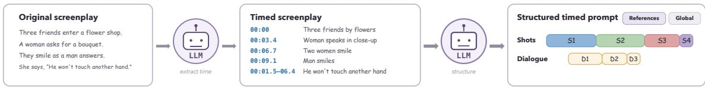  
(b)Text-encoded timing leads to temporal drift; TCR follows the requested timeline.

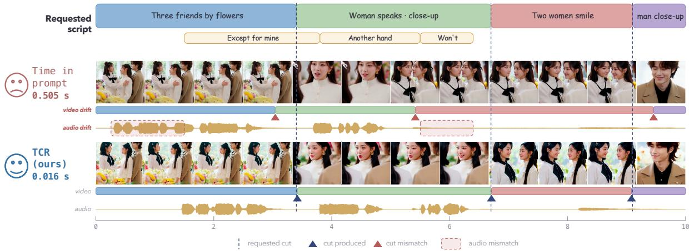  
Figure 1: (a) An LLM converts an original screenplay into a structured prompt that organizes references, global context, shots, and dialogue together with their precise timing. (b) When script timing is encoded only in text, the generated cuts and speech fail to follow the requested timeline (red), whereas TCR follows the requested shot and dialogue timing more closely. Shot Boundary MAE is measured in seconds; lower is better.

Realizing this control poses three challenges. First, shot and dialogue prompts may occupy distinct, partially overlapping time spans and must therefore remain independently controllable. A dialogue prompt may, for example, remain active across a shot boundary. Consequently, the two prompt types cannot be forced to share a single temporal segmentation. Second, learning this control requires finegrained annotations of both shot boundaries and dialogue spans, whereas the initial annotations provide only coarse timing. Third, improving temporal accuracy must preserve the visual quality and audiovisual synchronization of the underlying joint generator. Together, these challenges motivate two complementary components: TCR for independent temporal control while preserving visual quality and audio-visual synchronization, and a coarse-to-fine data construction pipeline for refined temporal supervision.

TCR realizes our central insight by mapping each prompt’s specified timing onto the shared temporal axis of video and audio generation and routing its guidance to the corresponding positions in both modalities. It computes a duration-normalized routing score over temporal positions for each prompt and adds it as a bias to the video-text and audio-text cross-attention logits during both training and inference. This per-prompt additive design enables independent control of overlapping shot and dialogue prompts without modifying the original text, query, or key representations, helping preserve the visual quality and audio-visual synchronization of the underlying generator. To provide the fine-grained supervision required by TCR, we further develop a coarse-to-fine data construction pipeline that builds multi-shot clips with dialogue spanning shot transitions. Gemini supplies semantic annotations and coarse timing under our predefined script schema, which are subsequently refined using detected visual cuts and word-level speech alignment. The final shot and dialogue annotations are rounded to a 0.1 s grid.

We evaluate TCR on a test set of 200 scripts in two complementary settings: an end-to-end comparison with existing open-source joint generators and a controlled comparison with alternative temporal operators implemented on the same backbone. In the end-to-end comparison, TCR achieves the lowest shot-boundary error and the highest dialogue-timing accuracy among all evaluated systems. Compared with the strongest open-source baseline, it reduces Shot Boundary MAE by 96%, from 1.11 s to 0.042 s, and increases Dialogue Acc@0.5 s from 28.3% to 84.1%, while maintaining competitive visual quality and audio-visual synchronization. In the controlled comparison, where only the temporal operator is varied, TCR reduces Shot Boundary MAE by more than 60% relative to each of the two temporal baselines and again achieves the highest Dialogue Acc@0.5 s. An ablation using coarse instead of refined timing annotations substantially degrades both shot and dialogue accuracy, confirming the importance of the data construction pipeline. A user study further shows that TCR is preferred on all five evaluated dimensions: shot timing, dialogue timing, script fidelity, audio-visual synchronization, and overall quality.

Our main contributions are summarized as follows:

• We identify a temporal gap in script-driven generation: video and audio may remain mutually synchronized yet fail to follow the script timeline. Our key insight is to extend their temporal alignment to the structured script, making each prompt’s specified timing an explicit control signal for both modalities.

• We introduce Temporal Context Routing (TCR), which maps script timing onto the shared videoaudio temporal axis and independently routes each prompt’s guidance. We also develop a coarse-to-fine pipeline that builds multi-shot clips, uses Gemini under our predefined schema for semantic annotations and coarse timing, and refines shot and dialogue timing on a 0.1 s grid.

• We evaluate TCR on 200 test scripts. Compared with the strongest open-source baseline, TCR reduces Shot Boundary MAE by 96%, from 1.11 s to 0.042 s, and raises Dialogue Acc@0.5s from 28.3% to 84.1%, while maintaining competitive visual quality and audio-visual synchronization. A user study further shows that TCR is preferred across all five evaluated dimensions.

## 2 Related Work

Joint audio-visual generation. Joint audio-visual generators build on diffusion models (Ho et al., 2020), diffusion transformers (Peebles & Xie, 2023), and flow matching (Lipman et al., 2023), with applications spanning multimodal and controllable video generation (Zhou et al., 2026a; Wang et al., 2026a;b). MM-Diffusion couples modality-specific denoisers through cross-modal attention (Ruan et al., 2023), while later approaches adapt pretrained models or align cross-modal features (Ishii et al., 2025; Haji-Ali et al., 2025). AV-DiT shares a lightly adapted DiT backbone across modalities (Wang et al., 2024). JavisDiT and JavisDiT++ introduce hierarchical spatio-temporal priors and unified optimization, respectively (Liu et al., 2026a;b); Harmony combines cross-task training with synchronization-aware guidance (Hu et al., 2026); and UniAVGen uses asymmetric, temporally aligned interactions (Zhang et al., 2026a). Other work explores synchronized conditional generation, native alignment, and asynchronous streams (Song et al., 2026a; Wang et al., 2026c; Yariv et al., 2024; Ji et al., 2026; Li et al., 2026a). VideoPoet unifies multimodal tasks autoregressively (Kondratyuk et al., 2024), whereas LTX-2 uses interacting modality streams (HaCohen et al., 2026). These methods align audio and video with each other. Our work additionally aligns both modalities with the timing specified by a structured script, allowing each shot and dialogue prompt to control its designated time span.

Structured and local prompting. Beyond a monolithic prompt, methods use local or structured video conditions. Presto associates latent segments with subcaptions through segmented cross-attention (Yan et al., 2025), while ShotAdapter uses transition tokens and local attention masks for shot-specific control (Kara et al., 2025). MultiShotMaster combines shot-aware rotary encodings with automatic annotation for multishot generation (Wang et al., 2025a). KeyVID and Audio-Sync Video Generation provide keyframe-aware and multi-stream temporal control for audio-synchronized visual generation (Wang et al., 2025b; Weng et al., 2025). MTSS factorizes an audio-visual description into grounded Reference, Shot, Event, and Global streams (Tencent Hunyuan Team, 2026). MTSS reconnects these streams through explicit identity and temporal links across the script. Video-focused methods ground local prompts only in the visual stream, whereas MTSS provides explicit temporal links without a mechanism that routes prompt timing through both video and audio conditioning pathways. Building on the MTSS schema, we align each prompt’s specified timing with the temporal coordinates of both video and audio, allowing shot and dialogue prompts to remain independently controllable.

Approaches to temporal control. Temporal conditioning methods differ in where timing enters the pathway. Access-based methods use masks to expose prompt tokens only within designated temporal regions (Yan et al., 2025; Kara et al., 2025). Representation-based methods encode temporal structure in query–key interactions through RoPE variants (Su et al., 2021; Wu et al., 2025b; Wang et al., 2025a; Shu et al., 2026). For joint audio-visual synchronization, Cross-Modal Context Learning combines aligned RoPE with dynamic context routing (Ma et al., 2026). Related approaches align modality streams through unified modeling, joint denoising, or synchronization features (Liu et al., 2026b; Wu et al., 2025a; Song et al., 2026b), without aligning prompt-specific script timing with both streams. Score-based methods steer attention, latent states, queries, or logits toward target regions, often at inference time (Cai et al., 2025; Schiber et al., 2026; Xu et al., 2026; Zhang et al., 2026b; Chen et al., 2026). Related multimodal methods add conditioning for joint audio-video or video-to-audio generation (Li et al., 2026c; Yang et al., 2026). Gaussian logit priors have modeled attention locality (Yang et al., 2018; Guo et al., 2019; Kim et al., 2023). TCR instead computes prompt-specific, duration-normalized routing scores from the time spans and applies them to video-text and audio-text cross-attention during training and inference, allowing overlapping shot and dialogue prompts to control both modalities independently.

## 3 Method

Given a structured script, our goal is to align the timing assigned to each shot and dialogue prompt with the temporal coordinates used for video and audio generation. As illustrated in Figure 2, each prompt’s timing is represented separately from its text encoding, and Temporal Context Routing (TCR) converts this timing into a duration-normalized routing score that is added to the video–text and audio–text cross-attention logits. This per-prompt construction allows shot and dialogue prompts to guide both modalities according to their own timing. We first formalize the task and structured script representation, and then describe the routing mechanism and the coarse-to-fine data construction pipeline used to obtain temporal supervision.

## 3.1 Task Formulation and Backbone

Let a structured script S specify the content and timing of each shot and dialogue prompt for a clip of duration T. After tokenization, the jth text token inherits its parent prompt’s interval $I _ { j } = \mathbf { \bar { [ } } s _ { j } , e _ { j } ] \subseteq [ \bar { 0 } , T ]$ For modality $m \in \{ v , a \}$ , let $\mathbf { q } _ { i } ^ { m }$ denote a latent query at temporal coordinate $t _ { i } ^ { m }$ . Our goal is to generate synchronized video $x ^ { v }$ and audio $x ^ { a }$ that follow both the content and timing of S.

We build TCR on LTX-2.3, a 22B-parameter joint audio-video generator whose video and audio towers exchange information through audio–video cross-attention and are conditioned on the shared script through separate text cross-attention modules. TCR modifies only the video–text and audio–text crossattention modules, aligning script timing with the temporal coordinates of both modalities while leaving modality-specific self-attention and audio–video cross-attention unchanged.

## 3.2 Structured Script Representation

We condition the model on a structured script adapted from MTSS (Tencent Hunyuan Team, 2026). It comprises four prompt types: Reference identifies recurring people, scenes, and objects; Shot describes shot content and camera attributes; Event describes temporally localized audio events, with our experiments focusing on spoken dialogue; and Global provides clip-wide context. We retain only fields used to condition generation and omit the Subtitle stream so that transcriptions of burned-in text do not condition the model. Each prompt is assigned timing for routing: Shot and dialogue Event prompts use their script-specified intervals, Global covers [0, T], and Reference timing is compiled from the shots in which the corresponding entity appears. The complete schema and compilation rules are provided in Appendix H.

Timing extraction and token alignment. During serialization, we extract each time\_range field from the structured script and omit it from the textual input. We then tokenize the remaining script and use character-to-token offsets to compile the extracted timing into a token-level map, assigning each token the interval of its parent prompt. TCR consumes this map alongside the shared text representation to compute its routing scores. Appendix H details the handling of repeated identifiers and tokens not associated with a specific prompt.

## 3.3 Temporal Context Routing

For the interval $I _ { j } = \left[ s _ { j } , e _ { j } \right]$ assigned to token $j ,$ we define its center and radius as

$$
c _ { j } = \frac { s _ { j } + e _ { j } } { 2 } , \qquad r _ { j } = \operatorname* { m a x } \left( \frac { e _ { j } - s _ { j } } { 2 } , \epsilon \right) ,\tag{1}
$$

where $\epsilon = 1 0 ^ { - 4 }$ seconds handles degenerate intervals. For a modality $m \in \{ v , a \}$ and a latent query at temporal coordinate $t _ { i } ^ { m } .$ , TCR defines the routing score

$$
B _ { i j } ^ { m } = - \beta \frac { ( t _ { i } ^ { m } - c _ { j } ) ^ { 2 } } { 2 r _ { j } ^ { 2 } } .\tag{2}
$$

Tokens without an associated prompt interval receive $B _ { i j } ^ { m } = 0 .$

Let $\mathbf { h } _ { j }$ denote the shared text representation of token j. The text cross-attention module for modality m

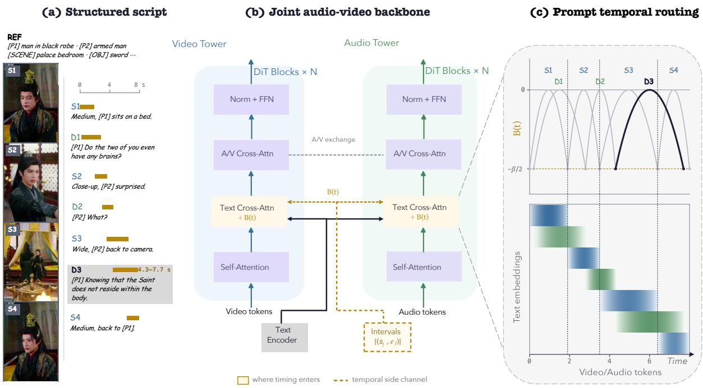  
Figure 2: Overview of Temporal Context Routing (TCR). (a) A structured script organizes reference, Shot, and dialogue prompts together with their timing. (b) The shared text encoding conditions the video and audio towers, while prompt timing bypasses the text encoder and is supplied separately as $B ( t )$ to both text cross-attention modules. (c) Prompt temporal routing converts each prompt’s timing into a duration-normalized routing profile that peaks at its center and reaches $- \beta / 2$ at its boundaries. The resulting profiles route Shot (blue) and dialogue (green) guidance along the video-audio timeline.

projects it to $\mathbf { k } _ { j } ^ { m } = \mathbf { W } _ { K } ^ { m } \mathbf { h } _ { j }$ . We then modify the cross-attention logit as

$$
L _ { i j } ^ { m } = \underbrace { \frac { ( \mathbf { q } _ { i } ^ { m } ) ^ { \top } \mathbf { k } _ { j } ^ { m } } { \sqrt { d _ { m } } } } _ { \mathrm { s e m a n t i c s c o r e } } + \underbrace { B _ { i j } ^ { m } } _ { \mathrm { r o u t i n g ~ s c o r e } } + M _ { j } ,\tag{3}
$$

where $d _ { m }$ is the attention-head dimension and $M _ { j }$ is the additive padding mask, with $M _ { j } = 0$ for unmasked text tokens and $M _ { j } = - \infty$ for padding tokens.

Additive temporal routing. For an unmasked text token, let $S _ { i j } ^ { m } = ( \mathbf { q } _ { i } ^ { m } ) ^ { \top } \mathbf { k } _ { j } ^ { m } / \sqrt { d _ { m } }$ . Its unnormalized attention weight factorizes as

$$
\begin{array} { r } { \mathbf { e x p } ( S _ { i j } ^ { m } + B _ { i j } ^ { m } ) = \mathbf { e x p } ( S _ { i j } ^ { m } ) \mathbf { e x p } ( B _ { i j } ^ { m } ) . } \end{array}\tag{4}
$$

Thus, TCR multiplicatively reweights the unnormalized attention induced by the semantic score without modifying the text, query, or key representations. For a nondegenerate interval, the routing score is 0 at its center, $- \beta / 2$ at either endpoint, and decreases smoothly with normalized temporal distance. Normalization by $r _ { j }$ gives intervals of different durations the same relative routing profile. We use $\beta = 5$ throughout, yielding an endpoint score of −2.5; Appendix F discusses this choice.

Independent routing across modalities. We evaluate Equation 2 separately at the video and audio temporal coordinates. Although the two modalities use different latent grids, both are expressed in seconds relative to the same clip timeline. Computing a separate routing score for every prompt and temporal position allows each shot or dialogue prompt to retain its assigned timing independently of the boundaries of other prompts. We apply TCR during both LoRA adaptation and inference. Because TCR introduces no learnable parameters, we optimize only the LoRA adapters (Hu et al., 2022) under the original joint flow-matching objective.

## 3.4 Coarse-to-Fine Data Construction

Fine-grained temporal control requires multi-shot training clips with accurate shot and dialogue timing.   
We construct such examples in three stages, as illustrated in Figure 3.

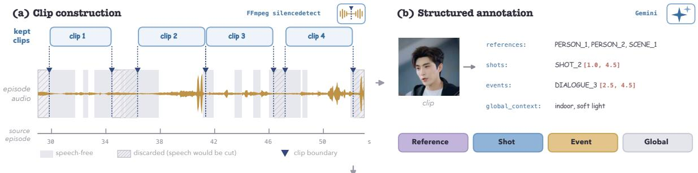  
(c) Temporal refinement

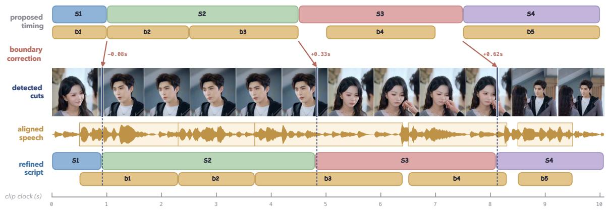  
Figure 3: Coarse-to-fine data construction. (a) Clip boundaries are selected within speech-free regions while internal shot transitions are preserved. (b) Gemini converts each clip into Reference, Shot, Event, and Global prompts with coarse shot and dialogue timing. (c) PySceneDetect corrects shot boundaries and WhisperX aligns dialogue to speech, producing refined temporal supervision on a 0.1 s grid.

Clip construction. We combine speech-band silence detection with visual shot segmentation to place clip boundaries within speech-free regions while preserving shot transitions inside each clip. The resulting clips contain multiple shots and retain dialogue that spans shot transitions, providing the temporal structure needed for script-driven generation.

Coarse script annotation. Gemini (Gemini Team, 2026) annotates each clip according to our predefined script schema, generating Reference, Shot, Event, and Global prompts together with coarse timestamps for Shot prompts and dialogue Events. Reference identifiers avoid repeated appearance descriptions, and dialogue is preserved in its original spoken language. We remove fields not used for conditioning, including transcriptions of burned-in subtitles.

Temporal refinement. We retain only scripts whose number of annotated Shot prompts matches that inferred by an independently applied shot detector. For each retained script, the detected cuts replace the coarse shot boundaries in temporal order, preserving their correspondence with the semantic descriptions of the Shot prompts. Thus, Gemini provides the script structure, while the detector supplies localized visual boundaries.

For dialogue, WhisperX (Bain et al., 2023) provides word-level speech timestamps. We match the annotated dialogue lines to the transcription in their original order and update each matched Event with the aligned transcript and its start and end times. Unmatched or empty Events are removed without discarding the rest of the script. Adjacent dialogue boundaries are adjusted to resolve timing conflicts without constraining them to shot boundaries. Finally, all refined shot and dialogue timestamps are rounded to a 0.1 s grid.

## 4 Experiments

## 4.1 Experimental Setup

Implementation details. Our coarse-to-fine pipeline yields 57,022 training examples from two shortdrama collections. We evaluate on 200 test scripts containing 640 Shot prompts and 441 dialogue prompts. No test script shares a source-media identifier or caption hash with the training set. All models receive the same shot and dialogue descriptions and target timing without first-frame conditioning. Each model generates one output at 704×1280 resolution and 24 fps for the requested duration. Metrics are averaged over the 200 outputs from each model.

Table 1: End-to-end comparison on 200 test scripts. Table 2 reports controlled comparisons using the same backbone and training setup.
<table><tr><td rowspan="3">Method</td><td colspan="2">Video quality</td><td colspan="4">Temporal accuracy</td><td colspan="3">Speech &amp; AV sync</td></tr><tr><td>IQ↑</td><td>AES↑</td><td>Shot B-MAE (s) ↓ IoU ↑</td><td>Shot</td><td>Shot Count Acc. (%) ↑</td><td>Acc@0.5s WER (%)↑</td><td>(%)↓</td><td>Sync-C ↑</td><td>Off. Acc (%) ↑</td></tr><tr><td>Wan2.2</td><td>0.6820</td><td>0.5150</td><td>2.31</td><td>0.422</td><td>9.0</td><td></td><td></td><td></td><td></td></tr><tr><td>OVI</td><td>0.6640</td><td>0.5602</td><td>1.84</td><td>0.457</td><td>17.0</td><td>8.6</td><td>56.9</td><td>2.37</td><td>17.2</td></tr><tr><td>JoyAI-Echo</td><td>0.6680</td><td>0.5167</td><td>1.81</td><td>0.464</td><td>15.5</td><td>23.2</td><td>11.9</td><td>2.71</td><td>7.3</td></tr><tr><td>LTX-2.3</td><td>0.6819</td><td>0.5354</td><td>1.11</td><td>0.532</td><td>36.0</td><td>28.3</td><td>14.0</td><td>2.55</td><td>31.2</td></tr><tr><td>TCR (ours)</td><td>0.7032</td><td>0.5477</td><td>0.042</td><td>0.957</td><td>93.0</td><td>84.1</td><td>8.48</td><td>2.78</td><td>30.5</td></tr></table>

Baselines. We compare TCR with Wan2.2 (Team Wan et al., 2025), OVI (Low et al., 2025), JoyAI-Echo (Li et al., 2026b), and LTX-2.3 (HaCohen et al., 2026). Wan2.2 generates video only, whereas the remaining models jointly generate video and audio. The baselines serialize shot and dialogue timing as part of the script text. For TCR, these timing fields are removed before text encoding and supplied separately through the timing map in Section 3.2.

Metrics. Visual quality is measured using the Imaging Quality (IQ) and Aesthetic Quality (AES) dimensions of VBench (Huang et al., 2024). Temporal accuracy is measured using Shot Boundary MAE, Shot IoU, exact shot-count accuracy, and Dialogue Acc@0.5s. We further report WER using Whisper-large-v3 (Radford et al., 2023) and audio-visual synchronization using SyncNet Sync-C and offset accuracy (Chung & Zisserman, 2016). Metric definitions and matching procedures are provided in Appendix E.

## 4.2 Main Results

Quantitative comparison. As shown in Table 1, TCR achieves the most accurate shot and dialogue timing among the evaluated models. Relative to the strongest baseline on each temporal metric, it reduces Shot Boundary MAE by 96%, from 1.11 s to 0.042 s, and increases Shot IoU from 0.532 to 0.957. Exact shot-count accuracy similarly rises from 36.0% to 93.0%, while Dialogue Acc@0.5s increases from 28.3% to 84.1%. Beyond temporal accuracy, TCR achieves the highest IQ and Sync-C and the lowest WER, while remaining competitive on the other quality and synchronization metrics.

Qualitative comparison. Figure 4 compares the generated outputs for a script containing four Shot prompts and four dialogue Events. The video lanes display generated frames and detected shot transitions, while the audio lanes place speech-energy traces against the requested dialogue timing. TCR produces all three requested shot transitions close to their target times and follows the specified four-shot structure. In contrast, each baseline misses or delays at least one transition. For the audio-generating models, the speech-energy traces further reveal discrepancies from the requested dialogue timing. The visualization thus provides a direct view of the script-alignment errors captured by the temporal metrics in Table 1.

Human evaluation. We further conduct a blinded pairwise study comparing TCR with LTX-2.3 and JoyAI-Echo on 16 randomly sampled cases, with eight cases per comparator. Twenty-eight participants evaluate shot timing, dialogue timing, script fidelity, audio-visual synchronization, and overall preference, with ties explicitly allowed. The complete protocol and interface are provided in Appendix D. As shown in Figure 5, TCR is preferred over both comparators across all five dimensions. With ties included in the denominator, TCR receives 72.3% of the overall-preference votes against LTX-2.3 and 83.9% against JoyAI-Echo. These results indicate that the gains in temporal accuracy are also reflected in perceived script execution.

## 4.3 Ablation Studies and Analysis

To isolate the effect of the temporal operator, we compare TCR with matched joint audio-video implementations of Gaussian Interval RoPE and a hard interval mask, using the same backbone, timing map, refined training data, and optimization settings. We include Intervals as text, which retains timing in the serialized script without an attention-level operator, as an auxiliary reference rather than a matched operator. We separately ablate temporal refinement and prompt assignment across the video and audio branches. Table 2 summarizes the results. Operator and training details are provided in Appendices A

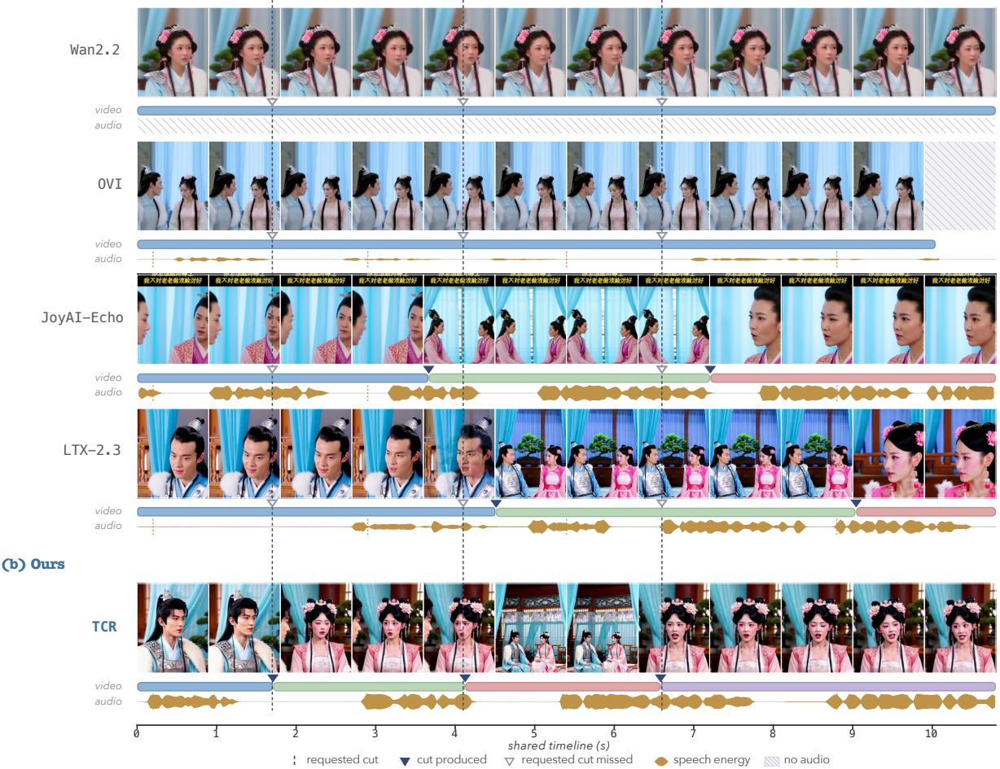  
Figure 4: Qualitative comparison on a four-shot script. The requested Shot and dialogue timing is shown at the top. (a) Each baseline misses or delays at least one of the three requested shot transitions; Wan2.2 generates no audio. (b) TCR produces all three cuts near their requested times and follows the specified four-shot structure. Speech-energy traces show dialogue activity on the same timeline.  
Side-by-side human evaluation

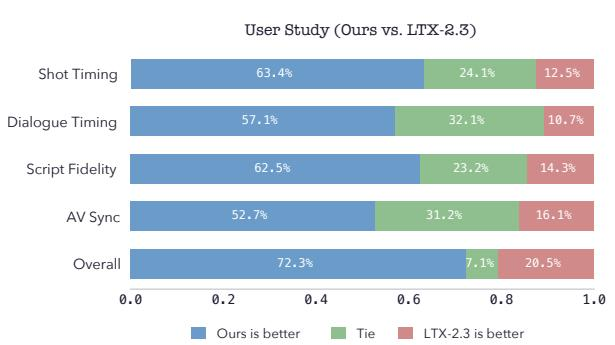

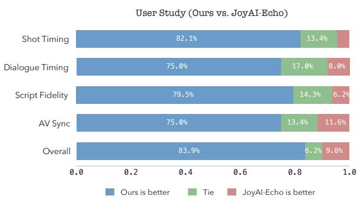  
Figure 5: Pairwise human evaluation. Tie-inclusive vote shares for TCR against LTX-2.3 (left) and JoyAI-Echo (right) across five dimensions, based on 16 randomly sampled cases and 28 participants.

## and G.

Temporal operators. Among the three matched temporal operators, TCR performs best on every shottiming metric. It reduces Shot Boundary MAE by more than 60% relative to both Gaussian Interval RoPE and the hard mask, reaching 0.042 s, while increasing Shot IoU to 0.957 and exact shot-count accuracy to 93.0%. TCR also achieves the highest Dialogue Acc@0.5s at 84.1%, compared with 83.7% for the hard mask and 82.8% for Gaussian Interval RoPE. Checkpoint-level results are provided in Appendix B.

Table 2: Controlled comparison of temporal operators and TCR ablations. All rows except Intervals as text use the shared training recipe. Bold/underline: best/second among these matched rows.
<table><tr><td rowspan="2"></td><td>Video quality</td><td colspan="4">Temporal accuracy</td><td colspan="3">Speech &amp; AV sync</td></tr><tr><td>IQ↑ AES↑</td><td>Shot B-MAE (s) ↓ IoU ↑</td><td>Shot</td><td>Shot Count Acc. (%) ↑</td><td>Acc@0.5s WER</td><td>(%) ↑ (%) ↓</td><td>Sync-C ↑</td><td>Off. Acc (%) ↑</td></tr><tr><td>Auxiliary reference Intervals as text</td><td>0.7010 0.5548</td><td>0.601</td><td>0.629</td><td>83.0</td><td>43.8</td><td>9.38</td><td>2.86</td><td>33.7</td></tr><tr><td>Matched temporal operators</td><td></td><td></td><td></td><td></td><td></td><td></td><td></td><td></td></tr><tr><td>Gaussian Interval RoPE</td><td>0.6931 0.5450</td><td>0.113</td><td>0.915</td><td>92.0</td><td>82.8</td><td>10.64</td><td>2.67</td><td>24.5</td></tr><tr><td>Hard interval mask</td><td>0.7005 0.5510</td><td>0.108</td><td>0.902</td><td>92.0</td><td>83.7</td><td>9.32</td><td>2.71</td><td>26.0</td></tr><tr><td>TCR</td><td>0.7032 0.5477</td><td>0.042</td><td>0.957</td><td>93.0</td><td>84.1</td><td>8.48</td><td>2.78</td><td>30.5</td></tr><tr><td>TCR ablations</td><td></td><td></td><td></td><td></td><td></td><td></td><td></td><td></td></tr><tr><td>w/ separate A/V prompts 0.7067 0.5548</td><td></td><td>0.047</td><td>0.953</td><td>91.5</td><td>82.1</td><td>8.86</td><td>2.71</td><td>29.3</td></tr><tr><td>w/o refinement</td><td>0.7086 0.5460</td><td>0.375</td><td>0.715</td><td>83.0</td><td>37.6</td><td>9.22</td><td>2.67</td><td>30.4</td></tr></table>

Temporal supervision. Training with coarse rather than refined annotations substantially degrades temporal control. Shot Boundary MAE increases from 0.042 s to 0.375 s, while Dialogue Acc@0.5s decreases from 84.1% to 37.6%. IQ and AES remain comparable, indicating that the degradation primarily affects temporal accuracy. These results demonstrate the importance of the fine-grained supervision produced by our data construction pipeline.

Prompt sharing. The Separate A/V prompts variant provides Shot prompts only to the video branch and dialogue prompts only to the audio branch. Although its shot timing remains close to that of TCR, its Dialogue Acc@0.5s, WER, Sync-C, and offset accuracy all degrade. Providing both prompt types to both branches therefore better supports joint temporal control and audio-visual coordination.

Quality and synchronization. IQ and AES vary by less than 2.5% in relative terms across the matched operators and ablations. Among the matched temporal operators, TCR also achieves the lowest WER and the highest Sync-C and offset accuracy. Its gains in temporal control therefore do not come at the expense of visual quality or audio-visual synchronization.

## 5 Conclusion

This work addresses the missing temporal alignment between structured scripts and joint audio-video generation. Although existing generators align video and audio on a shared temporal axis, the shot and dialogue timing explicitly specified by a script is represented only implicitly in text conditioning. Consequently, the two modalities may remain synchronized with each other while jointly deviating from the script timeline. We introduce Temporal Context Routing (TCR), which maps script-specified timing onto the shared video-audio temporal axis and routes each prompt’s guidance to the corresponding positions in both modalities. We further develop a coarse-to-fine data construction pipeline that provides accurate shot and dialogue timing for temporal supervision. On 200 test scripts, TCR reduces Shot Boundary MAE by 96%, from 1.11 s to 0.042 s, and raises Dialogue Acc@0.5s from 28.3% to 84.1% compared with the strongest baseline, while maintaining competitive visual quality and audio-visual synchronization. Controlled comparisons and ablations further demonstrate the effectiveness of temporal routing and the importance of refined supervision, while a user study shows that TCR is preferred on all five evaluated dimensions. Overall, these results show that extending temporal alignment to the structured script enables more accurate script-driven generation without compromising the visual quality or audio-visual synchronization of the underlying joint generator.

## References

Max Bain, Jaesung Huh, Tengda Han, and Andrew Zisserman. WhisperX: Time-accurate speech transcription of long-form audio. In Interspeech, 2023. URL https://arxiv.org/abs/2303.00747.

Minghong Cai, Xiaodong Cun, Xiaoyu Li, Wenze Liu, Zhaoyang Zhang, Yong Zhang, Ying Shan, and Xiangyu Yue. DiTCtrl: Exploring attention control in multi-modal diffusion transformer for tuning-free

multi-prompt longer video generation. In Proceedings of the IEEE/CVF Conference on Computer Vision and Pattern Recognition, pp. 7763–7772, 2025.

Gordon Chen, Ziqi Huang, and Ziwei Liu. Prompt relay: Inference-time temporal control for multievent video generation. arXiv preprint arXiv:2604.10030, 2026. doi: 10.48550/arXiv.2604.10030. URL https://arxiv.org/abs/2604.10030.

Joon Son Chung and Andrew Zisserman. Out of time: automated lip sync in the wild. In ACCV Workshops, 2016.

Gemini Team. Gemini 3.1 Pro model card. Technical report, Google DeepMind, February 2026. URL https://deepmind.google/models/model-cards/gemini-3-1-pro/.

Maosheng Guo, Yu Zhang, and Ting Liu. Gaussian transformer: A lightweight approach for natural language inference. In Proceedings of the AAAI Conference on Artificial Intelligence, volume 33, pp. 6489–6496, 2019. doi: 10.1609/aaai.v33i01.33016489.

Yoav HaCohen, Benny Brazowski, Nisan Chiprut, Yaki Bitterman, Andrew Kvochko, Avishai Berkowitz, Daniel Shalem, Daphna Lifschitz, Dudu Moshe, Eitan Porat, Eitan Richardson, Guy Shiran, Itay Chachy, Jonathan Chetboun, Michael Finkelson, Michael Kupchick, Nir Zabari, Nitzan Guetta, Noa Kotler, Ofir Bibi, Ori Gordon, Poriya Panet, Roi Benita, Shahar Armon, Victor Kulikov, Yaron Inger, Yonatan Shiftan, Zeev Melumian, and Zeev Farbman. LTX-2: Efficient joint audio-visual foundation model. arXiv preprint arXiv:2601.03233, 2026. doi: 10.48550/arXiv.2601.03233. URL https://arxiv.org/abs/2601.03233.

Moayed Haji-Ali, Willi Menapace, Aliaksandr Siarohin, Ivan Skorokhodov, Alper Canberk, Kwot Sin Lee, Vicente Ordonez, and Sergey Tulyakov. AV-Link: Temporally-aligned diffusion features for cross-modal audio-video generation. In Proceedings of the IEEE/CVF International Conference on Computer Vision (ICCV), pp. 19373–19385, October 2025. URL https://openaccess.thecvf.com/content/ICCV2025/html/Haji-Ali\_AV-Link\_Temporally-Aligned\_ Diffusion\_Features\_for\_Cross-Modal\_Audio-Video\_Generation\_ICCV\_2025\_paper.html.

Jonathan Ho, Ajay Jain, and Pieter Abbeel. Denoising diffusion probabilistic models. In Advances in Neural Information Processing Systems, 2020.

Edward J. Hu, Yelong Shen, Phillip Wallis, Zeyuan Allen-Zhu, Yuanzhi Li, Shean Wang, Lu Wang, and Weizhu Chen. LoRA: Low-rank adaptation of large language models. In International Conference on Learning Representations, 2022. URL https://openreview.net/forum?id=nZeVKeeFYf9.

Teng Hu, Zhentao Yu, Guozhen Zhang, Zihan Su, Zhengguang Zhou, Youliang Zhang, Yuan Zhou, Qinglin Lu, and Ran Yi. Harmony: Harmonizing audio and video generation through cross-task synergy. In Proceedings of the IEEE/CVF Conference on Computer Vision and Pattern Recognition (CVPR), pp. 16085–16095, June 2026. URL https://openaccess.thecvf.com/content/CVPR2026/html/Hu\_Harmony\_ Harmonizing\_Audio\_and\_Video\_Generation\_through\_Cross-Task\_Synergy\_CVPR\_2026\_paper.html.

Ziqi Huang, Yinan He, Jiashuo Yu, Fan Zhang, Chenyang Si, Yuming Jiang, Yuanhan Zhang, Tianxing Wu, Qingyang Jin, Nattapol Chanpaisit, Yaohui Wang, Xinyuan Chen, Limin Wang, Dahua Lin, Yu Qiao, and Ziwei Liu. VBench: Comprehensive benchmark suite for video generative models. In Proceedings of the IEEE/CVF Conference on Computer Vision and Pattern Recognition, pp. 21807–21818, 2024.

Masato Ishii, Akio Hayakawa, Takashi Shibuya, and Yuki Mitsufuji. A simple but strong baseline for sounding video generation: Effective adaptation of audio and video diffusion models for joint generation. In 2025 International Joint Conference on Neural Networks (IJCNN), pp. 1–9, 2025. doi: 10.1109/IJCNN64981.2025.11228639. URL https://doi.org/10.1109/IJCNN64981.2025.11228639.

Longbin Ji, Guan Wang, Xuan Wei, Chenye Yang, Xiangrui Liu, Zhenyu Zhang, Shuohuan Wang, Yu Sun, and Jingzhou He. Native audio-visual alignment for generation. arXiv preprint arXiv:2605.30073, 2026. URL https://arxiv.org/abs/2605.30073.

Ozgur Kara, Krishna Kumar Singh, Feng Liu, Duygu Ceylan, James M. Rehg, and Tobias Hinz. Shotadapter: Text-to-multi-shot video generation with diffusion models. In Proceedings ofthe IEEE/CVF Conference on Computer Vision and Pattern Recognition, 2025. URL https://arxiv.org/abs/2505.07652.

Bum Jun Kim, Hyeyeon Choi, Hyeonah Jang, and Sang Woo Kim. Understanding gaussian attention bias of vision transformers using effective receptive fields. In British Machine Vision Conference, 2023. URL https://papers.bmvc2023.org/0214.pdf.

Dan Kondratyuk, Lijun Yu, Xiuye Gu, José Lezama, Jonathan Huang, Rachel Hornung, Hartwig Adam, Hassan Akbari, et al. VideoPoet: A large language model for zero-shot video generation. In Proceedings of the 41st International Conference on Machine Learning, volume 235 of Proceedings of Machine Learning Research, 2024.

Chunyu Li, Jiaye Li, Ruiqiao Mei, Haoyuan Xia, Hao Zhu, Jingdong Wang, and Siyu Zhu. Hallo-Live: Real-time streaming joint audio-video avatar generation with asynchronous dual-stream and humancentric preference distillation. arXiv preprint arXiv:2604.23632, 2026a. URL https://arxiv.org/abs/ 2604.23632.

Haoran Li, Jie Huang, Fredreic Li, Shichen Ma, Yijun Liu, Jiaqi Shi, and Yanwen Ma. JoyAI-Echo: Pushing the frontier of long audio-visual generation, 2026b. URL https://github.com/jd-opensource/ JoyAI-Echo/tree/echo1.0.

Liyang Li, Wen Wang, Canyu Zhao, Tianjian Feng, Zhiyue Zhao, Hao Chen, and Chunhua Shen. MM-Control: Unified multi-modal control for joint audio-video generation. arXiv preprint arXiv:2604.19679, 2026c. URL https://arxiv.org/abs/2604.19679.

Yaron Lipman, Ricky T. Q. Chen, Heli Ben-Hamu, Maximilian Nickel, and Matt Le. Flow matching for generative modeling. In International Conference on Learning Representations, 2023. URL https: //openreview.net/forum?id=PqvMRDCJT9t.

Kai Liu, Wei Li, Lai Chen, Shengqiong Wu, Yanhao Zheng, Jiayi Ji, Fan Zhou, Jiebo Luo, Ziwei Liu, Hao Fei, and Tat-Seng Chua. JavisDiT: Joint audio-video diffusion transformer with hierarchical spatiotemporal prior synchronization. In The Fourteenth International Conference on Learning Representations, 2026a. URL https://openreview.net/forum?id=y7HV7KT3Bd.

Kai Liu, Yanhao Zheng, Kai Wang, Shengqiong Wu, Rongjunchen Zhang, Jiebo Luo, Dimitrios Hatzinakos, Ziwei Liu, Hao Fei, and Tat-Seng Chua. JavisDiT++: Unified modeling and optimization for joint audio-video generation. In The Fourteenth International Conference on Learning Representations, 2026b. URL https://openreview.net/forum?id=hRRWfFpKRp.

Chetwin Low, Weimin Wang, and Calder Katyal. Ovi: Twin backbone cross-modal fusion for audiovideo generation. arXiv preprint arXiv:2510.01284, 2025. doi: 10.48550/arXiv.2510.01284. URL https: //arxiv.org/abs/2510.01284.

Bingqi Ma, Linlong Lang, Ming Zhang, Dailan He, Xingtong Ge, Yi Zhang, Guanglu Song, and Yu Liu. Improving joint audio-video generation with cross-modal context learning. arXiv preprint arXiv:2603.18600, 2026. doi: 10.48550/arXiv.2603.18600. URL https://arxiv.org/abs/2603.18600.

William Peebles and Saining Xie. Scalable diffusion models with transformers. In Proceedings of the IEEE/CVF International Conference on Computer Vision, pp. 4195–4205, 2023.

Alec Radford, Jong Wook Kim, Tao Xu, Greg Brockman, Christine McLeavey, and Ilya Sutskever. Robust speech recognition via large-scale weak supervision. In International Conference on Machine Learning (ICML), 2023.

Ludan Ruan, Yiyang Ma, Huan Yang, Huiguo He, Bei Liu, Jianlong Fu, Nicholas Jing Yuan, Qin Jin, and Baining Guo. MM-Diffusion: Learning multi-modal diffusion models for joint audio and video generation. In Proceedings of the IEEE/CVF Conference on Computer Vision and Pattern Recognition, pp. 10219– 10228, 2023. URL https://openaccess.thecvf.com/content/CVPR2023/html/Ruan\_MM-Diffusion\_ Learning\_Multi-Modal\_Diffusion\_Models\_for\_Joint\_Audio\_and\_Video\_CVPR\_2023\_paper.html.

Shira Schiber, Ofir Lindenbaum, and Idan Schwartz. Tempocontrol: Temporal attention guidance for text-to-video models. In Proceedings of the IEEE/CVF Conference on Computer Vision and Pattern Recognition (CVPR), pp. 36670–36679, June 2026. URL https: //openaccess.thecvf.com/content/CVPR2026/html/Schiber\_TempoControl\_Temporal\_Attention\_ Guidance\_for\_Text-to-Video\_Models\_CVPR\_2026\_paper.html.

Zhilei Shu, Shangwen Zhu, Zihang Liang, Xiaofan Li, Qianyu Peng, Xinyu Cui, Bo Ye, Yiming Li, Fan Cheng, Jian Zhao, Yang Cao, Zheng-Jun Zha, and Ruili Feng. TIE: Time interval encoding for video generation over events. arXiv preprint arXiv:2605.10543, 2026. doi: 10.48550/arXiv.2605.10543. URL https://arxiv.org/abs/2605.10543.

Jibin Song, Mingi Kwon, Jaeseok Jeong, and Youngjung Uh. Syncphony: Synchronized audio-to-video generation with diffusion transformers. In The Fourteenth International Conference on Learning Representations, 2026a. URL https://openreview.net/forum?id=sG8dGZMaub.

Quanyue Song, Zhizhi Guo, Yishan He, Zhihao Wang, Zhixiang He, Chi Zhang, Caigui Jiang, and Xuelong Li. SyncDIT: Audio-visual aligned video generation with audio synchronization feature. Vicinagearth, 3(1):5, 2026b. doi: 10.1007/s44336-026-00036-1. URL https://doi.org/10.1007/s44336-026-00036-1.

Jianlin Su, Yu Lu, Shengfeng Pan, Ahmed Murtadha, Bo Wen, and Yunfeng Liu. RoFormer: Enhanced transformer with rotary position embedding. arXiv preprint arXiv:2104.09864, 2021. doi: 10.48550/arXiv. 2104.09864. URL https://arxiv.org/abs/2104.09864.

Team Wan, Ang Wang, Baole Ai, Bin Wen, Chaojie Mao, Chen-Wei Xie, Di Chen, Feiwu Yu, et al. Wan: Open and advanced large-scale video generative models. arXiv preprint arXiv:2503.20314, 2025. doi: 10.48550/arXiv.2503.20314. URL https://arxiv.org/abs/2503.20314.

Tencent Hunyuan Team. Script-a-video: Deep structured audio-visual captions via factorized streams and relational grounding. arXiv preprint arXiv:2604.11244, 2026. doi: 10.48550/arXiv.2604.11244. URL https://arxiv.org/abs/2604.11244.

Haozhe Wang, Weijia Feng, Jinpeng Yu, Che Liu, Ping Nie, Fangzhen Lin, Jiaming Liu, Ruihua Huang, Jimmy Lin, Wenhu Chen, et al. Search beyond what can be taught: Evolving the knowledge boundary in agentic visual generation. arXiv preprint arXiv:2607.05382, 2026a.

Haozhe Wang, Cong Wei, Weiming Ren, Jiaming Liu, Fangzhen Lin, and Wenhu Chen. Rationalrewards: Reasoning rewards scale visual generation both training and test time. arXiv preprint arXiv:2604.11626, 2026b.

Kai Wang, Shijian Deng, Jing Shi, Dimitrios Hatzinakos, and Yapeng Tian. AV-DiT: Efficient audiovisual diffusion transformer for joint audio and video generation. In NeurIPS 2024 Workshop on Audio Imagination, 2024. URL https://openreview.net/forum?id=FE6zflN5G5.

Kai Wang, Tao Zhou, Jiayi Lei, Jing Wang, Jinman Zhao, Weiguo Pian, Yuan Cheng, Yapeng Tian, Peng Gao, Bin Fu, Yihao Liu, Dimitrios Hatzinakos, and Yuewen Cao. Hear what you see: Video-to-audio generation with diffusion transformer and semantic-temporal alignment-ranked direct preference optimization. In Proceedings of the IEEE/CVF Conference on Computer Vision and Pattern Recognition (CVPR), pp. 43396–43406, June 2026c. URL https://openaccess.thecvf.com/content/CVPR2026/papers/Wang\_Hear\_What\_You\_See\_ Video-to-Audio\_Generation\_with\_Diffusion\_Transformer\_and\_CVPR\_2026\_paper.pdf.

Qinghe Wang, Xiaoyu Shi, Baolu Li, Weikang Bian, Quande Liu, Huchuan Lu, Xintao Wang, Pengfei Wan, Kun Gai, and Xu Jia. Multishotmaster: A controllable multi-shot video generation framework. arXiv preprint arXiv:2512.03041, 2025a. doi: 10.48550/arXiv.2512.03041. URL https://arxiv.org/abs/2512. 03041.

Xingrui Wang, Jiang Liu, Ze Wang, Xiaodong Yu, Jialian Wu, Ximeng Sun, Yusheng Su, Alan Yuille, Zicheng Liu, and Emad Barsoum. KeyVID: Keyframe-aware video diffusion for audio-synchronized visual animation. arXiv preprint arXiv:2504.09656, 2025b. URL https://arxiv.org/abs/2504.09656.

Shuchen Weng, Haojie Zheng, Zheng Chang, Si Li, Boxin Shi, and Xinlong Wang. Audio-sync video generation with multi-stream temporal control. In Advances in Neural Information Processing Systems, volume 38, 2025. doi: 10.52202/085713-0433. URL https://proceedings.neurips.cc/paper\_files/ paper/2025/hash/133239b0506b84c802a12b0e5a764a17-Abstract-Conference.html.

Jianzong Wu, Hao Lian, Dachao Hao, Ye Tian, Qingyu Shi, Biaolong Chen, Hao Jiang, and Yunhai Tong. Does hearing help seeing? investigating audio-video joint denoising for video generation. arXiv preprint arXiv:2512.02457, 2025a. URL https://arxiv.org/abs/2512.02457.

Ziyi Wu, Aliaksandr Siarohin, Willi Menapace, Ivan Skorokhodov, Yuwei Fang, Varnith Chordia, Igor Gilitschenski, and Sergey Tulyakov. Mind the time: Temporally-controlled multi-event video generation. In Proceedings ofthe IEEE/CVF Conference on Computer Vision and Pattern Recognition, pp. 23989–24000, 2025b.

Qianxun Xu, Chenxi Song, Yujun Cai, and Chi Zhang. Switchcraft: Training-free multievent video generation with attention controls. In Proceedings of the IEEE/CVF Conference on Computer Vision and Pattern Recognition (CVPR), pp. 29136–29145, June 2026. URL https://openaccess.thecvf.com/content/CVPR2026/html/Xu\_SwitchCraft\_Training-Free\_ Multi-Event\_Video\_Generation\_with\_Attention\_Controls\_CVPR\_2026\_paper.html.

Xin Yan, Yuxuan Cai, Qiuyue Wang, Yuan Zhou, Wenhao Huang, and Huan Yang. Long video diffusion generation with segmented cross-attention and content-rich video data curation. In Proceedings of the IEEE/CVF Conference on Computer Vision and Pattern Recognition, 2025. URL https://arxiv.org/abs/ 2412.01316.

Baosong Yang, Zhaopeng Tu, Derek F. Wong, Fandong Meng, Lidia S. Chao, and Tong Zhang. Modeling localness for self-attention networks. In Proceedings ofthe 2018 Conference on Empirical Methods in Natural Language Processing, pp. 4449–4458, 2018. doi: 10.18653/v1/D18-1475.

Jianxuan Yang, Xinyue Guo, Zhi Cheng, Kai Wang, Lipan Zhang, Jinjie Hu, Qiang Ji, Yihua Cao, Yihao Meng, Zhaoyue Cui, Mengmei Liu, Meng Meng, and Jian Luan. ControlFoley: Unified and controllable video-to-audio generation with cross-modal conflict handling, 2026. URL https://arxiv.org/abs/ 2604.15086. Accepted to ACM Multimedia 2026.

Guy Yariv, Itai Gat, Sagie Benaim, Lior Wolf, Idan Schwartz, and Yossi Adi. Diverse and aligned audio-to-video generation via text-to-video model adaptation. In Proceedings ofthe AAAI Conference on Artificial Intelligence, volume 38, pp. 6639–6647, 2024. doi: 10.1609/aaai.v38i7.28486. URL https: //doi.org/10.1609/aaai.v38i7.28486.

Guozhen Zhang, Zixiang Zhou, Teng Hu, Ziqiao Peng, Youliang Zhang, Yi Chen, Yuan Zhou, Qinglin Lu, and Limin Wang. UniAVGen: Unified audio and video generation with asymmetric cross-modal interactions. In Proceedings of the IEEE/CVF Conference on Computer Vision and Pattern Recognition (CVPR), pp. 1950–1960, June 2026a. URL https://openaccess.thecvf.com/content/CVPR2026/html/Zhang\_UniAVGen\_Unified\_Audio\_and\_ Video\_Generation\_with\_Asymmetric\_Cross-Modal\_Interactions\_CVPR\_2026\_paper.html.

Hongyu Zhang, Yufan Deng, Zilin Pan, Peng-Tao Jiang, Bo Li, Qibin Hou, Zhiyang Dou, Zhen Dong, and Daquan Zhou. TS-Attn: Temporal-wise separable attention for multi-event video generation. arXiv preprint arXiv:2604.19473, 2026b. doi: 10.48550/arXiv.2604.19473. URL https://arxiv.org/abs/2604. 19473.

Donghao Zhou, Guisheng Liu, Hao Yang, Jiatong Li, Jingyu Lin, Xiaohu Huang, Yichen Liu, Xin Gao, Cunjian Chen, Shilei Wen, et al. Omnishow: Unifying multimodal conditions for human-object interaction video generation. arXiv preprint arXiv:2604.11804, 2026a.

Milton Zhou, Sizhong Qin, Yongzhi Li, Quan Chen, and Peng Jiang. AutoCut: End-to-end advertisement video editing based on multimodal discretization and controllable generation. In Proceedings of the IEEE/CVF Conference on Computer Vision and Pattern Recognition, pp. 37777–37787, 2026b. URL https://openaccess.thecvf.com/content/CVPR2026/papers/Zhou\_AutoCut\_End-to-end\_ advertisement\_video\_editing\_based\_on\_multimodal\_discretization\_and\_CVPR\_2026\_paper.pdf.

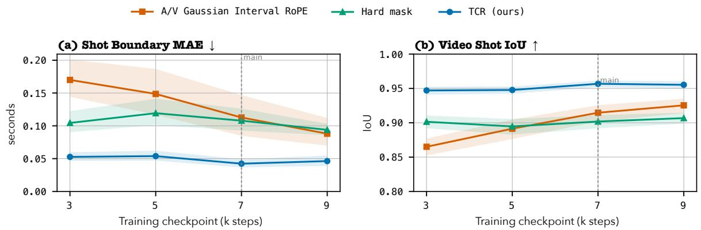  
Figure 6: Shot-timing performance across training checkpoints. (a) Shot Boundary MAE and (b) Shot IoU on the same 200 test scripts. Shaded regions denote 95% prompt-bootstrap intervals, and the dashed line marks the 7k checkpoint reported in the main tables. TCR performs best on both metrics at every checkpoint.

## A Temporal Operator Implementations

We compare TCR with two matched temporal operators implemented on the same joint audio-video backbone: a hard interval mask and Gaussian Interval RoPE. All three use the same timing map, training data, LoRA configuration, and optimization settings; they differ only in how timing enters text crossattention. Intervals as text is retained as an auxiliary reference and is not part of this matched comparison.

Intervals as text. Numeric time\_range fields remain in the serialized script and are processed by the text encoder together with the prompt content. No separate attention-level temporal operator is applied.

Hard interval mask. This operator replaces Equation 2 with

$$
B _ { i j } ^ { m , \mathrm { h a r d } } = \left\{ { \begin{array} { l l } { 0 , } & { t _ { i } ^ { m } \in [ s _ { j } , e _ { j } ] { \mathrm { ~ o r ~ t o k e n ~ } } j { \mathrm { ~ i s ~ s e n t i n e l } } , } \\ { - \infty , } & { { \mathrm { o t h e r w i s e } } . } \end{array} } \right.\tag{5}
$$

It exposes a prompt to queries inside its assigned interval and masks it at all other temporal positions.

Gaussian Interval RoPE. We implement an interval-aware rotary baseline based on RoPE (Su et al., 2021) and temporal rotary encodings (Wu et al., 2025b; Shu et al., 2026). A query is rotated at its temporal coordinate and a text key at the center of its assigned interval. After mapping seconds to the model’s normalized time axis, let $\widehat { r } _ { j }$ denote the interval radius. At frequency $\omega _ { \ell } ,$ the key channel is scaled by

$$
g _ { j \ell } = \frac { \exp [ - \frac { 1 } { 2 } ( \alpha \omega _ { \ell } \widehat { r } _ { j } ) ^ { 2 } ] } { \mathrm { m e a n } _ { \ell ^ { \prime } } \exp [ - \frac { 1 } { 2 } ( \alpha \omega _ { \ell ^ { \prime } } \widehat { r } _ { j } ) ^ { 2 } ] } ,\tag{6}
$$

a Gaussian kernel that accounts for interval duration. Unlike TCR, this operator incorporates content and timing jointly in the query-key geometry. We use α = 1 and a frequency scale of $2 . 5 \times 1 0 ^ { - 3 }$ for both modality towers.

## B Visual-Timing Optimization Trajectories

Figure 6 tracks visual timing across training. TCR achieves the lowest Shot Boundary MAE and highest Shot IoU at every evaluated checkpoint. The advantage is already present at 3,000 steps and remains stable through 9,000 steps, while the main tables report the 7,000-step checkpoint.

## C Qualitative Ablation Examples

Figure 7 provides script-level qualitative comparisons corresponding to the ablation results in Table 2. All three temporal operators are trained and evaluated under identical settings, with their outputs displayed against the requested script timeline. The examples visualize differences in shot placement and dialogue timing, illustrating the temporal behaviors reflected in the aggregate metrics.

(a) 4 requested shots, 2 dialogue lines  
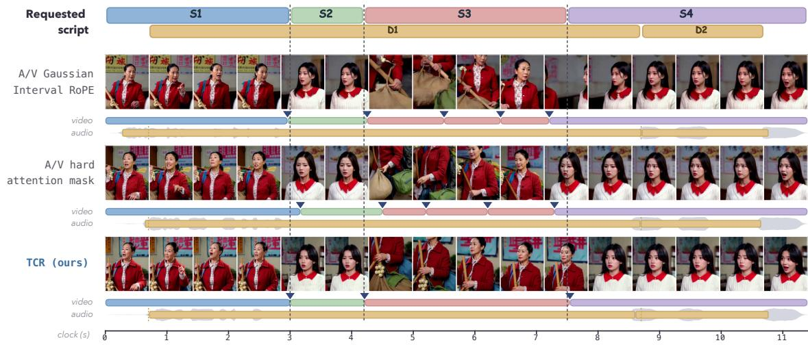

(b) 4 requested shots, 2 dialogue lines  
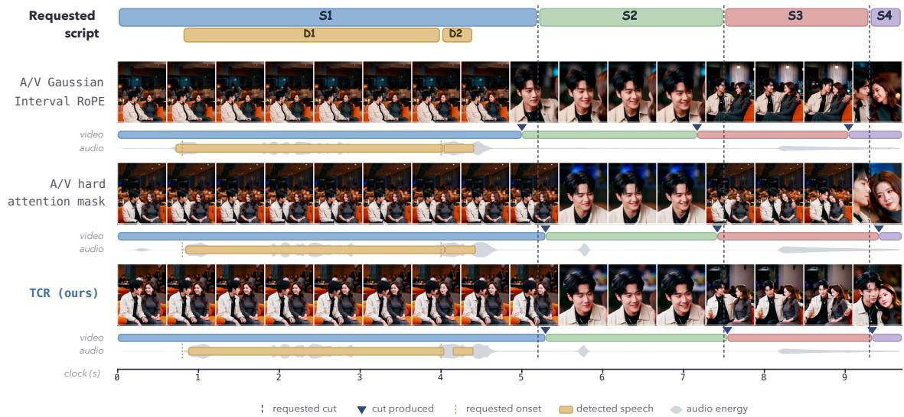  
Figure 7: Qualitative comparison of temporal operators. Requested shot and dialogue timing is shown above each example. (a) Gaussian Interval RoPE and the hard mask produce two extra cuts, whereas TCR matches all four requested shots. (b) Gaussian Interval RoPE places all three cuts early, while the hard mask and TCR align them closely with the requested boundaries. Triangles mark produced cuts; the audio lanes show detected speech and energy.

## D Human Evaluation Protocol

We randomly sample 16 test cases, with eight used for the comparison with LTX-2.3 and eight for JoyAI-Echo. Twenty-eight participants complete all 16 trials. Each trial presents TCR and one comparator anonymously as Video A and Video B; side assignment is balanced across trials, and JoyAI-Echo outputs are generated at 704×1280 so that all videos share the same portrait canvas. Participants make indepen dent A/Tie/B choices for shot timing, dialogue timing, script fidelity, audio-visual synchronization, and overall execution. Figure 8 shows the evaluation interface.

## E Metric Details

Shot timing. For a requested shot $G = [ g _ { s } , g _ { e } ]$ and a detected shot $P = [ p _ { s } , p _ { e } ]$ , temporal intersectionover-union is

$$
\mathrm { I o U } ( G , P ) = { \frac { \operatorname* { m a x } ( 0 , \operatorname* { m i n } ( g _ { e } , p _ { e } ) - \operatorname* { m a x } ( g _ { s } , p _ { s } ) ) } { \operatorname* { m a x } ( g _ { e } , p _ { e } ) - \operatorname* { m i n } ( g _ { s } , p _ { s } ) } } .\tag{7}
$$

The corresponding boundary error is

$$
E _ { \mathrm { b n d } } ( G , P ) = \frac { | g _ { s } - p _ { s } | + | g _ { e } - p _ { e } | } { 2 } .\tag{8}
$$

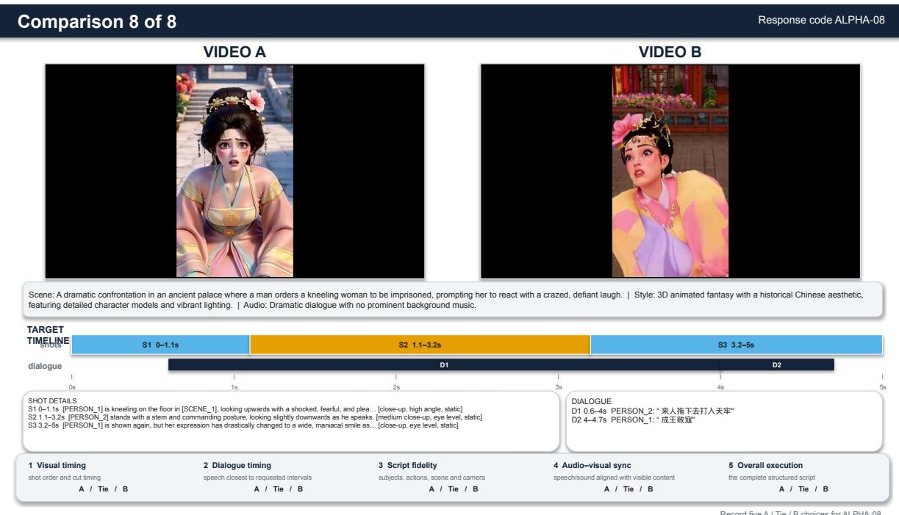  
Figure 8: Human-evaluation interface. Videos are presented anonymously as A and B with balanced ordering. Raters view the target shot and dialogue timeline and make independent A/Tie/B choices for shot timing, dialogue timing, script fidelity, audio-visual synchronization, and overall execution.

Requested and detected shots are paired in temporal order when their counts agree and greedily by highest positive IoU otherwise. Shot Boundary MAE and Shot IoU average over the resulting matched pairs. Matched-shot coverage and exact shot-count accuracy separately capture missing and additional shots. All test scripts pass the Gemini-detector shot-count consistency check, and the same frozen detector is applied to every generated output. At 24 fps, the reported 0.042 s Shot Boundary MAE is approximately one output frame.

Dialogue timing. WhisperX (Bain et al., 2023) provides word-level speech timestamps, which are matched monotonically to the requested dialogue lines. Detection rate is the fraction of requested lines with a match. Start, end, and Boundary MAE are computed over matched lines. Event IoU assigns zero to an unmatched dialogue, and Acc@0.5s is the fraction of all requested dialogue prompts whose matched onset and offset errors are both within 0.5 s.

Speech fidelity and audio-visual synchronization. WER compares the requested dialogue with transcripts from Whisper-large-v3 (Radford et al., 2023). Sync-C and offset accuracy are computed with SyncNet (Chung & Zisserman, 2016) on speech-active within-shot segments. Offset accuracy is the fraction of segments whose estimated audio-video offset is within one frame at 24 fps.

Visual quality. We report the Imaging Quality and Aesthetic Quality dimensions of VBench. Whole-clip consistency and motion-smoothness are not included because outputs that omit requested cuts can score favorably on these dimensions despite failing the target temporal structure.

## F Choosing the Routing Strength $\beta$

Endpoint-retention parameterization. Equation 2 depends on the query time only through the normal ized temporal distance $u = ( t _ { i } ^ { m } - c _ { j } ) / r _ { j }$ , so the routing term contributes a multiplicative factor

$$
\begin{array} { r } { g _ { \beta } ( u ) = \exp \left( - \frac { 1 } { 2 } \beta u ^ { 2 } \right) } \end{array}\tag{9}
$$

to the unnormalized attention weight of Equation 3. Because an interval endpoint has $| \boldsymbol { u } | = 1 , \beta$ can be interpreted through the endpoint-retention ratio $\varepsilon = g _ { \beta } ( 1 )$ : the fraction of the center weight retained at either endpoint. Solving for $\beta$ gives

$$
\beta = 2 \ln ( 1 / \varepsilon ) ,\tag{10}
$$

We choose $\varepsilon = 0 . 1 \mathrm { , }$ , corresponding to one order of magnitude of attenuation from the interval center to either endpoint. This gives $\beta \stackrel { - } { = } 2$ 2 ln $1 0 = 4 . 6 0 5 ,$ , which we round to $\beta = 5$ . The resulting endpoint

retention is e $^ { - 5 / 2 } = 0 . 0 8 2$ . We use this fixed value in every block, modality, and attention head during both training and inference; it is neither learned nor tuned per prompt.

## G Implementation Details

Temporal coordinates and batching. Video query times are the midpoints of the temporal cells represented by the video latents. Audio query times are computed from audio patch positions using the hop length and sample rate. Both are converted to seconds before applying the temporal operator. We use $\epsilon = 1 0 ^ { - 4 } \mathrm { { : } }$ s in Equation $^ { 2 , }$ assign Global prompts to [0, T], and apply no routing score to sentinel tokens.

After tokenization, the timing map is repacked to match the text connector, including left padding and special tokens. The compiled tensor $\mathbf { I } \in \mathbb { R } ^ { N \times 2 }$ is padded to $B \times N \times 2$ . The padding mask has shape $\stackrel { s } { B } \times 1 \times 1 \times N$ , and the routing score $B ^ { m }$ has shape $\mathbf { \dot { \boldsymbol { B } } } \times 1 \times Q _ { m } \times N$ and is shared across attention heads. Classifier-free guidance follows the original LTX-2.3 conditional and unconditional branch construction; TCR adds no CFG-specific parameters.

Training and inference. The three matched temporal operators use LoRA rank and scale 128, a learning rate of $1 0 ^ { - 4 }$ , 500 warm-up steps, cosine decay, a first-frame conditioning probability of 0.5 during training, and an audio loss weight of 1. The main tables report the 7,000-step checkpoint; Figure 6 also evaluates 3,000, 5,000, and 9,000 steps. At inference, we use 30 sampling steps, guidance 4.0, spatiotemporal guidance 1.0 at block 29, seed 42, 704 × 1280 resolution, and 24 fps, without first-frame conditioning.

## H Structured Script and Temporal Compilation

The abbreviated record below shows the structured script information provided to every evaluated model. Wan2.2, OVI, JoyAI-Echo, LTX-2.3, and the Intervals as text reference retain numeric time\_range fields in the serialized prompt. For the three matched attention-level operators, the same source record is passed through a compiler that removes these numeric ranges before text encoding and supplies them separately through the timing map. All variants therefore receive the same prompt content, requested timing, and clip duration.

The compiler aligns the character span of each prompt with its token positions and assigns each token the timing of its parent prompt. Repeated Reference identifiers are aligned independently and inherit the timing of the Shot in which they occur. Padding, tokenizer special tokens, and connector register slots receive the sentinel value (−1, −1) and no routing score.

```jsonl
{
"references": [{"ref_id": "PERSON_1", ...}],
"shots": [
{"shot_id": "SHOT_1", "time_range": [0.0, 2.3],
"visual_description": "[PERSON_1] turns to the door", ...},
{"shot_id": "SHOT_2", "time_range": [2.3, 5.0], ...}
],
"events": [
{"event_id": "DIALOGUE_1", "type": "dialogue",
"time_range": [1.7, 3.1],
"content": {"speaker": "PERSON_1", "line": "..."}}
],
"scene_description": "...",
"global_style": "...",
"global_audio": "..."
}
```

For every model, the requested clip duration is set by the final Shot endpoint. The compiler therefore changes only how script timing enters the conditioning pathway, not the semantic or temporal information provided.