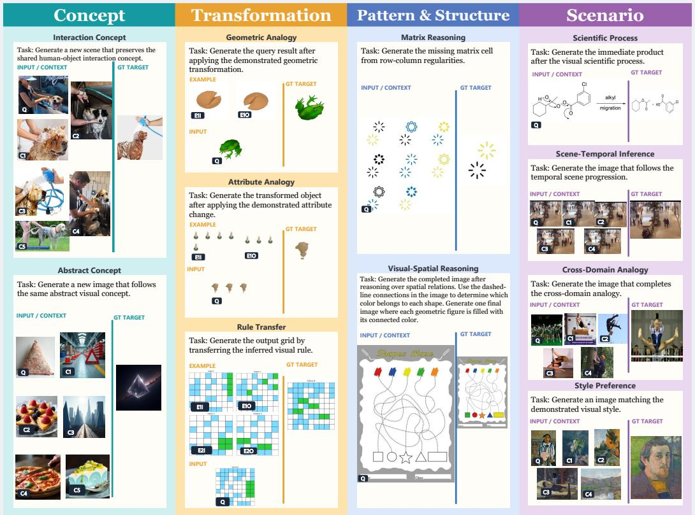
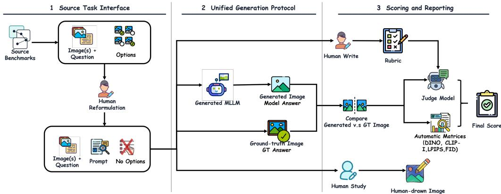
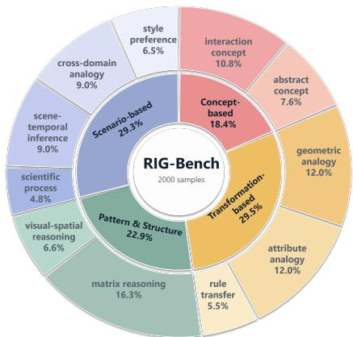
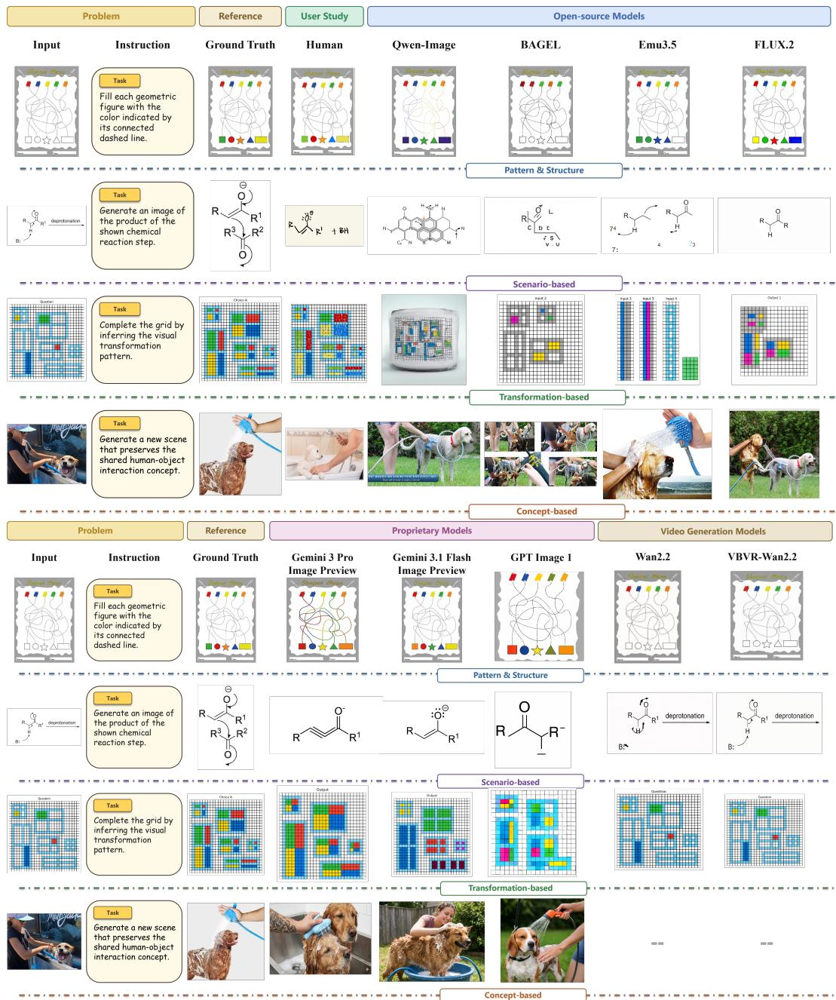
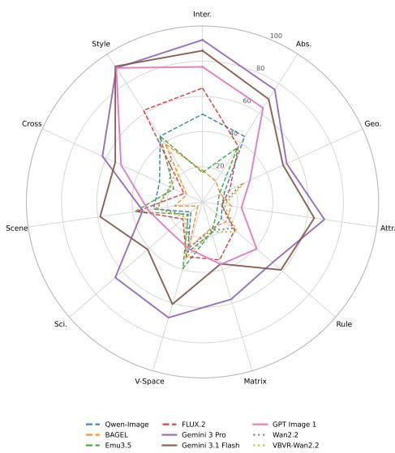
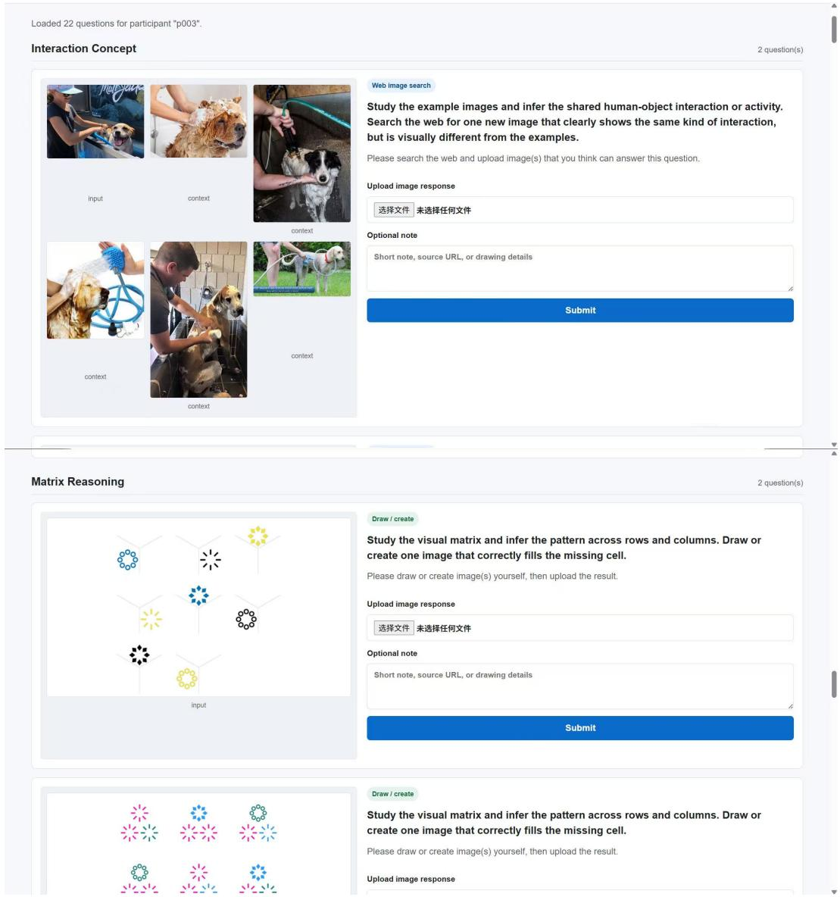
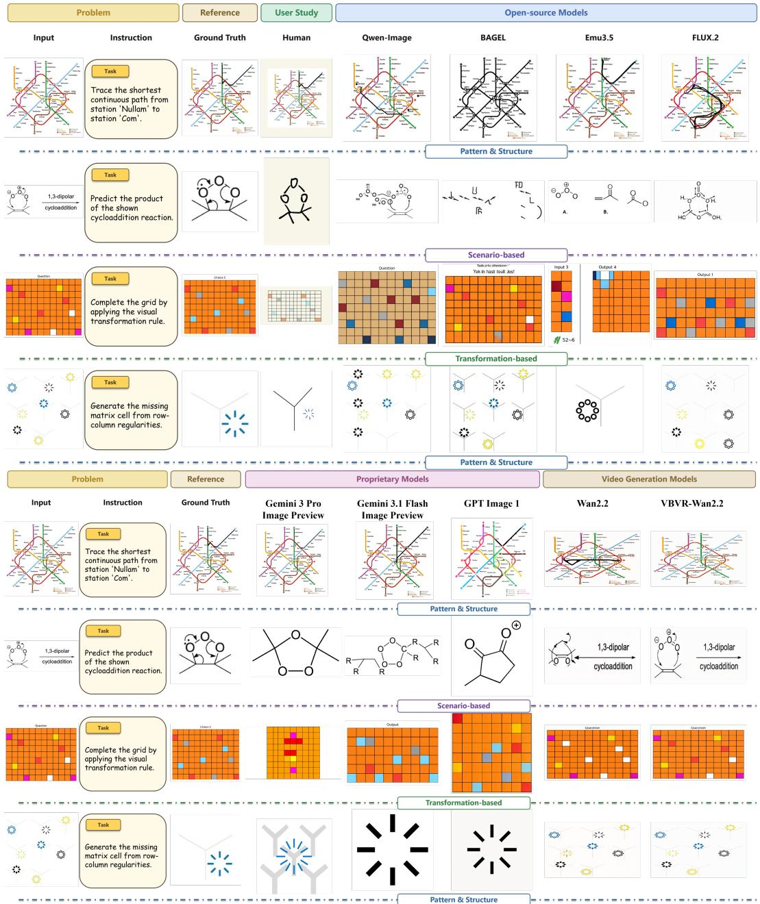
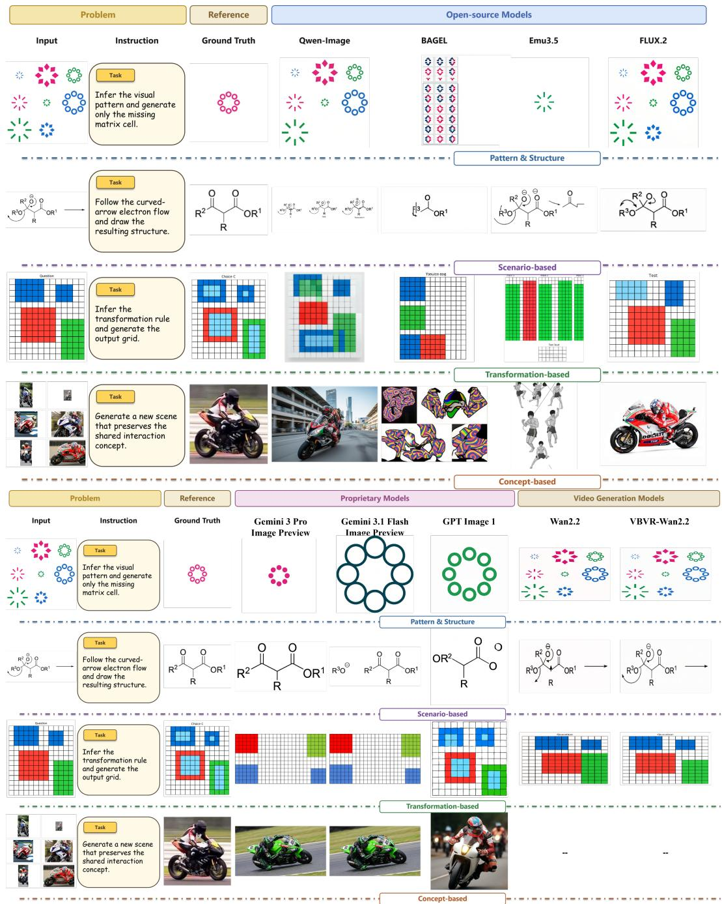
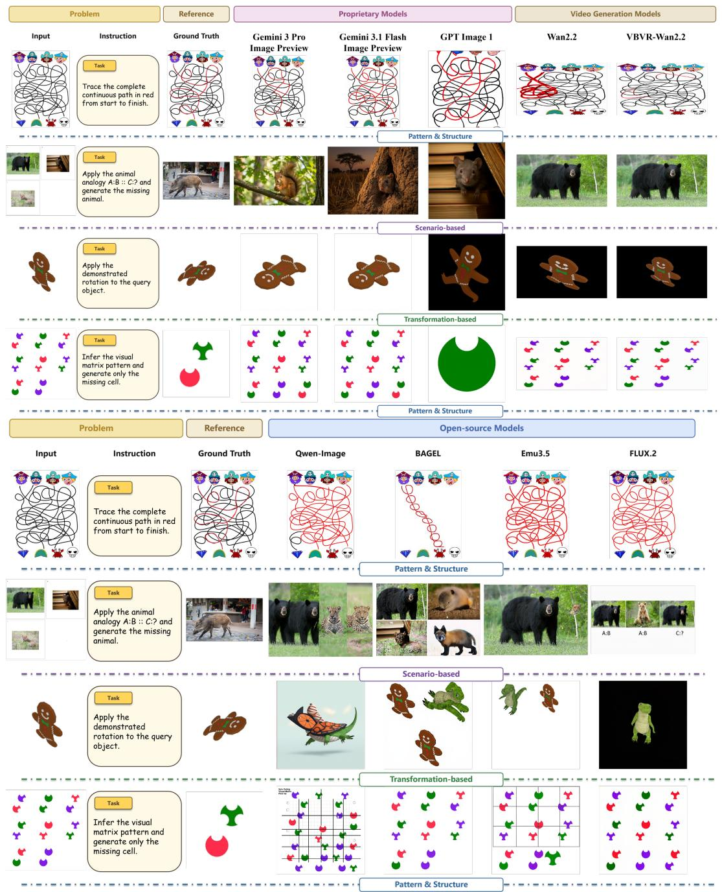

# Thinking in Pictures: A Systematic Benchmark for Reasoning-driven Image Generation

Yutong Liu1,2∗ Nan Huang1,∗ Xu Cao1,∗ James M. Rehg1

1University of Illinois Urbana-Champaign 2New York University

## Abstract

Recent advancements in unified generative models (UGMs) and world simulators have achieved unprecedented results in visual perception and synthesis. However, these models primarily rely on surface-level event alignment, leaving the capacity for high-level visual reasoning underexplored. True visual generative intelligence demands "Reasoning-to-Generation", an ability to infer latent rules from visual inputs and manifest solutions through precise, logically constrained visual outcomes. We introduce RIG-BENCH, a novel comprehensive benchmark that systematically evaluates Reasoning-driven Image Generation (RIG) across four cognitively demanding domains: Concept-based, Transformation-based, Pattern & Structure, and Scenario-based. Featuring 2000 curated samples, RIG-BENCH serves as a rigorous stress test for RIG. Our extensive evaluations of state-of-the-art UGMs and image/video generation models reveal a significant reasoning-generation gap, wherein models frequently produce locally plausible but globally illogical outputs. RIG-BENCH provides a vital diagnostic framework to guide the development of next-generation, logically grounded UGMs and world simulators. RIG-BENCH is open-sourced in huggingface.co/datasets/Abbyyyt/RIG-Bench.

## 1 Introduction

The recent progress in world models and unified generative models (UGMs) [66, 8, 55, 56, 54, 5, 52, 12] has marked a paradigm shift in AI, yielding unprecedented results in visual perception and high-fidelity synthesis. Yet, these milestones primarily reflect a scaling of perceptual fluency and surface-level alignment. A more fundamental hallmark of human intelligence remains largely underexplored: the capacity for high-level reasoning over visual inputs to manifest solutions through precise visual outcomes [7, 39]. This ability, deeply rooted in human visual imagination and mental simulation [45], allows us to not only describe the world but to internalize its underlying mechanics. In both abstract and physical realms, true intelligence is defined not by recognizing a scene, but by inferring latent rules, simulating complex transformations, and predicting structured outcomes constrained by domain-specific logic. We posit that this "Reasoning-to-Generation" capability is a prerequisite for the next generation of autonomous world models.

Solving a Raven’s Progressive Matrix [63], navigating a complex maze [7], or predicting the product of a chemical reaction from molecular diagrams [21] requires more than "hallucinating" a plausible image. It demands a System 2 [14] cognitive process where the model must internally simulate spatial, logical, or scientific rules. While existing models can generate visually stunning landscapes, they often falter when the output is constrained by strict logical dependencies [58, 29]. For instance, a model might generate a "science-looking" diagram that violates the law of conservation of mass [38, 41, 40], or a "maze-like" image where the path leads into a dead end. Therefore, requiring a visual answer serves as a more rigorous "stress test" for genuine multimodal reasoning than text-based VQA.

  
Figure 1: Overview of RIG-BENCH. Each column shows one of the four task families (Concept-based, Transformation-based, Pattern & Structure, Scenario-based), illustrated with one representative item per fine-grained subtask. Every item supplies visual context (INPUT/CONTEXT) plus an unobserved ground-truth image (GT TARGET); the model must infer the correct answer from the visual context and produce it as an image.

Despite its significance, this Reasoning-driven Image Generation (RIG) capability is not systematically addressed by current benchmarks. Existing evaluations are bifurcated: they either assess reasoning via text (Image-to-Text) [36, 61, 35, 58] or evaluate generation via aesthetic metrics (Text-to-Image) [16, 25, 9, 27], leaving a critical gap in evaluating the closed-loop visual reasoning (Image-to-Reasoning-to-Image) process. To bridge this gap, we introduce RIG-BENCH, a comprehensive evaluation suite designed to probe the high-level reasoning limits of unified multimodal models. Our benchmark spans four cognitively demanding task families: Concept-based reasoning, which requires inferring a shared concept across a set of images and generating a new instance; Transformation-based reasoning, which requires applying a demonstrated geometric, attribute, or rulelevel transformation to a new input; Pattern & Structure reasoning, which covers matrix completion and visual-spatial puzzles such as mazes, path tracing, and grid-based fill-ins; and Scenario-based reasoning, which grounds inference in scientific processes, temporal scene progression, cross-domain analogies, and stylistic consistency.

Through extensive experiments, we demonstrate that even the most advanced generation models (e.g., GPT Image 1, Gemini 3 Pro Image Preview, Qwen-Image) exhibit a significant reasoning–generation gap. They often produce "locally plausible but globally illogical" results, indicating that scaling alone has not yet yielded the structured reasoning required for human-like visual problem-solving.

Our contributions are summarized as follows:

• We define the task of Reasoning-driven Image Generation (RIG), shifting the focus from aesthetic synthesis to logical-visual consistency.

• We present RIG-BENCH, comprising 2,000 curated items across 4 task families and 11 finegrained subtasks. To our knowledge, RIG-BENCH is the first benchmark in which the target output is never specified in language and must be induced from visual context alone, across concept, transformation, pattern, and scenario domains under a single answer-image protocol.

• We provide a diagnostic evaluation framework that reveals the failure modes of current UGMs and image/video generation models, offering insights into the future design of "thinking" generative agents.

## 2 Related Works

Visual Generation. Visual generation has advanced toward increasingly high-quality and controllable synthesis [13], while evaluation has expanded beyond perceptual quality to prompt faithfulness, compositionality, and temporal consistency [16, 25, 26, 9, 27, 28]. Most existing benchmarks, however, still treat generation as prompt-conditioned rendering. Reasoning-aware T2I benchmarks [6, 38, 20, 59, 22] introduce commonsense, knowledge, or other forms of reasoning, but formulate the reasoning problem primarily in language: the generator receives either explicit reasoning or a prompt from which the required reasoning can be derived. Reasoning-oriented image editing benchmarks [67, 32] additionally provide visual input, but pair it with an explicit editing instruction that specifies the desired transformation. In both settings, what should be generated is largely specified through language. In contrast, RIG-BENCH withholds the target transformation and requires unified generation models to infer what should be generated from visual context before rendering the answer.

Datasets for Visual Reasoning and Cognition. Visual reasoning benchmarks have long studied the inference problems RIG-BENCH targets, including abstract rule induction in ARC [10], matrix reasoning in Raven-style tasks [63], visual analogies and concept learning [60, 30, 44], and scientific or multidisciplinary reasoning [35, 36, 61, 21, 4, 33]. More recent cognitive benchmarks probe mental visualization and foundational visual gaps in MLLMs, including Hyperphantasia [47], Menti sOculi [62], and VisFactor [24]. These works expose important limits in visual cognition, but most rely on text, multiple-choice, or classification outputs, which verify conceptual selection but cannot test whether a model can synthesize the inferred answer. RIG-BENCH reframes visual reasoning as answer-image generation, requiring the model to visually synthesize the inferred answer rather than merely identify it.

Unified Multimodal Generation Models. The rise of unified models combining understanding and generation [8, 12, 52, 55, 56, 54] makes it practical to bridge reading visual context and synthesizing visual answers. Recent work has begun coupling reasoning with generation [34, 68, 57, 50], treating generation as a substrate for broader knowledge tasks [7, 37, 19, 20], suggesting that benchmarks must move beyond image quality to measure whether generation is grounded in correct structural inference. RIG-BENCH advances this through a unified answer-image generation protocol: models must parse visual context, infer latent rules, and synthesize the answer image.

## 3 Benchmark Design

## 3.1 Task Formalization

We redefine visual generation as a problem of latent rule induction rather than mere instruction following. In this framework, Reasoning-driven Image Generation (RIG) is formulated as a unified synthesis task. A model is provided with a visual context ${ \mathcal C } = ( { \mathcal L } , { \mathcal D } , t )$ , where:

(i) $\mathcal { T } = \{ i _ { 1 } , \ldots , i _ { k } \}$ is a set of $k \geq 1$ context images that implicitly encode a visual reasoning problem $( \mathrm { e . g . , a }$ pattern or a spatial configuration);

(ii) $\mathcal D \ : = \ : \{ ( a _ { j } , b _ { j } ) \} _ { j = 1 } ^ { m }$ is optional. It consists of zero or more ordered demonstration pairs exemplifying a target transformation rule (active primarily in transformation-based tasks);

(iii) t is a natural-language instruction that specifies the output constraints $( \mathrm { e . g }$ ., “complete the sequence”) without disclosing the underlying logic or the step-by-step solution.

The goal is to synthesize a single output image $\hat { y } \in \mathbb R ^ { H \times W \times 3 }$ that constitutes the logically correct solution. Correctness is evaluated by comparing yˆ to a ground-truth image y across two dimensions: perceptual fidelity (visual quality) and logical consistency (adherence to the induced rule).

This unified formulation mandates three essential, inter-dependent competencies that are often decoupled in existing benchmarks:

  
Figure 2: End-to-end pipeline of RIG-BENCH. (1) Source Task Interface: items are drawn from established visual reasoning benchmarks and manually re-cast with an image-based output prompt (no options exposed to the model). (2) Unified Generation Protocol: selected models receive the context images plus the prompt and generate the answer image directly. (3) Scoring and Reporting: each generation is compared against the ground-truth image using both an LLM judge over a hand-written rubric and automatic perceptual metrics, with an additional human study for calibration.

• Visual Perception: The model must perform fine-grained feature extraction—identifying attributes such as shape, color, cardinality, and spatial topology—from the context I.

• Rule Induction: The model must infer the abstract relationship or transformation latent within I or demonstrated by D. This requires moving beyond surface-level pattern matching to high-level logical abstraction.

• Grounded Generation: The model must manifest its internal reasoning by rendering the solution into pixels. Unlike text-based VQA, this stage requires the model to maintain structural and logical integrity during the high-dimensional synthesis process.

While previous benchmarks evaluate perception and induction through multiple-choice or text-based answers, RIG-BENCH is the first to require all three competencies simultaneously. By using the synthesized image as the primary evidence of reasoning, we provide a more rigorous diagnostic for the “reasoning–generation gap” in world models and unified generative models [59, 32].

## 3.2 Data Engineering and Curation

High-Fidelity Item Distillation. Unlike text-based reasoning tasks, pixel-level reasoning demands an uncompromising approach to curation to prevent shortcut learning. We employ a three-tier distillation process: (i) Cross-Domain Reformulation. We distill core reasoning logic from diverse sources [30, 60, 10, 21, 44, 4, 33, 7] and re-conceptualize them as generative tasks, shifting the objective from recognition to synthesis and requiring models to manifest latent rules (e.g., concept induction, structural

  
Figure 3: Distribution of the 2,000 samples in RIG-BENCH. The inner ring summarizes the four task families, and the outer ring breaks them down into eleven fine-grained subtasks.

analogy, or spatial inference) through precise visual outputs. Sourcing from established datasets inherits prior calibration on what constitutes a meaningful inference problem, while shifting the discriminating axis from inter-option confusability to a joint function of rule induction and rendering precision. (ii) Reasoning-Neutral Prompting. We manually author instructions t for all samples. To ensure the benchmark evaluates pure reasoning rather than instruction following, these prompts define the output constraints (e.g., “generate the missing matrix cell”) without providing any semantic cues or logical shortcuts that might simplify the rule-induction process. (iii) Heuristic and Human Filtering. The initial pool is pruned to eliminate low-complexity or perception-only samples. We enforce a “human-solvable but model-challenging” criterion, with item difficulty informed by source-dataset design and checked through a formative human pilot. This pipeline ensures that RIG-BENCH serves as a diagnostic stress test for the reasoning–generation gap. By consolidating validated challenges from multiple domains, RIG-BENCH achieves greater complexity and logical rigor than its constituent sources.

  
Figure 4: Example across the four task families of RIG-BENCH, one representative subtask per row. Model outputs grouped into open-source (top) and proprietary plus video generators (bottom).

Dataset Statistics and Structural Variation. RIG-BENCH comprises 2,000 high-quality samples, characterized by a deliberate variability in input cardinality to suit diverse reasoning motifs. As illustrated in Figure 1, the number of context images is systematically scaled by task family: (i) Concept-based items provide six instances that collectively define an abstract category; (ii) Transformation-based items supply between one and six demonstration pairs {D} alongside the query image; (iii) Pattern & Structure tasks utilize a single composite puzzle (e.g., a 3×3 Raven’sstyle matrix); and (iv) Scenario-based items include one to five real-world images depicting a complex state. Crucially, despite this input diversity, the output is strictly constrained to a single synthesized image yˆ. This design ensures a uniform evaluation interface across all subtasks. To prevent model anchoring or leakage of the reasoning chain, all instructions t are authored as neutral, declarative directives (e.g., “Generate the image that completes the pattern.”), ensuring the model relies solely on its internal induction capabilities.

Taxonomic Diversity and Skill Coverage. Table 1 reports the distribution across the four families and eleven subtasks. Transformation-based and Scenario-based form the core of the benchmark: Transformation tasks evaluate rule induction through geometric analogies (rotation, reflection), attribute shifts (color, scale), and pixel-grid rule transfer; Scenario tasks pair perceptual grounding with world knowledge, covering temporal inference, cross-domain analogy, and scientific structural synthesis. Pattern & Structure targets systematic pattern induction via 3×3 matrix reasoning and visual-spatial panels, while Concept-based probes few-shot abstract grouping.

Answer-Space Constraint. Beyond the fourfamily taxonomy shown in Figure 1, RIG-BENCH also varies whether the target image is open-form or closed-form. Open-form subtasks allow multiple visually valid realizations of an inferred concept, style, or scene continuation, as in interaction concept, abstract concept, scene-temporal inference, and style preference. Closed-form subtasks require a rule-constrained target determined by a geometric, attribute, structural, scientific, or analogy relation, covering geometric analogy, attribute analogy, rule transfer, matrix reasoning, visual-spatial reasoning, scientific process, and cross-domain analogy. This distinction lets us separate failures on permissive generative continuation from failures on tightly constrained visual reasoning.

Table 1: Sub-task distribution of RIG-BENCH across four task families and eleven fine-grained subtasks. Reasoning skill coverage spans concept induction, visual transformations, pattern reasoning, and scenario-based inference.
<table><tr><td>Task Family</td><td>Sub-task</td><td># Samples</td><td>Ratio (%)</td></tr><tr><td rowspan="2">Concept-based</td><td rowspan="2">interaction concept abstract concept</td><td>216</td><td>10.8</td></tr><tr><td>152</td><td>7.6</td></tr><tr><td rowspan="3">Transformation-based</td><td>geometric analogy</td><td>240</td><td>12.0</td></tr><tr><td>attribute analogy</td><td>240</td><td>12.0</td></tr><tr><td>rule transfer</td><td>109</td><td>5.5</td></tr><tr><td rowspan="2">Pattern &amp; Structure</td><td>matrix reasoning</td><td>326</td><td>16.3</td></tr><tr><td>visual-spatial reasoning</td><td>131</td><td>6.6</td></tr><tr><td rowspan="4">Scenario-based</td><td>scientific process</td><td>96</td><td>4.8</td></tr><tr><td>scene-temporal inference</td><td>180</td><td>9.0</td></tr><tr><td>cross-domain analogy</td><td>180</td><td>9.0</td></tr><tr><td>style preference</td><td>130</td><td>6.5</td></tr><tr><td>Total</td><td></td><td>2000</td><td>100.0</td></tr></table>

## 3.3 Comparison with Existing Benchmarks

A robust world model must achieve a closed-loop transition from visual perception to visual prediction through three synergistic functions: (i) Perceptual Grounding: perceiving a complex scene; (ii) Latent Rule Induction: inferring the underlying logic linking inputs to outputs; and (iii) Visual Synthesis: manifesting the predicted state in high-fidelity pixels. We categorize existing multimodal benchmarks based on these three functional axes (Table 2), revealing a critical gap in the current evaluation landscape[57, 68, 50].

Table 2: Comparison of RIG-BENCH against existing benchmarks. A visual reasoning loop requires perceiving a complex scene (Visual Context), inferring the underlying logic (Rule Induction), and manifesting the solution in pixels (Visual Synthesis). Existing benchmarks address only a subset.
<table><tr><td>Benchmark Camp</td><td>Visual Context</td><td>Rule Induction</td><td>Visual Synthesis</td><td>Skill Scope</td><td>Representative Works</td></tr><tr><td>Text-to-image (T2I)</td><td>x</td><td>x</td><td></td><td>Compositional &amp; Aesthetic</td><td>[16, 25]</td></tr><tr><td>Reasoning-aware T2I</td><td>x</td><td></td><td></td><td>Semantic constraints</td><td>[15, 48]</td></tr><tr><td>VQA / Visual Reasoning</td><td></td><td></td><td>X</td><td>Analytical &amp; Cognitive</td><td>[61, 36, 10, 30]</td></tr><tr><td>Image Editing</td><td></td><td>x</td><td></td><td>Local attribute shifts</td><td>[3,64]</td></tr><tr><td>RIG-BENCH (Ours)</td><td>J</td><td>1</td><td>1</td><td>Cognitive, Scientific, &amp; World Knowledge</td><td></td></tr></table>

Standard Text-to-Image (T2I) Generation [16, 25, 9] focuses exclusively on synthesis, lacking both visual contextual input and reasoning-driven constraints. While Reasoning-aware T2I [15, 48] introduces logical steps, these are typically mediated through text, bypassing the challenges of visual-spatial perception. Conversely, VQA and Visual Reasoning benchmarks [61, 36, 10, 30] evaluate complex induction and perception but collapse the output space into low-dimensional text or categorical labels, failing to test the model’s ability to "think in pictures."

Image Editing benchmarks [3, 64] occupy the visual-in/visual-out space but generally rely on explicit local instructions rather than the discovery of latent rules from context. The most related efforts involve Visual-input Video Reasoning [37, 51, 19]; however, these are predominantly limited to procedurally synthesized environments and video-specific architectures. RIG-BENCH uniquely demands the simultaneous execution of all three functions: perception, induction, and synthesis, across a diverse array of hand-curated, cognitively demanding tasks. It serves as a unified diagnostic for world models and UGMs, pushing beyond surface-level alignment toward true visual intelligence.

Table 3: Main results on RIG-BENCH. Bold indicates the best result within each model group. Common Rubric is computed on the nine subtasks supported by all evaluated model families and reports 95% bootstrap confidence intervals. Full Rubric is computed on each model’s full supported evaluation set.
<table><tr><td>Models</td><td>Common Rubric ↑</td><td>Full Rubric ↑</td><td>DINO ↑</td><td>CLIP↑</td><td>LPIPS↓</td><td>FID↓</td></tr><tr><td colspan="7">Image Generation Models (Open-source)</td></tr><tr><td>Qwen-Image [53]</td><td>20.79 [19.91, 21.69]</td><td>25.71</td><td>0.39</td><td>0.70</td><td>0.66</td><td>77.38</td></tr><tr><td>BAGEL [12]</td><td>16.76 [16.29, 17.25]</td><td>16.68</td><td>0.44</td><td>0.70</td><td>0.67</td><td>97.46</td></tr><tr><td>Emu3.5 [52]</td><td>20.66 [19.91, 21.39]</td><td>21.48</td><td>0.46</td><td>0.72</td><td>0.61</td><td>62.85</td></tr><tr><td>FLUX.2 [2]</td><td>26.35 [25.57, 27.14]</td><td>31.31</td><td>0.43</td><td>0.72</td><td>0.61</td><td>87.29</td></tr><tr><td colspan="7">Image Generation Models (Proprietary)</td></tr><tr><td>Gemini 3 Pro Image Preview [18]</td><td>59.71 [58.65, 60.77]</td><td>64.57</td><td>0.58</td><td>0.79</td><td>0.57</td><td>63.25</td></tr><tr><td>Gemini 3.1 Flash Image Preview [17]</td><td>53.40 [51.99, 54.80]</td><td>58.08</td><td>0.52</td><td>0.76</td><td>0.61</td><td>75.79</td></tr><tr><td>GPT Image 1 [42]</td><td>37.57 [36.34, 38.85]</td><td>43.77</td><td>0.49</td><td>0.75</td><td>0.60</td><td>66.44</td></tr><tr><td colspan="7">Video Generation Models</td></tr><tr><td>Wan2.2-14B [49]</td><td>20.73 [19.99, 21.48]</td><td>20.73</td><td>0.58</td><td>0.80</td><td>0.50</td><td>72.06</td></tr><tr><td>VBVR-Wan2.2-14B [51]</td><td>21.56 [20.90, 22.23]</td><td>21.56</td><td>0.63</td><td>0.82</td><td>0.46</td><td>65.84</td></tr></table>

Table 4: Sub-task-level rubric scores. Bold indicates the best per-group result for each subtask.
<table><tr><td rowspan="2">Models</td><td colspan="2">Concept-based</td><td colspan="2">Transformation-based</td><td colspan="2">Pattern &amp; Structure</td><td colspan="4">Scenario-based</td></tr><tr><td>Inter.</td><td>Abs.</td><td>Geo. Attr.</td><td>Rule</td><td>Matrix</td><td>V-Space</td><td>Sci.</td><td>Scene</td><td>Cross</td><td>Style</td></tr><tr><td colspan="9">Image Generation Models (Open-source)</td><td></td></tr><tr><td>Qwen-Image</td><td>49.88</td><td>44.23 13.82</td><td>11.29</td><td>14.20</td><td>18.33</td><td>29.82</td><td>8.72</td><td>28.06</td><td>26.81</td><td>44.44</td></tr><tr><td>BAGEL</td><td>17.94</td><td>14.08 11.09</td><td>16.55</td><td>17.39</td><td>15.84</td><td>27.40</td><td>3.50</td><td>15.93</td><td>9.82</td><td>39.24</td></tr><tr><td>Emu3.5</td><td>16.75</td><td>36.65 10.44</td><td>8.80</td><td>10.53</td><td>18.00</td><td>39.40</td><td>10.74</td><td>38.78</td><td>17.95</td><td>44.38</td></tr><tr><td>FLUX.2</td><td>64.72</td><td>37.60 17.08</td><td>10.98</td><td>24.27</td><td>34.33</td><td>32.37</td><td>14.77</td><td>37.45</td><td>11.53</td><td>61.90</td></tr><tr><td colspan="9">Image Generation Models (Proprietary)</td><td></td></tr><tr><td>Gemini 3 Pro Image Preview</td><td>92.08</td><td>75.88 52.54</td><td>69.94</td><td>52.57</td><td>57.63</td><td>68.51</td><td>65.55</td><td>34.28</td><td>62.43</td><td>90.47</td></tr><tr><td>Gemini 3.1 Flash Image Preview</td><td>85.98</td><td>69.45 50.29</td><td>64.12</td><td>58.94</td><td>36.65</td><td>60.55</td><td>41.19</td><td>58.72</td><td>54.43</td><td>91.57</td></tr><tr><td>GPT Image 1</td><td>76.78</td><td>63.55 29.59</td><td>22.34</td><td>40.69</td><td>36.93</td><td>27.73</td><td>25.05</td><td>31.31</td><td>50.85</td><td>90.51</td></tr><tr><td colspan="9">Video Generation Models</td><td></td></tr><tr><td>Wan2.2-14B</td><td>N/A</td><td></td><td>10.87</td><td>22.89</td><td>16.80</td><td>27.04</td><td>11.48</td><td>25.93</td><td>20.41</td><td>33.37</td></tr><tr><td>VBVR-Wan2.2-14B</td><td>N/A</td><td>N/A N/A</td><td>24.67 25.85</td><td>12.59 25.81</td><td>17.85</td><td>33.17</td><td></td><td>12.98 26.83</td><td>20.18</td><td>25.15</td></tr></table>

Abbreviations: Inter. = interaction concept; Abs. = abstract concept; Geo. = geometric analogy; Attr. = attribute analogy; Rule = rule transfer; Matrix = matrix reasoning; V-Space = visual-spatial reasoning; Sci. = scientific process; Scene = scene-temporal inference; Cross = cross-domain analogy; Style = style preference. “N/A” indicates unsupported settings: Concept-based subtasks require multi-image inputs, whereas the evaluated video-generation models support only single-image conditioning.

## 4 Experiments and Results

## 4.1 Experimental Setup

Models. We evaluate recent multimodal generation models on all eleven subtasks of RIG-BENCH. For open-source models, we consider Qwen-Image [53], BAGEL [12], Emu3.5 [52], and FLUX.2 [2]. For proprietary image-generation models, we evaluate Gemini 3 Pro Image Preview, Gemini 3.1 Flash Image Preview [18, 17] and GPT Image 1 [42]. Although RIG-BENCH defines the target as an answer image, video-generation models are also relevant because their final frames can be interpreted as predicted visual states after reasoning over the input context. We therefore evaluate Wan2.2 [49], and the reasoning-augmented variant VBVR-Wan2.2 [51].

Implementation Details. All models are queried under the unified protocol of Section 3.1: the model receives the input images and a natural-language instruction and must produce a single answer image. Source multiple-choice options are withheld so the model must generate the answer rather than select it. We use one generation per sample at each model’s default sampling settings, and apply no post-processing. For video-generation models, we instruct the model to treat the generated clip as a reasoning trajectory: the preceding frames may unfold the inference process visually, and the final frame is designated as the answer image used for evaluation. For open-source models, experiments are conducted on NVIDIA H200 GPUs (141 GB HBM3e).

## 4.2 Evaluation Metrics

Reference-based perceptual metrics. We report sample-level DINO [43] and CLIP-I [46] cosine similarities (DINOv2-base CLS, CLIP ViT-B/32; higher is better) and LPIPS [65] perceptual distance (AlexNet; lower is better) between each generation and its ground-truth answer, plus a distributionlevel FID [23] computed over the 2,000 samples. These quantify visual proximity but are agnostic to whether the generation reflects correct reasoning.

LLM-as-a-judge with Pre-defined Rubric. For every subtask we hand-craft a 0–5 rubric on three dimensions: visual quality, structural alignment, and reasoning correctness. The first two share common anchors across all subtasks; reasoning-correctness anchors are subtask-specific. Following the rubric-based evaluation protocol validated in UEval [31, 1], we employ Gemini-3.1-Flash as the judge and query it three times per sample at temperature 0.9 and average dimension scores. The composite score is Score = 0.15 · VQ + 0.20 · SA + 0.65 · RC, with reasoning correctness dominant because it is the capability the benchmark targets. Composites are rescaled to [0, 100] for reporting. All rubrics are released with the benchmark.

Validation of judge reliability. To validate the reliability of our automatic evaluation protocol, we conduct a blinded human study on 500 benchmark items stratified across all 11 subtasks, with twelve annotators evaluating outputs from all nine models using the same rubric dimensions as the automatic judge. Human ratings show substantial inter-annotator agreement on the composite score (Krippendorff’s $\alpha = 0 . 7 9 1 )$ . The main Gemini-3.1-Flash judge shows strong agreement with human ratings (Pearson/Spearman = 0.766/0.711), while an independent non-Gemini Qwen3.5-27B judge achieves comparable agreement (0.791/0.700). The two automatic judges also agree strongly with each other (0.819/0.791). Model rankings are also largely preserved under the non-Gemini judge (Kendall τ = 0.833 with the Gemini judge). Consistent results (Table 5) across ICC, Cohen’s κ, and model-ranking agreement further support the reliability of the automatic evaluation protocol; detailed statistics are reported in Appendix B.

Table 5: Agreement among automatic judges and blinded human ratings. Gemini denotes the main Gemini-3.1-Flash judge; Qwen3.5 denotes the Qwen3.5-27B judge used for cross-checking.
<table><tr><td>Metric</td><td>Gemini vs. Human</td><td>Qwen3.5 vs. Human</td><td>Gemini vs. Qwen3.5</td></tr><tr><td>Pearson correlation</td><td>0.766</td><td>0.791</td><td>0.819</td></tr><tr><td>Spearman correlation</td><td>0.711</td><td>0.700</td><td>0.791</td></tr><tr><td>ICC(2,1)</td><td>0.764</td><td>0.789</td><td>0.817</td></tr><tr><td>Cohen&#x27;s κ</td><td>0.634</td><td>0.644</td><td>0.650</td></tr><tr><td>Model ranking (Kendall τ)</td><td>1.000</td><td>0.833</td><td>0.833</td></tr></table>

## 4.3 Main Results

Table 3 and Figure 5 report common-supported and full-supported rubric scores together with reference-based metrics; Table 4 disaggregates the rubric by subtask.

No model approaches saturation, while humans solve the tasks reliably. The strongest model, Gemini 3 Pro Image Preview, attains a composite of 64.6/100; every other proprietary model sits in the 40–60 range, and every open-source image generator scores below 32. No model consistently exceeds 70 across the benchmark.

Separately, before finalizing the benchmark, we conduct a formative human pilot on n=66 items uniformly sampled across the eleven subtasks, in which participants infer the correct answer and either draw it or retrieve a matching image from the web. Human outputs are manually checked for answer correctness, with the LLM judge used as an auxiliary rubric-based assessment. Participants achieve 92.9% manual accuracy and an average LLM-judge score of 97.3. We use this pilot as a descriptive solvability check rather than a population-level human ceiling, indicating that the tasks are reliably solvable when the underlying visual reasoning is performed correctly. Notably, several source datasets of RIG-BENCH are nearing ceiling under their original closed-form protocols [60, 30]: replacing multiple-choice with image-output reopens the difficulty gap.

Table 6: Rubric scores grouped by answer-space constraint on the common-supported subtasks. Open-form includes scene-temporal inference and style preference; closed-form includes the seven rule-constrained subtasks. Concept-based subtasks are omitted here to match the common-supported scope shared by image and video generators.
<table><tr><td>Model</td><td>Open-form</td><td>Closed-form</td><td>Gap</td></tr><tr><td colspan="4">Image Generation Models (Open-source)</td></tr><tr><td>Qwen-Image</td><td>34.9</td><td>17.5</td><td>+17.4</td></tr><tr><td>BAGEL</td><td>25.7</td><td>14.7</td><td>+11.0</td></tr><tr><td>Emu3.5</td><td>41.1</td><td>15.9</td><td>+25.2</td></tr><tr><td>FLUX.2</td><td>47.7</td><td>21.4</td><td>+26.3</td></tr><tr><td colspan="4">Image Generation Models (Proprietary)</td></tr><tr><td>Gemini 3 Pro Image Preview</td><td>57.8</td><td>60.8</td><td>-3.0</td></tr><tr><td>Gemini 3.1 Flash Image Preview</td><td>72.5</td><td>51.1</td><td>+21.4</td></tr><tr><td>GPT Image 1</td><td>56.1</td><td>33.4</td><td>+22.8</td></tr><tr><td colspan="3">Video Generation Models</td><td></td></tr><tr><td>Wan2.2-14B</td><td>29.1</td><td>18.8</td><td>+10.3</td></tr><tr><td>VBVR-Wan2.2-14B</td><td>26.1</td><td>20.5</td><td>+5.6</td></tr></table>

Performance stratifies sharply across models and subtasks. The strongest open-source generator (FLUX.2, 31.3) trails the weakest proprietary one (GPT Image 1, 43.8) by 12.5 points and is 33.3 points below Gemini 3 Pro (64.6). This open–proprietary gap is substantially larger than what the same models exhibit on text-conditioned generation benchmarks [16, 26], suggesting that the visual-input– visual-output regime exposes capability differences that surface alignment to text prompts otherwise masks. Stratification is equally sharp across subtasks: Concept-based and style preference items often score several times higher than the hardest rule-induction settings for open-source systems, with Gemini 3 Pro reaching 92.1 on interaction concept and above 90 on style preference, while the strongest open-source scores remain below 25 on the three Transformation-based subtasks. Tasks with openended answer spaces are forgiving; tasks whose answer is uniquely determined by a latent rule are punishing. The Transformation family is the discriminating spine of RIG-BENCH, the family on which genuine rule-induction capacity, rather than open-ended generative plausibility, separates models.

## Perceptual similarity does not track reasoning correctness. A central motivation for RIG-BENCH is that perceptual similarity metrics conflate visual proximity with reasoning correctness, and our results

  
Figure 5: Per-subtask rubric scores across nine generation models on RIG-BENCH. Line style indicates model group: solid for proprietary image generators, dashed for open-source image generators, dotted for video generators.

quantify this dissociation directly [50, 59, 32]. All nine evaluated models achieve non-trivial similarity to the ground-truth answer in perceptual feature space $( \mathrm { D I N O } \ge 0 . 3 9 , \mathrm { C L I P - I } \ge 0 . 7 0 )$ , yet their rubric composites span a 3.9× range, from 16.7 for BAGEL to 64.6 for Gemini 3 Pro. VBVR-Wan2.2 is the extreme case within the video group: it attains strong DINO (0.63), CLIP-I (0.82), LPIPS (0.46), and FID (65.8), yet a Rubric of 21.6, below most image-generation baselines. Video clips, by virtue of temporal consistency, often produce frames pixel-wise close to the ground truth even when the underlying reasoning is wrong; a leaderboard based on DINO/CLIP alone would conclude that video generators are state-of-the-art reasoners, which they manifestly are not. Section 4.4 dissects this gap with matched text- and image-output conditions.

## 4.4 Analysis: Where does end-to-end generation break?

Aggregate scores show that models fail on RIG-BENCH, but not whether the failure arises from visual inference, visual realization, or their coupling. We therefore run a matched diagnostic analysis on the same 200 stratified items, covering all four families and all 11 subtasks, under four conditions: T, a text or closed-form answer inferred from the original visual context; D, direct answer-image generation from the original visual context, which is the paper’s protocol; H, image generation conditioned on the model’s own text answer; and O, image generation conditioned on an oracle answer specification. D/H/O are judged blindly against the ground-truth image with the image rubric. T uses a separate text-correctness rubric, so it diagnoses text-side reasoning rather than serving as a direct image-quality score.

Table 7: Matched diagnostic decomposition across text-reasoning and image-generation conditions on 200 stratified items. Scores are reported in the same 0–100 unit as Table 3. Brackets show paired-bootstrap 95% CIs for O–D. Integration gap is the fraction of items with T and O passing but D failing at τ=3.
<table><tr><td>Model setting</td><td>T</td><td>D</td><td>H</td><td>0</td><td>O-D</td><td>Integration gap</td></tr><tr><td>BAGEL (unified)</td><td>41.3</td><td>33.6</td><td>39.7</td><td>46.0</td><td>+12.4 [+9.4, +15.5]</td><td>5.5%</td></tr><tr><td>Qwen3.5 → Qwen-Image-Edit</td><td>49.9</td><td>37.3</td><td>36.4</td><td>39.0</td><td>+1.8 [-1.8, +5.4]</td><td>4.5%</td></tr><tr><td>Qwen3.5 → Emu3.5-Image</td><td>50.8</td><td>32.8</td><td>46.2</td><td>52.0</td><td>+19.3 [+15.5, +23.2]</td><td>9.5%</td></tr><tr><td>Gemini 3.1 Flash Image Preview</td><td>52.7</td><td>59.1</td><td>66.5</td><td>64.0</td><td>+4.9 [-0.1, +9.9]</td><td>9.9%</td></tr></table>

Explicit reasoning helps some systems, but not uniformly. Conditioning image generation on the model’s own inferred answer (H) improves over direct generation (D) for BAGEL (+6.1), the Qwen3.5→Emu3.5-Image pipeline (+13.4), and Gemini (+7.4), but not for Qwen3.5→Qwen-Image-Edit (-0.9). Thus, making the inferred answer explicit can alleviate some end-to-end failures, but the benefit depends strongly on the generator.

Oracle conditioning reveals rendering and integration gaps. The O–D column asks whether performance improves when the answer is specified explicitly. The effect is heterogeneous. BAGEL improves by 12.4 points and the Emu3.5 pipeline by 19.3 points, while the Qwen-Image-Edit pipeline changes by only 1.8 points with a CI crossing zero. Because the two Qwen pipelines share the same Qwen3.5 reasoner and the same textual plans, this contrast isolates the renderer: a correct or useful plan only helps if the image generator can consume and realize it faithfully.

End-to-end evaluation exposes an integration gap. We define an integration-gap item as one where the system reasons correctly in text and renders correctly when given the verified answer, yet fails in direct image generation (T passes, O passes, D fails). Such cases occur on 4.5–9.9% of matched items across systems. A pipeline of existing image-to-reasoning and oracle-conditioned reasoning-to-image tests would certify these cases as solved, while RIG-BENCH marks the actual visual output as wrong. This is the specific failure mode targeted by reasoning-driven image generation: discovering what should be generated from visual evidence and realizing it in pixels must succeed within the same end-to-end task, without access to the answer specification. Additional intervention and per-subtask diagnostics are provided in Appendix C.

## 5 Conclusion

We introduced RIG-BENCH, a large-scale systematic benchmark designed to evaluate Reasoningdriven Image Generation (RIG) with 2,000 samples. By shifting the evaluation paradigm from "Instruction Following" to "Rule Induction," RIG-BENCH provides a rigorous diagnostic for a model’s ability to "think in pictures." Our findings expose a critical weakness in current UGMs: the inability to bridge the gap between high-level logical inference and low-level visual synthesis. We hope RIG-BENCH will serve as a foundational tool for the community, guiding the development of the next generation of world models that are not only visually stunning but logically consistent.

## References

[1] Rahul K. Arora, Jason Wei, Rebecca Soskin Hicks, Preston Bowman, Joaquin Quiñonero-Candela, Foivos Tsimpourlas, Michael Sharman, Meghan Shah, Andrea Vallone, Alex Beutel, Johannes Heidecke, and Karan Singhal. HealthBench: Evaluating large language models towards improved human health. arXiv preprint arXiv:2505.08775, 2025.

[2] Black Forest Labs. FLUX.2 [dev]. https://huggingface.co/black-forest-labs/FLUX. 2-dev, 2025. Hugging Face model card.

[3] Tim Brooks, Aleksander Holynski, and Alexei A. Efros. Instructpix2pix: Learning to follow image editing instructions. In Proceedings of the IEEE/CVF Conference on Computer Vision and Pattern Recognition, pages 18392–18402, 2023.

[4] Xu Cao, Bolin Lai, Wenqian Ye, Yunsheng Ma, Joerg Heintz, Jintai Chen, Jianguo Cao, and James M. Rehg. What is the visual cognition gap between humans and multimodal LLMs? arXiv preprint arXiv:2406.10424, 2024.

[5] Chameleon Team. Chameleon: Mixed-modal early-fusion foundation models. arXiv preprint arXiv:2405.09818, 2024.

[6] Kaijie Chen, Zihao Lin, Zhiyang Xu, Ying Shen, Yuguang Yao, Joy Rimchala, Jiaxin Zhang, and Lifu Huang. R2I-Bench: Benchmarking reasoning-driven text-to-image generation. arXiv preprint arXiv:2505.23493, 2025.

[7] Liang Chen, Weichu Xie, Yiyan Liang, Hongfeng He, Hans Zhao, Zhibo Yang, Zhiqi Huang, Haoning Wu, Haoyu Lu, Y. charles, Yiping Bao, Yuantao Fan, Guopeng Li, Haiyang Shen, Xuanzhong Chen, Wendong Xu, Shuzheng Si, Zefan Cai, Wenhao Chai, Ziqi Huang, Fangfu Liu, Tianyu Liu, Baobao Chang, Xiaobo Hu, Kaiyuan Chen, Yixin Ren, Yang Liu, Yuan Gong, and Kuan Li. BabyVision: Visual reasoning beyond language. arXiv preprint arXiv:2601.06521, 2026.

[8] Xiaokang Chen, Zhiyu Wu, Xingchao Liu, Zizheng Pan, Wen Liu, Zhenda Xie, Xingkai Yu, and Chong Ruan. Janus-Pro: Unified multimodal understanding and generation with data and model scaling. arXiv preprint arXiv:2501.17811, 2025.

[9] Jaemin Cho, Yushi Hu, Jason Michael Baldridge, Roopal Garg, Peter Anderson, Ranjay Krishna, Mohit Bansal, Jordi Pont-Tuset, and Su Wang. Davidsonian scene graph: Improving reliability in fine-grained evaluation for text-to-image generation. In International Conference on Learning Representations (ICLR), 2024. URL https://openreview.net/forum?id=ITq4ZRUT4a.

[10] François Chollet. On the measure of intelligence. arXiv preprint arXiv:1911.01547, 2019.

[11] François Chollet, Mike Knoop, Gregory Kamradt, Bryan Landers, and Henry Pinkard. ARC-AGI-2: A new challenge for frontier ai reasoning systems. arXiv preprint arXiv:2505.11831, 2025.

[12] Chaorui Deng, Deyao Zhu, Kunchang Li, Chenhui Gou, Feng Li, Zeyu Wang, Shu Zhong, Weihao Yu, Xiaonan Nie, Ziang Song, Guang Shi, and Haoqi Fan. Emerging properties in unified multimodal pretraining. arXiv preprint arXiv:2505.14683, 2025.

[13] Patrick Esser, Sumith Kulal, Andreas Blattmann, Rahim Entezari, Jonas Müller, Harry Saini, Yam Levi, Dominik Lorenz, Axel Sauer, Frederic Boesel, et al. Scaling rectified flow transformers for high-resolution image synthesis. In Forty-first international conference on machine learning, 2024.

[14] {Jonathan St B.T.} Evans and {Keith E.} Stanovich. Dual-process theories of higher cognition: Advancing the debate. Perspectives on Psychological Science, 8(3):223–241, May 2013. ISSN 1745-6916. doi: 10.1177/1745691612460685.

[15] Xingyu Fu, Muyu He, Yujie Lu, William Yang Wang, and Dan Roth. Commonsense-T2I challenge: Can text-to-image generation models understand commonsense? arXiv preprint arXiv:2406.07546, 2024.

[16] Dhruba Ghosh, Hannaneh Hajishirzi, and Ludwig Schmidt. Geneval: An object-focused framework for evaluating text-to-image alignment. In Thirty-seventh Conference on Neural Information Processing Systems Datasets and Benchmarks Track, 2023. URL https:// openreview.net/forum?id=Wbr51vK331.

[17] Google DeepMind. Gemini 3.1 Flash Image Preview. https://ai.google.dev/ gemini-api/docs/models/gemini-3.1-flash-image-preview, 2026. Model documentation.

[18] Google DeepMind. Gemini 3 Pro Image Preview. https://ai.google.dev/gemini-api/ docs/models/gemini-3-pro-image-preview, 2026. Model documentation.

[19] Haonan Han, Jiancheng Huang, Xiaopeng Sun, Junyan He, Rui Yang, Jie Hu, Xiaojiang Peng, Lin Ma, Xiaoming Wei, and Xiu Li. ViGoR-Bench: How far are visual generative models from zero-shot visual reasoners? arXiv preprint arXiv:2603.25823, 2026.

[20] Tianyang Han, Junhao Su, Junjie Hu, Peizhen Yang, Hengyu Shi, Junfeng Luo, and Jialin Gao. Beyond words and pixels: A benchmark for implicit world knowledge reasoning in generative models. arXiv preprint arXiv:2511.18271, 2025.

[21] Yunzhuo Hao, Jiawei Gu, Huichen Will Wang, Linjie Li, Zhengyuan Yang, Lijuan Wang, and Yu Cheng. Can MLLMs reason in multimodality? EMMA: An enhanced multimodal reasoning benchmark. In International Conference on Machine Learning (ICML), 2025.

[22] Jun He, Junyan Ye, Zilong Huang, Dongzhi Jiang, Chenjue Zhang, Leqi Zhu, Renrui Zhang, Xiang Zhang, and Weijia Li. Mind-Brush: Integrating agentic cognitive search and reasoning into image generation. arXiv preprint arXiv:2602.01756, 2026.

[23] Martin Heusel, Hubert Ramsauer, Thomas Unterthiner, Bernhard Nessler, and Sepp Hochreiter. GANs trained by a two time-scale update rule converge to a local Nash equilibrium. In Advances in Neural Information Processing Systems, volume 30, 2017.

[24] Jen-Tse Huang, Dasen Dai, Jen-Yuan Huang, Youliang Yuan, Xiaoyuan Liu, Wenxuan Wang, Wenxiang Jiao, Pinjia He, Zhaopeng Tu, and Haodong Duan. Human cognitive benchmarks reveal foundational visual gaps in mllms, 2026. URL https://arxiv.org/abs/2502.16435.

[25] Kaiyi Huang, Kaiyue Sun, Enze Xie, Zhenguo Li, and Xihui Liu. T2I-CompBench: A comprehensive benchmark for open-world compositional text-to-image generation. In Advances in Neural Information Processing Systems (NeurIPS), 2023.

[26] Kaiyi Huang, Chengqi Duan, Kaiyue Sun, Enze Xie, Zhenguo Li, and Xihui Liu. T2I-CompBench++: An enhanced and comprehensive benchmark for compositional text-to-image generation. IEEE Transactions on Pattern Analysis and Machine Intelligence, 47(5):3563–3579, 2025. doi: 10.1109/TPAMI.2025.3531907.

[27] Ziqi Huang, Yinan He, Jiashuo Yu, Fan Zhang, Chenyang Si, Yuming Jiang, Yuanhan Zhang, Tianxing Wu, Qingyang Jin, Nattapol Chanpaisit, Yaohui Wang, Xinyuan Chen, Limin Wang, Dahua Lin, Yu Qiao, and Ziwei Liu. VBench: Comprehensive benchmark suite for video generative models. In Proceedings of the IEEE/CVF Conference on Computer Vision and Pattern Recognition (CVPR), 2024.

[28] Ziqi Huang, Fan Zhang, Xiaojie Xu, Yinan He, Jiashuo Yu, Ziyue Dong, Qianli Ma, Nattapol Chanpaisit, Chenyang Si, Yuming Jiang, Yaohui Wang, Xinyuan Chen, Ying-Cong Chen, Limin Wang, Dahua Lin, Yu Qiao, and Ziwei Liu. VBench++: Comprehensive and versatile benchmark suite for video generative models. IEEE Transactions on Pattern Analysis and Machine Intelligence, 48(3):3268–3285, 2026. doi: 10.1109/TPAMI.2025.3633890.

[29] Mohamed Huti, Alasdair Mackintosh, Amy Waldock, Dominic Andrews, Maxime Lelièvre, Moritz Boos, Tobias Murray, Paul Atherton, Robin A. A. Ince, and Oliver G. B. Garrod. Visual reasoning benchmark: Evaluating multimodal LLMs on classroom-authentic visual problems from primary education. arXiv preprint arXiv:2602.12196, 2026.

[30] Huaizu Jiang, Xiaojian Ma, Weili Nie, Zhiding Yu, Yuke Zhu, Song-Chun Zhu, and Anima Anandkumar. Bongard-HOI: Benchmarking few-shot visual reasoning for human-object interactions. In Proceedings of the IEEE/CVF Conference on Computer Vision and Pattern Recognition (CVPR), 2022.

[31] Bo Li, Yida Yin, Wenhao Chai, Xingyu Fu, and Zhuang Liu. Ueval: A benchmark for unified multimodal generation. arXiv preprint arXiv:2601.22155, 2026.

[32] Hongxiang Li, Yaowei Li, Bin Lin, Yuwei Niu, Yuhang Yang, Xiaoshuang Huang, Jiayin Cai, Xiaolong Jiang, Yao Hu, and Long Chen. GIR-Bench: Versatile benchmark for generating images with reasoning. In International Conference on Learning Representations (ICLR), 2026.

[33] Jiachun Li, Shaoping Huang, Zhuoran Jin, Chenlong Zhang, Pengfei Cao, Yubo Chen, Kang Liu, and Jun Zhao. MMR-Life: Piecing together real-life scenes for multimodal multi-image reasoning. In International Conference on Learning Representations (ICLR), 2026.

[34] Jie Liu, Zilyu Ye, Linxiao Yuan, Shenhan Zhu, Yu Gao, Jie Wu, Kunchang Li, Xionghui Wang, Xiaonan Nie, Weilin Huang, and Wanli Ouyang. UniGRPO: Unified policy optimization for reasoning-driven visual generation. arXiv preprint arXiv:2603.23500, 2026.

[35] Pan Lu, Swaroop Mishra, Tony Xia, Liang Qiu, Kai-Wei Chang, Song-Chun Zhu, Oyvind Tafjord, Peter Clark, and Ashwin Kalyan. Learn to explain: Multimodal reasoning via thought chains for science question answering. In Advances in Neural Information Processing Systems (NeurIPS), 2022.

[36] Pan Lu, Hritik Bansal, Tony Xia, Jiacheng Liu, Chunyuan Li, Hannaneh Hajishirzi, Hao Cheng, Kai-Wei Chang, Michel Galley, and Jianfeng Gao. MathVista: Evaluating mathematical reasoning of foundation models in visual contexts. In International Conference on Learning Representations (ICLR), 2024.

[37] Yang Luo, Xuanlei Zhao, Baijiong Lin, Lingting Zhu, Liyao Tang, Yuqi Liu, Ying-Cong Chen, Shengju Qian, Xin Wang, and Yang You. V-ReasonBench: Toward unified reasoning benchmark suite for video generation models. arXiv preprint arXiv:2511.16668, 2025.

[38] Yuxuan Luo, Yuhui Yuan, Junwen Chen, Haonan Cai, Ziyi Yue, Yuwei Yang, Fatima Zohra Daha, Ji Li, and Zhouhui Lian. MMMG: A massive, multidisciplinary, multi-tier generation benchmark for text-to-image reasoning. In Advances in Neural Information Processing Systems (NeurIPS), 2025.

[39] Wenbo Lyu, Yingjun Du, Jinglin Zhao, Xianton Zhen, and Ling Shao. Vischainbench: A benchmark for multi-turn, multi-image visual reasoning beyond language priors. arXiv preprint arXiv:2512.06759, 2025.

[40] Fanqing Meng, Wenqi Shao, Lixin Luo, Yahong Wang, Yiran Chen, Quanfeng Lu, Yue Yang, Tianshuo Yang, Kaipeng Zhang, Yu Qiao, and Ping Luo. PhyBench: A physical commonsense benchmark for evaluating text-to-image models. arXiv preprint arXiv:2406.11802, 2024.

[41] Yuwei Niu, Munan Ning, Mengren Zheng, Weiyang Jin, Bin Lin, Peng Jin, Jiaqi Liao, Chaoran Feng, Kunpeng Ning, Bin Zhu, and Li Yuan. WISE: A world knowledge-informed semantic evaluation for text-to-image generation. arXiv preprint arXiv:2503.07265, 2025.

[42] OpenAI. GPT Image 1. https://developers.openai.com/api/docs/models/ gpt-image-1, 2026. OpenAI API model documentation.

[43] Maxime Oquab, Timothée Darcet, Théo Moutakanni, Huy V. Vo, Marc Szafraniec, Vasil Khalidov, Pierre Fernandez, Daniel Haziza, Francisco Massa, Alaaeldin El-Nouby, Mahmoud Assran, Nicolas Ballas, Wojciech Galuba, Russell Howes, Po-Yao Huang, Shang-Wen Li, Ishan Misra, Michael Rabbat, Vasu Sharma, Gabriel Synnaeve, Hu Xu, Hervé Jégou, Julien Mairal, Patrick Labatut, Armand Joulin, and Piotr Bojanowski. DINOv2: Learning robust visual features without supervision. Transactions on Machine Learning Research, 2024.

[44] Szymon Pawlonka, Mikołaj Małkinski, and Jacek Ma ´ ndziuk. Bongard-RWR+: Real-world ´ representations of fine-grained concepts in bongard problems. In International Conference on Learning Representations (ICLR), 2026.

[45] Joel Pearson. The human imagination: the cognitive neuroscience of visual mental imagery. Nature reviews neuroscience, 20(10):624–634, 2019.

[46] Alec Radford, Jong Wook Kim, Chris Hallacy, Aditya Ramesh, Gabriel Goh, Sandhini Agarwal, Girish Sastry, Amanda Askell, Pamela Mishkin, Jack Clark, Gretchen Krueger, and Ilya Sutskever. Learning transferable visual models from natural language supervision. In Proceedings of the 38th International Conference on Machine Learning, volume 139 of Proceedings of Machine Learning Research, pages 8748–8763. PMLR, 2021.

[47] Mohammad Shahab Sepehri, Berk Tinaz, Zalan Fabian, and Mahdi Soltanolkotabi. Hyperphantasia: A benchmark for evaluating the mental visualization capabilities of multimodal llms, 2026. URL https://arxiv.org/abs/2507.11932.

[48] Kaiyue Sun, Rongyao Fang, Chengqi Duan, Xian Liu, and Xihui Liu. T2I-ReasonBench: Benchmarking reasoning-informed text-to-image generation. arXiv preprint arXiv:2508.17472, 2025.

[49] Wan Team. Wan2.2. https://github.com/Wan-Video/Wan2.2, 2025. Official GitHub repository.

[50] Chenlong Wang, Yuhang Chen, Zhihan Hu, Dongping Chen, Wenhu Chen, Sarah Wiegreffe, and Tianyi Zhou. Quantifying the gap between understanding and generation within unified multimodal models. arXiv preprint arXiv:2602.02140, 2026.

[51] Maijunxian Wang, Ruisi Wang, Juyi Lin, Ran Ji, Thaddäus Wiedemer, Qingying Gao, Dezhi Luo, Yaoyao Qian, Lianyu Huang, Zelong Hong, Jiahui Ge, Qianli Ma, Hang He, Yifan Zhou, Lingzi Guo, Lantao Mei, Jiachen Li, Hanwen Xing, Tianqi Zhao, Fengyuan Yu, Weihang Xiao, Yizheng Jiao, Jianheng Hou, Danyang Zhang, Pengcheng Xu, Boyang Zhong, Zehong Zhao, Gaoyun Fang, John Kitaoka, Yile Xu, Hua Xu, Kenton Blacutt, Tin Nguyen, Siyuan Song, Haoran Sun, Shaoyue Wen, Linyang He, Runming Wang, Yanzhi Wang, Mengyue Yang, Ziqiao Ma, Raphaël Millière, Freda Shi, Nuno Vasconcelos, Daniel Khashabi, Alan Yuille, Yilun Du, Ziming Liu, Bo Li, Dahua Lin, Ziwei Liu, Vikash Kumar, Yijiang Li, Lei Yang, Zhongang Cai, and Hokin Deng. A very big video reasoning suite. arXiv preprint arXiv:2602.20159, 2026.

[52] Xinlong Wang, Xiaosong Zhang, Zhengxiong Luo, Quan Sun, Yufeng Cui, Jinsheng Wang, Fan Zhang, Yueze Wang, Zhen Li, Qiying Yu, Yingli Zhao, Yulong Ao, Xuebin Min, Tao Li, Boya Wu, Bo Zhao, Bowen Zhang, Liangdong Wang, Guang Liu, Zheqi He, Xi Yang, Jingjing Liu, Yonghua Lin, Tiejun Huang, and Zhongyuan Wang. Emu3: Next-token prediction is all you need. arXiv preprint arXiv:2409.18869, 2024.

[53] Chenfei Wu, Jiahao Li, Jingren Zhou, Junyang Lin, Kaiyuan Gao, Kun Yan, Sheng-ming Yin, Shuai Bai, Xiao Xu, Yilei Chen, Yuxiang Chen, Zecheng Tang, Zekai Zhang, Zhengyi Wang, An Yang, Bowen Yu, Chen Cheng, Dayiheng Liu, Deqing Li, Hang Zhang, Hao Meng, Hu Wei, Jingyuan Ni, Kai Chen, Kuan Cao, Liang Peng, Lin Qu, Minggang Wu, Peng Wang, Shuting Yu, Tingkun Wen, Wensen Feng, Xiaoxiao Xu, Yi Wang, Yichang Zhang, Yongqiang Zhu, Yujia Wu, Yuxuan Cai, and Zenan Liu. Qwen-Image technical report. arXiv preprint arXiv:2508.02324, 2025.

[54] Yecheng Wu, Zhuoyang Zhang, Junyu Chen, Haotian Tang, Dacheng Li, Yunhao Fang, Ligeng Zhu, Enze Xie, Hongxu Yin, Li Yi, Song Han, and Yao Lu. VILA-U: A unified foundation model integrating visual understanding and generation. In International Conference on Learning Representations (ICLR), 2025.

[55] Jinheng Xie, Weijia Mao, Zechen Bai, David Junhao Zhang, Weihao Wang, Kevin Qinghong Lin, Yuchao Gu, Zhijie Chen, Zhenheng Yang, and Mike Zheng Shou. Show-o: One single transformer to unify multimodal understanding and generation. In International Conference on Learning Representations (ICLR), 2025.

[56] Jinheng Xie, Zhenheng Yang, and Mike Zheng Shou. Show-o2: Improved native unified multimodal models. arXiv preprint arXiv:2506.15564, 2025.

[57] Wulin Xie, YiFan Zhang, Chaoyou Fu, Yang Shi, Jianshu Zeng, Bingyan Nie, Hongkai Chen, Zhang Zhang, and Liang Wang. MME-Unify: A comprehensive benchmark for unified multimodal understanding and generation models. In International Conference on Learning Representations (ICLR), 2026.

[58] Weiye Xu, Jiahao Wang, Weiyun Wang, Zhe Chen, Wengang Zhou, Aijun Yang, Lewei Lu, Houqiang Li, Xiaohua Wang, Xizhou Zhu, Wenhai Wang, Jifeng Dai, and Jinguo Zhu. Visu-Logic: A benchmark for evaluating visual reasoning in multi-modal large language models. In International Conference on Learning Representations (ICLR), 2026.

[59] Cheng Yang, Chufan Shi, Bo Shui, Yaokang Wu, Muzi Tao, Huijuan Wang, Ivan Yee Lee, Yong Liu, Xuezhe Ma, and Taylor Berg-Kirkpatrick. From reasoning to pixels: Benchmarking the alignment gap in unified multimodal models. arXiv preprint arXiv:2602.08336, 2026.

[60] Eunice Yiu, Maan Qraitem, Anisa Noor Majhi, Charlie Wong, Yutong Bai, Shiry Ginosar, Alison Gopnik, and Kate Saenko. KiVA: Kid-inspired visual analogies for testing large multimodal models. In International Conference on Learning Representations, 2025. URL https:// openreview.net/forum?id=vNATZfmY6R.

[61] Xiang Yue, Yuansheng Ni, Kai Zhang, Tianyu Zheng, Ruoqi Liu, Ge Zhang, Samuel Stevens, Dongfu Jiang, Weiming Ren, Yuxuan Sun, Cong Wei, Botao Yu, Ruibin Yuan, Renliang Sun, Ming Yin, Boyuan Zheng, Zhenzhu Yang, Yibo Liu, Wenhao Huang, Huan Sun, Yu Su, and Wenhu Chen. MMMU: A massive multi-discipline multimodal understanding and reasoning benchmark for expert AGI. In Proceedings ofthe IEEE/CVF Conference on Computer Vision and Pattern Recognition (CVPR), 2024.

[62] Jana Zeller, Thaddäus Wiedemer, Fanfei Li, Thomas Klein, Prasanna Mayilvahanan, Matthias Bethge, Felix Wichmann, Ryan Cotterell, and Wieland Brendel. Mentisoculi: Revealing the limits of reasoning with mental imagery, 2026. URL https://arxiv.org/abs/2602.02465.

[63] Chi Zhang, Feng Gao, Baoxiong Jia, Yixin Zhu, and Song-Chun Zhu. RAVEN: A dataset for relational and analogical visual reasoning. In Proceedings of the IEEE/CVF Conference on Computer Vision and Pattern Recognition (CVPR), 2019.

[64] Kai Zhang, Lingbo Mo, Wenhu Chen, Huan Sun, and Yu Su. Magicbrush: A manually annotated dataset for instruction-guided image editing. In Advances in Neural Information Processing Systems, 2023.

[65] Richard Zhang, Phillip Isola, Alexei A. Efros, Eli Shechtman, and Oliver Wang. The unreasonable effectiveness of deep features as a perceptual metric. In Proceedings ofthe IEEE/CVF Conference on Computer Vision and Pattern Recognition, pages 586–595, 2018.

[66] Shanshan Zhao, Xinjie Zhang, Jintao Guo, Jiakui Hu, Lunhao Duan, Minghao Fu, Yong Xien Chng, Guo-Hua Wang, Qing-Guo Chen, Zhao Xu, Weihua Luo, and Kaifu Zhang. Unified multimodal understanding and generation models: Advances, challenges, and opportunities. arXiv preprint arXiv:2505.02567, 2025.

[67] Xiangyu Zhao, Peiyuan Zhang, Kexian Tang, Xiaorong Zhu, Hao Li, Wenhao Chai, Zicheng Zhang, Renqiu Xia, Guangtao Zhai, Junchi Yan, Hua Yang, Xue Yang, and Haodong Duan. Envisioning beyond the pixels: Benchmarking reasoning-informed visual editing, 2025. URL https://arxiv.org/abs/2504.02826.

[68] Kai Zou, Ziqi Huang, Yuhao Dong, Shulin Tian, Dian Zheng, Hongbo Liu, Jingwen He, Bin Liu, Yu Qiao, and Ziwei Liu. Uni-MMMU: A massive multi-discipline multimodal unified benchmark. arXiv preprint arXiv:2510.13759, 2025.

## A Generation Prompts

This appendix lists all prompts used at inference time. Each call to the model under test combines a fixed general inference template (Section A.1) with one task-specific instruction (Section A.2) selected by the sample’s subtask.

## A.1 General Inference Template

For every sample, the API content list is assembled in the order shown below. Demonstration pairs are present only for transformation-based subtasks; the optional task-description suffix is included only when the source item carries a natural-language hint.

Below are N demonstration input-output pair(s) showing the transformation rule:   
–- Example 1 input –-   
⟨demonstration input image(s)⟩   
–- Example 1 output –-   
⟨demonstration output image(s)⟩   
. . . additional example pairs as needed   
=== End of examples. The following is the TEST INPUT. Apply the same rule and   
generate the corresponding output image. ===   
⟨test input image(s)⟩   
⟨TASK-SPECIFIC INSTRUCTION (see Section A.2)⟩   
Task description:   
⟨task-description text⟩

The model is queried with response\_modalities=["TEXT", "IMAGE"] and must return at least one image part; multiple-choice options, when present in the source item, are intentionally withheld so the model must synthesise the answer rather than select it. Each model is run once per sample at its default sampling configuration; for video-generation models we take the final frame of the returned clip as the answer image.

## A.2 Task-Specific Instructions

We list the verbatim instructions slotted into the template above, organised by task family and subtask. Within a subtask, multiple instruction variants are used when the underlying activity admits distinct natural framings; every variant follows the same general template.

## Concept-based / Interaction concept.

You are given a set of images that all depict the same abstract visual concept — a specific type of interaction, activity, or relationship present in every scene. Study all provided images and identify the shared abstract concept. Then generate a new image that clearly depicts the same concept in a visually distinct but conceptually consistent scenario. Output a single image that unambiguously belongs to the same category as all the provided examples.

## Concept-based / Abstract concept.

You are given a set of real-world images that all share an underlying abstract concept or relational pattern. Each image captures a different scene or object, yet all exemplify the same higher-level idea. Study all provided images to identify the shared concept, then generate a new image that clearly displays that same concept in a different but valid context. Output a single image that unambiguously belongs to the same category as all the examples.

Transformation-based / Geometric analogy, Attribute analogy, and Rule transfer (single-pair items). A single shared instruction is used for the geometric and attribute analogy subtasks, and for items in the rule transfer subtask that present a single demonstration pair followed by a query:

You are solving a visual analogy puzzle. You will first see a demonstration pair: a source object and its transformed version, which together show the transformation rule. After that, you will see the query object that requires the same transformation. Apply the exact same transformation to the query object and generate the result. Output only the transformed query object as a single standalone image, matching the visual style and size ofthe demonstration result. Do not include the demonstration pair or the original query in your output.

Transformation-based / Rule transfer (multi-pair grid items). Items in the rule transfer subtask whose rule is demonstrated by multiple abstract grid-level input-output pairs use a separate instruction:

You are solving an abstract visual reasoning puzzle. You will first see one or more inputoutput example pairs that demonstrate a transformation rule, each example shows an input grid followed by its corresponding output grid. After the examples, you will see a test input grid. Study the examples to discover the abstract rule, then apply it to the test input. Generate exactly one output gridfor the test input as a standalone image. Do not reproduce the example pairs or the test input, output only the answer grid, matching the size, color format, and style of the example output grids.

## Pattern & Structure / Matrix reasoning.

You are solving a visual matrix puzzle. The input image shows a grid with one cell missing. Reason over the visual pattern across all rows and columns, infer what the missing cell must contain, and generate exactly one standalone image ofthe missing cell only — not the full grid. The output must be cropped to the missing cell. Do not redraw surrounding rows, columns, or the whole matrix. Match the diagram style ofthe other cells closely. Do not add text, labels, option numbers, borders, or extra decorations.

Pattern & Structure / Visual-spatial reasoning. The visual-spatial reasoning subtask covers a heterogeneous set of activities (maze solving, path tracing, counting, identification of unique or duplicate elements, fill-in-the-blank, three-dimensional inspection). Each activity is associated with a tailored instruction. All variants share a common output protocol: the model must output the input image unchanged except for the indicated annotation (e.g. a red circle, a red/black line, or a numeric/symbolic answer rendered in black at the designated blank). The complete list of variants follows.

Maze solving. You are given an image showing a maze with a designated entrance and a designated exit. Find the correct path through the maze that connects the entrance to the exit without crossing any walls. Generate an output image identical to the input, with the correct solution path drawn in red from the entrance to the exit.

Shortest path on a transit map. You are given an image showing a transit network map with stations connected by routes. Two specific stations are identified as the start and end points. Determine the shortest continuous route connecting these two stations using the available connections in the map. Generate an output image identical to the input, with the shortest path traced in black from the start station to the destination station.

Shortest path on a typed grid. You are given an image showing a grid of cells, each containing a letter or symbol, with a designated start cell and end cell. Find the shortest path from start to end, moving only horizontally or vertically, passing only through cells that contain the specific designated element. Output the input image exactly as-is; the only change is drawing the path as a single continuous red polyline from the centre of the start cell, through the centre of each intermediate qualifying cell, to the centre of the end cell.

Continuous line tracing. You are given an image showing a line that begins at a specific element and follows a continuous path through the image. Identify the full extent of this continuous line from its starting point to its end. Generate an output image identical to the input, with the complete path of the line traced in red from beginning to end.

Match parts to figures. You are given an image with a three-column layout: figures with a missing section are placed on both the left and right sides, while a column of labelled replacement parts runs down the centre. Each figure is missing a piece; each replacement part fills exactly one figure. Determine which centre part correctly completes each figure. Output the input image exactly as-is; the only modification is drawing red lines connecting every figure to the matching replacement part in the centre column.

Match and connect by computed value. You are given an image showing two sets of items: one with values to be computed or measured, and another with target values or labels. Compute the relevant value for each item in the first set and identify which item in the second set it corresponds to. Generate an output image identical to the input, with red lines connecting each item on one side to its correct match on the other side.

Connect dots to reconstruct a target. You are given an image showing a target pattern on one side and separate component elements on the other, each with a connection dot. Determine how each component must be paired with the target to correctly reconstruct the target pattern. Generate an output image identical to the input, with red lines connecting each component’s dot to the corresponding target dot.

Connect 3D figures to top views. You are given an image showing three-dimensional solid figures on one side and two-dimensional top-view projections on the other. Match each 3D figure to the top-view projection that correctly represents its appearance from directly above. Generate an output image identical to the input, with red lines connecting each 3D figure to its correct top-view projection.

Find unpaired element. You are given an image containing many elements where every element has exactly one identical pair, except for one element. Find the single unpaired element. Output the input image exactly as-is with a red circle drawn around the unpaired element.

Find the two identical elements. You are given an image containing multiple distinct visual figures or shapes. Among all of them, exactly two are identical in shape, size, and orientation. Find these two matching figures. Generate an output image identical to the input, with a red circle drawn around each of the two identical figures.

Find the identical pair in a scene. You are given an image containing many similar-looking figures. Among all figures present, exactly two are perfectly identical. Locate these two matching figures and circle each in red.

Find the unique element. You are given an image containing multiple visual elements. Exactly one is unique: it differs from all the others while the remaining elements share a common characteristic. Output the input image exactly as-is with a red circle around the unique element.

Find dots crossed by a line. You are given an image showing a path drawn in blue along with dots positioned throughout the image. Identify every dot that the blue line passes through or touches. Generate an output image identical to the input, with a red circle drawn around each dot the blue line intersects.

Find all dark cubes. You are given an image showing an arrangement of cubes or blocks. Some cubes are visually dark or heavily shaded; others are lighter. Identify every dark cube and circle each in red.

Find all matches in a scene. You are given an image containing a scene with multiple objects, some of which are matches with a distinctively coloured tip. Locate every match and circle each in red.

Count cubes in a 3D structure. You are given an image showing a three-dimensional structure composed entirely of stacked unit cubes. Count all individual unit cubes that make up the structure, including any hidden cubes required to physically support the visible ones. Generate an output image identical to the input, with the blank or question mark filled in black with the correct total cube count.

Count and write per-type counts. You are given an image showing several reference figure types alongside a larger area containing many instances. Count how many times each reference figure type appears in the counting area, excluding example figures. Generate an output image identical to the input, with each blank filled in black with the correct count.

Count faces of 3D shapes. You are given an image showing several three-dimensional geometric shapes, each with a question mark indicating its face count. Count the number of faces on each shape. Generate an output image identical to the input, with each question mark replaced in black by the correct face count, and the formula at the bottom completed using the four counted values.

Count and write a single total. You are given an image showing a scene containing a specific type of object to be counted, along with an empty box or blank for the answer. Count every instance of the target object visible in the scene. Generate an output image identical to the input, with the box filled in black with the correct count.

Compare quantities and fill in operator. You are given an image showing two groups of objects on either side of a blank space. Count the objects in each group and compare the two quantities. Generate an output image identical to the input, with the blank filled in black using the correct comparison symbol (<, >, or =).

Fill colour-coded blanks. You are given an image showing blank spaces each outlined in a distinct colour, along with letters, numbers, or symbols also rendered in corresponding colours. Match each blank to the symbol that shares its colour. Generate an output image identical to the input, with each blank filled in black with the correct corresponding symbol.

Fill shapes with indicated colour. You are given an image where coloured indicators are connected to geometric shapes by dashed lines, with each line indicating which colour should fill the corresponding shape. Fill each shape with its designated colour. Generate an output image identical to the input, with each shape filled with the colour indicated by its connected dashed line.

## Scenario-based / Scientific process.

You are given a chemical reaction diagram that uses curved-arrow notation to represent how electrons move during a mechanistic step. Analyse the electron flow indicated by the arrows to determine the intermediate or product that results from this specific reaction step.

Generate a structural diagram ofthe resulting molecule or intermediate, drawn in standard chemical structure notation consistent with the input diagram. Output only the resulting chemical structure as a clean, standalone structural diagram.

Scenario-based / Scene-temporal inference. Two instruction variants are used, depending on whether the input frames must be predictedforward or re-ordered.

## Dynamic scene prediction.

You are given a sequence ofimages showing a dynamic scene, process, or activity unfolding over time. Study the progression across all images and identify the underlying pattern, motion, or causal chain. Generate a single image depicting what would most plausibly occur at the next moment, continuing naturally from the final state shown. Your output should be visually consistent with the setting, subjects, and style ofthe provided images.

## Chronological ordering.

You are given a set of images depicting events or states from the same process or narrative, presented in shuffled order. Determine the correct chronological sequence from earliest to latest. Generate a single composite image that shows all the input images arranged in correct temporal orderfrom left to right, maintaining the same visualformat and relative proportions as the input images.

Scenario-based / Cross-domain analogy. Four instruction variants are used, one per cross-domain pairing.

## Animal visual analogy $( A : B : : C : ? ) .$

You are given three animal images forming the first three parts of a visual analogy. The relationship between the first two animals establishes an analogy rule — a specific biological, behavioural, ecological, or categorical connection. Apply the same relational rule to the third animal to determine what thefourth animal should be. Generate a single image ofthe animal that correctly completes the analogy $A : B : : C : ?$

## Sports sequence continuation.

You are given a sequence of images depicting different sports or physical activities that follow a visual or categorical pattern. Study the ordering or grouping logic across the images and identify the rule or pattern that connects them. Generate a single image ofthe sport or athletic activity that should come next in the sequence, matching the visual style andframing ofthe provided images.

## Species distribution forecasting.

You are given a series of maps or spatial distribution diagrams showing how a species’ range or density has changed across consecutive time periods. Study the spatial trends and progression visible across all provided maps. Based on the observed pattern of change, predict what the distribution would look like in the next time period. Generate a single map image showing the predicted distribution, using the same visual format and geographic layout as the input maps.

## Plant disease analogy.

You are given images ofplant leaves all affected by the same disease or condition. Study the visual symptoms shared across all provided images — such as discolouration patterns, lesion shapes, texture changes, or other visible signs. Generate a single new image of a plant leafclearly showing the same type ofdisease with visually consistent symptoms. The leafvariety and setting may differfrom the examples, but the disease appearance must be recognisably the same type.

Scenario-based / Style preference. Two instruction variants are used, depending on the style domain.

Product-style continuation.

You are given images ofshoes that reflect a consistent style preference or aesthetic. Study the design language, construction style, materials, and overall look shared across the provided examples. Generate a single image ofa different pair ofshoes thatfits the same style profile and would be a natural addition to this collection. Output a clean, product-style image of the shoes.

## Artist-style continuation.

You are given a set ofartworks all created by the same artist. Study the visual style, technique, composition, colour palette, and subject matter shared across these works to understand the artist’s distinctive approach. Generate a new artwork that would plausibly have been created by the same artist, faithfully reflecting their characteristic style. Output a single painting or illustration that exhibits the same stylistic characteristics.

## B Human Validation of Automatic Evaluation

We use two human studies for different purposes. The calibration study validates automatic scoring on model-generated outputs, while the pilot study checks whether the benchmark items are well-posed and solvable by humans.

Table 8: Summary of the two human studies.
<table><tr><td>Study</td><td>Purpose</td><td># Items</td><td># Annotators</td><td>Ratings per item</td><td>Output judged</td></tr><tr><td>Human calibration</td><td>Validate LLM judge</td><td>500</td><td>12</td><td>9 model outputs</td><td>Model-generated answers</td></tr><tr><td>Human pilot</td><td>Verify task well-posedness</td><td>66</td><td>3</td><td>1 answer per annotator</td><td>Human-drawn or web-retrieved answers</td></tr></table>

Table 9: Inter-annotator agreement in the human calibration study.
<table><tr><td>Dimension</td><td>Krippendorff&#x27;s α</td><td>Ratings within one point</td></tr><tr><td>Composite score</td><td>0.791</td><td>74.4%</td></tr><tr><td>Visual quality</td><td>0.553</td><td>75.3%</td></tr><tr><td>Structural alignment</td><td>0.558</td><td>61.3%</td></tr><tr><td>Reasoning correctness</td><td>0.760</td><td>82.5%</td></tr></table>

Table 10: Subtask-level agreement between Gemini judge scores and independent human ratings.
<table><tr><td>Subtask</td><td>Pearson composite</td><td>Spearman composite</td></tr><tr><td>Overall</td><td>0.766</td><td>0.711</td></tr><tr><td>Interaction concept</td><td>0.903</td><td>0.849</td></tr><tr><td>Abstract concept</td><td>0.691</td><td>0.680</td></tr><tr><td>Geometric analogy</td><td>0.539</td><td>0.503</td></tr><tr><td>Attribute analogy</td><td>0.543</td><td>0.627</td></tr><tr><td>Rule transfer</td><td>0.555</td><td>0.630</td></tr><tr><td>Matrix reasoning</td><td>0.627</td><td>0.675</td></tr><tr><td>Visual-spatial reasoning</td><td>0.733</td><td>0.580</td></tr><tr><td>Scientific process</td><td>0.601</td><td>0.770</td></tr><tr><td>Cross-domain analogy</td><td>0.757</td><td>0.679</td></tr><tr><td>Style preference</td><td>0.519</td><td>0.581</td></tr><tr><td>Scene-temporal inference</td><td>0.555</td><td>0.644</td></tr></table>

## C Additional Diagnostic Analyses

## C.1 Text Thinking and Self-Reflection

We further evaluate two interventions on the same matched 200-item subset used in Section 4.4: explicit text thinking before image generation (H) and one or two rounds of image self-reflection (SR-1/SR-2). All outputs are scored blindly with the paper’s image rubric and reported in the same 0–100 unit as Table 3.

The intervention effects are strongly model-dependent. Explicit text thinking improves BAGEL and Gemini, and also improves the Emu3.5 pipeline in Table 7, but it does not significantly improve the

Table 11: Effect of explicit text thinking and self-reflection. Each ∆ is paired against the matched direct-generation baseline from the corresponding evaluation pass.
<table><tr><td>Model</td><td>Strategy</td><td>Judge score</td><td>∆ vs. matched direct baseline</td></tr><tr><td rowspan="4">BAGEL</td><td>Direct generation (D)</td><td>33.6</td><td></td></tr><tr><td>Text thinking before generation (H)</td><td>39.7</td><td>+6.1 [+3.3, +9.0]</td></tr><tr><td>One-round self-reflection (SR-1)</td><td>36.0</td><td>+3.7 [+1.3, +6.3]</td></tr><tr><td>Two-round self-reflection (SR-2)</td><td>29.4</td><td>-3.2 [-5.9, -0.6]</td></tr><tr><td rowspan="4">Gemini 3.1 Flash Image Preview</td><td>Direct generation (D)</td><td>59.1</td><td></td></tr><tr><td>Text thinking before generation (H)</td><td>66.5</td><td>+7.4 [+2.8, +12.0]</td></tr><tr><td>One-round self-reflection (SR-1)</td><td>64.7</td><td> $+ 7 . 0 \ [ + 2 . 6 , + 1 1 . 2 ]$ </td></tr><tr><td>Two-round self-reflection (SR-2)</td><td>67.3</td><td>+9.4 [+5.4, +13.4]</td></tr></table>

Qwen-Image-Edit pipeline. Self-reflection is similarly heterogeneous: two rounds improve Gemini but degrade BAGEL, showing that visual feedback is not uniformly reliable across current generators.

## C.2 Per-Subtask Cascade Decomposition

As a complementary single-model diagnostic, we decompose Gemini 3.1 Flash Image Preview into perception, reasoning, and generation stages on a stratified n=100 subset. Perception asks the model to describe the input images without solving; reasoning asks it to commit to a textual answer; generation is the original image output. Each stage is scored on a 0–5 scale and passes at τ=3.

Table 12: Per-subtask cascade decomposition for Gemini 3.1 Flash Image Preview. $\mathbb { P } ( P ) , \mathbb { P } ( R \mid P )$ and P(G | R) are pass rates at τ=3. The lowest column per row identifies the bottleneck.
<table><tr><td>Family</td><td>Subtask</td><td>P(P) P(R|P)</td><td>P(G |R)</td><td></td><td>Bottleneck</td></tr><tr><td rowspan="2">Concept-based</td><td>interaction concept</td><td>100%</td><td>80%</td><td>88%</td><td>Reasoning</td></tr><tr><td>abstract concept</td><td>100%</td><td>57%</td><td>75%</td><td>Reasoning</td></tr><tr><td rowspan="3">Transformation-based</td><td>geometric analogy</td><td>42%</td><td>40%</td><td>60%</td><td>Reasoning</td></tr><tr><td>attribute analogy</td><td>100%</td><td>25%</td><td>33%</td><td>Reasoning</td></tr><tr><td>rule transfer</td><td>100%</td><td>17%</td><td>0%</td><td>Generation</td></tr><tr><td rowspan="2">Pattern &amp; Structure</td><td>matrix reasoning</td><td>93%</td><td>54%</td><td>75%</td><td>Reasoning</td></tr><tr><td>visual-spatial reasoning</td><td>83%</td><td>80%</td><td>20%</td><td>Generation</td></tr><tr><td rowspan="4">Scenario-based</td><td>scientific process</td><td>100%</td><td>50%</td><td>33%</td><td>Generation</td></tr><tr><td>scene-temporal inference</td><td>100%</td><td>33%</td><td>0%</td><td>Generation</td></tr><tr><td>cross-domain analogy</td><td>100%</td><td>33%</td><td>100%</td><td>Reasoning</td></tr><tr><td>style preference</td><td>100%</td><td>67%</td><td>100%</td><td>Reasoning</td></tr></table>

## D Limitations

While RIG-BENCH provides a rigorous framework for evaluating Reasoning-driven Image Generation, we identify several avenues for future expansion.

• Dataset Scale vs. Quality: First, to ensure the highest standards of logical complexity and annotation accuracy, RIG-BENCH currently prioritizes 2,000 hand-curated items over larger-scale, procedurally generated alternatives. While this size is sufficient for statistically significant benchmarking, expanding the volume while maintaining human-level precision remains a continuous objective.

• Automated Evaluation Nuances: Second, although our LLM-as-a-judge framework (leveraging Gemini-3.1-Flash) demonstrates strong alignment with human experts, automated metrics may occasionally prioritize stylistic coherence alongside strict logical adherence. We encourage researchers to complement these scores with qualitative analysis to capture the full spectrum of reasoning performance.

• Scope of Modality: Lastly, the current iteration of our benchmark focuses on static image synthesis. As the field evolves toward generative dynamics, extending the benchmark with new components that require maintaining temporal and spatial consistency in video and 3D reasoning is a promising direction for future versions of this work.

## E Broader Impact

RIG-BENCH is designed as an evaluation benchmark for reasoning-driven image generation. Its main positive impact is to provide a diagnostic framework for studying whether multimodal generative models can produce visually correct answers through reasoning, rather than relying only on surfacelevel visual plausibility. This may support future work on more reliable multimodal systems for education, scientific visualization, diagrammatic reasoning, and other settings where generated images should be logically grounded.

The potential negative impacts mainly arise from downstream use of stronger reasoning-driven image generation systems. Such systems could be misused to generate misleading visual evidence, persuasive disinformation, or plausible but incorrect diagrams and explanations. Even without malicious intent, visually convincing but logically wrong generations may lead users to overtrust model outputs, especially in high-stakes domains. Our benchmark does not itself deploy a generative model, but it may inform the development of stronger systems. We therefore recommend that future applications include human oversight, transparent disclosure of generated content, and task-specific validation before use in sensitive settings.

## F Dataset Provenance

Table 13 provides the detailed provenance of each subtask in RIG-Bench. For each subtask, we report its source dataset(s), the original data split from which examples were drawn, the size of the corresponding source pool considered during benchmark construction, and the number of examples included in the final benchmark. The resulting 11 subtasks contain 2,000 examples in total.

Table 13: Subtask-level provenance of RIG-Bench.
<table><tr><td>Family</td><td>Subtask</td><td>Source dataset(s)</td><td>Original split</td><td>Original pool</td><td>Final #</td></tr><tr><td>Concept-based</td><td>Interaction concept</td><td>Bongard-HOI [30]</td><td>Train</td><td>216</td><td>216</td></tr><tr><td>Concept-based</td><td>Abstract concept</td><td>Bongard-RWR+ [44]</td><td>Train</td><td>152</td><td>152</td></tr><tr><td>Transformation-based</td><td>Geometric analogy</td><td>KiVA + KiVA-adults [60]</td><td>Full</td><td>1,150</td><td>240</td></tr><tr><td>Transformation-based</td><td>Attribute analogy</td><td>KiVA + KiVA-adults [60]</td><td>Full</td><td>1,000</td><td>240</td></tr><tr><td>Transformation-based</td><td>Rule transfer</td><td>ARC-AGI [10, 11]</td><td>Train</td><td>111</td><td>109</td></tr><tr><td>Pattern &amp; Structure</td><td>Matrix reasoning</td><td>MaRs-VQA [4]</td><td>Train</td><td>1,440</td><td>326</td></tr><tr><td>Pattern &amp; Structure</td><td>Visual-spatial reasoning</td><td>BabyVision [7]</td><td>Train</td><td>131</td><td>131</td></tr><tr><td>Scenario-based</td><td>Scientific process</td><td>EMMA [21]</td><td>Test</td><td>105</td><td>96</td></tr><tr><td>Scenario-based</td><td>Scene-temporal inference</td><td>MMR-Life [33]</td><td>Test</td><td>423</td><td>180</td></tr><tr><td>Scenario-based</td><td>Cross-domain analogy</td><td>MMR-Life [33]</td><td>Test</td><td>568</td><td>180</td></tr><tr><td>Scenario-based</td><td>Style preference</td><td>MMR-Life [33]</td><td>Test</td><td>368</td><td>130</td></tr><tr><td></td><td></td><td></td><td>Total final benchmark</td><td></td><td>2,000</td></tr></table>

## G User Study Interface

Figure 6 shows screenshots of the interface used in our formative human pilot. The instruction shown to participants follows the same task prompt format described in the main benchmark setup, where users are asked to infer the correct target image from the given visual context. They are asked to either draw it or retrieve a matching image from the web.

## H Additional Qualitative Examples

Figures 7, 8, and 9 provide additional qualitative examples demonstrating representative successes and failure modes of RIG-BENCH.

  
Figure 6: Screenshots of the user study interface.

  
Figure 7: Extended qualitative example group 1.

  
Figure 8: Extended qualitative example group 2.

  
Figure 9: Extended qualitative example group 3.