# ViSAR: Training-Free Adaptive-k Retrieval for Visual Document Question Answering

Adrien Mialland INSA Lyon, CNRS, LIRIS UMR 5205, F-69621 Villeurbanne, France mialland.a@gmail.com

Marc Plantevit EPITA Research Laboratory (LRE), FR-94276, Le Kremlin-Bicêtre, France marc.plantevit@epita.fr

Julien Gallois Lowit, FR-69003 Lyon, France julien.gallois@lowit.fr

Céline Robardet INSA Lyon, CNRS, LIRIS UMR 5205, F-69621 Villeurbanne, France celine.robardet@insa-lyon.fr

## Abstract

Document Visual Question Answering (DocVQA) often leverages Retrieval-Augmented Generation (RAG), where late-interaction encoders are commonly used to identify document pages relevant to a user query, before answer generation by a Large Vision-Language Model (LVLM). Existing approaches typically retrieve a fixed top-k number of pages regardless of query complexity, which increases LVLM latency and may degrade answer accuracy. We introduce ViSAR (Visual Semantic Activation Retrieval), a training-free adaptive-k retrieval method for late-interaction visual document retrieval. ViSAR operates directly in the embedding space to construct a query-conditioned page-level similarity matrix that highlights query-relevant semantics and dynamically determines the number of pages to retrieve. Across multiple encoders and LVLMs, ViSAR retrieves compact, query-adapted page sets that reduce RAG latency by up to 58.7%, while maintaining or improving answer accuracy compared with fixed top-k and adaptive retrieval heuristics. Furthermore, we show that the similarity matrix structure correlates with answer accuracy, suggesting future directions for retrieval quality-aware document understanding. Our code is available at https://github.com/adrienmialland/ViSAR.

Keywords— Document Visual Question Answering, Large Language Model, Retrieval-Augmented Generation

## 1 Introduction

Document Visual Question Answering (DocVQA) aims to answer a user query about visually rich documents using page screenshots, and has attracted growing interest across many applications [1–5]. These documents often include text, images, charts, or tables that blend into document-specific layouts, requiring methods capable of jointly understanding the query and heterogeneous visual content to localise relevant information and generate an answer. DocVQA is therefore commonly addressed using Large Vision-Language Models (LVLMs) [6–8], which reason over textual and visual modalities jointly. Recent progress has demonstrated close-to-human performance in single-page DocVQA [9–11], but effectively processing multiple-page documents requires processing only the relevant subset of pages.

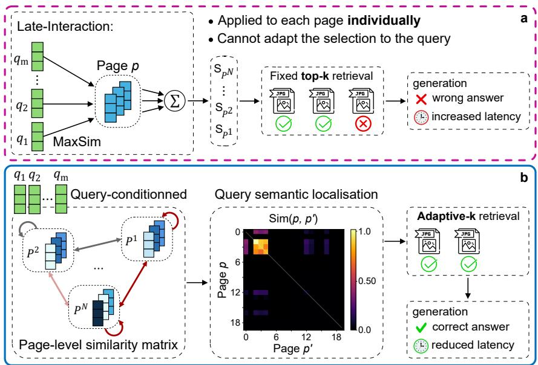  
no encoder training - operates in the embeddings space  
Figure 1: Document page retrieval mechanisms. (a) Late-interaction fixed top-k. (b) The proposed ViSAR adaptive-k method. While late-interaction enables fine-grained query-page matching using multi-vector representations, it relies on a fixed top-k retrieval that cannot adapt to the query, introducing irrelevant pages and unnecessary latency. ViSAR leverages these multi-vector representations without additional training to enable adaptive-k retrieval, reducing irrelevant pages, lowering latency, and improving answer accuracy.

In this setting, Retrieval-Augmented Generation (RAG) emerges as a promising paradigm, where an encoder projects a query and document pages into a shared embedding space, and a retrieval step selects the most relevant pages for an LVLM to generate an answer. While late-interaction models have significantly improved page representation [12–14, 3], determining how many pages should be retrieved remains an open challenge, despite its critical impact: too many pages increase LVLM latency and may introduce irrelevant context that degrade answer accuracy, whereas too few pages risk omitting relevant evidence.

State-of-the-art retrieval methods rely on a late-interaction mechanism [12], were the encoder independently maps the query and pages into multi-vector representations. Page relevance is obtained by aggregating the best matches of each query embedding across page embeddings, enabling fine-grained semantic matching, offline page encoding, and scalable online retrieval. However, late-interaction produces independent page relevance scores. As a result, it relies on a fixed top-k retrieval that cannot adapt to the query and may include irrelevant pages or omit relevant ones. Moreover, by treating pages independently and assigning uniform importance to embeddings, late-interaction does not exploit the semantic structure across pages (Figure 1-a).

Text retrieval has mitigated this through embedding weighting based on token frequency statistics [15–18], or adaptive-k retrieval [19], but these approaches rely on discrete token structures that do not extend to visual embeddings and often require additional training. In contrast, we show that late-interaction representations revea sparse, query-dependent semantic content across pages, enabling dynamic localization and adaptive retrieval.

We introduce ViSAR (Visual Semantic Activation Retrieval), a training-free retrieval mechanism that operates directly in the embedding space of late-interaction encoders. ViSAR constructs a query-conditioned page-level similarity matrix that highlights query semantics and enables adaptive-k retrieval, dynamically determining th number of retrieved pages at inference time (Figure 1-b). We also show that the structure of the similarity matrix correlates with answer accuracy, suggesting a general principle for quality-aware document understanding. Our main contributions are as follows:

• ViSAR: A training-free adaptive-k retrieval mechanism for visual retrieval using late-interaction encoders.

• Semantic localization: A query-conditioned page-level similarity matrix whose structure reflects evidence localization and correlates with answer accuracy.

• Experiments: ViSAR retrieves fewer pages than fixed top-k retrieval on average and reduces RAG latency by up to 58.7%, while maintaining or improving answer accuracy across multiple encoders and LVLMs.

## 2 Related Work

## 2.1 Multi-Vector Retrieval and Embedding Weighting.

Multi-vector retrieval via late-interaction was introduced by ColBERT [12] for text documents. It represents queries and pages as independent sets of token-level embeddings, and page relevance is computed by aggregating query embeddings’ best similarity score to page embeddings. Subsequent works improved its efficiency [20, 21], introduced token weighting mechanisms based on frequency statistics, learned importance estimation, or sparse representations [15, 17, 16, 18, 22–24], and explored retrieval refinement through pseudo-relevance feedback [25]. However, these approaches rely on Optical Character Recognition (OCR) to extract the text content, cannot capture visual content, and often require additional training. Recent works such as ColPali [13, 14] extend late-interaction by encoding each page as a set of visual patch embeddings, emerging as the state-of-the-art paradigm for OCR-free visual document retrieval [26, 13]. However, it still relies on independent page scores and fixed top-k retrieval, leaving the semantic organisation of pages unexplored. ViSAR instead exploits this structure to enable adaptive-k retrieval.

## 2.2 Adaptive-k Retrieval.

Adaptive retrieval has mainly been explored via iterative approaches, where LLMs or LVLMs reason over multiple rounds of fixed top-k retrieval, making k vary implicitly across iterations [27–31]. However, adaptive-k methods directly estimate the number of pages to retrieve in a single pass. Prior work determines the retrieval cut-off via heuristics applied to late-interaction scores by identifying the largest gap between consecutive scores [19] or by clustering scores to detect transitions [32, 33]. However, these methods are text-based or require additional training, and rely solely on score distributions, while ViSAR performs training-free adaptive-k retrieval by exploiting the semantic structure encoded in late-interaction representations.

## 2.3 Visual Document Retrieval and DocVQA.

These advances in retrieval have directly influenced recent OCR-free DocVQA systems, where effective page selection is a key component of the reasoning pipeline combined with LVLM-based reasoning [34]. VisRAG [3] introduced a dedicated single-vector visual retriever, while M3DocRAG [1] demonstrated the effectiveness of multi-vector late-interaction retrieval with ColPali. Other frameworks [35, 2, 36, 37] improve visual encoders, iterative retrieval, or LVLM reasoning. However, none exploit the semantic structure induced by late-interaction representations, which ViSAR addresses while remaining agnostic to the encoder and LVLM.

## 3 Visual Semantic Activation Retrieval (ViSAR)

Figure 2 depicts our method, ViSAR, which addresses visual retrieval in DocVQA. ViSAR enables adaptive-k retrieval by weighting Query-to-Page, Page-to-Query, and Page-to-Page interactions without encoder retraining. It uses the MaxSim operator from late-interaction [12, 13] to exploit the fine-grained semantic structure in the embedding space and improve retrieval. Algorithm S1 (supplementary material) summarizes the full pipeline.

## 3.1 Preliminaries: MaxSim and Late-Interaction

We denote a document $\mathcal { D }$ as a set of pages $\mathcal { D } = \{ P ^ { 1 } , . . . , P ^ { N } \}$ . Each page $P ^ { p }$ and query $Q$ are denoted as $P ^ { p } = \{ v _ { j } ^ { p } \} _ { j = 1 } ^ { n _ { p } }$ and $Q = \{ q _ { i } \} _ { i = 1 } ^ { m }$ , their respective sets of multi-vector representations in a common embedding space $\mathbb { R } ^ { \breve { D } }$ , such that $P ^ { p } \in \mathbb { R } ^ { n _ { p } \times D }$ and $Q \in \mathbb { R } ^ { m \times D }$ . The relevance score of $P ^ { p }$ to $Q$ is estimated via lateinteraction between their sets of embeddings (Equation 1), summing each $q _ { i }$ maximum similarity over all $v _ { j } ^ { p }$ where sim $( \cdot , \cdot ) = \langle \cdot , \cdot \rangle$ defines the cosine similarity between two embeddings.

$$
S _ { Q , P ^ { p } } = \sum _ { i = 1 } ^ { m } \operatorname* { m a x } _ { j \in \{ 1 , . . . , n _ { p } \} } \sin ( q _ { i } , \ v _ { j } ^ { p } )\tag{1}
$$

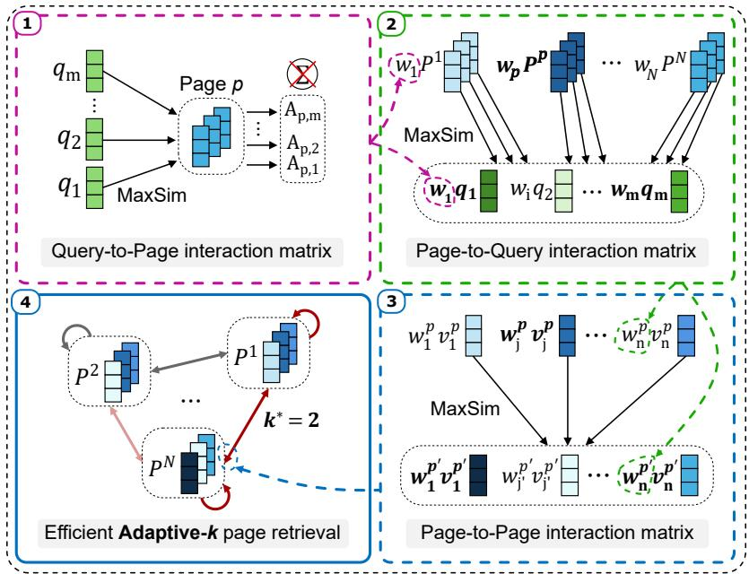  
Figure 2: ViSAR overview. The method performs successive interactions in embedding space – 1. Query-to-page: Unlike late-interaction, MaxSim activations are analyzed across pages rather than summed over tokens, to derive token- and page-level weights (pink dotted arrows). 2. Page-to-Query: These weights modulate patch-query similarities to derive patch-level weights (green dotted arrows). 3. Page-to-Page: These weights modulate patch-patch similarities to compute query-conditioned similarities between pages (blue dotted arrow), forming a page-level similarity matrix that highlights the shared query-related content. 4. Adaptive-k: The similarity matrix is used to retrieve an adaptivek set of pages.

## 3.2 Adaptive Multi-Level Interaction Weighting

Given the uniform contribution of $q _ { i }$ and $v _ { j } ^ { p }$ in Equation 1, we estimate their importance directly from the embedding space. Since cosine similarity measures embedding alignments in a semantically structured space, the MaxSim operator over all $v _ { j } ^ { p }$ captures how strongly the semantic encoded by $q _ { i }$ is realized in $P ^ { p }$ . We refer to $A _ { p , i }$ (Equation 2) as the activation score. Unlike late-interaction (Equation 1), which aggregates the activations over qi into a single score, we exploit the full activation matrix to identify discriminative query semantics.

$$
A _ { p , i } = \operatorname* { m a x } _ { j \in \{ 1 , \dots , n _ { p } \} } \operatorname { s i m } \bigl ( q _ { i } , v _ { j } ^ { p } \bigr ) = \operatorname* { m a x } _ { j \in \{ 1 , \dots , n _ { p } \} } \langle q _ { i } , v _ { j } ^ { p } \rangle\tag{2}
$$

## 3.2.1 Query-to-Page Interaction Weighting

We use $A _ { p , i }$ to derive weights for vectors $q _ { i }$ and pages $P ^ { p }$ to highlight strong and spatially localized semantics. $A _ { p , i }$ is rescaled by its mean across pages into $\hat { A } _ { p , i } ,$ and modulated by its normalized inter-page standard deviation ${ \hat { \sigma } } _ { i } ,$ yielding $\tilde { A } _ { p , i }$ i (Equation 4).

$$
{ \hat { A } } _ { p , i } = { \frac { A _ { p , i } } { \operatorname { m e a n } _ { p } ( A _ { p , i } ) } } \qquad { \hat { \sigma } } _ { i } = { \frac { \operatorname { s t d } _ { p } ( A _ { p , i } ) } { \operatorname { m e a n } _ { i ^ { \prime } } ( \operatorname { s t d } _ { p } ( A _ { p , i ^ { \prime } } ) ) } }\tag{3}
$$

$$
\tilde { A } _ { p , i } = \hat { A } _ { p , i } \cdot \hat { \sigma } _ { i }\tag{4}
$$

Aggregating ${ \tilde { A } } _ { p , i }$ over pages penalizes ubiquitous semantic content and highlights sparse activations, resulting in a weight $w _ { i }$ for each $q _ { i }$ (Equation 5).

$$
w _ { i } = \log \frac { N } { 1 + a _ { i } } , \quad \mathrm { w i t h } a _ { i } = \sum _ { p } \tilde { A } _ { p , i }\tag{5}
$$

We then compute a page-level semantic co-activation $C _ { i , i ^ { \prime } } ^ { p }$ , which is normalized by the mean activation of each qi across pages, and a weight $w _ { p }$ is obtained for each page by aggregating the mean co-activation of all $q _ { i }$ (Equation 7).

$$
\begin{array} { r } { C _ { i , i ^ { \prime } } ^ { p } = \tilde { A } _ { p , i } \cdot \tilde { A } _ { p , i ^ { \prime } } \qquad \bar { A } _ { i } = \mathrm { m e a n } _ { p } \left( \tilde { A } _ { p , i } \right) } \end{array}\tag{6}
$$

$$
w _ { p } = \sum _ { i = 1 } ^ { m } \mathrm { m e a n } _ { i ^ { \prime } } \Big ( \frac { C _ { i , i ^ { \prime } } ^ { p } } { \bar { A } _ { i } \cdot \bar { A } _ { i ^ { \prime } } } \Big )\tag{7}
$$

## 3.2.2 Page-to-Query Interaction Weighting

Min-Max normalization is applied to $w _ { i }$ and $w _ { p } ,$ yielding $\hat { w } _ { i } , \hat { w } _ { p } \in [ 0 , 1 ]$ , which modulate the activations $\tilde { A } _ { p , : }$ and weight the cosine similarity between all $q _ { i }$ and $v _ { j } ^ { p }$ . The MaxSim operator is then applied over all $q _ { i } ( \mathrm { i . e . }$ patch-to-query direction, reversing standard late-interaction) to capture how strongly the semantic encoded by $\boldsymbol { v } _ { j } ^ { p }$ is realized in the query $Q .$ . We use this weighted maximum similarity as the relevance score $r _ { j } ^ { p }$ of $v _ { j } ^ { p }$ . A weight $\boldsymbol { w _ { j } ^ { p } }$ is obtained for each $v _ { j } ^ { p }$ of a page $P ^ { p }$ by centering and thresholding the relevance $r _ { j } ^ { p }$ (Equation 9).

$$
r _ { j } ^ { p } = \operatorname* { m a x } _ { i \in \{ 1 , . . . , m \} } \left[ \langle v _ { j } ^ { p } , q _ { i } \rangle \cdot \left( \tilde { A } _ { p , i } \cdot \hat { w } _ { i } \cdot \hat { w } _ { p } \right) ^ { 2 } \right]\tag{8}
$$

$$
w _ { j } ^ { p } = \operatorname* { m a x } \bigl ( 0 , \ r _ { j } ^ { p } - \operatorname* { m e a n } _ { p , j } \left( r _ { j } ^ { p } \right) \bigr )\tag{9}
$$

## 3.2.3 Page-to-Page Interaction Weighting

A Min-Max normalization is applied to $\boldsymbol { w } _ { j } ^ { p } .$ , yielding $\hat { w } _ { j } ^ { p } \in [ 0 , 1 ]$ , which modulates the importance of page embeddings and enables a similarity measure between pages. For a source page $P ^ { p }$ and target page $P ^ { p ^ { \prime } }$ , the cosine similarity between all $v _ { j } ^ { p }$ and $v _ { j ^ { \prime } } ^ { p ^ { \prime } }$ is weighted by the target embedding weights $\hat { w } _ { j ^ { \prime } } ^ { p ^ { \prime } }$ . The MaxSim operator is then applied over all $v _ { j ^ { \prime } } ^ { p ^ { \prime } }$ to capture how strongly the semantic encoded by $v _ { j } ^ { p }$ is realized in $P ^ { p ^ { \prime } }$ . The resulting score is then weighted by the source embedding weight $\hat { w } _ { j } ^ { p }$ to obtain $S _ { j } ^ { p  p ^ { \prime } }$ (Equation 10).

$$
S _ { j } ^ { p \to p ^ { \prime } } = \hat { w } _ { j } ^ { p } \cdot \operatorname* { m a x } _ { j ^ { \prime } } \left[ \langle v _ { j } ^ { p } , v _ { j ^ { \prime } } ^ { p ^ { \prime } } \rangle \cdot \hat { w } _ { j ^ { \prime } } ^ { p ^ { \prime } } \right]\tag{10}
$$

Finally, the similarity matrix Sim $\boldsymbol { \mathfrak { n } } ( p , p ^ { \prime } ) \in \mathbb { R } ^ { N \times N }$ is computed by averaging the $T$ largest interactions of $S _ { i } ^ { p  p ^ { \prime } }$ across source embeddings $v _ { j } ^ { p } ,$ , denoted by $\mathcal { T } \subset \{ 1 , \dotsc , n _ { p } \}$ , and taking the square root (Equation 11). Since each source embedding independently searches for its best match in the target page (Equation 10), this formulation naturally produces a directional page similarity, where Sim $\mathrm { \Lambda } _ { 1 } ( p , p ^ { \prime } ) \ne \bar { \mathrm { S i m } ( p ^ { \prime } , } p )$

$$
\mathrm { S i m } ( p , p ^ { \prime } ) = \sqrt { \frac { 1 } { T } \sum _ { j \in \mathcal { T } } S _ { j } ^ { p \to p ^ { \prime } } }\tag{11}
$$

## 3.2.4 Adaptive-k Retrieval

We leverage the structure of $\mathrm { S i m } ( p , p ^ { \prime } )$ to develop an adaptive-k retrieval method that adapts to the query. The self-similarity $s _ { p } = \mathrm { S i m } ( p , p )$ of a page is used to rank the pages and define a candidate relevant set $\mathcal { R } _ { k } .$ containing the k highest-scoring pages. The remaining $N - k$ pages constitute the irrelevant set $\mathcal { T } _ { k } .$ . For each page $p \in \mathcal { R } _ { k }$ , we compute its coherence with the relevant set, $\bar { c } _ { k } ^ { p }$ , and the leakage from the irrelevant set, $l _ { k } ^ { p } .$ as the mean similarity to pages in $\mathcal { R } _ { k }$ and $\mathcal { T } _ { k }$ , respectively (Equation 12). The scores $s _ { p }$ are also normalized to yield $w _ { s _ { p } }$ summing to one, and combined with $c _ { k } ^ { p }$ and $l _ { k } ^ { p }$ in the cost function $\mathcal { I } ( k )$ . The optimal number of pages $k ^ { \star }$ is obtained by minimizing $\mathcal { I } ( k )$ , requiring the evaluation of at most $N$ candidate sets, while an exhaustive search would require evaluating $2 ^ { N }$ sets.

$$
c _ { k } ^ { p } = \mathrm { m e a n } _ { p ^ { \prime } \in \mathcal { R } _ { k } } \left[ \mathrm { S i m } ( p , p ^ { \prime } ) \right]\tag{12}
$$

$$
l _ { k } ^ { p } = \mathrm { m e a n } _ { p ^ { \prime } \in \mathcal { T } _ { k } } \left[ \mathrm { S i m } ( p , p ^ { \prime } ) \right]\tag{13}
$$

$$
\mathcal { I } ( k ) = \sum _ { p \in \mathcal { R } _ { k } } w _ { s _ { p } } \Big ( c _ { k } ^ { p } - \gamma l _ { k } ^ { p } \Big )\tag{14}
$$

The parameter $\gamma > 0$ controls the leakage penalty. In addition, since the minimum $\mathcal { T } ( k ^ { \star } )$ may imply residual leakage from pages in $\mathcal { T } _ { k ^ { \star } }$ , we evaluate whether $\dot { k } ^ { \star }$ corresponds to a sharp transition by accepting $\mathcal { R } _ { k ^ { \star } + 1 }$ only if $\mathcal { I }$ varies more sharply beyond $k ^ { \star }$ than before it, indicating a large drop in leakage caused by the transitioning page (Algorithm S1).

## 3.2.5 Implementation Details

We exploit the natural sparsity induced by ViSAR. Equation 9 produces a subset of inactive pages whose patch weights are all zero, which cannot contribute to the similarity matrix (Equation 11). These pages are excluded from the computation of Equation 10 and the optimization of $\mathcal { I } ( k )$ . Equation 10 is also evaluated block-wise rather than as a dense tensor, reducing peak memory usage. These implementation choices preserve exact mathematical equivalence while avoiding unnecessary computation.

## 4 Experiments

We evaluate three research questions: (RQ1) Can ViSAR effectively adapt the number of retrieved pages compared with fixed top-k late-interaction retrieval, and how does this affect DocVQA accuracy? (RQ2) How does ViSAR’s adaptive retrieval strategy impact latency? (RQ3) Can ViSAR’s similarity matrix provide insights into answer quality?

## 4.1 Experimental Setup

All experiments were conducted on an NVIDIA A6000 GPU (48 GB of memory) and run once per configuration. We set $T = 5 0$ in Equation 11 and $\gamma = 1 0 ^ { 5 }$ in Equation 14. Further details on compute resources and sensitivity analyses for both hyperparameters are provided in the supplementary material.

Datasets. MMLongBench [38] and LongDocURL [39] datasets were used, which provide the answer evidence pages for page ranking evaluation. They cover multiple scenarios to evaluate the answer generation, requiring textual and visual reasoning across pages, and efficient retrieval over multi-page documents.

Encoders. We evaluate ViSAR on multi-vector embeddings from three OCR-free visual encoders: ColPali [13], ColQwen2.5 [13], and ColModernVBERT [14]. For broader comparison, we consider ColBERTv2 [20], a multi-vector text encoder operating on OCR-extracted text, and VisRAG-Ret [3], a single-vector visual encoder.

Retrieval Baselines. Multi-vector embeddings use late-interaction with fixed top-k, whereas single-vector embeddings use cosine similarity with fixed top-k [3]. We also adapt two adaptive-k heuristic methods originally proposed for late-interaction text retrieval to visual retrieval: a Largest-Gap criterion [19] and a Score-Cluster approach [32].

Oracle. Using the late-interaction ranking, the Oracle adapts the number of retrieved pages by selecting the smallest top-k that contains all evidence pages. It provides an upper bound on adaptive-k under a standard and fixed ranking, which may include irrelevant pages.

ViSAR Evaluation. We examine the effectiveness of ViSAR’s adaptive behaviour by reporting retrieval statistics, Precision, Recall, and F1-scores at rank $k ^ { \star }$ , and comparing ViSAR with Oracle, Largest-Gap, and Score-Cluster adaptive methods. We evaluate ViSAR’s ranking quality against late-interaction ranking using Recall and normalized discounted cumulative gain (NDCG) at ranks 5 and 10. We then assess the impact of adaptive retrieval on answer generation using Qwen2.5-VL-7B-Instruct (greedy decoding) as the primary model, plus additional generation models with default configurations. All methods are evaluated under a maximum budget of Max-k pages, i.e, top-k = Max-k for fixed top-k retrieval. We report the answer accuracy, leveraging LLM-as-a-judge evaluation [40, 41], with Qwen2.5-14B-Instruct LLM [42] as the evaluator. It receives the query, the reference answer and the generated answer, and predicts a binary correctness label based on semantic equivalence, using few-shot examples and a constrained structured output. We then analyse how ViSAR latenc scales with document size, and compare its retrieval and generation costs with fixed top-k, Largest-Gap, and Score-Cluster. Finally, we provide an ablation study to assess the contribution of ViSAR’s components.

## 4.2 Experimental Results

Preliminary experiments revealed numerical instabilities using ColModernVBERT on a few LongDocURL pages (7.31% of queries). Careful investigation confirmed that the issue occurred during encoding, independently of ViSAR. These samples were excluded from evaluation.

## 4.2.1 Adaptive Retrieval

Table 1 reports mean, median, Recall@k⋆, Precision@k⋆, and $\mathrm { F } 1 @ k ^ { \star }$ across encoders for ViSAR, Oracle, Largest-Gap and Score-Cluster methods. The mean of Oracle shows that retrieving all evidence pages often requires significantly more pages than the number of evidence pages, while its lower median indicates that compact retrieval is sufficient for many queries. This reflects the known limitations of late-interaction ranking [14, 43], which may struggle to capture all relevant pages for complex queries, requiring the retrieval of intermediate irrelevant pages that may lead to unnecessarily large contexts. Adaptive retrieval methods exhibit a similar pattern to Oracle but explicitly balance Recall and Precision, with ViSAR retrieving fewer pages than Oracle on average while Largest-Gap and Score-Cluster retrieve more.

Figure 3-a further characterises this behaviour as a function of $k _ { \mathrm { O r a c l e } }$ . ViSAR closely follows Oracle at low $k _ { \mathrm { O r a c l e } }$ and retrieves fewer pages as $k _ { \mathrm { O r a c l e } }$ increases, limiting the inclusion of irrelevant pages that accumulate in complex queries. In contrast, Largest-Gap and Score-Cluster over-retrieve across most $k _ { \mathrm { O r a c l e } }$ , consistent with their higher mean $k ^ { \star }$ (Table 1). Consequently, ViSAR tends to favour precision, while Largest-Gap and Score-Cluster tend to favour recall.

Table 1: Adaptive-k retrieval: means (m), medians (md), Recall@k⋆ (R@k⋆), Precision $\varpi k ^ { \star } \left( \mathrm { P } @ k ^ { \star } \right)$ and $\operatorname { F } 1 @ k ^ { \star }$ . Oracle retrieves substantially more pages than the number of evidence pages, reflecting the known limitations [14, 43] of late-interaction ranking. Adaptive methods balance Recall and Precision by adjusting the number of retrieved pages, with ViSAR favouring more compact retrieved sets on average, avoiding unnecessarily large retrieval sets. Full distributions in Figure S1–S2
<table><tr><td rowspan="2">Encoder</td><td rowspan="2">Retrieval</td><td colspan="5">MMLongBench</td><td colspan="5">LongDocURL</td></tr><tr><td>m</td><td></td><td>md R@k*</td><td>P@k*</td><td>F1@k*</td><td>m</td><td></td><td>md R@k*</td><td>P@k*</td><td>F1@k*</td></tr><tr><td>ColQwen2.5 Oracle</td><td></td><td>8.3</td><td>2</td><td>100.0</td><td>67.30</td><td>80.45</td><td>10.7</td><td>3</td><td>100.0</td><td>61.07</td><td>75.83</td></tr><tr><td></td><td>Score-Cluster</td><td>18.6</td><td>8</td><td>85.57</td><td>29.51</td><td>43.89</td><td>36.6</td><td>20</td><td>89.49</td><td>18.85</td><td>31.14</td></tr><tr><td></td><td>Largest-Gap</td><td>15.4</td><td>2</td><td>81.12</td><td>45.13</td><td>58.00</td><td>28.7</td><td>3</td><td>82.09</td><td>45.15</td><td>58.26</td></tr><tr><td></td><td>ViSAR (ours)</td><td>4.7</td><td>3</td><td>75.16</td><td>50.37</td><td>60.32</td><td>7.9</td><td>5</td><td>81.24</td><td>38.41</td><td>52.16</td></tr><tr><td>ColPali</td><td>Oracle</td><td>8.8</td><td>2</td><td>100.0</td><td>62.16</td><td>76.67</td><td>12.4</td><td>3</td><td>100.0</td><td>57.70</td><td>73.18</td></tr><tr><td></td><td>Score-Cluster</td><td>18.7</td><td>8</td><td>82.64</td><td>26.12</td><td>39.70</td><td>35.8</td><td>18</td><td>87.56</td><td>19.15</td><td>31.43</td></tr><tr><td></td><td>Largest-Gap</td><td>16.2</td><td>3</td><td>79.16</td><td>41.94</td><td>54.83</td><td>24.7</td><td>2</td><td>79.37</td><td>46.79</td><td>58.87</td></tr><tr><td></td><td>ViSAR (ours)</td><td>5.3</td><td>3</td><td>73.57</td><td>46.11</td><td>56.69</td><td>8.1</td><td>6</td><td>80.16</td><td>34.38</td><td>48.12</td></tr><tr><td>ColModern</td><td>Oracle</td><td>10.5</td><td>2</td><td>100.0</td><td>58.87</td><td>74.11</td><td>13.0</td><td>3</td><td>100.0</td><td>53.35</td><td>69.58</td></tr><tr><td>VBERT</td><td>Score-Cluster</td><td>23.0</td><td>12</td><td>84.28</td><td>23.59</td><td>36.86</td><td>47.4</td><td>44</td><td>87.90</td><td>15.61</td><td>26.51</td></tr><tr><td></td><td>Largest-Gap</td><td>20.0</td><td>4</td><td>80.57</td><td>36.81</td><td>50.53</td><td>39.3</td><td>4</td><td>83.57</td><td>34.94</td><td>49.28</td></tr><tr><td></td><td>ViSAR (ours)</td><td>7.5</td><td>4</td><td>74.07</td><td>34.43</td><td>46.99</td><td>13.5</td><td>11</td><td>83.99</td><td>17.47</td><td>28.92</td></tr><tr><td colspan="2">evidence pages</td><td>1.9</td><td>1</td><td></td><td></td><td></td><td>1.9</td><td>2</td><td>一</td><td>一</td><td></td></tr></table>

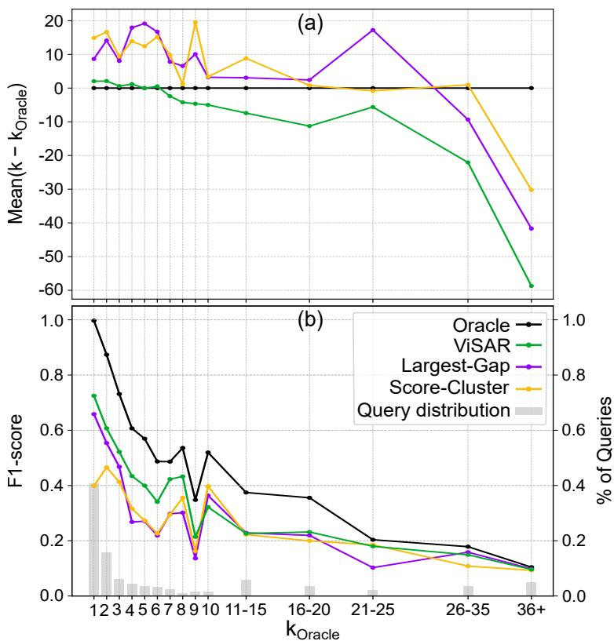  
Figure 3: Adaptive-k retrieval as a function of $k _ { \mathrm { O r a c l e } } ,$ , using ColQwen2.5 on MMLongBench (consistent trends across encoders and datasets in Figures S3–S4). (a): mean difference $k - k _ { \mathrm { O r a c l e } } .$ . ViSAR closely follows Oracle at low $k _ { \mathrm { O r a c l e } }$ and retrieves fewer pages as $k _ { \mathrm { O r a c l e } }$ increases, limiting irrelevant pages retrieval. Largest-Gap and Score-Cluster over-retrieve across most $k _ { \mathrm { O r a c l e } }$ . (b): F1-score with the corresponding percentage of queries. ViSAR achieves higher F1, especially at lower $k _ { \mathrm { O r a c l e } }$

Table 2: Page ranking evaluation, comparing ViSAR and late-interaction at ranks 5 and 10 on MMLongBench (similar trends for LongDocURL in Table S1). ViSAR consistently improves page ranking, providing stronger support for its adaptive-k retrieval mechanism.
<table><tr><td rowspan="2">Ranking Method</td><td colspan="2">Recall</td><td colspan="2">NDCG</td></tr><tr><td>@5</td><td>@10</td><td>@5</td><td>@10</td></tr><tr><td>Using Colpali</td><td></td><td></td><td></td><td></td></tr><tr><td>Late-Interaction</td><td>75.00</td><td>84.49</td><td>0.730</td><td>0.746</td></tr><tr><td>ViSAR (ours)</td><td>76.36</td><td>86.68</td><td>0.734</td><td>0.756</td></tr><tr><td>Using ColQwen2.5</td><td></td><td></td><td></td><td></td></tr><tr><td>Late-Interaction</td><td>78.60</td><td>86.82</td><td>0.780</td><td>0.793</td></tr><tr><td>ViSAR (ours)</td><td>79.73</td><td>87.73</td><td>0.790</td><td>0.799</td></tr><tr><td>Using ColModernVBERT</td><td></td><td></td><td></td><td></td></tr><tr><td>Late-Interaction</td><td>72.79</td><td>83.14</td><td>0.704</td><td></td></tr><tr><td>ViSAR (ours)</td><td>73.66</td><td>83.56</td><td>0.709</td><td>0.723 0.725</td></tr></table>

Accordingly, dataset-level F1-scores (Table 1) show that ViSAR performs best on MMLongBench, while Largest-Gap performs best on LongDocURL. However, this aggregate metric depends on the query distribution over $k _ { \mathrm { O r a c l e } } .$ . When analysed across $k _ { \mathrm { O r a c l e } } .$ , ViSAR achieves higher F1-scores on MMLongBench (Figure 3- b), particularly for lower $k _ { \mathrm { O r a c l e } }$ where most queries are located. On LongDocURL (Figure S3-a), ViSAR outperforms Largest-Gap for most $k _ { \mathrm { O r a c l e } } ,$ except $k _ { \mathrm { { O r a c l e } } } = 1$ , suggesting that Largest-Gap is mostly effective for single-page queries, which constitute the majority of queries. This contributes to its higher dataset-level F1-score, whereas ViSAR provides a more consistent adaptive retrieval across query complexities. Overall (Figure 3-b, Figure S3), ColQwen2.5 shows the best results, followed by ColPali, while ColModernVBERT exhibits a weaker trend.

Table 2 confirms this trend, showing that ViSAR’s adaptive behaviour is grounded in improved ranking, outperforming late-interaction ranking across Recall and NDCG at ranks 5 and 10, indicating that its weighting mechanism better aligns page scoring to the query. Yet, ColModernVBERT shows more modest improvements, consistent with its smaller size (250M vs. 3B parameters), which likely limits its ability to separate semantics, resulting in less compact sets (Table 1) and lower ranking performance overall.

## 4.2.2 Answer Accuracy

Table 3 compares ViSAR with literature baselines, where Qwen2.5-VL-7B-Instruct LVLM and Qwen2.5-7B-Instruct LLM are used, respectively, as generation models for visual retrieval methods and text-based retrieval method (ColBERTv2, OCR-extracted text using Tesseract [44]). Max-k denotes an input budget of at most k pages, where fixed top-k methods always use the full budget while adaptive methods only do so when required. All adaptive methods outperform fixed top-k retrieval, with ViSAR achieving competitive or superior accuracy across all settings. Notably, Largest-Gap and Score-Cluster also improve over fixed top-k despite their simplicity, indicating the inherent benefit of adaptive-k retrieval.

Table 4 shows that ViSAR generalizes across encoders, maintaining or improving accuracy over late-interaction fixed top-k (McNemar’s test, $p < 0 . 0 5 )$ : ColQwen2.5 and ColPali show a general trend toward improvement, with significance on LongDocURL. ColModernVBERT shows a non-significant trend toward fixed top-k, consistent with its weaker retrieval performance (Table 1 and Table 2). Supplementary Tables S3–S7 confirm this trend using additional generation models: Across 60 configurations (3 encoders × 5 LVLMs × 2 Max-k budgets × 2 datasets), ViSAR improves accuracy in 24 cases and maintains in the remaining 36. The largest improvements are observed for LVLMs more sensitive to longer contexts (Tables S6–S7), consistent with ViSAR reducing both retrieved and irrelevant pages (Table 1).

## 4.2.3 RAG Latency

The reduction in context size enabled by adaptive retrieval lowers LVLM processing cost. While fixed top-k retrieval always maximises the LVLM input budget, ViSAR dynamically adjusts the number of pages and only uses the full budget when required. Figure 4 reports retrieval, generation, and end-to-end (retrieval + generation) latencies, showing that ViSAR introduces a retrieval overhead that contributes only marginally, achieving a substantial reduction in generation latency that dominates the total cost. This result in an end-to-end latency reductions of up to 58.7% on MMLongBench and 38.5% on LongDocURL at a Max-10 LVLM budget. Table S8 further compares ViSAR with Largest-Gap and Score-Cluster, showing that both methods also reduce RAG latency on average. However, Score-Cluster remains consistently slower than ViSAR, while Largest-Gap only provides a noticeable advantage on LongDocURL, with gains of up to 47.2% over fixed top-k at Max-10 budget.

Table 3: Answer generation accuracy against literature baselines. Qwen2.5-VL-7B-Instruct is used as the generation model for all visual methods, while ColBERTv2 operates on OCR-extracted text (Tesseract [44]) with Qwen2.5-7B-Instruct. Max-k denotes an input budget of at most k pages. Bold indicates highest results, with confidence intervals and Adaptive-k using other encoders in Table S2. ViSAR achieves competitive or superior accuracy across settings.
<table><tr><td rowspan="2">Retrieval Method</td><td colspan="2">MMLongBench</td><td colspan="2">LongDocURL</td></tr><tr><td>Max-5</td><td>Max-10</td><td>Max-5</td><td>Max-10</td></tr><tr><td colspan="5">Fixed top-k</td></tr><tr><td>ColBERTv2</td><td>24.51</td><td>24.70</td><td>47.18</td><td>47.70</td></tr><tr><td>M3DocRAG</td><td>34.86</td><td>35.08</td><td>59.31</td><td>58.71</td></tr><tr><td>VisRAG-Ret</td><td>34.48</td><td>35.69</td><td>57.29</td><td>58.02</td></tr><tr><td colspan="5">Adaptive-k (using ColQwen2.5)</td></tr><tr><td>Largest-Gap</td><td>35.79</td><td>35.88</td><td>61.01</td><td>60.89</td></tr><tr><td>Score-Cluster</td><td>36.25</td><td>35.97</td><td>60.00</td><td>59.83</td></tr><tr><td>ViSAR (ours)</td><td>36.53</td><td>36.63</td><td>61.06</td><td>60.97</td></tr></table>

Table 4: Answer generation accuracy across encoders. Qwen2.5-VL-7B-Instruct is used as the generation model. Max-k denotes an input budget of at most k pages. Bold indicates statistically significant differences according to McNemar’s test $( p < 0 . 0 5 )$ . ViSAR consistently maintains or improves accuracy, with no significant decreases observed, while retrieving fewer pages on average.
<table><tr><td rowspan="2">Retrieval Method</td><td colspan="2">MMLongBench</td><td colspan="2">LongDocURL</td></tr><tr><td>Max-5</td><td>Max-10</td><td>Max-5</td><td>Max-10</td></tr><tr><td>Using ColQwen2.5</td><td></td><td></td><td></td><td></td></tr><tr><td>Fixed top-k</td><td>35.04</td><td>35.69</td><td>59.79</td><td>59.27</td></tr><tr><td>ViSAR (ours)</td><td>36.53</td><td>36.63</td><td>61.06</td><td>60.97</td></tr><tr><td>Using ColPali</td><td></td><td></td><td></td><td></td></tr><tr><td>Fixed top-k</td><td>34.86</td><td>35.08</td><td>59.31</td><td>58.71</td></tr><tr><td>ViSAR (ours)</td><td>35.42</td><td>35.88</td><td>60.77</td><td>60.13</td></tr><tr><td>Using ColModernVBERT</td><td></td><td></td><td></td><td></td></tr><tr><td>Fixed top-k</td><td>34.75</td><td>34.95</td><td>58.42</td><td>58.84</td></tr><tr><td>ViSAR (ours)</td><td>34.01</td><td>34.28</td><td>58.28</td><td>58.33</td></tr></table>

Although ViSAR’s overhead increases with document size (Figure 4), it only becomes noticeable for the largest MMLongBench document (468 pages, Figure S10). In such cases, the supplementary material presents strategies that approximate the similarity matrix to preserve latency gains.

## 4.2.4 Similarity Structure Reflects Accuracy

ViSAR’s query-conditioned similarity matrix Sim $( p , p ^ { \prime } )$ provides an explicit representation of how queryrelevant information is distributed across a document. Figure 5 illustrates representative examples and shows that when query semantics are localised, $\mathrm { S i m } ( p , p ^ { \prime } )$ is sparse and produces a sharp minimum in J(k), enabling a reliable retrieval boundary (Figure 5-a). Conversely, when query semantics are distributed across many pages, $\mathrm { S i m } ( p , p ^ { \prime } )$ becomes denser, yielding a shallow minimum and a less reliable stopping decision (Figure 5-b).

Figure 5-c confirms this trend, showing that higher similarity matrix sparsity consistently correlates with higher answer accuracy across encoders on MMLongBench (similar trend on LongDocURL in Figure S14 and Table S9). While J (k) is designed to maximise coherence and minimise leakage within this structure, these results provide post-hoc validation that its components capture semantically meaningful retrieval properties. This suggests that analysing the structure in $\mathrm { S i m } ( p , p ^ { \prime } )$ is a promising direction for understanding the conditions of retrieval success and failure, potentially enabling the conception of a label-free feedback signal for future retrieval strategies, such as iterative query refinement or evidence selection, without additional models or training.

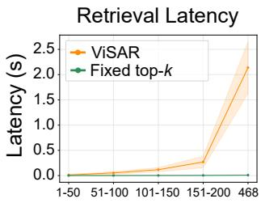

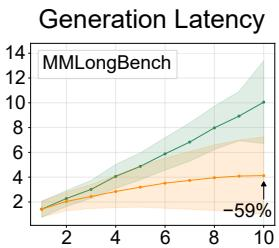

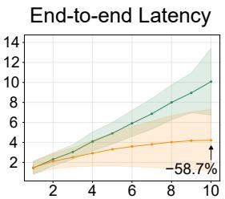

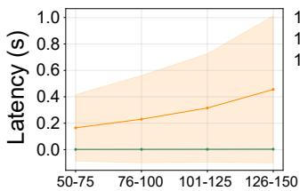  
# Document pages

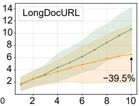  
Max-k retrieved pages

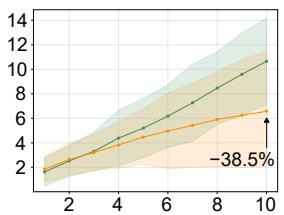  
Max-k retrieved pages  
Figure 4: Average RAG latency comparing ViSAR and fixed top-k (shaded: std). Although ViSAR introduces a retrieval overhead that grows with document size, it reduces generation latency by limiting LVLM input context. The net effect is an end-to-end latency reduction of up to 58.7% at $k = 1 0 ,$ . The retrieval overhead becomes significant only for the longest MMLongBench document (468 pages, Figure S10). For such extreme cases, computational approximations of the similarity matrix are provided in the supplementary material to preserve latency gains.

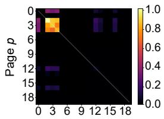

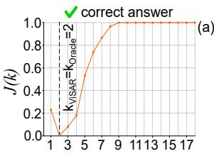

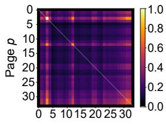  
Page p'

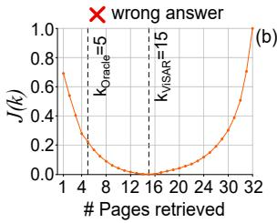

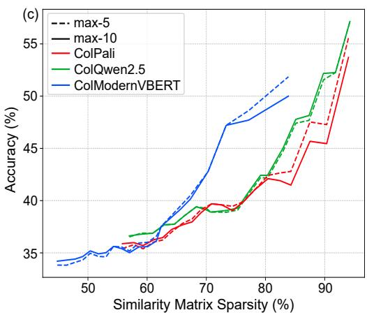  
Figure 5: Similarity matrix structure and answer accuracy on MMLongBench. (a, b): Queryconditioned page-level similarity matrices (zero values in black) and the corresponding retrieval cost function $\mathcal { I } ( k )$ , with $k _ { \mathrm { V i S A R } } ^ { \star }$ and $k _ { \mathrm { O r a c l e } } ^ { \star }$ marked. (a): A sparse matrix allows the query semantics to be effectively localized, which produces a sharp minimum in $\mathcal { I } ( k )$ , enabling accurate adaptive retrieval and correct answer generation. (b): A dense matrix yields a shallow minimum, causing over-retrieval and incorrect answer generation. (c): Answer accuracy as a function of the percentage of inactive entries in the similarity matrix, showing that higher sparsity consistently correlates with higher accuracy across encoders.

## 4.2.5 Ablation Studies

We evaluate simplified variants by disabling the query embedding weights $w _ { i } ,$ page weights $w _ { p } ,$ , patch embedding weights $w _ { i } ^ { p } ,$ and by replacing the optimization objective J(k) with fixed top-k, Largest-Gap, and Score-Cluster retrieval. Table S10 shows that each modification degrades retrieval quality and downstream answer accuracy, indicating that both the weighting strategy and the optimization objective contribute to ViSAR’s performance.

## 5 Conclusion

We introduced ViSAR, a training-free visual embedding weighting mechanism enabling adaptive-k retrieval for document visual question answering. It operates in the embedding space of late-interaction encoders to construct a query-conditioned page-level similarity matrix that drives compact and adaptive page selection, reducing RAG latency by up to 58.7% while maintaining or improving answer accuracy. We further showed that the structure of the similarity matrix reflects the localization of query-relevant information and correlates with answer accuracy, suggesting that it may provide a useful feedback signal for future retrieval strategies.

## 6 Supporting Information

Figure S1–S14 and Table S1–S10 are available in the supplementary material pdf.

## References

[1] Jaemin Cho, Debanjan Mahata, Ozan Irsoy, Yujie He, and Mohit Bansal. M3docrag: Multi-modal retrieval is what you need for multi-page multi-document understanding. arXiv preprint arXiv:2411.04952, 2024.

[2] Siwei Han, Peng Xia, Ruiyi Zhang, Tong Sun, Yun Li, Hongtu Zhu, and Huaxiu Yao. Mdocagent: A multi-modal multi-agent framework for document understanding. arXiv preprint arXiv:2503.13964, 2025.

[3] Shi Yu, Chaoyue Tang, Bokai Xu, Junbo Cui, Junhao Ran, Yukun Yan, Zhenghao Liu, Shuo Wang, Xu Han, Zhiyuan Liu, et al. Visrag: Vision-based retrieval-augmented generation on multi-modality documents. In International Conference on Learning Representations, volume 2025, pages 21074–21098, 2025.

[4] Rubèn Tito, Dimosthenis Karatzas, and Ernest Valveny. Hierarchical multimodal transformers for multipage docvqa. Pattern Recognition, 144:109834, 2023.

[5] Gilles Baechler, Srinivas Sunkara, Maria Wang, Fedir Zubach, Hassan Mansoor, Vincent Etter, Victor Carbune, Jason Lin, Jindong Chen, and Abhanshu Sharma. Screenai: A vision-language model for ui and˘ infographics understanding. arXiv preprint arXiv:2402.04615, 2024.

[6] Shuai Bai, Yuxuan Cai, Ruizhe Chen, Keqin Chen, Xionghui Chen, Zesen Cheng, Lianghao Deng, Wei Ding, Chang Gao, Chunjiang Ge, et al. Qwen3-vl technical report. arXiv preprint arXiv:2511.21631, 2025.

[7] Zhe Chen, Weiyun Wang, Hao Tian, Shenglong Ye, Zhangwei Gao, Erfei Cui, Wenwen Tong, Kongzhi Hu, Jiapeng Luo, Zheng Ma, et al. How far are we to gpt-4v? closing the gap to commercial multimodal models with open-source suites. Science China Information Sciences, 67(12):220101, 2024.

[8] Camille Barboule, Benjamin Piwowarski, and Yoan Chabot. Survey on question answering over visually rich documents: Methods, challenges, and trends. arXiv preprint arXiv:2501.02235, 2025.

[9] Minesh Mathew, Dimosthenis Karatzas, and CV Jawahar. Docvqa: A dataset for vqa on document images. In Proceedings of the IEEE/CVF winter conference on applications of computer vision, pages 2200–2209, 2021.

[10] Ahmed Masry, Xuan Long Do, Jia Qing Tan, Shafiq Joty, and Enamul Hoque. Chartqa: A benchmark for question answering about charts with visual and logical reasoning. In Findings of the association for computational linguistics: ACL 2022, pages 2263–2279, 2022.

[11] Minesh Mathew, Viraj Bagal, Rubèn Tito, Dimosthenis Karatzas, Ernest Valveny, and CV Jawahar. Infographicvqa. In Proceedings ofthe IEEE/CVF Winter Conference on Applications ofComputer Vision, pages 1697–1706, 2022.

[12] Omar Khattab and Matei Zaharia. Colbert: Efficient and effective passage search via contextualized late interaction over bert. In Proceedings ofthe 43rd International ACM SIGIR conference on research and development in Information Retrieval, pages 39–48, 2020.

[13] Manuel Faysse, Hugues Sibille, Tony Wu, Bilel Omrani, Gautier Viaud, Céline Hudelot, and Pierre Colombo. Colpali: Efficient document retrieval with vision language models. In International Conference on Learning Representations, volume 2025, pages 61424–61449, 2025.

[14] Paul Teiletche, Quentin Macé, Max Conti, Antonio Loison, Gautier Viaud, Pierre Colombo, and Manuel Faysse. Modernvbert: Towards smaller visual document retrievers. arXiv preprint arXiv:2510.01149, 2025.

[15] Xiao Wang, Craig Macdonald, Nicola Tonellotto, and Iadh Ounis. Pseudo-relevance feedback for multiple representation dense retrieval. In Proceedings ofthe 2021 ACM SIGIR International Conference on Theory of Information Retrieval, pages 297–306, 2021.

[16] Karan Samel, Cheng Li, Weize Kong, Tao Chen, Mingyang Zhang, Shaleen Gupta, Swaraj Khadanga, Wensong Xu, Xingyu Wang, Kashyap Kolipaka, et al. End-to-end query term weighting. In Proceedings of the 29th ACM SIGKDD Conference on Knowledge Discovery and Data Mining, pages 4778–4786, 2023.

[17] S Archish, Ankit Garg, Kirankumar Shiragur, and Neeraj Kayal. Incorporating token importance in multi-vector retrieval. In Proceedings of the AAAI Conference on Artificial Intelligence, volume 40, pages 32860–32866, 2026.

[18] Minghan Li, Sheng-Chieh Lin, Xueguang Ma, and Jimmy Lin. Slim: Sparsified late interaction for multivector retrieval with inverted indexes. In Proceedings of the 46th International ACM SIGIR Conference on Research and Development in Information Retrieval, pages 1954–1959, 2023.

[19] Chihiro Taguchi, Seiji Maekawa, and Nikita Bhutani. Efficient context selection for long-context qa: No tuning, no iteration, just adaptive-k. In Proceedings of the 2025 Conference on Empirical Methods in Natural Language Processing, pages 20116–20141, 2025.

[20] Keshav Santhanam, Omar Khattab, Jon Saad-Falcon, Christopher Potts, and Matei Zaharia. Colbertv2: Effective and efficient retrieval via lightweight late interaction. In Proceedings ofthe 2022 Conference of the North American Chapter of the Association for Computational Linguistics: Human Language Technologies, pages 3715–3734, 2022.

[21] Keshav Santhanam, Omar Khattab, Christopher Potts, and Matei Zaharia. Plaid: an efficient engine for late interaction retrieval. In Proceedings of the 31st ACM International Conference on Information & Knowledge Management, pages 1747–1756, 2022.

[22] Thibault Formal, Carlos Lassance, Benjamin Piwowarski, and Stéphane Clinchant. Splade v2: Sparse lexical and expansion model for information retrieval. arXiv preprint arXiv:2109.10086, 2021.

[23] Zhuyun Dai and Jamie Callan. Context-aware sentence/passage term importance estimation for first stage retrieval. arXiv preprint arXiv:1910.10687, 2019.

[24] Rodrigo Kataishi. Enhancing retrieval-augmented generation with topic-enriched embeddings: A hybrid approach integrating traditional nlp techniques. arXiv preprint arXiv:2601.00891, 2025.

[25] Xiao Wang, Craig Macdonald, Nicola Tonellotto, and Iadh Ounis. Colbert-prf: Semantic pseudo-relevance feedback for dense passage and document retrieval. ACM Transactions on the Web, 17(1):1–39, 2023.

[26] António Loison, Quentin Macé, Antoine Edy, Victor Xing, Tom Balough, Gabriel Moreira, Bo Liu, Manue Faysse, Céline Hudelot, and Gautier Viaud. Vidore v3: A comprehensive evaluation of retrieval augmented generation in complex real-world scenarios. arXiv preprint arXiv:2601.08620, 2026.

[27] S Yao, J Zhao, D Yu, N Du, I Shafran, KR Narasimhan, and Y Cao. React: Synergizing reasoning and acting in language models. in the eleventh international conference on learning representations, 2023.

[28] Akari Asai, Zeqiu Wu, Yizhong Wang, Avi Sil, and Hannaneh Hajishirzi. Self-rag: Learning to retrieve, generate, and critique through self-reflection. In International conference on learning representations, volume 2024, pages 9112–9141, 2024.

[29] Soyeong Jeong, Jinheon Baek, Sukmin Cho, Sung Ju Hwang, and Jong C Park. Adaptive-rag: Learning to adapt retrieval-augmented large language models through question complexity. In Proceedings ofthe 2024 Conference of the North American Chapter of the Association for Computational Linguistics: Human Language Technologies (Volume 1: Long Papers), pages 7036–7050, 2024.

[30] Chelsi Jain, Yiran Wu, Yifan Zeng, Jiale Liu, Shengyu Dai, Zhenwen Shao, Qingyun Wu, and Huazheng Wang. Simpledoc: Multi-modal document understanding with dual-cue page retrieval and iterative refinement. In Proceedings of the 2025 Conference on Empirical Methods in Natural Language Processing, pages 28398–28415, 2025.

[31] Junda Wu, Yu Xia, Tong Yu, Xiang Chen, Sai Sree Harsha, Akash V Maharaj, Ruiyi Zhang, Victor Bursztyn, Sungchul Kim, Ryan A Rossi, et al. Doc-react: Multi-page heterogeneous document question-answering. In Proceedings of the 63rd Annual Meeting of the Association for Computational Linguistics (Volume 2: Short Papers), pages 67–78, 2025.

[32] Yifan Xu, Vipul Gupta, Rohit Aggarwal, Varsha Mahadevan, and Bhaskar Krishnamachari. Cluster-based adaptive retrieval: Dynamic context selection for rag applications. arXiv preprint arXiv:2511.14769, 2025.

[33] Zongmin Li, Yachuan Li, Lei Kang, Dimosthenis Karatzas, and Wenkang Ma. Avir: Adaptive visual in-document retrieval for efficient multi-page document question answering. In Proceedings of the 7th ACM International Conference on Multimedia in Asia, pages 1–7, 2025.

[34] Xu Zheng, Ziqiao Weng, Yuanhuiyi Lyu, Lutao Jiang, Haiwei Xue, Bin Ren, Danda Paudel, Nicu Sebe, Luc Van Gool, and Xuming Hu. Retrieval augmented generation and understanding in vision: A survey and new outlook. arXiv preprint arXiv:2503.18016, 2025.

[35] Ryota Tanaka, Taichi Iki, Taku Hasegawa, Kyosuke Nishida, Kuniko Saito, and Jun Suzuki. Vdocrag: Retrieval-augmented generation over visually-rich documents. In Proceedings ofthe Computer Vision and Pattern Recognition Conference, pages 24827–24837, 2025.

[36] Manan Suri, Puneet Mathur, Franck Dernoncourt, Kanika Goswami, Ryan A Rossi, and Dinesh Manocha. Visdom: Multi-document qa with visually rich elements using multimodal retrieval-augmented generation. In Proceedings of the 2025 Conference of the Nations of the Americas Chapter of the Association for Computational Linguistics: Human Language Technologies (Volume 1: Long Papers), pages 6088–6109, 2025.

[37] Ziyu Gong, Chengcheng Mai, and Yihua Huang. Mhier-rag: Multi-modal rag for visual-rich document question-answering via hierarchical and multi-granularity reasoning. arXiv preprint arXiv:2508.00579, 2025.

[38] Yubo Ma, Yuhang Zang, Liangyu Chen, Meiqi Chen, Yizhu Jiao, Xinze Li, Xinyuan Lu, Ziyu Liu, Yan Ma, Xiaoyi Dong, et al. Mmlongbench-doc: Benchmarking long-context document understanding with visualizations. Advances in Neural Information Processing Systems, 37:95963–96010, 2024.

[39] Chao Deng, Jiale Yuan, Pi Bu, Peijie Wang, Zhong-Zhi Li, Jian Xu, Xiao-Hui Li, Yuan Gao, Jun Song, Bo Zheng, et al. Longdocurl: a comprehensive multimodal long document benchmark integrating understanding, reasoning, and locating. In Proceedings ofthe 63rd Annual Meeting ofthe Associationfor Computational Linguistics (Volume 1: Long Papers), pages 1135–1159, 2025.

[40] Jiawei Gu, Xuhui Jiang, Zhichao Shi, Hexiang Tan, Xuehao Zhai, Chengjin Xu, Wei Li, Yinghan Shen, Shengjie Ma, Honghao Liu, et al. A survey on llm-as-a-judge, 2025. URL https://arxiv. org/abs/2411.15594, 2(8), 2024.

[41] Michael Krumdick, Charles Lovering, Varshini Reddy, Seth Ebner, and Chris Tanner. No free labels: Limitations of llm-as-a-judge without human grounding. arXiv preprint arXiv:2503.05061, 2025.

[42] Qwen, :, An Yang, Baosong Yang, Beichen Zhang, Binyuan Hui, Bo Zheng, Bowen Yu, Chengyuan Li, Dayiheng Liu, Fei Huang, Haoran Wei, et al. Qwen2.5 technical report, 2025.

[43] Qi Liu, Gang Guo, Jiaxin Mao, Zhicheng Dou, Ji-Rong Wen, Hao Jiang, Xinyu Zhang, and Zhao Cao. An analysis on matching mechanisms and token pruning for late-interaction models. ACM Transactions on Information Systems, 42(5):1–28, 2024.

[44] Ray Smith. An overview of the tesseract ocr engine. In Ninth international conference on document analysis and recognition (ICDAR 2007), volume 2, pages 629–633. IEEE, 2007.