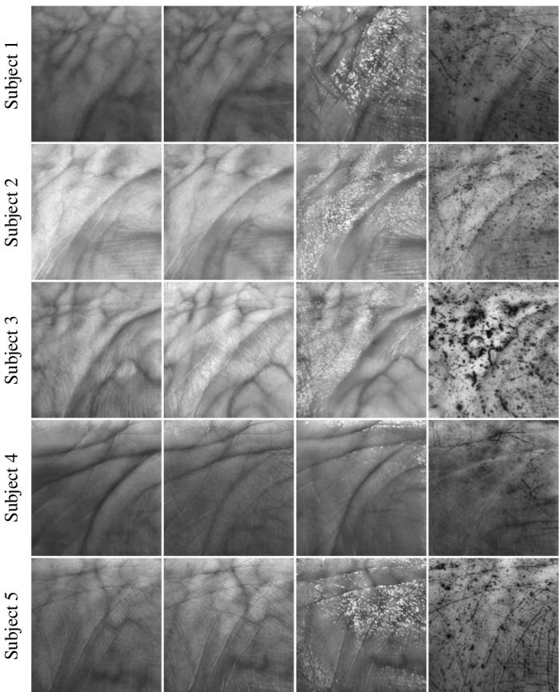
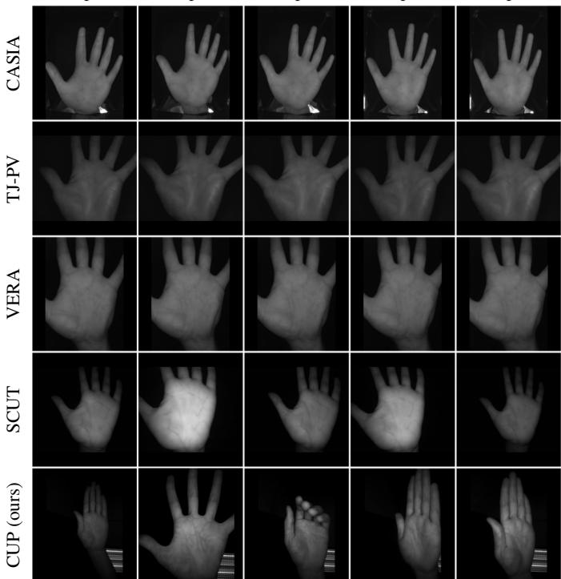
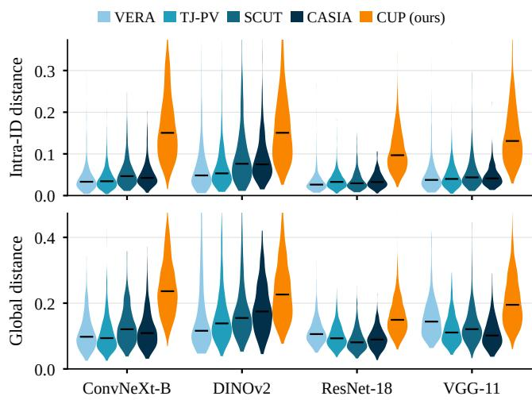
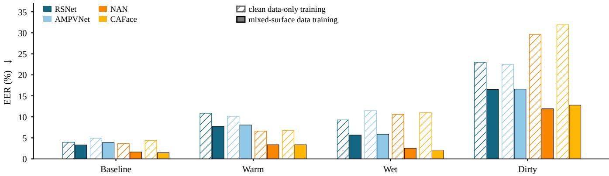
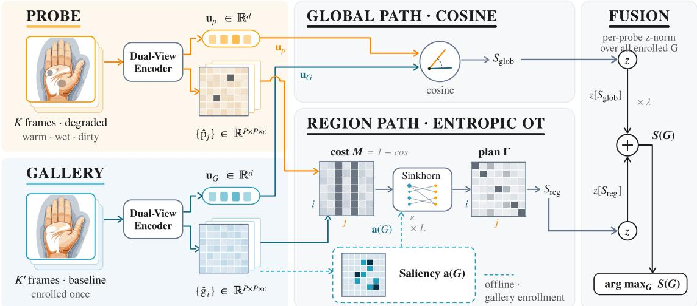
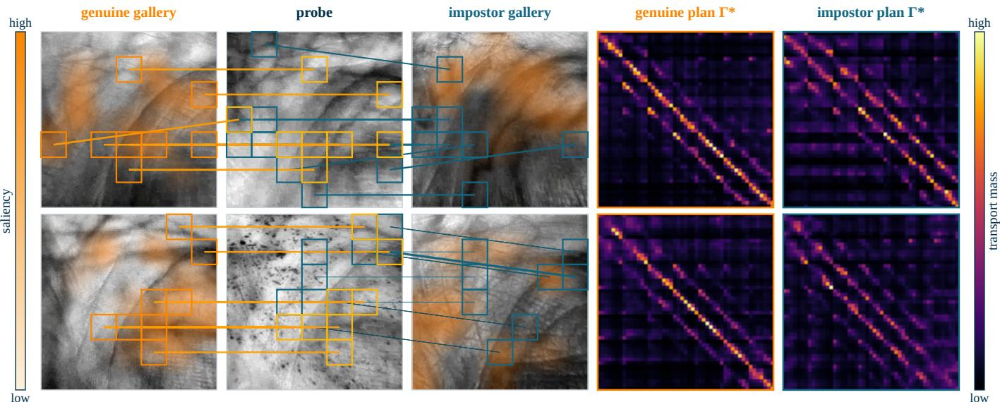
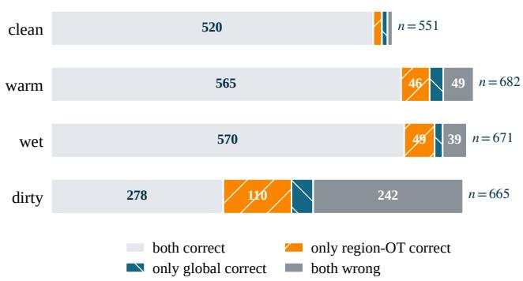
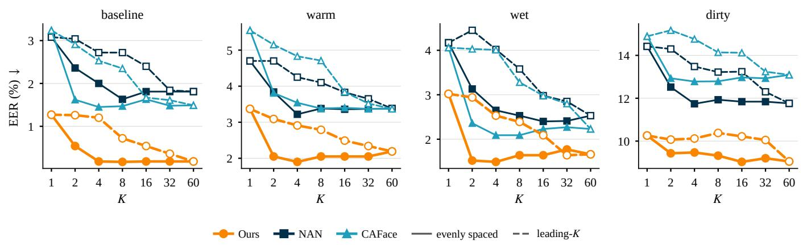
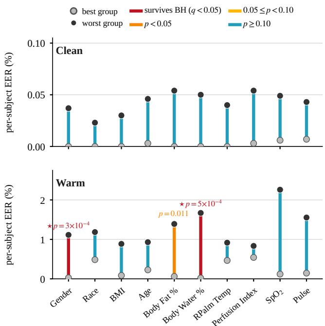

# Video-Based Palm-Vein Authentication under Challenging Conditions

Xiaofeng Yan, Kechen Liu, Abhilash Venkatesh, Cathy Zhang, Xia Zhou, and Salvatore Stolfo

Abstract—Palm-vein biometrics are increasingly used for secure, contactless authentication. Yet real-world deployment exposes them to surface noise (sweat, dirt), illumination and motion variation, and temperature-driven changes in vascular visibility, which remain underexplored for lack of data captured under such conditions. To study these effects, we introduce the Columbia University Palm-vein (CUP) dataset, to our knowledge the first public video-based palm-vein dataset. CUP records every palm under four surface conditions (a clean baseline, warm, wet, and dirty) and pairs each subject with physiological and demographic metadata. On it we benchmark twenty-one recognizers spanning static, video, and multi-frame aggregation architectures. Models that verify reliably on clean palms lose most of their accuracy on dirty ones, and the mean equal error rate (EER) roughly quadruples. We recover much of that robustness along both axes of the capture. Temporally, a consensus over the few frames the sensor already returns cancels transient corruption; spatially, a testtime matcher that adds no learned parameters fuses the global cosine with a saliency-steered region-level optimal transport that routes the comparison around corrupted regions. The full design leads on every surface of CUP in EER, TAR@FAR=0.01, and Rank-1, at 4.3M parameters and 3.1 GFLOPs, a fraction of the video models’ cost. Attached to four frozen state-of-the-art backbones it cuts their mean EER by 29–37% without retraining, and on four public single-image datasets the regional matching alone still helps. A preliminary audit across ten demographic and physiological traits finds two warm-condition gaps, along body water and gender, that survive multiple-comparison correction. CUP will be released for non-commercial research use at https://github.com/MobileX-CU/CUP v1 upon publication.

Index Terms—Palm-vein recognition, biometrics, video-based authentication, optimal transport, robustness, dataset, fairness.

## I. INTRODUCTION

ALM-vein biometrics are attracting growing interest, offering unique advantages over conventional modalities such as fingerprints or the iris. Vein patterns are internal and visible only under near-infrared (NIR) illumination, making them difficult to observe or capture covertly [1]–[4]. The contactless capture is also hygienic, boosting user acceptance in the post-pandemic era. Beyond security and hygiene, the technology offers competitive accuracy with inexpensive hardware [5]. The vascular pattern also carries high biological entropy: it stays unique even for identical twins, where face recognition struggles. These advantages have spurred rapid commercial adoption by industry leaders such as Amazon and Alipay.

Baseline  
Warm  
Wet  
Dirty  
  
Fig. 1. Surface Degradation in CUP. Columns are a clean baseline and the three degrading surface conditions (warm, wet, and dirty) that corrupt the near-infrared vein signal; rows are different subjects. Every palm is rerecorded under all four conditions.

Despite this success, the technology’s performance under non-ideal, real-world conditions is not well understood. The non-planar topography of the palm makes static features sensitive to acquisition artifacts: pose variation, shadows, and surface contaminants like sweat or dirt (Fig. 1). These artifacts degrade matching performance. While industry solutions claim high accuracy, their proprietary data hinders independent validation. On the other hand, public datasets have been developing fast, from contact plates [6] and controlled contactless capture [7] to multi-wavelength imaging [8], twosession collection [9], and large-scale, weakly cooperative capture [10]. However, even the least controlled of them release only still images of clean palms, leaving the surface conditions of everyday use untested.

We built CUP to supply exactly these conditions; to our knowledge it is the first public video-based palm-vein dataset. The format is video for two reasons. A contactless capture natively returns a short sequence as the user positions the hand over the sensor, so the frames come for free. They also carry complementary identity evidence, which has proved valuable for face recognition under noisy, less controlled capture [11], [12]. The dataset provides 5,049 curated two-second NIR clips from 109 subjects, recorded under a protocol that mirrors everyday use and released for non-commercial research use. CUP loosens control along two further axes. Each palm is presented with the natural pose and distance variation of routine interaction and is re-recorded under four surface conditions: a clean baseline, warm, wet, and dirty. Every subject is paired with demographic and physiological metadata (§III). We then use CUP to quantify how everyday degradation affects recognition. The drop is severe and universal: recognizers that verify reliably on clean palms lose most of their accuracy on dirty ones. The twenty-one recognizers we benchmark span vascular-specific pipelines, generic image backbones, end-toend video models, and multi-frame aggregation. Across all of them, the mean equal error rate (EER) roughly quadruples, from 4.11% to 17.35%. Training on degraded data and averaging over frames help only partially: on dirty palms every recognizer stays far above its own clean-palm floor (§III-D).

Given degradation of this severity, the global embedding is itself corrupted. Water reflections or surface contaminants can wipe out whole regions of the vein signal at once, and the damage pools into the single vector being compared. We instead compare palms with a matcher that operates along both dimensions of a video capture, space and time. Person reidentification and face recognition survive occlusion the same way: the reliable parts of the input decide the match [13]– [16]. Spatially, we compare palms region by region, so that the regions that survive the degradation can decide the match. The comparison runs as an entropic optimal transport, which shifts matching weight off corrupted regions. A saliency prior then spends that weight on the regions that best identify each gallery. We keep the global embedding alongside, because some probes fail the other way: their local patches are misleading while the overall pattern still matches. Fusing the two views lets each recover the probes the other loses. Temporally, a consensus over the frames of a clip cancels transient corruptions and recovers the stable vein signal beneath. The only training we add is a light consensus objective that makes each frame reliable on its own, leaving the architecture untouched.

Extensive experiments support this design. On CUP it leads on every surface condition and every metric, with the widest margin on the hardest, dirty condition. Because the matcher adds no trainable parameters, the gain is not tied to our encoder. Attached to four frozen CNN and transformer backbones, it improves every one on every surface and metric without retraining; it also generalizes to four public singleimage datasets [7], [9], [10], [17]. Under a subject-disjoint protocol with no shared subjects, the ordering holds and the margin widens (§V-B). We further probe where the value of video lies. A few frames sampled evenly across the two-second capture already realize the full multi-frame gain, whereas consecutive frames are largely redundant. The benefit thus comes from covering the capture window rather than from a high frame rate, and it adds no acquisition cost.

Finally, we use CUP’s metadata to study systematic performance differences across user groups. During collection we observed that vein visibility varies across participants, so CUP records per-subject demographic (e.g., age, gender) and physiological (e.g., BMI, body fat) measurements. We audit recognition accuracy across ten such traits. The audit finds two warm-condition differences, along body water and gender, that survive multiple-comparison correction; they mark where a larger study should look.

In summary, this paper makes three contributions:

• Dataset and benchmark. We release CUP, to our knowl edge the first public video-based palm-vein dataset with four surface conditions and paired metadata. With it we benchmark twenty-one recognizers under a matched protocol, quantifying this drop and tracing it to pooled embeddings.

• A matcher built on what the benchmark reveals. Guided by the failure mode CUP exposes, we propose a dual-view encoder with a region-level optimal-transport matcher that adds no learned parameters. The full method restores accuracy on CUP, and the matcher alone carries its gain to other backbones and public datasets without retraining.

• A dataset-enabled fairness signal. Enabled by CUP’s per-subject metadata, we conduct a preliminary audit of recognition accuracy across ten demographic and physiological traits, which we report as a preliminary signal rather than a characterization of palm-vein fairness.

## II. RELATED WORK

## A. Contactless Palm-Vein Datasets

Public palm-vein datasets have grown steadily in scale and in the conditions they capture. Palm veins were first imaged as the near-infrared band of multispectral palmprint collections such as CASIA-MS [17] and PolyU-MS [18], which image each palm under several illumination wavelengths in a constrained setup. Dedicated palm-vein databases then appeared under controlled contactless capture: VERA [7] pairs 2,200 images of 220 palms with a spoofing protocol for vulnerability analysis. Later collections each widened one axis of variation. TJ-PV [9] records twenty images per palm for 600 palms across two sessions, adding the time gap that enrolled systems face; PLUSVein [8] images palmar and finger veins at multiple near-infrared wavelengths; and FYO [19] pairs palmar, dorsal, and wrist views of the same subjects. The largest to date is SCUT [10], with 11,000 images of 1,100 palms from 550 subjects under unconstrained, weakly cooperative capture. It has become the standard large-scale training source for the modality.

Across all of these, however, surface degradation is not included, though it has long been studied in fingerprint benchmarks [20] and recently in in-the-wild palmprint [21]. The closest same-modality effort remains small, at 500 images from 100 subjects [22]. CUP therefore adds a new dimension for palm veins: to our knowledge it is the first public palmvein dataset to release the near-infrared video clips themselves, recorded under real surface degradation and paired with demographic and physiological metadata.

## B. Palm-Vein Recognition

Most palm-vein recognizers represent a capture with a single holistic descriptor. Early methods extracted handcrafted features from static NIR images using local descriptors such as Gabor filters, Local Binary Patterns, SIFT, and the Radon transform [3], [23]–[25]. The shift to deep learning improved discriminability, and Jia et al. [26] systematically benchmarked CNNs for palmprint and palm-vein recognition. Later work addressed data scarcity through few-shot learning [27] and contrastive learning [28], and pursued stronger discrimination through attention mechanisms [29] and margin- or qualityaware objectives. MDNet [30] adds the ArcFace margin [31]; AMPVNet [10] adds domain-specific augmentation and an adaptive-margin loss. Across these advances, matching ultimately reduces the feature map to a single pooled embedding that is compared by cosine similarity.

A complementary line of work divides the ROI image or the feature map into regions, injecting local vein structure into training. Nayar et al. [32] partition the palm into variablesize blocks that form graph nodes, linked wherever a vein pattern spans them; block descriptors have been fused with deep features for verification [33]; and multiscale transformers couple patch tokens by self-attention to mix local and global cues [34]. More recently, RSNet [35] argues that generic patch division ignores palm-vein structure and instead partitions the feature map using physiological priors on palm shape and vein layout.

Both lines of work reduce each capture to one pooled embedding before matching. When part of the surface is degraded, the pooling itself becomes the bottleneck. Averaging every spatial location into one vector lets a few corrupted regions (a wet smear, a patch of dirt) drag down the similarity to the genuine gallery even when most of the pattern is intact. Degraded palm-vein data is also still too scarce for training alone to close the gap. Region-aware training helps only indirectly, since the regional structure is collapsed again at comparison time. Letting the reliable regions decide the match at matching time remains much less explored.

## C. Matching under Partial Corruption

One family of methods attacks partial corruption spatially, representing a sample as a set of local descriptors so that the reliable regions can decide the match. Optimal transport (OT) gives this idea a principled form. The Earth Mover’s Distance was introduced to compare such sets for image retrieval [36]; entropic regularization then made it fast and differentiable through the Sinkhorn algorithm [37], [38]. The machinery has since spread across recognition. Person reidentification matches only the parts visible under occlusion, aligning them by pose or comparing them by EMD [13]– [15], [39], [40], or weighting them by a learned quality [41]. Face recognition learns masks that discard corrupted feature elements [16], [42] and re-ranks retrieved candidates by patchwise EMD [43]. Few-shot recognition matches dense regions through DeepEMD [44], with SuperGlue [45] doing the same for sparse keypoints.

Yet for palm veins this idea remains much less explored, and the cues it relies on elsewhere are missing. A contactless palm-vein ROI has no canonical part layout and no external oracle for which vein regions are trustworthy. Its degradation is a diffuse attenuation of the vein texture rather than a discrete occluder to detect, so the transport itself must discover which regions to trust.

A second family attacks the problem temporally, exploiting the fact that a contactless capture is itself a short video. It splits into two lines. Multi-frame aggregation, most developed in video-based face recognition, scores frames by quality and pools them into one template: neural aggregation [11], component-wise aggregation [46], set pooling with ghost clusters [47], feature-aggregation networks [48], learned frame weighting [49], and blur-robust ensemble features [50]. End-to-end video models instead read motion directly, from convolutional spatio-temporal architectures [51]–[55] to video transformers [56]–[59], at several times the parameters of a single-image recognizer. For palm veins, both lines meet the same obstacles. The aggregation methods pool the frames into one descriptor before matching, reintroducing the pooling that falters under partial degradation; their frame-quality scoring is also learned for face appearance. Motion offers little either: unlike facial motion, hand movement under near-infrared is subtle and blurs an already low-contrast pattern. The motion models thus spend their capacity on dynamics a palm-vein burst does not contain, leaving their value at denoising.

We instead keep a strong global recognizer and add a region-level transport at matching time, steered by the intrinsic saliency of the palm’s own vein structure. The frames of the capture are combined at this stage rather than pooled beforehand, so the reliable regions decide the match when part of the input is corrupted (§IV).

## III. VIDEO-BASED PALM-VEIN IMAGING DATASET

We introduce CUP to understand how recognition behaves once palms are presented in challenging, everyday settings. To the best of our knowledge, it is the first public videobased palm-vein dataset. It captures several of the stressors that real deployments impose, with intra-subject variability far beyond prior sets. It complements prior, largely singleimage benchmarks with continuous video, controlled surface degradation, and paired physiological and demographic metadata. Cross-dataset sample comparisons are shown in Fig. 2. Each palm is recorded as a continuous near-infrared video stream, from which we cut two-second clips and keep those that pass curation (§III-B). Capturing a two-second clip rather than a single frame adds no hardware cost, since the extra frames are simply what the sensor already records as the palm is presented. The protocol is designed to reflect everyday use. It accommodates the natural pose variation (e.g., finger extension and palm bending) and distance changes (5–30 cm) that arise in routine interaction. It also applies four surface conditions as controlled surrogates of everyday stressors: a clean baseline, warm (temperature-induced vasodilation that alters vein visibility), wet (water reflections), and dirty (surface occlusions from contaminants). Representative frames are shown in Fig. 1. In total, CUP provides 5,049 curated twosecond clips from 109 subjects. Each subject is accompanied by physiological and demographic metadata (including age, gender, body mass index (BMI), body fat, $\mathrm { { S p O } } _ { 2 } ,$ and pulse rate). The dataset will be released for non-commercial research use, under a data-use agreement, upon publication.

Sample 1  
Sample 2  
Sample 3  
Sample 4  
Sample 5  
  
Fig. 2. CUP versus Public Palm-Vein Datasets. Each row is one dataset: four public sets (CASIA [17], TJ-PV [9], VERA [7], SCUT [10]) and CUP, five near-infrared samples of a single subject each; the intra-subject variability is visibly larger for CUP. See Table I for detailed statistics of each dataset.

## A. Data Acquisition

Hardware Setup Palm-vein videos were recorded using a mobile camera operating at 30 frames per second with a resolution of 1920×1080 pixels. To enhance vascular visibility, a cut-off filter was installed to block visible wavelengths below 700 nm. Three NIR LEDs operating at 850 nm illuminated the palm.

Data Collection Process Our data collection protocol was approved by the Institutional Review Board of Columbia University. We recruited 109 subjects, each of whom provided informed consent prior to participation. All subjects were compensated \$10 for their time. For each subject, we first collected the following demographic and physiological information: age, gender, and self-reported race; height, weight, BMI, body fat percentage, muscle mass, and basal metabolic rate, all measured with a commercial smart scale [60]; and $\mathrm { S p O } _ { 2 } ,$ , pulse rate, respiration rate, pleth variability index, and perfusion index, measured with an FDA-approved pulse oximeter [61]. Next, each subject placed a palm above our hardware for video capture. Every capture follows the same movement protocol:

the subject rotates the palm from $0 ^ { \circ }$ (facing the camera) to approximately $6 0 ^ { \circ }$ and moves it vertically between 5 and 30 cm, covering the placements and standoffs of routine interaction. We repeat that protocol under four surface conditions.

• Baseline: The palm is clean, dry, and at normal temperature.

• Warm Palm: The palm is warmed to temperatures exceeding $3 8 . 5 ^ { \circ } \mathrm { C }$ using a heat pad to simulate elevated peripheral circulation.

• Wet Palm: The palm is sprayed with water to simulate moisture from sweat or environmental humidity.

• Dirty Palm: Soil is gently applied to the palm surface to introduce realistic occlusions and contaminants.

Because the movement protocol runs inside every condition, each clip already carries pose and standoff variation. The surface effects we report are therefore measured on top of that geometric variation rather than in a fixed pose.

## B. Data Processing

Unconstrained video capture introduces challenges absent from static, controlled datasets. Traditional heuristic ROI methods that rely on inter-finger valley points [62] fail when the fingers are not well separated or the viewpoint is unfavorable. We instead detect 21 hand landmarks per frame using a deep-learning-based hand tracker [63]. From the 21 landmarks, we select four anatomically stable anchor points: A and B at the metacarpophalangeal joints of the index and little fingers, C at the carpometacarpal joint of the thumb, and D at the wrist joint. These landmarks are chosen because they correspond to rigid skeletal joints, which offer substantially greater stability against soft-tissue deformation than skinsurface points. Although the quadrilateral formed by A-B-$_ { D - C }$ covers the palm, the regions near the thumb base (C) and the wrist (D) remain subject to non-rigid deformation during natural hand movements. To obtain a stable, planar region suitable for perspective warping, we construct an inset quadrilateral with vertices A, B, F, and E. Points E and $F$ are obtained by linear interpolation along the side segments of the palm so as to exclude the unstable regions:

$$
E = C + 0 . 2 5 \cdot ( A - C ) , \quad F = D + 0 . 2 5 \cdot ( B - D ) .\tag{1}
$$

The final ROI is defined by the polygon A-B-F-E. We apply a perspective transformation to warp this region into a canonical square image for downstream processing. To mitigate the highfrequency jitter of independent single-frame detections, we apply a moving-average filter to the raw landmark coordinates $\mathbf { p } _ { t }$ over a window of $2 k { + 1 }$ frames (k=2 in all experiments), yielding the smoothed coordinates $\hat { \mathbf { p } } _ { t }$ :

$$
\hat { \mathbf { p } } _ { t } = \frac { 1 } { 2 k + 1 } \sum _ { i = - k } ^ { k } \mathbf { p } _ { t + i } .\tag{2}
$$

This operation acts as a low-pass filter on the ROI boundaries, removing sensor quantization noise and small detection errors. It stabilizes spatial alignment across frames, so downstream matching operates on consistent ROIs rather than on tracking jitter. After ROI extraction, the clips pass through a two-stage curation pipeline: an automated screening stage that computes per-frame quality metrics (skewness, aspect ratio, shadow, and entropy), followed by manual review.

  
Fig. 3. Feature Dispersion of CUP versus Public Datasets. Per-sample intra-identity distance (top) and global distance (bottom), grouped by offthe-shelf feature extractor. Under every backbone, CUP (orange) is far more dispersed than the public sets (blue gradient).

## C. Data Analysis

Intra-Subject Diversity We first measure how large CUP’s intra-subject variability is relative to existing benchmarks. For each dataset, we embed every sample with four pre-trained backbones (ConvNeXt-B [64], DINOv2 [65], ResNet-18 [66], VGG-11 [67]) and characterize its feature geometry with two per-sample distances (Fig. 3). For a sample with ℓ -normalized feature x, let $\mu _ { \mathrm { i d } }$ denote the centroid of its own identity (the mean feature over all captures of that palm) and $\pmb { \mu }$ the global centroid (the mean over all samples in the dataset). The intra-ID distance $\| \mathbf { x } - \pmb { \mu } _ { \mathrm { i d } } \|$ measures how far repeated captures of the same palm scatter around their own prototype (withinidentity variability). The global distance $\| \mathbf x - \pmb \mu \|$ instead measures how widely the dataset spreads over the feature space as a whole. On the intra-ID measure, the within-identity dispersion of CUP is 2–3× that of every public set under every backbone (Fig. 3, top). Repeated captures of one palm scatter far more widely in feature space, which is the direct signature of real-world surface, pose, and distance variation. The global measure guards against a trivial reading: the extra scatter is not attributable to a single loose identity but persists relative to the dataset-wide mean (Fig. 3, bottom). Together, the two measures indicate reduced cluster compactness: the median intra-ID distance of CUP is ≈0.65 of its median global distance, versus ≈0.38 for the public sets. Identities thus occupy a far larger share of the populated feature space and are correspondingly harder to separate.

Curation and Statistics Curation operates at the palm level: a palm whose clips are all rejected leaves the dataset, so the 109 subjects yield 210 palms rather than 218. After the twostage curation pipeline, the open-set protocol splits the dataset into 2,376 training clips and 2,673 test clips with no palm-level overlap between the splits. Per-condition counts are approximately balanced: 1,288 Baseline, 1,234 Wet, 1,276 Dirty, and 1,251 Warm clips. The per-palm clip count has a median of 25, reflecting variable retention from quality filtering. Retention also varies by hand, reflecting a handedness effect. Most participants are right-handed and produced steadier right-hand videos during the pose-variation protocol, yielding higher postfilter retention for right palms (median 27 versus 22.5 clips per palm).

## D. The Lab-to-Wild Gap: Standard Training Is Not Enough

CUP allows us to measure directly how well standard recognition performs once palms are presented in everyday, degraded conditions. We benchmark representative static and multi-frame recognizers, each trained in two ways: on clean (baseline) data alone and on the full mixed-surface set that spans all four conditions. We then evaluate them per surface under the open-set protocol detailed in §V. We select four representative models: the two best static recognizers (RSNet [35], AMPVNet [10]) and the two best multi-frame recognizers (NAN [11], CAFace [12]), shown in Fig. 4. The full benchmark is reported in §V.

Degradation is severe and universal. Every recognizer degrades sharply from clean to dirty. A strong static model such as RSNet rises from an EER of 3.3% on clean palms to 16.5% on dirty ones. The lowest dirty-condition EER any recognizer in §V reaches is still about 12%. Standard training offers two mitigations: mixing degraded surfaces into the training data and aggregating the frames of a clip. Both help only partially (Fig. 4). Mixed-surface training lowers error on every degraded surface relative to clean-only training. The two multi-frame recognizers, which aggregate the frames of each clip, benefit the most. Trained on mixed surfaces, they stay below the static models on every surface and hold their EER below 3.4% on the baseline, warm, and wet conditions. Frame aggregation alone is not enough: trained on clean data only, they degrade even more sharply on dirty palms than the static models do. Neither measure closes the gap: on dirty palms every recognizer remains far above its own baseline-condition floor. Standard training therefore absorbs the mild degradations but not the severe ones.

## IV. METHOD

## A. Dual-View Encoder

The encoder turns each input clip into two descriptors: a global embedding for holistic comparison, and a $P \times P$ grid of region descriptors that preserves where on the palm each feature comes from (Fig. 5). A query is a probe clip of K near-infrared frames, matched in the open-set regime against a gallery of identities, each enrolled once from a short clip of $K ^ { \prime }$ frames $( K ^ { \prime } { = } 1$ for a single template). Both sides pass through the same encoder, so the surviving regions remain available to the matcher when the pooled summary is compromised. A frozen backbone f maps each frame, in a single forward pass, to a $P \times P$ feature map. The region view keeps that map as $R { = } P ^ { 2 }$ region descriptors $\{ \mathbf { r } _ { j } ^ { ( t ) } \} \in \mathbb { R } ^ { c } ;$ the global view collapses it by global average pooling (GAP) into a pooled feature $\mathbf { f } ^ { ( t ) } \in \mathbb { R } ^ { c }$ . We reduce a clip to one descriptor per view by averaging over the K frames and $\ell _ { 2 }$ -normalizing, regionwise for the region view and through the projection head $\phi$ : $\mathbb { R } ^ { c } \to \mathbb { R } ^ { d }$ for the global view:

  
Fig. 4. The Lab-to-Wild Gap on CUP. Open-set EER per surface for two static (RSNet [35], AMPVNet [10]; blue) and two multi-frame (NAN [11], CAFace [12]; orange) recognizers, trained on clean-only (hatched) or mixed-surface data (solid). Every recognizer degrades sharply toward dirty; mixed-surface training lowers error but leaves a large residual above the baseline floor.

  
Fig. 5. Method Overview. A shared Dual-View Encoder (left) turns the probe clip and each enrolled gallery clip into a global embedding and a grid of regional features. From these, the test-time matcher scores a probe against each gallery: a region path (lower center) matched by entropic optimal transport a global path (upper center) compared by cosine similarity, and a complementary fusion (right) that yields the final identity decision.

$$
\begin{array} { r } { \hat { \mathbf { p } } _ { j } = \frac { 1 } { K } \sum _ { t } \mathbf { r } _ { j } ^ { ( t ) } , \qquad \mathbf { u } _ { p } = \overline { { \phi ( \bar { \mathbf { f } } ) } } , \qquad \bar { \mathbf { f } } = \frac { 1 } { K } \sum _ { t } \mathbf { f } ^ { ( t ) } , } \end{array}\tag{3}
$$

where $\overline { { ( \cdot ) } }$ denotes $\ell _ { 2 }$ normalization and, since $\phi$ is linear, $\mathbf { u } _ { p }$ equally reads as the renormalized average of the per-frame embeddings $\phi ( \mathbf { f } ^ { ( t ) } )$ (sparse temporal sampling in the spirit of TSN [54]). Averaging cancels the transient, frame-local corruption while the stable vein structure accumulates. It needs no training and is applied identically on both sides, giving the aggregated descriptors $( \mathbf { u } _ { p } , \{ \hat { \mathbf { p } } _ { j } \} )$ and $\left( \mathbf { u } _ { G } , \{ \hat { \bf g } _ { i } \} \right)$ that the matcher consumes. The frame count and the sampling scheme are studied in §V-B0b.

We want the average in (3) to stay identity-discriminative even when single frames degrade. We therefore supervise each frame on its own in addition to the pooled average, with one shared ArcFace classifier [31] and identity label y, giving the dual-consensus objective:

$$
\mathcal { L } = \underbrace { \mathcal { L } _ { \mathrm { a r c } } \big ( \phi ( \bar { \mathbf { f } } ) , y \big ) } _ { \mathcal { L } _ { \mathrm { c o n s } } } + \alpha \cdot \underbrace { \frac { 1 } { K } \sum _ { t = 1 } ^ { K } \mathcal { L } _ { \mathrm { a r c } } \big ( \phi ( \mathbf { f } ^ { ( t ) } ) , y \big ) } _ { \mathcal { L } _ { \mathrm { f r a m e } } } .\tag{4}
$$

Its two terms apply the same ArcFace loss at two levels: ${ \mathcal { L } } _ { \mathrm { c o n s } }$ to the pooled clip embedding $\phi ( \bar { \bf f } )$ that the global path compares, and ${ \mathcal { L } } _ { \mathrm { f r a m e } }$ to each per-frame embedding $\phi ( \mathbf { f } ^ { ( t ) } )$ averaged over the K frames and weighted by α. Both act on the global embedding through the shared head $\phi .$ The region descriptors carry no separate loss by design: which regions to trust is decided at matching time by the transport (§IV-B), so supervising them here would duplicate the region path. The objective therefore sharpens the global view that the fusion depends on (§V-B).

  
Fig. 6. Region Matching by Entropic Optimal Transport. Each row is a real degraded probe (top: warm; bottom: dirty), shown between its genuine gallery (left) and the impostor that the global path ranks first (right). Boxes and links mark the eight strongest region assignments to each side, and the gallery images are shaded by saliency (scale bar at far left); darker shading marks the more discriminative regions. The two rightmost panels are the transport plans toward the genuine and the impostor gallery, brighter entries carrying more mass. Assignments toward the genuine gallery land coherently on high-saliency regions that survive the degradation, and its plan is visibly peaked; assignments toward the impostor are scattered, and its plan diffuse.

## B. Region Path: Entropic Optimal-Transport Matching

With the two views in hand, the region path scores each gallery by how coherently its region set aligns with the probe’s, region by region. We cast this as optimal transport (OT). Instead of picking a single best-matching region, OT seeks a soft, mass-balanced assignment between the two Rregion grids, so transport mass flows off corrupted regions and onto the surviving ones. The mass balance also bounds any single region pair to at most $1 / R$ of the transported mass, so a high score requires agreement across many regions. Fig. 6 shows why this rescues degraded probes that the global path loses. The strongest assignments to the genuine gallery land coherently on high-saliency regions that survived the degradation. Those to the impostor the global path ranked first are scattered, and the genuine transport plan is correspondingly peaked. The region score thus places the genuine identity first even when the pooled global embedding fails.

The transport cost between gallery region i and probe region $j$ is the cosine distance

$$
\mathbf { M } _ { i j } ( G ) = 1 - \hat { \mathbf { g } } _ { i } ( G ) ^ { \top } \hat { \mathbf p } _ { j } , \qquad i , j \in \{ 1 , \ldots , R \} ,\tag{5}
$$

where G indexes an enrolled gallery identity and $R { = } P ^ { 2 }$ is the number of regions per grid (§IV-A). The transport plan $\Gamma ^ { \star } ( G )$ is the soft assignment that carries each probe region’s mass onto the gallery’s regions at the least total cost. We obtain it from the entropy-regularized problem with gallery marginal $\mathbf { a } ( G )$ and probe marginal b,

$$
\Gamma ^ { \star } ( G ) = \underset { \Gamma \in U ( { \bf a } ( G ) , { \bf b } ) } { \arg \operatorname* { m i n } } \ \langle \Gamma , { \bf M } ( G ) \rangle - \varepsilon H ( \Gamma ) ,\tag{6}
$$

where the transport polytope $U ( \mathbf { a } , \mathbf { b } ) = \{ \Gamma \geq 0 \} .$ $\Gamma \mathbf { 1 } { = } { \mathbf { a } } , \Gamma ^ { \top } \mathbf { 1 } { = } { \mathbf b } \}$ couples the two marginals, $\begin{array} { r l } { H ( \Gamma ) } & { { } = } \end{array}$ $- \textstyle \sum _ { i j } \Gamma _ { i j } ( \log \Gamma _ { i j } - 1 )$ is the entropy term, and ε is the regularization weight. Problem (6) is solved by L Sinkhorn iterations in the log domain [37]. The region score is the transported cosine similarity

$$
S _ { \mathrm { r e g } } ( G ) = \langle \Gamma ^ { \star } ( G ) , { \bf 1 } - { \bf M } ( G ) \rangle .\tag{7}
$$

where $\langle \cdot , \cdot \rangle$ is the elementwise (Frobenius) inner product, so $S _ { \mathrm { r e g } }$ accumulates similarity exactly where the plan places mass. The probe marginal is uniform, $\begin{array} { r l } { \mathbf { b } } & { { } = \begin{array} { l } { \frac { 1 } { R } \mathbf { 1 } } \end{array} } \end{array}$ , and the last Sinkhorn update fixes it exactly. The plan’s total mass is thus one, and $S _ { \mathrm { r e g } }$ equals one minus the transported cost: the similarity and cost forms coincide.

Gallery Saliency Marginal. Not all regions are equally identifying, and the marginal a(G) controls how much transport budget each gallery region may claim (the tint on the gallery images in Fig. 6). Spending that budget on discriminative regions is more robust than spreading it uniformly. We therefore compute, once at enrollment and from the clean gallery descriptors alone (unaffected by probe corruption), a per-region discriminativeness score

$$
d _ { i } ( G ) = { \frac { 1 } { | { \mathcal G } _ { \mathrm { g a l } } | - 1 } } \sum _ { G ^ { \prime } \neq G } \Big ( 1 - \hat { \bf g } _ { i } ( G ) ^ { \top } \hat { \bf g } _ { i } ( G ^ { \prime } ) \Big ) ,\tag{8}
$$

the mean cosine distance of region i to the same region across all other galleries $\mathcal { G } _ { \mathrm { g a l } } . \mathrm { ~ A ~ }$ region that looks alike across identities is uninformative $( d _ { i }$ small), whereas one that varies is identifying $( d _ { i }$ large). The gallery marginal up-weights the latter,

$$
a _ { i } ( G ) \propto \left( \operatorname* { m a x } ( 0 , d _ { i } ( G ) ) + \delta \right) ^ { \gamma } , \quad \quad \sum _ { i } a _ { i } ( G ) = 1 ,\tag{9}
$$

with sharpness γ and floor δ. Substituting $\mathbf { a } ( G )$ from (9) into (6) concentrates the transport plan on the high-saliency regions that carry the genuine match in Fig. 6.

TABLE I  
SUMMARY OF THE FIVE PALM-VEIN EVALUATION DATABASES. COUNTS ARE DISTINCT IDENTITIES (PALMS); LEFT AND RIGHT PALMS ARE COUNTED AS DISTINCT IDENTITIES. SAMPLE COUNTS ARE 60-FRAME VIDEO CLIPS FOR CUP AND STILL IMAGES FOR THE PUBLIC DATABASES.
<table><tr><td>Database</td><td>Identities</td><td>Total Samples</td><td>Train (ID / #samples)</td><td>Test (ID / #samples)</td><td>Authentication Pairs</td></tr><tr><td>CUP (ours)</td><td>210</td><td>5,049 (videos)</td><td>106 / 2,376</td><td>104 / 2,673</td><td>267,176</td></tr><tr><td>SCUT [10]</td><td>1,100</td><td>11,000 (images)</td><td>550 / 5,500</td><td>550 / 5,500</td><td>2,722,500</td></tr><tr><td>TJ-PV [9]</td><td>600</td><td>12,000 (images)</td><td>300 / 6,000</td><td>300 / 6,000</td><td>1,710,000</td></tr><tr><td>CASIA (850 nm) [17]</td><td>200</td><td>1,200 (images)</td><td>100 / 600</td><td>100 / 600</td><td>50,000</td></tr><tr><td>VERA [7]</td><td>220</td><td>2,200 (images)</td><td>110 / 1,100</td><td>110 / 1,100</td><td>108,900</td></tr></table>

## C. Complementary Fusion

The global path is the trivial holistic scorer that the fusion combines with the region score: a plain cosine between the aggregated embeddings,

$$
S _ { \mathrm { g l o b } } ( G ) = { \mathbf { u } } _ { p } ^ { \top } { \mathbf { u } } _ { G } ,\tag{10}
$$

which stays discriminative on clean captures and on probes whose local patches are individually ambiguous but whose overall pattern still matches, the cases the region path finds hardest. The two scores are not directly comparable. $S _ { \mathrm { g l o b } }$ is a raw cosine, whereas $S _ { \mathrm { r e g } }$ is a transported similarity on a different scale, and their spreads over the gallery set differ from probe to probe. We therefore standardize each score per probe over the gallery set, a standard score-normalization step,

$$
z [ S ] ( G ) = \frac { S ( G ) - \mu _ { S } } { \sigma _ { S } } ,\tag{11}
$$

where $\mu _ { S }$ and $\sigma _ { S }$ are the mean and standard deviation of the gallery scores $\{ S ( G ^ { \prime } ) \} _ { G ^ { \prime } }$ , and we fuse the two standardized scores by a weighted sum,

$$
S ( G ) = z [ S _ { \mathrm { r e g } } ] ( G ) + \lambda z [ S _ { \mathrm { g l o b } } ] ( G ) ,\tag{12}
$$

with a single weight λ held fixed across all surfaces and databases (§V-A); the identity is decided by arg $\operatorname* { m a x } _ { G } S ( G )$ The per-probe standardization is what renders the two heterogeneous scores commensurable, and the fusion adds no trained parameters. It reads the probe’s scores over the enrolled gallery, which an enrolment-based deployment already holds at match time. The two paths fail on different probes: the region path when local patches mislead the transport, the global path when corruption dominates the embedding. Fusing them therefore beats either alone (§V-B). The whole matcher adds no learned parameters and runs entirely at test time.

## V. EXPERIMENTS

The experiments run under the common protocol of §V-A. §V-B benchmarks the method against twenty-one recognizers on CUP, then dissects the gain: component-by-component ablations, sensitivity to test-time settings, the frame budget behind the temporal consensus, and a subject-disjoint benchmark. §V-C tests generalization across frozen backbones and four public databases, and §V-D closes with a preliminary fairness audit.

## A. Experimental Setup

a) Data.: We evaluate on five contactless palm-vein databases (Table I): our video benchmark CUP and four public single-image sets, SCUT [10], TJ-PV [9], CASIA [17], and VERA [7]. CUP provides 210 palms and 5,049 two-second clips under four surface conditions. The single-image sets have no temporal data, so they test only the spatial part of the matcher, for which one frame suffices. Table I lists the split for each. On CUP we split by hand: the 106 left palms train and the 104 right palms test. The same participants thus appear on both sides, with every demographic and physiological group, as the fairness analysis of §V-D requires. A subject-disjoint benchmark (Table V) repeats the comparison with no shared subjects.

b) Protocol.: All results use an open-set protocol: the training and test palms are disjoint, so no palm seen in training appears at test. The same participants recur across the two splits by design. Every recognizer is trained on the mixedsurface training split and evaluated on each surface condition separately. At test time we form a gallery–probe setup. Each of the G test subjects is enrolled once, from a favorable-surface clip on CUP and from the first image on each public set; every remaining sample serves as a probe. Enrollment therefore uses a favorable capture while every degraded sample appears as a probe, the setting a supervised enrolment session affords. Within a surface condition, a palm’s gallery and probe clips may come from the same recording. We match each probe against all G templates rather than a balanced subset of pairs, which gives

$$
N _ { \mathrm { p a i r } } = \underbrace { P } _ { \mathrm { g e n u i n e } } + \underbrace { P \left( G - 1 \right) } _ { \mathrm { i m p o s t o r } } = P G , \qquad P = N _ { \mathrm { t e s t } } - G ,\tag{13}
$$

authentication pairs for G enrolled subjects and P probes among $N _ { \mathrm { t e s t } }$ test samples (Table I). Scoring every pair keeps the low-FAR operating points well sampled and avoids any pairing bias. Because EER, TAR, and Rank-1 are withinclass rates, they do not depend on the genuine-to-impostor ratio. We report three metrics: the equal error rate (EER, ↓), the operating point at which the false accept and false reject rates coincide, which summarizes verification error; TAR@FAR=0.01 (↑), the true accept rate at a false accept rate of 0.01, which reads verification at a strict threshold; and Rank-1 accuracy (↑), the fraction of probes whose top-ranked gallery is correct, which measures identification.

c) Baselines.: We compare against twenty-one recognizers chosen to cover a wide range of architectures and to include strong reference points: the vascular-specific recognizers RSNet [35], AMPVNet [10], MDNet [30], FCPVN [28], and GSCL-FusionAug [68]; the generic convolutional backbones EfficientNet-B0 [69] and ResNet-18 [66]; the transformers Swin-T [70], SwinV2-T [71], MaxViT-T [72], and DeiT3- S [73]; the end-to-end video models TSN-R18 [54], R3D-18 [53], R(2+1)D-18 [52], C3D [51], Swin3D-T and Swin3D-S [56], and MViTv2-S [57], which take the same multiframe input as our method; and the aggregation methods from face video recognition, NAN [11], GhostVLAD [47], and CAFace [12].

d) Implementation.: The shared training schedule uses AdamW (SGD for MDNet, following its reference) with a per-epoch cosine schedule and weight decay $1 0 ^ { - 4 }$ . Learning rates are $3 \times 1 0 ^ { - 4 }$ for the convolutional backbones and $1 \times 1 0 ^ { - 4 }$ for the transformers, which are data-hungry and start from pretrained checkpoints. Batch size is 64 for the static models and 12 for the video models. Inputs are 224×224 singlechannel ROIs, replicated to three channels with ImageNet normalization, a random affine transform (rotation $\pm 1 2 ^ { \circ }$ , scale [0.9, 1.1], translation ±6%, applied with p=0.5), and the random gamma augmentation (RGA, $\gamma \in [ 0 . 7 , 1 . 4 ] $ ) introduced in [10].

Several baselines release no public implementation; we reimplement them from their papers as faithfully as we can. Each recognizer otherwise follows its source paper, including the choice of head and metric; the transformers are initialized from ImageNet. Before finetuning on CUP, every backbone is pretrained on the public palm-vein datasets of Table I, whose larger set of identities gives stronger vein features. This pretraining applies to all backbones; for the video models we assemble the same data into pseudo-video sequences. Each multi-frame model uses 8 frames per clip, a budget we ablate in §V-B0b. For the aggregation methods, as for our own model, we use EfficientNet-B0 as a general-purpose backbone.

Our method finetunes the backbone with the dual-consensus objective at learning rate $3 \times 1 0 ^ { - 5 }$ and $\alpha { = } 2 . 0$ . Its test-time matcher uses a $7 \times 7$ grid $( R { = } 4 9 )$ , entropic OT with $\varepsilon { = } 0 . 1$ and L=50 Sinkhorn iterations, a saliency marginal with $\gamma { = } 2$ and $\delta { = } 0 . 0 5$ , and a fusion weight of $\lambda { = } 0 . 5 $ , held fixed across every surface and database. The grid is set by the backbone’s $7 \times 7$ feature map, and $\varepsilon { = } 0 . 1$ and L=50 are the usual entropictransport defaults. We fixed the remaining values $( \gamma , \delta , \lambda ,$ K) in advance rather than searching over them. We train the recognizer with five random seeds and report their mean; every individual seed beats all baselines on all four surfaces. The sensitivity analyses below fix a single representative seed, on which the full model scores a 3.29% mean EER.

## B. Results and Analysis on CUP

Table II reports the full benchmark: our method attains the lowest EER, the highest TAR@FAR=0.01, and the highest Rank-1 on every surface. The gap to the field is widest exactly where a single global descriptor breaks down: even the best baseline on the dirty condition (NAN, 11.93% EER) stays far above our 9.56%. Two patterns organize the baselines. First, the multi-frame recognizers are the most robust of the prior methods on the degraded surfaces, with the frameaggregation models (NAN, CAFace) leading the end-to-end video models. Second, the advantage over them comes from the matcher rather than the backbone: NAN and CAFace share our EfficientNet-B0, yet our region-OT matcher surpasses them on every surface and metric.

  
Fig. 7. Complementarity of the Two Views per Surface. Share of CUP probes on which each view ranks the genuine identity first, split into both correct, only region-OT correct, only global correct, and both wrong.

a) Ablations.: We now dissect where this gain comes from by building the method one component at a time on a frozen EfficientNet-B0 (Table III). The starting row is the frozen backbone with its K=8 frame average scored by global cosine; the frame budget itself is studied separately below. Fusion and the saliency marginal improve all three metrics on all four surfaces; dual-consensus training improves the baseline, warm, and dirty conditions. The single largest step is the fusion of the two views, which are individually insufficient and fail on different probes, so we look at that complementarity next.

The reduction is steepest on the hardest surfaces. Fusing the global and regional views, with transport under a uniform marginal, cuts the mean EER from 6.62% to 4.53%, a 32% relative drop, and the dirty-condition EER from 16.80% to 12.14%. Replacing that uniform marginal with the gallery saliency prior refines the mean to 4.34%. Dual-consensus training gives our final 3.45% across five seeds, again with the largest absolute gain on the dirty surface (12.03% to 9.56%). We next check how many probes each view gets right on its own (Fig. 7). For every test probe we rank all 104 gallery templates separately under each view and record which places the genuine template first. Every probe counts once, so the bars are probes, not pairs. Region-OT alone ranks the genuine palm first on 219 probes and the global view alone on 79. The gap widens with degradation: on the dirty surface region-OT alone rescues 110 probes against 35 for the global view, while both miss a hard core of 36%. These are ranking outcomes, so they mark where the two views carry separable information rather than how much of it the fused score keeps, which is the EER reduction above.

b) Sensitivity.: Sweeping each parameter around its default while holding the others fixed keeps the mean EER within a 3.27%–3.53% band. That band is no wider than the model’s own seed-to-seed variation $( 3 . 4 5 \% \pm 0 . 1 6$ over five seeds), so no test-time setting moves the result further than retraining does. The Sinkhorn parameters barely register: the mean EER is flat at 3.29% across $L \in \{ 1 0 , 2 5 , 5 0 , 1 0 0 \}$ iterations and stays within 3.29%–3.35% for $\varepsilon \leq 0 . 2$ , rising only to 3.48% at ε=0.5. The saliency shape is nearly as forgiving: the floor δ holds within 3.29%–3.31%, and the sharpness γ moves the mean EER from 3.27% at γ=1 to 3.53% at γ=4, so our default sits just above the sweep’s best point. We hold ε=0.1, L=50, γ=2, δ=0.05, the saliency marginal, and a 7×7 grid across every surface and database.

TABLE II  
OPEN-SET PERFORMANCE ON CUP ACROSS SURFACE CONDITIONS. PER-SURFACE EER (↓), TAR@FAR=0.01 (↑), AND RANK-1 (↑), ALL IN %, WITH EACH METHOD’S INFERENCE PARAMETER COUNT AND PER-PROBE ENCODING FLOPS AT ITS FRAME BUDGET. BOLD MARKS THE BEST PER COLUMN AND UNDERLINE THE BEST BASELINE.
<table><tr><td rowspan="2"></td><td rowspan="2">Method</td><td rowspan="2">Params (M)</td><td rowspan="2">FLOPs (G)</td><td colspan="4">EER %↓</td><td colspan="4">TAR@FAR=0.01 ↑</td><td colspan="4">Rank-1 % ↑</td></tr><tr><td>base.</td><td>warm</td><td>wet</td><td>dirty</td><td>base.</td><td>warm</td><td>wet</td><td>dirty</td><td>base.</td><td>warm</td><td>wet</td><td>dirty</td></tr><tr><td></td><td>RSNet [35]</td><td>4.0</td><td>0.21</td><td>3.33</td><td>7.73</td><td>5.67</td><td>16.50</td><td>94.43</td><td>82.80</td><td>85.94</td><td>52.58</td><td>93.59</td><td>80.89</td><td>84.30</td><td>52.23</td></tr><tr><td rowspan="4">Palm-vein specihc</td><td>AMPVNet [10]</td><td>0.7</td><td>0.12</td><td>3.90</td><td>8.06</td><td>5.86</td><td>16.59</td><td>91.17</td><td>78.10</td><td>81.47</td><td>47.52</td><td>91.59</td><td>77.47</td><td>79.88</td><td>47.62</td></tr><tr><td>MDNet [30]</td><td>27.6</td><td>7.73</td><td>4.44</td><td>7.27</td><td>6.80</td><td>17.41</td><td>89.47</td><td>79.72</td><td>79.43</td><td>41.45</td><td>87.60</td><td>75.37</td><td>76.55</td><td>38.30</td></tr><tr><td>FCPVN [28]</td><td>11.3</td><td>1.81</td><td>8.55</td><td>13.22</td><td>12.37</td><td>22.72</td><td>74.23</td><td>51.76</td><td>51.71</td><td>20.60</td><td>70.60</td><td>52.35</td><td>50.37</td><td>20.90</td></tr><tr><td>GSCL-FusionAug [68]</td><td>11.3</td><td>1.81</td><td>5.45</td><td>8.65</td><td>6.99</td><td>20.92</td><td>88.38</td><td>70.82</td><td>76.15</td><td>30.53</td><td>85.30</td><td>68.04</td><td>73.17</td><td>27.97</td></tr><tr><td rowspan="3">CNN</td><td>EfficientNet-B0 [69]</td><td>4.3</td><td>0.39</td><td>4.35</td><td>9.24</td><td>7.86</td><td>20.15</td><td>91.83</td><td>76.54</td><td>78.24</td><td>39.10</td><td>90.20</td><td>72.73</td><td>75.71</td><td>34.89</td></tr><tr><td>ResNet-18 [66]</td><td>11.3</td><td>1.81</td><td>5.12</td><td>9.39</td><td>7.14</td><td>22.42</td><td>90.56</td><td>75.51</td><td>80.18</td><td>39.10</td><td>88.38</td><td>72.29</td><td>76.75</td><td>37.44</td></tr><tr><td>Swin-T [70]</td><td>27.7</td><td>4.49</td><td>3.41</td><td>8.18</td><td>7.19</td><td>15.79</td><td>91.65</td><td>71.85</td><td>78.69</td><td>44.96</td><td>88.20</td><td>68.48</td><td>71.98</td><td>42.56</td></tr><tr><td rowspan="4">transmer Vision</td><td>SwinV2-T [71]</td><td>27.8</td><td>4.94</td><td>4.90</td><td>10.26</td><td>9.39</td><td>17.62</td><td>88.57</td><td>66.42</td><td>70.94</td><td>35.49</td><td>88.02</td><td>65.98</td><td>67.36</td><td>36.99</td></tr><tr><td>MaxViT-T [72]</td><td>30.3</td><td>5.56</td><td>3.27</td><td>8.66</td><td>6.11</td><td>17.26</td><td>92.92</td><td>80.06</td><td>83.01</td><td>44.51</td><td>92.74</td><td>77.27</td><td>77.50</td><td>41.50</td></tr><tr><td>DeiT3-S [73]</td><td>21.8</td><td>4.24</td><td>11.64</td><td>23.56</td><td>20.57</td><td>32.84</td><td>65.34</td><td>37.39</td><td>41.88</td><td>15.79</td><td>65.52</td><td>37.24</td><td>40.39</td><td>15.49</td></tr><tr><td>TSN-R18 [54]</td><td>11.3</td><td>14.5</td><td>1.99</td><td>4.08</td><td>3.85</td><td>17.14</td><td>96.91</td><td>90.91</td><td>91.51</td><td>51.73</td><td>94.92</td><td>87.10</td><td>90.46</td><td>48.27</td></tr><tr><td rowspan="7">End---nd Video</td><td>R3D-18 [53]</td><td>33.3</td><td>20.3</td><td>2.52</td><td>5.71</td><td>4.91</td><td>16.28</td><td>94.74</td><td>87.39</td><td>87.18</td><td>53.53</td><td>96.01</td><td>85.78</td><td>86.14</td><td>48.27</td></tr><tr><td>R(2+1)D-18 [52]</td><td>31.5</td><td>20.3</td><td>1.11</td><td>4.27</td><td>3.00</td><td>14.27</td><td>98.73</td><td>88.86</td><td>93.00</td><td>49.02</td><td>96.55</td><td>84.02</td><td>90.76</td><td>45.26</td></tr><tr><td>C3D [51]</td><td>27.8</td><td>32.9</td><td>2.94</td><td>7.64</td><td>5.83</td><td>14.75</td><td>94.56</td><td>81.96</td><td>85.10</td><td>49.47</td><td>93.65</td><td>79.62</td><td>80.77</td><td>48.27</td></tr><tr><td>Swin3D-T [56]</td><td>28.1</td><td>19.7</td><td>5.07</td><td>10.40</td><td>7.56</td><td>14.62</td><td>81.85</td><td>64.37</td><td>63.79</td><td>50.08</td><td>75.86</td><td>64.37</td><td>63.64</td><td>47.37</td></tr><tr><td>Swin3D-S [56]</td><td>49.7</td><td>37.8</td><td>5.26</td><td>8.50</td><td>7.63</td><td>14.60</td><td>87.66</td><td>75.22</td><td>70.94</td><td>51.58</td><td>83.12</td><td>70.09</td><td>66.92</td><td>51.28</td></tr><tr><td>MViTv2-S [57]</td><td>34.5</td><td>64.2</td><td>4.36</td><td>8.34</td><td>7.48</td><td>13.08</td><td>88.38</td><td>73.75</td><td>71.68</td><td>51.73</td><td>82.40</td><td>66.28</td><td>64.08</td><td>48.87</td></tr><tr><td>NAN [11]</td><td>6.0</td><td>3.08</td><td>1.63</td><td>3.37</td><td>2.53</td><td>11.93</td><td>97.46</td><td>92.96</td><td>95.08</td><td>61.05</td><td>98.00</td><td>90.76</td><td></td><td></td></tr><tr><td>Facee Ydeo</td><td>CAFace [12]</td><td>6.0</td><td>3.08</td><td>1.47</td><td>3.37</td><td>2.09</td><td>12.79</td><td>98.19</td><td>93.11</td><td>95.53</td><td>60.45</td><td>97.82</td><td>88.86</td><td>93.14 94.19</td><td>59.10 57.74</td></tr><tr><td>recoition</td><td>GhostVLAD [47]</td><td>17.5</td><td>3.09</td><td>1.63</td><td>4.86</td><td>3.58</td><td>14.61</td><td>98.00</td><td>89.59</td><td>90.91</td><td>53.08</td><td>96.91</td><td>85.04</td><td>86.74</td><td>50.83</td></tr><tr><td>Ours</td><td></td><td>4.3</td><td>3.08</td><td>0.26</td><td>2.14</td><td>1.85</td><td>9.56</td><td>99.96</td><td>97.12</td><td>97.26</td><td>71.94</td><td>99.35</td><td>94.43</td><td>95.29</td><td>65.05</td></tr></table>

TABLE III

STEP-BY-STEP ABLATION OF OUR METHOD.
<table><tr><td>Stage</td><td colspan="4">EER % ↓</td><td colspan="4">TAR@FAR=0.01↑</td><td colspan="4">Rank-1 % ↑</td></tr><tr><td></td><td>base.</td><td>warm</td><td>wet</td><td>dirty</td><td>base.</td><td>warm</td><td>wet</td><td>dirty</td><td>base.</td><td>warm</td><td>wet</td><td>dirty</td></tr><tr><td>backbone (K=8 frames)</td><td>2.00</td><td>4.25</td><td>3.41</td><td>16.80</td><td>97.46</td><td>89.15</td><td>90.91</td><td>51.58</td><td>96.37</td><td>89.15</td><td>90.16</td><td>48.12</td></tr><tr><td>+ fusion</td><td>0.55</td><td>3.38</td><td>2.07</td><td>12.14</td><td>99.64</td><td>95.02</td><td>96.87</td><td>63.01</td><td>98.00</td><td>90.47</td><td>93.59</td><td>58.05</td></tr><tr><td>+ saliency</td><td>0.52</td><td>3.04</td><td>1.78</td><td>12.03</td><td>99.82</td><td>95.45</td><td>97.47</td><td>64.66</td><td>98.19</td><td>91.20</td><td>94.19</td><td>60.45</td></tr><tr><td>+ dual-consensus</td><td>0.26</td><td>2.14</td><td>1.85</td><td>9.56</td><td>99.96</td><td>97.12</td><td>97.26</td><td>71.94</td><td>99.35</td><td>94.43</td><td>95.29</td><td>65.05</td></tr></table>

c) Frame budget.: We test two sampling strategies, evenly spaced and leading-K, under varying frame budgets (Fig. 8). A short clip is enough, provided the frames spread across it. Raising the probe budget from one frame to a few evenly spaced ones gives almost all of the benefit: the mean EER drops from 4.48% at K=1 to 3.26% at K=4. It then holds in a 3.2%–3.3% band out to K=60; our K=8 setting sits at 3.29%. Coverage matters more than raw count: even spacing beats taking the leading K frames at every budget (3.29% against 4.07% at K=8), consecutive frames being largely redundant. The two schemes coincide only at the endpoints K=1 and K=60, where both span the clip. Beyond a few frames the per-surface curves wobble by a few tenths of a percent, but this is run-to-run variation rather than structure in K. EER is a single-threshold statistic on a finite, corrupted probe set, so a handful of borderline pairs move it;

TABLE IV  
TEST-TIME TRANSFER TO FROZEN BACKBONES. EACH CELL READS LEFT TO RIGHT: THE BACKBONE’S ORIGINAL SINGLE-FRAME PERFORMANCE,WITH THE K=8 TEMPORAL CONSENSUS ADDED UNDER THE SAME COSINE SCORING, AND WITH THE FULL MATCHER ON TOP. BOLD MARKS THE BESTVALUE.
<table><tr><td>Metric</td><td>Backbone</td><td>baseline</td><td>warm</td><td></td><td>wet</td><td>dirty</td></tr><tr><td rowspan="4">EER % ↓</td><td>RSNet [35]</td><td> $3 . 3 3 \to 2 . 5 4 \to 1 . 2 7$ </td><td> $7 . 7 3  6 . 6 2  4 . 6 9$ </td><td></td><td> $5 . 6 7  4 . 7 7  3 . 2 8$ </td><td> $1 6 . 5 0 \to 1 4 . 5 8 \to 1 1 . 6 2$ </td></tr><tr><td>AMPVNet [10]</td><td> $3 . 9 0  3 . 4 5  2 . 3 6$ </td><td> $8 . 0 6 \to 5 . 9 0 \to 5 . 5 8$ </td><td> $5 . 8 6  4 . 6 2  4 . 2 0 $ </td><td></td><td> $1 6 . 5 9  1 5 . 6 2  1 2 . 0 3$ </td></tr><tr><td>MaxViT-T [72]</td><td> $3 . 2 7 \to 2 . 5 4 \to 1 . 4 5$ </td><td> $8 . 6 6  7 . 9 3  5 . 2 7$ </td><td> $6 . 1 1  5 . 2 2  3 . 1 2$ </td><td></td><td> $1 7 . 2 6 \to 1 6 . 8 2 \to 1 3 . 0 7$ </td></tr><tr><td>Swin-T [70]</td><td> $3 . 4 1 \to 2 . 9 0 \to \mathbf { 1 . 4 5 }$ </td><td> $8 . 1 8  7 . 9 2  6 . 3 1$ </td><td> $7 . 1 9  6 . 9 1  4 . 6 2$ </td><td></td><td> $1 5 . 7 9  1 5 . 2 1  1 2 . 0 4$ </td></tr><tr><td rowspan="4">TAR@FAR =0.01 ↑</td><td>RSNet [35]</td><td> $9 4 . 4 3  9 6 . 0 1  9 8 . 5 5$ </td><td>82.80 → 85.04 → 91.94</td><td></td><td> $8 5 . 9 4 \to 8 8 . 3 8 \to 9 3 . 2 9$ </td><td>52.58 → 55.34 →67.67</td></tr><tr><td>AMPVNet [10]</td><td> $9 1 . 1 7  9 4 . 3 7  \mathbf { 9 6 . 9 1 }$ </td><td> $7 8 . 1 0  8 1 . 3 8  9 0 . 1 8$ </td><td> $8 1 . 4 7  8 4 . 0 5  8 9 . 7 2$ </td><td></td><td> $4 7 . 5 2  4 7 . 9 7  6 9 . 4 7$ </td></tr><tr><td>MaxViT-T [72]</td><td> $9 2 . 9 2  9 6 . 7 3  9 8 . 3 7$ </td><td> $8 0 . 0 6 \to 8 3 . 1 4 \to 8 9 . 3 0$ </td><td> $8 3 . 0 1  8 5 . 8 4  9 3 . 8 9$ </td><td></td><td>44.51 → 46.62 →57.74</td></tr><tr><td>Swin-T [70]</td><td> $9 1 . 6 5 \to 9 3 . 1 0 \to 9 8 . 0 0$ </td><td> $7 1 . 8 5 \to 7 4 . 6 3 \to 8 5 . 7 8$ </td><td> $7 8 . 6 9 \to 7 7 . 6 5 \to 8 8 . 3 8$ </td><td></td><td> $4 4 . 9 6 \to 4 7 . 6 7 \to 6 1 . 6 5$ </td></tr><tr><td rowspan="4"> $R a n \mathbf { k } \mathbf { - } 1 \ \% \ \uparrow$ </td><td>RSNet [35]</td><td> $9 3 . 5 9  9 4 . 1 9  9 4 . 9 2$ </td><td> $8 0 . 8 9 \to 8 5 . 4 8 \to 8 7 . 8 3$ </td><td> $8 4 . 3 0  8 6 . 4 4  8 7 . 3 3$ </td><td></td><td> $5 2 . 2 3 \to 5 2 . 6 3 \to 6 0 . 1 5$ </td></tr><tr><td>AMPVNet [10]</td><td> $9 1 . 5 9  9 3 . 6 5  9 4 . 1 9$ </td><td> $7 7 . 4 7 \to 8 2 . 1 1 \to 8 3 . 7 2$ </td><td> $7 9 . 8 8 \to 8 3 . 4 6 \to 8 3 . 0 1$ </td><td></td><td> $4 7 . 6 2 \to 4 9 . 3 2 \to 6 3 . 0 1$ </td></tr><tr><td>MaxViT-T [72]</td><td> $9 2 . 7 4  9 5 . 6 4  9 6 . 9 1$ </td><td> $7 7 . 2 7 \to 8 0 . 9 4 \to 8 3 . 5 8$ </td><td> $7 7 . 5 0 \to 8 0 . 9 2 \to 8 6 . 5 9$ </td><td></td><td> $4 1 . 5 0 \to 4 3 . 9 1 \to 5 1 . 7 3$ </td></tr><tr><td>Swin-T [70]</td><td> $8 8 . 2 0  9 2 . 0 1  9 4 . 1 9$ </td><td> $6 8 . 4 8 \to 7 3 . 6 1 \to 8 0 . 3 5$ </td><td> $7 1 . 9 8 \to 7 6 . 0 1 \to 8 2 . 4 1$ </td><td></td><td>42.56 → 47.22 → 53.68</td></tr></table>

  
Fig. 8. Frame Budget and Sampling per Surface. EER versus the number of probe frames K for our model and two multi-frame backbones (NAN [11] and CAFace [12]), under evenly spaced (solid, filled) and leading-K (dashed, hollow) sampling, shown for each surface condition. Evenly spaced sampling is superior throughout.

sizes.

the fluctuations are also uncorrelated across the three models. In practice the sensor already returns about sixty frames over a two-second capture at 30 fps, and only a handful spread across the clip are needed. The method thus adds no acquisition time, and its added cost at deployment is confined to the matching stage.

d) Deployment cost.: We quantify that cost per probe on one H100 GPU in fp32. Encoding costs 4.4 ms (EfficientNet-B0 over the K=8 frames, 3.08 GFLOPs); the matcher adds 6.6 ms, against 0.06 ms for a raw cosine. The matcher is thus the larger component, and its cost has two distinct readings. In FLOPs the matching stage is ${ \mathcal { O } } ( G ) { \mathrm { : } }$ about 6.5 MFLOPs per gallery template, which overtakes the encoding near G=550 enrolled identities. In wall clock the growth is sub-linear. The per-template matches are batched on the GPU, so latency is bounded by the L=50 sequential Sinkhorn iterations rather than by the gallery scan. It stays near 6.6 ms per probe up to G=550 and reaches 13.5 ms at $G { = } 2 7 5 0 .$ . Total inference therefore stays around 11 ms per probe at realistic enrollment

e) Leakage control.: Because a participant’s two hands fall in opposite splits, the training and test palms are disjoint while the same subjects recur. The two hands share subjectlevel attributes (skin thickness, body fat, perfusion) that shape the near-infrared signal, so this split could in principle leak subject-level distribution into the test set. We therefore repeat the comparison under a subject-disjoint protocol: five random partitions of 52 training and 52 test subjects with no identity overlap, both palms of a subject falling on the same side of the split. Table V reruns the two strongest baselines and the strongest palm-vein-specific one under that protocol, with the same training recipe as the main table.

Halving the training pool raises absolute error for every method, which reflects data quantity rather than leakage. The ordering is unchanged and our margin widens: our mean EER is 29% below NAN on the standard split and 50% below it here, and we lead on every surface. The methods that learn how to aggregate lose the most, NAN rising by 75% and

TABLE V  
SUBJECT-DISJOINT BENCHMARK. PER-SURFACE EER (%) AVERAGED OVER FIVE RANDOM 52/52 SPLITS WITH ZERO IDENTITY OVERLAP; THE MEAN COLUMN CARRIES THE SPREAD ACROSS SPLITS. BOLD MARKS THE BEST PER COLUMN.
<table><tr><td>Method</td><td>base.</td><td>warm</td><td>wet</td><td>dirty</td><td>mean</td></tr><tr><td>RSNet [35]</td><td>4.68</td><td>9.55</td><td>8.10</td><td>22.27</td><td> $1 1 . 1 5 \pm 0 . 7 4$ </td></tr><tr><td>CAFace [12]</td><td>4.70</td><td>6.38</td><td>6.93</td><td>19.18</td><td> $9 . 3 0 \pm 1 . 2 7$ </td></tr><tr><td>NAN [11]</td><td>3.18</td><td>5.66</td><td>5.66</td><td>19.64</td><td> $8 . 5 4 \pm 0 . 7 0$ </td></tr><tr><td>Ours</td><td>0.18</td><td>2.39</td><td>1.94</td><td>12.65</td><td> ${ \bf 4 . 2 9 \pm 0 . 5 4 }$ </td></tr></table>

CAFace by 89% against 24% for our method, which is what a matching stage carrying no learned parameters would predict.

## C. Generalization

a) Across backbones.: To test the generalization of the method, we then apply the test-time components to four frozen state-of-the-art backbones. As shown in Table IV, each cell reads left to right: the backbone’s single-frame performance from Table II, the same features under the $K { = } 8$ temporal consensus, and the full matcher on top. The improvement is universal: every backbone improves on every surface and every metric, and the mean EER falls by 29% to 37% without any retraining. The middle column separates the two components: the temporal consensus alone lowers the mean EER by 5–14%, and the regional optimal transport cuts it by a further 18–30% on every backbone. The consistency points at the mechanism: pooling lets a locally corrupted region contaminate the whole descriptor, and region-level matching contains that damage regardless of the backbone.

b) Across databases.: We also test generalization across data. The four public single-image databases carry no temporal data, so only the regional optimal transport applies. As shown in Table VI, each cell compares global cosine before and after the matcher on the same frozen backbone, with no perdatabase finetuning. The matcher lowers the EER on fifteen of the sixteen database and backbone combinations and raises $\mathrm { T A R } @ \mathrm { F A R } { = } 0 . 0 1$ on the same fifteen; the sole exception on both is RSNet on SCUT. It cuts each backbone’s mean cross-database EER by 20% to 47%. Rank-1 improves on twelve of the sixteen and degrades on three: it moves only when the top match flips, while the threshold metrics respond to the whole score distribution. These databases have no surface degradation; the gain here means regional matching also absorbs the natural variation of pose and illumination. The matcher is thus a general drop-in component, not an artifact of the CUP protocol.

## D. User-Group Fairness

We include a preliminary fairness audit rather than a definitive one, because our subject pool is small for group-wise error analysis. For each subject we compute a per-subject EER from its own genuine and impostor scores, and partition the subjects by each of ten demographic and palm-physiology traits: gender and race (Asian vs. White, the only categories reaching $\geq 3$ subjects in our Asian-majority cohort) use the recorded labels; BMI uses the standard WHO cut-offs; and the continuous physiology and body-composition traits (age, body fat, body water, palm temperature, perfusion index, $\mathrm { { S p O } _ { 2 } , }$ pulse) are split into low/mid/high tertiles at the 33rd and 67th percentiles. A group is retained only if it contains $\geq 3$ subjects and a trait only if it yields $\geq 2$ ≥ 2 such groups. We restrict the audit to the clean and warm captures. The warm condition is applied against a measured threshold, a palm temperature above $3 8 . 5 ^ { \circ } \mathrm { C }$ . On wet and dirty palms the amount of water or soil that reaches the skin is never measured. How much of it stays there depends on skin texture and hand geometry, the very traits under audit. A group difference on those surfaces would mix the contamination with the trait, so we do not read them as evidence about user groups.

  
Fig. 9. Preliminary User-Group Fairness Audit. Worst-group (dark) versus best-group (gray) per-subject EER for ten traits on the clean (top; magnified scale) and warm (bottom) surfaces, with stem color marking the rankpermutation p of each gap.

Per-subject EER is heavily tied and zero-inflated, since many subjects reach 0% on the easier captures, which leaves a difference-of-means statistic under-powered against genuine distributional shifts yet inflated by a few high-error outliers. We therefore test each group difference with an exact permutation test on the rank statistic (Mann–Whitney U for two groups, Kruskal–Wallis H for three), drawing the p-value from 20,000 label permutations so that ties and small samples are handled exactly. Each gap also carries a 95% percentile bootstrap interval from 5,000 resamples over subjects. Across the twenty trait–surface tests, two warm-condition traits survive Benjamini–Hochberg correction (Fig. 9): body water (worstto-best gap 1.65 points, 95% CI [0.28, 3.41], $\scriptstyle p = 5 \times 1 0 ^ { - 4 } ,$ $\scriptstyle q = 0 . 0 0 5 )$ and gender (gap 1.09, CI [0.25, 2.19], $\scriptstyle p = 3 \times 1 0 ^ { - 4 }$ $\scriptstyle q = 0 . 0 0 5 )$ . Both remain significant under the more conservative Bonferroni control. A third, body fat (gap 1.33, CI [0.10, 3.14]), is significant only before correction (p=0.011), and no clean-surface trait approaches significance. Race shows no significant difference on either surface (p=0.56 clean, p=0.99 warm). Its warm gap of 0.70 points carries a wide interval of [−0.74, 2.41], so a difference of that size cannot be excluded at our sample size. Blood-oxygen saturation shows the largest raw gap (2.14 points, CI [0.03, 5.87]) yet is not significant under the rank test (p=0.33). The gap comes from a few outliers rather than a shift of the group distribution. A mean-based permutation test on the same data flags it at $p < 0 . 0 5 .$ , the spurious call the rank statistic avoids. That the surviving disparities appear only under the warm condition is expected: on clean palms every group already operates near the error floor, leaving almost no room for a difference to register, whereas warming lifts error across the board and opens a wider band of variation in which a group difference can surface.

TABLE VI  
CROSS-DATABASE GENERALIZATION. PER-DATABASE RECOGNITION PERFORMANCE BEFORE AND AFTER THE TEST-TIME MATCHER (EACH CELL: GLOBAL COSINE → FULL MATCHER) FOR FOUR FROZEN BACKBONES ON THE PUBLIC SINGLE-IMAGE DATABASES. THESE DATABASES CARRY NO TEMPORAL DATA, SO THE MATCHER USES ONLY ITS SPATIAL COMPONENT. BOLD MARKS THE IMPROVED SIDE.
<table><tr><td>Metric</td><td>Database</td><td>RSNet [35]</td><td>AMPVNet [10]</td><td>MaxViT-T [72]</td><td>Swin-T [70]</td></tr><tr><td rowspan="4">EER % ↓</td><td>CASIA [17]</td><td>2.80→1.44</td><td>2.00 → 1.00</td><td>4.40 → 2.40</td><td>6.99 → 4.00</td></tr><tr><td>SCUT [10]</td><td>1.88 →2.28</td><td>2.48 → 2.29</td><td>1.88 →1.13</td><td>2.89 → 2.18</td></tr><tr><td>TJ-PV [9]</td><td>1.32 → 0.94</td><td>1.68 → 1.07</td><td>1.85 → 0.84</td><td>3.27 →1.88</td></tr><tr><td>VERA [7]</td><td>3.24→2.73</td><td>2.83 → 2.63</td><td>3.46→1.82</td><td>5.05 →3.43</td></tr><tr><td rowspan="4">TAR@FAR =0.01↑</td><td>CASIA [17]</td><td>95.20 → 97.80</td><td>97.60 → 99.00</td><td>92.00 → 96.20</td><td>85.40 → 93.20</td></tr><tr><td>SCUT [10]</td><td>97.31 →96.57</td><td>95.86 →96.44</td><td>97.35 →98.83</td><td>94.49 → 96.30</td></tr><tr><td>TJ-PV [9]</td><td>98.37 → 99.09</td><td>97.81 → 98.90</td><td>97.19 → 99.21</td><td>93.14 → 97.07</td></tr><tr><td>VERA [7]</td><td>95.05 → 96.77</td><td>95.66 → 96.57</td><td>93.94 → 97.98</td><td>87.58 → 94.44</td></tr><tr><td rowspan="4">Rank-1 % ↑</td><td>CASIA [17]</td><td>94.40 → 95.60</td><td>96.80 → 97.60</td><td>91.80 → 94.80</td><td>84.40 → 89.60</td></tr><tr><td>SCUT [10]</td><td>93.68→90.10</td><td>90.99 → 90.04</td><td>93.82 → 96.10</td><td>86.14→ 89.15</td></tr><tr><td>TJ-PV [9]</td><td>96.58 →97.21</td><td>95.74 → 97.39</td><td>94.05 → 96.98</td><td>87.32 → 91.95</td></tr><tr><td>VERA [7]</td><td>93.43 → 93.43</td><td>95.56 → 94.14</td><td>93.74 → 96.87</td><td>85.56 → 90.00</td></tr></table>

The two implicated traits are physiologically coherent. Tissue water content influences near-infrared absorption and scattering, and with them the vein contrast a recognizer sees, so groups differing in body water may image with slightly different clarity once the surface is stressed; the gender effect is consistent with correlated body-composition differences and need not reflect an independent factor. We nonetheless treat these as robust preliminary signals rather than fully characterized biases: they survive multiple-comparison control but rest on the warm surface alone and on a small subject pool, so we report their direction and corrected significance while cautioning against over-reading the effect magnitudes. Demographic and body-composition neutrality in palm-vein recognition should not be assumed, and body water and related composition traits are natural targets for a larger, adequately powered study.

## VI. CONCLUSION

We introduced CUP, to our knowledge the first public video-based palm-vein dataset that records each palm under everyday surface degradation with paired physiological and demographic metadata. With it we showed that recognizers which verify reliably on clean palms lose most of their accuracy as the surface degrades. To recover it, we proposed a test-time matcher that adds no learned parameters and pairs the global embedding with a saliency-steered region-level optimal transport and a temporal consensus over the clip. It sets the state of the art on every surface condition of CUP and transfers unchanged to other frozen backbones and to four public single image datasets.

CUP already spans intra-subject variation far beyond prior public palm-vein datasets, a substantial step toward realistic evaluation. Covering the full deployment distribution remains beyond our protocol, which does not yet cover cross-session use, other forms of contamination, sensor noise, or enrolment from a degraded capture. Future work includes modeling the temporal structure within a clip, extending the protocol across sensors and populations, and treating robustness and fairness jointly. The same temporal signal also carries liveness cues that a single image cannot provide, which we leave to future work. We release CUP and the matcher to support this.

## ACKNOWLEDGMENT

This research has been facilitated through the generous support of the Mastercard Center for Inclusive Growth.

## REFERENCES

[1] M. Watanabe, “Palm vein authentication,” Advances in Biometrics (Springer), 2008.

[2] A. Kumar and K. V. Prathyusha, “Personal authentication using hand vein triangulation,” in Proc. SPIE, 2008.

[3] Y. Zhou and A. Kumar, “Human identification using palm-vein images,” IEEE Trans. Information Forensics and Security, 2011.

[4] W. Wu, S. J. Elliott, S. Lin, S. Sun, and Y. Tang, “Review of palm vein recognition,” IET Biometrics, vol. 9, no. 1, pp. 1–10, 2020.

[5] A. K. Jain, A. Ross, and S. Prabhakar, “An introduction to biometric recognition,” IEEE Trans. Circuits and Systems for Video Technology, vol. 14, no. 1, pp. 4–20, 2004.

[6] R. Kabacinski and M. Kowalski, “Vein pattern database and benchmark´ results,” Electronics Letters, vol. 47, no. 20, pp. 1127–1128, 2011.

[7] P. Tome and S. Marcel, “On the vulnerability of palm vein recognition to spoofing attacks,” in Proc. IAPR Int. Conf. Biometrics (ICB), 2015.

[8] C. Kauba, B. Prommegger, and A. Uhl, “Combined fully contactless finger and hand vein capturing device with a corresponding dataset,” Sensors, vol. 19, no. 22, p. 5014, 2019.

[9] L. Zhang, Z. Cheng, Y. Shen, and D. Wang, “Palmprint and palmvein recognition based on DCNN and a new large-scale contactless palmvein dataset,” Symmetry, vol. 10, no. 4, p. 78, 2018.

[10] D. Luo, Q. Xiao, D. Xie, S. Zhang, and W. Kang, “Palm vein recognition under unconstrained and weak-cooperative conditions,” IEEE Trans. Inf. Forensics Security, vol. 19, pp. 4601–4614, 2024.

[11] J. Yang, P. Ren, D. Zhang, D. Chen, F. Wen, H. Li, and G. Hua, “Neural aggregation network for video face recognition,” in IEEE Conf. Computer Vision and Pattern Recognition (CVPR), 2017.

[12] M. Kim, F. Liu, A. K. Jain, and X. Liu, “Cluster and aggregate: Face recognition with large probe set,” in Advances in Neural Information Processing Systems (NeurIPS), vol. 35, 2022.

[13] J. Miao, Y. Wu, P. Liu, Y. Ding, and Y. Yang, “Pose-guided feature alignment for occluded person re-identification,” in IEEE/CVF Int. Conf. Computer Vision (ICCV), 2019.

[14] S. Gao, J. Wang, H. Lu, and Z. Liu, “Pose-guided visible part matching for occluded person reid,” in IEEE/CVF Conf. Computer Vision and Pattern Recognition (CVPR), 2020.

[15] H.-A. Nguyen, T.-B. Nguyen, H.-Q. Nguyen, and T.-L. Le, “Emd-based local matching for occluded person re-identification,” Machine Learning with Applications, vol. 20, p. 100663, 2025.

[16] L. Song, D. Gong, Z. Li, C. Liu, and W. Liu, “Occlusion robust face recognition based on mask learning with pairwise differential siamese network,” in Proceedings of the IEEE/CVF international conference on computer vision, 2019, pp. 773–782.

[17] Y. Hao, Z. Sun, and T. Tan, “Multispectral palm image fusion for accurate contact-free palmprint recognition,” in Proc. IEEE Int. Conf. Pattern Recognition (ICPR), 2008.

[18] D. Zhang, Z. Guo, G. Lu, L. Zhang, and W. Zuo, “An online system of multispectral palmprint verification,” IEEE Transactions on Instrumentation and Measurement, vol. 59, no. 2, pp. 480–490, 2010.

[19] O. Toygar, F. O. Babalola, and Y. Bitirim, “FYO: A novel multimodal¨ vein database with palmar, dorsal and wrist biometrics,” IEEE Access, vol. 8, pp. 82 461–82 470, 2020.

[20] D. Maio, D. Maltoni, R. Cappelli, J. L. Wayman, and A. K. Jain, “FVC2004: Third fingerprint verification competition,” in Biometric Authentication (ICBA), ser. LNCS, vol. 3072. Springer, 2004, pp. 1–7.

[21] J. Seyedmohammadi, P. C. Ng, A. Genovese, Z. Chi, J. Lee, and K. N. Plataniotis, “X-Palm: Paired multispectral-to-smartphone dataset for cross-domain palmprint authentication,” arXiv preprint arXiv:2606.08437, 2026.

[22] S. Chate, V. Patil, Y. Parkale, and S. Mukane, “Towards condition-robust palm vein recognition: Dataset and performance analysis,” Journal of Innovative Image Processing, vol. 7, no. 3, pp. 792–819, 2025.

[23] L. Mirmohamadsadeghi and A. Drygajlo, “Palm vein recognition with local binary patterns and local derivative patterns,” in Proc. IJCB, 2011.

[24] W.-Y. Han and J.-C. Lee, “Palm vein recognition with 2D Gabor filter,” in Proceedings of the 5th International Congress on Image and Signal Processing, 2012, pp. 1013–1017.

[25] P.-O. Ladoux, C. Rosenberger, and B. Dorizzi, “Palm vein verification system based on SIFT matching,” in Advances in Biometrics (ICB), ser. LNCS, vol. 5558. Springer, 2009, pp. 1290–1298.

[26] W. Jia, J. Gao, W. Xia, Y. Zhao, H. Min, and J.-T. Lu, “A performance evaluation of classic convolutional neural networks for 2D and 3D palmprint and palm vein recognition,” International Journal of Automation and Computing, vol. 18, no. 1, pp. 18–44, 2021.

[27] F. Marattukalam, W. H. Abdulla, and A. Swain, “N-shot palm vein verification using siamese networks,” in Proc. Int. Conf. of the Biometrics Special Interest Group (BIOSIG), 2021.

[28] Y. Ma, H. Huang, D. Luo, S. Zhang, W. Kang, and D. Xie, “Focal contrastive learning for palm vein authentication,” IEEE Transactions on Instrumentation and Measurement, vol. 72, pp. 1–15, 2023.

[29] A. S. M. Htet and H. J. Lee, “Contactless palm vein recognition based on attention-gated residual U-Net and ECA-ResNet,” Applied Sciences, vol. 13, no. 11, p. 6363, 2023.

[30] R. S. Kuzu, E. Maiorana, and P. Campisi, “On the loss functions for CNN-based vein recognition,” in Proc. European Signal Processing Conf. (EUSIPCO), 2021.

[31] J. Deng, J. Guo, N. Xue, and S. Zafeiriou, “Arcface: Additive angular margin loss for deep face recognition,” in Proceedings of the IEEE/CVF Conference on Computer Vision and Pattern Recognition (CVPR), 2019, pp. 4690–4699.

[32] G. R. Nayar, T. Thomas, and S. Emmanuel, “Graph based secure cancelable palm vein biometrics,” Journal of Information Security and Applications, vol. 62, p. 102991, 2021.

[33] M. El-Ghandour, M. I. Obayya, B. Yousef, and N. F. Areed, “Palmvein recognition using block-based WLD histogram of Gabor feature maps and deep neural network with Bayesian optimization,” IEEE Access, vol. 9, pp. 97 337–97 353, 2021.

[34] H. Qin, C. Gong, Y. Li, X. Gao, and M. A. El-Yacoubi, “Label enhancement-based multiscale transformer for palm-vein recognition,” IEEE Trans. Instrum. Meas., vol. 72, 2023.

[35] D. Luo, J. Huang, W. Yang, M. S. Shakeel, and W. Kang, “RSNet: Region-specific network for contactless palm vein authentication,” IEEE Trans. Inf. Forensics Security, vol. 20, pp. 2734–2747, 2025.

[36] Y. Rubner, C. Tomasi, and L. J. Guibas, “The earth mover’s distance as a metric for image retrieval,” International Journal of Computer Vision, vol. 40, no. 2, pp. 99–121, 2000.

[37] M. Cuturi, “Sinkhorn distances: Lightspeed computation of optimal transport,” in Advances in Neural Information Processing Systems (NeurIPS), 2013, pp. 2292–2300.

[38] G. Peyre and M. Cuturi, “Computational optimal transport: With appli-´ cations to data science,” Foundations and Trends in Machine Learning, vol. 11, no. 5–6, pp. 355–607, 2019.

[39] L. He, J. Liang, H. Li, and Z. Sun, “Deep spatial feature reconstruction for partial person re-identification: Alignment-free approach,” in Proceedings of the IEEE/CVF Conference on Computer Vision and Pattern Recognition (CVPR), 2018, pp. 7073–7082.

[40] G. Wang, S. Yang, H. Liu, Z. Wang, Y. Yang, S. Wang, G. Yu, E. Zhou, and J. Sun, “High-order information matters: Learning relation and topology for occluded person re-identification,” in Proceedings of the IEEE/CVF Conference on Computer Vision and Pattern Recognition (CVPR), 2020, pp. 6449–6458.

[41] P. Wang, C. Ding, Z. Shao, Z. Hong, S. Zhang, and D. Tao, “Qualityaware part models for occluded person re-identification,” IEEE Trans. Multimedia, vol. 25, pp. 3154–3165, 2023.

[42] H. Qiu, D. Gong, Z. Li, W. Liu, and D. Tao, “End2end occluded face recognition by masking corrupted features,” IEEE Trans. Pattern Analysis and Machine Intelligence, vol. 44, no. 10, pp. 6939–6952, 2022.

[43] H. Phan and A. Nguyen, “DeepFace-EMD: Re-ranking using patch-wise earth mover’s distance improves out-of-distribution face identification,” in Proc. IEEE/CVF Conf. Computer Vision and Pattern Recognition (CVPR), 2022.

[44] C. Zhang, Y. Cai, G. Lin, and C. Shen, “Deepemd: Few-shot image classification with differentiable earth mover’s distance and structured classifiers,” in IEEE/CVF Conf. Computer Vision and Pattern Recognition (CVPR), 2020.

[45] P.-E. Sarlin, D. DeTone, T. Malisiewicz, and A. Rabinovich, “Superglue: Learning feature matching with graph neural networks,” in IEEE/CVF Conf. Computer Vision and Pattern Recognition (CVPR), 2020.

[46] S. Gong, Y. Shi, and A. K. Jain, “Video face recognition: Componentwise feature aggregation network (c-fan),” in Int. Conf. Biometrics (ICB), 2019.

[47] Y. Zhong, R. Arandjelovic, and A. Zisserman, “Ghostvlad for set-based´ face recognition,” in Asian Conf. Computer Vision (ACCV), 2018.

[48] Z. Liu, H. Hu, J. Bai, S. Li, and S. Lian, “Feature aggregation network for video face recognition,” in IEEE/CVF Int. Conf. Computer Vision Workshops (ICCVW), 2019.

[49] Y. Rao, J. Lu, and J. Zhou, “Attention-aware deep reinforcement learning for video face recognition,” in Proc. IEEE Int. Conf. Computer Vision (ICCV), 2017, pp. 3931–3940.

[50] C. Ding and D. Tao, “Trunk-branch ensemble convolutional neural networks for video-based face recognition,” IEEE Trans. Pattern Analysis and Machine Intelligence, vol. 40, no. 4, pp. 1002–1014, 2018.

[51] D. Tran, L. Bourdev, R. Fergus, L. Torresani, and M. Paluri, “Learning spatiotemporal features with 3d convolutional networks,” in IEEE Int. Conf. Computer Vision (ICCV), 2015.

[52] D. Tran, H. Wang, L. Torresani, J. Ray, Y. LeCun, and M. Paluri, “A closer look at spatiotemporal convolutions for action recognition,” in IEEE Conf. Computer Vision and Pattern Recognition (CVPR), 2018.

[53] K. Hara, H. Kataoka, and Y. Satoh, “Can spatiotemporal 3d cnns retrace the history of 2d cnns and imagenet?” in IEEE Conf. Computer Vision and Pattern Recognition (CVPR), 2018.

[54] L. Wang, Y. Xiong, Z. Wang, Y. Qiao, D. Lin, X. Tang, and L. V. Gool, “Temporal segment networks: Towards good practices for deep action recognition,” in European Conf. Computer Vision (ECCV), 2016.

[55] J. Carreira and A. Zisserman, “Quo vadis, action recognition? a new model and the kinetics dataset,” in IEEE Conf. Computer Vision and Pattern Recognition (CVPR), 2017.

[56] Z. Liu, J. Ning, Y. Cao, Y. Wei, Z. Zhang, S. Lin, and H. Hu, “Video swin transformer,” in IEEE/CVF Conf. Computer Vision and Pattern Recognition (CVPR), 2022.

[57] Y. Li, C.-Y. Wu, H. Fan, K. Mangalam, B. Xiong, J. Malik, and C. Feichtenhofer, “Mvitv2: Improved multiscale vision transformers for classification and detection,” in IEEE/CVF Conf. Computer Vision and Pattern Recognition (CVPR), 2022.

[58] G. Bertasius, H. Wang, and L. Torresani, “Is space-time attention all you need for video understanding?” in Int. Conf. Machine Learning (ICML), 2021.

[59] A. Arnab, M. Dehghani, G. Heigold, C. Sun, M. Luciˇ c, and C. Schmid,´ “Vivit: A video vision transformer,” in IEEE/CVF Int. Conf. Computer Vision (ICCV), 2021.

[60] General Electric, “GE Fit Plus smart body composition scale,” https: //fit-profile.com/pages/ge-fit-plus, accessed 2026-07-28.

[61] Masimo Corporation, “MightySat Rx fingertip pulse oximeter,” https:// www.masimo.com/products/wearables/mightysatrx/professional-health/, accessed 2026-07-28.

[62] M. I. Obayya, M. El-Ghandour, and F. Alrowais, “Contactless palm vein authentication using deep learning with Bayesian optimization,” IEEE Access, vol. 9, pp. 1940–1957, 2021.

[63] F. Zhang, V. Bazarevsky, A. Vakunov, A. Tkachenka, G. Sung, C.-L. Chang, and M. Grundmann, “MediaPipe hands: On-device real-time hand tracking,” in CVPR Workshop on Computer Vision for Augmented and Virtual Reality, 2020, arXiv:2006.10214.

[64] Z. Liu, H. Mao, C.-Y. Wu, C. Feichtenhofer, T. Darrell, and S. Xie, “A ConvNet for the 2020s,” in IEEE/CVF Conf. Computer Vision and Pattern Recognition (CVPR), 2022.

[65] M. Oquab, T. Darcet, T. Moutakanni, H. Vo, M. Szafraniec et al., “DINOv2: Learning robust visual features without supervision,” Transactions on Machine Learning Research (TMLR), 2024.

[66] K. He, X. Zhang, S. Ren, and J. Sun, “Deep residual learning for image recognition,” in Proceedings ofthe IEEE Conference on Computer Vision and Pattern Recognition (CVPR), 2016, pp. 770–778.

[67] K. Simonyan and A. Zisserman, “Very deep convolutional networks for large-scale image recognition,” in Int. Conf. Learning Representations (ICLR), 2015.

[68] W.-F. Ou, L.-M. Po, X.-F. Huang, W.-Y. Yu, and Y.-Z. Zhao, “GSCL: Generative self-supervised contrastive learning for vein-based biometric verification,” IEEE Trans. Biometrics, Behavior, and Identity Science (TBIOM), vol. 6, no. 2, pp. 230–244, 2024.

[69] M. Tan and Q. V. Le, “EfficientNet: Rethinking model scaling for convolutional neural networks,” in Int. Conf. Machine Learning (ICML), 2019.

[70] Z. Liu, Y. Lin, Y. Cao, H. Hu, Y. Wei, Z. Zhang, S. Lin, and B. Guo, “Swin transformer: Hierarchical vision transformer using shifted windows,” in IEEE/CVF Int. Conf. Computer Vision (ICCV), 2021.

[71] Z. Liu, H. Hu, Y. Lin, Z. Yao, Z. Xie, Y. Wei, J. Ning, Y. Cao, Z. Zhang, L. Dong, F. Wei, and B. Guo, “Swin transformer V2: Scaling up capacity and resolution,” in IEEE/CVF Conf. Computer Vision and Pattern Recognition (CVPR), 2022.

[72] Z. Tu, H. Talebi, H. Zhang, F. Yang, P. Milanfar, A. Bovik, and Y. Li, “MaxViT: Multi-axis vision transformer,” in European Conf. Computer Vision (ECCV), 2022.

[73] H. Touvron, M. Cord, and H. Jegou, “DeiT III: Revenge of the ViT,”´ in European Conf. Computer Vision (ECCV), 2022.