# Who Drives the Probability Game of VLMs? A Temporal Causal Drive Evaluation Framework

Shuyao Xiao1,2\* Shengling Wang1† Haoyu Niu2 Ke Chao1 Changwei Xu2 Xinran Duan1 Chaoyong Jiang1

1College of Artificial Intelligence, Beijing Normal University 2Kuaishou Technology

xiaoshuyao@mail.bnu.edu.cn, wangshengling@bnu.edu.cn, niuhaoyu@kuaishou.com

## Abstract

Vision-language models (VLMs) are increasingly evaluated on complex image and video understanding tasks, yet conventional metrics primarily assessfinal-answer quality and reveal little about how different information sources shape the generation process. We propose a causal and temporal evaluation framework that traces the evolving roles of visual input, question text, and generated prefixes during autoregressive decoding. Grounded in a Structural Causal Model, we use interventions and backdoor adjustment to derive three step-indexed causal-drive metrics— Visual Causal Drive (VCD), Question Causal Drive (QCD), and Prefix Causal Drive (PCD)—for characterizing sourcespecific generation patterns without requiring reference answers. Experiments on Qwen3-VL-8B-Instruct across MAVIS, LLaVA-Video-178K, and MiraData, together with cross-model validation on InternVL2-8B, reveal a consistent transition from stronger early question and visual guidance toward increasing reliance on generated prefixes. Randomized-intervention validation shows that QCD and PCD reduce recovery error over observational PMI baselines by 34.8% and 47.1%, respectively. On VLMBias, the prefix–visual imbalance score achieves 0.767 AUROC and 0.873 AUPRCfor distinguishing prior-drivenfrom visually grounded generations. These results show that causal-drive trajectories provide complementary source-level diagnosticsfor multimodal generation.

## 1. Introduction

With the rapid advancement of vision-language models (VLMs) [42] in image question answering [5], video understanding [12], and complex reasoning [25], it has become crucial to design evaluation frameworks that accurately reflect their multimodal understanding and generation capabilities [20]. Existing evaluation paradigms rely on result-oriented metrics, like BLEU [30], CIDEr [36], and BERTScore [44], which assess lexical or semantic consistency between generated outputs and reference answers.

However, final-answer correctness alone does not establish the reliability of the underlying reasoning [10]. Resultoriented evaluation may reward answer matching without revealing the intermediate evidence used by the model [33]. This limitation has motivated process-oriented analyses of intermediate reasoning steps and traces [18, 22, 38].

Although process-oriented evaluation has begun to decompose model generation, existing methods remain largely centered on textual reasoning chains, focusing on step-level correctness and informativeness [33], coherence and trace-level quality [18], reasoning efficiency [19], or confidence trajectories [26]. In multimodal settings, these metrics cannot adequately distinguish the distinct roles played by visual information, question text, and model priors [3, 10]. For VLMs, genuine process understanding requires knowing not only how the model makes inferences, but also what evidence it relies on during inference. Without tracing source dominance during generation, it is difficult to identify whether an error arises from weak visual grounding, question misunderstanding, or prefix-induced error accumulation [6]. Therefore, evaluation should not only examine whether the reasoning chain is plausible, but also trace which information source drives the generation process, which is an aspect that remains insufficiently explored in existing multimodal evaluation.

Moreover, although recent studies have begun to investigate modality contribution, existing approaches remain predominantly static. They may estimate contributions through information decomposition [3] or relative entropy [16], but typically yield only global importance scores [29] and cannot characterize how modality dominance evolves during autoregressive generation. Consequently, when hallucinated reasoning occurs, these methods provide limited support for localizing its source or pinpointing when the model begins to over-rely on irrelevant modalities or language priors [13, 46].

To solve this problem, it is necessary to dynamically decompose the influence of different information sources in the whole generation process from a process-oriented perspective. However, there are two core challenges. First, surface correlation and deep causal relations are tightly entangled [31]. In VLM generation, various information sources interact and depend on each other in complex ways, making it challenging for conventional methods to characterize source-specific generation patterns beyond observational correlations [46]. Second, a dynamic analysis framework tailored for autoregressive generation is lacking. Existing methods, primarily designed for static and global features, are unsuitable for the temporal evolution of VLM generation. These methods mainly provide static or global estimates of modality contribution, making them less suited for temporally aware multi-factor modeling and dynamic source attribution during autoregressive generation [3, 16, 21].

To overcome these challenges, we utilize the Structural Causal Model (SCM) [32] and formulate VLM answer generation as a temporal autoregressive process influenced by the question, visual input, and generated prefix [40, 42]. We employ interventions and backdoor adjustment to derive source-specific interventional quantities and construct three step-indexed causal metrics: Prefix Causal Drive (PCD), Visual Causal Drive (VCD), and Question Causal Drive (QCD). By tracing their trajectories during decoding, our framework characterizes how the roles of generation history, visual evidence, and question information evolve over time. Our contributions are summarized as follows:

(1) We propose a causal and temporal evaluation framework for VLM generation, formalizing autoregressive decoding as a dynamic process driven by visual input, question text, and historical prefixes. Grounded in the SCM, we construct three causal drive metrics to characterize sourcespecific generation patterns through interventional analysis.

(2) We investigate how the roles of different information sources evolve throughout generation. The framework reveals process-level behaviors that are hard to capture with conventional outcome-based metrics, providing insights for diagnosing prefix over-reliance, insufficient visual grounding, and visual suppression.

## 2. Related Work

Existing evaluation methods for VLMs remain largely outcome-oriented, treating model output as a final product and measuring its consistency with reference answers or human annotations. Common metrics for open-ended generation include BLEU[30], ROUGE[23], METEOR[8], CIDEr[36], SPICE[4], and BERTScore[44], while question answering and multiple-choice tasks are typically assessed by task accuracy[5, 15, 24, 43]. These metrics enable standardized comparisons and indicate whether a model produces a correct answer, but they offer limited insight into what evidence or information supports that answer.

To address this limitation, recent work has begun to explore process-oriented evaluation, examining reasoningchain quality, intermediate reasoning steps, confidence trajectories, and visual grounding. For instance, ReCEval[33] assesses the correctness and informativeness of reasoning steps; Temporalizing Confidence[26] models confidence evolution during reasoning; and THINK-Bench[19] evaluates reasoning efficiency and chain-of-thought quality. In multimodal settings, other studies analyze visual evidence support [39], visual hallucination [37], or internal visual information processing [29]. Although these methods shift attention from final answers to generation processes, most still examine whether explicit reasoning chains are valid or whether answers are grounded in visual evidence, without directly characterizing the dynamic roles of different information sources during generation.

Another line of work quantifies multimodal contributions by using partial information decomposition to characterize unique, redundant, and synergistic information [21], or by estimating modality importance via relative entropy [16] or information gain[3]. However, these approaches typically provide representation-level, samplelevel, or global contribution estimates, making them unable to capture the temporal evolution of informationsource dominance in autoregressive generation. Therefore, a process-oriented evaluation is needed to track generation trajectories, capture how source dominance shifts over time, and distinguish causal drives from surface correlations.

## 3. Temporal Causal Framework

We model answer generation in multimodal question answering as a temporal autoregressive process. The image (or video) and question text are first tokenized into sequences [40]. Let V denote the visual token sequence and Q denote the question token sequence. Given the visual evidence and the question, the model generates the answer autoregressively [2]. We use $A _ { \leq t }$ to denote the complete answer sequence up to step t, with $A _ { t }$ denoting the current token at step t. Thus, the generation process can be viewed as a sequential process where the answer recursively grows until an end-of-sequence token is produced or a maximum length is reached.

We formalize this process as the structural causal graph shown in Figure 1. In this graph, the relation $A _ { < t } \ \to \ A _ { t }$ represents the autoregressive propagation of the answer over time; each current token is constrained by the existing prefix. The edges $Q  \{ A _ { \leq 1 } , A _ { \leq 2 } , \ldots , A _ { \leq t } \}$ indicate that the question continuously guides the semantic objective throughout generation, while $V  \{ A { \underline { { < 1 } } } , A { \underline { { < 2 } } } , . ~ . ~ , A { \underline { { < t } } } \}$ indicates that visual evidence provides external grounding for answer formation. In visual question answering $\mathrm { ( V Q A ) }$ tasks, visual content often determines which questions are meaningful and likely to be asked. Therefore, questions are typically not independent of the visual input but are constructed around the given image or video. Thus, we introduce the edge $V  Q$ to capture the dependence between visual input and the question.

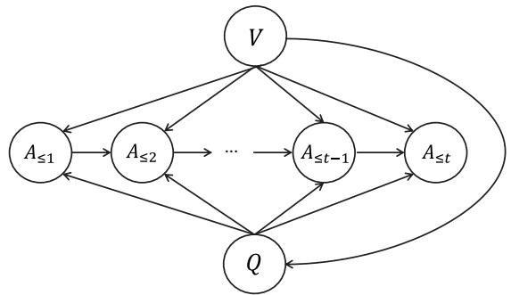  
Figure 1. Structural causal graph of VLM generation. Here, $V$ denotes the visual input, $Q$ denotes the question or prompt, and $A _ { \leq t }$ denotes the generated answer at token step t.

In this graph, the current token $A _ { t }$ is affected by multiple causal paths. The first type consists of direct paths: $A _ { < t } \to A _ { t } , V \to A _ { t } .$ , and $Q  A _ { t }$ . The second type includes confounding paths. For the prefix effect, $A _ { < t }$ and $A _ { t }$ share the upstream variables $Q$ and V, inducing the backdoor paths $A _ { < t } \left. Q \right. A _ { i }$ and $A _ { < t } \left. V \right. A _ { t } \ : [ 3 1 ]$ For the question effect, the path $Q \left. V \right. A _ { t }$ creates confounding because V affects both $Q$ and $A _ { t }$ , so the observed effect of Q on $A _ { t }$ is also biased. As a result, the observed relations $A _ { < t }  A _ { t }$ and $Q  A _ { t }$ do not by themselves identify the corresponding interventional effects on the current token. Directly interpreting changes in conditional probabilities as the causal contribution of a given source conflates statistical correlation with causal influence.

A straightforward alternative is to estimate source effects by repeatedly ablating inputs and regenerating outputs. However, such counterfactual decoding is costly, unstable, and difficult to scale in large-generation settings [14]. We therefore adopt the SCM to analyze the generation process. To distinguish causal influence from statistical association, we introduce the do-operator within the SCM framework [31]. The do-operator represents an intervention that fixes a variable to a specified value and cuts off its incoming causal dependencies, allowing us to block backdoor paths analytically. This enables us to estimate target causal effects by teacher-forced scoring of the same generated sequence under different source conditions, without altering the original

generation trajectory.

Based on the SCM, we derive causal effects to quantify source-level drives in generation. Each effect captures the change in output probability from interventions, rather than just statistical association [27]. In the following expression, uppercase letters such as $Q$ and $V$ denote random variables, while lowercase letters such as $q$ and $v$ denote their observed values. The adjustment distributions are estimated from the empirical evaluation data, so the resulting effects should be interpreted for the benchmark population under evaluation.

We first consider the generated prefix $A _ { < t }$ , whose influence on the current token $A _ { t }$ may be confounded by both the question $Q$ and visual input $V .$ . According to the backdoor criterion [31], after intervening on the prefix $d o ( A _ { < t } = a _ { < t } )$ , we obtain:

$$
\begin{array} { r l } & { P ( A _ { t } = a _ { t } \mid d o ( A _ { < t } = a _ { < t } ) ) } \\ & { \ = \displaystyle \sum _ { v , q } P ( V = v ) P ( Q = q \mid V = v ) } \\ & { \ ~ \cdot ~ P ( A _ { t } = a _ { t } \mid A _ { < t } = a _ { < t } , V = v , Q = q ) . } \end{array}\tag{1}
$$

For the question effect, the intervention $d o ( Q \ = \ q )$ cuts off the incoming edge $V  Q$ , blocking the backdoor path via $V$ . Since $V$ confounds the relationship between $Q$ and $A _ { < t }$ , we perform backdoor adjustment [32] on the empirical distribution of $V$ to block the backdoor path $Q \left. V \right.$ $A _ { \leq t }$ . The causal effect of question $Q$ on $A _ { \leq t }$ is

$$
\begin{array} { l } { P ( A _ { \leq t } = a _ { \leq t } \mid d o ( Q = q ) ) } \\ { \ = \displaystyle \sum _ { v } P ( A _ { \leq t } = a _ { \leq t } \mid V = v , Q = q ) P ( V = v ) . } \end{array}\tag{2}
$$

To characterize the contribution of visual evidence independently of question information, we evaluate the visual intervention while fixing the question to a null prompt:

$$
\begin{array} { r l } & { P ( A _ { \leq t } = a _ { \leq t } \mid d o ( V = v ) , d o ( Q = \emptyset ) ) } \\ & { \ = P ( A _ { \leq t } = a _ { \leq t } \mid V = v , Q = \emptyset ) . } \end{array}\tag{3}
$$

This intervention isolates the visual support available for generating $A _ { \leq t }$ when question information is absent. The equality in Eq. (3) follows because V is a root node in the assumed SCM; in contrast, QCD and PCD require backdoor adjustment, which distinguishes their interventional estimands from ordinary observational conditioning. Detailed proofs of the causal effects above are provided in Supplementary Sec. 7.

## 4. Causal Drive Metrics

Building on the causal effects derived in the preceding section, we introduce a unified causal drive framework for tracing how different information sources shape autoregressive

VLM generation. We define three causal drive metrics to measure the source-specific drives of the generated prefix, question input, and visual evidence on the generated answer. To calibrate the source-specific interventional quantities along the decoding trajectory, we introduce a shared null-source reference:

$$
P _ { 0 } ( A _ { \leq t } = a _ { \leq t } ) = P ( A _ { \leq t } = a _ { \leq t } \mid V = \emptyset , Q = \emptyset ) .\tag{4}
$$

The resulting causal-drive scores are calibrated relative to this shared null-source likelihood. This reference provides a common baseline for fixed target sequences and calibrates the scale of the causal-drive scores. We provide reference and prompt sensitivity analyses in Supplementary Sec. 10.

Prefix Causal Drive (PCD) characterizes the influence of the observed generation history on the token produced at decoding step t. It combines the interventional probability obtained by fixing the historical prefix with the shared nullsource reference.

Definition 1. The PCD at decoding step t is defined as:

$$
\begin{array} { l } { { \mathrm { P C D } _ { t } } = { \log _ { 2 } } \frac { P ( A _ { t } = a _ { t } \mid d o ( A _ { < t } = a _ { < t } ) ) } { P _ { 0 } ( A _ { \leq t } = a _ { \leq t } ) } \qquad ( \stackrel { \leq } { \sum } } \\ { \displaystyle \sum _ { v , q } P ( V = v ) P ( Q = q \mid V = v ) } \\ { = { \log _ { 2 } } \frac { \quad \times \ P ( A _ { t } = a _ { t } \mid A _ { < t } = a _ { < t } , V = v , Q = q ) } { P _ { 0 } ( A _ { \leq t } = a _ { \leq t } ) } . } \end{array}\tag{}
$$

(6)

Under the intervention $d o ( A _ { < t } = a _ { < t } )$ , the event $A _ { < t } =$ $a _ { < t }$ has probability one. Therefore, the numerator in Eq. (5) is equivalently $P ( A _ { \leq t } = a _ { \leq t } \ | \ d o ( A _ { < t } = a _ { < t } ) )$ , making it comparable to the sequence-level null reference while preserving the token-level definition. The numerator captures the probability of the current token given the fixed observed generation history, while marginalizing over the visual and question contexts. Evaluating PCD over successive decoding steps yields a temporal profile of prefixconditioned generation during autoregressive decoding. By substituting Eq. (1) into Eq. (5), we obtain the computable form in Eq. (6).

Question Causal Drive (QCD) is introduced to quantify the causal driving effect of the question Q on the current answer $A _ { \leq t }$ . It reflects the extent to which the generated content is driven by the question.

Definition 2. The QCD at token step t is defined as:

$$
\operatorname { Q C D } ( A \leq t = a \leq t \ | \ Q = q )
$$

$$
= \log _ { 2 } { \frac { P ( A _ { \leq t } = a _ { \leq t } \mid d o ( Q = q ) ) } { P _ { 0 } ( A _ { \leq t } = a _ { \leq t } ) } }\tag{7}
$$

(8)

$$
= \log _ { 2 } \left[ \sum _ { v } P ( V = v ) P ( A _ { 1 } = a _ { 1 } \mid V = v , Q = q ) \right.\tag{9}
$$

$$
\cdot \prod _ { i = 2 } ^ { t } P ( A _ { i } = a _ { i } \mid A _ { < i } = a _ { < i } , V = v , Q = q ) \Biggr ]\tag{10}
$$

$$
- \log _ { 2 } P _ { 0 } ( A _ { \leq t } = a _ { \leq t } ) ,\tag{11}
$$

Inserting Eq. (2) into Eq. (8) and decomposing the interventional probability using the autoregressive chain rule [9, 28] yields the computable expression in Eq. (11).

Visual Causal Drive (VCD) quantifies the contribution of visual evidence to the generated answer while the question is fixed to the null reference.

Definition 3. The VCD at decoding step t is defined as:

$$
\operatorname { V C D } ( A _ { \leq t } = a _ { \leq t } \ | \ V = v )\tag{12}
$$

$$
= \log _ { 2 } \frac { P ( A _ { \leq t } = a _ { \leq t } \mid d o ( V = v ) , d o ( Q = \emptyset ) ) } { P _ { 0 } ( A _ { < t } = a _ { < t } ) }\tag{13}
$$

$$
P ( A _ { 1 } = a _ { 1 } \mid V = v , Q = \emptyset )
$$

$$
= \log _ { 2 } \frac { \times \displaystyle \prod _ { i = 2 } ^ { t } P ( A _ { i } = a _ { i } \mid A _ { < i } = a _ { < i } , V = v , Q = \emptyset ) } { P _ { 0 } ( A _ { \leq t } = a _ { \leq t } ) } .\tag{14}
$$

By substituting Eq. (3) into Eq. (13) and applying the autoregressive chain rule, we obtain Eq. (14). VCD traces the support provided by visual evidence throughout generation when question information is replaced by the null reference. Detailed proofs are in Supplementary Sec. 8. Computational complexity, finite-support estimation, and resource overhead are discussed in Supplementary Sec. 9.

In summary, PCD, QCD, and VCD provide three stepindexed causal-drive metrics for tracing the roles of generation history, question information, and visual evidence throughout autoregressive decoding. Their temporal trajectories characterize how source-specific generation patterns evolve over the course of generation, providing processlevel diagnostics beyond final-answer evaluation.

## 5. Experimental Evaluation

In this section, we evaluate our framework on Qwen3-VL-8B-Instruct [7] and InternVL2-8B [11]. Table 1 summarizes the datasets and generation settings. For open-ended video QA, we use the first 500 MiraData samples with manually designed questions for reference-free analysis. The marginalization weights $P ( V )$ and $P ( Q \mid V )$ are estimated empirically from the evaluation data. Unless otherwise specified, the corresponding marginalizations are approximated using an empirical support size of $K = 2 0$ . The main experiments are conducted on 8 NVIDIA RTX 4090 GPUs with 24 GB of memory each; the large-support randomizedintervention validation is parallelized on 8 NVIDIA H200 GPUs for efficiency.

Table 1. Datasets overview.
<table><tr><td>Task Type</td><td>Dataset</td><td>Samples</td></tr><tr><td>Image-text  $\mathrm { \Delta V Q A }$ </td><td>MAVIS [35]</td><td>500</td></tr><tr><td>Supervised video QA</td><td>LLaVA-Video-178K [45]</td><td>100</td></tr><tr><td>Open-ended video QA</td><td>MiraData [17]</td><td>500</td></tr></table>

## 5.1. Temporal Transition of Causal Drives

This section examines how various information sources drive VLM generation across token positions. By tracking QCD, VCD, and PCD along normalized decoding positions across models, we analyze how the roles of the question, visual input, and generated prefix evolve during the generation process.

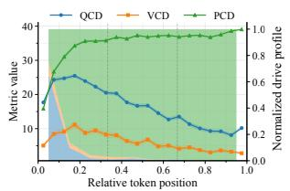  
(a) Qwen3-VL-8B-Instruct with MiraData.

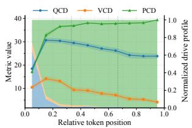  
(b) Qwen3-VL-8B-Instruct with LLaVA-Video-178K.

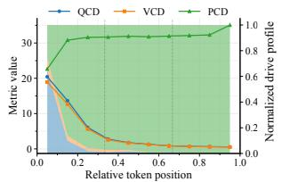  
(c) Qwen3-VL-8B-Instruct with MAVIS.

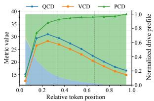  
(d) InternVL2-8B with MAVIS.

Figure 2. Dynamic trajectories and normalized drive profiles of causal drives. The x-axis denotes the relative decoding position, the curves show the three causal-drive scores, and the stacked background areas visualize their normalized profiles.

From Figure 2, we observe consistent temporal patterns across models and datasets. PCD increases rapidly during early decoding and remains high at later positions, indicating stronger prefix-conditioned generation as the answer history grows. In contrast, QCD is strongest early on and gradually decreases, showing that question information provides stronger guidance at the start of generation. VCD also tends to decrease over time, suggesting that visual evidence is more prominent during earlier decoding stages.

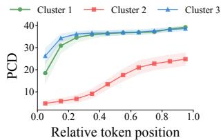  
(a) PCD.

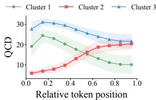

(b) QCD.  
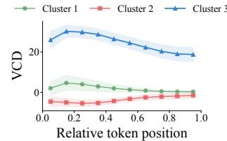  
(c) VCD.  
Figure 3. Step-indexed causal drive trajectories across three clustering groups.

We further observe dataset- and model-specific differences. For Qwen3-VL-8B-Instruct on MAVIS, QCD and VCD decrease rapidly while PCD increases sharply, indicating a fast transition toward stronger dependence on the generated history. On MiraData and LLaVA-Video-178K, QCD remains influential longer, suggesting more sustained question guidance in video QA. InternVL2-8B on MAVIS shows stronger and more persistent QCD and VCD trajectories, particularly during early-to-middle decoding. Overall, the three causal-drive trajectories reveal a recurring transition from stronger early question and visual guidance to increasing reliance on the generated prefix.

## 5.2. Clustering Generation Patterns via Causal Drive Trajectories

We further cluster causal-drive trajectories to identify sample-level generation patterns beyond average trends. This analysis reveals distinct source-reliance patterns across generation cases. As shown in Figure 3, we divide each generation into 10 normalized position bins, concatenate the averaged QCD, VCD, and PCD trajectories into a 30- dimensional representation, standardize it, and perform kmeans clustering [1] with $k = 3 .$ . We set $k = 3$ to obtain three interpretable behavioral patterns; implementation details and stability analysis are provided in Supplementary Sec. 11.

Cluster 1 (74%): Prefix-driven generation with weakened visual influence (green). This is the most common generation pattern. PCD increases rapidly at the early decoding stage and remains high thereafter, while QCD gradually decreases and VCD decays from an initially positive value toward zero. This suggests that the model first uses the question to determine the answer direction, and then shows an increasingly prominent prefix-conditioned generation pattern. Visual input provides limited early support, but its influence weakens over time.

Cluster 2 (6%): Visual suppression with late-stage convergence (red). This smallest cluster shows a clear pattern of visual-suppression. VCD remains negative throughout generation, indicating reduced visual support for the observed generation relative to the null reference. In later stages, PCD and QCD increase, indicating that the model relies more on the generated prefix and the question to ensure coherent generation when visual grounding is unreliable.

Cluster 3 (20%): Multi-source coordinated generation (blue). This cluster shows strong multimodal coupling. VCD increases during decoding and remains high, indicating that visual input significantly shapes token generation. QCD also remains high, suggesting that the question guides the selection and organization of visual evidence. Meanwhile, PCD gradually strengthens, helping to maintain coherent continuation. This pattern reflects a coordinated generation process where visual evidence supplies key content, while the question and prefix guide answer construction.

Overall, these clusters show that causal drive trajectories provide useful behavioral signatures of multimodal generation. They help diagnose whether a sample is mainly prefixdriven, visually grounded, or affected by visual suppression, offering guidance for targeted model improvement.

## 5.3. What Do Conventional Metrics Miss?

We evaluate Qwen3-VL-8B-Instruct on the first 500 image– question samples from MAVIS, using the first entry in the dataset’s verifiable facts field as the reference answer. Table 2 presents three representative cases to illustrate what source-level causal attribution reveals beyond conventional answer–reference evaluation. For each case, we report the conventional evaluation outcome, the corresponding causal-drive evidence, and an additional query used to verify the diagnosed source reliance.

The three cases reveal two complementary limitations of conventional answer-level evaluation. First, low reference overlap does not necessarily imply that a generation lacks meaningful support. In Samples 1 and 2, conventional metrics assign low scores because the generated answers differ from the references, whereas the high QCD/VCD values indicate strong dependence on the question and visual evidence. The additional queries preserve the diagnosed behavior, supporting the source attribution reported by the causal drives.

Second, even when conventional metrics correctly identify a good answer, they do not explain why the answer is produced. Sample 3 matches the reference, but the causal drives further reveal strong multimodal support. Its response changes consistently when the visual context is changed, while the null-image condition produces an unrelated answer, providing additional evidence of visual reliance.

Overall, conventional metrics primarily characterize whether a generated answer agrees with a reference, whereas causal drives characterize which information sources support that answer during generation. The two forms of evaluation are therefore complementary: outcome metrics measure answer quality, while causal drives provide source-level diagnostic information that is not visible from answer–reference agreement alone.

## 5.4. Validating Causal Attribution

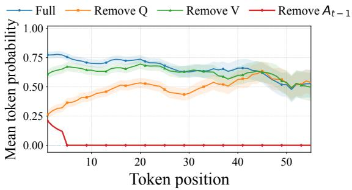  
Figure 4. Mean token probabilities across positions under sourceremoval ablation.

Source-Removal Sanity Check. To examine whether the estimated causal drives align with the model’s sensitivity to different information sources, we perform a source-removal sanity check. We fix the original generated sequence and, under teacher forcing, remove the question Q, visual input V , and generated prefix $A _ { < t }$ , respectively. As shown in Figure 4 and Table 3, the mean token probability under the full condition is 0.7167; after removing Q, V, and $A _ { < t } ,$ it decreases to 0.4384, 0.6541, and 0.0323, with token probabilities decreasing for 99%, 73%, and 100% of the samples, respectively. These results show that removing each source changes the probability of the original generation trajectory, with particularly strong sensitivity to the generated prefix and question information.

Randomized Intervention Recovery. To further examine whether the estimated causal drives agree with mode behavior under active source interventions, we construct an independent held-out randomized intervention reference. This complements the source-removal sanity check: source removal tests whether an information source supports the original trajectory, whereas randomized intervention evaluates whether the estimated drive can recover model behavior when that source is actively reassigned.

For each target generation, we sample M = 100 contexts from held-out MAVIS examples excluded from the original K = 20 support set. For question intervention, we fix the target question and randomly reassign visual contexts, thereby breaking the natural image–question pairing. For prefix intervention, we fix the generated prefix and evaluate subsequent tokens under randomly sampled observed image–question pairs. The original generation trajectory is preserved and evaluated with teacher forcing.

Table 2. Representative VQA cases illustrating information missed by conventional answer-level metrics. Conventional evaluation de scribes answer–reference agreement, whereas causal drives characterize the information sources supporting the generation. Q2 and A2 provide additional case-level verification of the diagnosed source reliance.
<table><tr><td>Sample 1: Low overlap, Q/V-driven</td><td>Sample 2: Low overlap, visually grounded</td><td>Sample 3: Correct, multimodal grounded</td></tr><tr><td rowspan="3">OTf Ru</td><td>Remember</td><td>7 year old me getting ready to scream “Aye, Aye Captain!&quot;</td></tr><tr><td>STEAM DECK</td><td></td></tr><tr><td>No Preorders! Q: Why is my account not able to place a reservation until Sunday? A: The Steam Deck does not accept preorders. R: There is an awareness of potential</td><td>Q: Who lives in a pineapple under the sea? A: SpongeBob SquarePants. R: SpongeBob SquarePants. Conventional: Near-perfect</td></tr><tr><td rowspan="2">when the ligand is in the pyridine form. Conventional: Nearly-zero reference overlap. Causal evidence: QCD = 31.75 (top 0.6%); VCD = 30.51 (top 0.4%). Verification: Q2: Based on the image, what is the oxidation state of Ru when coordinated with the donor-flexible PYE ligand?</td><td>unauthorized resellers, prompting additional safeguards. Conventional: Low ROUGE-L, METEOR, and token-F1.</td><td>answer-reference agreement. Causal evidence: PCD, QCD, and VCD all lie in high percentiles, indicating multimodal support. Verification:</td></tr><tr><td>Causal evidence: QCD = 31.10 (top 0.8%); VCD ranks highest among the evaluated samples. Verification: Q2: What restriction is placed on this</td><td></td></tr><tr><td>A2: +2. Diagnosis: Low-overlap but strongly question- and vision-supported.</td><td>account? A2: The account cannot preorder items. Diagnosis: Low-overlap answer with strong visual grounding.</td><td>Q2: Who lives in the rock house under the sea? A2: Squidward Tentacles lives in the rock house under the sea. Null-image A2: The Little Mermaid. Diagnosis: Correct answer with</td></tr></table>

Table 3. Source-removal ablation results. $P _ { \mathrm { f u l l } }$ and $P _ { \mathrm { r e m o v e } }$ denote the mean token probabilities before and after removing each source, respectively. Fraction decreased denotes the proportion of samples whose probability decreases after source removal.
<table><tr><td>Removed</td><td> $P _ { \mathrm { f u l l } }$ </td><td> $P _ { \mathrm { r e m o v e } }$ </td><td>Fraction Decreased</td></tr><tr><td>Q</td><td></td><td>0.4384</td><td>99%</td></tr><tr><td>V</td><td>0.7167</td><td>0.6541</td><td>73%</td></tr><tr><td> $A _ { < t }$ </td><td></td><td>0.0323</td><td>100%</td></tr></table>

As observational baselines, we use $\mathrm { P M I } _ { Q }$ and $\mathrm { P M I } _ { P }$ to characterize the statistical dependence of the question and prefix on the generated output. Unlike QCD and PCD, which estimate interventional effects after causal adjustment, these PMI counterparts retain the dependencies in the observational distribution. Their definitions are given in Eqs. (24) and (25) of the supplementary material.

Let $G ( t )$ denote the held-out randomized intervention reference and $D ( t )$ denote either the corresponding causal drive or PMI baseline. We measure recovery error as

$$
\mathrm { E r r } ( D ) = \frac { 1 } { T } \sum _ { t = 1 } ^ { T } \left| D ( t ) - G ( t ) \right| .\tag{15}
$$

A lower error indicates closer agreement with model behavior under randomized intervention. The randomized reference is not treated as exact causal ground truth but as a large-support approximation of the intervention of interest.

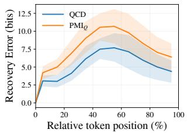  
(a) Question.

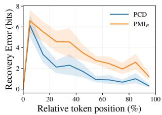  
(b) Prefix.  
Figure 5. Recovery error to held-out randomized intervention references over relative token positions. Lower is better. Shaded regions denote 95% block-bootstrap confidence intervals.

Figure 5 compares recovery errors over relative token positions. Causal drives remain consistently closer to the randomized intervention reference throughout generation. Across 50 target generations covering all ten original $K =$ 20 support blocks, QCD reduces the average recovery error from 7.822 bits for PMIQ to 5.434 bits, corresponding to a 34.8% reduction. PCD reduces the error from 3.660 bits for $\mathrm { P M I } _ { P }$ to 2.019 bits, a 47.1% reduction. QCD achieves lower error on 98% of targets, while PCD does so on all targets. These results show that causal drives more faithfully recover source influence under randomized interventions than observational PMI.

Complementarity to Conventional Metrics. Causal drives show weak overall correlations with conventional metrics, suggesting they capture different signals. QCD and VCD are weakly positively correlated with BERT-F1[44] and BLEU-4[30], and weakly negatively correlated with TER[34]. The Spearman correlations of QCD with BERT-F1 and TER are 0.22 and -0.27, while those of VCD are 0.19 and -0.26. In contrast, PCD is nearly uncorrelated with conventional metrics, indicating it mainly reflects autoregressive inertia rather than final answer quality. Therefore, causal drives are not replacements for conventional metrics, but instead provide complementary process-level signals about the generation process that conventional metrics alone cannot capture.

## 5.5. Validating Source-level Attribution

Although causal drives characterize how visual evidence, question text, and historical prefixes influence generation, whether these attributions correspond to meaningful model behaviors remains to be verified. Therefore, we further evaluate our framework on VLMBias, which provides generation samples with different visual reliance behaviors.

We focus on two categories: prior-driven and visually grounded generations. Prior-driven generations are consistent with the language-prior answer rather than the visual evidence, whereas visually grounded generations are supported by the visual content. Since our goal is to analyze information sources during generation rather than evaluate final answer correctness, this experiment serves as an external validation of source attribution. We evaluate 200 valid examples, including 112 prior-driven, 58 visually grounded, and 30 other-error generations; the binary classification results below use the 170 examples from the first two categories.

Table 4. Source-level attribution validation on VLMBias.
<table><tr><td>Metric</td><td>AUROC</td><td>AUPRC</td></tr><tr><td>Answer-level VCD</td><td>0.747</td><td>0.842</td></tr><tr><td>Prefix-Visual imbalance  $( S _ { P V } )$ </td><td>0.767</td><td>0.873</td></tr></table>

For each sample, we measure the relative dependence between generated prefixes and visual evidence using the Prefix-Visual imbalance score:

$$
\begin{array} { r } { S _ { P V } = \overline { { P C D } } - \overline { { V C D } } , } \end{array}
$$

where PCD and VCD denote the averaged prefix and visual causal drives. A larger $S _ { P V }$ indicates stronger reliance on historical generation contexts relative to visual evidence.

Table 4 reports the classification performance between the two generation patterns. Answer-level VCD already provides meaningful signals $( \mathrm { A U R O C } ~ = ~ 0 . 7 4 7 ,$ $\mathrm { A U P R C } ~ = ~ 0 . 8 4 2 )$ , while combining prefix and visual contributions with $S _ { P V }$ further improves the performance $( \mathrm { A U R O C } = 0 . 7 6 7 , \mathrm { A U P R C } = 0 . 8 7 3 )$ . On the same 50 VLMBias samples, Qwen3-VL-32B-Instruct preserves the source-level polarity observed in the 8B model, while exhibiting model-specific temporal trajectories. These results demonstrate that causal drives capture source-level differences consistent with observed generation behaviors, providing an interpretable view of how VLMs utilize multimodal information during generation. Additional confidence intervals and effect-size analyses are reported in Supplementary Sec. 12.

## 6. Conclusion

In this paper, we introduce a causal and temporal evaluation framework for tracing how visual evidence, question text, and generated history shape VLM generation. By modeling autoregressive decoding with an SCM, we derive PCD, QCD, and VCD as step-indexed causal-drive metrics that require no reference answers. Experiments on Qwen3-VL-8B-Instruct across MAVIS, LLaVA-Video-178K, and MiraData, along with cross-model validation on InternVL2- 8B, reveal a consistent temporal transition from stronger early question and visual guidance to increasing reliance on generated prefixes. Randomized-intervention validation shows that QCD and PCD reduce recovery error over observational PMI baselines by 34.8% and 47.1%, respectively. External validation on VLMBias further shows that the prefix–visual imbalance score achieves 0.767 AUROC and 0.873 AUPRC in distinguishing prior-driven from visually grounded generations. Overall, causal-drive trajectories complement conventional answer-level evaluation with source-level diagnostics for multimodal generation.

Limitations. The proposed drives diagnose source reliance rather than replace correctness metrics: strong visual drive indicates probability support from visual evidence, not necessarily correct visual understanding. Their causal interpretation is also conditioned on the assumed SCM, fixed model parameters during evaluation, and the absence of unobserved sample-level common causes beyond the adjusted variables. Finally, our experiments focus on the evaluated model families, scales, and generation settings; chain-of-thought-style long reasoning remains an important direction for future validation.

## References

[1] Mohiuddin Ahmed, Raihan Seraj, and Syed Mohammed Shamsul Islam. The k-means algorithm: A comprehensive survey and performance evaluation. Electronics, 9(8):1295, 2020. 5

[2] Jean-Baptiste Alayrac, Jeff Donahue, Pauline Luc, Antoine Miech, Iain Barr, Yana Hasson, Karel Lenc, Arthur Mensch, Katherine Millican, Malcolm Reynolds, et al. Flamingo: a visual language model for few-shot learning. Advances in neural information processing systems, 35:23716–23736, 2022. 2

[3] Padegal Amit, Omkar Mahesh Kashyap, Namitha Rayasam, Nidhi Shekhar, and Surabhi Narayan. Quantifying modality contributions via disentangling multimodal representations. arXiv preprint arXiv:2511.19470, 2025. 1, 2

[4] Peter Anderson, Basura Fernando, Mark Johnson, and Stephen Gould. Spice: Semantic propositional image caption evaluation. In European conference on computer vision, pages 382–398. Springer, 2016. 2

[5] Stanislaw Antol, Aishwarya Agrawal, Jiasen Lu, Margaret Mitchell, Dhruv Batra, C Lawrence Zitnick, and Devi Parikh. Vqa: Visual question answering. In Proceedings of the IEEE international conference on computer vision, pages 2425– 2433, 2015. 1, 2

[6] Mohammad Asadi, Jack W O’Sullivan, Fang Cao, Tahoura Nedaee, Kamyar Fardi, Fei-Fei Li, Ehsan Adeli, and Euan Ashley. Mirage the illusion of visual understanding. arXiv preprint arXiv:2603.21687, 2026. 1

[7] Shuai Bai, Yuxuan Cai, Ruizhe Chen, Keqin Chen, Xionghui Chen, Zesen Cheng, Lianghao Deng, Wei Ding, Chang Gao, Chunjiang Ge, et al. Qwen3-vl technical report. arXiv preprint arXiv:2511.21631, 2025. 4

[8] Satanjeev Banerjee and Alon Lavie. Meteor: An automatic metric for mt evaluation with improved correlation with human judgments. In Proceedings of the acl workshop on intrinsic and extrinsic evaluation measures for machine translation and/or summarization, pages 65–72, 2005. 2

[9] Yoshua Bengio, Rejean Ducharme, Pascal Vincent, and´ Christian Jauvin. A neural probabilistic language model. Journal of machine learning research, 3(Feb):1137–1155, 2003. 4

[10] Lin Chen, Jinsong Li, Xiaoyi Dong, Pan Zhang, Yuhang Zang, Zehui Chen, Haodong Duan, Jiaqi Wang, Yu Qiao, Dahua Lin, et al. Are we on the right way for evaluating large vision-language models? Advances in Neural Informa tion Processing Systems, 37:27056–27087, 2024. 1

[11] Zhe Chen, Jiannan Wu, Wenhai Wang, Weijie Su, Guo Chen, Sen Xing, Muyan Zhong, Qinglong Zhang, Xizhou Zhu, Lewei Lu, et al. Internvl: Scaling up vision foundation mod els and aligning for generic visual-linguistic tasks. In Proceedings of the IEEE/CVF Conference on Computer Vision and Pattern Recognition, pages 24185–24198, 2024. 4

[12] Xinyu Fang, Kangrui Mao, Haodong Duan, Xiangyu Zhao, Yining Li, Dahua Lin, and Kai Chen. Mmbench-video: A long-form multi-shot benchmark for holistic video understanding. Advances in Neural Information Processing Sys tems, 37:89098–89124, 2024. 1

[13] Alessandro Favero, Luca Zancato, Matthew Trager, Siddharth Choudhary, Pramuditha Perera, Alessandro Achille, Ashwin Swaminathan, and Stefano Soatto. Multi-modal hallucination control by visual information grounding. In Pro ceedings of the IEEE/CVF Conference on Computer Vision and Pattern Recognition, pages 14303–14312, 2024. 2

[14] Amir Feder, Nadav Oved, Uri Shalit, and Roi Reichart. Causalm: Causal model explanation through counterfactual language models. Computational Linguistics, 47(2):333– 386, 2021. 3

[15] Chaoyou Fu, Peixian Chen, Yunhang Shen, Yulei Qin, Mengdan Zhang, Xu Lin, Jinrui Yang, Xiawu Zheng, Ke Li, Xing Sun, et al. Mme: A comprehensive evaluation benchmark for multimodal large language models. arXiv preprint arXiv:2306.13394, 2023. 2

[16] Wanting Jin, Guorong Wu, and Quefeng Li. Inference on the significance of modalities in multimodal generalized linear models. arXiv preprint arXiv:2601.16196, 2026. 1, 2

[17] Xuan Ju, Yiming Gao, Zhaoyang Zhang, Ziyang Yuan, Xin tao Wang, Ailing Zeng, Yu Xiong, Qiang Xu, and Ying Shan. Miradata: A large-scale video dataset with long durations and structured captions. Advances in Neural Information Processing Systems, 37:48955–48970, 2024. 5

[18] Jinu Lee and Julia Hockenmaier. Evaluating stepby-step reasoning traces: A survey. arXiv preprint arXiv:2502.12289, 2025. 1

[19] Zhiyuan Li, Yi Chang, and Yuan Wu. Think-bench: Evaluating thinking efficiency and chain-of-thought quality of large reasoning models. arXiv preprint arXiv:2505.22113, 2025. 1, 2

[20] Zongxia Li, Xiyang Wu, Hongyang Du, Huy Nghiem, and Guangyao Shi. Benchmark evaluations, applications, and challenges of large vision language models: A survey. arXiv preprint arXiv:2501.02189, 2025. 1

[21] Paul Pu Liang, Yun Cheng, Xiang Fan, Chun Kai Ling, Suzanne Nie, Richard Chen, Zihao Deng, Nicholas Allen, Randy Auerbach, Faisal Mahmood, et al. Quantifying &

modeling multimodal interactions: An information decomposition framework. Advances in Neural Information Processing Systems, 36:27351–27393, 2023. 2

[22] Hunter Lightman, Vineet Kosaraju, Yuri Burda, Harrison Edwards, Bowen Baker, Teddy Lee, Jan Leike, John Schulman, Ilya Sutskever, and Karl Cobbe. Let’s verify step by step. In The Twelfth International Conference on Learning Representations, 2024. 1

[23] Chin-Yew Lin. Rouge: A package for automatic evaluation of summaries. In Text summarization branches out, pages 74–81, 2004. 2

[24] Yuan Liu, Haodong Duan, Yuanhan Zhang, Bo Li, Songyang Zhang, Wangbo Zhao, Yike Yuan, Jiaqi Wang, Conghui He, Ziwei Liu, et al. Mmbench: Is your multi-modal model an all-around player? In European conference on computer vision, pages 216–233. Springer, 2024. 2

[25] Pan Lu, Swaroop Mishra, Tanglin Xia, Liang Qiu, Kai-Wei Chang, Song-Chun Zhu, Oyvind Tafjord, Peter Clark, and Ashwin Kalyan. Learn to explain: Multimodal reasoning via thought chains for science question answering. Advances in neural information processing systems, 35:2507–2521, 2022. 1

[26] Zhenjiang Mao, Artem Bisliouk, Rohith Reddy Nama, and Ivan Ruchkin. Temporalizing confidence: Evaluation of chain-of-thought reasoning with signal temporal logic. arXiv preprint arXiv:2506.08243, 2025. 1, 2

[27] Bruno Kacper Mlodozeniec, David Krueger, and Richard E. Turner. Position: Probabilistic modelling is sufficient for causal inference. In Forty-second International Conference on Machine Learning Position Paper Track, 2025. URL https : / / openreview . net / forum ? id = V1FP9WDKa7. 3

[28] Kevin P Murphy. Machine learning: a probabilistic perspective. MIT press, 2012. 4

[29] Clement Neo, Luke Ong, Philip Torr, Mor Geva, David Krueger, and Fazl Barez. Towards interpreting visual information processing in vision-language models. arXiv preprint arXiv:2410.07149, 2024. 1, 2

[30] Kishore Papineni, Salim Roukos, Todd Ward, and Wei-Jing Zhu. Bleu: a method for automatic evaluation of machine translation. In Proceedings ofthe 40th annual meeting ofthe Association for Computational Linguistics, pages 311–318, 2002. 1, 2, 8

[31] Judea Pearl. Causality. Cambridge university press, 2009. 2, 3

[32] Judea Pearl. Causal inference. Causality: objectives and assessment, pages 39–58, 2010. 2, 3

[33] Archiki Prasad, Swarnadeep Saha, Xiang Zhou, and Mohit Bansal. Receval: Evaluating reasoning chains via correctness and informativeness. In Proceedings of the 2023 Conference on Empirical Methods in Natural Language Processing, pages 10066–10086, 2023. 1, 2

[34] Matthew Snover, Bonnie Dorr, Richard Schwartz, Linnea Micciulla, and John Makhoul. A study of translation edit rate with targeted human annotation. In Proceedings of the 7th Conference of the Association for Machine Translation in the Americas: Technical Papers, pages 223–231, 2006. 8

[35] Seokwon Song, Minsu Park, and Gunhee Kim. Mavis: A benchmark for multimodal source attribution in long-form visual question answering. In Proceedings ofthe AAAI Conference on Artificial Intelligence, pages 33028–33037, 2026. 5

[36] Ramakrishna Vedantam, C Lawrence Zitnick, and Devi Parikh. Cider: Consensus-based image description evaluation. In Proceedings of the IEEE conference on computer vision and pattern recognition, pages 4566–4575, 2015. 1, 2

[37] Qiong Wu, Xiangcong Yang, Yiyi Zhou, Chenxin Fang, Baiyang Song, Xiaoshuai Sun, and Rongrong Ji. Grounded chain-of-thought for multimodal large language models. arXiv preprint arXiv:2503.12799, 2025. 2

[38] Shijie Xia, Xuefeng Li, Yixin Liu, Tongshuang Wu, and Pengfei Liu. Evaluating mathematical reasoning beyond accuracy. In Proceedings of the AAAI Conference on Artificial Intelligence, volume 39, pages 27723–27730, 2025. 1

[39] Junbin Xiao, Angela Yao, Yicong Li, and Tat-Seng Chua. Can i trust your answer? visually grounded video question answering. In Proceedings of the IEEE/CVF Conference on Computer Vision and Pattern Recognition, pages 13204– 13214, 2024. 2

[40] Jing Xiong, Gongye Liu, Lun Huang, Chengyue Wu, Taiqiang Wu, Yao Mu, Yuan Yao, Hui Shen, Zhongwei Wan, Jinfa Huang, Chaofan Tao, Shen Yan, Huaxiu Yao, Ling peng Kong, Hongxia Yang, Mi Zhang, Guillermo Sapiro, Jiebo Luo, Ping Luo, and Ngai Wong. Autoregressive mod els in vision: A survey. Transactions on Machine Learn ing Research, 2025. ISSN 2835-8856. URL https: //openreview.net/forum?id=1BqXkjNEGP. Sur vey Certification. 2

[41] Shengwei Xu, Yuxuan Lu, Grant Schoenebeck, and Yuqing Kong. Benchmarking llms’ judgments with no gold stan dard. In The Thirteenth International Conference on Learning Representations, 2025. 14

[42] Shukang Yin, Chaoyou Fu, Sirui Zhao, Ke Li, Xing Sun, Tong Xu, and Enhong Chen. A survey on multimodal large language models. National Science Review, 11(12): nwae403, 2024. 1, 2

[43] Xiang Yue, Yuansheng Ni, Kai Zhang, Tianyu Zheng, Ruoq Liu, Ge Zhang, Samuel Stevens, Dongfu Jiang, Weiming Ren, Yuxuan Sun, et al. Mmmu: A massive multi-discipline multimodal understanding and reasoning benchmark for ex pert agi. In Proceedings of the IEEE/CVF conference on computer vision and pattern recognition, pages 9556–9567, 2024. 2

[44] Tianyi Zhang, Varsha Kishore, Felix Wu, Kilian Q Weinberger, and Yoav Artzi. Bertscore: Evaluating text generation with bert. arXiv preprint arXiv:1904.09675, 2019. 1, 2, 8

[45] Yuanhan Zhang, Jinming Wu, Wei Li, Bo Li, Zejun Ma, Ziwei Liu, and Chunyuan Li. Llava-video: Video instruction tuning with synthetic data. arXiv preprint arXiv:2410.02713, 2024. 5

[46] Guanyu Zhou, Yibo Yan, Xin Zou, Kun Wang, Aiwei Liu, and Xuming Hu. Mitigating modality prior-induced hallucinations in multimodal large language models via decipher-

ing attention causality. In The Thirteenth International Conference on Learning Representations, 2025. URL https: //openreview.net/forum?id=AV7OXVlAyi. 2

# Who Drives the Probability Game of VLMs? A Temporal Causal Drive Evaluation Framework

Supplementary Material

## 7. Proofs of Causal Effects

The proof of Eq. (1), the causal effect of $A _ { < t }$ on $A _ { t } ,$ , is as follows:

Proof. Here, $P ( A _ { t } = a _ { t } \ | \ d o ( A _ { < t } = a _ { < t } ) )$ denotes the interventional probability of the current token after fixing the generated prefix. To identify this quantity, we block the backdoor paths induced by $Q$ and $V .$ , thereby removing their confounding effects on the relation between $A _ { < t }$ and $A _ { t }$

To implement the do-operator $d o ( A _ { < t } = a _ { < t } )$ , we cut off the original generative mechanism that determines $A _ { < t }$ and replace it with the fixed assignment $A _ { < t } = a _ { < t }$ . After the intervention, the prefix no longer depends on its upstream variables. Conditioned on this fixed prefix, generation of the current token $A _ { t }$ depends on $Q , \ V ,$ and $a _ { < t }$ . The intervention therefore removes the spurious dependence induced by the backdoor paths $A _ { < t } \left. Q \right. A _ { t }$ and $A _ { < t } \left. V \right. A _ { t }$ . Marginalizing over the empirical evaluation distribution $P ( V = v ) P ( Q = q \mid V = v )$ yields Eq. (1). □

The proof of Eq. (2), the causal effect of $Q$ on $A _ { \leq t }$ , is as follows:

Proof. This quantity represents the interventional effect of the question condition $Q$ on the current answer $A _ { \leq t }$ . Under the intervention $d o ( Q = q )$ , the incoming edge $\bar { V }  Q$ is removed, and $Q$ is directly fixed to $q ,$ no longer depending on its original upstream mechanism. Since $V$ is a common cause of $Q$ and $A _ { \leq t }$ , it confounds the observational relation between them. Therefore, we adjust over the empirical evaluation distribution of $V$ to block the backdoor path $Q \left. V \right. A _ { \leq t }$ , yielding Eq. (2). □

The proof of Eq. (3), the visual-source effect on $A _ { \leq t }$ with the question fixed to the null prompt, is as follows:

Proof. The joint intervention fixes the visual variable to v and the question to the null prompt $\mathcal { O } .$ Intervening on $Q$ removes its incoming edge from $V ,$ while $V$ has no parent in the proposed SCM. Under this graph and its assumed absence of omitted common causes, the truncated factorization therefore reduces the interventional distribution to the model’s conditional generation distribution:

$$
\begin{array} { r } { P ( A _ { \leq t } = a _ { \leq t } \mid d o ( V = v ) , d o ( Q = \emptyset ) ) } \\ { = P ( A _ { \leq t } = a _ { \leq t } \mid V = v , Q = \emptyset ) . } \end{array}
$$

Here, $Q = \emptyset$ is implemented as a null model input rather than estimated from naturally occurring null-question samples. The right-hand side is evaluated directly by teacherforced model scoring and isolates the visual support available for the observed answer trajectory when question information is absent. □

## 8. Proofs of Causal Drives

All three causal drives use the shared null-source reference introduced in Eq. (4):

$$
P _ { 0 } ( A _ { \leq t } = a _ { \leq t } ) = P ( A _ { \leq t } = a _ { \leq t } \mid V = \emptyset , Q = \emptyset ) .
$$

## 8.1. Prefix Causal Drive (PCD)

The Prefix Causal Drive (PCD) at step t is defined as

$$
\mathrm { P C D } _ { t } = \log _ { 2 } \frac { P ( A _ { t } = a _ { t } \mid d o ( A _ { < t } = a _ { < t } ) ) } { P _ { 0 } ( A _ { \leq t } = a _ { \leq t } ) } .
$$

This definition compares the interventional probability of the current token after fixing the observed history with the shared null-source likelihood. A larger value indicates stronger prefix-conditioned generation at decoding step t. Under the intervention $d o ( A _ { < t } = a _ { < t } )$ , the event $A _ { < t } =$ $a _ { < t }$ has probability one. Thus, the numerator is equivalently $P ( A _ { \leq t } = a _ { \leq t } \ | \ d o ( A _ { < t } = a _ { < t } ) )$ , which makes the tokenlevel PCD definition comparable to the sequence-level null reference.

Based on Eq. (1), the Prefix Causal Drive admits the following computable form.

Theorem 1. PCD can be computed asfollows:

$$
\begin{array} { l } { \mathrm { P C D } _ { t } } \\ { \displaystyle \sum _ { v , q } P ( V = v ) P ( Q = q \mid V = v ) } \\ { = \displaystyle \log _ { 2 } \frac { \mathrm { \ } \times \ P ( A _ { t } = a _ { t } \mid A _ { < t } = a _ { < t } , V = v , Q = q ) } { P _ { 0 } ( A _ { < t } = a _ { < t } ) } . } \end{array}\tag{}
$$

(17)

This expression follows by substituting the backdooradjusted prefix effect from Eq. (1) into the PCD definition. It characterizes the role of the observed generation history at the current decoding step while marginalizing over visual and question contexts.

## 8.2. Question Causal Drive (QCD)

The Question Causal Drive (QCD) at step t is defined as

$$
\begin{array} { r l } & { \mathrm { Q C D } ( A _ { \leq t } = a _ { \leq t } \ | \ Q = q ) } \\ & { = \log _ { 2 } \frac { P ( A _ { \leq t } = a _ { \leq t } \ | \ d o ( Q = q ) ) } { P _ { 0 } ( A _ { \leq t } = a _ { \leq t } ) } . } \end{array}
$$

This definition compares the generation probability under the question intervention with the shared null-source likelihood.

QCD can be computed as follows:

(18)

$$
\begin{array} { l } { \displaystyle \mathrm { Q C D } ( A _ { \leq t } = a _ { \leq t } \mid Q = q ) } \\ { \displaystyle \qquad \sum _ { v } P ( V = v ) } \\ { \displaystyle = \log _ { 2 } \frac { \qquad \times P ( A _ { \leq t } = a _ { \leq t } \mid V = v , Q = q ) } { P _ { 0 } ( A _ { \leq t } = a _ { \leq t } ) } . } \end{array}\tag{19}
$$

Expanding the numerator using the autoregressive chain rule yields

$$
\begin{array} { l } { { \displaystyle { \mathrm { Q C D } } ( A _ { \leq t } = a _ { \leq t } \mid Q = q ) } \ ~ } \\ { { \displaystyle \sum _ { v } P ( V = v ) P ( A _ { 1 } = a _ { 1 } \mid V = v , Q = q ) } \ ~ } \\ { { \displaystyle ~ \times \prod _ { i = 2 } ^ { t } P ( A _ { i } = a _ { i } \mid A _ { < i } = a _ { < i } , V = v , Q = q ) } \ ~ } \\ { { \displaystyle = \log _ { 2 } \frac { ~ } { ~ } \frac { ~ } { ~ P _ { 0 } ( A _ { < t } = a _ { < t } ) } } . } \end{array}\tag{21}
$$

## 8.3. Visual Causal Drive (VCD)

The Visual Causal Drive (VCD) at step t is defined as

$$
\begin{array} { l } { \operatorname { V C D } ( A _ { \leq t } = a _ { \leq t } \ \vert \ V = v ) } \\ { = \log _ { 2 } \frac { P ( A _ { \leq t } = a _ { \leq t } \ \vert \ d o ( V = v ) , d o ( Q = \emptyset ) ) } { P _ { 0 } ( A _ { \leq t } = a _ { \leq t } ) } . } \end{array}
$$

This definition measures visual support relative to the shared null-source likelihood while holding the question at the null prompt. According to Eq. (3), the numerator is identified by $P ( A _ { \leq t } = a _ { \leq t } \mid V = v , Q = \emptyset )$ and can be factorized using the autoregressive chain rule.

VCD can be computed as follows:

$$
\begin{array} { r l } & { \mathrm { V C D } ( A _ { \le t } = a _ { \le t } \mid V = v ) } \\ & { \qquad P ( A _ { 1 } = a _ { 1 } \mid V = v , Q = \emptyset ) } \\ & { \qquad \quad \times \displaystyle \prod _ { i = 2 } ^ { t } P ( A _ { i } = a _ { i } \mid A _ { < i } = a _ { < i } , V = v , Q = \emptyset ) } \\ & { \quad = \log _ { 2 } \frac { \displaystyle 1 } { \qquad P _ { 0 } ( A _ { \le t } = a _ { \le t } ) } } \end{array}\tag{23}
$$

VCD is cumulative over the answer prefix through step t and traces the support provided by visual evidence when question information is absent.

## 9. Computational Complexity and Resource Overhead

Our causal and temporal evaluation framework computes three causal drives—PCD, QCD, and VCD—by evaluating per-token probabilities under different source interventions. The computational complexity per sample scales with sequence length T and the number of interventions: PCD is the most expensive at $O ( | V | \cdot | Q | \cdot T )$ due to summing over visual inputs and questions, QCD requires $O ( | V | \cdot T )$ , and VCD is the lightest at $O ( T )$ .

Memory overhead is dominated by storing per-token logits or probabilities for each intervention, which grows with vocabulary size, sequence length, and the number of visual or question conditions. In practice, batching, caching repeated computations, and sampling over large visual or question sets are used to keep GPU memory usage manageable. Overall, while PCD is the most computationally intensive, the framework remains feasible for typical VLM evaluation workloads with standard GPU hardware.

## 9.1. Finite-support Estimation

Before computing causal drives, we preprocess the evaluation split to estimate the empirical weights $P ( V )$ and $P ( Q \mid V )$ . For QCD, we fix the target question q, evaluate the same generated sequence under each sampled visual context v with teacher forcing, and aggregate the resulting probability trajectories using $P ( V = v )$ . For PCD, we additionally traverse sampled $( v , q )$ pairs and aggregate with $P ( V = v ) P ( Q = q \mid V = v )$ . The preprocessing cost is incurred once; repeated teacher-forced scoring under different contexts dominates the runtime.

We also examine the stability of finite-support approximation. For 8 target generations, we sample two independent supports and evaluate $K \in \{ 4 , 8 , 1 6 \}$ , using the $K ~ = ~ 1 6$ support as the largest finite-support reference. This creates 48 target-support configurations and 4096 conditional probability trajectories. With K = 4, QCD and PCD reach average Pearson correlations of 1.000 and 0.997 with the $K ~ = ~ 1 6$ reference. With $K \ = \ 8 ,$ the correlations are 1.000 and 0.999. Across independent support samplings, QCD correlations remain 1.000 for all support sizes, while PCD correlations are 0.999, 0.998, and 0.998 for $K = 4 , 8 , 1 6 .$ respectively.

## 10. Reference and Implementation Sensitivity

The null-source likelihood $P _ { 0 } ( A _ { \leq t } )$ is a shared reference condition rather than an estimate of the data distribution. Since QCD, VCD, and PCD use the same reference term at a fixed decoding step, the denominator calibrates absolute scale. To test whether the main trajectories depend on the concrete reference construction, we replace the null image with a black image. The resulting QCD, VCD, and PCD trajectories achieve Pearson correlations of 0.997, 0.991, and 0.998 with the original setting. Under a mismatchedimage reference, QCD and PCD correlations remain 0.971 and 0.980.

We further test prompt sensitivity by replacing the empty prompt with the task-agnostic prompt “Please provide a response.” The sample-wise Pearson correlations with the original setting are 0.962 for QCD and 0.977 for PCD. For VCD, the empty-prompt and matched-prompt versions reach an average sample-wise Pearson correlation of 0.971, with 95% CI [0.965, 0.976].

## 11. Clustering Details

For each sample, we normalize token positions to relative decoding positions and divide the full generation into 10 equal bins. Within each bin, we average QCD, VCD, and PCD separately, then concatenate the three trajectories into

$$
\begin{array} { r } { \mathbf { z } _ { i } = [ \mathrm { Q C D } _ { i , 1 : 1 0 } , \mathrm { V C D } _ { i , 1 : 1 0 } , \mathrm { P C D } _ { i , 1 : 1 0 } ] . } \end{array}
$$

This yields a 30-dimensional representation for each generation. We standardize these representations and run kmeans clustering. We set $k \ = \ 3$ because the resulting groups correspond to interpretable generation modes: prefix-dominant generation, visual suppression, and multisource coordination. Additional checks with adjacent k values and different random initializations preserve the main behavior patterns, indicating that the reported clusters are not driven by a single unstable initialization.

## 12. VLMBias Validation Details

VLMBias provides labels that distinguish prior-driven behavior from visually grounded behavior. We evaluate 200 valid samples: 112 prior-driven generations, 58 visually grounded generations, and 30 other-error generations. The binary validation uses the 170 prior-driven and visually grounded samples.

The Prefix-Visual imbalance score $S _ { P V } = \overline { { \mathrm { P C D } } } - \overline { { \mathrm { V C D } } }$ achieves $\mathrm { A U R O C } = 0 . 7 6 7$ , with 95% CI [0.691, 0.839], and AUPRC = 0.873, with 95% CI [0.826, 0.916]. Answer-level VCD achieves $\mathrm { A U R O C } = 0 . 7 4 7 .$ , with 95% CI [0.667, 0.824], and $\mathrm { A U P R C } ~ = ~ 0 . 8 4 2$ , with 95% CI $[ 0 . 7 8 4 , 0 . 9 0 1 ]$ The mean answer-level VCD values are −7.84 for prior-driven generations and −5.63 for visually grounded generations, yielding a difference of −2.21, with 95% CI $[ - 2 . 9 7 , - 1 . 4 2 ]$ . The effect sizes are also substantial, with Cohen’s $d = - 0 . 8 8 9$ and Cliff’s delta −0.495. These results show that weaker visual drive is associated with prior-driven generation behavior.

## 12.1. Scaling from 8B to 32B

We evaluate Qwen3-VL-32B-Instruct on the same 50 VLM-Bias samples used for Qwen3-VL-8B-Instruct. Across all

50 samples, the source-level polarity is fully preserved: QCD and PCD remain positive, whereas VCD remains negative. The four-step mean VCD trajectories are highly consistent across scales $( r = 0 . 9 9 2 )$ , while PCD shows moderate agreement $( r = 0 . 7 5 3 )$ . In contrast, the detailed QCD trajectories differ across scales, with a mean-trajectory correlation of $r ~ = ~ 0 . 2 9 5$ . These results indicate that some source-level patterns remain stable across model scales, while their temporal evolution can be model-dependent.

## 13. PMI Baseline Definitions

We use Pointwise Mutual Information (PMI) [41] as an observational baseline for the question and prefix effects. VCD remains an interventional causal quantity; under the assumed SCM, however, V is a root node and its causal effect is identified through truncated factorization without backdoor adjustment. Because the randomized-intervention recovery experiment is designed to assess the benefit of causal adjustment over observational dependence, we define PMI baselines only for QCD and PCD, whose effects require such adjustment:

$$
\mathrm { P M I } _ { Q } = \log _ { 2 } \frac { P ( A _ { t } \mid A _ { < t } , V , Q ) } { P ( A _ { t } \mid A _ { < t } , V ) } ,\tag{24}
$$

$$
\mathrm { P M I } _ { P } = \log _ { 2 } \frac { P ( A _ { t } \mid A _ { < t } , V , Q ) } { P ( A _ { t } \mid V , Q ) } .\tag{25}
$$

These quantities characterize conditional statistical dependence and serve as the comparison baselines in the randomized-intervention recovery experiment.