# WiFlow: Estimating Optical Flow using WiFi Channel State Information

Thomas Weigel1 , Simon Kiefhaber1,3 , Fabian Portner2 , Matthias Hollick1 , and Simone Schaub-Meyer1,3

1 Technical University of Darmstadt, Germany weigel-thomas@outlook.de, {name.surname}@tu-darmstadt.de 2 Technische Universiteit Delft, The Netherlands fportner@tudelft.nl 3 Hessian Center for AI (hessian.AI), Germany

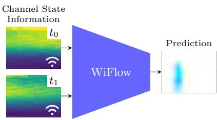

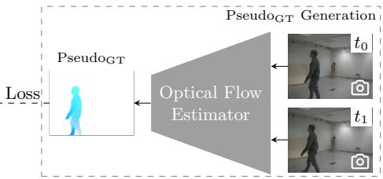  
Fig. 1. WiFlow. Can optical flow be estimated solely from WiFi information? Overview of our framework to estimate optical flow from channel state information extracted from WiFi signals. Pseudo ground truth to train WiFlow is computed from video frames at two corresponding timestamps.

Abstract. Knowing where and how fast objects are moving within a scene is important across various domains. Usually, cameras are used to capture the data necessary for this task, but adding cameras often raises privacy concerns, and the quality of captured frames is heavily influenced by lighting conditions. In this work, we explore using WiFi channel state information (CSI) instead of camera frames for optical flow estimation. We propose WiFlow, a CSI based flow estimator, a preprocessor evaluation for CSI, and three model architectures that ofer diferent trade-ofs between accuracy and complexity. Further, we create the first dataset for training and evaluating CSI-based optical flow estimators, and our experiments provide insights into key design elements for this task. Code and data are available at https://visinf.github.io/wiflow.

Keywords: Low-Level Vision · WiFi Sensing · Motion Estimation · Channel State Information · Dataset

## 1 Introduction

Motion is a fundamental cue for understanding dynamic scenes. In computer vision, a standard way to capture temporal change is optical flow, which estimates the apparent motion between two consecutive frames. Optical flow supports a wide range of downstream tasks, such as action recognition [93], object tracking [88], robotic navigation and control [11,28,54], inpainting [19,38,83,92], video frame interpolation [15,52,53,66,90], and unsupervised segmentation [13,24,62]. In practice, optical flow is almost always computed from camera images, which makes deployments in certain settings dificult. Cameras record detailed visual scenes, expose people’s privacy and fail in the dark without additional hardware, as we illustrate in the supplemental Sec. F.

WiFi sensing ofers a diferent way to observe motion, especially indoors. WiFi devices continuously estimate channel state information (CSI), which captures how signals change as they propagate from transmitter to receiver. Indoors, this propagation is determined by the influence of static objects, like walls and furniture, but also moving subjects, like people. When something moves, the propagation changes, and this is reflected in the CSI measurements. This relation makes CSI a natural input for device-free sensing tasks, requiring no additional hardware beyond what is already used for wireless communication.

In this work, we ask: Can optical flow be estimated solely from WiFi information? Prior CSI-based sensing work shows that WiFi signals carry elaborate motion information, enabling localization [79, 89], gesture and action recognition [23, 78, 91], and human pose estimation [14, 30, 71, 86]. These CSI-based methods directly produce a task-specific output, such as a class, a location, or a pose. Here, we push further and instead try to recover optical flow from CSI directly, capturing the motion pattern itself rather than a single task output.

Estimating flow from WiFi is especially attractive when cameras are undesirable or unreliable. WiFi sensing works in the dark and can build on existing wireless infrastructure, while avoiding the collection of camera frames. If dense flow from CSI is feasible, it can serve as a general motion input for privacysensitive indoor applications such as home security, fall detection, gesture control, or crowd monitoring.

In this work, we demonstrate the feasibility of extracting general motion information from CSI measurements in a fixed indoor setting. Our main contributions are (i) experimental evidence that optical flow can be recovered from CSI with generalization across unseen subjects, (ii) three distinct architectures for CSI-based optical flow estimation, ofering varying trade-ofs between accuracy and computational complexity, and (iii) a novel dataset providing optical flow supervision (pseudo ground truth) alongside synchronized CSI for training and evaluation.

## 2 Related Work

Optical Flow is an estimate of the apparent pixel-wise motion between consecutive image frames. Methods for computing it range from classical formulations [6, 29, 47] to deep learning approaches, which are typically built on either convolutional or transformer-based architectures.

On the convolutional side, FlowNet [17] introduced learned optical flow estimation, and later work such as PWC-Net [67, 68], FlowNet2 [33], and related methods [32,59] refined the same core pipeline. Many of these models reduce the cost of dense matching with coarse-to-fine estimation and restricted per-pixel search ranges, which can limit the magnitude of motion they capture. RAFT [69] avoided this fixed-range design by using global correlation with iterative refinement, and subsequent RAFT-style methods [34, 41, 76, 77, 82] improved robustness in challenging cases such as occlusions [34]. Transformer-based alternatives are also emerging [16, 65], though recent comparisons still report convolutional methods as strong in both accuracy and computational cost [41, 51, 77]. All of these methods infer motion from video by tracking correspondence across frames. Our goal is to bypass cameras altogether and extract comparable flow estimates from WiFi channel state information alone.

WiFi Sensing. Several works reconstruct camera-like observations from channel state information (CSI), including RGB frames [37,39,40] and dense geometry via depth images [3]. While some pipelines also produce person-shaped masks or saliency maps [39, 40] that can look motion-like, their objective is still frame or depth synthesis rather than learning pixel correspondences across time. In parallel, CSI-to-human methods estimate human-centric outputs such as person masks/segmentation [71], 3D pose or skeleton tracking [14,22,30,35,60,61,85,87], and full 3D mesh construction [75]. Finally, completion approaches fuse WiFi CSI with vision for RGB recovery (inpainting or occlusion removal) and require an image input for inference [9, 10].

Separately, CSI has also been used to infer motion in physical space. Representative systems track device-free motion trajectories [36, 56, 57, 78], estimate specific attributes such as walking direction [79] or speed and acceleration [8,89], and perform device-free localization [72]. These outputs are expressed in metric coordinates and are not designed to produce a dense image-plane motion representation.

Overall, prior work either reconstructs spatial content (RGB/depth/meshes) or predicts motion in metric space (e.g., trajectories). In contrast, we learn CSIto-optical-flow to predict dense image-plane motion over the sensed area: video is only used to generate pseudo-flow supervision during training, at inference, we output optical flow from CSI alone.

Preprocessing. Raw CSI is hard to learn from. As a channel estimate, it contains both environmental efects and measurement/hardware artifacts that are unrelated to the scene. This is why WiFi sensing pipelines usually apply preprocessing to reduce these artifacts and make the representation easier to learn from, even when the downstream model is a neural network. In the simplest case, this is ignored, and CSI amplitudes and phases are being used without any processing [74,87]. Some works apply time–frequency transforms to expose motionrelated spectral structure. Fourier transformations (e.g., STFT-style processing) have been used to extract micro-Doppler signatures imprinted on CSI evolution in time [55, 58, 73]. Alternatively, wavelet transforms have been used both to derive multi-scale (scale–frequency) features for learning [81, 84] and to denoise CSI in the wavelet domain before subsequent processing [43, 94]. Further, Principal Component Analysis (PCA) is often used to either reduce dimensionality [2], or as a filtering step that suppresses a dominant common component when it mainly captures nuisance variation [73]. Some phase ofsets are common to all antennas on a device, e.g., due to shared hardware. To mitigate these, multiantenna normalization is often used, either through antenna conjugation [44,58] or quotients [78]. Finally, to combat noise, smoothing filters such as Savitzky– Golay are frequently applied to reduce high-frequency noise while preserving local structure [42, 78, 79].

## 3 WiFi Sensing

While WiFi packets are primarily designed to carry communication data, they simultaneously carry a fingerprint of the environment. The transmitter encodes data as a symbol x, which undergoes complex transformations as it propagates through the physical environment. Consequently, the receiver does not observe x directly, but rather a distorted version shaped by the surrounding environment. Conceptually,

$$
y = H x + n ,\tag{1}
$$

where y is what the receiver measures, n denotes noise, and H is the wireless channel. The channel H represents how the current environment transforms the transmitted information x as it travels from transmitter to receiver. When the environment changes, propagation changes, and so does H. For communication, H is a nuisance: the receiver needs the information in x, not the transformed observation y. This is why every WiFi packet begins with a short, fixed, known sequence. The receiver compares the expected and received symbols to estimate H over a set of frequencies (subcarriers) to undo the distortion and decode the data. These noisy, per-packet channel estimates are called channel state information (CSI).

WiFi sensing repurposes the need for channel estimation into a measurement tool. Since channel estimates are computed anyway for every packet to make communication possible, sensing methods simply leverage them as an observation of the physical environment. Because CSI captures how the environment shapes the signal, motion induces structured temporal changes in CSI that sensing methods learn to associate with properties of the underlying scene. Figure 2 illustrates this efect, where CSI magnitudes over time show a diferent pattern when a person walks through the room. While CSI has traditionally been kept inside the receiver, recent research tools expose it on selected chipsets [4,21,25,63,80], and the upcoming IEEE 802.11bf standard [1] further standardizes access to channel measurements for sensing.

Table 1. Dataset comparison between existing datasets and our proposed dataset based on key requirements for optical flow estimation. ( ) denotes datasets that are accessible and provide RGB frames, from which an optical flow PseudoGT can be derived using our method (cf . supplement).
<table><tr><td>Dataset</td><td>Optical Flow Device-free Multi-RxTx | Accessible</td><td></td><td></td></tr><tr><td>MMFi [86]</td><td>(√)</td><td>×</td><td>V</td></tr><tr><td>XRF55 [70]</td><td>×</td><td>V</td><td>X</td></tr><tr><td>SignFi [48]</td><td>√&gt;√ ×</td><td></td><td></td></tr><tr><td>DICHASUS / ESPARGOS [18]</td><td>(√)</td><td></td><td>&gt;&gt;</td></tr><tr><td>Person-in-WiFi [71]</td><td></td><td>×&gt;&gt;&gt;</td><td>×</td></tr><tr><td>Person-in-WiFi3D [85]</td><td></td><td></td><td>X</td></tr><tr><td>× WiMans [31] (√)</td><td>×&gt;&gt;&gt;</td><td>×</td><td></td></tr><tr><td>Ours</td><td></td><td></td><td></td></tr></table>

## 4 WiFlow Dataset

We aim to learn a mapping from captured WiFi channel estimates, that is, channel state information (CSI), to motion in the scene, represented as optical flow. Training a deep neural network for this task requires paired data, with CSI measurements aligned to optical-flow labels.

Our target scenario is a fixed indoor environment where transmitters and receivers remain static and subjects carry no WiFi devices, that is, device-free sensing. Reliable supervision further requires tight synchronization between CSI and a modality that can provide flow labels, such as cameras. We rely on multiple receive antennas because a single antenna provides an incomplete and ambiguous view of motion. Similar channel changes can be caused by motion in diferent parts of the room, and some motion directions may cause little to no change at all. Multiple antennas ofer complementary vantage points that help resolve where motion occurred, consistent with prior work [78, 79, 91].

Existing datasets do not meet these requirements. Optical-flow datasets offer RGB frames with flow annotations [5, 7, 17, 20, 49, 50] but contain no CSI. Conversely, CSI datasets typically lack synchronized video and therefore cannot provide optical-flow supervision. Even when video is available, existing CSI datasets summarized in Tab. 1 do not capture the CSI we need for thorough evaluation, i.e., multi-device, multi-antenna measurements at high sample rate and bandwidth, in a device-free indoor setup. We therefore collect a novel dataset tailored to optical flow estimation from CSI.

Capture Setup. Following the practice of other WiFi sensing works [14,71,85, 86], we assume a device-free setup, where locations of WiFi devices (transmitter and receivers), cameras, and walls remain fixed during capturing. Our experimental setup consists of one transmitter (Tx), four receivers $( \mathrm { R x } _ { 1 }$ to $\mathrm { R x } _ { 4 } )$ placed in the corners of the movement area, and two cameras, as shown in Fig. 3.

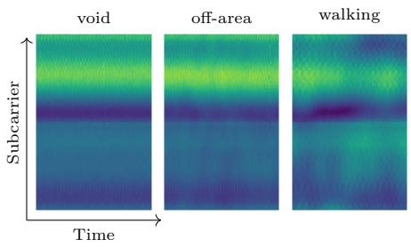

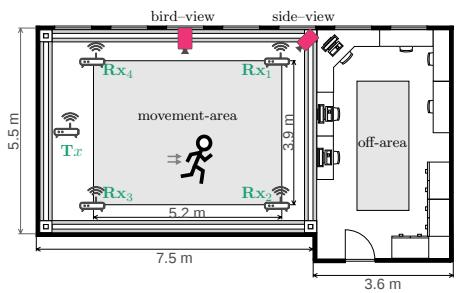  
Fig. 2. Amplitude heatmaps for multiple subcarriers over 100 time-consecutive CSI for three diferent scenarios: No motion (void), motion only outside the cap tured area (of-area), and walking.  
Fig. 3. Floorplan of our capture setup showing the locations of routers, cameras, movement-, and of-area. All captured actions, except motion in of-area, are performed within the movement-area.

To generate pseudo ground truth of optical flow, one camera captures the movement area from the side (sideview), and the other from above (birdview). We are only able to predict the motion of subjects visible in the cameras in the movement-area. Since movement outside the visible area (called of-area) also afects the wireless channel, we explicitly handle this case during data collection as well. In total, we collect data of seven predefined actions with one or two people moving, sequences without any motion (void), and with motion only in the of-area. Each capture is 30 s long and repeated multiple times for each of the 10 subjects. A detailed description of the actions, as well as exact statistics of the captured data, can be found in the supplemental Sec. A.

To capture high-frequency, high-bandwidth CSI, we use a single-antenna transmitter (USRP N2954-R) that broadcasts WiFi packets at 1 kHz. We operate on channel 157 with 80 MHz bandwidth, which is typically unused by nearby WiFi devices, reducing interference while maximizing the number of subcarriers and thus the richness of the CSI. We deploy four receivers (Asus RT-AC86U), each with four antennas, placed in the corners of the movement-area, and extract CSI using NexmonCSI [21]. In total, we collect 328 sequences, totaling 164 min, and observe an average packet loss of only 0.5% across devices and captures.

Synchronizing Training Data. A key challenge in building training pairs is aligning the video frames with the much higher-rate CSI stream. Our two cameras capture video at 30 Hz (side-view) and 50 Hz (bird-view), while CSI is recorded at 1000 Hz. We subsample the videos by keeping every fifth frame, which yields efective frame rates of 6 Hz and 10 Hz. Subsampling is needed to have a coarse enough temporal resolution for computing reasonable optical flow. For each retained frame at time t, we then associate a fixed number of

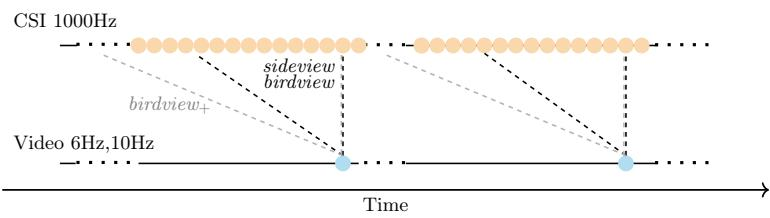  
Fig. 4. Matching process between CSI and video frames. For sideview and birdview we match the latest 10 CSI with each image frame; for birdview+ we use the latest 100.

CSI measurements based on timestamp proximity, selecting the K closest CSI samples prior to t.

We provide three aligned versions of the data. sideview uses the side-view camera frames with $K = 1 0$ , following the pairing used in MM-Fi [86]. birdview uses the ceiling camera frames with the same $K = 1 0$ . To study the efect of larger CSI context per frame, we also introduce birdview+, using the same frames as birdview but with an increased associatied number of K = 100 CSI. Figure 4 visualizes the resulting alignment.

Pseudo Ground Truth. To acquire optical flow, we process the subsampled frames from both cameras using an ensemble of SOTA optical flow methods to produce pseudo ground truths (denoted as PseudoGT) at a resolution of 168 128 pixels. Details on the generation of PseudoGT can be found in the supplemental Sec. B.

As shown in Fig. 5, the distributions of motion angles difer drastically between the two camera views. Most motions in the sideview are biased towards horizontal motions compared to the more uniformly distributed motions in birdview. Further, in both of our perspectives, slower motions are more common than faster ones, with the frequency gradually decaying.

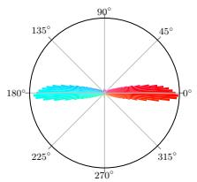  
(a) sideview

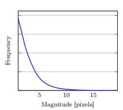

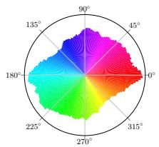

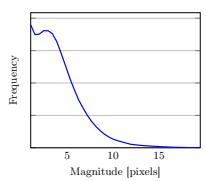  
(b) birdview  
Fig. 5. Distributions of the motion angles and magnitudes in our two dataset views of all moving pixels. The distribution of the motion angles reveals that most motions in the sideview perspective are along the horizontal axis, while the motion directions in the birdview perspective are more uniformly distributed. Similarly, there are more samples with faster motions in the birdview perspective.

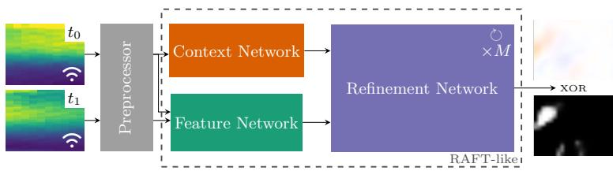  
Fig. 6. WiFlow block used in all of our architectures. First, the CSI data is preprocessed, and then we use a RAFT-like architecture to predict either optical flow or a motion mask.

Evaluation Settings. We introduce two diferent partitioning strategies of our dataset for model training and evaluation. In time split, 3 of the 4 (6 of 8, respectively) captured sequences per action are allocated for training, with the remaining reserved and split between validation and test. This allows us to assess temporal generalization while having the same subjects during training and testing. To evaluate cross-subject generalization, we additionally propose a subject split, in which all actions and repetitions performed by seven persons are used for training, while the data of one other person is used for validation, and all actions of two other persons are used as a test set. See supplemental Tab. A.3 for further details.

## 5 WiFlow

We aim to reconstruct the motion field a camera would see, using only CSI from WiFi receivers. In general, CSI consists of complex-valued measurements $H _ { i } \in \mathbb { C } ^ { T \times R \times D \times K \times N }$ , with T transmit antennas, R antennas per receiver, D receivers, K subcarriers, and N captured CSI snapshots. In our setup, $T = 1$ $D = 4 ,$ and $R = 4 ;$ we stack all antenna/subcarrier measurements across the four receivers into a single antenna-like dimension $A = T \cdot D \cdot R .$ , and use a window of N snapshots (either 10 or 100, see Sec. 4), yielding $H _ { i } ^ { \prime } \in \mathbb { C } ^ { \dot { A } \times K \times N }$ . The target is an optical-flow field $F _ { i } \in \mathbb { R } ^ { 2 \times H \times W }$ , where H and W are the spatial height and width, representing the motion that would be visible between two consecutive camera frames $t _ { i }$ and $t _ { i + 1 }$

Our goal is to train a neural network that maps CSI sequences to a 2D optical flow field. This mapping is non-trivial because the input is a structured time– frequency tensor, while the output is a dense spatial motion field. We achieve this by leveraging existing CSI preprocessing to obtain a suitable representation utilized by our proposed model architectures tailored to this task.

Model Architectures. We propose three diferent models to predict optical flow from CSI. All of them utilize a basic building block inspired by RAFT [69], a state-of-the-art optical flow method for images. Our basic building block, as shown in Fig. 6, combines a CSI preprocessor with a RAFT-like architecture to either directly predict optical flow or a motion mask. Depending on the output, we refer to this basic building block as Flow Block or Mask Block, respectively.

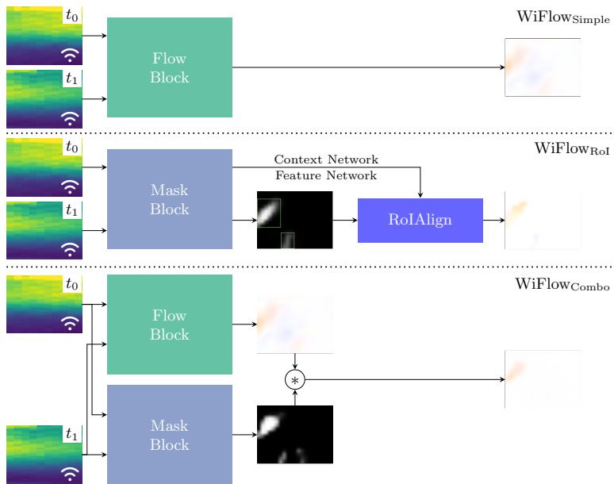  
Fig. 7. Architectures. In each of our proposed architectures, we use our WiFlow building block. WiFlowSimple consists only of a flow block, while $\operatorname { W i F l o w } _ { \mathrm { R o I } }$ uses a mask block which additionally returns the features of its context and feature networks. The mask and additional features are then utilized by RoIAlign to calculate the optical flow prediction. In $\operatorname { W i F l o w c o m b o }$ , we combine the outputs of a flow and mask block.

As in RAFT, we use three diferent sub-networks: A Feature Network that extracts per-pixel features from both input frames and calculates the similarity between these features, a Context Network that extracts additional information from the input frames, and a Refinement Network that combines the outputs of the other two. The Refinement Network iteratively updates the prediction multiple times. In our setup, the context network and feature network are both based on a modified ResNet [27] with an increased input dimensionality to match the dimensions of the preprocessor’s output data, and the refinement network is the same convolutional GRU as in RAFT [12, 69].

Fig. 7 visualizes our three model architectures of varying complexity. Our simplest baseline, $\mathrm { W i F l o w } _ { \mathrm { S i m p l e } } ,$ consists of the flow block directly predicting the optical flow. Since devices in our setup are static and motion is sparse, large areas of the resulting flow are zero. To leverage this, we also design an architecture that separates the task into motion localization and motion estimation. $\operatorname { W i F l o w } _ { \operatorname { R o I } }$ is inspired by object detection and segmentation [26]. A mask block pretrained on CSI is used to predict moving areas. Then, only within the bounding boxes extracted from the motion mask contours, the optical flow is predicted using RoIAlign [26]. In our case, the RoIAlign receives bounding boxes and a combination of the features calculated in the context and feature networks of the mask block as inputs, and a convolutional decoder calculates the optical flow within each bounding box. $\operatorname { W i F l o w } _ { \mathrm { C o m b o } }$ follows a similar motivation, but instead of sequentially performing motion localization and estimation, two branches perform these tasks in parallel. One branch computes the flow with a flow block, while the other branch predicts the motion mask with a mask block, respectively. The final result is obtained by point-wise multiplying the predicted flow with the motion mask.

Training Loss. Due to the static camera position, most pixels exhibit zero flow. To prevent training from collapsing to the trivial all-zero prediction, we modify the sequence loss of RAFT [69] by up-weighting errors on non-zero flow pixels as

$$
\mathcal { L } = \sum _ { m = 1 } ^ { M } \gamma ^ { M - m } ( F _ { g t } - F _ { m } ) ^ { 4 } ,\tag{2}
$$

where M is the number of iterations in the refinement network, γ is the decay factor and $F _ { m }$ is the optical flow prediction at the m-th refinement iteration.

## 6 Experiments

As no prior work has targeted the task of predicting optical flow directly from CSI, we conducted a detailed analysis of common CSI preprocessing methods and our proposed model architectures.

## 6.1 Setup

Evaluation Metrics. Following common practice in optical flow [41,69,77], we evaluate the endpoint-error (EPE), which measures the mean Euclidean norm of the diferences between the predicted optical flow vectors and our pseudo ground truth $( \mathrm { P s e u d o } _ { \mathrm { G T } } )$ . In our setup, due to the static camera, each frame of our dataset contains a large portion of static background without motion, biasing the overall EPE, as visualized in Fig. 8. We therefore separately analyze the EPE for the moving and static pixels. $\mathrm { E P E _ { M } }$ refers to the EPE of the moving pixels, i.e. pixels where the Euclidean norm of the PseudoGT is larger than 0.5, while $\mathrm { E P E _ { S } }$ refers to the EPE of the remaining static pixels. We report all three metrics in our experiments. We also introduce $\mathrm { E P E _ { A } }$ , where all areas are evaluated but amplified by 4, similar to our loss. This amplifies the penalization of absent but expected motion.

Implementation Details. We train all our methods using a cosine annealing learning rate scheduler [45] with a base learning rate of $1 e ^ { - 3 }$ on a single NVIDIA RTX 6000 Ada GPU. We set the decay factor of our loss function to 0.8, and train all models using the AdamW optimizer [46] for 60k training steps with 4 refinement iterations.

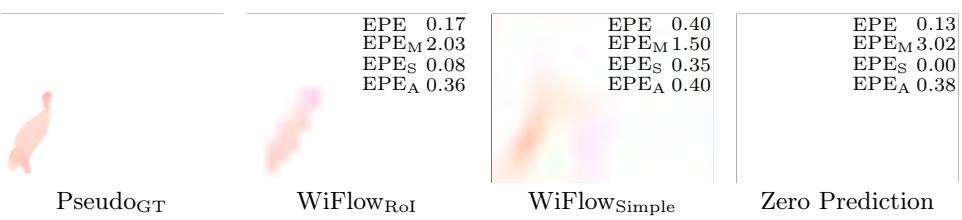  
Fig. 8. Metrics. A comparison of our metrics on diferent predictions shows that for our setting, the EPE can be minimized when not predicting any motion (zero prediction). We use EPEA as a more stable alternative. Further, we evaluate moving and static areas separately $\mathrm { ( E P E _ { M } }$ and $\mathrm { E P E } _ { \mathrm { S } } )$ .

Table 2. Preprocessing. Results of $\mathrm { W i F l o w _ { S i m p l e } }$ trained on the time split of birdview+. Zero represents the baseline performance achieved by predicting constant-zero flows.
<table><tr><td colspan="4">EPE EPEm EPEs EPEA</td></tr><tr><td>Zero</td><td>0.17 3.70</td><td>0.00</td><td>0.84</td></tr><tr><td>SavGol</td><td>0.59 3.64</td><td>0.44</td><td>1.14</td></tr><tr><td>Fourier</td><td>0.41</td><td>3.71 0.25</td><td>0.95</td></tr><tr><td>Raw</td><td>0.40 3.71</td><td>0.24</td><td>0.94</td></tr><tr><td>Quotient</td><td>0.41</td><td>2.89 0.29</td><td>0.78</td></tr><tr><td>PCA</td><td>0.47</td><td>2.95 0.35</td><td>0.82</td></tr></table>

Table 3. Computational requirements for birdview during inference of our three proposed architectures averaged over 1000 measurement runs on a single NVIDIA RTX 6000 Ada GPU.
<table><tr><td></td><td>Time in ms</td><td> $\mathrm { F L O P s }$   $\times 1 0 ^ { 9 }$ </td><td>Memory in MB</td></tr><tr><td>WiFlowSimple</td><td>23</td><td>22</td><td>380</td></tr><tr><td>WiFlowRoI</td><td>26</td><td>22</td><td>380</td></tr><tr><td>WiFlowCombo</td><td>47</td><td>43</td><td>763</td></tr></table>

## 6.2 Analysis

Preprocessing. We consider five CSI preprocessing strategies. Raw uses amplitude and phase for every complex CSI value; amplitude is normalized to [0, 1]. Quotient [78] normalizes across antennas: for each device, subcarrier and time step, we divide the complex measurement of each antenna by the measurement of a reference antenna. This largely cancels phase ofsets shared within a device. Fourier applies an inverse Fourier transform along the time dimension independently for each antenna and subcarrier, and uses the resulting real and imaginary parts as features. SavGol smooths the real and imaginary parts of the CSI independently over time using a Savitzky–Golay filter (window length 51). PCA performs PCA-based denoising over the flattened per-timestep CSI vector $( A \times K \times 2$ for real/imag), keeping 150 principal components; the PCA projection is computed once on the training set. The PCA features are projected back to the original space to preserve the input tensor shape.

Tab. 2 shows the efect of the diferent preprocessing of CSI when training our $\mathrm { W i F l o w _ { S i m p l e } } .$ . Although Raw achieves the lowest EPE, it does not achieve this for the actual moving pixels. For our setup, the EPE can be minimized by solely predicting zero optical flow values. Quotient achieves the lowest EPE for the moving pixels $\left( \mathrm { E P E _ { M } } \right)$ , while having also competitive low EPE for the background area $\mathrm { ( E P E _ { S } ) }$ . This is further confirmed with its lowest $\mathrm { E P E _ { A } }$ . The quantitative gap between Raw and Quotient indicates that preprocessing selection is necessary and beneficial before further processing CSI with a neural network. Based on these findings, we train all subsequent models using the Quotient preprocessor.

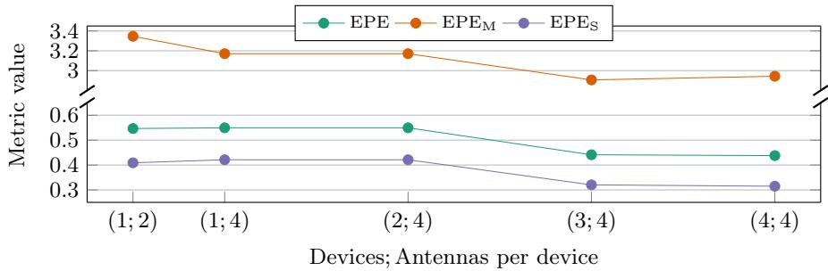  
Fig. 9. Impact of device count. Accuracy on birdview+ when increasing the number of receiver devices (4 antennas per device). For the single-device setting, we also report a variant using only two antennas from the first receiver.

Impact of Device Count. To evaluate the impact of the number of devices, we train multiple $\mathrm { W i F l o w } _ { \mathrm { S i m p l e } }$ models with 1–4 receivers. For the single device setting, we additionally evaluate a 2 antenna for a single receiver. As shown in Fig. 9, we observe improvements across all metrics as we increase the number of devices up to 3, with only minor improvements beyond that. We therefore conclude that incorporating measurements from multiple spatially separated receiver locations is beneficial for performing spatial inference tasks such as optical flow estimation. For further experiments, we use CSI from all 16 antennas of the four receivers.

Comparing Architectures. Our three architecture vary in computational requirements. Tab. 3 shows that that $\mathrm { W i F l o w } _ { \mathrm { S i m p l e } }$ and $\operatorname { W i F l o w } _ { \mathrm { R o I } }$ have very similar requirements. $\operatorname { W i F l o w } _ { \mathrm { C o m b o } }$ requires roughly twice as many compute resources as the other methods due to having two of the WiFlow blocks. However, all of our methods require less than 1GB of VRAM, which allows running our models even on cheap consumer GPUs and inference is in the order of ms.

Tab. 4 shows the resulting accuracies of our proposed models on each perspective and evaluation split of our dataset. The results are consistent across all possible settings of our dataset and they show that $\operatorname { W i F l o w } _ { \mathrm { C o m b o } }$ performs best across most of our metrics. The only exception is $\mathrm { E P E _ { M } }$ where $\operatorname { W i F l o w } _ { \mathrm { S i m p l e } }$ outperforms all other models. However, the qualitative results, shown in Fig. 10, indicate that $\mathrm { W i F l o w } _ { \mathrm { S i m p l e } }$ sufers from a lot of noise in the non-moving background pixels, whereas our other models are better at localizing motion. We provide further in-depth analysis of the accuracy of our networks on the diferent actions present in our dataset in supplemental Sec. E.

Table 4. Evaluation of EPE ( ) metrics of WiFlow on each evaluation setting of our proposed dataset.
<table><tr><td rowspan="2">Perspective</td><td rowspan="2">Architecture</td><td colspan="3">Subject Split</td><td colspan="3">Time Split</td></tr><tr><td>EPE</td><td> $\mathrm { E P E _ { M } }$ </td><td> $\mathrm { E P E _ { S } }$ </td><td>EPE</td><td> $\mathrm { E P E _ { M } }$ </td><td> $\mathrm { E P E _ { S } }$ </td></tr><tr><td rowspan="3">sideview</td><td> $\mathrm { W i F l o w _ { S i m p l e } }$ </td><td>0.51</td><td>2.22</td><td>0.40</td><td>0.53</td><td>2.07</td><td>0.43</td></tr><tr><td> $\operatorname { W i F l o w } _ { \mathrm { R o I } }$ </td><td>0.18</td><td>2.36</td><td>0.04</td><td>0.16</td><td>2.21</td><td>0.04</td></tr><tr><td> $\operatorname { W i F l o w } _ { \operatorname { C o m b o } }$ </td><td>0.16</td><td>2.36</td><td>0.02</td><td>0.15</td><td>2.18</td><td>0.03</td></tr><tr><td rowspan="3">birdview</td><td> $\mathrm { W i F l o w _ { S i m p l e } }$ </td><td>0.55</td><td>3.53</td><td>0.40</td><td>0.56</td><td>3.24</td><td>0.43</td></tr><tr><td> $\operatorname { W i F l o w } _ { \mathrm { R o I } }$ </td><td>0.21</td><td>3.73</td><td>0.05</td><td>0.20</td><td>3.40</td><td>0.04</td></tr><tr><td> $\operatorname { W i F l o w } _ { \operatorname { C o m b o } }$ </td><td>0.19</td><td>3.71</td><td>0.03</td><td>0.18</td><td>3.38</td><td>0.03</td></tr><tr><td rowspan="3">birdview+</td><td> $\mathrm { W i F l o w _ { S i m p l e } }$ </td><td>0.45</td><td>3.24</td><td>0.32</td><td>0.41</td><td>2.89</td><td>0.29</td></tr><tr><td> $\operatorname { W i F l o w } _ { \mathrm { R o I } }$ </td><td>0.21</td><td>3.41</td><td>0.05</td><td>0.19</td><td>3.13</td><td>0.05</td></tr><tr><td> $\operatorname { W i F l o w } _ { \operatorname { C o m b o } }$ </td><td>0.18</td><td>3.50</td><td>0.02</td><td>0.17</td><td>3.13</td><td>0.02</td></tr></table>

Table 5. Resolution. Evaluation of EPE ( ) metrics on diferent resolutions on the subject split of birdview+.
<table><tr><td rowspan="3">Architecture</td><td colspan="3"> $1 2 8 \times 1 6 8$ </td><td colspan="3"> $2 5 6 \times 3 3 6$ </td></tr><tr><td>EPE</td><td> $\mathrm { E P E _ { M } }$ </td><td> $\mathrm { E P E _ { S } }$ </td><td>EPE</td><td> $\mathrm { E P E _ { M } }$ </td><td> $\mathrm { E P E _ { S } }$ </td></tr><tr><td>WiFlowSimple</td><td>0.45</td><td>3.24</td><td>0.32</td><td>0.87</td><td>7.00</td><td>0.59</td></tr><tr><td>WiFlowRoI</td><td>0.21</td><td>3.41</td><td>0.05</td><td>0.42</td><td>7.40</td><td>0.10</td></tr><tr><td> $\operatorname { W i F l o w } _ { \operatorname { C o m b o } }$ </td><td>0.18</td><td>3.50</td><td>0.02</td><td>0.37</td><td>7.41</td><td>0.05</td></tr></table>

Cross Subject Generalization. In the evaluation of our two diferent split protocols, shown in Tab. 4, we can see that the overall accuracy is very similar between time and subject split. This shows that all our architectures can generalize to unseen persons and that they do not overfit to the training data.

Impact of Output Resolution. To explore the impact of optical flow image resolution on our models, we additionally train all models with a target resolution of 256  336 pixels, rather than the $1 2 8 \times 1 6 8$ pixels as used in our other experiments. In Tab. 5, we find that all of the measured EPEs roughly double when doubling the resolution, meaning that the overall error is comparable and dominated by the capabilities of the prediction from CSI-data.

Limitations. We have shown that our framework is capable of learning to predict optical flow directly from CSI. However, similar to other methods in the field of WiFi sensing, WiFlow is limited to the environment trained for and does not generalize to other rooms or environments. Additional limitations arise from the fact that we do not have exact ground truth for the motion. Specifically, the PseudoGT of our proposed dataset sufers from inconsistencies regarding the motion of shadows. While optical flow tracks the movement of the shadows, these motions cannot be tracked in the frequency domain of the CSI. Further, we have shown preliminary results that our framework can also generalize to multi-person movements in Fig. 10. However, it is not as precise as for single-subject actions, most likely due to the low percentage of multi-person data in the dataset. In addition, often multiple people move in diferent directions. Although WiFlowRoI supports multiple bounding boxes, it will struggle with occluded areas by design.

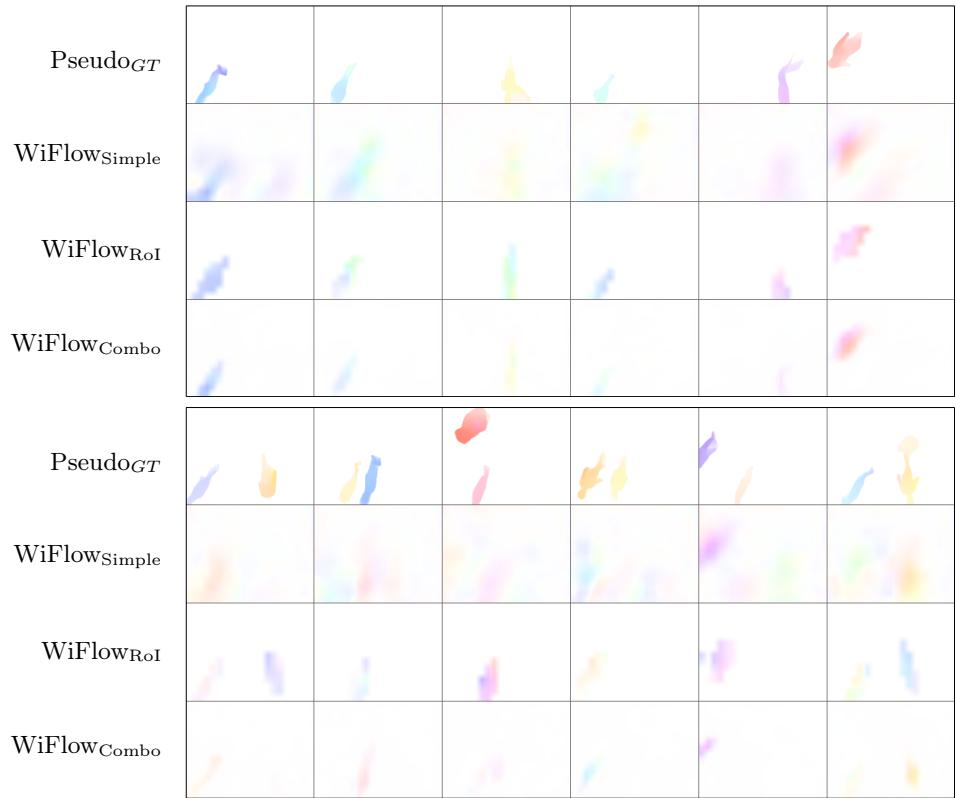  
Fig. 10. Qualitative results of each architecture trained on the time split of birdview+. The upper half shows a single moving person in each scene, while the lower half shows samples with multiple moving persons. $\mathrm { W i F l o w _ { S i m p l e } }$ tends to predict more motions in the static background than our other models, and the overall prediction quality of our methods is lower when multiple persons are moving.

Another limitation we found is that the output resolution and level of detail of our models are relatively low compared to optical flow models that use camera inputs. While this limitation is expected, since CSI cannot be directly compared with camera frames, it may limit the practical applicability of our models in their current form. However, it also raises new research questions about how to increase the level of detail of these models, and we hope that this issue will be further explored in future work, building on the insights we gained.

## 7 Conclusion

In this work, we have demonstrated that we can estimate motion, in the form of optical flow, within a fixed scene from CSI sequences. We proposed and compared three model architectures and found that our method WiFlowCombo, which leverages sharpening through a dedicated motion mask predictor, yielded the best accuracies. These results are consistent across diferent perspectives and even generalize to subjects not part of the training data. Our novel sensing dataset is the first to incorporate optical flow as a modality and will be publicly released to encourage further research on motion estimation from CSI. With this, CSI-based optical flow estimation is a candidate technology for application scenarios where camera-based systems are unavailable or undesired.

## Acknowledgment

We would like to thank G. Matthes for his technical support during data capture and M. Schulz et al. for publishing the Nexmon firmware [64], which enabled us to capture CSI from consumer devices in the first place.

SK has been funded by the Deutsche Forschungsgemeinschaft (DFG, German Research Foundation) under Germany´s Excellence Strategy – EXC-3057. FP has been funded by the European Union’s EU Framework Programme for Research and Innovation under the HORIZON-MSCA-DN-2022 Grant Agreement No. 101119652 (MSCA-DN-6th Sense). MH was supported by the State of Hesse through LOEWE emergenCITY (Grant no. LOEWE/1/12/519/03/05.001(0016)/72). SSM has been funded by the DFG – project No. 529680848. Calculations for this research were conducted on the Lichtenberg high-performance computer of the TU Darmstadt.

## References

1. IEEE standard for information technology—Telecommunications and information exchange between systems local and metropolitan area networks—Specific requirements—Part 11: Wireless lan medium access control (MAC) and physical layer (PHY) specifications—Amendment 4: Enhancements for wireless LAN sensing. IEEE Std 802.11bf-2025 (Amendment to IEEE 802.11-2024, as amended by IEEE 802.11bh-2024, IEEE 802.11be-2024, and IEEE 802.11bk-2025) pp. 1–228 (2025). https://doi.org/10.1109/IEEESTD.2025.11184214

2. Ali, K., Liu, A.X., Wang, W., Shahzad, M.: Keystroke recognition using WiFi signals. In: ACM SIGMOBILE International Conference on Mobile Computing and Networking. p. 90–102 (2015). https://doi.org/10.1145/2789168.2790109

3. Álvarez Casado, C., Lage Cañellas, M., Mustaniemi, J., Pedone, M., Silvén, O., Bordallo López, M.: CSI2Depth: Spatio-temporal depth images from Wi-Fi CSI data via transformer networks and conditional generative adversarial networks. In: Image Analysis. pp. 368–382 (2025). https://doi.org/10.1007/978-3-031- 95911-0\_26

4. Atif, M., Muralidharan, S., Ko, H., Yoo, B.: Wi-ESP—A tool for CSI-based devicefree Wi-Fi sensing (DFWS). Journal of Computational Design and Engineering 7(5), 644–656 (2020). https://doi.org/10.1093/jcde/qwaa048

5. Baker, S., Scharstein, D., Lewis, J.P., Roth, S., Black, M.J., Szeliski, R.: A database and evaluation methodology for optical flow. In: IEEE/CVF International Conference on Computer Vision. pp. 1–8 (2007). https://doi.org/10.1109/ICCV.2007. 4408903

6. Black, M.J., Anandan, P.: The robust estimation of multiple motions: Parametric and piecewise-smooth flow fields. Computer Vision and Image Understanding 63(1), 75–104 (1996). https://doi.org/10.1006/cviu.1996.0006

7. Butler, D.J., Wulf, J., Stanley, G.B., Black, M.J.: A naturalistic open source movie for optical flow evaluation. In: European Conference on Computer Vision. vol. 7577, pp. 611–625 (2012). https://doi.org/10.1007/978-3-642-33783-3\_44

8. Cao, Z., Li, C., Liu, L., Zhang, M.: WiVelo: Fine-grained Wi-Fi walking velocity estimation. ACM Transactions on Sensor Networks 20(4) (2024). https://doi. org/10.1145/3664196

9. Chen, C., Nishio, T., Bennis, M., Park, J.: RF-Inpainter: Multimodal image inpainting based on vision and radio signals. IEEE Access 10, 110689–110700 (2022). https://doi.org/10.1109/ACCESS.2022.3214972

10. Chen, C., Ohta, S., Nishio, T., Bennis, M., Park, J., Wahib, M.: Enabling visual scene recovery from Wi-Fi CSI for occlusion-free surveillance. IEEE Internet of Things Journal 12(11), 15040–15056 (2025). https://doi.org/10.1109/JIOT. 2025.3529499

11. Chen, T., Gu, D.: 6D object pose tracking with optical flow network for robotic manipulation. IFAC-PapersOnLine 56(2), 8048–8053 (2023). https://doi.org/ https://doi.org/10.1016/j.ifacol.2023.10.930

12. Cho, K., van Merrienboer, B., Bahdanau, D., Bengio, Y.: On the properties of neural machine translation: Encoder-decoder approaches. In: EMNLP Workshop on Syntax, Semantics and Structure in Statistical Translation. pp. 103–111 (2014). https://doi.org/10.3115/V1/W14-4012

13. Choudhury, S., Karazija, L., Laina, I., Vedaldi, A., Rupprecht, C.: Guess what moves: Unsupervised video and image segmentation by anticipating motion. In: British Machine Vision Conference (2022)

14. D. Gian, T., Dac Lai, T., Van Luong, T., Wong, K.S., Nguyen, V.D.: HPE-Li: WiFienabled lightweight dual selective kernel convolution for human pose estimation. In: European Conference on Computer Vision. vol. 15089, pp. 93–111 (2024). https: //doi.org/10.1007/978-3-031-72751-1\_6

15. Dong, J., Ota, K., Dong, M.: Video frame interpolation: A comprehensive survey. ACM Transactions on Multimedia Computing, Communications, and Applications 19(78), 2s:1–2s:31 (2023). https://doi.org/10.1145/3556544

16. Dong, Q., Fu, Y.: MemFlow: Optical flow estimation and prediction with memory. In: IEEE/CVF Conference on Computer Vision and Pattern Recognition. pp. 19068–19078 (2024). https://doi.org/10.1109/CVPR52733.2024.01804

17. Dosovitskiy, A., Fischer, P., Ilg, E., Häusser, P., Hazırbaş, C., Golkov, V., v. d. Smagt, P., Cremers, D., Brox, T.: FlowNet: Learning optical flow with convolu-

tional networks. In: IEEE/CVF International Conference on Computer Vision. pp. 2758–2766 (2015). https://doi.org/10.1109/ICCV.2015.316

18. Euchner, F., Gauger, M., Dörner, S., ten Brink, S.: A distributed massive MIMO channel sounder for “big CSI data”-driven machine learning. In: International ITG Workshop on Smart Antennas (2021)

19. Gao, C., Saraf, A., Huang, J., Kopf, J.: Flow-edge guided video completion. In: European Conference on Computer Vision. vol. 12357, pp. 713–729 (2020). https: //doi.org/10.1007/978-3-030-58610-2\_42

20. Geiger, A., Lenz, P., Urtasun, R.: Are we ready for autonomous driving? The KITTI vision benchmark suite. In: IEEE/CVF Conference on Computer Vision and Pattern Recognition. pp. 3354–3361 (2012). https://doi.org/10.1109/CVPR. 2012.6248074

21. Gringoli, F., Schulz, M., Link, J., Hollick, M.: Free your CSI: A channel state information extraction platform for modern Wi-Fi chipsets. In: International Workshop on Wireless Network Testbeds, Experimental Evaluation & CHaracterization. p. 21–28 (2019). https://doi.org/10.1145/3349623.3355477

22. Gu, Y., Chen, J., Chen, C., He, K., Jia, J., Feng, Y., Du, R., Wu, C.: CSIPose: Unveiling human poses using commodity WiFi devices through the wall. IEEE Transactions on Mobile Computing 24(10), 10914–10926 (2025). https://doi. org/10.1109/TMC.2025.3571469

23. H. Xiong and F. Gong and L. Qu and C. Du and K. Harfoush: CSI-based device-free gesture detection. In: International Conference on High-capacity Optical Networks and Enabling/Emerging Technologies. pp. 1–5 (2015). https://doi.org/10.1109/ HONET.2015.7395430

24. Hahn, O., Reich, C., Araslanov, N., Cremers, D., Rupprecht, C., Roth, S.: Scenecentric unsupervised panoptic segmentation. In: IEEE/CVF Conference on Computer Vision and Pattern Recognition. pp. 24485–24495 (2025). https://doi.org/ 10.1109/CVPR52734.2025.02280

25. Halperin, D., Hu, W., Sheth, A., Wetherall, D.: Tool release: Gathering 802.11n traces with channel state information. ACM SIGCOMM Computer Communication Review 41(1), 53 (2011). https://doi.org/10.1145/1925861.1925870

26. He, K., Gkioxari, G., Dollár, P., Girshick, R.: Mask R-CNN. In: IEEE/CVF International Conference on Computer Vision. pp. 2980–2988 (2017). https: //doi.org/10.1109/ICCV.2017.322

27. He, K., Zhang, X., Ren, S., Sun, J.: Deep residual learning for image recognition. In: IEEE/CVF Conference on Computer Vision and Pattern Recognition. pp. 770–778 (2016). https://doi.org/10.1109/CVPR.2016.90

28. Ho, H.W., Zhou, Y., Feng, Y., de Croon, G.C.H.E.: Optical flow-based control for micro air vehicles: an eficient data-driven incremental nonlinear dynamic inversion approach. Autonomous Robots 48(8) (2024). https://doi.org/10.1007/s10514- 024-10174-4

29. Horn, B.K.P., Schunck, B.G.: Determining optical flow. Artificial Intelligence 17(1– 3), 185–203 (1981). https://doi.org/10.1016/0004-3702(81)90024-2

30. Huang, H., Wang, P., Zhao, L., Dai, Z., Liu, G., Gao, H.: WiPE: Privacy-friendly WiFi-based human pose estimation on consumer platform. IEEE Transactions on Consumer Electronics 71(2), 5127–5135 (2025). https://doi.org/10.1109/TCE. 2025.3547393

31. Huang, S., Li, K., You, D., Chen, Y., Lin, A., Liu, S., Li, X., McCann, J.A.: WiMANS: A benchmark dataset for WiFi-based multi-user activity sensing. In: European Conference on Computer Vision. pp. 72–91 (2024). https://doi.org/ 10.1007/978-3-031-72946-1\_5

32. Hur, J., Roth, S.: Iterative residual refinement for joint optical flow and occlusion estimation. In: IEEE/CVF Conference on Computer Vision and Pattern Recognition. pp. 5754–5763 (2019). https://doi.org/10.1109/CVPR.2019.00590

33. Ilg, E., Mayer, N., Saikia, T., Keuper, M., Dosovitskiy, A., Brox, T.: FlowNet 2.0: Evolution of optical flow estimation with deep networks. In: IEEE/CVF Conference on Computer Vision and Pattern Recognition. pp. 1647–1655 (2017). https://doi. org/10.1109/CVPR.2017.179

34. Jiang, S., Campbell, D., Lu, Y., Li, H., Hartley, R.: Learning to estimate hidden motions with global motion aggregation. In: IEEE/CVF International Conference on Computer Vision. pp. 9772–9781 (2021). https://doi.org/10.1109/ICCV48922. 2021.00963

35. Jiang, W., Xue, H., Miao, C., Wang, S., Lin, S., Tian, C., Murali, S., Hu, H., Sun, Z., Su, L.: Towards 3D human pose construction using WiFi. In: ACM SIGMO-BILE International Conference on Mobile Computing and Networking. pp. 1–14 (2020). https://doi.org/10.1145/3372224.3380900

36. Jin, Y., Tian, Z., Li, Y., Li, Z., Zhang, Z.: A novel device-free tracking system using WiFi: Turning fading channel from foe to friend. In: IEEE International Conference on Communications. pp. 1–6 (2020). https://doi.org/10.1109/ICC40277.2020. 9148609

37. Kato, S., Fukushima, T., Murakami, T., Abeysekera, H., Iwasaki, Y., Fujihashi, T., Watanabe, T., Saruwatari, S.: CSI2Image: Image reconstruction from channel state information using generative adversarial networks. IEEE Access 9, 47154– 47168 (2021). https://doi.org/10.1109/ACCESS.2021.3066158

38. Ke, L., Tai, Y., Tang, C.: Occlusion-aware video object inpainting. In: IEEE/CVF International Conference on Computer Vision. pp. 14448–14458 (2021). https: //doi.org/10.1109/ICCV48922.2021.01420

39. Kefayati, M.H., Pourahmadi, V., Aghaeinia, H.: Wi2Vi: Generating video frames from WiFi CSI samples. IEEE Sensors Journal 20(19), 11463–11473 (2020). https: //doi.org/10.1109/JSEN.2020.2996078

40. Kefayati, M.H., Pourahmadi, V., Aghaeinia, H.: Multi-view WiFi imaging. Signal Processing 197, 108552 (2022). https://doi.org/10.1016/j.sigpro.2022. 108552

41. Kiefhaber, S., Roth, S., Schaub-Meyer, S.: Removing cost volumes from optical flow estimators. In: IEEE/CVF International Conference on Computer Vision (2025)

42. Kocheta, P., Bhatia, N.S., Obraczka, K.: Pulse-Fi: A low-cost system for accurate heart rate monitoring using Wi-Fi channel state information. In: International Conference on Distributed Computing in Smart Systems and the Internet of Things. pp. 226–230 (2025). https://doi.org/10.1109/DCOSS-IoT65416.2025.00037

43. Li, J., Tu, P., Wang, H., Wang, K., Yu, L.: A novel device-free counting method based on channel status information. Sensors 18(11) (2018). https://doi.org/ 10.3390/s18113981

44. Li, X., Zhang, D., Lv, Q., Xiong, J., Li, S., Zhang, Y., Mei, H.: IndoTrack: Devicefree indoor human tracking with commodity Wi-Fi. ACM Interactive, Mobile, Wearable, and Ubiquitous Technologies 1(3) (2017). https://doi.org/10.1145/ 3130940

45. Loshchilov, I., Hutter, F.: SGDR: Stochastic gradient descent with warm restarts. In: International Conference on Learning Representations (2017)

46. Loshchilov, I., Hutter, F.: Decoupled weight decay regularization. In: International Conference on Learning Representations (2019)

47. Lucas, B.D., Kanade, T.: An iterative image registration technique with an application to stereo vision. In: International Joint Conference on Artificial Intelligence. vol. 2, pp. 674–679 (1981), https://hal.science/hal-03697340

48. Ma, Y., Zhou, G., Wang, S., Zhao, H., Jung, W.: SignFi: Sign language recognition using wifi. ACM Interactive, Mobile, Wearable, and Ubiquitous Technologies 2(1) (2018). https://doi.org/10.1145/3191755

49. Mayer, N., Ilg, E., Häusser, P., Fischer, P., Cremers, D., Dosovitskiy, A., Brox, T.: A large dataset to train convolutional networks for disparity, optical flow, and scene flow estimation. In: IEEE/CVF Conference on Computer Vision and Pattern Recognition. pp. 4040–4048 (2016). https://doi.org/10.1109/CVPR.2016.438

50. Mehl, L., Schmalfuss, J., Jahedi, A., Nalivayko, Y., Bruhn, A.: Spring: A highresolution high-detail dataset and benchmark for scene flow, optical flow and stereo (2023). https://doi.org/10.1109/CVPR52729.2023.00482

51. Morimitsu, H., Zhu, X., Cesar-Jr., R.M., Ji, X., Yin, X.C.: DPFlow: Adaptive optical flow estimation with a dual-pyramid framework. In: IEEE/CVF Conference on Computer Vision and Pattern Recognition. pp. 17810–17820 (2025). https: //doi.org/10.1109/CVPR52734.2025.01659

52. Niklaus, S., Liu, F.: Context-aware synthesis for video frame interpolation. In: IEEE/CVF Conference on Computer Vision and Pattern Recognition. pp. 1701– 1710 (2018). https://doi.org/10.1109/CVPR.2018.00183

53. Niklaus, S., Liu, F.: Softmax splatting for video frame interpolation. In: IEEE/CVF Conference on Computer Vision and Pattern Recognition. pp. 5436–5445 (2020). https://doi.org/10.1109/CVPR42600.2020.00548

54. Polar Mendoza, E.G., Patiño, R., Cardinale, Y.: Social robot path planning based on a global perspective using optical flow. Journal of Intelligent & Robotic Systems 111(4) (2025). https://doi.org/10.1007/s10846-025-02323-3

55. Pu, Q., Gupta, S., Gollakota, S., Patel, S.: Whole-home gesture recognition using wireless signals. In: ACM SIGMOBILE International Conference on Mobile Computing and Networking. p. 27–38 (2013). https://doi.org/10.1145/2500423. 2500436

56. Qian, K., Wu, C., Yang, Z., Liu, Y., Jamieson, K.: Widar: Decimeter-level passive tracking via velocity monitoring with commodity Wi-Fi. In: ACM International Symposium on Mobile Ad Hoc Networking and Computing (2017). https://doi. org/10.1145/3084041.3084067

57. Qian, K., Wu, C., Zhang, Y., Zhang, G., Yang, Z., Liu, Y.: Widar2.0: Passive human tracking with a single Wi-Fi link. In: International Conference on Mobile Systems, Applications, and Services. pp. 350–361 (2018). https://doi.org/10. 1145/3210240.3210314

58. Qian, K., Wu, C., Zhou, Z., Zheng, Y., Yang, Z., Liu, Y.: Inferring motion direction using commodity Wi-Fi for interactive exergames. In: Conference on Human Factors in Computing Systems. p. 1961–1972 (2017). https://doi.org/10.1145/ 3025453.3025678

59. Ranjan, A., Black, M.J.: Optical flow estimation using a spatial pyramid network. In: IEEE/CVF Conference on Computer Vision and Pattern Recognition. pp. 2720–2729 (2017). https://doi.org/10.1109/CVPR.2017.291

60. Ren, Y., Wang, Z., Tan, S., Chen, Y., Yang, J.: Winect: 3D human pose tracking for free-form activity using commodity WiFi. ACM Interactive, Mobile, Wearable, and Ubiquitous Technologies 5(4) (2022). https://doi.org/10.1145/3494973

61. Ren, Y., Wang, Z., Wang, Y., Tan, S., Chen, Y., Yang, J.: GoPose: 3D human pose estimation using WiFi. ACM Interactive, Mobile, Wearable, and Ubiquitous Technologies 6(2) (2022). https://doi.org/10.1145/3534605

62. Safadoust, S., Güney, F.: Multi-object discovery by low-dimensional object motion. In: IEEE/CVF International Conference on Computer Vision. pp. 734–744 (2023). https://doi.org/10.1109/ICCV51070.2023.00074

63. Schulz, M., Wegemer, D., Hollick, M.: Nexmon: Build your own Wi-Fi testbeds with low-level mac and phy-access using firmware patches on of-the-shelf mobile devices. In: International Workshop on Wireless Network Testbeds, Experimental Evaluation & CHaracterization. p. 59–66 (2017). https://doi.org/10.1145/ 3131473.3131476

64. Schulz, M., Wegemer, D., Hollick, M.: Nexmon: The C-based firmware patching framework (2017), https://nexmon.org

65. Shi, X., Huang, Z., Li, D., Zhang, M., Cheung, K.C., See, S., Qin, H., Dai, J., Li, H.: FlowFormer++: Masked cost volume autoencoding for pretraining optical flow estimation. In: IEEE/CVF Conference on Computer Vision and Pattern Recognition. pp. 1599–1610 (2023). https://doi.org/10.1109/CVPR52729.2023.00160

66. Sim, H., Oh, J., Kim, M.: XVFI: eXtreme video frame interpolation. In: IEEE/CVF International Conference on Computer Vision. pp. 14469–14478 (2021). https: //doi.org/10.1109/ICCV48922.2021.01422

67. Sun, D., Yang, X., Liu, M.Y., Kautz, J.: PWC-Net: CNNs for optical flow using pyramid, warping, and cost volume. In: IEEE/CVF Conference on Computer Vision and Pattern Recognition. pp. 8934–8943 (2018). https://doi.org/10.1109/ CVPR.2018.00931

68. Sun, D., Yang, X., Liu, M., Kautz, J.: Models matter, so does training: An empirical study of CNNs for optical flow estimation. IEEE Transactions on Pattern Analysis and Machine Intelligence pp. 1408–1423 (2020). https://doi.org/10. 1109/TPAMI.2019.2894353

69. Teed, Z., Deng, J.: RAFT: Recurrent all-pairs field transforms for optical flow. In: European Conference on Computer Vision. vol. 12347, p. 402–419 (2020). https: //doi.org/10.1007/978-3-030-58536-5\_24

70. Wang, F., Lv, Y., Zhu, M., Ding, H., Han, J.: XRF55: A radio frequency dataset for human indoor action analysis. ACM Interactive, Mobile, Wearable, and Ubiquitous Technologies 8, 21:1–21:34 (2024). https://doi.org/10.1145/3643543

71. Wang, F., Zhou, S., Panev, S., Han, J., Huang, D.: Person-in-WiFi: Fine-grained person perception using WiFi. In: IEEE/CVF International Conference on Computer Vision. pp. 5452–5461 (2019). https://doi.org/10.1109/ICCV.2019.00555

72. Wang, J., Jiang, H., Xiong, J., Jamieson, K., Chen, X., Fang, D., Xie, B.: LiFS: Low human-efort, device-free localization with fine-grained subcarrier information. In: ACM SIGMOBILE International Conference on Mobile Computing and Networking. pp. 243–256 (2016). https://doi.org/10.1145/2973750.2973776

73. Wang, W., Liu, A.X., Shahzad, M., Ling, K., Lu, S.: Understanding and modeling of wifi signal based human activity recognition. In: ACM SIGMOBILE International Conference on Mobile Computing and Networking. p. 65–76 (2015). https://doi. org/10.1145/2789168.2790093

74. Wang, X., Gao, L., Mao, S., Pandey, S.: CSI-based fingerprinting for indoor localization: A deep learning approach. IEEE Transactions on Vehicular Technology 66(1), 763–776 (2017). https://doi.org/10.1109/TVT.2016.2545523

75. Wang, Y., Ren, Y., Yang, J.: Multi-subject 3D human mesh construction using commodity WiFi. ACM Interactive, Mobile, Wearable, and Ubiquitous Technologies 8(1) (2024). https://doi.org/10.1145/3643504

76. Wang, Y., Deng, J.: WAFT: Warping-alone field transforms for optical flow. In: International Conference on Learning Representations (2026)

77. Wang, Y., Lipson, L., Deng, J.: SEA-RAFT: Simple, eficient, accurate RAFT for optical flow. In: European Conference on Computer Vision. vol. 15065, pp. 36–54 (2024). https://doi.org/10.1007/978-3-031-72667-5\_3

78. Wu, D., Zeng, Y., Gao, R., Li, S., Li, Y., Shah, R.C., Lu, H., Zhang, D.: WiTraj: Robust indoor motion tracking with WiFi signals. IEEE Transactions on Mobile Computing 22(5), 3062–3078 (2023). https://doi.org/10.1109/TMC.2021.3133114

79. Wu, D., Zhang, D., Xu, C., Wang, Y., Wang, H.: WiDir: Walking direction estimation using wireless signals. In: ACM International Joint Conference on Pervasive and Ubiquitous Computing. pp. 351–362 (2016). https://doi.org/10.1145/ 2971648.2971658

80. Xie, Y., Li, Z., Li, M.: Precise power delay profiling with commodity WiFi. In: ACM SIGMOBILE International Conference on Mobile Computing and Networking. p. 53–64 (2015). https://doi.org/10.1145/2789168.2790124

81. Xin, T., Guo, B., Wang, Z., Wang, P., Yu, Z.: FreeSense: Human-behavior understanding using Wi-Fi signals. Journal of Ambient Intelligence and Humanized Computing 9(5), 1611–1622 (2018). https://doi.org/10.1007/s12652-018-0793-4

82. Xu, H., Zhang, J., Cai, J., Rezatofighi, H., Tao, D.: GMFlow: Learning optical flow via global matching. In: IEEE/CVF Conference on Computer Vision and Pattern Recognition. pp. 8121–8130 (2022). https://doi.org/10.1109/CVPR52688.2022. 00795

83. Xu, R., Li, X., Zhou, B., Loy, C.C.: Deep flow-guided video inpainting. In: IEEE/CVF Conference on Computer Vision and Pattern Recognition. pp. 3723– 3732 (2019). https://doi.org/10.1109/CVPR.2019.00384

84. Xu, Y., Yang, W., Wang, J., Zhou, X., Li, H., Huang, L.: WiStep: Device-free step counting with WiFi signals. ACM Interactive, Mobile, Wearable, and Ubiquitous Technologies 1(4) (2018). https://doi.org/10.1145/3161415

85. Yan, K., Wang, F., Qian, B., Ding, H., Han, J., Wei, X.: Person-in-WiFi 3D: Endto-end multi-person 3D pose estimation with Wi-Fi. In: IEEE/CVF Conference on Computer Vision and Pattern Recognition. pp. 969–978 (2024). https://doi. org/10.1109/CVPR52733.2024.00098

86. Yang, J., Huang, H., Zhou, Y., Chen, X., Xu, Y., Yuan, S., Zou, H., Lu, C.X., Xie, L.: MM-Fi: Multi-modal non-intrusive 4D human dataset for versatile wireless sensing. In: Neural Information Processing Systems. vol. 36, pp. 18756–18768 (2023)

87. Yang, J., Zhou, Y., Huang, H., Zou, H., Xie, L.: MetaFi: Device-free pose estimation via commodity WiFi for metaverse avatar simulation. In: IEEE World Forum on Internet of Things. pp. 1–6 (2022). https://doi.org/10.1109/WF- IoT54382. 2022.10152057

88. Yao, M., Wang, J., Peng, J., Chi, M., Liu, C.: FOLT: Fast multiple object tracking from UAV-captured videos based on optical flow. In: ACM International Conference on Multimedia. p. 3375–3383 (2023). https://doi.org/10.1145/3581783. 3611868

89. Zhang, F., Chen, C., Wang, B., Liu, K.J.R.: WiSpeed: A statistical electromagnetic approach for device-free indoor speed estimation. IEEE Internet of Things Journal 5(3), 2163–2177 (2018). https://doi.org/10.1109/JIOT.2018.2826227

90. Zhang, G., Zhu, Y., Wang, H., Chen, Y., Wu, G., Wang, L.: Extracting motion and appearance via inter-frame attention for eficient video frame interpolation. In: IEEE/CVF Conference on Computer Vision and Pattern Recognition. pp. 5682– 5692 (2023). https://doi.org/10.1109/CVPR52729.2023.00550

91. Zheng, Y., Zhang, Y., Qian, K., Zhang, G., Liu, Y., Wu, C., Yang, Z.: Zero-efort cross-domain gesture recognition with Wi-Fi. In: International Conference on Mobile Systems, Applications, and Services. p. 313–325 (2019). https://doi.org/ 10.1145/3307334.3326081

92. Zhou, S., Li, C., Chan, K.C.K., Loy, C.C.: ProPainter: Improving propagation and transformer for video inpainting. In: IEEE/CVF International Conference on Computer Vision. pp. 10443–10452 (2023). https://doi.org/10.1109/ICCV51070. 2023.00961

93. Zhu, Y., Lan, Z., Newsam, S.D., Hauptmann, A.G.: Hidden two-stream convolutional networks for action recognition. In: Asian Conference on Computer Vision. vol. 11363, pp. 363–378 (2018). https://doi.org/10.1007/978-3-030-20893- 6\_23

94. Zou, H., Zhou, Y., Yang, J., Spanos, C.J.: Device-free occupancy detection and crowd counting in smart buildings with WiFi-enabled IoT. Energy and Buildings 174, 309–322 (2018). https://doi.org/10.1016/j.enbuild.2018.06.040

# WiFlow: Estimating Optical Flow using WiFi Channel State Information Supplementary Material

## A WiFlow Dataset

Table A.1. Action definitions. Description of each recorded action that we performed in our capturing room. All actions were performed while walking, some included faster motion or brief periods of stationary motion.

<table><tr><td>Action</td><td>Description</td></tr><tr><td>Slow-walk</td><td>The subject walks continuously at a regular speed, producing longer stance phases and smoother transitions.</td></tr><tr><td>Fast-walk</td><td>The subject walks continuously at an increased speed compared to nor- mal gait, with no additional upper-body activity.</td></tr><tr><td>Together</td><td>Slow-walk with two subjects, with unequal motions in terms of positions and directions.</td></tr><tr><td>Collect</td><td>The subject walks through the movement area while bending intermit- tently to pick up imaginary objects. The motion alternates between for- ward walking and short stationary collection phases.</td></tr><tr><td>Knee</td><td>The subject transitions from walking to a kneeling posture on the floor and remains briefly stationary, then stands up and continues walking.</td></tr><tr><td>Mill</td><td>The subject walks continuously while performing a single arm rotation. The subject walks while repeatedly waving one arm, introducing periodic</td></tr><tr><td>Waving</td><td>upper-body motion with brief quasi-stationary arm phases.</td></tr><tr><td>Off-area</td><td>No subject is present in the movement area, but there is movement in the adjacent off-area in the same room.</td></tr><tr><td>Void</td><td>No subject is present in the movement area, and there is no intended motion in the off-area.</td></tr></table>

Our dataset consists of 9 diferent actions, shortly described in Tab. A.1. We recorded up to 10 persons (labeled S01-S10) performing multiple repetitions of each action, resulting in multiple sequences denoted as A01–A44. Additionally, we introduce a pseudo-subject S00 for the two special actions of-area and void. A summary of the total number of captured camera frames and channel state information (CSI) is provided in Tab. A.2.

For our two proposed split protocols for training and evaluation, we provide the distribution w.r.t. sequence and subject numbers in Tab. A.3. Our time split allocates 75% of our captured sequences to training, 3% to validation, and the remaining 22% to testing. In contrast, our subject split uses all captures of 7 subjects for training, one subject for validation, and two for testing.

Table A.2. Dataset overview. Our dataset consists of 7 diferent actions performed multiple times by a total of 10 people and 2 additional actions where no one is moving (void) and one where there is only motion outside of the caption area (of-area). We capture camera frames and CSI and derive three datasets (sideview, birdview, birdview+).
<table><tr><td rowspan="2">Action</td><td rowspan="2">ID</td><td rowspan="2">Subjects</td><td colspan="2">Camera Frames</td><td colspan="3">CSI</td></tr><tr><td>sideview</td><td>birdview</td><td>sideview</td><td>birdview</td><td>birdview+</td></tr><tr><td>Slow-walk</td><td>A21-A28</td><td>10</td><td>24,000</td><td>14,400</td><td>240,000</td><td>144,000</td><td>1,440,000</td></tr><tr><td>Fast-walk</td><td>A17-A20</td><td>10</td><td>11,700</td><td>7,020</td><td>117,000</td><td>70,200</td><td>702,000</td></tr><tr><td>Together</td><td>A13-A16</td><td>10</td><td>12,000</td><td>7,200</td><td>120,000</td><td>72,000</td><td>720,000</td></tr><tr><td>Collect</td><td>A01-A04</td><td>10</td><td>12,000</td><td>7,200</td><td>120,000</td><td>72,000</td><td>720,000</td></tr><tr><td>Knee</td><td>A05-A08</td><td>10</td><td>11,780</td><td>7,068</td><td>117,800</td><td>70,680</td><td>706,800</td></tr><tr><td>Mill</td><td>A09-A12</td><td>10</td><td>12,000</td><td>7,200</td><td>120,000</td><td>72,000</td><td>720,000</td></tr><tr><td>Waving</td><td>A29-A32</td><td>9</td><td>10,800</td><td>6,480</td><td>108,000</td><td>64,800</td><td>648,000</td></tr><tr><td>Off-area</td><td>A33-A36</td><td>0</td><td>1,200</td><td>720</td><td>12,000</td><td>7,200</td><td>72,000</td></tr><tr><td>Void</td><td>A37-A44</td><td>0</td><td>2,400</td><td>1,440</td><td>24,000</td><td>14,400</td><td>144,000</td></tr><tr><td>Total</td><td></td><td></td><td>97,880</td><td>58,728</td><td>978,800</td><td>587,280</td><td>5,872,800</td></tr></table>

## B Generation of Pseudo Ground Truth

Generating the pseudo ground truths (PseudoGT) from our captured camera frames is an important step in the construction of our dataset. Before processing, we downsample the video frames to $1 6 8 \times 1 2 8$ pixels. To ensure reliable optical flow estimations for our PseudoGT, we create an ensemble of multiple optical flow methods and average their predictions. We provide details on the optical flow methods and checkpoints used in Tab. A.4. Finally, to minimize background noise, we threshold all motion with a magnitude less than 0.5 to zero.

## C Architecture Details

Both of our architectures, $\operatorname { W i F l o w } _ { \mathrm { R o I } }$ and $\operatorname { W i F l o w } _ { \operatorname { C o m b o } } ,$ contain a mask block that only predicts where movements occur, rather than their direction and magnitude. For training these two architectures, we found that it is best to pre-train only the mask block using a mean squared error loss $\left( \mathcal { L } _ { M S E } \right)$ between the mask prediction and a PseudoGT where all non-zero motions are set to 1 before training the other modules of each architecture.

## D Qualitative Results

In the supplemental files, we include a video showcasing further qualitative results for all our models across diferent split protocols and actions.

Table A.3. Split protocol details showing the sequences and subjects used as training, validation, and testing set in our time and subject split.
<table><tr><td>Protocol Attribute</td><td></td><td>Train</td><td>Validation</td><td>Test</td></tr><tr><td rowspan="4">Time</td><td>Actions</td><td>A02–A04, A06–A08, A10–A12, A14–A16, A18–A20, A22–A24,</td><td>A25</td><td>A01, A05, A09, A13, A17, A21, A29, A33,</td></tr><tr><td></td><td>A26–A28, A30–A32, A34–A36, A38–A40,</td><td></td><td>A37, A41</td></tr><tr><td>Subjects</td><td>A42-A44 S00-S10</td><td>S00-S10</td><td>S00-S10</td></tr><tr><td>Percentage</td><td>75%</td><td>3%</td><td>22%</td></tr><tr><td rowspan="3">Subject</td><td>Actions</td><td>A01-A44</td><td>A01-A32</td><td>A01-A32</td></tr><tr><td>Subjects</td><td>S00, S01, S03–S05, S07, S09, S10</td><td>S02</td><td>S06, S08</td></tr><tr><td>Percentage</td><td>71%</td><td>10%</td><td>19%</td></tr></table>

Table A.4. Optical flow model names and their respective checkpoints within the PTLFlow Framework [96] that we utilized in our ensemble to create PseudoGT optical flow predictions for our proposed datasets.
<table><tr><td>Model Name</td><td>Fine-tuned Dataset Tag</td></tr><tr><td>rpknet [97]</td><td>things</td></tr><tr><td> $\mathrm { m s \_ r a f t \_ p \ [ 9 5 ] }$ </td><td>mixed</td></tr><tr><td>sea_raft_m [77]</td><td>spring</td></tr><tr><td>memflow [16]</td><td>spring</td></tr><tr><td>dpflow [51]</td><td>spring</td></tr></table>

## E Detailed Results

Fig. A.1 shows a detailed evaluation for each action type of our proposed architectures. Overall, these evaluations show a clear trend: $\operatorname { W i F l o w } _ { \mathrm { C o m b o } }$ is our most accurate model across almost all actions and metrics, and $\operatorname { W i F l o w } _ { \mathrm { R o I } }$ is the second-best. The diferences in the EPE of our models for the action together compared to simpler actions, such as fast-walk, also confirm our findings in Sec. 6.2 and Fig. 10.

Notably, both of our mask-based architectures $\operatorname { W i F l o w } _ { \mathrm { R o I } }$ and $\operatorname { W i F l o w } _ { \mathrm { C o m b o } }$ handle the special actions of-area and void almost without any error, whereas $\mathrm { W i F l o w _ { S i m p l e } }$ sometimes predicts motions in these frames. This shows that masking strategies eliminate most of the background noise produced by a simple optical flow estimator in our setting.

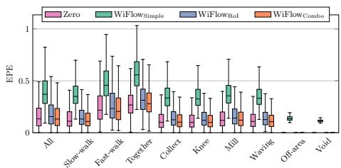  
(a) EPE

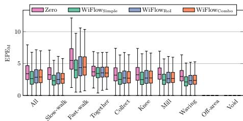  
(b) EPEM

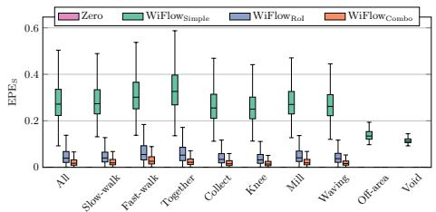  
(c) EPES

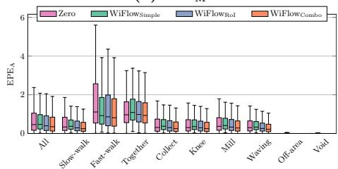  
(d) EPEA  
Fig. A.1. Detailed evaluations of our architectures for each action on birdview+ in the time split. The action all is the combined evaluation of all sequences independently of the action captured. Note that by construction, the evaluation of our zero baseline always has an endpoint-error of 0 when only considering the static pixels (EPES). Similarly, an evaluation of $\mathrm { E P E _ { M } }$ for our two special actions of-area and void is not possible, as there are never any moving pixels for these actions in any frame.

## F Optical Flow in Low Brightness Settings

Optical flow methods often depend heavily on brightness consistency. In Fig. A.2, we illustrate the brightness dependence of a state-of-the-art flow estimator (MS-RAFT [95]) by simulating low-brightness settings. We decrease the brightness and add 3% noise to simulate frames taken in darker environments. This results in a reduced accuracy compared to our method. Further, there is ongoing research on brightness and other optical adversarial attacks [98, 99], to which a CSI-based flow is invariant by design.

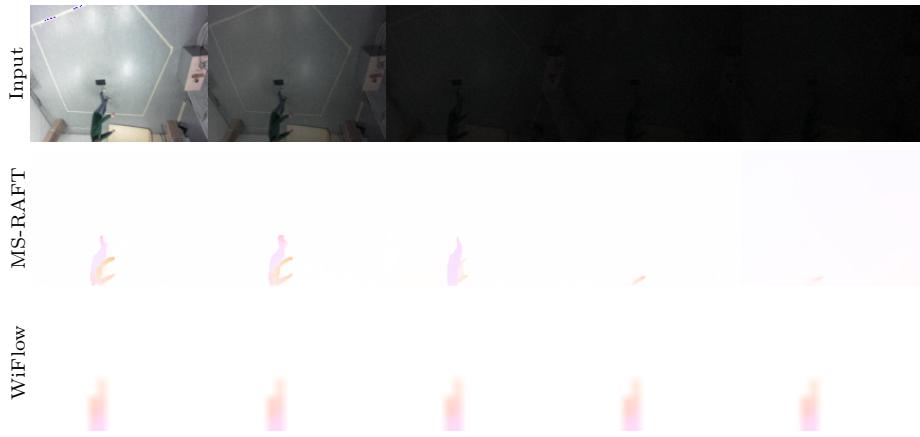  
Fig. A.2. Brightness dependency of MS-RAFT and our $\operatorname { W i F l o w } _ { \operatorname { C o m b o } }$ . We gradually decrease the brightness and add additive noise to the original frame. Accuracy of MS-RAFT decreases while $\operatorname { W i F l o w } _ { \mathrm { C o m b o } }$ is not afected, as it is independent of the input images.

## References

95. Jahedi, A., Luz, M., Rivinius, M., Mehl, L., Bruhn, A.: MS-RAFT+: High resolution multi-scale RAFT. In: International Journal of Computer Vision 132, pp 1835–1856 (2024). https://doi.org/10.1007/s11263-023-01930-7

96. Morimitsu, H.: PyTorch lightning optical flow. https://github.com/hmorimitsu/ ptlflow (2021)

97. Morimitsu, H., Zhu, X., Ji, X., Yin, X.: Recurrent partial kernel network for eficient optical flow estimation. In: AAAI Conference on Artificial Intelligence. pp 4278– 4286 (2024). https://doi.org/10.1609/aaai.v38i5.28224

98. Schmalfuss, J., Oei, V., Mehl, L., Bartsch, M., Agnihotri, S., Keuper, M., Bruhn, A.: RobustSpring: Benchmarking robustness to image corruptions for optical flow, scene flow and stereo. In: CoRR abs/2505.09368 (2025). https://doi.org/10. 48550/ARXIV.2505.09368

99. Zheng, Y., Zhang, M., Lu, F.: Optical flow in the dark. In: IEEE/CVF Conference on Computer Vision and Pattern Recognition. pp 6748–6756 (2020). https://doi. org/10.1109/CVPR42600.2020.00678