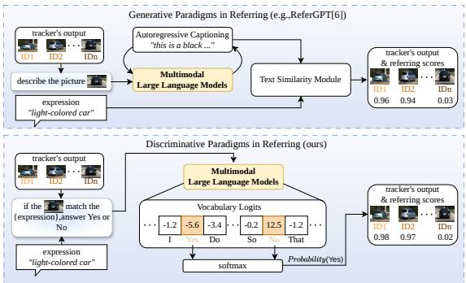
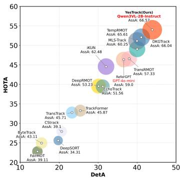
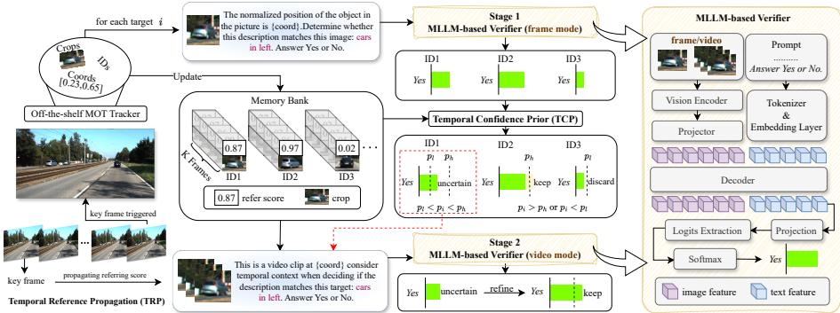
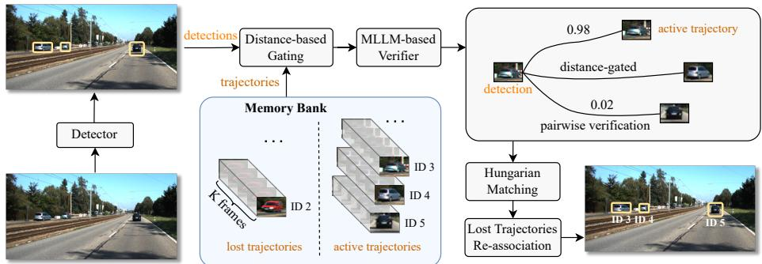
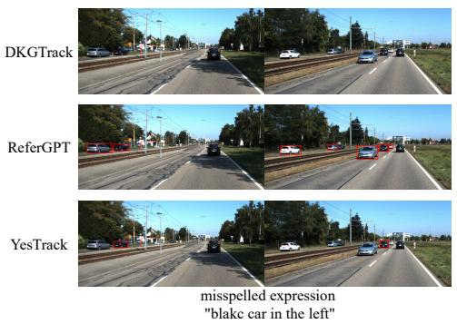
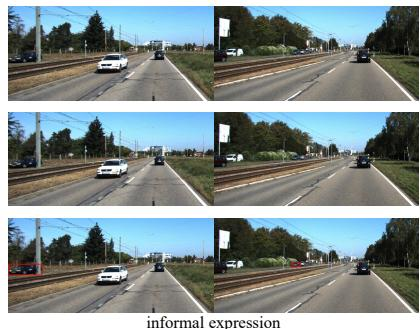

# YesTrack: Referring Multi-Object Tracking via MLLM-based Yes/No Verification

Quansheng Hu1, Qin Sun1, Qiansen Dai1, Jin Ding1, Wan Zhang1, Xue Zhou2,1⋆, and Jianxiao Zou2

1 University of Electronic Science and Technology of China, Chengdu, China {huhansan,sunqin,daiqiansen}@std.uestc.edu.cn, zhouxue@uestc.edu.cn 2 Shenzhen Institute for Advanced Study, UESTC, Shenzhen, China

Abstract. Referring multi-object tracking (RMOT) aims to track every instance in a video that matches a given language expression. Despite the recent integration of multimodal large language models (MLLMs) to enhance generalization, existing methods predominantly relegate them to the role of caption generators, necessitating external modules for final decision-making. This paradigm not only introduces extra latency but also severely underutilizes the inherent vision–language alignment capabilities of MLLMs. To address these limitations, we propose YesTrack, a novel two-stage RMOT method that reformulates referring as a discriminative task, directly leveraging MLLMs for Yes/No verification without explicit text generation. To further enhance the reliability and efficiency of this MLLM-based verification, we introduce two lightweight temporal consistency constraints: Temporal Confidence Prior (TCP) and Temporal Reference Propagation (TRP). We further validate the generality of this discriminative paradigm by proposing YesTrack-MOT, a straightforward yet highly efective instantiation for generic multiobject tracking (MOT). Experiments on Refer-KITTI and Refer-KITTI-V2 show that YesTrack significantly outperforms existing state-of-theart methods while maintaining high eficiency, even when implemented with the smallest variant of Qwen3-VL. Code is released at https: //github.com/ggbondrighthere24/YesTrack.

Keywords: Referring multi-object tracking · Multimodal large language models · Discriminative paradigm

## 1 Introduction

Referring multi-object tracking (RMOT) is a multimodal video understanding task that aims to continuously localize and associate target objects across frames, conditioned on a natural language referring expression. Unlike generic multiobject tracking (MOT) [4, 10, 37, 43, 45], which tracks all instances indiscriminately, RMOT requires aligning specific trajectories with referring expressions, making it both practically relevant for applications like autonomous driving and a challenging benchmark for multimodal grounding in dynamic scenes.

  
(a) Generative vs. discriminative paradigms in referring.

  
(b) Performance comparison.  
Fig. 1: (a) Generative methods first produce captions in an autoregressive manner and then apply an additional text–text similarity module for alignment, introducing latency from both sequential decoding and extra textual matching. Our discriminative paradigm directly extracts the intermediate logits from MLLMs and applies a softmax operation only over the logits corresponding to Yes and No, enabling a more eficient and direct use of multimodal alignment. (b) Our approach achieves state-of-the-art results with HOTA 54.00, DetA 43.91, and AssA 66.57 on Refer-KITTI.

Existing RMOT approaches mainly rely on transformer-based architectures to model cross-modal interactions and temporal dependencies. Most end-to-end methods [18, 46] achieve strong performance with task-specific designs, such as decomposing expressions, fine-grained linguistic parsing, or multimodal attention. However, these methods are typically trained on datasets with limited vocabulary and expression diversity, which may introduce dataset-dependent biases and limit generalization to more complex or real-world scenarios. To improve generalization, recent work [6] formulate RMOT as a two-stage pipeline consisting of a tracking backbone followed by a language-conditioned referring module. In this paradigm, multimodal large language models (MLLMs) [2, 3, 21, 31, 36] are primarily introduced in the referring stage to enhance cross-modal reasoning capability, often employed as caption generators, which is illustrated in Fig. 1a. While this enhances robustness to diverse expressions, autoregressive decoding introduces latency, and extra modules are required to convert textual outputs into concrete referring decisions, increasing architectural complexity and hindering tracking eficiency.

To address these limitations, we propose YesTrack, a simple yet efective RMOT framework that introduces a fundamentally diferent way of leveraging MLLMs. As illustrated in Fig. 1a, rather than employing MLLMs for caption generation, YesTrack adopts a discriminative paradigm to exploit MLLMs for referring. Specifically, we reformulate referring as a binary image–text matching problem and leverage the MLLMs’ output to directly determine whether a candidate trajectory matches the given referring expression. This design completely avoids autoregressive decoding, requires only a single forward pass per candidate, and eliminates the need for additional complex for referring, thereby enabling eficient and scalable inference. Moreover, we introduce two temporal consistency constraints to further enhance robustness and eficiency for twostage RMOT methods. Temporal Confidence Prior (TCP) exploits identity-level temporal consistency to stabilize referring decisions under occlusion. Temporal Reference Propagation (TRP) accelerates inference by performing MLLMs verification on sparsely sampled frames and propagating decisions to subsequent frames, while still handling newly appearing identities in a timely manner. Moreover, this discriminative paradigm can be naturally extended to multi-object tracking by leveraging MLLMs as a pairwise identity verifier to replace traditional embedding-based ReID in data association, ofering a straightforward yet efective way to incorporate MLLMs into key MOT components.

Our main contributions are summarized as follows:

(1) We propose YesTrack, a simple yet efective framework that unlocks the latent discriminative power of MLLMs for RMOT, transforming them from caption generators into discriminative referring heads. We further show that this discriminative paradigm generalizes beyond referring tasks—instantiated as YesTrack-MOT for generic multi-object tracking—achieving strong performance and confirming that direct MLLMs-driven decision-making can serve as a versatile foundation for tracking.

(2) We introduce two lightweight yet general temporal consistency constraints for two-stage RMOT, namely Temporal Confidence Prior and Temporal Reference Propagation, to mitigate frame-wise prediction instability and reduce redundant cross-modal verification, thereby improving both robustness and computational eficiency.

(3) As summarized in Fig. 1b, extensive experiments on Refer-KITTI and Refer-KITTI-V2 demonstrate that YesTrack achieves state-of-the-art results with strong generalization and high eficiency, even when instantiated with Qwen3- VL-2B-Instruct, the smallest model in the Qwen3-VL family.

## 2 Related Work

## 2.1 Referring Multi-object Tracking

Referring multi-object tracking was first formalized by TransRMOT [38], which introduced the task definition and the Refer-KITTI benchmark, framing RMOT as a joint problem of referring expression comprehension [8,16,26,42] and multiobject tracking [4, 10, 37, 43, 45]. Existing methods fall into two paradigms: endto-end and two-stage. End-to-end methods integrate tracking and referring into a unified framework. TempRMOT [44] introduces temporal enhancement for improved sequence modeling and releases the Refer-KITTI-V2 benchmark; DKG-Track [18] decomposes expressions into static and motion cues for fine-grained alignment; HFF-Tracker [46] uses hierarchical feature fusion with adaptive training. Despite strong results, many end-to-end approaches rely on task-specific modules and training over a restricted vocabulary space, potentially limiting generalization to unseen scenarios. Two-stage methods decouple tracking and referring, performing generic MOT first and then selecting target trajectories via language. Representative examples include iKUN [9], which adds a Knowledge Unification Module to align visual and language features and Neural Kalman Filter to improve temporal association, and ReferGPT [6], which incorporates MLLMs to generate captions aligned with referring expressions. While efective, these sequential pipelines increase computational overhead and inference latency.

## 2.2 MLLMs in Vision Language Understanding

Recent works have incorporated multimodal large language models (MLLMs) into vision–language understanding such as person re-identification (ReID) [13, 15,24,34,41]. A prevalent paradigm treats MLLMs as generative description modules: visual content is first converted into textual descriptions and then aligned with textual queries for matching. This strategy is adopted in text-to-image ReID frameworks such as CLIP-SCGI [11], and in the referring stage of twostage RMOT methods like ReferGPT [6], where caption generation and query matching are performed sequentially. Another line of work exploits MLLMs for semantic token generation or attribute extraction, e.g., LVLM-ReID [35], which produces compact pedestrian representations to guide identity learning. VQAstyle formulations have also been explored, treating ReID as an interactive reasoning process, as in LLaVA-ReID [22].

Although these approaches demonstrate the benefits of semantic enrichment and cross-modal alignment, applying generative paradigms directly to RMOT encounters a critical bottleneck: the autoregressive generation of numerous text tokens incurs significant latency, severely hindering the real-time inference required for tracking. To bypass this token generation overhead, recent practices that recast large models into discriminative roles ofer valuable inspiration. By reducing complex multimodal reasoning to eficient binary Yes/No decisions, discriminative formulations provide a much faster alternative. Such discriminative formulations have been increasingly adopted as lightweight decision mechanisms, where large models are prompted to produce explicit Yes/No judgments for evaluation, task verification, and iterative control [29,30,32]. These practices suggest that, beyond generation, large models possess strong discriminative potential; however, existing approaches essentially treat the model as a binary classifier by directly eliciting discrete Yes/No outputs, without leveraging the underlying token-level logits, which limits their efectiveness for RMOT.

## 3 Method

In this section, we describe the proposed YesTrack framework. YesTrack is a twostage RMOT paradigm that combines an of-the-shelf tracker with an MLLMbased discriminative referring module. On top of this basic pipeline, we introduce two intuitive yet general temporal consistency constraints to improve robustness and eficiency. Beyond the referring stage in RMOT, we present a tracker, termed YesTrack-MOT, which applies the same discriminative MLLMs paradigm to data association in MOT.

## 3.1 Framework Overview

As illustrated in Fig. 2, given a video and a referring expression, YesTrack first employs Temporal Reference Propagation (TRP) to reduce redundant verification by leveraging the temporal stability of referring decisions. Specifically, TRP categorizes frames into key and non-key frames: a frame is defined as a key frame if MLLM-based referring is triggered at that frame (see Sec. 3.3). At key frames, full verification is performed, while for non-key frames, the previously computed referring score is directly propagated for each active identity. This mechanism avoids unnecessary MLLM invocations across consecutive frames. To facilitate this process, YesTrack applies an of-the-shelf tracker to each frame t to obtain the candidate targets indexed by i. For each target i, the tracker provides its track crop, identity ID, and normalized bounding box coordinates. For candidates requiring verification at key frames, we employ a discriminative two-stage MLLM-based verifier. In Stage 1 (frame mode), the MLLM performs single-frame pairwise verification between the crop of target i and the referring expression, producing a confidence score $p _ { i } \in [ 0 , 1 ]$ for each candidate. Temporal Confidence Prior (TCP) regularization is then applied to incorporate historical confidence signals and stabilize predictions (Sec. 3.3). Based on the TCP-adjusted confidence $p _ { i } ,$ candidates are routed eficiently: those with $p _ { i } \ge p _ { h } ~ \mathrm { o r } ~ p _ { i } \le p _ { l }$ (where $p _ { h }$ and $p _ { l }$ denote predefined upper and lower confidence thresholds) are directly kept or discarded, respectively. Ambiguous candidates satisfying $p _ { l } < p _ { i } < p _ { h }$ proceed to Stage 2. In Stage 2 (video mode), the verifier performs temporal refinement. A memory bank retrieves the past K frames associated with target $i ,$ including their corresponding crops and referring scores, where K denotes the temporal window size. The MLLMs jointly evaluates this temporal context and outputs the final discriminative decision, which is determined by a threshold $\gamma .$

## 3.2 MLLM-based Verifier

To determine whether a target instance matches the given referring expression, we adopt MLLMs as a binary verifier. The verifier receives a cropped target image or cropped video clip together with the referring expression and outputs a binary decision indicating whether the candidate matches the description.

Input formatting. For each candidate identity proposed by the tracker, we construct a unified multimodal input consisting of the cropped image region, its normalized spatial coordinates, and the referring expression. The spatial coordinates are embedded into the textual prompt to provide explicit location cues.

To constrain the output space, we explicitly instruct the model to answer Yes or $N o .$ In contrast to generative approaches where the model is free to produce variable-length text, this binary formulation restricts the decision space to two semantic options. Such a closed-set setup encourages sharper decision boundaries in the output logits and reduces ambiguity introduced by open-ended decoding. It also aligns naturally with the instruction-following capabilities of modern MLLMs, enabling stable and eficient inference.

  
Fig. 2: Overview of YesTrack. An of-the-shelf tracker extracts candidate crops, and Temporal Reference Propagation (TRP) propagates recent decisions. Remaining candidates are handled by a two-stage MLLM-based verifier: Stage 1 performs single-frame scoring with Temporal Confidence Prior (TCP) regularization for early routing, while Stage 2 refines uncertain cases at the video level using a memory bank. The right panel shows the verifier architecture, where frame and video modes difer only in input image number and prompt formulation. Final binary matching probabilities are obtained by applying softmax to the projected decision token logits.

Separate prompt templates are used for frame mode and video mode while maintaining the same binary decision format. The exact templates are provided in the supplementary material.

Binary probability extraction. As illustrated in Fig. 2, after jointly encoding the visual and textual inputs, MLLMs produce token-level logits over the vocabulary after decoding and projection. Instead of relying on autoregressive decoded text, we directly extract the logits corresponding to the two decision tokens. Given an input pair $( I _ { i } , E )$ for tracked identity i, where $I _ { i }$ is the image crop and E is the corresponding expression, we denote the logits of the decision tokens as $\ell _ { i } ^ { \mathrm { y e s } }$ and $\ell _ { i } ^ { \mathrm { n o } }$ , and compute the matching probability of Yes $p _ { i }$ using a softmax function:

$$
p _ { i } = \frac { \exp ( \ell _ { i } ^ { \mathrm { v e s } } ) } { \exp ( \ell _ { i } ^ { \mathrm { y e s } } ) + \exp ( \ell _ { i } ^ { \mathrm { n o } } ) } .\tag{1}
$$

Compared with generative decoding, this logit-based formulation provides several distinct advantages. By bypassing free-form outputs, it inherently avoids the instability associated with unexpected explanations or wording variations. Furthermore, the extracted logits translate directly into a continuous confidence score. This preserves the uncertainty information essential for confidence-based routing and temporal refinement. Consequently, this design eliminates the computational overhead of iterative token sampling, streamlining the process to require only a single forward pass per candidate.

Training. Following the binary probability formulation above, each input pair $( I _ { i } , E )$ is annotated with a binary ground-truth label $y _ { i } \in \{ 0 , 1 \}$ , where $y _ { i } = 1$ indicates a positive match and $y _ { i } = 0$ otherwise. Utilizing the discriminative matching probability $p _ { i }$ computed from the two decision logits, the training objective is formulated as the standard Binary Cross-Entropy (BCE) loss:

$$
\begin{array} { r } { \mathcal { L } _ { i } = - \left[ y _ { i } \log p _ { i } + ( 1 - y _ { i } ) \log ( 1 - p _ { i } ) \right] , } \end{array}\tag{2}
$$

where the softmax normalization is restricted to the two decision tokens.

## 3.3 Temporal Consistency Constraints

To improve both robustness and eficiency in this two-stage RMOT pipeline, we introduce two simple inference-time temporal consistency constraints: Temporal Reference Propagation (TRP) and Temporal Confidence Prior (TCP). These strategies enhance temporal robustness without modifying the core model architecture and can be readily extended to other two-stage RMOT frameworks.

Temporal Reference Propagation (TRP). TRP is motivated by the observation that referring decisions are typically more temporally stable than tracking states. While trajectories require frame-wise updates, the semantic relevance of an identity to a given query rarely changes within a short temporal window. Exploiting this property enables us to reduce redundant MLLM invocations without sacrificing referring accuracy.

Specifically, a frame is defined as a key frame if MLLM-based referring is triggered at that frame. At each key frame, both tracking and referring are performed, and the resulting referring score is propagated to subsequent frames until the next key frame. For non-key frames, only tracking is executed, while the referring score is directly inherited from the most recent key frame as long as the identity remains active. In practice, referring is triggered at a fixed interval ∆, when a new identity appears, or when the referring expression changes.

Temporal Confidence Prior (TCP). TCP exploits identity-level temporal consistency across frames. For each tracked identity i at frame t, let $p _ { i } ^ { ( t ) } \in [ 0 , 1 ]$ be the matching probability predicted by the MLLMs. If an identity has been confidently matched in recent frames, it is likely to remain relevant in the current frame. Based on this observation, TCP introduces a temporal prior to bias the current prediction. The adjusted probability is formulated as follows:

$$
\tilde { p } _ { i } ^ { ( t ) } = \operatorname* { m i n } \left\{ 1 , p _ { i } ^ { ( t ) } + \lambda \cdot \mathbb { I } \left( \operatorname* { m i n } _ { k \in [ t - K , t - 1 ] } p _ { i } ^ { ( k ) } \geq \alpha \right) \right\} ,\tag{3}
$$

where $\mathbb { I } ( \cdot )$ denotes the indicator function, K is the temporal window size, $\alpha$ is a confidence threshold, and $\lambda > 0$ controls the strength of the temporal prior. The outer min(·) clips the adjusted score to 1, ensuring that $\tilde { p } _ { i } ^ { ( t ) }$ remains a valid probability. The inner min(·) operator enforces strict temporal consistency: the prior is applied only when the identity remains confidently matched across all previous K frames.

  
Fig. 3: Overview of YesTrack-MOT. Given detections from a standard detector, YesTrack-MOT first applies distance-based gating to reduce candidate pairs. An MLLM-based verifier then performs pairwise image–image verification between current detections and previous track crops, producing a confidence score that forms a cost matrix. Tracks are updated via Hungarian matching, while unmatched tracks are temporarily kept for potential re-association, forming a minimal yet efective MOT pipeline.

## 3.4 YesTrack-MOT

While YesTrack is a two-stage RMOT framework that consists of a tracking backbone and a subsequent MLLM-based referring module, its tracking component can be implemented by any of-the-shelf MOT tracker.

In this work, we further instantiate the tracking backbone with a simple MLLM-based tracker, termed YesTrack-MOT, by extending the same discriminative paradigm to data association. As illustrated in Fig. 3, YesTrack-MOT replaces conventional embedding-based ReID with an MLLM-based pairwise identity verifier, resulting in a deliberately simple MOT instantiation.

Importantly, the underlying idea is consistent with our referring module: we treat the MLLMs as a verifier that outputs a continuous confidence score. The only diference lies in the input modality: referring performs image–text verification, whereas YesTrack-MOT performs image–image verification between a tracked crop and a detection crop. For clarity, the exact prompt templates used for identity verification are provided in the supplementary material.

Simple distance gating. At frame t, let $\mathcal { T } _ { t - 1 } = \{ \tau _ { j } \} _ { j = } ^ { N }$ be the set of tracks from the previous frame and $\mathcal { D } _ { t } ~ = ~ \{ d _ { k } \} _ { k = 1 } ^ { M }$ be the detections in the current frame. To reduce the number of candidate pairs, we apply a lightweight distancebased gating rule and only keep plausible pairs whose center displacement is within a threshold:

$$
g ( \tau _ { j } , d _ { k } ) = \mathbb { I } \left( \Vert c ( \tau _ { j } ) - c ( d _ { k } ) \Vert _ { 2 } \leq \delta \right) ,\tag{4}
$$

where $c ( \cdot )$ denotes the bounding-box center, δ is a gating threshold and I(·) denotes the indicator function.

MLLM-based identity verification. For each gated pair $( \tau _ { j } , d _ { k } )$ such that $g ( \tau _ { j } , d _ { k } ) = 1$ , we crop the corresponding image regions from frames t−1 and $t ,$ denoted as $I ( \tau _ { j } )$ and $I ( d _ { k } )$ , respectively. Consistent with the probability extraction introduced in Sec. 3.2, we formulate the identity verification as a purely discriminative task. The underlying mechanism remains identical, adopting MLLMs as a binary verifier. The only diference lies in the input modality, where the MLLMs now processes two visual inputs jointly rather than an image-text pair. Instead of relying on autoregressive text decoding, we directly extract the logits corresponding to the binary decision tokens. Let $\bar { \ell } _ { j k } ^ { \mathrm { y e s } }$ and $\ell _ { j k } ^ { \mathrm { n o } }$ denote the extracted logits for the positive and negative verification outcomes of the input pair $( I ( \tau _ { j } ) , I ( d _ { k } ) )$ . The verification probability $p _ { j k }$ is then computed using a softmax function:

$$
p _ { j k } = \frac { \exp ( \ell _ { j k } ^ { \mathrm { y e s } } ) } { \exp ( \ell _ { j k } ^ { \mathrm { y e s } } ) + \exp ( \ell _ { j k } ^ { \mathrm { n o } } ) } .\tag{5}
$$

Hungarian matching with simple track management. We construct a cost matrix $C = [ c _ { j k } ]$ from the verification probabilities and solve a one-to-one assignment using the Hungarian algorithm [17]:

$$
c _ { j k } = 1 - p _ { j k } , \qquad \pi ^ { \star } = \arg \operatorname* { m i n } _ { \pi } \sum _ { ( j , k ) \in \pi } c _ { j k } ,\tag{6}
$$

where $\pi$ denotes all feasible matching between tracks and detections under the gated candidate set and $\pi ^ { \star }$ denotes the optimal assignment. Matched pairs update the corresponding tracks, while unmatched tracks are marked as lost. To handle short-term occlusions, lost tracks are kept for the subsequent L frames; during this period, unmatched detections are additionally matched against lost tracks once for potential re-association, otherwise a track is removed after exceeding the maximum lost age.

Overall, YesTrack-MOT intentionally avoids sophisticated motion models and builds a minimal MOT pipeline with only distance gating, MLLM-based verification, and Hungarian assignment, yet still achieves strong performance in practice.

## 4 Experiment

## 4.1 Datasets and Implementation Details

Datasets. We evaluate our method on two RMOT benchmarks: Refer-KITTI [38] and Refer-KITTI-V2 [44]. Refer-KITTI, the first dataset for RMOT, is built from 18 KITTI tracking sequences and contains 818 expressions, among which only 215 are distinct, with a vocabulary of 49 words. The expressions are generally short, repetitive, and structurally simple, and the limited subset of sequences leads to restricted scene and motion diversity. In contrast, Refer-KITTI-V2 substantially expands the dataset to all 21 sequences and introduces 9,758 expressions, including 7,193 distinct ones with a vocabulary of 617 words. Compared to the original version, Refer-KITTI-V2 exhibits significantly richer semantics, covering appearance, spatial relations, motion, and inter-object interactions, while also incorporating ambiguous expressions and no-target cases. Overall, Refer-KITTI-V2 presents a much larger linguistic space and more challenging scenarios, making it a more realistic and demanding benchmark for evaluating RMOT methods.

Table 1: Comparison with state-of-the-art RMOT methods on the Refer-KITTI dataset. We group methods into end-to-end and two-stage pipelines. ReferGPT(Q) denotes using Qwen3-VL-2B as the backbone, consistent with our method, while Refer-GPT(O) denotes its original MLLM configuration. The best results are highlighted in bold.
<table><tr><td>Methods</td><td>Tracker</td><td>HOTA ↑ DetA ↑ AssA ↑ DetRe ↑ DetPr ↑ AssRe ↑ AssPr ↑ LocA ↑</td><td></td><td></td><td></td><td></td><td></td><td></td><td></td></tr><tr><td colspan="8">End-to-End</td><td></td><td></td><td></td></tr><tr><td>EchoTrack [20]</td><td></td><td>39.47</td><td>31.19</td><td>51.56</td><td>42.65</td><td>48.86</td><td>56.68</td><td>81.21</td><td></td><td>79.93</td></tr><tr><td>DeepRMOT [14]</td><td></td><td>39.55</td><td>30.12</td><td>53.23</td><td></td><td>41.91</td><td>47.47</td><td>58.47</td><td>82.16</td><td>80.49</td></tr><tr><td>TransRMOT [38]</td><td></td><td>46.56</td><td>37.97</td><td>57.33</td><td>49.69</td><td></td><td>60.10</td><td>60.02</td><td>89.67</td><td>90.33</td></tr><tr><td>MGLT-MOTR [7]</td><td></td><td>47.95</td><td>40.04</td><td>57.57</td><td></td><td></td><td></td><td></td><td></td><td></td></tr><tr><td>MLS-Track [25]</td><td></td><td>49.05</td><td>40.03</td><td>60.25</td><td></td><td>59.07</td><td>54.18</td><td>65.12</td><td>88.12</td><td></td></tr><tr><td>CDRMT [19]</td><td></td><td>49.35</td><td>40.34</td><td>60.56</td><td></td><td>54.54</td><td>59.30</td><td>64.70</td><td>89.80</td><td>90.61</td></tr><tr><td>TenRMOT [40]</td><td></td><td>49.77</td><td>40.79</td><td>60.89</td><td></td><td>52.65</td><td>62.81</td><td>65.38</td><td>89.28</td><td>90.69</td></tr><tr><td>TempRMOT [44]</td><td></td><td>51.15</td><td>39.99</td><td>65.61</td><td>54.23</td><td></td><td>58.89</td><td>70.91</td><td>87.27</td><td>90.46</td></tr><tr><td>DKGTrack [18]</td><td></td><td>52.08</td><td>41.10</td><td>66.04</td><td>57.57</td><td></td><td>58.36</td><td>71.13</td><td>87.98</td><td>90.54</td></tr><tr><td colspan="9">Two-stage</td><td></td></tr><tr><td>iKUN [9]</td><td>NeuralSORT [9]</td><td>44.56</td><td>32.05</td><td>62.48</td><td></td><td>48.53</td><td>44.76</td><td>70.52</td><td>76.66</td><td></td></tr><tr><td>MEX [33]</td><td>NeuralSORT [9]</td><td>45.07</td><td>32.81</td><td>62.52</td><td></td><td>54.84</td><td>41.65</td><td>71.09</td><td></td><td></td></tr><tr><td>ReferGPT(Q) [6]</td><td>PC3T [39]</td><td>32.56</td><td>17.41</td><td>61.14</td><td>26.39</td><td></td><td>32.23</td><td>71.80</td><td>71.99</td><td>81.67</td></tr><tr><td>ReferGPT(O) [6]</td><td>PC3T [39]</td><td>46.36</td><td>36.58</td><td>59.00</td><td></td><td>51.40</td><td>52.16</td><td>73.16</td><td>69.31</td><td>83.26</td></tr><tr><td>YesTrack (ours)</td><td>TempRMOT*</td><td>54.00</td><td>43.91</td><td>66.57</td><td></td><td>59.11</td><td>60.65</td><td>72.64</td><td>85.08</td><td>88.52</td></tr><tr><td>YesTrack (ours)</td><td>YesTrack-MOT</td><td>52.96</td><td>46.84</td><td>60.03</td><td></td><td>62.72</td><td>62.47</td><td>65.01</td><td>87.69</td><td>89.01</td></tr></table>

Implementation Details. We adopt Qwen3-VL-2B-Instruct [2] as the MLLMs backbone for referring. For each candidate bounding box, the cropped image region is resized to a resolution of $3 2 0 \times 3 2 0$ before being fed into the vision encoder. In the frame mode, the binary matching probability is obtained from the logits of the Yes and $N o$ tokens. We use a confidence interval $[ p _ { l } , p _ { h } ]$ with $p _ { l } = 0 . 2$ and $p _ { h } = 0 . 8$ to determine prediction certainty. Predictions with probabilities within this interval are considered uncertain and further processed by the video mode. The final decision threshold $\gamma$ is set to 0.4. For Temporal Confidence Prior, the temporal window size K is set to 3, the high-confidence threshold α is set to 0.4, and the temporal prior strength λ is set to 0.3. For Temporal Reference Propagation, the propagation interval ∆ is set to 5 on Refer-KITTI and 10 on Refer-KITTI V2. The memory bank size is set to 4. In YesTrack-

Table 2: Comparison with state-of-the-art RMOT methods on the Refer-KITTI-V2 dataset. We group methods into single-stage (end-to-end) and two-stage pipelines. The best results are highlighted in bold.
<table><tr><td>Methods</td><td>Tracker</td><td>HOTA ↑ DetA ↑ AssA ↑ DetRe ↑ DetPr ↑ AssRe ↑ AssPr ↑ LocA ↑</td><td></td><td></td><td></td><td></td><td></td><td></td><td></td></tr><tr><td colspan="2">End-to-End</td><td></td><td></td><td></td><td></td><td></td><td></td><td></td><td></td></tr><tr><td>TransRMOT [38]</td><td></td><td>31.00</td><td>19.40</td><td>49.68</td><td>36.41</td><td>28.97</td><td>54.59</td><td>82.29</td><td>89.82</td></tr><tr><td>TempRMOT [44]</td><td></td><td>34.72</td><td>22.52</td><td>53.64</td><td>32.41</td><td>41.76</td><td>58.98</td><td>83.16</td><td>90.38</td></tr><tr><td>DKGTrack [18]</td><td></td><td>35.26</td><td>23.04</td><td>54.13</td><td>37.81</td><td>36.88</td><td>60.73</td><td>83.85</td><td>91.65</td></tr><tr><td colspan="2">Two-stage</td><td></td><td></td><td></td><td></td><td></td><td></td><td></td><td></td></tr><tr><td>iKUN [9]</td><td>NeuralSORT [9]</td><td>10.32</td><td>2.17</td><td>49.77</td><td>2.36</td><td>19.75</td><td>58.48</td><td>68.64</td><td>74.56</td></tr><tr><td>ReferGPT [6]</td><td>PC3T [39]</td><td>30.12</td><td>15.69</td><td>59.02</td><td>21.55</td><td>34.41</td><td>74.59</td><td>68.20</td><td>79.76</td></tr><tr><td>YesTrack (ours)</td><td>TempRMOT*</td><td>41.78</td><td>32.69</td><td>53.75</td><td>41.37</td><td>58.10</td><td>59.98</td><td>81.07</td><td>87.17</td></tr><tr><td>YesTrack (ours)</td><td>YesTrack-MOT</td><td>43.75</td><td>37.04</td><td>52.36</td><td>48.78</td><td>56.89</td><td>57.49</td><td>83.95</td><td>85.06</td></tr></table>

MOT, the distance threshold is set to 200 pixels and lost tracks are kept for 10 frames. All experiments are conducted on two NVIDIA RTX 4090 GPUs with 24GB memory each.

## 4.2 Evaluation Metrics

Referring multi-object tracking is typically evaluated using standard MOT metrics, including Higher Order Tracking Accuracy (HOTA) [23], DetA, and AssA. Computed against the expression-specific ground-truth trajectory, these metrics jointly assess both referring correctness and temporal tracking consistency. However, for two-stage RMOT pipelines utilizing varying external trackers, standard MOT metrics cannot isolate the model’s intrinsic referring capability from the underlying tracking variances.

To enable a fair, tracker-agnostic evaluation of cross-modal referring ability, we introduce binary referential metrics: Accuracy, Precision, and Recall. By adopting ground-truth tracklets as candidates, we eliminate tracking algorithm variance entirely. Formally, given N candidates with ground-truth labels $y _ { i } \in \{ 0 , 1 \}$ and model predictions $\hat { y } _ { i }$ , the referential accuracy is defined as:

$$
\mathrm { A c c } _ { \mathrm { r e f } } = \frac { 1 } { N } \sum _ { i = 1 } ^ { N } \mathbb { I } \left( \hat { y } _ { i } = y _ { i } \right) ,\tag{7}
$$

where I(·) is the indicator function. Precision and Recall follow standard definitions for the positive class, directly measuring target identification accuracy independent of tracking quality.

## 4.3 Benchmark Experiment

As shown in Table 1 and Table 2, our proposed YesTrack consistently delivers strong gains across both benchmarks. On Refer-KITTI, YesTrack with TempRMOT∗ achieves the best overall HOTA 54.00 and the best association accuracy AssA 66.57, surpassing the strongest prior end-to-end method. With the YesTrack-MOT tracker, we further obtain the best DetA 46.84 and the top DetRe, showing that our framework improves both association quality and detection-related performance. On the more challenging Refer-KITTI-V2, YesTrack remains clearly superior: YesTrack-MOT attains the best HOTA 43.75 and DetA 37.04, and also leads on DetRe 48.78 and AssPr 83.95, while the TempRMOT∗ variant still yields substantial improvements. Here TempRMOT∗ is a pure MOT model constructed by removing all language inputs and multimodal fusion components from TempRMOT. We use it because many recent RMOT frameworks are built upon TempRMOT-style baselines, and adopting this stripped variant enables a more fair comparison by aligning the underlying tracker and isolating the efect of the referring strategy.

Table 3: Ablation study of diferent inference modes and temporal refinement components on Refer-KITTI. Frame Mode and Video Mode denote frame-level and videolevel referring inference, respectively. TCP and TRP represent two temporal refinement strategies applied during post-processing. The best results are highlighted in bold.
<table><tr><td>Frame Mode Video Mode TCP TRP|HOTA ↑ DetA ↑ AssA ↑ Inference Time ↓</td><td></td><td></td><td></td><td></td><td></td></tr><tr><td>√</td><td></td><td>52.64</td><td>42.68</td><td>65.06</td><td>40mins</td></tr><tr><td>√</td><td></td><td>53.49</td><td>43.29</td><td>66.24</td><td>2h15mins</td></tr><tr><td>√</td><td>√</td><td>53.47</td><td>43.70</td><td>65.60</td><td>1h32mins</td></tr><tr><td>√</td><td>√ √</td><td>54.00</td><td>43.91</td><td>66.57</td><td>1h34mins</td></tr><tr><td>√</td><td>√ √</td><td>53.54</td><td>43.69</td><td>65.88</td><td>22mins</td></tr><tr><td>√</td><td>√ √ √</td><td>53.66</td><td>43.27</td><td>66.71</td><td>25mins</td></tr></table>

## 4.4 Ablation Experiments

Table 3 presents ablation studies on Refer-KITTI to analyze the efects of different inference modes and temporal refinement strategies. Using only frame mode already yields strong performance, while only video mode further improves HOTA and association metrics at the cost of increased inference time. Combining frame mode and video mode inference provides a better balance between detection and association quality, demonstrating their complementary roles.

Introducing TCP achieves the best overall HOTA and DetA, indicating that leveraging historical confidence across frames efectively stabilizes trajectory selection. In contrast, TRP slightly reduces association accuracy but dramatically accelerates inference, achieving the fastest runtime while maintaining competitive performance. Combining TCP and TRP yields the best AssA with only a small runtime increase over TRP alone. Notably, with TRP enabled, our method attains the highest inference speed among all ablation variants. Detailed comparisons of training and inference time against other methods are provided in the supplementary material. These results highlight a clear trade-of between accuracy and eficiency and confirm that the proposed temporal refinement components are efective on Refer-KITTI.

Table 4: Performance comparison of diferent referring methods under various trackers on the Refer-KITTI dataset. MOT metrics evaluate tracking quality, while referential metrics evaluate language-based target selection. “—” denotes tracking without language guidance. The best results under each tracker are marked in bold.
<table><tr><td rowspan="2">Method</td><td colspan="2">Referential Metrics</td><td rowspan="2">Tracker</td><td colspan="3">RMOT Metrics</td></tr><tr><td colspan="3">Acc ↑ Prec. ↑ Recall ↑</td><td colspan="3">HOTA ↑ DetA ↑ AssA ↑</td></tr><tr><td rowspan="4"></td><td rowspan="4"></td><td></td><td>ByteTrack [45]</td><td>26.02</td><td>12.33</td><td>55.70</td></tr><tr><td>TempRMOT* [44]</td><td></td><td>34.02</td><td>16.70</td><td>69.37</td></tr><tr><td>YesTrack-MOT</td><td>32.31</td><td></td><td>16.86</td><td>62.00</td></tr><tr><td>GT</td><td>42.17</td><td></td><td>19.64</td><td>90.56</td></tr><tr><td rowspan="4">iKUN [9] 84.62</td><td rowspan="4">59.88 70.24</td><td>ByteTrack [45]</td><td></td><td>33.59</td><td>22.30</td><td>51.24</td></tr><tr><td>TempRMOT* [44]</td><td>42.95</td><td></td><td>28.11</td><td>65.65</td></tr><tr><td>YesTrack-MOT</td><td>45.81</td><td></td><td>35.80</td><td>58.71</td></tr><tr><td>GT</td><td>55.97</td><td></td><td>37.93</td><td>82.58</td></tr><tr><td rowspan="4">YesTrack 91.15 74.14 85.71</td><td rowspan="4"></td><td>ByteTrack [45]</td><td>44.26</td><td></td><td>36.63</td><td>54.11</td></tr><tr><td>TempRMOT* [44]</td><td>54.00</td><td></td><td>43.91</td><td>66.57</td></tr><tr><td>YesTrack-MOT</td><td>52.96</td><td></td><td>46.84</td><td>60.03</td></tr><tr><td>GT</td><td>72.80</td><td></td><td>62.17</td><td>85.25</td></tr></table>

## 4.5 Performance with Various Base Trackers

Table 4 presents a comprehensive analysis of diferent referring strategies applied to various trackers. We select four representative trackers for evaluation: (i) ByteTrack [45], a widely used mature multi-object tracker; (ii) TempRMOT∗ [44], a pure tracking baseline derived from TempRMOT; (iii) YesTrack-MOT, the visual tracking component of our proposed method; and (iv) Ground Truth tracks, which provide an upper-bound analysis. Crucially, for the referring strategy comparison, we select iKUN [9] as the primary baseline, as it represents the state-of-the-art performance among existing two-stage methods.

In terms of referential metrics, YesTrack demonstrates stronger capability in interpreting textual descriptions compared to iKUN, consistently outperforming it across all evaluation metrics, including Accuracy, Precision, and Recall. These significant gains indicate that our method is more efective at distinguishing target objects from distractors based on language cues, ensuring high-quality candidates for the subsequent tracking stage. As expected, the no-referring baseline consistently achieves the highest AssA. Since referring methods merely filter existing trajectories based on language relevance rather than improving intrinsic identity association, their AssA is naturally upper-bounded by the underlying tracker. Regarding RMOT Metrics, YesTrack consistently outperforms the iKUN baseline across all four underlying trackers. This consistent improvement across varying tracker qualities demonstrates that YesTrack possesses a stronger referring capability.

Table 5: Comparison of tracking-by-detection MOT methods on KITTI. Note that the same validation split as Refer-KITTI-V2 is used. Evaluation is conducted only on the car and person classes. The best results are highlighted in bold.
<table><tr><td>Methods</td><td>HOTA</td><td>DetA ↑</td><td>AssA ↑ DetRe</td><td></td><td>DetPr ↑</td><td>AssRe ↑</td><td></td><td>AssPr ↑ LocA ↑</td></tr><tr><td>BoT-SORT [1]</td><td>38.92</td><td>29.88</td><td>51.65</td><td>31.14</td><td>76.94</td><td>54.93</td><td>79.77</td><td>81.46</td></tr><tr><td>TrackTrack [28]</td><td>40.24</td><td>32.24</td><td>51.29</td><td>33.79</td><td>76.72</td><td>54.81</td><td>79.58</td><td>81.57</td></tr><tr><td>ByteTrack [45]</td><td>40.83</td><td>32.85</td><td>52.30</td><td>34.60</td><td>73.02</td><td>55.84</td><td>76.91</td><td>78.96</td></tr><tr><td>OC-SORT [5]</td><td>41.34</td><td>34.64</td><td>50.57</td><td>36.79</td><td>74.56</td><td>54.26</td><td>78.67</td><td>80.97</td></tr><tr><td>YesTrack-MOT</td><td>(ours) 45.10</td><td>40.96</td><td>51.23</td><td>47.59</td><td>64.52</td><td>55.99</td><td>77.79</td><td>79.12</td></tr></table>

## 4.6 Comparison with MOT Methods

To evaluate the tracking capability of YesTrack-MOT under the standard MOT setting, we compare it with several representative MOT methods. Since detection quality can significantly afect tracking performance, we standardize the detection inputs when comparing diferent methods. For a fair comparison, all tracking-by-detection methods in Table 5 use the same detection results generated by RF-DETR [27]. In addition, BoT-SORT [1] and TrackTrack [28] employ a FastReID [12] model trained on KITTI to provide appearance embeddings for data association.

It is worth noting that this comparison follows the standard MOT setting and does not involve referring expressions. As shown in Table 5, despite adopting a relatively simple design, YesTrack-MOT achieves the best overall performance with a HOTA of 45.10, outperforming existing tracking-by-detection baselines. These results demonstrate that leveraging MLLMs as a verifier can provide efective cues for association, even without complex motion or appearance modeling. The strong performance suggests that treating MLLMs as a lightweight verification module is a promising alternative to conventional hand-crafted association strategies.

## 4.7 Qualitative Analysis

To further validate the robustness of our proposed method, we conduct a qualitative comparison between YesTrack and two representative baselines: the current state-of-the-art method, DKGTrack, and the MLLM-based approach, ReferGPT. In real-world scenarios, natural language prompts often deviate from standard grammar, frequently containing misspelled expressions or redundant colloquial fillers. As illustrated in Fig. 4, when confronted with such noisy inputs, DKG-Track and ReferGPT often struggle to accurately extract core semantics and easily lose the target. In contrast, YesTrack demonstrates superior anti-interference capabilities, accurately comprehending the user’s true intention and stably localizing the target.

  
"emmm.... black car is in the left side of the road"  
Fig. 4: Qualitative comparison of our proposed YesTrack against the state-of-the-art DKGTrack and the MLLM-based ReferGPT. The visualization highlights the models robustness when dealing with noisy natural language inputs, specifically misspelled expressions (e.g., "blakc car in the left") and informal expressions (e.g., "emmm.... black car is in the left side of the road"). YesTrack demonstrates superior capability in comprehending true user intentions despite linguistic noise.

## 4.8 Limitations

Despite its eficiency and strong performance, YesTrack is still limited by its two-stage design and the quality of the of-the-shelf tracker. In TRP, referring scores are only evaluated at key frames and inherited by non-key frames, so tracking errors or incorrect MLLM verification at a key frame may propagate until the next re-evaluation. This can cause temporary target loss or distractor tracking. Future work will explore a more tightly coupled framework and replace the heuristic TCP with a learnable module to better handle temporal errors and challenging dynamics.

## 5 Conclusion

We propose YesTrack, an eficient RMOT framework that reformulates MLLM inference as binary matching, eliminating text generation latency. With Temporal Confidence Prior and Temporal Reference Propagation, it improves robustness and eficiency in two-stage RMOT and generalizes to MOT (YesTrack-MOT). Experiments show superior performance, demonstrating the efectiveness of discriminative MLLMs for multimodal video understanding.

## Acknowledgements

This work was supported by the Natural Science Foundation of China (No. 62372082), the Fundamental Research Funds for the Central Universities (No. ZYGX2024Z017), and Shenzhen Natural Science Foundation (No. JCYJ2024081 3114206010).

## References

1. Aharon, N., Orfaig, R., Bobrovsky, B.Z.: Bot-sort: Robust associations multipedestrian tracking (2022), https://arxiv.org/abs/2206.14651

2. Bai, S., Cai, Y., Chen, R., Chen, K., Chen, X., Cheng, Z., Deng, L., Ding, W., Gao, C., Ge, C., Ge, W., Guo, Z., et al.: Qwen3-vl technical report (2025), https: //arxiv.org/abs/2511.21631

3. Bai, S., Chen, K., Liu, X., Wang, J., Ge, W., Song, S., Dang, K., Wang, P., et al.: Qwen2.5-vl technical report (2025), https://arxiv.org/abs/2502.13923

4. Bewley, A., Ge, Z., Ott, L., Ramos, F., Upcroft, B.: Simple online and realtime tracking. In: 2016 IEEE international conference on image processing (ICIP). pp. 3464–3468. Ieee (2016)

5. Cao, J., Pang, J., Weng, X., Khirodkar, R., Kitani, K.: Observation-centric sort: Rethinking sort for robust multi-object tracking (2023), https://arxiv.org/abs/ 2203.14360

6. Chamiti, T., Di Bella, L., Munteanu, A., Deligiannis, N.: Refergpt: Towards zeroshot referring multi-object tracking. In: Proceedings of the IEEE/CVF Conference on Computer Vision and Pattern Recognition (CVPR) Workshops. pp. 3888–3897 (June 2025)

7. Chen, J., Lin, J., Zhong, G., Yao, Y., Li, Z.: Multigranularity localization transformer with collaborative understanding for referring multiobject tracking. IEEE Transactions on Instrumentation and Measurement 74, 1–13 (2025)

8. Deruyttere, T., Vandenhende, S., Grujicic, D., Van Gool, L., Moens, M.F.: Talk2car: Taking control of your self-driving car. In: Proceedings of the 2019 Conference on Empirical Methods in Natural Language Processing and the 9th International Joint Conference on Natural Language Processing (EMNLP-IJCNLP). p. 2088–2098. Association for Computational Linguistics (2019). https://doi.org/ 10.18653/v1/d19-1215, http://dx.doi.org/10.18653/v1/D19-1215

9. Du, Y., Lei, C., Zhao, Z., Su, F.: ikun: Speak to trackers without retraining. In: Proceedings of the IEEE/CVF Conference on Computer Vision and Pattern Recognition. pp. 19135–19144 (2024)

10. Fang, Z., Liang, C., Zhou, X., Zhu, S., Li, X.: Associate everything detected: Facilitating tracking-by-detection to the unknown. IEEE Transactions on Image Processing (2025)

11. Han, Q., He, X., Liu, Z., Liu, S., Zhang, Y., Xiang, J.: Clip-scgi: Synthesized caption-guided inversion for person re-identification. arXiv preprint arXiv:2410.09382 (2024)

12. He, L., Liao, X., Liu, W., Liu, X., Cheng, P., Mei, T.: Fastreid: A pytorch toolbox for general instance re-identification (2020), https://arxiv.org/abs/2006.02631

13. He, S., Luo, H., Wang, P., Wang, F., Li, H., Jiang, W.: Transreid: Transformerbased object re-identification (2021), https://arxiv.org/abs/2102.04378

14. He, W., Jian, Y., Lu, Y., Wang, H.: Visual-linguistic representation learning with deep cross-modality fusion for referring multi-object tracking. In: ICASSP 2024- 2024 IEEE International Conference on Acoustics, Speech and Signal Processing (ICASSP). pp. 6310–6314. IEEE (2024)

15. Hermans, A., Beyer, L., Leibe, B.: In defense of the triplet loss for person reidentification (2017), https://arxiv.org/abs/1703.07737

16. Khoreva, A., Rohrbach, A., Schiele, B.: Video object segmentation with language referring expressions (2019), https://arxiv.org/abs/1803.08006

17. Kuhn, H.W.: The hungarian method for the assignment problem. Naval research logistics quarterly 2(1-2), 83–97 (1955)

18. Li, G., Zhuang, S., Jian, Y., Yan, Y., Wang, H.: Language decoupling with finegrained knowledge guidance for referring multi-object tracking. In: Proceedings of the IEEE/CVF International Conference on Computer Vision. pp. 23626–23635 (2025)

19. Liang, S., Guan, R., Lian, W., Liu, D., Sun, X., Wu, D., Yue, Y., Ding, W., Xiong, H.: Cognitive disentanglement for referring multi-object tracking. Information Fusion 124, 103349 (2025)

20. Lin, J., Chen, J., Peng, K., He, X., Li, Z., Stiefelhagen, R., Yang, K.: Echotrack: Auditory referring multi-object tracking for autonomous driving. IEEE Transactions on Intelligent Transportation Systems 25(11), 18964–18977 (2024)

21. Liu, H., Li, C., Wu, Q., Lee, Y.J.: Visual instruction tuning (2023), https:// arxiv.org/abs/2304.08485

22. Lu, Y., Yang, M., Peng, D., Hu, P., Lin, Y., Peng, X.: Llava-reid: Selective multi-image questioner for interactive person re-identification. arXiv preprint arXiv:2504.10174 (2025)

23. Luiten, J., Osep, A., Dendorfer, P., Torr, P., Geiger, A., Leal-Taixé, L., Leibe, B.: Hota: A higher order metric for evaluating multi-object tracking. International journal of computer vision 129, 548–578 (2021)

24. Luo, H., Gu, Y., Liao, X., Lai, S., Jiang, W.: Bag of tricks and a strong baseline for deep person re-identification (2019), https://arxiv.org/abs/1903.07071

25. Ma, Z., Yang, S., Cui, Z., Zhao, Z., Su, F., Liu, D., Wang, J.: Mls-track: Multilevel semantic interaction in rmot. arXiv preprint arXiv:2404.12031 (2024)

26. Nagaraja, V.K., Morariu, V.I., Davis, L.S.: Modeling context between objects for referring expression understanding (2016), https://arxiv.org/abs/1608.00525

27. Robinson, I., Robicheaux, P., Popov, M., Ramanan, D., Peri, N.: Rf-detr: Neural architecture search for real-time detection transformers (2026), https://arxiv. org/abs/2511.09554

28. Shim, K., Ko, K., Yang, Y., Kim, C.: Focusing on tracks for online multi-object tracking. In: Proceedings of the IEEE/CVF Conference on Computer Vision and Pattern Recognition (CVPR). pp. 11687–11696 (June 2025)

29. Shinn, N., Cassano, F., Berman, E., Gopinath, A., Narasimhan, K., Yao, S.: Reflexion: Language agents with verbal reinforcement learning (2023), https: //arxiv.org/abs/2303.11366

30. Sun, J., Xu, C., Tang, L., Wang, S., Lin, C., Gong, Y., Ni, L.M., Shum, H.Y., Guo, J.: Think-on-graph: Deep and responsible reasoning of large language model on knowledge graph (2024), https://arxiv.org/abs/2307.07697

31. Team, G., Kamath, A., Ferret, J., Pathak, S., Vieillard, N., Merhej, R., Perrin, S., Matejovicova, T., Ramé, A., Rivière, M., Rouillard, L., Mesnard, T., Cideron, G., bastien Grill, J., Ramos, S., Yvinec, E., Casbon, M., Pot, E., Penchev, I., Liu, G., Visin, F., Kenealy, K., Beyer, L., Zhai, X., Tsitsulin, A., Busa-Fekete, R., Feng, A., Sachdeva, N., Coleman, B., et al.: Gemma 3 technical report (2025), https://arxiv.org/abs/2503.19786

32. Tian, Y., Ravichander, A., Qin, L., Bras, R.L., Marjieh, R., Peng, N., Choi, Y., Grifiths, T.L., Brahman, F.: Macgyver: Are large language models creative problem solvers? (2025), https://arxiv.org/abs/2311.09682

33. Tran, H.T., Pham, P.S., Tran, T.S., Luu, K.: Mex: Memory-eficient approach to referring multi-object tracking. In: 2024 International Conference on Advanced Technologies for Communications (ATC). pp. 550–555. IEEE (2024)

34. Wang, G., Zhang, T., Cheng, J., Liu, S., Yang, Y., Hou, Z.: Rgb-infrared crossmodality person re-identification via joint pixel and feature alignment. In: Proceedings of the IEEE/CVF international conference on computer vision. pp. 3623–3632 (2019)

35. Wang, Q., Li, B., Xue, X.: When large vision-language models meet person reidentification. arXiv preprint arXiv:2411.18111 (2024)

36. Wang, W., Gao, Z., Gu, L., Pu, H., Cui, L., Wei, X., Liu, Z., Jing, L., Ye, S., Shao, J., Wang, Z., Chen, Z., Zhang, H., Yang, G., Wang, H., Wei, Q., Yin, J., Li, W., Cui, E., Chen, G., Ding, Z., et al.: Internvl3.5: Advancing open-source multimodal models in versatility, reasoning, and eficiency (2025), https://arxiv.org/abs/ 2508.18265

37. Wojke, N., Bewley, A., Paulus, D.: Simple online and realtime tracking with a deep association metric. In: 2017 IEEE international conference on image processing (ICIP). pp. 3645–3649. IEEE (2017)

38. Wu, D., Han, W., Wang, T., Dong, X., Zhang, X., Shen, J.: Referring multi-object tracking. In: Proceedings of the IEEE/CVF conference on computer vision and pattern recognition. pp. 14633–14642 (2023)

39. Wu, H., Han, W., Wen, C., Li, X., Wang, C.: 3d multi-object tracking in point clouds based on prediction confidence-guided data association. IEEE Transactions on Intelligent Transportation Systems 23(6), 5668–5677 (2022). https://doi.org/ 10.1109/TITS.2021.3055616

40. Xiao, C., Cao, Q., Zhong, Y., Zhang, X., Wang, T., Yang, C., Lan, L.: Temporalenhanced multimodal transformer for referring multi-object tracking and segmentation. IEEE Transactions on Circuits and Systems for Video Technology (2025)

41. Ye, M., Shen, J., Lin, G., Xiang, T., Shao, L., Hoi, S.C.H.: Deep learning for person re-identification: A survey and outlook (2021), https://arxiv.org/abs/ 2001.04193

42. Yu, L., Poirson, P., Yang, S., Berg, A.C., Berg, T.L.: Modeling context in referring expressions (2016), https://arxiv.org/abs/1608.00272

43. Zeng, F., Dong, B., Zhang, Y., Wang, T., Zhang, X., Wei, Y.: Motr: End-to-end multiple-object tracking with transformer. In: European conference on computer vision. pp. 659–675. Springer (2022)

44. Zhang, Y., Wu, D., Han, W., Dong, X.: Bootstrapping referring multi-object tracking. arXiv preprint arXiv:2406.05039 (2024)

45. Zhang, Y., Sun, P., Jiang, Y., Yu, D., Weng, F., Yuan, Z., Luo, P., Liu, W., Wang, X.: Bytetrack: Multi-object tracking by associating every detection box. In: European conference on computer vision. pp. 1–21. Springer (2022)

46. Zhao, Z., Hao, Y., Zhang, M., Liu, Q., Li, B., Sui, D., He, S., Chen, X.: Hf-tracker: A hierarchical fine-grained fusion tracker for referring multi-object tracking. Proceedings of the AAAI Conference on Artificial Intelligence 39(10), 10528–10536 (Apr 2025). https://doi.org/10.1609/aaai.v39i10.33143, https://ojs.aaai. org/index.php/AAAI/article/view/33143