# SPARK: Input-Conditioned Sparse Activation Modulation for Frozen DiT-based Super-Resolution

Federico Putamorsi1,∗, Leonardo Zini1,∗, Marcella Cornia1, Lorenzo Baraldi1

1University of Modena and Reggio Emilia, Italy

∗Equal contribution.

{name.surname}@unimore.it

## Abstract

Real-world image super-resolution (SR) increasingly relies on Diffusion Transformer (DiT) backbones, whose internal activations can be dominated by a small number ofmassive channels. Yet improving perceptual quality in these models still typically requiresfine-tuning the network or attaching additional adapters, leaving this structured activation space largely unexploredfor adaptation. We investigate whether dominant channels can instead serve as a compact adaptation interface for frozen DiT-based SR models. We first characterize their behavior in pretrained SR backbones and show through controlled interventions that they strongly affect reconstruction quality. Building on this observation, we introduce SPARK, a lightweight input-conditioned controller that predicts bounded per-channel affine transformationsfor only the selected channels, while keeping the SR backbone and VAEfrozen. Dominant channels are identified through an online activation-ranking procedure, and only a small predictor conditioned on the low-resolution VAE latent is optimized. Experiments on three DiT-based SR backbones across DIV2K, RealSR, and DRealSR show consistent gains in bothfidelity and perceptual quality while modulating only eight channels per stream and block. Controlled comparisonsfurther show that these gains cannot be explained by parameter budget or access to the selected channels alone.

## 1. Introduction

Improving perceptual quality in single-image superresolution (SR) remains challenging, particularly in realworld settings with complex and unknown degradations [44, 47]. While early approaches focused on distortion-based objectives [10, 29], modern methods increasingly rely on generative models [14, 20, 31, 33, 35] to synthesize realistic highfrequency details [27, 43]. Recent SR systems [30, 37, 48] adopt Transformer-based generative backbones, including diffusion and flow-matching models [7, 11–13, 36, 50, 55], achieving strong perceptual performance. However, how to effectively control perceptual quality in these models remains unclear. In particular, it is unknown whether such control requires modifying the full network, or whether it can be achieved by acting on a small and structured subset of the representation.

In this work, we address this question by analyzing internal activations of pretrained DiT-based SR models. We uncover a notable structural property: activation distributions are highly skewed, with a small subset of channels consistently reaching much larger magnitudes than the rest. Similar phenomena, referred to as massive activations, have been observed in other Transformer-based models [8, 17, 38]. Through controlled ablation studies, we show that these dominant channels are not only statistically prominent but also functionally critical for reconstruction quality.

Motivated by this observation, we propose SPARK, a lightweight activation-space modulation framework for DiTbased SR. SPARK first identifies dominant channels in each block using an online ranking procedure that tracks an exponential moving average of channel importance and terminates as soon as the selected subset is stable, avoiding a full pass over the training data. It then learns an imageconditioned predictor that maps the low-resolution VAE latent to bounded affine parameters that modulate only the selected channels. The SR backbone and the VAE remain frozen, and only the predictor is optimized (Fig. 1). Our experiments show that modulating only eight channels per stream and block is sufficient to improve perceptual quality across multiple DiT-based SR backbones and benchmarks. Although trained on DIV2K [1], the learned modulation generalizes to RealSR [5] and DRealSR [47]. These results suggest that perceptual quality in DiT-based SR can be effectively controlled through a small set of dominant channels.

Contributions. To summarize, our contributions are as follows: (i) We analyze massive activations in DiT-based SR models and show that dominant channels strongly affect reconstruction quality. (ii) We introduce SPARK, a frozenbackbone method that pairs an online, stability-terminated channel-selection procedure with an input-conditioned predictor of bounded affine parameters for the selected channels. (iii) We demonstrate consistent improvements across three DiT-based SR backbones and multiple benchmarks, covering both fidelity and perceptual-quality metrics, and isolate the roles of channel selection, parameter budget, and modulation mechanism through controlled comparisons.

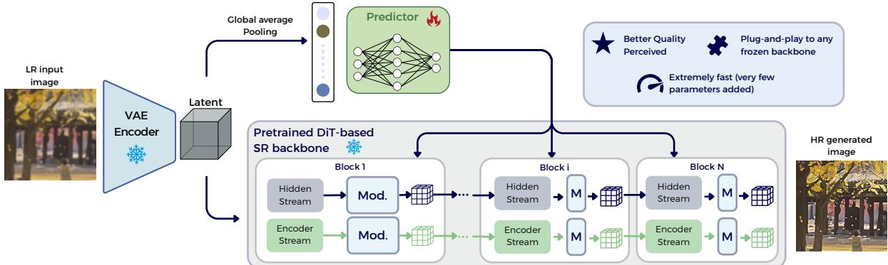  
Figure 1. Overview of the approach. A frozen DiT-based SR backbone processes latent features extracted by a VAE encoder. A lightweight predictor, conditioned on a globally pooled latent representation, outputs per-channel affine modulation parameters that are injected into selected channels across multiple Transformer blocks. By modulating only a small subset of channels, the method improves perceptual quality without updating backbone weights, enabling a fast and plug-and-play enhancement strategy.

## 2. Related Work

Early Super-Resolution Methods. Single-image superresolution (SR) aims to recover a high-resolution (HR) image from a low-resolution (LR) input. Since SRCNN [9], deep learning has become the dominant paradigm, with early methods targeting synthetic degradations (e.g., bicubic downsampling) using pixel-wise reconstruction losses. Subsequent models improved performance through deeper architectures, residual learning, and multi-scale feature aggregation [27, 29], but often generalized poorly to real-world noise, blur, and compression. This limitation motivated realistic degradation models and real-image benchmarks [5, 47]. In parallel, perceptual and adversarial approaches such as SRGAN [27] and ESRGAN [43] shifted the focus toward perceptual quality. BSRGAN [58] and Real-ESRGAN [44] further improved realism through realistic degradation synthesis, although GAN-based SR remains susceptible to training instability and hallucinated details.

Diffusion-based Super-Resolution. Diffusion models have emerged as a powerful generative paradigm across modalities [2, 3, 20], and as a strong alternative for real-world SR due to their expressive generative priors and stable training. Methods such as StableSR [42], DiffBIR [30], PASD [54], SeeSR [49], and SUPIR [56] leverage large pre-trained diffusion priors to improve perceptual quality, texture realism, and semantic consistency. Their multi-step denoising process, however, incurs substantial inference cost, motivating oneand few-step alternatives. OSEDiff [48] adopts latent score distillation for one-step SR, while TAD-SR [19], S3Diff [57], AddSR [39], PiSA-SR [37], and Gram-SR [12] further improve efficiency and restoration quality through specialized supervision, degradation-aware conditioning, or adaptive refinement. These approaches generally adapt the generative prior or additional modules attached to it; in contrast, SPARK keeps the SR backbone frozen and operates directly in its activation space.

Transformer and Flow-Matching Priors for SR. Recent SR methods increasingly adopt Transformer-based generative priors, offering strong global modeling and scalability. DiT-SR [7] introduces a hierarchical DiT model with frequency-aware conditioning, while DiT4SR [13] adapts large pre-trained priors by integrating LR guidance into attention and enhancing local detail recovery. TSD-SR [11] explores one-step restoration through distillation from a flow-matching text-to-image prior, highlighting the potential of modern generative models [14, 20, 31, 33, 35] for efficient SR. In a related direction, FluxSR [28] builds on the FLUX [26] Transformer prior and distills multi-step flow trajectories into a single-step model, reducing inference cost while preserving fidelity and perceptual quality. Rather than modifying these backbones, SPARK keeps them frozen and improves SR through activation-space modulation.

Massive Activations in DiTs. Massive activations in DiTs are abnormally large intermediate responses concentrated in a small set of channels, often dominating feature propagation and attention. Similar effects have been observed in LLMs and ViTs [38, 61]; in ViTs, they appear as attention artifacts in low-information regions and have been linked to positional embeddings [8, 52]. Recent studies show that similar outliers also emerge in DiTs, causing unstable quantization and high distillation losses [15, 62]. From a generative perspective, these dominant channels are strongly associated with fine-grained texture synthesis, while global semantic structure remains largely preserved under perturbations [17]. Further analyses show that these channels encode spatially coherent information aligned with salient image regions, and that the subspace they span transfers across prompts [40]. This suggests a trade-off between texture fidelity and semantic consistency, and indicates that massive activations can be leveraged to extract semantically discriminative features for dense visual correspondence tasks [16]. These works establish the existence and functional relevance of massive activations, mainly through analysis or training-free manipulation. In contrast, we investigate whether the same sparse representation can serve as a learnable, input-conditioned adaptation interface for frozen SR models. Our contribution lies in exploiting massive activations for representationspace adaptation, rather than in their discovery.

(a)  
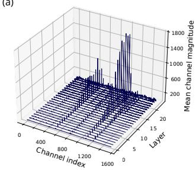

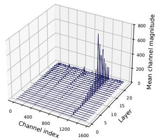

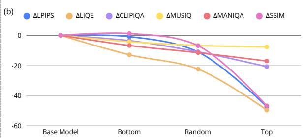

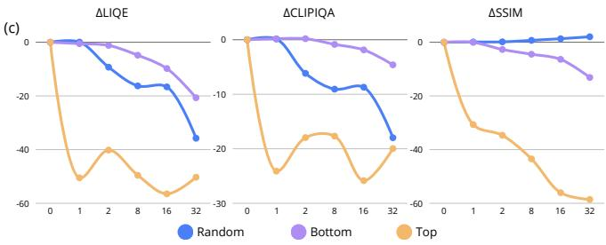

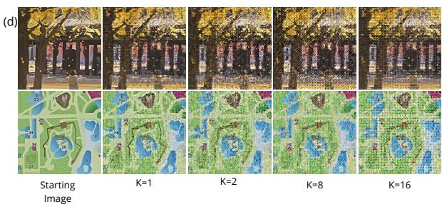  
Figure 2. Analysis of activation concentration and its impact on reconstruction quality. (a) Per-channel activation magnitudes across blocks for DiT4SR [13] (left) and TSD-SR [11] (right), revealing a strongly skewed distribution with few dominant channels. (b) Average performance drop when ablating top-, random-, and bottom-ranked channels (aggregated over K), highlighting the critical role of top-activation channels. (c) Metric degradation as a function of K, showing strong sensitivity to top-K removal and weak impact for random and bottom selections. (d) Qualitative results for increasing K, where removing top channels progressively degrades perceptual quality.

## 3. Dominant Channels as an Adaptation Subspace

Before introducing our adaptation mechanism, we examine whether magnitude-dominant channels form a compact set of effective intervention points in pretrained DiT-based SR models. We focus on two properties relevant to adaptation: activation concentration and intervention sensitivity.

## 3.1. Preliminaries

We consider SR models built on Diffusion Transformers [34], and in particular on the multimodal variant [14] that operates on two parallel streams: a hidden stream, which processes the input image as a sequence of patchified tokens, and an encoder stream providing conditioning information. The two streams interact across Transformer blocks, allowing image content and conditioning signals to be jointly processed.

Let ℓ denote a DiT block, $s \in$ {hid, enc} a stream, and i an image index. Let $T _ { s }$ and $C _ { s }$ denote the number of tokens and channels in stream s, respectively. For image i, we denote the activation tensor at block ℓ and stream s by $A _ { i , s } ^ { ( \ell ) } \in \mathbb { R } ^ { T _ { s } \times C _ { s } }$ . We define the per-channel activation magnitude as the mean absolute activation over tokens,

$$
a _ { i , s } ^ { ( \ell ) } ( c ) = \frac { 1 } { T _ { s } } \sum _ { t = 1 } ^ { T _ { s } } \left| A _ { i , s } ^ { ( \ell ) } ( t , c ) \right| ,\tag{1}
$$

yielding $a _ { i , s } ^ { ( \ell ) } \in \mathbb { R } _ { \geq 0 } ^ { C _ { s } }$ , which summarizes the activation magnitude of each channel.

We rank the entries of $a _ { i , s } ^ { ( \ell ) }$ in decreasing order and define

$$
\mathrm { T o p } _ { K } \Big ( a _ { i , s } ^ { ( \ell ) } \Big ) \subset \{ 1 , \dots , C _ { s } \}\tag{2}
$$

as the index set of the K largest-magnitude channels. We refer to these as the dominant channels of stream s at block ℓ.

Finally, let x denote the low-resolution input image, z its latent encoding obtained from the frozen VAE encoder, yˆ the reconstructed high-resolution output, and y the corresponding target.

## 3.2. Activation Analysis

Activation magnitude is highly concentrated across channels. We first analyze the per-channel activation magnitudes $a _ { i , s } ^ { ( \ell ) } ( c )$ (cf. Eq. (1)) across DiT blocks and streams. A clear and consistent pattern emerges: activation energy is highly unevenly distributed. A small subset of channels exhibits significantly larger activation magnitudes, while the majority remains barely active. Fig. 2 (a) illustrates this skewed activation landscape across blocks and channels.

To quantify this effect at the dataset level, we average the channel magnitudes over images for each block and stream, and measure the inequality of the resulting distribution using the Gini coefficient [23]. Focusing on the top-32 channels ( 2% of the channel dimension), we observe high inequality (with a median Gini coefficient of 0.62 across blocks), indicating a strong concentration of activation energy. Such a value reflects a highly skewed distribution, where a small subset of channels dominates the representation and likely plays a central role in determining the model output.

Although the ranking is computed from mean absolute activation magnitude, the resulting top-ranked channels also capture a disproportionate fraction of the squared activation energy. For $K = 8$ , they account on average for 85.6% of the encoder-stream energy and 68.8% of the hidden-stream energy, while representing only 0.5% of the channel dimension.

Dominant channels are critical and their effect scales with K. Motivated by this observation, we next investigate the functional role of dominant channels through controlled analyses. For each block and stream, we zero subsets of channels selected according to their activation magnitude: the top-K channels (highest magnitude), the bottom-K channels (lowest magnitude), and randomly selected channels, while varying the number of channels K.

We conduct this experiment using TSD-SR [11] on images from DRealSR [47], and measure changes in SSIM [46], LPIPS [59], LIQE [60], MANIQA [53], MUSIQ [24], and CLIP-IQA [41]. For each selection strategy, results are averaged across different values of K to obtain an overall performance drop. As shown in Fig. 2 (b), removing the Top channels leads to a sharp degradation in reconstruction quality, whereas Random removal produces moderate degradation and Bottom removal has only a minor effect.

Metric-level sensitivity and qualitative effects. We further analyze how reconstruction quality evolves as a function of the number of ablated channels K. As shown in Fig. 2 (c), removing top-K channels causes a sharp, nearly monotonic degradation, with substantial drops even for small K and no comparable trend for random or bottom-ranked channels. This behavior holds across perceptual and distortion-based metrics alike, indicating that the asymmetry is not metricdependent but reflects a structural property of the model.

These effects are also visible qualitatively. As shown in Fig. 2 (d), progressively removing top-K channels results in a gradual loss of perceptual quality as K increases. Even small perturbations introduce noticeable artifacts, while larger values lead to severe degradation of fine details and structure. This further highlights the critical role of dominant channels and shows that perceptual quality is highly sensitive to a small number of high-activation features.

Overall, these results reveal a strong asymmetry in intervention sensitivity: magnitude-dominant channels provide substantially higher leverage over the reconstructed output than equally sized lower-ranked subsets. This motivates using them as a compact adaptation interface.

## 4. Proposed Method

We propose SPARK, a modulation approach for DiT-based SR that improves reconstruction quality through selective feature adaptation. Our analysis (cf. Sec. 3.2) shows that a small subset of channels concentrates most of the activation energy and strongly influences the output. We therefore intervene only in this sparse subspace, learning modulation parameters for the selected channels. To control their contribution, we apply feature-wise affine transformations, enabling efficient amplification or attenuation of dominant channels without modifying the pretrained backbone.

Our approach follows two phases: (i) channel selection via activation-based importance, where we identify the most influential channels in each Transformer block using datasetlevel statistics, and (ii) image-conditioned predictor training, where a lightweight module maps input features to modulation parameters applied to the selected channels. At inference time, the predictor generates conditioned parameters from the VAE latent, enabling efficient enhancement without iterative optimization.

## 4.1. Phase 1: Channel Selection via Activationbased Importance

We aim to identify a small subset of channels that consistently exhibit high activation magnitude across inputs, yielding a compact control space for modulation. Rather than computing channel statistics over the full optimization dataset, we estimate channel importance in an online and sequential manner. Given a pretrained SR backbone, we process optimization samples in mini-batches. For each block ℓ and each stream s described in Sec. 3.1, we compute the per-channel activation magnitude $a _ { t } ^ { ( \ell , s ) }$ , averaged over the mini-batch at iteration t following Eq. (1), and maintain an exponential moving average (EMA) of channel importance:

$$
m _ { t } ^ { ( \ell , s ) } = \lambda m _ { t - 1 } ^ { ( \ell , s ) } + \left( 1 - \lambda \right) a _ { t } ^ { ( \ell , s ) } ,\tag{3}
$$

where $\lambda \in [ 0 , 1 )$ controls the memory of the estimator. This online update smooths batch-level fluctuations while progressively refining the channel ranking. At each iteration, we rank channels according to their current EMA score $m _ { t } ^ { ( \ell , s ) }$ and define the provisional top-K set

$$
\mathcal { T } _ { t } ^ { ( \ell , s ) } \subset \{ 1 , \ldots , C _ { s } \} .\tag{4}
$$

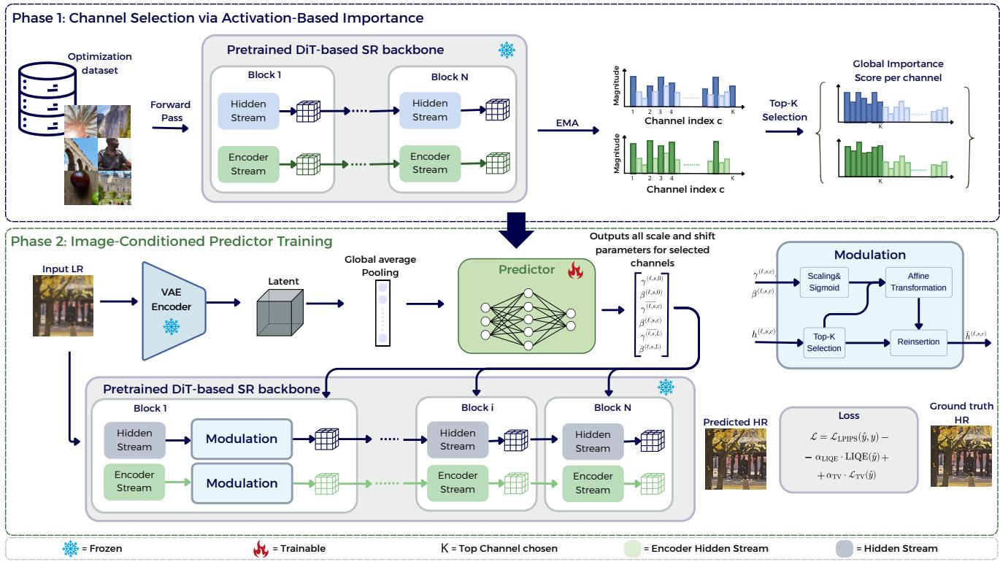  
Figure 3. Overview of the proposed activation-space modulation framework. Phase 1 (top) identifies dominant channels by aggregating activation magnitudes over a dataset and selecting the top-K channels per block and stream. Phase 2 (bottom) trains a lightweight predictor that, given a VAE latent, outputs scale and shift parameters applied to the selected channels of a frozen DiT-based SR backbone. The modulation is injected into both hidden and encoder streams via feature-wise affine transformations. Only the predictor is trained, enabling efficient, input-conditioned control of reconstruction quality.

Instead of selecting channels after a fixed full pass over the dataset, we monitor the stability of the ranking across snapshots taken every $W$ update steps (with W equal to 5 in our experiments). Let $\mathcal { T } _ { w } ^ { ( \ell , s ) }$ denote the provisional top-K set obtained from the EMA scores $m _ { w W } ^ { ( \ell , s ) }$ at the end of the w-th window. We stop the estimation procedure once the selected subset remains unchanged, or nearly unchanged, across $P$ consecutive window transitions:

$$
\frac { 1 } { P } \sum _ { p = 0 } ^ { P - 1 } \frac { \left| \mathcal { T } _ { w - p } ^ { ( \ell , s ) } \cap \mathcal { T } _ { w - p - 1 } ^ { ( \ell , s ) } \right| } { \left| \mathcal { T } _ { w - p } ^ { ( \ell , s ) } \cup \mathcal { T } _ { w - p - 1 } ^ { ( \ell , s ) } \right| } \geq \tau ,\tag{5}
$$

where τ is a stability threshold, set to 0.9 in all experiments. We use $\lambda = 0 . 9 5$ for the EMA and $P = 4$ consecutive windows. This sequential screening procedure yields a compact set of informative channels without requiring an exhaustive dataset-level pass. Importantly, it adapts naturally to the empirical convergence of channel statistics: once the importance ranking stabilizes, further samples provide diminishing returns and the procedure terminates early. After convergence, we retain the final top-K channels for each block and stream:

$$
{ \cal { S } } = \{ ( \ell , s , T ^ { ( \ell , s ) } ) \} ,\tag{6}
$$

where $K = 8$ channels are selected per stream and block in our implementation. This sparse channel map defines the modulation subspace for Phase 2.

## 4.2. Phase 2: Image-Conditioned Predictor

Given the selected channel subset S, we learn an imageconditioned predictor that outputs modulation parameters for these channels. This formulation decouples channel selection (where to intervene) from modulation (how to intervene). For each selected channel $c \in \mathcal { T } ^ { ( \ell , s ) }$ , we apply a feature-wise affine modulation:

$$
\tilde { h } ^ { ( \ell , s , c ) } ( x ) = \gamma ^ { ( \ell , s , c ) } ( x ) \cdot h ^ { ( \ell , s , c ) } ( x ) + \beta ^ { ( \ell , s , c ) } ( x ) ,\tag{7}
$$

where $h ^ { ( \ell , s , c ) }$ denotes the activation of channel c at block ℓ and stream $s ,$ and $\gamma ^ { ( \ell , s , c ) } , \beta ^ { ( \ell , s , c ) }$ are input-dependent scale and shift parameters predicted by the modulation network.

To predict these parameters, we encode the low-resolution input image x using the same frozen VAE [35] employed by the SR backbone, producing a latent representation z. Since this encoding is already available in the SR pipeline, conditioning reuses the existing VAE latent and introduces only the overhead of the lightweight predictor. We then compute a compact global feature vector via spatial pooling (channel-wise mean), which provides sufficient information to guide image-dependent modulation while keeping the predictor lightweight. The feature vector is passed to an MLP $f _ { \theta }$ , which outputs all scale and shift parameters:

$$
\left( \bar { \gamma } ^ { ( \ell , s , c ) } ( x ) , \bar { \beta } ^ { ( \ell , s , c ) } ( x ) \right) _ { \ell , s , c \in \mathcal { Z } ^ { ( \ell , s ) } } = f _ { \theta } ( \operatorname { A v g P o o l } ( z ) ) .\tag{8}
$$

The output dimensionality of the MLP is determined by the total number of selected channels across all blocks and streams:

$$
\dim _ { \operatorname { o u t } } = 2 \sum _ { \ell , s } | { \mathcal { T } } ^ { ( \ell , s ) } | ,\tag{9}
$$

where the factor of 2 reflects that, for each selected channel $c \in \mathcal { T } ^ { ( \ell , s ) }$ , the predictor outputs an individual scale–shift pair $\left( \bar { \gamma } ^ { ( \ell , s , c ) } , \bar { \beta } ^ { \bar { ( } \ell , s , c ) } \right)$ . Thus, modulation parameters are predicted independently for every selected channel in every stream of every block.

To ensure stable modulation, we constrain the predicted parameters to lie within fixed intervals. Specifically, we apply a sigmoid followed by linear scaling:

$$
\begin{array} { r l } & { \gamma ^ { ( \ell , s , c ) } ( x ) = \gamma _ { \mathrm { m i n } } + \left( \gamma _ { \mathrm { m a x } } - \gamma _ { \mathrm { m i n } } \right) \cdot \sigma \left( \bar { \gamma } ^ { ( \ell , s , c ) } ( x ) \right) , } \\ & { \beta ^ { ( \ell , s , c ) } ( x ) = \beta _ { \mathrm { m i n } } + \left( \beta _ { \mathrm { m a x } } - \beta _ { \mathrm { m i n } } \right) \cdot \sigma \left( \bar { \beta } ^ { ( \ell , s , c ) } ( x ) \right) , } \end{array}\tag{10}
$$

where $\bar { \gamma }$ and $\bar { \beta }$ denote the unconstrained outputs of $f _ { \theta }$ and $\sigma ( \cdot )$ is the sigmoid function. Thanks to the sparse selection, the output dimensionality remains small compared with full-channel modulation, keeping the predictor lightweight.

During training, both the SR backbone and the VAE are frozen; only the predictor parameters θ are optimized. The predicted parameters are injected into the forward pass, allowing gradients to propagate through the SR model back to the predictor. The training objective combines perceptual fidelity via LPIPS [59], perceptual quality via LIQE [60], and total variation regularization:

$$
\mathcal { L } = \mathcal { L } _ { \mathrm { L P I P S } } ( \hat { y } , y ) - \alpha _ { \mathrm { L I Q E } } \cdot \mathrm { L I Q E } ( \hat { y } ) + \alpha _ { \mathrm { T V } } \cdot \mathcal { L } _ { \mathrm { T V } } ( \hat { y } ) ,\tag{11}
$$

where $\hat { y }$ is the reconstructed high-resolution image. We set $\alpha _ { \mathrm { L I Q E } } = 0 .$ 1 and $\alpha _ { \mathrm { T V } } = 0 . 0 0 0 1$ to balance loss scales and ensure stable training.

Overall, this phase learns a compact, input-conditioned control mechanism over a sparse subset of channels. Despite modulating only K channels per stream and block, the resulting controller consistently improves perceptual quality over the frozen baseline, showing that a small set of dominant features is sufficient to steer SR generation. This provides an efficient adaptation mechanism that operates on only a small fraction of the representation while leaving the pretrained SR backbone unchanged.

## 5. Experiments

## 5.1. Experimental Setup

Model variants and baselines. We evaluate our approach on three DiT-based SR models: TSD-SR [11], DiT4SR [13], and TEASR [18]. These models provide complementary testbeds for evaluating whether sparse activation adaptation transfers across independently developed SR architectures. For each model, we use the publicly released implementation and checkpoint, and take the corresponding frozen, unmodified backbone as the baseline.

Implementation details. We instantiate $f _ { \theta }$ as a lightweight MLP with two hidden layers of width 256 and SiLU activations, mapping the pooled VAE latent to per-channel affine parameters. We constrain the modulation ranges to $\gamma \in [ 0 . 5 , 1 . 5 ]$ and $\beta \in [ - 0 . 2 , 0 . 2 ]$ in all experiments. The predictor is trained on the DIV2K training set [1], using synthetic degradations generated with the Real-ESRGAN pipeline [44]. We train for one epoch with batch size 16 using the Adam optimizer [25] and a learning rate of $1 \times 1 0 ^ { - 4 }$ with early stopping based on validation performance. No additional data augmentation or external data is used. All experiments are conducted on NVIDIA L40S GPUs with 48 GB of memory. The SR backbone with the VAE encoder and decoder remain frozen, and only the predictor is optimized, isolating the effect of activation-space modulation.

Evaluation protocol. We evaluate on DIV2K validation [1], DRealSR [47], and RealSR [5], covering both synthetic and real-world degradations. For the real-world datasets, each LR image is center-cropped to 128×128, and the corresponding aligned HR region is used for evaluation. This protocol evaluates both in-domain performance on DIV2K validation and generalization from synthetic training degradations to the real-world distributions of RealSR and DRealSR.

We report fidelity metrics, SSIM [46] and LPIPS [59], together with no-reference perceptual-quality metrics, including MANIQA [53], MUSIQ [24], CLIP-IQA [41], TOPIQ [6], and LIQE [60]1.

## 5.2. Experimental Results

Main results. Table 1 reports results on DRealSR, RealSR, and DIV2K-Val across the three considered DiT-based SR backbones. SPARK improves 61 of 63 metric-datasetbackbone combinations, with gains extending beyond noreference perceptual quality: SSIM improves in all nine settings and LPIPS in seven. Despite being trained only on synthetically degraded images, the learned modulation transfers consistently to both real-world benchmarks without adapting the SR backbones. The trend is particularly strong for TEASR, where SPARK improves 20 of 21 scores, with gains up to +5.74 MANIQA, +4.63 MUSIQ, +10.22 CLIP-IQA, and +9.84 TOPIQ. Qualitative results in Fig. 4 further show sharper local structures and details across all three backbones. Overall, these results show that a small activation-space intervention can improve diverse DiT-based SR models while largely preserving or improving fidelity.

<table><tr><td colspan="2"></td><td colspan="2">Fidelity</td><td colspan="5">Perceptual Quality</td></tr><tr><td rowspan="5">DRISR</td><td></td><td>SSIM ↑</td><td>LPIPS ↓</td><td>MANIQA ↑</td><td>MUSIQ ↑</td><td>CLIP-IQA ↑</td><td>TOPIQ ↑</td><td>LIQE↑</td></tr><tr><td>TSD-SR [11] + SPARK (Ours)</td><td>71.68  $7 3 . 9 4 \ \Delta { + } 2 . 2 6$ </td><td>31.11  $\mathbf { 3 1 . 0 7 } ~ \Delta \mathbf { + 0 . 0 4 }$ </td><td>58.12  $\mathbf { 6 0 . 1 3 \ } \Delta \mathbf { + } 2 . \mathbf { 0 1 }$ </td><td>66.01  ${ \bf 6 8 . 1 6 \ \Delta } \Delta + 2 . 1 5$ </td><td>73.63  $\mathbf { 7 6 . 3 2 \ } \Delta { + } 2 . 6 9$ </td><td>62.49  $\mathbf { 6 7 . 3 9 } \ \Delta \mathbf { + 4 . 9 0 }$ </td><td>4.05  $\mathbf { 4 . 4 7 \ } \Delta \mathbf { + 0 . 4 2 }$ </td></tr><tr><td>DiT4SR [13]</td><td>61.02</td><td>43.72</td><td>60.88</td><td>65.20</td><td>69.36</td><td>58.50</td><td>4.08</td></tr><tr><td>+ SPARK (Ours)</td><td>66.26 ∆+5.24</td><td>37.18 Δ+6.54</td><td>62.99 Δ+2.11</td><td>66.06 Δ+0.86</td><td> $\mathbf { 7 1 . 3 8 } \ \Delta { + } 2 . 0 2$ </td><td>58.67 ∆+0.17</td><td>4.20 ∆+0.12</td></tr><tr><td>TEASR [18]</td><td>73.07</td><td>30.97</td><td>56.17</td><td>63.10</td><td>56.90</td><td>57.42</td><td>3.09</td></tr><tr><td rowspan="5">ReaSR</td><td> ${ \bf \Pi } + \mathbf { S P A R K } \left( \mathbf { O u r s } \right)$  TSD-SR [11]</td><td> ${ \mathbf { 7 5 . 7 1 } } \ \Delta { + 2 . 6 4 }$  68.84</td><td> $\mathbf { 3 0 . 8 4 \ } \Delta \mathbf { + 0 . 1 3 }$  27.96</td><td> ${ \bf 6 1 . 4 2 \ } \Delta + 5 . 2 5$  63.03</td><td> $\mathbf { 6 7 . 7 3 \ } \Delta \substack { + 4 . 6 3 }$  70.72</td><td> ${ \bf 6 5 . 3 9 } \ \Delta \mathrm { + 8 . 4 9 }$  72.55</td><td> ${ \bf 6 5 . 1 4 } ~ \Delta \substack { + 7 . 7 2 }$  66.40</td><td> $\mathbf { 4 . 1 0 } ~ \Delta \mathbf { \Phi } + \mathbf { 1 . 0 1 }$  4.19</td></tr><tr><td>+ SPARK (Ours)</td><td> $\mathbf { 7 0 . 4 3 \ } \Delta \mathbf { + 1 . 5 9 }$ </td><td>28.44 ∆-0.48</td><td>64.64Δ+1.61</td><td> $7 2 . 1 4 \ \Delta { + } 1 . 4 2$ </td><td> $7 5 . 3 5 ~ \Delta { + } 2 . 8 0$ </td><td> ${ \bf 6 9 . 8 3 \ } \Delta + 3 . 4 3$ </td><td> $\mathbf { 4 . 6 9 \ } \Delta \mathbf { + 0 . 5 0 }$ </td></tr><tr><td>DiT4SR [13]  ${ \bf \Pi } + \mathbf { S P A R K } \left( \mathbf { O u r s } \right)$ </td><td>66.05  ${ \bf 6 9 . 2 7 } ~ \Delta \mathrm { + } 3 . 2 2$ </td><td>33.35  $2 8 . 5 1 \ \Delta \substack { + 4 . 8 4 }$ </td><td>59.56  $\mathbf { 6 1 . 7 0 } \ \Delta { + } 2 . 1 4$ </td><td>63.63</td><td>62.24</td><td>54.81</td><td>3.63</td></tr><tr><td>TEASR [18]</td><td>69.62</td><td>27.28</td><td>58.98</td><td> $\mathbf { 6 4 . 7 8 \ } \Delta \mathbf { + 1 . 1 5 }$  67.31</td><td> ${ \bf 6 4 . 6 6 \ } \Delta \mathrm { + } 2 . 4 2$  54.83</td><td> ${ \pmb 5 } { \pmb 5 } . { \pmb 1 } 9 \ \Delta \substack { + } 0 . 3 8$ </td><td> ${ \bf 3 . 7 4 } ~ \Delta \mathrm { + 0 . 1 1 }$ </td></tr><tr><td>+ SPARK (Ours)</td><td> ${ \bf 7 1 . 5 9 } \ \Delta \mathrm { + 1 . 9 7 }$ </td><td></td><td></td><td></td><td></td><td>60.29</td><td>3.28</td></tr><tr><td rowspan="6">DVΛV al</td><td></td><td></td><td> $2 8 . 6 1 ~ \Delta \cdot 1 . 3 3$ </td><td> $\mathbf { 6 4 . 6 8 \ } \Delta \mathbf { + 5 . 7 0 }$ </td><td> $7 1 . 0 5 \ \Delta { + } 3 . 7 4$ </td><td> $6 2 . 2 7 ~ \Delta \substack { + 7 . 4 4 }$ </td><td>68.08 ∆+7.79</td><td> $\mathbf { 4 . 1 7 \ } \Delta \mathbf { + 0 . 8 9 }$ </td></tr><tr><td>TSD-SR [11]</td><td>55.95</td><td>27.35</td><td>60.63</td><td>70.58</td><td>71.83</td><td>66.60</td><td>4.27</td></tr><tr><td> ${ \bf \Pi } + \mathbf { S P A R K } \left( \mathbf { O u r s } \right)$ </td><td> ${ \bf 5 8 . 7 2 \ } \Delta { + 2 . 7 7 }$ </td><td> $\mathbf { 2 6 . 7 8 \ : \Delta \Delta \Delta + 0 . 5 7 }$ </td><td> ${ \bf 6 2 . 4 5 \ } \Delta \mathrm { + 1 . 8 2 }$ </td><td> ${ \bf 7 1 . 9 9 \ } \Delta { \bf + 1 . 4 1 }$ </td><td> $7 5 . 7 7 \ \Delta { + } 3 . 9 4$ </td><td> $\mathbf { 7 0 . 3 6 \ } \Delta { + } 3 . 7 6$ </td><td> $\mathbf { 4 . 6 2 \ } \Delta \mathbf { + 0 . 3 5 }$ </td></tr><tr><td>DiT4SR [13]</td><td>54.10</td><td>34.48</td><td>59.51</td><td>66.42</td><td>67.59</td><td>57.71</td><td></td></tr><tr><td>+ SPARK (Ours)</td><td> ${ \pmb 5 } { \pmb 5 } . 2 7 \ \Delta \mathrm { + } { \bf 1 } . 1 7$ </td><td> ${ \bf 3 1 . 2 3 } ~ \Delta \mathrm { + } 3 . 2 5$ </td><td> $6 2 . 2 7 ~ \Delta \substack { + 2 . 7 6 }$ </td><td> ${ \bf 6 6 . 8 7 \ } \Delta \mathrm { + 0 . 4 5 }$ </td><td> $7 1 . 5 5 \ \Delta { + } 3 . 9 6$ </td><td> ${ \bf 6 0 . 1 0 \ } \Delta \mathrm { + } 2 . 3 9$ </td><td>4.03  ${ \bf 4 . 2 5 } \ \Delta \mathrm { + 0 . 2 } 2$ </td></tr><tr><td>TEASR [18]  $\mathbf { \Pi } + \mathbf { S P A R K } \left( \mathbf { O u r s } \right)$ </td><td>56.72  ${ \bf 5 9 . 3 1 } \ \Delta \mathrm { + } 2 . 5 9$ </td><td>29.41  $2 8 . 6 6 \ \Delta \mathrm { + 0 . 7 5 }$ </td><td>57.42  ${ \bf 6 3 . 1 6 \ } \Delta \mathrm { + } 5 . 7 4$ </td><td>67.37  ${ \bf 7 1 . 5 1 \ } \Delta { \bf + 4 . 1 4 }$ </td><td>54.72  ${ \bf 6 4 . 9 4 } \ \Delta \mathrm { + 1 0 } . 2 2$ </td><td>57.06</td><td>3.52</td></tr></table>

Table 1. Comparison of DiT-based SR backbones across different datasets. For each metric, the score is followed by its direction normalized change with respect to the corresponding frozen backbone (∆+: improvement; ∆−: degradation). LIQE is shaded in gray because it is explicitly included in the training objective of SPARK.

Comparison with alternative adaptation strategies. To disentangle the effects of channel selection, parameter budget, and modulation mechanism, in Table 2 we compare SPARK with five controlled parameter-efficient baselines on DRealSR. All methods are trained using the same data, objective, optimization, and frozen SR backbone (i.e., TSD-SR). Specifically, $\mathrm { I A } ^ { 3 } \ [ 3 2 ]$ , Houlsby adapters [21], LoReFT [51], and channel-localized LoRA [22] are restricted to the same top-8 channels per stream and block selected in Phase 1, providing alternative adaptation mechanisms over the same activation subspace. We additionally include a parametermatched LoRA baseline, which applies standard LoRA to the feed-forward projections using a comparable trainable parameter budget. Together, these controls test whether the gains arise simply from intervening on the dominant channels or from using a similar adaptation capacity.

The results show that the dominant-channel subspace provides a consistently effective adaptation interface: nearly all alternative mechanisms improve over the frozen baseline when restricted to the same selected channels. Among these shared-subspace methods, SPARK achieves the strongest MUSIQ, CLIP-IQA, TOPIQ, and LIQE scores, while LoReFT obtains the best MANIQA. Parameter-matched

<table><tr><td></td><td colspan="2">Fidelity</td><td colspan="4">Perceptual Quality</td></tr><tr><td></td><td></td><td>SSIM ↑LPIPS ↓MANIQA ↑MUSIQ ↑CLIP-IQA ↑TOPIQ ↑LIQE ↑</td><td></td><td></td><td></td><td></td></tr><tr><td>Baseline</td><td>71.68 31.11</td><td>58.12</td><td>66.01</td><td>73.63</td><td>62.49</td><td>4.05</td></tr><tr><td>IA3 [32]</td><td>73.95 30.58</td><td>59.47</td><td>67.18</td><td>74.44</td><td>64.55</td><td>4.31</td></tr><tr><td>Houlsby [21]</td><td>74.47 30.85</td><td>59.65</td><td>67.77</td><td>75.08</td><td>66.34</td><td>4.41</td></tr><tr><td>LoReFT [51]</td><td>74.73 30.78</td><td>60.60</td><td>68.07</td><td>75.73</td><td>66.88</td><td>4.45</td></tr><tr><td>Ch.-local LoRA [22]</td><td>74.91 30.70</td><td>60.26</td><td>67.93</td><td>75.01</td><td>66.54</td><td>4.43</td></tr><tr><td>Param.-match LoRA [22] 76.42</td><td>26.87</td><td>60.41</td><td>66.63</td><td>72.39</td><td>63.29</td><td>4.86</td></tr><tr><td>SPARK (Ours)</td><td>73.94 31.07</td><td>60.13</td><td>68.16</td><td>76.32</td><td>67.39</td><td>4.47</td></tr></table>

Table 2. Comparison with alternative adaptation mechanisms on DRealSR. $\mathrm { L A } ^ { 3 }$ , Houlsby, LoReFT, channel-localized LoRA operate on the same top-8 channels as SPARK, while parametermatched LoRA uses a comparable trainable parameter budget.

LoRA instead favors fidelity, achieving the best SSIM and LPIPS, but remains below SPARK on MUSIQ, CLIP-IQA, and TOPIQ. Overall, these results support two complementary conclusions: the selected dominant channels are broadly useful for adaptation, and the gains of SPARK cannot be explained by a comparable parameter budget alone.

Importance of channel selection. Table 3 compares different channel selection strategies under the same modulation budget (K = 8). Modulating the top-activation channels yields the strongest perceptual quality, achieving the best MANIQA, MUSIQ, CLIP-IQA, TOPIQ, and LIQE scores, while also providing the best SSIM. Random selection achieves the best LPIPS, indicating a slightly different fidelity–perception trade-off. Overall, dominant channels provide the most effective subspace for our objective of improving perceptual SR quality.

Effect of the number of selected channels. Fig. 5 analyzes the effect of varying the number of selected channels K. As shown, performance improves rapidly for small values of K, with most of the gain already recovered by K = 8, making it a compact and effective operating point. Increasing K further yields smaller and metric-dependent improvements, indicating diminishing returns as additional channels are included. In particular, MANIQA and MUSIQ improve gradually, while CLIP-IQA benefits up to intermediate values of K and SSIM remains consistently high. These results are consistent with the analysis in Sec. 3.2, showing that a small subset of dominant channels is sufficient to exert substantial control over reconstruction quality.

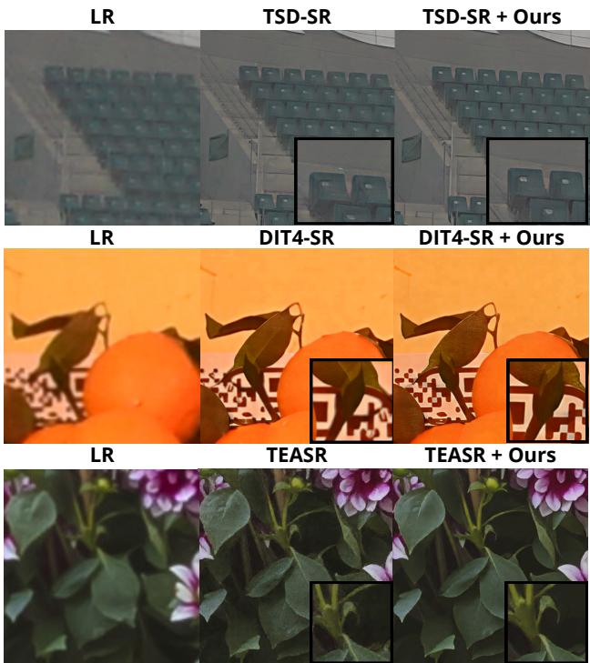  
Figure 4. Qualitative comparison across DiT-based SR backbones. From left to right: LR input, frozen baseline, and SPARK.

Robustness to the perceptual objective. Since LIQE is used both for training and evaluation, we test whether the observed improvements depend on optimizing this specific IQA metric. We retrain the predictor by replacing LIQE with MANIQA, MUSIQ, or TOPIQ, while keeping the remaining setup unchanged and adjusting only the corresponding loss weight to account for differences in numerical scale. As shown in Table 4, all objectives retain strong cross-metric performance, with gains consistently transferring to perceptual metrics not directly optimized during training. These results indicate that the perceptual gains of SPARK are not specific to LIQE or explained by metric overfitting.

Efficiency and adaptation cost. SPARK leaves the pretrained backbone unchanged: both the DiT and the VAE remain frozen, and adaptation is carried entirely by a lightweight predictor with 274K trainable parameters, fewer than the 361K used by the parameter-matched LoRA baseline (cf. Table 2) and orders of magnitude below the backbones themselves. Phase 1 is also inexpensive, requiring only forward passes without gradient computation and storing per-channel statistics. On TSD-SR, the stability criterion typically terminates after roughly 400 images (∼25 minibatches), taking about 8 minutes on a single GPU. Phase 2 then trains for approximately 2.5 hours on a single NVIDIA L40S GPU. At inference, the predictor runs once per image on the VAE latent already computed by the SR pipeline, while modulation consists only of affine transformations on the K selected channels per stream and block, leaving the computational graph of the backbone unchanged.

<table><tr><td></td><td colspan="2">Fidelity</td><td colspan="5">Perceptual Quality</td></tr><tr><td></td><td>SSIM ↑ LPIPS ↓ MANIQA ↑ MUSIQ ↑ CLIP-IQA↑ TOPIQ ↑ LIQE ↑</td><td></td><td></td><td></td><td></td><td></td><td></td></tr><tr><td>Baseline</td><td>71.68</td><td>31.11</td><td>58.12</td><td>66.01</td><td>73.63</td><td>62.49</td><td>4.05</td></tr><tr><td>Bottom</td><td>73.25</td><td>30.59</td><td>58.16</td><td>66.47</td><td>73.26</td><td>64.40</td><td>4.18</td></tr><tr><td>Random</td><td>73.37</td><td>30.35</td><td>58.84</td><td>66.77</td><td>73.78</td><td>63.34</td><td>4.21</td></tr><tr><td>Top (Ours) 73.94</td><td></td><td>31.07</td><td>60.13</td><td>68.16</td><td>76.32</td><td>67.39</td><td>4.47</td></tr></table>

Table 3. Effect of channel selection strategy. Top, random, and bottom selections are evaluated using K = 8.
<table><tr><td></td><td colspan="2">Fidelity</td><td colspan="5">Perceptual Quality</td></tr><tr><td></td><td></td><td></td><td></td><td>SSIM ↑ LPIPS ↓ MANIQA ↑ MUSIQ ↑ CLIP-IQA ↑ TOPIQ ↑ LIQE ↑</td><td></td><td></td><td></td></tr><tr><td>LIQE (Ours) 73.94</td><td></td><td>4 31.07</td><td>60.13</td><td>68.16</td><td>76.32</td><td>67.39</td><td>4.47</td></tr><tr><td>MANIQA</td><td>71.86</td><td>32.73</td><td>59.91</td><td>68.12</td><td>79.06</td><td>69.40</td><td>4.50</td></tr><tr><td>MUSIQ</td><td>74.75</td><td>29.28</td><td>59.60</td><td>67.32</td><td>72.61</td><td>64.28</td><td>4.22</td></tr><tr><td>TOPIQ</td><td>73.43</td><td>31.02</td><td>59.42</td><td>67.97</td><td>75.34</td><td>69.64</td><td>4.37</td></tr></table>

Table 4. Robustness to the perceptual training objective. LIQE, MANIQA, MUSIQ, and TOPIQ are used with loss weight α = 0.1, 0.5, 0.005, and 0.5, respectively.

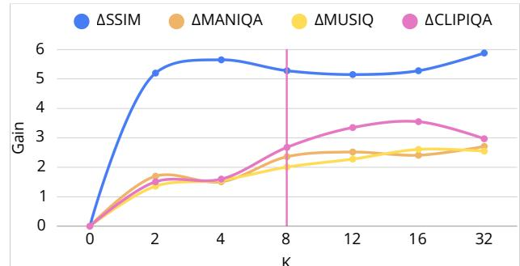  
Figure 5. Effect of the number of selected channels K.

## 6. Conclusion

We investigated magnitude-dominant activation channels as a compact interface for frozen DiT SR models. We show that they form a sparse, intervention-sensitive subspace. Based on this insight, we introduced SPARK, an input-conditioned controller that modulates selected channels while keeping the backbone frozen. Across three SR backbones and multiple benchmarks, SPARK improves fidelity and perceptual quality, highlighting sparse representation-space intervention as an effective alternative to weight-space adaptation.

## References

[1] Eirikur Agustsson and Radu Timofte. NTIRE 2017 Challenge on Single Image Super-Resolution: Dataset and Study. In CVPR Workshops, 2017. 1, 6, 11

[2] Jacob Austin, Daniel D. Johnson, Jonathan Ho, Daniel Tarlow, and Rianne van den Berg. Structured denoising diffusion models in discrete state-spaces. In NeurIPS, 2021. 2

[3] Thomas Bertolani, Davide Bucciarelli, Leonardo Zini, Marcella Cornia, and Lorenzo Baraldi. Diffusion language models: An experimental analysis. arXiv preprint, 2026. 2

[4] Yochai Blau and Tomer Michaeli. The Perception-Distortion Tradeoff. In CVPR, 2018. 15

[5] Jianrui Cai, Hui Zeng, Hongwei Yong, Zisheng Cao, and Lei Zhang. Toward Real-World Single Image Super-Resolution: A New Benchmark and a New Model. In ICCV, 2019. 1, 2, 6, 11

[6] Chaofeng Chen, Jiadi Mo, Jingwen Hou, Haoning Wu, Liang Liao, Wenxiu Sun, Qiong Yan, and Weisi Lin. TOPIQ: A Top-Down Approach from Semantics to Distortions for Image Quality Assessment. IEEE Trans. Image Processing, 33:2404– 2418, 2024. 6, 11

[7] Kun Cheng, Lei Yu, Zhijun Tu, Xiao He, Liyu Chen, Yong Guo, Mingrui Zhu, Nannan Wang, Xinbo Gao, and Jie Hu. Effective diffusion transformer architecture for image superresolution. In AAAI, 2025. 1, 2

[8] Timothee Darcet, Maxime Oquab, Julien Mairal, and Piotr´ Bojanowski. Vision Transformers Need Registers. In ICLR, 2024. 1, 2

[9] Chao Dong, Chen Change Loy, Kaiming He, and Xiaoou Tang. Learning a Deep Convolutional Network for Image Super-Resolution. In ECCV, 2014. 2

[10] Chao Dong, Chen Change Loy, Kaiming He, and Xiaoou Tang. Image super-resolution using deep convolutional networks. IEEE Trans. PAMI, 38(2):295–307, 2015. 1

[11] Linwei Dong, Qingnan Fan, Yihong Guo, Zhonghao Wang, Qi Zhang, Jinwei Chen, Yawei Luo, and Changqing Zou. TSD-SR: One-Step Diffusion with Target Score Distillation for Real-World Image Super-Resolution. In CVPR, 2025. 1, 2, 3, 4, 6, 7, 11, 13, 14, 15, 16

[12] Fabio D’Oronzio, Federico Putamorsi, Leonardo Zini, Marcella Cornia, and Lorenzo Baraldi. GramSR: Visual Feature Conditioning for Diffusion-Based Super-Resolution. In ICPR, 2026. 2, 14, 15

[13] Zheng-Peng Duan, Jiawei Zhang, Xin Jin, Ziheng Zhang, Zheng Xiong, Dongqing Zou, Jimmy S Ren, Chunle Guo, and Chongyi Li. DiT4SR: Taming Diffusion Transformer for Real-World Image Super-Resolution. In ICCV, 2025. 1, 2, 3, 6, 7, 11, 13, 15, 16

[14] Patrick Esser, Sumith Kulal, Andreas Blattmann, Rahim Entezari, Jonas Muller, Harry Saini, Yam Levi, Dominik Lorenz,¨ Axel Sauer, Frederic Boesel, et al. Scaling Rectified Flow Transformers for High-Resolution Image Synthesis. In ICML, 2024. 1, 2, 3

[15] Gongfan Fang, Kunjun Li, Xinyin Ma, and Xinchao Wang. TinyFusion: Diffusion Transformers Learned Shallow. In CVPR, 2025. 2

[16] Chaofan Gan, Yuanpeng Tu, Xi Chen, Tieyuan Chen, Yuxi Li, Mehrtash Harandi, and Weiyao Lin. Unleashing Diffusion Transformers for Visual Correspondence by Modulating Massive Activations. In NeurIPS, 2025. 3

[17] Chaofan Gan, Zicheng Zhao, Yuanpeng Tu, Xi Chen, Ziran Qin, Tieyuan Chen, Mehrtash Harandi, and Weiyao Lin. Massive Activations are the Key to Local Detail Synthesis in Diffusion Transformers. In ICLR, 2026. 1, 3

[18] Xiang Gao, Chenxin Zhu, Yushun Fang, Qiang Hu, and Xiaoyun Zhang. TEASR: Training-Efficient Any-Step Diffusion Transformer for Real-World Image Super-Resolution. arXiv preprint arXiv:2606.16188, 2026. 6, 7, 11, 13, 15, 16

[19] Xiao He, Haoao Tang, Zhijun Tu, Junchao Zhang, Kun Cheng, Hanting Chen, Yong Guo, Mingrui Zhu, Jie Hu, Nannan Wang, et al. One step diffusion-based super-resolution with time-aware distillation. IEEE Trans. Image Processing, 2026. 2

[20] Jonathan Ho, Ajay Jain, and Pieter Abbeel. Denoising diffusion probabilistic models. In NeurIPS, 2020. 1, 2

[21] Neil Houlsby, Andrei Giurgiu, Stanislaw Jastrzebski, Bruna Morrone, Quentin De Laroussilhe, Andrea Gesmundo, Mona Attariyan, and Sylvain Gelly. Parameter-efficient transfer learning for NLP. In ICML, 2019. 7

[22] Edward J Hu, Yelong Shen, Phillip Wallis, Zeyuan Allen-Zhu, Yuanzhi Li, Shean Wang, Lu Wang, Weizhu Chen, et al. LoRA: Low-Rank Adaptation of Large Language Models. In ICLR, 2022. 7, 11

[23] Niall Hurley and Scott Rickard. Comparing measures of sparsity. IEEE Trans. Inf. Theor., 55(10):4723–4741, 2009. 4

[24] Junjie Ke, Qifei Wang, Yilin Wang, Peyman Milanfar, and Feng Yang. MUSIQ: Multi-scale Image Quality Transformer. In ICCV, 2021. 4, 6, 11

[25] Diederik P Kingma and Jimmy Ba. Adam: A Method for Stochastic Optimization. In ICLR, 2015. 6

[26] Black Forest Labs, Stephen Batifol, Andreas Blattmann, Frederic Boesel, Saksham Consul, Cyril Diagne, Tim Dockhorn, Jack English, Zion English, Patrick Esser, et al. FLUX.1 Kontext: Flow Matching for In-Context Image Generation and Editing in Latent Space. arXiv preprint, 2025. 2

[27] Christian Ledig, Lucas Theis, Ferenc Huszar, Jose Caballero,´ Andrew Cunningham, Alejandro Acosta, Andrew Aitken, Alykhan Tejani, Johannes Totz, Zehan Wang, et al. Photorealistic single image super-resolution using a generative adversarial network. In CVPR, 2017. 1, 2

[28] Jianze Li, Jiezhang Cao, Yong Guo, Wenbo Li, and Yulun Zhang. One Diffusion Step to Real-World Super-Resolution via Flow Trajectory Distillation. In ICML, 2025. 2

[29] Bee Lim, Sanghyun Son, Heewon Kim, Seungjun Nah, and Kyoung Mu Lee. Enhanced Deep Residual Networks for Single Image Super-Resolution. In CVPR Workshops, 2017. 1, 2

[30] Xinqi Lin, Jingwen He, Ziyan Chen, Zhaoyang Lyu, Bo Dai, Fanghua Yu, Yu Qiao, Wanli Ouyang, and Chao Dong. Diff-BIR: Toward Blind Image Restoration with Generative Diffusion Prior. In ECCV, 2024. 1, 2

[31] Yaron Lipman, Marton Havasi, Peter Holderrieth, Neta Shaul, Matt Le, Brian Karrer, Ricky T. Q. Chen, David Lopez-Paz,

Heli Ben-Hamu, and Itai Gat. Flow Matching Guide and Code. arXiv preprint, 2024. 1, 2

[32] Haokun Liu, Derek Tam, Mohammed Muqeeth, Jay Mohta, Tenghao Huang, Mohit Bansal, and Colin A Raffel. Fewshot parameter-efficient fine-tuning is better and cheaper than in-context learning. In NeurIPS, 2022. 7

[33] Xingchao Liu, Chengyue Gong, and Qiang Liu. Flow Straight and Fast: Learning to Generate and Transfer Data with Rectified Flow. In ICLR, 2023. 1, 2

[34] William Peebles and Saining Xie. Scalable diffusion models with transformers. In ICCV, 2023. 3

[35] Robin Rombach, Andreas Blattmann, Dominik Lorenz, Patrick Esser, and Bjorn Ommer. High-Resolution Image¨ Synthesis With Latent Diffusion Models. In CVPR, 2022. 1, 2, 5

[36] Haoze Sun, Linfeng Jiang, Fan Li, Renjing Pei, Zhixin Wang, Yong Guo, Jiaqi Xu, Haoyu Chen, Jin Han, Fenglong Song, et al. PocketSR: The Super-Resolution Expert in Your Pocket Mobiles. arXiv preprint, 2025. 1

[37] Lingchen Sun, Rongyuan Wu, Zhiyuan Ma, Shuaizheng Liu, Qiaosi Yi, and Lei Zhang. Pixel-level and Semantic-level Adjustable Super-resolution: A Dual-LoRA Approach. In CVPR, 2025. 1, 2, 14, 15

[38] Mingjie Sun, Xinlei Chen, J Zico Kolter, and Zhuang Liu. Massive Activations in Large Language Models. In COLM, 2024. 1, 2

[39] Ying Tai, Rui Xie, Chen Zhao, Kai Zhang, Zhenyu Zhang, Jun Zhou, and Jian Yang. AddSR: Accelerating diffusion-based blind super-resolution with adversarial diffusion distillation. Pattern Recognition, 175:113012, 2026. 2

[40] Evelyn Turri, Davide Bucciarelli, Sara Sarto, Lorenzo Baraldi, and Marcella Cornia. Few Channels Draw The Whole Picture: Revealing Massive Activations in Diffusion Transformers. arXiv preprint arXiv:2605.13974, 2026. 3

[41] Jianyi Wang, Kelvin CK Chan, and Chen Change Loy. Exploring clip for assessing the look and feel of images. In AAAI, 2023. 4, 6, 11

[42] Jianyi Wang, Zongsheng Yue, Shangchen Zhou, Kelvin CK Chan, and Chen Change Loy. Exploiting Diffusion Prior for Real-World Image Super-Resolution. IJCV, 132(12):5929– 5949, 2024. 2

[43] Xintao Wang, Ke Yu, Shixiang Wu, Jinjin Gu, Yihao Liu, Chao Dong, Yu Qiao, and Chen Change Loy. Esrgan: Enhanced super-resolution generative adversarial networks. In ECCV Workshops, 2018. 1, 2

[44] Xintao Wang, Liangbin Xie, Chao Dong, and Ying Shan. Real-ESRGAN: Training Real-World Blind Super-Resolution With Pure Synthetic Data. In ICCV, 2021. 1, 2, 6

[45] Yufei Wang, Wenhan Yang, Xinyuan Chen, Yaohui Wang, Lanqing Guo, Lap-Pui Chau, Ziwei Liu, Yu Qiao, Alex C Kot, and Bihan Wen. SinSR: Diffusion-Based Image Super-Resolution in a Single Step. In CVPR, 2024. 14, 15

[46] Zhou Wang, A.C. Bovik, H.R. Sheikh, and E.P. Simoncelli. Image quality assessment: from error visibility to structural similarity. IEEE Trans. Image Processing, 2004. 4, 6, 14

[47] Pengxu Wei, Ziwei Xie, Hannan Lu, Zongyuan Zhan, Qixiang Ye, Wangmeng Zuo, and Liang Lin. Component Divide-and-

Conquer for Real-World Image Super-Resolution. In ECCV, 2020. 1, 2, 4, 6, 11

[48] Rongyuan Wu, Lingchen Sun, Zhiyuan Ma, and Lei Zhang. One-Step Effective Diffusion Network for Real-World Image Super-Resolution. In NeurIPS, 2024. 1, 2, 14, 15

[49] Rongyuan Wu, Tao Yang, Lingchen Sun, Zhengqiang Zhang, Shuai Li, and Lei Zhang. SeeSR: Towards Semantics-Aware Real-World Image Super-Resolution. In CVPR, 2024. 2

[50] Rongyuan Wu, Lingchen Sun, Zhengqiang Zhang, Shihao Wang, Tianhe Wu, Qiaosi Yi, Shuai Li, and Lei Zhang. DP2O-SR: Direct Perceptual Preference Optimization for Real-World Image Super-Resolution. arXiv preprint, 2025. 1

[51] Zhengxuan Wu, Aryaman Arora, Zheng Wang, Atticus Geiger, Dan Jurafsky, Christopher D Manning, and Christopher Potts. ReFT: Representation Finetuning for Language Models. In NeurIPS, 2024. 7

[52] Jiawei Yang, Katie Z Luo, Jiefeng Li, Congyue Deng, Leonidas Guibas, Dilip Krishnan, Kilian Q Weinberger, Yonglong Tian, and Yue Wang. Denoising Vision Transformers. In ECCV, 2024. 2

[53] Sidi Yang, Tianhe Wu, Shuwei Shi, Shanshan Lao, Yuan Gong, Mingdeng Cao, Jiahao Wang, and Yujiu Yang. Maniqa: Multi-dimension attention network for no-reference image quality assessment. In CVPR, 2022. 4, 6, 11

[54] Tao Yang, Rongyuan Wu, Peiran Ren, Xuansong Xie, and Lei Zhang. Pixel-Aware Stable Diffusion for Realistic Image Super-Resolution and Personalized Stylization. In ECCV, 2024. 2

[55] Qiaosi Yi, Shuai Li, Rongyuan Wu, Lingchen Sun, Yuhui Wu, and Lei Zhang. Fine-Structure Preserved Real-World Image Super-Resolution Via Transfer VAE Training. In ICCV, 2025. 1

[56] Fanghua Yu, Jinjin Gu, Zheyuan Li, Jinfan Hu, Xiangtao Kong, Xintao Wang, Jingwen He, Yu Qiao, and Chao Dong. Scaling Up to Excellence: Practicing Model Scaling for Photo-Realistic Image Restoration In the Wild. In CVPR, 2024. 2

[57] Aiping Zhang, Zongsheng Yue, Renjing Pei, Wenqi Ren, and Xiaochun Cao. Degradation-Guided One-Step Image Super-Resolution with Diffusion Priors. arXiv preprint, 2024. 2

[58] Kai Zhang, Jingyun Liang, Luc Van Gool, and Radu Timofte. Designing a Practical Degradation Model for Deep Blind Image Super-Resolution. In ICCV, 2021. 2

[59] Richard Zhang, Phillip Isola, Alexei A Efros, Eli Shechtman, and Oliver Wang. The Unreasonable Effectiveness of Deep Features as a Perceptual Metric. In CVPR, 2018. 4, 6, 11

[60] Weixia Zhang, Guangtao Zhai, Ying Wei, Xiaokang Yang, and Kede Ma. Blind image quality assessment via visionlanguage correspondence: A multitask learning perspective. In CVPR, 2023. 4, 6, 11

[61] Jun Zhao, Zhihao Zhang, Yide Ma, Qi Zhang, Tao Gui, Luhui Gao, and Xuanjing Huang. Unveiling Linguistic Regions in Large Language Models. In ACL, 2024. 2

[62] Tianchen Zhao, Tongcheng Fang, Haofeng Huang, Enshu Liu, Rui Wan, Widyadewi Soedarmadji, Shiyao Li, Zinan Lin, Guohao Dai, Shengen Yan, et al. ViDiT-Q: Efficient and Accurate Quantization of Diffusion Transformers for Image and Video Generation. In ICLR, 2025. 2

# SPARK: Input-Conditioned Sparse Activation Modulation for Frozen DiT-based Super-Resolution

Supplementary Material

## A. Additional Implementation Details

## A.1. Computational Resources

Phase 1 requires a single partial forward pass over the optimization dataset with the SR backbone frozen and no gradient computation. For TSD-SR [11], early stopping typically occurs after processing ∼400 images (∼25 mini-batches of size 16), taking approximately 8 minutes on a single GPU; for TEASR [18], 300 images suffice and are processed in about 5 minutes. Memory overhead during Phase 1 is negligible, as only per-channel mean activations are stored.

Phase 2 is run on a single NVIDIA L40S GPU with 48 GB of memory. We use an effective batch size of 16 across all models, achieved via gradient accumulation. The same setup is used for all baselines, including LoRA [22] and the other parameter-efficient variants. For TEASR, whose backbone is a 20B-parameter DiT, the frozen weights are stored in FP8 (∼20.5 GB) with bf16 compute, keeping the peak footprint at ∼26 GB and allowing the whole pipeline to run on the same single 48 GB GPU.

Training times vary across backbones: TSD-SR requires approximately 2.5 hours, TEASR around 15 hours, and DiT4SR [13] up to 36 hours due to its multi-step formulation. Inference on DIV2K [1] takes approximately 30 minutes for TSD-SR, ∼1 hour for TEASR, and ∼7 hours for DiT4SR. Evaluation on RealSR [5] and DRealSR [47] is substantially cheaper, taking about 5 minutes for TSD-SR, ∼10 minutes for TEASR, and scaling proportionally for the other backbones. Adaptation therefore introduces only a marginal overhead over the cost of running the frozen backbone itself.

## A.2. Multi-Seed Stability Analysis

To assess the stability of the proposed approach, all experiments on TSD-SR are repeated with three different random seeds on DRealSR, and the results reported in the main paper are averages across runs.

The overall mean standard deviation across metrics and configurations is 0.0021 after normalizing the metric scales, indicating low cross-seed variability. At the metric level, MUSIQ [24] exhibits the lowest cross-seed variability (σ = 0.0013), followed closely by MANIQA [53] and LPIPS [59] (both $\sigma = 0 . 0 0 1 6 )$ , while CLIP-IQA [41] $( \sigma = 0 . 0 0 2 8 )$ and LIQE [60] $( \sigma = 0 . 0 0 3 4 )$ are the most variable. Nevertheless, the observed variations remain small relative to the performance differences between configurations and do not alter their overall ranking. At the level of selection strategies, bottom-K selection exhibits the lowest variability $( \sigma = 0 . 0 0 1 4 )$ , followed by top-K $( \sigma = 0 . 0 0 2 2 )$ and random selection $( \sigma = 0 . 0 0 2 7 )$ . The slightly higher variability of random selection can be attributed to the additional stochasticity introduced by drawing the modulated channels at random, whereas top-K and bottom-K rely on deterministic activation-based criteria. Despite this difference, variability remains small across all selection strategies, and the relative performance trends are preserved across seeds.

## A.3. Pseudocode

Algorithm 1 and Algorithm 2 provide detailed pseudocode for Phase 1 (online channel selection) and Phase 2 (imageconditioned predictor training), respectively. Together, they summarize the full pipeline, including the estimation of channel importance, the construction of the modulation subspace, and the training procedure used to learn input-conditioned affine parameters. Equation numbers refer to the main paper.

## B. Extended Activation Analysis

We extend the analysis of Sec. 3.2 of the main paper to the remaining DiT-based SR backbones, applying the same zeroablation procedure in which individual channels are set to zero and the resulting variation in reconstruction quality is measured across all metrics. Fig. 6 reports the full set of per-channel zero-ablation results for DiT4SR and TEASR, while Fig. 7 illustrates the corresponding visual effect of activation disruption on DiT4SR and TSD-SR. As it can be observed, both architectures reproduce the asymmetry described in the main paper: removing top-ranked channels degrades reconstruction quality sharply, whereas random and bottom-ranked removals leave it largely intact. These extended results are fully consistent with the main findings and indicate that the dominant role of high-activation channels is shared across all evaluated architectures rather than specific to a single model.

## C. Additional Analyses on Channel Selection

## C.1. Importance of Channel Selection

Table 5 compares different channel selection strategies across the three backbones. Selecting top-activation channels yields the best no-reference perceptual quality on all three models, and the only exception is TOPIQ [6] on DiT4SR, where bottom selection is marginally higher.

These results confirm that channels with the highest activation magnitude carry the most perceptually relevant information, and that modulating them leads to gains in perceptual quality. The picture on fidelity metrics is backbonedependent: on TSD-SR and TEASR, intervening on less active channels primarily affects low-frequency content and preserves pixel-level fidelity, yielding the best LPIPS, whereas on DiT4SR top selection is the strongest choice on both fidelity metrics. This validates our choice of focusing on top-activation channels, as they provide the most effective control over perceptual reconstruction quality.

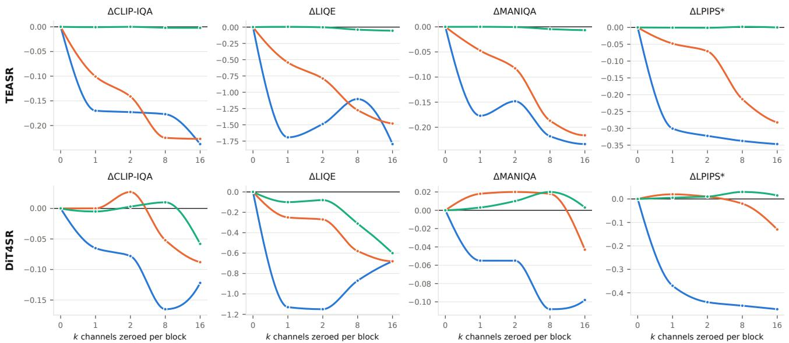

Figure 6. Effect of zero ablation on TEASR (top) and DiT4SR (bottom). Performance degradation is reported across all metrics when zeroing top-, random-, and bottom-ranked channels, highlighting the sensitivity of both models to their dominant activations. Curves repor the change with respect to the unmodified model, oriented so that negative values denote degradation; LPIPS is therefore sign-flipped.  
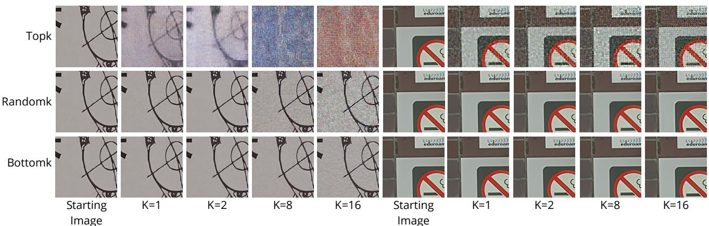  
Figure 7. Qualitative effect of zero ablation on DiT4SR (left) and TSD-SR (right). For increasing values of K, zeroing top-ranked channels progressively destroys fine detail and structure, while random and bottom-ranked largely unaffect the reconstruction.

## C.2. Standard Deviation vs. Mean Absolute Activation

In the main analysis (Sec. 3.2 of the main paper), we quantify channel importance using the mean absolute activation. While this choice captures the overall magnitude of activations, alternative statistics may provide different signals.

To this end, we consider a variant based on the standard deviation of activations across tokens. Specifically, for each channel c of stream s at block ℓ, we define

$$
\tilde { a } _ { i , s } ^ { ( \ell ) } ( c ) = \sqrt { \frac { 1 } { T _ { s } } \sum _ { t = 1 } ^ { T _ { s } } \left( A _ { i , s } ^ { ( \ell ) } ( t , c ) - \mu _ { i , s } ^ { ( \ell ) } ( c ) \right) ^ { 2 } } ,\tag{12}
$$

where $\begin{array} { r } { \mu _ { i , s } ^ { ( \ell ) } ( c ) = \frac { 1 } { T _ { e } } \sum _ { t = 1 } ^ { T _ { s } } A _ { i , s } ^ { ( \ell ) } ( t , c ) } \end{array}$ denotes the mean activation of channel c. We then rank channels according to $\tilde { a } _ { i , s } ^ { ( \ell ) } ( c )$ instead of $a _ { i , s } ^ { ( \ell ) } ( c )$ , while keeping every subsequent step unchanged: the same Phase 1 and Phase 2 pipeline is applied, and channel ablations follow the same protocol.

Table 6 reports the performance of the resulting trained models. Mean absolute activation yields slightly better overall performance than standard deviation, improving six of the seven metrics and trailing only on MANIQA, which supports its use as the channel-selection criterion.

Algorithm 1 Phase 1 – Online Channel Selection via EMA   
Require: Pretrained SR backbone F, optimization set D,   
EMA decay λ, window length W, number of window   
transitions $P ,$ stability threshold τ, budget K   
Ensure: Selected channel sets $\mathcal { S } = \{ ( \ell , s , \breve { \underline { { \tau } } } ^ { ( \ell , s ) } ) \}$   
1: Initialize $m _ { 0 } ^ { ( \ell , s ) } \gets \mathbf { 0 }$ for all blocks ℓ and streams s   
${ \tiny 2 } \colon { \mathit { t } } \gets 0 , \quad { \boldsymbol { w } } \gets 0$   
3: for each mini-batch $B \subset D$ do   
4: t ← t + 1   
5: Run a forward pass of F on B without gradients;   
collect $a _ { t } ^ { ( \ell , s ) } \left( \mathrm { E q . ~ } 1 \right)$ for all $( \ell , s )$   
6: $m _ { t } ^ { ( \ell , \bar { s } ) } \gets \lambda \bar { m } _ { t - 1 } ^ { ( \ell , s ) } + \left( 1 - \lambda \right) a _ { t } ^ { ( \ell , s ) }$ (Eq. 3)   
7: if t mod $W = 0$ then ▷ snapshot the ranking every   
W steps   
8: $w  w + 1$   
9: $\mathcal { T } _ { w } ^ { ( \ell , s ) } \gets \mathrm { t o p } { - } K$ indices of $m _ { t } ^ { ( \ell , s ) }$ for all $( \ell , s )$   
10: if w > P then   
11: J(ℓ,s) ← $\underline { { 1 } } \overset { P - 1 } { \longmapsto } \frac { | \mathcal { T } _ { w - p } ^ { ( \ell , s ) } \cap \mathcal { T } _ { w - p - 1 } ^ { ( \ell , s ) } | } { \underline { { \cdots } } \ " }$   
$\overline { { P } } \sum _ { p = 0 } \overline { { | \mathcal { T } _ { w - p } ^ { ( \ell , s ) } \cup \mathcal { T } _ { w - p - 1 } ^ { ( \ell , s ) } | } }$   
(Eq. 5)   
12: if $J ^ { ( \ell , s ) } \geq \tau$ for all (ℓ, s) then   
13: break ▷ ranking has converged   
14: end if   
15: end if   
16: end if   
17: end for   
18: $\mathcal { S }  \{ ( \ell , s , \mathcal { T } _ { w } ^ { ( \ell , s ) } ) \}$ for all (ℓ, s) (Eq. 6)   
19: return S

<table><tr><td></td><td colspan="2">Fidelity</td><td colspan="4">Perceptual Quality</td></tr><tr><td></td><td></td><td></td><td></td><td>SSIM ↑ LPIPS ↓ MANIQA ↑ MUSIQ ↑ CLIP-IQA ↑ TOPIQ ↑ LIQE ↑</td><td></td><td></td></tr><tr><td colspan="7">TSD-SR [11]</td></tr><tr><td>Baseline</td><td>71.68</td><td>31.11</td><td>58.12</td><td>66.01</td><td>73.63</td><td>62.49</td></tr><tr><td>Bottom</td><td>73.25</td><td>30.59</td><td>58.16</td><td>66.47</td><td>73.26</td><td>64.40 4.18</td></tr><tr><td>Random</td><td>73.37</td><td>30.35</td><td>58.84</td><td>66.77</td><td>73.78</td><td>63.34 4.21</td></tr><tr><td>Top (Ours)</td><td>73.94</td><td>31.07</td><td>60.13</td><td>68.16</td><td>76.32</td><td>67.39 4.47</td></tr><tr><td colspan="7">DiT4SR [13]</td></tr><tr><td>Baseline</td><td>61.02</td><td>43.72</td><td>60.88</td><td>65.20</td><td>69.36 58.50</td><td>4.08</td></tr><tr><td>Bottom</td><td>64.10</td><td>38.82</td><td>62.78</td><td>65.64</td><td>71.34</td><td>59.27 4.10</td></tr><tr><td>Random</td><td>62.60</td><td>39.58</td><td>61.65</td><td>65.03</td><td>71.21</td><td>58.97 4.01</td></tr><tr><td>Top (Ours)</td><td>66.26</td><td>37.18</td><td>62.99</td><td>66.06</td><td>71.38</td><td>58.67 4.20</td></tr><tr><td colspan="7">TEASR [18]</td></tr><tr><td>Baseline</td><td>73.07</td><td>30.97</td><td>56.17</td><td>63.10</td><td>56.90</td><td>57.42 3.09</td></tr><tr><td>Bottom</td><td>73.86</td><td>30.28</td><td>56.49</td><td>63.56</td><td>58.03</td><td>58.19 3.17</td></tr><tr><td>Random</td><td>73.86</td><td>30.27</td><td>57.50</td><td>64.10</td><td>59.54</td><td>58.84 3.30</td></tr><tr><td>Top (Ours)</td><td>75.71</td><td>30.84</td><td>61.42</td><td>67.73</td><td>65.39</td><td>65.14 4.10</td></tr></table>

Table 5. Effect of the channel selection strategy on DRealSR across different backbones. All variants modulate K = 8 channels per stream and block. Top-channel selection gives the best no-reference perceptual quality on every backbone, the only exception being TOPIQ on DiT4SR.

Algorithm 2 Phase 2 – Image-Conditioned Predictor Train  
ing   
Require: optimization pairs $\mathcal { D } _ { o p t } ,$ validation pairs $\mathcal { D } _ { v a l } .$   
selected channels S from Phase 1, frozen SR back  
bone, frozen VAE, modulation bounds [γmin, γmax] and   
$[ \beta _ { \mathrm { m i n } } , \beta _ { \mathrm { m a x } } ]$ , loss weights $\alpha _ { \mathrm { L I Q E } } , \alpha _ { \mathrm { T V } }$   
Ensure: trained predictor $f _ { \theta }$   
1: Prepare optimization and validation samples from $\mathcal { D } _ { o p t }$   
and $\mathcal { D } _ { v a l }$   
2: Encode one LR sample with the frozen VAE and com  
pute pooled latent feature dimension $d _ { z }$   
3: Build the transformation layout from S by assigning an   
affine pair $( \gamma , \beta )$ to each selected channel, block, and   
stream, giving dim $\begin{array} { r } { \mathsf { 1 } _ { \mathrm { o u t } } = 2 \sum _ { \ell , s } | \mathcal { T } ^ { ( \ell , s ) } | } \end{array}$ (Eq. 9)   
4: Initialize predictor $f _ { \theta } : \mathbb { R } ^ { d _ { z } }  \mathbb { R } ^ { \mathrm { d i m _ { o u t } } }$ and optimizer   
5: best ← ∞   
6: for t = 1 to T do   
7: Sample a mini-batch $( x , y )$ from $\mathcal { D } _ { o p t }$   
8: $z \gets \mathrm { V A E } ( x )$   
9: $u \gets \mathrm { A v g P o o l } ( z )$   
10: $( { \bar { \gamma } } , { \bar { \beta } } ) \gets \operatorname { D e c o d e } ( f _ { \theta } ( u ) , { \mathcal { S } } ) \quad ( \operatorname { E q . } 8 )$   
11: $\gamma  \gamma _ { \mathrm { m i n } } + ( \gamma _ { \mathrm { m a x } } - \gamma _ { \mathrm { m i n } } ) \sigma ( \bar { \gamma } ) ; \beta  \beta _ { \mathrm { m i n } } +$   
$( \beta _ { \mathrm { m a x } } - \beta _ { \mathrm { m i n } } ) \sigma ( \bar { \beta } ) \quad ( \mathrm { E q . ~ } 1 0 )$   
12: yˆ ← SR-Model(x; γ, β) ▷ backbone frozen,   
gradients flow to $f _ { \theta }$   
13: Convert yˆ to image space in [0, 1]   
14: $\mathcal { L } \gets \mathcal { L } _ { \mathrm { L P I P S } } ( \hat { y } , y ) - \alpha _ { \mathrm { L I Q E } } \mathrm { L I Q E } ( \hat { y } ) + \alpha _ { \mathrm { T V } } \mathcal { L } _ { \mathrm { T V } } ( \hat { y } )$   
(Eq. 11)   
15: Update θ by backpropagating L   
16: if validation is performed then   
17: $\mathcal { L } _ { v a l } $ validation loss on $\mathcal { D } _ { v a l }$   
18: if $\mathcal { L } _ { v a l } <$ best then   
19: best $ \mathcal { L } _ { v a l } ;$ save checkpoint   
20: end if   
21: end if   
22: end for   
23: return best predictor checkpoint

<table><tr><td></td><td colspan="2">Fidelity</td><td colspan="5">Perceptual Quality</td></tr><tr><td></td><td></td><td>SSIM ↑ LPIPS ↓ MANIQA ↑ MUSIQ ↑ CLIP-IQA ↑ TOPIQ ↑ LIQE ↑</td><td></td><td></td><td></td><td></td><td></td></tr><tr><td>Standard deviation</td><td>73.54</td><td>31.33</td><td>60.48</td><td>68.02</td><td>76.31</td><td>66.69</td><td>4.44</td></tr><tr><td>Mean absolute activation (Ours)</td><td>73.94</td><td>31.07</td><td>60.13</td><td>68.16</td><td>76.32</td><td>67.39</td><td>4.47</td></tr></table>

Table 6. Comparison between mean absolute activation and standard deviation as channel-selection criteria. All other components of the pipeline, including Phase 1 and Phase 2, are kept identical. For each criterion, we select the optimal K and report the performance of the resulting trained model on DRealSR.

## C.3. Effect of Modulation Parameterization

Table 7 compares different parameterizations of the modulation function. Scale-only modulation already improves most metrics, whereas shift-only modulation provides substantially smaller gains. Combining scale and shift yields the most consistent overall performance, achieving the best result on MANIQA, MUSIQ, LIQE and CLIP-IQA, matching the scale-only variant on LPIPS and trailing it by only 0.02 SSIM [46]. Removing the output constraints instead leads to an uneven behavior: although TOPIQ increases, SSIM drops substantially and several other metrics deteriorate. A visual inspection makes the failure mode explicit, as the unconstrained variant covers the whole image with a hallucinated high-frequency weave-like texture that erases the actual content, which no-reference metrics reward while every reference-based metric collapses. This indicates that unconstrained affine parameters produce overly aggressive interventions, and that bounding both scale and shift improves optimization stability and provides a more reliable cross-metric performance profile.

<table><tr><td rowspan="2"></td><td colspan="2">Fidelity</td><td colspan="4">Perceptual Quality</td></tr><tr><td>SSIM ↑ LPIPS ↓ MANIQA ↑ MUSIQ ↑ CLIP-IQA ↑ TOPIQ ↑ LIQE ↑</td><td></td><td></td><td></td><td></td><td></td></tr><tr><td>TSD-SR [11]</td><td>71.68</td><td>31.11</td><td>58.12</td><td>66.01</td><td>73.63</td><td>62.49 4.05</td></tr><tr><td>no constraint</td><td>38.33</td><td>60.54</td><td>54.22</td><td>62.10 72.68</td><td>70.24</td><td>4.28</td></tr><tr><td>+ scale</td><td>73.96</td><td>31.07</td><td>60.04</td><td>68.09 75.98</td><td>67.14</td><td>4.44</td></tr><tr><td>+ shift</td><td>72.05</td><td>30.93</td><td>58.35</td><td>66.15 73.77</td><td>62.72</td><td>4.09</td></tr><tr><td>Scale&amp;Shift (Ours) 73.94</td><td></td><td>31.07</td><td>60.13</td><td>68.16</td><td>76.32</td><td>67.39 4.47</td></tr></table>

Table 7. Ablation on the modulation parameterization on DRealSR. Bold marks the best and underline the second-best result per metric. The bounded affine transformation used by SPARK gives the best fidelity/perception balance, being best or second best on every metric.

## C.4. How Far Does the Effect Extend? A Sliding Window over Channel Ranks

Comparing top-K and bottom-K selection characterizes the two ends of the importance ranking, while random selection provides an unstructured control. To examine the transition between these regimes, we slide a window of fixed width K = 8 over the Phase-1 ranking. For a starting rank s, we modulate the channels ranked in [s, s + 7] and retrain the predictor from scratch using the same architecture, objective, optimization schedule, and trainable parameter count, so that the runs differ only in the identity of the eight selected channels. The window s = 1 corresponds to our main configuration.

Table 8 reveals a gradual but metric-dependent transition across the importance ranking, rather than a strictly monotonic decay. As the window approaches the upper tail, MUSIQ, LIQE, CLIP-IQA, and TOPIQ generally increase, reaching their highest values for ranks 1-8. MANIQA follows a similar overall trend but peaks slightly earlier, at ranks 9-16. Thus, the top-ranked window provides the strongest aggregate no-reference perceptual performance, although it is not optimal for every individual metric.

At the other end of the sweep, ranks 33-40 still contain channels whose activation magnitude is 2.3× the per-block average. Their perceptual gains are broadly comparable to those of random selection: relative to the unmodulated baseline, they improve MUSIQ by +0.84 versus +0.76 for Random-8, and TOPIQ by +0.80 versus +0.85. On CLIP-IQA, however, they slightly degrade the baseline (−0.16) where Random-8 marginally improves it (+0.15). At the same time, ranks 33-40 achieve the best SSIM and LPIPS in the entire sweep. These results show that lower-ranked channels remain useful intervention points, but that they favor a different performance profile. The extreme upper tail is therefore not the only effective region; rather, it provides the greatest leverage for jointly improving a broad set of noreference perceptual-quality metrics, whereas lower-ranked windows tend to favor fidelity-oriented metrics.

<table><tr><td></td><td></td><td colspan="2">Fidelity</td><td colspan="5">Perceptual Quality</td></tr><tr><td>Channel ranks</td><td>mag</td><td></td><td></td><td></td><td></td><td></td><td>SSIM ↑ LPIPS ↓ MANIQA ↑ MUSIQ ↑ CLIP-IQA ↑ TOPIQ ↑ LIQE ↑</td><td></td></tr><tr><td>Baseline (no mod.)</td><td>1.0×</td><td>71.68</td><td>31.11</td><td>58.12</td><td>66.01</td><td>73.63</td><td>62.49</td><td>4.05</td></tr><tr><td>Random-8</td><td>=</td><td>73.37</td><td>30.35</td><td>58.84</td><td>66.77</td><td>73.78</td><td>63.34</td><td>4.21</td></tr><tr><td>Bottom-8</td><td></td><td>73.25</td><td>30.59</td><td>58.16</td><td>66.47</td><td></td><td>73.26 64.40</td><td>4.18</td></tr><tr><td>33-40</td><td>2.3×</td><td>74.83</td><td>29.80</td><td>58.81</td><td>66.85</td><td>73.47</td><td>63.29</td><td>4.28</td></tr><tr><td>17-24</td><td>3.4×</td><td>73.98</td><td>30.55</td><td>59.90</td><td>67.60</td><td>74.57</td><td>65.31</td><td>4.38</td></tr><tr><td>9-16</td><td>4.8×</td><td>73.95</td><td>30.66</td><td>60.36</td><td>67.81</td><td>75.08</td><td>65.20</td><td>4.41</td></tr><tr><td>3-10</td><td>9.6×</td><td>73.81</td><td>31.24</td><td>59.74</td><td>67.92</td><td>75.40</td><td>66.56</td><td>4.42</td></tr><tr><td>2-9</td><td></td><td>13.8× 73.99</td><td>30.99</td><td>59.63</td><td>67.84</td><td>74.96</td><td>66.40</td><td>4.38</td></tr><tr><td>SPARK (1-8)</td><td></td><td>23.0× 73.94</td><td>31.07</td><td>60.13</td><td>68.16</td><td>76.32</td><td>67.39</td><td>4.47</td></tr></table>

Table 8. A sliding window over channel ranks. Each row modulates the eight channels at the specified positions in the Phase-1 importance ranking, while keeping the predictor architecture, objective, optimization schedule, and parameter budget fixed. mag denotes the mean activation magnitude of the selected channels relative to the per-block channel mean.

## D. Detailed Comparison with Existing Methods

Positioning. We compare our approach against recent stateof-the-art super-resolution models to contextualize the absolute performance level of our adapted backbones. Importantly, the methods considered here (SinSR [45], OSEDiff [48], PiSA-SR [37], and Gram-SR [12]) do not exhibit massive activations in their architectures, and therefore cannot directly benefit from our modulation strategy. This comparison is thus intended to position our adapted models within the broader SR landscape, rather than to claim direct superiority of the modulation mechanism itself.

Results. Results are reported in Table 9, in which each frozen backbone is paired with its SPARK-adapted counterpart and reported alongside the four external competitors. As it can be observed, our best-performing adapted model (TSD-SR + SPARK) achieves competitive or superior perceptual scores on both datasets, reaching 75.35 CLIP-IQA and 4.69 LIQE on RealSR and 76.32 CLIP-IQA and 4.47 LIQE on DRealSR, surpassing every compared method on these two reference-free metrics. Some competitors remain stronger elsewhere: Gram-SR [12] achieves the best distortion-oriented scores on both datasets, and PiSA-SR [37] the best MANIQA on RealSR. Gram-SR sits at the opposite end of the perception-distortion spectrum, pairing the best SSIM and LPIPS with the lowest LIQE overall and the lowest CLIP-IQA among the external competitors. The gains are also unevenly distributed across our backbones: TEASR starts from the lowest CLIP-IQA and LIQE on both datasets and is the one that improves the most on them (+8.49 and +1.01 on DRealSR, +7.44 and +0.89 on RealSR), suggesting that the largest headroom lies where the frozen prior is perceptually weakest. Overall, our approach provides a better balance between perceptual quality and fidelity, in line with the perception-distortion trade-off [4], confirming that selectively modulating dominant channels in DiT-based backbones is an effective strategy to reach competitive perceptual quality within the broader SR landscape.

<table><tr><td colspan="2"></td><td colspan="2">Fidelity</td><td colspan="5">Perceptual Quality</td></tr><tr><td colspan="2"></td><td>SSIM ↑</td><td>LPIPS ↓</td><td>MANIQA↑</td><td>MUSIQ↑</td><td>CLIP-IQA ↑</td><td>TOPIQ ↑</td><td>LIQE↑</td></tr><tr><td rowspan="10">ReaSR</td><td>TSD-SR [11]</td><td>68.84</td><td>27.96</td><td>63.03</td><td>70.72</td><td>72.55</td><td>66.40</td><td>4.19</td></tr><tr><td>+ SPARK (Ours)</td><td>70.43 ∆+1.59</td><td>28.44 ∆-0.48</td><td>64.64 Δ+1.61</td><td>72.14 Δ+1.42</td><td>75.35 ∆+2.80</td><td>69.83 Δ+3.43</td><td>4.69 ∆+0.50</td></tr><tr><td>DiT4SR [13]</td><td>66.05</td><td>33.35</td><td>59.56</td><td>63.63</td><td>62.24</td><td>54.81</td><td>3.63</td></tr><tr><td>+ SPARK (Ours)</td><td>69.27 ∆+3.22</td><td>28.51 △+4.84</td><td>61.70 △+2.14</td><td>64.78 △+1.15</td><td>64.66 ∆+2.42</td><td>55.19 Δ+0.38</td><td>3.74 ∆+0.11</td></tr><tr><td>TEASR [18]</td><td>69.62</td><td>27.28</td><td>58.98</td><td>67.31</td><td>54.83</td><td>60.29</td><td>3.28</td></tr><tr><td>+ SPARK (Ours)</td><td>71.59 ∆+1.97</td><td>28.61 Δ-1.33</td><td>64.68 ∆+5.70</td><td>71.05 ∆+3.74</td><td>62.27 ∆+7.44</td><td>68.08 ∆+7.79</td><td>4.17 ∆+0.89</td></tr><tr><td>SinSR [45]</td><td>73.85</td><td>30.50</td><td>54.34</td><td>61.46</td><td>62.86</td><td>53.52</td><td>3.22</td></tr><tr><td>OSEDiff [48]</td><td>73.41</td><td>29.20</td><td>63.35</td><td>69.09</td><td>66.87</td><td>62.48</td><td>4.07</td></tr><tr><td>PiSA-SR [37]</td><td>74.14</td><td>26.72</td><td>65.54</td><td>70.16</td><td>67.14</td><td>63.75</td><td>4.11</td></tr><tr><td>Gram-SR [12]</td><td>76.68</td><td>23.05</td><td>58.93</td><td>62.47</td><td>54.48</td><td>52.48</td><td>3.12</td></tr><tr><td rowspan="10">DRSR</td><td>TSD-SR [11]</td><td>71.68</td><td>31.11</td><td>58.12</td><td>66.01</td><td>73.63</td><td>62.49</td><td>4.05</td></tr><tr><td>+ SPARK (Ours)</td><td>73.94 ∆+2.26</td><td>31.07 ∆+0.04</td><td>60.13 Δ+2.01</td><td>68.16 Δ+2.15</td><td>76.32 ∆+2.69</td><td>67.39 Δ+4.90</td><td>4.47∆+0.42</td></tr><tr><td>DiT4SR [13]</td><td>61.02</td><td>43.72</td><td>60.88</td><td>65.20</td><td>69.36</td><td>58.50</td><td>4.08</td></tr><tr><td>+ SPARK (Ours)</td><td>66.26 ∆+5.24</td><td>37.18 Δ+6.54</td><td>62.99 Δ+2.11</td><td>66.06 ∆+0.86</td><td>71.38 ∆+2.02</td><td>58.67 Δ+0.17</td><td>4.20 ∆+0.12</td></tr><tr><td>TEASR [18]</td><td>73.07</td><td>30.97</td><td>56.17</td><td>63.10</td><td>56.90</td><td>57.42</td><td>3.09</td></tr><tr><td>+ SPARK (Ours)</td><td>75.71 ∆+2.64</td><td>30.84 ∆+0.13</td><td>61.42 Δ+5.25</td><td>67.73 ∆+4.63</td><td>65.39 ∆+8.49</td><td>65.14 Δ+7.72</td><td>4.10 △+1.01</td></tr><tr><td>SinSR [45]</td><td>75.53</td><td>35.02</td><td>50.32</td><td>57.16</td><td>65.62</td><td>52.99</td><td>3.22</td></tr><tr><td>OSEDiff [48]</td><td>78.35</td><td>29.67</td><td>58.97</td><td>64.69</td><td>69.60</td><td>59.98</td><td>3.94</td></tr><tr><td>PiSA-SR [37]</td><td>77.97</td><td>29.63</td><td>61.64</td><td>66.12</td><td>69.84</td><td>63.33</td><td>4.06</td></tr><tr><td>Gram-SR [12]</td><td>81.21</td><td>26.03</td><td>53.80</td><td>56.66</td><td>58.11</td><td>50.83</td><td>2.88</td></tr></table>

Table 9. Comparison with existing diffusion-based SR methods on RealSR and DRealSR. Each frozen DiT-based backbone is reported together with its SPARK-adapted counterpart, followed by four external competitors. For each metric, the score of an adapted backbone is followed by its direction-normalized change with respect to the corresponding frozen backbone (∆+: improvement; ∆−: degradation). Bold indicates an improvement over the corresponding backbone rather than the best result in the column. LIQE is shaded in gray because it is explicitly included in the training objective of SPARK.

## E. Additional Qualitative Results

We provide additional qualitative comparisons in Fig. 8 to further illustrate the effect of the proposed modulation. Across different backbones and input images, SPARK consistently produces sharper details and more perceptually plausible textures than the corresponding frozen baselines. Improvements are particularly visible in high-frequency regions, where the modulation enhances fine structures without introducing noticeable artifacts. At the same time, the global structure of the scene is preserved, indicating that the intervention remains localized and does not disrupt overall image consistency.

## F. Limitations

Applicability of the selection procedure. SPARK relies on the presence of a sparse set of magnitude-dominant activation channels. Although this property is consistently observed across the three DiT-based SR backbones considered in our experiments, its strength may vary across architectures, and the proposed selection procedure may therefore be less effective when activation magnitude is distributed more uniformly across channels. Moreover, channel selection is backbone-specific, and Phase 1 must be repeated when changing the architecture or the checkpoint.

Scope and computational cost. Our experiments focus on DiT-based super-resolution models and three evaluation datasets. Extending the approach to convolutional or U-Net-based backbones, to other restoration tasks, and to a broader range of real-world degradations remains an open direction. Finally, SPARK reduces adaptation cost but does not accelerate the sampling procedure of the frozen backbone; consequently, inference remains dominated by the underlying SR model, especially for multi-step architectures such as DiT4SR [13].

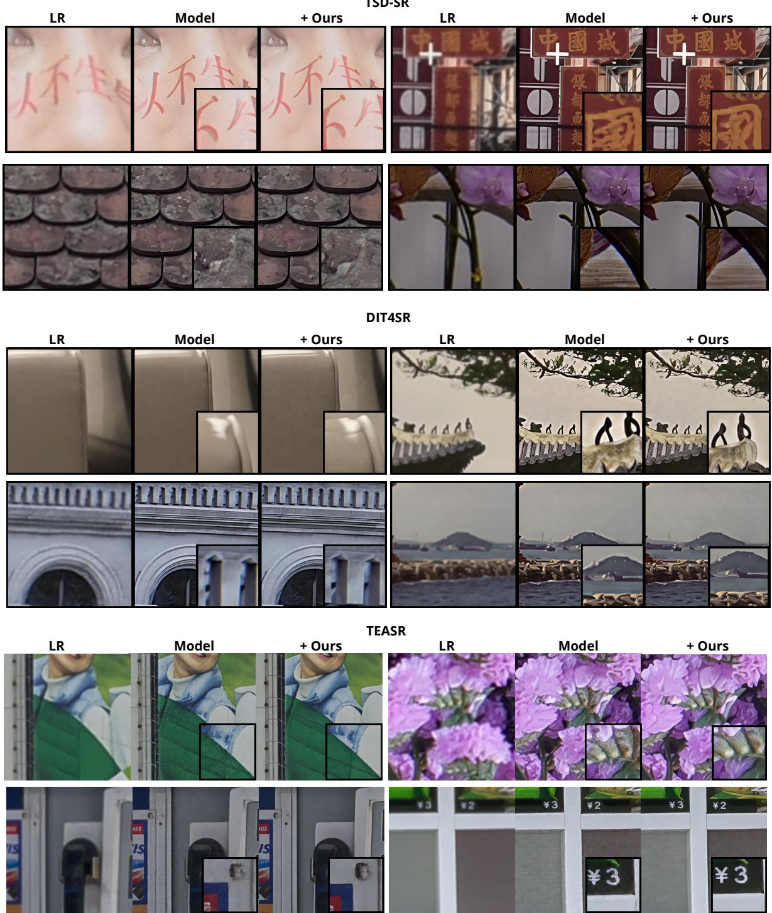  
Figure 8. Qualitative comparison across DiT-based SR backbones. From left to right: low-resolution input, frozen baseline, and SPARK. Results are shown for TSD-SR [11], DiT4SR [13], and TEASR [18] from top to bottom.