# STARS-GS: Structure-Aware Regularized Gaussian Splatting for Large-Scale Aerial Surface Reconstruction

Bocheng Li b,c, Wenjuan Zhang a,∗, Jie Pan a, Dongxu Han b, Xuesong Ma b,c, Yiling Yao b,c, Yaning Wang b,c

aState Key Laboratory of Remote Sensing and Digital Earth, Aerospace Information Research Institute, Chinese Academy of Sciences, , Beijing, 100101, , China bAerospace Information Research Institute, Chinese Academy ofSciences, , Beijing, 100094, , China cUniversity ofChinese Academy ofSciences, , Beijing, 100049, , China

## Abstract

Large-scale 3D surface reconstruction from aerial imagery is fundamental to geospatial mapping and urban modeling. Recent ad-6 vances in 3D Gaussian Splatting (3DGS) have demonstrated considerable potential for this task. However, existing methods still face three major challenges in large and complex scenes: scene partitioning may split continuous scene elements across independently optimized sub-regions; geometric constraints mainly focus on the attributes of individual Gaussians while overlooking their local organization; and uniform regularization struggles to accommodate heterogeneous geometric structures. To address these issues, we propose STARS-GS, a structure-aware 3DGS framework for large-scale surface reconstruction. First, we introduce aS structure-aware scene partitioning strategy that better preserves continuous scene structures during partitioning and reduces cross region geometric inconsistencies and stitching artifacts through boundary refinement. Second, we develop neighborhood-aware Gaussian organization that extends geometric constraints from individual primitives to their neighborhood organization, encouraging Gaussians to better conform to local surface geometry. Third, we introduce adaptive surface regularization that adjusts theV regularization strength according to local geometric characteristics, promoting geometric consistency in structured regions while preserving plausible variations in unstructured regions. Extensive experiments on large-scale aerial photogrammetry benchmarks. demonstrate that STARS-GS consistently outperforms the evaluated Gaussian-based methods in surface reconstruction. It increasesc the average F1-score from 0.640 for the second-best method to 0.698, corresponding to a relative improvement of approximately[ 9.1%, demonstrating efective improvements in geometric accuracy and surface completeness.

Keywords:

3D Gaussian Splatting, 3D Computer graphics, Surface reconstruction, Large-scale scene, Aerial photogrammetry

## 1. Introduction

Large-scale surface reconstruction is a fundamental and challenging task in photogrammetry and Earth observation. It6 aims to recover geometrically accurate and structurally continuous 3D representations of terrain and above-ground objectsv from multi-view aerial images (Christodoulides et al., 2025; Wu et al., 2024; Huang et al., 2024b), with critical applications in digital twins, urban planning, terrain analysis and othera geospatial applications (Biljecki et al., 2015; Pan et al., 2024). Building upon the camera poses and sparse point clouds generated through Structure-from-Motion (SfM) (Schönberger and Frahm, 2016), traditional pipelines based primarily on Multi-View Stereo (MVS) (Schönberger et al., 2016) further derive dense point clouds through correspondence matching and subsequently extract surface meshes using dedicated surface reconstruction algorithms (Kazhdan et al., 2006; Kazhdan and Hoppe, 2013). Despite their proven efectiveness, traditional pipelines may still sufer from incomplete geometry and local structural distortions due to unreliable correspondences (Zhu et al., 2015; Liao et al., 2024). Moreover, dense matching over large collections of high-resolution images incurs substantial computational overhead, limiting overall eficiency and scalability (Furukawa et al., 2010).

As an emerging approach to 3D reconstruction, 3D Gaussian Splatting (3DGS) explicitly represents scenes using learnable Gaussian primitives and employs an eficient diferentiable rasterization pipeline, thereby enabling photorealistic rendering in real time (Kerbl et al., 2023). Recent studies have further extended 3DGS to large-scale scenes through partitioned and parallel training strategies (Lin et al., 2024; Wu et al., 2025b; Liu et al., 2024). In parallel, surface-oriented variants have demonstrated the capability of extracting surface meshes from Gaussian representations (Guédon and Lepetit, 2024; Huang et al., 2024a; Chen et al., 2025). These developments indicate the potential of 3DGS for large-scale 3D surface reconstruction (Liu et al., 2025b; Li et al., 2025; Xiang et al., 2026).

However, existing GS-based methods still face several challenges when applied to complex, large-scale surface reconstruction (Chen and Wang, 2026). (1) As scene scale increases, maintaining reconstruction quality generally requires more Gaussian primitives, leading to increased computational and GPU memory demands (Christodoulides et al., 2025; Bao et al., 2025). Large-scale GS methods therefore commonly partition the scene into independently optimized sub-regions based on camera visibility or point-cloud density (Lin et al., 2024; Liu et al., 2024; Wu et al., 2025b). However, these strategies are primarily designed to control the amount of data pro cessed during optimization, without adequately accounting for the structural integrity of scene elements (Wang et al., 2025; Han et al., 2026). Consequently, continuous structures may be divided across sub-regions with diferent observations and op timized independently without unified cross-region geometric constraints, leading to structural distortions and stitching arti facts near partition boundaries (Zhu et al., 2026; Wang et al. 2026). (2) Vanilla 3DGS primarily optimizes Gaussian prim itives using rendering losses and lacks suficient explicit geometric constraints, making it dificult to ensure the geometric fidelity of reconstructed surfaces (Turkulainen et al., 2025; Gao et al., 2025). To alleviate this limitation, existing methods incorporate depth and normal constraints, however, these con straints primarily focus on the attributes of individual primitives (Huang et al., 2024a; Dai et al., 2024; Chen et al., 2025). A continuous surface, however, is determined collectively by multiple neighboring Gaussian primitives, and its geometry depends not only on individual primitive attributes but also on their relative spatial arrangement (Huang et al., 2024b; Li et al., 2024; Shen et al., 2025; Pan et al., 2026). In large-scale scenes, complex spatial layouts make such relationships more dificult to cap ture (Xiang et al., 2026; Li et al., 2025). Therefore, optimizing individual primitive attributes is insuficient to recover local surface structures consistent with the actual geometry (Pan et al., 2026; Jiang et al., 2026). (3) Large-scale scenes contain heterogeneous scene elements, including buildings, roads, vegetation, and bare ground, which difer substantially in geometric and structural complexity (Liu et al., 2025b; Yao et al., 2026). However, most existing 3DGS methods apply a uniform surface regularization strategy across the entire scene (Huang et al., 2024a; Chen et al., 2025) and therefore struggle to simultaneously recover accurate surfaces in structured regions while preserving plausible local geometric variations in unstructured regions(Xiong et al., 2026; Lian et al., 2026; Ververas et al., 2024),often causing structural distortions or boundary expansion in structured regions and oversmoothing in unstructured regions.

To address these challenges, we propose STARS-GS, a structure-aware 3DGS framework for large-scale surface reconstruction that improves geometric consistency across scene, neighborhood, and local-region scales. First, structure-aware scene partitioning uses spatial proximity and surface-normal similarity, supplemented by color, to group spatially connected and structurally similar areas within the same subregion while aligning partition boundaries with scene-element boundaries, augmenting the partitioning objective to jointly control training scale and preserve scene-element integrity. Boundary refinement then aligns the geometry and appearance of adjacent sub-regions, reducing geometric misalignment and stitching artifacts caused by independent sub-region optimization and subsequent merging. Second, within each subregion, neighborhood-aware Gaussian organization constructs a geometry-aware neighborhood graph based on spatial proximity and geometric similarity and dynamically updates the graph during 3DGS densification. Based on this graph, normalconsistency and tangential-distribution constraints jointly regulate the relative organization of neighboring primitives by promoting coherent normal orientations, guiding Gaussian centers toward local surface tangent planes and suppressing normaldirection stacking, respectively. Finally, adaptive surface regularization adjust the strengths of surface regularization according to local planarity, promoting geometric consistency in structured regions while preserving plausible geometric variations in unstructured regions.

By improving the geometric accuracy, structural continuity, and scalability of aerial surface reconstruction, STARS-GS aims to provide a more reliable 3D scene representation for large-scale geospatial mapping. Our contributions are summarized as follows:

1. We propose a structure-aware scene partitioning strategy that better preserves the structural integrity of scene elements across sub-regions and maintains cross-region surface continuity.

2. We propose a neighborhood-aware Gaussian organization method that complements conventional primitive constraints with neighborhood spatial constraints, improving the geometric fidelity of reconstructed surfaces.

3. We propose an adaptive surface regularization term that adjusts constraint strength according to local geometric characteristics, balancing geometric consistency and local variation across heterogeneous regions.

## 2. Related Work

## 2.1. Large-Scale 3D Reconstruction

Large-scale 3D reconstruction involves extensive spatial coverage and large numbers of multi-view images, making GPU memory and computation major challenges (Christodoulides et al., 2025; Tancik et al., 2022; Turki et al., 2022). Early studies mainly focused on scaling Neural Radiance Fields (NeRF) (Mildenhall et al., 2020) to large-scale scenes. Block-NeRF (Tancik et al., 2022) and Mega-NeRF (Turki et al., 2022) partition large-scale scenes into sub-regions and train separate models. BungeeNeRF (Xiangli et al., 2022) adopts a progressive representation for multi-scale observations; Switch-NeRF (Mi and Xu, 2023) employs a mixture-of-experts framework for scene decomposition; and Grid-NeRF (Xu et al., 2023) combines NeRF with multi-resolution feature grids. Despite improved scalability, their implicit representations and volumetric rendering pipelines still incur substantial training and inference costs, limiting eficient large-scale reconstruction and real-time rendering (Kerbl et al., 2023).

Benefiting from its diferentiable rasterization pipeline, 3DGS (Kerbl et al., 2023) provides a more eficient alternative for large-scale reconstruction. Existing large-scale 3DGS methods typically partition the scene into sub-regions, assign corresponding training views, and optimize each sub-region independently, thereby reducing GPU memory and computation per sub-region(Chen and Wang, 2026; Lin et al., 2024; Wu et al., 2025b).

VastGaussian (Lin et al., 2024) introduces a progressive partitioning strategy that distributes training cameras and point clouds across sub-regions according to an airspace-aware visibility criterion. BlockGaussian (Wu et al., 2025b) adaptively determines block extents according to regional complexity and introduces auxiliary points to alleviate supervision mismatch during independent block training. CityGaussian (Liu et al., 2024) uses a global scene prior and adaptive training data selection to support eficient block-wise training and fusion. These methods primarily control sub-region scale and computational load, making large-scale 3DGS training tractable (Chen and Wang, 2026; Bao et al., 2025).

Recent studies have increasingly focused on improving the geometric quality of large-scale surface reconstruction.. City-GaussianV2 (Liu et al., 2025b) extends CityGaussian with geometry-oriented 2D Gaussian modeling and optimization. ULSR-GS (Li et al., 2025) combines point-to-photo partitioning with multi-view-guided densification and cross-view geometric consistency constraints. GaussianCraft (Xiang et al., 2026) integrates visibility-in-block selection with fine-grained geometric refinement.

However, even in recent geometry-oriented methods, geometric refinement is mainly performed within the resulting subregions, while scene partitioning is still primarily designed for computational eficiency and scalability, with limited consideration of how partition boundaries afect reconstruction geometry. Consequently, partition boundaries may cut through geometrically continuous structures, causing diferent parts of the same surface to be optimized separately, resulting in crossregion geometric inconsistencies and stitching artifacts (Liu et al., 2025a; Fan et al., 2025; Zhu et al., 2026; Wang et al., 2026).

## 2.2. Multi-View Surface Reconstruction

Conventional SfM-MVS reconstruction pipelines (Schönberger and Frahm, 2016; Schönberger et al., 2016) remain sensitive to unreliable correspondence matching, which can cause incomplete geometry and structural distortions in weakly textured regions, non-Lambertian surfaces, and severe occlusions (Aanæs et al., 2016; Yamashita et al., 2023; Zhu et al., 2015). Neural implicit methods, including NeuS (Wang et al., 2021) and Neuralangelo (Li et al., 2023), improve the surface representation using signed distance fields (SDFs) or multiresolution hash (Yariv et al., 2021; Müller et al., 2022). However, their volumetric rendering pipelines incur substantial computational overhead (Xie et al., 2022).

3DGS combines high-fidelity appearance reconstruction with eficient rendering through explicit Gaussian primitives and diferentiable rasterization (Kerbl et al., 2023). However, its discrete and unstructured primitives do not inherently conform to continuous physical surfaces (Huang et al., 2024a; Dai et al., 2024). Consequently, subsequent studies have explored two main directions: indirect improvement through appearance modeling and direct geometric constraints.

Appearance-based methods reduce appearance-geometry ambiguities by better modeling view-dependent efects. Ref-GS (Zhang et al., 2025), Reflections Unlock (Ref-Unlock) (Song et al., 2025), and RTR-GS (Zhou et al., 2025) employ directional light factorization, reflection disentanglement, and BRDF-lighting decomposition, respectively. However, their primary focus on appearance provides only indirect improvements to surface geometry (Ge et al., 2026; Li et al., 2026).

By contrast, direct geometric enhancement methods introduce explicit geometric priors or constraints. GS2Mesh (Wolf et al., 2024) uses a pretrained stereo-matching network after 3DGS optimization to recover surface geometry. TrimGS (Fan et al., 2024) removes geometrically unreliable primitives according to their image contributions and employs scale-driven densification to control Gaussian size. SuGaR (Guédon and Lepetit, 2024) introduces surface-alignment regularization to align Gaussians with the local scene surface. GSDF (Yu et al., 2024) introduces an SDF branch to regulate Gaussian density using SDF predictions and jointly optimizes the 3DGS and SDF branches through mutual guidance. 2DGS (Huang et al., 2024a) replaces volumetric 3D Gaussians with oriented 2D Gaussian disks for surface-aligned representation. PGSR (Chen et al., 2025) derives unbiased depth from Gaussian-plane distance and normal maps to improve multi-view depth and normal consistency.

However, external networks and additional geometric constraints may introduce generalization or scalability concerns (Wolf et al., 2024; Zhang et al., 2022; Jiang et al., 2026). Moreover, most existing constraints focus on the attributes of individual Gaussian primitives(Bao et al., 2025), whereas the spatial organization among neighboring primitives remains insuficiently constrained. In addition, existing methods commonly apply uniform surface regularization, without accounting for the diferent surface characteristics of structured and unstructured regions (Guédon and Lepetit, 2024; Huang et al., 2024a; Chen et al., 2025), a limitation that becomes more pronounced in large-scale scenes containing heterogeneous surface structures(Yao et al., 2026).

## 3. Method

As illustrated in Fig. 1, given multi-view images and a sparse SfM point cloud, STARS-GS first divides the scene into structurally coherent sub-regions through structure-aware partitioning (Section 3.2). Each sub-region is then optimized using neighborhood-aware Gaussian organization (Section 3.3) and adaptive surface regularization (Section 3.4) to improve local Gaussian organization and surface geometry. After independent optimization, shared boundary regions are refined to improve cross-region consistency before sub-region merging and surface extraction.

## 3.1. Preliminaries

3DGS represents a scene using learnable 3D Gaussian primitives (Kerbl et al., 2023). Each primitive is parameterized as $\mathcal { G } _ { i } ~ = ~ ( \mu _ { i } , \Sigma _ { i } , \mathbf { c } _ { i } , \alpha _ { i } )$ , where $\pmb { \mu } _ { i } ~ \in ~ \mathbb { R } ^ { 3 }$ denotes its position,

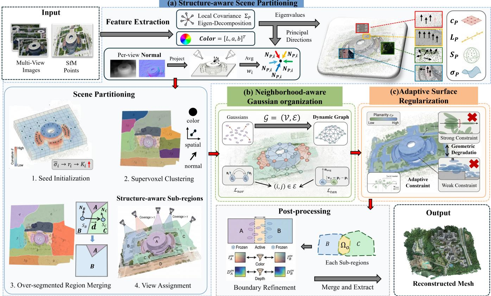  
Figure 1: Overall workflow of STARS-GS. Given multi-view aerial images and SfM point cloud, the pipeline first constructs local geometric features, robust normals, and color information for (a) structure-aware scene partitioning, including curvature-guided seed initialization, supervoxel clustering, RAG-based region merging, and view assignment. Each sub-region is then optimized with (b) neighborhood-aware Gaussian organization and (c) adaptive surface regularization, which respectively maintain local Gaussian organization and adjust surface regularization according to local planarity. After independent sub-region optimization, boundary refinement is performed within overlap bands before sub-region merging and surface mesh extraction.

$\pmb { \Sigma } _ { i } \in \mathbb { R } ^ { 3 \times 3 }$ encodes its spatial extent and orientation, $\mathbf { c } _ { i }$ its color attributes, and $\alpha _ { i }$ its opacity.

After projecting and depth-sorting the Gaussians (Zwicker et al., 2001), the color at pixel x is rendered by diferentiable α-compositing:

$$
\begin{array} { l } { { \displaystyle a _ { i } ( { \bf x } ) = \alpha _ { i } G _ { i } ( { \bf x } ) } , \ ~ } \\ { { \displaystyle T _ { i } ( { \bf x } ) = \prod _ { j = 1 } ^ { i - 1 } \left( 1 - a _ { j } ( { \bf x } ) \right) } , \ ~ } \\ { { \displaystyle { \bf C } ( { \bf x } ) = \sum _ { i = 1 } ^ { N } T _ { i } ( { \bf x } ) a _ { i } ( { \bf x } ) \mathbf { c } _ { i } } . } \end{array}\tag{1}
$$

where $G _ { i } ( \mathbf { x } )$ denotes the projected 2D Gaussian response at pixel x, while $a _ { i } ( \mathbf { x } )$ and $T _ { i } ( \mathbf { x } )$ denote the efective opacity and accumulated transmittance, respectively. For convenience, we denote the α-compositing contribution of Gaussian i to pixel x as $\omega _ { i } ( { \bf x } ) = T _ { i } ( { \bf x } ) a _ { i } ( { \bf x } )$

Optimization minimizes the rendering loss between the rendered image ˆI and ground truth I (Kerbl et al., 2023; Wang et al., 2004):

$$
\mathcal { L } _ { \mathrm { r e n d e r } } = \left( 1 - \lambda _ { \mathrm { s s i m } } \right) \left. \hat { I } - I \right. _ { 1 } + \lambda _ { \mathrm { s s i m } } \left[ 1 - \mathrm { S S I M } \left( \hat { I } , I \right) \right] .\tag{2}
$$

However, rendering loss alone does not adequately constrain surface geometry and may therefore yield geometrically inconsistent surfaces (Huang et al., 2024a; Chen et al., 2025; Jiang et al., 2026).

## 3.2. Structure-Aware Scene Partitioning

Conventional spatial partitioning may split continuous scene elements across sub-regions, causing diferent parts of them to be optimized independently and leading to introducing geometric inconsistencies and stitching artifacts. To address this issue, we propose a structure-aware scene partitioning method. Specifically, each valid SfM point is characterized by local geometric features, a robust normal, and color features. Based on this representation, structure-aware supervoxel clustering is then performed (Papon et al., 2013), encouraging spatially connected points with similar structural characteristics to be grouped into locally coherent regions. Structurally similar adjacent regions are further merged using a RAG to reduce residual over-segmentation, followed by training-view assignment for independent sub-region optimization. After all sub-regions have been optimized independently, boundary consistency refinement is performed over the overlapping areas between adjacent sub-regions.

Sparse SfM points often contain unreliable points caused by correspondence mismatches and occlusions. Directly including these points in local feature computation may lead to unreliable results. Before feature construction, we retain only points satisfying $\eta _ { P } \geq \tau _ { \mathrm { t r a c k } }$ , where $\eta _ { P }$ is the number of valid views in the SfM track, yielding $\mathcal { P } \mathrm { v a l i d } = P \in \mathcal { P } \mathrm { r a w } \mid \eta _ { P } \geq \tau _ { \mathrm { t r a c k } }$

## 3.2.1. Joint Feature Construction

As illustrated in Fig. 1(a), for each valid SfM point $P \in \mathcal { P } _ { \mathrm { v a l i d } } .$ we construct a joint feature comprising local geometric features, robust normal, and color.

Local geometric feature construction. We first query each valid point spatial k-nearest-neighbor set $N _ { k } ( P )$ within a maximum search radius and compute the local covariance matrix (Hackel et al., 2016). Eigenvalue decomposition yields $\lambda _ { 1 } \geq \lambda _ { 2 } \geq \lambda _ { 3 }$ , and the eigenvector $\mathbf { e } _ { 3 }$ of the smallest eigenvalue is used as the initial normal (Hoppe et al., 1992). Based on them, we derive planarity $^ { c _ { P } , }$ curvature $\sigma _ { P } ,$ linearity $\ell _ { P } ,$ and sphericity $S _ { P }$ (Weinmann et al., 2017; Pauly et al., 2003):

$$
\begin{array} { l l } { { c _ { P } = \displaystyle \frac { \lambda _ { 2 } - \lambda _ { 3 } } { \lambda _ { 1 } + \epsilon } , } } & { { \sigma _ { P } = \displaystyle \frac { \lambda _ { 3 } } { \lambda _ { 1 } + \lambda _ { 2 } + \lambda _ { 3 } } , } } \\ { { \ell _ { P } = \displaystyle \frac { \lambda _ { 1 } - \lambda _ { 2 } } { \lambda _ { 1 } } , } } & { { S _ { P } = \displaystyle \frac { \lambda _ { 3 } } { \lambda _ { 1 } } . } } \end{array}\tag{3}
$$

$c _ { P } , \sigma _ { P } , \ell _ { P } ,$ , and $S _ { P }$ characterize local planarity, surface variation, linearity, and isotropy, respectively.

Robust normal estimation. High planarity indicates that the neighboring points are well approximated by a plane, making $\mathbf { e } _ { 3 }$ a relatively reliable estimate of the surface normal, whereas lower planarity makes the local geometric normal less reliable. Multi-view normal estimates provide complementary surfaceorientation cues, but their reliability varies across views. We therefore combine the two sources according to local planarity $c _ { P }$ to obtain a more robust normal.

For each observing view $i \in \mathcal { V } _ { P } .$ , we estimate depth using Depth Anything V2 (Yang et al., 2024) and derive the corresponding normal map. The normal at the projection $\mathbf { p } _ { i }$ of $P$ is transformed to world coordinates as $\mathbf { N } _ { P , i }$ . Because boundary projections are less reliable (Bae and Davison, 2024), each view is weighted by the distance between $\mathbf { p } _ { i }$ and the principal point ${ \bf q } _ { i }$ , then we normalize the weights over all views observing point $P \colon$

$$
\begin{array} { r l } & { w _ { i } ^ { \mathrm { p r o j } } = \frac { 1 } { \lVert \mathbf { p } _ { i } - \mathbf { q } _ { i } \rVert _ { 2 } + \delta } , } \\ & { \widetilde { w } _ { i } ^ { \mathrm { p r o j } } = \frac { w _ { i } ^ { \mathrm { p r o j } } } { \sum _ { j \in \mathcal { N } _ { P } } w _ { j } ^ { \mathrm { p r o j } } } . } \end{array}\tag{4}
$$

where δ prevents division by zero. Given the varying reliability across views, the normals $\mathbf { N } _ { P , i }$ are fused using the normalized projection weights to obtain the multi-view normal:

$$
\overline { { \mathbf { N } } } _ { \mathrm { v i e w } } = \frac { \sum _ { i \in \mathcal { V } _ { P } } \widetilde { w } _ { i } ^ { \mathrm { p r o j } } \mathbf { N } _ { P , i } } { \left\| \sum _ { i \in \mathcal { V } _ { P } } \widetilde { w } _ { i } ^ { \mathrm { p r o j } } \mathbf { N } _ { P , i } \right\| _ { 2 } } .\tag{5}
$$

The fused multi-view normal $\overline { { \mathbf { N } } } _ { \mathrm { v i e w } }$ is used to resolve the orientation ambiguity of $\mathbf { e } _ { 3 } .$ , after which both are fused according to local planarity $c _ { P }$ to obtain the final robust normal $\mathbf { N } _ { P } \mathbf { : }$

$$
\begin{array} { r l } & { \mathbf { N } _ { P } ^ { \mathrm { s t r } } = \mathrm { s i g n } \left( \overline { { \mathbf { N } } } _ { \mathrm { v i e w } } \cdot \mathbf { e } _ { 3 } \right) \mathbf { e } _ { 3 } , } \\ & { \mathbf { N } _ { P } = \frac { ( 1 - c _ { P } ) \overline { { \mathbf { N } } } _ { \mathrm { v i e w } } + c _ { P } \mathbf { N } _ { P } ^ { \mathrm { s t r } } } { \left\| ( 1 - c _ { P } ) \overline { { \mathbf { N } } } _ { \mathrm { v i e w } } + c _ { P } \mathbf { N } _ { P } ^ { \mathrm { s t r } } \right\| _ { 2 } } . } \end{array}\tag{6}
$$

Color feature construction. To reduce exposure variations along long flight strips (Pastucha et al., 2022), RGB colors are converted to CIELab (CIE, 2019), yielding $\mathbf { C } _ { P } = [ L , a , b ] ^ { \intercal }$

## 3.2.2. Supervoxel Clustering

Based on the joint features described above, we perform structure-aware supervoxel clustering with curvature-guided seed initialization and a geometry-aware clustering distance.

Curvature-guided seed initialization. Since high-curvature regions typically contain edges or complex geometry, we allocate them denser seeds to better preserve geometric details.

As shown in Fig. 1(a), the scene is voxelized, and the mean curvature $\overline { { \sigma } } _ { i }$ is computed for each nonempty voxel $V _ { i \cdot }$ Given $K _ { \mathrm { t o t a l } }$ target seeds, let $r _ { i } \in [ 0 , 1 ]$ denote the percentile rank of $\overline { { \sigma } } _ { i }$ . The number of seeds assigned to $V _ { i }$ is:

$$
K _ { i } = K _ { \mathrm { t o t a l } } \frac { 1 + r _ { i } } { \sum _ { j } ( 1 + r _ { j } ) } .\tag{7}
$$

In implementation, the fractional allocations are converted to integer seed counts with residual adjustment to ensure $\textstyle \sum _ { i } K _ { i } =$ $K _ { \mathrm { t o t a l } }$

Seeds located in regions with abrupt geometric or color variations may adversely afect subsequent clustering. Each initial seed $S _ { \mathrm { i n i t } }$ is therefore moved to the point with the minimum combined normal and color gradient within its local candidate neighborhood, yielding the final clustering seed $S _ { k }$ . The combined gradient $G ( P )$ is defined as:

$$
G ( P ) = \| \nabla { \bf N } _ { P } \| _ { 2 } ^ { 2 } + \| \nabla { \bf C } _ { P } \| _ { 2 } ^ { 2 } .\tag{8}
$$

Structure-aware clustering distance. For each seed $S _ { k } ,$ candidate points are restricted to a search radius of $2 R _ { \mathrm { g r i d } }$ , where $R _ { \mathrm { g r i d } } ~ { \approx } ~ \sqrt [ 3 ] { V / K _ { \mathrm { t o t a l } } }$ and V denotes the volume of the voxelized scene. Each candidate point $P$ is assigned to the seed minimizing $D ( P , S _ { k } )$ , which combines spatial proximity, normal consistency, and color similarity. Spatial proximity promotes local connectivity, while normal and color diferences distinguish nearby surfaces with diferent orientations or appearances:

$$
\begin{array} { r l } & { D ( P , S _ { k } ) = \sqrt { d _ { z } ( P , S _ { k } ) ^ { 2 } + d _ { n } ( P , S _ { k } ) ^ { 2 } + d _ { c } ( P , S _ { k } ) ^ { 2 } } , } \\ & { d _ { z } ( P , S _ { k } ) = \sqrt { \left\| P _ { x y } - S _ { k , x y } \right\| _ { 2 } ^ { 2 } + \beta _ { z } \left\| P _ { z } - S _ { k , z } \right\| _ { 2 } ^ { 2 } } , } \\ & { d _ { n } ( P , S _ { k } ) = 1 - \left| \mathbf { N } _ { P } \cdot \mathbf { N } _ { S _ { k } } \right| , } \\ & { d _ { c } ( P , S _ { k } ) = \left\| \mathbf { C } _ { P } - \mathbf { C } _ { S _ { k } } \right\| _ { \mathrm { L a b } } . } \end{array}\tag{9}
$$

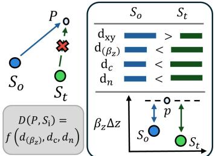  
Figure 2: Anisotropic spatial distance with vertical penalty βz for distinguishing adjacent surfaces at diferent elevations.

where $d _ { z } , d _ { n } .$ , and $d _ { c }$ denote the spatial, normal, and color terms, respectively. Each is normalized before aggregation to balance scale diferences.

As illustrated in Fig. 2, the vertical penalty $\beta _ { z }$ makes clustering more sensitive to elevation variations. This is particularly useful for near-nadir aerial imagery because surfaces at diferent elevations, such as roofs and ground, tree canopies, or overpasses, may overlap in horizontal projection.

## 3.2.3. Sub-region Organization and Boundary Optimization

Following supervoxel clustering, RAG-based region merging and training-view assignment prepare the sub-regions for independent optimization. After all sub-regions have been independently optimized, boundary refinement is performed as the final optimization stage to improve consistency across adjacent subregions.

RAG-based region merging. Although supervoxel clustering preserves local structure, continuous elements may still be split into adjacent clustered regions by local geometric variations. To reduce this over-segmentation, we construct a region adjacency graph (RAG), where each region is a node and edges connect only spatially adjacent regions, avoiding exhaustive pairwise comparisons.

For each adjacent region pair $( A , B )$ connected by an edge in the RAG, let $\pmb { \mu } _ { A }$ and $\pmb { \mu } _ { B }$ and $\mathbf { N } _ { A } , \mathbf { N } _ { B }$ denote their centroids and average normals, respectively, with d ${ \bf \Pi } = \pmb { \mu } _ { A } - \pmb { \mu } _ { B }$ . They are merged when

$$
( \mathbf { N } _ { A } \times \mathbf { d } ) \cdot ( \mathbf { N } _ { B } \times \mathbf { d } ) > 0\tag{10}
$$

and the angle between $\mathbf { N } _ { A }$ and $\mathbf { N } _ { B }$ is below $1 0 ^ { \circ }$ , indicating that the regions likely belong to the same local structure (Rabbani et al., 2006; Maalek et al., 2018).

Training-view assignment. Each sub-region is optimized using only the views that provide suficient coverage. For a subregion A, its SfM points are projected into each candidate view and views satisfying the visibility threshold are assigned to A. The convex hull of the projected points defines a binary mask M, within which the rendering loss is evaluated, limiting updates across diferent partitions.

Boundary-consistency constraints. Independently optimized sub-regions may be inconsistent along shared boundaries. Each boundary is therefore expanded by 20%, and the intersection between adjacent expanded regions defines the overlap band $\Omega _ { \mathrm { o v } }$ . Commonly visible views are selected using the SfM covisibility relationships within this band. After independent optimization, Gaussians outside $\Omega _ { \mathrm { o v } }$ are fixed, and only those inside are refined using color and depth consistency:

$$
\mathcal { L } _ { \mathrm { o v } } = \left| | I _ { A } ( \Omega _ { \mathrm { o v } } ) - I _ { B } ( \Omega _ { \mathrm { o v } } ) | \right| _ { 1 } + \left| | D _ { A } ( \Omega _ { \mathrm { o v } } ) - D _ { B } ( \Omega _ { \mathrm { o v } } ) | \right| _ { 1 } .\tag{11}
$$

Meanwhile, because adjacent sub-regions may introduce redundant Gaussians in the overlap band, we apply opacity sparsity regularization:

$$
\mathcal { L } _ { \mathrm { s p a r s e } } ^ { A , B } = \frac { 1 } { 2 } \left( \frac { 1 } { \left| \mathcal { G } _ { A } ^ { \mathrm { o v } } \right| } \sum _ { g \in \mathcal { G } _ { A } ^ { \mathrm { o v } } } \alpha _ { g } + \frac { 1 } { \left| \mathcal { G } _ { B } ^ { \mathrm { o v } } \right| } \sum _ { g \in \mathcal { G } _ { B } ^ { \mathrm { o v } } } \alpha _ { g } \right) .\tag{12}
$$

The final boundary-consistency loss combines color and depth consistency with opacity sparsity regularization:

$$
\mathcal { L } _ { \mathrm { b o u n d a r y } } = \mathcal { L } _ { \mathrm { o v } } + \lambda _ { \mathrm { s p } } \mathcal { L } _ { \mathrm { s p a r s e } } ^ { A , B } .\tag{13}
$$

The $\lambda _ { \mathrm { s p } }$ controls the weight of the opacity sparsity regularization.

## 3.3. Neighborhood-Aware Gaussian Organization

Independent optimization of Gaussian primitives lacks explicit constraints on their neighborhood-level geometric organization, causing the local arrangement of neighboring Gaussians to become increasingly unstable during training. As shown in Fig. 1(b), we therefore introduce neighborhood-aware Gaussian organization, which maintains a geometry-aware graph to encode local geometric relationships and impose normalconsistency and tangential-distribution constraints over graph neighborhoods to improve local consistency. During Gaussian densification, the graph is updated accordingly to remain aligned with the evolving primitive distribution.

## 3.3.1. Geometry-Aware Neighborhood Graph Initialization

We model Gaussian adjacency as an undirected neighborhood graph $G = ( \mathcal { V } , \mathcal { E } )$ , where each vertex represents a 3D Gaussian primitive. Candidate edges are first restricted by spatial proximity and then pruned by geometric consistency. Each Gaussian initialized from SfM point inherits the corresponding geometric attributes, including curvature and planarity. Its orientation is initialized by aligning the shortest principal axis of $\Sigma _ { i }$ with the robust normal estimated in Section 3.2.1, while the Gaussian normal ni is diferentiably derived from this axis throughout training.

For each primitive i, its K nearest Gaussians within radius $r _ { \mathrm { m a x } }$ form the candidate neighborhood:

$$
N _ { i } = \left\{ j \in \mathrm { K N N } _ { K } ( i ) \left| \left\| \pmb { \mu } _ { i } - \pmb { \mu } _ { j } \right\| _ { 2 } \leq r _ { \operatorname* { m a x } } \right\} . \right.\tag{14}
$$

Candidate neighbors are further evaluated by a geometric consistency score $s _ { i j }$ combining normal and curvature similarity:

$$
s _ { i j } = \frac { 1 } { 2 } \left[ \left| \mathbf { n } _ { i } ^ { \top } \mathbf { n } _ { j } \right| + 1 - 3 \left| \sigma _ { i } - \sigma _ { j } \right| \right] .\tag{15}
$$

The top 50% of candidates ranked by $s _ { i j }$ are retained as ${ \widetilde { N } } _ { i } ,$ and the initial edge set is defined as

$$
\mathcal { E } ^ { ( 0 ) } = \left\{ ( i , j ) \Big | j \in \widetilde { N } _ { i } \mathrm { o r } i \in \widetilde { N } _ { j } \right\} .\tag{16}
$$

The resulting graph organizes spatially close and geometrically consistent Gaussians into local neighborhoods for subsequent geometric optimization. Since robust normals and curvature are precomputed during scene partitioning, graph initial ization introduces no additional feature-extraction cost.

## 3.3.2. Neighborhood Geometric Constraints

Within each graph neighborhood, we jointly constrain surface orientation and primitive distribution: normal consistency preserves local orientation continuity, while tangential consistency suppresses redundant stacking along the surface normal.

Neighborhood normal-consistency constraint. Neighboring Gaussians on the local surface and connected in the graph should have similar orientations. The normal-consistency loss is defined as

$$
\mathcal { L } _ { \mathrm { n o r } } = \sum _ { i \in \mathcal { V } } \sum _ { j \in N ( i ) } \left( 1 - \left| \mathbf { n } _ { i } \cdot \mathbf { n } _ { j } \right| \right) .\tag{17}
$$

Neighborhood tangential-distribution constraint. For neighboring Gaussians on the same local surface, the center displacement should lie primarily in the tangent plane. We therefore penalize the Gaussian along the normal direction $\mathbf { n } _ { \mathrm { a v g } } =$ $( \mathbf { n } _ { i } + \mathbf { n } _ { j } ) / 2$ , suppressing redundant stacking, with $\begin{array} { r } { \mathbf { v } _ { i j } = \pmb { \mu } _ { j } - \pmb { \mu } _ { i } \mathrm { ; } } \end{array}$

$$
\mathcal { L } _ { \mathrm { t a n } } = \sum _ { i \in \mathcal { V } } \sum _ { j \in N ( i ) } \left( \mathbf { v } _ { i j } \cdot \mathbf { n } _ { \mathrm { a v g } } \right) ^ { 2 } .\tag{18}
$$

## 3.3.3. Gradient Modulation and Dynamic Graph Update

To maintain neighborhood organization during optimization, neighborhood-average normals are used to suppress geometryinconsistent gradient updates, while the graph is synchronized with the evolving Gaussian distribution by updating the structural attributes and neighborhood connections of newly split or cloned primitives.

Gradient modulation. For primitive i, nˆ i is the normal predicted from a provisional parameter update, and $\bar { \mathbf { n } } _ { N _ { ( i ) } }$ is the neighborhood-average normal. Their deviation defines the modulation weight:

$$
w _ { i } ^ { n } = \exp \left( - \left\| \hat { \mathbf { n } } _ { i } - \bar { \mathbf { n } } _ { N ( i ) } \right\| \right) .\tag{19}
$$

The provisional update is used only to estimate nˆ and is not committed; the resulting $\boldsymbol { w } _ { i } ^ { n }$ is then used to modulate the gradient in the actual parameter update. Thus, neighborhoodconsistent updates retain larger weights, whereas inconsistent updates are suppressed, reducing updates that are inconsistent with the neighborhood geometry and maintaining local geometric consistency during optimization.

Dynamic graph update. When a primitive $G _ { i }$ is split or cloned, the new primitives initially inherit the parent’s normal, curvature, and planarity, while the parent’s neighbors are used as candidate neighbors for the new primitives. The candidate connections are then re-evaluated using the same spatial and geometric criteria as in Section 3.3.1, with the top 50% retained.

Their inherited structural attributes are then refined by neighborhood-based interpolation to match the updated local geometry.

## 3.4. Adaptive Surface Regularization

Large-scale aerial scenes typically contain diverse scene elements with substantially diferent geometric and structural complexity. Structured regions, such as building roofs and roads, are generally well approximated by local planes and thus exhibit higher local planarity, whereas unstructured regions, such as vegetation and gravel surfaces, contain more pronounced local geometric variations and exhibit lower local planarity. A uniform surface regularization strength cannot simultaneously provide suficient geometric constraints in structured regions and preserve plausible local variations in unstructured regions. To address this issue, we adapt surface regularization strength based on local planarity without requiring explicit semantic labels, as shown in Fig. 1(c).

## 3.4.1. Opacity-Binarization Regularization

Opacity-binarization regularization encourages Gaussian opacities toward 0 or 1, thereby penalizing redundant accumulation of Gaussians with intermediate opacity values $( \alpha \approx 0 . 5 )$ . Together with the neighborhood tangential distribution constraint, it reduces blurring at surface boundaries. However, applying a uniform binarization constraint across the scene may over-constrain valid geometric variations in unstructured regions. This limitation calls for region-adaptive weighting of the opacity-binarization constraint. Specifically, the opacitybinarization loss is defined as

$$
\mathcal { L } _ { \mathrm { b i n } } = \frac { 1 } { | S | } \sum _ { g \in S } \mathbb { M } _ { \mathrm { a d a p t } } ( g ) \Phi ( \alpha _ { g } ) ,\tag{20}
$$

$$
\Phi ( \alpha ) = - \left[ \alpha \log ( \alpha + \epsilon ) + ( 1 - \alpha ) \log ( 1 - \alpha + \epsilon ) \right] .\tag{21}
$$

The set S contains the Gaussians contributing to surface rendering in the current view, and $\alpha _ { g }$ is the opacity of Gaussian g. The adaptive weight $\mathbb { M } _ { \mathrm { a d a p t } } ( g )$ is determined by the local planarity $c _ { p } ( g )$ and is defined as:

$$
\mathbb { M } _ { \mathrm { a d a p t } } ( g ) = \frac { 1 + c _ { p } ( g ) } { \frac { 1 } { | S | } \sum _ { g \in S } \left( 1 + c _ { p } ( g ) \right) } .\tag{22}
$$

Higher-planarity structured regions are assigned larger weights, whereas lower-planarity unstructured regions receive smaller weights.

## 3.4.2. Depth-Variance Regularization

Depth-variance regularization constrains the depth distribution of Gaussians contributing to each pixel, encouraging their depths to concentrate around a consistent value. This reduces ambiguity in surface depth estimation and alleviates surface blurring and boundary expansion. However, a uniform depth-variance constraint cannot simultaneously concentrate the depth distribution in structured regions and preserve plausible depth variations in unstructured regions. This limitation requires the regularization strength to be adapted across regions. Specifically, the depth-variance loss is defined as

$$
\mathcal { L } _ { \mathrm { v a r } } = \frac { 1 } { | \mathcal { U } | } \sum _ { u \in \mathcal { U } } \mathbf { W } _ { \mathrm { a d a p t } } ( u ) \ \mathrm { V a r } ( d ) _ { u } .\tag{23}
$$

The adaptive weight $\mathbf { W } _ { \mathrm { a d a p t } } ( u )$ is computed from the planarity response $R _ { u }$ at pixel u and is defined as:

$$
\mathbf { W } _ { \mathrm { a d a p t } } ( u ) = \frac { 1 + R _ { u } } { \frac { 1 } { | \mathcal { U } | } \sum _ { u \in \mathcal { U } } ( 1 + R _ { u } ) } ,\tag{24}
$$

$$
R _ { u } = \frac { \sum _ { g \in \mathcal { G } ( u ) } \omega _ { g } ( u ) c _ { p } ( g ) } { \sum _ { g \in \mathcal { G } ( u ) } \omega _ { g } ( u ) + \epsilon } .\tag{25}
$$

In these equations, U denotes the set of surface pixels in the current view, and ${ \mathrm { V a r } } ( d ) _ { u }$ is the variance of the depth distribution at pixel u. The set $\mathcal { G } ( u )$ contains the Gaussians that contribute to pixel u, while $\omega _ { g } ( u )$ denotes its α-compositing contribution as defined in Section 3.1.

Pixels with larger planarity responses, typically corresponding to structured regions, receive larger weights, whereas pixels with smaller responses, typically associated with unstructured regions, receive smaller weights to avoid suppressing plausible depth variations.

## 3.5. Overall Optimization Objective

The loss terms are activated progressively to avoid imposing geometric regularization before the primitives establish a reasonable initial spatial distribution. Training starts with the rendering loss, the neighborhood geometric constraints are then activated to maintain local geometric organization during subsequent optimization, followed by adaptive surface regularization. During post-optimization boundary refinement, the boundary-consistency loss is activated only within overlapping areas of adjacent sub-regions. The overall objective is

$$
\begin{array} { r l } & { \mathcal { L } = \mathcal { L } _ { \mathrm { r e n d e r } } + \lambda _ { \mathrm { n b r } } \left( \mathcal { L } _ { \mathrm { n o r } } + \mathcal { L } _ { \mathrm { t a n } } \right) } \\ & { ~ + \lambda _ { \mathrm { s u r f } } \left( \mathcal { L } _ { \mathrm { b i n } } + \mathcal { L } _ { \mathrm { v a r } } \right) + \lambda _ { \mathrm { b d } } \mathcal { L } _ { \mathrm { b o u n d a r y } } . } \end{array}\tag{26}
$$

where $\lambda _ { \mathrm { n b r } } , \lambda _ { \mathrm { s u r f } }$ , and $\lambda _ { \mathrm { b d } }$ weight the neighborhood constraints, adaptive surface regularization, and boundary refinement, respectively. Lrender and Lboundary are defined in Eqs. 2 and 13, respectively. Specific activation timings and weight schedules are provided in the implementation details in Section 4.1.

Table 1: Statistics of the datasets and selected scenes.
<table><tr><td>Dataset</td><td>Scene</td><td>Images</td><td>Resolution</td><td>Area (km²)</td></tr><tr><td rowspan="4">GauU-Scene</td><td>Lower Campus</td><td>670</td><td> $5 4 7 4 \times 3 6 4 3$ </td><td>1.14</td></tr><tr><td>Upper Campus</td><td>713</td><td> $5 4 6 9 \times 3 6 3 8$ </td><td>1.01</td></tr><tr><td>LFLS</td><td>1077</td><td> $5 4 6 8 \times 3 6 3 8$ </td><td>1.86</td></tr><tr><td>SZIIT</td><td>1215</td><td>5466× 3634</td><td>1.85</td></tr><tr><td>AIRLY</td><td>AIRLY</td><td>602</td><td>6000 × 3999</td><td>0.325</td></tr><tr><td rowspan="2">UrbanScene3D</td><td>Residence</td><td>2582</td><td>5472× 3648</td><td></td></tr><tr><td>Sci-Art</td><td>3019</td><td>4864× 3648</td><td></td></tr><tr><td rowspan="2">Mill19</td><td>Building</td><td>1940</td><td>4608× 3456</td><td>0.125</td></tr><tr><td>Rubble</td><td>1678</td><td>4608× 3456</td><td></td></tr></table>

## 4. Experiments

## 4.1. Experimental Setup

Dataset Preparation. We evaluate STARS-GS on four largescale reconstruction datasets with complementary scene characteristics and evaluation purposes: GauU-Scene (Xiong et al., 2024) and AIR-LONGYAN (AIRLY) (Yao et al., 2026) are used for the primary quantitative and qualitative evaluation, while UrbanScene3D (Lin et al., 2022) and Mill19 (Turki et al., 2022) are used for supplementary qualitative comparisons.

GauU-Scene and AIRLY are selected as the primary quantitative evaluation datasets because they both contain highresolution multi-view aerial images together with reference Li-DAR point clouds, as well as diverse scene elements, including buildings, roads, and vegetation, enabling quantitative geometric evaluation under large-scale conditions. In addition, AIRLY contains multiple types of scene elements that are more concentrated in the central part of the scene and closely adjacent in space, resulting in more pronounced local variations in geometric morphology and structural complexity. This characteristic makes AIRLY particularly suitable for detailed ablation visualization and region-wise analysis.

Although UrbanScene3D and Mill19 do not provide reference point clouds for quantitative geometric evaluation thus cannot support the primary quantitative evaluation in this study, both are widely used public datasets in large-scale reconstruction studies, better facilitating comparison with existing largescale surface reconstruction methods. In addition, the selected UrbanScene3D scenes are dominated by densely distributed buildings, with relatively continuous surfaces and well-defined geometric boundaries. By contrast, the selected Mill19 scenes mainly contain bare ground and vegetation, where local surface variations are more pronounced, image textures are weaker, and geometric structures and boundaries are more irregular. These diferent scene characteristics further extend the diversity of the evaluation settings. Therefore, UrbanScene3D and Mill19 are included for supplementary qualitative evaluation to examine the robustness and consistency of STARS-GS across additional datasets with diferent scene characteristics.

Detailed statistics of all datasets and selected scenes, including the number of images, image resolution, and scene area, are summarized in Table 1. Following prior work, all input images are downsampled by a factor of four before training (Turki et al., 2022; Lin et al., 2024).

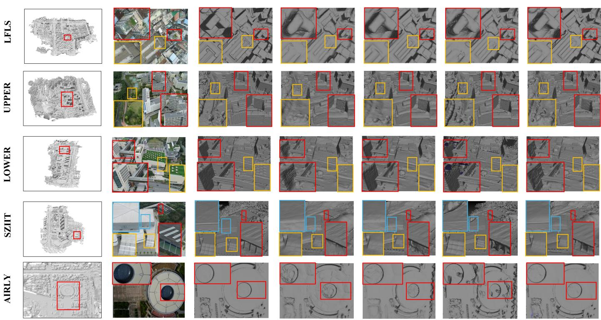  
Figure 3: Local surface reconstruction details of diferent methods on GauU-Scene (Xiong et al., 2024) and AIRLY (Yao et al., 2026). Representative regions are shown to compare building outlines, road boundaries, vegetation undulations, and local geometric completeness.

Comparison Methods. We compare STARS-GS with representative Gaussian-based surface reconstruction methods that provide publicly available implementations and can be reproduced under a unified experimental protocol, including SuGaR (Guédon and Lepetit, 2024), 2DGS (Huang et al., 2024a), PGSR (Chen et al., 2025), and CityGaussianV2 (Liu et al., 2025b). All methods are evaluated using their oficial implementations and recommended configurations without additional scene-specific tuning. To ensure consistent geometric evaluation, the reconstructed results of all methods are converted into meshes using the 2DGS mesh-extraction pipeline (Huang et al., 2024a). Median depth is used for TSDF integration, and identical mesh-extraction parameters are adopted for all methods within each scene.

However, not all relevant methods can be evaluated under a unified full-scene geometric protocol. Some Gaussian-based surface reconstruction methods are dificult to apply directly to the large scenes in our main evaluation, whereas several largescale 3DGS methods focus on rendering and lack an explicit surface-reconstruction pipeline. We therefore conduct taskspecific supplementary comparisons on AIRLY. STARS-GS is compared with GSDF (Yu et al., 2024), RaDe-GS (Zhang et al., 2026), and Trim2DGS (Fan et al., 2024) for surface reconstruction, and with BlockGaussian (Wu et al., 2025b) and VastGaussian (Lin et al., 2024) for novel view synthesis.

Implementation Details. All experiments are conducted on the same computing platform equipped with two NVIDIA RTX A6000 GPUs. For STARS-GS, the minimum observation threshold in sparse point-cloud preprocessing, $\tau _ { \mathrm { t r a c k } } ,$ is set to 5. Local geometric feature extraction and neighborhood graph construction both use $k = 2 0$ nearest-neighbor search with a maximum search radius of $r _ { \mathrm { m a x } } ~ = ~ 0 . 0 0 5 d _ { \mathrm { s c e n e } }$ , where $d _ { \mathrm { s c e n e } }$ denotes the diagonal length of the scene bounding box. In structure-aware scene partitioning, the global target number of seeds $K _ { \mathrm { t o t a l } }$ is set to 12, and the vertical penalty factor is set to $\beta _ { z } = 2 . 0$

Each sub-region is optimized for 30,000 iterations and Gaussian densification is performed every 250 iterations, after which the geometry-aware neighborhood graph is updated accordingly. The neighborhood geometric constraint ${ \mathcal { L } } _ { \mathrm { n b r } }$ is activated after 7000 iterations. Its weight $\lambda _ { \mathrm { n b r } }$ is then linearly increased from $0 . 5 \lambda _ { \mathrm { n b r } } ^ { \mathrm { m a x } }$ to $\lambda _ { \mathrm { n b r } } ^ { \mathrm { m a x } }$ over the next 15000 iterations to avoid imposing strong neighborhood constraints before the primitives establish a meaningful initial spatial distribution, with $\lambda _ { \mathrm { n b r } } ^ { \mathrm { m a x } } ~ = ~ 0 . 0 1$ in the default setting. The adaptive surface regularization term ${ \mathcal { L } } _ { \mathrm { s u r f } }$ is activated after 15000 iterations, and its weight $\lambda _ { \mathrm { s u r f } }$ is linearly increased from $0 . 5 \lambda _ { \mathrm { s u r f } } ^ { \mathrm { m a x } }$ to $\lambda _ { \mathrm { s u r f } } ^ { \mathrm { m a x } }$ over the next 7000 iterations, with default $\lambda _ { \mathrm { s u r f } } ^ { \mathrm { m a x } } = 0 . 0 1$

After training each sub-region, the overlapping areas between adjacent sub-regions are refined for an additional 3,000 iterations, while Gaussian parameters outside the overlapping areas are kept fixed. The boundary-consistency loss $\mathcal { L } _ { \mathrm { b o u n d a r y } }$ is activated only in this stage, with $\lambda _ { \mathrm { b d } } = 0 . 0 1$ . The weight of the opacity sparsity regularization term is set to $\lambda _ { \mathrm { s p } } = 0 . 0 1$ . Unless otherwise specified, the remaining parameters follow the default configuration of the vanilla 3DGS (Kerbl et al., 2023).

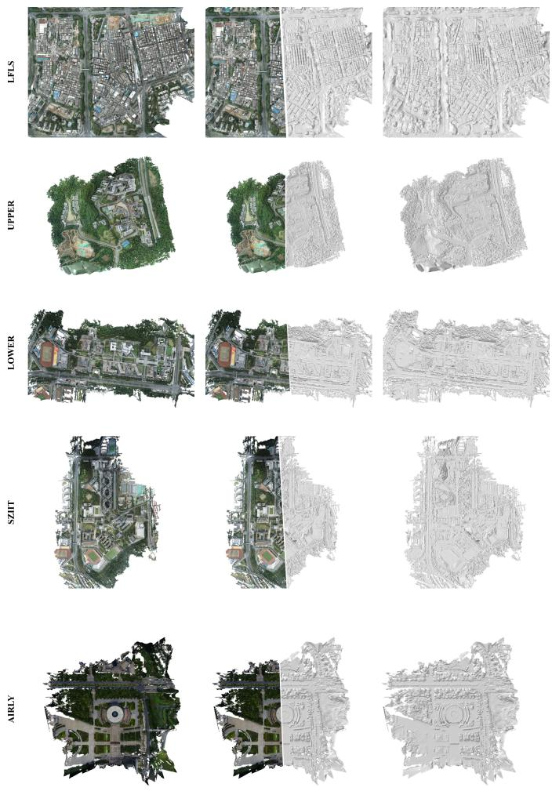  
Figure 4: Complete surface meshes reconstructed by STARS-GS on GauU-Scene (Xiong et al., 2024) and AIRLY (Yao et al., 2026). The overall textured meshes and representative local details illustrate surface completeness and structural continuity in large-scale scenes.

Evaluation Metrics. We evaluate all methods in terms of geometric reconstruction accuracy and novel view synthesis quality.

Geometric reconstruction accuracy is the primary criterion for large-scale surface reconstruction. Because diferent methods may produce diferent geometric representations, including explicit meshes, depth-derived point clouds, and Gaussian primitives, direct comparison of their raw outputs may compromise the fairness of the evaluation. We consequently follow the unified geometric evaluation protocol introduced in City-GaussianV2 (Liu et al., 2025b). Specifically, a surface mesh is first extracted from the result of each method using the 2DGS mesh-extraction procedure (Huang et al., 2024a), with a voxel size of 1 m and an SDF truncation distance of 4 m. The same mesh-extraction configuration is used for all compared methods within each scene. The same number of points is then uniformly sampled from each mesh surface, and both the sampled points and LiDAR ground-truth point cloud are cropped to the common valid evaluation region. Following CityGaussianV2, the distance threshold τ is determined from the nearest-neighbor distance statistics of the downsampled reference point cloud and falls within the range of 0.3-0.6 m. Based on the processed reconstruction and ground-truth point clouds, Precision, Recall, and F1-score are computed as the geometric evaluation metrics. Precision and Recall measure reconstruction accuracy and completeness, respectively, while F1-score provides their harmonic mean.

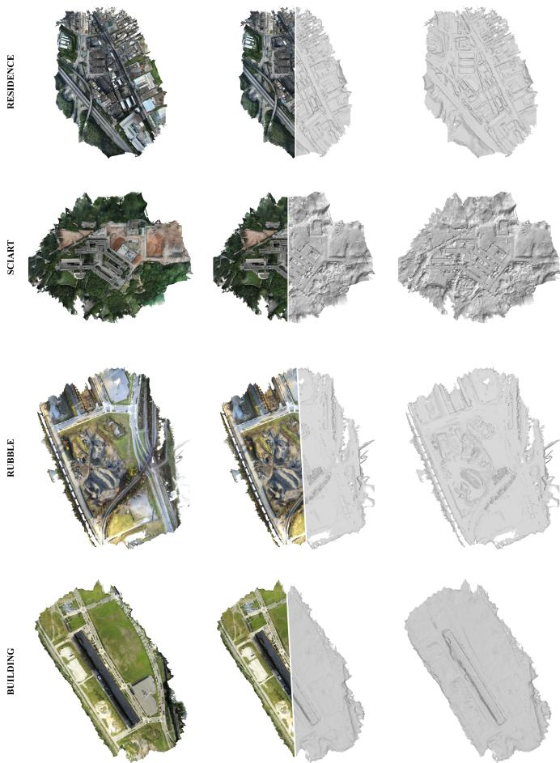  
Figure 5: Complete surface reconstruction results of STARS-GS on Urban-Scene3D (Lin et al., 2022) and Mill19 (Turki et al., 2022). The overall meshes and local details are shown for dense building scenes and irregular scenes.

Since geometry and appearance in 3DGS are represented by the same Gaussian primitives, geometric constraints may also afect rendering quality. We therefore additionally evaluate novel view synthesis using PSNR, SSIM (Wang et al., 2004), and LPIPS (Zhang et al., 2018) to measure image rendering quality and perceptual consistency.

Table 2: Quantitative surface reconstruction results on GauU-Scene (Xiong et al., 2024) and AIRLY (Yao et al., 2026). We report Precision, Recall, F1-score, together with the average training time and average number of Gaussian primitives. The best and second-best results are shown in bold and underlined, respectively.
<table><tr><td rowspan="2">Method</td><td colspan="3">Lower Campus</td><td colspan="3">Upper Campus</td><td colspan="3">LFLS</td><td colspan="3">SZIIT</td><td colspan="3">AIRLY</td><td rowspan="2">Time (h) ↓</td><td rowspan="2">Gaussians (M)↓</td></tr><tr><td>P↑</td><td>R↑</td><td>F1 ↑</td><td>P↑</td><td>R↑</td><td>F1 ↑</td><td>P↑</td><td>R↑</td><td>F1 ↑</td><td>P↑</td><td>R↑</td><td>F1↑</td><td>P↑</td><td>R↑</td><td>F1↑</td></tr><tr><td>SuGaR</td><td>0.412</td><td>0.348</td><td>0.377</td><td>0.396</td><td>0.315</td><td>0.351</td><td>0.381</td><td>0.367</td><td>0.374</td><td>0.365</td><td>0.274</td><td>0.313</td><td>0.314</td><td>0.295</td><td>0.304</td><td>4.20</td><td>15.44</td></tr><tr><td>2DGS</td><td>0.592</td><td>0.601</td><td>0.596</td><td>0.574</td><td>0.530</td><td>0.551</td><td>0.558</td><td>0.485</td><td>0.519</td><td>0.543</td><td>0.596</td><td>0.568</td><td>0.511</td><td>0.463</td><td>0.486</td><td>2.42</td><td>22.06</td></tr><tr><td>PGSR</td><td>0.682</td><td>0.568</td><td>0.620</td><td>0.629</td><td>0.661</td><td>0.645</td><td>0.634</td><td>0.596</td><td>0.614</td><td>0.644</td><td>0.575</td><td>0.608</td><td>0.501</td><td>0.577</td><td>0.536</td><td>5.60</td><td>28.14</td></tr><tr><td>CityGaussianV2</td><td>0.673</td><td>0.631</td><td>0.651</td><td>0.701</td><td>0.675</td><td>0.688</td><td>0.652</td><td>0.638</td><td>0.645</td><td>0.641</td><td>0.603</td><td>0.621</td><td>0.610</td><td>0.582</td><td>0.596</td><td>3.96</td><td>59.30</td></tr><tr><td>STÁRS-GS</td><td>0.708</td><td>0.694</td><td>0.701</td><td>0.695</td><td>0.712</td><td>0.703</td><td>0.686</td><td>0.690</td><td>0.688</td><td>0.673</td><td>0.689</td><td>0.681</td><td>0.723</td><td>0.716</td><td>0.719</td><td>3.60</td><td>24.20</td></tr></table>

## 4.2. Experimental Results

## 4.2.1. Surface Reconstruction

Results on GauU-Scene andAIRLY. Table 2 reports the quantitative surface reconstruction results on GauU-Scene (Xiong et al., 2024) and AIRLY (Yao et al., 2026). STARS-GS achieves an average F1-score of 0.693 on GauU-Scene, improving over the second-best CityGaussianV2 (0.651) by approximately 6.5%, and reaches 0.719 on AIRLY, outperforming the second-best result (0.596) by approximately 20.6%. STARS-GS obtains the highest F1-score on all five test scenes, demonstrating that STARS-GS consistently improved geometric reconstruction accuracy and completeness. Despite STARS-GS introducing structure-aware scene partitioning, neighborhood geometric constraints, and adaptive surface regularization, its average training time is 3.60 h, lower than SuGaR, PGSR, and CityGaussianV2. The average number of Gaussian primitives is 24.20 M, also lower than PGSR and CityGaussianV2. These results show that STARS-GS improves surface reconstruction quality while maintaining competitive computational and representation eficiency.

Fig. 3 presents local surface reconstruction results of different methods in representative regions of GauU-Scene and AIRLY, illustrating how the quantitative metric diferences in Table 2 are reflected in specific geometric structures. SuGaR and 2DGS recover the main surface structures of scene elements, but evident over-smoothing and geometric drift remain around building outlines, road boundaries, and vegetation regions, making it dificult to preserve fine local structures. These qualitative observations are consistent with their relatively lower Precision and Recall. PGSR preserves relatively rich local details and structural variations, but noticeable holes and contour omissions remain in the reconstructed surfaces. These missing structures explain its relatively high Precision but lower Recall. CityGaussianV2 reconstructs regular building and road structures relatively accurately, but geometric undulations on vegetation surfaces and some fine structures remain oversmoothed, and local missing regions still limit complete recovery of the real surface.

In comparison, the local reconstruction results show that STARS-GS more accurately recovers building outlines, road boundaries, vegetation undulations, and local geometric details, while reducing geometric drift and surface incompleteness. Fig. 4 further presents the full-scene surface meshes generated by STARS-GS on GauU-Scene and AIRLY. Across these large-scale aerial scenes, STARS-GS consistently reconstructs the overall scene geometry„ without obvious large holes or structural omissions in the resulting meshes. Together, the local and full-scene results demonstrate that STARS-GS consistently improves both geometric accuracy and surface completeness, leading to better overall reconstruction performance.

Results on UrbanScene3D and Mill19. Fig. 5 shows the fullscene reconstruction results on UrbanScene3D (Lin et al., 2022) and Mill19 (Turki et al., 2022). In the UrbanScene3D scenes dominated by dense buildings, STARS-GS recovers the main structures of building groups with relatively complete geometry while preserving major geometric boundaries. In the Mill19 scenes containing more bare ground and vegetation, the reconstructed surfaces preserve the overall terrain variations as well as the irregular surface geometry of vegetation regions.

Fig. 6 further compares local reconstruction results in representative regions of UrbanScene3D and Mill19 to examine whether the qualitative advantages observed in the primary evaluation persist across these additional datasets. In the Resi dence scene, the compared methods exhibit diferent local artifacts around roof structures and adjacent building facades, including over-smoothing, geometric thickening, local protrusions, floater artifacts, and blurred details. By contrast, STARS-GS more accurately recovers roof boundaries and facade structures with clearer local geometry. In the Sci-Art scene, STARS-GS more completely preserves slender columns and regularly arranged window grids, while maintaining the continuity of these fine structures.

In Mill19, diferences among the methods are more pronounced in the vegetation regions of the Rubble scene. STARS-GS avoids the over-smoothing observed in the compared methods and more accurately recovers the internal layered undulations and irregular boundaries of tree canopies. In the Building scene, STARS-GS also more clearly reconstructs locally protruding components on relatively planar surfaces, preserving their geometric distinction from the surrounding surface. Together, the results on UrbanScene3D and Mill19 show that STARS-GS preserves both regular building structures and the irregular geometry of vegetation surfaces, consistent with the results on GauU-Scene and AIRLY and indicating robust and consistent reconstruction across datasets with diferent scene characteristics.

Extended Comparison with Surface Reconstruction Methods. Some Gaussian-based surface reconstruction methods are not readily scalable to the large scenes considered in the main evaluation. Given its comparatively smaller scene area, AIRLY provides a more compact evaluation setting that allows direct comparison with these methods. We therefore conduct an extended comparison with GSDF, RaDe-GS, and Trim2DGS on AIRLY to further assess the surface reconstruction performance of STARS-GS against additional Gaussian-based methods.

GT Image  
Ours  
SUGAR  
2DGS  
PGSR  
CityGS v2  
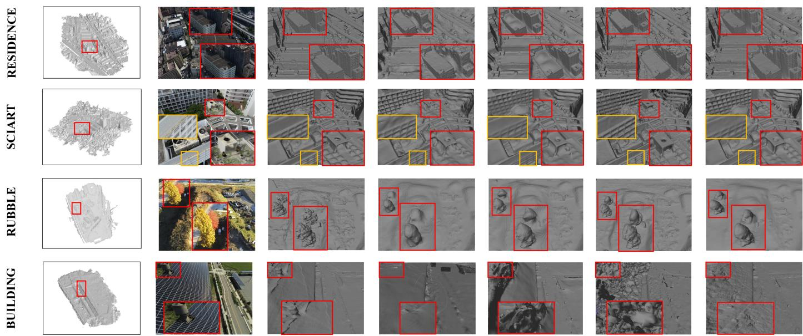

Figure 6: Local surface reconstruction details of diferent methods on UrbanScene3D (Lin et al., 2022) and Mill19 (Turki et al., 2022). Representative regions are shown to compare geometric recovery in regular building structures, weakly textured surfaces, and complex vegetation areas.  
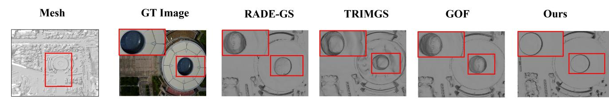  
Figure 7: Local surface reconstruction results of STARS-GS and additional Gaussian surface reconstruction methods on AIRLY (Yao et al., 2026). Representative local regions are shown to compare surface continuity, boundary completeness, and local geometric details.

Table 3 reports the quantitative results on AIRLY, where STARS-GS again achieves the best Precision, Recall, and F1- score among all compared methods. Fig. 7 further presents the reconstructed surfaces in representative local regions. GSDF, RaDe-GS, and Trim2DGS exhibit varying degrees of surface artifacts, boundary distortions, and loss of geometric details in these regions. By comparison, STARS-GS produces more continuous and complete surfaces with clearer structural boundaries.

## 4.2.2. Novel View Synthesis

We further compare the novel view synthesis performance of STARS-GS with the selected baseline methods to assess whether the geometric improvements are achieved without sacrificing rendering quality.

Table 3: Additional quantitative comparison with representative Gaussianbased surface reconstruction methods on AIRLY (Yao et al., 2026). We report Precision, Recall, and F1-score, with the best and second-best results shown in bold and underlined, respectively.
<table><tr><td>Method</td><td>Precision ↑</td><td>Recall ↑</td><td>F1-score ↑</td></tr><tr><td>GSDF</td><td>0.647</td><td>0.621</td><td>0.634</td></tr><tr><td>RaDe-GS</td><td>0.695</td><td>0.646</td><td>0.670</td></tr><tr><td>Trim2DGS</td><td>0.672</td><td>0.615</td><td>0.642</td></tr><tr><td>STARS-GS (Ours)</td><td>0.723</td><td>0.716</td><td>0.719</td></tr></table>

Main Comparison. Table 4 reports the novel view synthesis results of STARS-GS and the methods included in the main comparison under the unified evaluation protocol. Across all evaluated scenes, STARS-GS achieves the best PSNR, SSIM, and LPIPS. Its average PSNR and SSIM reach 24.79 dB and 0.801, respectively, outperforming the best-performing comparison method by 0.60 dB and 0.025. Its average LPIPS reaches 0.225, representing a relative reduction of 17.2%. These results show that the improved geometric reconstruction quality of STARS-GS does not come at the expense of appearance quality.

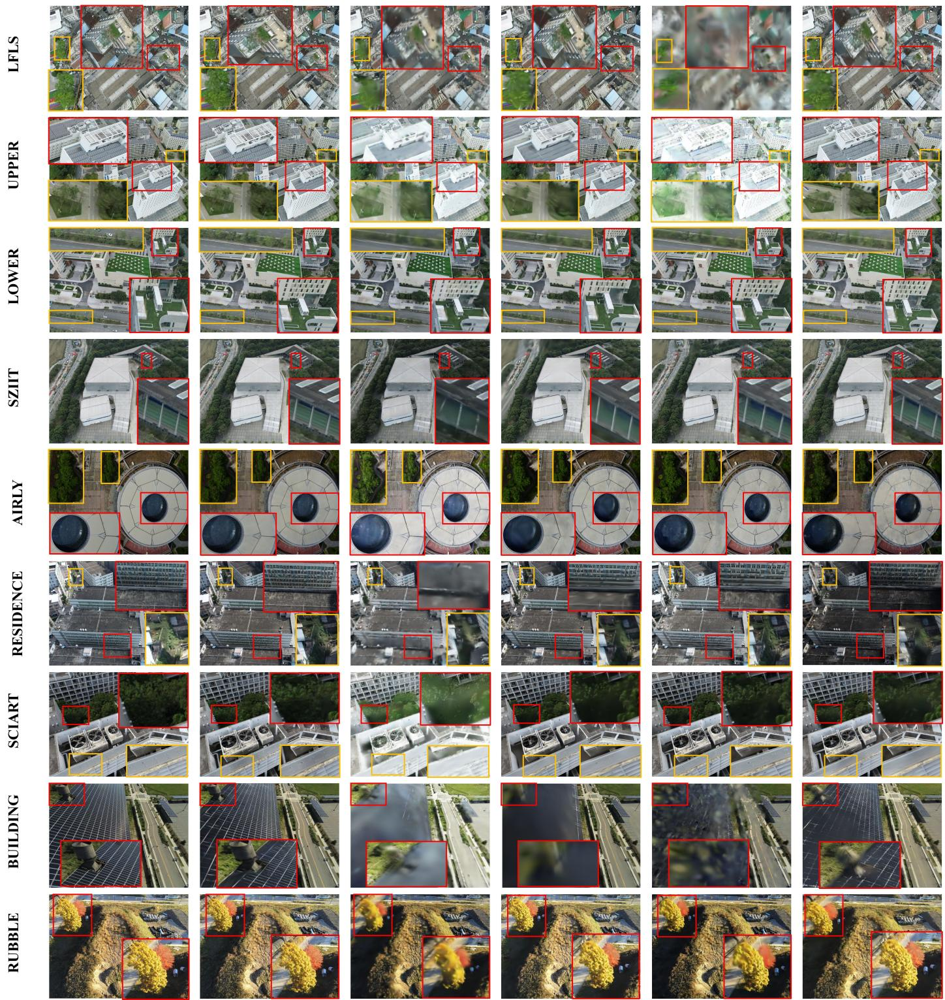  
Figure 8: Qualitative novel view synthesis results of diferent methods in representative test views. The comparisons focus on building boundaries, roof textures, road boundaries, vegetation, and other high-frequency details.

Fig. 8 presents novel view synthesis results from representative test views. The diferences are most apparent in highfrequency regions, including building boundaries, roof textures, road boundaries, and vegetation regions. Several comparison methods exhibit noticeable texture blurring, boundary smearing, and local appearance artifacts in these regions. In contrast, STARS-GS produces more realistic renderings, with clearer structural boundaries and better preservation of texture details.

Table 4: Quantitative novel view synthesis comparison with the methods included in the main comparison on all test scenes from GauU-Scene (Xiong et al., 2024), UrbanScene3D (Lin et al., 2022), Mill19 (Turki et al., 2022), and AIRLY (Yao et al., 2026). We report PSNR, SSIM, and LPIPS, with the best and second-bes results shown in bold and underlined, respectively.
<table><tr><td rowspan="2">Method</td><td rowspan="2">Metric</td><td colspan="9">Scene</td></tr><tr><td>Lower</td><td>Upper</td><td>LFLS</td><td>SZIIT</td><td>Sci-Art</td><td>Residence</td><td>Building</td><td>Rubble</td><td>AIRLY</td></tr><tr><td rowspan="3">SuGaR</td><td>PSNR</td><td>22.85</td><td>22.34</td><td>21.76</td><td>22.01</td><td>20.52</td><td>20.78</td><td>20.98</td><td>20.75</td><td>23.72</td></tr><tr><td>SSIM</td><td>0.703</td><td>0.694</td><td>0.681</td><td>0.688</td><td>0.624</td><td>0.636</td><td>0.655</td><td>0.638</td><td>0.721</td></tr><tr><td>LPIPS</td><td>0.372</td><td>0.386</td><td>0.412</td><td>0.398</td><td>0.438</td><td>0.421</td><td>0.431</td><td>0.449</td><td>0.307</td></tr><tr><td rowspan="3">2DGS</td><td>PSNR</td><td>24.36</td><td>24.08</td><td>23.41</td><td>23.72</td><td>22.18</td><td>22.36</td><td>22.74</td><td>22.42</td><td>24.78</td></tr><tr><td>SSIM</td><td>0.782</td><td>0.773</td><td>0.751</td><td>0.762</td><td>0.691</td><td>0.702</td><td>0.718</td><td>0.701</td><td>0.779</td></tr><tr><td>LPIPS</td><td>0.296</td><td>0.305</td><td>0.332</td><td>0.318</td><td>0.354</td><td>0.338</td><td>0.353</td><td>0.367</td><td>0.247</td></tr><tr><td rowspan="3">PGSR</td><td>PSNR</td><td>25.18</td><td>25.16</td><td>24.36</td><td>24.52</td><td>22.96</td><td>23.21</td><td>23.56</td><td>23.21</td><td>25.62</td></tr><tr><td>SSIM</td><td>0.817</td><td>0.809</td><td>0.792</td><td>0.801</td><td>0.722</td><td>0.735</td><td>0.755</td><td>0.739</td><td>0.816</td></tr><tr><td>LPIPS</td><td>0.246</td><td>0.258</td><td>0.282</td><td>0.269</td><td>0.292</td><td>0.278</td><td>0.297</td><td>0.314</td><td>0.206</td></tr><tr><td rowspan="3">CityGaussianV2</td><td>PSNR</td><td>25.07</td><td>25.16</td><td>24.18</td><td>24.69</td><td>23.14</td><td>23.08</td><td>23.48</td><td>23.35</td><td>25.48</td></tr><tr><td>SSIM</td><td>0.811</td><td>0.816</td><td>0.785</td><td>0.807</td><td>0.731</td><td>0.729</td><td>0.748</td><td>0.744</td><td>0.811</td></tr><tr><td>LPIPS</td><td>0.253</td><td>0.249</td><td>0.289</td><td>0.261</td><td>0.286</td><td>0.284</td><td>0.302</td><td>0.306</td><td>0.212</td></tr><tr><td rowspan="3">STARS-GS</td><td>PSNR</td><td>25.71</td><td>25.64</td><td>24.92</td><td>25.21</td><td>23.82</td><td>23.67</td><td>24.15</td><td>23.82</td><td>26.21</td></tr><tr><td>SSIM</td><td>0.836</td><td>0.831</td><td>0.814</td><td>0.824</td><td>0.758</td><td>0.764</td><td>0.781</td><td>0.762</td><td>0.841</td></tr><tr><td>LPIPS</td><td>0.204</td><td>0.211</td><td>0.236</td><td>0.224</td><td>0.238</td><td>0.229</td><td>0.248</td><td>0.259</td><td>0.174</td></tr></table>

Supplementary Comparison with Large-Scene NVS Methods. Table 5 shows that STARS-GS achieves the best PSNR, SSIM, and LPIPS among the additional large-scene methods. Fig. 9 presents the corresponding rendering results. Block-Gaussian exhibits noticeable exposure bias and color inconsistency, whereas VastGaussian produces texture smoothing and missing details around roads, vegetation, and building boundaries. By comparison, STARS-GS maintains more consistent appearance and preserves finer texture details.

Table 5: Supplementary quantitative novel view synthesis comparison with large-scene 3DGS methods on AIRLY (Yao et al., 2026). We report PSNR, SSIM, and LPIPS, with the best and second-best results shown in bold and underlined, respectively.
<table><tr><td>Method</td><td>PSNR ↑</td><td>SSIM ↑</td><td>LPIPS ↓</td></tr><tr><td>BlockGaussian</td><td>22.370</td><td>0.735</td><td>0.310</td></tr><tr><td>VastGaussian</td><td>25.790</td><td>0.829</td><td>0.196</td></tr><tr><td>STARS-GS (Ours)</td><td>26.210</td><td>0.841</td><td>0.174</td></tr></table>

## 4.3. Ablation Study

To examine the contribution of the key designs in STARS-GS, we use the full model as the reference and construct controlled variants by replacing or removing individual components at a time. Specifically, structure-aware partitioning is replaced with the camera-visibility-based partitioning of Vast-Gaussian (Vast-GS)(Lin et al., 2024) and point-cloud-density based partitioning of BlockGaussian (Block-GS)(Wu et al., 2025b) and the efect of boundary refinement is evaluated by removing the overlap-band constraint. Neighborhood-aware organization is replaced by no explicit geometric constraint or conventional depth-and-normal constraints, and adaptive surface regularization is replaced by either no or uniformly weighted regularization. All variants use the same data splits, training configurations, and mesh-extraction protocol.

Table 6 reports that the full STARS-GS achieves the best overall performance across all five scenes, whereas removing or replacing any component leads to varying degrees of performance degradation. This indicates that all proposed components contribute to the accuracy and completeness of surface reconstruction.

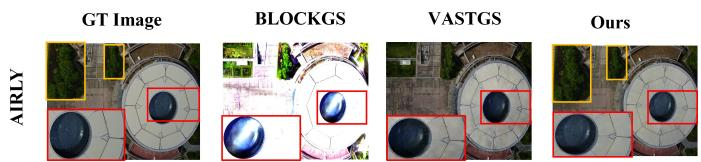  
Figure 9: Supplementary qualitative novel view synthesis comparison with large-scene 3DGS methods on AIRLY (Yao et al., 2026). Representative local regions are selected to compare color consistency, structural boundaries, and texture details.

## 4.3.1. Impact of Partitioning and Boundary Refinement

Replacing structure-aware scene partitioning decreases all three metrics across the five scenes, with larger drops in Recall, indicating its main contribution to surface completeness. As shown in Fig. 10 partitioning results, the horizontal or verti cal boundaries produced by Vast-GS and Block-GS cut through the central building and split continuous structures across subregions, forcing the same scene element to be optimized independently, producing local depressions and surface disturbances on roofs and facades. In contrast, our structure-aware partitioning aligns boundaries with scene elements, preserving continuous structures and reducing roof undulations while recovering facade window grids more completely.

Removing boundary refinement also reduces Precision and Recall, again with larger Recall drops. Fig. 11 shows that, without this refinement, the textured mesh exhibits patch-like stitching artifacts, while the untextured mesh exhibits pronounced local geometric perturbations. The full model suppresses these artifacts and produces more continuous and complete surface geometry across adjacent sub-regions.

Table 6: Quantitative ablation results on five scenes. Precision (P), Recall (R), and F1-score are reported; indented +” rows denote alternative strategies after removing the corresponding design.
<table><tr><td rowspan="2">Ablation Setting</td><td colspan="3">Lower</td><td colspan="3">Upper</td><td colspan="3">LFLS</td><td colspan="3">SZIIT</td><td colspan="3">AIRLY</td></tr><tr><td>P↑</td><td>R↑</td><td>F1 ↑</td><td>P↑</td><td>R↑</td><td>F1↑</td><td>P↑</td><td>R↑</td><td>F1 ↑</td><td>P↑</td><td>R↑</td><td>F1 ↑</td><td>P↑</td><td>R↑</td><td>F1 ↑</td></tr><tr><td>w/o Structure-Aware Partitioning</td><td></td><td></td><td></td><td></td><td></td><td></td><td></td><td></td><td></td><td></td><td></td><td></td><td></td><td></td><td></td></tr><tr><td>+ VastGaussian</td><td>0.689</td><td>0.669</td><td>0.679</td><td>0.672</td><td>0.682</td><td>0.677</td><td>0.651</td><td>0.642</td><td>0.646</td><td>0.636</td><td>0.647</td><td>0.641</td><td>0.699</td><td>0.689</td><td>0.694</td></tr><tr><td>+ BlockGaussian</td><td>0.680</td><td>0.654</td><td>0.667</td><td>0.663</td><td>0.666</td><td>0.664</td><td>0.642</td><td>0.625</td><td>0.633</td><td>0.627</td><td>0.631</td><td>0.629</td><td>0.688</td><td>0.671</td><td>0.679</td></tr><tr><td>w/o Boundary Refinement</td><td>0.701</td><td>0.685</td><td>0.693</td><td>0.688</td><td>0.700</td><td>0.694</td><td>0.677</td><td>0.674</td><td>0.675</td><td>0.662</td><td>0.673</td><td>0.667</td><td>0.715</td><td>0.706</td><td>0.710</td></tr><tr><td>w/o Neighborhood-Aware Organization</td><td>0.646</td><td>0.625</td><td>0.635</td><td>0.640</td><td>0.651</td><td>0.645</td><td>0.611</td><td>0.600</td><td>0.605</td><td>0.593</td><td>0.604</td><td>0.598</td><td>0.659</td><td>0.642</td><td>0.650</td></tr><tr><td>+ Depth &amp; Normal</td><td>0.665</td><td>0.649</td><td>0.657</td><td>0.658</td><td>0.674</td><td>0.666</td><td>0.632</td><td>0.628</td><td>0.630</td><td>0.617</td><td>0.629</td><td>0.623</td><td>0.681</td><td>0.670</td><td>0.675</td></tr><tr><td>w/o Adaptive Surface Regularization</td><td>0.675</td><td>0.655</td><td>0.665</td><td>0.662</td><td>0.682</td><td>0.672</td><td>0.646</td><td>0.638</td><td>0.642</td><td>0.629</td><td>0.642</td><td>0.635</td><td>0.690</td><td>0.676</td><td>0.683</td></tr><tr><td>+ Uniform Regularization</td><td>0.700</td><td>0.676</td><td>0.688</td><td>0.685</td><td>0.691</td><td>0.688</td><td>0.666</td><td>0.652</td><td>0.659</td><td>0.648</td><td>0.658</td><td>0.653</td><td>0.706</td><td>0.683</td><td>0.694</td></tr><tr><td>Full STARS-GS</td><td>0.708</td><td>0.694</td><td>0.701</td><td>0.695</td><td>0.712</td><td>0.703</td><td>0.686</td><td>0.690</td><td>0.688</td><td>0.673</td><td>0.689</td><td>0.681</td><td>0.723</td><td>0.716</td><td>0.719</td></tr></table>

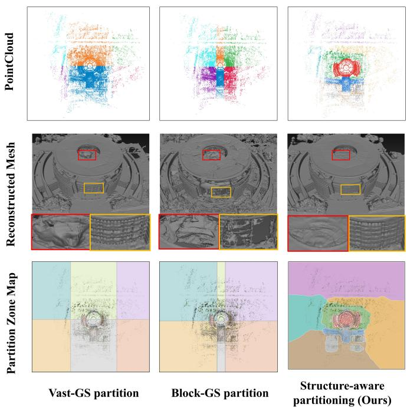  
Figure 10: Ablation comparison of scene partitioning strategies. From left to right: Vast-GS, Block-GS, and STARS-GS, with corresponding meshes and enlarged local details.

## 4.3.2. Impact of Neighborhood-Aware Organization

Replacing neighborhood-aware Gaussian organization with either no explicit geometric constraints or depth and normal constraints causes the largest degradation among all ablations: the average F1-score drops from 0.698 to 0.627 without explicit geometric constraints and recovers only to 0.650 with conventional depth and normal constraints, but remains clearly below the full model. This indicates that the improvement comes not only from additional geometric supervision, but from neighborhood-aware primitive organization, which ben efits both reconstruction accuracy and completeness.

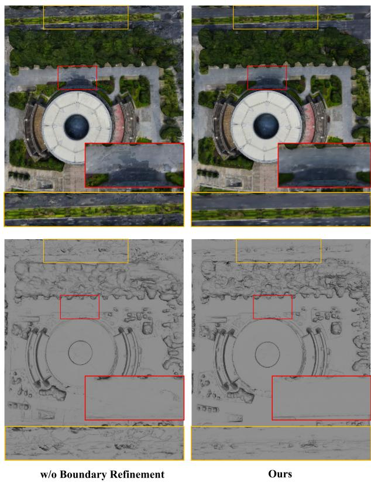  
Figure 11: Ablation comparison of boundary refinement, with enlarged boundary regions showing stitching artifacts and cross-region geometric continuity.

Fig. 12 further compares Gaussian distributions and reconstructed geometry in representative road and vegetation regions. Although the three variants produce visually similar renderings, the Gaussian distributions and reconstructed meshes difer substantially, showing that comparable appearance quality does not necessarily imply well-organized geometry. In the road region, without explicit geometric constraints, many Gaussians become oversized and heavily overlap. Introducing depth and normal constraints makes most Gaussians flatter, but oversized and overlapping primitives remain and locally dominate the surface representation, resulting in irregular Gaussian organization and, consequently, mesh distortions. In contrast, neighborhoodaware organization encourages neighboring Gaussians to represent the surface jointly yielding a more balanced distribution that better conforms to the road geometry and, consequently, a flatter and more continuous mesh surface. A similar efect is observed in the vegetation region, where the more complex geometry amplifies primitive disorganization and subsequently leads to distortions or local holes. Neighborhood-aware organization better follows these surface variations while improving geometric completeness.

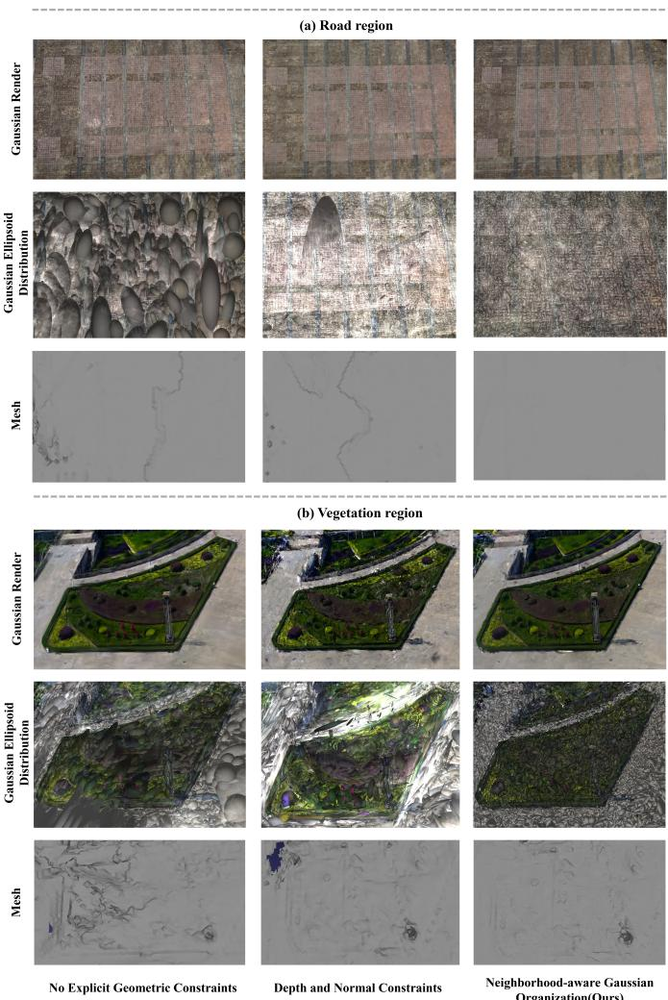  
Figure 12: Ablation comparison of neighborhood-aware Gaussian organization on AIRLY, showing rendered images, Gaussian distributions, and meshes for diferent geometric constraints.

To verify whether these diferences generalize across scenes, Fig. 13 compares the depth-and-normal variant with the full model using normal and depth maps. In LFLS of GauU-Scene, the depth-and-normal variant blurs building contours and depth separation between adjacent roofs and oversmooths orientation variations in vegetation. Similar degradation occurs on the circular architectural structures of AIRLY. The full model preserves clearer boundaries, clearer depth separation, and richer normal variations. In Sci-Art of UrbanScene3D, the depth-andnormal variant causes slender rooftop columns to merge with surrounding roof surfaces, with some columns distorted or partially missing. In Building of Mill19, the internal holes of hollow tubular supports are filled, and small lamp posts are also barely visible, as their geometry is excessively smoothed into the surrounding surface. Neighborhood-aware organization reduces such cross-surface interference, better separating slender structures from surrounding surfaces and preserving their geometry.

Table 7: Regional comparison of surface regularization on AIRLY. Regions are split by median planarity $( c _ { \mathrm { m e d } } = 0 . 4 7 ) ,$ with P, R, and F1 reported.
<table><tr><td rowspan="2">Regularization</td><td colspan="3">Low-planarity</td><td colspan="3">High-planarity</td></tr><tr><td>P↑</td><td>R↑</td><td>F1 ↑</td><td>P↑</td><td>R↑</td><td>F1 ↑</td></tr><tr><td>None</td><td>0.649</td><td>0.692</td><td>0.670</td><td>0.731</td><td>0.646</td><td>0.686</td></tr><tr><td>Uniform</td><td>0.612</td><td>0.584</td><td>0.598</td><td>0.749</td><td>0.688</td><td>0.717</td></tr><tr><td>Adaptive</td><td>0.698</td><td>0.779</td><td>0.736</td><td>0.770</td><td>0.689</td><td>0.727</td></tr></table>

## 4.3.3. Impact of Adaptive Surface Regularization

As shown in Table 6, removing surface regularization decreases the average F1-score from 0.698 to 0.659. Applying uniformly weighted surface regularization improves it to 0.676, but remains below the full model. This performance indicates that the benefit depends not only on surface regularization itself but also on adjusting its strength according to local geometric characteristics.

To examine this behavior across diferent local geometries, AIRLY is divided into low-planarity and high-planarity regions using the median planarity $c _ { \mathrm { m e d } } ~ = ~ 0 . 4 7$ Table 7 shows that uniform regularization afects the two region types diferently. In high-planarity regions, uniform regularization improves F1 from 0.686 to 0.717, but remains below the adaptive result of 0.727. In low-planarity regions, however, it reduces F1 from 0.670 to 0.598, whereas adaptive regularization reaches 0.736. Thus, uniform regularization benefits high-planarity regions but can harm low-planarity geometry, whereas adaptive weighting remains efective in both, confirming its ability to balance structural consistency and local variation.

Fig. 14 compares the reconstruction results of three regular ization settings on AIRLY, In the high-planarity structured region, removing surface regularization leads to surface irregularities and distorted boundaries around the circular roof. Uniform regularization suppresses some irregularities, but oversmooths local contours and small structures, making the roof boundary less clearly separated from adjacent structures. Adaptive surface regularization suppresses local surface irregularities while preserving clearer boundaries. In the low-planarity region, local structures are incomplete without regularization, whereas uniform regularization over-smooths valid geometric variations and blurs local features. By reducing the regularization strength, adaptive surface regularization better preserves

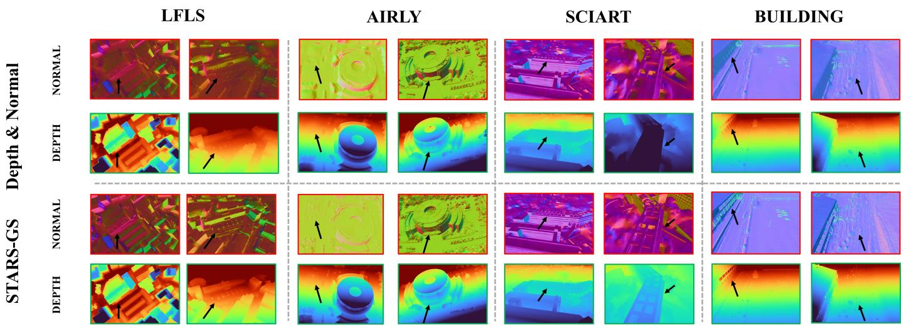  
Figure 13: Cross-scene comparison of the depth-and-normal variant and full STARS-GS using normal and depth maps on LFLS, AIRLY, Sci-Art, and Building. Black arrows highlight diferences in structural boundaries, local surface orientation, and depth separation

these variations, producing clearer contours and more complete geometry.  
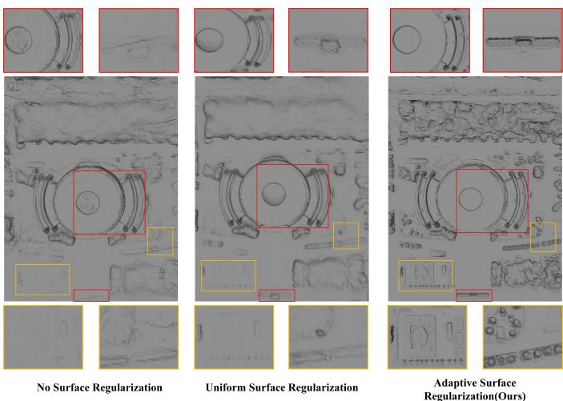  
Figure 14: Comparison of surface regularization settings on AIRLY. The red and yellow boxes highlight high-planarity structured and low-planarity unstructured regions, respectively

## 4.3.4. Parameter Sensitivity Analysis

We evaluate the sensitivity of STARS-GS to the neighborhood size k, the maximum weight of the neighborhood organization loss $\lambda _ { \mathrm { n b r } } ^ { \mathrm { m a x } }$ , and the maximum weight of the adaptive surface regularization loss $\lambda _ { \mathrm { s u r f } } ^ { \mathrm { m a x } }$ . Each parameter is varied independently, with the others fixed. Results are reported in Table 8.

All three hyperparameters perform best near intermediate values. For the neighborhood size k, increasing it from 10 to 20 improves the F1-score from 0.679 to 0.698. Further increases reduce performance, suggesting that a small neighborhood provides insuficient local information, whereas an excessively large neighborhood may introduce weakly related connections and weaken local constraints. The two loss weights show similar trends: both $\lambda _ { \mathrm { n b r } } ^ { \mathrm { m a x } }$ and λmax achieve their best F1- surf score at 0.01. Smaller weights provide insuficient geometric regularization, whereas excessive constraints over-constrain local geometric variations.

Table 8: Sensitivity analysis of key hyperparameters. Precision, Recall, and F1-score are reported; default settings are shown in bold.
<table><tr><td>Parameter</td><td>Value</td><td>Precision</td><td>Recall</td><td>F1-score</td></tr><tr><td rowspan="4">k</td><td>10</td><td>0.684</td><td>0.675</td><td>0.679</td></tr><tr><td>15</td><td>0.688</td><td>0.689</td><td>0.688</td></tr><tr><td>20</td><td>0.697</td><td>0.700</td><td>0.698</td></tr><tr><td>25 30</td><td>0.685 0.676</td><td>0.692 0.688</td><td>0.688 0.682</td></tr><tr><td rowspan="4">λmax nbr</td><td>0.0025 0.0050</td><td>0.676 0.685</td><td>0.687 0.692</td><td>0.681 0.688</td></tr><tr><td>0.0100</td><td>0.697</td><td>0.700</td><td>0.698</td></tr><tr><td>0.0200</td><td>0.686</td><td>0.689</td><td>0.687</td></tr><tr><td>0.0400</td><td>0.674</td><td>0.680</td><td>0.677</td></tr><tr><td rowspan="5">λma</td><td>0.0025</td><td>0.670</td><td>0.688</td><td>0.679</td></tr><tr><td>0.0050</td><td>0.682</td><td>0.693</td><td>0.687</td></tr><tr><td>0.0100</td><td>0.697</td><td>0.700</td><td>0.698</td></tr><tr><td>0.0200</td><td>0.688</td><td>0.684</td><td>0.686</td></tr><tr><td>0.0400</td><td>0.681</td><td>0.668</td><td>0.674</td></tr></table>

Although overly small or overly large values lead to some performance degradation, the F1-score varies within relatively narrow ranges of 0.019, 0.021, and 0.024 for k, $\lambda _ { \mathrm { n b r } } ^ { \mathrm { m a x } }$ , and λmaxsurf , respectively, indicating that STARS-GS maintains rela- max tively stable reconstruction performance across the evaluated parameter ranges.

## 5. Conclusion

In this work, we presented STARS-GS, a structureaware 3DGS framework for large-scale surface reconstruction.

Structure-aware scene partitioning organizes structurally coherent regions and refines shared boundaries to improve crossregion consistency. Neighborhood-aware Gaussian organization extends geometric constraints from individual primitives to their relative local organization, enabling neighboring Gaussians to better conform to local surface geometry. Adaptive surface regularization adjusts constraint strength to accommodate heterogeneous surface geometry.

Extensive experiments demonstrate improved geometric accuracy and surface completeness across large-scale scenes. STARS-GS achieves the highest F1-score on all quantitatively evaluated scenes while maintaining competitive training eficiency and model size. Qualitative comparisons further show that STARS-GS better preserves structural boundaries, local geometric details, and irregular surface variations across diverse scene types. STARS-GS also achieves the best PSNR, SSIM, and LPIPS, showing that the geometric improvements do not compromise appearance quality. Ablation studies further verify the efectiveness of each proposed component.

Despite these improvements, several limitations remain. First, the current pipeline still relies on TSDF-based mesh extraction (Huang et al., 2024a). While this enables a unified geometric evaluation, the mesh extraction step itself may affect the final surface quality. Specifically, its finite resolution and multi-view averaging may attenuate fine geometric varia tions (Werner et al., 2014; Li et al., 2022). In addition, sparse or inconsistent depth observations may lead to incomplete surface geometry or inaccurate surface localization (Weder et al., 2020; Rosinol et al., 2023). Therefore, geometric errors in the final mesh do not necessarily originate entirely from the optimized Gaussian geometry. Future work could explore more direct surface extraction from optimized Gaussian representations to reduce geometry loss during mesh generation. Second, the performance of STARS-GS is partly determined by the reliability of the initial SfM reconstruction, including image coverage, camera poses, and sparse point quality (Wu et al., 2025a; Fu et al., 2024; Xiang et al., 2026). Unreliable initialization may cause scene partitioning to deviate from the actual structure and the initialized neighborhood relationships to inaccurately reflect the local geometry. Future work could improve robustness through stronger geometric initialization, joint camera-pose optimization, and cross-view geometric constraints. Finally, while the proposed geometric designs improve reconstruction quality, they introduce additional computational overhead through geometric feature construction, neighborhood construction and repeated graph updates, as well as surface regularization. Although multi-GPU parallelization substantially reduces the wall-clock training time, it does not eliminate these computational costs. Future work could explore in cremental graph updates, sparse neighborhood constraints, and more eficient parallel scheduling to improve computational efficiency while maintaining reconstruction quality.

## References

Aanæs, H., Jensen, R.R., Vogiatzis, G., Tola, E., Dahl, A.B., 2016. Large-scale data for multiple-view stereopsis. Interna-

tional Journal of Computer Vision 120, 153–168. doi:10.1 007/s11263-016-0902-9.

Bae, G., Davison, A.J., 2024. Rethinking inductive biases for surface normal estimation, in: Proceedings of the IEEE/CVF Conference on Computer Vision and Pattern Recognition, pp. 9535–9545. doi:10.1109/CVPR52733.2024.00911.

Bao, Y., Ding, T., Huo, J., Liu, Y., Li, Y., Li, W., Gao, Y., Luo, J., 2025. 3D gaussian splatting: Survey, technologies, challenges, and opportunities. IEEE Transactions on Circuits and Systems for Video Technology 35, 6832–6852. doi:10 .1109/TCSVT.2025.3538684.

Biljecki, F., Stoter, J., Ledoux, H., Zlatanova, S., Çöltekin, A., 2015. Applications of 3d city models: State of the art review. ISPRS International Journal of Geo-Information 4, 2842–2889. doi:10.3390/ijgi4042842.

Chen, D., Li, H., Ye, W., Wang, Y., Xie, W., Zhai, S., Wang, N., Liu, H., Bao, H., Zhang, G., 2025. PGSR: Planar-based gaussian splatting for eficient and high-fidelity surface reconstruction. IEEE Transactions on Visualization and Computer Graphics 31, 6100–6111. doi:10.1109/TVCG.2024. 3494046.

Chen, G., Wang, W., 2026. A survey on 3D gaussian splatting. ACM Computing Surveys 58, 1–39. doi:10.1145/3807511.

Christodoulides, A., Tam, G.K.L., Clarke, J., Smith, R.G., Horgan, J., Micallef, N., Morley, J., Villamizar, N., Walton, S., 2025. Survey on 3D reconstruction techniques: Large-scale urban city reconstruction and requirements. IEEE Transactions on Visualization and Computer Graphics 31, 9343– 9367. doi:10.1109/TVCG.2025.3540669.

CIE, 2019. Colorimetry – Part 4: CIE 1976 L\*a\*b\* Colour Space. ISO/CIE Standard ISO/CIE 11664-4:2019(E). International Commission on Illumination.

Dai, P., Xu, J., Xie, W., Liu, X., Wang, H., Xu, W., 2024. High-quality surface reconstruction using gaussian surfels, in: ACM SIGGRAPH 2024 Conference Papers, pp. 1–11. doi:10.1145/3641519.3657441.

Fan, J., Li, W., Han, Y., Dai, T., Tang, Y., 2025. Momentum-GS: Momentum gaussian self-distillation for high-quality large scene reconstruction, in: Proceedings of the IEEE/CVF International Conference on Computer Vision, pp. 25250– 25260.

Fan, L., Yang, Y., Li, M., Li, H., Zhang, Z., 2024. Trim 3D gaussian splatting for accurate geometry representation. arXiv preprint arXiv:2406.07499 URL: https://arxiv. org/abs/2406.07499, arXiv:2406.07499.

Fu, Y., Liu, S., Kulkarni, A., Kautz, J., Efros, A.A., Wang, X., 2024. COLMAP-Free 3d gaussian splatting, in: Proceedings of the IEEE/CVF Conference on Computer Vision and Pattern Recognition, pp. 20796–20805.

Furukawa, Y., Curless, B., Seitz, S.M., Szeliski, R., 2010. Towards internet-scale multi-view stereo, in: 2010 IEEE Computer Society Conference on Computer Vision and Pattern Recognition, IEEE. pp. 1434–1441. doi:10.1109/CVPR.2 010.5539802.

Gao, Z., Bian, J.W., Lin, G., Chen, H., Shen, C., 2025. Surfacesplat: Connecting surface reconstruction and gaussian splatting, in: Proceedings of the IEEE/CVF International Conference on Computer Vision, pp. 28525–28534.

Ge, Y., Wei, G., Wu, J., 2026. Decoupling geometry and appearance in gaussian splatting for reflective surface reconstruction: A glossy image prior-guided approach. Neural Networks 200, 108653. doi:10.1016/j.neunet.2026. 108653.

Guédon, A., Lepetit, V., 2024. Sugar: Surface-aligned gaussian splatting for eficient 3D mesh reconstruction and highquality mesh rendering, in: Proceedings of the IEEE/CVF Conference on Computer Vision and Pattern Recognition (CVPR), IEEE. pp. 5354–5363. doi:10.1109/CVPR5273 3.2024.00512.

Hackel, T., Wegner, J.D., Schindler, K., 2016. Contour detection in unstructured 3D point clouds, in: 2016 IEEE Conference on Computer Vision and Pattern Recognition (CVPR), IEEE. pp. 1610–1618. doi:10.1109/CVPR.2016.178.

Han, L., Zhang, W., Zhou, J., Liu, Y.S., Han, Z., 2026. City-level 3D surface reconstruction with viewpoint orientation partitioning and scene completion. arXiv preprint arXiv:2607.03771 URL: https://arxiv.org/abs/2607 .03771, arXiv:2607.03771.

Hoppe, H., DeRose, T., Duchamp, T., McDonald, J., Stuetzle, W., 1992. Surface reconstruction from unorganized points, in: Proceedings of the 19th Annual Conference on Computer Graphics and Interactive Techniques, pp. 71–78. doi:10.114 5/133994.134011.

Huang, B., Yu, Z., Chen, A., Geiger, A., Gao, S., 2024a. 2D Gaussian Splatting for geometrically accurate radiance fields, in: ACM SIGGRAPH 2024 Conference Papers, Association for Computing Machinery. pp. 1–11. doi:10.1145/ 3641519.3657428.

Huang, Z., Wen, Y., Wang, Z., Ren, J., Jia, K., 2024b. Surface reconstruction from point clouds: A survey and a benchmark. IEEE Transactions on Pattern Analysis and Machine Intelligence 46, 9727–9748. doi:10.1109/TPAMI.2024.34292 09.

Jiang, C., Ren, K., Xu, L., Lu, T., Chen, J., Pang, J., Zhang, Y., Dai, B., Yu, M., 2026. HaloGS: Loose coupling of compact geometry and gaussian splats for 3D scenes. ISPRS Journal of Photogrammetry and Remote Sensing 238, 33–54. doi:10 .1016/j.isprsjprs.2026.04.037.

Kazhdan, M., Bolitho, M., Hoppe, H., 2006. Poisson surface reconstruction, in: Symposium on Geometry Processing, The Eurographics Association. pp. 61–70. doi:10.2312/SGP/SG P06/061-070.

Kazhdan, M., Hoppe, H., 2013. Screened poisson surface reconstruction. ACM Transactions on Graphics 32, 1–13. doi:10.1145/2487228.2487237.

Kerbl, B., Kopanas, G., Leimkühler, T., Drettakis, G., 2023. 3D Gaussian Splatting for real-time radiance field rendering. ACM Transactions on Graphics 42, 1–14. doi:10.1145/35 92433.

Li, K., Tang, Y., Prisacariu, V.A., Torr, P.H.S., 2022. BNV-Fusion: Dense 3d reconstruction using bi-level neural volume fusion, in: Proceedings of the IEEE/CVF Conference on Computer Vision and Pattern Recognition, pp. 6166–6175.

Li, W., Li, Q., Sun, R., Chen, L., 2026. RAGS: Roughnessaware gaussian splatting for reflective objects surface reconstruction. Knowledge-Based Systems 341, 115855. doi:10 .1016/j.knosys.2026.115855.

Li, Y., Lyu, C., Di, Y., Zhai, G., Lee, G.H., Tombari, F., 2024. GeoGaussian: Geometry-aware gaussian splatting for scene rendering, in: Computer Vision – ECCV 2024, Springer. pp. 441–457. doi:10.1007/978-3-031-72761-0\_25.

Li, Z., Müller, T., Evans, A., Taylor, R.H., Unberath, M., Liu, M.Y., Lin, C.H., 2023. Neuralangelo: High-fidelity neural surface reconstruction, in: Proceedings of the IEEE/CVF Conference on Computer Vision and Pattern Recognition, IEEE. pp. 8456–8465. doi:10.1109/CVPR52729.2023 .00817.

Li, Z., Yao, S., Wu, T., Yue, Y., Zhao, W., Qin, R., García-Fernández, Á.F., Levers, A., Ralph, J., Zhu, X., 2025. ULSR-GS: Urban large-scale surface reconstruction gaussian splatting with multi-view geometric consistency. ISPRS Journal of Photogrammetry and Remote Sensing 230, 861–880. doi:10.1016/j.isprsjprs.2025.10.008.

Lian, X., Wang, Z., Wang, H., 2026. Depth-gradient-guided decoupled optimization in 3D gaussian splatting for sparseview reconstruction. Applied Sciences 16, 4026. doi:10.3 390/app16084026.

Liao, Y., Zhang, X., Huang, N., Fu, C., Huang, Z., Cao, Q., Xu, Z., Xiong, X., Cai, S., 2024. High completeness multi-view stereo for dense reconstruction of large-scale urban scenes. ISPRS Journal of Photogrammetry and Remote Sensing 209, 173–196. doi:10.1016/j.isprsjprs.2024.01.018.

Lin, J., Li, Z., Tang, X., Liu, J., Liu, S., Liu, J., Lu, Y., Wu, X., Xu, S., Yan, Y., Yang, W., 2024. Vastgaussian: Vast 3D gaussians for large scene reconstruction, in: Proceedings of the IEEE/CVF Conference on Computer Vision and Pattern Recognition (CVPR), IEEE. pp. 5166–5175. doi:10.1109/ CVPR52733.2024.00494.

Lin, L., Liu, Y., Hu, Y., Yan, X., Xie, K., Huang, H., 2022. Capturing, reconstructing, and simulating: The UrbanScene3D dataset, in: Computer Vision – ECCV 2022, Springer. pp. 93–109. doi:10.1007/978-3-031-20074-8\_6.

Liu, C., Wang, H., Yu, L., Xia, G.S., 2025a. Holistic large-scale scene reconstruction via mixed gaussian splatting. arXiv preprint arXiv:2505.23280 URL: https://arxiv.org/ abs/2505.23280, arXiv:2505.23280.

Liu, Y., Luo, C., Fan, L., Wang, N., Peng, J., Zhang, Z., 2024. Citygaussian: Real-time high-quality large-scale scene rendering with gaussians, in: Computer Vision – ECCV 2024, Springer. pp. 265–282. doi:10.1007/978-3-031-72640 -8\_15.

Liu, Y., Luo, C., Mao, Z., Peng, J., Zhang, Z., 2025b. Citygaussianv2: Eficient and geometrically accurate reconstruction for large-scale scenes, in: International Conference on Learning Representations, p. n.pag. URL: https://proc eedings.iclr.cc/paper\_files/paper/2025/hash/d2 18ec74edbfc494fa7d7a253951c603-Abstract-Confe rence.html, arXiv:2411.00771.

Maalek, R., Lichti, D.D., Ruwanpura, J.Y., 2018. Robust segmentation of planar and linear features of terrestrial laser scanner point clouds acquired from construction sites. Sensors 18, 819. doi:10.3390/s18030819.

Mi, Z., Xu, D., 2023. Switch-NeRF: Learning scene decomposition with mixture of experts for large-scale neural radiance fields, in: The Eleventh International Conference on Learning Representations, p. n.pag. URL: https://openreview .net/forum?id=PQ2zoIZqvm.

Mildenhall, B., Srinivasan, P.P., Tancik, M., Barron, J.T., Ramamoorthi, R., Ng, R., 2020. NeRF: Representing scenes as neural radiance fields for view synthesis, in: Computer Vision – ECCV 2020, Springer. pp. 405–421. doi:10.1007/97 8-3-030-58452-8\_24.

Müller, T., Evans, A., Schied, C., Keller, A., 2022. Instant neural graphics primitives with a multiresolution hash encoding. ACM Transactions on Graphics 41, 1–15. doi:10.1145/35 28223.3530127.

Pan, S., Chen, J., Liu, Y., Huang, H., 2026. TopoGS: Planar reconstruction via topology-aware 3D gaussian splatting, in: European Conference on Computer Vision, p. n.pag. URL: https://arxiv.org/abs/2607.16838, arXiv:2607.16838.

Pan, X., Lin, Q., Ye, S., Li, L., Guo, L., Harmon, B., 2024. Deep learning based approaches from semantic point clouds to semantic BIM models for heritage digital twin. Heritage Science 12, 65. doi:10.1186/s40494-024-01179-4.

Papon, J., Abramov, A., Schoeler, M., Worgotter, F., 2013. Voxel cloud connectivity segmentation: Supervoxels for point clouds, in: Proceedings of the IEEE Conference on

Computer Vision and Pattern Recognition, IEEE. pp. 2027– 2034. doi:10.1109/CVPR.2013.264.

Pastucha, E., Puniach, E., Gruszczynski, W., ´ Cwi ˛akała, P., ´ Matwij, W., Midtiby, H.S., 2022. Relative radiometric normalisation of unmanned aerial vehicle photogrammetrybased RGB orthomosaics. The Photogrammetric Record 37, 228–247. doi:10.1111/phor.12413.

Pauly, M., Keiser, R., Gross, M., 2003. Multi-scale feature extraction on point-sampled surfaces. Computer Graphics Forum 22, 281–289. doi:10.1111/1467-8659.00675.

Rabbani, T., van den Heuvel, F.A., Vosselman, G., 2006. Segmentation of point clouds using smoothness constraint, in: Proceedings of the ISPRS Commission V Symposium: Image Engineering and Vision Metrology, pp. 248–253.

Rosinol, A., Leonard, J.J., Carlone, L., 2023. Probabilistic volumetric fusion for dense monocular SLAM, in: Proceedings of the IEEE/CVF Winter Conference on Applications of Computer Vision, pp. 3097–3105.

Schönberger, J.L., Frahm, J.M., 2016. Structure-from-motion revisited, in: Proceedings of the IEEE Conference on Computer Vision and Pattern Recognition (CVPR), IEEE. pp. 4104–4113. doi:10.1109/CVPR.2016.445.

Schönberger, J.L., Zheng, E., Frahm, J.M., Pollefeys, M., 2016. Pixelwise view selection for unstructured multi-view stereo, in: Computer Vision – ECCV 2016, Springer. pp. 501–518. doi:10.1007/978-3-319-46487-9\_31.

Shen, T., Liu, S., Feng, J., Ma, Z., An, N., 2025. Topologyaware 3D gaussian splatting: Leveraging persistent homology for optimized structural integrity. Proceedings of the AAAI Conference on Artificial Intelligence 39, 6823–6832. doi:10.1609/aaai.v39i7.32732.

Song, J., Ye, Z., Zhou, Q., Yang, W., Fei, B., Xu, J., He, Y., Ouyang, W., 2025. Reflections unlock: Geometry-aware reflection disentanglement in 3D gaussian splatting for photorealistic scenes rendering. arXiv preprint arXiv:2507.06103 URL: h t t p s : / / a r x i v . o r g / a b s / 2 5 0 7 . 0 6 1 03, arXiv:2507.06103.

Tancik, M., Casser, V., Yan, X., Pradhan, S., Mildenhall, B., Srinivasan, P.P., Barron, J.T., Kretzschmar, H., 2022. Block NeRF: Scalable large scene neural view synthesis, in: Proceedings of the IEEE/CVF Conference on Computer Vision and Pattern Recognition (CVPR), IEEE. pp. 8248–8258. doi:10.1109/CVPR52688.2022.00807.

Turki, H., Ramanan, D., Satyanarayanan, M., 2022. Mega-NeRF: Scalable construction of large-scale NeRFs for virtual fly-throughs, in: Proceedings of the IEEE/CVF Conference on Computer Vision and Pattern Recognition (CVPR), IEEE. pp. 12922–12931. doi:10.1109/CVPR52688.2022.01258.

Turkulainen, M., Ren, X., Melekhov, I., Seiskari, O., Rahtu, E., Kannala, J., 2025. DN-Splatter: Depth and normal priors for gaussian splatting and meshing, in: 2025 IEEE/CVF Winter Conference on Applications of Computer Vision (WACV), pp. 2421–2431. doi:10.1109/WACV61041.2025.00241.

Ververas, E., Potamias, R.A., Song, J., Deng, J., Zafeiriou, S., 2024. SAGS: Structure-aware 3D gaussian splatting, in: Computer Vision – ECCV 2024, Springer. pp. 221– 238. URL: https://arxiv.org/abs/2404.19149, doi:10.1007/978-3-031-72655-2\_13.

Wang, M., Chen, B., Pan, S., Liu, N., Su, J., 2026. Consistencypreserving gaussian splatting for block-based large-scale scene reconstruction. Computers and Graphics 134, 104493. doi:10.1016/j.cag.2025.104493.

Wang, P., Liu, L., Liu, Y., Theobalt, C., Komura, T., Wang, W., 2021. NeuS: Learning neural implicit surfaces by volume rendering for multi-view reconstruction, in: Advances in Neural Information Processing Systems, pp. 27171–27183. URL: https://proceedings.neurips.cc/paper/202 1/hash/e41e164f7485ec4a28741a2d0ea41c74-Abstr act.html.

Wang, T., Wang, X., Hou, Y., Xu, Y., Zhang, W., Zhan, Z., 2025. PG-SAG: Parallel gaussian splatting for fine-grained large-scale urban buildings reconstruction via semanticaware grouping. PFG – Journal of Photogrammetry, Remote Sensing and Geoinformation Science 93, 483–498. doi:10.1007/s41064-025-00343-0.

Wang, Z., Bovik, A.C., Sheikh, H.R., Simoncelli, E.P., 2004. Image quality assessment: From error visibility to structural similarity. IEEE Transactions on Image Processing 13, 600– 612. doi:10.1109/TIP.2003.819861.

Weder, S., Schönberger, J.L., Pollefeys, M., Oswald, M.R., 2020. RoutedFusion: Learning real-time depth map fusion, in: Proceedings of the IEEE/CVF Conference on Computer Vision and Pattern Recognition, pp. 4887–4897.

Weinmann, M., Jutzi, B., Mallet, C., Weinmann, M., 2017. Geometric features and their relevance for 3D point cloud classification, in: ISPRS Annals of the Photogrammetry, Remote Sensing and Spatial Information Sciences, pp. 157– 164. doi:10.5194/isprs-annals-iv-1-w1-157-2017.

Werner, D., Al-Hamadi, A., Werner, P., 2014. Truncated signed distance function: Experiments on voxel size, in: Image Analysis and Recognition, Springer. pp. 357–364. doi:10.1007/978-3-319-11755-3\_40.

Wolf, Y., Bracha, A., Kimmel, R., 2024. GS2Mesh: Surface reconstruction from gaussian splatting via novel stereo views, in: Computer Vision – ECCV 2024, Springer. pp. 207–224. doi:10.1007/978-3-031-73024-5\_13.

Wu, J., Li, R., Zhu, Y., Guo, R., Sun, J., Zhang, Y., 2025a. Sparse2DGS: Geometry-prioritized gaussian splatting for

surface reconstruction from sparse views, in: Proceedings of the IEEE/CVF Conference on Computer Vision and Pattern Recognition, pp. 11307–11316.

Wu, J., Wyman, O., Tang, Y., Pasini, D., Wang, W., 2024. Multi-view 3d reconstruction based on deep learning: A survey and comparison of methods. Neurocomputing 582, 127553. doi:10.1016/j.neucom.2024.127553.

Wu, Y., Qi, Z., Shi, Z., Zou, Z., 2025b. Blockgaussian: Eficient large-scale scene novel view synthesis via adaptive blockbased gaussian splatting. arXiv preprint arXiv:2504.09048 URL: h t t p s : / / a r x i v . o r g / a b s / 2 5 0 4 . 0 9 0 48, arXiv:2504.09048.

Xiang, H., Zhang, F., Li, X., Yang, C., Gao, Y., Liu, W., Zhao, L., Li, D., Huang, X., 2026. Gaussiancraft: Fine-grained 3D gaussians for eficient large-scene surface reconstruction. ISPRS Journal of Photogrammetry and Remote Sensing 235, 651–667. doi:10.1016/j.isprsjprs.2026.03.020.

Xiangli, Y., Xu, L., Pan, X., Zhao, N., Rao, A., Theobalt, C., Dai, B., Lin, D., 2022. BungeeNeRF: Progressive neural radiance field for extreme multi-scale scene rendering, in: Computer Vision – ECCV 2022, Springer. pp. 106–122. doi:10.1007/978-3-031-19824-3\_7.

Xie, Y., Takikawa, T., Saito, S., Litany, O., Yan, S., Khan, N., Tombari, F., Tompkin, J., Sitzmann, V., Sridhar, S., 2022. Neural fields in visual computing and beyond. Computer Graphics Forum 41, 641–676. doi:10.1111/cgf.14505.

Xiong, B., Zheng, N., Liu, J., Li, Z., 2024. GauU-Scene V2: Assessing the reliability of image-based metrics with expansive LiDAR image dataset using 3DGS and NeRF. arXiv preprint arXiv:2404.04880 doi:10.48550/arXiv.2404.04 880.

Xiong, W., Wang, F., Liu, W., Li, X., Zhu, Z., Xiong, B., Rao, Z., 2026. Adaptive control for 3D gaussian splatting: A systematic regularization framework. The Visual Computer 42. doi:10.1007/s00371-026-04532-9. article 328.

Xu, L., Xiangli, Y., Peng, S., Pan, X., Zhao, N., Theobalt, C., Dai, B., Lin, D., 2023. Grid-guided neural radiance fields for large urban scenes, in: Proceedings of the IEEE/CVF Conference on Computer Vision and Pattern Recognition, IEEE. pp. 8296–8306. doi:10.1109/CVPR52729.2023.00802.

Yamashita, K., Enyo, Y., Nobuhara, S., Nishino, K., 2023. nlmvs-net: Deep non-lambertian multi-view stereo, in: Proceedings of the IEEE/CVF Winter Conference on Applications of Computer Vision (WACV), IEEE. pp. 3037–3046. doi:10.1109/WACV56688.2023.00305.

Yang, L., Kang, B., Huang, Z., Zhao, Z., Xu, X., Feng, J., Zhao, H., 2024. Depth anything v2, in: Advances in Neural Information Processing Systems, pp. 21875–21911. doi:10.52202/079017-0688.

Yao, Y., Zhang, B., Zhang, W., Gao, L., Peng, D., Li, B., Wang, Y., Wang, B., 2026. ARSGaussian: 3D gaussian splatting with LiDAR for aerial remote sensing novel view synthesis. ISPRS Journal of Photogrammetry and Remote Sensing 231, 288–306. doi:10.1016/j.isprsjprs.2025.10.022.

Yariv, L., Gu, J., Kasten, Y., Lipman, Y., 2021. Volume rendering of neural implicit surfaces, in: Advances in Neural Information Processing Systems, pp. 4805–4815. URL: https: //proceedings.neurips.cc/paper/2021/hash/25e2a 30f44898b9f3e978b1786dcd85c-Abstract.html.

Yu, M., Lu, T., Xu, L., Jiang, L., Xiangli, Y., Dai, B., 2024. GSDF: 3DGS meets SDF for improved neural rendering and reconstruction, in: Advances in Neural Information Processing Systems, pp. 129507–129530. doi:10.52202/07901 7-4115, arXiv:2403.16964.

Zhang, B., Fang, C., Shrestha, R., Liang, Y., Long, X., Tan, P., 2026. RaDe-GS: Rasterizing depth in gaussian splatting. ACM Transactions on Graphics 45, 1–14. doi:10.1145/37 89201. article 19.

Zhang, J., Wang, X., Bai, X., Wang, C., Huang, L., Chen, Y., Gu, L., Zhou, J., Harada, T., Hancock, E.R., 2022. Revisiting domain generalized stereo matching networks from a feature consistency perspective, in: Proceedings of the IEEE/CVF Conference on Computer Vision and Pattern Recognition, pp. 13001–13011.

Zhang, R., Isola, P., Efros, A.A., Shechtman, E., Wang, O., 2018. The unreasonable efectiveness of deep features as a perceptual metric, in: Proceedings of the IEEE Conference on Computer Vision and Pattern Recognition, pp. 586–595.

Zhang, Y., Chen, A., Wan, Y., Song, Z., Yu, J., Luo, Y., Yang, W., 2025. Ref-GS: Directional factorization for 2D gaussian splatting, in: Proceedings of the IEEE/CVF Conference on Computer Vision and Pattern Recognition, IEEE. pp. 26483– 26492. doi:10.1109/CVPR52734.2025.02466.

Zhou, Y., Zhang, F.L., Wang, Z., Zhang, L., 2025. RTR-GS: 3D gaussian splatting for inverse rendering with radiance transfer and reflection, in: Proceedings of the 33rd ACM International Conference on Multimedia, ACM. pp. 6888–6897. doi:10.1145/3746027.3755197.

Zhu, Y., Wang, S., Hong, C., Wang, W., 2026. Eficient largescale 3D gaussian splatting reconstruction via scene-aware subscene training. Computers and Graphics 137, 104622. doi:10.1016/j.cag.2026.104622.

Zhu, Z., Stamatopoulos, C., Fraser, C.S., 2015. Accurate and occlusion-robust multi-view stereo. ISPRS Journal of Photogrammetry and Remote Sensing 109, 47–61. doi:10.101 6/j.isprsjprs.2015.08.008.

Zwicker, M., Pfister, H., van Baar, J., Gross, M., 2001. Surface splatting, in: Proceedings of the 28th Annual Conference on Computer Graphics and Interactive Techniques, Association

for Computing Machinery. pp. 371–378. doi:10.1145/3832 59.383300.