# SV-WAM: An Eficient Surround-View World-Action Model for End-to-End Autonomous Driving

Jinyang Wang1,2, Shiwei Li2∗†, Junjian Wang1, Zhiqiang Deng2, Jianbin Gao3, Yihang Zhao1, Liu Liu2, Yongjia Zhao4, Jinlong Chen5, Huirui Xu1, Yifeng Pan2, Kangwei Liu2, Fan Ren2, Ji Tao2, Minghao Yang1∗

1Institute of Automation, Chinese Academy of Sciences 2Chongqing Changan Technology Co., Ltd. 3Civil Aviation University of China 4Beihang University 5Guilin University of Electronic Technology

## Abstract

World models (WMs) have demonstrated strong potential for end-to-end autonomous driving by learning predictive representations of future scene dynamics. However, generating future videos during inference introduces substantial computational overhead, leading many recent driving WMs to adopt a single front camera as input for eficient deployment. This design restricts spatial coverage in safety-critical maneuvers such as lane changes, merges, and turns. To address this limitation, we propose SV-WAM, a surround-view world-action model (WAM) that preserves full six-camera observations while maintaining eficient inference. SV-WAM leverages future-video prediction as dense training supervision for action learning within a shared generative model, rather than as an inference-time output. At the core of this design is an action-centered causal mask that prevents action tokens from attending to future-video tokens during joint action-video denoising. Consequently, the video branch can be discarded at deployment, enabling eficient action-only planning. Furthermore, we introduce a diferentiable drivable-area compliance regularizer that penalizes vehicle-footprint corners approaching or crossing drivable boundaries, improving planning safety and boundary awareness. Extensive experiments on the closed-loop NAVSIMv2 benchmark and the open-loop nuScenes benchmark demonstrate that SV-WAM achieves state-of-the-art planning performance with low inference latency and competitive zero-shot transfer capability.

## Introduction

World models have recently emerged as a prominent approach for end-to-end autonomous driving (Zhang et al. 2025; Zhao et al. 2025; Xu et al. 2026; Liu et al. 2026; Li et al. 2026b; Zheng et al. 2024a; Hu et al. 2023a; Wang et al. 2024; Gao et al. 2024). By forecasting the evolution of the driving scene, they provide planners with future-aware representations that extend beyond sparse action imitation (Zhang et al. 2025; Zhao et al. 2025; Xu et al. 2026; Liu et al. 2026; Li et al. 2026b). This predictive supervision is particularly valuable for closed-loop planning, in which safe actions depend not only on the current observation but also on the constraints imposed by surrounding agents and road structure.

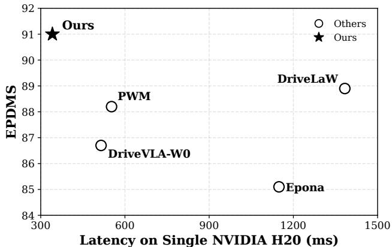  
Figure 1: Eficiency-performance overview on a single NVIDIA H20 GPU (preprocessed-input-to-trajectory latency). SV-WAM reaches the best NAVSIMv2 EPDMS at the lowest latency despite using six-camera input.

However, deploying world models for autonomous driving introduces a fundamental trade-of between reliability and computational eficiency. Reliable planning often requires surround-view observations, since side and rear context is critical for lane changes, merges, turns, and interactions with nearby vehicles. As illustrated in Figure 2, a front-view-only model may miss agents in lateral or rear blind zones, leading to unsafe decisions. Nevertheless, recent WM-based planners, such as Epona (Zhang et al. 2025), PWM (Zhao et al. 2025), DriveVLA-W0 (Li et al. 2026b), and DriveLaW (Xia et al. 2026), commonly adopt single-front-view inputs at inference to reduce the cost of future prediction and action generation. A straightforward extension to six-view future-video rollout would substantially increase the number of visual tokens and the inference latency. Therefore, the key challenge is how to retain surround-view evidence for reliable planning while avoiding expensive multi-view future-video generation at deployment.

To address this challenge, we propose SV-WAM, an efficient surround-view world-action model that uses future video as training-time supervision rather than an inferencetime output. During training, SV-WAM jointly denoises future actions and six-view future-video latents within a shared difusion-transformer backbone, allowing action prediction to benefit from future-scene dynamics through the shared model parameters. To avoid the inference-time computational cost of future-video prediction, we introduce an action-centered causal mask that prevents action tokens from attending to future-video tokens. This causal design allows the video branch to be removed at deployment, enabling eficient action-only inference while retaining full six-view spatial coverage. We further introduce a diferentiable drivable-area compliance regularizer that penalizes vehicle footprints near or beyond drivable boundaries, thereby improving drivable-area compliance and planning safety without additional inference cost.

Experiments show that SV-WAM achieves strong planning performance with low latency. On NAVSIMv2, SV-WAM reaches 91.0 EPDMS and runs in 342 ms on a single NVIDIA H20 GPU from preprocessed inputs to trajectory output, outperforming recent WM-based planners. On nuScenes, SV-WAM transfers zero-shot with 0.89 m average L2 error and 0.16% average collision rate.

Our contributions can be summarized as follows:

1. We propose SV-WAM, an eficient surround-view worldaction model with an action-centered causal mask that enables co-training of future actions and surround-view future-video latents while retaining action-only inference with full six-view conditioning.

2. We introduce a diferentiable drivable-area regularizer that encourages predicted trajectories to remain within the drivable region, improving road compliance and safety without increasing inference cost.

3. Our method achieves state-of-the-art performance on NAVSIMv2 and demonstrates competitive zero-shot transfer on nuScenes with low latency.

## Related Work

End-to-End Autonomous Driving. End-to-end autonomous driving predicts future ego trajectories directly from raw sensor inputs (Hu et al. 2022). BEV-based methods such as UniAD (Hu et al. 2023b) and VAD (Jiang et al. 2023) integrate perception, prediction, and planning into a unified framework, while DifusionDrive (Liao et al. 2025) improves multimodal trajectory generation with a truncated difusion policy. Recent VLA-based planners further enhance driving with semantic reasoning; for example, ReCogDrive (Li et al. 2026c) connects scene-level understanding with continuous trajectory generation, and OpenDriveVLA (Zhou et al. 2026) grounds action prediction on 2D/3D visual representations and language commands (Tian et al. 2024; Zhou et al. 2025; Li et al. 2026a). Despite their strong performance, many existing structured planners rely on multiple task-specific modules to construct explicit intermediate representations, such as object detections or occupancy maps, before trajectory generation. These modules increase architectural complexity. Moreover, they lack explicit modeling of future scene evolution.

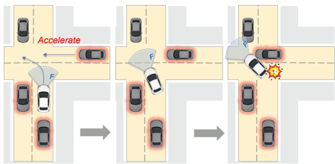  
Figure 2: Motivation for surround-view planning. For example, at unsignalized intersections, front-view-only planners may lack suficient lateral context and make unsafe decisions in complex trafic.

Driving World Models for Planning. Driving world models have recently emerged for end-to-end planning (Chen, Wang, and Zhang 2025). Epona (Zhang et al. 2025) learns an autoregressive difusion world model that couples future scene prediction with trajectory planning, while PWM (Zhao et al. 2025) integrates world modeling and trajectory planning through collaborative state–action prediction. DriveLaW (Xia et al. 2026) further unifies planning and video generation in a latent driving world, demonstrating the value of future visual prediction for downstream planning. However, these recent WM-based planners commonly use only a front view at inference, which limits spatial coverage in safety-critical maneuvers such as lane changes, merges, and turns. Recent latent world models extend this paradigm to three-front-view observations but rely on external perception priors. World4Drive (Zheng et al. 2025) uses pretrained spatial–semantic features for future-latent prediction and trajectory evaluation, while WorldRFT (Yang et al. 2026) leverages vision–geometry priors for planning-aligned representation learning and reinforcement fine-tuning. Both retain pretrained geometric encoders in the inference path, introducing additional intermediate estimation stages. Directly extending such models to full surround-view inputs would further amplify the computational burden.

Eficient World-Action Models. Existing WAMs often follow imagine-then-execute or joint video–action modeling paradigms (Du et al. 2023), where future-video prediction remains in the inference loop and introduces substantial latency. Recent embodied WAMs therefore shift future prediction from test-time imagination to training-time supervision. Fast-WAM (Yuan et al. 2026) employs a shared-attention Mixture-of-Transformers architecture that couples a video DiT with an action expert DiT, retaining video co-training while using the video branch only as a single-pass world encoder at inference. GigaWorld-Policy (Ye et al. 2026a) uses future-video generation as training-time supervision and retains only action prediction at test time. We bring this eficiency principle to surround-view driving, where preserving lateral and rear context must be balanced against the cost of multi-view future generation.

## Methodology

## Overview

Figure 3 presents the overall framework of SV-WAM, which consists of four components. First, input tokenization converts historical surround-view observations, ego states, and action sequences into transformer-compatible tokens. Second, the surround-view world–action model jointly denoises future actions and future-video latents using an actioncentered causal mask. Third, the drivable-area compliance regularizer penalizes vehicle footprints that approach or cross non-drivable boundaries during training. Finally, at inference, SV-WAM removes the future-video branch and reuses the cached condition prefix across denoising steps, enabling eficient action-only planning.

## Input Tokenization

This subsection describes how SV-WAM converts surroundview images, ego states, actions, and future-video latents into transformer inputs.

Surround-View Video Encoding. Let $N _ { \mathrm { { c a m } } } = 6$ denote the number of cameras. At each timestamp i, the camera images are arranged in a fixed order and concatenated along the width dimension:

$$
X _ { i } = \mathrm { C o n c a t } _ { w } ( I _ { i } ^ { 1 } , I _ { i } ^ { 2 } , \dots , I _ { i } ^ { N _ { \mathrm { c a m } } } ) ,\tag{1}
$$

where $I _ { i } ^ { v }$ denotes the image from the v-th camera and $X _ { i }$ is the resulting surround-view frame.

We encode the full training video sequence $X _ { - H + 1 : F }$ using the frozen 3D causal VAE encoder of Wan2.2-TI2V-5B (Wan Team 2025). The resulting latents are split along the temporal dimension:

$$
[ Z ^ { \mathrm { r e f } } , Z ^ { \mathrm { f u t } } ] = E _ { \mathrm { v a e } } ( X _ { - H + 1 : F } ) .\tag{2}
$$

Here, H and $F$ denote the numbers of historical and future frames, respectively; $Z ^ { \mathrm { r e f } }$ represents the clean historical prefix used for visual conditioning, while $Z ^ { \mathrm { f u t } }$ contains the future-video latents used only during training. Both are tokenized using a shared video tokenizer:

$$
[ \mathcal { V } ^ { \mathrm { r e f } } , \mathcal { V } ^ { \mathrm { f u t } } ] = \mathrm { T o k } _ { v } ( [ Z ^ { \mathrm { r e f } } , Z ^ { \mathrm { f u t } } ] ) .\tag{3}
$$

In implementation, Tok partitions the latents into spatiotemporal patches and embeds them into a flattened transformer-token sequence.

State and Action Encoding. Following the NAVSIM input convention (Dauner et al. 2024), we denote the ego-state history as ${ \cal { S } } = \{ s _ { i } \} _ { i = - H + 1 } ^ { 0 }$ , where $s _ { i } \in \mathbb { R } ^ { 8 }$ . An MLP maps the state history into state tokens:

$$
S = \phi _ { s } ( S ) .\tag{4}
$$

The future action sequence is written as $A = \{ a _ { k } \ =$ $( \Delta x _ { k } , \Delta y _ { k } , \Delta \psi _ { k } ) \} _ { k = 1 } ^ { K }$ , where each action represents a stepwise ego-relative motion increment. The sequence is projected into action tokens using an MLP tokenizer:

$$
{ \mathcal { A } } = \phi _ { a } ( A ) .\tag{5}
$$

## Surround-View World-Action Model

This subsection introduces the action-centered causal mask mechanism for eficient inference and thejoint flow-matching training used in SV-WAM.

Action-Centered Causal Mask. Recent video-action driving models jointly generate future visual forecasts and action sequences in a shared generative process (Liu et al. 2026). Inspired by embodied world-action modeling (Ye et al. 2026a), we design an action-centered causal mask for eficient planning. The mask blocks the direct attention dependency of action tokens on future-video tokens, which are expensive to denoise and are not instantiated in the action-only inference path.

The mask is applied over the packed token sequence during self-attention. During flow training, we sample a shared base time $u \sim \mathcal { U } ( 0 , 1 )$ and apply a shifted flow schedule to obtain t for both action and future-video denoising. Given Gaussian noises $\epsilon _ { a }$ and $\epsilon _ { z } ,$ , we construct

$$
A _ { t } = ( 1 - t ) A _ { 0 } + t \epsilon _ { a } , \qquad Z _ { t } ^ { \mathrm { f u t } } = ( 1 - t ) Z _ { 0 } ^ { \mathrm { f u t } } + t \epsilon _ { z } ,\tag{6}
$$

where $A _ { 0 }$ and $Z _ { 0 } ^ { \mathrm { f u t } }$ denote the clean future action sequence and clean future video latents. Using the tokenizers defined in the previous subsection, $A _ { t }$ and $\overline { { Z } } _ { t } ^ { \mathrm { f u t } }$ are converted into noisy action tokens $\boldsymbol { A } _ { t }$ and noisy future-video tokens $\mathcal { V } _ { t } ^ { \mathrm { f u t } }$ The resulting self-attention sequence is

$$
\mathcal { V } _ { t } = [ S , \mathcal { V } ^ { \mathrm { r e f } } , \mathcal { A } _ { t } , \mathcal { V } _ { t } ^ { \mathrm { f u t } } ] .\tag{7}
$$

As shown in Figure 4, state tokens and reference video tokens form the clean condition prefix and attend only to themselves. Action tokens attend to the condition prefix and action tokens, while future video tokens attend to the condition prefix, action tokens, and future video tokens.

Let $\Omega = \{ Z ^ { \mathrm { r e f } } , S \}$ denote the condition consisting of reference video latents and ego-state history. The mask induces an action-centered factorization:

$$
\begin{array} { r } { p _ { \theta } ( A _ { 0 } , Z _ { 0 } ^ { \mathrm { f u t } } \mid \Omega ) = p _ { \theta } ( A _ { 0 } \mid \Omega ) p _ { \theta } ( Z _ { 0 } ^ { \mathrm { f u t } } \mid \Omega , A _ { 0 } ) . } \end{array}\tag{8}
$$

Thus, future-video denoising provides future-dynamics supervision through the shared model parameters, while action tokens do not attend to future-video tokens in the forward pass. This property enables action-only inference.

SV-WAM Training. We train SV-WAM with flow matching (Lipman et al. 2023; Liu, Gong, and Liu 2023) on both future actions and future video latents. Given the noisy variables defined above, the target velocity fields for the two branches are obtained by diferentiating the interpolations $A _ { t }$ and $Z _ { t } ^ { \mathrm { f u t } }$ with respect to t:

$$
v _ { a } ^ { \star } = \epsilon _ { a } - A _ { 0 } , \qquad v _ { z } ^ { \star } = \epsilon _ { z } - Z _ { 0 } ^ { \mathrm { f u t } } .\tag{9}
$$

The masked transformer takes the self-attention sequence $\mathcal { V } _ { t }$ and the flow time t as input:

$$
\begin{array} { r } { ( \hat { v } _ { a } , \hat { v } _ { z } ) = f _ { \theta } ( \mathcal { V } _ { t } , t ) , } \end{array}\tag{10}
$$

where $f _ { \theta }$ denotes the masked velocity predictor with learnable parameters θ, and $\hat { v } _ { a }$ and vˆ are the predicted action- and video-velocity fields. The action velocity is decoded from the action token positions using an MLP action head, while the video velocity is projected from the future video token positions and unpatchified back to the VAE latent space.

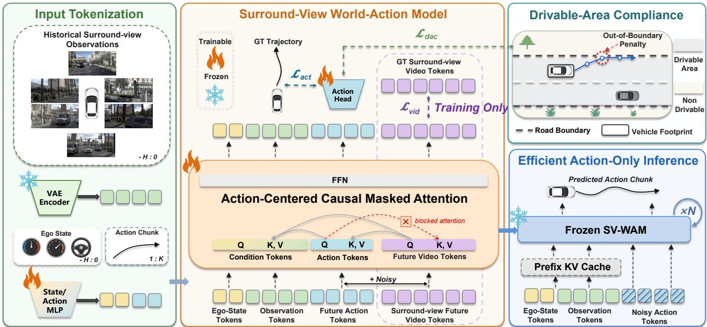  
Figure 3: Overview of SV-WAM. During training, SV-WAM jointly denoises future actions and future-video latents conditioned on six-view historical observations. The action-centered causal mask blocks action-token attention to future-video tokens, while the drivable-area compliance regularizer promotes road-compliant planning. At inference, the future-video branch is removed, enabling eficient action-only planning with full six-view context.

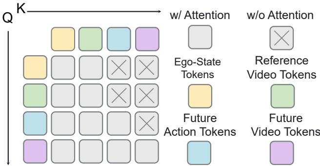  
Figure 4: Action-centered causal mask. Action tokens attend to ego-state and reference-video tokens but are blocked from attending to future-video tokens, whereas future-video tokens can attend to action tokens. This asymmetric dependency supports future-video co-training without making action prediction dependent on future-video tokens at inference.

The flow matching loss is defined as

$$
\begin{array} { r l } & { { \mathcal { L } } _ { \mathrm { f m } } = \lambda _ { \mathrm { a c t } } \left. \hat { v } _ { a } - { v } _ { a } ^ { \star } \right. _ { 2 } ^ { 2 } } \\ & { ~ + \lambda _ { \mathrm { v i d } } \left. \hat { v } _ { z } - { v } _ { z } ^ { \star } \right. _ { 2 } ^ { 2 } . } \end{array}\tag{11}
$$

The action branch directly optimizes trajectory generation, while the future video branch encourages the model to capture future scene dynamics. Because the causal mask prevents

action-token queries from attending to future-video keys and values, future-video supervision introduces no inferencetime dependency into the action path.

## Drivable Area Compliance Regularization

Flow matching learns future ego actions from trajectory supervision, but it does not explicitly constrain the simulated vehicle footprint with respect to drivable boundaries. Motivated by the drivable area compliance metric in NAVSIM (Dauner et al. 2024), we propose a drivable area compliance regularizer that softly penalizes predicted trajectories whose footprint approaches or leaves the drivable region. Given the predicted action velocity $\hat { v } _ { a } .$ , we first recover the clean action prediction from the noisy action input:

$$
\hat { A } _ { 0 } = A _ { t } - t \hat { v } _ { a } .\tag{12}
$$

Given a binary drivable area map $b ,$ we construct a signed distance field Φ in the ego-centric coordinate system:

$$
\Phi ( u ) = D _ { \mathrm { n o n } } ( u ) - D _ { \mathrm { d r i v e } } ( u ) ,\tag{13}
$$

where $D _ { \mathrm { n o n } } ( u )$ and $D _ { \mathrm { d r i v e } } ( u )$ denote the Euclidean distances from location u to the nearest non-drivable and drivable cells, respectively. Under this convention, $\Phi ( u ) > 0$ indicates that u lies inside the drivable area, while $\dot { \Phi ( u ) } < 0$ indicates an of-road location.

After denormalization, we follow the oficial NAVSIM evaluation pipeline (Dauner et al. 2024) and use its LQRbased tracker to roll out $\hat { A } _ { 0 }$ into simulated ego poses $Q =$ $\{ q _ { i } \} _ { i = 1 } ^ { N _ { q } }$ , where $q _ { i } = ( x _ { i } , y _ { i } , \psi _ { i } )$ . For each simulated pose, we compute the four corner points $c _ { i , j }$ of the vehicle footprint and sample their signed distances from the signed distance field:

$$
d _ { i , j } = \Phi ( c _ { i , j } ) , \qquad j = 1 , \ldots , 4 .\tag{14}
$$

Since the corner points are continuous coordinates, $\Phi ( c _ { i , j } )$ is evaluated by bilinear interpolation on the signed distance field grid.

We apply a smooth margin penalty to each sampled distance:

$$
\ell ( d _ { i , j } ) = \beta \log \left( 1 + \exp \left( \frac { m - d _ { i , j } } { \beta } \right) \right) ,\tag{15}
$$

where $m$ is the safety margin and $\beta$ controls the smoothness. The final drivable area compliance loss is computed by logmean-exp aggregation over all footprint penalties:

$$
\mathcal { L } _ { \mathrm { d a c } } = \rho \log \left( \frac { 1 } { 4 N _ { q } } \sum _ { i = 1 } ^ { N _ { q } } \sum _ { j = 1 } ^ { 4 } \exp \left( \frac { \ell ( d _ { i , j } ) } { \rho } \right) \right) ,\tag{16}
$$

where $\rho$ is the aggregation temperature. This aggregation acts as a smooth maximum and assigns larger weights to highrisk footprint violations than simple averaging. The overall training objective is

$$
\begin{array} { r } { \mathcal { L } = \mathcal { L } _ { \mathrm { f m } } + \lambda _ { \mathrm { d a c } } \mathcal { L } _ { \mathrm { d a c } } . } \end{array}\tag{17}
$$

## Eficient Action-Only Inference

At inference time, we keep the same reference video and state conditioning path but omit noisy future video tokens from the transformer sequence. The inference sequence becomes

$$
\mathcal { V } _ { t } ^ { \mathrm { a c t } } = [ S , \mathcal { V } ^ { \mathrm { r e f } } , \mathcal { A } _ { t } ] .\tag{18}
$$

The same trained model is evaluated under the corresponding action-only mask:

$$
\hat { v } _ { a } = f _ { \theta } ( \mathcal { V } _ { t } ^ { \mathrm { a c t } } , t ) ,\tag{19}
$$

where $f _ { \theta }$ denotes the trained action-velocity predictor. Starting from Gaussian action noise, the action scheduler iteratively updates the action sequence using the predicted velocity field. Since noisy future video tokens are not instantiated and the video output branch is skipped, SV-WAM avoids future video denoising and decoding during deployment while retaining the representation benefit of training-time video co-denoising. To further improve eficiency, we cache and reuse the conditioning prefix across denoising steps.

## Experiments

## Experimental Setup

Benchmarks and Metrics. We evaluate closed-loop planning on NAVSIMv2 (Dauner et al. 2024; Cao et al. 2025), which reports the Extended Predictive Driver Model Score (EPDMS). EPDMS aggregates no at-fault collision (NC), drivable-area compliance (DAC), driving-direction compliance (DDC), trafic-light compliance (TLC), ego progress (EP), time-to-collision (TTC), lane keeping (LK), history comfort (HC), and extended comfort (EC), where the compliance terms act as multiplicative safety penalties. To test crossdataset generalization, we further evaluate on nuScenes (Caesar et al. 2020) without target-domain fine-tuning. For nuScenes, we report L2 trajectory error and collision rate at 1s, 2s, 3s, and their averages. NAVSIMv1 and NAVSIMv2 navhard results are reported in the Appendix.

Implementation Details. Our planner uses H = 4 historical frames from six cameras: front-left, front, frontright, rear-right, rear, and rear-left. Each view is resized to 448 × 224, and the six views are concatenated along the width dimension before being encoded by the frozen 3D causal VAE encoder from Wan2.2-TI2V-5B. Both historical observations and future-video targets are sampled at 2 Hz (a 0.5 s temporal interval). We adopt Wan2.2-5B as the DiT backbone (Peebles and Xie 2023). The model predicts 12 future action tokens and is trained with 12-frame six-view future video latent supervision. We train on NAVSIM trainval for 10k iterations with AdamW, batch size 80, learning rate $1 0 ^ { - 4 } .$ , and weight decay $1 0 ^ { - 2 }$ on 16 H800 GPUs. We then fine-tune for 1k iterations with an efective batch size of 640 (gradient accumulation of 8 over a per-step batch of 80) and a learning rate decayed from $1 0 ^ { - 5 }$ to $1 { \stackrel { \cdot } { 0 } } ^ { - 6 } !$ ; each stage takes roughly one day on the 16 GPUs. All reported main results use two-step action-only inference. Future video tokens provide training-time supervision only. At inference, we remove the video branch and cache the observation prefix as key/value states.

## Main Results

NAVSIMv2. As demonstrated in Table 1, SV-WAM achieves the best performance under the closed-loop NAVSIMv2 metric suite, outperforming recent end-to-end driving planners on the navtest split. We follow the evaluation setting of EponaV2 (Xu et al. 2026). The results for DriveVLA-W0 and DriveLaW are reproduced using their official code and checkpoints, while the remaining baseline results are taken from the corresponding papers or oficial leaderboard. SV-WAM achieves the best EPDMS of 91.0. These gains should not be attributed to surround-view input alone. The six-view observations provide complementary side and rear context, while future-video co-training and the drivable-area regularizer further improve future-aware representation learning and road-boundary compliance, respectively, as analyzed in Table 3.

nuScenes Zero-Shot Transfer. As shown in Table 2, we further evaluate zero-shot transfer to nuScenes. The upper block lists representative methods fine-tuned on nuScenes, whereas the lower block compares world-model planners without nuScenes fine-tuning. We directly evaluate the officially released checkpoints of DriveVLA-W0 and PWM without further fine-tuning on NAVSIM or nuScenes. Under this setting, SV-WAM achieves the lowest average L2 error of 0.89 m and collision rate of 0.16% among the zeroshot methods, while remaining competitive with several indomain fine-tuned planners. This result provides encouraging evidence of cross-dataset transfer without target-domain supervision. Additional zero-shot qualitative results on inhouse driving data are provided in the Appendix.

## Ablation Studies

Training Components. Table 3 ablates the three ingredients of the final model. All variants share the same C×6 architecture and evaluation setup, difering only in the enabled training components. Future-video co-training improves EPDMS from 83.1 to 87.7, showing that grounding actions in future visual dynamics helps even though the video branch is removed at deployment. Adding the DAC regularization raises EPDMS to 90.1 and DAC from 95.6 to 98.6, indicating fewer drivable-area violations. Final fine-tuning yields 91.0 EPDMS.

<table><tr><td>Method</td><td>Ref.</td><td>Input</td><td>NC↑</td><td>DAC↑</td><td>DDC↑</td><td>TLC ↑</td><td>EP↑</td><td>TTC↑</td><td>LK↑</td><td>HC↑</td><td>EC↑</td><td>EPDMS ↑</td></tr><tr><td>ReCogDrive (Li et al. 2026c)</td><td>ICLR&#x27;26</td><td>C×1</td><td>98.3</td><td>95.2</td><td>99.5</td><td>99.8</td><td>87.1</td><td>97.5</td><td>96.6</td><td>98.3</td><td>86.5</td><td>83.6</td></tr><tr><td>Epona † (Zhang et al. 2025)</td><td>ICCV&#x27;25</td><td>C×1</td><td>97.1</td><td>95.7</td><td>99.3</td><td>99.7</td><td>88.6</td><td>96.3</td><td>97.0</td><td>98.0</td><td>67.8</td><td>85.1</td></tr><tr><td>DriveVLA-W0 † (Li et al. 2026b)</td><td>ICLR&#x27;26</td><td>C×1</td><td>98.3</td><td>95.0</td><td>99.4</td><td>99.9</td><td>86.6</td><td>97.8</td><td>97.7</td><td>98.4</td><td>82.4</td><td>86.7</td></tr><tr><td>PWM † (Zhao et al. 2025)</td><td>NeurIPS&#x27;25</td><td>C×1</td><td>98.8</td><td>95.9</td><td>99.4</td><td>99.9</td><td>86.4</td><td>98.4</td><td>97.6</td><td>98.3</td><td>85.3</td><td>88.2</td></tr><tr><td>DriveLaW † (Xia et al. 2026)</td><td>CVPR&#x27;26</td><td>C×1</td><td>98.8</td><td>96.9</td><td>99.6</td><td>99.8</td><td>87.4</td><td>98.3</td><td>97.7</td><td>98.4</td><td>80.2</td><td>88.9</td></tr><tr><td>EponaV2 † (u et al. 2026)</td><td>arXiv&#x27;26</td><td>C×1</td><td>98.5</td><td>97.4</td><td>99.5</td><td>99.9</td><td>87.9</td><td>98.1</td><td>97.7</td><td>98.2</td><td>77.4</td><td>88.9</td></tr><tr><td>Ours †</td><td></td><td>C×1</td><td>98.4</td><td>98.4</td><td>99.1</td><td>99.8</td><td>85.5</td><td>97.8</td><td>95.9</td><td>98.4</td><td>86.5</td><td>89.3</td></tr><tr><td>AutoDrive-P3 (Ye et al. 2026b)</td><td>ICLR&#x27;26</td><td>C×3</td><td>99.1</td><td>97.4</td><td>99.2</td><td>99.8</td><td>88.0</td><td>98.7</td><td>96.3</td><td>98.3</td><td>85.5</td><td>89.9</td></tr><tr><td>WoTE † (Li et àl. 2025)</td><td>ICCV&#x27;25</td><td>C×3&amp;L</td><td>98.5</td><td>96.8</td><td>98.8</td><td>99.8</td><td>86.1</td><td>97.9</td><td>95.5</td><td>98.3</td><td>82.9</td><td>87.7</td></tr><tr><td>DiffusionDrive (Liao et al. 2025)</td><td>CVPR&#x27;25</td><td>C×3&amp;L</td><td>98.2</td><td>96.2</td><td>99.5</td><td>99.8</td><td>87.4</td><td>97.3</td><td>96.9</td><td>98.4</td><td>87.7</td><td>88.2</td></tr><tr><td>Ours †</td><td></td><td>C×3</td><td>98.7</td><td>99.1</td><td>99.4</td><td>99.8</td><td>86.1</td><td>98.1</td><td>96.5</td><td>98.4</td><td>86.6</td><td>90.5</td></tr><tr><td>Ours †</td><td></td><td>C×6</td><td>98.6</td><td>98.8</td><td>99.6</td><td>99.9</td><td>86.8</td><td>98.3</td><td>97.8</td><td>98.4</td><td>88.4</td><td>91.0</td></tr></table>

Table 1: Detailed closed-loop planning comparison on the NAVSIMv2 navtest split with human penalty enabled. Metrics are reported as percentages. C denotes camera input and L denotes LiDAR input; for example, C×1 is front-camera-only input, C×3 denotes three front-facing camera input, and C×6 denotes six-view surround-camera input. Bold and underlined values indicate the best and second-best results overall, respectively. † denotes WM-based methods.
<table><tr><td rowspan="2">Method</td><td rowspan="2">nuS. FT</td><td rowspan="2">Ref</td><td rowspan="2">Input</td><td colspan="4">L2 (m) ↓</td><td colspan="4">Collision Rate (%) ↓</td></tr><tr><td></td><td>2s</td><td>3s</td><td>Avg.</td><td>1s</td><td>2s</td><td>3s</td><td>Avg.</td></tr><tr><td>UniAD (Hu et al. 2023b)</td><td>√</td><td>CVPR&#x27;23</td><td>C×6</td><td>0.48</td><td>0.96</td><td>1.65</td><td>1.03</td><td>0.05</td><td>0.17</td><td>0.71</td><td>0.31</td></tr><tr><td>VAD-Base (Jiang et al. 2023)</td><td>√</td><td>ICCV&#x27;23</td><td>C×6</td><td>0.54</td><td>1.15</td><td>1.98</td><td>1.22</td><td>0.04</td><td>0.39</td><td>1.17</td><td>0.53</td></tr><tr><td>GenAD (Zheng et al. 2024b)</td><td>√</td><td>ECCV&#x27;24</td><td>C×6</td><td>0.36</td><td>0.83</td><td>1.55</td><td>0.91</td><td>0.06</td><td>0.23</td><td>1.00</td><td>0.43</td></tr><tr><td>Doe-1 (Żheng et al. 2024c)</td><td>√</td><td>arXiv&#x27;24</td><td>C×1</td><td>0.50</td><td>1.18</td><td>2.11</td><td>1.26</td><td>0.04</td><td>0.37</td><td>1.19</td><td>0.53</td></tr><tr><td>Epona † (Zhang et al. 2025)</td><td>V</td><td>ICCV&#x27;25</td><td>C×1</td><td>0.61</td><td>1.17</td><td>1.98</td><td>1.25</td><td>0.01</td><td>0.22</td><td>0.85</td><td>0.36</td></tr><tr><td>DriveLaW † (Xia et al. 2026)</td><td>√</td><td>CVPR&#x27;26</td><td>C×1</td><td>0.44</td><td>1.10</td><td>1.91</td><td>1.15</td><td>0.15</td><td>0.10</td><td>0.48</td><td>0.24</td></tr><tr><td>DriveVLA-W0 † (Li et al. 2026b)</td><td>X</td><td>ICLR’26</td><td>C×1</td><td>0.43</td><td>1.26</td><td>2.60</td><td>1.43</td><td>0.22</td><td>0.66</td><td>1.42</td><td>0.77</td></tr><tr><td>PWM † (Zhao et al. 2025)</td><td>X</td><td>NeurIPS’25</td><td>C×1</td><td>2.06</td><td>3.91</td><td>6.00</td><td>3.99</td><td>0.12</td><td>0.15</td><td>0.86</td><td>0.36</td></tr><tr><td>Ours †</td><td>X</td><td></td><td>C×6</td><td>0.31</td><td>0.80</td><td>1.57</td><td>0.89</td><td>0.07</td><td>0.13</td><td>0.27</td><td>0.16</td></tr></table>

Table 2: End-to-end motion planning performance on nuScenes. “nuS. FT” marks whether the method is fine-tuned on nuScenes. DriveVLA-W0 and PWM are evaluated zero-shot on nuScenes using their oficially released checkpoints, without additional fine-tuning. Results for additional methods are provided in the Appendix. Bold and underlined values indicate the best and second-best results, respectively. † denotes WM-based methods.

<table><tr><td>Video Sup.</td><td>DAC-reg</td><td>FT</td><td>DAC ↑</td><td>EPDMS ↑</td></tr><tr><td>×</td><td>×</td><td>X</td><td>93.4</td><td>83.1</td></tr><tr><td>√</td><td>×</td><td>X</td><td>95.6</td><td>87.7</td></tr><tr><td>√</td><td>√</td><td>×</td><td>98.6</td><td>90.1</td></tr><tr><td>√</td><td>√</td><td>√</td><td>98.8</td><td>91.0</td></tr></table>

Table 3: Component ablation on NAVSIMv2 navtest. Video Sup. denotes future-video supervision co-training, DAC-reg denotes the drivable-area regularizer, and FT denotes final fine-tuning.

Action-Centered Causal Mask and Inference Steps. Table 4 jointly studies the action-centered causal mask and the number of inference steps. For a controlled comparison, the masked and unmasked variants are trained with identical model architectures, training configurations, and hyperparameters, difering only in the attention mask. Without the mask, action tokens can read noisy future-video tokens during joint generation. Increasing the steps from 2 to 10 improves EPDMS from 87.3 to 88.2, consistent with more complete future-video denoising reducing the noise that propagates into action prediction. With the causal mask, action tokens no longer depend on future-video tokens; two steps attain the best EPDMS of 91.0, while 5 and 10 steps give 90.9 and 90.8. Additional refinement is therefore unnecessary for the decoupled action path, and its small decline likely reflects minor iterative perturbations of an already converged action trajectory rather than useful correction from the uncertain future-video branch. Moreover, we ablate the future-video branch at inference under the causal mask and observe unchanged planning performance with or without it.

Surround-View Coverage. The controlled variants in Table 1 share the same architecture and training schedule. Increasing camera coverage consistently improves EPDMS, with the full six-view setting achieving the best final score. The improvements in DDC, LK, EC, and EPDMS indicate that wider visual coverage benefits overall planning quality and several safety-related submetrics. This trend is consistent with the motivation for surround-view inputs, as side and rear observations provide complementary context that is unavailable from a single front camera.

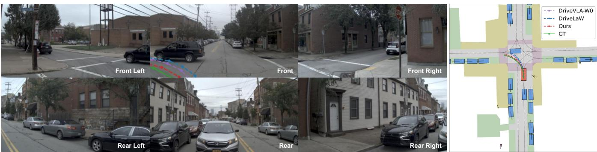

Figure 5: Qualitative comparison in a challenging turning scenario from NAVSIMv2. Left: current six-camera observations. Right: the corresponding BEV visualization. SV-WAM predicts a trajectory that more closely follows the ground truth and better aligns with the road geometry than DriveLaW and DriveVLA-W0.
<table><tr><td>Causal Mask</td><td>Steps</td><td>Input</td><td>NC↑</td><td>DAC ↑</td><td>DDC↑</td><td>TLC↑</td><td>EP↑</td><td>TTC ↑</td><td>LK↑</td><td>HC↑</td><td>EC↑</td><td>EPDMS ↑</td></tr><tr><td>X</td><td></td><td>C×6</td><td>97.4</td><td>96.6</td><td>99.0</td><td>99.7</td><td>87.8</td><td>96.8</td><td>97.0</td><td>98.3</td><td>86.0</td><td>87.3</td></tr><tr><td>×</td><td>25</td><td>C×6</td><td>97.6</td><td>96.8</td><td>99.2</td><td>99.7</td><td>87.7</td><td>96.9</td><td>97.5</td><td>98.3</td><td>87.3</td><td>87.9</td></tr><tr><td>X</td><td>10</td><td>C×6</td><td>97.7</td><td>96.9</td><td>99.3</td><td>99.7</td><td>87.6</td><td>97.0</td><td>97.6</td><td>98.3</td><td>87.3</td><td>88.2</td></tr><tr><td>√</td><td>25</td><td>C×6</td><td>98.6</td><td>98.8</td><td>99.6</td><td>99.9</td><td>86.8</td><td>98.3</td><td>97.8</td><td>98.4</td><td>88.4</td><td>91.0</td></tr><tr><td>V</td><td></td><td>C×6</td><td>98.6</td><td>98.6</td><td>99.6</td><td>99.9</td><td>86.8</td><td>98.4</td><td>97.9</td><td>98.4</td><td>88.4</td><td>90.9</td></tr><tr><td>√</td><td>10</td><td>C×6</td><td>98.6</td><td>98.5</td><td>99.7</td><td>99.8</td><td>86.9</td><td>98.2</td><td>97.9</td><td>98.4</td><td>88.4</td><td>90.8</td></tr></table>

Table 4: Ablation on the causal mask and inference steps on NAVSIMv2 navtest. Bold values indicate the best results.

## Eficiency Analysis

Figure 1 summarizes the eficiency–performance trade-of against recent world-model-based planners. Table 5 compares their online trajectory-output latency on a single H20 GPU. The timing starts from preprocessed inputs to final trajectory. For the compared methods, we use oficial code, released checkpoints, and default inference configurations. All methods use batch size 1 and bf16 where supported; 30 samples remain after 5 warm-up samples. Despite using six cameras, SV-WAM achieves the lowest latency at 341.6 ± 2.1 ms. Removing the action-centered causal mask requires the future-video branch to remain active at inference, increasing the trajectory-output latency to 848.0 ± 1.8 ms, with optional video decoding excluded in both cases. The full measurement protocol and optional video-rendering costs are provided in the Appendix.

## Qualitative Analysis

Figure 5 compares SV-WAM with DriveLaW and DriveVLA-W0 in a challenging turning scenario. Benefiting from the richer spatial context provided by six-view observations and the drivable-area compliance regularizer, SV-WAM predicts a trajectory that more closely follows the ground-truth path and remains within the drivable corridor, demonstrating stronger planning robustness in complex maneuvers. Additional qualitative comparisons across diverse driving scenarios are provided in the Appendix.

<table><tr><td>Method</td><td>Vis. Enc.</td><td>Core Gen.</td><td>Other</td><td>Total (ms) ↓ mean±std</td></tr><tr><td>Epona</td><td>725.4</td><td>415.2</td><td>8.2</td><td>1148.8±4.5</td></tr><tr><td>DriveLaW</td><td>459.7</td><td>663.7</td><td>259.9</td><td>1383.3±19.7</td></tr><tr><td>PWM</td><td>210.2</td><td>336.0</td><td>6.1</td><td>552.3±5.4</td></tr><tr><td>DriveVLA-W0</td><td>76.6</td><td>369.0</td><td>69.3</td><td>514.9±3.8</td></tr><tr><td>Ours (w/o mask)</td><td>438.4</td><td>392.5</td><td>17.1</td><td>848.0±1.8</td></tr><tr><td>Ours</td><td>174.7</td><td>151.4</td><td>15.5</td><td>341.6±2.1</td></tr></table>

Table 5: Online trajectory-output latency comparison among WM-based planning methods on a single NVIDIA H20 GPU. Vis. Enc., Core Gen., and Other denote visual tokenization, iterative backbone generation, and remaining pipeline overhead, respectively. Component-wise values are means in milliseconds, while total latencies are reported as mean ± standard deviation. Optional video rendering and future-video VAE decoding are excluded.

## Conclusion

We present SV-WAM, an eficient surround-view worldaction model for end-to-end autonomous driving. The key insight is that six-camera context should be retained for reliable planning, whereas future video prediction can be used as training-time supervision and removed from inference. SV-WAM follows this insight with an action-centered causal mask that enablesjoint denoising offuture actions and futurevideo latents while blocking the direct attention dependency of action tokens on future-video tokens. Future-video supervision still updates the shared model parameters, while the video branch can be removed at inference, yielding an eficient action-only planner with full surround-view coverage. We further introduce a diferentiable drivable area compliance regularizer to improve road compliance. Experiments on NAVSIMv2 and nuScenes validate the efectiveness and eficiency of the proposed design.

## References

Caesar, H.; Bankiti, V.; Lang, A. H.; Vora, S.; Liong, V. E.; Xu, Q.; Krishnan, A.; Pan, Y.; Baldan, G.; and Beijbom, O. 2020. nuScenes: A Multimodal Dataset for Autonomous Driving. In Proceedings of the IEEE/CVF Conference on Computer Vision and Pattern Recognition, 11621–11631.

Cao, W.; Hallgarten, M.; Li, T.; Dauner, D.; Gu, X.; Wang, C.; Miron, Y.; Aiello, M.; Li, H.; Gilitschenski, I.; Ivanovic, B.; Pavone, M.; Geiger, A.; and Chitta, K. 2025. Pseudo-Simulation for Autonomous Driving. In Conference on Robot Learning.

Chen, Y.; Wang, Y.; and Zhang, Z. 2025. DrivingGPT: Unifying Driving World Modeling and Planning with Multimodal Autoregressive Transformers. In Proceedings of the IEEE/CVF International Conference on Computer Vision.

Dauner, D.; Hallgarten, M.; Li, T.; Weng, X.; Huang, Z.; Yang, Z.; Li, H.; Gilitschenski, I.; Ivanovic, B.; Pavone, M.; Geiger, A.; and Chitta, K. 2024. NAVSIM: Data-Driven Non-Reactive Autonomous Vehicle Simulation and Benchmarking. In Advances in Neural Information Processing Systems.

Du, Y.; Yang, S.; Dai, B.; Dai, H.; Nachum, O.; Tenenbaum, J.; Schuurmans, D.; and Abbeel, P. 2023. Learning Universal Policies via Text-Guided Video Generation. In Advances in Neural Information Processing Systems.

Feng, L.; Gao, Y.; Zablocki, E.; Li, Q.; Li, W.; Liu, S.; Cord, M.; and Alahi, A. 2026. RAP: 3D Rasterization Augmented End-to-End Planning. In The Fourteenth International Conference on Learning Representations.

Gao, S.; Yang, J.; Chen, L.; Chitta, K.; Qiu, Y.; Geiger, A.; Zhang, J.; and Li, H. 2024. Vista: A Generalizable Driving World Model with High Fidelity and Versatile Controllability. In Advances in Neural Information Processing Systems.

Hu, A.; Russell, L.; Yeo, H.; Murez, Z.; Fedoseev, G.; Kendall, A.; Shotton, J.; and Corrado, G. 2023a. GAIA-1: A Generative World Model for Autonomous Driving. arXiv preprint arXiv:2309.17080.

Hu, S.; Chen, L.; Wu, P.; Li, H.; Yan, J.; and Tao, D. 2022. ST-P3: End-to-end Vision-based Autonomous Driving via Spatial-Temporal Feature Learning. In European Conference on Computer Vision.

Hu, Y.; Yang, J.; Chen, L.; Li, K.; Sima, C.; Zhu, X.; Chai, S.; Du, S.; Lin, T.; et al. 2023b. Planning-oriented Autonomous Driving. In Proceedings of the IEEE/CVF Conference on Computer Vision and Pattern Recognition.

Jiang, B.; Chen, S.; Xu, Q.; Liao, B.; Chen, J.; Zhou, H.; Zhang, Q.; Liu, W.; Huang, C.; and Wang, X. 2023. VAD: Vectorized Scene Representation for Eficient Autonomous Driving. In Proceedings of the IEEE/CVF International Conference on Computer Vision.

Kim, J.; Oh, J.; Yu, S.; Shin, H.; Kwak, D.; and Choi, J. W. 2026. SafeDrive: Fine-Grained Safety Reasoning for End-to-End Driving in a Sparse World. In Proceedings of the IEEE/CVF Conference on Computer Vision and Pattern Recognition, 24854–24864.

Kong, J.; Pfeifer, M.; Schildbach, G.; and Borrelli, F. 2015. Kinematic and Dynamic Vehicle Models for Autonomous Driving Control Design. In IEEE Intelligent Vehicles Symposium (IV).

Li, P.; Zheng, Y.; Wang, Y.; Wang, H.; Zhao, H.; Liu, J.; Zhan, X.; Zhan, K.; and Lang, X. 2026a. Discrete Difusion for Reflective Vision-Language-Action Models in Autonomous Driving. In The Fourteenth International Conference on Learning Representations.

Li, Y.; Shang, S.; Liu, W.; Zhan, B.; Wang, H.; Wang, Y.; Chen, Y.; Wang, X.; An, Y.; Tang, C.; Hou, L.; Fan, L.; and Zhang, Z. 2026b. DriveVLA-W0: World Models Amplify Data Scaling Law in Autonomous Driving. In The Fourteenth International Conference on Learning Representations.

Li, Y.; Wang, Y.; Liu, Y.; He, J.; Fan, L.; and Zhang, Z. 2025. End-to-End Driving with Online Trajectory Evaluation via BEV World Model. In Proceedings ofthe IEEE/CVF International Conference on Computer Vision, 27137–27146.

Li, Y.; Xiong, K.; Guo, X.; Li, F.; Yan, S.; Xu, G.; Zhou, L.; Chen, L.; Sun, H.; Wang, B.; Ma, K.; Chen, G.; Ye, H.; Liu, W.; and Wang, X. 2026c. ReCogDrive: A Reinforced Cognitive Framework for End-to-End Autonomous Driving. In The Fourteenth International Conference on Learning Representations.

Liao, B.; Chen, S.; Yin, H.; Jiang, B.; Wang, C.; Yan, S.; Zhang, X.; Li, X.; Zhang, Y.; Zhang, Q.; et al. 2025. DifusionDrive: Truncated Difusion Model for End-to-End Autonomous Driving. In Proceedings ofthe IEEE/CVF Conference on Computer Vision and Pattern Recognition, 12037– 12047.

Lipman, Y.; Chen, R. T. Q.; Ben-Hamu, H.; Nickel, M.; and Le, M. 2023. Flow Matching for Generative Modeling. In International Conference on Learning Representations.

Liu, M.; Zhang, D.; Liu, J.; Cui, J.; Xie, H.; Chen, G.; Ye, H.; Yang, M. Y.; Nex, F.; and Cheng, H. 2026. DriveVA: Video Action Models are Zero-Shot Drivers. arXiv preprint arXiv:2604.04198.

Liu, X.; Gong, C.; and Liu, Q. 2023. Flow Straight and Fast: Learning to Generate and Transfer Data with Rectified Flow. In International Conference on Learning Representations.

Nguyen, L.; Fauth, M.; Jaeger, B.; Dauner, D.; Igl, M.; Geiger, A.; and Chitta, K. 2026. LEAD: Minimizing Learner-Expert Asymmetry in End-to-End Driving. In Proceedings of the IEEE/CVF Conference on Computer Vision and Pattern Recognition.

Peebles, W.; and Xie, S. 2023. Scalable Difusion Models with Transformers. In IEEE/CVF International Conference on Computer Vision.

Prakash, A.; Chitta, K.; and Geiger, A. 2021. Multi-Modal Fusion Transformer for End-to-End Autonomous Driving. In Proceedings of the IEEE/CVF Conference on Computer Vision and Pattern Recognition, 7077–7087.

Tian, X.; Gu, J.; Li, B.; Liu, Y.; Wang, Y.; Zhao, Z.; Zhan, K.; Jia, P.; Lang, X.; and Zhao, H. 2024. DriveVLM: The Convergence of Autonomous Driving and Large Vision-Language Models. In Conference on Robot Learning.

Tong, W.; Sima, C.; Wang, T.; Chen, L.; Wu, S.; Deng, H.; Gu, Y.; Lu, L.; Luo, P.; and Lin, D. 2023. Scene as Occupancy. In Proceedings of the IEEE/CVF International Conference on Computer Vision.

Wan Team. 2025. Wan2.2: Open and Advanced Large-Scale Video Generative Models. https://github.com/Wan-Video/ Wan2.2. Wan2.2-TI2V-5B model and VAE.

Wang, J.; Li, G.; Huang, Z.; Dang, C.; Ye, H.; Han, Y.; and Chen, L. 2026a. VGGDrive: Empowering Vision-Language Models with Cross-View Geometric Grounding for Autonomous Driving. In Proceedings of the IEEE/CVF Conference on Computer Vision and Pattern Recognition, 10954–10964.

Wang, J.; Zheng, Y.; Liu, X.; Xing, Z.; Li, P.; Ma, K.; Ye, H.; Chen, G.; Li, G.; Chen, L.; Xia, Z.; and Zhang, Q. 2026b. MeanFuser: Fast One-Step Multi-Modal Trajectory Generation and Adaptive Reconstruction via MeanFlow for End-to-End Autonomous Driving. In Proceedings of the IEEE/CVF Conference on Computer Vision and Pattern Recognition, 17884–17893.

Wang, X.; Zhu, Z.; Huang, G.; Chen, X.; Zhu, J.; and Lu, J. 2024. DriveDreamer: Towards Real-world-driven World Models for Autonomous Driving. In European Conference on Computer Vision.

Xia, T.; Li, Y.; Zhou, L.; Yao, J.; Xiong, K.; Sun, H.; Wang, B.; Ma, K.; Chen, G.; Ye, H.; Liu, W.; and Wang, X. 2026. DriveLaW: Unifying Planning and Video Generation in a Latent Driving World. In Proceedings of the IEEE/CVF Conference on Computer Vision and Pattern Recognition, 39701–39712.

Xu, J.; Zhong, Z.; Shu, Z.; Jia, M.; Li, M.; Bian, J.-W.; Zhang, Q.; Zhang, K.; Xie, J.; Yang, J.; and Yin, W. 2026. EponaV2: Driving World Model with Comprehensive Future Reasoning. arXiv preprint arXiv:2605.14696.

Yang, P.; Lu, B.; Xia, Z.; Han, C.; Gao, Y.; Zhang, T.; Zhan, K.; Lang, X.; Zheng, Y.; and Zhang, Q. 2026. WorldRFT: Latent World Model Planning with Reinforcement Fine-Tuning for Autonomous Driving. In Proceedings of the AAAI Conference on Artificial Intelligence, volume 40, 11649–11657.

Ye, A.; Wang, B.; Ni, C.; Huang, G.; Zhao, G.; Li, H.; Li, H.; Li, J.; Lv, J.; Liu, J.; Cao, M.; Li, P.; Deng, Q.; Mei, W.; Wang, X.; Chen, X.; Zhou, X.; Wang, Y.; Chang, Y.; Li, Y.; Zhou, Y.; Ye, Y.; Liu, Z.; and Zhu, Z. 2026a. GigaWorld-Policy: An Eficient Action-Centered World–Action Model. arXiv preprint arXiv:2603.17240.

Ye, Y.; Zhang, Z.; Lin, J.; Sun, S.; Peng, C.; and Gao, W. 2026b. AutoDrive-P3: Unified Chain of Perception-Prediction-Planning Thought via Reinforcement Fine-Tuning. In The Fourteenth International Conference on Learning Representations.

Yuan, T.; Dong, Z.; Liu, Y.; and Zhao, H. 2026. Fast-WAM: Do World Action Models Need Test-time Future Imagination? arXiv preprint arXiv:2603.16666.

Zhang, J.; Fu, Z.; Xu, Z.; Dai, W.; Liu, Q.; and Wang, Y. 2026. ResWorld: Temporal Residual World Model for Endto-End Autonomous Driving. In International Conference on Learning Representations.

Zhang, K.; Tang, Z.; Hu, X.; Pan, X.; Guo, X.; Liu, Y.; Huang, J.; Yuan, L.; Zhang, Q.; Long, X.-X.; Cao, X.; and Yin, W. 2025. Epona: Autoregressive Difusion World Model for Autonomous Driving. In Proceedings of the IEEE/CVF International Conference on Computer Vision.

Zhao, Z.; Fu, T.; Wang, Y.; Wang, L.; and Lu, H. 2025. From Forecasting to Planning: Policy World Model for Collaborative State-Action Prediction. In Advances in Neural Information Processing Systems.

Zheng, W.; Song, R.; Guo, X.; Chen, C.; Lu, L.; and Chen, L. 2024a. Driving in the Occupancy World: Vision-Centric 4D Occupancy Forecasting and Planning via World Models for Autonomous Driving. In European Conference on Computer Vision.

Zheng, W.; Song, R.; Guo, X.; Chen, C.; Lu, L.; and Chen, L. 2024b. GenAD: Generative End-to-End Autonomous Driving. In European Conference on Computer Vision.

Zheng, W.; Xia, Z.; Huang, Y.; Zuo, S.; Zhou, J.; and Lu, J. 2024c. Doe-1: Closed-Loop Autonomous Driving with Large World Model. arXiv preprint arXiv:2412.09627.

Zheng, Y.; Yang, P.; Xing, Z.; Zhang, Q.; Zheng, Y.; Gao, Y.; Li, P.; Zhang, T.; Xia, Z.; Jia, P.; Lang, X.; and Zhao, D. 2025. World4Drive: End-to-End Autonomous Driving via Intention-Aware Physical Latent World Model. In Proceedings of the IEEE/CVF International Conference on Computer Vision, 28632–28642.

Zhou, X.; Han, X.; Yang, F.; Ma, Y.; Tresp, V.; and Knoll, A. 2026. OpenDriveVLA: Towards End-to-End Autonomous Driving with Large Vision Language Action Model. In Proceedings of the AAAI Conference on Artificial Intelligence, volume 40, 13782–13790.

Zhou, Z.; Cai, T.; Zhao, S. Z.; Zhang, Y.; Huang, Z.; Zhou, B.; and Ma, J. 2025. AutoVLA: A Vision-Language-Action Model for End-to-End Autonomous Driving with Adaptive Reasoning and Reinforcement Fine-Tuning. In Advances in Neural Information Processing Systems.

## Implementation Details

Architecture. SV-WAM builds on the Wan2.2-5B difusion-transformer (DiT) video backbone and the 3D causal VAE encoder from Wan2.2-TI2V-5B. The four-frame six-view history is encoded by the VAE after the six views at each timestamp are concatenated along the width dimension into a single mosaic, and the resulting latents are converted into video tokens by a 3D convolutional patch embedding followed by flattening. Ego states and actions are projected into the transformer hidden space by lightweight MLP tokenizers, and a linear head maps the action token outputs back to the flow-velocity space. The transformer keeps the Wan2.2-5B DiT configuration unchanged—30 blocks and ≈ 5B parameters, with the original hidden width and head count—and the only additions are the small action and ego-state MLP tokenizers, whose parameter count is negligible.

Inputs and Outputs. Each sample uses $H = 4$ history frames from the six cameras (front-left, front, front-right, rear-right, rear, rear-left), each resized to 448 × 224. The ego state at each history step is

$$
s _ { t } = [ c _ { t } ^ { 1 } , c _ { t } ^ { 2 } , c _ { t } ^ { 3 } , c _ { t } ^ { 4 } , v _ { t } ^ { x } , v _ { t } ^ { y } , a _ { t } ^ { x } , a _ { t } ^ { y } ] \in \mathbb { R } ^ { 8 } ,\tag{20}
$$

where $c _ { t }$ is the four-dimensional one-hot driving command. The command entries remain in their native $\{ 0 , \bar { 1 } \}$ space. We min–max normalize the continuous components to $[ - 1 , 1 ]$ using statistics computed on the oficial NAVSIM training split. In the order $( v ^ { \dot { x } } , v ^ { y } , a ^ { x } , a ^ { y } )$ , the extrema are

$$
\begin{array} { l } { s _ { \operatorname* { m i n } } = ( - 2 . 0 , - 0 . 5 , - 5 . 1 , - 5 . 4 ) , } \\ { s _ { \operatorname* { m a x } } = ( 2 0 . 4 , 0 . 5 , 3 . 6 , 5 . 6 ) . } \end{array}\tag{21}
$$

Each continuous component is transformed as ${ \tilde { s } } = 2 ( s -$ $s _ { \mathrm { m i n } } \big ) / \big ( s _ { \mathrm { m a x } } - s _ { \mathrm { m i n } } \big ) - 1$ and clipped to [−1, 1].

Unlike the ego state, the action targets are not normalized with dataset statistics. Inspired by the coordinate-wise bounded normalization of Epona (Zhang et al. 2025), we use fixed ranges adapted to our stepwise 0.5 s ego-relative action representation. Each action is $\mathbf { \bar { \boldsymbol { a } } } _ { k } = \left( \Delta x _ { k } , \mathbf { \bar { \Delta } } y _ { k } , \Delta \psi _ { k } \right)$ , with nominal bounds

$$
a _ { \mathrm { m i n } } = ( 0 , - 0 . 5 , - 8 ^ { \circ } ) , \qquad a _ { \mathrm { m a x } } = ( 8 , 0 . 5 , 8 ^ { \circ } ) ,\tag{22}
$$

where the translational components are in meters. We apply $\tilde { a } = 2 ( a - a _ { \mathrm { m i n } } ) / ( a _ { \mathrm { m a x } } - a _ { \mathrm { m i n } } ) - 1$ , without clipping values outside the nominal range. The model predicts $K = 1 \bar { 2 }$ future action tokens, which are denormalized and accumulated in $\mathrm { S E } ( 2 ) { \mathrm { ; } }$ ; the first eight tokens form the standard 4 s NAVSIM trajectory. During training, the model additionally denoises 12 future six-view video latents.

Training. We train on the oficial NAVSIM trainval split for 10k iterations with AdamW (batch size 80, learning rate $1 0 ^ { - 4 }$ , weight decay $1 0 ^ { - 2 } )$ on 16 H800 GPUs, then fine-tune for 1k iterations with an efective batch size of 640 (gradient accumulation of 8 over a per-step batch of 80) and a learning rate decayed from $1 0 ^ { - 5 }$ to $1 0 ^ { - 6 }$ . Each stage takes roughly one day $( \approx \mathrm { { 2 4 h } ) }$ on the 16 H800 GPUs. We use rectifiedflow training with Euler sampling; the full ≈ 5B model is trainable. The flow matching loss uses $\lambda _ { \mathrm { a c t } } : \lambda _ { \mathrm { v i d } } = 1$

1. The implementation samples a uniform base time u and applies the shifted flow schedule

$$
t = { \frac { \alpha u } { 1 + ( \alpha - 1 ) u } } , \qquad u \sim \mathcal { U } ( 0 , 1 ) ,\tag{23}
$$

where the flow-shift coeficient is set to $\alpha = 5 . 0$ for both action and future-video flow matching. The drivable area regularizer uses $\lambda _ { \mathrm { d a c } } = 0 . 0 1$ , safety margin $m = 0 . 2$ , softplus temperature $\beta = 0 . 2 .$ , and log-mean-exp aggregation temperature $\rho = 0 . 1$ . The signed distance field is constructed on a local grid $x \in [ - 2 0 , 8 0 ] \mathrm { m } , y \in [ - 4 0 , 4 0 ]$ m at 0.5 m resolution.

Drivable Area Regularization Details. The predicted 2 Hz action sequence specifies a geometric reference rather than the trajectory attained by a tracking controller. We therefore roll it out with a linear quadratic regulator (LQR) and a kinematic bicycle model (Kong et al. 2015), following NAVSIM’s oficial tracker (Dauner et al. 2024). LQR is a finite-horizon feedback controller that balances referencetracking accuracy against control efort. In its standard form, it selects a control sequence according to

$$
\boldsymbol { u } _ { 0 : H - 1 } ^ { \star } = \arg \operatorname* { m i n } _ { \boldsymbol { u } _ { 0 : H - 1 } } \sum _ { h = 0 } ^ { H - 1 } \left( \boldsymbol { e } _ { h } ^ { \top } \boldsymbol { Q e } _ { h } + \boldsymbol { u } _ { h } ^ { \top } \boldsymbol { R u } _ { h } \right) ,\tag{24}
$$

where $e _ { h }$ denotes the tracking-error state and $u _ { h }$ denotes the control. In our rollout, the predicted poses at 0.5 s intervals are first interpolated to the 0.1 s simulation grid. The longitudinal controller tracks the reference velocity through acceleration commands, while the lateral LQR uses lateral displacement, heading, and steering-angle errors to determine the steering-rate command. First-order actuator dynamics are applied before propagating the 11-dimensional vehicle state with the kinematic bicycle model. We simulate $N _ { q } = 6 0$ poses with an LQR horizon of 10 steps.

NAVSIM’s oficial tracker, simulator, and drivable-area routines operate on NumPy arrays and therefore cannot preserve gradients from the compliance objective to the action generator. We retain the state definition, controller structure, vehicle geometry, and drivable-map semantics of the oficial implementation, but reimplement the rollout and footprint queries as batched $\mathrm { P y }$ Torch tensor operations. Specifically, we obtain the binary drivable region using the oficial PDM-DrivableMap, convert it into an ego-centric signed-distance tensor, and evaluate the four vehicle-corner points at every simulated pose by diferentiable bilinear interpolation. Outof-bound samples are assigned negative distances. The softplus margin penalty and log-mean-exp aggregation described in the main paper are then evaluated entirely in PyTorch, allowing ${ \mathcal { L } } _ { \mathrm { d a c } }$ to backpropagate through the LQR rollout to the predicted actions.

Inference. At deployment, the future-video branch is removed. The observation prefix is encoded once and its key/value states are cached, and the 12 action tokens are denoised in two flow steps. When future-video generation is needed for analysis, noisy future-video latent tokens can be appended to the input and denoised by the same model, after which the predicted latents are decoded into future video. Because the action-centered causal mask prevents action tokens from attending to future-video tokens, this optional video branch does not afect the action path. We empirically verify that, under the same number of inference steps, the masked model produces identical trajectories up to numerical precision with and without future-video tokens. This observation is consistent with the causal masking design and supports action-only deployment. The main-paper latency numbers are measured on a single NVIDIA H20 with batch size 1 and bf16 precision; additional details are provided in the inference-eficiency section.

## Dataset and Metric Details

## NAVSIM

Overview. The NAVSIM benchmark family is built on OpenScene, a 2 Hz subset of the nuPlan driving logs with approximately 120 hours ofreal-world driving data. OpenScene provides the standard trainval, test, and mini splits. The trainval split contains 14 GB of log files and more than 2000 GB of sensor data, the test split contains 1 GB of log files and 217 GB of sensor data, and the mini split contains 1 GB of log files and 151 GB of sensor data. NAVSIM further defines filtered planning splits over these data to emphasize nontrivial driving scenes. Specifically, navtest is derived from test and is used for standardized NAVSIMv1 evaluation. In our experiments, we train SV-WAM on the NAVSIM trainval data and report the main results on the NAVSIMv2 (Dauner et al. 2024; Cao et al. 2025) navtest split.

NAVSIMv2 extends the original NAVSIM benchmark with pseudo-simulation (Cao et al. 2025). Instead of evaluating only the logged observation at the initial state, NAVSIMv2 uses pre-generated synthetic observations to approximate shifted future states that a planner may encounter after deviating from the expert trajectory. This design allows the benchmark to evaluate error recovery and causalconfusion sensitivity while avoiding expensive sequential sensor rendering. Besides the main navtest evaluation, we also report results on the harder navhard two-stage split, which contains real Stage 1 observations and synthetic Stage 2 observations and applies a two-stage evaluation protocol with human penalty. Finally, we include NAVSIMv1 navtest results under the original PDMS metric to connect our results with earlier NAVSIM-based work.

Data Processing. Each raw camera view in NAVSIM has a resolution of 1920×1080 pixels. We first resize each selected camera view to 455 × 256 pixels and then center-crop it to 448 × 224 pixels. At each timestamp, the six processed camera views are arranged in the fixed order described above and concatenated along the width dimension into a single surround-view mosaic. We use four history frames sampled at 2 Hz, corresponding to a temporal interval of 0.5 s.

NAVSIMv2 Metric (EPDMS). The Extended Predictive Driver Model Score (EPDMS) aggregates multiplicative safety penalties and weighted quality terms,

$$
\begin{array} { r l } { \mathrm { E P D M S } = \underbrace { \mathrm { N C \cdot D A C \cdot D D C \cdot T L C } } _ { \mathrm { m u l t i p l i c a t i v e s a f e t y } } } & { } \\ { \cdot \frac { 5 \left( \mathrm { E P + T T C } \right) + 2 \left( \mathrm { L K + H C + E C } \right) } { 1 6 } . } & { } \end{array}\tag{25}
$$

Here the four safety terms act as multiplicative gates: NC (no at-fault collision) penalizes collisions for which the ego is responsible, DAC (drivable-area compliance) checks that the rolled-out vehicle footprint stays inside the drivable area, DDC (driving-direction compliance) penalizes wrong-way or illegal-direction motion, and TLC (trafic-light compliance) penalizes running red lights. The remaining terms are quality scores combined as a weighted average: EP (ego progress) measures route progress relative to a privileged reference, TTC (time-to-collision) rewards keeping a safe temporal margin to other agents, LK (lane keeping) measures staying within the lane, and HC (history comfort) and EC (extended comfort) bound acceleration and jerk for ride comfort. Because NC, DAC, DDC, and TLC enter multiplicatively, a single violation (for example, leaving the drivable area) zeroes the entire scenario score; this is exactly the failure mode our drivable-area regularizer targets. The navtest split contains 12,146 scenarios and the navhard split 450 scenarios (oficial sizes).

NAVSIMv2 navhard. The navhard split (Table 7) is a harder NAVSIMv2 setting that targets interactive, safetycritical situations. It uses a two-stage evaluation: the planner is first scored on the recorded scene and then re-scored under more challenging conditions, and an additional humanbehavior penalty is applied. Because the second stage stresses reactive behavior, navhard scores are markedly lower than navtest for all methods, so the split mainly measures robustness in dificult scenes.

NAVSIMv1 metric (PDMS). The NAVSIMv1 results in Table 6 use the Predictive Driver Model Score (PDMS), the predecessor of EPDMS,

$$
\mathrm { P D M S } = \underbrace { \mathrm { N C \cdot D A C } } _ { \mathrm { m u l t i p l i c a t i v e \ s a f e t y } } \cdot \frac { 5 \mathrm { E P } + 5 \mathrm { T T C } + 2 \mathrm { C } } { 1 2 } ,\tag{26}
$$

where NC and DAC are multiplicative safety terms and EP, TTC, and C (comfort) form a weighted average. Compared with EPDMS, PDMS omits the additional v2 terms (DDC, TLC, LK) and does not split comfort into history and extended comfort.

## nuScenes

Overview. nuScenes (Caesar et al. 2020) contains 1000 driving scenes of roughly 20 s each, collected in Boston and Singapore with a synchronized six-camera surround rig and keyframe annotations at 2 Hz. It spans diverse urban trafic, lighting, and weather conditions, which makes it a strong testbed for cross-dataset generalization. We use it purely for evaluation and never train or fine-tune on it.

Zero-Shot Protocol. For zero-shot evaluation, the compared world-model planners, including DriveVLA-W0, PWM, and SV-WAM, are trained only on NAVSIM and evaluated directly on nuScenes without target-domain finetuning. We evaluate on the nuScenes validation split using the standard open-loop planning protocol. For SV-WAM, we use the four most recent keyframes at 2 Hz from all six cameras. Each native RGB image has a resolution of 1600 × 900 pixels. We bilinearly resize each image to 455 × 256 pixels and then center-crop it to 448 × 224 pixels, matching the deterministic preprocessing used during NAVSIM training. The six processed views are concatenated along the width dimension in the same fixed order. The provided planning command is mapped to our four-way command encoding, while ego velocity and acceleration are normalized using the NAVSIM training statistics. We neither compute targetdomain normalization statistics nor perform any parameter adaptation on nuScenes.

Metrics. Following the standard nuScenes open-loop planning evaluation used in UniAD (Hu et al. 2023b) and subsequent planning works (Jiang et al. 2023), we report L2 displacement error and collision rate at 1 s, 2 s, and 3 s. The L2 displacement error measures the Euclidean distance between the predicted ego position and the ground-truth ego position at each future horizon, in meters. The collision rate measures the percentage of predicted trajectories that collide with annotated scene agents within each evaluation horizon. We also report the average L2 error and average collision rate over the three horizons.

## Additional Quantitative Results

We report three comparisons omitted from the main paper for space: the NAVSIMv1 benchmark (Table 6), the harder NAVSIMv2 navhard split (Table 7), and the complete nuScenes comparison with older in-domain baselines (Table 8).

NAVSIMv1. On the NAVSIMv1 PDMS benchmark (Table 6), SV-WAM reaches 90.2 PDMS, outperforming DriveLaW (89.1), PWM (88.1), and Epona (86.2), while achieving 98.6 DAC. These results further support the efectiveness of the proposed planner and drivable-area regularization.

NAVSIMv2 navhard. On the harder navhard split (Table 7), which combines a two-stage evaluation with a humanbehavior penalty, SV-WAM reaches 36.1 EPDMS, tying EponaV2 and ranking behind RAP (39.6) among the compared methods. It also achieves 94.9 first-stage DAC and strong extended-comfort scores (EC, 84.4 and 80.1 across the two stages), indicating robust behavior under the more challenging reactive conditions.

nuScenes (full). Table 8 extends the main nuScenes comparison with older in-domain baselines (ST-P3, OccNet, OccWorld, VAD-Tiny). Although SV-WAM is evaluated zeroshot, its average L2 (0.89 m) and collision rate (0.16%) are competitive with, and on average better than, several nuScenes-fine-tuned baselines, indicating that the surroundview world-action representation transfers across datasets. Because the open-loop nuScenes L2/collision metric is known to be sensitive to ego-status shortcuts, we treat this as a cross-dataset sanity check rather than a headline result.

## Additional Ablations

Unless varied, all ablations use two denoising steps, twelve action tokens, and six-view (C×6) input on NAVSIMv2 navtest.

Number of Action Tokens. Table 9 evaluates the sensitivity of SV-WAM to the number of predicted action tokens. Using eight tokens shortens the prediction horizon and slightly reduces EPDMS, while increasing the number to sixteen introduces additional long-horizon uncertainty. Performance remains stable across the tested settings, with twelve action tokens yielding the highest EPDMS in this sensitivity analysis. We use twelve action tokens in all main experiments.

Training-Side Hyperparameters. Table 10 reports sensitivity analyses for the drivable-area regularization weight and the efective fine-tuning batch size. EPDMS remains stable for small regularization weights: both $\lambda _ { \mathrm { d a c } } = 0 . 0 1$ and 0.05 achieve 91.0 EPDMS, whereas increasing the weight to 0.1 reduces the score to 90.5. We use $\lambda _ { \mathrm { d a c } } = 0 . 0 1$ in all main experiments. Performance also varies only marginally across efective fine-tuning batch sizes of 320, 640, and 1280, with 640 yielding the highest score. We further observe that planning performance is largely insensitive to the future-video loss weight within the tested range, and use $\lambda _ { \mathrm { a c t } } : \lambda _ { \mathrm { v i d } } = 1 : 1$ throughout.

## Inference-Eficiency Details

The main paper compares the online latency of SV-WAM with world-model-based baselines. Latency is measured from preprocessed model inputs to the final trajectory, covering visual encoding/tokenization, the core generator, and Other, which includes online state and prompt preparation, tensor transfers, latent/token packing, scheduler updates, and action decoding or post-processing. For reference, on a single H20 GPU, SV-WAM’s deployed action-only path is dominated by six-view VAE encoding (∼175 ms) and two-step denoising (∼151 ms); enabling the future-video branch raises the trajectory-only latency to 848.0 ± 1.8 ms, while optional future-video VAE decoding, required only when future-video outputs are requested, adds a further 1394.3 ± 3.3 ms. We additionally provide a deployment-oriented breakdown on a single H800 GPU below.

Deployment at 2 Hz on H800. On a single H800 GPU, SV-WAM runs the full preprocessed-input-to-trajectory pipeline at roughly 2 Hz in the deployed action-only setting, i.e. within the 0.5 s budget of a 2 Hz planner. Table 11 breaks down the H800 cost of the action-only path against the joint action– video path.

## Additional Qualitative Results

## Efect of Camera Coverage

Figure 6 complements the attention analysis and the controlled camera-coverage ablation reported in the main paper. Compared with C×1 and C×3, full C×6 coverage provides rear and lateral context that captures nearby vehicles and road boundaries not fully visible under reduced camera coverage. Consequently, the C×6 prediction remains closer to the ground-truth trajectory and lane center, whereas the reduced-view variants exhibit larger lateral deviations.

Surround-View Attention Analysis. To further examine how SV-WAM uses the additional camera views, we visualize the attention from the future action tokens to the six historical camera views during a left lane-change maneuver, averaged over the 30 transformer blocks. As shown in Figure 7, instead of relying on the front view alone, the action tokens place their strongest weight on the front-left and rear views, which contain the neighboring vehicle that constrains the maneuver. This provides direct evidence that the action generator reads side and rear context when making lateral decisions, consistent with the surround-view coverage ablation.

<table><tr><td>Method</td><td>NC↑</td><td>DAC ↑</td><td>EP↑</td><td>TTC ↑</td><td>C↑</td><td>PDMS↑</td></tr><tr><td>TransFuser (Prakash, Chitta, and Geiger 2021)</td><td>97.7</td><td>92.8</td><td>79.2</td><td>92.8</td><td>100.0</td><td>84.0</td></tr><tr><td>DiffusionDrive (Liao et al. 2025)</td><td>98.2</td><td>96.2</td><td>82.2</td><td>94.7</td><td>100.0</td><td>88.1</td></tr><tr><td>VGGDrive (Wang et al. 2026a)</td><td>98.6</td><td>96.3</td><td>82.9</td><td>95.6</td><td>100.0</td><td>88.8</td></tr><tr><td>ResWorld (Żhang et al. 2026)</td><td>98.9</td><td>96.5</td><td>83.1</td><td>95.6</td><td>100.0</td><td>89.0</td></tr><tr><td>MeanFuser (Wang et al. 2026b)</td><td>98.6</td><td>97.0</td><td>82.8</td><td>95.0</td><td>100.0</td><td>89.0</td></tr><tr><td>AutoVLA (Zhou et al. 2025)</td><td>98.4</td><td>95.6</td><td>81.9</td><td>98.0</td><td>99.9</td><td>89.1</td></tr><tr><td>DriveVLA-W0 (Anchor) (Li et al. 2026b)</td><td>98.7</td><td>99.1</td><td>83.3</td><td>95.3</td><td>99.3</td><td>90.2</td></tr><tr><td>AutoDrive-P3 (Ye et al. 2026b)</td><td>99.1</td><td>97.4</td><td>84.8</td><td>96.5</td><td>100.0</td><td>90.6</td></tr><tr><td>ReCogDrive (Li et al. 2026c)</td><td>97.9</td><td>97.3</td><td>87.3</td><td>94.9</td><td>100.0</td><td>90.8</td></tr><tr><td>SafeDrive (Kim et al. 2026)</td><td>99.5</td><td>99.0</td><td>84.3</td><td>97.2</td><td>100.0</td><td>91.6</td></tr><tr><td>DrivingGPT (Chen, Wang, and Zhang 2025)</td><td>98.9</td><td>90.7</td><td>79.7</td><td>94.9</td><td>95.6</td><td>82.4</td></tr><tr><td>World4Drive (Zheng et al. 2025)</td><td>97.4</td><td>94.3</td><td>79.9</td><td>92.8</td><td>100.0</td><td>85.1</td></tr><tr><td>WorldRFT (Yang et al. 2026)</td><td>97.8</td><td>96.8</td><td>81.7</td><td>94.0</td><td>100.0</td><td>87.8</td></tr><tr><td>Epona (Zhang et al. 2025)</td><td>97.9</td><td>95.1</td><td>80.4</td><td>93.8</td><td>99.9</td><td>86.2</td></tr><tr><td>DriveVLA-W0 (Flow) (Li et al. 2026b)</td><td>98.4</td><td>95.3</td><td>80.9</td><td>95.2</td><td>100.0</td><td>87.2</td></tr><tr><td>PWM (Zhao et àl. 2025)</td><td>98.6</td><td>95.9</td><td>81.8</td><td>95.4</td><td>100.0</td><td>88.1</td></tr><tr><td>DriveVLA-W0 (Query) (Li et al. 2026b)</td><td>98.7</td><td>96.2</td><td>82.2</td><td>95.5</td><td>100.0</td><td>88.4</td></tr><tr><td>DriveLaW (Xia et al. 2026)</td><td>99.0</td><td>97.1</td><td>81.3</td><td>96.7</td><td>100.0</td><td>89.1</td></tr><tr><td>EponaV2 (Xu et al. 2026)</td><td>98.6</td><td>97.9</td><td>84.8</td><td>95.7</td><td>100.0</td><td>90.4</td></tr><tr><td>Ours</td><td>98.6</td><td>98.6</td><td>83.9</td><td>95.1</td><td>100.0</td><td>90.2</td></tr></table>

Table 6: Detailed comparison on the NAVSIMv1 benchmark (Dauner et al. 2024). NC, DAC, EP, TTC, and C are the standard Predictive Driver Model Score (PDMS) components.
<table><tr><td>Method</td><td>Stage</td><td>NC↑</td><td>DAC ↑</td><td>DDC ↑</td><td>TLC↑</td><td>EP↑</td><td>TTC ↑</td><td>LK↑</td><td>HC↑</td><td>EC↑</td><td>EPDMS ↑</td></tr><tr><td rowspan="2">LTF (Prakash, Chitta, and Geiger 2021)</td><td>1</td><td>96.2</td><td>79.6</td><td>99.1</td><td>99.6</td><td>84.1</td><td>95.1</td><td>94.2</td><td>97.6</td><td>79.1</td><td>25.1</td></tr><tr><td>2</td><td>77.8</td><td>70.2</td><td>84.3</td><td>98.1</td><td>85.1</td><td>75.7</td><td>45.4</td><td>95.7</td><td>76.0</td><td></td></tr><tr><td rowspan="2">LTFv6 (Nguyen et al. 2026)</td><td>1</td><td>96.6</td><td>86.7</td><td>99.2</td><td>99.6</td><td>84.5</td><td>95.1</td><td>94.4</td><td>97.8</td><td>76.4</td><td>31.9</td></tr><tr><td>2</td><td>79.9</td><td>75.6</td><td>86.3</td><td>97.9</td><td>89.6</td><td>76.1</td><td>50.1</td><td>95.2</td><td>66.7</td><td></td></tr><tr><td rowspan="2">RAP (Feng et al. 2026)</td><td></td><td>97.1</td><td>94.4</td><td>98.8</td><td>99.8</td><td>83.9</td><td>96.9</td><td>94.7</td><td>96.4</td><td>66.2</td><td></td></tr><tr><td>121</td><td>83.2</td><td>83.9</td><td>87.4</td><td>98.0</td><td>86.9</td><td>80.4</td><td>52.3</td><td>95.2</td><td>52.4</td><td>39.6</td></tr><tr><td rowspan="2">DriveVLA-W0 (Li et al. 2026b)</td><td></td><td>96.8</td><td>83.3</td><td>99.0</td><td>99.6</td><td>84.6</td><td>95.3</td><td>96.4</td><td>97.6</td><td>78.2</td><td>24.4</td></tr><tr><td>2</td><td>76.8</td><td>64.3</td><td>79.9</td><td>98.3</td><td>89.2</td><td>75.0</td><td>46.8</td><td>95.8</td><td>53.1</td><td></td></tr><tr><td rowspan="2">DriveLaW (Xia et al. 2026)</td><td>1</td><td>97.3</td><td>89.1</td><td>99.2</td><td>99.6</td><td>84.3</td><td>97.1</td><td>96.2</td><td>97.8</td><td>67.6</td><td></td></tr><tr><td>2</td><td>82.5</td><td>67.6</td><td>83.5</td><td>98.1</td><td>84.8</td><td>78.5</td><td>45.8</td><td>96.4</td><td>57.3</td><td>30.6</td></tr><tr><td rowspan="2">EponaV2 (Xu et al. 2026)</td><td>1</td><td>97.3</td><td>90.7</td><td>99.4</td><td>100.0</td><td>83.3</td><td>97.3</td><td>97.3</td><td>97.6</td><td>60.9</td><td></td></tr><tr><td>2</td><td>83.6</td><td>78.0</td><td>88.0</td><td>98.9</td><td>86.0</td><td>80.3</td><td>50.1</td><td>96.1</td><td>52.0</td><td>36.1</td></tr><tr><td rowspan="2">Ours</td><td>1</td><td></td><td>94.9</td><td>98.8</td><td>99.8</td><td>82.5</td><td>96.9</td><td></td><td>97.8</td><td>84.4</td><td></td></tr><tr><td>2</td><td>96.6 82.9</td><td>75.8</td><td>84.3</td><td>98.0</td><td>82.1</td><td>79.1</td><td>97.1 48.2</td><td>96.4</td><td>80.1</td><td>36.1</td></tr></table>

Table 7: Detailed comparison on the NAVSIMv2 navhard split with human penalty enabled. Each method is evaluated in two stages; EPDMS is the final split score.

## Zero-shot In-house Transfer

Figure 8 compares zero-shot planning on an in-house leftturn waiting-lane scenario. Epona and PWM use their oficial code and released checkpoints (PWM uses the NAVSIMfinetuned checkpoint), and none of the methods is fine-tuned on the target domain. Front-only Epona misses the vehicle approaching from the rear-left and collides. PWM avoids colliding with the rear-left vehicle, but its zero-shot trajectory is poor and deviates substantially from the ground truth. In contrast, SV-WAM uses the surround-view observation and remains closest to the ground truth while clearing the rear-left vehicle.

## Scenario-wise Planning Examples

Figures 9 and 10 present representative high-scoring trajectories on the NAVSIMv2 navtest split, across straight driving, turning, and intersection scenarios. The same action-only planner remains stable across these common closed-loop maneuvers despite their diferent interaction and geometry patterns.

<table><tr><td rowspan="2">Method</td><td rowspan="2">nuS. FT</td><td rowspan="2">Ref</td><td rowspan="2">Input</td><td colspan="4">L2 (m) ↓</td><td colspan="4">Collision Rate (%)↓</td></tr><tr><td>1s</td><td>2s</td><td>3s</td><td>Avg.</td><td>1s</td><td>2s</td><td>3s</td><td>Avg.</td></tr><tr><td>ST-P3 (Hu et al. 2022)</td><td>√</td><td>ECCV&#x27;22</td><td>C×6</td><td>1.33</td><td>2.11</td><td>2.90</td><td>2.11</td><td>0.23</td><td>0.62</td><td>1.27</td><td>0.71</td></tr><tr><td>UniAD (Hu et al. 2023b)</td><td>√</td><td>CVPR&#x27;23</td><td>C×6</td><td>0.48</td><td>0.96</td><td>1.65</td><td>1.03</td><td>0.05</td><td>0.17</td><td>0.71</td><td>0.31</td></tr><tr><td>OccNet (Tong et al. 2023)</td><td>√</td><td>ICCV&#x27;23</td><td>C×6</td><td>1.29</td><td>2.13</td><td>2.99</td><td>2.14</td><td>0.21</td><td>0.59</td><td>1.37</td><td>0.72</td></tr><tr><td>OccWorld (Zheng et al. 2024a)</td><td>√</td><td>ECCV&#x27;24</td><td>C×6</td><td>0.52</td><td>1.27</td><td>2.41</td><td>1.40</td><td>0.12</td><td>0.40</td><td>2.08</td><td>0.87</td></tr><tr><td>VAD-Tiny (Jiang et al. 2023)</td><td>√</td><td>ICCV&#x27;23</td><td>C×6</td><td>0.60</td><td>1.23</td><td>2.06</td><td>1.30</td><td>0.31</td><td>0.53</td><td>1.33</td><td>0.72</td></tr><tr><td>VAD-Base (Jiang et al. 2023)</td><td>√</td><td>ICCV&#x27;23</td><td>C×6</td><td>0.54</td><td>1.15</td><td>1.98</td><td>1.22</td><td>0.04</td><td>0.39</td><td>1.17</td><td>0.53</td></tr><tr><td>GenAD (Zheng et al. 2024b)</td><td>√</td><td>ECCV&#x27;24</td><td>C×6</td><td>0.36</td><td>0.83</td><td>1.55</td><td>0.91</td><td>0.06</td><td>0.23</td><td>1.00</td><td>0.43</td></tr><tr><td>Doe-1 (Zheng et al. 2024c)</td><td>√</td><td>arXiv&#x27;24</td><td>C×1</td><td>0.50</td><td>1.18</td><td>2.11</td><td>1.26</td><td>0.04</td><td>0.37</td><td>1.19</td><td>0.53</td></tr><tr><td>Epona (Zhang et al. 2025)</td><td>&gt;&gt;</td><td>ICCV&#x27;25</td><td>C×1</td><td>0.61</td><td>1.17</td><td>1.98</td><td>1.25</td><td>0.01</td><td>0.22</td><td>0.85</td><td>0.36</td></tr><tr><td>DriveLaW (Xia et al. 2026)</td><td></td><td>CVPR&#x27;26</td><td>C×1</td><td>0.44</td><td>1.10</td><td>1.91</td><td>1.15</td><td>0.15</td><td>0.10</td><td>0.48</td><td>0.24</td></tr><tr><td>DriveVLA-W0 (Li et al. 2026b)</td><td>X</td><td>ICLR&#x27;26</td><td>C×1</td><td>0.43</td><td>1.26</td><td>2.60</td><td>1.43</td><td>0.22</td><td>0.66</td><td>1.42</td><td>0.77</td></tr><tr><td>PWM (Zhao et al. 2025)</td><td>X</td><td>NeurIPS&#x27;25</td><td>C×1</td><td>2.06</td><td>3.91</td><td>6.00</td><td>3.99</td><td>0.12</td><td>0.15</td><td>0.86</td><td>0.36</td></tr><tr><td>Ours</td><td>X</td><td></td><td>C×6</td><td>0.31</td><td>0.80</td><td>1.57</td><td>0.89</td><td>0.07</td><td>0.13</td><td>0.27</td><td>0.16</td></tr></table>

Table 8: Full end-to-end motion planning comparison on nuScenes. “nuS. FT” indicates whether a method is fine-tuned on nuScenes. Bold values indicate the best results, and underlined values indicate the second-best results.

<table><tr><td>Predicted Action Tokens</td><td>NC↑</td><td>DAC ↑</td><td>DDC↑</td><td>TLC↑</td><td>EP↑</td><td>TTC ↑</td><td>LK↑</td><td>HC↑</td><td>EC↑</td><td>EPDMS ↑</td></tr><tr><td>8</td><td>98.4</td><td>98.5</td><td>99.7</td><td>99.9</td><td>86.3</td><td>98.4</td><td>97.5</td><td>98.4</td><td>88.3</td><td>90.4</td></tr><tr><td>12</td><td>98.6</td><td>98.8</td><td>99.6</td><td>99.9</td><td>86.8</td><td>98.3</td><td>97.8</td><td>98.4</td><td>88.4</td><td>91.0</td></tr><tr><td>16</td><td>98.5</td><td>98.2</td><td>99.7</td><td>99.8</td><td>86.9</td><td>98.1</td><td>97.9</td><td>98.3</td><td>88.1</td><td>90.5</td></tr></table>

Table 9: Action-token ablation on NAVSIMv2 navtest (two denoising steps, C×6 input). Metrics are reported as percentages.

<table><tr><td> $\lambda _ { \mathrm { d a c } }$ </td><td>EPDMS ↑</td></tr><tr><td>0.01</td><td>91.0</td></tr><tr><td>0.05</td><td>91.0</td></tr><tr><td>0.1</td><td>90.5</td></tr></table>

(a) Drivable-area weight

<table><tr><td>FT batch</td><td>EPDMS ↑</td></tr><tr><td>320</td><td>90.4</td></tr><tr><td>640</td><td>91.0</td></tr><tr><td>1280</td><td>90.9</td></tr></table>

(b) Fine-tuning batch size  
Table 10: Additional training hyper-parameter ablations on NAVSIMv2 navtest. (a) Drivable-area regularizer weight $\lambda _ { \mathrm { d a c } } ;$ (b) efective fine-tuning batch size. Defaults are $\lambda _ { \mathrm { d a c } } =$ 0.01 and batch size 640. EPDMS is reported as a percentage.

## Comparison with Other Methods

Figures 11–15 compare DriveLaW, DriveVLA-W0, and SV-WAM across 15 representative NAVSIMv2 navtest scenarios. Each row is one scene, and the three columns correspond to DriveLaW, DriveVLA-W0, and SV-WAM. DriveLaW and DriveVLA-W0 use front-view input, whereas SV-WAM uses six-camera surround-view input. The examples include dense intersections, turning maneuvers, and interactions with nearby trafic.

## Failure Cases

Figure 16 presents representative failure cases to characterize the remaining limitations of SV-WAM. In the first case, the ambiguous two-branch left-turn geometry causes all three methods to select an incorrect path. In the second case, heavy rain obscures the forward view and trafic signal, leading all three methods to fail. In the third case, SV-WAM accelerates too conservatively after the signal turns green and is rearended, while DriveLaW and DriveVLA-W0 complete the scenario successfully. These examples suggest that stronger interaction reasoning and more robust uncertainty handling remain important directions for future work.

<table><tr><td>Inference path</td><td>Input Enc.</td><td>Core Gen.</td><td>VAE Dec.</td><td>Total</td><td>Speedup</td></tr><tr><td>Action-only (deployed)</td><td>~53 ms ~123 ms</td><td></td><td></td><td>~176ms ~4.4×</td><td></td></tr><tr><td>joint action- video</td><td></td><td></td><td></td><td>~135 ms ~201 ms ~428 ms ~776 ms ~1.0×</td><td></td></tr></table>

Table 11: Inference-speed breakdown on a single H800 GPU (batch size 1, 12 action tokens, 2-step inference). Total is measured from preprocessed inputs to the outputs produced by each inference path. Action-only is the deployed path; joint action–video additionally denoises and decodes future video (the reported total also includes ∼12 ms of other online operations, such as tensor packing).

## Limitations and Future Work

Although SV-WAM achieves strong planning performance with eficient action-only inference, its approximately 5Bparameter backbone remains relatively large for deployment on resource-constrained on-board platforms. We plan to scale training with larger and more diverse real-world driving data to further improve robustness and generalization, while exploring knowledge distillation, pruning, and quantization to derive lightweight variants suitable for edge deployment. We will also extend the current benchmark-based evaluation to closed-loop testing on real vehicles, providing a more comprehensive assessment of reliability and practical deployability under diverse trafic and environmental conditions.

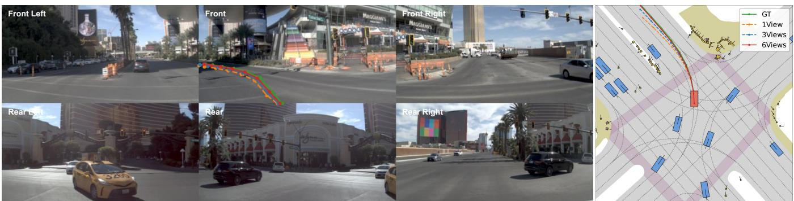  
Figure 6: Qualitative comparison of camera coverage on NAVSIMv2. Left: synchronized six-camera observations with groundtruth and predicted trajectories projected onto the front view. Right: the corresponding BEV trajectories. Full C×6 coverage provides rear and lateral context unavailable to the reduced-view settings, keeping the predicted trajectory closer to the ground truth and lane center.

<table><tr><td colspan="5">ont Front Right Rear Rear Right</td><td></td><td></td><td></td><td></td></tr><tr><td>a1 a2 Futi ton aoken</td><td>0.23 0.24</td><td>0.21 0.21</td><td>0.11 0.11</td><td>0.15 0.14</td><td>0.17 0.18</td><td>0.13 0.12</td><td></td><td>0.25 0.20</td></tr><tr><td>a3</td><td>0.23</td><td>0.22</td><td>0.11</td><td>0.13</td><td>0.18</td><td>0.13</td><td></td><td></td></tr><tr><td>a4</td><td>0.26</td><td>0.20</td><td>0.12</td><td>0.12</td><td>0.17</td><td></td><td>0.13</td><td>0.15</td></tr><tr><td>a5</td><td>0.24</td><td>0.21</td><td>0.12</td><td>0.12</td><td>0.17</td><td>0.14</td><td></td><td>0.10</td></tr><tr><td>a6</td><td>0.22</td><td>0.23</td><td>0.12</td><td>0.12</td><td>0.17</td><td></td><td>0.14</td><td></td></tr><tr><td>a7</td><td>0.21</td><td>0.23</td><td>0.11</td><td>0.13</td><td>0.17</td><td></td><td>0.14</td><td>0.05</td></tr><tr><td>a8</td><td>0.22</td><td>0.22</td><td>0.12</td><td>0.13</td><td>0.17</td><td></td><td>0.13</td><td>0.00</td></tr><tr><td colspan="2">Front Left</td><td>Front</td><td>Front Right Observed camera view</td><td>Rear Right</td><td>Rear</td><td></td><td>Rear Left</td><td></td></tr></table>

Figure 7: Action-to-view attention in a left lane-change, averaged over the 30 transformer blocks. The future action tokens attend most strongly to the front-left and rear views, where the neighboring vehicle that constrains the maneuver appears, evidencing that the planner exploits surround-view input.

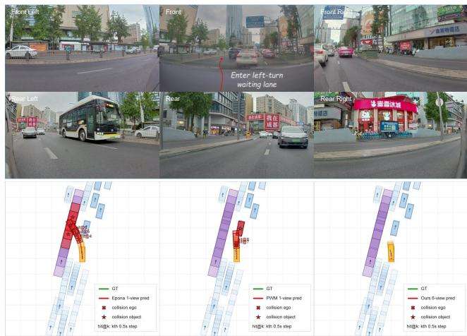  
Figure 8: Zero-shot qualitative comparison on in-house data when entering a left-turn waiting lane. Epona (front view only) collides with the rear-left vehicle; PWM avoids the rear-left vehicle but its zero-shot trajectory drifts substantially from the ground truth; SV-WAM remains closest to the ground-truth trajectory.

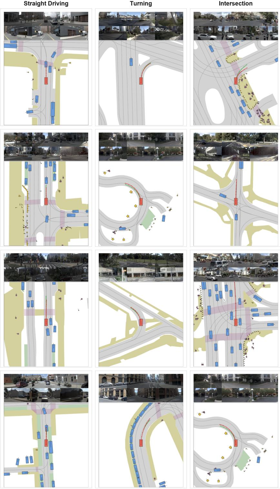  
Figure 9: Representative high-scoring planning examples grouped by maneuver type. Columns are straight driving, turning, and intersection scenarios; each column shows four examples. Green curves denote the ground-truth trajectories, and red curves denote the predicted trajectories.

Straight Driving  
Turning  
Intersection  
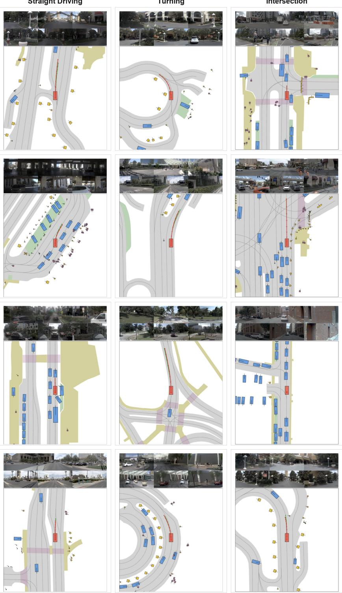  
Figure 10: Additional high-scoring planning examples grouped by maneuver type, four per column.

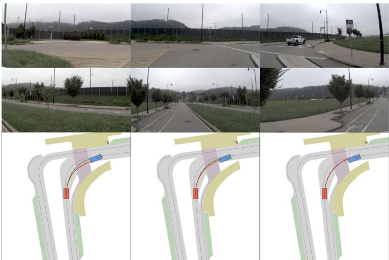

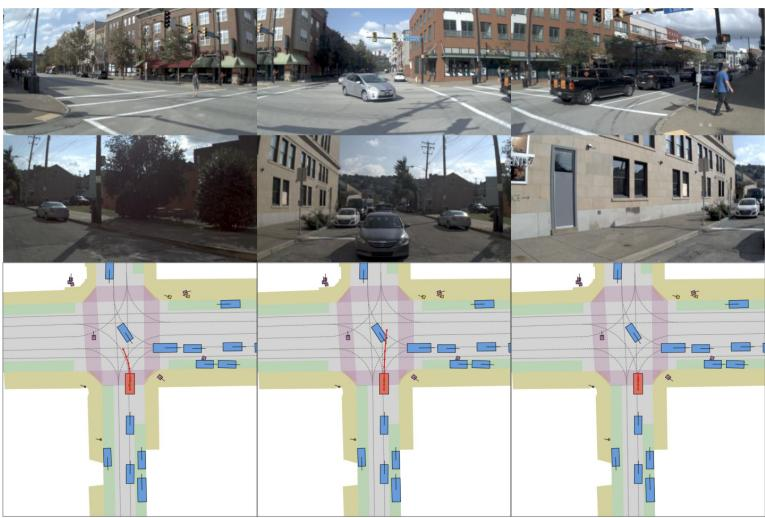

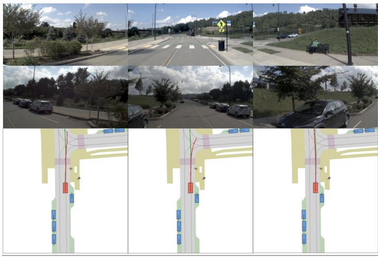  
DriveLaW (1 cam)  
Ours (6 cams)

DriveVLA-W0 (1 cam)

Figure 11: Qualitative comparison with front-view baselines. Each row is one scene; the three columns, labeled at the bottom of the figure, are DriveL $\mathbf { \Omega } _ { \mathbf { \tilde { \eta } } } \mathbf { \Omega } _ { \mathrm { { a W } } }$ and DriveVLA-W0 (front camera only, C×1) and SV-WAM (six-camera surround-view, C×6).

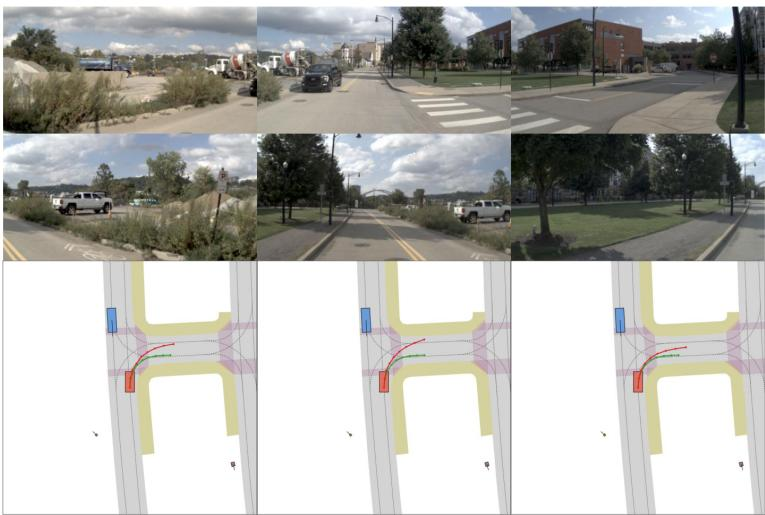

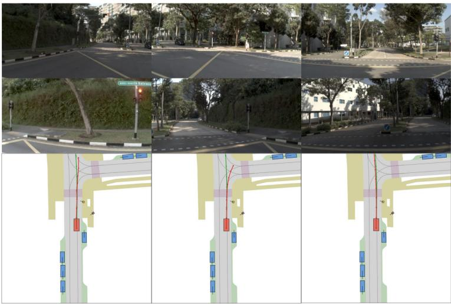

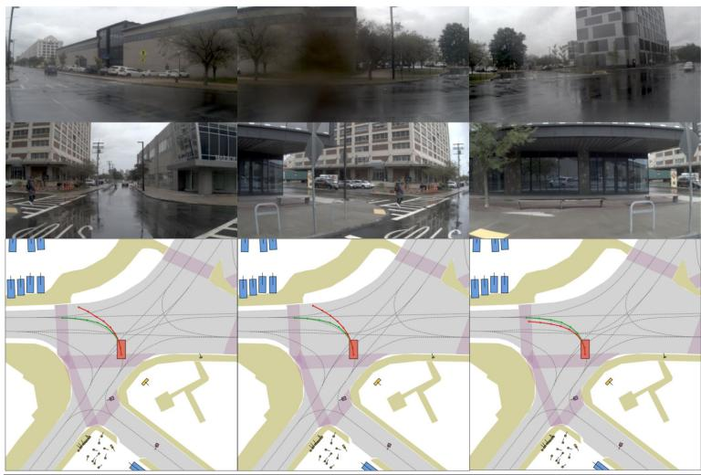  
DriveLaW (1 cam)  
DriveVLA-W0 (1 cam)  
Ours (6 cams)

Figure 12: Additional qualitative comparison with front-view baselines; same three-column layout (DriveLaW, DriveVLA-W0, SV-WAM) and camera labeling as in Figure 11.

DriveVLA-W0 (1 cam)  
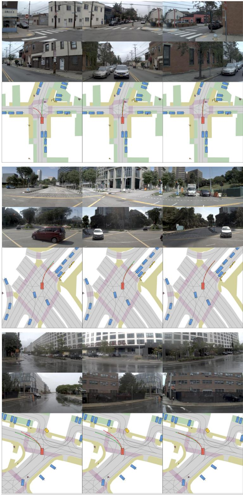  
DriveLaW (1 cam)  
Ours (6 cams)

Figure 13: Additional qualitative comparison with front-view baselines; same three-column layout (DriveLaW, DriveVLA-W0, SV-WAM) and camera labeling as in Figure 11.

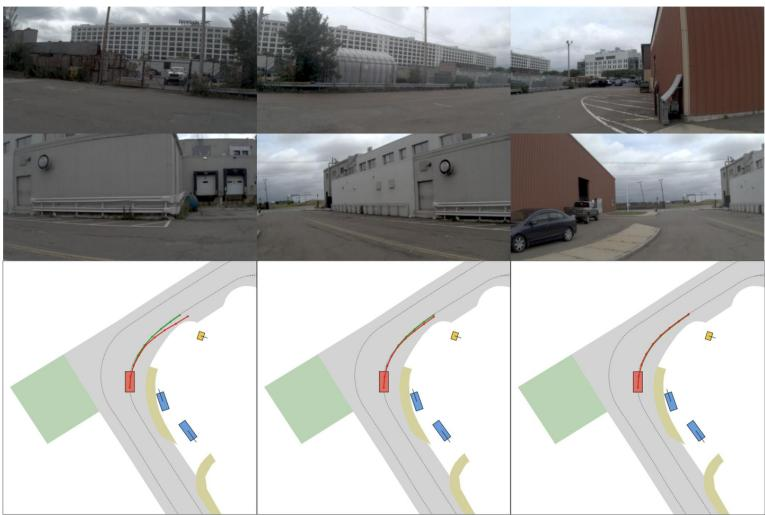

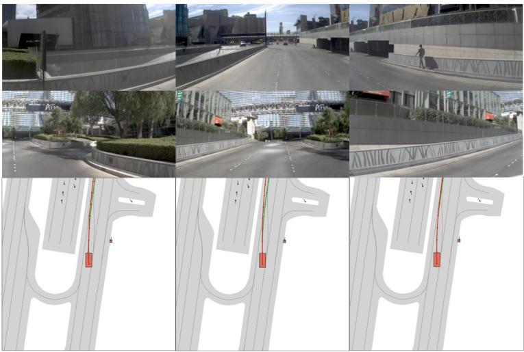

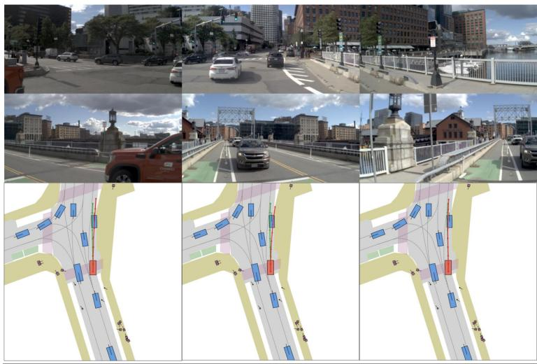  
DriveLaW (1 cam)  
DriveVLA-W0 (1 cam)  
Ours (6 cams)

Figure 14: Additional qualitative comparison with front-view baselines; same three-column layout (DriveLaW, DriveVLA-W0, SV-WAM) and camera labeling as in Figure 11.

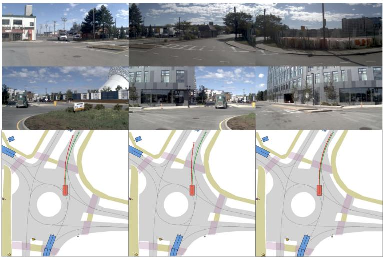

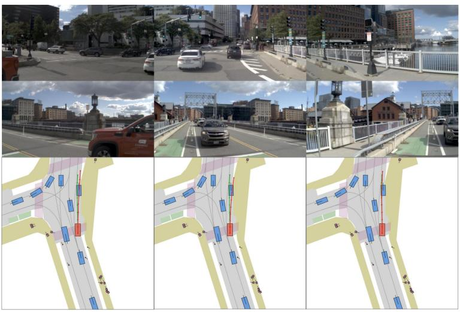

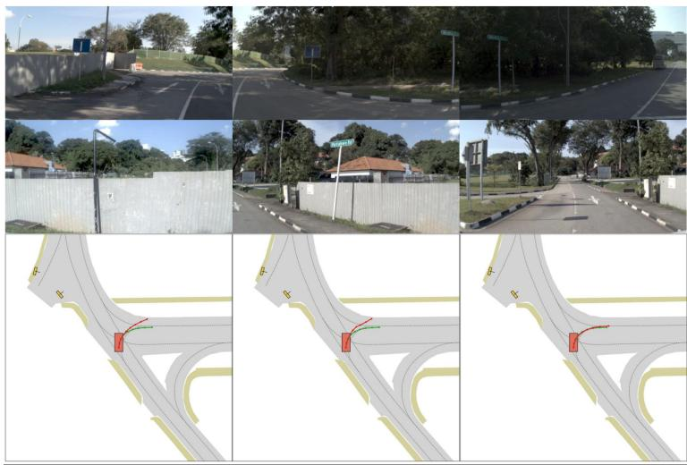  
DriveLaW (1 cam)  
DriveVLA-W0 (1 cam)  
Ours (6 cams)

Figure 15: Additional qualitative comparison with front-view baselines; same three-column layout (DriveLaW, DriveVLA-W0, SV-WAM) and camera labeling as in Figure 11.

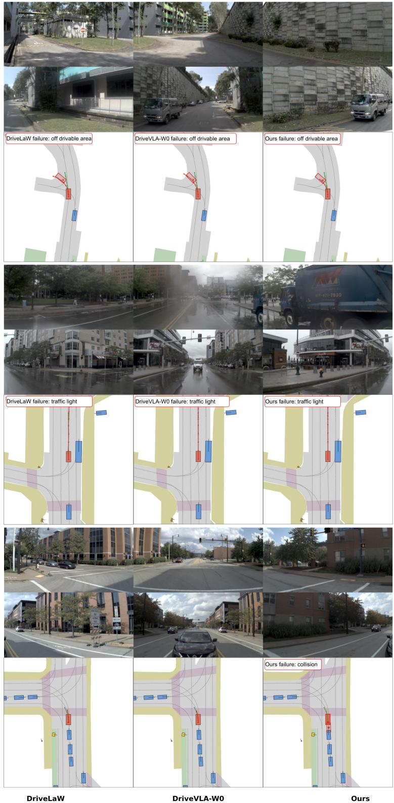  
Figure 16: Representative failure cases under challenging conditions. Each row compares DriveLaW, DriveVLA-W0, and SV-WAM. The three cases correspond to ambiguous left-turn geometry, rain-obscured trafic-signal perception, and overly conservative acceleration after a green signal, respectively.