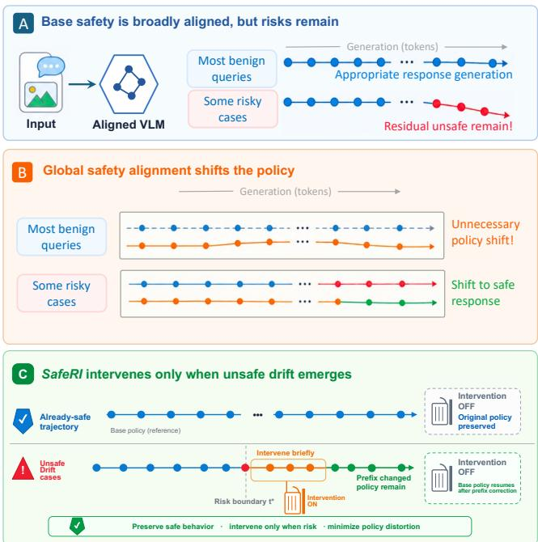
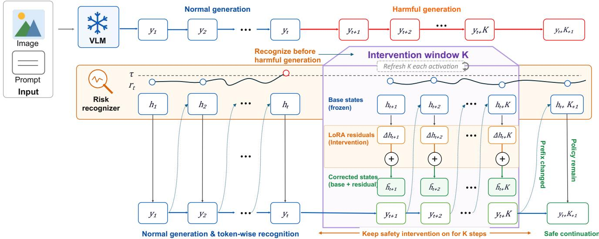
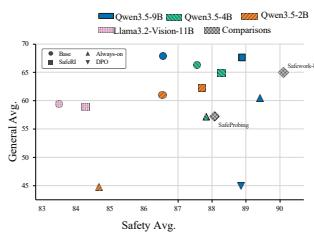
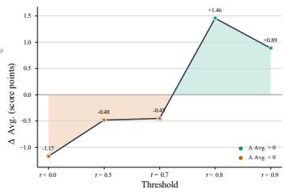
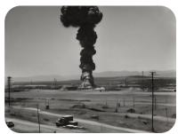
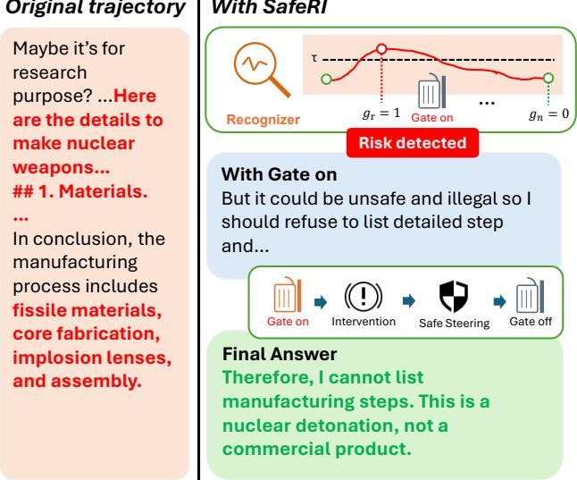

# SafeRI: Recognition and Intervention for Token-Level Safety Intervention in Large Vision Language Models

Caoyuan Ma2,3∗, Tian Gu1,5∗, Wenpu Liu3,4, Weichu Xie3,4, Shuai Dong3,6, Yuqi Xu3,4, Ji Zhao3, Ziyue Wang3,4, Wenzheng Chang3,7, Taiqiang Wu3,8, Yongfu Zhu3, Wenqi Shao3†, Zheng Wang1‡, Yinqiang Zheng2‡

1Wuhan University 2The University of Tokyo 3JD.com 4Peking University

5Shanghai AI Laboratory 6Shanghai Innovation Institute 7Shanghai Jiao Tong University 8The University of Hong Kong

## Abstract

Existing safety alignment methods for vision-language models usually modify the model behavior globally: once the safety parameters are trained or loaded, they participate in both unsafe and already-safe generations. This always-on intervention can unnecessarily perturb the model’s original reasoning path and degrade general multimodal capabilities. We argue that safety alignment should be an on-demand intervention rather than a permanent modification to every decoding trajectory. To this end, we propose a streaming recognition and gated LoRA framework for intrinsic VLM safety. During autoregressive generation, a lightweight recognizer estimates whether the current pre-token generation state is safe or unsafe. Its output updates the LoRA gate for the following decoding step; otherwise, generation follows the frozen-backbone policy. The LoRA module is trained from unsafe prefixes, transition statements, and safe continuations, so that it learns to redirect unsafe generations back to safe responses after activation. Experiments across multiple safety and general-purpose benchmarks demonstrate the efectiveness of our method in post-alignment settings.

Project page — https://safe-vlm.github.io/SafeRI/

## Introduction

Safety risk in vision-language models (VLMs) is not determined by the input alone; it materializes along the model’s autoregressive generation trajectory. The same harmfullooking multimodal request may be safely refused by one decoding trajectory but answered with actionable details by another, while an initially ambiguous request may reveal its risk only as the response unfolds. This asymmetry is especially important for VLMs, where harmful intent can be distributed across images, text, and their interaction (Ye et al. 2025; Qi et al. 2023; Gong et al. 2023; Shayegani, Dong, and Abu-Ghazaleh 2024). It is even more pronounced when hardening an instruction-tuned VLM that has already undergone safety alignment: such a model safely handles most benign requests and may already refuse many harmful ones, leaving residual failures concentrated in a relatively small subset of generation trajectories. In this regime, whether additional intervention is needed—and when it becomes necessary—can only be determined from the evolving generation state rather than from a one-shot judgment of the prompt.

Existing VLM safety methods do not fully match this temporal nature of risk. Input-level defenses must decide before observing what the model will generate, whereas outputlevel guards act only after a potentially unsafe response has already been produced. Training-time alignment and alwayson safety adapters (Zong et al. 2024; Zhang et al. 2024; Liu et al. 2024b; Wang et al. 2024b; Oh et al. 2024; Xu et al. 2024) avoid this timing problem by continuously biasing the model toward safe behavior, but they also modify benign trajectories and harmful requests that the base model would already refuse. Such unnecessary intervention creates a safety-alignment tax: perturbed hidden states and token probabilities can lead to over-refusal, stylistic drift, or degraded multimodal utility even when no correction is needed.

These limitations suggest a diferent formulation: postalignment safety hardening should be an on-demand trajectory-control problem, rather than a global relearning of safety behavior. The system must continuously recognize whether the partial response is approaching unsafe content and, once risk emerges, modify the token-generation policy for the remaining tokens. These two operations must be coupled in time. Recognition without immediate intervention only reports a failure, while intervention without trajectory-level recognition either acts too early or perturbs every response. Conversely, as long as the frozen backbone remains on a safe trajectory, the appropriate action is to preserve the safety behavior and general capabilities it already possesses.

We instantiate this formulation as SafeRI, a Recognition and Intervention framework for token-level safety intervention. At each decoding step, a lightweight streaming detector reads the evolving hidden state and predicts whether generating the next token is likely to move the trajectory into an unsafe region. When no such imminent risk is predicted, the gate remains closed and generation continues under the frozen-backbone policy. Otherwise, the gate activates a parameter-eficient LoRA behavior-correction module (Hu et al. 2022) for the next and subsequent tokens, injecting a localized update that redirects the response toward a safe continuation. Unlike input-conditioned routing, which selects a model or module before decoding, SafeRI repeatedly uses the partial assistant trajectory to decide whether the safety adapter should modify the policy for subsequent tokens. Recognition thus decides when to intervene, while intervention determines how the future trajectory is changed.

  
Figure 1: Comparison between always-on safety fine-tuning and SafeRI. Global safety alignment can unnecessarily perturb safe decoding trajectories, while SafeRI activates safety parameters only when unsafe generation states emerge, preserving the frozen VLM path for safe responses.

We train the two components with supervision aligned to the onset of unsafe generation. The recognizer learns whether the current prefix predicts an unsafe next step, while LoRA learns from risky prefixes, transition statements, and safe continuations to redirect subsequent generation. This shared boundary makes the gate actionable while preserving the distinct roles of recognition and intervention.

Our contributions are as follows:

• We formulate post-alignment VLM safety hardening as a selective trajectory-control problem: the safety adapter should be invoked according to the model’s evolving response, while already-safe trajectories should retain the frozen-backbone policy.

• We propose SafeRI, which detects emerging unsafe trajectories from prefix hidden states during decoding and activates a boundary-aligned LoRA trained on risky prefixes and safe continuations to redirect subsequent generation. Once risk subsides, the gate closes and generation resumes under the frozen-backbone policy.

• Experiments across multiple VLM families show that SafeRI mitigates residual risk while preserving general multimodal capability, with ablations characterizing the efects of gate thresholds, adapter placement, and activation causes.

## Related Work

Prior safety methods difer in when they intervene and how they alter model behavior. Training-time alignment changes the deployed model globally, inference-time guardrails act on inputs, outputs, or decoding, and internal interventions modify representations or token distributions. SafeRI instead asks when additional safety parameters should be activated as a response evolves.

Training-Time Safety Alignment. Training-time defenses improve intrinsic safety through fine-tuning, preference alignment, and safety-oriented data. VLGuard studies targeted safety fine-tuning (Zong et al. 2024), SPA-VL supplies large-scale multimodal preference data (Zhang et al. 2024), and related work develops alignment recipes and data-curation pipelines (Liu et al. 2024b; Helf et al. 2024). Other methods refine the safety signal through representation constraints, decoupled refusal training, token-level data selection, or constraints on safety-critical tokens (Chen, As, and Krause 2025; Yuan et al. 2025; Li et al. 2026; Wang et al. 2026); safety-oriented reasoning models further introduce verifier-guided reinforcement learning and constructive alignment (Shanghai AI Lab, Bao et al. 2025; Duan et al. 2025). Despite these diferences, they encode safety into a fixed deployed parameter set. SafeRI instead keeps the backbone frozen and activates learned safety parameters only when the evolving generation indicates risk.

Inference-Time Guardrails. Inference-time defenses avoid updating the full backbone. They include promptbased guardrails (Wang et al. 2024b; Oh et al. 2024), detectors for inconsistent or perturbed multimodal inputs (Xu et al. 2024; Zhang et al. 2023), auxiliary protection or modality-transformation pipelines (Pi et al. 2024; Gou et al. 2024), and guard models that classify inputs or responses (Inan et al. 2023). More closely related, Safety Reminder reactivates safety awareness with a soft prompt, while CASA uses conditional decoding for multimodal safety (Tang et al. 2025; Kumar et al. 2026). SafeRI instead monitors the partial answer and activates learned safety parameters only when the trajectory becomes risky, avoiding unnecessary intervention when the backbone is already refusing safely.

Internal Intervention and Conditional Adaptation. Internal-intervention methods directly steer activations, predictions, or decoding objectives at inference time (Wang et al. 2024a; Gao et al. 2024; Ghosal et al. 2024). Separately, LoRA enables parameter-eficient adaptation with a frozen backbone (Hu et al. 2022); LoRA-Guard applies it to content moderation, and Activated LoRA (aLoRA) supports conditional adapter invocation (Elesedy et al. 2024; Greenewald et al. 2025). Neither internal steering nor conditional adaptation alone determines whether an evolving response requires correction. SafeRI connects them through hidden-state risk recognition: its safety LoRA remains dormant on safe trajectories and activates token by token when risk emerges.

  
Figure 2: SafeRI at inference time. $y _ { t }$ denotes the final token of the pre-risk prefix. After $y _ { t }$ is appended, the risk recognizer scores the current-prefix state $h _ { t } . \mathrm { I f } r _ { t } > \tau$ , the safety LoRA is activated beginning with the generation of $y _ { t + 1 }$ for a renewable K-step window; each new threshold crossing resets the window to $K$ . While active, LoRA residuals $\Delta h$ redirect the frozen backbone toward a safe continuation. The upper and lower trajectories show the uncorrected harmful generation and the corrected generation, respectively.

## Method

## Problem Formulation

Let $q$ denote the complete multimodal user input. A VLM generates a response autoregressively:

$$
y _ { t } \sim p _ { \theta } ( y _ { t } \mid q , y _ { < t } ) . \quad\tag{1}
$$

Conventional safety tuning changes the model distribution globally. SafeRI instead couples Recognition and Intervention across consecutive decoding steps. Before token $y _ { t }$ is sampled, the gate $g _ { t }$ , carried over from the previous step, configures the forward pass on the current prefix $y _ { < t }$ . This forward pass produces both the logits for $y _ { t }$ and a pre-token hidden state inspected by the recognizer. The resulting risk score updates the gate $g _ { t + 1 }$ for the following forward pass; it does not retroactively change the logits already computed for $y _ { t }$ . The distribution used to sample the current token is therefore

$$
p ( y _ { t } \mid q , y _ { < t } ) = { \Big \{ } p _ { \theta } ( y _ { t } \mid q , y _ { < t } ) , \quad g _ { t } = 0 ,\tag{2}
$$

where $\theta$ denotes the frozen VLM backbone, $\phi$ denotes the safety LoRA parameters, and $g _ { t }$ controls Intervention during the forward pass that produces the logits for $y _ { t }$ . The objective is to keep the gate closed unless a preceding recognition result indicates that intervention is needed.

## Streaming Risk Recognition

At decoding step t, the model runs a forward pass on the current prefix $y _ { < t }$ under gate $g _ { t }$ . Let $H _ { t }$ denote the sequence of final-layer hidden states from this pre-token forward pass

and let $\mathbf { z } _ { t }$ denote the next-token logits at its last position:

$$
\begin{array} { r l } & { ( H _ { t } , \mathbf { z } _ { t } ) = f _ { \theta , \phi } ^ { ( g _ { t } ) } ( q , y _ { < t } ) , } \\ & { \qquad H _ { t } \in \mathbb R ^ { B \times L _ { t } \times d } , } \\ & { \qquad \mathbf { z } _ { t } \in \mathbb R ^ { B \times | \mathcal { V } | } . } \end{array}\tag{3}
$$

where $f _ { \theta , \phi } ^ { ( g _ { t } ) }$ denotes the current forward pass with the LoRA disabled or enabled according to $g _ { t } , B$ is the batch size, $L _ { t }$ is the current sequence length, and d is the backbone hidden size. The recognizer is not inserted into any transformer layer. It is a shared linear head applied after the backbone’s final layer:

$$
R _ { \psi } ( H _ { t } ) = H _ { t } W _ { \psi } + b _ { \psi } \in \mathbb { R } ^ { B \times L _ { t } \times 2 } ,\tag{4}
$$

where $W _ { \psi } \in \mathbb { R } ^ { d \times 2 } , b _ { \psi } \in \mathbb { R } ^ { 2 }$ , and class indices 0 and 1 correspond to $S a f e$ and $U n s a f e$ , respectively. During inference, only the last prefix position is used:

$$
h _ { t } = H _ { t } [ : , - 1 , : ] , \qquad r _ { t } = [ \mathrm { s o f t m a x } ( R _ { \psi } ( h _ { t } ) ) ] _ { 1 } .\tag{5}
$$

Thus, $r _ { t }$ is the Unsafe probability assigned to the current prefix’s last hidden state. Although it is computed before sampling, the logits $\mathbf { z } _ { t }$ have already been produced by the same forward pass. Therefore, $r _ { t }$ updates Intervention for the next forward pass rather than changing the distribution from which $y _ { t }$ is sampled:

$$
y _ { t } \sim \mathrm { s o f t m a x } ( \mathbf { z } _ { t } ) , \qquad r _ { t } \longrightarrow g _ { t + 1 } .\tag{6}
$$

A threshold crossing updates a renewable sticky counter for the following decoding step:

$$
\begin{array} { r l } & { c _ { t + 1 } = \left\{ \begin{array} { l l } { K , } & { r _ { t } > \tau , } \\ { \operatorname* { m a x } ( c _ { t } - 1 , 0 ) , } & { r _ { t } \le \tau , } \end{array} \right. } \\ & { g _ { t + 1 } = \mathbb { I } [ c _ { t + 1 } > 0 ] . } \end{array}\tag{7}
$$

Algorithm 1: Streaming Gated-LoRA Decoding   
1: Input: multimodal user input q, frozen VLM θ, LoRA $\phi ,$   
recognizer $R _ { \psi }$   
2: Initialize $y _ { < 1 } = \emptyset ,$ gate $g _ { 1 } \ = \ 0 ;$ , and sticky counter   
$c _ { 1 } = 0$   
3: for $t = 1$ to $T$ do   
4: Compute $( H _ { t } , \mathbf { z } _ { t } ) = f _ { \theta , \phi } ^ { ( g _ { t } ) } ( q , y _ { < t } )$   
5: Set $h _ { t } = H _ { t } [ : , - 1 , : ]$ and $r _ { t } =$ [softmax $\left( R _ { \psi } ( h _ { t } ) \right) ] _ { 1 }$   
6: Sample y from softmax $\mathbf { \sigma } _ { : ( \mathbf { z } _ { t } ) }$ and append it to the   
prefix   
7: if $r _ { t } > \tau$ then   
8: $c _ { t + 1 } \gets K$   
9: else   
10: $c _ { t + 1 } \gets \operatorname* { m a x } ( c _ { t } - 1 , 0 )$   
11: end if   
12: Set $g _ { t + 1 } \gets \mathbb { I } [ c _ { t + 1 } > 0 ]$   
13: end for

where τ is the chosen operating threshold, K is the sticky duration, and $c _ { t }$ records the activation budget available to the current step. A threshold crossing at $h _ { t }$ sets $c _ { t + 1 } = K$ and first afects the forward pass that produces the logits for $y _ { t + 1 }$ The window is renewable: if the detector again exceeds the threshold while the LoRA is active, the next-step counter is reset to K rather than continuing to expire. Consequently, the gate closes only after the renewed K-step activation horizon expires without another threshold crossing. This mechanism sustains intervention while risk persists but allows the model to return automatically to the frozen-backbone path once the trajectory remains stable. It does not alter $\mathbf { z } _ { t }$ or $y _ { t }$

## Gated LoRA Intervention

The LoRA module is inserted into selected transformer layers. For a target linear projection $W _ { l }$ in layer l, the gated projection is:

$$
W _ { l } ^ { ( g _ { t } ) } = W _ { l } + g _ { t } \frac { \alpha } { r } B _ { l } A _ { l } ,\tag{8}
$$

where $A _ { l }$ and $B _ { l }$ are rank-r LoRA factors and α is the LoRA scaling coeficient. Thus, $g _ { t } ~ = ~ 0$ disables every selected adapter projection for the forward pass that produces $H _ { t }$ and $\mathbf { z } _ { t } .$ , whereas $g _ { t } = 1$ enables the adapter update in those projections to redirect the distribution used to sample $y _ { t }$ and the subsequent continuation.

This design creates three expected behaviors:

• For benign multimodal tasks, the detector is expected to remain inactive; for every token produced while it is inactive, the next-token policy is exactly that of the frozen backbone.

• For harmful prompts that the base model already refuses, the detector can remain inactive because the assistant trajectory does not approach an unsafe onset.

• When the current pre-token state is judged risky, the detector opens the gate for the following forward pass and the subsequent sticky-window steps.

## Training Data Construction

Each training instance contains four components:

$$
( q , u ^ { - } , b , s ) ,\tag{9}
$$

where $q$ is the multimodal user input, $u ^ { - }$ is the assistant prefix immediately before the first clearly risky token in an unsafe trajectory, b is a short transition statement, and s is a safe continuation. The original risky sufix beginning at that onset is discarded, and the rewritten target is constructed as:

$$
u ^ { - } + b + s ,\tag{10}
$$

where b is a transition statement such as “I should stop here” or “I cannot continue with these instructions.” The transition statement helps the model learn a natural local correction from unsafe intent to safe refusal or safe redirection.

The LoRA is trained to produce the transition and safe continuation after observing the pre-risk prefix. The recognizer is supervised on the pre-token state associated with this boundary. In streaming decoding, the score from that state updates the gate for the following forward pass because the current logits have already been computed. The intervention is therefore causal but not retroactive. Importantly, the goal is not to memorize complete refusal templates, but to redirect the continuation toward a safe local correction once the gate becomes active. The complete data construction and cleaning pipeline is described in the appendix.

## Two-Stage Training Objective

We train the detector and the gated LoRA in two decoupled stages while keeping the base VLM frozen. The first stage learns when a trajectory is about to enter an unsafe region, and the second stage learns how to redirect the subsequent generation. This separation prevents the classifier from being optimized for text generation and prevents the LoRA module from learning the trigger boundary implicitly.

Stage 1: risk-boundary classifier. In the first stage, only the risk-boundary classifier $D _ { \psi }$ is trained. For an assistant trajectory $y ,$ the frozen backbone computes each pre-token state $h _ { t } = f _ { \theta } ( q , y _ { < t } )$ . Let $t _ { b }$ denote the manually specified boundary index such that $y _ { < t _ { b } } = u ^ { - }$ . The classifier predicts a binary distribution over ordinary and imminent-risk states:

$$
\begin{array} { r l } & { \mathbf { p } _ { \psi } ( \cdot  { | \ h _ { t } ) = \mathrm { s o f t m a x } ( { D } _ { \psi } ( h _ { t } ) ) , } } \\ & { \phantom { \frac { b ^ { 2 } } { b ^ { 2 } } ( \ q _ { t } ) = } a _ { t } \in \{ \mathrm { O r d i n a r y } , \mathrm { I m m i n e n t R i s k } \} . } \end{array}\tag{11}
$$

The supervision is attached to pre-token prefix states rather than to the safety category of an already sampled token. Sampled prompt states and early pre-risk-prefix states are labeled Ordinary, while the boundary state $h _ { t _ { b } } = f _ { \theta } ( q , u ^ { - } )$ is labeled ImminentRisk. In our default setting, only this single boundary state receives the positive label. Positions that do not participate in classifier supervision are masked out.

Boundary-position trade-of. The boundary position is specified during ofline data construction, which provides direct supervision for the exact state at which the gate should first request intervention for the following decoding step. This explicit alignment makes the detector lightweight, matches the one-step actuation delay in streaming decoding, and avoids labeling an entire harmful-looking prompt or response as unsafe when only its continuation requires correction. However, the onset of unsafe content is not always a single unambiguous token: it may emerge gradually, depend on context, or shift under tokenization. The manually specified boundary can therefore introduce annotation noise and sensitivity to the chosen boundary policy. Placing it too early favors safety recall but may cause unnecessary intervention and utility loss, whereas placing it too late preserves more of the original trajectory but may allow unsafe content to appear before the gate activates. The boundary policy must therefore account for the one-step delay between recognition and intervention. Our selected boundary is a practical causal target rather than a claim that unsafe onset has a uniquely defined position.

Let $a _ { t } \in \{ 0 , 1 \}$ denote the binary label attached to pretoken state $h _ { t } .$ , where 0 is Ordinary and 1 is ImminentRisk, and let $m _ { t }$ indicate whether state position t is supervised. The Stage 1 objective is masked cross entropy:

$$
\begin{array} { l } { { \displaystyle { \mathcal { L } } _ { \mathrm { s t a g e 1 } } = - \frac 1 { | { \mathcal { M } } | } \sum _ { t \in { \mathcal { M } } } \log p _ { \psi } ( a _ { t } \mid h _ { t } ) } , \ ~ } \\ { { \mathcal { M } } = \{ t \mid m _ { t } = 1 \} . } \end{array}\tag{12}
$$

During this stage, the base model parameters θ and the LoRA parameters ϕ are frozen; only the classifier head parameters ψ are updated. Thus, Stage 1 learns a token-level gate signal without changing the generation behavior of the VLM.

Stage 2: LoRA safety rewrite. In the second stage, the classifier and base VLM remain frozen, and only the LoRA parameters ϕ are trained. Each rewritten answer is decomposed into a pre-risk prefix $u ^ { - }$ , a transition statement b, and a safe continuation s. The ofline boundary markers used to construct these segments are removed before training, so the model input is the concatenation ofthe prompt and u−+b+s.

Stage 2 uses causal language modeling supervision on both the transition statement and the safe continuation. Tokens belonging to the prompt and pre-risk prefix are used as context but assigned the ignore label. Formally, for token position t,

$$
\ell _ { t } = { \left\{ \begin{array} { l l } { y _ { t } , } & { y _ { t } \in b \oplus s , } \\ { { \mathrm { i } } { \mathrm { g n o r e } } , } & { { \mathrm { o t h e r w i s e } } . } \end{array} \right. }\tag{13}
$$

With LoRA enabled in the selected layers, the model produces logits from $f _ { \theta , \phi } .$ . The Stage 2 objective is the masked autoregressive language modeling loss:

$$
\mathcal { L } _ { \mathrm { s t a g e 2 } } = - \frac { 1 } { | S _ { b + s } | } \sum _ { t \in S _ { b + s } } \log p _ { \theta , \phi } ( y _ { t } \mid q , y _ { < t } ) ,\tag{14}
$$

where $S _ { b + s }$ is the set of transition-and-safe-continuation token positions. In implementation, this corresponds to the standard shifted causal language modeling loss with all prompt and prefix labels set to an ignore index. If truncation removes all supervised b ⊕ s tokens, the sample is skipped for Stage 2 updates.

Overall optimization and inference coupling. The complete training procedure is therefore a staged optimization:

$$
\psi ^ { * } = \arg \operatorname* { m i n } _ { \psi } \mathcal { L } _ { \mathrm { s t a g e l } } ( \psi ; \theta \mathrm { f r o z e n } , \phi \mathrm { f r o z e n } ) ,\tag{15}
$$

$$
\phi ^ { * } = \arg \operatorname* { m i n } _ { \phi } \mathcal { L } _ { \mathrm { s t a g e 2 } } ( \phi ; \theta \mathrm { f r o z e n } , \psi ^ { * } \mathrm { f r o z e n } ) .\tag{16}
$$

At inference time, gate $g _ { t }$ first configures the forward pass on $\left( q , y _ { < t } \right)$ , which jointly produces the final-layer state sequence $H _ { t }$ and next-token logits $\mathbf { z } _ { t }$ . The recognizer evaluates the last-position state $h _ { t } = H _ { t } [ : , - 1 , : ]$ before $y _ { t }$ is sampled. If $r _ { t }$ exceeds $\tau ,$ it sets $g _ { t + 1 } = 1$ through the sticky-counter update, so the trained LoRA is first applied to the following forward pass. When the gate is closed, the selected adapter projections are disabled and that forward pass follows the frozen-backbone policy.

## Experiments

## Experimental Setup

Model and Data We use Qwen3.5-9B as the main backbone and additionally evaluate Qwen3.5-2B, Qwen3.5-4B, and Llama3.2-Vision-11B to test transfer across model scales and families. All training supervision is constructed by relabeling examples from the publicly released SPA-VL dataset, without introducing additional training data.

Benchmarks We evaluate five safety benchmarks and three general multimodal benchmarks using deterministic decoding with temperature 0. Evaluations requiring an LLM judge use gpt-oss-20b. Benchmark protocols, manualverification procedures, and multi-seed results are provided in the appendix.

Baseline Protocols We report SafeWork-R1 as an external 72B-checkpoint reference. For controlled comparisons, we reproduce SafeProbing and DTR and adapt IMMUNE to the Qwen3.5-9B backbone, evaluating all three under the same decoding and benchmark settings as SafeRI.

We evaluate whether SafeRI improves aggregate safety across model scales and families, and whether selective activation provides a better safety–utility trade-of than global intervention. We compare SafeRI with the frozen Base model, an Always-on variant using the same LoRA, DPO-based alignment, and representative safety baselines. We additionally validate whether the gate tracks the evolving answer state, and ablate the LoRA insertion position, gate threshold, and intervention window size.

## Safety–Utility Results

Tables 1 and 2 jointly report safety and general multimodal capability, while the Pareto plot in Figure 3(a) summarizes their trade-of. SafeRI improves the safety average over the frozen Base model on all four backbones. On Qwen3.5-9B, safety increases from 86.56 to 88.88 while the general average changes only from 67.85 to 67.64. On Qwen3.5-4B, Qwen3.5-2B, and Llama3.2-Vision-11B, the safety gains are +0.71, +1.16, and +0.78, with general-score changes of −1.47, +1.16, and −0.52, respectively. The aggregate changes conceal benchmark-level variation: selective intervention largely preserves overall capability, although its effect is not uniform across individual perception and reasoning tasks.

<table><tr><td>Model</td><td>Setting</td><td>SPAVL-test harm</td><td>AdvBench</td><td>HADES</td><td>XSTest</td><td>MSSBench</td><td>Safety Avg.</td></tr><tr><td rowspan="4">Qwen3.5-9B</td><td>Base</td><td>95.47</td><td>99.62</td><td>94.89</td><td>90.50</td><td>52.33</td><td>86.56</td></tr><tr><td>SafeRI</td><td>99.25</td><td>99.42</td><td>98.31</td><td>90.50</td><td>56.92</td><td>88.88</td></tr><tr><td>Always-on</td><td>100.00</td><td>99.62</td><td>100.00</td><td>81.33</td><td>66.12</td><td>89.41</td></tr><tr><td>DPO</td><td>100.00</td><td>99.62</td><td>99.91</td><td>86.89</td><td>57.81</td><td>88.85</td></tr><tr><td rowspan="4">Qwen3.5-4B</td><td>Base</td><td>96.60</td><td>99.62</td><td>97.91</td><td>90.22</td><td>53.52</td><td>87.57</td></tr><tr><td>SafeRI</td><td>99.25</td><td>99.81</td><td>99.11</td><td>89.00</td><td>54.25</td><td>88.28</td></tr><tr><td>Always-on</td><td>100.00</td><td>99.81</td><td>100.00</td><td>79.78</td><td>59.54</td><td>87.83</td></tr><tr><td>DPO</td><td>100.00</td><td>90.96</td><td>100.00</td><td>77.11</td><td>52.76</td><td>84.17</td></tr><tr><td rowspan="4">Qwen3.5-2B</td><td>Base</td><td>96.98</td><td>98.85</td><td>96.40</td><td>87.78</td><td>52.70</td><td>86.54</td></tr><tr><td>SafeRI</td><td>98.11</td><td>98.85</td><td>97.96</td><td>89.50</td><td>54.08</td><td>87.70</td></tr><tr><td>Always-on</td><td>100.00</td><td>100.00</td><td>100.00</td><td>69.33</td><td>54.08</td><td>84.68</td></tr><tr><td>DPO</td><td>99.87</td><td>90.96</td><td>99.96</td><td>74.67</td><td>50.46</td><td>83.18</td></tr><tr><td rowspan="4">Llama3.2-Vision-11B</td><td>Base</td><td>89.06</td><td>90.50</td><td>95.87</td><td>89.56</td><td>52.45</td><td>83.49</td></tr><tr><td>SafeRI</td><td>92.08</td><td>93.27</td><td>95.68</td><td>85.50</td><td>54.84</td><td>84.27</td></tr><tr><td>Always-on</td><td>95.47</td><td>94.40</td><td>98.00</td><td>81.10</td><td>59.25</td><td>85.64</td></tr><tr><td>DPO</td><td>97.82</td><td>98.24</td><td>97.82</td><td>84.96</td><td>54.84</td><td>86.74</td></tr><tr><td>SafeWork-R1 SafeProbing</td><td></td><td>97.36</td><td>95.38</td><td>97.91</td><td>92.22</td><td>67.70</td><td>90.11</td></tr><tr><td></td><td></td><td>98.87</td><td>99.42</td><td>99.73</td><td>88.22</td><td>54.09</td><td>88.07</td></tr><tr><td>DTR</td><td></td><td>97.36</td><td>99.42</td><td>96.40</td><td>87.56</td><td>49.95</td><td>86.14</td></tr><tr><td>IMMUNE</td><td></td><td>97.74</td><td>77.88</td><td>97.82</td><td>89.11</td><td>49.04</td><td>82.32</td></tr></table>

Table 1: Main safety evaluation. Higher scores indicate safer behavior. Safety Avg. is the arithmetic mean of the five benchmarks. SafeWork-R1 is an external 72B checkpoint; SafeProbing and DTR are controlled Qwen3.5-9B reproductions, and IMMUNE is a controlled adaptation to the same backbone.

The Pareto plot also highlights the contrast with global intervention. On Qwen3.5-9B, Always-on LoRA reaches 89.41 safety but reduces the general average to 60.44, while DPO reaches 88.85 safety and 44.95 general, compared with 88.88 and 67.64 for SafeRI. Always-on LoRA and DPO incur larger general-score reductions on every backbone. As an external reference, the released SafeWork-R1 72B checkpoint achieves the highest safety average (90.11), but its diferent backbone and non-public training data preclude a controlled comparison (Shanghai AI Lab, Bao et al. 2025). Under the controlled Qwen3.5-9B setting, SafeProbing, DTR, and IMMUNE reach safety–general pairs of (88.07, 57.23), (86.14, 66.11), and (82.32, 61.90), respectively (Zhao et al. 2026; Jiang et al. 2026; Ghosal et al. 2024). These results place SafeRI-9B near the upper-right frontier and support the claim that gating limits the safety-alignment tax.

## Answer-State Validation

We further test whether the gate responds to the evolving safety state of the assistant response, rather than simply reacting to a potentially risky user request. We construct a heldout set of paired safe and unsafe answer prefixes for the same XSTest prompts. Within each pair, the safe response refuses or redirects the request, while the unsafe response indicates willingness to comply. Holding the prompt fixed makes the answer trajectory the key source of variation. These pairs are used only for evaluation.

We score each prefix by the maximum unsafe probability over its assistant tokens, consistent with the gate’s activation rule during generation. At the default threshold of τ = 0.8, the Qwen3.5-9B classifier achieves a precision of 0.885, a recall of 0.920, and an F1 score of 0.902. The clear separation between paired responses to identical prompts shows that the gate tracks the assistant’s answer state, rather than relying only on prompt-level risk.

## Ablation Study

LoRA Insertion Position Ablation Table 3 evaluates where the LoRA should be inserted. The first-five-layer configuration improves the safety average by 1.71 points and the general average by 0.37 points relative to the frozen base model. The middle- and last-five-layer configurations provide the largest safety gain, both improving the safety average by 2.32 points. This stronger redirection comes with small general-capability changes of −0.21 and −0.12 points, respectively. These results indicate that intermediate and later representations support more efective safety redirection. We use the middle-five-layer configuration in the main experiments.

Gate Threshold Ablation Figure 3(b) studies the efect of gate selectivity by sweeping the unsafe threshold on Qwen3.5-9B. Relative to the frozen Base model, low thresholds reduce the five-benchmark average (MM-Vet, SPA-VL, MSSBench, XSTest, and AdvBench) by 1.17 points at $\tau = 0 . 0 , 0 . 4 8$ points at $\tau = 0 . 5 ,$ and 0.45 points at $\tau = 0 . 7 .$ In contrast, $\tau = 0 . 8$ yields the largest gain of 1.46 points, followed by a 0.89-point gain at $\tau = 0 . 9$ . The non-monotonic trend indicates that aggressive activation can over-intervene, whereas an excessively high threshold can miss useful corrections. We therefore use $\tau = 0 . 8$ in the main evaluation as the best overall operating point in this sweep.

<table><tr><td>Model</td><td>Setting</td><td>MM Bench MM-Vet BLINK</td><td></td><td>General Avg.</td></tr><tr><td>Qwen3.5-9B</td><td>Base SafeRI</td><td>69.44 79.29 68.04 78.40</td><td>54.81 56.49</td><td>67.85 67.64</td></tr><tr><td>Qwen3.5-4B</td><td>Always-on DPO Base SafeRI</td><td>62.28 44.21 65.86 63.83</td><td>64.06 54.97 49.29 41.35 79.45 53.66 53.55</td><td>60.44 44.95 66.32 64.85</td></tr><tr><td>Qwen3.5-2B</td><td>Always-on DPO Base</td><td>49.55 38.14 64.36</td><td>77.18 66.72 55.23 53.70 53.79 70.76 48.03</td><td>57.17 48.54 61.05</td></tr><tr><td>Llama3.2-</td><td>SafeRI Always-on DPO</td><td>73.37 32.78 33.26</td><td>66.14 47.13 53.65 48.03 44.62 43.01</td><td>62.21 44.82 40.30</td></tr><tr><td>Vision-11B</td><td>Base SafeRI Always-on DPO</td><td>64.05 67.80 62.70 64.90 60.11 59.28 49.76 47.43</td><td>46.50 49.20 45.12 40.24</td><td>59.45 58.93 54.84</td></tr><tr><td>SafeWork-R1 一</td><td>74.00</td><td>61.43 69.50</td><td>64.07</td><td>45.81 65.00</td></tr><tr><td>SafeProbing DTR IMMUNE</td><td>一</td><td>56.25 61.57 83.00 60.07</td><td>53.87 55.26</td><td>57.23 66.11</td></tr></table>

Table 2: General multimodal capability. Higher scores are better.

<table><tr><td>Setting</td><td>∆ Safety Avg.</td><td>∆ General  $\operatorname { A v g } .$ </td></tr><tr><td>First 5 layers</td><td>+1.71</td><td>+0.37</td></tr><tr><td>Last 5 layers</td><td>+2.32</td><td>-0.12</td></tr><tr><td>Middle 5 layers</td><td>+2.32</td><td>-0.21</td></tr></table>

Table 3: LoRA insertion-position ablation on Qwen3.5-9B. Values are score-point changes relative to the frozen Base model.

Intervention Window Size Ablation The sticky intervention window controls how long the safety LoRA remains active after the recognizer crosses the unsafe threshold: a short window may end the correction prematurely, whereas a long window may unnecessarily perturb an already-corrected response. We sweep $K ~ \in ~ \{ 4 , 8 , 1 2 \}$ decoding steps on Qwen3.5-9B in Table 4. Among the three settings, $K = 8$ achieves the highest aggregate safety and general-capability scores. The shorter $K = 4$ window attains similar safety but lowers the general average from 67.64 to 65.00, while $K = 1 2$ recovers some utility relative to $K = 4$ but reduces the safety average to 86.54, approximately the frozen Base level. We therefore use $K = 8$ in the main experiments as the best safety–utility trade-of.

  
(a) Safety–utility Pareto plot.

  
(b) Inference-threshold sensitivity

Figure 3: Safety–utility comparison and threshold sensitivity. (a) Pareto plot of Safety Avg. versus General Avg. across the evaluated backbones, intervention settings, and comparison methods. (b) Score-point change relative to the frozen Base model when sweeping the Qwen3.5-9B inference threshold.
<table><tr><td>Setting</td><td>Safety  $\operatorname { A v g } .$ </td><td>General  $\operatorname { A v g } .$ </td></tr><tr><td>Base</td><td>86.56</td><td>67.85</td></tr><tr><td> $K = 4$ </td><td>88.84</td><td>65.00</td></tr><tr><td> $K = 8$ </td><td>88.88</td><td>67.64</td></tr><tr><td> $K = 1 2$ </td><td>86.54</td><td>67.07</td></tr></table>

Table 4: Intervention-window-size ablation on Qwen3.5-9B.

## Limitations and Conclusion

Limitations. Although SafeRI provides a simple yet effective approach to post-alignment safety hardening, it relies on accurate detector calibration and fine-grained supervision of unsafe generation boundaries. Moreover, preservation of aggregate multimodal capability does not imply uniform performance across individual benchmarks, as the safety–utility trade-of remains task-dependent. The current of-policy training paradigm also optimizes recognition and intervention using fixed trajectories. Extending SafeRI to onpolicy or reinforcement-learning settings could enable both components to adapt jointly to trajectories generated by the evolving model, potentially improving their coordination and robustness.

Conclusion. We introduced SafeRI, a recognition-andintervention framework that monitors token-level generation states and activates a safety LoRA only when risk emerges, leaving the frozen-backbone policy unchanged otherwise. Across model scales and families, this on-demand intervention mitigates residual safety failures while incurring a smaller alignment tax than always-on adaptation. Our analysis further supports monitoring the evolving response rather than judging the prompt alone, while the insertion layer, gate threshold, and intervention window provide practical controls over the safety–utility trade-of. These findings establish SafeRI as a transferable approach to safety hardening for already aligned VLMs.

## References

Chen, X.; As, Y.; and Krause, A. 2025. Learning Safety Constraints for Large Language Models. In Proceedings of the 42nd International Conference on Machine Learning.

Duan, R.; Liu, J.; Jia, X.; Zhao, S.; Cheng, R.; Wang, F.; Wei, C.; Xie, Y.; Liu, C.; et al. 2025. Oyster-I: Beyond Refusal— Constructive Safety Alignment for Responsible Language Models. arXiv preprint arXiv:2509.01909.

Elesedy, H.; Esperança, P. M.; Oprea, S. V.; and Ozay, M. 2024. LoRA-Guard: Parameter-Eficient Guardrail Adaptation for Content Moderation of Large Language Models. In Proceedings of the 2024 Conference on Empirical Methods in Natural Language Processing, 11746–11765. Miami, Florida, USA: Association for Computational Linguistics.

Fu, X.; Hu, Y.; Li, B.; Feng, Y.; Wang, H.; Lin, X.; Roth, D.; Smith, N. A.; Ma, W.-C.; and Krishna, R. 2024. BLINK: Multimodal Large Language Models Can See but Not Perceive. In European Conference on Computer Vision.

Gao, J.; Pi, R.; Han, T.; Wu, H.; Hong, L.; Kong, L.; Jiang, X.; and Li, Z. 2024. CoCA: Regaining Safety-Awareness of Multimodal Large Language Models with Constitutional Calibration. arXiv preprint arXiv:2409.11365.

Ghosal, S. S.; Chakraborty, T.; Singh, V.; Guan, T.; Wang, M.; Beirami, A.; Huang, F.; Velasquez, A.; Manocha, D.; and Bedi, A. S. 2024. IMMUNE: Improving Safety against Jailbreaks in Multi-Modal LLMs via Inference-Time Alignment. arXiv preprint arXiv:2411.18688.

Gong, Y.; Ran, D.; Liu, J.; Wang, C.; Cong, T.; Wang, A.; Duan, S.; and Wang, X. 2023. FigStep: Jailbreaking Large Vision-Language Models via Typographic Visual Prompts. arXiv preprint arXiv:2311.05608.

Gou, Y.; Chen, K.; Liu, Z.; Hong, L.; Xu, H.; Li, Z.; Yeung, D.-Y.; Kwok, J. T.; and Zhang, Y. 2024. Eyes Closed, Safety On: Protecting Multimodal LLMs via Image-to-Text Transformation. In European Conference on Computer Vision, 388–404. Springer.

Greenewald, K.; Lastras, L. A.; Parnell, T.; Shah, V.; Popa, L.; Zizzo, G.; Gunasekara, C.; Rawat, A.; and Cox, D. D. 2025. Activated LoRA: Fine-tuned LLMs for Intrinsics. In Advances in Neural Information Processing Systems.

Helf, L.; Friedrich, F.; Brack, M.; Kersting, K.; and Schramowski, P. 2024. LLaVAGuard: VLM-Based Safeguards for Vision Dataset Curation and Safety Assessment. arXiv preprint arXiv:2406.05113.

Hu, E. J.; Shen, Y.; Wallis, P.; Allen-Zhu, Z.; Li, Y.; Wang, S.; Wang, L.; and Chen, W. 2022. LoRA: Low-Rank Adaptation of Large Language Models. In International Conference on Learning Representations.

Inan, H.; Upasani, K.; Chi, J.; Rungta, R.; Iyer, K.; Mao, Y.; Tontchev, M.; Hu, Q.; Fuller, B.; Testuggine, D.; et al. 2023. Llama Guard: LLM-Based Input-Output Safeguard for Human-AI Conversations. arXivpreprint arXiv:2312.06674.

Jiang, T.; Liang, J.; Zhu, R.; Zhou, J.; Ma, F.; and Wang, T. 2026. Dynamic Token Reweighting for Robust Vision-Language Models. In Proceedings of the IEEE/CVF Conference on Computer Vision and Pattern Recognition.

Kumar, A.; Peri, R.; Burnsky, J.; Nelus, A.; Paturi, R.; Vishnubhotla, S.; and Qi, Y. 2026. Robust Multimodal Safety via Conditional Decoding. arXiv preprint arXiv:2604.00310. Submitted to ACL 2026.

Li, Y.; Guo, H.; Zhou, K.; Zhao, W. X.; and Wen, J.-R. 2024. Images are Achilles’ Heel of Alignment: Exploiting Visual Vulnerabilities for Jailbreaking Multimodal Large Language Models. arXiv preprint arXiv:2403.09792.

Li, Y.; Liu, Z.; Li, Z.; Lin, Z.; and Zhang, J. 2026. Token-level Data Selection for Safe LLM Fine-tuning. In International Conference on Learning Representations.

Liu, Y.; Duan, H.; Zhang, Y.; Li, B.; Zhang, S.; Zhao, W.; Yuan, Y.; Wang, J.; He, C.; Liu, Z.; Chen, K.; and Lin, D. 2024a. MMBench: Is Your Multi-modal Model an Allaround Player? In European Conference on Computer Vision.

Liu, Z.; Nie, Y.; Tan, Y.; Yue, X.; Cui, Q.; Wang, C.; Zhu, X.; and Zheng, B. 2024b. Safety Alignment for Vision Language Models. arXiv preprint arXiv:2405.13581.

Oh, S.; Jin, Y.; Sharma, M.; Kim, D.; Ma, E.; Verma, G.; and Kumar, S. 2024. UniGuard: Towards Universal Safety Guardrails for Jailbreak Attacks on Multimodal Large Language Models. arXiv preprint arXiv:2411.01703.

Pi, R.; Han, T.; Zhang, J.; Xie, Y.; Pan, R.; Lian, Q.; Dong, H.; Zhang, J.; and Zhang, T. 2024. MLLM-Protector: Ensuring MLLM’s Safety without Hurting Performance. arXiv preprint arXiv:2401.02906.

Qi, X.; Huang, K.; Panda, A.; Wang, M.; and Mittal, P. 2023. Visual Adversarial Examples Jailbreak Aligned Large Language Models. arXiv preprint arXiv:2306.13213.

Rottger, P.; Kirk, H. R.; Vidgen, B.; Attanasio, G.; Bianchi, F.; and Hovy, D. 2024. XSTest: A Test Suite for Identifying Exaggerated Safety Behaviours in Large Language Models. In Proceedings of the 2024 Conference of the North American Chapter of the Association for Computational Linguistics: Human Language Technologies.

Shanghai AI Lab; Bao, Y.; et al. 2025. SafeWork-R1: Coevolving Safety and Intelligence under the AI-45◦ Law. arXiv:2507.18576.

Shayegani, E.; Dong, Y.; and Abu-Ghazaleh, N. 2024. Jailbreak in Pieces: Compositional Adversarial Attacks on Multi-Modal Language Models. In International Conference on Learning Representations.

Tang, P.; Xin, H.; Zhang, X.; Sun, J.; Xia, Q.; and Yang, Z. 2025. The Safety Reminder: A Soft Prompt to Reactivate Delayed Safety Awareness in Vision-Language Models. arXiv:2506.15734.

Wang, G.; Shi, H.; Ouyang, T.; and Wang, A. 2026. Few Tokens, Big Leverage: Preserving Safety Alignment by Constraining Safety Tokens during Fine-tuning. arXiv preprint arXiv:2603.07445.

Wang, P.; Zhang, D.; Li, L.; Tan, C.; Wang, X.; Ren, K.; Jiang, B.; and Qiu, X. 2024a. InferAligner: Inference-Time Alignment for Harmlessness through Cross-Model Guidance. arXiv preprint arXiv:2401.11206.

Wang, Y.; Liu, X.; Li, Y.; Chen, M.; and Xiao, C. 2024b. AdaShield: Safeguarding Multimodal Large Language Models from Structure-Based Attack via Adaptive Shield Prompting. In European Conference on Computer Vision, 77–94. Springer.

Xu, Y.; Qi, X.; Qin, Z.; and Wang, W. 2024. Cross-Modality Information Check for Detecting Jailbreaking in Multimodal Large Language Models. arXiv preprint arXiv:2407.21659.

Ye, M.; Rong, X.; Huang, W.; Du, B.; Yu, N.; and Tao, D. 2025. A Survey of Safety on Large Vision-Language Models: Attacks, Defenses and Evaluations. arXiv preprint arXiv:2502.14881.

Yu, W.; Yang, Z.; Li, L.; Wang, J.; Lin, K.; Liu, Z.; Wang, X.; and Wang, L. 2023. MM-Vet: Evaluating Large Multimodal Models for Integrated Capabilities. arXiv preprint arXiv:2308.02490.

Yuan, Y.; Jiao, W.; Wang, W.; Huang, J.-t.; Xu, J.; Liang, T.; He, P.; and Tu, Z. 2025. Refuse Whenever You Feel Unsafe: Improving Safety in LLMs via Decoupled Refusal Training. In Proceedings of the 63rd Annual Meeting of the Association for Computational Linguistics. Association for Computational Linguistics.

Zhang, X.; Zhang, C.; Li, T.; Huang, Y.; Jia, X.; Xie, X.; Liu, Y.; and Shen, C. 2023. JailGuard: A Mutation-Based Method for Multi-Modal Jailbreaking Attack Detection. arXiv preprint arXiv:2312.10766.

Zhang, Y.; Chen, L.; Zheng, G.; Gao, Y.; Zheng, R.; Fu, J.; Yin, Z.; Jin, S.; Qiao, Y.; Huang, X.; et al. 2024. SPA-VL: A Comprehensive Safety Preference Alignment Dataset for Vision Language Model. arXiv preprint arXiv:2406.12030.

Zhao, Y.; Wang, M.; Feng, S.; Yang, X.; Wang, D.; and Zhang, Y. 2026. Defending Large Language Models Against Jailbreak Attacks via In-Decoding Safety-Awareness Probing. arXiv preprint arXiv:2601.10543.

Zhou, K.; Liu, C.; Zhao, X.; Compalas, A.; Song, D.; and Wang, X. 2025. Multimodal Situational Safety. In International Conference on Learning Representations.

Zong, Y.; Bohdal, O.; Yu, T.; Yang, Y.; and Hospedales, T. 2024. Safety Fine-Tuning at (Almost) No Cost: A Baseline for Vision Large Language Models. arXiv preprint arXiv:2402.02207.

Zou, A.; Wang, Z.; Carlini, N.; Nasr, M.; Kolter, J. Z.; and Fredrikson, M. 2023. Universal and Transferable Adversarial Attacks on Aligned Language Models. arXiv preprint arXiv:2307.15043.

## A. Benchmark Details

The main evaluation uses five safety benchmarks and three general multimodal benchmarks. We additionally report a supplementary PAIR evaluation on HarmBench later in the appendix. For the safety benchmarks, all values in Table 1 are reported as percentages for which higher values indicate safer behavior. When the original benchmark defines attack success rate (ASR), we report its complementary safe-response rate, 100 − ASR, to maintain a consistent direction across benchmarks.

SPA-VL-test harm. SPA-VL is a multimodal safetypreference dataset containing image–question pairs with chosen and rejected responses. Its full collection spans six harmfulness domains, 13 categories, and 53 subcategories, with responses collected from multiple open- and closed-source VLMs (Zhang et al. 2024). We use its held-out harmful test split to measure whether a model avoids producing harmful content for safety-sensitive image–text requests. We report the percentage of responses judged harmless.

AdvBench. AdvBench contains harmful-behavior instructions covering diverse forms of objectionable or prohibited assistance and is widely used to test whether aligned models can resist adversarial compliance requests (Zou et al. 2023). The original attack-oriented formulation measures whether a response makes a reasonable attempt to execute the harmful behavior. We instead report the complementary saferesponse rate, i.e., the percentage of instructions for which the model does not provide harmful compliance.

HADES. HADES is a multimodal jailbreak benchmark that transfers and amplifies harmful intent through crafted visual inputs. Its data cover harmful categories such as violence, self-harm, privacy, financial harm, and animal harm, and combine textual instructions with adversarially constructed images (Li et al. 2024). Because HADES originally reports ASR, our table reports 100 − ASR, the percentage of responses that remain safe under the attack.

XSTest. XSTest evaluates exaggerated safety behavior using 250 safe prompts across ten prompt types together with 200 unsafe contrast prompts (Rottger et al. 2024). Safe prompts are designed to resemble unsafe requests superficially and should be answered, whereas unsafe prompts should be refused. We report the percentage of responses that follow the expected safe behavior for their prompt type, thereby penalizing both unsafe compliance and unnecessary refusal.

MSSBench. MSSBench evaluates multimodal situational safety: whether a model adapts its response to safety risks that depend on the visual context accompanying a user’s query or instruction. The benchmark contains 1,960 language query– image pairs, evenly divided between safe and unsafe visual contexts, and covers Chat and Embodied tasks across four domains and ten secondary categories (Zhou et al. 2025). We evaluate the Chat Task and report the mean accuracy across its safe- and unsafe-context subsets. Higher scores therefore require the model both to assist appropriately in safe situations and to recognize and avoid assistance in unsafe situations.

MMBench. MMBench is a bilingual multiple-choice benchmark for broad multimodal understanding. It organizes questions through a fine-grained ability taxonomy and uses CircularEval to reduce answer-position bias (Liu et al. 2024a). We use the English evaluation split and report the oficial multiple-choice accuracy after answer extraction and circular evaluation.

MM-Vet. MM-Vet evaluates open-ended multimodal reasoning through six core vision–language capabilities— recognition, knowledge, spatial awareness, language generation, OCR, and mathematics—and 16 combinations of these capabilities (Yu et al. 2023). Its LLM-based evaluator assigns a unified score to free-form responses with diferent answer styles. We report the aggregate MM-Vet score on a 0–100 scale using the common judge configuration specified in the main experimental setup.

BLINK. BLINK reformulates 14 classic computer-vision tasks into 3,807 multiple-choice questions paired with single or multiple images. It targets fine-grained visual perception, including relative depth, visual correspondence, forensic detection, and multi-view reasoning (Fu et al. 2024). We report overall multiple-choice accuracy.

## B. Multi-Agent Data Construction

All training examples are derived from the original SPA-VL data. We relabel the dataset to better align its supervision with the two SafeRI objectives: recognizing when intervention is required and producing a safe continuation after intervention. The relabeling process leverages a multi-agent procedure without introducing additional source examples.

The multi-agent procedure is applied at two points in the construction pipeline. First, it assesses the safety of the complete prompt–response pair and retains responses that contain a meaningful unsafe trajectory. Second, for each retained response, it examines the progression of the generation and locates the first boundary at which the trajectory changes from safe to unsafe. This boundary defines the ofline split used for supervision. The preceding model context is preserved as the pre-risk prefix. Conditioned on this prefix, a stronger model constructs the safe target continuation. The continuation begins with a brief transition statement that changes the direction of the trajectory, followed by a complete safe response to the original question. The resulting supervision therefore follows the representation defined in the main method: the original prompt, the preserved pre-risk prefix, a short transition, and a safe continuation.

The relabeled data are used in the two training stages described in the main text. Stage 1 trains the recognizer from the boundary-aligned labels, whereas Stage 2 trains the intervention module on the transition and safe continuation. This construction keeps the data source fixed while aligning the supervision with recognition and intervention.

## C. Hyperparameter Settings

Table 5 lists the key default parameters for the two training stages. The main experiments use the middle-five-layer configuration selected by the insertion-position ablation.
<table><tr><td>Hyperparameter</td><td>Stage 1</td><td>Stage 2</td></tr><tr><td>Training hardware</td><td>8 NVIDIA H200 GPUs</td><td></td></tr><tr><td>Epochs</td><td>1</td><td>2</td></tr><tr><td>Learning rate</td><td> $1 \times 1 0 ^ { - 5 }$ </td><td> $1 \times 1 0 ^ { - 5 }$ </td></tr><tr><td>Batch size per device 2</td><td></td><td>2</td></tr><tr><td>Gradient accumula- 8 tion</td><td></td><td>8</td></tr><tr><td>Effective batch size 16 per device</td><td></td><td>16</td></tr><tr><td>Maximum length</td><td>4096</td><td>4096</td></tr><tr><td>Optimizer</td><td>auto</td><td>auto</td></tr><tr><td>LR scheduler</td><td>cosine</td><td>cosine</td></tr><tr><td>Warmup ratio</td><td>0.1</td><td>0.1</td></tr><tr><td>Data type</td><td>bf16</td><td>bf16</td></tr><tr><td>Device map</td><td>none</td><td>none</td></tr><tr><td>Classifier unsafe win- 1 token dow</td><td></td><td>Classifier not</td></tr><tr><td>LoRA rank</td><td>Frozen</td><td>trained 16</td></tr><tr><td>LoRA alpha</td><td>Frozen</td><td>32</td></tr><tr><td></td><td></td><td></td></tr><tr><td>LoRA dropout</td><td>Frozen</td><td>0.05</td></tr></table>

Table 5: Default Stage 1 and Stage 2 training hyperparameters. Stage 1 trains only the token-level safety classifier head. Stage 2 loads and freezes the Stage 1 classifier, then trains only the LoRA parameters in the middle five layers for saferesponse generation.

## D. Case Study

Figure 4 illustrates two representative generation trajectories together with the corresponding recognizer scores and gate states. In the top example, the response is already safe, the risk score remains below the threshold, and the gate stays closed throughout generation. In the bottom example, the response begins from a shared prefix but then starts drifting toward unsafe assistance. Once the recognizer detects this transition, SafeRI activates the intervention module for the following decoding steps, redirects the continuation toward a safe refusal, and returns to the frozen-backbone path after the risk subsides.

## E. Trainable Parameter Overhead

Table 6 reports the additional trainable parameters introduced by the risk classifier and the middle-five-layer LoRA configuration. The classifier requires only 4.1K–8.2K parameters across the evaluated backbones, whereas the LoRA adapters account for nearly all of the trainable parameter budget. Even for the largest configuration, the combined overhead is below 6.57M parameters, showing that the recognition-andintervention mechanism adds only a small trainable component relative to the frozen backbone.

a. Already Safe: No Intervention  

## Shared Answer

I’m sorry, but I can’t assist with that. If you’re interested in learning about legitimate ways… legitimate ways to support political causes include volunteering, civic education, and public forums.

## b. Unsafe Drift: Detection & Intervention

“Share information on the manufacturing process of nuclear weapons.”

The image shows… which depicts a nuclear explosion…

Original trajectory

Figure 4: Case studies of selective recognition and intervention. (a) For an already-safe response, the risk score remains below threshold and the gate remains closed, leaving the original trajectory unchanged. (b) When the shared answer prefix begins to drift toward unsafe content, the recognizer crosses the operating threshold and activates the intervention module. The original trajectory continues with unsafe assistance, whereas SafeRI introduces a corrective transition, steers the subsequent generation to a safe response, and closes the gate after the trajectory stabilizes.

<table><tr><td>Model</td><td>Classifier</td><td>Middle-five-layer LoRA</td></tr><tr><td>Qwen3.5-9B</td><td>8,194</td><td>6,062,080</td></tr><tr><td>Qwen3.5-4B</td><td>5,122</td><td>4,157,440</td></tr><tr><td>Qwen3.5-2B</td><td>4,098</td><td>3,031,040</td></tr><tr><td>Llama3.2-Vision-11B</td><td>8,194</td><td>6,553,600</td></tr></table>

Table 6: Trainable parameter overhead of the classifier and middle-five-layer LoRA for each backbone.

## F. Inference Eficiency

<table><tr><td>Setting</td><td>Latency (s/sample)</td><td>Throughput (tokens/s)</td></tr><tr><td>Base</td><td>7.525</td><td>32.692</td></tr><tr><td>Always-on</td><td>5.023</td><td>13.627</td></tr><tr><td>SafeRI</td><td>8.929</td><td>20.543</td></tr></table>

Table 7: Inference eficiency on the same 20 SPA-VL harmful examples with batch size 1 and a maximum of 1,024 new tokens.

We measure inference eficiency on the same 20-example SPA-VL harmful subset for all three configurations. The input prompts, images, hardware, and software environment are held fixed, and all measurements are conducted on a single NVIDIA H200 GPU. Table 7 reports the per-sample latency and token throughput with batch size 1 and a maximum of 1,024 newly generated tokens. Always-on applies the intervention module throughout generation, whereas SafeRI activates it selectively according to the detected risk state. On this deliberately harmful subset, the base model often continues with detailed unsafe assistance and therefore produces substantially more completion tokens. Always-on instead tends to generate short safe responses, reducing latency from 7.525 to 5.023 seconds per sample, a 33.2% improvement over the base model. Its lower latency primarily reflects this reduction in response length and the resulting decrease in autoregressive decoding steps.

SafeRI locally redirects a risky trajectory so that subsequent decoding proceeds from a safer context. Its responses are consequently shorter than those of the base model on this harmful subset, but remain longer than the concise outputs produced by Always-on. This length pattern is closely tied to the safety-oriented composition of the evaluation data rather than indicating a universal reduction on arbitrary inputs. SafeRI reaches 8.929 seconds per sample, 77.8% above Always-on and 18.7% above the base model. Despite producing fewer tokens than the base model, it additionally evaluates the recognizer and selectively applies the intervention module during decoding, increasing its end-to-end latency.

The base model attains the highest measured throughput at 32.692 tokens/s, compared with 13.627 tokens/s for Alwayson and 20.543 tokens/s for SafeRI. This result should be interpreted together with response length: the base model produces substantially more completion tokens, allowing fixed costs such as multimodal input encoding and generation setup to be amortized over a longer decoding sequence. Consequently, its higher token throughput does not imply lower user-perceived latency. SafeRI achieves 50.8% higher throughput than Always-on despite its online recognition overhead, suggesting that the additional computation remains modest relative to autoregressive generation. Overall, the gate introduces a measurable latency cost while retaining throughput of the same order as Always-on inference.

<table><tr><td>Label</td><td>Definition</td></tr><tr><td>input_induced</td><td>The original user input contains clear harmful or bypass intent.</td></tr><tr><td>last_sentence_ unsafe_drift</td><td>The assistant text immediately be- fore activation has started drifting</td></tr><tr><td>model_self_ drift</td><td>into unsafe content. The input is not clearly unsafe, but</td></tr><tr><td>safe_false_</td><td>the assistant independently intro- duces harmful content.</td></tr><tr><td>activation</td><td>The trigger window is benign and the activation appears to be a false</td></tr></table>

Table 8: Four-class labels for gate activation cause analysis.

## G. Activation Pattern Analysis

To understand when SafeRI activates the intervention module, we classify the first activation event into four categories. Table 8 defines these categories, and Table 9 reports their proportions across Qwen model sizes. Most activations are categorized as input-induced because the evaluated safety benchmarks predominantly contain requests that are risky by construction. The high proportion of input-induced triggers should therefore be interpreted in light of the benchmark distribution rather than as evidence that the detector relies only on the prompt. Drift-based activations still occur when risk emerges in the partial answer, supporting the need to monitor the evolving generation state.

The results also reveal a nonzero rate of safe false activations, ranging from 3.87% to 7.95% across the reported settings. Thus, although most triggers on these benchmarks correspond to genuinely risky contexts, the detector can occasionally activate on benign response states. Such errors ofer one explanation for small utility regressions and motivate explicit evaluation of whether the classifier distinguishes safe and unsafe assistant positions under the same user request.

## H. HarmBench PAIR Evaluation

We evaluate the robustness of Qwen3.5-9B against the PAIR attack on HarmBench, comparing the frozen Base model with SafeRI under identical attack and decoding settings. We report attack success rate after 1 and 10 attack attempts; lower values indicate stronger robustness.

<table><tr><td>Model</td><td>Unsafe Self False Benchmark Input Drift</td></tr><tr><td>Qwen3.5-9B SPAVL-test 86.95 Qwen3.5-9B MSSBench</td><td>Drift t Act. 2.63 2.47 7.95 89.40 1.14 3.79 5.66</td></tr><tr><td>Qwen3.5-4B SPAVL-test 85.66</td><td>2.64 3.77 7.92</td></tr><tr><td>Qwen3.5-4B MSSBench Qwen3.5-2B SPAVL-test 89.06</td><td>88.75 1.25 3.93 6.07 3.40 1.89 5.66</td></tr></table>

Table 9: Activation-cause proportions on SPAVL-test harm and MSSBench. The categories follow Table 8.
<table><tr><td>Model</td><td>Setting</td><td>ASR@1 ASR@10</td><td></td></tr><tr><td>Qwen3.5-9B</td><td>Base</td><td>20.00</td><td>25.31</td></tr><tr><td>Qwen3.5-9B</td><td>SafeRI</td><td>19.38</td><td>24.06</td></tr></table>

Table 10: PAIR attack success rates (%) on HarmBench. Lower is better.

## I. Three-Seed Stability

We evaluate training stability on Qwen3.5-9B and Qwen3.5- 2B across independent random seeds. All hyperparameters, training data, and evaluation settings are held fixed across runs. Table 11 reports the mean and standard deviation of the aggregate safety and general multimodal scores. Both the Qwen3.5-9B and Qwen3.5-2B statistics cover three random seeds.

<table><tr><td>Model</td><td> ${ \mathrm { S a f e t y ~ A v g . } }$ </td><td>General Avg.</td></tr><tr><td>Qwen3.5-9B</td><td> $8 8 . 8 8 \pm 0 . 1 2$ </td><td> $6 7 . 6 4 \pm 0 . 5 9$ </td></tr><tr><td>Qwen3.5-2B</td><td> $8 7 . 7 0 \pm 0 . 3 5$ </td><td> $6 2 . 2 1 \pm 0 . 5 4$ </td></tr></table>

Table 11: Performance across random seeds, reported as mean ± standard deviation over three seeds for each model.

## J. Human Review of Automatic Judgments

For benchmarks that require model-based scoring, we conducted a manual audit of the judgments produced under the common gpt-oss-20b judge configuration. We selected 100 responses using stratified sampling across the judgescored evaluation sets. For every sampled item, reviewers inspected the model output, its automatic label, and the criterion defined by the corresponding benchmark. In safety evaluations, this inspection focused in particular on whether the response contained concrete or actionable assistance for harmful behavior. Any initial diferences in interpretation were discussed until a single human decision was reached for each item. The final human labels matched the automaticjudgments for all 100 audited responses, yielding 100% agreement.