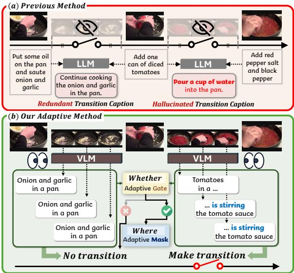
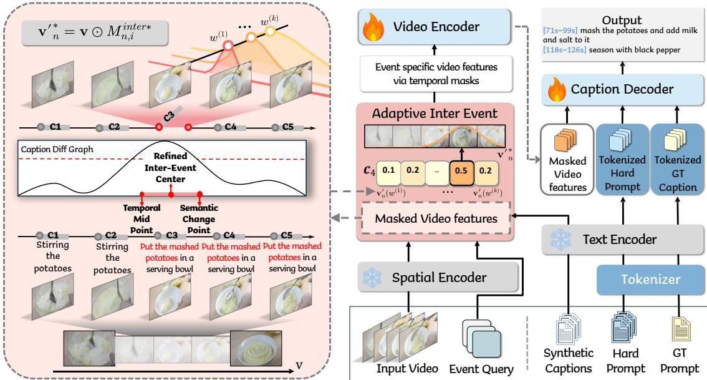
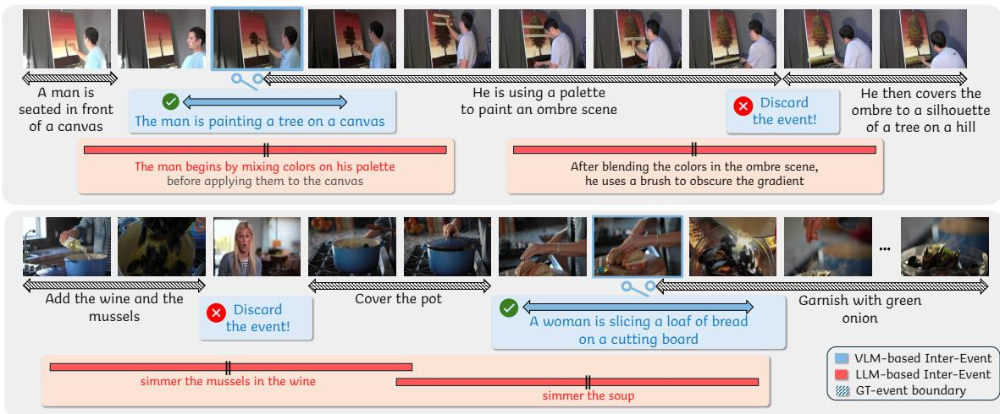
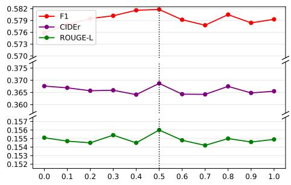
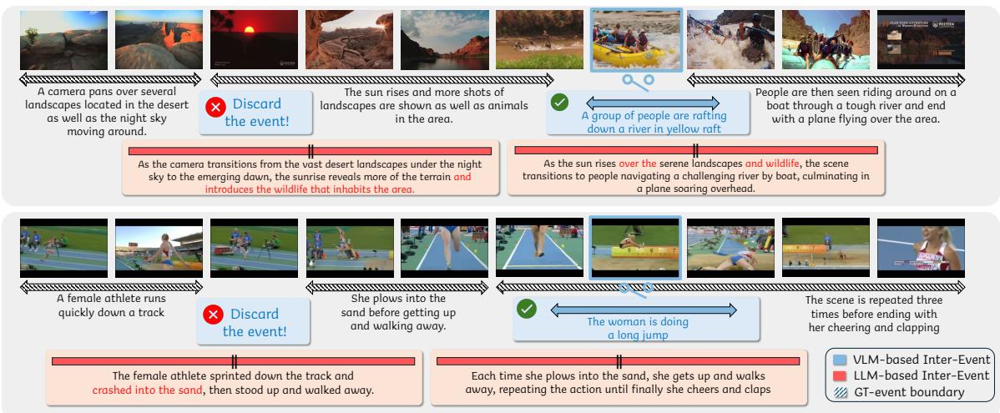
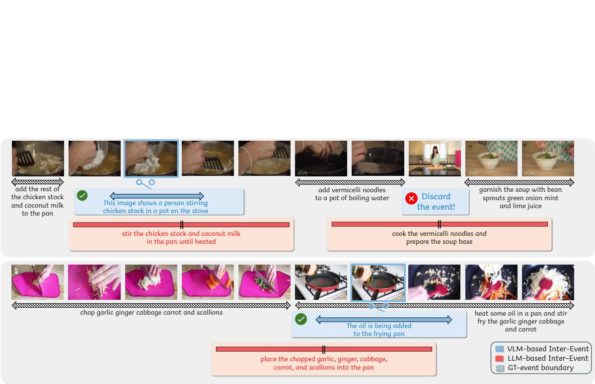

# Seeing Before Synthesizing: VLM-Guided Transition Event Discovery for Weakly-Supervised Dense Video Captioning

Ye-Chan Kim Seung hee Choi SeungJu Cha Si-Woo Kim

Hwiseon Kim Hyungee Kim Dong-Jin Kim†

Hanyang University, South Korea

{dpcksdl78, ermitaju1, sju9020, boreng0817, hwiseon9151, khjiiii2002, djdkim}@hanyang.ac.kr

## Abstract

Weakly-Supervised Dense Video Captioning aims to localize and describe multiple events in untrimmed videos given only an ordered set of event-level captions per video. Recent work synthesizes auxiliary transition captions via LLM to provide additional visionlanguage alignment, but these captions lack visual grounding and are rigidly assigned to every inter-event gap at a fixed location and duration. To address these, we propose Seeing Before Synthesizing (SBS), a framework that adaptively provides visually grounded linguistic guidance only where warranted. Leveraging a VLM, we generate frame-level narratives for the inter-event gaps and detect transitions from the semantic variation across them. For identified transitions, we then refine inter-event temporal masks by blending the temporal midpoint with the semantic change point and selecting the width that maximizes vision-language alignment. Experiments on ActivityNet Captions and YouCook2 demonstrate state-of-the-art per formance in both captioning and localization.

## 1 Introduction

Dense Video Captioning (DVC) (Kim et al., 2024; Liu et al., 2025; Wu et al., 2025) extends standard video captioning (Wang et al., 2018; Seo et al., 2022; Zhao et al., 2023) by localizing and describing multiple temporal events in long, untrimmed videos. Conventional fully supervised DVC methods (Choi et al., 2026; Baek et al., 2026) typically rely on dense annotations, where each event is paired with both temporal boundaries and a naturallanguage description. However, obtaining such fine-grained annotations is labor-intensive and difficult to scale, especially for real-world videos.

To alleviate this dependency, Weakly-Supervised Dense Video Captioning (WSDVC) (Duan et al., 2018; Ge et al., 2025; Kim et al., 2026) has emerged. It learns event localization and captioning from videos paired with temporally ordered descriptions, eliminating the need for start and end timestamps. In this setting, each training video provides the sequence of event-level captions, but the temporal boundaries of the events remain unannotated. Therefore, effectively aligning language supervision with the underlying visual content is crucial for learning fine-grained event localization.

  
Figure 1: (a) Prior work (Kim et al., 2026) synthesizes captions from GT text alone, producing hallucinated descriptions (e.g., “pour a cup of water”) and rigidly bridging all gaps. (b) SBS generates visually grounded captions via VLM and selectively bridges gaps only when a genuine semantic transition is detected.

To better support such Vision-Language (VL) alignment, recent studies have explored Large Language Model (LLM)-generated captions as auxiliary supervision when annotations are sparse or noisy (Wu et al., 2024; Shvetsova et al., 2024; Fan et al., 2023). Since VL alignment serves as a crucial learning cue in WSDVC, SAIL (Kim et al., 2026), an early attempt to apply this idea, uses an LLM to synthesize transition captions for each inter-event gap—the interval between two neighboring predicted event centers. However, such approaches are not grounded in the visual content and resort to rigid, heuristic rules. As a result, SAIL has no basis for the two decisions most essential to providing useful transition supervision in WSDVC: whether an inter-event gap actually contains a transition worth describing, and where within that gap the transition occurs. This leads to two key limitations.

First, regarding whether to introduce a caption, the existing method (Kim et al., 2026) blindly assumes that every inter-event gap must contain a transitional event. However, this rigid assumption ignores the diverse nature of real videos, where some transitions are already sufficiently covered by adjacent Ground-Truth (GT) captions. As a result, assigning auxiliary transition captions to every gap regardless of the video content adds redundant captions to already well-described regions, introducing noise rather than useful cues. Moreover, since each transition caption is generated solely from the surrounding GT event descriptions, it is prone to hallucinating content that misrepresents the video (Figure 1). Second, even when a transition does exist, each synthesized transition caption is misaligned with its visual region by a fixed rule. In particular, prior work (Kim et al., 2026) assumes the transition always lies at the midpoint between two neighboring events and spans a fixed duration, without adapting to the observed transition pattern. This can harm model training when the actual transitional event is displaced from the midpoint or covers a different duration.

To move beyond such rigid assumptions, we aim to provide transition cues that are selective and visually grounded, adaptive to each video’s content. Building on this goal, we propose Seeing Before Synthesizing (SBS), a framework that employs a Vision-Language Model (VLM) (Li et al., 2023)’s eye into both decisions—whether to introduce a transition and where to place it. It selectively synthesizes a transitional event guided by contextual flow, only when an informative event occurs, and places it according to the video content.

To realize this, the key question is determining whether an informative event exists within each inter-event gap. Inspired by the observation in cognitive science that humans segment continuous activity into discrete events at points of substantial perceptual change (Tversky and Zacks, 2013), we utilize the semantic change across frames as a proxy for an unannotated transition. A naive way to capture such a semantic change in video is to track fluctuations in low-level visual features directly.

However, these signals are notoriously susceptible to non-semantic noise such as camera motion and lighting changes (Smeaton et al., 2010; Schiappa et al., 2022), which can easily be mistaken for genuine event transitions. We therefore repurpose the VLM as a transition-search tool, rather than a mere caption generator. Specifically, we exploit it to translate each frame into a semantically abstract linguistic description. The key advantage is that linguistic descriptions provide a more semantically abstract signal than raw visual features (Ye et al., 2025), making transitions easily discernible, even when the visual appearance remains similar.

Concretely, we feed the semantic variation between caption embeddings of consecutive frames within each inter-event gap into an adaptive gate, whose threshold is determined by the local variation statistics of that gap. If the signal surpasses the threshold—indicating a salient change—the gate treats the gap as a genuine transition and opens to activate inter-event supervision, closing otherwise.

Once the adaptive gate identifies a meaningful transition, the remaining challenge is where to align the transition caption within the visual region. Prior work addresses this with a fixed temporal midpoint between neighboring event centers, which remains blind to the actual video content. Instead, we identify a content-adaptive transition center by leveraging the semantic change point that exhibits the greatest variation. We interpolate between the semantic change point and the midpoint, anchoring the center near the change point while keeping the transition event from collapsing onto either of its neighboring event centers. In addition, we select the width that best aligns the visual region with the transition caption. The resulting temporal span defines the visual region for the transition caption, supplying additional alignment to the model.

Our contributions are as follows:

• We reformulate transition augmentation in WSDVC from text-only synthesis to visually grounded transition event discovery.

• We propose SBS, which repurposes a VLM as a transition-search tool to adaptively gate transition cues and localize transition regions through a semantic change point.

• We validate our method on ActivityNet and YouCook2, achieving state-of-the-art results in both the captioning and localization tasks.

## 2 Related Work

Weakly-Supervised Dense Video Captioning. In WSDVC, early approaches (Duan et al., 2018; Chen and Jiang, 2021) employ a cycle-consistency framework that localizes temporal segments from captions and reconstructs the captions from those segments. Recently, distinct from existing cycleconsistency frameworks, ILCACM (Ge et al., 2025) proposed a method that employs Gaussian masks to construct event-specific visual features, implicitly learning localization and captioning through a reconstruction objective. This reconstruction objective implicitly drives the simultaneous learning of both localization and captioning without relying on a cycle system. Building upon this, SAIL (Kim et al., 2026) extended the ILCACM framework by introducing the concept of “transitional events”. This approach utilizes an LLM to synthesize plausible captions for the intervals between given events based on their adjacent captions. By providing such auxiliary language information, SAIL enables the model to delineate more fine-grained event boundaries. However, the existing method only offers a naive application of inter-events, leaving the question of how to effectively leverage them while accounting for video characteristics largely unexplored.

LLM-generated captions for Vision-Language tasks. In recent years, the remarkable success of LLMs across various language tasks (Achiam et al., 2023; Touvron et al., 2023) has demonstrated their exceptional zero-shot capabilities and common sense inference (Wei et al., 2022). This success has promoted extensive research into integrating common sense knowledge into vision-language tasks (Fan et al., 2023; Park et al., 2023). Notably, HowToCaption (Shvetsova et al., 2024) addresses the fact that ASR subtitles only loosely correspond to the visual content by prompting an LLM to enrich these noisy narrations into human-style video captions. Similarly, DIBS (Wu et al., 2024) targets the absence of dense annotations in unlabeled videos by exploiting diverse LLMs to generate rich, event-centric caption candidates. However, since such enriched pseudo-labels often contain noisy or misaligned content, selectively leveraging this supplementary information remains underexplored.

## 3 Proposed Method

Our objective is to effectively capture the genuine transitions to improve both captioning and localization performance in WSDVC. Formally, given a video $V$ containing $N _ { e }$ distinct events, the goal is to generate a set of event timestamps and corresponding captions $( t _ { n } ^ { s } , t _ { n } ^ { e } , C _ { n } ) _ { n = 1 } ^ { N _ { e } }$ , where $t _ { n } ^ { s }$ and $t _ { n } ^ { e }$ denote the start and end times of the n-th event, and $C _ { n }$ represents the caption describing the n-th event. Since temporal annotations are unavailable, the model learns to infer temporal event boundaries by aligning video frames with their corresponding textual descriptions. The overall architecture is shown in Figure 2.

## 3.1 Preliminaries

Following (Ge et al., 2025), we use a differentiable Gaussian mask to represent each event region in the video. To generate these masks, we employ a Transformer decoder taking video features with $N _ { v }$ frames $\textbf { v } = \{ v _ { i } \} _ { i = 1 } ^ { N _ { v } }$ , extracted from the video V using CLIP ViT-L/14 (Dosovitskiy et al., 2020; Radford et al., 2021), and learnable event queries ${ \bf q } _ { n }$ to produce eventspecific representations $\mathbf { o } _ { n }$ Based on $\mathbf { o } _ { n } .$ , we predict its temporal center $c _ { n }$ and width $w _ { n }$ for each event: $c _ { n } = S i g ( \mathrm { F C } _ { c } ( \mathbf { o } _ { n } ) ) \in [ 0 , 1 ] , \quad w _ { n } =$ $S i g ( \mathrm { F C } _ { w } ( \mathbf { o } _ { n } ) ) \in [ 0 , 1 ]$ . Here, Sig(·) denotes the sigmoid function, and $\mathrm { F C } _ { c } ( \cdot ) , \mathrm { F C } _ { w } ( \cdot )$ are linear layers for predicting n-th event’s $c _ { n }$ and $w _ { n }$ . We then construct Gaussian-based temporal masks to represent each event within the video:

$$
M _ { n , i } ^ { e v t } = \mathcal G ( r _ { i } ; c _ { n } , w _ { n } ) = \exp \biggl ( - \frac { ( r _ { i } - c _ { n } ) ^ { 2 } } { 2 ( w _ { n } / \tau _ { m } ) ^ { 2 } } \biggr ) ,\tag{1}
$$

where $r _ { i } \in [ 0 , 1 ]$ represents normalized temporal positions across the video $\begin{array} { r }  r _ { i } \ = \ \frac { i - 1 } { N _ { v } - 1 } , i \ \in \ \end{array}$ $\{ 1 , \ldots , N _ { v } \}$ , and $\tau _ { m }$ is a hyperparameter controlling mask sharpness.

SAIL (Kim et al., 2026) further constructs interevent masks to align the captions of transition events with the visual representation, capturing the continuous narrative between events. These masks are aligned with LLM-synthesized transition captions, which act as an indirect training signal. For each interval, they construct a static inter-event mask centered at the midpoint of adjacent centers $\begin{array} { r } { c _ { n } ^ { i n t e r } \ = \ \frac { c _ { n } + c _ { n + 1 } } { 2 } } \end{array}$ with a predefined fixed width $w ^ { i n t e r }$ . These masks serve as a bridge between the n-th and $( n + 1 )$ -th events, providing a consistent temporal prior for the inter-event regions.

## 3.2 Adaptive Inter-Event

Unlike prior work that exclusively relies on videoblind GT captions to construct transition events, we ground auxiliary supervision in the visual content, leveraging the semantic progression of frame-level captions to adaptively identify transition events.

  
Figure 2: SBS Pipeline. Using VLM-generated frame captions as a visually grounded narrative flow, SBS decides whether to introduce a transition in each gap via an adaptive gate and where to place it via an adaptive mask, providing grounded auxiliary supervision.

Narrative Generation. Given an input video of $N _ { v }$ frames, we utilize BLIP-2 (Li et al., 2023) to generate a frame-specific caption $\mathcal { C } _ { i }$ for each frame, yielding a temporal sequence $\mathcal { C } = \{ \mathcal { C } _ { 1 } , \ldots , \mathcal { C } _ { N _ { v } } \}$ This sequence $\mathcal { C }$ serves as a dense narrative flow over the visual stream. Building upon the framelevel narrative flow, we introduce Narrative-Aware Inter-Event Selection to determine whether a latent transition event exists within the temporal gaps between consecutive predicted events.

Narrative-Aware Inter-Event Selection. We leverage the intuition (Tversky and Zacks, 2013) that stable semantic content yields little variation across frames, whereas an underlying event transition triggers a pronounced narrative shift. To capture this shift, we measure the semantic dissimilarity within each inter-event gap. For the n-th and (n + 1)-th consecutive predicted events, we define the inter-event gap as the temporal span between their centers from $c _ { n }$ to $c _ { n + 1 }$ We map a normalized temporal coordinate $x \in$ [0, 1] to a discrete frame index using $\kappa ( x ) \ =$ clip $( \lfloor x ( N _ { v } - 1 ) \rfloor + 1 , 1 , N _ { v } )$

Then, the frame indices of the n-th inter-event search interval are given by $b _ { n } ^ { s } ~ = ~ \kappa ( c _ { n } ) , b _ { n } ^ { e }$ = $\kappa ( c _ { n + 1 } )$ . Within this temporal span, we collect the corresponding sequence of frame-level text embeddings $\{ { \mathbf { z } } _ { i } \} _ { i = b _ { n } ^ { s } } ^ { b _ { n } ^ { e } }$ , where $\mathbf { z } _ { i }$ denotes the text embedding of caption $\mathcal { C } _ { i }$ encoded via a CLIP text encoder. To quantify the semantic shift within the gap $[ b _ { n } ^ { s } , \ldots , b _ { n } ^ { e } ]$ , we compute the cosine dissimilarity $d _ { i }$ between adjacent frame-level narratives:

$$
d _ { i } = 1 - \frac { \mathbf { z } _ { i } \cdot \mathbf { z } _ { i + 1 } } { \left\| \mathbf { z } _ { i } \right\| \left\| \mathbf { z } _ { i + 1 } \right\| } ,\tag{2}
$$

where $d _ { i }$ represents the degree of semantic variation at a specific time step. A high dissimilarity within the gap’s sequence $\mathbf { \check { \mathcal { D } } } _ { n } = \mathbf { \check { \{ d } }  _ { i } \mathbf { \Psi } _ { i = b _ { n } ^ { s } } ^ { b _ { n } ^ { e } - 1 }$ signals a potential transition. We thus feed this signal into an adaptive gating mechanism that decides whether a transition event should be synthesized.

Specifically, the gate determines the existence of an inter-event transition through a threshold adapted to each gap. We compute the mean $\mu ( \mathcal { D } _ { n } )$ and the standard deviation $\sigma ( \mathcal { D } _ { n } )$ within the n-th gap. The adaptive threshold $\eta _ { n } ^ { a d a p }$ is then formulated as: $\eta _ { n } ^ { a d \bar { a } p } = \mu ( \mathcal { D } _ { n } ) + \beta \cdot \sigma ( \mathcal { D } _ { n } )$ , where $\beta$ is a hyperparameter controlling the sensitivity to semantic shifts, following (Jeon et al., 2025).

To obtain a soft confidence score for each candidate inter-event interval, we employ a sigmoidbased gate $g _ { n }$ to estimate the probability of an interevent’s existence:

$$
g _ { n } = S i g ( \operatorname* { m a x } ( \mathcal { D } _ { n } ) - \eta _ { n } ^ { a d a p } ) .\tag{3}
$$

The gate value $g _ { n } \in [ 0 , 1 ]$ serves as a confidence score for the existence of a transition within the n-th gap. We open the gate when $g _ { n } \geq 0 . 5$ , otherwise the gate is closed, and no transitional event is injected into the gap. We aim to apply transition supervision selectively, rather than uniformly across all gaps. Through this selective mechanism, a transition cue is injected only into gaps whose semantic variation sufficiently exceeds the threshold.

Adaptive Inter-Event Masks. While the gating mechanism identifies the necessity of a transition caption, the remaining challenge is to align it with its corresponding visual region. To achieve this, we propose Adaptive Inter-Event Masks, which move beyond video-agnostic templates by dynamically estimating the temporal center and width for each transition based on the video’s flow and content.

Prior work (Kim et al., 2026) uniformly assigns a static midpoint $c _ { n } ^ { i n t e r }$ and a fixed width $w ^ { i }$ inter to every interval between the n-th and $( n + 1 )$ -th events. This rule serves as a temporal regularizer that keeps the transition event from collapsing onto either of its neighboring event centers. In contrast, we refine the transition event’s center to account not only for this temporal prior but also for the semantic change point identified in the narrative flow. Specifically, we define this semantic change point $p _ { n }$ as the temporal position exhibiting the largest semantic dissimilarity within the n-th gap:

$$
p _ { n } = { \frac { i _ { n } ^ { * } - 1 } { N _ { v } - 1 } } , \quad { \mathrm { w h e r e } } \quad i _ { n } ^ { * } = \quad { \underset { i \in \{ b _ { n } ^ { s } , \ldots , b _ { n } ^ { e } - 1 \} } { \arg \operatorname* { m a x } } } d _ { i } .\tag{4}
$$

Based on $p _ { n } .$ , we refine the center $c _ { n } ^ { i n t e r * }$ with a hyperparameter $\alpha \in [ 0 , 1 ] \colon$

$$
c _ { n } ^ { i n t e r * } = ( 1 - \alpha ) \cdot c _ { n } ^ { i n t e r } + \alpha \cdot p _ { n } .\tag{5}
$$

As a result, the mask center is anchored at a position that reflects both the temporal prior from the neighboring centers and the point where the actual semantic change occurs. We then map $c _ { n } ^ { i n t e r * }$ to its corresponding discrete frame index $j _ { n } = \kappa ( c _ { n } ^ { i n t e r * } )$ , and adopt VLM caption at frame $j _ { n }$ as the linguistic description of the transition.

Next, we adaptively determine the optimal temporal width $w _ { n } ^ { i n t e r * }$ . To account for varying event durations and identify the width that best matches the underlying content, we evaluate cross-modal alignment between the video content and the caption at the refined center across multiple candidate widths. For each candidate width from the predefined set $\boldsymbol { w } ^ { ( k ) } \in \Omega = \{ \boldsymbol { w } ^ { ( 1 ) } , \ldots , \boldsymbol { w } ^ { ( K ) } \}$ , we generate a soft Gaussian mask $M _ { n , i } ^ { i n t e r } ( w ^ { ( k ) } )$ at the refined center $c _ { n } ^ { i n t e r * }$ and compute the masked video features $\mathbf { v } _ { n } ^ { \prime } ( w ^ { ( k ) } ) = \mathbf { v } \odot M _ { n , i } ^ { i n t e r } ( w ^ { ( k ) } )$ . We then obtain the average pooled representation $\bar { \mathbf { v } } _ { n } ^ { \prime } ( w ^ { ( k ) } )$ and select the optimal width that maximizes the cross-modal alignment with the inter-event’s caption embedding ${ \mathbf { z } } _ { j _ { n } }$ , recording the resulting alignment score $s _ { n } ^ { * }$

$$
\begin{array} { r l } & { w _ { n } ^ { i n t e r * } = \arg \underset { w ^ { ( k ) } \in \Omega } { \operatorname* { m a x } } ~ \cos \left( \bar { \mathbf { v } } _ { n } ^ { \prime } ( w ^ { ( k ) } ) , \ \mathbf { z } _ { j _ { n } } \right) , } \\ & { \quad \quad s _ { n } ^ { * } = \underset { w ^ { ( k ) } \in \Omega } { \operatorname* { m a x } } ~ \cos \left( \bar { \mathbf { v } } _ { n } ^ { \prime } ( w ^ { ( k ) } ) , \ \mathbf { z } _ { j _ { n } } \right) , } \end{array}\tag{6}
$$

where ${ \mathbf { z } } _ { j _ { n } }$ is the CLIP text embedding of the VLM caption generated at frame $j _ { n }$

The final adaptive inter-event mask $M _ { n , i } ^ { i n t e r * }$ is formulated by substituting the optimal center $c _ { n } ^ { i n t e r * }$ and width $w _ { n } ^ { i n t e r * }$ into Equation (1):

$$
M _ { n , i } ^ { i n t e r * } = \mathcal { G } \big ( r _ { i } ; c _ { n } ^ { i n t e r * } , w _ { n } ^ { i n t e r * } \big ) .\tag{7}
$$

The resulting inter-event visual representation is obtained as ${ \mathbf { v ^ { \prime } } } _ { n } ^ { * } = \mathbf { v } \odot M _ { n , i } ^ { i n t e r * }$ , which serves as the visual feature for the transition between the nth and $( n + 1 )$ -th events. By adaptively estimating these temporal parameters, SBS provides a more realistic and context-aware transitional event, thereby facilitating precise alignment between visual dynamics and auxiliary linguistic signals.

## 3.3 Model Training and Inference

Following SAIL (Kim et al., 2026), our training objective consists of a captioning loss $\mathcal { L } ^ { \mathrm { c a p } }$ and a contrastive loss $\mathcal { L } ^ { \mathrm { c o n } }$ , supplemented by our proposed gated attraction loss $\mathcal { L } ^ { \mathrm { a t t r } }$ . Specifically, $\mathcal { L } ^ { \mathrm { c a p } }$ trains the model to reconstruct the GT caption $C _ { n }$ from event region $\mathbf { v } \odot M _ { n , i } ^ { e v t }$ and its complement ${ \bf v } \odot ( 1 - M _ { n , i } ^ { e v t } )$ with CE loss. $\mathcal { L } ^ { \mathrm { c o n } }$ encourages the visual feature of each event region $\mathbf { v } \odot M _ { n , i } ^ { e v t }$ to be aligned with the text feature of its corresponding caption $C _ { n } .$ , utilizing margin ranking loss in the CLIP (Radford et al., 2021) feature space.

Unlike SAIL, SBS selectively applies $\mathcal { L } ^ { \mathrm { a t t r } }$ using $g _ { n }$ from Equation (3):

$$
\mathcal { L } _ { n } ^ { \mathrm { a t t r } } = g _ { n } \cdot \left( 1 - \cos ( \bar { \mathbf { v } } _ { n } ^ { \prime } , \mathbf { z } _ { j _ { n } } ) \right) ,\tag{8}
$$

where $g _ { n }$ modulates the loss magnitude according to the transition confidence.

Additionally, we apply a similarity-based filtering step to guard against low-quality VLM captions that may not accurately describe the visual content. Specifically, an inter-event region is included in the loss computation only if the alignment score $s _ { n } ^ { * }$ exceeds a predefined threshold θ (i.e., $s _ { n } ^ { * } \geq \theta )$ . This restricts training to reliably aligned inter-event pairs, preventing noisy or hallucinated captions from harming learning. Let ${ \mathcal { A } } = \{ n \mid g _ { n } \geq 0 . 5$ and $s _ { n } ^ { * } \geq \theta \}$ denote the set of all accepted intervals; the final attraction loss is:

<table><tr><td rowspan="2">Setting</td><td rowspan="2">Model</td><td rowspan="2">Features</td><td colspan="4">Captioning</td><td colspan="4">Localization</td></tr><tr><td>SODA_c</td><td>METEOR</td><td>CIDEr</td><td>ROUGE-L</td><td>BLEU-4</td><td>R@Avg</td><td>P@Avg</td><td>F1</td></tr><tr><td rowspan="4">Fully Supervised</td><td>CM² (Kim et al., 2024)</td><td>CLIP</td><td>6.18</td><td>8.55</td><td>33.01</td><td></td><td>2.38</td><td>53.71</td><td>56.81</td><td>55.21</td></tr><tr><td>E2DVC (Wu et al., 2025)</td><td>CLIP</td><td>6.13</td><td>8.57</td><td>33.63</td><td></td><td>2.43</td><td>54.67</td><td>57.70</td><td>56.14</td></tr><tr><td>CACMI (Jia et al., 2026)</td><td>CLIP</td><td>6.39</td><td>8.68</td><td>33.80</td><td></td><td>2.44</td><td>55.89</td><td>58.05</td><td>57.10</td></tr><tr><td>ROS-DVC (Baek et al., 2026)</td><td>CLIP</td><td>6.45</td><td>8.45</td><td>35.04</td><td>一</td><td>2.36</td><td>55.35</td><td>55.65</td><td>55.50</td></tr><tr><td rowspan="7">Weakly Supervised</td><td>WSDEC (Duan et al., 2018)</td><td>C3D</td><td></td><td>6.30</td><td>18.77</td><td>12.55</td><td>1.27</td><td>29.57</td><td>59.33</td><td>39.18</td></tr><tr><td>ECG (Wu et al., 2021)</td><td>C3D</td><td></td><td>7.06</td><td>14.25</td><td></td><td>1.33</td><td>一</td><td></td><td>一</td></tr><tr><td>EC-SL (Chen and Jiang, 2021)</td><td>C3D</td><td></td><td>7.49</td><td>21.21</td><td>13.02</td><td>1.33</td><td></td><td></td><td></td></tr><tr><td>PWS-DVC* (Choi et al., 2023)</td><td>C3D</td><td></td><td>7.28</td><td>20.59</td><td>12.71</td><td>1.35</td><td>40.85</td><td>55.82</td><td>47.09</td></tr><tr><td>ILCACM (Ge et al., 2025)</td><td>CLIP</td><td>6.08</td><td>8.48</td><td>33.42</td><td>14.77</td><td>2.26</td><td>53.72</td><td>58.92</td><td>56.20</td></tr><tr><td>SAIL (Kim et al., 2026)</td><td>CLIP</td><td>6.29</td><td>8.63</td><td>35.38</td><td>15.29</td><td>2.30</td><td>54.39</td><td>59.87</td><td>57.00</td></tr><tr><td>SBS (Ours)</td><td>CLIP</td><td>6.49</td><td>8.87</td><td>36.87</td><td>15.60</td><td>2.47</td><td>56.13</td><td>60.38</td><td>58.18</td></tr></table>

Table 1: Comparison with state-of-the-art methods on ActivityNet validation set. SBS achieves state-of-the-art performance in both captioning and localization metrics. \* denotes results reported in (Kim et al., 2026).
<table><tr><td rowspan="3">Setting</td><td rowspan="3">Model</td><td rowspan="3">Features</td><td colspan="5">Captioning</td><td colspan="3">Localization</td></tr><tr><td>SODA_c</td><td>METEOR</td><td>CIDEr</td><td>ROUGE-L</td><td>BLEU@N</td><td>R@Avg</td><td>P@Avg</td><td>F1</td></tr><tr><td rowspan="5">Weakly Supervised</td><td>WSDEC* (Duan et al., 2018)</td><td>C3D</td><td>2.11</td><td>1.47</td><td>8.43</td><td>一</td><td>一</td><td>一</td><td>一</td><td>一</td></tr><tr><td>PWS-DVC* (Choi et al., 2023)</td><td>C3D</td><td>3.14</td><td>2.48</td><td>9.81</td><td>1</td><td>一</td><td></td><td></td><td></td></tr><tr><td>ILCACM* (Ge et al., 2025)</td><td>CLIP</td><td>3.60</td><td>3.41</td><td>13.49</td><td>4.75</td><td>2.59</td><td>17.76</td><td>18.01</td><td>17.88</td></tr><tr><td>SAIL (Kim et al., 2026)</td><td>CLIP</td><td>4.08</td><td>3.63</td><td>14.61</td><td>5.42</td><td>2.94</td><td>20.76</td><td>21.13</td><td>20.94</td></tr><tr><td>SBS (Ours)</td><td>CLIP</td><td>4.24</td><td>3.99</td><td>16.28</td><td>5.80</td><td>3.25</td><td>22.39</td><td>21.95</td><td>22.17</td></tr></table>

Table 2: Comparison with previous methods on YouCook2 validation set. SBS achieves the best performance in both captioning and localization metrics. BLEU@N denotes the average of BLEU-1 through BLEU-4. \* denotes results reported in (Kim et al., 2026).

$$
{ \mathcal { L } } ^ { \mathrm { a t t r } } = { \frac { 1 } { | { \mathcal { A } } | } } \sum _ { n \in { \mathcal { A } } } { \mathcal { L } } _ { n } ^ { \mathrm { a t t r } } .\tag{9}
$$

The overall training objective combines the base loss with the attraction loss, weighted by $\lambda ^ { \mathrm { a t t r } }$ :

$$
{ \mathcal { L } } = { \mathcal { L } } ^ { \mathrm { c a p } } + { \mathcal { L } } ^ { \mathrm { c o n } } + \lambda ^ { \mathrm { a t t r } } { \mathcal { L } } ^ { \mathrm { a t t r } } .\tag{10}
$$

During inference, following (Ge et al., 2025), the model first generates boundary-free captions to determine the event count, then produces Gaussian masks for each event to extract $( c _ { n } , w _ { n } )$ , which are mapped to timestamps, and refines the captions using event-specific masked features. More details are provided in the supplementary material.

## 4 Experiments

Datasets. We evaluate our method on two widely used DVC benchmarks. ActivityNet Captions (Krishna et al., 2017) contains 20K untrimmed videos averaging 120 seconds, each annotated with approximately 3.7 temporally localized events. YouCook2 (Zhou et al., 2018) consists of around

2K untrimmed cooking videos with an average duration of 320 seconds, where each video is accompanied by 7.7 localized events on average.

Evaluation Metrics. We assess performance on both captioning and localization subtasks of DVC. For captioning quality, we report METEOR (Banerjee and Lavie, 2005), CIDEr (Vedantam et al., 2015), ROUGE-L (Lin, 2004), and BLEU-N (Papineni et al., 2002) using the official evaluation tool (Krishna et al., 2017), along with SODA\_c (Fujita et al., 2020). For event localization, we report mean Average Precision, mean Average Recall, and F1 score. All metrics are computed across IoU thresholds of {0.3, 0.5, 0.7, 0.9} and averaged.

Implementation Details. We adopt Distilled-GPT2 (Radford et al., 2019) as the caption decoder and optimize all parameters with AdamW, following (Ge et al., 2025). On ActivityNet Captions, the learning rate is initialized to 1e-4, and training runs for 10 epochs in both the captioning and localization stages. Also we use $\alpha = 0 . 5 , \beta = 2 .$ $\theta = 0 . 2 , \Omega = \{ 0 . 2 , 0 . 4 , 0 . 6 \}$ , and $\lambda _ { \mathrm { a t t r } } = 0 . 4$ . On YouCook2, we train 4 and 25 epochs for the captioning and localization stages, respectively. All training is performed on a single NVIDIA A6000 GPU. Additional details are provided in the supplementary material.

<table><tr><td rowspan="2">VLM Caption (1)</td><td rowspan="2">Adaptive Gate (2)</td><td rowspan="2">Adaptive Mask (3)</td><td colspan="3">Captioning</td><td rowspan="2">Localization</td></tr><tr><td>S_c</td><td>R-L</td><td>C</td></tr><tr><td>x</td><td>x</td><td>x</td><td>6.34</td><td>15.26</td><td>35.03</td><td>56.86</td></tr><tr><td>√</td><td>x</td><td>x</td><td>6.29</td><td>15.45</td><td>35.73</td><td>57.73</td></tr><tr><td>√</td><td>√</td><td>x</td><td>6.45</td><td>15.43</td><td>36.61</td><td>57.67</td></tr><tr><td>√</td><td>x</td><td>√</td><td>6.48</td><td>15.50</td><td>36.51</td><td>57.80</td></tr><tr><td>√</td><td>√</td><td>√</td><td>6.49</td><td>15.60</td><td>36.87</td><td>58.18</td></tr></table>

Table 3: Ablation study on key components. We first compare (1) the presence of VLM and then investigate the contributions of (2) Narrative-Aware Inter-Event Selection and (3) Adaptive Inter-Event Masks components within the VLM-based framework.

## 4.1 Comparison with State-of-the-Art

Table 1 summarizes the captioning and localization results on ActivityNet Captions. SBS achieves the best performance across both tasks among all weakly-supervised methods, obtaining a CIDEr of 36.87 and an F1 score of 58.18, which surpasses the previous state-of-the-art SAIL (Kim et al., 2026). The localization gains are attributed to improvements in both recall (56.13) and precision (60.38), indicating that our adaptive inter-event mechanism enhances temporal boundary estimation. Notably, SBS even outperforms several fullysupervised methods on the majority of metrics, despite the absence of temporal boundary annotations during training. As shown in Table 2, these improvements generalize to YouCook2, where SBS again achieves the highest scores in both captioning and localization among WSDVC methods. The consistent gains across two benchmarks validate the effectiveness of our approach.

## 4.2 Ablation Studies

Component Ablation. In Table 3, we analyze the contribution of each component. Replacing LLMsynthesized captions with VLM-generated ones already improves CIDEr, ROUGE-L and F1, confirming the benefit of visually grounded inter-event descriptions. Adding Narrative-Aware Inter-Event Selection improves almost all captioning scores, showing that selective inter-event guidance suppresses noise while retaining informative transitions. Furthermore, Adaptive Inter-Event Masks provide further improvements, showing that tailoring each mask’s center and width to the content captures transitions better than fixed templates. Finally, combining all components achieves the best performance, confirming that auxiliary supervision tailored to each video is key to both captioning and localization.

<table><tr><td rowspan="2">Method</td><td colspan="3">Captioning</td><td rowspan="2">Localization</td></tr><tr><td>S_c</td><td>R-L</td><td>C</td></tr><tr><td>SAIL (LLM)</td><td>6.29</td><td>15.29</td><td>35.38</td><td>57.00</td></tr><tr><td rowspan="3">InternVL3-1B Qwen2.5-VL-3B</td><td>6.47</td><td>15.52</td><td>36.71</td><td>57.98</td></tr><tr><td>6.43</td><td>15.49</td><td>36.82</td><td>57.62</td></tr><tr><td>6.47</td><td>15.45</td><td>36.45</td><td>57.86</td></tr><tr><td>SmolVLM2-2.2B</td><td>6.44</td><td>15.49</td><td>36.50</td><td>57.94</td></tr><tr><td>BLIP-2-2.7B</td><td>6.49</td><td>15.60</td><td>36.87</td><td>58.18</td></tr></table>

Table 4: Ablation study on various VLMs, illustrating that SBS consistently improves performance regardless of the choice of the VLM model.

Analysis of VLM Captions. Table 4 examines the impact of the captioning model used to generate frame-level descriptions. All VLM-based variants (BLIP-2 (Li et al., 2023), InternVL3 (Zhu et al., 2025), Qwen2.5-VL (Bai et al., 2025), xGen-MM (Xue et al., 2024) and SmolVLM2 (Marafioti et al., 2025)) consistently outperform LLM-based SAIL across all metrics, confirming that visually grounded captions provide more reliable supervision than video-blind linguistic synthesis. These results suggest that the primary gain stems from grounding captions in actual visual content rather than from the choice of the VLM. Figure 3 further illustrates this distinction qualitatively: while LLMbased captions often hallucinate events absent from the video due to their reliance on linguistic context alone, VLM-generated captions faithfully describe what appears in each frame.

Analysis of Gate Activation Criteria. To examine which signal best identifies genuine inter-event transitions, we compare three criteria for opening the adaptive gate: random activation, raw CLIP visual features, and our VLM-generated captions. As shown in Table 5, random activation performs the worst, while raw visual features improve over random but still fall short, since low-level signals are easily confounded by non-semantic variation. In contrast, our caption-based criterion achieves the best scores on both captioning and localization, showing that semantically abstract textual descriptions are a more reliable indicator of underlying transitions for adaptive gap selection.

Analysis of Inter-Masks. As shown in Figure 4, performance consistently improves when both the temporal midpoint and the semantic transition point are jointly considered, compared with relying solely on the temporal midpoint. In particular, intermediate values of α yield stable gains across all three metrics, with the best performance achieved at $\alpha = 0 . 5$ , where the model attains the highest captioning and localization scores. Also, Figure 3 shows that the adaptive masks align well with the event transition points in the video.

  
Figure 3: Qualitative results about transition events. Prior LLM-based method injects a transition into every gap, including uninformative ones. Also, even for meaningful transitions, they describe regions misaligned with the actual transition, resulting in inaccurate captions. In contrast, SBS generates transitions only where a meaningful change occurs, producing captions that are well aligned with both the actual transition and the underlying frames.

  
Figure 4: Hyperparameter search for the interpolation coefficient α. The X-axis denotes α, and the Y-axis reports captioning and localization scores. SAIL’s fixed midpoint (Kim et al., 2026) (α = 0) yields the lowest scores, whereas interpolating the semantic change point (α > 0) consistently improves performance.

Analysis of Inter-Events. To verify whether our VLM captions and adaptive mask construction effectively represent inter-event regions, we measure the cosine similarity between the pooled inter-event visual features and their corresponding caption features. As shown in Table 6, we observe a substantial increase in average similarity compared to the LLM-based baseline. This confirms that our approach, which combines visually grounded VLM captions with adaptive center blending and width selection, more faithfully captures the underlying inter-event content, ultimately providing higher-

<table><tr><td rowspan="2">Method</td><td colspan="3">Captioning</td><td rowspan="2">Localization</td></tr><tr><td>S_c</td><td>R-L</td><td>C</td></tr><tr><td>SAIL</td><td>6.29</td><td>15.29</td><td>35.38</td><td>F1 57.00</td></tr><tr><td>Random</td><td>6.26</td><td>15.32</td><td>35.87</td><td>56.88</td></tr><tr><td>Raw Video</td><td>6.39</td><td>15.32</td><td>36.34</td><td>57.42</td></tr><tr><td>Caption</td><td>6.49</td><td>15.60</td><td>36.87</td><td>58.18</td></tr></table>

Table 5: Ablation study on gate activation criteria for inter-event supervision. Textual semantic guides outperform raw visual features for adaptive gap selection.

<table><tr><td>Method</td><td>S_c</td><td>C</td><td>F1</td><td>Cos Sim</td></tr><tr><td>SAIL</td><td>6.29</td><td>35.38</td><td>57.00</td><td>0.1460</td></tr><tr><td>SBS (w/o F)</td><td>6.43</td><td>36.41</td><td>57.89</td><td>0.2624</td></tr><tr><td>SBS</td><td>6.49</td><td>36.87</td><td>58.18</td><td>0.2699</td></tr></table>

Table 6: Cosine similarity between inter-event visual features and caption features. Our method more faithfully represents inter-event regions. w/o F denotes without similarity filtering method.

## quality auxiliary supervision for training.

Comparisons with MLLM-based methods. We compare MLLM-based models (Ren et al., 2024; Guo et al., 2025, 2024; Yang et al., 2025) that explicitly address temporal grounding and dense captioning (Table 7). Despite fully supervised training with large-scale data and substantially larger models, these MLLM-based methods still struggle with the compound challenge of simultaneously performing grounding and captioning. In contrast, SBS effectively handles this task even under the weakly-supervised setting without any temporal annotations, while using a much smaller model.

<table><tr><td rowspan="2">Model</td><td rowspan="2">Fully Supervised</td><td rowspan="2">Backbone Params</td><td colspan="2">Captioning</td><td rowspan="2">Localization F1</td></tr><tr><td>S_c</td><td>C</td></tr><tr><td>TimeChat</td><td>√</td><td>7B</td><td>4.7</td><td>19.0</td><td>36.9</td></tr><tr><td>VTG-LLM</td><td>√</td><td>7B</td><td>5.1</td><td>20.7</td><td>34.8</td></tr><tr><td>TRACE</td><td>√</td><td>7B</td><td>6.0</td><td>25.9</td><td>39.3</td></tr><tr><td>TimeExpert</td><td>√</td><td>5.9B</td><td>6.5</td><td>28.4</td><td>40.5</td></tr><tr><td>SBS</td><td>x</td><td>133M</td><td>6.49</td><td>36.87</td><td>58.18</td></tr></table>

Table 7: Comparison with MLLM-based models on ActivityNet Captions. Despite using weak supervision and a much smaller model, SBS outperforms fullysupervised MLLM-based methods.

<table><tr><td>Method</td><td>Recall</td><td>Precision</td><td>F1</td></tr><tr><td>SAIL</td><td>100</td><td>37.89</td><td>54.96</td></tr><tr><td>Random</td><td>37.90</td><td>49.48</td><td>42.92</td></tr><tr><td>SBS</td><td>74.99</td><td>64.29</td><td>69.23</td></tr></table>

Table 8: Comparison of transition identification performance on human-annotated gaps. SBS’s gate substantially outperforms both always-inject (SAIL) and random gating in F1.

Direct Evaluation of the Gate on Human-Annotated Transitions. Since no ground-truth annotations exist for inter-event transitions, we constructed a manually verified transition validation set, then directly evaluated our gate on it. We designed a multi-stage protocol, with human verification as the final arbiter. (1) Gap extraction and sampling. From consecutive GT event pairs in ActivityNet validation videos, we randomly sampled 200 inter-event gaps. (2) Initial transition proposal. Frames from each gap (1 fps) were fed into Gemini 3.5 Flash, prompted to judge whether a distinct transitional event—not covered by either adjacent GT caption—occurs in the gap, explicitly excluding camera cuts, angle changes, and mere continuations. (3) Cross-verification. Each gap was independently re-judged by GPT-5.5 Pro with the identical prompt, without revealing the first model’s answer. Agreed labels became draft labels; disagreements were excluded. (4) Human verification. All draft labels were then verified by human annotators, blind to our model’s outputs. We retained only gaps with unanimous agreement, to ensure label reliability. This yielded a final validation set of 95 gaps (36 gaps with a transition, 59 gaps without). On this set, we evaluated the gate decision for each annotated gap (Table 8). Our gate mechanism achieves substantially better transition detection than both SAIL’s always-inject strategy and random gating, suggesting that text-level semantic change is an effective signal for identifying genuine transitions and directly substantiating the whether-to-inject component of our central claim. Computational Cost Analysis. We measure the time and memory consumed during training and inference, averaged over five runs. As shown in Table 9, the training and inference times of our method are nearly identical to those of the baseline (Ge et al., 2025), and the memory consumption is comparable as well. Since captions are extracted in advance and only their features are used, the captioning process adds almost no overhead, and the mask width selection is a simple dot product with negligible effect on the overall training time.

<table><tr><td>Method</td><td>Train time</td><td>Inference time</td><td>GPU usage</td></tr><tr><td>ILCACM</td><td>1H 42M 31S</td><td>7M 16S</td><td>33.08 GiB</td></tr><tr><td>SAIL</td><td>1H 49M 50S</td><td>7M 35S</td><td>33.11 GiB</td></tr><tr><td>SBS</td><td>1H 52M 53S</td><td>7M 51S</td><td>33.13 GiB</td></tr></table>

Table 9: Model training computational cost comparison. The additional cost of SBS is negligible across all three metrics.

## 5 Conclusion

We present SBS, a framework that rethinks how inter-event information is utilized in WSDVC. Our key insight is twofold: (1) transitions should be applied selectively, only where the video exhibits a transition, rather than uniformly across all gaps; (2) each transition should be localized according to the actual video content, rather than fixed at a heuristic midpoint. To this end, SBS repurposes a VLM as a transition-search tool, grounding both decisions—whether and where—in visual evidence. Experiments on ActivityNet Captions and YouCook2 confirm that SBS sets a new state-of-theart in both captioning and localization, demonstrating the importance of adaptive, visually grounded inter-event utilization for WSDVC.

## Limitations

Our method grounds transition discovery in VLMgenerated frame captions, so its effectiveness is bounded by the quality of those captions: when the VLM produces generic, repetitive, or inaccurate descriptions—particularly in domains underrepresented in its pre-training—the caption-space dissimilarity signal becomes unreliable, causing the adaptive gate to miss genuine transitions or open on spurious ones.

## Acknowledgments

This work was partly supported by the Institute of Information & Communications Technology Planning & Evaluation (IITP) grant funded by the Korean government (MSIT) RS-2025-25422680, Metacognitive AGI Framework and its Applications and the AI Seoul Tech Research Support Program of the Seoul Future Foundation.

## References

Josh Achiam, Steven Adler, Sandhini Agarwal, Lama Ahmad, Ilge Akkaya, Florencia Leoni Aleman, Diogo Almeida, Janko Altenschmidt, Sam Altman, Shyamal Anadkat, and 1 others. 2023. Gpt-4 technical report. arXiv preprint arXiv:2303.08774.

Seung Hyup Baek, Jimin Lee, Hyeongkeun Lee, and Jae Won Cho. 2026. Stay in your lane: Role specific queries with overlap suppression loss for dense video captioning. In Proceedings of the IEEE/CVF Conference on Computer Vision and Pattern Recognition (CVPR), pages 3432–3442.

Shuai Bai, Yuxuan Cai, Ruizhe Chen, Keqin Chen, Xionghui Chen, Zesen Cheng, Lianghao Deng, Wei Ding, Chang Gao, Chunjiang Ge, and 1 others. 2025. Qwen3-vl technical report. arXiv preprint arXiv:2511.21631.

Satanjeev Banerjee and Alon Lavie. 2005. Meteor: An automatic metric for mt evaluation with improved correlation with human judgments. In Proceedings of the acl workshop on intrinsic and extrinsic evaluation measuresfor machine translation and/or summarization, pages 65–72.

Shaoxiang Chen and Yu-Gang Jiang. 2021. Towards bridging event captioner and sentence localizer for weakly supervised dense event captioning. In Proceedings ofthe IEEE/CVF Conference on Computer Vision and Pattern Recognition, pages 8425–8435.

Seung hee Choi, MinJu Jeon, Hyunwoo Oh, Jihwan Lee, and Dong-Jin Kim. 2026. Follow the saliency: Supervised saliency for retrieval-augmented dense video captioning. In Proceedings of the IEEE/CVF Conference on Computer Vision and Pattern Recognition (CVPR), pages 32808–32817.

Wangyu Choi, Jiasi Chen, and Jongwon Yoon. 2023. Pws-dvc: Enhancing weakly supervised dense video captioning with pretraining approach. IEEE Access, 11:128162–128174.

Alexey Dosovitskiy, Lucas Beyer, Alexander Kolesnikov, Dirk Weissenborn, Xiaohua Zhai, Thomas Unterthiner, Mostafa Dehghani, Matthias Minderer, Georg Heigold, Sylvain Gelly, and 1 others. 2020. An image is worth 16x16 words: Transformers for image recognition at scale. arXiv preprint arXiv:2010.11929.

Xuguang Duan, Wenbing Huang, Chuang Gan, Jingdong Wang, Wenwu Zhu, and Junzhou Huang. 2018. Weakly supervised dense event captioning in videos. Advances in Neural Information Processing Systems, 31.

Lijie Fan, Dilip Krishnan, Phillip Isola, Dina Katabi, and Yonglong Tian. 2023. Improving clip training with language rewrites. Advances in Neural Information Processing Systems, 36:35544–35575.

Soichiro Fujita, Tsutomu Hirao, Hidetaka Kamigaito, Manabu Okumura, and Masaaki Nagata. 2020. Soda: Story oriented dense video captioning evaluation framework. In Computer Vision–ECCV 2020: 16th European Conference, Glasgow, UK, August 23– 28, 2020, Proceedings, Part VI 16, pages 517–531. Springer.

Shiping Ge, Qiang Chen, Zhiwei Jiang, Yafeng Yin, Liu Qin, Ziyao Chen, and Qing Gu. 2025. Implicit location-caption alignment via complementary masking for weakly-supervised dense video captioning. In Proceedings of the AAAI Conference on Artificial Intelligence, volume 39, pages 3113–3121.

Yongxin Guo, Jingyu Liu, Mingda Li, Dingxin Cheng, Xiaoying Tang, Dianbo Sui, Qingbin Liu, Xi Chen, and Kevin Zhao. 2025. Vtg-llm: Integrating timestamp knowledge into video llms for enhanced video temporal grounding. In Proceedings ofthe AAAI conference on artificial intelligence, volume 39, pages 3302–3310.

Yongxin Guo, Jingyu Liu, Mingda Li, Qingbin Liu, Xi Chen, and Xiaoying Tang. 2024. Trace: Temporal grounding video llm via causal event modeling. arXiv preprint arXiv:2410.05643.

MinJu Jeon, Si-Woo Kim, Ye-Chan Kim, HyunGee Kim, and Dong-Jin Kim. 2025. Sali4vid: Saliencyaware video reweighting and adaptive caption retrieval for dense video captioning. In Proceedings of the 2025 Conference on Empirical Methods in Natural Language Processing, pages 25777–25790.

Mingda Jia, Weiliang Meng, Zenghuang Fu, Yiheng Li, Qi Zeng, Yifan Zhang, Ju Xin, Rongtao Xu, Jiguang Zhang, and Xiaopeng Zhang. 2026. Explicit temporal-semantic modeling for dense video captioning via context-aware cross-modal interaction. In Proceedings of the AAAI Conference on Artificial Intelligence, volume 40, pages 5341–5349.

Minkuk Kim, Hyeon Bae Kim, Jinyoung Moon, Jinwoo Choi, and Seong Tae Kim. 2024. Do you remember? dense video captioning with cross-modal memory retrieval. In Proceedings ofthe IEEE/CVF Conference on Computer Vision and Pattern Recognition, pages 13894–13904.

Ye-Chan Kim, SeungJu Cha, Si-Woo Kim, Minju Jeon, Hyungee Kim, and Dong-Jin Kim. 2026. Sail: Similarity-aware guidance and intercaption augmentation-based learning for weaklysupervised dense video captioning. arXiv preprint arXiv:2603.05437.

Ranjay Krishna, Kenji Hata, Frederic Ren, Li Fei-Fei, and Juan Carlos Niebles. 2017. Dense-captioning events in videos. In Proceedings of the IEEE international conference on computer vision, pages 706–715.

Junnan Li, Dongxu Li, Silvio Savarese, and Steven Hoi. 2023. Blip-2: Bootstrapping language-image pretraining with frozen image encoders and large language models. In International conference on machine learning, pages 19730–19742. PMLR.

Chin-Yew Lin. 2004. Rouge: A package for automatic evaluation of summaries. In Text summarization branches out, pages 74–81.

Zhiyue Liu, Xinru Zhang, and Jinyuan Liu. 2025. Taskspecific information decomposition for end-to-end dense video captioning. In Proceedings ofthe 63rd Annual Meeting ofthe Associationfor Computational Linguistics (Volume 1: Long Papers), pages 16524– 16536.

Andrés Marafioti, Orr Zohar, Miquel Farré, Merve Noyan, Elie Bakouch, Pedro Cuenca, Cyril Zakka, Loubna Ben Allal, Anton Lozhkov, Nouamane Tazi, Vaibhav Srivastav, Joshua Lochner, Hugo Larcher, Mathieu Morlon, Lewis Tunstall, Leandro von Werra, and Thomas Wolf. 2025. Smolvlm: Redefining small and efficient multimodal models. arXiv preprint arXiv:2504.05299.

Kishore Papineni, Salim Roukos, Todd Ward, and Wei-Jing Zhu. 2002. Bleu: a method for automatic evaluation of machine translation. In Proceedings ofthe 40th annual meeting of the Association for Computational Linguistics, pages 311–318.

Jae Sung Park, Jack Hessel, Khyathi Chandu, Paul Pu Liang, Ximing Lu, Peter West, Youngjae Yu, Qiuyuan Huang, Jianfeng Gao, Ali Farhadi, and 1 others. 2023. Localized symbolic knowledge distillation for visual commonsense models. Advances in Neural Information Processing Systems, 36:11338–11352.

Alec Radford, Jong Wook Kim, Chris Hallacy, Aditya Ramesh, Gabriel Goh, Sandhini Agarwal, Girish Sastry, Amanda Askell, Pamela Mishkin, Jack Clark, and 1 others. 2021. Learning transferable visual models from natural language supervision. In International conference on machine learning, pages 8748–8763. PmLR.

Alec Radford, Jeffrey Wu, Rewon Child, David Luan, Dario Amodei, Ilya Sutskever, and 1 others. 2019. Language models are unsupervised multitask learners. OpenAI blog, 1(8):9.

Shuhuai Ren, Linli Yao, Shicheng Li, Xu Sun, and Lu Hou. 2024. Timechat: A time-sensitive multimodal large language model for long video understanding. In 2024 IEEE/CVF Conference on Computer Vision and Pattern Recognition (CVPR), pages 14313–14323. IEEE.

Madeline Schiappa, Shruti Vyas, Hamid Palangi, Yogesh Rawat, and Vibhav Vineet. 2022. Robustness analysis of video-language models against visual and language perturbations. Advances in Neural Information Processing Systems, 35:34405–34420.

Paul Hongsuck Seo, Arsha Nagrani, Anurag Arnab, and Cordelia Schmid. 2022. End-to-end generative pretraining for multimodal video captioning. In Proceedings of the IEEE/CVF conference on computer vision and pattern recognition, pages 17959–17968.

Nina Shvetsova, Anna Kukleva, Xudong Hong, Christian Rupprecht, Bernt Schiele, and Hilde Kuehne. 2024. Howtocaption: Prompting llms to transform video annotations at scale. In European Conference on Computer Vision, pages 1–18. Springer.

Alan F Smeaton, Paul Over, and Aiden R Doherty. 2010. Video shot boundary detection: Seven years of trecvid activity. Computer Vision and Image Understanding, 114(4):411–418.

Hugo Touvron, Thibaut Lavril, Gautier Izacard, Xavier Martinet, Marie-Anne Lachaux, Timothée Lacroix, Baptiste Rozière, Naman Goyal, Eric Hambro, Faisal Azhar, and 1 others. 2023. Llama: Open and efficient foundation language models. arXiv preprint arXiv:2302.13971.

Barbara Tversky and Jeffrey M Zacks. 2013. Event perception. Oxford handbook of cognitive psychology, 1(2):3.

Ramakrishna Vedantam, C Lawrence Zitnick, and Devi Parikh. 2015. Cider: Consensus-based image description evaluation. In Proceedings of the IEEE conference on computer vision and pattern recognition, pages 4566–4575.

Bairui Wang, Lin Ma, Wei Zhang, and Wei Liu. 2018. Reconstruction network for video captioning. In Proceedings of the IEEE conference on computer vision and pattern recognition, pages 7622–7631.

Jason Wei, Xuezhi Wang, Dale Schuurmans, Maarten Bosma, Fei Xia, Ed Chi, Quoc V Le, Denny Zhou, and 1 others. 2022. Chain-of-thought prompting elicits reasoning in large language models. Advances in neural information processing systems, 35:24824– 24837.

Bofeng Wu, Guocheng Niu, Jun Yu, Xinyan Xiao, Jian Zhang, and Hua Wu. 2021. Weakly supervised dense video captioning via jointly usage of knowledge distillation and cross-modal matching. arXiv preprint arXiv:2105.08252.

Hao Wu, Huabin Liu, Yu Qiao, and Xiao Sun. 2024. Dibs: Enhancing dense video captioning with unlabeled videos via pseudo boundary enrichment and online refinement. In Proceedings ofthe IEEE/CVF conference on computer vision and pattern recognition, pages 18699–18708.

Kangyi Wu, Pengna Li, Jingwen Fu, Yizhe Li, Yang Wu, Yuhan Liu, Jinjun Wang, and Sanping Zhou. 2025. Event-equalized dense video captioning. In Proceedings of the IEEE/CVF Conference on Computer Vision and Pattern Recognition, pages 8417–8427.

Le Xue, Manli Shu, Anas Awadalla, Jun Wang, An Yan, Senthil Purushwalkam, Honglu Zhou, Viraj Prabhu, Yutong Dai, Michael S Ryoo, and 1 others. 2024. xgen-mm (blip-3): A family of open large multimodal models. arXiv preprint arXiv:2408.08872.

Zuhao Yang, Yingchen Yu, Yunqing Zhao, Shijian Lu, and Song Bai. 2025. Timeexpert: An expert-guided video llm for video temporal grounding. In 2025 IEEE/CVF International Conference on Computer Vision (ICCV), pages 24286–24296. IEEE.

Cheng Ye, Weidong Chen, Bo Hu, Lei Zhang, Yongdong Zhang, and Zhendong Mao. 2025. Improving video summarization by exploring the coherence between corresponding captions. IEEE Transactions on Image Processing.

Yue Zhao, Ishan Misra, Philipp Krähenbühl, and Rohit Girdhar. 2023. Learning video representations from large language models. In Proceedings of the IEEE/CVF Conference on Computer Vision and Pattern Recognition, pages 6586–6597.

Luowei Zhou, Chenliang Xu, and Jason Corso. 2018. Towards automatic learning of procedures from web instructional videos. In Proceedings of the AAAI conference on artificial intelligence, volume 32.

Jinguo Zhu, Weiyun Wang, Zhe Chen, Zhaoyang Liu, Shenglong Ye, Lixin Gu, Hao Tian, Yuchen Duan, Weijie Su, Jie Shao, and 1 others. 2025. Internvl3: Exploring advanced training and test-time recipes for open-source multimodal models. arXiv preprint arXiv:2504.10479.

## Appendix

In this Appendix, we provide additional details and qualitative results to support our findings.

## A Additional Implementation Details

Frame Sampling. Following ILCACM (Ge et al., 2025) and SAIL (Kim et al., 2026), we uniformly sample 32 and 100 frames per video for ActivityNet Captions and YouCook2, respectively.

VLM Settings. For caption generation with BLIP-2 (Li et al., 2023), we employ the blip2-opt-2.7b model and use the prompt “What is happening in this image?”. For InternVL3 and Qwen2.5-VL, we use the prompt “Describe this image briefly in one sentence.”, with the maximum number of newly generated tokens set to 30.

Additional Details. We set the number of event queries to 22 for ActivityNet Captions and 18 for YouCook2. For the video encoder, we follow the ILCACM (Ge et al., 2025) architecture, which consists of a single Conv1D layer (kernel size 5) followed by a single Transformer decoder layer. To prevent overfitting, we additionally apply label smoothing during training.

For inter-event processing, we sort the predicted event masks by their temporal centers such that $c _ { 1 } \leq c _ { 2 } \leq \cdots \leq c _ { N _ { e } }$ , following (Ge et al., 2025). Since gaps spanning only a few frames are unlikely to yield meaningful transitions or reliable statistics, we apply Narrative-Aware Inter-Event Selection only to gaps containing at least 4 frames, discarding any shorter gap.

Inference Details. At test time, our model follows the same inference procedure as (Ge et al., 2025) to generate temporally localized event captions. First, the complete video embedding is decoded with a global context prompt, i.e., “[FULL]”, producing an initial set of event descriptions while adaptively estimating the number of events in the video. The mask generation module then predicts the temporal center and width of each identified event, from which Gaussian attention masks are constructed. Finally, each masked event representation is decoded with event-specific conditioning, i.e., “[MASK] 1 events:”, to refine the initial captions and generate more precise event descriptions.

Importantly, the VLM-generated narratives in SBS are generated offline before training and are used only to construct selective inter-event supervision during training. Therefore, SBS introduces no VLM dependency at inference time. The trained

DVC model predicts event masks and captions using the same base WSDVC pipeline.

<table><tr><td rowspan="2">Method</td><td colspan="4">Score</td><td rowspan="2">Time</td></tr><tr><td>S_c</td><td>R-L</td><td>C</td><td>F1</td></tr><tr><td rowspan="2">SAIL† (LLM) SBS (VLM)</td><td>6.29</td><td>15.29</td><td>35.38</td><td>57.00</td><td>H 1H 38M</td></tr><tr><td>6.49</td><td>15.60</td><td>36.87</td><td>58.18</td><td>1H 46M</td></tr></table>

Table A.1: Offline caption-generation time. SBS’s VLMbased generation requires comparable offline generation time to SAIL’s LLM-based synthesis (1H 46M vs. 1H 38M), while yielding better captioning and localization performance. † denotes that SAIL’s generation time was measured under our own re-implementation.

## B Computational Cost

We measure two types of cost: the offline caption generation time and the training/inference overhead. For caption generation, we follow the LLM inference procedure described in SAIL (Kim et al., 2026) to synthesize transition captions on ActivityNet Captions. As shown in Table A.1, our VLMbased caption generation requires comparable offline time to SAIL’s LLM-based synthesis (1H 46M vs. 1H 38M), while yielding clearly better captioning and localization scores. Importantly, captions are generated offline before training, and only their precomputed features are loaded during training, so this step incurs no cost in the training loop.

## C More Qualitative Results

Figure A.1 and Figure A.2 provide further qualitative comparisons on ActivityNet Captions and YouCook2, respectively, where blue boxes denote our VLM-based inter-event captions and red boxes denote the LLM-based ones used by prior work. SBS selectively discards uninformative gaps in which no meaningful transition occurs between adjacent events, and instead supplies a transition guide only at moments of genuine change (e.g., when rafting begins or a jump is performed). Furthermore, whereas the LLM-based method aligns its captions with mismatched regions due to hallucinated content and a fixed placement rule, SBS anchors each transition at the correct temporal location, yielding captions that are faithfully aligned with the underlying frames.

  
Figure A.1: Qualitative results about transition events on ActivityNet Captions.

  
Figure A.2: Qualitative results about transition events on YouCook2.