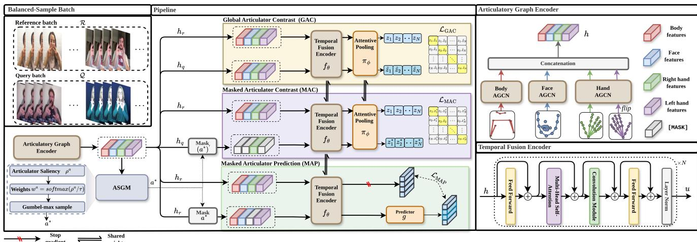
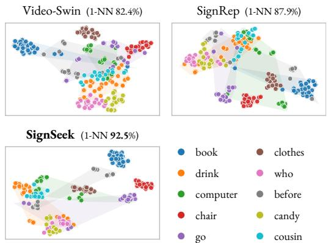
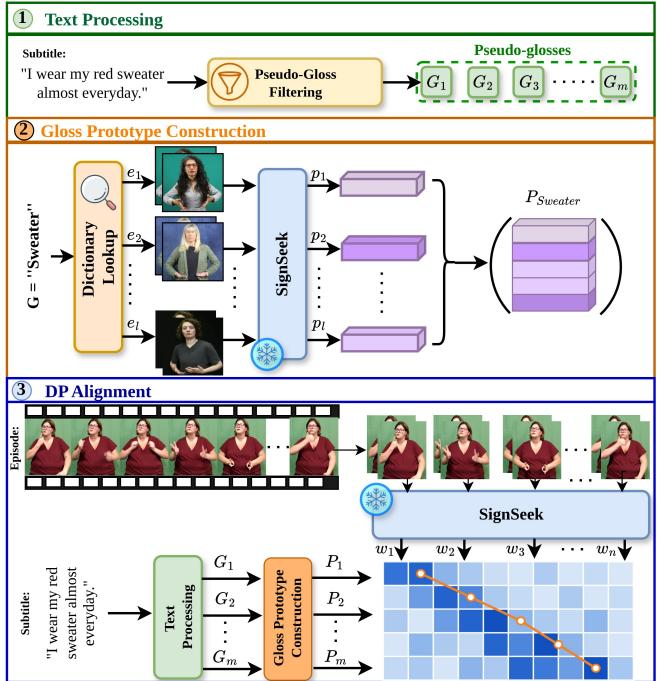
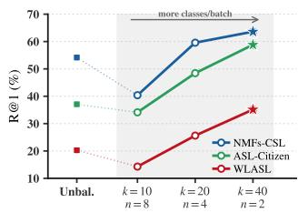
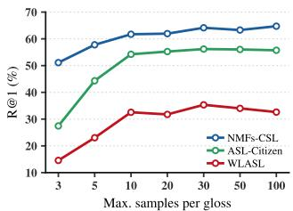

# SignSeek: Learning Transferable Representations for Sign Dictionary Retrieval

Sobhan Asasi, Ozge Mercanoglu Sincan, Richard Bowden

CVSSP, University of Surrey

{s.asasi, o.mercanoglusincan, r.bowden}@surrey.ac.uk

## Abstract

Sign language dictionaries are essential resources for sign language learners, yet automatically retrieving a sign from a dictionary, given only a query video, remains a challenging problem due to the natural variability between signers. Existing sign representation learning methods are builtfor closed-set recognition, producing embeddings that do not generalise to the open-set, signer-independent setting that retrieval demands. SignSeek closes this gap by contrastively learning sign representations with saliencyguided articulator masking. A contrastive objective aligns same-gloss signs across signers, while our Articulator Saliency-Guided Masking (ASGM) pinpoints the single most critical articulator per sign. This drives two complementary objectives, a masked contrastive alignment (MAC) loss that sees the sign through a single articulator and a masked prediction (MAP) loss that reconstructs it in latent space from the surrounding spatio-temporal context. Pretrained on 266K samples (∼5,700 glosses) across multiple sign languages, SignSeek sets a new state-of-the-art performance in cross-corpus retrieval on ASL-Citizen, WLASL, and NMFs-CSL without any downstreamfine-tuning. Strikingly, it achieves zero-shot generalisation to an entirely unseen British Sign Language (BSL), surpassing methods explicitly trained on BSL, and transfers seamlessly to isolated sign recognition and subtitle alignment, outperforming prior skeleton-based methods.

## 1. Introduction

Sign languages are the primary means of communication for millions of Deaf and hard-of-hearing people worldwide [20, 62]. As living languages, they are often documented in sign language dictionaries [17, 24, 51, 52], which are curated collections of signed video entries that serve as essential resources for learners and educators. Yet accessing these dictionaries remains a largely unaddressed challenge. A learner who encounters an unfamiliar sign cannot simply look it up the way one would in a text based dictionary. In the task of Sign Dictionary Retrieval (SDR), given a query sign video, the goal is to retrieve the matching entry from a large sign dictionary [17] without any task-specific fine-tuning.

Sign dictionary retrieval supports sign language education, the documentation of linguistic variation, and other accessibility tools. Yet compared to the well-studied task of isolated sign language recognition (ISLR) [33, 36, 40, 64, 66], it has received little attention. Recognition frames the problem as closed-set classification over a fixed vocabulary, an objective that encourages models to discriminate between training classes but does not require them to generalise to unseen signers or signs. SDR, by contrast, demands a metric embedding space where similar signs cluster together regardless of signer identity, recording conditions, or signing style, a strictly harder objective that directly tests the transferability of learned representations.

Existing sign representation learning methods fail to meet these demands [3–5, 27, 29, 34, 65]. Supervised recognition models learn decision boundaries, not transferable distances [33, 64, 70]. Self-supervised approaches largely treat sign video as generic temporal data [27, 29, 57, 61, 65], ignoring the multi-part structure of sign language. Handshape, arm trajectory, and non-manual features (e.g. facial expressions) are not interchangeable modalities, as each carries distinct linguistic content [9, 39, 50]. A representation that fails to capture the structural relationships between these articulators, or collapses when one is partially occluded, will fail under the variable conditions that realworld retrieval demands. To explicitly capture this nuanced articulator structure while maintaining robustness, skeleton pose presents an ideal modality. By abstracting away background clutter and subject appearance, the pose of keypoints provides an efficient, signer-invariant representation that naturally supports cross-signer generalisation that SDR demands [23, 33].

We present SignSeek, a pose-based pretraining framework for sign dictionary retrieval. Each articulator (face, body, hands) is encoded by its own graph network, and the resulting streams are fused by a temporal encoder, with all masking applied to the per-articulator streams before fusion. A contrastive objective aligns same-gloss samples across signers, and our Articulator Saliency-Guided

Masking (ASGM) selects the single most critical articulator per sample and drives two complementary objectives, a masked contrastive alignment (MAC) loss that reads the sign through this articulator alone and a masked prediction (MAP) loss that reconstructs it in latent space from the remaining context. Pretrained on 266K labelled samples spanning five corpora and roughly 5,700 glosses across Chinese, German, Turkish, and American sign languages (Tab. 1), SignSeek sets a new state of the art on three retrieval benchmarks without fine-tuning (Table 2) and transfers to isolated sign recognition and subtitle alignment (Tables 5, 4). Figure 1 overviews the framework. Our main contributions are summarised as follows: (i) We propose SignSeek, a pose-based pretraining framework built on feature-level articulator masking. A saliency-guided scheme locates the most critical articulator per sample and masks it in two complementary ways, learning the sign both through that articulator and without it, to capture the structural dependencies between articulators. (ii) Under a strict cross-corpus protocol with no downstream finetuning, SignSeek achieves state-of-the-art retrieval on ASL-Citizen [17], WLASL [40], and NMFs-CSL [28]. We also show zero-shot generalisation to an entirely unseen sign language, outperforming other approaches on British Sign Language (BSL). (iii) We show that the same representations transfer seamlessly to broader downstream tasks, surpassing prior skeleton-based methods on both isolated sign language recognition and subtitle alignment.

## 2. Related Work

Sign Language Representation. Early approaches to isolated sign language recognition (ISLR) relied on RGB video features extracted with action-recognition backbones such as I3D [1, 36, 40, 46, 47], with more recent RGB methods improving recognition through part-aware and languageassisted modelling [28, 45, 53, 70]. Pose-based methods instead operate on skeleton keypoints, providing a compact, signer-invariant alternative to raw pixels [23, 27, 33, 65]. Graph convolutional networks (GCNs), popularised by their success in skeleton-based action recognition [41, 54, 55, 64], are a natural fit given the graph-like organisation of the body and hands. Building on this, several methods pretrain GCN representations via masked joint modelling, progressively incorporating hand, body, and facial cues [27, 29, 65]. However, these methods target closed-set recognition and do not yield embeddings suitable for retrieval. More recently, large-scale data collection has enabled transferable sign representations that generalise across signers and datasets, typically by mapping RGB clips to sign priors or aligning sign embeddings with gloss text [34, 48, 61, 68]. In contrast, SignSeek operates purely on pose, needs only gloss labels, and models articulatory structure to build a metric space for open-set retrieval.

<table><tr><td>Corpus</td><td>Language</td><td>Type</td><td>Glosses</td><td>Samples</td></tr><tr><td>MeinDGS [24]</td><td>German (DGS)</td><td>Continuous†</td><td>2,301</td><td>171,695</td></tr><tr><td>SemLex [37]</td><td>American (ASL)</td><td>Isolated</td><td>2,530</td><td>40,169</td></tr><tr><td>AUTSL [56]</td><td>Turkish (TiD)</td><td>Isolated</td><td>226</td><td>28,142</td></tr><tr><td>SLR500 [65]</td><td>Chinese (CSL)</td><td>Isolated</td><td>500</td><td>24,998</td></tr><tr><td>MSASL‡ [36]</td><td>American (ASL)</td><td>Isolated</td><td>173</td><td>1,911</td></tr><tr><td>Total</td><td>4 languages</td><td>Mixed</td><td>5,730</td><td>266,915</td></tr></table>

Table 1. Multilingual pretraining data. A collection combining isolated-sign datasets with the continuous MeinDGS corpus, spanning four sign languages with no gloss overlap. †MeinDGS glosses are segmented from continuous signing. ‡Glosses shared with WLASL (and their samples) are removed from MSASL.

Sign Dictionary Retrieval (SDR). Sign dictionary retrieval matches an isolated sign query to a gloss-level dictionary entry using visual information alone. Despite its practical importance, this task has received surprisingly little direct attention. It should not be confused with the related task of sign language retrieval (SLRet). SLRet matches a sentencelevel signing clip to a free-form text query over continuous corpora and requires paired sign-text data for training [15, 16, 19]. Most prior work treats dictionary retrieval as a by-product of recognition, reporting nearest-neighbour accuracy in a recognition model’s embedding space rather than optimising for retrieval directly [17], or listing it only as a secondary metric within broader evaluations [61, 68]. SignSeek instead treats sign dictionary retrieval as a primary task, benchmarking three diverse datasets under a zero-shot protocol.

Sign-Subtitle Alignment (SSA). A key application for any sign representation is temporally aligning weakly labelled data, such as matching subtitle text to the corresponding signing in continuous video. Prior work typically segments the continuous stream and then aligns the resulting segments using audio-derived timings or learned segmentation models [35, 43]. More recent methods build on this by embedding each segment and aligning it within a shared sign-text space [34, 35]. Some train a model specifically for alignment [10, 31], while pipeline methods reuse a general representation and recover the alignment via dynamic programming. SignSeek follows this second paradigm, reusing its isolated-sign retrieval embeddings to align subtitles through dynamic programming with no alignmentspecific training.

Contrastive and Masked Representation Learning. Selfsupervised representation learning is largely driven by contrastive objectives and masked modelling paradigms. Supervised contrastive learning generalises instance-level contrastive objectives such as SimCLR and MoCo [11–14, 25, 38, 44]. It treats all samples of a class as positives, yielding more structured embedding spaces when labels are available. In the sign domain, contrastive objectives have mainly been used for cross-modal alignment [16, 34, 67]. Separately, masked modelling has proven to be a powerful pretraining signal. This is achieved either by reconstructing masked inputs, as seen in MAE and VideoMAE [21, 26, 58– 60, 63], or by predicting their representations in a learned latent space, as in the Joint Embedding Predictive Architecture (JEPA) [6–8]. These techniques have also been applied to skeleton sequences [27, 29, 42, 69]. SignSeek replaces global augmentation with articulator-level masking, coupling contrastive alignment over masked articulators with latent prediction of the dominant one.

  
Figure 1. Overview of SignSeek. A balanced-sample batch of query and reference clips (left) is encoded per articulator by the Articulatory Graph Encoder (top right), fused by a Conformer $f _ { \theta }$ (bottom right) and pooled by $\pi _ { \phi } .$ . Three objectives share this backbone. GAC contrasts intact query and reference embeddings, MAC masks all but the dominant articulator of the query and aligns it with clean same-gloss references, and MAP masks the dominant articulator of a reference clip and predicts its clean representation via a predictor g under a stop-gradient. The dominant articulator $a ^ { \star }$ is selected per clip by the Articulator Saliency-Guided Masking module (ASGM).

## 3. Methodology

We first describe our pose-based input (Sec. 3.1) and backbone (Sec. 3.2), then the Articulator Saliency-Guided Masking module that selects the most informative articulator per clip (Sec. 3.3), and finally the training objectives built on it (Sec. 3.4). Fig. 1 illustrates the full pipeline, which we describe below.

## 3.1. Articulatory Representation

We operate on pose rather than raw video, representing each clip X as a sequence of T frames of 2D body keypoints alongside their corresponding prediction confidence scores. These keypoints are partitioned into a set of distinct articulators $\mathcal { A } = \{ \mathrm { B , F , L H , R H } \}$ , denoting the body, face, left hand, and right hand. For a given articulator $a \in { \mathcal { A } }$ with $J _ { a } { \mathrm { ~ j o i n t s } }$ , we define its keypoint tensor as $X ^ { a } \in \mathbb { R } ^ { T \times J _ { a } \times 3 }$ The final dimension of this tensor captures the x and y spatial coordinates as well as the joint estimation confidence. The complete clip is therefore represented as the collection $X = \{ X ^ { a } \} _ { a \in \mathcal { A } }$ . Treating these articulators as distinct streams enables the model to reason about each component independently during the subsequent masking and fusion stages.

## 3.2. Articulatory Backbone

Articulatory Graph Encoder. Each articulator stream $X ^ { a } \in \mathbb { R } ^ { T \times \mathsf { \bar { J } } _ { a } \times 3 }$ (2D keypoints with per-joint confidence) is encoded independently. A shared per-joint projection lifts each keypoint to $C _ { \mathrm { i n } }$ channels, followed by L adaptive graph convolutional blocks that widen the features to $C = 6 C _ { \mathrm { i n } }$ . Each block couples an adaptive spatial graph convolution, whose adjacency is learned rather than fixed to the skeleton, with a temporal convolution and a squeezeand-excitation block that recalibrates channels [30, 55]. The final block yields a joint-wise map $Z _ { t } ^ { ( L ) } ~ \in ~ \mathbb { R } ^ { J _ { a } \times C }$ per frame. Instead of pooling the joints, we flatten it and project back to C channels with a learned matrix $W _ { \mathrm { a g g } } \in \mathbb { R } ^ { \bar { C } \times \bar { J } _ { a } C }$ $h _ { t } ^ { a } = W _ { \arg \operatorname { v e c } } \big ( Z _ { t } ^ { ( L ) } \big ) \ \in \ \mathbb { R } ^ { C }$ . Stacking these per-frame vectors over $t ~ = ~ 1 , \dots , T$ gives the articulator stream $h ^ { a } \in \mathbb { R } ^ { T \times C }$ , so the aggregation learns a per-joint weighting rather than treating all joints equally. The body and face are each processed by their own dedicated encoder, while the two hands share a single encoder $E _ { \mathrm { H } }$ since they are articulatorily equivalent, with the right hand mirrored by an x-axis flip $\Phi _ { x }$ so both are seen in a common canonical frame, then we concatenate each encoder’s output (Fig. 1, top right) :

$$
\begin{array} { r l } & { \quad h ^ { \mathrm { B } } = E _ { \mathrm { B } } ( X ^ { \mathrm { B } } ) , \qquad h ^ { \mathrm { F } } = E _ { \mathrm { F } } ( X ^ { \mathrm { F } } ) , } \\ & { \quad h ^ { \mathrm { R H } } = E _ { \mathrm { H } } ( X ^ { \mathrm { R H } } ) , \quad h ^ { \mathrm { L H } } = E _ { \mathrm { H } } \big ( \Phi _ { x } ( X ^ { \mathrm { L H } } ) \big ) , } \\ & { \quad h = \big [ h ^ { \mathrm { B } } \parallel h ^ { \mathrm { F } } \parallel h ^ { \mathrm { R H } } \parallel h ^ { \mathrm { L H } } \big ] \in \mathbb { R } ^ { T \times N C } , N = | \mathcal { A } | . } \end{array}\tag{1}
$$

Temporal Fusion Encoder. The concatenated stream is then linearly projected to the model dimension $d _ { m }$ and passed to a Conformer encoder, whose architecture is shown

in the bottom-right of Fig. 1, that captures long-range temporal structure by interleaving multi-head self-attention with convolution, producing a contextualised sequence:

$$
\mathbf { s } = f _ { \theta } ( h ) \in \mathbb { R } ^ { T \times d _ { m } } .\tag{2}
$$

An attentive pooling head $\pi _ { \phi }$ then maps this sequence to a single clip embedding, reusing the Conformer’s selfattention to weight frames before a two-layer projection:

$$
z = \pi _ { \phi } ( \mathbf { s } ) \in \mathbb { R } ^ { d } .\tag{3}
$$

We L2-normalise z and use it both for the contrastive objectives of Sec. 3.4 and, at inference, as the retrieval embedding.

## 3.3. Articulator Saliency-Guided Masking (ASGM)

Our masking-based objectives depend on knowing which articulator carries each sign, which we derive from the encoder itself rather than a fixed rule. We use the norm of each articulator’s temporally pooled embedding as a simple proxy for its salience, since the more the model relies on an articulator, the larger the norm of its embedding. The per-articulator encoders are separately parameterised and have different joint counts, however, their raw feature scales are not directly comparable. We therefore standardise each stream by its running per-channel mean $\mu ^ { a }$ and standard deviation $\sigma ^ { a }$ before scoring, and take the norm of the standardised, temporally pooled representation,

$$
\bar { h } ^ { a } = \frac { 1 } { | T | } \sum _ { t \in \mathcal { T } } h _ { t } ^ { a } , \quad \quad \rho ^ { a } = \left. \frac { \bar { h } ^ { a } - \mu ^ { a } } { \sigma ^ { a } } \right. _ { 2 } , \quad \quad a \in \mathcal { A } ,\tag{4}
$$

where $\tau$ denotes the valid (non-padded) frames, the standardisation is per channel, and $( \mu ^ { a } , \sigma ^ { a } )$ are running statistics updated during training. This makes $\rho ^ { a }$ measure activation relative to each stream’s own baseline, so the scores are commensurable across articulators, and it needs no auxiliary supervision and no learned parameters. A temperaturescaled softmax then converts the scores into a distribution over articulators,

$$
w ^ { a } = \frac { \exp ( \rho ^ { a } / \tau ) } { \sum _ { a ^ { \prime } \in \mathcal { A } } \exp ( \rho ^ { a ^ { \prime } } / \tau ) } ,\tag{5}
$$

in which the temperature τ modulates how sharply the mass concentrates on the dominant articulator, interpolating between near-uniform exploration and a near-deterministic focus. Committing to a hard arg max would collapse this distribution and starve the objectives of variety, so we instead sample the dominant articulator $a ^ { \star }$ with the Gumbel-max reparameterisation:

$$
a ^ { \star } = \arg \operatorname* { m a x } _ { a \in \mathcal { A } } \big ( \log w ^ { a } + \gamma ^ { a } \big ) , \quad \gamma ^ { a } = - \log ( - \log u ^ { a } ) ,\tag{6}
$$

with $u ^ { a } \ \sim \ \mathcal { U } ( 0 , 1 )$ drawn independently per articulator, which yields exactly one articulator per clip while preserving the saliency ordering in expectation. This single choice $a ^ { \star }$ then anchors two complementary objectives (Sec. 3.4), one that learns the sign through $a ^ { \star }$ alone and one that learns it without $a ^ { \star }$ , turning masking into a structured learning signal rather than mere augmentation.

## 3.4. Training Objectives

Balanced Batch Sampling. We sample each batch as k glosses with n clips each, split into a reference batch and a query batch of different clips of the same glosses, so every query has same-gloss references as positives. A reference clip with streams $h _ { r }$ is encoded into an intact embedding $z ~ = ~ \pi _ { \phi } { \left( f _ { \theta } ( h _ { r } ) \right) }$ , and a query clip $h _ { q }$ into an embedding set by the objective’s masking, defined below. When an objective masks an articulator, it replaces the corresponding stream by a learned per-articulator token $m ^ { a }$ before fusion.

Global Articulator Contrast (GAC). GAC is our base objective, a supervised contrastive loss [38] over intact clip embeddings with no masking. With no masking, the reference and query clips give intact embeddings $z _ { i }$ and $\hat { z } _ { i }$ . Let $I = \{ z _ { i } \} _ { i } \cup \{ \hat { z } _ { i } \} _ { i }$ collect them over the batch, and let $P ( v )$ denote those sharing the gloss of v. The loss pulls samegloss embeddings together and pushes the rest apart,

$$
{ \mathcal { L } } _ { \mathrm { G A C } } = \sum _ { v \in I } { \frac { - 1 } { | P ( v ) | } } \sum _ { p \in P ( v ) } \log { \frac { \exp \left( v ^ { \top } p / \tau _ { c } \right) } { \sum _ { j \in I \backslash \{ v \} } \exp \left( v ^ { \top } j / \tau _ { c } \right) } } ,\tag{7}
$$

with temperature $\tau _ { c }$ and L2-normalised embeddings. Because positives are defined by gloss rather than by instance, same-sign embeddings from different clips and signers are drawn together, shaping the signer-invariant space that retrieval demands.

Masked Articulator Contrast (MAC). MAC introduces saliency-guided masking into the contrastive objective. Guided by the dominant articulator $a ^ { \star }$ from ASGM, it keeps only that stream and replaces every other by the mask token $m ^ { a }$

$$
z ^ { \star } = \pi _ { \phi } \bigl ( f _ { \theta } ( h _ { q } ^ { \star } ) \bigr ) , \qquad h _ { q } ^ { \star , a } = \left\{ h _ { q } ^ { a } \quad a = a ^ { \star } \begin{array} { c c } { { } } & { { } } \\ { { m ^ { a } } } & { { a \neq a ^ { \star } } } \end{array} \right.\tag{8}
$$

so that the sign must be read through its most salient articulator alone. Let ${ \cal M } = \{ z _ { i } \} _ { i } \cup \{ z _ { i } ^ { \star } \} _ { i }$ collect the reference embeddings $z _ { i }$ and the dominant-only query embeddings $z _ { i } ^ { \star }$ , and let $P ( u )$ denote those sharing the gloss of u. MAC pulls same-gloss embeddings together and pushes the rest apart,

$$
\mathcal { L } _ { \mathrm { M A C } } = \sum _ { u \in M } \frac { - 1 } { | P ( u ) | } \sum _ { p \in P ( u ) } \log \frac { \exp \left( u ^ { \top } p / \tau _ { c } \right) } { \sum _ { j \in M \backslash \{ u \} } \exp \left( u ^ { \top } j / \tau _ { c } \right) } ,\tag{9}
$$

<table><tr><td rowspan="2">Features</td><td rowspan="2">Dataset (Scale)</td><td colspan="3">ASL-Citizen</td><td colspan="3">WLASL2000</td><td colspan="3">NMFs-CSL</td></tr><tr><td>DCG↑</td><td>R@1↑</td><td>R@5↑</td><td>DCG↑</td><td>R@1↑</td><td>R@5↑</td><td>DCG↑</td><td>R@1↑</td><td>R@5↑</td></tr><tr><td colspan="10">Image / video pre-trained features</td></tr><tr><td>HieraMAE [49, 61]</td><td>Kinetics-400 (700 h)</td><td>11.64</td><td>0.25</td><td>0.84</td><td>13.21</td><td>2.08</td><td>3.40</td><td>23.29</td><td>3.96</td><td>12.18</td></tr><tr><td>HieraMAE [49, 61]</td><td>YT-SL-25 (3,000 h)</td><td>12.12</td><td>0.39</td><td>1.34</td><td>14.06</td><td>2.57</td><td>4.41</td><td>28.03</td><td>7.57</td><td>18.38</td></tr><tr><td>I3D [1]</td><td>BSL-1K (273 K)</td><td>13.32</td><td>0.63</td><td>2.06</td><td>17.06</td><td>3.41</td><td>6.81</td><td>25.82</td><td>6.34</td><td>16.03</td></tr><tr><td>Video-Swin [46]</td><td>BOBSL (5,500 K)</td><td>27.21</td><td>7.55</td><td>19.38</td><td>36.84</td><td>13.97</td><td>33.39</td><td>65.31</td><td>43.97</td><td>71.62</td></tr><tr><td colspan="10">Pose / keypoint features</td></tr><tr><td>All Joint Angles [61]</td><td>一</td><td>13.82</td><td>0.57</td><td>2.17</td><td>17.92</td><td>2.54</td><td>6.50</td><td>32.51</td><td>7.93</td><td>25.50</td></tr><tr><td>All Keypoints [61]</td><td></td><td>14.29</td><td>0.98</td><td>2.74</td><td>19.37</td><td>3.16</td><td>8.23</td><td>36.64</td><td>12.26</td><td>30.99</td></tr><tr><td>Hand Keypoints [61]</td><td></td><td>25.91</td><td>7.96</td><td>19.58</td><td>28.11</td><td>7.57</td><td>20.92</td><td>41.72</td><td>15.91</td><td>42.62</td></tr><tr><td>Hand Joint Angle [61]</td><td>一</td><td>26.93</td><td>8.81</td><td>21.41</td><td>30.61</td><td>9.42</td><td>24.36</td><td>44.17</td><td>18.13</td><td>46.34</td></tr><tr><td colspan="10">Learned sign representations</td></tr><tr><td>SignCLIP [34]</td><td>Spreadthesign (456 K)</td><td>21.80</td><td>4.00</td><td>11.42</td><td>22.10</td><td>5.25</td><td>11.78</td><td>51.20</td><td>26.75</td><td>53.03</td></tr><tr><td>MASA [66]</td><td>4× ISLR sets (146 K)</td><td>49.31</td><td>27.96</td><td>49.78</td><td>36.98†</td><td>14.38†</td><td>32.63†</td><td>74.94†</td><td>54.69†</td><td>83.27†</td></tr><tr><td>SignRep [61]</td><td>YT-SL-25 (3,000 h)</td><td>71.21</td><td>49.95</td><td>80.09</td><td>57.93</td><td>29.92</td><td>67.41</td><td>83.05</td><td>63.04</td><td>95.63</td></tr><tr><td>SignSeek (Ours)</td><td>5× corpora (266 K)</td><td>77.21</td><td>57.66</td><td>86.67</td><td>61.24</td><td>34.75</td><td>70.25</td><td>85.17</td><td>65.20</td><td>96.79</td></tr></table>

Table 2. Cross-corpus sign dictionary retrieval. No method is fine-tuned on the evaluation datasets. The evaluation datasets are unseen during pre-training except where marked †, which indicates the dataset was part of that method’s pre-training set (MASA includes WLASL and NMFs-CSL). SignSeek is pretrained on five sign corpora across four languages (Table 1), none overlapping the evaluation sets. Best in bold, second best underlined. Scale is in hours (h) for continuous-signing corpora and thousands of clips (K) for isolated-sign sets.

with the same temperature $\tau _ { c }$ and L2-normalised embeddings as in Eq. (7). Because the dominant-only query must still align with clean same-gloss references, the most salient articulator alone is forced to be gloss-discriminative.

Masked Articulator Prediction (MAP). Unlike the contrastive GAC and MAC, MAP operates within a single reference clip and adds no negatives. Both of its branches take a reference clip $h _ { r }$ , one masks the dominant stream $a ^ { \star }$ to form a masked context, the other encodes the clip intact as a prediction target. The masked context sequence is

$$
\mathbf { s } ^ { \star } = f _ { \theta } ( h _ { r } ^ { \dagger } ) \in \mathbb { R } ^ { T \times d _ { m } } , \qquad h _ { r } ^ { \dagger , a } = \left\{ \begin{array} { l l } { m ^ { a } } & { a = a ^ { \star } } \\ { h _ { r } ^ { a } } & { a \neq a ^ { \star } } \end{array} \right.\tag{10}
$$

A predictor $g : \mathbb { R } ^ { d _ { m } }  \mathbb { R } ^ { d _ { m } }$ , a lightweight transformer decoder that attends over the whole masked sequence, predicts the clean Conformer sequence $\mathbf { s } = f _ { \theta } ( h _ { r } )$ of the same clip, held fixed by a stop-gradient $\mathrm { s g } [ \cdot ]$ so gradients flow only through the predictor and the online encoder. This latent target avoids the collapse that raw-coordinate reconstruction can induce. MAP maximises the frame-wise alignment between prediction and target,

$$
\mathcal { L } _ { \mathrm { M A P } } = \mathbb { E } _ { t \in \mathcal { T } } \left[ 1 - \frac { \left. g ( \mathbf { s } ^ { \star } ) _ { t } , \ \mathbf { s g } \left[ \mathbf { s } _ { t } \right] \right. } { \left\| g ( \mathbf { s } ^ { \star } ) _ { t } \right\| _ { 2 } \left\| \mathbf { s g } \left[ \mathbf { s } _ { t } \right] \right\| _ { 2 } } \right] ,\tag{11}
$$

averaged over the valid frames T . By recovering from the surviving context the representation the dominant articulator would have contributed, MAP captures the structural dependencies between articulators that underlie sign meaning.

Joint Objective. We optimise the three terms jointly,

$$
\mathcal { L } = \lambda _ { \mathrm { G A C } } \mathcal { L } _ { \mathrm { G A C } } + \lambda _ { \mathrm { M A C } } \mathcal { L } _ { \mathrm { M A C } } + \lambda _ { \mathrm { M A P } } \mathcal { L } _ { \mathrm { M A P } } ,\tag{12}
$$

where $\lambda _ { \mathrm { G A C } } , \lambda _ { \mathrm { M A C } }$ , and $\lambda _ { \mathrm { M A P } }$ balance the three objectives.

Inference. All masking, the ASGM module, and the predictor $g$ are training-time only. At inference we discard them and pass a clip through the backbone unchanged, from the articulatory graph encoders through the temporal fusion Conformer and the attentive pooling head, giving a single embedding $z = \pi _ { \phi } \big ( f _ { \theta } ( h ) \big )$ from the intact streams h. Retrieval then ranks dictionary entries by cosine similarity between the L2-normalised query and reference embeddings, with no downstream fine-tuning.

## 4. Experiments

## 4.1. Datasets and Evaluation Protocol

Training data. We pre-train on five sign corpora across four languages, combining isolated-sign datasets with gloss-segmented clips from the continuous MeinDGS corpus, totalling 266K labelled clips and roughly 5,700 glosses (Table 1). The encoder is trained once and then frozen for all evaluations.

Evaluation benchmarks. We evaluate sign dictionary retrieval on three datasets that are disjoint from the training corpus, ASL-Citizen [17], WLASL [40], and NMFs-CSL [28]. Because none of them are seen during pretraining and no parameters are fine-tuned on them, all results are zero-shot. Beyond these benchmarks, we further study a dictionary-lookup scenario for British Sign Language, a language entirely unseen during pre-training. As shown in Tab. 3, we query a BSL evaluation set of 726 query–gloss pairs, generated by a native BSL signer, against the publicly available BSL SignBank dictionary [22]. This mirrors how a user would search an unfamiliar sign against a reference lexicon and tests cross-lingual transfer of the model to a new vocabulary. Results show our pose encoder retrieves the correct gloss significantly more often than prior work despite never having been trained or finetuned on BSL. Finally, we apply the same frozen encoder to sign-subtitle alignment on How2Sign [18] and BOBSL [2], again without any fine-tuning.

<table><tr><td>Model</td><td>Input #P (M)</td><td>BSL Seen?</td><td>R@1↑</td><td>R@5↑</td><td>mAP↑</td></tr><tr><td>I3D [1]</td><td>RGB</td><td>13.4 √</td><td>0.55</td><td>2.22</td><td>1.67</td></tr><tr><td>SignCLIP [34]</td><td>Pose</td><td>109.4 x</td><td>1.02</td><td>3.05</td><td>2.85</td></tr><tr><td>SignRep [61]</td><td>RGB</td><td>51.5 x</td><td>4.30</td><td>12.62</td><td>8.72</td></tr><tr><td>MASA [66]</td><td>Pose</td><td>68.2 x</td><td>6.80</td><td>15.40</td><td>11.57</td></tr><tr><td>Video-Swin [46]</td><td>RGB</td><td>49.5 √</td><td>9.15</td><td>16.78</td><td>13.37</td></tr><tr><td>SignSeek (Ours)</td><td>Pose</td><td>15.7</td><td>X</td><td>12.76 (+3.61)</td><td>29.54 20.84 (+12.76) (+7.47)</td></tr></table>

Table 3. Zero-shot BSL dictionary retrieval. We query a BSL evaluation set (726 query–gloss pairs) against the BSL SignBank dictionary and report. Input: RGB video or body pose. #P: parameters (M) of the frozen feature extractor. BSL Seen?: whether the backbone observed British Sign Language during pre-training. No method is fine-tuned on SignBank.

Retrieval protocol. We treat the test split as queries and the training split as the dictionary gallery. Every clip is mapped to an ℓ2-normalised embedding, and each gallery gloss is scored by the maximum cosine similarity between the query and that gloss’ instances. Glosses are then ranked by this score, and we report metrics on the rank r of the correct gloss, averaged over queries. From this ranking we report Recall@k (R@k, the fraction of queries whose correct gloss appears in the top k), mean average precision (mAP), and discounted cumulative gain (DCG) [17, 32].

Downstream metrics. For isolated sign language recognition we report Top-1 and Top-5 accuracy, both per instance and per class. For sign-subtitle alignment we report frame-level F1 at an intersection-over-union threshold of 0.5 (F1@0.5).

## 4.2. Implementation Details

We train for 30, 000 steps with AdamW, a learning rate of $3 \times 1 0 ^ { - 4 }$ , weight decay 0.01, and 3, 000 warmup steps. Batches are drawn by balanced sampling of k=40 glosses with n=2. The contrastive temperature is $\tau _ { c } { = } 0 . 0 7$ , the ASGM selection temperature is $\tau { = } 0 . 7 .$ , and the training objectives are weighted equally. Full hyperparameters are provided in the supplementary.

## 4.3. Results

Sign Dictionary Retrieval. We benchmark SignSeek against a broad range of prior representations as frozen feature extractors for dictionary retrieval, where no method observes the evaluation data during pre-training and none is fine-tuned, except MASA which sees WLASL2000 and NMFs-CSL in training (marked † in Tab. 2). On ASL-Citizen, WLASL2000, and NMFs-CSL (Tab. 2), image and video features transfer poorly and hand-focused pose descriptors remain well behind the learned representations. SignSeek improves over the strongest baseline, Sign-Rep, on every metric and dataset. It raises DCG from 71.21 to 77.21 on ASL-Citizen, from 57.93 to 61.24 on WLASL2000, and from 83.05 to 85.17 on NMFs-CSL. R@1 rises correspondingly, from 49.95 to 57.66, from

  
Figure 2. t-SNE of WLASL embeddings. Titles report 1-NN accuracy (% of samples whose nearest neighbour shares the gloss).

  
Figure 3. SSA with SignSeek. A subtitle is filtered into pseudoglosses (1), each looked up in a language-matched isolated-sign dictionary (ASL or BSL) and encoded by the frozen SignSeek encoder into a prototype bank PG (2). The same encoder embeds the episode windows, and a monotonic path through the gloss-towindow similarity matrix is decoded by dynamic programming(3).

<table><tr><td></td><td colspan="2">How2Sign</td><td colspan="2">BOBSL</td></tr><tr><td>Method</td><td>Val</td><td>Test</td><td>Val</td><td>Test</td></tr><tr><td colspan="5">Static Baselines</td></tr><tr><td>Original (audio-based)</td><td>30.63</td><td>33.06</td><td>29.09</td><td>14.11</td></tr><tr><td>Original+(fixed offsets)</td><td>31.91</td><td>36.21</td><td>49.63</td><td>44.61</td></tr><tr><td colspan="5">Segment and Align</td></tr><tr><td>Segmentation [43]</td><td>33.38</td><td>36.17</td><td>66.24</td><td>49.58</td></tr><tr><td>Segmentation-BSLCP [35]</td><td></td><td>=</td><td>63.61</td><td>47.75</td></tr><tr><td colspan="5">Segment, Embed, and Align</td></tr><tr><td>SignCLIP [34]</td><td>35.51</td><td>37.51</td><td>66.70</td><td>50.68</td></tr><tr><td colspan="5">Dictionary-Guided Alignment</td></tr><tr><td>SignSeek</td><td>36.51</td><td>40.20</td><td>66.94</td><td>50.72</td></tr></table>

Table 4. Subtitle alignment. Sentence-level temporal alignment accuracy (F1@0.5↑) on the validation and test splits of How2Sign and BOBSL. Methods are grouped by alignment strategy, from audio-based static baselines to our dictionary-guided approach.

29.92 to 34.75, and from 63.04 to 65.20. SignSeek also generalises to an unseen language. We query our nativesigner BSL evaluation set (726 clips) against the BSL Sign-Bank dictionary (Tab. 3), a language absent from pretraining. Although the strongest baselines I3D and Video-Swin were trained on BSL through BSL-1K or BOBSL, SignSeek reaches 12.76 R@1 and 20.84 mAP from body pose alone with a frozen extractor of only 15.7M parameters, surpassing the in-domain Video-Swin by 3.61 R@1 and 7.47 mAP. This indicates the gains stem from a more transferable representation rather than languagespecific exposure or model scale. Fig. 2 visualises the learned space with a t-SNE projection of the ten most frequent WLASL glosses. Compared with Video-Swin and SignRep, SignSeek forms tighter and better-separated pergloss clusters, reflected in a higher 1-NN accuracy. We provide qualitative results in the supplementary.

## 4.4. Sign-Subtitle Alignment (SSA)

Tab. 4 evaluates our frozen embeddings on sentence-level subtitle alignment. As shown in Fig. 3, for each pseudogloss $G _ { i }$ produced by pseudo-gloss filtering from the input subtitle, SignSeek retrieves $l _ { i }$ isolated-sign exemplars from a language-matched dictionary (ASL for How2Sign, BSL for BOBSL) and encodes them with the frozen encoder into a prototype set $P _ { i }$ . The same encoder embeds the video windows $w _ { 1 } , \ldots , w _ { n } ,$ and each entry of the similarity matrix is the maximum cosine similarity between a window and the prototypes of a gloss, $S ( i , j ) = \operatorname* { m a x } _ { p \in P _ { i } } \langle p , w _ { j } \rangle$ A monotonic gloss-to-window correspondence is then decoded with dynamic programming (Fig. 3). The encoder is frozen in this task, so the method aligns without any taskspecific training. All methods in Tab. 4 reuse a general representation without alignment-specific training, recovering the alignment by dynamic programming, so they differ only in the representation they reuse. SignSeek achieves the best F1@0.5 on How2Sign and remains competitive with SignCLIP on BOBSL. It improves over SignCLIP by 1.0 on How2Sign validation and 2.7 on test, and matches it on BOBSL, 66.94 to 66.70 and 50.72 to 50.68. Unlike the representations reused by the baselines, which require continuous-signing boundary annotations or paired signtext, SignSeek’s encoder is trained from pose with only gloss labels. See the supplementary for qualitative results and further details.

<table><tr><td></td><td colspan="2">Instance Acc.</td><td colspan="2">Class Acc.</td></tr><tr><td>Method</td><td>Top-1</td><td>Top-5</td><td>Top-1</td><td>Top-5</td></tr><tr><td colspan="5">Skeleton-based</td></tr><tr><td>ST-GCN [64]</td><td>34.40</td><td>66.57</td><td>32.53</td><td>65.45</td></tr><tr><td>SignBERT [27]</td><td>39.40</td><td>73.35</td><td>36.74</td><td>72.38</td></tr><tr><td>BEST [65]</td><td>46.25</td><td>79.33</td><td>43.52</td><td>77.65</td></tr><tr><td>SignBERT+ [29]</td><td>48.85</td><td>82.48</td><td>46.37</td><td>81.33</td></tr><tr><td>MASA [66]</td><td>49.06</td><td>82.90</td><td>46.91</td><td>81.80</td></tr><tr><td>SignSeek</td><td>56.65</td><td>87.67</td><td>53.64</td><td>87.53</td></tr></table>

Table 5. ISLR results on WLASL.
<table><tr><td></td><td colspan="2">NMFs-CSL</td><td colspan="2">ASL-Citizen</td></tr><tr><td>Method</td><td>Top-1</td><td>Top-5</td><td>Top-1</td><td>Top-5</td></tr><tr><td colspan="5">Skeleton-based</td></tr><tr><td>ST-GCN [64]</td><td>59.9</td><td>86.8</td><td>59.52</td><td>82.68</td></tr><tr><td>SignBERT [27]</td><td>67.0</td><td>95.3</td><td>一</td><td>一</td></tr><tr><td>BEST [65]</td><td>68.5</td><td>94.4</td><td>一</td><td>一</td></tr><tr><td>MASA [66]</td><td>71.7</td><td>97.0</td><td></td><td></td></tr><tr><td>SignCLIP [34]</td><td>一</td><td></td><td>60.0</td><td>84.0</td></tr><tr><td>SignSeek</td><td>73.8</td><td>98.8</td><td>74.7</td><td>94.0</td></tr></table>

Table 6. ISLR results on NMFs-CSL and ASL-Citizen.

## 4.5. Isolated Sign Language Recognition (ISLR)

To test whether the pretrained encoder transfers to recognition, we add a classification layer on top and finetune the whole model. Under this protocol, SignSeek is the strongest skeleton-based method on all three datasets (Tab. 5, Tab. 6). On WLASL it reaches 56.65% Top-1 instance accuracy, 7.6 points above the best prior skeleton model, MASA. On NMFs-CSL it improves Top-1 by 2.1 points over MASA, and on ASL-Citizen it exceeds the nearest skeleton and text-aligned baselines by 14.7 points. These gains show that our pretrained representation transfers competitively to recognition.

## 4.6. Ablation Studies

Contribution of each objective. Tab. 7 studies the three objectives, starting from the GAC baseline. Adding MAC alone raises R@1 from 27.25 to 31.27 on WLASL and from 48.40 to 54.15 on ASL-Citizen, while MAP alone gives a slightly larger gain (32.33 and 55.93). Combining both on top of GAC is best, reaching 34.75 on WLASL and 57.66 on ASL-Citizen, above either branch alone, so understanding a sign both through and without its dominant articulator provides complementary signals. Removing GAC while keeping both masked objectives drops R@1 to 32.45 and 55.12, below the full model, showing that the global contrastive anchor is needed for the masked objectives to reach their full effect.

<table><tr><td></td><td></td><td></td><td colspan="2">WLASL</td><td colspan="2">ASL-Citizen</td></tr><tr><td>GAC</td><td>MAC</td><td>MAP</td><td>R@1↑</td><td>DCG↑</td><td>R@1↑</td><td>DCG↑</td></tr><tr><td></td><td>x</td><td>X</td><td>27.25</td><td>54.02</td><td>48.40</td><td>70.02</td></tr><tr><td></td><td>√</td><td>x</td><td>31.27</td><td>58.55</td><td>54.15</td><td>75.02</td></tr><tr><td>√</td><td>x</td><td>√</td><td>32.33</td><td>60.16</td><td>55.93</td><td>75.77</td></tr><tr><td>x</td><td>√</td><td>√</td><td>32.45</td><td>60.20</td><td>55.12</td><td>75.05</td></tr><tr><td></td><td></td><td></td><td>34.75</td><td>61.24</td><td>57.66</td><td>77.21</td></tr></table>

Table 7. Objective ablation. Each row toggles GAC, MAC, and MAP. The full model with all three (highlighted) is SignSeek.
<table><tr><td rowspan="2">Setting</td><td colspan="2">WLASL</td><td colspan="2">ASL-Citizen</td></tr><tr><td>R@1↑</td><td>DCG↑</td><td>R@1↑</td><td>DCG↑</td></tr><tr><td colspan="5">ASGM temperature</td></tr><tr><td>τ = 0.7</td><td>34.75</td><td>61.24</td><td>57.66</td><td>77.21</td></tr><tr><td>τ = 1.0</td><td>32.97</td><td>59.84</td><td>55.70</td><td>75.81</td></tr><tr><td>τ = 2.0</td><td>30.15</td><td>56.27</td><td>53.16</td><td>73.00</td></tr><tr><td>Random selection</td><td>29.66</td><td>55.81</td><td>52.22</td><td>72.58</td></tr></table>

Table 8. ASGM temperature. Default highlighted (τ=0.7). Larger τ softens the selection toward uniform, approaching random selection.

Selection temperature. The temperature τ controls how sharply ASGM concentrates on the dominant articulator. As Tab. 8 shows, the sharp τ=0.7 is best, reaching 34.75 R@1 on WLASL and 57.66 on ASL-Citizen. Raising τ flattens the selection toward uniform and steadily lowers retrieval to 32.97 and 55.70 at τ=1.0 and 30.15 and 53.16 at τ=2.0, approaching the random-selection baseline of 29.66 and 52.22. Sharp, saliency-focused selection is what makes ASGM more effective.

Articulator selection strategy. As Tab. 9 shows, replacing ASGM’s per-clip choice with fixed or heuristic selection rules lowers retrieval performance. A fixed choice forces the masked objectives onto the same articulator every clip, so the model learns to model that one and largely ignores the rest, which limits the representation and drives the drop. On the hand-centric WLASL, fixing selection to the face is worst at 24.78, below every hand-based rule, whereas on the non-manual NMFs-CSL the face and body are the strongest fixed choices at 61.63 and 59.23, well above the 56.10 of restricting selection to the right hand. ASGM instead adapts the choice to each input, selecting whichever articulator carries the current sign so that, across training, the model learns all of them together with their supporting context.

Batch composition. Batch sampling strongly shapes the representation. Trading clips per class for more classes at a fixed batch of 80 steadily improves retrieval, with WLASL

<table><tr><td rowspan="2">Articulator selection</td><td colspan="2">WLASL</td><td colspan="2">NMFs-CSL</td></tr><tr><td>R@1↑</td><td>∆</td><td>R@1↑</td><td>∆</td></tr><tr><td>Always body</td><td>25.52</td><td>–9.23</td><td>59.23</td><td>-5.97</td></tr><tr><td>Always face</td><td>24.78</td><td>–9.97</td><td>61.63</td><td>-3.57</td></tr><tr><td>Always right hand</td><td>26.40</td><td>-8.35</td><td>56.10</td><td>–9.10</td></tr><tr><td>Always dominant hand†</td><td>31.65</td><td>-3.10</td><td>58.80</td><td>–6.40</td></tr><tr><td>Uniform over hands (LH/RH)</td><td>30.41</td><td>–4.34</td><td>58.23</td><td>–6.97</td></tr><tr><td>Uniform over all four</td><td>29.66</td><td>–5.09</td><td>62.78</td><td>-2.42</td></tr><tr><td>ASGM (ours)</td><td>34.75</td><td></td><td>65.20</td><td></td></tr></table>

Table 9. Articulator selection strategy. R@1 on WLASL and NMFs-CSL for fixed and heuristic selection rules versus ASGM. ∆ is the R@1 change relative to ASGM, and darker red marks a larger drop. †Per clip, chosen by confidence.

  
(a) Batch composition  
(b) Data cap  
Figure 4. Batch composition and per-sign sample cap. (a) More classes per batch (larger k) raises R@1 and beats the unbalanced baseline on all three datasets. (b) Retrieval saturates by a cap of about 10 clips per sign and peaks near 30.

R@1 rising from 14.28 at k=10, n=8 to 34.8 at k=40, n=2 and ASL-Citizen from 34.12 to 57.7, a monotonic trend that holds on all three benchmarks (Fig. 4a). Removing class balancing hurts on every dataset, consistent with the contrastive principle that many distinct in-batch negatives matter more than repeated views of a few classes.

Sample cap per gloss. We vary the maximum number of clips each gloss contributes to training. Retrieval improves sharply as the cap grows from 3 to 10, with WLASL R@1 rising from 14.56 to 32.56, ASL-Citizen from 27.44 to 54.23, and NMFs-CSL from 51.11 to 61.72. As Fig. 4b shows, the curves then flatten and plateau at our full-model performance of 34.75 on WLASL, 57.66 on ASL-Citizen, and 65.20 on NMFs-CSL, after which a larger cap brings no further gain. The trend is consistent across datasets.

## 5. Conclusion

We introduced SignSeek, a pose-based pretraining framework that treats sign dictionary retrieval as a primary objective. Beyond a contrastive objective, it adds two articulatoraware masking objectives, guided by a saliency module that identifies the dominant articulator, that recognise a sign through that articulator and recover it from the surrounding context, encoding the articulatory structure of sign language into the representation. Across ASL-Citizen, WLASL, and NMFs-CSL, SignSeek sets a new state of the art in crosscorpus retrieval without fine-tuning, generalises to entirely unseen British Sign Language, and transfers to isolated sign recognition and subtitle alignment.

## Acknowledgements

This work was supported by EPSRC grant APP24554 (SignGPT-EP/Z535370/1), EPSRC grant APP78083 (UMCS UKRI3927) and through funding from Google.org via the AI for Global Goals scheme. The authors acknowledge the use of Isambard-AI National AI Research Resource (AIRR) funded by UK DSIT via UKRI and STFC [ST/AIRR/I-A-I/1023].

## References

[1] Samuel Albanie, Gul Varol, Liliane Momeni, Triantafyllos¨ Afouras, Joon Son Chung, Neil Fox, and Andrew Zisserman. BSL-1K: Scaling up co-articulated sign language recognition using mouthing cues. In Proceedings of the European Conference on Computer Vision (ECCV), 2020. 2, 5, 6

[2] Samuel Albanie, Gul Varol, Liliane Momeni, Hannah Bull,¨ Triantafyllos Afouras, Himel Chowdhury, Neil Fox, Bencie Woll, Rob Cooper, Andrew McParland, and Andrew Zisserman. BOBSL: BBC-Oxford British Sign Language Dataset. arXiv preprint arXiv:2111.03635, 2021. 6

[3] Sobhan Asasi, Mohamed Ilyes Lakhal, and Richard Bowden. Hierarchical feature alignment for gloss-free sign language translation. In International Conference on Intelligent Virtual Agents (IVA Adjunct). Association for Computing Machinery (ACM), 2025. 1

[4] Sobhan Asasi, Mohamed Ilyes Lakhal, Ozge Mercanoglu Sincan, and Richard Bowden. Beyond gloss: A handcentric framework for gloss-free sign language translation. In British Machine Vision Conference (BMVC). British Machine Vision Association, 2025.

[5] Sobhan Asasi, Ozge Mercanoglu Sincan, and Richard Bowden. Signet: Motion-level knowledge transfer for cross-language sign language translation. arXiv preprint arXiv:2606.28626, 2026. 1

[6] Mahmoud Assran, Quentin Duval, Ishan Misra, Piotr Bojanowski, Pascal Vincent, Michael Rabbat, Yann LeCun, and Nicolas Ballas. Self-supervised learning from images with a joint-embedding predictive architecture. In Proceedings of the IEEE/CVF Conference on Computer Vision and Pattern Recognition (CVPR), pages 15619–15629, 2023. 3

[7] Alexei Baevski, Wei-Ning Hsu, Qiantong Xu, Arun Babu, Jiatao Gu, and Michael Auli. Data2vec: A general framework for self-supervised learning in speech, vision and language. In International Conference on Machine Learning (ICML), pages 1298–1312, 2022.

[8] Adrien Bardes, Quentin Garrido, Jean Ponce, Xinlei Chen, Michael Rabbat, Yann LeCun, Mahmoud Assran, and Nicolas Ballas. Revisiting feature prediction for learning visual representations from video. arXiv preprint arXiv:2404.08471, 2024. 3

[9] P Boyes Braem and RL Sutton-Spence. The Hands Are The Head of The Mouth. The Mouth as Articulator in Sign Languages. Hamburg: Signum Press, 2001. 1

[10] Hannah Bull, Triantafyllos Afouras, Gul Varol, Samuel Al-¨ banie, Liliane Momeni, and Andrew Zisserman. Aligning subtitles in sign language videos. In Proceedings of the IEEE/CVF International Conference on Computer Vision (ICCV), pages 11552–11561, 2021. 2

[11] Ting Chen, Simon Kornblith, Mohammad Norouzi, and Geoffrey Hinton. A simple framework for contrastive learning of visual representations. In International Conference on Machine Learning (ICML), pages 1597–1607, 2020. 2

[12] Ting Chen, Simon Kornblith, Kevin Swersky, Mohammad Norouzi, and Geoffrey E Hinton. Big self-supervised models are strong semi-supervised learners. Advances in Neural Information Processing systems (NeurIPS), pages 22243– 22255, 2020.

[13] Xinlei Chen, Haoqi Fan, Ross Girshick, and Kaiming He. Improved baselines with momentum contrastive learning. arXiv preprint arXiv:2003.04297, 2020.

[14] Xinlei Chen, Saining Xie, and Kaiming He. An empiri cal study of training self-supervised vision transformers. In Proceedings of the IEEE/CVF International Conference on Computer Vision (ICCV), pages 9640–9649, 2021. 2

[15] Zhigang Chen, Benjia Zhou, Yiqing Huang, Jun Wan, Yibo Hu, Hailin Shi, Yanyan Liang, Zhen Lei, and Du Zhang. C 2 rl: Content and context representation learning for gloss-free sign language translation and retrieval. IEEE Transactions on Circuits and Systemsfor Video Technology, 2025. 2

[16] Yiting Cheng, Fangyun Wei, Jianmin Bao, Dong Chen, and Wenqiang Zhang. Cico: Domain-aware sign language re trieval via cross-lingual contrastive learning. In Proceedings of the IEEE/CVF Conference on Computer Vision and Pat tern Recognition (CVPR), pages 19016–19026, 2023. 2, 3

[17] Aashaka Desai, Lauren Berger, Fyodor Minakov, Nessa Mi lano, Chinmay Singh, Kriston Pumphrey, Richard Ladner, Hal Daume III, Alex X Lu, Naomi Caselli, et al. Asl cit-´ izen: a community-sourced dataset for advancing isolated sign language recognition. Advances in Neural Information Processing systems (NeurIPS), 36:76893–76907, 2023. 1, 2, 5, 6

[18] Amanda Duarte, Shruti Palaskar, Lucas Ventura, Deepti Ghadiyaram, Kenneth DeHaan, Florian Metze, Jordi Torres, and Xavier Giro-i Nieto. How2sign: A large-scale multi modal dataset for continuous american sign language. In Proceedings of the IEEE/CVF Conference on Computer Vi sion and Pattern Recognition (CVPR), pages 2735–2744, 2021. 6

[19] Amanda Duarte, Samuel Albanie, Xavier Giro-i Nieto, and´ Gul Varol. Sign language video retrieval with free-form tex-¨ tual queries. In Proceedings of the IEEE/CVF Conference on Computer Vision and Pattern Recognition (CVPR), pages 14094–14104, 2022. 2

[20] David M. Eberhard, Gary F. Simons, and Charles D. Fennig, editors. Ethnologue: Languages of the World. SIL International, Dallas, TX, 26 edition, 2023. Accessed: 2025-11-11. 1

[21] Christoph Feichtenhofer, Yanghao Li, Kaiming He, et al. Masked autoencoders as spatiotemporal learners. Advances in Neural Information Processing systems (NeurIPS), pages 35946–35958, 2022. 3

[22] Jordan Fenlon, Kearsy Cormier, Ramas Rentelis, Adam Schembri, Katherine Rowley, Robert Adam, and Bencie Woll. BSL SignBank: A lexical database of british sign language, 2014. 5

[23] Shiwei Gan, Yafeng Yin, Zhiwei Jiang, Lei Xie, and Sanglu Lu. Skeleton-aware neural sign language translation. In Proceedings of the 29th ACM International Conference on Multimedia, pages 4353–4361, 2021. 1, 2

[24] Thomas Hanke, Susanne Konig, Reiner Konrad, Gabriele¨ Langer, Patricia Barbeito Rey-Geißler, Dolly Blanck, Stefan Goldschmidt, Ilona Hofmann, Sung-Eun Hong, Olga Jeziorski, Thimo Kleyboldt, Lutz Konig, Silke Matthes,¨ Rie Nishio, Christian Rathmann, Uta Salden, Sven Wagner, and Satu Worseck. MEINE DGS. Offentliches Korpus der¨ Deutschen Gebardensprache, 3. Release, 2020.¨ 1, 2

[25] Kaiming He, Haoqi Fan, Yuxin Wu, Saining Xie, and Ross Girshick. Momentum contrast for unsupervised visual representation learning. In Proceedings of the IEEE/CVF Conference on Computer Vision and Pattern Recognition (CVPR), pages 9729–9738, 2020. 2

[26] Kaiming He, Xinlei Chen, Saining Xie, Yanghao Li, Piotr Dollar, and Ross Girshick. Masked autoencoders are scalable´ vision learners. In Proceedings ofthe IEEE/CVF Conference on Computer Vision and Pattern Recognition (CVPR), pages 16000–16009, 2022. 3

[27] Hezhen Hu, Weichao Zhao, Wengang Zhou, Yuechen Wang, and Houqiang Li. Signbert: Pre-training of hand-modelaware representation for sign language recognition. In Proceedings of the IEEE/CVF International Conference on Computer Vision (ICCV), pages 11087–11096, 2021. 1, 2, 3, 7

[28] Hezhen Hu, Wengang Zhou, Junfu Pu, and Houqiang Li. Global-local enhancement network for nmf-aware sign language recognition. ACM Transactions on Multimedia Computing, Communications, and Applications, 17(3):1–19, 2021. 2, 5

[29] Hezhen Hu, Weichao Zhao, Wengang Zhou, and Houqiang Li. Signbert+: Hand-model-aware self-supervised pretraining for sign language understanding. IEEE Transactions on Pattern Analysis and Machine Intelligence, 45(9):11221– 11239, 2023. 1, 2, 3, 7

[30] Jie Hu, Li Shen, and Gang Sun. Squeeze-and-excitation networks. In Proceedings of the IEEE/CVF Conference on Computer Vision and Pattern Recognition (CVPR), pages 7132–7141, 2018. 3

[31] Youngjoon Jang, Jeongsoo Choi, Junseok Ahn, and Joon Son Chung. Deep understanding of sign language for sign to subtitle alignment. IEEE Transactions on Multimedia, 2026. 2

[32] Kalervo Jarvelin and Jaana Kek¨ al¨ ainen. Cumulated gain-¨ based evaluation of ir techniques. ACM Transactions on Information Systems (TOIS), 20(4):422–446, 2002. 6

[33] Songyao Jiang, Bin Sun, Lichen Wang, Yue Bai, Kunpeng Li, and Yun Fu. Skeleton aware multi-modal sign language recognition. In Proceedings ofthe IEEE/CVF conference on computer vision and pattern recognition, pages 3413–3423, 2021. 1, 2

[34] Zifan Jiang, Gerard Sant, Amit Moryossef, Mathias Muller,¨ Rico Sennrich, and Sarah Ebling. Signclip: Connecting

text and sign language by contrastive learning. In Confer ence on Empirical Methods in Natural Language Processing (EMNLP), pages 9171–9193, 2024. 1, 2, 3, 5, 6, 7

[35] Zifan Jiang, Youngjoon Jang, Liliane Momeni, Gul Varol,¨ Sarah Ebling, and Andrew Zisserman. Segment, embed, and align: A universal recipe for aligning subtitles to signing. In Proceedings of the Annual Meeting of the Association for Computational Linguistics (ACL), pages 30371–30384, 2026. 2, 7

[36] Hamid Reza Vaezi Joze and Oscar Koller. Ms-asl: A large-scale data set and benchmark for understanding american sign language. In British Machine Vision Conference (BMVC), 2019. 1, 2

[37] Lee Kezar, Jesse Thomason, Naomi Caselli, Zed Sehyr, and Elana Pontecorvo. The sem-lex benchmark: Modeling asl signs and their phonemes. In Proceedings of the 25th International ACM SIGACCESS Conference on Computers and Accessibility, pages 1–10, 2023. 2

[38] Prannay Khosla, Piotr Teterwak, Chen Wang, Aaron Sarna, Yonglong Tian, Phillip Isola, Aaron Maschinot, Ce Liu, and Dilip Krishnan. Supervised contrastive learning. Advances in Neural Information Processing systems (NeurIPS), 33: 18661–18673, 2020. 2, 4

[39] Edward S. Klima and Ursula Bellugi. The Signs of Lan guage. Harvard University Press, Cambridge, MA, 1979. 1

[40] Dongxu Li, Cristian Rodriguez, Xin Yu, and Hongdong Li. Word-level deep sign language recognition from video: A new large-scale dataset and methods comparison. In Proceedings of the IEEE/CVF Winter Conference on Applications of Computer Vision (WACV), pages 1459–1469, 2020. 1, 2, 5

[41] Ziyu Liu, Hongwen Zhang, Zhenghao Chen, Zhiyong Wang, and Wanli Ouyang. Disentangling and unifying graph con volutions for skeleton-based action recognition. In Proceed ings of the IEEE/CVF Conference on Computer Vision and Pattern Recognition (CVPR), pages 143–152, 2020. 2

[42] Yunyao Mao, Jiajun Deng, Wengang Zhou, Yao Fang, Wanli Ouyang, and Houqiang Li. Masked motion predictors are strong 3d action representation learners. In Proceedings of the IEEE/CVF International Conference on Computer Vision (ICCV), pages 10181–10191, 2023. 3

[43] Amit Moryossef, Zifan Jiang, Mathias Muller, Sarah Ebling,¨ and Yoav Goldberg. Linguistically motivated sign language segmentation. In Findings of the Association for Computa tional Linguistics: EMNLP 2023, pages 12703–12724, 2023. 2, 7

[44] Aaron van den Oord, Yazhe Li, and Oriol Vinyals. Representation learning with contrastive predictive coding. arXiv preprint arXiv:1807.03748, 2018. 2

[45] Ilya Ovodov, Petr Surovtsev, Karina Kvanchiani, Alexan der Kapitanov, and Alexander Nagaev. Logos as a welltempered pre-train for sign language recognition. In Conference on Empirical Methods in Natural Language Processing (EMNLP), pages 24351–24364, 2025. 2

[46] KR Prajwal, Hannah Bull, Liliane Momeni, Samuel Albanie, Gul Varol, and Andrew Zisserman. Weakly-supervised fin-¨

gerspelling recognition in british sign language videos. In British Machine Vision Conference (BMVC), 2022. 2, 5, 6

[47] Charles Raude, KR Prajwal, Liliane Momeni, Hannah Bull, Samuel Albanie, Andrew Zisserman, and Gul Varol. A tale¨ of two languages: Large-vocabulary continuous sign language recognition from spoken language supervision. arXiv preprint arXiv:2405.10266, 2024. 2

[48] Phillip Rust, Bowen Shi, Skyler Wang, Necati Cihan Camgoz, and Jean Maillard. Towards privacy-aware sign ¨ language translation at scale. In Proceedings of the Annual Meeting of the Association for Computational Linguistics (ACL), pages 8624–8641, 2024. 2

[49] Chaitanya Ryali, Yuan-Ting Hu, Daniel Bolya, Chen Wei, Haoqi Fan, Po-Yao Huang, Vaibhav Aggarwal, Arkabandhu Chowdhury, Omid Poursaeed, Judy Hoffman, Jitendra Malik, Yanghao Li, and Christoph Feichtenhofer. Hiera: A hierarchical vision transformer without the bells-and-whistles. In International Conference on Machine Learning (ICML), 2023. 5

[50] Wendy Sandler and Diane Lillo-Martin. Sign Language and Linguistic Universals. Cambridge University Press, Cambridge, UK, 2006. 1

[51] Adam Schembri, Jordan Fenlon, Ramas Rentelis, Sally Reynolds, and Kearsy Cormier. Building the british sign language corpus. University ofHawaii Press, 2013. 1

[52] Adam Schembri, Fenlon Jordan, Ramas Rentelis, and Kearsy Cormier. British sign language corpus project: A corpus of digital video data and annotations of british sign language 2008-2017 (third edition)., 2017. 1

[53] Xiaolong Shen, Zhedong Zheng, and Yi Yang. Stepnet: Spatial-temporal part-aware network for isolated sign language recognition. ACM Transactions on Multimedia Computing, Communications and Applications, 20(7):1–19, 2024. 2

[54] Lei Shi, Yifan Zhang, Jian Cheng, and Hanqing Lu. Skeleton-based action recognition with directed graph neural networks. In Proceedings of the IEEE/CVF Conference on Computer Vision and Pattern Recognition (CVPR), pages 7912–7921, 2019. 2

[55] Lei Shi, Yifan Zhang, Jian Cheng, and Hanqing Lu. Twostream adaptive graph convolutional networks for skeletonbased action recognition. In Proceedings of the IEEE/CVF Conference on Computer Vision and Pattern Recognition (CVPR), pages 12018–12027, 2019. 2, 3

[56] Ozge Mercanoglu Sincan and Hacer Yalim Keles. Autsl: A large scale multi-modal turkish sign language dataset and baseline methods. IEEE Access, 8:181340–181355, 2020. 2

[57] Ozge Mercanoglu Sincan, Jian He Low, Sobhan Asasi, and Richard Bowden. Gloss-free sign language translation: An unbiased evaluation of progress in the field. Computer Vision and Image Understanding, page 104498, 2025. 1

[58] Zhan Tong, Yibing Song, Jue Wang, and Limin Wang. Videomae: Masked autoencoders are data-efficient learners for self-supervised video pre-training. Advances in Neural Information Processing systems (NeurIPS), 35:10078– 10093, 2022. 3

[59] Limin Wang, Bingkun Huang, Zhiyu Zhao, Zhan Tong, Yinan He, Yi Wang, Yali Wang, and Yu Qiao. Videomae v2:

Scaling video masked autoencoders with dual masking. In Proceedings of the IEEE/CVF Conference on Computer Vision and Pattern Recognition (CVPR), pages 14549–14560, 2023.

[60] Chen Wei, Haoqi Fan, Saining Xie, Chao-Yuan Wu, Alan Yuille, and Christoph Feichtenhofer. Masked feature prediction for self-supervised visual pre-training. In Proceedings of the IEEE/CVF Conference on Computer Vision and Pattern Recognition (CVPR), pages 14668–14678, 2022. 3

[61] Ryan Wong, Necati Cihan Camgoz, and Richard Bowden. Signrep: Enhancing self-supervised sign representations. In Proceedings of the IEEE/CVF International Conference on Computer Vision (ICCV), pages 22804–22814, 2025. 1, 2, 5, 6

[62] World Federation of the Deaf. Our work: Sign language. https://wfdeaf.org/our-work/, 2020. Accessed: 2025-11-11. 1

[63] Zhenda Xie, Zheng Zhang, Yue Cao, Yutong Lin, Jianmin Bao, Zhuliang Yao, Qi Dai, and Han Hu. Simmim: A simple framework for masked image modeling. In Proceedings of the IEEE/CVF Conference on Computer Vision and Pattern Recognition (CVPR), pages 9653–9663, 2022. 3

[64] Sijie Yan, Yuanjun Xiong, and Dahua Lin. Spatial tempo ral graph convolutional networks for skeleton-based action recognition. In Proceedings of the AAAI Conference on Artificial Intelligence, 2018. 1, 2, 7

[65] Weichao Zhao, Hezhen Hu, Wengang Zhou, Jiaxin Shi, and Houqiang Li. Best: Bert pre-training for sign language recognition with coupling tokenization. In Proceedings of the AAAI Conference on Artificial Intelligence, pages 3597– 3605, 2023. 1, 2, 7

[66] Weichao Zhao, Hezhen Hu, Wengang Zhou, Yunyao Mao, Min Wang, and Houqiang Li. Masa: Motion-aware masked autoencoder with semantic alignment for sign language recognition. IEEE Transactions on Circuits and Systems for Video Technology, 34(11):10793–10804, 2024. 1, 5, 6, 7

[67] Benjia Zhou, Zhigang Chen, Albert Clapes, Jun Wan,´ Yanyan Liang, Sergio Escalera, Zhen Lei, and Du Zhang. Gloss-free sign language translation: Improving from visual language pretraining. In Proceedings of the IEEE/CVF International Conference on Computer Vision (ICCV), pages 20871–20881, 2023. 3

[68] Wengang Zhou, Weichao Zhao, Hezhen Hu, Zecheng Li, and Houqiang Li. Scaling up multimodal pre-training for sign language understanding. IEEE Transactions on Pattern Analysis and Machine Intelligence, 2025. 2

[69] Wentao Zhu, Xiaoxuan Ma, Zhaoyang Liu, Libin Liu, Wayne Wu, and Yizhou Wang. Motionbert: A unified perspective on learning human motion representations. In Proceedings of the IEEE/CVF International Conference on Computer Vision (ICCV), pages 15085–15099, 2023. 3

[70] Ronglai Zuo, Fangyun Wei, and Brian Mak. Natural language-assisted sign language recognition. In Proceedings of the IEEE/CVF Conference on Computer Vision and Pat tern Recognition (CVPR), pages 14890–14900, 2023. 1, 2