# Stabilizing Camera-Controlled Novel View Synthesis at Inference Time

Prajwal Singh Arjun Badola Seema Kumari Hajime Nagahara † Shanmuganathan Raman CVIG Lab and ISLab, D3 Center † IIT Gandhinagar and Osaka University †

## Abstract

Training-free, camera-controlled novel view synthesis from a single image using pre-trained video diffusion models often becomes unstable under large camera motion and long generation horizons. Existing approaches commonly combine several inference-time components, making it unclear which design choices are most importantfor stability. We show that the main source of stability is simple. Decomposing camera motion into small autoregressive steps limits per-step geometric distortion and reduces error accumulation. A controlled camera-step study shows that performance remains stable for small motions and degrades more strongly as the per-step motion approaches 18-20◦. Wefurther evaluate geometry-constrained spatial attention and low-frequency appearance anchoring as supporting refinements, together with an efficient registration-free warping pipeline. Across RealEstate10K and MegaScene, CamTrol++ improves temporal and geometric consistency, downstream 3D reconstruction quality, and generation efficiency over training-free baselines. The method remains effectivefor 56-frame generation and under substantial controlled depth corruption. These results show that careful control ofcamera motion at inference time can substantially improve the stability ofcamera-controlled novel view synthesis without retraining or modifying the diffusion backbone.

## 1. Introduction

The availability of pre-trained diffusion models for images and videos has enabled applications ranging from virtual reality to content creation [7, 31, 38, 39]. Recent advances have made it possible to generate compositional and photorealistic images and videos in a training-free setting [1, 9, 16, 21, 26, 27, 53]. An important direction is camera and view control for diffusion-based image and video generation, where the goal is to synthesize multiple views of a scene from a single input image [11, 19, 48, 64], useful for 3D content creation and scene exploration.

Existing approaches to novel view synthesis can be broadly divided into two categories. Per-scene optimization methods, such as Neural Radiance Fields (NeRF) [35] and 3D Gaussian Splatting [25], achieve high-quality reconstruction but require multi-view data and scene-specific optimization. Zero-shot methods, such as Zero-1-to-3 [31], synthesize new viewpoints from a single image but often struggle with scene consistency and long-range stability. More recently, training-free methods have combined depth-based warping with diffusion refinement. CamTrol [23] uses a warp-and-inpaint framework with Stable Video Diffusion (SVD) [5], while WAVE [37] generates frames independently in an image-centric manner. Although effective for short sequences, these methods degrade under large camera motions and longer trajectories.

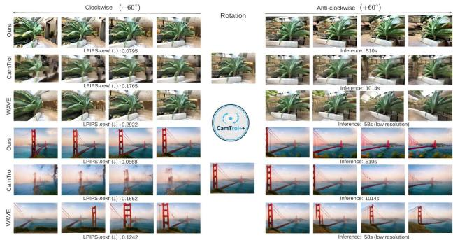  
Figure 1. Large Camera Motion. We compare CamTrol++ with representative training-free baselines (CamTrol [23], WAVE [37]) on a challenging ±60 rotation. Baselines fail to maintain coherence, resulting in significant distortion and high temporal flicker (LPIPS-next 0.17 − 0.29). Our method, CamTrol++, splits the large motion into small auto-regressive steps, generating a stable, geometrically coherent sequence with 2-3x lower flicker (LPIPSnext 0.079 − 0.086).

The main challenge is error accumulation during autoregressive generation. Each generated frame is used to generate the next, so small geometric and appearance errors can accumulate over time. Large camera motions make this problem more severe by introducing larger reprojection errors and disoccluded regions within each generation step. This leads to geometric distortion, perspective drift, temporal flicker, and appearance drift, as shown in Figure 1. We address these issues with CamTrol++, a training-free framework that stabilizes camera-controlled novel view synthesis at inference time without modifying the diffusion backbone.

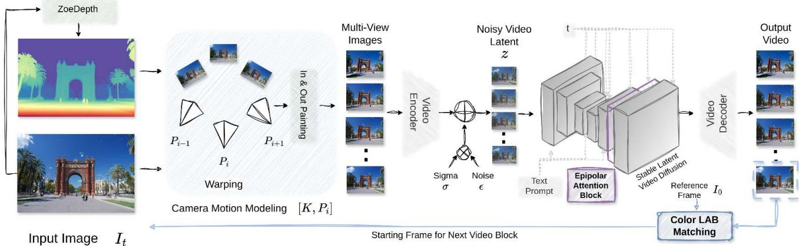  
Figure 2. Overview of the CamTrol++ Framework. Given an input image It and its depth, the Camera Motion Modeling block generates a warped multi-view sequence along a small camera sub-path. The sequence is processed by Stable Latent Video Diffusion with Epipolar Attention for geometric consistency and Color LAB Matching for appearance consistency. The corrected frame is reused as input for the next autoregressive pass, enabling efficient long-horizon generation without point cloud registration.

Our key idea is to divide a complete camera trajectory into small sub-paths and generate them autoregressively. This limits the geometric change handled in each step and reduces error accumulation. We further introduce geometryconstrained spatial attention and low-frequency appearance anchoring to improve geometric and appearance consistency. Finally, we remove the costly point cloud registration used in CamTrol [23] with an efficient registration-free warping pipeline. Our experiments show that small camera steps are important for stable generation, with larger per-step motions leading to increasing geometric and perceptual errors. Across RealEstate10K [63] and MegaScene [51], CamTrol++ extends stable generation from 14 to 56 frames, improves temporal and geometric consistency, and improves downstream 3D reconstruction quality while achieving a ∼ 5× per-frame speedup. Our contributions are as follows:

• We introduce CamTrol++, a training-free framework for stabilizing camera-controlled novel view synthesis at inference time without retraining or modifying the diffusion backbone.

• We show that small-step camera decomposition is the primary source of stability in long-horizon autoregressive generation and examine how performance varies with perstep camera motion.

• We incorporate geometry-constrained spatial attention and low-frequency appearance anchoring as supporting refinements and evaluate their effect within the framework.

• We develop an efficient registration-free warping pipeline that eliminates per-frame point cloud registration and achieves a ∼ 5× speedup over CamTrol [23].

• We demonstrate improved temporal and geometric consistency, downstream 3D reconstruction quality, and robustness to depth errors on RealEstate10K and MegaScene.

## 2. Related Works

Per-Scene Optimization. Early methods for novel view synthesis, such as Neural Radiance Fields (NeRF) [35], learn volumetric radiance fields per scene through gradient-based optimization. Extensions like Mip-NeRF [2] and Instant-NGP [36] improve speed and fidelity but remain scenespecific. Similarly, 3D Gaussian Splatting (3DGS) [25] and dynamic variants [33] represent scenes with explicit Gaussian primitives, achieving photorealistic results through per-scene fitting. EgoGaussian [58] extends this idea to dynamic and egocentric setups by jointly reconstructing backgrounds and moving objects. While these approaches produce geometrically consistent reconstructions, they require multi-view supervision and known camera poses, which is not the goal here, generating multi-view scenes from a single image. Recent works such as LucidDreamer [10] and SpatialCrafter [60] move toward sparse- or single-view 3D scene generation but rely on additional scene optimization or trained geometric components, in contrast to our inferencetime approach.

Zero-Shot Novel View Synthesis (NVS). Zero-shot NVS methods generate novel viewpoints from a single image without per-scene training. Zero-1-to-3 [31] and Zero123++ [46] use diffusion models for 3D-aware image generation, while ViewCrafter [57], ViewDiff [22], and Consistent-1-to-3 [55] improve geometric consistency through multi-view attention and geometry-aware diffusion. Novel View Diffusion [14] operates directly in pixel space. WonderJourney [56] uses language-guided scene expansion for perpetual 3D scene generation, while FantasyWorld [12] and WorldForge [47] extend video diffusion toward unified 3D/4D world modeling. Stable Virtual Camera [62] focuses on cameracontrolled diffusion, while WAVE [37] uses warp-guided attention and pose-aware noise initialization to improve consistency across independently generated novel views. Concurrent with this work, NeoMap [28] optimizes the initial noise of pre-trained video backbones, while WorldForge [47] uses recursive refinement within a single generation window. These methods primarily improve trajectory control within the native generation horizon of a pre-trained video backbone, whereas we focus on maintaining consistency across multiple autoregressive windows. This setting remains important for long or complex camera trajectories, where a single generation window may not be sufficient. Our focus is therefore on multi-window stabilization and on understanding the role of its individual components.

Training-Free Long Video Generation. This line of work aims to generate temporally coherent videos from a single image or short video without additional training. CamTrol [23] uses a warp-and-inpaint pipeline [17] with Stable Video Diffusion (SVD), enabling camera control without retraining. However, large camera motions can lead to accumulated geometric and perceptual errors. FreeLong [32] addresses long-video degradation through spectral feature blending in a training-free setting, while Rolling Forcing [30] reduces long-horizon error accumulation through joint denoising and context anchoring with additional training. Eliminating Oversaturation [43] improves diffusion sampling stability by modifying classifier-free guidance without model retraining. These methods improve long-horizon or sampling stability but do not specifically address geometric error accumulation in training-free camera-controlled novel view synthesis. CamCo [52] and CAMI2V [61] explore camera-controllable image-to-video generation through fine-tuned or trainingbased camera pose conditioning.

Existing training-free approaches show that camera trajectory decomposition and additional geometric or appearance constraints can improve the stability of autoregressive novel view synthesis. However, large camera motions and long trajectories remain challenging as errors accumulate across generation steps. Our work focuses on stabilizing generation across multiple autoregressive windows and examines the role of small-step camera decomposition together with supporting geometric and appearance components. We further evaluate camera step size, generation length, and depth errors to characterize the practical behavior of the proposed framework.

## 3. Method

We present an inference-time stabilization framework for camera-controlled novel view synthesis. Our method operates on a pre-trained Stable Video Diffusion (SVD) backbone [5] and requires no retraining or weight modification.

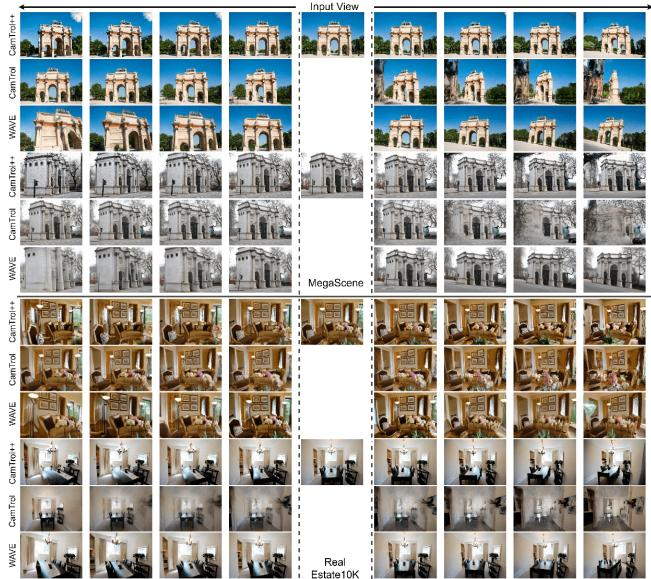  
Figure 3. Qualitative Comparison. CamTrol++ produces sharp and consistent multi-view sequences, maintaining both visual quality and temporal stability. In contrast, the baseline CamTrol [23] generates distorted frames, while WAVE [37] introduces geometric distortions and artifacts. This comparison highlights the improved stability and overall quality of our framework.

Given a single input image and a predefined camera trajectory, our framework generates multi-view video sequences in an auto-regressive manner. Figure 2 illustrates the overall pipeline. The framework has one central mechanism, distortion-limited reprojection through small-step camera decomposition, together with three supporting components, which are efficient registration-free warping, low-frequency appearance anchoring, and geometry-constrained spatial attention.

Camera-Consistent Distortion-Limited Reprojection. A primary source of instability in prior training-free methods, such as CamTrol [23] and WAVE [37], is large single-step camera motion. When wide rotations (e.g., 60◦) or long translations are generated within a single 14-frame chunk, severe geometric distortion can occur. The diffusion model must inpaint large disoccluded regions, often leading to structural artifacts and drift (Figures 1, 3, 5).

To reduce per-step geometric error, we decompose large camera motion into smaller segments. We first generate a continuous M-frame trajectory (M = 28 or 56),

$$
P _ { w o r l d } = \{ [ R _ { 0 } | C _ { 0 } ] , . . . , [ R _ { M } | C _ { M } ] \} ,
$$

using a smooth procedural motion function. Instead of synthesizing all frames in a single pass, we divide the trajectory into N-frame chunks $( \mathbf { e . g . } , N = 1 4 )$ and process them autoregressively. For each chunk $P _ { c h u n k _ { i } }$ , the input frame $I _ { i n p u t } ,$ which is the final frame from the previous chunk or $I _ { 0 }$ initially, is unprojected into a 3D point cloud using depth estimated from a pre-trained monocular model [4]. The first pose in the chunk serves as a reference. This point cloud is then projected to the remaining N − 1 poses [20] to obtain warped frames. The warped frames are first inpainted using a fast, non-neural method [50], followed by large-hole filling and outpainting with a pre-trained Stable Diffusion model [42]. The resulting multi-view sequence serves as conditioning for the diffusion backbone.

<table><tr><td rowspan="2" colspan="2">Method</td><td colspan="2">Next</td><td colspan="2">First</td><td rowspan="2">Frob. Norm (Rotation) ↓</td><td rowspan="2">Rot. Angle</td><td rowspan="2">Angular Cons. ↓</td><td rowspan="2">FPA↑</td><td rowspan="2">ZMR↓</td></tr><tr><td>LPIPS↓</td><td>CLIPSIM ↑</td><td>LPIPS↓</td><td>CLIPSIM ↑</td><td>Diff. ↓</td></tr><tr><td rowspan="8">1mes</td><td>RealEstate10K</td><td></td><td></td><td></td><td></td><td></td><td></td><td></td><td></td><td></td></tr><tr><td>WAVE</td><td>0.3214</td><td>0.9565</td><td>0.5515</td><td>0.9086</td><td>1.4870</td><td>1.1006</td><td>32.9670</td><td>0.456</td><td>0.240</td></tr><tr><td>CamTrol</td><td>0.2653</td><td>0.9607</td><td>0.5437</td><td>0.8460</td><td>2.1322</td><td>1.6381</td><td>28.5376</td><td>0.749</td><td>0.151</td></tr><tr><td>CamTrol++</td><td>0.2644</td><td>0.9729</td><td>0.5218</td><td>0.9193</td><td>1.1438</td><td>0.8812</td><td>15.7735</td><td>0.771</td><td>0.149</td></tr><tr><td>MegaScene</td><td></td><td></td><td></td><td></td><td></td><td></td><td></td><td></td><td></td></tr><tr><td>WAVE</td><td>0.3460</td><td>0.9359</td><td>0.5399</td><td>0.8590</td><td>1.5849</td><td>1.2128</td><td>22.0563</td><td>0.490</td><td>0.265</td></tr><tr><td>CamTrol</td><td>0.2197</td><td>0.9648</td><td>0.4382</td><td>0.8972</td><td>1.8477</td><td>1.3999</td><td>22.7652</td><td>0.764</td><td>0.265</td></tr><tr><td>CamTrol++</td><td>0.2219</td><td>0.9688</td><td>0.4487</td><td>0.9095</td><td>1.7564</td><td>1.4120</td><td>25.4760</td><td>0.757</td><td>0.236</td></tr><tr><td rowspan="5">S es</td><td>RealEstate10K</td><td></td><td></td><td></td><td></td><td></td><td></td><td></td><td></td><td></td></tr><tr><td>WAVE</td><td>0.2189</td><td>0.9692</td><td>0.5430</td><td>0.9068</td><td>1.5594</td><td>1.1729</td><td>6.9601</td><td>0.331</td><td>0.342</td></tr><tr><td>CamTrol++</td><td>0.0888</td><td>0.9895</td><td>0.5069</td><td>0.9174</td><td>1.2796</td><td>1.0085</td><td>4.9173</td><td>0.890</td><td>0.315</td></tr><tr><td>MegaScene</td><td></td><td></td><td></td><td></td><td></td><td></td><td></td><td></td><td></td></tr><tr><td>WAVE</td><td>0.2408</td><td>0.9539</td><td>0.5335</td><td>0.8600</td><td>1.7198</td><td>1.3525</td><td>7.3332</td><td>0.425</td><td>0.336</td></tr><tr><td>CamTrol++</td><td>0.0794</td><td>0.9881</td><td>0.4340</td><td></td><td>0.9074</td><td>1.7682</td><td>1.5059</td><td>4.2494</td><td>0.893</td><td>0.401</td></tr></table>

Table 1. Quantitative Comparison. We compare CamTrol++ with training-free baselines on RealEstate10K [63] and MegaScene [51] using 14-frame and 56-frame sequences. CamTrol++ provides the strongest overall temporal and perceptual consistency in the 56-frame setting, with substantial improvements in LPIPS, CLIPSIM, FPA, and Angular Consistency over WAVE. Results on the 14-frame setting are comparable to the baselines.

By regenerating the point cloud at each chunk boundary, we limit geometric distortion within each autoregressive pass and reduce error accumulation while maintaining continuous motion along the global trajectory. We use a $1 5 ^ { \circ }$ camera arc per chunk in our default setting. Section 4 evaluates this choice across a range of camera step sizes.

Efficient Registration-Free Warping. In the original CamTrol pipeline [23], each frame requires an iterative point cloud registration step to refine camera alignment. Although accurate, this optimization loop is computationally expensive and dominates runtime, taking approximately 27.4s per frame at 704 × 904 resolution. Our framework removes this per-frame optimization entirely. To maintain warp quality without registration, we design a two-stage warping strategy. First, we apply forward splatting [65], projecting source pixels to the target view using a 3×3 kernel. This reduces small holes that arise in backward interpolation. Second, remaining gaps are filled using a nearest-neighbor strategy based on a fast Euclidean distance transform [13]. This registrationfree design produces clean, near hole-free warped frames and reduces generation time to approximately 5.1s per frame, achieving a ∼ 5× speedup compared to CamTrol [23]. A quantitative comparison with linear interpolation is provided in the supplementary material.

Perceptual Anchoring (Low-Frequency Appearance Control). Autoregressive generation can introduce perceptual drift over time, particularly in color distribution (Figure 5). As diffusion errors accumulate, frames can gradually deviate from the source image’s appearance. To reduce this drift, we introduce a lightweight perceptual anchoring mechanism applied at chunk boundaries. Before passing the final frame of a chunk $\hat { I } _ { t - 1 }$ as input to the next chunk, we match its color statistics to the original image $I _ { 0 }$

Following [41], both images are converted to the CIELAB color space, which separates lightness (L\*) from chrominance (a\*, b\*). We preserve the $\mathrm { ~ L ~ } ^ { * }$ channel of $\hat { I } _ { t - 1 }$ and perform histogram matching [8] on the $\mathbf { a } ^ { * }$ and ${ \mathfrak { b } } ^ { * }$ channels with respect to $I _ { 0 }$ . The corrected frame is reconstructed by merging the preserved $\mathrm { ~ L ~ } ^ { * }$ with the aligned chrominance channels and converting back to RGB. This step provides an additional constraint on low-frequency chromatic drift while preserving the geometric structure of the generated frame.

Geometry-Constrained Spatial Attention. To improve geometric consistency during generation, we incorporate epipolar-guided spatial attention [54] into the SVD decoder. Standard self-attention aggregates features globally, which can introduce inconsistent feature correspondences under viewpoint changes. We instead restrict attention to epipolar lines defined by the camera motion. For a query feature $q _ { i }$ in frame $t _ { i } ,$ , we compute its epipolar line in the reference frame $t _ { 0 }$ using the Fundamental Matrix F derived from camera extrinsics $[ R | t ]$ . Rather than attending to all spatial positions, $q _ { i }$ attends only to sampled key-value pairs $( k _ { j } , v _ { j } )$ lying along this line. We uniformly sample $k = w / 2$ points along the epipolar line, where w is the latent width, and compute scaled dot-product attention over these points. The geometry-constrained output is combined with standard spatial attention:

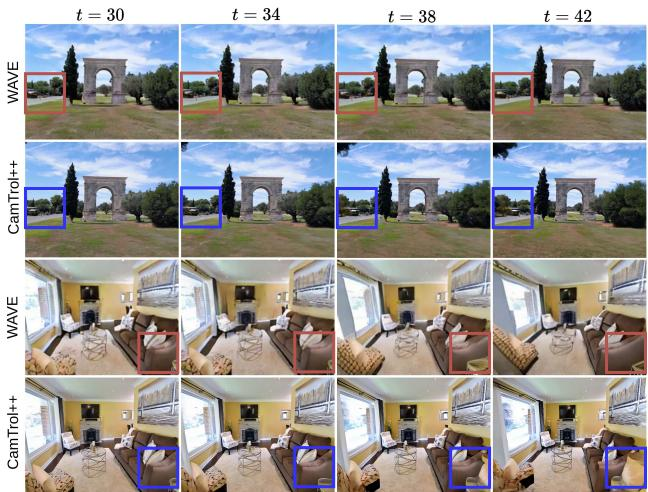  
Figure 4. Analysis of Static Frames. This figure illustrates a common failure mode of image-centric baselines such as WAVE [37] in a 56-frame sequence. We show frames from t = 30 to t = 42 with a 4-frame interval. In the WAVE results (red boxes), both background and foreground remain static, indicating a failure to generate realistic motion. In contrast, CamTrol++ (blue boxes) captures the correct change in viewpoint, demonstrating its ability to maintain temporal consistency.

$$
v _ { o u t } = \alpha v _ { e p i } + ( 1 - \alpha ) v _ { o r i g } ,\tag{1}
$$

where $v _ { e p i }$ denotes the epipolar-constrained output, $v _ { o r i g }$ the standard attention output, and $\alpha = 0 . 9$ balances geometric consistency and generative flexibility.

We apply this constraint at the final spatial attention layer of the SVD decoder. Layer-wise analysis (Table S9) shows that late-layer injection provides a better trade-off between perceptual quality and geometric alignment than early-layer injection. Although the constraint is applied within each chunk, it provides an additional geometric constraint during autoregressive generation.

## 4. Experiments

This section evaluates CamTrol++ on camera-controlled novel view synthesis. We first compare against existing training-free methods on perceptual, temporal, motion, and camera consistency. We then evaluate geometric consistency and downstream 3D reconstruction quality. Finally, we study the effect of the main design choices and evaluate the method under different camera step sizes, longer trajectories, and depth errors. All methods are evaluated using the same predefined camera trajectory as in CamTrol++, ensuring motion

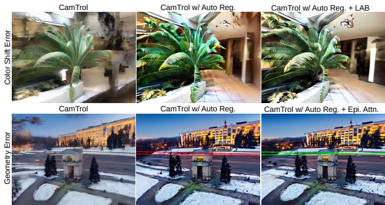  
Figure 5. Visual Ablation Study. We visualize the effects of LAB Correction and Epipolar Attention. (Top Row) Color Shift Error: The CamTrol baseline [23] (left) shows noticeable color distortion, while the auto-regressive setup (+ Auto Reg.) reduces this effect but still shows some drift. Adding LAB correction (right) further stabilizes the color appearance. (Bottom Row) Geometry Error: The auto-regressive setup (center) shows perspective deviations, visible from the diverging red lines. With Epipolar Attention (right), the lines remain consistent with the expected geometry, with the parallel lines (green) converging toward a stable vanishing point.

## consistency across comparisons.

Datasets and Baselines. We evaluate our method on two large-scale in-the-wild datasets, RealEstate10K [63] and MegaScene [51]. For quantitative evaluation without ground truth supervision (Table 1), we randomly sample 308 images from RealEstate10K and 98 from MegaScene. For 3D reconstruction experiments (Table 3), we additionally use MipNeRF360 [3], from which two random views are sampled for each of the seven scene categories. We compare CamTrol++ with two state-of-the-art training-free baselines. (1) CamTrol [23], which provides training-free camera control through an SVD-based warp-and-inpaint pipeline and is evaluated here in its native short-window setting, and (2) WAVE [37], an image-centric novel view synthesis method. All methods are evaluated frame-by-frame along a fixed global camera trajectory.

Metrics. Following WAVE [37], we evaluate several aspects of the generated sequences. (1) Temporal Consistency. We use LPIPS-next [37, 59] and CLIPSIM-next [37, 40] to measure perceptual and semantic similarity between consecutive frames (t and t − 1). (2) Drift from Source. We measure LPIPS-first and CLIPSIM-first by comparing each generated frame $I _ { t }$ with the initial warped input $I _ { 0 } .$ (3) Camera Accuracy (SfM). We estimate camera parameters using COLMAP [44, 45] and report Frobenius Norm, Rotation Angle Difference, and Angular Consistency following the WAVE evaluation protocol [37]. (4) Geometric Consistency. We compute Epipolar Alignment Error (EAE) and Sampson Distance [20]. (5) Motion Fidelity. We evaluate Flow-to-Pose Agreement (FPA) and Zero-Motion Ratio (ZMR) [15, 49]. These metrics are computed from dense optical flow and do not require ground-truth camera poses.

<table><tr><td>Stage</td><td>N</td><td> $\mathbf { L P I P S - } n e x t \downarrow$ </td><td> $\mathbf { L P I P S - } f i r s t \downarrow$ </td><td> $\mathbf { E A E } \left( \times 1 0 ^ { - 3 } \right) \downarrow$ </td><td> $\mathbf { S a m p s o n } \left( \times 1 0 ^ { - 4 } \right) \downarrow$ </td><td>FPA↑</td></tr><tr><td>+ AutoReg (small-step)</td><td>20</td><td> $0 . 0 9 8 1 \pm 0 . 0 0 7 6$ </td><td> $0 . 4 5 5 6 \pm 0 . 0 2 1 1$ </td><td> $0 . 8 3 6 \pm 0 . 1 0 6$ </td><td> $5 7 0 6 \pm 1 0 3 1$ </td><td> $0 . 8 3 6 \pm 0 . 0 2 4$ </td></tr><tr><td>+ AutoReg + Epi. (+ geom. attn.)</td><td>20</td><td> $0 . 0 9 8 1 \pm 0 . 0 0 7 7$ </td><td> $0 . 4 5 6 4 \pm 0 . 0 2 1 7$ </td><td> $0 . 8 3 6 \pm 0 . 1 0 7$ </td><td> $5 7 3 4 \pm 1 0 6 8$ </td><td> $0 . 8 3 9 \pm 0 . 0 2 4$ </td></tr><tr><td>CamTrol++ (+LAB anchoring)</td><td>20</td><td> $0 . 1 0 0 7 \pm 0 . 0 0 8 2$ </td><td> $0 . 4 6 2 2 \pm 0 . 0 2 2 1$ </td><td> $0 . 8 3 4 \pm 0 . 1 0 0$ </td><td> $5 2 7 1 \pm 7 7 2$ </td><td> $0 . 8 4 1 \pm 0 . 0 2 3$ </td></tr></table>

Table 2. Ablation Study. Mean ± SEM across N = 20 scenes from MegaScene. We progressively add the small-step autoregressive trajectory, epipolar-guided spatial attention, and LAB-based appearance anchoring. The small-step trajectory produces the largest change in temporal consistency, while the additional components lead to smaller changes across the evaluated metrics.
<table><tr><td>Method</td><td>Sampson Distance (1e-4) ↓</td><td>Epipolar Alignment Error (1e-3) ↓</td></tr><tr><td>RealEstate10K</td><td></td><td></td></tr><tr><td>WAVE</td><td>3.03</td><td>1.09</td></tr><tr><td>CamTrol++</td><td>2.97</td><td>1.07</td></tr><tr><td>MegaScene</td><td></td><td></td></tr><tr><td>WAVE</td><td>3.21</td><td>1.13</td></tr><tr><td>CamTrol++</td><td>2.75</td><td>1.03</td></tr></table>

<table><tr><td>Method</td><td>PSNR ↑</td><td>SSIM ↑</td><td>LPIPS ↓</td></tr><tr><td>MegaScene</td><td></td><td></td><td></td></tr><tr><td>WAVE</td><td>21.65</td><td>0.719</td><td>0.212</td></tr><tr><td>CamTrol++</td><td>28.08</td><td>0.912</td><td>0.078</td></tr><tr><td>MipNeRF360</td><td></td><td></td><td></td></tr><tr><td>WAVE</td><td>21.14</td><td>0.601</td><td>0.289</td></tr><tr><td>CamTrol++</td><td>28.06</td><td>0.885</td><td>0.087</td></tr></table>

Table 3. Geometric Consistency and 3D Reconstruction Quality. (Left) Quantitative comparison of geometric consistency against WAVE [37], reporting mean Sampson Distance and Epipolar Alignment Error (EAE). CamTrol++ achieves lower geometric errors across RealEstate10K [63] and MegaScene [51], indicating stronger adherence to epipolar geometry. (Right) 3D Gaussian Splatting [25] reconstruction quality from generated 56-frame videos. CamTrol++ achieves superior PSNR, SSIM, and LPIPS on MegaScene [51] and MipNerf360 [3], demonstrating improved multi-view consistency for downstream 3D rendering.

Higher FPA and lower ZMR indicate smoother and more consistent motion.

Implementation Details. All outputs are resized to (192, 256) following WAVE [37]. Our pipeline removes the costly per-frame point cloud registration in CamTrol [23], reducing generation time by approximately 5×.

Quantitative Comparison. We first compare CamTrol++ with existing training-free methods under the same camera trajectories. Table 1 summarizes results on RealEstate10K and MegaScene for both 14-frame and 56-frame sequences. For the 14-frame setting, CamTrol generates 14 frames directly, while WAVE and CamTrol++ generate 56 frames and are uniformly subsampled to 14 frames for evaluation. The main gains appear in the 56-frame setting. On RealEstate10K, CamTrol++ reduces LPIPS-next from 0.2189 for WAVE to 0.0888 and increases CLIPSIM-next from 0.9692 to 0.9895. On MegaScene, LPIPS-next decreases from 0.2408 to 0.0794, while CLIPSIM-next increases from 0.9539 to 0.9881. Motion fidelity also improves, with FPA increasing from 0.425 to 0.893 on MegaScene. Angular Consistency improves from 6.96◦ to 4.92◦ on RealEstate10K, indicating reduced long-term camera drift. These results show that the benefit of the proposed stabilization becomes more pronounced as the generation horizon increases.

While CamTrol performs competitively in the shortwindow setting, our extended 28-frame evaluation in the supplementary material shows that applying it to segmented trajectories is less stable and substantially slower than CamTrol++.

Geometric Consistency and 3D Reconstruction. Table 3 (left) reports geometric metrics. CamTrol++ achieves lower

Sampson Distance and Epipolar Alignment Error across RealEstate10K and MegaScene, showing improved agreement with the expected multi-view geometry. We further evaluate structural consistency through downstream 3D reconstruction. We train 3D Gaussian Splatting models on generated 56-frame sequences. As shown in Table 3 (right), CamTrol++ achieves higher PSNR and SSIM and lower LPIPS on both MegaScene and MipNeRF360. On MegaScene, for example, PSNR improves from 21.65 for WAVE to 28.08 for CamTrol++. Improvements are also observed on MipNeRF360, showing that the improved consistency of the generated views also benefits downstream 3D reconstruction.

Qualitative Analysis. Figure 1 illustrates challenging 60◦ rotations. CamTrol++ maintains sharp structure and coherent motion, while CamTrol exhibits blur and color drift, and WAVE produces geometric distortions and flicker. Figure 3 further shows 56-frame sequences on MegaScene and RealEstate10K. CamTrol++ preserves a consistent perspective and appearance across frames. WAVE often produces static or sliding backgrounds (Figure 4), where the scene motion does not follow the camera trajectory. CamTrol++ avoids this issue and maintains motion consistent with the camera pose.

Ablation Study. We progressively add the main stabilization components while using the registration-free warping pipeline. We consider the small-step autoregressive trajectory, Epipolar Attention, and LAB perceptual anchoring. As shown in Table 2, the small-step trajectory produces the largest change in temporal consistency. Adding epipolar attention provides additional geometric constraints, while LAB anchoring provides additional control over appearance drift. The full configuration combines the evaluated components used in the final system. Figure 5 shows qualitative examples. Without LAB correction, the color tone gradually shifts across the sequence, while removing epipolar attention can lead to less consistent perspective structure.

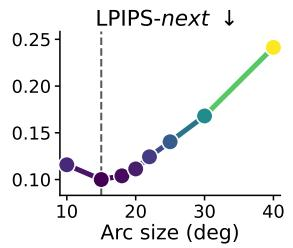

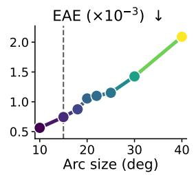

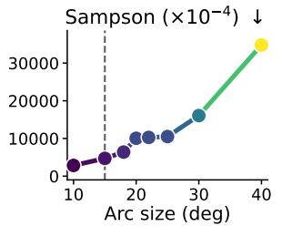

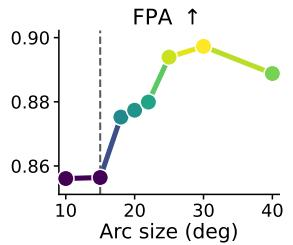  
Figure 6. Effect of Camera Step Size. Mean perceptual and geometric metrics vs. per-chunk camera arc size, with epipolar attention held OFF to isolate the reprojection mechanism itself (n = 20 scenes per arc size, MegaScene).

<table><tr><td>Method</td><td>LPIPS ↓</td><td>CLIPSIM ↑</td><td>Forb. Norm. (Rot.) ↓</td><td>Rot. Angle Diff. ↓</td><td>Angular Cons. ↓</td></tr><tr><td>ZoeDepth [4]</td><td>0.0794</td><td>0.9881</td><td>1.7682</td><td>1.5059</td><td>4.2494</td></tr><tr><td>DepthPro [6]</td><td>0.1036</td><td>0.9847</td><td>1.7338</td><td>1.4255</td><td>6.8475</td></tr><tr><td>DA3</td><td>0.1387</td><td>0.9805</td><td>1.9491</td><td>1.4628</td><td>4.5052</td></tr><tr><td>Marigold</td><td>0.2084</td><td>0.9619</td><td>2.4851</td><td>2.0219</td><td>6.2351</td></tr></table>

Table 4. Depth Estimation Ablation. Comparison of different monocular depth predictors on MegaScene. The proposed smallstep reprojection remains effective across different depth models, although depth quality affects the overall generation quality.

Camera Step Size. The small-step camera trajectory is the main design choice in CamTrol++. To study its effect, we vary the camera arc handled by each chunk from $1 0 ^ { \circ }$ to 40◦ while keeping the other components fixed. Results are shown in Figure 6. Smaller camera steps generally provide more stable generation. LPIPS-next is lowest near 15◦ and increases as the arc becomes larger, while geometric errors increase more strongly beyond approximately 18-20◦. We therefore use a $1 5 ^ { \circ }$ arc per chunk, which provides a good balance between stability and the amount of camera motion handled in each pass. FPA does not follow the same trend and can improve with larger arcs, showing that motion smoothness alone does not fully capture geometric stability.

Long-Horizon Generation. We further evaluate CamTrol++ beyond the standard 56-frame setting by generating sequences of up to 84 frames. Figure 7 shows the change in perceptual consistency, motion, and image detail as the sequence becomes longer. The generated views remain temporally consistent through the initial generation range before gradual degradation appears. Beyond this range, loss of texture and fine details becomes the most common failure mode, followed by appearance drift and motion freezing. These results show that the loss of image details becomes an important limitation as generation extends beyond the standard horizon.

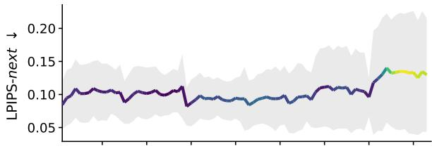

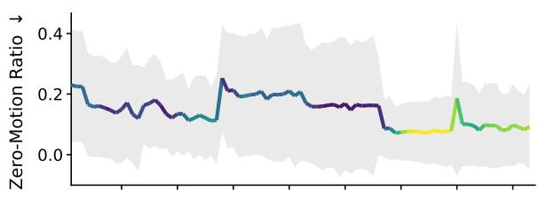

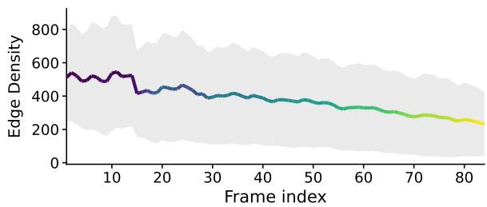  
Figure 7. Long-Horizon Generation. Mean ± std of three degradation signals across an 84-frame single-direction extension, n = 20 scenes from MegaScene using the full configuration. Temporal consistency and motion remain stable within the initial generation range, while image detail and other signals gradually degrade as the sequence lengthens.

Depth Robustness. Since reprojection depends on estimated depth, we evaluate the sensitivity of CamTrol++ to different depth predictors and controlled depth errors. As shown in the Table 4, we first compare ZoeDepth [4], Depth-Pro [6], DA3 [29], and Marigold [24]. Performance varies across depth predictors, but the small-step reprojection maintains stable generation even when using relative depth from Marigold. We further introduce controlled-depth corruption by adding relative Gaussian noise and missing pixels to the ZoeDepth output prior to warping. As shown in Figure 8, we vary the noise severity from 0 to 0.5 and the hole fraction from 0% to 10% across 20 scenes. Even under the strongest corruption tested, LPIPS-next reaches 0.1148, remaining 52.3% below WAVE’s uncorrupted 56-frame MegaScene baseline of 0.2408. Depth accuracy has a larger effect on performance than the fraction of missing pixels, with hole corruption changing LPIPS-next by less than 0.003 at a fixed noise severity. These results show that the proposed smallstep reprojection remains effective under substantial depth corruption within the tested range.

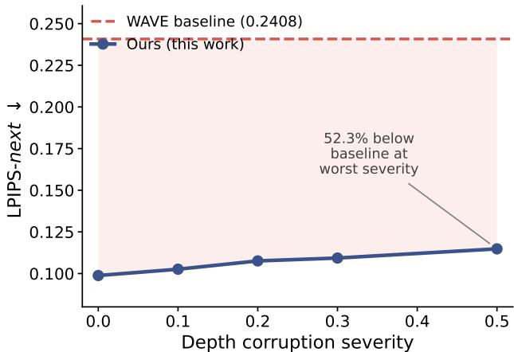  
Figure 8. Depth Robustness vs. Training-Free Baseline. LPIPSnext under synthetic depth corruption applied to ZoeDepth’s output, with corruption severity ranging from 0 to 0.5, compared against WAVE’s 56-frame MegaScene baseline (0.2408, dashed). Performance degrades gradually as the depth of corruption increases. Even at the strongest corruption tested, CamTrol++ achieves an LPIPS-next of 0.1148, which is 52.3% below the WAVE baseline.

## 5. Discussion

CamTrol++ demonstrates that camera-controlled novel view synthesis can be stabilized at inference time without retraining or modifying the diffusion backbone. The main source of this stability is the decomposition of large camera trajectories into small autoregressive steps. By limiting the camera motion handled in each pass, the method reduces reprojection distortion and error accumulation. Our camera step analysis supports this design, showing stable performance for small camera steps and stronger degradation as the per-step motion increases, particularly beyond approximately 18-20◦.

Unlike image-centric approaches such as WAVE [37], which synthesize frames independently and may produce static or inconsistent motion under long trajectories, CamTrol++ maintains explicit geometric structure throughout the generation process. Epipolar Attention and Perceptual Anchoring provide additional geometric and appearance constraints, although their effects are smaller and vary across the evaluated metrics. This suggests that the small-step trajectory design plays the central role in stabilizing the autoregressive process, while the additional components provide complementary refinements. The registration-free warping further makes the framework substantially more efficient than CamTrol [23].

The long-horizon and depth robustness experiments show that the framework remains effective beyond the standard setting. CamTrol++ maintains temporal and geometric consistency over 56-frame sequences and remains effective under substantial controlled depth corruption. At longer horizons, loss of texture and fine details becomes the dominant source of degradation. Extending generation further will therefore require improvements in the underlying diffusion model and depth estimation in addition to inference-time stabilization.

Recent long-video stabilization methods such as Free-Long [32] and Rolling Forcing [30] address temporal drift through spectral or recurrent processing but require model changes or retraining. In contrast, CamTrol++ improves camera-controlled multi-view generation entirely at inference time while preserving the original diffusion backbone. This makes the framework modular and applicable without additional model training.

From an application perspective, CamTrol++ enables longer camera-controlled visualizations from a single image using existing pretrained video diffusion models. This is useful for applications such as interactive scene exploration, virtual walkthroughs, and 3D content creation, where consistent viewpoint changes are required without per-scene training. Its registration-free implementation and inferencetime operation make it practical to integrate into existing image-to-video pipelines.

Limitations. Very long trajectories can still exhibit texture drift, loss of fine details, or depth inconsistencies. Performance also depends on the quality of monocular depth estimation and may degrade under severe occlusion or reflective surfaces. While the depth robustness experiments show that the method remains effective under substantial controlled errors, more severe depth failures remain challenging. Future work could improve depth estimation, incorporate depth refinement, or use explicit 3D representations to further extend the generation horizon.

## 6. Conclusion

We introduced CamTrol++, a training-free framework for stabilizing camera-controlled novel view synthesis at inference time. The key idea is to decompose large camera trajectories into small autoregressive steps, thereby limiting per-step geometric distortion and reducing error accumulation without retraining or modifying the diffusion backbone. Geometryconstrained attention and lightweight perceptual anchoring provide additional consistency, while registration-free warping substantially reduces the cost of generation. Experiments on RealEstate10K and MegaScene show improved temporal and geometric consistency, better downstream 3D reconstruction, and stable generation over 56-frame trajectories. The camera step analysis further supports the small-step design, while the long-horizon and depth robustness experiments show that the framework remains effective under more challenging settings. These results demonstrate that careful control of camera motion at inference time can substantially improve the stability and efficiency of camera-controlled novel view synthesis while keeping the underlying diffusion model frozen.

## 7. Acknowledgment

This work was supported by the Prime Minister Research Fellowship (PMRF 2122-2557) awarded to Prajwal Singh, the Visvesvaraya Fellowship awarded to Arjun Badola, and the Dr. Vilas Mujumdar Chair held by Shanmuganathan Raman.

## References

[1] Aishwarya Agarwal, Srikrishna Karanam, KJ Joseph, Apoorv Saxena, Koustava Goswami, and Balaji Vasan Srinivasan. A-star: Test-time attention segregation and retention for textto-image synthesis. In Proceedings of the IEEE/CVF International Conference on Computer Vision, pages 2283–2293, 2023. 1

[2] Jonathan T Barron, Ben Mildenhall, Matthew Tancik, Peter Hedman, Ricardo Martin-Brualla, and Pratul P Srinivasan. Mip-nerf: A multiscale representation for anti-aliasing neural radiance fields. In Proceedings ofthe IEEE/CVF international conference on computer vision, pages 5855–5864, 2021. 2

[3] Jonathan T Barron, Ben Mildenhall, Dor Verbin, Pratul P Srinivasan, and Peter Hedman. Mip-nerf 360: Unbounded anti-aliased neural radiance fields. In 2022 IEEE/CVF Conference on Computer Vision and Pattern Recognition (CVPR), pages 5460–5469. IEEE, 2022. 5, 6

[4] Shariq Farooq Bhat, Reiner Birkl, Diana Wofk, Peter Wonka, and Matthias Muller. Zoedepth: Zero-shot trans-¨ fer by combining relative and metric depth. arXiv preprint arXiv:2302.12288, 2023. 3, 7

[5] Andreas Blattmann, Tim Dockhorn, Sumith Kulal, Daniel Mendelevitch, Maciej Kilian, Dominik Lorenz, Yam Levi, Zion English, Vikram Voleti, Adam Letts, et al. Stable video diffusion: Scaling latent video diffusion models to large datasets. arXiv preprint arXiv:2311.15127, 2023. 1, 3

[6] A. Bochkovskii, A. Delaunoy, H. Germain, M. Santos, Y. Zhou, S. R Richter, and V. Koltun. Depth pro: Sharp monocular metric depth in less than a second. arXiv preprint arXiv:2410.02073, 2024. 7

[7] Tim Brooks, Aleksander Holynski, and Alexei A Efros. Instructpix2pix: Learning to follow image editing instructions. In Proceedings of the IEEE/CVF conference on computer vision and pattern recognition, pages 18392–18402, 2023. 1

[8] Shi-Kuo Chang and Yin-Wah Wong. Optimal histogram matching by monotone gray level transformation. Communications ofthe ACM, 21(10):835–840, 1978. 4

[9] Hila Chefer, Yuval Alaluf, Yael Vinker, Lior Wolf, and Daniel Cohen-Or. Attend-and-excite: Attention-based semantic guidance for text-to-image diffusion models. ACM transactions on Graphics (TOG), 42(4):1–10, 2023. 1

[10] Jaeyoung Chung, Suyoung Lee, Hyeongjin Nam, Jaerin Lee, and Kyoung Mu Lee. Luciddreamer: Domain-free generation of 3d gaussian splatting scenes. arXiv preprint arXiv:2311.13384, 2023. 2

[11] Haowang Cui, Rui Chen, Tao Luo, Rui Li, and Jiaze Wang. Uniview: Enhancing novel view synthesis from a single image by unifying reference features. arXiv preprint arXiv:2509.04932, 2025. 1

[12] Yixiang Dai, Fan Jiang, Chiyu Wang, Mu Xu, and Yonggang Qi. Fantasyworld: Geometry-consistent world modeling via unified video and 3d prediction. arXiv preprint arXiv:2509.21657, 2025. 2

[13] Per-Erik Danielsson. Euclidean distance mapping. Computer Graphics and Image Processing, 14(3):227–248, 1980. 4

[14] Noam Elata, Bahjat Kawar, Yaron Ostrovsky-Berman, Miriam Farber, and Ron Sokolovsky. Novel view synthesis with pixel-space diffusion models. In Proceedings ofthe Computer Vision and Pattern Recognition Conference, pages 26756–26766, 2025. 2

[15] Gunnar Farneback. Two-frame motion estimation based on¨ polynomial expansion. In Scandinavian conference on Image analysis, pages 363–370. Springer, 2003. 5

[16] Weixi Feng, Xuehai He, Tsu-Jui Fu, Varun Jampani, Arjun Akula, Pradyumna Narayana, Sugato Basu, Xin Eric Wang, and William Yang Wang. Training-free structured diffusion guidance for compositional text-to-image synthesis. arXiv preprint arXiv:2212.05032, 2022. 1

[17] Rafail Fridman, Amit Abecasis, Yoni Kasten, and Tali Dekel. Scenescape: Text-driven consistent scene generation. Advances in Neural Information Processing Systems, 36:39897– 39914, 2023. 3

[18] Haruo Fujiwara, Yusuke Mukuta, and Tatsuya Harada. Stylenerf2nerf: 3d style transfer from style-aligned multi-view images. In SIGGRAPH Asia 2024 Conference Papers, pages 1–10, 2024. 19

[19] Eyal Gomel and Lior Wolf. Diffusion-based attention warping for consistent 3d scene editing. arXiv preprint arXiv:2412.07984, 2024. 1

[20] Richard Hartley, Andrew Zisserman, et al. Multiple view geometry in computer vision. Cambridge university press Cambridge, 2003. 4, 5, 14, 15

[21] Amir Hertz, Ron Mokady, Jay Tenenbaum, Kfir Aberman, Yael Pritch, and Daniel Cohen-Or. Prompt-to-prompt image editing with cross attention control. arXiv preprint arXiv:2208.01626, 2022. 1

[22] Lukas Hollein, Alja¨ z Boˇ ziˇ c, Norman Mˇ uller, David Novotny,¨ Hung-Yu Tseng, Christian Richardt, Michael Zollhofer, and¨ Matthias Nießner. Viewdiff: 3d-consistent image generation with text-to-image models. In Proceedings of the IEEE/CVF conference on computer vision and pattern recognition, pages 5043–5052, 2024. 2

[23] Chen Hou and Zhibo Chen. Training-free camera control for video generation. arXiv preprint arXiv:2406.10126, 2024. 1, 2, 3, 4, 5, 6, 8, 12, 14, 15, 19

[24] B. Ke, K. Qu, T. Wang, N. Metzger, S. Huang, B. Li, A. Obukhov, and K. Schindler. Marigold: Affordable adaptation of diffusion-based image generators for image analysis. arXiv preprint arXiv:2505.09358, 2025. 7

[25] Bernhard Kerbl, Georgios Kopanas, Thomas Leimkuhler, and¨ George Drettakis. 3d gaussian splatting for real-time radiance field rendering. ACM Trans. Graph., 42(4):139–1, 2023. 1, 2, 6

[26] Jihwan Kim, Junoh Kang, Jinyoung Choi, and Bohyung Han. Fifo-diffusion: Generating infinite videos from text without training. Advances in Neural Information Processing Systems, 37:89834–89868, 2024. 1

[27] Gihyun Kwon and Jong Chul Ye. Tweediemix: Improving multi-concept fusion for diffusion-based image/video generation. arXiv preprint arXiv:2410.05591, 2024. 1

[28] Jinxi Li, Tianyi Zhang, Yafei Yang, Zihui Zhang, Peng Huang, Koon Wing Macgyver Lin, and Bo Yang. Neomap: Trainingfree novel-view synthesis from single images and videos. arXiv preprint arXiv:2607.01962, 2026. 3

[29] H. Lin, S. Chen, J. Liew, D. Y Chen, Z. Li, G. Shi, J. Feng, and B. Kang. Depth anything 3: Recovering the visual space from any views. arXiv preprint arXiv:2511.10647, 2025. 7

[30] Kunhao Liu, Wenbo Hu, Jiale Xu, Ying Shan, and Shijian Lu. Rolling forcing: Autoregressive long video diffusion in real time. arXiv preprint arXiv:2509.25161, 2025. 3, 8

[31] Ruoshi Liu, Rundi Wu, Basile Van Hoorick, Pavel Tokmakov, Sergey Zakharov, and Carl Vondrick. Zero-1-to-3: Zero-shot one image to 3d object, 2023. 1, 2

[32] Yu Lu, Yuanzhi Liang, Linchao Zhu, and Yi Yang. Freelong: Training-free long video generation with spectralblend temporal attention. Advances in Neural Information Processing Systems, 37:131434–131455, 2024. 3, 8

[33] Zhicheng Lu, Xiang Guo, Le Hui, Tianrui Chen, Min Yang, Xiao Tang, Feng Zhu, and Yuchao Dai. 3d geometry-aware deformable gaussian splatting for dynamic view synthesis. In Proceedings of the IEEE/CVF Conference on Computer Vision and Pattern Recognition (CVPR), pages 8900–8910, 2024. 2

[34] Ben Mildenhall, Pratul P Srinivasan, Rodrigo Ortiz-Cayon, Nima Khademi Kalantari, Ravi Ramamoorthi, Ren Ng, and Abhishek Kar. Local light field fusion: Practical view synthesis with prescriptive sampling guidelines. ACM Transactions on Graphics (ToG), 38(4):1–14, 2019. 19

[35] Ben Mildenhall, Pratul P Srinivasan, Matthew Tancik, Jonathan T Barron, Ravi Ramamoorthi, and Ren Ng. Nerf: Representing scenes as neural radiance fields for view synthesis. Communications ofthe ACM, 65(1):99–106, 2021. 1, 2

[36] Thomas Muller, Alex Evans, Christoph Schied, and Alexan-¨ der Keller. Instant neural graphics primitives with a multiresolution hash encoding. ACM transactions on graphics (TOG), 41(4):1–15, 2022. 2

[37] Jiwoo Park, Tae Eun Choi, Youngjun Jun, and Seong Jae Hwang. Wave: Warp-based view guidance for consistent novel view synthesis using a single image. arXiv preprint arXiv:2506.23518, 2025. 1, 3, 5, 6, 8, 13, 18, 19

[38] Jangho Park, Taesung Kwon, and Jong Chul Ye. Zero4d: Training-free 4d video generation from single video using off-the-shelf video diffusion models. In Proceedings of the IEEE/CVF Conference on Computer Vision and Pattern Recognition, pages 4045–4054, 2026. 1

[39] Ben Poole, Ajay Jain, Jonathan T Barron, and Ben Mildenhall. Dreamfusion: Text-to-3d using 2d diffusion. arXiv preprint arXiv:2209.14988, 2022. 1

[40] Alec Radford, Jong Wook Kim, Chris Hallacy, Aditya Ramesh, Gabriel Goh, Sandhini Agarwal, Girish Sastry, Amanda Askell, Pamela Mishkin, Jack Clark, et al. Learning transferable visual models from natural language supervision. In International conference on machine learning, pages 8748–8763. PmLR, 2021. 5, 13

[41] Erik Reinhard, Michael Adhikhmin, Bruce Gooch, and Peter Shirley. Color transfer between images. IEEE Computer graphics and applications, 21(5):34–41, 2002. 4

[42] Robin Rombach, Andreas Blattmann, Dominik Lorenz, Patrick Esser, and Bjorn Ommer. High-resolution image¨ synthesis with latent diffusion models. arxiv 2022. arXiv preprint arXiv:2112.10752, 2021. 4

[43] Seyedmorteza Sadat, Otmar Hilliges, and Romann M Weber. Eliminating oversaturation and artifacts of high guidance scales in diffusion models. In The Thirteenth International Conference on Learning Representations, 2024. 3

[44] Johannes Lutz Schonberger and Jan-Michael Frahm.¨ Structure-from-motion revisited. In Conference on Computer Vision and Pattern Recognition (CVPR), 2016. 5, 16, 18

[45] Johannes Lutz Schonberger, Enliang Zheng, Marc Pollefeys,¨ and Jan-Michael Frahm. Pixelwise view selection for unstructured multi-view stereo. In European Conference on Computer Vision (ECCV), 2016. 5, 16, 18

[46] Ruoxi Shi, Hansheng Chen, Zhuoyang Zhang, Minghua Liu, Chao Xu, Xinyue Wei, Linghao Chen, Chong Zeng, and Hao Su. Zero123++: a single image to consistent multi-view diffusion base model, 2023. 2

[47] Chenxi Song, Yanming Yang, Tong Zhao, Ruibo Li, and Chi Zhang. Worldforge: Unlocking emergent 3d/4d generation in video diffusion model via training-free guidance. arXiv preprint arXiv:2509.15130, 2025. 2, 3

[48] Wenqiang Sun, Shuo Chen, Fangfu Liu, Zilong Chen, Yueqi Duan, Jun Zhang, and Yikai Wang. Dimensionx: Create any 3d and 4d scenes from a single image with controllable video diffusion. arXiv preprint arXiv:2411.04928, 2024. 1

[49] Zachary Teed and Jia Deng. Raft: Recurrent all-pairs field transforms for optical flow. In European conference on computer vision, pages 402–419. Springer, 2020. 5, 15

[50] Alexandru Telea. An image inpainting technique based on the fast marching method. In Journal of Graphics Tools, pages 23–34. Taylor & Francis, 2004. 4

[51] Joseph Tung, Gene Chou, Ruojin Cai, Guandao Yang, Kai Zhang, Gordon Wetzstein, Bharath Hariharan, and Noah Snavely. Megascenes: Scene-level view synthesis at scale. In European conference on computer vision, pages 197–214. Springer, 2024. 2, 4, 5, 6, 12, 14, 16, 17

[52] Dejia Xu, Weili Nie, Chao Liu, Sifei Liu, Jan Kautz, Zhangyang Wang, and Arash Vahdat. Camco: Cameracontrollable 3d-consistent image-to-video generation. arXiv preprint arXiv:2406.02509, 2024. 3

[53] Xingyi Yang and Xinchao Wang. Compositional video generation as flow equalization. arXiv preprint arXiv:2407.06182, 2024. 1

[54] Botao Ye, Sifei Liu, Xueting Li, Marc Pollefeys, and Ming-Hsuan Yang. Synthesizing consistent novel views via 3d epipolar attention without re-training. In International Conference on 3D Vision 2025, 2025. 4

[55] Jianglong Ye, Peng Wang, Kejie Li, Yichun Shi, and Heng Wang. Consistent-1-to-3: Consistent image to 3d view synthesis via geometry-aware diffusion models. arXiv preprint arXiv:2310.03020, 2023. 2

[56] Hong-Xing Yu, Haoyi Duan, Junhwa Hur, Kyle Sargent, Michael Rubinstein, William T Freeman, Forrester Cole, Deqing Sun, Noah Snavely, Jiajun Wu, et al. Wonderjourney: Going from anywhere to everywhere. In 2024 IEEE/CVF Conference on Computer Vision and Pattern Recognition (CVPR), pages 6658–6667. IEEE, 2024. 2

[57] Wangbo Yu, Jinbo Xing, Li Yuan, Wenbo Hu, Xiaoyu Li, Zhipeng Huang, Xiangjun Gao, Tien-Tsin Wong, Ying Shan, and Yonghong Tian. Viewcrafter: Taming video diffusion models for high-fidelity novel view synthesis, 2024. 2

[58] Daiwei Zhang, Gengyan Li, Jiajie Li, Mickael Bressieux, Ot-¨ mar Hilliges, Marc Pollefeys, Luc Van Gool, and Xi Wang. Egogaussian: Dynamic scene understanding from egocentric video with 3d gaussian splatting. In 2025 International Conference on 3D Vision (3DV), pages 1091–1102. IEEE, 2025. 2

[59] Richard Zhang, Phillip Isola, Alexei A Efros, Eli Shechtman, and Oliver Wang. The unreasonable effectiveness of deep features as a perceptual metric. In Proceedings of the IEEE conference on computer vision and pattern recognition, pages 586–595, 2018. 5, 13

[60] Songchun Zhang, Huiyao Xu, Sitong Guo, Zhongwei Xie, Hujun Bao, Weiwei Xu, and Changqing Zou. Spatialcrafter: Unleashing the imagination of video diffusion models for scene reconstruction from limited observations. In Proceedings ofthe IEEE/CVF International Conference on Computer Vision, pages 27794–27805, 2025. 2

[61] Guangcong Zheng, Teng Li, Rui Jiang, Yehao Lu, Tao Wu, and Xi Li. Cami2v: Camera-controlled image-to-video diffusion model. arXiv preprint arXiv:2410.15957, 2024. 3

[62] Jensen Zhou, Hang Gao, Vikram Voleti, Aaryaman Vasishta, Chun-Han Yao, Mark Boss, Philip Torr, Christian Rupprecht, and Varun Jampani. Stable virtual camera: Generative view synthesis with diffusion models. arXiv preprint arXiv:2503.14489, 2025. 3

[63] Tinghui Zhou, Richard Tucker, John Flynn, Graham Fyffe, and Noah Snavely. Stereo magnification: Learning view synthesis using multiplane images. In ACM Transactions on Graphics (TOG), pages 1–11. ACM, 2018. 2, 4, 5, 6, 12, 14, 18

[64] Hanshen Zhu, Zhen Zhu, Kaile Zhang, Yiming Gong, Yuliang Liu, and Xiang Bai. Training-free geometric image editing on diffusion models. In Proceedings ofthe IEEE/CVF International Conference on Computer Vision, pages 19130–19140, 2025. 1

[65] Matthias Zwicker, Hanspeter Pfister, Jeroen Van Baar, and Markus Gross. Surface splatting. In Proceedings ofthe 29th Annual Conference on Computer Graphics and Interactive Techniques (SIGGRAPH), pages 371–378, 2002. 4

## 8. Implementation Details

CamTrol++ Framework. Algorithm 1 outlines the complete inference pipeline used in CamTrol++. Given an input image $I _ { 0 }$ and a predefined camera trajectory $\{ C _ { t } \} _ { t = 1 } ^ { M }$ , the method generates a sequence of camera-consistent frames $\{ I _ { t } \} _ { t = 1 } ^ { M }$ without any training or finetuning. Each chunk of N frames is synthesized independently using the following steps:

• Depth Estimation. We estimate per-pixel depth $D _ { k }$ using the pretrained ZoeDepth model.

• Unprojection and Warping. The pair $( I _ { k } , D _ { k } )$ is unprojected into a 3D point cloud and reprojected to target views $\{ C _ { t } \}$ through differentiable splatting (kernel size $3 \times 3 )$

• Hole Filling. Missing regions caused by disocclusions are filled using a distance-transform–based inpainting strategy, which provides smooth depth-aware completion while maintaining edge sharpness.

• Latent Encoding. The warped frames are encoded into the latent space of Stable Video Diffusion (SVD).

• Epipolar-Guided Attention. We apply the proposed Epipolar Attention module at the $2 3 ^ { \mathrm { r d } }$ decoder layer of SVD with weight $\alpha = 0 . 9$ , using $k = w / 2$ epipolar key samples per query.

• Decoding and Color Anchoring. The decoded RGB frames are matched to the LAB histogram of the reference frame $I _ { 0 }$ to prevent perceptual drift across chunks.

• Autoregressive Step. The last generated frame from each chunk serves as the next input, enabling long-horizon synthesis without retraining.

This design maintains spatial consistency through depthbased warping and epipolar priors while enforcing temporal coherence across chunks using autoregressive color anchoring.

Framework Parameters. Table 5 summarizes the key parameters used in all experiments. We use $N = 1 4$ frames per chunk and generate sequences of M = 28 or 56 frames depending on the dataset setting. Epipolar attention employs $\alpha = 0 . 9$ and $k = w / 2$ key samples. Depth is predicted using ZoeDepth (N model), and all experiments are performed on a single NVIDIA L40S GPU (48 GB). These parameters are fixed for all datasets to ensure consistent evaluation across different camera trajectories and scenes.

## 9. Additional Analysis

This section provides additional results supporting the experiments in the main paper. We include extended CamTrol [23] comparisons, component analysis, camera arc-size results, α-sensitivity, and the full depth-corruption grid.

Extended CamTrol Comparison. The original CamTrol [23] is designed for short 14-frame sequences. To compare the methods over a longer trajectory, we divide the full camera path into two independent 14-frame segments and run CamTrol on each segment separately. We then concatenate the two outputs to form a 28-frame sequence, giving CamTrol the same segmented trajectory structure used by CamTrol++. Table 10 reports results on RealEstate10K [63] and MegaScene [51]. CamTrol++ achieves better temporal, geometric, and perceptual consistency while reducing runtime from approximately 15.4 minutes per scene with CamTrol to 4.5 minutes. These results show the benefit of combining small-step generation with the registration-free warping pipeline.

Input: Input image $I _ { 0 } ,$ camera trajectory $\{ C _ { t } \} _ { t = 1 } ^ { M }$   
Output: Camera-consistent sequence $\{ I _ { t } \} _ { t = 1 } ^ { M }$   
for each chunk $k = 1 , \ldots , M / N$ do   
1. Estimate depth $D _ { k }$ using ZoeDepth;   
2. Unproject $( I _ { k } , D _ { k } )$ to 3D point cloud;   
3. Warp to target views $\{ C _ { t } \} _ { t = s } ^ { e }$ via splatting   
$( 3 \times 3 )$   
4. Fill small gaps using nearest-neighbor   
assignment with a distance transform;   
5. Fill large missing regions and outpaint using   
Stable Diffusion;   
6. Encode warped frames into SVD latent;   
7. Apply epipolar-guided spatial attention   
(α = 0.9);   
8. Decode to RGB and match the LAB histogram   
to $I _ { 0 } ;$   
9. Use last frame as next chunk input;   
end   
Algorithm 1: CamTrol++ Algorithm for multi-view syn  
thesis.

<table><tr><td>Symbol</td><td>Description</td><td>Value</td></tr><tr><td>N</td><td>Frames per chunk</td><td>14</td></tr><tr><td>M</td><td>Total frames</td><td>28 / 56</td></tr><tr><td>α</td><td>Epipolar attention weight</td><td>0.9</td></tr><tr><td>k</td><td>Epipolar key samples</td><td> $w / 2$ </td></tr><tr><td></td><td>Depth model</td><td>ZoeDepth</td></tr><tr><td></td><td>GPU</td><td>L40S (48 GB)</td></tr></table>

Table 5. Parameters of CamTrol++ Framework

Extended Component Analysis. (a) Epipolar Attention Layer Placement. We evaluate epipolar attention at different SVD decoder layers in Table 9. Early-layer insertion, such as layer 2, can over-constrain low-level features and suppress motion. Deeper layers provide a better balance between perceptual quality and geometric alignment. The $2 3 ^ { \mathrm { r d } }$ decoder layer provides the best trade-off among the tested layers and is therefore used in all experiments. (b) Color Matching and Interpolation Analysis. Table 11 (left) compares RGB, HSV, and LAB color spaces for appearance correction. LAB achieves the lowest LPIPS and highest CLIPSIM for both Next and First comparisons and is therefore used for appearance anchoring. Table 11 (right) compares the linear interpolation used in CamTrol with our splatting-based warping. The two methods provide comparable perceptual quality, while splatting reduces the runtime from 5.71 s/frame to 1.36 s/frame, giving a 4.2× speedup.

<table><tr><td>Arc (deg)</td><td>LPIPS-next</td><td> $\mathbf { E A E } \left( \times 1 0 ^ { - 3 } \right)$ </td><td>Sampson (×10−4)</td><td>FPA</td></tr><tr><td>10</td><td>0.1158</td><td>0.563</td><td>2844.7</td><td>0.856</td></tr><tr><td>15 (default)</td><td>0.1000</td><td>0.744</td><td>4714.0</td><td>0.856</td></tr><tr><td>18</td><td>0.1040</td><td>0.874</td><td>6388.2</td><td>0.875</td></tr><tr><td>20</td><td>0.1114</td><td>1.056</td><td>10052.0</td><td>0.877</td></tr><tr><td>22</td><td>0.1243</td><td>1.100</td><td>10273.0</td><td>0.880</td></tr><tr><td>25</td><td>0.1404</td><td>1.151</td><td>10504.2</td><td>0.894</td></tr><tr><td>30</td><td>0.1680</td><td>1.425</td><td>16066.9</td><td>0.897</td></tr><tr><td>40</td><td>0.2414</td><td>2.090</td><td>34802.5</td><td>0.889</td></tr></table>

Table 6. Arc-Size Validation, Exact Values. Epipolar attention held OFF throughout to isolate the reprojection mechanism. $n =$ 20 scenes per arc size, MegaScene.
<table><tr><td>α</td><td>LPIPS-next</td><td> $\mathbf { E A E } \left( \times 1 0 ^ { - 3 } \right)$ </td><td> $\mathbf { S a m p s o n } ( \times 1 0 ^ { - 4 } )$ </td><td>FPA</td></tr><tr><td>0.0</td><td> $0 . 0 9 4 5 \pm 0 . 0 0 5 2$ </td><td> $0 . 7 2 3 \pm 0 . 0 4 0$ </td><td> $4 9 0 8 . 7 \pm 7 6 3 . 5$ </td><td> $0 . 8 5 4 \pm 0 . 0 1 5$ </td></tr><tr><td>0.3</td><td> $0 . 0 9 4 8 \pm 0 . 0 0 5 3$ </td><td> $0 . 7 2 4 \pm 0 . 0 4 3$ </td><td> $4 9 9 8 . 8 \pm 8 8 6 . 7$ </td><td> $0 . 8 5 6 \pm 0 . 0 1 4$ </td></tr><tr><td>0.5</td><td> $0 . 0 9 4 7 \pm 0 . 0 0 5 3$ </td><td> $0 . 7 2 3 \pm 0 . 0 4 2$ </td><td> $4 9 4 5 . 8 \pm 8 4 0 . 7$ </td><td> $0 . 8 5 6 \pm 0 . 0 1 4$ </td></tr><tr><td>0.7</td><td> $0 . 0 9 4 5 \pm 0 . 0 0 5 2$ </td><td> $0 . 7 2 4 \pm 0 . 0 4 3$ </td><td> $5 0 2 6 . 8 \pm 8 4 7 . 9$ </td><td> $0 . 8 5 8 \pm 0 . 0 1 4$ </td></tr><tr><td>0.9 (default)</td><td> $0 . 0 9 4 6 \pm 0 . 0 0 5 2$ </td><td> $0 . 7 2 1 \pm 0 . 0 4 1$ </td><td> $4 9 1 3 . 4 \pm 7 7 2 . 3$ </td><td> $0 . 8 5 6 \pm 0 . 0 1 4$ </td></tr><tr><td>1.0</td><td> $0 . 0 9 4 1 \pm 0 . 0 0 5 2$ </td><td> $0 . 7 1 6 \pm 0 . 0 4 0$ </td><td> $4 8 6 3 . 1 \pm 7 5 7 . 5$ </td><td> $0 . 8 5 5 \pm 0 . 0 1 4$ </td></tr></table>

Table 7. Alpha Sensitivity, Exact Values. $\mathbf { M e a n } \pm \mathbf { S E M } .$ $n = 2 0$ scenes, MegaScene.

Arc-Size Validation. Table 6 reports the exact results underlying the camera step-size analysis in the main paper. We vary the camera arc from $1 0 ^ { \circ } ~ \mathrm { t o } ~ 4 0 ^ { \circ }$ while keeping the other components fixed, and use $n = 2 0$ scenes for each setting. The results show that small camera steps yield more stable generation, whereas larger steps increase perceptual and geometric errors. The $1 5 ^ { \circ }$ setting used by CamTrol++ provides a good balance between stability and the amount of camera motion handled in each chunk.

Epipolar Attention α-Sensitivity. Table 7 shows the systematic study on α value. We vary the blending weight across $\alpha \in [ 0 , 1 ]$ using $n = 2 0$ scenes. The results remain relatively stable across the tested values, showing that the overall generation quality is not strongly affected by the attention blend weight.

Depth Corruption Sensitivity. Table 8 and Fig. 9 provide the complete depth-corruption results underlying the robustness experiment in the main paper experiment section. We vary both the severity of depth inaccuracy and the fraction of missing pixels. Increasing depth error has a larger effect on performance than missing pixels across the tested range, consistent with the trend observed in the main paper depth robustness experiment.

<table><tr><td>Severity</td><td>Hole-frac</td><td>LPIPS-next</td><td>LPIPS-first</td><td>FPA</td></tr><tr><td>0.00</td><td>0.00</td><td>0.0988</td><td>0.4629</td><td>0.811</td></tr><tr><td>0.00</td><td>0.02</td><td>0.0994</td><td>0.4650</td><td>0.809</td></tr><tr><td>0.00</td><td>0.05</td><td>0.0990</td><td>0.4618</td><td>0.812</td></tr><tr><td>0.00</td><td>0.10</td><td>0.0989</td><td>0.4635</td><td>0.808</td></tr><tr><td>0.10</td><td>0.00</td><td>0.1026</td><td>0.4742</td><td>0.793</td></tr><tr><td>0.10</td><td>0.02</td><td>0.1023</td><td>0.4729</td><td>0.793</td></tr><tr><td>0.10</td><td>0.05</td><td>0.1029</td><td>0.4727</td><td>0.793</td></tr><tr><td>0.10</td><td>0.10</td><td>0.1029</td><td>0.4701</td><td>0.791</td></tr><tr><td>0.20</td><td>0.00</td><td>0.1076</td><td>0.4771</td><td>0.766</td></tr><tr><td>0.20</td><td>0.02</td><td>0.1079</td><td>0.4801</td><td>0.765</td></tr><tr><td>0.20</td><td>0.05</td><td>0.1095</td><td>0.4812</td><td>0.759</td></tr><tr><td>0.20</td><td>0.10</td><td>0.1079</td><td>0.4777</td><td>0.761</td></tr><tr><td>0.30</td><td>0.00</td><td>0.1093</td><td>0.4698</td><td>0.715</td></tr><tr><td>0.30</td><td>0.02</td><td>0.1093</td><td>0.4714</td><td>0.713</td></tr><tr><td>0.30</td><td>0.05</td><td>0.1113</td><td>0.4777</td><td>0.726</td></tr><tr><td>0.30</td><td>0.10</td><td>0.1119</td><td>0.4765</td><td>0.715</td></tr><tr><td>0.50</td><td>0.00</td><td>0.1148</td><td>0.4612</td><td>0.693</td></tr><tr><td>0.50</td><td>0.02</td><td>0.1146</td><td>0.4621</td><td>0.687</td></tr><tr><td>0.50</td><td>0.05</td><td>0.1167</td><td>0.4633</td><td>0.689</td></tr><tr><td></td><td></td><td></td><td></td><td></td></tr><tr><td>0.50</td><td>0.10</td><td>0.1164</td><td>0.4604</td><td>0.680</td></tr></table>

Table 8. Depth Corruption Sensitivity, Exact Values. $n = 2 0$ scenes per cell, MegaScene, full configuration. WAVE’s 56-frame MegaScene baseline LPIPS-next is 0.2408, and all tested settings remain well below this value. Corresponds to Fig. 9.

<table><tr><td>Injection Layer(s)</td><td>LPIPS-next ↓</td><td>CLIPSIM-first ↑</td><td>Sam Dist.  $( 1 e - 4 ) \downarrow$ </td><td>FPA↑</td><td>ZMR↓</td></tr><tr><td colspan="6">MegaScene</td></tr><tr><td>2</td><td>0.0045</td><td>0.9885</td><td>0.14</td><td>0.376</td><td>0.999</td></tr><tr><td>5</td><td>0.0762</td><td>0.8925</td><td>2.64</td><td>0.867</td><td>0.430</td></tr><tr><td>8</td><td>0.0791</td><td>0.9137</td><td>2.74</td><td>0.894</td><td>0.409</td></tr><tr><td>17</td><td>0.0753</td><td>0.9118</td><td>2.84</td><td>0.901</td><td>0.423</td></tr><tr><td>20</td><td>0.0728</td><td>0.8859</td><td>2.77</td><td>0.835</td><td>0.481</td></tr><tr><td>23</td><td>0.0797</td><td>0.9060</td><td>2.74</td><td>0.893</td><td>0.400</td></tr><tr><td>[5,8]</td><td>0.0755</td><td>0.8890</td><td>2.68</td><td>0.866</td><td>0.445</td></tr><tr><td>[8,23]</td><td>0.0785</td><td>0.9125</td><td>2.73</td><td>0.896</td><td>0.406</td></tr><tr><td>[17, 20, 23]</td><td>0.0675</td><td>0.8782</td><td>2.90</td><td>0.849</td><td>0.508</td></tr></table>

Table 9. Layer-wise Analysis of Epipolar Attention. We evaluate epipolar attention at different SVD decoder layers. Early-layer injection can strongly suppress motion, as shown by the high ZMR and low FPA at layer 2. Later layers provide a better balance between perceptual quality, geometric consistency, and motion. We use the 23rd decoder layer in the final configuration.

## 10. Geometric and Motion Metrics

Perceptual and Camera Metrics. We follow the evaluation protocol of WAVE [37] for perceptual and camera-based metrics, including LPIPS [59] and CLIPSIM [40] for temporal (Next) and reference (First) frame consistency, and Frobenius Norm, Rotation Angle Difference, and Angular Consistency for pose stability. Lower LPIPS, Frobenius Norm, Rotation Angle Difference, and Angular Consistency indicate better consistency, while higher CLIPSIM indicates

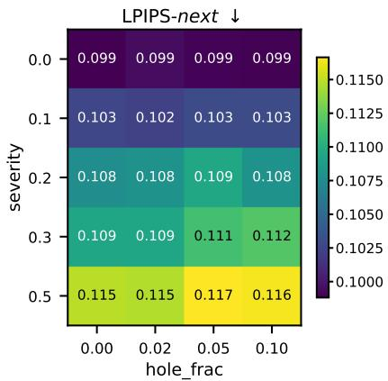

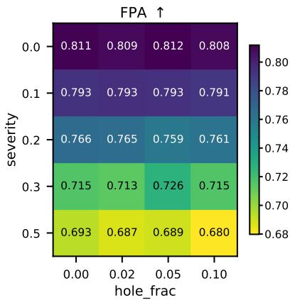

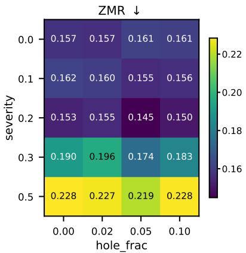  
Figure 9. Depth Corruption Sensitivity Grid. Full severity × hole-fraction sweep with $n = 2 0$ scenes per cell on MegaScene. Increasing depth-inaccuracy severity has a larger effect on LPIPS-next than varying the missing-pixel fraction, which changes LPIPS-next by less than 0.003 at fixed severity.

<table><tr><td rowspan="2"></td><td rowspan="2">Method</td><td colspan="2">Next</td><td colspan="2">First</td><td rowspan="2">Frob. Norm (Rotation) ↓</td><td rowspan="2">Rot. Angle Diff. ↓</td><td rowspan="2">Angular Cons. ↓</td><td rowspan="2">FPA↑</td><td rowspan="2">ZMR↓</td></tr><tr><td>LPIPS↓</td><td>CLIPSIM↑</td><td>LPIPS↓</td><td>CLIPSIM ↑</td></tr><tr><td rowspan="7">2mms</td><td>RealEstate10K</td><td></td><td></td><td></td><td></td><td></td><td></td><td></td><td></td><td></td></tr><tr><td>WAVE</td><td>0.2602</td><td>0.9642</td><td>0.5457</td><td>0.9062</td><td>1.5917</td><td>1.1739</td><td>17.326</td><td>0.412</td><td>0.288</td></tr><tr><td>CamTrol</td><td>0.1896</td><td>0.9748</td><td>0.5194</td><td>0.9042</td><td>1.9505</td><td>1.5693</td><td>12.7253</td><td>0.804</td><td>0.190</td></tr><tr><td>CamTrol++</td><td>0.1627</td><td>0.9828</td><td>0.5124</td><td>0.9190</td><td>1.2717</td><td>1.0188</td><td>8.6499</td><td>0.844</td><td>0.200</td></tr><tr><td>MegaScene</td><td></td><td></td><td></td><td></td><td></td><td></td><td></td><td></td><td></td></tr><tr><td>WAVE</td><td>0.2872</td><td>0.9464</td><td>0.5367</td><td>0.8592</td><td>1.6963</td><td>1.3086</td><td>17.4329</td><td>0.502</td><td>0.297</td></tr><tr><td>CamTrol</td><td>0.1480</td><td>0.9793</td><td>0.4615</td><td>0.9130</td><td>1.7500</td><td>1.4910</td><td>15.2466</td><td>0.842</td><td>0.293</td></tr><tr><td>CamTrol++</td><td></td><td>0.1408</td><td>0.9802</td><td>0.4403</td><td>0.9101</td><td>1.6517</td><td>1.3679</td><td>8.6465</td><td>0.847</td><td>0.288</td></tr></table>

Table 10. Extended CamTrol Comparison. We evaluate CamTrol using a split-trajectory strategy with two 14-frame segments to generate 28-frame sequences on RealEstate10K [63] and MegaScene [51]. CamTrol++ provides stronger temporal and camera trajectory consistency while substantially reducing runtime.
<table><tr><td rowspan="2">Color Model</td><td colspan="2">Next</td><td colspan="2">First</td></tr><tr><td> $\overline { { \mathrm { { L P I P S } \downarrow } } }$ </td><td>CLIPSIM ↑</td><td>LPIPS↓</td><td>CLIPSIM ↑</td></tr><tr><td>MegaScene</td><td></td><td></td><td></td><td></td></tr><tr><td>RGB</td><td>0.4382</td><td>0.9001</td><td>0.0800</td><td>0.9875</td></tr><tr><td>HSV</td><td>0.4456</td><td>0.8972</td><td>0.0817</td><td>0.9872</td></tr><tr><td>LAB</td><td>0.4340</td><td>0.9060</td><td>0.0796</td><td>0.9880</td></tr></table>

<table><tr><td rowspan="2">Interpolation</td><td colspan="2">Next</td><td colspan="2">First</td><td rowspan="2">Time (sec./frame)</td></tr><tr><td>LPIPS↓</td><td>CLIPSIM ↑</td><td>LPIPS ↓</td><td>CLIPSIM ↑</td></tr><tr><td>MegaScene</td><td></td><td></td><td></td><td></td><td></td></tr><tr><td>CamTrol</td><td>0.4340</td><td>0.9067</td><td>0.0800</td><td>0.9879</td><td>5.714</td></tr><tr><td>CamTrol++</td><td>0.4340</td><td>0.9060</td><td>0.0796</td><td>0.9880</td><td>1.357</td></tr></table>

Table 11. Color Matching and Interpolation Analysis. (Left) Effect of different color spaces for appearance correction. LAB provides the best overall perceptual consistency among the tested choices. (Right) Comparison between the linear interpolation used in CamTrol [23] and our splatting-based warping. Perceptual quality remains comparable, while the splatting-based implementation reduces warping time from 5.71 s/frame to 1.36 s/frame, giving a 4.2× speedup for this stage.

better perceptual similarity.

Geometric Background. Given a point X in 3D, its projection on the image formed by multiple cameras can be given as:

$$
x _ { 1 } = P _ { 1 } X \quad x _ { 2 } = P _ { 2 } X , \quad \ldots \quad x _ { M } = P _ { M } X\tag{2}
$$

where $P _ { 1 } , P _ { 2 } , . . . , P _ { M }$ are $3 \times 4$ projection matrices. If we pick two images side by side, say $I _ { 1 }$ captured from camera $C _ { 1 }$ using projection matrix $P _ { 1 }$ and $I _ { 2 }$ captured from camera

$C _ { 2 }$ using projection matrix $P _ { 2 } ,$ , the epipolar constraint is defined as:

$$
x _ { 2 } ^ { T } F x _ { 1 } = 0\tag{3}
$$

Here, F (Fundamental matrix) encodes the relative pose, i.e., rotation, translation, and camera intrinsics up to a scale. Every point $x _ { 1 }$ in the first view defines an epipolar line $l _ { 2 } = F x _ { 1 }$ in the second view, and the corresponding point $x _ { 2 }$ must lie exactly on that line if the geometry is perfect [20].

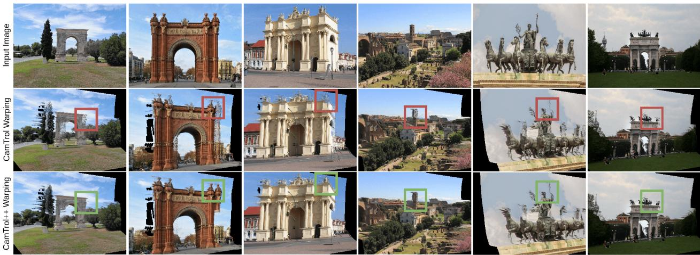

Figure 10. Warping Effect. The figure shows the effect of using the linear interpolation-based warping method used by CamTrol [23] and our proposed forward splatting-based warping.  
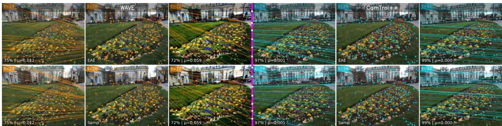  
Figure 11. Geometric Consistency Visualization. We visualize feature tracks between frames to assess geometric stability. (Left) WAVE: The feature tracks (cyan) are geometrically inconsistent, as shown by the chaotic lines, low alignment score (70 − 73%), and high error. (Right) CamTrol++: Our method produces highly consistent and parallel feature tracks (purple) that respect the scene’s perspective. This is consistent with the measured alignment scores of 96 − 99% and low error (µ = 0.001).

Epipolar Alignment Error (EAE). The Epipolar Alignment Error measures how well the correspondences between two views follow the epipolar geometry. For each pair of matched points $( x _ { 1 } , x _ { 2 } )$ , we compute the average perpendicular distance to their epipolar lines:

$$
\begin{array} { r } { d _ { \mathrm { { E A E } } } ( x _ { 1 } , x _ { 2 } ; F ) = \cfrac { 1 } { 2 } \left( \cfrac { | x _ { 2 } ^ { T } F x _ { 1 } | } { \sqrt { ( F x _ { 1 } ) _ { 1 } ^ { 2 } + ( F x _ { 1 } ) _ { 2 } ^ { 2 } } } \right. } \\ { \phantom { \times } + \left. \cfrac { | x _ { 2 } ^ { T } F x _ { 1 } | } { \sqrt { ( F ^ { T } x _ { 2 } ) _ { 1 } ^ { 2 } + ( F ^ { T } x _ { 2 } ) _ { 2 } ^ { 2 } } } \right) } \end{array}\tag{4}
$$

Lower values indicate that the corresponding points lie closer to their epipolar lines, implying stronger geometric alignment between views. All values are normalized by the image diagonal for scale invariance.

Sampson Distance. The Sampson Distance provides a firstorder approximation of the true reprojection error [20]. It refines the basic epipolar constraint by accounting for how sensitive the constraint is to small coordinate changes:

$$
\begin{array} { r l r } & { } & { d _ { \mathrm { S a m p s o n } } ( x _ { 1 } , x _ { 2 } ; F ) = ( x _ { 2 } ^ { T } F x _ { 1 } ) ^ { 2 } \bigg ( ( F x _ { 1 } ) _ { 1 } ^ { 2 } + ( F x _ { 1 } ) _ { 2 } ^ { 2 } + } \\ & { } & { \left( F ^ { T } x _ { 2 } ) _ { 1 } ^ { 2 } + ( F ^ { T } x _ { 2 } ) _ { 2 } ^ { 2 } \right) ^ { - 1 } } \end{array}\tag{5}
$$

It measures the minimum perturbation required to satisfy the epipolar constraint. Lower values correspond to better pose consistency between the two views. Both EAE and Sampson Distance are computed on held-out correspondences not used to estimate F and are averaged across frame pairs.

Flow-to-Pose Agreement (FPA). We additionally define Flow Consistency and Zero-Motion Ratio (ZMR) from dense optical flow estimated using RAFT [49]. It measures the temporal smoothness of motion using optical flow between consecutive frames. Let $F _ { t }$ denote the flow between frames $I _ { t }$ and $I _ { t + 1 }$ . We compute two consistency measures:

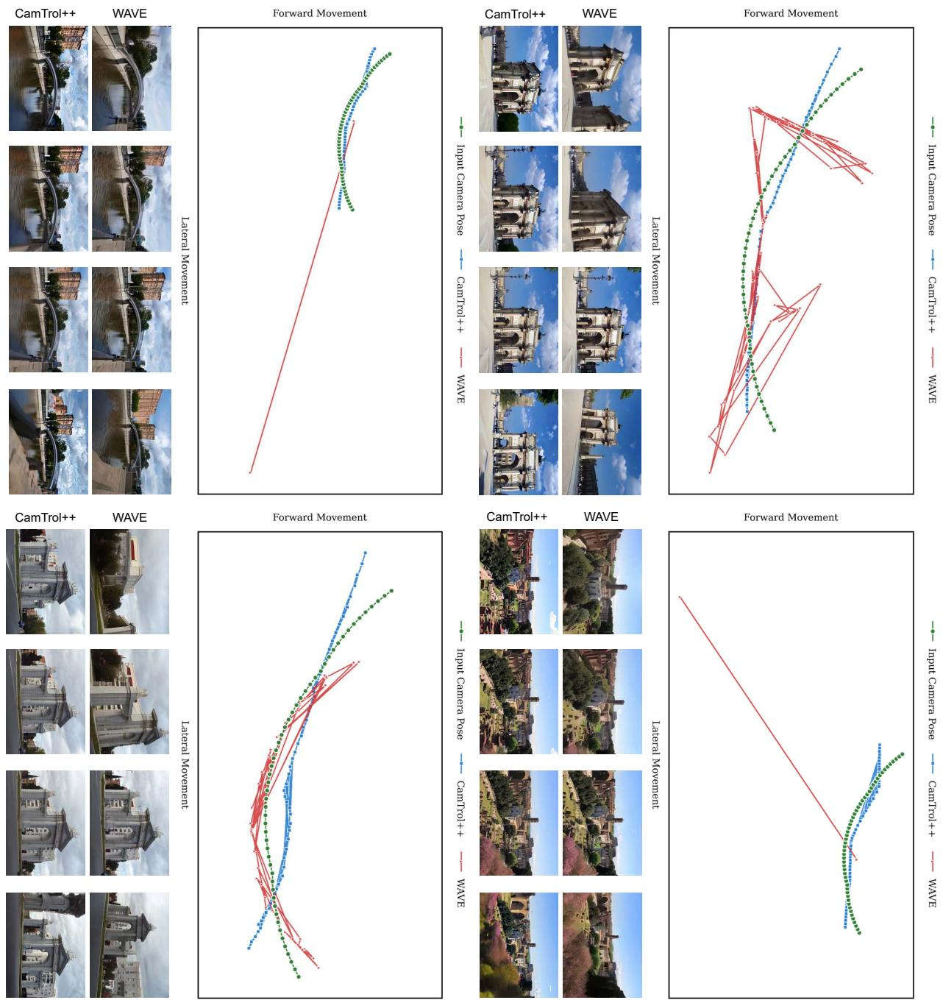  
Figure 12. Camera Trajectory. Comparison between the ground-truth (GT) camera trajectory and the predicted camera poses estimated from generated videos using $\mathrm { C O L M A P } \left[ 4 4 , 4 5 \right]$ . Each curve shows the normalized translation parameters (x, z) for a scene from MegaScene [51]. For clarity, height variation is omitted as all poses are normalized to a common scale. CamTrol++ produces trajectories that align more closely with the ground truth, showing stable and consistent camera motion.

$$
\mathrm { F P A } _ { \mathrm { d i r } } = \frac { 1 } { N - 2 } \sum _ { t = 1 } ^ { N - 2 } \frac { 1 } { | \Omega | } \sum _ { p \in \Omega } \frac { F _ { t } ( p ) \cdot F _ { t + 1 } ( p ) } { | F _ { t } ( p ) | _ { 2 } | F _ { t + 1 } ( p ) | _ { 2 } + \epsilon } ,\tag{6}
$$

$$
\mathrm { F P A } _ { \mathrm { m a g } } = 1 - \frac { 1 } { N - 2 } \sum _ { t = 1 } ^ { N - 2 } \frac { 1 } { | \Omega | } \sum _ { p \in \Omega } \frac { | | F _ { t } | _ { 2 } - | F _ { t + 1 } | _ { 2 } | } { | F _ { t } | _ { 2 } + | F _ { t + 1 } | _ { 2 } + \epsilon } .\tag{7}
$$

Here, Ω denotes the set of all pixel coordinates (the image domain), and |Ω| is the total number of pixels used to normalize the average across the frame. Directional consistency $\mathrm { ( F P A _ { d i r } ) }$ checks whether motion directions stay consistent, and magnitude consistency $\mathrm { ( F P A _ { m a g } ) }$ ensures the overall motion strength is smooth. The final score is the mean of both terms:

Input View

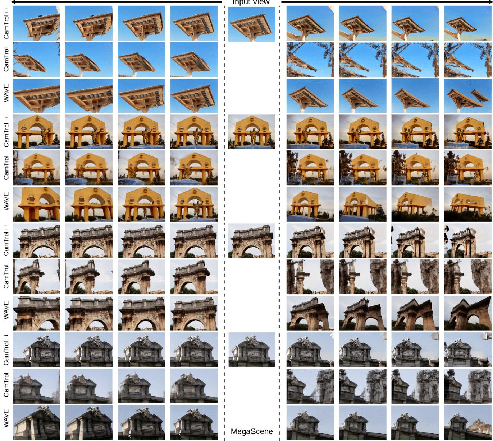  
Figure 13. Qualitative Result. Figure illustrates more qualitative results on the MegaScene dataset [51].

$$
\mathrm { F P A } = \frac { 1 } { 2 } ( \mathrm { F P A } _ { \mathrm { d i r } } + \mathrm { F P A } _ { \mathrm { m a g } } ) .\tag{8}
$$

A higher FPA (close to 1) indicates stable and coherent motion, while a lower value suggests flicker or inconsistent movement across time.

Zero Motion Ratio (ZMR). It measures how much of the image remains nearly static between frames. Given the optical flow $F _ { t }$ between $I _ { t }$ and $I _ { t + 1 }$

$$
\mathrm { Z M R } = \frac { 1 } { | \Omega | } \sum _ { p \in \Omega } \mathbf { 1 } ( | F _ { t } ( p ) | < \tau ) ,\tag{9}
$$

where $\tau$ is a small threshold (typically 0.5–1 pixel). A high ZMR means large regions have little to no motion (frozen frames), while a low ZMR indicates healthy camera movement. ZMR is averaged across all frame pairs, and together with FPA, provides a camera-agnostic measure of motion realism.

Summary. EAE and Sampson Distance evaluate geometric consistency using estimated camera relations, while FPA and ZMR assess temporal motion directly from the video. Together, these metrics capture both spatial and temporal stability of generated sequences without requiring groundtruth 3D geometry.

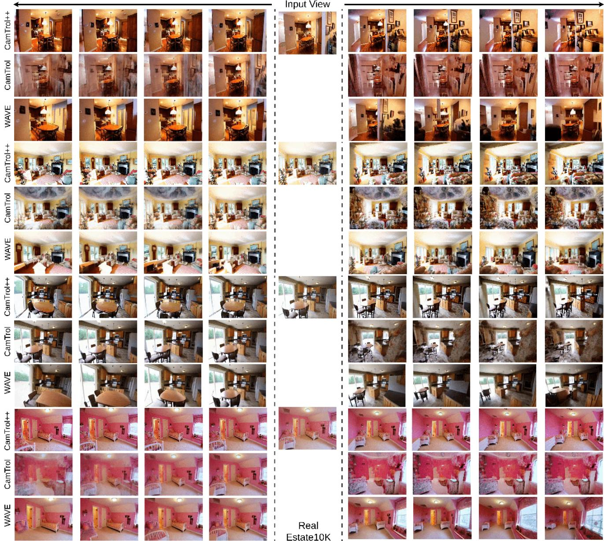  
Figure 14. Qualitative Result. Figure illustrates more qualitative results on the RealEstate10k [63].

## 11. Camera Parameter Visualization

We visualize the recovered camera trajectories used in the camera accuracy evaluation described in the main paper. For each generated sequence, we estimate camera poses using COLMAP [44, 45] and compare them with the corresponding ground-truth orbital camera trajectory. Figure 12 shows the normalized camera translations in the x–z plane for representative scenes from MegaScene [37]. Since the poses are scale-normalized, vertical variation is minimal and therefore excluded for clarity following WAVE [37].

CamTrol++ closely follows the ground-truth trajectory, indicating that the generated views maintain consistent motion across frames. In contrast, trajectories obtained from

WAVE [37] methods exhibit greater deviation and irregular curvature, reflecting instability in the estimated camera poses. These results qualitatively support the quantitative metrics (Frobenius Norm, Rotation Angle Difference, and Angular Consistency) reported in the main paper, confirming that camera-accurate synthesis correlates with view-consistent generation.

## 12. Additional Results and Details

The multi-view generated by our method is coherent and consistent. Further, we have shown additional results in the Figure [13,14,15] on complex camera motion, including dolly zoom-in, zoom-out, wavy, and it also shows some failed cases. Figure 15 also provides applicationoriented qualitative results on stylized scenes. We use Style-NeRF2NeRF [18] to generate the stylized inputs and then apply the same camera-controlled generation pipeline.

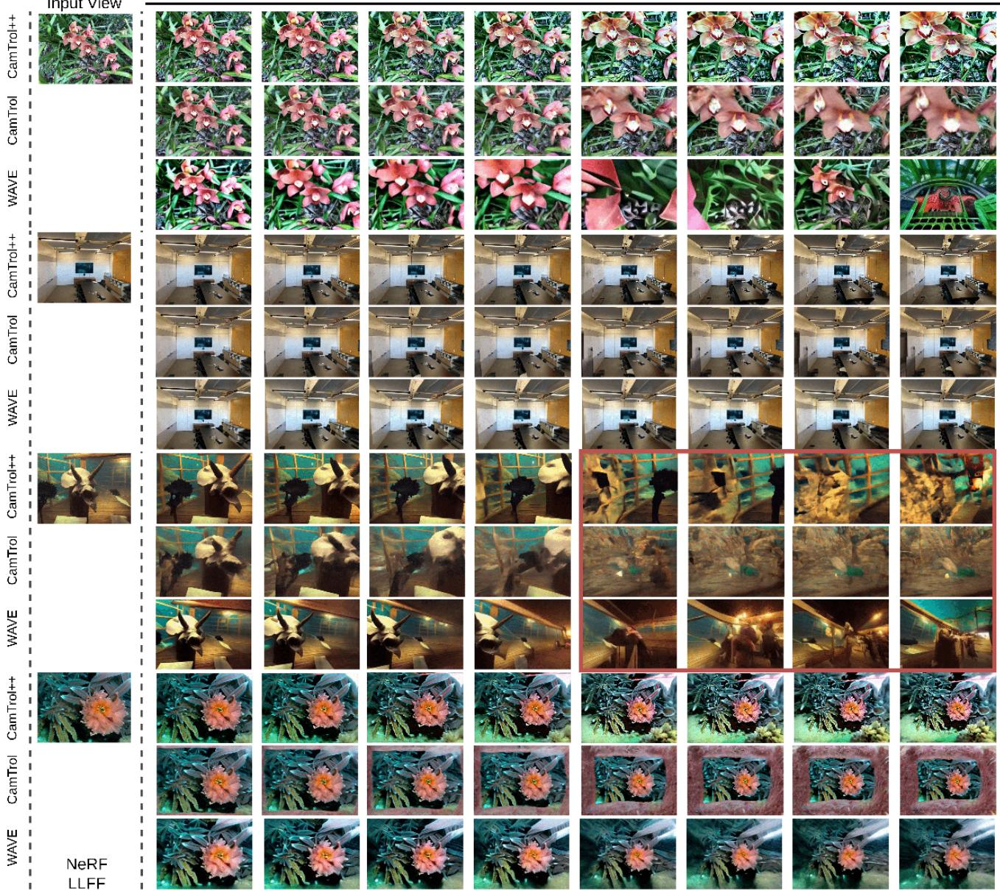  
Figure 15. Qualitative Result. Additional results on the NeRF-LLFF dataset [34] with complex camera motion and scene stylization. Across different scenes, CamTrol++ maintains sharper structure and more stable motion than CamTrol [23] and WAVE [37]. We have also shown a failure case in which depth ambiguity may cause noticeable distortion across all training-free methods.